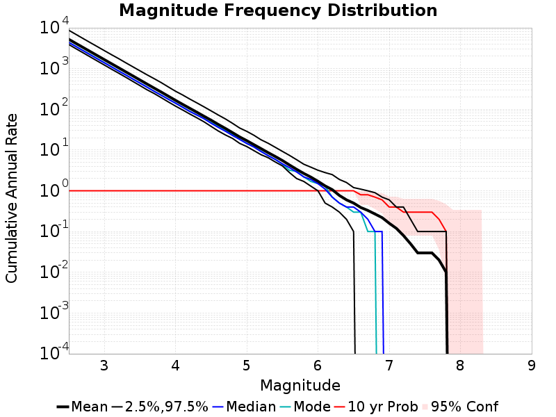
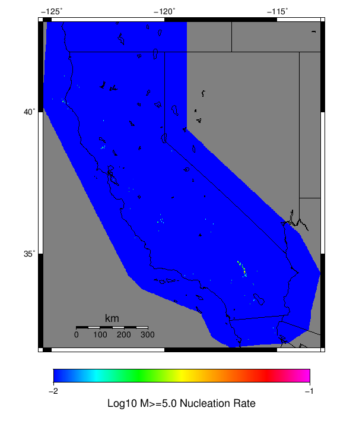

# Spontaneous/Historical ETAS Simulation Results

|   | Spontaneous/Historical ETAS Simulation |
|-----|-----|
| Num Simulations | 10 |
| Start Time | 1992/06/28 11:57:35 UTC |
| Start Time Epoch Milliseconds | 709732655000 |
| Duration | 10 Years |
| Includes Spontaneous? | true |
| Trigger Ruptures | *(none)* |
| Historical Ruptures | 220 Trigger Ruptures |
|   | First: M7.6 at 1872/03/26 10:31:39 UTC |
|   | Last: M7.28 at 1992/06/28 11:57:34 UTC |
|   | Largest: M7.8 at 1906/04/18 13:12:21 UTC |

## Table Of Contents

* [Magnitude Frequency Distribution](#magnitude-frequency-distribution)
* [Section Participation](#section-participation)
* [Gridded Nucleation](#gridded-nucleation)
* [JSON Input File](#json-input-file)

## Magnitude Frequency Distribution
*[(top)](#table-of-contents)*

**Legend**
* **Mean** (thick black line): mean annual rate across all 10 catalogs
* **2.5%,97.5%** (thin black lines): annual rate percentiles across all 10 catalogs
* **Median** (thin blue line): median annual rate across all 10 catalogs
* **Mode** (thin cyan line): modal annual rate across all 10 catalogs (scaled to annualized value)
* **10 yr Probability** (thin red line): 10 year probability calculated as the fraction of catalogs with at least 1 occurrence
* **95% Conf** (light red shaded region): binomial 95% confidence bounds on probability



| Mag | Mean | 2.5 %ile | 97.5 %ile | Median | Mode | 10 yr Probability |
|-----|-----|-----|-----|-----|-----|-----|
| **M&ge;2.5** | 5237.390 | 3902.400 | 8721.700 | 4383.700 | 4417.300 | 1.000 |
| **M&ge;2.6** | 4159.700 | 3082.900 | 6917.800 | 3480.400 | 3515.800 | 1.000 |
| **M&ge;2.7** | 3305.000 | 2448.600 | 5486.600 | 2759.500 | 2793.900 | 1.000 |
| **M&ge;2.8** | 2626.090 | 1940.000 | 4355.700 | 2188.500 | 2230.700 | 1.000 |
| **M&ge;2.9** | 2087.250 | 1538.000 | 3469.600 | 1737.300 | 1770.200 | 1.000 |
| **M&ge;3** | 1658.540 | 1221.400 | 2757.900 | 1385.200 | 1400.900 | 1.000 |
| **M&ge;3.1** | 1318.000 | 969.300 | 2195.800 | 1100.000 | 1113.200 | 1.000 |
| **M&ge;3.2** | 1048.180 | 773.000 | 1757.800 | 873.000 | 881.300 | 1.000 |
| **M&ge;3.3** | 832.030 | 613.500 | 1391.100 | 697.200 | 702.200 | 1.000 |
| **M&ge;3.4** | 661.540 | 484.300 | 1107.400 | 553.800 | 554.400 | 1.000 |
| **M&ge;3.5** | 524.790 | 382.700 | 881.100 | 439.500 | 443.300 | 1.000 |
| **M&ge;3.6** | 416.650 | 301.400 | 702.400 | 348.900 | 352.600 | 1.000 |
| **M&ge;3.7** | 331.420 | 244.000 | 564.800 | 276.500 | 277.500 | 1.000 |
| **M&ge;3.8** | 264.550 | 192.700 | 450.900 | 220.600 | 223.300 | 1.000 |
| **M&ge;3.9** | 209.270 | 151.300 | 353.000 | 176.100 | 177.500 | 1.000 |
| **M&ge;4** | 165.970 | 119.800 | 277.700 | 141.100 | 141.600 | 1.000 |
| **M&ge;4.1** | 132.200 | 96.200 | 224.900 | 112.000 | 113.200 | 1.000 |
| **M&ge;4.2** | 105.800 | 76.700 | 178.600 | 88.400 | 89.800 | 1.000 |
| **M&ge;4.3** | 84.660 | 61.800 | 143.600 | 72.400 | 72.600 | 1.000 |
| **M&ge;4.4** | 67.530 | 49.300 | 114.900 | 58.700 | 59.000 | 1.000 |
| **M&ge;4.5** | 53.970 | 38.000 | 91.400 | 45.500 | 47.100 | 1.000 |
| **M&ge;4.6** | 42.540 | 29.400 | 72.500 | 36.000 | 37.800 | 1.000 |
| **M&ge;4.7** | 33.970 | 23.500 | 58.100 | 29.000 | 30.100 | 1.000 |
| **M&ge;4.8** | 26.760 | 19.300 | 45.300 | 22.800 | 24.300 | 1.000 |
| **M&ge;4.9** | 21.020 | 14.600 | 34.800 | 18.300 | 18.300 | 1.000 |
| **M&ge;5** | 17.020 | 12.200 | 28.800 | 14.500 | 14.600 | 1.000 |
| **M&ge;5.1** | 13.580 | 9.700 | 23.100 | 11.900 | 12.000 | 1.000 |
| **M&ge;5.2** | 10.850 | 7.700 | 17.900 | 9.200 | 9.400 | 1.000 |
| **M&ge;5.3** | 8.650 | 6.500 | 14.700 | 7.300 | 7.300 | 1.000 |
| **M&ge;5.4** | 6.960 | 5.100 | 11.700 | 5.900 | 5.900 | 1.000 |
| **M&ge;5.5** | 5.540 | 4.100 | 9.300 | 4.600 | 4.500 | 1.000 |
| **M&ge;5.6** | 4.300 | 2.800 | 7.400 | 3.700 | 3.200 | 1.000 |
| **M&ge;5.7** | 3.370 | 2.000 | 5.800 | 2.900 | 3.000 | 1.000 |
| **M&ge;5.8** | 2.670 | 1.700 | 4.500 | 2.200 | 2.200 | 1.000 |
| **M&ge;5.9** | 2.170 | 1.300 | 3.800 | 1.900 | 1.700 | 1.000 |
| **M&ge;6** | 1.710 | 1.000 | 3.200 | 1.500 | 1.500 | 1.000 |
| **M&ge;6.1** | 1.320 | 0.500 | 2.800 | 1.100 | 1.300 | 1.000 |
| **M&ge;6.2** | 1.070 | 0.400 | 2.500 | 0.700 | 0.700 | 1.000 |
| **M&ge;6.3** | 0.770 | 0.300 | 1.900 | 0.500 | 0.500 | 1.000 |
| **M&ge;6.4** | 0.600 | 0.200 | 1.600 | 0.400 | 0.400 | 1.000 |
| **M&ge;6.5** | 0.500 | 0.100 | 1.200 | 0.400 | 0.300 | 1.000 |
| **M&ge;6.6** | 0.390 | 0.000 | 1.100 | 0.300 | 0.300 | 0.800 |
| **M&ge;6.7** | 0.330 | 0.000 | 1.000 | 0.200 | 0.100 | 0.800 |
| **M&ge;6.8** | 0.270 | 0.000 | 0.900 | 0.100 | 0.100 | 0.700 |
| **M&ge;6.9** | 0.220 | 0.000 | 0.700 | 0.100 | 0.000 | 0.600 |
| **M&ge;7** | 0.160 | 0.000 | 0.600 | 0.000 | 0.000 | 0.400 |
| **M&ge;7.1** | 0.120 | 0.000 | 0.400 | 0.000 | 0.000 | 0.400 |
| **M&ge;7.2** | 0.080 | 0.000 | 0.400 | 0.000 | 0.000 | 0.300 |
| **M&ge;7.3** | 0.050 | 0.000 | 0.200 | 0.000 | 0.000 | 0.300 |
| **M&ge;7.4** | 0.030 | 0.000 | 0.100 | 0.000 | 0.000 | 0.300 |
| **M&ge;7.5** | 0.030 | 0.000 | 0.100 | 0.000 | 0.000 | 0.300 |
| **M&ge;7.6** | 0.030 | 0.000 | 0.100 | 0.000 | 0.000 | 0.300 |
| **M&ge;7.7** | 0.020 | 0.000 | 0.100 | 0.000 | 0.000 | 0.200 |
| **M&ge;7.8** | 0.010 | 0.000 | 0.100 | 0.000 | 0.000 | 0.100 |
| **M&ge;7.9** | 0.000 | 0.000 | 0.000 | 0.000 | 0.000 | 0.000 |
| **M&ge;8** | 0.000 | 0.000 | 0.000 | 0.000 | 0.000 | 0.000 |
| **M&ge;8.1** | 0.000 | 0.000 | 0.000 | 0.000 | 0.000 | 0.000 |
| **M&ge;8.2** | 0.000 | 0.000 | 0.000 | 0.000 | 0.000 | 0.000 |
| **M&ge;8.3** | 0.000 | 0.000 | 0.000 | 0.000 | 0.000 | 0.000 |
| **M&ge;8.4** | 0.000 | 0.000 | 0.000 | 0.000 | 0.000 | 0.000 |
| **M&ge;8.5** | 0.000 | 0.000 | 0.000 | 0.000 | 0.000 | 0.000 |
| **M&ge;8.6** | 0.000 | 0.000 | 0.000 | 0.000 | 0.000 | 0.000 |
| **M&ge;8.7** | 0.000 | 0.000 | 0.000 | 0.000 | 0.000 | 0.000 |
| **M&ge;8.8** | 0.000 | 0.000 | 0.000 | 0.000 | 0.000 | 0.000 |
| **M&ge;8.9** | 0.000 | 0.000 | 0.000 | 0.000 | 0.000 | 0.000 |
| **M&ge;9** | 0.000 | 0.000 | 0.000 | 0.000 | 0.000 | 0.000 |

## Section Participation
*[(top)](#table-of-contents)*

No supra-seismogenic ruptures in any catalog
## Gridded Nucleation
*[(top)](#table-of-contents)*

| Min Mag | Complete Catalog (including spontaneous) |
|-----|-----|
| **M&ge;2.5** |  |
| **M&ge;5** |  |
| **M&ge;6** |  |
| **M&ge;7** |  |

## JSON Input File
*[(top)](#table-of-contents)*

```
{
  "numSimulations": 10,
  "duration": 10.0,
  "startTimeMillis": 709732655000,
  "includeSpontaneous": true,
  "binaryOutput": true,
  "binaryOutputFilters": [
    {
      "prefix": "results_complete",
      "descendantsOnly": false
    },
    {
      "prefix": "results_m5_preserve_chain",
      "minMag": 5.0,
      "preserveChainBelowMag": true,
      "descendantsOnly": false
    }
  ],
  "forceRecalc": false,
  "simulationName": "Spontaneous/Historical ETAS Simulation",
  "numRetries": 3,
  "outputDir": "/tmp/etas_debug/output_gridded",
  "triggerCatalog": "$ETAS_LAUNCHER/inputs/u3_historical_catalog.txt",
  "triggerCatalogSurfaceMappings": "$ETAS_LAUNCHER/inputs/u3_historical_catalog_finite_fault_mappings.xml",
  "cacheDir": "$ETAS_LAUNCHER/inputs/cache_fm3p1_ba",
  "fssFile": "$ETAS_LAUNCHER/inputs/2013_05_10-ucerf3p3-production-10runs_COMPOUND_SOL_FM3_1_SpatSeisU3_MEAN_BRANCH_AVG_SOL.zip",
  "probModel": "FULL_TD",
  "applySubSeisForSupraNucl": true,
  "totRateScaleFactor": 1.14,
  "gridSeisCorr": true,
  "timeIndependentERF": false,
  "griddedOnly": true,
  "imposeGR": false,
  "includeIndirectTriggering": true,
  "gridSeisDiscr": 0.1
}
```

