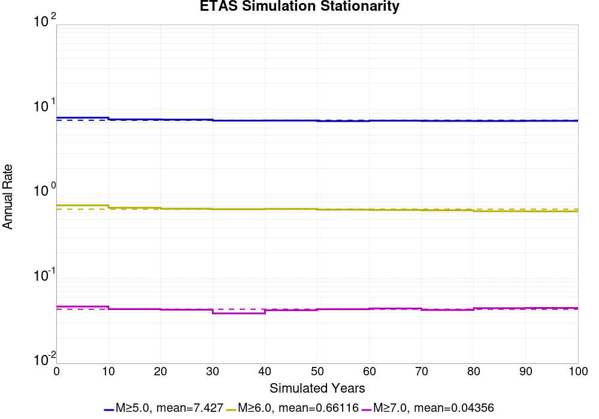
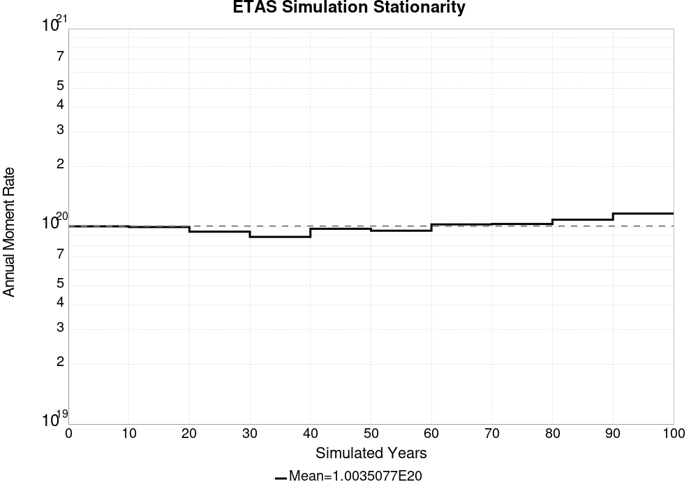

# Historical1919 Results

|   | Historical1919 |
|-----|-----|
| Num Simulations | 1000 |
| Start Time | 1919/01/01 00:00:00 UTC |
| Start Time Epoch Milliseconds | -1609459200000 |
| Duration | 100 Years |
| Includes Spontaneous? | true |
| Trigger Ruptures | *(none)* |
| Historical Ruptures | 165 Trigger Ruptures |
|   | First: M7.3 at 1852/01/05 04:40:39 UTC |
|   | Last: M6.5 at 1918/07/15 00:24:39 UTC |
|   | Largest: M7.9 at 1857/01/09 16:25:39 UTC |

## Table Of Contents

* [Magnitude Frequency Distribution](#magnitude-frequency-distribution)
* [Long Term Rate Variability](#long-term-rate-variability)
  * [80 Year Variability](#80-year-variability)
  * [28 Year Variability](#28-year-variability)
  * [Variability Duration Dependence](#variability-duration-dependence)
* [Simulation Stationarity](#simulation-stationarity)
* [Section Participation](#section-participation)
  * [Section Participation Plots](#section-participation-plots)
  * [Supra-Seismogenic Parent Sections Table](#supra-seismogenic-parent-sections-table)
  * [M≥6.5 Parent Sections Table](#m65-parent-sections-table)
  * [M≥7 Parent Sections Table](#m7-parent-sections-table)
  * [M≥7.5 Parent Sections Table](#m75-parent-sections-table)
  * [M≥8 Parent Sections Table](#m8-parent-sections-table)
* [Gridded Nucleation](#gridded-nucleation)
* [JSON Input File](#json-input-file)

## Magnitude Frequency Distribution
*[(top)](#table-of-contents)*

**Legend**
* **Mean** (thick black line): mean annual rate across all 1000 catalogs
* **2.5%,97.5%** (thin black lines): annual rate percentiles across all 1000 catalogs
* **Median** (thin blue line): median annual rate across all 1000 catalogs
* **Mode** (thin cyan line): modal annual rate across all 1000 catalogs (scaled to annualized value)
* **Fault System Solution** (brown line): long-term MFD from the UCERF3 fault system solution
* **100 yr Probability** (thin red line): 100 year probability calculated as the fraction of catalogs with at least 1 occurrence
* **100 yr Supraseismogenic Probability** (thin dashed red line): same as above, but only for supraseismogenic ruptures on explicitly modeled UCERF3 faults
* **95% Conf** (light red shaded region): binomial 95% confidence bounds on probability


| Mag | Mean | 2.5 %ile | 97.5 %ile | Median | Mode | Long-Term Fault System Solution | 100 yr Probability | 100 yr Prob 95% Conf | 100 yr Supra-Seis Prob |
|-----|-----|-----|-----|-----|-----|-----|-----|-----|-----|
| **M&ge;5** | 7.427 | 6.100 | 9.160 | 7.360 | 7.280 | 8.609 | 1.000 (100.00%) | [99.52% 100.00%] | 1.000 (100.00%) |
| **M&ge;5.1** | 5.872 | 4.770 | 7.220 | 5.820 | 5.700 | 6.830 | 1.000 (100.00%) | [99.52% 100.00%] | 1.000 (100.00%) |
| **M&ge;5.2** | 4.646 | 3.760 | 5.730 | 4.600 | 4.260 | 5.417 | 1.000 (100.00%) | [99.52% 100.00%] | 1.000 (100.00%) |
| **M&ge;5.3** | 3.666 | 2.940 | 4.560 | 3.640 | 3.430 | 4.295 | 1.000 (100.00%) | [99.52% 100.00%] | 1.000 (100.00%) |
| **M&ge;5.4** | 2.890 | 2.280 | 3.610 | 2.860 | 2.710 | 3.404 | 1.000 (100.00%) | [99.52% 100.00%] | 1.000 (100.00%) |
| **M&ge;5.5** | 2.278 | 1.760 | 2.860 | 2.260 | 2.270 | 2.696 | 1.000 (100.00%) | [99.52% 100.00%] | 1.000 (100.00%) |
| **M&ge;5.6** | 1.789 | 1.370 | 2.290 | 1.770 | 1.870 | 2.133 | 1.000 (100.00%) | [99.52% 100.00%] | 1.000 (100.00%) |
| **M&ge;5.7** | 1.399 | 1.050 | 1.800 | 1.390 | 1.320 | 1.686 | 1.000 (100.00%) | [99.52% 100.00%] | 1.000 (100.00%) |
| **M&ge;5.8** | 1.090 | 0.810 | 1.420 | 1.080 | 1.000 | 1.331 | 1.000 (100.00%) | [99.52% 100.00%] | 1.000 (100.00%) |
| **M&ge;5.9** | 0.833 | 0.600 | 1.100 | 0.820 | 0.760 | 1.036 | 1.000 (100.00%) | [99.52% 100.00%] | 1.000 (100.00%) |
| **M&ge;6** | 0.661 | 0.460 | 0.890 | 0.650 | 0.590 | 0.836 | 1.000 (100.00%) | [99.52% 100.00%] | 1.000 (100.00%) |
| **M&ge;6.1** | 0.509 | 0.340 | 0.700 | 0.500 | 0.500 | 0.660 | 1.000 (100.00%) | [99.52% 100.00%] | 1.000 (100.00%) |
| **M&ge;6.2** | 0.397 | 0.260 | 0.550 | 0.390 | 0.400 | 0.529 | 1.000 (100.00%) | [99.52% 100.00%] | 1.000 (100.00%) |
| **M&ge;6.3** | 0.311 | 0.200 | 0.450 | 0.310 | 0.310 | 0.420 | 1.000 (100.00%) | [99.52% 100.00%] | 1.000 (100.00%) |
| **M&ge;6.4** | 0.238 | 0.140 | 0.350 | 0.230 | 0.210 | 0.332 | 1.000 (100.00%) | [99.52% 100.00%] | 1.000 (100.00%) |
| **M&ge;6.5** | 0.181 | 0.090 | 0.280 | 0.180 | 0.150 | 0.260 | 1.000 (100.00%) | [99.52% 100.00%] | 1.000 (100.00%) |
| **M&ge;6.6** | 0.138 | 0.060 | 0.220 | 0.140 | 0.150 | 0.205 | 1.000 (100.00%) | [99.52% 100.00%] | 1.000 (100.00%) |
| **M&ge;6.7** | 0.103 | 0.040 | 0.170 | 0.100 | 0.100 | 0.160 | 1.000 (100.00%) | [99.52% 100.00%] | 1.000 (100.00%) |
| **M&ge;6.8** | 0.078 | 0.030 | 0.140 | 0.080 | 0.080 | 0.127 | 1.000 (100.00%) | [99.52% 100.00%] | 0.998 (99.80%) |
| **M&ge;6.9** | 0.058 | 0.020 | 0.110 | 0.060 | 0.060 | 0.100 | 0.998 (99.80%) | [99.20% 99.97%] | 0.997 (99.70%) |
| **M&ge;7** | 0.044 | 0.010 | 0.090 | 0.040 | 0.040 | 0.078 | 0.994 (99.40%) | [98.63% 99.76%] | 0.987 (98.70%) |
| **M&ge;7.1** | 0.032 | 0.000 | 0.070 | 0.030 | 0.020 | 0.060 | 0.966 (96.60%) | [95.23% 97.60%] | 0.952 (95.20%) |
| **M&ge;7.2** | 0.022 | 0.000 | 0.050 | 0.020 | 0.020 | 0.045 | 0.904 (90.40%) | [88.36% 92.12%] | 0.884 (88.40%) |
| **M&ge;7.3** | 0.017 | 0.000 | 0.050 | 0.010 | 0.010 | 0.035 | 0.823 (82.30%) | [79.76% 84.59%] | 0.811 (81.10%) |
| **M&ge;7.4** | 0.011 | 0.000 | 0.040 | 0.010 | 0.010 | 0.027 | 0.691 (69.10%) | [66.12% 71.93%] | 0.680 (68.00%) |
| **M&ge;7.5** | 7.02E-3 | 0.000 | 0.030 | 0.010 | 0.000 | 0.019 | 0.510 (51.00%) | [47.85% 54.14%] | 0.506 (50.60%) |
| **M&ge;7.6** | 4.07E-3 | 0.000 | 0.020 | 0.000 | 0.000 | 0.014 | 0.343 (34.30%) | [31.37% 37.35%] | 0.340 (34.00%) |
| **M&ge;7.7** | 2.17E-3 | 0.000 | 0.010 | 0.000 | 0.000 | 9.58E-3 | 0.201 (20.10%) | [17.69% 22.75%] | 0.199 (19.90%) |
| **M&ge;7.8** | 1.06E-3 | 0.000 | 0.010 | 0.000 | 0.000 | 6.19E-3 | 0.105 (10.50%) | [8.70% 12.61%] | 0.104 (10.40%) |
| **M&ge;7.9** | 4.80E-4 | 0.000 | 0.010 | 0.000 | 0.000 | 3.51E-3 | 0.048 (4.80%) | [3.60% 6.36%] | 0.048 (4.80%) |
| **M&ge;8** | 2.60E-4 | 0.000 | 0.010 | 0.000 | 0.000 | 2.03E-3 | 0.026 (2.60%) | [1.74% 3.84%] | 0.026 (2.60%) |
| **M&ge;8.1** | 8.00E-5 | 0.000 | 0.000 | 0.000 | 0.000 | 1.02E-3 | 8.00E-3 (0.80%) | [0.37% 1.64%] | 8.00E-3 (0.80%) |
| **M&ge;8.2** | 1.00E-5 | 0.000 | 0.000 | 0.000 | 0.000 | 4.48E-4 | 1.00E-3 (0.10%) | [0.01% 0.65%] | 1.00E-3 (0.10%) |
| **M&ge;8.3** | 0.000 | 0.000 | 0.000 | 0.000 | 0.000 | 1.02E-4 | 0.000 (0.00%) | [0.00% 0.48%] | 0.000 (0.00%) |
| **M&ge;8.4** | 0.000 | 0.000 | 0.000 | 0.000 | 0.000 | 0.000 | 0.000 (0.00%) | [0.00% 0.48%] | 0.000 (0.00%) |
| **M&ge;8.5** | 0.000 | 0.000 | 0.000 | 0.000 | 0.000 | 0.000 | 0.000 (0.00%) | [0.00% 0.48%] | 0.000 (0.00%) |
| **M&ge;8.6** | 0.000 | 0.000 | 0.000 | 0.000 | 0.000 | 0.000 | 0.000 (0.00%) | [0.00% 0.48%] | 0.000 (0.00%) |
| **M&ge;8.7** | 0.000 | 0.000 | 0.000 | 0.000 | 0.000 | 0.000 | 0.000 (0.00%) | [0.00% 0.48%] | 0.000 (0.00%) |
| **M&ge;8.8** | 0.000 | 0.000 | 0.000 | 0.000 | 0.000 | 0.000 | 0.000 (0.00%) | [0.00% 0.48%] | 0.000 (0.00%) |
| **M&ge;8.9** | 0.000 | 0.000 | 0.000 | 0.000 | 0.000 | 0.000 | 0.000 (0.00%) | [0.00% 0.48%] | 0.000 (0.00%) |
| **M&ge;9** | 0.000 | 0.000 | 0.000 | 0.000 | 0.000 | 0.000 | 0.000 (0.00%) | [0.00% 0.48%] | 0.000 (0.00%) |


## Long Term Rate Variability
*[(top)](#table-of-contents)*

### 80 Year Variability
*[(top)](#table-of-contents)*


[Download CSV Here](plots/long_term_var_80yr.csv)

| **Magnitude** | Mean | Median | Mode | Std. Dev. | 2.5 %-ile | 16 %-ile | 84 %-ile | 97.5 %-ile |
|-----|-----|-----|-----|-----|-----|-----|-----|-----|
| **5.0** | 7.4620876 | 7.375 | 7.2875 | 0.85022885 | 6.0 | 6.625 | 8.275 | 9.375 |
| **5.1** | 5.902075 | 5.825 | 5.8125 | 0.6827452 | 4.7 | 5.225 | 6.5625 | 7.35 |
| **5.2** | 4.668925 | 4.625 | 4.475 | 0.55877316 | 3.675 | 4.125 | 5.2125 | 5.9125 |
| **5.3** | 3.68455 | 3.65 | 3.675 | 0.4537163 | 2.8875 | 3.2375 | 4.1375 | 4.6625 |
| **5.4** | 2.90725 | 2.8625 | 2.725 | 0.36914673 | 2.2625 | 2.55 | 3.275 | 3.7 |
| **5.5** | 2.2929125 | 2.2625 | 2.4 | 0.30698317 | 1.75 | 1.9875 | 2.5875 | 2.975 |
| **5.6** | 1.802 | 1.7875 | 1.6625 | 0.25330576 | 1.3625 | 1.55 | 2.05 | 2.375 |
| **5.7** | 1.4112375 | 1.4 | 1.4125 | 0.21121627 | 1.0375 | 1.2 | 1.6125 | 1.875 |
| **5.8** | 1.101225 | 1.0875 | 1.075 | 0.17358913 | 0.8 | 0.9375 | 1.2625 | 1.475 |
| **5.9** | 0.8437125 | 0.8375 | 0.8125 | 0.14290622 | 0.5875 | 0.7 | 0.975 | 1.15 |
| **6.0** | 0.6701625 | 0.6625 | 0.6375 | 0.12238849 | 0.45 | 0.55 | 0.7875 | 0.925 |
| **6.1** | 0.514825 | 0.5125 | 0.525 | 0.09986507 | 0.3375 | 0.4125 | 0.6125 | 0.725 |
| **6.2** | 0.4016 | 0.4 | 0.425 | 0.08397695 | 0.25 | 0.3125 | 0.4875 | 0.575 |
| **6.3** | 0.3144125 | 0.3125 | 0.3375 | 0.0719848 | 0.1875 | 0.25 | 0.3875 | 0.475 |
| **6.4** | 0.239425 | 0.2375 | 0.2625 | 0.060511213 | 0.125 | 0.175 | 0.3 | 0.375 |
| **6.5** | 0.1817875 | 0.175 | 0.1875 | 0.053397316 | 0.0875 | 0.125 | 0.2375 | 0.3 |
| **6.6** | 0.139 | 0.1375 | 0.1375 | 0.045303836 | 0.0625 | 0.1 | 0.1875 | 0.2375 |
| **6.7** | 0.1037625 | 0.1 | 0.0875 | 0.03889971 | 0.0375 | 0.0625 | 0.1375 | 0.1875 |
| **6.8** | 0.0784 | 0.075 | 0.0625 | 0.033255678 | 0.025 | 0.05 | 0.1125 | 0.15 |
| **6.9** | 0.0582 | 0.05 | 0.05 | 0.027944319 | 0.0125 | 0.025 | 0.0875 | 0.125 |
| **7.0** | 0.0432125 | 0.0375 | 0.0375 | 0.023966614 | 0.0 | 0.025 | 0.0625 | 0.1 |
| **7.1** | 0.0317125 | 0.025 | 0.025 | 0.020389302 | 0.0 | 0.0125 | 0.05 | 0.075 |
| **7.2** | 0.021975 | 0.025 | 0.0125 | 0.01647648 | 0.0 | 0.0 | 0.0375 | 0.0625 |
| **7.3** | 0.0161625 | 0.0125 | 0.0125 | 0.013981857 | 0.0 | 0.0 | 0.025 | 0.05 |
| **7.4** | 0.011 | 0.0125 | 0.0 | 0.011602801 | 0.0 | 0.0 | 0.025 | 0.0375 |
| **7.5** | 0.0064875 | 0.0 | 0.0 | 0.008888537 | 0.0 | 0.0 | 0.0125 | 0.025 |
| **7.6** | 0.003625 | 0.0 | 0.0 | 0.006518004 | 0.0 | 0.0 | 0.0125 | 0.025 |
| **7.7** | 0.001875 | 0.0 | 0.0 | 0.004800716 | 0.0 | 0.0 | 0.0 | 0.0125 |
| **7.8** | 7.25E-4 | 0.0 | 0.0 | 0.0029217931 | 0.0 | 0.0 | 0.0 | 0.0125 |
| **7.9** | 2.875E-4 | 0.0 | 0.0 | 0.0018737913 | 0.0 | 0.0 | 0.0 | 0.0 |
| **8.0** | 1.875E-4 | 0.0 | 0.0 | 0.0015194057 | 0.0 | 0.0 | 0.0 | 0.0 |
| **8.1** | 5.0E-5 | 0.0 | 0.0 | 7.889867E-4 | 0.0 | 0.0 | 0.0 | 0.0 |
| **8.2** | 0.0 | 0.0 | 0.0 | 0.0 | 0.0 | 0.0 | 0.0 | 0.0 |
| **8.3** | 0.0 | 0.0 | 0.0 | 0.0 | 0.0 | 0.0 | 0.0 | 0.0 |
| **8.4** | 0.0 | 0.0 | 0.0 | 0.0 | 0.0 | 0.0 | 0.0 | 0.0 |
| **8.5** | 0.0 | 0.0 | 0.0 | 0.0 | 0.0 | 0.0 | 0.0 | 0.0 |
| **8.6** | 0.0 | 0.0 | 0.0 | 0.0 | 0.0 | 0.0 | 0.0 | 0.0 |
| **8.7** | 0.0 | 0.0 | 0.0 | 0.0 | 0.0 | 0.0 | 0.0 | 0.0 |
| **8.8** | 0.0 | 0.0 | 0.0 | 0.0 | 0.0 | 0.0 | 0.0 | 0.0 |
| **8.9** | 0.0 | 0.0 | 0.0 | 0.0 | 0.0 | 0.0 | 0.0 | 0.0 |
| **9.0** | 0.0 | 0.0 | 0.0 | 0.0 | 0.0 | 0.0 | 0.0 | 0.0 |

### 28 Year Variability
*[(top)](#table-of-contents)*


[Download CSV Here](plots/long_term_var_28yr.csv)

| **Magnitude** | Mean | Median | Mode | Std. Dev. | 2.5 %-ile | 16 %-ile | 84 %-ile | 97.5 %-ile |
|-----|-----|-----|-----|-----|-----|-----|-----|-----|
| **5.0** | 7.4490952 | 7.25 | 6.821429 | 1.3817428 | 5.321429 | 6.142857 | 8.714286 | 10.714286 |
| **5.1** | 5.8907976 | 5.75 | 5.821429 | 1.1203952 | 4.107143 | 4.857143 | 6.928571 | 8.535714 |
| **5.2** | 4.660131 | 4.535714 | 4.25 | 0.91660726 | 3.1785715 | 3.8214285 | 5.5 | 6.785714 |
| **5.3** | 3.6776786 | 3.5714285 | 3.392857 | 0.749879 | 2.4642856 | 2.9642856 | 4.357143 | 5.392857 |
| **5.4** | 2.900619 | 2.8214285 | 2.857143 | 0.614701 | 1.8928572 | 2.3214285 | 3.4642856 | 4.321429 |
| **5.5** | 2.2874048 | 2.2142856 | 2.0357144 | 0.51484066 | 1.4285715 | 1.7857143 | 2.7857144 | 3.4642856 |
| **5.6** | 1.7970357 | 1.75 | 1.6071428 | 0.4258742 | 1.0714285 | 1.3928572 | 2.2142856 | 2.75 |
| **5.7** | 1.4068333 | 1.3571428 | 1.3571428 | 0.35519862 | 0.8214286 | 1.0714285 | 1.75 | 2.2142856 |
| **5.8** | 1.097381 | 1.0714285 | 1.0 | 0.29551917 | 0.60714287 | 0.8214286 | 1.3928572 | 1.75 |
| **5.9** | 0.84010714 | 0.8214286 | 0.85714287 | 0.24280323 | 0.42857143 | 0.60714287 | 1.0714285 | 1.3571428 |
| **6.0** | 0.6674405 | 0.64285713 | 0.60714287 | 0.20702335 | 0.32142857 | 0.4642857 | 0.85714287 | 1.1071428 |
| **6.1** | 0.5129167 | 0.5 | 0.4642857 | 0.17181577 | 0.21428572 | 0.35714287 | 0.6785714 | 0.89285713 |
| **6.2** | 0.40038094 | 0.39285713 | 0.39285713 | 0.14498542 | 0.17857143 | 0.25 | 0.53571427 | 0.71428573 |
| **6.3** | 0.3135476 | 0.2857143 | 0.2857143 | 0.12441003 | 0.10714286 | 0.17857143 | 0.42857143 | 0.5714286 |
| **6.4** | 0.23903571 | 0.21428572 | 0.21428572 | 0.10333358 | 0.071428575 | 0.14285715 | 0.32142857 | 0.4642857 |
| **6.5** | 0.18139286 | 0.17857143 | 0.14285715 | 0.0896428 | 0.035714287 | 0.10714286 | 0.25 | 0.39285713 |
| **6.6** | 0.1387381 | 0.14285715 | 0.10714286 | 0.076047376 | 0.0 | 0.071428575 | 0.21428572 | 0.32142857 |
| **6.7** | 0.10352381 | 0.10714286 | 0.071428575 | 0.065851286 | 0.0 | 0.035714287 | 0.17857143 | 0.25 |
| **6.8** | 0.078226194 | 0.071428575 | 0.071428575 | 0.055925727 | 0.0 | 0.035714287 | 0.14285715 | 0.21428572 |
| **6.9** | 0.057916667 | 0.035714287 | 0.035714287 | 0.047468178 | 0.0 | 0.0 | 0.10714286 | 0.17857143 |
| **7.0** | 0.04314286 | 0.035714287 | 0.035714287 | 0.04032293 | 0.0 | 0.0 | 0.071428575 | 0.14285715 |
| **7.1** | 0.031595238 | 0.035714287 | 0.0 | 0.034871574 | 0.0 | 0.0 | 0.071428575 | 0.10714286 |
| **7.2** | 0.021940475 | 0.0 | 0.0 | 0.02821793 | 0.0 | 0.0 | 0.035714287 | 0.10714286 |
| **7.3** | 0.016166667 | 0.0 | 0.0 | 0.02402237 | 0.0 | 0.0 | 0.035714287 | 0.071428575 |
| **7.4** | 0.011059524 | 0.0 | 0.0 | 0.019791856 | 0.0 | 0.0 | 0.035714287 | 0.071428575 |
| **7.5** | 0.0065833335 | 0.0 | 0.0 | 0.015444982 | 0.0 | 0.0 | 0.035714287 | 0.035714287 |
| **7.6** | 0.0036904763 | 0.0 | 0.0 | 0.011330807 | 0.0 | 0.0 | 0.0 | 0.035714287 |
| **7.7** | 0.001952381 | 0.0 | 0.0 | 0.008325711 | 0.0 | 0.0 | 0.0 | 0.035714287 |
| **7.8** | 8.095238E-4 | 0.0 | 0.0 | 0.0053156596 | 0.0 | 0.0 | 0.0 | 0.0 |
| **7.9** | 3.095238E-4 | 0.0 | 0.0 | 0.0033103803 | 0.0 | 0.0 | 0.0 | 0.0 |
| **8.0** | 2.0238095E-4 | 0.0 | 0.0 | 0.0026808456 | 0.0 | 0.0 | 0.0 | 0.0 |
| **8.1** | 4.7619047E-5 | 0.0 | 0.0 | 0.0013032317 | 0.0 | 0.0 | 0.0 | 0.0 |
| **8.2** | 0.0 | 0.0 | 0.0 | 0.0 | 0.0 | 0.0 | 0.0 | 0.0 |
| **8.3** | 0.0 | 0.0 | 0.0 | 0.0 | 0.0 | 0.0 | 0.0 | 0.0 |
| **8.4** | 0.0 | 0.0 | 0.0 | 0.0 | 0.0 | 0.0 | 0.0 | 0.0 |
| **8.5** | 0.0 | 0.0 | 0.0 | 0.0 | 0.0 | 0.0 | 0.0 | 0.0 |
| **8.6** | 0.0 | 0.0 | 0.0 | 0.0 | 0.0 | 0.0 | 0.0 | 0.0 |
| **8.7** | 0.0 | 0.0 | 0.0 | 0.0 | 0.0 | 0.0 | 0.0 | 0.0 |
| **8.8** | 0.0 | 0.0 | 0.0 | 0.0 | 0.0 | 0.0 | 0.0 | 0.0 |
| **8.9** | 0.0 | 0.0 | 0.0 | 0.0 | 0.0 | 0.0 | 0.0 | 0.0 |
| **9.0** | 0.0 | 0.0 | 0.0 | 0.0 | 0.0 | 0.0 | 0.0 | 0.0 |

### Variability Duration Dependence
*[(top)](#table-of-contents)*


[Download CSV Here](plots/long_term_var_m5.csv)

| **Duration (years)** | Mean | Median | Mode | Std. Dev. | 2.5 %-ile | 16 %-ile | 84 %-ile | 97.5 %-ile |
|-----|-----|-----|-----|-----|-----|-----|-----|-----|
| **1.0** | 7.427 | 6.0 | 5.0 | 5.9126654 | 1.0 | 3.0 | 11.0 | 21.0 |
| **2.0** | 7.427 | 6.5 | 6.0 | 4.4324613 | 2.5 | 4.0 | 10.0 | 18.5 |
| **4.0** | 7.427 | 6.75 | 6.25 | 3.3012152 | 3.25 | 4.75 | 9.75 | 15.75 |
| **6.0** | 7.432448 | 6.8333335 | 6.5 | 2.775124 | 3.8333333 | 5.1666665 | 9.5 | 14.333333 |
| **8.0** | 7.432448 | 7.0 | 6.625 | 2.4382122 | 4.125 | 5.375 | 9.375 | 13.5 |
| **10.0** | 7.427 | 7.0 | 6.7 | 2.2189758 | 4.4 | 5.5 | 9.2 | 12.9 |
| **12.0** | 7.432448 | 7.0833335 | 6.3333335 | 2.0486932 | 4.5833335 | 5.6666665 | 9.083333 | 12.5 |
| **14.0** | 7.431408 | 7.071429 | 6.928571 | 1.9072627 | 4.714286 | 5.785714 | 9.071428 | 12.071428 |
| **16.0** | 7.432448 | 7.125 | 6.5 | 1.8132789 | 4.75 | 5.8125 | 9.0 | 12.0625 |
| **18.0** | 7.440989 | 7.1666665 | 6.888889 | 1.7057263 | 4.9444447 | 5.9444447 | 8.944445 | 11.666667 |
| **20.0** | 7.427 | 7.15 | 6.85 | 1.6363777 | 5.05 | 5.95 | 8.9 | 11.55 |
| **22.0** | 7.4442725 | 7.181818 | 7.0 | 1.5537624 | 5.090909 | 6.0 | 8.818182 | 11.181818 |
| **24.0** | 7.432448 | 7.1666665 | 6.9583335 | 1.5061255 | 5.125 | 6.0416665 | 8.791667 | 11.041667 |
| **26.0** | 7.4640512 | 7.269231 | 7.076923 | 1.4326028 | 5.269231 | 6.1153846 | 8.807693 | 10.769231 |
| **28.0** | 7.4490952 | 7.25 | 6.821429 | 1.3817428 | 5.321429 | 6.142857 | 8.714286 | 10.714286 |
| **30.0** | 7.440989 | 7.2 | 7.1666665 | 1.3485923 | 5.366667 | 6.2 | 8.733334 | 10.6 |
| **32.0** | 7.432448 | 7.21875 | 7.0 | 1.3210415 | 5.40625 | 6.21875 | 8.65625 | 10.53125 |
| **34.0** | 7.4846616 | 7.3235292 | 7.029412 | 1.240113 | 5.4411764 | 6.3235292 | 8.676471 | 10.235294 |
| **36.0** | 7.484139 | 7.3333335 | 6.888889 | 1.2206559 | 5.4444447 | 6.361111 | 8.666667 | 10.277778 |
| **38.0** | 7.4668818 | 7.3157897 | 7.3421054 | 1.196378 | 5.4736843 | 6.3421054 | 8.605263 | 10.131579 |
| **40.0** | 7.4620876 | 7.35 | 7.825 | 1.1759448 | 5.55 | 6.35 | 8.6 | 10.075 |
| **42.0** | 7.4490952 | 7.3333335 | 6.8095236 | 1.1566496 | 5.547619 | 6.3333335 | 8.523809 | 10.071428 |
| **44.0** | 7.4442725 | 7.2954545 | 6.8636365 | 1.1423334 | 5.6136365 | 6.340909 | 8.522727 | 10.022727 |
| **46.0** | 7.444674 | 7.326087 | 6.8913045 | 1.1123389 | 5.652174 | 6.369565 | 8.478261 | 9.978261 |
| **48.0** | 7.432448 | 7.3125 | 6.7916665 | 1.0961691 | 5.6458335 | 6.3541665 | 8.479167 | 9.895833 |
| **50.0** | 7.427 | 7.32 | 7.04 | 1.077254 | 5.64 | 6.36 | 8.44 | 9.94 |
| **52.0** | 7.5625963 | 7.480769 | 7.326923 | 1.0062052 | 5.8846154 | 6.5961537 | 8.519231 | 9.903846 |
| **54.0** | 7.5521483 | 7.4444447 | 7.1666665 | 0.9840334 | 5.888889 | 6.5925927 | 8.518518 | 9.814815 |
| **56.0** | 7.536679 | 7.446429 | 7.767857 | 0.9633393 | 5.910714 | 6.589286 | 8.482142 | 9.732142 |
| **58.0** | 7.5163274 | 7.413793 | 7.1896553 | 0.95087016 | 5.913793 | 6.6034484 | 8.448276 | 9.724138 |
| **60.0** | 7.5114665 | 7.4333334 | 7.133333 | 0.93777406 | 5.9166665 | 6.616667 | 8.4 | 9.716666 |
| **62.0** | 7.5074515 | 7.419355 | 7.580645 | 0.9340889 | 5.887097 | 6.596774 | 8.403226 | 9.693548 |
| **64.0** | 7.5012813 | 7.40625 | 7.625 | 0.92099816 | 5.875 | 6.609375 | 8.359375 | 9.625 |
| **66.0** | 7.492894 | 7.439394 | 7.1363635 | 0.90846884 | 5.939394 | 6.6060605 | 8.363636 | 9.530303 |
| **68.0** | 7.4846616 | 7.4264708 | 7.132353 | 0.8970696 | 5.970588 | 6.602941 | 8.338235 | 9.455882 |
| **70.0** | 7.4859 | 7.4142857 | 7.9857144 | 0.8957217 | 5.9428573 | 6.5857143 | 8.328571 | 9.514286 |
| **72.0** | 7.484139 | 7.4166665 | 7.486111 | 0.88988984 | 5.9722223 | 6.5972223 | 8.347222 | 9.5 |
| **74.0** | 7.4732704 | 7.4054055 | 7.1621623 | 0.87798923 | 5.9459457 | 6.5945945 | 8.310811 | 9.364865 |
| **76.0** | 7.4668818 | 7.4078946 | 7.1710525 | 0.8735799 | 5.9736843 | 6.605263 | 8.289474 | 9.355263 |
| **78.0** | 7.4640512 | 7.3846154 | 7.474359 | 0.86362517 | 5.9871793 | 6.6153846 | 8.307693 | 9.384615 |
| **80.0** | 7.4620876 | 7.375 | 7.2875 | 0.85022885 | 6.0 | 6.625 | 8.275 | 9.375 |
| **82.0** | 7.4510365 | 7.365854 | 6.914634 | 0.847907 | 6.012195 | 6.609756 | 8.280488 | 9.292683 |
| **84.0** | 7.4490952 | 7.3809524 | 7.095238 | 0.83949995 | 6.0 | 6.654762 | 8.25 | 9.309524 |
| **86.0** | 7.4462676 | 7.372093 | 7.372093 | 0.8368495 | 6.0 | 6.639535 | 8.267442 | 9.360465 |
| **88.0** | 7.4442725 | 7.3522725 | 7.068182 | 0.82891935 | 6.0227275 | 6.6363635 | 8.272727 | 9.318182 |
| **90.0** | 7.440989 | 7.366667 | 7.1 | 0.8199973 | 6.022222 | 6.6444445 | 8.266666 | 9.277778 |
| **92.0** | 7.444674 | 7.369565 | 7.445652 | 0.8120332 | 6.0652175 | 6.6630435 | 8.26087 | 9.25 |
| **94.0** | 7.4410214 | 7.37234 | 7.4574466 | 0.7997725 | 6.06383 | 6.680851 | 8.234042 | 9.234042 |
| **96.0** | 7.432448 | 7.34375 | 7.34375 | 0.7927903 | 6.0833335 | 6.65625 | 8.208333 | 9.1875 |
| **98.0** | 7.431408 | 7.3469386 | 7.285714 | 0.78607297 | 6.091837 | 6.6836734 | 8.214286 | 9.132653 |
| **100.0** | 7.427 | 7.36 | 7.28 | 0.7803166 | 6.1 | 6.67 | 8.2 | 9.16 |


## Simulation Stationarity
*[(top)](#table-of-contents)*






## Section Participation
*[(top)](#table-of-contents)*

### Section Participation Plots
*[(top)](#table-of-contents)*

| Min Mag | Complete Catalog (including spontaneous) | Ratio WRT Long-Term Model |
|-----|-----|-----|
| **All Supra. Seis.** |  |  |
| **M&ge;6.5** |  |  |
| **M&ge;7** |  |  |
| **M&ge;7.5** |  |  |
| **M&ge;8** |  |  |

### Supra-Seismogenic Parent Sections Table
*[(top)](#table-of-contents)*

*First 10 of 312 with matching ruptures shown*

| Parent Name | Total Mean Annual Rate | Total 100 Year Prob | Total 100 Year 95% Conf | Long-Term Fault System Solution Rate |
|-----|-----|-----|-----|-----|
| San Andreas (Parkfield) | 0.04172 | 0.997 (99.70%) | [99.05% 99.92%] | 0.047238618 |
| San Andreas (Creeping Section) 2011 CFM | 0.02445 | 0.947 (94.70%) | [93.08% 95.97%] | 0.03419009 |
| San Andreas (Mojave S) | 0.01645 | 0.832 (83.20%) | [80.70% 85.44%] | 0.016211301 |
| Mendocino | 0.0139 | 0.793 (79.30%) | [76.63% 81.74%] | 0.028919645 |
| Cerro Prieto | 0.01127 | 0.786 (78.60%) | [75.90% 81.08%] | 0.015186971 |
| Imperial | 0.0112 | 0.774 (77.40%) | [74.65% 79.93%] | 0.014349225 |
| Brawley (Seismic Zone) alt 1 | 0.01046 | 0.763 (76.30%) | [73.52% 78.88%] | 0.013392845 |
| Hayward (So) 2011 CFM | 0.00631 | 0.521 (52.10%) | [48.95% 55.23%] | 0.009440966 |
| San Andreas (Coachella) rev | 0.00587 | 0.529 (52.90%) | [49.75% 56.03%] | 0.006223159 |
| Hunting Creek - Berryessa 2011 CFM | 0.00573 | 0.458 (45.80%) | [42.68% 48.95%] | 0.0072375466 |

### M≥6.5 Parent Sections Table
*[(top)](#table-of-contents)*

*First 10 of 301 with matching ruptures shown*

| Parent Name | Total Mean Annual Rate | Total 100 Year Prob | Total 100 Year 95% Conf | Long-Term Fault System Solution Rate |
|-----|-----|-----|-----|-----|
| Cerro Prieto | 0.00938 | 0.721 (72.10%) | [69.19% 74.84%] | 0.013091409 |
| Imperial | 0.00779 | 0.652 (65.20%) | [62.14% 68.14%] | 0.0096799815 |
| Brawley (Seismic Zone) alt 1 | 0.00742 | 0.631 (63.10%) | [60.01% 66.08%] | 0.009075132 |
| San Andreas (Creeping Section) 2011 CFM | 0.006 | 0.479 (47.90%) | [44.77% 51.05%] | 0.012216282 |
| Mendocino | 0.00535 | 0.445 (44.50%) | [41.40% 47.65%] | 0.012516479 |
| Hayward (So) 2011 CFM | 0.0053 | 0.458 (45.80%) | [42.68% 48.95%] | 0.008140643 |
| San Andreas (Coachella) rev | 0.0051 | 0.482 (48.20%) | [45.07% 51.35%] | 0.005337052 |
| San Andreas (Mojave S) | 0.0037 | 0.335 (33.50%) | [30.59% 36.53%] | 0.0067372364 |
| San Andreas (San Bernardino N) | 0.00369 | 0.324 (32.40%) | [29.52% 35.41%] | 0.0067538084 |
| San Andreas (San Bernardino S) | 0.00354 | 0.323 (32.30%) | [29.43% 35.31%] | 0.005577705 |

### M≥7 Parent Sections Table
*[(top)](#table-of-contents)*

*First 10 of 262 with matching ruptures shown*

| Parent Name | Total Mean Annual Rate | Total 100 Year Prob | Total 100 Year 95% Conf | Long-Term Fault System Solution Rate |
|-----|-----|-----|-----|-----|
| San Andreas (Coachella) rev | 0.00416 | 0.405 (40.50%) | [37.45% 43.62%] | 0.004435764 |
| Brawley (Seismic Zone) alt 1 | 0.00388 | 0.381 (38.10%) | [35.09% 41.20%] | 0.003998075 |
| Imperial | 0.00381 | 0.375 (37.50%) | [34.50% 40.59%] | 0.0038191879 |
| Cerro Prieto | 0.00337 | 0.321 (32.10%) | [29.23% 35.11%] | 0.0048668785 |
| San Andreas (San Gorgonio Pass-Garnet HIll) | 0.00312 | 0.303 (30.30%) | [27.48% 33.27%] | 0.0037061623 |
| Maacama 2011 CFM | 0.00194 | 0.191 (19.10%) | [16.74% 21.71%] | 0.0036327762 |
| San Andreas (Creeping Section) 2011 CFM | 0.00187 | 0.174 (17.40%) | [15.13% 19.93%] | 0.007612852 |
| San Andreas (Cholame) rev | 0.00182 | 0.179 (17.90%) | [15.60% 20.45%] | 0.005722108 |
| San Andreas (Carrizo) rev | 0.00177 | 0.172 (17.20%) | [14.94% 19.72%] | 0.0057427646 |
| San Andreas (Mojave S) | 0.00176 | 0.174 (17.40%) | [15.13% 19.93%] | 0.0052993274 |

### M≥7.5 Parent Sections Table
*[(top)](#table-of-contents)*

*First 10 of 179 with matching ruptures shown*

| Parent Name | Total Mean Annual Rate | Total 100 Year Prob | Total 100 Year 95% Conf | Long-Term Fault System Solution Rate |
|-----|-----|-----|-----|-----|
| San Andreas (Coachella) rev | 0.00118 | 0.117 (11.70%) | [9.81% 13.89%] | 0.0021020647 |
| San Andreas (San Gorgonio Pass-Garnet HIll) | 0.00113 | 0.112 (11.20%) | [9.35% 13.36%] | 0.0020508107 |
| Brawley (Seismic Zone) alt 1 | 0.00106 | 0.105 (10.50%) | [8.70% 12.61%] | 0.0017912637 |
| Imperial | 0.00101 | 0.101 (10.10%) | [8.34% 12.18%] | 0.0016334486 |
| San Andreas (Mojave N) | 0.001 | 0.099 (9.90%) | [8.15% 11.96%] | 0.0049894005 |
| San Andreas (San Bernardino S) | 9.8E-4 | 0.096 (9.60%) | [7.88% 11.64%] | 0.0022481368 |
| San Andreas (Mojave S) | 9.3E-4 | 0.093 (9.30%) | [7.61% 11.31%] | 0.0045267143 |
| San Andreas (Big Bend) | 8.2E-4 | 0.082 (8.20%) | [6.61% 10.12%] | 0.0044245115 |
| San Andreas (San Bernardino N) | 7.9E-4 | 0.078 (7.80%) | [6.25% 9.68%] | 0.0037959707 |
| San Andreas (Carrizo) rev | 7.2E-4 | 0.072 (7.20%) | [5.71% 9.03%] | 0.004201805 |

### M≥8 Parent Sections Table
*[(top)](#table-of-contents)*

*First 10 of 40 with matching ruptures shown*

| Parent Name | Total Mean Annual Rate | Total 100 Year Prob | Total 100 Year 95% Conf | Long-Term Fault System Solution Rate |
|-----|-----|-----|-----|-----|
| San Andreas (Mojave N) | 2.5E-4 | 0.025 (2.50%) | [1.66% 3.72%] | 0.0018098651 |
| San Andreas (Mojave S) | 2.5E-4 | 0.025 (2.50%) | [1.66% 3.72%] | 0.0017636013 |
| San Andreas (San Bernardino N) | 2.5E-4 | 0.025 (2.50%) | [1.66% 3.72%] | 0.0016807786 |
| San Andreas (Big Bend) | 2.1E-4 | 0.021 (2.10%) | [1.34% 3.25%] | 0.0017453934 |
| San Andreas (Carrizo) rev | 2.1E-4 | 0.021 (2.10%) | [1.34% 3.25%] | 0.0017508415 |
| San Andreas (Cholame) rev | 2.0E-4 | 0.020 (2.00%) | [1.26% 3.13%] | 0.0017193216 |
| San Andreas (Coachella) rev | 1.4E-4 | 0.014 (1.40%) | [0.80% 2.40%] | 6.20271E-4 |
| San Andreas (Parkfield) | 1.4E-4 | 0.014 (1.40%) | [0.80% 2.40%] | 0.0015122787 |
| San Andreas (San Bernardino S) | 1.3E-4 | 0.013 (1.30%) | [0.72% 2.27%] | 6.4807484E-4 |
| San Andreas (San Gorgonio Pass-Garnet HIll) | 1.3E-4 | 0.013 (1.30%) | [0.72% 2.27%] | 5.951473E-4 |

## Gridded Nucleation
*[(top)](#table-of-contents)*

| Min Mag | Complete Catalog (including spontaneous) | Ratio WRT Long-Term Model |
|-----|-----|-----|
| **M&ge;5** |  |  |
| **M&ge;6** |  |  |
| **M&ge;7** |  |  |


## JSON Input File
*[(top)](#table-of-contents)*

```
{
  "numSimulations": 1000,
  "duration": 100.0,
  "startYear": 1919,
  "includeSpontaneous": true,
  "randomSeed": 123456789,
  "binaryOutput": true,
  "binaryOutputFilters": [
    {
      "prefix": "results_complete",
      "descendantsOnly": false
    },
    {
      "prefix": "results_m5_preserve_chain",
      "minMag": 5.0,
      "preserveChainBelowMag": true,
      "descendantsOnly": false
    }
  ],
  "forceRecalc": false,
  "simulationName": "Historical1919",
  "numRetries": 3,
  "outputDir": "${ETAS_SIM_DIR}/2019_02_26-Historical1919-includeSpont-historicalCatalog-100yr-8threads",
  "triggerCatalog": "${ETAS_LAUNCHER}/inputs/u3_historical_catalog.txt",
  "triggerCatalogSurfaceMappings": "${ETAS_LAUNCHER}/inputs/u3_historical_catalog_finite_fault_mappings.xml",
  "treatTriggerCatalogAsSpontaneous": true,
  "cacheDir": "${ETAS_LAUNCHER}/inputs/cache_fm3p1_ba",
  "fssFile": "${ETAS_LAUNCHER}/inputs/2013_05_10-ucerf3p3-production-10runs_COMPOUND_SOL_FM3_1_SpatSeisU3_MEAN_BRANCH_AVG_SOL.zip",
  "probModel": "FULL_TD",
  "applySubSeisForSupraNucl": true,
  "totRateScaleFactor": 1.14,
  "gridSeisCorr": true,
  "timeIndependentERF": false,
  "griddedOnly": false,
  "imposeGR": false,
  "includeIndirectTriggering": true,
  "gridSeisDiscr": 0.1,
  "catalogCompletenessModel": "RELAXED"
}
```

