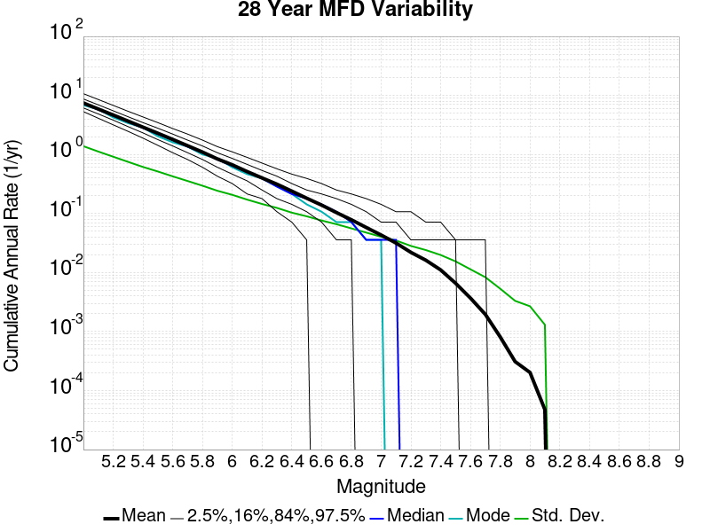

# Historical1919 Results

|   | Historical1919 |
|-----|-----|
| Num Simulations | 1000 |
| Start Time | 1919/01/01 00:00:00 UTC |
| Start Time Epoch Milliseconds | -1609459200000 |
| Duration | 100 Years |
| Includes Spontaneous? | true |
| Trigger Ruptures | *(none)* |
| Historical Ruptures | 165 Trigger Ruptures |
|   | First: M7.3 at 1852/01/05 04:40:39 UTC |
|   | Last: M6.5 at 1918/07/15 00:24:39 UTC |
|   | Largest: M7.9 at 1857/01/09 16:25:39 UTC |

## Table Of Contents

* [Magnitude Frequency Distribution](#magnitude-frequency-distribution)
* [Long Term Rate Variability](#long-term-rate-variability)
  * [80 Year Variability](#80-year-variability)
  * [62 Year Variability](#62-year-variability)
  * [28 Year Variability](#28-year-variability)
  * [Variability Duration Dependence](#variability-duration-dependence)
* [Section Participation](#section-participation)
  * [Section Participation Plots](#section-participation-plots)
  * [Supra-Seismogenic Parent Sections Table](#supra-seismogenic-parent-sections-table)
  * [M≥6.5 Parent Sections Table](#m65-parent-sections-table)
  * [M≥7 Parent Sections Table](#m7-parent-sections-table)
  * [M≥7.5 Parent Sections Table](#m75-parent-sections-table)
  * [M≥8 Parent Sections Table](#m8-parent-sections-table)
* [Gridded Nucleation](#gridded-nucleation)
* [JSON Input File](#json-input-file)

## Magnitude Frequency Distribution
*[(top)](#table-of-contents)*

**Legend**
* **Mean** (thick black line): mean annual rate across all 1000 catalogs
* **2.5%,97.5%** (thin black lines): annual rate percentiles across all 1000 catalogs
* **Median** (thin blue line): median annual rate across all 1000 catalogs
* **Mode** (thin cyan line): modal annual rate across all 1000 catalogs (scaled to annualized value)
* **100 yr Probability** (thin red line): 100 year probability calculated as the fraction of catalogs with at least 1 occurrence
* **95% Conf** (light red shaded region): binomial 95% confidence bounds on probability


| Mag | Mean | 2.5 %ile | 97.5 %ile | Median | Mode | 100 yr Probability |
|-----|-----|-----|-----|-----|-----|-----|
| **M&ge;5** | 7.427 | 6.100 | 9.160 | 7.360 | 7.280 | 1.000 |
| **M&ge;5.1** | 5.872 | 4.770 | 7.220 | 5.820 | 5.700 | 1.000 |
| **M&ge;5.2** | 4.646 | 3.760 | 5.730 | 4.600 | 4.260 | 1.000 |
| **M&ge;5.3** | 3.666 | 2.940 | 4.560 | 3.640 | 3.430 | 1.000 |
| **M&ge;5.4** | 2.890 | 2.280 | 3.610 | 2.860 | 2.710 | 1.000 |
| **M&ge;5.5** | 2.278 | 1.760 | 2.860 | 2.260 | 2.270 | 1.000 |
| **M&ge;5.6** | 1.789 | 1.370 | 2.290 | 1.770 | 1.870 | 1.000 |
| **M&ge;5.7** | 1.399 | 1.050 | 1.800 | 1.390 | 1.320 | 1.000 |
| **M&ge;5.8** | 1.090 | 0.810 | 1.420 | 1.080 | 1.000 | 1.000 |
| **M&ge;5.9** | 0.833 | 0.600 | 1.100 | 0.820 | 0.760 | 1.000 |
| **M&ge;6** | 0.661 | 0.460 | 0.890 | 0.650 | 0.590 | 1.000 |
| **M&ge;6.1** | 0.509 | 0.340 | 0.700 | 0.500 | 0.500 | 1.000 |
| **M&ge;6.2** | 0.397 | 0.260 | 0.550 | 0.390 | 0.400 | 1.000 |
| **M&ge;6.3** | 0.311 | 0.200 | 0.450 | 0.310 | 0.310 | 1.000 |
| **M&ge;6.4** | 0.238 | 0.140 | 0.350 | 0.230 | 0.210 | 1.000 |
| **M&ge;6.5** | 0.181 | 0.090 | 0.280 | 0.180 | 0.150 | 1.000 |
| **M&ge;6.6** | 0.138 | 0.060 | 0.220 | 0.140 | 0.150 | 1.000 |
| **M&ge;6.7** | 0.103 | 0.040 | 0.170 | 0.100 | 0.100 | 1.000 |
| **M&ge;6.8** | 0.078 | 0.030 | 0.140 | 0.080 | 0.080 | 1.000 |
| **M&ge;6.9** | 0.058 | 0.020 | 0.110 | 0.060 | 0.060 | 0.998 |
| **M&ge;7** | 0.044 | 0.010 | 0.090 | 0.040 | 0.040 | 0.994 |
| **M&ge;7.1** | 0.032 | 0.000 | 0.070 | 0.030 | 0.020 | 0.966 |
| **M&ge;7.2** | 0.022 | 0.000 | 0.050 | 0.020 | 0.020 | 0.904 |
| **M&ge;7.3** | 0.017 | 0.000 | 0.050 | 0.010 | 0.010 | 0.823 |
| **M&ge;7.4** | 0.011 | 0.000 | 0.040 | 0.010 | 0.010 | 0.691 |
| **M&ge;7.5** | 7.02E-3 | 0.000 | 0.030 | 0.010 | 0.000 | 0.510 |
| **M&ge;7.6** | 4.07E-3 | 0.000 | 0.020 | 0.000 | 0.000 | 0.343 |
| **M&ge;7.7** | 2.17E-3 | 0.000 | 0.010 | 0.000 | 0.000 | 0.201 |
| **M&ge;7.8** | 1.06E-3 | 0.000 | 0.010 | 0.000 | 0.000 | 0.105 |
| **M&ge;7.9** | 4.80E-4 | 0.000 | 0.010 | 0.000 | 0.000 | 0.048 |
| **M&ge;8** | 2.60E-4 | 0.000 | 0.010 | 0.000 | 0.000 | 0.026 |
| **M&ge;8.1** | 8.00E-5 | 0.000 | 0.000 | 0.000 | 0.000 | 8.00E-3 |
| **M&ge;8.2** | 1.00E-5 | 0.000 | 0.000 | 0.000 | 0.000 | 1.00E-3 |
| **M&ge;8.3** | 0.000 | 0.000 | 0.000 | 0.000 | 0.000 | 0.000 |
| **M&ge;8.4** | 0.000 | 0.000 | 0.000 | 0.000 | 0.000 | 0.000 |
| **M&ge;8.5** | 0.000 | 0.000 | 0.000 | 0.000 | 0.000 | 0.000 |
| **M&ge;8.6** | 0.000 | 0.000 | 0.000 | 0.000 | 0.000 | 0.000 |
| **M&ge;8.7** | 0.000 | 0.000 | 0.000 | 0.000 | 0.000 | 0.000 |
| **M&ge;8.8** | 0.000 | 0.000 | 0.000 | 0.000 | 0.000 | 0.000 |
| **M&ge;8.9** | 0.000 | 0.000 | 0.000 | 0.000 | 0.000 | 0.000 |
| **M&ge;9** | 0.000 | 0.000 | 0.000 | 0.000 | 0.000 | 0.000 |

## Long Term Rate Variability
*[(top)](#table-of-contents)*

### 80 Year Variability
*[(top)](#table-of-contents)*


| **Magnitude** | Mean | Median | Mode | Std. Dev. | 2.5 %-ile | 16 %-ile | 84 %-ile | 97.5 %-ile |
|-----|-----|-----|-----|-----|-----|-----|-----|-----|
| **5.0** | 7.385572 | 7.2875 | 7.225 | 0.87299603 | 5.9625 | 6.525 | 8.2375 | 9.3625 |
| **5.1** | 5.837963 | 5.7625 | 5.4875 | 0.700249 | 4.6625 | 5.15 | 6.5125 | 7.3625 |
| **5.2** | 4.61944 | 4.575 | 4.5625 | 0.5722559 | 3.675 | 4.05 | 5.175 | 5.9125 |
| **5.3** | 3.6451638 | 3.6 | 3.5125 | 0.46620792 | 2.8625 | 3.1875 | 4.1 | 4.6875 |
| **5.4** | 2.872482 | 2.8375 | 2.8 | 0.37770352 | 2.2125 | 2.5 | 3.25 | 3.7 |
| **5.5** | 2.2642362 | 2.2375 | 2.25 | 0.31258142 | 1.725 | 1.9625 | 2.5625 | 2.9625 |
| **5.6** | 1.7779316 | 1.7625 | 1.7 | 0.25629255 | 1.3375 | 1.525 | 2.025 | 2.35 |
| **5.7** | 1.3903416 | 1.375 | 1.3375 | 0.21170773 | 1.025 | 1.175 | 1.6 | 1.85 |
| **5.8** | 1.0827762 | 1.075 | 1.075 | 0.17385896 | 0.775 | 0.9125 | 1.25 | 1.4625 |
| **5.9** | 0.82794285 | 0.8125 | 0.8125 | 0.14264154 | 0.575 | 0.6875 | 0.9625 | 1.1375 |
| **6.0** | 0.65727264 | 0.65 | 0.65 | 0.121959955 | 0.4375 | 0.5375 | 0.775 | 0.925 |
| **6.1** | 0.50572264 | 0.5 | 0.475 | 0.10079785 | 0.325 | 0.4125 | 0.6 | 0.725 |
| **6.2** | 0.3949613 | 0.3875 | 0.35 | 0.08522525 | 0.2375 | 0.3125 | 0.475 | 0.5875 |
| **6.3** | 0.30935356 | 0.3 | 0.2875 | 0.07276764 | 0.1875 | 0.2375 | 0.375 | 0.475 |
| **6.4** | 0.23571727 | 0.2375 | 0.2125 | 0.06012914 | 0.125 | 0.175 | 0.2875 | 0.375 |
| **6.5** | 0.17877202 | 0.175 | 0.175 | 0.052694686 | 0.0875 | 0.125 | 0.225 | 0.2875 |
| **6.6** | 0.1367131 | 0.1375 | 0.1375 | 0.04525078 | 0.05 | 0.0875 | 0.175 | 0.2375 |
| **6.7** | 0.10191131 | 0.1 | 0.0875 | 0.038463563 | 0.0375 | 0.0625 | 0.1375 | 0.1875 |
| **6.8** | 0.0772375 | 0.075 | 0.0625 | 0.03298912 | 0.025 | 0.05 | 0.1125 | 0.15 |
| **6.9** | 0.057519644 | 0.05 | 0.05 | 0.02768878 | 0.0125 | 0.025 | 0.0875 | 0.1125 |
| **7.0** | 0.04303333 | 0.0375 | 0.0375 | 0.024104295 | 0.0 | 0.025 | 0.0625 | 0.1 |
| **7.1** | 0.031480953 | 0.025 | 0.025 | 0.020558702 | 0.0 | 0.0125 | 0.05 | 0.075 |
| **7.2** | 0.022092856 | 0.025 | 0.0125 | 0.016994828 | 0.0 | 0.0 | 0.0375 | 0.0625 |
| **7.3** | 0.016202977 | 0.0125 | 0.0125 | 0.014420718 | 0.0 | 0.0 | 0.025 | 0.05 |
| **7.4** | 0.011280357 | 0.0125 | 0.0 | 0.012118591 | 0.0 | 0.0 | 0.025 | 0.0375 |
| **7.5** | 0.0067958334 | 0.0 | 0.0 | 0.009288093 | 0.0 | 0.0 | 0.0125 | 0.025 |
| **7.6** | 0.003904762 | 0.0 | 0.0 | 0.0068056993 | 0.0 | 0.0 | 0.0125 | 0.025 |
| **7.7** | 0.0021333334 | 0.0 | 0.0 | 0.0050771544 | 0.0 | 0.0 | 0.0 | 0.0125 |
| **7.8** | 9.773809E-4 | 0.0 | 0.0 | 0.003391258 | 0.0 | 0.0 | 0.0 | 0.0125 |
| **7.9** | 4.2321428E-4 | 0.0 | 0.0 | 0.002260821 | 0.0 | 0.0 | 0.0 | 0.0125 |
| **8.0** | 2.5119047E-4 | 0.0 | 0.0 | 0.0017541182 | 0.0 | 0.0 | 0.0 | 0.0 |
| **8.1** | 6.666667E-5 | 0.0 | 0.0 | 9.10455E-4 | 0.0 | 0.0 | 0.0 | 0.0 |
| **8.2** | 9.523809E-6 | 0.0 | 0.0 | 3.4490952E-4 | 0.0 | 0.0 | 0.0 | 0.0 |
| **8.3** | 0.0 | 0.0 | 0.0 | 0.0 | 0.0 | 0.0 | 0.0 | 0.0 |
| **8.4** | 0.0 | 0.0 | 0.0 | 0.0 | 0.0 | 0.0 | 0.0 | 0.0 |
| **8.5** | 0.0 | 0.0 | 0.0 | 0.0 | 0.0 | 0.0 | 0.0 | 0.0 |
| **8.6** | 0.0 | 0.0 | 0.0 | 0.0 | 0.0 | 0.0 | 0.0 | 0.0 |
| **8.7** | 0.0 | 0.0 | 0.0 | 0.0 | 0.0 | 0.0 | 0.0 | 0.0 |
| **8.8** | 0.0 | 0.0 | 0.0 | 0.0 | 0.0 | 0.0 | 0.0 | 0.0 |
| **8.9** | 0.0 | 0.0 | 0.0 | 0.0 | 0.0 | 0.0 | 0.0 | 0.0 |
| **9.0** | 0.0 | 0.0 | 0.0 | 0.0 | 0.0 | 0.0 | 0.0 | 0.0 |

### 62 Year Variability
*[(top)](#table-of-contents)*


| **Magnitude** | Mean | Median | Mode | Std. Dev. | 2.5 %-ile | 16 %-ile | 84 %-ile | 97.5 %-ile |
|-----|-----|-----|-----|-----|-----|-----|-----|-----|
| **5.0** | 7.3689003 | 7.2580647 | 7.145161 | 0.9781895 | 5.774194 | 6.419355 | 8.306452 | 9.612904 |
| **5.1** | 5.8245196 | 5.7419353 | 5.645161 | 0.7870044 | 4.5 | 5.064516 | 6.580645 | 7.612903 |
| **5.2** | 4.608873 | 4.548387 | 4.322581 | 0.64359 | 3.516129 | 3.983871 | 5.225806 | 6.064516 |
| **5.3** | 3.6368797 | 3.580645 | 3.580645 | 0.52556217 | 2.7419355 | 3.1290324 | 4.145161 | 4.806452 |
| **5.4** | 2.8664 | 2.8225806 | 2.6774194 | 0.4263626 | 2.1451614 | 2.451613 | 3.2903225 | 3.8064516 |
| **5.5** | 2.2591438 | 2.2258065 | 2.096774 | 0.3529972 | 1.6612903 | 1.9193548 | 2.596774 | 3.048387 |
| **5.6** | 1.773988 | 1.7419355 | 1.7096775 | 0.2904794 | 1.2741935 | 1.483871 | 2.048387 | 2.435484 |
| **5.7** | 1.3879983 | 1.3709677 | 1.3387097 | 0.2405655 | 0.9677419 | 1.1612903 | 1.6129032 | 1.9193548 |
| **5.8** | 1.0812299 | 1.0645162 | 1.0645162 | 0.19934562 | 0.7419355 | 0.88709676 | 1.2741935 | 1.516129 |
| **5.9** | 0.8271646 | 0.82258064 | 0.7903226 | 0.16323097 | 0.5322581 | 0.66129035 | 0.983871 | 1.1774193 |
| **6.0** | 0.65685403 | 0.6451613 | 0.6451613 | 0.13919753 | 0.41935483 | 0.516129 | 0.7903226 | 0.9677419 |
| **6.1** | 0.5049727 | 0.5 | 0.48387095 | 0.114880465 | 0.30645162 | 0.4032258 | 0.61290324 | 0.7419355 |
| **6.2** | 0.3944148 | 0.38709676 | 0.38709676 | 0.09733409 | 0.22580644 | 0.30645162 | 0.48387095 | 0.5967742 |
| **6.3** | 0.30926964 | 0.30645162 | 0.27419356 | 0.083093844 | 0.16129032 | 0.22580644 | 0.38709676 | 0.48387095 |
| **6.4** | 0.23542763 | 0.22580644 | 0.24193548 | 0.068659395 | 0.11290322 | 0.16129032 | 0.30645162 | 0.38709676 |
| **6.5** | 0.17836766 | 0.17741935 | 0.17741935 | 0.05987894 | 0.06451613 | 0.11290322 | 0.24193548 | 0.30645162 |
| **6.6** | 0.13647601 | 0.12903225 | 0.12903225 | 0.05129453 | 0.048387095 | 0.08064516 | 0.19354838 | 0.24193548 |
| **6.7** | 0.10164723 | 0.09677419 | 0.09677419 | 0.043752577 | 0.032258064 | 0.06451613 | 0.14516129 | 0.19354838 |
| **6.8** | 0.07692101 | 0.08064516 | 0.06451613 | 0.037601415 | 0.016129032 | 0.048387095 | 0.11290322 | 0.16129032 |
| **6.9** | 0.05722829 | 0.048387095 | 0.048387095 | 0.031670563 | 0.0 | 0.032258064 | 0.08064516 | 0.12903225 |
| **7.0** | 0.042792805 | 0.032258064 | 0.032258064 | 0.02726934 | 0.0 | 0.016129032 | 0.06451613 | 0.09677419 |
| **7.1** | 0.031285774 | 0.032258064 | 0.016129032 | 0.023175627 | 0.0 | 0.016129032 | 0.048387095 | 0.08064516 |
| **7.2** | 0.021995451 | 0.016129032 | 0.016129032 | 0.0192198 | 0.0 | 0.0 | 0.032258064 | 0.06451613 |
| **7.3** | 0.01601861 | 0.016129032 | 0.0 | 0.016287515 | 0.0 | 0.0 | 0.032258064 | 0.048387095 |
| **7.4** | 0.0111418525 | 0.0 | 0.0 | 0.013624146 | 0.0 | 0.0 | 0.016129032 | 0.048387095 |
| **7.5** | 0.006643507 | 0.0 | 0.0 | 0.0104597295 | 0.0 | 0.0 | 0.016129032 | 0.032258064 |
| **7.6** | 0.00376799 | 0.0 | 0.0 | 0.0077217305 | 0.0 | 0.0 | 0.016129032 | 0.016129032 |
| **7.7** | 0.0020620348 | 0.0 | 0.0 | 0.0057186433 | 0.0 | 0.0 | 0.0 | 0.016129032 |
| **7.8** | 9.032258E-4 | 0.0 | 0.0 | 0.0037371316 | 0.0 | 0.0 | 0.0 | 0.016129032 |
| **7.9** | 3.9743588E-4 | 0.0 | 0.0 | 0.0025004921 | 0.0 | 0.0 | 0.0 | 0.0 |
| **8.0** | 2.3779983E-4 | 0.0 | 0.0 | 0.0019439725 | 0.0 | 0.0 | 0.0 | 0.0 |
| **8.1** | 5.5831264E-5 | 0.0 | 0.0 | 9.4731734E-4 | 0.0 | 0.0 | 0.0 | 0.0 |
| **8.2** | 6.6170387E-6 | 0.0 | 0.0 | 3.2662728E-4 | 0.0 | 0.0 | 0.0 | 0.0 |
| **8.3** | 0.0 | 0.0 | 0.0 | 0.0 | 0.0 | 0.0 | 0.0 | 0.0 |
| **8.4** | 0.0 | 0.0 | 0.0 | 0.0 | 0.0 | 0.0 | 0.0 | 0.0 |
| **8.5** | 0.0 | 0.0 | 0.0 | 0.0 | 0.0 | 0.0 | 0.0 | 0.0 |
| **8.6** | 0.0 | 0.0 | 0.0 | 0.0 | 0.0 | 0.0 | 0.0 | 0.0 |
| **8.7** | 0.0 | 0.0 | 0.0 | 0.0 | 0.0 | 0.0 | 0.0 | 0.0 |
| **8.8** | 0.0 | 0.0 | 0.0 | 0.0 | 0.0 | 0.0 | 0.0 | 0.0 |
| **8.9** | 0.0 | 0.0 | 0.0 | 0.0 | 0.0 | 0.0 | 0.0 | 0.0 |
| **9.0** | 0.0 | 0.0 | 0.0 | 0.0 | 0.0 | 0.0 | 0.0 | 0.0 |

### 28 Year Variability
*[(top)](#table-of-contents)*



| **Magnitude** | Mean | Median | Mode | Std. Dev. | 2.5 %-ile | 16 %-ile | 84 %-ile | 97.5 %-ile |
|-----|-----|-----|-----|-----|-----|-----|-----|-----|
| **5.0** | 7.3784614 | 7.178571 | 7.178571 | 1.397188 | 5.214286 | 6.107143 | 8.642858 | 10.75 |
| **5.1** | 5.832143 | 5.678571 | 5.571429 | 1.1310847 | 4.071429 | 4.785714 | 6.892857 | 8.464286 |
| **5.2** | 4.614656 | 4.5 | 4.25 | 0.92537624 | 3.142857 | 3.75 | 5.464286 | 6.785714 |
| **5.3** | 3.64138 | 3.5357144 | 3.2857144 | 0.7563548 | 2.4285715 | 2.9285715 | 4.357143 | 5.392857 |
| **5.4** | 2.8699574 | 2.7857144 | 2.7857144 | 0.6182043 | 1.8571428 | 2.2857144 | 3.4642856 | 4.285714 |
| **5.5** | 2.2622736 | 2.2142856 | 2.142857 | 0.5140316 | 1.4285715 | 1.7857143 | 2.75 | 3.4285715 |
| **5.6** | 1.7764521 | 1.7142857 | 1.6785715 | 0.42449883 | 1.0714285 | 1.3571428 | 2.1785715 | 2.75 |
| **5.7** | 1.389404 | 1.3571428 | 1.3214285 | 0.35158128 | 0.8214286 | 1.0357143 | 1.7142857 | 2.2142856 |
| **5.8** | 1.0820949 | 1.0357143 | 1.0 | 0.29390988 | 0.60714287 | 0.78571427 | 1.3571428 | 1.75 |
| **5.9** | 0.82747996 | 0.8214286 | 0.75 | 0.24112253 | 0.42857143 | 0.60714287 | 1.0714285 | 1.3571428 |
| **6.0** | 0.65693 | 0.64285713 | 0.64285713 | 0.20508908 | 0.32142857 | 0.4642857 | 0.85714287 | 1.1071428 |
| **6.1** | 0.50525737 | 0.5 | 0.4642857 | 0.17087172 | 0.21428572 | 0.35714287 | 0.6785714 | 0.89285713 |
| **6.2** | 0.394592 | 0.39285713 | 0.35714287 | 0.14539324 | 0.14285715 | 0.25 | 0.53571427 | 0.71428573 |
| **6.3** | 0.3091825 | 0.2857143 | 0.25 | 0.12484085 | 0.10714286 | 0.17857143 | 0.42857143 | 0.5714286 |
| **6.4** | 0.23547652 | 0.21428572 | 0.21428572 | 0.103287816 | 0.071428575 | 0.14285715 | 0.32142857 | 0.4642857 |
| **6.5** | 0.17848875 | 0.17857143 | 0.14285715 | 0.089518964 | 0.035714287 | 0.10714286 | 0.25 | 0.39285713 |
| **6.6** | 0.1365729 | 0.14285715 | 0.10714286 | 0.07678901 | 0.0 | 0.071428575 | 0.21428572 | 0.32142857 |
| **6.7** | 0.101807244 | 0.10714286 | 0.071428575 | 0.06586823 | 0.0 | 0.035714287 | 0.17857143 | 0.25 |
| **6.8** | 0.077088065 | 0.071428575 | 0.035714287 | 0.056579504 | 0.0 | 0.035714287 | 0.14285715 | 0.21428572 |
| **6.9** | 0.057380628 | 0.035714287 | 0.035714287 | 0.0477421 | 0.0 | 0.0 | 0.10714286 | 0.17857143 |
| **7.0** | 0.042911448 | 0.035714287 | 0.035714287 | 0.040661663 | 0.0 | 0.0 | 0.071428575 | 0.14285715 |
| **7.1** | 0.03139824 | 0.035714287 | 0.0 | 0.034860343 | 0.0 | 0.0 | 0.071428575 | 0.10714286 |
| **7.2** | 0.022063112 | 0.0 | 0.0 | 0.028739782 | 0.0 | 0.0 | 0.035714287 | 0.10714286 |
| **7.3** | 0.01611546 | 0.0 | 0.0 | 0.024402583 | 0.0 | 0.0 | 0.035714287 | 0.071428575 |
| **7.4** | 0.011207926 | 0.0 | 0.0 | 0.020195255 | 0.0 | 0.0 | 0.035714287 | 0.071428575 |
| **7.5** | 0.006708904 | 0.0 | 0.0 | 0.015698943 | 0.0 | 0.0 | 0.035714287 | 0.035714287 |
| **7.6** | 0.0038219178 | 0.0 | 0.0 | 0.011672809 | 0.0 | 0.0 | 0.0 | 0.035714287 |
| **7.7** | 0.002092955 | 0.0 | 0.0 | 0.008677343 | 0.0 | 0.0 | 0.0 | 0.035714287 |
| **7.8** | 9.403131E-4 | 0.0 | 0.0 | 0.005766975 | 0.0 | 0.0 | 0.0 | 0.035714287 |
| **7.9** | 4.0753424E-4 | 0.0 | 0.0 | 0.0037932713 | 0.0 | 0.0 | 0.0 | 0.0 |
| **8.0** | 2.4559686E-4 | 0.0 | 0.0 | 0.0029514604 | 0.0 | 0.0 | 0.0 | 0.0 |
| **8.1** | 6.0665363E-5 | 0.0 | 0.0 | 0.0014707037 | 0.0 | 0.0 | 0.0 | 0.0 |
| **8.2** | 7.827789E-6 | 0.0 | 0.0 | 5.2868365E-4 | 0.0 | 0.0 | 0.0 | 0.0 |
| **8.3** | 0.0 | 0.0 | 0.0 | 0.0 | 0.0 | 0.0 | 0.0 | 0.0 |
| **8.4** | 0.0 | 0.0 | 0.0 | 0.0 | 0.0 | 0.0 | 0.0 | 0.0 |
| **8.5** | 0.0 | 0.0 | 0.0 | 0.0 | 0.0 | 0.0 | 0.0 | 0.0 |
| **8.6** | 0.0 | 0.0 | 0.0 | 0.0 | 0.0 | 0.0 | 0.0 | 0.0 |
| **8.7** | 0.0 | 0.0 | 0.0 | 0.0 | 0.0 | 0.0 | 0.0 | 0.0 |
| **8.8** | 0.0 | 0.0 | 0.0 | 0.0 | 0.0 | 0.0 | 0.0 | 0.0 |
| **8.9** | 0.0 | 0.0 | 0.0 | 0.0 | 0.0 | 0.0 | 0.0 | 0.0 |
| **9.0** | 0.0 | 0.0 | 0.0 | 0.0 | 0.0 | 0.0 | 0.0 | 0.0 |

### Variability Duration Dependence
*[(top)](#table-of-contents)*


| **Duration (years)** | Mean | Median | Mode | Std. Dev. | 2.5 %-ile | 16 %-ile | 84 %-ile | 97.5 %-ile |
|-----|-----|-----|-----|-----|-----|-----|-----|-----|
| **2.0** | 7.4227123 | 6.5 | 6.0 | 4.4209323 | 2.5 | 4.0 | 10.0 | 18.5 |
| **4.0** | 7.4165955 | 6.75 | 6.25 | 3.2902567 | 3.25 | 4.75 | 9.75 | 15.75 |
| **6.0** | 7.4105296 | 6.8333335 | 6.5 | 2.763002 | 3.8333333 | 5.1666665 | 9.5 | 14.333333 |
| **8.0** | 7.406926 | 7.0 | 6.125 | 2.4419124 | 4.125 | 5.375 | 9.375 | 13.625 |
| **10.0** | 7.4028945 | 7.0 | 6.2 | 2.2146258 | 4.4 | 5.5 | 9.2 | 12.9 |
| **12.0** | 7.398986 | 7.0 | 6.3333335 | 2.0438592 | 4.5 | 5.6666665 | 9.083333 | 12.416667 |
| **14.0** | 7.3958654 | 7.071429 | 6.428571 | 1.9097512 | 4.642857 | 5.714286 | 9.0 | 12.142858 |
| **16.0** | 7.3929353 | 7.0625 | 6.5 | 1.7997417 | 4.8125 | 5.8125 | 8.9375 | 11.875 |
| **18.0** | 7.389472 | 7.111111 | 6.6666665 | 1.7069072 | 4.888889 | 5.888889 | 8.888889 | 11.611111 |
| **20.0** | 7.386571 | 7.15 | 6.95 | 1.6269644 | 4.95 | 5.9 | 8.8 | 11.4 |
| **22.0** | 7.3845444 | 7.1363635 | 6.8636365 | 1.5585363 | 5.0454545 | 5.9545455 | 8.772727 | 11.181818 |
| **24.0** | 7.3822327 | 7.1666665 | 6.625 | 1.498145 | 5.125 | 6.0 | 8.708333 | 11.041667 |
| **26.0** | 7.3802757 | 7.1538463 | 7.1153846 | 1.4449096 | 5.1538463 | 6.076923 | 8.692307 | 10.884615 |
| **28.0** | 7.3784614 | 7.178571 | 7.178571 | 1.397188 | 5.214286 | 6.107143 | 8.642858 | 10.75 |
| **30.0** | 7.3768234 | 7.1666665 | 7.0666666 | 1.3541082 | 5.266667 | 6.133333 | 8.6 | 10.633333 |
| **32.0** | 7.3747597 | 7.1875 | 7.03125 | 1.3140248 | 5.3125 | 6.15625 | 8.5625 | 10.5 |
| **34.0** | 7.37248 | 7.2058825 | 7.0588236 | 1.2767181 | 5.352941 | 6.2058825 | 8.558824 | 10.411765 |
| **36.0** | 7.370692 | 7.1944447 | 6.888889 | 1.2432855 | 5.388889 | 6.2222223 | 8.527778 | 10.305555 |
| **38.0** | 7.3693748 | 7.2105265 | 6.9210525 | 1.2129432 | 5.4473686 | 6.236842 | 8.5 | 10.210526 |
| **40.0** | 7.368494 | 7.225 | 7.05 | 1.1850235 | 5.475 | 6.25 | 8.475 | 10.125 |
| **42.0** | 7.3675575 | 7.214286 | 7.0238094 | 1.1592684 | 5.5 | 6.285714 | 8.452381 | 10.047619 |
| **44.0** | 7.3669534 | 7.2272725 | 6.7954545 | 1.1355724 | 5.5454545 | 6.2954545 | 8.431818 | 10.0 |
| **46.0** | 7.3671436 | 7.2391305 | 7.130435 | 1.1140054 | 5.5869565 | 6.304348 | 8.413043 | 9.934783 |
| **48.0** | 7.367865 | 7.25 | 7.0416665 | 1.0935491 | 5.6041665 | 6.3125 | 8.395833 | 9.875 |
| **50.0** | 7.3683057 | 7.24 | 7.06 | 1.0743114 | 5.64 | 6.34 | 8.38 | 9.84 |
| **52.0** | 7.3681607 | 7.25 | 7.019231 | 1.0558215 | 5.673077 | 6.3653846 | 8.365385 | 9.807693 |
| **54.0** | 7.367467 | 7.259259 | 7.148148 | 1.0381093 | 5.685185 | 6.3703704 | 8.351851 | 9.777778 |
| **56.0** | 7.3670244 | 7.25 | 7.089286 | 1.021945 | 5.714286 | 6.392857 | 8.339286 | 9.732142 |
| **58.0** | 7.367145 | 7.2586207 | 7.1896553 | 1.0068161 | 5.7413793 | 6.3965516 | 8.327586 | 9.689655 |
| **60.0** | 7.3680673 | 7.266667 | 7.25 | 0.99212676 | 5.75 | 6.4166665 | 8.316667 | 9.666667 |
| **62.0** | 7.3689003 | 7.2580647 | 7.145161 | 0.9781895 | 5.774194 | 6.419355 | 8.306452 | 9.612904 |
| **64.0** | 7.3699775 | 7.265625 | 7.375 | 0.96491075 | 5.796875 | 6.4375 | 8.296875 | 9.578125 |
| **66.0** | 7.371451 | 7.2727275 | 7.090909 | 0.95248485 | 5.818182 | 6.439394 | 8.287879 | 9.545455 |
| **68.0** | 7.373603 | 7.2647057 | 7.0882354 | 0.9406192 | 5.8382354 | 6.4558825 | 8.279411 | 9.529411 |
| **70.0** | 7.375933 | 7.2714286 | 7.071429 | 0.9292889 | 5.8714285 | 6.4714284 | 8.271428 | 9.514286 |
| **72.0** | 7.377679 | 7.2777777 | 7.236111 | 0.9174288 | 5.888889 | 6.486111 | 8.263889 | 9.5 |
| **74.0** | 7.379373 | 7.283784 | 7.175676 | 0.9057218 | 5.918919 | 6.4864864 | 8.256757 | 9.445946 |
| **76.0** | 7.381192 | 7.2894735 | 6.9605265 | 0.8944896 | 5.9342103 | 6.5 | 8.25 | 9.407895 |
| **78.0** | 7.383378 | 7.282051 | 7.0897436 | 0.8836483 | 5.948718 | 6.5128207 | 8.243589 | 9.384615 |
| **80.0** | 7.385572 | 7.2875 | 7.225 | 0.87299603 | 5.9625 | 6.525 | 8.2375 | 9.3625 |
| **82.0** | 7.3878493 | 7.292683 | 7.1463413 | 0.8627614 | 5.97561 | 6.52439 | 8.231708 | 9.341463 |
| **84.0** | 7.3912687 | 7.297619 | 7.1190476 | 0.85257274 | 5.9880953 | 6.547619 | 8.226191 | 9.321428 |
| **86.0** | 7.394409 | 7.3023257 | 7.0930233 | 0.84271485 | 6.0 | 6.5581393 | 8.22093 | 9.302325 |
| **88.0** | 7.397439 | 7.306818 | 7.1477275 | 0.83267355 | 6.0113635 | 6.5795455 | 8.215909 | 9.284091 |
| **90.0** | 7.4007254 | 7.322222 | 7.1555557 | 0.8219922 | 6.022222 | 6.588889 | 8.211111 | 9.266666 |
| **92.0** | 7.4050674 | 7.326087 | 7.380435 | 0.8123173 | 6.0326085 | 6.6086955 | 8.195652 | 9.228261 |
| **94.0** | 7.4086366 | 7.3297873 | 7.3510637 | 0.80278826 | 6.0319147 | 6.617021 | 8.202127 | 9.202127 |
| **96.0** | 7.413046 | 7.3333335 | 7.2708335 | 0.7949559 | 6.0520835 | 6.625 | 8.197917 | 9.177083 |
| **98.0** | 7.4195747 | 7.336735 | 7.2040815 | 0.78708076 | 6.0612245 | 6.6530614 | 8.183674 | 9.163265 |
| **100.0** | 7.427 | 7.36 | 7.28 | 0.78070706 | 6.1 | 6.67 | 8.2 | 9.16 |

## Section Participation
*[(top)](#table-of-contents)*

### Section Participation Plots
*[(top)](#table-of-contents)*

| Min Mag | Complete Catalog (including spontaneous) |
|-----|-----|
| **All Supra. Seis.** |  |
| **M&ge;6.5** |  |
| **M&ge;7** |  |
| **M&ge;7.5** |  |
| **M&ge;8** |  |

### Supra-Seismogenic Parent Sections Table
*[(top)](#table-of-contents)*

*First 10 of 312 with matching ruptures shown*

| Parent Name | Total Mean Annual Rate | Total 100 Year Prob |
|-----|-----|-----|
| San Andreas (Parkfield) | 0.04172 | 0.997 |
| San Andreas (Creeping Section) 2011 CFM | 0.02445 | 0.947 |
| San Andreas (Mojave S) | 0.01645 | 0.832 |
| Mendocino | 0.0139 | 0.793 |
| Cerro Prieto | 0.01127 | 0.786 |
| Imperial | 0.0112 | 0.774 |
| Brawley (Seismic Zone) alt 1 | 0.01046 | 0.763 |
| Hayward (So) 2011 CFM | 0.00631 | 0.521 |
| San Andreas (Coachella) rev | 0.00587 | 0.529 |
| Hunting Creek - Berryessa 2011 CFM | 0.00573 | 0.458 |

### M≥6.5 Parent Sections Table
*[(top)](#table-of-contents)*

*First 10 of 301 with matching ruptures shown*

| Parent Name | Total Mean Annual Rate | Total 100 Year Prob |
|-----|-----|-----|
| Cerro Prieto | 0.00938 | 0.721 |
| Imperial | 0.00779 | 0.652 |
| Brawley (Seismic Zone) alt 1 | 0.00742 | 0.631 |
| San Andreas (Creeping Section) 2011 CFM | 0.006 | 0.479 |
| Mendocino | 0.00535 | 0.445 |
| Hayward (So) 2011 CFM | 0.0053 | 0.458 |
| San Andreas (Coachella) rev | 0.0051 | 0.482 |
| San Andreas (Mojave S) | 0.0037 | 0.335 |
| San Andreas (San Bernardino N) | 0.00369 | 0.324 |
| San Andreas (San Bernardino S) | 0.00354 | 0.323 |

### M≥7 Parent Sections Table
*[(top)](#table-of-contents)*

*First 10 of 262 with matching ruptures shown*

| Parent Name | Total Mean Annual Rate | Total 100 Year Prob |
|-----|-----|-----|
| San Andreas (Coachella) rev | 0.00416 | 0.405 |
| Brawley (Seismic Zone) alt 1 | 0.00388 | 0.381 |
| Imperial | 0.00381 | 0.375 |
| Cerro Prieto | 0.00337 | 0.321 |
| San Andreas (San Gorgonio Pass-Garnet HIll) | 0.00312 | 0.303 |
| Maacama 2011 CFM | 0.00194 | 0.191 |
| San Andreas (Creeping Section) 2011 CFM | 0.00187 | 0.174 |
| San Andreas (Cholame) rev | 0.00182 | 0.179 |
| San Andreas (Carrizo) rev | 0.00177 | 0.172 |
| San Andreas (Mojave S) | 0.00176 | 0.174 |

### M≥7.5 Parent Sections Table
*[(top)](#table-of-contents)*

*First 10 of 179 with matching ruptures shown*

| Parent Name | Total Mean Annual Rate | Total 100 Year Prob |
|-----|-----|-----|
| San Andreas (Coachella) rev | 0.00118 | 0.117 |
| San Andreas (San Gorgonio Pass-Garnet HIll) | 0.00113 | 0.112 |
| Brawley (Seismic Zone) alt 1 | 0.00106 | 0.105 |
| Imperial | 0.00101 | 0.101 |
| San Andreas (Mojave N) | 0.001 | 0.099 |
| San Andreas (San Bernardino S) | 9.8E-4 | 0.096 |
| San Andreas (Mojave S) | 9.3E-4 | 0.093 |
| San Andreas (Big Bend) | 8.2E-4 | 0.082 |
| San Andreas (San Bernardino N) | 7.9E-4 | 0.078 |
| San Andreas (Carrizo) rev | 7.2E-4 | 0.072 |

### M≥8 Parent Sections Table
*[(top)](#table-of-contents)*

*First 10 of 40 with matching ruptures shown*

| Parent Name | Total Mean Annual Rate | Total 100 Year Prob |
|-----|-----|-----|
| San Andreas (Mojave N) | 2.5E-4 | 0.025 |
| San Andreas (Mojave S) | 2.5E-4 | 0.025 |
| San Andreas (San Bernardino N) | 2.5E-4 | 0.025 |
| San Andreas (Big Bend) | 2.1E-4 | 0.021 |
| San Andreas (Carrizo) rev | 2.1E-4 | 0.021 |
| San Andreas (Cholame) rev | 2.0E-4 | 0.02 |
| San Andreas (Coachella) rev | 1.4E-4 | 0.014 |
| San Andreas (Parkfield) | 1.4E-4 | 0.014 |
| San Andreas (San Bernardino S) | 1.3E-4 | 0.013 |
| San Andreas (San Gorgonio Pass-Garnet HIll) | 1.3E-4 | 0.013 |
## Gridded Nucleation
*[(top)](#table-of-contents)*

| Min Mag | Complete Catalog (including spontaneous) |
|-----|-----|
| **M&ge;5** |  |
| **M&ge;6** |  |
| **M&ge;7** |  |

## JSON Input File
*[(top)](#table-of-contents)*

```
{
  "numSimulations": 1000,
  "duration": 100.0,
  "startYear": 1919,
  "includeSpontaneous": true,
  "randomSeed": 123456789,
  "binaryOutput": true,
  "binaryOutputFilters": [
    {
      "prefix": "results_complete",
      "descendantsOnly": false
    },
    {
      "prefix": "results_m5_preserve_chain",
      "minMag": 5.0,
      "preserveChainBelowMag": true,
      "descendantsOnly": false
    }
  ],
  "forceRecalc": false,
  "simulationName": "Historical1919",
  "numRetries": 3,
  "outputDir": "${ETAS_SIM_DIR}/2019_02_26-Historical1919-includeSpont-historicalCatalog-100yr-8threads",
  "triggerCatalog": "${ETAS_LAUNCHER}/inputs/u3_historical_catalog.txt",
  "triggerCatalogSurfaceMappings": "${ETAS_LAUNCHER}/inputs/u3_historical_catalog_finite_fault_mappings.xml",
  "treatTriggerCatalogAsSpontaneous": true,
  "cacheDir": "${ETAS_LAUNCHER}/inputs/cache_fm3p1_ba",
  "fssFile": "${ETAS_LAUNCHER}/inputs/2013_05_10-ucerf3p3-production-10runs_COMPOUND_SOL_FM3_1_SpatSeisU3_MEAN_BRANCH_AVG_SOL.zip",
  "probModel": "FULL_TD",
  "applySubSeisForSupraNucl": true,
  "totRateScaleFactor": 1.14,
  "gridSeisCorr": true,
  "timeIndependentERF": false,
  "griddedOnly": false,
  "imposeGR": false,
  "includeIndirectTriggering": true,
  "gridSeisDiscr": 0.1,
  "catalogCompletenessModel": "RELAXED"
}
```

