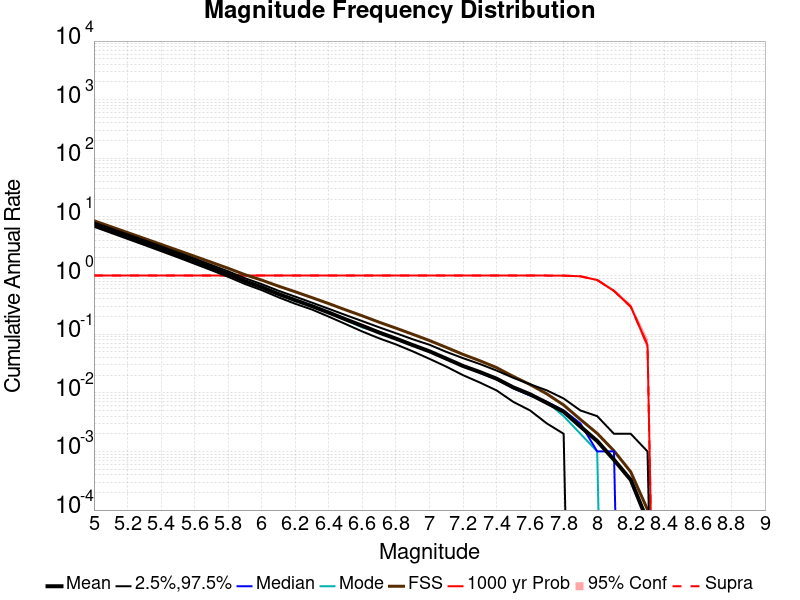
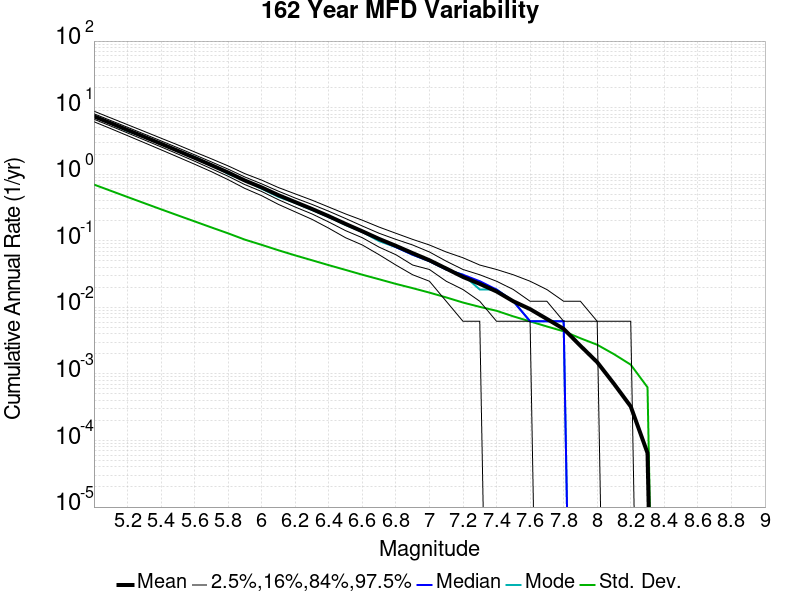
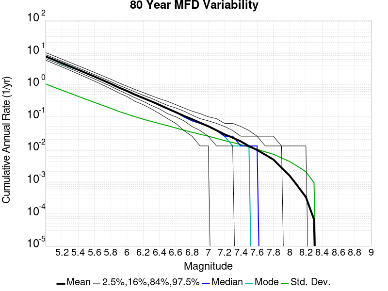

# Spontaneous Results

|   | Spontaneous |
|-----|-----|
| Num Simulations | 1000 |
| Start Time | 2012/01/01 00:00:00 UTC |
| Start Time Epoch Milliseconds | 1325376000000 |
| Duration | 1000 Years |
| Includes Spontaneous? | true |
| Trigger Ruptures | *(none)* |
| Historical Ruptures | 60366 Trigger Ruptures |
|   | First: M7.3 at 1852/01/05 04:40:39 UTC |
|   | Last: M3.2 at 2011/12/31 19:14:44 UTC |
|   | Largest: M7.9 at 1857/01/09 16:25:39 UTC |

## Table Of Contents

* [Magnitude Frequency Distribution](#magnitude-frequency-distribution)
* [Long Term Rate Variability](#long-term-rate-variability)
  * [162 Year Variability](#162-year-variability)
  * [80 Year Variability](#80-year-variability)
  * [28 Year Variability](#28-year-variability)
  * [Variability Duration Dependence](#variability-duration-dependence)
* [Simulation Stationarity](#simulation-stationarity)
* [Section Participation](#section-participation)
  * [Section Participation Plots](#section-participation-plots)
  * [Supra-Seismogenic Parent Sections Table](#supra-seismogenic-parent-sections-table)
  * [M≥6.5 Parent Sections Table](#m65-parent-sections-table)
  * [M≥7 Parent Sections Table](#m7-parent-sections-table)
  * [M≥7.5 Parent Sections Table](#m75-parent-sections-table)
  * [M≥8 Parent Sections Table](#m8-parent-sections-table)
* [Gridded Nucleation](#gridded-nucleation)
* [JSON Input File](#json-input-file)

## Magnitude Frequency Distribution
*[(top)](#table-of-contents)*

**Legend**
* **Mean** (thick black line): mean annual rate across all 1000 catalogs
* **2.5%,97.5%** (thin black lines): annual rate percentiles across all 1000 catalogs
* **Median** (thin blue line): median annual rate across all 1000 catalogs
* **Mode** (thin cyan line): modal annual rate across all 1000 catalogs (scaled to annualized value)
* **1000 yr Probability** (thin red line): 1000 year probability calculated as the fraction of catalogs with at least 1 occurrence
* **1000 yr Supraseismogenic Probability** (thin dashed red line): same as above, but only for supraseismogenic ruptures on explicitly modeled UCERF3 faults
* **95% Conf** (light red shaded region): binomial 95% confidence bounds on probability



| Mag | Mean | 2.5 %ile | 97.5 %ile | Median | Mode | 1000 yr Probability | 1000 yr Supra-Seis Prob |
|-----|-----|-----|-----|-----|-----|-----|-----|
| **M&ge;5** | 7.399 | 6.809 | 8.053 | 7.388 | 7.418 | 1.000 (100.00%) | 1.000 (100.00%) |
| **M&ge;5.1** | 5.851 | 5.368 | 6.361 | 5.847 | 5.897 | 1.000 (100.00%) | 1.000 (100.00%) |
| **M&ge;5.2** | 4.620 | 4.224 | 5.037 | 4.613 | 4.563 | 1.000 (100.00%) | 1.000 (100.00%) |
| **M&ge;5.3** | 3.643 | 3.326 | 4.003 | 3.633 | 3.572 | 1.000 (100.00%) | 1.000 (100.00%) |
| **M&ge;5.4** | 2.867 | 2.609 | 3.149 | 2.859 | 2.784 | 1.000 (100.00%) | 1.000 (100.00%) |
| **M&ge;5.5** | 2.250 | 2.045 | 2.475 | 2.245 | 2.204 | 1.000 (100.00%) | 1.000 (100.00%) |
| **M&ge;5.6** | 1.760 | 1.589 | 1.946 | 1.756 | 1.815 | 1.000 (100.00%) | 1.000 (100.00%) |
| **M&ge;5.7** | 1.370 | 1.235 | 1.517 | 1.364 | 1.399 | 1.000 (100.00%) | 1.000 (100.00%) |
| **M&ge;5.8** | 1.060 | 0.952 | 1.182 | 1.057 | 1.041 | 1.000 (100.00%) | 1.000 (100.00%) |
| **M&ge;5.9** | 0.803 | 0.718 | 0.902 | 0.802 | 0.814 | 1.000 (100.00%) | 1.000 (100.00%) |
| **M&ge;6** | 0.633 | 0.564 | 0.714 | 0.630 | 0.625 | 1.000 (100.00%) | 1.000 (100.00%) |
| **M&ge;6.1** | 0.484 | 0.426 | 0.551 | 0.482 | 0.480 | 1.000 (100.00%) | 1.000 (100.00%) |
| **M&ge;6.2** | 0.381 | 0.330 | 0.437 | 0.380 | 0.366 | 1.000 (100.00%) | 1.000 (100.00%) |
| **M&ge;6.3** | 0.301 | 0.263 | 0.345 | 0.300 | 0.310 | 1.000 (100.00%) | 1.000 (100.00%) |
| **M&ge;6.4** | 0.234 | 0.199 | 0.271 | 0.233 | 0.235 | 1.000 (100.00%) | 1.000 (100.00%) |
| **M&ge;6.5** | 0.179 | 0.149 | 0.212 | 0.179 | 0.175 | 1.000 (100.00%) | 1.000 (100.00%) |
| **M&ge;6.6** | 0.139 | 0.111 | 0.167 | 0.139 | 0.130 | 1.000 (100.00%) | 1.000 (100.00%) |
| **M&ge;6.7** | 0.107 | 0.085 | 0.131 | 0.106 | 0.110 | 1.000 (100.00%) | 1.000 (100.00%) |
| **M&ge;6.8** | 0.084 | 0.067 | 0.104 | 0.084 | 0.083 | 1.000 (100.00%) | 1.000 (100.00%) |
| **M&ge;6.9** | 0.065 | 0.051 | 0.082 | 0.065 | 0.065 | 1.000 (100.00%) | 1.000 (100.00%) |
| **M&ge;7** | 0.051 | 0.038 | 0.066 | 0.051 | 0.052 | 1.000 (100.00%) | 1.000 (100.00%) |
| **M&ge;7.1** | 0.038 | 0.028 | 0.050 | 0.038 | 0.037 | 1.000 (100.00%) | 1.000 (100.00%) |
| **M&ge;7.2** | 0.029 | 0.020 | 0.039 | 0.029 | 0.029 | 1.000 (100.00%) | 1.000 (100.00%) |
| **M&ge;7.3** | 0.023 | 0.015 | 0.031 | 0.022 | 0.022 | 1.000 (100.00%) | 1.000 (100.00%) |
| **M&ge;7.4** | 0.017 | 0.011 | 0.024 | 0.017 | 0.018 | 1.000 (100.00%) | 1.000 (100.00%) |
| **M&ge;7.5** | 0.012 | 7.00E-3 | 0.018 | 0.012 | 0.012 | 1.000 (100.00%) | 1.000 (100.00%) |
| **M&ge;7.6** | 9.45E-3 | 5.00E-3 | 0.014 | 9.00E-3 | 9.00E-3 | 1.000 (100.00%) | 1.000 (100.00%) |
| **M&ge;7.7** | 6.73E-3 | 3.00E-3 | 0.011 | 7.00E-3 | 7.00E-3 | 1.000 (100.00%) | 1.000 (100.00%) |
| **M&ge;7.8** | 4.76E-3 | 2.00E-3 | 8.00E-3 | 5.00E-3 | 4.00E-3 | 0.998 (99.80%) | 0.998 (99.80%) |
| **M&ge;7.9** | 2.66E-3 | 0.000 | 5.00E-3 | 3.00E-3 | 2.00E-3 | 0.971 (97.10%) | 0.971 (97.10%) |
| **M&ge;8** | 1.51E-3 | 0.000 | 4.00E-3 | 1.00E-3 | 1.00E-3 | 0.841 (84.10%) | 0.841 (84.10%) |
| **M&ge;8.1** | 7.21E-4 | 0.000 | 2.00E-3 | 1.00E-3 | 0.000 | 0.547 (54.70%) | 0.547 (54.70%) |
| **M&ge;8.2** | 3.28E-4 | 0.000 | 2.00E-3 | 0.000 | 0.000 | 0.295 (29.50%) | 0.295 (29.50%) |
| **M&ge;8.3** | 6.50E-5 | 0.000 | 1.00E-3 | 0.000 | 0.000 | 0.065 (6.50%) | 0.065 (6.50%) |
| **M&ge;8.4** | 0.000 | 0.000 | 0.000 | 0.000 | 0.000 | 0.000 (0.00%) | 0.000 (0.00%) |
| **M&ge;8.5** | 0.000 | 0.000 | 0.000 | 0.000 | 0.000 | 0.000 (0.00%) | 0.000 (0.00%) |
| **M&ge;8.6** | 0.000 | 0.000 | 0.000 | 0.000 | 0.000 | 0.000 (0.00%) | 0.000 (0.00%) |
| **M&ge;8.7** | 0.000 | 0.000 | 0.000 | 0.000 | 0.000 | 0.000 (0.00%) | 0.000 (0.00%) |
| **M&ge;8.8** | 0.000 | 0.000 | 0.000 | 0.000 | 0.000 | 0.000 (0.00%) | 0.000 (0.00%) |
| **M&ge;8.9** | 0.000 | 0.000 | 0.000 | 0.000 | 0.000 | 0.000 (0.00%) | 0.000 (0.00%) |
| **M&ge;9** | 0.000 | 0.000 | 0.000 | 0.000 | 0.000 | 0.000 (0.00%) | 0.000 (0.00%) |


## Long Term Rate Variability
*[(top)](#table-of-contents)*

### 162 Year Variability
*[(top)](#table-of-contents)*



[Download CSV Here](plots/long_term_var_162yr.csv)

| **Magnitude** | Mean | Median | Mode | Std. Dev. | 2.5 %-ile | 16 %-ile | 84 %-ile | 97.5 %-ile |
|-----|-----|-----|-----|-----|-----|-----|-----|-----|
| **5.0** | 7.398219 | 7.3703704 | 7.580247 | 0.69905466 | 6.1419754 | 6.6975307 | 8.092592 | 8.845679 |
| **5.1** | 5.8500566 | 5.8271604 | 5.7901235 | 0.5637765 | 4.839506 | 5.2901235 | 6.4012346 | 7.0061727 |
| **5.2** | 4.619645 | 4.5987654 | 4.4382715 | 0.45454955 | 3.7962964 | 4.1666665 | 5.0740743 | 5.5493827 |
| **5.3** | 3.6425269 | 3.6234567 | 3.6234567 | 0.36733484 | 2.9753087 | 3.2777777 | 4.0061727 | 4.3950615 |
| **5.4** | 2.86675 | 2.851852 | 2.8395061 | 0.29697105 | 2.3271606 | 2.574074 | 3.1666667 | 3.4753087 |
| **5.5** | 2.2491925 | 2.2345679 | 2.2345679 | 0.24084774 | 1.8148148 | 2.0123458 | 2.493827 | 2.7530863 |
| **5.6** | 1.7599311 | 1.7530864 | 1.8148148 | 0.19557814 | 1.4135803 | 1.5679013 | 1.9567901 | 2.1604939 |
| **5.7** | 1.3699712 | 1.3580247 | 1.3888888 | 0.15872554 | 1.0925926 | 1.2098765 | 1.5308642 | 1.7037038 |
| **5.8** | 1.0599496 | 1.0555556 | 1.0123457 | 0.12930794 | 0.8271605 | 0.93209875 | 1.191358 | 1.3333334 |
| **5.9** | 0.8032418 | 0.7962963 | 0.80246913 | 0.103948444 | 0.6111111 | 0.69753087 | 0.9074074 | 1.0185186 |
| **6.0** | 0.63259673 | 0.6296296 | 0.60493827 | 0.086837605 | 0.47530866 | 0.5493827 | 0.7160494 | 0.8148148 |
| **6.1** | 0.48385185 | 0.4814815 | 0.45679012 | 0.07198518 | 0.35185185 | 0.41358024 | 0.5555556 | 0.6296296 |
| **6.2** | 0.3809537 | 0.37654322 | 0.37037036 | 0.0602999 | 0.27160493 | 0.32098764 | 0.4382716 | 0.50617284 |
| **6.3** | 0.3005319 | 0.2962963 | 0.29012346 | 0.050962653 | 0.20987654 | 0.25308642 | 0.35185185 | 0.4074074 |
| **6.4** | 0.23363888 | 0.22839506 | 0.22839506 | 0.043015707 | 0.15432099 | 0.19135803 | 0.2777778 | 0.32098764 |
| **6.5** | 0.17903498 | 0.17901234 | 0.17283951 | 0.03650326 | 0.11111111 | 0.14197531 | 0.21604939 | 0.25308642 |
| **6.6** | 0.1387572 | 0.13580246 | 0.13580246 | 0.030903919 | 0.086419754 | 0.11111111 | 0.16666667 | 0.2037037 |
| **6.7** | 0.10654424 | 0.10493827 | 0.09876543 | 0.026412155 | 0.061728396 | 0.08024691 | 0.12962963 | 0.16049382 |
| **6.8** | 0.08394342 | 0.08024691 | 0.08024691 | 0.022503462 | 0.043209877 | 0.061728396 | 0.10493827 | 0.12962963 |
| **6.9** | 0.065167695 | 0.061728396 | 0.061728396 | 0.01942407 | 0.030864198 | 0.043209877 | 0.086419754 | 0.10493827 |
| **7.0** | 0.05096399 | 0.049382716 | 0.049382716 | 0.016648471 | 0.024691358 | 0.037037037 | 0.06790123 | 0.086419754 |
| **7.1** | 0.038264405 | 0.037037037 | 0.037037037 | 0.014092248 | 0.012345679 | 0.024691358 | 0.049382716 | 0.06790123 |
| **7.2** | 0.028599795 | 0.030864198 | 0.030864198 | 0.011805911 | 0.0061728396 | 0.018518519 | 0.037037037 | 0.055555556 |
| **7.3** | 0.022532921 | 0.024691358 | 0.018518519 | 0.010166497 | 0.0061728396 | 0.012345679 | 0.030864198 | 0.043209877 |
| **7.4** | 0.017332304 | 0.018518519 | 0.018518519 | 0.0088781305 | 0.0 | 0.0061728396 | 0.024691358 | 0.037037037 |
| **7.5** | 0.012328189 | 0.012345679 | 0.012345679 | 0.007318724 | 0.0 | 0.0061728396 | 0.018518519 | 0.030864198 |
| **7.6** | 0.0094063785 | 0.0061728396 | 0.0061728396 | 0.0061509823 | 0.0 | 0.0061728396 | 0.012345679 | 0.024691358 |
| **7.7** | 0.006697531 | 0.0061728396 | 0.0061728396 | 0.005160477 | 0.0 | 0.0 | 0.012345679 | 0.018518519 |
| **7.8** | 0.004755144 | 0.0061728396 | 0.0061728396 | 0.004369234 | 0.0 | 0.0 | 0.0061728396 | 0.012345679 |
| **7.9** | 0.0026460905 | 0.0 | 0.0 | 0.0034329894 | 0.0 | 0.0 | 0.0061728396 | 0.012345679 |
| **8.0** | 0.0015 | 0.0 | 0.0 | 0.0027420002 | 0.0 | 0.0 | 0.0061728396 | 0.0061728396 |
| **8.1** | 7.1090535E-4 | 0.0 | 0.0 | 0.0019803222 | 0.0 | 0.0 | 0.0 | 0.0061728396 |
| **8.2** | 3.2407406E-4 | 0.0 | 0.0 | 0.001376862 | 0.0 | 0.0 | 0.0 | 0.0061728396 |
| **8.3** | 6.481481E-5 | 0.0 | 0.0 | 6.292507E-4 | 0.0 | 0.0 | 0.0 | 0.0 |
| **8.4** | 0.0 | 0.0 | 0.0 | 0.0 | 0.0 | 0.0 | 0.0 | 0.0 |
| **8.5** | 0.0 | 0.0 | 0.0 | 0.0 | 0.0 | 0.0 | 0.0 | 0.0 |
| **8.6** | 0.0 | 0.0 | 0.0 | 0.0 | 0.0 | 0.0 | 0.0 | 0.0 |
| **8.7** | 0.0 | 0.0 | 0.0 | 0.0 | 0.0 | 0.0 | 0.0 | 0.0 |
| **8.8** | 0.0 | 0.0 | 0.0 | 0.0 | 0.0 | 0.0 | 0.0 | 0.0 |
| **8.9** | 0.0 | 0.0 | 0.0 | 0.0 | 0.0 | 0.0 | 0.0 | 0.0 |
| **9.0** | 0.0 | 0.0 | 0.0 | 0.0 | 0.0 | 0.0 | 0.0 | 0.0 |

### 80 Year Variability
*[(top)](#table-of-contents)*



[Download CSV Here](plots/long_term_var_80yr.csv)

| **Magnitude** | Mean | Median | Mode | Std. Dev. | 2.5 %-ile | 16 %-ile | 84 %-ile | 97.5 %-ile |
|-----|-----|-----|-----|-----|-----|-----|-----|-----|
| **5.0** | 7.398194 | 7.3 | 7.325 | 1.0338867 | 5.675 | 6.375 | 8.4125 | 9.7375 |
| **5.1** | 5.8499937 | 5.775 | 5.6375 | 0.82908136 | 4.4625 | 5.025 | 6.6625 | 7.7375 |
| **5.2** | 4.619458 | 4.5625 | 4.3125 | 0.66550064 | 3.5125 | 3.9625 | 5.275 | 6.1 |
| **5.3** | 3.642349 | 3.5875 | 3.4125 | 0.5355286 | 2.7375 | 3.125 | 4.1625 | 4.825 |
| **5.4** | 2.8666365 | 2.825 | 2.7625 | 0.43089795 | 2.125 | 2.45 | 3.2875 | 3.8125 |
| **5.5** | 2.2491198 | 2.225 | 2.25 | 0.34661064 | 1.65 | 1.9125 | 2.5875 | 3.0125 |
| **5.6** | 1.7599083 | 1.7375 | 1.7375 | 0.27961773 | 1.275 | 1.4875 | 2.025 | 2.375 |
| **5.7** | 1.3699844 | 1.35 | 1.3375 | 0.22581701 | 0.975 | 1.15 | 1.5875 | 1.8625 |
| **5.8** | 1.0599021 | 1.05 | 1.05 | 0.18286961 | 0.7375 | 0.8875 | 1.2375 | 1.4625 |
| **5.9** | 0.80317813 | 0.8 | 0.8125 | 0.14664188 | 0.55 | 0.6625 | 0.95 | 1.125 |
| **6.0** | 0.6325312 | 0.625 | 0.65 | 0.1211705 | 0.425 | 0.5125 | 0.75 | 0.8875 |
| **6.1** | 0.48387396 | 0.475 | 0.4875 | 0.1002416 | 0.3 | 0.3875 | 0.5875 | 0.7 |
| **6.2** | 0.38101876 | 0.375 | 0.375 | 0.08429096 | 0.2375 | 0.3 | 0.4625 | 0.5625 |
| **6.3** | 0.3006177 | 0.3 | 0.3 | 0.071785875 | 0.175 | 0.225 | 0.375 | 0.45 |
| **6.4** | 0.2337125 | 0.225 | 0.225 | 0.061560705 | 0.125 | 0.175 | 0.2875 | 0.3625 |
| **6.5** | 0.17907605 | 0.175 | 0.175 | 0.052817356 | 0.0875 | 0.125 | 0.225 | 0.3 |
| **6.6** | 0.138775 | 0.1375 | 0.1375 | 0.04489427 | 0.0625 | 0.1 | 0.1875 | 0.2375 |
| **6.7** | 0.10653438 | 0.1 | 0.1 | 0.03846489 | 0.0375 | 0.075 | 0.15 | 0.1875 |
| **6.8** | 0.08393021 | 0.075 | 0.075 | 0.033170044 | 0.025 | 0.05 | 0.1125 | 0.15 |
| **6.9** | 0.06515 | 0.0625 | 0.0625 | 0.02872371 | 0.0125 | 0.0375 | 0.0875 | 0.125 |
| **7.0** | 0.05095625 | 0.05 | 0.05 | 0.025027012 | 0.0125 | 0.025 | 0.075 | 0.1 |
| **7.1** | 0.038229167 | 0.0375 | 0.0375 | 0.021440964 | 0.0 | 0.0125 | 0.0625 | 0.0875 |
| **7.2** | 0.02855625 | 0.025 | 0.025 | 0.01822274 | 0.0 | 0.0125 | 0.05 | 0.0625 |
| **7.3** | 0.022483334 | 0.025 | 0.0125 | 0.015917758 | 0.0 | 0.0125 | 0.0375 | 0.0625 |
| **7.4** | 0.017294792 | 0.0125 | 0.0125 | 0.0137966 | 0.0 | 0.0 | 0.025 | 0.05 |
| **7.5** | 0.0123 | 0.0125 | 0.0125 | 0.011480153 | 0.0 | 0.0 | 0.025 | 0.0375 |
| **7.6** | 0.009385416 | 0.0125 | 0.0 | 0.009791847 | 0.0 | 0.0 | 0.025 | 0.025 |
| **7.7** | 0.0066875 | 0.0 | 0.0 | 0.008221963 | 0.0 | 0.0 | 0.0125 | 0.025 |
| **7.8** | 0.00474375 | 0.0 | 0.0 | 0.0069372794 | 0.0 | 0.0 | 0.0125 | 0.025 |
| **7.9** | 0.002640625 | 0.0 | 0.0 | 0.005302885 | 0.0 | 0.0 | 0.0125 | 0.0125 |
| **8.0** | 0.001496875 | 0.0 | 0.0 | 0.0041158795 | 0.0 | 0.0 | 0.0 | 0.0125 |
| **8.1** | 7.114583E-4 | 0.0 | 0.0 | 0.0028961622 | 0.0 | 0.0 | 0.0 | 0.0125 |
| **8.2** | 3.2395835E-4 | 0.0 | 0.0 | 0.001986167 | 0.0 | 0.0 | 0.0 | 0.0125 |
| **8.3** | 6.5625E-5 | 0.0 | 0.0 | 9.0336805E-4 | 0.0 | 0.0 | 0.0 | 0.0 |
| **8.4** | 0.0 | 0.0 | 0.0 | 0.0 | 0.0 | 0.0 | 0.0 | 0.0 |
| **8.5** | 0.0 | 0.0 | 0.0 | 0.0 | 0.0 | 0.0 | 0.0 | 0.0 |
| **8.6** | 0.0 | 0.0 | 0.0 | 0.0 | 0.0 | 0.0 | 0.0 | 0.0 |
| **8.7** | 0.0 | 0.0 | 0.0 | 0.0 | 0.0 | 0.0 | 0.0 | 0.0 |
| **8.8** | 0.0 | 0.0 | 0.0 | 0.0 | 0.0 | 0.0 | 0.0 | 0.0 |
| **8.9** | 0.0 | 0.0 | 0.0 | 0.0 | 0.0 | 0.0 | 0.0 | 0.0 |
| **9.0** | 0.0 | 0.0 | 0.0 | 0.0 | 0.0 | 0.0 | 0.0 | 0.0 |

### 28 Year Variability
*[(top)](#table-of-contents)*


[Download CSV Here](plots/long_term_var_28yr.csv)

| **Magnitude** | Mean | Median | Mode | Std. Dev. | 2.5 %-ile | 16 %-ile | 84 %-ile | 97.5 %-ile |
|-----|-----|-----|-----|-----|-----|-----|-----|-----|
| **5.0** | 7.398039 | 7.071429 | 6.25 | 1.7496322 | 4.928571 | 5.821429 | 8.964286 | 11.75 |
| **5.1** | 5.849911 | 5.571429 | 5.285714 | 1.4020666 | 3.8214285 | 4.571429 | 7.107143 | 9.321428 |
| **5.2** | 4.619555 | 4.428571 | 3.9642856 | 1.1242802 | 2.9642856 | 3.607143 | 5.642857 | 7.392857 |
| **5.3** | 3.642409 | 3.5 | 3.3214285 | 0.9024742 | 2.2857144 | 2.8214285 | 4.464286 | 5.821429 |
| **5.4** | 2.866648 | 2.75 | 2.5 | 0.7262617 | 1.75 | 2.1785715 | 3.5357144 | 4.607143 |
| **5.5** | 2.2491612 | 2.1785715 | 2.0357144 | 0.5838757 | 1.3214285 | 1.7142857 | 2.7857144 | 3.642857 |
| **5.6** | 1.7598398 | 1.7142857 | 1.5714285 | 0.46981367 | 1.0 | 1.3214285 | 2.2142856 | 2.857143 |
| **5.7** | 1.369996 | 1.3214285 | 1.25 | 0.37816435 | 0.75 | 1.0 | 1.7142857 | 2.25 |
| **5.8** | 1.0599082 | 1.0357143 | 0.96428573 | 0.30463147 | 0.5714286 | 0.75 | 1.3571428 | 1.75 |
| **5.9** | 0.8032153 | 0.78571427 | 0.75 | 0.24387506 | 0.39285713 | 0.5714286 | 1.0357143 | 1.3571428 |
| **6.0** | 0.63258266 | 0.60714287 | 0.5714286 | 0.2024198 | 0.2857143 | 0.42857143 | 0.8214286 | 1.0714285 |
| **6.1** | 0.48384386 | 0.4642857 | 0.42857143 | 0.16862404 | 0.21428572 | 0.32142857 | 0.64285713 | 0.85714287 |
| **6.2** | 0.3809306 | 0.35714287 | 0.35714287 | 0.14273833 | 0.14285715 | 0.25 | 0.53571427 | 0.6785714 |
| **6.3** | 0.3005296 | 0.2857143 | 0.2857143 | 0.12215447 | 0.10714286 | 0.17857143 | 0.42857143 | 0.5714286 |
| **6.4** | 0.23365816 | 0.21428572 | 0.21428572 | 0.10469545 | 0.071428575 | 0.14285715 | 0.32142857 | 0.4642857 |
| **6.5** | 0.17904387 | 0.17857143 | 0.14285715 | 0.08996542 | 0.035714287 | 0.10714286 | 0.25 | 0.39285713 |
| **6.6** | 0.13876939 | 0.14285715 | 0.10714286 | 0.0769802 | 0.0 | 0.071428575 | 0.21428572 | 0.32142857 |
| **6.7** | 0.10656122 | 0.10714286 | 0.071428575 | 0.06632595 | 0.0 | 0.035714287 | 0.17857143 | 0.25 |
| **6.8** | 0.083958164 | 0.071428575 | 0.071428575 | 0.057794057 | 0.0 | 0.035714287 | 0.14285715 | 0.21428572 |
| **6.9** | 0.06519796 | 0.071428575 | 0.035714287 | 0.050086197 | 0.0 | 0.0 | 0.10714286 | 0.17857143 |
| **7.0** | 0.050981633 | 0.035714287 | 0.035714287 | 0.043901175 | 0.0 | 0.0 | 0.10714286 | 0.14285715 |
| **7.1** | 0.038265307 | 0.035714287 | 0.035714287 | 0.03763147 | 0.0 | 0.0 | 0.071428575 | 0.14285715 |
| **7.2** | 0.028607143 | 0.035714287 | 0.0 | 0.032348428 | 0.0 | 0.0 | 0.071428575 | 0.10714286 |
| **7.3** | 0.022543877 | 0.0 | 0.0 | 0.028365262 | 0.0 | 0.0 | 0.035714287 | 0.10714286 |
| **7.4** | 0.017344898 | 0.0 | 0.0 | 0.024685543 | 0.0 | 0.0 | 0.035714287 | 0.071428575 |
| **7.5** | 0.01232653 | 0.0 | 0.0 | 0.020716934 | 0.0 | 0.0 | 0.035714287 | 0.071428575 |
| **7.6** | 0.009403061 | 0.0 | 0.0 | 0.017837817 | 0.0 | 0.0 | 0.035714287 | 0.035714287 |
| **7.7** | 0.0066938777 | 0.0 | 0.0 | 0.014988631 | 0.0 | 0.0 | 0.035714287 | 0.035714287 |
| **7.8** | 0.00475 | 0.0 | 0.0 | 0.0126399025 | 0.0 | 0.0 | 0.0 | 0.035714287 |
| **7.9** | 0.0026438776 | 0.0 | 0.0 | 0.009470805 | 0.0 | 0.0 | 0.0 | 0.035714287 |
| **8.0** | 0.0014979591 | 0.0 | 0.0 | 0.007179671 | 0.0 | 0.0 | 0.0 | 0.035714287 |
| **8.1** | 7.112245E-4 | 0.0 | 0.0 | 0.0049895635 | 0.0 | 0.0 | 0.0 | 0.0 |
| **8.2** | 3.265306E-4 | 0.0 | 0.0 | 0.0033993404 | 0.0 | 0.0 | 0.0 | 0.0 |
| **8.3** | 6.530612E-5 | 0.0 | 0.0 | 0.001525832 | 0.0 | 0.0 | 0.0 | 0.0 |
| **8.4** | 0.0 | 0.0 | 0.0 | 0.0 | 0.0 | 0.0 | 0.0 | 0.0 |
| **8.5** | 0.0 | 0.0 | 0.0 | 0.0 | 0.0 | 0.0 | 0.0 | 0.0 |
| **8.6** | 0.0 | 0.0 | 0.0 | 0.0 | 0.0 | 0.0 | 0.0 | 0.0 |
| **8.7** | 0.0 | 0.0 | 0.0 | 0.0 | 0.0 | 0.0 | 0.0 | 0.0 |
| **8.8** | 0.0 | 0.0 | 0.0 | 0.0 | 0.0 | 0.0 | 0.0 | 0.0 |
| **8.9** | 0.0 | 0.0 | 0.0 | 0.0 | 0.0 | 0.0 | 0.0 | 0.0 |
| **9.0** | 0.0 | 0.0 | 0.0 | 0.0 | 0.0 | 0.0 | 0.0 | 0.0 |

### Variability Duration Dependence
*[(top)](#table-of-contents)*


[Download CSV Here](plots/long_term_var_m5.csv)

| **Duration (years)** | Mean | Median | Mode | Std. Dev. | 2.5 %-ile | 16 %-ile | 84 %-ile | 97.5 %-ile |
|-----|-----|-----|-----|-----|-----|-----|-----|-----|
| **1.0** | 7.399331 | 6.0 | 5.0 | 7.3469515 | 1.0 | 3.0 | 11.0 | 23.0 |
| **4.0** | 7.399331 | 6.5 | 5.75 | 4.1305423 | 3.0 | 4.5 | 9.75 | 18.5 |
| **8.0** | 7.399331 | 6.625 | 5.75 | 3.076305 | 3.875 | 5.0 | 9.5 | 15.875 |
| **12.0** | 7.3997188 | 6.8333335 | 6.1666665 | 2.5748796 | 4.25 | 5.3333335 | 9.333333 | 14.5 |
| **16.0** | 7.399633 | 6.875 | 6.3125 | 2.2577703 | 4.5 | 5.5 | 9.25 | 13.4375 |
| **20.0** | 7.399331 | 6.95 | 6.25 | 2.0401616 | 4.7 | 5.65 | 9.15 | 12.7 |
| **24.0** | 7.399428 | 7.0416665 | 6.4166665 | 1.8774883 | 4.8333335 | 5.75 | 9.083333 | 12.208333 |
| **28.0** | 7.398039 | 7.071429 | 6.25 | 1.7496322 | 4.928571 | 5.821429 | 8.964286 | 11.75 |
| **32.0** | 7.399633 | 7.09375 | 6.9375 | 1.6392809 | 5.03125 | 5.90625 | 8.9375 | 11.40625 |
| **36.0** | 7.398219 | 7.111111 | 6.7222223 | 1.5540366 | 5.111111 | 5.9444447 | 8.861111 | 11.166667 |
| **40.0** | 7.399331 | 7.15 | 6.55 | 1.4717714 | 5.2 | 6.025 | 8.775 | 10.9 |
| **44.0** | 7.3981023 | 7.181818 | 6.75 | 1.4020686 | 5.2727275 | 6.068182 | 8.75 | 10.681818 |
| **48.0** | 7.398194 | 7.1875 | 6.9583335 | 1.3457248 | 5.3125 | 6.125 | 8.708333 | 10.5625 |
| **52.0** | 7.40002 | 7.2115383 | 6.8653846 | 1.2947305 | 5.3846154 | 6.173077 | 8.653846 | 10.423077 |
| **56.0** | 7.398417 | 7.232143 | 6.875 | 1.2522072 | 5.410714 | 6.178571 | 8.625 | 10.303572 |
| **60.0** | 7.398194 | 7.233333 | 7.3166666 | 1.2034824 | 5.483333 | 6.233333 | 8.583333 | 10.183333 |
| **64.0** | 7.398194 | 7.265625 | 6.59375 | 1.1634995 | 5.515625 | 6.265625 | 8.53125 | 10.015625 |
| **68.0** | 7.398417 | 7.279412 | 6.897059 | 1.1291363 | 5.5588236 | 6.2941175 | 8.5 | 9.926471 |
| **72.0** | 7.3989005 | 7.2777777 | 6.6805553 | 1.094405 | 5.611111 | 6.3194447 | 8.472222 | 9.875 |
| **76.0** | 7.40002 | 7.2894735 | 7.2763157 | 1.0660212 | 5.644737 | 6.355263 | 8.434211 | 9.789474 |
| **80.0** | 7.398194 | 7.3 | 7.325 | 1.0338867 | 5.675 | 6.375 | 8.4125 | 9.7375 |
| **84.0** | 7.3984103 | 7.3095236 | 7.428571 | 1.0106043 | 5.702381 | 6.404762 | 8.392858 | 9.642858 |
| **88.0** | 7.3981023 | 7.318182 | 7.2727275 | 0.97739726 | 5.7386365 | 6.4204545 | 8.363636 | 9.545455 |
| **92.0** | 7.3989367 | 7.3152175 | 7.2173915 | 0.96125466 | 5.7608695 | 6.4347825 | 8.347826 | 9.532609 |
| **96.0** | 7.398194 | 7.3229165 | 7.2395835 | 0.9378785 | 5.7916665 | 6.46875 | 8.322917 | 9.4375 |
| **100.0** | 7.399331 | 7.32 | 7.42 | 0.9197028 | 5.82 | 6.49 | 8.31 | 9.4 |
| **200.0** | 7.399331 | 7.36 | 7.275 | 0.6221341 | 6.28 | 6.795 | 8.01 | 8.74 |
| **300.0** | 7.397222 | 7.366667 | 7.326667 | 0.5143759 | 6.46 | 6.886667 | 7.9 | 8.51 |
| **400.0** | 7.4050736 | 7.39 | 7.39 | 0.45682842 | 6.5525 | 6.95 | 7.875 | 8.3425 |
| **500.0** | 7.399331 | 7.374 | 7.33 | 0.40591842 | 6.682 | 6.988 | 7.812 | 8.238 |
| **600.0** | 7.4304066 | 7.405 | 7.28 | 0.38290846 | 6.6716666 | 7.055 | 7.8166666 | 8.16 |
| **700.0** | 7.4143486 | 7.4028573 | 7.3242855 | 0.3652816 | 6.74 | 7.04 | 7.8071427 | 8.155714 |
| **800.0** | 7.4050736 | 7.38875 | 7.51 | 0.3468349 | 6.74625 | 7.06375 | 7.75 | 8.0925 |
| **900.0** | 7.397222 | 7.378889 | 7.3777776 | 0.32928476 | 6.801111 | 7.061111 | 7.7188888 | 8.057777 |
| **1000.0** | 7.399331 | 7.388 | 7.418 | 0.31810483 | 6.809 | 7.089 | 7.722 | 8.053 |


## Simulation Stationarity
*[(top)](#table-of-contents)*


## Section Participation
*[(top)](#table-of-contents)*

### Section Participation Plots
*[(top)](#table-of-contents)*

| Min Mag | Complete Catalog (including spontaneous) |
|-----|-----|
| **All Supra. Seis.** |  |
| **M&ge;6.5** |  |
| **M&ge;7** |  |
| **M&ge;7.5** |  |
| **M&ge;8** |  |

### Supra-Seismogenic Parent Sections Table
*[(top)](#table-of-contents)*

*First 10 of 313 with matching ruptures shown*

| Parent Name | Total Mean Annual Rate | Total 1000 Year Prob |
|-----|-----|-----|
| San Andreas (Parkfield) | 0.04456 | 1.0 |
| San Andreas (Creeping Section) 2011 CFM | 0.028655 | 1.0 |
| San Andreas (Mojave S) | 0.019509 | 1.0 |
| Mendocino | 0.017907 | 1.0 |
| Cerro Prieto | 0.013959 | 1.0 |
| Imperial | 0.011578 | 1.0 |
| Brawley (Seismic Zone) alt 1 | 0.010667 | 1.0 |
| Hayward (So) 2011 CFM | 0.009643 | 1.0 |
| San Andreas (Offshore) 2011 CFM | 0.008809 | 1.0 |
| Elsinore (Glen Ivy) rev | 0.008582 | 1.0 |

### M≥6.5 Parent Sections Table
*[(top)](#table-of-contents)*

*First 10 of 306 with matching ruptures shown*

| Parent Name | Total Mean Annual Rate | Total 1000 Year Prob |
|-----|-----|-----|
| Cerro Prieto | 0.011952 | 1.0 |
| San Andreas (Creeping Section) 2011 CFM | 0.010981 | 1.0 |
| Mendocino | 0.009115 | 1.0 |
| Hayward (So) 2011 CFM | 0.008166 | 1.0 |
| Imperial | 0.00795 | 1.0 |
| Brawley (Seismic Zone) alt 1 | 0.007518 | 1.0 |
| San Andreas (Santa Cruz Mts) 2011 CFM | 0.007394 | 1.0 |
| San Andreas (Mojave S) | 0.006565 | 1.0 |
| San Andreas (Offshore) 2011 CFM | 0.006212 | 1.0 |
| San Andreas (San Bernardino N) | 0.005967 | 1.0 |

### M≥7 Parent Sections Table
*[(top)](#table-of-contents)*

*First 10 of 273 with matching ruptures shown*

| Parent Name | Total Mean Annual Rate | Total 1000 Year Prob |
|-----|-----|-----|
| San Andreas (Creeping Section) 2011 CFM | 0.006984 | 1.0 |
| San Andreas (Santa Cruz Mts) 2011 CFM | 0.005698 | 1.0 |
| San Andreas (Carrizo) rev | 0.005295 | 1.0 |
| San Andreas (Cholame) rev | 0.005285 | 1.0 |
| San Andreas (Mojave S) | 0.004633 | 1.0 |
| San Andreas (North Coast) 2011 CFM | 0.004619 | 0.999 |
| Cerro Prieto | 0.004333 | 0.999 |
| San Andreas (Offshore) 2011 CFM | 0.004264 | 1.0 |
| San Andreas (Mojave N) | 0.004256 | 1.0 |
| San Andreas (Big Bend) | 0.004098 | 1.0 |

### M≥7.5 Parent Sections Table
*[(top)](#table-of-contents)*

*First 10 of 207 with matching ruptures shown*

| Parent Name | Total Mean Annual Rate | Total 1000 Year Prob |
|-----|-----|-----|
| San Andreas (Mojave N) | 0.004165 | 1.0 |
| San Andreas (Big Bend) | 0.00397 | 1.0 |
| San Andreas (Carrizo) rev | 0.003768 | 0.999 |
| San Andreas (North Coast) 2011 CFM | 0.003713 | 0.989 |
| San Andreas (Mojave S) | 0.003697 | 0.997 |
| San Andreas (Cholame) rev | 0.003603 | 0.998 |
| San Andreas (Creeping Section) 2011 CFM | 0.003325 | 0.984 |
| San Andreas (Peninsula) 2011 CFM | 0.003114 | 0.984 |
| San Andreas (San Bernardino N) | 0.003002 | 0.988 |
| San Andreas (Parkfield) | 0.002843 | 0.986 |

### M≥8 Parent Sections Table
*[(top)](#table-of-contents)*

*First 10 of 68 with matching ruptures shown*

| Parent Name | Total Mean Annual Rate | Total 1000 Year Prob |
|-----|-----|-----|
| San Andreas (Mojave N) | 0.001331 | 0.804 |
| San Andreas (Carrizo) rev | 0.00133 | 0.801 |
| San Andreas (Big Bend) | 0.001319 | 0.799 |
| San Andreas (Cholame) rev | 0.001303 | 0.79 |
| San Andreas (Mojave S) | 0.001288 | 0.787 |
| San Andreas (San Bernardino N) | 0.001224 | 0.768 |
| San Andreas (Parkfield) | 0.001165 | 0.74 |
| San Andreas (Creeping Section) 2011 CFM | 0.001091 | 0.704 |
| San Andreas (Santa Cruz Mts) 2011 CFM | 8.05E-4 | 0.588 |
| San Andreas (Peninsula) 2011 CFM | 7.23E-4 | 0.55 |

## Gridded Nucleation
*[(top)](#table-of-contents)*

| Min Mag | Complete Catalog (including spontaneous) |
|-----|-----|
| **M&ge;5** |  |
| **M&ge;6** |  |
| **M&ge;7** |  |


## JSON Input File
*[(top)](#table-of-contents)*

```
{
  "numSimulations": 1000,
  "duration": 1000.0,
  "startYear": 2012,
  "includeSpontaneous": true,
  "randomSeed": 123456789,
  "binaryOutput": true,
  "binaryOutputFilters": [
    {
      "prefix": "results_complete",
      "descendantsOnly": false
    },
    {
      "prefix": "results_m5_preserve_chain",
      "minMag": 5.0,
      "preserveChainBelowMag": true,
      "descendantsOnly": false
    }
  ],
  "forceRecalc": false,
  "reuseERFs": false,
  "simulationName": "Spontaneous",
  "numRetries": 3,
  "outputDir": "${ETAS_SIM_DIR}/2019_06_05-Spontaneous-includeSpont-historicalCatalog-full_td-1000yr",
  "triggerCatalog": "${ETAS_LAUNCHER}/inputs/u3_historical_catalog.txt",
  "triggerCatalogSurfaceMappings": "${ETAS_LAUNCHER}/inputs/u3_historical_catalog_finite_fault_mappings.xml",
  "treatTriggerCatalogAsSpontaneous": true,
  "cacheDir": "${ETAS_LAUNCHER}/inputs/cache_fm3p1_ba",
  "fssFile": "${ETAS_LAUNCHER}/inputs/2013_05_10-ucerf3p3-production-10runs_COMPOUND_SOL_FM3_1_SpatSeisU3_MEAN_BRANCH_AVG_SOL.zip",
  "probModel": "FULL_TD",
  "applySubSeisForSupraNucl": true,
  "totRateScaleFactor": 1.14,
  "gridSeisCorr": true,
  "timeIndependentERF": false,
  "griddedOnly": false,
  "imposeGR": false,
  "includeIndirectTriggering": true,
  "gridSeisDiscr": 0.1,
  "catalogCompletenessModel": "RELAXED"
}
```

