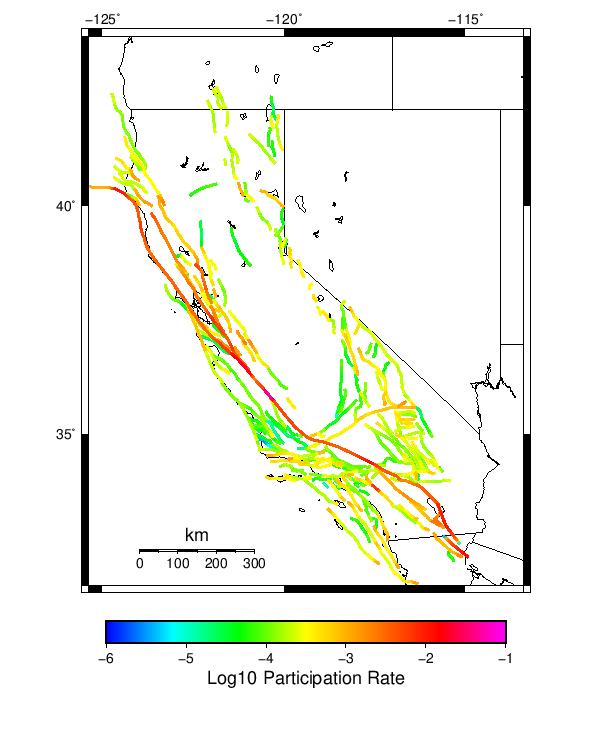
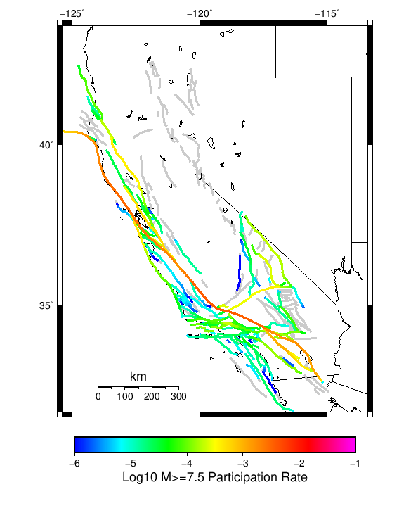
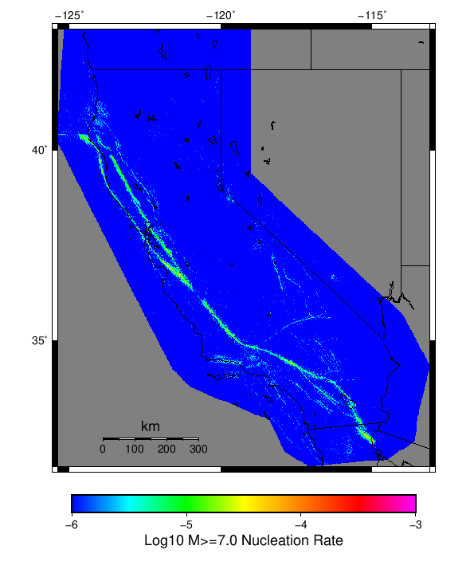

# Spontaneous Results

|   | Spontaneous |
|-----|-----|
| Num Simulations | 1000 |
| Start Time | 2012/01/01 00:00:00 UTC |
| Start Time Epoch Milliseconds | 1325376000000 |
| Duration | 1000 Years |
| Includes Spontaneous? | true |
| Trigger Ruptures | *(none)* |
| Historical Ruptures | 60366 Trigger Ruptures |
|   | First: M7.3 at 1852/01/05 04:40:39 UTC |
|   | Last: M3.2 at 2011/12/31 19:14:44 UTC |
|   | Largest: M7.9 at 1857/01/09 16:25:39 UTC |

## Table Of Contents

* [Magnitude Frequency Distribution](#magnitude-frequency-distribution)
* [Long Term Rate Variability](#long-term-rate-variability)
  * [80 Year Variability](#80-year-variability)
  * [62 Year Variability](#62-year-variability)
  * [28 Year Variability](#28-year-variability)
  * [Variability Duration Dependence](#variability-duration-dependence)
* [Section Participation](#section-participation)
  * [Section Participation Plots](#section-participation-plots)
  * [Supra-Seismogenic Parent Sections Table](#supra-seismogenic-parent-sections-table)
  * [M≥6.5 Parent Sections Table](#m65-parent-sections-table)
  * [M≥7 Parent Sections Table](#m7-parent-sections-table)
  * [M≥7.5 Parent Sections Table](#m75-parent-sections-table)
  * [M≥8 Parent Sections Table](#m8-parent-sections-table)
* [Gridded Nucleation](#gridded-nucleation)
* [JSON Input File](#json-input-file)

## Magnitude Frequency Distribution
*[(top)](#table-of-contents)*

**Legend**
* **Mean** (thick black line): mean annual rate across all 1000 catalogs
* **2.5%,97.5%** (thin black lines): annual rate percentiles across all 1000 catalogs
* **Median** (thin blue line): median annual rate across all 1000 catalogs
* **Mode** (thin cyan line): modal annual rate across all 1000 catalogs (scaled to annualized value)
* **1000 yr Probability** (thin red line): 1000 year probability calculated as the fraction of catalogs with at least 1 occurrence
* **95% Conf** (light red shaded region): binomial 95% confidence bounds on probability


| Mag | Mean | 2.5 %ile | 97.5 %ile | Median | Mode | 1000 yr Probability |
|-----|-----|-----|-----|-----|-----|-----|
| **M&ge;5** | 7.399 | 6.809 | 8.053 | 7.388 | 7.418 | 1.000 |
| **M&ge;5.1** | 5.851 | 5.368 | 6.361 | 5.847 | 5.897 | 1.000 |
| **M&ge;5.2** | 4.620 | 4.224 | 5.037 | 4.613 | 4.563 | 1.000 |
| **M&ge;5.3** | 3.643 | 3.326 | 4.003 | 3.633 | 3.572 | 1.000 |
| **M&ge;5.4** | 2.867 | 2.609 | 3.149 | 2.859 | 2.784 | 1.000 |
| **M&ge;5.5** | 2.250 | 2.045 | 2.475 | 2.245 | 2.204 | 1.000 |
| **M&ge;5.6** | 1.760 | 1.589 | 1.946 | 1.756 | 1.815 | 1.000 |
| **M&ge;5.7** | 1.370 | 1.235 | 1.517 | 1.364 | 1.399 | 1.000 |
| **M&ge;5.8** | 1.060 | 0.952 | 1.182 | 1.057 | 1.041 | 1.000 |
| **M&ge;5.9** | 0.803 | 0.718 | 0.902 | 0.802 | 0.814 | 1.000 |
| **M&ge;6** | 0.633 | 0.564 | 0.714 | 0.630 | 0.625 | 1.000 |
| **M&ge;6.1** | 0.484 | 0.426 | 0.551 | 0.482 | 0.480 | 1.000 |
| **M&ge;6.2** | 0.381 | 0.330 | 0.437 | 0.380 | 0.366 | 1.000 |
| **M&ge;6.3** | 0.301 | 0.263 | 0.345 | 0.300 | 0.310 | 1.000 |
| **M&ge;6.4** | 0.234 | 0.199 | 0.271 | 0.233 | 0.235 | 1.000 |
| **M&ge;6.5** | 0.179 | 0.149 | 0.212 | 0.179 | 0.175 | 1.000 |
| **M&ge;6.6** | 0.139 | 0.111 | 0.167 | 0.139 | 0.130 | 1.000 |
| **M&ge;6.7** | 0.107 | 0.085 | 0.131 | 0.106 | 0.110 | 1.000 |
| **M&ge;6.8** | 0.084 | 0.067 | 0.104 | 0.084 | 0.083 | 1.000 |
| **M&ge;6.9** | 0.065 | 0.051 | 0.082 | 0.065 | 0.065 | 1.000 |
| **M&ge;7** | 0.051 | 0.038 | 0.066 | 0.051 | 0.052 | 1.000 |
| **M&ge;7.1** | 0.038 | 0.028 | 0.050 | 0.038 | 0.037 | 1.000 |
| **M&ge;7.2** | 0.029 | 0.020 | 0.039 | 0.029 | 0.029 | 1.000 |
| **M&ge;7.3** | 0.023 | 0.015 | 0.031 | 0.022 | 0.022 | 1.000 |
| **M&ge;7.4** | 0.017 | 0.011 | 0.024 | 0.017 | 0.018 | 1.000 |
| **M&ge;7.5** | 0.012 | 7.00E-3 | 0.018 | 0.012 | 0.012 | 1.000 |
| **M&ge;7.6** | 9.45E-3 | 5.00E-3 | 0.014 | 9.00E-3 | 9.00E-3 | 1.000 |
| **M&ge;7.7** | 6.73E-3 | 3.00E-3 | 0.011 | 7.00E-3 | 7.00E-3 | 1.000 |
| **M&ge;7.8** | 4.76E-3 | 2.00E-3 | 8.00E-3 | 5.00E-3 | 4.00E-3 | 0.998 |
| **M&ge;7.9** | 2.66E-3 | 0.000 | 5.00E-3 | 3.00E-3 | 2.00E-3 | 0.971 |
| **M&ge;8** | 1.51E-3 | 0.000 | 4.00E-3 | 1.00E-3 | 1.00E-3 | 0.841 |
| **M&ge;8.1** | 7.21E-4 | 0.000 | 2.00E-3 | 1.00E-3 | 0.000 | 0.547 |
| **M&ge;8.2** | 3.28E-4 | 0.000 | 2.00E-3 | 0.000 | 0.000 | 0.295 |
| **M&ge;8.3** | 6.50E-5 | 0.000 | 1.00E-3 | 0.000 | 0.000 | 0.065 |
| **M&ge;8.4** | 0.000 | 0.000 | 0.000 | 0.000 | 0.000 | 0.000 |
| **M&ge;8.5** | 0.000 | 0.000 | 0.000 | 0.000 | 0.000 | 0.000 |
| **M&ge;8.6** | 0.000 | 0.000 | 0.000 | 0.000 | 0.000 | 0.000 |
| **M&ge;8.7** | 0.000 | 0.000 | 0.000 | 0.000 | 0.000 | 0.000 |
| **M&ge;8.8** | 0.000 | 0.000 | 0.000 | 0.000 | 0.000 | 0.000 |
| **M&ge;8.9** | 0.000 | 0.000 | 0.000 | 0.000 | 0.000 | 0.000 |
| **M&ge;9** | 0.000 | 0.000 | 0.000 | 0.000 | 0.000 | 0.000 |

## Long Term Rate Variability
*[(top)](#table-of-contents)*

### 80 Year Variability
*[(top)](#table-of-contents)*


[Download CSV Here](plots/long_term_var_80yr.csv)

| **Magnitude** | Mean | Median | Mode | Std. Dev. | 2.5 %-ile | 16 %-ile | 84 %-ile | 97.5 %-ile |
|-----|-----|-----|-----|-----|-----|-----|-----|-----|
| **5.0** | 7.3642116 | 7.275 | 7.0125 | 1.0147133 | 5.6625 | 6.3625 | 8.3625 | 9.6 |
| **5.1** | 5.8225713 | 5.75 | 5.6 | 0.81386024 | 4.45 | 5.025 | 6.625 | 7.6125 |
| **5.2** | 4.5974574 | 4.5375 | 4.5 | 0.65312314 | 3.4875 | 3.95 | 5.2375 | 6.0375 |
| **5.3** | 3.6246355 | 3.5875 | 3.6375 | 0.52523917 | 2.725 | 3.1125 | 4.1375 | 4.775 |
| **5.4** | 2.8521497 | 2.825 | 2.7875 | 0.42282784 | 2.125 | 2.4375 | 3.2625 | 3.775 |
| **5.5** | 2.2371664 | 2.2125 | 2.1125 | 0.34063867 | 1.6375 | 1.9 | 2.575 | 2.975 |
| **5.6** | 1.7499365 | 1.7375 | 1.7125 | 0.27436647 | 1.2625 | 1.475 | 2.0125 | 2.3375 |
| **5.7** | 1.3617667 | 1.35 | 1.3 | 0.2211606 | 0.975 | 1.15 | 1.575 | 1.8375 |
| **5.8** | 1.0530812 | 1.0375 | 1.0375 | 0.17869489 | 0.7375 | 0.875 | 1.225 | 1.4375 |
| **5.9** | 0.7974985 | 0.7875 | 0.75 | 0.14298086 | 0.5375 | 0.6625 | 0.9375 | 1.1 |
| **6.0** | 0.62755394 | 0.625 | 0.6 | 0.11819232 | 0.4125 | 0.5125 | 0.7375 | 0.875 |
| **6.1** | 0.47975293 | 0.475 | 0.4625 | 0.09790094 | 0.3 | 0.3875 | 0.575 | 0.6875 |
| **6.2** | 0.377487 | 0.375 | 0.375 | 0.08255074 | 0.225 | 0.3 | 0.4625 | 0.55 |
| **6.3** | 0.29776496 | 0.2875 | 0.275 | 0.07017839 | 0.175 | 0.225 | 0.3625 | 0.45 |
| **6.4** | 0.23133995 | 0.225 | 0.225 | 0.059918255 | 0.125 | 0.175 | 0.2875 | 0.3625 |
| **6.5** | 0.1770723 | 0.175 | 0.1625 | 0.05136722 | 0.0875 | 0.125 | 0.225 | 0.2875 |
| **6.6** | 0.13714436 | 0.1375 | 0.125 | 0.043835074 | 0.0625 | 0.1 | 0.175 | 0.225 |
| **6.7** | 0.10522108 | 0.1 | 0.1 | 0.0376749 | 0.0375 | 0.0625 | 0.1375 | 0.1875 |
| **6.8** | 0.082887255 | 0.075 | 0.075 | 0.032617334 | 0.025 | 0.05 | 0.1125 | 0.15 |
| **6.9** | 0.06436789 | 0.0625 | 0.0625 | 0.028307512 | 0.0125 | 0.0375 | 0.0875 | 0.125 |
| **7.0** | 0.05034951 | 0.05 | 0.0375 | 0.024647392 | 0.0125 | 0.025 | 0.075 | 0.1 |
| **7.1** | 0.037785295 | 0.0375 | 0.025 | 0.021193719 | 0.0 | 0.0125 | 0.0625 | 0.0875 |
| **7.2** | 0.028238235 | 0.025 | 0.025 | 0.01795755 | 0.0 | 0.0125 | 0.05 | 0.0625 |
| **7.3** | 0.02228799 | 0.025 | 0.0125 | 0.015706982 | 0.0 | 0.0125 | 0.0375 | 0.0625 |
| **7.4** | 0.017162746 | 0.0125 | 0.0125 | 0.013685776 | 0.0 | 0.0 | 0.025 | 0.05 |
| **7.5** | 0.012209069 | 0.0125 | 0.0125 | 0.011436661 | 0.0 | 0.0 | 0.025 | 0.0375 |
| **7.6** | 0.009298774 | 0.0125 | 0.0 | 0.009761355 | 0.0 | 0.0 | 0.0125 | 0.025 |
| **7.7** | 0.0066095586 | 0.0 | 0.0 | 0.008165759 | 0.0 | 0.0 | 0.0125 | 0.025 |
| **7.8** | 0.0046882355 | 0.0 | 0.0 | 0.0069102664 | 0.0 | 0.0 | 0.0125 | 0.025 |
| **7.9** | 0.0026044117 | 0.0 | 0.0 | 0.0052720765 | 0.0 | 0.0 | 0.0125 | 0.0125 |
| **8.0** | 0.0014779412 | 0.0 | 0.0 | 0.0040776576 | 0.0 | 0.0 | 0.0 | 0.0125 |
| **8.1** | 7.0514705E-4 | 0.0 | 0.0 | 0.0028860916 | 0.0 | 0.0 | 0.0 | 0.0125 |
| **8.2** | 3.223039E-4 | 0.0 | 0.0 | 0.0019811604 | 0.0 | 0.0 | 0.0 | 0.0125 |
| **8.3** | 6.32353E-5 | 0.0 | 0.0 | 8.868246E-4 | 0.0 | 0.0 | 0.0 | 0.0 |
| **8.4** | 0.0 | 0.0 | 0.0 | 0.0 | 0.0 | 0.0 | 0.0 | 0.0 |
| **8.5** | 0.0 | 0.0 | 0.0 | 0.0 | 0.0 | 0.0 | 0.0 | 0.0 |
| **8.6** | 0.0 | 0.0 | 0.0 | 0.0 | 0.0 | 0.0 | 0.0 | 0.0 |
| **8.7** | 0.0 | 0.0 | 0.0 | 0.0 | 0.0 | 0.0 | 0.0 | 0.0 |
| **8.8** | 0.0 | 0.0 | 0.0 | 0.0 | 0.0 | 0.0 | 0.0 | 0.0 |
| **8.9** | 0.0 | 0.0 | 0.0 | 0.0 | 0.0 | 0.0 | 0.0 | 0.0 |
| **9.0** | 0.0 | 0.0 | 0.0 | 0.0 | 0.0 | 0.0 | 0.0 | 0.0 |

### 62 Year Variability
*[(top)](#table-of-contents)*


[Download CSV Here](plots/long_term_var_62yr.csv)

| **Magnitude** | Mean | Median | Mode | Std. Dev. | 2.5 %-ile | 16 %-ile | 84 %-ile | 97.5 %-ile |
|-----|-----|-----|-----|-----|-----|-----|-----|-----|
| **5.0** | 7.37619 | 7.225806 | 7.096774 | 1.1658992 | 5.5 | 6.2419353 | 8.5161295 | 10.032258 |
| **5.1** | 5.8322806 | 5.725806 | 5.370968 | 0.9343458 | 4.306452 | 4.919355 | 6.7419353 | 7.935484 |
| **5.2** | 4.6053057 | 4.516129 | 4.596774 | 0.74918956 | 3.3709676 | 3.8709676 | 5.33871 | 6.290323 |
| **5.3** | 3.630907 | 3.564516 | 3.419355 | 0.6019028 | 2.6290324 | 3.048387 | 4.225806 | 4.983871 |
| **5.4** | 2.8572176 | 2.8064516 | 2.7419355 | 0.4845455 | 2.048387 | 2.387097 | 3.3225806 | 3.935484 |
| **5.5** | 2.2413158 | 2.2096775 | 2.064516 | 0.38981727 | 1.5806452 | 1.8548387 | 2.612903 | 3.112903 |
| **5.6** | 1.7534133 | 1.7258065 | 1.6774193 | 0.31368515 | 1.2096775 | 1.451613 | 2.064516 | 2.451613 |
| **5.7** | 1.3646585 | 1.3387097 | 1.3387097 | 0.2524594 | 0.9354839 | 1.1129032 | 1.6129032 | 1.9193548 |
| **5.8** | 1.0553722 | 1.048387 | 1.016129 | 0.20356849 | 0.6935484 | 0.8548387 | 1.2580645 | 1.5 |
| **5.9** | 0.799303 | 0.7903226 | 0.7419355 | 0.16293404 | 0.516129 | 0.6451613 | 0.9516129 | 1.1451613 |
| **6.0** | 0.62913376 | 0.61290324 | 0.61290324 | 0.1346552 | 0.38709676 | 0.5 | 0.7580645 | 0.91935486 |
| **6.1** | 0.48104492 | 0.46774194 | 0.46774194 | 0.11166257 | 0.27419356 | 0.37096775 | 0.5967742 | 0.7258065 |
| **6.2** | 0.37848955 | 0.37096775 | 0.37096775 | 0.09418214 | 0.20967741 | 0.29032257 | 0.46774194 | 0.58064514 |
| **6.3** | 0.29854017 | 0.29032257 | 0.27419356 | 0.08035978 | 0.16129032 | 0.22580644 | 0.37096775 | 0.46774194 |
| **6.4** | 0.23195668 | 0.22580644 | 0.22580644 | 0.0687508 | 0.11290322 | 0.16129032 | 0.30645162 | 0.38709676 |
| **6.5** | 0.17761385 | 0.17741935 | 0.16129032 | 0.058924552 | 0.08064516 | 0.11290322 | 0.24193548 | 0.30645162 |
| **6.6** | 0.13758887 | 0.12903225 | 0.12903225 | 0.050372116 | 0.048387095 | 0.08064516 | 0.19354838 | 0.24193548 |
| **6.7** | 0.105589814 | 0.09677419 | 0.09677419 | 0.043344017 | 0.032258064 | 0.06451613 | 0.14516129 | 0.19354838 |
| **6.8** | 0.08321916 | 0.08064516 | 0.08064516 | 0.03761047 | 0.016129032 | 0.048387095 | 0.11290322 | 0.16129032 |
| **6.9** | 0.06465623 | 0.06451613 | 0.048387095 | 0.032661084 | 0.016129032 | 0.032258064 | 0.09677419 | 0.12903225 |
| **7.0** | 0.05055819 | 0.048387095 | 0.048387095 | 0.028480422 | 0.0 | 0.016129032 | 0.08064516 | 0.11290322 |
| **7.1** | 0.037951928 | 0.032258064 | 0.032258064 | 0.024494495 | 0.0 | 0.016129032 | 0.06451613 | 0.09677419 |
| **7.2** | 0.028389627 | 0.032258064 | 0.016129032 | 0.020879725 | 0.0 | 0.0 | 0.048387095 | 0.08064516 |
| **7.3** | 0.02239785 | 0.016129032 | 0.016129032 | 0.018273495 | 0.0 | 0.0 | 0.032258064 | 0.06451613 |
| **7.4** | 0.017262492 | 0.016129032 | 0.016129032 | 0.015905328 | 0.0 | 0.0 | 0.032258064 | 0.048387095 |
| **7.5** | 0.01228716 | 0.016129032 | 0.0 | 0.013318176 | 0.0 | 0.0 | 0.032258064 | 0.048387095 |
| **7.6** | 0.009371284 | 0.0 | 0.0 | 0.01140757 | 0.0 | 0.0 | 0.016129032 | 0.032258064 |
| **7.7** | 0.0066736243 | 0.0 | 0.0 | 0.009551972 | 0.0 | 0.0 | 0.016129032 | 0.032258064 |
| **7.8** | 0.004734029 | 0.0 | 0.0 | 0.008066951 | 0.0 | 0.0 | 0.016129032 | 0.016129032 |
| **7.9** | 0.0026404175 | 0.0 | 0.0 | 0.0061381655 | 0.0 | 0.0 | 0.0 | 0.016129032 |
| **8.0** | 0.001488931 | 0.0 | 0.0 | 0.0047091404 | 0.0 | 0.0 | 0.0 | 0.016129032 |
| **8.1** | 7.175838E-4 | 0.0 | 0.0 | 0.0033286074 | 0.0 | 0.0 | 0.0 | 0.016129032 |
| **8.2** | 3.2605947E-4 | 0.0 | 0.0 | 0.00226998 | 0.0 | 0.0 | 0.0 | 0.0 |
| **8.3** | 6.6097404E-5 | 0.0 | 0.0 | 0.0010304073 | 0.0 | 0.0 | 0.0 | 0.0 |
| **8.4** | 0.0 | 0.0 | 0.0 | 0.0 | 0.0 | 0.0 | 0.0 | 0.0 |
| **8.5** | 0.0 | 0.0 | 0.0 | 0.0 | 0.0 | 0.0 | 0.0 | 0.0 |
| **8.6** | 0.0 | 0.0 | 0.0 | 0.0 | 0.0 | 0.0 | 0.0 | 0.0 |
| **8.7** | 0.0 | 0.0 | 0.0 | 0.0 | 0.0 | 0.0 | 0.0 | 0.0 |
| **8.8** | 0.0 | 0.0 | 0.0 | 0.0 | 0.0 | 0.0 | 0.0 | 0.0 |
| **8.9** | 0.0 | 0.0 | 0.0 | 0.0 | 0.0 | 0.0 | 0.0 | 0.0 |
| **9.0** | 0.0 | 0.0 | 0.0 | 0.0 | 0.0 | 0.0 | 0.0 | 0.0 |

### 28 Year Variability
*[(top)](#table-of-contents)*


[Download CSV Here](plots/long_term_var_28yr.csv)

| **Magnitude** | Mean | Median | Mode | Std. Dev. | 2.5 %-ile | 16 %-ile | 84 %-ile | 97.5 %-ile |
|-----|-----|-----|-----|-----|-----|-----|-----|-----|
| **5.0** | 7.395474 | 7.035714 | 6.821429 | 1.7431982 | 4.928571 | 5.821429 | 8.964286 | 11.75 |
| **5.1** | 5.847902 | 5.571429 | 5.392857 | 1.3967453 | 3.8214285 | 4.571429 | 7.107143 | 9.285714 |
| **5.2** | 4.6175117 | 4.428571 | 4.0 | 1.1201556 | 2.9642856 | 3.607143 | 5.642857 | 7.357143 |
| **5.3** | 3.6404328 | 3.5 | 3.2857144 | 0.8991325 | 2.2857144 | 2.8214285 | 4.464286 | 5.821429 |
| **5.4** | 2.8647296 | 2.75 | 2.7142856 | 0.72263485 | 1.75 | 2.1785715 | 3.5357144 | 4.607143 |
| **5.5** | 2.2474504 | 2.1785715 | 2.0 | 0.581156 | 1.3214285 | 1.7142857 | 2.7857144 | 3.607143 |
| **5.6** | 1.758166 | 1.7142857 | 1.5357143 | 0.467743 | 1.0 | 1.3214285 | 2.2142856 | 2.857143 |
| **5.7** | 1.3684216 | 1.3214285 | 1.25 | 0.37562275 | 0.75 | 1.0 | 1.7142857 | 2.25 |
| **5.8** | 1.0585105 | 1.0357143 | 0.96428573 | 0.30272698 | 0.5714286 | 0.78571427 | 1.3571428 | 1.75 |
| **5.9** | 0.80210996 | 0.78571427 | 0.71428573 | 0.2428681 | 0.39285713 | 0.5714286 | 1.0357143 | 1.3571428 |
| **6.0** | 0.63171077 | 0.60714287 | 0.5714286 | 0.20101315 | 0.2857143 | 0.42857143 | 0.8214286 | 1.0714285 |
| **6.1** | 0.4832171 | 0.4642857 | 0.42857143 | 0.16733782 | 0.21428572 | 0.32142857 | 0.64285713 | 0.85714287 |
| **6.2** | 0.38032633 | 0.35714287 | 0.32142857 | 0.14173503 | 0.14285715 | 0.25 | 0.5 | 0.6785714 |
| **6.3** | 0.30007702 | 0.2857143 | 0.2857143 | 0.12127104 | 0.10714286 | 0.17857143 | 0.42857143 | 0.5714286 |
| **6.4** | 0.23338866 | 0.21428572 | 0.21428572 | 0.10411074 | 0.071428575 | 0.14285715 | 0.32142857 | 0.4642857 |
| **6.5** | 0.17889215 | 0.17857143 | 0.14285715 | 0.08955117 | 0.035714287 | 0.10714286 | 0.25 | 0.39285713 |
| **6.6** | 0.13868907 | 0.14285715 | 0.10714286 | 0.0766505 | 0.0 | 0.071428575 | 0.21428572 | 0.32142857 |
| **6.7** | 0.1064979 | 0.10714286 | 0.071428575 | 0.06625293 | 0.0 | 0.035714287 | 0.17857143 | 0.25 |
| **6.8** | 0.08388025 | 0.071428575 | 0.071428575 | 0.05782816 | 0.0 | 0.035714287 | 0.14285715 | 0.21428572 |
| **6.9** | 0.06515896 | 0.071428575 | 0.035714287 | 0.050240837 | 0.0 | 0.0 | 0.10714286 | 0.17857143 |
| **7.0** | 0.051036414 | 0.035714287 | 0.035714287 | 0.04397656 | 0.0 | 0.0 | 0.10714286 | 0.14285715 |
| **7.1** | 0.03832423 | 0.035714287 | 0.035714287 | 0.037815552 | 0.0 | 0.0 | 0.071428575 | 0.14285715 |
| **7.2** | 0.028686974 | 0.035714287 | 0.0 | 0.03242457 | 0.0 | 0.0 | 0.071428575 | 0.10714286 |
| **7.3** | 0.022686275 | 0.0 | 0.0 | 0.02850052 | 0.0 | 0.0 | 0.035714287 | 0.10714286 |
| **7.4** | 0.01742717 | 0.0 | 0.0 | 0.024777466 | 0.0 | 0.0 | 0.035714287 | 0.071428575 |
| **7.5** | 0.012382353 | 0.0 | 0.0 | 0.020782683 | 0.0 | 0.0 | 0.035714287 | 0.071428575 |
| **7.6** | 0.0094432775 | 0.0 | 0.0 | 0.01793098 | 0.0 | 0.0 | 0.035714287 | 0.071428575 |
| **7.7** | 0.0067114844 | 0.0 | 0.0 | 0.014997278 | 0.0 | 0.0 | 0.035714287 | 0.035714287 |
| **7.8** | 0.0047668065 | 0.0 | 0.0 | 0.01264036 | 0.0 | 0.0 | 0.0 | 0.035714287 |
| **7.9** | 0.0026519608 | 0.0 | 0.0 | 0.009480645 | 0.0 | 0.0 | 0.0 | 0.035714287 |
| **8.0** | 0.0015021008 | 0.0 | 0.0 | 0.007196619 | 0.0 | 0.0 | 0.0 | 0.035714287 |
| **8.1** | 7.247899E-4 | 0.0 | 0.0 | 0.0050359243 | 0.0 | 0.0 | 0.0 | 0.0 |
| **8.2** | 3.2983194E-4 | 0.0 | 0.0 | 0.0034163068 | 0.0 | 0.0 | 0.0 | 0.0 |
| **8.3** | 6.302521E-5 | 0.0 | 0.0 | 0.0014989905 | 0.0 | 0.0 | 0.0 | 0.0 |
| **8.4** | 0.0 | 0.0 | 0.0 | 0.0 | 0.0 | 0.0 | 0.0 | 0.0 |
| **8.5** | 0.0 | 0.0 | 0.0 | 0.0 | 0.0 | 0.0 | 0.0 | 0.0 |
| **8.6** | 0.0 | 0.0 | 0.0 | 0.0 | 0.0 | 0.0 | 0.0 | 0.0 |
| **8.7** | 0.0 | 0.0 | 0.0 | 0.0 | 0.0 | 0.0 | 0.0 | 0.0 |
| **8.8** | 0.0 | 0.0 | 0.0 | 0.0 | 0.0 | 0.0 | 0.0 | 0.0 |
| **8.9** | 0.0 | 0.0 | 0.0 | 0.0 | 0.0 | 0.0 | 0.0 | 0.0 |
| **9.0** | 0.0 | 0.0 | 0.0 | 0.0 | 0.0 | 0.0 | 0.0 | 0.0 |

### Variability Duration Dependence
*[(top)](#table-of-contents)*


[Download CSV Here](plots/long_term_var_m5.csv)

| **Duration (years)** | Mean | Median | Mode | Std. Dev. | 2.5 %-ile | 16 %-ile | 84 %-ile | 97.5 %-ile |
|-----|-----|-----|-----|-----|-----|-----|-----|-----|
| **1.0** | 7.399331 | 6.0 | 5.0 | 7.3469515 | 1.0 | 3.0 | 11.0 | 23.0 |
| **4.0** | 7.399331 | 6.5 | 5.75 | 4.1305423 | 3.0 | 4.5 | 9.75 | 18.5 |
| **8.0** | 7.399331 | 6.625 | 5.75 | 3.076305 | 3.875 | 5.0 | 9.5 | 15.875 |
| **12.0** | 7.3997188 | 6.8333335 | 6.1666665 | 2.5748796 | 4.25 | 5.3333335 | 9.333333 | 14.5 |
| **16.0** | 7.399633 | 6.875 | 6.3125 | 2.2577703 | 4.5 | 5.5 | 9.25 | 13.4375 |
| **20.0** | 7.4000115 | 6.95 | 6.3 | 2.0403607 | 4.7 | 5.65 | 9.15 | 12.75 |
| **24.0** | 7.395496 | 7.0 | 6.875 | 1.8737197 | 4.8333335 | 5.75 | 9.041667 | 12.166667 |
| **28.0** | 7.395474 | 7.035714 | 6.821429 | 1.7431982 | 4.928571 | 5.821429 | 8.964286 | 11.75 |
| **32.0** | 7.392241 | 7.09375 | 6.75 | 1.6350844 | 5.03125 | 5.90625 | 8.90625 | 11.40625 |
| **36.0** | 7.3885083 | 7.111111 | 6.4444447 | 1.5401736 | 5.111111 | 5.9722223 | 8.833333 | 11.111111 |
| **40.0** | 7.3869534 | 7.125 | 6.45 | 1.4642274 | 5.2 | 6.025 | 8.775 | 10.9 |
| **44.0** | 7.385002 | 7.159091 | 7.0 | 1.3959888 | 5.25 | 6.068182 | 8.727273 | 10.681818 |
| **48.0** | 7.380757 | 7.1666665 | 6.7916665 | 1.3341866 | 5.3333335 | 6.1041665 | 8.666667 | 10.5 |
| **52.0** | 7.377571 | 7.1923075 | 6.9038463 | 1.2786368 | 5.3846154 | 6.1538463 | 8.634615 | 10.365385 |
| **56.0** | 7.3759866 | 7.214286 | 6.821429 | 1.2299821 | 5.428571 | 6.196429 | 8.571428 | 10.232142 |
| **60.0** | 7.375318 | 7.2166667 | 6.883333 | 1.1847898 | 5.483333 | 6.2166667 | 8.533334 | 10.1 |
| **64.0** | 7.3753676 | 7.234375 | 6.96875 | 1.1477215 | 5.53125 | 6.25 | 8.5 | 9.96875 |
| **68.0** | 7.37228 | 7.25 | 7.0735292 | 1.1100577 | 5.5588236 | 6.279412 | 8.470589 | 9.867647 |
| **72.0** | 7.368545 | 7.263889 | 7.0555553 | 1.075231 | 5.5972223 | 6.3055553 | 8.430555 | 9.763889 |
| **76.0** | 7.367101 | 7.263158 | 7.0263157 | 1.0432954 | 5.631579 | 6.3421054 | 8.394737 | 9.657895 |
| **80.0** | 7.3642116 | 7.275 | 7.0125 | 1.0147133 | 5.6625 | 6.3625 | 8.3625 | 9.6 |
| **84.0** | 7.36469 | 7.2738094 | 7.035714 | 0.9891846 | 5.6904764 | 6.392857 | 8.333333 | 9.535714 |
| **88.0** | 7.3631206 | 7.284091 | 7.2727275 | 0.96330196 | 5.7272725 | 6.409091 | 8.306818 | 9.477273 |
| **92.0** | 7.3598785 | 7.2934785 | 7.173913 | 0.9389526 | 5.7608695 | 6.423913 | 8.282609 | 9.402174 |
| **96.0** | 7.3579903 | 7.2916665 | 7.1979165 | 0.91687685 | 5.78125 | 6.4479165 | 8.260417 | 9.354167 |
| **100.0** | 7.356542 | 7.29 | 7.13 | 0.89615166 | 5.81 | 6.47 | 8.24 | 9.29 |
| **200.0** | 7.330829 | 7.3 | 7.27 | 0.6021837 | 6.23 | 6.74 | 7.925 | 8.59 |
| **300.0** | 7.3187037 | 7.29 | 7.076667 | 0.49402064 | 6.4266667 | 6.8366666 | 7.8033333 | 8.366667 |
| **400.0** | 7.3102293 | 7.2875 | 7.2225 | 0.437342 | 6.5175 | 6.8825 | 7.7425 | 8.24 |
| **500.0** | 7.306333 | 7.28 | 7.212 | 0.40058005 | 6.592 | 6.914 | 7.708 | 8.16 |
| **600.0** | 7.309042 | 7.286667 | 7.2933335 | 0.37628704 | 6.635 | 6.9383335 | 7.6866665 | 8.105 |
| **700.0** | 7.316065 | 7.292857 | 7.1885715 | 0.35978416 | 6.6757145 | 6.9628572 | 7.6814284 | 8.0742855 |
| **800.0** | 7.3264723 | 7.30625 | 7.37 | 0.3444092 | 6.71875 | 6.99 | 7.675 | 8.05375 |
| **900.0** | 7.3491626 | 7.332222 | 7.3133335 | 0.32984945 | 6.752222 | 7.0255556 | 7.68 | 8.037778 |
| **1000.0** | 7.399331 | 7.388 | 7.418 | 0.31810483 | 6.809 | 7.089 | 7.722 | 8.053 |

## Section Participation
*[(top)](#table-of-contents)*

### Section Participation Plots
*[(top)](#table-of-contents)*

| Min Mag | Complete Catalog (including spontaneous) |
|-----|-----|
| **All Supra. Seis.** |  |
| **M&ge;6.5** |  |
| **M&ge;7** |  |
| **M&ge;7.5** |  |
| **M&ge;8** |  |

### Supra-Seismogenic Parent Sections Table
*[(top)](#table-of-contents)*

*First 10 of 313 with matching ruptures shown*

| Parent Name | Total Mean Annual Rate | Total 1000 Year Prob |
|-----|-----|-----|
| San Andreas (Parkfield) | 0.04456 | 1.0 |
| San Andreas (Creeping Section) 2011 CFM | 0.028655 | 1.0 |
| San Andreas (Mojave S) | 0.019509 | 1.0 |
| Mendocino | 0.017907 | 1.0 |
| Cerro Prieto | 0.013959 | 1.0 |
| Imperial | 0.011578 | 1.0 |
| Brawley (Seismic Zone) alt 1 | 0.010667 | 1.0 |
| Hayward (So) 2011 CFM | 0.009643 | 1.0 |
| San Andreas (Offshore) 2011 CFM | 0.008809 | 1.0 |
| Elsinore (Glen Ivy) rev | 0.008582 | 1.0 |

### M≥6.5 Parent Sections Table
*[(top)](#table-of-contents)*

*First 10 of 306 with matching ruptures shown*

| Parent Name | Total Mean Annual Rate | Total 1000 Year Prob |
|-----|-----|-----|
| Cerro Prieto | 0.011952 | 1.0 |
| San Andreas (Creeping Section) 2011 CFM | 0.010981 | 1.0 |
| Mendocino | 0.009115 | 1.0 |
| Hayward (So) 2011 CFM | 0.008166 | 1.0 |
| Imperial | 0.00795 | 1.0 |
| Brawley (Seismic Zone) alt 1 | 0.007518 | 1.0 |
| San Andreas (Santa Cruz Mts) 2011 CFM | 0.007394 | 1.0 |
| San Andreas (Mojave S) | 0.006565 | 1.0 |
| San Andreas (Offshore) 2011 CFM | 0.006212 | 1.0 |
| San Andreas (San Bernardino N) | 0.005967 | 1.0 |

### M≥7 Parent Sections Table
*[(top)](#table-of-contents)*

*First 10 of 273 with matching ruptures shown*

| Parent Name | Total Mean Annual Rate | Total 1000 Year Prob |
|-----|-----|-----|
| San Andreas (Creeping Section) 2011 CFM | 0.006984 | 1.0 |
| San Andreas (Santa Cruz Mts) 2011 CFM | 0.005698 | 1.0 |
| San Andreas (Carrizo) rev | 0.005295 | 1.0 |
| San Andreas (Cholame) rev | 0.005285 | 1.0 |
| San Andreas (Mojave S) | 0.004633 | 1.0 |
| San Andreas (North Coast) 2011 CFM | 0.004619 | 0.999 |
| Cerro Prieto | 0.004333 | 0.999 |
| San Andreas (Offshore) 2011 CFM | 0.004264 | 1.0 |
| San Andreas (Mojave N) | 0.004256 | 1.0 |
| San Andreas (Big Bend) | 0.004098 | 1.0 |

### M≥7.5 Parent Sections Table
*[(top)](#table-of-contents)*

*First 10 of 207 with matching ruptures shown*

| Parent Name | Total Mean Annual Rate | Total 1000 Year Prob |
|-----|-----|-----|
| San Andreas (Mojave N) | 0.004165 | 1.0 |
| San Andreas (Big Bend) | 0.00397 | 1.0 |
| San Andreas (Carrizo) rev | 0.003768 | 0.999 |
| San Andreas (North Coast) 2011 CFM | 0.003713 | 0.989 |
| San Andreas (Mojave S) | 0.003697 | 0.997 |
| San Andreas (Cholame) rev | 0.003603 | 0.998 |
| San Andreas (Creeping Section) 2011 CFM | 0.003325 | 0.984 |
| San Andreas (Peninsula) 2011 CFM | 0.003114 | 0.984 |
| San Andreas (San Bernardino N) | 0.003002 | 0.988 |
| San Andreas (Parkfield) | 0.002843 | 0.986 |

### M≥8 Parent Sections Table
*[(top)](#table-of-contents)*

*First 10 of 68 with matching ruptures shown*

| Parent Name | Total Mean Annual Rate | Total 1000 Year Prob |
|-----|-----|-----|
| San Andreas (Mojave N) | 0.001331 | 0.804 |
| San Andreas (Carrizo) rev | 0.00133 | 0.801 |
| San Andreas (Big Bend) | 0.001319 | 0.799 |
| San Andreas (Cholame) rev | 0.001303 | 0.79 |
| San Andreas (Mojave S) | 0.001288 | 0.787 |
| San Andreas (San Bernardino N) | 0.001224 | 0.768 |
| San Andreas (Parkfield) | 0.001165 | 0.74 |
| San Andreas (Creeping Section) 2011 CFM | 0.001091 | 0.704 |
| San Andreas (Santa Cruz Mts) 2011 CFM | 8.05E-4 | 0.588 |
| San Andreas (Peninsula) 2011 CFM | 7.23E-4 | 0.55 |
## Gridded Nucleation
*[(top)](#table-of-contents)*

| Min Mag | Complete Catalog (including spontaneous) |
|-----|-----|
| **M&ge;5** |  |
| **M&ge;6** |  |
| **M&ge;7** |  |

## JSON Input File
*[(top)](#table-of-contents)*

```
{
  "numSimulations": 1000,
  "duration": 1000.0,
  "startYear": 2012,
  "includeSpontaneous": true,
  "randomSeed": 123456789,
  "binaryOutput": true,
  "binaryOutputFilters": [
    {
      "prefix": "results_complete",
      "descendantsOnly": false
    },
    {
      "prefix": "results_m5_preserve_chain",
      "minMag": 5.0,
      "preserveChainBelowMag": true,
      "descendantsOnly": false
    }
  ],
  "forceRecalc": false,
  "reuseERFs": false,
  "simulationName": "Spontaneous",
  "numRetries": 3,
  "outputDir": "${ETAS_SIM_DIR}/2019_06_05-Spontaneous-includeSpont-historicalCatalog-full_td-1000yr",
  "triggerCatalog": "${ETAS_LAUNCHER}/inputs/u3_historical_catalog.txt",
  "triggerCatalogSurfaceMappings": "${ETAS_LAUNCHER}/inputs/u3_historical_catalog_finite_fault_mappings.xml",
  "treatTriggerCatalogAsSpontaneous": true,
  "cacheDir": "${ETAS_LAUNCHER}/inputs/cache_fm3p1_ba",
  "fssFile": "${ETAS_LAUNCHER}/inputs/2013_05_10-ucerf3p3-production-10runs_COMPOUND_SOL_FM3_1_SpatSeisU3_MEAN_BRANCH_AVG_SOL.zip",
  "probModel": "FULL_TD",
  "applySubSeisForSupraNucl": true,
  "totRateScaleFactor": 1.14,
  "gridSeisCorr": true,
  "timeIndependentERF": false,
  "griddedOnly": false,
  "imposeGR": false,
  "includeIndirectTriggering": true,
  "gridSeisDiscr": 0.1,
  "catalogCompletenessModel": "RELAXED"
}
```

