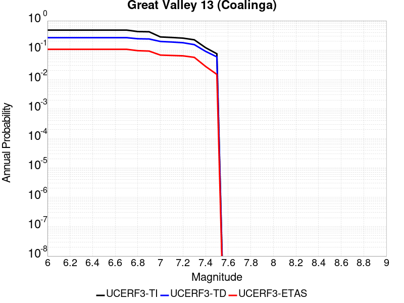
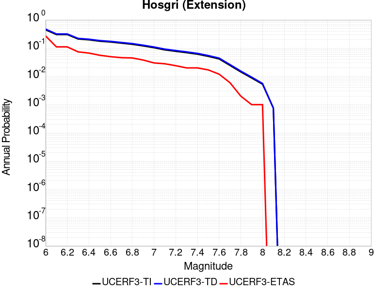
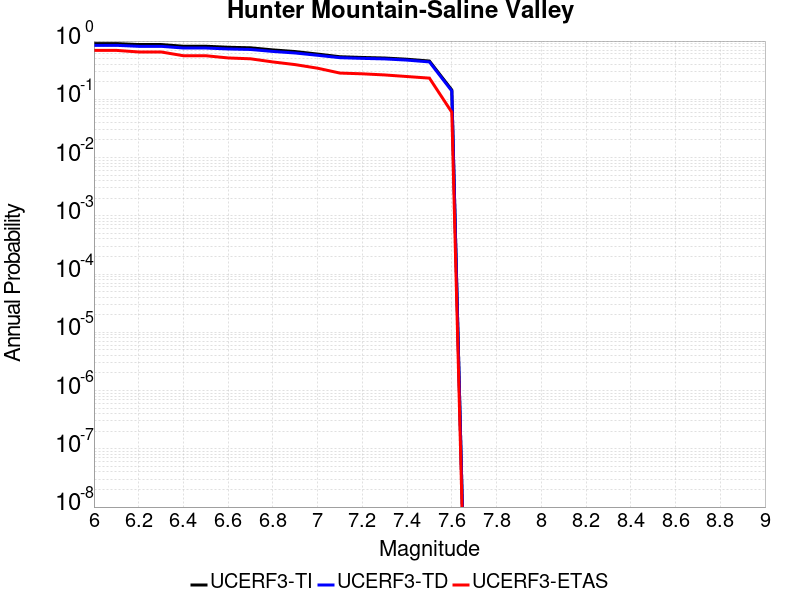
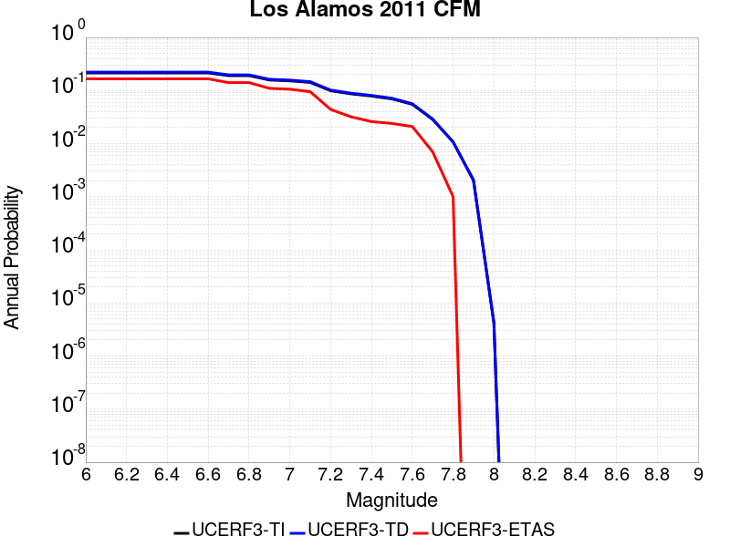
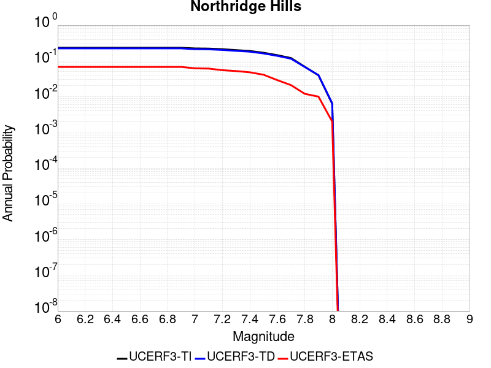

# Parent Section Magnitude-Probability Distributions

## Table Of Contents

* [Airport Lake](#airport-lake)
* [Almanor 2011 CFM](#almanor-2011-cfm)
* [Anacapa-Dume alt 1](#anacapa-dume-alt-1)
* [Anaheim](#anaheim)
* [Antelope Valley 2011](#antelope-valley-2011)
* [Ash Hill](#ash-hill)
* [Baker](#baker)
* [Bartlett Springs 2011 CFM](#bartlett-springs-2011-cfm)
* [Battle Creek 2011 CFM](#battle-creek-2011-cfm)
* [Bear River fault zone](#bear-river-fault-zone)
* [Bennett Valley 2011 CFM](#bennett-valley-2011-cfm)
* [Bicycle Lake](#bicycle-lake)
* [Big Lagoon - Bald Mtn 2011 CFM](#big-lagoon---bald-mtn-2011-cfm)
* [Big Pine (Central)](#big-pine-central)
* [Big Pine (East)](#big-pine-east)
* [Big Pine (West)](#big-pine-west)
* [Blackwater](#blackwater)
* [Blue Cut](#blue-cut)
* [Brawley (Seismic Zone) alt 1](#brawley-seismic-zone-alt-1)
* [Breckenridge 2011](#breckenridge-2011)
* [Bullion Mountains](#bullion-mountains)
* [Burnt Mtn](#burnt-mtn)
* [Butano 2011 CFM](#butano-2011-cfm)
* [Cady](#cady)
* [Calaveras (Central) 2011 CFM](#calaveras-central-2011-cfm)
* [Calaveras (No) 2011 CFM](#calaveras-no-2011-cfm)
* [Calaveras (So) - Paicines extension 2011 CFM](#calaveras-so---paicines-extension-2011-cfm)
* [Calaveras (So) 2011 CFM](#calaveras-so-2011-cfm)
* [Calico-Hidalgo](#calico-hidalgo)
* [Camp Rock 2011](#camp-rock-2011)
* [Canada David (Detachment)](#canada-david-detachment)
* [Carlsbad](#carlsbad)
* [Carson Range (Genoa)](#carson-range-genoa)
* [Casmalia 2011 CFM](#casmalia-2011-cfm)
* [Cedar Mtn-Mahogany Mtn](#cedar-mtn-mahogany-mtn)
* [Cerro Prieto](#cerro-prieto)
* [Channel Islands Thrust](#channel-islands-thrust)
* [Channel Islands Western Deep Ramp](#channel-islands-western-deep-ramp)
* [Chino alt 1](#chino-alt-1)
* [Clamshell-Sawpit](#clamshell-sawpit)
* [Clayton](#clayton)
* [Cleghorn](#cleghorn)
* [Cleghorn Lake](#cleghorn-lake)
* [Cleghorn Pass](#cleghorn-pass)
* [Collayami 2011 CFM](#collayami-2011-cfm)
* [Compton](#compton)
* [Concord 2011 CFM](#concord-2011-cfm)
* [Contra Costa (Lafayette) 2011 CFM](#contra-costa-lafayette-2011-cfm)
* [Contra Costa Shear Zone (connector) 2011 CFM](#contra-costa-shear-zone-connector-2011-cfm)
* [Coronado Bank alt1](#coronado-bank-alt1)
* [Coyote Canyon](#coyote-canyon)
* [Coyote Lake](#coyote-lake)
* [Cucamonga](#cucamonga)
* [Davis Creek](#davis-creek)
* [Death Valley (Black Mtns Frontal)](#death-valley-black-mtns-frontal)
* [Death Valley (Fish Lake Valley)](#death-valley-fish-lake-valley)
* [Death Valley (No)](#death-valley-no)
* [Death Valley (So)](#death-valley-so)
* [Deep Springs](#deep-springs)
* [Del Valle](#del-valle)
* [Dog Valley](#dog-valley)
* [Dry Mountain](#dry-mountain)
* [Earthquake Valley](#earthquake-valley)
* [Earthquake Valley (No  Extension)](#earthquake-valley-no--extension)
* [Earthquake Valley (So Extension)](#earthquake-valley-so-extension)
* [East Huasna 2011 CFM](#east-huasna-2011-cfm)
* [Eaton Roughs 2011 CFM](#eaton-roughs-2011-cfm)
* [Elmore Ranch](#elmore-ranch)
* [Elsinore (Coyote Mountains)](#elsinore-coyote-mountains)
* [Elsinore (Glen Ivy) rev](#elsinore-glen-ivy-rev)
* [Elsinore (Julian)](#elsinore-julian)
* [Elsinore (Stepovers Combined)](#elsinore-stepovers-combined)
* [Elsinore (Temecula) rev](#elsinore-temecula-rev)
* [Elysian Park (Lower CFM)](#elysian-park-lower-cfm)
* [Elysian Park (Upper)](#elysian-park-upper)
* [Emerson-Copper Mtn 2011](#emerson-copper-mtn-2011)
* [Eureka Peak](#eureka-peak)
* [Fickle Hill (alt1)](#fickle-hill-alt1)
* [Fish Slough 2011 CFM](#fish-slough-2011-cfm)
* [Fitzhugh Creek](#fitzhugh-creek)
* [Fontana (Seismicity)](#fontana-seismicity)
* [Franklin 2011 CFM](#franklin-2011-cfm)
* [Garberville - Briceland 2011 CFM](#garberville---briceland-2011-cfm)
* [Garlic Springs](#garlic-springs)
* [Garlock (Central)](#garlock-central)
* [Garlock (East)](#garlock-east)
* [Garlock (West)](#garlock-west)
* [Gillem - Big Crack 2011 CFM](#gillem---big-crack-2011-cfm)
* [Goldstone Lake](#goldstone-lake)
* [Goose Lake 2011 CFM](#goose-lake-2011-cfm)
* [Gravel Hills-Harper Lk](#gravel-hills-harper-lk)
* [Great Valley 01](#great-valley-01)
* [Great Valley 02](#great-valley-02)
* [Great Valley 03 Mysterious Ridge](#great-valley-03-mysterious-ridge)
* [Great Valley 03a Dunnigan Hills](#great-valley-03a-dunnigan-hills)
* [Great Valley 04a Trout Creek](#great-valley-04a-trout-creek)
* [Great Valley 04b Gordon Valley](#great-valley-04b-gordon-valley)
* [Great Valley 05 Pittsburg - Kirby Hills alt1](#great-valley-05-pittsburg---kirby-hills-alt1)
* [Great Valley 06 (Midland) 2011 CFM alt1](#great-valley-06-midland-2011-cfm-alt1)
* [Great Valley 07 (Orestimba)](#great-valley-07-orestimba)
* [Great Valley 08 (Quinto)](#great-valley-08-quinto)
* [Great Valley 09 (Laguna Seca)](#great-valley-09-laguna-seca)
* [Great Valley 10 (Panoche)](#great-valley-10-panoche)
* [Great Valley 11](#great-valley-11)
* [Great Valley 12](#great-valley-12)
* [Great Valley 13 (Coalinga)](#great-valley-13-coalinga)
* [Great Valley 14 (Kettleman Hills)](#great-valley-14-kettleman-hills)
* [Green Valley 2011 CFM](#green-valley-2011-cfm)
* [Greenville (No) 2011 CFM](#greenville-no-2011-cfm)
* [Greenville (So) 2011 CFM](#greenville-so-2011-cfm)
* [Hartley Springs 2011 CFM](#hartley-springs-2011-cfm)
* [Hat Creek-McArthur-Mayfield](#hat-creek-mcarthur-mayfield)
* [Hayward (No) 2011 CFM](#hayward-no-2011-cfm)
* [Hayward (So) 2011 CFM](#hayward-so-2011-cfm)
* [Hayward (So) extension 2011 CFM](#hayward-so-extension-2011-cfm)
* [Hector Mine](#hector-mine)
* [Helendale-So Lockhart](#helendale-so-lockhart)
* [Hilton Creek 2011 CFM](#hilton-creek-2011-cfm)
* [Hollywood](#hollywood)
* [Holser alt 1](#holser-alt-1)
* [Homestead Valley 2011](#homestead-valley-2011)
* [Honey Lake 2011 CFM](#honey-lake-2011-cfm)
* [Hosgri](#hosgri)
* [Hosgri (Extension)](#hosgri-extension)
* [Hunter Mountain-Saline Valley](#hunter-mountain-saline-valley)
* [Hunting Creek - Bartlett Springs connector 2011](#hunting-creek---bartlett-springs-connector-2011)
* [Hunting Creek - Berryessa 2011 CFM](#hunting-creek---berryessa-2011-cfm)
* [Imperial](#imperial)
* [Incline Village 2011 CFM](#incline-village-2011-cfm)
* [Independence rev 2011](#independence-rev-2011)
* [Jess Valley](#jess-valley)
* [Johnson Valley (No) 2011 rev](#johnson-valley-no-2011-rev)
* [Joshua Tree (Seismicity)](#joshua-tree-seismicity)
* [Keddie Ridge 2011 CFM](#keddie-ridge-2011-cfm)
* [Kern Canyon (Lake Isabella) 2011](#kern-canyon-lake-isabella-2011)
* [Kern Canyon (North Kern) 2011](#kern-canyon-north-kern-2011)
* [Kern Canyon (South Kern) 2011](#kern-canyon-south-kern-2011)
* [Kickapoo](#kickapoo)
* [King Range 2011 CFM](#king-range-2011-cfm)
* [La Panza 2011](#la-panza-2011)
* [Laguna Salada](#laguna-salada)
* [Lake Isabella (Seismicity)](#lake-isabella-seismicity)
* [Las Positas](#las-positas)
* [Last Chance](#last-chance)
* [Lenwood-Lockhart-Old Woman Springs](#lenwood-lockhart-old-woman-springs)
* [Likely 2011 CFM](#likely-2011-cfm)
* [Lions Head 2011 CFM](#lions-head-2011-cfm)
* [Little Lake](#little-lake)
* [Little Salmon (Offshore)](#little-salmon-offshore)
* [Little Salmon (Onshore)](#little-salmon-onshore)
* [Los Alamos 2011 CFM](#los-alamos-2011-cfm)
* [Los Alamos extension](#los-alamos-extension)
* [Los Medanos - Roe Island](#los-medanos---roe-island)
* [Los Osos 2011](#los-osos-2011)
* [Lost Hills](#lost-hills)
* [Ludlow](#ludlow)
* [Maacama 2011 CFM](#maacama-2011-cfm)
* [Mad River (alt1)](#mad-river-alt1)
* [Malibu Coast (Extension) alt 1](#malibu-coast-extension-alt-1)
* [Malibu Coast alt 1](#malibu-coast-alt-1)
* [Manix-Afton Hills](#manix-afton-hills)
* [McKinleyville (alt1)](#mckinleyville-alt1)
* [McLean Lake](#mclean-lake)
* [Mendocino](#mendocino)
* [Mission (connected) 2011 CFM](#mission-connected-2011-cfm)
* [Mission Creek](#mission-creek)
* [Mission Hills 2011](#mission-hills-2011)
* [Mission Ridge-Arroyo Parida-Santa Ana](#mission-ridge-arroyo-parida-santa-ana)
* [Mohawk Valley 2011 CFM](#mohawk-valley-2011-cfm)
* [Mono Lake 2011 CFM](#mono-lake-2011-cfm)
* [Monte Vista - Shannon 2011 CFM](#monte-vista---shannon-2011-cfm)
* [Monterey Bay-Tularcitos](#monterey-bay-tularcitos)
* [Morales (East)](#morales-east)
* [Morales (West)](#morales-west)
* [Mount Diablo Thrust North CFM](#mount-diablo-thrust-north-cfm)
* [Mount Diablo Thrust South](#mount-diablo-thrust-south)
* [Nelson Lake](#nelson-lake)
* [Newport-Inglewood (Offshore)](#newport-inglewood-offshore)
* [Newport-Inglewood alt 1](#newport-inglewood-alt-1)
* [North Frontal  (East)](#north-frontal--east)
* [North Frontal  (West)](#north-frontal--west)
* [North Salt Lake](#north-salt-lake)
* [North Tahoe 2011 CFM](#north-tahoe-2011-cfm)
* [Northridge](#northridge)
* [Northridge Hills](#northridge-hills)
* [Oak Ridge (Onshore)](#oak-ridge-onshore)
* [Oceanic - West Huasna](#oceanic---west-huasna)
* [Oceanside alt1](#oceanside-alt1)
* [Ortigalita (North)](#ortigalita-north)
* [Ortigalita (South)](#ortigalita-south)
* [Owens Valley](#owens-valley)
* [Owens Valley Keough Hot Springs](#owens-valley-keough-hot-springs)
* [Owl Lake](#owl-lake)
* [Ozena](#ozena)
* [Palos Verdes](#palos-verdes)
* [Panamint Valley](#panamint-valley)
* [Paradise](#paradise)
* [Peralta Hills](#peralta-hills)
* [Pilarcitos 2011 CFM](#pilarcitos-2011-cfm)
* [Pine Mtn](#pine-mtn)
* [Pinto Mtn](#pinto-mtn)
* [Pisgah-Bullion Mtn-Mesquite Lk](#pisgah-bullion-mtn-mesquite-lk)
* [Pitas Point (Lower West)](#pitas-point-lower-west)
* [Pitas Point (Lower)-Montalvo](#pitas-point-lower-montalvo)
* [Pittville 2011 CFM](#pittville-2011-cfm)
* [Pleito](#pleito)
* [Point Reyes 2011 CFM](#point-reyes-2011-cfm)
* [Point Reyes 2011 connector](#point-reyes-2011-connector)
* [Polaris 2011 CFM](#polaris-2011-cfm)
* [Puente Hills](#puente-hills)
* [Quien Sabe 2011 CFM](#quien-sabe-2011-cfm)
* [Raymond](#raymond)
* [Red Mountain](#red-mountain)
* [Red Pass](#red-pass)
* [Redondo Canyon alt 1](#redondo-canyon-alt-1)
* [Reliz 2011 CFM](#reliz-2011-cfm)
* [Richfield](#richfield)
* [Rinconada 2011 CFM](#rinconada-2011-cfm)
* [Robinson Creek](#robinson-creek)
* [Rocky Ledge 2011 CFM](#rocky-ledge-2011-cfm)
* [Rodgers Creek - Healdsburg 2011 CFM](#rodgers-creek---healdsburg-2011-cfm)
* [Rose Canyon](#rose-canyon)
* [Round Valley](#round-valley)
* [Russ 2011 CFM](#russ-2011-cfm)
* [San Andreas (Big Bend)](#san-andreas-big-bend)
* [San Andreas (Carrizo) rev](#san-andreas-carrizo-rev)
* [San Andreas (Cholame) rev](#san-andreas-cholame-rev)
* [San Andreas (Coachella) rev](#san-andreas-coachella-rev)
* [San Andreas (Creeping Section) 2011 CFM](#san-andreas-creeping-section-2011-cfm)
* [San Andreas (Mojave N)](#san-andreas-mojave-n)
* [San Andreas (Mojave S)](#san-andreas-mojave-s)
* [San Andreas (North Branch Mill Creek)](#san-andreas-north-branch-mill-creek)
* [San Andreas (North Coast) 2011 CFM](#san-andreas-north-coast-2011-cfm)
* [San Andreas (Offshore) 2011 CFM](#san-andreas-offshore-2011-cfm)
* [San Andreas (Parkfield)](#san-andreas-parkfield)
* [San Andreas (Peninsula) 2011 CFM](#san-andreas-peninsula-2011-cfm)
* [San Andreas (San Bernardino N)](#san-andreas-san-bernardino-n)
* [San Andreas (San Bernardino S)](#san-andreas-san-bernardino-s)
* [San Andreas (San Gorgonio Pass-Garnet HIll)](#san-andreas-san-gorgonio-pass-garnet-hill)
* [San Andreas (Santa Cruz Mts) 2011 CFM](#san-andreas-santa-cruz-mts-2011-cfm)
* [San Cayetano](#san-cayetano)
* [San Clemente](#san-clemente)
* [San Diego Trough north alt1](#san-diego-trough-north-alt1)
* [San Diego Trough south](#san-diego-trough-south)
* [San Gabriel](#san-gabriel)
* [San Gabriel (Extension)](#san-gabriel-extension)
* [San Gorgonio Pass](#san-gorgonio-pass)
* [San Gregorio (North) 2011 CFM](#san-gregorio-north-2011-cfm)
* [San Gregorio (South) 2011 CFM](#san-gregorio-south-2011-cfm)
* [San Jacinto (Anza) rev](#san-jacinto-anza-rev)
* [San Jacinto (Borrego)](#san-jacinto-borrego)
* [San Jacinto (Clark) rev](#san-jacinto-clark-rev)
* [San Jacinto (Coyote Creek)](#san-jacinto-coyote-creek)
* [San Jacinto (Lytle Creek connector)](#san-jacinto-lytle-creek-connector)
* [San Jacinto (San Bernardino)](#san-jacinto-san-bernardino)
* [San Jacinto (San Jacinto Valley) rev](#san-jacinto-san-jacinto-valley-rev)
* [San Jacinto (Stepovers Combined)](#san-jacinto-stepovers-combined)
* [San Jacinto (Superstition Mtn)](#san-jacinto-superstition-mtn)
* [San Joaquin Hills](#san-joaquin-hills)
* [San Jose](#san-jose)
* [San Juan](#san-juan)
* [San Luis Range - Oceano 2011 CFM](#san-luis-range---oceano-2011-cfm)
* [San Luis Range - Pecho 2011 CFM](#san-luis-range---pecho-2011-cfm)
* [San Luis Range 2011 CFM](#san-luis-range-2011-cfm)
* [San Pedro Basin](#san-pedro-basin)
* [San Pedro Escarpment](#san-pedro-escarpment)
* [San Vicente](#san-vicente)
* [Santa Cruz Catalina Ridge alt1](#santa-cruz-catalina-ridge-alt1)
* [Santa Cruz Island](#santa-cruz-island)
* [Santa Monica Bay](#santa-monica-bay)
* [Santa Monica alt 1](#santa-monica-alt-1)
* [Santa Rosa Island](#santa-rosa-island)
* [Santa Susana East (connector)](#santa-susana-east-connector)
* [Santa Susana alt 1](#santa-susana-alt-1)
* [Santa Ynez (East)](#santa-ynez-east)
* [Santa Ynez (West)](#santa-ynez-west)
* [Santa Ynez River](#santa-ynez-river)
* [Sargent 2011 CFM](#sargent-2011-cfm)
* [Scodie Lineament](#scodie-lineament)
* [Sheephole](#sheephole)
* [Shoreline](#shoreline)
* [Sierra Madre](#sierra-madre)
* [Sierra Madre (San Fernando)](#sierra-madre-san-fernando)
* [Sierra Nevada  (No Extension)](#sierra-nevada--no-extension)
* [Silver Creek 2011 CFM](#silver-creek-2011-cfm)
* [Simi-Santa Rosa](#simi-santa-rosa)
* [Sisar](#sisar)
* [Skinner Flat 2011 CFM](#skinner-flat-2011-cfm)
* [So Sierra Nevada](#so-sierra-nevada)
* [South Cuyama](#south-cuyama)
* [South Klamath Lake East](#south-klamath-lake-east)
* [South Klamath Lake West](#south-klamath-lake-west)
* [Superstition Hills](#superstition-hills)
* [Surprise Valley 2011 CFM](#surprise-valley-2011-cfm)
* [Swain Ravine - Spenceville](#swain-ravine---spenceville)
* [Table Bluff](#table-bluff)
* [Tank Canyon](#tank-canyon)
* [Thirty Mile Bank](#thirty-mile-bank)
* [Tin Mountain](#tin-mountain)
* [Towne Pass](#towne-pass)
* [Trinidad (alt1)](#trinidad-alt1)
* [Ventura-Pitas Point](#ventura-pitas-point)
* [Verdugo](#verdugo)
* [Walker Spring 2011 CFM](#walker-spring-2011-cfm)
* [West Napa 2011 CFM](#west-napa-2011-cfm)
* [West Tahoe](#west-tahoe)
* [White Mountains](#white-mountains)
* [White Wolf](#white-wolf)
* [White Wolf (Extension)](#white-wolf-extension)
* [Whittier alt 1](#whittier-alt-1)
* [Wight Way 2011 CFM](#wight-way-2011-cfm)
* [Yorba Linda](#yorba-linda)
* [Zayante-Vergeles 2011 CFM](#zayante-vergeles-2011-cfm)

## Airport Lake
*[(top)](#table-of-contents)*

|  |
|-----|

| Magnitude | UCERF3-TI Prob | UCERF3-TD Prob | UCERF3-ETAS Prob |
|-----|-----|-----|-----|
| 6.0 | 0.4760417 | 0.50815415 | 0.19 |
| 6.1 | 0.4760417 | 0.50815415 | 0.19 |
| 6.2 | 0.4760417 | 0.50815415 | 0.19 |
| 6.3 | 0.4760417 | 0.50815415 | 0.19 |
| 6.4 | 0.4760417 | 0.50815415 | 0.19 |
| 6.5 | 0.30569738 | 0.32200783 | 0.114 |
| 6.6 | 0.30569738 | 0.32200783 | 0.114 |
| 6.7 | 0.24858508 | 0.2625251 | 0.092 |
| 6.8 | 0.1881633 | 0.19909422 | 0.065 |
| 6.9 | 0.14297625 | 0.15175617 | 0.046 |
| 7.0 | 0.07316138 | 0.07782683 | 0.022 |
| 7.1 | 0.035841834 | 0.038410977 | 0.01 |

## Almanor 2011 CFM
*[(top)](#table-of-contents)*

|  |
|-----|

| Magnitude | UCERF3-TI Prob | UCERF3-TD Prob | UCERF3-ETAS Prob |
|-----|-----|-----|-----|
| 6.0 | 0.95956373 | 0.856149 | 0.849 |
| 6.1 | 0.90134364 | 0.7603296 | 0.753 |
| 6.2 | 0.90134364 | 0.7603296 | 0.753 |
| 6.3 | 0.7857333 | 0.62281686 | 0.608 |
| 6.4 | 0.65710694 | 0.5039085 | 0.471 |
| 6.5 | 0.58272517 | 0.44544014 | 0.39 |
| 6.6 | 0.5367065 | 0.41159818 | 0.356 |
| 6.7 | 0.05059868 | 0.04491805 | 0.013 |
| 6.8 | 0.030145857 | 0.026724705 | 0.008 |

## Anacapa-Dume alt 1
*[(top)](#table-of-contents)*

|  |
|-----|

| Magnitude | UCERF3-TI Prob | UCERF3-TD Prob | UCERF3-ETAS Prob |
|-----|-----|-----|-----|
| 6.0 | 0.23712444 | 0.24487089 | 0.082 |
| 6.1 | 0.23712444 | 0.24487089 | 0.082 |
| 6.2 | 0.23712444 | 0.24487089 | 0.082 |
| 6.3 | 0.23712444 | 0.24487089 | 0.082 |
| 6.4 | 0.23712444 | 0.24487089 | 0.082 |
| 6.5 | 0.23712444 | 0.24487089 | 0.082 |
| 6.6 | 0.23712444 | 0.24487089 | 0.082 |
| 6.7 | 0.22030957 | 0.22766286 | 0.079 |
| 6.8 | 0.21966083 | 0.22700064 | 0.079 |
| 6.9 | 0.1798619 | 0.18591028 | 0.053 |
| 7.0 | 0.17415592 | 0.18006735 | 0.046 |
| 7.1 | 0.15551825 | 0.16089624 | 0.036 |
| 7.2 | 0.14906506 | 0.1542758 | 0.032 |
| 7.3 | 0.12505919 | 0.12917703 | 0.027 |
| 7.4 | 0.10578908 | 0.1091476 | 0.024 |
| 7.5 | 0.086014956 | 0.08869734 | 0.019 |
| 7.6 | 0.048568163 | 0.05003882 | 0.01 |
| 7.7 | 0.014106057 | 0.014186737 | 0.002 |
| 7.8 | 0.002346218 | 0.0022568784 | 0.0 |
| 7.9 | 4.178084E-5 | 3.571236E-5 | 0.0 |

## Anaheim
*[(top)](#table-of-contents)*

|  |
|-----|

| Magnitude | UCERF3-TI Prob | UCERF3-TD Prob | UCERF3-ETAS Prob |
|-----|-----|-----|-----|
| 6.0 | 0.1415687 | 0.14033678 | 0.077 |
| 6.1 | 0.08359176 | 0.07907849 | 0.037 |
| 6.2 | 0.08359176 | 0.07907849 | 0.037 |
| 6.3 | 0.057965633 | 0.052516136 | 0.019 |
| 6.4 | 0.057965633 | 0.052516136 | 0.019 |
| 6.5 | 0.057676833 | 0.052222945 | 0.019 |
| 6.6 | 0.056595437 | 0.051123813 | 0.018 |
| 6.7 | 0.05626425 | 0.05078813 | 0.018 |
| 6.8 | 0.056162532 | 0.050685152 | 0.018 |
| 6.9 | 0.055900894 | 0.050420556 | 0.017 |
| 7.0 | 0.055746183 | 0.050289154 | 0.017 |
| 7.1 | 0.04255808 | 0.03758951 | 0.012 |
| 7.2 | 0.03985421 | 0.034816653 | 0.011 |
| 7.3 | 0.025838524 | 0.022464545 | 0.007 |
| 7.4 | 0.01244899 | 0.010626461 | 0.005 |
| 7.5 | 0.0010567813 | 8.9665345E-4 | 0.001 |
| 7.6 | 7.759399E-5 | 7.864579E-5 | 0.0 |
| 7.7 | 7.875434E-6 | 7.994174E-6 | 0.0 |

## Antelope Valley 2011
*[(top)](#table-of-contents)*

|  |
|-----|

| Magnitude | UCERF3-TI Prob | UCERF3-TD Prob | UCERF3-ETAS Prob |
|-----|-----|-----|-----|
| 6.0 | 0.80820304 | 0.80143887 | 0.502 |
| 6.1 | 0.80820304 | 0.80143887 | 0.502 |
| 6.2 | 0.80820304 | 0.80143887 | 0.502 |
| 6.3 | 0.80820304 | 0.80143887 | 0.502 |
| 6.4 | 0.80820304 | 0.80143887 | 0.502 |
| 6.5 | 0.6097635 | 0.60669136 | 0.299 |
| 6.6 | 0.6097635 | 0.60669136 | 0.299 |
| 6.7 | 0.5073451 | 0.51525164 | 0.233 |
| 6.8 | 0.40242094 | 0.41756347 | 0.179 |
| 6.9 | 0.31580225 | 0.33976746 | 0.129 |

## Ash Hill
*[(top)](#table-of-contents)*

|  |
|-----|

| Magnitude | UCERF3-TI Prob | UCERF3-TD Prob | UCERF3-ETAS Prob |
|-----|-----|-----|-----|
| 6.0 | 0.6750987 | 0.7149544 | 0.457 |
| 6.1 | 0.6750987 | 0.7149544 | 0.457 |
| 6.2 | 0.6750987 | 0.7149544 | 0.457 |
| 6.3 | 0.4073317 | 0.42880335 | 0.239 |
| 6.4 | 0.4073317 | 0.42880335 | 0.239 |
| 6.5 | 0.30459058 | 0.32283613 | 0.169 |
| 6.6 | 0.22931452 | 0.24510543 | 0.121 |
| 6.7 | 0.17397828 | 0.18793555 | 0.087 |
| 6.8 | 0.12503842 | 0.13632569 | 0.06 |
| 6.9 | 0.08814783 | 0.09740486 | 0.043 |

## Baker
*[(top)](#table-of-contents)*

|  |
|-----|

| Magnitude | UCERF3-TI Prob | UCERF3-TD Prob | UCERF3-ETAS Prob |
|-----|-----|-----|-----|
| 6.0 | 0.25709358 | 0.2655608 | 0.151 |
| 6.1 | 0.25709358 | 0.2655608 | 0.151 |
| 6.2 | 0.25709358 | 0.2655608 | 0.151 |
| 6.3 | 0.1581616 | 0.16208223 | 0.08 |
| 6.4 | 0.1581616 | 0.16208223 | 0.08 |
| 6.5 | 0.13512607 | 0.13857283 | 0.065 |
| 6.6 | 0.113845065 | 0.1168588 | 0.052 |
| 6.7 | 0.10083685 | 0.10362708 | 0.042 |
| 6.8 | 0.09133879 | 0.0939763 | 0.038 |
| 6.9 | 0.08158523 | 0.0840563 | 0.036 |
| 7.0 | 0.06097873 | 0.06308373 | 0.023 |
| 7.1 | 0.053431384 | 0.05543166 | 0.019 |
| 7.2 | 0.051174674 | 0.053144336 | 0.015 |
| 7.3 | 0.047663886 | 0.049582906 | 0.012 |
| 7.4 | 0.044937424 | 0.04680441 | 0.012 |
| 7.5 | 0.042345777 | 0.04415291 | 0.011 |
| 7.6 | 0.03864822 | 0.04036002 | 0.01 |
| 7.7 | 0.033491302 | 0.035039365 | 0.008 |
| 7.8 | 0.017884992 | 0.018804755 | 0.006 |
| 7.9 | 1.3352219E-4 | 1.3898761E-4 | 0.0 |

## Bartlett Springs 2011 CFM
*[(top)](#table-of-contents)*

|  |
|-----|

| Magnitude | UCERF3-TI Prob | UCERF3-TD Prob | UCERF3-ETAS Prob |
|-----|-----|-----|-----|
| 6.0 | 0.9613106 | 0.881783 | 0.893 |
| 6.1 | 0.9612104 | 0.88158137 | 0.893 |
| 6.2 | 0.9611469 | 0.8814524 | 0.893 |
| 6.3 | 0.96103495 | 0.8812337 | 0.893 |
| 6.4 | 0.93429184 | 0.8360175 | 0.821 |
| 6.5 | 0.93386465 | 0.835327 | 0.82 |
| 6.6 | 0.92671883 | 0.8252129 | 0.794 |
| 6.7 | 0.9221682 | 0.81836075 | 0.787 |
| 6.8 | 0.90777713 | 0.7983712 | 0.755 |
| 6.9 | 0.88493776 | 0.7682309 | 0.699 |
| 7.0 | 0.84653664 | 0.72303003 | 0.631 |
| 7.1 | 0.8248607 | 0.6998937 | 0.585 |
| 7.2 | 0.7753815 | 0.6511428 | 0.49 |
| 7.3 | 0.74749416 | 0.62538546 | 0.459 |
| 7.4 | 0.71022916 | 0.59154505 | 0.424 |
| 7.5 | 0.6792061 | 0.56384 | 0.397 |
| 7.6 | 0.5156953 | 0.42182815 | 0.281 |
| 7.7 | 0.1987239 | 0.1687139 | 0.06 |
| 7.8 | 0.03155612 | 0.032198202 | 0.009 |

## Battle Creek 2011 CFM
*[(top)](#table-of-contents)*

|  |
|-----|

| Magnitude | UCERF3-TI Prob | UCERF3-TD Prob | UCERF3-ETAS Prob |
|-----|-----|-----|-----|
| 6.0 | 0.26962444 | 0.28103685 | 0.121 |
| 6.1 | 0.26962444 | 0.28103685 | 0.121 |
| 6.2 | 0.26962444 | 0.28103685 | 0.121 |
| 6.3 | 0.26962444 | 0.28103685 | 0.121 |
| 6.4 | 0.26962444 | 0.28103685 | 0.121 |
| 6.5 | 0.26962444 | 0.28103685 | 0.121 |
| 6.6 | 0.26962444 | 0.28103685 | 0.121 |
| 6.7 | 0.17025888 | 0.1779273 | 0.068 |
| 6.8 | 0.17025888 | 0.1779273 | 0.068 |
| 6.9 | 0.13560581 | 0.1423652 | 0.052 |
| 7.0 | 0.12642251 | 0.13300125 | 0.045 |
| 7.1 | 0.11717738 | 0.123568304 | 0.041 |
| 7.2 | 0.07596153 | 0.08104648 | 0.029 |

## Bear River fault zone
*[(top)](#table-of-contents)*

|  |
|-----|

| Magnitude | UCERF3-TI Prob | UCERF3-TD Prob | UCERF3-ETAS Prob |
|-----|-----|-----|-----|
| 6.0 | 0.71075284 | 0.7109306 | 0.435 |
| 6.1 | 0.71075284 | 0.7109306 | 0.435 |
| 6.2 | 0.5654638 | 0.56047463 | 0.291 |
| 6.3 | 0.5654638 | 0.56047463 | 0.291 |
| 6.4 | 0.49325752 | 0.4887451 | 0.24 |
| 6.5 | 0.47882542 | 0.47449204 | 0.231 |
| 6.6 | 0.45586306 | 0.45152652 | 0.215 |
| 6.7 | 0.42685947 | 0.42217177 | 0.196 |
| 6.8 | 0.37977484 | 0.37254792 | 0.173 |
| 6.9 | 0.3303462 | 0.3198977 | 0.153 |
| 7.0 | 0.25848964 | 0.24017411 | 0.117 |
| 7.1 | 0.2520886 | 0.23429339 | 0.113 |
| 7.2 | 0.18885392 | 0.17901681 | 0.073 |
| 7.3 | 0.10366764 | 0.099146955 | 0.035 |

## Bennett Valley 2011 CFM
*[(top)](#table-of-contents)*

|  |
|-----|

| Magnitude | UCERF3-TI Prob | UCERF3-TD Prob | UCERF3-ETAS Prob |
|-----|-----|-----|-----|
| 6.0 | 0.7125672 | 0.6988874 | 0.626 |
| 6.1 | 0.7125672 | 0.6988874 | 0.598 |
| 6.2 | 0.5806936 | 0.5706721 | 0.466 |
| 6.3 | 0.5806936 | 0.5706721 | 0.466 |
| 6.4 | 0.490992 | 0.4876405 | 0.388 |
| 6.5 | 0.4813579 | 0.47955096 | 0.38 |
| 6.6 | 0.43219015 | 0.43821543 | 0.338 |
| 6.7 | 0.08394322 | 0.051147234 | 0.047 |
| 6.8 | 0.07339886 | 0.04241999 | 0.043 |
| 6.9 | 0.06798041 | 0.03856267 | 0.041 |
| 7.0 | 0.062397998 | 0.034856133 | 0.038 |
| 7.1 | 0.05707508 | 0.031473245 | 0.035 |
| 7.2 | 0.04762469 | 0.025847128 | 0.025 |
| 7.3 | 0.043402378 | 0.02349179 | 0.024 |
| 7.4 | 0.03479641 | 0.0187477 | 0.016 |
| 7.5 | 0.029946223 | 0.015647868 | 0.016 |
| 7.6 | 0.014367466 | 0.008501369 | 0.008 |
| 7.7 | 0.005479798 | 0.0030820312 | 0.004 |
| 7.8 | 6.6319184E-4 | 2.3276808E-4 | 0.0 |
| 7.9 | 2.126514E-4 | 4.950648E-5 | 0.0 |
| 8.0 | 9.979248E-5 | 2.2482835E-5 | 0.0 |

## Bicycle Lake
*[(top)](#table-of-contents)*

|  |
|-----|

| Magnitude | UCERF3-TI Prob | UCERF3-TD Prob | UCERF3-ETAS Prob |
|-----|-----|-----|-----|
| 6.0 | 0.6407931 | 0.6655537 | 0.494 |
| 6.1 | 0.6407931 | 0.6655537 | 0.494 |
| 6.2 | 0.40645278 | 0.4217658 | 0.289 |
| 6.3 | 0.39369074 | 0.40989617 | 0.275 |
| 6.4 | 0.39369074 | 0.40989617 | 0.275 |
| 6.5 | 0.25173196 | 0.261774 | 0.162 |
| 6.6 | 0.2245675 | 0.23648176 | 0.136 |
| 6.7 | 0.18799658 | 0.20253675 | 0.113 |

## Big Lagoon - Bald Mtn 2011 CFM
*[(top)](#table-of-contents)*

|  |
|-----|

| Magnitude | UCERF3-TI Prob | UCERF3-TD Prob | UCERF3-ETAS Prob |
|-----|-----|-----|-----|
| 6.0 | 0.6230846 | 0.6566751 | 0.372 |
| 6.1 | 0.6230846 | 0.6566751 | 0.372 |
| 6.2 | 0.6230846 | 0.6566751 | 0.372 |
| 6.3 | 0.6230846 | 0.6566751 | 0.372 |
| 6.4 | 0.6230846 | 0.6566751 | 0.372 |
| 6.5 | 0.6230846 | 0.6566751 | 0.372 |
| 6.6 | 0.6230846 | 0.6566751 | 0.372 |
| 6.7 | 0.6230846 | 0.6566751 | 0.372 |
| 6.8 | 0.46116525 | 0.47993273 | 0.242 |
| 6.9 | 0.46116525 | 0.47993273 | 0.242 |
| 7.0 | 0.39780083 | 0.41389856 | 0.204 |
| 7.1 | 0.35901013 | 0.3736558 | 0.175 |
| 7.2 | 0.31956404 | 0.33268765 | 0.149 |
| 7.3 | 0.28629452 | 0.29809013 | 0.13 |
| 7.4 | 0.2686469 | 0.27979165 | 0.122 |
| 7.5 | 0.22678848 | 0.23641188 | 0.109 |
| 7.6 | 0.18405229 | 0.19191818 | 0.085 |
| 7.7 | 0.13687372 | 0.14282124 | 0.065 |
| 7.8 | 0.09586822 | 0.1002048 | 0.046 |
| 7.9 | 0.025541527 | 0.026814567 | 0.008 |

## Big Pine (Central)
*[(top)](#table-of-contents)*

|  |
|-----|

| Magnitude | UCERF3-TI Prob | UCERF3-TD Prob | UCERF3-ETAS Prob |
|-----|-----|-----|-----|
| 6.0 | 0.48470953 | 0.5132621 | 0.364 |
| 6.1 | 0.35293317 | 0.37638122 | 0.217 |
| 6.2 | 0.30321643 | 0.32592934 | 0.185 |
| 6.3 | 0.13269451 | 0.13888073 | 0.081 |
| 6.4 | 0.13202892 | 0.13819352 | 0.081 |
| 6.5 | 0.13128105 | 0.13742208 | 0.081 |
| 6.6 | 0.13000655 | 0.13610557 | 0.08 |
| 6.7 | 0.12872155 | 0.13477479 | 0.079 |
| 6.8 | 0.107457615 | 0.11289585 | 0.063 |
| 6.9 | 0.07244039 | 0.07571689 | 0.041 |
| 7.0 | 0.05120417 | 0.051360406 | 0.031 |
| 7.1 | 0.04561176 | 0.04557913 | 0.026 |
| 7.2 | 0.026845086 | 0.024593076 | 0.013 |
| 7.3 | 0.022709684 | 0.019995462 | 0.012 |
| 7.4 | 0.018675996 | 0.015447972 | 0.009 |
| 7.5 | 0.017626228 | 0.014265116 | 0.008 |
| 7.6 | 0.016265279 | 0.012799719 | 0.007 |
| 7.7 | 0.009334107 | 0.005091018 | 0.004 |
| 7.8 | 0.0025655031 | 0.0015864467 | 0.001 |
| 7.9 | 1.9202985E-4 | 1.0668222E-4 | 0.0 |

## Big Pine (East)
*[(top)](#table-of-contents)*

|  |
|-----|

| Magnitude | UCERF3-TI Prob | UCERF3-TD Prob | UCERF3-ETAS Prob |
|-----|-----|-----|-----|
| 6.0 | 0.4039632 | 0.4232349 | 0.327 |
| 6.1 | 0.4039632 | 0.4232349 | 0.327 |
| 6.2 | 0.4039632 | 0.4232349 | 0.327 |
| 6.3 | 0.24868049 | 0.24905705 | 0.206 |
| 6.4 | 0.24810392 | 0.24845777 | 0.206 |
| 6.5 | 0.2226421 | 0.22154665 | 0.192 |
| 6.6 | 0.20159124 | 0.19926818 | 0.164 |
| 6.7 | 0.17543116 | 0.17073531 | 0.13 |
| 6.8 | 0.16548897 | 0.15908095 | 0.121 |
| 6.9 | 0.13451642 | 0.12158765 | 0.096 |
| 7.0 | 0.10599258 | 0.09044475 | 0.076 |
| 7.1 | 0.08497081 | 0.06813207 | 0.065 |
| 7.2 | 0.06343644 | 0.044470757 | 0.047 |
| 7.3 | 0.05638601 | 0.037523847 | 0.043 |
| 7.4 | 0.051519826 | 0.032802746 | 0.038 |
| 7.5 | 0.048850656 | 0.030552661 | 0.035 |
| 7.6 | 0.040530547 | 0.025375413 | 0.026 |
| 7.7 | 0.021450898 | 0.011684611 | 0.014 |
| 7.8 | 0.0059652934 | 0.0038403638 | 0.002 |
| 7.9 | 0.0015241122 | 0.0010990779 | 0.0 |

## Big Pine (West)
*[(top)](#table-of-contents)*

|  |
|-----|

| Magnitude | UCERF3-TI Prob | UCERF3-TD Prob | UCERF3-ETAS Prob |
|-----|-----|-----|-----|
| 6.0 | 0.035013933 | 0.035359193 | 0.02 |
| 6.1 | 0.035013933 | 0.035359193 | 0.02 |
| 6.2 | 0.035013933 | 0.035359193 | 0.02 |
| 6.3 | 0.021817762 | 0.022025764 | 0.014 |
| 6.4 | 0.021817762 | 0.022025764 | 0.014 |
| 6.5 | 0.016321626 | 0.016494287 | 0.009 |
| 6.6 | 0.016321626 | 0.016494287 | 0.009 |
| 6.7 | 0.016321626 | 0.016494287 | 0.009 |
| 6.8 | 0.016321626 | 0.016494287 | 0.009 |
| 6.9 | 0.015738219 | 0.0159068 | 0.009 |
| 7.0 | 0.012276291 | 0.012411759 | 0.008 |
| 7.1 | 0.008480104 | 0.008576672 | 0.003 |
| 7.2 | 0.005994873 | 0.0060616448 | 0.003 |
| 7.3 | 0.0040501235 | 0.004092422 | 0.0 |
| 7.4 | 0.0024025133 | 0.0024235572 | 0.0 |
| 7.5 | 0.0012222731 | 0.0012306559 | 0.0 |
| 7.6 | 8.7099057E-4 | 8.7680673E-4 | 0.0 |
| 7.7 | 3.8636773E-4 | 3.8874958E-4 | 0.0 |
| 7.8 | 6.3600666E-5 | 6.4003754E-5 | 0.0 |

## Blackwater
*[(top)](#table-of-contents)*

|  |
|-----|

| Magnitude | UCERF3-TI Prob | UCERF3-TD Prob | UCERF3-ETAS Prob |
|-----|-----|-----|-----|
| 6.0 | 0.7985783 | 0.8368762 | 0.516 |
| 6.1 | 0.7985783 | 0.8368762 | 0.516 |
| 6.2 | 0.45713726 | 0.47557533 | 0.242 |
| 6.3 | 0.45713726 | 0.47557533 | 0.242 |
| 6.4 | 0.33882603 | 0.35358414 | 0.171 |
| 6.5 | 0.26433358 | 0.27692422 | 0.133 |
| 6.6 | 0.26433358 | 0.27692422 | 0.133 |
| 6.7 | 0.14808372 | 0.1566638 | 0.069 |
| 6.8 | 0.11180304 | 0.11849273 | 0.049 |
| 6.9 | 0.050604887 | 0.053867206 | 0.025 |
| 7.0 | 0.024421923 | 0.026100308 | 0.011 |

## Blue Cut
*[(top)](#table-of-contents)*

|  |
|-----|

| Magnitude | UCERF3-TI Prob | UCERF3-TD Prob | UCERF3-ETAS Prob |
|-----|-----|-----|-----|
| 6.0 | 0.6696682 | 0.70342815 | 0.443 |
| 6.1 | 0.6696682 | 0.70342815 | 0.443 |
| 6.2 | 0.6696682 | 0.70342815 | 0.443 |
| 6.3 | 0.4544738 | 0.47680756 | 0.267 |
| 6.4 | 0.4544738 | 0.47680756 | 0.267 |
| 6.5 | 0.372509 | 0.39303583 | 0.207 |
| 6.6 | 0.31837213 | 0.33770564 | 0.177 |
| 6.7 | 0.2793167 | 0.29777208 | 0.148 |
| 6.8 | 0.25039166 | 0.26787162 | 0.127 |
| 6.9 | 0.22066173 | 0.23708828 | 0.115 |
| 7.0 | 0.18341045 | 0.19854547 | 0.096 |
| 7.1 | 0.13754243 | 0.15083046 | 0.069 |

## Brawley (Seismic Zone) alt 1
*[(top)](#table-of-contents)*

|  |
|-----|

| Magnitude | UCERF3-TI Prob | UCERF3-TD Prob | UCERF3-ETAS Prob |
|-----|-----|-----|-----|
| 6.0 | 0.99999213 | 0.87579566 | 1.0 |
| 6.1 | 0.99999213 | 0.87579566 | 1.0 |
| 6.2 | 0.99998957 | 0.87312084 | 1.0 |
| 6.3 | 0.99998796 | 0.8715772 | 1.0 |
| 6.4 | 0.99994403 | 0.85420585 | 1.0 |
| 6.5 | 0.9998855 | 0.8453963 | 1.0 |
| 6.6 | 0.99975306 | 0.83478713 | 1.0 |
| 6.7 | 0.9994159 | 0.82137764 | 1.0 |
| 6.8 | 0.9984493 | 0.8030247 | 0.999 |
| 6.9 | 0.9950688 | 0.7733333 | 0.996 |
| 7.0 | 0.9816491 | 0.72134364 | 0.984 |
| 7.1 | 0.9801627 | 0.71739006 | 0.984 |
| 7.2 | 0.9710535 | 0.69868076 | 0.977 |
| 7.3 | 0.96453923 | 0.6848096 | 0.969 |
| 7.4 | 0.9047848 | 0.6110732 | 0.899 |
| 7.5 | 0.8332507 | 0.546885 | 0.801 |
| 7.6 | 0.7422186 | 0.48491853 | 0.693 |
| 7.7 | 0.5943583 | 0.35585353 | 0.547 |
| 7.8 | 0.49061 | 0.2002272 | 0.48 |
| 7.9 | 0.41272643 | 0.15507117 | 0.393 |
| 8.0 | 0.36324307 | 0.13221288 | 0.339 |
| 8.1 | 0.18569326 | 0.07334095 | 0.159 |
| 8.2 | 0.08536634 | 0.02769032 | 0.078 |
| 8.3 | 0.0015821927 | 9.0633676E-4 | 0.004 |

## Breckenridge 2011
*[(top)](#table-of-contents)*

|  |
|-----|

| Magnitude | UCERF3-TI Prob | UCERF3-TD Prob | UCERF3-ETAS Prob |
|-----|-----|-----|-----|
| 6.0 | 0.058193337 | 0.03685167 | 0.008 |
| 6.1 | 0.058193337 | 0.03685167 | 0.008 |
| 6.2 | 0.058193337 | 0.03685167 | 0.008 |
| 6.3 | 0.05403549 | 0.032554742 | 0.007 |
| 6.4 | 0.05403549 | 0.032554742 | 0.007 |
| 6.5 | 0.05403549 | 0.032554742 | 0.007 |
| 6.6 | 0.05403549 | 0.032554742 | 0.007 |
| 6.7 | 0.047973517 | 0.027668789 | 0.004 |
| 6.8 | 0.043664236 | 0.02432341 | 0.004 |
| 6.9 | 0.039560422 | 0.021764472 | 0.003 |
| 7.0 | 0.0349462 | 0.019030875 | 0.003 |
| 7.1 | 0.028765 | 0.016321192 | 0.003 |
| 7.2 | 0.019847827 | 0.01159243 | 0.002 |
| 7.3 | 0.013683356 | 0.009201453 | 0.001 |
| 7.4 | 0.0093074115 | 0.00704002 | 0.001 |
| 7.5 | 0.0070445896 | 0.005221694 | 0.0 |
| 7.6 | 0.0013412604 | 9.752374E-4 | 0.0 |

## Bullion Mountains
*[(top)](#table-of-contents)*

|  |
|-----|

| Magnitude | UCERF3-TI Prob | UCERF3-TD Prob | UCERF3-ETAS Prob |
|-----|-----|-----|-----|
| 6.0 | 0.57548225 | 0.5796326 | 0.351 |
| 6.1 | 0.57548225 | 0.5796326 | 0.351 |
| 6.2 | 0.57548225 | 0.5796326 | 0.351 |
| 6.3 | 0.46665534 | 0.46583945 | 0.257 |
| 6.4 | 0.46665534 | 0.46583945 | 0.257 |
| 6.5 | 0.41406003 | 0.41205898 | 0.218 |
| 6.6 | 0.39419606 | 0.39196604 | 0.201 |
| 6.7 | 0.36170566 | 0.35932466 | 0.179 |
| 6.8 | 0.23715682 | 0.21838339 | 0.095 |
| 6.9 | 0.21052082 | 0.19687031 | 0.088 |
| 7.0 | 0.16394413 | 0.15388288 | 0.078 |

## Burnt Mtn
*[(top)](#table-of-contents)*

|  |
|-----|

| Magnitude | UCERF3-TI Prob | UCERF3-TD Prob | UCERF3-ETAS Prob |
|-----|-----|-----|-----|
| 6.0 | 0.55860233 | 0.6558282 | 0.322 |
| 6.1 | 0.55860233 | 0.6558282 | 0.322 |
| 6.2 | 0.55860233 | 0.6558282 | 0.322 |
| 6.3 | 0.55860233 | 0.6558282 | 0.322 |
| 6.4 | 0.55860233 | 0.6558282 | 0.322 |
| 6.5 | 0.5086664 | 0.6209052 | 0.28 |

## Butano 2011 CFM
*[(top)](#table-of-contents)*

|  |
|-----|

| Magnitude | UCERF3-TI Prob | UCERF3-TD Prob | UCERF3-ETAS Prob |
|-----|-----|-----|-----|
| 6.0 | 0.39279497 | 0.36027434 | 0.347 |
| 6.1 | 0.39279497 | 0.36027434 | 0.347 |
| 6.2 | 0.35368097 | 0.31697357 | 0.281 |
| 6.3 | 0.35368097 | 0.31697357 | 0.281 |
| 6.4 | 0.33324954 | 0.29437587 | 0.263 |
| 6.5 | 0.3299417 | 0.2907147 | 0.256 |
| 6.6 | 0.3247113 | 0.28495967 | 0.251 |
| 6.7 | 0.2873406 | 0.24301618 | 0.211 |
| 6.8 | 0.27974764 | 0.23457868 | 0.205 |
| 6.9 | 0.27247748 | 0.22658896 | 0.193 |
| 7.0 | 0.2520655 | 0.20465352 | 0.172 |
| 7.1 | 0.18321516 | 0.14606796 | 0.113 |
| 7.2 | 0.1757322 | 0.13884844 | 0.105 |
| 7.3 | 0.1681242 | 0.13197811 | 0.098 |
| 7.4 | 0.16129899 | 0.1256939 | 0.095 |
| 7.5 | 0.14711131 | 0.11250242 | 0.082 |
| 7.6 | 0.10928526 | 0.075919464 | 0.06 |
| 7.7 | 0.08735968 | 0.057577346 | 0.049 |
| 7.8 | 0.058137216 | 0.03347848 | 0.036 |
| 7.9 | 0.031405885 | 0.015403128 | 0.019 |
| 8.0 | 0.023981268 | 0.010461049 | 0.017 |
| 8.1 | 0.014722412 | 0.006440173 | 0.008 |
| 8.2 | 0.002910336 | 0.001166633 | 0.002 |
| 8.3 | 5.4115394E-6 | 1.5769949E-6 | 0.0 |

## Cady
*[(top)](#table-of-contents)*

|  |
|-----|

| Magnitude | UCERF3-TI Prob | UCERF3-TD Prob | UCERF3-ETAS Prob |
|-----|-----|-----|-----|
| 6.0 | 0.64582914 | 0.67958635 | 0.405 |
| 6.1 | 0.64582914 | 0.67958635 | 0.405 |
| 6.2 | 0.64582914 | 0.67958635 | 0.405 |
| 6.3 | 0.44015172 | 0.46380025 | 0.255 |
| 6.4 | 0.44015172 | 0.46380025 | 0.255 |
| 6.5 | 0.27272576 | 0.290128 | 0.134 |
| 6.6 | 0.26179668 | 0.27897543 | 0.119 |
| 6.7 | 0.22498563 | 0.24262746 | 0.096 |
| 6.8 | 0.08864188 | 0.093857855 | 0.034 |
| 6.9 | 0.038606577 | 0.0402383 | 0.012 |
| 7.0 | 0.035150792 | 0.036657203 | 0.012 |

## Calaveras (Central) 2011 CFM
*[(top)](#table-of-contents)*

|  |
|-----|

| Magnitude | UCERF3-TI Prob | UCERF3-TD Prob | UCERF3-ETAS Prob |
|-----|-----|-----|-----|
| 6.0 | 0.99960357 | 0.8933557 | 1.0 |
| 6.1 | 0.99948823 | 0.88745123 | 1.0 |
| 6.2 | 0.99942553 | 0.8846842 | 1.0 |
| 6.3 | 0.99914426 | 0.8746892 | 1.0 |
| 6.4 | 0.9988639 | 0.8664676 | 1.0 |
| 6.5 | 0.99582434 | 0.82268083 | 0.999 |
| 6.6 | 0.99500996 | 0.8119057 | 0.999 |
| 6.7 | 0.99353206 | 0.7952791 | 0.999 |
| 6.8 | 0.9912894 | 0.7797079 | 0.998 |
| 6.9 | 0.9784403 | 0.7298471 | 0.988 |
| 7.0 | 0.95012826 | 0.66703093 | 0.961 |
| 7.1 | 0.9246708 | 0.62567836 | 0.934 |
| 7.2 | 0.85400313 | 0.5314148 | 0.849 |
| 7.3 | 0.74041635 | 0.40277305 | 0.709 |
| 7.4 | 0.603891 | 0.30969375 | 0.542 |
| 7.5 | 0.54003483 | 0.24674919 | 0.486 |
| 7.6 | 0.34697694 | 0.13463065 | 0.294 |
| 7.7 | 0.16194105 | 0.064250685 | 0.135 |
| 7.8 | 0.13467284 | 0.05014227 | 0.122 |
| 7.9 | 0.09785611 | 0.033908334 | 0.091 |
| 8.0 | 0.05955308 | 0.019676326 | 0.056 |
| 8.1 | 0.038434714 | 0.01292185 | 0.036 |

## Calaveras (No) 2011 CFM
*[(top)](#table-of-contents)*

|  |
|-----|

| Magnitude | UCERF3-TI Prob | UCERF3-TD Prob | UCERF3-ETAS Prob |
|-----|-----|-----|-----|
| 6.0 | 0.92120373 | 0.71241754 | 0.923 |
| 6.1 | 0.92120373 | 0.71241754 | 0.923 |
| 6.2 | 0.91631794 | 0.7044834 | 0.919 |
| 6.3 | 0.9126383 | 0.69851345 | 0.915 |
| 6.4 | 0.9106051 | 0.6953668 | 0.914 |
| 6.5 | 0.90797645 | 0.69126534 | 0.913 |
| 6.6 | 0.906867 | 0.68973374 | 0.91 |
| 6.7 | 0.85502434 | 0.6175148 | 0.842 |
| 6.8 | 0.8433282 | 0.5984699 | 0.835 |
| 6.9 | 0.8207746 | 0.57151854 | 0.8 |
| 7.0 | 0.76412356 | 0.5091398 | 0.729 |
| 7.1 | 0.72468877 | 0.47011876 | 0.672 |
| 7.2 | 0.6431486 | 0.39044958 | 0.599 |
| 7.3 | 0.45418203 | 0.24808851 | 0.412 |
| 7.4 | 0.22501594 | 0.14716691 | 0.171 |
| 7.5 | 0.1474443 | 0.08693816 | 0.115 |
| 7.6 | 0.087979265 | 0.037457943 | 0.081 |
| 7.7 | 0.066429414 | 0.026104076 | 0.058 |
| 7.8 | 0.048078008 | 0.017215738 | 0.049 |
| 7.9 | 0.03278348 | 0.011400892 | 0.041 |
| 8.0 | 0.015983557 | 0.005254876 | 0.021 |
| 8.1 | 0.008689233 | 0.0029803386 | 0.012 |

## Calaveras (So) - Paicines extension 2011 CFM
*[(top)](#table-of-contents)*

|  |
|-----|

| Magnitude | UCERF3-TI Prob | UCERF3-TD Prob | UCERF3-ETAS Prob |
|-----|-----|-----|-----|
| 6.0 | 0.9996378 | 0.78919315 | 1.0 |
| 6.1 | 0.9996065 | 0.7852945 | 1.0 |
| 6.2 | 0.998706 | 0.75082964 | 1.0 |
| 6.3 | 0.9975557 | 0.7366366 | 0.999 |
| 6.4 | 0.9962795 | 0.7249665 | 0.999 |
| 6.5 | 0.99365216 | 0.7000023 | 0.998 |
| 6.6 | 0.9850534 | 0.676737 | 0.995 |
| 6.7 | 0.98306394 | 0.66762155 | 0.994 |
| 6.8 | 0.97360295 | 0.6337632 | 0.992 |
| 6.9 | 0.9515134 | 0.58315766 | 0.974 |
| 7.0 | 0.92587435 | 0.5432505 | 0.954 |
| 7.1 | 0.8930413 | 0.508949 | 0.925 |
| 7.2 | 0.8347427 | 0.4546307 | 0.841 |
| 7.3 | 0.7385412 | 0.38411742 | 0.703 |
| 7.4 | 0.6091315 | 0.3028946 | 0.549 |
| 7.5 | 0.5568177 | 0.24940026 | 0.499 |
| 7.6 | 0.43994668 | 0.17332463 | 0.384 |
| 7.7 | 0.276924 | 0.10507345 | 0.239 |
| 7.8 | 0.24182107 | 0.087761775 | 0.221 |
| 7.9 | 0.16096526 | 0.056254007 | 0.132 |
| 8.0 | 0.100370236 | 0.03499805 | 0.076 |
| 8.1 | 0.06170399 | 0.022494122 | 0.046 |

## Calaveras (So) 2011 CFM
*[(top)](#table-of-contents)*

|  |
|-----|

| Magnitude | UCERF3-TI Prob | UCERF3-TD Prob | UCERF3-ETAS Prob |
|-----|-----|-----|-----|
| 6.0 | 0.9997573 | 0.85758656 | 1.0 |
| 6.1 | 0.9991656 | 0.81398326 | 1.0 |
| 6.2 | 0.9974812 | 0.7715951 | 1.0 |
| 6.3 | 0.9892764 | 0.71295524 | 0.997 |
| 6.4 | 0.98820984 | 0.7076226 | 0.997 |
| 6.5 | 0.98755544 | 0.70411897 | 0.997 |
| 6.6 | 0.9861027 | 0.6973441 | 0.995 |
| 6.7 | 0.98471504 | 0.69069594 | 0.994 |
| 6.8 | 0.9756477 | 0.65717936 | 0.99 |
| 6.9 | 0.94982135 | 0.6000173 | 0.97 |
| 7.0 | 0.9214161 | 0.557907 | 0.942 |
| 7.1 | 0.8939265 | 0.5223174 | 0.915 |
| 7.2 | 0.8137846 | 0.4462823 | 0.82 |
| 7.3 | 0.71049905 | 0.37375867 | 0.675 |
| 7.4 | 0.566014 | 0.2855989 | 0.498 |
| 7.5 | 0.51364434 | 0.23196606 | 0.455 |
| 7.6 | 0.36876473 | 0.14405283 | 0.315 |
| 7.7 | 0.18986346 | 0.07463505 | 0.161 |
| 7.8 | 0.16313674 | 0.060732286 | 0.146 |
| 7.9 | 0.12110844 | 0.042091228 | 0.107 |
| 8.0 | 0.07640121 | 0.025986856 | 0.064 |
| 8.1 | 0.051358186 | 0.017921913 | 0.042 |

## Calico-Hidalgo
*[(top)](#table-of-contents)*

|  |
|-----|

| Magnitude | UCERF3-TI Prob | UCERF3-TD Prob | UCERF3-ETAS Prob |
|-----|-----|-----|-----|
| 6.0 | 0.88169533 | 0.88729143 | 0.607 |
| 6.1 | 0.88169533 | 0.88729143 | 0.607 |
| 6.2 | 0.88169533 | 0.88729143 | 0.607 |
| 6.3 | 0.7177523 | 0.7411406 | 0.404 |
| 6.4 | 0.7177523 | 0.7411406 | 0.404 |
| 6.5 | 0.65304315 | 0.6918089 | 0.341 |
| 6.6 | 0.65272206 | 0.69151366 | 0.341 |
| 6.7 | 0.60903823 | 0.655349 | 0.314 |
| 6.8 | 0.5978712 | 0.64523476 | 0.307 |
| 6.9 | 0.55293936 | 0.6033965 | 0.271 |
| 7.0 | 0.5351865 | 0.5864293 | 0.255 |
| 7.1 | 0.49620882 | 0.5490663 | 0.227 |
| 7.2 | 0.44044602 | 0.49356294 | 0.194 |
| 7.3 | 0.4005711 | 0.44980752 | 0.178 |
| 7.4 | 0.33928153 | 0.38150206 | 0.136 |
| 7.5 | 0.21797796 | 0.24711345 | 0.075 |
| 7.6 | 0.0114741055 | 0.013355154 | 0.002 |

## Camp Rock 2011
*[(top)](#table-of-contents)*

|  |
|-----|

| Magnitude | UCERF3-TI Prob | UCERF3-TD Prob | UCERF3-ETAS Prob |
|-----|-----|-----|-----|
| 6.0 | 0.5818655 | 0.39617065 | 0.212 |
| 6.1 | 0.5818655 | 0.39617065 | 0.212 |
| 6.2 | 0.5818655 | 0.39617065 | 0.212 |
| 6.3 | 0.5818655 | 0.39617065 | 0.212 |
| 6.4 | 0.34067267 | 0.25534835 | 0.1 |
| 6.5 | 0.34067267 | 0.25534835 | 0.1 |
| 6.6 | 0.30774522 | 0.23812056 | 0.091 |
| 6.7 | 0.30551797 | 0.23564722 | 0.091 |
| 6.8 | 0.28292495 | 0.22028801 | 0.08 |
| 6.9 | 0.2730717 | 0.21117558 | 0.077 |
| 7.0 | 0.25002396 | 0.19296058 | 0.071 |
| 7.1 | 0.22216915 | 0.16672544 | 0.058 |
| 7.2 | 0.1806432 | 0.12514235 | 0.039 |
| 7.3 | 0.13216367 | 0.08637687 | 0.029 |
| 7.4 | 0.10328665 | 0.06705372 | 0.021 |
| 7.5 | 0.059133127 | 0.040812753 | 0.015 |
| 7.6 | 0.0068402695 | 0.006052352 | 0.002 |

## Canada David (Detachment)
*[(top)](#table-of-contents)*

|  |
|-----|

| Magnitude | UCERF3-TI Prob | UCERF3-TD Prob | UCERF3-ETAS Prob |
|-----|-----|-----|-----|
| 6.0 | 0.15702131 | 0.14946751 | 0.065 |
| 6.1 | 0.15702131 | 0.14946751 | 0.065 |
| 6.2 | 0.15702131 | 0.14946751 | 0.065 |
| 6.3 | 0.15702131 | 0.14946751 | 0.065 |
| 6.4 | 0.15702131 | 0.14946751 | 0.065 |
| 6.5 | 0.15702131 | 0.14946751 | 0.065 |
| 6.6 | 0.15702131 | 0.14946751 | 0.065 |
| 6.7 | 0.15702131 | 0.14946751 | 0.065 |
| 6.8 | 0.15702131 | 0.14946751 | 0.065 |
| 6.9 | 0.1219037 | 0.1124797 | 0.045 |
| 7.0 | 0.119922966 | 0.11050073 | 0.045 |
| 7.1 | 0.089111604 | 0.0788846 | 0.034 |
| 7.2 | 0.04946835 | 0.041112654 | 0.011 |

## Carlsbad
*[(top)](#table-of-contents)*

|  |
|-----|

| Magnitude | UCERF3-TI Prob | UCERF3-TD Prob | UCERF3-ETAS Prob |
|-----|-----|-----|-----|
| 6.0 | 0.22576258 | 0.23137645 | 0.112 |
| 6.1 | 0.22576258 | 0.23137645 | 0.092 |
| 6.2 | 0.20439322 | 0.20964982 | 0.082 |
| 6.3 | 0.20109896 | 0.2062737 | 0.08 |
| 6.4 | 0.19190277 | 0.19689307 | 0.076 |
| 6.5 | 0.18785666 | 0.19275253 | 0.075 |
| 6.6 | 0.18288136 | 0.1876351 | 0.073 |
| 6.7 | 0.15859073 | 0.16227444 | 0.057 |
| 6.8 | 0.15098935 | 0.15441017 | 0.052 |
| 6.9 | 0.14067978 | 0.1436903 | 0.048 |
| 7.0 | 0.122621894 | 0.124885604 | 0.041 |
| 7.1 | 0.10745731 | 0.10907895 | 0.034 |
| 7.2 | 0.08310726 | 0.08365116 | 0.027 |
| 7.3 | 0.053787455 | 0.052759632 | 0.017 |
| 7.4 | 0.040666528 | 0.039295826 | 0.013 |
| 7.5 | 0.026282378 | 0.024844946 | 0.01 |
| 7.6 | 0.012302179 | 0.011390393 | 0.005 |
| 7.7 | 0.0010426181 | 8.030532E-4 | 0.0 |

## Carson Range (Genoa)
*[(top)](#table-of-contents)*

|  |
|-----|

| Magnitude | UCERF3-TI Prob | UCERF3-TD Prob | UCERF3-ETAS Prob |
|-----|-----|-----|-----|
| 6.0 | 0.88390815 | 0.8381117 | 0.63 |
| 6.1 | 0.88390815 | 0.8381117 | 0.63 |
| 6.2 | 0.88390815 | 0.8381117 | 0.63 |
| 6.3 | 0.88390815 | 0.8381117 | 0.63 |
| 6.4 | 0.88390815 | 0.8381117 | 0.63 |
| 6.5 | 0.73810613 | 0.68170774 | 0.435 |
| 6.6 | 0.73810613 | 0.68170774 | 0.435 |
| 6.7 | 0.6472464 | 0.5977255 | 0.342 |
| 6.8 | 0.53762066 | 0.4955277 | 0.27 |
| 6.9 | 0.42681256 | 0.39593095 | 0.205 |
| 7.0 | 0.32964098 | 0.31372595 | 0.151 |

## Casmalia 2011 CFM
*[(top)](#table-of-contents)*

|  |
|-----|

| Magnitude | UCERF3-TI Prob | UCERF3-TD Prob | UCERF3-ETAS Prob |
|-----|-----|-----|-----|
| 6.0 | 0.19556138 | 0.20038268 | 0.087 |
| 6.1 | 0.19556138 | 0.20038268 | 0.087 |
| 6.2 | 0.16506208 | 0.1694602 | 0.072 |
| 6.3 | 0.16506208 | 0.1694602 | 0.072 |
| 6.4 | 0.14916003 | 0.15335266 | 0.061 |
| 6.5 | 0.14916003 | 0.15335266 | 0.061 |
| 6.6 | 0.14248265 | 0.14658426 | 0.06 |
| 6.7 | 0.13878626 | 0.1428336 | 0.057 |
| 6.8 | 0.13592808 | 0.13992956 | 0.057 |
| 6.9 | 0.12463157 | 0.12838548 | 0.046 |
| 7.0 | 0.113468006 | 0.11696731 | 0.04 |
| 7.1 | 0.103469215 | 0.10674727 | 0.034 |
| 7.2 | 0.09775388 | 0.10089946 | 0.031 |
| 7.3 | 0.083399504 | 0.08616557 | 0.021 |
| 7.4 | 0.07282392 | 0.07530255 | 0.017 |
| 7.5 | 0.062010493 | 0.06417081 | 0.015 |
| 7.6 | 0.047149453 | 0.048839893 | 0.014 |
| 7.7 | 0.027969813 | 0.028974738 | 0.008 |
| 7.8 | 0.009774916 | 0.010172435 | 0.002 |
| 7.9 | 0.003304097 | 0.00345135 | 0.001 |
| 8.0 | 6.5592094E-4 | 7.049859E-4 | 0.0 |

## Cedar Mtn-Mahogany Mtn
*[(top)](#table-of-contents)*

|  |
|-----|

| Magnitude | UCERF3-TI Prob | UCERF3-TD Prob | UCERF3-ETAS Prob |
|-----|-----|-----|-----|
| 6.0 | 0.76512444 | 0.7947273 | 0.455 |
| 6.1 | 0.569729 | 0.59253854 | 0.307 |
| 6.2 | 0.569729 | 0.59253854 | 0.307 |
| 6.3 | 0.39862564 | 0.41457248 | 0.215 |
| 6.4 | 0.39862564 | 0.41457248 | 0.215 |
| 6.5 | 0.31640354 | 0.32969084 | 0.177 |
| 6.6 | 0.25645545 | 0.2676987 | 0.145 |
| 6.7 | 0.16628471 | 0.17424026 | 0.092 |
| 6.8 | 0.13383059 | 0.14035843 | 0.076 |
| 6.9 | 0.08294309 | 0.08717161 | 0.044 |
| 7.0 | 0.026271047 | 0.027719922 | 0.013 |

## Cerro Prieto
*[(top)](#table-of-contents)*

|  |
|-----|

| Magnitude | UCERF3-TI Prob | UCERF3-TD Prob | UCERF3-ETAS Prob |
|-----|-----|-----|-----|
| 6.0 | 0.99999976 | 0.8202315 | 1.0 |
| 6.1 | 0.99999976 | 0.8202315 | 1.0 |
| 6.2 | 0.99999976 | 0.8202315 | 1.0 |
| 6.3 | 0.99999976 | 0.8202315 | 1.0 |
| 6.4 | 0.9999979 | 0.78682464 | 1.0 |
| 6.5 | 0.9999979 | 0.78682464 | 1.0 |
| 6.6 | 0.9999937 | 0.76581717 | 1.0 |
| 6.7 | 0.99996424 | 0.72853154 | 1.0 |
| 6.8 | 0.99968904 | 0.6677751 | 1.0 |
| 6.9 | 0.99814224 | 0.6056363 | 0.999 |
| 7.0 | 0.99230266 | 0.5397065 | 0.999 |
| 7.1 | 0.92752373 | 0.3907153 | 0.947 |
| 7.2 | 0.0034090125 | 0.0032954712 | 0.001 |

## Channel Islands Thrust
*[(top)](#table-of-contents)*

|  |
|-----|

| Magnitude | UCERF3-TI Prob | UCERF3-TD Prob | UCERF3-ETAS Prob |
|-----|-----|-----|-----|
| 6.0 | 0.68528706 | 0.7289194 | 0.452 |
| 6.1 | 0.68528706 | 0.7289194 | 0.452 |
| 6.2 | 0.68528706 | 0.7289194 | 0.452 |
| 6.3 | 0.68528706 | 0.7289194 | 0.452 |
| 6.4 | 0.68528706 | 0.7289194 | 0.452 |
| 6.5 | 0.68528706 | 0.7289194 | 0.452 |
| 6.6 | 0.68528706 | 0.7289194 | 0.452 |
| 6.7 | 0.42487243 | 0.4456486 | 0.219 |
| 6.8 | 0.41413352 | 0.4346812 | 0.211 |
| 6.9 | 0.376368 | 0.395925 | 0.187 |
| 7.0 | 0.36337006 | 0.38262 | 0.174 |
| 7.1 | 0.3545669 | 0.3736079 | 0.167 |
| 7.2 | 0.2674736 | 0.28187072 | 0.108 |
| 7.3 | 0.22469793 | 0.23707213 | 0.08 |
| 7.4 | 0.18340254 | 0.1937484 | 0.066 |
| 7.5 | 0.06796689 | 0.071578756 | 0.028 |
| 7.6 | 0.03111639 | 0.03259788 | 0.015 |
| 7.7 | 0.0115015935 | 0.011833306 | 0.008 |
| 7.8 | 0.0011271051 | 9.1665576E-4 | 0.001 |

## Channel Islands Western Deep Ramp
*[(top)](#table-of-contents)*

|  |
|-----|

| Magnitude | UCERF3-TI Prob | UCERF3-TD Prob | UCERF3-ETAS Prob |
|-----|-----|-----|-----|
| 6.0 | 0.26961714 | 0.28165594 | 0.164 |
| 6.1 | 0.26961714 | 0.28165594 | 0.164 |
| 6.2 | 0.26961714 | 0.28165594 | 0.164 |
| 6.3 | 0.26961714 | 0.28165594 | 0.164 |
| 6.4 | 0.26961714 | 0.28165594 | 0.164 |
| 6.5 | 0.26961714 | 0.28165594 | 0.164 |
| 6.6 | 0.26961714 | 0.28165594 | 0.164 |
| 6.7 | 0.24212864 | 0.25351456 | 0.138 |
| 6.8 | 0.24212864 | 0.25351456 | 0.138 |
| 6.9 | 0.21929303 | 0.2300757 | 0.113 |
| 7.0 | 0.21838947 | 0.22915448 | 0.113 |
| 7.1 | 0.21384792 | 0.2245192 | 0.106 |
| 7.2 | 0.19023424 | 0.2002122 | 0.093 |
| 7.3 | 0.10487425 | 0.109609656 | 0.032 |
| 7.4 | 0.09462866 | 0.098964185 | 0.028 |
| 7.5 | 0.0626943 | 0.06562071 | 0.023 |
| 7.6 | 0.033569295 | 0.035212692 | 0.016 |
| 7.7 | 0.0205834 | 0.021596208 | 0.01 |
| 7.8 | 0.0019320408 | 0.002007473 | 0.001 |

## Chino alt 1
*[(top)](#table-of-contents)*

|  |
|-----|

| Magnitude | UCERF3-TI Prob | UCERF3-TD Prob | UCERF3-ETAS Prob |
|-----|-----|-----|-----|
| 6.0 | 0.8720158 | 0.8150906 | 0.803 |
| 6.1 | 0.6744193 | 0.55972445 | 0.602 |
| 6.2 | 0.6744193 | 0.55972445 | 0.602 |
| 6.3 | 0.5255875 | 0.39663905 | 0.461 |
| 6.4 | 0.5255875 | 0.39663905 | 0.461 |
| 6.5 | 0.49300906 | 0.36347812 | 0.427 |
| 6.6 | 0.38990113 | 0.27716297 | 0.338 |
| 6.7 | 0.35197276 | 0.25395817 | 0.284 |
| 6.8 | 0.16629516 | 0.13809033 | 0.106 |
| 6.9 | 0.11144922 | 0.10683008 | 0.066 |
| 7.0 | 0.08899956 | 0.08896917 | 0.046 |
| 7.1 | 0.08638832 | 0.08681511 | 0.041 |
| 7.2 | 0.080135845 | 0.081070155 | 0.037 |
| 7.3 | 0.06714621 | 0.07084615 | 0.026 |
| 7.4 | 0.056484327 | 0.06159101 | 0.02 |
| 7.5 | 0.0476363 | 0.053103514 | 0.017 |
| 7.6 | 0.043491308 | 0.04874124 | 0.016 |
| 7.7 | 0.011312351 | 0.013346771 | 0.006 |

## Clamshell-Sawpit
*[(top)](#table-of-contents)*

|  |
|-----|

| Magnitude | UCERF3-TI Prob | UCERF3-TD Prob | UCERF3-ETAS Prob |
|-----|-----|-----|-----|
| 6.0 | 0.1539088 | 0.15343729 | 0.083 |
| 6.1 | 0.1539088 | 0.15343729 | 0.083 |
| 6.2 | 0.1539088 | 0.15343729 | 0.083 |
| 6.3 | 0.1539088 | 0.15343729 | 0.083 |
| 6.4 | 0.1539088 | 0.15343729 | 0.083 |
| 6.5 | 0.12623881 | 0.12460755 | 0.059 |
| 6.6 | 0.12623881 | 0.12460755 | 0.059 |
| 6.7 | 0.12623881 | 0.12460755 | 0.059 |
| 6.8 | 0.118159674 | 0.11618755 | 0.049 |
| 6.9 | 0.09944433 | 0.09653673 | 0.037 |
| 7.0 | 0.0904376 | 0.087168194 | 0.034 |
| 7.1 | 0.07755519 | 0.07382694 | 0.025 |
| 7.2 | 0.068542615 | 0.064533934 | 0.023 |
| 7.3 | 0.054546036 | 0.050471507 | 0.019 |
| 7.4 | 0.04296754 | 0.03900341 | 0.018 |
| 7.5 | 0.03222679 | 0.029274294 | 0.011 |
| 7.6 | 0.0226063 | 0.020460445 | 0.009 |
| 7.7 | 0.009712306 | 0.008343993 | 0.006 |
| 7.8 | 0.0018443089 | 0.0016279933 | 0.001 |
| 7.9 | 3.9152068E-4 | 3.536481E-4 | 0.001 |
| 8.0 | 8.637625E-6 | 8.252967E-6 | 0.0 |

## Clayton
*[(top)](#table-of-contents)*

|  |
|-----|

| Magnitude | UCERF3-TI Prob | UCERF3-TD Prob | UCERF3-ETAS Prob |
|-----|-----|-----|-----|
| 6.0 | 0.4487245 | 0.4590863 | 0.253 |
| 6.1 | 0.4487245 | 0.4590863 | 0.253 |
| 6.2 | 0.4487245 | 0.4590863 | 0.253 |
| 6.3 | 0.3595207 | 0.36269268 | 0.193 |
| 6.4 | 0.3595207 | 0.36269268 | 0.193 |
| 6.5 | 0.3130918 | 0.3134842 | 0.167 |
| 6.6 | 0.31232387 | 0.31275183 | 0.167 |
| 6.7 | 0.2764914 | 0.2774704 | 0.146 |
| 6.8 | 0.17305782 | 0.16770837 | 0.091 |
| 6.9 | 0.12913254 | 0.12458267 | 0.066 |
| 7.0 | 0.10240186 | 0.098578125 | 0.05 |
| 7.1 | 0.061241582 | 0.05966362 | 0.023 |
| 7.2 | 0.02042086 | 0.021758763 | 0.009 |
| 7.3 | 0.013312988 | 0.014196092 | 0.004 |
| 7.4 | 0.0077045914 | 0.008207782 | 0.003 |
| 7.5 | 0.0050988654 | 0.005426123 | 0.002 |
| 7.6 | 0.0031910518 | 0.0033971139 | 0.001 |

## Cleghorn
*[(top)](#table-of-contents)*

|  |
|-----|

| Magnitude | UCERF3-TI Prob | UCERF3-TD Prob | UCERF3-ETAS Prob |
|-----|-----|-----|-----|
| 6.0 | 0.3387388 | 0.34345648 | 0.236 |
| 6.1 | 0.3387388 | 0.34345648 | 0.236 |
| 6.2 | 0.3387388 | 0.34345648 | 0.236 |
| 6.3 | 0.3387388 | 0.34345648 | 0.236 |
| 6.4 | 0.20283322 | 0.1937398 | 0.132 |
| 6.5 | 0.20283322 | 0.1937398 | 0.132 |
| 6.6 | 0.19007006 | 0.18025455 | 0.125 |
| 6.7 | 0.16095215 | 0.14904372 | 0.105 |
| 6.8 | 0.15775324 | 0.14560121 | 0.103 |
| 6.9 | 0.14630564 | 0.13314058 | 0.088 |
| 7.0 | 0.13709904 | 0.12202003 | 0.082 |
| 7.1 | 0.12669434 | 0.11060128 | 0.077 |
| 7.2 | 0.11423268 | 0.09715653 | 0.069 |
| 7.3 | 0.1017687 | 0.08375114 | 0.063 |
| 7.4 | 0.08991175 | 0.07156613 | 0.057 |
| 7.5 | 0.07375468 | 0.05470378 | 0.043 |
| 7.6 | 0.049869895 | 0.029684724 | 0.034 |
| 7.7 | 0.03759207 | 0.017292634 | 0.027 |
| 7.8 | 0.033015355 | 0.0136198355 | 0.026 |
| 7.9 | 0.018068025 | 0.0071627297 | 0.013 |
| 8.0 | 0.0034989724 | 0.0012615825 | 0.003 |
| 8.1 | 0.0016675353 | 5.614037E-4 | 0.002 |
| 8.2 | 6.357902E-4 | 2.0331341E-4 | 0.0 |

## Cleghorn Lake
*[(top)](#table-of-contents)*

|  |
|-----|

| Magnitude | UCERF3-TI Prob | UCERF3-TD Prob | UCERF3-ETAS Prob |
|-----|-----|-----|-----|
| 6.0 | 0.5538329 | 0.58484143 | 0.354 |
| 6.1 | 0.5538329 | 0.58484143 | 0.354 |
| 6.2 | 0.4824967 | 0.51517713 | 0.309 |
| 6.3 | 0.4824967 | 0.51517713 | 0.309 |
| 6.4 | 0.3882329 | 0.42204228 | 0.249 |
| 6.5 | 0.38665184 | 0.4204926 | 0.249 |
| 6.6 | 0.33448404 | 0.36942676 | 0.208 |
| 6.7 | 0.11359194 | 0.11916923 | 0.045 |
| 6.8 | 0.103237055 | 0.10833842 | 0.039 |
| 6.9 | 0.09329296 | 0.097915396 | 0.034 |
| 7.0 | 0.07700698 | 0.080845416 | 0.032 |
| 7.1 | 0.055314273 | 0.05810472 | 0.023 |
| 7.2 | 0.0311593 | 0.03276091 | 0.012 |

## Cleghorn Pass
*[(top)](#table-of-contents)*

|  |
|-----|

| Magnitude | UCERF3-TI Prob | UCERF3-TD Prob | UCERF3-ETAS Prob |
|-----|-----|-----|-----|
| 6.0 | 0.42251337 | 0.47188562 | 0.325 |
| 6.1 | 0.42251337 | 0.47188562 | 0.325 |
| 6.2 | 0.103999525 | 0.11237288 | 0.082 |
| 6.3 | 0.103999525 | 0.11237288 | 0.082 |
| 6.4 | 0.08612357 | 0.09381862 | 0.067 |

## Collayami 2011 CFM
*[(top)](#table-of-contents)*

|  |
|-----|

| Magnitude | UCERF3-TI Prob | UCERF3-TD Prob | UCERF3-ETAS Prob |
|-----|-----|-----|-----|
| 6.0 | 0.80290043 | 0.8165161 | 0.471 |
| 6.1 | 0.5906873 | 0.595588 | 0.284 |
| 6.2 | 0.5906873 | 0.595588 | 0.284 |
| 6.3 | 0.37609902 | 0.37565893 | 0.152 |
| 6.4 | 0.25327256 | 0.25283378 | 0.093 |
| 6.5 | 0.16825141 | 0.16882151 | 0.063 |
| 6.6 | 0.12058013 | 0.12265176 | 0.039 |

## Compton
*[(top)](#table-of-contents)*

|  |
|-----|

| Magnitude | UCERF3-TI Prob | UCERF3-TD Prob | UCERF3-ETAS Prob |
|-----|-----|-----|-----|
| 6.0 | 0.4249862 | 0.40788046 | 0.195 |
| 6.1 | 0.4249862 | 0.40788046 | 0.195 |
| 6.2 | 0.4249862 | 0.40788046 | 0.195 |
| 6.3 | 0.4249862 | 0.40788046 | 0.195 |
| 6.4 | 0.4249862 | 0.40788046 | 0.195 |
| 6.5 | 0.4249862 | 0.40788046 | 0.195 |
| 6.6 | 0.4249862 | 0.40788046 | 0.195 |
| 6.7 | 0.4249862 | 0.40788046 | 0.195 |
| 6.8 | 0.4249862 | 0.40788046 | 0.195 |
| 6.9 | 0.4249862 | 0.40788046 | 0.195 |
| 7.0 | 0.32990846 | 0.30768645 | 0.135 |
| 7.1 | 0.31189114 | 0.28965458 | 0.125 |
| 7.2 | 0.28274375 | 0.25778654 | 0.103 |
| 7.3 | 0.20922422 | 0.18780376 | 0.064 |
| 7.4 | 0.14433222 | 0.12854427 | 0.046 |
| 7.5 | 0.11821899 | 0.10542984 | 0.033 |
| 7.6 | 0.09335799 | 0.08316678 | 0.027 |
| 7.7 | 0.034177653 | 0.027027352 | 0.006 |
| 7.8 | 0.0036742694 | 0.003162227 | 0.001 |
| 7.9 | 3.871383E-4 | 3.0137986E-4 | 0.0 |

## Concord 2011 CFM
*[(top)](#table-of-contents)*

|  |
|-----|

| Magnitude | UCERF3-TI Prob | UCERF3-TD Prob | UCERF3-ETAS Prob |
|-----|-----|-----|-----|
| 6.0 | 0.9511698 | 0.7415685 | 0.915 |
| 6.1 | 0.9511698 | 0.7415685 | 0.915 |
| 6.2 | 0.9483503 | 0.7364215 | 0.913 |
| 6.3 | 0.933801 | 0.7115965 | 0.896 |
| 6.4 | 0.91445917 | 0.6857288 | 0.851 |
| 6.5 | 0.7865659 | 0.56948406 | 0.653 |
| 6.6 | 0.6558697 | 0.4974694 | 0.489 |
| 6.7 | 0.6087703 | 0.4767915 | 0.43 |
| 6.8 | 0.56912476 | 0.4603461 | 0.377 |
| 6.9 | 0.49031657 | 0.39374718 | 0.303 |
| 7.0 | 0.40066922 | 0.3196418 | 0.235 |
| 7.1 | 0.34431183 | 0.26843038 | 0.184 |
| 7.2 | 0.27893573 | 0.21154699 | 0.138 |
| 7.3 | 0.17454046 | 0.12121929 | 0.081 |
| 7.4 | 0.13612884 | 0.090564355 | 0.063 |
| 7.5 | 0.12036505 | 0.07996783 | 0.055 |
| 7.6 | 0.08828276 | 0.058352284 | 0.036 |
| 7.7 | 0.026723571 | 0.017645294 | 0.004 |

## Contra Costa (Lafayette) 2011 CFM
*[(top)](#table-of-contents)*

|  |
|-----|

| Magnitude | UCERF3-TI Prob | UCERF3-TD Prob | UCERF3-ETAS Prob |
|-----|-----|-----|-----|
| 6.0 | 0.2933865 | 0.28135014 | 0.186 |
| 6.1 | 0.2933865 | 0.28135014 | 0.186 |
| 6.2 | 0.2922793 | 0.2801749 | 0.186 |
| 6.3 | 0.2922793 | 0.2801749 | 0.186 |
| 6.4 | 0.2922793 | 0.2801749 | 0.186 |
| 6.5 | 0.29157847 | 0.27944836 | 0.186 |
| 6.6 | 0.29132763 | 0.27919632 | 0.186 |
| 6.7 | 0.28975204 | 0.2775675 | 0.186 |
| 6.8 | 0.24838814 | 0.23185244 | 0.165 |
| 6.9 | 0.2333401 | 0.21560614 | 0.159 |
| 7.0 | 0.21144053 | 0.19211367 | 0.15 |
| 7.1 | 0.19937263 | 0.17962435 | 0.139 |
| 7.2 | 0.17359209 | 0.15429297 | 0.121 |
| 7.3 | 0.10656386 | 0.08699128 | 0.069 |
| 7.4 | 0.08742353 | 0.06933824 | 0.062 |
| 7.5 | 0.047804218 | 0.036569733 | 0.028 |
| 7.6 | 0.014232194 | 0.00882817 | 0.009 |
| 7.7 | 0.010411393 | 0.0052933344 | 0.005 |
| 7.8 | 0.0045502274 | 0.0019134077 | 0.003 |
| 7.9 | 0.0024703296 | 9.027136E-4 | 0.003 |
| 8.0 | 0.0015597774 | 5.453999E-4 | 0.001 |
| 8.1 | 2.3121165E-5 | 1.23699665E-5 | 0.0 |

## Contra Costa Shear Zone (connector) 2011 CFM
*[(top)](#table-of-contents)*

|  |
|-----|

| Magnitude | UCERF3-TI Prob | UCERF3-TD Prob | UCERF3-ETAS Prob |
|-----|-----|-----|-----|
| 6.0 | 0.49747285 | 0.50334173 | 0.35 |
| 6.1 | 0.49747285 | 0.50334173 | 0.35 |
| 6.2 | 0.49747285 | 0.50334173 | 0.35 |
| 6.3 | 0.38495827 | 0.3780168 | 0.24 |
| 6.4 | 0.38495827 | 0.3780168 | 0.24 |
| 6.5 | 0.35797983 | 0.34937274 | 0.228 |
| 6.6 | 0.35493875 | 0.34630916 | 0.225 |
| 6.7 | 0.31973064 | 0.30841473 | 0.198 |
| 6.8 | 0.26899073 | 0.25313136 | 0.167 |
| 6.9 | 0.24968123 | 0.23283671 | 0.157 |
| 7.0 | 0.22528039 | 0.20682096 | 0.145 |
| 7.1 | 0.20347266 | 0.18469433 | 0.132 |
| 7.2 | 0.17835091 | 0.15960914 | 0.117 |
| 7.3 | 0.11392126 | 0.09468055 | 0.072 |
| 7.4 | 0.091441244 | 0.07348866 | 0.061 |
| 7.5 | 0.050050367 | 0.039080113 | 0.031 |
| 7.6 | 0.016354779 | 0.011181966 | 0.011 |
| 7.7 | 0.011478534 | 0.0066170157 | 0.005 |
| 7.8 | 0.0054687266 | 0.0026749827 | 0.003 |
| 7.9 | 0.003141069 | 0.0014776062 | 0.003 |
| 8.0 | 0.0018407647 | 6.7239243E-4 | 0.0 |
| 8.1 | 1.8386647E-5 | 8.52492E-6 | 0.0 |

## Coronado Bank alt1
*[(top)](#table-of-contents)*

|  |
|-----|

| Magnitude | UCERF3-TI Prob | UCERF3-TD Prob | UCERF3-ETAS Prob |
|-----|-----|-----|-----|
| 6.0 | 0.9803763 | 0.9494084 | 0.939 |
| 6.1 | 0.8871268 | 0.8235111 | 0.708 |
| 6.2 | 0.8871268 | 0.8235111 | 0.708 |
| 6.3 | 0.8096603 | 0.74859303 | 0.581 |
| 6.4 | 0.7896568 | 0.73020047 | 0.55 |
| 6.5 | 0.7216974 | 0.6685896 | 0.47 |
| 6.6 | 0.67120606 | 0.62329227 | 0.417 |
| 6.7 | 0.6208343 | 0.57897985 | 0.366 |
| 6.8 | 0.56295055 | 0.52506256 | 0.306 |
| 6.9 | 0.49310338 | 0.4592716 | 0.256 |
| 7.0 | 0.43596002 | 0.40498185 | 0.225 |
| 7.1 | 0.3670798 | 0.3398468 | 0.182 |
| 7.2 | 0.041013867 | 0.04282341 | 0.014 |
| 7.3 | 0.019270914 | 0.019768966 | 0.005 |
| 7.4 | 0.010669046 | 0.010797304 | 0.003 |
| 7.5 | 0.0035654847 | 0.0035637552 | 0.001 |
| 7.6 | 3.18109E-4 | 3.1999344E-4 | 0.0 |

## Coyote Canyon
*[(top)](#table-of-contents)*

|  |
|-----|

| Magnitude | UCERF3-TI Prob | UCERF3-TD Prob | UCERF3-ETAS Prob |
|-----|-----|-----|-----|
| 6.0 | 0.83974355 | 0.8412265 | 0.68 |
| 6.1 | 0.83974355 | 0.8412265 | 0.68 |
| 6.2 | 0.6175185 | 0.6232326 | 0.451 |
| 6.3 | 0.6175185 | 0.6232326 | 0.451 |
| 6.4 | 0.59074205 | 0.59983784 | 0.429 |
| 6.5 | 0.5366976 | 0.5510547 | 0.382 |
| 6.6 | 0.4658494 | 0.48773512 | 0.32 |
| 6.7 | 0.40949497 | 0.43828782 | 0.275 |

## Coyote Lake
*[(top)](#table-of-contents)*

|  |
|-----|

| Magnitude | UCERF3-TI Prob | UCERF3-TD Prob | UCERF3-ETAS Prob |
|-----|-----|-----|-----|
| 6.0 | 0.64417976 | 0.6803257 | 0.388 |
| 6.1 | 0.64417976 | 0.6803257 | 0.388 |
| 6.2 | 0.64417976 | 0.6803257 | 0.388 |
| 6.3 | 0.55097437 | 0.5919013 | 0.325 |
| 6.4 | 0.55097437 | 0.5919013 | 0.325 |
| 6.5 | 0.5230785 | 0.56593484 | 0.308 |
| 6.6 | 0.5048099 | 0.54897255 | 0.29 |
| 6.7 | 0.49327412 | 0.53862315 | 0.281 |
| 6.8 | 0.25709006 | 0.29211256 | 0.116 |
| 6.9 | 0.20454375 | 0.23878647 | 0.087 |

## Cucamonga
*[(top)](#table-of-contents)*

|  |
|-----|

| Magnitude | UCERF3-TI Prob | UCERF3-TD Prob | UCERF3-ETAS Prob |
|-----|-----|-----|-----|
| 6.0 | 0.46110445 | 0.4719935 | 0.237 |
| 6.1 | 0.46110445 | 0.4719935 | 0.237 |
| 6.2 | 0.46110445 | 0.4719935 | 0.237 |
| 6.3 | 0.46110445 | 0.4719935 | 0.237 |
| 6.4 | 0.46110445 | 0.4719935 | 0.237 |
| 6.5 | 0.45688483 | 0.46771282 | 0.236 |
| 6.6 | 0.45688483 | 0.46771282 | 0.236 |
| 6.7 | 0.4482654 | 0.45914793 | 0.226 |
| 6.8 | 0.42434925 | 0.43526566 | 0.204 |
| 6.9 | 0.39686558 | 0.40574333 | 0.172 |
| 7.0 | 0.38707548 | 0.39519817 | 0.166 |
| 7.1 | 0.37300533 | 0.38178217 | 0.153 |
| 7.2 | 0.34983426 | 0.35784596 | 0.134 |
| 7.3 | 0.33149377 | 0.34045225 | 0.123 |
| 7.4 | 0.31588757 | 0.32445884 | 0.118 |
| 7.5 | 0.28803974 | 0.29142904 | 0.106 |
| 7.6 | 0.24749649 | 0.24695586 | 0.078 |
| 7.7 | 0.22154412 | 0.22007622 | 0.066 |
| 7.8 | 0.16230686 | 0.16557275 | 0.041 |
| 7.9 | 0.049604446 | 0.051257387 | 0.012 |
| 8.0 | 0.0058988375 | 0.006140038 | 0.002 |

## Davis Creek
*[(top)](#table-of-contents)*

|  |
|-----|

| Magnitude | UCERF3-TI Prob | UCERF3-TD Prob | UCERF3-ETAS Prob |
|-----|-----|-----|-----|
| 6.0 | 0.70374745 | 0.7441912 | 0.356 |
| 6.1 | 0.41903186 | 0.4397308 | 0.209 |
| 6.2 | 0.41903186 | 0.4397308 | 0.209 |
| 6.3 | 0.23493786 | 0.24481386 | 0.117 |
| 6.4 | 0.122228645 | 0.12704606 | 0.06 |
| 6.5 | 0.12159307 | 0.12640548 | 0.059 |
| 6.6 | 0.010756089 | 0.01090108 | 0.005 |
| 6.7 | 0.00911271 | 0.009235063 | 0.003 |
| 6.8 | 0.0064079873 | 0.006488176 | 0.002 |
| 6.9 | 0.0033338575 | 0.0033769684 | 0.0 |
| 7.0 | 3.36264E-4 | 3.407543E-4 | 0.0 |

## Death Valley (Black Mtns Frontal)
*[(top)](#table-of-contents)*

|  |
|-----|

| Magnitude | UCERF3-TI Prob | UCERF3-TD Prob | UCERF3-ETAS Prob |
|-----|-----|-----|-----|
| 6.0 | 0.5817876 | 0.60151964 | 0.248 |
| 6.1 | 0.5817876 | 0.60151964 | 0.248 |
| 6.2 | 0.5817876 | 0.60151964 | 0.248 |
| 6.3 | 0.5817876 | 0.60151964 | 0.248 |
| 6.4 | 0.5549589 | 0.5765193 | 0.232 |
| 6.5 | 0.5549589 | 0.5765193 | 0.232 |
| 6.6 | 0.5438196 | 0.56625736 | 0.224 |
| 6.7 | 0.5340319 | 0.557209 | 0.214 |
| 6.8 | 0.52356255 | 0.54707897 | 0.207 |
| 6.9 | 0.5127757 | 0.53663313 | 0.201 |
| 7.0 | 0.50779206 | 0.53180295 | 0.198 |
| 7.1 | 0.50297976 | 0.52713627 | 0.193 |
| 7.2 | 0.4958678 | 0.5202357 | 0.189 |
| 7.3 | 0.49047595 | 0.5148156 | 0.187 |
| 7.4 | 0.48637715 | 0.5107552 | 0.186 |
| 7.5 | 0.479716 | 0.5041652 | 0.179 |
| 7.6 | 0.4454942 | 0.47026935 | 0.161 |
| 7.7 | 0.38089275 | 0.40614533 | 0.127 |
| 7.8 | 0.017884992 | 0.018804755 | 0.006 |
| 7.9 | 1.3352219E-4 | 1.3898761E-4 | 0.0 |

## Death Valley (Fish Lake Valley)
*[(top)](#table-of-contents)*

|  |
|-----|

| Magnitude | UCERF3-TI Prob | UCERF3-TD Prob | UCERF3-ETAS Prob |
|-----|-----|-----|-----|
| 6.0 | 0.8674194 | 0.81558585 | 0.596 |
| 6.1 | 0.8674194 | 0.81558585 | 0.596 |
| 6.2 | 0.8674194 | 0.81558585 | 0.596 |
| 6.3 | 0.77227485 | 0.7328397 | 0.462 |
| 6.4 | 0.77227485 | 0.7328397 | 0.462 |
| 6.5 | 0.7207683 | 0.6938024 | 0.401 |
| 6.6 | 0.6708756 | 0.6561728 | 0.347 |
| 6.7 | 0.62816346 | 0.6239347 | 0.297 |
| 6.8 | 0.58144736 | 0.58682215 | 0.256 |
| 6.9 | 0.530862 | 0.5456149 | 0.217 |
| 7.0 | 0.4909656 | 0.5124806 | 0.188 |
| 7.1 | 0.48033267 | 0.5032581 | 0.184 |
| 7.2 | 0.47883257 | 0.5018768 | 0.182 |
| 7.3 | 0.4755287 | 0.49870223 | 0.181 |
| 7.4 | 0.4698442 | 0.4932066 | 0.178 |
| 7.5 | 0.45714203 | 0.48079857 | 0.172 |
| 7.6 | 0.41635454 | 0.44116247 | 0.151 |
| 7.7 | 0.37271973 | 0.3980299 | 0.125 |
| 7.8 | 0.01608635 | 0.016944341 | 0.006 |
| 7.9 | 1.3352219E-4 | 1.3898761E-4 | 0.0 |

## Death Valley (No)
*[(top)](#table-of-contents)*

|  |
|-----|

| Magnitude | UCERF3-TI Prob | UCERF3-TD Prob | UCERF3-ETAS Prob |
|-----|-----|-----|-----|
| 6.0 | 0.6491812 | 0.6622108 | 0.295 |
| 6.1 | 0.6491812 | 0.6622108 | 0.295 |
| 6.2 | 0.6491812 | 0.6622108 | 0.295 |
| 6.3 | 0.62992257 | 0.645086 | 0.281 |
| 6.4 | 0.62992257 | 0.645086 | 0.281 |
| 6.5 | 0.61648357 | 0.63321346 | 0.271 |
| 6.6 | 0.60485166 | 0.6229765 | 0.263 |
| 6.7 | 0.58867455 | 0.6086507 | 0.245 |
| 6.8 | 0.5782351 | 0.5988945 | 0.24 |
| 6.9 | 0.5695569 | 0.5907006 | 0.238 |
| 7.0 | 0.56366676 | 0.58509034 | 0.229 |
| 7.1 | 0.5569666 | 0.5787874 | 0.226 |
| 7.2 | 0.550483 | 0.57276046 | 0.221 |
| 7.3 | 0.5321127 | 0.55495185 | 0.209 |
| 7.4 | 0.52127224 | 0.5444451 | 0.202 |
| 7.5 | 0.50568795 | 0.52920455 | 0.19 |
| 7.6 | 0.444879 | 0.46966654 | 0.16 |
| 7.7 | 0.38089275 | 0.40614533 | 0.127 |
| 7.8 | 0.017884992 | 0.018804755 | 0.006 |
| 7.9 | 1.3352219E-4 | 1.3898761E-4 | 0.0 |

## Death Valley (So)
*[(top)](#table-of-contents)*

|  |
|-----|

| Magnitude | UCERF3-TI Prob | UCERF3-TD Prob | UCERF3-ETAS Prob |
|-----|-----|-----|-----|
| 6.0 | 0.6601616 | 0.656574 | 0.423 |
| 6.1 | 0.6601616 | 0.656574 | 0.423 |
| 6.2 | 0.6601616 | 0.656574 | 0.423 |
| 6.3 | 0.6521974 | 0.64899236 | 0.416 |
| 6.4 | 0.6521974 | 0.64899236 | 0.416 |
| 6.5 | 0.6471242 | 0.6441012 | 0.414 |
| 6.6 | 0.627728 | 0.6272912 | 0.389 |
| 6.7 | 0.6215348 | 0.6215443 | 0.373 |
| 6.8 | 0.6055925 | 0.60708135 | 0.357 |
| 6.9 | 0.49610108 | 0.5085839 | 0.231 |
| 7.0 | 0.4514347 | 0.46856683 | 0.188 |
| 7.1 | 0.39767876 | 0.4198288 | 0.134 |
| 7.2 | 0.3823177 | 0.4053923 | 0.123 |
| 7.3 | 0.36833054 | 0.39150146 | 0.116 |
| 7.4 | 0.3651789 | 0.38835064 | 0.116 |
| 7.5 | 0.36198863 | 0.38515553 | 0.113 |
| 7.6 | 0.3521374 | 0.3752195 | 0.11 |
| 7.7 | 0.32285577 | 0.34559727 | 0.101 |
| 7.8 | 0.017884992 | 0.018804755 | 0.006 |
| 7.9 | 1.3352219E-4 | 1.3898761E-4 | 0.0 |

## Deep Springs
*[(top)](#table-of-contents)*

|  |
|-----|

| Magnitude | UCERF3-TI Prob | UCERF3-TD Prob | UCERF3-ETAS Prob |
|-----|-----|-----|-----|
| 6.0 | 0.64431155 | 0.78363913 | 0.438 |
| 6.1 | 0.64431155 | 0.78363913 | 0.438 |
| 6.2 | 0.64431155 | 0.78363913 | 0.438 |
| 6.3 | 0.64431155 | 0.78363913 | 0.438 |
| 6.4 | 0.64431155 | 0.78363913 | 0.438 |
| 6.5 | 0.5922 | 0.7565352 | 0.4 |
| 6.6 | 0.5922 | 0.7565352 | 0.4 |

## Del Valle
*[(top)](#table-of-contents)*

|  |
|-----|

| Magnitude | UCERF3-TI Prob | UCERF3-TD Prob | UCERF3-ETAS Prob |
|-----|-----|-----|-----|
| 6.0 | 0.4283081 | 0.43123597 | 0.197 |
| 6.1 | 0.4283081 | 0.43123597 | 0.197 |
| 6.2 | 0.4283081 | 0.43123597 | 0.197 |
| 6.3 | 0.3106472 | 0.29741877 | 0.123 |
| 6.4 | 0.3106472 | 0.29741877 | 0.123 |
| 6.5 | 0.3106472 | 0.29741877 | 0.123 |
| 6.6 | 0.3106472 | 0.29741877 | 0.123 |
| 6.7 | 0.31040767 | 0.29722986 | 0.122 |
| 6.8 | 0.2970805 | 0.2857624 | 0.115 |
| 6.9 | 0.2939253 | 0.28270498 | 0.114 |
| 7.0 | 0.2808409 | 0.27057382 | 0.108 |
| 7.1 | 0.27823257 | 0.26823968 | 0.103 |
| 7.2 | 0.27037302 | 0.26103243 | 0.101 |
| 7.3 | 0.22030026 | 0.21136716 | 0.071 |
| 7.4 | 0.16919756 | 0.16129191 | 0.048 |
| 7.5 | 0.13201307 | 0.12487731 | 0.036 |
| 7.6 | 0.095108025 | 0.09042659 | 0.024 |
| 7.7 | 0.06128448 | 0.057909675 | 0.011 |
| 7.8 | 0.03219862 | 0.031270027 | 0.009 |
| 7.9 | 0.010532544 | 0.010395162 | 0.004 |
| 8.0 | 0.0022799445 | 0.0023314394 | 0.001 |

## Dog Valley
*[(top)](#table-of-contents)*

|  |
|-----|

| Magnitude | UCERF3-TI Prob | UCERF3-TD Prob | UCERF3-ETAS Prob |
|-----|-----|-----|-----|
| 6.0 | 0.33952782 | 0.3644802 | 0.133 |
| 6.1 | 0.33952782 | 0.3644802 | 0.133 |
| 6.2 | 0.33952782 | 0.3644802 | 0.133 |
| 6.3 | 0.33952782 | 0.3644802 | 0.133 |
| 6.4 | 0.20771033 | 0.22217663 | 0.081 |
| 6.5 | 0.20771033 | 0.22217663 | 0.081 |
| 6.6 | 0.19151005 | 0.20548844 | 0.075 |
| 6.7 | 0.19151005 | 0.20548844 | 0.075 |
| 6.8 | 0.08086131 | 0.08297864 | 0.031 |
| 6.9 | 0.07021603 | 0.072093464 | 0.029 |
| 7.0 | 0.058826637 | 0.060450256 | 0.026 |
| 7.1 | 0.04024447 | 0.041393775 | 0.022 |

## Dry Mountain
*[(top)](#table-of-contents)*

|  |
|-----|

| Magnitude | UCERF3-TI Prob | UCERF3-TD Prob | UCERF3-ETAS Prob |
|-----|-----|-----|-----|
| 6.0 | 0.2772543 | 0.29815114 | 0.138 |
| 6.1 | 0.2772543 | 0.29815114 | 0.138 |
| 6.2 | 0.2772543 | 0.29815114 | 0.138 |
| 6.3 | 0.2772543 | 0.29815114 | 0.138 |
| 6.4 | 0.2772543 | 0.29815114 | 0.138 |
| 6.5 | 0.13830896 | 0.15138902 | 0.066 |
| 6.6 | 0.13830896 | 0.15138902 | 0.066 |
| 6.7 | 0.124172315 | 0.13694543 | 0.057 |

## Earthquake Valley
*[(top)](#table-of-contents)*

|  |
|-----|

| Magnitude | UCERF3-TI Prob | UCERF3-TD Prob | UCERF3-ETAS Prob |
|-----|-----|-----|-----|
| 6.0 | 0.6369189 | 0.6232841 | 0.357 |
| 6.1 | 0.6369189 | 0.6232841 | 0.357 |
| 6.2 | 0.6369189 | 0.6232841 | 0.357 |
| 6.3 | 0.6369189 | 0.6232841 | 0.357 |
| 6.4 | 0.6369189 | 0.6232841 | 0.357 |
| 6.5 | 0.6364027 | 0.62281615 | 0.356 |
| 6.6 | 0.6364027 | 0.62281615 | 0.356 |
| 6.7 | 0.54104066 | 0.53995126 | 0.275 |
| 6.8 | 0.5074136 | 0.5100422 | 0.252 |
| 6.9 | 0.5074136 | 0.5100422 | 0.252 |
| 7.0 | 0.5038812 | 0.5067129 | 0.251 |
| 7.1 | 0.34747538 | 0.35723194 | 0.149 |
| 7.2 | 0.010724252 | 0.01138408 | 0.003 |
| 7.3 | 0.01062018 | 0.011263044 | 0.003 |
| 7.4 | 0.010469792 | 0.011093684 | 0.002 |
| 7.5 | 0.0077175116 | 0.008092432 | 0.002 |
| 7.6 | 0.0068565733 | 0.0071790046 | 0.002 |
| 7.7 | 0.0014917129 | 0.0015904262 | 0.0 |
| 7.8 | 3.405254E-4 | 3.2514767E-4 | 0.0 |
| 7.9 | 6.729905E-5 | 4.8699665E-5 | 0.0 |

## Earthquake Valley (No  Extension)
*[(top)](#table-of-contents)*

|  |
|-----|

| Magnitude | UCERF3-TI Prob | UCERF3-TD Prob | UCERF3-ETAS Prob |
|-----|-----|-----|-----|
| 6.0 | 0.6803794 | 0.679825 | 0.401 |
| 6.1 | 0.6803794 | 0.679825 | 0.401 |
| 6.2 | 0.6803794 | 0.679825 | 0.401 |
| 6.3 | 0.6803794 | 0.679825 | 0.401 |
| 6.4 | 0.6803794 | 0.679825 | 0.401 |
| 6.5 | 0.6803794 | 0.679825 | 0.401 |
| 6.6 | 0.5653866 | 0.5660112 | 0.3 |
| 6.7 | 0.5653866 | 0.5660112 | 0.3 |
| 6.8 | 0.5502794 | 0.55191654 | 0.288 |
| 6.9 | 0.5090659 | 0.5118527 | 0.253 |
| 7.0 | 0.50550634 | 0.50849265 | 0.252 |
| 7.1 | 0.34955543 | 0.3594871 | 0.151 |
| 7.2 | 0.013735523 | 0.014693561 | 0.005 |
| 7.3 | 0.013377264 | 0.014289397 | 0.004 |
| 7.4 | 0.011762325 | 0.012496947 | 0.002 |
| 7.5 | 0.008082967 | 0.0084696375 | 0.002 |
| 7.6 | 0.0069927387 | 0.007313485 | 0.002 |
| 7.7 | 0.0015495142 | 0.001642069 | 0.0 |
| 7.8 | 3.880821E-4 | 3.6662558E-4 | 0.0 |
| 7.9 | 8.021368E-5 | 5.7735055E-5 | 0.0 |

## Earthquake Valley (So Extension)
*[(top)](#table-of-contents)*

|  |
|-----|

| Magnitude | UCERF3-TI Prob | UCERF3-TD Prob | UCERF3-ETAS Prob |
|-----|-----|-----|-----|
| 6.0 | 0.79310626 | 0.7542694 | 0.551 |
| 6.1 | 0.79310626 | 0.7542694 | 0.551 |
| 6.2 | 0.79310626 | 0.7542694 | 0.551 |
| 6.3 | 0.5614068 | 0.54726046 | 0.306 |
| 6.4 | 0.5614068 | 0.54726046 | 0.306 |
| 6.5 | 0.5614068 | 0.54726046 | 0.306 |
| 6.6 | 0.5614068 | 0.54726046 | 0.306 |
| 6.7 | 0.44728482 | 0.44860184 | 0.212 |
| 6.8 | 0.40807596 | 0.4139714 | 0.189 |
| 6.9 | 0.40807596 | 0.4139714 | 0.189 |
| 7.0 | 0.40807596 | 0.4139714 | 0.189 |
| 7.1 | 0.3460658 | 0.35576394 | 0.148 |
| 7.2 | 0.008695804 | 0.009246607 | 0.002 |
| 7.3 | 0.008640853 | 0.009183231 | 0.002 |
| 7.4 | 0.008608291 | 0.009146372 | 0.002 |
| 7.5 | 0.0061197747 | 0.006436123 | 0.002 |
| 7.6 | 0.0056156814 | 0.005897466 | 0.002 |
| 7.7 | 0.0011382484 | 0.0012496469 | 0.0 |
| 7.8 | 1.3654017E-4 | 1.4206393E-4 | 0.0 |

## East Huasna 2011 CFM
*[(top)](#table-of-contents)*

|  |
|-----|

| Magnitude | UCERF3-TI Prob | UCERF3-TD Prob | UCERF3-ETAS Prob |
|-----|-----|-----|-----|
| 6.0 | 0.07363375 | 0.073985495 | 0.05 |
| 6.1 | 0.07363375 | 0.073985495 | 0.05 |
| 6.2 | 0.07363375 | 0.073985495 | 0.05 |
| 6.3 | 0.07363375 | 0.073985495 | 0.05 |
| 6.4 | 0.053255722 | 0.053477485 | 0.037 |
| 6.5 | 0.053255722 | 0.053477485 | 0.037 |
| 6.6 | 0.04319826 | 0.04337031 | 0.026 |
| 6.7 | 0.04026362 | 0.0404137 | 0.025 |
| 6.8 | 0.03583623 | 0.03596685 | 0.023 |
| 6.9 | 0.030314593 | 0.030412493 | 0.02 |
| 7.0 | 0.024703199 | 0.0247693 | 0.015 |
| 7.1 | 0.02129721 | 0.021337986 | 0.013 |
| 7.2 | 0.014619994 | 0.01460811 | 0.008 |
| 7.3 | 0.00793169 | 0.007859249 | 0.005 |
| 7.4 | 0.0041533303 | 0.004193499 | 0.002 |
| 7.5 | 0.0022263285 | 0.0022504018 | 0.001 |
| 7.6 | 0.0011372387 | 0.0011495911 | 0.001 |
| 7.7 | 2.4623188E-4 | 2.4859005E-4 | 0.0 |
| 7.8 | 3.8612106E-6 | 3.8935736E-6 | 0.0 |

## Eaton Roughs 2011 CFM
*[(top)](#table-of-contents)*

|  |
|-----|

| Magnitude | UCERF3-TI Prob | UCERF3-TD Prob | UCERF3-ETAS Prob |
|-----|-----|-----|-----|
| 6.0 | 0.97129285 | 0.9218083 | 0.904 |
| 6.1 | 0.97129285 | 0.9218083 | 0.904 |
| 6.2 | 0.97129285 | 0.9218083 | 0.904 |
| 6.3 | 0.97129285 | 0.9218083 | 0.904 |
| 6.4 | 0.90849847 | 0.84800756 | 0.774 |
| 6.5 | 0.90849847 | 0.84800756 | 0.774 |
| 6.6 | 0.8138722 | 0.7652297 | 0.596 |
| 6.7 | 0.71646583 | 0.6882972 | 0.418 |
| 6.8 | 0.6796274 | 0.6566439 | 0.371 |
| 6.9 | 0.66044927 | 0.63902676 | 0.356 |
| 7.0 | 0.6497163 | 0.6289057 | 0.345 |
| 7.1 | 0.61363596 | 0.5937364 | 0.316 |
| 7.2 | 0.5992909 | 0.57922643 | 0.303 |
| 7.3 | 0.5598461 | 0.536872 | 0.278 |
| 7.4 | 0.5296931 | 0.5057634 | 0.255 |
| 7.5 | 0.5011479 | 0.47587395 | 0.236 |
| 7.6 | 0.4278113 | 0.40053254 | 0.193 |
| 7.7 | 0.26647285 | 0.2478067 | 0.092 |
| 7.8 | 0.10668929 | 0.11074045 | 0.041 |
| 7.9 | 0.025541527 | 0.026814567 | 0.008 |

## Elmore Ranch
*[(top)](#table-of-contents)*

|  |
|-----|

| Magnitude | UCERF3-TI Prob | UCERF3-TD Prob | UCERF3-ETAS Prob |
|-----|-----|-----|-----|
| 6.0 | 0.9913445 | 0.8871409 | 0.991 |
| 6.1 | 0.8645059 | 0.59657085 | 0.836 |
| 6.2 | 0.8645059 | 0.59657085 | 0.836 |
| 6.3 | 0.82311386 | 0.55181 | 0.782 |
| 6.4 | 0.7307873 | 0.46729058 | 0.685 |
| 6.5 | 0.7307873 | 0.46729058 | 0.685 |

## Elsinore (Coyote Mountains)
*[(top)](#table-of-contents)*

|  |
|-----|

| Magnitude | UCERF3-TI Prob | UCERF3-TD Prob | UCERF3-ETAS Prob |
|-----|-----|-----|-----|
| 6.0 | 0.8885549 | 0.8456541 | 0.665 |
| 6.1 | 0.8885549 | 0.8456541 | 0.665 |
| 6.2 | 0.70527655 | 0.66682065 | 0.417 |
| 6.3 | 0.70527655 | 0.66682065 | 0.417 |
| 6.4 | 0.58586144 | 0.57081646 | 0.303 |
| 6.5 | 0.58586144 | 0.57081646 | 0.303 |
| 6.6 | 0.46286243 | 0.4727706 | 0.211 |
| 6.7 | 0.37958276 | 0.40919542 | 0.163 |
| 6.8 | 0.3379687 | 0.37529 | 0.135 |
| 6.9 | 0.3333145 | 0.3706768 | 0.132 |
| 7.0 | 0.3300242 | 0.36744753 | 0.131 |
| 7.1 | 0.3220066 | 0.35935447 | 0.127 |
| 7.2 | 0.31060427 | 0.3476907 | 0.127 |
| 7.3 | 0.30927932 | 0.34626117 | 0.127 |
| 7.4 | 0.307841 | 0.34472314 | 0.125 |
| 7.5 | 0.30273512 | 0.33922026 | 0.124 |
| 7.6 | 0.28172636 | 0.316626 | 0.108 |
| 7.7 | 0.18500334 | 0.21302705 | 0.058 |
| 7.8 | 0.010818321 | 0.011729549 | 0.001 |
| 7.9 | 2.346185E-4 | 1.8750023E-4 | 0.0 |

## Elsinore (Glen Ivy) rev
*[(top)](#table-of-contents)*

|  |
|-----|

| Magnitude | UCERF3-TI Prob | UCERF3-TD Prob | UCERF3-ETAS Prob |
|-----|-----|-----|-----|
| 6.0 | 0.99978733 | 0.93217343 | 1.0 |
| 6.1 | 0.99978733 | 0.93217343 | 1.0 |
| 6.2 | 0.99978733 | 0.93217343 | 1.0 |
| 6.3 | 0.9948893 | 0.8591028 | 0.998 |
| 6.4 | 0.9948893 | 0.8591028 | 0.998 |
| 6.5 | 0.8520765 | 0.718498 | 0.803 |
| 6.6 | 0.7294122 | 0.66058046 | 0.584 |
| 6.7 | 0.68583703 | 0.63410926 | 0.494 |
| 6.8 | 0.58063304 | 0.57009244 | 0.362 |
| 6.9 | 0.54384536 | 0.5449026 | 0.328 |
| 7.0 | 0.52733195 | 0.53206915 | 0.311 |
| 7.1 | 0.49951774 | 0.50896966 | 0.275 |
| 7.2 | 0.4539732 | 0.4749231 | 0.22 |
| 7.3 | 0.41119388 | 0.44027212 | 0.185 |
| 7.4 | 0.3773809 | 0.40975234 | 0.16 |
| 7.5 | 0.32987913 | 0.36416337 | 0.13 |
| 7.6 | 0.30561864 | 0.34044933 | 0.117 |
| 7.7 | 0.19526817 | 0.22328493 | 0.061 |
| 7.8 | 0.011770755 | 0.0125108715 | 0.001 |
| 7.9 | 3.4832672E-4 | 2.6827503E-4 | 0.0 |

## Elsinore (Julian)
*[(top)](#table-of-contents)*

|  |
|-----|

| Magnitude | UCERF3-TI Prob | UCERF3-TD Prob | UCERF3-ETAS Prob |
|-----|-----|-----|-----|
| 6.0 | 0.4572067 | 0.49121517 | 0.212 |
| 6.1 | 0.4572067 | 0.49121517 | 0.212 |
| 6.2 | 0.4572067 | 0.49121517 | 0.212 |
| 6.3 | 0.4572067 | 0.49121517 | 0.212 |
| 6.4 | 0.4572067 | 0.49121517 | 0.212 |
| 6.5 | 0.4572067 | 0.49121517 | 0.212 |
| 6.6 | 0.4555157 | 0.48948288 | 0.212 |
| 6.7 | 0.4555157 | 0.48948288 | 0.212 |
| 6.8 | 0.44957638 | 0.48341486 | 0.209 |
| 6.9 | 0.44547972 | 0.47937515 | 0.206 |
| 7.0 | 0.44016346 | 0.47406235 | 0.206 |
| 7.1 | 0.4309649 | 0.46493196 | 0.201 |
| 7.2 | 0.41661337 | 0.4505341 | 0.195 |
| 7.3 | 0.39473376 | 0.42920932 | 0.177 |
| 7.4 | 0.37944788 | 0.41490352 | 0.166 |
| 7.5 | 0.34088373 | 0.3771386 | 0.141 |
| 7.6 | 0.30436397 | 0.33942473 | 0.117 |
| 7.7 | 0.1949417 | 0.22305387 | 0.061 |
| 7.8 | 0.011721705 | 0.012477701 | 0.001 |
| 7.9 | 3.4832672E-4 | 2.6827503E-4 | 0.0 |

## Elsinore (Stepovers Combined)
*[(top)](#table-of-contents)*

|  |
|-----|

| Magnitude | UCERF3-TI Prob | UCERF3-TD Prob | UCERF3-ETAS Prob |
|-----|-----|-----|-----|
| 6.0 | 0.67336935 | 0.63594633 | 0.487 |
| 6.1 | 0.67336935 | 0.63594633 | 0.487 |
| 6.2 | 0.67336935 | 0.63594633 | 0.487 |
| 6.3 | 0.6432136 | 0.6088707 | 0.447 |
| 6.4 | 0.6432136 | 0.6088707 | 0.447 |
| 6.5 | 0.6432136 | 0.6088707 | 0.447 |
| 6.6 | 0.6325793 | 0.6019104 | 0.435 |
| 6.7 | 0.6009955 | 0.5858355 | 0.367 |
| 6.8 | 0.5875185 | 0.57986 | 0.348 |
| 6.9 | 0.5661491 | 0.5623434 | 0.323 |
| 7.0 | 0.500796 | 0.5088037 | 0.276 |
| 7.1 | 0.488956 | 0.5010725 | 0.264 |
| 7.2 | 0.4554996 | 0.47847456 | 0.223 |
| 7.3 | 0.40680587 | 0.43725577 | 0.186 |
| 7.4 | 0.37855116 | 0.41195196 | 0.164 |
| 7.5 | 0.33679712 | 0.3718034 | 0.138 |
| 7.6 | 0.30516082 | 0.3400798 | 0.117 |
| 7.7 | 0.19519219 | 0.22322953 | 0.061 |
| 7.8 | 0.011770755 | 0.0125108715 | 0.001 |
| 7.9 | 3.4832672E-4 | 2.6827503E-4 | 0.0 |

## Elsinore (Temecula) rev
*[(top)](#table-of-contents)*

|  |
|-----|

| Magnitude | UCERF3-TI Prob | UCERF3-TD Prob | UCERF3-ETAS Prob |
|-----|-----|-----|-----|
| 6.0 | 0.7856345 | 0.7517255 | 0.533 |
| 6.1 | 0.7856345 | 0.7517255 | 0.533 |
| 6.2 | 0.7856345 | 0.7517255 | 0.533 |
| 6.3 | 0.70233625 | 0.67987806 | 0.445 |
| 6.4 | 0.70233625 | 0.67987806 | 0.445 |
| 6.5 | 0.61592025 | 0.6083227 | 0.371 |
| 6.6 | 0.6135977 | 0.60644585 | 0.37 |
| 6.7 | 0.5990018 | 0.5952004 | 0.355 |
| 6.8 | 0.59699625 | 0.5935365 | 0.354 |
| 6.9 | 0.575087 | 0.57567406 | 0.328 |
| 7.0 | 0.51612985 | 0.52612555 | 0.288 |
| 7.1 | 0.5031495 | 0.5169955 | 0.277 |
| 7.2 | 0.46924892 | 0.49364057 | 0.233 |
| 7.3 | 0.42196864 | 0.4537704 | 0.196 |
| 7.4 | 0.39479873 | 0.42952207 | 0.174 |
| 7.5 | 0.34861642 | 0.38453183 | 0.146 |
| 7.6 | 0.30507395 | 0.34001842 | 0.117 |
| 7.7 | 0.19510435 | 0.22316667 | 0.061 |
| 7.8 | 0.011770755 | 0.0125108715 | 0.001 |
| 7.9 | 3.4832672E-4 | 2.6827503E-4 | 0.0 |

## Elysian Park (Lower CFM)
*[(top)](#table-of-contents)*

|  |
|-----|

| Magnitude | UCERF3-TI Prob | UCERF3-TD Prob | UCERF3-ETAS Prob |
|-----|-----|-----|-----|
| 6.0 | 0.1073624 | 0.10709322 | 0.056 |
| 6.1 | 0.1073624 | 0.10709322 | 0.056 |
| 6.2 | 0.050995085 | 0.0487174 | 0.031 |
| 6.3 | 0.050995085 | 0.0487174 | 0.031 |
| 6.4 | 0.035667915 | 0.033136513 | 0.018 |
| 6.5 | 0.03537228 | 0.032837324 | 0.018 |
| 6.6 | 0.03294306 | 0.03038161 | 0.014 |
| 6.7 | 0.03152348 | 0.028948149 | 0.013 |
| 6.8 | 0.03005207 | 0.027617939 | 0.012 |
| 6.9 | 0.027391398 | 0.025419377 | 0.01 |
| 7.0 | 0.024809586 | 0.02300414 | 0.009 |
| 7.1 | 0.02164239 | 0.020046096 | 0.008 |
| 7.2 | 0.017717808 | 0.016076304 | 0.007 |
| 7.3 | 0.014386362 | 0.013059283 | 0.006 |
| 7.4 | 0.011803796 | 0.010794316 | 0.006 |
| 7.5 | 0.009283331 | 0.008491742 | 0.005 |
| 7.6 | 0.006824807 | 0.0061514163 | 0.003 |
| 7.7 | 0.004394185 | 0.0038502861 | 0.003 |
| 7.8 | 6.5678585E-4 | 5.1195413E-4 | 0.001 |
| 7.9 | 1.4779166E-6 | 1.2993736E-6 | 0.0 |

## Elysian Park (Upper)
*[(top)](#table-of-contents)*

|  |
|-----|

| Magnitude | UCERF3-TI Prob | UCERF3-TD Prob | UCERF3-ETAS Prob |
|-----|-----|-----|-----|
| 6.0 | 0.81048214 | 0.78390545 | 0.625 |
| 6.1 | 0.81048214 | 0.78390545 | 0.625 |
| 6.2 | 0.81048214 | 0.78390545 | 0.625 |
| 6.3 | 0.81048214 | 0.78390545 | 0.625 |
| 6.4 | 0.63420105 | 0.6165411 | 0.403 |
| 6.5 | 0.63420105 | 0.6165411 | 0.403 |
| 6.6 | 0.40073076 | 0.4007043 | 0.188 |
| 6.7 | 0.40036228 | 0.40034297 | 0.188 |
| 6.8 | 0.34477594 | 0.34238285 | 0.141 |
| 6.9 | 0.27195337 | 0.26953456 | 0.097 |
| 7.0 | 0.25336558 | 0.2506071 | 0.084 |
| 7.1 | 0.21788652 | 0.21470298 | 0.065 |
| 7.2 | 0.17152962 | 0.16747871 | 0.043 |
| 7.3 | 0.12097369 | 0.11979055 | 0.031 |
| 7.4 | 0.05892545 | 0.059572116 | 0.017 |
| 7.5 | 0.025724405 | 0.026677944 | 0.005 |
| 7.6 | 0.012788853 | 0.01350779 | 0.003 |
| 7.7 | 0.004285754 | 0.004539219 | 0.002 |
| 7.8 | 0.001450518 | 0.0015515197 | 0.0 |

## Emerson-Copper Mtn 2011
*[(top)](#table-of-contents)*

|  |
|-----|

| Magnitude | UCERF3-TI Prob | UCERF3-TD Prob | UCERF3-ETAS Prob |
|-----|-----|-----|-----|
| 6.0 | 0.6720078 | 0.56083155 | 0.266 |
| 6.1 | 0.6720078 | 0.56083155 | 0.266 |
| 6.2 | 0.6720078 | 0.56083155 | 0.266 |
| 6.3 | 0.60396093 | 0.5001773 | 0.214 |
| 6.4 | 0.60396093 | 0.5001773 | 0.214 |
| 6.5 | 0.5634926 | 0.45528516 | 0.183 |
| 6.6 | 0.5634926 | 0.45528516 | 0.183 |
| 6.7 | 0.5254371 | 0.4177549 | 0.154 |
| 6.8 | 0.50536215 | 0.40403694 | 0.144 |
| 6.9 | 0.47187945 | 0.37269235 | 0.128 |
| 7.0 | 0.43700328 | 0.3458731 | 0.116 |
| 7.1 | 0.39800775 | 0.3134878 | 0.103 |
| 7.2 | 0.18555264 | 0.13108148 | 0.037 |
| 7.3 | 0.12966782 | 0.08445272 | 0.027 |
| 7.4 | 0.10328665 | 0.06705372 | 0.021 |
| 7.5 | 0.059133127 | 0.040812753 | 0.015 |
| 7.6 | 0.0068402695 | 0.006052352 | 0.002 |

## Eureka Peak
*[(top)](#table-of-contents)*

|  |
|-----|

| Magnitude | UCERF3-TI Prob | UCERF3-TD Prob | UCERF3-ETAS Prob |
|-----|-----|-----|-----|
| 6.0 | 0.81120294 | 0.85951257 | 0.643 |
| 6.1 | 0.81120294 | 0.85951257 | 0.643 |
| 6.2 | 0.81120294 | 0.85951257 | 0.643 |
| 6.3 | 0.75986844 | 0.8379137 | 0.573 |
| 6.4 | 0.75986844 | 0.8379137 | 0.573 |
| 6.5 | 0.0050684637 | 0.007121135 | 0.001 |
| 6.6 | 0.004866605 | 0.00696391 | 0.001 |
| 6.7 | 0.004866605 | 0.00696391 | 0.001 |
| 6.8 | 0.0044728513 | 0.0067765466 | 0.001 |
| 6.9 | 0.0040355306 | 0.0064463676 | 0.001 |
| 7.0 | 0.003592742 | 0.005898107 | 0.001 |
| 7.1 | 0.0030526398 | 0.005102608 | 0.001 |
| 7.2 | 0.0026771019 | 0.004501113 | 0.001 |
| 7.3 | 0.0023682583 | 0.003896566 | 0.001 |
| 7.4 | 0.0015547123 | 0.0023914003 | 0.001 |
| 7.5 | 2.2132433E-4 | 3.2832086E-4 | 0.0 |

## Fickle Hill (alt1)
*[(top)](#table-of-contents)*

|  |
|-----|

| Magnitude | UCERF3-TI Prob | UCERF3-TD Prob | UCERF3-ETAS Prob |
|-----|-----|-----|-----|
| 6.0 | 0.2491579 | 0.26224947 | 0.127 |
| 6.1 | 0.2491579 | 0.26224947 | 0.127 |
| 6.2 | 0.2491579 | 0.26224947 | 0.127 |
| 6.3 | 0.2491579 | 0.26224947 | 0.127 |
| 6.4 | 0.2491579 | 0.26224947 | 0.127 |
| 6.5 | 0.2491579 | 0.26224947 | 0.127 |
| 6.6 | 0.2491579 | 0.26224947 | 0.127 |
| 6.7 | 0.2491579 | 0.26224947 | 0.127 |
| 6.8 | 0.23846053 | 0.25131685 | 0.125 |
| 6.9 | 0.2383779 | 0.25123194 | 0.125 |
| 7.0 | 0.20526384 | 0.21676607 | 0.102 |
| 7.1 | 0.1708721 | 0.18082301 | 0.079 |
| 7.2 | 0.13989504 | 0.14847074 | 0.065 |
| 7.3 | 0.11193237 | 0.11923743 | 0.052 |
| 7.4 | 0.102693126 | 0.109563835 | 0.045 |
| 7.5 | 0.0822571 | 0.087927945 | 0.037 |
| 7.6 | 0.059168387 | 0.06343618 | 0.027 |
| 7.7 | 0.020589221 | 0.02231398 | 0.006 |
| 7.8 | 0.0059460523 | 0.0063877273 | 0.002 |

## Fish Slough 2011 CFM
*[(top)](#table-of-contents)*

|  |
|-----|

| Magnitude | UCERF3-TI Prob | UCERF3-TD Prob | UCERF3-ETAS Prob |
|-----|-----|-----|-----|
| 6.0 | 0.2036012 | 0.19378519 | 0.097 |
| 6.1 | 0.2036012 | 0.19378519 | 0.097 |
| 6.2 | 0.2036012 | 0.19378519 | 0.097 |
| 6.3 | 0.2036012 | 0.19378519 | 0.097 |
| 6.4 | 0.2036012 | 0.19378519 | 0.097 |
| 6.5 | 0.14452949 | 0.13129455 | 0.066 |
| 6.6 | 0.14452949 | 0.13129455 | 0.066 |
| 6.7 | 0.13543436 | 0.1218019 | 0.061 |
| 6.8 | 0.09635056 | 0.08020893 | 0.042 |
| 6.9 | 0.09233709 | 0.07598815 | 0.037 |
| 7.0 | 0.083134286 | 0.06637803 | 0.033 |
| 7.1 | 0.07180789 | 0.054660756 | 0.028 |
| 7.2 | 0.059764538 | 0.04251756 | 0.025 |
| 7.3 | 0.050434723 | 0.033792563 | 0.021 |
| 7.4 | 0.042146552 | 0.027437342 | 0.018 |
| 7.5 | 0.027401915 | 0.017166859 | 0.011 |
| 7.6 | 0.010575289 | 0.006540137 | 0.004 |
| 7.7 | 0.0011733929 | 4.618749E-4 | 0.001 |

## Fitzhugh Creek
*[(top)](#table-of-contents)*

|  |
|-----|

| Magnitude | UCERF3-TI Prob | UCERF3-TD Prob | UCERF3-ETAS Prob |
|-----|-----|-----|-----|
| 6.0 | 0.27295154 | 0.28022984 | 0.164 |
| 6.1 | 0.14374647 | 0.14664014 | 0.08 |
| 6.2 | 0.14374647 | 0.14664014 | 0.08 |
| 6.3 | 0.07422702 | 0.07549066 | 0.044 |
| 6.4 | 0.07422702 | 0.07549066 | 0.044 |
| 6.5 | 0.048448868 | 0.04925674 | 0.033 |
| 6.6 | 0.031890877 | 0.032426417 | 0.025 |
| 6.7 | 0.011608596 | 0.011817383 | 0.008 |
| 6.8 | 0.0076849326 | 0.007831491 | 0.007 |

## Fontana (Seismicity)
*[(top)](#table-of-contents)*

|  |
|-----|

| Magnitude | UCERF3-TI Prob | UCERF3-TD Prob | UCERF3-ETAS Prob |
|-----|-----|-----|-----|
| 6.0 | 0.31242695 | 0.35873157 | 0.175 |
| 6.1 | 0.31242695 | 0.35873157 | 0.175 |
| 6.2 | 0.31242695 | 0.35873157 | 0.175 |
| 6.3 | 0.31242695 | 0.35873157 | 0.175 |
| 6.4 | 0.31242695 | 0.35873157 | 0.175 |
| 6.5 | 0.24006249 | 0.28618744 | 0.132 |
| 6.6 | 0.24006249 | 0.28618744 | 0.132 |

## Franklin 2011 CFM
*[(top)](#table-of-contents)*

|  |
|-----|

| Magnitude | UCERF3-TI Prob | UCERF3-TD Prob | UCERF3-ETAS Prob |
|-----|-----|-----|-----|
| 6.0 | 0.6182608 | 0.5950132 | 0.45 |
| 6.1 | 0.6182608 | 0.5950132 | 0.45 |
| 6.2 | 0.6182608 | 0.5950132 | 0.45 |
| 6.3 | 0.5136243 | 0.46986842 | 0.352 |
| 6.4 | 0.5136243 | 0.46986842 | 0.352 |
| 6.5 | 0.44572157 | 0.3916957 | 0.298 |
| 6.6 | 0.43119553 | 0.37551177 | 0.288 |
| 6.7 | 0.4280164 | 0.3720941 | 0.286 |
| 6.8 | 0.38906136 | 0.32925788 | 0.264 |
| 6.9 | 0.36489448 | 0.3028646 | 0.249 |
| 7.0 | 0.34382623 | 0.28042153 | 0.238 |
| 7.1 | 0.3180784 | 0.25668192 | 0.217 |
| 7.2 | 0.23663986 | 0.18426171 | 0.152 |
| 7.3 | 0.16788149 | 0.11958649 | 0.099 |
| 7.4 | 0.1257237 | 0.08750965 | 0.077 |
| 7.5 | 0.06870831 | 0.047587153 | 0.043 |
| 7.6 | 0.02742357 | 0.015666537 | 0.021 |
| 7.7 | 0.02167216 | 0.010667709 | 0.016 |
| 7.8 | 0.011716135 | 0.00558061 | 0.01 |
| 7.9 | 0.007572995 | 0.0036997085 | 0.008 |
| 8.0 | 0.002754787 | 9.933149E-4 | 0.003 |
| 8.1 | 1.3849499E-4 | 5.667435E-5 | 0.0 |

## Garberville - Briceland 2011 CFM
*[(top)](#table-of-contents)*

|  |
|-----|

| Magnitude | UCERF3-TI Prob | UCERF3-TD Prob | UCERF3-ETAS Prob |
|-----|-----|-----|-----|
| 6.0 | 0.9199791 | 0.80803484 | 0.816 |
| 6.1 | 0.9199791 | 0.80803484 | 0.816 |
| 6.2 | 0.9199791 | 0.80803484 | 0.816 |
| 6.3 | 0.9199791 | 0.80803484 | 0.816 |
| 6.4 | 0.9199791 | 0.80803484 | 0.816 |
| 6.5 | 0.9199791 | 0.80803484 | 0.816 |
| 6.6 | 0.9199791 | 0.80803484 | 0.816 |
| 6.7 | 0.83858335 | 0.7089495 | 0.698 |
| 6.8 | 0.76208663 | 0.63557404 | 0.612 |
| 6.9 | 0.7611974 | 0.63431305 | 0.611 |
| 7.0 | 0.629404 | 0.52866155 | 0.456 |
| 7.1 | 0.2520886 | 0.23429339 | 0.113 |
| 7.2 | 0.18885392 | 0.17901681 | 0.073 |
| 7.3 | 0.10366764 | 0.099146955 | 0.035 |

## Garlic Springs
*[(top)](#table-of-contents)*

|  |
|-----|

| Magnitude | UCERF3-TI Prob | UCERF3-TD Prob | UCERF3-ETAS Prob |
|-----|-----|-----|-----|
| 6.0 | 0.5829383 | 0.61440444 | 0.435 |
| 6.1 | 0.4019649 | 0.43875226 | 0.284 |
| 6.2 | 0.4019649 | 0.43875226 | 0.284 |
| 6.3 | 0.2016782 | 0.22470391 | 0.124 |
| 6.4 | 0.2016782 | 0.22470391 | 0.124 |
| 6.5 | 0.2016782 | 0.22470391 | 0.124 |
| 6.6 | 0.20103388 | 0.22409022 | 0.124 |
| 6.7 | 0.1824214 | 0.206286 | 0.113 |

## Garlock (Central)
*[(top)](#table-of-contents)*

|  |
|-----|

| Magnitude | UCERF3-TI Prob | UCERF3-TD Prob | UCERF3-ETAS Prob |
|-----|-----|-----|-----|
| 6.0 | 0.94368213 | 0.88891274 | 0.792 |
| 6.1 | 0.94368213 | 0.88891274 | 0.792 |
| 6.2 | 0.8891994 | 0.82128066 | 0.691 |
| 6.3 | 0.8891994 | 0.82128066 | 0.691 |
| 6.4 | 0.85386753 | 0.7830667 | 0.64 |
| 6.5 | 0.82965374 | 0.75803536 | 0.597 |
| 6.6 | 0.82653296 | 0.7549164 | 0.59 |
| 6.7 | 0.81731755 | 0.74562466 | 0.58 |
| 6.8 | 0.8135222 | 0.74174136 | 0.576 |
| 6.9 | 0.80827314 | 0.73652864 | 0.567 |
| 7.0 | 0.8006199 | 0.7287195 | 0.551 |
| 7.1 | 0.7917521 | 0.7197011 | 0.534 |
| 7.2 | 0.7674808 | 0.69557446 | 0.507 |
| 7.3 | 0.72179484 | 0.64998955 | 0.446 |
| 7.4 | 0.7023655 | 0.6294662 | 0.427 |
| 7.5 | 0.665325 | 0.59289783 | 0.385 |
| 7.6 | 0.5454997 | 0.4607209 | 0.289 |
| 7.7 | 0.40449655 | 0.30706927 | 0.203 |
| 7.8 | 0.29709584 | 0.2110214 | 0.15 |
| 7.9 | 0.18733303 | 0.1303724 | 0.079 |
| 8.0 | 0.0835909 | 0.056958467 | 0.029 |
| 8.1 | 0.018984374 | 0.013288031 | 0.007 |

## Garlock (East)
*[(top)](#table-of-contents)*

|  |
|-----|

| Magnitude | UCERF3-TI Prob | UCERF3-TD Prob | UCERF3-ETAS Prob |
|-----|-----|-----|-----|
| 6.0 | 0.9049085 | 0.8509041 | 0.81 |
| 6.1 | 0.9049085 | 0.8509041 | 0.81 |
| 6.2 | 0.7513867 | 0.682936 | 0.608 |
| 6.3 | 0.7513867 | 0.682936 | 0.608 |
| 6.4 | 0.7330771 | 0.66684777 | 0.58 |
| 6.5 | 0.7330771 | 0.66684777 | 0.58 |
| 6.6 | 0.6903257 | 0.6257661 | 0.519 |
| 6.7 | 0.68667895 | 0.62218475 | 0.513 |
| 6.8 | 0.63904023 | 0.5754353 | 0.448 |
| 6.9 | 0.5009012 | 0.43321985 | 0.295 |
| 7.0 | 0.45863858 | 0.38968828 | 0.255 |
| 7.1 | 0.40854362 | 0.33750108 | 0.211 |
| 7.2 | 0.39933923 | 0.32830563 | 0.204 |
| 7.3 | 0.3858928 | 0.31500092 | 0.199 |
| 7.4 | 0.37551937 | 0.30621305 | 0.192 |
| 7.5 | 0.30891398 | 0.24830575 | 0.139 |
| 7.6 | 0.2732304 | 0.21629642 | 0.12 |
| 7.7 | 0.22143964 | 0.16661717 | 0.091 |
| 7.8 | 0.1626877 | 0.11340378 | 0.074 |
| 7.9 | 0.12653823 | 0.08557251 | 0.055 |
| 8.0 | 0.069201484 | 0.046992302 | 0.028 |
| 8.1 | 0.018984374 | 0.013288031 | 0.007 |

## Garlock (West)
*[(top)](#table-of-contents)*

|  |
|-----|

| Magnitude | UCERF3-TI Prob | UCERF3-TD Prob | UCERF3-ETAS Prob |
|-----|-----|-----|-----|
| 6.0 | 0.7312471 | 0.6515499 | 0.504 |
| 6.1 | 0.72978485 | 0.6498087 | 0.504 |
| 6.2 | 0.72792274 | 0.64762604 | 0.504 |
| 6.3 | 0.72489107 | 0.64411 | 0.503 |
| 6.4 | 0.7025488 | 0.61820185 | 0.475 |
| 6.5 | 0.6946044 | 0.6097663 | 0.47 |
| 6.6 | 0.67124075 | 0.5833492 | 0.44 |
| 6.7 | 0.64240223 | 0.5506642 | 0.397 |
| 6.8 | 0.6239633 | 0.530014 | 0.382 |
| 6.9 | 0.59998256 | 0.5024568 | 0.357 |
| 7.0 | 0.5836868 | 0.4849249 | 0.339 |
| 7.1 | 0.5736479 | 0.47425807 | 0.328 |
| 7.2 | 0.56105655 | 0.46067646 | 0.318 |
| 7.3 | 0.544225 | 0.4418208 | 0.306 |
| 7.4 | 0.54014146 | 0.43755874 | 0.303 |
| 7.5 | 0.530966 | 0.42826563 | 0.295 |
| 7.6 | 0.48605114 | 0.38372183 | 0.269 |
| 7.7 | 0.41664213 | 0.3148282 | 0.218 |
| 7.8 | 0.3070871 | 0.21735688 | 0.159 |
| 7.9 | 0.19093697 | 0.13216472 | 0.082 |
| 8.0 | 0.0835909 | 0.056958467 | 0.029 |
| 8.1 | 0.018984374 | 0.013288031 | 0.007 |

## Gillem - Big Crack 2011 CFM
*[(top)](#table-of-contents)*

|  |
|-----|

| Magnitude | UCERF3-TI Prob | UCERF3-TD Prob | UCERF3-ETAS Prob |
|-----|-----|-----|-----|
| 6.0 | 0.6821891 | 0.72467685 | 0.382 |
| 6.1 | 0.40631855 | 0.42899165 | 0.234 |
| 6.2 | 0.40631855 | 0.42899165 | 0.234 |
| 6.3 | 0.21391416 | 0.22454931 | 0.128 |
| 6.4 | 0.21391416 | 0.22454931 | 0.128 |
| 6.5 | 0.13216558 | 0.13891077 | 0.076 |
| 6.6 | 0.06956376 | 0.073193125 | 0.04 |

## Goldstone Lake
*[(top)](#table-of-contents)*

|  |
|-----|

| Magnitude | UCERF3-TI Prob | UCERF3-TD Prob | UCERF3-ETAS Prob |
|-----|-----|-----|-----|
| 6.0 | 0.7518922 | 0.7738153 | 0.596 |
| 6.1 | 0.7518922 | 0.7738153 | 0.596 |
| 6.2 | 0.52326137 | 0.5583383 | 0.364 |
| 6.3 | 0.52326137 | 0.5583383 | 0.364 |
| 6.4 | 0.4988216 | 0.5373938 | 0.334 |
| 6.5 | 0.4988216 | 0.5373938 | 0.334 |
| 6.6 | 0.4462803 | 0.491192 | 0.289 |
| 6.7 | 0.36326897 | 0.41874504 | 0.208 |
| 6.8 | 0.051906742 | 0.05894085 | 0.012 |
| 6.9 | 0.04056368 | 0.047060795 | 0.008 |
| 7.0 | 0.038068343 | 0.044442803 | 0.007 |
| 7.1 | 0.033200853 | 0.039331224 | 0.006 |
| 7.2 | 0.032624345 | 0.03872667 | 0.006 |
| 7.3 | 0.029656176 | 0.03523473 | 0.006 |
| 7.4 | 0.026817063 | 0.031669598 | 0.006 |
| 7.5 | 0.02327287 | 0.027352463 | 0.005 |
| 7.6 | 0.0114741055 | 0.013355154 | 0.002 |

## Goose Lake 2011 CFM
*[(top)](#table-of-contents)*

|  |
|-----|

| Magnitude | UCERF3-TI Prob | UCERF3-TD Prob | UCERF3-ETAS Prob |
|-----|-----|-----|-----|
| 6.0 | 0.1790441 | 0.18174845 | 0.113 |
| 6.1 | 0.108612694 | 0.10995101 | 0.061 |
| 6.2 | 0.0782926 | 0.07925837 | 0.041 |
| 6.3 | 0.0782926 | 0.07925837 | 0.041 |
| 6.4 | 0.06345765 | 0.064283505 | 0.031 |
| 6.5 | 0.055341326 | 0.056093913 | 0.025 |
| 6.6 | 0.04859251 | 0.04928169 | 0.021 |
| 6.7 | 0.03983369 | 0.040435996 | 0.013 |
| 6.8 | 0.032698717 | 0.033216566 | 0.009 |
| 6.9 | 0.025374945 | 0.025802923 | 0.006 |
| 7.0 | 0.016200509 | 0.016494837 | 0.006 |
| 7.1 | 0.009182794 | 0.009352272 | 0.003 |
| 7.2 | 0.002534802 | 0.002572449 | 0.0 |
| 7.3 | 2.8126474E-4 | 2.854637E-4 | 0.0 |

## Gravel Hills-Harper Lk
*[(top)](#table-of-contents)*

|  |
|-----|

| Magnitude | UCERF3-TI Prob | UCERF3-TD Prob | UCERF3-ETAS Prob |
|-----|-----|-----|-----|
| 6.0 | 0.7982731 | 0.8002297 | 0.534 |
| 6.1 | 0.7982731 | 0.8002297 | 0.534 |
| 6.2 | 0.5462774 | 0.5191949 | 0.281 |
| 6.3 | 0.5462774 | 0.5191949 | 0.281 |
| 6.4 | 0.48000348 | 0.45185953 | 0.231 |
| 6.5 | 0.43947157 | 0.4102767 | 0.209 |
| 6.6 | 0.39681152 | 0.36545128 | 0.178 |
| 6.7 | 0.37393156 | 0.34123915 | 0.159 |
| 6.8 | 0.32307383 | 0.28487507 | 0.127 |
| 6.9 | 0.28169554 | 0.23909841 | 0.1 |
| 7.0 | 0.23460267 | 0.18623541 | 0.071 |
| 7.1 | 0.20674926 | 0.15996611 | 0.058 |
| 7.2 | 0.16707928 | 0.11911986 | 0.039 |
| 7.3 | 0.12511495 | 0.08218795 | 0.029 |
| 7.4 | 0.100828886 | 0.06500693 | 0.021 |
| 7.5 | 0.059133127 | 0.040812753 | 0.015 |
| 7.6 | 0.0068402695 | 0.006052352 | 0.002 |

## Great Valley 01
*[(top)](#table-of-contents)*

|  |
|-----|

| Magnitude | UCERF3-TI Prob | UCERF3-TD Prob | UCERF3-ETAS Prob |
|-----|-----|-----|-----|
| 6.0 | 0.15992893 | 0.1625819 | 0.075 |
| 6.1 | 0.08926387 | 0.09036361 | 0.045 |
| 6.2 | 0.08926387 | 0.09036361 | 0.045 |
| 6.3 | 0.058911283 | 0.05959844 | 0.02 |
| 6.4 | 0.044734027 | 0.045280043 | 0.016 |
| 6.5 | 0.034624185 | 0.03507344 | 0.012 |
| 6.6 | 0.027038192 | 0.027419405 | 0.01 |
| 6.7 | 0.02137267 | 0.021705663 | 0.008 |
| 6.8 | 0.016411265 | 0.016699903 | 0.005 |
| 6.9 | 0.013104405 | 0.013360784 | 0.004 |
| 7.0 | 0.010726166 | 0.010953639 | 0.002 |
| 7.1 | 0.008288768 | 0.00847897 | 0.001 |
| 7.2 | 0.005355425 | 0.00549083 | 0.001 |
| 7.3 | 0.003428129 | 0.0035222536 | 0.0 |
| 7.4 | 0.0016225687 | 0.0016693369 | 0.0 |

## Great Valley 02
*[(top)](#table-of-contents)*

|  |
|-----|

| Magnitude | UCERF3-TI Prob | UCERF3-TD Prob | UCERF3-ETAS Prob |
|-----|-----|-----|-----|
| 6.0 | 0.10958129 | 0.11255595 | 0.06 |
| 6.1 | 0.10958129 | 0.11255595 | 0.05 |
| 6.2 | 0.079076394 | 0.08127808 | 0.033 |
| 6.3 | 0.07456083 | 0.07670862 | 0.031 |
| 6.4 | 0.07173968 | 0.073865555 | 0.031 |
| 6.5 | 0.064255685 | 0.06627925 | 0.028 |
| 6.6 | 0.059994414 | 0.061974153 | 0.026 |
| 6.7 | 0.053564213 | 0.055417314 | 0.025 |
| 6.8 | 0.045815986 | 0.047515444 | 0.021 |
| 6.9 | 0.03858744 | 0.040117167 | 0.019 |
| 7.0 | 0.03036553 | 0.03161839 | 0.011 |
| 7.1 | 0.02272466 | 0.02371888 | 0.01 |
| 7.2 | 0.015684934 | 0.016417123 | 0.008 |
| 7.3 | 0.009710414 | 0.010182066 | 0.004 |
| 7.4 | 0.0016225687 | 0.0016693369 | 0.0 |

## Great Valley 03 Mysterious Ridge
*[(top)](#table-of-contents)*

|  |
|-----|

| Magnitude | UCERF3-TI Prob | UCERF3-TD Prob | UCERF3-ETAS Prob |
|-----|-----|-----|-----|
| 6.0 | 0.8034976 | 0.7905964 | 0.602 |
| 6.1 | 0.8034976 | 0.7905964 | 0.602 |
| 6.2 | 0.8034976 | 0.7905964 | 0.602 |
| 6.3 | 0.66692233 | 0.65918726 | 0.436 |
| 6.4 | 0.66692233 | 0.65918726 | 0.436 |
| 6.5 | 0.6364146 | 0.6327451 | 0.408 |
| 6.6 | 0.6360427 | 0.63236046 | 0.407 |
| 6.7 | 0.58214295 | 0.5840396 | 0.344 |
| 6.8 | 0.5250571 | 0.5292227 | 0.299 |
| 6.9 | 0.47830135 | 0.48406044 | 0.261 |
| 7.0 | 0.36735734 | 0.37496984 | 0.181 |
| 7.1 | 0.2728632 | 0.28075212 | 0.127 |
| 7.2 | 0.14218585 | 0.1489927 | 0.061 |
| 7.3 | 0.03706649 | 0.03883132 | 0.009 |
| 7.4 | 0.0016225687 | 0.0016693369 | 0.0 |

## Great Valley 03a Dunnigan Hills
*[(top)](#table-of-contents)*

|  |
|-----|

| Magnitude | UCERF3-TI Prob | UCERF3-TD Prob | UCERF3-ETAS Prob |
|-----|-----|-----|-----|
| 6.0 | 0.57925105 | 0.6133102 | 0.434 |
| 6.1 | 0.34267458 | 0.35973522 | 0.198 |
| 6.2 | 0.15733227 | 0.16254826 | 0.081 |
| 6.3 | 0.09598574 | 0.09963674 | 0.047 |
| 6.4 | 0.066277914 | 0.06944028 | 0.035 |

## Great Valley 04a Trout Creek
*[(top)](#table-of-contents)*

|  |
|-----|

| Magnitude | UCERF3-TI Prob | UCERF3-TD Prob | UCERF3-ETAS Prob |
|-----|-----|-----|-----|
| 6.0 | 0.5205545 | 0.52874666 | 0.304 |
| 6.1 | 0.5205545 | 0.52874666 | 0.304 |
| 6.2 | 0.5205545 | 0.52874666 | 0.304 |
| 6.3 | 0.48942295 | 0.4981314 | 0.273 |
| 6.4 | 0.48942295 | 0.4981314 | 0.273 |
| 6.5 | 0.4862016 | 0.49501175 | 0.271 |
| 6.6 | 0.4862016 | 0.49501175 | 0.271 |
| 6.7 | 0.48069322 | 0.4896516 | 0.269 |
| 6.8 | 0.46175632 | 0.47048372 | 0.252 |
| 6.9 | 0.42183578 | 0.43003964 | 0.224 |
| 7.0 | 0.35904074 | 0.3665067 | 0.179 |
| 7.1 | 0.26906428 | 0.2769118 | 0.126 |
| 7.2 | 0.14097364 | 0.14776848 | 0.06 |
| 7.3 | 0.036969133 | 0.038732387 | 0.009 |
| 7.4 | 0.0016225687 | 0.0016693369 | 0.0 |

## Great Valley 04b Gordon Valley
*[(top)](#table-of-contents)*

|  |
|-----|

| Magnitude | UCERF3-TI Prob | UCERF3-TD Prob | UCERF3-ETAS Prob |
|-----|-----|-----|-----|
| 6.0 | 0.6688611 | 0.6965699 | 0.49 |
| 6.1 | 0.6688611 | 0.6965699 | 0.49 |
| 6.2 | 0.6688611 | 0.6965699 | 0.49 |
| 6.3 | 0.6688611 | 0.6965699 | 0.49 |
| 6.4 | 0.43636885 | 0.44576198 | 0.242 |
| 6.5 | 0.43636885 | 0.44576198 | 0.242 |
| 6.6 | 0.42236197 | 0.4327461 | 0.235 |
| 6.7 | 0.33397755 | 0.34347466 | 0.169 |
| 6.8 | 0.3268455 | 0.33621427 | 0.163 |
| 6.9 | 0.291492 | 0.300247 | 0.146 |
| 7.0 | 0.24437155 | 0.25220308 | 0.114 |
| 7.1 | 0.20797604 | 0.21530055 | 0.093 |
| 7.2 | 0.13743246 | 0.14411661 | 0.059 |
| 7.3 | 0.035909936 | 0.03764998 | 0.009 |
| 7.4 | 0.0016225687 | 0.0016693369 | 0.0 |

## Great Valley 05 Pittsburg - Kirby Hills alt1
*[(top)](#table-of-contents)*

|  |
|-----|

| Magnitude | UCERF3-TI Prob | UCERF3-TD Prob | UCERF3-ETAS Prob |
|-----|-----|-----|-----|
| 6.0 | 0.887508 | 0.8303093 | 0.738 |
| 6.1 | 0.887508 | 0.8303093 | 0.738 |
| 6.2 | 0.5956517 | 0.5206487 | 0.447 |
| 6.3 | 0.5956517 | 0.5206487 | 0.447 |
| 6.4 | 0.5190583 | 0.4637849 | 0.386 |

## Great Valley 06 (Midland) 2011 CFM alt1
*[(top)](#table-of-contents)*

|  |
|-----|

| Magnitude | UCERF3-TI Prob | UCERF3-TD Prob | UCERF3-ETAS Prob |
|-----|-----|-----|-----|
| 6.0 | 0.48486465 | 0.5119654 | 0.315 |
| 6.1 | 0.48486465 | 0.5119654 | 0.315 |
| 6.2 | 0.48486465 | 0.5119654 | 0.315 |
| 6.3 | 0.48486465 | 0.5119654 | 0.315 |
| 6.4 | 0.48486465 | 0.5119654 | 0.315 |
| 6.5 | 0.48486465 | 0.5119654 | 0.315 |
| 6.6 | 0.25948974 | 0.2704201 | 0.148 |
| 6.7 | 0.25948974 | 0.2704201 | 0.148 |
| 6.8 | 0.16026354 | 0.16666998 | 0.08 |
| 6.9 | 0.10074536 | 0.10474221 | 0.053 |
| 7.0 | 0.06277363 | 0.06533443 | 0.032 |
| 7.1 | 0.034307536 | 0.03576699 | 0.015 |
| 7.2 | 0.02039023 | 0.021329373 | 0.011 |

## Great Valley 07 (Orestimba)
*[(top)](#table-of-contents)*

|  |
|-----|

| Magnitude | UCERF3-TI Prob | UCERF3-TD Prob | UCERF3-ETAS Prob |
|-----|-----|-----|-----|
| 6.0 | 0.7875599 | 0.79871863 | 0.618 |
| 6.1 | 0.7875599 | 0.79871863 | 0.543 |
| 6.2 | 0.63339967 | 0.64102477 | 0.412 |
| 6.3 | 0.49904978 | 0.5054379 | 0.296 |
| 6.4 | 0.33499938 | 0.3411252 | 0.178 |
| 6.5 | 0.24190508 | 0.24787836 | 0.123 |
| 6.6 | 0.17127082 | 0.17695409 | 0.084 |
| 6.7 | 0.123952135 | 0.12946302 | 0.062 |
| 6.8 | 0.061261863 | 0.06429407 | 0.031 |

## Great Valley 08 (Quinto)
*[(top)](#table-of-contents)*

|  |
|-----|

| Magnitude | UCERF3-TI Prob | UCERF3-TD Prob | UCERF3-ETAS Prob |
|-----|-----|-----|-----|
| 6.0 | 0.33218464 | 0.35792527 | 0.339 |
| 6.1 | 0.33218464 | 0.35792527 | 0.339 |
| 6.2 | 0.33218464 | 0.35792527 | 0.339 |
| 6.3 | 0.24452533 | 0.26322356 | 0.198 |
| 6.4 | 0.24452533 | 0.26322356 | 0.198 |
| 6.5 | 0.17359881 | 0.18717782 | 0.123 |
| 6.6 | 0.17187582 | 0.18542096 | 0.122 |
| 6.7 | 0.121476546 | 0.13268043 | 0.074 |
| 6.8 | 0.024281945 | 0.02501431 | 0.013 |
| 6.9 | 0.020443987 | 0.021015376 | 0.011 |
| 7.0 | 0.014004569 | 0.014336731 | 0.005 |
| 7.1 | 0.007707497 | 0.007843911 | 0.003 |

## Great Valley 09 (Laguna Seca)
*[(top)](#table-of-contents)*

|  |
|-----|

| Magnitude | UCERF3-TI Prob | UCERF3-TD Prob | UCERF3-ETAS Prob |
|-----|-----|-----|-----|
| 6.0 | 0.94134915 | 0.8276398 | 0.898 |
| 6.1 | 0.9072886 | 0.7803107 | 0.811 |
| 6.2 | 0.7744086 | 0.64179564 | 0.615 |
| 6.3 | 0.70962524 | 0.5862682 | 0.522 |
| 6.4 | 0.6326275 | 0.52808356 | 0.424 |
| 6.5 | 0.5476456 | 0.4676339 | 0.328 |
| 6.6 | 0.43627056 | 0.39047334 | 0.214 |
| 6.7 | 0.37912992 | 0.3430024 | 0.166 |
| 6.8 | 0.3338514 | 0.30008492 | 0.133 |
| 6.9 | 0.25256655 | 0.2225769 | 0.095 |
| 7.0 | 0.13057728 | 0.11030492 | 0.036 |
| 7.1 | 0.098866336 | 0.07868708 | 0.02 |
| 7.2 | 0.098866336 | 0.07868708 | 0.02 |
| 7.3 | 0.08530125 | 0.06680312 | 0.017 |
| 7.4 | 0.06949866 | 0.054718684 | 0.013 |
| 7.5 | 0.06949866 | 0.054718684 | 0.013 |

## Great Valley 10 (Panoche)
*[(top)](#table-of-contents)*

|  |
|-----|

| Magnitude | UCERF3-TI Prob | UCERF3-TD Prob | UCERF3-ETAS Prob |
|-----|-----|-----|-----|
| 6.0 | 0.5663975 | 0.5149063 | 0.304 |
| 6.1 | 0.5663975 | 0.5149063 | 0.297 |
| 6.2 | 0.5587186 | 0.5067111 | 0.293 |
| 6.3 | 0.54906195 | 0.497036 | 0.283 |
| 6.4 | 0.5361119 | 0.4842814 | 0.274 |
| 6.5 | 0.5204069 | 0.46947747 | 0.261 |
| 6.6 | 0.49772608 | 0.4483825 | 0.248 |
| 6.7 | 0.41196156 | 0.37256038 | 0.176 |
| 6.8 | 0.36016282 | 0.3224291 | 0.141 |
| 6.9 | 0.27437642 | 0.23915286 | 0.099 |
| 7.0 | 0.1551467 | 0.12842745 | 0.039 |
| 7.1 | 0.124331884 | 0.09745363 | 0.023 |
| 7.2 | 0.11990754 | 0.093757145 | 0.023 |
| 7.3 | 0.10172323 | 0.07891422 | 0.02 |
| 7.4 | 0.08620436 | 0.06698661 | 0.016 |
| 7.5 | 0.075296275 | 0.059049275 | 0.015 |

## Great Valley 11
*[(top)](#table-of-contents)*

|  |
|-----|

| Magnitude | UCERF3-TI Prob | UCERF3-TD Prob | UCERF3-ETAS Prob |
|-----|-----|-----|-----|
| 6.0 | 0.769203 | 0.7104501 | 0.481 |
| 6.1 | 0.72629684 | 0.6684005 | 0.424 |
| 6.2 | 0.72629684 | 0.6684005 | 0.424 |
| 6.3 | 0.65251684 | 0.5982891 | 0.327 |
| 6.4 | 0.61018664 | 0.5589387 | 0.288 |
| 6.5 | 0.50509894 | 0.4589427 | 0.206 |
| 6.6 | 0.49117738 | 0.44404474 | 0.202 |
| 6.7 | 0.4446588 | 0.39836317 | 0.173 |
| 6.8 | 0.4013712 | 0.3518422 | 0.154 |
| 6.9 | 0.32110983 | 0.27218094 | 0.113 |
| 7.0 | 0.20774175 | 0.16503754 | 0.054 |
| 7.1 | 0.16929208 | 0.12793745 | 0.037 |
| 7.2 | 0.15395275 | 0.11709721 | 0.035 |
| 7.3 | 0.13647188 | 0.10263655 | 0.032 |
| 7.4 | 0.12155333 | 0.091016136 | 0.028 |
| 7.5 | 0.075296275 | 0.059049275 | 0.015 |

## Great Valley 12
*[(top)](#table-of-contents)*

|  |
|-----|

| Magnitude | UCERF3-TI Prob | UCERF3-TD Prob | UCERF3-ETAS Prob |
|-----|-----|-----|-----|
| 6.0 | 0.36678037 | 0.31272653 | 0.116 |
| 6.1 | 0.36678037 | 0.31272653 | 0.112 |
| 6.2 | 0.3581975 | 0.30297166 | 0.11 |
| 6.3 | 0.34765494 | 0.29093185 | 0.104 |
| 6.4 | 0.34057057 | 0.28323758 | 0.101 |
| 6.5 | 0.33681366 | 0.2791878 | 0.1 |
| 6.6 | 0.32414028 | 0.2652737 | 0.097 |
| 6.7 | 0.31066206 | 0.25113344 | 0.092 |
| 6.8 | 0.28303048 | 0.21991369 | 0.08 |
| 6.9 | 0.265342 | 0.20593403 | 0.074 |
| 7.0 | 0.24255075 | 0.18538493 | 0.065 |
| 7.1 | 0.2021935 | 0.14775573 | 0.047 |
| 7.2 | 0.1874617 | 0.13716184 | 0.045 |
| 7.3 | 0.17067319 | 0.123029806 | 0.042 |
| 7.4 | 0.12155333 | 0.091016136 | 0.028 |
| 7.5 | 0.075296275 | 0.059049275 | 0.015 |

## Great Valley 13 (Coalinga)
*[(top)](#table-of-contents)*

|  |
|-----|

| Magnitude | UCERF3-TI Prob | UCERF3-TD Prob | UCERF3-ETAS Prob |
|-----|-----|-----|-----|
| 6.0 | 0.48102304 | 0.26590353 | 0.107 |
| 6.1 | 0.48102304 | 0.26590353 | 0.107 |
| 6.2 | 0.48102304 | 0.26590353 | 0.107 |
| 6.3 | 0.48102304 | 0.26590353 | 0.107 |
| 6.4 | 0.48102304 | 0.26590353 | 0.107 |
| 6.5 | 0.48102304 | 0.26590353 | 0.107 |
| 6.6 | 0.48102304 | 0.26590353 | 0.107 |
| 6.7 | 0.48102304 | 0.26590353 | 0.107 |
| 6.8 | 0.42843607 | 0.24389857 | 0.096 |
| 6.9 | 0.4213842 | 0.23976144 | 0.093 |
| 7.0 | 0.28129613 | 0.19718577 | 0.068 |
| 7.1 | 0.26964203 | 0.18892552 | 0.066 |
| 7.2 | 0.2561557 | 0.1788434 | 0.064 |
| 7.3 | 0.22492689 | 0.15424553 | 0.057 |
| 7.4 | 0.12155333 | 0.091016136 | 0.028 |
| 7.5 | 0.075296275 | 0.059049275 | 0.015 |

## Great Valley 14 (Kettleman Hills)
*[(top)](#table-of-contents)*

|  |
|-----|

| Magnitude | UCERF3-TI Prob | UCERF3-TD Prob | UCERF3-ETAS Prob |
|-----|-----|-----|-----|
| 6.0 | 0.27661228 | 0.21245573 | 0.085 |
| 6.1 | 0.27661228 | 0.21245573 | 0.085 |
| 6.2 | 0.27661228 | 0.21245573 | 0.085 |
| 6.3 | 0.27661228 | 0.21245573 | 0.085 |
| 6.4 | 0.27661228 | 0.21245573 | 0.085 |
| 6.5 | 0.27661228 | 0.21245573 | 0.085 |
| 6.6 | 0.27661228 | 0.21245573 | 0.085 |
| 6.7 | 0.27661228 | 0.21245573 | 0.085 |
| 6.8 | 0.27661228 | 0.21245573 | 0.085 |
| 6.9 | 0.27661228 | 0.21245573 | 0.085 |
| 7.0 | 0.27661228 | 0.21245573 | 0.085 |
| 7.1 | 0.22767013 | 0.15458632 | 0.057 |
| 7.2 | 0.22767013 | 0.15458632 | 0.057 |
| 7.3 | 0.21153651 | 0.14329341 | 0.053 |
| 7.4 | 0.12155333 | 0.091016136 | 0.028 |
| 7.5 | 0.075296275 | 0.059049275 | 0.015 |

## Green Valley 2011 CFM
*[(top)](#table-of-contents)*

|  |
|-----|

| Magnitude | UCERF3-TI Prob | UCERF3-TD Prob | UCERF3-ETAS Prob |
|-----|-----|-----|-----|
| 6.0 | 0.9944767 | 0.870668 | 0.995 |
| 6.1 | 0.9942509 | 0.8693037 | 0.995 |
| 6.2 | 0.9936541 | 0.865708 | 0.995 |
| 6.3 | 0.9920922 | 0.8571279 | 0.993 |
| 6.4 | 0.98745894 | 0.8349152 | 0.985 |
| 6.5 | 0.9552081 | 0.7483058 | 0.938 |
| 6.6 | 0.9062342 | 0.681163 | 0.866 |
| 6.7 | 0.8680049 | 0.6448013 | 0.814 |
| 6.8 | 0.6873888 | 0.53698784 | 0.499 |
| 6.9 | 0.6100905 | 0.47169998 | 0.406 |
| 7.0 | 0.5371381 | 0.4082304 | 0.339 |
| 7.1 | 0.47638747 | 0.3563742 | 0.271 |
| 7.2 | 0.424359 | 0.30983016 | 0.225 |
| 7.3 | 0.34119976 | 0.2367387 | 0.174 |
| 7.4 | 0.29712602 | 0.1996308 | 0.153 |
| 7.5 | 0.25721976 | 0.17199253 | 0.129 |
| 7.6 | 0.20942542 | 0.13831303 | 0.1 |
| 7.7 | 0.05515713 | 0.037241742 | 0.014 |
| 7.8 | 0.0025729449 | 0.0018601151 | 0.002 |

## Greenville (No) 2011 CFM
*[(top)](#table-of-contents)*

|  |
|-----|

| Magnitude | UCERF3-TI Prob | UCERF3-TD Prob | UCERF3-ETAS Prob |
|-----|-----|-----|-----|
| 6.0 | 0.8200286 | 0.7400118 | 0.66 |
| 6.1 | 0.8200286 | 0.7400118 | 0.599 |
| 6.2 | 0.80871296 | 0.7283667 | 0.578 |
| 6.3 | 0.8053435 | 0.7249545 | 0.57 |
| 6.4 | 0.7934699 | 0.7129648 | 0.556 |
| 6.5 | 0.7858896 | 0.70532864 | 0.54 |
| 6.6 | 0.7599392 | 0.67948943 | 0.501 |
| 6.7 | 0.7372657 | 0.6539861 | 0.48 |
| 6.8 | 0.6488927 | 0.5697304 | 0.401 |
| 6.9 | 0.57329077 | 0.49781647 | 0.332 |
| 7.0 | 0.47235718 | 0.40516636 | 0.256 |
| 7.1 | 0.37463868 | 0.31703597 | 0.193 |
| 7.2 | 0.26984417 | 0.22083195 | 0.13 |
| 7.3 | 0.15028098 | 0.11557193 | 0.065 |
| 7.4 | 0.1002908 | 0.071982495 | 0.043 |
| 7.5 | 0.0837529 | 0.058512617 | 0.036 |
| 7.6 | 0.060377963 | 0.04202722 | 0.024 |
| 7.7 | 0.015770117 | 0.010604477 | 0.002 |

## Greenville (So) 2011 CFM
*[(top)](#table-of-contents)*

|  |
|-----|

| Magnitude | UCERF3-TI Prob | UCERF3-TD Prob | UCERF3-ETAS Prob |
|-----|-----|-----|-----|
| 6.0 | 0.89280766 | 0.785511 | 0.679 |
| 6.1 | 0.830694 | 0.7174904 | 0.608 |
| 6.2 | 0.830694 | 0.7174904 | 0.608 |
| 6.3 | 0.7418931 | 0.63109446 | 0.502 |
| 6.4 | 0.66823566 | 0.565464 | 0.423 |
| 6.5 | 0.64837754 | 0.5482131 | 0.403 |
| 6.6 | 0.6170515 | 0.52071196 | 0.366 |
| 6.7 | 0.6066844 | 0.51148814 | 0.361 |
| 6.8 | 0.50233 | 0.42039907 | 0.281 |
| 6.9 | 0.4269093 | 0.3578375 | 0.222 |
| 7.0 | 0.3466544 | 0.29049766 | 0.168 |
| 7.1 | 0.27437913 | 0.22891282 | 0.139 |
| 7.2 | 0.21803287 | 0.17795055 | 0.102 |
| 7.3 | 0.11432032 | 0.088413574 | 0.048 |
| 7.4 | 0.06711243 | 0.047885515 | 0.026 |
| 7.5 | 0.05263646 | 0.036398903 | 0.019 |
| 7.6 | 0.039705765 | 0.027336825 | 0.016 |
| 7.7 | 0.008793772 | 0.005965247 | 0.0 |

## Hartley Springs 2011 CFM
*[(top)](#table-of-contents)*

|  |
|-----|

| Magnitude | UCERF3-TI Prob | UCERF3-TD Prob | UCERF3-ETAS Prob |
|-----|-----|-----|-----|
| 6.0 | 0.52711076 | 0.6101754 | 0.304 |
| 6.1 | 0.52711076 | 0.6101754 | 0.304 |
| 6.2 | 0.52711076 | 0.6101754 | 0.304 |
| 6.3 | 0.52711076 | 0.6101754 | 0.304 |
| 6.4 | 0.52711076 | 0.6101754 | 0.304 |
| 6.5 | 0.47310257 | 0.5643545 | 0.25 |
| 6.6 | 0.47310257 | 0.5643545 | 0.25 |
| 6.7 | 0.10510572 | 0.09281423 | 0.038 |
| 6.8 | 0.099339135 | 0.0880325 | 0.034 |
| 6.9 | 0.099339135 | 0.0880325 | 0.034 |
| 7.0 | 0.09138614 | 0.08175202 | 0.031 |
| 7.1 | 0.07575607 | 0.068890676 | 0.026 |
| 7.2 | 0.067973584 | 0.0620926 | 0.024 |
| 7.3 | 0.040383127 | 0.03754473 | 0.013 |

## Hat Creek-McArthur-Mayfield
*[(top)](#table-of-contents)*

|  |
|-----|

| Magnitude | UCERF3-TI Prob | UCERF3-TD Prob | UCERF3-ETAS Prob |
|-----|-----|-----|-----|
| 6.0 | 0.8738399 | 0.89056474 | 0.557 |
| 6.1 | 0.72930896 | 0.7468071 | 0.406 |
| 6.2 | 0.72930896 | 0.7468071 | 0.406 |
| 6.3 | 0.57996804 | 0.5969218 | 0.286 |
| 6.4 | 0.57996804 | 0.5969218 | 0.286 |
| 6.5 | 0.5028823 | 0.5200633 | 0.242 |
| 6.6 | 0.44074112 | 0.45768693 | 0.206 |
| 6.7 | 0.30670404 | 0.3217186 | 0.14 |
| 6.8 | 0.2665168 | 0.28000543 | 0.123 |
| 6.9 | 0.19385296 | 0.20422475 | 0.083 |
| 7.0 | 0.1291983 | 0.1364647 | 0.055 |
| 7.1 | 0.065546535 | 0.06952554 | 0.027 |
| 7.2 | 0.02559019 | 0.02738388 | 0.012 |

## Hayward (No) 2011 CFM
*[(top)](#table-of-contents)*

|  |
|-----|

| Magnitude | UCERF3-TI Prob | UCERF3-TD Prob | UCERF3-ETAS Prob |
|-----|-----|-----|-----|
| 6.0 | 0.99222165 | 0.7818449 | 0.984 |
| 6.1 | 0.99113137 | 0.7732306 | 0.984 |
| 6.2 | 0.9909029 | 0.7712605 | 0.984 |
| 6.3 | 0.9900431 | 0.765258 | 0.983 |
| 6.4 | 0.9883099 | 0.7542479 | 0.98 |
| 6.5 | 0.9857924 | 0.74004036 | 0.98 |
| 6.6 | 0.98451495 | 0.73325396 | 0.979 |
| 6.7 | 0.9827239 | 0.7247633 | 0.975 |
| 6.8 | 0.9781596 | 0.7068722 | 0.965 |
| 6.9 | 0.96560824 | 0.6682743 | 0.95 |
| 7.0 | 0.9397998 | 0.61105525 | 0.922 |
| 7.1 | 0.9009386 | 0.54940134 | 0.884 |
| 7.2 | 0.82090163 | 0.44594646 | 0.792 |
| 7.3 | 0.7218425 | 0.34868765 | 0.658 |
| 7.4 | 0.62563723 | 0.2754932 | 0.566 |
| 7.5 | 0.48284173 | 0.18942943 | 0.434 |
| 7.6 | 0.21611124 | 0.072318256 | 0.171 |
| 7.7 | 0.019836828 | 0.008017436 | 0.016 |
| 7.8 | 0.013288307 | 0.0040526884 | 0.012 |
| 7.9 | 0.008904179 | 0.0027031307 | 0.008 |
| 8.0 | 0.0061427685 | 0.00178193 | 0.006 |
| 8.1 | 0.002677623 | 8.944947E-4 | 0.003 |

## Hayward (So) 2011 CFM
*[(top)](#table-of-contents)*

|  |
|-----|

| Magnitude | UCERF3-TI Prob | UCERF3-TD Prob | UCERF3-ETAS Prob |
|-----|-----|-----|-----|
| 6.0 | 0.9999206 | 0.87738127 | 1.0 |
| 6.1 | 0.9999206 | 0.87738127 | 1.0 |
| 6.2 | 0.9999206 | 0.87738127 | 1.0 |
| 6.3 | 0.9998814 | 0.8687653 | 1.0 |
| 6.4 | 0.9998013 | 0.85642666 | 1.0 |
| 6.5 | 0.99970853 | 0.8451789 | 1.0 |
| 6.6 | 0.9993441 | 0.8217439 | 0.999 |
| 6.7 | 0.99748397 | 0.76502675 | 0.998 |
| 6.8 | 0.9925419 | 0.707004 | 0.996 |
| 6.9 | 0.94480914 | 0.5633699 | 0.943 |
| 7.0 | 0.8920523 | 0.48863208 | 0.884 |
| 7.1 | 0.8218256 | 0.42363295 | 0.79 |
| 7.2 | 0.7894249 | 0.38945287 | 0.753 |
| 7.3 | 0.7223816 | 0.34081915 | 0.661 |
| 7.4 | 0.6289872 | 0.27729803 | 0.57 |
| 7.5 | 0.48676443 | 0.1905457 | 0.435 |
| 7.6 | 0.22216316 | 0.07348602 | 0.178 |
| 7.7 | 0.031245958 | 0.011811779 | 0.026 |
| 7.8 | 0.023483463 | 0.0071645854 | 0.021 |
| 7.9 | 0.01708012 | 0.0052340296 | 0.015 |
| 8.0 | 0.012171827 | 0.0037396005 | 0.011 |
| 8.1 | 0.0061808242 | 0.0020738635 | 0.007 |

## Hayward (So) extension 2011 CFM
*[(top)](#table-of-contents)*

|  |
|-----|

| Magnitude | UCERF3-TI Prob | UCERF3-TD Prob | UCERF3-ETAS Prob |
|-----|-----|-----|-----|
| 6.0 | 0.9977935 | 0.7651725 | 0.997 |
| 6.1 | 0.97396445 | 0.62000436 | 0.983 |
| 6.2 | 0.97396445 | 0.62000436 | 0.983 |
| 6.3 | 0.97368056 | 0.61766416 | 0.983 |
| 6.4 | 0.9734156 | 0.6161846 | 0.983 |
| 6.5 | 0.9177059 | 0.5106643 | 0.95 |
| 6.6 | 0.90274924 | 0.48419985 | 0.941 |
| 6.7 | 0.8682617 | 0.4377322 | 0.907 |
| 6.8 | 0.83231676 | 0.4095165 | 0.861 |
| 6.9 | 0.58657175 | 0.2982919 | 0.548 |
| 7.0 | 0.4793826 | 0.24077706 | 0.44 |
| 7.1 | 0.36659616 | 0.20185664 | 0.309 |
| 7.2 | 0.2821994 | 0.13470669 | 0.218 |
| 7.3 | 0.21525693 | 0.08095731 | 0.163 |
| 7.4 | 0.1982383 | 0.072701745 | 0.145 |
| 7.5 | 0.10932074 | 0.04178083 | 0.087 |
| 7.6 | 0.0014574582 | 7.9212803E-4 | 0.002 |
| 7.7 | 8.966895E-4 | 4.6231892E-4 | 0.001 |

## Hector Mine
*[(top)](#table-of-contents)*

|  |
|-----|

| Magnitude | UCERF3-TI Prob | UCERF3-TD Prob | UCERF3-ETAS Prob |
|-----|-----|-----|-----|
| 6.0 | 0.62426984 | 0.42211196 | 0.277 |
| 6.1 | 0.62426984 | 0.42211196 | 0.277 |
| 6.2 | 0.62426984 | 0.42211196 | 0.277 |
| 6.3 | 0.62426984 | 0.42211196 | 0.277 |
| 6.4 | 0.43341392 | 0.3132199 | 0.163 |
| 6.5 | 0.43341392 | 0.3132199 | 0.163 |
| 6.6 | 0.42874384 | 0.31082174 | 0.161 |
| 6.7 | 0.3371708 | 0.26797134 | 0.125 |
| 6.8 | 0.32625738 | 0.26177552 | 0.114 |
| 6.9 | 0.2866303 | 0.23781091 | 0.104 |
| 7.0 | 0.22947605 | 0.1934522 | 0.094 |
| 7.1 | 0.06557074 | 0.041424748 | 0.015 |
| 7.2 | 0.0428469 | 0.028302168 | 0.007 |
| 7.3 | 0.016200023 | 0.011607003 | 0.001 |

## Helendale-So Lockhart
*[(top)](#table-of-contents)*

|  |
|-----|

| Magnitude | UCERF3-TI Prob | UCERF3-TD Prob | UCERF3-ETAS Prob |
|-----|-----|-----|-----|
| 6.0 | 0.59444195 | 0.6179634 | 0.349 |
| 6.1 | 0.59444195 | 0.6179634 | 0.349 |
| 6.2 | 0.59444195 | 0.6179634 | 0.349 |
| 6.3 | 0.42690414 | 0.44101 | 0.231 |
| 6.4 | 0.42690414 | 0.44101 | 0.231 |
| 6.5 | 0.36786586 | 0.38022393 | 0.18 |
| 6.6 | 0.32020476 | 0.33125347 | 0.155 |
| 6.7 | 0.28614554 | 0.29627964 | 0.136 |
| 6.8 | 0.25338548 | 0.26241052 | 0.12 |
| 6.9 | 0.22314309 | 0.2311217 | 0.105 |
| 7.0 | 0.17530005 | 0.18169051 | 0.078 |
| 7.1 | 0.13529229 | 0.14025256 | 0.06 |
| 7.2 | 0.10692245 | 0.110919155 | 0.047 |
| 7.3 | 0.07443132 | 0.07731647 | 0.034 |
| 7.4 | 0.021840697 | 0.022752317 | 0.014 |
| 7.5 | 0.0029667593 | 0.0030893104 | 0.0 |

## Hilton Creek 2011 CFM
*[(top)](#table-of-contents)*

|  |
|-----|

| Magnitude | UCERF3-TI Prob | UCERF3-TD Prob | UCERF3-ETAS Prob |
|-----|-----|-----|-----|
| 6.0 | 0.727604 | 0.68061227 | 0.422 |
| 6.1 | 0.727604 | 0.68061227 | 0.422 |
| 6.2 | 0.727604 | 0.68061227 | 0.422 |
| 6.3 | 0.727604 | 0.68061227 | 0.422 |
| 6.4 | 0.727604 | 0.68061227 | 0.422 |
| 6.5 | 0.6821125 | 0.64584076 | 0.375 |
| 6.6 | 0.6821125 | 0.64584076 | 0.375 |
| 6.7 | 0.63656086 | 0.6129494 | 0.338 |
| 6.8 | 0.63227904 | 0.60900337 | 0.334 |
| 6.9 | 0.28691438 | 0.2601632 | 0.11 |
| 7.0 | 0.24508896 | 0.22357914 | 0.085 |
| 7.1 | 0.20585392 | 0.18938474 | 0.069 |
| 7.2 | 0.1239207 | 0.11258642 | 0.039 |
| 7.3 | 0.040383127 | 0.03754473 | 0.013 |

## Hollywood
*[(top)](#table-of-contents)*

|  |
|-----|

| Magnitude | UCERF3-TI Prob | UCERF3-TD Prob | UCERF3-ETAS Prob |
|-----|-----|-----|-----|
| 6.0 | 0.47772586 | 0.48663715 | 0.221 |
| 6.1 | 0.47772586 | 0.48663715 | 0.221 |
| 6.2 | 0.47772586 | 0.48663715 | 0.221 |
| 6.3 | 0.47772586 | 0.48663715 | 0.221 |
| 6.4 | 0.47724223 | 0.48615715 | 0.221 |
| 6.5 | 0.44378835 | 0.45060715 | 0.192 |
| 6.6 | 0.44355157 | 0.45036966 | 0.191 |
| 6.7 | 0.4434161 | 0.45024404 | 0.191 |
| 6.8 | 0.41431913 | 0.4211583 | 0.167 |
| 6.9 | 0.3829304 | 0.38939092 | 0.148 |
| 7.0 | 0.35737544 | 0.36311355 | 0.131 |
| 7.1 | 0.29295215 | 0.29633042 | 0.093 |
| 7.2 | 0.251392 | 0.25340554 | 0.072 |
| 7.3 | 0.2012282 | 0.2030005 | 0.057 |
| 7.4 | 0.13840836 | 0.14138861 | 0.044 |
| 7.5 | 0.098753594 | 0.10108358 | 0.027 |
| 7.6 | 0.06777829 | 0.068597026 | 0.019 |
| 7.7 | 0.039298475 | 0.039268486 | 0.013 |
| 7.8 | 0.018896773 | 0.019366913 | 0.002 |
| 7.9 | 0.003907015 | 0.004114208 | 0.0 |

## Holser alt 1
*[(top)](#table-of-contents)*

|  |
|-----|

| Magnitude | UCERF3-TI Prob | UCERF3-TD Prob | UCERF3-ETAS Prob |
|-----|-----|-----|-----|
| 6.0 | 0.2792076 | 0.29143524 | 0.114 |
| 6.1 | 0.2792076 | 0.29143524 | 0.114 |
| 6.2 | 0.2792076 | 0.29143524 | 0.114 |
| 6.3 | 0.2792076 | 0.29143524 | 0.114 |
| 6.4 | 0.2792076 | 0.29143524 | 0.114 |
| 6.5 | 0.2792076 | 0.29143524 | 0.114 |
| 6.6 | 0.16150446 | 0.15954728 | 0.055 |
| 6.7 | 0.16150446 | 0.15954728 | 0.055 |
| 6.8 | 0.16109782 | 0.15912682 | 0.055 |
| 6.9 | 0.15612108 | 0.15394464 | 0.051 |
| 7.0 | 0.1419341 | 0.13905802 | 0.046 |
| 7.1 | 0.14081952 | 0.13791832 | 0.046 |
| 7.2 | 0.13896471 | 0.13600527 | 0.044 |
| 7.3 | 0.13618933 | 0.13322023 | 0.042 |
| 7.4 | 0.1306679 | 0.12775749 | 0.039 |
| 7.5 | 0.11929154 | 0.1164179 | 0.038 |
| 7.6 | 0.09869489 | 0.09596764 | 0.03 |
| 7.7 | 0.07639004 | 0.07409773 | 0.024 |
| 7.8 | 0.03258517 | 0.031125547 | 0.005 |
| 7.9 | 0.008034064 | 0.0076833996 | 0.002 |
| 8.0 | 9.548194E-4 | 9.5056655E-4 | 0.0 |

## Homestead Valley 2011
*[(top)](#table-of-contents)*

|  |
|-----|

| Magnitude | UCERF3-TI Prob | UCERF3-TD Prob | UCERF3-ETAS Prob |
|-----|-----|-----|-----|
| 6.0 | 0.5522182 | 0.3795856 | 0.183 |
| 6.1 | 0.5522182 | 0.3795856 | 0.183 |
| 6.2 | 0.5522182 | 0.3795856 | 0.183 |
| 6.3 | 0.5522182 | 0.3795856 | 0.183 |
| 6.4 | 0.5522182 | 0.3795856 | 0.183 |
| 6.5 | 0.41469914 | 0.2436627 | 0.091 |
| 6.6 | 0.29372752 | 0.10303986 | 0.038 |
| 6.7 | 0.29117027 | 0.10247154 | 0.038 |
| 6.8 | 0.21536484 | 0.0683922 | 0.023 |
| 6.9 | 0.19440056 | 0.06095658 | 0.019 |
| 7.0 | 0.1478999 | 0.048442785 | 0.014 |
| 7.1 | 0.11497781 | 0.041400604 | 0.006 |
| 7.2 | 0.06925264 | 0.03081127 | 0.003 |
| 7.3 | 0.06349966 | 0.029964283 | 0.003 |
| 7.4 | 0.055751808 | 0.02754389 | 0.003 |
| 7.5 | 0.028578857 | 0.014628055 | 0.0 |

## Honey Lake 2011 CFM
*[(top)](#table-of-contents)*

|  |
|-----|

| Magnitude | UCERF3-TI Prob | UCERF3-TD Prob | UCERF3-ETAS Prob |
|-----|-----|-----|-----|
| 6.0 | 0.95972216 | 0.882232 | 0.86 |
| 6.1 | 0.95972216 | 0.882232 | 0.832 |
| 6.2 | 0.8843107 | 0.76836693 | 0.672 |
| 6.3 | 0.8843107 | 0.76836693 | 0.672 |
| 6.4 | 0.8155329 | 0.6896758 | 0.563 |
| 6.5 | 0.7581805 | 0.6309263 | 0.504 |
| 6.6 | 0.6603108 | 0.53791106 | 0.411 |
| 6.7 | 0.6103091 | 0.4926499 | 0.363 |
| 6.8 | 0.5301176 | 0.42055425 | 0.295 |
| 6.9 | 0.36038446 | 0.27828512 | 0.172 |

## Hosgri
*[(top)](#table-of-contents)*

|  |
|-----|

| Magnitude | UCERF3-TI Prob | UCERF3-TD Prob | UCERF3-ETAS Prob |
|-----|-----|-----|-----|
| 6.0 | 0.77794725 | 0.7906454 | 0.426 |
| 6.1 | 0.77794725 | 0.7906454 | 0.426 |
| 6.2 | 0.77794725 | 0.7906454 | 0.426 |
| 6.3 | 0.6974945 | 0.7085344 | 0.357 |
| 6.4 | 0.65138793 | 0.66222227 | 0.317 |
| 6.5 | 0.64641577 | 0.6572267 | 0.312 |
| 6.6 | 0.6110409 | 0.62170976 | 0.284 |
| 6.7 | 0.5829355 | 0.59347576 | 0.26 |
| 6.8 | 0.55229247 | 0.5621869 | 0.243 |
| 6.9 | 0.5072917 | 0.5160805 | 0.208 |
| 7.0 | 0.46621102 | 0.47398454 | 0.185 |
| 7.1 | 0.4359108 | 0.4433346 | 0.176 |
| 7.2 | 0.4053615 | 0.41296154 | 0.155 |
| 7.3 | 0.36491984 | 0.37293524 | 0.133 |
| 7.4 | 0.3366504 | 0.34450966 | 0.121 |
| 7.5 | 0.30009112 | 0.30734107 | 0.112 |
| 7.6 | 0.24960765 | 0.25550696 | 0.091 |
| 7.7 | 0.17188206 | 0.17486726 | 0.057 |
| 7.8 | 0.09840764 | 0.09775585 | 0.029 |
| 7.9 | 0.059805606 | 0.0575177 | 0.018 |
| 8.0 | 0.035679657 | 0.032841492 | 0.014 |
| 8.1 | 0.007813458 | 0.0076756007 | 0.003 |

## Hosgri (Extension)
*[(top)](#table-of-contents)*

|  |
|-----|

| Magnitude | UCERF3-TI Prob | UCERF3-TD Prob | UCERF3-ETAS Prob |
|-----|-----|-----|-----|
| 6.0 | 0.44745952 | 0.47487167 | 0.272 |
| 6.1 | 0.30361915 | 0.31860685 | 0.111 |
| 6.2 | 0.30361915 | 0.31860685 | 0.111 |
| 6.3 | 0.21127146 | 0.22157818 | 0.074 |
| 6.4 | 0.19755714 | 0.20742722 | 0.067 |
| 6.5 | 0.17631543 | 0.18546051 | 0.056 |
| 6.6 | 0.16520113 | 0.17403682 | 0.05 |
| 6.7 | 0.15038913 | 0.15882191 | 0.046 |
| 6.8 | 0.13723892 | 0.14505501 | 0.045 |
| 6.9 | 0.12019257 | 0.1271921 | 0.038 |
| 7.0 | 0.103823245 | 0.11001945 | 0.03 |
| 7.1 | 0.08700013 | 0.09235677 | 0.028 |
| 7.2 | 0.07748378 | 0.08236423 | 0.024 |
| 7.3 | 0.06935434 | 0.073761255 | 0.02 |
| 7.4 | 0.061404288 | 0.06534185 | 0.02 |
| 7.5 | 0.051341355 | 0.05469115 | 0.017 |
| 7.6 | 0.041663133 | 0.04444108 | 0.012 |
| 7.7 | 0.02451999 | 0.026237492 | 0.006 |
| 7.8 | 0.014415276 | 0.015419137 | 0.002 |
| 7.9 | 0.008804283 | 0.009407894 | 0.001 |
| 8.0 | 0.0053213076 | 0.0056261085 | 0.001 |
| 8.1 | 7.495842E-4 | 7.624952E-4 | 0.0 |

## Hunter Mountain-Saline Valley
*[(top)](#table-of-contents)*

|  |
|-----|

| Magnitude | UCERF3-TI Prob | UCERF3-TD Prob | UCERF3-ETAS Prob |
|-----|-----|-----|-----|
| 6.0 | 0.9049639 | 0.84504336 | 0.692 |
| 6.1 | 0.9049639 | 0.84504336 | 0.692 |
| 6.2 | 0.87177515 | 0.8122995 | 0.65 |
| 6.3 | 0.87177515 | 0.8122995 | 0.65 |
| 6.4 | 0.8147418 | 0.759493 | 0.56 |
| 6.5 | 0.8147418 | 0.759493 | 0.56 |
| 6.6 | 0.7832822 | 0.7318861 | 0.513 |
| 6.7 | 0.76589084 | 0.71696806 | 0.496 |
| 6.8 | 0.70490694 | 0.6633072 | 0.438 |
| 6.9 | 0.66030085 | 0.6237817 | 0.394 |
| 7.0 | 0.59794563 | 0.56973463 | 0.342 |
| 7.1 | 0.53821266 | 0.5180356 | 0.282 |
| 7.2 | 0.52283835 | 0.504517 | 0.274 |
| 7.3 | 0.51151067 | 0.49388456 | 0.262 |
| 7.4 | 0.4874806 | 0.47090065 | 0.246 |
| 7.5 | 0.453952 | 0.43811867 | 0.231 |
| 7.6 | 0.14479633 | 0.1391433 | 0.06 |

## Hunting Creek - Bartlett Springs connector 2011
*[(top)](#table-of-contents)*

|  |
|-----|

| Magnitude | UCERF3-TI Prob | UCERF3-TD Prob | UCERF3-ETAS Prob |
|-----|-----|-----|-----|
| 6.0 | 0.92405105 | 0.76540476 | 0.895 |
| 6.1 | 0.92405105 | 0.76540476 | 0.895 |
| 6.2 | 0.90306586 | 0.7377834 | 0.848 |
| 6.3 | 0.90306586 | 0.7377834 | 0.848 |
| 6.4 | 0.87597066 | 0.70599985 | 0.786 |
| 6.5 | 0.8625573 | 0.69164693 | 0.748 |
| 6.6 | 0.85140216 | 0.68004894 | 0.715 |
| 6.7 | 0.8278697 | 0.6560795 | 0.658 |
| 6.8 | 0.78713965 | 0.6156305 | 0.579 |
| 6.9 | 0.77524245 | 0.6063044 | 0.556 |
| 7.0 | 0.7516661 | 0.5859685 | 0.515 |
| 7.1 | 0.722398 | 0.56169796 | 0.462 |
| 7.2 | 0.6981754 | 0.5406844 | 0.418 |
| 7.3 | 0.67016685 | 0.515709 | 0.395 |
| 7.4 | 0.62474483 | 0.4750667 | 0.356 |
| 7.5 | 0.59343004 | 0.44869235 | 0.33 |
| 7.6 | 0.4264432 | 0.3120244 | 0.224 |
| 7.7 | 0.15757915 | 0.12284236 | 0.047 |
| 7.8 | 0.026694482 | 0.02694494 | 0.007 |

## Hunting Creek - Berryessa 2011 CFM
*[(top)](#table-of-contents)*

|  |
|-----|

| Magnitude | UCERF3-TI Prob | UCERF3-TD Prob | UCERF3-ETAS Prob |
|-----|-----|-----|-----|
| 6.0 | 0.997209 | 0.8636832 | 0.999 |
| 6.1 | 0.99716264 | 0.86293095 | 0.997 |
| 6.2 | 0.98100865 | 0.768141 | 0.986 |
| 6.3 | 0.97104377 | 0.7407671 | 0.978 |
| 6.4 | 0.9609842 | 0.7177965 | 0.964 |
| 6.5 | 0.94139445 | 0.6814996 | 0.938 |
| 6.6 | 0.9152523 | 0.64310193 | 0.9 |
| 6.7 | 0.85399836 | 0.57690346 | 0.813 |
| 6.8 | 0.6531352 | 0.44867498 | 0.489 |
| 6.9 | 0.606429 | 0.42534855 | 0.413 |
| 7.0 | 0.5753738 | 0.40964478 | 0.368 |
| 7.1 | 0.552497 | 0.3962497 | 0.34 |
| 7.2 | 0.53067523 | 0.38079855 | 0.305 |
| 7.3 | 0.50856483 | 0.36441082 | 0.287 |
| 7.4 | 0.47235882 | 0.3352847 | 0.263 |
| 7.5 | 0.4341598 | 0.30617514 | 0.239 |
| 7.6 | 0.36233854 | 0.25186253 | 0.192 |
| 7.7 | 0.10375539 | 0.07519369 | 0.031 |
| 7.8 | 0.009569546 | 0.009010444 | 0.003 |

## Imperial
*[(top)](#table-of-contents)*

|  |
|-----|

| Magnitude | UCERF3-TI Prob | UCERF3-TD Prob | UCERF3-ETAS Prob |
|-----|-----|-----|-----|
| 6.0 | 0.9999994 | 0.8963339 | 1.0 |
| 6.1 | 0.9999982 | 0.8847067 | 1.0 |
| 6.2 | 0.9999976 | 0.8822771 | 1.0 |
| 6.3 | 0.9999945 | 0.87391365 | 1.0 |
| 6.4 | 0.99997497 | 0.8573912 | 1.0 |
| 6.5 | 0.9999375 | 0.8462635 | 1.0 |
| 6.6 | 0.9998258 | 0.83193666 | 1.0 |
| 6.7 | 0.9994025 | 0.81097597 | 1.0 |
| 6.8 | 0.9983833 | 0.79113954 | 0.999 |
| 6.9 | 0.99417156 | 0.7555583 | 0.994 |
| 7.0 | 0.9780544 | 0.6985821 | 0.981 |
| 7.1 | 0.97635216 | 0.694506 | 0.981 |
| 7.2 | 0.9657493 | 0.6748441 | 0.972 |
| 7.3 | 0.95828056 | 0.66254425 | 0.961 |
| 7.4 | 0.888218 | 0.5843094 | 0.884 |
| 7.5 | 0.80474496 | 0.51615083 | 0.77 |
| 7.6 | 0.7000067 | 0.45219678 | 0.642 |
| 7.7 | 0.53285116 | 0.32282934 | 0.477 |
| 7.8 | 0.41737205 | 0.16261326 | 0.402 |
| 7.9 | 0.34598568 | 0.12515838 | 0.319 |
| 8.0 | 0.303726 | 0.10683684 | 0.276 |
| 8.1 | 0.16381167 | 0.06391951 | 0.138 |
| 8.2 | 0.07483397 | 0.023752071 | 0.066 |
| 8.3 | 0.0013431133 | 7.725709E-4 | 0.003 |

## Incline Village 2011 CFM
*[(top)](#table-of-contents)*

|  |
|-----|

| Magnitude | UCERF3-TI Prob | UCERF3-TD Prob | UCERF3-ETAS Prob |
|-----|-----|-----|-----|
| 6.0 | 0.2888267 | 0.15178756 | 0.059 |
| 6.1 | 0.2888267 | 0.15178756 | 0.059 |
| 6.2 | 0.2888267 | 0.15178756 | 0.059 |
| 6.3 | 0.2888267 | 0.15178756 | 0.059 |
| 6.4 | 0.21475385 | 0.12235793 | 0.034 |
| 6.5 | 0.21475385 | 0.12235793 | 0.034 |
| 6.6 | 0.12021514 | 0.09404512 | 0.023 |
| 6.7 | 0.092070565 | 0.06758052 | 0.011 |

## Independence rev 2011
*[(top)](#table-of-contents)*

|  |
|-----|

| Magnitude | UCERF3-TI Prob | UCERF3-TD Prob | UCERF3-ETAS Prob |
|-----|-----|-----|-----|
| 6.0 | 0.20605658 | 0.20583303 | 0.163 |
| 6.1 | 0.20605658 | 0.20583303 | 0.163 |
| 6.2 | 0.20605658 | 0.20583303 | 0.163 |
| 6.3 | 0.20605658 | 0.20583303 | 0.163 |
| 6.4 | 0.20605658 | 0.20583303 | 0.163 |
| 6.5 | 0.20605658 | 0.20583303 | 0.163 |
| 6.6 | 0.12976374 | 0.1254882 | 0.076 |
| 6.7 | 0.12976374 | 0.1254882 | 0.076 |
| 6.8 | 0.09776308 | 0.09260455 | 0.05 |
| 6.9 | 0.0933841 | 0.08832388 | 0.045 |
| 7.0 | 0.075502805 | 0.070875905 | 0.032 |
| 7.1 | 0.0642332 | 0.059907693 | 0.024 |
| 7.2 | 0.052903116 | 0.048871253 | 0.016 |
| 7.3 | 0.040608425 | 0.037770193 | 0.012 |
| 7.4 | 0.027729126 | 0.026272086 | 0.006 |
| 7.5 | 0.020068362 | 0.019290663 | 0.004 |
| 7.6 | 0.012521699 | 0.012280074 | 0.003 |
| 7.7 | 0.0035573505 | 0.0035829472 | 0.002 |

## Jess Valley
*[(top)](#table-of-contents)*

|  |
|-----|

| Magnitude | UCERF3-TI Prob | UCERF3-TD Prob | UCERF3-ETAS Prob |
|-----|-----|-----|-----|
| 6.0 | 0.16195509 | 0.16656795 | 0.088 |
| 6.1 | 0.16195509 | 0.16656795 | 0.088 |
| 6.2 | 0.16195509 | 0.16656795 | 0.088 |
| 6.3 | 0.16195509 | 0.16656795 | 0.088 |
| 6.4 | 0.07668979 | 0.07846568 | 0.039 |
| 6.5 | 0.07668979 | 0.07846568 | 0.039 |
| 6.6 | 0.02776504 | 0.028329007 | 0.013 |
| 6.7 | 0.02776504 | 0.028329007 | 0.013 |
| 6.8 | 0.018638866 | 0.01906422 | 0.009 |

## Johnson Valley (No) 2011 rev
*[(top)](#table-of-contents)*

|  |
|-----|

| Magnitude | UCERF3-TI Prob | UCERF3-TD Prob | UCERF3-ETAS Prob |
|-----|-----|-----|-----|
| 6.0 | 0.73946756 | 0.66101086 | 0.41 |
| 6.1 | 0.73946756 | 0.66101086 | 0.41 |
| 6.2 | 0.73946756 | 0.66101086 | 0.41 |
| 6.3 | 0.73946756 | 0.66101086 | 0.41 |
| 6.4 | 0.5498437 | 0.4739878 | 0.23 |
| 6.5 | 0.5498437 | 0.4739878 | 0.23 |
| 6.6 | 0.5001392 | 0.42371124 | 0.193 |
| 6.7 | 0.5001392 | 0.42371124 | 0.193 |
| 6.8 | 0.35253495 | 0.28231347 | 0.108 |
| 6.9 | 0.31446815 | 0.24560861 | 0.094 |
| 7.0 | 0.28819 | 0.22805025 | 0.084 |
| 7.1 | 0.059037417 | 0.016186006 | 0.003 |
| 7.2 | 0.027853597 | 0.0107990075 | 0.0 |
| 7.3 | 0.026142346 | 0.010699734 | 0.0 |
| 7.4 | 0.024515169 | 0.010489105 | 0.0 |
| 7.5 | 0.017766884 | 0.0082912985 | 0.0 |

## Joshua Tree (Seismicity)
*[(top)](#table-of-contents)*

|  |
|-----|

| Magnitude | UCERF3-TI Prob | UCERF3-TD Prob | UCERF3-ETAS Prob |
|-----|-----|-----|-----|
| 6.0 | 0.0705698 | 0.09567663 | 0.033 |
| 6.1 | 0.0705698 | 0.09567663 | 0.033 |
| 6.2 | 0.0705698 | 0.09567663 | 0.033 |
| 6.3 | 0.03753763 | 0.06263601 | 0.019 |
| 6.4 | 0.03275485 | 0.057931215 | 0.018 |
| 6.5 | 0.03275485 | 0.057931215 | 0.018 |
| 6.6 | 0.032558605 | 0.057782035 | 0.018 |
| 6.7 | 0.03130173 | 0.056537192 | 0.017 |
| 6.8 | 0.03074529 | 0.056092773 | 0.017 |
| 6.9 | 0.025478937 | 0.048221007 | 0.013 |
| 7.0 | 0.021933734 | 0.042045947 | 0.011 |
| 7.1 | 0.019063871 | 0.036804587 | 0.009 |
| 7.2 | 0.016801605 | 0.0325434 | 0.009 |
| 7.3 | 0.012781547 | 0.023202632 | 0.007 |
| 7.4 | 0.008652659 | 0.015050036 | 0.005 |
| 7.5 | 2.2132433E-4 | 3.2832086E-4 | 0.0 |

## Keddie Ridge 2011 CFM
*[(top)](#table-of-contents)*

|  |
|-----|

| Magnitude | UCERF3-TI Prob | UCERF3-TD Prob | UCERF3-ETAS Prob |
|-----|-----|-----|-----|
| 6.0 | 0.6923612 | 0.6994444 | 0.439 |
| 6.1 | 0.6923612 | 0.6994444 | 0.397 |
| 6.2 | 0.51264983 | 0.51029724 | 0.256 |
| 6.3 | 0.39734972 | 0.39449477 | 0.2 |
| 6.4 | 0.31515005 | 0.3137655 | 0.147 |
| 6.5 | 0.2681653 | 0.267669 | 0.115 |
| 6.6 | 0.1897956 | 0.18898244 | 0.078 |
| 6.7 | 0.079289585 | 0.07527155 | 0.021 |
| 6.8 | 0.038467046 | 0.035525355 | 0.011 |

## Kern Canyon (Lake Isabella) 2011
*[(top)](#table-of-contents)*

|  |
|-----|

| Magnitude | UCERF3-TI Prob | UCERF3-TD Prob | UCERF3-ETAS Prob |
|-----|-----|-----|-----|
| 6.0 | 0.19842103 | 0.1914931 | 0.085 |
| 6.1 | 0.19842103 | 0.1914931 | 0.085 |
| 6.2 | 0.19842103 | 0.1914931 | 0.085 |
| 6.3 | 0.19842103 | 0.1914931 | 0.085 |
| 6.4 | 0.19842103 | 0.1914931 | 0.085 |
| 6.5 | 0.13528632 | 0.12497045 | 0.045 |
| 6.6 | 0.10953419 | 0.09816347 | 0.028 |
| 6.7 | 0.106750295 | 0.09530383 | 0.026 |
| 6.8 | 0.09289717 | 0.08099426 | 0.022 |
| 6.9 | 0.07920776 | 0.06752268 | 0.018 |
| 7.0 | 0.069341905 | 0.05831274 | 0.016 |
| 7.1 | 0.055371325 | 0.045918476 | 0.011 |
| 7.2 | 0.03901865 | 0.031260703 | 0.006 |
| 7.3 | 0.02741072 | 0.023231369 | 0.005 |
| 7.4 | 0.01806909 | 0.01597711 | 0.003 |
| 7.5 | 0.009512035 | 0.0077388044 | 0.001 |
| 7.6 | 0.0013412604 | 9.752374E-4 | 0.0 |

## Kern Canyon (North Kern) 2011
*[(top)](#table-of-contents)*

|  |
|-----|

| Magnitude | UCERF3-TI Prob | UCERF3-TD Prob | UCERF3-ETAS Prob |
|-----|-----|-----|-----|
| 6.0 | 0.29231757 | 0.30351588 | 0.136 |
| 6.1 | 0.29231757 | 0.30351588 | 0.136 |
| 6.2 | 0.29231757 | 0.30351588 | 0.136 |
| 6.3 | 0.29231757 | 0.30351588 | 0.136 |
| 6.4 | 0.29231757 | 0.30351588 | 0.136 |
| 6.5 | 0.15449244 | 0.15707165 | 0.069 |
| 6.6 | 0.15449244 | 0.15707165 | 0.069 |
| 6.7 | 0.10802246 | 0.10905942 | 0.051 |
| 6.8 | 0.0863332 | 0.086840436 | 0.039 |
| 6.9 | 0.068991 | 0.06911751 | 0.026 |
| 7.0 | 0.058082286 | 0.057998676 | 0.023 |
| 7.1 | 0.047840644 | 0.047560364 | 0.019 |
| 7.2 | 0.03515167 | 0.0346376 | 0.014 |
| 7.3 | 0.026311938 | 0.025634054 | 0.009 |
| 7.4 | 0.018096454 | 0.01726723 | 0.004 |
| 7.5 | 0.008842262 | 0.00786853 | 0.001 |
| 7.6 | 0.0013412604 | 9.752374E-4 | 0.0 |

## Kern Canyon (South Kern) 2011
*[(top)](#table-of-contents)*

|  |
|-----|

| Magnitude | UCERF3-TI Prob | UCERF3-TD Prob | UCERF3-ETAS Prob |
|-----|-----|-----|-----|
| 6.0 | 0.19281094 | 0.19399779 | 0.082 |
| 6.1 | 0.19281094 | 0.19399779 | 0.082 |
| 6.2 | 0.19281094 | 0.19399779 | 0.082 |
| 6.3 | 0.19281094 | 0.19399779 | 0.082 |
| 6.4 | 0.19281094 | 0.19399779 | 0.082 |
| 6.5 | 0.14422883 | 0.14415883 | 0.052 |
| 6.6 | 0.14422883 | 0.14415883 | 0.052 |
| 6.7 | 0.13030522 | 0.1299522 | 0.052 |
| 6.8 | 0.11440122 | 0.113739625 | 0.048 |
| 6.9 | 0.10365737 | 0.10279315 | 0.04 |
| 7.0 | 0.0855145 | 0.08430126 | 0.033 |
| 7.1 | 0.07149054 | 0.06999632 | 0.025 |
| 7.2 | 0.046362177 | 0.044365484 | 0.016 |
| 7.3 | 0.03155095 | 0.02939564 | 0.009 |
| 7.4 | 0.020909805 | 0.018877573 | 0.004 |
| 7.5 | 0.010314922 | 0.008558632 | 0.001 |
| 7.6 | 0.0013412604 | 9.752374E-4 | 0.0 |

## Kickapoo
*[(top)](#table-of-contents)*

|  |
|-----|

| Magnitude | UCERF3-TI Prob | UCERF3-TD Prob | UCERF3-ETAS Prob |
|-----|-----|-----|-----|
| 6.0 | 0.20766614 | 0.07045821 | 0.469 |
| 6.1 | 0.20766614 | 0.07045821 | 0.042 |
| 6.2 | 0.20766614 | 0.07045821 | 0.042 |
| 6.3 | 0.20766614 | 0.07045821 | 0.042 |
| 6.4 | 0.20766614 | 0.07045821 | 0.042 |
| 6.5 | 0.20766614 | 0.07045821 | 0.042 |
| 6.6 | 0.19832869 | 0.065559804 | 0.041 |
| 6.7 | 0.19832869 | 0.065559804 | 0.041 |
| 6.8 | 0.11402773 | 0.026845828 | 0.015 |
| 6.9 | 0.10896929 | 0.026255151 | 0.013 |
| 7.0 | 0.09069985 | 0.023385858 | 0.01 |
| 7.1 | 0.06637837 | 0.019740777 | 0.003 |
| 7.2 | 0.035163295 | 0.01432022 | 0.0 |
| 7.3 | 0.032993805 | 0.014150471 | 0.0 |
| 7.4 | 0.030243637 | 0.01354259 | 0.0 |
| 7.5 | 0.017766884 | 0.0082912985 | 0.0 |

## King Range 2011 CFM
*[(top)](#table-of-contents)*

|  |
|-----|

| Magnitude | UCERF3-TI Prob | UCERF3-TD Prob | UCERF3-ETAS Prob |
|-----|-----|-----|-----|
| 6.0 | 0.4781019 | 0.5023868 | 0.686 |
| 6.1 | 0.4781019 | 0.5023868 | 0.686 |
| 6.2 | 0.4781019 | 0.5023868 | 0.686 |
| 6.3 | 0.3408666 | 0.35023025 | 0.436 |
| 6.4 | 0.3408666 | 0.35023025 | 0.436 |
| 6.5 | 0.23173451 | 0.22728471 | 0.195 |
| 6.6 | 0.21079198 | 0.20501225 | 0.164 |
| 6.7 | 0.19320503 | 0.18637988 | 0.128 |
| 6.8 | 0.18123241 | 0.17369962 | 0.116 |
| 6.9 | 0.16691951 | 0.15862943 | 0.111 |
| 7.0 | 0.14253494 | 0.13301528 | 0.092 |
| 7.1 | 0.12161053 | 0.111726895 | 0.073 |
| 7.2 | 0.10751984 | 0.09689836 | 0.065 |
| 7.3 | 0.10087412 | 0.09002336 | 0.06 |
| 7.4 | 0.07324033 | 0.06281299 | 0.039 |
| 7.5 | 0.04122676 | 0.035171583 | 0.026 |
| 7.6 | 0.016168162 | 0.011781868 | 0.013 |
| 7.7 | 0.009217496 | 0.006273758 | 0.008 |
| 7.8 | 0.0010970022 | 6.088704E-4 | 0.0 |
| 7.9 | 7.713241E-5 | 3.1233005E-5 | 0.0 |

## La Panza 2011
*[(top)](#table-of-contents)*

|  |
|-----|

| Magnitude | UCERF3-TI Prob | UCERF3-TD Prob | UCERF3-ETAS Prob |
|-----|-----|-----|-----|
| 6.0 | 0.21648033 | 0.22001205 | 0.158 |
| 6.1 | 0.21648033 | 0.22001205 | 0.158 |
| 6.2 | 0.21648033 | 0.22001205 | 0.158 |
| 6.3 | 0.21648033 | 0.22001205 | 0.158 |
| 6.4 | 0.21648033 | 0.22001205 | 0.158 |
| 6.5 | 0.12162512 | 0.1228745 | 0.079 |
| 6.6 | 0.12162512 | 0.1228745 | 0.079 |
| 6.7 | 0.07580676 | 0.07631405 | 0.047 |
| 6.8 | 0.06979474 | 0.07020971 | 0.044 |
| 6.9 | 0.04998141 | 0.050125614 | 0.028 |
| 7.0 | 0.034757443 | 0.03469244 | 0.017 |
| 7.1 | 0.018086419 | 0.017799962 | 0.006 |
| 7.2 | 0.013005424 | 0.012640592 | 0.004 |
| 7.3 | 0.005286841 | 0.0047832867 | 0.001 |
| 7.4 | 0.001824909 | 0.0014117585 | 0.0 |
| 7.5 | 0.0013516973 | 9.441536E-4 | 0.0 |
| 7.6 | 9.917731E-4 | 6.4890983E-4 | 0.0 |
| 7.7 | 6.14154E-4 | 3.715946E-4 | 0.0 |
| 7.8 | 2.8637127E-4 | 2.0548902E-4 | 0.0 |
| 7.9 | 1.3086078E-4 | 1.0681966E-4 | 0.0 |

## Laguna Salada
*[(top)](#table-of-contents)*

|  |
|-----|

| Magnitude | UCERF3-TI Prob | UCERF3-TD Prob | UCERF3-ETAS Prob |
|-----|-----|-----|-----|
| 6.0 | 0.91148335 | 0.77792335 | 0.964 |
| 6.1 | 0.874813 | 0.73393565 | 0.747 |
| 6.2 | 0.84771466 | 0.703981 | 0.71 |
| 6.3 | 0.8199588 | 0.6744942 | 0.679 |
| 6.4 | 0.78130877 | 0.6352585 | 0.618 |
| 6.5 | 0.7565286 | 0.61131895 | 0.598 |
| 6.6 | 0.6887365 | 0.54889536 | 0.524 |
| 6.7 | 0.6377075 | 0.50484955 | 0.462 |
| 6.8 | 0.42984948 | 0.34018233 | 0.286 |
| 6.9 | 0.10558264 | 0.09546726 | 0.039 |
| 7.0 | 0.10356508 | 0.09345036 | 0.039 |
| 7.1 | 0.089111604 | 0.0788846 | 0.034 |
| 7.2 | 0.04946835 | 0.041112654 | 0.011 |

## Lake Isabella (Seismicity)
*[(top)](#table-of-contents)*

|  |
|-----|

| Magnitude | UCERF3-TI Prob | UCERF3-TD Prob | UCERF3-ETAS Prob |
|-----|-----|-----|-----|
| 6.0 | 0.38867813 | 0.40685624 | 0.18 |
| 6.1 | 0.38867813 | 0.40685624 | 0.18 |
| 6.2 | 0.38867813 | 0.40685624 | 0.18 |
| 6.3 | 0.38867813 | 0.40685624 | 0.18 |
| 6.4 | 0.23540619 | 0.24417111 | 0.097 |
| 6.5 | 0.23540619 | 0.24417111 | 0.097 |
| 6.6 | 0.16260433 | 0.16812345 | 0.065 |
| 6.7 | 0.16203885 | 0.16755344 | 0.065 |
| 6.8 | 0.12951197 | 0.1340498 | 0.05 |
| 6.9 | 0.1179816 | 0.12224472 | 0.043 |
| 7.0 | 0.084659286 | 0.08787879 | 0.027 |
| 7.1 | 0.018103836 | 0.018446637 | 0.005 |
| 7.2 | 0.011579268 | 0.011790148 | 0.003 |
| 7.3 | 0.008189835 | 0.008337801 | 0.002 |
| 7.4 | 0.005835515 | 0.0059417197 | 0.001 |
| 7.5 | 0.0025457738 | 0.002592107 | 0.0 |
| 7.6 | 7.8506935E-5 | 7.985175E-5 | 0.0 |

## Las Positas
*[(top)](#table-of-contents)*

|  |
|-----|

| Magnitude | UCERF3-TI Prob | UCERF3-TD Prob | UCERF3-ETAS Prob |
|-----|-----|-----|-----|
| 6.0 | 0.42661422 | 0.56647044 | 0.241 |
| 6.1 | 0.42661422 | 0.56647044 | 0.241 |
| 6.2 | 0.42661422 | 0.56647044 | 0.241 |
| 6.3 | 0.42661422 | 0.56647044 | 0.241 |

## Last Chance
*[(top)](#table-of-contents)*

|  |
|-----|

| Magnitude | UCERF3-TI Prob | UCERF3-TD Prob | UCERF3-ETAS Prob |
|-----|-----|-----|-----|
| 6.0 | 0.1555095 | 0.16060232 | 0.064 |
| 6.1 | 0.1555095 | 0.16060232 | 0.064 |
| 6.2 | 0.1555095 | 0.16060232 | 0.064 |
| 6.3 | 0.1555095 | 0.16060232 | 0.064 |
| 6.4 | 0.1555095 | 0.16060232 | 0.064 |
| 6.5 | 0.1555095 | 0.16060232 | 0.064 |
| 6.6 | 0.1555095 | 0.16060232 | 0.064 |
| 6.7 | 0.097399175 | 0.09983493 | 0.036 |
| 6.8 | 0.09197318 | 0.09431584 | 0.036 |
| 6.9 | 0.08145659 | 0.083565235 | 0.034 |
| 7.0 | 0.058826637 | 0.060450256 | 0.026 |
| 7.1 | 0.04024447 | 0.041393775 | 0.022 |

## Lenwood-Lockhart-Old Woman Springs
*[(top)](#table-of-contents)*

|  |
|-----|

| Magnitude | UCERF3-TI Prob | UCERF3-TD Prob | UCERF3-ETAS Prob |
|-----|-----|-----|-----|
| 6.0 | 0.8582776 | 0.8890091 | 0.578 |
| 6.1 | 0.8582776 | 0.8890091 | 0.578 |
| 6.2 | 0.8582776 | 0.8890091 | 0.578 |
| 6.3 | 0.6671073 | 0.7069142 | 0.377 |
| 6.4 | 0.6671073 | 0.7069142 | 0.377 |
| 6.5 | 0.5965784 | 0.6398749 | 0.316 |
| 6.6 | 0.54768795 | 0.59125966 | 0.284 |
| 6.7 | 0.5010733 | 0.544395 | 0.246 |
| 6.8 | 0.45194447 | 0.4920952 | 0.215 |
| 6.9 | 0.41435242 | 0.4520903 | 0.192 |
| 7.0 | 0.34484684 | 0.37719768 | 0.141 |
| 7.1 | 0.2986465 | 0.32793933 | 0.114 |
| 7.2 | 0.25685352 | 0.28351602 | 0.095 |
| 7.3 | 0.19903184 | 0.22131929 | 0.071 |
| 7.4 | 0.12434651 | 0.14111042 | 0.046 |
| 7.5 | 0.002277962 | 0.002373206 | 0.0 |

## Likely 2011 CFM
*[(top)](#table-of-contents)*

|  |
|-----|

| Magnitude | UCERF3-TI Prob | UCERF3-TD Prob | UCERF3-ETAS Prob |
|-----|-----|-----|-----|
| 6.0 | 0.7331228 | 0.7575703 | 0.458 |
| 6.1 | 0.7331228 | 0.7575703 | 0.419 |
| 6.2 | 0.5744957 | 0.59448445 | 0.308 |
| 6.3 | 0.46383056 | 0.48133346 | 0.24 |
| 6.4 | 0.38100967 | 0.39641604 | 0.182 |
| 6.5 | 0.33013827 | 0.3442461 | 0.164 |
| 6.6 | 0.28720173 | 0.30013058 | 0.135 |
| 6.7 | 0.21363826 | 0.2242586 | 0.094 |
| 6.8 | 0.15728219 | 0.16537508 | 0.059 |
| 6.9 | 0.11443008 | 0.12054131 | 0.034 |
| 7.0 | 0.061247602 | 0.06473395 | 0.023 |

## Lions Head 2011 CFM
*[(top)](#table-of-contents)*

|  |
|-----|

| Magnitude | UCERF3-TI Prob | UCERF3-TD Prob | UCERF3-ETAS Prob |
|-----|-----|-----|-----|
| 6.0 | 0.045324177 | 0.04547112 | 0.023 |
| 6.1 | 0.045324177 | 0.04547112 | 0.023 |
| 6.2 | 0.029524406 | 0.029575542 | 0.01 |
| 6.3 | 0.029524406 | 0.029575542 | 0.01 |
| 6.4 | 0.021592773 | 0.021609081 | 0.007 |
| 6.5 | 0.021592773 | 0.021609081 | 0.007 |
| 6.6 | 0.019067787 | 0.019076167 | 0.007 |
| 6.7 | 0.01721715 | 0.017220115 | 0.004 |
| 6.8 | 0.015369772 | 0.015367855 | 0.004 |
| 6.9 | 0.01463482 | 0.0146305235 | 0.004 |
| 7.0 | 0.013369021 | 0.013360193 | 0.003 |
| 7.1 | 0.011763751 | 0.011747304 | 0.003 |
| 7.2 | 0.01021902 | 0.010195248 | 0.002 |
| 7.3 | 0.0083661815 | 0.00833094 | 0.001 |
| 7.4 | 0.0067848465 | 0.0067380755 | 0.0 |
| 7.5 | 0.0048982883 | 0.0048346953 | 0.0 |
| 7.6 | 0.0034566252 | 0.0033776497 | 0.0 |
| 7.7 | 0.002038149 | 0.0019396762 | 0.0 |
| 7.8 | 0.001035654 | 9.214512E-4 | 0.0 |
| 7.9 | 5.069283E-4 | 4.0572448E-4 | 0.0 |
| 8.0 | 2.0033373E-4 | 1.418042E-4 | 0.0 |

## Little Lake
*[(top)](#table-of-contents)*

|  |
|-----|

| Magnitude | UCERF3-TI Prob | UCERF3-TD Prob | UCERF3-ETAS Prob |
|-----|-----|-----|-----|
| 6.0 | 0.77308214 | 0.79526377 | 0.395 |
| 6.1 | 0.77308214 | 0.79526377 | 0.395 |
| 6.2 | 0.77308214 | 0.79526377 | 0.395 |
| 6.3 | 0.5400968 | 0.5531313 | 0.21 |
| 6.4 | 0.5400968 | 0.5531313 | 0.21 |
| 6.5 | 0.48714584 | 0.5017737 | 0.18 |
| 6.6 | 0.39597905 | 0.4101199 | 0.135 |
| 6.7 | 0.33323523 | 0.34812585 | 0.111 |
| 6.8 | 0.28478435 | 0.2984027 | 0.086 |
| 6.9 | 0.15060769 | 0.15353726 | 0.043 |
| 7.0 | 0.11265422 | 0.11335218 | 0.032 |
| 7.1 | 0.06527517 | 0.06327956 | 0.019 |
| 7.2 | 0.024306322 | 0.01936202 | 0.008 |
| 7.3 | 0.020364298 | 0.015322315 | 0.007 |
| 7.4 | 0.018338157 | 0.013451648 | 0.006 |
| 7.5 | 0.013657165 | 0.009993405 | 0.005 |
| 7.6 | 0.00660432 | 0.0050721257 | 0.002 |

## Little Salmon (Offshore)
*[(top)](#table-of-contents)*

|  |
|-----|

| Magnitude | UCERF3-TI Prob | UCERF3-TD Prob | UCERF3-ETAS Prob |
|-----|-----|-----|-----|
| 6.0 | 0.6996591 | 0.68142426 | 0.474 |
| 6.1 | 0.6996591 | 0.68142426 | 0.474 |
| 6.2 | 0.6996591 | 0.68142426 | 0.474 |
| 6.3 | 0.6996591 | 0.68142426 | 0.474 |
| 6.4 | 0.6996591 | 0.68142426 | 0.474 |
| 6.5 | 0.6996591 | 0.68142426 | 0.474 |
| 6.6 | 0.6996591 | 0.68142426 | 0.474 |
| 6.7 | 0.6996591 | 0.68142426 | 0.474 |
| 6.8 | 0.5846488 | 0.5551449 | 0.358 |
| 6.9 | 0.5846488 | 0.5551449 | 0.358 |
| 7.0 | 0.54404444 | 0.51449794 | 0.326 |
| 7.1 | 0.54404444 | 0.51449794 | 0.326 |
| 7.2 | 0.47721815 | 0.44674098 | 0.275 |
| 7.3 | 0.38638833 | 0.3674069 | 0.198 |
| 7.4 | 0.2665698 | 0.25893334 | 0.129 |

## Little Salmon (Onshore)
*[(top)](#table-of-contents)*

|  |
|-----|

| Magnitude | UCERF3-TI Prob | UCERF3-TD Prob | UCERF3-ETAS Prob |
|-----|-----|-----|-----|
| 6.0 | 0.88579357 | 0.82148576 | 0.77 |
| 6.1 | 0.88579357 | 0.82148576 | 0.77 |
| 6.2 | 0.88579357 | 0.82148576 | 0.77 |
| 6.3 | 0.88579357 | 0.82148576 | 0.77 |
| 6.4 | 0.88579357 | 0.82148576 | 0.77 |
| 6.5 | 0.88579357 | 0.82148576 | 0.77 |
| 6.6 | 0.88579357 | 0.82148576 | 0.77 |
| 6.7 | 0.88579357 | 0.82148576 | 0.77 |
| 6.8 | 0.83566093 | 0.7829665 | 0.68 |
| 6.9 | 0.83566093 | 0.7829665 | 0.68 |
| 7.0 | 0.6173633 | 0.60674477 | 0.374 |
| 7.1 | 0.5701926 | 0.5570014 | 0.337 |
| 7.2 | 0.53968686 | 0.5243416 | 0.318 |
| 7.3 | 0.38638833 | 0.3674069 | 0.198 |
| 7.4 | 0.2665698 | 0.25893334 | 0.129 |

## Los Alamos 2011 CFM
*[(top)](#table-of-contents)*

|  |
|-----|

| Magnitude | UCERF3-TI Prob | UCERF3-TD Prob | UCERF3-ETAS Prob |
|-----|-----|-----|-----|
| 6.0 | 0.21455595 | 0.22166368 | 0.166 |
| 6.1 | 0.21455595 | 0.22166368 | 0.166 |
| 6.2 | 0.21455595 | 0.22166368 | 0.166 |
| 6.3 | 0.21455595 | 0.22166368 | 0.166 |
| 6.4 | 0.21455595 | 0.22166368 | 0.166 |
| 6.5 | 0.21455595 | 0.22166368 | 0.166 |
| 6.6 | 0.21455595 | 0.22166368 | 0.166 |
| 6.7 | 0.19100823 | 0.19735874 | 0.141 |
| 6.8 | 0.19100823 | 0.19735874 | 0.141 |
| 6.9 | 0.1578996 | 0.16295421 | 0.11 |
| 7.0 | 0.15239723 | 0.15733749 | 0.106 |
| 7.1 | 0.14212497 | 0.14682399 | 0.095 |
| 7.2 | 0.09919384 | 0.101942435 | 0.044 |
| 7.3 | 0.08662086 | 0.08903053 | 0.032 |
| 7.4 | 0.078743346 | 0.08094641 | 0.026 |
| 7.5 | 0.06967475 | 0.07160936 | 0.024 |
| 7.6 | 0.055010106 | 0.05645572 | 0.021 |
| 7.7 | 0.028517531 | 0.029041989 | 0.007 |
| 7.8 | 0.010746698 | 0.010792678 | 0.001 |
| 7.9 | 0.0020756607 | 0.0019990338 | 0.0 |
| 8.0 | 4.111895E-6 | 4.2870365E-6 | 0.0 |

## Los Alamos extension
*[(top)](#table-of-contents)*

|  |
|-----|

| Magnitude | UCERF3-TI Prob | UCERF3-TD Prob | UCERF3-ETAS Prob |
|-----|-----|-----|-----|
| 6.0 | 0.18899347 | 0.194699 | 0.156 |
| 6.1 | 0.18899347 | 0.194699 | 0.156 |
| 6.2 | 0.18899347 | 0.194699 | 0.156 |
| 6.3 | 0.18899347 | 0.194699 | 0.156 |
| 6.4 | 0.18899347 | 0.194699 | 0.156 |
| 6.5 | 0.18899347 | 0.194699 | 0.156 |
| 6.6 | 0.18899347 | 0.194699 | 0.156 |
| 6.7 | 0.18899347 | 0.194699 | 0.156 |
| 6.8 | 0.17377986 | 0.17898968 | 0.127 |
| 6.9 | 0.17318308 | 0.1783782 | 0.125 |
| 7.0 | 0.17263159 | 0.17781146 | 0.124 |
| 7.1 | 0.16692725 | 0.17195384 | 0.119 |
| 7.2 | 0.12323361 | 0.1263029 | 0.064 |
| 7.3 | 0.1056523 | 0.10818606 | 0.043 |
| 7.4 | 0.09749749 | 0.09978927 | 0.036 |
| 7.5 | 0.085859865 | 0.0877484 | 0.034 |
| 7.6 | 0.06907515 | 0.07035054 | 0.028 |
| 7.7 | 0.04224672 | 0.042580266 | 0.012 |
| 7.8 | 0.020506047 | 0.020380635 | 0.005 |
| 7.9 | 0.004836973 | 0.0046416987 | 0.001 |
| 8.0 | 4.111895E-6 | 4.2870365E-6 | 0.0 |

## Los Medanos - Roe Island
*[(top)](#table-of-contents)*

|  |
|-----|

| Magnitude | UCERF3-TI Prob | UCERF3-TD Prob | UCERF3-ETAS Prob |
|-----|-----|-----|-----|
| 6.0 | 0.04621088 | 0.04973605 | 0.026 |
| 6.1 | 0.04621088 | 0.04973605 | 0.026 |
| 6.2 | 0.04621088 | 0.04973605 | 0.026 |
| 6.3 | 0.04621088 | 0.04973605 | 0.026 |
| 6.4 | 0.04621088 | 0.04973605 | 0.026 |
| 6.5 | 0.04621088 | 0.04973605 | 0.026 |
| 6.6 | 0.04621088 | 0.04973605 | 0.026 |
| 6.7 | 0.045798898 | 0.04932282 | 0.025 |
| 6.8 | 0.043699265 | 0.046917584 | 0.024 |
| 6.9 | 0.040812314 | 0.04376968 | 0.022 |
| 7.0 | 0.035354435 | 0.03781316 | 0.019 |
| 7.1 | 0.028662868 | 0.03061956 | 0.012 |
| 7.2 | 0.021060064 | 0.02244058 | 0.01 |
| 7.3 | 0.013852248 | 0.014770506 | 0.004 |
| 7.4 | 0.008237094 | 0.008775118 | 0.003 |
| 7.5 | 0.00555489 | 0.005911688 | 0.002 |
| 7.6 | 0.0033760963 | 0.0035943093 | 0.001 |
| 7.7 | 6.252342E-5 | 6.7021174E-5 | 0.0 |

## Los Osos 2011
*[(top)](#table-of-contents)*

|  |
|-----|

| Magnitude | UCERF3-TI Prob | UCERF3-TD Prob | UCERF3-ETAS Prob |
|-----|-----|-----|-----|
| 6.0 | 0.2250886 | 0.23218043 | 0.126 |
| 6.1 | 0.2250886 | 0.23218043 | 0.126 |
| 6.2 | 0.2250886 | 0.23218043 | 0.126 |
| 6.3 | 0.2250886 | 0.23218043 | 0.126 |
| 6.4 | 0.2250886 | 0.23218043 | 0.126 |
| 6.5 | 0.15255716 | 0.15596078 | 0.082 |
| 6.6 | 0.14944968 | 0.1527705 | 0.08 |
| 6.7 | 0.12738904 | 0.13023823 | 0.061 |
| 6.8 | 0.12129257 | 0.12400259 | 0.06 |
| 6.9 | 0.10554323 | 0.10792007 | 0.051 |
| 7.0 | 0.09571927 | 0.09790783 | 0.038 |
| 7.1 | 0.08178973 | 0.08371738 | 0.028 |
| 7.2 | 0.07260775 | 0.074366406 | 0.025 |
| 7.3 | 0.06076579 | 0.062301617 | 0.019 |
| 7.4 | 0.04939208 | 0.05069927 | 0.014 |
| 7.5 | 0.036745533 | 0.037774414 | 0.012 |
| 7.6 | 0.023479879 | 0.024171371 | 0.012 |
| 7.7 | 0.010987253 | 0.011303832 | 0.007 |
| 7.8 | 0.0051386594 | 0.005238882 | 0.003 |
| 7.9 | 0.0028344432 | 0.0028813535 | 0.001 |
| 8.0 | 9.4774115E-4 | 9.700611E-4 | 0.0 |

## Lost Hills
*[(top)](#table-of-contents)*

|  |
|-----|

| Magnitude | UCERF3-TI Prob | UCERF3-TD Prob | UCERF3-ETAS Prob |
|-----|-----|-----|-----|
| 6.0 | 0.6882125 | 0.7242476 | 0.487 |
| 6.1 | 0.6882125 | 0.7242476 | 0.487 |
| 6.2 | 0.6882125 | 0.7242476 | 0.487 |
| 6.3 | 0.6882125 | 0.7242476 | 0.487 |
| 6.4 | 0.47332892 | 0.5182927 | 0.311 |
| 6.5 | 0.47332892 | 0.5182927 | 0.311 |
| 6.6 | 0.36099353 | 0.41533652 | 0.219 |
| 6.7 | 0.31338647 | 0.37334865 | 0.183 |

## Ludlow
*[(top)](#table-of-contents)*

|  |
|-----|

| Magnitude | UCERF3-TI Prob | UCERF3-TD Prob | UCERF3-ETAS Prob |
|-----|-----|-----|-----|
| 6.0 | 0.68938774 | 0.7200887 | 0.425 |
| 6.1 | 0.68938774 | 0.7200887 | 0.425 |
| 6.2 | 0.43024758 | 0.4469967 | 0.219 |
| 6.3 | 0.43024758 | 0.4469967 | 0.219 |
| 6.4 | 0.33485344 | 0.3482456 | 0.162 |
| 6.5 | 0.28758216 | 0.2995299 | 0.144 |
| 6.6 | 0.25268674 | 0.26355878 | 0.123 |
| 6.7 | 0.21690628 | 0.22668283 | 0.099 |
| 6.8 | 0.16945843 | 0.1773924 | 0.07 |
| 6.9 | 0.12379906 | 0.1298002 | 0.046 |
| 7.0 | 0.085280865 | 0.08952192 | 0.034 |
| 7.1 | 0.055314273 | 0.05810472 | 0.023 |
| 7.2 | 0.0311593 | 0.03276091 | 0.012 |

## Maacama 2011 CFM
*[(top)](#table-of-contents)*

|  |
|-----|

| Magnitude | UCERF3-TI Prob | UCERF3-TD Prob | UCERF3-ETAS Prob |
|-----|-----|-----|-----|
| 6.0 | 0.9992069 | 0.8810202 | 0.994 |
| 6.1 | 0.9992069 | 0.8810202 | 0.994 |
| 6.2 | 0.9991754 | 0.8795474 | 0.994 |
| 6.3 | 0.998008 | 0.8515425 | 0.989 |
| 6.4 | 0.99794686 | 0.85008246 | 0.989 |
| 6.5 | 0.99670225 | 0.831928 | 0.983 |
| 6.6 | 0.99583304 | 0.8216073 | 0.98 |
| 6.7 | 0.9937932 | 0.8021188 | 0.976 |
| 6.8 | 0.9907245 | 0.780005 | 0.968 |
| 6.9 | 0.9832619 | 0.7394144 | 0.953 |
| 7.0 | 0.97355735 | 0.70204216 | 0.94 |
| 7.1 | 0.9563038 | 0.6518174 | 0.913 |
| 7.2 | 0.93073404 | 0.5953663 | 0.875 |
| 7.3 | 0.8887671 | 0.52724224 | 0.818 |
| 7.4 | 0.7797 | 0.41498753 | 0.667 |
| 7.5 | 0.05721935 | 0.03455464 | 0.029 |
| 7.6 | 0.013750366 | 0.008334041 | 0.008 |
| 7.7 | 0.0050629615 | 0.0029801447 | 0.004 |
| 7.8 | 3.2313835E-4 | 1.5139721E-4 | 0.0 |

## Mad River (alt1)
*[(top)](#table-of-contents)*

|  |
|-----|

| Magnitude | UCERF3-TI Prob | UCERF3-TD Prob | UCERF3-ETAS Prob |
|-----|-----|-----|-----|
| 6.0 | 0.44416535 | 0.46847257 | 0.274 |
| 6.1 | 0.44416535 | 0.46847257 | 0.274 |
| 6.2 | 0.44416535 | 0.46847257 | 0.274 |
| 6.3 | 0.44416535 | 0.46847257 | 0.274 |
| 6.4 | 0.44416535 | 0.46847257 | 0.274 |
| 6.5 | 0.44416535 | 0.46847257 | 0.274 |
| 6.6 | 0.44416535 | 0.46847257 | 0.274 |
| 6.7 | 0.30802038 | 0.32259217 | 0.149 |
| 6.8 | 0.30802038 | 0.32259217 | 0.149 |
| 6.9 | 0.29603893 | 0.310208 | 0.139 |
| 7.0 | 0.295106 | 0.3092423 | 0.139 |
| 7.1 | 0.24074954 | 0.25234318 | 0.106 |
| 7.2 | 0.20549187 | 0.21564497 | 0.087 |
| 7.3 | 0.16282637 | 0.17090748 | 0.064 |
| 7.4 | 0.1474427 | 0.15471597 | 0.054 |
| 7.5 | 0.1302315 | 0.13658184 | 0.048 |
| 7.6 | 0.09346757 | 0.09774969 | 0.03 |
| 7.7 | 0.033152074 | 0.03470956 | 0.006 |
| 7.8 | 0.015935017 | 0.016381191 | 0.003 |

## Malibu Coast (Extension) alt 1
*[(top)](#table-of-contents)*

|  |
|-----|

| Magnitude | UCERF3-TI Prob | UCERF3-TD Prob | UCERF3-ETAS Prob |
|-----|-----|-----|-----|
| 6.0 | 0.37248972 | 0.3859332 | 0.206 |
| 6.1 | 0.31318104 | 0.32485867 | 0.158 |
| 6.2 | 0.28286436 | 0.29371047 | 0.143 |
| 6.3 | 0.26942635 | 0.2799444 | 0.136 |
| 6.4 | 0.2615367 | 0.2718598 | 0.132 |
| 6.5 | 0.24857125 | 0.2585438 | 0.123 |
| 6.6 | 0.23852457 | 0.24821533 | 0.118 |
| 6.7 | 0.23099078 | 0.24047056 | 0.113 |
| 6.8 | 0.21205692 | 0.22070241 | 0.099 |
| 6.9 | 0.20015503 | 0.20826669 | 0.093 |
| 7.0 | 0.18750064 | 0.19504784 | 0.078 |
| 7.1 | 0.17870453 | 0.18589495 | 0.071 |
| 7.2 | 0.16365254 | 0.17020902 | 0.065 |
| 7.3 | 0.13125607 | 0.13586332 | 0.044 |
| 7.4 | 0.10919132 | 0.11263374 | 0.035 |
| 7.5 | 0.060891423 | 0.062538624 | 0.024 |
| 7.6 | 0.033931006 | 0.03456431 | 0.016 |
| 7.7 | 0.013481154 | 0.013032857 | 0.009 |
| 7.8 | 0.0014767691 | 0.0012038412 | 0.002 |

## Malibu Coast alt 1
*[(top)](#table-of-contents)*

|  |
|-----|

| Magnitude | UCERF3-TI Prob | UCERF3-TD Prob | UCERF3-ETAS Prob |
|-----|-----|-----|-----|
| 6.0 | 0.5788387 | 0.5886226 | 0.378 |
| 6.1 | 0.5788387 | 0.5886226 | 0.261 |
| 6.2 | 0.43922755 | 0.44622165 | 0.164 |
| 6.3 | 0.41296524 | 0.4202901 | 0.148 |
| 6.4 | 0.37697554 | 0.38426813 | 0.136 |
| 6.5 | 0.32757255 | 0.33456555 | 0.119 |
| 6.6 | 0.26458922 | 0.27064222 | 0.094 |
| 6.7 | 0.25594276 | 0.26174292 | 0.088 |
| 6.8 | 0.25031915 | 0.2559066 | 0.085 |
| 6.9 | 0.241504 | 0.24673404 | 0.08 |
| 7.0 | 0.23391584 | 0.23884624 | 0.075 |
| 7.1 | 0.22346091 | 0.22794867 | 0.068 |
| 7.2 | 0.2111499 | 0.21520996 | 0.062 |
| 7.3 | 0.1796063 | 0.18201654 | 0.053 |
| 7.4 | 0.13629927 | 0.13790214 | 0.045 |
| 7.5 | 0.09145331 | 0.0926925 | 0.03 |
| 7.6 | 0.05722119 | 0.057371583 | 0.022 |
| 7.7 | 0.026083661 | 0.025290757 | 0.013 |
| 7.8 | 0.0046606483 | 0.004497341 | 0.002 |
| 7.9 | 4.178084E-5 | 3.571236E-5 | 0.0 |

## Manix-Afton Hills
*[(top)](#table-of-contents)*

|  |
|-----|

| Magnitude | UCERF3-TI Prob | UCERF3-TD Prob | UCERF3-ETAS Prob |
|-----|-----|-----|-----|
| 6.0 | 0.51285464 | 0.5380352 | 0.292 |
| 6.1 | 0.51285464 | 0.5380352 | 0.292 |
| 6.2 | 0.51285464 | 0.5380352 | 0.292 |
| 6.3 | 0.43816644 | 0.45998493 | 0.249 |
| 6.4 | 0.43816644 | 0.45998493 | 0.249 |
| 6.5 | 0.39997014 | 0.42101437 | 0.221 |
| 6.6 | 0.3685241 | 0.389134 | 0.198 |
| 6.7 | 0.36823657 | 0.38885224 | 0.198 |
| 6.8 | 0.30232832 | 0.32107213 | 0.153 |
| 6.9 | 0.22693124 | 0.24209103 | 0.115 |
| 7.0 | 0.16028501 | 0.1713348 | 0.074 |
| 7.1 | 0.061054822 | 0.06601738 | 0.021 |

## McKinleyville (alt1)
*[(top)](#table-of-contents)*

|  |
|-----|

| Magnitude | UCERF3-TI Prob | UCERF3-TD Prob | UCERF3-ETAS Prob |
|-----|-----|-----|-----|
| 6.0 | 0.43755153 | 0.4696509 | 0.306 |
| 6.1 | 0.43755153 | 0.4696509 | 0.306 |
| 6.2 | 0.43755153 | 0.4696509 | 0.306 |
| 6.3 | 0.43755153 | 0.4696509 | 0.306 |
| 6.4 | 0.43755153 | 0.4696509 | 0.306 |
| 6.5 | 0.43755153 | 0.4696509 | 0.306 |
| 6.6 | 0.43755153 | 0.4696509 | 0.306 |
| 6.7 | 0.28701457 | 0.30528513 | 0.163 |
| 6.8 | 0.28701457 | 0.30528513 | 0.163 |
| 6.9 | 0.1900403 | 0.20074436 | 0.088 |
| 7.0 | 0.17896506 | 0.189269 | 0.08 |
| 7.1 | 0.17451131 | 0.18467319 | 0.078 |
| 7.2 | 0.14563885 | 0.15454791 | 0.059 |
| 7.3 | 0.113442354 | 0.12074102 | 0.046 |
| 7.4 | 0.10176498 | 0.1084502 | 0.04 |
| 7.5 | 0.088100165 | 0.09400339 | 0.032 |
| 7.6 | 0.065311104 | 0.06980866 | 0.026 |
| 7.7 | 0.029841827 | 0.032205556 | 0.007 |
| 7.8 | 0.0083764335 | 0.008932461 | 0.003 |

## McLean Lake
*[(top)](#table-of-contents)*

|  |
|-----|

| Magnitude | UCERF3-TI Prob | UCERF3-TD Prob | UCERF3-ETAS Prob |
|-----|-----|-----|-----|
| 6.0 | 0.59579754 | 0.63139844 | 0.433 |
| 6.1 | 0.37679535 | 0.39616874 | 0.26 |
| 6.2 | 0.37679535 | 0.39616874 | 0.26 |
| 6.3 | 0.31524205 | 0.3328126 | 0.211 |
| 6.4 | 0.31524205 | 0.3328126 | 0.211 |
| 6.5 | 0.27130994 | 0.28769878 | 0.177 |
| 6.6 | 0.25333247 | 0.269318 | 0.163 |
| 6.7 | 0.23950176 | 0.2551754 | 0.156 |
| 6.8 | 0.18935685 | 0.20317511 | 0.114 |
| 6.9 | 0.03504049 | 0.036812123 | 0.029 |

## Mendocino
*[(top)](#table-of-contents)*

|  |
|-----|

| Magnitude | UCERF3-TI Prob | UCERF3-TD Prob | UCERF3-ETAS Prob |
|-----|-----|-----|-----|
| 6.0 | 1.0 | 0.9957774 | 1.0 |
| 6.1 | 1.0 | 0.98263705 | 1.0 |
| 6.2 | 1.0 | 0.98263705 | 1.0 |
| 6.3 | 0.99999994 | 0.95982504 | 1.0 |
| 6.4 | 0.9999994 | 0.9406413 | 1.0 |
| 6.5 | 0.9999963 | 0.9221505 | 1.0 |
| 6.6 | 0.99998283 | 0.9029043 | 1.0 |
| 6.7 | 0.99859995 | 0.83348274 | 0.999 |
| 6.8 | 0.99734455 | 0.81091905 | 0.998 |
| 6.9 | 0.99437183 | 0.77107257 | 0.996 |
| 7.0 | 0.99163765 | 0.7400583 | 0.995 |
| 7.1 | 0.9867451 | 0.6979582 | 0.995 |
| 7.2 | 0.98315006 | 0.6700307 | 0.994 |
| 7.3 | 0.9725155 | 0.6304646 | 0.981 |
| 7.4 | 0.9429943 | 0.55480325 | 0.947 |
| 7.5 | 0.8700269 | 0.4545516 | 0.848 |
| 7.6 | 0.8504132 | 0.42444578 | 0.835 |
| 7.7 | 0.8048905 | 0.3770778 | 0.788 |
| 7.8 | 0.68423694 | 0.29233915 | 0.639 |
| 7.9 | 0.4829244 | 0.18696177 | 0.417 |
| 8.0 | 0.28967023 | 0.10350141 | 0.232 |
| 8.1 | 0.15340857 | 0.047865655 | 0.107 |
| 8.2 | 0.104690894 | 0.028562836 | 0.071 |
| 8.3 | 0.038563125 | 0.011001594 | 0.021 |

## Mission (connected) 2011 CFM
*[(top)](#table-of-contents)*

|  |
|-----|

| Magnitude | UCERF3-TI Prob | UCERF3-TD Prob | UCERF3-ETAS Prob |
|-----|-----|-----|-----|
| 6.0 | 0.6237888 | 0.40313506 | 0.725 |
| 6.1 | 0.599069 | 0.36500925 | 0.598 |
| 6.2 | 0.5769399 | 0.33131582 | 0.57 |
| 6.3 | 0.5482623 | 0.2927475 | 0.54 |
| 6.4 | 0.52916443 | 0.27943423 | 0.525 |
| 6.5 | 0.49287283 | 0.2597193 | 0.482 |
| 6.6 | 0.4431639 | 0.22569118 | 0.423 |
| 6.7 | 0.34421712 | 0.157274 | 0.29 |
| 6.8 | 0.30001932 | 0.13114713 | 0.253 |
| 6.9 | 0.23968978 | 0.09974684 | 0.199 |
| 7.0 | 0.20763369 | 0.08393046 | 0.177 |
| 7.1 | 0.19466978 | 0.076708175 | 0.168 |
| 7.2 | 0.10906534 | 0.045817304 | 0.09 |
| 7.3 | 0.08661352 | 0.03566981 | 0.066 |
| 7.4 | 0.058871333 | 0.025070714 | 0.042 |
| 7.5 | 0.028599914 | 0.012674456 | 0.02 |
| 7.6 | 0.02285391 | 0.009993093 | 0.014 |
| 7.7 | 0.018809263 | 0.0080228755 | 0.011 |
| 7.8 | 0.01612376 | 0.0071690897 | 0.01 |
| 7.9 | 0.009366765 | 0.0036484909 | 0.004 |
| 8.0 | 0.0048301215 | 0.0016404064 | 0.002 |
| 8.1 | 0.0030870137 | 0.001047594 | 0.001 |

## Mission Creek
*[(top)](#table-of-contents)*

|  |
|-----|

| Magnitude | UCERF3-TI Prob | UCERF3-TD Prob | UCERF3-ETAS Prob |
|-----|-----|-----|-----|
| 6.0 | 0.45263204 | 0.4494323 | 0.273 |
| 6.1 | 0.45263204 | 0.4494323 | 0.273 |
| 6.2 | 0.45263204 | 0.4494323 | 0.273 |
| 6.3 | 0.45263204 | 0.4494323 | 0.273 |
| 6.4 | 0.45263204 | 0.4494323 | 0.273 |
| 6.5 | 0.45263204 | 0.4494323 | 0.273 |
| 6.6 | 0.38133103 | 0.3701005 | 0.234 |
| 6.7 | 0.37537837 | 0.3637585 | 0.233 |
| 6.8 | 0.36401215 | 0.35139078 | 0.226 |
| 6.9 | 0.30605942 | 0.28764507 | 0.195 |
| 7.0 | 0.2629207 | 0.23963404 | 0.166 |
| 7.1 | 0.25131497 | 0.22692576 | 0.163 |
| 7.2 | 0.20450312 | 0.17219435 | 0.133 |
| 7.3 | 0.17938147 | 0.14434677 | 0.121 |
| 7.4 | 0.10836772 | 0.064020395 | 0.096 |
| 7.5 | 0.10153409 | 0.057608865 | 0.089 |
| 7.6 | 0.09312299 | 0.049932305 | 0.081 |
| 7.7 | 0.09160051 | 0.0487232 | 0.08 |
| 7.8 | 0.08581034 | 0.044948995 | 0.076 |
| 7.9 | 0.07061569 | 0.035545792 | 0.066 |
| 8.0 | 0.020306982 | 0.009711217 | 0.021 |
| 8.1 | 0.008297225 | 0.002870572 | 0.009 |
| 8.2 | 0.0025536425 | 8.7078323E-4 | 0.0 |

## Mission Hills 2011
*[(top)](#table-of-contents)*

|  |
|-----|

| Magnitude | UCERF3-TI Prob | UCERF3-TD Prob | UCERF3-ETAS Prob |
|-----|-----|-----|-----|
| 6.0 | 0.6243801 | 0.6977235 | 0.356 |
| 6.1 | 0.6243801 | 0.6977235 | 0.356 |
| 6.2 | 0.6243801 | 0.6977235 | 0.356 |
| 6.3 | 0.6243801 | 0.6977235 | 0.356 |
| 6.4 | 0.21200736 | 0.1883034 | 0.075 |
| 6.5 | 0.21200736 | 0.1883034 | 0.075 |
| 6.6 | 0.21200736 | 0.1883034 | 0.075 |
| 6.7 | 0.11432289 | 0.101146065 | 0.036 |
| 6.8 | 0.10063409 | 0.08905475 | 0.032 |
| 6.9 | 0.06649043 | 0.06364577 | 0.021 |
| 7.0 | 0.064245924 | 0.06150399 | 0.019 |
| 7.1 | 0.061007522 | 0.058326572 | 0.018 |
| 7.2 | 0.04640175 | 0.045014814 | 0.013 |
| 7.3 | 0.035968807 | 0.035465013 | 0.013 |
| 7.4 | 0.027732775 | 0.027918903 | 0.01 |
| 7.5 | 0.015054239 | 0.0153891435 | 0.006 |
| 7.6 | 0.008781314 | 0.00909175 | 0.003 |
| 7.7 | 0.0037332126 | 0.003956189 | 0.001 |
| 7.8 | 0.0034191955 | 0.003630174 | 0.001 |
| 7.9 | 5.231658E-4 | 5.529141E-4 | 0.0 |

## Mission Ridge-Arroyo Parida-Santa Ana
*[(top)](#table-of-contents)*

|  |
|-----|

| Magnitude | UCERF3-TI Prob | UCERF3-TD Prob | UCERF3-ETAS Prob |
|-----|-----|-----|-----|
| 6.0 | 0.88643587 | 0.88781494 | 0.806 |
| 6.1 | 0.5962419 | 0.58181673 | 0.405 |
| 6.2 | 0.53372055 | 0.5244439 | 0.349 |
| 6.3 | 0.5069533 | 0.4981582 | 0.316 |
| 6.4 | 0.49511537 | 0.48637953 | 0.296 |
| 6.5 | 0.47233748 | 0.46333602 | 0.276 |
| 6.6 | 0.44697222 | 0.4371882 | 0.226 |
| 6.7 | 0.43270573 | 0.4234643 | 0.21 |
| 6.8 | 0.4268218 | 0.4173691 | 0.205 |
| 6.9 | 0.4077378 | 0.39831606 | 0.187 |
| 7.0 | 0.39206138 | 0.38319162 | 0.173 |
| 7.1 | 0.381483 | 0.37317818 | 0.164 |
| 7.2 | 0.32870474 | 0.32425153 | 0.128 |
| 7.3 | 0.31497285 | 0.31011805 | 0.119 |
| 7.4 | 0.28353125 | 0.27871013 | 0.102 |
| 7.5 | 0.2447229 | 0.24124323 | 0.086 |
| 7.6 | 0.19373679 | 0.19092214 | 0.061 |
| 7.7 | 0.12415772 | 0.12205233 | 0.035 |
| 7.8 | 0.025044173 | 0.023814505 | 0.004 |
| 7.9 | 0.0010676562 | 0.0010336833 | 0.001 |
| 8.0 | 2.3183288E-4 | 2.3966111E-4 | 0.001 |

## Mohawk Valley 2011 CFM
*[(top)](#table-of-contents)*

|  |
|-----|

| Magnitude | UCERF3-TI Prob | UCERF3-TD Prob | UCERF3-ETAS Prob |
|-----|-----|-----|-----|
| 6.0 | 0.734643 | 0.77203274 | 0.393 |
| 6.1 | 0.734643 | 0.77203274 | 0.393 |
| 6.2 | 0.734643 | 0.77203274 | 0.393 |
| 6.3 | 0.734643 | 0.77203274 | 0.393 |
| 6.4 | 0.4600995 | 0.48202693 | 0.18 |
| 6.5 | 0.4600995 | 0.48202693 | 0.18 |
| 6.6 | 0.38581347 | 0.40732193 | 0.135 |
| 6.7 | 0.3083704 | 0.32865015 | 0.101 |
| 6.8 | 0.22182673 | 0.23760307 | 0.067 |
| 6.9 | 0.16327436 | 0.17615433 | 0.049 |
| 7.0 | 0.12354022 | 0.13439019 | 0.035 |

## Mono Lake 2011 CFM
*[(top)](#table-of-contents)*

|  |
|-----|

| Magnitude | UCERF3-TI Prob | UCERF3-TD Prob | UCERF3-ETAS Prob |
|-----|-----|-----|-----|
| 6.0 | 0.65403223 | 0.7887371 | 0.441 |
| 6.1 | 0.65403223 | 0.7887371 | 0.441 |
| 6.2 | 0.65403223 | 0.7887371 | 0.441 |
| 6.3 | 0.65403223 | 0.7887371 | 0.441 |
| 6.4 | 0.5986974 | 0.76021045 | 0.396 |
| 6.5 | 0.5986974 | 0.76021045 | 0.396 |

## Monte Vista - Shannon 2011 CFM
*[(top)](#table-of-contents)*

|  |
|-----|

| Magnitude | UCERF3-TI Prob | UCERF3-TD Prob | UCERF3-ETAS Prob |
|-----|-----|-----|-----|
| 6.0 | 0.76688063 | 0.7817653 | 0.862 |
| 6.1 | 0.76688063 | 0.7817653 | 0.862 |
| 6.2 | 0.76688063 | 0.7817653 | 0.862 |
| 6.3 | 0.76688063 | 0.7817653 | 0.862 |
| 6.4 | 0.76688063 | 0.7817653 | 0.862 |
| 6.5 | 0.6088687 | 0.6143863 | 0.715 |
| 6.6 | 0.39561683 | 0.36697137 | 0.371 |
| 6.7 | 0.39491862 | 0.36623472 | 0.37 |
| 6.8 | 0.3018926 | 0.25920102 | 0.268 |
| 6.9 | 0.27911615 | 0.23364416 | 0.24 |
| 7.0 | 0.25072894 | 0.20205034 | 0.199 |
| 7.1 | 0.18325 | 0.12553038 | 0.141 |
| 7.2 | 0.16610932 | 0.10845661 | 0.127 |
| 7.3 | 0.1523718 | 0.09492175 | 0.112 |
| 7.4 | 0.14359389 | 0.08810942 | 0.106 |
| 7.5 | 0.11522815 | 0.0696098 | 0.078 |
| 7.6 | 0.10438273 | 0.060842637 | 0.071 |
| 7.7 | 0.08499056 | 0.047404267 | 0.052 |
| 7.8 | 0.037026986 | 0.015788842 | 0.025 |
| 7.9 | 0.022487143 | 0.008944155 | 0.014 |
| 8.0 | 0.0120930355 | 0.0043503013 | 0.011 |
| 8.1 | 0.007621469 | 0.0028994428 | 0.006 |
| 8.2 | 2.8658507E-4 | 1.4468117E-4 | 0.0 |

## Monterey Bay-Tularcitos
*[(top)](#table-of-contents)*

|  |
|-----|

| Magnitude | UCERF3-TI Prob | UCERF3-TD Prob | UCERF3-ETAS Prob |
|-----|-----|-----|-----|
| 6.0 | 0.7924193 | 0.81880474 | 0.581 |
| 6.1 | 0.7924193 | 0.81880474 | 0.581 |
| 6.2 | 0.7924193 | 0.81880474 | 0.581 |
| 6.3 | 0.5880906 | 0.60922396 | 0.384 |
| 6.4 | 0.5880906 | 0.60922396 | 0.384 |
| 6.5 | 0.48579258 | 0.50710607 | 0.289 |
| 6.6 | 0.48558715 | 0.50690293 | 0.289 |
| 6.7 | 0.411479 | 0.43252456 | 0.23 |
| 6.8 | 0.35317892 | 0.37230432 | 0.193 |
| 6.9 | 0.2373815 | 0.25138837 | 0.12 |
| 7.0 | 0.20345111 | 0.21603836 | 0.099 |
| 7.1 | 0.14667554 | 0.15673131 | 0.077 |
| 7.2 | 0.08212564 | 0.08888549 | 0.045 |
| 7.3 | 0.017363021 | 0.017938748 | 0.011 |
| 7.4 | 0.011399973 | 0.01180727 | 0.007 |
| 7.5 | 0.0062128995 | 0.006465344 | 0.004 |
| 7.6 | 0.0024161055 | 0.0025539575 | 0.003 |
| 7.7 | 9.694549E-4 | 0.0010502306 | 0.0 |
| 7.8 | 1.4588145E-4 | 1.5773997E-4 | 0.0 |

## Morales (East)
*[(top)](#table-of-contents)*

|  |
|-----|

| Magnitude | UCERF3-TI Prob | UCERF3-TD Prob | UCERF3-ETAS Prob |
|-----|-----|-----|-----|
| 6.0 | 0.07500718 | 0.09840154 | 0.114 |
| 6.1 | 0.07500718 | 0.09840154 | 0.114 |
| 6.2 | 0.07500718 | 0.09840154 | 0.114 |
| 6.3 | 0.07500718 | 0.09840154 | 0.114 |
| 6.4 | 0.044873167 | 0.06822736 | 0.048 |
| 6.5 | 0.036746863 | 0.060196336 | 0.025 |
| 6.6 | 0.036746863 | 0.060196336 | 0.025 |
| 6.7 | 0.03666586 | 0.060079213 | 0.025 |
| 6.8 | 0.036028013 | 0.059192866 | 0.024 |
| 6.9 | 0.035571925 | 0.05849374 | 0.023 |
| 7.0 | 0.032303873 | 0.053236127 | 0.02 |
| 7.1 | 0.028899066 | 0.047654398 | 0.016 |
| 7.2 | 0.025296522 | 0.041735455 | 0.013 |
| 7.3 | 0.02217596 | 0.03592363 | 0.011 |
| 7.4 | 0.019501192 | 0.031082481 | 0.011 |
| 7.5 | 0.0055173384 | 0.0070900265 | 0.001 |
| 7.6 | 0.005183704 | 0.006601378 | 0.001 |
| 7.7 | 0.0033855855 | 0.0042228256 | 0.001 |
| 7.8 | 0.0011742212 | 0.0012998525 | 0.001 |
| 7.9 | 4.4305567E-4 | 4.3230693E-4 | 0.0 |
| 8.0 | 7.811788E-5 | 5.9331625E-5 | 0.0 |

## Morales (West)
*[(top)](#table-of-contents)*

|  |
|-----|

| Magnitude | UCERF3-TI Prob | UCERF3-TD Prob | UCERF3-ETAS Prob |
|-----|-----|-----|-----|
| 6.0 | 0.070576996 | 0.07531614 | 0.05 |
| 6.1 | 0.070576996 | 0.07531614 | 0.05 |
| 6.2 | 0.070576996 | 0.07531614 | 0.05 |
| 6.3 | 0.070576996 | 0.07531614 | 0.05 |
| 6.4 | 0.03337009 | 0.037250545 | 0.025 |
| 6.5 | 0.03337009 | 0.037250545 | 0.025 |
| 6.6 | 0.029838838 | 0.033703897 | 0.022 |
| 6.7 | 0.02951377 | 0.03337775 | 0.022 |
| 6.8 | 0.027272856 | 0.030679677 | 0.021 |
| 6.9 | 0.024856498 | 0.02793952 | 0.018 |
| 7.0 | 0.022321904 | 0.025028238 | 0.016 |
| 7.1 | 0.019319756 | 0.021254314 | 0.016 |
| 7.2 | 0.016349413 | 0.01784137 | 0.015 |
| 7.3 | 0.01176321 | 0.012133453 | 0.01 |
| 7.4 | 0.006395097 | 0.0055380072 | 0.004 |
| 7.5 | 0.0051851943 | 0.004091024 | 0.004 |
| 7.6 | 0.004231 | 0.0031092917 | 0.004 |
| 7.7 | 0.002699761 | 0.0017138756 | 0.003 |
| 7.8 | 0.0013721391 | 9.027966E-4 | 0.002 |
| 7.9 | 6.4827316E-4 | 4.391198E-4 | 0.001 |
| 8.0 | 3.1063415E-4 | 2.4911787E-4 | 0.001 |
| 8.1 | 6.567116E-5 | 7.447263E-5 | 0.0 |

## Mount Diablo Thrust North CFM
*[(top)](#table-of-contents)*

|  |
|-----|

| Magnitude | UCERF3-TI Prob | UCERF3-TD Prob | UCERF3-ETAS Prob |
|-----|-----|-----|-----|
| 6.0 | 0.5379372 | 0.46727875 | 0.317 |
| 6.1 | 0.5379372 | 0.46727875 | 0.317 |
| 6.2 | 0.5379372 | 0.46727875 | 0.317 |
| 6.3 | 0.5379372 | 0.46727875 | 0.317 |
| 6.4 | 0.5379372 | 0.46727875 | 0.317 |
| 6.5 | 0.5379372 | 0.46727875 | 0.317 |
| 6.6 | 0.53778964 | 0.46711865 | 0.317 |
| 6.7 | 0.53778964 | 0.46711865 | 0.317 |
| 6.8 | 0.5373434 | 0.46664047 | 0.317 |
| 6.9 | 0.48042962 | 0.40991467 | 0.271 |
| 7.0 | 0.41194895 | 0.34474134 | 0.23 |
| 7.1 | 0.35481313 | 0.29273188 | 0.183 |
| 7.2 | 0.26974702 | 0.21536964 | 0.129 |
| 7.3 | 0.15421656 | 0.11431964 | 0.069 |
| 7.4 | 0.10864241 | 0.07541025 | 0.047 |
| 7.5 | 0.09376666 | 0.06376589 | 0.041 |
| 7.6 | 0.065643474 | 0.04450314 | 0.027 |
| 7.7 | 0.018626288 | 0.012491409 | 0.002 |

## Mount Diablo Thrust South
*[(top)](#table-of-contents)*

|  |
|-----|

| Magnitude | UCERF3-TI Prob | UCERF3-TD Prob | UCERF3-ETAS Prob |
|-----|-----|-----|-----|
| 6.0 | 0.6888985 | 0.6567274 | 0.506 |
| 6.1 | 0.6888985 | 0.6567274 | 0.506 |
| 6.2 | 0.6888985 | 0.6567274 | 0.506 |
| 6.3 | 0.6888985 | 0.6567274 | 0.506 |
| 6.4 | 0.47168767 | 0.42414764 | 0.252 |
| 6.5 | 0.47168767 | 0.42414764 | 0.252 |
| 6.6 | 0.46724892 | 0.42059088 | 0.249 |
| 6.7 | 0.4512033 | 0.4067278 | 0.233 |
| 6.8 | 0.36889222 | 0.31733888 | 0.18 |
| 6.9 | 0.34287992 | 0.2911814 | 0.163 |
| 7.0 | 0.27856082 | 0.23226497 | 0.127 |
| 7.1 | 0.17335388 | 0.14466213 | 0.08 |
| 7.2 | 0.11324779 | 0.09101583 | 0.05 |
| 7.3 | 0.06187159 | 0.047191888 | 0.022 |
| 7.4 | 0.02656551 | 0.018431218 | 0.006 |
| 7.5 | 0.018367715 | 0.012299478 | 0.005 |
| 7.6 | 0.006824565 | 0.004550479 | 0.002 |
| 7.7 | 0.001886718 | 0.0012496626 | 0.0 |

## Nelson Lake
*[(top)](#table-of-contents)*

|  |
|-----|

| Magnitude | UCERF3-TI Prob | UCERF3-TD Prob | UCERF3-ETAS Prob |
|-----|-----|-----|-----|
| 6.0 | 0.40385562 | 0.4189395 | 0.331 |
| 6.1 | 0.40385562 | 0.4189395 | 0.331 |
| 6.2 | 0.21173115 | 0.21810739 | 0.18 |
| 6.3 | 0.21173115 | 0.21810739 | 0.18 |
| 6.4 | 0.16267385 | 0.16784854 | 0.131 |
| 6.5 | 0.13751872 | 0.14214024 | 0.112 |
| 6.6 | 0.110842705 | 0.11483436 | 0.085 |
| 6.7 | 0.0939669 | 0.097566634 | 0.075 |
| 6.8 | 0.07467913 | 0.07776199 | 0.059 |
| 6.9 | 0.03504049 | 0.036812123 | 0.029 |

## Newport-Inglewood (Offshore)
*[(top)](#table-of-contents)*

|  |
|-----|

| Magnitude | UCERF3-TI Prob | UCERF3-TD Prob | UCERF3-ETAS Prob |
|-----|-----|-----|-----|
| 6.0 | 0.640878 | 0.6492649 | 0.321 |
| 6.1 | 0.5009074 | 0.5004845 | 0.217 |
| 6.2 | 0.4723045 | 0.47045895 | 0.2 |
| 6.3 | 0.46830806 | 0.46635434 | 0.195 |
| 6.4 | 0.44687173 | 0.44390184 | 0.182 |
| 6.5 | 0.43695974 | 0.43362984 | 0.177 |
| 6.6 | 0.42587388 | 0.42221835 | 0.174 |
| 6.7 | 0.4058627 | 0.4017228 | 0.165 |
| 6.8 | 0.3938815 | 0.38928977 | 0.158 |
| 6.9 | 0.3747735 | 0.37017348 | 0.142 |
| 7.0 | 0.3205619 | 0.31721 | 0.115 |
| 7.1 | 0.28014535 | 0.27606216 | 0.091 |
| 7.2 | 0.23351237 | 0.22809689 | 0.066 |
| 7.3 | 0.18732661 | 0.18112372 | 0.049 |
| 7.4 | 0.14743152 | 0.1415284 | 0.039 |
| 7.5 | 0.0862146 | 0.081864655 | 0.024 |
| 7.6 | 0.056550667 | 0.053376574 | 0.019 |
| 7.7 | 0.0047463286 | 0.0038014436 | 0.0 |

## Newport-Inglewood alt 1
*[(top)](#table-of-contents)*

|  |
|-----|

| Magnitude | UCERF3-TI Prob | UCERF3-TD Prob | UCERF3-ETAS Prob |
|-----|-----|-----|-----|
| 6.0 | 0.78734934 | 0.8178124 | 0.513 |
| 6.1 | 0.78734934 | 0.8178124 | 0.513 |
| 6.2 | 0.78734934 | 0.8178124 | 0.513 |
| 6.3 | 0.78734934 | 0.8178124 | 0.513 |
| 6.4 | 0.48612365 | 0.4662256 | 0.205 |
| 6.5 | 0.48612365 | 0.4662256 | 0.205 |
| 6.6 | 0.44416946 | 0.42567313 | 0.176 |
| 6.7 | 0.42196766 | 0.40356004 | 0.161 |
| 6.8 | 0.42110026 | 0.40278792 | 0.161 |
| 6.9 | 0.37725395 | 0.35706472 | 0.132 |
| 7.0 | 0.36614546 | 0.34606978 | 0.128 |
| 7.1 | 0.35457602 | 0.33491227 | 0.119 |
| 7.2 | 0.3342438 | 0.31506953 | 0.108 |
| 7.3 | 0.2866614 | 0.26857617 | 0.084 |
| 7.4 | 0.24484587 | 0.2286713 | 0.071 |
| 7.5 | 0.17333893 | 0.15932252 | 0.048 |
| 7.6 | 0.11265819 | 0.10216254 | 0.036 |
| 7.7 | 0.031064803 | 0.02456875 | 0.003 |
| 7.8 | 6.053855E-4 | 5.332031E-4 | 0.0 |

## North Frontal  (East)
*[(top)](#table-of-contents)*

|  |
|-----|

| Magnitude | UCERF3-TI Prob | UCERF3-TD Prob | UCERF3-ETAS Prob |
|-----|-----|-----|-----|
| 6.0 | 0.31087592 | 0.33856753 | 0.147 |
| 6.1 | 0.31087592 | 0.33856753 | 0.147 |
| 6.2 | 0.31087592 | 0.33856753 | 0.147 |
| 6.3 | 0.31087592 | 0.33856753 | 0.147 |
| 6.4 | 0.31087592 | 0.33856753 | 0.147 |
| 6.5 | 0.31087592 | 0.33856753 | 0.147 |
| 6.6 | 0.31087592 | 0.33856753 | 0.147 |
| 6.7 | 0.31087592 | 0.33856753 | 0.147 |
| 6.8 | 0.2672425 | 0.2930599 | 0.123 |
| 6.9 | 0.11284355 | 0.11711189 | 0.047 |
| 7.0 | 0.11062691 | 0.114798956 | 0.047 |
| 7.1 | 0.09872553 | 0.10236796 | 0.042 |
| 7.2 | 0.07298642 | 0.075617775 | 0.036 |
| 7.3 | 0.045776848 | 0.047442757 | 0.021 |
| 7.4 | 0.03976266 | 0.041224506 | 0.019 |
| 7.5 | 0.026993608 | 0.028008921 | 0.009 |
| 7.6 | 0.008049703 | 0.00836539 | 0.003 |

## North Frontal  (West)
*[(top)](#table-of-contents)*

|  |
|-----|

| Magnitude | UCERF3-TI Prob | UCERF3-TD Prob | UCERF3-ETAS Prob |
|-----|-----|-----|-----|
| 6.0 | 0.21877345 | 0.2249713 | 0.097 |
| 6.1 | 0.21877345 | 0.2249713 | 0.097 |
| 6.2 | 0.21877345 | 0.2249713 | 0.097 |
| 6.3 | 0.21877345 | 0.2249713 | 0.097 |
| 6.4 | 0.21877345 | 0.2249713 | 0.097 |
| 6.5 | 0.21877345 | 0.2249713 | 0.097 |
| 6.6 | 0.21877345 | 0.2249713 | 0.097 |
| 6.7 | 0.168582 | 0.1733827 | 0.076 |
| 6.8 | 0.168582 | 0.1733827 | 0.076 |
| 6.9 | 0.14680691 | 0.15111224 | 0.06 |
| 7.0 | 0.12407076 | 0.12774836 | 0.054 |
| 7.1 | 0.110396065 | 0.11375392 | 0.047 |
| 7.2 | 0.08262071 | 0.08501072 | 0.04 |
| 7.3 | 0.052058317 | 0.053442 | 0.023 |
| 7.4 | 0.04539966 | 0.046578623 | 0.021 |
| 7.5 | 0.032518316 | 0.03326106 | 0.013 |
| 7.6 | 0.013004751 | 0.013032953 | 0.005 |
| 7.7 | 0.0017115495 | 0.0014767221 | 0.001 |
| 7.8 | 4.577616E-4 | 4.0146115E-4 | 0.0 |

## North Salt Lake
*[(top)](#table-of-contents)*

|  |
|-----|

| Magnitude | UCERF3-TI Prob | UCERF3-TD Prob | UCERF3-ETAS Prob |
|-----|-----|-----|-----|
| 6.0 | 0.09199875 | 0.097883664 | 0.074 |
| 6.1 | 0.09199875 | 0.097883664 | 0.045 |
| 6.2 | 0.09199875 | 0.097883664 | 0.045 |
| 6.3 | 0.09199875 | 0.097883664 | 0.045 |
| 6.4 | 0.08871386 | 0.09460102 | 0.044 |
| 6.5 | 0.03039611 | 0.031961378 | 0.013 |
| 6.6 | 0.03039611 | 0.031961378 | 0.013 |
| 6.7 | 0.03039611 | 0.031961378 | 0.013 |
| 6.8 | 0.024498666 | 0.025761755 | 0.01 |
| 6.9 | 0.01878579 | 0.019754855 | 0.007 |
| 7.0 | 0.0124897715 | 0.013146178 | 0.005 |
| 7.1 | 0.004452139 | 0.0046704765 | 0.002 |
| 7.2 | 0.0012907315 | 0.0013465844 | 0.001 |
| 7.3 | 7.9344603E-4 | 8.245263E-4 | 0.001 |
| 7.4 | 4.2683395E-4 | 4.3993362E-4 | 0.001 |
| 7.5 | 2.8589315E-4 | 2.9518353E-4 | 0.0 |
| 7.6 | 1.3990835E-5 | 1.4444282E-5 | 0.0 |

## North Tahoe 2011 CFM
*[(top)](#table-of-contents)*

|  |
|-----|

| Magnitude | UCERF3-TI Prob | UCERF3-TD Prob | UCERF3-ETAS Prob |
|-----|-----|-----|-----|
| 6.0 | 0.67439014 | 0.7245302 | 0.37 |
| 6.1 | 0.67439014 | 0.7245302 | 0.37 |
| 6.2 | 0.67439014 | 0.7245302 | 0.37 |
| 6.3 | 0.67439014 | 0.7245302 | 0.37 |
| 6.4 | 0.3187616 | 0.31531325 | 0.128 |
| 6.5 | 0.3187616 | 0.31531325 | 0.128 |
| 6.6 | 0.30055663 | 0.29732707 | 0.117 |
| 6.7 | 0.092070565 | 0.06758052 | 0.011 |

## Northridge
*[(top)](#table-of-contents)*

|  |
|-----|

| Magnitude | UCERF3-TI Prob | UCERF3-TD Prob | UCERF3-ETAS Prob |
|-----|-----|-----|-----|
| 6.0 | 0.6159599 | 0.5205268 | 0.254 |
| 6.1 | 0.6159599 | 0.5205268 | 0.254 |
| 6.2 | 0.6159599 | 0.5205268 | 0.254 |
| 6.3 | 0.6159599 | 0.5205268 | 0.254 |
| 6.4 | 0.59583277 | 0.51053166 | 0.239 |
| 6.5 | 0.59583277 | 0.51053166 | 0.239 |
| 6.6 | 0.55362374 | 0.4896274 | 0.208 |
| 6.7 | 0.48016208 | 0.4260327 | 0.164 |
| 6.8 | 0.44944423 | 0.41495487 | 0.157 |
| 6.9 | 0.44270384 | 0.40975067 | 0.156 |
| 7.0 | 0.42514735 | 0.39676672 | 0.15 |
| 7.1 | 0.4147517 | 0.38849145 | 0.144 |
| 7.2 | 0.40383312 | 0.37911242 | 0.139 |
| 7.3 | 0.35809 | 0.33609903 | 0.123 |
| 7.4 | 0.3441681 | 0.32375354 | 0.118 |
| 7.5 | 0.29950425 | 0.2820921 | 0.098 |
| 7.6 | 0.20606665 | 0.1944923 | 0.059 |
| 7.7 | 0.12365603 | 0.11549226 | 0.031 |
| 7.8 | 0.06318159 | 0.058945864 | 0.013 |
| 7.9 | 0.011734441 | 0.010883792 | 0.002 |
| 8.0 | 1.4949932E-4 | 1.5199796E-4 | 0.0 |

## Northridge Hills
*[(top)](#table-of-contents)*

|  |
|-----|

| Magnitude | UCERF3-TI Prob | UCERF3-TD Prob | UCERF3-ETAS Prob |
|-----|-----|-----|-----|
| 6.0 | 0.23348555 | 0.22413215 | 0.068 |
| 6.1 | 0.23348555 | 0.22413215 | 0.068 |
| 6.2 | 0.23348555 | 0.22413215 | 0.068 |
| 6.3 | 0.23348555 | 0.22413215 | 0.068 |
| 6.4 | 0.23348555 | 0.22413215 | 0.068 |
| 6.5 | 0.23348555 | 0.22413215 | 0.068 |
| 6.6 | 0.23348555 | 0.22413215 | 0.068 |
| 6.7 | 0.23348555 | 0.22413215 | 0.068 |
| 6.8 | 0.23348555 | 0.22413215 | 0.068 |
| 6.9 | 0.2334169 | 0.22406003 | 0.068 |
| 7.0 | 0.22363019 | 0.21364298 | 0.062 |
| 7.1 | 0.22119245 | 0.21109273 | 0.061 |
| 7.2 | 0.21257135 | 0.2026628 | 0.055 |
| 7.3 | 0.20056479 | 0.19141084 | 0.052 |
| 7.4 | 0.18947224 | 0.18139292 | 0.048 |
| 7.5 | 0.16899113 | 0.16171968 | 0.041 |
| 7.6 | 0.14485732 | 0.13861665 | 0.029 |
| 7.7 | 0.12020052 | 0.1151636 | 0.021 |
| 7.8 | 0.06861596 | 0.067759074 | 0.012 |
| 7.9 | 0.03946441 | 0.040064186 | 0.01 |
| 8.0 | 0.0063029015 | 0.0065153292 | 0.002 |

## Oak Ridge (Onshore)
*[(top)](#table-of-contents)*

|  |
|-----|

| Magnitude | UCERF3-TI Prob | UCERF3-TD Prob | UCERF3-ETAS Prob |
|-----|-----|-----|-----|
| 6.0 | 0.8072369 | 0.7963002 | 0.461 |
| 6.1 | 0.8072369 | 0.7963002 | 0.461 |
| 6.2 | 0.8072369 | 0.7963002 | 0.461 |
| 6.3 | 0.8072369 | 0.7963002 | 0.461 |
| 6.4 | 0.8072369 | 0.7963002 | 0.461 |
| 6.5 | 0.8072369 | 0.7963002 | 0.461 |
| 6.6 | 0.8072369 | 0.7963002 | 0.461 |
| 6.7 | 0.8015038 | 0.79132444 | 0.452 |
| 6.8 | 0.79584074 | 0.78587836 | 0.445 |
| 6.9 | 0.75530905 | 0.74484056 | 0.387 |
| 7.0 | 0.72718126 | 0.7168336 | 0.358 |
| 7.1 | 0.66476065 | 0.6526365 | 0.292 |
| 7.2 | 0.65579224 | 0.64374155 | 0.285 |
| 7.3 | 0.6184065 | 0.60711217 | 0.265 |
| 7.4 | 0.6014765 | 0.59125143 | 0.251 |
| 7.5 | 0.50804573 | 0.5025322 | 0.205 |
| 7.6 | 0.3055776 | 0.30223727 | 0.105 |
| 7.7 | 0.19185618 | 0.18973278 | 0.063 |
| 7.8 | 0.08499599 | 0.0834274 | 0.02 |
| 7.9 | 0.014098636 | 0.013824846 | 0.002 |
| 8.0 | 4.884941E-4 | 4.911826E-4 | 0.0 |

## Oceanic - West Huasna
*[(top)](#table-of-contents)*

|  |
|-----|

| Magnitude | UCERF3-TI Prob | UCERF3-TD Prob | UCERF3-ETAS Prob |
|-----|-----|-----|-----|
| 6.0 | 0.8112681 | 0.79164994 | 0.556 |
| 6.1 | 0.6684386 | 0.63665617 | 0.363 |
| 6.2 | 0.5704619 | 0.5392806 | 0.302 |
| 6.3 | 0.5071311 | 0.4792216 | 0.25 |
| 6.4 | 0.46870637 | 0.44340757 | 0.23 |
| 6.5 | 0.44694197 | 0.42323053 | 0.217 |
| 6.6 | 0.40189743 | 0.3817135 | 0.175 |
| 6.7 | 0.37003335 | 0.35206994 | 0.152 |
| 6.8 | 0.32986906 | 0.31576997 | 0.137 |
| 6.9 | 0.28891513 | 0.27762917 | 0.119 |
| 7.0 | 0.24792796 | 0.23924446 | 0.093 |
| 7.1 | 0.20855224 | 0.20211534 | 0.077 |
| 7.2 | 0.13690707 | 0.13587253 | 0.036 |
| 7.3 | 0.102122374 | 0.10280981 | 0.024 |
| 7.4 | 0.08478952 | 0.0860845 | 0.018 |
| 7.5 | 0.068686694 | 0.07025554 | 0.014 |
| 7.6 | 0.04986448 | 0.05144672 | 0.008 |
| 7.7 | 0.030752324 | 0.032000218 | 0.003 |
| 7.8 | 0.015115428 | 0.015934026 | 0.001 |
| 7.9 | 0.0062718606 | 0.006587052 | 0.0 |
| 8.0 | 1.7638133E-4 | 1.6399441E-4 | 0.0 |

## Oceanside alt1
*[(top)](#table-of-contents)*

|  |
|-----|

| Magnitude | UCERF3-TI Prob | UCERF3-TD Prob | UCERF3-ETAS Prob |
|-----|-----|-----|-----|
| 6.0 | 0.45457515 | 0.46731222 | 0.195 |
| 6.1 | 0.45457515 | 0.46731222 | 0.195 |
| 6.2 | 0.45457515 | 0.46731222 | 0.195 |
| 6.3 | 0.45457515 | 0.46731222 | 0.195 |
| 6.4 | 0.45457515 | 0.46731222 | 0.195 |
| 6.5 | 0.45457515 | 0.46731222 | 0.195 |
| 6.6 | 0.326026 | 0.32404467 | 0.127 |
| 6.7 | 0.30974314 | 0.30684966 | 0.115 |
| 6.8 | 0.27961698 | 0.27509233 | 0.102 |
| 6.9 | 0.27446136 | 0.2696739 | 0.097 |
| 7.0 | 0.23977396 | 0.23306966 | 0.079 |
| 7.1 | 0.21873789 | 0.21090977 | 0.068 |
| 7.2 | 0.17985205 | 0.16981798 | 0.052 |
| 7.3 | 0.1566701 | 0.14618917 | 0.044 |
| 7.4 | 0.12657751 | 0.115894124 | 0.034 |
| 7.5 | 0.09303856 | 0.08323529 | 0.024 |
| 7.6 | 0.06190309 | 0.053925063 | 0.018 |
| 7.7 | 0.02646699 | 0.020853497 | 0.003 |
| 7.8 | 6.053855E-4 | 5.332031E-4 | 0.0 |

## Ortigalita (North)
*[(top)](#table-of-contents)*

|  |
|-----|

| Magnitude | UCERF3-TI Prob | UCERF3-TD Prob | UCERF3-ETAS Prob |
|-----|-----|-----|-----|
| 6.0 | 0.9821205 | 0.9233388 | 0.961 |
| 6.1 | 0.9096776 | 0.8017171 | 0.845 |
| 6.2 | 0.9096776 | 0.8017171 | 0.845 |
| 6.3 | 0.8238168 | 0.7144187 | 0.738 |
| 6.4 | 0.76473963 | 0.6634396 | 0.673 |
| 6.5 | 0.76421374 | 0.66281587 | 0.672 |
| 6.6 | 0.69847906 | 0.6105492 | 0.589 |
| 6.7 | 0.6454404 | 0.55922145 | 0.539 |
| 6.8 | 0.29000953 | 0.26767483 | 0.206 |
| 6.9 | 0.25423676 | 0.23550332 | 0.167 |
| 7.0 | 0.18308742 | 0.16891164 | 0.116 |
| 7.1 | 0.08018191 | 0.07327176 | 0.052 |

## Ortigalita (South)
*[(top)](#table-of-contents)*

|  |
|-----|

| Magnitude | UCERF3-TI Prob | UCERF3-TD Prob | UCERF3-ETAS Prob |
|-----|-----|-----|-----|
| 6.0 | 0.85674584 | 0.8322703 | 0.772 |
| 6.1 | 0.7593685 | 0.7302354 | 0.649 |
| 6.2 | 0.7593685 | 0.7302354 | 0.649 |
| 6.3 | 0.6577092 | 0.62785697 | 0.535 |
| 6.4 | 0.6577092 | 0.62785697 | 0.535 |
| 6.5 | 0.6045465 | 0.57600677 | 0.471 |
| 6.6 | 0.57218635 | 0.5450486 | 0.438 |
| 6.7 | 0.49389556 | 0.4695102 | 0.35 |
| 6.8 | 0.41964048 | 0.39946803 | 0.302 |
| 6.9 | 0.3287705 | 0.3111782 | 0.225 |
| 7.0 | 0.18497102 | 0.17089655 | 0.117 |
| 7.1 | 0.08018191 | 0.07327176 | 0.052 |

## Owens Valley
*[(top)](#table-of-contents)*

|  |
|-----|

| Magnitude | UCERF3-TI Prob | UCERF3-TD Prob | UCERF3-ETAS Prob |
|-----|-----|-----|-----|
| 6.0 | 0.9199073 | 0.83508116 | 0.792 |
| 6.1 | 0.9199073 | 0.83508116 | 0.792 |
| 6.2 | 0.9199073 | 0.83508116 | 0.792 |
| 6.3 | 0.8728851 | 0.77698207 | 0.703 |
| 6.4 | 0.8728851 | 0.77698207 | 0.703 |
| 6.5 | 0.83536476 | 0.73654056 | 0.653 |
| 6.6 | 0.80293614 | 0.7038577 | 0.608 |
| 6.7 | 0.76883256 | 0.67071754 | 0.56 |
| 6.8 | 0.7321363 | 0.63199884 | 0.502 |
| 6.9 | 0.69416374 | 0.5918866 | 0.457 |
| 7.0 | 0.66346985 | 0.5634339 | 0.43 |
| 7.1 | 0.6375416 | 0.5387196 | 0.41 |
| 7.2 | 0.60653704 | 0.51013744 | 0.374 |
| 7.3 | 0.48233578 | 0.3961841 | 0.274 |
| 7.4 | 0.32340714 | 0.25622028 | 0.15 |
| 7.5 | 0.12107829 | 0.078118116 | 0.037 |
| 7.6 | 0.0573991 | 0.033454206 | 0.017 |
| 7.7 | 0.025046667 | 0.0112798195 | 0.006 |

## Owens Valley Keough Hot Springs
*[(top)](#table-of-contents)*

|  |
|-----|

| Magnitude | UCERF3-TI Prob | UCERF3-TD Prob | UCERF3-ETAS Prob |
|-----|-----|-----|-----|
| 6.0 | 0.5594164 | 0.49432054 | 0.36 |
| 6.1 | 0.5594164 | 0.49432054 | 0.36 |
| 6.2 | 0.5594164 | 0.49432054 | 0.36 |
| 6.3 | 0.5594164 | 0.49432054 | 0.36 |
| 6.4 | 0.5337285 | 0.4659829 | 0.34 |
| 6.5 | 0.5013413 | 0.42998204 | 0.304 |
| 6.6 | 0.5012718 | 0.42989936 | 0.304 |
| 6.7 | 0.5008906 | 0.4295303 | 0.304 |
| 6.8 | 0.4775235 | 0.40540597 | 0.282 |
| 6.9 | 0.4405357 | 0.36897492 | 0.251 |
| 7.0 | 0.4363043 | 0.3648124 | 0.249 |
| 7.1 | 0.4203546 | 0.34999803 | 0.237 |
| 7.2 | 0.40620288 | 0.33691788 | 0.227 |
| 7.3 | 0.38975304 | 0.32206622 | 0.215 |
| 7.4 | 0.28325114 | 0.22980131 | 0.136 |
| 7.5 | 0.08102005 | 0.052633733 | 0.025 |
| 7.6 | 0.029335538 | 0.016722713 | 0.009 |
| 7.7 | 0.013469065 | 0.0060709123 | 0.002 |

## Owl Lake
*[(top)](#table-of-contents)*

|  |
|-----|

| Magnitude | UCERF3-TI Prob | UCERF3-TD Prob | UCERF3-ETAS Prob |
|-----|-----|-----|-----|
| 6.0 | 0.9276128 | 0.839689 | 0.888 |
| 6.1 | 0.9276128 | 0.839689 | 0.888 |
| 6.2 | 0.7160249 | 0.58359796 | 0.684 |
| 6.3 | 0.5973398 | 0.47633177 | 0.546 |
| 6.4 | 0.5973398 | 0.47633177 | 0.546 |
| 6.5 | 0.5471615 | 0.43671557 | 0.492 |
| 6.6 | 0.29602656 | 0.22514357 | 0.191 |
| 6.7 | 0.2943966 | 0.22394474 | 0.187 |
| 6.8 | 0.29050764 | 0.2211181 | 0.185 |
| 6.9 | 0.2825379 | 0.21535523 | 0.173 |
| 7.0 | 0.27390698 | 0.20915559 | 0.165 |
| 7.1 | 0.26278552 | 0.20122023 | 0.154 |
| 7.2 | 0.2204065 | 0.17084266 | 0.129 |
| 7.3 | 0.14710473 | 0.118091844 | 0.068 |
| 7.4 | 0.13260365 | 0.10709856 | 0.056 |
| 7.5 | 0.12727635 | 0.10279851 | 0.053 |
| 7.6 | 0.11312971 | 0.090451404 | 0.048 |
| 7.7 | 0.0857631 | 0.065513924 | 0.041 |
| 7.8 | 0.043189406 | 0.030925527 | 0.02 |
| 7.9 | 0.014075552 | 0.010500209 | 0.003 |
| 8.0 | 0.0011470317 | 6.3256413E-4 | 0.0 |

## Ozena
*[(top)](#table-of-contents)*

|  |
|-----|

| Magnitude | UCERF3-TI Prob | UCERF3-TD Prob | UCERF3-ETAS Prob |
|-----|-----|-----|-----|
| 6.0 | 0.0722751 | 0.07317684 | 0.053 |
| 6.1 | 0.0722751 | 0.07317684 | 0.053 |
| 6.2 | 0.0722751 | 0.07317684 | 0.053 |
| 6.3 | 0.0722751 | 0.07317684 | 0.053 |
| 6.4 | 0.0722751 | 0.07317684 | 0.053 |
| 6.5 | 0.0722751 | 0.07317684 | 0.053 |
| 6.6 | 0.0722751 | 0.07317684 | 0.053 |
| 6.7 | 0.0722751 | 0.07317684 | 0.053 |
| 6.8 | 0.046985976 | 0.04747313 | 0.022 |
| 6.9 | 0.04657941 | 0.047064297 | 0.022 |
| 7.0 | 0.044717677 | 0.045188706 | 0.021 |
| 7.1 | 0.041881032 | 0.042327877 | 0.016 |
| 7.2 | 0.037811197 | 0.03821596 | 0.016 |
| 7.3 | 0.033297025 | 0.033657096 | 0.014 |
| 7.4 | 0.02751294 | 0.027812768 | 0.012 |
| 7.5 | 0.015219967 | 0.015370502 | 0.009 |
| 7.6 | 0.007357066 | 0.0074076657 | 0.004 |
| 7.7 | 0.002343073 | 0.0023577136 | 0.001 |
| 7.8 | 3.1298725E-4 | 3.1507396E-4 | 0.0 |

## Palos Verdes
*[(top)](#table-of-contents)*

|  |
|-----|

| Magnitude | UCERF3-TI Prob | UCERF3-TD Prob | UCERF3-ETAS Prob |
|-----|-----|-----|-----|
| 6.0 | 0.9590986 | 0.91575855 | 0.809 |
| 6.1 | 0.9590986 | 0.91575855 | 0.809 |
| 6.2 | 0.9590986 | 0.91575855 | 0.809 |
| 6.3 | 0.88127136 | 0.8214264 | 0.649 |
| 6.4 | 0.88127136 | 0.8214264 | 0.649 |
| 6.5 | 0.7965016 | 0.74080956 | 0.511 |
| 6.6 | 0.7827075 | 0.72349477 | 0.501 |
| 6.7 | 0.6968237 | 0.64813036 | 0.398 |
| 6.8 | 0.6713493 | 0.62216794 | 0.372 |
| 6.9 | 0.62912583 | 0.5850242 | 0.337 |
| 7.0 | 0.5902391 | 0.55003077 | 0.302 |
| 7.1 | 0.56567645 | 0.52790344 | 0.28 |
| 7.2 | 0.5299542 | 0.49586162 | 0.252 |
| 7.3 | 0.24113636 | 0.22518644 | 0.095 |
| 7.4 | 0.042281665 | 0.042968094 | 0.017 |
| 7.5 | 0.033649113 | 0.034233317 | 0.012 |
| 7.6 | 0.018106472 | 0.018448507 | 0.005 |
| 7.7 | 0.006234661 | 0.006339365 | 0.0 |
| 7.8 | 0.0015873158 | 0.0016162888 | 0.0 |

## Panamint Valley
*[(top)](#table-of-contents)*

|  |
|-----|

| Magnitude | UCERF3-TI Prob | UCERF3-TD Prob | UCERF3-ETAS Prob |
|-----|-----|-----|-----|
| 6.0 | 0.7932891 | 0.7671117 | 0.573 |
| 6.1 | 0.7932891 | 0.7671117 | 0.573 |
| 6.2 | 0.7932891 | 0.7671117 | 0.573 |
| 6.3 | 0.77484536 | 0.74887365 | 0.557 |
| 6.4 | 0.77484536 | 0.74887365 | 0.557 |
| 6.5 | 0.76147974 | 0.7358055 | 0.539 |
| 6.6 | 0.74430126 | 0.7192796 | 0.519 |
| 6.7 | 0.72149664 | 0.69718516 | 0.49 |
| 6.8 | 0.6867301 | 0.6614947 | 0.446 |
| 6.9 | 0.64601564 | 0.6219969 | 0.38 |
| 7.0 | 0.6162209 | 0.5931969 | 0.35 |
| 7.1 | 0.6022295 | 0.579736 | 0.334 |
| 7.2 | 0.57462126 | 0.55450004 | 0.31 |
| 7.3 | 0.5312398 | 0.5136162 | 0.269 |
| 7.4 | 0.4886077 | 0.47194365 | 0.246 |
| 7.5 | 0.45515284 | 0.43922633 | 0.231 |
| 7.6 | 0.14520308 | 0.13951461 | 0.06 |

## Paradise
*[(top)](#table-of-contents)*

|  |
|-----|

| Magnitude | UCERF3-TI Prob | UCERF3-TD Prob | UCERF3-ETAS Prob |
|-----|-----|-----|-----|
| 6.0 | 0.53926116 | 0.57885605 | 0.352 |
| 6.1 | 0.53926116 | 0.57885605 | 0.352 |
| 6.2 | 0.53926116 | 0.57885605 | 0.352 |
| 6.3 | 0.41961288 | 0.45732418 | 0.22 |
| 6.4 | 0.41961288 | 0.45732418 | 0.22 |
| 6.5 | 0.3828654 | 0.42138508 | 0.19 |
| 6.6 | 0.33796403 | 0.37796646 | 0.157 |
| 6.7 | 0.31340477 | 0.35407007 | 0.139 |
| 6.8 | 0.29483965 | 0.33527038 | 0.127 |
| 6.9 | 0.2704076 | 0.31062353 | 0.117 |
| 7.0 | 0.19403213 | 0.23226316 | 0.075 |
| 7.1 | 0.1784665 | 0.21522842 | 0.07 |
| 7.2 | 0.16284697 | 0.19705023 | 0.063 |
| 7.3 | 0.14460887 | 0.17449456 | 0.06 |
| 7.4 | 0.11793414 | 0.1418775 | 0.045 |
| 7.5 | 0.06416816 | 0.07738902 | 0.017 |
| 7.6 | 0.0114741055 | 0.013355154 | 0.002 |

## Peralta Hills
*[(top)](#table-of-contents)*

|  |
|-----|

| Magnitude | UCERF3-TI Prob | UCERF3-TD Prob | UCERF3-ETAS Prob |
|-----|-----|-----|-----|
| 6.0 | 0.18348867 | 0.20049015 | 0.106 |
| 6.1 | 0.18348867 | 0.20049015 | 0.106 |
| 6.2 | 0.18348867 | 0.20049015 | 0.106 |
| 6.3 | 0.18348867 | 0.20049015 | 0.106 |
| 6.4 | 0.18348867 | 0.20049015 | 0.106 |
| 6.5 | 0.078115106 | 0.08645 | 0.041 |
| 6.6 | 0.078115106 | 0.08645 | 0.041 |
| 6.7 | 0.075372994 | 0.08362293 | 0.039 |
| 6.8 | 0.07327547 | 0.081447475 | 0.038 |
| 6.9 | 0.05766245 | 0.064045385 | 0.027 |
| 7.0 | 0.050694123 | 0.05638967 | 0.023 |
| 7.1 | 0.049276557 | 0.054855883 | 0.02 |
| 7.2 | 0.047073264 | 0.05250221 | 0.02 |
| 7.3 | 0.041677244 | 0.046669967 | 0.016 |
| 7.4 | 0.03275345 | 0.03725189 | 0.011 |
| 7.5 | 0.020804655 | 0.02399756 | 0.01 |
| 7.6 | 0.018982671 | 0.021960245 | 0.01 |
| 7.7 | 0.014743813 | 0.017210921 | 0.007 |

## Pilarcitos 2011 CFM
*[(top)](#table-of-contents)*

|  |
|-----|

| Magnitude | UCERF3-TI Prob | UCERF3-TD Prob | UCERF3-ETAS Prob |
|-----|-----|-----|-----|
| 6.0 | 0.22621468 | 0.20777458 | 0.26 |
| 6.1 | 0.22621468 | 0.20777458 | 0.244 |
| 6.2 | 0.19521938 | 0.17506012 | 0.187 |
| 6.3 | 0.19521938 | 0.17506012 | 0.187 |
| 6.4 | 0.1831429 | 0.16235268 | 0.171 |
| 6.5 | 0.17615752 | 0.15501055 | 0.165 |
| 6.6 | 0.16713157 | 0.14549115 | 0.147 |
| 6.7 | 0.16216195 | 0.14026025 | 0.143 |
| 6.8 | 0.15576746 | 0.13354214 | 0.131 |
| 6.9 | 0.15041015 | 0.12789395 | 0.123 |
| 7.0 | 0.14463197 | 0.121829785 | 0.116 |
| 7.1 | 0.13354152 | 0.11225529 | 0.106 |
| 7.2 | 0.12653066 | 0.10514865 | 0.104 |
| 7.3 | 0.120089464 | 0.09883444 | 0.098 |
| 7.4 | 0.11470529 | 0.094425306 | 0.087 |
| 7.5 | 0.105460815 | 0.08660247 | 0.077 |
| 7.6 | 0.08223146 | 0.06499535 | 0.061 |
| 7.7 | 0.068751216 | 0.052091856 | 0.047 |
| 7.8 | 0.053318635 | 0.037515637 | 0.035 |
| 7.9 | 0.030095851 | 0.017562188 | 0.015 |
| 8.0 | 0.023088725 | 0.0120190475 | 0.012 |
| 8.1 | 0.013831244 | 0.0064318995 | 0.012 |
| 8.2 | 6.8846066E-4 | 3.690643E-4 | 0.0 |

## Pine Mtn
*[(top)](#table-of-contents)*

|  |
|-----|

| Magnitude | UCERF3-TI Prob | UCERF3-TD Prob | UCERF3-ETAS Prob |
|-----|-----|-----|-----|
| 6.0 | 0.30215755 | 0.3142529 | 0.206 |
| 6.1 | 0.30215755 | 0.3142529 | 0.206 |
| 6.2 | 0.30215755 | 0.3142529 | 0.206 |
| 6.3 | 0.30215755 | 0.3142529 | 0.206 |
| 6.4 | 0.30215755 | 0.3142529 | 0.206 |
| 6.5 | 0.30215755 | 0.3142529 | 0.206 |
| 6.6 | 0.30215755 | 0.3142529 | 0.206 |
| 6.7 | 0.27210695 | 0.28337702 | 0.184 |
| 6.8 | 0.25544497 | 0.26639935 | 0.169 |
| 6.9 | 0.21345192 | 0.22315693 | 0.142 |
| 7.0 | 0.20876233 | 0.21842907 | 0.14 |
| 7.1 | 0.15394893 | 0.16213772 | 0.087 |
| 7.2 | 0.10873117 | 0.11432285 | 0.057 |
| 7.3 | 0.06930618 | 0.07330254 | 0.035 |
| 7.4 | 0.056991484 | 0.06021854 | 0.027 |
| 7.5 | 0.04104218 | 0.04372786 | 0.022 |
| 7.6 | 0.025219746 | 0.027153432 | 0.011 |
| 7.7 | 0.0034558172 | 0.0035322665 | 0.002 |
| 7.8 | 4.8178312E-4 | 4.9428135E-4 | 0.0 |

## Pinto Mtn
*[(top)](#table-of-contents)*

|  |
|-----|

| Magnitude | UCERF3-TI Prob | UCERF3-TD Prob | UCERF3-ETAS Prob |
|-----|-----|-----|-----|
| 6.0 | 0.90034896 | 0.8946513 | 0.668 |
| 6.1 | 0.90034896 | 0.8946513 | 0.668 |
| 6.2 | 0.90034896 | 0.8946513 | 0.668 |
| 6.3 | 0.90034896 | 0.8946513 | 0.668 |
| 6.4 | 0.8571928 | 0.8552766 | 0.579 |
| 6.5 | 0.8571928 | 0.8552766 | 0.579 |
| 6.6 | 0.7932105 | 0.79846454 | 0.455 |
| 6.7 | 0.78943443 | 0.7949986 | 0.452 |
| 6.8 | 0.7261225 | 0.73663336 | 0.361 |
| 6.9 | 0.7036936 | 0.7144361 | 0.342 |
| 7.0 | 0.67969203 | 0.6910679 | 0.314 |
| 7.1 | 0.65974593 | 0.6725219 | 0.3 |
| 7.2 | 0.62875485 | 0.6441602 | 0.266 |
| 7.3 | 0.5013503 | 0.53379583 | 0.199 |
| 7.4 | 0.38811737 | 0.43039283 | 0.151 |
| 7.5 | 0.3135452 | 0.35187995 | 0.118 |
| 7.6 | 0.15802118 | 0.18672784 | 0.052 |
| 7.7 | 0.12568408 | 0.15051982 | 0.042 |

## Pisgah-Bullion Mtn-Mesquite Lk
*[(top)](#table-of-contents)*

|  |
|-----|

| Magnitude | UCERF3-TI Prob | UCERF3-TD Prob | UCERF3-ETAS Prob |
|-----|-----|-----|-----|
| 6.0 | 0.7936012 | 0.7595634 | 0.501 |
| 6.1 | 0.7936012 | 0.7595634 | 0.501 |
| 6.2 | 0.7936012 | 0.7595634 | 0.501 |
| 6.3 | 0.65684694 | 0.5974472 | 0.332 |
| 6.4 | 0.65684694 | 0.5974472 | 0.332 |
| 6.5 | 0.59486765 | 0.5298144 | 0.272 |
| 6.6 | 0.5487733 | 0.47938746 | 0.224 |
| 6.7 | 0.49246594 | 0.42242274 | 0.175 |
| 6.8 | 0.4173988 | 0.34218606 | 0.128 |
| 6.9 | 0.3687299 | 0.3039977 | 0.112 |
| 7.0 | 0.2995464 | 0.2467363 | 0.089 |
| 7.1 | 0.26255804 | 0.21902145 | 0.078 |
| 7.2 | 0.20006366 | 0.1693966 | 0.041 |
| 7.3 | 0.09345542 | 0.08255326 | 0.018 |

## Pitas Point (Lower West)
*[(top)](#table-of-contents)*

|  |
|-----|

| Magnitude | UCERF3-TI Prob | UCERF3-TD Prob | UCERF3-ETAS Prob |
|-----|-----|-----|-----|
| 6.0 | 0.34644935 | 0.3541043 | 0.186 |
| 6.1 | 0.34644935 | 0.3541043 | 0.186 |
| 6.2 | 0.34644935 | 0.3541043 | 0.186 |
| 6.3 | 0.34644935 | 0.3541043 | 0.186 |
| 6.4 | 0.34644935 | 0.3541043 | 0.186 |
| 6.5 | 0.34644935 | 0.3541043 | 0.186 |
| 6.6 | 0.34644935 | 0.3541043 | 0.186 |
| 6.7 | 0.34644935 | 0.3541043 | 0.186 |
| 6.8 | 0.34644935 | 0.3541043 | 0.186 |
| 6.9 | 0.34644935 | 0.3541043 | 0.186 |
| 7.0 | 0.3448117 | 0.3524045 | 0.186 |
| 7.1 | 0.3362007 | 0.3434378 | 0.175 |
| 7.2 | 0.33334765 | 0.34045926 | 0.171 |
| 7.3 | 0.3201191 | 0.3264505 | 0.162 |
| 7.4 | 0.30469626 | 0.31010285 | 0.151 |
| 7.5 | 0.293279 | 0.2981316 | 0.146 |
| 7.6 | 0.25390086 | 0.25641084 | 0.123 |
| 7.7 | 0.20905572 | 0.20945993 | 0.087 |
| 7.8 | 0.12721008 | 0.12514906 | 0.041 |
| 7.9 | 0.020890085 | 0.019985009 | 0.003 |
| 8.0 | 4.0646162E-4 | 3.7760995E-4 | 0.0 |

## Pitas Point (Lower)-Montalvo
*[(top)](#table-of-contents)*

|  |
|-----|

| Magnitude | UCERF3-TI Prob | UCERF3-TD Prob | UCERF3-ETAS Prob |
|-----|-----|-----|-----|
| 6.0 | 0.23979408 | 0.24215586 | 0.118 |
| 6.1 | 0.23979408 | 0.24215586 | 0.118 |
| 6.2 | 0.23979408 | 0.24215586 | 0.118 |
| 6.3 | 0.23979408 | 0.24215586 | 0.118 |
| 6.4 | 0.23979408 | 0.24215586 | 0.118 |
| 6.5 | 0.23979408 | 0.24215586 | 0.118 |
| 6.6 | 0.23979408 | 0.24215586 | 0.118 |
| 6.7 | 0.23979408 | 0.24215586 | 0.118 |
| 6.8 | 0.23979408 | 0.24215586 | 0.118 |
| 6.9 | 0.23979408 | 0.24215586 | 0.118 |
| 7.0 | 0.23979408 | 0.24215586 | 0.118 |
| 7.1 | 0.23979408 | 0.24215586 | 0.118 |
| 7.2 | 0.23945706 | 0.24180675 | 0.117 |
| 7.3 | 0.23869395 | 0.2410136 | 0.115 |
| 7.4 | 0.23805778 | 0.24035013 | 0.115 |
| 7.5 | 0.2345495 | 0.23669343 | 0.115 |
| 7.6 | 0.22478613 | 0.22647463 | 0.111 |
| 7.7 | 0.19189921 | 0.19190067 | 0.083 |
| 7.8 | 0.12433425 | 0.12209647 | 0.041 |
| 7.9 | 0.021511776 | 0.020558791 | 0.004 |
| 8.0 | 4.0646162E-4 | 3.7760995E-4 | 0.0 |

## Pittville 2011 CFM
*[(top)](#table-of-contents)*

|  |
|-----|

| Magnitude | UCERF3-TI Prob | UCERF3-TD Prob | UCERF3-ETAS Prob |
|-----|-----|-----|-----|
| 6.0 | 0.7291368 | 0.76573426 | 0.433 |
| 6.1 | 0.4802094 | 0.5026076 | 0.246 |
| 6.2 | 0.29145917 | 0.30405787 | 0.133 |
| 6.3 | 0.29145917 | 0.30405787 | 0.133 |
| 6.4 | 0.1857816 | 0.19382371 | 0.087 |
| 6.5 | 0.12015562 | 0.12553672 | 0.051 |
| 6.6 | 0.06793163 | 0.07105693 | 0.026 |

## Pleito
*[(top)](#table-of-contents)*

|  |
|-----|

| Magnitude | UCERF3-TI Prob | UCERF3-TD Prob | UCERF3-ETAS Prob |
|-----|-----|-----|-----|
| 6.0 | 0.58300334 | 0.5346451 | 0.618 |
| 6.1 | 0.58300334 | 0.5346451 | 0.618 |
| 6.2 | 0.58300334 | 0.5346451 | 0.618 |
| 6.3 | 0.58300334 | 0.5346451 | 0.618 |
| 6.4 | 0.58300334 | 0.5346451 | 0.618 |
| 6.5 | 0.58300334 | 0.5346451 | 0.618 |
| 6.6 | 0.4037548 | 0.2815175 | 0.339 |
| 6.7 | 0.4037548 | 0.2815175 | 0.339 |
| 6.8 | 0.35149944 | 0.21334669 | 0.288 |
| 6.9 | 0.34752664 | 0.20832992 | 0.283 |
| 7.0 | 0.31228203 | 0.16797659 | 0.253 |
| 7.1 | 0.3120056 | 0.16762087 | 0.253 |
| 7.2 | 0.30832645 | 0.16464436 | 0.25 |
| 7.3 | 0.3067313 | 0.16320243 | 0.25 |
| 7.4 | 0.30551213 | 0.16194619 | 0.248 |
| 7.5 | 0.30414495 | 0.16027124 | 0.248 |
| 7.6 | 0.30332696 | 0.15965545 | 0.248 |
| 7.7 | 0.2837516 | 0.14705405 | 0.227 |
| 7.8 | 0.2636892 | 0.13467023 | 0.208 |
| 7.9 | 0.1762885 | 0.08551991 | 0.123 |
| 8.0 | 0.055306476 | 0.024900911 | 0.039 |
| 8.1 | 0.013935205 | 0.004798673 | 0.008 |
| 8.2 | 2.7633613E-4 | 9.169803E-5 | 0.0 |

## Point Reyes 2011 CFM
*[(top)](#table-of-contents)*

|  |
|-----|

| Magnitude | UCERF3-TI Prob | UCERF3-TD Prob | UCERF3-ETAS Prob |
|-----|-----|-----|-----|
| 6.0 | 0.37031704 | 0.37893128 | 0.359 |
| 6.1 | 0.21036296 | 0.21298796 | 0.205 |
| 6.2 | 0.21036296 | 0.21298796 | 0.205 |
| 6.3 | 0.13069357 | 0.13120726 | 0.134 |
| 6.4 | 0.13069357 | 0.13120726 | 0.134 |
| 6.5 | 0.09571432 | 0.0955142 | 0.1 |
| 6.6 | 0.07396385 | 0.073348075 | 0.085 |
| 6.7 | 0.043743495 | 0.042562947 | 0.037 |
| 6.8 | 0.034227353 | 0.03287488 | 0.029 |
| 6.9 | 0.022143697 | 0.020570353 | 0.011 |
| 7.0 | 0.013893129 | 0.0121821 | 0.008 |
| 7.1 | 0.010098044 | 0.008329206 | 0.006 |
| 7.2 | 0.0086838 | 0.006929802 | 0.005 |
| 7.3 | 0.008056704 | 0.006373225 | 0.005 |
| 7.4 | 0.0074087083 | 0.005850085 | 0.005 |
| 7.5 | 0.0066100503 | 0.00521222 | 0.004 |
| 7.6 | 0.0052793785 | 0.004225465 | 0.004 |
| 7.7 | 0.0036929003 | 0.003086267 | 0.001 |
| 7.8 | 0.0020179006 | 0.0020804065 | 0.0 |
| 7.9 | 8.9022814E-4 | 0.0010372349 | 0.0 |
| 8.0 | 5.3065043E-4 | 6.3563575E-4 | 0.0 |
| 8.1 | 1.9753506E-4 | 2.251809E-4 | 0.0 |

## Point Reyes 2011 connector
*[(top)](#table-of-contents)*

|  |
|-----|

| Magnitude | UCERF3-TI Prob | UCERF3-TD Prob | UCERF3-ETAS Prob |
|-----|-----|-----|-----|
| 6.0 | 0.17940113 | 0.17855981 | 0.139 |
| 6.1 | 0.08702739 | 0.082837306 | 0.061 |
| 6.2 | 0.08702739 | 0.082837306 | 0.061 |
| 6.3 | 0.07884302 | 0.074522495 | 0.053 |
| 6.4 | 0.07595141 | 0.07158889 | 0.05 |
| 6.5 | 0.068808824 | 0.06429327 | 0.047 |
| 6.6 | 0.06080559 | 0.056277793 | 0.044 |
| 6.7 | 0.051805176 | 0.04719289 | 0.034 |
| 6.8 | 0.046931524 | 0.042444274 | 0.031 |
| 6.9 | 0.041537046 | 0.03709445 | 0.023 |
| 7.0 | 0.034725063 | 0.030317876 | 0.021 |
| 7.1 | 0.029445361 | 0.025042033 | 0.018 |
| 7.2 | 0.026694637 | 0.022353001 | 0.017 |
| 7.3 | 0.024531027 | 0.020392785 | 0.015 |
| 7.4 | 0.022690605 | 0.0187923 | 0.015 |
| 7.5 | 0.020553201 | 0.01698195 | 0.013 |
| 7.6 | 0.017680848 | 0.014659063 | 0.012 |
| 7.7 | 0.01378951 | 0.011529412 | 0.008 |
| 7.8 | 0.007851671 | 0.00684042 | 0.004 |
| 7.9 | 0.0022530442 | 0.0021953029 | 0.001 |
| 8.0 | 9.987168E-4 | 0.0010455233 | 0.001 |
| 8.1 | 3.5367068E-4 | 3.66706E-4 | 0.0 |

## Polaris 2011 CFM
*[(top)](#table-of-contents)*

|  |
|-----|

| Magnitude | UCERF3-TI Prob | UCERF3-TD Prob | UCERF3-ETAS Prob |
|-----|-----|-----|-----|
| 6.0 | 0.48266387 | 0.52733165 | 0.206 |
| 6.1 | 0.48266387 | 0.52733165 | 0.206 |
| 6.2 | 0.48266387 | 0.52733165 | 0.206 |
| 6.3 | 0.48266387 | 0.52733165 | 0.206 |
| 6.4 | 0.29292822 | 0.31025904 | 0.108 |
| 6.5 | 0.29292822 | 0.31025904 | 0.108 |
| 6.6 | 0.2736942 | 0.29052368 | 0.098 |
| 6.7 | 0.22752248 | 0.24187002 | 0.082 |
| 6.8 | 0.21406254 | 0.22780861 | 0.077 |
| 6.9 | 0.20182693 | 0.21506047 | 0.073 |
| 7.0 | 0.17721127 | 0.1893072 | 0.065 |
| 7.1 | 0.15349275 | 0.1644739 | 0.053 |
| 7.2 | 0.11010739 | 0.11889288 | 0.039 |

## Puente Hills
*[(top)](#table-of-contents)*

|  |
|-----|

| Magnitude | UCERF3-TI Prob | UCERF3-TD Prob | UCERF3-ETAS Prob |
|-----|-----|-----|-----|
| 6.0 | 0.4681804 | 0.44549185 | 0.236 |
| 6.1 | 0.4681804 | 0.44549185 | 0.236 |
| 6.2 | 0.4681804 | 0.44549185 | 0.236 |
| 6.3 | 0.4681804 | 0.44549185 | 0.236 |
| 6.4 | 0.4681804 | 0.44549185 | 0.236 |
| 6.5 | 0.4681804 | 0.44549185 | 0.236 |
| 6.6 | 0.41339144 | 0.3899215 | 0.185 |
| 6.7 | 0.41339144 | 0.3899215 | 0.185 |
| 6.8 | 0.36279064 | 0.34135836 | 0.142 |
| 6.9 | 0.3435437 | 0.32951874 | 0.133 |
| 7.0 | 0.32009405 | 0.310154 | 0.117 |
| 7.1 | 0.28637147 | 0.27973017 | 0.099 |
| 7.2 | 0.23537304 | 0.23150164 | 0.069 |
| 7.3 | 0.18532917 | 0.18827277 | 0.053 |
| 7.4 | 0.1354528 | 0.14304185 | 0.038 |
| 7.5 | 0.101056345 | 0.10971855 | 0.03 |
| 7.6 | 0.08468777 | 0.09354777 | 0.022 |
| 7.7 | 0.074163094 | 0.08262631 | 0.021 |
| 7.8 | 0.009571925 | 0.01055044 | 0.0 |

## Quien Sabe 2011 CFM
*[(top)](#table-of-contents)*

|  |
|-----|

| Magnitude | UCERF3-TI Prob | UCERF3-TD Prob | UCERF3-ETAS Prob |
|-----|-----|-----|-----|
| 6.0 | 0.85719055 | 0.362238 | 0.778 |
| 6.1 | 0.60549724 | 0.19094653 | 0.484 |
| 6.2 | 0.22506255 | 0.063606605 | 0.175 |
| 6.3 | 0.1823582 | 0.05303334 | 0.143 |
| 6.4 | 0.14833595 | 0.044922363 | 0.116 |
| 6.5 | 0.12266859 | 0.03898381 | 0.093 |
| 6.6 | 0.08729318 | 0.030986696 | 0.066 |
| 6.7 | 0.07556012 | 0.027627265 | 0.057 |
| 6.8 | 0.06521262 | 0.02503428 | 0.048 |
| 6.9 | 0.04541466 | 0.019964423 | 0.03 |
| 7.0 | 0.03430079 | 0.015757883 | 0.026 |
| 7.1 | 0.022801574 | 0.011721505 | 0.012 |
| 7.2 | 0.008635084 | 0.0067413305 | 0.005 |
| 7.3 | 0.0063157487 | 0.005250254 | 0.004 |
| 7.4 | 0.0012615565 | 0.001104085 | 0.0 |
| 7.5 | 7.527995E-4 | 6.230893E-4 | 0.0 |

## Raymond
*[(top)](#table-of-contents)*

|  |
|-----|

| Magnitude | UCERF3-TI Prob | UCERF3-TD Prob | UCERF3-ETAS Prob |
|-----|-----|-----|-----|
| 6.0 | 0.5465626 | 0.5569887 | 0.32 |
| 6.1 | 0.5465626 | 0.5569887 | 0.32 |
| 6.2 | 0.5465626 | 0.5569887 | 0.32 |
| 6.3 | 0.5465626 | 0.5569887 | 0.32 |
| 6.4 | 0.51687306 | 0.5283356 | 0.292 |
| 6.5 | 0.51687306 | 0.5283356 | 0.292 |
| 6.6 | 0.42310855 | 0.43038255 | 0.199 |
| 6.7 | 0.42310855 | 0.43038255 | 0.199 |
| 6.8 | 0.40898708 | 0.4160636 | 0.181 |
| 6.9 | 0.3316234 | 0.33861506 | 0.129 |
| 7.0 | 0.31094167 | 0.31748867 | 0.118 |
| 7.1 | 0.2555201 | 0.25961444 | 0.09 |
| 7.2 | 0.22705394 | 0.23031521 | 0.076 |
| 7.3 | 0.19834244 | 0.20068695 | 0.065 |
| 7.4 | 0.16691943 | 0.16808452 | 0.06 |
| 7.5 | 0.13312979 | 0.13391426 | 0.044 |
| 7.6 | 0.090530746 | 0.091308504 | 0.028 |
| 7.7 | 0.054105464 | 0.055424005 | 0.016 |
| 7.8 | 0.03543128 | 0.03659822 | 0.006 |
| 7.9 | 0.003866868 | 0.004079935 | 0.0 |

## Red Mountain
*[(top)](#table-of-contents)*

|  |
|-----|

| Magnitude | UCERF3-TI Prob | UCERF3-TD Prob | UCERF3-ETAS Prob |
|-----|-----|-----|-----|
| 6.0 | 0.88714725 | 0.866781 | 0.69 |
| 6.1 | 0.88714725 | 0.866781 | 0.69 |
| 6.2 | 0.88714725 | 0.866781 | 0.69 |
| 6.3 | 0.88714725 | 0.866781 | 0.69 |
| 6.4 | 0.88714725 | 0.866781 | 0.69 |
| 6.5 | 0.80718046 | 0.78866863 | 0.571 |
| 6.6 | 0.8070879 | 0.7885801 | 0.571 |
| 6.7 | 0.7712143 | 0.7569187 | 0.526 |
| 6.8 | 0.7705634 | 0.75626266 | 0.525 |
| 6.9 | 0.7175323 | 0.70745134 | 0.466 |
| 7.0 | 0.7063717 | 0.69740105 | 0.449 |
| 7.1 | 0.68782854 | 0.6806975 | 0.43 |
| 7.2 | 0.5779903 | 0.5832117 | 0.314 |
| 7.3 | 0.53568494 | 0.54339105 | 0.281 |
| 7.4 | 0.2738673 | 0.28089547 | 0.119 |
| 7.5 | 0.26707515 | 0.27376598 | 0.112 |
| 7.6 | 0.22853747 | 0.2331057 | 0.092 |
| 7.7 | 0.16087265 | 0.16382152 | 0.057 |
| 7.8 | 0.059855662 | 0.059660446 | 0.017 |
| 7.9 | 0.011912472 | 0.011538635 | 0.001 |

## Red Pass
*[(top)](#table-of-contents)*

|  |
|-----|

| Magnitude | UCERF3-TI Prob | UCERF3-TD Prob | UCERF3-ETAS Prob |
|-----|-----|-----|-----|
| 6.0 | 0.3500806 | 0.372487 | 0.232 |
| 6.1 | 0.17341416 | 0.18285729 | 0.11 |
| 6.2 | 0.17341416 | 0.18285729 | 0.11 |
| 6.3 | 0.07008155 | 0.0737541 | 0.041 |
| 6.4 | 0.07008155 | 0.0737541 | 0.041 |
| 6.5 | 0.050230373 | 0.053217024 | 0.027 |

## Redondo Canyon alt 1
*[(top)](#table-of-contents)*

|  |
|-----|

| Magnitude | UCERF3-TI Prob | UCERF3-TD Prob | UCERF3-ETAS Prob |
|-----|-----|-----|-----|
| 6.0 | 0.41716734 | 0.47438285 | 0.211 |
| 6.1 | 0.41716734 | 0.47438285 | 0.211 |
| 6.2 | 0.41716734 | 0.47438285 | 0.211 |
| 6.3 | 0.15400952 | 0.15084316 | 0.061 |
| 6.4 | 0.15400952 | 0.15084316 | 0.061 |
| 6.5 | 0.15400952 | 0.15084316 | 0.061 |
| 6.6 | 0.09666433 | 0.094116695 | 0.041 |
| 6.7 | 0.09666433 | 0.094116695 | 0.041 |
| 6.8 | 0.057150085 | 0.054419633 | 0.024 |
| 6.9 | 0.057150085 | 0.054419633 | 0.024 |
| 7.0 | 0.057150085 | 0.054419633 | 0.024 |
| 7.1 | 0.053536676 | 0.050553776 | 0.022 |
| 7.2 | 0.053536676 | 0.050553776 | 0.022 |
| 7.3 | 0.0049473788 | 0.0043778224 | 0.001 |
| 7.4 | 0.0020600134 | 0.0020052153 | 0.001 |
| 7.5 | 2.928522E-4 | 2.9830058E-4 | 0.0 |
| 7.6 | 2.1424486E-4 | 2.1835456E-4 | 0.0 |
| 7.7 | 7.106338E-5 | 7.229508E-5 | 0.0 |
| 7.8 | 7.106338E-5 | 7.229508E-5 | 0.0 |

## Reliz 2011 CFM
*[(top)](#table-of-contents)*

|  |
|-----|

| Magnitude | UCERF3-TI Prob | UCERF3-TD Prob | UCERF3-ETAS Prob |
|-----|-----|-----|-----|
| 6.0 | 0.56612235 | 0.58566815 | 0.469 |
| 6.1 | 0.56612235 | 0.58566815 | 0.469 |
| 6.2 | 0.56612235 | 0.58566815 | 0.469 |
| 6.3 | 0.33408824 | 0.34071895 | 0.239 |
| 6.4 | 0.33408824 | 0.34071895 | 0.239 |
| 6.5 | 0.26750228 | 0.2726136 | 0.184 |
| 6.6 | 0.23902832 | 0.24357894 | 0.159 |
| 6.7 | 0.21257658 | 0.21653083 | 0.139 |
| 6.8 | 0.19160661 | 0.19507386 | 0.123 |
| 6.9 | 0.17018612 | 0.17314664 | 0.111 |
| 7.0 | 0.14605783 | 0.14845991 | 0.092 |
| 7.1 | 0.12623148 | 0.12813927 | 0.076 |
| 7.2 | 0.106039055 | 0.10738767 | 0.062 |
| 7.3 | 0.085812695 | 0.08658934 | 0.049 |
| 7.4 | 0.0643883 | 0.06457359 | 0.034 |
| 7.5 | 0.04510975 | 0.044770844 | 0.022 |
| 7.6 | 0.027231881 | 0.02645987 | 0.017 |
| 7.7 | 0.015358751 | 0.014444507 | 0.011 |
| 7.8 | 0.0065059634 | 0.005592415 | 0.004 |
| 7.9 | 0.0032368621 | 0.002502188 | 0.001 |
| 8.0 | 3.090492E-4 | 1.9012135E-4 | 0.0 |

## Richfield
*[(top)](#table-of-contents)*

|  |
|-----|

| Magnitude | UCERF3-TI Prob | UCERF3-TD Prob | UCERF3-ETAS Prob |
|-----|-----|-----|-----|
| 6.0 | 0.07608828 | 0.078257486 | 0.044 |
| 6.1 | 0.07608828 | 0.078257486 | 0.044 |
| 6.2 | 0.033212557 | 0.033955313 | 0.019 |
| 6.3 | 0.033212557 | 0.033955313 | 0.019 |
| 6.4 | 0.033212557 | 0.033955313 | 0.019 |
| 6.5 | 0.014480346 | 0.014812433 | 0.012 |
| 6.6 | 0.014480346 | 0.014812433 | 0.012 |
| 6.7 | 0.005607659 | 0.005667297 | 0.002 |
| 6.8 | 0.0011108839 | 0.0010845826 | 0.0 |
| 6.9 | 9.6032885E-4 | 9.32695E-4 | 0.0 |
| 7.0 | 6.410973E-4 | 6.107747E-4 | 0.0 |
| 7.1 | 3.325086E-4 | 3.237212E-4 | 0.0 |
| 7.2 | 1.9298961E-4 | 1.948218E-4 | 0.0 |
| 7.3 | 1.0943319E-4 | 1.1055474E-4 | 0.0 |
| 7.4 | 3.0427526E-7 | 3.072642E-7 | 0.0 |

## Rinconada 2011 CFM
*[(top)](#table-of-contents)*

|  |
|-----|

| Magnitude | UCERF3-TI Prob | UCERF3-TD Prob | UCERF3-ETAS Prob |
|-----|-----|-----|-----|
| 6.0 | 0.5604231 | 0.5729851 | 0.401 |
| 6.1 | 0.43571752 | 0.44592008 | 0.261 |
| 6.2 | 0.43571752 | 0.44592008 | 0.261 |
| 6.3 | 0.37233946 | 0.38129994 | 0.213 |
| 6.4 | 0.33006465 | 0.33813697 | 0.183 |
| 6.5 | 0.27515078 | 0.28201377 | 0.148 |
| 6.6 | 0.25156596 | 0.25790066 | 0.138 |
| 6.7 | 0.22106224 | 0.22667643 | 0.12 |
| 6.8 | 0.18818335 | 0.19293924 | 0.105 |
| 6.9 | 0.16365351 | 0.16771472 | 0.09 |
| 7.0 | 0.13463265 | 0.13789834 | 0.075 |
| 7.1 | 0.109721094 | 0.1123305 | 0.066 |
| 7.2 | 0.079221636 | 0.08104499 | 0.045 |
| 7.3 | 0.05235775 | 0.053525332 | 0.028 |
| 7.4 | 0.033526625 | 0.034274083 | 0.015 |
| 7.5 | 0.01689558 | 0.017260782 | 0.006 |
| 7.6 | 0.0050767465 | 0.005154248 | 0.002 |
| 7.7 | 3.1303E-4 | 3.1234455E-4 | 0.0 |
| 7.8 | 3.8612106E-6 | 3.8935736E-6 | 0.0 |

## Robinson Creek
*[(top)](#table-of-contents)*

|  |
|-----|

| Magnitude | UCERF3-TI Prob | UCERF3-TD Prob | UCERF3-ETAS Prob |
|-----|-----|-----|-----|
| 6.0 | 0.5108711 | 0.6897855 | 0.302 |
| 6.1 | 0.5108711 | 0.6897855 | 0.302 |
| 6.2 | 0.5108711 | 0.6897855 | 0.302 |
| 6.3 | 0.5108711 | 0.6897855 | 0.302 |
| 6.4 | 0.5108711 | 0.6897855 | 0.302 |

## Rocky Ledge 2011 CFM
*[(top)](#table-of-contents)*

|  |
|-----|

| Magnitude | UCERF3-TI Prob | UCERF3-TD Prob | UCERF3-ETAS Prob |
|-----|-----|-----|-----|
| 6.0 | 0.3667108 | 0.43919855 | 0.232 |
| 6.1 | 0.3667108 | 0.43919855 | 0.172 |
| 6.2 | 0.32181135 | 0.3977412 | 0.145 |

## Rodgers Creek - Healdsburg 2011 CFM
*[(top)](#table-of-contents)*

|  |
|-----|

| Magnitude | UCERF3-TI Prob | UCERF3-TD Prob | UCERF3-ETAS Prob |
|-----|-----|-----|-----|
| 6.0 | 0.9788525 | 0.76531476 | 0.952 |
| 6.1 | 0.9780496 | 0.7610088 | 0.951 |
| 6.2 | 0.975878 | 0.7513994 | 0.946 |
| 6.3 | 0.9730508 | 0.74060583 | 0.945 |
| 6.4 | 0.9692974 | 0.72712773 | 0.941 |
| 6.5 | 0.9676156 | 0.71929723 | 0.94 |
| 6.6 | 0.9624442 | 0.6999214 | 0.934 |
| 6.7 | 0.95886767 | 0.68721086 | 0.93 |
| 6.8 | 0.95453227 | 0.6734832 | 0.92 |
| 6.9 | 0.94035256 | 0.6361176 | 0.906 |
| 7.0 | 0.9193983 | 0.59683615 | 0.884 |
| 7.1 | 0.8778556 | 0.5178791 | 0.855 |
| 7.2 | 0.8012438 | 0.4247017 | 0.769 |
| 7.3 | 0.70835656 | 0.33604488 | 0.645 |
| 7.4 | 0.61415774 | 0.2670519 | 0.555 |
| 7.5 | 0.47670755 | 0.18533906 | 0.426 |
| 7.6 | 0.2083307 | 0.06867074 | 0.162 |
| 7.7 | 0.011196675 | 0.004877983 | 0.008 |
| 7.8 | 0.0051847138 | 0.0013011526 | 0.004 |
| 7.9 | 0.0029565075 | 6.6407054E-4 | 0.002 |
| 8.0 | 0.0014919405 | 3.2898466E-4 | 0.001 |
| 8.1 | 1.8284409E-4 | 3.981128E-5 | 0.001 |

## Rose Canyon
*[(top)](#table-of-contents)*

|  |
|-----|

| Magnitude | UCERF3-TI Prob | UCERF3-TD Prob | UCERF3-ETAS Prob |
|-----|-----|-----|-----|
| 6.0 | 0.90894234 | 0.85001653 | 0.905 |
| 6.1 | 0.90894234 | 0.85001653 | 0.772 |
| 6.2 | 0.7780046 | 0.711839 | 0.574 |
| 6.3 | 0.7015264 | 0.6434365 | 0.495 |
| 6.4 | 0.6490309 | 0.59909666 | 0.43 |
| 6.5 | 0.6043462 | 0.56116813 | 0.385 |
| 6.6 | 0.5482147 | 0.5142735 | 0.329 |
| 6.7 | 0.48463273 | 0.46139434 | 0.255 |
| 6.8 | 0.45278996 | 0.4333916 | 0.22 |
| 6.9 | 0.3659512 | 0.35781267 | 0.166 |
| 7.0 | 0.26627097 | 0.2668344 | 0.098 |
| 7.1 | 0.23017587 | 0.22989887 | 0.077 |
| 7.2 | 0.19347145 | 0.19168913 | 0.058 |
| 7.3 | 0.15413506 | 0.150967 | 0.043 |
| 7.4 | 0.11860106 | 0.11543957 | 0.034 |
| 7.5 | 0.06968335 | 0.066878386 | 0.021 |
| 7.6 | 0.050947513 | 0.048169013 | 0.017 |
| 7.7 | 0.004561458 | 0.003645162 | 0.0 |

## Round Valley
*[(top)](#table-of-contents)*

|  |
|-----|

| Magnitude | UCERF3-TI Prob | UCERF3-TD Prob | UCERF3-ETAS Prob |
|-----|-----|-----|-----|
| 6.0 | 0.5633755 | 0.57140064 | 0.285 |
| 6.1 | 0.5633755 | 0.57140064 | 0.285 |
| 6.2 | 0.5633755 | 0.57140064 | 0.285 |
| 6.3 | 0.5633755 | 0.57140064 | 0.285 |
| 6.4 | 0.5633755 | 0.57140064 | 0.285 |
| 6.5 | 0.42623568 | 0.4160514 | 0.196 |
| 6.6 | 0.36266336 | 0.34686157 | 0.155 |
| 6.7 | 0.36266336 | 0.34686157 | 0.155 |
| 6.8 | 0.31116918 | 0.2899913 | 0.124 |
| 6.9 | 0.28808132 | 0.2665473 | 0.108 |
| 7.0 | 0.23210292 | 0.21270429 | 0.08 |
| 7.1 | 0.20585392 | 0.18938474 | 0.069 |
| 7.2 | 0.1239207 | 0.11258642 | 0.039 |
| 7.3 | 0.040383127 | 0.03754473 | 0.013 |

## Russ 2011 CFM
*[(top)](#table-of-contents)*

|  |
|-----|

| Magnitude | UCERF3-TI Prob | UCERF3-TD Prob | UCERF3-ETAS Prob |
|-----|-----|-----|-----|
| 6.0 | 0.71125084 | 0.7380591 | 0.387 |
| 6.1 | 0.71125084 | 0.7380591 | 0.387 |
| 6.2 | 0.71125084 | 0.7380591 | 0.387 |
| 6.3 | 0.71125084 | 0.7380591 | 0.387 |
| 6.4 | 0.71125084 | 0.7380591 | 0.387 |
| 6.5 | 0.71125084 | 0.7380591 | 0.387 |
| 6.6 | 0.71125084 | 0.7380591 | 0.387 |
| 6.7 | 0.57758725 | 0.6081704 | 0.279 |
| 6.8 | 0.57758725 | 0.6081704 | 0.279 |
| 6.9 | 0.49177048 | 0.52237654 | 0.22 |
| 7.0 | 0.41275802 | 0.4427614 | 0.164 |
| 7.1 | 0.3540098 | 0.38359663 | 0.131 |
| 7.2 | 0.2931642 | 0.32203418 | 0.102 |
| 7.3 | 0.2278233 | 0.2534198 | 0.078 |

## San Andreas (Big Bend)
*[(top)](#table-of-contents)*

|  |
|-----|

| Magnitude | UCERF3-TI Prob | UCERF3-TD Prob | UCERF3-ETAS Prob |
|-----|-----|-----|-----|
| 6.0 | 0.99506813 | 0.8272188 | 1.0 |
| 6.1 | 0.99506813 | 0.8272188 | 1.0 |
| 6.2 | 0.99506813 | 0.8272188 | 1.0 |
| 6.3 | 0.99506813 | 0.8272188 | 1.0 |
| 6.4 | 0.9916194 | 0.80553585 | 1.0 |
| 6.5 | 0.9916194 | 0.80553585 | 1.0 |
| 6.6 | 0.99107164 | 0.8027706 | 1.0 |
| 6.7 | 0.9907927 | 0.7960568 | 1.0 |
| 6.8 | 0.9906157 | 0.7931243 | 1.0 |
| 6.9 | 0.9901699 | 0.7828734 | 1.0 |
| 7.0 | 0.9895625 | 0.7712274 | 1.0 |
| 7.1 | 0.98923963 | 0.765194 | 1.0 |
| 7.2 | 0.98879004 | 0.75702494 | 1.0 |
| 7.3 | 0.988564 | 0.75389236 | 1.0 |
| 7.4 | 0.9884136 | 0.7516976 | 1.0 |
| 7.5 | 0.98801994 | 0.74889755 | 1.0 |
| 7.6 | 0.98643506 | 0.7409758 | 1.0 |
| 7.7 | 0.97413546 | 0.69312835 | 0.995 |
| 7.8 | 0.9648296 | 0.65284956 | 0.99 |
| 7.9 | 0.9240469 | 0.5635319 | 0.939 |
| 8.0 | 0.8254237 | 0.4353264 | 0.799 |
| 8.1 | 0.63096946 | 0.28081146 | 0.541 |
| 8.2 | 0.363028 | 0.12537347 | 0.295 |
| 8.3 | 0.09830122 | 0.030392937 | 0.065 |

## San Andreas (Carrizo) rev
*[(top)](#table-of-contents)*

|  |
|-----|

| Magnitude | UCERF3-TI Prob | UCERF3-TD Prob | UCERF3-ETAS Prob |
|-----|-----|-----|-----|
| 6.0 | 0.99773914 | 0.8156441 | 1.0 |
| 6.1 | 0.99773914 | 0.8156441 | 1.0 |
| 6.2 | 0.99773914 | 0.8156441 | 1.0 |
| 6.3 | 0.99773914 | 0.8156441 | 1.0 |
| 6.4 | 0.99773914 | 0.8156441 | 1.0 |
| 6.5 | 0.99727046 | 0.8094455 | 1.0 |
| 6.6 | 0.99727046 | 0.8094455 | 1.0 |
| 6.7 | 0.9970266 | 0.8065475 | 1.0 |
| 6.8 | 0.99695426 | 0.8053354 | 1.0 |
| 6.9 | 0.9968732 | 0.80414736 | 1.0 |
| 7.0 | 0.9967941 | 0.80207413 | 1.0 |
| 7.1 | 0.9953872 | 0.7871025 | 1.0 |
| 7.2 | 0.9946596 | 0.7799611 | 1.0 |
| 7.3 | 0.9940394 | 0.7739277 | 1.0 |
| 7.4 | 0.99319637 | 0.76686954 | 1.0 |
| 7.5 | 0.9850315 | 0.7262063 | 0.999 |
| 7.6 | 0.98376715 | 0.7209849 | 0.999 |
| 7.7 | 0.9698013 | 0.67376965 | 0.995 |
| 7.8 | 0.9595579 | 0.63246626 | 0.985 |
| 7.9 | 0.9167307 | 0.5465822 | 0.931 |
| 8.0 | 0.8263722 | 0.43543676 | 0.801 |
| 8.1 | 0.6323251 | 0.281488 | 0.542 |
| 8.2 | 0.363028 | 0.12537347 | 0.295 |
| 8.3 | 0.09830122 | 0.030392937 | 0.065 |

## San Andreas (Cholame) rev
*[(top)](#table-of-contents)*

|  |
|-----|

| Magnitude | UCERF3-TI Prob | UCERF3-TD Prob | UCERF3-ETAS Prob |
|-----|-----|-----|-----|
| 6.0 | 0.9983708 | 0.8155687 | 1.0 |
| 6.1 | 0.9983708 | 0.8155687 | 1.0 |
| 6.2 | 0.99828446 | 0.8138436 | 1.0 |
| 6.3 | 0.9982291 | 0.8127941 | 1.0 |
| 6.4 | 0.9979532 | 0.8082035 | 1.0 |
| 6.5 | 0.99781996 | 0.8063822 | 1.0 |
| 6.6 | 0.9973328 | 0.80021185 | 1.0 |
| 6.7 | 0.99720967 | 0.79878634 | 1.0 |
| 6.8 | 0.99713075 | 0.7978711 | 1.0 |
| 6.9 | 0.9970221 | 0.79649276 | 1.0 |
| 7.0 | 0.99672717 | 0.7932381 | 1.0 |
| 7.1 | 0.994375 | 0.7727146 | 1.0 |
| 7.2 | 0.9936537 | 0.766346 | 1.0 |
| 7.3 | 0.9928669 | 0.7598166 | 1.0 |
| 7.4 | 0.9918625 | 0.75234604 | 1.0 |
| 7.5 | 0.9821618 | 0.7093941 | 0.998 |
| 7.6 | 0.9806806 | 0.70422894 | 0.998 |
| 7.7 | 0.96414286 | 0.6547101 | 0.992 |
| 7.8 | 0.9530907 | 0.61334914 | 0.981 |
| 7.9 | 0.909083 | 0.5325347 | 0.923 |
| 8.0 | 0.82081234 | 0.42843965 | 0.79 |
| 8.1 | 0.6323643 | 0.2815086 | 0.542 |
| 8.2 | 0.363028 | 0.12537347 | 0.295 |
| 8.3 | 0.09830122 | 0.030392937 | 0.065 |

## San Andreas (Coachella) rev
*[(top)](#table-of-contents)*

|  |
|-----|

| Magnitude | UCERF3-TI Prob | UCERF3-TD Prob | UCERF3-ETAS Prob |
|-----|-----|-----|-----|
| 6.0 | 0.998017 | 0.8714497 | 0.995 |
| 6.1 | 0.998017 | 0.8714497 | 0.995 |
| 6.2 | 0.9963241 | 0.82381505 | 0.995 |
| 6.3 | 0.9962769 | 0.82344306 | 0.995 |
| 6.4 | 0.99550086 | 0.8126912 | 0.995 |
| 6.5 | 0.99518996 | 0.8089835 | 0.995 |
| 6.6 | 0.99490273 | 0.80625117 | 0.995 |
| 6.7 | 0.99472386 | 0.8046431 | 0.995 |
| 6.8 | 0.99451655 | 0.8028608 | 0.994 |
| 6.9 | 0.9939145 | 0.79753155 | 0.994 |
| 7.0 | 0.988154 | 0.7716726 | 0.987 |
| 7.1 | 0.98698133 | 0.7662117 | 0.987 |
| 7.2 | 0.98068535 | 0.7483951 | 0.985 |
| 7.3 | 0.9751757 | 0.7317631 | 0.976 |
| 7.4 | 0.93179864 | 0.6659626 | 0.925 |
| 7.5 | 0.8777961 | 0.6071986 | 0.849 |
| 7.6 | 0.803357 | 0.54346395 | 0.762 |
| 7.7 | 0.6843782 | 0.41920632 | 0.639 |
| 7.8 | 0.5984178 | 0.27178177 | 0.581 |
| 7.9 | 0.5175114 | 0.21290596 | 0.489 |
| 8.0 | 0.46220133 | 0.18271771 | 0.43 |
| 8.1 | 0.2336808 | 0.092754856 | 0.208 |
| 8.2 | 0.11310994 | 0.037588827 | 0.103 |
| 8.3 | 0.005424561 | 0.0030141028 | 0.007 |

## San Andreas (Creeping Section) 2011 CFM
*[(top)](#table-of-contents)*

|  |
|-----|

| Magnitude | UCERF3-TI Prob | UCERF3-TD Prob | UCERF3-ETAS Prob |
|-----|-----|-----|-----|
| 6.0 | 1.0 | 0.9660787 | 1.0 |
| 6.1 | 1.0 | 0.955919 | 1.0 |
| 6.2 | 1.0 | 0.9410733 | 1.0 |
| 6.3 | 1.0 | 0.9284687 | 1.0 |
| 6.4 | 0.99999976 | 0.9165013 | 1.0 |
| 6.5 | 0.99999505 | 0.89733297 | 1.0 |
| 6.6 | 0.9997431 | 0.8653842 | 1.0 |
| 6.7 | 0.999711 | 0.8630544 | 1.0 |
| 6.8 | 0.999699 | 0.861996 | 1.0 |
| 6.9 | 0.99963206 | 0.8563987 | 1.0 |
| 7.0 | 0.99950594 | 0.84819084 | 1.0 |
| 7.1 | 0.9976061 | 0.8097175 | 1.0 |
| 7.2 | 0.99558884 | 0.7875813 | 1.0 |
| 7.3 | 0.99232656 | 0.7652875 | 0.997 |
| 7.4 | 0.9891567 | 0.74231017 | 0.995 |
| 7.5 | 0.9778756 | 0.6918205 | 0.984 |
| 7.6 | 0.9644276 | 0.63908416 | 0.971 |
| 7.7 | 0.9434435 | 0.5904672 | 0.949 |
| 7.8 | 0.92742616 | 0.5520371 | 0.931 |
| 7.9 | 0.8569879 | 0.45150173 | 0.841 |
| 8.0 | 0.7594985 | 0.36429778 | 0.704 |
| 8.1 | 0.6078538 | 0.26187873 | 0.517 |
| 8.2 | 0.363028 | 0.12537347 | 0.295 |
| 8.3 | 0.09830122 | 0.030392937 | 0.065 |

## San Andreas (Mojave N)
*[(top)](#table-of-contents)*

|  |
|-----|

| Magnitude | UCERF3-TI Prob | UCERF3-TD Prob | UCERF3-ETAS Prob |
|-----|-----|-----|-----|
| 6.0 | 0.9942254 | 0.85514873 | 1.0 |
| 6.1 | 0.9942254 | 0.85514873 | 1.0 |
| 6.2 | 0.9942254 | 0.85514873 | 1.0 |
| 6.3 | 0.9942254 | 0.85514873 | 1.0 |
| 6.4 | 0.9942254 | 0.85514873 | 1.0 |
| 6.5 | 0.9941764 | 0.854882 | 1.0 |
| 6.6 | 0.9941764 | 0.854882 | 1.0 |
| 6.7 | 0.9941575 | 0.8547798 | 1.0 |
| 6.8 | 0.9941307 | 0.8546187 | 1.0 |
| 6.9 | 0.994067 | 0.85368 | 1.0 |
| 7.0 | 0.9939281 | 0.8510413 | 1.0 |
| 7.1 | 0.9937043 | 0.8461425 | 1.0 |
| 7.2 | 0.9935436 | 0.8430225 | 1.0 |
| 7.3 | 0.99342096 | 0.840751 | 1.0 |
| 7.4 | 0.99330163 | 0.8389763 | 1.0 |
| 7.5 | 0.9931902 | 0.8373877 | 1.0 |
| 7.6 | 0.9926607 | 0.83332026 | 1.0 |
| 7.7 | 0.98615646 | 0.79951406 | 0.994 |
| 7.8 | 0.97767085 | 0.7404073 | 0.989 |
| 7.9 | 0.9398653 | 0.62880856 | 0.944 |
| 8.0 | 0.8363238 | 0.465208 | 0.804 |
| 8.1 | 0.63188237 | 0.28763196 | 0.54 |
| 8.2 | 0.363028 | 0.12537347 | 0.295 |
| 8.3 | 0.09830122 | 0.030392937 | 0.065 |

## San Andreas (Mojave S)
*[(top)](#table-of-contents)*

|  |
|-----|

| Magnitude | UCERF3-TI Prob | UCERF3-TD Prob | UCERF3-ETAS Prob |
|-----|-----|-----|-----|
| 6.0 | 0.9999999 | 0.9598612 | 1.0 |
| 6.1 | 0.9999999 | 0.9598612 | 1.0 |
| 6.2 | 0.9999999 | 0.9598612 | 1.0 |
| 6.3 | 0.9999999 | 0.9598612 | 1.0 |
| 6.4 | 0.99996865 | 0.91808915 | 1.0 |
| 6.5 | 0.9988141 | 0.8641964 | 1.0 |
| 6.6 | 0.9988141 | 0.8641964 | 1.0 |
| 6.7 | 0.99643165 | 0.8421578 | 1.0 |
| 6.8 | 0.99608886 | 0.84012794 | 1.0 |
| 6.9 | 0.9955888 | 0.83711576 | 1.0 |
| 7.0 | 0.9950051 | 0.8329824 | 1.0 |
| 7.1 | 0.9942492 | 0.8285781 | 1.0 |
| 7.2 | 0.99346673 | 0.8241454 | 1.0 |
| 7.3 | 0.99141634 | 0.81469744 | 1.0 |
| 7.4 | 0.9903183 | 0.8092679 | 0.997 |
| 7.5 | 0.98918384 | 0.8032907 | 0.997 |
| 7.6 | 0.9878556 | 0.7961942 | 0.996 |
| 7.7 | 0.9865619 | 0.7872362 | 0.995 |
| 7.8 | 0.9794472 | 0.7457782 | 0.99 |
| 7.9 | 0.935685 | 0.6140094 | 0.936 |
| 8.0 | 0.8285736 | 0.45209333 | 0.787 |
| 8.1 | 0.62246543 | 0.27763084 | 0.529 |
| 8.2 | 0.35961702 | 0.12266592 | 0.292 |
| 8.3 | 0.09830122 | 0.030392937 | 0.065 |

## San Andreas (North Branch Mill Creek)
*[(top)](#table-of-contents)*

|  |
|-----|

| Magnitude | UCERF3-TI Prob | UCERF3-TD Prob | UCERF3-ETAS Prob |
|-----|-----|-----|-----|
| 6.0 | 0.50459945 | 0.4914462 | 0.31 |
| 6.1 | 0.50459945 | 0.4914462 | 0.31 |
| 6.2 | 0.50459945 | 0.4914462 | 0.31 |
| 6.3 | 0.50459945 | 0.4914462 | 0.31 |
| 6.4 | 0.50459945 | 0.4914462 | 0.31 |
| 6.5 | 0.50432926 | 0.49115682 | 0.31 |
| 6.6 | 0.49450362 | 0.48075715 | 0.302 |
| 6.7 | 0.4938621 | 0.48007536 | 0.3 |
| 6.8 | 0.49001077 | 0.47593662 | 0.298 |
| 6.9 | 0.48901 | 0.47485015 | 0.298 |
| 7.0 | 0.4790115 | 0.4630301 | 0.293 |
| 7.1 | 0.4778159 | 0.4616665 | 0.292 |
| 7.2 | 0.46542943 | 0.44614115 | 0.279 |
| 7.3 | 0.46321142 | 0.44352013 | 0.278 |
| 7.4 | 0.4543752 | 0.43509635 | 0.272 |
| 7.5 | 0.43780804 | 0.42103302 | 0.254 |
| 7.6 | 0.428451 | 0.40950188 | 0.247 |
| 7.7 | 0.38370234 | 0.35980266 | 0.225 |
| 7.8 | 0.2624682 | 0.20867963 | 0.177 |
| 7.9 | 0.2170831 | 0.15957062 | 0.155 |
| 8.0 | 0.14298052 | 0.10603101 | 0.094 |
| 8.1 | 0.081902795 | 0.05695278 | 0.057 |
| 8.2 | 0.035680648 | 0.021080304 | 0.025 |
| 8.3 | 0.009284147 | 0.005045617 | 0.007 |

## San Andreas (North Coast) 2011 CFM
*[(top)](#table-of-contents)*

|  |
|-----|

| Magnitude | UCERF3-TI Prob | UCERF3-TD Prob | UCERF3-ETAS Prob |
|-----|-----|-----|-----|
| 6.0 | 0.999665 | 0.9176802 | 1.0 |
| 6.1 | 0.999665 | 0.9176802 | 1.0 |
| 6.2 | 0.99929696 | 0.9004354 | 1.0 |
| 6.3 | 0.99929696 | 0.9004354 | 1.0 |
| 6.4 | 0.9986222 | 0.88211375 | 1.0 |
| 6.5 | 0.9978105 | 0.86757106 | 1.0 |
| 6.6 | 0.9976333 | 0.8647821 | 1.0 |
| 6.7 | 0.9973487 | 0.86052763 | 1.0 |
| 6.8 | 0.9971111 | 0.85684764 | 0.999 |
| 6.9 | 0.9967948 | 0.85253745 | 0.999 |
| 7.0 | 0.9961367 | 0.8447291 | 0.999 |
| 7.1 | 0.9957818 | 0.8409213 | 0.999 |
| 7.2 | 0.99530035 | 0.83589745 | 0.999 |
| 7.3 | 0.9947634 | 0.83070606 | 0.998 |
| 7.4 | 0.9935742 | 0.82118213 | 0.996 |
| 7.5 | 0.98965305 | 0.79807407 | 0.989 |
| 7.6 | 0.984261 | 0.7631196 | 0.985 |
| 7.7 | 0.9642988 | 0.67827624 | 0.966 |
| 7.8 | 0.8913791 | 0.5181084 | 0.883 |
| 7.9 | 0.6930773 | 0.32914108 | 0.63 |
| 8.0 | 0.5468101 | 0.22847113 | 0.477 |
| 8.1 | 0.42726076 | 0.1575807 | 0.346 |
| 8.2 | 0.34898895 | 0.11859015 | 0.28 |
| 8.3 | 0.09830122 | 0.030392937 | 0.065 |

## San Andreas (Offshore) 2011 CFM
*[(top)](#table-of-contents)*

|  |
|-----|

| Magnitude | UCERF3-TI Prob | UCERF3-TD Prob | UCERF3-ETAS Prob |
|-----|-----|-----|-----|
| 6.0 | 0.9998648 | 0.8757066 | 1.0 |
| 6.1 | 0.9998648 | 0.8757066 | 1.0 |
| 6.2 | 0.999799 | 0.8647352 | 1.0 |
| 6.3 | 0.9996223 | 0.8472512 | 1.0 |
| 6.4 | 0.9996112 | 0.8465339 | 1.0 |
| 6.5 | 0.99871737 | 0.8077147 | 1.0 |
| 6.6 | 0.99688995 | 0.77160966 | 1.0 |
| 6.7 | 0.9955825 | 0.7559558 | 1.0 |
| 6.8 | 0.9948491 | 0.74848205 | 1.0 |
| 6.9 | 0.9939873 | 0.74122113 | 1.0 |
| 7.0 | 0.9928349 | 0.73137975 | 1.0 |
| 7.1 | 0.9913336 | 0.7195275 | 1.0 |
| 7.2 | 0.99011874 | 0.71115977 | 0.997 |
| 7.3 | 0.98402804 | 0.68174106 | 0.992 |
| 7.4 | 0.96578324 | 0.62139344 | 0.973 |
| 7.5 | 0.9236759 | 0.5464092 | 0.924 |
| 7.6 | 0.90989923 | 0.51885504 | 0.914 |
| 7.7 | 0.8722556 | 0.46680728 | 0.869 |
| 7.8 | 0.7654129 | 0.36648858 | 0.727 |
| 7.9 | 0.563949 | 0.23635271 | 0.491 |
| 8.0 | 0.38103905 | 0.14616138 | 0.304 |
| 8.1 | 0.25344282 | 0.084015206 | 0.184 |
| 8.2 | 0.20309764 | 0.061833315 | 0.149 |
| 8.3 | 0.0970885 | 0.02964327 | 0.062 |

## San Andreas (Parkfield)
*[(top)](#table-of-contents)*

|  |
|-----|

| Magnitude | UCERF3-TI Prob | UCERF3-TD Prob | UCERF3-ETAS Prob |
|-----|-----|-----|-----|
| 6.0 | 1.0 | 0.8825886 | 1.0 |
| 6.1 | 0.9999568 | 0.7819683 | 1.0 |
| 6.2 | 0.9927084 | 0.74083716 | 0.999 |
| 6.3 | 0.99212444 | 0.73846024 | 0.999 |
| 6.4 | 0.99150884 | 0.7338046 | 0.999 |
| 6.5 | 0.9908721 | 0.7308885 | 0.999 |
| 6.6 | 0.9899242 | 0.7260466 | 0.999 |
| 6.7 | 0.9895338 | 0.7240528 | 0.999 |
| 6.8 | 0.9893804 | 0.723244 | 0.999 |
| 6.9 | 0.98921263 | 0.7222241 | 0.999 |
| 7.0 | 0.98849756 | 0.71883017 | 0.999 |
| 7.1 | 0.9831532 | 0.69838005 | 0.997 |
| 7.2 | 0.981924 | 0.6928664 | 0.997 |
| 7.3 | 0.98058903 | 0.685858 | 0.997 |
| 7.4 | 0.9791948 | 0.67909425 | 0.997 |
| 7.5 | 0.9595974 | 0.6313788 | 0.986 |
| 7.6 | 0.95775986 | 0.6260683 | 0.986 |
| 7.7 | 0.9324719 | 0.5787499 | 0.964 |
| 7.8 | 0.9186792 | 0.5427975 | 0.945 |
| 7.9 | 0.87402546 | 0.4787561 | 0.887 |
| 8.0 | 0.7795928 | 0.3872546 | 0.74 |
| 8.1 | 0.6257587 | 0.2759311 | 0.538 |
| 8.2 | 0.363028 | 0.12537347 | 0.295 |
| 8.3 | 0.09830122 | 0.030392937 | 0.065 |

## San Andreas (Peninsula) 2011 CFM
*[(top)](#table-of-contents)*

|  |
|-----|

| Magnitude | UCERF3-TI Prob | UCERF3-TD Prob | UCERF3-ETAS Prob |
|-----|-----|-----|-----|
| 6.0 | 0.988869 | 0.74473387 | 0.997 |
| 6.1 | 0.988869 | 0.74473387 | 0.997 |
| 6.2 | 0.988869 | 0.74473387 | 0.997 |
| 6.3 | 0.9884615 | 0.7419059 | 0.997 |
| 6.4 | 0.9884615 | 0.7419059 | 0.997 |
| 6.5 | 0.988218 | 0.740219 | 0.997 |
| 6.6 | 0.98814005 | 0.7395074 | 0.997 |
| 6.7 | 0.9879159 | 0.73779094 | 0.997 |
| 6.8 | 0.9876658 | 0.73578525 | 0.997 |
| 6.9 | 0.9872909 | 0.73247504 | 0.997 |
| 7.0 | 0.98690975 | 0.7284105 | 0.997 |
| 7.1 | 0.9849441 | 0.7158208 | 0.996 |
| 7.2 | 0.9833004 | 0.7028036 | 0.996 |
| 7.3 | 0.9822063 | 0.69380563 | 0.996 |
| 7.4 | 0.97844553 | 0.67634314 | 0.991 |
| 7.5 | 0.9713185 | 0.6451411 | 0.984 |
| 7.6 | 0.94819397 | 0.58050543 | 0.962 |
| 7.7 | 0.9243271 | 0.52696157 | 0.941 |
| 7.8 | 0.87412673 | 0.44562107 | 0.888 |
| 7.9 | 0.71586543 | 0.3090797 | 0.68 |
| 8.0 | 0.6040711 | 0.2408807 | 0.55 |
| 8.1 | 0.4967337 | 0.18607518 | 0.419 |
| 8.2 | 0.36274546 | 0.12500133 | 0.294 |
| 8.3 | 0.09830122 | 0.030392937 | 0.065 |

## San Andreas (San Bernardino N)
*[(top)](#table-of-contents)*

|  |
|-----|

| Magnitude | UCERF3-TI Prob | UCERF3-TD Prob | UCERF3-ETAS Prob |
|-----|-----|-----|-----|
| 6.0 | 0.9994176 | 0.9024537 | 1.0 |
| 6.1 | 0.9994176 | 0.9024537 | 1.0 |
| 6.2 | 0.9994176 | 0.9024537 | 1.0 |
| 6.3 | 0.9992268 | 0.89695585 | 1.0 |
| 6.4 | 0.9992268 | 0.89695585 | 1.0 |
| 6.5 | 0.9988336 | 0.88832164 | 1.0 |
| 6.6 | 0.99698955 | 0.8632877 | 1.0 |
| 6.7 | 0.9951725 | 0.8499856 | 1.0 |
| 6.8 | 0.9933617 | 0.8364828 | 1.0 |
| 6.9 | 0.99254316 | 0.8289667 | 1.0 |
| 7.0 | 0.991344 | 0.8188337 | 0.999 |
| 7.1 | 0.9897129 | 0.8110863 | 0.997 |
| 7.2 | 0.98526865 | 0.78707814 | 0.996 |
| 7.3 | 0.9826259 | 0.77717054 | 0.993 |
| 7.4 | 0.98023945 | 0.76763546 | 0.99 |
| 7.5 | 0.9775389 | 0.7537747 | 0.988 |
| 7.6 | 0.97563255 | 0.7436777 | 0.987 |
| 7.7 | 0.96984124 | 0.72447884 | 0.982 |
| 7.8 | 0.96266323 | 0.6962559 | 0.977 |
| 7.9 | 0.92573696 | 0.5996212 | 0.926 |
| 8.0 | 0.81377107 | 0.44058102 | 0.768 |
| 8.1 | 0.5973456 | 0.2664745 | 0.498 |
| 8.2 | 0.3354493 | 0.115339264 | 0.271 |
| 8.3 | 0.09830122 | 0.030392937 | 0.065 |

## San Andreas (San Bernardino S)
*[(top)](#table-of-contents)*

|  |
|-----|

| Magnitude | UCERF3-TI Prob | UCERF3-TD Prob | UCERF3-ETAS Prob |
|-----|-----|-----|-----|
| 6.0 | 0.998399 | 0.8176547 | 0.997 |
| 6.1 | 0.998399 | 0.8176547 | 0.997 |
| 6.2 | 0.998399 | 0.8176547 | 0.997 |
| 6.3 | 0.9977831 | 0.8045842 | 0.997 |
| 6.4 | 0.9977831 | 0.8045842 | 0.997 |
| 6.5 | 0.99621874 | 0.7809347 | 0.997 |
| 6.6 | 0.9938753 | 0.75553644 | 0.996 |
| 6.7 | 0.9896367 | 0.72358525 | 0.994 |
| 6.8 | 0.9885324 | 0.7171182 | 0.993 |
| 6.9 | 0.95905614 | 0.61322874 | 0.974 |
| 7.0 | 0.9530038 | 0.58776337 | 0.968 |
| 7.1 | 0.94656503 | 0.57540524 | 0.964 |
| 7.2 | 0.9260535 | 0.5254431 | 0.943 |
| 7.3 | 0.9157399 | 0.509574 | 0.931 |
| 7.4 | 0.90718436 | 0.49569273 | 0.918 |
| 7.5 | 0.89440423 | 0.47015616 | 0.906 |
| 7.6 | 0.8311244 | 0.39280182 | 0.849 |
| 7.7 | 0.7717912 | 0.34000295 | 0.793 |
| 7.8 | 0.7454595 | 0.31396237 | 0.762 |
| 7.9 | 0.6738083 | 0.2594982 | 0.686 |
| 8.0 | 0.47694823 | 0.15037075 | 0.465 |
| 8.1 | 0.22640541 | 0.059811134 | 0.2 |
| 8.2 | 0.12519893 | 0.030270163 | 0.105 |
| 8.3 | 0.02719986 | 0.0065632206 | 0.018 |

## San Andreas (San Gorgonio Pass-Garnet HIll)
*[(top)](#table-of-contents)*

|  |
|-----|

| Magnitude | UCERF3-TI Prob | UCERF3-TD Prob | UCERF3-ETAS Prob |
|-----|-----|-----|-----|
| 6.0 | 0.9869528 | 0.7303585 | 0.988 |
| 6.1 | 0.9869528 | 0.7303585 | 0.988 |
| 6.2 | 0.9869528 | 0.7303585 | 0.988 |
| 6.3 | 0.9869528 | 0.7303585 | 0.988 |
| 6.4 | 0.9850832 | 0.71919715 | 0.987 |
| 6.5 | 0.9850832 | 0.71919715 | 0.987 |
| 6.6 | 0.98123497 | 0.6976026 | 0.986 |
| 6.7 | 0.979402 | 0.6883153 | 0.986 |
| 6.8 | 0.9786686 | 0.6851015 | 0.986 |
| 6.9 | 0.9775513 | 0.67839915 | 0.986 |
| 7.0 | 0.97542834 | 0.6687158 | 0.985 |
| 7.1 | 0.97445995 | 0.6633792 | 0.985 |
| 7.2 | 0.97196394 | 0.6528339 | 0.985 |
| 7.3 | 0.96843445 | 0.6383832 | 0.978 |
| 7.4 | 0.93031853 | 0.5701461 | 0.939 |
| 7.5 | 0.8713694 | 0.4979669 | 0.864 |
| 7.6 | 0.7893671 | 0.41986588 | 0.775 |
| 7.7 | 0.66806525 | 0.2795766 | 0.671 |
| 7.8 | 0.6257119 | 0.23349512 | 0.623 |
| 7.9 | 0.5465336 | 0.1854206 | 0.525 |
| 8.0 | 0.44851866 | 0.13821325 | 0.43 |
| 8.1 | 0.20310867 | 0.05121402 | 0.178 |
| 8.2 | 0.11328597 | 0.026846677 | 0.095 |
| 8.3 | 0.026783146 | 0.0064644627 | 0.018 |

## San Andreas (Santa Cruz Mts) 2011 CFM
*[(top)](#table-of-contents)*

|  |
|-----|

| Magnitude | UCERF3-TI Prob | UCERF3-TD Prob | UCERF3-ETAS Prob |
|-----|-----|-----|-----|
| 6.0 | 0.99987495 | 0.85668683 | 1.0 |
| 6.1 | 0.99987495 | 0.85668683 | 1.0 |
| 6.2 | 0.99987495 | 0.85668683 | 1.0 |
| 6.3 | 0.9998715 | 0.8560518 | 1.0 |
| 6.4 | 0.9998073 | 0.8468254 | 1.0 |
| 6.5 | 0.99972945 | 0.83890486 | 1.0 |
| 6.6 | 0.99889016 | 0.80006534 | 1.0 |
| 6.7 | 0.99878687 | 0.7974932 | 1.0 |
| 6.8 | 0.9987442 | 0.7962156 | 1.0 |
| 6.9 | 0.9986701 | 0.7938114 | 1.0 |
| 7.0 | 0.99812216 | 0.78131425 | 1.0 |
| 7.1 | 0.98500955 | 0.68694896 | 0.993 |
| 7.2 | 0.97531766 | 0.6566971 | 0.987 |
| 7.3 | 0.9605168 | 0.6259426 | 0.978 |
| 7.4 | 0.9541332 | 0.60964316 | 0.967 |
| 7.5 | 0.94101053 | 0.5758517 | 0.956 |
| 7.6 | 0.9009371 | 0.50087583 | 0.905 |
| 7.7 | 0.883377 | 0.4716173 | 0.893 |
| 7.8 | 0.842388 | 0.42008024 | 0.843 |
| 7.9 | 0.74060386 | 0.32903215 | 0.707 |
| 8.0 | 0.6436932 | 0.26635888 | 0.588 |
| 8.1 | 0.53524494 | 0.20699887 | 0.454 |
| 8.2 | 0.362843 | 0.12506053 | 0.294 |
| 8.3 | 0.09830122 | 0.030392937 | 0.065 |

## San Cayetano
*[(top)](#table-of-contents)*

|  |
|-----|

| Magnitude | UCERF3-TI Prob | UCERF3-TD Prob | UCERF3-ETAS Prob |
|-----|-----|-----|-----|
| 6.0 | 0.7062342 | 0.69721574 | 0.377 |
| 6.1 | 0.7062342 | 0.69721574 | 0.377 |
| 6.2 | 0.7062342 | 0.69721574 | 0.377 |
| 6.3 | 0.7062342 | 0.69721574 | 0.377 |
| 6.4 | 0.7062342 | 0.69721574 | 0.377 |
| 6.5 | 0.7062342 | 0.69721574 | 0.377 |
| 6.6 | 0.7062342 | 0.69721574 | 0.377 |
| 6.7 | 0.7062342 | 0.69721574 | 0.377 |
| 6.8 | 0.70262 | 0.6938259 | 0.376 |
| 6.9 | 0.6950631 | 0.6860789 | 0.368 |
| 7.0 | 0.6893103 | 0.68033653 | 0.361 |
| 7.1 | 0.6805703 | 0.67186487 | 0.347 |
| 7.2 | 0.6606913 | 0.65223926 | 0.324 |
| 7.3 | 0.617311 | 0.60808563 | 0.286 |
| 7.4 | 0.5850391 | 0.5758641 | 0.257 |
| 7.5 | 0.4878197 | 0.4818591 | 0.199 |
| 7.6 | 0.254443 | 0.2474588 | 0.089 |
| 7.7 | 0.16805504 | 0.16276507 | 0.054 |
| 7.8 | 0.07444791 | 0.072208025 | 0.022 |
| 7.9 | 0.0142817125 | 0.013705045 | 0.003 |
| 8.0 | 0.0028177523 | 0.0028630684 | 0.001 |

## San Clemente
*[(top)](#table-of-contents)*

|  |
|-----|

| Magnitude | UCERF3-TI Prob | UCERF3-TD Prob | UCERF3-ETAS Prob |
|-----|-----|-----|-----|
| 6.0 | 0.969388 | 0.9419806 | 0.896 |
| 6.1 | 0.969388 | 0.9419806 | 0.823 |
| 6.2 | 0.8720232 | 0.8332992 | 0.612 |
| 6.3 | 0.81741524 | 0.78556275 | 0.512 |
| 6.4 | 0.7849585 | 0.75775224 | 0.468 |
| 6.5 | 0.76688856 | 0.7418548 | 0.45 |
| 6.6 | 0.69075507 | 0.67681473 | 0.365 |
| 6.7 | 0.64527786 | 0.6377282 | 0.331 |
| 6.8 | 0.5815772 | 0.5801106 | 0.266 |
| 6.9 | 0.5480037 | 0.5492745 | 0.247 |
| 7.0 | 0.47620288 | 0.48200163 | 0.192 |
| 7.1 | 0.43477437 | 0.44261396 | 0.177 |
| 7.2 | 0.3933886 | 0.40276435 | 0.153 |
| 7.3 | 0.34183756 | 0.35034385 | 0.129 |
| 7.4 | 0.14302775 | 0.14791787 | 0.038 |

## San Diego Trough north alt1
*[(top)](#table-of-contents)*

|  |
|-----|

| Magnitude | UCERF3-TI Prob | UCERF3-TD Prob | UCERF3-ETAS Prob |
|-----|-----|-----|-----|
| 6.0 | 0.9781693 | 0.9630604 | 0.91 |
| 6.1 | 0.8618908 | 0.8170658 | 0.608 |
| 6.2 | 0.775682 | 0.7377473 | 0.487 |
| 6.3 | 0.775682 | 0.7377473 | 0.487 |
| 6.4 | 0.6860796 | 0.6609953 | 0.379 |
| 6.5 | 0.66579944 | 0.6433312 | 0.348 |
| 6.6 | 0.61323935 | 0.59818774 | 0.309 |
| 6.7 | 0.563443 | 0.5550024 | 0.263 |
| 6.8 | 0.5265862 | 0.52077425 | 0.245 |
| 6.9 | 0.4811332 | 0.477646 | 0.212 |
| 7.0 | 0.4332894 | 0.43169528 | 0.175 |
| 7.1 | 0.38744724 | 0.3869949 | 0.144 |
| 7.2 | 0.34778795 | 0.34790185 | 0.121 |
| 7.3 | 0.27896297 | 0.2791128 | 0.087 |
| 7.4 | 0.22904134 | 0.22900984 | 0.065 |
| 7.5 | 0.087218165 | 0.08674834 | 0.022 |
| 7.6 | 0.008825315 | 0.009094248 | 0.003 |

## San Diego Trough south
*[(top)](#table-of-contents)*

|  |
|-----|

| Magnitude | UCERF3-TI Prob | UCERF3-TD Prob | UCERF3-ETAS Prob |
|-----|-----|-----|-----|
| 6.0 | 0.9867041 | 0.96208084 | 0.92 |
| 6.1 | 0.9137444 | 0.85332924 | 0.73 |
| 6.2 | 0.8396568 | 0.7796733 | 0.577 |
| 6.3 | 0.8396568 | 0.7796733 | 0.577 |
| 6.4 | 0.75807196 | 0.7090908 | 0.454 |
| 6.5 | 0.73683906 | 0.6907098 | 0.427 |
| 6.6 | 0.68328446 | 0.64541054 | 0.366 |
| 6.7 | 0.6365107 | 0.6062576 | 0.308 |
| 6.8 | 0.60114205 | 0.57555693 | 0.28 |
| 6.9 | 0.55740935 | 0.537361 | 0.244 |
| 7.0 | 0.5041655 | 0.4907072 | 0.207 |
| 7.1 | 0.4727864 | 0.46247128 | 0.177 |
| 7.2 | 0.4344359 | 0.42720792 | 0.158 |
| 7.3 | 0.27301344 | 0.27304304 | 0.085 |
| 7.4 | 0.22694671 | 0.22687118 | 0.065 |
| 7.5 | 0.087218165 | 0.08674834 | 0.022 |
| 7.6 | 0.008825315 | 0.009094248 | 0.003 |

## San Gabriel
*[(top)](#table-of-contents)*

|  |
|-----|

| Magnitude | UCERF3-TI Prob | UCERF3-TD Prob | UCERF3-ETAS Prob |
|-----|-----|-----|-----|
| 6.0 | 0.43192476 | 0.4396535 | 0.265 |
| 6.1 | 0.43192476 | 0.4396535 | 0.265 |
| 6.2 | 0.43192476 | 0.4396535 | 0.265 |
| 6.3 | 0.43192476 | 0.4396535 | 0.265 |
| 6.4 | 0.43192476 | 0.4396535 | 0.265 |
| 6.5 | 0.29619643 | 0.2918827 | 0.181 |
| 6.6 | 0.29619643 | 0.2918827 | 0.181 |
| 6.7 | 0.2792157 | 0.27422833 | 0.172 |
| 6.8 | 0.26865834 | 0.26325798 | 0.166 |
| 6.9 | 0.2567371 | 0.25048727 | 0.16 |
| 7.0 | 0.23894553 | 0.23163344 | 0.156 |
| 7.1 | 0.23507132 | 0.22729564 | 0.152 |
| 7.2 | 0.22919725 | 0.220507 | 0.147 |
| 7.3 | 0.22244626 | 0.21321824 | 0.146 |
| 7.4 | 0.21796641 | 0.2083025 | 0.143 |
| 7.5 | 0.21136145 | 0.20113835 | 0.142 |
| 7.6 | 0.20279643 | 0.191851 | 0.141 |
| 7.7 | 0.14204942 | 0.14833033 | 0.091 |
| 7.8 | 0.073069096 | 0.070751056 | 0.053 |
| 7.9 | 0.041378748 | 0.033487346 | 0.03 |
| 8.0 | 0.027008362 | 0.019322 | 0.022 |
| 8.1 | 0.017154815 | 0.012059118 | 0.009 |
| 8.2 | 0.005326421 | 0.0030861076 | 0.003 |

## San Gabriel (Extension)
*[(top)](#table-of-contents)*

|  |
|-----|

| Magnitude | UCERF3-TI Prob | UCERF3-TD Prob | UCERF3-ETAS Prob |
|-----|-----|-----|-----|
| 6.0 | 0.25527278 | 0.2762569 | 0.145 |
| 6.1 | 0.25527278 | 0.2762569 | 0.145 |
| 6.2 | 0.25527278 | 0.2762569 | 0.145 |
| 6.3 | 0.25527278 | 0.2762569 | 0.145 |
| 6.4 | 0.25527278 | 0.2762569 | 0.145 |
| 6.5 | 0.21803237 | 0.23868847 | 0.117 |
| 6.6 | 0.21803237 | 0.23868847 | 0.117 |
| 6.7 | 0.19876164 | 0.21929997 | 0.099 |
| 6.8 | 0.19335775 | 0.21388178 | 0.093 |
| 6.9 | 0.18258727 | 0.2030602 | 0.087 |
| 7.0 | 0.17534195 | 0.19578892 | 0.084 |
| 7.1 | 0.16990003 | 0.19023061 | 0.079 |
| 7.2 | 0.1360346 | 0.1555219 | 0.058 |
| 7.3 | 0.12614892 | 0.14536205 | 0.053 |
| 7.4 | 0.11984061 | 0.13863245 | 0.052 |
| 7.5 | 0.101070024 | 0.115236335 | 0.045 |
| 7.6 | 0.09119583 | 0.1033725 | 0.038 |
| 7.7 | 0.07425504 | 0.08479706 | 0.032 |
| 7.8 | 0.039368838 | 0.048982996 | 0.018 |
| 7.9 | 0.00916513 | 0.011540524 | 0.006 |
| 8.0 | 0.005444808 | 0.006336178 | 0.005 |
| 8.1 | 0.0041010045 | 0.004641211 | 0.004 |
| 8.2 | 6.9458416E-4 | 7.1008893E-4 | 0.001 |

## San Gorgonio Pass
*[(top)](#table-of-contents)*

|  |
|-----|

| Magnitude | UCERF3-TI Prob | UCERF3-TD Prob | UCERF3-ETAS Prob |
|-----|-----|-----|-----|
| 6.0 | 0.32892317 | 0.30575603 | 0.201 |
| 6.1 | 0.32892317 | 0.30575603 | 0.201 |
| 6.2 | 0.32892317 | 0.30575603 | 0.201 |
| 6.3 | 0.32892317 | 0.30575603 | 0.201 |
| 6.4 | 0.32892317 | 0.30575603 | 0.201 |
| 6.5 | 0.32892317 | 0.30575603 | 0.201 |
| 6.6 | 0.32892317 | 0.30575603 | 0.201 |
| 6.7 | 0.30552807 | 0.28013846 | 0.188 |
| 6.8 | 0.30552807 | 0.28013846 | 0.188 |
| 6.9 | 0.24965958 | 0.21638395 | 0.145 |
| 7.0 | 0.24879281 | 0.21543051 | 0.145 |
| 7.1 | 0.2482714 | 0.21485986 | 0.145 |
| 7.2 | 0.24765855 | 0.21419239 | 0.144 |
| 7.3 | 0.2472097 | 0.21367922 | 0.144 |
| 7.4 | 0.24549375 | 0.21172774 | 0.144 |
| 7.5 | 0.2438891 | 0.20995489 | 0.141 |
| 7.6 | 0.22192709 | 0.19005713 | 0.125 |
| 7.7 | 0.08005338 | 0.07023343 | 0.045 |
| 7.8 | 0.047160707 | 0.035415202 | 0.027 |
| 7.9 | 0.030698633 | 0.02048325 | 0.023 |
| 8.0 | 0.017796334 | 0.0113855535 | 0.014 |
| 8.1 | 6.1487785E-4 | 3.1655614E-4 | 0.0 |

## San Gregorio (North) 2011 CFM
*[(top)](#table-of-contents)*

|  |
|-----|

| Magnitude | UCERF3-TI Prob | UCERF3-TD Prob | UCERF3-ETAS Prob |
|-----|-----|-----|-----|
| 6.0 | 0.92747396 | 0.8477248 | 0.856 |
| 6.1 | 0.92747396 | 0.8477248 | 0.856 |
| 6.2 | 0.89393 | 0.80268663 | 0.796 |
| 6.3 | 0.89393 | 0.80268663 | 0.796 |
| 6.4 | 0.8828911 | 0.78885347 | 0.78 |
| 6.5 | 0.8824705 | 0.7882704 | 0.779 |
| 6.6 | 0.8767145 | 0.7809958 | 0.768 |
| 6.7 | 0.8664519 | 0.76856977 | 0.755 |
| 6.8 | 0.83416355 | 0.7298494 | 0.698 |
| 6.9 | 0.81377554 | 0.7066639 | 0.666 |
| 7.0 | 0.7819309 | 0.6707155 | 0.62 |
| 7.1 | 0.75352603 | 0.64059013 | 0.585 |
| 7.2 | 0.72195077 | 0.607377 | 0.552 |
| 7.3 | 0.7039948 | 0.58752537 | 0.532 |
| 7.4 | 0.684962 | 0.5666219 | 0.505 |
| 7.5 | 0.66562736 | 0.5448872 | 0.483 |
| 7.6 | 0.5900969 | 0.4652312 | 0.409 |
| 7.7 | 0.4864656 | 0.36730668 | 0.311 |
| 7.8 | 0.30749428 | 0.21510206 | 0.178 |
| 7.9 | 0.14252082 | 0.10469677 | 0.068 |
| 8.0 | 0.05791309 | 0.04734969 | 0.029 |
| 8.1 | 0.01382237 | 0.01194747 | 0.009 |
| 8.2 | 6.626866E-4 | 4.3484554E-4 | 0.001 |

## San Gregorio (South) 2011 CFM
*[(top)](#table-of-contents)*

|  |
|-----|

| Magnitude | UCERF3-TI Prob | UCERF3-TD Prob | UCERF3-ETAS Prob |
|-----|-----|-----|-----|
| 6.0 | 0.62447226 | 0.6037398 | 0.358 |
| 6.1 | 0.62447226 | 0.6037398 | 0.358 |
| 6.2 | 0.5989168 | 0.5762972 | 0.338 |
| 6.3 | 0.5989168 | 0.5762972 | 0.338 |
| 6.4 | 0.5661704 | 0.54079694 | 0.305 |
| 6.5 | 0.5661704 | 0.54079694 | 0.305 |
| 6.6 | 0.5532509 | 0.5269606 | 0.294 |
| 6.7 | 0.5404122 | 0.5131566 | 0.288 |
| 6.8 | 0.5152084 | 0.48541898 | 0.28 |
| 6.9 | 0.502815 | 0.4718739 | 0.273 |
| 7.0 | 0.4874065 | 0.4549875 | 0.263 |
| 7.1 | 0.47066602 | 0.4377375 | 0.25 |
| 7.2 | 0.45888102 | 0.42606977 | 0.244 |
| 7.3 | 0.45132673 | 0.418247 | 0.235 |
| 7.4 | 0.44405463 | 0.41063824 | 0.231 |
| 7.5 | 0.4247423 | 0.39096272 | 0.221 |
| 7.6 | 0.37535974 | 0.3396349 | 0.181 |
| 7.7 | 0.2780341 | 0.24272102 | 0.127 |
| 7.8 | 0.15352014 | 0.1299828 | 0.06 |
| 7.9 | 0.09955904 | 0.078863904 | 0.042 |
| 8.0 | 0.042649206 | 0.0370276 | 0.018 |
| 8.1 | 0.007813458 | 0.0076756007 | 0.003 |

## San Jacinto (Anza) rev
*[(top)](#table-of-contents)*

|  |
|-----|

| Magnitude | UCERF3-TI Prob | UCERF3-TD Prob | UCERF3-ETAS Prob |
|-----|-----|-----|-----|
| 6.0 | 0.9626779 | 0.7884791 | 0.877 |
| 6.1 | 0.9626779 | 0.7884791 | 0.877 |
| 6.2 | 0.9626779 | 0.7884791 | 0.877 |
| 6.3 | 0.9626779 | 0.7884791 | 0.877 |
| 6.4 | 0.9626779 | 0.7884791 | 0.877 |
| 6.5 | 0.9517902 | 0.76901555 | 0.852 |
| 6.6 | 0.9517902 | 0.76901555 | 0.852 |
| 6.7 | 0.9492455 | 0.7648642 | 0.845 |
| 6.8 | 0.94882834 | 0.7640583 | 0.845 |
| 6.9 | 0.9467687 | 0.7605069 | 0.843 |
| 7.0 | 0.94144166 | 0.7511017 | 0.828 |
| 7.1 | 0.93155444 | 0.7338891 | 0.804 |
| 7.2 | 0.9176618 | 0.7105221 | 0.78 |
| 7.3 | 0.88908833 | 0.66418666 | 0.735 |
| 7.4 | 0.87766564 | 0.64758635 | 0.724 |
| 7.5 | 0.8545276 | 0.6155609 | 0.686 |
| 7.6 | 0.81175965 | 0.56121707 | 0.629 |
| 7.7 | 0.759576 | 0.498881 | 0.561 |
| 7.8 | 0.7060833 | 0.43206516 | 0.515 |
| 7.9 | 0.6213537 | 0.32114083 | 0.453 |
| 8.0 | 0.5536837 | 0.25139877 | 0.409 |
| 8.1 | 0.40604246 | 0.1626493 | 0.286 |
| 8.2 | 0.19354874 | 0.06294728 | 0.138 |
| 8.3 | 0.06436731 | 0.01902567 | 0.04 |

## San Jacinto (Borrego)
*[(top)](#table-of-contents)*

|  |
|-----|

| Magnitude | UCERF3-TI Prob | UCERF3-TD Prob | UCERF3-ETAS Prob |
|-----|-----|-----|-----|
| 6.0 | 0.84264284 | 0.6194411 | 0.681 |
| 6.1 | 0.8425023 | 0.61924905 | 0.678 |
| 6.2 | 0.836352 | 0.6109755 | 0.675 |
| 6.3 | 0.81255823 | 0.5799079 | 0.655 |
| 6.4 | 0.8100138 | 0.5767 | 0.651 |
| 6.5 | 0.80736697 | 0.57368374 | 0.65 |
| 6.6 | 0.80640006 | 0.57273036 | 0.648 |
| 6.7 | 0.80392015 | 0.5702473 | 0.642 |
| 6.8 | 0.80177927 | 0.5675781 | 0.64 |
| 6.9 | 0.7509641 | 0.5157731 | 0.563 |
| 7.0 | 0.71197295 | 0.4760884 | 0.499 |
| 7.1 | 0.7092329 | 0.47290322 | 0.497 |
| 7.2 | 0.694366 | 0.45715863 | 0.472 |
| 7.3 | 0.6659976 | 0.4266268 | 0.447 |
| 7.4 | 0.66015077 | 0.42054182 | 0.439 |
| 7.5 | 0.64769816 | 0.4087957 | 0.433 |
| 7.6 | 0.60681117 | 0.37271497 | 0.396 |
| 7.7 | 0.5458136 | 0.32258612 | 0.339 |
| 7.8 | 0.4791445 | 0.26540533 | 0.294 |
| 7.9 | 0.39279068 | 0.18597308 | 0.24 |
| 8.0 | 0.3418463 | 0.14407484 | 0.214 |
| 8.1 | 0.28919032 | 0.11505756 | 0.183 |
| 8.2 | 0.089494675 | 0.029345741 | 0.06 |
| 8.3 | 0.007883152 | 0.0024871496 | 0.005 |

## San Jacinto (Clark) rev
*[(top)](#table-of-contents)*

|  |
|-----|

| Magnitude | UCERF3-TI Prob | UCERF3-TD Prob | UCERF3-ETAS Prob |
|-----|-----|-----|-----|
| 6.0 | 0.9035776 | 0.6950404 | 0.778 |
| 6.1 | 0.9035776 | 0.6950404 | 0.778 |
| 6.2 | 0.9035776 | 0.6950404 | 0.778 |
| 6.3 | 0.9035776 | 0.6950404 | 0.778 |
| 6.4 | 0.9035776 | 0.6950404 | 0.778 |
| 6.5 | 0.8571598 | 0.61765885 | 0.716 |
| 6.6 | 0.8571598 | 0.61765885 | 0.716 |
| 6.7 | 0.84748775 | 0.60406744 | 0.706 |
| 6.8 | 0.8392562 | 0.59302413 | 0.697 |
| 6.9 | 0.83344394 | 0.5847043 | 0.693 |
| 7.0 | 0.77933323 | 0.51334137 | 0.628 |
| 7.1 | 0.7425193 | 0.48009208 | 0.582 |
| 7.2 | 0.691604 | 0.43561202 | 0.524 |
| 7.3 | 0.59943366 | 0.35898042 | 0.428 |
| 7.4 | 0.5643548 | 0.33262047 | 0.404 |
| 7.5 | 0.5037657 | 0.28911573 | 0.346 |
| 7.6 | 0.42749205 | 0.23738573 | 0.287 |
| 7.7 | 0.3686017 | 0.19489335 | 0.241 |
| 7.8 | 0.33367205 | 0.16548175 | 0.22 |
| 7.9 | 0.28925902 | 0.1214476 | 0.205 |
| 8.0 | 0.24746837 | 0.09072033 | 0.185 |
| 8.1 | 0.13771804 | 0.04404058 | 0.105 |
| 8.2 | 0.1005172 | 0.030114533 | 0.071 |
| 8.3 | 0.05410278 | 0.015671227 | 0.034 |

## San Jacinto (Coyote Creek)
*[(top)](#table-of-contents)*

|  |
|-----|

| Magnitude | UCERF3-TI Prob | UCERF3-TD Prob | UCERF3-ETAS Prob |
|-----|-----|-----|-----|
| 6.0 | 0.7603016 | 0.52648026 | 0.554 |
| 6.1 | 0.7603016 | 0.52648026 | 0.554 |
| 6.2 | 0.7603016 | 0.52648026 | 0.554 |
| 6.3 | 0.7603016 | 0.52648026 | 0.554 |
| 6.4 | 0.7603016 | 0.52648026 | 0.554 |
| 6.5 | 0.7591494 | 0.52490425 | 0.552 |
| 6.6 | 0.7591494 | 0.52490425 | 0.552 |
| 6.7 | 0.7583154 | 0.5237808 | 0.552 |
| 6.8 | 0.7565741 | 0.52150613 | 0.55 |
| 6.9 | 0.75535595 | 0.5199747 | 0.55 |
| 7.0 | 0.74845666 | 0.5108203 | 0.541 |
| 7.1 | 0.74592227 | 0.5077009 | 0.538 |
| 7.2 | 0.7324828 | 0.49252895 | 0.515 |
| 7.3 | 0.7050168 | 0.4613813 | 0.489 |
| 7.4 | 0.69826543 | 0.45410246 | 0.481 |
| 7.5 | 0.68582267 | 0.4417274 | 0.474 |
| 7.6 | 0.6480514 | 0.4064699 | 0.435 |
| 7.7 | 0.5930585 | 0.3586221 | 0.38 |
| 7.8 | 0.5302192 | 0.30093223 | 0.336 |
| 7.9 | 0.4400682 | 0.21251766 | 0.274 |
| 8.0 | 0.38534415 | 0.16578682 | 0.246 |
| 8.1 | 0.30683127 | 0.122378364 | 0.193 |
| 8.2 | 0.10077887 | 0.033025656 | 0.068 |
| 8.3 | 0.010407924 | 0.0032659692 | 0.006 |

## San Jacinto (Lytle Creek connector)
*[(top)](#table-of-contents)*

|  |
|-----|

| Magnitude | UCERF3-TI Prob | UCERF3-TD Prob | UCERF3-ETAS Prob |
|-----|-----|-----|-----|
| 6.0 | 0.29480737 | 0.20800437 | 0.187 |
| 6.1 | 0.29480737 | 0.20800437 | 0.187 |
| 6.2 | 0.29480737 | 0.20800437 | 0.187 |
| 6.3 | 0.29480737 | 0.20800437 | 0.187 |
| 6.4 | 0.29480737 | 0.20800437 | 0.187 |
| 6.5 | 0.2934148 | 0.20637238 | 0.183 |
| 6.6 | 0.2934148 | 0.20637238 | 0.183 |
| 6.7 | 0.29060856 | 0.20307009 | 0.179 |
| 6.8 | 0.29043856 | 0.20285778 | 0.179 |
| 6.9 | 0.29024607 | 0.2026221 | 0.179 |
| 7.0 | 0.29002196 | 0.20234598 | 0.179 |
| 7.1 | 0.2897633 | 0.20204586 | 0.179 |
| 7.2 | 0.28935525 | 0.20157796 | 0.179 |
| 7.3 | 0.28898534 | 0.20116866 | 0.179 |
| 7.4 | 0.28863397 | 0.2008079 | 0.179 |
| 7.5 | 0.28804842 | 0.20020658 | 0.179 |
| 7.6 | 0.28677297 | 0.19891754 | 0.177 |
| 7.7 | 0.27509153 | 0.18847156 | 0.166 |
| 7.8 | 0.24964589 | 0.1652842 | 0.15 |
| 7.9 | 0.18366939 | 0.10578465 | 0.116 |
| 8.0 | 0.12998126 | 0.0649022 | 0.088 |
| 8.1 | 0.07967074 | 0.036230147 | 0.059 |
| 8.2 | 0.031476803 | 0.011357468 | 0.023 |
| 8.3 | 0.009156235 | 0.0031215926 | 0.007 |

## San Jacinto (San Bernardino)
*[(top)](#table-of-contents)*

|  |
|-----|

| Magnitude | UCERF3-TI Prob | UCERF3-TD Prob | UCERF3-ETAS Prob |
|-----|-----|-----|-----|
| 6.0 | 0.83119 | 0.5787839 | 0.682 |
| 6.1 | 0.83119 | 0.5787839 | 0.682 |
| 6.2 | 0.83119 | 0.5787839 | 0.682 |
| 6.3 | 0.83119 | 0.5787839 | 0.682 |
| 6.4 | 0.83043456 | 0.5775241 | 0.681 |
| 6.5 | 0.82510453 | 0.56843156 | 0.669 |
| 6.6 | 0.82464886 | 0.56768817 | 0.668 |
| 6.7 | 0.8245964 | 0.56762284 | 0.668 |
| 6.8 | 0.8238407 | 0.56635565 | 0.668 |
| 6.9 | 0.82346296 | 0.56574035 | 0.668 |
| 7.0 | 0.8231062 | 0.56521785 | 0.668 |
| 7.1 | 0.8224832 | 0.5643598 | 0.667 |
| 7.2 | 0.8215944 | 0.5626653 | 0.665 |
| 7.3 | 0.8208725 | 0.56155497 | 0.664 |
| 7.4 | 0.8204919 | 0.56095535 | 0.663 |
| 7.5 | 0.8195713 | 0.5596001 | 0.662 |
| 7.6 | 0.81675845 | 0.55582243 | 0.657 |
| 7.7 | 0.7941077 | 0.52583444 | 0.629 |
| 7.8 | 0.746694 | 0.46037585 | 0.586 |
| 7.9 | 0.6615227 | 0.34677884 | 0.509 |
| 8.0 | 0.56010646 | 0.25535378 | 0.413 |
| 8.1 | 0.4098099 | 0.16409057 | 0.289 |
| 8.2 | 0.19634669 | 0.063817926 | 0.14 |
| 8.3 | 0.064403154 | 0.01903759 | 0.04 |

## San Jacinto (San Jacinto Valley) rev
*[(top)](#table-of-contents)*

|  |
|-----|

| Magnitude | UCERF3-TI Prob | UCERF3-TD Prob | UCERF3-ETAS Prob |
|-----|-----|-----|-----|
| 6.0 | 0.8513199 | 0.6065942 | 0.689 |
| 6.1 | 0.8513199 | 0.6065942 | 0.689 |
| 6.2 | 0.8513199 | 0.6065942 | 0.689 |
| 6.3 | 0.8513199 | 0.6065942 | 0.689 |
| 6.4 | 0.85087293 | 0.60597295 | 0.689 |
| 6.5 | 0.85087293 | 0.60597295 | 0.689 |
| 6.6 | 0.85066336 | 0.60568076 | 0.689 |
| 6.7 | 0.8505824 | 0.6055737 | 0.689 |
| 6.8 | 0.85040677 | 0.60532874 | 0.688 |
| 6.9 | 0.85018164 | 0.60501367 | 0.688 |
| 7.0 | 0.8495086 | 0.60406774 | 0.688 |
| 7.1 | 0.8492401 | 0.603622 | 0.688 |
| 7.2 | 0.8488422 | 0.60301626 | 0.686 |
| 7.3 | 0.84812474 | 0.6020026 | 0.685 |
| 7.4 | 0.84779966 | 0.60150635 | 0.685 |
| 7.5 | 0.8460287 | 0.5992155 | 0.684 |
| 7.6 | 0.82002866 | 0.56687814 | 0.647 |
| 7.7 | 0.77844197 | 0.5146398 | 0.595 |
| 7.8 | 0.727981 | 0.44813126 | 0.55 |
| 7.9 | 0.64562654 | 0.3370261 | 0.489 |
| 8.0 | 0.55767477 | 0.25412482 | 0.412 |
| 8.1 | 0.40794322 | 0.1634427 | 0.286 |
| 8.2 | 0.19492951 | 0.063407555 | 0.138 |
| 8.3 | 0.064403154 | 0.01903759 | 0.04 |

## San Jacinto (Stepovers Combined)
*[(top)](#table-of-contents)*

|  |
|-----|

| Magnitude | UCERF3-TI Prob | UCERF3-TD Prob | UCERF3-ETAS Prob |
|-----|-----|-----|-----|
| 6.0 | 0.88021153 | 0.64778715 | 0.733 |
| 6.1 | 0.88021153 | 0.64778715 | 0.733 |
| 6.2 | 0.88021153 | 0.64778715 | 0.733 |
| 6.3 | 0.88021153 | 0.64778715 | 0.733 |
| 6.4 | 0.8796444 | 0.64699304 | 0.733 |
| 6.5 | 0.8796444 | 0.64699304 | 0.733 |
| 6.6 | 0.8794016 | 0.646654 | 0.733 |
| 6.7 | 0.8792627 | 0.6464551 | 0.733 |
| 6.8 | 0.87912273 | 0.64625484 | 0.733 |
| 6.9 | 0.87893033 | 0.645985 | 0.733 |
| 7.0 | 0.8782967 | 0.64509714 | 0.732 |
| 7.1 | 0.8781662 | 0.64492095 | 0.732 |
| 7.2 | 0.8776187 | 0.6441368 | 0.731 |
| 7.3 | 0.87557954 | 0.64152336 | 0.727 |
| 7.4 | 0.8741465 | 0.6396869 | 0.727 |
| 7.5 | 0.8552239 | 0.6141215 | 0.694 |
| 7.6 | 0.82072616 | 0.56989443 | 0.645 |
| 7.7 | 0.7708418 | 0.50845015 | 0.582 |
| 7.8 | 0.7190231 | 0.44168755 | 0.535 |
| 7.9 | 0.63605666 | 0.3308737 | 0.475 |
| 8.0 | 0.5565215 | 0.2534882 | 0.411 |
| 8.1 | 0.4073114 | 0.16318114 | 0.286 |
| 8.2 | 0.19439815 | 0.063227564 | 0.138 |
| 8.3 | 0.06436731 | 0.01902567 | 0.04 |

## San Jacinto (Superstition Mtn)
*[(top)](#table-of-contents)*

|  |
|-----|

| Magnitude | UCERF3-TI Prob | UCERF3-TD Prob | UCERF3-ETAS Prob |
|-----|-----|-----|-----|
| 6.0 | 0.9649035 | 0.7699255 | 0.961 |
| 6.1 | 0.9649035 | 0.7699255 | 0.961 |
| 6.2 | 0.94897777 | 0.7372389 | 0.939 |
| 6.3 | 0.948755 | 0.7366987 | 0.938 |
| 6.4 | 0.9407905 | 0.7233508 | 0.932 |
| 6.5 | 0.8980158 | 0.66293323 | 0.874 |
| 6.6 | 0.7646097 | 0.5212812 | 0.633 |
| 6.7 | 0.7571514 | 0.5144833 | 0.614 |
| 6.8 | 0.7353397 | 0.49542814 | 0.572 |
| 6.9 | 0.6685293 | 0.43616793 | 0.483 |
| 7.0 | 0.624156 | 0.39805996 | 0.419 |
| 7.1 | 0.6226673 | 0.39669776 | 0.418 |
| 7.2 | 0.6050617 | 0.3804957 | 0.394 |
| 7.3 | 0.5790832 | 0.35554588 | 0.375 |
| 7.4 | 0.5747534 | 0.35140565 | 0.371 |
| 7.5 | 0.56130266 | 0.3400418 | 0.364 |
| 7.6 | 0.5245439 | 0.31089774 | 0.335 |
| 7.7 | 0.45250663 | 0.25716382 | 0.278 |
| 7.8 | 0.37927833 | 0.2001936 | 0.233 |
| 7.9 | 0.30499995 | 0.13829882 | 0.19 |
| 8.0 | 0.2597364 | 0.10272279 | 0.166 |
| 8.1 | 0.23414366 | 0.08812971 | 0.148 |
| 8.2 | 0.056154404 | 0.018330825 | 0.038 |
| 8.3 | 7.085631E-4 | 2.5904097E-4 | 0.002 |

## San Joaquin Hills
*[(top)](#table-of-contents)*

|  |
|-----|

| Magnitude | UCERF3-TI Prob | UCERF3-TD Prob | UCERF3-ETAS Prob |
|-----|-----|-----|-----|
| 6.0 | 0.1648555 | 0.15120855 | 0.049 |
| 6.1 | 0.1648555 | 0.15120855 | 0.049 |
| 6.2 | 0.1648555 | 0.15120855 | 0.049 |
| 6.3 | 0.1648555 | 0.15120855 | 0.049 |
| 6.4 | 0.1648555 | 0.15120855 | 0.049 |
| 6.5 | 0.1648555 | 0.15120855 | 0.049 |
| 6.6 | 0.1648555 | 0.15120855 | 0.049 |
| 6.7 | 0.1648555 | 0.15120855 | 0.049 |
| 6.8 | 0.16206557 | 0.14830048 | 0.049 |
| 6.9 | 0.1568368 | 0.14291185 | 0.048 |
| 7.0 | 0.1558453 | 0.14193468 | 0.048 |
| 7.1 | 0.15317981 | 0.13939278 | 0.048 |
| 7.2 | 0.14588313 | 0.13227257 | 0.048 |
| 7.3 | 0.1353705 | 0.12312273 | 0.043 |
| 7.4 | 0.12043433 | 0.10884126 | 0.035 |
| 7.5 | 0.09564735 | 0.08487405 | 0.027 |
| 7.6 | 0.058777776 | 0.050910674 | 0.018 |
| 7.7 | 0.02634575 | 0.020750502 | 0.003 |
| 7.8 | 6.053855E-4 | 5.332031E-4 | 0.0 |

## San Jose
*[(top)](#table-of-contents)*

|  |
|-----|

| Magnitude | UCERF3-TI Prob | UCERF3-TD Prob | UCERF3-ETAS Prob |
|-----|-----|-----|-----|
| 6.0 | 0.23305131 | 0.2179868 | 0.116 |
| 6.1 | 0.23305131 | 0.2179868 | 0.116 |
| 6.2 | 0.23305131 | 0.2179868 | 0.116 |
| 6.3 | 0.23305131 | 0.2179868 | 0.116 |
| 6.4 | 0.20145905 | 0.18428186 | 0.099 |
| 6.5 | 0.20145905 | 0.18428186 | 0.099 |
| 6.6 | 0.14981072 | 0.12780897 | 0.065 |
| 6.7 | 0.14981072 | 0.12780897 | 0.065 |
| 6.8 | 0.13847929 | 0.11836485 | 0.058 |
| 6.9 | 0.10667386 | 0.09177687 | 0.04 |
| 7.0 | 0.0976114 | 0.085796975 | 0.038 |
| 7.1 | 0.08043338 | 0.07238885 | 0.032 |
| 7.2 | 0.053963855 | 0.046746258 | 0.018 |
| 7.3 | 0.03617139 | 0.033417154 | 0.013 |
| 7.4 | 0.017418733 | 0.017821247 | 0.009 |
| 7.5 | 0.016194945 | 0.016407233 | 0.009 |
| 7.6 | 0.01450825 | 0.014339677 | 0.007 |
| 7.7 | 0.014427689 | 0.014252142 | 0.007 |
| 7.8 | 0.0061437553 | 0.0060199685 | 0.002 |

## San Juan
*[(top)](#table-of-contents)*

|  |
|-----|

| Magnitude | UCERF3-TI Prob | UCERF3-TD Prob | UCERF3-ETAS Prob |
|-----|-----|-----|-----|
| 6.0 | 0.36431903 | 0.3723868 | 0.326 |
| 6.1 | 0.36431903 | 0.3723868 | 0.326 |
| 6.2 | 0.36431903 | 0.3723868 | 0.326 |
| 6.3 | 0.28036347 | 0.28366873 | 0.248 |
| 6.4 | 0.27446756 | 0.27771994 | 0.243 |
| 6.5 | 0.23782739 | 0.23972245 | 0.218 |
| 6.6 | 0.2100165 | 0.21107954 | 0.189 |
| 6.7 | 0.1860093 | 0.18633403 | 0.16 |
| 6.8 | 0.16490142 | 0.16469862 | 0.148 |
| 6.9 | 0.14756612 | 0.14693888 | 0.134 |
| 7.0 | 0.1291592 | 0.12811898 | 0.117 |
| 7.1 | 0.108632185 | 0.1073353 | 0.091 |
| 7.2 | 0.05472891 | 0.051506586 | 0.037 |
| 7.3 | 0.035093162 | 0.03212928 | 0.021 |
| 7.4 | 0.026922593 | 0.024158273 | 0.014 |
| 7.5 | 0.023963135 | 0.021276044 | 0.013 |
| 7.6 | 0.020607386 | 0.018117795 | 0.013 |
| 7.7 | 0.009753659 | 0.007879716 | 0.007 |
| 7.8 | 0.0052123093 | 0.0042573744 | 0.004 |
| 7.9 | 0.0032149842 | 0.00266952 | 0.004 |
| 8.0 | 7.289074E-4 | 5.296676E-4 | 0.002 |
| 8.1 | 9.60221E-5 | 7.612112E-5 | 0.0 |

## San Luis Range - Oceano 2011 CFM
*[(top)](#table-of-contents)*

|  |
|-----|

| Magnitude | UCERF3-TI Prob | UCERF3-TD Prob | UCERF3-ETAS Prob |
|-----|-----|-----|-----|
| 6.0 | 0.080219604 | 0.08143811 | 0.05 |
| 6.1 | 0.080219604 | 0.08143811 | 0.05 |
| 6.2 | 0.080219604 | 0.08143811 | 0.05 |
| 6.3 | 0.080219604 | 0.08143811 | 0.05 |
| 6.4 | 0.05883586 | 0.059716187 | 0.036 |
| 6.5 | 0.05883586 | 0.059716187 | 0.036 |
| 6.6 | 0.036694374 | 0.03711244 | 0.024 |
| 6.7 | 0.036694374 | 0.03711244 | 0.024 |
| 6.8 | 0.034356516 | 0.034742713 | 0.024 |
| 6.9 | 0.029090423 | 0.02940862 | 0.023 |
| 7.0 | 0.023759244 | 0.024012124 | 0.017 |
| 7.1 | 0.020234914 | 0.020451419 | 0.011 |
| 7.2 | 0.017571336 | 0.017762745 | 0.01 |
| 7.3 | 0.014966957 | 0.0151300365 | 0.009 |
| 7.4 | 0.011352537 | 0.011479256 | 0.006 |
| 7.5 | 0.007052505 | 0.007128745 | 0.005 |
| 7.6 | 0.003087809 | 0.0031246096 | 0.002 |
| 7.7 | 3.1021776E-4 | 3.14706E-4 | 0.0 |

## San Luis Range - Pecho 2011 CFM
*[(top)](#table-of-contents)*

|  |
|-----|

| Magnitude | UCERF3-TI Prob | UCERF3-TD Prob | UCERF3-ETAS Prob |
|-----|-----|-----|-----|
| 6.0 | 0.084282525 | 0.08548471 | 0.054 |
| 6.1 | 0.084282525 | 0.08548471 | 0.054 |
| 6.2 | 0.054625154 | 0.055479642 | 0.034 |
| 6.3 | 0.04349796 | 0.04425938 | 0.023 |
| 6.4 | 0.04349796 | 0.04425938 | 0.023 |
| 6.5 | 0.035880815 | 0.036553953 | 0.02 |
| 6.6 | 0.02871567 | 0.029313616 | 0.014 |
| 6.7 | 0.024400845 | 0.024948869 | 0.01 |
| 6.8 | 0.021404028 | 0.021916427 | 0.009 |
| 6.9 | 0.016587585 | 0.017032826 | 0.005 |
| 7.0 | 0.013637441 | 0.014035042 | 0.004 |
| 7.1 | 0.011327213 | 0.011682 | 0.003 |
| 7.2 | 0.00903437 | 0.0093401335 | 0.002 |
| 7.3 | 0.0071462328 | 0.00740836 | 0.001 |
| 7.4 | 0.0056792484 | 0.0059016966 | 0.001 |
| 7.5 | 0.004939658 | 0.0051399423 | 0.001 |
| 7.6 | 0.0037792714 | 0.0039399355 | 0.001 |
| 7.7 | 0.0028377534 | 0.0029620493 | 0.001 |
| 7.8 | 0.0018688984 | 0.001957016 | 0.001 |
| 7.9 | 0.0012821389 | 0.0013645798 | 0.001 |
| 8.0 | 9.466846E-4 | 0.0010318218 | 0.0 |
| 8.1 | 4.9866125E-4 | 5.498021E-4 | 0.0 |

## San Luis Range 2011 CFM
*[(top)](#table-of-contents)*

|  |
|-----|

| Magnitude | UCERF3-TI Prob | UCERF3-TD Prob | UCERF3-ETAS Prob |
|-----|-----|-----|-----|
| 6.0 | 0.36940774 | 0.37951595 | 0.253 |
| 6.1 | 0.36940774 | 0.37951595 | 0.253 |
| 6.2 | 0.36940774 | 0.37951595 | 0.253 |
| 6.3 | 0.36940774 | 0.37951595 | 0.253 |
| 6.4 | 0.1845281 | 0.18671356 | 0.115 |
| 6.5 | 0.1845281 | 0.18671356 | 0.115 |
| 6.6 | 0.14751753 | 0.14900962 | 0.093 |
| 6.7 | 0.1275957 | 0.12874296 | 0.082 |
| 6.8 | 0.122801684 | 0.12386789 | 0.079 |
| 6.9 | 0.092322834 | 0.0928929 | 0.058 |
| 7.0 | 0.077506326 | 0.07783471 | 0.039 |
| 7.1 | 0.06737626 | 0.0675165 | 0.031 |
| 7.2 | 0.05392291 | 0.05386747 | 0.023 |
| 7.3 | 0.040040895 | 0.04013694 | 0.017 |
| 7.4 | 0.030599037 | 0.030869838 | 0.011 |
| 7.5 | 0.02148083 | 0.021706056 | 0.008 |
| 7.6 | 0.012349963 | 0.012500301 | 0.005 |
| 7.7 | 0.005162107 | 0.005218677 | 0.002 |
| 7.8 | 0.001823675 | 0.001830672 | 0.0 |
| 7.9 | 8.6708774E-4 | 8.5612474E-4 | 0.0 |
| 8.0 | 3.305087E-4 | 3.2689286E-4 | 0.0 |

## San Pedro Basin
*[(top)](#table-of-contents)*

|  |
|-----|

| Magnitude | UCERF3-TI Prob | UCERF3-TD Prob | UCERF3-ETAS Prob |
|-----|-----|-----|-----|
| 6.0 | 0.9385154 | 0.9243776 | 0.739 |
| 6.1 | 0.9385154 | 0.9243776 | 0.739 |
| 6.2 | 0.7018047 | 0.67027754 | 0.403 |
| 6.3 | 0.7018047 | 0.67027754 | 0.403 |
| 6.4 | 0.64151555 | 0.61626816 | 0.345 |
| 6.5 | 0.5954332 | 0.5750419 | 0.315 |
| 6.6 | 0.52823514 | 0.51408476 | 0.259 |
| 6.7 | 0.48277348 | 0.47309667 | 0.23 |
| 6.8 | 0.45009917 | 0.44218862 | 0.205 |
| 6.9 | 0.3783006 | 0.37387338 | 0.171 |
| 7.0 | 0.26632276 | 0.2680188 | 0.093 |
| 7.1 | 0.10638882 | 0.109163396 | 0.029 |
| 7.2 | 0.104962714 | 0.10769326 | 0.027 |
| 7.3 | 0.08557919 | 0.08727624 | 0.023 |
| 7.4 | 0.07271283 | 0.07385318 | 0.021 |
| 7.5 | 0.064625315 | 0.06555246 | 0.019 |
| 7.6 | 0.034632754 | 0.03495521 | 0.012 |
| 7.7 | 0.0032360256 | 0.002591983 | 0.0 |
| 7.8 | 1.3868402E-4 | 9.854143E-5 | 0.0 |

## San Pedro Escarpment
*[(top)](#table-of-contents)*

|  |
|-----|

| Magnitude | UCERF3-TI Prob | UCERF3-TD Prob | UCERF3-ETAS Prob |
|-----|-----|-----|-----|
| 6.0 | 0.059420533 | 0.054580893 | 0.021 |
| 6.1 | 0.059420533 | 0.054580893 | 0.021 |
| 6.2 | 0.059420533 | 0.054580893 | 0.021 |
| 6.3 | 0.059420533 | 0.054580893 | 0.021 |
| 6.4 | 0.059420533 | 0.054580893 | 0.021 |
| 6.5 | 0.059420533 | 0.054580893 | 0.021 |
| 6.6 | 0.059420533 | 0.054580893 | 0.021 |
| 6.7 | 0.059420533 | 0.054580893 | 0.021 |
| 6.8 | 0.059420533 | 0.054580893 | 0.021 |
| 6.9 | 0.059420533 | 0.054580893 | 0.021 |
| 7.0 | 0.059420533 | 0.054580893 | 0.021 |
| 7.1 | 0.059420533 | 0.054580893 | 0.021 |
| 7.2 | 0.059332352 | 0.054491505 | 0.021 |
| 7.3 | 0.058315404 | 0.053459007 | 0.019 |
| 7.4 | 0.05629081 | 0.051401153 | 0.019 |
| 7.5 | 0.052945115 | 0.048275527 | 0.018 |
| 7.6 | 0.03595868 | 0.03185221 | 0.011 |
| 7.7 | 0.015979195 | 0.012820985 | 0.003 |
| 7.8 | 0.0029964305 | 0.0024234322 | 0.001 |
| 7.9 | 3.1511168E-4 | 2.3228834E-4 | 0.0 |

## San Vicente
*[(top)](#table-of-contents)*

|  |
|-----|

| Magnitude | UCERF3-TI Prob | UCERF3-TD Prob | UCERF3-ETAS Prob |
|-----|-----|-----|-----|
| 6.0 | 0.02109004 | 0.020272978 | 0.011 |
| 6.1 | 0.02109004 | 0.020272978 | 0.011 |
| 6.2 | 0.020246694 | 0.019426087 | 0.011 |
| 6.3 | 0.020246694 | 0.019426087 | 0.011 |
| 6.4 | 0.016702225 | 0.015857952 | 0.01 |
| 6.5 | 0.016702225 | 0.015857952 | 0.01 |
| 6.6 | 0.01654489 | 0.015699975 | 0.009 |
| 6.7 | 0.015963688 | 0.01511442 | 0.009 |
| 6.8 | 0.014931541 | 0.0140724275 | 0.008 |
| 6.9 | 0.013817743 | 0.012946882 | 0.007 |
| 7.0 | 0.012307462 | 0.0114287995 | 0.007 |
| 7.1 | 0.011019938 | 0.010136208 | 0.006 |
| 7.2 | 0.009474737 | 0.00858675 | 0.006 |
| 7.3 | 0.00837558 | 0.007574916 | 0.006 |
| 7.4 | 0.007355519 | 0.0066747074 | 0.006 |
| 7.5 | 0.0055723717 | 0.0050620097 | 0.004 |
| 7.6 | 0.0035141618 | 0.0030887553 | 0.002 |
| 7.7 | 0.0015089221 | 0.0011931959 | 0.001 |
| 7.8 | 5.2954815E-4 | 4.266939E-4 | 0.001 |
| 7.9 | 1.4779166E-6 | 1.2993736E-6 | 0.0 |

## Santa Cruz Catalina Ridge alt1
*[(top)](#table-of-contents)*

|  |
|-----|

| Magnitude | UCERF3-TI Prob | UCERF3-TD Prob | UCERF3-ETAS Prob |
|-----|-----|-----|-----|
| 6.0 | 0.8197151 | 0.8308064 | 0.502 |
| 6.1 | 0.6447739 | 0.6558279 | 0.329 |
| 6.2 | 0.6447739 | 0.6558279 | 0.329 |
| 6.3 | 0.559868 | 0.5753573 | 0.265 |
| 6.4 | 0.559868 | 0.5753573 | 0.265 |
| 6.5 | 0.51093256 | 0.5285846 | 0.234 |
| 6.6 | 0.48020127 | 0.4988694 | 0.215 |
| 6.7 | 0.45133656 | 0.47062606 | 0.203 |
| 6.8 | 0.41047338 | 0.42918518 | 0.18 |
| 6.9 | 0.37347284 | 0.39139777 | 0.165 |
| 7.0 | 0.3428702 | 0.35999677 | 0.149 |
| 7.1 | 0.31089005 | 0.3271027 | 0.137 |
| 7.2 | 0.2824853 | 0.29780117 | 0.119 |
| 7.3 | 0.22980186 | 0.24275541 | 0.085 |
| 7.4 | 0.16649124 | 0.17624733 | 0.06 |
| 7.5 | 0.05683924 | 0.059905652 | 0.018 |
| 7.6 | 0.014811787 | 0.015470453 | 0.005 |
| 7.7 | 0.010784922 | 0.011255815 | 0.003 |
| 7.8 | 0.0018843609 | 0.0019580598 | 0.001 |

## Santa Cruz Island
*[(top)](#table-of-contents)*

|  |
|-----|

| Magnitude | UCERF3-TI Prob | UCERF3-TD Prob | UCERF3-ETAS Prob |
|-----|-----|-----|-----|
| 6.0 | 0.7816787 | 0.8192538 | 0.534 |
| 6.1 | 0.7816787 | 0.8192538 | 0.534 |
| 6.2 | 0.7816787 | 0.8192538 | 0.534 |
| 6.3 | 0.5802209 | 0.60263735 | 0.33 |
| 6.4 | 0.5802209 | 0.60263735 | 0.33 |
| 6.5 | 0.47197112 | 0.48943102 | 0.249 |
| 6.6 | 0.42151573 | 0.4383233 | 0.212 |
| 6.7 | 0.36486325 | 0.38016436 | 0.161 |
| 6.8 | 0.35175553 | 0.3665841 | 0.152 |
| 6.9 | 0.34377107 | 0.3584006 | 0.145 |
| 7.0 | 0.3279662 | 0.34233227 | 0.136 |
| 7.1 | 0.31039914 | 0.3243297 | 0.127 |
| 7.2 | 0.28544068 | 0.29869708 | 0.114 |
| 7.3 | 0.24925117 | 0.26103106 | 0.085 |
| 7.4 | 0.19176522 | 0.2007726 | 0.057 |
| 7.5 | 0.11579114 | 0.1208436 | 0.031 |
| 7.6 | 0.04835216 | 0.050113898 | 0.012 |
| 7.7 | 0.0134817865 | 0.013729095 | 0.002 |
| 7.8 | 0.002164227 | 0.0021089134 | 0.0 |
| 7.9 | 4.0302984E-5 | 3.441303E-5 | 0.0 |

## Santa Monica Bay
*[(top)](#table-of-contents)*

|  |
|-----|

| Magnitude | UCERF3-TI Prob | UCERF3-TD Prob | UCERF3-ETAS Prob |
|-----|-----|-----|-----|
| 6.0 | 0.03331439 | 0.033703692 | 0.012 |
| 6.1 | 0.03331439 | 0.033703692 | 0.012 |
| 6.2 | 0.03331439 | 0.033703692 | 0.012 |
| 6.3 | 0.03331439 | 0.033703692 | 0.012 |
| 6.4 | 0.03331439 | 0.033703692 | 0.012 |
| 6.5 | 0.03331439 | 0.033703692 | 0.012 |
| 6.6 | 0.03331439 | 0.033703692 | 0.012 |
| 6.7 | 0.03331439 | 0.033703692 | 0.012 |
| 6.8 | 0.03331439 | 0.033703692 | 0.012 |
| 6.9 | 0.03331439 | 0.033703692 | 0.012 |
| 7.0 | 0.03265194 | 0.03303819 | 0.011 |
| 7.1 | 0.029791575 | 0.030159371 | 0.011 |
| 7.2 | 0.027100394 | 0.027448663 | 0.01 |
| 7.3 | 0.023629764 | 0.023948783 | 0.01 |
| 7.4 | 0.02049699 | 0.020785674 | 0.007 |
| 7.5 | 0.013035972 | 0.013234054 | 0.002 |
| 7.6 | 0.00852741 | 0.008663838 | 0.0 |
| 7.7 | 0.0062576067 | 0.0063626333 | 0.0 |
| 7.8 | 0.0015922475 | 0.0016213001 | 0.0 |

## Santa Monica alt 1
*[(top)](#table-of-contents)*

|  |
|-----|

| Magnitude | UCERF3-TI Prob | UCERF3-TD Prob | UCERF3-ETAS Prob |
|-----|-----|-----|-----|
| 6.0 | 0.43865055 | 0.45415926 | 0.192 |
| 6.1 | 0.43865055 | 0.45415926 | 0.192 |
| 6.2 | 0.43865055 | 0.45415926 | 0.192 |
| 6.3 | 0.43865055 | 0.45415926 | 0.192 |
| 6.4 | 0.43865055 | 0.45415926 | 0.192 |
| 6.5 | 0.34754127 | 0.35608217 | 0.133 |
| 6.6 | 0.3465459 | 0.35508174 | 0.133 |
| 6.7 | 0.34506267 | 0.3535932 | 0.133 |
| 6.8 | 0.3289129 | 0.33680308 | 0.123 |
| 6.9 | 0.31924212 | 0.32678252 | 0.117 |
| 7.0 | 0.31353647 | 0.3208694 | 0.114 |
| 7.1 | 0.25351605 | 0.25863466 | 0.083 |
| 7.2 | 0.21945533 | 0.22332428 | 0.067 |
| 7.3 | 0.18109968 | 0.18309294 | 0.055 |
| 7.4 | 0.1273543 | 0.12856543 | 0.045 |
| 7.5 | 0.08927264 | 0.090445906 | 0.028 |
| 7.6 | 0.058107946 | 0.058204107 | 0.02 |
| 7.7 | 0.027432678 | 0.026679264 | 0.013 |
| 7.8 | 0.0060699983 | 0.0060127126 | 0.002 |
| 7.9 | 4.178084E-5 | 3.571236E-5 | 0.0 |

## Santa Rosa Island
*[(top)](#table-of-contents)*

|  |
|-----|

| Magnitude | UCERF3-TI Prob | UCERF3-TD Prob | UCERF3-ETAS Prob |
|-----|-----|-----|-----|
| 6.0 | 0.8831467 | 0.8728507 | 0.761 |
| 6.1 | 0.6667817 | 0.6460577 | 0.422 |
| 6.2 | 0.6667817 | 0.6460577 | 0.422 |
| 6.3 | 0.5465821 | 0.5305432 | 0.315 |
| 6.4 | 0.474806 | 0.4630159 | 0.251 |
| 6.5 | 0.37674558 | 0.37136212 | 0.188 |
| 6.6 | 0.32547718 | 0.32325312 | 0.155 |
| 6.7 | 0.24956857 | 0.2524576 | 0.102 |
| 6.8 | 0.17707984 | 0.1823157 | 0.077 |
| 6.9 | 0.12029604 | 0.12654264 | 0.039 |
| 7.0 | 0.114222996 | 0.120430276 | 0.038 |
| 7.1 | 0.10960385 | 0.11569802 | 0.038 |
| 7.2 | 0.10542226 | 0.111339085 | 0.035 |
| 7.3 | 0.0981257 | 0.10361577 | 0.03 |
| 7.4 | 0.084650196 | 0.08937791 | 0.023 |
| 7.5 | 0.04581145 | 0.04820501 | 0.016 |
| 7.6 | 0.020033056 | 0.020890849 | 0.005 |
| 7.7 | 0.0032203807 | 0.0033036019 | 0.0 |
| 7.8 | 7.15053E-5 | 7.2789575E-5 | 0.0 |

## Santa Susana East (connector)
*[(top)](#table-of-contents)*

|  |
|-----|

| Magnitude | UCERF3-TI Prob | UCERF3-TD Prob | UCERF3-ETAS Prob |
|-----|-----|-----|-----|
| 6.0 | 0.7749634 | 0.7130666 | 0.469 |
| 6.1 | 0.7749634 | 0.7130666 | 0.469 |
| 6.2 | 0.7749634 | 0.7130666 | 0.469 |
| 6.3 | 0.6372869 | 0.5877969 | 0.333 |
| 6.4 | 0.6372869 | 0.5877969 | 0.333 |
| 6.5 | 0.6372869 | 0.5877969 | 0.333 |
| 6.6 | 0.6372869 | 0.5877969 | 0.333 |
| 6.7 | 0.6366925 | 0.5872395 | 0.333 |
| 6.8 | 0.47138608 | 0.4430728 | 0.205 |
| 6.9 | 0.47138608 | 0.4430728 | 0.205 |
| 7.0 | 0.38369393 | 0.3692483 | 0.154 |
| 7.1 | 0.3789918 | 0.36503306 | 0.15 |
| 7.2 | 0.36987394 | 0.35651127 | 0.145 |
| 7.3 | 0.36066654 | 0.34791774 | 0.139 |
| 7.4 | 0.33616552 | 0.32585147 | 0.125 |
| 7.5 | 0.22507869 | 0.2222948 | 0.078 |
| 7.6 | 0.06993406 | 0.07071021 | 0.02 |
| 7.7 | 0.0154929785 | 0.01583083 | 0.004 |
| 7.8 | 0.002511252 | 0.0026584752 | 0.001 |
| 7.9 | 1.3631898E-4 | 1.4399087E-4 | 0.0 |

## Santa Susana alt 1
*[(top)](#table-of-contents)*

|  |
|-----|

| Magnitude | UCERF3-TI Prob | UCERF3-TD Prob | UCERF3-ETAS Prob |
|-----|-----|-----|-----|
| 6.0 | 0.7523481 | 0.7161293 | 0.433 |
| 6.1 | 0.7523481 | 0.7161293 | 0.433 |
| 6.2 | 0.7523481 | 0.7161293 | 0.433 |
| 6.3 | 0.7523481 | 0.7161293 | 0.433 |
| 6.4 | 0.7523481 | 0.7161293 | 0.433 |
| 6.5 | 0.7523481 | 0.7161293 | 0.433 |
| 6.6 | 0.7510422 | 0.7150557 | 0.429 |
| 6.7 | 0.7510422 | 0.7150557 | 0.429 |
| 6.8 | 0.63035816 | 0.6081602 | 0.303 |
| 6.9 | 0.6297539 | 0.6076237 | 0.302 |
| 7.0 | 0.56419396 | 0.55255485 | 0.249 |
| 7.1 | 0.56100786 | 0.54967093 | 0.244 |
| 7.2 | 0.55265015 | 0.5420345 | 0.237 |
| 7.3 | 0.53157216 | 0.52204025 | 0.225 |
| 7.4 | 0.48878667 | 0.48128366 | 0.197 |
| 7.5 | 0.36910585 | 0.36872023 | 0.137 |
| 7.6 | 0.1561285 | 0.15880328 | 0.052 |
| 7.7 | 0.06437136 | 0.066506214 | 0.022 |
| 7.8 | 0.015878594 | 0.016822945 | 0.006 |
| 7.9 | 0.003969672 | 0.0042081387 | 0.001 |

## Santa Ynez (East)
*[(top)](#table-of-contents)*

|  |
|-----|

| Magnitude | UCERF3-TI Prob | UCERF3-TD Prob | UCERF3-ETAS Prob |
|-----|-----|-----|-----|
| 6.0 | 0.81433564 | 0.8436849 | 0.632 |
| 6.1 | 0.81433564 | 0.8436849 | 0.632 |
| 6.2 | 0.81433564 | 0.8436849 | 0.632 |
| 6.3 | 0.81433564 | 0.8436849 | 0.632 |
| 6.4 | 0.52840096 | 0.53922534 | 0.31 |
| 6.5 | 0.52840096 | 0.53922534 | 0.31 |
| 6.6 | 0.48726624 | 0.50263345 | 0.263 |
| 6.7 | 0.47795105 | 0.49384177 | 0.256 |
| 6.8 | 0.46799937 | 0.4838477 | 0.252 |
| 6.9 | 0.43976334 | 0.45563787 | 0.234 |
| 7.0 | 0.4241562 | 0.43990803 | 0.223 |
| 7.1 | 0.4072156 | 0.4227863 | 0.215 |
| 7.2 | 0.3706328 | 0.3859457 | 0.191 |
| 7.3 | 0.32562703 | 0.33987188 | 0.159 |
| 7.4 | 0.28051254 | 0.29290923 | 0.135 |
| 7.5 | 0.21381238 | 0.2233725 | 0.096 |
| 7.6 | 0.06489334 | 0.067495584 | 0.032 |
| 7.7 | 0.027429186 | 0.02882407 | 0.014 |
| 7.8 | 0.0024045887 | 0.002497798 | 0.001 |

## Santa Ynez (West)
*[(top)](#table-of-contents)*

|  |
|-----|

| Magnitude | UCERF3-TI Prob | UCERF3-TD Prob | UCERF3-ETAS Prob |
|-----|-----|-----|-----|
| 6.0 | 0.91548765 | 0.8846672 | 0.821 |
| 6.1 | 0.91548765 | 0.8846672 | 0.78 |
| 6.2 | 0.79547805 | 0.7657446 | 0.619 |
| 6.3 | 0.79547805 | 0.7657446 | 0.619 |
| 6.4 | 0.7350119 | 0.7129467 | 0.545 |
| 6.5 | 0.70109326 | 0.6847238 | 0.5 |
| 6.6 | 0.63123155 | 0.6257965 | 0.427 |
| 6.7 | 0.5930007 | 0.5930835 | 0.387 |
| 6.8 | 0.55033135 | 0.55518293 | 0.33 |
| 6.9 | 0.49441665 | 0.5049905 | 0.282 |
| 7.0 | 0.46078488 | 0.4734486 | 0.26 |
| 7.1 | 0.42474857 | 0.43908134 | 0.225 |
| 7.2 | 0.3937446 | 0.407803 | 0.201 |
| 7.3 | 0.36110267 | 0.37400472 | 0.174 |
| 7.4 | 0.3154118 | 0.32640782 | 0.147 |
| 7.5 | 0.25444406 | 0.2627206 | 0.111 |
| 7.6 | 0.11147929 | 0.112788804 | 0.049 |
| 7.7 | 0.06606956 | 0.065488465 | 0.029 |
| 7.8 | 0.040402837 | 0.039089825 | 0.016 |
| 7.9 | 3.6911247E-4 | 3.3973993E-4 | 0.0 |

## Santa Ynez River
*[(top)](#table-of-contents)*

|  |
|-----|

| Magnitude | UCERF3-TI Prob | UCERF3-TD Prob | UCERF3-ETAS Prob |
|-----|-----|-----|-----|
| 6.0 | 0.57495093 | 0.6057735 | 0.372 |
| 6.1 | 0.57495093 | 0.6057735 | 0.372 |
| 6.2 | 0.57495093 | 0.6057735 | 0.372 |
| 6.3 | 0.39834073 | 0.4139111 | 0.256 |
| 6.4 | 0.39834073 | 0.4139111 | 0.256 |
| 6.5 | 0.3089396 | 0.32064593 | 0.2 |
| 6.6 | 0.26395097 | 0.27400184 | 0.169 |
| 6.7 | 0.22856213 | 0.23734102 | 0.139 |
| 6.8 | 0.20499206 | 0.2128651 | 0.125 |
| 6.9 | 0.16803023 | 0.17454787 | 0.095 |
| 7.0 | 0.1542886 | 0.16034272 | 0.085 |
| 7.1 | 0.12272986 | 0.12764412 | 0.063 |
| 7.2 | 0.1015179 | 0.10563185 | 0.047 |
| 7.3 | 0.08414641 | 0.08754107 | 0.034 |
| 7.4 | 0.06850494 | 0.071081564 | 0.029 |
| 7.5 | 0.04952902 | 0.051125847 | 0.022 |
| 7.6 | 0.026093394 | 0.02652079 | 0.01 |
| 7.7 | 0.014344831 | 0.014321747 | 0.005 |
| 7.8 | 0.008854231 | 0.0087549845 | 0.004 |
| 7.9 | 0.002519357 | 0.0024198208 | 0.001 |

## Sargent 2011 CFM
*[(top)](#table-of-contents)*

|  |
|-----|

| Magnitude | UCERF3-TI Prob | UCERF3-TD Prob | UCERF3-ETAS Prob |
|-----|-----|-----|-----|
| 6.0 | 0.8574056 | 0.7199986 | 0.869 |
| 6.1 | 0.71072465 | 0.54268694 | 0.708 |
| 6.2 | 0.7006084 | 0.5290332 | 0.695 |
| 6.3 | 0.59420985 | 0.4109695 | 0.566 |
| 6.4 | 0.5389795 | 0.35241714 | 0.504 |
| 6.5 | 0.5272722 | 0.33870083 | 0.484 |
| 6.6 | 0.39945775 | 0.19151017 | 0.373 |
| 6.7 | 0.3988356 | 0.19064404 | 0.372 |
| 6.8 | 0.39428473 | 0.18551679 | 0.367 |
| 6.9 | 0.3885354 | 0.18083045 | 0.362 |
| 7.0 | 0.38277945 | 0.17496896 | 0.356 |
| 7.1 | 0.37460512 | 0.16724129 | 0.347 |
| 7.2 | 0.35892463 | 0.15224786 | 0.333 |
| 7.3 | 0.34275922 | 0.13779129 | 0.325 |
| 7.4 | 0.32955277 | 0.12992819 | 0.305 |
| 7.5 | 0.30458716 | 0.11702303 | 0.28 |
| 7.6 | 0.2794959 | 0.10448101 | 0.259 |
| 7.7 | 0.22699594 | 0.08122837 | 0.207 |
| 7.8 | 0.11647082 | 0.037015762 | 0.103 |
| 7.9 | 0.09072718 | 0.027186193 | 0.077 |
| 8.0 | 0.009914098 | 0.0030980774 | 0.005 |

## Scodie Lineament
*[(top)](#table-of-contents)*

|  |
|-----|

| Magnitude | UCERF3-TI Prob | UCERF3-TD Prob | UCERF3-ETAS Prob |
|-----|-----|-----|-----|
| 6.0 | 0.15782599 | 0.15284139 | 0.077 |
| 6.1 | 0.09279351 | 0.08287008 | 0.036 |
| 6.2 | 0.09279351 | 0.08287008 | 0.036 |
| 6.3 | 0.09279351 | 0.08287008 | 0.036 |
| 6.4 | 0.09279351 | 0.08287008 | 0.036 |
| 6.5 | 0.09015064 | 0.08009612 | 0.036 |
| 6.6 | 0.06272454 | 0.050934345 | 0.026 |
| 6.7 | 0.05608682 | 0.0439611 | 0.024 |
| 6.8 | 0.050874025 | 0.038489416 | 0.02 |
| 6.9 | 0.046707995 | 0.034124658 | 0.019 |
| 7.0 | 0.039374918 | 0.026436612 | 0.015 |
| 7.1 | 0.036388434 | 0.023388555 | 0.015 |
| 7.2 | 0.010794256 | 0.0036728692 | 0.005 |
| 7.3 | 0.007821181 | 0.0023085636 | 0.003 |
| 7.4 | 0.0030912112 | 8.2742336E-4 | 0.001 |

## Sheephole
*[(top)](#table-of-contents)*

|  |
|-----|

| Magnitude | UCERF3-TI Prob | UCERF3-TD Prob | UCERF3-ETAS Prob |
|-----|-----|-----|-----|
| 6.0 | 0.21166241 | 0.22358938 | 0.124 |
| 6.1 | 0.21166241 | 0.22358938 | 0.124 |
| 6.2 | 0.12994641 | 0.13596742 | 0.062 |
| 6.3 | 0.12994641 | 0.13596742 | 0.062 |
| 6.4 | 0.10919219 | 0.114538446 | 0.046 |
| 6.5 | 0.10838456 | 0.11370409 | 0.046 |
| 6.6 | 0.076403685 | 0.08008332 | 0.028 |
| 6.7 | 0.066252224 | 0.069514476 | 0.021 |
| 6.8 | 0.06204486 | 0.06511954 | 0.02 |
| 6.9 | 0.05989553 | 0.06287151 | 0.02 |
| 7.0 | 0.05009437 | 0.05258687 | 0.02 |
| 7.1 | 0.04170585 | 0.043795966 | 0.016 |
| 7.2 | 0.029453646 | 0.030958429 | 0.011 |

## Shoreline
*[(top)](#table-of-contents)*

|  |
|-----|

| Magnitude | UCERF3-TI Prob | UCERF3-TD Prob | UCERF3-ETAS Prob |
|-----|-----|-----|-----|
| 6.0 | 0.18790165 | 0.19666561 | 0.114 |
| 6.1 | 0.18790165 | 0.19666561 | 0.114 |
| 6.2 | 0.07063801 | 0.07230395 | 0.037 |
| 6.3 | 0.07063801 | 0.07230395 | 0.037 |
| 6.4 | 0.067113176 | 0.068715625 | 0.035 |
| 6.5 | 0.05670134 | 0.0581482 | 0.03 |
| 6.6 | 0.049815368 | 0.051143613 | 0.027 |
| 6.7 | 0.045855157 | 0.04711486 | 0.024 |
| 6.8 | 0.040541325 | 0.041671105 | 0.018 |
| 6.9 | 0.03660322 | 0.037653122 | 0.016 |
| 7.0 | 0.03278758 | 0.033740204 | 0.012 |
| 7.1 | 0.027935801 | 0.0287512 | 0.009 |
| 7.2 | 0.024107972 | 0.02481536 | 0.009 |
| 7.3 | 0.021148693 | 0.02178052 | 0.007 |
| 7.4 | 0.01815095 | 0.018706411 | 0.006 |
| 7.5 | 0.014882973 | 0.015354808 | 0.006 |
| 7.6 | 0.010858488 | 0.011221191 | 0.006 |
| 7.7 | 0.0072383163 | 0.0074879685 | 0.003 |
| 7.8 | 0.004221706 | 0.004358872 | 0.002 |
| 7.9 | 0.002650234 | 0.0027451287 | 0.001 |
| 8.0 | 0.001655847 | 0.0017297228 | 0.0 |
| 8.1 | 6.753745E-4 | 6.990808E-4 | 0.0 |

## Sierra Madre
*[(top)](#table-of-contents)*

|  |
|-----|

| Magnitude | UCERF3-TI Prob | UCERF3-TD Prob | UCERF3-ETAS Prob |
|-----|-----|-----|-----|
| 6.0 | 0.50248086 | 0.5039029 | 0.205 |
| 6.1 | 0.50248086 | 0.5039029 | 0.205 |
| 6.2 | 0.50248086 | 0.5039029 | 0.205 |
| 6.3 | 0.50248086 | 0.5039029 | 0.205 |
| 6.4 | 0.50248086 | 0.5039029 | 0.205 |
| 6.5 | 0.4833518 | 0.4838188 | 0.19 |
| 6.6 | 0.4833518 | 0.4838188 | 0.19 |
| 6.7 | 0.47918758 | 0.4794771 | 0.189 |
| 6.8 | 0.4778949 | 0.47815526 | 0.188 |
| 6.9 | 0.471608 | 0.4718072 | 0.183 |
| 7.0 | 0.46057308 | 0.46052897 | 0.177 |
| 7.1 | 0.44941008 | 0.4488562 | 0.167 |
| 7.2 | 0.4318853 | 0.43105882 | 0.155 |
| 7.3 | 0.41890407 | 0.41820526 | 0.147 |
| 7.4 | 0.399341 | 0.39829737 | 0.142 |
| 7.5 | 0.36446103 | 0.3634803 | 0.119 |
| 7.6 | 0.2820581 | 0.28029984 | 0.083 |
| 7.7 | 0.21430132 | 0.21259183 | 0.056 |
| 7.8 | 0.15441647 | 0.15637808 | 0.035 |
| 7.9 | 0.05277895 | 0.054166466 | 0.014 |
| 8.0 | 0.0062988154 | 0.0065110703 | 0.002 |

## Sierra Madre (San Fernando)
*[(top)](#table-of-contents)*

|  |
|-----|

| Magnitude | UCERF3-TI Prob | UCERF3-TD Prob | UCERF3-ETAS Prob |
|-----|-----|-----|-----|
| 6.0 | 0.41717237 | 0.38660744 | 0.136 |
| 6.1 | 0.41717237 | 0.38660744 | 0.136 |
| 6.2 | 0.41717237 | 0.38660744 | 0.136 |
| 6.3 | 0.41717237 | 0.38660744 | 0.136 |
| 6.4 | 0.41421944 | 0.3857339 | 0.134 |
| 6.5 | 0.41421944 | 0.3857339 | 0.134 |
| 6.6 | 0.40354753 | 0.38260362 | 0.133 |
| 6.7 | 0.40257007 | 0.38176864 | 0.133 |
| 6.8 | 0.38881466 | 0.37094977 | 0.129 |
| 6.9 | 0.36490387 | 0.35292378 | 0.12 |
| 7.0 | 0.36319262 | 0.351525 | 0.119 |
| 7.1 | 0.3584202 | 0.34736893 | 0.118 |
| 7.2 | 0.34604868 | 0.3363262 | 0.111 |
| 7.3 | 0.3371803 | 0.32863134 | 0.109 |
| 7.4 | 0.3267041 | 0.31933755 | 0.107 |
| 7.5 | 0.28200364 | 0.27680445 | 0.085 |
| 7.6 | 0.2064047 | 0.20165786 | 0.056 |
| 7.7 | 0.14512523 | 0.14125106 | 0.033 |
| 7.8 | 0.09182394 | 0.09226867 | 0.019 |
| 7.9 | 0.05004426 | 0.051068425 | 0.014 |
| 8.0 | 0.0062988154 | 0.0065110703 | 0.002 |

## Sierra Nevada  (No Extension)
*[(top)](#table-of-contents)*

|  |
|-----|

| Magnitude | UCERF3-TI Prob | UCERF3-TD Prob | UCERF3-ETAS Prob |
|-----|-----|-----|-----|
| 6.0 | 0.33327615 | 0.3484665 | 0.238 |
| 6.1 | 0.33327615 | 0.3484665 | 0.238 |
| 6.2 | 0.33327615 | 0.3484665 | 0.238 |
| 6.3 | 0.33327615 | 0.3484665 | 0.238 |
| 6.4 | 0.33327615 | 0.3484665 | 0.238 |
| 6.5 | 0.33327615 | 0.3484665 | 0.238 |
| 6.6 | 0.12927574 | 0.097777076 | 0.04 |
| 6.7 | 0.12641998 | 0.094728395 | 0.039 |
| 6.8 | 0.12619855 | 0.09455474 | 0.039 |
| 6.9 | 0.12038283 | 0.08855849 | 0.033 |
| 7.0 | 0.11927554 | 0.08743853 | 0.032 |
| 7.1 | 0.116103575 | 0.08425199 | 0.031 |
| 7.2 | 0.111799784 | 0.080055594 | 0.028 |
| 7.3 | 0.10557033 | 0.074490644 | 0.027 |
| 7.4 | 0.09461057 | 0.064774066 | 0.024 |
| 7.5 | 0.07708328 | 0.05197232 | 0.021 |
| 7.6 | 0.054204047 | 0.034320906 | 0.014 |
| 7.7 | 0.028336711 | 0.014683792 | 0.008 |

## Silver Creek 2011 CFM
*[(top)](#table-of-contents)*

|  |
|-----|

| Magnitude | UCERF3-TI Prob | UCERF3-TD Prob | UCERF3-ETAS Prob |
|-----|-----|-----|-----|
| 6.0 | 0.16791515 | 0.18545027 | 0.12 |
| 6.1 | 0.16791515 | 0.18545027 | 0.12 |
| 6.2 | 0.12851773 | 0.14612533 | 0.096 |
| 6.3 | 0.123555735 | 0.14118914 | 0.091 |
| 6.4 | 0.107459374 | 0.12617344 | 0.077 |
| 6.5 | 0.10070084 | 0.11968922 | 0.075 |
| 6.6 | 0.09370673 | 0.112123765 | 0.069 |
| 6.7 | 0.08414126 | 0.10134124 | 0.062 |
| 6.8 | 0.076137766 | 0.09145572 | 0.056 |
| 6.9 | 0.06771289 | 0.08071978 | 0.049 |
| 7.0 | 0.0585529 | 0.07006371 | 0.045 |
| 7.1 | 0.043892555 | 0.053554624 | 0.037 |
| 7.2 | 0.03480097 | 0.04260347 | 0.024 |
| 7.3 | 0.026408495 | 0.03251737 | 0.019 |
| 7.4 | 0.019739969 | 0.024144705 | 0.011 |
| 7.5 | 0.01156457 | 0.013978493 | 0.008 |
| 7.6 | 0.007385016 | 0.008766774 | 0.004 |
| 7.7 | 0.005852933 | 0.006783038 | 0.002 |
| 7.8 | 0.0044735437 | 0.004953562 | 0.0 |
| 7.9 | 0.003207235 | 0.0032714242 | 0.0 |
| 8.0 | 0.0015240457 | 0.0014262861 | 0.0 |
| 8.1 | 2.9248185E-4 | 2.398945E-4 | 0.0 |

## Simi-Santa Rosa
*[(top)](#table-of-contents)*

|  |
|-----|

| Magnitude | UCERF3-TI Prob | UCERF3-TD Prob | UCERF3-ETAS Prob |
|-----|-----|-----|-----|
| 6.0 | 0.6825305 | 0.6721266 | 0.417 |
| 6.1 | 0.6825305 | 0.6721266 | 0.417 |
| 6.2 | 0.5880917 | 0.5754657 | 0.328 |
| 6.3 | 0.5880917 | 0.5754657 | 0.328 |
| 6.4 | 0.53479 | 0.5217919 | 0.281 |
| 6.5 | 0.53479 | 0.5217919 | 0.281 |
| 6.6 | 0.52773136 | 0.5148411 | 0.274 |
| 6.7 | 0.51534444 | 0.50280875 | 0.259 |
| 6.8 | 0.41198263 | 0.39534456 | 0.181 |
| 6.9 | 0.3971724 | 0.3824216 | 0.174 |
| 7.0 | 0.32048842 | 0.3114943 | 0.133 |
| 7.1 | 0.18299568 | 0.1733624 | 0.056 |
| 7.2 | 0.16333483 | 0.15475243 | 0.045 |
| 7.3 | 0.09448984 | 0.089056164 | 0.028 |
| 7.4 | 0.07610593 | 0.07224141 | 0.021 |
| 7.5 | 0.059651367 | 0.057662655 | 0.014 |
| 7.6 | 0.035223074 | 0.035686165 | 0.005 |
| 7.7 | 0.028354485 | 0.029258668 | 0.003 |
| 7.8 | 0.017512633 | 0.018245697 | 0.001 |
| 7.9 | 0.0144808525 | 0.015047581 | 0.001 |
| 8.0 | 0.0029312107 | 0.003094659 | 0.001 |

## Sisar
*[(top)](#table-of-contents)*

|  |
|-----|

| Magnitude | UCERF3-TI Prob | UCERF3-TD Prob | UCERF3-ETAS Prob |
|-----|-----|-----|-----|
| 6.0 | 0.21109553 | 0.20745562 | 0.083 |
| 6.1 | 0.21109553 | 0.20745562 | 0.083 |
| 6.2 | 0.21109553 | 0.20745562 | 0.083 |
| 6.3 | 0.21109553 | 0.20745562 | 0.083 |
| 6.4 | 0.21109553 | 0.20745562 | 0.083 |
| 6.5 | 0.21109553 | 0.20745562 | 0.083 |
| 6.6 | 0.21109553 | 0.20745562 | 0.083 |
| 6.7 | 0.21109553 | 0.20745562 | 0.083 |
| 6.8 | 0.21109553 | 0.20745562 | 0.083 |
| 6.9 | 0.2110145 | 0.20737147 | 0.083 |
| 7.0 | 0.21042243 | 0.20675471 | 0.083 |
| 7.1 | 0.2098207 | 0.20612629 | 0.082 |
| 7.2 | 0.2071614 | 0.20333226 | 0.079 |
| 7.3 | 0.20274654 | 0.19875793 | 0.077 |
| 7.4 | 0.19758001 | 0.19377387 | 0.073 |
| 7.5 | 0.18768601 | 0.18430355 | 0.069 |
| 7.6 | 0.13490902 | 0.13152821 | 0.052 |
| 7.7 | 0.09451787 | 0.09204888 | 0.037 |
| 7.8 | 0.025292229 | 0.024821354 | 0.008 |
| 7.9 | 0.0060685542 | 0.005951668 | 0.002 |
| 8.0 | 1.3096145E-4 | 1.2700271E-4 | 0.0 |

## Skinner Flat 2011 CFM
*[(top)](#table-of-contents)*

|  |
|-----|

| Magnitude | UCERF3-TI Prob | UCERF3-TD Prob | UCERF3-ETAS Prob |
|-----|-----|-----|-----|
| 6.0 | 0.2021419 | 0.23344295 | 0.107 |
| 6.1 | 0.2021419 | 0.23344295 | 0.098 |

## So Sierra Nevada
*[(top)](#table-of-contents)*

|  |
|-----|

| Magnitude | UCERF3-TI Prob | UCERF3-TD Prob | UCERF3-ETAS Prob |
|-----|-----|-----|-----|
| 6.0 | 0.45261717 | 0.4545237 | 0.255 |
| 6.1 | 0.45261717 | 0.4545237 | 0.255 |
| 6.2 | 0.45261717 | 0.4545237 | 0.255 |
| 6.3 | 0.45261717 | 0.4545237 | 0.255 |
| 6.4 | 0.45261717 | 0.4545237 | 0.255 |
| 6.5 | 0.45261717 | 0.4545237 | 0.255 |
| 6.6 | 0.32691428 | 0.31606615 | 0.15 |
| 6.7 | 0.32691428 | 0.31606615 | 0.15 |
| 6.8 | 0.2650811 | 0.2491271 | 0.105 |
| 6.9 | 0.2301149 | 0.2116251 | 0.082 |
| 7.0 | 0.20896392 | 0.18911925 | 0.071 |
| 7.1 | 0.18463124 | 0.16323256 | 0.064 |
| 7.2 | 0.16343854 | 0.14076893 | 0.055 |
| 7.3 | 0.12956473 | 0.104947 | 0.044 |
| 7.4 | 0.111134075 | 0.08613738 | 0.034 |
| 7.5 | 0.07476784 | 0.050482213 | 0.021 |
| 7.6 | 0.054204047 | 0.034320906 | 0.014 |
| 7.7 | 0.028336711 | 0.014683792 | 0.008 |

## South Cuyama
*[(top)](#table-of-contents)*

|  |
|-----|

| Magnitude | UCERF3-TI Prob | UCERF3-TD Prob | UCERF3-ETAS Prob |
|-----|-----|-----|-----|
| 6.0 | 0.064349875 | 0.06475271 | 0.039 |
| 6.1 | 0.064349875 | 0.06475271 | 0.039 |
| 6.2 | 0.064349875 | 0.06475271 | 0.039 |
| 6.3 | 0.064349875 | 0.06475271 | 0.039 |
| 6.4 | 0.064349875 | 0.06475271 | 0.039 |
| 6.5 | 0.064349875 | 0.06475271 | 0.039 |
| 6.6 | 0.064349875 | 0.06475271 | 0.039 |
| 6.7 | 0.064349875 | 0.06475271 | 0.039 |
| 6.8 | 0.064349875 | 0.06475271 | 0.039 |
| 6.9 | 0.04316615 | 0.043419536 | 0.027 |
| 7.0 | 0.042022943 | 0.042270485 | 0.025 |
| 7.1 | 0.034689065 | 0.03489818 | 0.02 |
| 7.2 | 0.02972586 | 0.029910125 | 0.018 |
| 7.3 | 0.026446871 | 0.026613593 | 0.016 |
| 7.4 | 0.022375867 | 0.022520304 | 0.013 |
| 7.5 | 0.017195936 | 0.017310997 | 0.009 |
| 7.6 | 0.010705438 | 0.010780409 | 0.006 |
| 7.7 | 0.0032050663 | 0.0032278222 | 0.002 |
| 7.8 | 6.137224E-4 | 6.1906443E-4 | 0.0 |
| 7.9 | 3.150584E-5 | 3.181463E-5 | 0.0 |

## South Klamath Lake East
*[(top)](#table-of-contents)*

|  |
|-----|

| Magnitude | UCERF3-TI Prob | UCERF3-TD Prob | UCERF3-ETAS Prob |
|-----|-----|-----|-----|
| 6.0 | 0.7071999 | 0.74839014 | 0.436 |
| 6.1 | 0.7071999 | 0.74839014 | 0.436 |
| 6.2 | 0.7071999 | 0.74839014 | 0.436 |
| 6.3 | 0.40056077 | 0.4194545 | 0.22 |
| 6.4 | 0.40056077 | 0.4194545 | 0.22 |
| 6.5 | 0.2760911 | 0.28914848 | 0.14 |
| 6.6 | 0.20386648 | 0.21367794 | 0.101 |
| 6.7 | 0.16084832 | 0.16902943 | 0.074 |
| 6.8 | 0.12589486 | 0.13244642 | 0.056 |
| 6.9 | 0.050780367 | 0.053667746 | 0.022 |

## South Klamath Lake West
*[(top)](#table-of-contents)*

|  |
|-----|

| Magnitude | UCERF3-TI Prob | UCERF3-TD Prob | UCERF3-ETAS Prob |
|-----|-----|-----|-----|
| 6.0 | 0.67838097 | 0.71688473 | 0.408 |
| 6.1 | 0.67838097 | 0.71688473 | 0.408 |
| 6.2 | 0.40140802 | 0.4208033 | 0.221 |
| 6.3 | 0.40140802 | 0.4208033 | 0.221 |
| 6.4 | 0.271329 | 0.2840597 | 0.155 |
| 6.5 | 0.271329 | 0.2840597 | 0.155 |
| 6.6 | 0.19814669 | 0.20745923 | 0.108 |
| 6.7 | 0.15318659 | 0.16075493 | 0.076 |
| 6.8 | 0.116789274 | 0.12268467 | 0.063 |
| 6.9 | 0.04551805 | 0.04799756 | 0.028 |

## Superstition Hills
*[(top)](#table-of-contents)*

|  |
|-----|

| Magnitude | UCERF3-TI Prob | UCERF3-TD Prob | UCERF3-ETAS Prob |
|-----|-----|-----|-----|
| 6.0 | 0.96947 | 0.8187592 | 0.986 |
| 6.1 | 0.96712756 | 0.8125384 | 0.976 |
| 6.2 | 0.96712756 | 0.8125384 | 0.976 |
| 6.3 | 0.93506294 | 0.74493647 | 0.947 |
| 6.4 | 0.90653133 | 0.6996846 | 0.922 |
| 6.5 | 0.7873943 | 0.54928863 | 0.786 |
| 6.6 | 0.74323344 | 0.5080794 | 0.736 |
| 6.7 | 0.5334544 | 0.31711167 | 0.421 |
| 6.8 | 0.4941389 | 0.29200354 | 0.361 |
| 6.9 | 0.42010525 | 0.2426895 | 0.276 |
| 7.0 | 0.3428388 | 0.19177657 | 0.199 |
| 7.1 | 0.3428388 | 0.19177657 | 0.199 |
| 7.2 | 0.31944373 | 0.17533697 | 0.175 |
| 7.3 | 0.2915765 | 0.15481173 | 0.16 |
| 7.4 | 0.2850751 | 0.14992438 | 0.156 |
| 7.5 | 0.27163202 | 0.14094813 | 0.153 |
| 7.6 | 0.25721738 | 0.13173972 | 0.141 |
| 7.7 | 0.23627305 | 0.11877141 | 0.13 |
| 7.8 | 0.17498612 | 0.07782877 | 0.102 |
| 7.9 | 0.14608482 | 0.059184436 | 0.077 |
| 8.0 | 0.12353912 | 0.0458416 | 0.066 |
| 8.1 | 0.11654926 | 0.042853333 | 0.061 |
| 8.2 | 8.967219E-5 | 3.5577443E-5 | 0.0 |

## Surprise Valley 2011 CFM
*[(top)](#table-of-contents)*

|  |
|-----|

| Magnitude | UCERF3-TI Prob | UCERF3-TD Prob | UCERF3-ETAS Prob |
|-----|-----|-----|-----|
| 6.0 | 0.8785024 | 0.89362997 | 0.568 |
| 6.1 | 0.8785024 | 0.89362997 | 0.568 |
| 6.2 | 0.68756163 | 0.69956386 | 0.385 |
| 6.3 | 0.55982774 | 0.57405573 | 0.297 |
| 6.4 | 0.55955124 | 0.57378507 | 0.297 |
| 6.5 | 0.48542804 | 0.50111955 | 0.243 |
| 6.6 | 0.43623698 | 0.45262635 | 0.209 |
| 6.7 | 0.3781634 | 0.39474976 | 0.184 |
| 6.8 | 0.27700686 | 0.28998286 | 0.126 |
| 6.9 | 0.19592986 | 0.20553906 | 0.082 |
| 7.0 | 0.13357405 | 0.14046352 | 0.053 |
| 7.1 | 0.041527245 | 0.043809224 | 0.017 |
| 7.2 | 0.002534802 | 0.002572449 | 0.0 |
| 7.3 | 2.8126474E-4 | 2.854637E-4 | 0.0 |

## Swain Ravine - Spenceville
*[(top)](#table-of-contents)*

|  |
|-----|

| Magnitude | UCERF3-TI Prob | UCERF3-TD Prob | UCERF3-ETAS Prob |
|-----|-----|-----|-----|
| 6.0 | 0.25323215 | 0.25798878 | 0.156 |
| 6.1 | 0.25323215 | 0.25798878 | 0.156 |
| 6.2 | 0.25323215 | 0.25798878 | 0.156 |
| 6.3 | 0.25323215 | 0.25798878 | 0.156 |
| 6.4 | 0.13785091 | 0.13955812 | 0.083 |
| 6.5 | 0.09537906 | 0.09642209 | 0.057 |
| 6.6 | 0.09537906 | 0.09642209 | 0.057 |
| 6.7 | 0.07367712 | 0.074449964 | 0.042 |
| 6.8 | 0.056159355 | 0.05673091 | 0.035 |
| 6.9 | 0.043454 | 0.04389001 | 0.028 |
| 7.0 | 0.02501183 | 0.02526123 | 0.017 |
| 7.1 | 0.019781869 | 0.019980917 | 0.012 |
| 7.2 | 0.00765468 | 0.0077355453 | 0.004 |
| 7.3 | 0.0021828841 | 0.0022072066 | 0.001 |

## Table Bluff
*[(top)](#table-of-contents)*

|  |
|-----|

| Magnitude | UCERF3-TI Prob | UCERF3-TD Prob | UCERF3-ETAS Prob |
|-----|-----|-----|-----|
| 6.0 | 0.6038257 | 0.6373653 | 0.335 |
| 6.1 | 0.6038257 | 0.6373653 | 0.335 |
| 6.2 | 0.6038257 | 0.6373653 | 0.335 |
| 6.3 | 0.6038257 | 0.6373653 | 0.335 |
| 6.4 | 0.6038257 | 0.6373653 | 0.335 |
| 6.5 | 0.48780912 | 0.51765454 | 0.26 |
| 6.6 | 0.48780912 | 0.51765454 | 0.26 |
| 6.7 | 0.39686966 | 0.4258416 | 0.206 |
| 6.8 | 0.39686966 | 0.4258416 | 0.206 |
| 6.9 | 0.3445555 | 0.3718273 | 0.172 |
| 7.0 | 0.31267747 | 0.33910736 | 0.162 |
| 7.1 | 0.16664736 | 0.19043288 | 0.08 |
| 7.2 | 0.11949291 | 0.14026089 | 0.058 |

## Tank Canyon
*[(top)](#table-of-contents)*

|  |
|-----|

| Magnitude | UCERF3-TI Prob | UCERF3-TD Prob | UCERF3-ETAS Prob |
|-----|-----|-----|-----|
| 6.0 | 0.91949856 | 0.90113026 | 0.818 |
| 6.1 | 0.60489184 | 0.5458057 | 0.465 |
| 6.2 | 0.60489184 | 0.5458057 | 0.465 |
| 6.3 | 0.50601286 | 0.45521614 | 0.378 |
| 6.4 | 0.43288422 | 0.39000845 | 0.313 |
| 6.5 | 0.34005243 | 0.30645382 | 0.218 |
| 6.6 | 0.29251143 | 0.2655062 | 0.178 |
| 6.7 | 0.22129817 | 0.20373523 | 0.133 |
| 6.8 | 0.20442484 | 0.18815859 | 0.122 |
| 6.9 | 0.13274904 | 0.12310503 | 0.059 |
| 7.0 | 0.09432378 | 0.088546745 | 0.038 |
| 7.1 | 0.074940644 | 0.070902765 | 0.029 |
| 7.2 | 0.05425585 | 0.051883128 | 0.018 |
| 7.3 | 0.044762053 | 0.04256697 | 0.012 |
| 7.4 | 0.038665116 | 0.036479577 | 0.01 |
| 7.5 | 0.02873472 | 0.027064523 | 0.007 |

## Thirty Mile Bank
*[(top)](#table-of-contents)*

|  |
|-----|

| Magnitude | UCERF3-TI Prob | UCERF3-TD Prob | UCERF3-ETAS Prob |
|-----|-----|-----|-----|
| 6.0 | 0.2880964 | 0.29671296 | 0.142 |
| 6.1 | 0.2880964 | 0.29671296 | 0.142 |
| 6.2 | 0.2880964 | 0.29671296 | 0.142 |
| 6.3 | 0.2880964 | 0.29671296 | 0.142 |
| 6.4 | 0.2880964 | 0.29671296 | 0.142 |
| 6.5 | 0.2880964 | 0.29671296 | 0.142 |
| 6.6 | 0.2880964 | 0.29671296 | 0.142 |
| 6.7 | 0.16805413 | 0.17208685 | 0.083 |
| 6.8 | 0.16128209 | 0.16517103 | 0.081 |
| 6.9 | 0.11196316 | 0.11472165 | 0.053 |
| 7.0 | 0.1066677 | 0.10929531 | 0.049 |
| 7.1 | 0.079619445 | 0.08168459 | 0.036 |
| 7.2 | 0.06544488 | 0.06719936 | 0.032 |
| 7.3 | 0.042111106 | 0.043137852 | 0.02 |
| 7.4 | 0.021992562 | 0.02259763 | 0.006 |
| 7.5 | 0.015500472 | 0.015953064 | 0.006 |
| 7.6 | 0.008825315 | 0.009094248 | 0.003 |

## Tin Mountain
*[(top)](#table-of-contents)*

|  |
|-----|

| Magnitude | UCERF3-TI Prob | UCERF3-TD Prob | UCERF3-ETAS Prob |
|-----|-----|-----|-----|
| 6.0 | 0.19191338 | 0.1992041 | 0.085 |
| 6.1 | 0.19191338 | 0.1992041 | 0.085 |
| 6.2 | 0.19191338 | 0.1992041 | 0.085 |
| 6.3 | 0.19191338 | 0.1992041 | 0.085 |
| 6.4 | 0.19191338 | 0.1992041 | 0.085 |
| 6.5 | 0.11375269 | 0.117075205 | 0.044 |
| 6.6 | 0.11375269 | 0.117075205 | 0.044 |
| 6.7 | 0.08502427 | 0.08767703 | 0.028 |
| 6.8 | 0.06516648 | 0.06739494 | 0.021 |
| 6.9 | 0.030169062 | 0.031388562 | 0.004 |
| 7.0 | 0.023843113 | 0.02487864 | 0.002 |
| 7.1 | 0.019656142 | 0.020573536 | 0.002 |
| 7.2 | 0.018539758 | 0.019422268 | 0.002 |
| 7.3 | 0.017287241 | 0.01811788 | 0.002 |
| 7.4 | 0.015383956 | 0.016124414 | 0.001 |
| 7.5 | 0.0074476027 | 0.007813729 | 0.0 |

## Towne Pass
*[(top)](#table-of-contents)*

|  |
|-----|

| Magnitude | UCERF3-TI Prob | UCERF3-TD Prob | UCERF3-ETAS Prob |
|-----|-----|-----|-----|
| 6.0 | 0.18198425 | 0.1882068 | 0.163 |
| 6.1 | 0.18198425 | 0.1882068 | 0.163 |
| 6.2 | 0.18198425 | 0.1882068 | 0.163 |
| 6.3 | 0.18198425 | 0.1882068 | 0.163 |
| 6.4 | 0.18198425 | 0.1882068 | 0.163 |
| 6.5 | 0.060466614 | 0.061344314 | 0.036 |
| 6.6 | 0.060466614 | 0.061344314 | 0.036 |
| 6.7 | 0.042763256 | 0.043393683 | 0.027 |
| 6.8 | 0.032743998 | 0.03325084 | 0.021 |
| 6.9 | 0.027509235 | 0.02795385 | 0.017 |
| 7.0 | 0.018392757 | 0.018694703 | 0.009 |
| 7.1 | 0.015726574 | 0.015968233 | 0.007 |
| 7.2 | 0.010798719 | 0.010922793 | 0.005 |
| 7.3 | 0.0058072824 | 0.0058379304 | 0.002 |

## Trinidad (alt1)
*[(top)](#table-of-contents)*

|  |
|-----|

| Magnitude | UCERF3-TI Prob | UCERF3-TD Prob | UCERF3-ETAS Prob |
|-----|-----|-----|-----|
| 6.0 | 0.7928068 | 0.8202752 | 0.54 |
| 6.1 | 0.7928068 | 0.8202752 | 0.54 |
| 6.2 | 0.7928068 | 0.8202752 | 0.54 |
| 6.3 | 0.7928068 | 0.8202752 | 0.54 |
| 6.4 | 0.7928068 | 0.8202752 | 0.54 |
| 6.5 | 0.7928068 | 0.8202752 | 0.54 |
| 6.6 | 0.7928068 | 0.8202752 | 0.54 |
| 6.7 | 0.7928068 | 0.8202752 | 0.54 |
| 6.8 | 0.59178203 | 0.6162672 | 0.346 |
| 6.9 | 0.59178203 | 0.6162672 | 0.346 |
| 7.0 | 0.48877537 | 0.5159887 | 0.273 |
| 7.1 | 0.42448625 | 0.45348135 | 0.224 |
| 7.2 | 0.345991 | 0.37606287 | 0.154 |
| 7.3 | 0.26065198 | 0.28774193 | 0.114 |
| 7.4 | 0.20112775 | 0.22636199 | 0.088 |
| 7.5 | 0.028829372 | 0.031051079 | 0.014 |
| 7.6 | 0.024072466 | 0.025966339 | 0.014 |
| 7.7 | 0.011455401 | 0.01247848 | 0.005 |
| 7.8 | 5.9665646E-4 | 6.5052765E-4 | 0.001 |

## Ventura-Pitas Point
*[(top)](#table-of-contents)*

|  |
|-----|

| Magnitude | UCERF3-TI Prob | UCERF3-TD Prob | UCERF3-ETAS Prob |
|-----|-----|-----|-----|
| 6.0 | 0.8229449 | 0.83787364 | 0.605 |
| 6.1 | 0.8229449 | 0.83787364 | 0.605 |
| 6.2 | 0.8229449 | 0.83787364 | 0.605 |
| 6.3 | 0.8229449 | 0.83787364 | 0.605 |
| 6.4 | 0.62416345 | 0.6209349 | 0.332 |
| 6.5 | 0.62416345 | 0.6209349 | 0.332 |
| 6.6 | 0.52733624 | 0.5176555 | 0.237 |
| 6.7 | 0.52733624 | 0.5176555 | 0.237 |
| 6.8 | 0.5098113 | 0.49945757 | 0.224 |
| 6.9 | 0.50930744 | 0.4989367 | 0.224 |
| 7.0 | 0.50737536 | 0.49704078 | 0.222 |
| 7.1 | 0.49427137 | 0.48414704 | 0.201 |
| 7.2 | 0.47437072 | 0.4648694 | 0.185 |
| 7.3 | 0.4342767 | 0.4237437 | 0.163 |
| 7.4 | 0.41878736 | 0.40820748 | 0.156 |
| 7.5 | 0.37527123 | 0.36564797 | 0.14 |
| 7.6 | 0.22561342 | 0.21969299 | 0.078 |
| 7.7 | 0.18349107 | 0.1788682 | 0.067 |
| 7.8 | 0.120713905 | 0.11831697 | 0.038 |
| 7.9 | 0.021145036 | 0.020223694 | 0.004 |
| 8.0 | 4.0646162E-4 | 3.7760995E-4 | 0.0 |

## Verdugo
*[(top)](#table-of-contents)*

|  |
|-----|

| Magnitude | UCERF3-TI Prob | UCERF3-TD Prob | UCERF3-ETAS Prob |
|-----|-----|-----|-----|
| 6.0 | 0.24527295 | 0.2332863 | 0.097 |
| 6.1 | 0.24527295 | 0.2332863 | 0.097 |
| 6.2 | 0.24527295 | 0.2332863 | 0.097 |
| 6.3 | 0.24527295 | 0.2332863 | 0.097 |
| 6.4 | 0.24527295 | 0.2332863 | 0.097 |
| 6.5 | 0.22623228 | 0.21307395 | 0.078 |
| 6.6 | 0.22623228 | 0.21307395 | 0.078 |
| 6.7 | 0.22224607 | 0.20888086 | 0.076 |
| 6.8 | 0.20957981 | 0.1956885 | 0.067 |
| 6.9 | 0.20336485 | 0.1893941 | 0.065 |
| 7.0 | 0.19560495 | 0.1816049 | 0.062 |
| 7.1 | 0.19008864 | 0.17676148 | 0.058 |
| 7.2 | 0.18116744 | 0.16830973 | 0.054 |
| 7.3 | 0.17017764 | 0.15859637 | 0.052 |
| 7.4 | 0.16041781 | 0.14978385 | 0.049 |
| 7.5 | 0.14258876 | 0.13344137 | 0.041 |
| 7.6 | 0.09972781 | 0.09478947 | 0.028 |
| 7.7 | 0.029437749 | 0.02797306 | 0.008 |
| 7.8 | 0.008442244 | 0.008376177 | 0.0 |
| 7.9 | 0.0023179902 | 0.0020874522 | 0.0 |

## Walker Spring 2011 CFM
*[(top)](#table-of-contents)*

|  |
|-----|

| Magnitude | UCERF3-TI Prob | UCERF3-TD Prob | UCERF3-ETAS Prob |
|-----|-----|-----|-----|
| 6.0 | 0.36790666 | 0.38520938 | 0.228 |
| 6.1 | 0.36790666 | 0.38520938 | 0.191 |
| 6.2 | 0.2555022 | 0.2667047 | 0.126 |
| 6.3 | 0.21304806 | 0.22290394 | 0.109 |
| 6.4 | 0.1986111 | 0.20796083 | 0.096 |
| 6.5 | 0.16450664 | 0.1728795 | 0.076 |
| 6.6 | 0.13084903 | 0.13834234 | 0.06 |
| 6.7 | 0.03022 | 0.03178104 | 0.008 |
| 6.8 | 0.008579836 | 0.009042302 | 0.003 |

## West Napa 2011 CFM
*[(top)](#table-of-contents)*

|  |
|-----|

| Magnitude | UCERF3-TI Prob | UCERF3-TD Prob | UCERF3-ETAS Prob |
|-----|-----|-----|-----|
| 6.0 | 0.86037415 | 0.8325486 | 0.713 |
| 6.1 | 0.86037415 | 0.8325486 | 0.713 |
| 6.2 | 0.86037415 | 0.8325486 | 0.713 |
| 6.3 | 0.6739775 | 0.6362159 | 0.514 |
| 6.4 | 0.6739775 | 0.6362159 | 0.514 |
| 6.5 | 0.5855847 | 0.55412346 | 0.419 |
| 6.6 | 0.58481354 | 0.5533535 | 0.419 |
| 6.7 | 0.50292534 | 0.4783008 | 0.325 |
| 6.8 | 0.4108322 | 0.39008355 | 0.26 |
| 6.9 | 0.33300596 | 0.31829098 | 0.2 |
| 7.0 | 0.10895717 | 0.09294338 | 0.064 |
| 7.1 | 0.0944257 | 0.07884111 | 0.059 |
| 7.2 | 0.091998525 | 0.07635675 | 0.059 |
| 7.3 | 0.08909076 | 0.07331694 | 0.054 |
| 7.4 | 0.08259115 | 0.066853076 | 0.051 |
| 7.5 | 0.07064136 | 0.05566472 | 0.039 |
| 7.6 | 0.006767434 | 0.0050371853 | 0.005 |
| 7.7 | 0.0044469223 | 0.0031214627 | 0.003 |
| 7.8 | 0.0029216262 | 0.00172857 | 0.002 |
| 7.9 | 0.0015368251 | 8.968229E-4 | 0.002 |
| 8.0 | 6.9566985E-4 | 2.8093395E-4 | 0.0 |
| 8.1 | 1.3874178E-5 | 5.751063E-6 | 0.0 |

## West Tahoe
*[(top)](#table-of-contents)*

|  |
|-----|

| Magnitude | UCERF3-TI Prob | UCERF3-TD Prob | UCERF3-ETAS Prob |
|-----|-----|-----|-----|
| 6.0 | 0.6389603 | 0.66932935 | 0.378 |
| 6.1 | 0.6389603 | 0.66932935 | 0.378 |
| 6.2 | 0.6389603 | 0.66932935 | 0.378 |
| 6.3 | 0.6389603 | 0.66932935 | 0.378 |
| 6.4 | 0.6389603 | 0.66932935 | 0.378 |
| 6.5 | 0.48413154 | 0.5077905 | 0.247 |
| 6.6 | 0.48413154 | 0.5077905 | 0.247 |
| 6.7 | 0.3785877 | 0.39976227 | 0.165 |
| 6.8 | 0.36775997 | 0.38862938 | 0.16 |
| 6.9 | 0.297093 | 0.31495127 | 0.118 |
| 7.0 | 0.23681012 | 0.2521527 | 0.094 |
| 7.1 | 0.192208 | 0.20566961 | 0.068 |
| 7.2 | 0.11010739 | 0.11889288 | 0.039 |

## White Mountains
*[(top)](#table-of-contents)*

|  |
|-----|

| Magnitude | UCERF3-TI Prob | UCERF3-TD Prob | UCERF3-ETAS Prob |
|-----|-----|-----|-----|
| 6.0 | 0.8392893 | 0.8498652 | 0.585 |
| 6.1 | 0.8392893 | 0.8498652 | 0.585 |
| 6.2 | 0.8392893 | 0.8498652 | 0.585 |
| 6.3 | 0.605347 | 0.59684116 | 0.352 |
| 6.4 | 0.605347 | 0.59684116 | 0.352 |
| 6.5 | 0.5029527 | 0.48911735 | 0.268 |
| 6.6 | 0.43135965 | 0.41276312 | 0.197 |
| 6.7 | 0.37696502 | 0.35485515 | 0.167 |
| 6.8 | 0.31661266 | 0.28809923 | 0.136 |
| 6.9 | 0.27731252 | 0.24527709 | 0.113 |
| 7.0 | 0.22914815 | 0.1957219 | 0.088 |
| 7.1 | 0.18944332 | 0.15720822 | 0.073 |
| 7.2 | 0.15942727 | 0.12755173 | 0.062 |
| 7.3 | 0.12038139 | 0.09047079 | 0.044 |
| 7.4 | 0.09749471 | 0.07034953 | 0.036 |
| 7.5 | 0.06076388 | 0.042616654 | 0.02 |
| 7.6 | 0.013275166 | 0.009238494 | 0.006 |

## White Wolf
*[(top)](#table-of-contents)*

|  |
|-----|

| Magnitude | UCERF3-TI Prob | UCERF3-TD Prob | UCERF3-ETAS Prob |
|-----|-----|-----|-----|
| 6.0 | 0.6485034 | 0.24777943 | 0.179 |
| 6.1 | 0.6485034 | 0.24777943 | 0.179 |
| 6.2 | 0.6485034 | 0.24777943 | 0.179 |
| 6.3 | 0.6485034 | 0.24777943 | 0.179 |
| 6.4 | 0.44618183 | 0.13372071 | 0.087 |
| 6.5 | 0.44618183 | 0.13372071 | 0.087 |
| 6.6 | 0.38598755 | 0.11244299 | 0.07 |
| 6.7 | 0.33583173 | 0.09368891 | 0.055 |
| 6.8 | 0.27888048 | 0.08358188 | 0.047 |
| 6.9 | 0.23995557 | 0.07655878 | 0.042 |
| 7.0 | 0.2164629 | 0.07166224 | 0.038 |
| 7.1 | 0.13714571 | 0.05456173 | 0.027 |
| 7.2 | 0.08431681 | 0.023838582 | 0.011 |
| 7.3 | 0.046303723 | 0.014946422 | 0.007 |
| 7.4 | 0.010235507 | 0.0056824335 | 0.001 |
| 7.5 | 0.0056556268 | 0.0038070448 | 0.0 |
| 7.6 | 0.0012628526 | 8.954571E-4 | 0.0 |

## White Wolf (Extension)
*[(top)](#table-of-contents)*

|  |
|-----|

| Magnitude | UCERF3-TI Prob | UCERF3-TD Prob | UCERF3-ETAS Prob |
|-----|-----|-----|-----|
| 6.0 | 0.348868 | 0.29412407 | 0.113 |
| 6.1 | 0.348868 | 0.29412407 | 0.113 |
| 6.2 | 0.348868 | 0.29412407 | 0.113 |
| 6.3 | 0.348868 | 0.29412407 | 0.113 |
| 6.4 | 0.26197138 | 0.19079643 | 0.074 |
| 6.5 | 0.25982136 | 0.1883489 | 0.074 |
| 6.6 | 0.21517596 | 0.13694602 | 0.053 |
| 6.7 | 0.18637684 | 0.10496591 | 0.044 |
| 6.8 | 0.1642095 | 0.083720766 | 0.036 |
| 6.9 | 0.15097818 | 0.072063446 | 0.035 |
| 7.0 | 0.13727206 | 0.058709074 | 0.029 |
| 7.1 | 0.11812405 | 0.046062108 | 0.025 |
| 7.2 | 0.06984173 | 0.01675949 | 0.01 |
| 7.3 | 0.03614809 | 0.009011522 | 0.007 |
| 7.4 | 0.0030912112 | 8.2742336E-4 | 0.001 |

## Whittier alt 1
*[(top)](#table-of-contents)*

|  |
|-----|

| Magnitude | UCERF3-TI Prob | UCERF3-TD Prob | UCERF3-ETAS Prob |
|-----|-----|-----|-----|
| 6.0 | 0.89144415 | 0.893622 | 0.713 |
| 6.1 | 0.89144415 | 0.893622 | 0.713 |
| 6.2 | 0.89144415 | 0.893622 | 0.713 |
| 6.3 | 0.64071316 | 0.63153106 | 0.435 |
| 6.4 | 0.5571763 | 0.55577546 | 0.359 |
| 6.5 | 0.5463911 | 0.5454911 | 0.353 |
| 6.6 | 0.49136454 | 0.5003713 | 0.285 |
| 6.7 | 0.48026288 | 0.4907798 | 0.268 |
| 6.8 | 0.47078866 | 0.48275486 | 0.259 |
| 6.9 | 0.45351416 | 0.46600124 | 0.244 |
| 7.0 | 0.43567812 | 0.4497735 | 0.223 |
| 7.1 | 0.41363972 | 0.4294282 | 0.195 |
| 7.2 | 0.38794443 | 0.40650842 | 0.172 |
| 7.3 | 0.3493716 | 0.37516806 | 0.15 |
| 7.4 | 0.32496762 | 0.3533805 | 0.134 |
| 7.5 | 0.27449033 | 0.30455142 | 0.104 |
| 7.6 | 0.24781752 | 0.27854735 | 0.09 |
| 7.7 | 0.19544126 | 0.2234389 | 0.061 |
| 7.8 | 0.011770755 | 0.0125108715 | 0.001 |
| 7.9 | 3.4832672E-4 | 2.6827503E-4 | 0.0 |

## Wight Way 2011 CFM
*[(top)](#table-of-contents)*

|  |
|-----|

| Magnitude | UCERF3-TI Prob | UCERF3-TD Prob | UCERF3-ETAS Prob |
|-----|-----|-----|-----|
| 6.0 | 0.052878 | 0.053753182 | 0.044 |
| 6.1 | 0.052878 | 0.053753182 | 0.044 |
| 6.2 | 0.052878 | 0.053753182 | 0.044 |
| 6.3 | 0.052878 | 0.053753182 | 0.044 |
| 6.4 | 0.027613249 | 0.02817451 | 0.019 |
| 6.5 | 0.027613249 | 0.02817451 | 0.019 |

## Yorba Linda
*[(top)](#table-of-contents)*

|  |
|-----|

| Magnitude | UCERF3-TI Prob | UCERF3-TD Prob | UCERF3-ETAS Prob |
|-----|-----|-----|-----|
| 6.0 | 0.096021034 | 0.09287271 | 0.053 |
| 6.1 | 0.096021034 | 0.09287271 | 0.053 |
| 6.2 | 0.096021034 | 0.09287271 | 0.053 |
| 6.3 | 0.055921283 | 0.051184475 | 0.021 |
| 6.4 | 0.055921283 | 0.051184475 | 0.021 |
| 6.5 | 0.043108754 | 0.038121454 | 0.016 |
| 6.6 | 0.04299801 | 0.037999254 | 0.016 |
| 6.7 | 0.042943146 | 0.037938483 | 0.016 |
| 6.8 | 0.038839187 | 0.03372456 | 0.014 |
| 6.9 | 0.038781717 | 0.033654347 | 0.014 |
| 7.0 | 0.038575243 | 0.033454567 | 0.014 |
| 7.1 | 0.03127763 | 0.026777523 | 0.013 |
| 7.2 | 0.030062925 | 0.025640288 | 0.013 |
| 7.3 | 0.02523366 | 0.02168767 | 0.01 |
| 7.4 | 0.019990807 | 0.01739059 | 0.009 |
| 7.5 | 0.015020782 | 0.012775937 | 0.003 |
| 7.6 | 0.011810925 | 0.009952792 | 0.003 |
| 7.7 | 0.0078051384 | 0.006415582 | 0.002 |
| 7.8 | 0.0020306837 | 0.0018197291 | 0.0 |
| 7.9 | 3.468493E-4 | 2.66976E-4 | 0.0 |

## Zayante-Vergeles 2011 CFM
*[(top)](#table-of-contents)*

|  |
|-----|

| Magnitude | UCERF3-TI Prob | UCERF3-TD Prob | UCERF3-ETAS Prob |
|-----|-----|-----|-----|
| 6.0 | 0.056529913 | 0.055459913 | 0.051 |
| 6.1 | 0.056529913 | 0.055459913 | 0.051 |
| 6.2 | 0.056529913 | 0.055459913 | 0.051 |
| 6.3 | 0.056529913 | 0.055459913 | 0.051 |
| 6.4 | 0.056529913 | 0.055459913 | 0.051 |
| 6.5 | 0.056529913 | 0.055459913 | 0.051 |
| 6.6 | 0.056529913 | 0.055459913 | 0.051 |
| 6.7 | 0.056529913 | 0.055459913 | 0.051 |
| 6.8 | 0.048897713 | 0.047776025 | 0.043 |
| 6.9 | 0.046502534 | 0.045362767 | 0.039 |
| 7.0 | 0.042589746 | 0.04142387 | 0.033 |
| 7.1 | 0.038502865 | 0.037307862 | 0.031 |
| 7.2 | 0.035884704 | 0.034673665 | 0.03 |
| 7.3 | 0.03309843 | 0.031895224 | 0.028 |
| 7.4 | 0.029836712 | 0.028634042 | 0.027 |
| 7.5 | 0.027292315 | 0.026110353 | 0.027 |
| 7.6 | 0.024243115 | 0.023145089 | 0.024 |
| 7.7 | 0.019566827 | 0.018494634 | 0.015 |
| 7.8 | 0.015213081 | 0.01487396 | 0.013 |
| 7.9 | 0.01102677 | 0.011729489 | 0.012 |
| 8.0 | 0.007605643 | 0.009537784 | 0.009 |
| 8.1 | 0.003970676 | 0.005966641 | 0.007 |
| 8.2 | 2.902878E-4 | 3.5766515E-4 | 0.001 |

