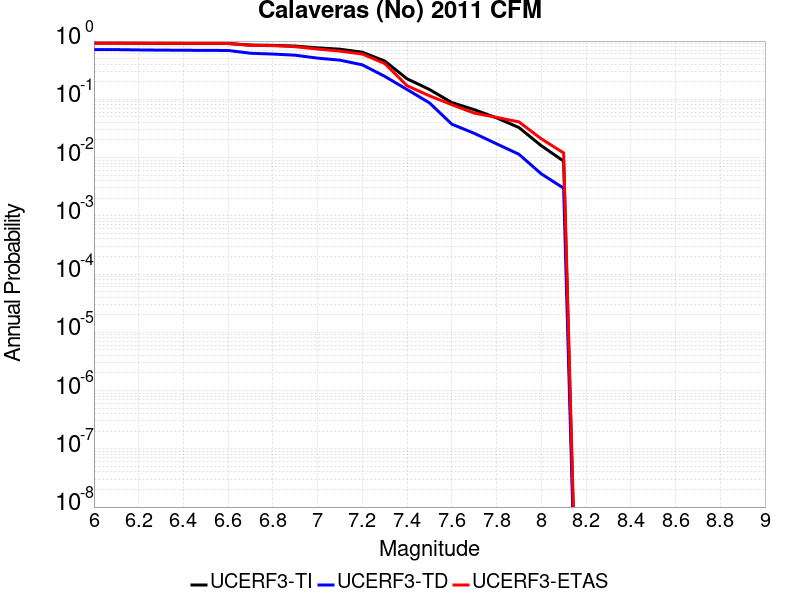
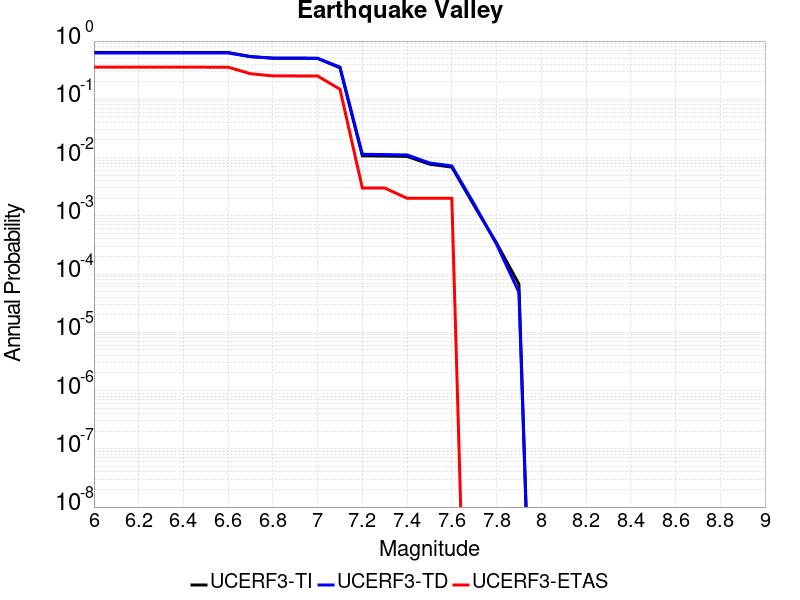
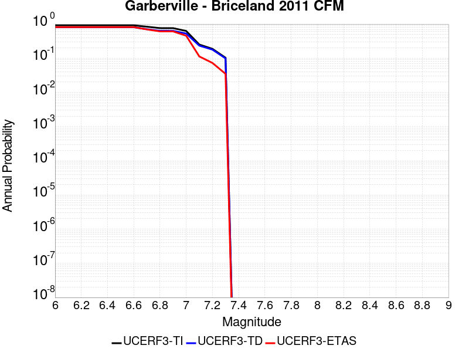
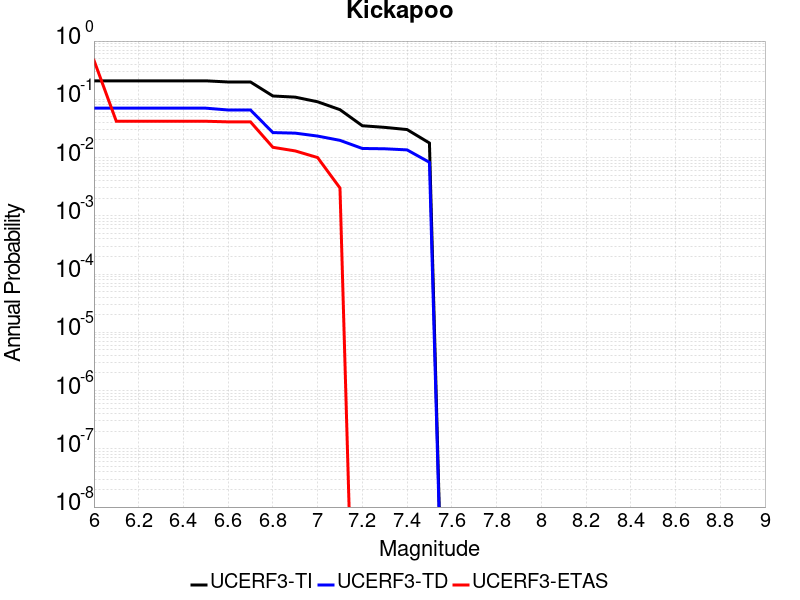
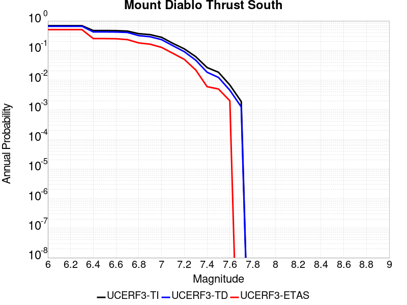
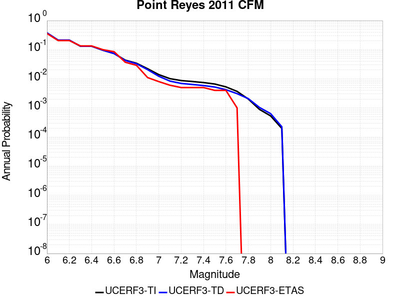
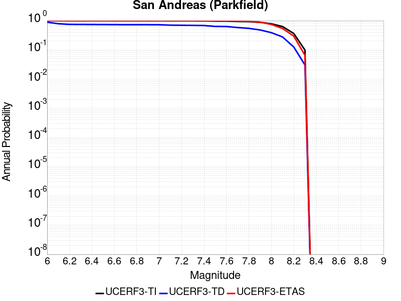
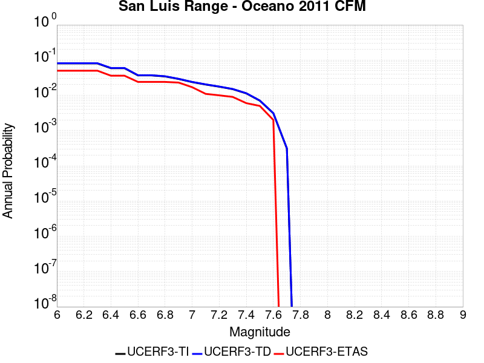
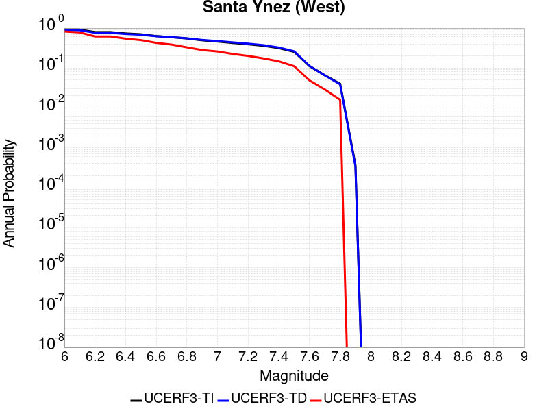
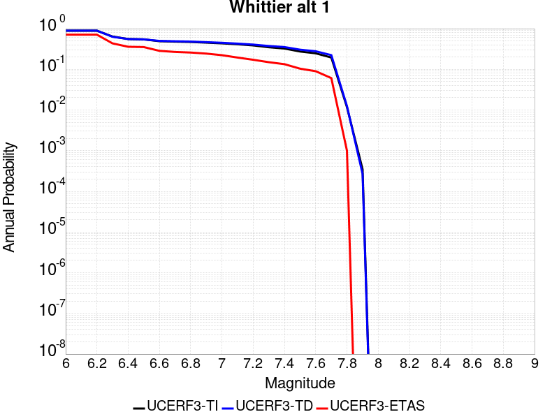

# Parent Section Magnitude-Probability Distributions

## Table Of Contents

* [Airport Lake](#airport-lake)
* [Almanor 2011 CFM](#almanor-2011-cfm)
* [Anacapa-Dume alt 1](#anacapa-dume-alt-1)
* [Anaheim](#anaheim)
* [Antelope Valley 2011](#antelope-valley-2011)
* [Ash Hill](#ash-hill)
* [Baker](#baker)
* [Bartlett Springs 2011 CFM](#bartlett-springs-2011-cfm)
* [Battle Creek 2011 CFM](#battle-creek-2011-cfm)
* [Bear River fault zone](#bear-river-fault-zone)
* [Bennett Valley 2011 CFM](#bennett-valley-2011-cfm)
* [Bicycle Lake](#bicycle-lake)
* [Big Lagoon - Bald Mtn 2011 CFM](#big-lagoon---bald-mtn-2011-cfm)
* [Big Pine (Central)](#big-pine-central)
* [Big Pine (East)](#big-pine-east)
* [Big Pine (West)](#big-pine-west)
* [Blackwater](#blackwater)
* [Blue Cut](#blue-cut)
* [Brawley (Seismic Zone) alt 1](#brawley-seismic-zone-alt-1)
* [Breckenridge 2011](#breckenridge-2011)
* [Bullion Mountains](#bullion-mountains)
* [Burnt Mtn](#burnt-mtn)
* [Butano 2011 CFM](#butano-2011-cfm)
* [Cady](#cady)
* [Calaveras (Central) 2011 CFM](#calaveras-central-2011-cfm)
* [Calaveras (No) 2011 CFM](#calaveras-no-2011-cfm)
* [Calaveras (So) - Paicines extension 2011 CFM](#calaveras-so---paicines-extension-2011-cfm)
* [Calaveras (So) 2011 CFM](#calaveras-so-2011-cfm)
* [Calico-Hidalgo](#calico-hidalgo)
* [Camp Rock 2011](#camp-rock-2011)
* [Canada David (Detachment)](#canada-david-detachment)
* [Carlsbad](#carlsbad)
* [Carson Range (Genoa)](#carson-range-genoa)
* [Casmalia 2011 CFM](#casmalia-2011-cfm)
* [Cedar Mtn-Mahogany Mtn](#cedar-mtn-mahogany-mtn)
* [Cerro Prieto](#cerro-prieto)
* [Channel Islands Thrust](#channel-islands-thrust)
* [Channel Islands Western Deep Ramp](#channel-islands-western-deep-ramp)
* [Chino alt 1](#chino-alt-1)
* [Clamshell-Sawpit](#clamshell-sawpit)
* [Clayton](#clayton)
* [Cleghorn](#cleghorn)
* [Cleghorn Lake](#cleghorn-lake)
* [Cleghorn Pass](#cleghorn-pass)
* [Collayami 2011 CFM](#collayami-2011-cfm)
* [Compton](#compton)
* [Concord 2011 CFM](#concord-2011-cfm)
* [Contra Costa (Lafayette) 2011 CFM](#contra-costa-lafayette-2011-cfm)
* [Contra Costa Shear Zone (connector) 2011 CFM](#contra-costa-shear-zone-connector-2011-cfm)
* [Coronado Bank alt1](#coronado-bank-alt1)
* [Coyote Canyon](#coyote-canyon)
* [Coyote Lake](#coyote-lake)
* [Cucamonga](#cucamonga)
* [Davis Creek](#davis-creek)
* [Death Valley (Black Mtns Frontal)](#death-valley-black-mtns-frontal)
* [Death Valley (Fish Lake Valley)](#death-valley-fish-lake-valley)
* [Death Valley (No)](#death-valley-no)
* [Death Valley (So)](#death-valley-so)
* [Deep Springs](#deep-springs)
* [Del Valle](#del-valle)
* [Dog Valley](#dog-valley)
* [Dry Mountain](#dry-mountain)
* [Earthquake Valley](#earthquake-valley)
* [Earthquake Valley (No  Extension)](#earthquake-valley-no--extension)
* [Earthquake Valley (So Extension)](#earthquake-valley-so-extension)
* [East Huasna 2011 CFM](#east-huasna-2011-cfm)
* [Eaton Roughs 2011 CFM](#eaton-roughs-2011-cfm)
* [Elmore Ranch](#elmore-ranch)
* [Elsinore (Coyote Mountains)](#elsinore-coyote-mountains)
* [Elsinore (Glen Ivy) rev](#elsinore-glen-ivy-rev)
* [Elsinore (Julian)](#elsinore-julian)
* [Elsinore (Stepovers Combined)](#elsinore-stepovers-combined)
* [Elsinore (Temecula) rev](#elsinore-temecula-rev)
* [Elysian Park (Lower CFM)](#elysian-park-lower-cfm)
* [Elysian Park (Upper)](#elysian-park-upper)
* [Emerson-Copper Mtn 2011](#emerson-copper-mtn-2011)
* [Eureka Peak](#eureka-peak)
* [Fickle Hill (alt1)](#fickle-hill-alt1)
* [Fish Slough 2011 CFM](#fish-slough-2011-cfm)
* [Fitzhugh Creek](#fitzhugh-creek)
* [Fontana (Seismicity)](#fontana-seismicity)
* [Franklin 2011 CFM](#franklin-2011-cfm)
* [Garberville - Briceland 2011 CFM](#garberville---briceland-2011-cfm)
* [Garlic Springs](#garlic-springs)
* [Garlock (Central)](#garlock-central)
* [Garlock (East)](#garlock-east)
* [Garlock (West)](#garlock-west)
* [Gillem - Big Crack 2011 CFM](#gillem---big-crack-2011-cfm)
* [Goldstone Lake](#goldstone-lake)
* [Goose Lake 2011 CFM](#goose-lake-2011-cfm)
* [Gravel Hills-Harper Lk](#gravel-hills-harper-lk)
* [Great Valley 01](#great-valley-01)
* [Great Valley 02](#great-valley-02)
* [Great Valley 03 Mysterious Ridge](#great-valley-03-mysterious-ridge)
* [Great Valley 03a Dunnigan Hills](#great-valley-03a-dunnigan-hills)
* [Great Valley 04a Trout Creek](#great-valley-04a-trout-creek)
* [Great Valley 04b Gordon Valley](#great-valley-04b-gordon-valley)
* [Great Valley 05 Pittsburg - Kirby Hills alt1](#great-valley-05-pittsburg---kirby-hills-alt1)
* [Great Valley 06 (Midland) 2011 CFM alt1](#great-valley-06-midland-2011-cfm-alt1)
* [Great Valley 07 (Orestimba)](#great-valley-07-orestimba)
* [Great Valley 08 (Quinto)](#great-valley-08-quinto)
* [Great Valley 09 (Laguna Seca)](#great-valley-09-laguna-seca)
* [Great Valley 10 (Panoche)](#great-valley-10-panoche)
* [Great Valley 11](#great-valley-11)
* [Great Valley 12](#great-valley-12)
* [Great Valley 13 (Coalinga)](#great-valley-13-coalinga)
* [Great Valley 14 (Kettleman Hills)](#great-valley-14-kettleman-hills)
* [Green Valley 2011 CFM](#green-valley-2011-cfm)
* [Greenville (No) 2011 CFM](#greenville-no-2011-cfm)
* [Greenville (So) 2011 CFM](#greenville-so-2011-cfm)
* [Hartley Springs 2011 CFM](#hartley-springs-2011-cfm)
* [Hat Creek-McArthur-Mayfield](#hat-creek-mcarthur-mayfield)
* [Hayward (No) 2011 CFM](#hayward-no-2011-cfm)
* [Hayward (So) 2011 CFM](#hayward-so-2011-cfm)
* [Hayward (So) extension 2011 CFM](#hayward-so-extension-2011-cfm)
* [Hector Mine](#hector-mine)
* [Helendale-So Lockhart](#helendale-so-lockhart)
* [Hilton Creek 2011 CFM](#hilton-creek-2011-cfm)
* [Hollywood](#hollywood)
* [Holser alt 1](#holser-alt-1)
* [Homestead Valley 2011](#homestead-valley-2011)
* [Honey Lake 2011 CFM](#honey-lake-2011-cfm)
* [Hosgri](#hosgri)
* [Hosgri (Extension)](#hosgri-extension)
* [Hunter Mountain-Saline Valley](#hunter-mountain-saline-valley)
* [Hunting Creek - Bartlett Springs connector 2011](#hunting-creek---bartlett-springs-connector-2011)
* [Hunting Creek - Berryessa 2011 CFM](#hunting-creek---berryessa-2011-cfm)
* [Imperial](#imperial)
* [Incline Village 2011 CFM](#incline-village-2011-cfm)
* [Independence rev 2011](#independence-rev-2011)
* [Jess Valley](#jess-valley)
* [Johnson Valley (No) 2011 rev](#johnson-valley-no-2011-rev)
* [Joshua Tree (Seismicity)](#joshua-tree-seismicity)
* [Keddie Ridge 2011 CFM](#keddie-ridge-2011-cfm)
* [Kern Canyon (Lake Isabella) 2011](#kern-canyon-lake-isabella-2011)
* [Kern Canyon (North Kern) 2011](#kern-canyon-north-kern-2011)
* [Kern Canyon (South Kern) 2011](#kern-canyon-south-kern-2011)
* [Kickapoo](#kickapoo)
* [King Range 2011 CFM](#king-range-2011-cfm)
* [La Panza 2011](#la-panza-2011)
* [Laguna Salada](#laguna-salada)
* [Lake Isabella (Seismicity)](#lake-isabella-seismicity)
* [Las Positas](#las-positas)
* [Last Chance](#last-chance)
* [Lenwood-Lockhart-Old Woman Springs](#lenwood-lockhart-old-woman-springs)
* [Likely 2011 CFM](#likely-2011-cfm)
* [Lions Head 2011 CFM](#lions-head-2011-cfm)
* [Little Lake](#little-lake)
* [Little Salmon (Offshore)](#little-salmon-offshore)
* [Little Salmon (Onshore)](#little-salmon-onshore)
* [Los Alamos 2011 CFM](#los-alamos-2011-cfm)
* [Los Alamos extension](#los-alamos-extension)
* [Los Medanos - Roe Island](#los-medanos---roe-island)
* [Los Osos 2011](#los-osos-2011)
* [Lost Hills](#lost-hills)
* [Ludlow](#ludlow)
* [Maacama 2011 CFM](#maacama-2011-cfm)
* [Mad River (alt1)](#mad-river-alt1)
* [Malibu Coast (Extension) alt 1](#malibu-coast-extension-alt-1)
* [Malibu Coast alt 1](#malibu-coast-alt-1)
* [Manix-Afton Hills](#manix-afton-hills)
* [McKinleyville (alt1)](#mckinleyville-alt1)
* [McLean Lake](#mclean-lake)
* [Mendocino](#mendocino)
* [Mission (connected) 2011 CFM](#mission-connected-2011-cfm)
* [Mission Creek](#mission-creek)
* [Mission Hills 2011](#mission-hills-2011)
* [Mission Ridge-Arroyo Parida-Santa Ana](#mission-ridge-arroyo-parida-santa-ana)
* [Mohawk Valley 2011 CFM](#mohawk-valley-2011-cfm)
* [Mono Lake 2011 CFM](#mono-lake-2011-cfm)
* [Monte Vista - Shannon 2011 CFM](#monte-vista---shannon-2011-cfm)
* [Monterey Bay-Tularcitos](#monterey-bay-tularcitos)
* [Morales (East)](#morales-east)
* [Morales (West)](#morales-west)
* [Mount Diablo Thrust North CFM](#mount-diablo-thrust-north-cfm)
* [Mount Diablo Thrust South](#mount-diablo-thrust-south)
* [Nelson Lake](#nelson-lake)
* [Newport-Inglewood (Offshore)](#newport-inglewood-offshore)
* [Newport-Inglewood alt 1](#newport-inglewood-alt-1)
* [North Frontal  (East)](#north-frontal--east)
* [North Frontal  (West)](#north-frontal--west)
* [North Salt Lake](#north-salt-lake)
* [North Tahoe 2011 CFM](#north-tahoe-2011-cfm)
* [Northridge](#northridge)
* [Northridge Hills](#northridge-hills)
* [Oak Ridge (Onshore)](#oak-ridge-onshore)
* [Oceanic - West Huasna](#oceanic---west-huasna)
* [Oceanside alt1](#oceanside-alt1)
* [Ortigalita (North)](#ortigalita-north)
* [Ortigalita (South)](#ortigalita-south)
* [Owens Valley](#owens-valley)
* [Owens Valley Keough Hot Springs](#owens-valley-keough-hot-springs)
* [Owl Lake](#owl-lake)
* [Ozena](#ozena)
* [Palos Verdes](#palos-verdes)
* [Panamint Valley](#panamint-valley)
* [Paradise](#paradise)
* [Peralta Hills](#peralta-hills)
* [Pilarcitos 2011 CFM](#pilarcitos-2011-cfm)
* [Pine Mtn](#pine-mtn)
* [Pinto Mtn](#pinto-mtn)
* [Pisgah-Bullion Mtn-Mesquite Lk](#pisgah-bullion-mtn-mesquite-lk)
* [Pitas Point (Lower West)](#pitas-point-lower-west)
* [Pitas Point (Lower)-Montalvo](#pitas-point-lower-montalvo)
* [Pittville 2011 CFM](#pittville-2011-cfm)
* [Pleito](#pleito)
* [Point Reyes 2011 CFM](#point-reyes-2011-cfm)
* [Point Reyes 2011 connector](#point-reyes-2011-connector)
* [Polaris 2011 CFM](#polaris-2011-cfm)
* [Puente Hills](#puente-hills)
* [Quien Sabe 2011 CFM](#quien-sabe-2011-cfm)
* [Raymond](#raymond)
* [Red Mountain](#red-mountain)
* [Red Pass](#red-pass)
* [Redondo Canyon alt 1](#redondo-canyon-alt-1)
* [Reliz 2011 CFM](#reliz-2011-cfm)
* [Richfield](#richfield)
* [Rinconada 2011 CFM](#rinconada-2011-cfm)
* [Robinson Creek](#robinson-creek)
* [Rocky Ledge 2011 CFM](#rocky-ledge-2011-cfm)
* [Rodgers Creek - Healdsburg 2011 CFM](#rodgers-creek---healdsburg-2011-cfm)
* [Rose Canyon](#rose-canyon)
* [Round Valley](#round-valley)
* [Russ 2011 CFM](#russ-2011-cfm)
* [San Andreas (Big Bend)](#san-andreas-big-bend)
* [San Andreas (Carrizo) rev](#san-andreas-carrizo-rev)
* [San Andreas (Cholame) rev](#san-andreas-cholame-rev)
* [San Andreas (Coachella) rev](#san-andreas-coachella-rev)
* [San Andreas (Creeping Section) 2011 CFM](#san-andreas-creeping-section-2011-cfm)
* [San Andreas (Mojave N)](#san-andreas-mojave-n)
* [San Andreas (Mojave S)](#san-andreas-mojave-s)
* [San Andreas (North Branch Mill Creek)](#san-andreas-north-branch-mill-creek)
* [San Andreas (North Coast) 2011 CFM](#san-andreas-north-coast-2011-cfm)
* [San Andreas (Offshore) 2011 CFM](#san-andreas-offshore-2011-cfm)
* [San Andreas (Parkfield)](#san-andreas-parkfield)
* [San Andreas (Peninsula) 2011 CFM](#san-andreas-peninsula-2011-cfm)
* [San Andreas (San Bernardino N)](#san-andreas-san-bernardino-n)
* [San Andreas (San Bernardino S)](#san-andreas-san-bernardino-s)
* [San Andreas (San Gorgonio Pass-Garnet HIll)](#san-andreas-san-gorgonio-pass-garnet-hill)
* [San Andreas (Santa Cruz Mts) 2011 CFM](#san-andreas-santa-cruz-mts-2011-cfm)
* [San Cayetano](#san-cayetano)
* [San Clemente](#san-clemente)
* [San Diego Trough north alt1](#san-diego-trough-north-alt1)
* [San Diego Trough south](#san-diego-trough-south)
* [San Gabriel](#san-gabriel)
* [San Gabriel (Extension)](#san-gabriel-extension)
* [San Gorgonio Pass](#san-gorgonio-pass)
* [San Gregorio (North) 2011 CFM](#san-gregorio-north-2011-cfm)
* [San Gregorio (South) 2011 CFM](#san-gregorio-south-2011-cfm)
* [San Jacinto (Anza) rev](#san-jacinto-anza-rev)
* [San Jacinto (Borrego)](#san-jacinto-borrego)
* [San Jacinto (Clark) rev](#san-jacinto-clark-rev)
* [San Jacinto (Coyote Creek)](#san-jacinto-coyote-creek)
* [San Jacinto (Lytle Creek connector)](#san-jacinto-lytle-creek-connector)
* [San Jacinto (San Bernardino)](#san-jacinto-san-bernardino)
* [San Jacinto (San Jacinto Valley) rev](#san-jacinto-san-jacinto-valley-rev)
* [San Jacinto (Stepovers Combined)](#san-jacinto-stepovers-combined)
* [San Jacinto (Superstition Mtn)](#san-jacinto-superstition-mtn)
* [San Joaquin Hills](#san-joaquin-hills)
* [San Jose](#san-jose)
* [San Juan](#san-juan)
* [San Luis Range - Oceano 2011 CFM](#san-luis-range---oceano-2011-cfm)
* [San Luis Range - Pecho 2011 CFM](#san-luis-range---pecho-2011-cfm)
* [San Luis Range 2011 CFM](#san-luis-range-2011-cfm)
* [San Pedro Basin](#san-pedro-basin)
* [San Pedro Escarpment](#san-pedro-escarpment)
* [San Vicente](#san-vicente)
* [Santa Cruz Catalina Ridge alt1](#santa-cruz-catalina-ridge-alt1)
* [Santa Cruz Island](#santa-cruz-island)
* [Santa Monica Bay](#santa-monica-bay)
* [Santa Monica alt 1](#santa-monica-alt-1)
* [Santa Rosa Island](#santa-rosa-island)
* [Santa Susana East (connector)](#santa-susana-east-connector)
* [Santa Susana alt 1](#santa-susana-alt-1)
* [Santa Ynez (East)](#santa-ynez-east)
* [Santa Ynez (West)](#santa-ynez-west)
* [Santa Ynez River](#santa-ynez-river)
* [Sargent 2011 CFM](#sargent-2011-cfm)
* [Scodie Lineament](#scodie-lineament)
* [Sheephole](#sheephole)
* [Shoreline](#shoreline)
* [Sierra Madre](#sierra-madre)
* [Sierra Madre (San Fernando)](#sierra-madre-san-fernando)
* [Sierra Nevada  (No Extension)](#sierra-nevada--no-extension)
* [Silver Creek 2011 CFM](#silver-creek-2011-cfm)
* [Simi-Santa Rosa](#simi-santa-rosa)
* [Sisar](#sisar)
* [Skinner Flat 2011 CFM](#skinner-flat-2011-cfm)
* [So Sierra Nevada](#so-sierra-nevada)
* [South Cuyama](#south-cuyama)
* [South Klamath Lake East](#south-klamath-lake-east)
* [South Klamath Lake West](#south-klamath-lake-west)
* [Superstition Hills](#superstition-hills)
* [Surprise Valley 2011 CFM](#surprise-valley-2011-cfm)
* [Swain Ravine - Spenceville](#swain-ravine---spenceville)
* [Table Bluff](#table-bluff)
* [Tank Canyon](#tank-canyon)
* [Thirty Mile Bank](#thirty-mile-bank)
* [Tin Mountain](#tin-mountain)
* [Towne Pass](#towne-pass)
* [Trinidad (alt1)](#trinidad-alt1)
* [Ventura-Pitas Point](#ventura-pitas-point)
* [Verdugo](#verdugo)
* [Walker Spring 2011 CFM](#walker-spring-2011-cfm)
* [West Napa 2011 CFM](#west-napa-2011-cfm)
* [West Tahoe](#west-tahoe)
* [White Mountains](#white-mountains)
* [White Wolf](#white-wolf)
* [White Wolf (Extension)](#white-wolf-extension)
* [Whittier alt 1](#whittier-alt-1)
* [Wight Way 2011 CFM](#wight-way-2011-cfm)
* [Yorba Linda](#yorba-linda)
* [Zayante-Vergeles 2011 CFM](#zayante-vergeles-2011-cfm)

## Airport Lake
*[(top)](#table-of-contents)*

|  |
|-----|

| Magnitude | UCERF3-TI Prob | UCERF3-TD Prob | UCERF3-ETAS Prob |
|-----|-----|-----|-----|
| 6.0 | 0.4760417 | 0.50815094 | 0.19 |
| 6.1 | 0.4760417 | 0.50815094 | 0.19 |
| 6.2 | 0.4760417 | 0.50815094 | 0.19 |
| 6.3 | 0.4760417 | 0.50815094 | 0.19 |
| 6.4 | 0.4760417 | 0.50815094 | 0.19 |
| 6.5 | 0.30569738 | 0.32200614 | 0.114 |
| 6.6 | 0.30569738 | 0.32200614 | 0.114 |
| 6.7 | 0.24858508 | 0.2625239 | 0.092 |
| 6.8 | 0.1881633 | 0.19909328 | 0.065 |
| 6.9 | 0.14297625 | 0.15175544 | 0.046 |
| 7.0 | 0.07316138 | 0.0778264 | 0.022 |
| 7.1 | 0.035841834 | 0.03841078 | 0.01 |

## Almanor 2011 CFM
*[(top)](#table-of-contents)*

|  |
|-----|

| Magnitude | UCERF3-TI Prob | UCERF3-TD Prob | UCERF3-ETAS Prob |
|-----|-----|-----|-----|
| 6.0 | 0.95956373 | 0.8561487 | 0.849 |
| 6.1 | 0.90134364 | 0.7603292 | 0.753 |
| 6.2 | 0.90134364 | 0.7603292 | 0.753 |
| 6.3 | 0.7857333 | 0.6228163 | 0.608 |
| 6.4 | 0.65710694 | 0.503908 | 0.471 |
| 6.5 | 0.58272517 | 0.44543964 | 0.39 |
| 6.6 | 0.5367065 | 0.41159767 | 0.356 |
| 6.7 | 0.05059868 | 0.044917766 | 0.013 |
| 6.8 | 0.030145857 | 0.026724547 | 0.008 |

## Anacapa-Dume alt 1
*[(top)](#table-of-contents)*

|  |
|-----|

| Magnitude | UCERF3-TI Prob | UCERF3-TD Prob | UCERF3-ETAS Prob |
|-----|-----|-----|-----|
| 6.0 | 0.23712444 | 0.24487077 | 0.082 |
| 6.1 | 0.23712444 | 0.24487077 | 0.082 |
| 6.2 | 0.23712444 | 0.24487077 | 0.082 |
| 6.3 | 0.23712444 | 0.24487077 | 0.082 |
| 6.4 | 0.23712444 | 0.24487077 | 0.082 |
| 6.5 | 0.23712444 | 0.24487077 | 0.082 |
| 6.6 | 0.23712444 | 0.24487077 | 0.082 |
| 6.7 | 0.22030957 | 0.22766277 | 0.079 |
| 6.8 | 0.21966083 | 0.22700053 | 0.079 |
| 6.9 | 0.1798619 | 0.1859102 | 0.053 |
| 7.0 | 0.17415592 | 0.18006726 | 0.046 |
| 7.1 | 0.15551825 | 0.16089615 | 0.036 |
| 7.2 | 0.14906506 | 0.15427572 | 0.032 |
| 7.3 | 0.12505919 | 0.12917697 | 0.027 |
| 7.4 | 0.10578908 | 0.10914755 | 0.024 |
| 7.5 | 0.086014956 | 0.088697284 | 0.019 |
| 7.6 | 0.048568163 | 0.05003879 | 0.01 |
| 7.7 | 0.014106057 | 0.014186741 | 0.002 |
| 7.8 | 0.002346218 | 0.0022568973 | 0.0 |
| 7.9 | 4.178084E-5 | 3.5711313E-5 | 0.0 |

## Anaheim
*[(top)](#table-of-contents)*

|  |
|-----|

| Magnitude | UCERF3-TI Prob | UCERF3-TD Prob | UCERF3-ETAS Prob |
|-----|-----|-----|-----|
| 6.0 | 0.1415687 | 0.14033693 | 0.077 |
| 6.1 | 0.08359176 | 0.079078645 | 0.037 |
| 6.2 | 0.08359176 | 0.079078645 | 0.037 |
| 6.3 | 0.057965633 | 0.0525163 | 0.019 |
| 6.4 | 0.057965633 | 0.0525163 | 0.019 |
| 6.5 | 0.057676833 | 0.05222311 | 0.019 |
| 6.6 | 0.056595437 | 0.051123977 | 0.018 |
| 6.7 | 0.05626425 | 0.050788295 | 0.018 |
| 6.8 | 0.056162532 | 0.050685316 | 0.018 |
| 6.9 | 0.055900894 | 0.05042072 | 0.017 |
| 7.0 | 0.055746183 | 0.050289318 | 0.017 |
| 7.1 | 0.04255808 | 0.037589926 | 0.012 |
| 7.2 | 0.03985421 | 0.034817137 | 0.011 |
| 7.3 | 0.025838524 | 0.022464873 | 0.007 |
| 7.4 | 0.01244899 | 0.01062674 | 0.005 |
| 7.5 | 0.0010567813 | 8.9664623E-4 | 0.001 |
| 7.6 | 7.759399E-5 | 7.864579E-5 | 0.0 |
| 7.7 | 7.875434E-6 | 7.994174E-6 | 0.0 |

## Antelope Valley 2011
*[(top)](#table-of-contents)*

|  |
|-----|

| Magnitude | UCERF3-TI Prob | UCERF3-TD Prob | UCERF3-ETAS Prob |
|-----|-----|-----|-----|
| 6.0 | 0.80820304 | 0.8014368 | 0.502 |
| 6.1 | 0.80820304 | 0.8014368 | 0.502 |
| 6.2 | 0.80820304 | 0.8014368 | 0.502 |
| 6.3 | 0.80820304 | 0.8014368 | 0.502 |
| 6.4 | 0.80820304 | 0.8014368 | 0.502 |
| 6.5 | 0.6097635 | 0.60668874 | 0.299 |
| 6.6 | 0.6097635 | 0.60668874 | 0.299 |
| 6.7 | 0.5073451 | 0.515249 | 0.233 |
| 6.8 | 0.40242094 | 0.41756126 | 0.179 |
| 6.9 | 0.31580225 | 0.33976555 | 0.129 |

## Ash Hill
*[(top)](#table-of-contents)*

|  |
|-----|

| Magnitude | UCERF3-TI Prob | UCERF3-TD Prob | UCERF3-ETAS Prob |
|-----|-----|-----|-----|
| 6.0 | 0.6750987 | 0.71494967 | 0.457 |
| 6.1 | 0.6750987 | 0.71494967 | 0.457 |
| 6.2 | 0.6750987 | 0.71494967 | 0.457 |
| 6.3 | 0.4073317 | 0.42879948 | 0.239 |
| 6.4 | 0.4073317 | 0.42879948 | 0.239 |
| 6.5 | 0.30459058 | 0.3228331 | 0.169 |
| 6.6 | 0.22931452 | 0.24510321 | 0.121 |
| 6.7 | 0.17397828 | 0.18793395 | 0.087 |
| 6.8 | 0.12503842 | 0.1363244 | 0.06 |
| 6.9 | 0.08814783 | 0.09740378 | 0.043 |

## Baker
*[(top)](#table-of-contents)*

|  |
|-----|

| Magnitude | UCERF3-TI Prob | UCERF3-TD Prob | UCERF3-ETAS Prob |
|-----|-----|-----|-----|
| 6.0 | 0.25709358 | 0.26556075 | 0.151 |
| 6.1 | 0.25709358 | 0.26556075 | 0.151 |
| 6.2 | 0.25709358 | 0.26556075 | 0.151 |
| 6.3 | 0.1581616 | 0.1620822 | 0.08 |
| 6.4 | 0.1581616 | 0.1620822 | 0.08 |
| 6.5 | 0.13512607 | 0.13857281 | 0.065 |
| 6.6 | 0.113845065 | 0.11685879 | 0.052 |
| 6.7 | 0.10083685 | 0.10362706 | 0.042 |
| 6.8 | 0.09133879 | 0.09397628 | 0.038 |
| 6.9 | 0.08158523 | 0.08405629 | 0.036 |
| 7.0 | 0.06097873 | 0.063083716 | 0.023 |
| 7.1 | 0.053431384 | 0.05543165 | 0.019 |
| 7.2 | 0.051174674 | 0.05314432 | 0.015 |
| 7.3 | 0.047663886 | 0.04958289 | 0.012 |
| 7.4 | 0.044937424 | 0.046804395 | 0.012 |
| 7.5 | 0.042345777 | 0.0441529 | 0.011 |
| 7.6 | 0.03864822 | 0.040360004 | 0.01 |
| 7.7 | 0.033491302 | 0.035039354 | 0.008 |
| 7.8 | 0.017884992 | 0.018804746 | 0.006 |
| 7.9 | 1.3352219E-4 | 1.3898761E-4 | 0.0 |

## Bartlett Springs 2011 CFM
*[(top)](#table-of-contents)*

|  |
|-----|

| Magnitude | UCERF3-TI Prob | UCERF3-TD Prob | UCERF3-ETAS Prob |
|-----|-----|-----|-----|
| 6.0 | 0.9613106 | 0.8817824 | 0.893 |
| 6.1 | 0.9612104 | 0.8815808 | 0.893 |
| 6.2 | 0.9611469 | 0.8814518 | 0.893 |
| 6.3 | 0.96103495 | 0.88123316 | 0.893 |
| 6.4 | 0.93429184 | 0.8360168 | 0.821 |
| 6.5 | 0.93386465 | 0.8353263 | 0.82 |
| 6.6 | 0.92671883 | 0.8252121 | 0.794 |
| 6.7 | 0.9221682 | 0.81836 | 0.787 |
| 6.8 | 0.90777713 | 0.7983704 | 0.755 |
| 6.9 | 0.88493776 | 0.76823 | 0.699 |
| 7.0 | 0.84653664 | 0.723029 | 0.631 |
| 7.1 | 0.8248607 | 0.69989264 | 0.585 |
| 7.2 | 0.7753815 | 0.6511416 | 0.49 |
| 7.3 | 0.74749416 | 0.6253842 | 0.459 |
| 7.4 | 0.71022916 | 0.5915437 | 0.424 |
| 7.5 | 0.6792061 | 0.5638386 | 0.397 |
| 7.6 | 0.5156953 | 0.4218267 | 0.281 |
| 7.7 | 0.1987239 | 0.16871299 | 0.06 |
| 7.8 | 0.03155612 | 0.03219775 | 0.009 |

## Battle Creek 2011 CFM
*[(top)](#table-of-contents)*

|  |
|-----|

| Magnitude | UCERF3-TI Prob | UCERF3-TD Prob | UCERF3-ETAS Prob |
|-----|-----|-----|-----|
| 6.0 | 0.26962444 | 0.28103673 | 0.121 |
| 6.1 | 0.26962444 | 0.28103673 | 0.121 |
| 6.2 | 0.26962444 | 0.28103673 | 0.121 |
| 6.3 | 0.26962444 | 0.28103673 | 0.121 |
| 6.4 | 0.26962444 | 0.28103673 | 0.121 |
| 6.5 | 0.26962444 | 0.28103673 | 0.121 |
| 6.6 | 0.26962444 | 0.28103673 | 0.121 |
| 6.7 | 0.17025888 | 0.17792729 | 0.068 |
| 6.8 | 0.17025888 | 0.17792729 | 0.068 |
| 6.9 | 0.13560581 | 0.1423652 | 0.052 |
| 7.0 | 0.12642251 | 0.13300125 | 0.045 |
| 7.1 | 0.11717738 | 0.123568304 | 0.041 |
| 7.2 | 0.07596153 | 0.08104648 | 0.029 |

## Bear River fault zone
*[(top)](#table-of-contents)*

|  |
|-----|

| Magnitude | UCERF3-TI Prob | UCERF3-TD Prob | UCERF3-ETAS Prob |
|-----|-----|-----|-----|
| 6.0 | 0.71075284 | 0.71092707 | 0.435 |
| 6.1 | 0.71075284 | 0.71092707 | 0.435 |
| 6.2 | 0.5654638 | 0.560471 | 0.291 |
| 6.3 | 0.5654638 | 0.560471 | 0.291 |
| 6.4 | 0.49325752 | 0.48874167 | 0.24 |
| 6.5 | 0.47882542 | 0.47448865 | 0.231 |
| 6.6 | 0.45586306 | 0.45152324 | 0.215 |
| 6.7 | 0.42685947 | 0.4221686 | 0.196 |
| 6.8 | 0.37977484 | 0.37254512 | 0.173 |
| 6.9 | 0.3303462 | 0.3198953 | 0.153 |
| 7.0 | 0.25848964 | 0.24017255 | 0.117 |
| 7.1 | 0.2520886 | 0.23429187 | 0.113 |
| 7.2 | 0.18885392 | 0.1790155 | 0.073 |
| 7.3 | 0.10366764 | 0.09914615 | 0.035 |

## Bennett Valley 2011 CFM
*[(top)](#table-of-contents)*

|  |
|-----|

| Magnitude | UCERF3-TI Prob | UCERF3-TD Prob | UCERF3-ETAS Prob |
|-----|-----|-----|-----|
| 6.0 | 0.7125672 | 0.698883 | 0.626 |
| 6.1 | 0.7125672 | 0.698883 | 0.598 |
| 6.2 | 0.5806936 | 0.57066673 | 0.466 |
| 6.3 | 0.5806936 | 0.57066673 | 0.466 |
| 6.4 | 0.490992 | 0.48763478 | 0.388 |
| 6.5 | 0.4813579 | 0.4795452 | 0.38 |
| 6.6 | 0.43219015 | 0.4382094 | 0.338 |
| 6.7 | 0.08394322 | 0.05114182 | 0.047 |
| 6.8 | 0.07339886 | 0.04241456 | 0.043 |
| 6.9 | 0.06798041 | 0.03855723 | 0.041 |
| 7.0 | 0.062397998 | 0.034850683 | 0.038 |
| 7.1 | 0.05707508 | 0.03146778 | 0.035 |
| 7.2 | 0.04762469 | 0.025841638 | 0.025 |
| 7.3 | 0.043402378 | 0.023486294 | 0.024 |
| 7.4 | 0.03479641 | 0.018743888 | 0.016 |
| 7.5 | 0.029946223 | 0.015646607 | 0.016 |
| 7.6 | 0.014367466 | 0.0085004335 | 0.008 |
| 7.7 | 0.005479798 | 0.003081474 | 0.004 |
| 7.8 | 6.6319184E-4 | 2.3276808E-4 | 0.0 |
| 7.9 | 2.126514E-4 | 4.950648E-5 | 0.0 |
| 8.0 | 9.979248E-5 | 2.2482835E-5 | 0.0 |

## Bicycle Lake
*[(top)](#table-of-contents)*

|  |
|-----|

| Magnitude | UCERF3-TI Prob | UCERF3-TD Prob | UCERF3-ETAS Prob |
|-----|-----|-----|-----|
| 6.0 | 0.6407931 | 0.66555 | 0.494 |
| 6.1 | 0.6407931 | 0.66555 | 0.494 |
| 6.2 | 0.40645278 | 0.4217625 | 0.289 |
| 6.3 | 0.39369074 | 0.4098929 | 0.275 |
| 6.4 | 0.39369074 | 0.4098929 | 0.275 |
| 6.5 | 0.25173196 | 0.26177186 | 0.162 |
| 6.6 | 0.2245675 | 0.23647979 | 0.136 |
| 6.7 | 0.18799658 | 0.20253496 | 0.113 |

## Big Lagoon - Bald Mtn 2011 CFM
*[(top)](#table-of-contents)*

|  |
|-----|

| Magnitude | UCERF3-TI Prob | UCERF3-TD Prob | UCERF3-ETAS Prob |
|-----|-----|-----|-----|
| 6.0 | 0.6230846 | 0.656673 | 0.372 |
| 6.1 | 0.6230846 | 0.656673 | 0.372 |
| 6.2 | 0.6230846 | 0.656673 | 0.372 |
| 6.3 | 0.6230846 | 0.656673 | 0.372 |
| 6.4 | 0.6230846 | 0.656673 | 0.372 |
| 6.5 | 0.6230846 | 0.656673 | 0.372 |
| 6.6 | 0.6230846 | 0.656673 | 0.372 |
| 6.7 | 0.6230846 | 0.656673 | 0.372 |
| 6.8 | 0.46116525 | 0.47993183 | 0.242 |
| 6.9 | 0.46116525 | 0.47993183 | 0.242 |
| 7.0 | 0.39780083 | 0.41389793 | 0.204 |
| 7.1 | 0.35901013 | 0.37365538 | 0.175 |
| 7.2 | 0.31956404 | 0.33268738 | 0.149 |
| 7.3 | 0.28629452 | 0.29808995 | 0.13 |
| 7.4 | 0.2686469 | 0.27979147 | 0.122 |
| 7.5 | 0.22678848 | 0.23641177 | 0.109 |
| 7.6 | 0.18405229 | 0.19191813 | 0.085 |
| 7.7 | 0.13687372 | 0.14282124 | 0.065 |
| 7.8 | 0.09586822 | 0.1002048 | 0.046 |
| 7.9 | 0.025541527 | 0.026814567 | 0.008 |

## Big Pine (Central)
*[(top)](#table-of-contents)*

|  |
|-----|

| Magnitude | UCERF3-TI Prob | UCERF3-TD Prob | UCERF3-ETAS Prob |
|-----|-----|-----|-----|
| 6.0 | 0.48470953 | 0.513257 | 0.364 |
| 6.1 | 0.35293317 | 0.37637663 | 0.217 |
| 6.2 | 0.30321643 | 0.32592493 | 0.185 |
| 6.3 | 0.13269451 | 0.13887832 | 0.081 |
| 6.4 | 0.13202892 | 0.13819112 | 0.081 |
| 6.5 | 0.13128105 | 0.1374197 | 0.081 |
| 6.6 | 0.13000655 | 0.13610318 | 0.08 |
| 6.7 | 0.12872155 | 0.1347724 | 0.079 |
| 6.8 | 0.107457615 | 0.11289342 | 0.063 |
| 6.9 | 0.07244039 | 0.07571463 | 0.041 |
| 7.0 | 0.05120417 | 0.051358975 | 0.031 |
| 7.1 | 0.04561176 | 0.045577735 | 0.026 |
| 7.2 | 0.026845086 | 0.024592191 | 0.013 |
| 7.3 | 0.022709684 | 0.019994792 | 0.012 |
| 7.4 | 0.018675996 | 0.015447551 | 0.009 |
| 7.5 | 0.017626228 | 0.014264788 | 0.008 |
| 7.6 | 0.016265279 | 0.012799487 | 0.007 |
| 7.7 | 0.009334107 | 0.0050910166 | 0.004 |
| 7.8 | 0.0025655031 | 0.0015864455 | 0.001 |
| 7.9 | 1.9202985E-4 | 1.0668222E-4 | 0.0 |

## Big Pine (East)
*[(top)](#table-of-contents)*

|  |
|-----|

| Magnitude | UCERF3-TI Prob | UCERF3-TD Prob | UCERF3-ETAS Prob |
|-----|-----|-----|-----|
| 6.0 | 0.4039632 | 0.4232285 | 0.327 |
| 6.1 | 0.4039632 | 0.4232285 | 0.327 |
| 6.2 | 0.4039632 | 0.4232285 | 0.327 |
| 6.3 | 0.24868049 | 0.24905114 | 0.206 |
| 6.4 | 0.24810392 | 0.24845186 | 0.206 |
| 6.5 | 0.2226421 | 0.22154084 | 0.192 |
| 6.6 | 0.20159124 | 0.19926244 | 0.164 |
| 6.7 | 0.17543116 | 0.17072992 | 0.13 |
| 6.8 | 0.16548897 | 0.159076 | 0.121 |
| 6.9 | 0.13451642 | 0.121584676 | 0.096 |
| 7.0 | 0.10599258 | 0.09044272 | 0.076 |
| 7.1 | 0.08497081 | 0.06813056 | 0.065 |
| 7.2 | 0.06343644 | 0.04446983 | 0.047 |
| 7.3 | 0.05638601 | 0.03752317 | 0.043 |
| 7.4 | 0.051519826 | 0.032802325 | 0.038 |
| 7.5 | 0.048850656 | 0.03055233 | 0.035 |
| 7.6 | 0.040530547 | 0.025375176 | 0.026 |
| 7.7 | 0.021450898 | 0.011684603 | 0.014 |
| 7.8 | 0.0059652934 | 0.0038403557 | 0.002 |
| 7.9 | 0.0015241122 | 0.0010990732 | 0.0 |

## Big Pine (West)
*[(top)](#table-of-contents)*

|  |
|-----|

| Magnitude | UCERF3-TI Prob | UCERF3-TD Prob | UCERF3-ETAS Prob |
|-----|-----|-----|-----|
| 6.0 | 0.035013933 | 0.035359193 | 0.02 |
| 6.1 | 0.035013933 | 0.035359193 | 0.02 |
| 6.2 | 0.035013933 | 0.035359193 | 0.02 |
| 6.3 | 0.021817762 | 0.022025764 | 0.014 |
| 6.4 | 0.021817762 | 0.022025764 | 0.014 |
| 6.5 | 0.016321626 | 0.016494287 | 0.009 |
| 6.6 | 0.016321626 | 0.016494287 | 0.009 |
| 6.7 | 0.016321626 | 0.016494287 | 0.009 |
| 6.8 | 0.016321626 | 0.016494287 | 0.009 |
| 6.9 | 0.015738219 | 0.0159068 | 0.009 |
| 7.0 | 0.012276291 | 0.012411759 | 0.008 |
| 7.1 | 0.008480104 | 0.008576672 | 0.003 |
| 7.2 | 0.005994873 | 0.0060616448 | 0.003 |
| 7.3 | 0.0040501235 | 0.004092422 | 0.0 |
| 7.4 | 0.0024025133 | 0.0024235572 | 0.0 |
| 7.5 | 0.0012222731 | 0.0012306559 | 0.0 |
| 7.6 | 8.7099057E-4 | 8.7680673E-4 | 0.0 |
| 7.7 | 3.8636773E-4 | 3.8874958E-4 | 0.0 |
| 7.8 | 6.3600666E-5 | 6.4003754E-5 | 0.0 |

## Blackwater
*[(top)](#table-of-contents)*

|  |
|-----|

| Magnitude | UCERF3-TI Prob | UCERF3-TD Prob | UCERF3-ETAS Prob |
|-----|-----|-----|-----|
| 6.0 | 0.7985783 | 0.83687246 | 0.516 |
| 6.1 | 0.7985783 | 0.83687246 | 0.516 |
| 6.2 | 0.45713726 | 0.47557157 | 0.242 |
| 6.3 | 0.45713726 | 0.47557157 | 0.242 |
| 6.4 | 0.33882603 | 0.35358128 | 0.171 |
| 6.5 | 0.26433358 | 0.27692187 | 0.133 |
| 6.6 | 0.26433358 | 0.27692187 | 0.133 |
| 6.7 | 0.14808372 | 0.15666254 | 0.069 |
| 6.8 | 0.11180304 | 0.11849174 | 0.049 |
| 6.9 | 0.050604887 | 0.05386667 | 0.025 |
| 7.0 | 0.024421923 | 0.026100026 | 0.011 |

## Blue Cut
*[(top)](#table-of-contents)*

|  |
|-----|

| Magnitude | UCERF3-TI Prob | UCERF3-TD Prob | UCERF3-ETAS Prob |
|-----|-----|-----|-----|
| 6.0 | 0.6696682 | 0.7034239 | 0.443 |
| 6.1 | 0.6696682 | 0.7034239 | 0.443 |
| 6.2 | 0.6696682 | 0.7034239 | 0.443 |
| 6.3 | 0.4544738 | 0.47680452 | 0.267 |
| 6.4 | 0.4544738 | 0.47680452 | 0.267 |
| 6.5 | 0.372509 | 0.3930334 | 0.207 |
| 6.6 | 0.31837213 | 0.3377036 | 0.177 |
| 6.7 | 0.2793167 | 0.2977704 | 0.148 |
| 6.8 | 0.25039166 | 0.26787007 | 0.127 |
| 6.9 | 0.22066173 | 0.23708683 | 0.115 |
| 7.0 | 0.18341045 | 0.1985442 | 0.096 |
| 7.1 | 0.13754243 | 0.1508294 | 0.069 |

## Brawley (Seismic Zone) alt 1
*[(top)](#table-of-contents)*

|  |
|-----|

| Magnitude | UCERF3-TI Prob | UCERF3-TD Prob | UCERF3-ETAS Prob |
|-----|-----|-----|-----|
| 6.0 | 0.99999213 | 0.875783 | 1.0 |
| 6.1 | 0.99999213 | 0.875783 | 1.0 |
| 6.2 | 0.99998957 | 0.87310797 | 1.0 |
| 6.3 | 0.99998796 | 0.8715641 | 1.0 |
| 6.4 | 0.99994403 | 0.854191 | 1.0 |
| 6.5 | 0.9998855 | 0.84538054 | 1.0 |
| 6.6 | 0.99975306 | 0.8347703 | 1.0 |
| 6.7 | 0.9994159 | 0.8213595 | 1.0 |
| 6.8 | 0.9984493 | 0.8030047 | 0.999 |
| 6.9 | 0.9950688 | 0.77331024 | 0.996 |
| 7.0 | 0.9816491 | 0.7213163 | 0.984 |
| 7.1 | 0.9801627 | 0.7173635 | 0.984 |
| 7.2 | 0.9710535 | 0.69865274 | 0.977 |
| 7.3 | 0.96453923 | 0.6847806 | 0.969 |
| 7.4 | 0.9047848 | 0.6110396 | 0.899 |
| 7.5 | 0.8332507 | 0.5468546 | 0.801 |
| 7.6 | 0.7422186 | 0.4848861 | 0.693 |
| 7.7 | 0.5943583 | 0.35582167 | 0.547 |
| 7.8 | 0.49061 | 0.20022304 | 0.48 |
| 7.9 | 0.41272643 | 0.15506886 | 0.393 |
| 8.0 | 0.36324307 | 0.13221064 | 0.339 |
| 8.1 | 0.18569326 | 0.0733386 | 0.159 |
| 8.2 | 0.08536634 | 0.02769018 | 0.078 |
| 8.3 | 0.0015821927 | 9.063365E-4 | 0.004 |

## Breckenridge 2011
*[(top)](#table-of-contents)*

|  |
|-----|

| Magnitude | UCERF3-TI Prob | UCERF3-TD Prob | UCERF3-ETAS Prob |
|-----|-----|-----|-----|
| 6.0 | 0.058193337 | 0.03684688 | 0.008 |
| 6.1 | 0.058193337 | 0.03684688 | 0.008 |
| 6.2 | 0.058193337 | 0.03684688 | 0.008 |
| 6.3 | 0.05403549 | 0.03254993 | 0.007 |
| 6.4 | 0.05403549 | 0.03254993 | 0.007 |
| 6.5 | 0.05403549 | 0.03254993 | 0.007 |
| 6.6 | 0.05403549 | 0.03254993 | 0.007 |
| 6.7 | 0.047973517 | 0.027664464 | 0.004 |
| 6.8 | 0.043664236 | 0.024319272 | 0.004 |
| 6.9 | 0.039560422 | 0.021760719 | 0.003 |
| 7.0 | 0.0349462 | 0.01902755 | 0.003 |
| 7.1 | 0.028765 | 0.016318584 | 0.003 |
| 7.2 | 0.019847827 | 0.011590565 | 0.002 |
| 7.3 | 0.013683356 | 0.009200289 | 0.001 |
| 7.4 | 0.0093074115 | 0.007039275 | 0.001 |
| 7.5 | 0.0070445896 | 0.0052210963 | 0.0 |
| 7.6 | 0.0013412604 | 9.751057E-4 | 0.0 |

## Bullion Mountains
*[(top)](#table-of-contents)*

|  |
|-----|

| Magnitude | UCERF3-TI Prob | UCERF3-TD Prob | UCERF3-ETAS Prob |
|-----|-----|-----|-----|
| 6.0 | 0.57548225 | 0.5795862 | 0.351 |
| 6.1 | 0.57548225 | 0.5795862 | 0.351 |
| 6.2 | 0.57548225 | 0.5795862 | 0.351 |
| 6.3 | 0.46665534 | 0.4657817 | 0.257 |
| 6.4 | 0.46665534 | 0.4657817 | 0.257 |
| 6.5 | 0.41406003 | 0.41199607 | 0.218 |
| 6.6 | 0.39419606 | 0.39190125 | 0.201 |
| 6.7 | 0.36170566 | 0.35925767 | 0.179 |
| 6.8 | 0.23715682 | 0.21830907 | 0.095 |
| 6.9 | 0.21052082 | 0.19680549 | 0.088 |
| 7.0 | 0.16394413 | 0.15382724 | 0.078 |

## Burnt Mtn
*[(top)](#table-of-contents)*

|  |
|-----|

| Magnitude | UCERF3-TI Prob | UCERF3-TD Prob | UCERF3-ETAS Prob |
|-----|-----|-----|-----|
| 6.0 | 0.55860233 | 0.655855 | 0.322 |
| 6.1 | 0.55860233 | 0.655855 | 0.322 |
| 6.2 | 0.55860233 | 0.655855 | 0.322 |
| 6.3 | 0.55860233 | 0.655855 | 0.322 |
| 6.4 | 0.55860233 | 0.655855 | 0.322 |
| 6.5 | 0.5086664 | 0.62093693 | 0.28 |

## Butano 2011 CFM
*[(top)](#table-of-contents)*

|  |
|-----|

| Magnitude | UCERF3-TI Prob | UCERF3-TD Prob | UCERF3-ETAS Prob |
|-----|-----|-----|-----|
| 6.0 | 0.39279497 | 0.36006162 | 0.347 |
| 6.1 | 0.39279497 | 0.36006162 | 0.347 |
| 6.2 | 0.35368097 | 0.31674668 | 0.281 |
| 6.3 | 0.35368097 | 0.31674668 | 0.281 |
| 6.4 | 0.33324954 | 0.2941416 | 0.263 |
| 6.5 | 0.3299417 | 0.29047927 | 0.256 |
| 6.6 | 0.3247113 | 0.28472242 | 0.251 |
| 6.7 | 0.2873406 | 0.24276891 | 0.211 |
| 6.8 | 0.27974764 | 0.23432909 | 0.205 |
| 6.9 | 0.27247748 | 0.22633758 | 0.193 |
| 7.0 | 0.2520655 | 0.20439932 | 0.172 |
| 7.1 | 0.18321516 | 0.14594251 | 0.113 |
| 7.2 | 0.1757322 | 0.13873 | 0.105 |
| 7.3 | 0.1681242 | 0.13186762 | 0.098 |
| 7.4 | 0.16129899 | 0.12559144 | 0.095 |
| 7.5 | 0.14711131 | 0.11241804 | 0.082 |
| 7.6 | 0.10928526 | 0.075885095 | 0.06 |
| 7.7 | 0.08735968 | 0.057559095 | 0.049 |
| 7.8 | 0.058137216 | 0.033471428 | 0.036 |
| 7.9 | 0.031405885 | 0.0154009 | 0.019 |
| 8.0 | 0.023981268 | 0.010460907 | 0.017 |
| 8.1 | 0.014722412 | 0.0064401627 | 0.008 |
| 8.2 | 0.002910336 | 0.0011666326 | 0.002 |
| 8.3 | 5.4115394E-6 | 1.5769949E-6 | 0.0 |

## Cady
*[(top)](#table-of-contents)*

|  |
|-----|

| Magnitude | UCERF3-TI Prob | UCERF3-TD Prob | UCERF3-ETAS Prob |
|-----|-----|-----|-----|
| 6.0 | 0.64582914 | 0.6795818 | 0.405 |
| 6.1 | 0.64582914 | 0.6795818 | 0.405 |
| 6.2 | 0.64582914 | 0.6795818 | 0.405 |
| 6.3 | 0.44015172 | 0.4637957 | 0.255 |
| 6.4 | 0.44015172 | 0.4637957 | 0.255 |
| 6.5 | 0.27272576 | 0.29012468 | 0.134 |
| 6.6 | 0.26179668 | 0.27897224 | 0.119 |
| 6.7 | 0.22498563 | 0.2426245 | 0.096 |
| 6.8 | 0.08864188 | 0.09385669 | 0.034 |
| 6.9 | 0.038606577 | 0.040237796 | 0.012 |
| 7.0 | 0.035150792 | 0.036656745 | 0.012 |

## Calaveras (Central) 2011 CFM
*[(top)](#table-of-contents)*

|  |
|-----|

| Magnitude | UCERF3-TI Prob | UCERF3-TD Prob | UCERF3-ETAS Prob |
|-----|-----|-----|-----|
| 6.0 | 0.99960357 | 0.89334095 | 1.0 |
| 6.1 | 0.99948823 | 0.8874356 | 1.0 |
| 6.2 | 0.99942553 | 0.88466823 | 1.0 |
| 6.3 | 0.99914426 | 0.8746718 | 1.0 |
| 6.4 | 0.9988639 | 0.8664497 | 1.0 |
| 6.5 | 0.99582434 | 0.82265735 | 0.999 |
| 6.6 | 0.99500996 | 0.811881 | 0.999 |
| 6.7 | 0.99353206 | 0.79525274 | 0.999 |
| 6.8 | 0.9912894 | 0.7796799 | 0.998 |
| 6.9 | 0.9784403 | 0.72981316 | 0.988 |
| 7.0 | 0.95012826 | 0.6669907 | 0.961 |
| 7.1 | 0.9246708 | 0.6256367 | 0.934 |
| 7.2 | 0.85400313 | 0.5313665 | 0.849 |
| 7.3 | 0.74041635 | 0.4027227 | 0.709 |
| 7.4 | 0.603891 | 0.30964807 | 0.542 |
| 7.5 | 0.54003483 | 0.24671277 | 0.486 |
| 7.6 | 0.34697694 | 0.1346039 | 0.294 |
| 7.7 | 0.16194105 | 0.06424038 | 0.135 |
| 7.8 | 0.13467284 | 0.050138105 | 0.122 |
| 7.9 | 0.09785611 | 0.033906024 | 0.091 |
| 8.0 | 0.05955308 | 0.019676212 | 0.056 |
| 8.1 | 0.038434714 | 0.012921846 | 0.036 |

## Calaveras (No) 2011 CFM
*[(top)](#table-of-contents)*

|  |
|-----|

| Magnitude | UCERF3-TI Prob | UCERF3-TD Prob | UCERF3-ETAS Prob |
|-----|-----|-----|-----|
| 6.0 | 0.92120373 | 0.712408 | 0.923 |
| 6.1 | 0.92120373 | 0.712408 | 0.923 |
| 6.2 | 0.91631794 | 0.7044736 | 0.919 |
| 6.3 | 0.9126383 | 0.69850343 | 0.915 |
| 6.4 | 0.9106051 | 0.6953567 | 0.914 |
| 6.5 | 0.90797645 | 0.69125515 | 0.913 |
| 6.6 | 0.906867 | 0.6897235 | 0.91 |
| 6.7 | 0.85502434 | 0.6175022 | 0.842 |
| 6.8 | 0.8433282 | 0.5984568 | 0.835 |
| 6.9 | 0.8207746 | 0.5715047 | 0.8 |
| 7.0 | 0.76412356 | 0.5091247 | 0.729 |
| 7.1 | 0.72468877 | 0.4701032 | 0.672 |
| 7.2 | 0.6431486 | 0.39043292 | 0.599 |
| 7.3 | 0.45418203 | 0.24807175 | 0.412 |
| 7.4 | 0.22501594 | 0.14714897 | 0.171 |
| 7.5 | 0.1474443 | 0.086920075 | 0.115 |
| 7.6 | 0.087979265 | 0.037440803 | 0.081 |
| 7.7 | 0.066429414 | 0.026099477 | 0.058 |
| 7.8 | 0.048078008 | 0.017215071 | 0.049 |
| 7.9 | 0.03278348 | 0.011400442 | 0.041 |
| 8.0 | 0.015983557 | 0.0052548107 | 0.021 |
| 8.1 | 0.008689233 | 0.0029803384 | 0.012 |

## Calaveras (So) - Paicines extension 2011 CFM
*[(top)](#table-of-contents)*

|  |
|-----|

| Magnitude | UCERF3-TI Prob | UCERF3-TD Prob | UCERF3-ETAS Prob |
|-----|-----|-----|-----|
| 6.0 | 0.9996378 | 0.789173 | 1.0 |
| 6.1 | 0.9996065 | 0.78527397 | 1.0 |
| 6.2 | 0.998706 | 0.75080585 | 1.0 |
| 6.3 | 0.9975557 | 0.7366114 | 0.999 |
| 6.4 | 0.9962795 | 0.7249403 | 0.999 |
| 6.5 | 0.99365216 | 0.69997364 | 0.998 |
| 6.6 | 0.9850534 | 0.67670614 | 0.995 |
| 6.7 | 0.98306394 | 0.6675899 | 0.994 |
| 6.8 | 0.97360295 | 0.6337285 | 0.992 |
| 6.9 | 0.9515134 | 0.5831186 | 0.974 |
| 7.0 | 0.92587435 | 0.54320836 | 0.954 |
| 7.1 | 0.8930413 | 0.5089051 | 0.925 |
| 7.2 | 0.8347427 | 0.45458356 | 0.841 |
| 7.3 | 0.7385412 | 0.38406843 | 0.703 |
| 7.4 | 0.6091315 | 0.302847 | 0.549 |
| 7.5 | 0.5568177 | 0.24936317 | 0.499 |
| 7.6 | 0.43994668 | 0.17329744 | 0.384 |
| 7.7 | 0.276924 | 0.10506181 | 0.239 |
| 7.8 | 0.24182107 | 0.08775607 | 0.221 |
| 7.9 | 0.16096526 | 0.05625125 | 0.132 |
| 8.0 | 0.100370236 | 0.034997933 | 0.076 |
| 8.1 | 0.06170399 | 0.022494111 | 0.046 |

## Calaveras (So) 2011 CFM
*[(top)](#table-of-contents)*

|  |
|-----|

| Magnitude | UCERF3-TI Prob | UCERF3-TD Prob | UCERF3-ETAS Prob |
|-----|-----|-----|-----|
| 6.0 | 0.9997573 | 0.8575707 | 1.0 |
| 6.1 | 0.9991656 | 0.8139625 | 1.0 |
| 6.2 | 0.9974812 | 0.7715696 | 1.0 |
| 6.3 | 0.9892764 | 0.7129232 | 0.997 |
| 6.4 | 0.98820984 | 0.70759 | 0.997 |
| 6.5 | 0.98755544 | 0.70408624 | 0.997 |
| 6.6 | 0.9861027 | 0.6973108 | 0.995 |
| 6.7 | 0.98471504 | 0.6906623 | 0.994 |
| 6.8 | 0.9756477 | 0.6571424 | 0.99 |
| 6.9 | 0.94982135 | 0.5999745 | 0.97 |
| 7.0 | 0.9214161 | 0.5578607 | 0.942 |
| 7.1 | 0.8939265 | 0.52227014 | 0.915 |
| 7.2 | 0.8137846 | 0.44623068 | 0.82 |
| 7.3 | 0.71049905 | 0.3737074 | 0.675 |
| 7.4 | 0.566014 | 0.28555155 | 0.498 |
| 7.5 | 0.51364434 | 0.23192899 | 0.455 |
| 7.6 | 0.36876473 | 0.1440261 | 0.315 |
| 7.7 | 0.18986346 | 0.07462456 | 0.161 |
| 7.8 | 0.16313674 | 0.060727857 | 0.146 |
| 7.9 | 0.12110844 | 0.042088848 | 0.107 |
| 8.0 | 0.07640121 | 0.02598674 | 0.064 |
| 8.1 | 0.051358186 | 0.017921908 | 0.042 |

## Calico-Hidalgo
*[(top)](#table-of-contents)*

|  |
|-----|

| Magnitude | UCERF3-TI Prob | UCERF3-TD Prob | UCERF3-ETAS Prob |
|-----|-----|-----|-----|
| 6.0 | 0.88169533 | 0.88728887 | 0.607 |
| 6.1 | 0.88169533 | 0.88728887 | 0.607 |
| 6.2 | 0.88169533 | 0.88728887 | 0.607 |
| 6.3 | 0.7177523 | 0.7411366 | 0.404 |
| 6.4 | 0.7177523 | 0.7411366 | 0.404 |
| 6.5 | 0.65304315 | 0.69180447 | 0.341 |
| 6.6 | 0.65272206 | 0.69150925 | 0.341 |
| 6.7 | 0.60903823 | 0.6553445 | 0.314 |
| 6.8 | 0.5978712 | 0.6452304 | 0.307 |
| 6.9 | 0.55293936 | 0.603392 | 0.271 |
| 7.0 | 0.5351865 | 0.5864254 | 0.255 |
| 7.1 | 0.49620882 | 0.5490625 | 0.227 |
| 7.2 | 0.44044602 | 0.49355948 | 0.194 |
| 7.3 | 0.4005711 | 0.44980392 | 0.178 |
| 7.4 | 0.33928153 | 0.38149875 | 0.136 |
| 7.5 | 0.21797796 | 0.24711142 | 0.075 |
| 7.6 | 0.0114741055 | 0.013355079 | 0.002 |

## Camp Rock 2011
*[(top)](#table-of-contents)*

|  |
|-----|

| Magnitude | UCERF3-TI Prob | UCERF3-TD Prob | UCERF3-ETAS Prob |
|-----|-----|-----|-----|
| 6.0 | 0.5818655 | 0.3960294 | 0.212 |
| 6.1 | 0.5818655 | 0.3960294 | 0.212 |
| 6.2 | 0.5818655 | 0.3960294 | 0.212 |
| 6.3 | 0.5818655 | 0.3960294 | 0.212 |
| 6.4 | 0.34067267 | 0.25531092 | 0.1 |
| 6.5 | 0.34067267 | 0.25531092 | 0.1 |
| 6.6 | 0.30774522 | 0.23808388 | 0.091 |
| 6.7 | 0.30551797 | 0.23561054 | 0.091 |
| 6.8 | 0.28292495 | 0.22025742 | 0.08 |
| 6.9 | 0.2730717 | 0.2111468 | 0.077 |
| 7.0 | 0.25002396 | 0.19292772 | 0.071 |
| 7.1 | 0.22216915 | 0.16669405 | 0.058 |
| 7.2 | 0.1806432 | 0.12511235 | 0.039 |
| 7.3 | 0.13216367 | 0.08635042 | 0.029 |
| 7.4 | 0.10328665 | 0.06703222 | 0.021 |
| 7.5 | 0.059133127 | 0.040800907 | 0.015 |
| 7.6 | 0.0068402695 | 0.0060516 | 0.002 |

## Canada David (Detachment)
*[(top)](#table-of-contents)*

|  |
|-----|

| Magnitude | UCERF3-TI Prob | UCERF3-TD Prob | UCERF3-ETAS Prob |
|-----|-----|-----|-----|
| 6.0 | 0.15702131 | 0.149464 | 0.065 |
| 6.1 | 0.15702131 | 0.149464 | 0.065 |
| 6.2 | 0.15702131 | 0.149464 | 0.065 |
| 6.3 | 0.15702131 | 0.149464 | 0.065 |
| 6.4 | 0.15702131 | 0.149464 | 0.065 |
| 6.5 | 0.15702131 | 0.149464 | 0.065 |
| 6.6 | 0.15702131 | 0.149464 | 0.065 |
| 6.7 | 0.15702131 | 0.149464 | 0.065 |
| 6.8 | 0.15702131 | 0.149464 | 0.065 |
| 6.9 | 0.1219037 | 0.11247602 | 0.045 |
| 7.0 | 0.119922966 | 0.11049709 | 0.045 |
| 7.1 | 0.089111604 | 0.078881115 | 0.034 |
| 7.2 | 0.04946835 | 0.041111007 | 0.011 |

## Carlsbad
*[(top)](#table-of-contents)*

|  |
|-----|

| Magnitude | UCERF3-TI Prob | UCERF3-TD Prob | UCERF3-ETAS Prob |
|-----|-----|-----|-----|
| 6.0 | 0.22576258 | 0.2313755 | 0.112 |
| 6.1 | 0.22576258 | 0.2313755 | 0.092 |
| 6.2 | 0.20439322 | 0.20964883 | 0.082 |
| 6.3 | 0.20109896 | 0.20627272 | 0.08 |
| 6.4 | 0.19190277 | 0.19689208 | 0.076 |
| 6.5 | 0.18785666 | 0.19275156 | 0.075 |
| 6.6 | 0.18288136 | 0.18763416 | 0.073 |
| 6.7 | 0.15859073 | 0.16227362 | 0.057 |
| 6.8 | 0.15098935 | 0.15440936 | 0.052 |
| 6.9 | 0.14067978 | 0.14368953 | 0.048 |
| 7.0 | 0.122621894 | 0.12488488 | 0.041 |
| 7.1 | 0.10745731 | 0.10907827 | 0.034 |
| 7.2 | 0.08310726 | 0.08365063 | 0.027 |
| 7.3 | 0.053787455 | 0.05275925 | 0.017 |
| 7.4 | 0.040666528 | 0.039295487 | 0.013 |
| 7.5 | 0.026282378 | 0.024844745 | 0.01 |
| 7.6 | 0.012302179 | 0.011390394 | 0.005 |
| 7.7 | 0.0010426181 | 8.030586E-4 | 0.0 |

## Carson Range (Genoa)
*[(top)](#table-of-contents)*

|  |
|-----|

| Magnitude | UCERF3-TI Prob | UCERF3-TD Prob | UCERF3-ETAS Prob |
|-----|-----|-----|-----|
| 6.0 | 0.88390815 | 0.83811057 | 0.63 |
| 6.1 | 0.88390815 | 0.83811057 | 0.63 |
| 6.2 | 0.88390815 | 0.83811057 | 0.63 |
| 6.3 | 0.88390815 | 0.83811057 | 0.63 |
| 6.4 | 0.88390815 | 0.83811057 | 0.63 |
| 6.5 | 0.73810613 | 0.6817063 | 0.435 |
| 6.6 | 0.73810613 | 0.6817063 | 0.435 |
| 6.7 | 0.6472464 | 0.597724 | 0.342 |
| 6.8 | 0.53762066 | 0.49552628 | 0.27 |
| 6.9 | 0.42681256 | 0.3959297 | 0.205 |
| 7.0 | 0.32964098 | 0.31372482 | 0.151 |

## Casmalia 2011 CFM
*[(top)](#table-of-contents)*

|  |
|-----|

| Magnitude | UCERF3-TI Prob | UCERF3-TD Prob | UCERF3-ETAS Prob |
|-----|-----|-----|-----|
| 6.0 | 0.19556138 | 0.20038173 | 0.087 |
| 6.1 | 0.19556138 | 0.20038173 | 0.087 |
| 6.2 | 0.16506208 | 0.16945922 | 0.072 |
| 6.3 | 0.16506208 | 0.16945922 | 0.072 |
| 6.4 | 0.14916003 | 0.15335165 | 0.061 |
| 6.5 | 0.14916003 | 0.15335165 | 0.061 |
| 6.6 | 0.14248265 | 0.14658323 | 0.06 |
| 6.7 | 0.13878626 | 0.14283258 | 0.057 |
| 6.8 | 0.13592808 | 0.13992853 | 0.057 |
| 6.9 | 0.12463157 | 0.12838444 | 0.046 |
| 7.0 | 0.113468006 | 0.116966255 | 0.04 |
| 7.1 | 0.103469215 | 0.106746204 | 0.034 |
| 7.2 | 0.09775388 | 0.10089839 | 0.031 |
| 7.3 | 0.083399504 | 0.08616448 | 0.021 |
| 7.4 | 0.07282392 | 0.07530145 | 0.017 |
| 7.5 | 0.062010493 | 0.0641697 | 0.015 |
| 7.6 | 0.047149453 | 0.04883877 | 0.014 |
| 7.7 | 0.027969813 | 0.02897359 | 0.008 |
| 7.8 | 0.009774916 | 0.010171268 | 0.002 |
| 7.9 | 0.003304097 | 0.0034501948 | 0.001 |
| 8.0 | 6.5592094E-4 | 7.0457225E-4 | 0.0 |

## Cedar Mtn-Mahogany Mtn
*[(top)](#table-of-contents)*

|  |
|-----|

| Magnitude | UCERF3-TI Prob | UCERF3-TD Prob | UCERF3-ETAS Prob |
|-----|-----|-----|-----|
| 6.0 | 0.76512444 | 0.79472375 | 0.455 |
| 6.1 | 0.569729 | 0.59253496 | 0.307 |
| 6.2 | 0.569729 | 0.59253496 | 0.307 |
| 6.3 | 0.39862564 | 0.41456994 | 0.215 |
| 6.4 | 0.39862564 | 0.41456994 | 0.215 |
| 6.5 | 0.31640354 | 0.3296889 | 0.177 |
| 6.6 | 0.25645545 | 0.26769722 | 0.145 |
| 6.7 | 0.16628471 | 0.17423958 | 0.092 |
| 6.8 | 0.13383059 | 0.14035787 | 0.076 |
| 6.9 | 0.08294309 | 0.087171234 | 0.044 |
| 7.0 | 0.026271047 | 0.027719783 | 0.013 |

## Cerro Prieto
*[(top)](#table-of-contents)*

|  |
|-----|

| Magnitude | UCERF3-TI Prob | UCERF3-TD Prob | UCERF3-ETAS Prob |
|-----|-----|-----|-----|
| 6.0 | 0.99999976 | 0.82023156 | 1.0 |
| 6.1 | 0.99999976 | 0.82023156 | 1.0 |
| 6.2 | 0.99999976 | 0.82023156 | 1.0 |
| 6.3 | 0.99999976 | 0.82023156 | 1.0 |
| 6.4 | 0.9999979 | 0.7868247 | 1.0 |
| 6.5 | 0.9999979 | 0.7868247 | 1.0 |
| 6.6 | 0.9999937 | 0.7658172 | 1.0 |
| 6.7 | 0.99996424 | 0.72853166 | 1.0 |
| 6.8 | 0.99968904 | 0.66777515 | 1.0 |
| 6.9 | 0.99814224 | 0.6056364 | 0.999 |
| 7.0 | 0.99230266 | 0.53970677 | 0.999 |
| 7.1 | 0.92752373 | 0.39071545 | 0.947 |
| 7.2 | 0.0034090125 | 0.003296374 | 0.001 |

## Channel Islands Thrust
*[(top)](#table-of-contents)*

|  |
|-----|

| Magnitude | UCERF3-TI Prob | UCERF3-TD Prob | UCERF3-ETAS Prob |
|-----|-----|-----|-----|
| 6.0 | 0.68528706 | 0.7289157 | 0.452 |
| 6.1 | 0.68528706 | 0.7289157 | 0.452 |
| 6.2 | 0.68528706 | 0.7289157 | 0.452 |
| 6.3 | 0.68528706 | 0.7289157 | 0.452 |
| 6.4 | 0.68528706 | 0.7289157 | 0.452 |
| 6.5 | 0.68528706 | 0.7289157 | 0.452 |
| 6.6 | 0.68528706 | 0.7289157 | 0.452 |
| 6.7 | 0.42487243 | 0.44564646 | 0.219 |
| 6.8 | 0.41413352 | 0.43467915 | 0.211 |
| 6.9 | 0.376368 | 0.39592326 | 0.187 |
| 7.0 | 0.36337006 | 0.38261837 | 0.174 |
| 7.1 | 0.3545669 | 0.3736063 | 0.167 |
| 7.2 | 0.2674736 | 0.2818697 | 0.108 |
| 7.3 | 0.22469793 | 0.23707126 | 0.08 |
| 7.4 | 0.18340254 | 0.19374768 | 0.066 |
| 7.5 | 0.06796689 | 0.07157854 | 0.028 |
| 7.6 | 0.03111639 | 0.032597814 | 0.015 |
| 7.7 | 0.0115015935 | 0.011833324 | 0.008 |
| 7.8 | 0.0011271051 | 9.1667485E-4 | 0.001 |

## Channel Islands Western Deep Ramp
*[(top)](#table-of-contents)*

|  |
|-----|

| Magnitude | UCERF3-TI Prob | UCERF3-TD Prob | UCERF3-ETAS Prob |
|-----|-----|-----|-----|
| 6.0 | 0.26961714 | 0.28165585 | 0.164 |
| 6.1 | 0.26961714 | 0.28165585 | 0.164 |
| 6.2 | 0.26961714 | 0.28165585 | 0.164 |
| 6.3 | 0.26961714 | 0.28165585 | 0.164 |
| 6.4 | 0.26961714 | 0.28165585 | 0.164 |
| 6.5 | 0.26961714 | 0.28165585 | 0.164 |
| 6.6 | 0.26961714 | 0.28165585 | 0.164 |
| 6.7 | 0.24212864 | 0.2535145 | 0.138 |
| 6.8 | 0.24212864 | 0.2535145 | 0.138 |
| 6.9 | 0.21929303 | 0.23007564 | 0.113 |
| 7.0 | 0.21838947 | 0.22915442 | 0.113 |
| 7.1 | 0.21384792 | 0.22451913 | 0.106 |
| 7.2 | 0.19023424 | 0.20021215 | 0.093 |
| 7.3 | 0.10487425 | 0.10960961 | 0.032 |
| 7.4 | 0.09462866 | 0.09896415 | 0.028 |
| 7.5 | 0.0626943 | 0.06562069 | 0.023 |
| 7.6 | 0.033569295 | 0.03521268 | 0.016 |
| 7.7 | 0.0205834 | 0.021596206 | 0.01 |
| 7.8 | 0.0019320408 | 0.002007473 | 0.001 |

## Chino alt 1
*[(top)](#table-of-contents)*

|  |
|-----|

| Magnitude | UCERF3-TI Prob | UCERF3-TD Prob | UCERF3-ETAS Prob |
|-----|-----|-----|-----|
| 6.0 | 0.8720158 | 0.8150893 | 0.803 |
| 6.1 | 0.6744193 | 0.55972284 | 0.602 |
| 6.2 | 0.6744193 | 0.55972284 | 0.602 |
| 6.3 | 0.5255875 | 0.39663777 | 0.461 |
| 6.4 | 0.5255875 | 0.39663777 | 0.461 |
| 6.5 | 0.49300906 | 0.36347693 | 0.427 |
| 6.6 | 0.38990113 | 0.2771619 | 0.338 |
| 6.7 | 0.35197276 | 0.25395706 | 0.284 |
| 6.8 | 0.16629516 | 0.13808921 | 0.106 |
| 6.9 | 0.11144922 | 0.10682894 | 0.066 |
| 7.0 | 0.08899956 | 0.08896816 | 0.046 |
| 7.1 | 0.08638832 | 0.08681413 | 0.041 |
| 7.2 | 0.080135845 | 0.08106921 | 0.037 |
| 7.3 | 0.06714621 | 0.07084526 | 0.026 |
| 7.4 | 0.056484327 | 0.061590172 | 0.02 |
| 7.5 | 0.0476363 | 0.053102713 | 0.017 |
| 7.6 | 0.043491308 | 0.048740476 | 0.016 |
| 7.7 | 0.011312351 | 0.013346543 | 0.006 |

## Clamshell-Sawpit
*[(top)](#table-of-contents)*

|  |
|-----|

| Magnitude | UCERF3-TI Prob | UCERF3-TD Prob | UCERF3-ETAS Prob |
|-----|-----|-----|-----|
| 6.0 | 0.1539088 | 0.1534365 | 0.083 |
| 6.1 | 0.1539088 | 0.1534365 | 0.083 |
| 6.2 | 0.1539088 | 0.1534365 | 0.083 |
| 6.3 | 0.1539088 | 0.1534365 | 0.083 |
| 6.4 | 0.1539088 | 0.1534365 | 0.083 |
| 6.5 | 0.12623881 | 0.124606736 | 0.059 |
| 6.6 | 0.12623881 | 0.124606736 | 0.059 |
| 6.7 | 0.12623881 | 0.124606736 | 0.059 |
| 6.8 | 0.118159674 | 0.11618673 | 0.049 |
| 6.9 | 0.09944433 | 0.09653593 | 0.037 |
| 7.0 | 0.0904376 | 0.08716738 | 0.034 |
| 7.1 | 0.07755519 | 0.0738262 | 0.025 |
| 7.2 | 0.068542615 | 0.06453323 | 0.023 |
| 7.3 | 0.054546036 | 0.050470855 | 0.019 |
| 7.4 | 0.04296754 | 0.039002836 | 0.018 |
| 7.5 | 0.03222679 | 0.029273782 | 0.011 |
| 7.6 | 0.0226063 | 0.020460116 | 0.009 |
| 7.7 | 0.009712306 | 0.008343873 | 0.006 |
| 7.8 | 0.0018443089 | 0.0016279687 | 0.001 |
| 7.9 | 3.9152068E-4 | 3.5364044E-4 | 0.001 |
| 8.0 | 8.637625E-6 | 8.252945E-6 | 0.0 |

## Clayton
*[(top)](#table-of-contents)*

|  |
|-----|

| Magnitude | UCERF3-TI Prob | UCERF3-TD Prob | UCERF3-ETAS Prob |
|-----|-----|-----|-----|
| 6.0 | 0.4487245 | 0.4590829 | 0.253 |
| 6.1 | 0.4487245 | 0.4590829 | 0.253 |
| 6.2 | 0.4487245 | 0.4590829 | 0.253 |
| 6.3 | 0.3595207 | 0.36268964 | 0.193 |
| 6.4 | 0.3595207 | 0.36268964 | 0.193 |
| 6.5 | 0.3130918 | 0.3134816 | 0.167 |
| 6.6 | 0.31232387 | 0.31274927 | 0.167 |
| 6.7 | 0.2764914 | 0.27746812 | 0.146 |
| 6.8 | 0.17305782 | 0.16770719 | 0.091 |
| 6.9 | 0.12913254 | 0.12458182 | 0.066 |
| 7.0 | 0.10240186 | 0.09857747 | 0.05 |
| 7.1 | 0.061241582 | 0.059663203 | 0.023 |
| 7.2 | 0.02042086 | 0.02175825 | 0.009 |
| 7.3 | 0.013312988 | 0.014195772 | 0.004 |
| 7.4 | 0.0077045914 | 0.008207608 | 0.003 |
| 7.5 | 0.0050988654 | 0.0054260595 | 0.002 |
| 7.6 | 0.0031910518 | 0.0033970708 | 0.001 |

## Cleghorn
*[(top)](#table-of-contents)*

|  |
|-----|

| Magnitude | UCERF3-TI Prob | UCERF3-TD Prob | UCERF3-ETAS Prob |
|-----|-----|-----|-----|
| 6.0 | 0.3387388 | 0.3434549 | 0.236 |
| 6.1 | 0.3387388 | 0.3434549 | 0.236 |
| 6.2 | 0.3387388 | 0.3434549 | 0.236 |
| 6.3 | 0.3387388 | 0.3434549 | 0.236 |
| 6.4 | 0.20283322 | 0.19373906 | 0.132 |
| 6.5 | 0.20283322 | 0.19373906 | 0.132 |
| 6.6 | 0.19007006 | 0.18025386 | 0.125 |
| 6.7 | 0.16095215 | 0.14904316 | 0.105 |
| 6.8 | 0.15775324 | 0.14560066 | 0.103 |
| 6.9 | 0.14630564 | 0.13314007 | 0.088 |
| 7.0 | 0.13709904 | 0.12201965 | 0.082 |
| 7.1 | 0.12669434 | 0.11060097 | 0.077 |
| 7.2 | 0.11423268 | 0.09715627 | 0.069 |
| 7.3 | 0.1017687 | 0.083750926 | 0.063 |
| 7.4 | 0.08991175 | 0.071565926 | 0.057 |
| 7.5 | 0.07375468 | 0.054703586 | 0.043 |
| 7.6 | 0.049869895 | 0.02968456 | 0.034 |
| 7.7 | 0.03759207 | 0.017292505 | 0.027 |
| 7.8 | 0.033015355 | 0.013619812 | 0.026 |
| 7.9 | 0.018068025 | 0.0071627265 | 0.013 |
| 8.0 | 0.0034989724 | 0.0012615825 | 0.003 |
| 8.1 | 0.0016675353 | 5.614037E-4 | 0.002 |
| 8.2 | 6.357902E-4 | 2.0331341E-4 | 0.0 |

## Cleghorn Lake
*[(top)](#table-of-contents)*

|  |
|-----|

| Magnitude | UCERF3-TI Prob | UCERF3-TD Prob | UCERF3-ETAS Prob |
|-----|-----|-----|-----|
| 6.0 | 0.5538329 | 0.58483696 | 0.354 |
| 6.1 | 0.5538329 | 0.58483696 | 0.354 |
| 6.2 | 0.4824967 | 0.51517284 | 0.309 |
| 6.3 | 0.4824967 | 0.51517284 | 0.309 |
| 6.4 | 0.3882329 | 0.4220385 | 0.249 |
| 6.5 | 0.38665184 | 0.42048877 | 0.249 |
| 6.6 | 0.33448404 | 0.3694231 | 0.208 |
| 6.7 | 0.11359194 | 0.11916872 | 0.045 |
| 6.8 | 0.103237055 | 0.108338006 | 0.039 |
| 6.9 | 0.09329296 | 0.097915046 | 0.034 |
| 7.0 | 0.07700698 | 0.08084516 | 0.032 |
| 7.1 | 0.055314273 | 0.058104586 | 0.023 |
| 7.2 | 0.0311593 | 0.032760892 | 0.012 |

## Cleghorn Pass
*[(top)](#table-of-contents)*

|  |
|-----|

| Magnitude | UCERF3-TI Prob | UCERF3-TD Prob | UCERF3-ETAS Prob |
|-----|-----|-----|-----|
| 6.0 | 0.42251337 | 0.47188267 | 0.325 |
| 6.1 | 0.42251337 | 0.47188267 | 0.325 |
| 6.2 | 0.103999525 | 0.112371996 | 0.082 |
| 6.3 | 0.103999525 | 0.112371996 | 0.082 |
| 6.4 | 0.08612357 | 0.09381787 | 0.067 |

## Collayami 2011 CFM
*[(top)](#table-of-contents)*

|  |
|-----|

| Magnitude | UCERF3-TI Prob | UCERF3-TD Prob | UCERF3-ETAS Prob |
|-----|-----|-----|-----|
| 6.0 | 0.80290043 | 0.8165128 | 0.471 |
| 6.1 | 0.5906873 | 0.59558445 | 0.284 |
| 6.2 | 0.5906873 | 0.59558445 | 0.284 |
| 6.3 | 0.37609902 | 0.375656 | 0.152 |
| 6.4 | 0.25327256 | 0.25283176 | 0.093 |
| 6.5 | 0.16825141 | 0.16882005 | 0.063 |
| 6.6 | 0.12058013 | 0.12265062 | 0.039 |

## Compton
*[(top)](#table-of-contents)*

|  |
|-----|

| Magnitude | UCERF3-TI Prob | UCERF3-TD Prob | UCERF3-ETAS Prob |
|-----|-----|-----|-----|
| 6.0 | 0.4249862 | 0.40789977 | 0.195 |
| 6.1 | 0.4249862 | 0.40789977 | 0.195 |
| 6.2 | 0.4249862 | 0.40789977 | 0.195 |
| 6.3 | 0.4249862 | 0.40789977 | 0.195 |
| 6.4 | 0.4249862 | 0.40789977 | 0.195 |
| 6.5 | 0.4249862 | 0.40789977 | 0.195 |
| 6.6 | 0.4249862 | 0.40789977 | 0.195 |
| 6.7 | 0.4249862 | 0.40789977 | 0.195 |
| 6.8 | 0.4249862 | 0.40789977 | 0.195 |
| 6.9 | 0.4249862 | 0.40789977 | 0.195 |
| 7.0 | 0.32990846 | 0.30767715 | 0.135 |
| 7.1 | 0.31189114 | 0.28964537 | 0.125 |
| 7.2 | 0.28274375 | 0.25777835 | 0.103 |
| 7.3 | 0.20922422 | 0.18780068 | 0.064 |
| 7.4 | 0.14433222 | 0.12854348 | 0.046 |
| 7.5 | 0.11821899 | 0.10542904 | 0.033 |
| 7.6 | 0.09335799 | 0.08316596 | 0.027 |
| 7.7 | 0.034177653 | 0.027027356 | 0.006 |
| 7.8 | 0.0036742694 | 0.003162265 | 0.001 |
| 7.9 | 3.871383E-4 | 3.0138277E-4 | 0.0 |

## Concord 2011 CFM
*[(top)](#table-of-contents)*

|  |
|-----|

| Magnitude | UCERF3-TI Prob | UCERF3-TD Prob | UCERF3-ETAS Prob |
|-----|-----|-----|-----|
| 6.0 | 0.9511698 | 0.7415681 | 0.915 |
| 6.1 | 0.9511698 | 0.7415681 | 0.915 |
| 6.2 | 0.9483503 | 0.7364211 | 0.913 |
| 6.3 | 0.933801 | 0.711596 | 0.896 |
| 6.4 | 0.91445917 | 0.68572825 | 0.851 |
| 6.5 | 0.7865659 | 0.56948334 | 0.653 |
| 6.6 | 0.6558697 | 0.49746856 | 0.489 |
| 6.7 | 0.6087703 | 0.47679064 | 0.43 |
| 6.8 | 0.56912476 | 0.4603452 | 0.377 |
| 6.9 | 0.49031657 | 0.39374644 | 0.303 |
| 7.0 | 0.40066922 | 0.31964123 | 0.235 |
| 7.1 | 0.34431183 | 0.26843 | 0.184 |
| 7.2 | 0.27893573 | 0.21154672 | 0.138 |
| 7.3 | 0.17454046 | 0.1212192 | 0.081 |
| 7.4 | 0.13612884 | 0.09056431 | 0.063 |
| 7.5 | 0.12036505 | 0.07996779 | 0.055 |
| 7.6 | 0.08828276 | 0.058352258 | 0.036 |
| 7.7 | 0.026723571 | 0.017645292 | 0.004 |

## Contra Costa (Lafayette) 2011 CFM
*[(top)](#table-of-contents)*

|  |
|-----|

| Magnitude | UCERF3-TI Prob | UCERF3-TD Prob | UCERF3-ETAS Prob |
|-----|-----|-----|-----|
| 6.0 | 0.2933865 | 0.2813398 | 0.186 |
| 6.1 | 0.2933865 | 0.2813398 | 0.186 |
| 6.2 | 0.2922793 | 0.28016457 | 0.186 |
| 6.3 | 0.2922793 | 0.28016457 | 0.186 |
| 6.4 | 0.2922793 | 0.28016457 | 0.186 |
| 6.5 | 0.29157847 | 0.27943802 | 0.186 |
| 6.6 | 0.29132763 | 0.27918598 | 0.186 |
| 6.7 | 0.28975204 | 0.27755716 | 0.186 |
| 6.8 | 0.24838814 | 0.23184173 | 0.165 |
| 6.9 | 0.2333401 | 0.21559538 | 0.159 |
| 7.0 | 0.21144053 | 0.19210288 | 0.15 |
| 7.1 | 0.19937263 | 0.17961355 | 0.139 |
| 7.2 | 0.17359209 | 0.15428238 | 0.121 |
| 7.3 | 0.10656386 | 0.086983226 | 0.069 |
| 7.4 | 0.08742353 | 0.06933075 | 0.062 |
| 7.5 | 0.047804218 | 0.03656275 | 0.028 |
| 7.6 | 0.014232194 | 0.008821695 | 0.009 |
| 7.7 | 0.010411393 | 0.0052918424 | 0.005 |
| 7.8 | 0.0045502274 | 0.0019133373 | 0.003 |
| 7.9 | 0.0024703296 | 9.027136E-4 | 0.003 |
| 8.0 | 0.0015597774 | 5.453999E-4 | 0.001 |
| 8.1 | 2.3121165E-5 | 1.2369962E-5 | 0.0 |

## Contra Costa Shear Zone (connector) 2011 CFM
*[(top)](#table-of-contents)*

|  |
|-----|

| Magnitude | UCERF3-TI Prob | UCERF3-TD Prob | UCERF3-ETAS Prob |
|-----|-----|-----|-----|
| 6.0 | 0.49747285 | 0.50333124 | 0.35 |
| 6.1 | 0.49747285 | 0.50333124 | 0.35 |
| 6.2 | 0.49747285 | 0.50333124 | 0.35 |
| 6.3 | 0.38495827 | 0.3780051 | 0.24 |
| 6.4 | 0.38495827 | 0.3780051 | 0.24 |
| 6.5 | 0.35797983 | 0.3493608 | 0.228 |
| 6.6 | 0.35493875 | 0.34629717 | 0.225 |
| 6.7 | 0.31973064 | 0.30840263 | 0.198 |
| 6.8 | 0.26899073 | 0.2531187 | 0.167 |
| 6.9 | 0.24968123 | 0.23282392 | 0.157 |
| 7.0 | 0.22528039 | 0.20680806 | 0.145 |
| 7.1 | 0.20347266 | 0.18468131 | 0.132 |
| 7.2 | 0.17835091 | 0.15959619 | 0.117 |
| 7.3 | 0.11392126 | 0.09466988 | 0.072 |
| 7.4 | 0.091441244 | 0.07347873 | 0.061 |
| 7.5 | 0.050050367 | 0.0390706 | 0.031 |
| 7.6 | 0.016354779 | 0.011172892 | 0.011 |
| 7.7 | 0.011478534 | 0.0066142953 | 0.005 |
| 7.8 | 0.0054687266 | 0.0026747868 | 0.003 |
| 7.9 | 0.003141069 | 0.0014775491 | 0.003 |
| 8.0 | 0.0018407647 | 6.723872E-4 | 0.0 |
| 8.1 | 1.8386647E-5 | 8.5249185E-6 | 0.0 |

## Coronado Bank alt1
*[(top)](#table-of-contents)*

|  |
|-----|

| Magnitude | UCERF3-TI Prob | UCERF3-TD Prob | UCERF3-ETAS Prob |
|-----|-----|-----|-----|
| 6.0 | 0.9803763 | 0.9494079 | 0.939 |
| 6.1 | 0.8871268 | 0.8235097 | 0.708 |
| 6.2 | 0.8871268 | 0.8235097 | 0.708 |
| 6.3 | 0.8096603 | 0.74859124 | 0.581 |
| 6.4 | 0.7896568 | 0.7301986 | 0.55 |
| 6.5 | 0.7216974 | 0.6685876 | 0.47 |
| 6.6 | 0.67120606 | 0.6232902 | 0.417 |
| 6.7 | 0.6208343 | 0.5789777 | 0.366 |
| 6.8 | 0.56295055 | 0.5250604 | 0.306 |
| 6.9 | 0.49310338 | 0.45926955 | 0.256 |
| 7.0 | 0.43596002 | 0.40497994 | 0.225 |
| 7.1 | 0.3670798 | 0.33984506 | 0.182 |
| 7.2 | 0.041013867 | 0.04282311 | 0.014 |
| 7.3 | 0.019270914 | 0.01976881 | 0.005 |
| 7.4 | 0.010669046 | 0.010797184 | 0.003 |
| 7.5 | 0.0035654847 | 0.0035637012 | 0.001 |
| 7.6 | 3.18109E-4 | 3.1998812E-4 | 0.0 |

## Coyote Canyon
*[(top)](#table-of-contents)*

|  |
|-----|

| Magnitude | UCERF3-TI Prob | UCERF3-TD Prob | UCERF3-ETAS Prob |
|-----|-----|-----|-----|
| 6.0 | 0.83974355 | 0.8412242 | 0.68 |
| 6.1 | 0.83974355 | 0.8412242 | 0.68 |
| 6.2 | 0.6175185 | 0.62322927 | 0.451 |
| 6.3 | 0.6175185 | 0.62322927 | 0.451 |
| 6.4 | 0.59074205 | 0.59983444 | 0.429 |
| 6.5 | 0.5366976 | 0.5510513 | 0.382 |
| 6.6 | 0.4658494 | 0.4877318 | 0.32 |
| 6.7 | 0.40949497 | 0.43828455 | 0.275 |

## Coyote Lake
*[(top)](#table-of-contents)*

|  |
|-----|

| Magnitude | UCERF3-TI Prob | UCERF3-TD Prob | UCERF3-ETAS Prob |
|-----|-----|-----|-----|
| 6.0 | 0.64417976 | 0.6803209 | 0.388 |
| 6.1 | 0.64417976 | 0.6803209 | 0.388 |
| 6.2 | 0.64417976 | 0.6803209 | 0.388 |
| 6.3 | 0.55097437 | 0.59189636 | 0.325 |
| 6.4 | 0.55097437 | 0.59189636 | 0.325 |
| 6.5 | 0.5230785 | 0.56592995 | 0.308 |
| 6.6 | 0.5048099 | 0.54896766 | 0.29 |
| 6.7 | 0.49327412 | 0.53861827 | 0.281 |
| 6.8 | 0.25709006 | 0.29210907 | 0.116 |
| 6.9 | 0.20454375 | 0.23878346 | 0.087 |

## Cucamonga
*[(top)](#table-of-contents)*

|  |
|-----|

| Magnitude | UCERF3-TI Prob | UCERF3-TD Prob | UCERF3-ETAS Prob |
|-----|-----|-----|-----|
| 6.0 | 0.46110445 | 0.47198203 | 0.237 |
| 6.1 | 0.46110445 | 0.47198203 | 0.237 |
| 6.2 | 0.46110445 | 0.47198203 | 0.237 |
| 6.3 | 0.46110445 | 0.47198203 | 0.237 |
| 6.4 | 0.46110445 | 0.47198203 | 0.237 |
| 6.5 | 0.45688483 | 0.4677013 | 0.236 |
| 6.6 | 0.45688483 | 0.4677013 | 0.236 |
| 6.7 | 0.4482654 | 0.45913628 | 0.226 |
| 6.8 | 0.42434925 | 0.43525356 | 0.204 |
| 6.9 | 0.39686558 | 0.40573078 | 0.172 |
| 7.0 | 0.38707548 | 0.39518547 | 0.166 |
| 7.1 | 0.37300533 | 0.38176942 | 0.153 |
| 7.2 | 0.34983426 | 0.357833 | 0.134 |
| 7.3 | 0.33149377 | 0.340439 | 0.123 |
| 7.4 | 0.31588757 | 0.32444534 | 0.118 |
| 7.5 | 0.28803974 | 0.29141524 | 0.106 |
| 7.6 | 0.24749649 | 0.24694163 | 0.078 |
| 7.7 | 0.22154412 | 0.22006184 | 0.066 |
| 7.8 | 0.16230686 | 0.16555949 | 0.041 |
| 7.9 | 0.049604446 | 0.051251594 | 0.012 |
| 8.0 | 0.0058988375 | 0.00613923 | 0.002 |

## Davis Creek
*[(top)](#table-of-contents)*

|  |
|-----|

| Magnitude | UCERF3-TI Prob | UCERF3-TD Prob | UCERF3-ETAS Prob |
|-----|-----|-----|-----|
| 6.0 | 0.70374745 | 0.7441865 | 0.356 |
| 6.1 | 0.41903186 | 0.4397269 | 0.209 |
| 6.2 | 0.41903186 | 0.4397269 | 0.209 |
| 6.3 | 0.23493786 | 0.24481131 | 0.117 |
| 6.4 | 0.122228645 | 0.12704466 | 0.06 |
| 6.5 | 0.12159307 | 0.12640408 | 0.059 |
| 6.6 | 0.010756089 | 0.01090108 | 0.005 |
| 6.7 | 0.00911271 | 0.009235063 | 0.003 |
| 6.8 | 0.0064079873 | 0.006488176 | 0.002 |
| 6.9 | 0.0033338575 | 0.0033769684 | 0.0 |
| 7.0 | 3.36264E-4 | 3.407543E-4 | 0.0 |

## Death Valley (Black Mtns Frontal)
*[(top)](#table-of-contents)*

|  |
|-----|

| Magnitude | UCERF3-TI Prob | UCERF3-TD Prob | UCERF3-ETAS Prob |
|-----|-----|-----|-----|
| 6.0 | 0.5817876 | 0.60151476 | 0.248 |
| 6.1 | 0.5817876 | 0.60151476 | 0.248 |
| 6.2 | 0.5817876 | 0.60151476 | 0.248 |
| 6.3 | 0.5817876 | 0.60151476 | 0.248 |
| 6.4 | 0.5549589 | 0.5765144 | 0.232 |
| 6.5 | 0.5549589 | 0.5765144 | 0.232 |
| 6.6 | 0.5438196 | 0.56625247 | 0.224 |
| 6.7 | 0.5340319 | 0.55720407 | 0.214 |
| 6.8 | 0.52356255 | 0.5470741 | 0.207 |
| 6.9 | 0.5127757 | 0.53662825 | 0.201 |
| 7.0 | 0.50779206 | 0.53179806 | 0.198 |
| 7.1 | 0.50297976 | 0.5271314 | 0.193 |
| 7.2 | 0.4958678 | 0.5202308 | 0.189 |
| 7.3 | 0.49047595 | 0.51481074 | 0.187 |
| 7.4 | 0.48637715 | 0.51075035 | 0.186 |
| 7.5 | 0.479716 | 0.50416034 | 0.179 |
| 7.6 | 0.4454942 | 0.47026458 | 0.161 |
| 7.7 | 0.38089275 | 0.40614083 | 0.127 |
| 7.8 | 0.017884992 | 0.018804746 | 0.006 |
| 7.9 | 1.3352219E-4 | 1.3898761E-4 | 0.0 |

## Death Valley (Fish Lake Valley)
*[(top)](#table-of-contents)*

|  |
|-----|

| Magnitude | UCERF3-TI Prob | UCERF3-TD Prob | UCERF3-ETAS Prob |
|-----|-----|-----|-----|
| 6.0 | 0.8674194 | 0.8155836 | 0.596 |
| 6.1 | 0.8674194 | 0.8155836 | 0.596 |
| 6.2 | 0.8674194 | 0.8155836 | 0.596 |
| 6.3 | 0.77227485 | 0.7328366 | 0.462 |
| 6.4 | 0.77227485 | 0.7328366 | 0.462 |
| 6.5 | 0.7207683 | 0.6937989 | 0.401 |
| 6.6 | 0.6708756 | 0.65616894 | 0.347 |
| 6.7 | 0.62816346 | 0.6239306 | 0.297 |
| 6.8 | 0.58144736 | 0.5868178 | 0.256 |
| 6.9 | 0.530862 | 0.5456103 | 0.217 |
| 7.0 | 0.4909656 | 0.51247585 | 0.188 |
| 7.1 | 0.48033267 | 0.5032533 | 0.184 |
| 7.2 | 0.47883257 | 0.50187194 | 0.182 |
| 7.3 | 0.4755287 | 0.49869746 | 0.181 |
| 7.4 | 0.4698442 | 0.4932018 | 0.178 |
| 7.5 | 0.45714203 | 0.48079377 | 0.172 |
| 7.6 | 0.41635454 | 0.4411577 | 0.151 |
| 7.7 | 0.37271973 | 0.39802533 | 0.125 |
| 7.8 | 0.01608635 | 0.016944332 | 0.006 |
| 7.9 | 1.3352219E-4 | 1.3898761E-4 | 0.0 |

## Death Valley (No)
*[(top)](#table-of-contents)*

|  |
|-----|

| Magnitude | UCERF3-TI Prob | UCERF3-TD Prob | UCERF3-ETAS Prob |
|-----|-----|-----|-----|
| 6.0 | 0.6491812 | 0.6622064 | 0.295 |
| 6.1 | 0.6491812 | 0.6622064 | 0.295 |
| 6.2 | 0.6491812 | 0.6622064 | 0.295 |
| 6.3 | 0.62992257 | 0.6450815 | 0.281 |
| 6.4 | 0.62992257 | 0.6450815 | 0.281 |
| 6.5 | 0.61648357 | 0.63320893 | 0.271 |
| 6.6 | 0.60485166 | 0.6229719 | 0.263 |
| 6.7 | 0.58867455 | 0.60864604 | 0.245 |
| 6.8 | 0.5782351 | 0.5988898 | 0.24 |
| 6.9 | 0.5695569 | 0.5906959 | 0.238 |
| 7.0 | 0.56366676 | 0.58508563 | 0.229 |
| 7.1 | 0.5569666 | 0.5787826 | 0.226 |
| 7.2 | 0.550483 | 0.57275563 | 0.221 |
| 7.3 | 0.5321127 | 0.554947 | 0.209 |
| 7.4 | 0.52127224 | 0.54444027 | 0.202 |
| 7.5 | 0.50568795 | 0.5291997 | 0.19 |
| 7.6 | 0.444879 | 0.46966177 | 0.16 |
| 7.7 | 0.38089275 | 0.40614083 | 0.127 |
| 7.8 | 0.017884992 | 0.018804746 | 0.006 |
| 7.9 | 1.3352219E-4 | 1.3898761E-4 | 0.0 |

## Death Valley (So)
*[(top)](#table-of-contents)*

|  |
|-----|

| Magnitude | UCERF3-TI Prob | UCERF3-TD Prob | UCERF3-ETAS Prob |
|-----|-----|-----|-----|
| 6.0 | 0.6601616 | 0.6565705 | 0.423 |
| 6.1 | 0.6601616 | 0.6565705 | 0.423 |
| 6.2 | 0.6601616 | 0.6565705 | 0.423 |
| 6.3 | 0.6521974 | 0.64898884 | 0.416 |
| 6.4 | 0.6521974 | 0.64898884 | 0.416 |
| 6.5 | 0.6471242 | 0.6440977 | 0.414 |
| 6.6 | 0.627728 | 0.62728757 | 0.389 |
| 6.7 | 0.6215348 | 0.62154067 | 0.373 |
| 6.8 | 0.6055925 | 0.6070777 | 0.357 |
| 6.9 | 0.49610108 | 0.50857985 | 0.231 |
| 7.0 | 0.4514347 | 0.46856275 | 0.188 |
| 7.1 | 0.39767876 | 0.41982463 | 0.134 |
| 7.2 | 0.3823177 | 0.40538812 | 0.123 |
| 7.3 | 0.36833054 | 0.3914973 | 0.116 |
| 7.4 | 0.3651789 | 0.3883465 | 0.116 |
| 7.5 | 0.36198863 | 0.3851514 | 0.113 |
| 7.6 | 0.3521374 | 0.37521538 | 0.11 |
| 7.7 | 0.32285577 | 0.34559327 | 0.101 |
| 7.8 | 0.017884992 | 0.018804746 | 0.006 |
| 7.9 | 1.3352219E-4 | 1.3898761E-4 | 0.0 |

## Deep Springs
*[(top)](#table-of-contents)*

|  |
|-----|

| Magnitude | UCERF3-TI Prob | UCERF3-TD Prob | UCERF3-ETAS Prob |
|-----|-----|-----|-----|
| 6.0 | 0.64431155 | 0.7836346 | 0.438 |
| 6.1 | 0.64431155 | 0.7836346 | 0.438 |
| 6.2 | 0.64431155 | 0.7836346 | 0.438 |
| 6.3 | 0.64431155 | 0.7836346 | 0.438 |
| 6.4 | 0.64431155 | 0.7836346 | 0.438 |
| 6.5 | 0.5922 | 0.7565302 | 0.4 |
| 6.6 | 0.5922 | 0.7565302 | 0.4 |

## Del Valle
*[(top)](#table-of-contents)*

|  |
|-----|

| Magnitude | UCERF3-TI Prob | UCERF3-TD Prob | UCERF3-ETAS Prob |
|-----|-----|-----|-----|
| 6.0 | 0.4283081 | 0.43123192 | 0.197 |
| 6.1 | 0.4283081 | 0.43123192 | 0.197 |
| 6.2 | 0.4283081 | 0.43123192 | 0.197 |
| 6.3 | 0.3106472 | 0.2974156 | 0.123 |
| 6.4 | 0.3106472 | 0.2974156 | 0.123 |
| 6.5 | 0.3106472 | 0.2974156 | 0.123 |
| 6.6 | 0.3106472 | 0.2974156 | 0.123 |
| 6.7 | 0.31040767 | 0.2972267 | 0.122 |
| 6.8 | 0.2970805 | 0.28575942 | 0.115 |
| 6.9 | 0.2939253 | 0.282702 | 0.114 |
| 7.0 | 0.2808409 | 0.27057093 | 0.108 |
| 7.1 | 0.27823257 | 0.26823676 | 0.103 |
| 7.2 | 0.27037302 | 0.26102957 | 0.101 |
| 7.3 | 0.22030026 | 0.21136433 | 0.071 |
| 7.4 | 0.16919756 | 0.16128935 | 0.048 |
| 7.5 | 0.13201307 | 0.12487505 | 0.036 |
| 7.6 | 0.095108025 | 0.090424806 | 0.024 |
| 7.7 | 0.06128448 | 0.05790844 | 0.011 |
| 7.8 | 0.03219862 | 0.031269085 | 0.009 |
| 7.9 | 0.010532544 | 0.010394299 | 0.004 |
| 8.0 | 0.0022799445 | 0.0023311807 | 0.001 |

## Dog Valley
*[(top)](#table-of-contents)*

|  |
|-----|

| Magnitude | UCERF3-TI Prob | UCERF3-TD Prob | UCERF3-ETAS Prob |
|-----|-----|-----|-----|
| 6.0 | 0.33952782 | 0.36447883 | 0.133 |
| 6.1 | 0.33952782 | 0.36447883 | 0.133 |
| 6.2 | 0.33952782 | 0.36447883 | 0.133 |
| 6.3 | 0.33952782 | 0.36447883 | 0.133 |
| 6.4 | 0.20771033 | 0.22217631 | 0.081 |
| 6.5 | 0.20771033 | 0.22217631 | 0.081 |
| 6.6 | 0.19151005 | 0.20548822 | 0.075 |
| 6.7 | 0.19151005 | 0.20548822 | 0.075 |
| 6.8 | 0.08086131 | 0.08297864 | 0.031 |
| 6.9 | 0.07021603 | 0.072093464 | 0.029 |
| 7.0 | 0.058826637 | 0.060450256 | 0.026 |
| 7.1 | 0.04024447 | 0.041393775 | 0.022 |

## Dry Mountain
*[(top)](#table-of-contents)*

|  |
|-----|

| Magnitude | UCERF3-TI Prob | UCERF3-TD Prob | UCERF3-ETAS Prob |
|-----|-----|-----|-----|
| 6.0 | 0.2772543 | 0.29815072 | 0.138 |
| 6.1 | 0.2772543 | 0.29815072 | 0.138 |
| 6.2 | 0.2772543 | 0.29815072 | 0.138 |
| 6.3 | 0.2772543 | 0.29815072 | 0.138 |
| 6.4 | 0.2772543 | 0.29815072 | 0.138 |
| 6.5 | 0.13830896 | 0.15138894 | 0.066 |
| 6.6 | 0.13830896 | 0.15138894 | 0.066 |
| 6.7 | 0.124172315 | 0.13694538 | 0.057 |

## Earthquake Valley
*[(top)](#table-of-contents)*

|  |
|-----|

| Magnitude | UCERF3-TI Prob | UCERF3-TD Prob | UCERF3-ETAS Prob |
|-----|-----|-----|-----|
| 6.0 | 0.6369189 | 0.6232814 | 0.357 |
| 6.1 | 0.6369189 | 0.6232814 | 0.357 |
| 6.2 | 0.6369189 | 0.6232814 | 0.357 |
| 6.3 | 0.6369189 | 0.6232814 | 0.357 |
| 6.4 | 0.6369189 | 0.6232814 | 0.357 |
| 6.5 | 0.6364027 | 0.62281346 | 0.356 |
| 6.6 | 0.6364027 | 0.62281346 | 0.356 |
| 6.7 | 0.54104066 | 0.5399484 | 0.275 |
| 6.8 | 0.5074136 | 0.5100393 | 0.252 |
| 6.9 | 0.5074136 | 0.5100393 | 0.252 |
| 7.0 | 0.5038812 | 0.50671005 | 0.251 |
| 7.1 | 0.34747538 | 0.3572296 | 0.149 |
| 7.2 | 0.010724252 | 0.011383923 | 0.003 |
| 7.3 | 0.01062018 | 0.011262888 | 0.003 |
| 7.4 | 0.010469792 | 0.01109353 | 0.002 |
| 7.5 | 0.0077175116 | 0.008092304 | 0.002 |
| 7.6 | 0.0068565733 | 0.0071788863 | 0.002 |
| 7.7 | 0.0014917129 | 0.0015904094 | 0.0 |
| 7.8 | 3.405254E-4 | 3.2513923E-4 | 0.0 |
| 7.9 | 6.729905E-5 | 4.8701415E-5 | 0.0 |

## Earthquake Valley (No  Extension)
*[(top)](#table-of-contents)*

|  |
|-----|

| Magnitude | UCERF3-TI Prob | UCERF3-TD Prob | UCERF3-ETAS Prob |
|-----|-----|-----|-----|
| 6.0 | 0.6803794 | 0.6798222 | 0.401 |
| 6.1 | 0.6803794 | 0.6798222 | 0.401 |
| 6.2 | 0.6803794 | 0.6798222 | 0.401 |
| 6.3 | 0.6803794 | 0.6798222 | 0.401 |
| 6.4 | 0.6803794 | 0.6798222 | 0.401 |
| 6.5 | 0.6803794 | 0.6798222 | 0.401 |
| 6.6 | 0.5653866 | 0.56600827 | 0.3 |
| 6.7 | 0.5653866 | 0.56600827 | 0.3 |
| 6.8 | 0.5502794 | 0.5519136 | 0.288 |
| 6.9 | 0.5090659 | 0.51184976 | 0.253 |
| 7.0 | 0.50550634 | 0.5084897 | 0.252 |
| 7.1 | 0.34955543 | 0.35948473 | 0.151 |
| 7.2 | 0.013735523 | 0.014693399 | 0.005 |
| 7.3 | 0.013377264 | 0.01428924 | 0.004 |
| 7.4 | 0.011762325 | 0.012496781 | 0.002 |
| 7.5 | 0.008082967 | 0.008469502 | 0.002 |
| 7.6 | 0.0069927387 | 0.0073133633 | 0.002 |
| 7.7 | 0.0015495142 | 0.0016420494 | 0.0 |
| 7.8 | 3.880821E-4 | 3.666144E-4 | 0.0 |
| 7.9 | 8.021368E-5 | 5.77367E-5 | 0.0 |

## Earthquake Valley (So Extension)
*[(top)](#table-of-contents)*

|  |
|-----|

| Magnitude | UCERF3-TI Prob | UCERF3-TD Prob | UCERF3-ETAS Prob |
|-----|-----|-----|-----|
| 6.0 | 0.79310626 | 0.7542677 | 0.551 |
| 6.1 | 0.79310626 | 0.7542677 | 0.551 |
| 6.2 | 0.79310626 | 0.7542677 | 0.551 |
| 6.3 | 0.5614068 | 0.5472579 | 0.306 |
| 6.4 | 0.5614068 | 0.5472579 | 0.306 |
| 6.5 | 0.5614068 | 0.5472579 | 0.306 |
| 6.6 | 0.5614068 | 0.5472579 | 0.306 |
| 6.7 | 0.44728482 | 0.44859922 | 0.212 |
| 6.8 | 0.40807596 | 0.41396877 | 0.189 |
| 6.9 | 0.40807596 | 0.41396877 | 0.189 |
| 7.0 | 0.40807596 | 0.41396877 | 0.189 |
| 7.1 | 0.3460658 | 0.35576162 | 0.148 |
| 7.2 | 0.008695804 | 0.009246482 | 0.002 |
| 7.3 | 0.008640853 | 0.009183105 | 0.002 |
| 7.4 | 0.008608291 | 0.009146247 | 0.002 |
| 7.5 | 0.0061197747 | 0.006436021 | 0.002 |
| 7.6 | 0.0056156814 | 0.00589737 | 0.002 |
| 7.7 | 0.0011382484 | 0.0012496412 | 0.0 |
| 7.8 | 1.3654017E-4 | 1.4206364E-4 | 0.0 |

## East Huasna 2011 CFM
*[(top)](#table-of-contents)*

|  |
|-----|

| Magnitude | UCERF3-TI Prob | UCERF3-TD Prob | UCERF3-ETAS Prob |
|-----|-----|-----|-----|
| 6.0 | 0.07363375 | 0.07398544 | 0.05 |
| 6.1 | 0.07363375 | 0.07398544 | 0.05 |
| 6.2 | 0.07363375 | 0.07398544 | 0.05 |
| 6.3 | 0.07363375 | 0.07398544 | 0.05 |
| 6.4 | 0.053255722 | 0.053477433 | 0.037 |
| 6.5 | 0.053255722 | 0.053477433 | 0.037 |
| 6.6 | 0.04319826 | 0.043370258 | 0.026 |
| 6.7 | 0.04026362 | 0.040413644 | 0.025 |
| 6.8 | 0.03583623 | 0.0359668 | 0.023 |
| 6.9 | 0.030314593 | 0.03041244 | 0.02 |
| 7.0 | 0.024703199 | 0.024769245 | 0.015 |
| 7.1 | 0.02129721 | 0.02133793 | 0.013 |
| 7.2 | 0.014619994 | 0.014608054 | 0.008 |
| 7.3 | 0.00793169 | 0.007859193 | 0.005 |
| 7.4 | 0.0041533303 | 0.004193499 | 0.002 |
| 7.5 | 0.0022263285 | 0.0022504018 | 0.001 |
| 7.6 | 0.0011372387 | 0.0011495911 | 0.001 |
| 7.7 | 2.4623188E-4 | 2.4859005E-4 | 0.0 |
| 7.8 | 3.8612106E-6 | 3.8935736E-6 | 0.0 |

## Eaton Roughs 2011 CFM
*[(top)](#table-of-contents)*

|  |
|-----|

| Magnitude | UCERF3-TI Prob | UCERF3-TD Prob | UCERF3-ETAS Prob |
|-----|-----|-----|-----|
| 6.0 | 0.97129285 | 0.92180765 | 0.904 |
| 6.1 | 0.97129285 | 0.92180765 | 0.904 |
| 6.2 | 0.97129285 | 0.92180765 | 0.904 |
| 6.3 | 0.97129285 | 0.92180765 | 0.904 |
| 6.4 | 0.90849847 | 0.8480064 | 0.774 |
| 6.5 | 0.90849847 | 0.8480064 | 0.774 |
| 6.6 | 0.8138722 | 0.76522803 | 0.596 |
| 6.7 | 0.71646583 | 0.6882952 | 0.418 |
| 6.8 | 0.6796274 | 0.65664184 | 0.371 |
| 6.9 | 0.66044927 | 0.6390247 | 0.356 |
| 7.0 | 0.6497163 | 0.6289036 | 0.345 |
| 7.1 | 0.61363596 | 0.59373444 | 0.316 |
| 7.2 | 0.5992909 | 0.57922447 | 0.303 |
| 7.3 | 0.5598461 | 0.53687006 | 0.278 |
| 7.4 | 0.5296931 | 0.5057615 | 0.255 |
| 7.5 | 0.5011479 | 0.47587207 | 0.236 |
| 7.6 | 0.4278113 | 0.4005309 | 0.193 |
| 7.7 | 0.26647285 | 0.24780583 | 0.092 |
| 7.8 | 0.10668929 | 0.11074004 | 0.041 |
| 7.9 | 0.025541527 | 0.026814567 | 0.008 |

## Elmore Ranch
*[(top)](#table-of-contents)*

|  |
|-----|

| Magnitude | UCERF3-TI Prob | UCERF3-TD Prob | UCERF3-ETAS Prob |
|-----|-----|-----|-----|
| 6.0 | 0.9913445 | 0.8871405 | 0.991 |
| 6.1 | 0.8645059 | 0.5965706 | 0.836 |
| 6.2 | 0.8645059 | 0.5965706 | 0.836 |
| 6.3 | 0.82311386 | 0.5518098 | 0.782 |
| 6.4 | 0.7307873 | 0.46729028 | 0.685 |
| 6.5 | 0.7307873 | 0.46729028 | 0.685 |

## Elsinore (Coyote Mountains)
*[(top)](#table-of-contents)*

|  |
|-----|

| Magnitude | UCERF3-TI Prob | UCERF3-TD Prob | UCERF3-ETAS Prob |
|-----|-----|-----|-----|
| 6.0 | 0.8885549 | 0.84565175 | 0.665 |
| 6.1 | 0.8885549 | 0.84565175 | 0.665 |
| 6.2 | 0.70527655 | 0.6668164 | 0.417 |
| 6.3 | 0.70527655 | 0.6668164 | 0.417 |
| 6.4 | 0.58586144 | 0.5708114 | 0.303 |
| 6.5 | 0.58586144 | 0.5708114 | 0.303 |
| 6.6 | 0.46286243 | 0.4727648 | 0.211 |
| 6.7 | 0.37958276 | 0.4091892 | 0.163 |
| 6.8 | 0.3379687 | 0.37528363 | 0.135 |
| 6.9 | 0.3333145 | 0.3706704 | 0.132 |
| 7.0 | 0.3300242 | 0.36744115 | 0.131 |
| 7.1 | 0.3220066 | 0.35934812 | 0.127 |
| 7.2 | 0.31060427 | 0.34768406 | 0.127 |
| 7.3 | 0.30927932 | 0.34625456 | 0.127 |
| 7.4 | 0.307841 | 0.3447165 | 0.125 |
| 7.5 | 0.30273512 | 0.33921364 | 0.124 |
| 7.6 | 0.28172636 | 0.31661946 | 0.108 |
| 7.7 | 0.18500334 | 0.2130213 | 0.058 |
| 7.8 | 0.010818321 | 0.011729473 | 0.001 |
| 7.9 | 2.346185E-4 | 1.8750285E-4 | 0.0 |

## Elsinore (Glen Ivy) rev
*[(top)](#table-of-contents)*

|  |
|-----|

| Magnitude | UCERF3-TI Prob | UCERF3-TD Prob | UCERF3-ETAS Prob |
|-----|-----|-----|-----|
| 6.0 | 0.99978733 | 0.9321725 | 1.0 |
| 6.1 | 0.99978733 | 0.9321725 | 1.0 |
| 6.2 | 0.99978733 | 0.9321725 | 1.0 |
| 6.3 | 0.9948893 | 0.8591009 | 0.998 |
| 6.4 | 0.9948893 | 0.8591009 | 0.998 |
| 6.5 | 0.8520765 | 0.7184942 | 0.803 |
| 6.6 | 0.7294122 | 0.66057587 | 0.584 |
| 6.7 | 0.68583703 | 0.6341043 | 0.494 |
| 6.8 | 0.58063304 | 0.5700867 | 0.362 |
| 6.9 | 0.54384536 | 0.5448966 | 0.328 |
| 7.0 | 0.52733195 | 0.5320631 | 0.311 |
| 7.1 | 0.49951774 | 0.5089635 | 0.275 |
| 7.2 | 0.4539732 | 0.4749168 | 0.22 |
| 7.3 | 0.41119388 | 0.44026557 | 0.185 |
| 7.4 | 0.3773809 | 0.40974563 | 0.16 |
| 7.5 | 0.32987913 | 0.36415684 | 0.13 |
| 7.6 | 0.30561864 | 0.3404427 | 0.117 |
| 7.7 | 0.19526817 | 0.2232791 | 0.061 |
| 7.8 | 0.011770755 | 0.012510793 | 0.001 |
| 7.9 | 3.4832672E-4 | 2.6827896E-4 | 0.0 |

## Elsinore (Julian)
*[(top)](#table-of-contents)*

|  |
|-----|

| Magnitude | UCERF3-TI Prob | UCERF3-TD Prob | UCERF3-ETAS Prob |
|-----|-----|-----|-----|
| 6.0 | 0.4572067 | 0.49120873 | 0.212 |
| 6.1 | 0.4572067 | 0.49120873 | 0.212 |
| 6.2 | 0.4572067 | 0.49120873 | 0.212 |
| 6.3 | 0.4572067 | 0.49120873 | 0.212 |
| 6.4 | 0.4572067 | 0.49120873 | 0.212 |
| 6.5 | 0.4572067 | 0.49120873 | 0.212 |
| 6.6 | 0.4555157 | 0.4894764 | 0.212 |
| 6.7 | 0.4555157 | 0.4894764 | 0.212 |
| 6.8 | 0.44957638 | 0.48340824 | 0.209 |
| 6.9 | 0.44547972 | 0.47936854 | 0.206 |
| 7.0 | 0.44016346 | 0.4740555 | 0.206 |
| 7.1 | 0.4309649 | 0.46492526 | 0.201 |
| 7.2 | 0.41661337 | 0.4505271 | 0.195 |
| 7.3 | 0.39473376 | 0.42920235 | 0.177 |
| 7.4 | 0.37944788 | 0.4148965 | 0.166 |
| 7.5 | 0.34088373 | 0.37713194 | 0.141 |
| 7.6 | 0.30436397 | 0.33941808 | 0.117 |
| 7.7 | 0.1949417 | 0.22304805 | 0.061 |
| 7.8 | 0.011721705 | 0.012477622 | 0.001 |
| 7.9 | 3.4832672E-4 | 2.6827896E-4 | 0.0 |

## Elsinore (Stepovers Combined)
*[(top)](#table-of-contents)*

|  |
|-----|

| Magnitude | UCERF3-TI Prob | UCERF3-TD Prob | UCERF3-ETAS Prob |
|-----|-----|-----|-----|
| 6.0 | 0.67336935 | 0.6359414 | 0.487 |
| 6.1 | 0.67336935 | 0.6359414 | 0.487 |
| 6.2 | 0.67336935 | 0.6359414 | 0.487 |
| 6.3 | 0.6432136 | 0.6088655 | 0.447 |
| 6.4 | 0.6432136 | 0.6088655 | 0.447 |
| 6.5 | 0.6432136 | 0.6088655 | 0.447 |
| 6.6 | 0.6325793 | 0.60190517 | 0.435 |
| 6.7 | 0.6009955 | 0.58583003 | 0.367 |
| 6.8 | 0.5875185 | 0.5798544 | 0.348 |
| 6.9 | 0.5661491 | 0.56233764 | 0.323 |
| 7.0 | 0.500796 | 0.5087975 | 0.276 |
| 7.1 | 0.488956 | 0.50106627 | 0.264 |
| 7.2 | 0.4554996 | 0.47846806 | 0.223 |
| 7.3 | 0.40680587 | 0.43724906 | 0.186 |
| 7.4 | 0.37855116 | 0.41194516 | 0.164 |
| 7.5 | 0.33679712 | 0.3717968 | 0.138 |
| 7.6 | 0.30516082 | 0.34007317 | 0.117 |
| 7.7 | 0.19519219 | 0.22322369 | 0.061 |
| 7.8 | 0.011770755 | 0.012510793 | 0.001 |
| 7.9 | 3.4832672E-4 | 2.6827896E-4 | 0.0 |

## Elsinore (Temecula) rev
*[(top)](#table-of-contents)*

|  |
|-----|

| Magnitude | UCERF3-TI Prob | UCERF3-TD Prob | UCERF3-ETAS Prob |
|-----|-----|-----|-----|
| 6.0 | 0.7856345 | 0.75172144 | 0.533 |
| 6.1 | 0.7856345 | 0.75172144 | 0.533 |
| 6.2 | 0.7856345 | 0.75172144 | 0.533 |
| 6.3 | 0.70233625 | 0.67987084 | 0.445 |
| 6.4 | 0.70233625 | 0.67987084 | 0.445 |
| 6.5 | 0.61592025 | 0.6083175 | 0.371 |
| 6.6 | 0.6135977 | 0.6064406 | 0.37 |
| 6.7 | 0.5990018 | 0.5951947 | 0.355 |
| 6.8 | 0.59699625 | 0.5935307 | 0.354 |
| 6.9 | 0.575087 | 0.5756679 | 0.328 |
| 7.0 | 0.51612985 | 0.52611905 | 0.288 |
| 7.1 | 0.5031495 | 0.516989 | 0.277 |
| 7.2 | 0.46924892 | 0.49363384 | 0.233 |
| 7.3 | 0.42196864 | 0.45376346 | 0.196 |
| 7.4 | 0.39479873 | 0.429515 | 0.174 |
| 7.5 | 0.34861642 | 0.38452524 | 0.146 |
| 7.6 | 0.30507395 | 0.34001178 | 0.117 |
| 7.7 | 0.19510435 | 0.22316085 | 0.061 |
| 7.8 | 0.011770755 | 0.012510793 | 0.001 |
| 7.9 | 3.4832672E-4 | 2.6827896E-4 | 0.0 |

## Elysian Park (Lower CFM)
*[(top)](#table-of-contents)*

|  |
|-----|

| Magnitude | UCERF3-TI Prob | UCERF3-TD Prob | UCERF3-ETAS Prob |
|-----|-----|-----|-----|
| 6.0 | 0.1073624 | 0.10709319 | 0.056 |
| 6.1 | 0.1073624 | 0.10709319 | 0.056 |
| 6.2 | 0.050995085 | 0.048717365 | 0.031 |
| 6.3 | 0.050995085 | 0.048717365 | 0.031 |
| 6.4 | 0.035667915 | 0.03313648 | 0.018 |
| 6.5 | 0.03537228 | 0.03283729 | 0.018 |
| 6.6 | 0.03294306 | 0.030381579 | 0.014 |
| 6.7 | 0.03152348 | 0.028948115 | 0.013 |
| 6.8 | 0.03005207 | 0.027617903 | 0.012 |
| 6.9 | 0.027391398 | 0.02541923 | 0.01 |
| 7.0 | 0.024809586 | 0.02300397 | 0.009 |
| 7.1 | 0.02164239 | 0.020045929 | 0.008 |
| 7.2 | 0.017717808 | 0.01607627 | 0.007 |
| 7.3 | 0.014386362 | 0.01305924 | 0.006 |
| 7.4 | 0.011803796 | 0.010794281 | 0.006 |
| 7.5 | 0.009283331 | 0.008491718 | 0.005 |
| 7.6 | 0.006824807 | 0.0061514005 | 0.003 |
| 7.7 | 0.004394185 | 0.0038503034 | 0.003 |
| 7.8 | 6.5678585E-4 | 5.1190006E-4 | 0.001 |
| 7.9 | 1.4779166E-6 | 1.2993548E-6 | 0.0 |

## Elysian Park (Upper)
*[(top)](#table-of-contents)*

|  |
|-----|

| Magnitude | UCERF3-TI Prob | UCERF3-TD Prob | UCERF3-ETAS Prob |
|-----|-----|-----|-----|
| 6.0 | 0.81048214 | 0.7839036 | 0.625 |
| 6.1 | 0.81048214 | 0.7839036 | 0.625 |
| 6.2 | 0.81048214 | 0.7839036 | 0.625 |
| 6.3 | 0.81048214 | 0.7839036 | 0.625 |
| 6.4 | 0.63420105 | 0.61653864 | 0.403 |
| 6.5 | 0.63420105 | 0.61653864 | 0.403 |
| 6.6 | 0.40073076 | 0.40070155 | 0.188 |
| 6.7 | 0.40036228 | 0.40034023 | 0.188 |
| 6.8 | 0.34477594 | 0.34238064 | 0.141 |
| 6.9 | 0.27195337 | 0.2695327 | 0.097 |
| 7.0 | 0.25336558 | 0.2506054 | 0.084 |
| 7.1 | 0.21788652 | 0.2147016 | 0.065 |
| 7.2 | 0.17152962 | 0.16747785 | 0.043 |
| 7.3 | 0.12097369 | 0.11978983 | 0.031 |
| 7.4 | 0.05892545 | 0.059571657 | 0.017 |
| 7.5 | 0.025724405 | 0.026677705 | 0.005 |
| 7.6 | 0.012788853 | 0.013507629 | 0.003 |
| 7.7 | 0.004285754 | 0.004539095 | 0.002 |
| 7.8 | 0.001450518 | 0.0015514153 | 0.0 |

## Emerson-Copper Mtn 2011
*[(top)](#table-of-contents)*

|  |
|-----|

| Magnitude | UCERF3-TI Prob | UCERF3-TD Prob | UCERF3-ETAS Prob |
|-----|-----|-----|-----|
| 6.0 | 0.6720078 | 0.5607512 | 0.266 |
| 6.1 | 0.6720078 | 0.5607512 | 0.266 |
| 6.2 | 0.6720078 | 0.5607512 | 0.266 |
| 6.3 | 0.60396093 | 0.50010914 | 0.214 |
| 6.4 | 0.60396093 | 0.50010914 | 0.214 |
| 6.5 | 0.5634926 | 0.4552116 | 0.183 |
| 6.6 | 0.5634926 | 0.4552116 | 0.183 |
| 6.7 | 0.5254371 | 0.41767725 | 0.154 |
| 6.8 | 0.50536215 | 0.40396187 | 0.144 |
| 6.9 | 0.47187945 | 0.37261745 | 0.128 |
| 7.0 | 0.43700328 | 0.34580415 | 0.116 |
| 7.1 | 0.39800775 | 0.31342024 | 0.103 |
| 7.2 | 0.18555264 | 0.1310489 | 0.037 |
| 7.3 | 0.12966782 | 0.084426366 | 0.027 |
| 7.4 | 0.10328665 | 0.06703222 | 0.021 |
| 7.5 | 0.059133127 | 0.040800907 | 0.015 |
| 7.6 | 0.0068402695 | 0.0060516 | 0.002 |

## Eureka Peak
*[(top)](#table-of-contents)*

|  |
|-----|

| Magnitude | UCERF3-TI Prob | UCERF3-TD Prob | UCERF3-ETAS Prob |
|-----|-----|-----|-----|
| 6.0 | 0.81120294 | 0.85947794 | 0.643 |
| 6.1 | 0.81120294 | 0.85947794 | 0.643 |
| 6.2 | 0.81120294 | 0.85947794 | 0.643 |
| 6.3 | 0.75986844 | 0.8378752 | 0.573 |
| 6.4 | 0.75986844 | 0.8378752 | 0.573 |
| 6.5 | 0.0050684637 | 0.0071183927 | 0.001 |
| 6.6 | 0.004866605 | 0.0069612195 | 0.001 |
| 6.7 | 0.004866605 | 0.0069612195 | 0.001 |
| 6.8 | 0.0044728513 | 0.006774009 | 0.001 |
| 6.9 | 0.0040355306 | 0.0064439382 | 0.001 |
| 7.0 | 0.003592742 | 0.005895778 | 0.001 |
| 7.1 | 0.0030526398 | 0.0051003853 | 0.001 |
| 7.2 | 0.0026771019 | 0.0044989674 | 0.001 |
| 7.3 | 0.0023682583 | 0.0038944473 | 0.001 |
| 7.4 | 0.0015547123 | 0.0023894643 | 0.001 |
| 7.5 | 2.2132433E-4 | 3.2794135E-4 | 0.0 |

## Fickle Hill (alt1)
*[(top)](#table-of-contents)*

|  |
|-----|

| Magnitude | UCERF3-TI Prob | UCERF3-TD Prob | UCERF3-ETAS Prob |
|-----|-----|-----|-----|
| 6.0 | 0.2491579 | 0.2622486 | 0.127 |
| 6.1 | 0.2491579 | 0.2622486 | 0.127 |
| 6.2 | 0.2491579 | 0.2622486 | 0.127 |
| 6.3 | 0.2491579 | 0.2622486 | 0.127 |
| 6.4 | 0.2491579 | 0.2622486 | 0.127 |
| 6.5 | 0.2491579 | 0.2622486 | 0.127 |
| 6.6 | 0.2491579 | 0.2622486 | 0.127 |
| 6.7 | 0.2491579 | 0.2622486 | 0.127 |
| 6.8 | 0.23846053 | 0.25131595 | 0.125 |
| 6.9 | 0.2383779 | 0.25123107 | 0.125 |
| 7.0 | 0.20526384 | 0.21676517 | 0.102 |
| 7.1 | 0.1708721 | 0.18082216 | 0.079 |
| 7.2 | 0.13989504 | 0.14846992 | 0.065 |
| 7.3 | 0.11193237 | 0.11923661 | 0.052 |
| 7.4 | 0.102693126 | 0.109563015 | 0.045 |
| 7.5 | 0.0822571 | 0.087927215 | 0.037 |
| 7.6 | 0.059168387 | 0.06343556 | 0.027 |
| 7.7 | 0.020589221 | 0.022313733 | 0.006 |
| 7.8 | 0.0059460523 | 0.0063876268 | 0.002 |

## Fish Slough 2011 CFM
*[(top)](#table-of-contents)*

|  |
|-----|

| Magnitude | UCERF3-TI Prob | UCERF3-TD Prob | UCERF3-ETAS Prob |
|-----|-----|-----|-----|
| 6.0 | 0.2036012 | 0.19377087 | 0.097 |
| 6.1 | 0.2036012 | 0.19377087 | 0.097 |
| 6.2 | 0.2036012 | 0.19377087 | 0.097 |
| 6.3 | 0.2036012 | 0.19377087 | 0.097 |
| 6.4 | 0.2036012 | 0.19377087 | 0.097 |
| 6.5 | 0.14452949 | 0.13127916 | 0.066 |
| 6.6 | 0.14452949 | 0.13127916 | 0.066 |
| 6.7 | 0.13543436 | 0.12178635 | 0.061 |
| 6.8 | 0.09635056 | 0.08019264 | 0.042 |
| 6.9 | 0.09233709 | 0.07597179 | 0.037 |
| 7.0 | 0.083134286 | 0.06636155 | 0.033 |
| 7.1 | 0.07180789 | 0.054644324 | 0.028 |
| 7.2 | 0.059764538 | 0.042501528 | 0.025 |
| 7.3 | 0.050434723 | 0.03377726 | 0.021 |
| 7.4 | 0.042146552 | 0.02742383 | 0.018 |
| 7.5 | 0.027401915 | 0.01715776 | 0.011 |
| 7.6 | 0.010575289 | 0.006536696 | 0.004 |
| 7.7 | 0.0011733929 | 4.6155934E-4 | 0.001 |

## Fitzhugh Creek
*[(top)](#table-of-contents)*

|  |
|-----|

| Magnitude | UCERF3-TI Prob | UCERF3-TD Prob | UCERF3-ETAS Prob |
|-----|-----|-----|-----|
| 6.0 | 0.27295154 | 0.28022984 | 0.164 |
| 6.1 | 0.14374647 | 0.14664014 | 0.08 |
| 6.2 | 0.14374647 | 0.14664014 | 0.08 |
| 6.3 | 0.07422702 | 0.07549065 | 0.044 |
| 6.4 | 0.07422702 | 0.07549065 | 0.044 |
| 6.5 | 0.048448868 | 0.04925674 | 0.033 |
| 6.6 | 0.031890877 | 0.032426417 | 0.025 |
| 6.7 | 0.011608596 | 0.011817383 | 0.008 |
| 6.8 | 0.0076849326 | 0.007831491 | 0.007 |

## Fontana (Seismicity)
*[(top)](#table-of-contents)*

|  |
|-----|

| Magnitude | UCERF3-TI Prob | UCERF3-TD Prob | UCERF3-ETAS Prob |
|-----|-----|-----|-----|
| 6.0 | 0.31242695 | 0.35872874 | 0.175 |
| 6.1 | 0.31242695 | 0.35872874 | 0.175 |
| 6.2 | 0.31242695 | 0.35872874 | 0.175 |
| 6.3 | 0.31242695 | 0.35872874 | 0.175 |
| 6.4 | 0.31242695 | 0.35872874 | 0.175 |
| 6.5 | 0.24006249 | 0.28618488 | 0.132 |
| 6.6 | 0.24006249 | 0.28618488 | 0.132 |

## Franklin 2011 CFM
*[(top)](#table-of-contents)*

|  |
|-----|

| Magnitude | UCERF3-TI Prob | UCERF3-TD Prob | UCERF3-ETAS Prob |
|-----|-----|-----|-----|
| 6.0 | 0.6182608 | 0.5950039 | 0.45 |
| 6.1 | 0.6182608 | 0.5950039 | 0.45 |
| 6.2 | 0.6182608 | 0.5950039 | 0.45 |
| 6.3 | 0.5136243 | 0.4698584 | 0.352 |
| 6.4 | 0.5136243 | 0.4698584 | 0.352 |
| 6.5 | 0.44572157 | 0.3916852 | 0.298 |
| 6.6 | 0.43119553 | 0.37550116 | 0.288 |
| 6.7 | 0.4280164 | 0.37208346 | 0.286 |
| 6.8 | 0.38906136 | 0.32924703 | 0.264 |
| 6.9 | 0.36489448 | 0.3028536 | 0.249 |
| 7.0 | 0.34382623 | 0.28041038 | 0.238 |
| 7.1 | 0.3180784 | 0.25667068 | 0.217 |
| 7.2 | 0.23663986 | 0.18425058 | 0.152 |
| 7.3 | 0.16788149 | 0.11957629 | 0.099 |
| 7.4 | 0.1257237 | 0.087499954 | 0.077 |
| 7.5 | 0.06870831 | 0.047577415 | 0.043 |
| 7.6 | 0.02742357 | 0.015657164 | 0.021 |
| 7.7 | 0.02167216 | 0.010664746 | 0.016 |
| 7.8 | 0.011716135 | 0.0055802325 | 0.01 |
| 7.9 | 0.007572995 | 0.0036994403 | 0.008 |
| 8.0 | 0.002754787 | 9.932581E-4 | 0.003 |
| 8.1 | 1.3849499E-4 | 5.667434E-5 | 0.0 |

## Garberville - Briceland 2011 CFM
*[(top)](#table-of-contents)*

|  |
|-----|

| Magnitude | UCERF3-TI Prob | UCERF3-TD Prob | UCERF3-ETAS Prob |
|-----|-----|-----|-----|
| 6.0 | 0.9199791 | 0.8080343 | 0.816 |
| 6.1 | 0.9199791 | 0.8080343 | 0.816 |
| 6.2 | 0.9199791 | 0.8080343 | 0.816 |
| 6.3 | 0.9199791 | 0.8080343 | 0.816 |
| 6.4 | 0.9199791 | 0.8080343 | 0.816 |
| 6.5 | 0.9199791 | 0.8080343 | 0.816 |
| 6.6 | 0.9199791 | 0.8080343 | 0.816 |
| 6.7 | 0.83858335 | 0.70894873 | 0.698 |
| 6.8 | 0.76208663 | 0.6355731 | 0.612 |
| 6.9 | 0.7611974 | 0.63431215 | 0.611 |
| 7.0 | 0.629404 | 0.5286604 | 0.456 |
| 7.1 | 0.2520886 | 0.23429187 | 0.113 |
| 7.2 | 0.18885392 | 0.1790155 | 0.073 |
| 7.3 | 0.10366764 | 0.09914615 | 0.035 |

## Garlic Springs
*[(top)](#table-of-contents)*

|  |
|-----|

| Magnitude | UCERF3-TI Prob | UCERF3-TD Prob | UCERF3-ETAS Prob |
|-----|-----|-----|-----|
| 6.0 | 0.5829383 | 0.6143999 | 0.435 |
| 6.1 | 0.4019649 | 0.43874773 | 0.284 |
| 6.2 | 0.4019649 | 0.43874773 | 0.284 |
| 6.3 | 0.2016782 | 0.22470093 | 0.124 |
| 6.4 | 0.2016782 | 0.22470093 | 0.124 |
| 6.5 | 0.2016782 | 0.22470093 | 0.124 |
| 6.6 | 0.20103388 | 0.22408724 | 0.124 |
| 6.7 | 0.1824214 | 0.20628317 | 0.113 |

## Garlock (Central)
*[(top)](#table-of-contents)*

|  |
|-----|

| Magnitude | UCERF3-TI Prob | UCERF3-TD Prob | UCERF3-ETAS Prob |
|-----|-----|-----|-----|
| 6.0 | 0.94368213 | 0.8889126 | 0.792 |
| 6.1 | 0.94368213 | 0.8889126 | 0.792 |
| 6.2 | 0.8891994 | 0.82128024 | 0.691 |
| 6.3 | 0.8891994 | 0.82128024 | 0.691 |
| 6.4 | 0.85386753 | 0.78306586 | 0.64 |
| 6.5 | 0.82965374 | 0.7580346 | 0.597 |
| 6.6 | 0.82653296 | 0.7549156 | 0.59 |
| 6.7 | 0.81731755 | 0.7456238 | 0.58 |
| 6.8 | 0.8135222 | 0.7417405 | 0.576 |
| 6.9 | 0.80827314 | 0.7365278 | 0.567 |
| 7.0 | 0.8006199 | 0.7287186 | 0.551 |
| 7.1 | 0.7917521 | 0.7197003 | 0.534 |
| 7.2 | 0.7674808 | 0.69557357 | 0.507 |
| 7.3 | 0.72179484 | 0.64998865 | 0.446 |
| 7.4 | 0.7023655 | 0.6294653 | 0.427 |
| 7.5 | 0.665325 | 0.59289694 | 0.385 |
| 7.6 | 0.5454997 | 0.4607203 | 0.289 |
| 7.7 | 0.40449655 | 0.30706912 | 0.203 |
| 7.8 | 0.29709584 | 0.2110213 | 0.15 |
| 7.9 | 0.18733303 | 0.13037233 | 0.079 |
| 8.0 | 0.0835909 | 0.05695841 | 0.029 |
| 8.1 | 0.018984374 | 0.013288027 | 0.007 |

## Garlock (East)
*[(top)](#table-of-contents)*

|  |
|-----|

| Magnitude | UCERF3-TI Prob | UCERF3-TD Prob | UCERF3-ETAS Prob |
|-----|-----|-----|-----|
| 6.0 | 0.9049085 | 0.8509036 | 0.81 |
| 6.1 | 0.9049085 | 0.8509036 | 0.81 |
| 6.2 | 0.7513867 | 0.6829352 | 0.608 |
| 6.3 | 0.7513867 | 0.6829352 | 0.608 |
| 6.4 | 0.7330771 | 0.6668469 | 0.58 |
| 6.5 | 0.7330771 | 0.6668469 | 0.58 |
| 6.6 | 0.6903257 | 0.62576455 | 0.519 |
| 6.7 | 0.68667895 | 0.6221832 | 0.513 |
| 6.8 | 0.63904023 | 0.575434 | 0.448 |
| 6.9 | 0.5009012 | 0.433219 | 0.295 |
| 7.0 | 0.45863858 | 0.3896876 | 0.255 |
| 7.1 | 0.40854362 | 0.33750066 | 0.211 |
| 7.2 | 0.39933923 | 0.32830524 | 0.204 |
| 7.3 | 0.3858928 | 0.31500056 | 0.199 |
| 7.4 | 0.37551937 | 0.3062127 | 0.192 |
| 7.5 | 0.30891398 | 0.24830545 | 0.139 |
| 7.6 | 0.2732304 | 0.21629617 | 0.12 |
| 7.7 | 0.22143964 | 0.16661707 | 0.091 |
| 7.8 | 0.1626877 | 0.11340374 | 0.074 |
| 7.9 | 0.12653823 | 0.08557247 | 0.055 |
| 8.0 | 0.069201484 | 0.04699227 | 0.028 |
| 8.1 | 0.018984374 | 0.013288027 | 0.007 |

## Garlock (West)
*[(top)](#table-of-contents)*

|  |
|-----|

| Magnitude | UCERF3-TI Prob | UCERF3-TD Prob | UCERF3-ETAS Prob |
|-----|-----|-----|-----|
| 6.0 | 0.7312471 | 0.651548 | 0.504 |
| 6.1 | 0.72978485 | 0.64980704 | 0.504 |
| 6.2 | 0.72792274 | 0.6476243 | 0.504 |
| 6.3 | 0.72489107 | 0.64410836 | 0.503 |
| 6.4 | 0.7025488 | 0.61820036 | 0.475 |
| 6.5 | 0.6946044 | 0.6097641 | 0.47 |
| 6.6 | 0.67124075 | 0.58334774 | 0.44 |
| 6.7 | 0.64240223 | 0.550663 | 0.397 |
| 6.8 | 0.6239633 | 0.5300129 | 0.382 |
| 6.9 | 0.59998256 | 0.502456 | 0.357 |
| 7.0 | 0.5836868 | 0.48492423 | 0.339 |
| 7.1 | 0.5736479 | 0.4742574 | 0.328 |
| 7.2 | 0.56105655 | 0.46067587 | 0.318 |
| 7.3 | 0.544225 | 0.44182032 | 0.306 |
| 7.4 | 0.54014146 | 0.43755826 | 0.303 |
| 7.5 | 0.530966 | 0.42826518 | 0.295 |
| 7.6 | 0.48605114 | 0.38372147 | 0.269 |
| 7.7 | 0.41664213 | 0.31482804 | 0.218 |
| 7.8 | 0.3070871 | 0.2173568 | 0.159 |
| 7.9 | 0.19093697 | 0.13216463 | 0.082 |
| 8.0 | 0.0835909 | 0.05695841 | 0.029 |
| 8.1 | 0.018984374 | 0.013288027 | 0.007 |

## Gillem - Big Crack 2011 CFM
*[(top)](#table-of-contents)*

|  |
|-----|

| Magnitude | UCERF3-TI Prob | UCERF3-TD Prob | UCERF3-ETAS Prob |
|-----|-----|-----|-----|
| 6.0 | 0.6821891 | 0.72467166 | 0.382 |
| 6.1 | 0.40631855 | 0.42898738 | 0.234 |
| 6.2 | 0.40631855 | 0.42898738 | 0.234 |
| 6.3 | 0.21391416 | 0.22454667 | 0.128 |
| 6.4 | 0.21391416 | 0.22454667 | 0.128 |
| 6.5 | 0.13216558 | 0.13890912 | 0.076 |
| 6.6 | 0.06956376 | 0.07319229 | 0.04 |

## Goldstone Lake
*[(top)](#table-of-contents)*

|  |
|-----|

| Magnitude | UCERF3-TI Prob | UCERF3-TD Prob | UCERF3-ETAS Prob |
|-----|-----|-----|-----|
| 6.0 | 0.7518922 | 0.773812 | 0.596 |
| 6.1 | 0.7518922 | 0.773812 | 0.596 |
| 6.2 | 0.52326137 | 0.558334 | 0.364 |
| 6.3 | 0.52326137 | 0.558334 | 0.364 |
| 6.4 | 0.4988216 | 0.53738946 | 0.334 |
| 6.5 | 0.4988216 | 0.53738946 | 0.334 |
| 6.6 | 0.4462803 | 0.49118766 | 0.289 |
| 6.7 | 0.36326897 | 0.41874078 | 0.208 |
| 6.8 | 0.051906742 | 0.058940247 | 0.012 |
| 6.9 | 0.04056368 | 0.047060337 | 0.008 |
| 7.0 | 0.038068343 | 0.04444237 | 0.007 |
| 7.1 | 0.033200853 | 0.03933084 | 0.006 |
| 7.2 | 0.032624345 | 0.03872629 | 0.006 |
| 7.3 | 0.029656176 | 0.03523435 | 0.006 |
| 7.4 | 0.026817063 | 0.031669278 | 0.006 |
| 7.5 | 0.02327287 | 0.027352195 | 0.005 |
| 7.6 | 0.0114741055 | 0.013355079 | 0.002 |

## Goose Lake 2011 CFM
*[(top)](#table-of-contents)*

|  |
|-----|

| Magnitude | UCERF3-TI Prob | UCERF3-TD Prob | UCERF3-ETAS Prob |
|-----|-----|-----|-----|
| 6.0 | 0.1790441 | 0.18174845 | 0.113 |
| 6.1 | 0.108612694 | 0.10995101 | 0.061 |
| 6.2 | 0.0782926 | 0.07925837 | 0.041 |
| 6.3 | 0.0782926 | 0.07925837 | 0.041 |
| 6.4 | 0.06345765 | 0.064283505 | 0.031 |
| 6.5 | 0.055341326 | 0.056093913 | 0.025 |
| 6.6 | 0.04859251 | 0.04928169 | 0.021 |
| 6.7 | 0.03983369 | 0.040435996 | 0.013 |
| 6.8 | 0.032698717 | 0.033216562 | 0.009 |
| 6.9 | 0.025374945 | 0.025802923 | 0.006 |
| 7.0 | 0.016200509 | 0.016494837 | 0.006 |
| 7.1 | 0.009182794 | 0.009352272 | 0.003 |
| 7.2 | 0.002534802 | 0.002572449 | 0.0 |
| 7.3 | 2.8126474E-4 | 2.854637E-4 | 0.0 |

## Gravel Hills-Harper Lk
*[(top)](#table-of-contents)*

|  |
|-----|

| Magnitude | UCERF3-TI Prob | UCERF3-TD Prob | UCERF3-ETAS Prob |
|-----|-----|-----|-----|
| 6.0 | 0.7982731 | 0.80021983 | 0.534 |
| 6.1 | 0.7982731 | 0.80021983 | 0.534 |
| 6.2 | 0.5462774 | 0.51917464 | 0.281 |
| 6.3 | 0.5462774 | 0.51917464 | 0.281 |
| 6.4 | 0.48000348 | 0.45183706 | 0.231 |
| 6.5 | 0.43947157 | 0.41025296 | 0.209 |
| 6.6 | 0.39681152 | 0.36542624 | 0.178 |
| 6.7 | 0.37393156 | 0.3412134 | 0.159 |
| 6.8 | 0.32307383 | 0.2848478 | 0.127 |
| 6.9 | 0.28169554 | 0.23907012 | 0.1 |
| 7.0 | 0.23460267 | 0.18620598 | 0.071 |
| 7.1 | 0.20674926 | 0.15993807 | 0.058 |
| 7.2 | 0.16707928 | 0.119092666 | 0.039 |
| 7.3 | 0.12511495 | 0.08216291 | 0.029 |
| 7.4 | 0.100828886 | 0.06498578 | 0.021 |
| 7.5 | 0.059133127 | 0.040800907 | 0.015 |
| 7.6 | 0.0068402695 | 0.0060516 | 0.002 |

## Great Valley 01
*[(top)](#table-of-contents)*

|  |
|-----|

| Magnitude | UCERF3-TI Prob | UCERF3-TD Prob | UCERF3-ETAS Prob |
|-----|-----|-----|-----|
| 6.0 | 0.15992893 | 0.1625819 | 0.075 |
| 6.1 | 0.08926387 | 0.09036361 | 0.045 |
| 6.2 | 0.08926387 | 0.09036361 | 0.045 |
| 6.3 | 0.058911283 | 0.05959844 | 0.02 |
| 6.4 | 0.044734027 | 0.045280043 | 0.016 |
| 6.5 | 0.034624185 | 0.03507344 | 0.012 |
| 6.6 | 0.027038192 | 0.027419405 | 0.01 |
| 6.7 | 0.02137267 | 0.021705663 | 0.008 |
| 6.8 | 0.016411265 | 0.016699903 | 0.005 |
| 6.9 | 0.013104405 | 0.013360784 | 0.004 |
| 7.0 | 0.010726166 | 0.010953639 | 0.002 |
| 7.1 | 0.008288768 | 0.00847897 | 0.001 |
| 7.2 | 0.005355425 | 0.00549083 | 0.001 |
| 7.3 | 0.003428129 | 0.0035222536 | 0.0 |
| 7.4 | 0.0016225687 | 0.0016693369 | 0.0 |

## Great Valley 02
*[(top)](#table-of-contents)*

|  |
|-----|

| Magnitude | UCERF3-TI Prob | UCERF3-TD Prob | UCERF3-ETAS Prob |
|-----|-----|-----|-----|
| 6.0 | 0.10958129 | 0.112555854 | 0.06 |
| 6.1 | 0.10958129 | 0.112555854 | 0.05 |
| 6.2 | 0.079076394 | 0.08127798 | 0.033 |
| 6.3 | 0.07456083 | 0.076708525 | 0.031 |
| 6.4 | 0.07173968 | 0.07386546 | 0.031 |
| 6.5 | 0.064255685 | 0.06627915 | 0.028 |
| 6.6 | 0.059994414 | 0.061974052 | 0.026 |
| 6.7 | 0.053564213 | 0.05541722 | 0.025 |
| 6.8 | 0.045815986 | 0.04751535 | 0.021 |
| 6.9 | 0.03858744 | 0.040117078 | 0.019 |
| 7.0 | 0.03036553 | 0.03161832 | 0.011 |
| 7.1 | 0.02272466 | 0.023718826 | 0.01 |
| 7.2 | 0.015684934 | 0.016417097 | 0.008 |
| 7.3 | 0.009710414 | 0.010182047 | 0.004 |
| 7.4 | 0.0016225687 | 0.0016693369 | 0.0 |

## Great Valley 03 Mysterious Ridge
*[(top)](#table-of-contents)*

|  |
|-----|

| Magnitude | UCERF3-TI Prob | UCERF3-TD Prob | UCERF3-ETAS Prob |
|-----|-----|-----|-----|
| 6.0 | 0.8034976 | 0.79059386 | 0.602 |
| 6.1 | 0.8034976 | 0.79059386 | 0.602 |
| 6.2 | 0.8034976 | 0.79059386 | 0.602 |
| 6.3 | 0.66692233 | 0.65918386 | 0.436 |
| 6.4 | 0.66692233 | 0.65918386 | 0.436 |
| 6.5 | 0.6364146 | 0.63274163 | 0.408 |
| 6.6 | 0.6360427 | 0.63235694 | 0.407 |
| 6.7 | 0.58214295 | 0.584036 | 0.344 |
| 6.8 | 0.5250571 | 0.52921915 | 0.299 |
| 6.9 | 0.47830135 | 0.48405698 | 0.261 |
| 7.0 | 0.36735734 | 0.37496668 | 0.181 |
| 7.1 | 0.2728632 | 0.28074965 | 0.127 |
| 7.2 | 0.14218585 | 0.14899138 | 0.061 |
| 7.3 | 0.03706649 | 0.038831048 | 0.009 |
| 7.4 | 0.0016225687 | 0.0016693369 | 0.0 |

## Great Valley 03a Dunnigan Hills
*[(top)](#table-of-contents)*

|  |
|-----|

| Magnitude | UCERF3-TI Prob | UCERF3-TD Prob | UCERF3-ETAS Prob |
|-----|-----|-----|-----|
| 6.0 | 0.57925105 | 0.61330503 | 0.434 |
| 6.1 | 0.34267458 | 0.35973153 | 0.198 |
| 6.2 | 0.15733227 | 0.1625464 | 0.081 |
| 6.3 | 0.09598574 | 0.09963552 | 0.047 |
| 6.4 | 0.066277914 | 0.06943933 | 0.035 |

## Great Valley 04a Trout Creek
*[(top)](#table-of-contents)*

|  |
|-----|

| Magnitude | UCERF3-TI Prob | UCERF3-TD Prob | UCERF3-ETAS Prob |
|-----|-----|-----|-----|
| 6.0 | 0.5205545 | 0.52874273 | 0.304 |
| 6.1 | 0.5205545 | 0.52874273 | 0.304 |
| 6.2 | 0.5205545 | 0.52874273 | 0.304 |
| 6.3 | 0.48942295 | 0.4981275 | 0.273 |
| 6.4 | 0.48942295 | 0.4981275 | 0.273 |
| 6.5 | 0.4862016 | 0.49500784 | 0.271 |
| 6.6 | 0.4862016 | 0.49500784 | 0.271 |
| 6.7 | 0.48069322 | 0.4896477 | 0.269 |
| 6.8 | 0.46175632 | 0.47047997 | 0.252 |
| 6.9 | 0.42183578 | 0.43003607 | 0.224 |
| 7.0 | 0.35904074 | 0.36650348 | 0.179 |
| 7.1 | 0.26906428 | 0.2769093 | 0.126 |
| 7.2 | 0.14097364 | 0.14776716 | 0.06 |
| 7.3 | 0.036969133 | 0.038732115 | 0.009 |
| 7.4 | 0.0016225687 | 0.0016693369 | 0.0 |

## Great Valley 04b Gordon Valley
*[(top)](#table-of-contents)*

|  |
|-----|

| Magnitude | UCERF3-TI Prob | UCERF3-TD Prob | UCERF3-ETAS Prob |
|-----|-----|-----|-----|
| 6.0 | 0.6688611 | 0.6965662 | 0.49 |
| 6.1 | 0.6688611 | 0.6965662 | 0.49 |
| 6.2 | 0.6688611 | 0.6965662 | 0.49 |
| 6.3 | 0.6688611 | 0.6965662 | 0.49 |
| 6.4 | 0.43636885 | 0.44575846 | 0.242 |
| 6.5 | 0.43636885 | 0.44575846 | 0.242 |
| 6.6 | 0.42236197 | 0.43274266 | 0.235 |
| 6.7 | 0.33397755 | 0.3434716 | 0.169 |
| 6.8 | 0.3268455 | 0.33621126 | 0.163 |
| 6.9 | 0.291492 | 0.30024424 | 0.146 |
| 7.0 | 0.24437155 | 0.25220072 | 0.114 |
| 7.1 | 0.20797604 | 0.21529853 | 0.093 |
| 7.2 | 0.13743246 | 0.14411528 | 0.059 |
| 7.3 | 0.035909936 | 0.03764971 | 0.009 |
| 7.4 | 0.0016225687 | 0.0016693369 | 0.0 |

## Great Valley 05 Pittsburg - Kirby Hills alt1
*[(top)](#table-of-contents)*

|  |
|-----|

| Magnitude | UCERF3-TI Prob | UCERF3-TD Prob | UCERF3-ETAS Prob |
|-----|-----|-----|-----|
| 6.0 | 0.887508 | 0.8303086 | 0.738 |
| 6.1 | 0.887508 | 0.8303086 | 0.738 |
| 6.2 | 0.5956517 | 0.52064794 | 0.447 |
| 6.3 | 0.5956517 | 0.52064794 | 0.447 |
| 6.4 | 0.5190583 | 0.46378416 | 0.386 |

## Great Valley 06 (Midland) 2011 CFM alt1
*[(top)](#table-of-contents)*

|  |
|-----|

| Magnitude | UCERF3-TI Prob | UCERF3-TD Prob | UCERF3-ETAS Prob |
|-----|-----|-----|-----|
| 6.0 | 0.48486465 | 0.5119641 | 0.315 |
| 6.1 | 0.48486465 | 0.5119641 | 0.315 |
| 6.2 | 0.48486465 | 0.5119641 | 0.315 |
| 6.3 | 0.48486465 | 0.5119641 | 0.315 |
| 6.4 | 0.48486465 | 0.5119641 | 0.315 |
| 6.5 | 0.48486465 | 0.5119641 | 0.315 |
| 6.6 | 0.25948974 | 0.27041999 | 0.148 |
| 6.7 | 0.25948974 | 0.27041999 | 0.148 |
| 6.8 | 0.16026354 | 0.1666699 | 0.08 |
| 6.9 | 0.10074536 | 0.10474218 | 0.053 |
| 7.0 | 0.06277363 | 0.06533441 | 0.032 |
| 7.1 | 0.034307536 | 0.03576698 | 0.015 |
| 7.2 | 0.02039023 | 0.021329373 | 0.011 |

## Great Valley 07 (Orestimba)
*[(top)](#table-of-contents)*

|  |
|-----|

| Magnitude | UCERF3-TI Prob | UCERF3-TD Prob | UCERF3-ETAS Prob |
|-----|-----|-----|-----|
| 6.0 | 0.7875599 | 0.7987151 | 0.618 |
| 6.1 | 0.7875599 | 0.7987151 | 0.543 |
| 6.2 | 0.63339967 | 0.64102054 | 0.412 |
| 6.3 | 0.49904978 | 0.50543386 | 0.296 |
| 6.4 | 0.33499938 | 0.3411221 | 0.178 |
| 6.5 | 0.24190508 | 0.24787588 | 0.123 |
| 6.6 | 0.17127082 | 0.17695227 | 0.084 |
| 6.7 | 0.123952135 | 0.12946169 | 0.062 |
| 6.8 | 0.061261863 | 0.06429343 | 0.031 |

## Great Valley 08 (Quinto)
*[(top)](#table-of-contents)*

|  |
|-----|

| Magnitude | UCERF3-TI Prob | UCERF3-TD Prob | UCERF3-ETAS Prob |
|-----|-----|-----|-----|
| 6.0 | 0.33218464 | 0.35792196 | 0.339 |
| 6.1 | 0.33218464 | 0.35792196 | 0.339 |
| 6.2 | 0.33218464 | 0.35792196 | 0.339 |
| 6.3 | 0.24452533 | 0.263221 | 0.198 |
| 6.4 | 0.24452533 | 0.263221 | 0.198 |
| 6.5 | 0.17359881 | 0.1871757 | 0.123 |
| 6.6 | 0.17187582 | 0.18541884 | 0.122 |
| 6.7 | 0.121476546 | 0.13267888 | 0.074 |
| 6.8 | 0.024281945 | 0.02501402 | 0.013 |
| 6.9 | 0.020443987 | 0.021015136 | 0.011 |
| 7.0 | 0.014004569 | 0.014336571 | 0.005 |
| 7.1 | 0.007707497 | 0.007843828 | 0.003 |

## Great Valley 09 (Laguna Seca)
*[(top)](#table-of-contents)*

|  |
|-----|

| Magnitude | UCERF3-TI Prob | UCERF3-TD Prob | UCERF3-ETAS Prob |
|-----|-----|-----|-----|
| 6.0 | 0.94134915 | 0.8276366 | 0.898 |
| 6.1 | 0.9072886 | 0.7803066 | 0.811 |
| 6.2 | 0.7744086 | 0.6417891 | 0.615 |
| 6.3 | 0.70962524 | 0.5862608 | 0.522 |
| 6.4 | 0.6326275 | 0.52807516 | 0.424 |
| 6.5 | 0.5476456 | 0.46762455 | 0.328 |
| 6.6 | 0.43627056 | 0.39046276 | 0.214 |
| 6.7 | 0.37912992 | 0.3429912 | 0.166 |
| 6.8 | 0.3338514 | 0.30007333 | 0.133 |
| 6.9 | 0.25256655 | 0.2225646 | 0.095 |
| 7.0 | 0.13057728 | 0.11029164 | 0.036 |
| 7.1 | 0.098866336 | 0.078673646 | 0.02 |
| 7.2 | 0.098866336 | 0.078673646 | 0.02 |
| 7.3 | 0.08530125 | 0.06679146 | 0.017 |
| 7.4 | 0.06949866 | 0.054709934 | 0.013 |
| 7.5 | 0.06949866 | 0.054709934 | 0.013 |

## Great Valley 10 (Panoche)
*[(top)](#table-of-contents)*

|  |
|-----|

| Magnitude | UCERF3-TI Prob | UCERF3-TD Prob | UCERF3-ETAS Prob |
|-----|-----|-----|-----|
| 6.0 | 0.5663975 | 0.51489484 | 0.304 |
| 6.1 | 0.5663975 | 0.51489484 | 0.297 |
| 6.2 | 0.5587186 | 0.5066996 | 0.293 |
| 6.3 | 0.54906195 | 0.49702436 | 0.283 |
| 6.4 | 0.5361119 | 0.48426953 | 0.274 |
| 6.5 | 0.5204069 | 0.46946537 | 0.261 |
| 6.6 | 0.49772608 | 0.44837 | 0.248 |
| 6.7 | 0.41196156 | 0.37254664 | 0.176 |
| 6.8 | 0.36016282 | 0.32241467 | 0.141 |
| 6.9 | 0.27437642 | 0.23913734 | 0.099 |
| 7.0 | 0.1551467 | 0.12841044 | 0.039 |
| 7.1 | 0.124331884 | 0.097436346 | 0.023 |
| 7.2 | 0.11990754 | 0.09374046 | 0.023 |
| 7.3 | 0.10172323 | 0.07890037 | 0.02 |
| 7.4 | 0.08620436 | 0.0669756 | 0.016 |
| 7.5 | 0.075296275 | 0.059039798 | 0.015 |

## Great Valley 11
*[(top)](#table-of-contents)*

|  |
|-----|

| Magnitude | UCERF3-TI Prob | UCERF3-TD Prob | UCERF3-ETAS Prob |
|-----|-----|-----|-----|
| 6.0 | 0.769203 | 0.710439 | 0.481 |
| 6.1 | 0.72629684 | 0.66838807 | 0.424 |
| 6.2 | 0.72629684 | 0.66838807 | 0.424 |
| 6.3 | 0.65251684 | 0.59827423 | 0.327 |
| 6.4 | 0.61018664 | 0.5589226 | 0.288 |
| 6.5 | 0.50509894 | 0.45892355 | 0.206 |
| 6.6 | 0.49117738 | 0.44402516 | 0.202 |
| 6.7 | 0.4446588 | 0.39834237 | 0.173 |
| 6.8 | 0.4013712 | 0.35182032 | 0.154 |
| 6.9 | 0.32110983 | 0.272157 | 0.113 |
| 7.0 | 0.20774175 | 0.16501132 | 0.054 |
| 7.1 | 0.16929208 | 0.12791239 | 0.037 |
| 7.2 | 0.15395275 | 0.117075555 | 0.035 |
| 7.3 | 0.13647188 | 0.10261757 | 0.032 |
| 7.4 | 0.12155333 | 0.09099986 | 0.028 |
| 7.5 | 0.075296275 | 0.059039798 | 0.015 |

## Great Valley 12
*[(top)](#table-of-contents)*

|  |
|-----|

| Magnitude | UCERF3-TI Prob | UCERF3-TD Prob | UCERF3-ETAS Prob |
|-----|-----|-----|-----|
| 6.0 | 0.36678037 | 0.31269458 | 0.116 |
| 6.1 | 0.36678037 | 0.31269458 | 0.112 |
| 6.2 | 0.3581975 | 0.30293936 | 0.11 |
| 6.3 | 0.34765494 | 0.2908991 | 0.104 |
| 6.4 | 0.34057057 | 0.28320456 | 0.101 |
| 6.5 | 0.33681366 | 0.27915463 | 0.1 |
| 6.6 | 0.32414028 | 0.26524 | 0.097 |
| 6.7 | 0.31066206 | 0.25109926 | 0.092 |
| 6.8 | 0.28303048 | 0.2198785 | 0.08 |
| 6.9 | 0.265342 | 0.20590073 | 0.074 |
| 7.0 | 0.24255075 | 0.18535283 | 0.065 |
| 7.1 | 0.2021935 | 0.14772516 | 0.047 |
| 7.2 | 0.1874617 | 0.13713452 | 0.045 |
| 7.3 | 0.17067319 | 0.12300501 | 0.042 |
| 7.4 | 0.12155333 | 0.09099986 | 0.028 |
| 7.5 | 0.075296275 | 0.059039798 | 0.015 |

## Great Valley 13 (Coalinga)
*[(top)](#table-of-contents)*

|  |
|-----|

| Magnitude | UCERF3-TI Prob | UCERF3-TD Prob | UCERF3-ETAS Prob |
|-----|-----|-----|-----|
| 6.0 | 0.48102304 | 0.26579225 | 0.107 |
| 6.1 | 0.48102304 | 0.26579225 | 0.107 |
| 6.2 | 0.48102304 | 0.26579225 | 0.107 |
| 6.3 | 0.48102304 | 0.26579225 | 0.107 |
| 6.4 | 0.48102304 | 0.26579225 | 0.107 |
| 6.5 | 0.48102304 | 0.26579225 | 0.107 |
| 6.6 | 0.48102304 | 0.26579225 | 0.107 |
| 6.7 | 0.48102304 | 0.26579225 | 0.107 |
| 6.8 | 0.42843607 | 0.24380532 | 0.096 |
| 6.9 | 0.4213842 | 0.23966996 | 0.093 |
| 7.0 | 0.28129613 | 0.19714426 | 0.068 |
| 7.1 | 0.26964203 | 0.18888617 | 0.066 |
| 7.2 | 0.2561557 | 0.178807 | 0.064 |
| 7.3 | 0.22492689 | 0.15421033 | 0.057 |
| 7.4 | 0.12155333 | 0.09099986 | 0.028 |
| 7.5 | 0.075296275 | 0.059039798 | 0.015 |

## Great Valley 14 (Kettleman Hills)
*[(top)](#table-of-contents)*

|  |
|-----|

| Magnitude | UCERF3-TI Prob | UCERF3-TD Prob | UCERF3-ETAS Prob |
|-----|-----|-----|-----|
| 6.0 | 0.27661228 | 0.21242586 | 0.085 |
| 6.1 | 0.27661228 | 0.21242586 | 0.085 |
| 6.2 | 0.27661228 | 0.21242586 | 0.085 |
| 6.3 | 0.27661228 | 0.21242586 | 0.085 |
| 6.4 | 0.27661228 | 0.21242586 | 0.085 |
| 6.5 | 0.27661228 | 0.21242586 | 0.085 |
| 6.6 | 0.27661228 | 0.21242586 | 0.085 |
| 6.7 | 0.27661228 | 0.21242586 | 0.085 |
| 6.8 | 0.27661228 | 0.21242586 | 0.085 |
| 6.9 | 0.27661228 | 0.21242586 | 0.085 |
| 7.0 | 0.27661228 | 0.21242586 | 0.085 |
| 7.1 | 0.22767013 | 0.15455444 | 0.057 |
| 7.2 | 0.22767013 | 0.15455444 | 0.057 |
| 7.3 | 0.21153651 | 0.14326054 | 0.053 |
| 7.4 | 0.12155333 | 0.09099986 | 0.028 |
| 7.5 | 0.075296275 | 0.059039798 | 0.015 |

## Green Valley 2011 CFM
*[(top)](#table-of-contents)*

|  |
|-----|

| Magnitude | UCERF3-TI Prob | UCERF3-TD Prob | UCERF3-ETAS Prob |
|-----|-----|-----|-----|
| 6.0 | 0.9944767 | 0.8706677 | 0.995 |
| 6.1 | 0.9942509 | 0.8693034 | 0.995 |
| 6.2 | 0.9936541 | 0.86570764 | 0.995 |
| 6.3 | 0.9920922 | 0.85712755 | 0.993 |
| 6.4 | 0.98745894 | 0.83491486 | 0.985 |
| 6.5 | 0.9552081 | 0.7483052 | 0.938 |
| 6.6 | 0.9062342 | 0.68116224 | 0.866 |
| 6.7 | 0.8680049 | 0.6448005 | 0.814 |
| 6.8 | 0.6873888 | 0.536987 | 0.499 |
| 6.9 | 0.6100905 | 0.47169933 | 0.406 |
| 7.0 | 0.5371381 | 0.40822983 | 0.339 |
| 7.1 | 0.47638747 | 0.35637373 | 0.271 |
| 7.2 | 0.424359 | 0.30982962 | 0.225 |
| 7.3 | 0.34119976 | 0.23673834 | 0.174 |
| 7.4 | 0.29712602 | 0.19963059 | 0.153 |
| 7.5 | 0.25721976 | 0.17199242 | 0.129 |
| 7.6 | 0.20942542 | 0.13831294 | 0.1 |
| 7.7 | 0.05515713 | 0.03724174 | 0.014 |
| 7.8 | 0.0025729449 | 0.0018601145 | 0.002 |

## Greenville (No) 2011 CFM
*[(top)](#table-of-contents)*

|  |
|-----|

| Magnitude | UCERF3-TI Prob | UCERF3-TD Prob | UCERF3-ETAS Prob |
|-----|-----|-----|-----|
| 6.0 | 0.8200286 | 0.7400104 | 0.66 |
| 6.1 | 0.8200286 | 0.7400104 | 0.599 |
| 6.2 | 0.80871296 | 0.7283652 | 0.578 |
| 6.3 | 0.8053435 | 0.724953 | 0.57 |
| 6.4 | 0.7934699 | 0.7129633 | 0.556 |
| 6.5 | 0.7858896 | 0.7053271 | 0.54 |
| 6.6 | 0.7599392 | 0.6794878 | 0.501 |
| 6.7 | 0.7372657 | 0.6539846 | 0.48 |
| 6.8 | 0.6488927 | 0.56972885 | 0.401 |
| 6.9 | 0.57329077 | 0.497815 | 0.332 |
| 7.0 | 0.47235718 | 0.40516502 | 0.256 |
| 7.1 | 0.37463868 | 0.31703478 | 0.193 |
| 7.2 | 0.26984417 | 0.22083111 | 0.13 |
| 7.3 | 0.15028098 | 0.11557143 | 0.065 |
| 7.4 | 0.1002908 | 0.07198228 | 0.043 |
| 7.5 | 0.0837529 | 0.058512535 | 0.036 |
| 7.6 | 0.060377963 | 0.04202716 | 0.024 |
| 7.7 | 0.015770117 | 0.010604475 | 0.002 |

## Greenville (So) 2011 CFM
*[(top)](#table-of-contents)*

|  |
|-----|

| Magnitude | UCERF3-TI Prob | UCERF3-TD Prob | UCERF3-ETAS Prob |
|-----|-----|-----|-----|
| 6.0 | 0.89280766 | 0.78551024 | 0.679 |
| 6.1 | 0.830694 | 0.7174895 | 0.608 |
| 6.2 | 0.830694 | 0.7174895 | 0.608 |
| 6.3 | 0.7418931 | 0.6310934 | 0.502 |
| 6.4 | 0.66823566 | 0.5654628 | 0.423 |
| 6.5 | 0.64837754 | 0.54821193 | 0.403 |
| 6.6 | 0.6170515 | 0.52071077 | 0.366 |
| 6.7 | 0.6066844 | 0.51148695 | 0.361 |
| 6.8 | 0.50233 | 0.4203979 | 0.281 |
| 6.9 | 0.4269093 | 0.35783637 | 0.222 |
| 7.0 | 0.3466544 | 0.29049662 | 0.168 |
| 7.1 | 0.27437913 | 0.22891197 | 0.139 |
| 7.2 | 0.21803287 | 0.17794994 | 0.102 |
| 7.3 | 0.11432032 | 0.08841324 | 0.048 |
| 7.4 | 0.06711243 | 0.04788543 | 0.026 |
| 7.5 | 0.05263646 | 0.03639886 | 0.019 |
| 7.6 | 0.039705765 | 0.027336799 | 0.016 |
| 7.7 | 0.008793772 | 0.005965246 | 0.0 |

## Hartley Springs 2011 CFM
*[(top)](#table-of-contents)*

|  |
|-----|

| Magnitude | UCERF3-TI Prob | UCERF3-TD Prob | UCERF3-ETAS Prob |
|-----|-----|-----|-----|
| 6.0 | 0.52711076 | 0.6101613 | 0.304 |
| 6.1 | 0.52711076 | 0.6101613 | 0.304 |
| 6.2 | 0.52711076 | 0.6101613 | 0.304 |
| 6.3 | 0.52711076 | 0.6101613 | 0.304 |
| 6.4 | 0.52711076 | 0.6101613 | 0.304 |
| 6.5 | 0.47310257 | 0.5643393 | 0.25 |
| 6.6 | 0.47310257 | 0.5643393 | 0.25 |
| 6.7 | 0.10510572 | 0.09279256 | 0.038 |
| 6.8 | 0.099339135 | 0.088011846 | 0.034 |
| 6.9 | 0.099339135 | 0.088011846 | 0.034 |
| 7.0 | 0.09138614 | 0.08173303 | 0.031 |
| 7.1 | 0.07575607 | 0.06887392 | 0.026 |
| 7.2 | 0.067973584 | 0.062077217 | 0.024 |
| 7.3 | 0.040383127 | 0.03753624 | 0.013 |

## Hat Creek-McArthur-Mayfield
*[(top)](#table-of-contents)*

|  |
|-----|

| Magnitude | UCERF3-TI Prob | UCERF3-TD Prob | UCERF3-ETAS Prob |
|-----|-----|-----|-----|
| 6.0 | 0.8738399 | 0.8905621 | 0.557 |
| 6.1 | 0.72930896 | 0.7468033 | 0.406 |
| 6.2 | 0.72930896 | 0.7468033 | 0.406 |
| 6.3 | 0.57996804 | 0.59691787 | 0.286 |
| 6.4 | 0.57996804 | 0.59691787 | 0.286 |
| 6.5 | 0.5028823 | 0.5200595 | 0.242 |
| 6.6 | 0.44074112 | 0.45768356 | 0.206 |
| 6.7 | 0.30670404 | 0.3217163 | 0.14 |
| 6.8 | 0.2665168 | 0.2800034 | 0.123 |
| 6.9 | 0.19385296 | 0.20422332 | 0.083 |
| 7.0 | 0.1291983 | 0.13646373 | 0.055 |
| 7.1 | 0.065546535 | 0.069525085 | 0.027 |
| 7.2 | 0.02559019 | 0.027383769 | 0.012 |

## Hayward (No) 2011 CFM
*[(top)](#table-of-contents)*

|  |
|-----|

| Magnitude | UCERF3-TI Prob | UCERF3-TD Prob | UCERF3-ETAS Prob |
|-----|-----|-----|-----|
| 6.0 | 0.99222165 | 0.7818235 | 0.984 |
| 6.1 | 0.99113137 | 0.7732083 | 0.984 |
| 6.2 | 0.9909029 | 0.771238 | 0.984 |
| 6.3 | 0.9900431 | 0.76523495 | 0.983 |
| 6.4 | 0.9883099 | 0.7542237 | 0.98 |
| 6.5 | 0.9857924 | 0.74001485 | 0.98 |
| 6.6 | 0.98451495 | 0.7332278 | 0.979 |
| 6.7 | 0.9827239 | 0.7247362 | 0.975 |
| 6.8 | 0.9781596 | 0.70684344 | 0.965 |
| 6.9 | 0.96560824 | 0.6682417 | 0.95 |
| 7.0 | 0.9397998 | 0.61101806 | 0.922 |
| 7.1 | 0.9009386 | 0.5493626 | 0.884 |
| 7.2 | 0.82090163 | 0.44590685 | 0.792 |
| 7.3 | 0.7218425 | 0.34865475 | 0.658 |
| 7.4 | 0.62563723 | 0.27546862 | 0.566 |
| 7.5 | 0.48284173 | 0.18941678 | 0.434 |
| 7.6 | 0.21611124 | 0.07231324 | 0.171 |
| 7.7 | 0.019836828 | 0.008015077 | 0.016 |
| 7.8 | 0.013288307 | 0.004052183 | 0.012 |
| 7.9 | 0.008904179 | 0.0027030082 | 0.008 |
| 8.0 | 0.0061427685 | 0.0017819189 | 0.006 |
| 8.1 | 0.002677623 | 8.944946E-4 | 0.003 |

## Hayward (So) 2011 CFM
*[(top)](#table-of-contents)*

|  |
|-----|

| Magnitude | UCERF3-TI Prob | UCERF3-TD Prob | UCERF3-ETAS Prob |
|-----|-----|-----|-----|
| 6.0 | 0.9999206 | 0.87735283 | 1.0 |
| 6.1 | 0.9999206 | 0.87735283 | 1.0 |
| 6.2 | 0.9999206 | 0.87735283 | 1.0 |
| 6.3 | 0.9998814 | 0.8687349 | 1.0 |
| 6.4 | 0.9998013 | 0.8563934 | 1.0 |
| 6.5 | 0.99970853 | 0.8451431 | 1.0 |
| 6.6 | 0.9993441 | 0.82170385 | 0.999 |
| 6.7 | 0.99748397 | 0.7649769 | 0.998 |
| 6.8 | 0.9925419 | 0.7069482 | 0.996 |
| 6.9 | 0.94480914 | 0.56329924 | 0.943 |
| 7.0 | 0.8920523 | 0.48856065 | 0.884 |
| 7.1 | 0.8218256 | 0.42356658 | 0.79 |
| 7.2 | 0.7894249 | 0.38939652 | 0.753 |
| 7.3 | 0.7223816 | 0.34077716 | 0.661 |
| 7.4 | 0.6289872 | 0.27726707 | 0.57 |
| 7.5 | 0.48676443 | 0.19052882 | 0.435 |
| 7.6 | 0.22216316 | 0.07347952 | 0.178 |
| 7.7 | 0.031245958 | 0.011808603 | 0.026 |
| 7.8 | 0.023483463 | 0.007163922 | 0.021 |
| 7.9 | 0.01708012 | 0.0052338457 | 0.015 |
| 8.0 | 0.012171827 | 0.0037395784 | 0.011 |
| 8.1 | 0.0061808242 | 0.0020738635 | 0.007 |

## Hayward (So) extension 2011 CFM
*[(top)](#table-of-contents)*

|  |
|-----|

| Magnitude | UCERF3-TI Prob | UCERF3-TD Prob | UCERF3-ETAS Prob |
|-----|-----|-----|-----|
| 6.0 | 0.9977935 | 0.76516086 | 0.997 |
| 6.1 | 0.97396445 | 0.6199856 | 0.983 |
| 6.2 | 0.97396445 | 0.6199856 | 0.983 |
| 6.3 | 0.97368056 | 0.61764526 | 0.983 |
| 6.4 | 0.9734156 | 0.6161656 | 0.983 |
| 6.5 | 0.9177059 | 0.5106401 | 0.95 |
| 6.6 | 0.90274924 | 0.48417464 | 0.941 |
| 6.7 | 0.8682617 | 0.43770513 | 0.907 |
| 6.8 | 0.83231676 | 0.40948868 | 0.861 |
| 6.9 | 0.58657175 | 0.29826272 | 0.548 |
| 7.0 | 0.4793826 | 0.24075146 | 0.44 |
| 7.1 | 0.36659616 | 0.20183703 | 0.309 |
| 7.2 | 0.2821994 | 0.13469236 | 0.218 |
| 7.3 | 0.21525693 | 0.08095037 | 0.163 |
| 7.4 | 0.1982383 | 0.0726995 | 0.145 |
| 7.5 | 0.10932074 | 0.04178009 | 0.087 |
| 7.6 | 0.0014574582 | 7.921219E-4 | 0.002 |
| 7.7 | 8.966895E-4 | 4.623189E-4 | 0.001 |

## Hector Mine
*[(top)](#table-of-contents)*

|  |
|-----|

| Magnitude | UCERF3-TI Prob | UCERF3-TD Prob | UCERF3-ETAS Prob |
|-----|-----|-----|-----|
| 6.0 | 0.62426984 | 0.4216892 | 0.277 |
| 6.1 | 0.62426984 | 0.4216892 | 0.277 |
| 6.2 | 0.62426984 | 0.4216892 | 0.277 |
| 6.3 | 0.62426984 | 0.4216892 | 0.277 |
| 6.4 | 0.43341392 | 0.31303388 | 0.163 |
| 6.5 | 0.43341392 | 0.31303388 | 0.163 |
| 6.6 | 0.42874384 | 0.31063834 | 0.161 |
| 6.7 | 0.3371708 | 0.26783818 | 0.125 |
| 6.8 | 0.32625738 | 0.261648 | 0.114 |
| 6.9 | 0.2866303 | 0.23770413 | 0.104 |
| 7.0 | 0.22947605 | 0.19336347 | 0.094 |
| 7.1 | 0.06557074 | 0.04139077 | 0.015 |
| 7.2 | 0.0428469 | 0.028281284 | 0.007 |
| 7.3 | 0.016200023 | 0.011599867 | 0.001 |

## Helendale-So Lockhart
*[(top)](#table-of-contents)*

|  |
|-----|

| Magnitude | UCERF3-TI Prob | UCERF3-TD Prob | UCERF3-ETAS Prob |
|-----|-----|-----|-----|
| 6.0 | 0.59444195 | 0.61796117 | 0.349 |
| 6.1 | 0.59444195 | 0.61796117 | 0.349 |
| 6.2 | 0.59444195 | 0.61796117 | 0.349 |
| 6.3 | 0.42690414 | 0.4410088 | 0.231 |
| 6.4 | 0.42690414 | 0.4410088 | 0.231 |
| 6.5 | 0.36786586 | 0.3802231 | 0.18 |
| 6.6 | 0.32020476 | 0.33125287 | 0.155 |
| 6.7 | 0.28614554 | 0.29627925 | 0.136 |
| 6.8 | 0.25338548 | 0.26241025 | 0.12 |
| 6.9 | 0.22314309 | 0.2311215 | 0.105 |
| 7.0 | 0.17530005 | 0.1816904 | 0.078 |
| 7.1 | 0.13529229 | 0.14025252 | 0.06 |
| 7.2 | 0.10692245 | 0.11091915 | 0.047 |
| 7.3 | 0.07443132 | 0.07731646 | 0.034 |
| 7.4 | 0.021840697 | 0.022752315 | 0.014 |
| 7.5 | 0.0029667593 | 0.0030893101 | 0.0 |

## Hilton Creek 2011 CFM
*[(top)](#table-of-contents)*

|  |
|-----|

| Magnitude | UCERF3-TI Prob | UCERF3-TD Prob | UCERF3-ETAS Prob |
|-----|-----|-----|-----|
| 6.0 | 0.727604 | 0.6805198 | 0.422 |
| 6.1 | 0.727604 | 0.6805198 | 0.422 |
| 6.2 | 0.727604 | 0.6805198 | 0.422 |
| 6.3 | 0.727604 | 0.6805198 | 0.422 |
| 6.4 | 0.727604 | 0.6805198 | 0.422 |
| 6.5 | 0.6821125 | 0.6457509 | 0.375 |
| 6.6 | 0.6821125 | 0.6457509 | 0.375 |
| 6.7 | 0.63656086 | 0.6128615 | 0.338 |
| 6.8 | 0.63227904 | 0.60891545 | 0.334 |
| 6.9 | 0.28691438 | 0.26010835 | 0.11 |
| 7.0 | 0.24508896 | 0.22353263 | 0.085 |
| 7.1 | 0.20585392 | 0.18934502 | 0.069 |
| 7.2 | 0.1239207 | 0.112555996 | 0.039 |
| 7.3 | 0.040383127 | 0.03753624 | 0.013 |

## Hollywood
*[(top)](#table-of-contents)*

|  |
|-----|

| Magnitude | UCERF3-TI Prob | UCERF3-TD Prob | UCERF3-ETAS Prob |
|-----|-----|-----|-----|
| 6.0 | 0.47772586 | 0.48663375 | 0.221 |
| 6.1 | 0.47772586 | 0.48663375 | 0.221 |
| 6.2 | 0.47772586 | 0.48663375 | 0.221 |
| 6.3 | 0.47772586 | 0.48663375 | 0.221 |
| 6.4 | 0.47724223 | 0.48615378 | 0.221 |
| 6.5 | 0.44378835 | 0.45060393 | 0.192 |
| 6.6 | 0.44355157 | 0.45036644 | 0.191 |
| 6.7 | 0.4434161 | 0.45024082 | 0.191 |
| 6.8 | 0.41431913 | 0.4211552 | 0.167 |
| 6.9 | 0.3829304 | 0.389388 | 0.148 |
| 7.0 | 0.35737544 | 0.3631108 | 0.131 |
| 7.1 | 0.29295215 | 0.2963283 | 0.093 |
| 7.2 | 0.251392 | 0.25340378 | 0.072 |
| 7.3 | 0.2012282 | 0.20299892 | 0.057 |
| 7.4 | 0.13840836 | 0.14138722 | 0.044 |
| 7.5 | 0.098753594 | 0.10108234 | 0.027 |
| 7.6 | 0.06777829 | 0.06859594 | 0.019 |
| 7.7 | 0.039298475 | 0.03926739 | 0.013 |
| 7.8 | 0.018896773 | 0.019365726 | 0.002 |
| 7.9 | 0.003907015 | 0.0041139196 | 0.0 |

## Holser alt 1
*[(top)](#table-of-contents)*

|  |
|-----|

| Magnitude | UCERF3-TI Prob | UCERF3-TD Prob | UCERF3-ETAS Prob |
|-----|-----|-----|-----|
| 6.0 | 0.2792076 | 0.29143363 | 0.114 |
| 6.1 | 0.2792076 | 0.29143363 | 0.114 |
| 6.2 | 0.2792076 | 0.29143363 | 0.114 |
| 6.3 | 0.2792076 | 0.29143363 | 0.114 |
| 6.4 | 0.2792076 | 0.29143363 | 0.114 |
| 6.5 | 0.2792076 | 0.29143363 | 0.114 |
| 6.6 | 0.16150446 | 0.15954629 | 0.055 |
| 6.7 | 0.16150446 | 0.15954629 | 0.055 |
| 6.8 | 0.16109782 | 0.15912582 | 0.055 |
| 6.9 | 0.15612108 | 0.15394364 | 0.051 |
| 7.0 | 0.1419341 | 0.13905703 | 0.046 |
| 7.1 | 0.14081952 | 0.13791732 | 0.046 |
| 7.2 | 0.13896471 | 0.13600427 | 0.044 |
| 7.3 | 0.13618933 | 0.13321923 | 0.042 |
| 7.4 | 0.1306679 | 0.12775652 | 0.039 |
| 7.5 | 0.11929154 | 0.11641705 | 0.038 |
| 7.6 | 0.09869489 | 0.095966935 | 0.03 |
| 7.7 | 0.07639004 | 0.0740972 | 0.024 |
| 7.8 | 0.03258517 | 0.031125037 | 0.005 |
| 7.9 | 0.008034064 | 0.007682983 | 0.002 |
| 8.0 | 9.548194E-4 | 9.504513E-4 | 0.0 |

## Homestead Valley 2011
*[(top)](#table-of-contents)*

|  |
|-----|

| Magnitude | UCERF3-TI Prob | UCERF3-TD Prob | UCERF3-ETAS Prob |
|-----|-----|-----|-----|
| 6.0 | 0.5522182 | 0.37953213 | 0.183 |
| 6.1 | 0.5522182 | 0.37953213 | 0.183 |
| 6.2 | 0.5522182 | 0.37953213 | 0.183 |
| 6.3 | 0.5522182 | 0.37953213 | 0.183 |
| 6.4 | 0.5522182 | 0.37953213 | 0.183 |
| 6.5 | 0.41469914 | 0.24362147 | 0.091 |
| 6.6 | 0.29372752 | 0.10298749 | 0.038 |
| 6.7 | 0.29117027 | 0.10241981 | 0.038 |
| 6.8 | 0.21536484 | 0.068340845 | 0.023 |
| 6.9 | 0.19440056 | 0.060907073 | 0.019 |
| 7.0 | 0.1478999 | 0.048403792 | 0.014 |
| 7.1 | 0.11497781 | 0.041366898 | 0.006 |
| 7.2 | 0.06925264 | 0.030792402 | 0.003 |
| 7.3 | 0.06349966 | 0.029946603 | 0.003 |
| 7.4 | 0.055751808 | 0.02752834 | 0.003 |
| 7.5 | 0.028578857 | 0.014619674 | 0.0 |

## Honey Lake 2011 CFM
*[(top)](#table-of-contents)*

|  |
|-----|

| Magnitude | UCERF3-TI Prob | UCERF3-TD Prob | UCERF3-ETAS Prob |
|-----|-----|-----|-----|
| 6.0 | 0.95972216 | 0.8822316 | 0.86 |
| 6.1 | 0.95972216 | 0.8822316 | 0.832 |
| 6.2 | 0.8843107 | 0.7683663 | 0.672 |
| 6.3 | 0.8843107 | 0.7683663 | 0.672 |
| 6.4 | 0.8155329 | 0.68967503 | 0.563 |
| 6.5 | 0.7581805 | 0.63092554 | 0.504 |
| 6.6 | 0.6603108 | 0.5379102 | 0.411 |
| 6.7 | 0.6103091 | 0.49264914 | 0.363 |
| 6.8 | 0.5301176 | 0.42055354 | 0.295 |
| 6.9 | 0.36038446 | 0.27828458 | 0.172 |

## Hosgri
*[(top)](#table-of-contents)*

|  |
|-----|

| Magnitude | UCERF3-TI Prob | UCERF3-TD Prob | UCERF3-ETAS Prob |
|-----|-----|-----|-----|
| 6.0 | 0.77794725 | 0.7906357 | 0.426 |
| 6.1 | 0.77794725 | 0.7906357 | 0.426 |
| 6.2 | 0.77794725 | 0.7906357 | 0.426 |
| 6.3 | 0.6974945 | 0.70852214 | 0.357 |
| 6.4 | 0.65138793 | 0.66220856 | 0.317 |
| 6.5 | 0.64641577 | 0.6572129 | 0.312 |
| 6.6 | 0.6110409 | 0.62169504 | 0.284 |
| 6.7 | 0.5829355 | 0.5934604 | 0.26 |
| 6.8 | 0.55229247 | 0.56217086 | 0.243 |
| 6.9 | 0.5072917 | 0.5160635 | 0.208 |
| 7.0 | 0.46621102 | 0.4739669 | 0.185 |
| 7.1 | 0.4359108 | 0.44331676 | 0.176 |
| 7.2 | 0.4053615 | 0.41294405 | 0.155 |
| 7.3 | 0.36491984 | 0.37291807 | 0.133 |
| 7.4 | 0.3366504 | 0.34449235 | 0.121 |
| 7.5 | 0.30009112 | 0.3073234 | 0.112 |
| 7.6 | 0.24960765 | 0.25548866 | 0.091 |
| 7.7 | 0.17188206 | 0.17484806 | 0.057 |
| 7.8 | 0.09840764 | 0.09773753 | 0.029 |
| 7.9 | 0.059805606 | 0.05750354 | 0.018 |
| 8.0 | 0.035679657 | 0.03283471 | 0.014 |
| 8.1 | 0.007813458 | 0.0076742545 | 0.003 |

## Hosgri (Extension)
*[(top)](#table-of-contents)*

|  |
|-----|

| Magnitude | UCERF3-TI Prob | UCERF3-TD Prob | UCERF3-ETAS Prob |
|-----|-----|-----|-----|
| 6.0 | 0.44745952 | 0.47486675 | 0.272 |
| 6.1 | 0.30361915 | 0.31860262 | 0.111 |
| 6.2 | 0.30361915 | 0.31860262 | 0.111 |
| 6.3 | 0.21127146 | 0.22157447 | 0.074 |
| 6.4 | 0.19755714 | 0.2074236 | 0.067 |
| 6.5 | 0.17631543 | 0.18545704 | 0.056 |
| 6.6 | 0.16520113 | 0.17403342 | 0.05 |
| 6.7 | 0.15038913 | 0.15881865 | 0.046 |
| 6.8 | 0.13723892 | 0.14505184 | 0.045 |
| 6.9 | 0.12019257 | 0.12718901 | 0.038 |
| 7.0 | 0.103823245 | 0.11001647 | 0.03 |
| 7.1 | 0.08700013 | 0.092353866 | 0.028 |
| 7.2 | 0.07748378 | 0.08236138 | 0.024 |
| 7.3 | 0.06935434 | 0.07375841 | 0.02 |
| 7.4 | 0.061404288 | 0.065339014 | 0.02 |
| 7.5 | 0.051341355 | 0.05468831 | 0.017 |
| 7.6 | 0.041663133 | 0.044438243 | 0.012 |
| 7.7 | 0.02451999 | 0.026234668 | 0.006 |
| 7.8 | 0.014415276 | 0.015416292 | 0.002 |
| 7.9 | 0.008804283 | 0.009405143 | 0.001 |
| 8.0 | 0.0053213076 | 0.0056244843 | 0.001 |
| 8.1 | 7.495842E-4 | 7.623519E-4 | 0.0 |

## Hunter Mountain-Saline Valley
*[(top)](#table-of-contents)*

|  |
|-----|

| Magnitude | UCERF3-TI Prob | UCERF3-TD Prob | UCERF3-ETAS Prob |
|-----|-----|-----|-----|
| 6.0 | 0.9049639 | 0.8450422 | 0.692 |
| 6.1 | 0.9049639 | 0.8450422 | 0.692 |
| 6.2 | 0.87177515 | 0.8122981 | 0.65 |
| 6.3 | 0.87177515 | 0.8122981 | 0.65 |
| 6.4 | 0.8147418 | 0.7594914 | 0.56 |
| 6.5 | 0.8147418 | 0.7594914 | 0.56 |
| 6.6 | 0.7832822 | 0.73188436 | 0.513 |
| 6.7 | 0.76589084 | 0.7169663 | 0.496 |
| 6.8 | 0.70490694 | 0.6633053 | 0.438 |
| 6.9 | 0.66030085 | 0.62377965 | 0.394 |
| 7.0 | 0.59794563 | 0.5697325 | 0.342 |
| 7.1 | 0.53821266 | 0.51803344 | 0.282 |
| 7.2 | 0.52283835 | 0.5045149 | 0.274 |
| 7.3 | 0.51151067 | 0.49388248 | 0.262 |
| 7.4 | 0.4874806 | 0.47089863 | 0.246 |
| 7.5 | 0.453952 | 0.43811673 | 0.231 |
| 7.6 | 0.14479633 | 0.13914286 | 0.06 |

## Hunting Creek - Bartlett Springs connector 2011
*[(top)](#table-of-contents)*

|  |
|-----|

| Magnitude | UCERF3-TI Prob | UCERF3-TD Prob | UCERF3-ETAS Prob |
|-----|-----|-----|-----|
| 6.0 | 0.92405105 | 0.7654044 | 0.895 |
| 6.1 | 0.92405105 | 0.7654044 | 0.895 |
| 6.2 | 0.90306586 | 0.737783 | 0.848 |
| 6.3 | 0.90306586 | 0.737783 | 0.848 |
| 6.4 | 0.87597066 | 0.70599943 | 0.786 |
| 6.5 | 0.8625573 | 0.6916465 | 0.748 |
| 6.6 | 0.85140216 | 0.68004847 | 0.715 |
| 6.7 | 0.8278697 | 0.65607905 | 0.658 |
| 6.8 | 0.78713965 | 0.61563 | 0.579 |
| 6.9 | 0.77524245 | 0.6063039 | 0.556 |
| 7.0 | 0.7516661 | 0.58596796 | 0.515 |
| 7.1 | 0.722398 | 0.5616974 | 0.462 |
| 7.2 | 0.6981754 | 0.5406839 | 0.418 |
| 7.3 | 0.67016685 | 0.51570845 | 0.395 |
| 7.4 | 0.62474483 | 0.47506618 | 0.356 |
| 7.5 | 0.59343004 | 0.4486919 | 0.33 |
| 7.6 | 0.4264432 | 0.31202397 | 0.224 |
| 7.7 | 0.15757915 | 0.12284194 | 0.047 |
| 7.8 | 0.026694482 | 0.026944574 | 0.007 |

## Hunting Creek - Berryessa 2011 CFM
*[(top)](#table-of-contents)*

|  |
|-----|

| Magnitude | UCERF3-TI Prob | UCERF3-TD Prob | UCERF3-ETAS Prob |
|-----|-----|-----|-----|
| 6.0 | 0.997209 | 0.8636832 | 0.999 |
| 6.1 | 0.99716264 | 0.8629309 | 0.997 |
| 6.2 | 0.98100865 | 0.7681409 | 0.986 |
| 6.3 | 0.97104377 | 0.74076706 | 0.978 |
| 6.4 | 0.9609842 | 0.7177964 | 0.964 |
| 6.5 | 0.94139445 | 0.6814995 | 0.938 |
| 6.6 | 0.9152523 | 0.64310175 | 0.9 |
| 6.7 | 0.85399836 | 0.5769033 | 0.813 |
| 6.8 | 0.6531352 | 0.44867477 | 0.489 |
| 6.9 | 0.606429 | 0.42534834 | 0.413 |
| 7.0 | 0.5753738 | 0.40964457 | 0.368 |
| 7.1 | 0.552497 | 0.39624947 | 0.34 |
| 7.2 | 0.53067523 | 0.3807982 | 0.305 |
| 7.3 | 0.50856483 | 0.3644105 | 0.287 |
| 7.4 | 0.47235882 | 0.3352844 | 0.263 |
| 7.5 | 0.4341598 | 0.3061749 | 0.239 |
| 7.6 | 0.36233854 | 0.25186232 | 0.192 |
| 7.7 | 0.10375539 | 0.07519357 | 0.031 |
| 7.8 | 0.009569546 | 0.009010344 | 0.003 |

## Imperial
*[(top)](#table-of-contents)*

|  |
|-----|

| Magnitude | UCERF3-TI Prob | UCERF3-TD Prob | UCERF3-ETAS Prob |
|-----|-----|-----|-----|
| 6.0 | 0.9999994 | 0.8963233 | 1.0 |
| 6.1 | 0.9999982 | 0.88469493 | 1.0 |
| 6.2 | 0.9999976 | 0.8822651 | 1.0 |
| 6.3 | 0.9999945 | 0.87390083 | 1.0 |
| 6.4 | 0.99997497 | 0.8573767 | 1.0 |
| 6.5 | 0.9999375 | 0.8462479 | 1.0 |
| 6.6 | 0.9998258 | 0.8319196 | 1.0 |
| 6.7 | 0.9994025 | 0.8109568 | 1.0 |
| 6.8 | 0.9983833 | 0.7911183 | 0.999 |
| 6.9 | 0.99417156 | 0.75553364 | 0.994 |
| 7.0 | 0.9780544 | 0.6985529 | 0.981 |
| 7.1 | 0.97635216 | 0.6944776 | 0.981 |
| 7.2 | 0.9657493 | 0.6748142 | 0.972 |
| 7.3 | 0.95828056 | 0.66251355 | 0.961 |
| 7.4 | 0.888218 | 0.58427393 | 0.884 |
| 7.5 | 0.80474496 | 0.51611894 | 0.77 |
| 7.6 | 0.7000067 | 0.4521629 | 0.642 |
| 7.7 | 0.53285116 | 0.32279652 | 0.477 |
| 7.8 | 0.41737205 | 0.16260971 | 0.402 |
| 7.9 | 0.34598568 | 0.12515682 | 0.319 |
| 8.0 | 0.303726 | 0.10683538 | 0.276 |
| 8.1 | 0.16381167 | 0.063917994 | 0.138 |
| 8.2 | 0.07483397 | 0.02375196 | 0.066 |
| 8.3 | 0.0013431133 | 7.7257067E-4 | 0.003 |

## Incline Village 2011 CFM
*[(top)](#table-of-contents)*

|  |
|-----|

| Magnitude | UCERF3-TI Prob | UCERF3-TD Prob | UCERF3-ETAS Prob |
|-----|-----|-----|-----|
| 6.0 | 0.2888267 | 0.15176162 | 0.059 |
| 6.1 | 0.2888267 | 0.15176162 | 0.059 |
| 6.2 | 0.2888267 | 0.15176162 | 0.059 |
| 6.3 | 0.2888267 | 0.15176162 | 0.059 |
| 6.4 | 0.21475385 | 0.122307435 | 0.034 |
| 6.5 | 0.21475385 | 0.122307435 | 0.034 |
| 6.6 | 0.12021514 | 0.09404555 | 0.023 |
| 6.7 | 0.092070565 | 0.06758106 | 0.011 |

## Independence rev 2011
*[(top)](#table-of-contents)*

|  |
|-----|

| Magnitude | UCERF3-TI Prob | UCERF3-TD Prob | UCERF3-ETAS Prob |
|-----|-----|-----|-----|
| 6.0 | 0.20605658 | 0.20582862 | 0.163 |
| 6.1 | 0.20605658 | 0.20582862 | 0.163 |
| 6.2 | 0.20605658 | 0.20582862 | 0.163 |
| 6.3 | 0.20605658 | 0.20582862 | 0.163 |
| 6.4 | 0.20605658 | 0.20582862 | 0.163 |
| 6.5 | 0.20605658 | 0.20582862 | 0.163 |
| 6.6 | 0.12976374 | 0.12548335 | 0.076 |
| 6.7 | 0.12976374 | 0.12548335 | 0.076 |
| 6.8 | 0.09776308 | 0.09259965 | 0.05 |
| 6.9 | 0.0933841 | 0.088319115 | 0.045 |
| 7.0 | 0.075502805 | 0.07087176 | 0.032 |
| 7.1 | 0.0642332 | 0.059903942 | 0.024 |
| 7.2 | 0.052903116 | 0.048867892 | 0.016 |
| 7.3 | 0.040608425 | 0.03776759 | 0.012 |
| 7.4 | 0.027729126 | 0.026270665 | 0.006 |
| 7.5 | 0.020068362 | 0.019289771 | 0.004 |
| 7.6 | 0.012521699 | 0.012279621 | 0.003 |
| 7.7 | 0.0035573505 | 0.003582917 | 0.002 |

## Jess Valley
*[(top)](#table-of-contents)*

|  |
|-----|

| Magnitude | UCERF3-TI Prob | UCERF3-TD Prob | UCERF3-ETAS Prob |
|-----|-----|-----|-----|
| 6.0 | 0.16195509 | 0.16656795 | 0.088 |
| 6.1 | 0.16195509 | 0.16656795 | 0.088 |
| 6.2 | 0.16195509 | 0.16656795 | 0.088 |
| 6.3 | 0.16195509 | 0.16656795 | 0.088 |
| 6.4 | 0.07668979 | 0.07846568 | 0.039 |
| 6.5 | 0.07668979 | 0.07846568 | 0.039 |
| 6.6 | 0.02776504 | 0.028329007 | 0.013 |
| 6.7 | 0.02776504 | 0.028329007 | 0.013 |
| 6.8 | 0.018638866 | 0.01906422 | 0.009 |

## Johnson Valley (No) 2011 rev
*[(top)](#table-of-contents)*

|  |
|-----|

| Magnitude | UCERF3-TI Prob | UCERF3-TD Prob | UCERF3-ETAS Prob |
|-----|-----|-----|-----|
| 6.0 | 0.73946756 | 0.66090196 | 0.41 |
| 6.1 | 0.73946756 | 0.66090196 | 0.41 |
| 6.2 | 0.73946756 | 0.66090196 | 0.41 |
| 6.3 | 0.73946756 | 0.66090196 | 0.41 |
| 6.4 | 0.5498437 | 0.47387606 | 0.23 |
| 6.5 | 0.5498437 | 0.47387606 | 0.23 |
| 6.6 | 0.5001392 | 0.4235947 | 0.193 |
| 6.7 | 0.5001392 | 0.4235947 | 0.193 |
| 6.8 | 0.35253495 | 0.28223914 | 0.108 |
| 6.9 | 0.31446815 | 0.24553882 | 0.094 |
| 7.0 | 0.28819 | 0.22798432 | 0.084 |
| 7.1 | 0.059037417 | 0.016165964 | 0.003 |
| 7.2 | 0.027853597 | 0.010789579 | 0.0 |
| 7.3 | 0.026142346 | 0.01069064 | 0.0 |
| 7.4 | 0.024515169 | 0.010480491 | 0.0 |
| 7.5 | 0.017766884 | 0.008285075 | 0.0 |

## Joshua Tree (Seismicity)
*[(top)](#table-of-contents)*

|  |
|-----|

| Magnitude | UCERF3-TI Prob | UCERF3-TD Prob | UCERF3-ETAS Prob |
|-----|-----|-----|-----|
| 6.0 | 0.0705698 | 0.09565514 | 0.033 |
| 6.1 | 0.0705698 | 0.09565514 | 0.033 |
| 6.2 | 0.0705698 | 0.09565514 | 0.033 |
| 6.3 | 0.03753763 | 0.06261373 | 0.019 |
| 6.4 | 0.03275485 | 0.057908826 | 0.018 |
| 6.5 | 0.03275485 | 0.057908826 | 0.018 |
| 6.6 | 0.032558605 | 0.05775969 | 0.018 |
| 6.7 | 0.03130173 | 0.056514822 | 0.017 |
| 6.8 | 0.03074529 | 0.056070536 | 0.017 |
| 6.9 | 0.025478937 | 0.04819898 | 0.013 |
| 7.0 | 0.021933734 | 0.04202399 | 0.011 |
| 7.1 | 0.019063871 | 0.036782626 | 0.009 |
| 7.2 | 0.016801605 | 0.032521605 | 0.009 |
| 7.3 | 0.012781547 | 0.023180768 | 0.007 |
| 7.4 | 0.008652659 | 0.0150332255 | 0.005 |
| 7.5 | 2.2132433E-4 | 3.2794135E-4 | 0.0 |

## Keddie Ridge 2011 CFM
*[(top)](#table-of-contents)*

|  |
|-----|

| Magnitude | UCERF3-TI Prob | UCERF3-TD Prob | UCERF3-ETAS Prob |
|-----|-----|-----|-----|
| 6.0 | 0.6923612 | 0.699441 | 0.439 |
| 6.1 | 0.6923612 | 0.699441 | 0.397 |
| 6.2 | 0.51264983 | 0.5102941 | 0.256 |
| 6.3 | 0.39734972 | 0.394492 | 0.2 |
| 6.4 | 0.31515005 | 0.31376326 | 0.147 |
| 6.5 | 0.2681653 | 0.26766706 | 0.115 |
| 6.6 | 0.1897956 | 0.188981 | 0.078 |
| 6.7 | 0.079289585 | 0.07527115 | 0.021 |
| 6.8 | 0.038467046 | 0.035525165 | 0.011 |

## Kern Canyon (Lake Isabella) 2011
*[(top)](#table-of-contents)*

|  |
|-----|

| Magnitude | UCERF3-TI Prob | UCERF3-TD Prob | UCERF3-ETAS Prob |
|-----|-----|-----|-----|
| 6.0 | 0.19842103 | 0.19149014 | 0.085 |
| 6.1 | 0.19842103 | 0.19149014 | 0.085 |
| 6.2 | 0.19842103 | 0.19149014 | 0.085 |
| 6.3 | 0.19842103 | 0.19149014 | 0.085 |
| 6.4 | 0.19842103 | 0.19149014 | 0.085 |
| 6.5 | 0.13528632 | 0.12496728 | 0.045 |
| 6.6 | 0.10953419 | 0.09816019 | 0.028 |
| 6.7 | 0.106750295 | 0.09530055 | 0.026 |
| 6.8 | 0.09289717 | 0.080990925 | 0.022 |
| 6.9 | 0.07920776 | 0.06751954 | 0.018 |
| 7.0 | 0.069341905 | 0.05830988 | 0.016 |
| 7.1 | 0.055371325 | 0.045916136 | 0.011 |
| 7.2 | 0.03901865 | 0.031258874 | 0.006 |
| 7.3 | 0.02741072 | 0.023230221 | 0.005 |
| 7.4 | 0.01806909 | 0.015976373 | 0.003 |
| 7.5 | 0.009512035 | 0.0077382084 | 0.001 |
| 7.6 | 0.0013412604 | 9.751057E-4 | 0.0 |

## Kern Canyon (North Kern) 2011
*[(top)](#table-of-contents)*

|  |
|-----|

| Magnitude | UCERF3-TI Prob | UCERF3-TD Prob | UCERF3-ETAS Prob |
|-----|-----|-----|-----|
| 6.0 | 0.29231757 | 0.30351546 | 0.136 |
| 6.1 | 0.29231757 | 0.30351546 | 0.136 |
| 6.2 | 0.29231757 | 0.30351546 | 0.136 |
| 6.3 | 0.29231757 | 0.30351546 | 0.136 |
| 6.4 | 0.29231757 | 0.30351546 | 0.136 |
| 6.5 | 0.15449244 | 0.1570713 | 0.069 |
| 6.6 | 0.15449244 | 0.1570713 | 0.069 |
| 6.7 | 0.10802246 | 0.10905907 | 0.051 |
| 6.8 | 0.0863332 | 0.08684008 | 0.039 |
| 6.9 | 0.068991 | 0.069117144 | 0.026 |
| 7.0 | 0.058082286 | 0.057998307 | 0.023 |
| 7.1 | 0.047840644 | 0.04755999 | 0.019 |
| 7.2 | 0.03515167 | 0.034637224 | 0.014 |
| 7.3 | 0.026311938 | 0.025633674 | 0.009 |
| 7.4 | 0.018096454 | 0.017266847 | 0.004 |
| 7.5 | 0.008842262 | 0.00786815 | 0.001 |
| 7.6 | 0.0013412604 | 9.751057E-4 | 0.0 |

## Kern Canyon (South Kern) 2011
*[(top)](#table-of-contents)*

|  |
|-----|

| Magnitude | UCERF3-TI Prob | UCERF3-TD Prob | UCERF3-ETAS Prob |
|-----|-----|-----|-----|
| 6.0 | 0.19281094 | 0.19399703 | 0.082 |
| 6.1 | 0.19281094 | 0.19399703 | 0.082 |
| 6.2 | 0.19281094 | 0.19399703 | 0.082 |
| 6.3 | 0.19281094 | 0.19399703 | 0.082 |
| 6.4 | 0.19281094 | 0.19399703 | 0.082 |
| 6.5 | 0.14422883 | 0.14415802 | 0.052 |
| 6.6 | 0.14422883 | 0.14415802 | 0.052 |
| 6.7 | 0.13030522 | 0.12995139 | 0.052 |
| 6.8 | 0.11440122 | 0.1137388 | 0.048 |
| 6.9 | 0.10365737 | 0.102792315 | 0.04 |
| 7.0 | 0.0855145 | 0.08430041 | 0.033 |
| 7.1 | 0.07149054 | 0.069995455 | 0.025 |
| 7.2 | 0.046362177 | 0.044364594 | 0.016 |
| 7.3 | 0.03155095 | 0.029394785 | 0.009 |
| 7.4 | 0.020909805 | 0.018876838 | 0.004 |
| 7.5 | 0.010314922 | 0.008558037 | 0.001 |
| 7.6 | 0.0013412604 | 9.751057E-4 | 0.0 |

## Kickapoo
*[(top)](#table-of-contents)*

|  |
|-----|

| Magnitude | UCERF3-TI Prob | UCERF3-TD Prob | UCERF3-ETAS Prob |
|-----|-----|-----|-----|
| 6.0 | 0.20766614 | 0.07035106 | 0.469 |
| 6.1 | 0.20766614 | 0.07035106 | 0.042 |
| 6.2 | 0.20766614 | 0.07035106 | 0.042 |
| 6.3 | 0.20766614 | 0.07035106 | 0.042 |
| 6.4 | 0.20766614 | 0.07035106 | 0.042 |
| 6.5 | 0.20766614 | 0.07035106 | 0.042 |
| 6.6 | 0.19832869 | 0.0654556 | 0.041 |
| 6.7 | 0.19832869 | 0.0654556 | 0.041 |
| 6.8 | 0.11402773 | 0.026809953 | 0.015 |
| 6.9 | 0.10896929 | 0.026221538 | 0.013 |
| 7.0 | 0.09069985 | 0.023360733 | 0.01 |
| 7.1 | 0.06637837 | 0.019718513 | 0.003 |
| 7.2 | 0.035163295 | 0.014308626 | 0.0 |
| 7.3 | 0.032993805 | 0.0141393365 | 0.0 |
| 7.4 | 0.030243637 | 0.013532303 | 0.0 |
| 7.5 | 0.017766884 | 0.008285075 | 0.0 |

## King Range 2011 CFM
*[(top)](#table-of-contents)*

|  |
|-----|

| Magnitude | UCERF3-TI Prob | UCERF3-TD Prob | UCERF3-ETAS Prob |
|-----|-----|-----|-----|
| 6.0 | 0.4781019 | 0.50237304 | 0.686 |
| 6.1 | 0.4781019 | 0.50237304 | 0.686 |
| 6.2 | 0.4781019 | 0.50237304 | 0.686 |
| 6.3 | 0.3408666 | 0.3502149 | 0.436 |
| 6.4 | 0.3408666 | 0.3502149 | 0.436 |
| 6.5 | 0.23173451 | 0.22726846 | 0.195 |
| 6.6 | 0.21079198 | 0.20499606 | 0.164 |
| 6.7 | 0.19320503 | 0.18636349 | 0.128 |
| 6.8 | 0.18123241 | 0.17368445 | 0.116 |
| 6.9 | 0.16691951 | 0.1586149 | 0.111 |
| 7.0 | 0.14253494 | 0.1330017 | 0.092 |
| 7.1 | 0.12161053 | 0.11171439 | 0.073 |
| 7.2 | 0.10751984 | 0.09688679 | 0.065 |
| 7.3 | 0.10087412 | 0.09001452 | 0.06 |
| 7.4 | 0.07324033 | 0.062811024 | 0.039 |
| 7.5 | 0.04122676 | 0.03517001 | 0.026 |
| 7.6 | 0.016168162 | 0.011781373 | 0.013 |
| 7.7 | 0.009217496 | 0.006273735 | 0.008 |
| 7.8 | 0.0010970022 | 6.0887E-4 | 0.0 |
| 7.9 | 7.713241E-5 | 3.1233005E-5 | 0.0 |

## La Panza 2011
*[(top)](#table-of-contents)*

|  |
|-----|

| Magnitude | UCERF3-TI Prob | UCERF3-TD Prob | UCERF3-ETAS Prob |
|-----|-----|-----|-----|
| 6.0 | 0.21648033 | 0.21999197 | 0.158 |
| 6.1 | 0.21648033 | 0.21999197 | 0.158 |
| 6.2 | 0.21648033 | 0.21999197 | 0.158 |
| 6.3 | 0.21648033 | 0.21999197 | 0.158 |
| 6.4 | 0.21648033 | 0.21999197 | 0.158 |
| 6.5 | 0.12162512 | 0.1228519 | 0.079 |
| 6.6 | 0.12162512 | 0.1228519 | 0.079 |
| 6.7 | 0.07580676 | 0.07629025 | 0.047 |
| 6.8 | 0.06979474 | 0.07018576 | 0.044 |
| 6.9 | 0.04998141 | 0.050101142 | 0.028 |
| 7.0 | 0.034757443 | 0.03466757 | 0.017 |
| 7.1 | 0.018086419 | 0.017774658 | 0.006 |
| 7.2 | 0.013005424 | 0.012615154 | 0.004 |
| 7.3 | 0.005286841 | 0.004757647 | 0.001 |
| 7.4 | 0.001824909 | 0.0014018557 | 0.0 |
| 7.5 | 0.0013516973 | 9.3605235E-4 | 0.0 |
| 7.6 | 9.917731E-4 | 6.4282084E-4 | 0.0 |
| 7.7 | 6.14154E-4 | 3.6773816E-4 | 0.0 |
| 7.8 | 2.8637127E-4 | 2.0370827E-4 | 0.0 |
| 7.9 | 1.3086078E-4 | 1.0604389E-4 | 0.0 |

## Laguna Salada
*[(top)](#table-of-contents)*

|  |
|-----|

| Magnitude | UCERF3-TI Prob | UCERF3-TD Prob | UCERF3-ETAS Prob |
|-----|-----|-----|-----|
| 6.0 | 0.91148335 | 0.77792066 | 0.964 |
| 6.1 | 0.874813 | 0.7339325 | 0.747 |
| 6.2 | 0.84771466 | 0.7039777 | 0.71 |
| 6.3 | 0.8199588 | 0.67449087 | 0.679 |
| 6.4 | 0.78130877 | 0.63525534 | 0.618 |
| 6.5 | 0.7565286 | 0.6113158 | 0.598 |
| 6.6 | 0.6887365 | 0.5488917 | 0.524 |
| 6.7 | 0.6377075 | 0.5048455 | 0.462 |
| 6.8 | 0.42984948 | 0.34017792 | 0.286 |
| 6.9 | 0.10558264 | 0.095463514 | 0.039 |
| 7.0 | 0.10356508 | 0.09344665 | 0.039 |
| 7.1 | 0.089111604 | 0.078881115 | 0.034 |
| 7.2 | 0.04946835 | 0.041111007 | 0.011 |

## Lake Isabella (Seismicity)
*[(top)](#table-of-contents)*

|  |
|-----|

| Magnitude | UCERF3-TI Prob | UCERF3-TD Prob | UCERF3-ETAS Prob |
|-----|-----|-----|-----|
| 6.0 | 0.38867813 | 0.40685558 | 0.18 |
| 6.1 | 0.38867813 | 0.40685558 | 0.18 |
| 6.2 | 0.38867813 | 0.40685558 | 0.18 |
| 6.3 | 0.38867813 | 0.40685558 | 0.18 |
| 6.4 | 0.23540619 | 0.24417093 | 0.097 |
| 6.5 | 0.23540619 | 0.24417093 | 0.097 |
| 6.6 | 0.16260433 | 0.16812344 | 0.065 |
| 6.7 | 0.16203885 | 0.16755342 | 0.065 |
| 6.8 | 0.12951197 | 0.13404979 | 0.05 |
| 6.9 | 0.1179816 | 0.122244716 | 0.043 |
| 7.0 | 0.084659286 | 0.087878786 | 0.027 |
| 7.1 | 0.018103836 | 0.018446637 | 0.005 |
| 7.2 | 0.011579268 | 0.011790148 | 0.003 |
| 7.3 | 0.008189835 | 0.008337801 | 0.002 |
| 7.4 | 0.005835515 | 0.0059417197 | 0.001 |
| 7.5 | 0.0025457738 | 0.002592107 | 0.0 |
| 7.6 | 7.8506935E-5 | 7.985175E-5 | 0.0 |

## Las Positas
*[(top)](#table-of-contents)*

|  |
|-----|

| Magnitude | UCERF3-TI Prob | UCERF3-TD Prob | UCERF3-ETAS Prob |
|-----|-----|-----|-----|
| 6.0 | 0.42661422 | 0.56646234 | 0.241 |
| 6.1 | 0.42661422 | 0.56646234 | 0.241 |
| 6.2 | 0.42661422 | 0.56646234 | 0.241 |
| 6.3 | 0.42661422 | 0.56646234 | 0.241 |

## Last Chance
*[(top)](#table-of-contents)*

|  |
|-----|

| Magnitude | UCERF3-TI Prob | UCERF3-TD Prob | UCERF3-ETAS Prob |
|-----|-----|-----|-----|
| 6.0 | 0.1555095 | 0.16060232 | 0.064 |
| 6.1 | 0.1555095 | 0.16060232 | 0.064 |
| 6.2 | 0.1555095 | 0.16060232 | 0.064 |
| 6.3 | 0.1555095 | 0.16060232 | 0.064 |
| 6.4 | 0.1555095 | 0.16060232 | 0.064 |
| 6.5 | 0.1555095 | 0.16060232 | 0.064 |
| 6.6 | 0.1555095 | 0.16060232 | 0.064 |
| 6.7 | 0.097399175 | 0.09983493 | 0.036 |
| 6.8 | 0.09197318 | 0.09431584 | 0.036 |
| 6.9 | 0.08145659 | 0.083565235 | 0.034 |
| 7.0 | 0.058826637 | 0.060450256 | 0.026 |
| 7.1 | 0.04024447 | 0.041393775 | 0.022 |

## Lenwood-Lockhart-Old Woman Springs
*[(top)](#table-of-contents)*

|  |
|-----|

| Magnitude | UCERF3-TI Prob | UCERF3-TD Prob | UCERF3-ETAS Prob |
|-----|-----|-----|-----|
| 6.0 | 0.8582776 | 0.88900954 | 0.578 |
| 6.1 | 0.8582776 | 0.88900954 | 0.578 |
| 6.2 | 0.8582776 | 0.88900954 | 0.578 |
| 6.3 | 0.6671073 | 0.7069185 | 0.377 |
| 6.4 | 0.6671073 | 0.7069185 | 0.377 |
| 6.5 | 0.5965784 | 0.63988084 | 0.316 |
| 6.6 | 0.54768795 | 0.5912588 | 0.284 |
| 6.7 | 0.5010733 | 0.5443917 | 0.246 |
| 6.8 | 0.45194447 | 0.49209198 | 0.215 |
| 6.9 | 0.41435242 | 0.45208725 | 0.192 |
| 7.0 | 0.34484684 | 0.3771864 | 0.141 |
| 7.1 | 0.2986465 | 0.32793418 | 0.114 |
| 7.2 | 0.25685352 | 0.28351116 | 0.095 |
| 7.3 | 0.19903184 | 0.22131559 | 0.071 |
| 7.4 | 0.12434651 | 0.14110692 | 0.046 |
| 7.5 | 0.002277962 | 0.0023732057 | 0.0 |

## Likely 2011 CFM
*[(top)](#table-of-contents)*

|  |
|-----|

| Magnitude | UCERF3-TI Prob | UCERF3-TD Prob | UCERF3-ETAS Prob |
|-----|-----|-----|-----|
| 6.0 | 0.7331228 | 0.7575665 | 0.458 |
| 6.1 | 0.7331228 | 0.7575665 | 0.419 |
| 6.2 | 0.5744957 | 0.59448063 | 0.308 |
| 6.3 | 0.46383056 | 0.48133028 | 0.24 |
| 6.4 | 0.38100967 | 0.39641345 | 0.182 |
| 6.5 | 0.33013827 | 0.34424385 | 0.164 |
| 6.6 | 0.28720173 | 0.3001287 | 0.135 |
| 6.7 | 0.21363826 | 0.22425735 | 0.094 |
| 6.8 | 0.15728219 | 0.16537412 | 0.059 |
| 6.9 | 0.11443008 | 0.12054056 | 0.034 |
| 7.0 | 0.061247602 | 0.0647335 | 0.023 |

## Lions Head 2011 CFM
*[(top)](#table-of-contents)*

|  |
|-----|

| Magnitude | UCERF3-TI Prob | UCERF3-TD Prob | UCERF3-ETAS Prob |
|-----|-----|-----|-----|
| 6.0 | 0.045324177 | 0.045470744 | 0.023 |
| 6.1 | 0.045324177 | 0.045470744 | 0.023 |
| 6.2 | 0.029524406 | 0.029575158 | 0.01 |
| 6.3 | 0.029524406 | 0.029575158 | 0.01 |
| 6.4 | 0.021592773 | 0.021608695 | 0.007 |
| 6.5 | 0.021592773 | 0.021608695 | 0.007 |
| 6.6 | 0.019067787 | 0.019075777 | 0.007 |
| 6.7 | 0.01721715 | 0.017219726 | 0.004 |
| 6.8 | 0.015369772 | 0.015367466 | 0.004 |
| 6.9 | 0.01463482 | 0.014630134 | 0.004 |
| 7.0 | 0.013369021 | 0.013359803 | 0.003 |
| 7.1 | 0.011763751 | 0.011746914 | 0.003 |
| 7.2 | 0.01021902 | 0.010194856 | 0.002 |
| 7.3 | 0.0083661815 | 0.008330547 | 0.001 |
| 7.4 | 0.0067848465 | 0.0067376825 | 0.0 |
| 7.5 | 0.0048982883 | 0.004834302 | 0.0 |
| 7.6 | 0.0034566252 | 0.0033772555 | 0.0 |
| 7.7 | 0.002038149 | 0.0019392815 | 0.0 |
| 7.8 | 0.001035654 | 9.210561E-4 | 0.0 |
| 7.9 | 5.069283E-4 | 4.0535087E-4 | 0.0 |
| 8.0 | 2.0033373E-4 | 1.4157545E-4 | 0.0 |

## Little Lake
*[(top)](#table-of-contents)*

|  |
|-----|

| Magnitude | UCERF3-TI Prob | UCERF3-TD Prob | UCERF3-ETAS Prob |
|-----|-----|-----|-----|
| 6.0 | 0.77308214 | 0.7952597 | 0.395 |
| 6.1 | 0.77308214 | 0.7952597 | 0.395 |
| 6.2 | 0.77308214 | 0.7952597 | 0.395 |
| 6.3 | 0.5400968 | 0.55312604 | 0.21 |
| 6.4 | 0.5400968 | 0.55312604 | 0.21 |
| 6.5 | 0.48714584 | 0.5017684 | 0.18 |
| 6.6 | 0.39597905 | 0.41011444 | 0.135 |
| 6.7 | 0.33323523 | 0.34812063 | 0.111 |
| 6.8 | 0.28478435 | 0.29839763 | 0.086 |
| 6.9 | 0.15060769 | 0.15353322 | 0.043 |
| 7.0 | 0.11265422 | 0.11334815 | 0.032 |
| 7.1 | 0.06527517 | 0.063275576 | 0.019 |
| 7.2 | 0.024306322 | 0.019358052 | 0.008 |
| 7.3 | 0.020364298 | 0.015318396 | 0.007 |
| 7.4 | 0.018338157 | 0.013447908 | 0.006 |
| 7.5 | 0.013657165 | 0.009990604 | 0.005 |
| 7.6 | 0.00660432 | 0.0050708973 | 0.002 |

## Little Salmon (Offshore)
*[(top)](#table-of-contents)*

|  |
|-----|

| Magnitude | UCERF3-TI Prob | UCERF3-TD Prob | UCERF3-ETAS Prob |
|-----|-----|-----|-----|
| 6.0 | 0.6996591 | 0.681426 | 0.474 |
| 6.1 | 0.6996591 | 0.681426 | 0.474 |
| 6.2 | 0.6996591 | 0.681426 | 0.474 |
| 6.3 | 0.6996591 | 0.681426 | 0.474 |
| 6.4 | 0.6996591 | 0.681426 | 0.474 |
| 6.5 | 0.6996591 | 0.681426 | 0.474 |
| 6.6 | 0.6996591 | 0.681426 | 0.474 |
| 6.7 | 0.6996591 | 0.681426 | 0.474 |
| 6.8 | 0.5846488 | 0.5551489 | 0.358 |
| 6.9 | 0.5846488 | 0.5551489 | 0.358 |
| 7.0 | 0.54404444 | 0.5145026 | 0.326 |
| 7.1 | 0.54404444 | 0.5145026 | 0.326 |
| 7.2 | 0.47721815 | 0.44674027 | 0.275 |
| 7.3 | 0.38638833 | 0.36740616 | 0.198 |
| 7.4 | 0.2665698 | 0.25893262 | 0.129 |

## Little Salmon (Onshore)
*[(top)](#table-of-contents)*

|  |
|-----|

| Magnitude | UCERF3-TI Prob | UCERF3-TD Prob | UCERF3-ETAS Prob |
|-----|-----|-----|-----|
| 6.0 | 0.88579357 | 0.8214852 | 0.77 |
| 6.1 | 0.88579357 | 0.8214852 | 0.77 |
| 6.2 | 0.88579357 | 0.8214852 | 0.77 |
| 6.3 | 0.88579357 | 0.8214852 | 0.77 |
| 6.4 | 0.88579357 | 0.8214852 | 0.77 |
| 6.5 | 0.88579357 | 0.8214852 | 0.77 |
| 6.6 | 0.88579357 | 0.8214852 | 0.77 |
| 6.7 | 0.88579357 | 0.8214852 | 0.77 |
| 6.8 | 0.83566093 | 0.78296596 | 0.68 |
| 6.9 | 0.83566093 | 0.78296596 | 0.68 |
| 7.0 | 0.6173633 | 0.60674334 | 0.374 |
| 7.1 | 0.5701926 | 0.5570001 | 0.337 |
| 7.2 | 0.53968686 | 0.5243405 | 0.318 |
| 7.3 | 0.38638833 | 0.36740616 | 0.198 |
| 7.4 | 0.2665698 | 0.25893262 | 0.129 |

## Los Alamos 2011 CFM
*[(top)](#table-of-contents)*

|  |
|-----|

| Magnitude | UCERF3-TI Prob | UCERF3-TD Prob | UCERF3-ETAS Prob |
|-----|-----|-----|-----|
| 6.0 | 0.21455595 | 0.22166353 | 0.166 |
| 6.1 | 0.21455595 | 0.22166353 | 0.166 |
| 6.2 | 0.21455595 | 0.22166353 | 0.166 |
| 6.3 | 0.21455595 | 0.22166353 | 0.166 |
| 6.4 | 0.21455595 | 0.22166353 | 0.166 |
| 6.5 | 0.21455595 | 0.22166353 | 0.166 |
| 6.6 | 0.21455595 | 0.22166353 | 0.166 |
| 6.7 | 0.19100823 | 0.19735867 | 0.141 |
| 6.8 | 0.19100823 | 0.19735867 | 0.141 |
| 6.9 | 0.1578996 | 0.16295412 | 0.11 |
| 7.0 | 0.15239723 | 0.1573374 | 0.106 |
| 7.1 | 0.14212497 | 0.1468239 | 0.095 |
| 7.2 | 0.09919384 | 0.10194235 | 0.044 |
| 7.3 | 0.08662086 | 0.089030445 | 0.032 |
| 7.4 | 0.078743346 | 0.08094632 | 0.026 |
| 7.5 | 0.06967475 | 0.07160927 | 0.024 |
| 7.6 | 0.055010106 | 0.056455635 | 0.021 |
| 7.7 | 0.028517531 | 0.02904198 | 0.007 |
| 7.8 | 0.010746698 | 0.010792669 | 0.001 |
| 7.9 | 0.0020756607 | 0.001999011 | 0.0 |
| 8.0 | 4.111895E-6 | 4.2870365E-6 | 0.0 |

## Los Alamos extension
*[(top)](#table-of-contents)*

|  |
|-----|

| Magnitude | UCERF3-TI Prob | UCERF3-TD Prob | UCERF3-ETAS Prob |
|-----|-----|-----|-----|
| 6.0 | 0.18899347 | 0.19469889 | 0.156 |
| 6.1 | 0.18899347 | 0.19469889 | 0.156 |
| 6.2 | 0.18899347 | 0.19469889 | 0.156 |
| 6.3 | 0.18899347 | 0.19469889 | 0.156 |
| 6.4 | 0.18899347 | 0.19469889 | 0.156 |
| 6.5 | 0.18899347 | 0.19469889 | 0.156 |
| 6.6 | 0.18899347 | 0.19469889 | 0.156 |
| 6.7 | 0.18899347 | 0.19469889 | 0.156 |
| 6.8 | 0.17377986 | 0.17898956 | 0.127 |
| 6.9 | 0.17318308 | 0.17837808 | 0.125 |
| 7.0 | 0.17263159 | 0.17781134 | 0.124 |
| 7.1 | 0.16692725 | 0.17195374 | 0.119 |
| 7.2 | 0.12323361 | 0.1263028 | 0.064 |
| 7.3 | 0.1056523 | 0.10818595 | 0.043 |
| 7.4 | 0.09749749 | 0.09978915 | 0.036 |
| 7.5 | 0.085859865 | 0.08774829 | 0.034 |
| 7.6 | 0.06907515 | 0.07035044 | 0.028 |
| 7.7 | 0.04224672 | 0.042580236 | 0.012 |
| 7.8 | 0.020506047 | 0.02038061 | 0.005 |
| 7.9 | 0.004836973 | 0.0046416656 | 0.001 |
| 8.0 | 4.111895E-6 | 4.2870365E-6 | 0.0 |

## Los Medanos - Roe Island
*[(top)](#table-of-contents)*

|  |
|-----|

| Magnitude | UCERF3-TI Prob | UCERF3-TD Prob | UCERF3-ETAS Prob |
|-----|-----|-----|-----|
| 6.0 | 0.04621088 | 0.04973504 | 0.026 |
| 6.1 | 0.04621088 | 0.04973504 | 0.026 |
| 6.2 | 0.04621088 | 0.04973504 | 0.026 |
| 6.3 | 0.04621088 | 0.04973504 | 0.026 |
| 6.4 | 0.04621088 | 0.04973504 | 0.026 |
| 6.5 | 0.04621088 | 0.04973504 | 0.026 |
| 6.6 | 0.04621088 | 0.04973504 | 0.026 |
| 6.7 | 0.045798898 | 0.04932181 | 0.025 |
| 6.8 | 0.043699265 | 0.046917148 | 0.024 |
| 6.9 | 0.040812314 | 0.043769307 | 0.022 |
| 7.0 | 0.035354435 | 0.03781283 | 0.019 |
| 7.1 | 0.028662868 | 0.030619217 | 0.012 |
| 7.2 | 0.021060064 | 0.022440067 | 0.01 |
| 7.3 | 0.013852248 | 0.014770186 | 0.004 |
| 7.4 | 0.008237094 | 0.008774944 | 0.003 |
| 7.5 | 0.00555489 | 0.0059116255 | 0.002 |
| 7.6 | 0.0033760963 | 0.003594267 | 0.001 |
| 7.7 | 6.252342E-5 | 6.702028E-5 | 0.0 |

## Los Osos 2011
*[(top)](#table-of-contents)*

|  |
|-----|

| Magnitude | UCERF3-TI Prob | UCERF3-TD Prob | UCERF3-ETAS Prob |
|-----|-----|-----|-----|
| 6.0 | 0.2250886 | 0.23217879 | 0.126 |
| 6.1 | 0.2250886 | 0.23217879 | 0.126 |
| 6.2 | 0.2250886 | 0.23217879 | 0.126 |
| 6.3 | 0.2250886 | 0.23217879 | 0.126 |
| 6.4 | 0.2250886 | 0.23217879 | 0.126 |
| 6.5 | 0.15255716 | 0.15595903 | 0.082 |
| 6.6 | 0.14944968 | 0.15276875 | 0.08 |
| 6.7 | 0.12738904 | 0.13023643 | 0.061 |
| 6.8 | 0.12129257 | 0.12400079 | 0.06 |
| 6.9 | 0.10554323 | 0.10791824 | 0.051 |
| 7.0 | 0.09571927 | 0.09790596 | 0.038 |
| 7.1 | 0.08178973 | 0.0837155 | 0.028 |
| 7.2 | 0.07260775 | 0.0743645 | 0.025 |
| 7.3 | 0.06076579 | 0.062299687 | 0.019 |
| 7.4 | 0.04939208 | 0.05069732 | 0.014 |
| 7.5 | 0.036745533 | 0.037772432 | 0.012 |
| 7.6 | 0.023479879 | 0.024169361 | 0.012 |
| 7.7 | 0.010987253 | 0.011301797 | 0.007 |
| 7.8 | 0.0051386594 | 0.0052368343 | 0.003 |
| 7.9 | 0.0028344432 | 0.0028794692 | 0.001 |
| 8.0 | 9.4774115E-4 | 9.6922275E-4 | 0.0 |

## Lost Hills
*[(top)](#table-of-contents)*

|  |
|-----|

| Magnitude | UCERF3-TI Prob | UCERF3-TD Prob | UCERF3-ETAS Prob |
|-----|-----|-----|-----|
| 6.0 | 0.6882125 | 0.7242432 | 0.487 |
| 6.1 | 0.6882125 | 0.7242432 | 0.487 |
| 6.2 | 0.6882125 | 0.7242432 | 0.487 |
| 6.3 | 0.6882125 | 0.7242432 | 0.487 |
| 6.4 | 0.47332892 | 0.5182881 | 0.311 |
| 6.5 | 0.47332892 | 0.5182881 | 0.311 |
| 6.6 | 0.36099353 | 0.41533205 | 0.219 |
| 6.7 | 0.31338647 | 0.37334433 | 0.183 |

## Ludlow
*[(top)](#table-of-contents)*

|  |
|-----|

| Magnitude | UCERF3-TI Prob | UCERF3-TD Prob | UCERF3-ETAS Prob |
|-----|-----|-----|-----|
| 6.0 | 0.68938774 | 0.7200856 | 0.425 |
| 6.1 | 0.68938774 | 0.7200856 | 0.425 |
| 6.2 | 0.43024758 | 0.44699442 | 0.219 |
| 6.3 | 0.43024758 | 0.44699442 | 0.219 |
| 6.4 | 0.33485344 | 0.34824386 | 0.162 |
| 6.5 | 0.28758216 | 0.29952857 | 0.144 |
| 6.6 | 0.25268674 | 0.2635577 | 0.123 |
| 6.7 | 0.21690628 | 0.22668205 | 0.099 |
| 6.8 | 0.16945843 | 0.1773918 | 0.07 |
| 6.9 | 0.12379906 | 0.12979975 | 0.046 |
| 7.0 | 0.085280865 | 0.08952164 | 0.034 |
| 7.1 | 0.055314273 | 0.058104586 | 0.023 |
| 7.2 | 0.0311593 | 0.032760892 | 0.012 |

## Maacama 2011 CFM
*[(top)](#table-of-contents)*

|  |
|-----|

| Magnitude | UCERF3-TI Prob | UCERF3-TD Prob | UCERF3-ETAS Prob |
|-----|-----|-----|-----|
| 6.0 | 0.9992069 | 0.88101995 | 0.994 |
| 6.1 | 0.9992069 | 0.88101995 | 0.994 |
| 6.2 | 0.9991754 | 0.8795472 | 0.994 |
| 6.3 | 0.998008 | 0.8515421 | 0.989 |
| 6.4 | 0.99794686 | 0.85008216 | 0.989 |
| 6.5 | 0.99670225 | 0.83192766 | 0.983 |
| 6.6 | 0.99583304 | 0.82160693 | 0.98 |
| 6.7 | 0.9937932 | 0.8021184 | 0.976 |
| 6.8 | 0.9907245 | 0.78000456 | 0.968 |
| 6.9 | 0.9832619 | 0.739414 | 0.953 |
| 7.0 | 0.97355735 | 0.7020416 | 0.94 |
| 7.1 | 0.9563038 | 0.6518168 | 0.913 |
| 7.2 | 0.93073404 | 0.59536564 | 0.875 |
| 7.3 | 0.8887671 | 0.52724147 | 0.818 |
| 7.4 | 0.7797 | 0.4149866 | 0.667 |
| 7.5 | 0.05721935 | 0.034553397 | 0.029 |
| 7.6 | 0.013750366 | 0.0083331065 | 0.008 |
| 7.7 | 0.0050629615 | 0.0029795873 | 0.004 |
| 7.8 | 3.2313835E-4 | 1.5139721E-4 | 0.0 |

## Mad River (alt1)
*[(top)](#table-of-contents)*

|  |
|-----|

| Magnitude | UCERF3-TI Prob | UCERF3-TD Prob | UCERF3-ETAS Prob |
|-----|-----|-----|-----|
| 6.0 | 0.44416535 | 0.46846998 | 0.274 |
| 6.1 | 0.44416535 | 0.46846998 | 0.274 |
| 6.2 | 0.44416535 | 0.46846998 | 0.274 |
| 6.3 | 0.44416535 | 0.46846998 | 0.274 |
| 6.4 | 0.44416535 | 0.46846998 | 0.274 |
| 6.5 | 0.44416535 | 0.46846998 | 0.274 |
| 6.6 | 0.44416535 | 0.46846998 | 0.274 |
| 6.7 | 0.30802038 | 0.32259044 | 0.149 |
| 6.8 | 0.30802038 | 0.32259044 | 0.149 |
| 6.9 | 0.29603893 | 0.31020635 | 0.139 |
| 7.0 | 0.295106 | 0.30924064 | 0.139 |
| 7.1 | 0.24074954 | 0.25234157 | 0.106 |
| 7.2 | 0.20549187 | 0.21564342 | 0.087 |
| 7.3 | 0.16282637 | 0.17090599 | 0.064 |
| 7.4 | 0.1474427 | 0.15471451 | 0.054 |
| 7.5 | 0.1302315 | 0.13658044 | 0.048 |
| 7.6 | 0.09346757 | 0.09774857 | 0.03 |
| 7.7 | 0.033152074 | 0.03470908 | 0.006 |
| 7.8 | 0.015935017 | 0.016380953 | 0.003 |

## Malibu Coast (Extension) alt 1
*[(top)](#table-of-contents)*

|  |
|-----|

| Magnitude | UCERF3-TI Prob | UCERF3-TD Prob | UCERF3-ETAS Prob |
|-----|-----|-----|-----|
| 6.0 | 0.37248972 | 0.38593164 | 0.206 |
| 6.1 | 0.31318104 | 0.32485723 | 0.158 |
| 6.2 | 0.28286436 | 0.29370916 | 0.143 |
| 6.3 | 0.26942635 | 0.2799431 | 0.136 |
| 6.4 | 0.2615367 | 0.27185854 | 0.132 |
| 6.5 | 0.24857125 | 0.25854266 | 0.123 |
| 6.6 | 0.23852457 | 0.24821429 | 0.118 |
| 6.7 | 0.23099078 | 0.24046957 | 0.113 |
| 6.8 | 0.21205692 | 0.22070159 | 0.099 |
| 6.9 | 0.20015503 | 0.20826595 | 0.093 |
| 7.0 | 0.18750064 | 0.19504721 | 0.078 |
| 7.1 | 0.17870453 | 0.18589437 | 0.071 |
| 7.2 | 0.16365254 | 0.17020853 | 0.065 |
| 7.3 | 0.13125607 | 0.13586298 | 0.044 |
| 7.4 | 0.10919132 | 0.11263348 | 0.035 |
| 7.5 | 0.060891423 | 0.06253848 | 0.024 |
| 7.6 | 0.033931006 | 0.03456425 | 0.016 |
| 7.7 | 0.013481154 | 0.013032892 | 0.009 |
| 7.8 | 0.0014767691 | 0.0012038461 | 0.002 |

## Malibu Coast alt 1
*[(top)](#table-of-contents)*

|  |
|-----|

| Magnitude | UCERF3-TI Prob | UCERF3-TD Prob | UCERF3-ETAS Prob |
|-----|-----|-----|-----|
| 6.0 | 0.5788387 | 0.5886193 | 0.378 |
| 6.1 | 0.5788387 | 0.5886193 | 0.261 |
| 6.2 | 0.43922755 | 0.44621918 | 0.164 |
| 6.3 | 0.41296524 | 0.42028776 | 0.148 |
| 6.4 | 0.37697554 | 0.38426602 | 0.136 |
| 6.5 | 0.32757255 | 0.33456382 | 0.119 |
| 6.6 | 0.26458922 | 0.27064094 | 0.094 |
| 6.7 | 0.25594276 | 0.2617417 | 0.088 |
| 6.8 | 0.25031915 | 0.25590542 | 0.085 |
| 6.9 | 0.241504 | 0.24673292 | 0.08 |
| 7.0 | 0.23391584 | 0.23884515 | 0.075 |
| 7.1 | 0.22346091 | 0.22794765 | 0.068 |
| 7.2 | 0.2111499 | 0.21520904 | 0.062 |
| 7.3 | 0.1796063 | 0.18201585 | 0.053 |
| 7.4 | 0.13629927 | 0.13790163 | 0.045 |
| 7.5 | 0.09145331 | 0.09269214 | 0.03 |
| 7.6 | 0.05722119 | 0.057371322 | 0.022 |
| 7.7 | 0.026083661 | 0.025290538 | 0.013 |
| 7.8 | 0.0046606483 | 0.0044970573 | 0.002 |
| 7.9 | 4.178084E-5 | 3.5711313E-5 | 0.0 |

## Manix-Afton Hills
*[(top)](#table-of-contents)*

|  |
|-----|

| Magnitude | UCERF3-TI Prob | UCERF3-TD Prob | UCERF3-ETAS Prob |
|-----|-----|-----|-----|
| 6.0 | 0.51285464 | 0.5380317 | 0.292 |
| 6.1 | 0.51285464 | 0.5380317 | 0.292 |
| 6.2 | 0.51285464 | 0.5380317 | 0.292 |
| 6.3 | 0.43816644 | 0.459982 | 0.249 |
| 6.4 | 0.43816644 | 0.459982 | 0.249 |
| 6.5 | 0.39997014 | 0.42101163 | 0.221 |
| 6.6 | 0.3685241 | 0.38913146 | 0.198 |
| 6.7 | 0.36823657 | 0.38884974 | 0.198 |
| 6.8 | 0.30232832 | 0.3210699 | 0.153 |
| 6.9 | 0.22693124 | 0.24208936 | 0.115 |
| 7.0 | 0.16028501 | 0.17133348 | 0.074 |
| 7.1 | 0.061054822 | 0.066016875 | 0.021 |

## McKinleyville (alt1)
*[(top)](#table-of-contents)*

|  |
|-----|

| Magnitude | UCERF3-TI Prob | UCERF3-TD Prob | UCERF3-ETAS Prob |
|-----|-----|-----|-----|
| 6.0 | 0.43755153 | 0.4696481 | 0.306 |
| 6.1 | 0.43755153 | 0.4696481 | 0.306 |
| 6.2 | 0.43755153 | 0.4696481 | 0.306 |
| 6.3 | 0.43755153 | 0.4696481 | 0.306 |
| 6.4 | 0.43755153 | 0.4696481 | 0.306 |
| 6.5 | 0.43755153 | 0.4696481 | 0.306 |
| 6.6 | 0.43755153 | 0.4696481 | 0.306 |
| 6.7 | 0.28701457 | 0.30528384 | 0.163 |
| 6.8 | 0.28701457 | 0.30528384 | 0.163 |
| 6.9 | 0.1900403 | 0.20074324 | 0.088 |
| 7.0 | 0.17896506 | 0.18926792 | 0.08 |
| 7.1 | 0.17451131 | 0.18467212 | 0.078 |
| 7.2 | 0.14563885 | 0.1545469 | 0.059 |
| 7.3 | 0.113442354 | 0.12074006 | 0.046 |
| 7.4 | 0.10176498 | 0.108449265 | 0.04 |
| 7.5 | 0.088100165 | 0.09400251 | 0.032 |
| 7.6 | 0.065311104 | 0.06980794 | 0.026 |
| 7.7 | 0.029841827 | 0.032205205 | 0.007 |
| 7.8 | 0.0083764335 | 0.008932328 | 0.003 |

## McLean Lake
*[(top)](#table-of-contents)*

|  |
|-----|

| Magnitude | UCERF3-TI Prob | UCERF3-TD Prob | UCERF3-ETAS Prob |
|-----|-----|-----|-----|
| 6.0 | 0.59579754 | 0.63139415 | 0.433 |
| 6.1 | 0.37679535 | 0.39616632 | 0.26 |
| 6.2 | 0.37679535 | 0.39616632 | 0.26 |
| 6.3 | 0.31524205 | 0.33281076 | 0.211 |
| 6.4 | 0.31524205 | 0.33281076 | 0.211 |
| 6.5 | 0.27130994 | 0.28769726 | 0.177 |
| 6.6 | 0.25333247 | 0.26931664 | 0.163 |
| 6.7 | 0.23950176 | 0.25517416 | 0.156 |
| 6.8 | 0.18935685 | 0.20317408 | 0.114 |
| 6.9 | 0.03504049 | 0.036812067 | 0.029 |

## Mendocino
*[(top)](#table-of-contents)*

|  |
|-----|

| Magnitude | UCERF3-TI Prob | UCERF3-TD Prob | UCERF3-ETAS Prob |
|-----|-----|-----|-----|
| 6.0 | 1.0 | 0.99577737 | 1.0 |
| 6.1 | 1.0 | 0.9826367 | 1.0 |
| 6.2 | 1.0 | 0.9826367 | 1.0 |
| 6.3 | 0.99999994 | 0.95982414 | 1.0 |
| 6.4 | 0.9999994 | 0.94064 | 1.0 |
| 6.5 | 0.9999963 | 0.9221488 | 1.0 |
| 6.6 | 0.99998283 | 0.9029022 | 1.0 |
| 6.7 | 0.99859995 | 0.83347917 | 0.999 |
| 6.8 | 0.99734455 | 0.81091493 | 0.998 |
| 6.9 | 0.99437183 | 0.7710678 | 0.996 |
| 7.0 | 0.99163765 | 0.7400533 | 0.995 |
| 7.1 | 0.9867451 | 0.69795275 | 0.995 |
| 7.2 | 0.98315006 | 0.67002517 | 0.994 |
| 7.3 | 0.9725155 | 0.630459 | 0.981 |
| 7.4 | 0.9429943 | 0.5547999 | 0.947 |
| 7.5 | 0.8700269 | 0.45454773 | 0.848 |
| 7.6 | 0.8504132 | 0.42444235 | 0.835 |
| 7.7 | 0.8048905 | 0.37707436 | 0.788 |
| 7.8 | 0.68423694 | 0.29233563 | 0.639 |
| 7.9 | 0.4829244 | 0.18695813 | 0.417 |
| 8.0 | 0.28967023 | 0.10349808 | 0.232 |
| 8.1 | 0.15340857 | 0.04786409 | 0.107 |
| 8.2 | 0.104690894 | 0.028562699 | 0.071 |
| 8.3 | 0.038563125 | 0.011001594 | 0.021 |

## Mission (connected) 2011 CFM
*[(top)](#table-of-contents)*

|  |
|-----|

| Magnitude | UCERF3-TI Prob | UCERF3-TD Prob | UCERF3-ETAS Prob |
|-----|-----|-----|-----|
| 6.0 | 0.6237888 | 0.40311414 | 0.725 |
| 6.1 | 0.599069 | 0.36498737 | 0.598 |
| 6.2 | 0.5769399 | 0.3312932 | 0.57 |
| 6.3 | 0.5482623 | 0.29272392 | 0.54 |
| 6.4 | 0.52916443 | 0.2794104 | 0.525 |
| 6.5 | 0.49287283 | 0.25969487 | 0.482 |
| 6.6 | 0.4431639 | 0.22566599 | 0.423 |
| 6.7 | 0.34421712 | 0.15724902 | 0.29 |
| 6.8 | 0.30001932 | 0.13112383 | 0.253 |
| 6.9 | 0.23968978 | 0.099726155 | 0.199 |
| 7.0 | 0.20763369 | 0.08391222 | 0.177 |
| 7.1 | 0.19466978 | 0.07669369 | 0.168 |
| 7.2 | 0.10906534 | 0.045805473 | 0.09 |
| 7.3 | 0.08661352 | 0.035660926 | 0.066 |
| 7.4 | 0.058871333 | 0.025063708 | 0.042 |
| 7.5 | 0.028599914 | 0.012669336 | 0.02 |
| 7.6 | 0.02285391 | 0.009989298 | 0.014 |
| 7.7 | 0.018809263 | 0.008021361 | 0.011 |
| 7.8 | 0.01612376 | 0.0071679577 | 0.01 |
| 7.9 | 0.009366765 | 0.003647708 | 0.004 |
| 8.0 | 0.0048301215 | 0.0016404015 | 0.002 |
| 8.1 | 0.0030870137 | 0.0010475939 | 0.001 |

## Mission Creek
*[(top)](#table-of-contents)*

|  |
|-----|

| Magnitude | UCERF3-TI Prob | UCERF3-TD Prob | UCERF3-ETAS Prob |
|-----|-----|-----|-----|
| 6.0 | 0.45263204 | 0.449429 | 0.273 |
| 6.1 | 0.45263204 | 0.449429 | 0.273 |
| 6.2 | 0.45263204 | 0.449429 | 0.273 |
| 6.3 | 0.45263204 | 0.449429 | 0.273 |
| 6.4 | 0.45263204 | 0.449429 | 0.273 |
| 6.5 | 0.45263204 | 0.449429 | 0.273 |
| 6.6 | 0.38133103 | 0.37009767 | 0.234 |
| 6.7 | 0.37537837 | 0.36375573 | 0.233 |
| 6.8 | 0.36401215 | 0.3513881 | 0.226 |
| 6.9 | 0.30605942 | 0.28764272 | 0.195 |
| 7.0 | 0.2629207 | 0.23963188 | 0.166 |
| 7.1 | 0.25131497 | 0.22692369 | 0.163 |
| 7.2 | 0.20450312 | 0.17219263 | 0.133 |
| 7.3 | 0.17938147 | 0.14434537 | 0.121 |
| 7.4 | 0.10836772 | 0.06402008 | 0.096 |
| 7.5 | 0.10153409 | 0.057608575 | 0.089 |
| 7.6 | 0.09312299 | 0.049932033 | 0.081 |
| 7.7 | 0.09160051 | 0.048722934 | 0.08 |
| 7.8 | 0.08581034 | 0.044948734 | 0.076 |
| 7.9 | 0.07061569 | 0.03554553 | 0.066 |
| 8.0 | 0.020306982 | 0.009710949 | 0.021 |
| 8.1 | 0.008297225 | 0.002870531 | 0.009 |
| 8.2 | 0.0025536425 | 8.7078323E-4 | 0.0 |

## Mission Hills 2011
*[(top)](#table-of-contents)*

|  |
|-----|

| Magnitude | UCERF3-TI Prob | UCERF3-TD Prob | UCERF3-ETAS Prob |
|-----|-----|-----|-----|
| 6.0 | 0.6243801 | 0.6977188 | 0.356 |
| 6.1 | 0.6243801 | 0.6977188 | 0.356 |
| 6.2 | 0.6243801 | 0.6977188 | 0.356 |
| 6.3 | 0.6243801 | 0.6977188 | 0.356 |
| 6.4 | 0.21200736 | 0.1882995 | 0.075 |
| 6.5 | 0.21200736 | 0.1882995 | 0.075 |
| 6.6 | 0.21200736 | 0.1882995 | 0.075 |
| 6.7 | 0.11432289 | 0.101143666 | 0.036 |
| 6.8 | 0.10063409 | 0.08905288 | 0.032 |
| 6.9 | 0.06649043 | 0.06364585 | 0.021 |
| 7.0 | 0.064245924 | 0.06150412 | 0.019 |
| 7.1 | 0.061007522 | 0.05832674 | 0.018 |
| 7.2 | 0.04640175 | 0.045015354 | 0.013 |
| 7.3 | 0.035968807 | 0.035465866 | 0.013 |
| 7.4 | 0.027732775 | 0.02791993 | 0.01 |
| 7.5 | 0.015054239 | 0.015388655 | 0.006 |
| 7.6 | 0.008781314 | 0.009091264 | 0.003 |
| 7.7 | 0.0037332126 | 0.0039557545 | 0.001 |
| 7.8 | 0.0034191955 | 0.0036297548 | 0.001 |
| 7.9 | 5.231658E-4 | 5.5285625E-4 | 0.0 |

## Mission Ridge-Arroyo Parida-Santa Ana
*[(top)](#table-of-contents)*

|  |
|-----|

| Magnitude | UCERF3-TI Prob | UCERF3-TD Prob | UCERF3-ETAS Prob |
|-----|-----|-----|-----|
| 6.0 | 0.88643587 | 0.8878135 | 0.806 |
| 6.1 | 0.5962419 | 0.5818136 | 0.405 |
| 6.2 | 0.53372055 | 0.5244408 | 0.349 |
| 6.3 | 0.5069533 | 0.49815518 | 0.316 |
| 6.4 | 0.49511537 | 0.48637658 | 0.296 |
| 6.5 | 0.47233748 | 0.46333322 | 0.276 |
| 6.6 | 0.44697222 | 0.4371856 | 0.226 |
| 6.7 | 0.43270573 | 0.42346177 | 0.21 |
| 6.8 | 0.4268218 | 0.41736656 | 0.205 |
| 6.9 | 0.4077378 | 0.39831364 | 0.187 |
| 7.0 | 0.39206138 | 0.38318926 | 0.173 |
| 7.1 | 0.381483 | 0.37317586 | 0.164 |
| 7.2 | 0.32870474 | 0.32424936 | 0.128 |
| 7.3 | 0.31497285 | 0.31011593 | 0.119 |
| 7.4 | 0.28353125 | 0.27870813 | 0.102 |
| 7.5 | 0.2447229 | 0.24124144 | 0.086 |
| 7.6 | 0.19373679 | 0.19092093 | 0.061 |
| 7.7 | 0.12415772 | 0.12205176 | 0.035 |
| 7.8 | 0.025044173 | 0.023814382 | 0.004 |
| 7.9 | 0.0010676562 | 0.0010336314 | 0.001 |
| 8.0 | 2.3183288E-4 | 2.3963964E-4 | 0.001 |

## Mohawk Valley 2011 CFM
*[(top)](#table-of-contents)*

|  |
|-----|

| Magnitude | UCERF3-TI Prob | UCERF3-TD Prob | UCERF3-ETAS Prob |
|-----|-----|-----|-----|
| 6.0 | 0.734643 | 0.7720286 | 0.393 |
| 6.1 | 0.734643 | 0.7720286 | 0.393 |
| 6.2 | 0.734643 | 0.7720286 | 0.393 |
| 6.3 | 0.734643 | 0.7720286 | 0.393 |
| 6.4 | 0.4600995 | 0.4820233 | 0.18 |
| 6.5 | 0.4600995 | 0.4820233 | 0.18 |
| 6.6 | 0.38581347 | 0.40731865 | 0.135 |
| 6.7 | 0.3083704 | 0.32864743 | 0.101 |
| 6.8 | 0.22182673 | 0.23760109 | 0.067 |
| 6.9 | 0.16327436 | 0.17615283 | 0.049 |
| 7.0 | 0.12354022 | 0.13438907 | 0.035 |

## Mono Lake 2011 CFM
*[(top)](#table-of-contents)*

|  |
|-----|

| Magnitude | UCERF3-TI Prob | UCERF3-TD Prob | UCERF3-ETAS Prob |
|-----|-----|-----|-----|
| 6.0 | 0.65403223 | 0.7887336 | 0.441 |
| 6.1 | 0.65403223 | 0.7887336 | 0.441 |
| 6.2 | 0.65403223 | 0.7887336 | 0.441 |
| 6.3 | 0.65403223 | 0.7887336 | 0.441 |
| 6.4 | 0.5986974 | 0.7602066 | 0.396 |
| 6.5 | 0.5986974 | 0.7602066 | 0.396 |

## Monte Vista - Shannon 2011 CFM
*[(top)](#table-of-contents)*

|  |
|-----|

| Magnitude | UCERF3-TI Prob | UCERF3-TD Prob | UCERF3-ETAS Prob |
|-----|-----|-----|-----|
| 6.0 | 0.76688063 | 0.781753 | 0.862 |
| 6.1 | 0.76688063 | 0.781753 | 0.862 |
| 6.2 | 0.76688063 | 0.781753 | 0.862 |
| 6.3 | 0.76688063 | 0.781753 | 0.862 |
| 6.4 | 0.76688063 | 0.781753 | 0.862 |
| 6.5 | 0.6088687 | 0.6143676 | 0.715 |
| 6.6 | 0.39561683 | 0.36694422 | 0.371 |
| 6.7 | 0.39491862 | 0.3662076 | 0.37 |
| 6.8 | 0.3018926 | 0.2591709 | 0.268 |
| 6.9 | 0.27911615 | 0.23361361 | 0.24 |
| 7.0 | 0.25072894 | 0.20202002 | 0.199 |
| 7.1 | 0.18325 | 0.1255014 | 0.141 |
| 7.2 | 0.16610932 | 0.10843204 | 0.127 |
| 7.3 | 0.1523718 | 0.09490074 | 0.112 |
| 7.4 | 0.14359389 | 0.08809096 | 0.106 |
| 7.5 | 0.11522815 | 0.069594204 | 0.078 |
| 7.6 | 0.10438273 | 0.06083028 | 0.071 |
| 7.7 | 0.08499056 | 0.04739806 | 0.052 |
| 7.8 | 0.037026986 | 0.015788563 | 0.025 |
| 7.9 | 0.022487143 | 0.008943976 | 0.014 |
| 8.0 | 0.0120930355 | 0.0043503004 | 0.011 |
| 8.1 | 0.007621469 | 0.0028994419 | 0.006 |
| 8.2 | 2.8658507E-4 | 1.4468111E-4 | 0.0 |

## Monterey Bay-Tularcitos
*[(top)](#table-of-contents)*

|  |
|-----|

| Magnitude | UCERF3-TI Prob | UCERF3-TD Prob | UCERF3-ETAS Prob |
|-----|-----|-----|-----|
| 6.0 | 0.7924193 | 0.81880116 | 0.581 |
| 6.1 | 0.7924193 | 0.81880116 | 0.581 |
| 6.2 | 0.7924193 | 0.81880116 | 0.581 |
| 6.3 | 0.5880906 | 0.60921985 | 0.384 |
| 6.4 | 0.5880906 | 0.60921985 | 0.384 |
| 6.5 | 0.48579258 | 0.5071023 | 0.289 |
| 6.6 | 0.48558715 | 0.5068992 | 0.289 |
| 6.7 | 0.411479 | 0.4325212 | 0.23 |
| 6.8 | 0.35317892 | 0.37230134 | 0.193 |
| 6.9 | 0.2373815 | 0.25138626 | 0.12 |
| 7.0 | 0.20345111 | 0.21603647 | 0.099 |
| 7.1 | 0.14667554 | 0.1567298 | 0.077 |
| 7.2 | 0.08212564 | 0.088884495 | 0.045 |
| 7.3 | 0.017363021 | 0.017938 | 0.011 |
| 7.4 | 0.011399973 | 0.011806517 | 0.007 |
| 7.5 | 0.0062128995 | 0.0064645885 | 0.004 |
| 7.6 | 0.0024161055 | 0.0025532215 | 0.003 |
| 7.7 | 9.694549E-4 | 0.001049727 | 0.0 |
| 7.8 | 1.4588145E-4 | 1.5766807E-4 | 0.0 |

## Morales (East)
*[(top)](#table-of-contents)*

|  |
|-----|

| Magnitude | UCERF3-TI Prob | UCERF3-TD Prob | UCERF3-ETAS Prob |
|-----|-----|-----|-----|
| 6.0 | 0.07500718 | 0.098355286 | 0.114 |
| 6.1 | 0.07500718 | 0.098355286 | 0.114 |
| 6.2 | 0.07500718 | 0.098355286 | 0.114 |
| 6.3 | 0.07500718 | 0.098355286 | 0.114 |
| 6.4 | 0.044873167 | 0.068179555 | 0.048 |
| 6.5 | 0.036746863 | 0.060148124 | 0.025 |
| 6.6 | 0.036746863 | 0.060148124 | 0.025 |
| 6.7 | 0.03666586 | 0.060031004 | 0.025 |
| 6.8 | 0.036028013 | 0.05914477 | 0.024 |
| 6.9 | 0.035571925 | 0.058445714 | 0.023 |
| 7.0 | 0.032303873 | 0.053188715 | 0.02 |
| 7.1 | 0.028899066 | 0.04760746 | 0.016 |
| 7.2 | 0.025296522 | 0.041689012 | 0.013 |
| 7.3 | 0.02217596 | 0.035877988 | 0.011 |
| 7.4 | 0.019501192 | 0.031037455 | 0.011 |
| 7.5 | 0.0055173384 | 0.0070794965 | 0.001 |
| 7.6 | 0.005183704 | 0.006591537 | 0.001 |
| 7.7 | 0.0033855855 | 0.0042165103 | 0.001 |
| 7.8 | 0.0011742212 | 0.0012983197 | 0.001 |
| 7.9 | 4.4305567E-4 | 4.3199034E-4 | 0.0 |
| 8.0 | 7.811788E-5 | 5.9326536E-5 | 0.0 |

## Morales (West)
*[(top)](#table-of-contents)*

|  |
|-----|

| Magnitude | UCERF3-TI Prob | UCERF3-TD Prob | UCERF3-ETAS Prob |
|-----|-----|-----|-----|
| 6.0 | 0.070576996 | 0.075255804 | 0.05 |
| 6.1 | 0.070576996 | 0.075255804 | 0.05 |
| 6.2 | 0.070576996 | 0.075255804 | 0.05 |
| 6.3 | 0.070576996 | 0.075255804 | 0.05 |
| 6.4 | 0.03337009 | 0.037187725 | 0.025 |
| 6.5 | 0.03337009 | 0.037187725 | 0.025 |
| 6.6 | 0.029838838 | 0.033640847 | 0.022 |
| 6.7 | 0.02951377 | 0.033314683 | 0.022 |
| 6.8 | 0.027272856 | 0.03061664 | 0.021 |
| 6.9 | 0.024856498 | 0.027876437 | 0.018 |
| 7.0 | 0.022321904 | 0.024965143 | 0.016 |
| 7.1 | 0.019319756 | 0.021191293 | 0.016 |
| 7.2 | 0.016349413 | 0.017778346 | 0.015 |
| 7.3 | 0.01176321 | 0.012072191 | 0.01 |
| 7.4 | 0.006395097 | 0.0055026757 | 0.004 |
| 7.5 | 0.0051851943 | 0.0040624393 | 0.004 |
| 7.6 | 0.004231 | 0.0030852768 | 0.004 |
| 7.7 | 0.002699761 | 0.0016969453 | 0.003 |
| 7.8 | 0.0013721391 | 8.9422165E-4 | 0.002 |
| 7.9 | 6.4827316E-4 | 4.3570844E-4 | 0.001 |
| 8.0 | 3.1063415E-4 | 2.4767066E-4 | 0.001 |
| 8.1 | 6.567116E-5 | 7.434063E-5 | 0.0 |

## Mount Diablo Thrust North CFM
*[(top)](#table-of-contents)*

|  |
|-----|

| Magnitude | UCERF3-TI Prob | UCERF3-TD Prob | UCERF3-ETAS Prob |
|-----|-----|-----|-----|
| 6.0 | 0.5379372 | 0.4672775 | 0.317 |
| 6.1 | 0.5379372 | 0.4672775 | 0.317 |
| 6.2 | 0.5379372 | 0.4672775 | 0.317 |
| 6.3 | 0.5379372 | 0.4672775 | 0.317 |
| 6.4 | 0.5379372 | 0.4672775 | 0.317 |
| 6.5 | 0.5379372 | 0.4672775 | 0.317 |
| 6.6 | 0.53778964 | 0.4671174 | 0.317 |
| 6.7 | 0.53778964 | 0.4671174 | 0.317 |
| 6.8 | 0.5373434 | 0.46663922 | 0.317 |
| 6.9 | 0.48042962 | 0.40991357 | 0.271 |
| 7.0 | 0.41194895 | 0.34474036 | 0.23 |
| 7.1 | 0.35481313 | 0.29273108 | 0.183 |
| 7.2 | 0.26974702 | 0.21536912 | 0.129 |
| 7.3 | 0.15421656 | 0.11431939 | 0.069 |
| 7.4 | 0.10864241 | 0.075410165 | 0.047 |
| 7.5 | 0.09376666 | 0.06376586 | 0.041 |
| 7.6 | 0.065643474 | 0.04450312 | 0.027 |
| 7.7 | 0.018626288 | 0.012491408 | 0.002 |

## Mount Diablo Thrust South
*[(top)](#table-of-contents)*

|  |
|-----|

| Magnitude | UCERF3-TI Prob | UCERF3-TD Prob | UCERF3-ETAS Prob |
|-----|-----|-----|-----|
| 6.0 | 0.6888985 | 0.65672517 | 0.506 |
| 6.1 | 0.6888985 | 0.65672517 | 0.506 |
| 6.2 | 0.6888985 | 0.65672517 | 0.506 |
| 6.3 | 0.6888985 | 0.65672517 | 0.506 |
| 6.4 | 0.47168767 | 0.4241456 | 0.252 |
| 6.5 | 0.47168767 | 0.4241456 | 0.252 |
| 6.6 | 0.46724892 | 0.42058882 | 0.249 |
| 6.7 | 0.4512033 | 0.4067258 | 0.233 |
| 6.8 | 0.36889222 | 0.31733766 | 0.18 |
| 6.9 | 0.34287992 | 0.29118034 | 0.163 |
| 7.0 | 0.27856082 | 0.23226413 | 0.127 |
| 7.1 | 0.17335388 | 0.14466156 | 0.08 |
| 7.2 | 0.11324779 | 0.09101555 | 0.05 |
| 7.3 | 0.06187159 | 0.047191773 | 0.022 |
| 7.4 | 0.02656551 | 0.01843119 | 0.006 |
| 7.5 | 0.018367715 | 0.01229947 | 0.005 |
| 7.6 | 0.006824565 | 0.0045504756 | 0.002 |
| 7.7 | 0.001886718 | 0.0012496624 | 0.0 |

## Nelson Lake
*[(top)](#table-of-contents)*

|  |
|-----|

| Magnitude | UCERF3-TI Prob | UCERF3-TD Prob | UCERF3-ETAS Prob |
|-----|-----|-----|-----|
| 6.0 | 0.40385562 | 0.4189393 | 0.331 |
| 6.1 | 0.40385562 | 0.4189393 | 0.331 |
| 6.2 | 0.21173115 | 0.21810724 | 0.18 |
| 6.3 | 0.21173115 | 0.21810724 | 0.18 |
| 6.4 | 0.16267385 | 0.16784842 | 0.131 |
| 6.5 | 0.13751872 | 0.14214014 | 0.112 |
| 6.6 | 0.110842705 | 0.11483428 | 0.085 |
| 6.7 | 0.0939669 | 0.09756655 | 0.075 |
| 6.8 | 0.07467913 | 0.07776192 | 0.059 |
| 6.9 | 0.03504049 | 0.036812067 | 0.029 |

## Newport-Inglewood (Offshore)
*[(top)](#table-of-contents)*

|  |
|-----|

| Magnitude | UCERF3-TI Prob | UCERF3-TD Prob | UCERF3-ETAS Prob |
|-----|-----|-----|-----|
| 6.0 | 0.640878 | 0.64925957 | 0.321 |
| 6.1 | 0.5009074 | 0.50047916 | 0.217 |
| 6.2 | 0.4723045 | 0.4704536 | 0.2 |
| 6.3 | 0.46830806 | 0.466349 | 0.195 |
| 6.4 | 0.44687173 | 0.44389656 | 0.182 |
| 6.5 | 0.43695974 | 0.4336246 | 0.177 |
| 6.6 | 0.42587388 | 0.42221317 | 0.174 |
| 6.7 | 0.4058627 | 0.40171796 | 0.165 |
| 6.8 | 0.3938815 | 0.389285 | 0.158 |
| 6.9 | 0.3747735 | 0.3701688 | 0.142 |
| 7.0 | 0.3205619 | 0.31720552 | 0.115 |
| 7.1 | 0.28014535 | 0.27605805 | 0.091 |
| 7.2 | 0.23351237 | 0.22809306 | 0.066 |
| 7.3 | 0.18732661 | 0.18112102 | 0.049 |
| 7.4 | 0.14743152 | 0.14152636 | 0.039 |
| 7.5 | 0.0862146 | 0.081864126 | 0.024 |
| 7.6 | 0.056550667 | 0.053375583 | 0.019 |
| 7.7 | 0.0047463286 | 0.0038013249 | 0.0 |

## Newport-Inglewood alt 1
*[(top)](#table-of-contents)*

|  |
|-----|

| Magnitude | UCERF3-TI Prob | UCERF3-TD Prob | UCERF3-ETAS Prob |
|-----|-----|-----|-----|
| 6.0 | 0.78734934 | 0.81780803 | 0.513 |
| 6.1 | 0.78734934 | 0.81780803 | 0.513 |
| 6.2 | 0.78734934 | 0.81780803 | 0.513 |
| 6.3 | 0.78734934 | 0.81780803 | 0.513 |
| 6.4 | 0.48612365 | 0.46621972 | 0.205 |
| 6.5 | 0.48612365 | 0.46621972 | 0.205 |
| 6.6 | 0.44416946 | 0.4256674 | 0.176 |
| 6.7 | 0.42196766 | 0.40355387 | 0.161 |
| 6.8 | 0.42110026 | 0.4027818 | 0.161 |
| 6.9 | 0.37725395 | 0.35705918 | 0.132 |
| 7.0 | 0.36614546 | 0.3460648 | 0.128 |
| 7.1 | 0.35457602 | 0.33490688 | 0.119 |
| 7.2 | 0.3342438 | 0.3150646 | 0.108 |
| 7.3 | 0.2866614 | 0.2685724 | 0.084 |
| 7.4 | 0.24484587 | 0.22866836 | 0.071 |
| 7.5 | 0.17333893 | 0.15932053 | 0.048 |
| 7.6 | 0.11265819 | 0.10216096 | 0.036 |
| 7.7 | 0.031064803 | 0.024568418 | 0.003 |
| 7.8 | 6.053855E-4 | 5.331731E-4 | 0.0 |

## North Frontal  (East)
*[(top)](#table-of-contents)*

|  |
|-----|

| Magnitude | UCERF3-TI Prob | UCERF3-TD Prob | UCERF3-ETAS Prob |
|-----|-----|-----|-----|
| 6.0 | 0.31087592 | 0.3385666 | 0.147 |
| 6.1 | 0.31087592 | 0.3385666 | 0.147 |
| 6.2 | 0.31087592 | 0.3385666 | 0.147 |
| 6.3 | 0.31087592 | 0.3385666 | 0.147 |
| 6.4 | 0.31087592 | 0.3385666 | 0.147 |
| 6.5 | 0.31087592 | 0.3385666 | 0.147 |
| 6.6 | 0.31087592 | 0.3385666 | 0.147 |
| 6.7 | 0.31087592 | 0.3385666 | 0.147 |
| 6.8 | 0.2672425 | 0.29305908 | 0.123 |
| 6.9 | 0.11284355 | 0.11711181 | 0.047 |
| 7.0 | 0.11062691 | 0.11479889 | 0.047 |
| 7.1 | 0.09872553 | 0.10236794 | 0.042 |
| 7.2 | 0.07298642 | 0.075617775 | 0.036 |
| 7.3 | 0.045776848 | 0.047442757 | 0.021 |
| 7.4 | 0.03976266 | 0.041224502 | 0.019 |
| 7.5 | 0.026993608 | 0.028008921 | 0.009 |
| 7.6 | 0.008049703 | 0.00836539 | 0.003 |

## North Frontal  (West)
*[(top)](#table-of-contents)*

|  |
|-----|

| Magnitude | UCERF3-TI Prob | UCERF3-TD Prob | UCERF3-ETAS Prob |
|-----|-----|-----|-----|
| 6.0 | 0.21877345 | 0.22497122 | 0.097 |
| 6.1 | 0.21877345 | 0.22497122 | 0.097 |
| 6.2 | 0.21877345 | 0.22497122 | 0.097 |
| 6.3 | 0.21877345 | 0.22497122 | 0.097 |
| 6.4 | 0.21877345 | 0.22497122 | 0.097 |
| 6.5 | 0.21877345 | 0.22497122 | 0.097 |
| 6.6 | 0.21877345 | 0.22497122 | 0.097 |
| 6.7 | 0.168582 | 0.17338262 | 0.076 |
| 6.8 | 0.168582 | 0.17338262 | 0.076 |
| 6.9 | 0.14680691 | 0.15111217 | 0.06 |
| 7.0 | 0.12407076 | 0.12774828 | 0.054 |
| 7.1 | 0.110396065 | 0.11375385 | 0.047 |
| 7.2 | 0.08262071 | 0.08501065 | 0.04 |
| 7.3 | 0.052058317 | 0.053441927 | 0.023 |
| 7.4 | 0.04539966 | 0.04657855 | 0.021 |
| 7.5 | 0.032518316 | 0.033260986 | 0.013 |
| 7.6 | 0.013004751 | 0.013032875 | 0.005 |
| 7.7 | 0.0017115495 | 0.0014766756 | 0.001 |
| 7.8 | 4.577616E-4 | 4.014491E-4 | 0.0 |

## North Salt Lake
*[(top)](#table-of-contents)*

|  |
|-----|

| Magnitude | UCERF3-TI Prob | UCERF3-TD Prob | UCERF3-ETAS Prob |
|-----|-----|-----|-----|
| 6.0 | 0.09199875 | 0.09788279 | 0.074 |
| 6.1 | 0.09199875 | 0.09788279 | 0.045 |
| 6.2 | 0.09199875 | 0.09788279 | 0.045 |
| 6.3 | 0.09199875 | 0.09788279 | 0.045 |
| 6.4 | 0.08871386 | 0.09460014 | 0.044 |
| 6.5 | 0.03039611 | 0.031961128 | 0.013 |
| 6.6 | 0.03039611 | 0.031961128 | 0.013 |
| 6.7 | 0.03039611 | 0.031961128 | 0.013 |
| 6.8 | 0.024498666 | 0.02576156 | 0.01 |
| 6.9 | 0.01878579 | 0.019754702 | 0.007 |
| 7.0 | 0.0124897715 | 0.013146082 | 0.005 |
| 7.1 | 0.004452139 | 0.004670453 | 0.002 |
| 7.2 | 0.0012907315 | 0.0013465832 | 0.001 |
| 7.3 | 7.9344603E-4 | 8.2452554E-4 | 0.001 |
| 7.4 | 4.2683395E-4 | 4.3993362E-4 | 0.001 |
| 7.5 | 2.8589315E-4 | 2.9518353E-4 | 0.0 |
| 7.6 | 1.3990835E-5 | 1.4444282E-5 | 0.0 |

## North Tahoe 2011 CFM
*[(top)](#table-of-contents)*

|  |
|-----|

| Magnitude | UCERF3-TI Prob | UCERF3-TD Prob | UCERF3-ETAS Prob |
|-----|-----|-----|-----|
| 6.0 | 0.67439014 | 0.724526 | 0.37 |
| 6.1 | 0.67439014 | 0.724526 | 0.37 |
| 6.2 | 0.67439014 | 0.724526 | 0.37 |
| 6.3 | 0.67439014 | 0.724526 | 0.37 |
| 6.4 | 0.3187616 | 0.31531113 | 0.128 |
| 6.5 | 0.3187616 | 0.31531113 | 0.128 |
| 6.6 | 0.30055663 | 0.2973251 | 0.117 |
| 6.7 | 0.092070565 | 0.06758106 | 0.011 |

## Northridge
*[(top)](#table-of-contents)*

|  |
|-----|

| Magnitude | UCERF3-TI Prob | UCERF3-TD Prob | UCERF3-ETAS Prob |
|-----|-----|-----|-----|
| 6.0 | 0.6159599 | 0.520521 | 0.254 |
| 6.1 | 0.6159599 | 0.520521 | 0.254 |
| 6.2 | 0.6159599 | 0.520521 | 0.254 |
| 6.3 | 0.6159599 | 0.520521 | 0.254 |
| 6.4 | 0.59583277 | 0.51053125 | 0.239 |
| 6.5 | 0.59583277 | 0.51053125 | 0.239 |
| 6.6 | 0.55362374 | 0.4896149 | 0.208 |
| 6.7 | 0.48016208 | 0.4260165 | 0.164 |
| 6.8 | 0.44944423 | 0.41495007 | 0.157 |
| 6.9 | 0.44270384 | 0.40974608 | 0.156 |
| 7.0 | 0.42514735 | 0.39676255 | 0.15 |
| 7.1 | 0.4147517 | 0.38848755 | 0.144 |
| 7.2 | 0.40383312 | 0.37910873 | 0.139 |
| 7.3 | 0.35809 | 0.33609655 | 0.123 |
| 7.4 | 0.3441681 | 0.3237512 | 0.118 |
| 7.5 | 0.29950425 | 0.2820891 | 0.098 |
| 7.6 | 0.20606665 | 0.19449042 | 0.059 |
| 7.7 | 0.12365603 | 0.11549073 | 0.031 |
| 7.8 | 0.06318159 | 0.05894499 | 0.013 |
| 7.9 | 0.011734441 | 0.010883387 | 0.002 |
| 8.0 | 1.4949932E-4 | 1.5197851E-4 | 0.0 |

## Northridge Hills
*[(top)](#table-of-contents)*

|  |
|-----|

| Magnitude | UCERF3-TI Prob | UCERF3-TD Prob | UCERF3-ETAS Prob |
|-----|-----|-----|-----|
| 6.0 | 0.23348555 | 0.2241273 | 0.068 |
| 6.1 | 0.23348555 | 0.2241273 | 0.068 |
| 6.2 | 0.23348555 | 0.2241273 | 0.068 |
| 6.3 | 0.23348555 | 0.2241273 | 0.068 |
| 6.4 | 0.23348555 | 0.2241273 | 0.068 |
| 6.5 | 0.23348555 | 0.2241273 | 0.068 |
| 6.6 | 0.23348555 | 0.2241273 | 0.068 |
| 6.7 | 0.23348555 | 0.2241273 | 0.068 |
| 6.8 | 0.23348555 | 0.2241273 | 0.068 |
| 6.9 | 0.2334169 | 0.22405517 | 0.068 |
| 7.0 | 0.22363019 | 0.2136381 | 0.062 |
| 7.1 | 0.22119245 | 0.21108784 | 0.061 |
| 7.2 | 0.21257135 | 0.20265797 | 0.055 |
| 7.3 | 0.20056479 | 0.19140626 | 0.052 |
| 7.4 | 0.18947224 | 0.1813885 | 0.048 |
| 7.5 | 0.16899113 | 0.16171403 | 0.041 |
| 7.6 | 0.14485732 | 0.13861112 | 0.029 |
| 7.7 | 0.12020052 | 0.115158334 | 0.021 |
| 7.8 | 0.06861596 | 0.06775421 | 0.012 |
| 7.9 | 0.03946441 | 0.040059645 | 0.01 |
| 8.0 | 0.0063029015 | 0.00651452 | 0.002 |

## Oak Ridge (Onshore)
*[(top)](#table-of-contents)*

|  |
|-----|

| Magnitude | UCERF3-TI Prob | UCERF3-TD Prob | UCERF3-ETAS Prob |
|-----|-----|-----|-----|
| 6.0 | 0.8072369 | 0.79629713 | 0.461 |
| 6.1 | 0.8072369 | 0.79629713 | 0.461 |
| 6.2 | 0.8072369 | 0.79629713 | 0.461 |
| 6.3 | 0.8072369 | 0.79629713 | 0.461 |
| 6.4 | 0.8072369 | 0.79629713 | 0.461 |
| 6.5 | 0.8072369 | 0.79629713 | 0.461 |
| 6.6 | 0.8072369 | 0.79629713 | 0.461 |
| 6.7 | 0.8015038 | 0.79132134 | 0.452 |
| 6.8 | 0.79584074 | 0.7858752 | 0.445 |
| 6.9 | 0.75530905 | 0.74483716 | 0.387 |
| 7.0 | 0.72718126 | 0.7168301 | 0.358 |
| 7.1 | 0.66476065 | 0.652633 | 0.292 |
| 7.2 | 0.65579224 | 0.64373803 | 0.285 |
| 7.3 | 0.6184065 | 0.60710925 | 0.265 |
| 7.4 | 0.6014765 | 0.5912485 | 0.251 |
| 7.5 | 0.50804573 | 0.5025287 | 0.205 |
| 7.6 | 0.3055776 | 0.302235 | 0.105 |
| 7.7 | 0.19185618 | 0.1897311 | 0.063 |
| 7.8 | 0.08499599 | 0.08342668 | 0.02 |
| 7.9 | 0.014098636 | 0.013824564 | 0.002 |
| 8.0 | 4.884941E-4 | 4.911263E-4 | 0.0 |

## Oceanic - West Huasna
*[(top)](#table-of-contents)*

|  |
|-----|

| Magnitude | UCERF3-TI Prob | UCERF3-TD Prob | UCERF3-ETAS Prob |
|-----|-----|-----|-----|
| 6.0 | 0.8112681 | 0.7916168 | 0.556 |
| 6.1 | 0.6684386 | 0.6366139 | 0.363 |
| 6.2 | 0.5704619 | 0.5392316 | 0.302 |
| 6.3 | 0.5071311 | 0.47917596 | 0.25 |
| 6.4 | 0.46870637 | 0.44336453 | 0.23 |
| 6.5 | 0.44694197 | 0.42318955 | 0.217 |
| 6.6 | 0.40189743 | 0.38167876 | 0.175 |
| 6.7 | 0.37003335 | 0.35203612 | 0.152 |
| 6.8 | 0.32986906 | 0.31574076 | 0.137 |
| 6.9 | 0.28891513 | 0.27760318 | 0.119 |
| 7.0 | 0.24792796 | 0.23922361 | 0.093 |
| 7.1 | 0.20855224 | 0.20209752 | 0.077 |
| 7.2 | 0.13690707 | 0.13586298 | 0.036 |
| 7.3 | 0.102122374 | 0.102802135 | 0.024 |
| 7.4 | 0.08478952 | 0.086077616 | 0.018 |
| 7.5 | 0.068686694 | 0.0702493 | 0.014 |
| 7.6 | 0.04986448 | 0.051441066 | 0.008 |
| 7.7 | 0.030752324 | 0.031995118 | 0.003 |
| 7.8 | 0.015115428 | 0.015929725 | 0.001 |
| 7.9 | 0.0062718606 | 0.0065850043 | 0.0 |
| 8.0 | 1.7638133E-4 | 1.6397855E-4 | 0.0 |

## Oceanside alt1
*[(top)](#table-of-contents)*

|  |
|-----|

| Magnitude | UCERF3-TI Prob | UCERF3-TD Prob | UCERF3-ETAS Prob |
|-----|-----|-----|-----|
| 6.0 | 0.45457515 | 0.46730927 | 0.195 |
| 6.1 | 0.45457515 | 0.46730927 | 0.195 |
| 6.2 | 0.45457515 | 0.46730927 | 0.195 |
| 6.3 | 0.45457515 | 0.46730927 | 0.195 |
| 6.4 | 0.45457515 | 0.46730927 | 0.195 |
| 6.5 | 0.45457515 | 0.46730927 | 0.195 |
| 6.6 | 0.326026 | 0.3240428 | 0.127 |
| 6.7 | 0.30974314 | 0.30684784 | 0.115 |
| 6.8 | 0.27961698 | 0.2750905 | 0.102 |
| 6.9 | 0.27446136 | 0.26967207 | 0.097 |
| 7.0 | 0.23977396 | 0.23306781 | 0.079 |
| 7.1 | 0.21873789 | 0.2109079 | 0.068 |
| 7.2 | 0.17985205 | 0.16981615 | 0.052 |
| 7.3 | 0.1566701 | 0.14618734 | 0.044 |
| 7.4 | 0.12657751 | 0.115892634 | 0.034 |
| 7.5 | 0.09303856 | 0.083233535 | 0.024 |
| 7.6 | 0.06190309 | 0.05392416 | 0.018 |
| 7.7 | 0.02646699 | 0.020853277 | 0.003 |
| 7.8 | 6.053855E-4 | 5.331731E-4 | 0.0 |

## Ortigalita (North)
*[(top)](#table-of-contents)*

|  |
|-----|

| Magnitude | UCERF3-TI Prob | UCERF3-TD Prob | UCERF3-ETAS Prob |
|-----|-----|-----|-----|
| 6.0 | 0.9821205 | 0.9233383 | 0.961 |
| 6.1 | 0.9096776 | 0.801716 | 0.845 |
| 6.2 | 0.9096776 | 0.801716 | 0.845 |
| 6.3 | 0.8238168 | 0.7144172 | 0.738 |
| 6.4 | 0.76473963 | 0.66343784 | 0.673 |
| 6.5 | 0.76421374 | 0.66281414 | 0.672 |
| 6.6 | 0.69847906 | 0.6105473 | 0.589 |
| 6.7 | 0.6454404 | 0.5592197 | 0.539 |
| 6.8 | 0.29000953 | 0.26767328 | 0.206 |
| 6.9 | 0.25423676 | 0.23550195 | 0.167 |
| 7.0 | 0.18308742 | 0.16891061 | 0.116 |
| 7.1 | 0.08018191 | 0.0732713 | 0.052 |

## Ortigalita (South)
*[(top)](#table-of-contents)*

|  |
|-----|

| Magnitude | UCERF3-TI Prob | UCERF3-TD Prob | UCERF3-ETAS Prob |
|-----|-----|-----|-----|
| 6.0 | 0.85674584 | 0.8322682 | 0.772 |
| 6.1 | 0.7593685 | 0.7302328 | 0.649 |
| 6.2 | 0.7593685 | 0.7302328 | 0.649 |
| 6.3 | 0.6577092 | 0.6278541 | 0.535 |
| 6.4 | 0.6577092 | 0.6278541 | 0.535 |
| 6.5 | 0.6045465 | 0.5760039 | 0.471 |
| 6.6 | 0.57218635 | 0.5450458 | 0.438 |
| 6.7 | 0.49389556 | 0.46950752 | 0.35 |
| 6.8 | 0.41964048 | 0.39946556 | 0.302 |
| 6.9 | 0.3287705 | 0.3111762 | 0.225 |
| 7.0 | 0.18497102 | 0.17089552 | 0.117 |
| 7.1 | 0.08018191 | 0.0732713 | 0.052 |

## Owens Valley
*[(top)](#table-of-contents)*

|  |
|-----|

| Magnitude | UCERF3-TI Prob | UCERF3-TD Prob | UCERF3-ETAS Prob |
|-----|-----|-----|-----|
| 6.0 | 0.9199073 | 0.83503777 | 0.792 |
| 6.1 | 0.9199073 | 0.83503777 | 0.792 |
| 6.2 | 0.9199073 | 0.83503777 | 0.792 |
| 6.3 | 0.8728851 | 0.77693045 | 0.703 |
| 6.4 | 0.8728851 | 0.77693045 | 0.703 |
| 6.5 | 0.83536476 | 0.73648345 | 0.653 |
| 6.6 | 0.80293614 | 0.703799 | 0.608 |
| 6.7 | 0.76883256 | 0.67065555 | 0.56 |
| 6.8 | 0.7321363 | 0.6319336 | 0.502 |
| 6.9 | 0.69416374 | 0.59181947 | 0.457 |
| 7.0 | 0.66346985 | 0.56336695 | 0.43 |
| 7.1 | 0.6375416 | 0.53865236 | 0.41 |
| 7.2 | 0.60653704 | 0.51007026 | 0.374 |
| 7.3 | 0.48233578 | 0.39611858 | 0.274 |
| 7.4 | 0.32340714 | 0.25616023 | 0.15 |
| 7.5 | 0.12107829 | 0.07808218 | 0.037 |
| 7.6 | 0.0573991 | 0.033438955 | 0.017 |
| 7.7 | 0.025046667 | 0.0112737445 | 0.006 |

## Owens Valley Keough Hot Springs
*[(top)](#table-of-contents)*

|  |
|-----|

| Magnitude | UCERF3-TI Prob | UCERF3-TD Prob | UCERF3-ETAS Prob |
|-----|-----|-----|-----|
| 6.0 | 0.5594164 | 0.49426535 | 0.36 |
| 6.1 | 0.5594164 | 0.49426535 | 0.36 |
| 6.2 | 0.5594164 | 0.49426535 | 0.36 |
| 6.3 | 0.5594164 | 0.49426535 | 0.36 |
| 6.4 | 0.5337285 | 0.46592495 | 0.34 |
| 6.5 | 0.5013413 | 0.4299205 | 0.304 |
| 6.6 | 0.5012718 | 0.42983782 | 0.304 |
| 6.7 | 0.5008906 | 0.42946872 | 0.304 |
| 6.8 | 0.4775235 | 0.40534362 | 0.282 |
| 6.9 | 0.4405357 | 0.36891216 | 0.251 |
| 7.0 | 0.4363043 | 0.3647496 | 0.249 |
| 7.1 | 0.4203546 | 0.34993568 | 0.237 |
| 7.2 | 0.40620288 | 0.33685616 | 0.227 |
| 7.3 | 0.38975304 | 0.32200602 | 0.215 |
| 7.4 | 0.28325114 | 0.22975032 | 0.136 |
| 7.5 | 0.08102005 | 0.052606788 | 0.025 |
| 7.6 | 0.029335538 | 0.016713964 | 0.009 |
| 7.7 | 0.013469065 | 0.006067545 | 0.002 |

## Owl Lake
*[(top)](#table-of-contents)*

|  |
|-----|

| Magnitude | UCERF3-TI Prob | UCERF3-TD Prob | UCERF3-ETAS Prob |
|-----|-----|-----|-----|
| 6.0 | 0.9276128 | 0.83968866 | 0.888 |
| 6.1 | 0.9276128 | 0.83968866 | 0.888 |
| 6.2 | 0.7160249 | 0.58359736 | 0.684 |
| 6.3 | 0.5973398 | 0.47633123 | 0.546 |
| 6.4 | 0.5973398 | 0.47633123 | 0.546 |
| 6.5 | 0.5471615 | 0.43671507 | 0.492 |
| 6.6 | 0.29602656 | 0.22514336 | 0.191 |
| 6.7 | 0.2943966 | 0.22394453 | 0.187 |
| 6.8 | 0.29050764 | 0.2211179 | 0.185 |
| 6.9 | 0.2825379 | 0.21535504 | 0.173 |
| 7.0 | 0.27390698 | 0.2091554 | 0.165 |
| 7.1 | 0.26278552 | 0.20122004 | 0.154 |
| 7.2 | 0.2204065 | 0.17084247 | 0.129 |
| 7.3 | 0.14710473 | 0.118091665 | 0.068 |
| 7.4 | 0.13260365 | 0.107098386 | 0.056 |
| 7.5 | 0.12727635 | 0.10279834 | 0.053 |
| 7.6 | 0.11312971 | 0.09045128 | 0.048 |
| 7.7 | 0.0857631 | 0.065513894 | 0.041 |
| 7.8 | 0.043189406 | 0.030925522 | 0.02 |
| 7.9 | 0.014075552 | 0.010500205 | 0.003 |
| 8.0 | 0.0011470317 | 6.3256413E-4 | 0.0 |

## Ozena
*[(top)](#table-of-contents)*

|  |
|-----|

| Magnitude | UCERF3-TI Prob | UCERF3-TD Prob | UCERF3-ETAS Prob |
|-----|-----|-----|-----|
| 6.0 | 0.0722751 | 0.07317684 | 0.053 |
| 6.1 | 0.0722751 | 0.07317684 | 0.053 |
| 6.2 | 0.0722751 | 0.07317684 | 0.053 |
| 6.3 | 0.0722751 | 0.07317684 | 0.053 |
| 6.4 | 0.0722751 | 0.07317684 | 0.053 |
| 6.5 | 0.0722751 | 0.07317684 | 0.053 |
| 6.6 | 0.0722751 | 0.07317684 | 0.053 |
| 6.7 | 0.0722751 | 0.07317684 | 0.053 |
| 6.8 | 0.046985976 | 0.04747313 | 0.022 |
| 6.9 | 0.04657941 | 0.047064297 | 0.022 |
| 7.0 | 0.044717677 | 0.045188706 | 0.021 |
| 7.1 | 0.041881032 | 0.042327877 | 0.016 |
| 7.2 | 0.037811197 | 0.03821596 | 0.016 |
| 7.3 | 0.033297025 | 0.033657096 | 0.014 |
| 7.4 | 0.02751294 | 0.027812768 | 0.012 |
| 7.5 | 0.015219967 | 0.015370502 | 0.009 |
| 7.6 | 0.007357066 | 0.0074076657 | 0.004 |
| 7.7 | 0.002343073 | 0.0023577136 | 0.001 |
| 7.8 | 3.1298725E-4 | 3.1507396E-4 | 0.0 |

## Palos Verdes
*[(top)](#table-of-contents)*

|  |
|-----|

| Magnitude | UCERF3-TI Prob | UCERF3-TD Prob | UCERF3-ETAS Prob |
|-----|-----|-----|-----|
| 6.0 | 0.9590986 | 0.9157579 | 0.809 |
| 6.1 | 0.9590986 | 0.9157579 | 0.809 |
| 6.2 | 0.9590986 | 0.9157579 | 0.809 |
| 6.3 | 0.88127136 | 0.82142526 | 0.649 |
| 6.4 | 0.88127136 | 0.82142526 | 0.649 |
| 6.5 | 0.7965016 | 0.740808 | 0.511 |
| 6.6 | 0.7827075 | 0.7234933 | 0.501 |
| 6.7 | 0.6968237 | 0.6481287 | 0.398 |
| 6.8 | 0.6713493 | 0.62216634 | 0.372 |
| 6.9 | 0.62912583 | 0.5850226 | 0.337 |
| 7.0 | 0.5902391 | 0.5500292 | 0.302 |
| 7.1 | 0.56567645 | 0.5279019 | 0.28 |
| 7.2 | 0.5299542 | 0.49586007 | 0.252 |
| 7.3 | 0.24113636 | 0.22518568 | 0.095 |
| 7.4 | 0.042281665 | 0.042968094 | 0.017 |
| 7.5 | 0.033649113 | 0.034233317 | 0.012 |
| 7.6 | 0.018106472 | 0.018448507 | 0.005 |
| 7.7 | 0.006234661 | 0.006339365 | 0.0 |
| 7.8 | 0.0015873158 | 0.0016162888 | 0.0 |

## Panamint Valley
*[(top)](#table-of-contents)*

|  |
|-----|

| Magnitude | UCERF3-TI Prob | UCERF3-TD Prob | UCERF3-ETAS Prob |
|-----|-----|-----|-----|
| 6.0 | 0.7932891 | 0.76710844 | 0.573 |
| 6.1 | 0.7932891 | 0.76710844 | 0.573 |
| 6.2 | 0.7932891 | 0.76710844 | 0.573 |
| 6.3 | 0.77484536 | 0.74887013 | 0.557 |
| 6.4 | 0.77484536 | 0.74887013 | 0.557 |
| 6.5 | 0.76147974 | 0.73580194 | 0.539 |
| 6.6 | 0.74430126 | 0.7192762 | 0.519 |
| 6.7 | 0.72149664 | 0.69718325 | 0.49 |
| 6.8 | 0.6867301 | 0.6614921 | 0.446 |
| 6.9 | 0.64601564 | 0.62199426 | 0.38 |
| 7.0 | 0.6162209 | 0.59319425 | 0.35 |
| 7.1 | 0.6022295 | 0.5797333 | 0.334 |
| 7.2 | 0.57462126 | 0.55449736 | 0.31 |
| 7.3 | 0.5312398 | 0.5136141 | 0.269 |
| 7.4 | 0.4886077 | 0.47194162 | 0.246 |
| 7.5 | 0.45515284 | 0.43922436 | 0.231 |
| 7.6 | 0.14520308 | 0.13951416 | 0.06 |

## Paradise
*[(top)](#table-of-contents)*

|  |
|-----|

| Magnitude | UCERF3-TI Prob | UCERF3-TD Prob | UCERF3-ETAS Prob |
|-----|-----|-----|-----|
| 6.0 | 0.53926116 | 0.5788516 | 0.352 |
| 6.1 | 0.53926116 | 0.5788516 | 0.352 |
| 6.2 | 0.53926116 | 0.5788516 | 0.352 |
| 6.3 | 0.41961288 | 0.45732024 | 0.22 |
| 6.4 | 0.41961288 | 0.45732024 | 0.22 |
| 6.5 | 0.3828654 | 0.42138132 | 0.19 |
| 6.6 | 0.33796403 | 0.37796292 | 0.157 |
| 6.7 | 0.31340477 | 0.35406664 | 0.139 |
| 6.8 | 0.29483965 | 0.335267 | 0.127 |
| 6.9 | 0.2704076 | 0.31062028 | 0.117 |
| 7.0 | 0.19403213 | 0.23226023 | 0.075 |
| 7.1 | 0.1784665 | 0.2152256 | 0.07 |
| 7.2 | 0.16284697 | 0.19704762 | 0.063 |
| 7.3 | 0.14460887 | 0.17449217 | 0.06 |
| 7.4 | 0.11793414 | 0.1418758 | 0.045 |
| 7.5 | 0.06416816 | 0.07738833 | 0.017 |
| 7.6 | 0.0114741055 | 0.013355079 | 0.002 |

## Peralta Hills
*[(top)](#table-of-contents)*

|  |
|-----|

| Magnitude | UCERF3-TI Prob | UCERF3-TD Prob | UCERF3-ETAS Prob |
|-----|-----|-----|-----|
| 6.0 | 0.18348867 | 0.20048903 | 0.106 |
| 6.1 | 0.18348867 | 0.20048903 | 0.106 |
| 6.2 | 0.18348867 | 0.20048903 | 0.106 |
| 6.3 | 0.18348867 | 0.20048903 | 0.106 |
| 6.4 | 0.18348867 | 0.20048903 | 0.106 |
| 6.5 | 0.078115106 | 0.08644887 | 0.041 |
| 6.6 | 0.078115106 | 0.08644887 | 0.041 |
| 6.7 | 0.075372994 | 0.08362181 | 0.039 |
| 6.8 | 0.07327547 | 0.08144636 | 0.038 |
| 6.9 | 0.05766245 | 0.06404439 | 0.027 |
| 7.0 | 0.050694123 | 0.056388844 | 0.023 |
| 7.1 | 0.049276557 | 0.0548551 | 0.02 |
| 7.2 | 0.047073264 | 0.052501444 | 0.02 |
| 7.3 | 0.041677244 | 0.046669252 | 0.016 |
| 7.4 | 0.03275345 | 0.03725125 | 0.011 |
| 7.5 | 0.020804655 | 0.023997301 | 0.01 |
| 7.6 | 0.018982671 | 0.021959959 | 0.01 |
| 7.7 | 0.014743813 | 0.017210795 | 0.007 |

## Pilarcitos 2011 CFM
*[(top)](#table-of-contents)*

|  |
|-----|

| Magnitude | UCERF3-TI Prob | UCERF3-TD Prob | UCERF3-ETAS Prob |
|-----|-----|-----|-----|
| 6.0 | 0.22621468 | 0.20763186 | 0.26 |
| 6.1 | 0.22621468 | 0.20763186 | 0.244 |
| 6.2 | 0.19521938 | 0.17491153 | 0.187 |
| 6.3 | 0.19521938 | 0.17491153 | 0.187 |
| 6.4 | 0.1831429 | 0.16220179 | 0.171 |
| 6.5 | 0.17615752 | 0.15485848 | 0.165 |
| 6.6 | 0.16713157 | 0.14533745 | 0.147 |
| 6.7 | 0.16216195 | 0.14010581 | 0.143 |
| 6.8 | 0.15576746 | 0.13338688 | 0.131 |
| 6.9 | 0.15041015 | 0.12773803 | 0.123 |
| 7.0 | 0.14463197 | 0.121673465 | 0.116 |
| 7.1 | 0.13354152 | 0.112105586 | 0.106 |
| 7.2 | 0.12653066 | 0.105002016 | 0.104 |
| 7.3 | 0.120089464 | 0.0986913 | 0.098 |
| 7.4 | 0.11470529 | 0.09429361 | 0.087 |
| 7.5 | 0.105460815 | 0.086489886 | 0.077 |
| 7.6 | 0.08223146 | 0.06494592 | 0.061 |
| 7.7 | 0.068751216 | 0.052062582 | 0.047 |
| 7.8 | 0.053318635 | 0.037503663 | 0.035 |
| 7.9 | 0.030095851 | 0.017558575 | 0.015 |
| 8.0 | 0.023088725 | 0.012017602 | 0.012 |
| 8.1 | 0.013831244 | 0.00643186 | 0.012 |
| 8.2 | 6.8846066E-4 | 3.6906314E-4 | 0.0 |

## Pine Mtn
*[(top)](#table-of-contents)*

|  |
|-----|

| Magnitude | UCERF3-TI Prob | UCERF3-TD Prob | UCERF3-ETAS Prob |
|-----|-----|-----|-----|
| 6.0 | 0.30215755 | 0.3142519 | 0.206 |
| 6.1 | 0.30215755 | 0.3142519 | 0.206 |
| 6.2 | 0.30215755 | 0.3142519 | 0.206 |
| 6.3 | 0.30215755 | 0.3142519 | 0.206 |
| 6.4 | 0.30215755 | 0.3142519 | 0.206 |
| 6.5 | 0.30215755 | 0.3142519 | 0.206 |
| 6.6 | 0.30215755 | 0.3142519 | 0.206 |
| 6.7 | 0.27210695 | 0.28337598 | 0.184 |
| 6.8 | 0.25544497 | 0.26639828 | 0.169 |
| 6.9 | 0.21345192 | 0.2231558 | 0.142 |
| 7.0 | 0.20876233 | 0.21842794 | 0.14 |
| 7.1 | 0.15394893 | 0.1621365 | 0.087 |
| 7.2 | 0.10873117 | 0.11432204 | 0.057 |
| 7.3 | 0.06930618 | 0.07330189 | 0.035 |
| 7.4 | 0.056991484 | 0.060218118 | 0.027 |
| 7.5 | 0.04104218 | 0.04372753 | 0.022 |
| 7.6 | 0.025219746 | 0.027153201 | 0.011 |
| 7.7 | 0.0034558172 | 0.0035322665 | 0.002 |
| 7.8 | 4.8178312E-4 | 4.9428135E-4 | 0.0 |

## Pinto Mtn
*[(top)](#table-of-contents)*

|  |
|-----|

| Magnitude | UCERF3-TI Prob | UCERF3-TD Prob | UCERF3-ETAS Prob |
|-----|-----|-----|-----|
| 6.0 | 0.90034896 | 0.8946386 | 0.668 |
| 6.1 | 0.90034896 | 0.8946386 | 0.668 |
| 6.2 | 0.90034896 | 0.8946386 | 0.668 |
| 6.3 | 0.90034896 | 0.8946386 | 0.668 |
| 6.4 | 0.8571928 | 0.8552594 | 0.579 |
| 6.5 | 0.8571928 | 0.8552594 | 0.579 |
| 6.6 | 0.7932105 | 0.798441 | 0.455 |
| 6.7 | 0.78943443 | 0.7949746 | 0.452 |
| 6.8 | 0.7261225 | 0.7366031 | 0.361 |
| 6.9 | 0.7036936 | 0.7144035 | 0.342 |
| 7.0 | 0.67969203 | 0.69103324 | 0.314 |
| 7.1 | 0.65974593 | 0.6724857 | 0.3 |
| 7.2 | 0.62875485 | 0.64412314 | 0.266 |
| 7.3 | 0.5013503 | 0.53376377 | 0.199 |
| 7.4 | 0.38811737 | 0.43036595 | 0.151 |
| 7.5 | 0.3135452 | 0.35185072 | 0.118 |
| 7.6 | 0.15802118 | 0.18669443 | 0.052 |
| 7.7 | 0.12568408 | 0.1504865 | 0.042 |

## Pisgah-Bullion Mtn-Mesquite Lk
*[(top)](#table-of-contents)*

|  |
|-----|

| Magnitude | UCERF3-TI Prob | UCERF3-TD Prob | UCERF3-ETAS Prob |
|-----|-----|-----|-----|
| 6.0 | 0.7936012 | 0.7595201 | 0.501 |
| 6.1 | 0.7936012 | 0.7595201 | 0.501 |
| 6.2 | 0.7936012 | 0.7595201 | 0.501 |
| 6.3 | 0.65684694 | 0.59737694 | 0.332 |
| 6.4 | 0.65684694 | 0.59737694 | 0.332 |
| 6.5 | 0.59486765 | 0.5297367 | 0.272 |
| 6.6 | 0.5487733 | 0.4793038 | 0.224 |
| 6.7 | 0.49246594 | 0.42233667 | 0.175 |
| 6.8 | 0.4173988 | 0.34208944 | 0.128 |
| 6.9 | 0.3687299 | 0.30391207 | 0.112 |
| 7.0 | 0.2995464 | 0.24666187 | 0.089 |
| 7.1 | 0.26255804 | 0.2189588 | 0.078 |
| 7.2 | 0.20006366 | 0.16935198 | 0.041 |
| 7.3 | 0.09345542 | 0.08253576 | 0.018 |

## Pitas Point (Lower West)
*[(top)](#table-of-contents)*

|  |
|-----|

| Magnitude | UCERF3-TI Prob | UCERF3-TD Prob | UCERF3-ETAS Prob |
|-----|-----|-----|-----|
| 6.0 | 0.34644935 | 0.35410318 | 0.186 |
| 6.1 | 0.34644935 | 0.35410318 | 0.186 |
| 6.2 | 0.34644935 | 0.35410318 | 0.186 |
| 6.3 | 0.34644935 | 0.35410318 | 0.186 |
| 6.4 | 0.34644935 | 0.35410318 | 0.186 |
| 6.5 | 0.34644935 | 0.35410318 | 0.186 |
| 6.6 | 0.34644935 | 0.35410318 | 0.186 |
| 6.7 | 0.34644935 | 0.35410318 | 0.186 |
| 6.8 | 0.34644935 | 0.35410318 | 0.186 |
| 6.9 | 0.34644935 | 0.35410318 | 0.186 |
| 7.0 | 0.3448117 | 0.35240337 | 0.186 |
| 7.1 | 0.3362007 | 0.3434367 | 0.175 |
| 7.2 | 0.33334765 | 0.34045818 | 0.171 |
| 7.3 | 0.3201191 | 0.32644945 | 0.162 |
| 7.4 | 0.30469626 | 0.31010187 | 0.151 |
| 7.5 | 0.293279 | 0.2981306 | 0.146 |
| 7.6 | 0.25390086 | 0.25641003 | 0.123 |
| 7.7 | 0.20905572 | 0.20945917 | 0.087 |
| 7.8 | 0.12721008 | 0.12514825 | 0.041 |
| 7.9 | 0.020890085 | 0.019984802 | 0.003 |
| 8.0 | 4.0646162E-4 | 3.7760817E-4 | 0.0 |

## Pitas Point (Lower)-Montalvo
*[(top)](#table-of-contents)*

|  |
|-----|

| Magnitude | UCERF3-TI Prob | UCERF3-TD Prob | UCERF3-ETAS Prob |
|-----|-----|-----|-----|
| 6.0 | 0.23979408 | 0.24215506 | 0.118 |
| 6.1 | 0.23979408 | 0.24215506 | 0.118 |
| 6.2 | 0.23979408 | 0.24215506 | 0.118 |
| 6.3 | 0.23979408 | 0.24215506 | 0.118 |
| 6.4 | 0.23979408 | 0.24215506 | 0.118 |
| 6.5 | 0.23979408 | 0.24215506 | 0.118 |
| 6.6 | 0.23979408 | 0.24215506 | 0.118 |
| 6.7 | 0.23979408 | 0.24215506 | 0.118 |
| 6.8 | 0.23979408 | 0.24215506 | 0.118 |
| 6.9 | 0.23979408 | 0.24215506 | 0.118 |
| 7.0 | 0.23979408 | 0.24215506 | 0.118 |
| 7.1 | 0.23979408 | 0.24215506 | 0.118 |
| 7.2 | 0.23945706 | 0.24180593 | 0.117 |
| 7.3 | 0.23869395 | 0.2410128 | 0.115 |
| 7.4 | 0.23805778 | 0.24034931 | 0.115 |
| 7.5 | 0.2345495 | 0.2366926 | 0.115 |
| 7.6 | 0.22478613 | 0.22647381 | 0.111 |
| 7.7 | 0.19189921 | 0.19189985 | 0.083 |
| 7.8 | 0.12433425 | 0.122095704 | 0.041 |
| 7.9 | 0.021511776 | 0.02055858 | 0.004 |
| 8.0 | 4.0646162E-4 | 3.7760817E-4 | 0.0 |

## Pittville 2011 CFM
*[(top)](#table-of-contents)*

|  |
|-----|

| Magnitude | UCERF3-TI Prob | UCERF3-TD Prob | UCERF3-ETAS Prob |
|-----|-----|-----|-----|
| 6.0 | 0.7291368 | 0.76572955 | 0.433 |
| 6.1 | 0.4802094 | 0.5026029 | 0.246 |
| 6.2 | 0.29145917 | 0.30405477 | 0.133 |
| 6.3 | 0.29145917 | 0.30405477 | 0.133 |
| 6.4 | 0.1857816 | 0.19382174 | 0.087 |
| 6.5 | 0.12015562 | 0.12553544 | 0.051 |
| 6.6 | 0.06793163 | 0.07105619 | 0.026 |

## Pleito
*[(top)](#table-of-contents)*

|  |
|-----|

| Magnitude | UCERF3-TI Prob | UCERF3-TD Prob | UCERF3-ETAS Prob |
|-----|-----|-----|-----|
| 6.0 | 0.58300334 | 0.5346412 | 0.618 |
| 6.1 | 0.58300334 | 0.5346412 | 0.618 |
| 6.2 | 0.58300334 | 0.5346412 | 0.618 |
| 6.3 | 0.58300334 | 0.5346412 | 0.618 |
| 6.4 | 0.58300334 | 0.5346412 | 0.618 |
| 6.5 | 0.58300334 | 0.5346412 | 0.618 |
| 6.6 | 0.4037548 | 0.28151602 | 0.339 |
| 6.7 | 0.4037548 | 0.28151602 | 0.339 |
| 6.8 | 0.35149944 | 0.21334562 | 0.288 |
| 6.9 | 0.34752664 | 0.20832889 | 0.283 |
| 7.0 | 0.31228203 | 0.1679759 | 0.253 |
| 7.1 | 0.3120056 | 0.1676202 | 0.253 |
| 7.2 | 0.30832645 | 0.1646437 | 0.25 |
| 7.3 | 0.3067313 | 0.16320181 | 0.25 |
| 7.4 | 0.30551213 | 0.16194552 | 0.248 |
| 7.5 | 0.30414495 | 0.16027065 | 0.248 |
| 7.6 | 0.30332696 | 0.15965486 | 0.248 |
| 7.7 | 0.2837516 | 0.14705347 | 0.227 |
| 7.8 | 0.2636892 | 0.13466981 | 0.208 |
| 7.9 | 0.1762885 | 0.08551986 | 0.123 |
| 8.0 | 0.055306476 | 0.024900908 | 0.039 |
| 8.1 | 0.013935205 | 0.004798673 | 0.008 |
| 8.2 | 2.7633613E-4 | 9.169803E-5 | 0.0 |

## Point Reyes 2011 CFM
*[(top)](#table-of-contents)*

|  |
|-----|

| Magnitude | UCERF3-TI Prob | UCERF3-TD Prob | UCERF3-ETAS Prob |
|-----|-----|-----|-----|
| 6.0 | 0.37031704 | 0.37892094 | 0.359 |
| 6.1 | 0.21036296 | 0.2129749 | 0.205 |
| 6.2 | 0.21036296 | 0.2129749 | 0.205 |
| 6.3 | 0.13069357 | 0.13119283 | 0.134 |
| 6.4 | 0.13069357 | 0.13119283 | 0.134 |
| 6.5 | 0.09571432 | 0.095499195 | 0.1 |
| 6.6 | 0.07396385 | 0.073332705 | 0.085 |
| 6.7 | 0.043743495 | 0.042547062 | 0.037 |
| 6.8 | 0.034227353 | 0.032858834 | 0.029 |
| 6.9 | 0.022143697 | 0.020554103 | 0.011 |
| 7.0 | 0.013893129 | 0.012165735 | 0.008 |
| 7.1 | 0.010098044 | 0.008312797 | 0.006 |
| 7.2 | 0.0086838 | 0.0069134864 | 0.005 |
| 7.3 | 0.008056704 | 0.006357043 | 0.005 |
| 7.4 | 0.0074087083 | 0.005834197 | 0.005 |
| 7.5 | 0.0066100503 | 0.00519685 | 0.004 |
| 7.6 | 0.0052793785 | 0.004211699 | 0.004 |
| 7.7 | 0.0036929003 | 0.0030771366 | 0.001 |
| 7.8 | 0.0020179006 | 0.0020768761 | 0.0 |
| 7.9 | 8.9022814E-4 | 0.0010360834 | 0.0 |
| 8.0 | 5.3065043E-4 | 6.3514384E-4 | 0.0 |
| 8.1 | 1.9753506E-4 | 2.250928E-4 | 0.0 |

## Point Reyes 2011 connector
*[(top)](#table-of-contents)*

|  |
|-----|

| Magnitude | UCERF3-TI Prob | UCERF3-TD Prob | UCERF3-ETAS Prob |
|-----|-----|-----|-----|
| 6.0 | 0.17940113 | 0.17851597 | 0.139 |
| 6.1 | 0.08702739 | 0.082788356 | 0.061 |
| 6.2 | 0.08702739 | 0.082788356 | 0.061 |
| 6.3 | 0.07884302 | 0.0744731 | 0.053 |
| 6.4 | 0.07595141 | 0.07153934 | 0.05 |
| 6.5 | 0.068808824 | 0.064243555 | 0.047 |
| 6.6 | 0.06080559 | 0.056229718 | 0.044 |
| 6.7 | 0.051805176 | 0.047146145 | 0.034 |
| 6.8 | 0.046931524 | 0.042399835 | 0.031 |
| 6.9 | 0.041537046 | 0.037051816 | 0.023 |
| 7.0 | 0.034725063 | 0.030278327 | 0.021 |
| 7.1 | 0.029445361 | 0.025005238 | 0.018 |
| 7.2 | 0.026694637 | 0.022318596 | 0.017 |
| 7.3 | 0.024531027 | 0.020361338 | 0.015 |
| 7.4 | 0.022690605 | 0.018762987 | 0.015 |
| 7.5 | 0.020553201 | 0.01695516 | 0.013 |
| 7.6 | 0.017680848 | 0.014636126 | 0.012 |
| 7.7 | 0.01378951 | 0.011514284 | 0.008 |
| 7.8 | 0.007851671 | 0.0068345196 | 0.004 |
| 7.9 | 0.0022530442 | 0.002193415 | 0.001 |
| 8.0 | 9.987168E-4 | 0.0010446652 | 0.001 |
| 8.1 | 3.5367068E-4 | 3.664931E-4 | 0.0 |

## Polaris 2011 CFM
*[(top)](#table-of-contents)*

|  |
|-----|

| Magnitude | UCERF3-TI Prob | UCERF3-TD Prob | UCERF3-ETAS Prob |
|-----|-----|-----|-----|
| 6.0 | 0.48266387 | 0.52732766 | 0.206 |
| 6.1 | 0.48266387 | 0.52732766 | 0.206 |
| 6.2 | 0.48266387 | 0.52732766 | 0.206 |
| 6.3 | 0.48266387 | 0.52732766 | 0.206 |
| 6.4 | 0.29292822 | 0.31025705 | 0.108 |
| 6.5 | 0.29292822 | 0.31025705 | 0.108 |
| 6.6 | 0.2736942 | 0.29052183 | 0.098 |
| 6.7 | 0.22752248 | 0.24186848 | 0.082 |
| 6.8 | 0.21406254 | 0.22780716 | 0.077 |
| 6.9 | 0.20182693 | 0.2150591 | 0.073 |
| 7.0 | 0.17721127 | 0.18930602 | 0.065 |
| 7.1 | 0.15349275 | 0.16447288 | 0.053 |
| 7.2 | 0.11010739 | 0.118892245 | 0.039 |

## Puente Hills
*[(top)](#table-of-contents)*

|  |
|-----|

| Magnitude | UCERF3-TI Prob | UCERF3-TD Prob | UCERF3-ETAS Prob |
|-----|-----|-----|-----|
| 6.0 | 0.4681804 | 0.44549188 | 0.236 |
| 6.1 | 0.4681804 | 0.44549188 | 0.236 |
| 6.2 | 0.4681804 | 0.44549188 | 0.236 |
| 6.3 | 0.4681804 | 0.44549188 | 0.236 |
| 6.4 | 0.4681804 | 0.44549188 | 0.236 |
| 6.5 | 0.4681804 | 0.44549188 | 0.236 |
| 6.6 | 0.41339144 | 0.3899209 | 0.185 |
| 6.7 | 0.41339144 | 0.3899209 | 0.185 |
| 6.8 | 0.36279064 | 0.3413578 | 0.142 |
| 6.9 | 0.3435437 | 0.32951862 | 0.133 |
| 7.0 | 0.32009405 | 0.31015167 | 0.117 |
| 7.1 | 0.28637147 | 0.27972814 | 0.099 |
| 7.2 | 0.23537304 | 0.23150013 | 0.069 |
| 7.3 | 0.18532917 | 0.18827127 | 0.053 |
| 7.4 | 0.1354528 | 0.14304042 | 0.038 |
| 7.5 | 0.101056345 | 0.10971748 | 0.03 |
| 7.6 | 0.08468777 | 0.09354677 | 0.022 |
| 7.7 | 0.074163094 | 0.08262541 | 0.021 |
| 7.8 | 0.009571925 | 0.010550377 | 0.0 |

## Quien Sabe 2011 CFM
*[(top)](#table-of-contents)*

|  |
|-----|

| Magnitude | UCERF3-TI Prob | UCERF3-TD Prob | UCERF3-ETAS Prob |
|-----|-----|-----|-----|
| 6.0 | 0.85719055 | 0.36223382 | 0.778 |
| 6.1 | 0.60549724 | 0.19094126 | 0.484 |
| 6.2 | 0.22506255 | 0.0636005 | 0.175 |
| 6.3 | 0.1823582 | 0.053027168 | 0.143 |
| 6.4 | 0.14833595 | 0.044916134 | 0.116 |
| 6.5 | 0.12266859 | 0.038977545 | 0.093 |
| 6.6 | 0.08729318 | 0.030980378 | 0.066 |
| 6.7 | 0.07556012 | 0.027621554 | 0.057 |
| 6.8 | 0.06521262 | 0.025028791 | 0.048 |
| 6.9 | 0.04541466 | 0.019959114 | 0.03 |
| 7.0 | 0.03430079 | 0.01575266 | 0.026 |
| 7.1 | 0.022801574 | 0.01171644 | 0.012 |
| 7.2 | 0.008635084 | 0.0067374664 | 0.005 |
| 7.3 | 0.0063157487 | 0.005247298 | 0.004 |
| 7.4 | 0.0012615565 | 0.001103437 | 0.0 |
| 7.5 | 7.527995E-4 | 6.2307337E-4 | 0.0 |

## Raymond
*[(top)](#table-of-contents)*

|  |
|-----|

| Magnitude | UCERF3-TI Prob | UCERF3-TD Prob | UCERF3-ETAS Prob |
|-----|-----|-----|-----|
| 6.0 | 0.5465626 | 0.5569844 | 0.32 |
| 6.1 | 0.5465626 | 0.5569844 | 0.32 |
| 6.2 | 0.5465626 | 0.5569844 | 0.32 |
| 6.3 | 0.5465626 | 0.5569844 | 0.32 |
| 6.4 | 0.51687306 | 0.5283313 | 0.292 |
| 6.5 | 0.51687306 | 0.5283313 | 0.292 |
| 6.6 | 0.42310855 | 0.43037853 | 0.199 |
| 6.7 | 0.42310855 | 0.43037853 | 0.199 |
| 6.8 | 0.40898708 | 0.41605955 | 0.181 |
| 6.9 | 0.3316234 | 0.33861104 | 0.129 |
| 7.0 | 0.31094167 | 0.3174847 | 0.118 |
| 7.1 | 0.2555201 | 0.2596109 | 0.09 |
| 7.2 | 0.22705394 | 0.23031178 | 0.076 |
| 7.3 | 0.19834244 | 0.20068356 | 0.065 |
| 7.4 | 0.16691943 | 0.16808125 | 0.06 |
| 7.5 | 0.13312979 | 0.13391109 | 0.044 |
| 7.6 | 0.090530746 | 0.091305606 | 0.028 |
| 7.7 | 0.054105464 | 0.0554212 | 0.016 |
| 7.8 | 0.03543128 | 0.03659569 | 0.006 |
| 7.9 | 0.003866868 | 0.004079648 | 0.0 |

## Red Mountain
*[(top)](#table-of-contents)*

|  |
|-----|

| Magnitude | UCERF3-TI Prob | UCERF3-TD Prob | UCERF3-ETAS Prob |
|-----|-----|-----|-----|
| 6.0 | 0.88714725 | 0.86677945 | 0.69 |
| 6.1 | 0.88714725 | 0.86677945 | 0.69 |
| 6.2 | 0.88714725 | 0.86677945 | 0.69 |
| 6.3 | 0.88714725 | 0.86677945 | 0.69 |
| 6.4 | 0.88714725 | 0.86677945 | 0.69 |
| 6.5 | 0.80718046 | 0.78866655 | 0.571 |
| 6.6 | 0.8070879 | 0.7885781 | 0.571 |
| 6.7 | 0.7712143 | 0.7569165 | 0.526 |
| 6.8 | 0.7705634 | 0.75626045 | 0.525 |
| 6.9 | 0.7175323 | 0.70744896 | 0.466 |
| 7.0 | 0.7063717 | 0.69739866 | 0.449 |
| 7.1 | 0.68782854 | 0.68069506 | 0.43 |
| 7.2 | 0.5779903 | 0.5832092 | 0.314 |
| 7.3 | 0.53568494 | 0.54338855 | 0.281 |
| 7.4 | 0.2738673 | 0.28089425 | 0.119 |
| 7.5 | 0.26707515 | 0.2737648 | 0.112 |
| 7.6 | 0.22853747 | 0.23310475 | 0.092 |
| 7.7 | 0.16087265 | 0.16382097 | 0.057 |
| 7.8 | 0.059855662 | 0.059660196 | 0.017 |
| 7.9 | 0.011912472 | 0.011538549 | 0.001 |

## Red Pass
*[(top)](#table-of-contents)*

|  |
|-----|

| Magnitude | UCERF3-TI Prob | UCERF3-TD Prob | UCERF3-ETAS Prob |
|-----|-----|-----|-----|
| 6.0 | 0.3500806 | 0.37248626 | 0.232 |
| 6.1 | 0.17341416 | 0.1828569 | 0.11 |
| 6.2 | 0.17341416 | 0.1828569 | 0.11 |
| 6.3 | 0.07008155 | 0.07375393 | 0.041 |
| 6.4 | 0.07008155 | 0.07375393 | 0.041 |
| 6.5 | 0.050230373 | 0.053216897 | 0.027 |

## Redondo Canyon alt 1
*[(top)](#table-of-contents)*

|  |
|-----|

| Magnitude | UCERF3-TI Prob | UCERF3-TD Prob | UCERF3-ETAS Prob |
|-----|-----|-----|-----|
| 6.0 | 0.41716734 | 0.4743781 | 0.211 |
| 6.1 | 0.41716734 | 0.4743781 | 0.211 |
| 6.2 | 0.41716734 | 0.4743781 | 0.211 |
| 6.3 | 0.15400952 | 0.15084215 | 0.061 |
| 6.4 | 0.15400952 | 0.15084215 | 0.061 |
| 6.5 | 0.15400952 | 0.15084215 | 0.061 |
| 6.6 | 0.09666433 | 0.094116054 | 0.041 |
| 6.7 | 0.09666433 | 0.094116054 | 0.041 |
| 6.8 | 0.057150085 | 0.054419454 | 0.024 |
| 6.9 | 0.057150085 | 0.054419454 | 0.024 |
| 7.0 | 0.057150085 | 0.054419454 | 0.024 |
| 7.1 | 0.053536676 | 0.050553683 | 0.022 |
| 7.2 | 0.053536676 | 0.050553683 | 0.022 |
| 7.3 | 0.0049473788 | 0.0043778718 | 0.001 |
| 7.4 | 0.0020600134 | 0.0020052055 | 0.001 |
| 7.5 | 2.928522E-4 | 2.983052E-4 | 0.0 |
| 7.6 | 2.1424486E-4 | 2.1835901E-4 | 0.0 |
| 7.7 | 7.106338E-5 | 7.22966E-5 | 0.0 |
| 7.8 | 7.106338E-5 | 7.22966E-5 | 0.0 |

## Reliz 2011 CFM
*[(top)](#table-of-contents)*

|  |
|-----|

| Magnitude | UCERF3-TI Prob | UCERF3-TD Prob | UCERF3-ETAS Prob |
|-----|-----|-----|-----|
| 6.0 | 0.56612235 | 0.58566415 | 0.469 |
| 6.1 | 0.56612235 | 0.58566415 | 0.469 |
| 6.2 | 0.56612235 | 0.58566415 | 0.469 |
| 6.3 | 0.33408824 | 0.3407136 | 0.239 |
| 6.4 | 0.33408824 | 0.3407136 | 0.239 |
| 6.5 | 0.26750228 | 0.27260777 | 0.184 |
| 6.6 | 0.23902832 | 0.24357289 | 0.159 |
| 6.7 | 0.21257658 | 0.21652459 | 0.139 |
| 6.8 | 0.19160661 | 0.19506747 | 0.123 |
| 6.9 | 0.17018612 | 0.17314008 | 0.111 |
| 7.0 | 0.14605783 | 0.14845318 | 0.092 |
| 7.1 | 0.12623148 | 0.12813239 | 0.076 |
| 7.2 | 0.106039055 | 0.10738064 | 0.062 |
| 7.3 | 0.085812695 | 0.086582154 | 0.049 |
| 7.4 | 0.0643883 | 0.06456624 | 0.034 |
| 7.5 | 0.04510975 | 0.04476335 | 0.022 |
| 7.6 | 0.027231881 | 0.02645253 | 0.017 |
| 7.7 | 0.015358751 | 0.014438302 | 0.011 |
| 7.8 | 0.0065059634 | 0.005589032 | 0.004 |
| 7.9 | 0.0032368621 | 0.0025012782 | 0.001 |
| 8.0 | 3.090492E-4 | 1.9012112E-4 | 0.0 |

## Richfield
*[(top)](#table-of-contents)*

|  |
|-----|

| Magnitude | UCERF3-TI Prob | UCERF3-TD Prob | UCERF3-ETAS Prob |
|-----|-----|-----|-----|
| 6.0 | 0.07608828 | 0.07825748 | 0.044 |
| 6.1 | 0.07608828 | 0.07825748 | 0.044 |
| 6.2 | 0.033212557 | 0.033955306 | 0.019 |
| 6.3 | 0.033212557 | 0.033955306 | 0.019 |
| 6.4 | 0.033212557 | 0.033955306 | 0.019 |
| 6.5 | 0.014480346 | 0.014812429 | 0.012 |
| 6.6 | 0.014480346 | 0.014812429 | 0.012 |
| 6.7 | 0.005607659 | 0.005667301 | 0.002 |
| 6.8 | 0.0011108839 | 0.0010845865 | 0.0 |
| 6.9 | 9.6032885E-4 | 9.3269884E-4 | 0.0 |
| 7.0 | 6.410973E-4 | 6.107785E-4 | 0.0 |
| 7.1 | 3.325086E-4 | 3.2371888E-4 | 0.0 |
| 7.2 | 1.9298961E-4 | 1.948218E-4 | 0.0 |
| 7.3 | 1.0943319E-4 | 1.1055474E-4 | 0.0 |
| 7.4 | 3.0427526E-7 | 3.072642E-7 | 0.0 |

## Rinconada 2011 CFM
*[(top)](#table-of-contents)*

|  |
|-----|

| Magnitude | UCERF3-TI Prob | UCERF3-TD Prob | UCERF3-ETAS Prob |
|-----|-----|-----|-----|
| 6.0 | 0.5604231 | 0.5729844 | 0.401 |
| 6.1 | 0.43571752 | 0.44591954 | 0.261 |
| 6.2 | 0.43571752 | 0.44591954 | 0.261 |
| 6.3 | 0.37233946 | 0.3812995 | 0.213 |
| 6.4 | 0.33006465 | 0.33813664 | 0.183 |
| 6.5 | 0.27515078 | 0.28201354 | 0.148 |
| 6.6 | 0.25156596 | 0.2579005 | 0.138 |
| 6.7 | 0.22106224 | 0.22667634 | 0.12 |
| 6.8 | 0.18818335 | 0.19293918 | 0.105 |
| 6.9 | 0.16365351 | 0.16771469 | 0.09 |
| 7.0 | 0.13463265 | 0.13789833 | 0.075 |
| 7.1 | 0.109721094 | 0.1123305 | 0.066 |
| 7.2 | 0.079221636 | 0.081044994 | 0.045 |
| 7.3 | 0.05235775 | 0.05352534 | 0.028 |
| 7.4 | 0.033526625 | 0.03427409 | 0.015 |
| 7.5 | 0.01689558 | 0.017260792 | 0.006 |
| 7.6 | 0.0050767465 | 0.0051542567 | 0.002 |
| 7.7 | 3.1303E-4 | 3.1233768E-4 | 0.0 |
| 7.8 | 3.8612106E-6 | 3.8935736E-6 | 0.0 |

## Robinson Creek
*[(top)](#table-of-contents)*

|  |
|-----|

| Magnitude | UCERF3-TI Prob | UCERF3-TD Prob | UCERF3-ETAS Prob |
|-----|-----|-----|-----|
| 6.0 | 0.5108711 | 0.6897777 | 0.302 |
| 6.1 | 0.5108711 | 0.6897777 | 0.302 |
| 6.2 | 0.5108711 | 0.6897777 | 0.302 |
| 6.3 | 0.5108711 | 0.6897777 | 0.302 |
| 6.4 | 0.5108711 | 0.6897777 | 0.302 |

## Rocky Ledge 2011 CFM
*[(top)](#table-of-contents)*

|  |
|-----|

| Magnitude | UCERF3-TI Prob | UCERF3-TD Prob | UCERF3-ETAS Prob |
|-----|-----|-----|-----|
| 6.0 | 0.3667108 | 0.43919381 | 0.232 |
| 6.1 | 0.3667108 | 0.43919381 | 0.172 |
| 6.2 | 0.32181135 | 0.39773676 | 0.145 |

## Rodgers Creek - Healdsburg 2011 CFM
*[(top)](#table-of-contents)*

|  |
|-----|

| Magnitude | UCERF3-TI Prob | UCERF3-TD Prob | UCERF3-ETAS Prob |
|-----|-----|-----|-----|
| 6.0 | 0.9788525 | 0.76530844 | 0.952 |
| 6.1 | 0.9780496 | 0.76100236 | 0.951 |
| 6.2 | 0.975878 | 0.7513927 | 0.946 |
| 6.3 | 0.9730508 | 0.74059886 | 0.945 |
| 6.4 | 0.9692974 | 0.7271204 | 0.941 |
| 6.5 | 0.9676156 | 0.7192898 | 0.94 |
| 6.6 | 0.9624442 | 0.69991344 | 0.934 |
| 6.7 | 0.95886767 | 0.6872026 | 0.93 |
| 6.8 | 0.95453227 | 0.67347455 | 0.92 |
| 6.9 | 0.94035256 | 0.6361079 | 0.906 |
| 7.0 | 0.9193983 | 0.5968255 | 0.884 |
| 7.1 | 0.8778556 | 0.5178664 | 0.855 |
| 7.2 | 0.8012438 | 0.42468652 | 0.769 |
| 7.3 | 0.70835656 | 0.33602777 | 0.645 |
| 7.4 | 0.61415774 | 0.26703727 | 0.555 |
| 7.5 | 0.47670755 | 0.18533242 | 0.426 |
| 7.6 | 0.2083307 | 0.068668485 | 0.162 |
| 7.7 | 0.011196675 | 0.004876691 | 0.008 |
| 7.8 | 0.0051847138 | 0.0013011107 | 0.004 |
| 7.9 | 0.0029565075 | 6.6407054E-4 | 0.002 |
| 8.0 | 0.0014919405 | 3.2898466E-4 | 0.001 |
| 8.1 | 1.8284409E-4 | 3.981128E-5 | 0.001 |

## Rose Canyon
*[(top)](#table-of-contents)*

|  |
|-----|

| Magnitude | UCERF3-TI Prob | UCERF3-TD Prob | UCERF3-ETAS Prob |
|-----|-----|-----|-----|
| 6.0 | 0.90894234 | 0.8500154 | 0.905 |
| 6.1 | 0.90894234 | 0.8500154 | 0.772 |
| 6.2 | 0.7780046 | 0.7118373 | 0.574 |
| 6.3 | 0.7015264 | 0.64343417 | 0.495 |
| 6.4 | 0.6490309 | 0.5990944 | 0.43 |
| 6.5 | 0.6043462 | 0.5611657 | 0.385 |
| 6.6 | 0.5482147 | 0.51427114 | 0.329 |
| 6.7 | 0.48463273 | 0.46139273 | 0.255 |
| 6.8 | 0.45278996 | 0.43338987 | 0.22 |
| 6.9 | 0.3659512 | 0.35781112 | 0.166 |
| 7.0 | 0.26627097 | 0.26683113 | 0.098 |
| 7.1 | 0.23017587 | 0.22989586 | 0.077 |
| 7.2 | 0.19347145 | 0.19168632 | 0.058 |
| 7.3 | 0.15413506 | 0.15096515 | 0.043 |
| 7.4 | 0.11860106 | 0.11543832 | 0.034 |
| 7.5 | 0.06968335 | 0.06687817 | 0.021 |
| 7.6 | 0.050947513 | 0.04816836 | 0.017 |
| 7.7 | 0.004561458 | 0.0036450443 | 0.0 |

## Round Valley
*[(top)](#table-of-contents)*

|  |
|-----|

| Magnitude | UCERF3-TI Prob | UCERF3-TD Prob | UCERF3-ETAS Prob |
|-----|-----|-----|-----|
| 6.0 | 0.5633755 | 0.5713666 | 0.285 |
| 6.1 | 0.5633755 | 0.5713666 | 0.285 |
| 6.2 | 0.5633755 | 0.5713666 | 0.285 |
| 6.3 | 0.5633755 | 0.5713666 | 0.285 |
| 6.4 | 0.5633755 | 0.5713666 | 0.285 |
| 6.5 | 0.42623568 | 0.41600683 | 0.196 |
| 6.6 | 0.36266336 | 0.34681278 | 0.155 |
| 6.7 | 0.36266336 | 0.34681278 | 0.155 |
| 6.8 | 0.31116918 | 0.28993934 | 0.124 |
| 6.9 | 0.28808132 | 0.26649612 | 0.108 |
| 7.0 | 0.23210292 | 0.21265924 | 0.08 |
| 7.1 | 0.20585392 | 0.18934502 | 0.069 |
| 7.2 | 0.1239207 | 0.112555996 | 0.039 |
| 7.3 | 0.040383127 | 0.03753624 | 0.013 |

## Russ 2011 CFM
*[(top)](#table-of-contents)*

|  |
|-----|

| Magnitude | UCERF3-TI Prob | UCERF3-TD Prob | UCERF3-ETAS Prob |
|-----|-----|-----|-----|
| 6.0 | 0.71125084 | 0.73805475 | 0.387 |
| 6.1 | 0.71125084 | 0.73805475 | 0.387 |
| 6.2 | 0.71125084 | 0.73805475 | 0.387 |
| 6.3 | 0.71125084 | 0.73805475 | 0.387 |
| 6.4 | 0.71125084 | 0.73805475 | 0.387 |
| 6.5 | 0.71125084 | 0.73805475 | 0.387 |
| 6.6 | 0.71125084 | 0.73805475 | 0.387 |
| 6.7 | 0.57758725 | 0.60816586 | 0.279 |
| 6.8 | 0.57758725 | 0.60816586 | 0.279 |
| 6.9 | 0.49177048 | 0.52237225 | 0.22 |
| 7.0 | 0.41275802 | 0.44275746 | 0.164 |
| 7.1 | 0.3540098 | 0.38359302 | 0.131 |
| 7.2 | 0.2931642 | 0.3220311 | 0.102 |
| 7.3 | 0.2278233 | 0.25341725 | 0.078 |

## San Andreas (Big Bend)
*[(top)](#table-of-contents)*

|  |
|-----|

| Magnitude | UCERF3-TI Prob | UCERF3-TD Prob | UCERF3-ETAS Prob |
|-----|-----|-----|-----|
| 6.0 | 0.99506813 | 0.8272054 | 1.0 |
| 6.1 | 0.99506813 | 0.8272054 | 1.0 |
| 6.2 | 0.99506813 | 0.8272054 | 1.0 |
| 6.3 | 0.99506813 | 0.8272054 | 1.0 |
| 6.4 | 0.9916194 | 0.8055208 | 1.0 |
| 6.5 | 0.9916194 | 0.8055208 | 1.0 |
| 6.6 | 0.99107164 | 0.8027553 | 1.0 |
| 6.7 | 0.9907927 | 0.7960411 | 1.0 |
| 6.8 | 0.9906157 | 0.7931085 | 1.0 |
| 6.9 | 0.9901699 | 0.7828574 | 1.0 |
| 7.0 | 0.9895625 | 0.7712109 | 1.0 |
| 7.1 | 0.98923963 | 0.76517725 | 1.0 |
| 7.2 | 0.98879004 | 0.75700784 | 1.0 |
| 7.3 | 0.988564 | 0.75387526 | 1.0 |
| 7.4 | 0.9884136 | 0.7516805 | 1.0 |
| 7.5 | 0.98801994 | 0.7488803 | 1.0 |
| 7.6 | 0.98643506 | 0.74095815 | 1.0 |
| 7.7 | 0.97413546 | 0.69310784 | 0.995 |
| 7.8 | 0.9648296 | 0.65283 | 0.99 |
| 7.9 | 0.9240469 | 0.56351614 | 0.939 |
| 8.0 | 0.8254237 | 0.43531206 | 0.799 |
| 8.1 | 0.63096946 | 0.2808003 | 0.541 |
| 8.2 | 0.363028 | 0.12537238 | 0.295 |
| 8.3 | 0.09830122 | 0.030392937 | 0.065 |

## San Andreas (Carrizo) rev
*[(top)](#table-of-contents)*

|  |
|-----|

| Magnitude | UCERF3-TI Prob | UCERF3-TD Prob | UCERF3-ETAS Prob |
|-----|-----|-----|-----|
| 6.0 | 0.99773914 | 0.81561464 | 1.0 |
| 6.1 | 0.99773914 | 0.81561464 | 1.0 |
| 6.2 | 0.99773914 | 0.81561464 | 1.0 |
| 6.3 | 0.99773914 | 0.81561464 | 1.0 |
| 6.4 | 0.99773914 | 0.81561464 | 1.0 |
| 6.5 | 0.99727046 | 0.80941504 | 1.0 |
| 6.6 | 0.99727046 | 0.80941504 | 1.0 |
| 6.7 | 0.9970266 | 0.8065166 | 1.0 |
| 6.8 | 0.99695426 | 0.80530435 | 1.0 |
| 6.9 | 0.9968732 | 0.80411613 | 1.0 |
| 7.0 | 0.9967941 | 0.8020428 | 1.0 |
| 7.1 | 0.9953872 | 0.7870691 | 1.0 |
| 7.2 | 0.9946596 | 0.7799268 | 1.0 |
| 7.3 | 0.9940394 | 0.77389294 | 1.0 |
| 7.4 | 0.99319637 | 0.76683676 | 1.0 |
| 7.5 | 0.9850315 | 0.72617865 | 0.999 |
| 7.6 | 0.98376715 | 0.72095776 | 0.999 |
| 7.7 | 0.9698013 | 0.67374116 | 0.995 |
| 7.8 | 0.9595579 | 0.6324415 | 0.985 |
| 7.9 | 0.9167307 | 0.5465642 | 0.931 |
| 8.0 | 0.8263722 | 0.4354215 | 0.801 |
| 8.1 | 0.6323251 | 0.28147674 | 0.542 |
| 8.2 | 0.363028 | 0.12537238 | 0.295 |
| 8.3 | 0.09830122 | 0.030392937 | 0.065 |

## San Andreas (Cholame) rev
*[(top)](#table-of-contents)*

|  |
|-----|

| Magnitude | UCERF3-TI Prob | UCERF3-TD Prob | UCERF3-ETAS Prob |
|-----|-----|-----|-----|
| 6.0 | 0.9983708 | 0.8155355 | 1.0 |
| 6.1 | 0.9983708 | 0.8155355 | 1.0 |
| 6.2 | 0.99828446 | 0.8138101 | 1.0 |
| 6.3 | 0.9982291 | 0.8127604 | 1.0 |
| 6.4 | 0.9979532 | 0.808169 | 1.0 |
| 6.5 | 0.99781996 | 0.80634737 | 1.0 |
| 6.6 | 0.9973328 | 0.8001759 | 1.0 |
| 6.7 | 0.99720967 | 0.7987501 | 1.0 |
| 6.8 | 0.99713075 | 0.79783475 | 1.0 |
| 6.9 | 0.9970221 | 0.79645616 | 1.0 |
| 7.0 | 0.99672717 | 0.79320097 | 1.0 |
| 7.1 | 0.994375 | 0.7726738 | 1.0 |
| 7.2 | 0.9936537 | 0.76630425 | 1.0 |
| 7.3 | 0.9928669 | 0.7597743 | 1.0 |
| 7.4 | 0.9918625 | 0.7523063 | 1.0 |
| 7.5 | 0.9821618 | 0.70936 | 0.998 |
| 7.6 | 0.9806806 | 0.7041969 | 0.998 |
| 7.7 | 0.96414286 | 0.6546769 | 0.992 |
| 7.8 | 0.9530907 | 0.6133214 | 0.981 |
| 7.9 | 0.909083 | 0.5325152 | 0.923 |
| 8.0 | 0.82081234 | 0.42842364 | 0.79 |
| 8.1 | 0.6323643 | 0.28149733 | 0.542 |
| 8.2 | 0.363028 | 0.12537238 | 0.295 |
| 8.3 | 0.09830122 | 0.030392937 | 0.065 |

## San Andreas (Coachella) rev
*[(top)](#table-of-contents)*

|  |
|-----|

| Magnitude | UCERF3-TI Prob | UCERF3-TD Prob | UCERF3-ETAS Prob |
|-----|-----|-----|-----|
| 6.0 | 0.998017 | 0.8714349 | 0.995 |
| 6.1 | 0.998017 | 0.8714349 | 0.995 |
| 6.2 | 0.9963241 | 0.8237981 | 0.995 |
| 6.3 | 0.9962769 | 0.82342607 | 0.995 |
| 6.4 | 0.99550086 | 0.812673 | 0.995 |
| 6.5 | 0.99518996 | 0.8089649 | 0.995 |
| 6.6 | 0.99490273 | 0.8062323 | 0.995 |
| 6.7 | 0.99472386 | 0.8046241 | 0.995 |
| 6.8 | 0.99451655 | 0.8028416 | 0.994 |
| 6.9 | 0.9939145 | 0.7975119 | 0.994 |
| 7.0 | 0.988154 | 0.7716505 | 0.987 |
| 7.1 | 0.98698133 | 0.76618934 | 0.987 |
| 7.2 | 0.98068535 | 0.7483713 | 0.985 |
| 7.3 | 0.9751757 | 0.73173803 | 0.976 |
| 7.4 | 0.93179864 | 0.66593325 | 0.925 |
| 7.5 | 0.8777961 | 0.6071717 | 0.849 |
| 7.6 | 0.803357 | 0.5434346 | 0.762 |
| 7.7 | 0.6843782 | 0.41917694 | 0.639 |
| 7.8 | 0.5984178 | 0.27177718 | 0.581 |
| 7.9 | 0.5175114 | 0.21290298 | 0.489 |
| 8.0 | 0.46220133 | 0.18271478 | 0.43 |
| 8.1 | 0.2336808 | 0.09275171 | 0.208 |
| 8.2 | 0.11310994 | 0.037588663 | 0.103 |
| 8.3 | 0.005424561 | 0.0030141026 | 0.007 |

## San Andreas (Creeping Section) 2011 CFM
*[(top)](#table-of-contents)*

|  |
|-----|

| Magnitude | UCERF3-TI Prob | UCERF3-TD Prob | UCERF3-ETAS Prob |
|-----|-----|-----|-----|
| 6.0 | 1.0 | 0.9660554 | 1.0 |
| 6.1 | 1.0 | 0.9558888 | 1.0 |
| 6.2 | 1.0 | 0.9410329 | 1.0 |
| 6.3 | 1.0 | 0.9284196 | 1.0 |
| 6.4 | 0.99999976 | 0.916444 | 1.0 |
| 6.5 | 0.99999505 | 0.89726245 | 1.0 |
| 6.6 | 0.9997431 | 0.86530393 | 1.0 |
| 6.7 | 0.999711 | 0.8629766 | 1.0 |
| 6.8 | 0.999699 | 0.8619187 | 1.0 |
| 6.9 | 0.99963206 | 0.85631955 | 1.0 |
| 7.0 | 0.99950594 | 0.84810865 | 1.0 |
| 7.1 | 0.9976061 | 0.80962217 | 1.0 |
| 7.2 | 0.99558884 | 0.7874784 | 1.0 |
| 7.3 | 0.99232656 | 0.7651824 | 0.997 |
| 7.4 | 0.9891567 | 0.7422057 | 0.995 |
| 7.5 | 0.9778756 | 0.69171953 | 0.984 |
| 7.6 | 0.9644276 | 0.6390123 | 0.971 |
| 7.7 | 0.9434435 | 0.59041107 | 0.949 |
| 7.8 | 0.92742616 | 0.551997 | 0.931 |
| 7.9 | 0.8569879 | 0.45147344 | 0.841 |
| 8.0 | 0.7594985 | 0.36427873 | 0.704 |
| 8.1 | 0.6078538 | 0.26186717 | 0.517 |
| 8.2 | 0.363028 | 0.12537238 | 0.295 |
| 8.3 | 0.09830122 | 0.030392937 | 0.065 |

## San Andreas (Mojave N)
*[(top)](#table-of-contents)*

|  |
|-----|

| Magnitude | UCERF3-TI Prob | UCERF3-TD Prob | UCERF3-ETAS Prob |
|-----|-----|-----|-----|
| 6.0 | 0.9942254 | 0.8551391 | 1.0 |
| 6.1 | 0.9942254 | 0.8551391 | 1.0 |
| 6.2 | 0.9942254 | 0.8551391 | 1.0 |
| 6.3 | 0.9942254 | 0.8551391 | 1.0 |
| 6.4 | 0.9942254 | 0.8551391 | 1.0 |
| 6.5 | 0.9941764 | 0.85487235 | 1.0 |
| 6.6 | 0.9941764 | 0.85487235 | 1.0 |
| 6.7 | 0.9941575 | 0.8547701 | 1.0 |
| 6.8 | 0.9941307 | 0.8546091 | 1.0 |
| 6.9 | 0.994067 | 0.8536703 | 1.0 |
| 7.0 | 0.9939281 | 0.8510315 | 1.0 |
| 7.1 | 0.9937043 | 0.84613246 | 1.0 |
| 7.2 | 0.9935436 | 0.8430124 | 1.0 |
| 7.3 | 0.99342096 | 0.8407408 | 1.0 |
| 7.4 | 0.99330163 | 0.83896613 | 1.0 |
| 7.5 | 0.9931902 | 0.8373775 | 1.0 |
| 7.6 | 0.9926607 | 0.8333099 | 1.0 |
| 7.7 | 0.98615646 | 0.7995018 | 0.994 |
| 7.8 | 0.97767085 | 0.7403934 | 0.989 |
| 7.9 | 0.9398653 | 0.6287958 | 0.944 |
| 8.0 | 0.8363238 | 0.46519482 | 0.804 |
| 8.1 | 0.63188237 | 0.28762096 | 0.54 |
| 8.2 | 0.363028 | 0.12537238 | 0.295 |
| 8.3 | 0.09830122 | 0.030392937 | 0.065 |

## San Andreas (Mojave S)
*[(top)](#table-of-contents)*

|  |
|-----|

| Magnitude | UCERF3-TI Prob | UCERF3-TD Prob | UCERF3-ETAS Prob |
|-----|-----|-----|-----|
| 6.0 | 0.9999999 | 0.9598603 | 1.0 |
| 6.1 | 0.9999999 | 0.9598603 | 1.0 |
| 6.2 | 0.9999999 | 0.9598603 | 1.0 |
| 6.3 | 0.9999999 | 0.9598603 | 1.0 |
| 6.4 | 0.99996865 | 0.9180873 | 1.0 |
| 6.5 | 0.9988141 | 0.8641933 | 1.0 |
| 6.6 | 0.9988141 | 0.8641933 | 1.0 |
| 6.7 | 0.99643165 | 0.8421542 | 1.0 |
| 6.8 | 0.99608886 | 0.8401243 | 1.0 |
| 6.9 | 0.9955888 | 0.83711207 | 1.0 |
| 7.0 | 0.9950051 | 0.8329786 | 1.0 |
| 7.1 | 0.9942492 | 0.82857424 | 1.0 |
| 7.2 | 0.99346673 | 0.82414144 | 1.0 |
| 7.3 | 0.99141634 | 0.8146933 | 1.0 |
| 7.4 | 0.9903183 | 0.8092636 | 0.997 |
| 7.5 | 0.98918384 | 0.8032863 | 0.997 |
| 7.6 | 0.9878556 | 0.79618967 | 0.996 |
| 7.7 | 0.9865619 | 0.78723156 | 0.995 |
| 7.8 | 0.9794472 | 0.7457728 | 0.99 |
| 7.9 | 0.935685 | 0.61400205 | 0.936 |
| 8.0 | 0.8285736 | 0.45208386 | 0.787 |
| 8.1 | 0.62246543 | 0.27762234 | 0.529 |
| 8.2 | 0.35961702 | 0.122665 | 0.292 |
| 8.3 | 0.09830122 | 0.030392937 | 0.065 |

## San Andreas (North Branch Mill Creek)
*[(top)](#table-of-contents)*

|  |
|-----|

| Magnitude | UCERF3-TI Prob | UCERF3-TD Prob | UCERF3-ETAS Prob |
|-----|-----|-----|-----|
| 6.0 | 0.50459945 | 0.49141288 | 0.31 |
| 6.1 | 0.50459945 | 0.49141288 | 0.31 |
| 6.2 | 0.50459945 | 0.49141288 | 0.31 |
| 6.3 | 0.50459945 | 0.49141288 | 0.31 |
| 6.4 | 0.50459945 | 0.49141288 | 0.31 |
| 6.5 | 0.50432926 | 0.4911235 | 0.31 |
| 6.6 | 0.49450362 | 0.48072326 | 0.302 |
| 6.7 | 0.4938621 | 0.4800414 | 0.3 |
| 6.8 | 0.49001077 | 0.47590247 | 0.298 |
| 6.9 | 0.48901 | 0.47481593 | 0.298 |
| 7.0 | 0.4790115 | 0.46299526 | 0.293 |
| 7.1 | 0.4778159 | 0.46163157 | 0.292 |
| 7.2 | 0.46542943 | 0.44610524 | 0.279 |
| 7.3 | 0.46321142 | 0.443484 | 0.278 |
| 7.4 | 0.4543752 | 0.43505976 | 0.272 |
| 7.5 | 0.43780804 | 0.42099625 | 0.254 |
| 7.6 | 0.428451 | 0.40946633 | 0.247 |
| 7.7 | 0.38370234 | 0.35977092 | 0.225 |
| 7.8 | 0.2624682 | 0.20867544 | 0.177 |
| 7.9 | 0.2170831 | 0.15956831 | 0.155 |
| 8.0 | 0.14298052 | 0.10602876 | 0.094 |
| 8.1 | 0.081902795 | 0.056950815 | 0.057 |
| 8.2 | 0.035680648 | 0.021080138 | 0.025 |
| 8.3 | 0.009284147 | 0.0050456165 | 0.007 |

## San Andreas (North Coast) 2011 CFM
*[(top)](#table-of-contents)*

|  |
|-----|

| Magnitude | UCERF3-TI Prob | UCERF3-TD Prob | UCERF3-ETAS Prob |
|-----|-----|-----|-----|
| 6.0 | 0.999665 | 0.91766703 | 1.0 |
| 6.1 | 0.999665 | 0.91766703 | 1.0 |
| 6.2 | 0.99929696 | 0.9004194 | 1.0 |
| 6.3 | 0.99929696 | 0.9004194 | 1.0 |
| 6.4 | 0.9986222 | 0.8820949 | 1.0 |
| 6.5 | 0.9978105 | 0.8675499 | 1.0 |
| 6.6 | 0.9976333 | 0.86476064 | 1.0 |
| 6.7 | 0.9973487 | 0.8605056 | 1.0 |
| 6.8 | 0.9971111 | 0.8568254 | 0.999 |
| 6.9 | 0.9967948 | 0.8525149 | 0.999 |
| 7.0 | 0.9961367 | 0.84470594 | 0.999 |
| 7.1 | 0.9957818 | 0.84089804 | 0.999 |
| 7.2 | 0.99530035 | 0.8358739 | 0.999 |
| 7.3 | 0.9947634 | 0.83068246 | 0.998 |
| 7.4 | 0.9935742 | 0.8211577 | 0.996 |
| 7.5 | 0.98965305 | 0.7980473 | 0.989 |
| 7.6 | 0.984261 | 0.7630909 | 0.985 |
| 7.7 | 0.9642988 | 0.6782458 | 0.966 |
| 7.8 | 0.8913791 | 0.51807463 | 0.883 |
| 7.9 | 0.6930773 | 0.32911244 | 0.63 |
| 8.0 | 0.5468101 | 0.2284543 | 0.477 |
| 8.1 | 0.42726076 | 0.15757325 | 0.346 |
| 8.2 | 0.34898895 | 0.11858936 | 0.28 |
| 8.3 | 0.09830122 | 0.030392937 | 0.065 |

## San Andreas (Offshore) 2011 CFM
*[(top)](#table-of-contents)*

|  |
|-----|

| Magnitude | UCERF3-TI Prob | UCERF3-TD Prob | UCERF3-ETAS Prob |
|-----|-----|-----|-----|
| 6.0 | 0.9998648 | 0.87570095 | 1.0 |
| 6.1 | 0.9998648 | 0.87570095 | 1.0 |
| 6.2 | 0.999799 | 0.86472905 | 1.0 |
| 6.3 | 0.9996223 | 0.84724426 | 1.0 |
| 6.4 | 0.9996112 | 0.8465269 | 1.0 |
| 6.5 | 0.99871737 | 0.807706 | 1.0 |
| 6.6 | 0.99688995 | 0.7715994 | 1.0 |
| 6.7 | 0.9955825 | 0.75594485 | 1.0 |
| 6.8 | 0.9948491 | 0.7484712 | 1.0 |
| 6.9 | 0.9939873 | 0.7412102 | 1.0 |
| 7.0 | 0.9928349 | 0.73136884 | 1.0 |
| 7.1 | 0.9913336 | 0.7195166 | 1.0 |
| 7.2 | 0.99011874 | 0.7111488 | 0.997 |
| 7.3 | 0.98402804 | 0.68173 | 0.992 |
| 7.4 | 0.96578324 | 0.6213831 | 0.973 |
| 7.5 | 0.9236759 | 0.546397 | 0.924 |
| 7.6 | 0.90989923 | 0.5188427 | 0.914 |
| 7.7 | 0.8722556 | 0.4667946 | 0.869 |
| 7.8 | 0.7654129 | 0.36647558 | 0.727 |
| 7.9 | 0.563949 | 0.23634008 | 0.491 |
| 8.0 | 0.38103905 | 0.14615147 | 0.304 |
| 8.1 | 0.25344282 | 0.08401305 | 0.184 |
| 8.2 | 0.20309764 | 0.061832946 | 0.149 |
| 8.3 | 0.0970885 | 0.02964327 | 0.062 |

## San Andreas (Parkfield)
*[(top)](#table-of-contents)*

|  |
|-----|

| Magnitude | UCERF3-TI Prob | UCERF3-TD Prob | UCERF3-ETAS Prob |
|-----|-----|-----|-----|
| 6.0 | 1.0 | 0.8825022 | 1.0 |
| 6.1 | 0.9999568 | 0.78180784 | 1.0 |
| 6.2 | 0.9927084 | 0.7406464 | 0.999 |
| 6.3 | 0.99212444 | 0.7382677 | 0.999 |
| 6.4 | 0.99150884 | 0.73363096 | 0.999 |
| 6.5 | 0.9908721 | 0.7307152 | 0.999 |
| 6.6 | 0.9899242 | 0.72589666 | 0.999 |
| 6.7 | 0.9895338 | 0.723911 | 0.999 |
| 6.8 | 0.9893804 | 0.7231048 | 0.999 |
| 6.9 | 0.98921263 | 0.7220879 | 0.999 |
| 7.0 | 0.98849756 | 0.71869683 | 0.999 |
| 7.1 | 0.9831532 | 0.6982541 | 0.997 |
| 7.2 | 0.981924 | 0.69274783 | 0.997 |
| 7.3 | 0.98058903 | 0.68575907 | 0.997 |
| 7.4 | 0.9791948 | 0.67900985 | 0.997 |
| 7.5 | 0.9595974 | 0.6313032 | 0.986 |
| 7.6 | 0.95775986 | 0.6260012 | 0.986 |
| 7.7 | 0.9324719 | 0.578695 | 0.964 |
| 7.8 | 0.9186792 | 0.5427581 | 0.945 |
| 7.9 | 0.87402546 | 0.47873038 | 0.887 |
| 8.0 | 0.7795928 | 0.38723665 | 0.74 |
| 8.1 | 0.6257587 | 0.27591974 | 0.538 |
| 8.2 | 0.363028 | 0.12537238 | 0.295 |
| 8.3 | 0.09830122 | 0.030392937 | 0.065 |

## San Andreas (Peninsula) 2011 CFM
*[(top)](#table-of-contents)*

|  |
|-----|

| Magnitude | UCERF3-TI Prob | UCERF3-TD Prob | UCERF3-ETAS Prob |
|-----|-----|-----|-----|
| 6.0 | 0.988869 | 0.744664 | 0.997 |
| 6.1 | 0.988869 | 0.744664 | 0.997 |
| 6.2 | 0.988869 | 0.744664 | 0.997 |
| 6.3 | 0.9884615 | 0.74183524 | 0.997 |
| 6.4 | 0.9884615 | 0.74183524 | 0.997 |
| 6.5 | 0.988218 | 0.7401479 | 0.997 |
| 6.6 | 0.98814005 | 0.73943657 | 0.997 |
| 6.7 | 0.9879159 | 0.73771995 | 0.997 |
| 6.8 | 0.9876658 | 0.73571414 | 0.997 |
| 6.9 | 0.9872909 | 0.73240364 | 0.997 |
| 7.0 | 0.98690975 | 0.7283391 | 0.997 |
| 7.1 | 0.9849441 | 0.7157499 | 0.996 |
| 7.2 | 0.9833004 | 0.7027331 | 0.996 |
| 7.3 | 0.9822063 | 0.69373614 | 0.996 |
| 7.4 | 0.97844553 | 0.6762755 | 0.991 |
| 7.5 | 0.9713185 | 0.6450783 | 0.984 |
| 7.6 | 0.94819397 | 0.58046484 | 0.962 |
| 7.7 | 0.9243271 | 0.5269319 | 0.941 |
| 7.8 | 0.87412673 | 0.445603 | 0.888 |
| 7.9 | 0.71586543 | 0.30906895 | 0.68 |
| 8.0 | 0.6040711 | 0.24087457 | 0.55 |
| 8.1 | 0.4967337 | 0.18607233 | 0.419 |
| 8.2 | 0.36274546 | 0.12500115 | 0.294 |
| 8.3 | 0.09830122 | 0.030392937 | 0.065 |

## San Andreas (San Bernardino N)
*[(top)](#table-of-contents)*

|  |
|-----|

| Magnitude | UCERF3-TI Prob | UCERF3-TD Prob | UCERF3-ETAS Prob |
|-----|-----|-----|-----|
| 6.0 | 0.9994176 | 0.90245163 | 1.0 |
| 6.1 | 0.9994176 | 0.90245163 | 1.0 |
| 6.2 | 0.9994176 | 0.90245163 | 1.0 |
| 6.3 | 0.9992268 | 0.89695364 | 1.0 |
| 6.4 | 0.9992268 | 0.89695364 | 1.0 |
| 6.5 | 0.9988336 | 0.8883192 | 1.0 |
| 6.6 | 0.99698955 | 0.8632847 | 1.0 |
| 6.7 | 0.9951725 | 0.8499824 | 1.0 |
| 6.8 | 0.9933617 | 0.8364793 | 1.0 |
| 6.9 | 0.99254316 | 0.82896304 | 1.0 |
| 7.0 | 0.991344 | 0.81882995 | 0.999 |
| 7.1 | 0.9897129 | 0.8110824 | 0.997 |
| 7.2 | 0.98526865 | 0.78707385 | 0.996 |
| 7.3 | 0.9826259 | 0.77716607 | 0.993 |
| 7.4 | 0.98023945 | 0.7676309 | 0.99 |
| 7.5 | 0.9775389 | 0.75376993 | 0.988 |
| 7.6 | 0.97563255 | 0.74367285 | 0.987 |
| 7.7 | 0.96984124 | 0.7244738 | 0.982 |
| 7.8 | 0.96266323 | 0.69625086 | 0.977 |
| 7.9 | 0.92573696 | 0.5996155 | 0.926 |
| 8.0 | 0.81377107 | 0.44057345 | 0.768 |
| 8.1 | 0.5973456 | 0.2664672 | 0.498 |
| 8.2 | 0.3354493 | 0.11533841 | 0.271 |
| 8.3 | 0.09830122 | 0.030392937 | 0.065 |

## San Andreas (San Bernardino S)
*[(top)](#table-of-contents)*

|  |
|-----|

| Magnitude | UCERF3-TI Prob | UCERF3-TD Prob | UCERF3-ETAS Prob |
|-----|-----|-----|-----|
| 6.0 | 0.998399 | 0.81765336 | 0.997 |
| 6.1 | 0.998399 | 0.81765336 | 0.997 |
| 6.2 | 0.998399 | 0.81765336 | 0.997 |
| 6.3 | 0.9977831 | 0.8045828 | 0.997 |
| 6.4 | 0.9977831 | 0.8045828 | 0.997 |
| 6.5 | 0.99621874 | 0.7809331 | 0.997 |
| 6.6 | 0.9938753 | 0.75553465 | 0.996 |
| 6.7 | 0.9896367 | 0.7235832 | 0.994 |
| 6.8 | 0.9885324 | 0.7171161 | 0.993 |
| 6.9 | 0.95905614 | 0.6132259 | 0.974 |
| 7.0 | 0.9530038 | 0.58776045 | 0.968 |
| 7.1 | 0.94656503 | 0.5754022 | 0.964 |
| 7.2 | 0.9260535 | 0.5254398 | 0.943 |
| 7.3 | 0.9157399 | 0.50957066 | 0.931 |
| 7.4 | 0.90718436 | 0.49568936 | 0.918 |
| 7.5 | 0.89440423 | 0.47015277 | 0.906 |
| 7.6 | 0.8311244 | 0.39279824 | 0.849 |
| 7.7 | 0.7717912 | 0.33999935 | 0.793 |
| 7.8 | 0.7454595 | 0.3139587 | 0.762 |
| 7.9 | 0.6738083 | 0.2594943 | 0.686 |
| 8.0 | 0.47694823 | 0.15036629 | 0.465 |
| 8.1 | 0.22640541 | 0.05980753 | 0.2 |
| 8.2 | 0.12519893 | 0.03026978 | 0.105 |
| 8.3 | 0.02719986 | 0.0065632206 | 0.018 |

## San Andreas (San Gorgonio Pass-Garnet HIll)
*[(top)](#table-of-contents)*

|  |
|-----|

| Magnitude | UCERF3-TI Prob | UCERF3-TD Prob | UCERF3-ETAS Prob |
|-----|-----|-----|-----|
| 6.0 | 0.9869528 | 0.73034805 | 0.988 |
| 6.1 | 0.9869528 | 0.73034805 | 0.988 |
| 6.2 | 0.9869528 | 0.73034805 | 0.988 |
| 6.3 | 0.9869528 | 0.73034805 | 0.988 |
| 6.4 | 0.9850832 | 0.7191863 | 0.987 |
| 6.5 | 0.9850832 | 0.7191863 | 0.987 |
| 6.6 | 0.98123497 | 0.69759095 | 0.986 |
| 6.7 | 0.979402 | 0.68830323 | 0.986 |
| 6.8 | 0.9786686 | 0.68508935 | 0.986 |
| 6.9 | 0.9775513 | 0.67838687 | 0.986 |
| 7.0 | 0.97542834 | 0.6687032 | 0.985 |
| 7.1 | 0.97445995 | 0.66336644 | 0.985 |
| 7.2 | 0.97196394 | 0.6528209 | 0.985 |
| 7.3 | 0.96843445 | 0.6383697 | 0.978 |
| 7.4 | 0.93031853 | 0.5701323 | 0.939 |
| 7.5 | 0.8713694 | 0.4979599 | 0.864 |
| 7.6 | 0.7893671 | 0.4198584 | 0.775 |
| 7.7 | 0.66806525 | 0.27957278 | 0.671 |
| 7.8 | 0.6257119 | 0.23349318 | 0.623 |
| 7.9 | 0.5465336 | 0.18541858 | 0.525 |
| 8.0 | 0.44851866 | 0.1382111 | 0.43 |
| 8.1 | 0.20310867 | 0.051212255 | 0.178 |
| 8.2 | 0.11328597 | 0.026846677 | 0.095 |
| 8.3 | 0.026783146 | 0.0064644627 | 0.018 |

## San Andreas (Santa Cruz Mts) 2011 CFM
*[(top)](#table-of-contents)*

|  |
|-----|

| Magnitude | UCERF3-TI Prob | UCERF3-TD Prob | UCERF3-ETAS Prob |
|-----|-----|-----|-----|
| 6.0 | 0.99987495 | 0.85661054 | 1.0 |
| 6.1 | 0.99987495 | 0.85661054 | 1.0 |
| 6.2 | 0.99987495 | 0.85661054 | 1.0 |
| 6.3 | 0.9998715 | 0.8559752 | 1.0 |
| 6.4 | 0.9998073 | 0.84674394 | 1.0 |
| 6.5 | 0.99972945 | 0.83881915 | 1.0 |
| 6.6 | 0.99889016 | 0.79995894 | 1.0 |
| 6.7 | 0.99878687 | 0.7973864 | 1.0 |
| 6.8 | 0.9987442 | 0.7961082 | 1.0 |
| 6.9 | 0.9986701 | 0.7937029 | 1.0 |
| 7.0 | 0.99812216 | 0.78120035 | 1.0 |
| 7.1 | 0.98500955 | 0.6868428 | 0.993 |
| 7.2 | 0.97531766 | 0.656586 | 0.987 |
| 7.3 | 0.9605168 | 0.6258276 | 0.978 |
| 7.4 | 0.9541332 | 0.60953236 | 0.967 |
| 7.5 | 0.94101053 | 0.5757498 | 0.956 |
| 7.6 | 0.9009371 | 0.5008195 | 0.905 |
| 7.7 | 0.883377 | 0.4715806 | 0.893 |
| 7.8 | 0.842388 | 0.42005885 | 0.843 |
| 7.9 | 0.74060386 | 0.32901987 | 0.707 |
| 8.0 | 0.6436932 | 0.2663529 | 0.588 |
| 8.1 | 0.53524494 | 0.20699608 | 0.454 |
| 8.2 | 0.362843 | 0.12506035 | 0.294 |
| 8.3 | 0.09830122 | 0.030392937 | 0.065 |

## San Cayetano
*[(top)](#table-of-contents)*

|  |
|-----|

| Magnitude | UCERF3-TI Prob | UCERF3-TD Prob | UCERF3-ETAS Prob |
|-----|-----|-----|-----|
| 6.0 | 0.7062342 | 0.69721234 | 0.377 |
| 6.1 | 0.7062342 | 0.69721234 | 0.377 |
| 6.2 | 0.7062342 | 0.69721234 | 0.377 |
| 6.3 | 0.7062342 | 0.69721234 | 0.377 |
| 6.4 | 0.7062342 | 0.69721234 | 0.377 |
| 6.5 | 0.7062342 | 0.69721234 | 0.377 |
| 6.6 | 0.7062342 | 0.69721234 | 0.377 |
| 6.7 | 0.7062342 | 0.69721234 | 0.377 |
| 6.8 | 0.70262 | 0.6938225 | 0.376 |
| 6.9 | 0.6950631 | 0.6860755 | 0.368 |
| 7.0 | 0.6893103 | 0.6803331 | 0.361 |
| 7.1 | 0.6805703 | 0.67186123 | 0.347 |
| 7.2 | 0.6606913 | 0.6522355 | 0.324 |
| 7.3 | 0.617311 | 0.60808176 | 0.286 |
| 7.4 | 0.5850391 | 0.57586026 | 0.257 |
| 7.5 | 0.4878197 | 0.48185542 | 0.199 |
| 7.6 | 0.254443 | 0.2474562 | 0.089 |
| 7.7 | 0.16805504 | 0.1627635 | 0.054 |
| 7.8 | 0.07444791 | 0.07220703 | 0.022 |
| 7.9 | 0.0142817125 | 0.013704287 | 0.003 |
| 8.0 | 0.0028177523 | 0.002862743 | 0.001 |

## San Clemente
*[(top)](#table-of-contents)*

|  |
|-----|

| Magnitude | UCERF3-TI Prob | UCERF3-TD Prob | UCERF3-ETAS Prob |
|-----|-----|-----|-----|
| 6.0 | 0.969388 | 0.94197965 | 0.896 |
| 6.1 | 0.969388 | 0.94197965 | 0.823 |
| 6.2 | 0.8720232 | 0.8332969 | 0.612 |
| 6.3 | 0.81741524 | 0.78555995 | 0.512 |
| 6.4 | 0.7849585 | 0.75774914 | 0.468 |
| 6.5 | 0.76688856 | 0.7418516 | 0.45 |
| 6.6 | 0.69075507 | 0.6768111 | 0.365 |
| 6.7 | 0.64527786 | 0.63772434 | 0.331 |
| 6.8 | 0.5815772 | 0.5801066 | 0.266 |
| 6.9 | 0.5480037 | 0.5492704 | 0.247 |
| 7.0 | 0.47620288 | 0.4819976 | 0.192 |
| 7.1 | 0.43477437 | 0.44261 | 0.177 |
| 7.2 | 0.3933886 | 0.40276048 | 0.153 |
| 7.3 | 0.34183756 | 0.35034034 | 0.129 |
| 7.4 | 0.14302775 | 0.14791611 | 0.038 |

## San Diego Trough north alt1
*[(top)](#table-of-contents)*

|  |
|-----|

| Magnitude | UCERF3-TI Prob | UCERF3-TD Prob | UCERF3-ETAS Prob |
|-----|-----|-----|-----|
| 6.0 | 0.9781693 | 0.9630596 | 0.91 |
| 6.1 | 0.8618908 | 0.81706357 | 0.608 |
| 6.2 | 0.775682 | 0.7377446 | 0.487 |
| 6.3 | 0.775682 | 0.7377446 | 0.487 |
| 6.4 | 0.6860796 | 0.66099226 | 0.379 |
| 6.5 | 0.66579944 | 0.6433281 | 0.348 |
| 6.6 | 0.61323935 | 0.5981845 | 0.309 |
| 6.7 | 0.563443 | 0.55499905 | 0.263 |
| 6.8 | 0.5265862 | 0.52077085 | 0.245 |
| 6.9 | 0.4811332 | 0.47764263 | 0.212 |
| 7.0 | 0.4332894 | 0.43169203 | 0.175 |
| 7.1 | 0.38744724 | 0.38699186 | 0.144 |
| 7.2 | 0.34778795 | 0.347899 | 0.121 |
| 7.3 | 0.27896297 | 0.2791103 | 0.087 |
| 7.4 | 0.22904134 | 0.22900777 | 0.065 |
| 7.5 | 0.087218165 | 0.08674762 | 0.022 |
| 7.6 | 0.008825315 | 0.009094248 | 0.003 |

## San Diego Trough south
*[(top)](#table-of-contents)*

|  |
|-----|

| Magnitude | UCERF3-TI Prob | UCERF3-TD Prob | UCERF3-ETAS Prob |
|-----|-----|-----|-----|
| 6.0 | 0.9867041 | 0.9620802 | 0.92 |
| 6.1 | 0.9137444 | 0.8533277 | 0.73 |
| 6.2 | 0.8396568 | 0.77967113 | 0.577 |
| 6.3 | 0.8396568 | 0.77967113 | 0.577 |
| 6.4 | 0.75807196 | 0.7090882 | 0.454 |
| 6.5 | 0.73683906 | 0.69070715 | 0.427 |
| 6.6 | 0.68328446 | 0.6454077 | 0.366 |
| 6.7 | 0.6365107 | 0.6062546 | 0.308 |
| 6.8 | 0.60114205 | 0.57555383 | 0.28 |
| 6.9 | 0.55740935 | 0.53735787 | 0.244 |
| 7.0 | 0.5041655 | 0.49070397 | 0.207 |
| 7.1 | 0.4727864 | 0.4624681 | 0.177 |
| 7.2 | 0.4344359 | 0.4272048 | 0.158 |
| 7.3 | 0.27301344 | 0.27304056 | 0.085 |
| 7.4 | 0.22694671 | 0.22686908 | 0.065 |
| 7.5 | 0.087218165 | 0.08674762 | 0.022 |
| 7.6 | 0.008825315 | 0.009094248 | 0.003 |

## San Gabriel
*[(top)](#table-of-contents)*

|  |
|-----|

| Magnitude | UCERF3-TI Prob | UCERF3-TD Prob | UCERF3-ETAS Prob |
|-----|-----|-----|-----|
| 6.0 | 0.43192476 | 0.43962955 | 0.265 |
| 6.1 | 0.43192476 | 0.43962955 | 0.265 |
| 6.2 | 0.43192476 | 0.43962955 | 0.265 |
| 6.3 | 0.43192476 | 0.43962955 | 0.265 |
| 6.4 | 0.43192476 | 0.43962955 | 0.265 |
| 6.5 | 0.29619643 | 0.29185313 | 0.181 |
| 6.6 | 0.29619643 | 0.29185313 | 0.181 |
| 6.7 | 0.2792157 | 0.27419806 | 0.172 |
| 6.8 | 0.26865834 | 0.26322725 | 0.166 |
| 6.9 | 0.2567371 | 0.25045615 | 0.16 |
| 7.0 | 0.23894553 | 0.23160169 | 0.156 |
| 7.1 | 0.23507132 | 0.22726387 | 0.152 |
| 7.2 | 0.22919725 | 0.22047532 | 0.147 |
| 7.3 | 0.22244626 | 0.21318656 | 0.146 |
| 7.4 | 0.21796641 | 0.2082708 | 0.143 |
| 7.5 | 0.21136145 | 0.20110668 | 0.142 |
| 7.6 | 0.20279643 | 0.19181931 | 0.141 |
| 7.7 | 0.14204942 | 0.1482975 | 0.091 |
| 7.8 | 0.073069096 | 0.070722185 | 0.053 |
| 7.9 | 0.041378748 | 0.03347397 | 0.03 |
| 8.0 | 0.027008362 | 0.019315774 | 0.022 |
| 8.1 | 0.017154815 | 0.012055851 | 0.009 |
| 8.2 | 0.005326421 | 0.0030859038 | 0.003 |

## San Gabriel (Extension)
*[(top)](#table-of-contents)*

|  |
|-----|

| Magnitude | UCERF3-TI Prob | UCERF3-TD Prob | UCERF3-ETAS Prob |
|-----|-----|-----|-----|
| 6.0 | 0.25527278 | 0.2762346 | 0.145 |
| 6.1 | 0.25527278 | 0.2762346 | 0.145 |
| 6.2 | 0.25527278 | 0.2762346 | 0.145 |
| 6.3 | 0.25527278 | 0.2762346 | 0.145 |
| 6.4 | 0.25527278 | 0.2762346 | 0.145 |
| 6.5 | 0.21803237 | 0.23866506 | 0.117 |
| 6.6 | 0.21803237 | 0.23866506 | 0.117 |
| 6.7 | 0.19876164 | 0.219276 | 0.099 |
| 6.8 | 0.19335775 | 0.21385762 | 0.093 |
| 6.9 | 0.18258727 | 0.20303571 | 0.087 |
| 7.0 | 0.17534195 | 0.19576421 | 0.084 |
| 7.1 | 0.16990003 | 0.19020574 | 0.079 |
| 7.2 | 0.1360346 | 0.15549599 | 0.058 |
| 7.3 | 0.12614892 | 0.14533585 | 0.053 |
| 7.4 | 0.11984061 | 0.13860607 | 0.052 |
| 7.5 | 0.101070024 | 0.11520955 | 0.045 |
| 7.6 | 0.09119583 | 0.10334564 | 0.038 |
| 7.7 | 0.07425504 | 0.08476997 | 0.032 |
| 7.8 | 0.039368838 | 0.048956383 | 0.018 |
| 7.9 | 0.00916513 | 0.0115290405 | 0.006 |
| 8.0 | 0.005444808 | 0.0063302456 | 0.005 |
| 8.1 | 0.0041010045 | 0.00463796 | 0.004 |
| 8.2 | 6.9458416E-4 | 7.0988556E-4 | 0.001 |

## San Gorgonio Pass
*[(top)](#table-of-contents)*

|  |
|-----|

| Magnitude | UCERF3-TI Prob | UCERF3-TD Prob | UCERF3-ETAS Prob |
|-----|-----|-----|-----|
| 6.0 | 0.32892317 | 0.30574816 | 0.201 |
| 6.1 | 0.32892317 | 0.30574816 | 0.201 |
| 6.2 | 0.32892317 | 0.30574816 | 0.201 |
| 6.3 | 0.32892317 | 0.30574816 | 0.201 |
| 6.4 | 0.32892317 | 0.30574816 | 0.201 |
| 6.5 | 0.32892317 | 0.30574816 | 0.201 |
| 6.6 | 0.32892317 | 0.30574816 | 0.201 |
| 6.7 | 0.30552807 | 0.28013062 | 0.188 |
| 6.8 | 0.30552807 | 0.28013062 | 0.188 |
| 6.9 | 0.24965958 | 0.21637587 | 0.145 |
| 7.0 | 0.24879281 | 0.21542244 | 0.145 |
| 7.1 | 0.2482714 | 0.21485178 | 0.145 |
| 7.2 | 0.24765855 | 0.21418431 | 0.144 |
| 7.3 | 0.2472097 | 0.21367115 | 0.144 |
| 7.4 | 0.24549375 | 0.21171965 | 0.144 |
| 7.5 | 0.2438891 | 0.2099468 | 0.141 |
| 7.6 | 0.22192709 | 0.19004907 | 0.125 |
| 7.7 | 0.08005338 | 0.07023085 | 0.045 |
| 7.8 | 0.047160707 | 0.035415184 | 0.027 |
| 7.9 | 0.030698633 | 0.020483242 | 0.023 |
| 8.0 | 0.017796334 | 0.011385548 | 0.014 |
| 8.1 | 6.1487785E-4 | 3.1655614E-4 | 0.0 |

## San Gregorio (North) 2011 CFM
*[(top)](#table-of-contents)*

|  |
|-----|

| Magnitude | UCERF3-TI Prob | UCERF3-TD Prob | UCERF3-ETAS Prob |
|-----|-----|-----|-----|
| 6.0 | 0.92747396 | 0.8476833 | 0.856 |
| 6.1 | 0.92747396 | 0.8476833 | 0.856 |
| 6.2 | 0.89393 | 0.80263305 | 0.796 |
| 6.3 | 0.89393 | 0.80263305 | 0.796 |
| 6.4 | 0.8828911 | 0.7887962 | 0.78 |
| 6.5 | 0.8824705 | 0.78821295 | 0.779 |
| 6.6 | 0.8767145 | 0.78093636 | 0.768 |
| 6.7 | 0.8664519 | 0.768507 | 0.755 |
| 6.8 | 0.83416355 | 0.72977626 | 0.698 |
| 6.9 | 0.81377554 | 0.70658463 | 0.666 |
| 7.0 | 0.7819309 | 0.67062676 | 0.62 |
| 7.1 | 0.75352603 | 0.6404936 | 0.585 |
| 7.2 | 0.72195077 | 0.607272 | 0.552 |
| 7.3 | 0.7039948 | 0.58741647 | 0.532 |
| 7.4 | 0.684962 | 0.5665099 | 0.505 |
| 7.5 | 0.66562736 | 0.54477596 | 0.483 |
| 7.6 | 0.5900969 | 0.46516356 | 0.409 |
| 7.7 | 0.4864656 | 0.3672461 | 0.311 |
| 7.8 | 0.30749428 | 0.21505196 | 0.178 |
| 7.9 | 0.14252082 | 0.10466214 | 0.068 |
| 8.0 | 0.05791309 | 0.047330324 | 0.029 |
| 8.1 | 0.01382237 | 0.011940513 | 0.009 |
| 8.2 | 6.626866E-4 | 4.34158E-4 | 0.001 |

## San Gregorio (South) 2011 CFM
*[(top)](#table-of-contents)*

|  |
|-----|

| Magnitude | UCERF3-TI Prob | UCERF3-TD Prob | UCERF3-ETAS Prob |
|-----|-----|-----|-----|
| 6.0 | 0.62447226 | 0.60372615 | 0.358 |
| 6.1 | 0.62447226 | 0.60372615 | 0.358 |
| 6.2 | 0.5989168 | 0.576283 | 0.338 |
| 6.3 | 0.5989168 | 0.576283 | 0.338 |
| 6.4 | 0.5661704 | 0.5407818 | 0.305 |
| 6.5 | 0.5661704 | 0.5407818 | 0.305 |
| 6.6 | 0.5532509 | 0.5269452 | 0.294 |
| 6.7 | 0.5404122 | 0.5131409 | 0.288 |
| 6.8 | 0.5152084 | 0.48540276 | 0.28 |
| 6.9 | 0.502815 | 0.4718574 | 0.273 |
| 7.0 | 0.4874065 | 0.45497066 | 0.263 |
| 7.1 | 0.47066602 | 0.43772027 | 0.25 |
| 7.2 | 0.45888102 | 0.42605227 | 0.244 |
| 7.3 | 0.45132673 | 0.41822937 | 0.235 |
| 7.4 | 0.44405463 | 0.41062057 | 0.231 |
| 7.5 | 0.4247423 | 0.390945 | 0.221 |
| 7.6 | 0.37535974 | 0.33961657 | 0.181 |
| 7.7 | 0.2780341 | 0.2427024 | 0.127 |
| 7.8 | 0.15352014 | 0.1299649 | 0.06 |
| 7.9 | 0.09955904 | 0.07885003 | 0.042 |
| 8.0 | 0.042649206 | 0.03702084 | 0.018 |
| 8.1 | 0.007813458 | 0.0076742545 | 0.003 |

## San Jacinto (Anza) rev
*[(top)](#table-of-contents)*

|  |
|-----|

| Magnitude | UCERF3-TI Prob | UCERF3-TD Prob | UCERF3-ETAS Prob |
|-----|-----|-----|-----|
| 6.0 | 0.9626779 | 0.7884746 | 0.877 |
| 6.1 | 0.9626779 | 0.7884746 | 0.877 |
| 6.2 | 0.9626779 | 0.7884746 | 0.877 |
| 6.3 | 0.9626779 | 0.7884746 | 0.877 |
| 6.4 | 0.9626779 | 0.7884746 | 0.877 |
| 6.5 | 0.9517902 | 0.7690107 | 0.852 |
| 6.6 | 0.9517902 | 0.7690107 | 0.852 |
| 6.7 | 0.9492455 | 0.7648593 | 0.845 |
| 6.8 | 0.94882834 | 0.7640534 | 0.845 |
| 6.9 | 0.9467687 | 0.760502 | 0.843 |
| 7.0 | 0.94144166 | 0.75109655 | 0.828 |
| 7.1 | 0.93155444 | 0.7338836 | 0.804 |
| 7.2 | 0.9176618 | 0.7105162 | 0.78 |
| 7.3 | 0.88908833 | 0.6641798 | 0.735 |
| 7.4 | 0.87766564 | 0.6475792 | 0.724 |
| 7.5 | 0.8545276 | 0.61555314 | 0.686 |
| 7.6 | 0.81175965 | 0.56120825 | 0.629 |
| 7.7 | 0.759576 | 0.49887115 | 0.561 |
| 7.8 | 0.7060833 | 0.4320551 | 0.515 |
| 7.9 | 0.6213537 | 0.3211347 | 0.453 |
| 8.0 | 0.5536837 | 0.25139597 | 0.409 |
| 8.1 | 0.40604246 | 0.16264698 | 0.286 |
| 8.2 | 0.19354874 | 0.06294711 | 0.138 |
| 8.3 | 0.06436731 | 0.01902567 | 0.04 |

## San Jacinto (Borrego)
*[(top)](#table-of-contents)*

|  |
|-----|

| Magnitude | UCERF3-TI Prob | UCERF3-TD Prob | UCERF3-ETAS Prob |
|-----|-----|-----|-----|
| 6.0 | 0.84264284 | 0.6194345 | 0.681 |
| 6.1 | 0.8425023 | 0.6192424 | 0.678 |
| 6.2 | 0.836352 | 0.6109695 | 0.675 |
| 6.3 | 0.81255823 | 0.57990295 | 0.655 |
| 6.4 | 0.8100138 | 0.5766952 | 0.651 |
| 6.5 | 0.80736697 | 0.57367903 | 0.65 |
| 6.6 | 0.80640006 | 0.5727257 | 0.648 |
| 6.7 | 0.80392015 | 0.57024264 | 0.642 |
| 6.8 | 0.80177927 | 0.5675734 | 0.64 |
| 6.9 | 0.7509641 | 0.5157681 | 0.563 |
| 7.0 | 0.71197295 | 0.47608346 | 0.499 |
| 7.1 | 0.7092329 | 0.47289827 | 0.497 |
| 7.2 | 0.694366 | 0.45715374 | 0.472 |
| 7.3 | 0.6659976 | 0.42662176 | 0.447 |
| 7.4 | 0.66015077 | 0.42053676 | 0.439 |
| 7.5 | 0.64769816 | 0.4087906 | 0.433 |
| 7.6 | 0.60681117 | 0.37270957 | 0.396 |
| 7.7 | 0.5458136 | 0.32258034 | 0.339 |
| 7.8 | 0.4791445 | 0.2653992 | 0.294 |
| 7.9 | 0.39279068 | 0.18596943 | 0.24 |
| 8.0 | 0.3418463 | 0.14407319 | 0.214 |
| 8.1 | 0.28919032 | 0.11505634 | 0.183 |
| 8.2 | 0.089494675 | 0.02934558 | 0.06 |
| 8.3 | 0.007883152 | 0.0024871496 | 0.005 |

## San Jacinto (Clark) rev
*[(top)](#table-of-contents)*

|  |
|-----|

| Magnitude | UCERF3-TI Prob | UCERF3-TD Prob | UCERF3-ETAS Prob |
|-----|-----|-----|-----|
| 6.0 | 0.9035776 | 0.6950373 | 0.778 |
| 6.1 | 0.9035776 | 0.6950373 | 0.778 |
| 6.2 | 0.9035776 | 0.6950373 | 0.778 |
| 6.3 | 0.9035776 | 0.6950373 | 0.778 |
| 6.4 | 0.9035776 | 0.6950373 | 0.778 |
| 6.5 | 0.8571598 | 0.6176564 | 0.716 |
| 6.6 | 0.8571598 | 0.6176564 | 0.716 |
| 6.7 | 0.84748775 | 0.604065 | 0.706 |
| 6.8 | 0.8392562 | 0.5930217 | 0.697 |
| 6.9 | 0.83344394 | 0.58470166 | 0.693 |
| 7.0 | 0.77933323 | 0.5133376 | 0.628 |
| 7.1 | 0.7425193 | 0.4800881 | 0.582 |
| 7.2 | 0.691604 | 0.4356078 | 0.524 |
| 7.3 | 0.59943366 | 0.35897568 | 0.428 |
| 7.4 | 0.5643548 | 0.33261555 | 0.404 |
| 7.5 | 0.5037657 | 0.2891105 | 0.346 |
| 7.6 | 0.42749205 | 0.23738015 | 0.287 |
| 7.7 | 0.3686017 | 0.19488761 | 0.241 |
| 7.8 | 0.33367205 | 0.16547662 | 0.22 |
| 7.9 | 0.28925902 | 0.121444955 | 0.205 |
| 8.0 | 0.24746837 | 0.090719454 | 0.185 |
| 8.1 | 0.13771804 | 0.044039838 | 0.105 |
| 8.2 | 0.1005172 | 0.030114532 | 0.071 |
| 8.3 | 0.05410278 | 0.015671227 | 0.034 |

## San Jacinto (Coyote Creek)
*[(top)](#table-of-contents)*

|  |
|-----|

| Magnitude | UCERF3-TI Prob | UCERF3-TD Prob | UCERF3-ETAS Prob |
|-----|-----|-----|-----|
| 6.0 | 0.7603016 | 0.5264743 | 0.554 |
| 6.1 | 0.7603016 | 0.5264743 | 0.554 |
| 6.2 | 0.7603016 | 0.5264743 | 0.554 |
| 6.3 | 0.7603016 | 0.5264743 | 0.554 |
| 6.4 | 0.7603016 | 0.5264743 | 0.554 |
| 6.5 | 0.7591494 | 0.5248983 | 0.552 |
| 6.6 | 0.7591494 | 0.5248983 | 0.552 |
| 6.7 | 0.7583154 | 0.52377486 | 0.552 |
| 6.8 | 0.7565741 | 0.5215002 | 0.55 |
| 6.9 | 0.75535595 | 0.51996875 | 0.55 |
| 7.0 | 0.74845666 | 0.5108144 | 0.541 |
| 7.1 | 0.74592227 | 0.507695 | 0.538 |
| 7.2 | 0.7324828 | 0.49252304 | 0.515 |
| 7.3 | 0.7050168 | 0.46137515 | 0.489 |
| 7.4 | 0.69826543 | 0.45409626 | 0.481 |
| 7.5 | 0.68582267 | 0.44172105 | 0.474 |
| 7.6 | 0.6480514 | 0.40646324 | 0.435 |
| 7.7 | 0.5930585 | 0.35861495 | 0.38 |
| 7.8 | 0.5302192 | 0.30092487 | 0.336 |
| 7.9 | 0.4400682 | 0.21251336 | 0.274 |
| 8.0 | 0.38534415 | 0.16578478 | 0.246 |
| 8.1 | 0.30683127 | 0.12237676 | 0.193 |
| 8.2 | 0.10077887 | 0.03302548 | 0.068 |
| 8.3 | 0.010407924 | 0.0032659692 | 0.006 |

## San Jacinto (Lytle Creek connector)
*[(top)](#table-of-contents)*

|  |
|-----|

| Magnitude | UCERF3-TI Prob | UCERF3-TD Prob | UCERF3-ETAS Prob |
|-----|-----|-----|-----|
| 6.0 | 0.29480737 | 0.20799564 | 0.187 |
| 6.1 | 0.29480737 | 0.20799564 | 0.187 |
| 6.2 | 0.29480737 | 0.20799564 | 0.187 |
| 6.3 | 0.29480737 | 0.20799564 | 0.187 |
| 6.4 | 0.29480737 | 0.20799564 | 0.187 |
| 6.5 | 0.2934148 | 0.20636366 | 0.183 |
| 6.6 | 0.2934148 | 0.20636366 | 0.183 |
| 6.7 | 0.29060856 | 0.20306136 | 0.179 |
| 6.8 | 0.29043856 | 0.20284905 | 0.179 |
| 6.9 | 0.29024607 | 0.20261337 | 0.179 |
| 7.0 | 0.29002196 | 0.20233725 | 0.179 |
| 7.1 | 0.2897633 | 0.20203713 | 0.179 |
| 7.2 | 0.28935525 | 0.20156923 | 0.179 |
| 7.3 | 0.28898534 | 0.20115992 | 0.179 |
| 7.4 | 0.28863397 | 0.20079915 | 0.179 |
| 7.5 | 0.28804842 | 0.20019783 | 0.179 |
| 7.6 | 0.28677297 | 0.1989088 | 0.177 |
| 7.7 | 0.27509153 | 0.1884629 | 0.166 |
| 7.8 | 0.24964589 | 0.16527605 | 0.15 |
| 7.9 | 0.18366939 | 0.10577987 | 0.116 |
| 8.0 | 0.12998126 | 0.064900085 | 0.088 |
| 8.1 | 0.07967074 | 0.036229115 | 0.059 |
| 8.2 | 0.031476803 | 0.011357319 | 0.023 |
| 8.3 | 0.009156235 | 0.0031215926 | 0.007 |

## San Jacinto (San Bernardino)
*[(top)](#table-of-contents)*

|  |
|-----|

| Magnitude | UCERF3-TI Prob | UCERF3-TD Prob | UCERF3-ETAS Prob |
|-----|-----|-----|-----|
| 6.0 | 0.83119 | 0.57877505 | 0.682 |
| 6.1 | 0.83119 | 0.57877505 | 0.682 |
| 6.2 | 0.83119 | 0.57877505 | 0.682 |
| 6.3 | 0.83119 | 0.57877505 | 0.682 |
| 6.4 | 0.83043456 | 0.5775152 | 0.681 |
| 6.5 | 0.82510453 | 0.56842244 | 0.669 |
| 6.6 | 0.82464886 | 0.56767905 | 0.668 |
| 6.7 | 0.8245964 | 0.5676138 | 0.668 |
| 6.8 | 0.8238407 | 0.5663465 | 0.668 |
| 6.9 | 0.82346296 | 0.5657312 | 0.668 |
| 7.0 | 0.8231062 | 0.56520873 | 0.668 |
| 7.1 | 0.8224832 | 0.5643506 | 0.667 |
| 7.2 | 0.8215944 | 0.5626561 | 0.665 |
| 7.3 | 0.8208725 | 0.5615457 | 0.664 |
| 7.4 | 0.8204919 | 0.5609461 | 0.663 |
| 7.5 | 0.8195713 | 0.5595909 | 0.662 |
| 7.6 | 0.81675845 | 0.5558131 | 0.657 |
| 7.7 | 0.7941077 | 0.52582467 | 0.629 |
| 7.8 | 0.746694 | 0.46036577 | 0.586 |
| 7.9 | 0.6615227 | 0.34677237 | 0.509 |
| 8.0 | 0.56010646 | 0.25535038 | 0.413 |
| 8.1 | 0.4098099 | 0.16408822 | 0.289 |
| 8.2 | 0.19634669 | 0.063817754 | 0.14 |
| 8.3 | 0.064403154 | 0.01903759 | 0.04 |

## San Jacinto (San Jacinto Valley) rev
*[(top)](#table-of-contents)*

|  |
|-----|

| Magnitude | UCERF3-TI Prob | UCERF3-TD Prob | UCERF3-ETAS Prob |
|-----|-----|-----|-----|
| 6.0 | 0.8513199 | 0.6065861 | 0.689 |
| 6.1 | 0.8513199 | 0.6065861 | 0.689 |
| 6.2 | 0.8513199 | 0.6065861 | 0.689 |
| 6.3 | 0.8513199 | 0.6065861 | 0.689 |
| 6.4 | 0.85087293 | 0.60596484 | 0.689 |
| 6.5 | 0.85087293 | 0.60596484 | 0.689 |
| 6.6 | 0.85066336 | 0.6056726 | 0.689 |
| 6.7 | 0.8505824 | 0.60556555 | 0.689 |
| 6.8 | 0.85040677 | 0.6053206 | 0.688 |
| 6.9 | 0.85018164 | 0.60500556 | 0.688 |
| 7.0 | 0.8495086 | 0.6040596 | 0.688 |
| 7.1 | 0.8492401 | 0.60361385 | 0.688 |
| 7.2 | 0.8488422 | 0.6030081 | 0.686 |
| 7.3 | 0.84812474 | 0.6019944 | 0.685 |
| 7.4 | 0.84779966 | 0.6014981 | 0.685 |
| 7.5 | 0.8460287 | 0.5992073 | 0.684 |
| 7.6 | 0.82002866 | 0.56686926 | 0.647 |
| 7.7 | 0.77844197 | 0.51462996 | 0.595 |
| 7.8 | 0.727981 | 0.44812125 | 0.55 |
| 7.9 | 0.64562654 | 0.33701983 | 0.489 |
| 8.0 | 0.55767477 | 0.25412175 | 0.412 |
| 8.1 | 0.40794322 | 0.16344035 | 0.286 |
| 8.2 | 0.19492951 | 0.063407384 | 0.138 |
| 8.3 | 0.064403154 | 0.01903759 | 0.04 |

## San Jacinto (Stepovers Combined)
*[(top)](#table-of-contents)*

|  |
|-----|

| Magnitude | UCERF3-TI Prob | UCERF3-TD Prob | UCERF3-ETAS Prob |
|-----|-----|-----|-----|
| 6.0 | 0.88021153 | 0.64777994 | 0.733 |
| 6.1 | 0.88021153 | 0.64777994 | 0.733 |
| 6.2 | 0.88021153 | 0.64777994 | 0.733 |
| 6.3 | 0.88021153 | 0.64777994 | 0.733 |
| 6.4 | 0.8796444 | 0.6469858 | 0.733 |
| 6.5 | 0.8796444 | 0.6469858 | 0.733 |
| 6.6 | 0.8794016 | 0.64664674 | 0.733 |
| 6.7 | 0.8792627 | 0.6464479 | 0.733 |
| 6.8 | 0.87912273 | 0.6462476 | 0.733 |
| 6.9 | 0.87893033 | 0.64597774 | 0.733 |
| 7.0 | 0.8782967 | 0.6450899 | 0.732 |
| 7.1 | 0.8781662 | 0.6449137 | 0.732 |
| 7.2 | 0.8776187 | 0.6441295 | 0.731 |
| 7.3 | 0.87557954 | 0.6415161 | 0.727 |
| 7.4 | 0.8741465 | 0.63967955 | 0.727 |
| 7.5 | 0.8552239 | 0.6141136 | 0.694 |
| 7.6 | 0.82072616 | 0.5698857 | 0.645 |
| 7.7 | 0.7708418 | 0.5084403 | 0.582 |
| 7.8 | 0.7190231 | 0.44167754 | 0.535 |
| 7.9 | 0.63605666 | 0.33086753 | 0.475 |
| 8.0 | 0.5565215 | 0.2534853 | 0.411 |
| 8.1 | 0.4073114 | 0.1631788 | 0.286 |
| 8.2 | 0.19439815 | 0.063227385 | 0.138 |
| 8.3 | 0.06436731 | 0.01902567 | 0.04 |

## San Jacinto (Superstition Mtn)
*[(top)](#table-of-contents)*

|  |
|-----|

| Magnitude | UCERF3-TI Prob | UCERF3-TD Prob | UCERF3-ETAS Prob |
|-----|-----|-----|-----|
| 6.0 | 0.9649035 | 0.7699237 | 0.961 |
| 6.1 | 0.9649035 | 0.7699237 | 0.961 |
| 6.2 | 0.94897777 | 0.73723686 | 0.939 |
| 6.3 | 0.948755 | 0.73669666 | 0.938 |
| 6.4 | 0.9407905 | 0.7233487 | 0.932 |
| 6.5 | 0.8980158 | 0.6629306 | 0.874 |
| 6.6 | 0.7646097 | 0.52127767 | 0.633 |
| 6.7 | 0.7571514 | 0.51447976 | 0.614 |
| 6.8 | 0.7353397 | 0.49542454 | 0.572 |
| 6.9 | 0.6685293 | 0.43616408 | 0.483 |
| 7.0 | 0.624156 | 0.39805624 | 0.419 |
| 7.1 | 0.6226673 | 0.39669403 | 0.418 |
| 7.2 | 0.6050617 | 0.38049206 | 0.394 |
| 7.3 | 0.5790832 | 0.35554218 | 0.375 |
| 7.4 | 0.5747534 | 0.35140195 | 0.371 |
| 7.5 | 0.56130266 | 0.34003806 | 0.364 |
| 7.6 | 0.5245439 | 0.3108939 | 0.335 |
| 7.7 | 0.45250663 | 0.2571597 | 0.278 |
| 7.8 | 0.37927833 | 0.20018923 | 0.233 |
| 7.9 | 0.30499995 | 0.13829595 | 0.19 |
| 8.0 | 0.2597364 | 0.10272163 | 0.166 |
| 8.1 | 0.23414366 | 0.088128924 | 0.148 |
| 8.2 | 0.056154404 | 0.018330807 | 0.038 |
| 8.3 | 7.085631E-4 | 2.5904097E-4 | 0.002 |

## San Joaquin Hills
*[(top)](#table-of-contents)*

|  |
|-----|

| Magnitude | UCERF3-TI Prob | UCERF3-TD Prob | UCERF3-ETAS Prob |
|-----|-----|-----|-----|
| 6.0 | 0.1648555 | 0.15120661 | 0.049 |
| 6.1 | 0.1648555 | 0.15120661 | 0.049 |
| 6.2 | 0.1648555 | 0.15120661 | 0.049 |
| 6.3 | 0.1648555 | 0.15120661 | 0.049 |
| 6.4 | 0.1648555 | 0.15120661 | 0.049 |
| 6.5 | 0.1648555 | 0.15120661 | 0.049 |
| 6.6 | 0.1648555 | 0.15120661 | 0.049 |
| 6.7 | 0.1648555 | 0.15120661 | 0.049 |
| 6.8 | 0.16206557 | 0.14829855 | 0.049 |
| 6.9 | 0.1568368 | 0.1429099 | 0.048 |
| 7.0 | 0.1558453 | 0.14193274 | 0.048 |
| 7.1 | 0.15317981 | 0.1393909 | 0.048 |
| 7.2 | 0.14588313 | 0.13227077 | 0.048 |
| 7.3 | 0.1353705 | 0.123121165 | 0.043 |
| 7.4 | 0.12043433 | 0.10884006 | 0.035 |
| 7.5 | 0.09564735 | 0.08487246 | 0.027 |
| 7.6 | 0.058777776 | 0.05091002 | 0.018 |
| 7.7 | 0.02634575 | 0.020750284 | 0.003 |
| 7.8 | 6.053855E-4 | 5.331731E-4 | 0.0 |

## San Jose
*[(top)](#table-of-contents)*

|  |
|-----|

| Magnitude | UCERF3-TI Prob | UCERF3-TD Prob | UCERF3-ETAS Prob |
|-----|-----|-----|-----|
| 6.0 | 0.23305131 | 0.2179859 | 0.116 |
| 6.1 | 0.23305131 | 0.2179859 | 0.116 |
| 6.2 | 0.23305131 | 0.2179859 | 0.116 |
| 6.3 | 0.23305131 | 0.2179859 | 0.116 |
| 6.4 | 0.20145905 | 0.18428105 | 0.099 |
| 6.5 | 0.20145905 | 0.18428105 | 0.099 |
| 6.6 | 0.14981072 | 0.12780821 | 0.065 |
| 6.7 | 0.14981072 | 0.12780821 | 0.065 |
| 6.8 | 0.13847929 | 0.11836421 | 0.058 |
| 6.9 | 0.10667386 | 0.09177595 | 0.04 |
| 7.0 | 0.0976114 | 0.08579588 | 0.038 |
| 7.1 | 0.08043338 | 0.07238788 | 0.032 |
| 7.2 | 0.053963855 | 0.04674559 | 0.018 |
| 7.3 | 0.03617139 | 0.0334164 | 0.013 |
| 7.4 | 0.017418733 | 0.01782051 | 0.009 |
| 7.5 | 0.016194945 | 0.016406508 | 0.009 |
| 7.6 | 0.01450825 | 0.01433897 | 0.007 |
| 7.7 | 0.014427689 | 0.014251435 | 0.007 |
| 7.8 | 0.0061437553 | 0.0060196766 | 0.002 |

## San Juan
*[(top)](#table-of-contents)*

|  |
|-----|

| Magnitude | UCERF3-TI Prob | UCERF3-TD Prob | UCERF3-ETAS Prob |
|-----|-----|-----|-----|
| 6.0 | 0.36431903 | 0.37204376 | 0.326 |
| 6.1 | 0.36431903 | 0.37204376 | 0.326 |
| 6.2 | 0.36431903 | 0.37204376 | 0.326 |
| 6.3 | 0.28036347 | 0.28327757 | 0.248 |
| 6.4 | 0.27446756 | 0.277386 | 0.243 |
| 6.5 | 0.23782739 | 0.23937741 | 0.218 |
| 6.6 | 0.2100165 | 0.21079758 | 0.189 |
| 6.7 | 0.1860093 | 0.18607044 | 0.16 |
| 6.8 | 0.16490142 | 0.16443728 | 0.148 |
| 6.9 | 0.14756612 | 0.14668277 | 0.134 |
| 7.0 | 0.1291592 | 0.12787138 | 0.117 |
| 7.1 | 0.108632185 | 0.10713192 | 0.091 |
| 7.2 | 0.05472891 | 0.05131924 | 0.037 |
| 7.3 | 0.035093162 | 0.032005012 | 0.021 |
| 7.4 | 0.026922593 | 0.02406764 | 0.014 |
| 7.5 | 0.023963135 | 0.021197207 | 0.013 |
| 7.6 | 0.020607386 | 0.018052323 | 0.013 |
| 7.7 | 0.009753659 | 0.007848065 | 0.007 |
| 7.8 | 0.0052123093 | 0.0042436947 | 0.004 |
| 7.9 | 0.0032149842 | 0.0026625264 | 0.004 |
| 8.0 | 7.289074E-4 | 5.2849826E-4 | 0.002 |
| 8.1 | 9.60221E-5 | 7.611687E-5 | 0.0 |

## San Luis Range - Oceano 2011 CFM
*[(top)](#table-of-contents)*

|  |
|-----|

| Magnitude | UCERF3-TI Prob | UCERF3-TD Prob | UCERF3-ETAS Prob |
|-----|-----|-----|-----|
| 6.0 | 0.080219604 | 0.08143811 | 0.05 |
| 6.1 | 0.080219604 | 0.08143811 | 0.05 |
| 6.2 | 0.080219604 | 0.08143811 | 0.05 |
| 6.3 | 0.080219604 | 0.08143811 | 0.05 |
| 6.4 | 0.05883586 | 0.059716187 | 0.036 |
| 6.5 | 0.05883586 | 0.059716187 | 0.036 |
| 6.6 | 0.036694374 | 0.03711244 | 0.024 |
| 6.7 | 0.036694374 | 0.03711244 | 0.024 |
| 6.8 | 0.034356516 | 0.034742713 | 0.024 |
| 6.9 | 0.029090423 | 0.02940862 | 0.023 |
| 7.0 | 0.023759244 | 0.024012124 | 0.017 |
| 7.1 | 0.020234914 | 0.020451419 | 0.011 |
| 7.2 | 0.017571336 | 0.017762745 | 0.01 |
| 7.3 | 0.014966957 | 0.0151300365 | 0.009 |
| 7.4 | 0.011352537 | 0.011479256 | 0.006 |
| 7.5 | 0.007052505 | 0.007128745 | 0.005 |
| 7.6 | 0.003087809 | 0.0031246096 | 0.002 |
| 7.7 | 3.1021776E-4 | 3.14706E-4 | 0.0 |

## San Luis Range - Pecho 2011 CFM
*[(top)](#table-of-contents)*

|  |
|-----|

| Magnitude | UCERF3-TI Prob | UCERF3-TD Prob | UCERF3-ETAS Prob |
|-----|-----|-----|-----|
| 6.0 | 0.084282525 | 0.08548369 | 0.054 |
| 6.1 | 0.084282525 | 0.08548369 | 0.054 |
| 6.2 | 0.054625154 | 0.055478588 | 0.034 |
| 6.3 | 0.04349796 | 0.04425831 | 0.023 |
| 6.4 | 0.04349796 | 0.04425831 | 0.023 |
| 6.5 | 0.035880815 | 0.036552876 | 0.02 |
| 6.6 | 0.02871567 | 0.029312532 | 0.014 |
| 6.7 | 0.024400845 | 0.02494778 | 0.01 |
| 6.8 | 0.021404028 | 0.021915333 | 0.009 |
| 6.9 | 0.016587585 | 0.017031727 | 0.005 |
| 7.0 | 0.013637441 | 0.014033941 | 0.004 |
| 7.1 | 0.011327213 | 0.011680896 | 0.003 |
| 7.2 | 0.00903437 | 0.009339027 | 0.002 |
| 7.3 | 0.0071462328 | 0.0074072513 | 0.001 |
| 7.4 | 0.0056792484 | 0.005900586 | 0.001 |
| 7.5 | 0.004939658 | 0.005138831 | 0.001 |
| 7.6 | 0.0037792714 | 0.003938823 | 0.001 |
| 7.7 | 0.0028377534 | 0.002960936 | 0.001 |
| 7.8 | 0.0018688984 | 0.001955903 | 0.001 |
| 7.9 | 0.0012821389 | 0.001363493 | 0.001 |
| 8.0 | 9.466846E-4 | 0.0010309586 | 0.0 |
| 8.1 | 4.9866125E-4 | 5.4940634E-4 | 0.0 |

## San Luis Range 2011 CFM
*[(top)](#table-of-contents)*

|  |
|-----|

| Magnitude | UCERF3-TI Prob | UCERF3-TD Prob | UCERF3-ETAS Prob |
|-----|-----|-----|-----|
| 6.0 | 0.36940774 | 0.3795152 | 0.253 |
| 6.1 | 0.36940774 | 0.3795152 | 0.253 |
| 6.2 | 0.36940774 | 0.3795152 | 0.253 |
| 6.3 | 0.36940774 | 0.3795152 | 0.253 |
| 6.4 | 0.1845281 | 0.18671262 | 0.115 |
| 6.5 | 0.1845281 | 0.18671262 | 0.115 |
| 6.6 | 0.14751753 | 0.14900865 | 0.093 |
| 6.7 | 0.1275957 | 0.12874196 | 0.082 |
| 6.8 | 0.122801684 | 0.12386688 | 0.079 |
| 6.9 | 0.092322834 | 0.09289186 | 0.058 |
| 7.0 | 0.077506326 | 0.07783365 | 0.039 |
| 7.1 | 0.06737626 | 0.067515425 | 0.031 |
| 7.2 | 0.05392291 | 0.05386644 | 0.023 |
| 7.3 | 0.040040895 | 0.040136095 | 0.017 |
| 7.4 | 0.030599037 | 0.030869171 | 0.011 |
| 7.5 | 0.02148083 | 0.021705471 | 0.008 |
| 7.6 | 0.012349963 | 0.01249973 | 0.005 |
| 7.7 | 0.005162107 | 0.005218154 | 0.002 |
| 7.8 | 0.001823675 | 0.0018301755 | 0.0 |
| 7.9 | 8.6708774E-4 | 8.5563946E-4 | 0.0 |
| 8.0 | 3.305087E-4 | 3.265702E-4 | 0.0 |

## San Pedro Basin
*[(top)](#table-of-contents)*

|  |
|-----|

| Magnitude | UCERF3-TI Prob | UCERF3-TD Prob | UCERF3-ETAS Prob |
|-----|-----|-----|-----|
| 6.0 | 0.9385154 | 0.92437655 | 0.739 |
| 6.1 | 0.9385154 | 0.92437655 | 0.739 |
| 6.2 | 0.7018047 | 0.6702751 | 0.403 |
| 6.3 | 0.7018047 | 0.6702751 | 0.403 |
| 6.4 | 0.64151555 | 0.6162656 | 0.345 |
| 6.5 | 0.5954332 | 0.5750393 | 0.315 |
| 6.6 | 0.52823514 | 0.51408225 | 0.259 |
| 6.7 | 0.48277348 | 0.4730942 | 0.23 |
| 6.8 | 0.45009917 | 0.4421863 | 0.205 |
| 6.9 | 0.3783006 | 0.37387136 | 0.171 |
| 7.0 | 0.26632276 | 0.26801738 | 0.093 |
| 7.1 | 0.10638882 | 0.10916324 | 0.029 |
| 7.2 | 0.104962714 | 0.107693106 | 0.027 |
| 7.3 | 0.08557919 | 0.087276116 | 0.023 |
| 7.4 | 0.07271283 | 0.07385305 | 0.021 |
| 7.5 | 0.064625315 | 0.06555237 | 0.019 |
| 7.6 | 0.034632754 | 0.03495511 | 0.012 |
| 7.7 | 0.0032360256 | 0.002591918 | 0.0 |
| 7.8 | 1.3868402E-4 | 9.854496E-5 | 0.0 |

## San Pedro Escarpment
*[(top)](#table-of-contents)*

|  |
|-----|

| Magnitude | UCERF3-TI Prob | UCERF3-TD Prob | UCERF3-ETAS Prob |
|-----|-----|-----|-----|
| 6.0 | 0.059420533 | 0.054580774 | 0.021 |
| 6.1 | 0.059420533 | 0.054580774 | 0.021 |
| 6.2 | 0.059420533 | 0.054580774 | 0.021 |
| 6.3 | 0.059420533 | 0.054580774 | 0.021 |
| 6.4 | 0.059420533 | 0.054580774 | 0.021 |
| 6.5 | 0.059420533 | 0.054580774 | 0.021 |
| 6.6 | 0.059420533 | 0.054580774 | 0.021 |
| 6.7 | 0.059420533 | 0.054580774 | 0.021 |
| 6.8 | 0.059420533 | 0.054580774 | 0.021 |
| 6.9 | 0.059420533 | 0.054580774 | 0.021 |
| 7.0 | 0.059420533 | 0.054580774 | 0.021 |
| 7.1 | 0.059420533 | 0.054580774 | 0.021 |
| 7.2 | 0.059332352 | 0.054491382 | 0.021 |
| 7.3 | 0.058315404 | 0.053458884 | 0.019 |
| 7.4 | 0.05629081 | 0.05140103 | 0.019 |
| 7.5 | 0.052945115 | 0.048275348 | 0.018 |
| 7.6 | 0.03595868 | 0.03185207 | 0.011 |
| 7.7 | 0.015979195 | 0.012820941 | 0.003 |
| 7.8 | 0.0029964305 | 0.002423448 | 0.001 |
| 7.9 | 3.1511168E-4 | 2.3229083E-4 | 0.0 |

## San Vicente
*[(top)](#table-of-contents)*

|  |
|-----|

| Magnitude | UCERF3-TI Prob | UCERF3-TD Prob | UCERF3-ETAS Prob |
|-----|-----|-----|-----|
| 6.0 | 0.02109004 | 0.02027289 | 0.011 |
| 6.1 | 0.02109004 | 0.02027289 | 0.011 |
| 6.2 | 0.020246694 | 0.019426 | 0.011 |
| 6.3 | 0.020246694 | 0.019426 | 0.011 |
| 6.4 | 0.016702225 | 0.015857862 | 0.01 |
| 6.5 | 0.016702225 | 0.015857862 | 0.01 |
| 6.6 | 0.01654489 | 0.015699886 | 0.009 |
| 6.7 | 0.015963688 | 0.015114332 | 0.009 |
| 6.8 | 0.014931541 | 0.014072339 | 0.008 |
| 6.9 | 0.013817743 | 0.012946794 | 0.007 |
| 7.0 | 0.012307462 | 0.011428711 | 0.007 |
| 7.1 | 0.011019938 | 0.010136121 | 0.006 |
| 7.2 | 0.009474737 | 0.008586658 | 0.006 |
| 7.3 | 0.00837558 | 0.007574826 | 0.006 |
| 7.4 | 0.007355519 | 0.0066746045 | 0.006 |
| 7.5 | 0.0055723717 | 0.005061906 | 0.004 |
| 7.6 | 0.0035141618 | 0.003088659 | 0.002 |
| 7.7 | 0.0015089221 | 0.0011931295 | 0.001 |
| 7.8 | 5.2954815E-4 | 4.2663634E-4 | 0.001 |
| 7.9 | 1.4779166E-6 | 1.2993548E-6 | 0.0 |

## Santa Cruz Catalina Ridge alt1
*[(top)](#table-of-contents)*

|  |
|-----|

| Magnitude | UCERF3-TI Prob | UCERF3-TD Prob | UCERF3-ETAS Prob |
|-----|-----|-----|-----|
| 6.0 | 0.8197151 | 0.8308038 | 0.502 |
| 6.1 | 0.6447739 | 0.65582484 | 0.329 |
| 6.2 | 0.6447739 | 0.65582484 | 0.329 |
| 6.3 | 0.559868 | 0.5753544 | 0.265 |
| 6.4 | 0.559868 | 0.5753544 | 0.265 |
| 6.5 | 0.51093256 | 0.5285818 | 0.234 |
| 6.6 | 0.48020127 | 0.49886674 | 0.215 |
| 6.7 | 0.45133656 | 0.47062364 | 0.203 |
| 6.8 | 0.41047338 | 0.42918304 | 0.18 |
| 6.9 | 0.37347284 | 0.39139593 | 0.165 |
| 7.0 | 0.3428702 | 0.35999513 | 0.149 |
| 7.1 | 0.31089005 | 0.32710132 | 0.137 |
| 7.2 | 0.2824853 | 0.29780003 | 0.119 |
| 7.3 | 0.22980186 | 0.24275446 | 0.085 |
| 7.4 | 0.16649124 | 0.1762466 | 0.06 |
| 7.5 | 0.05683924 | 0.05990548 | 0.018 |
| 7.6 | 0.014811787 | 0.015470451 | 0.005 |
| 7.7 | 0.010784922 | 0.011255815 | 0.003 |
| 7.8 | 0.0018843609 | 0.0019580598 | 0.001 |

## Santa Cruz Island
*[(top)](#table-of-contents)*

|  |
|-----|

| Magnitude | UCERF3-TI Prob | UCERF3-TD Prob | UCERF3-ETAS Prob |
|-----|-----|-----|-----|
| 6.0 | 0.7816787 | 0.81925076 | 0.534 |
| 6.1 | 0.7816787 | 0.81925076 | 0.534 |
| 6.2 | 0.7816787 | 0.81925076 | 0.534 |
| 6.3 | 0.5802209 | 0.6026345 | 0.33 |
| 6.4 | 0.5802209 | 0.6026345 | 0.33 |
| 6.5 | 0.47197112 | 0.4894287 | 0.249 |
| 6.6 | 0.42151573 | 0.43832147 | 0.212 |
| 6.7 | 0.36486325 | 0.3801631 | 0.161 |
| 6.8 | 0.35175553 | 0.36658296 | 0.152 |
| 6.9 | 0.34377107 | 0.35839954 | 0.145 |
| 7.0 | 0.3279662 | 0.3423313 | 0.136 |
| 7.1 | 0.31039914 | 0.32432884 | 0.127 |
| 7.2 | 0.28544068 | 0.2986963 | 0.114 |
| 7.3 | 0.24925117 | 0.26103038 | 0.085 |
| 7.4 | 0.19176522 | 0.2007721 | 0.057 |
| 7.5 | 0.11579114 | 0.12084338 | 0.031 |
| 7.6 | 0.04835216 | 0.05011386 | 0.012 |
| 7.7 | 0.0134817865 | 0.013729098 | 0.002 |
| 7.8 | 0.002164227 | 0.0021089248 | 0.0 |
| 7.9 | 4.0302984E-5 | 3.4412E-5 | 0.0 |

## Santa Monica Bay
*[(top)](#table-of-contents)*

|  |
|-----|

| Magnitude | UCERF3-TI Prob | UCERF3-TD Prob | UCERF3-ETAS Prob |
|-----|-----|-----|-----|
| 6.0 | 0.03331439 | 0.033703692 | 0.012 |
| 6.1 | 0.03331439 | 0.033703692 | 0.012 |
| 6.2 | 0.03331439 | 0.033703692 | 0.012 |
| 6.3 | 0.03331439 | 0.033703692 | 0.012 |
| 6.4 | 0.03331439 | 0.033703692 | 0.012 |
| 6.5 | 0.03331439 | 0.033703692 | 0.012 |
| 6.6 | 0.03331439 | 0.033703692 | 0.012 |
| 6.7 | 0.03331439 | 0.033703692 | 0.012 |
| 6.8 | 0.03331439 | 0.033703692 | 0.012 |
| 6.9 | 0.03331439 | 0.033703692 | 0.012 |
| 7.0 | 0.03265194 | 0.03303819 | 0.011 |
| 7.1 | 0.029791575 | 0.030159371 | 0.011 |
| 7.2 | 0.027100394 | 0.027448663 | 0.01 |
| 7.3 | 0.023629764 | 0.023948783 | 0.01 |
| 7.4 | 0.02049699 | 0.020785674 | 0.007 |
| 7.5 | 0.013035972 | 0.013234054 | 0.002 |
| 7.6 | 0.00852741 | 0.008663838 | 0.0 |
| 7.7 | 0.0062576067 | 0.0063626333 | 0.0 |
| 7.8 | 0.0015922475 | 0.0016213001 | 0.0 |

## Santa Monica alt 1
*[(top)](#table-of-contents)*

|  |
|-----|

| Magnitude | UCERF3-TI Prob | UCERF3-TD Prob | UCERF3-ETAS Prob |
|-----|-----|-----|-----|
| 6.0 | 0.43865055 | 0.45415598 | 0.192 |
| 6.1 | 0.43865055 | 0.45415598 | 0.192 |
| 6.2 | 0.43865055 | 0.45415598 | 0.192 |
| 6.3 | 0.43865055 | 0.45415598 | 0.192 |
| 6.4 | 0.43865055 | 0.45415598 | 0.192 |
| 6.5 | 0.34754127 | 0.35607982 | 0.133 |
| 6.6 | 0.3465459 | 0.35507938 | 0.133 |
| 6.7 | 0.34506267 | 0.35359085 | 0.133 |
| 6.8 | 0.3289129 | 0.33680084 | 0.123 |
| 6.9 | 0.31924212 | 0.32678035 | 0.117 |
| 7.0 | 0.31353647 | 0.32086724 | 0.114 |
| 7.1 | 0.25351605 | 0.25863314 | 0.083 |
| 7.2 | 0.21945533 | 0.22332312 | 0.067 |
| 7.3 | 0.18109968 | 0.18309204 | 0.055 |
| 7.4 | 0.1273543 | 0.12856477 | 0.045 |
| 7.5 | 0.08927264 | 0.09044541 | 0.028 |
| 7.6 | 0.058107946 | 0.058203742 | 0.02 |
| 7.7 | 0.027432678 | 0.026678944 | 0.013 |
| 7.8 | 0.0060699983 | 0.0060123 | 0.002 |
| 7.9 | 4.178084E-5 | 3.5711313E-5 | 0.0 |

## Santa Rosa Island
*[(top)](#table-of-contents)*

|  |
|-----|

| Magnitude | UCERF3-TI Prob | UCERF3-TD Prob | UCERF3-ETAS Prob |
|-----|-----|-----|-----|
| 6.0 | 0.8831467 | 0.87284875 | 0.761 |
| 6.1 | 0.6667817 | 0.64605486 | 0.422 |
| 6.2 | 0.6667817 | 0.64605486 | 0.422 |
| 6.3 | 0.5465821 | 0.53054035 | 0.315 |
| 6.4 | 0.474806 | 0.4630132 | 0.251 |
| 6.5 | 0.37674558 | 0.3713598 | 0.188 |
| 6.6 | 0.32547718 | 0.32325107 | 0.155 |
| 6.7 | 0.24956857 | 0.25245595 | 0.102 |
| 6.8 | 0.17707984 | 0.1823147 | 0.077 |
| 6.9 | 0.12029604 | 0.12654203 | 0.039 |
| 7.0 | 0.114222996 | 0.12042974 | 0.038 |
| 7.1 | 0.10960385 | 0.11569753 | 0.038 |
| 7.2 | 0.10542226 | 0.111338645 | 0.035 |
| 7.3 | 0.0981257 | 0.10361537 | 0.03 |
| 7.4 | 0.084650196 | 0.089377575 | 0.023 |
| 7.5 | 0.04581145 | 0.04820487 | 0.016 |
| 7.6 | 0.020033056 | 0.020890834 | 0.005 |
| 7.7 | 0.0032203807 | 0.0033035977 | 0.0 |
| 7.8 | 7.15053E-5 | 7.2789575E-5 | 0.0 |

## Santa Susana East (connector)
*[(top)](#table-of-contents)*

|  |
|-----|

| Magnitude | UCERF3-TI Prob | UCERF3-TD Prob | UCERF3-ETAS Prob |
|-----|-----|-----|-----|
| 6.0 | 0.7749634 | 0.7130642 | 0.469 |
| 6.1 | 0.7749634 | 0.7130642 | 0.469 |
| 6.2 | 0.7749634 | 0.7130642 | 0.469 |
| 6.3 | 0.6372869 | 0.5877938 | 0.333 |
| 6.4 | 0.6372869 | 0.5877938 | 0.333 |
| 6.5 | 0.6372869 | 0.5877938 | 0.333 |
| 6.6 | 0.6372869 | 0.5877938 | 0.333 |
| 6.7 | 0.6366925 | 0.58723634 | 0.333 |
| 6.8 | 0.47138608 | 0.4430693 | 0.205 |
| 6.9 | 0.47138608 | 0.4430693 | 0.205 |
| 7.0 | 0.38369393 | 0.36924466 | 0.154 |
| 7.1 | 0.3789918 | 0.36502948 | 0.15 |
| 7.2 | 0.36987394 | 0.35650787 | 0.145 |
| 7.3 | 0.36066654 | 0.34791446 | 0.139 |
| 7.4 | 0.33616552 | 0.32584834 | 0.125 |
| 7.5 | 0.22507869 | 0.22229214 | 0.078 |
| 7.6 | 0.06993406 | 0.0707091 | 0.02 |
| 7.7 | 0.0154929785 | 0.015830632 | 0.004 |
| 7.8 | 0.002511252 | 0.0026582088 | 0.001 |
| 7.9 | 1.3631898E-4 | 1.4399087E-4 | 0.0 |

## Santa Susana alt 1
*[(top)](#table-of-contents)*

|  |
|-----|

| Magnitude | UCERF3-TI Prob | UCERF3-TD Prob | UCERF3-ETAS Prob |
|-----|-----|-----|-----|
| 6.0 | 0.7523481 | 0.716127 | 0.433 |
| 6.1 | 0.7523481 | 0.716127 | 0.433 |
| 6.2 | 0.7523481 | 0.716127 | 0.433 |
| 6.3 | 0.7523481 | 0.716127 | 0.433 |
| 6.4 | 0.7523481 | 0.716127 | 0.433 |
| 6.5 | 0.7523481 | 0.716127 | 0.433 |
| 6.6 | 0.7510422 | 0.7150534 | 0.429 |
| 6.7 | 0.7510422 | 0.7150534 | 0.429 |
| 6.8 | 0.63035816 | 0.6081573 | 0.303 |
| 6.9 | 0.6297539 | 0.6076208 | 0.302 |
| 7.0 | 0.56419396 | 0.55255175 | 0.249 |
| 7.1 | 0.56100786 | 0.54966784 | 0.244 |
| 7.2 | 0.55265015 | 0.54203147 | 0.237 |
| 7.3 | 0.53157216 | 0.5220372 | 0.225 |
| 7.4 | 0.48878667 | 0.48128074 | 0.197 |
| 7.5 | 0.36910585 | 0.36871776 | 0.137 |
| 7.6 | 0.1561285 | 0.15880254 | 0.052 |
| 7.7 | 0.06437136 | 0.066506 | 0.022 |
| 7.8 | 0.015878594 | 0.016822962 | 0.006 |
| 7.9 | 0.003969672 | 0.0042081377 | 0.001 |

## Santa Ynez (East)
*[(top)](#table-of-contents)*

|  |
|-----|

| Magnitude | UCERF3-TI Prob | UCERF3-TD Prob | UCERF3-ETAS Prob |
|-----|-----|-----|-----|
| 6.0 | 0.81433564 | 0.84368294 | 0.632 |
| 6.1 | 0.81433564 | 0.84368294 | 0.632 |
| 6.2 | 0.81433564 | 0.84368294 | 0.632 |
| 6.3 | 0.81433564 | 0.84368294 | 0.632 |
| 6.4 | 0.52840096 | 0.5392223 | 0.31 |
| 6.5 | 0.52840096 | 0.5392223 | 0.31 |
| 6.6 | 0.48726624 | 0.5026305 | 0.263 |
| 6.7 | 0.47795105 | 0.49383882 | 0.256 |
| 6.8 | 0.46799937 | 0.4838448 | 0.252 |
| 6.9 | 0.43976334 | 0.45563504 | 0.234 |
| 7.0 | 0.4241562 | 0.43990526 | 0.223 |
| 7.1 | 0.4072156 | 0.4227836 | 0.215 |
| 7.2 | 0.3706328 | 0.38594314 | 0.191 |
| 7.3 | 0.32562703 | 0.3398697 | 0.159 |
| 7.4 | 0.28051254 | 0.2929073 | 0.135 |
| 7.5 | 0.21381238 | 0.2233712 | 0.096 |
| 7.6 | 0.06489334 | 0.06749536 | 0.032 |
| 7.7 | 0.027429186 | 0.028824069 | 0.014 |
| 7.8 | 0.0024045887 | 0.002497798 | 0.001 |

## Santa Ynez (West)
*[(top)](#table-of-contents)*

|  |
|-----|

| Magnitude | UCERF3-TI Prob | UCERF3-TD Prob | UCERF3-ETAS Prob |
|-----|-----|-----|-----|
| 6.0 | 0.91548765 | 0.8846658 | 0.821 |
| 6.1 | 0.91548765 | 0.8846658 | 0.78 |
| 6.2 | 0.79547805 | 0.7657424 | 0.619 |
| 6.3 | 0.79547805 | 0.7657424 | 0.619 |
| 6.4 | 0.7350119 | 0.71294427 | 0.545 |
| 6.5 | 0.70109326 | 0.6847213 | 0.5 |
| 6.6 | 0.63123155 | 0.6257938 | 0.427 |
| 6.7 | 0.5930007 | 0.5930808 | 0.387 |
| 6.8 | 0.55033135 | 0.5551802 | 0.33 |
| 6.9 | 0.49441665 | 0.5049879 | 0.282 |
| 7.0 | 0.46078488 | 0.47344604 | 0.26 |
| 7.1 | 0.42474857 | 0.43907887 | 0.225 |
| 7.2 | 0.3937446 | 0.40780064 | 0.201 |
| 7.3 | 0.36110267 | 0.37400246 | 0.174 |
| 7.4 | 0.3154118 | 0.3264057 | 0.147 |
| 7.5 | 0.25444406 | 0.262719 | 0.111 |
| 7.6 | 0.11147929 | 0.112788126 | 0.049 |
| 7.7 | 0.06606956 | 0.065487966 | 0.029 |
| 7.8 | 0.040402837 | 0.039089337 | 0.016 |
| 7.9 | 3.6911247E-4 | 3.397413E-4 | 0.0 |

## Santa Ynez River
*[(top)](#table-of-contents)*

|  |
|-----|

| Magnitude | UCERF3-TI Prob | UCERF3-TD Prob | UCERF3-ETAS Prob |
|-----|-----|-----|-----|
| 6.0 | 0.57495093 | 0.60577047 | 0.372 |
| 6.1 | 0.57495093 | 0.60577047 | 0.372 |
| 6.2 | 0.57495093 | 0.60577047 | 0.372 |
| 6.3 | 0.39834073 | 0.41390938 | 0.256 |
| 6.4 | 0.39834073 | 0.41390938 | 0.256 |
| 6.5 | 0.3089396 | 0.3206448 | 0.2 |
| 6.6 | 0.26395097 | 0.274001 | 0.169 |
| 6.7 | 0.22856213 | 0.23734047 | 0.139 |
| 6.8 | 0.20499206 | 0.2128646 | 0.125 |
| 6.9 | 0.16803023 | 0.1745474 | 0.095 |
| 7.0 | 0.1542886 | 0.16034229 | 0.085 |
| 7.1 | 0.12272986 | 0.12764372 | 0.063 |
| 7.2 | 0.1015179 | 0.10563151 | 0.047 |
| 7.3 | 0.08414641 | 0.08754073 | 0.034 |
| 7.4 | 0.06850494 | 0.07108126 | 0.029 |
| 7.5 | 0.04952902 | 0.05112558 | 0.022 |
| 7.6 | 0.026093394 | 0.02652068 | 0.01 |
| 7.7 | 0.014344831 | 0.014321725 | 0.005 |
| 7.8 | 0.008854231 | 0.00875497 | 0.004 |
| 7.9 | 0.002519357 | 0.0024198077 | 0.001 |

## Sargent 2011 CFM
*[(top)](#table-of-contents)*

|  |
|-----|

| Magnitude | UCERF3-TI Prob | UCERF3-TD Prob | UCERF3-ETAS Prob |
|-----|-----|-----|-----|
| 6.0 | 0.8574056 | 0.71999156 | 0.869 |
| 6.1 | 0.71072465 | 0.5426757 | 0.708 |
| 6.2 | 0.7006084 | 0.5290217 | 0.695 |
| 6.3 | 0.59420985 | 0.41095552 | 0.566 |
| 6.4 | 0.5389795 | 0.35240197 | 0.504 |
| 6.5 | 0.5272722 | 0.33868542 | 0.484 |
| 6.6 | 0.39945775 | 0.1914921 | 0.373 |
| 6.7 | 0.3988356 | 0.19062594 | 0.372 |
| 6.8 | 0.39428473 | 0.18549868 | 0.367 |
| 6.9 | 0.3885354 | 0.18081248 | 0.362 |
| 7.0 | 0.38277945 | 0.17495151 | 0.356 |
| 7.1 | 0.37460512 | 0.16722555 | 0.347 |
| 7.2 | 0.35892463 | 0.15223688 | 0.333 |
| 7.3 | 0.34275922 | 0.13778447 | 0.325 |
| 7.4 | 0.32955277 | 0.12992206 | 0.305 |
| 7.5 | 0.30458716 | 0.117017575 | 0.28 |
| 7.6 | 0.2794959 | 0.10447724 | 0.259 |
| 7.7 | 0.22699594 | 0.08122612 | 0.207 |
| 7.8 | 0.11647082 | 0.037015367 | 0.103 |
| 7.9 | 0.09072718 | 0.027186178 | 0.077 |
| 8.0 | 0.009914098 | 0.003098077 | 0.005 |

## Scodie Lineament
*[(top)](#table-of-contents)*

|  |
|-----|

| Magnitude | UCERF3-TI Prob | UCERF3-TD Prob | UCERF3-ETAS Prob |
|-----|-----|-----|-----|
| 6.0 | 0.15782599 | 0.15283728 | 0.077 |
| 6.1 | 0.09279351 | 0.08286568 | 0.036 |
| 6.2 | 0.09279351 | 0.08286568 | 0.036 |
| 6.3 | 0.09279351 | 0.08286568 | 0.036 |
| 6.4 | 0.09279351 | 0.08286568 | 0.036 |
| 6.5 | 0.09015064 | 0.08009172 | 0.036 |
| 6.6 | 0.06272454 | 0.050929938 | 0.026 |
| 6.7 | 0.05608682 | 0.04395669 | 0.024 |
| 6.8 | 0.050874025 | 0.038484983 | 0.02 |
| 6.9 | 0.046707995 | 0.034120206 | 0.019 |
| 7.0 | 0.039374918 | 0.026432129 | 0.015 |
| 7.1 | 0.036388434 | 0.023384098 | 0.015 |
| 7.2 | 0.010794256 | 0.003671412 | 0.005 |
| 7.3 | 0.007821181 | 0.0023076346 | 0.003 |
| 7.4 | 0.0030912112 | 8.274075E-4 | 0.001 |

## Sheephole
*[(top)](#table-of-contents)*

|  |
|-----|

| Magnitude | UCERF3-TI Prob | UCERF3-TD Prob | UCERF3-ETAS Prob |
|-----|-----|-----|-----|
| 6.0 | 0.21166241 | 0.22358876 | 0.124 |
| 6.1 | 0.21166241 | 0.22358876 | 0.124 |
| 6.2 | 0.12994641 | 0.13596699 | 0.062 |
| 6.3 | 0.12994641 | 0.13596699 | 0.062 |
| 6.4 | 0.10919219 | 0.11453802 | 0.046 |
| 6.5 | 0.10838456 | 0.113703676 | 0.046 |
| 6.6 | 0.076403685 | 0.08008308 | 0.028 |
| 6.7 | 0.066252224 | 0.069514304 | 0.021 |
| 6.8 | 0.06204486 | 0.065119386 | 0.02 |
| 6.9 | 0.05989553 | 0.06287136 | 0.02 |
| 7.0 | 0.05009437 | 0.052586764 | 0.02 |
| 7.1 | 0.04170585 | 0.043795902 | 0.016 |
| 7.2 | 0.029453646 | 0.030958414 | 0.011 |

## Shoreline
*[(top)](#table-of-contents)*

|  |
|-----|

| Magnitude | UCERF3-TI Prob | UCERF3-TD Prob | UCERF3-ETAS Prob |
|-----|-----|-----|-----|
| 6.0 | 0.18790165 | 0.19666451 | 0.114 |
| 6.1 | 0.18790165 | 0.19666451 | 0.114 |
| 6.2 | 0.07063801 | 0.0723027 | 0.037 |
| 6.3 | 0.07063801 | 0.0723027 | 0.037 |
| 6.4 | 0.067113176 | 0.068714365 | 0.035 |
| 6.5 | 0.05670134 | 0.058146928 | 0.03 |
| 6.6 | 0.049815368 | 0.05114233 | 0.027 |
| 6.7 | 0.045855157 | 0.04711357 | 0.024 |
| 6.8 | 0.040541325 | 0.041669812 | 0.018 |
| 6.9 | 0.03660322 | 0.037651822 | 0.016 |
| 7.0 | 0.03278758 | 0.0337389 | 0.012 |
| 7.1 | 0.027935801 | 0.028749892 | 0.009 |
| 7.2 | 0.024107972 | 0.024814049 | 0.009 |
| 7.3 | 0.021148693 | 0.021779204 | 0.007 |
| 7.4 | 0.01815095 | 0.01870509 | 0.006 |
| 7.5 | 0.014882973 | 0.015353484 | 0.006 |
| 7.6 | 0.010858488 | 0.011219863 | 0.006 |
| 7.7 | 0.0072383163 | 0.0074866363 | 0.003 |
| 7.8 | 0.004221706 | 0.004357536 | 0.002 |
| 7.9 | 0.002650234 | 0.002743846 | 0.001 |
| 8.0 | 0.001655847 | 0.0017288537 | 0.0 |
| 8.1 | 6.753745E-4 | 6.9892243E-4 | 0.0 |

## Sierra Madre
*[(top)](#table-of-contents)*

|  |
|-----|

| Magnitude | UCERF3-TI Prob | UCERF3-TD Prob | UCERF3-ETAS Prob |
|-----|-----|-----|-----|
| 6.0 | 0.50248086 | 0.50389236 | 0.205 |
| 6.1 | 0.50248086 | 0.50389236 | 0.205 |
| 6.2 | 0.50248086 | 0.50389236 | 0.205 |
| 6.3 | 0.50248086 | 0.50389236 | 0.205 |
| 6.4 | 0.50248086 | 0.50389236 | 0.205 |
| 6.5 | 0.4833518 | 0.48380804 | 0.19 |
| 6.6 | 0.4833518 | 0.48380804 | 0.19 |
| 6.7 | 0.47918758 | 0.4794663 | 0.189 |
| 6.8 | 0.4778949 | 0.47814444 | 0.188 |
| 6.9 | 0.471608 | 0.47179633 | 0.183 |
| 7.0 | 0.46057308 | 0.460518 | 0.177 |
| 7.1 | 0.44941008 | 0.4488452 | 0.167 |
| 7.2 | 0.4318853 | 0.4310478 | 0.155 |
| 7.3 | 0.41890407 | 0.4181942 | 0.147 |
| 7.4 | 0.399341 | 0.39828625 | 0.142 |
| 7.5 | 0.36446103 | 0.36346897 | 0.119 |
| 7.6 | 0.2820581 | 0.28028852 | 0.083 |
| 7.7 | 0.21430132 | 0.21258038 | 0.056 |
| 7.8 | 0.15441647 | 0.1563672 | 0.035 |
| 7.9 | 0.05277895 | 0.054160602 | 0.014 |
| 8.0 | 0.0062988154 | 0.0065102605 | 0.002 |

## Sierra Madre (San Fernando)
*[(top)](#table-of-contents)*

|  |
|-----|

| Magnitude | UCERF3-TI Prob | UCERF3-TD Prob | UCERF3-ETAS Prob |
|-----|-----|-----|-----|
| 6.0 | 0.41717237 | 0.38659367 | 0.136 |
| 6.1 | 0.41717237 | 0.38659367 | 0.136 |
| 6.2 | 0.41717237 | 0.38659367 | 0.136 |
| 6.3 | 0.41717237 | 0.38659367 | 0.136 |
| 6.4 | 0.41421944 | 0.38572067 | 0.134 |
| 6.5 | 0.41421944 | 0.38572067 | 0.134 |
| 6.6 | 0.40354753 | 0.3825923 | 0.133 |
| 6.7 | 0.40257007 | 0.38175735 | 0.133 |
| 6.8 | 0.38881466 | 0.37093917 | 0.129 |
| 6.9 | 0.36490387 | 0.3529143 | 0.12 |
| 7.0 | 0.36319262 | 0.3515156 | 0.119 |
| 7.1 | 0.3584202 | 0.3473596 | 0.118 |
| 7.2 | 0.34604868 | 0.3363171 | 0.111 |
| 7.3 | 0.3371803 | 0.3286224 | 0.109 |
| 7.4 | 0.3267041 | 0.31932878 | 0.107 |
| 7.5 | 0.28200364 | 0.27679586 | 0.085 |
| 7.6 | 0.2064047 | 0.20164967 | 0.056 |
| 7.7 | 0.14512523 | 0.14124343 | 0.033 |
| 7.8 | 0.09182394 | 0.09226153 | 0.019 |
| 7.9 | 0.05004426 | 0.051062867 | 0.014 |
| 8.0 | 0.0062988154 | 0.0065102605 | 0.002 |

## Sierra Nevada  (No Extension)
*[(top)](#table-of-contents)*

|  |
|-----|

| Magnitude | UCERF3-TI Prob | UCERF3-TD Prob | UCERF3-ETAS Prob |
|-----|-----|-----|-----|
| 6.0 | 0.33327615 | 0.34844998 | 0.238 |
| 6.1 | 0.33327615 | 0.34844998 | 0.238 |
| 6.2 | 0.33327615 | 0.34844998 | 0.238 |
| 6.3 | 0.33327615 | 0.34844998 | 0.238 |
| 6.4 | 0.33327615 | 0.34844998 | 0.238 |
| 6.5 | 0.33327615 | 0.34844998 | 0.238 |
| 6.6 | 0.12927574 | 0.09775627 | 0.04 |
| 6.7 | 0.12641998 | 0.09470751 | 0.039 |
| 6.8 | 0.12619855 | 0.09453393 | 0.039 |
| 6.9 | 0.12038283 | 0.088537715 | 0.033 |
| 7.0 | 0.11927554 | 0.08741778 | 0.032 |
| 7.1 | 0.116103575 | 0.08423135 | 0.031 |
| 7.2 | 0.111799784 | 0.0800352 | 0.028 |
| 7.3 | 0.10557033 | 0.07447078 | 0.027 |
| 7.4 | 0.09461057 | 0.0647553 | 0.024 |
| 7.5 | 0.07708328 | 0.051957455 | 0.021 |
| 7.6 | 0.054204047 | 0.034310102 | 0.014 |
| 7.7 | 0.028336711 | 0.014677738 | 0.008 |

## Silver Creek 2011 CFM
*[(top)](#table-of-contents)*

|  |
|-----|

| Magnitude | UCERF3-TI Prob | UCERF3-TD Prob | UCERF3-ETAS Prob |
|-----|-----|-----|-----|
| 6.0 | 0.16791515 | 0.18524453 | 0.12 |
| 6.1 | 0.16791515 | 0.18524453 | 0.12 |
| 6.2 | 0.12851773 | 0.14590965 | 0.096 |
| 6.3 | 0.123555735 | 0.14097221 | 0.091 |
| 6.4 | 0.107459374 | 0.12595712 | 0.077 |
| 6.5 | 0.10070084 | 0.119472295 | 0.075 |
| 6.6 | 0.09370673 | 0.11191184 | 0.069 |
| 6.7 | 0.08414126 | 0.10113843 | 0.062 |
| 6.8 | 0.076137766 | 0.0912713 | 0.056 |
| 6.9 | 0.06771289 | 0.08056001 | 0.049 |
| 7.0 | 0.0585529 | 0.06992407 | 0.045 |
| 7.1 | 0.043892555 | 0.05343781 | 0.037 |
| 7.2 | 0.03480097 | 0.0425078 | 0.024 |
| 7.3 | 0.026408495 | 0.03244941 | 0.019 |
| 7.4 | 0.019739969 | 0.024099577 | 0.011 |
| 7.5 | 0.01156457 | 0.013956767 | 0.008 |
| 7.6 | 0.007385016 | 0.00875905 | 0.004 |
| 7.7 | 0.005852933 | 0.006778968 | 0.002 |
| 7.8 | 0.0044735437 | 0.004951645 | 0.0 |
| 7.9 | 0.003207235 | 0.0032707495 | 0.0 |
| 8.0 | 0.0015240457 | 0.0014262367 | 0.0 |
| 8.1 | 2.9248185E-4 | 2.3989126E-4 | 0.0 |

## Simi-Santa Rosa
*[(top)](#table-of-contents)*

|  |
|-----|

| Magnitude | UCERF3-TI Prob | UCERF3-TD Prob | UCERF3-ETAS Prob |
|-----|-----|-----|-----|
| 6.0 | 0.6825305 | 0.6721213 | 0.417 |
| 6.1 | 0.6825305 | 0.6721213 | 0.417 |
| 6.2 | 0.5880917 | 0.57545996 | 0.328 |
| 6.3 | 0.5880917 | 0.57545996 | 0.328 |
| 6.4 | 0.53479 | 0.5217859 | 0.281 |
| 6.5 | 0.53479 | 0.5217859 | 0.281 |
| 6.6 | 0.52773136 | 0.5148351 | 0.274 |
| 6.7 | 0.51534444 | 0.5028028 | 0.259 |
| 6.8 | 0.41198263 | 0.39533848 | 0.181 |
| 6.9 | 0.3971724 | 0.38241568 | 0.174 |
| 7.0 | 0.32048842 | 0.31148872 | 0.133 |
| 7.1 | 0.18299568 | 0.1733576 | 0.056 |
| 7.2 | 0.16333483 | 0.15474783 | 0.045 |
| 7.3 | 0.09448984 | 0.08905337 | 0.028 |
| 7.4 | 0.07610593 | 0.07223881 | 0.021 |
| 7.5 | 0.059651367 | 0.057660222 | 0.014 |
| 7.6 | 0.035223074 | 0.03568397 | 0.005 |
| 7.7 | 0.028354485 | 0.029256588 | 0.003 |
| 7.8 | 0.017512633 | 0.018243719 | 0.001 |
| 7.9 | 0.0144808525 | 0.0150456885 | 0.001 |
| 8.0 | 0.0029312107 | 0.0030942394 | 0.001 |

## Sisar
*[(top)](#table-of-contents)*

|  |
|-----|

| Magnitude | UCERF3-TI Prob | UCERF3-TD Prob | UCERF3-ETAS Prob |
|-----|-----|-----|-----|
| 6.0 | 0.21109553 | 0.20745443 | 0.083 |
| 6.1 | 0.21109553 | 0.20745443 | 0.083 |
| 6.2 | 0.21109553 | 0.20745443 | 0.083 |
| 6.3 | 0.21109553 | 0.20745443 | 0.083 |
| 6.4 | 0.21109553 | 0.20745443 | 0.083 |
| 6.5 | 0.21109553 | 0.20745443 | 0.083 |
| 6.6 | 0.21109553 | 0.20745443 | 0.083 |
| 6.7 | 0.21109553 | 0.20745443 | 0.083 |
| 6.8 | 0.21109553 | 0.20745443 | 0.083 |
| 6.9 | 0.2110145 | 0.2073703 | 0.083 |
| 7.0 | 0.21042243 | 0.20675354 | 0.083 |
| 7.1 | 0.2098207 | 0.2061251 | 0.082 |
| 7.2 | 0.2071614 | 0.20333108 | 0.079 |
| 7.3 | 0.20274654 | 0.19875674 | 0.077 |
| 7.4 | 0.19758001 | 0.19377269 | 0.073 |
| 7.5 | 0.18768601 | 0.18430245 | 0.069 |
| 7.6 | 0.13490902 | 0.13152741 | 0.052 |
| 7.7 | 0.09451787 | 0.092048265 | 0.037 |
| 7.8 | 0.025292229 | 0.024821218 | 0.008 |
| 7.9 | 0.0060685542 | 0.0059516206 | 0.002 |
| 8.0 | 1.3096145E-4 | 1.2699026E-4 | 0.0 |

## Skinner Flat 2011 CFM
*[(top)](#table-of-contents)*

|  |
|-----|

| Magnitude | UCERF3-TI Prob | UCERF3-TD Prob | UCERF3-ETAS Prob |
|-----|-----|-----|-----|
| 6.0 | 0.2021419 | 0.23344234 | 0.107 |
| 6.1 | 0.2021419 | 0.23344234 | 0.098 |

## So Sierra Nevada
*[(top)](#table-of-contents)*

|  |
|-----|

| Magnitude | UCERF3-TI Prob | UCERF3-TD Prob | UCERF3-ETAS Prob |
|-----|-----|-----|-----|
| 6.0 | 0.45261717 | 0.4545127 | 0.255 |
| 6.1 | 0.45261717 | 0.4545127 | 0.255 |
| 6.2 | 0.45261717 | 0.4545127 | 0.255 |
| 6.3 | 0.45261717 | 0.4545127 | 0.255 |
| 6.4 | 0.45261717 | 0.4545127 | 0.255 |
| 6.5 | 0.45261717 | 0.4545127 | 0.255 |
| 6.6 | 0.32691428 | 0.31605357 | 0.15 |
| 6.7 | 0.32691428 | 0.31605357 | 0.15 |
| 6.8 | 0.2650811 | 0.24911343 | 0.105 |
| 6.9 | 0.2301149 | 0.21161076 | 0.082 |
| 7.0 | 0.20896392 | 0.18910453 | 0.071 |
| 7.1 | 0.18463124 | 0.16321746 | 0.064 |
| 7.2 | 0.16343854 | 0.14075352 | 0.055 |
| 7.3 | 0.12956473 | 0.10493118 | 0.044 |
| 7.4 | 0.111134075 | 0.08612176 | 0.034 |
| 7.5 | 0.07476784 | 0.050467968 | 0.021 |
| 7.6 | 0.054204047 | 0.034310102 | 0.014 |
| 7.7 | 0.028336711 | 0.014677738 | 0.008 |

## South Cuyama
*[(top)](#table-of-contents)*

|  |
|-----|

| Magnitude | UCERF3-TI Prob | UCERF3-TD Prob | UCERF3-ETAS Prob |
|-----|-----|-----|-----|
| 6.0 | 0.064349875 | 0.06475271 | 0.039 |
| 6.1 | 0.064349875 | 0.06475271 | 0.039 |
| 6.2 | 0.064349875 | 0.06475271 | 0.039 |
| 6.3 | 0.064349875 | 0.06475271 | 0.039 |
| 6.4 | 0.064349875 | 0.06475271 | 0.039 |
| 6.5 | 0.064349875 | 0.06475271 | 0.039 |
| 6.6 | 0.064349875 | 0.06475271 | 0.039 |
| 6.7 | 0.064349875 | 0.06475271 | 0.039 |
| 6.8 | 0.064349875 | 0.06475271 | 0.039 |
| 6.9 | 0.04316615 | 0.043419536 | 0.027 |
| 7.0 | 0.042022943 | 0.042270485 | 0.025 |
| 7.1 | 0.034689065 | 0.03489818 | 0.02 |
| 7.2 | 0.02972586 | 0.029910125 | 0.018 |
| 7.3 | 0.026446871 | 0.026613593 | 0.016 |
| 7.4 | 0.022375867 | 0.022520304 | 0.013 |
| 7.5 | 0.017195936 | 0.017310997 | 0.009 |
| 7.6 | 0.010705438 | 0.010780409 | 0.006 |
| 7.7 | 0.0032050663 | 0.0032278222 | 0.002 |
| 7.8 | 6.137224E-4 | 6.1906443E-4 | 0.0 |
| 7.9 | 3.150584E-5 | 3.181463E-5 | 0.0 |

## South Klamath Lake East
*[(top)](#table-of-contents)*

|  |
|-----|

| Magnitude | UCERF3-TI Prob | UCERF3-TD Prob | UCERF3-ETAS Prob |
|-----|-----|-----|-----|
| 6.0 | 0.7071999 | 0.74838585 | 0.436 |
| 6.1 | 0.7071999 | 0.74838585 | 0.436 |
| 6.2 | 0.7071999 | 0.74838585 | 0.436 |
| 6.3 | 0.40056077 | 0.4194516 | 0.22 |
| 6.4 | 0.40056077 | 0.4194516 | 0.22 |
| 6.5 | 0.2760911 | 0.28914666 | 0.14 |
| 6.6 | 0.20386648 | 0.21367685 | 0.101 |
| 6.7 | 0.16084832 | 0.16902867 | 0.074 |
| 6.8 | 0.12589486 | 0.13244578 | 0.056 |
| 6.9 | 0.050780367 | 0.053667437 | 0.022 |

## South Klamath Lake West
*[(top)](#table-of-contents)*

|  |
|-----|

| Magnitude | UCERF3-TI Prob | UCERF3-TD Prob | UCERF3-ETAS Prob |
|-----|-----|-----|-----|
| 6.0 | 0.67838097 | 0.71688104 | 0.408 |
| 6.1 | 0.67838097 | 0.71688104 | 0.408 |
| 6.2 | 0.40140802 | 0.42080057 | 0.221 |
| 6.3 | 0.40140802 | 0.42080057 | 0.221 |
| 6.4 | 0.271329 | 0.284058 | 0.155 |
| 6.5 | 0.271329 | 0.284058 | 0.155 |
| 6.6 | 0.19814669 | 0.20745814 | 0.108 |
| 6.7 | 0.15318659 | 0.16075425 | 0.076 |
| 6.8 | 0.116789274 | 0.122684136 | 0.063 |
| 6.9 | 0.04551805 | 0.047997337 | 0.028 |

## Superstition Hills
*[(top)](#table-of-contents)*

|  |
|-----|

| Magnitude | UCERF3-TI Prob | UCERF3-TD Prob | UCERF3-ETAS Prob |
|-----|-----|-----|-----|
| 6.0 | 0.96947 | 0.81872916 | 0.986 |
| 6.1 | 0.96712756 | 0.8125082 | 0.976 |
| 6.2 | 0.96712756 | 0.8125082 | 0.976 |
| 6.3 | 0.93506294 | 0.74490404 | 0.947 |
| 6.4 | 0.90653133 | 0.6996518 | 0.922 |
| 6.5 | 0.7873943 | 0.5492581 | 0.786 |
| 6.6 | 0.74323344 | 0.5080509 | 0.736 |
| 6.7 | 0.5334544 | 0.31711018 | 0.421 |
| 6.8 | 0.4941389 | 0.29200202 | 0.361 |
| 6.9 | 0.42010525 | 0.24268807 | 0.276 |
| 7.0 | 0.3428388 | 0.19177553 | 0.199 |
| 7.1 | 0.3428388 | 0.19177553 | 0.199 |
| 7.2 | 0.31944373 | 0.17533612 | 0.175 |
| 7.3 | 0.2915765 | 0.15481098 | 0.16 |
| 7.4 | 0.2850751 | 0.14992365 | 0.156 |
| 7.5 | 0.27163202 | 0.14094742 | 0.153 |
| 7.6 | 0.25721738 | 0.13173902 | 0.141 |
| 7.7 | 0.23627305 | 0.11877071 | 0.13 |
| 7.8 | 0.17498612 | 0.07782807 | 0.102 |
| 7.9 | 0.14608482 | 0.05918396 | 0.077 |
| 8.0 | 0.12353912 | 0.0458416 | 0.066 |
| 8.1 | 0.11654926 | 0.042853333 | 0.061 |
| 8.2 | 8.967219E-5 | 3.5577443E-5 | 0.0 |

## Surprise Valley 2011 CFM
*[(top)](#table-of-contents)*

|  |
|-----|

| Magnitude | UCERF3-TI Prob | UCERF3-TD Prob | UCERF3-ETAS Prob |
|-----|-----|-----|-----|
| 6.0 | 0.8785024 | 0.89362746 | 0.568 |
| 6.1 | 0.8785024 | 0.89362746 | 0.568 |
| 6.2 | 0.68756163 | 0.69956 | 0.385 |
| 6.3 | 0.55982774 | 0.5740518 | 0.297 |
| 6.4 | 0.55955124 | 0.5737811 | 0.297 |
| 6.5 | 0.48542804 | 0.5011158 | 0.243 |
| 6.6 | 0.43623698 | 0.4526228 | 0.209 |
| 6.7 | 0.3781634 | 0.39474663 | 0.184 |
| 6.8 | 0.27700686 | 0.2899804 | 0.126 |
| 6.9 | 0.19592986 | 0.20553719 | 0.082 |
| 7.0 | 0.13357405 | 0.1404622 | 0.053 |
| 7.1 | 0.041527245 | 0.043808796 | 0.017 |
| 7.2 | 0.002534802 | 0.002572449 | 0.0 |
| 7.3 | 2.8126474E-4 | 2.854637E-4 | 0.0 |

## Swain Ravine - Spenceville
*[(top)](#table-of-contents)*

|  |
|-----|

| Magnitude | UCERF3-TI Prob | UCERF3-TD Prob | UCERF3-ETAS Prob |
|-----|-----|-----|-----|
| 6.0 | 0.25323215 | 0.25798878 | 0.156 |
| 6.1 | 0.25323215 | 0.25798878 | 0.156 |
| 6.2 | 0.25323215 | 0.25798878 | 0.156 |
| 6.3 | 0.25323215 | 0.25798878 | 0.156 |
| 6.4 | 0.13785091 | 0.13955812 | 0.083 |
| 6.5 | 0.09537906 | 0.09642209 | 0.057 |
| 6.6 | 0.09537906 | 0.09642209 | 0.057 |
| 6.7 | 0.07367712 | 0.074449964 | 0.042 |
| 6.8 | 0.056159355 | 0.05673091 | 0.035 |
| 6.9 | 0.043454 | 0.04389001 | 0.028 |
| 7.0 | 0.02501183 | 0.02526123 | 0.017 |
| 7.1 | 0.019781869 | 0.019980917 | 0.012 |
| 7.2 | 0.00765468 | 0.0077355453 | 0.004 |
| 7.3 | 0.0021828841 | 0.0022072066 | 0.001 |

## Table Bluff
*[(top)](#table-of-contents)*

|  |
|-----|

| Magnitude | UCERF3-TI Prob | UCERF3-TD Prob | UCERF3-ETAS Prob |
|-----|-----|-----|-----|
| 6.0 | 0.6038257 | 0.6373614 | 0.335 |
| 6.1 | 0.6038257 | 0.6373614 | 0.335 |
| 6.2 | 0.6038257 | 0.6373614 | 0.335 |
| 6.3 | 0.6038257 | 0.6373614 | 0.335 |
| 6.4 | 0.6038257 | 0.6373614 | 0.335 |
| 6.5 | 0.48780912 | 0.51765126 | 0.26 |
| 6.6 | 0.48780912 | 0.51765126 | 0.26 |
| 6.7 | 0.39686966 | 0.42583868 | 0.206 |
| 6.8 | 0.39686966 | 0.42583868 | 0.206 |
| 6.9 | 0.3445555 | 0.37182483 | 0.172 |
| 7.0 | 0.31267747 | 0.3391052 | 0.162 |
| 7.1 | 0.16664736 | 0.19043167 | 0.08 |
| 7.2 | 0.11949291 | 0.14026004 | 0.058 |

## Tank Canyon
*[(top)](#table-of-contents)*

|  |
|-----|

| Magnitude | UCERF3-TI Prob | UCERF3-TD Prob | UCERF3-ETAS Prob |
|-----|-----|-----|-----|
| 6.0 | 0.91949856 | 0.90112925 | 0.818 |
| 6.1 | 0.60489184 | 0.54580414 | 0.465 |
| 6.2 | 0.60489184 | 0.54580414 | 0.465 |
| 6.3 | 0.50601286 | 0.45521465 | 0.378 |
| 6.4 | 0.43288422 | 0.39000717 | 0.313 |
| 6.5 | 0.34005243 | 0.30645275 | 0.218 |
| 6.6 | 0.29251143 | 0.26550525 | 0.178 |
| 6.7 | 0.22129817 | 0.20373452 | 0.133 |
| 6.8 | 0.20442484 | 0.18815795 | 0.122 |
| 6.9 | 0.13274904 | 0.12310451 | 0.059 |
| 7.0 | 0.09432378 | 0.088546336 | 0.038 |
| 7.1 | 0.074940644 | 0.07090248 | 0.029 |
| 7.2 | 0.05425585 | 0.05188293 | 0.018 |
| 7.3 | 0.044762053 | 0.042566817 | 0.012 |
| 7.4 | 0.038665116 | 0.03647949 | 0.01 |
| 7.5 | 0.02873472 | 0.027064484 | 0.007 |

## Thirty Mile Bank
*[(top)](#table-of-contents)*

|  |
|-----|

| Magnitude | UCERF3-TI Prob | UCERF3-TD Prob | UCERF3-ETAS Prob |
|-----|-----|-----|-----|
| 6.0 | 0.2880964 | 0.29671296 | 0.142 |
| 6.1 | 0.2880964 | 0.29671296 | 0.142 |
| 6.2 | 0.2880964 | 0.29671296 | 0.142 |
| 6.3 | 0.2880964 | 0.29671296 | 0.142 |
| 6.4 | 0.2880964 | 0.29671296 | 0.142 |
| 6.5 | 0.2880964 | 0.29671296 | 0.142 |
| 6.6 | 0.2880964 | 0.29671296 | 0.142 |
| 6.7 | 0.16805413 | 0.17208685 | 0.083 |
| 6.8 | 0.16128209 | 0.16517101 | 0.081 |
| 6.9 | 0.11196316 | 0.11472165 | 0.053 |
| 7.0 | 0.1066677 | 0.10929531 | 0.049 |
| 7.1 | 0.079619445 | 0.08168458 | 0.036 |
| 7.2 | 0.06544488 | 0.06719936 | 0.032 |
| 7.3 | 0.042111106 | 0.043137852 | 0.02 |
| 7.4 | 0.021992562 | 0.02259763 | 0.006 |
| 7.5 | 0.015500472 | 0.015953064 | 0.006 |
| 7.6 | 0.008825315 | 0.009094248 | 0.003 |

## Tin Mountain
*[(top)](#table-of-contents)*

|  |
|-----|

| Magnitude | UCERF3-TI Prob | UCERF3-TD Prob | UCERF3-ETAS Prob |
|-----|-----|-----|-----|
| 6.0 | 0.19191338 | 0.19920407 | 0.085 |
| 6.1 | 0.19191338 | 0.19920407 | 0.085 |
| 6.2 | 0.19191338 | 0.19920407 | 0.085 |
| 6.3 | 0.19191338 | 0.19920407 | 0.085 |
| 6.4 | 0.19191338 | 0.19920407 | 0.085 |
| 6.5 | 0.11375269 | 0.11707519 | 0.044 |
| 6.6 | 0.11375269 | 0.11707519 | 0.044 |
| 6.7 | 0.08502427 | 0.087677024 | 0.028 |
| 6.8 | 0.06516648 | 0.067394935 | 0.021 |
| 6.9 | 0.030169062 | 0.03138855 | 0.004 |
| 7.0 | 0.023843113 | 0.02487863 | 0.002 |
| 7.1 | 0.019656142 | 0.020573527 | 0.002 |
| 7.2 | 0.018539758 | 0.019422261 | 0.002 |
| 7.3 | 0.017287241 | 0.018117873 | 0.002 |
| 7.4 | 0.015383956 | 0.016124409 | 0.001 |
| 7.5 | 0.0074476027 | 0.007813728 | 0.0 |

## Towne Pass
*[(top)](#table-of-contents)*

|  |
|-----|

| Magnitude | UCERF3-TI Prob | UCERF3-TD Prob | UCERF3-ETAS Prob |
|-----|-----|-----|-----|
| 6.0 | 0.18198425 | 0.18820676 | 0.163 |
| 6.1 | 0.18198425 | 0.18820676 | 0.163 |
| 6.2 | 0.18198425 | 0.18820676 | 0.163 |
| 6.3 | 0.18198425 | 0.18820676 | 0.163 |
| 6.4 | 0.18198425 | 0.18820676 | 0.163 |
| 6.5 | 0.060466614 | 0.06134427 | 0.036 |
| 6.6 | 0.060466614 | 0.06134427 | 0.036 |
| 6.7 | 0.042763256 | 0.043393638 | 0.027 |
| 6.8 | 0.032743998 | 0.033250794 | 0.021 |
| 6.9 | 0.027509235 | 0.027953802 | 0.017 |
| 7.0 | 0.018392757 | 0.018694654 | 0.009 |
| 7.1 | 0.015726574 | 0.015968185 | 0.007 |
| 7.2 | 0.010798719 | 0.010922759 | 0.005 |
| 7.3 | 0.0058072824 | 0.0058378913 | 0.002 |

## Trinidad (alt1)
*[(top)](#table-of-contents)*

|  |
|-----|

| Magnitude | UCERF3-TI Prob | UCERF3-TD Prob | UCERF3-ETAS Prob |
|-----|-----|-----|-----|
| 6.0 | 0.7928068 | 0.82027155 | 0.54 |
| 6.1 | 0.7928068 | 0.82027155 | 0.54 |
| 6.2 | 0.7928068 | 0.82027155 | 0.54 |
| 6.3 | 0.7928068 | 0.82027155 | 0.54 |
| 6.4 | 0.7928068 | 0.82027155 | 0.54 |
| 6.5 | 0.7928068 | 0.82027155 | 0.54 |
| 6.6 | 0.7928068 | 0.82027155 | 0.54 |
| 6.7 | 0.7928068 | 0.82027155 | 0.54 |
| 6.8 | 0.59178203 | 0.6162624 | 0.346 |
| 6.9 | 0.59178203 | 0.6162624 | 0.346 |
| 7.0 | 0.48877537 | 0.51598394 | 0.273 |
| 7.1 | 0.42448625 | 0.45347676 | 0.224 |
| 7.2 | 0.345991 | 0.37605873 | 0.154 |
| 7.3 | 0.26065198 | 0.28773835 | 0.114 |
| 7.4 | 0.20112775 | 0.22635892 | 0.088 |
| 7.5 | 0.028829372 | 0.031050798 | 0.014 |
| 7.6 | 0.024072466 | 0.025966093 | 0.014 |
| 7.7 | 0.011455401 | 0.012478372 | 0.005 |
| 7.8 | 5.9665646E-4 | 6.5051886E-4 | 0.001 |

## Ventura-Pitas Point
*[(top)](#table-of-contents)*

|  |
|-----|

| Magnitude | UCERF3-TI Prob | UCERF3-TD Prob | UCERF3-ETAS Prob |
|-----|-----|-----|-----|
| 6.0 | 0.8229449 | 0.83787125 | 0.605 |
| 6.1 | 0.8229449 | 0.83787125 | 0.605 |
| 6.2 | 0.8229449 | 0.83787125 | 0.605 |
| 6.3 | 0.8229449 | 0.83787125 | 0.605 |
| 6.4 | 0.62416345 | 0.6209314 | 0.332 |
| 6.5 | 0.62416345 | 0.6209314 | 0.332 |
| 6.6 | 0.52733624 | 0.5176525 | 0.237 |
| 6.7 | 0.52733624 | 0.5176525 | 0.237 |
| 6.8 | 0.5098113 | 0.4994547 | 0.224 |
| 6.9 | 0.50930744 | 0.49893385 | 0.224 |
| 7.0 | 0.50737536 | 0.49703792 | 0.222 |
| 7.1 | 0.49427137 | 0.4841442 | 0.201 |
| 7.2 | 0.47437072 | 0.46486664 | 0.185 |
| 7.3 | 0.4342767 | 0.42374107 | 0.163 |
| 7.4 | 0.41878736 | 0.40820503 | 0.156 |
| 7.5 | 0.37527123 | 0.3656459 | 0.14 |
| 7.6 | 0.22561342 | 0.21969177 | 0.078 |
| 7.7 | 0.18349107 | 0.17886698 | 0.067 |
| 7.8 | 0.120713905 | 0.11831621 | 0.038 |
| 7.9 | 0.021145036 | 0.020223483 | 0.004 |
| 8.0 | 4.0646162E-4 | 3.7760817E-4 | 0.0 |

## Verdugo
*[(top)](#table-of-contents)*

|  |
|-----|

| Magnitude | UCERF3-TI Prob | UCERF3-TD Prob | UCERF3-ETAS Prob |
|-----|-----|-----|-----|
| 6.0 | 0.24527295 | 0.23328437 | 0.097 |
| 6.1 | 0.24527295 | 0.23328437 | 0.097 |
| 6.2 | 0.24527295 | 0.23328437 | 0.097 |
| 6.3 | 0.24527295 | 0.23328437 | 0.097 |
| 6.4 | 0.24527295 | 0.23328437 | 0.097 |
| 6.5 | 0.22623228 | 0.213072 | 0.078 |
| 6.6 | 0.22623228 | 0.213072 | 0.078 |
| 6.7 | 0.22224607 | 0.2088789 | 0.076 |
| 6.8 | 0.20957981 | 0.19568656 | 0.067 |
| 6.9 | 0.20336485 | 0.18939218 | 0.065 |
| 7.0 | 0.19560495 | 0.18160301 | 0.062 |
| 7.1 | 0.19008864 | 0.17675963 | 0.058 |
| 7.2 | 0.18116744 | 0.16830795 | 0.054 |
| 7.3 | 0.17017764 | 0.1585946 | 0.052 |
| 7.4 | 0.16041781 | 0.14978212 | 0.049 |
| 7.5 | 0.14258876 | 0.13343976 | 0.041 |
| 7.6 | 0.09972781 | 0.0947884 | 0.028 |
| 7.7 | 0.029437749 | 0.027972093 | 0.008 |
| 7.8 | 0.008442244 | 0.008375542 | 0.0 |
| 7.9 | 0.0023179902 | 0.0020873994 | 0.0 |

## Walker Spring 2011 CFM
*[(top)](#table-of-contents)*

|  |
|-----|

| Magnitude | UCERF3-TI Prob | UCERF3-TD Prob | UCERF3-ETAS Prob |
|-----|-----|-----|-----|
| 6.0 | 0.36790666 | 0.3852072 | 0.228 |
| 6.1 | 0.36790666 | 0.3852072 | 0.191 |
| 6.2 | 0.2555022 | 0.26670283 | 0.126 |
| 6.3 | 0.21304806 | 0.2229021 | 0.109 |
| 6.4 | 0.1986111 | 0.20795916 | 0.096 |
| 6.5 | 0.16450664 | 0.172878 | 0.076 |
| 6.6 | 0.13084903 | 0.13834111 | 0.06 |
| 6.7 | 0.03022 | 0.031780913 | 0.008 |
| 6.8 | 0.008579836 | 0.009042269 | 0.003 |

## West Napa 2011 CFM
*[(top)](#table-of-contents)*

|  |
|-----|

| Magnitude | UCERF3-TI Prob | UCERF3-TD Prob | UCERF3-ETAS Prob |
|-----|-----|-----|-----|
| 6.0 | 0.86037415 | 0.8325465 | 0.713 |
| 6.1 | 0.86037415 | 0.8325465 | 0.713 |
| 6.2 | 0.86037415 | 0.8325465 | 0.713 |
| 6.3 | 0.6739775 | 0.6362124 | 0.514 |
| 6.4 | 0.6739775 | 0.6362124 | 0.514 |
| 6.5 | 0.5855847 | 0.55411947 | 0.419 |
| 6.6 | 0.58481354 | 0.5533495 | 0.419 |
| 6.7 | 0.50292534 | 0.47829652 | 0.325 |
| 6.8 | 0.4108322 | 0.3900792 | 0.26 |
| 6.9 | 0.33300596 | 0.31828666 | 0.2 |
| 7.0 | 0.10895717 | 0.0929391 | 0.064 |
| 7.1 | 0.0944257 | 0.0788369 | 0.059 |
| 7.2 | 0.091998525 | 0.07635256 | 0.059 |
| 7.3 | 0.08909076 | 0.07331279 | 0.054 |
| 7.4 | 0.08259115 | 0.066849165 | 0.051 |
| 7.5 | 0.07064136 | 0.055661093 | 0.039 |
| 7.6 | 0.006767434 | 0.005034206 | 0.005 |
| 7.7 | 0.0044469223 | 0.0031191953 | 0.003 |
| 7.8 | 0.0029216262 | 0.0017283354 | 0.002 |
| 7.9 | 0.0015368251 | 8.9676835E-4 | 0.002 |
| 8.0 | 6.9566985E-4 | 2.809321E-4 | 0.0 |
| 8.1 | 1.3874178E-5 | 5.7510624E-6 | 0.0 |

## West Tahoe
*[(top)](#table-of-contents)*

|  |
|-----|

| Magnitude | UCERF3-TI Prob | UCERF3-TD Prob | UCERF3-ETAS Prob |
|-----|-----|-----|-----|
| 6.0 | 0.6389603 | 0.66932493 | 0.378 |
| 6.1 | 0.6389603 | 0.66932493 | 0.378 |
| 6.2 | 0.6389603 | 0.66932493 | 0.378 |
| 6.3 | 0.6389603 | 0.66932493 | 0.378 |
| 6.4 | 0.6389603 | 0.66932493 | 0.378 |
| 6.5 | 0.48413154 | 0.50778675 | 0.247 |
| 6.6 | 0.48413154 | 0.50778675 | 0.247 |
| 6.7 | 0.3785877 | 0.3997594 | 0.165 |
| 6.8 | 0.36775997 | 0.38862655 | 0.16 |
| 6.9 | 0.297093 | 0.31494898 | 0.118 |
| 7.0 | 0.23681012 | 0.2521509 | 0.094 |
| 7.1 | 0.192208 | 0.20566815 | 0.068 |
| 7.2 | 0.11010739 | 0.118892245 | 0.039 |

## White Mountains
*[(top)](#table-of-contents)*

|  |
|-----|

| Magnitude | UCERF3-TI Prob | UCERF3-TD Prob | UCERF3-ETAS Prob |
|-----|-----|-----|-----|
| 6.0 | 0.8392893 | 0.84985346 | 0.585 |
| 6.1 | 0.8392893 | 0.84985346 | 0.585 |
| 6.2 | 0.8392893 | 0.84985346 | 0.585 |
| 6.3 | 0.605347 | 0.5968175 | 0.352 |
| 6.4 | 0.605347 | 0.5968175 | 0.352 |
| 6.5 | 0.5029527 | 0.489089 | 0.268 |
| 6.6 | 0.43135965 | 0.41273284 | 0.197 |
| 6.7 | 0.37696502 | 0.35482353 | 0.167 |
| 6.8 | 0.31661266 | 0.28806514 | 0.136 |
| 6.9 | 0.27731252 | 0.24524133 | 0.113 |
| 7.0 | 0.22914815 | 0.19568144 | 0.088 |
| 7.1 | 0.18944332 | 0.1571744 | 0.073 |
| 7.2 | 0.15942727 | 0.12751897 | 0.062 |
| 7.3 | 0.12038139 | 0.09043764 | 0.044 |
| 7.4 | 0.09749471 | 0.07031816 | 0.036 |
| 7.5 | 0.06076388 | 0.042595755 | 0.02 |
| 7.6 | 0.013275166 | 0.009233944 | 0.006 |

## White Wolf
*[(top)](#table-of-contents)*

|  |
|-----|

| Magnitude | UCERF3-TI Prob | UCERF3-TD Prob | UCERF3-ETAS Prob |
|-----|-----|-----|-----|
| 6.0 | 0.6485034 | 0.24741611 | 0.179 |
| 6.1 | 0.6485034 | 0.24741611 | 0.179 |
| 6.2 | 0.6485034 | 0.24741611 | 0.179 |
| 6.3 | 0.6485034 | 0.24741611 | 0.179 |
| 6.4 | 0.44618183 | 0.1335693 | 0.087 |
| 6.5 | 0.44618183 | 0.1335693 | 0.087 |
| 6.6 | 0.38598755 | 0.11232988 | 0.07 |
| 6.7 | 0.33583173 | 0.09362473 | 0.055 |
| 6.8 | 0.27888048 | 0.083534494 | 0.047 |
| 6.9 | 0.23995557 | 0.07651578 | 0.042 |
| 7.0 | 0.2164629 | 0.07162711 | 0.038 |
| 7.1 | 0.13714571 | 0.054539163 | 0.027 |
| 7.2 | 0.08431681 | 0.02382476 | 0.011 |
| 7.3 | 0.046303723 | 0.014938824 | 0.007 |
| 7.4 | 0.010235507 | 0.0056816717 | 0.001 |
| 7.5 | 0.0056556268 | 0.0038064464 | 0.0 |
| 7.6 | 0.0012628526 | 8.9532544E-4 | 0.0 |

## White Wolf (Extension)
*[(top)](#table-of-contents)*

|  |
|-----|

| Magnitude | UCERF3-TI Prob | UCERF3-TD Prob | UCERF3-ETAS Prob |
|-----|-----|-----|-----|
| 6.0 | 0.348868 | 0.29410306 | 0.113 |
| 6.1 | 0.348868 | 0.29410306 | 0.113 |
| 6.2 | 0.348868 | 0.29410306 | 0.113 |
| 6.3 | 0.348868 | 0.29410306 | 0.113 |
| 6.4 | 0.26197138 | 0.19077289 | 0.074 |
| 6.5 | 0.25982136 | 0.18832532 | 0.074 |
| 6.6 | 0.21517596 | 0.13692118 | 0.053 |
| 6.7 | 0.18637684 | 0.10494083 | 0.044 |
| 6.8 | 0.1642095 | 0.0836965 | 0.036 |
| 6.9 | 0.15097818 | 0.072040096 | 0.035 |
| 7.0 | 0.13727206 | 0.05868603 | 0.029 |
| 7.1 | 0.11812405 | 0.04604187 | 0.025 |
| 7.2 | 0.06984173 | 0.016747426 | 0.01 |
| 7.3 | 0.03614809 | 0.009005043 | 0.007 |
| 7.4 | 0.0030912112 | 8.274075E-4 | 0.001 |

## Whittier alt 1
*[(top)](#table-of-contents)*

|  |
|-----|

| Magnitude | UCERF3-TI Prob | UCERF3-TD Prob | UCERF3-ETAS Prob |
|-----|-----|-----|-----|
| 6.0 | 0.89144415 | 0.89361393 | 0.713 |
| 6.1 | 0.89144415 | 0.89361393 | 0.713 |
| 6.2 | 0.89144415 | 0.89361393 | 0.713 |
| 6.3 | 0.64071316 | 0.6315257 | 0.435 |
| 6.4 | 0.5571763 | 0.5557696 | 0.359 |
| 6.5 | 0.5463911 | 0.54548514 | 0.353 |
| 6.6 | 0.49136454 | 0.5003654 | 0.285 |
| 6.7 | 0.48026288 | 0.49077377 | 0.268 |
| 6.8 | 0.47078866 | 0.48274875 | 0.259 |
| 6.9 | 0.45351416 | 0.46599504 | 0.244 |
| 7.0 | 0.43567812 | 0.44976723 | 0.223 |
| 7.1 | 0.41363972 | 0.4294219 | 0.195 |
| 7.2 | 0.38794443 | 0.40650222 | 0.172 |
| 7.3 | 0.3493716 | 0.3751617 | 0.15 |
| 7.4 | 0.32496762 | 0.35337406 | 0.134 |
| 7.5 | 0.27449033 | 0.30454516 | 0.104 |
| 7.6 | 0.24781752 | 0.27854097 | 0.09 |
| 7.7 | 0.19544126 | 0.22343308 | 0.061 |
| 7.8 | 0.011770755 | 0.012510793 | 0.001 |
| 7.9 | 3.4832672E-4 | 2.6827896E-4 | 0.0 |

## Wight Way 2011 CFM
*[(top)](#table-of-contents)*

|  |
|-----|

| Magnitude | UCERF3-TI Prob | UCERF3-TD Prob | UCERF3-ETAS Prob |
|-----|-----|-----|-----|
| 6.0 | 0.052878 | 0.053753182 | 0.044 |
| 6.1 | 0.052878 | 0.053753182 | 0.044 |
| 6.2 | 0.052878 | 0.053753182 | 0.044 |
| 6.3 | 0.052878 | 0.053753182 | 0.044 |
| 6.4 | 0.027613249 | 0.02817451 | 0.019 |
| 6.5 | 0.027613249 | 0.02817451 | 0.019 |

## Yorba Linda
*[(top)](#table-of-contents)*

|  |
|-----|

| Magnitude | UCERF3-TI Prob | UCERF3-TD Prob | UCERF3-ETAS Prob |
|-----|-----|-----|-----|
| 6.0 | 0.096021034 | 0.09287309 | 0.053 |
| 6.1 | 0.096021034 | 0.09287309 | 0.053 |
| 6.2 | 0.096021034 | 0.09287309 | 0.053 |
| 6.3 | 0.055921283 | 0.051184874 | 0.021 |
| 6.4 | 0.055921283 | 0.051184874 | 0.021 |
| 6.5 | 0.043108754 | 0.038121857 | 0.016 |
| 6.6 | 0.04299801 | 0.03799966 | 0.016 |
| 6.7 | 0.042943146 | 0.037938893 | 0.016 |
| 6.8 | 0.038839187 | 0.03372497 | 0.014 |
| 6.9 | 0.038781717 | 0.033654757 | 0.014 |
| 7.0 | 0.038575243 | 0.033454984 | 0.014 |
| 7.1 | 0.03127763 | 0.026777925 | 0.013 |
| 7.2 | 0.030062925 | 0.025640707 | 0.013 |
| 7.3 | 0.02523366 | 0.021688025 | 0.01 |
| 7.4 | 0.019990807 | 0.017390868 | 0.009 |
| 7.5 | 0.015020782 | 0.012776081 | 0.003 |
| 7.6 | 0.011810925 | 0.009952892 | 0.003 |
| 7.7 | 0.0078051384 | 0.0064156973 | 0.002 |
| 7.8 | 0.0020306837 | 0.0018197363 | 0.0 |
| 7.9 | 3.468493E-4 | 2.6697994E-4 | 0.0 |

## Zayante-Vergeles 2011 CFM
*[(top)](#table-of-contents)*

|  |
|-----|

| Magnitude | UCERF3-TI Prob | UCERF3-TD Prob | UCERF3-ETAS Prob |
|-----|-----|-----|-----|
| 6.0 | 0.056529913 | 0.05540244 | 0.051 |
| 6.1 | 0.056529913 | 0.05540244 | 0.051 |
| 6.2 | 0.056529913 | 0.05540244 | 0.051 |
| 6.3 | 0.056529913 | 0.05540244 | 0.051 |
| 6.4 | 0.056529913 | 0.05540244 | 0.051 |
| 6.5 | 0.056529913 | 0.05540244 | 0.051 |
| 6.6 | 0.056529913 | 0.05540244 | 0.051 |
| 6.7 | 0.056529913 | 0.05540244 | 0.051 |
| 6.8 | 0.048897713 | 0.047718085 | 0.043 |
| 6.9 | 0.046502534 | 0.04530468 | 0.039 |
| 7.0 | 0.042589746 | 0.041365545 | 0.033 |
| 7.1 | 0.038502865 | 0.03724945 | 0.031 |
| 7.2 | 0.035884704 | 0.034615304 | 0.03 |
| 7.3 | 0.03309843 | 0.031837072 | 0.028 |
| 7.4 | 0.029836712 | 0.02857674 | 0.027 |
| 7.5 | 0.027292315 | 0.026054688 | 0.027 |
| 7.6 | 0.024243115 | 0.023091711 | 0.024 |
| 7.7 | 0.019566827 | 0.018446313 | 0.015 |
| 7.8 | 0.015213081 | 0.014833742 | 0.013 |
| 7.9 | 0.01102677 | 0.011698971 | 0.012 |
| 8.0 | 0.007605643 | 0.009515488 | 0.009 |
| 8.1 | 0.003970676 | 0.0059546377 | 0.007 |
| 8.2 | 2.902878E-4 | 3.5663362E-4 | 0.001 |

