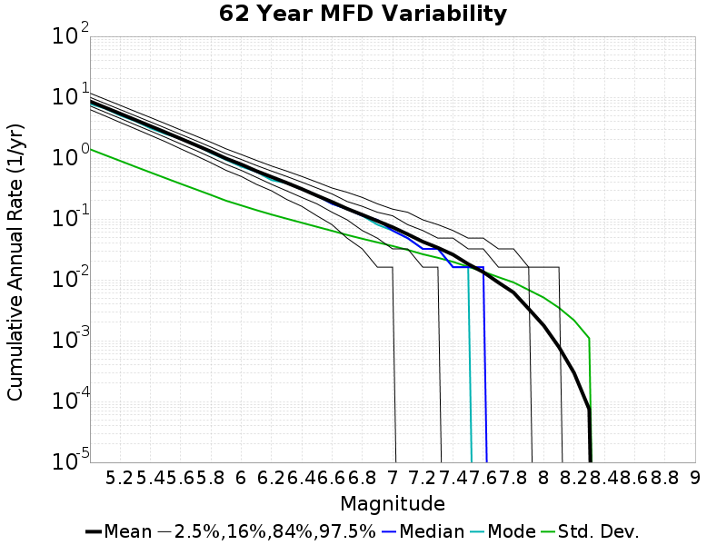
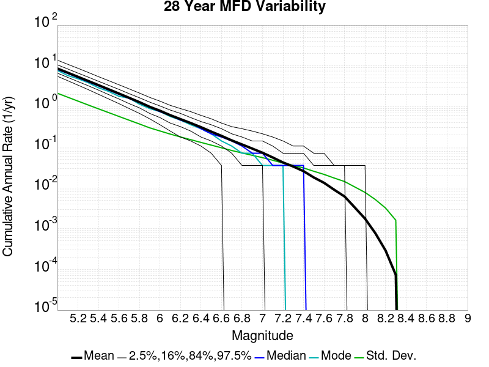
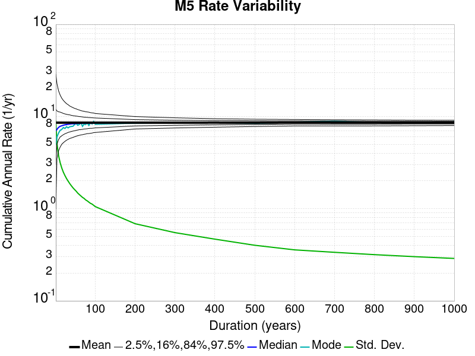
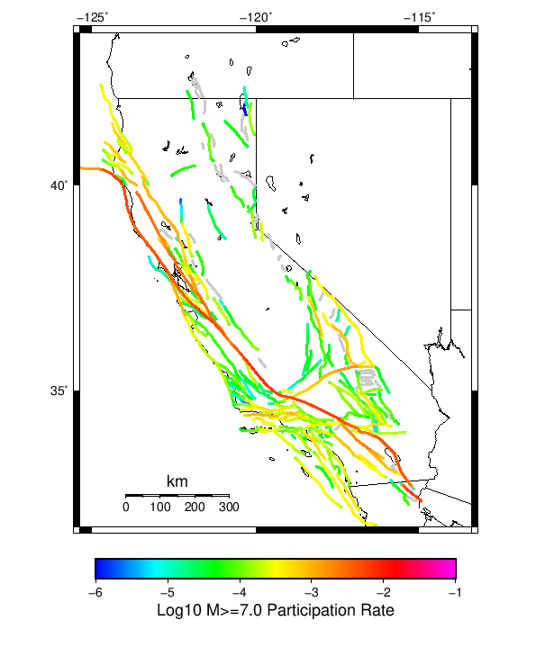
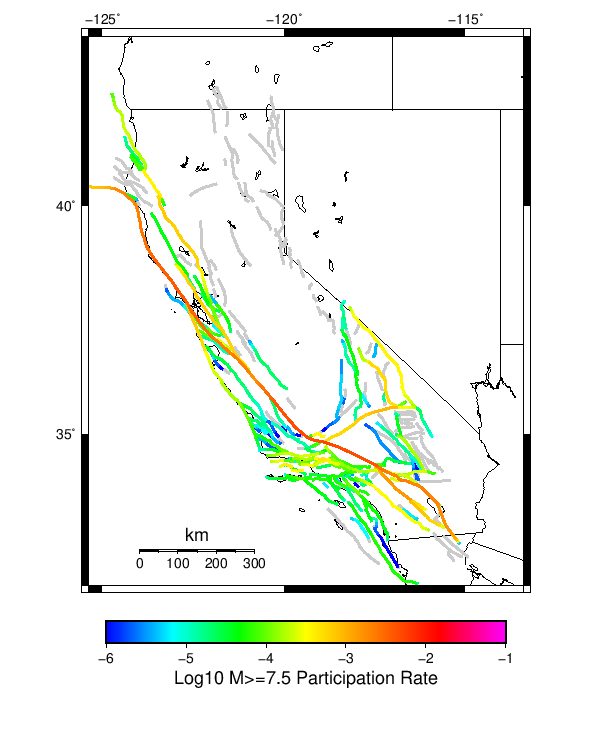
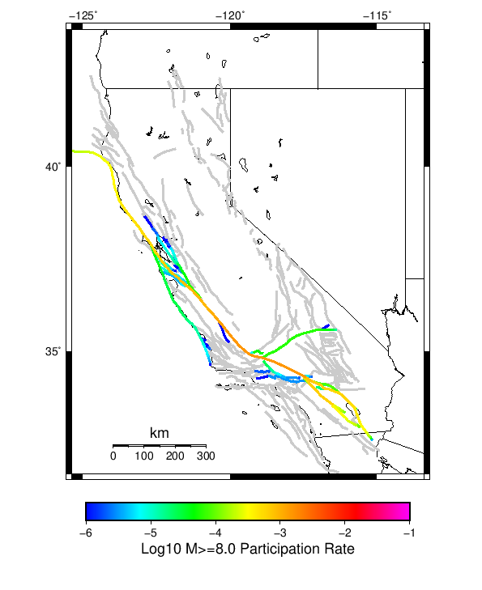

# Spontaneous Results

|   | Spontaneous |
|-----|-----|
| Num Simulations | 1000 |
| Start Time | 2012/01/01 00:00:00 UTC |
| Start Time Epoch Milliseconds | 1325376000000 |
| Duration | 1000 Years |
| Includes Spontaneous? | true |
| Trigger Ruptures | *(none)* |
| Historical Ruptures | 60366 Trigger Ruptures |
|   | First: M7.3 at 1852/01/05 04:40:39 UTC |
|   | Last: M3.2 at 2011/12/31 19:14:44 UTC |
|   | Largest: M7.9 at 1857/01/09 16:25:39 UTC |

## Table Of Contents

* [Magnitude Frequency Distribution](#magnitude-frequency-distribution)
* [Long Term Rate Variability](#long-term-rate-variability)
  * [80 Year Variability](#80-year-variability)
  * [62 Year Variability](#62-year-variability)
  * [28 Year Variability](#28-year-variability)
  * [Variability Duration Dependence](#variability-duration-dependence)
* [Section Participation](#section-participation)
  * [Section Participation Plots](#section-participation-plots)
  * [Supra-Seismogenic Parent Sections Table](#supra-seismogenic-parent-sections-table)
  * [M≥6.5 Parent Sections Table](#m65-parent-sections-table)
  * [M≥7 Parent Sections Table](#m7-parent-sections-table)
  * [M≥7.5 Parent Sections Table](#m75-parent-sections-table)
  * [M≥8 Parent Sections Table](#m8-parent-sections-table)
* [Gridded Nucleation](#gridded-nucleation)
* [JSON Input File](#json-input-file)

## Magnitude Frequency Distribution
*[(top)](#table-of-contents)*

**Legend**
* **Mean** (thick black line): mean annual rate across all 1000 catalogs
* **2.5%,97.5%** (thin black lines): annual rate percentiles across all 1000 catalogs
* **Median** (thin blue line): median annual rate across all 1000 catalogs
* **Mode** (thin cyan line): modal annual rate across all 1000 catalogs (scaled to annualized value)
* **1000 yr Probability** (thin red line): 1000 year probability calculated as the fraction of catalogs with at least 1 occurrence
* **95% Conf** (light red shaded region): binomial 95% confidence bounds on probability


| Mag | Mean | 2.5 %ile | 97.5 %ile | Median | Mode | 1000 yr Probability |
|-----|-----|-----|-----|-----|-----|-----|
| **M&ge;5** | 8.581 | 7.981 | 9.121 | 8.592 | 8.819 | 1.000 |
| **M&ge;5.1** | 6.795 | 6.318 | 7.220 | 6.801 | 6.584 | 1.000 |
| **M&ge;5.2** | 5.377 | 4.986 | 5.732 | 5.385 | 5.423 | 1.000 |
| **M&ge;5.3** | 4.251 | 3.938 | 4.542 | 4.261 | 4.270 | 1.000 |
| **M&ge;5.4** | 3.358 | 3.102 | 3.594 | 3.364 | 3.493 | 1.000 |
| **M&ge;5.5** | 2.650 | 2.443 | 2.838 | 2.657 | 2.664 | 1.000 |
| **M&ge;5.6** | 2.084 | 1.919 | 2.236 | 2.086 | 2.133 | 1.000 |
| **M&ge;5.7** | 1.637 | 1.504 | 1.760 | 1.639 | 1.674 | 1.000 |
| **M&ge;5.8** | 1.281 | 1.176 | 1.379 | 1.285 | 1.292 | 1.000 |
| **M&ge;5.9** | 0.985 | 0.899 | 1.066 | 0.987 | 0.998 | 1.000 |
| **M&ge;6** | 0.788 | 0.714 | 0.857 | 0.791 | 0.802 | 1.000 |
| **M&ge;6.1** | 0.614 | 0.553 | 0.669 | 0.615 | 0.619 | 1.000 |
| **M&ge;6.2** | 0.491 | 0.441 | 0.537 | 0.491 | 0.481 | 1.000 |
| **M&ge;6.3** | 0.393 | 0.350 | 0.434 | 0.394 | 0.405 | 1.000 |
| **M&ge;6.4** | 0.311 | 0.275 | 0.344 | 0.312 | 0.314 | 1.000 |
| **M&ge;6.5** | 0.242 | 0.212 | 0.272 | 0.242 | 0.238 | 1.000 |
| **M&ge;6.6** | 0.191 | 0.164 | 0.214 | 0.190 | 0.197 | 1.000 |
| **M&ge;6.7** | 0.147 | 0.126 | 0.167 | 0.147 | 0.149 | 1.000 |
| **M&ge;6.8** | 0.117 | 0.098 | 0.134 | 0.117 | 0.112 | 1.000 |
| **M&ge;6.9** | 0.093 | 0.077 | 0.108 | 0.093 | 0.092 | 1.000 |
| **M&ge;7** | 0.073 | 0.060 | 0.087 | 0.073 | 0.073 | 1.000 |
| **M&ge;7.1** | 0.056 | 0.044 | 0.068 | 0.056 | 0.059 | 1.000 |
| **M&ge;7.2** | 0.042 | 0.032 | 0.053 | 0.042 | 0.042 | 1.000 |
| **M&ge;7.3** | 0.034 | 0.025 | 0.042 | 0.034 | 0.033 | 1.000 |
| **M&ge;7.4** | 0.026 | 0.019 | 0.033 | 0.026 | 0.026 | 1.000 |
| **M&ge;7.5** | 0.018 | 0.013 | 0.024 | 0.018 | 0.019 | 1.000 |
| **M&ge;7.6** | 0.013 | 9.00E-3 | 0.018 | 0.013 | 0.014 | 1.000 |
| **M&ge;7.7** | 9.02E-3 | 5.00E-3 | 0.013 | 9.00E-3 | 9.00E-3 | 1.000 |
| **M&ge;7.8** | 6.19E-3 | 3.00E-3 | 9.00E-3 | 6.00E-3 | 6.00E-3 | 1.000 |
| **M&ge;7.9** | 3.33E-3 | 1.00E-3 | 6.00E-3 | 3.00E-3 | 4.00E-3 | 0.984 |
| **M&ge;8** | 1.77E-3 | 0.000 | 4.00E-3 | 2.00E-3 | 2.00E-3 | 0.876 |
| **M&ge;8.1** | 7.83E-4 | 0.000 | 2.00E-3 | 1.00E-3 | 0.000 | 0.583 |
| **M&ge;8.2** | 2.96E-4 | 0.000 | 2.00E-3 | 0.000 | 0.000 | 0.267 |
| **M&ge;8.3** | 7.40E-5 | 0.000 | 1.00E-3 | 0.000 | 0.000 | 0.073 |
| **M&ge;8.4** | 0.000 | 0.000 | 0.000 | 0.000 | 0.000 | 0.000 |
| **M&ge;8.5** | 0.000 | 0.000 | 0.000 | 0.000 | 0.000 | 0.000 |
| **M&ge;8.6** | 0.000 | 0.000 | 0.000 | 0.000 | 0.000 | 0.000 |
| **M&ge;8.7** | 0.000 | 0.000 | 0.000 | 0.000 | 0.000 | 0.000 |
| **M&ge;8.8** | 0.000 | 0.000 | 0.000 | 0.000 | 0.000 | 0.000 |
| **M&ge;8.9** | 0.000 | 0.000 | 0.000 | 0.000 | 0.000 | 0.000 |
| **M&ge;9** | 0.000 | 0.000 | 0.000 | 0.000 | 0.000 | 0.000 |

## Long Term Rate Variability
*[(top)](#table-of-contents)*

### 80 Year Variability
*[(top)](#table-of-contents)*


[Download CSV Here](plots/long_term_var_80yr.csv)

| **Magnitude** | Mean | Median | Mode | Std. Dev. | 2.5 %-ile | 16 %-ile | 84 %-ile | 97.5 %-ile |
|-----|-----|-----|-----|-----|-----|-----|-----|-----|
| **5.0** | 8.579754 | 8.4875 | 8.5125 | 1.2153428 | 6.525 | 7.375 | 9.7875 | 11.2125 |
| **5.1** | 6.7943916 | 6.725 | 6.4625 | 0.9742429 | 5.1375 | 5.825 | 7.7625 | 8.875 |
| **5.2** | 5.3765616 | 5.3125 | 5.4375 | 0.78287894 | 4.05 | 4.6125 | 6.15 | 7.0625 |
| **5.3** | 4.2511096 | 4.2 | 4.15 | 0.62870044 | 3.175 | 3.6375 | 4.875 | 5.6 |
| **5.4** | 3.3580709 | 3.3125 | 3.2875 | 0.5070073 | 2.4875 | 2.8625 | 3.8625 | 4.425 |
| **5.5** | 2.6495593 | 2.625 | 2.4625 | 0.40855202 | 1.9375 | 2.25 | 3.05 | 3.5 |
| **5.6** | 2.0841646 | 2.0625 | 2.0125 | 0.32985124 | 1.5125 | 1.7625 | 2.4125 | 2.775 |
| **5.7** | 1.6365354 | 1.625 | 1.6125 | 0.26776335 | 1.175 | 1.375 | 1.9 | 2.2 |
| **5.8** | 1.2812396 | 1.2625 | 1.2125 | 0.21720184 | 0.9 | 1.0625 | 1.5 | 1.7375 |
| **5.9** | 0.9845979 | 0.975 | 0.9875 | 0.17467666 | 0.675 | 0.8125 | 1.1625 | 1.3625 |
| **6.0** | 0.78840834 | 0.775 | 0.7875 | 0.14619085 | 0.525 | 0.65 | 0.925 | 1.1 |
| **6.1** | 0.61379373 | 0.6 | 0.55 | 0.12220879 | 0.4 | 0.5 | 0.7375 | 0.875 |
| **6.2** | 0.49071562 | 0.4875 | 0.4625 | 0.103197135 | 0.3125 | 0.3875 | 0.5875 | 0.7125 |
| **6.3** | 0.39309895 | 0.3875 | 0.35 | 0.088337466 | 0.2375 | 0.3125 | 0.475 | 0.5875 |
| **6.4** | 0.3111729 | 0.3 | 0.3 | 0.075543106 | 0.175 | 0.2375 | 0.3875 | 0.475 |
| **6.5** | 0.24216875 | 0.2375 | 0.225 | 0.06435158 | 0.125 | 0.175 | 0.3125 | 0.375 |
| **6.6** | 0.19054376 | 0.1875 | 0.175 | 0.0551232 | 0.1 | 0.1375 | 0.25 | 0.3125 |
| **6.7** | 0.14718542 | 0.15 | 0.1375 | 0.04721624 | 0.0625 | 0.1 | 0.2 | 0.25 |
| **6.8** | 0.1173125 | 0.1125 | 0.1125 | 0.040824506 | 0.05 | 0.075 | 0.1625 | 0.2 |
| **6.9** | 0.09275625 | 0.0875 | 0.0875 | 0.035523288 | 0.0375 | 0.0625 | 0.125 | 0.175 |
| **7.0** | 0.07331042 | 0.075 | 0.0625 | 0.030931477 | 0.025 | 0.0375 | 0.1 | 0.1375 |
| **7.1** | 0.056057293 | 0.05 | 0.05 | 0.02684343 | 0.0125 | 0.025 | 0.0875 | 0.1125 |
| **7.2** | 0.042292707 | 0.0375 | 0.0375 | 0.022679891 | 0.0 | 0.025 | 0.0625 | 0.0875 |
| **7.3** | 0.033570834 | 0.0375 | 0.025 | 0.019720318 | 0.0 | 0.0125 | 0.05 | 0.075 |
| **7.4** | 0.025867708 | 0.025 | 0.025 | 0.016896978 | 0.0 | 0.0125 | 0.0375 | 0.0625 |
| **7.5** | 0.018133333 | 0.0125 | 0.0125 | 0.013990346 | 0.0 | 0.0 | 0.0375 | 0.05 |
| **7.6** | 0.01339375 | 0.0125 | 0.0125 | 0.011710222 | 0.0 | 0.0 | 0.025 | 0.0375 |
| **7.7** | 0.009016667 | 0.0125 | 0.0 | 0.009473588 | 0.0 | 0.0 | 0.0125 | 0.025 |
| **7.8** | 0.0061760414 | 0.0 | 0.0 | 0.007713929 | 0.0 | 0.0 | 0.0125 | 0.025 |
| **7.9** | 0.0033239583 | 0.0 | 0.0 | 0.005843754 | 0.0 | 0.0 | 0.0125 | 0.0125 |
| **8.0** | 0.0017541667 | 0.0 | 0.0 | 0.0044220737 | 0.0 | 0.0 | 0.0 | 0.0125 |
| **8.1** | 7.7083334E-4 | 0.0 | 0.0 | 0.0030069896 | 0.0 | 0.0 | 0.0 | 0.0125 |
| **8.2** | 2.8958335E-4 | 0.0 | 0.0 | 0.001880486 | 0.0 | 0.0 | 0.0 | 0.0 |
| **8.3** | 7.2916664E-5 | 0.0 | 0.0 | 9.5195434E-4 | 0.0 | 0.0 | 0.0 | 0.0 |
| **8.4** | 0.0 | 0.0 | 0.0 | 0.0 | 0.0 | 0.0 | 0.0 | 0.0 |
| **8.5** | 0.0 | 0.0 | 0.0 | 0.0 | 0.0 | 0.0 | 0.0 | 0.0 |
| **8.6** | 0.0 | 0.0 | 0.0 | 0.0 | 0.0 | 0.0 | 0.0 | 0.0 |
| **8.7** | 0.0 | 0.0 | 0.0 | 0.0 | 0.0 | 0.0 | 0.0 | 0.0 |
| **8.8** | 0.0 | 0.0 | 0.0 | 0.0 | 0.0 | 0.0 | 0.0 | 0.0 |
| **8.9** | 0.0 | 0.0 | 0.0 | 0.0 | 0.0 | 0.0 | 0.0 | 0.0 |
| **9.0** | 0.0 | 0.0 | 0.0 | 0.0 | 0.0 | 0.0 | 0.0 | 0.0 |

### 62 Year Variability
*[(top)](#table-of-contents)*



[Download CSV Here](plots/long_term_var_62yr.csv)

| **Magnitude** | Mean | Median | Mode | Std. Dev. | 2.5 %-ile | 16 %-ile | 84 %-ile | 97.5 %-ile |
|-----|-----|-----|-----|-----|-----|-----|-----|-----|
| **5.0** | 8.581483 | 8.435484 | 7.774194 | 1.3993797 | 6.274194 | 7.209677 | 9.9838705 | 11.67742 |
| **5.1** | 6.795642 | 6.693548 | 6.532258 | 1.121172 | 4.935484 | 5.693548 | 7.903226 | 9.274194 |
| **5.2** | 5.3774095 | 5.290323 | 5.016129 | 0.9008901 | 3.8548386 | 4.5 | 6.274194 | 7.370968 |
| **5.3** | 4.2515516 | 4.177419 | 4.048387 | 0.72271883 | 3.032258 | 3.532258 | 4.967742 | 5.83871 |
| **5.4** | 3.358491 | 3.3064516 | 3.096774 | 0.5814378 | 2.3709676 | 2.7903225 | 3.935484 | 4.645161 |
| **5.5** | 2.6499677 | 2.612903 | 2.483871 | 0.46874323 | 1.8548387 | 2.1935484 | 3.112903 | 3.6774194 |
| **5.6** | 2.0845563 | 2.048387 | 2.096774 | 0.37798482 | 1.4193548 | 1.7096775 | 2.451613 | 2.903226 |
| **5.7** | 1.6366814 | 1.6129032 | 1.6451613 | 0.306467 | 1.0967742 | 1.3387097 | 1.9354838 | 2.3064516 |
| **5.8** | 1.2813882 | 1.2580645 | 1.2096775 | 0.24802989 | 0.83870965 | 1.032258 | 1.516129 | 1.8225807 |
| **5.9** | 0.9847621 | 0.9677419 | 0.9354839 | 0.19941056 | 0.62903225 | 0.7903226 | 1.1774193 | 1.4193548 |
| **6.0** | 0.7885242 | 0.7741935 | 0.7258065 | 0.16698234 | 0.5 | 0.62903225 | 0.9516129 | 1.1451613 |
| **6.1** | 0.6139395 | 0.5967742 | 0.5967742 | 0.13974616 | 0.37096775 | 0.48387095 | 0.7580645 | 0.91935486 |
| **6.2** | 0.49083468 | 0.48387095 | 0.43548387 | 0.11823907 | 0.29032257 | 0.37096775 | 0.61290324 | 0.7419355 |
| **6.3** | 0.39319456 | 0.38709676 | 0.38709676 | 0.101094216 | 0.20967741 | 0.29032257 | 0.5 | 0.61290324 |
| **6.4** | 0.31118146 | 0.30645162 | 0.30645162 | 0.086743325 | 0.16129032 | 0.22580644 | 0.4032258 | 0.5 |
| **6.5** | 0.24224798 | 0.24193548 | 0.24193548 | 0.07432658 | 0.11290322 | 0.17741935 | 0.32258064 | 0.4032258 |
| **6.6** | 0.19058569 | 0.17741935 | 0.17741935 | 0.06384362 | 0.08064516 | 0.12903225 | 0.2580645 | 0.32258064 |
| **6.7** | 0.14723085 | 0.14516129 | 0.14516129 | 0.05462795 | 0.048387095 | 0.09677419 | 0.19354838 | 0.27419356 |
| **6.8** | 0.11730242 | 0.11290322 | 0.11290322 | 0.04729966 | 0.032258064 | 0.06451613 | 0.16129032 | 0.22580644 |
| **6.9** | 0.09277117 | 0.09677419 | 0.08064516 | 0.041239176 | 0.016129032 | 0.048387095 | 0.12903225 | 0.17741935 |
| **7.0** | 0.073347785 | 0.06451613 | 0.06451613 | 0.03594974 | 0.016129032 | 0.032258064 | 0.11290322 | 0.14516129 |
| **7.1** | 0.056077622 | 0.048387095 | 0.048387095 | 0.03103401 | 0.0 | 0.032258064 | 0.08064516 | 0.12903225 |
| **7.2** | 0.04231754 | 0.032258064 | 0.032258064 | 0.026352555 | 0.0 | 0.016129032 | 0.06451613 | 0.09677419 |
| **7.3** | 0.03362601 | 0.032258064 | 0.032258064 | 0.023010012 | 0.0 | 0.016129032 | 0.048387095 | 0.08064516 |
| **7.4** | 0.025900202 | 0.016129032 | 0.016129032 | 0.019745864 | 0.0 | 0.0 | 0.048387095 | 0.06451613 |
| **7.5** | 0.018142138 | 0.016129032 | 0.016129032 | 0.016369566 | 0.0 | 0.0 | 0.032258064 | 0.048387095 |
| **7.6** | 0.013385081 | 0.016129032 | 0.0 | 0.013644077 | 0.0 | 0.0 | 0.032258064 | 0.048387095 |
| **7.7** | 0.0090241935 | 0.0 | 0.0 | 0.011052967 | 0.0 | 0.0 | 0.016129032 | 0.032258064 |
| **7.8** | 0.0061895163 | 0.0 | 0.0 | 0.009068629 | 0.0 | 0.0 | 0.016129032 | 0.032258064 |
| **7.9** | 0.0033306452 | 0.0 | 0.0 | 0.006807118 | 0.0 | 0.0 | 0.016129032 | 0.016129032 |
| **8.0** | 0.001766129 | 0.0 | 0.0 | 0.0050944765 | 0.0 | 0.0 | 0.0 | 0.016129032 |
| **8.1** | 7.842742E-4 | 0.0 | 0.0 | 0.0034691857 | 0.0 | 0.0 | 0.0 | 0.016129032 |
| **8.2** | 2.953629E-4 | 0.0 | 0.0 | 0.0021626304 | 0.0 | 0.0 | 0.0 | 0.0 |
| **8.3** | 7.459678E-5 | 0.0 | 0.0 | 0.0010943875 | 0.0 | 0.0 | 0.0 | 0.0 |
| **8.4** | 0.0 | 0.0 | 0.0 | 0.0 | 0.0 | 0.0 | 0.0 | 0.0 |
| **8.5** | 0.0 | 0.0 | 0.0 | 0.0 | 0.0 | 0.0 | 0.0 | 0.0 |
| **8.6** | 0.0 | 0.0 | 0.0 | 0.0 | 0.0 | 0.0 | 0.0 | 0.0 |
| **8.7** | 0.0 | 0.0 | 0.0 | 0.0 | 0.0 | 0.0 | 0.0 | 0.0 |
| **8.8** | 0.0 | 0.0 | 0.0 | 0.0 | 0.0 | 0.0 | 0.0 | 0.0 |
| **8.9** | 0.0 | 0.0 | 0.0 | 0.0 | 0.0 | 0.0 | 0.0 | 0.0 |
| **9.0** | 0.0 | 0.0 | 0.0 | 0.0 | 0.0 | 0.0 | 0.0 | 0.0 |

### 28 Year Variability
*[(top)](#table-of-contents)*



[Download CSV Here](plots/long_term_var_28yr.csv)

| **Magnitude** | Mean | Median | Mode | Std. Dev. | 2.5 %-ile | 16 %-ile | 84 %-ile | 97.5 %-ile |
|-----|-----|-----|-----|-----|-----|-----|-----|-----|
| **5.0** | 8.58182 | 8.178572 | 7.75 | 2.1217108 | 5.535714 | 6.607143 | 10.571428 | 13.785714 |
| **5.1** | 6.7958856 | 6.5 | 5.785714 | 1.6989353 | 4.321429 | 5.214286 | 8.392858 | 10.928572 |
| **5.2** | 5.377604 | 5.142857 | 4.821429 | 1.3630465 | 3.357143 | 4.107143 | 6.642857 | 8.714286 |
| **5.3** | 4.2517233 | 4.071429 | 3.857143 | 1.0926664 | 2.607143 | 3.25 | 5.285714 | 6.892857 |
| **5.4** | 3.358649 | 3.2142856 | 2.892857 | 0.87996185 | 2.0 | 2.5357144 | 4.178571 | 5.428571 |
| **5.5** | 2.6501265 | 2.5357144 | 2.357143 | 0.7100104 | 1.5357143 | 1.9642857 | 3.3214285 | 4.321429 |
| **5.6** | 2.0845816 | 2.0 | 1.7857143 | 0.5715828 | 1.1785715 | 1.5357143 | 2.642857 | 3.4285715 |
| **5.7** | 1.6368612 | 1.5714285 | 1.6071428 | 0.46180803 | 0.89285713 | 1.1785715 | 2.0714285 | 2.7142856 |
| **5.8** | 1.2814847 | 1.25 | 1.1428572 | 0.3731968 | 0.6785714 | 0.9285714 | 1.6428572 | 2.142857 |
| **5.9** | 0.9848194 | 0.96428573 | 0.89285713 | 0.30004156 | 0.5 | 0.6785714 | 1.2857143 | 1.6785715 |
| **6.0** | 0.7885949 | 0.75 | 0.75 | 0.25140718 | 0.35714287 | 0.53571427 | 1.0357143 | 1.3571428 |
| **6.1** | 0.61403674 | 0.60714287 | 0.5714286 | 0.21089363 | 0.25 | 0.39285713 | 0.8214286 | 1.0714285 |
| **6.2** | 0.4909163 | 0.4642857 | 0.4642857 | 0.17926489 | 0.17857143 | 0.32142857 | 0.6785714 | 0.89285713 |
| **6.3** | 0.39327246 | 0.39285713 | 0.35714287 | 0.1536491 | 0.14285715 | 0.25 | 0.53571427 | 0.75 |
| **6.4** | 0.31128162 | 0.2857143 | 0.2857143 | 0.13157384 | 0.10714286 | 0.17857143 | 0.42857143 | 0.60714287 |
| **6.5** | 0.24229693 | 0.21428572 | 0.21428572 | 0.11299088 | 0.071428575 | 0.14285715 | 0.35714287 | 0.5 |
| **6.6** | 0.19065204 | 0.17857143 | 0.14285715 | 0.09724256 | 0.035714287 | 0.10714286 | 0.2857143 | 0.39285713 |
| **6.7** | 0.14728673 | 0.14285715 | 0.10714286 | 0.08330588 | 0.0 | 0.071428575 | 0.21428572 | 0.32142857 |
| **6.8** | 0.11735612 | 0.10714286 | 0.071428575 | 0.072557114 | 0.0 | 0.035714287 | 0.17857143 | 0.2857143 |
| **6.9** | 0.09282449 | 0.071428575 | 0.071428575 | 0.06343758 | 0.0 | 0.035714287 | 0.14285715 | 0.25 |
| **7.0** | 0.073385715 | 0.071428575 | 0.035714287 | 0.055578496 | 0.0 | 0.035714287 | 0.14285715 | 0.21428572 |
| **7.1** | 0.05610816 | 0.035714287 | 0.035714287 | 0.04798689 | 0.0 | 0.0 | 0.10714286 | 0.17857143 |
| **7.2** | 0.04235 | 0.035714287 | 0.035714287 | 0.040874217 | 0.0 | 0.0 | 0.071428575 | 0.14285715 |
| **7.3** | 0.033640817 | 0.035714287 | 0.0 | 0.035923388 | 0.0 | 0.0 | 0.071428575 | 0.10714286 |
| **7.4** | 0.025924489 | 0.035714287 | 0.0 | 0.031058174 | 0.0 | 0.0 | 0.071428575 | 0.10714286 |
| **7.5** | 0.018164286 | 0.0 | 0.0 | 0.02576238 | 0.0 | 0.0 | 0.035714287 | 0.071428575 |
| **7.6** | 0.013406122 | 0.0 | 0.0 | 0.02159184 | 0.0 | 0.0 | 0.035714287 | 0.071428575 |
| **7.7** | 0.009031633 | 0.0 | 0.0 | 0.01752648 | 0.0 | 0.0 | 0.035714287 | 0.035714287 |
| **7.8** | 0.0061908164 | 0.0 | 0.0 | 0.014432274 | 0.0 | 0.0 | 0.035714287 | 0.035714287 |
| **7.9** | 0.0033255103 | 0.0 | 0.0 | 0.010600808 | 0.0 | 0.0 | 0.0 | 0.035714287 |
| **8.0** | 0.0017632653 | 0.0 | 0.0 | 0.0077983276 | 0.0 | 0.0 | 0.0 | 0.035714287 |
| **8.1** | 7.785714E-4 | 0.0 | 0.0 | 0.0052154316 | 0.0 | 0.0 | 0.0 | 0.0 |
| **8.2** | 2.9285715E-4 | 0.0 | 0.0 | 0.0032208252 | 0.0 | 0.0 | 0.0 | 0.0 |
| **8.3** | 7.346939E-5 | 0.0 | 0.0 | 0.0016182038 | 0.0 | 0.0 | 0.0 | 0.0 |
| **8.4** | 0.0 | 0.0 | 0.0 | 0.0 | 0.0 | 0.0 | 0.0 | 0.0 |
| **8.5** | 0.0 | 0.0 | 0.0 | 0.0 | 0.0 | 0.0 | 0.0 | 0.0 |
| **8.6** | 0.0 | 0.0 | 0.0 | 0.0 | 0.0 | 0.0 | 0.0 | 0.0 |
| **8.7** | 0.0 | 0.0 | 0.0 | 0.0 | 0.0 | 0.0 | 0.0 | 0.0 |
| **8.8** | 0.0 | 0.0 | 0.0 | 0.0 | 0.0 | 0.0 | 0.0 | 0.0 |
| **8.9** | 0.0 | 0.0 | 0.0 | 0.0 | 0.0 | 0.0 | 0.0 | 0.0 |
| **9.0** | 0.0 | 0.0 | 0.0 | 0.0 | 0.0 | 0.0 | 0.0 | 0.0 |

### Variability Duration Dependence
*[(top)](#table-of-contents)*



[Download CSV Here](plots/long_term_var_m5.csv)

| **Duration (years)** | Mean | Median | Mode | Std. Dev. | 2.5 %-ile | 16 %-ile | 84 %-ile | 97.5 %-ile |
|-----|-----|-----|-----|-----|-----|-----|-----|-----|
| **1.0** | 8.580552 | 7.0 | 5.0 | 8.933528 | 1.0 | 3.0 | 12.0 | 29.0 |
| **4.0** | 8.580552 | 7.25 | 6.0 | 5.0650935 | 3.5 | 5.0 | 11.5 | 22.75 |
| **8.0** | 8.580552 | 7.625 | 6.625 | 3.7663844 | 4.25 | 5.625 | 11.25 | 19.0 |
| **12.0** | 8.580829 | 7.8333335 | 7.0833335 | 3.1524107 | 4.6666665 | 6.0 | 11.166667 | 17.083334 |
| **16.0** | 8.581483 | 7.9375 | 7.25 | 2.765453 | 5.0 | 6.1875 | 11.0 | 15.8125 |
| **20.0** | 8.580552 | 8.05 | 7.6 | 2.4888687 | 5.2 | 6.35 | 10.8 | 14.95 |
| **24.0** | 8.581031 | 8.125 | 7.4166665 | 2.2874386 | 5.375 | 6.5 | 10.666667 | 14.333333 |
| **28.0** | 8.58182 | 8.178572 | 7.75 | 2.1217108 | 5.535714 | 6.607143 | 10.571428 | 13.785714 |
| **32.0** | 8.581483 | 8.25 | 7.53125 | 1.989987 | 5.65625 | 6.71875 | 10.46875 | 13.4375 |
| **36.0** | 8.580689 | 8.277778 | 7.75 | 1.872953 | 5.7777777 | 6.8055553 | 10.416667 | 13.0 |
| **40.0** | 8.580552 | 8.325 | 7.8 | 1.7744231 | 5.85 | 6.875 | 10.3 | 12.75 |
| **44.0** | 8.580989 | 8.340909 | 7.840909 | 1.6877732 | 5.931818 | 6.9545455 | 10.227273 | 12.5 |
| **48.0** | 8.579754 | 8.354167 | 8.166667 | 1.6147885 | 6.0208335 | 7.0 | 10.166667 | 12.270833 |
| **52.0** | 8.581786 | 8.384615 | 8.480769 | 1.5509889 | 6.1153846 | 7.076923 | 10.115385 | 12.115385 |
| **56.0** | 8.580278 | 8.410714 | 8.035714 | 1.4774975 | 6.196429 | 7.142857 | 10.053572 | 11.910714 |
| **60.0** | 8.579754 | 8.416667 | 8.2 | 1.4234539 | 6.25 | 7.2 | 9.983334 | 11.766666 |
| **64.0** | 8.579754 | 8.4375 | 8.578125 | 1.3746041 | 6.3125 | 7.21875 | 9.953125 | 11.578125 |
| **68.0** | 8.580278 | 8.455882 | 7.8235292 | 1.3268229 | 6.352941 | 7.2647057 | 9.8970585 | 11.470589 |
| **72.0** | 8.582244 | 8.472222 | 8.277778 | 1.2931885 | 6.4166665 | 7.3194447 | 9.847222 | 11.402778 |
| **76.0** | 8.581786 | 8.486842 | 8.210526 | 1.2444243 | 6.4605265 | 7.3421054 | 9.815789 | 11.263158 |
| **80.0** | 8.579754 | 8.4875 | 8.5125 | 1.2153428 | 6.525 | 7.375 | 9.7875 | 11.2125 |
| **84.0** | 8.581346 | 8.488095 | 8.011905 | 1.1773145 | 6.535714 | 7.428571 | 9.75 | 11.142858 |
| **88.0** | 8.580989 | 8.5 | 8.579545 | 1.1430323 | 6.5795455 | 7.4545455 | 9.727273 | 11.022727 |
| **92.0** | 8.581305 | 8.5 | 8.304348 | 1.1224583 | 6.619565 | 7.4565215 | 9.695652 | 10.956522 |
| **96.0** | 8.579754 | 8.510417 | 8.84375 | 1.0880711 | 6.6875 | 7.4895835 | 9.666667 | 10.916667 |
| **100.0** | 8.580552 | 8.53 | 8.25 | 1.0538942 | 6.71 | 7.53 | 9.64 | 10.78 |
| **200.0** | 8.580552 | 8.545 | 8.475 | 0.6869131 | 7.33 | 7.905 | 9.26 | 9.985 |
| **300.0** | 8.582465 | 8.583333 | 8.623333 | 0.5497238 | 7.51 | 8.023334 | 9.12 | 9.683333 |
| **400.0** | 8.585639 | 8.585 | 8.595 | 0.46723524 | 7.66 | 8.1325 | 9.0575 | 9.475 |
| **500.0** | 8.580552 | 8.584 | 8.428 | 0.40103087 | 7.79 | 8.198 | 8.98 | 9.35 |
| **600.0** | 8.615514 | 8.631667 | 8.66 | 0.3574745 | 7.905 | 8.28 | 8.965 | 9.288333 |
| **700.0** | 8.599462 | 8.607142 | 8.914286 | 0.3362978 | 7.9 | 8.268572 | 8.935715 | 9.221429 |
| **800.0** | 8.585639 | 8.59375 | 8.60125 | 0.31719527 | 7.91375 | 8.27125 | 8.90125 | 9.18125 |
| **900.0** | 8.582465 | 8.593333 | 8.62 | 0.30177572 | 7.9466667 | 8.295555 | 8.887777 | 9.132222 |
| **1000.0** | 8.580552 | 8.592 | 8.819 | 0.28859344 | 7.981 | 8.294 | 8.862 | 9.121 |

## Section Participation
*[(top)](#table-of-contents)*

### Section Participation Plots
*[(top)](#table-of-contents)*

| Min Mag | Complete Catalog (including spontaneous) |
|-----|-----|
| **All Supra. Seis.** |  |
| **M&ge;6.5** |  |
| **M&ge;7** |  |
| **M&ge;7.5** |  |
| **M&ge;8** |  |

### Supra-Seismogenic Parent Sections Table
*[(top)](#table-of-contents)*

*First 10 of 313 with matching ruptures shown*

| Parent Name | Total Mean Annual Rate | Total 1000 Year Prob |
|-----|-----|-----|
| San Andreas (Parkfield) | 0.053665 | 1.0 |
| San Andreas (Creeping Section) 2011 CFM | 0.034545 | 1.0 |
| San Andreas (Mojave S) | 0.027804 | 1.0 |
| Mendocino | 0.020741 | 1.0 |
| Cerro Prieto | 0.017217 | 1.0 |
| Imperial | 0.013588 | 1.0 |
| Hayward (So) 2011 CFM | 0.012577 | 1.0 |
| Brawley (Seismic Zone) alt 1 | 0.012462 | 1.0 |
| San Andreas (Offshore) 2011 CFM | 0.012093 | 1.0 |
| Elsinore (Glen Ivy) rev | 0.011701 | 1.0 |

### M≥6.5 Parent Sections Table
*[(top)](#table-of-contents)*

*First 10 of 306 with matching ruptures shown*

| Parent Name | Total Mean Annual Rate | Total 1000 Year Prob |
|-----|-----|-----|
| Cerro Prieto | 0.014759 | 1.0 |
| San Andreas (Creeping Section) 2011 CFM | 0.013616 | 1.0 |
| Mendocino | 0.011273 | 1.0 |
| Hayward (So) 2011 CFM | 0.010689 | 1.0 |
| San Andreas (Mojave S) | 0.009998 | 1.0 |
| Imperial | 0.009295 | 1.0 |
| Brawley (Seismic Zone) alt 1 | 0.008821 | 1.0 |
| San Andreas (San Bernardino N) | 0.008786 | 1.0 |
| San Andreas (Offshore) 2011 CFM | 0.008591 | 1.0 |
| San Andreas (Santa Cruz Mts) 2011 CFM | 0.008524 | 1.0 |

### M≥7 Parent Sections Table
*[(top)](#table-of-contents)*

*First 10 of 274 with matching ruptures shown*

| Parent Name | Total Mean Annual Rate | Total 1000 Year Prob |
|-----|-----|-----|
| San Andreas (Creeping Section) 2011 CFM | 0.008589 | 1.0 |
| San Andreas (Cholame) rev | 0.00694 | 1.0 |
| San Andreas (Carrizo) rev | 0.006846 | 1.0 |
| San Andreas (Mojave S) | 0.006668 | 1.0 |
| San Andreas (Santa Cruz Mts) 2011 CFM | 0.006614 | 1.0 |
| San Andreas (North Coast) 2011 CFM | 0.006014 | 1.0 |
| San Andreas (San Bernardino N) | 0.005777 | 1.0 |
| San Andreas (Mojave N) | 0.005749 | 1.0 |
| San Andreas (Offshore) 2011 CFM | 0.005741 | 1.0 |
| Cerro Prieto | 0.005473 | 1.0 |

### M≥7.5 Parent Sections Table
*[(top)](#table-of-contents)*

*First 10 of 221 with matching ruptures shown*

| Parent Name | Total Mean Annual Rate | Total 1000 Year Prob |
|-----|-----|-----|
| San Andreas (Mojave N) | 0.005598 | 1.0 |
| San Andreas (Big Bend) | 0.005175 | 1.0 |
| San Andreas (Mojave S) | 0.005038 | 1.0 |
| San Andreas (Carrizo) rev | 0.004775 | 1.0 |
| San Andreas (North Coast) 2011 CFM | 0.00459 | 1.0 |
| San Andreas (Cholame) rev | 0.004544 | 1.0 |
| San Andreas (San Bernardino N) | 0.004151 | 1.0 |
| San Andreas (Creeping Section) 2011 CFM | 0.003974 | 0.995 |
| San Andreas (Peninsula) 2011 CFM | 0.003709 | 1.0 |
| San Andreas (Parkfield) | 0.003526 | 0.996 |

### M≥8 Parent Sections Table
*[(top)](#table-of-contents)*

*First 10 of 71 with matching ruptures shown*

| Parent Name | Total Mean Annual Rate | Total 1000 Year Prob |
|-----|-----|-----|
| San Andreas (Mojave N) | 0.001565 | 0.851 |
| San Andreas (Carrizo) rev | 0.001528 | 0.846 |
| San Andreas (Big Bend) | 0.001525 | 0.846 |
| San Andreas (Mojave S) | 0.001522 | 0.841 |
| San Andreas (Cholame) rev | 0.001494 | 0.839 |
| San Andreas (San Bernardino N) | 0.001463 | 0.83 |
| San Andreas (Parkfield) | 0.001294 | 0.786 |
| San Andreas (Creeping Section) 2011 CFM | 0.001189 | 0.727 |
| San Andreas (Santa Cruz Mts) 2011 CFM | 8.38E-4 | 0.596 |
| San Andreas (Peninsula) 2011 CFM | 7.38E-4 | 0.559 |
## Gridded Nucleation
*[(top)](#table-of-contents)*

| Min Mag | Complete Catalog (including spontaneous) |
|-----|-----|
| **M&ge;5** |  |
| **M&ge;6** |  |
| **M&ge;7** |  |

## JSON Input File
*[(top)](#table-of-contents)*

```
{
  "numSimulations": 1000,
  "duration": 1000.0,
  "startYear": 2012,
  "includeSpontaneous": true,
  "randomSeed": 123456789,
  "binaryOutput": true,
  "binaryOutputFilters": [
    {
      "prefix": "results_complete",
      "descendantsOnly": false
    },
    {
      "prefix": "results_m5_preserve_chain",
      "minMag": 5.0,
      "preserveChainBelowMag": true,
      "descendantsOnly": false
    }
  ],
  "forceRecalc": false,
  "reuseERFs": false,
  "simulationName": "Spontaneous",
  "numRetries": 3,
  "outputDir": "${ETAS_SIM_DIR}/2019_06_05-Spontaneous-includeSpont-historicalCatalog-no_ert-1000yr",
  "triggerCatalog": "${ETAS_LAUNCHER}/inputs/u3_historical_catalog.txt",
  "triggerCatalogSurfaceMappings": "${ETAS_LAUNCHER}/inputs/u3_historical_catalog_finite_fault_mappings.xml",
  "treatTriggerCatalogAsSpontaneous": true,
  "cacheDir": "${ETAS_LAUNCHER}/inputs/cache_fm3p1_ba",
  "fssFile": "${ETAS_LAUNCHER}/inputs/2013_05_10-ucerf3p3-production-10runs_COMPOUND_SOL_FM3_1_SpatSeisU3_MEAN_BRANCH_AVG_SOL.zip",
  "probModel": "NO_ERT",
  "applySubSeisForSupraNucl": true,
  "totRateScaleFactor": 1.14,
  "gridSeisCorr": true,
  "timeIndependentERF": false,
  "griddedOnly": false,
  "imposeGR": false,
  "includeIndirectTriggering": true,
  "gridSeisDiscr": 0.1,
  "catalogCompletenessModel": "RELAXED"
}
```

