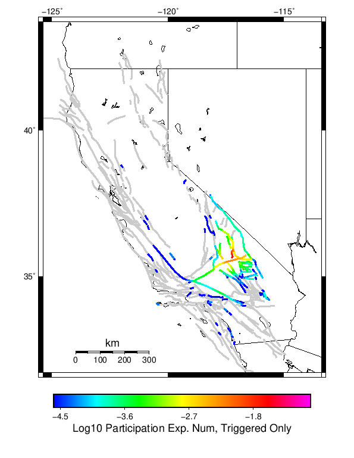
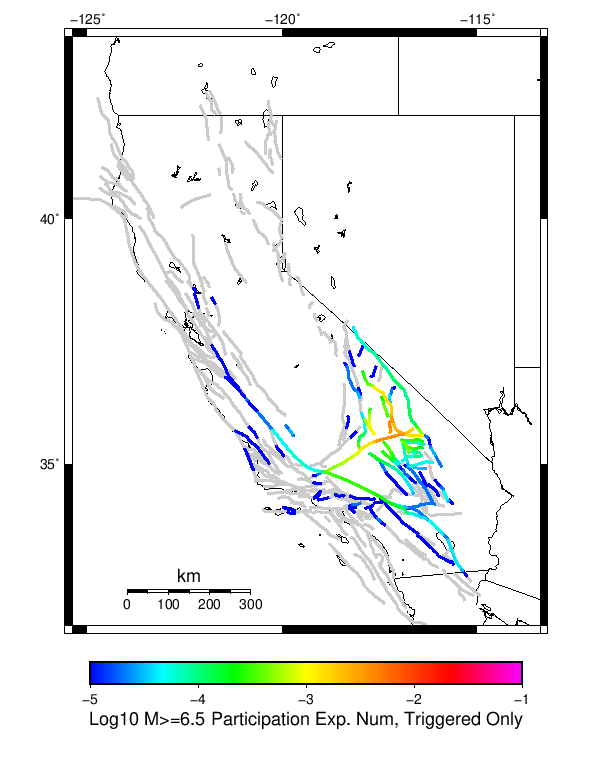
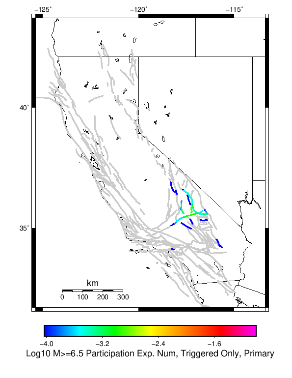
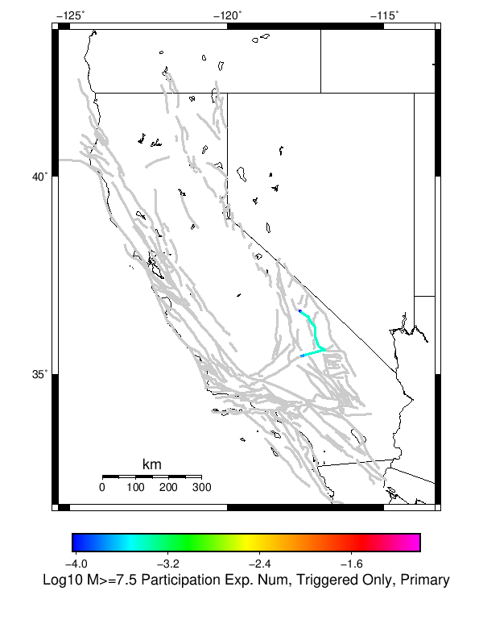

# Searles Valley M6.4 Results

|   | Searles Valley M6.4 |
|-----|-----|
| Num Simulations | 3500 (incomplete) |
| Start Time | 2019/07/04 17:33:48 UTC |
| Start Time Epoch Milliseconds | 1562261628000 |
| Duration | 10 Years |
| Includes Spontaneous? | false |
| Historical Ruptures | *(none)* |

## Table Of Contents

* [Magnitude Number Distribution](#magnitude-number-distribution)
* [Hazard Change Over Time](#hazard-change-over-time)
  * [M&ge;5.0 Hazard Change Over Time](#mge50-hazard-change-over-time)
  * [M&ge;6.0 Hazard Change Over Time](#mge60-hazard-change-over-time)
  * [M&ge;7.0 Hazard Change Over Time](#mge70-hazard-change-over-time)
* [Section Participation](#section-participation)
  * [Section Participation Plots](#section-participation-plots)
  * [Supra-Seismogenic Parent Sections Table](#supra-seismogenic-parent-sections-table)
  * [M≥6.5 Parent Sections Table](#m65-parent-sections-table)
  * [M≥7 Parent Sections Table](#m7-parent-sections-table)
  * [M≥7.5 Parent Sections Table](#m75-parent-sections-table)
* [Gridded Nucleation](#gridded-nucleation)
* [JSON Input File](#json-input-file)

## Magnitude Number Distribution
*[(top)](#table-of-contents)*

**Legend**
* **Mean** (thick black line): mean expected number across all 3500 catalogs
* **2.5%,97.5%** (thin black lines): expected number percentiles across all 3500 catalogs
* **Median** (thin blue line): median expected number across all 3500 catalogs
* **Mode** (thin cyan line): modal expected number across all 3500 catalogs
* **10 yr Probability** (thin red line): 10 year probability calculated as the fraction of catalogs with at least 1 occurrence
* **95% Conf** (light red shaded region): binomial 95% confidence bounds on probability
* **Primary** (thin green line): mean expected number from primary triggered aftershocks only (no secondary, tertiary, etc...) across all 3500 catalogs


| Mag | Mean | 2.5 %ile | 97.5 %ile | Median | Mode | 10 yr Probability | Primary Aftershocks Mean |
|-----|-----|-----|-----|-----|-----|-----|-----|
| **M&ge;2.5** | 926.133 | 540.000 | 2485.000 | 718.000 | 667.000 | 1.000 | 417.768 |
| **M&ge;2.6** | 735.670 | 428.000 | 1994.000 | 570.000 | 491.000 | 1.000 | 331.901 |
| **M&ge;2.7** | 584.041 | 336.000 | 1575.000 | 453.000 | 423.000 | 1.000 | 263.453 |
| **M&ge;2.8** | 463.692 | 264.000 | 1258.000 | 359.000 | 311.000 | 1.000 | 209.045 |
| **M&ge;2.9** | 368.328 | 208.000 | 1008.000 | 287.000 | 253.000 | 1.000 | 166.107 |
| **M&ge;3** | 292.649 | 163.000 | 797.000 | 229.000 | 193.000 | 1.000 | 132.050 |
| **M&ge;3.1** | 232.279 | 126.000 | 626.000 | 182.000 | 154.000 | 1.000 | 104.963 |
| **M&ge;3.2** | 184.726 | 98.000 | 492.000 | 145.000 | 128.000 | 1.000 | 83.463 |
| **M&ge;3.3** | 146.848 | 77.000 | 389.000 | 116.000 | 98.000 | 1.000 | 66.359 |
| **M&ge;3.4** | 116.620 | 59.000 | 314.000 | 92.000 | 82.000 | 1.000 | 52.689 |
| **M&ge;3.5** | 92.589 | 45.000 | 255.000 | 73.000 | 61.000 | 1.000 | 41.810 |
| **M&ge;3.6** | 73.509 | 34.000 | 204.000 | 58.000 | 48.000 | 1.000 | 33.193 |
| **M&ge;3.7** | 58.404 | 26.000 | 161.000 | 46.000 | 42.000 | 1.000 | 26.399 |
| **M&ge;3.8** | 46.342 | 20.000 | 129.000 | 37.000 | 30.000 | 1.000 | 21.007 |
| **M&ge;3.9** | 36.804 | 14.000 | 103.000 | 29.000 | 25.000 | 1.000 | 16.671 |
| **M&ge;4** | 29.221 | 10.000 | 85.000 | 23.000 | 17.000 | 1.000 | 13.232 |
| **M&ge;4.1** | 23.154 | 8.000 | 67.000 | 18.000 | 15.000 | 1.000 | 10.511 |
| **M&ge;4.2** | 18.337 | 5.000 | 54.000 | 14.000 | 13.000 | 1.000 | 8.349 |
| **M&ge;4.3** | 14.536 | 4.000 | 42.000 | 11.000 | 8.000 | 1.000 | 6.612 |
| **M&ge;4.4** | 11.537 | 2.000 | 35.000 | 9.000 | 6.000 | 0.999 | 5.221 |
| **M&ge;4.5** | 9.129 | 2.000 | 28.000 | 7.000 | 6.000 | 0.996 | 4.144 |
| **M&ge;4.6** | 7.234 | 1.000 | 23.000 | 5.000 | 4.000 | 0.986 | 3.305 |
| **M&ge;4.7** | 5.722 | 0.000 | 19.000 | 4.000 | 3.000 | 0.967 | 2.617 |
| **M&ge;4.8** | 4.540 | 0.000 | 15.000 | 3.000 | 2.000 | 0.938 | 2.078 |
| **M&ge;4.9** | 3.601 | 0.000 | 13.000 | 3.000 | 2.000 | 0.897 | 1.649 |
| **M&ge;5** | 2.849 | 0.000 | 10.000 | 2.000 | 1.000 | 0.845 | 1.301 |
| **M&ge;5.1** | 2.244 | 0.000 | 9.000 | 2.000 | 1.000 | 0.773 | 1.018 |
| **M&ge;5.2** | 1.774 | 0.000 | 7.000 | 1.000 | 0.000 | 0.695 | 0.809 |
| **M&ge;5.3** | 1.387 | 0.000 | 6.000 | 1.000 | 0.000 | 0.613 | 0.634 |
| **M&ge;5.4** | 1.092 | 0.000 | 5.000 | 1.000 | 0.000 | 0.534 | 0.501 |
| **M&ge;5.5** | 0.871 | 0.000 | 4.000 | 0.000 | 0.000 | 0.458 | 0.399 |
| **M&ge;5.6** | 0.689 | 0.000 | 4.000 | 0.000 | 0.000 | 0.391 | 0.310 |
| **M&ge;5.7** | 0.539 | 0.000 | 3.000 | 0.000 | 0.000 | 0.329 | 0.241 |
| **M&ge;5.8** | 0.413 | 0.000 | 3.000 | 0.000 | 0.000 | 0.264 | 0.182 |
| **M&ge;5.9** | 0.314 | 0.000 | 2.000 | 0.000 | 0.000 | 0.213 | 0.141 |
| **M&ge;6** | 0.243 | 0.000 | 2.000 | 0.000 | 0.000 | 0.171 | 0.107 |
| **M&ge;6.1** | 0.174 | 0.000 | 2.000 | 0.000 | 0.000 | 0.130 | 0.081 |
| **M&ge;6.2** | 0.124 | 0.000 | 1.000 | 0.000 | 0.000 | 0.097 | 0.057 |
| **M&ge;6.3** | 0.093 | 0.000 | 1.000 | 0.000 | 0.000 | 0.073 | 0.044 |
| **M&ge;6.4** | 0.066 | 0.000 | 1.000 | 0.000 | 0.000 | 0.054 | 0.030 |
| **M&ge;6.5** | 0.046 | 0.000 | 1.000 | 0.000 | 0.000 | 0.039 | 0.020 |
| **M&ge;6.6** | 0.033 | 0.000 | 1.000 | 0.000 | 0.000 | 0.029 | 0.014 |
| **M&ge;6.7** | 0.024 | 0.000 | 0.000 | 0.000 | 0.000 | 0.022 | 0.011 |
| **M&ge;6.8** | 0.018 | 0.000 | 0.000 | 0.000 | 0.000 | 0.017 | 8.86E-3 |
| **M&ge;6.9** | 0.012 | 0.000 | 0.000 | 0.000 | 0.000 | 0.012 | 6.00E-3 |
| **M&ge;7** | 8.57E-3 | 0.000 | 0.000 | 0.000 | 0.000 | 8.57E-3 | 3.14E-3 |
| **M&ge;7.1** | 7.14E-3 | 0.000 | 0.000 | 0.000 | 0.000 | 7.14E-3 | 2.29E-3 |
| **M&ge;7.2** | 5.43E-3 | 0.000 | 0.000 | 0.000 | 0.000 | 5.43E-3 | 1.71E-3 |
| **M&ge;7.3** | 3.43E-3 | 0.000 | 0.000 | 0.000 | 0.000 | 3.43E-3 | 8.57E-4 |
| **M&ge;7.4** | 2.57E-3 | 0.000 | 0.000 | 0.000 | 0.000 | 2.57E-3 | 8.57E-4 |
| **M&ge;7.5** | 2.29E-3 | 0.000 | 0.000 | 0.000 | 0.000 | 2.29E-3 | 8.57E-4 |
| **M&ge;7.6** | 1.43E-3 | 0.000 | 0.000 | 0.000 | 0.000 | 1.43E-3 | 2.86E-4 |
| **M&ge;7.7** | 5.71E-4 | 0.000 | 0.000 | 0.000 | 0.000 | 5.71E-4 | 0.000 |
| **M&ge;7.8** | 2.86E-4 | 0.000 | 0.000 | 0.000 | 0.000 | 2.86E-4 | 0.000 |
| **M&ge;7.9** | 0.000 | 0.000 | 0.000 | 0.000 | 0.000 | 0.000 | 0.000 |
| **M&ge;8** | 0.000 | 0.000 | 0.000 | 0.000 | 0.000 | 0.000 | 0.000 |
| **M&ge;8.1** | 0.000 | 0.000 | 0.000 | 0.000 | 0.000 | 0.000 | 0.000 |
| **M&ge;8.2** | 0.000 | 0.000 | 0.000 | 0.000 | 0.000 | 0.000 | 0.000 |
| **M&ge;8.3** | 0.000 | 0.000 | 0.000 | 0.000 | 0.000 | 0.000 | 0.000 |
| **M&ge;8.4** | 0.000 | 0.000 | 0.000 | 0.000 | 0.000 | 0.000 | 0.000 |
| **M&ge;8.5** | 0.000 | 0.000 | 0.000 | 0.000 | 0.000 | 0.000 | 0.000 |
| **M&ge;8.6** | 0.000 | 0.000 | 0.000 | 0.000 | 0.000 | 0.000 | 0.000 |
| **M&ge;8.7** | 0.000 | 0.000 | 0.000 | 0.000 | 0.000 | 0.000 | 0.000 |
| **M&ge;8.8** | 0.000 | 0.000 | 0.000 | 0.000 | 0.000 | 0.000 | 0.000 |
| **M&ge;8.9** | 0.000 | 0.000 | 0.000 | 0.000 | 0.000 | 0.000 | 0.000 |
| **M&ge;9** | 0.000 | 0.000 | 0.000 | 0.000 | 0.000 | 0.000 | 0.000 |

## Hazard Change Over Time
*[(top)](#table-of-contents)*

These plots show how the probability of ruptures of various magnitudes within 100km of any scenario rupture changes over time

### M&ge;5.0 Hazard Change Over Time
*[(top)](#table-of-contents)*


| Forecast Duration | UCERF3-ETAS [95% Conf] | UCERF3-ETAS Triggered Only | UCERF3-TD | UCERF3-TI |
|-----|-----|-----|-----|-----|
| 1 Hour | 0.264 [0.250 - 0.279] | 0.264 | 5.52E-5 | 5.47E-5 |
| 1 Day | 0.532 [0.516 - 0.549] | 0.532 | 1.32E-3 | 1.31E-3 |
| 1 Week | 0.646 [0.630 - 0.662] | 0.643 | 9.23E-3 | 9.16E-3 |
| 1 Month | 0.722 [0.707 - 0.736] | 0.711 | 0.039 | 0.039 |
| 1 Year | 0.870 [0.861 - 0.878] | 0.789 | 0.384 | 0.381 |
| 10 Years | 0.999 [0.999 - 0.999] | 0.843 | 0.992 | 0.992 |
| 30 Years | 1.000 [1.000 - 1.000] \* | \* | 1.000 | 1.000 |
| 100 Years | 1.000 [1.000 - 1.000] \* | \* | 1.000 | 1.000 |

\* *forecast duration is longer than simulation length, only ETAS ruptures from the first 10 years are included*
### M&ge;6.0 Hazard Change Over Time
*[(top)](#table-of-contents)*


| Forecast Duration | UCERF3-ETAS [95% Conf] | UCERF3-ETAS Triggered Only | UCERF3-TD | UCERF3-TI |
|-----|-----|-----|-----|-----|
| 1 Hour | 0.028 [0.023 - 0.034] | 0.028 | 6.60E-6 | 6.15E-6 |
| 1 Day | 0.071 [0.063 - 0.080] | 0.071 | 1.58E-4 | 1.48E-4 |
| 1 Week | 0.097 [0.087 - 0.107] | 0.096 | 1.11E-3 | 1.03E-3 |
| 1 Month | 0.116 [0.106 - 0.127] | 0.112 | 4.74E-3 | 4.42E-3 |
| 1 Year | 0.188 [0.177 - 0.199] | 0.140 | 0.056 | 0.052 |
| 10 Years | 0.534 [0.527 - 0.541] | 0.168 | 0.440 | 0.417 |
| 30 Years | 0.854 [0.852 - 0.857] \* | \* | 0.825 | 0.801 |
| 100 Years | 0.998 [0.998 - 0.998] \* | \* | 0.997 | 0.995 |

\* *forecast duration is longer than simulation length, only ETAS ruptures from the first 10 years are included*
### M&ge;7.0 Hazard Change Over Time
*[(top)](#table-of-contents)*


| Forecast Duration | UCERF3-ETAS [95% Conf] | UCERF3-ETAS Triggered Only | UCERF3-TD | UCERF3-TI |
|-----|-----|-----|-----|-----|
| 1 Hour | 5.72E-4 [9.96E-5 - 2.30E-3] | 5.71E-4 | 6.47E-7 | 5.84E-7 |
| 1 Day | 2.59E-3 [1.27E-3 - 5.08E-3] | 2.57E-3 | 1.55E-5 | 1.40E-5 |
| 1 Week | 4.11E-3 [2.39E-3 - 6.99E-3] | 4.00E-3 | 1.09E-4 | 9.81E-5 |
| 1 Month | 4.46E-3 [2.74E-3 - 7.34E-3] | 4.00E-3 | 4.66E-4 | 4.20E-4 |
| 1 Year | 0.012 [9.90E-3 - 0.016] | 6.57E-3 | 5.66E-3 | 5.10E-3 |
| 10 Years | 0.063 [0.061 - 0.067] | 8.57E-3 | 0.055 | 0.050 |
| 30 Years | 0.166 [0.164 - 0.169] \* | \* | 0.159 | 0.142 |
| 100 Years | 0.457 [0.456 - 0.459] \* | \* | 0.452 | 0.401 |

\* *forecast duration is longer than simulation length, only ETAS ruptures from the first 10 years are included*
## Section Participation
*[(top)](#table-of-contents)*

### Section Participation Plots
*[(top)](#table-of-contents)*

| Min Mag | Triggered Ruptures (no spontaneous) | Triggered Ruptures (primary aftershocks only) |
|-----|-----|-----|
| **All Supra. Seis.** |  |  |
| **M&ge;6.5** |  |  |
| **M&ge;7** |  |  |
| **M&ge;7.5** |  |  |

### Supra-Seismogenic Parent Sections Table
*[(top)](#table-of-contents)*

*First 10 of 34 with matching ruptures shown*

| Parent Name | Triggered Mean Count | Triggered 10 Year Prob | Triggered Primary Mean Count |
|-----|-----|-----|-----|
| Tank Canyon | 0.03657143 | 0.032 | 0.012285714 |
| Garlock (Central) | 0.009714286 | 0.009714286 | 0.0034285714 |
| Owl Lake | 0.006 | 0.0057142857 | 0.0014285714 |
| Panamint Valley | 0.0045714285 | 0.0045714285 | 0.002 |
| Garlock (East) | 0.004285714 | 0.004 | 5.7142857E-4 |
| Blackwater | 0.0034285714 | 0.0031428572 | 8.5714285E-4 |
| Little Lake | 0.0022857143 | 0.0022857143 | 8.5714285E-4 |
| Airport Lake | 0.0017142857 | 0.0017142857 | 8.5714285E-4 |
| Ash Hill | 0.0017142857 | 0.0017142857 | 5.7142857E-4 |
| Hunter Mountain-Saline Valley | 0.0017142857 | 0.0017142857 | 0.0011428571 |

### M≥6.5 Parent Sections Table
*[(top)](#table-of-contents)*

*First 10 of 28 with matching ruptures shown*

| Parent Name | Triggered Mean Count | Triggered 10 Year Prob | Triggered Primary Mean Count |
|-----|-----|-----|-----|
| Garlock (Central) | 0.0051428573 | 0.0051428573 | 0.0014285714 |
| Panamint Valley | 0.004285714 | 0.004285714 | 0.002 |
| Tank Canyon | 0.004 | 0.004 | 0.002 |
| Owl Lake | 0.0025714287 | 0.0025714287 | 0.0 |
| Garlock (East) | 0.002 | 0.002 | 5.7142857E-4 |
| Airport Lake | 0.0014285714 | 0.0014285714 | 5.7142857E-4 |
| Hunter Mountain-Saline Valley | 0.0014285714 | 0.0014285714 | 8.5714285E-4 |
| Death Valley (So) | 0.0011428571 | 0.0011428571 | 2.8571428E-4 |
| Little Lake | 0.0011428571 | 0.0011428571 | 5.7142857E-4 |
| So Sierra Nevada | 8.5714285E-4 | 8.5714285E-4 | 0.0 |

### M≥7 Parent Sections Table
*[(top)](#table-of-contents)*

*First 10 of 15 with matching ruptures shown*

| Parent Name | Triggered Mean Count | Triggered 10 Year Prob | Triggered Primary Mean Count |
|-----|-----|-----|-----|
| Garlock (Central) | 0.004857143 | 0.004857143 | 0.0014285714 |
| Panamint Valley | 0.002 | 0.002 | 8.5714285E-4 |
| Garlock (East) | 0.0017142857 | 0.0017142857 | 5.7142857E-4 |
| Hunter Mountain-Saline Valley | 0.0014285714 | 0.0014285714 | 8.5714285E-4 |
| Owl Lake | 0.0014285714 | 0.0014285714 | 0.0 |
| Death Valley (So) | 8.5714285E-4 | 8.5714285E-4 | 2.8571428E-4 |
| Death Valley (Black Mtns Frontal) | 5.7142857E-4 | 5.7142857E-4 | 0.0 |
| Death Valley (No) | 5.7142857E-4 | 5.7142857E-4 | 0.0 |
| So Sierra Nevada | 5.7142857E-4 | 5.7142857E-4 | 0.0 |
| Baker | 2.8571428E-4 | 2.8571428E-4 | 0.0 |

### M≥7.5 Parent Sections Table
*[(top)](#table-of-contents)*

*First 10 of 12 with matching ruptures shown*

| Parent Name | Triggered Mean Count | Triggered 10 Year Prob | Triggered Primary Mean Count |
|-----|-----|-----|-----|
| Garlock (Central) | 0.0017142857 | 0.0017142857 | 8.5714285E-4 |
| Hunter Mountain-Saline Valley | 0.0014285714 | 0.0014285714 | 8.5714285E-4 |
| Panamint Valley | 0.0014285714 | 0.0014285714 | 8.5714285E-4 |
| Death Valley (Black Mtns Frontal) | 5.7142857E-4 | 5.7142857E-4 | 0.0 |
| Death Valley (No) | 5.7142857E-4 | 5.7142857E-4 | 0.0 |
| Death Valley (So) | 5.7142857E-4 | 5.7142857E-4 | 0.0 |
| Baker | 2.8571428E-4 | 2.8571428E-4 | 0.0 |
| Death Valley (Fish Lake Valley) | 2.8571428E-4 | 2.8571428E-4 | 0.0 |
| Garlock (East) | 2.8571428E-4 | 2.8571428E-4 | 0.0 |
| Garlock (West) | 2.8571428E-4 | 2.8571428E-4 | 0.0 |
## Gridded Nucleation
*[(top)](#table-of-contents)*

| Min Mag | Triggered Ruptures (no spontaneous) | Triggered Ruptures (primary aftershocks only) |
|-----|-----|-----|
| **M&ge;2.5** |  |  |
| **M&ge;5** |  |  |
| **M&ge;6** |  |  |
| **M&ge;7** |  |  |

## JSON Input File
*[(top)](#table-of-contents)*

```
{
  "numSimulations": 100000,
  "duration": 10.0,
  "startTimeMillis": 1562261628000,
  "includeSpontaneous": false,
  "randomSeed": 123456789,
  "binaryOutput": true,
  "binaryOutputFilters": [
    {
      "prefix": "results_complete",
      "descendantsOnly": false
    },
    {
      "prefix": "results_m5_preserve_chain",
      "minMag": 5.0,
      "preserveChainBelowMag": true,
      "descendantsOnly": false
    },
    {
      "prefix": "results_triggered_descendants",
      "descendantsOnly": true
    }
  ],
  "forceRecalc": false,
  "reuseERFs": true,
  "simulationName": "Searles Valley M6.4",
  "numRetries": 3,
  "outputDir": "${ETAS_SIM_DIR}/2019_07_04-SearlesValleyM64-includeSpont-full_td-10yr",
  "triggerRuptures": [
    {
      "mag": 6.4,
      "latitude": 35.705,
      "longitude": -117.508,
      "depth": 8.7
    }
  ],
  "cacheDir": "${ETAS_LAUNCHER}/inputs/cache_fm3p1_ba",
  "fssFile": "${ETAS_LAUNCHER}/inputs/2013_05_10-ucerf3p3-production-10runs_COMPOUND_SOL_FM3_1_SpatSeisU3_MEAN_BRANCH_AVG_SOL.zip",
  "probModel": "FULL_TD",
  "applySubSeisForSupraNucl": true,
  "totRateScaleFactor": 1.14,
  "gridSeisCorr": true,
  "timeIndependentERF": false,
  "griddedOnly": false,
  "imposeGR": false,
  "includeIndirectTriggering": true,
  "gridSeisDiscr": 0.1,
  "catalogCompletenessModel": "RELAXED"
}
```

