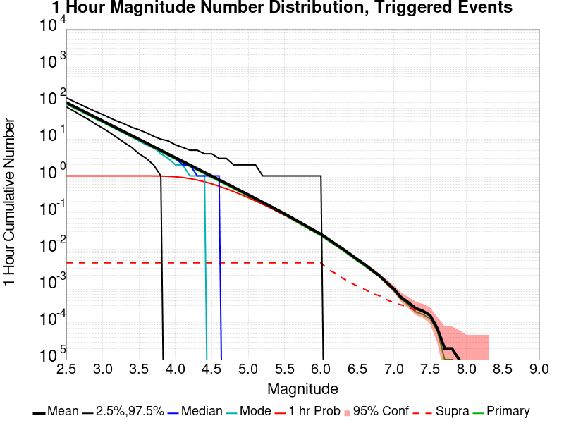
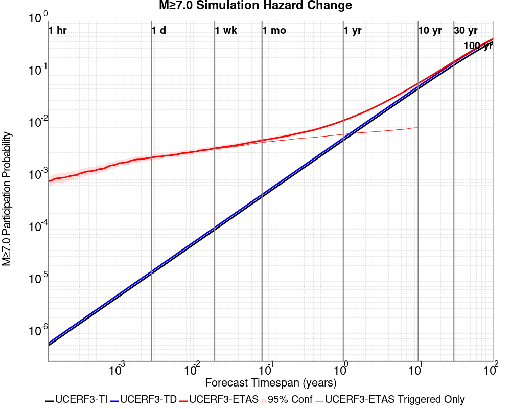

# Searles Valley M6.4 Results

|   | Searles Valley M6.4 |
|-----|-----|
| Num Simulations | 43300 (incomplete) |
| Start Time | 2019/07/04 17:33:48 UTC |
| Start Time Epoch Milliseconds | 1562261628000 |
| Duration | 10 Years |
| Includes Spontaneous? | false |
| Historical Ruptures | *(none)* |

## Table Of Contents

* [Magnitude Number Distribution](#magnitude-number-distribution)
  * [10 Year Magnitude Number Distribution](#10-year-magnitude-number-distribution)
  * [1 Year Magnitude Number Distribution](#1-year-magnitude-number-distribution)
  * [1 Month Magnitude Number Distribution](#1-month-magnitude-number-distribution)
  * [1 Week Magnitude Number Distribution](#1-week-magnitude-number-distribution)
  * [1 Day Magnitude Number Distribution](#1-day-magnitude-number-distribution)
  * [1 Hour Magnitude Number Distribution](#1-hour-magnitude-number-distribution)
* [Hazard Change Over Time](#hazard-change-over-time)
  * [M&ge;5.0 Hazard Change Over Time](#mge50-hazard-change-over-time)
  * [M&ge;6.0 Hazard Change Over Time](#mge60-hazard-change-over-time)
  * [M&ge;7.0 Hazard Change Over Time](#mge70-hazard-change-over-time)
* [Section Participation](#section-participation)
  * [Section Participation Plots](#section-participation-plots)
  * [Supra-Seismogenic Parent Sections Table](#supra-seismogenic-parent-sections-table)
  * [M≥6.5 Parent Sections Table](#m65-parent-sections-table)
  * [M≥7 Parent Sections Table](#m7-parent-sections-table)
  * [M≥7.5 Parent Sections Table](#m75-parent-sections-table)
* [Gridded Nucleation](#gridded-nucleation)
* [JSON Input File](#json-input-file)

## Magnitude Number Distribution
*[(top)](#table-of-contents)*

### 10 Year Magnitude Number Distribution
*[(top)](#table-of-contents)*

**Legend**
* **Mean** (thick black line): mean expected number across all 43300 catalogs
* **2.5%,97.5%** (thin black lines): expected number percentiles across all 43300 catalogs
* **Median** (thin blue line): median expected number across all 43300 catalogs
* **Mode** (thin cyan line): modal expected number across all 43300 catalogs
* **10 yr Probability** (thin red line): 10 year probability calculated as the fraction of catalogs with at least 1 occurrence
* **95% Conf** (light red shaded region): binomial 95% confidence bounds on probability
* **Primary** (thin green line): mean expected number from primary triggered aftershocks only (no secondary, tertiary, etc...) across all 43300 catalogs


| Mag | Mean | 2.5 %ile | 97.5 %ile | Median | Mode | 10 yr Probability | Primary Aftershocks Mean |
|-----|-----|-----|-----|-----|-----|-----|-----|
| **M&ge;2.5** | 924.833 | 543.000 | 2609.000 | 718.000 | 632.000 | 1.000 | 417.897 |
| **M&ge;2.6** | 734.550 | 428.000 | 2068.000 | 570.000 | 527.000 | 1.000 | 331.889 |
| **M&ge;2.7** | 583.324 | 337.000 | 1639.000 | 454.000 | 386.000 | 1.000 | 263.539 |
| **M&ge;2.8** | 463.307 | 265.000 | 1303.000 | 360.000 | 314.000 | 1.000 | 209.298 |
| **M&ge;2.9** | 367.994 | 207.000 | 1035.000 | 287.000 | 259.000 | 1.000 | 166.268 |
| **M&ge;3** | 292.367 | 162.000 | 824.000 | 228.000 | 201.000 | 1.000 | 132.120 |
| **M&ge;3.1** | 232.219 | 127.000 | 656.000 | 182.000 | 165.000 | 1.000 | 104.946 |
| **M&ge;3.2** | 184.436 | 98.000 | 523.000 | 145.000 | 126.000 | 1.000 | 83.334 |
| **M&ge;3.3** | 146.519 | 76.000 | 414.000 | 115.000 | 100.000 | 1.000 | 66.179 |
| **M&ge;3.4** | 116.372 | 59.000 | 328.000 | 92.000 | 84.000 | 1.000 | 52.576 |
| **M&ge;3.5** | 92.435 | 45.000 | 261.000 | 73.000 | 64.000 | 1.000 | 41.766 |
| **M&ge;3.6** | 73.416 | 35.000 | 208.000 | 58.000 | 48.000 | 1.000 | 33.165 |
| **M&ge;3.7** | 58.298 | 26.000 | 166.000 | 46.000 | 42.000 | 1.000 | 26.337 |
| **M&ge;3.8** | 46.292 | 20.000 | 133.000 | 37.000 | 30.000 | 1.000 | 20.922 |
| **M&ge;3.9** | 36.750 | 15.000 | 107.000 | 29.000 | 25.000 | 1.000 | 16.606 |
| **M&ge;4** | 29.182 | 11.000 | 86.000 | 23.000 | 20.000 | 1.000 | 13.192 |
| **M&ge;4.1** | 23.167 | 8.000 | 68.000 | 18.000 | 16.000 | 1.000 | 10.473 |
| **M&ge;4.2** | 18.379 | 6.000 | 55.000 | 15.000 | 13.000 | 1.000 | 8.301 |
| **M&ge;4.3** | 14.574 | 4.000 | 44.000 | 11.000 | 10.000 | 1.000 | 6.584 |
| **M&ge;4.4** | 11.578 | 3.000 | 36.000 | 9.000 | 7.000 | 0.999 | 5.232 |
| **M&ge;4.5** | 9.174 | 2.000 | 29.000 | 7.000 | 6.000 | 0.996 | 4.148 |
| **M&ge;4.6** | 7.273 | 1.000 | 24.000 | 6.000 | 4.000 | 0.987 | 3.289 |
| **M&ge;4.7** | 5.773 | 0.000 | 19.000 | 4.000 | 3.000 | 0.972 | 2.614 |
| **M&ge;4.8** | 4.575 | 0.000 | 16.000 | 3.000 | 2.000 | 0.944 | 2.069 |
| **M&ge;4.9** | 3.623 | 0.000 | 13.000 | 3.000 | 2.000 | 0.901 | 1.639 |
| **M&ge;5** | 2.866 | 0.000 | 11.000 | 2.000 | 1.000 | 0.845 | 1.299 |
| **M&ge;5.1** | 2.262 | 0.000 | 9.000 | 2.000 | 1.000 | 0.773 | 1.022 |
| **M&ge;5.2** | 1.784 | 0.000 | 8.000 | 1.000 | 0.000 | 0.696 | 0.806 |
| **M&ge;5.3** | 1.401 | 0.000 | 6.000 | 1.000 | 0.000 | 0.616 | 0.632 |
| **M&ge;5.4** | 1.100 | 0.000 | 5.000 | 1.000 | 0.000 | 0.534 | 0.493 |
| **M&ge;5.5** | 0.866 | 0.000 | 4.000 | 0.000 | 0.000 | 0.456 | 0.387 |
| **M&ge;5.6** | 0.675 | 0.000 | 4.000 | 0.000 | 0.000 | 0.384 | 0.300 |
| **M&ge;5.7** | 0.523 | 0.000 | 3.000 | 0.000 | 0.000 | 0.318 | 0.231 |
| **M&ge;5.8** | 0.404 | 0.000 | 3.000 | 0.000 | 0.000 | 0.261 | 0.177 |
| **M&ge;5.9** | 0.309 | 0.000 | 2.000 | 0.000 | 0.000 | 0.211 | 0.134 |
| **M&ge;6** | 0.243 | 0.000 | 2.000 | 0.000 | 0.000 | 0.172 | 0.103 |
| **M&ge;6.1** | 0.174 | 0.000 | 2.000 | 0.000 | 0.000 | 0.131 | 0.076 |
| **M&ge;6.2** | 0.127 | 0.000 | 1.000 | 0.000 | 0.000 | 0.101 | 0.056 |
| **M&ge;6.3** | 0.095 | 0.000 | 1.000 | 0.000 | 0.000 | 0.077 | 0.041 |
| **M&ge;6.4** | 0.071 | 0.000 | 1.000 | 0.000 | 0.000 | 0.059 | 0.030 |
| **M&ge;6.5** | 0.051 | 0.000 | 1.000 | 0.000 | 0.000 | 0.044 | 0.021 |
| **M&ge;6.6** | 0.038 | 0.000 | 1.000 | 0.000 | 0.000 | 0.033 | 0.015 |
| **M&ge;6.7** | 0.027 | 0.000 | 0.000 | 0.000 | 0.000 | 0.025 | 0.011 |
| **M&ge;6.8** | 0.019 | 0.000 | 0.000 | 0.000 | 0.000 | 0.018 | 7.44E-3 |
| **M&ge;6.9** | 0.013 | 0.000 | 0.000 | 0.000 | 0.000 | 0.012 | 4.76E-3 |
| **M&ge;7** | 9.21E-3 | 0.000 | 0.000 | 0.000 | 0.000 | 8.96E-3 | 2.96E-3 |
| **M&ge;7.1** | 6.86E-3 | 0.000 | 0.000 | 0.000 | 0.000 | 6.74E-3 | 1.89E-3 |
| **M&ge;7.2** | 4.92E-3 | 0.000 | 0.000 | 0.000 | 0.000 | 4.87E-3 | 1.34E-3 |
| **M&ge;7.3** | 3.03E-3 | 0.000 | 0.000 | 0.000 | 0.000 | 2.98E-3 | 9.01E-4 |
| **M&ge;7.4** | 2.42E-3 | 0.000 | 0.000 | 0.000 | 0.000 | 2.38E-3 | 7.16E-4 |
| **M&ge;7.5** | 1.57E-3 | 0.000 | 0.000 | 0.000 | 0.000 | 1.52E-3 | 4.16E-4 |
| **M&ge;7.6** | 6.93E-4 | 0.000 | 0.000 | 0.000 | 0.000 | 6.47E-4 | 1.62E-4 |
| **M&ge;7.7** | 2.08E-4 | 0.000 | 0.000 | 0.000 | 0.000 | 1.85E-4 | 4.62E-5 |
| **M&ge;7.8** | 9.24E-5 | 0.000 | 0.000 | 0.000 | 0.000 | 9.24E-5 | 2.31E-5 |
| **M&ge;7.9** | 6.93E-5 | 0.000 | 0.000 | 0.000 | 0.000 | 6.93E-5 | 2.31E-5 |
| **M&ge;8** | 0.000 | 0.000 | 0.000 | 0.000 | 0.000 | 0.000 | 0.000 |
| **M&ge;8.1** | 0.000 | 0.000 | 0.000 | 0.000 | 0.000 | 0.000 | 0.000 |
| **M&ge;8.2** | 0.000 | 0.000 | 0.000 | 0.000 | 0.000 | 0.000 | 0.000 |
| **M&ge;8.3** | 0.000 | 0.000 | 0.000 | 0.000 | 0.000 | 0.000 | 0.000 |
| **M&ge;8.4** | 0.000 | 0.000 | 0.000 | 0.000 | 0.000 | 0.000 | 0.000 |
| **M&ge;8.5** | 0.000 | 0.000 | 0.000 | 0.000 | 0.000 | 0.000 | 0.000 |
| **M&ge;8.6** | 0.000 | 0.000 | 0.000 | 0.000 | 0.000 | 0.000 | 0.000 |
| **M&ge;8.7** | 0.000 | 0.000 | 0.000 | 0.000 | 0.000 | 0.000 | 0.000 |
| **M&ge;8.8** | 0.000 | 0.000 | 0.000 | 0.000 | 0.000 | 0.000 | 0.000 |
| **M&ge;8.9** | 0.000 | 0.000 | 0.000 | 0.000 | 0.000 | 0.000 | 0.000 |
| **M&ge;9** | 0.000 | 0.000 | 0.000 | 0.000 | 0.000 | 0.000 | 0.000 |

### 1 Year Magnitude Number Distribution
*[(top)](#table-of-contents)*

**Legend**
* **Mean** (thick black line): mean expected number across all 43300 catalogs
* **2.5%,97.5%** (thin black lines): expected number percentiles across all 43300 catalogs
* **Median** (thin blue line): median expected number across all 43300 catalogs
* **Mode** (thin cyan line): modal expected number across all 43300 catalogs
* **1 yr Probability** (thin red line): 1 year probability calculated as the fraction of catalogs with at least 1 occurrence
* **95% Conf** (light red shaded region): binomial 95% confidence bounds on probability
* **Primary** (thin green line): mean expected number from primary triggered aftershocks only (no secondary, tertiary, etc...) across all 43300 catalogs


| Mag | Mean | 2.5 %ile | 97.5 %ile | Median | Mode | 1 yr Probability | Primary Aftershocks Mean |
|-----|-----|-----|-----|-----|-----|-----|-----|
| **M&ge;2.5** | 714.332 | 453.000 | 1802.000 | 582.000 | 529.000 | 1.000 | 370.075 |
| **M&ge;2.6** | 567.333 | 357.000 | 1426.000 | 463.000 | 422.000 | 1.000 | 293.891 |
| **M&ge;2.7** | 450.546 | 280.000 | 1136.000 | 368.000 | 336.000 | 1.000 | 233.369 |
| **M&ge;2.8** | 357.844 | 220.000 | 903.000 | 292.000 | 267.000 | 1.000 | 185.345 |
| **M&ge;2.9** | 284.233 | 172.000 | 718.000 | 233.000 | 208.000 | 1.000 | 147.246 |
| **M&ge;3** | 225.820 | 134.000 | 570.000 | 185.000 | 167.000 | 1.000 | 116.997 |
| **M&ge;3.1** | 179.361 | 104.000 | 453.000 | 148.000 | 134.000 | 1.000 | 92.934 |
| **M&ge;3.2** | 142.438 | 81.000 | 360.000 | 117.000 | 108.000 | 1.000 | 73.795 |
| **M&ge;3.3** | 113.161 | 63.000 | 288.000 | 93.000 | 81.000 | 1.000 | 58.605 |
| **M&ge;3.4** | 89.886 | 48.000 | 228.000 | 74.000 | 70.000 | 1.000 | 46.562 |
| **M&ge;3.5** | 71.406 | 37.000 | 182.000 | 59.000 | 54.000 | 1.000 | 36.983 |
| **M&ge;3.6** | 56.701 | 28.000 | 145.000 | 47.000 | 38.000 | 1.000 | 29.361 |
| **M&ge;3.7** | 45.022 | 21.000 | 115.000 | 37.000 | 34.000 | 1.000 | 23.311 |
| **M&ge;3.8** | 35.759 | 16.000 | 93.000 | 30.000 | 27.000 | 1.000 | 18.516 |
| **M&ge;3.9** | 28.380 | 12.000 | 75.000 | 24.000 | 21.000 | 1.000 | 14.694 |
| **M&ge;4** | 22.543 | 8.000 | 60.000 | 19.000 | 16.000 | 1.000 | 11.678 |
| **M&ge;4.1** | 17.900 | 6.000 | 48.000 | 15.000 | 12.000 | 1.000 | 9.271 |
| **M&ge;4.2** | 14.203 | 4.000 | 39.000 | 12.000 | 10.000 | 1.000 | 7.348 |
| **M&ge;4.3** | 11.261 | 3.000 | 31.000 | 9.000 | 8.000 | 0.999 | 5.825 |
| **M&ge;4.4** | 8.948 | 2.000 | 26.000 | 7.000 | 6.000 | 0.997 | 4.629 |
| **M&ge;4.5** | 7.091 | 1.000 | 21.000 | 6.000 | 5.000 | 0.990 | 3.671 |
| **M&ge;4.6** | 5.618 | 1.000 | 17.000 | 4.000 | 4.000 | 0.976 | 2.908 |
| **M&ge;4.7** | 4.461 | 0.000 | 14.000 | 4.000 | 3.000 | 0.950 | 2.311 |
| **M&ge;4.8** | 3.536 | 0.000 | 12.000 | 3.000 | 2.000 | 0.911 | 1.829 |
| **M&ge;4.9** | 2.800 | 0.000 | 10.000 | 2.000 | 1.000 | 0.857 | 1.449 |
| **M&ge;5** | 2.216 | 0.000 | 8.000 | 2.000 | 1.000 | 0.789 | 1.147 |
| **M&ge;5.1** | 1.747 | 0.000 | 7.000 | 1.000 | 1.000 | 0.712 | 0.902 |
| **M&ge;5.2** | 1.379 | 0.000 | 6.000 | 1.000 | 0.000 | 0.631 | 0.712 |
| **M&ge;5.3** | 1.084 | 0.000 | 5.000 | 1.000 | 0.000 | 0.551 | 0.558 |
| **M&ge;5.4** | 0.850 | 0.000 | 4.000 | 0.000 | 0.000 | 0.471 | 0.436 |
| **M&ge;5.5** | 0.670 | 0.000 | 4.000 | 0.000 | 0.000 | 0.398 | 0.343 |
| **M&ge;5.6** | 0.522 | 0.000 | 3.000 | 0.000 | 0.000 | 0.331 | 0.266 |
| **M&ge;5.7** | 0.404 | 0.000 | 3.000 | 0.000 | 0.000 | 0.272 | 0.205 |
| **M&ge;5.8** | 0.312 | 0.000 | 2.000 | 0.000 | 0.000 | 0.220 | 0.156 |
| **M&ge;5.9** | 0.240 | 0.000 | 2.000 | 0.000 | 0.000 | 0.176 | 0.119 |
| **M&ge;6** | 0.188 | 0.000 | 2.000 | 0.000 | 0.000 | 0.143 | 0.091 |
| **M&ge;6.1** | 0.135 | 0.000 | 1.000 | 0.000 | 0.000 | 0.107 | 0.067 |
| **M&ge;6.2** | 0.099 | 0.000 | 1.000 | 0.000 | 0.000 | 0.082 | 0.049 |
| **M&ge;6.3** | 0.074 | 0.000 | 1.000 | 0.000 | 0.000 | 0.062 | 0.036 |
| **M&ge;6.4** | 0.054 | 0.000 | 1.000 | 0.000 | 0.000 | 0.046 | 0.026 |
| **M&ge;6.5** | 0.039 | 0.000 | 1.000 | 0.000 | 0.000 | 0.034 | 0.018 |
| **M&ge;6.6** | 0.029 | 0.000 | 1.000 | 0.000 | 0.000 | 0.026 | 0.013 |
| **M&ge;6.7** | 0.020 | 0.000 | 0.000 | 0.000 | 0.000 | 0.019 | 9.08E-3 |
| **M&ge;6.8** | 0.014 | 0.000 | 0.000 | 0.000 | 0.000 | 0.013 | 6.19E-3 |
| **M&ge;6.9** | 9.45E-3 | 0.000 | 0.000 | 0.000 | 0.000 | 9.17E-3 | 3.93E-3 |
| **M&ge;7** | 6.72E-3 | 0.000 | 0.000 | 0.000 | 0.000 | 6.54E-3 | 2.49E-3 |
| **M&ge;7.1** | 4.99E-3 | 0.000 | 0.000 | 0.000 | 0.000 | 4.92E-3 | 1.57E-3 |
| **M&ge;7.2** | 3.56E-3 | 0.000 | 0.000 | 0.000 | 0.000 | 3.51E-3 | 1.13E-3 |
| **M&ge;7.3** | 2.15E-3 | 0.000 | 0.000 | 0.000 | 0.000 | 2.10E-3 | 7.39E-4 |
| **M&ge;7.4** | 1.71E-3 | 0.000 | 0.000 | 0.000 | 0.000 | 1.66E-3 | 6.00E-4 |
| **M&ge;7.5** | 1.11E-3 | 0.000 | 0.000 | 0.000 | 0.000 | 1.06E-3 | 3.93E-4 |
| **M&ge;7.6** | 5.08E-4 | 0.000 | 0.000 | 0.000 | 0.000 | 4.62E-4 | 1.39E-4 |
| **M&ge;7.7** | 1.62E-4 | 0.000 | 0.000 | 0.000 | 0.000 | 1.39E-4 | 4.62E-5 |
| **M&ge;7.8** | 9.24E-5 | 0.000 | 0.000 | 0.000 | 0.000 | 9.24E-5 | 2.31E-5 |
| **M&ge;7.9** | 6.93E-5 | 0.000 | 0.000 | 0.000 | 0.000 | 6.93E-5 | 2.31E-5 |
| **M&ge;8** | 0.000 | 0.000 | 0.000 | 0.000 | 0.000 | 0.000 | 0.000 |
| **M&ge;8.1** | 0.000 | 0.000 | 0.000 | 0.000 | 0.000 | 0.000 | 0.000 |
| **M&ge;8.2** | 0.000 | 0.000 | 0.000 | 0.000 | 0.000 | 0.000 | 0.000 |
| **M&ge;8.3** | 0.000 | 0.000 | 0.000 | 0.000 | 0.000 | 0.000 | 0.000 |
| **M&ge;8.4** | 0.000 | 0.000 | 0.000 | 0.000 | 0.000 | 0.000 | 0.000 |
| **M&ge;8.5** | 0.000 | 0.000 | 0.000 | 0.000 | 0.000 | 0.000 | 0.000 |
| **M&ge;8.6** | 0.000 | 0.000 | 0.000 | 0.000 | 0.000 | 0.000 | 0.000 |
| **M&ge;8.7** | 0.000 | 0.000 | 0.000 | 0.000 | 0.000 | 0.000 | 0.000 |
| **M&ge;8.8** | 0.000 | 0.000 | 0.000 | 0.000 | 0.000 | 0.000 | 0.000 |
| **M&ge;8.9** | 0.000 | 0.000 | 0.000 | 0.000 | 0.000 | 0.000 | 0.000 |
| **M&ge;9** | 0.000 | 0.000 | 0.000 | 0.000 | 0.000 | 0.000 | 0.000 |

### 1 Month Magnitude Number Distribution
*[(top)](#table-of-contents)*

**Legend**
* **Mean** (thick black line): mean expected number across all 43300 catalogs
* **2.5%,97.5%** (thin black lines): expected number percentiles across all 43300 catalogs
* **Median** (thin blue line): median expected number across all 43300 catalogs
* **Mode** (thin cyan line): modal expected number across all 43300 catalogs
* **1 mo Probability** (thin red line): 1 month probability calculated as the fraction of catalogs with at least 1 occurrence
* **95% Conf** (light red shaded region): binomial 95% confidence bounds on probability
* **Primary** (thin green line): mean expected number from primary triggered aftershocks only (no secondary, tertiary, etc...) across all 43300 catalogs


| Mag | Mean | 2.5 %ile | 97.5 %ile | Median | Mode | 1 mo Probability | Primary Aftershocks Mean |
|-----|-----|-----|-----|-----|-----|-----|-----|
| **M&ge;2.5** | 511.828 | 352.000 | 1118.000 | 438.000 | 415.000 | 1.000 | 308.589 |
| **M&ge;2.6** | 406.464 | 276.000 | 888.000 | 348.000 | 325.000 | 1.000 | 245.051 |
| **M&ge;2.7** | 322.800 | 216.000 | 706.000 | 277.000 | 268.000 | 1.000 | 194.584 |
| **M&ge;2.8** | 256.357 | 169.000 | 560.000 | 221.000 | 203.000 | 1.000 | 154.529 |
| **M&ge;2.9** | 203.607 | 132.000 | 447.000 | 176.000 | 165.000 | 1.000 | 122.771 |
| **M&ge;3** | 161.803 | 103.000 | 354.000 | 140.000 | 132.000 | 1.000 | 97.549 |
| **M&ge;3.1** | 128.525 | 79.000 | 283.000 | 111.000 | 103.000 | 1.000 | 77.479 |
| **M&ge;3.2** | 102.066 | 61.000 | 225.000 | 88.000 | 82.000 | 1.000 | 61.535 |
| **M&ge;3.3** | 81.100 | 47.000 | 180.000 | 70.000 | 64.000 | 1.000 | 48.870 |
| **M&ge;3.4** | 64.427 | 36.000 | 144.000 | 56.000 | 53.000 | 1.000 | 38.831 |
| **M&ge;3.5** | 51.193 | 27.000 | 115.000 | 45.000 | 41.000 | 1.000 | 30.844 |
| **M&ge;3.6** | 40.644 | 21.000 | 92.000 | 35.000 | 32.000 | 1.000 | 24.479 |
| **M&ge;3.7** | 32.273 | 15.000 | 74.000 | 28.000 | 26.000 | 1.000 | 19.436 |
| **M&ge;3.8** | 25.632 | 11.000 | 59.000 | 22.000 | 20.000 | 1.000 | 15.440 |
| **M&ge;3.9** | 20.352 | 8.000 | 48.000 | 18.000 | 15.000 | 1.000 | 12.255 |
| **M&ge;4** | 16.170 | 6.000 | 39.000 | 14.000 | 12.000 | 1.000 | 9.738 |
| **M&ge;4.1** | 12.836 | 4.000 | 31.000 | 11.000 | 10.000 | 1.000 | 7.727 |
| **M&ge;4.2** | 10.189 | 3.000 | 25.000 | 9.000 | 7.000 | 0.999 | 6.127 |
| **M&ge;4.3** | 8.076 | 2.000 | 21.000 | 7.000 | 6.000 | 0.997 | 4.859 |
| **M&ge;4.4** | 6.419 | 1.000 | 17.000 | 5.000 | 5.000 | 0.990 | 3.865 |
| **M&ge;4.5** | 5.091 | 1.000 | 14.000 | 4.000 | 3.000 | 0.975 | 3.066 |
| **M&ge;4.6** | 4.034 | 0.000 | 12.000 | 3.000 | 3.000 | 0.948 | 2.430 |
| **M&ge;4.7** | 3.206 | 0.000 | 10.000 | 3.000 | 2.000 | 0.907 | 1.932 |
| **M&ge;4.8** | 2.541 | 0.000 | 8.000 | 2.000 | 1.000 | 0.852 | 1.529 |
| **M&ge;4.9** | 2.013 | 0.000 | 7.000 | 2.000 | 1.000 | 0.783 | 1.212 |
| **M&ge;5** | 1.593 | 0.000 | 6.000 | 1.000 | 1.000 | 0.708 | 0.959 |
| **M&ge;5.1** | 1.256 | 0.000 | 5.000 | 1.000 | 0.000 | 0.626 | 0.754 |
| **M&ge;5.2** | 0.991 | 0.000 | 4.000 | 1.000 | 0.000 | 0.544 | 0.596 |
| **M&ge;5.3** | 0.780 | 0.000 | 4.000 | 0.000 | 0.000 | 0.465 | 0.468 |
| **M&ge;5.4** | 0.611 | 0.000 | 3.000 | 0.000 | 0.000 | 0.391 | 0.366 |
| **M&ge;5.5** | 0.481 | 0.000 | 3.000 | 0.000 | 0.000 | 0.325 | 0.287 |
| **M&ge;5.6** | 0.374 | 0.000 | 2.000 | 0.000 | 0.000 | 0.266 | 0.223 |
| **M&ge;5.7** | 0.290 | 0.000 | 2.000 | 0.000 | 0.000 | 0.215 | 0.172 |
| **M&ge;5.8** | 0.223 | 0.000 | 2.000 | 0.000 | 0.000 | 0.172 | 0.130 |
| **M&ge;5.9** | 0.171 | 0.000 | 2.000 | 0.000 | 0.000 | 0.136 | 0.099 |
| **M&ge;6** | 0.134 | 0.000 | 1.000 | 0.000 | 0.000 | 0.109 | 0.076 |
| **M&ge;6.1** | 0.097 | 0.000 | 1.000 | 0.000 | 0.000 | 0.081 | 0.057 |
| **M&ge;6.2** | 0.071 | 0.000 | 1.000 | 0.000 | 0.000 | 0.062 | 0.041 |
| **M&ge;6.3** | 0.053 | 0.000 | 1.000 | 0.000 | 0.000 | 0.047 | 0.031 |
| **M&ge;6.4** | 0.039 | 0.000 | 1.000 | 0.000 | 0.000 | 0.035 | 0.022 |
| **M&ge;6.5** | 0.028 | 0.000 | 1.000 | 0.000 | 0.000 | 0.025 | 0.015 |
| **M&ge;6.6** | 0.020 | 0.000 | 0.000 | 0.000 | 0.000 | 0.019 | 0.011 |
| **M&ge;6.7** | 0.014 | 0.000 | 0.000 | 0.000 | 0.000 | 0.013 | 7.55E-3 |
| **M&ge;6.8** | 9.63E-3 | 0.000 | 0.000 | 0.000 | 0.000 | 9.12E-3 | 5.17E-3 |
| **M&ge;6.9** | 6.47E-3 | 0.000 | 0.000 | 0.000 | 0.000 | 6.30E-3 | 3.39E-3 |
| **M&ge;7** | 4.64E-3 | 0.000 | 0.000 | 0.000 | 0.000 | 4.53E-3 | 2.12E-3 |
| **M&ge;7.1** | 3.37E-3 | 0.000 | 0.000 | 0.000 | 0.000 | 3.35E-3 | 1.39E-3 |
| **M&ge;7.2** | 2.38E-3 | 0.000 | 0.000 | 0.000 | 0.000 | 2.38E-3 | 9.47E-4 |
| **M&ge;7.3** | 1.50E-3 | 0.000 | 0.000 | 0.000 | 0.000 | 1.50E-3 | 6.00E-4 |
| **M&ge;7.4** | 1.22E-3 | 0.000 | 0.000 | 0.000 | 0.000 | 1.22E-3 | 5.08E-4 |
| **M&ge;7.5** | 8.08E-4 | 0.000 | 0.000 | 0.000 | 0.000 | 8.08E-4 | 3.23E-4 |
| **M&ge;7.6** | 3.46E-4 | 0.000 | 0.000 | 0.000 | 0.000 | 3.46E-4 | 1.15E-4 |
| **M&ge;7.7** | 1.15E-4 | 0.000 | 0.000 | 0.000 | 0.000 | 1.15E-4 | 4.62E-5 |
| **M&ge;7.8** | 6.93E-5 | 0.000 | 0.000 | 0.000 | 0.000 | 6.93E-5 | 2.31E-5 |
| **M&ge;7.9** | 4.62E-5 | 0.000 | 0.000 | 0.000 | 0.000 | 4.62E-5 | 2.31E-5 |
| **M&ge;8** | 0.000 | 0.000 | 0.000 | 0.000 | 0.000 | 0.000 | 0.000 |
| **M&ge;8.1** | 0.000 | 0.000 | 0.000 | 0.000 | 0.000 | 0.000 | 0.000 |
| **M&ge;8.2** | 0.000 | 0.000 | 0.000 | 0.000 | 0.000 | 0.000 | 0.000 |
| **M&ge;8.3** | 0.000 | 0.000 | 0.000 | 0.000 | 0.000 | 0.000 | 0.000 |
| **M&ge;8.4** | 0.000 | 0.000 | 0.000 | 0.000 | 0.000 | 0.000 | 0.000 |
| **M&ge;8.5** | 0.000 | 0.000 | 0.000 | 0.000 | 0.000 | 0.000 | 0.000 |
| **M&ge;8.6** | 0.000 | 0.000 | 0.000 | 0.000 | 0.000 | 0.000 | 0.000 |
| **M&ge;8.7** | 0.000 | 0.000 | 0.000 | 0.000 | 0.000 | 0.000 | 0.000 |
| **M&ge;8.8** | 0.000 | 0.000 | 0.000 | 0.000 | 0.000 | 0.000 | 0.000 |
| **M&ge;8.9** | 0.000 | 0.000 | 0.000 | 0.000 | 0.000 | 0.000 | 0.000 |
| **M&ge;9** | 0.000 | 0.000 | 0.000 | 0.000 | 0.000 | 0.000 | 0.000 |

### 1 Week Magnitude Number Distribution
*[(top)](#table-of-contents)*

**Legend**
* **Mean** (thick black line): mean expected number across all 43300 catalogs
* **2.5%,97.5%** (thin black lines): expected number percentiles across all 43300 catalogs
* **Median** (thin blue line): median expected number across all 43300 catalogs
* **Mode** (thin cyan line): modal expected number across all 43300 catalogs
* **1 wk Probability** (thin red line): 1 week probability calculated as the fraction of catalogs with at least 1 occurrence
* **95% Conf** (light red shaded region): binomial 95% confidence bounds on probability
* **Primary** (thin green line): mean expected number from primary triggered aftershocks only (no secondary, tertiary, etc...) across all 43300 catalogs


| Mag | Mean | 2.5 %ile | 97.5 %ile | Median | Mode | 1 wk Probability | Primary Aftershocks Mean |
|-----|-----|-----|-----|-----|-----|-----|-----|
| **M&ge;2.5** | 404.585 | 290.000 | 797.000 | 357.000 | 346.000 | 1.000 | 267.440 |
| **M&ge;2.6** | 321.277 | 227.000 | 635.000 | 284.000 | 270.000 | 1.000 | 212.373 |
| **M&ge;2.7** | 255.157 | 178.000 | 502.000 | 226.000 | 213.000 | 1.000 | 168.653 |
| **M&ge;2.8** | 202.623 | 139.000 | 400.000 | 180.000 | 171.000 | 1.000 | 133.927 |
| **M&ge;2.9** | 160.929 | 108.000 | 320.000 | 143.000 | 132.000 | 1.000 | 106.400 |
| **M&ge;3** | 127.897 | 84.000 | 255.000 | 114.000 | 108.000 | 1.000 | 84.550 |
| **M&ge;3.1** | 101.596 | 65.000 | 203.000 | 91.000 | 87.000 | 1.000 | 67.153 |
| **M&ge;3.2** | 80.668 | 50.000 | 162.000 | 72.000 | 67.000 | 1.000 | 53.326 |
| **M&ge;3.3** | 64.104 | 38.000 | 129.000 | 57.000 | 54.000 | 1.000 | 42.357 |
| **M&ge;3.4** | 50.934 | 29.000 | 104.000 | 46.000 | 43.000 | 1.000 | 33.659 |
| **M&ge;3.5** | 40.475 | 22.000 | 83.000 | 36.000 | 34.000 | 1.000 | 26.741 |
| **M&ge;3.6** | 32.131 | 16.000 | 67.000 | 29.000 | 28.000 | 1.000 | 21.223 |
| **M&ge;3.7** | 25.517 | 12.000 | 54.000 | 23.000 | 20.000 | 1.000 | 16.852 |
| **M&ge;3.8** | 20.262 | 9.000 | 43.000 | 18.000 | 16.000 | 1.000 | 13.388 |
| **M&ge;3.9** | 16.084 | 6.000 | 35.000 | 14.000 | 12.000 | 1.000 | 10.623 |
| **M&ge;4** | 12.782 | 4.000 | 29.000 | 11.000 | 11.000 | 1.000 | 8.441 |
| **M&ge;4.1** | 10.146 | 3.000 | 23.000 | 9.000 | 8.000 | 0.999 | 6.700 |
| **M&ge;4.2** | 8.052 | 2.000 | 19.000 | 7.000 | 6.000 | 0.998 | 5.312 |
| **M&ge;4.3** | 6.384 | 1.000 | 16.000 | 6.000 | 5.000 | 0.993 | 4.211 |
| **M&ge;4.4** | 5.077 | 1.000 | 13.000 | 4.000 | 3.000 | 0.980 | 3.351 |
| **M&ge;4.5** | 4.029 | 0.000 | 11.000 | 3.000 | 3.000 | 0.955 | 2.658 |
| **M&ge;4.6** | 3.192 | 0.000 | 9.000 | 3.000 | 2.000 | 0.916 | 2.106 |
| **M&ge;4.7** | 2.536 | 0.000 | 8.000 | 2.000 | 1.000 | 0.863 | 1.674 |
| **M&ge;4.8** | 2.009 | 0.000 | 7.000 | 2.000 | 1.000 | 0.798 | 1.325 |
| **M&ge;4.9** | 1.592 | 0.000 | 6.000 | 1.000 | 1.000 | 0.721 | 1.050 |
| **M&ge;5** | 1.262 | 0.000 | 5.000 | 1.000 | 0.000 | 0.641 | 0.832 |
| **M&ge;5.1** | 0.994 | 0.000 | 4.000 | 1.000 | 0.000 | 0.559 | 0.655 |
| **M&ge;5.2** | 0.783 | 0.000 | 4.000 | 0.000 | 0.000 | 0.478 | 0.517 |
| **M&ge;5.3** | 0.616 | 0.000 | 3.000 | 0.000 | 0.000 | 0.404 | 0.405 |
| **M&ge;5.4** | 0.483 | 0.000 | 3.000 | 0.000 | 0.000 | 0.336 | 0.317 |
| **M&ge;5.5** | 0.381 | 0.000 | 2.000 | 0.000 | 0.000 | 0.278 | 0.249 |
| **M&ge;5.6** | 0.297 | 0.000 | 2.000 | 0.000 | 0.000 | 0.226 | 0.194 |
| **M&ge;5.7** | 0.230 | 0.000 | 2.000 | 0.000 | 0.000 | 0.181 | 0.149 |
| **M&ge;5.8** | 0.176 | 0.000 | 1.000 | 0.000 | 0.000 | 0.143 | 0.113 |
| **M&ge;5.9** | 0.135 | 0.000 | 1.000 | 0.000 | 0.000 | 0.112 | 0.086 |
| **M&ge;6** | 0.105 | 0.000 | 1.000 | 0.000 | 0.000 | 0.089 | 0.066 |
| **M&ge;6.1** | 0.076 | 0.000 | 1.000 | 0.000 | 0.000 | 0.067 | 0.049 |
| **M&ge;6.2** | 0.056 | 0.000 | 1.000 | 0.000 | 0.000 | 0.050 | 0.035 |
| **M&ge;6.3** | 0.042 | 0.000 | 1.000 | 0.000 | 0.000 | 0.038 | 0.026 |
| **M&ge;6.4** | 0.030 | 0.000 | 1.000 | 0.000 | 0.000 | 0.027 | 0.018 |
| **M&ge;6.5** | 0.021 | 0.000 | 0.000 | 0.000 | 0.000 | 0.020 | 0.013 |
| **M&ge;6.6** | 0.016 | 0.000 | 0.000 | 0.000 | 0.000 | 0.015 | 9.40E-3 |
| **M&ge;6.7** | 0.011 | 0.000 | 0.000 | 0.000 | 0.000 | 0.010 | 6.37E-3 |
| **M&ge;6.8** | 7.37E-3 | 0.000 | 0.000 | 0.000 | 0.000 | 7.07E-3 | 4.48E-3 |
| **M&ge;6.9** | 4.92E-3 | 0.000 | 0.000 | 0.000 | 0.000 | 4.83E-3 | 2.91E-3 |
| **M&ge;7** | 3.42E-3 | 0.000 | 0.000 | 0.000 | 0.000 | 3.35E-3 | 1.80E-3 |
| **M&ge;7.1** | 2.47E-3 | 0.000 | 0.000 | 0.000 | 0.000 | 2.47E-3 | 1.15E-3 |
| **M&ge;7.2** | 1.78E-3 | 0.000 | 0.000 | 0.000 | 0.000 | 1.78E-3 | 7.85E-4 |
| **M&ge;7.3** | 1.11E-3 | 0.000 | 0.000 | 0.000 | 0.000 | 1.11E-3 | 4.62E-4 |
| **M&ge;7.4** | 9.24E-4 | 0.000 | 0.000 | 0.000 | 0.000 | 9.24E-4 | 3.93E-4 |
| **M&ge;7.5** | 6.47E-4 | 0.000 | 0.000 | 0.000 | 0.000 | 6.47E-4 | 2.77E-4 |
| **M&ge;7.6** | 2.31E-4 | 0.000 | 0.000 | 0.000 | 0.000 | 2.31E-4 | 6.93E-5 |
| **M&ge;7.7** | 6.93E-5 | 0.000 | 0.000 | 0.000 | 0.000 | 6.93E-5 | 2.31E-5 |
| **M&ge;7.8** | 6.93E-5 | 0.000 | 0.000 | 0.000 | 0.000 | 6.93E-5 | 2.31E-5 |
| **M&ge;7.9** | 4.62E-5 | 0.000 | 0.000 | 0.000 | 0.000 | 4.62E-5 | 2.31E-5 |
| **M&ge;8** | 0.000 | 0.000 | 0.000 | 0.000 | 0.000 | 0.000 | 0.000 |
| **M&ge;8.1** | 0.000 | 0.000 | 0.000 | 0.000 | 0.000 | 0.000 | 0.000 |
| **M&ge;8.2** | 0.000 | 0.000 | 0.000 | 0.000 | 0.000 | 0.000 | 0.000 |
| **M&ge;8.3** | 0.000 | 0.000 | 0.000 | 0.000 | 0.000 | 0.000 | 0.000 |
| **M&ge;8.4** | 0.000 | 0.000 | 0.000 | 0.000 | 0.000 | 0.000 | 0.000 |
| **M&ge;8.5** | 0.000 | 0.000 | 0.000 | 0.000 | 0.000 | 0.000 | 0.000 |
| **M&ge;8.6** | 0.000 | 0.000 | 0.000 | 0.000 | 0.000 | 0.000 | 0.000 |
| **M&ge;8.7** | 0.000 | 0.000 | 0.000 | 0.000 | 0.000 | 0.000 | 0.000 |
| **M&ge;8.8** | 0.000 | 0.000 | 0.000 | 0.000 | 0.000 | 0.000 | 0.000 |
| **M&ge;8.9** | 0.000 | 0.000 | 0.000 | 0.000 | 0.000 | 0.000 | 0.000 |
| **M&ge;9** | 0.000 | 0.000 | 0.000 | 0.000 | 0.000 | 0.000 | 0.000 |

### 1 Day Magnitude Number Distribution
*[(top)](#table-of-contents)*

**Legend**
* **Mean** (thick black line): mean expected number across all 43300 catalogs
* **2.5%,97.5%** (thin black lines): expected number percentiles across all 43300 catalogs
* **Median** (thin blue line): median expected number across all 43300 catalogs
* **Mode** (thin cyan line): modal expected number across all 43300 catalogs
* **1 d Probability** (thin red line): 1 day probability calculated as the fraction of catalogs with at least 1 occurrence
* **95% Conf** (light red shaded region): binomial 95% confidence bounds on probability
* **Primary** (thin green line): mean expected number from primary triggered aftershocks only (no secondary, tertiary, etc...) across all 43300 catalogs


| Mag | Mean | 2.5 %ile | 97.5 %ile | Median | Mode | 1 d Probability | Primary Aftershocks Mean |
|-----|-----|-----|-----|-----|-----|-----|-----|
| **M&ge;2.5** | 274.401 | 207.000 | 478.000 | 253.000 | 244.000 | 1.000 | 205.724 |
| **M&ge;2.6** | 217.888 | 162.000 | 380.000 | 201.000 | 192.000 | 1.000 | 163.355 |
| **M&ge;2.7** | 173.058 | 126.000 | 303.000 | 160.000 | 153.000 | 1.000 | 129.726 |
| **M&ge;2.8** | 137.426 | 98.000 | 242.000 | 127.000 | 122.000 | 1.000 | 103.012 |
| **M&ge;2.9** | 109.145 | 76.000 | 192.000 | 101.000 | 94.000 | 1.000 | 81.831 |
| **M&ge;3** | 86.752 | 59.000 | 154.000 | 80.000 | 79.000 | 1.000 | 65.024 |
| **M&ge;3.1** | 68.920 | 45.000 | 123.000 | 64.000 | 62.000 | 1.000 | 51.653 |
| **M&ge;3.2** | 54.716 | 34.000 | 98.000 | 51.000 | 50.000 | 1.000 | 41.009 |
| **M&ge;3.3** | 43.492 | 26.000 | 79.000 | 40.000 | 39.000 | 1.000 | 32.582 |
| **M&ge;3.4** | 34.552 | 20.000 | 64.000 | 32.000 | 31.000 | 1.000 | 25.888 |
| **M&ge;3.5** | 27.458 | 15.000 | 51.000 | 26.000 | 23.000 | 1.000 | 20.569 |
| **M&ge;3.6** | 21.795 | 11.000 | 41.000 | 20.000 | 19.000 | 1.000 | 16.325 |
| **M&ge;3.7** | 17.314 | 8.000 | 34.000 | 16.000 | 15.000 | 1.000 | 12.964 |
| **M&ge;3.8** | 13.753 | 6.000 | 27.000 | 13.000 | 12.000 | 1.000 | 10.302 |
| **M&ge;3.9** | 10.914 | 4.000 | 23.000 | 10.000 | 9.000 | 1.000 | 8.171 |
| **M&ge;4** | 8.668 | 3.000 | 19.000 | 8.000 | 8.000 | 0.999 | 6.490 |
| **M&ge;4.1** | 6.883 | 2.000 | 15.000 | 6.000 | 6.000 | 0.997 | 5.152 |
| **M&ge;4.2** | 5.459 | 1.000 | 13.000 | 5.000 | 4.000 | 0.989 | 4.085 |
| **M&ge;4.3** | 4.324 | 0.000 | 11.000 | 4.000 | 3.000 | 0.973 | 3.237 |
| **M&ge;4.4** | 3.441 | 0.000 | 9.000 | 3.000 | 2.000 | 0.943 | 2.578 |
| **M&ge;4.5** | 2.733 | 0.000 | 8.000 | 2.000 | 2.000 | 0.898 | 2.047 |
| **M&ge;4.6** | 2.166 | 0.000 | 7.000 | 2.000 | 1.000 | 0.838 | 1.621 |
| **M&ge;4.7** | 1.721 | 0.000 | 6.000 | 1.000 | 1.000 | 0.768 | 1.288 |
| **M&ge;4.8** | 1.363 | 0.000 | 5.000 | 1.000 | 1.000 | 0.689 | 1.019 |
| **M&ge;4.9** | 1.078 | 0.000 | 4.000 | 1.000 | 0.000 | 0.606 | 0.807 |
| **M&ge;5** | 0.855 | 0.000 | 4.000 | 1.000 | 0.000 | 0.525 | 0.640 |
| **M&ge;5.1** | 0.674 | 0.000 | 3.000 | 0.000 | 0.000 | 0.447 | 0.503 |
| **M&ge;5.2** | 0.530 | 0.000 | 3.000 | 0.000 | 0.000 | 0.374 | 0.397 |
| **M&ge;5.3** | 0.417 | 0.000 | 2.000 | 0.000 | 0.000 | 0.310 | 0.311 |
| **M&ge;5.4** | 0.327 | 0.000 | 2.000 | 0.000 | 0.000 | 0.254 | 0.244 |
| **M&ge;5.5** | 0.257 | 0.000 | 2.000 | 0.000 | 0.000 | 0.206 | 0.190 |
| **M&ge;5.6** | 0.200 | 0.000 | 2.000 | 0.000 | 0.000 | 0.166 | 0.148 |
| **M&ge;5.7** | 0.154 | 0.000 | 1.000 | 0.000 | 0.000 | 0.131 | 0.114 |
| **M&ge;5.8** | 0.118 | 0.000 | 1.000 | 0.000 | 0.000 | 0.103 | 0.086 |
| **M&ge;5.9** | 0.091 | 0.000 | 1.000 | 0.000 | 0.000 | 0.080 | 0.066 |
| **M&ge;6** | 0.071 | 0.000 | 1.000 | 0.000 | 0.000 | 0.064 | 0.051 |
| **M&ge;6.1** | 0.051 | 0.000 | 1.000 | 0.000 | 0.000 | 0.047 | 0.038 |
| **M&ge;6.2** | 0.038 | 0.000 | 1.000 | 0.000 | 0.000 | 0.035 | 0.027 |
| **M&ge;6.3** | 0.028 | 0.000 | 1.000 | 0.000 | 0.000 | 0.026 | 0.020 |
| **M&ge;6.4** | 0.020 | 0.000 | 0.000 | 0.000 | 0.000 | 0.019 | 0.014 |
| **M&ge;6.5** | 0.014 | 0.000 | 0.000 | 0.000 | 0.000 | 0.013 | 9.98E-3 |
| **M&ge;6.6** | 0.010 | 0.000 | 0.000 | 0.000 | 0.000 | 9.84E-3 | 7.32E-3 |
| **M&ge;6.7** | 6.91E-3 | 0.000 | 0.000 | 0.000 | 0.000 | 6.72E-3 | 5.08E-3 |
| **M&ge;6.8** | 4.73E-3 | 0.000 | 0.000 | 0.000 | 0.000 | 4.60E-3 | 3.63E-3 |
| **M&ge;6.9** | 3.16E-3 | 0.000 | 0.000 | 0.000 | 0.000 | 3.14E-3 | 2.33E-3 |
| **M&ge;7** | 2.08E-3 | 0.000 | 0.000 | 0.000 | 0.000 | 2.06E-3 | 1.36E-3 |
| **M&ge;7.1** | 1.36E-3 | 0.000 | 0.000 | 0.000 | 0.000 | 1.36E-3 | 7.62E-4 |
| **M&ge;7.2** | 9.47E-4 | 0.000 | 0.000 | 0.000 | 0.000 | 9.47E-4 | 5.08E-4 |
| **M&ge;7.3** | 5.54E-4 | 0.000 | 0.000 | 0.000 | 0.000 | 5.54E-4 | 2.77E-4 |
| **M&ge;7.4** | 4.39E-4 | 0.000 | 0.000 | 0.000 | 0.000 | 4.39E-4 | 2.08E-4 |
| **M&ge;7.5** | 2.77E-4 | 0.000 | 0.000 | 0.000 | 0.000 | 2.77E-4 | 1.39E-4 |
| **M&ge;7.6** | 6.93E-5 | 0.000 | 0.000 | 0.000 | 0.000 | 6.93E-5 | 2.31E-5 |
| **M&ge;7.7** | 0.000 | 0.000 | 0.000 | 0.000 | 0.000 | 0.000 | 0.000 |
| **M&ge;7.8** | 0.000 | 0.000 | 0.000 | 0.000 | 0.000 | 0.000 | 0.000 |
| **M&ge;7.9** | 0.000 | 0.000 | 0.000 | 0.000 | 0.000 | 0.000 | 0.000 |
| **M&ge;8** | 0.000 | 0.000 | 0.000 | 0.000 | 0.000 | 0.000 | 0.000 |
| **M&ge;8.1** | 0.000 | 0.000 | 0.000 | 0.000 | 0.000 | 0.000 | 0.000 |
| **M&ge;8.2** | 0.000 | 0.000 | 0.000 | 0.000 | 0.000 | 0.000 | 0.000 |
| **M&ge;8.3** | 0.000 | 0.000 | 0.000 | 0.000 | 0.000 | 0.000 | 0.000 |
| **M&ge;8.4** | 0.000 | 0.000 | 0.000 | 0.000 | 0.000 | 0.000 | 0.000 |
| **M&ge;8.5** | 0.000 | 0.000 | 0.000 | 0.000 | 0.000 | 0.000 | 0.000 |
| **M&ge;8.6** | 0.000 | 0.000 | 0.000 | 0.000 | 0.000 | 0.000 | 0.000 |
| **M&ge;8.7** | 0.000 | 0.000 | 0.000 | 0.000 | 0.000 | 0.000 | 0.000 |
| **M&ge;8.8** | 0.000 | 0.000 | 0.000 | 0.000 | 0.000 | 0.000 | 0.000 |
| **M&ge;8.9** | 0.000 | 0.000 | 0.000 | 0.000 | 0.000 | 0.000 | 0.000 |
| **M&ge;9** | 0.000 | 0.000 | 0.000 | 0.000 | 0.000 | 0.000 | 0.000 |

### 1 Hour Magnitude Number Distribution
*[(top)](#table-of-contents)*

**Legend**
* **Mean** (thick black line): mean expected number across all 43300 catalogs
* **2.5%,97.5%** (thin black lines): expected number percentiles across all 43300 catalogs
* **Median** (thin blue line): median expected number across all 43300 catalogs
* **Mode** (thin cyan line): modal expected number across all 43300 catalogs
* **1 hr Probability** (thin red line): 1 hour probability calculated as the fraction of catalogs with at least 1 occurrence
* **95% Conf** (light red shaded region): binomial 95% confidence bounds on probability
* **Primary** (thin green line): mean expected number from primary triggered aftershocks only (no secondary, tertiary, etc...) across all 43300 catalogs



| Mag | Mean | 2.5 %ile | 97.5 %ile | Median | Mode | 1 hr Probability | Primary Aftershocks Mean |
|-----|-----|-----|-----|-----|-----|-----|-----|
| **M&ge;2.5** | 99.549 | 76.000 | 134.000 | 97.000 | 93.000 | 1.000 | 90.458 |
| **M&ge;2.6** | 79.060 | 59.000 | 108.000 | 77.000 | 76.000 | 1.000 | 71.835 |
| **M&ge;2.7** | 62.759 | 45.000 | 87.000 | 61.000 | 60.000 | 1.000 | 57.024 |
| **M&ge;2.8** | 49.837 | 34.000 | 70.000 | 49.000 | 47.000 | 1.000 | 45.293 |
| **M&ge;2.9** | 39.590 | 26.000 | 57.000 | 39.000 | 39.000 | 1.000 | 35.982 |
| **M&ge;3** | 31.448 | 20.000 | 47.000 | 31.000 | 30.000 | 1.000 | 28.584 |
| **M&ge;3.1** | 24.990 | 15.000 | 38.000 | 24.000 | 24.000 | 1.000 | 22.712 |
| **M&ge;3.2** | 19.837 | 11.000 | 31.000 | 19.000 | 19.000 | 1.000 | 18.028 |
| **M&ge;3.3** | 15.755 | 8.000 | 26.000 | 15.000 | 15.000 | 1.000 | 14.316 |
| **M&ge;3.4** | 12.516 | 6.000 | 22.000 | 12.000 | 12.000 | 1.000 | 11.371 |
| **M&ge;3.5** | 9.943 | 4.000 | 18.000 | 10.000 | 9.000 | 1.000 | 9.034 |
| **M&ge;3.6** | 7.896 | 3.000 | 15.000 | 8.000 | 7.000 | 0.999 | 7.174 |
| **M&ge;3.7** | 6.271 | 2.000 | 12.000 | 6.000 | 6.000 | 0.997 | 5.696 |
| **M&ge;3.8** | 4.982 | 1.000 | 11.000 | 5.000 | 4.000 | 0.990 | 4.527 |
| **M&ge;3.9** | 3.949 | 0.000 | 9.000 | 4.000 | 3.000 | 0.975 | 3.589 |
| **M&ge;4** | 3.141 | 0.000 | 8.000 | 3.000 | 2.000 | 0.947 | 2.856 |
| **M&ge;4.1** | 2.492 | 0.000 | 6.000 | 2.000 | 2.000 | 0.903 | 2.267 |
| **M&ge;4.2** | 1.975 | 0.000 | 5.000 | 2.000 | 1.000 | 0.843 | 1.798 |
| **M&ge;4.3** | 1.568 | 0.000 | 5.000 | 1.000 | 1.000 | 0.771 | 1.427 |
| **M&ge;4.4** | 1.251 | 0.000 | 4.000 | 1.000 | 1.000 | 0.694 | 1.139 |
| **M&ge;4.5** | 0.993 | 0.000 | 4.000 | 1.000 | 0.000 | 0.609 | 0.904 |
| **M&ge;4.6** | 0.787 | 0.000 | 3.000 | 1.000 | 0.000 | 0.525 | 0.716 |
| **M&ge;4.7** | 0.626 | 0.000 | 3.000 | 0.000 | 0.000 | 0.449 | 0.569 |
| **M&ge;4.8** | 0.496 | 0.000 | 2.000 | 0.000 | 0.000 | 0.379 | 0.451 |
| **M&ge;4.9** | 0.393 | 0.000 | 2.000 | 0.000 | 0.000 | 0.315 | 0.358 |
| **M&ge;5** | 0.312 | 0.000 | 2.000 | 0.000 | 0.000 | 0.259 | 0.284 |
| **M&ge;5.1** | 0.247 | 0.000 | 2.000 | 0.000 | 0.000 | 0.211 | 0.224 |
| **M&ge;5.2** | 0.195 | 0.000 | 1.000 | 0.000 | 0.000 | 0.171 | 0.177 |
| **M&ge;5.3** | 0.153 | 0.000 | 1.000 | 0.000 | 0.000 | 0.138 | 0.139 |
| **M&ge;5.4** | 0.119 | 0.000 | 1.000 | 0.000 | 0.000 | 0.108 | 0.108 |
| **M&ge;5.5** | 0.094 | 0.000 | 1.000 | 0.000 | 0.000 | 0.088 | 0.086 |
| **M&ge;5.6** | 0.073 | 0.000 | 1.000 | 0.000 | 0.000 | 0.069 | 0.067 |
| **M&ge;5.7** | 0.056 | 0.000 | 1.000 | 0.000 | 0.000 | 0.053 | 0.051 |
| **M&ge;5.8** | 0.043 | 0.000 | 1.000 | 0.000 | 0.000 | 0.042 | 0.040 |
| **M&ge;5.9** | 0.033 | 0.000 | 1.000 | 0.000 | 0.000 | 0.032 | 0.031 |
| **M&ge;6** | 0.026 | 0.000 | 0.000 | 0.000 | 0.000 | 0.025 | 0.023 |
| **M&ge;6.1** | 0.019 | 0.000 | 0.000 | 0.000 | 0.000 | 0.018 | 0.017 |
| **M&ge;6.2** | 0.013 | 0.000 | 0.000 | 0.000 | 0.000 | 0.013 | 0.012 |
| **M&ge;6.3** | 0.010 | 0.000 | 0.000 | 0.000 | 0.000 | 0.010 | 9.26E-3 |
| **M&ge;6.4** | 7.09E-3 | 0.000 | 0.000 | 0.000 | 0.000 | 6.95E-3 | 6.44E-3 |
| **M&ge;6.5** | 4.97E-3 | 0.000 | 0.000 | 0.000 | 0.000 | 4.87E-3 | 4.46E-3 |
| **M&ge;6.6** | 3.83E-3 | 0.000 | 0.000 | 0.000 | 0.000 | 3.76E-3 | 3.44E-3 |
| **M&ge;6.7** | 2.73E-3 | 0.000 | 0.000 | 0.000 | 0.000 | 2.68E-3 | 2.42E-3 |
| **M&ge;6.8** | 1.87E-3 | 0.000 | 0.000 | 0.000 | 0.000 | 1.82E-3 | 1.71E-3 |
| **M&ge;6.9** | 1.25E-3 | 0.000 | 0.000 | 0.000 | 0.000 | 1.25E-3 | 1.13E-3 |
| **M&ge;7** | 7.16E-4 | 0.000 | 0.000 | 0.000 | 0.000 | 7.16E-4 | 6.00E-4 |
| **M&ge;7.1** | 3.23E-4 | 0.000 | 0.000 | 0.000 | 0.000 | 3.23E-4 | 2.54E-4 |
| **M&ge;7.2** | 2.31E-4 | 0.000 | 0.000 | 0.000 | 0.000 | 2.31E-4 | 1.62E-4 |
| **M&ge;7.3** | 1.85E-4 | 0.000 | 0.000 | 0.000 | 0.000 | 1.85E-4 | 1.15E-4 |
| **M&ge;7.4** | 1.15E-4 | 0.000 | 0.000 | 0.000 | 0.000 | 1.15E-4 | 6.93E-5 |
| **M&ge;7.5** | 6.93E-5 | 0.000 | 0.000 | 0.000 | 0.000 | 6.93E-5 | 4.62E-5 |
| **M&ge;7.6** | 0.000 | 0.000 | 0.000 | 0.000 | 0.000 | 0.000 | 0.000 |
| **M&ge;7.7** | 0.000 | 0.000 | 0.000 | 0.000 | 0.000 | 0.000 | 0.000 |
| **M&ge;7.8** | 0.000 | 0.000 | 0.000 | 0.000 | 0.000 | 0.000 | 0.000 |
| **M&ge;7.9** | 0.000 | 0.000 | 0.000 | 0.000 | 0.000 | 0.000 | 0.000 |
| **M&ge;8** | 0.000 | 0.000 | 0.000 | 0.000 | 0.000 | 0.000 | 0.000 |
| **M&ge;8.1** | 0.000 | 0.000 | 0.000 | 0.000 | 0.000 | 0.000 | 0.000 |
| **M&ge;8.2** | 0.000 | 0.000 | 0.000 | 0.000 | 0.000 | 0.000 | 0.000 |
| **M&ge;8.3** | 0.000 | 0.000 | 0.000 | 0.000 | 0.000 | 0.000 | 0.000 |
| **M&ge;8.4** | 0.000 | 0.000 | 0.000 | 0.000 | 0.000 | 0.000 | 0.000 |
| **M&ge;8.5** | 0.000 | 0.000 | 0.000 | 0.000 | 0.000 | 0.000 | 0.000 |
| **M&ge;8.6** | 0.000 | 0.000 | 0.000 | 0.000 | 0.000 | 0.000 | 0.000 |
| **M&ge;8.7** | 0.000 | 0.000 | 0.000 | 0.000 | 0.000 | 0.000 | 0.000 |
| **M&ge;8.8** | 0.000 | 0.000 | 0.000 | 0.000 | 0.000 | 0.000 | 0.000 |
| **M&ge;8.9** | 0.000 | 0.000 | 0.000 | 0.000 | 0.000 | 0.000 | 0.000 |
| **M&ge;9** | 0.000 | 0.000 | 0.000 | 0.000 | 0.000 | 0.000 | 0.000 |

## Hazard Change Over Time
*[(top)](#table-of-contents)*

These plots show how the probability of ruptures of various magnitudes within 100km of any scenario rupture changes over time

### M&ge;5.0 Hazard Change Over Time
*[(top)](#table-of-contents)*


| Forecast Duration | UCERF3-ETAS [95% Conf] | UCERF3-ETAS Triggered Only | UCERF3-TD | UCERF3-TI |
|-----|-----|-----|-----|-----|
| 1 Hour | 0.257 [0.253 - 0.262] | 0.257 | 5.52E-5 | 5.47E-5 |
| 1 Day | 0.522 [0.517 - 0.527] | 0.522 | 1.32E-3 | 1.31E-3 |
| 1 Week | 0.641 [0.636 - 0.645] | 0.638 | 9.23E-3 | 9.16E-3 |
| 1 Month | 0.716 [0.712 - 0.720] | 0.705 | 0.039 | 0.039 |
| 1 Year | 0.868 [0.866 - 0.871] | 0.786 | 0.384 | 0.381 |
| 10 Years | 0.999 [0.999 - 0.999] | 0.842 | 0.992 | 0.992 |
| 30 Years | 1.000 [1.000 - 1.000] \* | \* | 1.000 | 1.000 |
| 100 Years | 1.000 [1.000 - 1.000] \* | \* | 1.000 | 1.000 |

\* *forecast duration is longer than simulation length, only ETAS ruptures from the first 10 years are included*
### M&ge;6.0 Hazard Change Over Time
*[(top)](#table-of-contents)*


| Forecast Duration | UCERF3-ETAS [95% Conf] | UCERF3-ETAS Triggered Only | UCERF3-TD | UCERF3-TI |
|-----|-----|-----|-----|-----|
| 1 Hour | 0.025 [0.023 - 0.026] | 0.025 | 6.60E-6 | 6.15E-6 |
| 1 Day | 0.063 [0.061 - 0.065] | 0.063 | 1.58E-4 | 1.48E-4 |
| 1 Week | 0.089 [0.087 - 0.092] | 0.088 | 1.11E-3 | 1.03E-3 |
| 1 Month | 0.112 [0.109 - 0.115] | 0.108 | 4.74E-3 | 4.42E-3 |
| 1 Year | 0.189 [0.186 - 0.192] | 0.141 | 0.056 | 0.052 |
| 10 Years | 0.535 [0.533 - 0.537] | 0.170 | 0.440 | 0.417 |
| 30 Years | 0.855 [0.854 - 0.855] \* | \* | 0.825 | 0.801 |
| 100 Years | 0.998 [0.998 - 0.998] \* | \* | 0.997 | 0.995 |

\* *forecast duration is longer than simulation length, only ETAS ruptures from the first 10 years are included*
### M&ge;7.0 Hazard Change Over Time
*[(top)](#table-of-contents)*



| Forecast Duration | UCERF3-ETAS [95% Conf] | UCERF3-ETAS Triggered Only | UCERF3-TD | UCERF3-TI |
|-----|-----|-----|-----|-----|
| 1 Hour | 7.17E-4 [4.96E-4 - 1.03E-3] | 7.16E-4 | 6.47E-7 | 5.84E-7 |
| 1 Day | 2.05E-3 [1.66E-3 - 2.53E-3] | 2.03E-3 | 1.55E-5 | 1.40E-5 |
| 1 Week | 3.39E-3 [2.88E-3 - 3.98E-3] | 3.28E-3 | 1.09E-4 | 9.81E-5 |
| 1 Month | 4.90E-3 [4.30E-3 - 5.58E-3] | 4.43E-3 | 4.66E-4 | 4.20E-4 |
| 1 Year | 0.012 [0.011 - 0.013] | 6.40E-3 | 5.66E-3 | 5.10E-3 |
| 10 Years | 0.064 [0.063 - 0.064] | 8.78E-3 | 0.055 | 0.050 |
| 30 Years | 0.166 [0.166 - 0.167] \* | \* | 0.159 | 0.142 |
| 100 Years | 0.457 [0.457 - 0.458] \* | \* | 0.452 | 0.401 |

\* *forecast duration is longer than simulation length, only ETAS ruptures from the first 10 years are included*
## Section Participation
*[(top)](#table-of-contents)*

### Section Participation Plots
*[(top)](#table-of-contents)*

| Min Mag | Triggered Ruptures (no spontaneous) | Triggered Ruptures (primary aftershocks only) |
|-----|-----|-----|
| **All Supra. Seis.** |  |  |
| **M&ge;6.5** |  |  |
| **M&ge;7** |  |  |
| **M&ge;7.5** |  |  |

### Supra-Seismogenic Parent Sections Table
*[(top)](#table-of-contents)*

*First 10 of 80 with matching ruptures shown*

| Parent Name | Triggered Mean Count | Triggered 10 Year Prob | Triggered Primary Mean Count |
|-----|-----|-----|-----|
| Tank Canyon | 0.034572747 | 0.029792149 | 0.009006929 |
| Garlock (Central) | 0.0096073905 | 0.009422633 | 0.0026558891 |
| Panamint Valley | 0.004872979 | 0.0048267897 | 0.0011778291 |
| Owl Lake | 0.0042032334 | 0.0036720554 | 5.773672E-4 |
| Little Lake | 0.0029330254 | 0.002886836 | 0.0011547344 |
| Garlock (East) | 0.0027251733 | 0.0024711317 | 5.3117785E-4 |
| Blackwater | 0.0023094688 | 0.0021709006 | 5.773672E-4 |
| Ash Hill | 0.0017321017 | 0.001709007 | 3.2332563E-4 |
| Gravel Hills-Harper Lk | 0.0012471132 | 0.0012009238 | 2.7713625E-4 |
| Hunter Mountain-Saline Valley | 0.0011316397 | 0.001108545 | 3.2332563E-4 |

### M≥6.5 Parent Sections Table
*[(top)](#table-of-contents)*

*First 10 of 61 with matching ruptures shown*

| Parent Name | Triggered Mean Count | Triggered 10 Year Prob | Triggered Primary Mean Count |
|-----|-----|-----|-----|
| Panamint Valley | 0.004572748 | 0.004526559 | 0.0011547344 |
| Tank Canyon | 0.0043187067 | 0.0043187067 | 0.0012240185 |
| Garlock (Central) | 0.004295612 | 0.004295612 | 0.0012009238 |
| Owl Lake | 0.0019861432 | 0.0019861432 | 3.2332563E-4 |
| Garlock (East) | 0.0015935334 | 0.0015011547 | 3.926097E-4 |
| Little Lake | 0.0012240185 | 0.0012240185 | 3.69515E-4 |
| Hunter Mountain-Saline Valley | 0.0010854503 | 0.0010854503 | 3.0023095E-4 |
| Airport Lake | 8.545035E-4 | 8.545035E-4 | 3.4642033E-4 |
| Garlock (West) | 6.6974596E-4 | 6.6974596E-4 | 2.078522E-4 |
| Death Valley (So) | 6.235566E-4 | 6.235566E-4 | 4.6189376E-5 |

### M≥7 Parent Sections Table
*[(top)](#table-of-contents)*

*First 10 of 40 with matching ruptures shown*

| Parent Name | Triggered Mean Count | Triggered 10 Year Prob | Triggered Primary Mean Count |
|-----|-----|-----|-----|
| Garlock (Central) | 0.0037413395 | 0.0037413395 | 0.0010854503 |
| Panamint Valley | 0.002147806 | 0.002147806 | 4.3879906E-4 |
| Owl Lake | 0.0013625866 | 0.0013625866 | 3.0023095E-4 |
| Hunter Mountain-Saline Valley | 0.001039261 | 0.001039261 | 2.7713625E-4 |
| Garlock (East) | 9.4688224E-4 | 9.2378753E-4 | 3.2332563E-4 |
| Garlock (West) | 6.235566E-4 | 6.235566E-4 | 2.078522E-4 |
| Tank Canyon | 4.8498844E-4 | 4.8498844E-4 | 6.928406E-5 |
| Death Valley (So) | 2.5404157E-4 | 2.5404157E-4 | 2.3094688E-5 |
| Little Lake | 2.078522E-4 | 2.078522E-4 | 0.0 |
| San Andreas (Mojave N) | 1.847575E-4 | 1.6166281E-4 | 4.6189376E-5 |

### M≥7.5 Parent Sections Table
*[(top)](#table-of-contents)*

*First 10 of 28 with matching ruptures shown*

| Parent Name | Triggered Mean Count | Triggered 10 Year Prob | Triggered Primary Mean Count |
|-----|-----|-----|-----|
| Garlock (Central) | 0.0012009238 | 0.0012009238 | 3.926097E-4 |
| Hunter Mountain-Saline Valley | 8.775981E-4 | 8.775981E-4 | 2.5404157E-4 |
| Panamint Valley | 8.775981E-4 | 8.775981E-4 | 2.5404157E-4 |
| Garlock (West) | 4.6189377E-4 | 4.6189377E-4 | 1.3856812E-4 |
| Garlock (East) | 2.078522E-4 | 2.078522E-4 | 4.6189376E-5 |
| San Andreas (Mojave N) | 1.847575E-4 | 1.6166281E-4 | 4.6189376E-5 |
| Owl Lake | 1.6166281E-4 | 1.6166281E-4 | 4.6189376E-5 |
| Death Valley (No) | 1.3856812E-4 | 1.3856812E-4 | 2.3094688E-5 |
| Death Valley (Fish Lake Valley) | 1.1547344E-4 | 1.1547344E-4 | 2.3094688E-5 |
| Death Valley (Black Mtns Frontal) | 9.237875E-5 | 9.237875E-5 | 0.0 |
## Gridded Nucleation
*[(top)](#table-of-contents)*

| Min Mag | Triggered Ruptures (no spontaneous) | Triggered Ruptures (primary aftershocks only) |
|-----|-----|-----|
| **M&ge;2.5** |  |  |
| **M&ge;5** |  |  |
| **M&ge;6** |  |  |
| **M&ge;7** |  |  |

## JSON Input File
*[(top)](#table-of-contents)*

```
{
  "numSimulations": 100000,
  "duration": 10.0,
  "startTimeMillis": 1562261628000,
  "includeSpontaneous": false,
  "randomSeed": 123456789,
  "binaryOutput": true,
  "binaryOutputFilters": [
    {
      "prefix": "results_complete",
      "descendantsOnly": false
    },
    {
      "prefix": "results_m5_preserve_chain",
      "minMag": 5.0,
      "preserveChainBelowMag": true,
      "descendantsOnly": false
    },
    {
      "prefix": "results_triggered_descendants",
      "descendantsOnly": true
    }
  ],
  "forceRecalc": false,
  "reuseERFs": true,
  "simulationName": "Searles Valley M6.4",
  "numRetries": 3,
  "outputDir": "${ETAS_SIM_DIR}/2019_07_04-SearlesValleyM64-includeSpont-full_td-10yr",
  "triggerRuptures": [
    {
      "mag": 6.4,
      "latitude": 35.705,
      "longitude": -117.508,
      "depth": 8.7
    }
  ],
  "cacheDir": "${ETAS_LAUNCHER}/inputs/cache_fm3p1_ba",
  "fssFile": "${ETAS_LAUNCHER}/inputs/2013_05_10-ucerf3p3-production-10runs_COMPOUND_SOL_FM3_1_SpatSeisU3_MEAN_BRANCH_AVG_SOL.zip",
  "probModel": "FULL_TD",
  "applySubSeisForSupraNucl": true,
  "totRateScaleFactor": 1.14,
  "gridSeisCorr": true,
  "timeIndependentERF": false,
  "griddedOnly": false,
  "imposeGR": false,
  "includeIndirectTriggering": true,
  "gridSeisDiscr": 0.1,
  "catalogCompletenessModel": "RELAXED"
}
```

