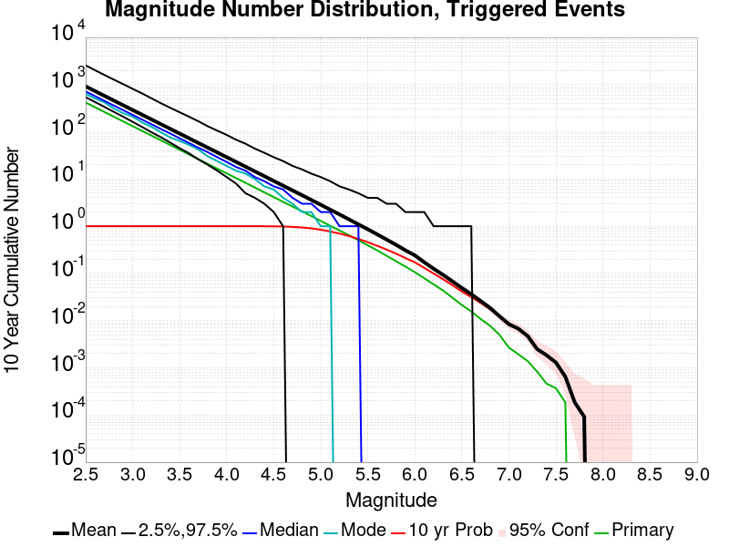

# Searles Valley M6.4 Results

|   | Searles Valley M6.4 |
|-----|-----|
| Num Simulations | 10800 (incomplete) |
| Start Time | 2019/07/04 17:33:48 UTC |
| Start Time Epoch Milliseconds | 1562261628000 |
| Duration | 10 Years |
| Includes Spontaneous? | false |
| Historical Ruptures | *(none)* |

## Table Of Contents

* [Magnitude Number Distribution](#magnitude-number-distribution)
* [Hazard Change Over Time](#hazard-change-over-time)
  * [M&ge;5.0 Hazard Change Over Time](#mge50-hazard-change-over-time)
  * [M&ge;6.0 Hazard Change Over Time](#mge60-hazard-change-over-time)
  * [M&ge;7.0 Hazard Change Over Time](#mge70-hazard-change-over-time)
* [Section Participation](#section-participation)
  * [Section Participation Plots](#section-participation-plots)
  * [Supra-Seismogenic Parent Sections Table](#supra-seismogenic-parent-sections-table)
  * [M≥6.5 Parent Sections Table](#m65-parent-sections-table)
  * [M≥7 Parent Sections Table](#m7-parent-sections-table)
  * [M≥7.5 Parent Sections Table](#m75-parent-sections-table)
* [Gridded Nucleation](#gridded-nucleation)
* [JSON Input File](#json-input-file)

## Magnitude Number Distribution
*[(top)](#table-of-contents)*

**Legend**
* **Mean** (thick black line): mean expected number across all 10800 catalogs
* **2.5%,97.5%** (thin black lines): expected number percentiles across all 10800 catalogs
* **Median** (thin blue line): median expected number across all 10800 catalogs
* **Mode** (thin cyan line): modal expected number across all 10800 catalogs
* **10 yr Probability** (thin red line): 10 year probability calculated as the fraction of catalogs with at least 1 occurrence
* **95% Conf** (light red shaded region): binomial 95% confidence bounds on probability
* **Primary** (thin green line): mean expected number from primary triggered aftershocks only (no secondary, tertiary, etc...) across all 10800 catalogs



| Mag | Mean | 2.5 %ile | 97.5 %ile | Median | Mode | 10 yr Probability | Primary Aftershocks Mean |
|-----|-----|-----|-----|-----|-----|-----|-----|
| **M&ge;2.5** | 919.204 | 543.000 | 2561.000 | 719.000 | 635.000 | 1.000 | 417.840 |
| **M&ge;2.6** | 730.031 | 429.000 | 2025.000 | 570.000 | 509.000 | 1.000 | 331.847 |
| **M&ge;2.7** | 579.708 | 338.000 | 1601.000 | 454.000 | 423.000 | 1.000 | 263.488 |
| **M&ge;2.8** | 460.339 | 265.000 | 1277.000 | 360.000 | 311.000 | 1.000 | 209.160 |
| **M&ge;2.9** | 365.641 | 209.000 | 1023.000 | 288.000 | 248.000 | 1.000 | 166.110 |
| **M&ge;3** | 290.435 | 163.000 | 815.000 | 229.000 | 210.000 | 1.000 | 131.978 |
| **M&ge;3.1** | 230.689 | 127.000 | 652.000 | 182.000 | 158.000 | 1.000 | 104.851 |
| **M&ge;3.2** | 183.304 | 98.000 | 514.000 | 145.000 | 128.000 | 1.000 | 83.288 |
| **M&ge;3.3** | 145.624 | 77.000 | 404.000 | 115.000 | 98.000 | 1.000 | 66.164 |
| **M&ge;3.4** | 115.683 | 59.000 | 323.000 | 92.000 | 76.000 | 1.000 | 52.537 |
| **M&ge;3.5** | 91.881 | 45.000 | 260.000 | 73.000 | 64.000 | 1.000 | 41.698 |
| **M&ge;3.6** | 72.979 | 35.000 | 209.000 | 58.000 | 53.000 | 1.000 | 33.081 |
| **M&ge;3.7** | 57.976 | 26.000 | 167.000 | 46.000 | 42.000 | 1.000 | 26.301 |
| **M&ge;3.8** | 46.037 | 20.000 | 131.000 | 37.000 | 30.000 | 1.000 | 20.904 |
| **M&ge;3.9** | 36.559 | 15.000 | 106.000 | 29.000 | 24.000 | 1.000 | 16.586 |
| **M&ge;4** | 29.065 | 11.000 | 86.000 | 23.000 | 19.000 | 1.000 | 13.197 |
| **M&ge;4.1** | 23.044 | 8.000 | 68.000 | 18.000 | 15.000 | 1.000 | 10.465 |
| **M&ge;4.2** | 18.303 | 5.000 | 56.000 | 15.000 | 13.000 | 1.000 | 8.323 |
| **M&ge;4.3** | 14.508 | 4.000 | 44.000 | 11.000 | 10.000 | 1.000 | 6.598 |
| **M&ge;4.4** | 11.519 | 3.000 | 36.000 | 9.000 | 7.000 | 0.999 | 5.230 |
| **M&ge;4.5** | 9.119 | 2.000 | 29.000 | 7.000 | 6.000 | 0.996 | 4.141 |
| **M&ge;4.6** | 7.229 | 1.000 | 24.000 | 6.000 | 4.000 | 0.987 | 3.286 |
| **M&ge;4.7** | 5.737 | 0.000 | 19.000 | 4.000 | 3.000 | 0.970 | 2.615 |
| **M&ge;4.8** | 4.556 | 0.000 | 16.000 | 3.000 | 2.000 | 0.942 | 2.073 |
| **M&ge;4.9** | 3.605 | 0.000 | 13.000 | 3.000 | 2.000 | 0.900 | 1.642 |
| **M&ge;5** | 2.849 | 0.000 | 11.000 | 2.000 | 1.000 | 0.844 | 1.298 |
| **M&ge;5.1** | 2.247 | 0.000 | 9.000 | 2.000 | 1.000 | 0.773 | 1.023 |
| **M&ge;5.2** | 1.777 | 0.000 | 7.000 | 1.000 | 0.000 | 0.699 | 0.814 |
| **M&ge;5.3** | 1.398 | 0.000 | 6.000 | 1.000 | 0.000 | 0.621 | 0.644 |
| **M&ge;5.4** | 1.095 | 0.000 | 5.000 | 1.000 | 0.000 | 0.538 | 0.504 |
| **M&ge;5.5** | 0.862 | 0.000 | 4.000 | 0.000 | 0.000 | 0.460 | 0.394 |
| **M&ge;5.6** | 0.673 | 0.000 | 4.000 | 0.000 | 0.000 | 0.385 | 0.308 |
| **M&ge;5.7** | 0.522 | 0.000 | 3.000 | 0.000 | 0.000 | 0.321 | 0.236 |
| **M&ge;5.8** | 0.405 | 0.000 | 3.000 | 0.000 | 0.000 | 0.263 | 0.182 |
| **M&ge;5.9** | 0.309 | 0.000 | 2.000 | 0.000 | 0.000 | 0.212 | 0.139 |
| **M&ge;6** | 0.242 | 0.000 | 2.000 | 0.000 | 0.000 | 0.172 | 0.107 |
| **M&ge;6.1** | 0.173 | 0.000 | 2.000 | 0.000 | 0.000 | 0.131 | 0.079 |
| **M&ge;6.2** | 0.126 | 0.000 | 1.000 | 0.000 | 0.000 | 0.100 | 0.059 |
| **M&ge;6.3** | 0.093 | 0.000 | 1.000 | 0.000 | 0.000 | 0.076 | 0.044 |
| **M&ge;6.4** | 0.068 | 0.000 | 1.000 | 0.000 | 0.000 | 0.056 | 0.030 |
| **M&ge;6.5** | 0.049 | 0.000 | 1.000 | 0.000 | 0.000 | 0.042 | 0.021 |
| **M&ge;6.6** | 0.036 | 0.000 | 1.000 | 0.000 | 0.000 | 0.032 | 0.016 |
| **M&ge;6.7** | 0.026 | 0.000 | 0.000 | 0.000 | 0.000 | 0.024 | 0.011 |
| **M&ge;6.8** | 0.019 | 0.000 | 0.000 | 0.000 | 0.000 | 0.018 | 7.78E-3 |
| **M&ge;6.9** | 0.012 | 0.000 | 0.000 | 0.000 | 0.000 | 0.012 | 5.00E-3 |
| **M&ge;7** | 8.43E-3 | 0.000 | 0.000 | 0.000 | 0.000 | 8.33E-3 | 2.69E-3 |
| **M&ge;7.1** | 6.76E-3 | 0.000 | 0.000 | 0.000 | 0.000 | 6.76E-3 | 1.94E-3 |
| **M&ge;7.2** | 4.72E-3 | 0.000 | 0.000 | 0.000 | 0.000 | 4.72E-3 | 1.39E-3 |
| **M&ge;7.3** | 2.50E-3 | 0.000 | 0.000 | 0.000 | 0.000 | 2.50E-3 | 8.33E-4 |
| **M&ge;7.4** | 1.85E-3 | 0.000 | 0.000 | 0.000 | 0.000 | 1.85E-3 | 4.63E-4 |
| **M&ge;7.5** | 1.30E-3 | 0.000 | 0.000 | 0.000 | 0.000 | 1.30E-3 | 3.70E-4 |
| **M&ge;7.6** | 6.48E-4 | 0.000 | 0.000 | 0.000 | 0.000 | 6.48E-4 | 1.85E-4 |
| **M&ge;7.7** | 1.85E-4 | 0.000 | 0.000 | 0.000 | 0.000 | 1.85E-4 | 0.000 |
| **M&ge;7.8** | 9.26E-5 | 0.000 | 0.000 | 0.000 | 0.000 | 9.26E-5 | 0.000 |
| **M&ge;7.9** | 0.000 | 0.000 | 0.000 | 0.000 | 0.000 | 0.000 | 0.000 |
| **M&ge;8** | 0.000 | 0.000 | 0.000 | 0.000 | 0.000 | 0.000 | 0.000 |
| **M&ge;8.1** | 0.000 | 0.000 | 0.000 | 0.000 | 0.000 | 0.000 | 0.000 |
| **M&ge;8.2** | 0.000 | 0.000 | 0.000 | 0.000 | 0.000 | 0.000 | 0.000 |
| **M&ge;8.3** | 0.000 | 0.000 | 0.000 | 0.000 | 0.000 | 0.000 | 0.000 |
| **M&ge;8.4** | 0.000 | 0.000 | 0.000 | 0.000 | 0.000 | 0.000 | 0.000 |
| **M&ge;8.5** | 0.000 | 0.000 | 0.000 | 0.000 | 0.000 | 0.000 | 0.000 |
| **M&ge;8.6** | 0.000 | 0.000 | 0.000 | 0.000 | 0.000 | 0.000 | 0.000 |
| **M&ge;8.7** | 0.000 | 0.000 | 0.000 | 0.000 | 0.000 | 0.000 | 0.000 |
| **M&ge;8.8** | 0.000 | 0.000 | 0.000 | 0.000 | 0.000 | 0.000 | 0.000 |
| **M&ge;8.9** | 0.000 | 0.000 | 0.000 | 0.000 | 0.000 | 0.000 | 0.000 |
| **M&ge;9** | 0.000 | 0.000 | 0.000 | 0.000 | 0.000 | 0.000 | 0.000 |

## Hazard Change Over Time
*[(top)](#table-of-contents)*

These plots show how the probability of ruptures of various magnitudes within 100km of any scenario rupture changes over time

### M&ge;5.0 Hazard Change Over Time
*[(top)](#table-of-contents)*


| Forecast Duration | UCERF3-ETAS [95% Conf] | UCERF3-ETAS Triggered Only | UCERF3-TD | UCERF3-TI |
|-----|-----|-----|-----|-----|
| 1 Hour | 0.260 [0.252 - 0.269] | 0.260 | 5.52E-5 | 5.47E-5 |
| 1 Day | 0.530 [0.521 - 0.540] | 0.529 | 1.32E-3 | 1.31E-3 |
| 1 Week | 0.646 [0.637 - 0.655] | 0.642 | 9.23E-3 | 9.16E-3 |
| 1 Month | 0.720 [0.712 - 0.728] | 0.709 | 0.039 | 0.039 |
| 1 Year | 0.870 [0.865 - 0.874] | 0.789 | 0.384 | 0.381 |
| 10 Years | 0.999 [0.999 - 0.999] | 0.841 | 0.992 | 0.992 |
| 30 Years | 1.000 [1.000 - 1.000] \* | \* | 1.000 | 1.000 |
| 100 Years | 1.000 [1.000 - 1.000] \* | \* | 1.000 | 1.000 |

\* *forecast duration is longer than simulation length, only ETAS ruptures from the first 10 years are included*
### M&ge;6.0 Hazard Change Over Time
*[(top)](#table-of-contents)*


| Forecast Duration | UCERF3-ETAS [95% Conf] | UCERF3-ETAS Triggered Only | UCERF3-TD | UCERF3-TI |
|-----|-----|-----|-----|-----|
| 1 Hour | 0.026 [0.023 - 0.029] | 0.026 | 6.60E-6 | 6.15E-6 |
| 1 Day | 0.066 [0.061 - 0.071] | 0.066 | 1.58E-4 | 1.48E-4 |
| 1 Week | 0.092 [0.086 - 0.097] | 0.091 | 1.11E-3 | 1.03E-3 |
| 1 Month | 0.114 [0.108 - 0.120] | 0.110 | 4.74E-3 | 4.42E-3 |
| 1 Year | 0.189 [0.183 - 0.195] | 0.141 | 0.056 | 0.052 |
| 10 Years | 0.534 [0.531 - 0.538] | 0.169 | 0.440 | 0.417 |
| 30 Years | 0.855 [0.853 - 0.856] \* | \* | 0.825 | 0.801 |
| 100 Years | 0.998 [0.998 - 0.998] \* | \* | 0.997 | 0.995 |

\* *forecast duration is longer than simulation length, only ETAS ruptures from the first 10 years are included*
### M&ge;7.0 Hazard Change Over Time
*[(top)](#table-of-contents)*


| Forecast Duration | UCERF3-ETAS [95% Conf] | UCERF3-ETAS Triggered Only | UCERF3-TD | UCERF3-TI |
|-----|-----|-----|-----|-----|
| 1 Hour | 5.56E-4 [2.27E-4 - 1.28E-3] | 5.56E-4 | 6.47E-7 | 5.84E-7 |
| 1 Day | 1.96E-3 [1.25E-3 - 3.04E-3] | 1.94E-3 | 1.55E-5 | 1.40E-5 |
| 1 Week | 3.16E-3 [2.25E-3 - 4.45E-3] | 3.06E-3 | 1.09E-4 | 9.81E-5 |
| 1 Month | 3.98E-3 [2.99E-3 - 5.34E-3] | 3.52E-3 | 4.66E-4 | 4.20E-4 |
| 1 Year | 0.011 [9.91E-3 - 0.013] | 5.56E-3 | 5.66E-3 | 5.10E-3 |
| 10 Years | 0.063 [0.061 - 0.065] | 8.06E-3 | 0.055 | 0.050 |
| 30 Years | 0.166 [0.164 - 0.167] \* | \* | 0.159 | 0.142 |
| 100 Years | 0.457 [0.456 - 0.458] \* | \* | 0.452 | 0.401 |

\* *forecast duration is longer than simulation length, only ETAS ruptures from the first 10 years are included*
## Section Participation
*[(top)](#table-of-contents)*

### Section Participation Plots
*[(top)](#table-of-contents)*

| Min Mag | Triggered Ruptures (no spontaneous) | Triggered Ruptures (primary aftershocks only) |
|-----|-----|-----|
| **All Supra. Seis.** |  |  |
| **M&ge;6.5** |  |  |
| **M&ge;7** |  |  |
| **M&ge;7.5** |  |  |

### Supra-Seismogenic Parent Sections Table
*[(top)](#table-of-contents)*

*First 10 of 49 with matching ruptures shown*

| Parent Name | Triggered Mean Count | Triggered 10 Year Prob | Triggered Primary Mean Count |
|-----|-----|-----|-----|
| Tank Canyon | 0.035833333 | 0.030648148 | 0.00962963 |
| Garlock (Central) | 0.010185185 | 0.01 | 0.0030555555 |
| Owl Lake | 0.004537037 | 0.004074074 | 8.3333335E-4 |
| Panamint Valley | 0.0044444446 | 0.0044444446 | 9.259259E-4 |
| Little Lake | 0.0032407406 | 0.0032407406 | 0.001574074 |
| Garlock (East) | 0.003148148 | 0.0030555555 | 5.5555557E-4 |
| Blackwater | 0.0023148148 | 0.0022222223 | 6.481481E-4 |
| Airport Lake | 0.0013888889 | 0.0013888889 | 7.4074074E-4 |
| Gravel Hills-Harper Lk | 0.0013888889 | 0.0013888889 | 2.7777778E-4 |
| Ash Hill | 0.0012037037 | 0.0012037037 | 1.8518518E-4 |

### M≥6.5 Parent Sections Table
*[(top)](#table-of-contents)*

*First 10 of 35 with matching ruptures shown*

| Parent Name | Triggered Mean Count | Triggered 10 Year Prob | Triggered Primary Mean Count |
|-----|-----|-----|-----|
| Garlock (Central) | 0.004537037 | 0.004537037 | 0.0012962963 |
| Tank Canyon | 0.004537037 | 0.004537037 | 0.0013888889 |
| Panamint Valley | 0.004351852 | 0.004351852 | 9.259259E-4 |
| Owl Lake | 0.0019444445 | 0.0019444445 | 3.7037037E-4 |
| Garlock (East) | 0.0017592593 | 0.0017592593 | 5.5555557E-4 |
| Little Lake | 0.0012962963 | 0.0012962963 | 5.5555557E-4 |
| Airport Lake | 0.0011111111 | 0.0011111111 | 6.481481E-4 |
| Hunter Mountain-Saline Valley | 0.0010185185 | 0.0010185185 | 3.7037037E-4 |
| Death Valley (So) | 7.4074074E-4 | 7.4074074E-4 | 1.8518518E-4 |
| Blackwater | 5.5555557E-4 | 5.5555557E-4 | 9.259259E-5 |

### M≥7 Parent Sections Table
*[(top)](#table-of-contents)*

*First 10 of 21 with matching ruptures shown*

| Parent Name | Triggered Mean Count | Triggered 10 Year Prob | Triggered Primary Mean Count |
|-----|-----|-----|-----|
| Garlock (Central) | 0.003888889 | 0.003888889 | 0.0012037037 |
| Panamint Valley | 0.0016666667 | 0.0016666667 | 3.7037037E-4 |
| Owl Lake | 0.0012962963 | 0.0012962963 | 2.7777778E-4 |
| Garlock (East) | 0.0011111111 | 0.0011111111 | 3.7037037E-4 |
| Hunter Mountain-Saline Valley | 9.259259E-4 | 9.259259E-4 | 3.7037037E-4 |
| Death Valley (So) | 3.7037037E-4 | 3.7037037E-4 | 9.259259E-5 |
| Garlock (West) | 3.7037037E-4 | 3.7037037E-4 | 1.8518518E-4 |
| Death Valley (No) | 2.7777778E-4 | 2.7777778E-4 | 0.0 |
| Little Lake | 2.7777778E-4 | 2.7777778E-4 | 0.0 |
| So Sierra Nevada | 2.7777778E-4 | 2.7777778E-4 | 0.0 |

### M≥7.5 Parent Sections Table
*[(top)](#table-of-contents)*

*First 10 of 12 with matching ruptures shown*

| Parent Name | Triggered Mean Count | Triggered 10 Year Prob | Triggered Primary Mean Count |
|-----|-----|-----|-----|
| Garlock (Central) | 9.259259E-4 | 9.259259E-4 | 3.7037037E-4 |
| Hunter Mountain-Saline Valley | 8.3333335E-4 | 8.3333335E-4 | 3.7037037E-4 |
| Panamint Valley | 8.3333335E-4 | 8.3333335E-4 | 3.7037037E-4 |
| Death Valley (No) | 2.7777778E-4 | 2.7777778E-4 | 0.0 |
| Death Valley (Black Mtns Frontal) | 1.8518518E-4 | 1.8518518E-4 | 0.0 |
| Death Valley (Fish Lake Valley) | 1.8518518E-4 | 1.8518518E-4 | 0.0 |
| Death Valley (So) | 1.8518518E-4 | 1.8518518E-4 | 0.0 |
| Garlock (East) | 1.8518518E-4 | 1.8518518E-4 | 0.0 |
| Garlock (West) | 1.8518518E-4 | 1.8518518E-4 | 0.0 |
| Baker | 9.259259E-5 | 9.259259E-5 | 0.0 |
## Gridded Nucleation
*[(top)](#table-of-contents)*

| Min Mag | Triggered Ruptures (no spontaneous) | Triggered Ruptures (primary aftershocks only) |
|-----|-----|-----|
| **M&ge;2.5** |  |  |
| **M&ge;5** |  |  |
| **M&ge;6** |  |  |
| **M&ge;7** |  |  |

## JSON Input File
*[(top)](#table-of-contents)*

```
{
  "numSimulations": 100000,
  "duration": 10.0,
  "startTimeMillis": 1562261628000,
  "includeSpontaneous": false,
  "randomSeed": 123456789,
  "binaryOutput": true,
  "binaryOutputFilters": [
    {
      "prefix": "results_complete",
      "descendantsOnly": false
    },
    {
      "prefix": "results_m5_preserve_chain",
      "minMag": 5.0,
      "preserveChainBelowMag": true,
      "descendantsOnly": false
    },
    {
      "prefix": "results_triggered_descendants",
      "descendantsOnly": true
    }
  ],
  "forceRecalc": false,
  "reuseERFs": true,
  "simulationName": "Searles Valley M6.4",
  "numRetries": 3,
  "outputDir": "${ETAS_SIM_DIR}/2019_07_04-SearlesValleyM64-includeSpont-full_td-10yr",
  "triggerRuptures": [
    {
      "mag": 6.4,
      "latitude": 35.705,
      "longitude": -117.508,
      "depth": 8.7
    }
  ],
  "cacheDir": "${ETAS_LAUNCHER}/inputs/cache_fm3p1_ba",
  "fssFile": "${ETAS_LAUNCHER}/inputs/2013_05_10-ucerf3p3-production-10runs_COMPOUND_SOL_FM3_1_SpatSeisU3_MEAN_BRANCH_AVG_SOL.zip",
  "probModel": "FULL_TD",
  "applySubSeisForSupraNucl": true,
  "totRateScaleFactor": 1.14,
  "gridSeisCorr": true,
  "timeIndependentERF": false,
  "griddedOnly": false,
  "imposeGR": false,
  "includeIndirectTriggering": true,
  "gridSeisDiscr": 0.1,
  "catalogCompletenessModel": "RELAXED"
}
```

