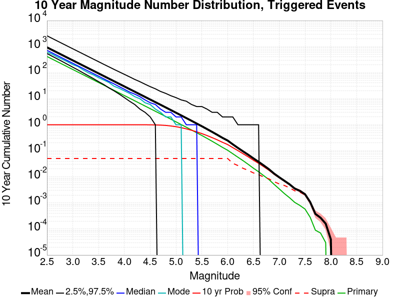

# Searles Valley M6.4 Results

|   | Searles Valley M6.4 |
|-----|-----|
| Num Simulations | 39300 (incomplete) |
| Start Time | 2019/07/04 17:33:48 UTC |
| Start Time Epoch Milliseconds | 1562261628000 |
| Duration | 10 Years |
| Includes Spontaneous? | false |
| Historical Ruptures | *(none)* |

## Table Of Contents

* [Magnitude Number Distribution](#magnitude-number-distribution)
  * [10 Year Magnitude Number Distribution](#10-year-magnitude-number-distribution)
  * [1 Year Magnitude Number Distribution](#1-year-magnitude-number-distribution)
  * [1 Month Magnitude Number Distribution](#1-month-magnitude-number-distribution)
  * [1 Week Magnitude Number Distribution](#1-week-magnitude-number-distribution)
  * [1 Day Magnitude Number Distribution](#1-day-magnitude-number-distribution)
  * [1 Hour Magnitude Number Distribution](#1-hour-magnitude-number-distribution)
* [Hazard Change Over Time](#hazard-change-over-time)
  * [M&ge;5.0 Hazard Change Over Time](#mge50-hazard-change-over-time)
  * [M&ge;6.0 Hazard Change Over Time](#mge60-hazard-change-over-time)
  * [M&ge;7.0 Hazard Change Over Time](#mge70-hazard-change-over-time)
* [Section Participation](#section-participation)
  * [Section Participation Plots](#section-participation-plots)
  * [Supra-Seismogenic Parent Sections Table](#supra-seismogenic-parent-sections-table)
  * [M≥6.5 Parent Sections Table](#m65-parent-sections-table)
  * [M≥7 Parent Sections Table](#m7-parent-sections-table)
  * [M≥7.5 Parent Sections Table](#m75-parent-sections-table)
* [Gridded Nucleation](#gridded-nucleation)
* [JSON Input File](#json-input-file)

## Magnitude Number Distribution
*[(top)](#table-of-contents)*

### 10 Year Magnitude Number Distribution
*[(top)](#table-of-contents)*

**Legend**
* **Mean** (thick black line): mean expected number across all 39300 catalogs
* **2.5%,97.5%** (thin black lines): expected number percentiles across all 39300 catalogs
* **Median** (thin blue line): median expected number across all 39300 catalogs
* **Mode** (thin cyan line): modal expected number across all 39300 catalogs
* **10 yr Probability** (thin red line): 10 year probability calculated as the fraction of catalogs with at least 1 occurrence
* **95% Conf** (light red shaded region): binomial 95% confidence bounds on probability
* **Primary** (thin green line): mean expected number from primary triggered aftershocks only (no secondary, tertiary, etc...) across all 39300 catalogs



| Mag | Mean | 2.5 %ile | 97.5 %ile | Median | Mode | 10 yr Probability | Primary Aftershocks Mean |
|-----|-----|-----|-----|-----|-----|-----|-----|
| **M&ge;2.5** | 924.398 | 543.000 | 2593.000 | 718.000 | 632.000 | 1.000 | 417.902 |
| **M&ge;2.6** | 734.207 | 428.000 | 2056.000 | 570.000 | 523.000 | 1.000 | 331.884 |
| **M&ge;2.7** | 583.071 | 337.000 | 1631.000 | 454.000 | 395.000 | 1.000 | 263.554 |
| **M&ge;2.8** | 463.123 | 264.000 | 1300.000 | 360.000 | 324.000 | 1.000 | 209.306 |
| **M&ge;2.9** | 367.868 | 207.000 | 1033.000 | 287.000 | 259.000 | 1.000 | 166.286 |
| **M&ge;3** | 292.264 | 162.000 | 824.000 | 228.000 | 205.000 | 1.000 | 132.132 |
| **M&ge;3.1** | 232.136 | 127.000 | 654.000 | 182.000 | 165.000 | 1.000 | 104.955 |
| **M&ge;3.2** | 184.372 | 98.000 | 521.000 | 145.000 | 126.000 | 1.000 | 83.345 |
| **M&ge;3.3** | 146.467 | 76.000 | 413.000 | 115.000 | 98.000 | 1.000 | 66.191 |
| **M&ge;3.4** | 116.339 | 59.000 | 328.000 | 92.000 | 84.000 | 1.000 | 52.589 |
| **M&ge;3.5** | 92.401 | 45.000 | 261.000 | 73.000 | 64.000 | 1.000 | 41.771 |
| **M&ge;3.6** | 73.388 | 35.000 | 208.000 | 58.000 | 48.000 | 1.000 | 33.171 |
| **M&ge;3.7** | 58.275 | 26.000 | 166.000 | 46.000 | 42.000 | 1.000 | 26.345 |
| **M&ge;3.8** | 46.278 | 20.000 | 132.000 | 37.000 | 30.000 | 1.000 | 20.928 |
| **M&ge;3.9** | 36.745 | 15.000 | 106.000 | 29.000 | 24.000 | 1.000 | 16.610 |
| **M&ge;4** | 29.184 | 11.000 | 86.000 | 23.000 | 20.000 | 1.000 | 13.200 |
| **M&ge;4.1** | 23.167 | 8.000 | 68.000 | 18.000 | 16.000 | 1.000 | 10.478 |
| **M&ge;4.2** | 18.380 | 5.000 | 55.000 | 15.000 | 13.000 | 1.000 | 8.305 |
| **M&ge;4.3** | 14.573 | 4.000 | 44.000 | 11.000 | 10.000 | 1.000 | 6.587 |
| **M&ge;4.4** | 11.574 | 3.000 | 36.000 | 9.000 | 7.000 | 0.999 | 5.235 |
| **M&ge;4.5** | 9.171 | 2.000 | 29.000 | 7.000 | 6.000 | 0.996 | 4.150 |
| **M&ge;4.6** | 7.271 | 1.000 | 24.000 | 6.000 | 4.000 | 0.987 | 3.294 |
| **M&ge;4.7** | 5.769 | 0.000 | 19.000 | 4.000 | 3.000 | 0.971 | 2.617 |
| **M&ge;4.8** | 4.573 | 0.000 | 16.000 | 3.000 | 2.000 | 0.943 | 2.072 |
| **M&ge;4.9** | 3.621 | 0.000 | 13.000 | 3.000 | 2.000 | 0.901 | 1.642 |
| **M&ge;5** | 2.865 | 0.000 | 11.000 | 2.000 | 1.000 | 0.844 | 1.300 |
| **M&ge;5.1** | 2.259 | 0.000 | 9.000 | 2.000 | 1.000 | 0.773 | 1.022 |
| **M&ge;5.2** | 1.782 | 0.000 | 7.000 | 1.000 | 0.000 | 0.696 | 0.806 |
| **M&ge;5.3** | 1.401 | 0.000 | 6.000 | 1.000 | 0.000 | 0.616 | 0.633 |
| **M&ge;5.4** | 1.099 | 0.000 | 5.000 | 1.000 | 0.000 | 0.534 | 0.494 |
| **M&ge;5.5** | 0.865 | 0.000 | 4.000 | 0.000 | 0.000 | 0.456 | 0.388 |
| **M&ge;5.6** | 0.673 | 0.000 | 4.000 | 0.000 | 0.000 | 0.383 | 0.300 |
| **M&ge;5.7** | 0.521 | 0.000 | 3.000 | 0.000 | 0.000 | 0.318 | 0.230 |
| **M&ge;5.8** | 0.403 | 0.000 | 3.000 | 0.000 | 0.000 | 0.261 | 0.177 |
| **M&ge;5.9** | 0.308 | 0.000 | 2.000 | 0.000 | 0.000 | 0.211 | 0.134 |
| **M&ge;6** | 0.242 | 0.000 | 2.000 | 0.000 | 0.000 | 0.172 | 0.103 |
| **M&ge;6.1** | 0.174 | 0.000 | 2.000 | 0.000 | 0.000 | 0.131 | 0.076 |
| **M&ge;6.2** | 0.127 | 0.000 | 1.000 | 0.000 | 0.000 | 0.100 | 0.056 |
| **M&ge;6.3** | 0.094 | 0.000 | 1.000 | 0.000 | 0.000 | 0.077 | 0.041 |
| **M&ge;6.4** | 0.070 | 0.000 | 1.000 | 0.000 | 0.000 | 0.058 | 0.030 |
| **M&ge;6.5** | 0.050 | 0.000 | 1.000 | 0.000 | 0.000 | 0.043 | 0.021 |
| **M&ge;6.6** | 0.038 | 0.000 | 1.000 | 0.000 | 0.000 | 0.033 | 0.015 |
| **M&ge;6.7** | 0.027 | 0.000 | 0.000 | 0.000 | 0.000 | 0.024 | 0.011 |
| **M&ge;6.8** | 0.019 | 0.000 | 0.000 | 0.000 | 0.000 | 0.018 | 7.46E-3 |
| **M&ge;6.9** | 0.013 | 0.000 | 0.000 | 0.000 | 0.000 | 0.012 | 4.71E-3 |
| **M&ge;7** | 9.21E-3 | 0.000 | 0.000 | 0.000 | 0.000 | 8.93E-3 | 2.95E-3 |
| **M&ge;7.1** | 6.90E-3 | 0.000 | 0.000 | 0.000 | 0.000 | 6.77E-3 | 1.83E-3 |
| **M&ge;7.2** | 4.94E-3 | 0.000 | 0.000 | 0.000 | 0.000 | 4.89E-3 | 1.35E-3 |
| **M&ge;7.3** | 3.03E-3 | 0.000 | 0.000 | 0.000 | 0.000 | 2.98E-3 | 9.16E-4 |
| **M&ge;7.4** | 2.44E-3 | 0.000 | 0.000 | 0.000 | 0.000 | 2.39E-3 | 7.12E-4 |
| **M&ge;7.5** | 1.60E-3 | 0.000 | 0.000 | 0.000 | 0.000 | 1.55E-3 | 4.58E-4 |
| **M&ge;7.6** | 7.38E-4 | 0.000 | 0.000 | 0.000 | 0.000 | 6.87E-4 | 1.78E-4 |
| **M&ge;7.7** | 2.04E-4 | 0.000 | 0.000 | 0.000 | 0.000 | 1.78E-4 | 5.09E-5 |
| **M&ge;7.8** | 1.02E-4 | 0.000 | 0.000 | 0.000 | 0.000 | 1.02E-4 | 2.54E-5 |
| **M&ge;7.9** | 7.63E-5 | 0.000 | 0.000 | 0.000 | 0.000 | 7.63E-5 | 2.54E-5 |
| **M&ge;8** | 0.000 | 0.000 | 0.000 | 0.000 | 0.000 | 0.000 | 0.000 |
| **M&ge;8.1** | 0.000 | 0.000 | 0.000 | 0.000 | 0.000 | 0.000 | 0.000 |
| **M&ge;8.2** | 0.000 | 0.000 | 0.000 | 0.000 | 0.000 | 0.000 | 0.000 |
| **M&ge;8.3** | 0.000 | 0.000 | 0.000 | 0.000 | 0.000 | 0.000 | 0.000 |
| **M&ge;8.4** | 0.000 | 0.000 | 0.000 | 0.000 | 0.000 | 0.000 | 0.000 |
| **M&ge;8.5** | 0.000 | 0.000 | 0.000 | 0.000 | 0.000 | 0.000 | 0.000 |
| **M&ge;8.6** | 0.000 | 0.000 | 0.000 | 0.000 | 0.000 | 0.000 | 0.000 |
| **M&ge;8.7** | 0.000 | 0.000 | 0.000 | 0.000 | 0.000 | 0.000 | 0.000 |
| **M&ge;8.8** | 0.000 | 0.000 | 0.000 | 0.000 | 0.000 | 0.000 | 0.000 |
| **M&ge;8.9** | 0.000 | 0.000 | 0.000 | 0.000 | 0.000 | 0.000 | 0.000 |
| **M&ge;9** | 0.000 | 0.000 | 0.000 | 0.000 | 0.000 | 0.000 | 0.000 |

### 1 Year Magnitude Number Distribution
*[(top)](#table-of-contents)*

**Legend**
* **Mean** (thick black line): mean expected number across all 39300 catalogs
* **2.5%,97.5%** (thin black lines): expected number percentiles across all 39300 catalogs
* **Median** (thin blue line): median expected number across all 39300 catalogs
* **Mode** (thin cyan line): modal expected number across all 39300 catalogs
* **10 yr Probability** (thin red line): 10 year probability calculated as the fraction of catalogs with at least 1 occurrence
* **95% Conf** (light red shaded region): binomial 95% confidence bounds on probability
* **Primary** (thin green line): mean expected number from primary triggered aftershocks only (no secondary, tertiary, etc...) across all 39300 catalogs


| Mag | Mean | 2.5 %ile | 97.5 %ile | Median | Mode | 10 yr Probability | Primary Aftershocks Mean |
|-----|-----|-----|-----|-----|-----|-----|-----|
| **M&ge;2.5** | 714.147 | 454.000 | 1794.000 | 582.000 | 528.000 | 1.000 | 370.075 |
| **M&ge;2.6** | 567.190 | 357.000 | 1417.000 | 463.000 | 422.000 | 1.000 | 293.888 |
| **M&ge;2.7** | 450.446 | 280.000 | 1128.000 | 368.000 | 336.000 | 1.000 | 233.378 |
| **M&ge;2.8** | 357.769 | 220.000 | 897.000 | 293.000 | 267.000 | 1.000 | 185.351 |
| **M&ge;2.9** | 284.195 | 172.000 | 714.000 | 233.000 | 208.000 | 1.000 | 147.261 |
| **M&ge;3** | 225.791 | 134.000 | 567.000 | 185.000 | 167.000 | 1.000 | 117.009 |
| **M&ge;3.1** | 179.335 | 104.000 | 451.000 | 148.000 | 129.000 | 1.000 | 92.942 |
| **M&ge;3.2** | 142.416 | 81.000 | 358.000 | 117.000 | 106.000 | 1.000 | 73.804 |
| **M&ge;3.3** | 113.148 | 63.000 | 286.000 | 93.000 | 81.000 | 1.000 | 58.619 |
| **M&ge;3.4** | 89.876 | 48.000 | 228.000 | 74.000 | 70.000 | 1.000 | 46.576 |
| **M&ge;3.5** | 71.390 | 37.000 | 182.000 | 59.000 | 54.000 | 1.000 | 36.990 |
| **M&ge;3.6** | 56.687 | 28.000 | 145.000 | 47.000 | 38.000 | 1.000 | 29.368 |
| **M&ge;3.7** | 45.009 | 21.000 | 115.000 | 37.000 | 34.000 | 1.000 | 23.319 |
| **M&ge;3.8** | 35.752 | 16.000 | 93.000 | 30.000 | 27.000 | 1.000 | 18.522 |
| **M&ge;3.9** | 28.377 | 12.000 | 75.000 | 24.000 | 21.000 | 1.000 | 14.697 |
| **M&ge;4** | 22.549 | 8.000 | 59.000 | 19.000 | 16.000 | 1.000 | 11.686 |
| **M&ge;4.1** | 17.904 | 6.000 | 48.000 | 15.000 | 12.000 | 1.000 | 9.275 |
| **M&ge;4.2** | 14.207 | 4.000 | 38.000 | 12.000 | 10.000 | 1.000 | 7.351 |
| **M&ge;4.3** | 11.264 | 3.000 | 31.000 | 9.000 | 8.000 | 0.999 | 5.827 |
| **M&ge;4.4** | 8.946 | 2.000 | 26.000 | 7.000 | 6.000 | 0.997 | 4.631 |
| **M&ge;4.5** | 7.089 | 1.000 | 21.000 | 6.000 | 5.000 | 0.991 | 3.672 |
| **M&ge;4.6** | 5.617 | 1.000 | 17.000 | 4.000 | 4.000 | 0.976 | 2.912 |
| **M&ge;4.7** | 4.459 | 0.000 | 14.000 | 4.000 | 3.000 | 0.950 | 2.314 |
| **M&ge;4.8** | 3.535 | 0.000 | 12.000 | 3.000 | 2.000 | 0.911 | 1.831 |
| **M&ge;4.9** | 2.799 | 0.000 | 10.000 | 2.000 | 1.000 | 0.856 | 1.451 |
| **M&ge;5** | 2.216 | 0.000 | 8.000 | 2.000 | 1.000 | 0.789 | 1.149 |
| **M&ge;5.1** | 1.745 | 0.000 | 7.000 | 1.000 | 1.000 | 0.712 | 0.902 |
| **M&ge;5.2** | 1.378 | 0.000 | 6.000 | 1.000 | 0.000 | 0.631 | 0.712 |
| **M&ge;5.3** | 1.083 | 0.000 | 5.000 | 1.000 | 0.000 | 0.552 | 0.559 |
| **M&ge;5.4** | 0.849 | 0.000 | 4.000 | 0.000 | 0.000 | 0.472 | 0.437 |
| **M&ge;5.5** | 0.669 | 0.000 | 4.000 | 0.000 | 0.000 | 0.398 | 0.344 |
| **M&ge;5.6** | 0.520 | 0.000 | 3.000 | 0.000 | 0.000 | 0.331 | 0.266 |
| **M&ge;5.7** | 0.403 | 0.000 | 3.000 | 0.000 | 0.000 | 0.271 | 0.204 |
| **M&ge;5.8** | 0.311 | 0.000 | 2.000 | 0.000 | 0.000 | 0.219 | 0.156 |
| **M&ge;5.9** | 0.238 | 0.000 | 2.000 | 0.000 | 0.000 | 0.176 | 0.118 |
| **M&ge;6** | 0.187 | 0.000 | 2.000 | 0.000 | 0.000 | 0.142 | 0.091 |
| **M&ge;6.1** | 0.134 | 0.000 | 1.000 | 0.000 | 0.000 | 0.107 | 0.067 |
| **M&ge;6.2** | 0.099 | 0.000 | 1.000 | 0.000 | 0.000 | 0.082 | 0.049 |
| **M&ge;6.3** | 0.073 | 0.000 | 1.000 | 0.000 | 0.000 | 0.062 | 0.036 |
| **M&ge;6.4** | 0.054 | 0.000 | 1.000 | 0.000 | 0.000 | 0.046 | 0.026 |
| **M&ge;6.5** | 0.039 | 0.000 | 1.000 | 0.000 | 0.000 | 0.034 | 0.018 |
| **M&ge;6.6** | 0.029 | 0.000 | 1.000 | 0.000 | 0.000 | 0.026 | 0.013 |
| **M&ge;6.7** | 0.020 | 0.000 | 0.000 | 0.000 | 0.000 | 0.018 | 9.06E-3 |
| **M&ge;6.8** | 0.014 | 0.000 | 0.000 | 0.000 | 0.000 | 0.013 | 6.16E-3 |
| **M&ge;6.9** | 9.36E-3 | 0.000 | 0.000 | 0.000 | 0.000 | 9.06E-3 | 3.87E-3 |
| **M&ge;7** | 6.77E-3 | 0.000 | 0.000 | 0.000 | 0.000 | 6.56E-3 | 2.47E-3 |
| **M&ge;7.1** | 5.01E-3 | 0.000 | 0.000 | 0.000 | 0.000 | 4.94E-3 | 1.50E-3 |
| **M&ge;7.2** | 3.61E-3 | 0.000 | 0.000 | 0.000 | 0.000 | 3.56E-3 | 1.15E-3 |
| **M&ge;7.3** | 2.16E-3 | 0.000 | 0.000 | 0.000 | 0.000 | 2.11E-3 | 7.63E-4 |
| **M&ge;7.4** | 1.73E-3 | 0.000 | 0.000 | 0.000 | 0.000 | 1.68E-3 | 6.11E-4 |
| **M&ge;7.5** | 1.15E-3 | 0.000 | 0.000 | 0.000 | 0.000 | 1.09E-3 | 4.33E-4 |
| **M&ge;7.6** | 5.60E-4 | 0.000 | 0.000 | 0.000 | 0.000 | 5.09E-4 | 1.53E-4 |
| **M&ge;7.7** | 1.78E-4 | 0.000 | 0.000 | 0.000 | 0.000 | 1.53E-4 | 5.09E-5 |
| **M&ge;7.8** | 1.02E-4 | 0.000 | 0.000 | 0.000 | 0.000 | 1.02E-4 | 2.54E-5 |
| **M&ge;7.9** | 7.63E-5 | 0.000 | 0.000 | 0.000 | 0.000 | 7.63E-5 | 2.54E-5 |
| **M&ge;8** | 0.000 | 0.000 | 0.000 | 0.000 | 0.000 | 0.000 | 0.000 |
| **M&ge;8.1** | 0.000 | 0.000 | 0.000 | 0.000 | 0.000 | 0.000 | 0.000 |
| **M&ge;8.2** | 0.000 | 0.000 | 0.000 | 0.000 | 0.000 | 0.000 | 0.000 |
| **M&ge;8.3** | 0.000 | 0.000 | 0.000 | 0.000 | 0.000 | 0.000 | 0.000 |
| **M&ge;8.4** | 0.000 | 0.000 | 0.000 | 0.000 | 0.000 | 0.000 | 0.000 |
| **M&ge;8.5** | 0.000 | 0.000 | 0.000 | 0.000 | 0.000 | 0.000 | 0.000 |
| **M&ge;8.6** | 0.000 | 0.000 | 0.000 | 0.000 | 0.000 | 0.000 | 0.000 |
| **M&ge;8.7** | 0.000 | 0.000 | 0.000 | 0.000 | 0.000 | 0.000 | 0.000 |
| **M&ge;8.8** | 0.000 | 0.000 | 0.000 | 0.000 | 0.000 | 0.000 | 0.000 |
| **M&ge;8.9** | 0.000 | 0.000 | 0.000 | 0.000 | 0.000 | 0.000 | 0.000 |
| **M&ge;9** | 0.000 | 0.000 | 0.000 | 0.000 | 0.000 | 0.000 | 0.000 |

### 1 Month Magnitude Number Distribution
*[(top)](#table-of-contents)*

**Legend**
* **Mean** (thick black line): mean expected number across all 39300 catalogs
* **2.5%,97.5%** (thin black lines): expected number percentiles across all 39300 catalogs
* **Median** (thin blue line): median expected number across all 39300 catalogs
* **Mode** (thin cyan line): modal expected number across all 39300 catalogs
* **10 yr Probability** (thin red line): 10 year probability calculated as the fraction of catalogs with at least 1 occurrence
* **95% Conf** (light red shaded region): binomial 95% confidence bounds on probability
* **Primary** (thin green line): mean expected number from primary triggered aftershocks only (no secondary, tertiary, etc...) across all 39300 catalogs


| Mag | Mean | 2.5 %ile | 97.5 %ile | Median | Mode | 10 yr Probability | Primary Aftershocks Mean |
|-----|-----|-----|-----|-----|-----|-----|-----|
| **M&ge;2.5** | 511.453 | 352.000 | 1110.000 | 438.000 | 407.000 | 1.000 | 308.589 |
| **M&ge;2.6** | 406.162 | 276.000 | 881.000 | 349.000 | 325.000 | 1.000 | 245.044 |
| **M&ge;2.7** | 322.573 | 216.000 | 699.000 | 277.000 | 257.000 | 1.000 | 194.590 |
| **M&ge;2.8** | 256.179 | 169.000 | 554.000 | 221.000 | 203.000 | 1.000 | 154.532 |
| **M&ge;2.9** | 203.481 | 132.000 | 443.000 | 175.000 | 161.000 | 1.000 | 122.783 |
| **M&ge;3** | 161.705 | 103.000 | 351.000 | 140.000 | 132.000 | 1.000 | 97.562 |
| **M&ge;3.1** | 128.446 | 79.000 | 280.000 | 111.000 | 103.000 | 1.000 | 77.488 |
| **M&ge;3.2** | 102.006 | 61.000 | 223.000 | 88.000 | 82.000 | 1.000 | 61.546 |
| **M&ge;3.3** | 81.054 | 47.000 | 177.000 | 70.000 | 65.000 | 1.000 | 48.885 |
| **M&ge;3.4** | 64.389 | 36.000 | 143.000 | 56.000 | 53.000 | 1.000 | 38.846 |
| **M&ge;3.5** | 51.160 | 27.000 | 114.000 | 45.000 | 41.000 | 1.000 | 30.853 |
| **M&ge;3.6** | 40.621 | 21.000 | 91.000 | 35.000 | 32.000 | 1.000 | 24.489 |
| **M&ge;3.7** | 32.254 | 15.000 | 73.000 | 28.000 | 26.000 | 1.000 | 19.446 |
| **M&ge;3.8** | 25.621 | 11.000 | 59.000 | 22.000 | 20.000 | 1.000 | 15.448 |
| **M&ge;3.9** | 20.342 | 8.000 | 47.000 | 18.000 | 15.000 | 1.000 | 12.260 |
| **M&ge;4** | 16.169 | 6.000 | 39.000 | 14.000 | 12.000 | 1.000 | 9.747 |
| **M&ge;4.1** | 12.833 | 4.000 | 31.000 | 11.000 | 10.000 | 1.000 | 7.732 |
| **M&ge;4.2** | 10.187 | 3.000 | 25.000 | 9.000 | 7.000 | 0.999 | 6.131 |
| **M&ge;4.3** | 8.073 | 2.000 | 21.000 | 7.000 | 6.000 | 0.997 | 4.862 |
| **M&ge;4.4** | 6.414 | 1.000 | 17.000 | 5.000 | 5.000 | 0.991 | 3.867 |
| **M&ge;4.5** | 5.085 | 1.000 | 14.000 | 4.000 | 3.000 | 0.975 | 3.067 |
| **M&ge;4.6** | 4.030 | 0.000 | 12.000 | 3.000 | 3.000 | 0.948 | 2.432 |
| **M&ge;4.7** | 3.201 | 0.000 | 10.000 | 3.000 | 2.000 | 0.907 | 1.933 |
| **M&ge;4.8** | 2.536 | 0.000 | 8.000 | 2.000 | 1.000 | 0.851 | 1.530 |
| **M&ge;4.9** | 2.008 | 0.000 | 7.000 | 2.000 | 1.000 | 0.783 | 1.213 |
| **M&ge;5** | 1.589 | 0.000 | 6.000 | 1.000 | 1.000 | 0.708 | 0.960 |
| **M&ge;5.1** | 1.252 | 0.000 | 5.000 | 1.000 | 0.000 | 0.625 | 0.754 |
| **M&ge;5.2** | 0.988 | 0.000 | 4.000 | 1.000 | 0.000 | 0.543 | 0.596 |
| **M&ge;5.3** | 0.779 | 0.000 | 4.000 | 0.000 | 0.000 | 0.466 | 0.469 |
| **M&ge;5.4** | 0.609 | 0.000 | 3.000 | 0.000 | 0.000 | 0.391 | 0.367 |
| **M&ge;5.5** | 0.479 | 0.000 | 3.000 | 0.000 | 0.000 | 0.325 | 0.288 |
| **M&ge;5.6** | 0.373 | 0.000 | 2.000 | 0.000 | 0.000 | 0.266 | 0.223 |
| **M&ge;5.7** | 0.288 | 0.000 | 2.000 | 0.000 | 0.000 | 0.215 | 0.171 |
| **M&ge;5.8** | 0.221 | 0.000 | 2.000 | 0.000 | 0.000 | 0.171 | 0.130 |
| **M&ge;5.9** | 0.170 | 0.000 | 1.000 | 0.000 | 0.000 | 0.136 | 0.099 |
| **M&ge;6** | 0.133 | 0.000 | 1.000 | 0.000 | 0.000 | 0.108 | 0.076 |
| **M&ge;6.1** | 0.096 | 0.000 | 1.000 | 0.000 | 0.000 | 0.081 | 0.056 |
| **M&ge;6.2** | 0.070 | 0.000 | 1.000 | 0.000 | 0.000 | 0.061 | 0.041 |
| **M&ge;6.3** | 0.053 | 0.000 | 1.000 | 0.000 | 0.000 | 0.046 | 0.030 |
| **M&ge;6.4** | 0.039 | 0.000 | 1.000 | 0.000 | 0.000 | 0.034 | 0.022 |
| **M&ge;6.5** | 0.028 | 0.000 | 0.000 | 0.000 | 0.000 | 0.025 | 0.015 |
| **M&ge;6.6** | 0.020 | 0.000 | 0.000 | 0.000 | 0.000 | 0.018 | 0.011 |
| **M&ge;6.7** | 0.014 | 0.000 | 0.000 | 0.000 | 0.000 | 0.013 | 7.46E-3 |
| **M&ge;6.8** | 9.57E-3 | 0.000 | 0.000 | 0.000 | 0.000 | 9.06E-3 | 5.09E-3 |
| **M&ge;6.9** | 6.41E-3 | 0.000 | 0.000 | 0.000 | 0.000 | 6.23E-3 | 3.33E-3 |
| **M&ge;7** | 4.68E-3 | 0.000 | 0.000 | 0.000 | 0.000 | 4.55E-3 | 2.09E-3 |
| **M&ge;7.1** | 3.38E-3 | 0.000 | 0.000 | 0.000 | 0.000 | 3.36E-3 | 1.32E-3 |
| **M&ge;7.2** | 2.44E-3 | 0.000 | 0.000 | 0.000 | 0.000 | 2.44E-3 | 9.67E-4 |
| **M&ge;7.3** | 1.55E-3 | 0.000 | 0.000 | 0.000 | 0.000 | 1.55E-3 | 6.36E-4 |
| **M&ge;7.4** | 1.27E-3 | 0.000 | 0.000 | 0.000 | 0.000 | 1.27E-3 | 5.34E-4 |
| **M&ge;7.5** | 8.40E-4 | 0.000 | 0.000 | 0.000 | 0.000 | 8.40E-4 | 3.56E-4 |
| **M&ge;7.6** | 3.82E-4 | 0.000 | 0.000 | 0.000 | 0.000 | 3.82E-4 | 1.27E-4 |
| **M&ge;7.7** | 1.27E-4 | 0.000 | 0.000 | 0.000 | 0.000 | 1.27E-4 | 5.09E-5 |
| **M&ge;7.8** | 7.63E-5 | 0.000 | 0.000 | 0.000 | 0.000 | 7.63E-5 | 2.54E-5 |
| **M&ge;7.9** | 5.09E-5 | 0.000 | 0.000 | 0.000 | 0.000 | 5.09E-5 | 2.54E-5 |
| **M&ge;8** | 0.000 | 0.000 | 0.000 | 0.000 | 0.000 | 0.000 | 0.000 |
| **M&ge;8.1** | 0.000 | 0.000 | 0.000 | 0.000 | 0.000 | 0.000 | 0.000 |
| **M&ge;8.2** | 0.000 | 0.000 | 0.000 | 0.000 | 0.000 | 0.000 | 0.000 |
| **M&ge;8.3** | 0.000 | 0.000 | 0.000 | 0.000 | 0.000 | 0.000 | 0.000 |
| **M&ge;8.4** | 0.000 | 0.000 | 0.000 | 0.000 | 0.000 | 0.000 | 0.000 |
| **M&ge;8.5** | 0.000 | 0.000 | 0.000 | 0.000 | 0.000 | 0.000 | 0.000 |
| **M&ge;8.6** | 0.000 | 0.000 | 0.000 | 0.000 | 0.000 | 0.000 | 0.000 |
| **M&ge;8.7** | 0.000 | 0.000 | 0.000 | 0.000 | 0.000 | 0.000 | 0.000 |
| **M&ge;8.8** | 0.000 | 0.000 | 0.000 | 0.000 | 0.000 | 0.000 | 0.000 |
| **M&ge;8.9** | 0.000 | 0.000 | 0.000 | 0.000 | 0.000 | 0.000 | 0.000 |
| **M&ge;9** | 0.000 | 0.000 | 0.000 | 0.000 | 0.000 | 0.000 | 0.000 |

### 1 Week Magnitude Number Distribution
*[(top)](#table-of-contents)*

**Legend**
* **Mean** (thick black line): mean expected number across all 39300 catalogs
* **2.5%,97.5%** (thin black lines): expected number percentiles across all 39300 catalogs
* **Median** (thin blue line): median expected number across all 39300 catalogs
* **Mode** (thin cyan line): modal expected number across all 39300 catalogs
* **10 yr Probability** (thin red line): 10 year probability calculated as the fraction of catalogs with at least 1 occurrence
* **95% Conf** (light red shaded region): binomial 95% confidence bounds on probability
* **Primary** (thin green line): mean expected number from primary triggered aftershocks only (no secondary, tertiary, etc...) across all 39300 catalogs


| Mag | Mean | 2.5 %ile | 97.5 %ile | Median | Mode | 10 yr Probability | Primary Aftershocks Mean |
|-----|-----|-----|-----|-----|-----|-----|-----|
| **M&ge;2.5** | 404.303 | 290.000 | 794.000 | 357.000 | 342.000 | 1.000 | 267.439 |
| **M&ge;2.6** | 321.051 | 227.000 | 629.000 | 284.000 | 270.000 | 1.000 | 212.366 |
| **M&ge;2.7** | 254.984 | 178.000 | 500.000 | 226.000 | 213.000 | 1.000 | 168.656 |
| **M&ge;2.8** | 202.486 | 139.000 | 397.000 | 180.000 | 171.000 | 1.000 | 133.929 |
| **M&ge;2.9** | 160.832 | 108.000 | 317.000 | 143.000 | 136.000 | 1.000 | 106.407 |
| **M&ge;3** | 127.820 | 84.000 | 253.000 | 114.000 | 108.000 | 1.000 | 84.557 |
| **M&ge;3.1** | 101.532 | 65.000 | 201.000 | 91.000 | 87.000 | 1.000 | 67.159 |
| **M&ge;3.2** | 80.615 | 50.000 | 161.000 | 72.000 | 67.000 | 1.000 | 53.334 |
| **M&ge;3.3** | 64.067 | 38.000 | 128.000 | 57.000 | 54.000 | 1.000 | 42.368 |
| **M&ge;3.4** | 50.906 | 29.000 | 103.000 | 46.000 | 44.000 | 1.000 | 33.670 |
| **M&ge;3.5** | 40.448 | 22.000 | 82.000 | 36.000 | 34.000 | 1.000 | 26.747 |
| **M&ge;3.6** | 32.112 | 16.000 | 66.000 | 29.000 | 28.000 | 1.000 | 21.229 |
| **M&ge;3.7** | 25.505 | 12.000 | 54.000 | 23.000 | 23.000 | 1.000 | 16.859 |
| **M&ge;3.8** | 20.255 | 9.000 | 43.000 | 18.000 | 16.000 | 1.000 | 13.393 |
| **M&ge;3.9** | 16.080 | 6.000 | 35.000 | 14.000 | 12.000 | 1.000 | 10.626 |
| **M&ge;4** | 12.782 | 4.000 | 29.000 | 11.000 | 11.000 | 1.000 | 8.445 |
| **M&ge;4.1** | 10.143 | 3.000 | 23.000 | 9.000 | 8.000 | 0.999 | 6.701 |
| **M&ge;4.2** | 8.049 | 2.000 | 19.000 | 7.000 | 6.000 | 0.998 | 5.312 |
| **M&ge;4.3** | 6.382 | 1.000 | 16.000 | 6.000 | 5.000 | 0.993 | 4.212 |
| **M&ge;4.4** | 5.072 | 1.000 | 13.000 | 4.000 | 4.000 | 0.980 | 3.350 |
| **M&ge;4.5** | 4.024 | 0.000 | 11.000 | 3.000 | 3.000 | 0.955 | 2.658 |
| **M&ge;4.6** | 3.188 | 0.000 | 9.000 | 3.000 | 2.000 | 0.916 | 2.108 |
| **M&ge;4.7** | 2.534 | 0.000 | 8.000 | 2.000 | 1.000 | 0.863 | 1.675 |
| **M&ge;4.8** | 2.006 | 0.000 | 7.000 | 2.000 | 1.000 | 0.798 | 1.326 |
| **M&ge;4.9** | 1.589 | 0.000 | 6.000 | 1.000 | 1.000 | 0.720 | 1.051 |
| **M&ge;5** | 1.259 | 0.000 | 5.000 | 1.000 | 0.000 | 0.640 | 0.832 |
| **M&ge;5.1** | 0.991 | 0.000 | 4.000 | 1.000 | 0.000 | 0.557 | 0.655 |
| **M&ge;5.2** | 0.780 | 0.000 | 4.000 | 0.000 | 0.000 | 0.477 | 0.517 |
| **M&ge;5.3** | 0.615 | 0.000 | 3.000 | 0.000 | 0.000 | 0.404 | 0.406 |
| **M&ge;5.4** | 0.482 | 0.000 | 3.000 | 0.000 | 0.000 | 0.336 | 0.318 |
| **M&ge;5.5** | 0.380 | 0.000 | 2.000 | 0.000 | 0.000 | 0.278 | 0.250 |
| **M&ge;5.6** | 0.296 | 0.000 | 2.000 | 0.000 | 0.000 | 0.226 | 0.194 |
| **M&ge;5.7** | 0.228 | 0.000 | 2.000 | 0.000 | 0.000 | 0.181 | 0.148 |
| **M&ge;5.8** | 0.174 | 0.000 | 1.000 | 0.000 | 0.000 | 0.142 | 0.112 |
| **M&ge;5.9** | 0.134 | 0.000 | 1.000 | 0.000 | 0.000 | 0.112 | 0.085 |
| **M&ge;6** | 0.105 | 0.000 | 1.000 | 0.000 | 0.000 | 0.089 | 0.066 |
| **M&ge;6.1** | 0.076 | 0.000 | 1.000 | 0.000 | 0.000 | 0.066 | 0.048 |
| **M&ge;6.2** | 0.055 | 0.000 | 1.000 | 0.000 | 0.000 | 0.049 | 0.035 |
| **M&ge;6.3** | 0.041 | 0.000 | 1.000 | 0.000 | 0.000 | 0.037 | 0.026 |
| **M&ge;6.4** | 0.030 | 0.000 | 1.000 | 0.000 | 0.000 | 0.027 | 0.018 |
| **M&ge;6.5** | 0.021 | 0.000 | 0.000 | 0.000 | 0.000 | 0.019 | 0.013 |
| **M&ge;6.6** | 0.015 | 0.000 | 0.000 | 0.000 | 0.000 | 0.014 | 9.31E-3 |
| **M&ge;6.7** | 0.011 | 0.000 | 0.000 | 0.000 | 0.000 | 0.010 | 6.28E-3 |
| **M&ge;6.8** | 7.35E-3 | 0.000 | 0.000 | 0.000 | 0.000 | 7.05E-3 | 4.43E-3 |
| **M&ge;6.9** | 4.89E-3 | 0.000 | 0.000 | 0.000 | 0.000 | 4.78E-3 | 2.88E-3 |
| **M&ge;7** | 3.46E-3 | 0.000 | 0.000 | 0.000 | 0.000 | 3.38E-3 | 1.81E-3 |
| **M&ge;7.1** | 2.44E-3 | 0.000 | 0.000 | 0.000 | 0.000 | 2.44E-3 | 1.12E-3 |
| **M&ge;7.2** | 1.81E-3 | 0.000 | 0.000 | 0.000 | 0.000 | 1.81E-3 | 8.14E-4 |
| **M&ge;7.3** | 1.15E-3 | 0.000 | 0.000 | 0.000 | 0.000 | 1.15E-3 | 5.09E-4 |
| **M&ge;7.4** | 9.67E-4 | 0.000 | 0.000 | 0.000 | 0.000 | 9.67E-4 | 4.33E-4 |
| **M&ge;7.5** | 6.62E-4 | 0.000 | 0.000 | 0.000 | 0.000 | 6.62E-4 | 3.05E-4 |
| **M&ge;7.6** | 2.54E-4 | 0.000 | 0.000 | 0.000 | 0.000 | 2.54E-4 | 7.63E-5 |
| **M&ge;7.7** | 7.63E-5 | 0.000 | 0.000 | 0.000 | 0.000 | 7.63E-5 | 2.54E-5 |
| **M&ge;7.8** | 7.63E-5 | 0.000 | 0.000 | 0.000 | 0.000 | 7.63E-5 | 2.54E-5 |
| **M&ge;7.9** | 5.09E-5 | 0.000 | 0.000 | 0.000 | 0.000 | 5.09E-5 | 2.54E-5 |
| **M&ge;8** | 0.000 | 0.000 | 0.000 | 0.000 | 0.000 | 0.000 | 0.000 |
| **M&ge;8.1** | 0.000 | 0.000 | 0.000 | 0.000 | 0.000 | 0.000 | 0.000 |
| **M&ge;8.2** | 0.000 | 0.000 | 0.000 | 0.000 | 0.000 | 0.000 | 0.000 |
| **M&ge;8.3** | 0.000 | 0.000 | 0.000 | 0.000 | 0.000 | 0.000 | 0.000 |
| **M&ge;8.4** | 0.000 | 0.000 | 0.000 | 0.000 | 0.000 | 0.000 | 0.000 |
| **M&ge;8.5** | 0.000 | 0.000 | 0.000 | 0.000 | 0.000 | 0.000 | 0.000 |
| **M&ge;8.6** | 0.000 | 0.000 | 0.000 | 0.000 | 0.000 | 0.000 | 0.000 |
| **M&ge;8.7** | 0.000 | 0.000 | 0.000 | 0.000 | 0.000 | 0.000 | 0.000 |
| **M&ge;8.8** | 0.000 | 0.000 | 0.000 | 0.000 | 0.000 | 0.000 | 0.000 |
| **M&ge;8.9** | 0.000 | 0.000 | 0.000 | 0.000 | 0.000 | 0.000 | 0.000 |
| **M&ge;9** | 0.000 | 0.000 | 0.000 | 0.000 | 0.000 | 0.000 | 0.000 |

### 1 Day Magnitude Number Distribution
*[(top)](#table-of-contents)*

**Legend**
* **Mean** (thick black line): mean expected number across all 39300 catalogs
* **2.5%,97.5%** (thin black lines): expected number percentiles across all 39300 catalogs
* **Median** (thin blue line): median expected number across all 39300 catalogs
* **Mode** (thin cyan line): modal expected number across all 39300 catalogs
* **10 yr Probability** (thin red line): 10 year probability calculated as the fraction of catalogs with at least 1 occurrence
* **95% Conf** (light red shaded region): binomial 95% confidence bounds on probability
* **Primary** (thin green line): mean expected number from primary triggered aftershocks only (no secondary, tertiary, etc...) across all 39300 catalogs


| Mag | Mean | 2.5 %ile | 97.5 %ile | Median | Mode | 10 yr Probability | Primary Aftershocks Mean |
|-----|-----|-----|-----|-----|-----|-----|-----|
| **M&ge;2.5** | 274.225 | 207.000 | 477.000 | 253.000 | 244.000 | 1.000 | 205.727 |
| **M&ge;2.6** | 217.748 | 162.000 | 379.000 | 201.000 | 192.000 | 1.000 | 163.355 |
| **M&ge;2.7** | 172.956 | 126.000 | 303.000 | 160.000 | 153.000 | 1.000 | 129.739 |
| **M&ge;2.8** | 137.352 | 98.000 | 241.000 | 127.000 | 122.000 | 1.000 | 103.026 |
| **M&ge;2.9** | 109.095 | 76.000 | 191.000 | 101.000 | 94.000 | 1.000 | 81.845 |
| **M&ge;3** | 86.710 | 59.000 | 153.000 | 80.000 | 76.000 | 1.000 | 65.034 |
| **M&ge;3.1** | 68.884 | 45.000 | 122.000 | 64.000 | 62.000 | 1.000 | 51.661 |
| **M&ge;3.2** | 54.688 | 34.000 | 98.000 | 51.000 | 47.000 | 1.000 | 41.015 |
| **M&ge;3.3** | 43.473 | 26.000 | 79.000 | 40.000 | 39.000 | 1.000 | 32.592 |
| **M&ge;3.4** | 34.537 | 20.000 | 63.000 | 32.000 | 31.000 | 1.000 | 25.897 |
| **M&ge;3.5** | 27.443 | 15.000 | 51.000 | 26.000 | 23.000 | 1.000 | 20.572 |
| **M&ge;3.6** | 21.785 | 11.000 | 41.000 | 20.000 | 19.000 | 1.000 | 16.328 |
| **M&ge;3.7** | 17.308 | 8.000 | 33.000 | 16.000 | 15.000 | 1.000 | 12.970 |
| **M&ge;3.8** | 13.751 | 6.000 | 27.000 | 13.000 | 12.000 | 1.000 | 10.307 |
| **M&ge;3.9** | 10.912 | 4.000 | 23.000 | 10.000 | 9.000 | 1.000 | 8.175 |
| **M&ge;4** | 8.668 | 3.000 | 19.000 | 8.000 | 7.000 | 0.999 | 6.494 |
| **M&ge;4.1** | 6.880 | 2.000 | 15.000 | 6.000 | 6.000 | 0.997 | 5.153 |
| **M&ge;4.2** | 5.456 | 1.000 | 13.000 | 5.000 | 4.000 | 0.989 | 4.085 |
| **M&ge;4.3** | 4.323 | 0.000 | 11.000 | 4.000 | 3.000 | 0.972 | 3.238 |
| **M&ge;4.4** | 3.440 | 0.000 | 9.000 | 3.000 | 2.000 | 0.943 | 2.580 |
| **M&ge;4.5** | 2.731 | 0.000 | 8.000 | 2.000 | 2.000 | 0.898 | 2.048 |
| **M&ge;4.6** | 2.164 | 0.000 | 7.000 | 2.000 | 1.000 | 0.838 | 1.622 |
| **M&ge;4.7** | 1.720 | 0.000 | 6.000 | 1.000 | 1.000 | 0.768 | 1.288 |
| **M&ge;4.8** | 1.361 | 0.000 | 5.000 | 1.000 | 1.000 | 0.689 | 1.019 |
| **M&ge;4.9** | 1.076 | 0.000 | 4.000 | 1.000 | 0.000 | 0.605 | 0.807 |
| **M&ge;5** | 0.854 | 0.000 | 4.000 | 1.000 | 0.000 | 0.525 | 0.639 |
| **M&ge;5.1** | 0.673 | 0.000 | 3.000 | 0.000 | 0.000 | 0.446 | 0.503 |
| **M&ge;5.2** | 0.529 | 0.000 | 3.000 | 0.000 | 0.000 | 0.374 | 0.396 |
| **M&ge;5.3** | 0.417 | 0.000 | 2.000 | 0.000 | 0.000 | 0.310 | 0.312 |
| **M&ge;5.4** | 0.327 | 0.000 | 2.000 | 0.000 | 0.000 | 0.255 | 0.245 |
| **M&ge;5.5** | 0.257 | 0.000 | 2.000 | 0.000 | 0.000 | 0.207 | 0.191 |
| **M&ge;5.6** | 0.200 | 0.000 | 2.000 | 0.000 | 0.000 | 0.166 | 0.148 |
| **M&ge;5.7** | 0.153 | 0.000 | 1.000 | 0.000 | 0.000 | 0.131 | 0.113 |
| **M&ge;5.8** | 0.117 | 0.000 | 1.000 | 0.000 | 0.000 | 0.102 | 0.086 |
| **M&ge;5.9** | 0.090 | 0.000 | 1.000 | 0.000 | 0.000 | 0.080 | 0.066 |
| **M&ge;6** | 0.071 | 0.000 | 1.000 | 0.000 | 0.000 | 0.063 | 0.051 |
| **M&ge;6.1** | 0.051 | 0.000 | 1.000 | 0.000 | 0.000 | 0.047 | 0.037 |
| **M&ge;6.2** | 0.037 | 0.000 | 1.000 | 0.000 | 0.000 | 0.034 | 0.027 |
| **M&ge;6.3** | 0.028 | 0.000 | 1.000 | 0.000 | 0.000 | 0.026 | 0.020 |
| **M&ge;6.4** | 0.019 | 0.000 | 0.000 | 0.000 | 0.000 | 0.018 | 0.014 |
| **M&ge;6.5** | 0.014 | 0.000 | 0.000 | 0.000 | 0.000 | 0.013 | 9.85E-3 |
| **M&ge;6.6** | 0.010 | 0.000 | 0.000 | 0.000 | 0.000 | 9.52E-3 | 7.18E-3 |
| **M&ge;6.7** | 6.59E-3 | 0.000 | 0.000 | 0.000 | 0.000 | 6.41E-3 | 4.91E-3 |
| **M&ge;6.8** | 4.63E-3 | 0.000 | 0.000 | 0.000 | 0.000 | 4.50E-3 | 3.54E-3 |
| **M&ge;6.9** | 3.08E-3 | 0.000 | 0.000 | 0.000 | 0.000 | 3.05E-3 | 2.26E-3 |
| **M&ge;7** | 2.06E-3 | 0.000 | 0.000 | 0.000 | 0.000 | 2.04E-3 | 1.35E-3 |
| **M&ge;7.1** | 1.30E-3 | 0.000 | 0.000 | 0.000 | 0.000 | 1.30E-3 | 7.12E-4 |
| **M&ge;7.2** | 9.41E-4 | 0.000 | 0.000 | 0.000 | 0.000 | 9.41E-4 | 5.09E-4 |
| **M&ge;7.3** | 5.85E-4 | 0.000 | 0.000 | 0.000 | 0.000 | 5.85E-4 | 3.05E-4 |
| **M&ge;7.4** | 4.83E-4 | 0.000 | 0.000 | 0.000 | 0.000 | 4.83E-4 | 2.29E-4 |
| **M&ge;7.5** | 3.05E-4 | 0.000 | 0.000 | 0.000 | 0.000 | 3.05E-4 | 1.53E-4 |
| **M&ge;7.6** | 7.63E-5 | 0.000 | 0.000 | 0.000 | 0.000 | 7.63E-5 | 2.54E-5 |
| **M&ge;7.7** | 0.000 | 0.000 | 0.000 | 0.000 | 0.000 | 0.000 | 0.000 |
| **M&ge;7.8** | 0.000 | 0.000 | 0.000 | 0.000 | 0.000 | 0.000 | 0.000 |
| **M&ge;7.9** | 0.000 | 0.000 | 0.000 | 0.000 | 0.000 | 0.000 | 0.000 |
| **M&ge;8** | 0.000 | 0.000 | 0.000 | 0.000 | 0.000 | 0.000 | 0.000 |
| **M&ge;8.1** | 0.000 | 0.000 | 0.000 | 0.000 | 0.000 | 0.000 | 0.000 |
| **M&ge;8.2** | 0.000 | 0.000 | 0.000 | 0.000 | 0.000 | 0.000 | 0.000 |
| **M&ge;8.3** | 0.000 | 0.000 | 0.000 | 0.000 | 0.000 | 0.000 | 0.000 |
| **M&ge;8.4** | 0.000 | 0.000 | 0.000 | 0.000 | 0.000 | 0.000 | 0.000 |
| **M&ge;8.5** | 0.000 | 0.000 | 0.000 | 0.000 | 0.000 | 0.000 | 0.000 |
| **M&ge;8.6** | 0.000 | 0.000 | 0.000 | 0.000 | 0.000 | 0.000 | 0.000 |
| **M&ge;8.7** | 0.000 | 0.000 | 0.000 | 0.000 | 0.000 | 0.000 | 0.000 |
| **M&ge;8.8** | 0.000 | 0.000 | 0.000 | 0.000 | 0.000 | 0.000 | 0.000 |
| **M&ge;8.9** | 0.000 | 0.000 | 0.000 | 0.000 | 0.000 | 0.000 | 0.000 |
| **M&ge;9** | 0.000 | 0.000 | 0.000 | 0.000 | 0.000 | 0.000 | 0.000 |

### 1 Hour Magnitude Number Distribution
*[(top)](#table-of-contents)*

**Legend**
* **Mean** (thick black line): mean expected number across all 39300 catalogs
* **2.5%,97.5%** (thin black lines): expected number percentiles across all 39300 catalogs
* **Median** (thin blue line): median expected number across all 39300 catalogs
* **Mode** (thin cyan line): modal expected number across all 39300 catalogs
* **10 yr Probability** (thin red line): 10 year probability calculated as the fraction of catalogs with at least 1 occurrence
* **95% Conf** (light red shaded region): binomial 95% confidence bounds on probability
* **Primary** (thin green line): mean expected number from primary triggered aftershocks only (no secondary, tertiary, etc...) across all 39300 catalogs


| Mag | Mean | 2.5 %ile | 97.5 %ile | Median | Mode | 10 yr Probability | Primary Aftershocks Mean |
|-----|-----|-----|-----|-----|-----|-----|-----|
| **M&ge;2.5** | 99.528 | 76.000 | 134.000 | 97.000 | 93.000 | 1.000 | 90.437 |
| **M&ge;2.6** | 79.046 | 59.000 | 108.000 | 77.000 | 76.000 | 1.000 | 71.820 |
| **M&ge;2.7** | 62.751 | 45.000 | 87.000 | 61.000 | 60.000 | 1.000 | 57.013 |
| **M&ge;2.8** | 49.829 | 34.000 | 70.000 | 49.000 | 47.000 | 1.000 | 45.283 |
| **M&ge;2.9** | 39.581 | 26.000 | 57.000 | 39.000 | 39.000 | 1.000 | 35.970 |
| **M&ge;3** | 31.437 | 20.000 | 47.000 | 31.000 | 30.000 | 1.000 | 28.572 |
| **M&ge;3.1** | 24.980 | 15.000 | 38.000 | 24.000 | 24.000 | 1.000 | 22.703 |
| **M&ge;3.2** | 19.826 | 11.000 | 31.000 | 19.000 | 19.000 | 1.000 | 18.016 |
| **M&ge;3.3** | 15.746 | 8.000 | 26.000 | 15.000 | 15.000 | 1.000 | 14.307 |
| **M&ge;3.4** | 12.510 | 6.000 | 21.000 | 12.000 | 12.000 | 1.000 | 11.364 |
| **M&ge;3.5** | 9.936 | 4.000 | 18.000 | 10.000 | 9.000 | 1.000 | 9.027 |
| **M&ge;3.6** | 7.893 | 3.000 | 15.000 | 8.000 | 7.000 | 0.999 | 7.171 |
| **M&ge;3.7** | 6.268 | 2.000 | 12.000 | 6.000 | 6.000 | 0.997 | 5.694 |
| **M&ge;3.8** | 4.978 | 1.000 | 10.000 | 5.000 | 4.000 | 0.990 | 4.523 |
| **M&ge;3.9** | 3.946 | 0.000 | 9.000 | 4.000 | 3.000 | 0.974 | 3.586 |
| **M&ge;4** | 3.138 | 0.000 | 8.000 | 3.000 | 2.000 | 0.946 | 2.853 |
| **M&ge;4.1** | 2.488 | 0.000 | 6.000 | 2.000 | 2.000 | 0.902 | 2.264 |
| **M&ge;4.2** | 1.972 | 0.000 | 5.000 | 2.000 | 1.000 | 0.842 | 1.795 |
| **M&ge;4.3** | 1.566 | 0.000 | 5.000 | 1.000 | 1.000 | 0.770 | 1.426 |
| **M&ge;4.4** | 1.250 | 0.000 | 4.000 | 1.000 | 1.000 | 0.693 | 1.138 |
| **M&ge;4.5** | 0.993 | 0.000 | 4.000 | 1.000 | 0.000 | 0.609 | 0.904 |
| **M&ge;4.6** | 0.787 | 0.000 | 3.000 | 1.000 | 0.000 | 0.524 | 0.717 |
| **M&ge;4.7** | 0.626 | 0.000 | 3.000 | 0.000 | 0.000 | 0.448 | 0.570 |
| **M&ge;4.8** | 0.497 | 0.000 | 2.000 | 0.000 | 0.000 | 0.379 | 0.452 |
| **M&ge;4.9** | 0.394 | 0.000 | 2.000 | 0.000 | 0.000 | 0.315 | 0.359 |
| **M&ge;5** | 0.313 | 0.000 | 2.000 | 0.000 | 0.000 | 0.259 | 0.285 |
| **M&ge;5.1** | 0.247 | 0.000 | 2.000 | 0.000 | 0.000 | 0.211 | 0.225 |
| **M&ge;5.2** | 0.195 | 0.000 | 1.000 | 0.000 | 0.000 | 0.171 | 0.177 |
| **M&ge;5.3** | 0.153 | 0.000 | 1.000 | 0.000 | 0.000 | 0.137 | 0.139 |
| **M&ge;5.4** | 0.119 | 0.000 | 1.000 | 0.000 | 0.000 | 0.108 | 0.108 |
| **M&ge;5.5** | 0.094 | 0.000 | 1.000 | 0.000 | 0.000 | 0.088 | 0.086 |
| **M&ge;5.6** | 0.073 | 0.000 | 1.000 | 0.000 | 0.000 | 0.068 | 0.066 |
| **M&ge;5.7** | 0.056 | 0.000 | 1.000 | 0.000 | 0.000 | 0.053 | 0.051 |
| **M&ge;5.8** | 0.043 | 0.000 | 1.000 | 0.000 | 0.000 | 0.041 | 0.039 |
| **M&ge;5.9** | 0.033 | 0.000 | 1.000 | 0.000 | 0.000 | 0.032 | 0.030 |
| **M&ge;6** | 0.025 | 0.000 | 0.000 | 0.000 | 0.000 | 0.025 | 0.023 |
| **M&ge;6.1** | 0.019 | 0.000 | 0.000 | 0.000 | 0.000 | 0.018 | 0.017 |
| **M&ge;6.2** | 0.013 | 0.000 | 0.000 | 0.000 | 0.000 | 0.013 | 0.012 |
| **M&ge;6.3** | 0.010 | 0.000 | 0.000 | 0.000 | 0.000 | 9.95E-3 | 9.11E-3 |
| **M&ge;6.4** | 7.18E-3 | 0.000 | 0.000 | 0.000 | 0.000 | 7.02E-3 | 6.46E-3 |
| **M&ge;6.5** | 4.96E-3 | 0.000 | 0.000 | 0.000 | 0.000 | 4.86E-3 | 4.40E-3 |
| **M&ge;6.6** | 3.77E-3 | 0.000 | 0.000 | 0.000 | 0.000 | 3.69E-3 | 3.33E-3 |
| **M&ge;6.7** | 2.67E-3 | 0.000 | 0.000 | 0.000 | 0.000 | 2.62E-3 | 2.34E-3 |
| **M&ge;6.8** | 1.83E-3 | 0.000 | 0.000 | 0.000 | 0.000 | 1.78E-3 | 1.65E-3 |
| **M&ge;6.9** | 1.25E-3 | 0.000 | 0.000 | 0.000 | 0.000 | 1.25E-3 | 1.12E-3 |
| **M&ge;7** | 7.38E-4 | 0.000 | 0.000 | 0.000 | 0.000 | 7.38E-4 | 6.11E-4 |
| **M&ge;7.1** | 3.05E-4 | 0.000 | 0.000 | 0.000 | 0.000 | 3.05E-4 | 2.29E-4 |
| **M&ge;7.2** | 2.29E-4 | 0.000 | 0.000 | 0.000 | 0.000 | 2.29E-4 | 1.53E-4 |
| **M&ge;7.3** | 2.04E-4 | 0.000 | 0.000 | 0.000 | 0.000 | 2.04E-4 | 1.27E-4 |
| **M&ge;7.4** | 1.27E-4 | 0.000 | 0.000 | 0.000 | 0.000 | 1.27E-4 | 7.63E-5 |
| **M&ge;7.5** | 7.63E-5 | 0.000 | 0.000 | 0.000 | 0.000 | 7.63E-5 | 5.09E-5 |
| **M&ge;7.6** | 0.000 | 0.000 | 0.000 | 0.000 | 0.000 | 0.000 | 0.000 |
| **M&ge;7.7** | 0.000 | 0.000 | 0.000 | 0.000 | 0.000 | 0.000 | 0.000 |
| **M&ge;7.8** | 0.000 | 0.000 | 0.000 | 0.000 | 0.000 | 0.000 | 0.000 |
| **M&ge;7.9** | 0.000 | 0.000 | 0.000 | 0.000 | 0.000 | 0.000 | 0.000 |
| **M&ge;8** | 0.000 | 0.000 | 0.000 | 0.000 | 0.000 | 0.000 | 0.000 |
| **M&ge;8.1** | 0.000 | 0.000 | 0.000 | 0.000 | 0.000 | 0.000 | 0.000 |
| **M&ge;8.2** | 0.000 | 0.000 | 0.000 | 0.000 | 0.000 | 0.000 | 0.000 |
| **M&ge;8.3** | 0.000 | 0.000 | 0.000 | 0.000 | 0.000 | 0.000 | 0.000 |
| **M&ge;8.4** | 0.000 | 0.000 | 0.000 | 0.000 | 0.000 | 0.000 | 0.000 |
| **M&ge;8.5** | 0.000 | 0.000 | 0.000 | 0.000 | 0.000 | 0.000 | 0.000 |
| **M&ge;8.6** | 0.000 | 0.000 | 0.000 | 0.000 | 0.000 | 0.000 | 0.000 |
| **M&ge;8.7** | 0.000 | 0.000 | 0.000 | 0.000 | 0.000 | 0.000 | 0.000 |
| **M&ge;8.8** | 0.000 | 0.000 | 0.000 | 0.000 | 0.000 | 0.000 | 0.000 |
| **M&ge;8.9** | 0.000 | 0.000 | 0.000 | 0.000 | 0.000 | 0.000 | 0.000 |
| **M&ge;9** | 0.000 | 0.000 | 0.000 | 0.000 | 0.000 | 0.000 | 0.000 |

## Hazard Change Over Time
*[(top)](#table-of-contents)*

These plots show how the probability of ruptures of various magnitudes within 100km of any scenario rupture changes over time

### M&ge;5.0 Hazard Change Over Time
*[(top)](#table-of-contents)*


| Forecast Duration | UCERF3-ETAS [95% Conf] | UCERF3-ETAS Triggered Only | UCERF3-TD | UCERF3-TI |
|-----|-----|-----|-----|-----|
| 1 Hour | 0.257 [0.253 - 0.262] | 0.257 | 5.52E-5 | 5.47E-5 |
| 1 Day | 0.522 [0.517 - 0.527] | 0.521 | 1.32E-3 | 1.31E-3 |
| 1 Week | 0.640 [0.635 - 0.645] | 0.637 | 9.23E-3 | 9.16E-3 |
| 1 Month | 0.715 [0.711 - 0.720] | 0.704 | 0.039 | 0.039 |
| 1 Year | 0.868 [0.865 - 0.870] | 0.786 | 0.384 | 0.381 |
| 10 Years | 0.999 [0.999 - 0.999] | 0.841 | 0.992 | 0.992 |
| 30 Years | 1.000 [1.000 - 1.000] \* | \* | 1.000 | 1.000 |
| 100 Years | 1.000 [1.000 - 1.000] \* | \* | 1.000 | 1.000 |

\* *forecast duration is longer than simulation length, only ETAS ruptures from the first 10 years are included*
### M&ge;6.0 Hazard Change Over Time
*[(top)](#table-of-contents)*


| Forecast Duration | UCERF3-ETAS [95% Conf] | UCERF3-ETAS Triggered Only | UCERF3-TD | UCERF3-TI |
|-----|-----|-----|-----|-----|
| 1 Hour | 0.025 [0.023 - 0.026] | 0.025 | 6.60E-6 | 6.15E-6 |
| 1 Day | 0.063 [0.060 - 0.065] | 0.062 | 1.58E-4 | 1.48E-4 |
| 1 Week | 0.089 [0.086 - 0.091] | 0.088 | 1.11E-3 | 1.03E-3 |
| 1 Month | 0.111 [0.108 - 0.114] | 0.107 | 4.74E-3 | 4.42E-3 |
| 1 Year | 0.188 [0.185 - 0.192] | 0.140 | 0.056 | 0.052 |
| 10 Years | 0.535 [0.533 - 0.537] | 0.170 | 0.440 | 0.417 |
| 30 Years | 0.855 [0.854 - 0.855] \* | \* | 0.825 | 0.801 |
| 100 Years | 0.998 [0.998 - 0.998] \* | \* | 0.997 | 0.995 |

\* *forecast duration is longer than simulation length, only ETAS ruptures from the first 10 years are included*
### M&ge;7.0 Hazard Change Over Time
*[(top)](#table-of-contents)*


| Forecast Duration | UCERF3-ETAS [95% Conf] | UCERF3-ETAS Triggered Only | UCERF3-TD | UCERF3-TI |
|-----|-----|-----|-----|-----|
| 1 Hour | 7.39E-4 [5.04E-4 - 1.08E-3] | 7.38E-4 | 6.47E-7 | 5.84E-7 |
| 1 Day | 2.03E-3 [1.62E-3 - 2.53E-3] | 2.01E-3 | 1.55E-5 | 1.40E-5 |
| 1 Week | 3.42E-3 [2.88E-3 - 4.05E-3] | 3.31E-3 | 1.09E-4 | 9.81E-5 |
| 1 Month | 4.92E-3 [4.29E-3 - 5.64E-3] | 4.45E-3 | 4.66E-4 | 4.20E-4 |
| 1 Year | 0.012 [0.011 - 0.013] | 6.44E-3 | 5.66E-3 | 5.10E-3 |
| 10 Years | 0.064 [0.063 - 0.064] | 8.75E-3 | 0.055 | 0.050 |
| 30 Years | 0.166 [0.165 - 0.167] \* | \* | 0.159 | 0.142 |
| 100 Years | 0.457 [0.457 - 0.458] \* | \* | 0.452 | 0.401 |

\* *forecast duration is longer than simulation length, only ETAS ruptures from the first 10 years are included*
## Section Participation
*[(top)](#table-of-contents)*

### Section Participation Plots
*[(top)](#table-of-contents)*

| Min Mag | Triggered Ruptures (no spontaneous) | Triggered Ruptures (primary aftershocks only) |
|-----|-----|-----|
| **All Supra. Seis.** |  |  |
| **M&ge;6.5** |  |  |
| **M&ge;7** |  |  |
| **M&ge;7.5** |  |  |

### Supra-Seismogenic Parent Sections Table
*[(top)](#table-of-contents)*

*First 10 of 78 with matching ruptures shown*

| Parent Name | Triggered Mean Count | Triggered 10 Year Prob | Triggered Primary Mean Count |
|-----|-----|-----|-----|
| Tank Canyon | 0.034681935 | 0.029923664 | 0.009007634 |
| Garlock (Central) | 0.009694656 | 0.009541985 | 0.0027735368 |
| Panamint Valley | 0.004885496 | 0.0048346054 | 0.0011704834 |
| Owl Lake | 0.0043256995 | 0.0037659034 | 6.10687E-4 |
| Little Lake | 0.0028244276 | 0.0027735368 | 0.0011195929 |
| Garlock (East) | 0.002697201 | 0.0024936388 | 5.3435116E-4 |
| Blackwater | 0.0023918576 | 0.0022391859 | 5.5979646E-4 |
| Ash Hill | 0.0017048346 | 0.0016793893 | 3.562341E-4 |
| Gravel Hills-Harper Lk | 0.0012977099 | 0.0012468194 | 3.053435E-4 |
| Hunter Mountain-Saline Valley | 0.0011450382 | 0.0011195929 | 3.307888E-4 |

### M≥6.5 Parent Sections Table
*[(top)](#table-of-contents)*

*First 10 of 57 with matching ruptures shown*

| Parent Name | Triggered Mean Count | Triggered 10 Year Prob | Triggered Primary Mean Count |
|-----|-----|-----|-----|
| Panamint Valley | 0.004605598 | 0.0045547076 | 0.0011450382 |
| Garlock (Central) | 0.004452926 | 0.004452926 | 0.0012722646 |
| Tank Canyon | 0.0042493637 | 0.0042493637 | 0.0011450382 |
| Owl Lake | 0.0020610688 | 0.0020610688 | 3.562341E-4 |
| Garlock (East) | 0.0016030534 | 0.0015267176 | 4.071247E-4 |
| Little Lake | 0.0011704834 | 0.0011704834 | 3.816794E-4 |
| Hunter Mountain-Saline Valley | 0.0010941476 | 0.0010941476 | 3.053435E-4 |
| Airport Lake | 7.888041E-4 | 7.888041E-4 | 3.562341E-4 |
| Garlock (West) | 6.361323E-4 | 6.361323E-4 | 2.2900764E-4 |
| Death Valley (So) | 6.10687E-4 | 6.10687E-4 | 5.0890587E-5 |

### M≥7 Parent Sections Table
*[(top)](#table-of-contents)*

*First 10 of 35 with matching ruptures shown*

| Parent Name | Triggered Mean Count | Triggered 10 Year Prob | Triggered Primary Mean Count |
|-----|-----|-----|-----|
| Garlock (Central) | 0.003969466 | 0.003969466 | 0.0011959288 |
| Panamint Valley | 0.0021628498 | 0.0021628498 | 4.3256997E-4 |
| Owl Lake | 0.0013740459 | 0.0013740459 | 3.307888E-4 |
| Hunter Mountain-Saline Valley | 0.001043257 | 0.001043257 | 2.7989823E-4 |
| Garlock (East) | 0.0010178117 | 9.923665E-4 | 3.562341E-4 |
| Garlock (West) | 6.361323E-4 | 6.361323E-4 | 2.2900764E-4 |
| Tank Canyon | 4.071247E-4 | 4.071247E-4 | 2.5445293E-5 |
| Death Valley (So) | 2.5445293E-4 | 2.5445293E-4 | 2.5445293E-5 |
| Little Lake | 1.7811704E-4 | 1.7811704E-4 | 0.0 |
| San Andreas (Mojave N) | 1.7811704E-4 | 1.5267175E-4 | 5.0890587E-5 |

### M≥7.5 Parent Sections Table
*[(top)](#table-of-contents)*

*First 10 of 23 with matching ruptures shown*

| Parent Name | Triggered Mean Count | Triggered 10 Year Prob | Triggered Primary Mean Count |
|-----|-----|-----|-----|
| Garlock (Central) | 0.0012722646 | 0.0012722646 | 4.3256997E-4 |
| Hunter Mountain-Saline Valley | 9.1603055E-4 | 9.1603055E-4 | 2.7989823E-4 |
| Panamint Valley | 9.1603055E-4 | 9.1603055E-4 | 2.7989823E-4 |
| Garlock (West) | 4.8346055E-4 | 4.8346055E-4 | 1.5267175E-4 |
| Garlock (East) | 2.2900764E-4 | 2.2900764E-4 | 5.0890587E-5 |
| San Andreas (Mojave N) | 1.7811704E-4 | 1.5267175E-4 | 5.0890587E-5 |
| Death Valley (No) | 1.5267175E-4 | 1.5267175E-4 | 2.5445293E-5 |
| Owl Lake | 1.5267175E-4 | 1.5267175E-4 | 5.0890587E-5 |
| Death Valley (Fish Lake Valley) | 1.2722646E-4 | 1.2722646E-4 | 2.5445293E-5 |
| Death Valley (Black Mtns Frontal) | 1.01781174E-4 | 1.01781174E-4 | 0.0 |
## Gridded Nucleation
*[(top)](#table-of-contents)*

| Min Mag | Triggered Ruptures (no spontaneous) | Triggered Ruptures (primary aftershocks only) |
|-----|-----|-----|
| **M&ge;2.5** |  |  |
| **M&ge;5** |  |  |
| **M&ge;6** |  |  |
| **M&ge;7** |  |  |

## JSON Input File
*[(top)](#table-of-contents)*

```
{
  "numSimulations": 100000,
  "duration": 10.0,
  "startTimeMillis": 1562261628000,
  "includeSpontaneous": false,
  "randomSeed": 123456789,
  "binaryOutput": true,
  "binaryOutputFilters": [
    {
      "prefix": "results_complete",
      "descendantsOnly": false
    },
    {
      "prefix": "results_m5_preserve_chain",
      "minMag": 5.0,
      "preserveChainBelowMag": true,
      "descendantsOnly": false
    },
    {
      "prefix": "results_triggered_descendants",
      "descendantsOnly": true
    }
  ],
  "forceRecalc": false,
  "reuseERFs": true,
  "simulationName": "Searles Valley M6.4",
  "numRetries": 3,
  "outputDir": "${ETAS_SIM_DIR}/2019_07_04-SearlesValleyM64-includeSpont-full_td-10yr",
  "triggerRuptures": [
    {
      "mag": 6.4,
      "latitude": 35.705,
      "longitude": -117.508,
      "depth": 8.7
    }
  ],
  "cacheDir": "${ETAS_LAUNCHER}/inputs/cache_fm3p1_ba",
  "fssFile": "${ETAS_LAUNCHER}/inputs/2013_05_10-ucerf3p3-production-10runs_COMPOUND_SOL_FM3_1_SpatSeisU3_MEAN_BRANCH_AVG_SOL.zip",
  "probModel": "FULL_TD",
  "applySubSeisForSupraNucl": true,
  "totRateScaleFactor": 1.14,
  "gridSeisCorr": true,
  "timeIndependentERF": false,
  "griddedOnly": false,
  "imposeGR": false,
  "includeIndirectTriggering": true,
  "gridSeisDiscr": 0.1,
  "catalogCompletenessModel": "RELAXED"
}
```

