# Searles Valley M6.4 Results

|   | Searles Valley M6.4 |
|-----|-----|
| Num Simulations | 100000 |
| Start Time | 2019/07/04 17:33:48 UTC |
| Start Time Epoch Milliseconds | 1562261628000 |
| Duration | 10 Years |
| Includes Spontaneous? | false |
| Trigger Ruptures | *(none)* |

## Table Of Contents

* [Probabilities Summary Table](#probabilities-summary-table)
* [Magnitude Number Distribution](#magnitude-number-distribution)
  * [10 Year Magnitude Number Distribution](#10-year-magnitude-number-distribution)
  * [1 Year Magnitude Number Distribution](#1-year-magnitude-number-distribution)
  * [1 Month Magnitude Number Distribution](#1-month-magnitude-number-distribution)
  * [1 Week Magnitude Number Distribution](#1-week-magnitude-number-distribution)
  * [1 Day Magnitude Number Distribution](#1-day-magnitude-number-distribution)
  * [1 Hour Magnitude Number Distribution](#1-hour-magnitude-number-distribution)
* [Hazard Change Over Time](#hazard-change-over-time)
  * [M&ge;5.0 Hazard Change Over Time](#m50-hazard-change-over-time)
  * [M&ge;6.0 Hazard Change Over Time](#m60-hazard-change-over-time)
  * [M&ge;7.0 Hazard Change Over Time](#m70-hazard-change-over-time)
  * [M&ge;8.0 Hazard Change Over Time](#m80-hazard-change-over-time)
* [Trigger Rupture Fault Map](#trigger-rupture-fault-map)
* [Fault Distances To Triggers](#fault-distances-to-triggers)
* [Individual Simulated Catalog Maps](#individual-simulated-catalog-maps)
* [Section Participation](#section-participation)
  * [Section Participation Plots](#section-participation-plots)
  * [Supra-Seismogenic Parent Sections Table](#supra-seismogenic-parent-sections-table)
  * [M≥6.5 Parent Sections Table](#m65-parent-sections-table)
  * [M≥7 Parent Sections Table](#m7-parent-sections-table)
  * [M≥7.5 Parent Sections Table](#m75-parent-sections-table)
  * [M≥8 Parent Sections Table](#m8-parent-sections-table)
* [Fault Magnitude-Probability Distributions](#fault-magnitude-probability-distributions)
* [Gridded Nucleation](#gridded-nucleation)
* [JSON Input File](#json-input-file)

## Probabilities Summary Table
*[(top)](#table-of-contents)*

| Magnitude | 1 Hour Prob | 1 Day Prob | 1 Week Prob | 1 Month Prob | 1 Year Prob | 10 Year Prob |
|-----|-----|-----|-----|-----|-----|-----|
| **M&ge;3** | 1.000 (100.00%) | 1.000 (100.00%) | 1.000 (100.00%) | 1.000 (100.00%) | 1.000 (100.00%) | 1.000 (100.00%) |
| *95% Conf* | *[100.00% 100.00%]* | *[100.00% 100.00%]* | *[100.00% 100.00%]* | *[100.00% 100.00%]* | *[100.00% 100.00%]* | *[100.00% 100.00%]* |
| **M&ge;3.5** | 1.000 (99.99%) | 1.000 (100.00%) | 1.000 (100.00%) | 1.000 (100.00%) | 1.000 (100.00%) | 1.000 (100.00%) |
| *95% Conf* | *[99.98% 100.00%]* | *[100.00% 100.00%]* | *[100.00% 100.00%]* | *[100.00% 100.00%]* | *[100.00% 100.00%]* | *[100.00% 100.00%]* |
| **M&ge;4** | 0.947 (94.67%) | 0.999 (99.92%) | 1.000 (99.99%) | 1.000 (100.00%) | 1.000 (100.00%) | 1.000 (100.00%) |
| *95% Conf* | *[94.53% 94.81%]* | *[99.90% 99.94%]* | *[99.98% 99.99%]* | *[100.00% 100.00%]* | *[100.00% 100.00%]* | *[100.00% 100.00%]* |
| **M&ge;4.5** | 0.608 (60.78%) | 0.900 (90.01%) | 0.955 (95.54%) | 0.976 (97.56%) | 0.991 (99.05%) | 0.996 (99.58%) |
| *95% Conf* | *[60.48% 61.08%]* | *[89.82% 90.19%]* | *[95.41% 95.67%]* | *[97.46% 97.65%]* | *[98.99% 99.11%]* | *[99.53% 99.61%]* |
| **M&ge;5** | 0.256 (25.64%) | 0.524 (52.40%) | 0.638 (63.85%) | 0.706 (70.60%) | 0.789 (78.91%) | 0.842 (84.22%) |
| *95% Conf* | *[25.36% 25.91%]* | *[52.08% 52.70%]* | *[63.55% 64.14%]* | *[70.31% 70.88%]* | *[78.66% 79.16%]* | *[83.99% 84.45%]* |
| **M&ge;5.5** | 0.087 (8.68%) | 0.206 (20.63%) | 0.276 (27.65%) | 0.325 (32.49%) | 0.399 (39.89%) | 0.458 (45.81%) |
| *95% Conf* | *[8.51% 8.86%]* | *[20.38% 20.88%]* | *[27.37% 27.93%]* | *[32.20% 32.78%]* | *[39.59% 40.19%]* | *[45.50% 46.12%]* |
| **M&ge;6** | 0.025 (2.53%) | 0.064 (6.41%) | 0.089 (8.94%) | 0.110 (10.98%) | 0.144 (14.37%) | 0.174 (17.40%) |
| *95% Conf* | *[2.43% 2.63%]* | *[6.26% 6.56%]* | *[8.77% 9.12%]* | *[10.79% 11.17%]* | *[14.15% 14.59%]* | *[17.16% 17.64%]* |
| **M&ge;6.4** | 7.32E-3 (0.73%) | 0.019 (1.93%) | 0.028 (2.79%) | 0.035 (3.46%) | 0.047 (4.66%) | 0.059 (5.85%) |
| *95% Conf* | *[0.68% 0.79%]* | *[1.85% 2.02%]* | *[2.68% 2.89%]* | *[3.35% 3.58%]* | *[4.53% 4.79%]* | *[5.71% 6.00%]* |
| **M&ge;6.5** | 5.28E-3 (0.53%) | 0.014 (1.40%) | 0.020 (2.01%) | 0.025 (2.54%) | 0.035 (3.46%) | 0.044 (4.35%) |
| *95% Conf* | *[0.48% 0.58%]* | *[1.33% 1.47%]* | *[1.92% 2.10%]* | *[2.44% 2.64%]* | *[3.35% 3.57%]* | *[4.23% 4.48%]* |
| **M&ge;7** | 8.40E-4 (0.08%) | 2.42E-3 (0.24%) | 3.54E-3 (0.35%) | 4.75E-3 (0.47%) | 6.83E-3 (0.68%) | 9.19E-3 (0.92%) |
| *95% Conf* | *[0.07% 0.10%]* | *[0.21% 0.27%]* | *[0.32% 0.39%]* | *[0.43% 0.52%]* | *[0.63% 0.74%]* | *[0.86% 0.98%]* |
| **M&ge;7.5** | 1.60E-4 (0.02%) | 4.40E-4 (0.04%) | 7.70E-4 (0.08%) | 9.80E-4 (0.10%) | 1.48E-3 (0.15%) | 2.08E-3 (0.21%) |
| *95% Conf* | *[0.01% 0.03%]* | *[0.03% 0.06%]* | *[0.06% 0.10%]* | *[0.08% 0.12%]* | *[0.13% 0.17%]* | *[0.18% 0.24%]* |
| **M&ge;8** | 0.000 (0.00%) | 0.000 (0.00%) | 2.00E-5 (0.00%) | 2.00E-5 (0.00%) | 3.00E-5 (0.00%) | 4.00E-5 (0.00%) |
| *95% Conf* | *[0.00% 0.00%]* | *[0.00% 0.00%]* | *[0.00% 0.01%]* | *[0.00% 0.01%]* | *[0.00% 0.01%]* | *[0.00% 0.01%]* |

## Magnitude Number Distribution
*[(top)](#table-of-contents)*

### 10 Year Magnitude Number Distribution
*[(top)](#table-of-contents)*

**Legend**
* **Mean** (thick black line): mean expected number across all 100000 catalogs
* **2.5%,97.5%** (thin black lines): expected number percentiles across all 100000 catalogs
* **Median** (thin blue line): median expected number across all 100000 catalogs
* **Mode** (thin cyan line): modal expected number across all 100000 catalogs
* **10 yr Probability** (thin red line): 10 year probability calculated as the fraction of catalogs with at least 1 occurrence
* **10 yr Supraseismogenic Probability** (thin dashed red line): same as above, but only for supraseismogenic ruptures on explicitly modeled UCERF3 faults
* **95% Conf** (light red shaded region): binomial 95% confidence bounds on probability
* **Primary** (thin green line): mean expected number from primary triggered aftershocks only (no secondary, tertiary, etc...) across all 100000 catalogs


| Mag | Mean | 2.5 %ile | 97.5 %ile | Median | Mode | 10 yr Probability | 10 yr Prob 95% Conf | 10 yr Supra-Seis Prob | Primary Aftershocks Mean |
|-----|-----|-----|-----|-----|-----|-----|-----|-----|-----|
| **M&ge;2.5** | 934.425 | 543.000 | 2602.000 | 719.000 | 613.000 | 1.000 (100.00%) | [100.00% 100.00%] | 0.051 (5.08%) | 417.998 |
| **M&ge;2.6** | 742.164 | 428.000 | 2064.000 | 572.000 | 509.000 | 1.000 (100.00%) | [100.00% 100.00%] | 0.051 (5.08%) | 331.977 |
| **M&ge;2.7** | 589.463 | 337.000 | 1638.000 | 454.000 | 398.000 | 1.000 (100.00%) | [100.00% 100.00%] | 0.051 (5.08%) | 263.664 |
| **M&ge;2.8** | 468.175 | 265.000 | 1303.000 | 361.000 | 324.000 | 1.000 (100.00%) | [100.00% 100.00%] | 0.051 (5.08%) | 209.418 |
| **M&ge;2.9** | 371.885 | 207.000 | 1035.000 | 288.000 | 259.000 | 1.000 (100.00%) | [100.00% 100.00%] | 0.051 (5.08%) | 166.350 |
| **M&ge;3** | 295.447 | 162.000 | 824.000 | 229.000 | 203.000 | 1.000 (100.00%) | [100.00% 100.00%] | 0.051 (5.08%) | 132.167 |
| **M&ge;3.1** | 234.697 | 127.000 | 656.000 | 182.000 | 172.000 | 1.000 (100.00%) | [100.00% 100.00%] | 0.051 (5.08%) | 104.983 |
| **M&ge;3.2** | 186.402 | 98.000 | 522.000 | 145.000 | 128.000 | 1.000 (100.00%) | [100.00% 100.00%] | 0.051 (5.08%) | 83.376 |
| **M&ge;3.3** | 148.074 | 76.000 | 415.000 | 115.000 | 99.000 | 1.000 (100.00%) | [100.00% 100.00%] | 0.051 (5.08%) | 66.217 |
| **M&ge;3.4** | 117.618 | 59.000 | 330.000 | 92.000 | 82.000 | 1.000 (100.00%) | [100.00% 100.00%] | 0.051 (5.08%) | 52.601 |
| **M&ge;3.5** | 93.431 | 45.000 | 263.000 | 73.000 | 64.000 | 1.000 (100.00%) | [100.00% 100.00%] | 0.051 (5.08%) | 41.775 |
| **M&ge;3.6** | 74.189 | 35.000 | 209.000 | 58.000 | 52.000 | 1.000 (100.00%) | [100.00% 100.00%] | 0.051 (5.08%) | 33.165 |
| **M&ge;3.7** | 58.915 | 26.000 | 167.000 | 46.000 | 42.000 | 1.000 (100.00%) | [100.00% 100.00%] | 0.051 (5.08%) | 26.345 |
| **M&ge;3.8** | 46.786 | 20.000 | 133.000 | 37.000 | 30.000 | 1.000 (100.00%) | [100.00% 100.00%] | 0.051 (5.08%) | 20.924 |
| **M&ge;3.9** | 37.151 | 15.000 | 107.000 | 29.000 | 25.000 | 1.000 (100.00%) | [100.00% 100.00%] | 0.051 (5.08%) | 16.609 |
| **M&ge;4** | 29.508 | 11.000 | 86.000 | 23.000 | 20.000 | 1.000 (100.00%) | [100.00% 100.00%] | 0.051 (5.08%) | 13.194 |
| **M&ge;4.1** | 23.434 | 8.000 | 69.000 | 18.000 | 16.000 | 1.000 (100.00%) | [99.99% 100.00%] | 0.051 (5.08%) | 10.480 |
| **M&ge;4.2** | 18.599 | 6.000 | 55.000 | 15.000 | 12.000 | 1.000 (100.00%) | [99.99% 100.00%] | 0.051 (5.08%) | 8.313 |
| **M&ge;4.3** | 14.759 | 4.000 | 45.000 | 12.000 | 10.000 | 1.000 (99.98%) | [99.97% 99.99%] | 0.051 (5.08%) | 6.593 |
| **M&ge;4.4** | 11.720 | 3.000 | 36.000 | 9.000 | 7.000 | 0.999 (99.91%) | [99.89% 99.93%] | 0.051 (5.08%) | 5.237 |
| **M&ge;4.5** | 9.291 | 2.000 | 29.000 | 7.000 | 6.000 | 0.996 (99.58%) | [99.53% 99.61%] | 0.051 (5.08%) | 4.155 |
| **M&ge;4.6** | 7.374 | 1.000 | 24.000 | 6.000 | 4.000 | 0.987 (98.74%) | [98.67% 98.81%] | 0.051 (5.08%) | 3.297 |
| **M&ge;4.7** | 5.851 | 0.000 | 19.000 | 4.000 | 3.000 | 0.971 (97.12%) | [97.01% 97.22%] | 0.051 (5.08%) | 2.615 |
| **M&ge;4.8** | 4.635 | 0.000 | 16.000 | 3.000 | 2.000 | 0.943 (94.27%) | [94.12% 94.41%] | 0.051 (5.08%) | 2.073 |
| **M&ge;4.9** | 3.664 | 0.000 | 13.000 | 3.000 | 2.000 | 0.899 (89.91%) | [89.72% 90.10%] | 0.051 (5.08%) | 1.639 |
| **M&ge;5** | 2.895 | 0.000 | 11.000 | 2.000 | 1.000 | 0.842 (84.22%) | [83.99% 84.45%] | 0.051 (5.08%) | 1.294 |
| **M&ge;5.1** | 2.287 | 0.000 | 9.000 | 2.000 | 1.000 | 0.773 (77.29%) | [77.03% 77.55%] | 0.051 (5.08%) | 1.020 |
| **M&ge;5.2** | 1.804 | 0.000 | 8.000 | 1.000 | 0.000 | 0.696 (69.60%) | [69.32% 69.89%] | 0.051 (5.08%) | 0.803 |
| **M&ge;5.3** | 1.420 | 0.000 | 6.000 | 1.000 | 0.000 | 0.616 (61.59%) | [61.28% 61.89%] | 0.051 (5.08%) | 0.631 |
| **M&ge;5.4** | 1.116 | 0.000 | 5.000 | 1.000 | 0.000 | 0.535 (53.49%) | [53.18% 53.79%] | 0.051 (5.08%) | 0.494 |
| **M&ge;5.5** | 0.877 | 0.000 | 5.000 | 0.000 | 0.000 | 0.458 (45.81%) | [45.50% 46.12%] | 0.051 (5.08%) | 0.388 |
| **M&ge;5.6** | 0.684 | 0.000 | 4.000 | 0.000 | 0.000 | 0.386 (38.58%) | [38.28% 38.88%] | 0.051 (5.08%) | 0.301 |
| **M&ge;5.7** | 0.531 | 0.000 | 3.000 | 0.000 | 0.000 | 0.321 (32.07%) | [31.78% 32.36%] | 0.051 (5.08%) | 0.233 |
| **M&ge;5.8** | 0.410 | 0.000 | 3.000 | 0.000 | 0.000 | 0.263 (26.31%) | [26.04% 26.59%] | 0.051 (5.08%) | 0.178 |
| **M&ge;5.9** | 0.315 | 0.000 | 2.000 | 0.000 | 0.000 | 0.213 (21.26%) | [21.00% 21.51%] | 0.051 (5.07%) | 0.136 |
| **M&ge;6** | 0.248 | 0.000 | 2.000 | 0.000 | 0.000 | 0.174 (17.40%) | [17.16% 17.64%] | 0.051 (5.07%) | 0.105 |
| **M&ge;6.1** | 0.177 | 0.000 | 2.000 | 0.000 | 0.000 | 0.132 (13.25%) | [13.04% 13.46%] | 0.033 (3.33%) | 0.077 |
| **M&ge;6.2** | 0.129 | 0.000 | 1.000 | 0.000 | 0.000 | 0.102 (10.18%) | [9.99% 10.37%] | 0.027 (2.71%) | 0.057 |
| **M&ge;6.3** | 0.095 | 0.000 | 1.000 | 0.000 | 0.000 | 0.077 (7.73%) | [7.57% 7.90%] | 0.021 (2.12%) | 0.042 |
| **M&ge;6.4** | 0.070 | 0.000 | 1.000 | 0.000 | 0.000 | 0.059 (5.85%) | [5.71% 6.00%] | 0.018 (1.77%) | 0.030 |
| **M&ge;6.5** | 0.051 | 0.000 | 1.000 | 0.000 | 0.000 | 0.044 (4.35%) | [4.23% 4.48%] | 0.014 (1.42%) | 0.021 |
| **M&ge;6.6** | 0.038 | 0.000 | 1.000 | 0.000 | 0.000 | 0.033 (3.31%) | [3.20% 3.42%] | 0.012 (1.22%) | 0.016 |
| **M&ge;6.7** | 0.027 | 0.000 | 0.000 | 0.000 | 0.000 | 0.024 (2.44%) | [2.35% 2.54%] | 9.81E-3 (0.98%) | 0.011 |
| **M&ge;6.8** | 0.020 | 0.000 | 0.000 | 0.000 | 0.000 | 0.018 (1.79%) | [1.71% 1.88%] | 8.37E-3 (0.84%) | 7.89E-3 |
| **M&ge;6.9** | 0.013 | 0.000 | 0.000 | 0.000 | 0.000 | 0.013 (1.26%) | [1.19% 1.33%] | 6.54E-3 (0.65%) | 5.16E-3 |
| **M&ge;7** | 9.64E-3 | 0.000 | 0.000 | 0.000 | 0.000 | 9.19E-3 (0.92%) | [0.86% 0.98%] | 5.35E-3 (0.53%) | 3.45E-3 |
| **M&ge;7.1** | 7.07E-3 | 0.000 | 0.000 | 0.000 | 0.000 | 6.82E-3 (0.68%) | [0.63% 0.74%] | 4.67E-3 (0.47%) | 2.28E-3 |
| **M&ge;7.2** | 5.18E-3 | 0.000 | 0.000 | 0.000 | 0.000 | 5.06E-3 (0.51%) | [0.46% 0.55%] | 3.80E-3 (0.38%) | 1.58E-3 |
| **M&ge;7.3** | 3.56E-3 | 0.000 | 0.000 | 0.000 | 0.000 | 3.47E-3 (0.35%) | [0.31% 0.39%] | 2.92E-3 (0.29%) | 1.05E-3 |
| **M&ge;7.4** | 2.91E-3 | 0.000 | 0.000 | 0.000 | 0.000 | 2.84E-3 (0.28%) | [0.25% 0.32%] | 2.58E-3 (0.26%) | 8.00E-4 |
| **M&ge;7.5** | 2.15E-3 | 0.000 | 0.000 | 0.000 | 0.000 | 2.08E-3 (0.21%) | [0.18% 0.24%] | 2.02E-3 (0.20%) | 5.80E-4 |
| **M&ge;7.6** | 1.07E-3 | 0.000 | 0.000 | 0.000 | 0.000 | 1.04E-3 (0.10%) | [0.09% 0.13%] | 1.02E-3 (0.10%) | 2.80E-4 |
| **M&ge;7.7** | 3.80E-4 | 0.000 | 0.000 | 0.000 | 0.000 | 3.70E-4 (0.04%) | [0.03% 0.05%] | 3.60E-4 (0.04%) | 9.00E-5 |
| **M&ge;7.8** | 2.70E-4 | 0.000 | 0.000 | 0.000 | 0.000 | 2.70E-4 (0.03%) | [0.02% 0.04%] | 2.60E-4 (0.03%) | 7.00E-5 |
| **M&ge;7.9** | 1.60E-4 | 0.000 | 0.000 | 0.000 | 0.000 | 1.60E-4 (0.02%) | [0.01% 0.03%] | 1.60E-4 (0.02%) | 3.00E-5 |
| **M&ge;8** | 4.00E-5 | 0.000 | 0.000 | 0.000 | 0.000 | 4.00E-5 (0.00%) | [0.00% 0.01%] | 4.00E-5 (0.00%) | 0.000 |
| **M&ge;8.1** | 0.000 | 0.000 | 0.000 | 0.000 | 0.000 | 0.000 (0.00%) | [0.00% 0.00%] | 0.000 (0.00%) | 0.000 |
| **M&ge;8.2** | 0.000 | 0.000 | 0.000 | 0.000 | 0.000 | 0.000 (0.00%) | [0.00% 0.00%] | 0.000 (0.00%) | 0.000 |
| **M&ge;8.3** | 0.000 | 0.000 | 0.000 | 0.000 | 0.000 | 0.000 (0.00%) | [0.00% 0.00%] | 0.000 (0.00%) | 0.000 |
| **M&ge;8.4** | 0.000 | 0.000 | 0.000 | 0.000 | 0.000 | 0.000 (0.00%) | [0.00% 0.00%] | 0.000 (0.00%) | 0.000 |
| **M&ge;8.5** | 0.000 | 0.000 | 0.000 | 0.000 | 0.000 | 0.000 (0.00%) | [0.00% 0.00%] | 0.000 (0.00%) | 0.000 |
| **M&ge;8.6** | 0.000 | 0.000 | 0.000 | 0.000 | 0.000 | 0.000 (0.00%) | [0.00% 0.00%] | 0.000 (0.00%) | 0.000 |
| **M&ge;8.7** | 0.000 | 0.000 | 0.000 | 0.000 | 0.000 | 0.000 (0.00%) | [0.00% 0.00%] | 0.000 (0.00%) | 0.000 |
| **M&ge;8.8** | 0.000 | 0.000 | 0.000 | 0.000 | 0.000 | 0.000 (0.00%) | [0.00% 0.00%] | 0.000 (0.00%) | 0.000 |
| **M&ge;8.9** | 0.000 | 0.000 | 0.000 | 0.000 | 0.000 | 0.000 (0.00%) | [0.00% 0.00%] | 0.000 (0.00%) | 0.000 |
| **M&ge;9** | 0.000 | 0.000 | 0.000 | 0.000 | 0.000 | 0.000 (0.00%) | [0.00% 0.00%] | 0.000 (0.00%) | 0.000 |

### 1 Year Magnitude Number Distribution
*[(top)](#table-of-contents)*

**Legend**
* **Mean** (thick black line): mean expected number across all 100000 catalogs
* **2.5%,97.5%** (thin black lines): expected number percentiles across all 100000 catalogs
* **Median** (thin blue line): median expected number across all 100000 catalogs
* **Mode** (thin cyan line): modal expected number across all 100000 catalogs
* **1 yr Probability** (thin red line): 1 year probability calculated as the fraction of catalogs with at least 1 occurrence
* **1 yr Supraseismogenic Probability** (thin dashed red line): same as above, but only for supraseismogenic ruptures on explicitly modeled UCERF3 faults
* **95% Conf** (light red shaded region): binomial 95% confidence bounds on probability
* **Primary** (thin green line): mean expected number from primary triggered aftershocks only (no secondary, tertiary, etc...) across all 100000 catalogs

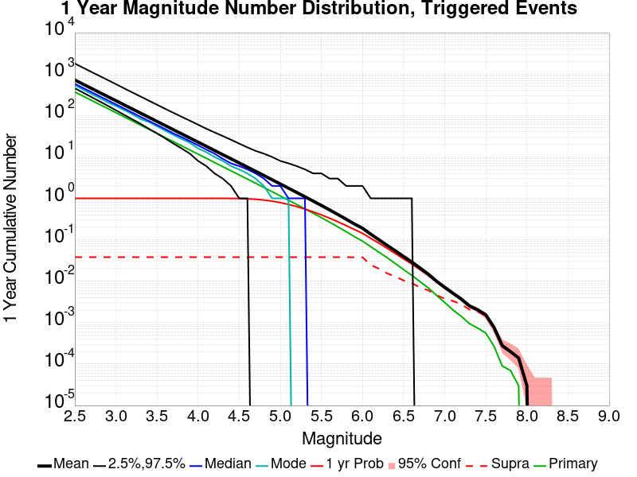

| Mag | Mean | 2.5 %ile | 97.5 %ile | Median | Mode | 1 yr Probability | 1 yr Prob 95% Conf | 1 yr Supra-Seis Prob | Primary Aftershocks Mean |
|-----|-----|-----|-----|-----|-----|-----|-----|-----|-----|
| **M&ge;2.5** | 719.568 | 454.000 | 1796.000 | 582.000 | 539.000 | 1.000 (100.00%) | [100.00% 100.00%] | 0.038 (3.79%) | 370.156 |
| **M&ge;2.6** | 571.510 | 357.000 | 1425.000 | 462.000 | 422.000 | 1.000 (100.00%) | [100.00% 100.00%] | 0.038 (3.79%) | 293.979 |
| **M&ge;2.7** | 453.926 | 280.000 | 1133.000 | 368.000 | 333.000 | 1.000 (100.00%) | [100.00% 100.00%] | 0.038 (3.79%) | 233.477 |
| **M&ge;2.8** | 360.523 | 220.000 | 903.000 | 293.000 | 267.000 | 1.000 (100.00%) | [100.00% 100.00%] | 0.038 (3.79%) | 185.436 |
| **M&ge;2.9** | 286.389 | 172.000 | 719.000 | 233.000 | 208.000 | 1.000 (100.00%) | [100.00% 100.00%] | 0.038 (3.79%) | 147.303 |
| **M&ge;3** | 227.510 | 134.000 | 572.000 | 185.000 | 170.000 | 1.000 (100.00%) | [100.00% 100.00%] | 0.038 (3.79%) | 117.027 |
| **M&ge;3.1** | 180.723 | 104.000 | 453.000 | 148.000 | 135.000 | 1.000 (100.00%) | [100.00% 100.00%] | 0.038 (3.79%) | 92.950 |
| **M&ge;3.2** | 143.533 | 81.000 | 360.000 | 117.000 | 108.000 | 1.000 (100.00%) | [100.00% 100.00%] | 0.038 (3.79%) | 73.822 |
| **M&ge;3.3** | 114.030 | 63.000 | 287.000 | 93.000 | 82.000 | 1.000 (100.00%) | [100.00% 100.00%] | 0.038 (3.79%) | 58.626 |
| **M&ge;3.4** | 90.574 | 48.000 | 229.000 | 74.000 | 70.000 | 1.000 (100.00%) | [100.00% 100.00%] | 0.038 (3.79%) | 46.567 |
| **M&ge;3.5** | 71.947 | 37.000 | 182.000 | 59.000 | 55.000 | 1.000 (100.00%) | [100.00% 100.00%] | 0.038 (3.79%) | 36.981 |
| **M&ge;3.6** | 57.124 | 28.000 | 145.000 | 47.000 | 43.000 | 1.000 (100.00%) | [100.00% 100.00%] | 0.038 (3.79%) | 29.354 |
| **M&ge;3.7** | 45.367 | 21.000 | 116.000 | 37.000 | 34.000 | 1.000 (100.00%) | [100.00% 100.00%] | 0.038 (3.79%) | 23.314 |
| **M&ge;3.8** | 36.035 | 16.000 | 93.000 | 30.000 | 27.000 | 1.000 (100.00%) | [100.00% 100.00%] | 0.038 (3.79%) | 18.514 |
| **M&ge;3.9** | 28.602 | 12.000 | 75.000 | 24.000 | 22.000 | 1.000 (100.00%) | [100.00% 100.00%] | 0.038 (3.79%) | 14.691 |
| **M&ge;4** | 22.721 | 8.000 | 60.000 | 19.000 | 16.000 | 1.000 (100.00%) | [100.00% 100.00%] | 0.038 (3.79%) | 11.674 |
| **M&ge;4.1** | 18.045 | 6.000 | 48.000 | 15.000 | 13.000 | 1.000 (100.00%) | [99.99% 100.00%] | 0.038 (3.79%) | 9.271 |
| **M&ge;4.2** | 14.323 | 4.000 | 39.000 | 12.000 | 10.000 | 1.000 (99.99%) | [99.98% 100.00%] | 0.038 (3.79%) | 7.354 |
| **M&ge;4.3** | 11.363 | 3.000 | 32.000 | 9.000 | 8.000 | 0.999 (99.94%) | [99.92% 99.95%] | 0.038 (3.79%) | 5.830 |
| **M&ge;4.4** | 9.021 | 2.000 | 26.000 | 7.000 | 6.000 | 0.997 (99.71%) | [99.67% 99.74%] | 0.038 (3.79%) | 4.630 |
| **M&ge;4.5** | 7.152 | 1.000 | 21.000 | 6.000 | 5.000 | 0.991 (99.05%) | [98.99% 99.11%] | 0.038 (3.79%) | 3.674 |
| **M&ge;4.6** | 5.673 | 1.000 | 17.000 | 5.000 | 4.000 | 0.976 (97.61%) | [97.51% 97.70%] | 0.038 (3.79%) | 2.914 |
| **M&ge;4.7** | 4.502 | 0.000 | 14.000 | 4.000 | 3.000 | 0.950 (95.04%) | [94.91% 95.18%] | 0.038 (3.79%) | 2.312 |
| **M&ge;4.8** | 3.567 | 0.000 | 12.000 | 3.000 | 2.000 | 0.911 (91.12%) | [90.94% 91.30%] | 0.038 (3.79%) | 1.832 |
| **M&ge;4.9** | 2.819 | 0.000 | 10.000 | 2.000 | 1.000 | 0.856 (85.64%) | [85.42% 85.86%] | 0.038 (3.79%) | 1.449 |
| **M&ge;5** | 2.227 | 0.000 | 8.000 | 2.000 | 1.000 | 0.789 (78.91%) | [78.66% 79.16%] | 0.038 (3.79%) | 1.144 |
| **M&ge;5.1** | 1.759 | 0.000 | 7.000 | 1.000 | 1.000 | 0.713 (71.27%) | [70.99% 71.55%] | 0.038 (3.79%) | 0.901 |
| **M&ge;5.2** | 1.388 | 0.000 | 6.000 | 1.000 | 0.000 | 0.632 (63.19%) | [62.89% 63.49%] | 0.038 (3.79%) | 0.710 |
| **M&ge;5.3** | 1.093 | 0.000 | 5.000 | 1.000 | 0.000 | 0.551 (55.14%) | [54.83% 55.44%] | 0.038 (3.79%) | 0.558 |
| **M&ge;5.4** | 0.858 | 0.000 | 4.000 | 0.000 | 0.000 | 0.472 (47.21%) | [46.90% 47.52%] | 0.038 (3.79%) | 0.437 |
| **M&ge;5.5** | 0.675 | 0.000 | 4.000 | 0.000 | 0.000 | 0.399 (39.89%) | [39.59% 40.19%] | 0.038 (3.79%) | 0.343 |
| **M&ge;5.6** | 0.526 | 0.000 | 3.000 | 0.000 | 0.000 | 0.332 (33.17%) | [32.88% 33.46%] | 0.038 (3.79%) | 0.266 |
| **M&ge;5.7** | 0.408 | 0.000 | 3.000 | 0.000 | 0.000 | 0.273 (27.27%) | [26.99% 27.54%] | 0.038 (3.79%) | 0.205 |
| **M&ge;5.8** | 0.316 | 0.000 | 2.000 | 0.000 | 0.000 | 0.221 (22.09%) | [21.83% 22.34%] | 0.038 (3.79%) | 0.157 |
| **M&ge;5.9** | 0.242 | 0.000 | 2.000 | 0.000 | 0.000 | 0.177 (17.71%) | [17.48% 17.95%] | 0.038 (3.79%) | 0.120 |
| **M&ge;6** | 0.190 | 0.000 | 2.000 | 0.000 | 0.000 | 0.144 (14.37%) | [14.15% 14.59%] | 0.038 (3.79%) | 0.093 |
| **M&ge;6.1** | 0.137 | 0.000 | 1.000 | 0.000 | 0.000 | 0.108 (10.83%) | [10.64% 11.02%] | 0.025 (2.46%) | 0.068 |
| **M&ge;6.2** | 0.100 | 0.000 | 1.000 | 0.000 | 0.000 | 0.083 (8.28%) | [8.11% 8.45%] | 0.020 (2.00%) | 0.050 |
| **M&ge;6.3** | 0.073 | 0.000 | 1.000 | 0.000 | 0.000 | 0.062 (6.23%) | [6.08% 6.38%] | 0.015 (1.55%) | 0.037 |
| **M&ge;6.4** | 0.054 | 0.000 | 1.000 | 0.000 | 0.000 | 0.047 (4.66%) | [4.53% 4.79%] | 0.013 (1.29%) | 0.027 |
| **M&ge;6.5** | 0.039 | 0.000 | 1.000 | 0.000 | 0.000 | 0.035 (3.46%) | [3.35% 3.57%] | 0.010 (1.04%) | 0.019 |
| **M&ge;6.6** | 0.029 | 0.000 | 1.000 | 0.000 | 0.000 | 0.026 (2.60%) | [2.51% 2.70%] | 9.00E-3 (0.90%) | 0.014 |
| **M&ge;6.7** | 0.021 | 0.000 | 0.000 | 0.000 | 0.000 | 0.019 (1.89%) | [1.80% 1.97%] | 7.09E-3 (0.71%) | 9.76E-3 |
| **M&ge;6.8** | 0.015 | 0.000 | 0.000 | 0.000 | 0.000 | 0.014 (1.38%) | [1.31% 1.45%] | 6.04E-3 (0.60%) | 6.92E-3 |
| **M&ge;6.9** | 0.010 | 0.000 | 0.000 | 0.000 | 0.000 | 9.59E-3 (0.96%) | [0.90% 1.02%] | 4.63E-3 (0.46%) | 4.56E-3 |
| **M&ge;7** | 7.13E-3 | 0.000 | 0.000 | 0.000 | 0.000 | 6.83E-3 (0.68%) | [0.63% 0.74%] | 3.78E-3 (0.38%) | 3.07E-3 |
| **M&ge;7.1** | 5.14E-3 | 0.000 | 0.000 | 0.000 | 0.000 | 4.97E-3 (0.50%) | [0.45% 0.54%] | 3.34E-3 (0.33%) | 2.03E-3 |
| **M&ge;7.2** | 3.75E-3 | 0.000 | 0.000 | 0.000 | 0.000 | 3.66E-3 (0.37%) | [0.33% 0.41%] | 2.76E-3 (0.28%) | 1.43E-3 |
| **M&ge;7.3** | 2.54E-3 | 0.000 | 0.000 | 0.000 | 0.000 | 2.47E-3 (0.25%) | [0.22% 0.28%] | 2.08E-3 (0.21%) | 9.50E-4 |
| **M&ge;7.4** | 2.05E-3 | 0.000 | 0.000 | 0.000 | 0.000 | 1.99E-3 (0.20%) | [0.17% 0.23%] | 1.85E-3 (0.18%) | 7.40E-4 |
| **M&ge;7.5** | 1.54E-3 | 0.000 | 0.000 | 0.000 | 0.000 | 1.48E-3 (0.15%) | [0.13% 0.17%] | 1.45E-3 (0.14%) | 5.60E-4 |
| **M&ge;7.6** | 7.70E-4 | 0.000 | 0.000 | 0.000 | 0.000 | 7.40E-4 (0.07%) | [0.06% 0.09%] | 7.20E-4 (0.07%) | 2.70E-4 |
| **M&ge;7.7** | 2.80E-4 | 0.000 | 0.000 | 0.000 | 0.000 | 2.70E-4 (0.03%) | [0.02% 0.04%] | 2.60E-4 (0.03%) | 9.00E-5 |
| **M&ge;7.8** | 2.00E-4 | 0.000 | 0.000 | 0.000 | 0.000 | 2.00E-4 (0.02%) | [0.01% 0.03%] | 1.90E-4 (0.02%) | 7.00E-5 |
| **M&ge;7.9** | 1.40E-4 | 0.000 | 0.000 | 0.000 | 0.000 | 1.40E-4 (0.01%) | [0.01% 0.02%] | 1.40E-4 (0.01%) | 3.00E-5 |
| **M&ge;8** | 3.00E-5 | 0.000 | 0.000 | 0.000 | 0.000 | 3.00E-5 (0.00%) | [0.00% 0.01%] | 3.00E-5 (0.00%) | 0.000 |
| **M&ge;8.1** | 0.000 | 0.000 | 0.000 | 0.000 | 0.000 | 0.000 (0.00%) | [0.00% 0.00%] | 0.000 (0.00%) | 0.000 |
| **M&ge;8.2** | 0.000 | 0.000 | 0.000 | 0.000 | 0.000 | 0.000 (0.00%) | [0.00% 0.00%] | 0.000 (0.00%) | 0.000 |
| **M&ge;8.3** | 0.000 | 0.000 | 0.000 | 0.000 | 0.000 | 0.000 (0.00%) | [0.00% 0.00%] | 0.000 (0.00%) | 0.000 |
| **M&ge;8.4** | 0.000 | 0.000 | 0.000 | 0.000 | 0.000 | 0.000 (0.00%) | [0.00% 0.00%] | 0.000 (0.00%) | 0.000 |
| **M&ge;8.5** | 0.000 | 0.000 | 0.000 | 0.000 | 0.000 | 0.000 (0.00%) | [0.00% 0.00%] | 0.000 (0.00%) | 0.000 |
| **M&ge;8.6** | 0.000 | 0.000 | 0.000 | 0.000 | 0.000 | 0.000 (0.00%) | [0.00% 0.00%] | 0.000 (0.00%) | 0.000 |
| **M&ge;8.7** | 0.000 | 0.000 | 0.000 | 0.000 | 0.000 | 0.000 (0.00%) | [0.00% 0.00%] | 0.000 (0.00%) | 0.000 |
| **M&ge;8.8** | 0.000 | 0.000 | 0.000 | 0.000 | 0.000 | 0.000 (0.00%) | [0.00% 0.00%] | 0.000 (0.00%) | 0.000 |
| **M&ge;8.9** | 0.000 | 0.000 | 0.000 | 0.000 | 0.000 | 0.000 (0.00%) | [0.00% 0.00%] | 0.000 (0.00%) | 0.000 |
| **M&ge;9** | 0.000 | 0.000 | 0.000 | 0.000 | 0.000 | 0.000 (0.00%) | [0.00% 0.00%] | 0.000 (0.00%) | 0.000 |

### 1 Month Magnitude Number Distribution
*[(top)](#table-of-contents)*

**Legend**
* **Mean** (thick black line): mean expected number across all 100000 catalogs
* **2.5%,97.5%** (thin black lines): expected number percentiles across all 100000 catalogs
* **Median** (thin blue line): median expected number across all 100000 catalogs
* **Mode** (thin cyan line): modal expected number across all 100000 catalogs
* **1 mo Probability** (thin red line): 1 month probability calculated as the fraction of catalogs with at least 1 occurrence
* **1 mo Supraseismogenic Probability** (thin dashed red line): same as above, but only for supraseismogenic ruptures on explicitly modeled UCERF3 faults
* **95% Conf** (light red shaded region): binomial 95% confidence bounds on probability
* **Primary** (thin green line): mean expected number from primary triggered aftershocks only (no secondary, tertiary, etc...) across all 100000 catalogs

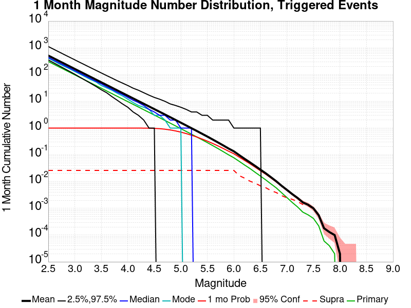

| Mag | Mean | 2.5 %ile | 97.5 %ile | Median | Mode | 1 mo Probability | 1 mo Prob 95% Conf | 1 mo Supra-Seis Prob | Primary Aftershocks Mean |
|-----|-----|-----|-----|-----|-----|-----|-----|-----|-----|
| **M&ge;2.5** | 513.830 | 352.000 | 1121.000 | 438.000 | 409.000 | 1.000 (100.00%) | [100.00% 100.00%] | 0.026 (2.61%) | 308.642 |
| **M&ge;2.6** | 408.072 | 276.000 | 889.000 | 348.000 | 325.000 | 1.000 (100.00%) | [100.00% 100.00%] | 0.026 (2.61%) | 245.111 |
| **M&ge;2.7** | 324.117 | 216.000 | 707.000 | 277.000 | 253.000 | 1.000 (100.00%) | [100.00% 100.00%] | 0.026 (2.61%) | 194.670 |
| **M&ge;2.8** | 257.411 | 169.000 | 561.000 | 221.000 | 203.000 | 1.000 (100.00%) | [100.00% 100.00%] | 0.026 (2.61%) | 154.602 |
| **M&ge;2.9** | 204.454 | 132.000 | 447.000 | 176.000 | 165.000 | 1.000 (100.00%) | [100.00% 100.00%] | 0.026 (2.61%) | 122.807 |
| **M&ge;3** | 162.433 | 103.000 | 356.000 | 140.000 | 130.000 | 1.000 (100.00%) | [100.00% 100.00%] | 0.026 (2.61%) | 97.565 |
| **M&ge;3.1** | 129.028 | 79.000 | 283.000 | 111.000 | 104.000 | 1.000 (100.00%) | [100.00% 100.00%] | 0.026 (2.61%) | 77.492 |
| **M&ge;3.2** | 102.488 | 61.000 | 226.000 | 88.000 | 82.000 | 1.000 (100.00%) | [100.00% 100.00%] | 0.026 (2.61%) | 61.554 |
| **M&ge;3.3** | 81.427 | 47.000 | 180.000 | 70.000 | 65.000 | 1.000 (100.00%) | [100.00% 100.00%] | 0.026 (2.61%) | 48.884 |
| **M&ge;3.4** | 64.681 | 36.000 | 144.000 | 56.000 | 53.000 | 1.000 (100.00%) | [100.00% 100.00%] | 0.026 (2.61%) | 38.830 |
| **M&ge;3.5** | 51.383 | 27.000 | 115.000 | 45.000 | 39.000 | 1.000 (100.00%) | [100.00% 100.00%] | 0.026 (2.61%) | 30.836 |
| **M&ge;3.6** | 40.791 | 21.000 | 92.000 | 35.000 | 32.000 | 1.000 (100.00%) | [100.00% 100.00%] | 0.026 (2.61%) | 24.472 |
| **M&ge;3.7** | 32.389 | 15.000 | 74.000 | 28.000 | 26.000 | 1.000 (100.00%) | [100.00% 100.00%] | 0.026 (2.61%) | 19.435 |
| **M&ge;3.8** | 25.723 | 11.000 | 59.000 | 22.000 | 20.000 | 1.000 (100.00%) | [100.00% 100.00%] | 0.026 (2.61%) | 15.433 |
| **M&ge;3.9** | 20.423 | 8.000 | 48.000 | 18.000 | 16.000 | 1.000 (100.00%) | [100.00% 100.00%] | 0.026 (2.61%) | 12.249 |
| **M&ge;4** | 16.226 | 6.000 | 39.000 | 14.000 | 12.000 | 1.000 (100.00%) | [100.00% 100.00%] | 0.026 (2.61%) | 9.734 |
| **M&ge;4.1** | 12.887 | 4.000 | 31.000 | 11.000 | 9.000 | 1.000 (99.99%) | [99.98% 99.99%] | 0.026 (2.61%) | 7.730 |
| **M&ge;4.2** | 10.230 | 3.000 | 26.000 | 9.000 | 7.000 | 0.999 (99.92%) | [99.91% 99.94%] | 0.026 (2.61%) | 6.132 |
| **M&ge;4.3** | 8.114 | 2.000 | 21.000 | 7.000 | 6.000 | 0.997 (99.69%) | [99.65% 99.72%] | 0.026 (2.61%) | 4.862 |
| **M&ge;4.4** | 6.442 | 1.000 | 17.000 | 5.000 | 5.000 | 0.990 (99.03%) | [98.97% 99.09%] | 0.026 (2.61%) | 3.862 |
| **M&ge;4.5** | 5.110 | 1.000 | 14.000 | 4.000 | 3.000 | 0.976 (97.56%) | [97.46% 97.65%] | 0.026 (2.61%) | 3.064 |
| **M&ge;4.6** | 4.054 | 0.000 | 12.000 | 3.000 | 3.000 | 0.949 (94.89%) | [94.75% 95.03%] | 0.026 (2.61%) | 2.431 |
| **M&ge;4.7** | 3.217 | 0.000 | 10.000 | 3.000 | 2.000 | 0.908 (90.79%) | [90.61% 90.97%] | 0.026 (2.61%) | 1.928 |
| **M&ge;4.8** | 2.547 | 0.000 | 8.000 | 2.000 | 1.000 | 0.852 (85.25%) | [85.03% 85.47%] | 0.026 (2.61%) | 1.526 |
| **M&ge;4.9** | 2.013 | 0.000 | 7.000 | 2.000 | 1.000 | 0.783 (78.31%) | [78.06% 78.57%] | 0.026 (2.61%) | 1.207 |
| **M&ge;5** | 1.591 | 0.000 | 6.000 | 1.000 | 1.000 | 0.706 (70.60%) | [70.31% 70.88%] | 0.026 (2.61%) | 0.953 |
| **M&ge;5.1** | 1.255 | 0.000 | 5.000 | 1.000 | 0.000 | 0.624 (62.39%) | [62.09% 62.69%] | 0.026 (2.61%) | 0.751 |
| **M&ge;5.2** | 0.990 | 0.000 | 4.000 | 1.000 | 0.000 | 0.542 (54.17%) | [53.86% 54.48%] | 0.026 (2.61%) | 0.592 |
| **M&ge;5.3** | 0.781 | 0.000 | 4.000 | 0.000 | 0.000 | 0.464 (46.40%) | [46.09% 46.71%] | 0.026 (2.61%) | 0.466 |
| **M&ge;5.4** | 0.613 | 0.000 | 3.000 | 0.000 | 0.000 | 0.391 (39.05%) | [38.75% 39.35%] | 0.026 (2.61%) | 0.365 |
| **M&ge;5.5** | 0.482 | 0.000 | 3.000 | 0.000 | 0.000 | 0.325 (32.49%) | [32.20% 32.78%] | 0.026 (2.61%) | 0.286 |
| **M&ge;5.6** | 0.375 | 0.000 | 2.000 | 0.000 | 0.000 | 0.266 (26.64%) | [26.37% 26.92%] | 0.026 (2.61%) | 0.222 |
| **M&ge;5.7** | 0.290 | 0.000 | 2.000 | 0.000 | 0.000 | 0.216 (21.61%) | [21.35% 21.86%] | 0.026 (2.61%) | 0.172 |
| **M&ge;5.8** | 0.224 | 0.000 | 2.000 | 0.000 | 0.000 | 0.173 (17.27%) | [17.03% 17.50%] | 0.026 (2.61%) | 0.131 |
| **M&ge;5.9** | 0.172 | 0.000 | 2.000 | 0.000 | 0.000 | 0.137 (13.66%) | [13.44% 13.87%] | 0.026 (2.61%) | 0.100 |
| **M&ge;6** | 0.135 | 0.000 | 1.000 | 0.000 | 0.000 | 0.110 (10.98%) | [10.79% 11.17%] | 0.026 (2.61%) | 0.078 |
| **M&ge;6.1** | 0.098 | 0.000 | 1.000 | 0.000 | 0.000 | 0.082 (8.23%) | [8.06% 8.40%] | 0.017 (1.67%) | 0.057 |
| **M&ge;6.2** | 0.071 | 0.000 | 1.000 | 0.000 | 0.000 | 0.062 (6.21%) | [6.06% 6.36%] | 0.013 (1.35%) | 0.042 |
| **M&ge;6.3** | 0.053 | 0.000 | 1.000 | 0.000 | 0.000 | 0.047 (4.67%) | [4.54% 4.80%] | 0.010 (1.04%) | 0.031 |
| **M&ge;6.4** | 0.039 | 0.000 | 1.000 | 0.000 | 0.000 | 0.035 (3.46%) | [3.35% 3.58%] | 8.73E-3 (0.87%) | 0.022 |
| **M&ge;6.5** | 0.028 | 0.000 | 1.000 | 0.000 | 0.000 | 0.025 (2.54%) | [2.44% 2.64%] | 6.93E-3 (0.69%) | 0.016 |
| **M&ge;6.6** | 0.020 | 0.000 | 0.000 | 0.000 | 0.000 | 0.019 (1.88%) | [1.80% 1.97%] | 5.92E-3 (0.59%) | 0.012 |
| **M&ge;6.7** | 0.015 | 0.000 | 0.000 | 0.000 | 0.000 | 0.014 (1.35%) | [1.28% 1.43%] | 4.59E-3 (0.46%) | 8.15E-3 |
| **M&ge;6.8** | 0.010 | 0.000 | 0.000 | 0.000 | 0.000 | 9.68E-3 (0.97%) | [0.91% 1.03%] | 3.88E-3 (0.39%) | 5.79E-3 |
| **M&ge;6.9** | 6.96E-3 | 0.000 | 0.000 | 0.000 | 0.000 | 6.75E-3 (0.68%) | [0.63% 0.73%] | 2.99E-3 (0.30%) | 3.82E-3 |
| **M&ge;7** | 4.89E-3 | 0.000 | 0.000 | 0.000 | 0.000 | 4.75E-3 (0.47%) | [0.43% 0.52%] | 2.47E-3 (0.25%) | 2.53E-3 |
| **M&ge;7.1** | 3.41E-3 | 0.000 | 0.000 | 0.000 | 0.000 | 3.33E-3 (0.33%) | [0.30% 0.37%] | 2.17E-3 (0.22%) | 1.66E-3 |
| **M&ge;7.2** | 2.45E-3 | 0.000 | 0.000 | 0.000 | 0.000 | 2.42E-3 (0.24%) | [0.21% 0.27%] | 1.79E-3 (0.18%) | 1.13E-3 |
| **M&ge;7.3** | 1.67E-3 | 0.000 | 0.000 | 0.000 | 0.000 | 1.65E-3 (0.17%) | [0.14% 0.19%] | 1.39E-3 (0.14%) | 7.20E-4 |
| **M&ge;7.4** | 1.36E-3 | 0.000 | 0.000 | 0.000 | 0.000 | 1.34E-3 (0.13%) | [0.11% 0.16%] | 1.26E-3 (0.13%) | 5.70E-4 |
| **M&ge;7.5** | 1.00E-3 | 0.000 | 0.000 | 0.000 | 0.000 | 9.80E-4 (0.10%) | [0.08% 0.12%] | 9.60E-4 (0.10%) | 4.20E-4 |
| **M&ge;7.6** | 5.50E-4 | 0.000 | 0.000 | 0.000 | 0.000 | 5.40E-4 (0.05%) | [0.04% 0.07%] | 5.30E-4 (0.05%) | 2.20E-4 |
| **M&ge;7.7** | 1.80E-4 | 0.000 | 0.000 | 0.000 | 0.000 | 1.80E-4 (0.02%) | [0.01% 0.03%] | 1.80E-4 (0.02%) | 6.00E-5 |
| **M&ge;7.8** | 1.30E-4 | 0.000 | 0.000 | 0.000 | 0.000 | 1.30E-4 (0.01%) | [0.01% 0.02%] | 1.30E-4 (0.01%) | 4.00E-5 |
| **M&ge;7.9** | 1.00E-4 | 0.000 | 0.000 | 0.000 | 0.000 | 1.00E-4 (0.01%) | [0.01% 0.02%] | 1.00E-4 (0.01%) | 2.00E-5 |
| **M&ge;8** | 2.00E-5 | 0.000 | 0.000 | 0.000 | 0.000 | 2.00E-5 (0.00%) | [0.00% 0.01%] | 2.00E-5 (0.00%) | 0.000 |
| **M&ge;8.1** | 0.000 | 0.000 | 0.000 | 0.000 | 0.000 | 0.000 (0.00%) | [0.00% 0.00%] | 0.000 (0.00%) | 0.000 |
| **M&ge;8.2** | 0.000 | 0.000 | 0.000 | 0.000 | 0.000 | 0.000 (0.00%) | [0.00% 0.00%] | 0.000 (0.00%) | 0.000 |
| **M&ge;8.3** | 0.000 | 0.000 | 0.000 | 0.000 | 0.000 | 0.000 (0.00%) | [0.00% 0.00%] | 0.000 (0.00%) | 0.000 |
| **M&ge;8.4** | 0.000 | 0.000 | 0.000 | 0.000 | 0.000 | 0.000 (0.00%) | [0.00% 0.00%] | 0.000 (0.00%) | 0.000 |
| **M&ge;8.5** | 0.000 | 0.000 | 0.000 | 0.000 | 0.000 | 0.000 (0.00%) | [0.00% 0.00%] | 0.000 (0.00%) | 0.000 |
| **M&ge;8.6** | 0.000 | 0.000 | 0.000 | 0.000 | 0.000 | 0.000 (0.00%) | [0.00% 0.00%] | 0.000 (0.00%) | 0.000 |
| **M&ge;8.7** | 0.000 | 0.000 | 0.000 | 0.000 | 0.000 | 0.000 (0.00%) | [0.00% 0.00%] | 0.000 (0.00%) | 0.000 |
| **M&ge;8.8** | 0.000 | 0.000 | 0.000 | 0.000 | 0.000 | 0.000 (0.00%) | [0.00% 0.00%] | 0.000 (0.00%) | 0.000 |
| **M&ge;8.9** | 0.000 | 0.000 | 0.000 | 0.000 | 0.000 | 0.000 (0.00%) | [0.00% 0.00%] | 0.000 (0.00%) | 0.000 |
| **M&ge;9** | 0.000 | 0.000 | 0.000 | 0.000 | 0.000 | 0.000 (0.00%) | [0.00% 0.00%] | 0.000 (0.00%) | 0.000 |

### 1 Week Magnitude Number Distribution
*[(top)](#table-of-contents)*

**Legend**
* **Mean** (thick black line): mean expected number across all 100000 catalogs
* **2.5%,97.5%** (thin black lines): expected number percentiles across all 100000 catalogs
* **Median** (thin blue line): median expected number across all 100000 catalogs
* **Mode** (thin cyan line): modal expected number across all 100000 catalogs
* **1 wk Probability** (thin red line): 1 week probability calculated as the fraction of catalogs with at least 1 occurrence
* **1 wk Supraseismogenic Probability** (thin dashed red line): same as above, but only for supraseismogenic ruptures on explicitly modeled UCERF3 faults
* **95% Conf** (light red shaded region): binomial 95% confidence bounds on probability
* **Primary** (thin green line): mean expected number from primary triggered aftershocks only (no secondary, tertiary, etc...) across all 100000 catalogs


| Mag | Mean | 2.5 %ile | 97.5 %ile | Median | Mode | 1 wk Probability | 1 wk Prob 95% Conf | 1 wk Supra-Seis Prob | Primary Aftershocks Mean |
|-----|-----|-----|-----|-----|-----|-----|-----|-----|-----|
| **M&ge;2.5** | 405.967 | 290.000 | 804.000 | 357.000 | 342.000 | 1.000 (100.00%) | [100.00% 100.00%] | 0.020 (2.01%) | 267.548 |
| **M&ge;2.6** | 322.400 | 228.000 | 640.000 | 284.000 | 270.000 | 1.000 (100.00%) | [100.00% 100.00%] | 0.020 (2.01%) | 212.468 |
| **M&ge;2.7** | 256.049 | 178.000 | 508.000 | 226.000 | 212.000 | 1.000 (100.00%) | [100.00% 100.00%] | 0.020 (2.01%) | 168.738 |
| **M&ge;2.8** | 203.345 | 139.000 | 405.000 | 180.000 | 171.000 | 1.000 (100.00%) | [100.00% 100.00%] | 0.020 (2.01%) | 134.003 |
| **M&ge;2.9** | 161.500 | 108.000 | 322.000 | 143.000 | 135.000 | 1.000 (100.00%) | [100.00% 100.00%] | 0.020 (2.01%) | 106.433 |
| **M&ge;3** | 128.306 | 84.000 | 257.000 | 114.000 | 108.000 | 1.000 (100.00%) | [100.00% 100.00%] | 0.020 (2.01%) | 84.559 |
| **M&ge;3.1** | 101.915 | 65.000 | 205.000 | 91.000 | 83.000 | 1.000 (100.00%) | [100.00% 100.00%] | 0.020 (2.01%) | 67.157 |
| **M&ge;3.2** | 80.948 | 50.000 | 163.000 | 72.000 | 69.000 | 1.000 (100.00%) | [100.00% 100.00%] | 0.020 (2.01%) | 53.342 |
| **M&ge;3.3** | 64.312 | 38.000 | 130.000 | 57.000 | 54.000 | 1.000 (100.00%) | [100.00% 100.00%] | 0.020 (2.01%) | 42.363 |
| **M&ge;3.4** | 51.096 | 29.000 | 104.000 | 46.000 | 43.000 | 1.000 (100.00%) | [100.00% 100.00%] | 0.020 (2.01%) | 33.654 |
| **M&ge;3.5** | 40.588 | 22.000 | 83.000 | 36.000 | 34.000 | 1.000 (100.00%) | [100.00% 100.00%] | 0.020 (2.01%) | 26.731 |
| **M&ge;3.6** | 32.221 | 16.000 | 67.000 | 29.000 | 27.000 | 1.000 (100.00%) | [100.00% 100.00%] | 0.020 (2.01%) | 21.215 |
| **M&ge;3.7** | 25.581 | 12.000 | 54.000 | 23.000 | 20.000 | 1.000 (100.00%) | [100.00% 100.00%] | 0.020 (2.01%) | 16.845 |
| **M&ge;3.8** | 20.312 | 9.000 | 44.000 | 18.000 | 16.000 | 1.000 (100.00%) | [100.00% 100.00%] | 0.020 (2.01%) | 13.377 |
| **M&ge;3.9** | 16.121 | 6.000 | 35.000 | 14.000 | 14.000 | 1.000 (100.00%) | [99.99% 100.00%] | 0.020 (2.01%) | 10.613 |
| **M&ge;4** | 12.811 | 4.000 | 29.000 | 11.000 | 11.000 | 1.000 (99.99%) | [99.98% 99.99%] | 0.020 (2.01%) | 8.434 |
| **M&ge;4.1** | 10.175 | 3.000 | 23.000 | 9.000 | 8.000 | 1.000 (99.96%) | [99.94% 99.97%] | 0.020 (2.01%) | 6.698 |
| **M&ge;4.2** | 8.075 | 2.000 | 19.000 | 7.000 | 6.000 | 0.998 (99.78%) | [99.75% 99.81%] | 0.020 (2.01%) | 5.313 |
| **M&ge;4.3** | 6.404 | 1.000 | 16.000 | 6.000 | 5.000 | 0.993 (99.26%) | [99.20% 99.31%] | 0.020 (2.01%) | 4.211 |
| **M&ge;4.4** | 5.087 | 1.000 | 13.000 | 4.000 | 4.000 | 0.980 (97.95%) | [97.86% 98.04%] | 0.020 (2.01%) | 3.347 |
| **M&ge;4.5** | 4.034 | 0.000 | 11.000 | 3.000 | 3.000 | 0.955 (95.54%) | [95.41% 95.67%] | 0.020 (2.01%) | 2.654 |
| **M&ge;4.6** | 3.200 | 0.000 | 9.000 | 3.000 | 2.000 | 0.917 (91.71%) | [91.53% 91.88%] | 0.020 (2.01%) | 2.105 |
| **M&ge;4.7** | 2.539 | 0.000 | 8.000 | 2.000 | 1.000 | 0.863 (86.34%) | [86.12% 86.55%] | 0.020 (2.01%) | 1.669 |
| **M&ge;4.8** | 2.011 | 0.000 | 7.000 | 2.000 | 1.000 | 0.797 (79.74%) | [79.49% 79.99%] | 0.020 (2.01%) | 1.322 |
| **M&ge;4.9** | 1.589 | 0.000 | 6.000 | 1.000 | 1.000 | 0.720 (71.99%) | [71.71% 72.27%] | 0.020 (2.01%) | 1.045 |
| **M&ge;5** | 1.257 | 0.000 | 5.000 | 1.000 | 0.000 | 0.638 (63.85%) | [63.55% 64.14%] | 0.020 (2.01%) | 0.826 |
| **M&ge;5.1** | 0.991 | 0.000 | 4.000 | 1.000 | 0.000 | 0.556 (55.60%) | [55.29% 55.91%] | 0.020 (2.01%) | 0.651 |
| **M&ge;5.2** | 0.781 | 0.000 | 4.000 | 0.000 | 0.000 | 0.476 (47.57%) | [47.26% 47.88%] | 0.020 (2.01%) | 0.513 |
| **M&ge;5.3** | 0.616 | 0.000 | 3.000 | 0.000 | 0.000 | 0.402 (40.19%) | [39.89% 40.50%] | 0.020 (2.01%) | 0.404 |
| **M&ge;5.4** | 0.484 | 0.000 | 3.000 | 0.000 | 0.000 | 0.335 (33.50%) | [33.21% 33.80%] | 0.020 (2.01%) | 0.316 |
| **M&ge;5.5** | 0.380 | 0.000 | 2.000 | 0.000 | 0.000 | 0.276 (27.65%) | [27.37% 27.93%] | 0.020 (2.01%) | 0.247 |
| **M&ge;5.6** | 0.295 | 0.000 | 2.000 | 0.000 | 0.000 | 0.225 (22.46%) | [22.20% 22.72%] | 0.020 (2.01%) | 0.192 |
| **M&ge;5.7** | 0.228 | 0.000 | 2.000 | 0.000 | 0.000 | 0.180 (18.04%) | [17.80% 18.28%] | 0.020 (2.01%) | 0.149 |
| **M&ge;5.8** | 0.176 | 0.000 | 1.000 | 0.000 | 0.000 | 0.143 (14.28%) | [14.06% 14.50%] | 0.020 (2.01%) | 0.114 |
| **M&ge;5.9** | 0.135 | 0.000 | 1.000 | 0.000 | 0.000 | 0.112 (11.20%) | [11.01% 11.40%] | 0.020 (2.01%) | 0.086 |
| **M&ge;6** | 0.105 | 0.000 | 1.000 | 0.000 | 0.000 | 0.089 (8.94%) | [8.77% 9.12%] | 0.020 (2.00%) | 0.067 |
| **M&ge;6.1** | 0.077 | 0.000 | 1.000 | 0.000 | 0.000 | 0.067 (6.69%) | [6.54% 6.85%] | 0.013 (1.29%) | 0.050 |
| **M&ge;6.2** | 0.056 | 0.000 | 1.000 | 0.000 | 0.000 | 0.050 (5.03%) | [4.90% 5.17%] | 0.010 (1.04%) | 0.036 |
| **M&ge;6.3** | 0.041 | 0.000 | 1.000 | 0.000 | 0.000 | 0.038 (3.77%) | [3.65% 3.89%] | 8.04E-3 (0.80%) | 0.027 |
| **M&ge;6.4** | 0.030 | 0.000 | 1.000 | 0.000 | 0.000 | 0.028 (2.79%) | [2.68% 2.89%] | 6.65E-3 (0.66%) | 0.019 |
| **M&ge;6.5** | 0.022 | 0.000 | 0.000 | 0.000 | 0.000 | 0.020 (2.01%) | [1.92% 2.10%] | 5.15E-3 (0.52%) | 0.014 |
| **M&ge;6.6** | 0.016 | 0.000 | 0.000 | 0.000 | 0.000 | 0.015 (1.49%) | [1.41% 1.57%] | 4.35E-3 (0.43%) | 9.87E-3 |
| **M&ge;6.7** | 0.011 | 0.000 | 0.000 | 0.000 | 0.000 | 0.011 (1.05%) | [0.99% 1.12%] | 3.29E-3 (0.33%) | 6.94E-3 |
| **M&ge;6.8** | 7.83E-3 | 0.000 | 0.000 | 0.000 | 0.000 | 7.49E-3 (0.75%) | [0.70% 0.80%] | 2.85E-3 (0.29%) | 4.97E-3 |
| **M&ge;6.9** | 5.26E-3 | 0.000 | 0.000 | 0.000 | 0.000 | 5.14E-3 (0.51%) | [0.47% 0.56%] | 2.19E-3 (0.22%) | 3.24E-3 |
| **M&ge;7** | 3.62E-3 | 0.000 | 0.000 | 0.000 | 0.000 | 3.54E-3 (0.35%) | [0.32% 0.39%] | 1.78E-3 (0.18%) | 2.11E-3 |
| **M&ge;7.1** | 2.59E-3 | 0.000 | 0.000 | 0.000 | 0.000 | 2.55E-3 (0.26%) | [0.23% 0.29%] | 1.60E-3 (0.16%) | 1.41E-3 |
| **M&ge;7.2** | 1.86E-3 | 0.000 | 0.000 | 0.000 | 0.000 | 1.84E-3 (0.18%) | [0.16% 0.21%] | 1.34E-3 (0.13%) | 9.50E-4 |
| **M&ge;7.3** | 1.22E-3 | 0.000 | 0.000 | 0.000 | 0.000 | 1.21E-3 (0.12%) | [0.10% 0.15%] | 1.01E-3 (0.10%) | 5.90E-4 |
| **M&ge;7.4** | 1.00E-3 | 0.000 | 0.000 | 0.000 | 0.000 | 9.90E-4 (0.10%) | [0.08% 0.12%] | 9.30E-4 (0.09%) | 4.80E-4 |
| **M&ge;7.5** | 7.80E-4 | 0.000 | 0.000 | 0.000 | 0.000 | 7.70E-4 (0.08%) | [0.06% 0.10%] | 7.60E-4 (0.08%) | 3.70E-4 |
| **M&ge;7.6** | 4.50E-4 | 0.000 | 0.000 | 0.000 | 0.000 | 4.40E-4 (0.04%) | [0.03% 0.06%] | 4.30E-4 (0.04%) | 1.90E-4 |
| **M&ge;7.7** | 1.40E-4 | 0.000 | 0.000 | 0.000 | 0.000 | 1.40E-4 (0.01%) | [0.01% 0.02%] | 1.40E-4 (0.01%) | 4.00E-5 |
| **M&ge;7.8** | 1.20E-4 | 0.000 | 0.000 | 0.000 | 0.000 | 1.20E-4 (0.01%) | [0.01% 0.02%] | 1.20E-4 (0.01%) | 3.00E-5 |
| **M&ge;7.9** | 1.00E-4 | 0.000 | 0.000 | 0.000 | 0.000 | 1.00E-4 (0.01%) | [0.01% 0.02%] | 1.00E-4 (0.01%) | 2.00E-5 |
| **M&ge;8** | 2.00E-5 | 0.000 | 0.000 | 0.000 | 0.000 | 2.00E-5 (0.00%) | [0.00% 0.01%] | 2.00E-5 (0.00%) | 0.000 |
| **M&ge;8.1** | 0.000 | 0.000 | 0.000 | 0.000 | 0.000 | 0.000 (0.00%) | [0.00% 0.00%] | 0.000 (0.00%) | 0.000 |
| **M&ge;8.2** | 0.000 | 0.000 | 0.000 | 0.000 | 0.000 | 0.000 (0.00%) | [0.00% 0.00%] | 0.000 (0.00%) | 0.000 |
| **M&ge;8.3** | 0.000 | 0.000 | 0.000 | 0.000 | 0.000 | 0.000 (0.00%) | [0.00% 0.00%] | 0.000 (0.00%) | 0.000 |
| **M&ge;8.4** | 0.000 | 0.000 | 0.000 | 0.000 | 0.000 | 0.000 (0.00%) | [0.00% 0.00%] | 0.000 (0.00%) | 0.000 |
| **M&ge;8.5** | 0.000 | 0.000 | 0.000 | 0.000 | 0.000 | 0.000 (0.00%) | [0.00% 0.00%] | 0.000 (0.00%) | 0.000 |
| **M&ge;8.6** | 0.000 | 0.000 | 0.000 | 0.000 | 0.000 | 0.000 (0.00%) | [0.00% 0.00%] | 0.000 (0.00%) | 0.000 |
| **M&ge;8.7** | 0.000 | 0.000 | 0.000 | 0.000 | 0.000 | 0.000 (0.00%) | [0.00% 0.00%] | 0.000 (0.00%) | 0.000 |
| **M&ge;8.8** | 0.000 | 0.000 | 0.000 | 0.000 | 0.000 | 0.000 (0.00%) | [0.00% 0.00%] | 0.000 (0.00%) | 0.000 |
| **M&ge;8.9** | 0.000 | 0.000 | 0.000 | 0.000 | 0.000 | 0.000 (0.00%) | [0.00% 0.00%] | 0.000 (0.00%) | 0.000 |
| **M&ge;9** | 0.000 | 0.000 | 0.000 | 0.000 | 0.000 | 0.000 (0.00%) | [0.00% 0.00%] | 0.000 (0.00%) | 0.000 |

### 1 Day Magnitude Number Distribution
*[(top)](#table-of-contents)*

**Legend**
* **Mean** (thick black line): mean expected number across all 100000 catalogs
* **2.5%,97.5%** (thin black lines): expected number percentiles across all 100000 catalogs
* **Median** (thin blue line): median expected number across all 100000 catalogs
* **Mode** (thin cyan line): modal expected number across all 100000 catalogs
* **1 d Probability** (thin red line): 1 day probability calculated as the fraction of catalogs with at least 1 occurrence
* **1 d Supraseismogenic Probability** (thin dashed red line): same as above, but only for supraseismogenic ruptures on explicitly modeled UCERF3 faults
* **95% Conf** (light red shaded region): binomial 95% confidence bounds on probability
* **Primary** (thin green line): mean expected number from primary triggered aftershocks only (no secondary, tertiary, etc...) across all 100000 catalogs


| Mag | Mean | 2.5 %ile | 97.5 %ile | Median | Mode | 1 d Probability | 1 d Prob 95% Conf | 1 d Supra-Seis Prob | Primary Aftershocks Mean |
|-----|-----|-----|-----|-----|-----|-----|-----|-----|-----|
| **M&ge;2.5** | 275.669 | 207.000 | 480.000 | 253.000 | 239.000 | 1.000 (100.00%) | [100.00% 100.00%] | 0.013 (1.28%) | 205.781 |
| **M&ge;2.6** | 218.917 | 162.000 | 382.000 | 201.000 | 195.000 | 1.000 (100.00%) | [100.00% 100.00%] | 0.013 (1.28%) | 163.417 |
| **M&ge;2.7** | 173.873 | 126.000 | 304.000 | 160.000 | 156.000 | 1.000 (100.00%) | [100.00% 100.00%] | 0.013 (1.28%) | 129.783 |
| **M&ge;2.8** | 138.080 | 98.000 | 242.000 | 127.000 | 122.000 | 1.000 (100.00%) | [100.00% 100.00%] | 0.013 (1.28%) | 103.064 |
| **M&ge;2.9** | 109.657 | 76.000 | 193.000 | 101.000 | 94.000 | 1.000 (100.00%) | [100.00% 100.00%] | 0.013 (1.28%) | 81.854 |
| **M&ge;3** | 87.125 | 59.000 | 155.000 | 80.000 | 79.000 | 1.000 (100.00%) | [100.00% 100.00%] | 0.013 (1.28%) | 65.028 |
| **M&ge;3.1** | 69.213 | 45.000 | 123.000 | 64.000 | 62.000 | 1.000 (100.00%) | [100.00% 100.00%] | 0.013 (1.28%) | 51.654 |
| **M&ge;3.2** | 54.965 | 34.000 | 99.000 | 51.000 | 49.000 | 1.000 (100.00%) | [100.00% 100.00%] | 0.013 (1.28%) | 41.018 |
| **M&ge;3.3** | 43.674 | 26.000 | 79.000 | 40.000 | 39.000 | 1.000 (100.00%) | [100.00% 100.00%] | 0.013 (1.28%) | 32.584 |
| **M&ge;3.4** | 34.700 | 20.000 | 64.000 | 32.000 | 31.000 | 1.000 (100.00%) | [100.00% 100.00%] | 0.013 (1.28%) | 25.888 |
| **M&ge;3.5** | 27.568 | 15.000 | 51.000 | 25.000 | 23.000 | 1.000 (100.00%) | [100.00% 100.00%] | 0.013 (1.28%) | 20.567 |
| **M&ge;3.6** | 21.887 | 11.000 | 42.000 | 20.000 | 19.000 | 1.000 (100.00%) | [100.00% 100.00%] | 0.013 (1.28%) | 16.326 |
| **M&ge;3.7** | 17.376 | 8.000 | 34.000 | 16.000 | 15.000 | 1.000 (100.00%) | [100.00% 100.00%] | 0.013 (1.28%) | 12.963 |
| **M&ge;3.8** | 13.800 | 6.000 | 27.000 | 13.000 | 12.000 | 1.000 (100.00%) | [100.00% 100.00%] | 0.013 (1.28%) | 10.295 |
| **M&ge;3.9** | 10.948 | 4.000 | 23.000 | 10.000 | 9.000 | 1.000 (99.99%) | [99.98% 100.00%] | 0.013 (1.28%) | 8.166 |
| **M&ge;4** | 8.700 | 3.000 | 19.000 | 8.000 | 7.000 | 0.999 (99.92%) | [99.90% 99.94%] | 0.013 (1.28%) | 6.490 |
| **M&ge;4.1** | 6.909 | 2.000 | 15.000 | 6.000 | 6.000 | 0.997 (99.71%) | [99.67% 99.74%] | 0.013 (1.28%) | 5.153 |
| **M&ge;4.2** | 5.481 | 1.000 | 13.000 | 5.000 | 4.000 | 0.989 (98.94%) | [98.87% 99.00%] | 0.013 (1.28%) | 4.089 |
| **M&ge;4.3** | 4.344 | 0.000 | 11.000 | 4.000 | 3.000 | 0.974 (97.36%) | [97.26% 97.46%] | 0.013 (1.28%) | 3.239 |
| **M&ge;4.4** | 3.453 | 0.000 | 9.000 | 3.000 | 2.000 | 0.944 (94.42%) | [94.27% 94.56%] | 0.013 (1.28%) | 2.576 |
| **M&ge;4.5** | 2.741 | 0.000 | 8.000 | 2.000 | 2.000 | 0.900 (90.01%) | [89.82% 90.19%] | 0.013 (1.28%) | 2.044 |
| **M&ge;4.6** | 2.174 | 0.000 | 7.000 | 2.000 | 1.000 | 0.840 (84.02%) | [83.79% 84.24%] | 0.013 (1.28%) | 1.620 |
| **M&ge;4.7** | 1.724 | 0.000 | 6.000 | 1.000 | 1.000 | 0.769 (76.85%) | [76.59% 77.11%] | 0.013 (1.28%) | 1.285 |
| **M&ge;4.8** | 1.366 | 0.000 | 5.000 | 1.000 | 1.000 | 0.689 (68.94%) | [68.65% 69.22%] | 0.013 (1.28%) | 1.018 |
| **M&ge;4.9** | 1.079 | 0.000 | 4.000 | 1.000 | 0.000 | 0.606 (60.56%) | [60.25% 60.86%] | 0.013 (1.28%) | 0.805 |
| **M&ge;5** | 0.853 | 0.000 | 4.000 | 1.000 | 0.000 | 0.524 (52.40%) | [52.08% 52.70%] | 0.013 (1.28%) | 0.635 |
| **M&ge;5.1** | 0.672 | 0.000 | 3.000 | 0.000 | 0.000 | 0.445 (44.52%) | [44.22% 44.83%] | 0.013 (1.28%) | 0.500 |
| **M&ge;5.2** | 0.529 | 0.000 | 3.000 | 0.000 | 0.000 | 0.373 (37.25%) | [36.95% 37.55%] | 0.013 (1.28%) | 0.394 |
| **M&ge;5.3** | 0.417 | 0.000 | 2.000 | 0.000 | 0.000 | 0.309 (30.92%) | [30.64% 31.21%] | 0.013 (1.28%) | 0.310 |
| **M&ge;5.4** | 0.328 | 0.000 | 2.000 | 0.000 | 0.000 | 0.254 (25.39%) | [25.12% 25.66%] | 0.013 (1.28%) | 0.242 |
| **M&ge;5.5** | 0.256 | 0.000 | 2.000 | 0.000 | 0.000 | 0.206 (20.63%) | [20.38% 20.88%] | 0.013 (1.28%) | 0.189 |
| **M&ge;5.6** | 0.200 | 0.000 | 2.000 | 0.000 | 0.000 | 0.166 (16.58%) | [16.35% 16.81%] | 0.013 (1.28%) | 0.147 |
| **M&ge;5.7** | 0.155 | 0.000 | 1.000 | 0.000 | 0.000 | 0.132 (13.22%) | [13.01% 13.43%] | 0.013 (1.28%) | 0.114 |
| **M&ge;5.8** | 0.119 | 0.000 | 1.000 | 0.000 | 0.000 | 0.104 (10.37%) | [10.18% 10.56%] | 0.013 (1.28%) | 0.087 |
| **M&ge;5.9** | 0.091 | 0.000 | 1.000 | 0.000 | 0.000 | 0.081 (8.08%) | [7.91% 8.25%] | 0.013 (1.28%) | 0.066 |
| **M&ge;6** | 0.072 | 0.000 | 1.000 | 0.000 | 0.000 | 0.064 (6.41%) | [6.26% 6.56%] | 0.013 (1.28%) | 0.052 |
| **M&ge;6.1** | 0.052 | 0.000 | 1.000 | 0.000 | 0.000 | 0.048 (4.76%) | [4.63% 4.90%] | 8.25E-3 (0.83%) | 0.038 |
| **M&ge;6.2** | 0.038 | 0.000 | 1.000 | 0.000 | 0.000 | 0.035 (3.54%) | [3.42% 3.65%] | 6.67E-3 (0.67%) | 0.028 |
| **M&ge;6.3** | 0.028 | 0.000 | 1.000 | 0.000 | 0.000 | 0.026 (2.64%) | [2.54% 2.74%] | 5.12E-3 (0.51%) | 0.021 |
| **M&ge;6.4** | 0.021 | 0.000 | 0.000 | 0.000 | 0.000 | 0.019 (1.93%) | [1.85% 2.02%] | 4.15E-3 (0.41%) | 0.015 |
| **M&ge;6.5** | 0.015 | 0.000 | 0.000 | 0.000 | 0.000 | 0.014 (1.40%) | [1.33% 1.47%] | 3.26E-3 (0.33%) | 0.011 |
| **M&ge;6.6** | 0.011 | 0.000 | 0.000 | 0.000 | 0.000 | 0.010 (1.04%) | [0.98% 1.10%] | 2.73E-3 (0.27%) | 7.73E-3 |
| **M&ge;6.7** | 7.52E-3 | 0.000 | 0.000 | 0.000 | 0.000 | 7.24E-3 (0.72%) | [0.67% 0.78%] | 2.11E-3 (0.21%) | 5.47E-3 |
| **M&ge;6.8** | 5.35E-3 | 0.000 | 0.000 | 0.000 | 0.000 | 5.17E-3 (0.52%) | [0.47% 0.56%] | 1.82E-3 (0.18%) | 4.00E-3 |
| **M&ge;6.9** | 3.53E-3 | 0.000 | 0.000 | 0.000 | 0.000 | 3.50E-3 (0.35%) | [0.31% 0.39%] | 1.37E-3 (0.14%) | 2.55E-3 |
| **M&ge;7** | 2.44E-3 | 0.000 | 0.000 | 0.000 | 0.000 | 2.42E-3 (0.24%) | [0.21% 0.27%] | 1.11E-3 (0.11%) | 1.68E-3 |
| **M&ge;7.1** | 1.65E-3 | 0.000 | 0.000 | 0.000 | 0.000 | 1.64E-3 (0.16%) | [0.14% 0.19%] | 9.80E-4 (0.10%) | 1.09E-3 |
| **M&ge;7.2** | 1.17E-3 | 0.000 | 0.000 | 0.000 | 0.000 | 1.17E-3 (0.12%) | [0.10% 0.14%] | 8.10E-4 (0.08%) | 7.40E-4 |
| **M&ge;7.3** | 7.40E-4 | 0.000 | 0.000 | 0.000 | 0.000 | 7.40E-4 (0.07%) | [0.06% 0.09%] | 5.80E-4 (0.06%) | 4.50E-4 |
| **M&ge;7.4** | 6.00E-4 | 0.000 | 0.000 | 0.000 | 0.000 | 6.00E-4 (0.06%) | [0.05% 0.08%] | 5.30E-4 (0.05%) | 3.60E-4 |
| **M&ge;7.5** | 4.40E-4 | 0.000 | 0.000 | 0.000 | 0.000 | 4.40E-4 (0.04%) | [0.03% 0.06%] | 4.20E-4 (0.04%) | 2.70E-4 |
| **M&ge;7.6** | 2.50E-4 | 0.000 | 0.000 | 0.000 | 0.000 | 2.50E-4 (0.03%) | [0.02% 0.04%] | 2.30E-4 (0.02%) | 1.50E-4 |
| **M&ge;7.7** | 6.00E-5 | 0.000 | 0.000 | 0.000 | 0.000 | 6.00E-5 (0.01%) | [0.00% 0.01%] | 6.00E-5 (0.01%) | 3.00E-5 |
| **M&ge;7.8** | 5.00E-5 | 0.000 | 0.000 | 0.000 | 0.000 | 5.00E-5 (0.01%) | [0.00% 0.01%] | 5.00E-5 (0.01%) | 2.00E-5 |
| **M&ge;7.9** | 4.00E-5 | 0.000 | 0.000 | 0.000 | 0.000 | 4.00E-5 (0.00%) | [0.00% 0.01%] | 4.00E-5 (0.00%) | 1.00E-5 |
| **M&ge;8** | 0.000 | 0.000 | 0.000 | 0.000 | 0.000 | 0.000 (0.00%) | [0.00% 0.00%] | 0.000 (0.00%) | 0.000 |
| **M&ge;8.1** | 0.000 | 0.000 | 0.000 | 0.000 | 0.000 | 0.000 (0.00%) | [0.00% 0.00%] | 0.000 (0.00%) | 0.000 |
| **M&ge;8.2** | 0.000 | 0.000 | 0.000 | 0.000 | 0.000 | 0.000 (0.00%) | [0.00% 0.00%] | 0.000 (0.00%) | 0.000 |
| **M&ge;8.3** | 0.000 | 0.000 | 0.000 | 0.000 | 0.000 | 0.000 (0.00%) | [0.00% 0.00%] | 0.000 (0.00%) | 0.000 |
| **M&ge;8.4** | 0.000 | 0.000 | 0.000 | 0.000 | 0.000 | 0.000 (0.00%) | [0.00% 0.00%] | 0.000 (0.00%) | 0.000 |
| **M&ge;8.5** | 0.000 | 0.000 | 0.000 | 0.000 | 0.000 | 0.000 (0.00%) | [0.00% 0.00%] | 0.000 (0.00%) | 0.000 |
| **M&ge;8.6** | 0.000 | 0.000 | 0.000 | 0.000 | 0.000 | 0.000 (0.00%) | [0.00% 0.00%] | 0.000 (0.00%) | 0.000 |
| **M&ge;8.7** | 0.000 | 0.000 | 0.000 | 0.000 | 0.000 | 0.000 (0.00%) | [0.00% 0.00%] | 0.000 (0.00%) | 0.000 |
| **M&ge;8.8** | 0.000 | 0.000 | 0.000 | 0.000 | 0.000 | 0.000 (0.00%) | [0.00% 0.00%] | 0.000 (0.00%) | 0.000 |
| **M&ge;8.9** | 0.000 | 0.000 | 0.000 | 0.000 | 0.000 | 0.000 (0.00%) | [0.00% 0.00%] | 0.000 (0.00%) | 0.000 |
| **M&ge;9** | 0.000 | 0.000 | 0.000 | 0.000 | 0.000 | 0.000 (0.00%) | [0.00% 0.00%] | 0.000 (0.00%) | 0.000 |

### 1 Hour Magnitude Number Distribution
*[(top)](#table-of-contents)*

**Legend**
* **Mean** (thick black line): mean expected number across all 100000 catalogs
* **2.5%,97.5%** (thin black lines): expected number percentiles across all 100000 catalogs
* **Median** (thin blue line): median expected number across all 100000 catalogs
* **Mode** (thin cyan line): modal expected number across all 100000 catalogs
* **1 hr Probability** (thin red line): 1 hour probability calculated as the fraction of catalogs with at least 1 occurrence
* **1 hr Supraseismogenic Probability** (thin dashed red line): same as above, but only for supraseismogenic ruptures on explicitly modeled UCERF3 faults
* **95% Conf** (light red shaded region): binomial 95% confidence bounds on probability
* **Primary** (thin green line): mean expected number from primary triggered aftershocks only (no secondary, tertiary, etc...) across all 100000 catalogs


| Mag | Mean | 2.5 %ile | 97.5 %ile | Median | Mode | 1 hr Probability | 1 hr Prob 95% Conf | 1 hr Supra-Seis Prob | Primary Aftershocks Mean |
|-----|-----|-----|-----|-----|-----|-----|-----|-----|-----|
| **M&ge;2.5** | 99.744 | 76.000 | 134.000 | 97.000 | 96.000 | 1.000 (100.00%) | [100.00% 100.00%] | 4.32E-3 (0.43%) | 90.518 |
| **M&ge;2.6** | 79.205 | 59.000 | 108.000 | 77.000 | 76.000 | 1.000 (100.00%) | [100.00% 100.00%] | 4.32E-3 (0.43%) | 71.875 |
| **M&ge;2.7** | 62.904 | 45.000 | 87.000 | 61.000 | 60.000 | 1.000 (100.00%) | [100.00% 100.00%] | 4.32E-3 (0.43%) | 57.079 |
| **M&ge;2.8** | 49.952 | 35.000 | 70.000 | 49.000 | 47.000 | 1.000 (100.00%) | [100.00% 100.00%] | 4.32E-3 (0.43%) | 45.331 |
| **M&ge;2.9** | 39.669 | 26.000 | 57.000 | 39.000 | 39.000 | 1.000 (100.00%) | [100.00% 100.00%] | 4.32E-3 (0.43%) | 36.001 |
| **M&ge;3** | 31.513 | 20.000 | 47.000 | 31.000 | 30.000 | 1.000 (100.00%) | [100.00% 100.00%] | 4.32E-3 (0.43%) | 28.598 |
| **M&ge;3.1** | 25.033 | 15.000 | 38.000 | 24.000 | 24.000 | 1.000 (100.00%) | [100.00% 100.00%] | 4.32E-3 (0.43%) | 22.718 |
| **M&ge;3.2** | 19.874 | 11.000 | 31.000 | 19.000 | 19.000 | 1.000 (100.00%) | [100.00% 100.00%] | 4.32E-3 (0.43%) | 18.033 |
| **M&ge;3.3** | 15.784 | 8.000 | 26.000 | 15.000 | 15.000 | 1.000 (100.00%) | [100.00% 100.00%] | 4.32E-3 (0.43%) | 14.320 |
| **M&ge;3.4** | 12.537 | 6.000 | 21.000 | 12.000 | 12.000 | 1.000 (100.00%) | [100.00% 100.00%] | 4.32E-3 (0.43%) | 11.372 |
| **M&ge;3.5** | 9.961 | 4.000 | 18.000 | 10.000 | 9.000 | 1.000 (99.99%) | [99.98% 100.00%] | 4.32E-3 (0.43%) | 9.035 |
| **M&ge;3.6** | 7.909 | 3.000 | 15.000 | 8.000 | 7.000 | 0.999 (99.94%) | [99.92% 99.95%] | 4.32E-3 (0.43%) | 7.173 |
| **M&ge;3.7** | 6.276 | 2.000 | 12.000 | 6.000 | 6.000 | 0.997 (99.69%) | [99.66% 99.73%] | 4.32E-3 (0.43%) | 5.691 |
| **M&ge;3.8** | 4.983 | 1.000 | 10.000 | 5.000 | 4.000 | 0.990 (99.01%) | [98.95% 99.07%] | 4.32E-3 (0.43%) | 4.519 |
| **M&ge;3.9** | 3.951 | 0.000 | 9.000 | 4.000 | 3.000 | 0.974 (97.44%) | [97.34% 97.54%] | 4.32E-3 (0.43%) | 3.583 |
| **M&ge;4** | 3.139 | 0.000 | 7.000 | 3.000 | 2.000 | 0.947 (94.67%) | [94.53% 94.81%] | 4.32E-3 (0.43%) | 2.848 |
| **M&ge;4.1** | 2.494 | 0.000 | 6.000 | 2.000 | 2.000 | 0.903 (90.33%) | [90.14% 90.51%] | 4.32E-3 (0.43%) | 2.263 |
| **M&ge;4.2** | 1.978 | 0.000 | 5.000 | 2.000 | 1.000 | 0.844 (84.37%) | [84.15% 84.60%] | 4.32E-3 (0.43%) | 1.795 |
| **M&ge;4.3** | 1.567 | 0.000 | 5.000 | 1.000 | 1.000 | 0.772 (77.16%) | [76.90% 77.42%] | 4.32E-3 (0.43%) | 1.421 |
| **M&ge;4.4** | 1.247 | 0.000 | 4.000 | 1.000 | 1.000 | 0.692 (69.18%) | [68.89% 69.46%] | 4.32E-3 (0.43%) | 1.132 |
| **M&ge;4.5** | 0.991 | 0.000 | 4.000 | 1.000 | 0.000 | 0.608 (60.78%) | [60.48% 61.08%] | 4.32E-3 (0.43%) | 0.900 |
| **M&ge;4.6** | 0.787 | 0.000 | 3.000 | 1.000 | 0.000 | 0.524 (52.44%) | [52.13% 52.75%] | 4.32E-3 (0.43%) | 0.714 |
| **M&ge;4.7** | 0.624 | 0.000 | 3.000 | 0.000 | 0.000 | 0.447 (44.72%) | [44.41% 45.02%] | 4.32E-3 (0.43%) | 0.566 |
| **M&ge;4.8** | 0.493 | 0.000 | 2.000 | 0.000 | 0.000 | 0.376 (37.57%) | [37.27% 37.87%] | 4.32E-3 (0.43%) | 0.448 |
| **M&ge;4.9** | 0.391 | 0.000 | 2.000 | 0.000 | 0.000 | 0.312 (31.19%) | [30.90% 31.48%] | 4.32E-3 (0.43%) | 0.355 |
| **M&ge;5** | 0.309 | 0.000 | 2.000 | 0.000 | 0.000 | 0.256 (25.64%) | [25.36% 25.91%] | 4.32E-3 (0.43%) | 0.281 |
| **M&ge;5.1** | 0.244 | 0.000 | 2.000 | 0.000 | 0.000 | 0.209 (20.88%) | [20.63% 21.14%] | 4.32E-3 (0.43%) | 0.221 |
| **M&ge;5.2** | 0.192 | 0.000 | 1.000 | 0.000 | 0.000 | 0.169 (16.89%) | [16.66% 17.12%] | 4.32E-3 (0.43%) | 0.175 |
| **M&ge;5.3** | 0.152 | 0.000 | 1.000 | 0.000 | 0.000 | 0.136 (13.64%) | [13.43% 13.85%] | 4.32E-3 (0.43%) | 0.138 |
| **M&ge;5.4** | 0.119 | 0.000 | 1.000 | 0.000 | 0.000 | 0.109 (10.85%) | [10.66% 11.05%] | 4.32E-3 (0.43%) | 0.108 |
| **M&ge;5.5** | 0.094 | 0.000 | 1.000 | 0.000 | 0.000 | 0.087 (8.68%) | [8.51% 8.86%] | 4.32E-3 (0.43%) | 0.085 |
| **M&ge;5.6** | 0.072 | 0.000 | 1.000 | 0.000 | 0.000 | 0.068 (6.81%) | [6.65% 6.97%] | 4.32E-3 (0.43%) | 0.066 |
| **M&ge;5.7** | 0.056 | 0.000 | 1.000 | 0.000 | 0.000 | 0.053 (5.32%) | [5.18% 5.46%] | 4.32E-3 (0.43%) | 0.051 |
| **M&ge;5.8** | 0.043 | 0.000 | 1.000 | 0.000 | 0.000 | 0.042 (4.16%) | [4.04% 4.29%] | 4.32E-3 (0.43%) | 0.039 |
| **M&ge;5.9** | 0.033 | 0.000 | 1.000 | 0.000 | 0.000 | 0.032 (3.22%) | [3.11% 3.33%] | 4.32E-3 (0.43%) | 0.030 |
| **M&ge;6** | 0.026 | 0.000 | 1.000 | 0.000 | 0.000 | 0.025 (2.53%) | [2.43% 2.63%] | 4.32E-3 (0.43%) | 0.024 |
| **M&ge;6.1** | 0.019 | 0.000 | 0.000 | 0.000 | 0.000 | 0.019 (1.86%) | [1.78% 1.95%] | 2.78E-3 (0.28%) | 0.017 |
| **M&ge;6.2** | 0.014 | 0.000 | 0.000 | 0.000 | 0.000 | 0.014 (1.37%) | [1.30% 1.44%] | 2.24E-3 (0.22%) | 0.013 |
| **M&ge;6.3** | 0.010 | 0.000 | 0.000 | 0.000 | 0.000 | 0.010 (1.01%) | [0.95% 1.08%] | 1.63E-3 (0.16%) | 9.37E-3 |
| **M&ge;6.4** | 7.45E-3 | 0.000 | 0.000 | 0.000 | 0.000 | 7.32E-3 (0.73%) | [0.68% 0.79%] | 1.26E-3 (0.13%) | 6.72E-3 |
| **M&ge;6.5** | 5.37E-3 | 0.000 | 0.000 | 0.000 | 0.000 | 5.28E-3 (0.53%) | [0.48% 0.58%] | 1.00E-3 (0.10%) | 4.83E-3 |
| **M&ge;6.6** | 3.94E-3 | 0.000 | 0.000 | 0.000 | 0.000 | 3.89E-3 (0.39%) | [0.35% 0.43%] | 8.20E-4 (0.08%) | 3.55E-3 |
| **M&ge;6.7** | 2.75E-3 | 0.000 | 0.000 | 0.000 | 0.000 | 2.71E-3 (0.27%) | [0.24% 0.31%] | 6.40E-4 (0.06%) | 2.51E-3 |
| **M&ge;6.8** | 1.95E-3 | 0.000 | 0.000 | 0.000 | 0.000 | 1.93E-3 (0.19%) | [0.17% 0.22%] | 5.50E-4 (0.06%) | 1.84E-3 |
| **M&ge;6.9** | 1.27E-3 | 0.000 | 0.000 | 0.000 | 0.000 | 1.27E-3 (0.13%) | [0.11% 0.15%] | 4.30E-4 (0.04%) | 1.18E-3 |
| **M&ge;7** | 8.40E-4 | 0.000 | 0.000 | 0.000 | 0.000 | 8.40E-4 (0.08%) | [0.07% 0.10%] | 3.50E-4 (0.03%) | 7.50E-4 |
| **M&ge;7.1** | 5.00E-4 | 0.000 | 0.000 | 0.000 | 0.000 | 5.00E-4 (0.05%) | [0.04% 0.07%] | 3.10E-4 (0.03%) | 4.50E-4 |
| **M&ge;7.2** | 3.60E-4 | 0.000 | 0.000 | 0.000 | 0.000 | 3.60E-4 (0.04%) | [0.03% 0.05%] | 2.60E-4 (0.03%) | 3.10E-4 |
| **M&ge;7.3** | 2.50E-4 | 0.000 | 0.000 | 0.000 | 0.000 | 2.50E-4 (0.03%) | [0.02% 0.04%] | 2.20E-4 (0.02%) | 2.00E-4 |
| **M&ge;7.4** | 2.10E-4 | 0.000 | 0.000 | 0.000 | 0.000 | 2.10E-4 (0.02%) | [0.01% 0.03%] | 2.00E-4 (0.02%) | 1.70E-4 |
| **M&ge;7.5** | 1.60E-4 | 0.000 | 0.000 | 0.000 | 0.000 | 1.60E-4 (0.02%) | [0.01% 0.03%] | 1.60E-4 (0.02%) | 1.30E-4 |
| **M&ge;7.6** | 7.00E-5 | 0.000 | 0.000 | 0.000 | 0.000 | 7.00E-5 (0.01%) | [0.00% 0.02%] | 7.00E-5 (0.01%) | 6.00E-5 |
| **M&ge;7.7** | 2.00E-5 | 0.000 | 0.000 | 0.000 | 0.000 | 2.00E-5 (0.00%) | [0.00% 0.01%] | 2.00E-5 (0.00%) | 1.00E-5 |
| **M&ge;7.8** | 2.00E-5 | 0.000 | 0.000 | 0.000 | 0.000 | 2.00E-5 (0.00%) | [0.00% 0.01%] | 2.00E-5 (0.00%) | 1.00E-5 |
| **M&ge;7.9** | 1.00E-5 | 0.000 | 0.000 | 0.000 | 0.000 | 1.00E-5 (0.00%) | [0.00% 0.01%] | 1.00E-5 (0.00%) | 0.000 |
| **M&ge;8** | 0.000 | 0.000 | 0.000 | 0.000 | 0.000 | 0.000 (0.00%) | [0.00% 0.00%] | 0.000 (0.00%) | 0.000 |
| **M&ge;8.1** | 0.000 | 0.000 | 0.000 | 0.000 | 0.000 | 0.000 (0.00%) | [0.00% 0.00%] | 0.000 (0.00%) | 0.000 |
| **M&ge;8.2** | 0.000 | 0.000 | 0.000 | 0.000 | 0.000 | 0.000 (0.00%) | [0.00% 0.00%] | 0.000 (0.00%) | 0.000 |
| **M&ge;8.3** | 0.000 | 0.000 | 0.000 | 0.000 | 0.000 | 0.000 (0.00%) | [0.00% 0.00%] | 0.000 (0.00%) | 0.000 |
| **M&ge;8.4** | 0.000 | 0.000 | 0.000 | 0.000 | 0.000 | 0.000 (0.00%) | [0.00% 0.00%] | 0.000 (0.00%) | 0.000 |
| **M&ge;8.5** | 0.000 | 0.000 | 0.000 | 0.000 | 0.000 | 0.000 (0.00%) | [0.00% 0.00%] | 0.000 (0.00%) | 0.000 |
| **M&ge;8.6** | 0.000 | 0.000 | 0.000 | 0.000 | 0.000 | 0.000 (0.00%) | [0.00% 0.00%] | 0.000 (0.00%) | 0.000 |
| **M&ge;8.7** | 0.000 | 0.000 | 0.000 | 0.000 | 0.000 | 0.000 (0.00%) | [0.00% 0.00%] | 0.000 (0.00%) | 0.000 |
| **M&ge;8.8** | 0.000 | 0.000 | 0.000 | 0.000 | 0.000 | 0.000 (0.00%) | [0.00% 0.00%] | 0.000 (0.00%) | 0.000 |
| **M&ge;8.9** | 0.000 | 0.000 | 0.000 | 0.000 | 0.000 | 0.000 (0.00%) | [0.00% 0.00%] | 0.000 (0.00%) | 0.000 |
| **M&ge;9** | 0.000 | 0.000 | 0.000 | 0.000 | 0.000 | 0.000 (0.00%) | [0.00% 0.00%] | 0.000 (0.00%) | 0.000 |


## Hazard Change Over Time
*[(top)](#table-of-contents)*

These plots show how the probability of ruptures of various magnitudes within 100km of any scenario rupture changes over time

### M&ge;5.0 Hazard Change Over Time
*[(top)](#table-of-contents)*


| Forecast Duration | UCERF3-ETAS [95% Conf] | UCERF3-ETAS Triggered Only | UCERF3-TD | UCERF3-ETAS/TD Gain | UCERF3-TI |
|-----|-----|-----|-----|-----|-----|
| 1 Hour | 0.255 [0.252 - 0.257] | 0.254 | 5.52E-5 | 4610.64 | 5.47E-5 |
| 1 Day | 0.521 [0.518 - 0.524] | 0.521 | 1.32E-3 | 393.72 | 1.31E-3 |
| 1 Week | 0.638 [0.635 - 0.641] | 0.635 | 9.23E-3 | 69.15 | 9.16E-3 |
| 1 Month | 0.714 [0.711 - 0.717] | 0.703 | 0.039 | 18.33 | 0.039 |
| 1 Year | 0.868 [0.867 - 0.870] | 0.786 | 0.384 | 2.26 | 0.381 |
| 10 Years | 0.999 [0.999 - 0.999] | 0.839 | 0.992 | 1.01 | 0.992 |
| 30 Years | 1.000 [1.000 - 1.000] \* | \* | 1.000 | 1 \* | 1.000 |
| 100 Years | 1.000 [1.000 - 1.000] \* | \* | 1.000 | 1 \* | 1.000 |

\* *forecast duration is longer than simulation length, only ETAS ruptures from the first 10 years are included*
### M&ge;6.0 Hazard Change Over Time
*[(top)](#table-of-contents)*


| Forecast Duration | UCERF3-ETAS [95% Conf] | UCERF3-ETAS Triggered Only | UCERF3-TD | UCERF3-ETAS/TD Gain | UCERF3-TI |
|-----|-----|-----|-----|-----|-----|
| 1 Hour | 0.025 [0.024 - 0.026] | 0.025 | 6.60E-6 | 3782.3 | 6.15E-6 |
| 1 Day | 0.063 [0.062 - 0.065] | 0.063 | 1.58E-4 | 400.22 | 1.48E-4 |
| 1 Week | 0.089 [0.088 - 0.091] | 0.088 | 1.11E-3 | 80.53 | 1.03E-3 |
| 1 Month | 0.113 [0.111 - 0.115] | 0.108 | 4.74E-3 | 23.74 | 4.42E-3 |
| 1 Year | 0.190 [0.188 - 0.192] | 0.142 | 0.056 | 3.38 | 0.052 |
| 10 Years | 0.536 [0.535 - 0.537] | 0.172 | 0.440 | 1.22 | 0.417 |
| 30 Years | 0.855 [0.855 - 0.855] \* | \* | 0.825 | 1.04 \* | 0.801 |
| 100 Years | 0.998 [0.998 - 0.998] \* | \* | 0.997 | 1 \* | 0.995 |

\* *forecast duration is longer than simulation length, only ETAS ruptures from the first 10 years are included*
### M&ge;7.0 Hazard Change Over Time
*[(top)](#table-of-contents)*


| Forecast Duration | UCERF3-ETAS [95% Conf] | UCERF3-ETAS Triggered Only | UCERF3-TD | UCERF3-ETAS/TD Gain | UCERF3-TI |
|-----|-----|-----|-----|-----|-----|
| 1 Hour | 8.31E-4 [6.66E-4 - 1.03E-3] | 8.30E-4 | 6.47E-7 | 1283.17 | 5.84E-7 |
| 1 Day | 2.41E-3 [2.12E-3 - 2.73E-3] | 2.39E-3 | 1.55E-5 | 154.83 | 1.40E-5 |
| 1 Week | 3.59E-3 [3.24E-3 - 3.98E-3] | 3.48E-3 | 1.09E-4 | 33 | 9.81E-5 |
| 1 Month | 5.12E-3 [4.72E-3 - 5.57E-3] | 4.66E-3 | 4.66E-4 | 11 | 4.20E-4 |
| 1 Year | 0.012 [0.012 - 0.013] | 6.68E-3 | 5.66E-3 | 2.17 | 5.10E-3 |
| 10 Years | 0.064 [0.063 - 0.064] | 8.96E-3 | 0.055 | 1.15 | 0.050 |
| 30 Years | 0.166 [0.166 - 0.167] \* | \* | 0.159 | 1.05 \* | 0.142 |
| 100 Years | 0.457 [0.457 - 0.458] \* | \* | 0.452 | 1.01 \* | 0.401 |

\* *forecast duration is longer than simulation length, only ETAS ruptures from the first 10 years are included*
### M&ge;8.0 Hazard Change Over Time
*[(top)](#table-of-contents)*

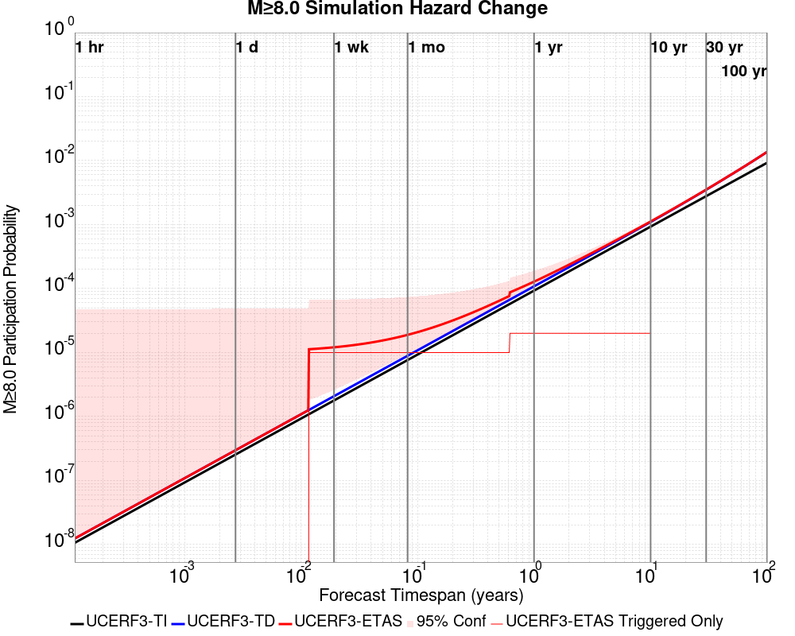

| Forecast Duration | UCERF3-ETAS [95% Conf] | UCERF3-ETAS Triggered Only | UCERF3-TD | UCERF3-ETAS/TD Gain | UCERF3-TI |
|-----|-----|-----|-----|-----|-----|
| 1 Hour | 1.24E-8 [1.24E-8 - 4.79E-5] | 0.000 | 1.24E-8 | 1 | 1.06E-8 |
| 1 Day | 2.97E-7 [2.97E-7 - 4.82E-5] | 0.000 | 2.97E-7 | 1 | 2.54E-7 |
| 1 Week | 1.21E-5 [2.60E-6 - 6.70E-5] | 1.00E-5 | 2.08E-6 | 5.81 | 1.78E-6 |
| 1 Month | 1.89E-5 [9.43E-6 - 7.39E-5] | 1.00E-5 | 8.90E-6 | 2.12 | 7.63E-6 |
| 1 Year | 1.28E-4 [1.12E-4 - 1.89E-4] | 2.00E-5 | 1.08E-4 | 1.18 | 9.29E-5 |
| 10 Years | 1.12E-3 [1.10E-3 - 1.18E-3] | 2.00E-5 | 1.10E-3 | 1.02 | 9.29E-4 |
| 30 Years | 3.52E-3 [3.51E-3 - 3.58E-3] \* | \* | 3.50E-3 | 1.01 \* | 2.78E-3 |
| 100 Years | 0.014 [0.014 - 0.014] \* | \* | 0.014 | 1 \* | 9.25E-3 |

\* *forecast duration is longer than simulation length, only ETAS ruptures from the first 10 years are included*

## Trigger Rupture Fault Map
*[(top)](#table-of-contents)*


## Fault Distances To Triggers
*[(top)](#table-of-contents)*

| Section Name | Strike, Dip, Rake | Hypocenter In Polygon? | Surface In Polygon? | Minimum Distance (km) | Minimum Poly Distance (km) |
|-----|-----|-----|-----|-----|-----|
| Airport Lake | 358, 50, -90 | false | false | 12.391 | 2.343 |
| Little Lake | 327, 90, 180 | false | false | 16.592 | 4.590 |
| Tank Canyon | 189, 50, -90 | false | false | 17.241 | 17.235 |

## Individual Simulated Catalog Maps
*[(top)](#table-of-contents)*

These are map plots of individual catalogs from the simulations, selected as the closest catalog to each of the given percentiles in terms of total number of events.

| Duration | p0.0 %-ile | p25.0 %-ile | p50.0 %-ile | p75.0 %-ile | p90.0 %-ile | p95.0 %-ile | p97.5 %-ile | p98.0 %-ile | p99.0 %-ile | p99.5 %-ile | p99.9 %-ile | p100.0 %-ile |
|-----|-----|-----|-----|-----|-----|-----|-----|-----|-----|-----|-----|-----|
| **1 Week** |  |  |  |  |  |  |  |  |  |  |  |  |
| **1 Month** |  |  |  |  |  |  |  |  |  |  |  |  |
| **1 Year** |  |  |  |  |  |  |  |  |  |  |  |  |
| **10 Year** |  |  |  |  |  |  |  |  |  |  |  |  |

## Section Participation
*[(top)](#table-of-contents)*

### Section Participation Plots
*[(top)](#table-of-contents)*

| Min Mag | 1 yr Triggered Ruptures (no spontaneous) | 10 yr Triggered Ruptures (no spontaneous) | 10 yr Triggered Ruptures (primary aftershocks only) |
|-----|-----|-----|-----|
| **All Supra. Seis.** | 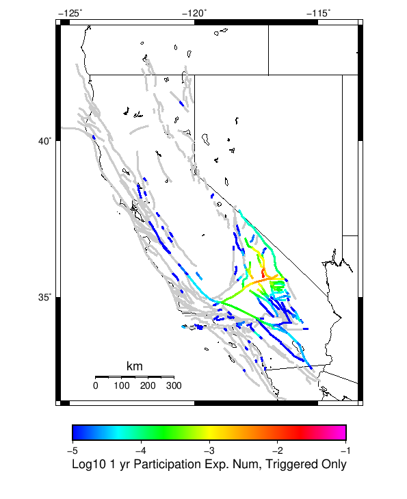 |  |  |
| **M&ge;6.5** | 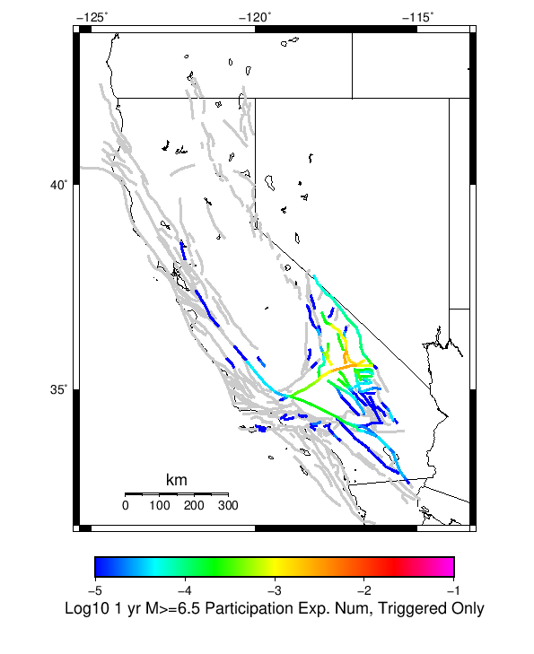 |  |  |
| **M&ge;7** |  |  | 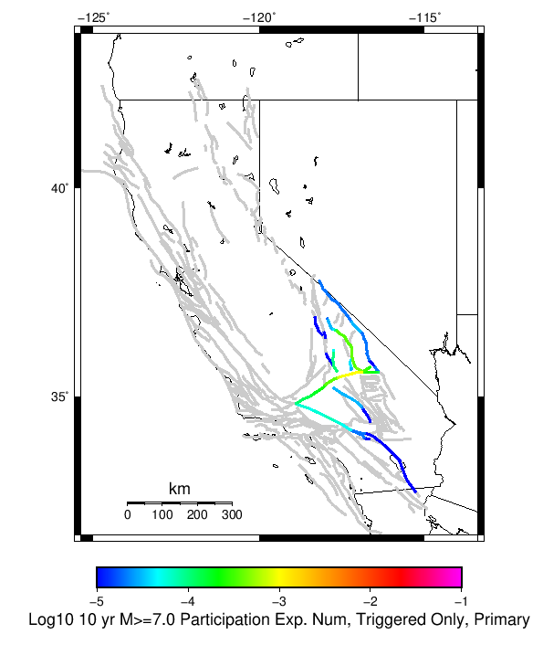 |
| **M&ge;7.5** | 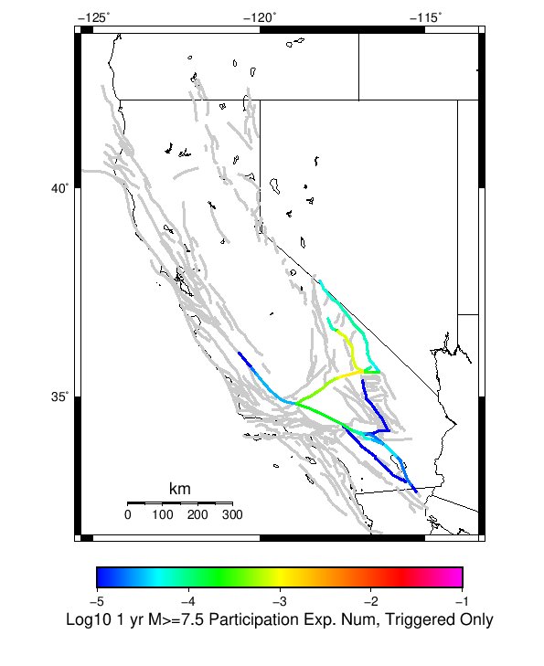 |  |  |
| **M&ge;8** |  |  | 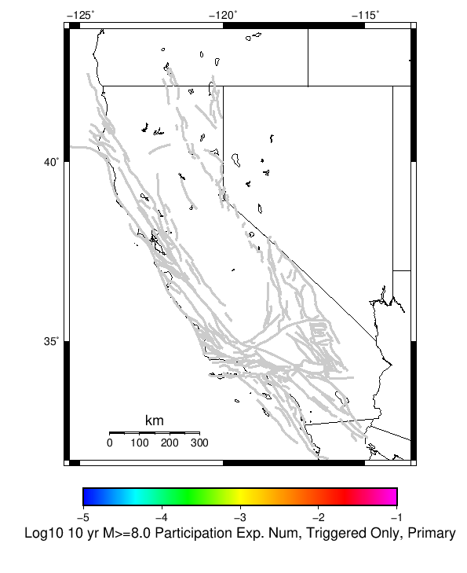 |

### Supra-Seismogenic Parent Sections Table
*[(top)](#table-of-contents)*

*First 10 of 128 with matching ruptures shown*

| Parent Name | Triggered 10 Year Mean Count | Triggered 1 Day Prob | Triggered 1 Day 95% Conf | Triggered 1 Week Prob | Triggered 1 Week 95% Conf | Triggered 1 Month Prob | Triggered 1 Month 95% Conf | Triggered 1 Year Prob | Triggered 1 Year 95% Conf | Triggered 10 Year Prob | Triggered 10 Year 95% Conf | Triggered 10 Year Primary Mean Count |
|-----|-----|-----|-----|-----|-----|-----|-----|-----|-----|-----|-----|-----|
| Tank Canyon | 0.03567 | 7.22E-3 (0.72%) | [0.67% 0.78%] | 0.011 (1.14%) | [1.07% 1.20%] | 0.015 (1.51%) | [1.44% 1.59%] | 0.022 (2.24%) | [2.15% 2.34%] | 0.031 (3.07%) | [2.96% 3.18%] | 0.00916 |
| Garlock (Central) | 0.00995 | 2.18E-3 (0.22%) | [0.19% 0.25%] | 3.36E-3 (0.34%) | [0.30% 0.37%] | 4.45E-3 (0.45%) | [0.41% 0.49%] | 6.84E-3 (0.68%) | [0.63% 0.74%] | 9.72E-3 (0.97%) | [0.91% 1.04%] | 0.00266 |
| Panamint Valley | 0.00505 | 9.10E-4 (0.09%) | [0.07% 0.11%] | 1.52E-3 (0.15%) | [0.13% 0.18%] | 2.13E-3 (0.21%) | [0.19% 0.24%] | 3.37E-3 (0.34%) | [0.30% 0.38%] | 5.00E-3 (0.50%) | [0.46% 0.55%] | 0.00118 |
| Owl Lake | 0.00458 | 9.10E-4 (0.09%) | [0.07% 0.11%] | 1.38E-3 (0.14%) | [0.12% 0.16%] | 1.87E-3 (0.19%) | [0.16% 0.22%] | 2.90E-3 (0.29%) | [0.26% 0.33%] | 3.97E-3 (0.40%) | [0.36% 0.44%] | 7.3E-4 |
| Little Lake | 0.00299 | 9.60E-4 (0.10%) | [0.08% 0.12%] | 1.36E-3 (0.14%) | [0.11% 0.16%] | 1.66E-3 (0.17%) | [0.14% 0.19%] | 2.35E-3 (0.24%) | [0.21% 0.27%] | 2.96E-3 (0.30%) | [0.26% 0.33%] | 0.00132 |
| Garlock (East) | 0.00278 | 4.60E-4 (0.05%) | [0.03% 0.06%] | 6.90E-4 (0.07%) | [0.05% 0.09%] | 1.00E-3 (0.10%) | [0.08% 0.12%] | 1.64E-3 (0.16%) | [0.14% 0.19%] | 2.52E-3 (0.25%) | [0.22% 0.29%] | 4.3E-4 |
| Blackwater | 0.00227 | 5.50E-4 (0.06%) | [0.04% 0.07%] | 8.90E-4 (0.09%) | [0.07% 0.11%] | 1.01E-3 (0.10%) | [0.08% 0.12%] | 1.60E-3 (0.16%) | [0.14% 0.19%] | 2.17E-3 (0.22%) | [0.19% 0.25%] | 6.2E-4 |
| Ash Hill | 0.00183 | 3.30E-4 (0.03%) | [0.02% 0.05%] | 5.90E-4 (0.06%) | [0.05% 0.08%] | 8.20E-4 (0.08%) | [0.07% 0.10%] | 1.28E-3 (0.13%) | [0.11% 0.15%] | 1.76E-3 (0.18%) | [0.15% 0.20%] | 3.7E-4 |
| Hunter Mountain-Saline Valley | 0.00144 | 2.90E-4 (0.03%) | [0.02% 0.04%] | 4.90E-4 (0.05%) | [0.04% 0.07%] | 6.70E-4 (0.07%) | [0.05% 0.09%] | 1.01E-3 (0.10%) | [0.08% 0.12%] | 1.41E-3 (0.14%) | [0.12% 0.17%] | 4.2E-4 |
| Gravel Hills-Harper Lk | 0.0013 | 2.40E-4 (0.02%) | [0.02% 0.04%] | 4.30E-4 (0.04%) | [0.03% 0.06%] | 6.40E-4 (0.06%) | [0.05% 0.08%] | 9.20E-4 (0.09%) | [0.07% 0.11%] | 1.24E-3 (0.12%) | [0.10% 0.15%] | 3.1E-4 |

### M≥6.5 Parent Sections Table
*[(top)](#table-of-contents)*

*First 10 of 98 with matching ruptures shown*

| Parent Name | Triggered 10 Year Mean Count | Triggered 1 Day Prob | Triggered 1 Day 95% Conf | Triggered 1 Week Prob | Triggered 1 Week 95% Conf | Triggered 1 Month Prob | Triggered 1 Month 95% Conf | Triggered 1 Year Prob | Triggered 1 Year 95% Conf | Triggered 10 Year Prob | Triggered 10 Year 95% Conf | Triggered 10 Year Primary Mean Count |
|-----|-----|-----|-----|-----|-----|-----|-----|-----|-----|-----|-----|-----|
| Panamint Valley | 0.0047 | 8.50E-4 (0.08%) | [0.07% 0.11%] | 1.43E-3 (0.14%) | [0.12% 0.17%] | 1.98E-3 (0.20%) | [0.17% 0.23%] | 3.19E-3 (0.32%) | [0.29% 0.36%] | 4.66E-3 (0.47%) | [0.43% 0.51%] | 0.00111 |
| Garlock (Central) | 0.00437 | 9.70E-4 (0.10%) | [0.08% 0.12%] | 1.51E-3 (0.15%) | [0.13% 0.18%] | 2.09E-3 (0.21%) | [0.18% 0.24%] | 3.16E-3 (0.32%) | [0.28% 0.35%] | 4.34E-3 (0.43%) | [0.39% 0.48%] | 0.00117 |
| Tank Canyon | 0.00421 | 8.50E-4 (0.08%) | [0.07% 0.11%] | 1.39E-3 (0.14%) | [0.12% 0.16%] | 1.89E-3 (0.19%) | [0.16% 0.22%] | 2.93E-3 (0.29%) | [0.26% 0.33%] | 4.18E-3 (0.42%) | [0.38% 0.46%] | 0.00116 |
| Owl Lake | 0.00192 | 4.70E-4 (0.05%) | [0.03% 0.06%] | 6.60E-4 (0.07%) | [0.05% 0.08%] | 8.80E-4 (0.09%) | [0.07% 0.11%] | 1.43E-3 (0.14%) | [0.12% 0.17%] | 1.92E-3 (0.19%) | [0.17% 0.22%] | 3.7E-4 |
| Garlock (East) | 0.00165 | 2.90E-4 (0.03%) | [0.02% 0.04%] | 4.60E-4 (0.05%) | [0.03% 0.06%] | 7.10E-4 (0.07%) | [0.06% 0.09%] | 1.05E-3 (0.10%) | [0.09% 0.13%] | 1.55E-3 (0.15%) | [0.13% 0.18%] | 3.0E-4 |
| Hunter Mountain-Saline Valley | 0.00138 | 2.60E-4 (0.03%) | [0.02% 0.04%] | 4.50E-4 (0.04%) | [0.03% 0.06%] | 6.30E-4 (0.06%) | [0.05% 0.08%] | 9.70E-4 (0.10%) | [0.08% 0.12%] | 1.36E-3 (0.14%) | [0.11% 0.16%] | 3.8E-4 |
| Little Lake | 0.0013 | 4.20E-4 (0.04%) | [0.03% 0.06%] | 6.10E-4 (0.06%) | [0.05% 0.08%] | 7.70E-4 (0.08%) | [0.06% 0.10%] | 1.07E-3 (0.11%) | [0.09% 0.13%] | 1.30E-3 (0.13%) | [0.11% 0.15%] | 5.4E-4 |
| Garlock (West) | 8.7E-4 | 2.00E-4 (0.02%) | [0.01% 0.03%] | 3.60E-4 (0.04%) | [0.03% 0.05%] | 4.40E-4 (0.04%) | [0.03% 0.06%] | 6.20E-4 (0.06%) | [0.05% 0.08%] | 8.70E-4 (0.09%) | [0.07% 0.11%] | 2.4E-4 |
| Airport Lake | 8.6E-4 | 2.80E-4 (0.03%) | [0.02% 0.04%] | 3.70E-4 (0.04%) | [0.03% 0.05%] | 4.90E-4 (0.05%) | [0.04% 0.07%] | 7.00E-4 (0.07%) | [0.05% 0.09%] | 8.60E-4 (0.09%) | [0.07% 0.11%] | 4.1E-4 |
| Death Valley (So) | 5.3E-4 | 7.00E-5 (0.01%) | [0.00% 0.02%] | 1.00E-4 (0.01%) | [0.01% 0.02%] | 2.00E-4 (0.02%) | [0.01% 0.03%] | 3.30E-4 (0.03%) | [0.02% 0.05%] | 5.10E-4 (0.05%) | [0.04% 0.07%] | 4.0E-5 |

### M≥7 Parent Sections Table
*[(top)](#table-of-contents)*

*First 10 of 56 with matching ruptures shown*

| Parent Name | Triggered 10 Year Mean Count | Triggered 1 Day Prob | Triggered 1 Day 95% Conf | Triggered 1 Week Prob | Triggered 1 Week 95% Conf | Triggered 1 Month Prob | Triggered 1 Month 95% Conf | Triggered 1 Year Prob | Triggered 1 Year 95% Conf | Triggered 10 Year Prob | Triggered 10 Year 95% Conf | Triggered 10 Year Primary Mean Count |
|-----|-----|-----|-----|-----|-----|-----|-----|-----|-----|-----|-----|-----|
| Garlock (Central) | 0.00384 | 8.50E-4 (0.08%) | [0.07% 0.11%] | 1.33E-3 (0.13%) | [0.11% 0.16%] | 1.83E-3 (0.18%) | [0.16% 0.21%] | 2.80E-3 (0.28%) | [0.25% 0.32%] | 3.83E-3 (0.38%) | [0.35% 0.42%] | 0.00106 |
| Panamint Valley | 0.00213 | 3.30E-4 (0.03%) | [0.02% 0.05%] | 5.70E-4 (0.06%) | [0.04% 0.07%] | 8.60E-4 (0.09%) | [0.07% 0.11%] | 1.43E-3 (0.14%) | [0.12% 0.17%] | 2.13E-3 (0.21%) | [0.19% 0.24%] | 4.7E-4 |
| Hunter Mountain-Saline Valley | 0.00131 | 2.40E-4 (0.02%) | [0.02% 0.04%] | 4.10E-4 (0.04%) | [0.03% 0.06%] | 5.90E-4 (0.06%) | [0.05% 0.08%] | 9.10E-4 (0.09%) | [0.07% 0.11%] | 1.30E-3 (0.13%) | [0.11% 0.15%] | 3.5E-4 |
| Owl Lake | 0.00123 | 3.20E-4 (0.03%) | [0.02% 0.05%] | 4.60E-4 (0.05%) | [0.03% 0.06%] | 5.70E-4 (0.06%) | [0.04% 0.07%] | 9.20E-4 (0.09%) | [0.07% 0.11%] | 1.23E-3 (0.12%) | [0.10% 0.15%] | 3.0E-4 |
| Garlock (East) | 0.00103 | 2.10E-4 (0.02%) | [0.01% 0.03%] | 3.40E-4 (0.03%) | [0.02% 0.05%] | 5.30E-4 (0.05%) | [0.04% 0.07%] | 7.10E-4 (0.07%) | [0.06% 0.09%] | 1.02E-3 (0.10%) | [0.08% 0.12%] | 2.5E-4 |
| Garlock (West) | 8.5E-4 | 2.00E-4 (0.02%) | [0.01% 0.03%] | 3.60E-4 (0.04%) | [0.03% 0.05%] | 4.30E-4 (0.04%) | [0.03% 0.06%] | 6.10E-4 (0.06%) | [0.05% 0.08%] | 8.50E-4 (0.08%) | [0.07% 0.11%] | 2.4E-4 |
| Tank Canyon | 3.8E-4 | 6.00E-5 (0.01%) | [0.00% 0.01%] | 1.00E-4 (0.01%) | [0.01% 0.02%] | 1.50E-4 (0.01%) | [0.01% 0.03%] | 2.20E-4 (0.02%) | [0.01% 0.03%] | 3.80E-4 (0.04%) | [0.03% 0.05%] | 4.0E-5 |
| San Andreas (Mojave N) | 3.2E-4 | 5.00E-5 (0.01%) | [0.00% 0.01%] | 1.30E-4 (0.01%) | [0.01% 0.02%] | 1.40E-4 (0.01%) | [0.01% 0.02%] | 2.10E-4 (0.02%) | [0.01% 0.03%] | 3.10E-4 (0.03%) | [0.02% 0.04%] | 6.0E-5 |
| San Andreas (Mojave S) | 3.0E-4 | 7.00E-5 (0.01%) | [0.00% 0.02%] | 1.40E-4 (0.01%) | [0.01% 0.02%] | 1.50E-4 (0.01%) | [0.01% 0.03%] | 2.30E-4 (0.02%) | [0.01% 0.04%] | 3.00E-4 (0.03%) | [0.02% 0.04%] | 7.0E-5 |
| Little Lake | 2.6E-4 | 1.00E-4 (0.01%) | [0.01% 0.02%] | 1.40E-4 (0.01%) | [0.01% 0.02%] | 1.70E-4 (0.02%) | [0.01% 0.03%] | 2.00E-4 (0.02%) | [0.01% 0.03%] | 2.60E-4 (0.03%) | [0.02% 0.04%] | 1.1E-4 |

### M≥7.5 Parent Sections Table
*[(top)](#table-of-contents)*

*First 10 of 38 with matching ruptures shown*

| Parent Name | Triggered 10 Year Mean Count | Triggered 1 Day Prob | Triggered 1 Day 95% Conf | Triggered 1 Week Prob | Triggered 1 Week 95% Conf | Triggered 1 Month Prob | Triggered 1 Month 95% Conf | Triggered 1 Year Prob | Triggered 1 Year 95% Conf | Triggered 10 Year Prob | Triggered 10 Year 95% Conf | Triggered 10 Year Primary Mean Count |
|-----|-----|-----|-----|-----|-----|-----|-----|-----|-----|-----|-----|-----|
| Garlock (Central) | 0.00174 | 4.00E-4 (0.04%) | [0.03% 0.06%] | 6.80E-4 (0.07%) | [0.05% 0.09%] | 8.60E-4 (0.09%) | [0.07% 0.11%] | 1.27E-3 (0.13%) | [0.11% 0.15%] | 1.74E-3 (0.17%) | [0.15% 0.20%] | 5.0E-4 |
| Hunter Mountain-Saline Valley | 0.00112 | 2.20E-4 (0.02%) | [0.01% 0.03%] | 3.60E-4 (0.04%) | [0.03% 0.05%] | 4.90E-4 (0.05%) | [0.04% 0.07%] | 8.00E-4 (0.08%) | [0.06% 0.10%] | 1.12E-3 (0.11%) | [0.09% 0.14%] | 3.2E-4 |
| Panamint Valley | 0.00112 | 2.20E-4 (0.02%) | [0.01% 0.03%] | 3.60E-4 (0.04%) | [0.03% 0.05%] | 4.90E-4 (0.05%) | [0.04% 0.07%] | 8.00E-4 (0.08%) | [0.06% 0.10%] | 1.12E-3 (0.11%) | [0.09% 0.14%] | 3.2E-4 |
| Garlock (West) | 7.5E-4 | 1.80E-4 (0.02%) | [0.01% 0.03%] | 3.30E-4 (0.03%) | [0.02% 0.05%] | 3.80E-4 (0.04%) | [0.03% 0.05%] | 5.40E-4 (0.05%) | [0.04% 0.07%] | 7.50E-4 (0.07%) | [0.06% 0.09%] | 1.9E-4 |
| Garlock (East) | 3.8E-4 | 1.00E-4 (0.01%) | [0.01% 0.02%] | 1.70E-4 (0.02%) | [0.01% 0.03%] | 2.00E-4 (0.02%) | [0.01% 0.03%] | 2.90E-4 (0.03%) | [0.02% 0.04%] | 3.80E-4 (0.04%) | [0.03% 0.05%] | 1.0E-4 |
| San Andreas (Mojave N) | 3.2E-4 | 5.00E-5 (0.01%) | [0.00% 0.01%] | 1.30E-4 (0.01%) | [0.01% 0.02%] | 1.40E-4 (0.01%) | [0.01% 0.02%] | 2.10E-4 (0.02%) | [0.01% 0.03%] | 3.10E-4 (0.03%) | [0.02% 0.04%] | 6.0E-5 |
| San Andreas (Mojave S) | 2.8E-4 | 5.00E-5 (0.01%) | [0.00% 0.01%] | 1.20E-4 (0.01%) | [0.01% 0.02%] | 1.30E-4 (0.01%) | [0.01% 0.02%] | 2.10E-4 (0.02%) | [0.01% 0.03%] | 2.80E-4 (0.03%) | [0.02% 0.04%] | 6.0E-5 |
| San Andreas (San Bernardino N) | 2.1E-4 | 4.00E-5 (0.00%) | [0.00% 0.01%] | 1.00E-4 (0.01%) | [0.01% 0.02%] | 1.10E-4 (0.01%) | [0.01% 0.02%] | 1.60E-4 (0.02%) | [0.01% 0.03%] | 2.10E-4 (0.02%) | [0.01% 0.03%] | 4.0E-5 |
| Owl Lake | 2.0E-4 | 4.00E-5 (0.00%) | [0.00% 0.01%] | 7.00E-5 (0.01%) | [0.00% 0.02%] | 8.00E-5 (0.01%) | [0.00% 0.02%] | 1.30E-4 (0.01%) | [0.01% 0.02%] | 2.00E-4 (0.02%) | [0.01% 0.03%] | 4.0E-5 |
| San Andreas (San Bernardino S) | 1.3E-4 | 2.00E-5 (0.00%) | [0.00% 0.01%] | 5.00E-5 (0.01%) | [0.00% 0.01%] | 5.00E-5 (0.01%) | [0.00% 0.01%] | 9.00E-5 (0.01%) | [0.00% 0.02%] | 1.30E-4 (0.01%) | [0.01% 0.02%] | 2.0E-5 |

### M≥8 Parent Sections Table
*[(top)](#table-of-contents)*

*First 10 of 22 with matching ruptures shown*

| Parent Name | Triggered 10 Year Mean Count | Triggered 1 Day Prob | Triggered 1 Day 95% Conf | Triggered 1 Week Prob | Triggered 1 Week 95% Conf | Triggered 1 Month Prob | Triggered 1 Month 95% Conf | Triggered 1 Year Prob | Triggered 1 Year 95% Conf | Triggered 10 Year Prob | Triggered 10 Year 95% Conf | Triggered 10 Year Primary Mean Count |
|-----|-----|-----|-----|-----|-----|-----|-----|-----|-----|-----|-----|-----|
| San Andreas (Mojave N) | 4.0E-5 | 0.000 (0.00%) | [0.00% 0.00%] | 2.00E-5 (0.00%) | [0.00% 0.01%] | 2.00E-5 (0.00%) | [0.00% 0.01%] | 3.00E-5 (0.00%) | [0.00% 0.01%] | 4.00E-5 (0.00%) | [0.00% 0.01%] | 0.0 |
| San Andreas (Mojave S) | 4.0E-5 | 0.000 (0.00%) | [0.00% 0.00%] | 2.00E-5 (0.00%) | [0.00% 0.01%] | 2.00E-5 (0.00%) | [0.00% 0.01%] | 3.00E-5 (0.00%) | [0.00% 0.01%] | 4.00E-5 (0.00%) | [0.00% 0.01%] | 0.0 |
| San Andreas (San Bernardino N) | 4.0E-5 | 0.000 (0.00%) | [0.00% 0.00%] | 2.00E-5 (0.00%) | [0.00% 0.01%] | 2.00E-5 (0.00%) | [0.00% 0.01%] | 3.00E-5 (0.00%) | [0.00% 0.01%] | 4.00E-5 (0.00%) | [0.00% 0.01%] | 0.0 |
| San Andreas (San Bernardino S) | 3.0E-5 | 0.000 (0.00%) | [0.00% 0.00%] | 1.00E-5 (0.00%) | [0.00% 0.01%] | 1.00E-5 (0.00%) | [0.00% 0.01%] | 2.00E-5 (0.00%) | [0.00% 0.01%] | 3.00E-5 (0.00%) | [0.00% 0.01%] | 0.0 |
| San Andreas (San Gorgonio Pass-Garnet HIll) | 3.0E-5 | 0.000 (0.00%) | [0.00% 0.00%] | 1.00E-5 (0.00%) | [0.00% 0.01%] | 1.00E-5 (0.00%) | [0.00% 0.01%] | 2.00E-5 (0.00%) | [0.00% 0.01%] | 3.00E-5 (0.00%) | [0.00% 0.01%] | 0.0 |
| Garlock (Central) | 2.0E-5 | 0.000 (0.00%) | [0.00% 0.00%] | 1.00E-5 (0.00%) | [0.00% 0.01%] | 1.00E-5 (0.00%) | [0.00% 0.01%] | 2.00E-5 (0.00%) | [0.00% 0.01%] | 2.00E-5 (0.00%) | [0.00% 0.01%] | 0.0 |
| Garlock (East) | 2.0E-5 | 0.000 (0.00%) | [0.00% 0.00%] | 1.00E-5 (0.00%) | [0.00% 0.01%] | 1.00E-5 (0.00%) | [0.00% 0.01%] | 2.00E-5 (0.00%) | [0.00% 0.01%] | 2.00E-5 (0.00%) | [0.00% 0.01%] | 0.0 |
| Garlock (West) | 2.0E-5 | 0.000 (0.00%) | [0.00% 0.00%] | 1.00E-5 (0.00%) | [0.00% 0.01%] | 1.00E-5 (0.00%) | [0.00% 0.01%] | 2.00E-5 (0.00%) | [0.00% 0.01%] | 2.00E-5 (0.00%) | [0.00% 0.01%] | 0.0 |
| San Andreas (Big Bend) | 2.0E-5 | 0.000 (0.00%) | [0.00% 0.00%] | 1.00E-5 (0.00%) | [0.00% 0.01%] | 1.00E-5 (0.00%) | [0.00% 0.01%] | 1.00E-5 (0.00%) | [0.00% 0.01%] | 2.00E-5 (0.00%) | [0.00% 0.01%] | 0.0 |
| San Andreas (Carrizo) rev | 2.0E-5 | 0.000 (0.00%) | [0.00% 0.00%] | 1.00E-5 (0.00%) | [0.00% 0.01%] | 1.00E-5 (0.00%) | [0.00% 0.01%] | 1.00E-5 (0.00%) | [0.00% 0.01%] | 2.00E-5 (0.00%) | [0.00% 0.01%] | 0.0 |

## Fault Magnitude-Probability Distributions
*[(top)](#table-of-contents)*

The first 5 sections (sorted by trigger rate) are plotted below. All fault MPDs are available [here](plots/parent_sect_mpds/README.md)

| 1 Week | 1 Month | 1 Year | 10 Year |
|-----|-----|-----|-----|
|  |  |  | 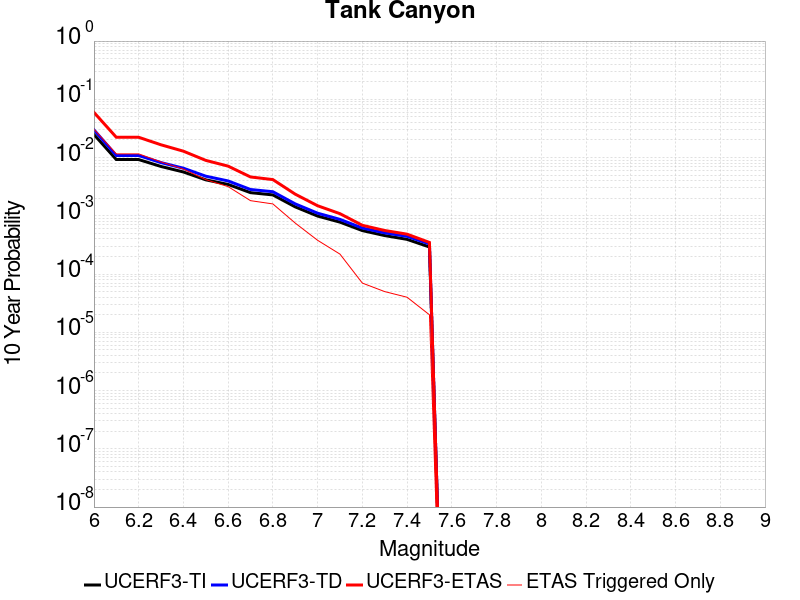 |
|  |  | 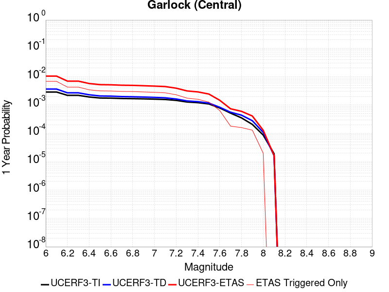 |  |
| 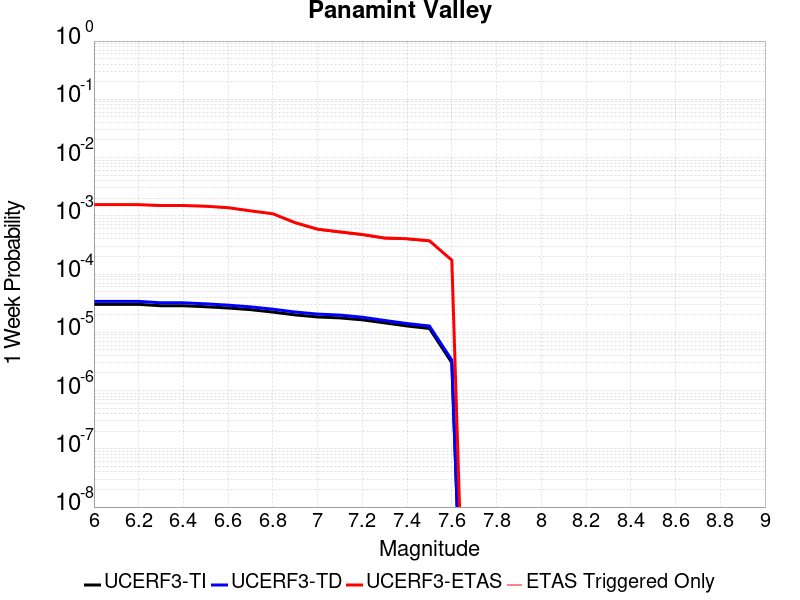 | 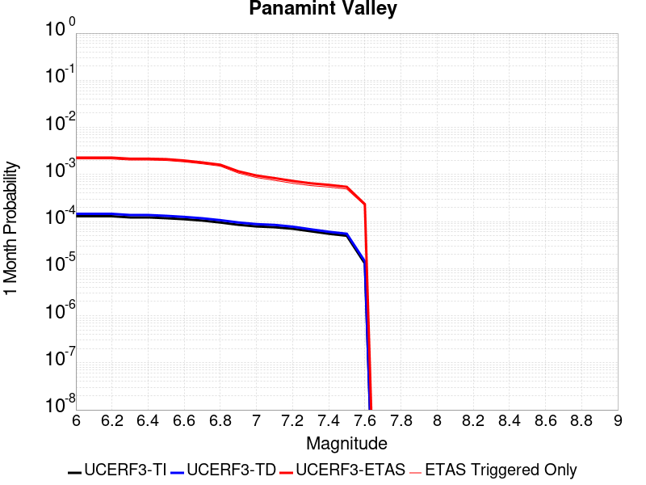 |  |  |
|  |  |  |  |
|  |  |  |  |

## Gridded Nucleation
*[(top)](#table-of-contents)*

| Min Mag | Triggered Ruptures (no spontaneous) | Triggered Ruptures (primary aftershocks only) |
|-----|-----|-----|
| **M&ge;2.5** |  |  |
| **M&ge;5** |  |  |
| **M&ge;6** |  |  |
| **M&ge;7** |  |  |


## JSON Input File
*[(top)](#table-of-contents)*

```
{
  "numSimulations": 100000,
  "duration": 10.0,
  "startTimeMillis": 1562261628000,
  "includeSpontaneous": false,
  "randomSeed": 123456789,
  "binaryOutput": true,
  "binaryOutputFilters": [
    {
      "prefix": "results_complete",
      "descendantsOnly": false
    },
    {
      "prefix": "results_m5_preserve_chain",
      "minMag": 5.0,
      "preserveChainBelowMag": true,
      "descendantsOnly": false
    },
    {
      "prefix": "results_triggered_descendants",
      "descendantsOnly": true
    }
  ],
  "forceRecalc": false,
  "reuseERFs": true,
  "simulationName": "Searles Valley M6.4",
  "numRetries": 3,
  "outputDir": "${ETAS_SIM_DIR}/2019_07_04-SearlesValleyM64-includeSpont-full_td-10yr",
  "triggerRuptures": [
    {
      "mag": 6.4,
      "latitude": 35.705,
      "longitude": -117.508,
      "depth": 8.7
    }
  ],
  "cacheDir": "${ETAS_LAUNCHER}/inputs/cache_fm3p1_ba",
  "fssFile": "${ETAS_LAUNCHER}/inputs/2013_05_10-ucerf3p3-production-10runs_COMPOUND_SOL_FM3_1_SpatSeisU3_MEAN_BRANCH_AVG_SOL.zip",
  "probModel": "FULL_TD",
  "applySubSeisForSupraNucl": true,
  "totRateScaleFactor": 1.14,
  "gridSeisCorr": true,
  "timeIndependentERF": false,
  "griddedOnly": false,
  "imposeGR": false,
  "includeIndirectTriggering": true,
  "gridSeisDiscr": 0.1,
  "catalogCompletenessModel": "RELAXED"
}
```

