# Parent Section Magnitude-Probability Distributions

Only fault sections with at least one triggered aftershock are plotted. Sections are sorted by total supraseismogenic trigger rate (decreasing)

## Table Of Contents

* [Tank Canyon](#tank-canyon)
* [Garlock (Central)](#garlock-central)
* [Panamint Valley](#panamint-valley)
* [Owl Lake](#owl-lake)
* [Little Lake](#little-lake)
* [Garlock (East)](#garlock-east)
* [Blackwater](#blackwater)
* [Ash Hill](#ash-hill)
* [Hunter Mountain-Saline Valley](#hunter-mountain-saline-valley)
* [Gravel Hills-Harper Lk](#gravel-hills-harper-lk)
* [Airport Lake](#airport-lake)
* [Goldstone Lake](#goldstone-lake)
* [Garlock (West)](#garlock-west)
* [McLean Lake](#mclean-lake)
* [Coyote Canyon](#coyote-canyon)
* [Lenwood-Lockhart-Old Woman Springs](#lenwood-lockhart-old-woman-springs)
* [San Andreas (Mojave S)](#san-andreas-mojave-s)
* [Death Valley (So)](#death-valley-so)
* [Nelson Lake](#nelson-lake)
* [So Sierra Nevada](#so-sierra-nevada)
* [Bicycle Lake](#bicycle-lake)
* [San Andreas (Mojave N)](#san-andreas-mojave-n)
* [Paradise](#paradise)
* [Towne Pass](#towne-pass)
* [Garlic Springs](#garlic-springs)
* [San Andreas (San Bernardino N)](#san-andreas-san-bernardino-n)
* [San Andreas (San Bernardino S)](#san-andreas-san-bernardino-s)
* [Death Valley (Black Mtns Frontal)](#death-valley-black-mtns-frontal)
* [Coyote Lake](#coyote-lake)
* [Helendale-So Lockhart](#helendale-so-lockhart)
* [Death Valley (No)](#death-valley-no)
* [San Andreas (Big Bend)](#san-andreas-big-bend)
* [Cady](#cady)
* [Elsinore (Glen Ivy) rev](#elsinore-glen-ivy-rev)
* [Red Pass](#red-pass)
* [Death Valley (Fish Lake Valley)](#death-valley-fish-lake-valley)
* [Manix-Afton Hills](#manix-afton-hills)
* [Cleghorn Lake](#cleghorn-lake)
* [San Andreas (North Branch Mill Creek)](#san-andreas-north-branch-mill-creek)
* [San Andreas (San Gorgonio Pass-Garnet HIll)](#san-andreas-san-gorgonio-pass-garnet-hill)
* [Cleghorn Pass](#cleghorn-pass)
* [San Andreas (Cholame) rev](#san-andreas-cholame-rev)
* [San Andreas (Carrizo) rev](#san-andreas-carrizo-rev)
* [San Andreas (Parkfield)](#san-andreas-parkfield)
* [Lost Hills](#lost-hills)
* [San Andreas (Coachella) rev](#san-andreas-coachella-rev)
* [San Andreas (Creeping Section) 2011 CFM](#san-andreas-creeping-section-2011-cfm)
* [Baker](#baker)
* [White Wolf (Extension)](#white-wolf-extension)
* [Rose Canyon](#rose-canyon)
* [White Mountains](#white-mountains)
* [Ludlow](#ludlow)
* [Brawley (Seismic Zone) alt 1](#brawley-seismic-zone-alt-1)
* [Imperial](#imperial)
* [Sierra Nevada  (No Extension)](#sierra-nevada--no-extension)
* [Sheephole](#sheephole)
* [Calico-Hidalgo](#calico-hidalgo)
* [Santa Rosa Island](#santa-rosa-island)
* [Santa Ynez (East)](#santa-ynez-east)
* [Independence rev 2011](#independence-rev-2011)
* [Dry Mountain](#dry-mountain)
* [Ortigalita (South)](#ortigalita-south)
* [Pinto Mtn](#pinto-mtn)
* [Calaveras (So) - Paicines extension 2011 CFM](#calaveras-so---paicines-extension-2011-cfm)
* [Elysian Park (Upper)](#elysian-park-upper)
* [Oceanic - West Huasna](#oceanic---west-huasna)
* [Cleghorn](#cleghorn)
* [Camp Rock 2011](#camp-rock-2011)
* [Pisgah-Bullion Mtn-Mesquite Lk](#pisgah-bullion-mtn-mesquite-lk)
* [Big Pine (East)](#big-pine-east)
* [Santa Cruz Island](#santa-cruz-island)
* [Raymond](#raymond)
* [Bullion Mountains](#bullion-mountains)
* [Superstition Hills](#superstition-hills)
* [Robinson Creek](#robinson-creek)
* [King Range 2011 CFM](#king-range-2011-cfm)
* [Emerson-Copper Mtn 2011](#emerson-copper-mtn-2011)
* [Newport-Inglewood (Offshore)](#newport-inglewood-offshore)
* [San Jacinto (Anza) rev](#san-jacinto-anza-rev)
* [Rinconada 2011 CFM](#rinconada-2011-cfm)
* [San Jose](#san-jose)
* [Santa Susana East (connector)](#santa-susana-east-connector)
* [Kern Canyon (North Kern) 2011](#kern-canyon-north-kern-2011)
* [Cucamonga](#cucamonga)
* [San Clemente](#san-clemente)
* [Santa Susana alt 1](#santa-susana-alt-1)
* [San Gabriel (Extension)](#san-gabriel-extension)
* [Great Valley 04b Gordon Valley](#great-valley-04b-gordon-valley)
* [Channel Islands Thrust](#channel-islands-thrust)
* [San Pedro Basin](#san-pedro-basin)
* [San Jacinto (San Bernardino)](#san-jacinto-san-bernardino)
* [Calaveras (So) 2011 CFM](#calaveras-so-2011-cfm)
* [Hayward (So) extension 2011 CFM](#hayward-so-extension-2011-cfm)
* [Blue Cut](#blue-cut)
* [Owens Valley](#owens-valley)
* [San Diego Trough north alt1](#san-diego-trough-north-alt1)
* [Calaveras (Central) 2011 CFM](#calaveras-central-2011-cfm)
* [San Juan](#san-juan)
* [Great Valley 05 Pittsburg - Kirby Hills alt1](#great-valley-05-pittsburg---kirby-hills-alt1)
* [Deep Springs](#deep-springs)
* [Great Valley 09 (Laguna Seca)](#great-valley-09-laguna-seca)
* [Coronado Bank alt1](#coronado-bank-alt1)
* [Great Valley 07 (Orestimba)](#great-valley-07-orestimba)
* [Hosgri](#hosgri)
* [San Jacinto (Borrego)](#san-jacinto-borrego)
* [Green Valley 2011 CFM](#green-valley-2011-cfm)
* [Mission Creek](#mission-creek)
* [Hunting Creek - Berryessa 2011 CFM](#hunting-creek---berryessa-2011-cfm)
* [Simi-Santa Rosa](#simi-santa-rosa)
* [Puente Hills](#puente-hills)
* [San Jacinto (San Jacinto Valley) rev](#san-jacinto-san-jacinto-valley-rev)
* [Ortigalita (North)](#ortigalita-north)
* [Great Valley 06 (Midland) 2011 CFM alt1](#great-valley-06-midland-2011-cfm-alt1)
* [San Gabriel](#san-gabriel)
* [Ventura-Pitas Point](#ventura-pitas-point)
* [Lake Isabella (Seismicity)](#lake-isabella-seismicity)
* [Great Valley 03a Dunnigan Hills](#great-valley-03a-dunnigan-hills)
* [Pine Mtn](#pine-mtn)
* [Likely 2011 CFM](#likely-2011-cfm)
* [San Jacinto (Stepovers Combined)](#san-jacinto-stepovers-combined)
* [San Jacinto (Superstition Mtn)](#san-jacinto-superstition-mtn)
* [Big Pine (Central)](#big-pine-central)
* [San Jacinto (Coyote Creek)](#san-jacinto-coyote-creek)
* [Oak Ridge (Onshore)](#oak-ridge-onshore)
* [Elsinore (Stepovers Combined)](#elsinore-stepovers-combined)
* [Gillem - Big Crack 2011 CFM](#gillem---big-crack-2011-cfm)
* [Chino alt 1](#chino-alt-1)
* [Palos Verdes](#palos-verdes)

## Tank Canyon
*[(top)](#table-of-contents)*

| 1 Year | 10 Year |
|-----|-----|
|  |  |

| Magnitude | 1 yr TI Prob | TD Prob | ETAS Prob | ETAS/TD Gain | ETAS Triggered Only | 10 yr TI Prob | TD Prob | ETAS Prob | ETAS/TD Gain | ETAS Triggered Only |
|-----|-----|-----|-----|-----|-----|-----|-----|-----|-----|-----|
| 6.0 | 0.0025163088 | 0.0030207448 | 0.025392959 | 8.406192 | 0.02244 | 0.02488006 | 0.029863482 | 0.059636973 | 1.9969865 | 0.03069 |
| 6.1 | 9.281647E-4 | 0.0010885935 | 0.009389548 | 8.625393 | 0.00831 | 0.009242975 | 0.010836697 | 0.022291208 | 2.0570111 | 0.01158 |
| 6.2 | 9.281647E-4 | 0.0010885935 | 0.009389548 | 8.625393 | 0.00831 | 0.009242975 | 0.010836697 | 0.022291208 | 2.0570111 | 0.01158 |
| 6.3 | 7.049971E-4 | 8.220024E-4 | 0.0066771857 | 8.123073 | 0.00586 | 0.007027647 | 0.008192232 | 0.016553171 | 2.0205936 | 0.00843 |
| 6.4 | 5.67031E-4 | 6.581944E-4 | 0.005075285 | 7.710921 | 0.00442 | 0.005655863 | 0.006564466 | 0.012862847 | 1.959466 | 0.00634 |
| 6.5 | 4.1550855E-4 | 4.797359E-4 | 0.0034083303 | 7.104597 | 0.00293 | 0.0041473247 | 0.0047883047 | 0.00894829 | 1.8687804 | 0.00418 |
| 6.6 | 3.4597394E-4 | 3.9713003E-4 | 0.0026662285 | 6.7137423 | 0.00227 | 0.0034543579 | 0.0039653555 | 0.0071227853 | 1.7962539 | 0.00317 |
| 6.7 | 2.500958E-4 | 2.8333522E-4 | 0.0014929924 | 5.2693496 | 0.00121 | 0.0024981452 | 0.0028304325 | 0.004645281 | 1.6411912 | 0.00182 |
| 6.8 | 2.286638E-4 | 2.5925972E-4 | 0.0013389797 | 5.164627 | 0.00108 | 0.0022842865 | 0.0025902467 | 0.004186102 | 1.6161017 | 0.0016 |
| 6.9 | 1.4241673E-4 | 1.6036142E-4 | 6.4028444E-4 | 3.9927585 | 4.8E-4 | 0.001423255 | 0.0016026229 | 0.002351421 | 1.4672328 | 7.5E-4 |
| 7.0 | 9.90685E-5 | 1.1097519E-4 | 3.3095077E-4 | 2.9822052 | 2.2E-4 | 9.902435E-4 | 0.0011092664 | 0.0014888449 | 1.3421887 | 3.8E-4 |
| 7.1 | 7.789434E-5 | 8.682861E-5 | 1.8681992E-4 | 2.1515942 | 1.0E-4 | 7.786704E-4 | 8.680047E-4 | 0.0010878138 | 1.2532349 | 2.2E-4 |
| 7.2 | 5.5781646E-5 | 6.1718434E-5 | 9.171658E-5 | 1.4860485 | 3.0E-5 | 5.576765E-4 | 6.1706523E-4 | 6.87022E-4 | 1.1133702 | 7.0E-5 |
| 7.3 | 4.579376E-5 | 5.097772E-5 | 7.0976705E-5 | 1.3923082 | 2.0E-5 | 4.5784327E-4 | 5.097113E-4 | 5.596858E-4 | 1.0980448 | 5.0E-5 |
| 7.4 | 3.9431678E-5 | 4.4404784E-5 | 6.4403896E-5 | 1.4503819 | 2.0E-5 | 3.942468E-4 | 4.4401E-4 | 4.8399222E-4 | 1.0900481 | 4.0E-5 |
| 7.5 | 2.915522E-5 | 3.290179E-5 | 3.290179E-5 | 1.0 | 0.0 | 2.9151395E-4 | 3.2901787E-4 | 3.490113E-4 | 1.0607669 | 2.0E-5 |

## Garlock (Central)
*[(top)](#table-of-contents)*

| 1 Year | 10 Year |
|-----|-----|
|  | 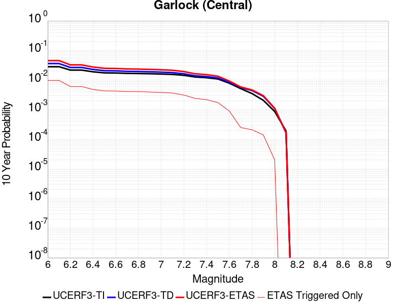 |

| Magnitude | 1 yr TI Prob | TD Prob | ETAS Prob | ETAS/TD Gain | ETAS Triggered Only | 10 yr TI Prob | TD Prob | ETAS Prob | ETAS/TD Gain | ETAS Triggered Only |
|-----|-----|-----|-----|-----|-----|-----|-----|-----|-----|-----|
| 6.0 | 0.0028726095 | 0.0036588025 | 0.010473777 | 2.8626242 | 0.00684 | 0.028357591 | 0.03607921 | 0.04544852 | 1.2596872 | 0.00972 |
| 6.1 | 0.0028726095 | 0.0036588025 | 0.010473777 | 2.8626242 | 0.00684 | 0.028357591 | 0.03607921 | 0.04544852 | 1.2596872 | 0.00972 |
| 6.2 | 0.0021976046 | 0.0026920384 | 0.00697049 | 2.589298 | 0.00429 | 0.021759989 | 0.02668921 | 0.032568008 | 1.2202687 | 0.00604 |
| 6.3 | 0.0021976046 | 0.0026920384 | 0.00697049 | 2.589298 | 0.00429 | 0.021759989 | 0.02668921 | 0.032568008 | 1.2202687 | 0.00604 |
| 6.4 | 0.0019213937 | 0.0022990005 | 0.005731092 | 2.4928625 | 0.00344 | 0.019048655 | 0.022848397 | 0.027558267 | 1.2061357 | 0.00482 |
| 6.5 | 0.0017683565 | 0.0020859186 | 0.005239327 | 2.5117602 | 0.00316 | 0.017543508 | 0.02075933 | 0.025009234 | 1.2047226 | 0.00434 |
| 6.6 | 0.0017502342 | 0.002057497 | 0.0051710773 | 2.5132856 | 0.00312 | 0.017365133 | 0.020480646 | 0.024672989 | 1.2046977 | 0.00428 |
| 6.7 | 0.0016985617 | 0.0019854472 | 0.0049994513 | 2.5180478 | 0.00302 | 0.016856372 | 0.019773284 | 0.023811819 | 1.204242 | 0.00412 |
| 6.8 | 0.0016780337 | 0.0019556184 | 0.004939771 | 2.5259383 | 0.00299 | 0.016654192 | 0.019480087 | 0.023480607 | 1.2053647 | 0.00408 |
| 6.9 | 0.0016503202 | 0.0019141936 | 0.0047986615 | 2.506884 | 0.00289 | 0.01638118 | 0.01907272 | 0.022947384 | 1.2031521 | 0.00395 |
| 7.0 | 0.0016112428 | 0.0018571776 | 0.0046519777 | 2.5048642 | 0.0028 | 0.015996104 | 0.018511891 | 0.02227099 | 1.2030641 | 0.00383 |
| 7.1 | 0.0015677959 | 0.0017929208 | 0.004478098 | 2.4976552 | 0.00269 | 0.01556781 | 0.017879557 | 0.021464298 | 1.2004937 | 0.00365 |
| 7.2 | 0.0014577188 | 0.0016308852 | 0.003927134 | 2.407977 | 0.0023 | 0.014481937 | 0.016283188 | 0.019352384 | 1.1884887 | 0.00312 |
| 7.3 | 0.0012785783 | 0.0013929547 | 0.003140517 | 2.2545722 | 0.00175 | 0.012712469 | 0.013927576 | 0.01630401 | 1.170628 | 0.00241 |
| 7.4 | 0.0012111551 | 0.0013139893 | 0.0029019 | 2.2084656 | 0.00159 | 0.012045753 | 0.013145258 | 0.015296601 | 1.1636593 | 0.00218 |
| 7.5 | 0.0010939965 | 0.0011724597 | 0.0024409706 | 2.081923 | 0.00127 | 0.010886264 | 0.01173992 | 0.0134594925 | 1.1464722 | 0.00174 |
| 7.6 | 7.882459E-4 | 8.3403E-4 | 0.0014734962 | 1.7667185 | 6.4E-4 | 0.007854558 | 0.008383143 | 0.0092755975 | 1.1064583 | 9.0E-4 |
| 7.7 | 5.182138E-4 | 5.5701344E-4 | 7.369132E-4 | 1.3229719 | 1.8E-4 | 0.00517007 | 0.0056272964 | 0.0058758897 | 1.0441763 | 2.5E-4 |
| 7.8 | 3.5247262E-4 | 4.3965803E-4 | 5.995877E-4 | 1.3637592 | 1.6E-4 | 0.0035191406 | 0.0044463384 | 0.004655405 | 1.0470198 | 2.1E-4 |
| 7.9 | 2.0741238E-4 | 2.801949E-4 | 4.1015845E-4 | 1.4638327 | 1.3E-4 | 0.002072189 | 0.002833435 | 0.0029730385 | 1.04927 | 1.4E-4 |
| 8.0 | 8.7288594E-5 | 1.08389286E-4 | 1.2838712E-4 | 1.1845001 | 2.0E-5 | 8.7254314E-4 | 0.0010968668 | 0.0011168448 | 1.0182137 | 2.0E-5 |
| 8.1 | 1.9166706E-5 | 1.6429933E-5 | 1.6429933E-5 | 1.0 | 0.0 | 1.9165053E-4 | 1.6637788E-4 | 1.6637788E-4 | 1.0 | 0.0 |

## Panamint Valley
*[(top)](#table-of-contents)*

| 1 Year | 10 Year |
|-----|-----|
|  |  |

| Magnitude | 1 yr TI Prob | TD Prob | ETAS Prob | ETAS/TD Gain | ETAS Triggered Only | 10 yr TI Prob | TD Prob | ETAS Prob | ETAS/TD Gain | ETAS Triggered Only |
|-----|-----|-----|-----|-----|-----|-----|-----|-----|-----|-----|
| 6.0 | 0.0015751923 | 0.0017717453 | 0.0051357746 | 2.8987093 | 0.00337 | 0.015640736 | 0.017583055 | 0.02249514 | 1.2793647 | 0.005 |
| 6.1 | 0.0015751923 | 0.0017717453 | 0.0051357746 | 2.8987093 | 0.00337 | 0.015640736 | 0.017583055 | 0.02249514 | 1.2793647 | 0.005 |
| 6.2 | 0.0015751923 | 0.0017717453 | 0.0051357746 | 2.8987093 | 0.00337 | 0.015640736 | 0.017583055 | 0.02249514 | 1.2793647 | 0.005 |
| 6.3 | 0.001489857 | 0.0016737186 | 0.004908296 | 2.9325693 | 0.00324 | 0.01479908 | 0.016617723 | 0.021298623 | 1.2816812 | 0.00476 |
| 6.4 | 0.001489857 | 0.0016737186 | 0.004908296 | 2.9325693 | 0.00324 | 0.01479908 | 0.016617723 | 0.021298623 | 1.2816812 | 0.00476 |
| 6.5 | 0.0014322745 | 0.0016073369 | 0.0047922097 | 2.9814591 | 0.00319 | 0.014230782 | 0.015963601 | 0.020549212 | 1.2872541 | 0.00466 |
| 6.6 | 0.0013628257 | 0.0015252318 | 0.004560595 | 2.9900997 | 0.00304 | 0.013544982 | 0.0151539715 | 0.019526688 | 1.2885525 | 0.00444 |
| 6.7 | 0.0012775084 | 0.0014256539 | 0.0041617476 | 2.919185 | 0.00274 | 0.012701893 | 0.014171205 | 0.018153954 | 1.2810451 | 0.00404 |
| 6.8 | 0.0011600169 | 0.0013002817 | 0.003727122 | 2.8663957 | 0.00243 | 0.011539802 | 0.012932454 | 0.016466156 | 1.273243 | 0.00358 |
| 6.9 | 0.0010379635 | 0.0011624249 | 0.0029403558 | 2.5295017 | 0.00178 | 0.010331288 | 0.011568548 | 0.014168123 | 1.2247106 | 0.00263 |
| 7.0 | 9.5722964E-4 | 0.001072563 | 0.0025010293 | 2.331825 | 0.00143 | 0.009531168 | 0.010678793 | 0.0127860475 | 1.1973307 | 0.00213 |
| 7.1 | 9.2145515E-4 | 0.0010311981 | 0.0023098781 | 2.2399945 | 0.00128 | 0.009176437 | 0.010269018 | 0.012149506 | 1.1831225 | 0.0019 |
| 7.2 | 8.544101E-4 | 9.4704475E-4 | 0.0020360125 | 2.1498587 | 0.00109 | 0.008511325 | 0.009434741 | 0.0109701175 | 1.1627364 | 0.00155 |
| 7.3 | 7.57377E-4 | 8.327807E-4 | 0.0017620062 | 2.1158106 | 9.3E-4 | 0.0075480095 | 0.008299708 | 0.0096285865 | 1.1601114 | 0.00134 |
| 7.4 | 6.7039346E-4 | 7.378333E-4 | 0.0015872061 | 2.1511717 | 8.5E-4 | 0.0066837464 | 0.0073567564 | 0.008547928 | 1.1619154 | 0.0012 |
| 7.5 | 6.070656E-4 | 6.6959887E-4 | 0.0014690632 | 2.1939452 | 8.0E-4 | 0.006054099 | 0.0066787098 | 0.0077912295 | 1.1665771 | 0.00112 |
| 7.6 | 1.5687906E-4 | 1.7390434E-4 | 4.7385215E-4 | 2.7247863 | 3.0E-4 | 0.0015676835 | 0.0017391219 | 0.0021583915 | 1.2410812 | 4.2E-4 |

## Owl Lake
*[(top)](#table-of-contents)*

| 1 Year | 10 Year |
|-----|-----|
|  | 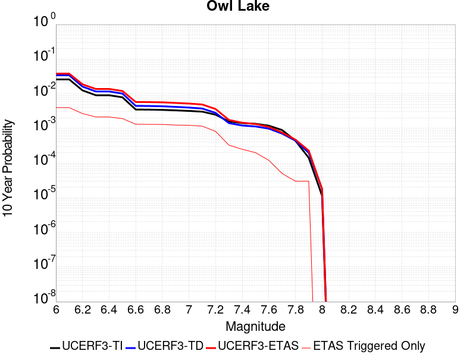 |

| Magnitude | 1 yr TI Prob | TD Prob | ETAS Prob | ETAS/TD Gain | ETAS Triggered Only | 10 yr TI Prob | TD Prob | ETAS Prob | ETAS/TD Gain | ETAS Triggered Only |
|-----|-----|-----|-----|-----|-----|-----|-----|-----|-----|-----|
| 6.0 | 0.0026222812 | 0.0034577043 | 0.006347677 | 1.8358067 | 0.0029 | 0.02591553 | 0.0341404 | 0.03797486 | 1.1123145 | 0.00397 |
| 6.1 | 0.0026222812 | 0.0034577043 | 0.006347677 | 1.8358067 | 0.0029 | 0.02591553 | 0.0341404 | 0.03797486 | 1.1123145 | 0.00397 |
| 6.2 | 0.0012580766 | 0.0016154221 | 0.003562272 | 2.205165 | 0.00195 | 0.012509781 | 0.016070297 | 0.018707229 | 1.1640873 | 0.00268 |
| 6.3 | 9.0924866E-4 | 0.0011659606 | 0.0027241416 | 2.3363926 | 0.00156 | 0.009055373 | 0.011628761 | 0.013743875 | 1.1818864 | 0.00214 |
| 6.4 | 9.0924866E-4 | 0.0011659606 | 0.0027241416 | 2.3363926 | 0.00156 | 0.009055373 | 0.011628761 | 0.013743875 | 1.1818864 | 0.00214 |
| 6.5 | 7.919061E-4 | 0.0010134302 | 0.002441981 | 2.4096193 | 0.00143 | 0.0078909 | 0.010118305 | 0.012018877 | 1.1878351 | 0.00192 |
| 6.6 | 3.5095305E-4 | 4.4588925E-4 | 0.0014354478 | 3.2192922 | 9.9E-4 | 0.0035039932 | 0.0044677295 | 0.005781832 | 1.2941321 | 0.00132 |
| 6.7 | 3.4864116E-4 | 4.4236594E-4 | 0.001431928 | 3.2369761 | 9.9E-4 | 0.003480947 | 0.004432656 | 0.0057368493 | 1.2942239 | 0.00131 |
| 6.8 | 3.4314668E-4 | 4.343586E-4 | 0.0014139329 | 3.2552202 | 9.8E-4 | 0.0034261728 | 0.0043528024 | 0.005647144 | 1.2973582 | 0.0013 |
| 6.9 | 3.3198006E-4 | 4.1731246E-4 | 0.0013569202 | 3.2515688 | 9.4E-4 | 0.0033148455 | 0.004182795 | 0.0054275664 | 1.2975932 | 0.00125 |
| 7.0 | 3.2002592E-4 | 3.9812896E-4 | 0.0013177627 | 3.309889 | 9.2E-4 | 0.0031956544 | 0.00399149 | 0.005216581 | 1.3069255 | 0.00123 |
| 7.1 | 3.0482994E-4 | 3.7260022E-4 | 0.0012622686 | 3.3877292 | 8.9E-4 | 0.0030441214 | 0.0037369546 | 0.00489262 | 1.3092532 | 0.00116 |
| 7.2 | 2.4895166E-4 | 2.7955687E-4 | 9.1937796E-4 | 3.2886975 | 6.4E-4 | 0.0024867293 | 0.002808574 | 0.0036262707 | 1.2911432 | 8.2E-4 |
| 7.3 | 1.5910587E-4 | 1.4141318E-4 | 3.9137783E-4 | 2.7676191 | 2.5E-4 | 0.0015899199 | 0.0014231888 | 0.0017527192 | 1.2315437 | 3.3E-4 |
| 7.4 | 1.4224913E-4 | 1.20294964E-4 | 3.002733E-4 | 2.496142 | 1.8E-4 | 0.0014215811 | 0.0012111744 | 0.0014608715 | 1.2061613 | 2.5E-4 |
| 7.5 | 1.3612706E-4 | 1.129876E-4 | 2.429729E-4 | 2.1504388 | 1.3E-4 | 0.001360437 | 0.0011379321 | 0.0013377045 | 1.1755574 | 2.0E-4 |
| 7.6 | 1.20049335E-4 | 9.771043E-5 | 1.9770066E-4 | 2.023332 | 1.0E-4 | 0.001199845 | 9.849465E-4 | 0.0011048283 | 1.121714 | 1.2E-4 |
| 7.7 | 8.966153E-5 | 7.001265E-5 | 1.10009845E-4 | 1.5712854 | 4.0E-5 | 8.962536E-4 | 7.077913E-4 | 7.577559E-4 | 1.0705923 | 5.0E-5 |
| 7.8 | 4.4148852E-5 | 4.3856566E-5 | 7.385525E-5 | 1.6840181 | 3.0E-5 | 4.414008E-4 | 4.4395277E-4 | 4.7393946E-4 | 1.0675447 | 3.0E-5 |
| 7.9 | 1.4175452E-5 | 1.96599E-5 | 4.965931E-5 | 2.5259187 | 3.0E-5 | 1.4174548E-4 | 1.9835318E-4 | 2.2834723E-4 | 1.1512153 | 3.0E-5 |
| 8.0 | 1.1476893E-6 | 1.7660612E-6 | 1.7660612E-6 | 1.0 | 0.0 | 1.14768345E-5 | 1.796186E-5 | 1.796186E-5 | 1.0 | 0.0 |

## Little Lake
*[(top)](#table-of-contents)*

| 1 Year | 10 Year |
|-----|-----|
|  |  |

| Magnitude | 1 yr TI Prob | TD Prob | ETAS Prob | ETAS/TD Gain | ETAS Triggered Only | 10 yr TI Prob | TD Prob | ETAS Prob | ETAS/TD Gain | ETAS Triggered Only |
|-----|-----|-----|-----|-----|-----|-----|-----|-----|-----|-----|
| 6.0 | 0.0014820677 | 0.0016271081 | 0.0039732843 | 2.44193 | 0.00235 | 0.014722223 | 0.016165355 | 0.019077506 | 1.1801476 | 0.00296 |
| 6.1 | 0.0014820677 | 0.0016271081 | 0.0039732843 | 2.44193 | 0.00235 | 0.014722223 | 0.016165355 | 0.019077506 | 1.1801476 | 0.00296 |
| 6.2 | 0.0014820677 | 0.0016271081 | 0.0039732843 | 2.44193 | 0.00235 | 0.014722223 | 0.016165355 | 0.019077506 | 1.1801476 | 0.00296 |
| 6.3 | 7.7643775E-4 | 8.387868E-4 | 0.0019778304 | 2.357966 | 0.00114 | 0.007737305 | 0.008359027 | 0.009737408 | 1.1648973 | 0.00139 |
| 6.4 | 7.7643775E-4 | 8.387868E-4 | 0.0019778304 | 2.357966 | 0.00114 | 0.007737305 | 0.008359027 | 0.009737408 | 1.1648973 | 0.00139 |
| 6.5 | 6.675408E-4 | 7.180402E-4 | 0.0017872719 | 2.489097 | 0.00107 | 0.006655392 | 0.0071597523 | 0.008450445 | 1.1802706 | 0.0013 |
| 6.6 | 5.040193E-4 | 5.3674204E-4 | 0.0015262107 | 2.8434713 | 9.9E-4 | 0.005028777 | 0.0053560617 | 0.0065496345 | 1.2228452 | 0.0012 |
| 6.7 | 4.0523586E-4 | 4.2777188E-4 | 0.0012774083 | 2.9861903 | 8.5E-4 | 0.004044977 | 0.0042708362 | 0.005316352 | 1.2448034 | 0.00105 |
| 6.8 | 3.35115E-4 | 3.5141388E-4 | 0.0010411714 | 2.9628067 | 6.9E-4 | 0.003346101 | 0.0035098423 | 0.004366824 | 1.2441653 | 8.6E-4 |
| 6.9 | 1.6322079E-4 | 1.6237753E-4 | 4.723272E-4 | 2.908821 | 3.1E-4 | 0.0016310095 | 0.0016227373 | 0.0020320718 | 1.2522495 | 4.1E-4 |
| 7.0 | 1.19513395E-4 | 1.1628369E-4 | 3.1626044E-4 | 2.7197316 | 2.0E-4 | 0.0011944914 | 0.0011623306 | 0.0014220284 | 1.2234285 | 2.6E-4 |
| 7.1 | 6.750081E-5 | 6.144857E-5 | 1.5144303E-4 | 2.4645495 | 9.0E-5 | 6.7480316E-4 | 6.1438425E-4 | 7.243167E-4 | 1.178931 | 1.1E-4 |
| 7.2 | 2.4606294E-5 | 1.6132313E-5 | 1.6132313E-5 | 1.0 | 0.0 | 2.460357E-4 | 1.6131197E-4 | 1.6131197E-4 | 1.0 | 0.0 |
| 7.3 | 2.0574296E-5 | 1.20518125E-5 | 1.20518125E-5 | 1.0 | 0.0 | 2.0572392E-4 | 1.2051166E-4 | 1.2051166E-4 | 1.0 | 0.0 |
| 7.4 | 1.8508214E-5 | 1.0268188E-5 | 1.0268188E-5 | 1.0 | 0.0 | 1.8506673E-4 | 1.026772E-4 | 1.026772E-4 | 1.0 | 0.0 |
| 7.5 | 1.3751187E-5 | 7.5257235E-6 | 7.5257235E-6 | 1.0 | 0.0 | 1.3750336E-4 | 7.525474E-5 | 7.525474E-5 | 1.0 | 0.0 |
| 7.6 | 6.6262032E-6 | 3.951229E-6 | 3.951229E-6 | 1.0 | 0.0 | 6.626006E-5 | 3.9511622E-5 | 3.9511622E-5 | 1.0 | 0.0 |

## Garlock (East)
*[(top)](#table-of-contents)*

| 1 Year | 10 Year |
|-----|-----|
|  |  |

| Magnitude | 1 yr TI Prob | TD Prob | ETAS Prob | ETAS/TD Gain | ETAS Triggered Only | 10 yr TI Prob | TD Prob | ETAS Prob | ETAS/TD Gain | ETAS Triggered Only |
|-----|-----|-----|-----|-----|-----|-----|-----|-----|-----|-----|
| 6.0 | 0.0023501497 | 0.003277363 | 0.004911988 | 1.4987622 | 0.00164 | 0.023254504 | 0.032351483 | 0.034789957 | 1.0753744 | 0.00252 |
| 6.1 | 0.0023501497 | 0.003277363 | 0.004911988 | 1.4987622 | 0.00164 | 0.023254504 | 0.032351483 | 0.034789957 | 1.0753744 | 0.00252 |
| 6.2 | 0.0013908884 | 0.0017990824 | 0.0028771393 | 1.599226 | 0.00108 | 0.01382215 | 0.01789001 | 0.019451566 | 1.0872865 | 0.00159 |
| 6.3 | 0.0013908884 | 0.0017990824 | 0.0028771393 | 1.599226 | 0.00108 | 0.01382215 | 0.01789001 | 0.019451566 | 1.0872865 | 0.00159 |
| 6.4 | 0.0013199237 | 0.0016860063 | 0.002734236 | 1.6217234 | 0.00105 | 0.013121112 | 0.016778054 | 0.018302048 | 1.0908326 | 0.00155 |
| 6.5 | 0.0013199237 | 0.0016860063 | 0.002734236 | 1.6217234 | 0.00105 | 0.013121112 | 0.016778054 | 0.018302048 | 1.0908326 | 0.00155 |
| 6.6 | 0.0011715472 | 0.0014669215 | 0.0024554692 | 1.6738927 | 9.9E-4 | 0.011653901 | 0.014618388 | 0.01604719 | 1.0977402 | 0.00145 |
| 6.7 | 0.0011598538 | 0.0014497138 | 0.0024382786 | 1.6819034 | 9.9E-4 | 0.011538187 | 0.014448582 | 0.01587763 | 1.0989059 | 0.00145 |
| 6.8 | 0.0010184698 | 0.0012462065 | 0.00216506 | 1.7373204 | 9.2E-4 | 0.010138147 | 0.012436173 | 0.013779259 | 1.1079984 | 0.00136 |
| 6.9 | 6.9470983E-4 | 7.927316E-4 | 0.001542137 | 1.9453458 | 7.5E-4 | 0.0069254204 | 0.007939667 | 0.009040854 | 1.1386944 | 0.00111 |
| 7.0 | 6.134799E-4 | 6.8370026E-4 | 0.0013932148 | 2.0377567 | 7.1E-4 | 0.0061178906 | 0.006856307 | 0.0078693135 | 1.1477481 | 0.00102 |
| 7.1 | 5.2502943E-4 | 5.6872366E-4 | 0.0012283484 | 2.1598334 | 6.6E-4 | 0.005237907 | 0.0057127923 | 0.0066275364 | 1.160122 | 9.2E-4 |
| 7.2 | 5.095951E-4 | 5.4764876E-4 | 0.0011872982 | 2.1679924 | 6.4E-4 | 0.0050842804 | 0.00550306 | 0.006398107 | 1.1626453 | 9.0E-4 |
| 7.3 | 4.8746695E-4 | 5.187396E-4 | 0.0011184283 | 2.1560497 | 6.0E-4 | 0.0048639905 | 0.0052147433 | 0.0060304673 | 1.1564264 | 8.2E-4 |
| 7.4 | 4.7072413E-4 | 4.950727E-4 | 0.0010547955 | 2.130587 | 5.6E-4 | 0.004697283 | 0.0049782004 | 0.0057344167 | 1.1519057 | 7.6E-4 |
| 7.5 | 3.6942272E-4 | 3.697407E-4 | 6.596335E-4 | 1.7840434 | 2.9E-4 | 0.003688092 | 0.0037241387 | 0.004102723 | 1.101657 | 3.8E-4 |
| 7.6 | 3.1909486E-4 | 3.10881E-4 | 4.7083126E-4 | 1.5145063 | 1.6E-4 | 0.0031863707 | 0.003135588 | 0.0033748355 | 1.0763006 | 2.4E-4 |
| 7.7 | 2.5027743E-4 | 2.4818222E-4 | 3.1816482E-4 | 1.2819809 | 7.0E-5 | 0.0024999576 | 0.0025091893 | 0.0026089384 | 1.0397536 | 1.0E-4 |
| 7.8 | 1.775424E-4 | 2.0755526E-4 | 2.675428E-4 | 1.2890196 | 6.0E-5 | 0.0017740062 | 0.0021010821 | 0.0021809142 | 1.0379956 | 8.0E-5 |
| 7.9 | 1.3528178E-4 | 1.759425E-4 | 2.259337E-4 | 1.2841338 | 5.0E-5 | 0.0013519945 | 0.0017811217 | 0.0018410148 | 1.0336267 | 6.0E-5 |
| 8.0 | 7.1709874E-5 | 8.731039E-5 | 1.07308646E-4 | 1.2290478 | 2.0E-5 | 7.1686733E-4 | 8.8366936E-4 | 9.0365164E-4 | 1.0226129 | 2.0E-5 |
| 8.1 | 1.9166706E-5 | 1.6429933E-5 | 1.6429933E-5 | 1.0 | 0.0 | 1.9165053E-4 | 1.6637788E-4 | 1.6637788E-4 | 1.0 | 0.0 |

## Blackwater
*[(top)](#table-of-contents)*

| 1 Year | 10 Year |
|-----|-----|
|  | 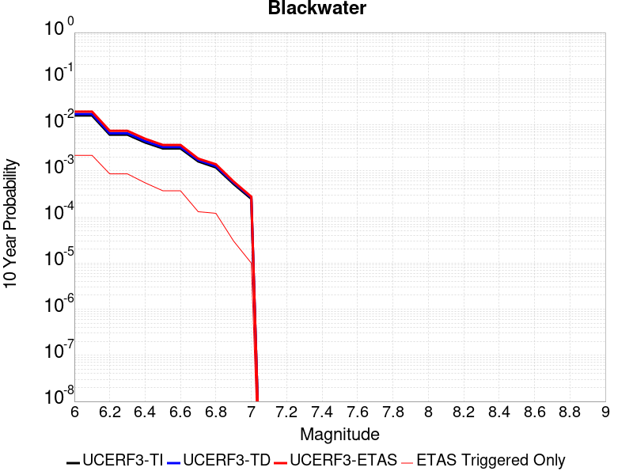 |

| Magnitude | 1 yr TI Prob | TD Prob | ETAS Prob | ETAS/TD Gain | ETAS Triggered Only | 10 yr TI Prob | TD Prob | ETAS Prob | ETAS/TD Gain | ETAS Triggered Only |
|-----|-----|-----|-----|-----|-----|-----|-----|-----|-----|-----|
| 6.0 | 0.0016010714 | 0.001725575 | 0.003322814 | 1.9256272 | 0.0016 | 0.015895851 | 0.017135598 | 0.019268414 | 1.124467 | 0.00217 |
| 6.1 | 0.0016010714 | 0.001725575 | 0.003322814 | 1.9256272 | 0.0016 | 0.015895851 | 0.017135598 | 0.019268414 | 1.124467 | 0.00217 |
| 6.2 | 6.107122E-4 | 6.543855E-4 | 0.0012839732 | 1.9621053 | 6.3E-4 | 0.006090366 | 0.006525557 | 0.0073799454 | 1.1309295 | 8.6E-4 |
| 6.3 | 6.107122E-4 | 6.543855E-4 | 0.0012839732 | 1.9621053 | 6.3E-4 | 0.006090366 | 0.006525557 | 0.0073799454 | 1.1309295 | 8.6E-4 |
| 6.4 | 4.136527E-4 | 4.423869E-4 | 8.721967E-4 | 1.9715699 | 4.3E-4 | 0.0041288356 | 0.004415468 | 0.0049630394 | 1.1240121 | 5.5E-4 |
| 6.5 | 3.0693135E-4 | 3.279434E-4 | 6.178483E-4 | 1.884009 | 2.9E-4 | 0.0030650778 | 0.0032748478 | 0.0036436361 | 1.1126124 | 3.7E-4 |
| 6.6 | 3.0693135E-4 | 3.279434E-4 | 6.178483E-4 | 1.884009 | 2.9E-4 | 0.0030650778 | 0.0032748478 | 0.0036436361 | 1.1126124 | 3.7E-4 |
| 6.7 | 1.6025416E-4 | 1.7120877E-4 | 2.8118995E-4 | 1.6423805 | 1.1E-4 | 0.0016013865 | 0.0017108832 | 0.0018406608 | 1.0758542 | 1.3E-4 |
| 6.8 | 1.1855473E-4 | 1.2672177E-4 | 2.267091E-4 | 1.7890304 | 1.0E-4 | 0.001184915 | 0.0012665853 | 0.0013864333 | 1.094623 | 1.2E-4 |
| 6.9 | 5.1928873E-5 | 5.5587312E-5 | 7.55862E-5 | 1.3597744 | 2.0E-5 | 5.191674E-4 | 5.5578473E-4 | 5.85768E-4 | 1.0539477 | 3.0E-5 |
| 7.0 | 2.4724779E-5 | 2.6483494E-5 | 3.648323E-5 | 1.3775836 | 1.0E-5 | 2.4722028E-4 | 2.6483493E-4 | 2.748323E-4 | 1.0377494 | 1.0E-5 |

## Ash Hill
*[(top)](#table-of-contents)*

| 1 Year | 10 Year |
|-----|-----|
|  | 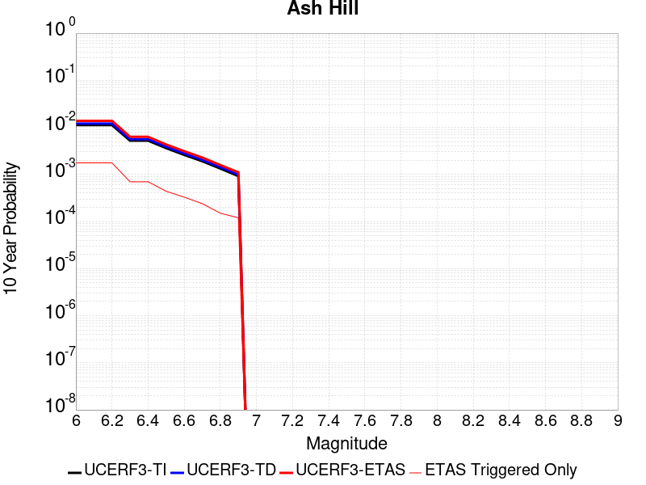 |

| Magnitude | 1 yr TI Prob | TD Prob | ETAS Prob | ETAS/TD Gain | ETAS Triggered Only | 10 yr TI Prob | TD Prob | ETAS Prob | ETAS/TD Gain | ETAS Triggered Only |
|-----|-----|-----|-----|-----|-----|-----|-----|-----|-----|-----|
| 6.0 | 0.0011236023 | 0.001209618 | 0.0024880697 | 2.0569053 | 0.00128 | 0.011179381 | 0.012038324 | 0.013777137 | 1.1444397 | 0.00176 |
| 6.1 | 0.0011236023 | 0.001209618 | 0.0024880697 | 2.0569053 | 0.00128 | 0.011179381 | 0.012038324 | 0.013777137 | 1.1444397 | 0.00176 |
| 6.2 | 0.0011236023 | 0.001209618 | 0.0024880697 | 2.0569053 | 0.00128 | 0.011179381 | 0.012038324 | 0.013777137 | 1.1444397 | 0.00176 |
| 6.3 | 5.229836E-4 | 5.606186E-4 | 0.0010603382 | 1.891372 | 5.0E-4 | 0.005217545 | 0.0055933557 | 0.00628944 | 1.1244485 | 7.0E-4 |
| 6.4 | 5.229836E-4 | 5.606186E-4 | 0.0010603382 | 1.891372 | 5.0E-4 | 0.005217545 | 0.0055933557 | 0.00628944 | 1.1244485 | 7.0E-4 |
| 6.5 | 3.6318856E-4 | 3.8901082E-4 | 6.888941E-4 | 1.7708868 | 3.0E-4 | 0.0036259557 | 0.003884153 | 0.004322444 | 1.1128408 | 4.4E-4 |
| 6.6 | 2.60441E-4 | 2.7895102E-4 | 4.9888965E-4 | 1.7884489 | 2.2E-4 | 0.0026013597 | 0.0027866673 | 0.0031157478 | 1.118091 | 3.3E-4 |
| 6.7 | 1.9111596E-4 | 2.0476643E-4 | 3.6473369E-4 | 1.781218 | 1.6E-4 | 0.0019095168 | 0.0020463406 | 0.0022858495 | 1.1170425 | 2.4E-4 |
| 6.8 | 1.3356637E-4 | 1.4322122E-4 | 2.6320404E-4 | 1.8377447 | 1.2E-4 | 0.0013348613 | 0.0014317741 | 0.0015815594 | 1.1046151 | 1.5E-4 |
| 6.9 | 9.2273134E-5 | 9.897581E-5 | 1.8896691E-4 | 1.9092231 | 9.0E-5 | 9.223483E-4 | 9.897582E-4 | 0.0011096394 | 1.1211218 | 1.2E-4 |

## Hunter Mountain-Saline Valley
*[(top)](#table-of-contents)*

| 1 Year | 10 Year |
|-----|-----|
|  |  |

| Magnitude | 1 yr TI Prob | TD Prob | ETAS Prob | ETAS/TD Gain | ETAS Triggered Only | 10 yr TI Prob | TD Prob | ETAS Prob | ETAS/TD Gain | ETAS Triggered Only |
|-----|-----|-----|-----|-----|-----|-----|-----|-----|-----|-----|
| 6.0 | 0.002350731 | 0.002843498 | 0.003850626 | 1.3541863 | 0.00101 | 0.023260195 | 0.028091714 | 0.029462105 | 1.0487827 | 0.00141 |
| 6.1 | 0.002350731 | 0.002843498 | 0.003850626 | 1.3541863 | 0.00101 | 0.023260195 | 0.028091714 | 0.029462105 | 1.0487827 | 0.00141 |
| 6.2 | 0.002051862 | 0.002452803 | 0.0034503501 | 1.4066968 | 0.001 | 0.020330196 | 0.024273338 | 0.025639355 | 1.0562764 | 0.0014 |
| 6.3 | 0.002051862 | 0.002452803 | 0.0034503501 | 1.4066968 | 0.001 | 0.020330196 | 0.024273338 | 0.025639355 | 1.0562764 | 0.0014 |
| 6.4 | 0.0016845843 | 0.0019783732 | 0.002946454 | 1.4893318 | 9.7E-4 | 0.016718714 | 0.019616365 | 0.020949686 | 1.0679699 | 0.00136 |
| 6.5 | 0.0016845843 | 0.0019783732 | 0.002946454 | 1.4893318 | 9.7E-4 | 0.016718714 | 0.019616365 | 0.020949686 | 1.0679699 | 0.00136 |
| 6.6 | 0.0015279909 | 0.0017820572 | 0.0027403464 | 1.5377432 | 9.6E-4 | 0.015175272 | 0.017685594 | 0.01901172 | 1.0749834 | 0.00135 |
| 6.7 | 0.0014509142 | 0.0016863372 | 0.0026447184 | 1.5683211 | 9.6E-4 | 0.014414776 | 0.016743096 | 0.018070493 | 1.0792803 | 0.00135 |
| 6.8 | 0.00121972 | 0.0014009465 | 0.0023496156 | 1.677163 | 9.5E-4 | 0.01213047 | 0.01392736 | 0.015248697 | 1.0948735 | 0.00134 |
| 6.9 | 0.0010791123 | 0.0012291414 | 0.002167986 | 1.7638215 | 9.4E-4 | 0.010738871 | 0.01222846 | 0.013542196 | 1.1074327 | 0.00133 |
| 7.0 | 9.1075303E-4 | 0.0010239548 | 0.0019330231 | 1.887801 | 9.1E-4 | 0.009070295 | 0.010196 | 0.011482745 | 1.1262009 | 0.0013 |
| 7.1 | 7.723524E-4 | 8.5755944E-4 | 0.0017467962 | 2.036939 | 8.9E-4 | 0.007696735 | 0.008545489 | 0.00981455 | 1.1485066 | 0.00128 |
| 7.2 | 7.396263E-4 | 8.18801E-4 | 0.0016980805 | 2.0738623 | 8.8E-4 | 0.0073716943 | 0.008160792 | 0.00941051 | 1.1531367 | 0.00126 |
| 7.3 | 7.161811E-4 | 7.913631E-4 | 0.0016706667 | 2.1111252 | 8.8E-4 | 0.007138774 | 0.007888383 | 0.0091384435 | 1.1584686 | 0.00126 |
| 7.4 | 6.681934E-4 | 7.359493E-4 | 0.0015853237 | 2.154121 | 8.5E-4 | 0.006661878 | 0.0073380154 | 0.0085292095 | 1.1623319 | 0.0012 |
| 7.5 | 6.0486543E-4 | 6.677147E-4 | 0.0014671806 | 2.1973164 | 8.0E-4 | 0.006032217 | 0.0066599557 | 0.007772497 | 1.1670493 | 0.00112 |
| 7.6 | 1.564034E-4 | 1.7349358E-4 | 4.7344153E-4 | 2.7288706 | 3.0E-4 | 0.0015629337 | 0.0017350167 | 0.0021542879 | 1.2416526 | 4.2E-4 |

## Gravel Hills-Harper Lk
*[(top)](#table-of-contents)*

| 1 Year | 10 Year |
|-----|-----|
|  |  |

| Magnitude | 1 yr TI Prob | TD Prob | ETAS Prob | ETAS/TD Gain | ETAS Triggered Only | 10 yr TI Prob | TD Prob | ETAS Prob | ETAS/TD Gain | ETAS Triggered Only |
|-----|-----|-----|-----|-----|-----|-----|-----|-----|-----|-----|
| 6.0 | 0.0015995599 | 0.001640685 | 0.0025591755 | 1.5598214 | 9.2E-4 | 0.015880952 | 0.016307283 | 0.017527062 | 1.0747997 | 0.00124 |
| 6.1 | 0.0015995599 | 0.001640685 | 0.0025591755 | 1.5598214 | 9.2E-4 | 0.015880952 | 0.016307283 | 0.017527062 | 1.0747997 | 0.00124 |
| 6.2 | 7.8995706E-4 | 7.112282E-4 | 0.0010210078 | 1.4355557 | 3.1E-4 | 0.007871548 | 0.0070907213 | 0.0075077433 | 1.0588124 | 4.2E-4 |
| 6.3 | 7.8995706E-4 | 7.112282E-4 | 0.0010210078 | 1.4355557 | 3.1E-4 | 0.007871548 | 0.0070907213 | 0.0075077433 | 1.0588124 | 4.2E-4 |
| 6.4 | 6.537194E-4 | 5.576251E-4 | 8.0748566E-4 | 1.44808 | 2.5E-4 | 0.0065179965 | 0.005562849 | 0.005871124 | 1.0554168 | 3.1E-4 |
| 6.5 | 5.787078E-4 | 4.738656E-4 | 7.137519E-4 | 1.5062327 | 2.4E-4 | 0.0057720304 | 0.004728959 | 0.0049976823 | 1.056825 | 2.7E-4 |
| 6.6 | 5.053978E-4 | 3.9291914E-4 | 5.2286807E-4 | 1.3307269 | 1.3E-4 | 0.0050424994 | 0.003922501 | 0.0040818737 | 1.0406303 | 1.6E-4 |
| 6.7 | 4.6818596E-4 | 3.5211546E-4 | 4.3208728E-4 | 1.2271183 | 8.0E-5 | 0.004672008 | 0.0035157963 | 0.0036154448 | 1.0283431 | 1.0E-4 |
| 6.8 | 3.9011694E-4 | 2.669216E-4 | 3.069109E-4 | 1.1498168 | 4.0E-5 | 0.0038943281 | 0.002666148 | 0.0027160146 | 1.0187037 | 5.0E-5 |
| 6.9 | 3.3080703E-4 | 2.0386779E-4 | 2.1386576E-4 | 1.0490414 | 1.0E-5 | 0.0033031502 | 0.0020369058 | 0.0020468854 | 1.0048994 | 1.0E-5 |
| 7.0 | 2.6732447E-4 | 1.3596074E-4 | 1.4595938E-4 | 1.0735407 | 1.0E-5 | 0.0026700313 | 0.0013588008 | 0.0013687873 | 1.0073494 | 1.0E-5 |
| 7.1 | 2.315891E-4 | 1.0948939E-4 | 1.0948939E-4 | 1.0 | 0.0 | 0.002313479 | 0.0010943763 | 0.0010943763 | 1.0 | 0.0 |
| 7.2 | 1.8280011E-4 | 6.5824766E-5 | 6.5824766E-5 | 1.0 | 0.0 | 0.0018264982 | 6.580609E-4 | 6.580609E-4 | 1.0 | 0.0 |
| 7.3 | 1.3365384E-4 | 3.7145943E-5 | 3.7145943E-5 | 1.0 | 0.0 | 0.0013357349 | 3.7139934E-4 | 3.7139934E-4 | 1.0 | 0.0 |
| 7.4 | 1.06276275E-4 | 2.7679389E-5 | 2.7679389E-5 | 1.0 | 0.0 | 0.0010622547 | 2.7675997E-4 | 2.7675997E-4 | 1.0 | 0.0 |
| 7.5 | 6.0951766E-5 | 1.8800003E-5 | 1.8800003E-5 | 1.0 | 0.0 | 6.093505E-4 | 1.879846E-4 | 1.879846E-4 | 1.0 | 0.0 |
| 7.6 | 6.863748E-6 | 3.7149634E-6 | 3.7149634E-6 | 1.0 | 0.0 | 6.863536E-5 | 3.714917E-5 | 3.714917E-5 | 1.0 | 0.0 |

## Airport Lake
*[(top)](#table-of-contents)*

| 1 Year | 10 Year |
|-----|-----|
| 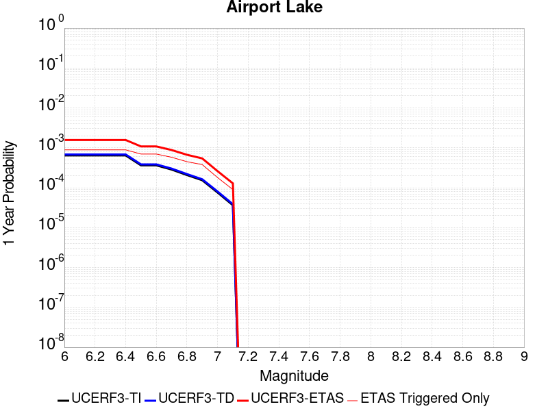 |  |

| Magnitude | 1 yr TI Prob | TD Prob | ETAS Prob | ETAS/TD Gain | ETAS Triggered Only | 10 yr TI Prob | TD Prob | ETAS Prob | ETAS/TD Gain | ETAS Triggered Only |
|-----|-----|-----|-----|-----|-----|-----|-----|-----|-----|-----|
| 6.0 | 6.461343E-4 | 6.835041E-4 | 0.0015728958 | 2.3012235 | 8.9E-4 | 0.0064425888 | 0.0068168286 | 0.007919262 | 1.1617223 | 0.00111 |
| 6.1 | 6.461343E-4 | 6.835041E-4 | 0.0015728958 | 2.3012235 | 8.9E-4 | 0.0064425888 | 0.0068168286 | 0.007919262 | 1.1617223 | 0.00111 |
| 6.2 | 6.461343E-4 | 6.835041E-4 | 0.0015728958 | 2.3012235 | 8.9E-4 | 0.0064425888 | 0.0068168286 | 0.007919262 | 1.1617223 | 0.00111 |
| 6.3 | 6.461343E-4 | 6.835041E-4 | 0.0015728958 | 2.3012235 | 8.9E-4 | 0.0064425888 | 0.0068168286 | 0.007919262 | 1.1617223 | 0.00111 |
| 6.4 | 6.461343E-4 | 6.835041E-4 | 0.0015728958 | 2.3012235 | 8.9E-4 | 0.0064425888 | 0.0068168286 | 0.007919262 | 1.1617223 | 0.00111 |
| 6.5 | 3.6478083E-4 | 3.8526725E-4 | 0.0010849976 | 2.8162205 | 7.0E-4 | 0.003641826 | 0.0038465308 | 0.004703223 | 1.2227181 | 8.6E-4 |
| 6.6 | 3.6478083E-4 | 3.8526725E-4 | 0.0010849976 | 2.8162205 | 7.0E-4 | 0.003641826 | 0.0038465308 | 0.004703223 | 1.2227181 | 8.6E-4 |
| 6.7 | 2.8575645E-4 | 3.0186778E-4 | 8.816927E-4 | 2.920791 | 5.8E-4 | 0.0028538927 | 0.0030149613 | 0.0037327905 | 1.2380891 | 7.2E-4 |
| 6.8 | 2.0843433E-4 | 2.2012478E-4 | 6.700257E-4 | 3.043845 | 4.5E-4 | 0.0020823893 | 0.0021993385 | 0.0027880408 | 1.2676725 | 5.9E-4 |
| 6.9 | 1.5427776E-4 | 1.629441E-4 | 5.428822E-4 | 3.3317082 | 3.8E-4 | 0.001541707 | 0.0016284687 | 0.0021376382 | 1.3126676 | 5.1E-4 |
| 7.0 | 7.597293E-5 | 8.0395155E-5 | 2.6038068E-4 | 3.238761 | 1.8E-4 | 7.594696E-4 | 8.0375955E-4 | 0.0010335747 | 1.2859253 | 2.3E-4 |
| 7.1 | 3.649926E-5 | 3.865891E-5 | 1.2865543E-4 | 3.3279634 | 9.0E-5 | 3.6493264E-4 | 3.865891E-4 | 4.9654656E-4 | 1.2844298 | 1.1E-4 |

## Goldstone Lake
*[(top)](#table-of-contents)*

| 1 Year | 10 Year |
|-----|-----|
|  |  |

| Magnitude | 1 yr TI Prob | TD Prob | ETAS Prob | ETAS/TD Gain | ETAS Triggered Only | 10 yr TI Prob | TD Prob | ETAS Prob | ETAS/TD Gain | ETAS Triggered Only |
|-----|-----|-----|-----|-----|-----|-----|-----|-----|-----|-----|
| 6.0 | 0.001392921 | 0.0015839539 | 0.0022129558 | 1.3971089 | 6.3E-4 | 0.013842222 | 0.01574614 | 0.016661497 | 1.058132 | 9.3E-4 |
| 6.1 | 0.001392921 | 0.0015839539 | 0.0022129558 | 1.3971089 | 6.3E-4 | 0.013842222 | 0.01574614 | 0.016661497 | 1.058132 | 9.3E-4 |
| 6.2 | 7.4051257E-4 | 8.396358E-4 | 0.0011793503 | 1.4045975 | 3.4E-4 | 0.007380498 | 0.008374331 | 0.008870143 | 1.0592062 | 5.0E-4 |
| 6.3 | 7.4051257E-4 | 8.396358E-4 | 0.0011793503 | 1.4045975 | 3.4E-4 | 0.007380498 | 0.008374331 | 0.008870143 | 1.0592062 | 5.0E-4 |
| 6.4 | 6.9055456E-4 | 7.829214E-4 | 0.0011226552 | 1.4339309 | 3.4E-4 | 0.006884126 | 0.007811257 | 0.008287508 | 1.0609698 | 4.8E-4 |
| 6.5 | 6.9055456E-4 | 7.829214E-4 | 0.0011226552 | 1.4339309 | 3.4E-4 | 0.006884126 | 0.007811257 | 0.008287508 | 1.0609698 | 4.8E-4 |
| 6.6 | 5.90922E-4 | 6.706436E-4 | 9.504558E-4 | 1.4172294 | 2.8E-4 | 0.0058935313 | 0.006695586 | 0.0071028406 | 1.0608244 | 4.1E-4 |
| 6.7 | 4.5130608E-4 | 5.125979E-4 | 7.4248004E-4 | 1.4484648 | 2.3E-4 | 0.0045039062 | 0.005123034 | 0.0054811896 | 1.0699109 | 3.6E-4 |
| 6.8 | 5.3300988E-5 | 6.133254E-5 | 7.1331924E-5 | 1.1630356 | 1.0E-5 | 5.3288206E-4 | 6.131674E-4 | 6.2316126E-4 | 1.0162988 | 1.0E-5 |
| 6.9 | 4.1408475E-5 | 4.8438294E-5 | 4.8438294E-5 | 1.0 | 0.0 | 4.140076E-4 | 4.842844E-4 | 4.842844E-4 | 1.0 | 0.0 |
| 7.0 | 3.8811122E-5 | 4.56413E-5 | 4.56413E-5 | 1.0 | 0.0 | 3.8804344E-4 | 4.563259E-4 | 4.563259E-4 | 1.0 | 0.0 |
| 7.1 | 3.376394E-5 | 4.023568E-5 | 4.023568E-5 | 1.0 | 0.0 | 3.375881E-4 | 4.0228994E-4 | 4.0228994E-4 | 1.0 | 0.0 |
| 7.2 | 3.3167835E-5 | 3.9594222E-5 | 3.9594222E-5 | 1.0 | 0.0 | 3.3162883E-4 | 3.9587764E-4 | 3.9587764E-4 | 1.0 | 0.0 |
| 7.3 | 3.0104358E-5 | 3.5984674E-5 | 3.5984674E-5 | 1.0 | 0.0 | 3.0100282E-4 | 3.597942E-4 | 3.597942E-4 | 1.0 | 0.0 |
| 7.4 | 2.718283E-5 | 3.231638E-5 | 3.231638E-5 | 1.0 | 0.0 | 2.7179506E-4 | 3.2312237E-4 | 3.2312237E-4 | 1.0 | 0.0 |
| 7.5 | 2.3547682E-5 | 2.7909362E-5 | 2.7909362E-5 | 1.0 | 0.0 | 2.3545188E-4 | 2.7906388E-4 | 2.7906388E-4 | 1.0 | 0.0 |
| 7.6 | 1.1540374E-5 | 1.3587022E-5 | 1.3587022E-5 | 1.0 | 0.0 | 1.1539775E-4 | 1.3586473E-4 | 1.3586473E-4 | 1.0 | 0.0 |

## Garlock (West)
*[(top)](#table-of-contents)*

| 1 Year | 10 Year |
|-----|-----|
|  |  |

| Magnitude | 1 yr TI Prob | TD Prob | ETAS Prob | ETAS/TD Gain | ETAS Triggered Only | 10 yr TI Prob | TD Prob | ETAS Prob | ETAS/TD Gain | ETAS Triggered Only |
|-----|-----|-----|-----|-----|-----|-----|-----|-----|-----|-----|
| 6.0 | 0.0013131002 | 0.0013138648 | 0.0019430371 | 1.4788713 | 6.3E-4 | 0.013053683 | 0.0131414775 | 0.014009913 | 1.0660836 | 8.8E-4 |
| 6.1 | 0.001307681 | 0.0013087096 | 0.0019378851 | 1.4807602 | 6.3E-4 | 0.013000126 | 0.013090534 | 0.013959015 | 1.0663441 | 8.8E-4 |
| 6.2 | 0.0013008224 | 0.0013025437 | 0.0019317231 | 1.483039 | 6.3E-4 | 0.012932341 | 0.013029599 | 0.013898132 | 1.0666585 | 8.8E-4 |
| 6.3 | 0.0012897556 | 0.0012931306 | 0.0019223159 | 1.4865597 | 6.3E-4 | 0.012822957 | 0.012936569 | 0.0138051845 | 1.0671443 | 8.8E-4 |
| 6.4 | 0.0012117702 | 0.0012086688 | 0.0018279195 | 1.512341 | 6.2E-4 | 0.012051838 | 0.012101421 | 0.012960893 | 1.0710224 | 8.7E-4 |
| 6.5 | 0.0011854442 | 0.0011990049 | 0.0018182616 | 1.5164754 | 6.2E-4 | 0.011791403 | 0.01200583 | 0.012865385 | 1.0715948 | 8.7E-4 |
| 6.6 | 0.001111811 | 0.0011354303 | 0.0017547264 | 1.5454285 | 6.2E-4 | 0.011062649 | 0.011376739 | 0.012226954 | 1.0747329 | 8.6E-4 |
| 6.7 | 0.001027818 | 0.0010634961 | 0.0016828367 | 1.5823629 | 6.2E-4 | 0.010230771 | 0.010664482 | 0.01151531 | 1.0797815 | 8.6E-4 |
| 6.8 | 9.775903E-4 | 0.0010378326 | 0.0016571891 | 1.5967789 | 6.2E-4 | 0.009733009 | 0.010410271 | 0.011261317 | 1.0817508 | 8.6E-4 |
| 6.9 | 9.158276E-4 | 9.884358E-4 | 0.0015978329 | 1.6165267 | 6.1E-4 | 0.0091206245 | 0.009920754 | 0.010762322 | 1.084829 | 8.5E-4 |
| 7.0 | 8.759337E-4 | 9.500078E-4 | 0.0015594283 | 1.64149 | 6.1E-4 | 0.008724891 | 0.009539667 | 0.010381558 | 1.0882516 | 8.5E-4 |
| 7.1 | 8.521265E-4 | 9.2398486E-4 | 0.0015334212 | 1.659574 | 6.1E-4 | 0.008488664 | 0.009281524 | 0.010123635 | 1.0907298 | 8.5E-4 |
| 7.2 | 8.2304585E-4 | 8.952415E-4 | 0.0014947044 | 1.6696101 | 6.0E-4 | 0.008200042 | 0.008996368 | 0.0098288115 | 1.092531 | 8.4E-4 |
| 7.3 | 7.854473E-4 | 8.667287E-4 | 0.0014662087 | 1.6916581 | 6.0E-4 | 0.00782677 | 0.008713072 | 0.009545753 | 1.0955669 | 8.4E-4 |
| 7.4 | 7.7653467E-4 | 8.5817726E-4 | 0.0014476709 | 1.6869136 | 5.9E-4 | 0.0077382675 | 0.008627934 | 0.009421032 | 1.091922 | 8.0E-4 |
| 7.5 | 7.567935E-4 | 8.3690725E-4 | 0.0013764553 | 1.6446928 | 5.4E-4 | 0.0075422134 | 0.008416242 | 0.00915993 | 1.0883634 | 7.5E-4 |
| 7.6 | 6.6541E-4 | 7.328455E-4 | 0.0010725963 | 1.463605 | 3.4E-4 | 0.006634211 | 0.0073812436 | 0.007857701 | 1.0645497 | 4.8E-4 |
| 7.7 | 5.388092E-4 | 5.9777853E-4 | 7.776709E-4 | 1.3009349 | 1.8E-4 | 0.0053750467 | 0.0060380935 | 0.006286584 | 1.0411538 | 2.5E-4 |
| 7.8 | 3.667837E-4 | 4.6422923E-4 | 6.24155E-4 | 1.3444973 | 1.6E-4 | 0.003661789 | 0.0046949377 | 0.0049039517 | 1.0445191 | 2.1E-4 |
| 7.9 | 2.11856E-4 | 2.8511693E-4 | 4.1507985E-4 | 1.4558233 | 1.3E-4 | 0.0021165414 | 0.0028840043 | 0.0030236004 | 1.0484036 | 1.4E-4 |
| 8.0 | 8.7288594E-5 | 1.08389286E-4 | 1.2838712E-4 | 1.1845001 | 2.0E-5 | 8.7254314E-4 | 0.0010968668 | 0.0011168448 | 1.0182137 | 2.0E-5 |
| 8.1 | 1.9166706E-5 | 1.6429933E-5 | 1.6429933E-5 | 1.0 | 0.0 | 1.9165053E-4 | 1.6637788E-4 | 1.6637788E-4 | 1.0 | 0.0 |

## McLean Lake
*[(top)](#table-of-contents)*

| 1 Year | 10 Year |
|-----|-----|
| 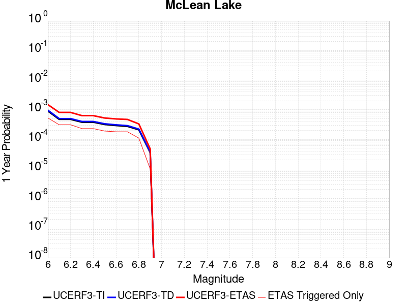 |  |

| Magnitude | 1 yr TI Prob | TD Prob | ETAS Prob | ETAS/TD Gain | ETAS Triggered Only | 10 yr TI Prob | TD Prob | ETAS Prob | ETAS/TD Gain | ETAS Triggered Only |
|-----|-----|-----|-----|-----|-----|-----|-----|-----|-----|-----|
| 6.0 | 9.0542925E-4 | 9.6498185E-4 | 0.0014944704 | 1.5487031 | 5.3E-4 | 0.009017491 | 0.009612758 | 0.010434779 | 1.0855136 | 8.3E-4 |
| 6.1 | 4.727685E-4 | 5.0039287E-4 | 8.102377E-4 | 1.6192032 | 3.1E-4 | 0.0047176396 | 0.004993544 | 0.005461197 | 1.0936515 | 4.7E-4 |
| 6.2 | 4.727685E-4 | 5.0039287E-4 | 8.102377E-4 | 1.6192032 | 3.1E-4 | 0.0047176396 | 0.004993544 | 0.005461197 | 1.0936515 | 4.7E-4 |
| 6.3 | 3.786182E-4 | 4.0001865E-4 | 6.299266E-4 | 1.5747432 | 2.3E-4 | 0.0037797375 | 0.003993691 | 0.004332333 | 1.0847943 | 3.4E-4 |
| 6.4 | 3.786182E-4 | 4.0001865E-4 | 6.299266E-4 | 1.5747432 | 2.3E-4 | 0.0037797375 | 0.003993691 | 0.004332333 | 1.0847943 | 3.4E-4 |
| 6.5 | 3.164567E-4 | 3.3409684E-4 | 5.240334E-4 | 1.5685074 | 1.9E-4 | 0.0031600643 | 0.0033365842 | 0.0036256167 | 1.0866252 | 2.9E-4 |
| 6.6 | 2.9209262E-4 | 3.0834877E-4 | 4.882933E-4 | 1.5835745 | 1.8E-4 | 0.0029170897 | 0.0030798386 | 0.0033390378 | 1.08416 | 2.6E-4 |
| 6.7 | 2.73744E-4 | 2.8899097E-4 | 4.6893893E-4 | 1.6226768 | 1.8E-4 | 0.0027340704 | 0.0028867754 | 0.003146025 | 1.0898058 | 2.6E-4 |
| 6.8 | 2.099053E-4 | 2.2157936E-4 | 3.31555E-4 | 1.4963261 | 1.1E-4 | 0.0020970714 | 0.0022141687 | 0.0023837923 | 1.0766083 | 1.7E-4 |
| 6.9 | 3.56685E-5 | 3.725474E-5 | 4.725437E-5 | 1.2684122 | 1.0E-5 | 3.5662777E-4 | 3.7251622E-4 | 3.9250878E-4 | 1.053669 | 2.0E-5 |

## Coyote Canyon
*[(top)](#table-of-contents)*

| 1 Year | 10 Year |
|-----|-----|
|  |  |

| Magnitude | 1 yr TI Prob | TD Prob | ETAS Prob | ETAS/TD Gain | ETAS Triggered Only | 10 yr TI Prob | TD Prob | ETAS Prob | ETAS/TD Gain | ETAS Triggered Only |
|-----|-----|-----|-----|-----|-----|-----|-----|-----|-----|-----|
| 6.0 | 0.0018293047 | 0.0021042444 | 0.0025133817 | 1.1944343 | 4.1E-4 | 0.018143194 | 0.02086912 | 0.02147618 | 1.029089 | 6.2E-4 |
| 6.1 | 0.0018293047 | 0.0021042444 | 0.0025133817 | 1.1944343 | 4.1E-4 | 0.018143194 | 0.02086912 | 0.02147618 | 1.029089 | 6.2E-4 |
| 6.2 | 9.606133E-4 | 0.0010983828 | 0.0013481082 | 1.2273574 | 2.5E-4 | 0.0095647145 | 0.010939625 | 0.011275906 | 1.0307397 | 3.4E-4 |
| 6.3 | 9.606133E-4 | 0.0010983828 | 0.0013481082 | 1.2273574 | 2.5E-4 | 0.0095647145 | 0.010939625 | 0.011275906 | 1.0307397 | 3.4E-4 |
| 6.4 | 8.930107E-4 | 0.0010204774 | 0.0012602325 | 1.234944 | 2.4E-4 | 0.008894307 | 0.010167832 | 0.010494476 | 1.0321254 | 3.3E-4 |
| 6.5 | 7.6907943E-4 | 8.782473E-4 | 0.0010980541 | 1.250279 | 2.2E-4 | 0.007664232 | 0.008756962 | 0.009054334 | 1.0339584 | 3.0E-4 |
| 6.6 | 6.268809E-4 | 7.1594387E-4 | 9.058079E-4 | 1.2651939 | 1.9E-4 | 0.0062511545 | 0.0071450667 | 0.0074131377 | 1.0375183 | 2.7E-4 |
| 6.7 | 5.266384E-4 | 6.017155E-4 | 7.516252E-4 | 1.2491373 | 1.5E-4 | 0.005253921 | 0.0060093896 | 0.0062280674 | 1.0363894 | 2.2E-4 |

## Lenwood-Lockhart-Old Woman Springs
*[(top)](#table-of-contents)*

| 1 Year | 10 Year |
|-----|-----|
|  |  |

| Magnitude | 1 yr TI Prob | TD Prob | ETAS Prob | ETAS/TD Gain | ETAS Triggered Only | 10 yr TI Prob | TD Prob | ETAS Prob | ETAS/TD Gain | ETAS Triggered Only |
|-----|-----|-----|-----|-----|-----|-----|-----|-----|-----|-----|
| 6.0 | 0.0019519776 | 0.0022915022 | 0.002730494 | 1.1915737 | 4.4E-4 | 0.019349206 | 0.02269674 | 0.02327335 | 1.0254049 | 5.9E-4 |
| 6.1 | 0.0019519776 | 0.0022915022 | 0.002730494 | 1.1915737 | 4.4E-4 | 0.019349206 | 0.02269674 | 0.02327335 | 1.0254049 | 5.9E-4 |
| 6.2 | 0.0019519776 | 0.0022915022 | 0.002730494 | 1.1915737 | 4.4E-4 | 0.019349206 | 0.02269674 | 0.02327335 | 1.0254049 | 5.9E-4 |
| 6.3 | 0.0010993304 | 0.0013220677 | 0.0015517636 | 1.1737399 | 2.3E-4 | 0.010939079 | 0.013144241 | 0.01342056 | 1.0210221 | 2.8E-4 |
| 6.4 | 0.0010993304 | 0.0013220677 | 0.0015517636 | 1.1737399 | 2.3E-4 | 0.010939079 | 0.013144241 | 0.01342056 | 1.0210221 | 2.8E-4 |
| 6.5 | 9.073613E-4 | 0.0010775764 | 0.0012573824 | 1.1668615 | 1.8E-4 | 0.009036654 | 0.010724808 | 0.010942449 | 1.0202932 | 2.2E-4 |
| 6.6 | 7.9306826E-4 | 9.220913E-4 | 0.0010919345 | 1.1841935 | 1.7E-4 | 0.007902439 | 0.009183516 | 0.009391587 | 1.022657 | 2.1E-4 |
| 6.7 | 6.950544E-4 | 7.9614815E-4 | 9.360367E-4 | 1.1757066 | 1.4E-4 | 0.006928845 | 0.00793359 | 0.008102241 | 1.0212579 | 1.7E-4 |
| 6.8 | 6.011979E-4 | 6.79715E-4 | 7.9963345E-4 | 1.1764246 | 1.2E-4 | 0.00599574 | 0.0067768116 | 0.006925795 | 1.0219843 | 1.5E-4 |
| 6.9 | 5.3489394E-4 | 6.006332E-4 | 7.1056717E-4 | 1.18303 | 1.1E-4 | 0.0053360825 | 0.005990478 | 0.006129639 | 1.0232304 | 1.4E-4 |
| 7.0 | 4.2279682E-4 | 4.690463E-4 | 5.490088E-4 | 1.1704788 | 8.0E-5 | 0.0042199334 | 0.0046808114 | 0.0047803433 | 1.0212638 | 1.0E-4 |
| 7.1 | 3.5468035E-4 | 3.9209108E-4 | 4.6206362E-4 | 1.17846 | 7.0E-5 | 0.003541148 | 0.003914209 | 0.004003857 | 1.0229032 | 9.0E-5 |
| 7.2 | 2.9681803E-4 | 3.2763137E-4 | 3.8761168E-4 | 1.1830727 | 6.0E-5 | 0.002964219 | 0.003271682 | 0.0033514202 | 1.0243722 | 8.0E-5 |
| 7.3 | 2.2190946E-4 | 2.4557207E-4 | 2.755647E-4 | 1.1221337 | 3.0E-5 | 0.00221688 | 0.002453188 | 0.00249309 | 1.0162653 | 4.0E-5 |
| 7.4 | 1.3277601E-4 | 1.4880644E-4 | 1.6880347E-4 | 1.1343827 | 2.0E-5 | 0.001326967 | 0.0014872303 | 0.0015171857 | 1.0201417 | 3.0E-5 |
| 7.5 | 2.2805577E-6 | 2.380856E-6 | 2.380856E-6 | 1.0 | 0.0 | 2.2805343E-5 | 2.3808358E-5 | 2.3808358E-5 | 1.0 | 0.0 |

## San Andreas (Mojave S)
*[(top)](#table-of-contents)*

| 1 Year | 10 Year |
|-----|-----|
| 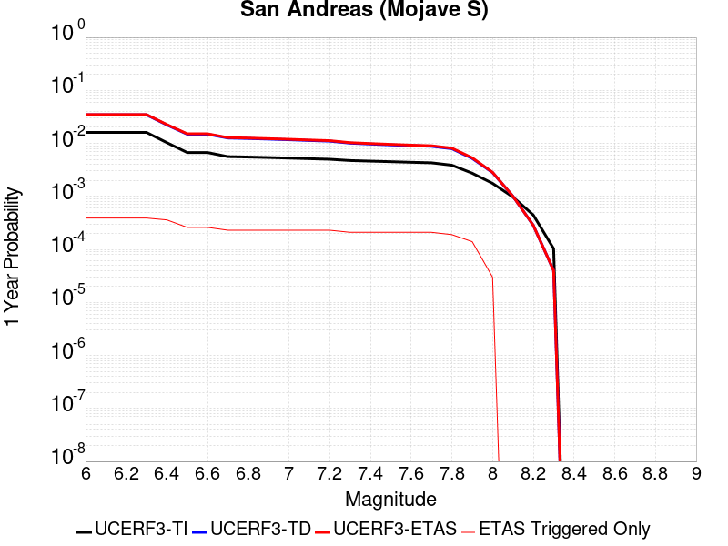 |  |

| Magnitude | 1 yr TI Prob | TD Prob | ETAS Prob | ETAS/TD Gain | ETAS Triggered Only | 10 yr TI Prob | TD Prob | ETAS Prob | ETAS/TD Gain | ETAS Triggered Only |
|-----|-----|-----|-----|-----|-----|-----|-----|-----|-----|-----|
| 6.0 | 0.016080605 | 0.03462137 | 0.034997866 | 1.0108747 | 3.9E-4 | 0.1496549 | 0.286598 | 0.28696898 | 1.0012944 | 5.2E-4 |
| 6.1 | 0.016080605 | 0.03462137 | 0.034997866 | 1.0108747 | 3.9E-4 | 0.1496549 | 0.286598 | 0.28696898 | 1.0012944 | 5.2E-4 |
| 6.2 | 0.016080605 | 0.03462137 | 0.034997866 | 1.0108747 | 3.9E-4 | 0.1496549 | 0.286598 | 0.28696898 | 1.0012944 | 5.2E-4 |
| 6.3 | 0.016080605 | 0.03462137 | 0.034997866 | 1.0108747 | 3.9E-4 | 0.1496549 | 0.286598 | 0.28696898 | 1.0012944 | 5.2E-4 |
| 6.4 | 0.010316478 | 0.022287503 | 0.02263948 | 1.0157926 | 3.6E-4 | 0.098504856 | 0.19699045 | 0.1973518 | 1.0018344 | 4.5E-4 |
| 6.5 | 0.006714592 | 0.014892505 | 0.015148632 | 1.0171984 | 2.6E-4 | 0.065152965 | 0.13802715 | 0.1383116 | 1.0020609 | 3.3E-4 |
| 6.6 | 0.006714592 | 0.014892505 | 0.015148632 | 1.0171984 | 2.6E-4 | 0.065152965 | 0.13802715 | 0.1383116 | 1.0020609 | 3.3E-4 |
| 6.7 | 0.0056198016 | 0.012617563 | 0.01284466 | 1.0179986 | 2.3E-4 | 0.054797906 | 0.119169496 | 0.119433746 | 1.0022174 | 3.0E-4 |
| 6.8 | 0.0055285925 | 0.012368962 | 0.012596117 | 1.0183649 | 2.3E-4 | 0.053930566 | 0.117118634 | 0.1173835 | 1.0022615 | 3.0E-4 |
| 6.9 | 0.0054089287 | 0.012044343 | 0.012271573 | 1.0188661 | 2.3E-4 | 0.05279156 | 0.11441608 | 0.11468175 | 1.002322 | 3.0E-4 |
| 7.0 | 0.005285311 | 0.011719226 | 0.01194653 | 1.0193958 | 2.3E-4 | 0.05161361 | 0.111676484 | 0.11194298 | 1.0023863 | 3.0E-4 |
| 7.1 | 0.0051451353 | 0.011352123 | 0.011579512 | 1.0200305 | 2.3E-4 | 0.05027629 | 0.10856094 | 0.10882837 | 1.0024635 | 3.0E-4 |
| 7.2 | 0.005018219 | 0.011023389 | 0.0112508545 | 1.0206348 | 2.3E-4 | 0.049064007 | 0.10575075 | 0.10601903 | 1.0025369 | 3.0E-4 |
| 7.3 | 0.004746591 | 0.010108546 | 0.010316423 | 1.0205646 | 2.1E-4 | 0.046464786 | 0.097944014 | 0.09819659 | 1.0025787 | 2.8E-4 |
| 7.4 | 0.0046267817 | 0.009720306 | 0.009928265 | 1.0213943 | 2.1E-4 | 0.045316286 | 0.094579056 | 0.09483258 | 1.0026805 | 2.8E-4 |
| 7.5 | 0.004516484 | 0.009374807 | 0.009582838 | 1.0221905 | 2.1E-4 | 0.04425787 | 0.091542855 | 0.09179722 | 1.0027786 | 2.8E-4 |
| 7.6 | 0.0044011753 | 0.009058169 | 0.0092662675 | 1.0229735 | 2.1E-4 | 0.04315024 | 0.08870201 | 0.08895717 | 1.0028766 | 2.8E-4 |
| 7.7 | 0.004300386 | 0.008811024 | 0.009019174 | 1.0236238 | 2.1E-4 | 0.042181134 | 0.08645291 | 0.0867087 | 1.0029588 | 2.8E-4 |
| 7.8 | 0.0038772223 | 0.007942881 | 0.008131372 | 1.0237308 | 1.9E-4 | 0.03810269 | 0.07828439 | 0.07852403 | 1.0030612 | 2.6E-4 |
| 7.9 | 0.0027402006 | 0.00520736 | 0.0053466307 | 1.0267451 | 1.4E-4 | 0.027066574 | 0.0521955 | 0.05234715 | 1.0029054 | 1.6E-4 |
| 8.0 | 0.0017620471 | 0.0028173209 | 0.0028472363 | 1.0106184 | 3.0E-5 | 0.017481409 | 0.028832143 | 0.02887099 | 1.0013473 | 4.0E-5 |
| 8.1 | 9.736188E-4 | 0.0010069016 | 0.0010069016 | 1.0 | 0.0 | 0.009693642 | 0.0107975025 | 0.0107975025 | 1.0 | 0.0 |
| 8.2 | 4.455896E-4 | 2.848459E-4 | 2.848459E-4 | 1.0 | 0.0 | 0.0044469717 | 0.0032402598 | 0.0032402598 | 1.0 | 0.0 |
| 8.3 | 1.034694E-4 | 3.9958737E-5 | 3.9958737E-5 | 1.0 | 0.0 | 0.0010342124 | 4.71872E-4 | 4.71872E-4 | 1.0 | 0.0 |

## Death Valley (So)
*[(top)](#table-of-contents)*

| 1 Year | 10 Year |
|-----|-----|
|  | 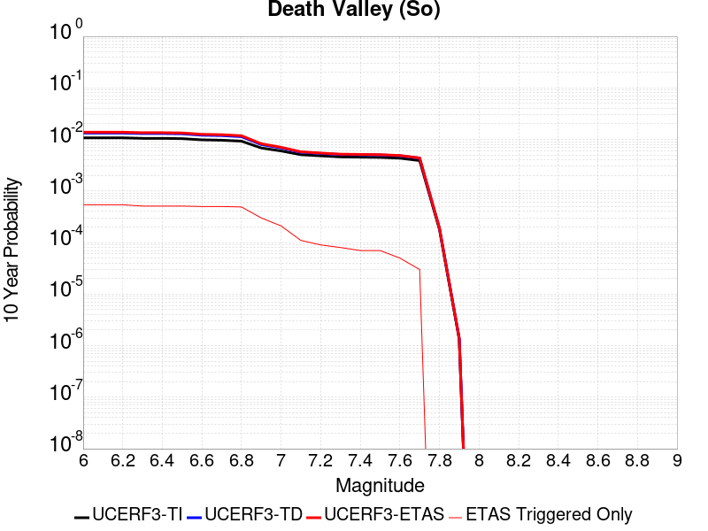 |

| Magnitude | 1 yr TI Prob | TD Prob | ETAS Prob | ETAS/TD Gain | ETAS Triggered Only | 10 yr TI Prob | TD Prob | ETAS Prob | ETAS/TD Gain | ETAS Triggered Only |
|-----|-----|-----|-----|-----|-----|-----|-----|-----|-----|-----|
| 6.0 | 0.0010787029 | 0.0013358344 | 0.0016853668 | 1.2616585 | 3.5E-4 | 0.010734817 | 0.0132813305 | 0.013814158 | 1.0401186 | 5.4E-4 |
| 6.1 | 0.0010787029 | 0.0013358344 | 0.0016853668 | 1.2616585 | 3.5E-4 | 0.010734817 | 0.0132813305 | 0.013814158 | 1.0401186 | 5.4E-4 |
| 6.2 | 0.0010787029 | 0.0013358344 | 0.0016853668 | 1.2616585 | 3.5E-4 | 0.010734817 | 0.0132813305 | 0.013814158 | 1.0401186 | 5.4E-4 |
| 6.3 | 0.0010555626 | 0.0013097833 | 0.0016393511 | 1.25162 | 3.3E-4 | 0.010505628 | 0.013023891 | 0.013527248 | 1.0386488 | 5.1E-4 |
| 6.4 | 0.0010555626 | 0.0013097833 | 0.0016393511 | 1.25162 | 3.3E-4 | 0.010505628 | 0.013023891 | 0.013527248 | 1.0386488 | 5.1E-4 |
| 6.5 | 0.0010410968 | 0.0012935897 | 0.0016231628 | 1.2547741 | 3.3E-4 | 0.010362327 | 0.012863837 | 0.013367277 | 1.039136 | 5.1E-4 |
| 6.6 | 9.876423E-4 | 0.0012156168 | 0.0015352279 | 1.2629209 | 3.2E-4 | 0.009832645 | 0.012092726 | 0.012586679 | 1.0408472 | 5.0E-4 |
| 6.7 | 9.711593E-4 | 0.0011948035 | 0.0015144212 | 1.2675065 | 3.2E-4 | 0.009669261 | 0.011886842 | 0.012380899 | 1.0415633 | 5.0E-4 |
| 6.8 | 9.29938E-4 | 0.0011371642 | 0.0014468116 | 1.272298 | 3.1E-4 | 0.009260561 | 0.011316297 | 0.011800752 | 1.0428104 | 4.9E-4 |
| 6.9 | 6.8514474E-4 | 7.982279E-4 | 9.780843E-4 | 1.2253195 | 1.8E-4 | 0.006830362 | 0.007954616 | 0.00825223 | 1.037414 | 3.0E-4 |
| 7.0 | 6.002687E-4 | 6.8614E-4 | 8.260439E-4 | 1.2039 | 1.4E-4 | 0.0059864987 | 0.006840916 | 0.0070494795 | 1.0304877 | 2.1E-4 |
| 7.1 | 5.068359E-4 | 5.667798E-4 | 6.567288E-4 | 1.1587018 | 9.0E-5 | 0.0050568148 | 0.0056537963 | 0.0057631745 | 1.019346 | 1.1E-4 |
| 7.2 | 4.81665E-4 | 5.3658657E-4 | 6.06549E-4 | 1.1303842 | 7.0E-5 | 0.0048062233 | 0.005353341 | 0.005442859 | 1.016722 | 9.0E-5 |
| 7.3 | 4.592835E-4 | 5.116505E-4 | 5.716198E-4 | 1.1172075 | 6.0E-5 | 0.0045833546 | 0.005105152 | 0.005184743 | 1.0155904 | 8.0E-5 |
| 7.4 | 4.5430884E-4 | 5.0638366E-4 | 5.5635837E-4 | 1.0986893 | 5.0E-5 | 0.004533812 | 0.0050527244 | 0.0051223706 | 1.0137839 | 7.0E-5 |
| 7.5 | 4.492982E-4 | 5.0104543E-4 | 5.510204E-4 | 1.0997413 | 5.0E-5 | 0.004483909 | 0.004999583 | 0.0050692335 | 1.0139312 | 7.0E-5 |
| 7.6 | 4.3398244E-4 | 4.8430942E-4 | 5.142949E-4 | 1.0619138 | 3.0E-5 | 0.0043313587 | 0.0048329635 | 0.0048827217 | 1.0102956 | 5.0E-5 |
| 7.7 | 3.8979502E-4 | 4.3534904E-4 | 4.553403E-4 | 1.0459201 | 2.0E-5 | 0.00389112 | 0.004345367 | 0.0043752366 | 1.0068738 | 3.0E-5 |
| 7.8 | 1.80467E-5 | 1.9035906E-5 | 1.9035906E-5 | 1.0 | 0.0 | 1.8045233E-4 | 1.903432E-4 | 1.903432E-4 | 1.0 | 0.0 |
| 7.9 | 1.335311E-7 | 1.392995E-7 | 1.392995E-7 | 1.0 | 0.0 | 1.3353102E-6 | 1.3929949E-6 | 1.3929949E-6 | 1.0 | 0.0 |

## Nelson Lake
*[(top)](#table-of-contents)*

| 1 Year | 10 Year |
|-----|-----|
|  | 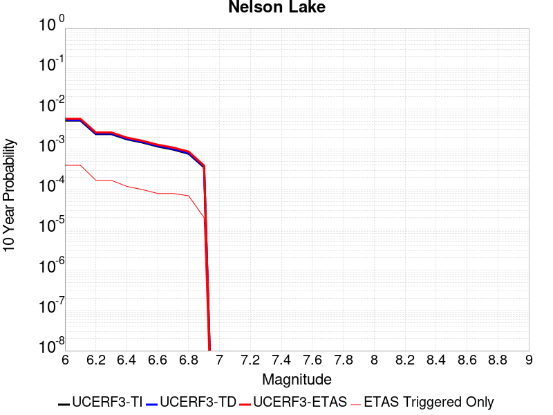 |

| Magnitude | 1 yr TI Prob | TD Prob | ETAS Prob | ETAS/TD Gain | ETAS Triggered Only | 10 yr TI Prob | TD Prob | ETAS Prob | ETAS/TD Gain | ETAS Triggered Only |
|-----|-----|-----|-----|-----|-----|-----|-----|-----|-----|-----|
| 6.0 | 5.1713863E-4 | 5.316893E-4 | 7.915511E-4 | 1.4887474 | 2.6E-4 | 0.0051593683 | 0.0053052 | 0.005703078 | 1.0749977 | 4.0E-4 |
| 6.1 | 5.1713863E-4 | 5.316893E-4 | 7.915511E-4 | 1.4887474 | 2.6E-4 | 0.0051593683 | 0.0053052 | 0.005703078 | 1.0749977 | 4.0E-4 |
| 6.2 | 2.3788778E-4 | 2.4501863E-4 | 3.7498676E-4 | 1.5304419 | 1.3E-4 | 0.0023763329 | 0.002447611 | 0.0026171948 | 1.0692855 | 1.7E-4 |
| 6.3 | 2.3788778E-4 | 2.4501863E-4 | 3.7498676E-4 | 1.5304419 | 1.3E-4 | 0.0023763329 | 0.002447611 | 0.0026171948 | 1.0692855 | 1.7E-4 |
| 6.4 | 1.7752586E-4 | 1.8312573E-4 | 2.831074E-4 | 1.545973 | 1.0E-4 | 0.001773841 | 0.0018298312 | 0.0019496116 | 1.0654598 | 1.2E-4 |
| 6.5 | 1.479309E-4 | 1.5276058E-4 | 2.3274835E-4 | 1.5236154 | 8.0E-5 | 0.0014783246 | 0.0015266296 | 0.0016264769 | 1.0654038 | 1.0E-4 |
| 6.6 | 1.1747423E-4 | 1.2152074E-4 | 1.8151345E-4 | 1.4936829 | 6.0E-5 | 0.0011741214 | 0.0012146046 | 0.0012945074 | 1.065785 | 8.0E-5 |
| 6.7 | 9.867457E-5 | 1.0222051E-4 | 1.6221438E-4 | 1.5869063 | 6.0E-5 | 9.863076E-4 | 0.0010217924 | 0.0011017107 | 1.0782138 | 8.0E-5 |
| 6.8 | 7.76117E-5 | 8.055216E-5 | 1.3054814E-4 | 1.6206658 | 5.0E-5 | 7.75846E-4 | 8.0528075E-4 | 8.7522436E-4 | 1.0868562 | 7.0E-5 |
| 6.9 | 3.56685E-5 | 3.725474E-5 | 4.725437E-5 | 1.2684122 | 1.0E-5 | 3.5662777E-4 | 3.7251622E-4 | 3.9250878E-4 | 1.053669 | 2.0E-5 |

## So Sierra Nevada
*[(top)](#table-of-contents)*

| 1 Year | 10 Year |
|-----|-----|
|  | 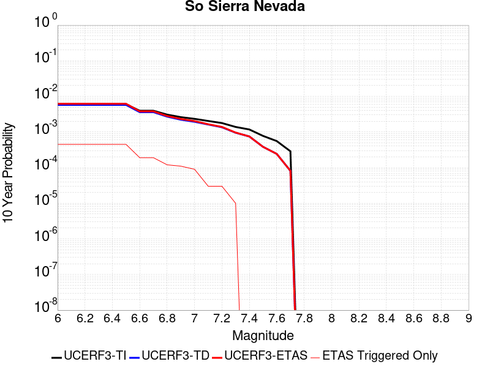 |

| Magnitude | 1 yr TI Prob | TD Prob | ETAS Prob | ETAS/TD Gain | ETAS Triggered Only | 10 yr TI Prob | TD Prob | ETAS Prob | ETAS/TD Gain | ETAS Triggered Only |
|-----|-----|-----|-----|-----|-----|-----|-----|-----|-----|-----|
| 6.0 | 6.024253E-4 | 5.7796884E-4 | 8.3781854E-4 | 1.4495913 | 2.6E-4 | 0.006007948 | 0.0057659256 | 0.006213331 | 1.0775948 | 4.5E-4 |
| 6.1 | 6.024253E-4 | 5.7796884E-4 | 8.3781854E-4 | 1.4495913 | 2.6E-4 | 0.006007948 | 0.0057659256 | 0.006213331 | 1.0775948 | 4.5E-4 |
| 6.2 | 6.024253E-4 | 5.7796884E-4 | 8.3781854E-4 | 1.4495913 | 2.6E-4 | 0.006007948 | 0.0057659256 | 0.006213331 | 1.0775948 | 4.5E-4 |
| 6.3 | 6.024253E-4 | 5.7796884E-4 | 8.3781854E-4 | 1.4495913 | 2.6E-4 | 0.006007948 | 0.0057659256 | 0.006213331 | 1.0775948 | 4.5E-4 |
| 6.4 | 6.024253E-4 | 5.7796884E-4 | 8.3781854E-4 | 1.4495913 | 2.6E-4 | 0.006007948 | 0.0057659256 | 0.006213331 | 1.0775948 | 4.5E-4 |
| 6.5 | 6.024253E-4 | 5.7796884E-4 | 8.3781854E-4 | 1.4495913 | 2.6E-4 | 0.006007948 | 0.0057659256 | 0.006213331 | 1.0775948 | 4.5E-4 |
| 6.6 | 3.9580427E-4 | 3.6182988E-4 | 4.9178285E-4 | 1.3591548 | 1.3E-4 | 0.003951 | 0.0036126992 | 0.003802013 | 1.0524023 | 1.9E-4 |
| 6.7 | 3.9580427E-4 | 3.6182988E-4 | 4.9178285E-4 | 1.3591548 | 1.3E-4 | 0.003951 | 0.0036126992 | 0.003802013 | 1.0524023 | 1.9E-4 |
| 6.8 | 3.0794772E-4 | 2.702183E-4 | 3.5019667E-4 | 1.295977 | 8.0E-5 | 0.0030752132 | 0.0026990133 | 0.0028186894 | 1.0443407 | 1.2E-4 |
| 6.9 | 2.614798E-4 | 2.218617E-4 | 2.9184617E-4 | 1.3154418 | 7.0E-5 | 0.0026117235 | 0.0022164746 | 0.002326231 | 1.0495183 | 1.1E-4 |
| 7.0 | 2.3438422E-4 | 1.937688E-4 | 2.6375524E-4 | 1.3611853 | 7.0E-5 | 0.0023413717 | 0.0019360614 | 0.0020258871 | 1.0463961 | 9.0E-5 |
| 7.1 | 2.0409399E-4 | 1.6236588E-4 | 1.9236101E-4 | 1.1847379 | 3.0E-5 | 0.0020390663 | 0.0016225285 | 0.0016524799 | 1.0184597 | 3.0E-5 |
| 7.2 | 1.7843937E-4 | 1.3594003E-4 | 1.6593596E-4 | 1.2206556 | 3.0E-5 | 0.0017829615 | 0.0013586186 | 0.0013885779 | 1.0220512 | 3.0E-5 |
| 7.3 | 1.3875226E-4 | 9.539993E-5 | 1.05398976E-4 | 1.1048119 | 1.0E-5 | 0.0013866565 | 9.5361867E-4 | 9.6360914E-4 | 1.0104764 | 1.0E-5 |
| 7.4 | 1.1780193E-4 | 7.494855E-5 | 7.494855E-5 | 1.0 | 0.0 | 0.001177395 | 7.4925774E-4 | 7.4925774E-4 | 1.0 | 0.0 |
| 7.5 | 7.770758E-5 | 3.8370872E-5 | 3.8370872E-5 | 1.0 | 0.0 | 7.7680405E-4 | 3.8364288E-4 | 3.8364288E-4 | 1.0 | 0.0 |
| 7.6 | 5.5726876E-5 | 2.4312982E-5 | 2.4312982E-5 | 1.0 | 0.0 | 5.5712904E-4 | 2.4310348E-4 | 2.4310348E-4 | 1.0 | 0.0 |
| 7.7 | 2.8745531E-5 | 8.129569E-6 | 8.129569E-6 | 1.0 | 0.0 | 2.8741814E-4 | 8.1292834E-5 | 8.1292834E-5 | 1.0 | 0.0 |

## Bicycle Lake
*[(top)](#table-of-contents)*

| 1 Year | 10 Year |
|-----|-----|
|  | 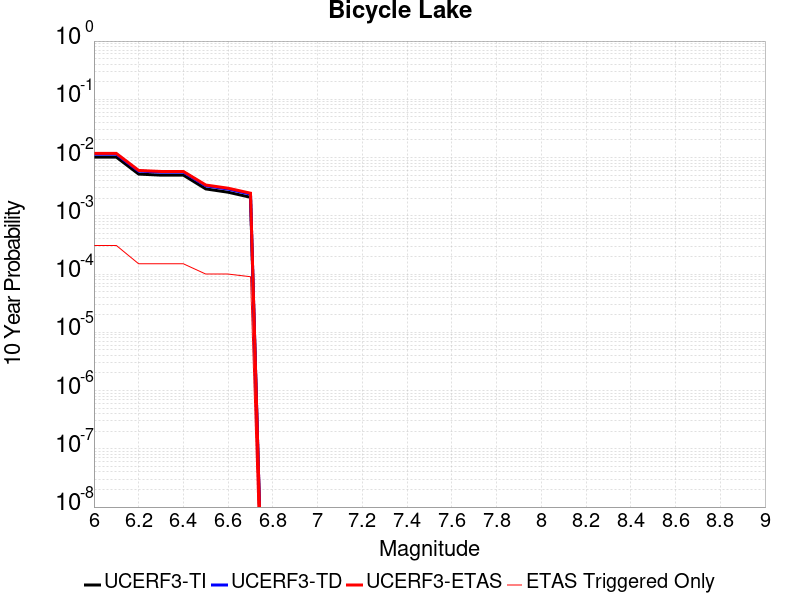 |

| Magnitude | 1 yr TI Prob | TD Prob | ETAS Prob | ETAS/TD Gain | ETAS Triggered Only | 10 yr TI Prob | TD Prob | ETAS Prob | ETAS/TD Gain | ETAS Triggered Only |
|-----|-----|-----|-----|-----|-----|-----|-----|-----|-----|-----|
| 6.0 | 0.0010233327 | 0.0011524827 | 0.0013622406 | 1.1820053 | 2.1E-4 | 0.01018633 | 0.011478369 | 0.0117848115 | 1.0266973 | 3.1E-4 |
| 6.1 | 0.0010233327 | 0.0011524827 | 0.0013622406 | 1.1820053 | 2.1E-4 | 0.01018633 | 0.011478369 | 0.0117848115 | 1.0266973 | 3.1E-4 |
| 6.2 | 5.2150246E-4 | 5.871877E-4 | 6.971231E-4 | 1.1872237 | 1.1E-4 | 0.0052028033 | 0.0058614668 | 0.006010588 | 1.0254408 | 1.5E-4 |
| 6.3 | 5.002399E-4 | 5.6334015E-4 | 6.732782E-4 | 1.195154 | 1.1E-4 | 0.0049911533 | 0.005624211 | 0.005773367 | 1.0265204 | 1.5E-4 |
| 6.4 | 5.002399E-4 | 5.6334015E-4 | 6.732782E-4 | 1.195154 | 1.1E-4 | 0.0049911533 | 0.005624211 | 0.005773367 | 1.0265204 | 1.5E-4 |
| 6.5 | 2.8995197E-4 | 3.2794854E-4 | 3.9792559E-4 | 1.2133781 | 7.0E-5 | 0.0028957394 | 0.003277282 | 0.0033769542 | 1.030413 | 1.0E-4 |
| 6.6 | 2.54302E-4 | 2.87662E-4 | 3.5764187E-4 | 1.2432711 | 7.0E-5 | 0.002540112 | 0.0028754652 | 0.0029751777 | 1.034677 | 1.0E-4 |
| 6.7 | 2.0822904E-4 | 2.3563292E-4 | 3.0561644E-4 | 1.2970022 | 7.0E-5 | 0.0020803404 | 0.0023563292 | 0.002446117 | 1.038105 | 9.0E-5 |

## San Andreas (Mojave N)
*[(top)](#table-of-contents)*

| 1 Year | 10 Year |
|-----|-----|
|  | 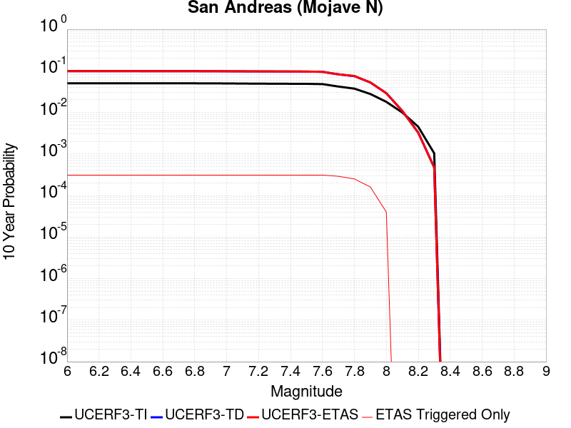 |

| Magnitude | 1 yr TI Prob | TD Prob | ETAS Prob | ETAS/TD Gain | ETAS Triggered Only | 10 yr TI Prob | TD Prob | ETAS Prob | ETAS/TD Gain | ETAS Triggered Only |
|-----|-----|-----|-----|-----|-----|-----|-----|-----|-----|-----|
| 6.0 | 0.0051410277 | 0.010072061 | 0.010279945 | 1.0206398 | 2.1E-4 | 0.05023708 | 0.09830668 | 0.0985862 | 1.0028434 | 3.1E-4 |
| 6.1 | 0.0051410277 | 0.010072061 | 0.010279945 | 1.0206398 | 2.1E-4 | 0.05023708 | 0.09830668 | 0.0985862 | 1.0028434 | 3.1E-4 |
| 6.2 | 0.0051410277 | 0.010072061 | 0.010279945 | 1.0206398 | 2.1E-4 | 0.05023708 | 0.09830668 | 0.0985862 | 1.0028434 | 3.1E-4 |
| 6.3 | 0.0051410277 | 0.010072061 | 0.010279945 | 1.0206398 | 2.1E-4 | 0.05023708 | 0.09830668 | 0.0985862 | 1.0028434 | 3.1E-4 |
| 6.4 | 0.0051410277 | 0.010072061 | 0.010279945 | 1.0206398 | 2.1E-4 | 0.05023708 | 0.09830668 | 0.0985862 | 1.0028434 | 3.1E-4 |
| 6.5 | 0.0051326132 | 0.010058507 | 0.010266395 | 1.0206678 | 2.1E-4 | 0.050156746 | 0.098184474 | 0.098464034 | 1.0028473 | 3.1E-4 |
| 6.6 | 0.0051326132 | 0.010058507 | 0.010266395 | 1.0206678 | 2.1E-4 | 0.050156746 | 0.098184474 | 0.098464034 | 1.0028473 | 3.1E-4 |
| 6.7 | 0.0051293927 | 0.010053317 | 0.010261206 | 1.0206786 | 2.1E-4 | 0.050125998 | 0.09813766 | 0.09841724 | 1.0028489 | 3.1E-4 |
| 6.8 | 0.0051248376 | 0.010045652 | 0.010253542 | 1.0206946 | 2.1E-4 | 0.05008251 | 0.098067686 | 0.09834729 | 1.0028511 | 3.1E-4 |
| 6.9 | 0.0051141046 | 0.010029125 | 0.010237019 | 1.0207291 | 2.1E-4 | 0.049980022 | 0.09791679 | 0.09819644 | 1.0028559 | 3.1E-4 |
| 7.0 | 0.005091073 | 0.009993665 | 0.010201566 | 1.0208033 | 2.1E-4 | 0.04976007 | 0.09759319 | 0.097872935 | 1.0028665 | 3.1E-4 |
| 7.1 | 0.005055068 | 0.009942883 | 0.010150794 | 1.0209106 | 2.1E-4 | 0.04941613 | 0.09712971 | 0.0974096 | 1.0028816 | 3.1E-4 |
| 7.2 | 0.0050299936 | 0.00990712 | 0.010115039 | 1.0209869 | 2.1E-4 | 0.049176537 | 0.09680298 | 0.09708297 | 1.0028924 | 3.1E-4 |
| 7.3 | 0.0050112694 | 0.009882583 | 0.010090508 | 1.0210395 | 2.1E-4 | 0.04899759 | 0.09657645 | 0.09685651 | 1.0028999 | 3.1E-4 |
| 7.4 | 0.0049933824 | 0.009851467 | 0.010059399 | 1.0211066 | 2.1E-4 | 0.04882661 | 0.096294634 | 0.09657478 | 1.0029093 | 3.1E-4 |
| 7.5 | 0.0049769743 | 0.009823605 | 0.010031543 | 1.021167 | 2.1E-4 | 0.048669744 | 0.09604082 | 0.096321054 | 1.0029178 | 3.1E-4 |
| 7.6 | 0.004902454 | 0.009643905 | 0.009851879 | 1.0215654 | 2.1E-4 | 0.047957025 | 0.0944232 | 0.09470392 | 1.0029731 | 3.1E-4 |
| 7.7 | 0.00427079 | 0.00832472 | 0.008523055 | 1.0238248 | 2.0E-4 | 0.04189639 | 0.08222524 | 0.08249139 | 1.0032369 | 2.9E-4 |
| 7.8 | 0.003794643 | 0.007545706 | 0.0077243475 | 1.0236746 | 1.8E-4 | 0.037304975 | 0.07471838 | 0.0749497 | 1.0030959 | 2.5E-4 |
| 7.9 | 0.0028072202 | 0.005227734 | 0.005367002 | 1.0266403 | 1.4E-4 | 0.02772022 | 0.052419845 | 0.052571457 | 1.0028923 | 1.6E-4 |
| 8.0 | 0.0018082283 | 0.002827002 | 0.0028569172 | 1.010582 | 3.0E-5 | 0.017935853 | 0.028944723 | 0.028983565 | 1.0013419 | 4.0E-5 |
| 8.1 | 9.988535E-4 | 0.0010117602 | 0.0010117602 | 1.0 | 0.0 | 0.009943757 | 0.01085485 | 0.01085485 | 1.0 | 0.0 |
| 8.2 | 4.5092785E-4 | 2.855783E-4 | 2.855783E-4 | 1.0 | 0.0 | 0.0045001395 | 0.0032481598 | 0.0032481598 | 1.0 | 0.0 |
| 8.3 | 1.034694E-4 | 3.9958737E-5 | 3.9958737E-5 | 1.0 | 0.0 | 0.0010342124 | 4.71872E-4 | 4.71872E-4 | 1.0 | 0.0 |

## Paradise
*[(top)](#table-of-contents)*

| 1 Year | 10 Year |
|-----|-----|
| 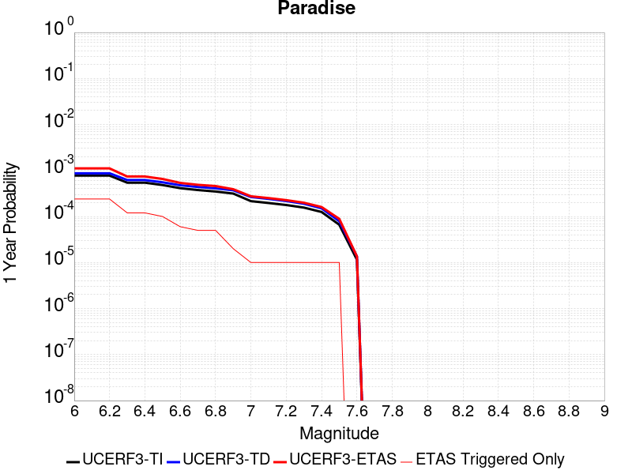 | 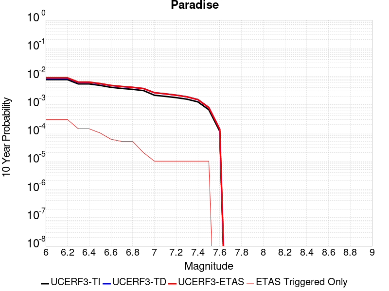 |

| Magnitude | 1 yr TI Prob | TD Prob | ETAS Prob | ETAS/TD Gain | ETAS Triggered Only | 10 yr TI Prob | TD Prob | ETAS Prob | ETAS/TD Gain | ETAS Triggered Only |
|-----|-----|-----|-----|-----|-----|-----|-----|-----|-----|-----|
| 6.0 | 7.7462377E-4 | 8.707567E-4 | 0.0011105477 | 1.2753824 | 2.4E-4 | 0.0077192914 | 0.008675828 | 0.008973225 | 1.0342789 | 3.0E-4 |
| 6.1 | 7.7462377E-4 | 8.707567E-4 | 0.0011105477 | 1.2753824 | 2.4E-4 | 0.0077192914 | 0.008675828 | 0.008973225 | 1.0342789 | 3.0E-4 |
| 6.2 | 7.7462377E-4 | 8.707567E-4 | 0.0011105477 | 1.2753824 | 2.4E-4 | 0.0077192914 | 0.008675828 | 0.008973225 | 1.0342789 | 3.0E-4 |
| 6.3 | 5.43912E-4 | 6.201478E-4 | 7.4007333E-4 | 1.1933823 | 1.2E-4 | 0.0054258266 | 0.0061847805 | 0.0063239145 | 1.0224962 | 1.4E-4 |
| 6.4 | 5.43912E-4 | 6.201478E-4 | 7.4007333E-4 | 1.1933823 | 1.2E-4 | 0.0054258266 | 0.0061847805 | 0.0063239145 | 1.0224962 | 1.4E-4 |
| 6.5 | 4.8255164E-4 | 5.5398804E-4 | 6.539326E-4 | 1.1804093 | 1.0E-4 | 0.0048150513 | 0.0055265697 | 0.0056260168 | 1.0179944 | 1.0E-4 |
| 6.6 | 4.1235037E-4 | 4.7782232E-4 | 5.377937E-4 | 1.1255097 | 6.0E-5 | 0.0041158604 | 0.0047683464 | 0.00482806 | 1.0125229 | 6.0E-5 |
| 6.7 | 3.7593965E-4 | 4.3858704E-4 | 4.885651E-4 | 1.1139524 | 5.0E-5 | 0.003753043 | 0.0043775835 | 0.0044273646 | 1.0113719 | 5.0E-5 |
| 6.8 | 3.4926904E-4 | 4.0911406E-4 | 4.590936E-4 | 1.1221653 | 5.0E-5 | 0.003487206 | 0.0040839664 | 0.0041337623 | 1.012193 | 5.0E-5 |
| 6.9 | 3.1521954E-4 | 3.7200077E-4 | 3.9199332E-4 | 1.0537434 | 2.0E-5 | 0.0031477278 | 0.0037141186 | 0.0037340445 | 1.0053649 | 2.0E-5 |
| 7.0 | 2.1568815E-4 | 2.6505004E-4 | 2.7504738E-4 | 1.0377188 | 1.0E-5 | 0.0021547892 | 0.002647492 | 0.0026574656 | 1.0037671 | 1.0E-5 |
| 7.1 | 1.9656324E-4 | 2.4165693E-4 | 2.516545E-4 | 1.041371 | 1.0E-5 | 0.0019638946 | 0.0024140922 | 0.002424068 | 1.0041324 | 1.0E-5 |
| 7.2 | 1.777326E-4 | 2.1687007E-4 | 2.2686791E-4 | 1.0461006 | 1.0E-5 | 0.0017759053 | 0.0021667324 | 0.0021767109 | 1.0046053 | 1.0E-5 |
| 7.3 | 1.5618425E-4 | 1.8935627E-4 | 1.9935438E-4 | 1.0528005 | 1.0E-5 | 0.0015607453 | 0.0018920946 | 0.0019020757 | 1.0052751 | 1.0E-5 |
| 7.4 | 1.2548068E-4 | 1.5073326E-4 | 1.6073175E-4 | 1.0663323 | 1.0E-5 | 0.0012540985 | 0.0015064516 | 0.0015164366 | 1.0066282 | 1.0E-5 |
| 7.5 | 6.631728E-5 | 7.896879E-5 | 8.8968E-5 | 1.1266223 | 1.0E-5 | 6.6297496E-4 | 7.8952993E-4 | 7.9952204E-4 | 1.0126557 | 1.0E-5 |
| 7.6 | 1.1540374E-5 | 1.3587022E-5 | 1.3587022E-5 | 1.0 | 0.0 | 1.1539775E-4 | 1.3586473E-4 | 1.3586473E-4 | 1.0 | 0.0 |

## Towne Pass
*[(top)](#table-of-contents)*

| 1 Year | 10 Year |
|-----|-----|
| 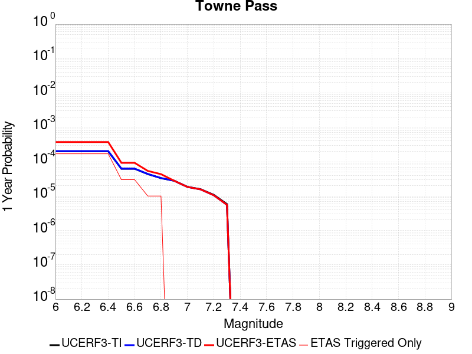 |  |

| Magnitude | 1 yr TI Prob | TD Prob | ETAS Prob | ETAS/TD Gain | ETAS Triggered Only | 10 yr TI Prob | TD Prob | ETAS Prob | ETAS/TD Gain | ETAS Triggered Only |
|-----|-----|-----|-----|-----|-----|-----|-----|-----|-----|-----|
| 6.0 | 2.0085352E-4 | 2.0319594E-4 | 3.731614E-4 | 1.8364608 | 1.7E-4 | 0.0020067208 | 0.0020305307 | 0.0022900028 | 1.1277853 | 2.6E-4 |
| 6.1 | 2.0085352E-4 | 2.0319594E-4 | 3.731614E-4 | 1.8364608 | 1.7E-4 | 0.0020067208 | 0.0020305307 | 0.0022900028 | 1.1277853 | 2.6E-4 |
| 6.2 | 2.0085352E-4 | 2.0319594E-4 | 3.731614E-4 | 1.8364608 | 1.7E-4 | 0.0020067208 | 0.0020305307 | 0.0022900028 | 1.1277853 | 2.6E-4 |
| 6.3 | 2.0085352E-4 | 2.0319594E-4 | 3.731614E-4 | 1.8364608 | 1.7E-4 | 0.0020067208 | 0.0020305307 | 0.0022900028 | 1.1277853 | 2.6E-4 |
| 6.4 | 2.0085352E-4 | 2.0319594E-4 | 3.731614E-4 | 1.8364608 | 1.7E-4 | 0.0020067208 | 0.0020305307 | 0.0022900028 | 1.1277853 | 2.6E-4 |
| 6.5 | 6.236998E-5 | 6.2771695E-5 | 9.276981E-5 | 1.4778924 | 3.0E-5 | 6.235248E-4 | 6.275514E-4 | 6.6752627E-4 | 1.0636998 | 4.0E-5 |
| 6.6 | 6.236998E-5 | 6.2771695E-5 | 9.276981E-5 | 1.4778924 | 3.0E-5 | 6.235248E-4 | 6.275514E-4 | 6.6752627E-4 | 1.0636998 | 4.0E-5 |
| 6.7 | 4.370358E-5 | 4.3884767E-5 | 5.3884327E-5 | 1.2278595 | 1.0E-5 | 4.3694986E-4 | 4.387667E-4 | 4.5875795E-4 | 1.0455623 | 2.0E-5 |
| 6.8 | 3.3291526E-5 | 3.335283E-5 | 4.3352495E-5 | 1.2998146 | 1.0E-5 | 3.3286537E-4 | 3.3348205E-4 | 3.534754E-4 | 1.0599532 | 2.0E-5 |
| 6.9 | 2.789431E-5 | 2.7890816E-5 | 2.7890816E-5 | 1.0 | 0.0 | 2.789081E-4 | 2.7887648E-4 | 2.8887368E-4 | 1.0358481 | 1.0E-5 |
| 7.0 | 1.8563835E-5 | 1.84315E-5 | 1.84315E-5 | 1.0 | 0.0 | 1.8562283E-4 | 1.8430054E-4 | 1.942987E-4 | 1.0542492 | 1.0E-5 |
| 7.1 | 1.5851423E-5 | 1.56546E-5 | 1.56546E-5 | 1.0 | 0.0 | 1.5850292E-4 | 1.5653571E-4 | 1.6653414E-4 | 1.0638732 | 1.0E-5 |
| 7.2 | 1.0857389E-5 | 1.0549237E-5 | 1.0549237E-5 | 1.0 | 0.0 | 1.0856859E-4 | 1.0548782E-4 | 1.1548677E-4 | 1.0947877 | 1.0E-5 |
| 7.3 | 5.8241935E-6 | 5.550157E-6 | 5.550157E-6 | 1.0 | 0.0 | 5.8240406E-5 | 5.5500383E-5 | 6.549983E-5 | 1.180169 | 1.0E-5 |

## Garlic Springs
*[(top)](#table-of-contents)*

| 1 Year | 10 Year |
|-----|-----|
|  | 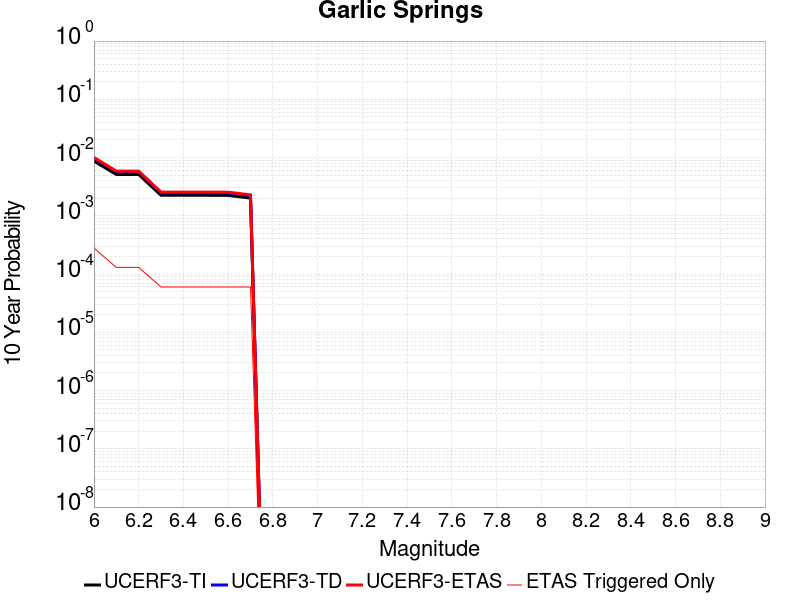 |

| Magnitude | 1 yr TI Prob | TD Prob | ETAS Prob | ETAS/TD Gain | ETAS Triggered Only | 10 yr TI Prob | TD Prob | ETAS Prob | ETAS/TD Gain | ETAS Triggered Only |
|-----|-----|-----|-----|-----|-----|-----|-----|-----|-----|-----|
| 6.0 | 8.7413884E-4 | 9.794E-4 | 0.0011891944 | 1.2142069 | 2.1E-4 | 0.008707083 | 0.009762381 | 0.010039648 | 1.0284015 | 2.8E-4 |
| 6.1 | 5.139737E-4 | 5.724994E-4 | 6.624479E-4 | 1.1571153 | 9.0E-5 | 0.005127866 | 0.005717204 | 0.005846461 | 1.0226084 | 1.3E-4 |
| 6.2 | 5.139737E-4 | 5.724994E-4 | 6.624479E-4 | 1.1571153 | 9.0E-5 | 0.005127866 | 0.005717204 | 0.005846461 | 1.0226084 | 1.3E-4 |
| 6.3 | 2.2521814E-4 | 2.4930414E-4 | 2.7929666E-4 | 1.120305 | 3.0E-5 | 0.0022499003 | 0.0024925028 | 0.0025523533 | 1.0240122 | 6.0E-5 |
| 6.4 | 2.2521814E-4 | 2.4930414E-4 | 2.7929666E-4 | 1.120305 | 3.0E-5 | 0.0022499003 | 0.0024925028 | 0.0025523533 | 1.0240122 | 6.0E-5 |
| 6.5 | 2.2521814E-4 | 2.4930414E-4 | 2.7929666E-4 | 1.120305 | 3.0E-5 | 0.0022499003 | 0.0024925028 | 0.0025523533 | 1.0240122 | 6.0E-5 |
| 6.6 | 2.2441156E-4 | 2.4841045E-4 | 2.78403E-4 | 1.1207379 | 3.0E-5 | 0.0022418506 | 0.002483586 | 0.002543437 | 1.0240986 | 6.0E-5 |
| 6.7 | 2.0138794E-4 | 2.2285717E-4 | 2.5285047E-4 | 1.1345854 | 3.0E-5 | 0.0020120554 | 0.0022285716 | 0.002288438 | 1.0268631 | 6.0E-5 |

## San Andreas (San Bernardino N)
*[(top)](#table-of-contents)*

| 1 Year | 10 Year |
|-----|-----|
|  |  |

| Magnitude | 1 yr TI Prob | TD Prob | ETAS Prob | ETAS/TD Gain | ETAS Triggered Only | 10 yr TI Prob | TD Prob | ETAS Prob | ETAS/TD Gain | ETAS Triggered Only |
|-----|-----|-----|-----|-----|-----|-----|-----|-----|-----|-----|
| 6.0 | 0.0074207084 | 0.016359491 | 0.016536547 | 1.0108228 | 1.8E-4 | 0.07177748 | 0.1502609 | 0.15047333 | 1.0014138 | 2.5E-4 |
| 6.1 | 0.0074207084 | 0.016359491 | 0.016536547 | 1.0108228 | 1.8E-4 | 0.07177748 | 0.1502609 | 0.15047333 | 1.0014138 | 2.5E-4 |
| 6.2 | 0.0074207084 | 0.016359491 | 0.016536547 | 1.0108228 | 1.8E-4 | 0.07177748 | 0.1502609 | 0.15047333 | 1.0014138 | 2.5E-4 |
| 6.3 | 0.0071393442 | 0.015797025 | 0.01597418 | 1.0112145 | 1.8E-4 | 0.06914291 | 0.14556077 | 0.14577438 | 1.0014675 | 2.5E-4 |
| 6.4 | 0.0071393442 | 0.015797025 | 0.01597418 | 1.0112145 | 1.8E-4 | 0.06914291 | 0.14556077 | 0.14577438 | 1.0014675 | 2.5E-4 |
| 6.5 | 0.0067310524 | 0.014982116 | 0.01515942 | 1.0118344 | 1.8E-4 | 0.06530788 | 0.13870342 | 0.13891014 | 1.0014904 | 2.4E-4 |
| 6.6 | 0.005788839 | 0.013149117 | 0.01332675 | 1.0135092 | 1.8E-4 | 0.056403454 | 0.122993305 | 0.12320379 | 1.0017114 | 2.4E-4 |
| 6.7 | 0.0053192247 | 0.012187905 | 0.012365711 | 1.0145887 | 1.8E-4 | 0.051936906 | 0.11478492 | 0.11499737 | 1.0018508 | 2.4E-4 |
| 6.8 | 0.0050023515 | 0.011427486 | 0.0116054285 | 1.0155715 | 1.8E-4 | 0.048912346 | 0.10818693 | 0.10840096 | 1.0019784 | 2.4E-4 |
| 6.9 | 0.0048866454 | 0.011146543 | 0.011324536 | 1.0159686 | 1.8E-4 | 0.04780577 | 0.10577726 | 0.10599188 | 1.002029 | 2.4E-4 |
| 7.0 | 0.0047382377 | 0.010799129 | 0.010977185 | 1.016488 | 1.8E-4 | 0.046384744 | 0.102747776 | 0.10296311 | 1.0020958 | 2.4E-4 |
| 7.1 | 0.0045664064 | 0.010372897 | 0.010551029 | 1.0171729 | 1.8E-4 | 0.044737056 | 0.099059336 | 0.09927557 | 1.0021828 | 2.4E-4 |
| 7.2 | 0.0042088944 | 0.009549032 | 0.009727313 | 1.0186701 | 1.8E-4 | 0.041300658 | 0.091790274 | 0.09200824 | 1.0023746 | 2.4E-4 |
| 7.3 | 0.0040445733 | 0.009002813 | 0.009161373 | 1.0176122 | 1.6E-4 | 0.03971748 | 0.08705745 | 0.087258294 | 1.002307 | 2.2E-4 |
| 7.4 | 0.0039163795 | 0.00859941 | 0.008758035 | 1.018446 | 1.6E-4 | 0.038480744 | 0.08351379 | 0.08371542 | 1.0024143 | 2.2E-4 |
| 7.5 | 0.003788775 | 0.0082308 | 0.008389483 | 1.0192791 | 1.6E-4 | 0.03724827 | 0.08023059 | 0.08042375 | 1.0024074 | 2.1E-4 |
| 7.6 | 0.0037076178 | 0.008008154 | 0.008166873 | 1.0198196 | 1.6E-4 | 0.036463667 | 0.0782203 | 0.078413874 | 1.0024747 | 2.1E-4 |
| 7.7 | 0.003495157 | 0.007443151 | 0.00760196 | 1.0213363 | 1.6E-4 | 0.034406938 | 0.07304912 | 0.07324378 | 1.0026648 | 2.1E-4 |
| 7.8 | 0.0032823787 | 0.0068650073 | 0.0070139775 | 1.0216999 | 1.5E-4 | 0.032343175 | 0.06770821 | 0.06789467 | 1.0027539 | 2.0E-4 |
| 7.9 | 0.0025967648 | 0.0050604967 | 0.005199788 | 1.0275253 | 1.4E-4 | 0.025666296 | 0.05064454 | 0.050796434 | 1.0029993 | 1.6E-4 |
| 8.0 | 0.0016793669 | 0.0027772845 | 0.0028072014 | 1.0107719 | 3.0E-5 | 0.016667323 | 0.028358717 | 0.028397582 | 1.0013705 | 4.0E-5 |
| 8.1 | 9.0926304E-4 | 9.816275E-4 | 9.816275E-4 | 1.0 | 0.0 | 0.009055517 | 0.01048279 | 0.01048279 | 1.0 | 0.0 |
| 8.2 | 4.0856065E-4 | 2.6890248E-4 | 2.6890248E-4 | 1.0 | 0.0 | 0.004078103 | 0.0030413123 | 0.0030413123 | 1.0 | 0.0 |
| 8.3 | 1.034694E-4 | 3.9958737E-5 | 3.9958737E-5 | 1.0 | 0.0 | 0.0010342124 | 4.71872E-4 | 4.71872E-4 | 1.0 | 0.0 |

## San Andreas (San Bernardino S)
*[(top)](#table-of-contents)*

| 1 Year | 10 Year |
|-----|-----|
| 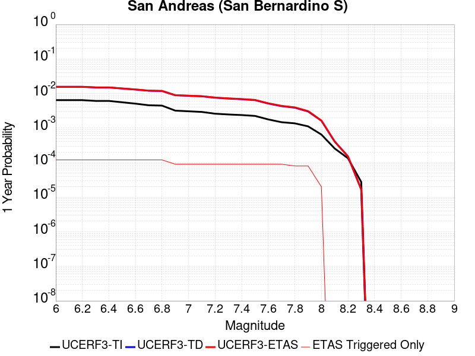 |  |

| Magnitude | 1 yr TI Prob | TD Prob | ETAS Prob | ETAS/TD Gain | ETAS Triggered Only | 10 yr TI Prob | TD Prob | ETAS Prob | ETAS/TD Gain | ETAS Triggered Only |
|-----|-----|-----|-----|-----|-----|-----|-----|-----|-----|-----|
| 6.0 | 0.006416472 | 0.015540493 | 0.015658628 | 1.0076017 | 1.2E-4 | 0.06234337 | 0.14283332 | 0.14299619 | 1.0011402 | 1.9E-4 |
| 6.1 | 0.006416472 | 0.015540493 | 0.015658628 | 1.0076017 | 1.2E-4 | 0.06234337 | 0.14283332 | 0.14299619 | 1.0011402 | 1.9E-4 |
| 6.2 | 0.006416472 | 0.015540493 | 0.015658628 | 1.0076017 | 1.2E-4 | 0.06234337 | 0.14283332 | 0.14299619 | 1.0011402 | 1.9E-4 |
| 6.3 | 0.006093008 | 0.014917629 | 0.015035839 | 1.0079242 | 1.2E-4 | 0.059286322 | 0.1375418 | 0.13770567 | 1.0011914 | 1.9E-4 |
| 6.4 | 0.006093008 | 0.014917629 | 0.015035839 | 1.0079242 | 1.2E-4 | 0.059286322 | 0.1375418 | 0.13770567 | 1.0011914 | 1.9E-4 |
| 6.5 | 0.0055621783 | 0.013895263 | 0.014013595 | 1.0085161 | 1.2E-4 | 0.05425003 | 0.12878914 | 0.12894596 | 1.0012176 | 1.8E-4 |
| 6.6 | 0.005082469 | 0.012991305 | 0.013109747 | 1.0091169 | 1.2E-4 | 0.049677886 | 0.12094915 | 0.12110738 | 1.0013082 | 1.8E-4 |
| 6.7 | 0.00455906 | 0.011996774 | 0.012115334 | 1.0098827 | 1.2E-4 | 0.04466656 | 0.11225749 | 0.11241728 | 1.0014235 | 1.8E-4 |
| 6.8 | 0.004458263 | 0.011769796 | 0.011888383 | 1.0100756 | 1.2E-4 | 0.043698758 | 0.11026781 | 0.11042796 | 1.0014524 | 1.8E-4 |
| 6.9 | 0.0031904527 | 0.008865628 | 0.0089548305 | 1.0100616 | 9.0E-5 | 0.031450346 | 0.08417914 | 0.08430736 | 1.0015231 | 1.4E-4 |
| 7.0 | 0.0030530186 | 0.008570245 | 0.008659474 | 1.0104115 | 9.0E-5 | 0.03011414 | 0.08149692 | 0.08162551 | 1.0015779 | 1.4E-4 |
| 7.1 | 0.0029250039 | 0.008269355 | 0.008358611 | 1.0107936 | 9.0E-5 | 0.028868021 | 0.07879588 | 0.07892485 | 1.0016367 | 1.4E-4 |
| 7.2 | 0.002601025 | 0.007547813 | 0.007637134 | 1.011834 | 9.0E-5 | 0.025707912 | 0.072249845 | 0.07237973 | 1.0017977 | 1.4E-4 |
| 7.3 | 0.0024707897 | 0.007130386 | 0.0072197444 | 1.012532 | 9.0E-5 | 0.024434982 | 0.06853227 | 0.06866267 | 1.0019028 | 1.4E-4 |
| 7.4 | 0.002374317 | 0.006823559 | 0.006912945 | 1.0130996 | 9.0E-5 | 0.023491086 | 0.06578475 | 0.06591554 | 1.0019882 | 1.4E-4 |
| 7.5 | 0.0022456115 | 0.006427166 | 0.006516588 | 1.013913 | 9.0E-5 | 0.022230545 | 0.062185578 | 0.062307492 | 1.0019605 | 1.3E-4 |
| 7.6 | 0.0017770125 | 0.00511881 | 0.0052083493 | 1.0174922 | 9.0E-5 | 0.017628696 | 0.050017312 | 0.050140813 | 1.0024691 | 1.3E-4 |
| 7.7 | 0.0014764034 | 0.004294649 | 0.0043842625 | 1.0208663 | 9.0E-5 | 0.01466633 | 0.04226858 | 0.04239309 | 1.0029455 | 1.3E-4 |
| 7.8 | 0.0013673597 | 0.003886403 | 0.003966092 | 1.0205046 | 8.0E-5 | 0.013589768 | 0.038434092 | 0.03854948 | 1.0030023 | 1.2E-4 |
| 7.9 | 0.0011196428 | 0.003015303 | 0.0030950618 | 1.0264513 | 8.0E-5 | 0.011140184 | 0.03014987 | 0.030246854 | 1.0032167 | 1.0E-4 |
| 8.0 | 6.478649E-4 | 0.0016327285 | 0.0016526958 | 1.0122294 | 2.0E-5 | 0.0064597935 | 0.01652123 | 0.016550735 | 1.0017859 | 3.0E-5 |
| 8.1 | 2.566744E-4 | 4.0802584E-4 | 4.0802584E-4 | 1.0 | 0.0 | 0.002563781 | 0.004383873 | 0.004383873 | 1.0 | 0.0 |
| 8.2 | 1.3374983E-4 | 1.5163339E-4 | 1.5163339E-4 | 1.0 | 0.0 | 0.0013366934 | 0.001704734 | 0.001704734 | 1.0 | 0.0 |
| 8.3 | 2.7576245E-5 | 1.6740116E-5 | 1.6740116E-5 | 1.0 | 0.0 | 2.7572823E-4 | 1.9866871E-4 | 1.9866871E-4 | 1.0 | 0.0 |

## Death Valley (Black Mtns Frontal)
*[(top)](#table-of-contents)*

| 1 Year | 10 Year |
|-----|-----|
|  | 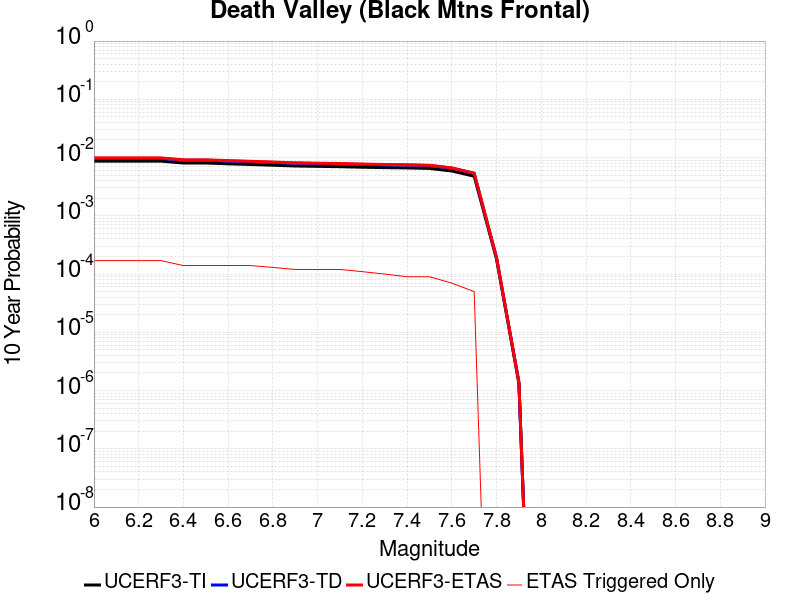 |

| Magnitude | 1 yr TI Prob | TD Prob | ETAS Prob | ETAS/TD Gain | ETAS Triggered Only | 10 yr TI Prob | TD Prob | ETAS Prob | ETAS/TD Gain | ETAS Triggered Only |
|-----|-----|-----|-----|-----|-----|-----|-----|-----|-----|-----|
| 6.0 | 8.71386E-4 | 9.737278E-4 | 0.0011036012 | 1.1333776 | 1.3E-4 | 0.00867977 | 0.009695467 | 0.009863818 | 1.017364 | 1.7E-4 |
| 6.1 | 8.71386E-4 | 9.737278E-4 | 0.0011036012 | 1.1333776 | 1.3E-4 | 0.00867977 | 0.009695467 | 0.009863818 | 1.017364 | 1.7E-4 |
| 6.2 | 8.71386E-4 | 9.737278E-4 | 0.0011036012 | 1.1333776 | 1.3E-4 | 0.00867977 | 0.009695467 | 0.009863818 | 1.017364 | 1.7E-4 |
| 6.3 | 8.71386E-4 | 9.737278E-4 | 0.0011036012 | 1.1333776 | 1.3E-4 | 0.00867977 | 0.009695467 | 0.009863818 | 1.017364 | 1.7E-4 |
| 6.4 | 8.0926094E-4 | 9.0428564E-4 | 0.0010141862 | 1.121533 | 1.1E-4 | 0.008063202 | 0.009006744 | 0.009145483 | 1.0154039 | 1.4E-4 |
| 6.5 | 8.0926094E-4 | 9.0428564E-4 | 0.0010141862 | 1.121533 | 1.1E-4 | 0.008063202 | 0.009006744 | 0.009145483 | 1.0154039 | 1.4E-4 |
| 6.6 | 7.8455906E-4 | 8.767036E-4 | 9.866072E-4 | 1.12536 | 1.1E-4 | 0.00781795 | 0.008733105 | 0.008871882 | 1.015891 | 1.4E-4 |
| 6.7 | 7.6334673E-4 | 8.5307995E-4 | 9.6298615E-4 | 1.1288345 | 1.1E-4 | 0.007607299 | 0.008498689 | 0.008637499 | 1.0163331 | 1.4E-4 |
| 6.8 | 7.4114406E-4 | 8.283693E-4 | 9.282864E-4 | 1.120619 | 1.0E-4 | 0.007386771 | 0.00825343 | 0.008382358 | 1.0156211 | 1.3E-4 |
| 6.9 | 7.1877235E-4 | 8.034762E-4 | 9.033959E-4 | 1.1243593 | 1.0E-4 | 0.0071645193 | 0.008006307 | 0.008125347 | 1.0148681 | 1.2E-4 |
| 7.0 | 7.086029E-4 | 7.9219165E-4 | 8.9211244E-4 | 1.1261321 | 1.0E-4 | 0.007063476 | 0.007894269 | 0.008013322 | 1.0150809 | 1.2E-4 |
| 7.1 | 6.9888023E-4 | 7.814087E-4 | 8.813305E-4 | 1.127874 | 1.0E-4 | 0.0069668638 | 0.0077871997 | 0.007906265 | 1.0152899 | 1.2E-4 |
| 7.2 | 6.846822E-4 | 7.656743E-4 | 8.5560535E-4 | 1.1174535 | 9.0E-5 | 0.006825765 | 0.007630946 | 0.0077401064 | 1.014305 | 1.1E-4 |
| 7.3 | 6.74051E-4 | 7.5390254E-4 | 8.3384226E-4 | 1.1060345 | 8.0E-5 | 0.006720101 | 0.007514031 | 0.0076132794 | 1.0132084 | 1.0E-4 |
| 7.4 | 6.660441E-4 | 7.4503786E-4 | 8.149857E-4 | 1.093885 | 7.0E-5 | 0.0066405144 | 0.00742598 | 0.0075153117 | 1.0120296 | 9.0E-5 |
| 7.5 | 6.531671E-4 | 7.308683E-4 | 8.0081716E-4 | 1.0957065 | 7.0E-5 | 0.006512506 | 0.007285223 | 0.007374567 | 1.0122638 | 9.0E-5 |
| 7.6 | 5.895042E-4 | 6.5975235E-4 | 7.097194E-4 | 1.075736 | 5.0E-5 | 0.0058794282 | 0.006578489 | 0.0066480287 | 1.0105708 | 7.0E-5 |
| 7.7 | 4.7936183E-4 | 5.364335E-4 | 5.76412E-4 | 1.0745265 | 4.0E-5 | 0.004783291 | 0.005351897 | 0.0054016295 | 1.0092925 | 5.0E-5 |
| 7.8 | 1.80467E-5 | 1.9035906E-5 | 1.9035906E-5 | 1.0 | 0.0 | 1.8045233E-4 | 1.903432E-4 | 1.903432E-4 | 1.0 | 0.0 |
| 7.9 | 1.335311E-7 | 1.392995E-7 | 1.392995E-7 | 1.0 | 0.0 | 1.3353102E-6 | 1.3929949E-6 | 1.3929949E-6 | 1.0 | 0.0 |

## Coyote Lake
*[(top)](#table-of-contents)*

| 1 Year | 10 Year |
|-----|-----|
| 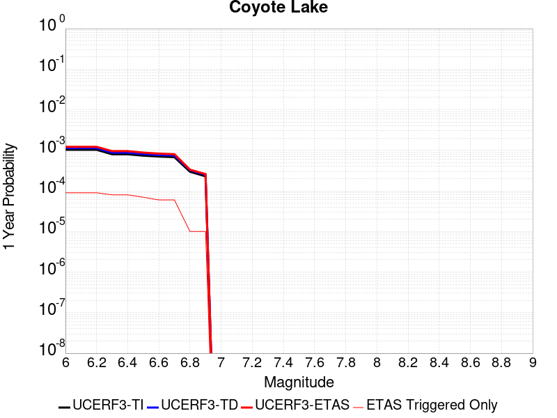 |  |

| Magnitude | 1 yr TI Prob | TD Prob | ETAS Prob | ETAS/TD Gain | ETAS Triggered Only | 10 yr TI Prob | TD Prob | ETAS Prob | ETAS/TD Gain | ETAS Triggered Only |
|-----|-----|-----|-----|-----|-----|-----|-----|-----|-----|-----|
| 6.0 | 0.0010327959 | 0.0011320722 | 0.0012219703 | 1.0794102 | 9.0E-5 | 0.010280091 | 0.01127023 | 0.011428426 | 1.0140367 | 1.6E-4 |
| 6.1 | 0.0010327959 | 0.0011320722 | 0.0012219703 | 1.0794102 | 9.0E-5 | 0.010280091 | 0.01127023 | 0.011428426 | 1.0140367 | 1.6E-4 |
| 6.2 | 0.0010327959 | 0.0011320722 | 0.0012219703 | 1.0794102 | 9.0E-5 | 0.010280091 | 0.01127023 | 0.011428426 | 1.0140367 | 1.6E-4 |
| 6.3 | 8.003548E-4 | 8.77364E-4 | 9.572938E-4 | 1.0911022 | 8.0E-5 | 0.007974784 | 0.008745047 | 0.008883823 | 1.015869 | 1.4E-4 |
| 6.4 | 8.003548E-4 | 8.77364E-4 | 9.572938E-4 | 1.0911022 | 8.0E-5 | 0.007974784 | 0.008745047 | 0.008883823 | 1.015869 | 1.4E-4 |
| 6.5 | 7.401293E-4 | 8.115328E-4 | 8.81476E-4 | 1.0861865 | 7.0E-5 | 0.0073766913 | 0.008091635 | 0.008220583 | 1.015936 | 1.3E-4 |
| 6.6 | 7.025667E-4 | 7.7053066E-4 | 8.3048444E-4 | 1.0778084 | 6.0E-5 | 0.0070034964 | 0.0076844944 | 0.007793649 | 1.0142045 | 1.1E-4 |
| 6.7 | 6.7955407E-4 | 7.449907E-4 | 8.04946E-4 | 1.080478 | 6.0E-5 | 0.006774798 | 0.0074308095 | 0.007539992 | 1.0146933 | 1.1E-4 |
| 6.8 | 2.971363E-4 | 3.2476074E-4 | 3.347575E-4 | 1.0307819 | 1.0E-5 | 0.0029673933 | 0.0032458024 | 0.0032657376 | 1.0061418 | 2.0E-5 |
| 6.9 | 2.2881327E-4 | 2.5009416E-4 | 2.6009165E-4 | 1.0399749 | 1.0E-5 | 0.002285778 | 0.0025009417 | 0.0025208916 | 1.007977 | 2.0E-5 |

## Helendale-So Lockhart
*[(top)](#table-of-contents)*

| 1 Year | 10 Year |
|-----|-----|
|  | 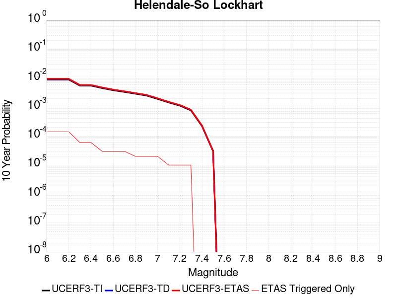 |

| Magnitude | 1 yr TI Prob | TD Prob | ETAS Prob | ETAS/TD Gain | ETAS Triggered Only | 10 yr TI Prob | TD Prob | ETAS Prob | ETAS/TD Gain | ETAS Triggered Only |
|-----|-----|-----|-----|-----|-----|-----|-----|-----|-----|-----|
| 6.0 | 9.0208417E-4 | 9.442103E-4 | 0.0010541064 | 1.1163895 | 1.1E-4 | 0.008984311 | 0.009404104 | 0.009542788 | 1.0147471 | 1.4E-4 |
| 6.1 | 9.0208417E-4 | 9.442103E-4 | 0.0010541064 | 1.1163895 | 1.1E-4 | 0.008984311 | 0.009404104 | 0.009542788 | 1.0147471 | 1.4E-4 |
| 6.2 | 9.0208417E-4 | 9.442103E-4 | 0.0010541064 | 1.1163895 | 1.1E-4 | 0.008984311 | 0.009404104 | 0.009542788 | 1.0147471 | 1.4E-4 |
| 6.3 | 5.5654737E-4 | 5.8086734E-4 | 6.308383E-4 | 1.0860282 | 5.0E-5 | 0.0055515557 | 0.0057937866 | 0.005853439 | 1.0102959 | 6.0E-5 |
| 6.4 | 5.5654737E-4 | 5.8086734E-4 | 6.308383E-4 | 1.0860282 | 5.0E-5 | 0.0055515557 | 0.0057937866 | 0.005853439 | 1.0102959 | 6.0E-5 |
| 6.5 | 4.585485E-4 | 4.783766E-4 | 5.0836225E-4 | 1.0626822 | 3.0E-5 | 0.0045760344 | 0.004773633 | 0.00480349 | 1.0062546 | 3.0E-5 |
| 6.6 | 3.858892E-4 | 4.0250685E-4 | 4.3249477E-4 | 1.074503 | 3.0E-5 | 0.003852198 | 0.0040178853 | 0.0040477645 | 1.0074366 | 3.0E-5 |
| 6.7 | 3.3701936E-4 | 3.5152066E-4 | 3.815101E-4 | 1.0853134 | 3.0E-5 | 0.0033650869 | 0.003509728 | 0.0035396225 | 1.0085176 | 3.0E-5 |
| 6.8 | 2.9216358E-4 | 3.0446946E-4 | 3.2446336E-4 | 1.065668 | 2.0E-5 | 0.0029177975 | 0.0030405847 | 0.003060524 | 1.0065577 | 2.0E-5 |
| 6.9 | 2.5246723E-4 | 2.629207E-4 | 2.8291543E-4 | 1.0760486 | 2.0E-5 | 0.002521806 | 0.0026261439 | 0.0026460914 | 1.0075958 | 2.0E-5 |
| 7.0 | 1.9271708E-4 | 2.0061784E-4 | 2.2061382E-4 | 1.0996721 | 2.0E-5 | 0.0019255003 | 0.0020043987 | 0.0020243586 | 1.009958 | 2.0E-5 |
| 7.1 | 1.4535317E-4 | 1.5119473E-4 | 1.6119321E-4 | 1.0661299 | 1.0E-5 | 0.0014525814 | 0.0015109401 | 0.0015209251 | 1.0066084 | 1.0E-5 |
| 7.2 | 1.1307546E-4 | 1.1760445E-4 | 1.2760329E-4 | 1.0850208 | 1.0E-5 | 0.0011301794 | 0.0011754404 | 0.0011854286 | 1.0084975 | 1.0E-5 |
| 7.3 | 7.734395E-5 | 8.046723E-5 | 9.046642E-5 | 1.1242642 | 1.0E-5 | 7.731704E-4 | 8.04396E-4 | 8.14388E-4 | 1.0124217 | 1.0E-5 |
| 7.4 | 2.2082493E-5 | 2.3015087E-5 | 2.3015087E-5 | 1.0 | 0.0 | 2.2080299E-4 | 2.3013157E-4 | 2.3013157E-4 | 1.0 | 0.0 |
| 7.5 | 2.9711643E-6 | 3.1002162E-6 | 3.1002162E-6 | 1.0 | 0.0 | 2.9711247E-5 | 3.1001808E-5 | 3.1001808E-5 | 1.0 | 0.0 |

## Death Valley (No)
*[(top)](#table-of-contents)*

| 1 Year | 10 Year |
|-----|-----|
| 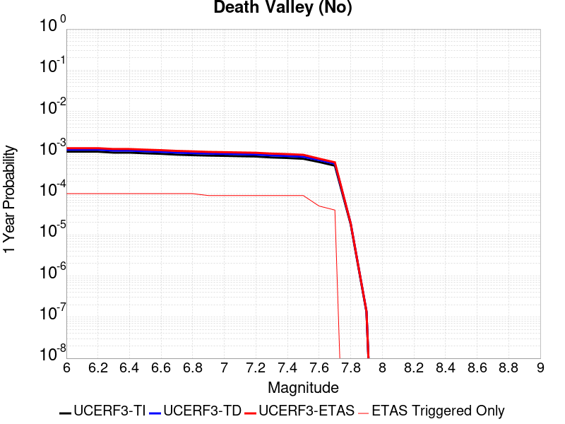 |  |

| Magnitude | 1 yr TI Prob | TD Prob | ETAS Prob | ETAS/TD Gain | ETAS Triggered Only | 10 yr TI Prob | TD Prob | ETAS Prob | ETAS/TD Gain | ETAS Triggered Only |
|-----|-----|-----|-----|-----|-----|-----|-----|-----|-----|-----|
| 6.0 | 0.001046937 | 0.0011733507 | 0.0012732333 | 1.085126 | 1.0E-4 | 0.010420183 | 0.011672469 | 0.011791068 | 1.0101606 | 1.2E-4 |
| 6.1 | 0.001046937 | 0.0011733507 | 0.0012732333 | 1.085126 | 1.0E-4 | 0.010420183 | 0.011672469 | 0.011791068 | 1.0101606 | 1.2E-4 |
| 6.2 | 0.001046937 | 0.0011733507 | 0.0012732333 | 1.085126 | 1.0E-4 | 0.010420183 | 0.011672469 | 0.011791068 | 1.0101606 | 1.2E-4 |
| 6.3 | 9.935491E-4 | 0.0011127274 | 0.0012126162 | 1.0897692 | 1.0E-4 | 0.009891188 | 0.011072383 | 0.011191054 | 1.0107177 | 1.2E-4 |
| 6.4 | 9.935491E-4 | 0.0011127274 | 0.0012126162 | 1.0897692 | 1.0E-4 | 0.009891188 | 0.011072383 | 0.011191054 | 1.0107177 | 1.2E-4 |
| 6.5 | 9.5791375E-4 | 0.0010722834 | 0.0011721762 | 1.093159 | 1.0E-4 | 0.009537951 | 0.010671882 | 0.0107906 | 1.0111245 | 1.2E-4 |
| 6.6 | 9.280632E-4 | 0.0010383982 | 0.0011382943 | 1.0962021 | 1.0E-4 | 0.009241969 | 0.01033622 | 0.01045498 | 1.0114896 | 1.2E-4 |
| 6.7 | 8.87976E-4 | 9.931781E-4 | 0.0010930789 | 1.1005869 | 1.0E-4 | 0.008844362 | 0.009888114 | 0.010006928 | 1.0120158 | 1.2E-4 |
| 6.8 | 8.629347E-4 | 9.655042E-4 | 0.0010654076 | 1.1034728 | 1.0E-4 | 0.008595915 | 0.009613798 | 0.009732645 | 1.012362 | 1.2E-4 |
| 6.9 | 8.4258494E-4 | 9.4335165E-4 | 0.0010332668 | 1.0953145 | 9.0E-5 | 0.008393973 | 0.009394166 | 0.009503133 | 1.0115994 | 1.1E-4 |
| 7.0 | 8.2900526E-4 | 9.286485E-4 | 0.0010185649 | 1.096825 | 9.0E-5 | 0.008259195 | 0.0092483675 | 0.009357351 | 1.011784 | 1.1E-4 |
| 7.1 | 8.137789E-4 | 9.118598E-4 | 0.0010017777 | 1.0986093 | 9.0E-5 | 0.008108052 | 0.009081865 | 0.009190866 | 1.012002 | 1.1E-4 |
| 7.2 | 7.99262E-4 | 8.95549E-4 | 9.854684E-4 | 1.100407 | 9.0E-5 | 0.007963934 | 0.008920078 | 0.009029097 | 1.0122217 | 1.1E-4 |
| 7.3 | 7.592395E-4 | 8.502876E-4 | 9.402111E-4 | 1.1057565 | 9.0E-5 | 0.0075665074 | 0.008470987 | 0.008580055 | 1.0128756 | 1.1E-4 |
| 7.4 | 7.363519E-4 | 8.245068E-4 | 9.144326E-4 | 1.1090661 | 9.0E-5 | 0.0073391674 | 0.008215112 | 0.008324209 | 1.0132799 | 1.1E-4 |
| 7.5 | 7.043401E-4 | 7.889664E-4 | 8.788954E-4 | 1.1139833 | 9.0E-5 | 0.007021119 | 0.007862279 | 0.007971414 | 1.0138808 | 1.1E-4 |
| 7.6 | 5.88396E-4 | 6.5861444E-4 | 7.0858153E-4 | 1.0758669 | 5.0E-5 | 0.005868405 | 0.006567178 | 0.006636718 | 1.0105891 | 7.0E-5 |
| 7.7 | 4.7936183E-4 | 5.364335E-4 | 5.76412E-4 | 1.0745265 | 4.0E-5 | 0.004783291 | 0.005351897 | 0.0054016295 | 1.0092925 | 5.0E-5 |
| 7.8 | 1.80467E-5 | 1.9035906E-5 | 1.9035906E-5 | 1.0 | 0.0 | 1.8045233E-4 | 1.903432E-4 | 1.903432E-4 | 1.0 | 0.0 |
| 7.9 | 1.335311E-7 | 1.392995E-7 | 1.392995E-7 | 1.0 | 0.0 | 1.3353102E-6 | 1.3929949E-6 | 1.3929949E-6 | 1.0 | 0.0 |

## San Andreas (Big Bend)
*[(top)](#table-of-contents)*

| 1 Year | 10 Year |
|-----|-----|
|  |  |

| Magnitude | 1 yr TI Prob | TD Prob | ETAS Prob | ETAS/TD Gain | ETAS Triggered Only | 10 yr TI Prob | TD Prob | ETAS Prob | ETAS/TD Gain | ETAS Triggered Only |
|-----|-----|-----|-----|-----|-----|-----|-----|-----|-----|-----|
| 6.0 | 0.0052979486 | 0.010419123 | 0.010518081 | 1.0094978 | 1.0E-4 | 0.051734097 | 0.10144164 | 0.10154947 | 1.001063 | 1.2E-4 |
| 6.1 | 0.0052979486 | 0.010419123 | 0.010518081 | 1.0094978 | 1.0E-4 | 0.051734097 | 0.10144164 | 0.10154947 | 1.001063 | 1.2E-4 |
| 6.2 | 0.0052979486 | 0.010419123 | 0.010518081 | 1.0094978 | 1.0E-4 | 0.051734097 | 0.10144164 | 0.10154947 | 1.001063 | 1.2E-4 |
| 6.3 | 0.0052979486 | 0.010419123 | 0.010518081 | 1.0094978 | 1.0E-4 | 0.051734097 | 0.10144164 | 0.10154947 | 1.001063 | 1.2E-4 |
| 6.4 | 0.0047704205 | 0.009570243 | 0.009639573 | 1.0072443 | 7.0E-5 | 0.046693064 | 0.09376797 | 0.09384953 | 1.0008699 | 9.0E-5 |
| 6.5 | 0.0047704205 | 0.009570243 | 0.009639573 | 1.0072443 | 7.0E-5 | 0.046693064 | 0.09376797 | 0.09384953 | 1.0008699 | 9.0E-5 |
| 6.6 | 0.0047074095 | 0.009470508 | 0.00952994 | 1.0062754 | 6.0E-5 | 0.046089325 | 0.09286199 | 0.09293456 | 1.0007815 | 8.0E-5 |
| 6.7 | 0.00467679 | 0.009426224 | 0.009475753 | 1.0052544 | 5.0E-5 | 0.045795817 | 0.09245627 | 0.09251979 | 1.0006871 | 7.0E-5 |
| 6.8 | 0.004657841 | 0.009398713 | 0.009438337 | 1.004216 | 4.0E-5 | 0.04561414 | 0.092203476 | 0.09225795 | 1.0005907 | 6.0E-5 |
| 6.9 | 0.004611638 | 0.009337694 | 0.009367415 | 1.0031828 | 3.0E-5 | 0.04517103 | 0.0916436 | 0.09168902 | 1.0004956 | 5.0E-5 |
| 7.0 | 0.004551957 | 0.009254351 | 0.0092840735 | 1.0032117 | 3.0E-5 | 0.044598386 | 0.090878054 | 0.09092351 | 1.0005002 | 5.0E-5 |
| 7.1 | 0.0045216335 | 0.009208827 | 0.00923855 | 1.0032277 | 3.0E-5 | 0.04430731 | 0.09045961 | 0.090505086 | 1.0005027 | 5.0E-5 |
| 7.2 | 0.0044808835 | 0.009152266 | 0.009181992 | 1.0032479 | 3.0E-5 | 0.043916024 | 0.08994013 | 0.08998563 | 1.0005059 | 5.0E-5 |
| 7.3 | 0.0044610105 | 0.0091222795 | 0.009152005 | 1.0032587 | 3.0E-5 | 0.043725148 | 0.0896613 | 0.089706816 | 1.0005077 | 5.0E-5 |
| 7.4 | 0.004447999 | 0.009102933 | 0.00913266 | 1.0032656 | 3.0E-5 | 0.043600157 | 0.08948149 | 0.08952701 | 1.0005088 | 5.0E-5 |
| 7.5 | 0.0044147377 | 0.009035361 | 0.00906509 | 1.0032903 | 3.0E-5 | 0.043280575 | 0.08885915 | 0.0889047 | 1.0005127 | 5.0E-5 |
| 7.6 | 0.0042910352 | 0.0087485295 | 0.008778267 | 1.0033991 | 3.0E-5 | 0.042091176 | 0.086236194 | 0.08628188 | 1.0005298 | 5.0E-5 |
| 7.7 | 0.0036482112 | 0.0073840916 | 0.0074138697 | 1.0040327 | 3.0E-5 | 0.035888977 | 0.07351081 | 0.07355713 | 1.0006301 | 5.0E-5 |
| 7.8 | 0.0033419547 | 0.00674393 | 0.006763795 | 1.0029457 | 2.0E-5 | 0.03292141 | 0.067246385 | 0.0672837 | 1.0005548 | 4.0E-5 |
| 7.9 | 0.0025743195 | 0.0048619667 | 0.004871918 | 1.0020468 | 1.0E-5 | 0.025447013 | 0.04891005 | 0.048929077 | 1.0003889 | 2.0E-5 |
| 8.0 | 0.0017438711 | 0.0027211946 | 0.0027311675 | 1.0036649 | 1.0E-5 | 0.017302496 | 0.027919443 | 0.027938884 | 1.0006963 | 2.0E-5 |
| 8.1 | 9.963791E-4 | 9.997933E-4 | 9.997933E-4 | 1.0 | 0.0 | 0.009919235 | 0.010748395 | 0.010748395 | 1.0 | 0.0 |
| 8.2 | 4.5092785E-4 | 2.855783E-4 | 2.855783E-4 | 1.0 | 0.0 | 0.0045001395 | 0.0032481598 | 0.0032481598 | 1.0 | 0.0 |
| 8.3 | 1.034694E-4 | 3.9958737E-5 | 3.9958737E-5 | 1.0 | 0.0 | 0.0010342124 | 4.71872E-4 | 4.71872E-4 | 1.0 | 0.0 |

## Cady
*[(top)](#table-of-contents)*

| 1 Year | 10 Year |
|-----|-----|
|  |  |

| Magnitude | 1 yr TI Prob | TD Prob | ETAS Prob | ETAS/TD Gain | ETAS Triggered Only | 10 yr TI Prob | TD Prob | ETAS Prob | ETAS/TD Gain | ETAS Triggered Only |
|-----|-----|-----|-----|-----|-----|-----|-----|-----|-----|-----|
| 6.0 | 0.0010374374 | 0.0011400137 | 0.0012099339 | 1.0613328 | 7.0E-5 | 0.010326075 | 0.011350671 | 0.011449535 | 1.00871 | 1.0E-4 |
| 6.1 | 0.0010374374 | 0.0011400137 | 0.0012099339 | 1.0613328 | 7.0E-5 | 0.010326075 | 0.011350671 | 0.011449535 | 1.00871 | 1.0E-4 |
| 6.2 | 0.0010374374 | 0.0011400137 | 0.0012099339 | 1.0613328 | 7.0E-5 | 0.010326075 | 0.011350671 | 0.011449535 | 1.00871 | 1.0E-4 |
| 6.3 | 5.7992124E-4 | 6.3519087E-4 | 6.651718E-4 | 1.0471998 | 3.0E-5 | 0.0057841022 | 0.0063368594 | 0.0063865427 | 1.0078404 | 5.0E-5 |
| 6.4 | 5.7992124E-4 | 6.3519087E-4 | 6.651718E-4 | 1.0471998 | 3.0E-5 | 0.0057841022 | 0.0063368594 | 0.0063865427 | 1.0078404 | 5.0E-5 |
| 6.5 | 3.1840094E-4 | 3.4808964E-4 | 3.5808617E-4 | 1.0287182 | 1.0E-5 | 0.0031794512 | 0.003476678 | 0.0035065736 | 1.0085989 | 3.0E-5 |
| 6.6 | 3.034899E-4 | 3.3210934E-4 | 3.42106E-4 | 1.0301006 | 1.0E-5 | 0.0030307577 | 0.0033173522 | 0.0033472527 | 1.0090134 | 3.0E-5 |
| 6.7 | 2.5484123E-4 | 2.7863705E-4 | 2.8863424E-4 | 1.035879 | 1.0E-5 | 0.0025454918 | 0.0027840321 | 0.0028139488 | 1.0107458 | 3.0E-5 |
| 6.8 | 9.281505E-5 | 1.01218044E-4 | 1.1121703E-4 | 1.0987866 | 1.0E-5 | 9.2776294E-4 | 0.0010118741 | 0.0010218639 | 1.0098727 | 1.0E-5 |
| 6.9 | 3.937079E-5 | 4.3292366E-5 | 4.3292366E-5 | 1.0 | 0.0 | 3.9363815E-4 | 4.3287227E-4 | 4.3287227E-4 | 1.0 | 0.0 |
| 7.0 | 3.578281E-5 | 3.935161E-5 | 3.935161E-5 | 1.0 | 0.0 | 3.577705E-4 | 3.9347887E-4 | 3.9347887E-4 | 1.0 | 0.0 |

## Elsinore (Glen Ivy) rev
*[(top)](#table-of-contents)*

| 1 Year | 10 Year |
|-----|-----|
|  |  |

| Magnitude | 1 yr TI Prob | TD Prob | ETAS Prob | ETAS/TD Gain | ETAS Triggered Only | 10 yr TI Prob | TD Prob | ETAS Prob | ETAS/TD Gain | ETAS Triggered Only |
|-----|-----|-----|-----|-----|-----|-----|-----|-----|-----|-----|
| 6.0 | 0.008420097 | 0.01523435 | 0.015322979 | 1.0058177 | 9.0E-5 | 0.081081145 | 0.139691 | 0.13976842 | 1.0005543 | 9.0E-5 |
| 6.1 | 0.008420097 | 0.01523435 | 0.015322979 | 1.0058177 | 9.0E-5 | 0.081081145 | 0.139691 | 0.13976842 | 1.0005543 | 9.0E-5 |
| 6.2 | 0.008420097 | 0.01523435 | 0.015322979 | 1.0058177 | 9.0E-5 | 0.081081145 | 0.139691 | 0.13976842 | 1.0005543 | 9.0E-5 |
| 6.3 | 0.005262531 | 0.009217643 | 0.009257275 | 1.0042995 | 4.0E-5 | 0.0513964 | 0.087018766 | 0.087064415 | 1.0005246 | 5.0E-5 |
| 6.4 | 0.005262531 | 0.009217643 | 0.009257275 | 1.0042995 | 4.0E-5 | 0.0513964 | 0.087018766 | 0.087064415 | 1.0005246 | 5.0E-5 |
| 6.5 | 0.001909235 | 0.002418118 | 0.0024380698 | 1.008251 | 2.0E-5 | 0.01892915 | 0.023739774 | 0.0237593 | 1.0008224 | 2.0E-5 |
| 6.6 | 0.0013063047 | 0.0013634728 | 0.0013734591 | 1.0073242 | 1.0E-5 | 0.012986525 | 0.01356449 | 0.013574354 | 1.0007272 | 1.0E-5 |
| 6.7 | 0.0011571734 | 0.0011511071 | 0.0011610957 | 1.0086772 | 1.0E-5 | 0.011511663 | 0.011465305 | 0.0114751905 | 1.0008622 | 1.0E-5 |
| 6.8 | 8.686314E-4 | 7.530596E-4 | 7.530596E-4 | 1.0 | 0.0 | 0.008652439 | 0.0075104153 | 0.0075104153 | 1.0 | 0.0 |
| 6.9 | 7.8461546E-4 | 6.4326206E-4 | 6.4326206E-4 | 1.0 | 0.0 | 0.007818509 | 0.006418224 | 0.006418224 | 1.0 | 0.0 |
| 7.0 | 7.490812E-4 | 5.973365E-4 | 5.973365E-4 | 1.0 | 0.0 | 0.007465612 | 0.005961301 | 0.005961301 | 1.0 | 0.0 |
| 7.1 | 6.919436E-4 | 5.3442345E-4 | 5.3442345E-4 | 1.0 | 0.0 | 0.006897931 | 0.0053347396 | 0.0053347396 | 1.0 | 0.0 |
| 7.2 | 6.049042E-4 | 4.436836E-4 | 4.436836E-4 | 1.0 | 0.0 | 0.006032603 | 0.004429393 | 0.004429393 | 1.0 | 0.0 |
| 7.3 | 5.2951806E-4 | 3.7763652E-4 | 3.7763652E-4 | 1.0 | 0.0 | 0.005282581 | 0.0037703344 | 0.0037703344 | 1.0 | 0.0 |
| 7.4 | 4.7370812E-4 | 3.3141018E-4 | 3.3141018E-4 | 1.0 | 0.0 | 0.004726996 | 0.0033093104 | 0.0033093104 | 1.0 | 0.0 |
| 7.5 | 4.0021708E-4 | 2.726287E-4 | 2.726287E-4 | 1.0 | 0.0 | 0.0039949706 | 0.0027230675 | 0.0027230675 | 1.0 | 0.0 |
| 7.6 | 3.6466747E-4 | 2.4455928E-4 | 2.4455928E-4 | 1.0 | 0.0 | 0.0036406964 | 0.002443018 | 0.002443018 | 1.0 | 0.0 |
| 7.7 | 2.172226E-4 | 1.2154412E-4 | 1.2154412E-4 | 1.0 | 0.0 | 0.0021701038 | 0.0012148495 | 0.0012148495 | 1.0 | 0.0 |
| 7.8 | 1.1840509E-5 | 4.897146E-6 | 4.897146E-6 | 1.0 | 0.0 | 1.1839878E-4 | 4.897071E-5 | 4.897071E-5 | 1.0 | 0.0 |
| 7.9 | 3.4838732E-7 | 1.7948528E-7 | 1.7948528E-7 | 1.0 | 0.0 | 3.4838679E-6 | 1.7948516E-6 | 1.7948516E-6 | 1.0 | 0.0 |

## Red Pass
*[(top)](#table-of-contents)*

| 1 Year | 10 Year |
|-----|-----|
|  |  |

| Magnitude | 1 yr TI Prob | TD Prob | ETAS Prob | ETAS/TD Gain | ETAS Triggered Only | 10 yr TI Prob | TD Prob | ETAS Prob | ETAS/TD Gain | ETAS Triggered Only |
|-----|-----|-----|-----|-----|-----|-----|-----|-----|-----|-----|
| 6.0 | 4.308141E-4 | 4.4611385E-4 | 4.9609155E-4 | 1.112029 | 5.0E-5 | 0.0042997985 | 0.004453941 | 0.0045435396 | 1.0201168 | 9.0E-5 |
| 6.1 | 1.9043336E-4 | 1.9697649E-4 | 2.1697255E-4 | 1.1015149 | 2.0E-5 | 0.0019027026 | 0.0019684862 | 0.0020084074 | 1.0202802 | 4.0E-5 |
| 6.2 | 1.9043336E-4 | 1.9697649E-4 | 2.1697255E-4 | 1.1015149 | 2.0E-5 | 0.0019027026 | 0.0019684862 | 0.0020084074 | 1.0202802 | 4.0E-5 |
| 6.3 | 7.265574E-5 | 7.5194075E-5 | 9.5192576E-5 | 1.2659584 | 2.0E-5 | 7.263199E-4 | 7.518251E-4 | 7.7181007E-4 | 1.0265819 | 2.0E-5 |
| 6.4 | 7.265574E-5 | 7.5194075E-5 | 9.5192576E-5 | 1.2659584 | 2.0E-5 | 7.263199E-4 | 7.518251E-4 | 7.7181007E-4 | 1.0265819 | 2.0E-5 |
| 6.5 | 5.153449E-5 | 5.333643E-5 | 5.333643E-5 | 1.0 | 0.0 | 5.1522546E-4 | 5.3336425E-4 | 5.3336425E-4 | 1.0 | 0.0 |

## Death Valley (Fish Lake Valley)
*[(top)](#table-of-contents)*

| 1 Year | 10 Year |
|-----|-----|
|  |  |

| Magnitude | 1 yr TI Prob | TD Prob | ETAS Prob | ETAS/TD Gain | ETAS Triggered Only | 10 yr TI Prob | TD Prob | ETAS Prob | ETAS/TD Gain | ETAS Triggered Only |
|-----|-----|-----|-----|-----|-----|-----|-----|-----|-----|-----|
| 6.0 | 0.0020185246 | 0.00246352 | 0.002543323 | 1.0323938 | 8.0E-5 | 0.02000288 | 0.02438804 | 0.024475845 | 1.0036004 | 9.0E-5 |
| 6.1 | 0.0020185246 | 0.00246352 | 0.002543323 | 1.0323938 | 8.0E-5 | 0.02000288 | 0.02438804 | 0.024475845 | 1.0036004 | 9.0E-5 |
| 6.2 | 0.0020185246 | 0.00246352 | 0.002543323 | 1.0323938 | 8.0E-5 | 0.02000288 | 0.02438804 | 0.024475845 | 1.0036004 | 9.0E-5 |
| 6.3 | 0.0014785219 | 0.0017522823 | 0.0018221596 | 1.0398779 | 7.0E-5 | 0.014687235 | 0.017391697 | 0.017470306 | 1.0045199 | 8.0E-5 |
| 6.4 | 0.0014785219 | 0.0017522823 | 0.0018221596 | 1.0398779 | 7.0E-5 | 0.014687235 | 0.017391697 | 0.017470306 | 1.0045199 | 8.0E-5 |
| 6.5 | 0.0012748998 | 0.0014916563 | 0.0015615518 | 1.0468577 | 7.0E-5 | 0.012676105 | 0.01482131 | 0.014900124 | 1.0053177 | 8.0E-5 |
| 6.6 | 0.0011107022 | 0.001285947 | 0.001355857 | 1.0543646 | 7.0E-5 | 0.011051672 | 0.012788472 | 0.012867448 | 1.0061756 | 8.0E-5 |
| 6.7 | 9.888117E-4 | 0.0011358924 | 0.0012058129 | 1.0615555 | 7.0E-5 | 0.009844234 | 0.0113035245 | 0.011382621 | 1.0069975 | 8.0E-5 |
| 6.8 | 8.7057345E-4 | 9.918819E-4 | 0.0010618125 | 1.0705029 | 7.0E-5 | 0.008671708 | 0.009876307 | 0.009955517 | 1.0080202 | 8.0E-5 |
| 6.9 | 7.5657194E-4 | 8.5483067E-4 | 9.2477084E-4 | 1.0818175 | 7.0E-5 | 0.007540013 | 0.008516356 | 0.008595675 | 1.0093137 | 8.0E-5 |
| 7.0 | 6.750118E-4 | 7.5829215E-4 | 8.282391E-4 | 1.0922427 | 7.0E-5 | 0.006729651 | 0.007557665 | 0.0076370602 | 1.0105053 | 8.0E-5 |
| 7.1 | 6.5435225E-4 | 7.343198E-4 | 8.042684E-4 | 1.0952563 | 7.0E-5 | 0.006524288 | 0.007319527 | 0.0073989416 | 1.0108497 | 8.0E-5 |
| 7.2 | 6.514716E-4 | 7.3105923E-4 | 8.010081E-4 | 1.0956814 | 7.0E-5 | 0.006495651 | 0.007287136 | 0.007366553 | 1.0108982 | 8.0E-5 |
| 7.3 | 6.451563E-4 | 7.2397524E-4 | 7.9392456E-4 | 1.0966184 | 7.0E-5 | 0.0064328653 | 0.0072167586 | 0.007296181 | 1.0110053 | 8.0E-5 |
| 7.4 | 6.3438306E-4 | 7.1188126E-4 | 7.8183145E-4 | 1.098261 | 7.0E-5 | 0.006325751 | 0.0070965975 | 0.00717603 | 1.011193 | 8.0E-5 |
| 7.5 | 6.10721E-4 | 6.8568724E-4 | 7.556392E-4 | 1.1020174 | 7.0E-5 | 0.0060904534 | 0.006836299 | 0.006915752 | 1.0116222 | 8.0E-5 |
| 7.6 | 5.383166E-4 | 6.040327E-4 | 6.5400254E-4 | 1.082727 | 5.0E-5 | 0.0053701443 | 0.0060244408 | 0.0060840794 | 1.0098994 | 6.0E-5 |
| 7.7 | 4.6625308E-4 | 5.228439E-4 | 5.6282297E-4 | 1.0764647 | 4.0E-5 | 0.0046527605 | 0.0052166474 | 0.0052564386 | 1.0076277 | 4.0E-5 |
| 7.8 | 1.6217007E-5 | 1.713869E-5 | 1.713869E-5 | 1.0 | 0.0 | 1.6215823E-4 | 1.7137405E-4 | 1.7137405E-4 | 1.0 | 0.0 |
| 7.9 | 1.335311E-7 | 1.392995E-7 | 1.392995E-7 | 1.0 | 0.0 | 1.3353102E-6 | 1.3929949E-6 | 1.3929949E-6 | 1.0 | 0.0 |

## Manix-Afton Hills
*[(top)](#table-of-contents)*

| 1 Year | 10 Year |
|-----|-----|
|  | 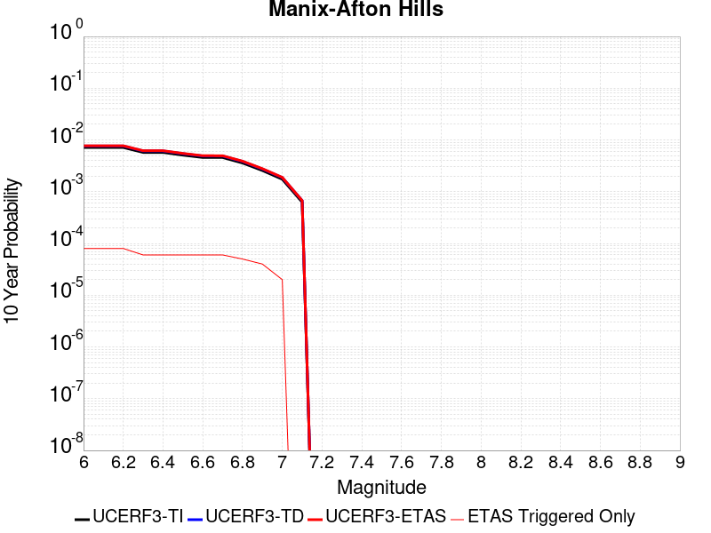 |

| Magnitude | 1 yr TI Prob | TD Prob | ETAS Prob | ETAS/TD Gain | ETAS Triggered Only | 10 yr TI Prob | TD Prob | ETAS Prob | ETAS/TD Gain | ETAS Triggered Only |
|-----|-----|-----|-----|-----|-----|-----|-----|-----|-----|-----|
| 6.0 | 7.189342E-4 | 7.673321E-4 | 8.073014E-4 | 1.0520886 | 4.0E-5 | 0.0071661277 | 0.007648582 | 0.0077279704 | 1.0103794 | 8.0E-5 |
| 6.1 | 7.189342E-4 | 7.673321E-4 | 8.073014E-4 | 1.0520886 | 4.0E-5 | 0.0071661277 | 0.007648582 | 0.0077279704 | 1.0103794 | 8.0E-5 |
| 6.2 | 7.189342E-4 | 7.673321E-4 | 8.073014E-4 | 1.0520886 | 4.0E-5 | 0.0071661277 | 0.007648582 | 0.0077279704 | 1.0103794 | 8.0E-5 |
| 6.3 | 5.763835E-4 | 6.151733E-4 | 6.4515485E-4 | 1.0487367 | 3.0E-5 | 0.005748908 | 0.0061357445 | 0.006195376 | 1.0097188 | 6.0E-5 |
| 6.4 | 5.763835E-4 | 6.151733E-4 | 6.4515485E-4 | 1.0487367 | 3.0E-5 | 0.005748908 | 0.0061357445 | 0.006195376 | 1.0097188 | 6.0E-5 |
| 6.5 | 5.1064545E-4 | 5.453545E-4 | 5.7533814E-4 | 1.05498 | 3.0E-5 | 0.0050947363 | 0.0054410887 | 0.0055007623 | 1.0109673 | 6.0E-5 |
| 6.6 | 4.5958988E-4 | 4.9108E-4 | 5.2106526E-4 | 1.0610598 | 3.0E-5 | 0.0045864056 | 0.0049008303 | 0.004960536 | 1.0121828 | 6.0E-5 |
| 6.7 | 4.591348E-4 | 4.905835E-4 | 5.2056875E-4 | 1.0611217 | 3.0E-5 | 0.004581874 | 0.004895887 | 0.004955593 | 1.0121952 | 6.0E-5 |
| 6.8 | 3.5994186E-4 | 3.850171E-4 | 4.1500558E-4 | 1.0778886 | 3.0E-5 | 0.003593594 | 0.0038443056 | 0.0038941135 | 1.0129563 | 5.0E-5 |
| 6.9 | 2.5735417E-4 | 2.7500023E-4 | 2.9499474E-4 | 1.0727072 | 2.0E-5 | 0.0025705635 | 0.0027472044 | 0.0027870946 | 1.0145203 | 4.0E-5 |
| 7.0 | 1.746775E-4 | 1.8730946E-4 | 1.9730759E-4 | 1.0533776 | 1.0E-5 | 0.0017454025 | 0.0018719183 | 0.0018918809 | 1.0106642 | 2.0E-5 |
| 7.1 | 6.29962E-5 | 6.7491426E-5 | 6.7491426E-5 | 1.0 | 0.0 | 6.297835E-4 | 6.7486946E-4 | 6.7486946E-4 | 1.0 | 0.0 |

## Cleghorn Lake
*[(top)](#table-of-contents)*

| 1 Year | 10 Year |
|-----|-----|
|  | 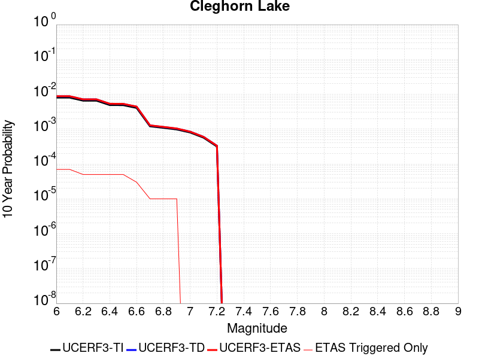 |

| Magnitude | 1 yr TI Prob | TD Prob | ETAS Prob | ETAS/TD Gain | ETAS Triggered Only | 10 yr TI Prob | TD Prob | ETAS Prob | ETAS/TD Gain | ETAS Triggered Only |
|-----|-----|-----|-----|-----|-----|-----|-----|-----|-----|-----|
| 6.0 | 8.067362E-4 | 8.7597774E-4 | 9.3592517E-4 | 1.0684348 | 6.0E-5 | 0.008038137 | 0.008730675 | 0.008800064 | 1.0079477 | 7.0E-5 |
| 6.1 | 8.067362E-4 | 8.7597774E-4 | 9.3592517E-4 | 1.0684348 | 6.0E-5 | 0.008038137 | 0.008730675 | 0.008800064 | 1.0079477 | 7.0E-5 |
| 6.2 | 6.585225E-4 | 7.13684E-4 | 7.5365545E-4 | 1.0560073 | 4.0E-5 | 0.0065657445 | 0.007118716 | 0.00716836 | 1.0069737 | 5.0E-5 |
| 6.3 | 6.585225E-4 | 7.13684E-4 | 7.5365545E-4 | 1.0560073 | 4.0E-5 | 0.0065657445 | 0.007118716 | 0.00716836 | 1.0069737 | 5.0E-5 |
| 6.4 | 4.912829E-4 | 5.305669E-4 | 5.705457E-4 | 1.075351 | 4.0E-5 | 0.004901982 | 0.005297038 | 0.0053467727 | 1.0093893 | 5.0E-5 |
| 6.5 | 4.8870314E-4 | 5.2782515E-4 | 5.6780403E-4 | 1.0757427 | 4.0E-5 | 0.004876298 | 0.00526975 | 0.005319487 | 1.0094382 | 5.0E-5 |
| 6.6 | 4.0710976E-4 | 4.4042926E-4 | 4.6042044E-4 | 1.0453902 | 2.0E-5 | 0.0040636472 | 0.0043994808 | 0.0044293487 | 1.006789 | 3.0E-5 |
| 6.7 | 1.205706E-4 | 1.2750778E-4 | 1.375065E-4 | 1.0784166 | 1.0E-5 | 0.001205052 | 0.0012743649 | 0.001284352 | 1.007837 | 1.0E-5 |
| 6.8 | 1.08957785E-4 | 1.1511416E-4 | 1.2511302E-4 | 1.0868603 | 1.0E-5 | 0.0010890438 | 0.0011505622 | 0.0011605507 | 1.0086814 | 1.0E-5 |
| 6.9 | 9.7931086E-5 | 1.0336319E-4 | 1.13362155E-4 | 1.0967362 | 1.0E-5 | 9.788794E-4 | 0.0010331671 | 0.0010431568 | 1.009669 | 1.0E-5 |
| 7.0 | 8.01304E-5 | 8.4540436E-5 | 8.4540436E-5 | 1.0 | 0.0 | 8.010151E-4 | 8.4509526E-4 | 8.4509526E-4 | 1.0 | 0.0 |
| 7.1 | 5.6901354E-5 | 5.999119E-5 | 5.999119E-5 | 1.0 | 0.0 | 5.6886784E-4 | 5.9975975E-4 | 5.9975975E-4 | 1.0 | 0.0 |
| 7.2 | 3.1654577E-5 | 3.3327386E-5 | 3.3327386E-5 | 1.0 | 0.0 | 3.1650066E-4 | 3.332307E-4 | 3.332307E-4 | 1.0 | 0.0 |

## San Andreas (North Branch Mill Creek)
*[(top)](#table-of-contents)*

| 1 Year | 10 Year |
|-----|-----|
| 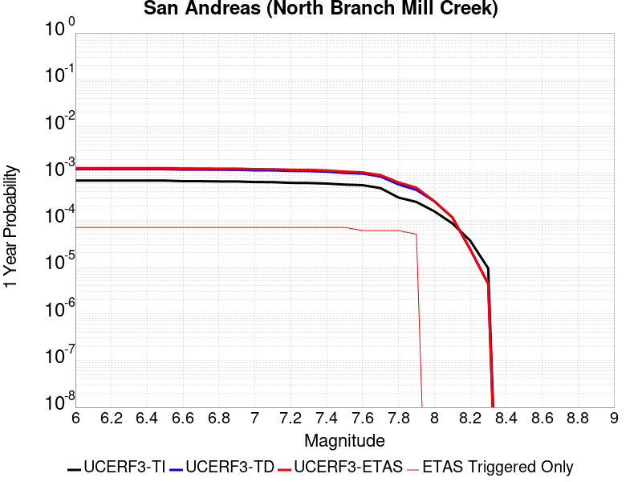 |  |

| Magnitude | 1 yr TI Prob | TD Prob | ETAS Prob | ETAS/TD Gain | ETAS Triggered Only | 10 yr TI Prob | TD Prob | ETAS Prob | ETAS/TD Gain | ETAS Triggered Only |
|-----|-----|-----|-----|-----|-----|-----|-----|-----|-----|-----|
| 6.0 | 7.02142E-4 | 0.0012253855 | 0.0012952996 | 1.0570549 | 7.0E-5 | 0.0069992766 | 0.012228863 | 0.0122980075 | 1.0056542 | 7.0E-5 |
| 6.1 | 7.02142E-4 | 0.0012253855 | 0.0012952996 | 1.0570549 | 7.0E-5 | 0.0069992766 | 0.012228863 | 0.0122980075 | 1.0056542 | 7.0E-5 |
| 6.2 | 7.02142E-4 | 0.0012253855 | 0.0012952996 | 1.0570549 | 7.0E-5 | 0.0069992766 | 0.012228863 | 0.0122980075 | 1.0056542 | 7.0E-5 |
| 6.3 | 7.02142E-4 | 0.0012253855 | 0.0012952996 | 1.0570549 | 7.0E-5 | 0.0069992766 | 0.012228863 | 0.0122980075 | 1.0056542 | 7.0E-5 |
| 6.4 | 7.02142E-4 | 0.0012253855 | 0.0012952996 | 1.0570549 | 7.0E-5 | 0.0069992766 | 0.012228863 | 0.0122980075 | 1.0056542 | 7.0E-5 |
| 6.5 | 7.0159714E-4 | 0.00122481 | 0.0012947243 | 1.0570817 | 7.0E-5 | 0.006993862 | 0.012223173 | 0.012292317 | 1.0056568 | 7.0E-5 |
| 6.6 | 6.8198174E-4 | 0.0012047078 | 0.0012746234 | 1.0580354 | 7.0E-5 | 0.006798926 | 0.012024338 | 0.0120934965 | 1.0057515 | 7.0E-5 |
| 6.7 | 6.8071426E-4 | 0.0012034203 | 0.0012733361 | 1.0580975 | 7.0E-5 | 0.0067863287 | 0.0120116025 | 0.012080762 | 1.0057577 | 7.0E-5 |
| 6.8 | 6.73139E-4 | 0.0011955198 | 0.0012654362 | 1.0584819 | 7.0E-5 | 0.0067110364 | 0.011933448 | 0.012002612 | 1.0057958 | 7.0E-5 |
| 6.9 | 6.711799E-4 | 0.0011934041 | 0.0012633206 | 1.0585858 | 7.0E-5 | 0.006691564 | 0.011912517 | 0.011981683 | 1.0058062 | 7.0E-5 |
| 7.0 | 6.518148E-4 | 0.0011621374 | 0.0012320561 | 1.0601639 | 7.0E-5 | 0.0064990623 | 0.011603127 | 0.011672314 | 1.0059628 | 7.0E-5 |
| 7.1 | 6.4952404E-4 | 0.0011592746 | 0.0012291935 | 1.0603126 | 7.0E-5 | 0.0064762887 | 0.011574798 | 0.011643988 | 1.0059776 | 7.0E-5 |
| 7.2 | 6.2609545E-4 | 0.0011268856 | 0.0011968068 | 1.0620481 | 7.0E-5 | 0.006243344 | 0.011254225 | 0.011323437 | 1.0061499 | 7.0E-5 |
| 7.3 | 6.219575E-4 | 0.0011201011 | 0.0011900227 | 1.0624243 | 7.0E-5 | 0.0062021962 | 0.0111870915 | 0.011256308 | 1.0061872 | 7.0E-5 |
| 7.4 | 6.0564023E-4 | 0.0010874722 | 0.001157396 | 1.0642995 | 7.0E-5 | 0.006039923 | 0.010864706 | 0.010933946 | 1.0063729 | 7.0E-5 |
| 7.5 | 5.757461E-4 | 0.0010197192 | 0.0010896478 | 1.0685763 | 7.0E-5 | 0.005742567 | 0.010194231 | 0.010263517 | 1.0067966 | 7.0E-5 |
| 7.6 | 5.592486E-4 | 9.906285E-4 | 0.001050569 | 1.0605077 | 6.0E-5 | 0.005578433 | 0.009905963 | 0.009965369 | 1.005997 | 6.0E-5 |
| 7.7 | 4.839081E-4 | 8.5747894E-4 | 9.1742753E-4 | 1.0699126 | 6.0E-5 | 0.0048285574 | 0.008585413 | 0.008644898 | 1.0069286 | 6.0E-5 |
| 7.8 | 3.043997E-4 | 5.8183493E-4 | 6.418E-4 | 1.103062 | 6.0E-5 | 0.0030398308 | 0.005846416 | 0.0059060655 | 1.0102026 | 6.0E-5 |
| 7.9 | 2.4469878E-4 | 4.4385262E-4 | 4.938304E-4 | 1.1126 | 5.0E-5 | 0.002444295 | 0.004470321 | 0.0045200977 | 1.0111349 | 5.0E-5 |
| 8.0 | 1.5428272E-4 | 2.5284904E-4 | 2.5284904E-4 | 1.0 | 0.0 | 0.0015417566 | 0.0025493812 | 0.0025493812 | 1.0 | 0.0 |
| 8.1 | 8.544835E-5 | 1.1461046E-4 | 1.1461046E-4 | 1.0 | 0.0 | 8.54155E-4 | 0.0011605195 | 0.0011605195 | 1.0 | 0.0 |
| 8.2 | 3.63321E-5 | 2.366371E-5 | 2.366371E-5 | 1.0 | 0.0 | 3.6326164E-4 | 2.4511237E-4 | 2.4511237E-4 | 1.0 | 0.0 |
| 8.3 | 9.32747E-6 | 4.3614377E-6 | 4.3614377E-6 | 1.0 | 0.0 | 9.3270784E-5 | 4.580799E-5 | 4.580799E-5 | 1.0 | 0.0 |

## San Andreas (San Gorgonio Pass-Garnet HIll)
*[(top)](#table-of-contents)*

| 1 Year | 10 Year |
|-----|-----|
|  | 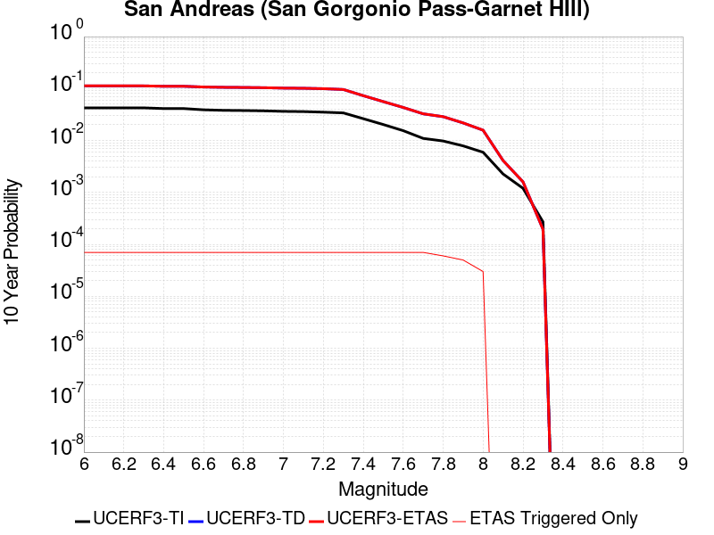 |

| Magnitude | 1 yr TI Prob | TD Prob | ETAS Prob | ETAS/TD Gain | ETAS Triggered Only | 10 yr TI Prob | TD Prob | ETAS Prob | ETAS/TD Gain | ETAS Triggered Only |
|-----|-----|-----|-----|-----|-----|-----|-----|-----|-----|-----|
| 6.0 | 0.004329778 | 0.012124644 | 0.012174038 | 1.0040739 | 5.0E-5 | 0.042463828 | 0.11255409 | 0.11261621 | 1.0005519 | 7.0E-5 |
| 6.1 | 0.004329778 | 0.012124644 | 0.012174038 | 1.0040739 | 5.0E-5 | 0.042463828 | 0.11255409 | 0.11261621 | 1.0005519 | 7.0E-5 |
| 6.2 | 0.004329778 | 0.012124644 | 0.012174038 | 1.0040739 | 5.0E-5 | 0.042463828 | 0.11255409 | 0.11261621 | 1.0005519 | 7.0E-5 |
| 6.3 | 0.004329778 | 0.012124644 | 0.012174038 | 1.0040739 | 5.0E-5 | 0.042463828 | 0.11255409 | 0.11261621 | 1.0005519 | 7.0E-5 |
| 6.4 | 0.0041964394 | 0.011896912 | 0.011946317 | 1.0041528 | 5.0E-5 | 0.041180745 | 0.11053528 | 0.11059754 | 1.0005633 | 7.0E-5 |
| 6.5 | 0.0041964394 | 0.011896912 | 0.011946317 | 1.0041528 | 5.0E-5 | 0.041180745 | 0.11053528 | 0.11059754 | 1.0005633 | 7.0E-5 |
| 6.6 | 0.0039678677 | 0.011507631 | 0.011557056 | 1.004295 | 5.0E-5 | 0.03897764 | 0.1070719 | 0.1071344 | 1.0005838 | 7.0E-5 |
| 6.7 | 0.0038750346 | 0.0113403695 | 0.011389803 | 1.004359 | 5.0E-5 | 0.038081564 | 0.10558031 | 0.105642915 | 1.000593 | 7.0E-5 |
| 6.8 | 0.0038401815 | 0.011261511 | 0.011310948 | 1.0043899 | 5.0E-5 | 0.03774495 | 0.104881845 | 0.104944505 | 1.0005975 | 7.0E-5 |
| 6.9 | 0.003789323 | 0.011142288 | 0.011191731 | 1.0044374 | 5.0E-5 | 0.037253562 | 0.103829734 | 0.10389247 | 1.0006042 | 7.0E-5 |
| 7.0 | 0.003699303 | 0.010927594 | 0.0109770475 | 1.0045255 | 5.0E-5 | 0.03638325 | 0.1019319 | 0.10199477 | 1.0006168 | 7.0E-5 |
| 7.1 | 0.0036607897 | 0.010842753 | 0.0108922105 | 1.0045614 | 5.0E-5 | 0.036010686 | 0.10117493 | 0.10123784 | 1.0006219 | 7.0E-5 |
| 7.2 | 0.003567883 | 0.010640301 | 0.010689769 | 1.0046492 | 5.0E-5 | 0.035111405 | 0.099366926 | 0.09942997 | 1.0006344 | 7.0E-5 |
| 7.3 | 0.0034497243 | 0.010241316 | 0.010290804 | 1.0048321 | 5.0E-5 | 0.033966612 | 0.09586389 | 0.09592719 | 1.0006602 | 7.0E-5 |
| 7.4 | 0.002660276 | 0.0076344977 | 0.0076841163 | 1.0064992 | 5.0E-5 | 0.02628654 | 0.07285113 | 0.07291603 | 1.0008909 | 7.0E-5 |
| 7.5 | 0.0020487092 | 0.005790656 | 0.0058403662 | 1.0085846 | 5.0E-5 | 0.020299247 | 0.05600702 | 0.0560731 | 1.0011798 | 7.0E-5 |
| 7.6 | 0.0015564259 | 0.0044226977 | 0.004472477 | 1.0112553 | 5.0E-5 | 0.0154556995 | 0.043191496 | 0.043258473 | 1.0015507 | 7.0E-5 |
| 7.7 | 0.0011022091 | 0.0033092434 | 0.0033590777 | 1.0150592 | 5.0E-5 | 0.010967582 | 0.032580588 | 0.03264831 | 1.0020785 | 7.0E-5 |
| 7.8 | 9.822468E-4 | 0.0028988915 | 0.0029387756 | 1.0137584 | 4.0E-5 | 0.0097791655 | 0.02869336 | 0.028751638 | 1.0020311 | 6.0E-5 |
| 7.9 | 7.9052144E-4 | 0.0021711884 | 0.0022111016 | 1.0183831 | 4.0E-5 | 0.007877152 | 0.021757882 | 0.021806795 | 1.002248 | 5.0E-5 |
| 8.0 | 5.9497025E-4 | 0.0015626829 | 0.0015826517 | 1.0127785 | 2.0E-5 | 0.005933798 | 0.015771678 | 0.015801204 | 1.0018722 | 3.0E-5 |
| 8.1 | 2.2701119E-4 | 3.8439606E-4 | 3.8439606E-4 | 1.0 | 0.0 | 0.0022677942 | 0.004115886 | 0.004115886 | 1.0 | 0.0 |
| 8.2 | 1.2022553E-4 | 1.4256914E-4 | 1.4256914E-4 | 1.0 | 0.0 | 0.0012016051 | 0.0015977593 | 0.0015977593 | 1.0 | 0.0 |
| 8.3 | 2.714798E-5 | 1.6484279E-5 | 1.6484279E-5 | 1.0 | 0.0 | 2.7144665E-4 | 1.9559723E-4 | 1.9559723E-4 | 1.0 | 0.0 |

## Cleghorn Pass
*[(top)](#table-of-contents)*

| 1 Year | 10 Year |
|-----|-----|
|  |  |

| Magnitude | 1 yr TI Prob | TD Prob | ETAS Prob | ETAS/TD Gain | ETAS Triggered Only | 10 yr TI Prob | TD Prob | ETAS Prob | ETAS/TD Gain | ETAS Triggered Only |
|-----|-----|-----|-----|-----|-----|-----|-----|-----|-----|-----|
| 6.0 | 5.4891926E-4 | 5.7597767E-4 | 6.1595463E-4 | 1.0694071 | 4.0E-5 | 0.0054756533 | 0.0057500144 | 0.0058096694 | 1.0103748 | 6.0E-5 |
| 6.1 | 5.4891926E-4 | 5.7597767E-4 | 6.1595463E-4 | 1.0694071 | 4.0E-5 | 0.0054756533 | 0.0057500144 | 0.0058096694 | 1.0103748 | 6.0E-5 |
| 6.2 | 1.098083E-4 | 1.15218674E-4 | 1.2521751E-4 | 1.0867815 | 1.0E-5 | 0.0010975406 | 0.0011520007 | 0.0011719777 | 1.0173411 | 2.0E-5 |
| 6.3 | 1.098083E-4 | 1.15218674E-4 | 1.2521751E-4 | 1.0867815 | 1.0E-5 | 0.0010975406 | 0.0011520007 | 0.0011719777 | 1.0173411 | 2.0E-5 |
| 6.4 | 9.005586E-5 | 9.448885E-5 | 1.0448791E-4 | 1.1058226 | 1.0E-5 | 9.001937E-4 | 9.4488857E-4 | 9.648696E-4 | 1.0211465 | 2.0E-5 |

## San Andreas (Cholame) rev
*[(top)](#table-of-contents)*

| 1 Year | 10 Year |
|-----|-----|
| 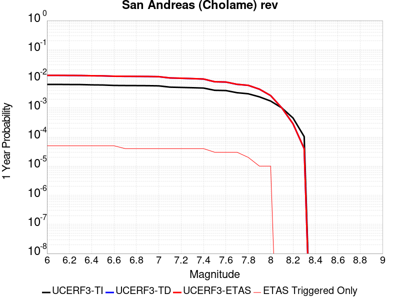 |  |

| Magnitude | 1 yr TI Prob | TD Prob | ETAS Prob | ETAS/TD Gain | ETAS Triggered Only | 10 yr TI Prob | TD Prob | ETAS Prob | ETAS/TD Gain | ETAS Triggered Only |
|-----|-----|-----|-----|-----|-----|-----|-----|-----|-----|-----|
| 6.0 | 0.0063991086 | 0.013066091 | 0.013115437 | 1.0037767 | 5.0E-5 | 0.06217949 | 0.124382704 | 0.124435246 | 1.0004224 | 6.0E-5 |
| 6.1 | 0.0063991086 | 0.013066091 | 0.013115437 | 1.0037767 | 5.0E-5 | 0.06217949 | 0.124382704 | 0.124435246 | 1.0004224 | 6.0E-5 |
| 6.2 | 0.006347804 | 0.012971719 | 0.01302107 | 1.0038046 | 5.0E-5 | 0.061695136 | 0.123568885 | 0.12362147 | 1.0004256 | 6.0E-5 |
| 6.3 | 0.006316212 | 0.012912977 | 0.012962331 | 1.0038221 | 5.0E-5 | 0.06139677 | 0.12306301 | 0.12311563 | 1.0004276 | 6.0E-5 |
| 6.4 | 0.006172335 | 0.012658212 | 0.012707579 | 1.0039 | 5.0E-5 | 0.060036868 | 0.120855816 | 0.12090856 | 1.0004364 | 6.0E-5 |
| 6.5 | 0.006109677 | 0.012551703 | 0.012601075 | 1.0039335 | 5.0E-5 | 0.059444077 | 0.11993009 | 0.11998289 | 1.0004402 | 6.0E-5 |
| 6.6 | 0.0059092017 | 0.012195546 | 0.012244936 | 1.0040499 | 5.0E-5 | 0.057545185 | 0.11684424 | 0.116897225 | 1.0004535 | 6.0E-5 |
| 6.7 | 0.005864331 | 0.012115283 | 0.012154798 | 1.0032616 | 4.0E-5 | 0.057119697 | 0.116147816 | 0.11619201 | 1.0003805 | 5.0E-5 |
| 6.8 | 0.005836608 | 0.012057758 | 0.012097275 | 1.0032774 | 4.0E-5 | 0.056856725 | 0.11564609 | 0.1156903 | 1.0003823 | 5.0E-5 |
| 6.9 | 0.0057996577 | 0.01197977 | 0.0120192915 | 1.003299 | 4.0E-5 | 0.056506127 | 0.11496652 | 0.115010776 | 1.0003849 | 5.0E-5 |
| 7.0 | 0.005705768 | 0.011785533 | 0.011825061 | 1.003354 | 4.0E-5 | 0.055614736 | 0.113268144 | 0.113312475 | 1.0003915 | 5.0E-5 |
| 7.1 | 0.0051671406 | 0.0106600635 | 0.010699636 | 1.0037123 | 4.0E-5 | 0.05048634 | 0.10336296 | 0.1034078 | 1.0004337 | 5.0E-5 |
| 7.2 | 0.00504711 | 0.010404069 | 0.010443653 | 1.0038047 | 4.0E-5 | 0.04934009 | 0.101101 | 0.101145945 | 1.0004445 | 5.0E-5 |
| 7.3 | 0.0049308087 | 0.010109286 | 0.010148881 | 1.0039167 | 4.0E-5 | 0.048228268 | 0.09847201 | 0.09851708 | 1.0004578 | 5.0E-5 |
| 7.4 | 0.004799717 | 0.009784086 | 0.009823695 | 1.0040482 | 4.0E-5 | 0.046973653 | 0.0955501 | 0.095595315 | 1.0004733 | 5.0E-5 |
| 7.5 | 0.0040183207 | 0.007888231 | 0.007917995 | 1.0037731 | 3.0E-5 | 0.03946433 | 0.078278646 | 0.07831551 | 1.000471 | 4.0E-5 |
| 7.6 | 0.0039388672 | 0.007711917 | 0.0077416855 | 1.0038601 | 3.0E-5 | 0.038697794 | 0.076642126 | 0.076679066 | 1.000482 | 4.0E-5 |
| 7.7 | 0.0033226798 | 0.00642758 | 0.0064573875 | 1.0046374 | 3.0E-5 | 0.032734364 | 0.064534284 | 0.0645717 | 1.0005798 | 4.0E-5 |
| 7.8 | 0.003054864 | 0.005938782 | 0.0059586633 | 1.0033476 | 2.0E-5 | 0.030132094 | 0.059653696 | 0.059681907 | 1.0004729 | 3.0E-5 |
| 7.9 | 0.0023949358 | 0.0043868218 | 0.004396778 | 1.0022695 | 1.0E-5 | 0.023692891 | 0.044357877 | 0.04437699 | 1.0004308 | 2.0E-5 |
| 8.0 | 0.0017178444 | 0.002645537 | 0.0026555106 | 1.00377 | 1.0E-5 | 0.017046256 | 0.027177438 | 0.027196895 | 1.0007159 | 2.0E-5 |
| 8.1 | 0.0010001622 | 0.0010004229 | 0.0010004229 | 1.0 | 0.0 | 0.009956728 | 0.010756734 | 0.010756734 | 1.0 | 0.0 |
| 8.2 | 4.5092785E-4 | 2.855783E-4 | 2.855783E-4 | 1.0 | 0.0 | 0.0045001395 | 0.0032481598 | 0.0032481598 | 1.0 | 0.0 |
| 8.3 | 1.034694E-4 | 3.9958737E-5 | 3.9958737E-5 | 1.0 | 0.0 | 0.0010342124 | 4.71872E-4 | 4.71872E-4 | 1.0 | 0.0 |

## San Andreas (Carrizo) rev
*[(top)](#table-of-contents)*

| 1 Year | 10 Year |
|-----|-----|
| 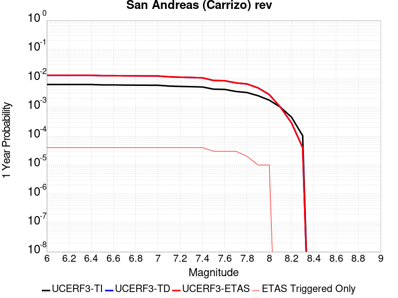 |  |

| Magnitude | 1 yr TI Prob | TD Prob | ETAS Prob | ETAS/TD Gain | ETAS Triggered Only | 10 yr TI Prob | TD Prob | ETAS Prob | ETAS/TD Gain | ETAS Triggered Only |
|-----|-----|-----|-----|-----|-----|-----|-----|-----|-----|-----|
| 6.0 | 0.006073493 | 0.01261206 | 0.012651555 | 1.0031315 | 4.0E-5 | 0.0591016 | 0.12060616 | 0.12065893 | 1.0004375 | 6.0E-5 |
| 6.1 | 0.006073493 | 0.01261206 | 0.012651555 | 1.0031315 | 4.0E-5 | 0.0591016 | 0.12060616 | 0.12065893 | 1.0004375 | 6.0E-5 |
| 6.2 | 0.006073493 | 0.01261206 | 0.012651555 | 1.0031315 | 4.0E-5 | 0.0591016 | 0.12060616 | 0.12065893 | 1.0004375 | 6.0E-5 |
| 6.3 | 0.006073493 | 0.01261206 | 0.012651555 | 1.0031315 | 4.0E-5 | 0.0591016 | 0.12060616 | 0.12065893 | 1.0004375 | 6.0E-5 |
| 6.4 | 0.006073493 | 0.01261206 | 0.012651555 | 1.0031315 | 4.0E-5 | 0.0591016 | 0.12060616 | 0.12065893 | 1.0004375 | 6.0E-5 |
| 6.5 | 0.0058862255 | 0.012261566 | 0.012301075 | 1.0032222 | 4.0E-5 | 0.057327334 | 0.11757754 | 0.11763049 | 1.0004503 | 6.0E-5 |
| 6.6 | 0.0058862255 | 0.012261566 | 0.012301075 | 1.0032222 | 4.0E-5 | 0.057327334 | 0.11757754 | 0.11763049 | 1.0004503 | 6.0E-5 |
| 6.7 | 0.0058011734 | 0.012102372 | 0.012141888 | 1.0032651 | 4.0E-5 | 0.05652051 | 0.11619909 | 0.116252124 | 1.0004563 | 6.0E-5 |
| 6.8 | 0.005777263 | 0.012051926 | 0.012091444 | 1.003279 | 4.0E-5 | 0.056293584 | 0.115759395 | 0.11581245 | 1.0004584 | 6.0E-5 |
| 6.9 | 0.0057511497 | 0.011996436 | 0.012035957 | 1.0032943 | 4.0E-5 | 0.05604569 | 0.1152756 | 0.115328684 | 1.0004605 | 6.0E-5 |
| 7.0 | 0.0057263062 | 0.011945305 | 0.011984828 | 1.0033087 | 4.0E-5 | 0.055809796 | 0.11482792 | 0.11488103 | 1.0004625 | 6.0E-5 |
| 7.1 | 0.0053644776 | 0.011176443 | 0.011215995 | 1.003539 | 4.0E-5 | 0.052368138 | 0.10808435 | 0.10813787 | 1.0004951 | 6.0E-5 |
| 7.2 | 0.0052187922 | 0.010870834 | 0.010910399 | 1.0036396 | 4.0E-5 | 0.050979212 | 0.10538838 | 0.105442055 | 1.0005094 | 6.0E-5 |
| 7.3 | 0.005109493 | 0.010599907 | 0.010639483 | 1.0037336 | 4.0E-5 | 0.049935985 | 0.10297221 | 0.10302603 | 1.0005227 | 6.0E-5 |
| 7.4 | 0.0049778637 | 0.010274311 | 0.0103139 | 1.0038532 | 4.0E-5 | 0.048678253 | 0.10005864 | 0.10011264 | 1.0005397 | 6.0E-5 |
| 7.5 | 0.0041929903 | 0.008371988 | 0.008401737 | 1.0035534 | 3.0E-5 | 0.04114753 | 0.08280355 | 0.08284941 | 1.0005538 | 5.0E-5 |
| 7.6 | 0.0041122385 | 0.008192535 | 0.008222288 | 1.0036318 | 3.0E-5 | 0.040369697 | 0.08114483 | 0.08119077 | 1.0005661 | 5.0E-5 |
| 7.7 | 0.003493839 | 0.0069030905 | 0.0069328835 | 1.0043159 | 3.0E-5 | 0.034394164 | 0.06904176 | 0.06908831 | 1.0006742 | 5.0E-5 |
| 7.8 | 0.0032027436 | 0.0063440073 | 0.006363881 | 1.0031326 | 2.0E-5 | 0.031569764 | 0.06350883 | 0.06354629 | 1.0005898 | 4.0E-5 |
| 7.9 | 0.0024825884 | 0.004622358 | 0.0046323114 | 1.0021534 | 1.0E-5 | 0.024550365 | 0.04662383 | 0.0466429 | 1.000409 | 2.0E-5 |
| 8.0 | 0.0017493097 | 0.002716514 | 0.002726487 | 1.0036712 | 1.0E-5 | 0.017356034 | 0.027878206 | 0.027897649 | 1.0006974 | 2.0E-5 |
| 8.1 | 0.0010000558 | 0.001000414 | 0.001000414 | 1.0 | 0.0 | 0.009955673 | 0.010756618 | 0.010756618 | 1.0 | 0.0 |
| 8.2 | 4.5092785E-4 | 2.855783E-4 | 2.855783E-4 | 1.0 | 0.0 | 0.0045001395 | 0.0032481598 | 0.0032481598 | 1.0 | 0.0 |
| 8.3 | 1.034694E-4 | 3.9958737E-5 | 3.9958737E-5 | 1.0 | 0.0 | 0.0010342124 | 4.71872E-4 | 4.71872E-4 | 1.0 | 0.0 |

## San Andreas (Parkfield)
*[(top)](#table-of-contents)*

| 1 Year | 10 Year |
|-----|-----|
|  | 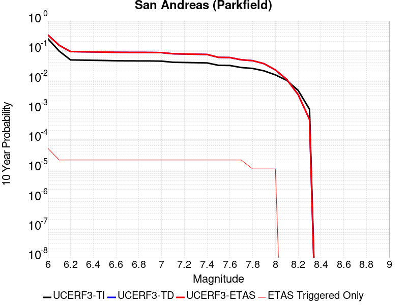 |

| Magnitude | 1 yr TI Prob | TD Prob | ETAS Prob | ETAS/TD Gain | ETAS Triggered Only | 10 yr TI Prob | TD Prob | ETAS Prob | ETAS/TD Gain | ETAS Triggered Only |
|-----|-----|-----|-----|-----|-----|-----|-----|-----|-----|-----|
| 6.0 | 0.028586963 | 0.04018152 | 0.040200718 | 1.0004778 | 2.0E-5 | 0.25176284 | 0.33713356 | 0.3371667 | 1.0000983 | 5.0E-5 |
| 6.1 | 0.0099994885 | 0.01577525 | 0.015785092 | 1.000624 | 1.0E-5 | 0.095613256 | 0.14970991 | 0.14972691 | 1.0001136 | 2.0E-5 |
| 6.2 | 0.0049089384 | 0.009473897 | 0.009483802 | 1.0010456 | 1.0E-5 | 0.048019063 | 0.09184752 | 0.09186567 | 1.0001978 | 2.0E-5 |
| 6.3 | 0.0048322747 | 0.009317007 | 0.009326914 | 1.0010633 | 1.0E-5 | 0.047285385 | 0.09050047 | 0.09051865 | 1.000201 | 2.0E-5 |
| 6.4 | 0.0047573745 | 0.009194063 | 0.009203971 | 1.0010777 | 1.0E-5 | 0.046568092 | 0.089402735 | 0.08942095 | 1.0002037 | 2.0E-5 |
| 6.5 | 0.0046854047 | 0.00906896 | 0.00907887 | 1.0010927 | 1.0E-5 | 0.045878403 | 0.08828856 | 0.08830679 | 1.0002065 | 2.0E-5 |
| 6.6 | 0.0045870654 | 0.008904092 | 0.008914003 | 1.001113 | 1.0E-5 | 0.04493529 | 0.08682025 | 0.08683851 | 1.0002104 | 2.0E-5 |
| 6.7 | 0.0045492216 | 0.008835384 | 0.008845295 | 1.0011218 | 1.0E-5 | 0.04457213 | 0.08622064 | 0.08623891 | 1.000212 | 2.0E-5 |
| 6.8 | 0.0045347405 | 0.008807203 | 0.008817115 | 1.0011255 | 1.0E-5 | 0.04443313 | 0.08596825 | 0.08598653 | 1.0002127 | 2.0E-5 |
| 6.9 | 0.0045191357 | 0.008776662 | 0.008786574 | 1.0011294 | 1.0E-5 | 0.044283327 | 0.08569433 | 0.08571261 | 1.0002134 | 2.0E-5 |
| 7.0 | 0.004455241 | 0.008648803 | 0.008658716 | 1.0011462 | 1.0E-5 | 0.043669727 | 0.08454277 | 0.08456108 | 1.0002166 | 2.0E-5 |
| 7.1 | 0.0040752706 | 0.007862584 | 0.007872505 | 1.0012618 | 1.0E-5 | 0.040013418 | 0.07745491 | 0.07747336 | 1.0002382 | 2.0E-5 |
| 7.2 | 0.004005129 | 0.007726539 | 0.0077364612 | 1.0012842 | 1.0E-5 | 0.0393371 | 0.0762281 | 0.076246575 | 1.0002424 | 2.0E-5 |
| 7.3 | 0.003934157 | 0.007569417 | 0.007579341 | 1.0013111 | 1.0E-5 | 0.038652334 | 0.07479123 | 0.07480974 | 1.0002474 | 2.0E-5 |
| 7.4 | 0.003865065 | 0.0074145487 | 0.0074244747 | 1.0013387 | 1.0E-5 | 0.03798529 | 0.07336518 | 0.07338371 | 1.0002526 | 2.0E-5 |
| 7.5 | 0.0032037178 | 0.0058218874 | 0.0058318293 | 1.0017077 | 1.0E-5 | 0.03157923 | 0.05855221 | 0.058571037 | 1.0003216 | 2.0E-5 |
| 7.6 | 0.0031593828 | 0.005732995 | 0.0057429373 | 1.0017343 | 1.0E-5 | 0.031148417 | 0.057713263 | 0.05773211 | 1.0003265 | 2.0E-5 |
| 7.7 | 0.002691582 | 0.0047754725 | 0.004785425 | 1.002084 | 1.0E-5 | 0.026592141 | 0.048531387 | 0.048550416 | 1.0003921 | 2.0E-5 |
| 7.8 | 0.0025062072 | 0.0044560367 | 0.0044560367 | 1.0 | 0.0 | 0.024781305 | 0.045297977 | 0.04530752 | 1.0002108 | 1.0E-5 |
| 7.9 | 0.002069531 | 0.0035158154 | 0.0035158154 | 1.0 | 0.0 | 0.020503636 | 0.035877805 | 0.03588745 | 1.0002687 | 1.0E-5 |
| 8.0 | 0.0015111357 | 0.0021211067 | 0.0021211067 | 1.0 | 0.0 | 0.015009012 | 0.022008339 | 0.02201812 | 1.0004444 | 1.0E-5 |
| 8.1 | 9.823717E-4 | 9.7415224E-4 | 9.7415224E-4 | 1.0 | 0.0 | 0.009780403 | 0.010486731 | 0.010486731 | 1.0 | 0.0 |
| 8.2 | 4.5092785E-4 | 2.855783E-4 | 2.855783E-4 | 1.0 | 0.0 | 0.0045001395 | 0.0032481598 | 0.0032481598 | 1.0 | 0.0 |
| 8.3 | 1.034694E-4 | 3.9958737E-5 | 3.9958737E-5 | 1.0 | 0.0 | 0.0010342124 | 4.71872E-4 | 4.71872E-4 | 1.0 | 0.0 |

## Lost Hills
*[(top)](#table-of-contents)*

| 1 Year | 10 Year |
|-----|-----|
|  |  |

| Magnitude | 1 yr TI Prob | TD Prob | ETAS Prob | ETAS/TD Gain | ETAS Triggered Only | 10 yr TI Prob | TD Prob | ETAS Prob | ETAS/TD Gain | ETAS Triggered Only |
|-----|-----|-----|-----|-----|-----|-----|-----|-----|-----|-----|
| 6.0 | 0.0011647546 | 0.0013093597 | 0.0013493074 | 1.0305092 | 4.0E-5 | 0.011586686 | 0.013033048 | 0.013082396 | 1.0037864 | 5.0E-5 |
| 6.1 | 0.0011647546 | 0.0013093597 | 0.0013493074 | 1.0305092 | 4.0E-5 | 0.011586686 | 0.013033048 | 0.013082396 | 1.0037864 | 5.0E-5 |
| 6.2 | 0.0011647546 | 0.0013093597 | 0.0013493074 | 1.0305092 | 4.0E-5 | 0.011586686 | 0.013033048 | 0.013082396 | 1.0037864 | 5.0E-5 |
| 6.3 | 0.0011647546 | 0.0013093597 | 0.0013493074 | 1.0305092 | 4.0E-5 | 0.011586686 | 0.013033048 | 0.013082396 | 1.0037864 | 5.0E-5 |
| 6.4 | 6.409735E-4 | 7.189229E-4 | 7.3890854E-4 | 1.0277994 | 2.0E-5 | 0.006391279 | 0.0071751773 | 0.0072049624 | 1.0041511 | 3.0E-5 |
| 6.5 | 6.409735E-4 | 7.189229E-4 | 7.3890854E-4 | 1.0277994 | 2.0E-5 | 0.006391279 | 0.0071751773 | 0.0072049624 | 1.0041511 | 3.0E-5 |
| 6.6 | 4.4774043E-4 | 5.0263974E-4 | 5.126347E-4 | 1.019885 | 1.0E-5 | 0.0044683935 | 0.005023189 | 0.0050430885 | 1.0039616 | 2.0E-5 |
| 6.7 | 3.7591302E-4 | 4.2203465E-4 | 4.3203044E-4 | 1.0236847 | 1.0E-5 | 0.0037527776 | 0.0042203465 | 0.004230304 | 1.0023595 | 1.0E-5 |

## San Andreas (Coachella) rev
*[(top)](#table-of-contents)*

| 1 Year | 10 Year |
|-----|-----|
| 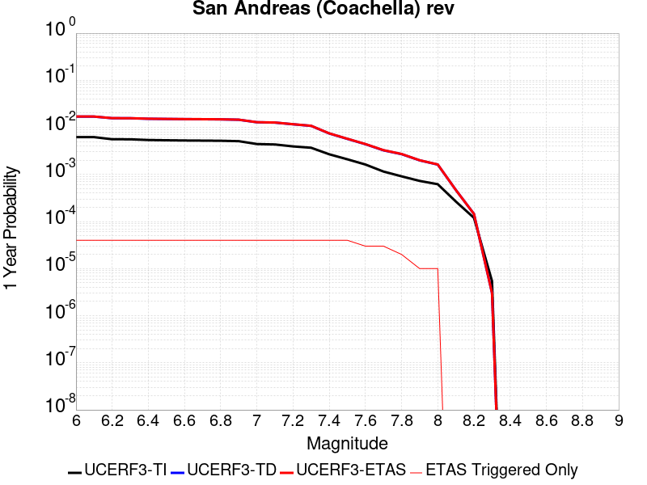 |  |

| Magnitude | 1 yr TI Prob | TD Prob | ETAS Prob | ETAS/TD Gain | ETAS Triggered Only | 10 yr TI Prob | TD Prob | ETAS Prob | ETAS/TD Gain | ETAS Triggered Only |
|-----|-----|-----|-----|-----|-----|-----|-----|-----|-----|-----|
| 6.0 | 0.0062038354 | 0.016933087 | 0.01697241 | 1.0023222 | 4.0E-5 | 0.060334753 | 0.15262908 | 0.15267146 | 1.0002776 | 5.0E-5 |
| 6.1 | 0.0062038354 | 0.016933087 | 0.01697241 | 1.0023222 | 4.0E-5 | 0.060334753 | 0.15262908 | 0.15267146 | 1.0002776 | 5.0E-5 |
| 6.2 | 0.005590286 | 0.01564973 | 0.015689105 | 1.0025159 | 4.0E-5 | 0.05451731 | 0.1417999 | 0.1418428 | 1.0003026 | 5.0E-5 |
| 6.3 | 0.005577586 | 0.01562163 | 0.015661005 | 1.0025206 | 4.0E-5 | 0.054396555 | 0.14156814 | 0.14161107 | 1.0003031 | 5.0E-5 |
| 6.4 | 0.0053892885 | 0.015214663 | 0.015254055 | 1.002589 | 4.0E-5 | 0.052604496 | 0.13812812 | 0.13817121 | 1.000312 | 5.0E-5 |
| 6.5 | 0.0053228354 | 0.015070442 | 0.015109839 | 1.0026143 | 4.0E-5 | 0.051971316 | 0.13690725 | 0.1369504 | 1.0003152 | 5.0E-5 |
| 6.6 | 0.0052651367 | 0.014950012 | 0.014989413 | 1.0026356 | 4.0E-5 | 0.051421247 | 0.1358854 | 0.1359286 | 1.0003179 | 5.0E-5 |
| 6.7 | 0.005230834 | 0.014877291 | 0.014916697 | 1.0026487 | 4.0E-5 | 0.051094085 | 0.1352701 | 0.13531333 | 1.0003196 | 5.0E-5 |
| 6.8 | 0.0051924936 | 0.014776332 | 0.014815741 | 1.0026671 | 4.0E-5 | 0.050728295 | 0.13442177 | 0.13446505 | 1.000322 | 5.0E-5 |
| 6.9 | 0.0050888555 | 0.014517602 | 0.014557021 | 1.0027152 | 4.0E-5 | 0.049738888 | 0.13225023 | 0.13229363 | 1.0003281 | 5.0E-5 |
| 7.0 | 0.0044259406 | 0.012836529 | 0.012876015 | 1.0030761 | 4.0E-5 | 0.04338823 | 0.11810792 | 0.118152015 | 1.0003734 | 5.0E-5 |
| 7.1 | 0.004331963 | 0.01263184 | 0.012671335 | 1.0031266 | 4.0E-5 | 0.042484846 | 0.11632819 | 0.11637238 | 1.0003798 | 5.0E-5 |
| 7.2 | 0.0039391145 | 0.01162565 | 0.011665185 | 1.0034007 | 4.0E-5 | 0.03870018 | 0.10773429 | 0.10777891 | 1.0004141 | 5.0E-5 |
| 7.3 | 0.0036891096 | 0.010756755 | 0.010796325 | 1.0036786 | 4.0E-5 | 0.03628465 | 0.10025747 | 0.100302465 | 1.0004487 | 5.0E-5 |
| 7.4 | 0.0026816884 | 0.007419449 | 0.007459152 | 1.0053512 | 4.0E-5 | 0.02649557 | 0.070837796 | 0.07088425 | 1.0006559 | 5.0E-5 |
| 7.5 | 0.002099857 | 0.005693001 | 0.0057327733 | 1.0069861 | 4.0E-5 | 0.020801254 | 0.055008773 | 0.05505602 | 1.0008589 | 5.0E-5 |
| 7.6 | 0.0016250437 | 0.004393586 | 0.004423454 | 1.0067981 | 3.0E-5 | 0.016132116 | 0.04280791 | 0.0428462 | 1.0008944 | 4.0E-5 |
| 7.7 | 0.001152546 | 0.0032498916 | 0.003279794 | 1.009201 | 3.0E-5 | 0.011465867 | 0.031898305 | 0.03193703 | 1.001214 | 4.0E-5 |
| 7.8 | 9.1192697E-4 | 0.0026988573 | 0.0027188035 | 1.0073905 | 2.0E-5 | 0.009081938 | 0.026638424 | 0.026667625 | 1.0010962 | 3.0E-5 |
| 7.9 | 7.2853256E-4 | 0.0019922915 | 0.0020022718 | 1.0050093 | 1.0E-5 | 0.0072614877 | 0.01990803 | 0.019927632 | 1.0009847 | 2.0E-5 |
| 8.0 | 6.200787E-4 | 0.0016195155 | 0.0016294993 | 1.0061647 | 1.0E-5 | 0.006183513 | 0.016278049 | 0.016297724 | 1.0012087 | 2.0E-5 |
| 8.1 | 2.6612106E-4 | 4.680578E-4 | 4.680578E-4 | 1.0 | 0.0 | 0.002658026 | 0.004917206 | 0.004917206 | 1.0 | 0.0 |
| 8.2 | 1.2002704E-4 | 1.4536046E-4 | 1.4536046E-4 | 1.0 | 0.0 | 0.0011996223 | 0.0015971722 | 0.0015971722 | 1.0 | 0.0 |
| 8.3 | 5.439312E-6 | 3.0341714E-6 | 3.0341714E-6 | 1.0 | 0.0 | 5.4391792E-5 | 3.1900923E-5 | 3.1900923E-5 | 1.0 | 0.0 |

## San Andreas (Creeping Section) 2011 CFM
*[(top)](#table-of-contents)*

| 1 Year | 10 Year |
|-----|-----|
|  |  |

| Magnitude | 1 yr TI Prob | TD Prob | ETAS Prob | ETAS/TD Gain | ETAS Triggered Only | 10 yr TI Prob | TD Prob | ETAS Prob | ETAS/TD Gain | ETAS Triggered Only |
|-----|-----|-----|-----|-----|-----|-----|-----|-----|-----|-----|
| 6.0 | 0.030762846 | 0.061202604 | 0.06122138 | 1.0003067 | 2.0E-5 | 0.26835477 | 0.42592302 | 0.42594025 | 1.0000404 | 3.0E-5 |
| 6.1 | 0.025839351 | 0.051246066 | 0.05126504 | 1.0003703 | 2.0E-5 | 0.23032776 | 0.37284485 | 0.37286368 | 1.0000504 | 3.0E-5 |
| 6.2 | 0.021034058 | 0.040931217 | 0.040940806 | 1.0002344 | 1.0E-5 | 0.19150782 | 0.31302088 | 0.3130415 | 1.0000658 | 3.0E-5 |
| 6.3 | 0.017915873 | 0.034187317 | 0.034196973 | 1.0002825 | 1.0E-5 | 0.16538359 | 0.2713031 | 0.27132493 | 1.0000806 | 3.0E-5 |
| 6.4 | 0.015200248 | 0.028262215 | 0.028271932 | 1.0003438 | 1.0E-5 | 0.14201577 | 0.23297104 | 0.23299405 | 1.0000988 | 3.0E-5 |
| 6.5 | 0.012141965 | 0.021585694 | 0.021595476 | 1.0004532 | 1.0E-5 | 0.11499573 | 0.18680891 | 0.1868333 | 1.0001305 | 3.0E-5 |
| 6.6 | 0.0082328 | 0.012994494 | 0.013004364 | 1.0007596 | 1.0E-5 | 0.07934396 | 0.1231311 | 0.12314863 | 1.0001425 | 2.0E-5 |
| 6.7 | 0.0081159435 | 0.012756367 | 0.012766239 | 1.0007739 | 1.0E-5 | 0.0782586 | 0.12115822 | 0.121175796 | 1.0001451 | 2.0E-5 |
| 6.8 | 0.008075596 | 0.012665753 | 0.012675626 | 1.0007795 | 1.0E-5 | 0.07788358 | 0.12038911 | 0.1204067 | 1.0001462 | 2.0E-5 |
| 6.9 | 0.007876333 | 0.012207948 | 0.012217826 | 1.0008092 | 1.0E-5 | 0.07602952 | 0.11645927 | 0.116476946 | 1.0001518 | 2.0E-5 |
| 7.0 | 0.0075839474 | 0.011618658 | 0.011628542 | 1.0008507 | 1.0E-5 | 0.073302895 | 0.11130563 | 0.1113234 | 1.0001597 | 2.0E-5 |
| 7.1 | 0.006016669 | 0.008459533 | 0.008469448 | 1.0011721 | 1.0E-5 | 0.058563538 | 0.08365876 | 0.08367708 | 1.0002191 | 2.0E-5 |
| 7.2 | 0.005408933 | 0.007597135 | 0.007607059 | 1.0013063 | 1.0E-5 | 0.052791595 | 0.075609244 | 0.07562773 | 1.0002445 | 2.0E-5 |
| 7.3 | 0.0048581534 | 0.006646483 | 0.0066564167 | 1.0014945 | 1.0E-5 | 0.047533102 | 0.06647413 | 0.0664928 | 1.0002809 | 2.0E-5 |
| 7.4 | 0.004513991 | 0.0060877153 | 0.0060976543 | 1.0016327 | 1.0E-5 | 0.044233937 | 0.061143413 | 0.06116219 | 1.0003071 | 2.0E-5 |
| 7.5 | 0.0038038217 | 0.0046877493 | 0.0046977024 | 1.0021232 | 1.0E-5 | 0.03739367 | 0.047871016 | 0.047890056 | 1.0003978 | 2.0E-5 |
| 7.6 | 0.0033306254 | 0.0043109027 | 0.0043208594 | 1.0023097 | 1.0E-5 | 0.032811474 | 0.04398585 | 0.04400497 | 1.0004346 | 2.0E-5 |
| 7.7 | 0.0028683927 | 0.0034696644 | 0.0034796298 | 1.0028721 | 1.0E-5 | 0.0283165 | 0.035791222 | 0.035810508 | 1.0005388 | 2.0E-5 |
| 7.8 | 0.0026197135 | 0.0032102033 | 0.0032102033 | 1.0 | 0.0 | 0.025890453 | 0.03312217 | 0.033131838 | 1.000292 | 1.0E-5 |
| 7.9 | 0.0019429359 | 0.002616966 | 0.002616966 | 1.0 | 0.0 | 0.019260362 | 0.027063787 | 0.027073516 | 1.0003595 | 1.0E-5 |
| 8.0 | 0.0014240141 | 0.0016383671 | 0.0016383671 | 1.0 | 0.0 | 0.014149235 | 0.017211871 | 0.017221699 | 1.000571 | 1.0E-5 |
| 8.1 | 9.3568244E-4 | 9.074147E-4 | 9.074147E-4 | 1.0 | 0.0 | 0.009317525 | 0.009797759 | 0.009797759 | 1.0 | 0.0 |
| 8.2 | 4.5092785E-4 | 2.855783E-4 | 2.855783E-4 | 1.0 | 0.0 | 0.0045001395 | 0.0032481598 | 0.0032481598 | 1.0 | 0.0 |
| 8.3 | 1.034694E-4 | 3.9958737E-5 | 3.9958737E-5 | 1.0 | 0.0 | 0.0010342124 | 4.71872E-4 | 4.71872E-4 | 1.0 | 0.0 |

## Baker
*[(top)](#table-of-contents)*

| 1 Year | 10 Year |
|-----|-----|
|  |  |

| Magnitude | 1 yr TI Prob | TD Prob | ETAS Prob | ETAS/TD Gain | ETAS Triggered Only | 10 yr TI Prob | TD Prob | ETAS Prob | ETAS/TD Gain | ETAS Triggered Only |
|-----|-----|-----|-----|-----|-----|-----|-----|-----|-----|-----|
| 6.0 | 2.9714106E-4 | 3.044121E-4 | 3.1440906E-4 | 1.0328403 | 1.0E-5 | 0.0029674405 | 0.0030403468 | 0.0030901947 | 1.0163954 | 5.0E-5 |
| 6.1 | 2.9714106E-4 | 3.044121E-4 | 3.1440906E-4 | 1.0328403 | 1.0E-5 | 0.0029674405 | 0.0030403468 | 0.0030901947 | 1.0163954 | 5.0E-5 |
| 6.2 | 2.9714106E-4 | 3.044121E-4 | 3.1440906E-4 | 1.0328403 | 1.0E-5 | 0.0029674405 | 0.0030403468 | 0.0030901947 | 1.0163954 | 5.0E-5 |
| 6.3 | 1.7215237E-4 | 1.7654001E-4 | 1.8653825E-4 | 1.0566344 | 1.0E-5 | 0.0017201907 | 0.0017640449 | 0.0018139567 | 1.028294 | 5.0E-5 |
| 6.4 | 1.7215237E-4 | 1.7654001E-4 | 1.8653825E-4 | 1.0566344 | 1.0E-5 | 0.0017201907 | 0.0017640449 | 0.0018139567 | 1.028294 | 5.0E-5 |
| 6.5 | 1.4516099E-4 | 1.4900303E-4 | 1.5900155E-4 | 1.0671027 | 1.0E-5 | 0.001450662 | 0.001489064 | 0.0015290044 | 1.0268226 | 4.0E-5 |
| 6.6 | 1.20856166E-4 | 1.2422555E-4 | 1.3422432E-4 | 1.0804887 | 1.0E-5 | 0.0012079047 | 0.0012415814 | 0.0012715441 | 1.0241327 | 3.0E-5 |
| 6.7 | 1.0628513E-4 | 1.09386616E-4 | 1.1938553E-4 | 1.0914088 | 1.0E-5 | 0.0010623431 | 0.0010933438 | 0.0011233111 | 1.0274087 | 3.0E-5 |
| 6.8 | 9.577837E-5 | 9.869256E-5 | 1.0869157E-4 | 1.1013148 | 1.0E-5 | 9.57371E-4 | 9.865012E-4 | 0.0010164717 | 1.0303805 | 3.0E-5 |
| 6.9 | 8.510255E-5 | 8.782361E-5 | 9.782273E-5 | 1.1138546 | 1.0E-5 | 8.5069967E-4 | 8.779003E-4 | 9.0787397E-4 | 1.0341425 | 3.0E-5 |
| 7.0 | 6.291517E-5 | 6.52663E-5 | 7.526565E-5 | 1.1532084 | 1.0E-5 | 6.289736E-4 | 6.5247365E-4 | 6.724606E-4 | 1.0306326 | 2.0E-5 |
| 7.1 | 5.491031E-5 | 5.7142275E-5 | 6.71417E-5 | 1.1749917 | 1.0E-5 | 5.4896745E-4 | 5.712767E-4 | 5.9126527E-4 | 1.0349894 | 2.0E-5 |
| 7.2 | 5.252918E-5 | 5.4721855E-5 | 6.472131E-5 | 1.1827323 | 1.0E-5 | 5.251676E-4 | 5.4708467E-4 | 5.670737E-4 | 1.0365374 | 2.0E-5 |
| 7.3 | 4.8836053E-5 | 5.096526E-5 | 6.096475E-5 | 1.196202 | 1.0E-5 | 4.8825322E-4 | 5.095365E-4 | 5.295263E-4 | 1.0392313 | 2.0E-5 |
| 7.4 | 4.5977362E-5 | 4.804309E-5 | 4.804309E-5 | 1.0 | 0.0 | 4.596785E-4 | 4.803278E-4 | 4.90323E-4 | 1.0208092 | 1.0E-5 |
| 7.5 | 4.326757E-5 | 4.526175E-5 | 4.526175E-5 | 1.0 | 0.0 | 4.3259145E-4 | 4.5252603E-4 | 4.625215E-4 | 1.0220882 | 1.0E-5 |
| 7.6 | 3.9414106E-5 | 4.1295694E-5 | 4.1295694E-5 | 1.0 | 0.0 | 3.9407116E-4 | 4.128809E-4 | 4.228768E-4 | 1.0242101 | 1.0E-5 |
| 7.7 | 3.40644E-5 | 3.5756246E-5 | 3.5756246E-5 | 1.0 | 0.0 | 3.405918E-4 | 3.575056E-4 | 3.67502E-4 | 1.0279616 | 1.0E-5 |
| 7.8 | 1.80467E-5 | 1.9035906E-5 | 1.9035906E-5 | 1.0 | 0.0 | 1.8045233E-4 | 1.903432E-4 | 1.903432E-4 | 1.0 | 0.0 |
| 7.9 | 1.335311E-7 | 1.392995E-7 | 1.392995E-7 | 1.0 | 0.0 | 1.3353102E-6 | 1.3929949E-6 | 1.3929949E-6 | 1.0 | 0.0 |

## White Wolf (Extension)
*[(top)](#table-of-contents)*

| 1 Year | 10 Year |
|-----|-----|
|  |  |

| Magnitude | 1 yr TI Prob | TD Prob | ETAS Prob | ETAS/TD Gain | ETAS Triggered Only | 10 yr TI Prob | TD Prob | ETAS Prob | ETAS/TD Gain | ETAS Triggered Only |
|-----|-----|-----|-----|-----|-----|-----|-----|-----|-----|-----|
| 6.0 | 4.289509E-4 | 3.1650747E-4 | 3.564948E-4 | 1.1263393 | 4.0E-5 | 0.0042812387 | 0.0031612187 | 0.0032110608 | 1.0157667 | 5.0E-5 |
| 6.1 | 4.289509E-4 | 3.1650747E-4 | 3.564948E-4 | 1.1263393 | 4.0E-5 | 0.0042812387 | 0.0031612187 | 0.0032110608 | 1.0157667 | 5.0E-5 |
| 6.2 | 4.289509E-4 | 3.1650747E-4 | 3.564948E-4 | 1.1263393 | 4.0E-5 | 0.0042812387 | 0.0031612187 | 0.0032110608 | 1.0157667 | 5.0E-5 |
| 6.3 | 4.289509E-4 | 3.1650747E-4 | 3.564948E-4 | 1.1263393 | 4.0E-5 | 0.0042812387 | 0.0031612187 | 0.0032110608 | 1.0157667 | 5.0E-5 |
| 6.4 | 3.0372653E-4 | 1.855924E-4 | 1.9559055E-4 | 1.0538715 | 1.0E-5 | 0.0030331176 | 0.0018544825 | 0.0018644639 | 1.0053823 | 1.0E-5 |
| 6.5 | 3.0081844E-4 | 1.8256316E-4 | 1.9256133E-4 | 1.0547656 | 1.0E-5 | 0.0030041158 | 0.00182424 | 0.0018342218 | 1.0054717 | 1.0E-5 |
| 6.6 | 2.4226638E-4 | 1.2170599E-4 | 1.2170599E-4 | 1.0 | 0.0 | 0.0024200242 | 0.0012164358 | 0.0012164358 | 1.0 | 0.0 |
| 6.7 | 2.0623671E-4 | 8.6004846E-5 | 8.6004846E-5 | 1.0 | 0.0 | 0.002060454 | 8.5973414E-4 | 8.5973414E-4 | 1.0 | 0.0 |
| 6.8 | 1.7936122E-4 | 6.3891865E-5 | 6.3891865E-5 | 1.0 | 0.0 | 0.0017921652 | 6.3874404E-4 | 6.3874404E-4 | 1.0 | 0.0 |
| 6.9 | 1.63657E-4 | 5.2353473E-5 | 5.2353473E-5 | 1.0 | 0.0 | 0.0016353652 | 5.2341906E-4 | 5.2341906E-4 | 1.0 | 0.0 |
| 7.0 | 1.47645E-4 | 3.876093E-5 | 3.876093E-5 | 1.0 | 0.0 | 0.0014754693 | 3.8754666E-4 | 3.8754666E-4 | 1.0 | 0.0 |
| 7.1 | 1.2569598E-4 | 2.8294719E-5 | 2.8294719E-5 | 1.0 | 0.0 | 0.001256249 | 2.829152E-4 | 2.829152E-4 | 1.0 | 0.0 |
| 7.2 | 7.23979E-5 | 5.6055233E-6 | 5.6055233E-6 | 1.0 | 0.0 | 7.2374323E-4 | 5.605393E-5 | 5.605393E-5 | 1.0 | 0.0 |
| 7.3 | 3.681694E-5 | 2.6099644E-6 | 2.6099644E-6 | 1.0 | 0.0 | 3.681084E-4 | 2.6099384E-5 | 2.6099384E-5 | 1.0 | 0.0 |
| 7.4 | 3.095994E-6 | 2.540215E-7 | 2.540215E-7 | 1.0 | 0.0 | 3.095951E-5 | 2.5402135E-6 | 2.5402135E-6 | 1.0 | 0.0 |

## Rose Canyon
*[(top)](#table-of-contents)*

| 1 Year | 10 Year |
|-----|-----|
|  |  |

| Magnitude | 1 yr TI Prob | TD Prob | ETAS Prob | ETAS/TD Gain | ETAS Triggered Only | 10 yr TI Prob | TD Prob | ETAS Prob | ETAS/TD Gain | ETAS Triggered Only |
|-----|-----|-----|-----|-----|-----|-----|-----|-----|-----|-----|
| 6.0 | 0.0023933933 | 0.0025909187 | 0.002610867 | 1.0076993 | 2.0E-5 | 0.023677798 | 0.025639834 | 0.025669064 | 1.00114 | 3.0E-5 |
| 6.1 | 0.0023933933 | 0.0025909187 | 0.0026008927 | 1.0038496 | 1.0E-5 | 0.023677798 | 0.025639834 | 0.02565932 | 1.0007601 | 2.0E-5 |
| 6.2 | 0.0015039665 | 0.0015468865 | 0.0015468865 | 1.0 | 0.0 | 0.0149382865 | 0.015374203 | 0.015384049 | 1.0006404 | 1.0E-5 |
| 6.3 | 0.0012083431 | 0.0012078139 | 0.0012078139 | 1.0 | 0.0 | 0.012017938 | 0.01202239 | 0.0120322695 | 1.0008218 | 1.0E-5 |
| 6.4 | 0.0010465092 | 0.0010256878 | 0.0010256878 | 1.0 | 0.0 | 0.010415946 | 0.0102175195 | 0.010227418 | 1.0009687 | 1.0E-5 |
| 6.5 | 9.267859E-4 | 8.9258724E-4 | 8.9258724E-4 | 1.0 | 0.0 | 0.009229303 | 0.008896178 | 0.008896178 | 1.0 | 0.0 |
| 6.6 | 7.942326E-4 | 7.4793067E-4 | 7.4793067E-4 | 1.0 | 0.0 | 0.007914 | 0.0074583334 | 0.0074583334 | 1.0 | 0.0 |
| 6.7 | 6.626558E-4 | 6.089155E-4 | 6.089155E-4 | 1.0 | 0.0 | 0.006606833 | 0.0060750674 | 0.0060750674 | 1.0 | 0.0 |
| 6.8 | 6.0274085E-4 | 5.5343256E-4 | 5.5343256E-4 | 1.0 | 0.0 | 0.0060110865 | 0.005522552 | 0.005522552 | 1.0 | 0.0 |
| 6.9 | 4.5552556E-4 | 4.1115723E-4 | 4.1115723E-4 | 1.0 | 0.0 | 0.0045459294 | 0.004104799 | 0.004104799 | 1.0 | 0.0 |
| 7.0 | 3.0956755E-4 | 2.6646614E-4 | 2.6646614E-4 | 1.0 | 0.0 | 0.0030913667 | 0.002661482 | 0.002661482 | 1.0 | 0.0 |
| 7.1 | 2.6155898E-4 | 2.1794632E-4 | 2.1794632E-4 | 1.0 | 0.0 | 0.0026125133 | 0.0021773374 | 0.0021773374 | 1.0 | 0.0 |
| 7.2 | 2.1499286E-4 | 1.7124269E-4 | 1.7124269E-4 | 1.0 | 0.0 | 0.0021478499 | 0.001711117 | 0.001711117 | 1.0 | 0.0 |
| 7.3 | 1.6738157E-4 | 1.2733563E-4 | 1.2733563E-4 | 1.0 | 0.0 | 0.0016725556 | 0.0012726337 | 0.0012726337 | 1.0 | 0.0 |
| 7.4 | 1.2623696E-4 | 9.2250724E-5 | 9.2250724E-5 | 1.0 | 0.0 | 0.0012616527 | 9.2212966E-4 | 9.2212966E-4 | 1.0 | 0.0 |
| 7.5 | 7.222766E-5 | 4.8935086E-5 | 4.8935086E-5 | 1.0 | 0.0 | 7.220419E-4 | 4.892466E-4 | 4.892466E-4 | 1.0 | 0.0 |
| 7.6 | 5.2289808E-5 | 3.345348E-5 | 3.345348E-5 | 1.0 | 0.0 | 5.2277505E-4 | 3.3448663E-4 | 3.3448663E-4 | 1.0 | 0.0 |
| 7.7 | 4.5718825E-6 | 3.365112E-6 | 3.365112E-6 | 1.0 | 0.0 | 4.5717883E-5 | 3.365064E-5 | 3.365064E-5 | 1.0 | 0.0 |

## White Mountains
*[(top)](#table-of-contents)*

| 1 Year | 10 Year |
|-----|-----|
|  |  |

| Magnitude | 1 yr TI Prob | TD Prob | ETAS Prob | ETAS/TD Gain | ETAS Triggered Only | 10 yr TI Prob | TD Prob | ETAS Prob | ETAS/TD Gain | ETAS Triggered Only |
|-----|-----|-----|-----|-----|-----|-----|-----|-----|-----|-----|
| 6.0 | 0.0018264796 | 0.0017614056 | 0.0017813704 | 1.0113345 | 2.0E-5 | 0.018115403 | 0.017486779 | 0.01752608 | 1.0022475 | 4.0E-5 |
| 6.1 | 0.0018264796 | 0.0017614056 | 0.0017813704 | 1.0113345 | 2.0E-5 | 0.018115403 | 0.017486779 | 0.01752608 | 1.0022475 | 4.0E-5 |
| 6.2 | 0.0018264796 | 0.0017614056 | 0.0017813704 | 1.0113345 | 2.0E-5 | 0.018115403 | 0.017486779 | 0.01752608 | 1.0022475 | 4.0E-5 |
| 6.3 | 9.293162E-4 | 8.301534E-4 | 8.401451E-4 | 1.012036 | 1.0E-5 | 0.009254395 | 0.008271982 | 0.008281899 | 1.0011989 | 1.0E-5 |
| 6.4 | 9.293162E-4 | 8.301534E-4 | 8.401451E-4 | 1.012036 | 1.0E-5 | 0.009254395 | 0.008271982 | 0.008281899 | 1.0011989 | 1.0E-5 |
| 6.5 | 6.988258E-4 | 5.91345E-4 | 6.013391E-4 | 1.0169007 | 1.0E-5 | 0.006966323 | 0.0058984202 | 0.005908361 | 1.0016854 | 1.0E-5 |
| 6.6 | 5.6434784E-4 | 4.4996373E-4 | 4.5995924E-4 | 1.022214 | 1.0E-5 | 0.005629168 | 0.004490963 | 0.004500918 | 1.0022167 | 1.0E-5 |
| 6.7 | 4.7304068E-4 | 3.5488262E-4 | 3.6487906E-4 | 1.0281683 | 1.0E-5 | 0.00472035 | 0.003543476 | 0.0035534408 | 1.002812 | 1.0E-5 |
| 6.8 | 3.8062103E-4 | 2.5754198E-4 | 2.5754198E-4 | 1.0 | 0.0 | 0.0037996976 | 0.002572548 | 0.002572548 | 1.0 | 0.0 |
| 6.9 | 3.2472567E-4 | 1.9993992E-4 | 1.9993992E-4 | 1.0 | 0.0 | 0.0032425157 | 0.0019976532 | 0.0019976532 | 1.0 | 0.0 |
| 7.0 | 2.602252E-4 | 1.3980459E-4 | 1.3980459E-4 | 1.0 | 0.0 | 0.002599207 | 0.0013971926 | 0.0013971926 | 1.0 | 0.0 |
| 7.1 | 2.1001195E-4 | 9.8391174E-5 | 9.8391174E-5 | 1.0 | 0.0 | 0.0020981359 | 9.83489E-4 | 9.83489E-4 | 1.0 | 0.0 |
| 7.2 | 1.736567E-4 | 6.688865E-5 | 6.688865E-5 | 1.0 | 0.0 | 0.0017352107 | 6.6869525E-4 | 6.6869525E-4 | 1.0 | 0.0 |
| 7.3 | 1.2825865E-4 | 3.1604974E-5 | 3.1604974E-5 | 1.0 | 0.0 | 0.0012818464 | 3.1600852E-4 | 3.1600852E-4 | 1.0 | 0.0 |
| 7.4 | 1.0257547E-4 | 1.6221578E-5 | 1.6221578E-5 | 1.0 | 0.0 | 0.0010252813 | 1.6220407E-4 | 1.6220407E-4 | 1.0 | 0.0 |
| 7.5 | 6.2686406E-5 | 9.519375E-6 | 9.519375E-6 | 1.0 | 0.0 | 6.266873E-4 | 9.518977E-5 | 9.518977E-5 | 1.0 | 0.0 |
| 7.6 | 1.3363979E-5 | 2.553909E-6 | 2.553909E-6 | 1.0 | 0.0 | 1.3363175E-4 | 2.5538833E-5 | 2.5538833E-5 | 1.0 | 0.0 |

## Ludlow
*[(top)](#table-of-contents)*

| 1 Year | 10 Year |
|-----|-----|
|  | 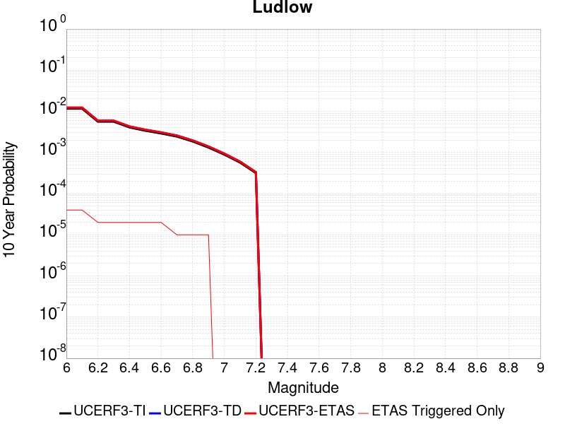 |

| Magnitude | 1 yr TI Prob | TD Prob | ETAS Prob | ETAS/TD Gain | ETAS Triggered Only | 10 yr TI Prob | TD Prob | ETAS Prob | ETAS/TD Gain | ETAS Triggered Only |
|-----|-----|-----|-----|-----|-----|-----|-----|-----|-----|-----|
| 6.0 | 0.0011685267 | 0.0012337001 | 0.0012736508 | 1.0323828 | 4.0E-5 | 0.011624013 | 0.012273024 | 0.012312533 | 1.0032191 | 4.0E-5 |
| 6.1 | 0.0011685267 | 0.0012337001 | 0.0012736508 | 1.0323828 | 4.0E-5 | 0.011624013 | 0.012273024 | 0.012312533 | 1.0032191 | 4.0E-5 |
| 6.2 | 5.623952E-4 | 5.928751E-4 | 6.128632E-4 | 1.0337139 | 2.0E-5 | 0.00560974 | 0.0059133526 | 0.0059332345 | 1.0033622 | 2.0E-5 |
| 6.3 | 5.623952E-4 | 5.928751E-4 | 6.128632E-4 | 1.0337139 | 2.0E-5 | 0.00560974 | 0.0059133526 | 0.0059332345 | 1.0033622 | 2.0E-5 |
| 6.4 | 4.0766477E-4 | 4.297432E-4 | 4.4973462E-4 | 1.0465194 | 2.0E-5 | 0.0040691774 | 0.0042892685 | 0.0043091825 | 1.0046428 | 2.0E-5 |
| 6.5 | 3.390332E-4 | 3.57409E-4 | 3.7740186E-4 | 1.0559382 | 2.0E-5 | 0.003385164 | 0.003568438 | 0.0035883668 | 1.0055847 | 2.0E-5 |
| 6.6 | 2.9122844E-4 | 3.0707743E-4 | 3.270713E-4 | 1.0651102 | 2.0E-5 | 0.0029084706 | 0.0030666045 | 0.0030865432 | 1.0065019 | 2.0E-5 |
| 6.7 | 2.4447302E-4 | 2.5775208E-4 | 2.677495E-4 | 1.038787 | 1.0E-5 | 0.0024420423 | 0.0025745875 | 0.002584562 | 1.0038741 | 1.0E-5 |
| 6.8 | 1.8566006E-4 | 1.9575632E-4 | 2.0575436E-4 | 1.0510739 | 1.0E-5 | 0.0018550502 | 0.0019558799 | 0.0019658604 | 1.0051028 | 1.0E-5 |
| 6.9 | 1.3215111E-4 | 1.3935972E-4 | 1.4935833E-4 | 1.0717467 | 1.0E-5 | 0.0013207254 | 0.0013927508 | 0.0014027369 | 1.0071701 | 1.0E-5 |
| 7.0 | 8.913424E-5 | 9.4018564E-5 | 9.4018564E-5 | 1.0 | 0.0 | 8.9098496E-4 | 9.3980436E-4 | 9.3980436E-4 | 1.0 | 0.0 |
| 7.1 | 5.6901354E-5 | 5.999119E-5 | 5.999119E-5 | 1.0 | 0.0 | 5.6886784E-4 | 5.9975975E-4 | 5.9975975E-4 | 1.0 | 0.0 |
| 7.2 | 3.1654577E-5 | 3.3327386E-5 | 3.3327386E-5 | 1.0 | 0.0 | 3.1650066E-4 | 3.332307E-4 | 3.332307E-4 | 1.0 | 0.0 |

## Brawley (Seismic Zone) alt 1
*[(top)](#table-of-contents)*

| 1 Year | 10 Year |
|-----|-----|
|  | 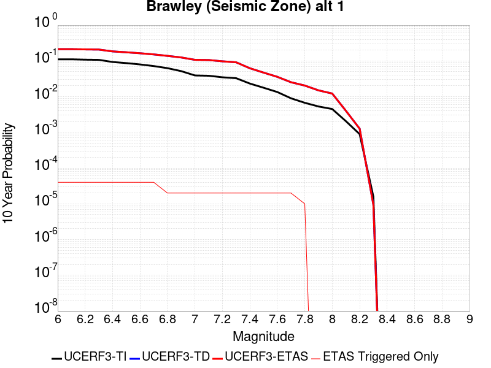 |

| Magnitude | 1 yr TI Prob | TD Prob | ETAS Prob | ETAS/TD Gain | ETAS Triggered Only | 10 yr TI Prob | TD Prob | ETAS Prob | ETAS/TD Gain | ETAS Triggered Only |
|-----|-----|-----|-----|-----|-----|-----|-----|-----|-----|-----|
| 6.0 | 0.011683988 | 0.024542542 | 0.024571804 | 1.0011923 | 3.0E-5 | 0.11088423 | 0.21347483 | 0.2135063 | 1.0001473 | 4.0E-5 |
| 6.1 | 0.011683988 | 0.024542542 | 0.024571804 | 1.0011923 | 3.0E-5 | 0.11088423 | 0.21347483 | 0.2135063 | 1.0001473 | 4.0E-5 |
| 6.2 | 0.011405343 | 0.024076827 | 0.024106104 | 1.001216 | 3.0E-5 | 0.10837428 | 0.20991138 | 0.20994298 | 1.0001506 | 4.0E-5 |
| 6.3 | 0.011262234 | 0.023789987 | 0.023819273 | 1.0012311 | 3.0E-5 | 0.107082725 | 0.2078023 | 0.20783399 | 1.0001525 | 4.0E-5 |
| 6.4 | 0.00974259 | 0.02067674 | 0.020706119 | 1.0014209 | 3.0E-5 | 0.093263686 | 0.18455231 | 0.18458493 | 1.0001768 | 4.0E-5 |
| 6.5 | 0.009034078 | 0.019365085 | 0.019394506 | 1.0015192 | 3.0E-5 | 0.086755216 | 0.17437433 | 0.17440735 | 1.0001894 | 4.0E-5 |
| 6.6 | 0.008271996 | 0.018041968 | 0.018071428 | 1.0016328 | 3.0E-5 | 0.07970774 | 0.16378246 | 0.16381592 | 1.0002042 | 4.0E-5 |
| 6.7 | 0.007417723 | 0.016589044 | 0.016618544 | 1.0017784 | 3.0E-5 | 0.07174956 | 0.15190692 | 0.15194085 | 1.0002233 | 4.0E-5 |
| 6.8 | 0.0064481674 | 0.015045324 | 0.015065024 | 1.0013093 | 2.0E-5 | 0.06264243 | 0.13835184 | 0.13836907 | 1.0001246 | 2.0E-5 |
| 6.9 | 0.005298089 | 0.013605019 | 0.013624747 | 1.0014501 | 2.0E-5 | 0.05173543 | 0.124936566 | 0.12495407 | 1.0001401 | 2.0E-5 |
| 7.0 | 0.0039900932 | 0.011618287 | 0.011638055 | 1.0017015 | 2.0E-5 | 0.039192066 | 0.1072422 | 0.10726005 | 1.0001665 | 2.0E-5 |
| 7.1 | 0.0039125155 | 0.01145484 | 0.011474611 | 1.001726 | 2.0E-5 | 0.038443442 | 0.10580618 | 0.10582406 | 1.000169 | 2.0E-5 |
| 7.2 | 0.0035360386 | 0.010488416 | 0.010508207 | 1.0018868 | 2.0E-5 | 0.034803 | 0.097476505 | 0.09749456 | 1.0001851 | 2.0E-5 |
| 7.3 | 0.0033337586 | 0.009781217 | 0.009801022 | 1.0020248 | 2.0E-5 | 0.03284188 | 0.09137183 | 0.09139 | 1.0001988 | 2.0E-5 |
| 7.4 | 0.0023488526 | 0.006515418 | 0.006535288 | 1.0030496 | 2.0E-5 | 0.023241805 | 0.062352248 | 0.062371 | 1.0003008 | 2.0E-5 |
| 7.5 | 0.0017896603 | 0.004859299 | 0.0048792018 | 1.0040958 | 2.0E-5 | 0.01775316 | 0.04705323 | 0.047072288 | 1.0004051 | 2.0E-5 |
| 7.6 | 0.001354725 | 0.0036733993 | 0.003693326 | 1.0054245 | 2.0E-5 | 0.013464959 | 0.035839107 | 0.03585839 | 1.000538 | 2.0E-5 |
| 7.7 | 9.018782E-4 | 0.0025745821 | 0.0025945306 | 1.0077482 | 2.0E-5 | 0.008982267 | 0.025288915 | 0.02530841 | 1.0007708 | 2.0E-5 |
| 7.8 | 6.743139E-4 | 0.002068891 | 0.0020788703 | 1.0048236 | 1.0E-5 | 0.0067227143 | 0.020430436 | 0.020440232 | 1.0004795 | 1.0E-5 |
| 7.9 | 5.321229E-4 | 0.001498688 | 0.001498688 | 1.0 | 0.0 | 0.005308505 | 0.014990583 | 0.014990583 | 1.0 | 0.0 |
| 8.0 | 4.5126543E-4 | 0.0012137551 | 0.0012137551 | 1.0 | 0.0 | 0.0045035016 | 0.012210181 | 0.012210181 | 1.0 | 0.0 |
| 8.1 | 2.0539707E-4 | 3.822483E-4 | 3.822483E-4 | 1.0 | 0.0 | 0.0020520731 | 0.004000768 | 0.004000768 | 1.0 | 0.0 |
| 8.2 | 8.922769E-5 | 1.1570192E-4 | 1.1570192E-4 | 1.0 | 0.0 | 8.9191867E-4 | 0.0012665088 | 0.0012665088 | 1.0 | 0.0 |
| 8.3 | 1.5834444E-6 | 8.9811834E-7 | 8.9811834E-7 | 1.0 | 0.0 | 1.5834332E-5 | 9.365885E-6 | 9.365885E-6 | 1.0 | 0.0 |

## Imperial
*[(top)](#table-of-contents)*

| 1 Year | 10 Year |
|-----|-----|
|  | 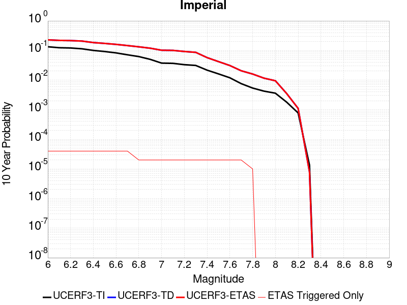 |

| Magnitude | 1 yr TI Prob | TD Prob | ETAS Prob | ETAS/TD Gain | ETAS Triggered Only | 10 yr TI Prob | TD Prob | ETAS Prob | ETAS/TD Gain | ETAS Triggered Only |
|-----|-----|-----|-----|-----|-----|-----|-----|-----|-----|-----|
| 6.0 | 0.0142467655 | 0.026034584 | 0.026063802 | 1.0011224 | 3.0E-5 | 0.13367249 | 0.22801645 | 0.22804733 | 1.0001354 | 4.0E-5 |
| 6.1 | 0.013144928 | 0.02506727 | 0.025096517 | 1.0011668 | 3.0E-5 | 0.123940155 | 0.21945323 | 0.21948446 | 1.0001422 | 4.0E-5 |
| 6.2 | 0.01286919 | 0.024607308 | 0.02463657 | 1.0011891 | 3.0E-5 | 0.12148927 | 0.21595894 | 0.2159903 | 1.0001452 | 4.0E-5 |
| 6.3 | 0.012036599 | 0.023657534 | 0.023686824 | 1.0012381 | 3.0E-5 | 0.11405133 | 0.20790851 | 0.20794019 | 1.0001523 | 4.0E-5 |
| 6.4 | 0.010539869 | 0.020591887 | 0.02062127 | 1.0014269 | 3.0E-5 | 0.100537635 | 0.18504018 | 0.18507278 | 1.0001762 | 4.0E-5 |
| 6.5 | 0.009633281 | 0.01911576 | 0.019145187 | 1.0015393 | 3.0E-5 | 0.0922623 | 0.17327131 | 0.1733044 | 1.0001909 | 4.0E-5 |
| 6.6 | 0.008617763 | 0.017602775 | 0.017632248 | 1.0016743 | 3.0E-5 | 0.08291132 | 0.16074891 | 0.16078249 | 1.0002089 | 4.0E-5 |
| 6.7 | 0.0073952693 | 0.01592603 | 0.015955552 | 1.0018537 | 3.0E-5 | 0.07153955 | 0.14645793 | 0.14649206 | 1.0002332 | 4.0E-5 |
| 6.8 | 0.0064067547 | 0.014396132 | 0.014415843 | 1.0013692 | 2.0E-5 | 0.06225166 | 0.13291098 | 0.13292833 | 1.0001305 | 2.0E-5 |
| 6.9 | 0.0051317946 | 0.012966422 | 0.012986163 | 1.0015224 | 2.0E-5 | 0.05014893 | 0.11938127 | 0.119398884 | 1.0001476 | 2.0E-5 |
| 7.0 | 0.003811904 | 0.011033948 | 0.011053727 | 1.0017926 | 2.0E-5 | 0.037471764 | 0.10204036 | 0.10205832 | 1.000176 | 2.0E-5 |
| 7.1 | 0.003737482 | 0.0108798025 | 0.010899585 | 1.0018183 | 2.0E-5 | 0.03675245 | 0.10067689 | 0.10069487 | 1.0001787 | 2.0E-5 |
| 7.2 | 0.0033683628 | 0.009933916 | 0.009953717 | 1.0019933 | 2.0E-5 | 0.033177625 | 0.09248428 | 0.09250244 | 1.0001962 | 2.0E-5 |
| 7.3 | 0.0031717476 | 0.009247407 | 0.009267222 | 1.0021428 | 2.0E-5 | 0.031268585 | 0.08653566 | 0.08655393 | 1.0002111 | 2.0E-5 |
| 7.4 | 0.0021888057 | 0.00598709 | 0.00600697 | 1.0033206 | 2.0E-5 | 0.02167372 | 0.057428524 | 0.057447378 | 1.0003283 | 2.0E-5 |
| 7.5 | 0.0016321153 | 0.00433879 | 0.0043587033 | 1.0045896 | 2.0E-5 | 0.016201803 | 0.042130288 | 0.042149447 | 1.0004547 | 2.0E-5 |
| 7.6 | 0.0012032706 | 0.0031697042 | 0.0031896408 | 1.0062897 | 2.0E-5 | 0.011967761 | 0.03102491 | 0.03104429 | 1.0006247 | 2.0E-5 |
| 7.7 | 7.608177E-4 | 0.0020913668 | 0.0021113248 | 1.0095432 | 2.0E-5 | 0.007582182 | 0.020626526 | 0.020646114 | 1.0009496 | 2.0E-5 |
| 7.8 | 5.400606E-4 | 0.0016140995 | 0.0016240834 | 1.0061854 | 1.0E-5 | 0.0053875 | 0.016015781 | 0.016025621 | 1.0006144 | 1.0E-5 |
| 7.9 | 4.2453592E-4 | 0.0011549587 | 0.0011549587 | 1.0 | 0.0 | 0.004237258 | 0.011617044 | 0.011617044 | 1.0 | 0.0 |
| 8.0 | 3.6194647E-4 | 9.39157E-4 | 9.39157E-4 | 1.0 | 0.0 | 0.0036135751 | 0.009500807 | 0.009500807 | 1.0 | 0.0 |
| 8.1 | 1.7888541E-4 | 3.328E-4 | 3.328E-4 | 1.0 | 0.0 | 0.0017874148 | 0.0034856654 | 0.0034856654 | 1.0 | 0.0 |
| 8.2 | 7.7779034E-5 | 1.0103236E-4 | 1.0103236E-4 | 1.0 | 0.0 | 7.775182E-4 | 0.001107385 | 0.001107385 | 1.0 | 0.0 |
| 8.3 | 1.3440151E-6 | 7.564416E-7 | 7.564416E-7 | 1.0 | 0.0 | 1.344007E-5 | 7.8862E-6 | 7.8862E-6 | 1.0 | 0.0 |

## Sierra Nevada  (No Extension)
*[(top)](#table-of-contents)*

| 1 Year | 10 Year |
|-----|-----|
|  |  |

| Magnitude | 1 yr TI Prob | TD Prob | ETAS Prob | ETAS/TD Gain | ETAS Triggered Only | 10 yr TI Prob | TD Prob | ETAS Prob | ETAS/TD Gain | ETAS Triggered Only |
|-----|-----|-----|-----|-----|-----|-----|-----|-----|-----|-----|
| 6.0 | 4.0529718E-4 | 3.639872E-4 | 3.9397628E-4 | 1.0823904 | 3.0E-5 | 0.004045588 | 0.0036374263 | 0.003667317 | 1.0082176 | 3.0E-5 |
| 6.1 | 4.0529718E-4 | 3.639872E-4 | 3.9397628E-4 | 1.0823904 | 3.0E-5 | 0.004045588 | 0.0036374263 | 0.003667317 | 1.0082176 | 3.0E-5 |
| 6.2 | 4.0529718E-4 | 3.639872E-4 | 3.9397628E-4 | 1.0823904 | 3.0E-5 | 0.004045588 | 0.0036374263 | 0.003667317 | 1.0082176 | 3.0E-5 |
| 6.3 | 4.0529718E-4 | 3.639872E-4 | 3.9397628E-4 | 1.0823904 | 3.0E-5 | 0.004045588 | 0.0036374263 | 0.003667317 | 1.0082176 | 3.0E-5 |
| 6.4 | 4.0529718E-4 | 3.639872E-4 | 3.9397628E-4 | 1.0823904 | 3.0E-5 | 0.004045588 | 0.0036374263 | 0.003667317 | 1.0082176 | 3.0E-5 |
| 6.5 | 4.0529718E-4 | 3.639872E-4 | 3.9397628E-4 | 1.0823904 | 3.0E-5 | 0.004045588 | 0.0036374263 | 0.003667317 | 1.0082176 | 3.0E-5 |
| 6.6 | 1.3842035E-4 | 8.4257044E-5 | 8.4257044E-5 | 1.0 | 0.0 | 0.0013833415 | 8.422544E-4 | 8.422544E-4 | 1.0 | 0.0 |
| 6.7 | 1.351464E-4 | 8.088311E-5 | 8.088311E-5 | 1.0 | 0.0 | 0.0013506424 | 8.085397E-4 | 8.085397E-4 | 1.0 | 0.0 |
| 6.8 | 1.34893E-4 | 8.071616E-5 | 8.071616E-5 | 1.0 | 0.0 | 0.0013481114 | 8.0687145E-4 | 8.0687145E-4 | 1.0 | 0.0 |
| 6.9 | 1.2826028E-4 | 7.419821E-5 | 7.419821E-5 | 1.0 | 0.0 | 0.0012818627 | 7.417363E-4 | 7.417363E-4 | 1.0 | 0.0 |
| 7.0 | 1.270024E-4 | 7.29963E-5 | 7.29963E-5 | 1.0 | 0.0 | 0.0012692984 | 7.297252E-4 | 7.297252E-4 | 1.0 | 0.0 |
| 7.1 | 1.2340778E-4 | 6.9602305E-5 | 6.9602305E-5 | 1.0 | 0.0 | 0.0012333926 | 6.9580675E-4 | 6.9580675E-4 | 1.0 | 0.0 |
| 7.2 | 1.1855107E-4 | 6.52356E-5 | 6.52356E-5 | 1.0 | 0.0 | 0.0011848784 | 6.52166E-4 | 6.52166E-4 | 1.0 | 0.0 |
| 7.3 | 1.1156279E-4 | 5.9584392E-5 | 5.9584392E-5 | 1.0 | 0.0 | 0.001115068 | 5.956853E-4 | 5.956853E-4 | 1.0 | 0.0 |
| 7.4 | 9.9385186E-5 | 4.996079E-5 | 4.996079E-5 | 1.0 | 0.0 | 9.934074E-4 | 4.9949624E-4 | 4.9949624E-4 | 1.0 | 0.0 |
| 7.5 | 8.021306E-5 | 3.9446255E-5 | 3.9446255E-5 | 1.0 | 0.0 | 8.0184115E-4 | 3.9439302E-4 | 3.9439302E-4 | 1.0 | 0.0 |
| 7.6 | 5.5726876E-5 | 2.4312982E-5 | 2.4312982E-5 | 1.0 | 0.0 | 5.5712904E-4 | 2.4310348E-4 | 2.4310348E-4 | 1.0 | 0.0 |
| 7.7 | 2.8745531E-5 | 8.129569E-6 | 8.129569E-6 | 1.0 | 0.0 | 2.8741814E-4 | 8.1292834E-5 | 8.1292834E-5 | 1.0 | 0.0 |

## Sheephole
*[(top)](#table-of-contents)*

| 1 Year | 10 Year |
|-----|-----|
| 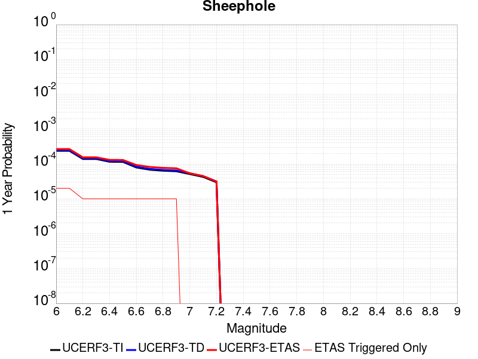 |  |

| Magnitude | 1 yr TI Prob | TD Prob | ETAS Prob | ETAS/TD Gain | ETAS Triggered Only | 10 yr TI Prob | TD Prob | ETAS Prob | ETAS/TD Gain | ETAS Triggered Only |
|-----|-----|-----|-----|-----|-----|-----|-----|-----|-----|-----|
| 6.0 | 2.3780059E-4 | 2.4736795E-4 | 2.67363E-4 | 1.0808312 | 2.0E-5 | 0.0023754628 | 0.0024714705 | 0.0025013965 | 1.0121086 | 3.0E-5 |
| 6.1 | 2.3780059E-4 | 2.4736795E-4 | 2.67363E-4 | 1.0808312 | 2.0E-5 | 0.0023754628 | 0.0024714705 | 0.0025013965 | 1.0121086 | 3.0E-5 |
| 6.2 | 1.3919079E-4 | 1.4543286E-4 | 1.554314E-4 | 1.0687503 | 1.0E-5 | 0.0013910364 | 0.0014534827 | 0.0014634681 | 1.00687 | 1.0E-5 |
| 6.3 | 1.3919079E-4 | 1.4543286E-4 | 1.554314E-4 | 1.0687503 | 1.0E-5 | 0.0013910364 | 0.0014534827 | 0.0014634681 | 1.00687 | 1.0E-5 |
| 6.4 | 1.156199E-4 | 1.21198E-4 | 1.3119678E-4 | 1.0824996 | 1.0E-5 | 0.0011555976 | 0.0012113983 | 0.0012213863 | 1.0082449 | 1.0E-5 |
| 6.5 | 1.1471378E-4 | 1.2025265E-4 | 1.3025144E-4 | 1.0831482 | 1.0E-5 | 0.0011465458 | 0.0012019551 | 0.0012119431 | 1.0083097 | 1.0E-5 |
| 6.6 | 7.947703E-5 | 8.3581086E-5 | 9.358025E-5 | 1.1196343 | 1.0E-5 | 7.9448614E-4 | 8.3551527E-4 | 8.455069E-4 | 1.0119587 | 1.0E-5 |
| 6.7 | 6.854657E-5 | 7.215102E-5 | 8.21503E-5 | 1.1385882 | 1.0E-5 | 6.8525434E-4 | 7.2128983E-4 | 7.3128263E-4 | 1.013854 | 1.0E-5 |
| 6.8 | 6.4051106E-5 | 6.742739E-5 | 7.742671E-5 | 1.1482977 | 1.0E-5 | 6.4032647E-4 | 6.7408266E-4 | 6.840759E-4 | 1.014825 | 1.0E-5 |
| 6.9 | 6.176237E-5 | 6.5017804E-5 | 7.501715E-5 | 1.153794 | 1.0E-5 | 6.17452E-4 | 6.5000093E-4 | 6.5999443E-4 | 1.0153745 | 1.0E-5 |
| 7.0 | 5.1391315E-5 | 5.408841E-5 | 5.408841E-5 | 1.0 | 0.0 | 5.137943E-4 | 5.4076256E-4 | 5.4076256E-4 | 1.0 | 0.0 |
| 7.1 | 4.2599597E-5 | 4.4829147E-5 | 4.4829147E-5 | 1.0 | 0.0 | 4.259143E-4 | 4.4820967E-4 | 4.4820967E-4 | 1.0 | 0.0 |
| 7.2 | 2.9895667E-5 | 3.1460622E-5 | 3.1460622E-5 | 1.0 | 0.0 | 2.9891645E-4 | 3.1456837E-4 | 3.1456837E-4 | 1.0 | 0.0 |

## Calico-Hidalgo
*[(top)](#table-of-contents)*

| 1 Year | 10 Year |
|-----|-----|
| 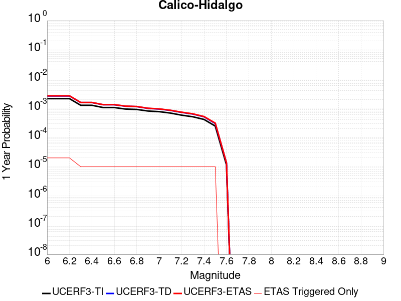 |  |

| Magnitude | 1 yr TI Prob | TD Prob | ETAS Prob | ETAS/TD Gain | ETAS Triggered Only | 10 yr TI Prob | TD Prob | ETAS Prob | ETAS/TD Gain | ETAS Triggered Only |
|-----|-----|-----|-----|-----|-----|-----|-----|-----|-----|-----|
| 6.0 | 0.0021322158 | 0.002642638 | 0.0026625851 | 1.0075482 | 2.0E-5 | 0.02111873 | 0.026152508 | 0.026181724 | 1.0011171 | 3.0E-5 |
| 6.1 | 0.0021322158 | 0.002642638 | 0.0026625851 | 1.0075482 | 2.0E-5 | 0.02111873 | 0.026152508 | 0.026181724 | 1.0011171 | 3.0E-5 |
| 6.2 | 0.0021322158 | 0.002642638 | 0.0026625851 | 1.0075482 | 2.0E-5 | 0.02111873 | 0.026152508 | 0.026181724 | 1.0011171 | 3.0E-5 |
| 6.3 | 0.0012641704 | 0.0015689114 | 0.0015788956 | 1.0063639 | 1.0E-5 | 0.01257003 | 0.015582023 | 0.015601711 | 1.0012635 | 2.0E-5 |
| 6.4 | 0.0012641704 | 0.0015689114 | 0.0015788956 | 1.0063639 | 1.0E-5 | 0.01257003 | 0.015582023 | 0.015601711 | 1.0012635 | 2.0E-5 |
| 6.5 | 0.0010579949 | 0.0013200995 | 0.0013300863 | 1.0075651 | 1.0E-5 | 0.010529719 | 0.0131245125 | 0.01314425 | 1.0015038 | 2.0E-5 |
| 6.6 | 0.0010570707 | 0.0013191067 | 0.0013290935 | 1.0075709 | 1.0E-5 | 0.010520565 | 0.013114702 | 0.0131344395 | 1.001505 | 2.0E-5 |
| 6.7 | 9.3870464E-4 | 0.0011754717 | 0.0011854599 | 1.0084972 | 1.0E-5 | 0.009347493 | 0.011694153 | 0.011713919 | 1.0016903 | 2.0E-5 |
| 6.8 | 9.10568E-4 | 0.0011390673 | 0.0011490559 | 1.0087692 | 1.0E-5 | 0.009068459 | 0.0113338735 | 0.011353646 | 1.0017446 | 2.0E-5 |
| 6.9 | 8.04737E-4 | 9.92275E-4 | 0.001002265 | 1.0100678 | 1.0E-5 | 0.008018291 | 0.0098798415 | 0.009899643 | 1.0020043 | 2.0E-5 |
| 7.0 | 7.658257E-4 | 9.403893E-4 | 9.5037994E-4 | 1.0106239 | 1.0E-5 | 0.0076319184 | 0.0093654655 | 0.009385278 | 1.0021155 | 2.0E-5 |
| 7.1 | 6.853584E-4 | 8.450038E-4 | 8.549954E-4 | 1.0118243 | 1.0E-5 | 0.0068324856 | 0.008419205 | 0.008439037 | 1.0023556 | 2.0E-5 |
| 7.2 | 5.8044674E-4 | 7.232931E-4 | 7.3328585E-4 | 1.0138156 | 1.0E-5 | 0.0057893298 | 0.0072104977 | 0.0072303535 | 1.0027537 | 2.0E-5 |
| 7.3 | 5.11647E-4 | 6.351501E-4 | 6.451438E-4 | 1.0157343 | 1.0E-5 | 0.0051047057 | 0.006334424 | 0.0063542975 | 1.0031374 | 2.0E-5 |
| 7.4 | 4.1434157E-4 | 5.108215E-4 | 5.208164E-4 | 1.0195663 | 1.0E-5 | 0.0041356985 | 0.0050974144 | 0.0051173125 | 1.0039035 | 2.0E-5 |
| 7.5 | 2.4584212E-4 | 3.011817E-4 | 3.1117868E-4 | 1.0331925 | 1.0E-5 | 0.0024557032 | 0.0030084874 | 0.0030284273 | 1.0066279 | 2.0E-5 |
| 7.6 | 1.1540374E-5 | 1.3587022E-5 | 1.3587022E-5 | 1.0 | 0.0 | 1.1539775E-4 | 1.3586473E-4 | 1.3586473E-4 | 1.0 | 0.0 |

## Santa Rosa Island
*[(top)](#table-of-contents)*

| 1 Year | 10 Year |
|-----|-----|
| 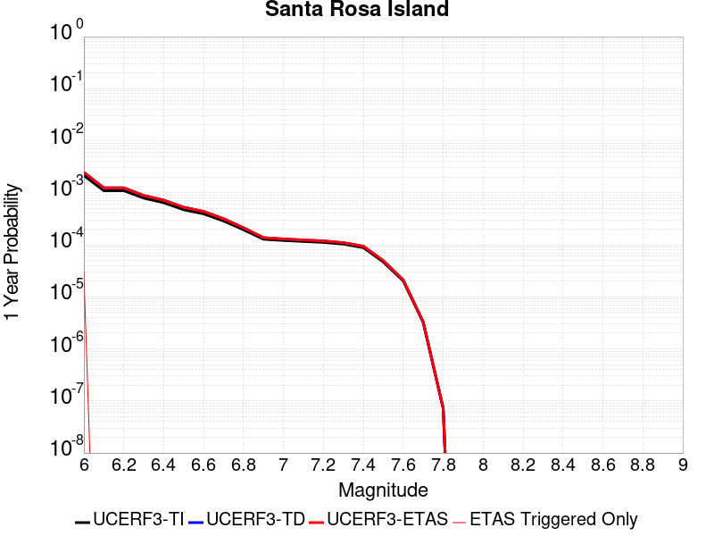 |  |

| Magnitude | 1 yr TI Prob | TD Prob | ETAS Prob | ETAS/TD Gain | ETAS Triggered Only | 10 yr TI Prob | TD Prob | ETAS Prob | ETAS/TD Gain | ETAS Triggered Only |
|-----|-----|-----|-----|-----|-----|-----|-----|-----|-----|-----|
| 6.0 | 0.002144533 | 0.0024543905 | 0.002484317 | 1.012193 | 3.0E-5 | 0.021239553 | 0.024293458 | 0.02432273 | 1.0012048 | 3.0E-5 |
| 6.1 | 0.0010983539 | 0.0012445059 | 0.0012445059 | 1.0 | 0.0 | 0.01092941 | 0.012378404 | 0.012378404 | 1.0 | 0.0 |
| 6.2 | 0.0010983539 | 0.0012445059 | 0.0012445059 | 1.0 | 0.0 | 0.01092941 | 0.012378404 | 0.012378404 | 1.0 | 0.0 |
| 6.3 | 7.906284E-4 | 8.9053944E-4 | 8.9053944E-4 | 1.0 | 0.0 | 0.007878214 | 0.008870959 | 0.008870959 | 1.0 | 0.0 |
| 6.4 | 6.437803E-4 | 7.225755E-4 | 7.225755E-4 | 1.0 | 0.0 | 0.006419184 | 0.0072030975 | 0.0072030975 | 1.0 | 0.0 |
| 6.5 | 4.726887E-4 | 5.277596E-4 | 5.277596E-4 | 1.0 | 0.0 | 0.004716845 | 0.005265601 | 0.005265601 | 1.0 | 0.0 |
| 6.6 | 3.936723E-4 | 4.382473E-4 | 4.382473E-4 | 1.0 | 0.0 | 0.003929756 | 0.0043742605 | 0.0043742605 | 1.0 | 0.0 |
| 6.7 | 2.8706578E-4 | 3.175839E-4 | 3.175839E-4 | 1.0 | 0.0 | 0.0028669522 | 0.0031716223 | 0.0031716223 | 1.0 | 0.0 |
| 6.8 | 1.948771E-4 | 2.130323E-4 | 2.130323E-4 | 1.0 | 0.0 | 0.0019470629 | 0.002128526 | 0.002128526 | 1.0 | 0.0 |
| 6.9 | 1.2816161E-4 | 1.3718211E-4 | 1.3718211E-4 | 1.0 | 0.0 | 0.0012808773 | 0.0013709773 | 0.0013709773 | 1.0 | 0.0 |
| 7.0 | 1.2128269E-4 | 1.2953937E-4 | 1.2953937E-4 | 1.0 | 0.0 | 0.0012121652 | 0.0012946409 | 0.0012946409 | 1.0 | 0.0 |
| 7.1 | 1.1608207E-4 | 1.2382507E-4 | 1.2382507E-4 | 1.0 | 0.0 | 0.0011602144 | 0.0012375627 | 0.0012375627 | 1.0 | 0.0 |
| 7.2 | 1.1139726E-4 | 1.1875935E-4 | 1.1875935E-4 | 1.0 | 0.0 | 0.0011134144 | 0.0011869607 | 0.0011869607 | 1.0 | 0.0 |
| 7.3 | 1.032748E-4 | 1.1002384E-4 | 1.1002384E-4 | 1.0 | 0.0 | 0.0010322682 | 0.0010996955 | 0.0010996955 | 1.0 | 0.0 |
| 7.4 | 8.844508E-5 | 9.415556E-5 | 9.415556E-5 | 1.0 | 0.0 | 8.840988E-4 | 9.411584E-4 | 9.411584E-4 | 1.0 | 0.0 |
| 7.5 | 4.6892885E-5 | 4.96321E-5 | 4.96321E-5 | 1.0 | 0.0 | 4.688299E-4 | 4.9621135E-4 | 4.9621135E-4 | 1.0 | 0.0 |
| 7.6 | 2.0236233E-5 | 2.1147382E-5 | 2.1147382E-5 | 1.0 | 0.0 | 2.023439E-4 | 2.1145435E-4 | 2.1145435E-4 | 1.0 | 0.0 |
| 7.7 | 3.225572E-6 | 3.3076094E-6 | 3.3076094E-6 | 1.0 | 0.0 | 3.225525E-5 | 3.307561E-5 | 3.307561E-5 | 1.0 | 0.0 |
| 7.8 | 7.1507856E-8 | 7.286292E-8 | 7.286292E-8 | 1.0 | 0.0 | 7.1507833E-7 | 7.28629E-7 | 7.28629E-7 | 1.0 | 0.0 |

## Santa Ynez (East)
*[(top)](#table-of-contents)*

| 1 Year | 10 Year |
|-----|-----|
|  | 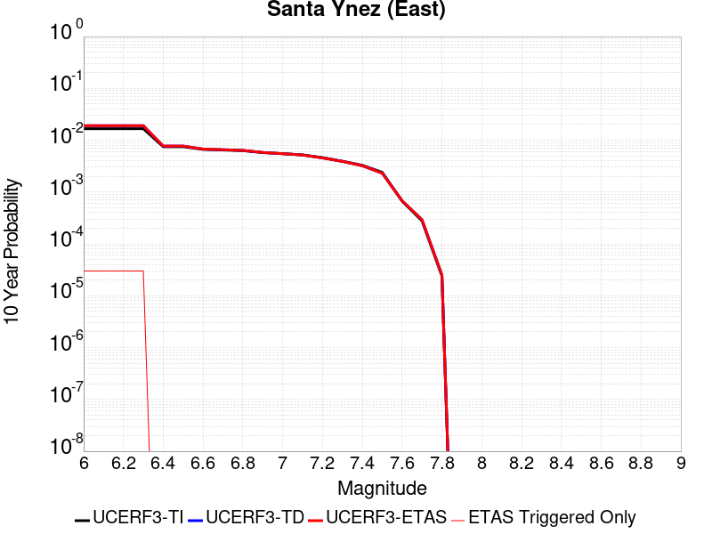 |

| Magnitude | 1 yr TI Prob | TD Prob | ETAS Prob | ETAS/TD Gain | ETAS Triggered Only | 10 yr TI Prob | TD Prob | ETAS Prob | ETAS/TD Gain | ETAS Triggered Only |
|-----|-----|-----|-----|-----|-----|-----|-----|-----|-----|-----|
| 6.0 | 0.0016823979 | 0.0019164077 | 0.0019263886 | 1.0052081 | 1.0E-5 | 0.016697178 | 0.019056354 | 0.019085782 | 1.0015442 | 3.0E-5 |
| 6.1 | 0.0016823979 | 0.0019164077 | 0.0019263886 | 1.0052081 | 1.0E-5 | 0.016697178 | 0.019056354 | 0.019085782 | 1.0015442 | 3.0E-5 |
| 6.2 | 0.0016823979 | 0.0019164077 | 0.0019263886 | 1.0052081 | 1.0E-5 | 0.016697178 | 0.019056354 | 0.019085782 | 1.0015442 | 3.0E-5 |
| 6.3 | 0.0016823979 | 0.0019164077 | 0.0019263886 | 1.0052081 | 1.0E-5 | 0.016697178 | 0.019056354 | 0.019085782 | 1.0015442 | 3.0E-5 |
| 6.4 | 7.513438E-4 | 7.7452866E-4 | 7.7452866E-4 | 1.0 | 0.0 | 0.0074880854 | 0.0077188425 | 0.0077188425 | 1.0 | 0.0 |
| 6.5 | 7.513438E-4 | 7.7452866E-4 | 7.7452866E-4 | 1.0 | 0.0 | 0.0074880854 | 0.0077188425 | 0.0077188425 | 1.0 | 0.0 |
| 6.6 | 6.6777546E-4 | 6.7871914E-4 | 6.7871914E-4 | 1.0 | 0.0 | 0.006657724 | 0.0067666727 | 0.0067666727 | 1.0 | 0.0 |
| 6.7 | 6.497827E-4 | 6.5872277E-4 | 6.5872277E-4 | 1.0 | 0.0 | 0.00647886 | 0.0065678996 | 0.0065678996 | 1.0 | 0.0 |
| 6.8 | 6.309115E-4 | 6.379922E-4 | 6.379922E-4 | 1.0 | 0.0 | 0.0062912325 | 0.006361794 | 0.006361794 | 1.0 | 0.0 |
| 6.9 | 5.7922816E-4 | 5.820083E-4 | 5.820083E-4 | 1.0 | 0.0 | 0.005777207 | 0.0058049858 | 0.0058049858 | 1.0 | 0.0 |
| 7.0 | 5.5176654E-4 | 5.519875E-4 | 5.519875E-4 | 1.0 | 0.0 | 0.0055039856 | 0.0055063027 | 0.0055063027 | 1.0 | 0.0 |
| 7.1 | 5.2278786E-4 | 5.206607E-4 | 5.206607E-4 | 1.0 | 0.0 | 0.0052155964 | 0.0051945415 | 0.0051945415 | 1.0 | 0.0 |
| 7.2 | 4.629332E-4 | 4.5639748E-4 | 4.5639748E-4 | 1.0 | 0.0 | 0.0046197 | 0.0045547197 | 0.0045547197 | 1.0 | 0.0 |
| 7.3 | 3.9389438E-4 | 3.9153136E-4 | 3.9153136E-4 | 1.0 | 0.0 | 0.0039319694 | 0.0039085224 | 0.0039085224 | 1.0 | 0.0 |
| 7.4 | 3.2916202E-4 | 3.225775E-4 | 3.225775E-4 | 1.0 | 0.0 | 0.003286749 | 0.00322119 | 0.00322119 | 1.0 | 0.0 |
| 7.5 | 2.4053088E-4 | 2.3169327E-4 | 2.3169327E-4 | 1.0 | 0.0 | 0.002402707 | 0.0023145864 | 0.0023145864 | 1.0 | 0.0 |
| 7.6 | 6.7092435E-5 | 6.7872505E-5 | 6.7872505E-5 | 1.0 | 0.0 | 6.707218E-4 | 6.785246E-4 | 6.785246E-4 | 1.0 | 0.0 |
| 7.7 | 2.7812002E-5 | 2.9282912E-5 | 2.9282912E-5 | 1.0 | 0.0 | 2.7808524E-4 | 2.927941E-4 | 2.927941E-4 | 1.0 | 0.0 |
| 7.8 | 2.4074816E-6 | 2.506136E-6 | 2.506136E-6 | 1.0 | 0.0 | 2.4074554E-5 | 2.5061088E-5 | 2.5061088E-5 | 1.0 | 0.0 |

## Independence rev 2011
*[(top)](#table-of-contents)*

| 1 Year | 10 Year |
|-----|-----|
| 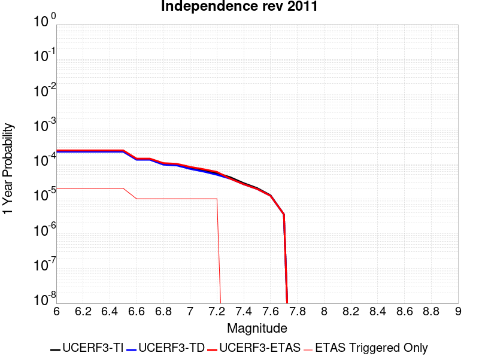 |  |

| Magnitude | 1 yr TI Prob | TD Prob | ETAS Prob | ETAS/TD Gain | ETAS Triggered Only | 10 yr TI Prob | TD Prob | ETAS Prob | ETAS/TD Gain | ETAS Triggered Only |
|-----|-----|-----|-----|-----|-----|-----|-----|-----|-----|-----|
| 6.0 | 2.3071647E-4 | 2.2571435E-4 | 2.4570985E-4 | 1.0885875 | 2.0E-5 | 0.0023047708 | 0.0022551445 | 0.002285077 | 1.0132729 | 3.0E-5 |
| 6.1 | 2.3071647E-4 | 2.2571435E-4 | 2.4570985E-4 | 1.0885875 | 2.0E-5 | 0.0023047708 | 0.0022551445 | 0.002285077 | 1.0132729 | 3.0E-5 |
| 6.2 | 2.3071647E-4 | 2.2571435E-4 | 2.4570985E-4 | 1.0885875 | 2.0E-5 | 0.0023047708 | 0.0022551445 | 0.002285077 | 1.0132729 | 3.0E-5 |
| 6.3 | 2.3071647E-4 | 2.2571435E-4 | 2.4570985E-4 | 1.0885875 | 2.0E-5 | 0.0023047708 | 0.0022551445 | 0.002285077 | 1.0132729 | 3.0E-5 |
| 6.4 | 2.3071647E-4 | 2.2571435E-4 | 2.4570985E-4 | 1.0885875 | 2.0E-5 | 0.0023047708 | 0.0022551445 | 0.002285077 | 1.0132729 | 3.0E-5 |
| 6.5 | 2.3071647E-4 | 2.2571435E-4 | 2.4570985E-4 | 1.0885875 | 2.0E-5 | 0.0023047708 | 0.0022551445 | 0.002285077 | 1.0132729 | 3.0E-5 |
| 6.6 | 1.3898089E-4 | 1.3210725E-4 | 1.4210593E-4 | 1.0756861 | 1.0E-5 | 0.0013889399 | 0.0013203353 | 0.0013403089 | 1.0151277 | 2.0E-5 |
| 6.7 | 1.3898089E-4 | 1.3210725E-4 | 1.4210593E-4 | 1.0756861 | 1.0E-5 | 0.0013889399 | 0.0013203353 | 0.0013403089 | 1.0151277 | 2.0E-5 |
| 6.8 | 1.0287284E-4 | 9.560016E-5 | 1.0559921E-4 | 1.1045923 | 1.0E-5 | 0.0010282523 | 9.5560326E-4 | 9.7558415E-4 | 1.0209092 | 2.0E-5 |
| 6.9 | 9.80316E-5 | 9.094317E-5 | 1.0094226E-4 | 1.1099488 | 1.0E-5 | 9.798837E-4 | 9.090716E-4 | 9.290534E-4 | 1.0219805 | 2.0E-5 |
| 7.0 | 7.8502184E-5 | 7.226213E-5 | 8.226141E-5 | 1.138375 | 1.0E-5 | 7.8474457E-4 | 7.223915E-4 | 7.42377E-4 | 1.0276659 | 2.0E-5 |
| 7.1 | 6.6386776E-5 | 6.0656243E-5 | 7.065564E-5 | 1.1648535 | 1.0E-5 | 6.636695E-4 | 6.064001E-4 | 6.2638795E-4 | 1.0329615 | 2.0E-5 |
| 7.2 | 5.4352407E-5 | 4.9098177E-5 | 5.9097685E-5 | 1.2036636 | 1.0E-5 | 5.4339116E-4 | 4.9087516E-4 | 5.1086536E-4 | 1.0407236 | 2.0E-5 |
| 7.3 | 4.1455114E-5 | 3.7750466E-5 | 3.7750466E-5 | 1.0 | 0.0 | 4.144738E-4 | 3.7744164E-4 | 3.7744164E-4 | 1.0 | 0.0 |
| 7.4 | 2.8120441E-5 | 2.6190733E-5 | 2.6190733E-5 | 1.0 | 0.0 | 2.8116882E-4 | 2.618769E-4 | 2.618769E-4 | 1.0 | 0.0 |
| 7.5 | 2.027226E-5 | 1.921484E-5 | 1.921484E-5 | 1.0 | 0.0 | 2.0270412E-4 | 1.9213199E-4 | 1.9213199E-4 | 1.0 | 0.0 |
| 7.6 | 1.2600677E-5 | 1.2239731E-5 | 1.2239731E-5 | 1.0 | 0.0 | 1.2599962E-4 | 1.2239069E-4 | 1.2239069E-4 | 1.0 | 0.0 |
| 7.7 | 3.5636867E-6 | 3.5789042E-6 | 3.5789042E-6 | 1.0 | 0.0 | 3.5636294E-5 | 3.5788515E-5 | 3.5788515E-5 | 1.0 | 0.0 |

## Dry Mountain
*[(top)](#table-of-contents)*

| 1 Year | 10 Year |
|-----|-----|
| 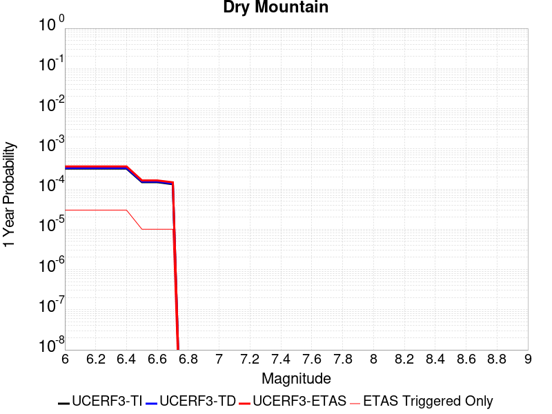 |  |

| Magnitude | 1 yr TI Prob | TD Prob | ETAS Prob | ETAS/TD Gain | ETAS Triggered Only | 10 yr TI Prob | TD Prob | ETAS Prob | ETAS/TD Gain | ETAS Triggered Only |
|-----|-----|-----|-----|-----|-----|-----|-----|-----|-----|-----|
| 6.0 | 3.2464517E-4 | 3.3595905E-4 | 3.6594897E-4 | 1.0892665 | 3.0E-5 | 0.0032417132 | 0.0033560738 | 0.0033859732 | 1.008909 | 3.0E-5 |
| 6.1 | 3.2464517E-4 | 3.3595905E-4 | 3.6594897E-4 | 1.0892665 | 3.0E-5 | 0.0032417132 | 0.0033560738 | 0.0033859732 | 1.008909 | 3.0E-5 |
| 6.2 | 3.2464517E-4 | 3.3595905E-4 | 3.6594897E-4 | 1.0892665 | 3.0E-5 | 0.0032417132 | 0.0033560738 | 0.0033859732 | 1.008909 | 3.0E-5 |
| 6.3 | 3.2464517E-4 | 3.3595905E-4 | 3.6594897E-4 | 1.0892665 | 3.0E-5 | 0.0032417132 | 0.0033560738 | 0.0033859732 | 1.008909 | 3.0E-5 |
| 6.4 | 3.2464517E-4 | 3.3595905E-4 | 3.6594897E-4 | 1.0892665 | 3.0E-5 | 0.0032417132 | 0.0033560738 | 0.0033859732 | 1.008909 | 3.0E-5 |
| 6.5 | 1.4884741E-4 | 1.5403745E-4 | 1.6403591E-4 | 1.0649092 | 1.0E-5 | 0.0014874774 | 0.0015401602 | 0.0015501447 | 1.0064828 | 1.0E-5 |
| 6.6 | 1.4884741E-4 | 1.5403745E-4 | 1.6403591E-4 | 1.0649092 | 1.0E-5 | 0.0014874774 | 0.0015401602 | 0.0015501447 | 1.0064828 | 1.0E-5 |
| 6.7 | 1.3257713E-4 | 1.3719601E-4 | 1.4719465E-4 | 1.0728784 | 1.0E-5 | 0.0013249806 | 0.0013719602 | 0.0013819464 | 1.0072788 | 1.0E-5 |

## Ortigalita (South)
*[(top)](#table-of-contents)*

| 1 Year | 10 Year |
|-----|-----|
|  |  |

| Magnitude | 1 yr TI Prob | TD Prob | ETAS Prob | ETAS/TD Gain | ETAS Triggered Only | 10 yr TI Prob | TD Prob | ETAS Prob | ETAS/TD Gain | ETAS Triggered Only |
|-----|-----|-----|-----|-----|-----|-----|-----|-----|-----|-----|
| 6.0 | 0.0019412481 | 0.0022546777 | 0.0022646552 | 1.0044252 | 1.0E-5 | 0.019243775 | 0.0223344 | 0.022353955 | 1.0008755 | 2.0E-5 |
| 6.1 | 0.0014234743 | 0.0016419389 | 0.0016519226 | 1.0060804 | 1.0E-5 | 0.014143906 | 0.016304003 | 0.016323678 | 1.0012066 | 2.0E-5 |
| 6.2 | 0.0014234743 | 0.0016419389 | 0.0016519226 | 1.0060804 | 1.0E-5 | 0.014143906 | 0.016304003 | 0.016323678 | 1.0012066 | 2.0E-5 |
| 6.3 | 0.00107152 | 0.0012323253 | 0.0012423131 | 1.0081047 | 1.0E-5 | 0.010663681 | 0.012256981 | 0.0122668585 | 1.0008059 | 1.0E-5 |
| 6.4 | 0.00107152 | 0.0012323253 | 0.0012423131 | 1.0081047 | 1.0E-5 | 0.010663681 | 0.012256981 | 0.0122668585 | 1.0008059 | 1.0E-5 |
| 6.5 | 9.272918E-4 | 0.0010663462 | 0.0010663462 | 1.0 | 0.0 | 0.009234319 | 0.010613761 | 0.010613761 | 1.0 | 0.0 |
| 6.6 | 8.487073E-4 | 9.760619E-4 | 9.760619E-4 | 1.0 | 0.0 | 0.008454733 | 0.009719051 | 0.009719051 | 1.0 | 0.0 |
| 6.7 | 6.807804E-4 | 7.84406E-4 | 7.84406E-4 | 1.0 | 0.0 | 0.006786986 | 0.007817356 | 0.007817356 | 1.0 | 0.0 |
| 6.8 | 5.439595E-4 | 6.2529044E-4 | 6.2529044E-4 | 1.0 | 0.0 | 0.0054262993 | 0.006236065 | 0.006236065 | 1.0 | 0.0 |
| 6.9 | 3.9856473E-4 | 4.5862934E-4 | 4.5862934E-4 | 1.0 | 0.0 | 0.003978506 | 0.0045774146 | 0.0045774146 | 1.0 | 0.0 |
| 7.0 | 2.045107E-4 | 2.3652024E-4 | 2.3652024E-4 | 1.0 | 0.0 | 0.0020432258 | 0.0023628937 | 0.0023628937 | 1.0 | 0.0 |
| 7.1 | 8.357586E-5 | 9.6893906E-5 | 9.6893906E-5 | 1.0 | 0.0 | 8.3544437E-4 | 9.6862135E-4 | 9.6862135E-4 | 1.0 | 0.0 |

## Pinto Mtn
*[(top)](#table-of-contents)*

| 1 Year | 10 Year |
|-----|-----|
| 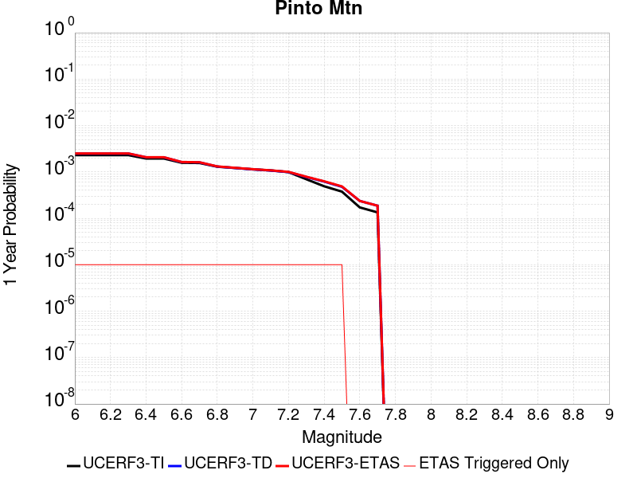 |  |

| Magnitude | 1 yr TI Prob | TD Prob | ETAS Prob | ETAS/TD Gain | ETAS Triggered Only | 10 yr TI Prob | TD Prob | ETAS Prob | ETAS/TD Gain | ETAS Triggered Only |
|-----|-----|-----|-----|-----|-----|-----|-----|-----|-----|-----|
| 6.0 | 0.0023034236 | 0.0024940374 | 0.0025040123 | 1.0039996 | 1.0E-5 | 0.022796938 | 0.02467798 | 0.024697486 | 1.0007905 | 2.0E-5 |
| 6.1 | 0.0023034236 | 0.0024940374 | 0.0025040123 | 1.0039996 | 1.0E-5 | 0.022796938 | 0.02467798 | 0.024697486 | 1.0007905 | 2.0E-5 |
| 6.2 | 0.0023034236 | 0.0024940374 | 0.0025040123 | 1.0039996 | 1.0E-5 | 0.022796938 | 0.02467798 | 0.024697486 | 1.0007905 | 2.0E-5 |
| 6.3 | 0.0023034236 | 0.0024940374 | 0.0025040123 | 1.0039996 | 1.0E-5 | 0.022796938 | 0.02467798 | 0.024697486 | 1.0007905 | 2.0E-5 |
| 6.4 | 0.0019443673 | 0.0020644304 | 0.0020744097 | 1.0048339 | 1.0E-5 | 0.019274427 | 0.020462546 | 0.020482138 | 1.0009574 | 2.0E-5 |
| 6.5 | 0.0019443673 | 0.0020644304 | 0.0020744097 | 1.0048339 | 1.0E-5 | 0.019274427 | 0.020462546 | 0.020482138 | 1.0009574 | 2.0E-5 |
| 6.6 | 0.0015748127 | 0.001626973 | 0.0016369567 | 1.0061364 | 1.0E-5 | 0.015636992 | 0.016154487 | 0.016174164 | 1.0012181 | 2.0E-5 |
| 6.7 | 0.0015567453 | 0.0016066235 | 0.0016166075 | 1.0062143 | 1.0E-5 | 0.015458848 | 0.015953926 | 0.015973607 | 1.0012336 | 2.0E-5 |
| 6.8 | 0.0012942362 | 0.0013041301 | 0.001314117 | 1.007658 | 1.0E-5 | 0.012867244 | 0.012967137 | 0.012986878 | 1.0015223 | 2.0E-5 |
| 6.9 | 0.001215622 | 0.0012170088 | 0.0012269967 | 1.0082068 | 1.0E-5 | 0.012089936 | 0.0121056335 | 0.0121253915 | 1.0016321 | 2.0E-5 |
| 7.0 | 0.0011378246 | 0.0011348245 | 0.0011448131 | 1.0088019 | 1.0E-5 | 0.011320163 | 0.011292398 | 0.011312172 | 1.0017511 | 2.0E-5 |
| 7.1 | 0.0010774818 | 0.001071217 | 0.0010812063 | 1.0093251 | 1.0E-5 | 0.010722724 | 0.010662585 | 0.010682371 | 1.0018557 | 2.0E-5 |
| 7.2 | 9.904018E-4 | 9.937207E-4 | 0.0010037108 | 1.0100532 | 1.0E-5 | 0.009859995 | 0.0098947715 | 0.009914574 | 1.0020013 | 2.0E-5 |
| 7.3 | 6.956093E-4 | 7.7750074E-4 | 7.8749296E-4 | 1.0128517 | 1.0E-5 | 0.006934359 | 0.0077491053 | 0.00776895 | 1.002561 | 2.0E-5 |
| 7.4 | 4.910942E-4 | 6.18683E-4 | 6.286768E-4 | 1.0161533 | 1.0E-5 | 0.0049001034 | 0.006170554 | 0.006190431 | 1.0032212 | 2.0E-5 |
| 7.5 | 3.7614413E-4 | 4.7773338E-4 | 4.877286E-4 | 1.0209222 | 1.0E-5 | 0.0037550807 | 0.0047678393 | 0.004787744 | 1.0041748 | 2.0E-5 |
| 7.6 | 1.7198564E-4 | 2.3713366E-4 | 2.3713366E-4 | 1.0 | 0.0 | 0.0017185259 | 0.0023689435 | 0.0023689435 | 1.0 | 0.0 |
| 7.7 | 1.3430449E-4 | 1.8699742E-4 | 1.8699742E-4 | 1.0 | 0.0 | 0.0013422335 | 0.0018685305 | 0.0018685305 | 1.0 | 0.0 |

## Calaveras (So) - Paicines extension 2011 CFM
*[(top)](#table-of-contents)*

| 1 Year | 10 Year |
|-----|-----|
|  |  |

| Magnitude | 1 yr TI Prob | TD Prob | ETAS Prob | ETAS/TD Gain | ETAS Triggered Only | 10 yr TI Prob | TD Prob | ETAS Prob | ETAS/TD Gain | ETAS Triggered Only |
|-----|-----|-----|-----|-----|-----|-----|-----|-----|-----|-----|
| 6.0 | 0.007891912 | 0.01569548 | 0.015705323 | 1.0006272 | 1.0E-5 | 0.076174594 | 0.13848475 | 0.13849336 | 1.0000622 | 1.0E-5 |
| 6.1 | 0.0078097614 | 0.015538875 | 0.01554872 | 1.0006336 | 1.0E-5 | 0.075409345 | 0.13715436 | 0.13716298 | 1.000063 | 1.0E-5 |
| 6.2 | 0.0066279583 | 0.013046473 | 0.0130563425 | 1.0007565 | 1.0E-5 | 0.064337276 | 0.117252044 | 0.11726087 | 1.0000753 | 1.0E-5 |
| 6.3 | 0.0059959386 | 0.011667699 | 0.011677582 | 1.0008471 | 1.0E-5 | 0.058367174 | 0.106368065 | 0.106377006 | 1.000084 | 1.0E-5 |
| 6.4 | 0.0055782744 | 0.010772539 | 0.010782432 | 1.0009183 | 1.0E-5 | 0.0544031 | 0.09919055 | 0.099199556 | 1.0000908 | 1.0E-5 |
| 6.5 | 0.0050468626 | 0.009694443 | 0.009704347 | 1.0010215 | 1.0E-5 | 0.04933773 | 0.09008227 | 0.09009137 | 1.000101 | 1.0E-5 |
| 6.6 | 0.0041944524 | 0.007826032 | 0.0078359535 | 1.0012678 | 1.0E-5 | 0.04116161 | 0.07485203 | 0.07486128 | 1.0001236 | 1.0E-5 |
| 6.7 | 0.004070005 | 0.0075888694 | 0.0075987936 | 1.0013077 | 1.0E-5 | 0.039962657 | 0.072701596 | 0.07271087 | 1.0001276 | 1.0E-5 |
| 6.8 | 0.0036279052 | 0.006613211 | 0.0066231443 | 1.0015022 | 1.0E-5 | 0.03569247 | 0.063797034 | 0.06380639 | 1.0001467 | 1.0E-5 |
| 6.9 | 0.0030218933 | 0.0052789357 | 0.0052888826 | 1.0018843 | 1.0E-5 | 0.029811295 | 0.05149985 | 0.051509336 | 1.0001842 | 1.0E-5 |
| 7.0 | 0.0025986114 | 0.0044606146 | 0.00447057 | 1.0022318 | 1.0E-5 | 0.025684336 | 0.04377996 | 0.043789525 | 1.0002184 | 1.0E-5 |
| 7.1 | 0.0022328163 | 0.0037041532 | 0.0037141163 | 1.0026897 | 1.0E-5 | 0.022105146 | 0.036734138 | 0.036743768 | 1.0002623 | 1.0E-5 |
| 7.2 | 0.0017986323 | 0.0029060172 | 0.0029060172 | 1.0 | 0.0 | 0.017841442 | 0.029077532 | 0.029077532 | 1.0 | 0.0 |
| 7.3 | 0.0013405791 | 0.0021154876 | 0.0021154876 | 1.0 | 0.0 | 0.013325208 | 0.021295689 | 0.021295689 | 1.0 | 0.0 |
| 7.4 | 9.3894306E-4 | 0.0014863693 | 0.0014863693 | 1.0 | 0.0 | 0.009349857 | 0.01505071 | 0.01505071 | 1.0 | 0.0 |
| 7.5 | 8.134431E-4 | 0.0013463404 | 0.0013463404 | 1.0 | 0.0 | 0.008104719 | 0.013650672 | 0.013650672 | 1.0 | 0.0 |
| 7.6 | 5.795553E-4 | 0.0010023463 | 0.0010023463 | 1.0 | 0.0 | 0.0057804612 | 0.010202571 | 0.010202571 | 1.0 | 0.0 |
| 7.7 | 3.241884E-4 | 5.443913E-4 | 5.443913E-4 | 1.0 | 0.0 | 0.0032371588 | 0.0056193196 | 0.0056193196 | 1.0 | 0.0 |
| 7.8 | 2.7679754E-4 | 4.920344E-4 | 4.920344E-4 | 1.0 | 0.0 | 0.0027645302 | 0.005073865 | 0.005073865 | 1.0 | 0.0 |
| 7.9 | 1.7548777E-4 | 3.8522398E-4 | 3.8522398E-4 | 1.0 | 0.0 | 0.0017534926 | 0.00394819 | 0.00394819 | 1.0 | 0.0 |
| 8.0 | 1.05766376E-4 | 2.3022295E-4 | 2.3022295E-4 | 1.0 | 0.0 | 0.0010571606 | 0.0023509073 | 0.0023509073 | 1.0 | 0.0 |
| 8.1 | 6.3687774E-5 | 1.2391232E-4 | 1.2391232E-4 | 1.0 | 0.0 | 6.366953E-4 | 0.0012704411 | 0.0012704411 | 1.0 | 0.0 |

## Elysian Park (Upper)
*[(top)](#table-of-contents)*

| 1 Year | 10 Year |
|-----|-----|
|  | 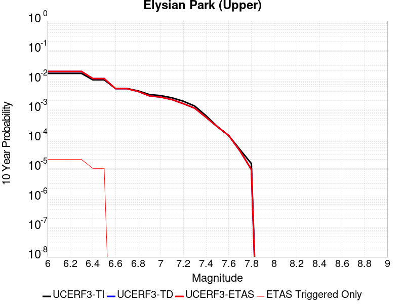 |

| Magnitude | 1 yr TI Prob | TD Prob | ETAS Prob | ETAS/TD Gain | ETAS Triggered Only | 10 yr TI Prob | TD Prob | ETAS Prob | ETAS/TD Gain | ETAS Triggered Only |
|-----|-----|-----|-----|-----|-----|-----|-----|-----|-----|-----|
| 6.0 | 0.0016618895 | 0.0019310972 | 0.0019510586 | 1.0103368 | 2.0E-5 | 0.016495159 | 0.01918968 | 0.019209297 | 1.0010222 | 2.0E-5 |
| 6.1 | 0.0016618895 | 0.0019310972 | 0.0019510586 | 1.0103368 | 2.0E-5 | 0.016495159 | 0.01918968 | 0.019209297 | 1.0010222 | 2.0E-5 |
| 6.2 | 0.0016618895 | 0.0019310972 | 0.0019510586 | 1.0103368 | 2.0E-5 | 0.016495159 | 0.01918968 | 0.019209297 | 1.0010222 | 2.0E-5 |
| 6.3 | 0.0016618895 | 0.0019310972 | 0.0019510586 | 1.0103368 | 2.0E-5 | 0.016495159 | 0.01918968 | 0.019209297 | 1.0010222 | 2.0E-5 |
| 6.4 | 0.001005166 | 0.0011058843 | 0.0011158733 | 1.0090325 | 1.0E-5 | 0.010006315 | 0.011020675 | 0.011030565 | 1.0008974 | 1.0E-5 |
| 6.5 | 0.001005166 | 0.0011058843 | 0.0011158733 | 1.0090325 | 1.0E-5 | 0.010006315 | 0.011020675 | 0.011030565 | 1.0008974 | 1.0E-5 |
| 6.6 | 5.119132E-4 | 5.042188E-4 | 5.042188E-4 | 1.0 | 0.0 | 0.005107356 | 0.005031471 | 0.005031471 | 1.0 | 0.0 |
| 6.7 | 5.112989E-4 | 5.035705E-4 | 5.035705E-4 | 1.0 | 0.0 | 0.0051012407 | 0.005025018 | 0.005025018 | 1.0 | 0.0 |
| 6.8 | 4.2268867E-4 | 4.0550783E-4 | 4.0550783E-4 | 1.0 | 0.0 | 0.004218856 | 0.004048173 | 0.004048173 | 1.0 | 0.0 |
| 6.9 | 3.173398E-4 | 2.8597435E-4 | 2.8597435E-4 | 1.0 | 0.0 | 0.0031688702 | 0.0028561412 | 0.0028561412 | 1.0 | 0.0 |
| 7.0 | 2.9213692E-4 | 2.5996132E-4 | 2.5996132E-4 | 1.0 | 0.0 | 0.0029175316 | 0.0025966396 | 0.0025966396 | 1.0 | 0.0 |
| 7.1 | 2.4572524E-4 | 2.1325242E-4 | 2.1325242E-4 | 1.0 | 0.0 | 0.002454537 | 0.0021305194 | 0.0021305194 | 1.0 | 0.0 |
| 7.2 | 1.881565E-4 | 1.5537335E-4 | 1.5537335E-4 | 1.0 | 0.0 | 0.0018799726 | 0.0015526584 | 0.0015526584 | 1.0 | 0.0 |
| 7.3 | 1.2893214E-4 | 1.0933217E-4 | 1.0933217E-4 | 1.0 | 0.0 | 0.0012885736 | 0.001092791 | 0.001092791 | 1.0 | 0.0 |
| 7.4 | 6.0731076E-5 | 5.3612457E-5 | 5.3612457E-5 | 1.0 | 0.0 | 6.071448E-4 | 5.359982E-4 | 5.359982E-4 | 1.0 | 0.0 |
| 7.5 | 2.6060725E-5 | 2.5658988E-5 | 2.5658988E-5 | 1.0 | 0.0 | 2.605767E-4 | 2.5656182E-4 | 2.5656182E-4 | 1.0 | 0.0 |
| 7.6 | 1.2871251E-5 | 1.2928869E-5 | 1.2928869E-5 | 1.0 | 0.0 | 1.2870505E-4 | 1.2928153E-4 | 1.2928153E-4 | 1.0 | 0.0 |
| 7.7 | 4.294955E-6 | 3.854116E-6 | 3.854116E-6 | 1.0 | 0.0 | 4.2948723E-5 | 3.854061E-5 | 3.854061E-5 | 1.0 | 0.0 |
| 7.8 | 1.45157E-6 | 9.1655613E-7 | 9.1655613E-7 | 1.0 | 0.0 | 1.45156055E-5 | 9.165538E-6 | 9.165538E-6 | 1.0 | 0.0 |

## Oceanic - West Huasna
*[(top)](#table-of-contents)*

| 1 Year | 10 Year |
|-----|-----|
|  | 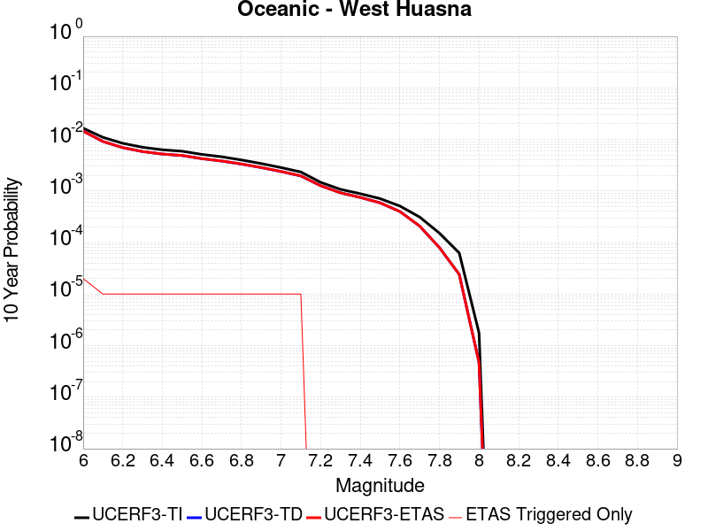 |

| Magnitude | 1 yr TI Prob | TD Prob | ETAS Prob | ETAS/TD Gain | ETAS Triggered Only | 10 yr TI Prob | TD Prob | ETAS Prob | ETAS/TD Gain | ETAS Triggered Only |
|-----|-----|-----|-----|-----|-----|-----|-----|-----|-----|-----|
| 6.0 | 0.0016660384 | 0.0014561834 | 0.0014661688 | 1.0068573 | 1.0E-5 | 0.016536033 | 0.014470968 | 0.014490679 | 1.0013621 | 2.0E-5 |
| 6.1 | 0.0011033333 | 9.1655244E-4 | 9.1655244E-4 | 1.0 | 0.0 | 0.010978713 | 0.009128731 | 0.009138639 | 1.0010854 | 1.0E-5 |
| 6.2 | 8.44688E-4 | 6.9515326E-4 | 6.9515326E-4 | 1.0 | 0.0 | 0.008414844 | 0.006930081 | 0.006940012 | 1.001433 | 1.0E-5 |
| 6.3 | 7.072618E-4 | 5.831419E-4 | 5.831419E-4 | 1.0 | 0.0 | 0.0070501505 | 0.0058162357 | 0.0058261775 | 1.0017093 | 1.0E-5 |
| 6.4 | 6.322405E-4 | 5.216999E-4 | 5.216999E-4 | 1.0 | 0.0 | 0.006304447 | 0.005204819 | 0.0052147675 | 1.0019113 | 1.0E-5 |
| 6.5 | 5.9211696E-4 | 4.8866094E-4 | 4.8866094E-4 | 1.0 | 0.0 | 0.0059054173 | 0.0048759235 | 0.0048858747 | 1.0020409 | 1.0E-5 |
| 6.6 | 5.1386096E-4 | 4.2440274E-4 | 4.2440274E-4 | 1.0 | 0.0 | 0.0051267436 | 0.0042359545 | 0.004245912 | 1.0023507 | 1.0E-5 |
| 6.7 | 4.6198163E-4 | 3.8179048E-4 | 3.8179048E-4 | 1.0 | 0.0 | 0.004610224 | 0.003811371 | 0.003821333 | 1.0026138 | 1.0E-5 |
| 6.8 | 4.0020206E-4 | 3.334548E-4 | 3.334548E-4 | 1.0 | 0.0 | 0.003994821 | 0.0033295657 | 0.0033395325 | 1.0029933 | 1.0E-5 |
| 6.9 | 3.4090536E-4 | 2.8476477E-4 | 2.8476477E-4 | 1.0 | 0.0 | 0.0034038287 | 0.0028440156 | 0.002853987 | 1.0035062 | 1.0E-5 |
| 7.0 | 2.8488258E-4 | 2.384224E-4 | 2.384224E-4 | 1.0 | 0.0 | 0.0028451765 | 0.00238168 | 0.0023916562 | 1.0041888 | 1.0E-5 |
| 7.1 | 2.3386406E-4 | 1.9577508E-4 | 1.9577508E-4 | 1.0 | 0.0 | 0.002336181 | 0.001956038 | 0.0019660185 | 1.0051024 | 1.0E-5 |
| 7.2 | 1.4722206E-4 | 1.2651845E-4 | 1.2651845E-4 | 1.0 | 0.0 | 0.0014712457 | 0.0012644667 | 0.0012644667 | 1.0 | 0.0 |
| 7.3 | 1.0771569E-4 | 9.228297E-5 | 9.228297E-5 | 1.0 | 0.0 | 0.001076635 | 9.2244823E-4 | 9.2244823E-4 | 1.0 | 0.0 |
| 7.4 | 8.8597284E-5 | 7.502623E-5 | 7.502623E-5 | 1.0 | 0.0 | 8.8561967E-4 | 7.500106E-4 | 7.500106E-4 | 1.0 | 0.0 |
| 7.5 | 7.1156996E-5 | 5.897061E-5 | 5.897061E-5 | 1.0 | 0.0 | 7.1134215E-4 | 5.895511E-4 | 5.895511E-4 | 1.0 | 0.0 |
| 7.6 | 5.1149345E-5 | 4.0054783E-5 | 4.0054783E-5 | 1.0 | 0.0 | 5.113757E-4 | 4.0047706E-4 | 4.0047706E-4 | 1.0 | 0.0 |
| 7.7 | 3.1234613E-5 | 2.0894393E-5 | 2.0894393E-5 | 1.0 | 0.0 | 3.123022E-4 | 2.0892563E-4 | 2.0892563E-4 | 1.0 | 0.0 |
| 7.8 | 1.5230714E-5 | 7.975713E-6 | 7.975713E-6 | 1.0 | 0.0 | 1.522967E-4 | 7.975558E-5 | 7.975558E-5 | 1.0 | 0.0 |
| 7.9 | 6.2915915E-6 | 2.4112073E-6 | 2.4112073E-6 | 1.0 | 0.0 | 6.2914136E-5 | 2.4113115E-5 | 2.4113115E-5 | 1.0 | 0.0 |
| 8.0 | 1.7639688E-7 | 4.701664E-8 | 4.701664E-8 | 1.0 | 0.0 | 1.7639674E-6 | 4.7126008E-7 | 4.7126008E-7 | 1.0 | 0.0 |

## Cleghorn
*[(top)](#table-of-contents)*

| 1 Year | 10 Year |
|-----|-----|
| 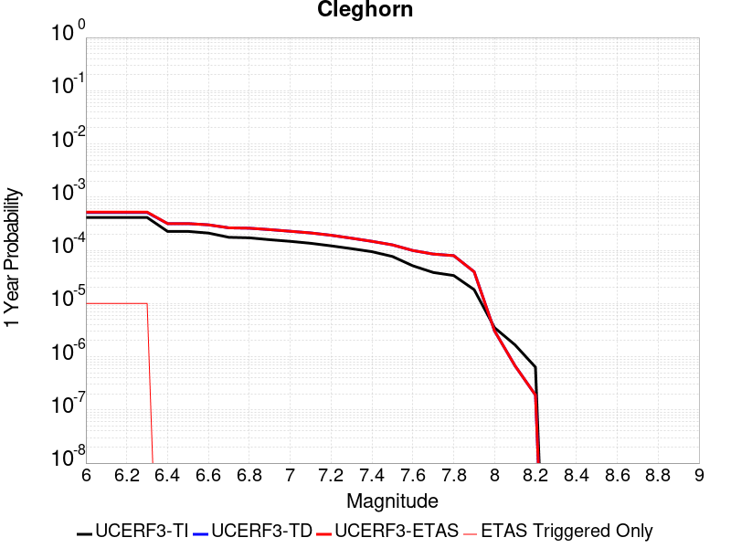 |  |

| Magnitude | 1 yr TI Prob | TD Prob | ETAS Prob | ETAS/TD Gain | ETAS Triggered Only | 10 yr TI Prob | TD Prob | ETAS Prob | ETAS/TD Gain | ETAS Triggered Only |
|-----|-----|-----|-----|-----|-----|-----|-----|-----|-----|-----|
| 6.0 | 4.1352084E-4 | 5.1286985E-4 | 5.228647E-4 | 1.0194881 | 1.0E-5 | 0.004127522 | 0.0051319767 | 0.005151874 | 1.0038772 | 2.0E-5 |
| 6.1 | 4.1352084E-4 | 5.1286985E-4 | 5.228647E-4 | 1.0194881 | 1.0E-5 | 0.004127522 | 0.0051319767 | 0.005151874 | 1.0038772 | 2.0E-5 |
| 6.2 | 4.1352084E-4 | 5.1286985E-4 | 5.228647E-4 | 1.0194881 | 1.0E-5 | 0.004127522 | 0.0051319767 | 0.005151874 | 1.0038772 | 2.0E-5 |
| 6.3 | 4.1352084E-4 | 5.1286985E-4 | 5.228647E-4 | 1.0194881 | 1.0E-5 | 0.004127522 | 0.0051319767 | 0.005151874 | 1.0038772 | 2.0E-5 |
| 6.4 | 2.2666567E-4 | 3.1778417E-4 | 3.1778417E-4 | 1.0 | 0.0 | 0.0022643462 | 0.003187489 | 0.003187489 | 1.0 | 0.0 |
| 6.5 | 2.2666567E-4 | 3.1778417E-4 | 3.1778417E-4 | 1.0 | 0.0 | 0.0022643462 | 0.003187489 | 0.003187489 | 1.0 | 0.0 |
| 6.6 | 2.1078532E-4 | 3.0121763E-4 | 3.0121763E-4 | 1.0 | 0.0 | 0.002105855 | 0.003022279 | 0.003022279 | 1.0 | 0.0 |
| 6.7 | 1.7547216E-4 | 2.6436293E-4 | 2.6436293E-4 | 1.0 | 0.0 | 0.0017533366 | 0.0026546135 | 0.0026546135 | 1.0 | 0.0 |
| 6.8 | 1.716675E-4 | 2.6028923E-4 | 2.6028923E-4 | 1.0 | 0.0 | 0.0017153495 | 0.0026139724 | 0.0026139724 | 1.0 | 0.0 |
| 6.9 | 1.5816953E-4 | 2.447315E-4 | 2.447315E-4 | 1.0 | 0.0 | 0.00158057 | 0.0024587465 | 0.0024587465 | 1.0 | 0.0 |
| 7.0 | 1.4744449E-4 | 2.2801595E-4 | 2.2801595E-4 | 1.0 | 0.0 | 0.001473467 | 0.0022919455 | 0.0022919455 | 1.0 | 0.0 |
| 7.1 | 1.3546048E-4 | 2.1211655E-4 | 2.1211655E-4 | 1.0 | 0.0 | 0.0013537793 | 0.0021332712 | 0.0021332712 | 1.0 | 0.0 |
| 7.2 | 1.21293626E-4 | 1.9180006E-4 | 1.9180006E-4 | 1.0 | 0.0 | 0.0012122744 | 0.001930497 | 0.001930497 | 1.0 | 0.0 |
| 7.3 | 1.0732192E-4 | 1.6877941E-4 | 1.6877941E-4 | 1.0 | 0.0 | 0.001072701 | 0.0017007304 | 0.0017007304 | 1.0 | 0.0 |
| 7.4 | 9.4209274E-5 | 1.4741125E-4 | 1.4741125E-4 | 1.0 | 0.0 | 9.4169343E-4 | 0.0014874903 | 0.0014874903 | 1.0 | 0.0 |
| 7.5 | 7.661323E-5 | 1.265033E-4 | 1.265033E-4 | 1.0 | 0.0 | 7.658682E-4 | 0.0012787108 | 0.0012787108 | 1.0 | 0.0 |
| 7.6 | 5.1155046E-5 | 9.9139645E-5 | 9.9139645E-5 | 1.0 | 0.0 | 5.114327E-4 | 0.0010053867 | 0.0010053867 | 1.0 | 0.0 |
| 7.7 | 3.831614E-5 | 8.4956184E-5 | 8.4956184E-5 | 1.0 | 0.0 | 3.8309532E-4 | 8.637035E-4 | 8.637035E-4 | 1.0 | 0.0 |
| 7.8 | 3.35721E-5 | 7.940462E-5 | 7.940462E-5 | 1.0 | 0.0 | 3.3567028E-4 | 8.078874E-4 | 8.078874E-4 | 1.0 | 0.0 |
| 7.9 | 1.8233079E-5 | 3.9517123E-5 | 3.9517123E-5 | 1.0 | 0.0 | 1.8231584E-4 | 4.0396556E-4 | 4.0396556E-4 | 1.0 | 0.0 |
| 8.0 | 3.505102E-6 | 3.0460612E-6 | 3.0460612E-6 | 1.0 | 0.0 | 3.5050467E-5 | 3.2729393E-5 | 3.2729393E-5 | 1.0 | 0.0 |
| 8.1 | 1.6689258E-6 | 6.7585074E-7 | 6.7585074E-7 | 1.0 | 0.0 | 1.6689133E-5 | 7.742598E-6 | 7.742598E-6 | 1.0 | 0.0 |
| 8.2 | 6.359922E-7 | 1.9037195E-7 | 1.9037195E-7 | 1.0 | 0.0 | 6.3599036E-6 | 2.246485E-6 | 2.246485E-6 | 1.0 | 0.0 |

## Camp Rock 2011
*[(top)](#table-of-contents)*

| 1 Year | 10 Year |
|-----|-----|
| 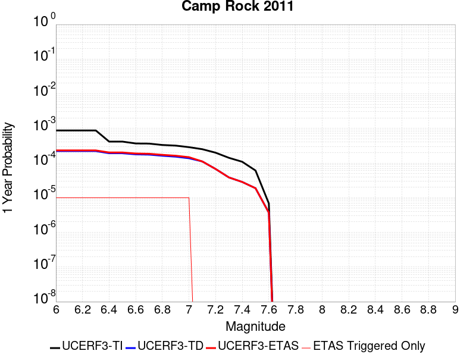 | 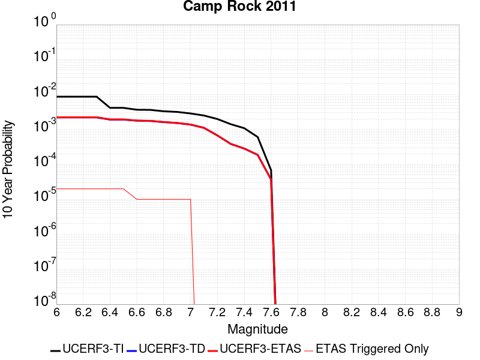 |

| Magnitude | 1 yr TI Prob | TD Prob | ETAS Prob | ETAS/TD Gain | ETAS Triggered Only | 10 yr TI Prob | TD Prob | ETAS Prob | ETAS/TD Gain | ETAS Triggered Only |
|-----|-----|-----|-----|-----|-----|-----|-----|-----|-----|-----|
| 6.0 | 8.7157206E-4 | 2.2174843E-4 | 2.317462E-4 | 1.0450861 | 1.0E-5 | 0.008681616 | 0.0022153244 | 0.0022352801 | 1.009008 | 2.0E-5 |
| 6.1 | 8.7157206E-4 | 2.2174843E-4 | 2.317462E-4 | 1.0450861 | 1.0E-5 | 0.008681616 | 0.0022153244 | 0.0022352801 | 1.009008 | 2.0E-5 |
| 6.2 | 8.7157206E-4 | 2.2174843E-4 | 2.317462E-4 | 1.0450861 | 1.0E-5 | 0.008681616 | 0.0022153244 | 0.0022352801 | 1.009008 | 2.0E-5 |
| 6.3 | 8.7157206E-4 | 2.2174843E-4 | 2.317462E-4 | 1.0450861 | 1.0E-5 | 0.008681616 | 0.0022153244 | 0.0022352801 | 1.009008 | 2.0E-5 |
| 6.4 | 4.1644843E-4 | 1.9210792E-4 | 2.02106E-4 | 1.052044 | 1.0E-5 | 0.0041566887 | 0.0019194534 | 0.001939415 | 1.0103996 | 2.0E-5 |
| 6.5 | 4.1644843E-4 | 1.9210792E-4 | 2.02106E-4 | 1.052044 | 1.0E-5 | 0.0041566887 | 0.0019194534 | 0.001939415 | 1.0103996 | 2.0E-5 |
| 6.6 | 3.677336E-4 | 1.786623E-4 | 1.8866052E-4 | 1.0559615 | 1.0E-5 | 0.0036712566 | 0.0017852184 | 0.0017952005 | 1.0055915 | 1.0E-5 |
| 6.7 | 3.6452254E-4 | 1.7542663E-4 | 1.8542487E-4 | 1.0569938 | 1.0E-5 | 0.0036392517 | 0.0017529125 | 0.001762895 | 1.0056947 | 1.0E-5 |
| 6.8 | 3.3251947E-4 | 1.6267489E-4 | 1.7267326E-4 | 1.0614623 | 1.0E-5 | 0.0033202237 | 0.0016255867 | 0.0016355703 | 1.0061417 | 1.0E-5 |
| 6.9 | 3.1887658E-4 | 1.530342E-4 | 1.6303266E-4 | 1.0653349 | 1.0E-5 | 0.003184194 | 0.001529316 | 0.0015393005 | 1.0065289 | 1.0E-5 |
| 7.0 | 2.8767265E-4 | 1.3784238E-4 | 1.47841E-4 | 1.0725366 | 1.0E-5 | 0.0028730053 | 0.001377594 | 0.0013875802 | 1.007249 | 1.0E-5 |
| 7.1 | 2.5121463E-4 | 1.1135704E-4 | 1.1135704E-4 | 1.0 | 0.0 | 0.0025093083 | 0.0011130343 | 0.0011130343 | 1.0 | 0.0 |
| 7.2 | 1.9921579E-4 | 6.750327E-5 | 6.750327E-5 | 1.0 | 0.0 | 0.0019903728 | 6.7483593E-4 | 6.7483593E-4 | 1.0 | 0.0 |
| 7.3 | 1.4174209E-4 | 3.8525584E-5 | 3.8525584E-5 | 1.0 | 0.0 | 0.0014165172 | 3.8519106E-4 | 3.8519106E-4 | 1.0 | 0.0 |
| 7.4 | 1.0901308E-4 | 2.8498573E-5 | 2.8498573E-5 | 1.0 | 0.0 | 0.0010895962 | 2.8494973E-4 | 2.8494973E-4 | 1.0 | 0.0 |
| 7.5 | 6.0951766E-5 | 1.8800003E-5 | 1.8800003E-5 | 1.0 | 0.0 | 6.093505E-4 | 1.879846E-4 | 1.879846E-4 | 1.0 | 0.0 |
| 7.6 | 6.863748E-6 | 3.7149634E-6 | 3.7149634E-6 | 1.0 | 0.0 | 6.863536E-5 | 3.714917E-5 | 3.714917E-5 | 1.0 | 0.0 |

## Pisgah-Bullion Mtn-Mesquite Lk
*[(top)](#table-of-contents)*

| 1 Year | 10 Year |
|-----|-----|
|  | 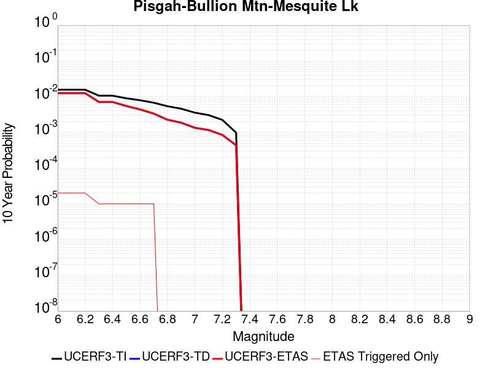 |

| Magnitude | 1 yr TI Prob | TD Prob | ETAS Prob | ETAS/TD Gain | ETAS Triggered Only | 10 yr TI Prob | TD Prob | ETAS Prob | ETAS/TD Gain | ETAS Triggered Only |
|-----|-----|-----|-----|-----|-----|-----|-----|-----|-----|-----|
| 6.0 | 0.0015767008 | 0.0012563687 | 0.0012663562 | 1.0079495 | 1.0E-5 | 0.015655609 | 0.012502681 | 0.012522431 | 1.0015796 | 2.0E-5 |
| 6.1 | 0.0015767008 | 0.0012563687 | 0.0012663562 | 1.0079495 | 1.0E-5 | 0.015655609 | 0.012502681 | 0.012522431 | 1.0015796 | 2.0E-5 |
| 6.2 | 0.0015767008 | 0.0012563687 | 0.0012663562 | 1.0079495 | 1.0E-5 | 0.015655609 | 0.012502681 | 0.012522431 | 1.0015796 | 2.0E-5 |
| 6.3 | 0.0010690069 | 7.1138213E-4 | 7.21375E-4 | 1.0140471 | 1.0E-5 | 0.01063879 | 0.007092675 | 0.0071026045 | 1.0013999 | 1.0E-5 |
| 6.4 | 0.0010690069 | 7.1138213E-4 | 7.21375E-4 | 1.0140471 | 1.0E-5 | 0.01063879 | 0.007092675 | 0.0071026045 | 1.0013999 | 1.0E-5 |
| 6.5 | 9.0313336E-4 | 5.4653984E-4 | 5.565344E-4 | 1.018287 | 1.0E-5 | 0.008994718 | 0.005452953 | 0.0054628984 | 1.0018239 | 1.0E-5 |
| 6.6 | 7.9546886E-4 | 4.3895686E-4 | 4.4895246E-4 | 1.0227712 | 1.0E-5 | 0.007926274 | 0.004381615 | 0.0043915715 | 1.0022722 | 1.0E-5 |
| 6.7 | 6.7796157E-4 | 3.34492E-4 | 3.4448868E-4 | 1.0298861 | 1.0E-5 | 0.0067589693 | 0.0033403458 | 0.0033503124 | 1.0029837 | 1.0E-5 |
| 6.8 | 5.401065E-4 | 2.260764E-4 | 2.260764E-4 | 1.0 | 0.0 | 0.0053879567 | 0.0022585508 | 0.0022585508 | 1.0 | 0.0 |
| 6.9 | 4.5991567E-4 | 1.8681551E-4 | 1.8681551E-4 | 1.0 | 0.0 | 0.00458965 | 0.0018666431 | 0.0018666431 | 1.0 | 0.0 |
| 7.0 | 3.5596377E-4 | 1.3396399E-4 | 1.3396399E-4 | 1.0 | 0.0 | 0.0035539411 | 0.0013388634 | 0.0013388634 | 1.0 | 0.0 |
| 7.1 | 3.045215E-4 | 1.16214826E-4 | 1.16214826E-4 | 1.0 | 0.0 | 0.0030410455 | 0.0011615696 | 0.0011615696 | 1.0 | 0.0 |
| 7.2 | 2.231982E-4 | 8.4920786E-5 | 8.4920786E-5 | 1.0 | 0.0 | 0.0022297418 | 8.489065E-4 | 8.489065E-4 | 1.0 | 0.0 |
| 7.3 | 9.811026E-5 | 4.354174E-5 | 4.354174E-5 | 1.0 | 0.0 | 9.806695E-4 | 4.3534656E-4 | 4.3534656E-4 | 1.0 | 0.0 |

## Big Pine (East)
*[(top)](#table-of-contents)*

| 1 Year | 10 Year |
|-----|-----|
|  |  |

| Magnitude | 1 yr TI Prob | TD Prob | ETAS Prob | ETAS/TD Gain | ETAS Triggered Only | 10 yr TI Prob | TD Prob | ETAS Prob | ETAS/TD Gain | ETAS Triggered Only |
|-----|-----|-----|-----|-----|-----|-----|-----|-----|-----|-----|
| 6.0 | 5.173191E-4 | 6.6856324E-4 | 6.8854983E-4 | 1.029895 | 2.0E-5 | 0.0051611643 | 0.0066703134 | 0.00669018 | 1.0029783 | 2.0E-5 |
| 6.1 | 5.173191E-4 | 6.6856324E-4 | 6.8854983E-4 | 1.029895 | 2.0E-5 | 0.0051611643 | 0.0066703134 | 0.00669018 | 1.0029783 | 2.0E-5 |
| 6.2 | 5.173191E-4 | 6.6856324E-4 | 6.8854983E-4 | 1.029895 | 2.0E-5 | 0.0051611643 | 0.0066703134 | 0.00669018 | 1.0029783 | 2.0E-5 |
| 6.3 | 2.858834E-4 | 4.2322508E-4 | 4.4321662E-4 | 1.0472362 | 2.0E-5 | 0.0028551589 | 0.0042271195 | 0.004247035 | 1.0047114 | 2.0E-5 |
| 6.4 | 2.851165E-4 | 4.224059E-4 | 4.4239743E-4 | 1.0473279 | 2.0E-5 | 0.0028475097 | 0.0042189583 | 0.004238874 | 1.0047204 | 2.0E-5 |
| 6.5 | 2.518227E-4 | 3.8720187E-4 | 4.0719414E-4 | 1.0516326 | 2.0E-5 | 0.0025153751 | 0.0038681594 | 0.003888082 | 1.0051504 | 2.0E-5 |
| 6.6 | 2.2510924E-4 | 3.590321E-4 | 3.7902492E-4 | 1.0556853 | 2.0E-5 | 0.0022488134 | 0.0035873752 | 0.0036073034 | 1.0055552 | 2.0E-5 |
| 6.7 | 1.9287605E-4 | 3.12777E-4 | 3.2277388E-4 | 1.0319617 | 1.0E-5 | 0.0019270873 | 0.0031261323 | 0.003136101 | 1.0031888 | 1.0E-5 |
| 6.8 | 1.8089297E-4 | 2.9747808E-4 | 3.074751E-4 | 1.0336059 | 1.0E-5 | 0.0018074579 | 0.0029735544 | 0.0029835247 | 1.003353 | 1.0E-5 |
| 6.9 | 1.4445644E-4 | 2.5173233E-4 | 2.5173233E-4 | 1.0 | 0.0 | 0.0014436257 | 0.0025171598 | 0.0025171598 | 1.0 | 0.0 |
| 7.0 | 1.12034926E-4 | 2.0790343E-4 | 2.0790343E-4 | 1.0 | 0.0 | 0.0011197845 | 0.002079745 | 0.002079745 | 1.0 | 0.0 |
| 7.1 | 8.879537E-5 | 1.745075E-4 | 1.745075E-4 | 1.0 | 0.0 | 8.87599E-4 | 0.0017463288 | 0.0017463288 | 1.0 | 0.0 |
| 7.2 | 6.553574E-5 | 1.457937E-4 | 1.457937E-4 | 1.0 | 0.0 | 6.551642E-4 | 0.0014595803 | 0.0014595803 | 1.0 | 0.0 |
| 7.3 | 5.803642E-5 | 1.3618669E-4 | 1.3618669E-4 | 1.0 | 0.0 | 5.802127E-4 | 0.0013634646 | 0.0013634646 | 1.0 | 0.0 |
| 7.4 | 5.2892992E-5 | 1.2956954E-4 | 1.2956954E-4 | 1.0 | 0.0 | 5.288041E-4 | 0.0012971561 | 0.0012971561 | 1.0 | 0.0 |
| 7.5 | 5.0082934E-5 | 1.2558677E-4 | 1.2558677E-4 | 1.0 | 0.0 | 5.007165E-4 | 0.001257182 | 0.001257182 | 1.0 | 0.0 |
| 7.6 | 4.1373947E-5 | 1.06685984E-4 | 1.06685984E-4 | 1.0 | 0.0 | 4.1366243E-4 | 0.0010684598 | 0.0010684598 | 1.0 | 0.0 |
| 7.7 | 2.1684076E-5 | 6.054999E-5 | 6.054999E-5 | 1.0 | 0.0 | 2.1681961E-4 | 6.0852885E-4 | 6.0852885E-4 | 1.0 | 0.0 |
| 7.8 | 5.9831386E-6 | 1.3523654E-5 | 1.3523654E-5 | 1.0 | 0.0 | 5.9829777E-5 | 1.3633117E-4 | 1.3633117E-4 | 1.0 | 0.0 |
| 7.9 | 1.5252737E-6 | 2.1633577E-6 | 2.1633577E-6 | 1.0 | 0.0 | 1.5252632E-5 | 2.1966041E-5 | 2.1966041E-5 | 1.0 | 0.0 |

## Santa Cruz Island
*[(top)](#table-of-contents)*

| 1 Year | 10 Year |
|-----|-----|
| 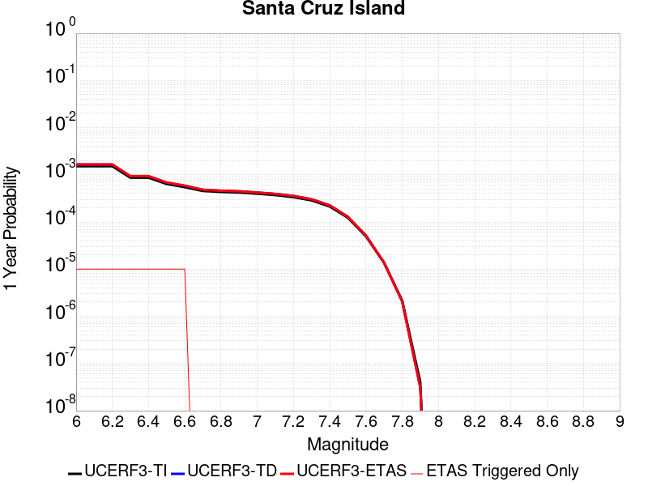 | 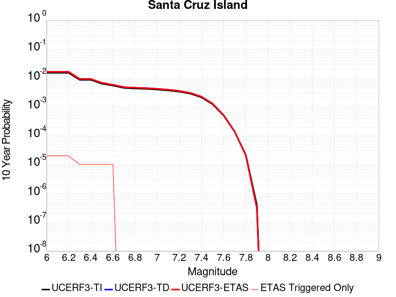 |

| Magnitude | 1 yr TI Prob | TD Prob | ETAS Prob | ETAS/TD Gain | ETAS Triggered Only | 10 yr TI Prob | TD Prob | ETAS Prob | ETAS/TD Gain | ETAS Triggered Only |
|-----|-----|-----|-----|-----|-----|-----|-----|-----|-----|-----|
| 6.0 | 0.0015206301 | 0.0016476389 | 0.0016576224 | 1.0060593 | 1.0E-5 | 0.015102667 | 0.016367963 | 0.016387636 | 1.0012019 | 2.0E-5 |
| 6.1 | 0.0015206301 | 0.0016476389 | 0.0016576224 | 1.0060593 | 1.0E-5 | 0.015102667 | 0.016367963 | 0.016387636 | 1.0012019 | 2.0E-5 |
| 6.2 | 0.0015206301 | 0.0016476389 | 0.0016576224 | 1.0060593 | 1.0E-5 | 0.015102667 | 0.016367963 | 0.016387636 | 1.0012019 | 2.0E-5 |
| 6.3 | 8.6765E-4 | 9.286006E-4 | 9.385913E-4 | 1.0107589 | 1.0E-5 | 0.008642701 | 0.009249076 | 0.009258984 | 1.0010712 | 1.0E-5 |
| 6.4 | 8.6765E-4 | 9.286006E-4 | 9.385913E-4 | 1.0107589 | 1.0E-5 | 0.008642701 | 0.009249076 | 0.009258984 | 1.0010712 | 1.0E-5 |
| 6.5 | 6.3840044E-4 | 6.803405E-4 | 6.903337E-4 | 1.0146885 | 1.0E-5 | 0.0063656955 | 0.006782976 | 0.006792908 | 1.0014642 | 1.0E-5 |
| 6.6 | 5.4719415E-4 | 5.8197253E-4 | 5.9196673E-4 | 1.0171729 | 1.0E-5 | 0.005458487 | 0.005804726 | 0.005814668 | 1.0017127 | 1.0E-5 |
| 6.7 | 4.5381195E-4 | 4.8184796E-4 | 4.8184796E-4 | 1.0 | 0.0 | 0.0045288634 | 0.0048081 | 0.0048081 | 1.0 | 0.0 |
| 6.8 | 4.3339343E-4 | 4.5994937E-4 | 4.5994937E-4 | 1.0 | 0.0 | 0.004325492 | 0.0045900275 | 0.0045900275 | 1.0 | 0.0 |
| 6.9 | 4.2115687E-4 | 4.4680806E-4 | 4.4680806E-4 | 1.0 | 0.0 | 0.004203596 | 0.0044591487 | 0.0044591487 | 1.0 | 0.0 |
| 7.0 | 3.9736772E-4 | 4.2123714E-4 | 4.2123714E-4 | 1.0 | 0.0 | 0.003966579 | 0.0042044343 | 0.0042044343 | 1.0 | 0.0 |
| 7.1 | 3.715733E-4 | 3.9365215E-4 | 3.9365215E-4 | 1.0 | 0.0 | 0.003709526 | 0.0039295917 | 0.0039295917 | 1.0 | 0.0 |
| 7.2 | 3.360328E-4 | 3.5618054E-4 | 3.5618054E-4 | 1.0 | 0.0 | 0.0033552512 | 0.003556125 | 0.003556125 | 1.0 | 0.0 |
| 7.3 | 2.8664304E-4 | 3.0363348E-4 | 3.0363348E-4 | 1.0 | 0.0 | 0.002862736 | 0.0030322094 | 0.0030322094 | 1.0 | 0.0 |
| 7.4 | 2.1288003E-4 | 2.2498227E-4 | 2.2498227E-4 | 1.0 | 0.0 | 0.0021267622 | 0.002247554 | 0.002247554 | 1.0 | 0.0 |
| 7.5 | 1.2305441E-4 | 1.291498E-4 | 1.291498E-4 | 1.0 | 0.0 | 0.0012298629 | 0.0012907526 | 0.0012907526 | 1.0 | 0.0 |
| 7.6 | 4.9559E-5 | 5.145158E-5 | 5.145158E-5 | 1.0 | 0.0 | 4.954795E-4 | 5.14398E-4 | 5.14398E-4 | 1.0 | 0.0 |
| 7.7 | 1.3573399E-5 | 1.3783702E-5 | 1.3783702E-5 | 1.0 | 0.0 | 1.357257E-4 | 1.3782854E-4 | 1.3782854E-4 | 1.0 | 0.0 |
| 7.8 | 2.16657E-6 | 2.0692314E-6 | 2.0692314E-6 | 1.0 | 0.0 | 2.1665488E-5 | 2.0692141E-5 | 2.0692141E-5 | 1.0 | 0.0 |
| 7.9 | 4.0303796E-8 | 3.1029614E-8 | 3.1029614E-8 | 1.0 | 0.0 | 4.030379E-7 | 3.102961E-7 | 3.102961E-7 | 1.0 | 0.0 |

## Raymond
*[(top)](#table-of-contents)*

| 1 Year | 10 Year |
|-----|-----|
| 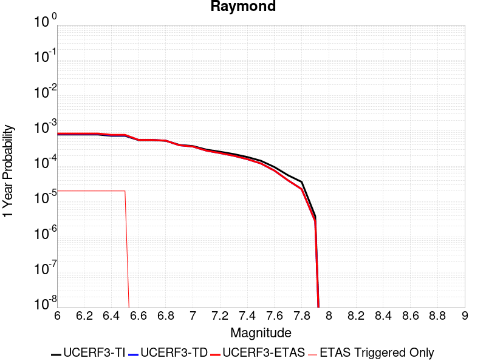 |  |

| Magnitude | 1 yr TI Prob | TD Prob | ETAS Prob | ETAS/TD Gain | ETAS Triggered Only | 10 yr TI Prob | TD Prob | ETAS Prob | ETAS/TD Gain | ETAS Triggered Only |
|-----|-----|-----|-----|-----|-----|-----|-----|-----|-----|-----|
| 6.0 | 7.905855E-4 | 8.2464045E-4 | 8.4462395E-4 | 1.024233 | 2.0E-5 | 0.007877788 | 0.008218322 | 0.008238158 | 1.0024136 | 2.0E-5 |
| 6.1 | 7.905855E-4 | 8.2464045E-4 | 8.4462395E-4 | 1.024233 | 2.0E-5 | 0.007877788 | 0.008218322 | 0.008238158 | 1.0024136 | 2.0E-5 |
| 6.2 | 7.905855E-4 | 8.2464045E-4 | 8.4462395E-4 | 1.024233 | 2.0E-5 | 0.007877788 | 0.008218322 | 0.008238158 | 1.0024136 | 2.0E-5 |
| 6.3 | 7.905855E-4 | 8.2464045E-4 | 8.4462395E-4 | 1.024233 | 2.0E-5 | 0.007877788 | 0.008218322 | 0.008238158 | 1.0024136 | 2.0E-5 |
| 6.4 | 7.2721124E-4 | 7.539688E-4 | 7.739537E-4 | 1.0265063 | 2.0E-5 | 0.007248361 | 0.007516441 | 0.0075362907 | 1.0026408 | 2.0E-5 |
| 6.5 | 7.2721124E-4 | 7.539688E-4 | 7.739537E-4 | 1.0265063 | 2.0E-5 | 0.007248361 | 0.007516441 | 0.0075362907 | 1.0026408 | 2.0E-5 |
| 6.6 | 5.499499E-4 | 5.5665546E-4 | 5.5665546E-4 | 1.0 | 0.0 | 0.005485909 | 0.0055531724 | 0.0055531724 | 1.0 | 0.0 |
| 6.7 | 5.499499E-4 | 5.5665546E-4 | 5.5665546E-4 | 1.0 | 0.0 | 0.005485909 | 0.0055531724 | 0.0055531724 | 1.0 | 0.0 |
| 6.8 | 5.257791E-4 | 5.308686E-4 | 5.308686E-4 | 1.0 | 0.0 | 0.0052453685 | 0.005296554 | 0.005296554 | 1.0 | 0.0 |
| 6.9 | 4.0282236E-4 | 3.9381496E-4 | 3.9381496E-4 | 1.0 | 0.0 | 0.0040209293 | 0.0039313044 | 0.0039313044 | 1.0 | 0.0 |
| 7.0 | 3.7236E-4 | 3.605582E-4 | 3.605582E-4 | 1.0 | 0.0 | 0.0037173668 | 0.0035998505 | 0.0035998505 | 1.0 | 0.0 |
| 7.1 | 2.9502588E-4 | 2.7648412E-4 | 2.7648412E-4 | 1.0 | 0.0 | 0.0029463451 | 0.0027614324 | 0.0027614324 | 1.0 | 0.0 |
| 7.2 | 2.5751285E-4 | 2.3616636E-4 | 2.3616636E-4 | 1.0 | 0.0 | 0.0025721465 | 0.002359176 | 0.002359176 | 1.0 | 0.0 |
| 7.3 | 2.2104931E-4 | 1.9855154E-4 | 1.9855154E-4 | 1.0 | 0.0 | 0.0022082955 | 0.0019837602 | 0.0019837602 | 1.0 | 0.0 |
| 7.4 | 1.8260824E-4 | 1.5880515E-4 | 1.5880515E-4 | 1.0 | 0.0 | 0.0018245826 | 0.0015869325 | 0.0015869325 | 1.0 | 0.0 |
| 7.5 | 1.428558E-4 | 1.2010984E-4 | 1.2010984E-4 | 1.0 | 0.0 | 0.0014276401 | 0.0012004636 | 0.0012004636 | 1.0 | 0.0 |
| 7.6 | 9.488958E-5 | 7.525458E-5 | 7.525458E-5 | 1.0 | 0.0 | 9.4849075E-4 | 7.523025E-4 | 7.523025E-4 | 1.0 | 0.0 |
| 7.7 | 5.5622655E-5 | 3.9883143E-5 | 3.9883143E-5 | 1.0 | 0.0 | 5.5608735E-4 | 3.9876899E-4 | 3.9876899E-4 | 1.0 | 0.0 |
| 7.8 | 3.607355E-5 | 2.2542741E-5 | 2.2542741E-5 | 1.0 | 0.0 | 3.6067693E-4 | 2.254124E-4 | 2.254124E-4 | 1.0 | 0.0 |
| 7.9 | 3.874356E-6 | 2.7770195E-6 | 2.7770195E-6 | 1.0 | 0.0 | 3.8742884E-5 | 2.7769978E-5 | 2.7769978E-5 | 1.0 | 0.0 |

## Bullion Mountains
*[(top)](#table-of-contents)*

| 1 Year | 10 Year |
|-----|-----|
|  | 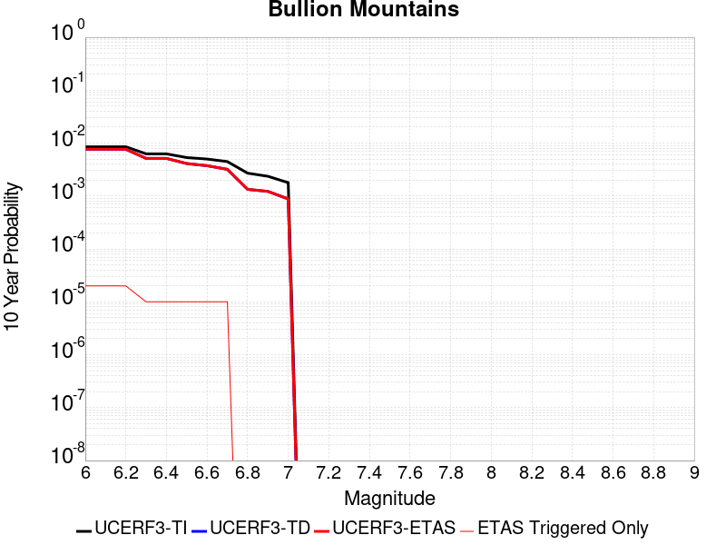 |

| Magnitude | 1 yr TI Prob | TD Prob | ETAS Prob | ETAS/TD Gain | ETAS Triggered Only | 10 yr TI Prob | TD Prob | ETAS Prob | ETAS/TD Gain | ETAS Triggered Only |
|-----|-----|-----|-----|-----|-----|-----|-----|-----|-----|-----|
| 6.0 | 8.5643446E-4 | 7.663628E-4 | 7.863475E-4 | 1.0260773 | 2.0E-5 | 0.008531413 | 0.0076409937 | 0.0076608406 | 1.0025975 | 2.0E-5 |
| 6.1 | 8.5643446E-4 | 7.663628E-4 | 7.863475E-4 | 1.0260773 | 2.0E-5 | 0.008531413 | 0.0076409937 | 0.0076608406 | 1.0025975 | 2.0E-5 |
| 6.2 | 8.5643446E-4 | 7.663628E-4 | 7.863475E-4 | 1.0260773 | 2.0E-5 | 0.008531413 | 0.0076409937 | 0.0076608406 | 1.0025975 | 2.0E-5 |
| 6.3 | 6.283899E-4 | 5.1449594E-4 | 5.244908E-4 | 1.0194265 | 1.0E-5 | 0.0062661595 | 0.0051353294 | 0.005145278 | 1.0019373 | 1.0E-5 |
| 6.4 | 6.283899E-4 | 5.1449594E-4 | 5.244908E-4 | 1.0194265 | 1.0E-5 | 0.0062661595 | 0.0051353294 | 0.005145278 | 1.0019373 | 1.0E-5 |
| 6.5 | 5.343951E-4 | 4.110768E-4 | 4.210727E-4 | 1.0243163 | 1.0E-5 | 0.005331118 | 0.004105195 | 0.004115154 | 1.0024259 | 1.0E-5 |
| 6.6 | 5.010733E-4 | 3.744633E-4 | 3.8445953E-4 | 1.0266949 | 1.0E-5 | 0.00499945 | 0.0037403202 | 0.0037502828 | 1.0026636 | 1.0E-5 |
| 6.7 | 4.48855E-4 | 3.195115E-4 | 3.2950833E-4 | 1.0312878 | 1.0E-5 | 0.004479495 | 0.0031924334 | 0.0032024013 | 1.0031224 | 1.0E-5 |
| 6.8 | 2.7066618E-4 | 1.3373733E-4 | 1.3373733E-4 | 1.0 | 0.0 | 0.0027033675 | 0.00133696 | 0.00133696 | 1.0 | 0.0 |
| 6.9 | 2.3635388E-4 | 1.2231951E-4 | 1.2231951E-4 | 1.0 | 0.0 | 0.0023610266 | 0.0012229109 | 0.0012229109 | 1.0 | 0.0 |
| 7.0 | 1.7904381E-4 | 8.808959E-5 | 8.808959E-5 | 1.0 | 0.0 | 0.0017889962 | 8.8089594E-4 | 8.8089594E-4 | 1.0 | 0.0 |

## Superstition Hills
*[(top)](#table-of-contents)*

| 1 Year | 10 Year |
|-----|-----|
|  |  |

| Magnitude | 1 yr TI Prob | TD Prob | ETAS Prob | ETAS/TD Gain | ETAS Triggered Only | 10 yr TI Prob | TD Prob | ETAS Prob | ETAS/TD Gain | ETAS Triggered Only |
|-----|-----|-----|-----|-----|-----|-----|-----|-----|-----|-----|
| 6.0 | 0.0034829667 | 7.3740387E-4 | 7.473965E-4 | 1.0135511 | 1.0E-5 | 0.03428881 | 0.007520092 | 0.007530017 | 1.0013198 | 1.0E-5 |
| 6.1 | 0.0034092965 | 7.3740387E-4 | 7.473965E-4 | 1.0135511 | 1.0E-5 | 0.033574644 | 0.0075200913 | 0.0075300164 | 1.0013198 | 1.0E-5 |
| 6.2 | 0.0034092965 | 7.3740387E-4 | 7.473965E-4 | 1.0135511 | 1.0E-5 | 0.033574644 | 0.0075200913 | 0.0075300164 | 1.0013198 | 1.0E-5 |
| 6.3 | 0.0027306017 | 7.374038E-4 | 7.4739644E-4 | 1.0135511 | 1.0E-5 | 0.02697292 | 0.007520086 | 0.0075300112 | 1.0013198 | 1.0E-5 |
| 6.4 | 0.0023673223 | 7.3740375E-4 | 7.473964E-4 | 1.0135511 | 1.0E-5 | 0.023422617 | 0.0075200833 | 0.007530008 | 1.0013198 | 1.0E-5 |
| 6.5 | 0.0015471181 | 7.374037E-4 | 7.473963E-4 | 1.0135511 | 1.0E-5 | 0.015363912 | 0.007520077 | 0.0075300015 | 1.0013198 | 1.0E-5 |
| 6.6 | 0.0013586642 | 7.199762E-4 | 7.29969E-4 | 1.0138793 | 1.0E-5 | 0.013503874 | 0.0073445155 | 0.007354442 | 1.0013516 | 1.0E-5 |
| 6.7 | 7.6210906E-4 | 6.980713E-4 | 7.0806436E-4 | 1.0143151 | 1.0E-5 | 0.0075950073 | 0.0071257083 | 0.007135637 | 1.0013933 | 1.0E-5 |
| 6.8 | 6.8126095E-4 | 5.7267636E-4 | 5.826706E-4 | 1.0174519 | 1.0E-5 | 0.006791762 | 0.005874082 | 0.0058840234 | 1.0016924 | 1.0E-5 |
| 6.9 | 5.447602E-4 | 4.2750756E-4 | 4.375033E-4 | 1.0233814 | 1.0E-5 | 0.005434267 | 0.0044091824 | 0.004419138 | 1.002258 | 1.0E-5 |
| 7.0 | 4.197378E-4 | 3.5158359E-4 | 3.6158008E-4 | 1.0284327 | 1.0E-5 | 0.0041894587 | 0.0036331653 | 0.003643129 | 1.0027424 | 1.0E-5 |
| 7.1 | 4.197378E-4 | 3.5158359E-4 | 3.6158008E-4 | 1.0284327 | 1.0E-5 | 0.0041894587 | 0.0036331653 | 0.003643129 | 1.0027424 | 1.0E-5 |
| 7.2 | 3.8477074E-4 | 3.2586517E-4 | 3.358619E-4 | 1.0306776 | 1.0E-5 | 0.003841052 | 0.0033736473 | 0.0033836137 | 1.0029541 | 1.0E-5 |
| 7.3 | 3.446538E-4 | 3.0251892E-4 | 3.125159E-4 | 1.0330458 | 1.0E-5 | 0.0034411973 | 0.003137918 | 0.0031478866 | 1.0031768 | 1.0E-5 |
| 7.4 | 3.355215E-4 | 2.963337E-4 | 3.063307E-4 | 1.0337358 | 1.0E-5 | 0.0033501536 | 0.003075681 | 0.00308565 | 1.0032413 | 1.0E-5 |
| 7.5 | 3.1689866E-4 | 2.8568367E-4 | 2.956808E-4 | 1.0349938 | 1.0E-5 | 0.0031644711 | 0.0029675246 | 0.0029774948 | 1.0033598 | 1.0E-5 |
| 7.6 | 2.9730765E-4 | 2.7620108E-4 | 2.861983E-4 | 1.0361955 | 1.0E-5 | 0.002969102 | 0.0028707837 | 0.002880755 | 1.0034734 | 1.0E-5 |
| 7.7 | 2.6950863E-4 | 2.569533E-4 | 2.6695072E-4 | 1.0389075 | 1.0E-5 | 0.00269182 | 0.0026758383 | 0.0026858114 | 1.0037272 | 1.0E-5 |
| 7.8 | 1.9233658E-4 | 2.1892291E-4 | 2.2892072E-4 | 1.0456681 | 1.0E-5 | 0.0019217018 | 0.0022890477 | 0.0022990247 | 1.0043586 | 1.0E-5 |
| 7.9 | 1.5791094E-4 | 1.8591403E-4 | 1.9591217E-4 | 1.0537783 | 1.0E-5 | 0.0015779877 | 0.0019532756 | 0.001963256 | 1.0051095 | 1.0E-5 |
| 8.0 | 1.3185451E-4 | 1.6103114E-4 | 1.7102953E-4 | 1.0620898 | 1.0E-5 | 0.0013177631 | 0.0016971744 | 0.0017071574 | 1.0058821 | 1.0E-5 |
| 8.1 | 1.2391206E-4 | 1.521964E-4 | 1.521964E-4 | 1.0 | 0.0 | 0.0012384299 | 0.0016047762 | 0.0016047762 | 1.0 | 0.0 |
| 8.2 | 8.9676206E-8 | 5.968621E-8 | 5.968621E-8 | 1.0 | 0.0 | 8.9676166E-7 | 6.3881106E-7 | 6.3881106E-7 | 1.0 | 0.0 |

## Robinson Creek
*[(top)](#table-of-contents)*

| 1 Year | 10 Year |
|-----|-----|
|  |  |

| Magnitude | 1 yr TI Prob | TD Prob | ETAS Prob | ETAS/TD Gain | ETAS Triggered Only | 10 yr TI Prob | TD Prob | ETAS Prob | ETAS/TD Gain | ETAS Triggered Only |
|-----|-----|-----|-----|-----|-----|-----|-----|-----|-----|-----|
| 6.0 | 7.1487366E-4 | 7.975477E-4 | 8.0753973E-4 | 1.0125284 | 1.0E-5 | 0.0071257832 | 0.007975477 | 0.007985397 | 1.0012438 | 1.0E-5 |
| 6.1 | 7.1487366E-4 | 7.975477E-4 | 8.0753973E-4 | 1.0125284 | 1.0E-5 | 0.0071257832 | 0.007975477 | 0.007985397 | 1.0012438 | 1.0E-5 |
| 6.2 | 7.1487366E-4 | 7.975477E-4 | 8.0753973E-4 | 1.0125284 | 1.0E-5 | 0.0071257832 | 0.007975477 | 0.007985397 | 1.0012438 | 1.0E-5 |
| 6.3 | 7.1487366E-4 | 7.975477E-4 | 8.0753973E-4 | 1.0125284 | 1.0E-5 | 0.0071257832 | 0.007975477 | 0.007985397 | 1.0012438 | 1.0E-5 |
| 6.4 | 7.1487366E-4 | 7.975477E-4 | 8.0753973E-4 | 1.0125284 | 1.0E-5 | 0.0071257832 | 0.007975477 | 0.007985397 | 1.0012438 | 1.0E-5 |

## King Range 2011 CFM
*[(top)](#table-of-contents)*

| 1 Year | 10 Year |
|-----|-----|
|  | 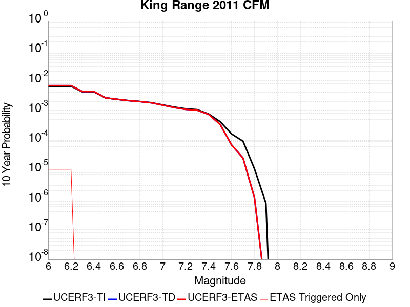 |

| Magnitude | 1 yr TI Prob | TD Prob | ETAS Prob | ETAS/TD Gain | ETAS Triggered Only | 10 yr TI Prob | TD Prob | ETAS Prob | ETAS/TD Gain | ETAS Triggered Only |
|-----|-----|-----|-----|-----|-----|-----|-----|-----|-----|-----|
| 6.0 | 6.5007154E-4 | 6.792531E-4 | 6.892463E-4 | 1.0147121 | 1.0E-5 | 0.0064817313 | 0.006776151 | 0.006786083 | 1.0014658 | 1.0E-5 |
| 6.1 | 6.5007154E-4 | 6.792531E-4 | 6.892463E-4 | 1.0147121 | 1.0E-5 | 0.0064817313 | 0.006776151 | 0.006786083 | 1.0014658 | 1.0E-5 |
| 6.2 | 6.5007154E-4 | 6.792531E-4 | 6.892463E-4 | 1.0147121 | 1.0E-5 | 0.0064817313 | 0.006776151 | 0.006786083 | 1.0014658 | 1.0E-5 |
| 6.3 | 4.1674246E-4 | 4.2844572E-4 | 4.2844572E-4 | 1.0 | 0.0 | 0.004159618 | 0.0042784093 | 0.0042784093 | 1.0 | 0.0 |
| 6.4 | 4.1674246E-4 | 4.2844572E-4 | 4.2844572E-4 | 1.0 | 0.0 | 0.004159618 | 0.0042784093 | 0.0042784093 | 1.0 | 0.0 |
| 6.5 | 2.6358519E-4 | 2.650898E-4 | 2.650898E-4 | 1.0 | 0.0 | 0.0026327274 | 0.0026487699 | 0.0026487699 | 1.0 | 0.0 |
| 6.6 | 2.3669732E-4 | 2.3674809E-4 | 2.3674809E-4 | 1.0 | 0.0 | 0.0023644536 | 0.0023659603 | 0.0023659603 | 1.0 | 0.0 |
| 6.7 | 2.1466266E-4 | 2.1369179E-4 | 2.1369179E-4 | 1.0 | 0.0 | 0.0021445542 | 0.0021358437 | 0.0021358437 | 1.0 | 0.0 |
| 6.8 | 1.9993502E-4 | 1.985873E-4 | 1.985873E-4 | 1.0 | 0.0 | 0.0019975523 | 0.0019850726 | 0.0019850726 | 1.0 | 0.0 |
| 6.9 | 1.8260835E-4 | 1.8066456E-4 | 1.8066456E-4 | 1.0 | 0.0 | 0.0018245836 | 0.0018061433 | 0.0018061433 | 1.0 | 0.0 |
| 7.0 | 1.5376302E-4 | 1.5056868E-4 | 1.5056868E-4 | 1.0 | 0.0 | 0.0015365666 | 0.0015056237 | 0.0015056237 | 1.0 | 0.0 |
| 7.1 | 1.296568E-4 | 1.2507249E-4 | 1.2507249E-4 | 1.0 | 0.0 | 0.0012958117 | 0.0012509715 | 0.0012509715 | 1.0 | 0.0 |
| 7.2 | 1.1374453E-4 | 1.0828957E-4 | 1.0828957E-4 | 1.0 | 0.0 | 0.0011368633 | 0.0010833032 | 0.0010833032 | 1.0 | 0.0 |
| 7.3 | 1.0632657E-4 | 1.0169682E-4 | 1.0169682E-4 | 1.0 | 0.0 | 0.0010627571 | 0.0010174221 | 0.0010174221 | 1.0 | 0.0 |
| 7.4 | 7.605811E-5 | 7.3530726E-5 | 7.3530726E-5 | 1.0 | 0.0 | 7.603208E-4 | 7.359192E-4 | 7.359192E-4 | 1.0 | 0.0 |
| 7.5 | 4.20998E-5 | 3.4094865E-5 | 3.4094865E-5 | 1.0 | 0.0 | 4.2091825E-4 | 3.415956E-4 | 3.415956E-4 | 1.0 | 0.0 |
| 7.6 | 1.630016E-5 | 6.921571E-6 | 6.921571E-6 | 1.0 | 0.0 | 1.6298964E-4 | 6.986566E-5 | 6.986566E-5 | 1.0 | 0.0 |
| 7.7 | 9.260198E-6 | 2.490381E-6 | 2.490381E-6 | 1.0 | 0.0 | 9.2598115E-5 | 2.5320087E-5 | 2.5320087E-5 | 1.0 | 0.0 |
| 7.8 | 1.0976038E-6 | 1.1474515E-7 | 1.1474515E-7 | 1.0 | 0.0 | 1.0975983E-5 | 1.1841582E-6 | 1.1841582E-6 | 1.0 | 0.0 |
| 7.9 | 7.713538E-8 | 4.5603854E-11 | 4.5603854E-11 | 1.0 | 0.0 | 7.7135354E-7 | 6.5888417E-10 | 6.5888417E-10 | 1.0 | 0.0 |

## Emerson-Copper Mtn 2011
*[(top)](#table-of-contents)*

| 1 Year | 10 Year |
|-----|-----|
|  |  |

| Magnitude | 1 yr TI Prob | TD Prob | ETAS Prob | ETAS/TD Gain | ETAS Triggered Only | 10 yr TI Prob | TD Prob | ETAS Prob | ETAS/TD Gain | ETAS Triggered Only |
|-----|-----|-----|-----|-----|-----|-----|-----|-----|-----|-----|
| 6.0 | 0.0011141442 | 5.1999686E-4 | 5.1999686E-4 | 1.0 | 0.0 | 0.011085749 | 0.005188671 | 0.005198619 | 1.0019172 | 1.0E-5 |
| 6.1 | 0.0011141442 | 5.1999686E-4 | 5.1999686E-4 | 1.0 | 0.0 | 0.011085749 | 0.005188671 | 0.005198619 | 1.0019172 | 1.0E-5 |
| 6.2 | 0.0011141442 | 5.1999686E-4 | 5.1999686E-4 | 1.0 | 0.0 | 0.011085749 | 0.005188671 | 0.005198619 | 1.0019172 | 1.0E-5 |
| 6.3 | 9.258136E-4 | 4.220022E-4 | 4.220022E-4 | 1.0 | 0.0 | 0.00921966 | 0.004212631 | 0.004212631 | 1.0 | 0.0 |
| 6.4 | 9.258136E-4 | 4.220022E-4 | 4.220022E-4 | 1.0 | 0.0 | 0.00921966 | 0.004212631 | 0.004212631 | 1.0 | 0.0 |
| 6.5 | 8.286065E-4 | 3.4452343E-4 | 3.4452343E-4 | 1.0 | 0.0 | 0.008255237 | 0.0034403573 | 0.0034403573 | 1.0 | 0.0 |
| 6.6 | 8.286065E-4 | 3.4452343E-4 | 3.4452343E-4 | 1.0 | 0.0 | 0.008255237 | 0.0034403573 | 0.0034403573 | 1.0 | 0.0 |
| 6.7 | 7.450834E-4 | 2.85401E-4 | 2.85401E-4 | 1.0 | 0.0 | 0.007425902 | 0.0028507328 | 0.0028507328 | 1.0 | 0.0 |
| 6.8 | 7.0368167E-4 | 2.6470714E-4 | 2.6470714E-4 | 1.0 | 0.0 | 0.007014576 | 0.0026442993 | 0.0026442993 | 1.0 | 0.0 |
| 6.9 | 6.38227E-4 | 2.238076E-4 | 2.238076E-4 | 1.0 | 0.0 | 0.0063639707 | 0.0022361765 | 0.0022361765 | 1.0 | 0.0 |
| 7.0 | 5.743165E-4 | 1.9403589E-4 | 1.9403589E-4 | 1.0 | 0.0 | 0.005728345 | 0.0019390025 | 0.0019390025 | 1.0 | 0.0 |
| 7.1 | 5.07382E-4 | 1.67576E-4 | 1.67576E-4 | 1.0 | 0.0 | 0.0050622504 | 0.0016748277 | 0.0016748277 | 1.0 | 0.0 |
| 7.2 | 2.0522442E-4 | 6.0132756E-5 | 6.0132756E-5 | 1.0 | 0.0 | 0.00205035 | 6.0117076E-4 | 6.0117076E-4 | 1.0 | 0.0 |
| 7.3 | 1.3887069E-4 | 3.6062454E-5 | 3.6062454E-5 | 1.0 | 0.0 | 0.0013878393 | 3.6056706E-4 | 3.6056706E-4 | 1.0 | 0.0 |
| 7.4 | 1.0901308E-4 | 2.8498573E-5 | 2.8498573E-5 | 1.0 | 0.0 | 0.0010895962 | 2.8494973E-4 | 2.8494973E-4 | 1.0 | 0.0 |
| 7.5 | 6.0951766E-5 | 1.8800003E-5 | 1.8800003E-5 | 1.0 | 0.0 | 6.093505E-4 | 1.879846E-4 | 1.879846E-4 | 1.0 | 0.0 |
| 7.6 | 6.863748E-6 | 3.7149634E-6 | 3.7149634E-6 | 1.0 | 0.0 | 6.863536E-5 | 3.714917E-5 | 3.714917E-5 | 1.0 | 0.0 |

## Newport-Inglewood (Offshore)
*[(top)](#table-of-contents)*

| 1 Year | 10 Year |
|-----|-----|
| 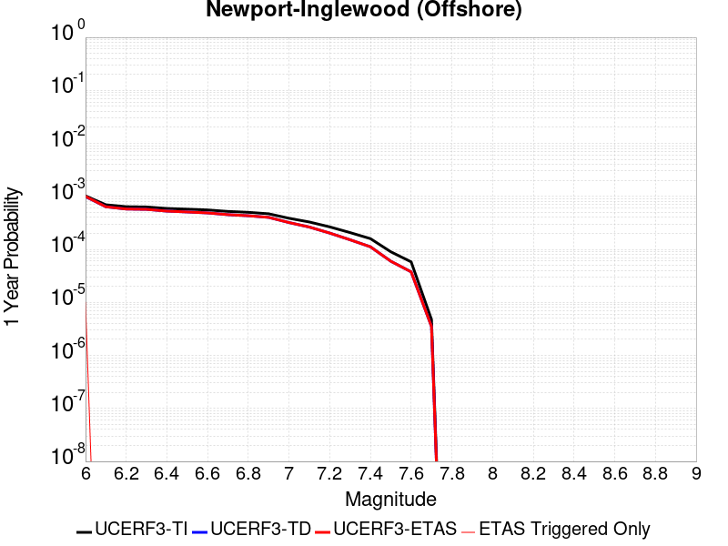 |  |

| Magnitude | 1 yr TI Prob | TD Prob | ETAS Prob | ETAS/TD Gain | ETAS Triggered Only | 10 yr TI Prob | TD Prob | ETAS Prob | ETAS/TD Gain | ETAS Triggered Only |
|-----|-----|-----|-----|-----|-----|-----|-----|-----|-----|-----|
| 6.0 | 0.001023569 | 9.891167E-4 | 9.991068E-4 | 1.0101 | 1.0E-5 | 0.010188672 | 0.009848485 | 0.009858387 | 1.0010054 | 1.0E-5 |
| 6.1 | 6.947222E-4 | 6.373237E-4 | 6.373237E-4 | 1.0 | 0.0 | 0.006925544 | 0.0063551366 | 0.0063551366 | 1.0 | 0.0 |
| 6.2 | 6.3903164E-4 | 5.7776755E-4 | 5.7776755E-4 | 1.0 | 0.0 | 0.006371971 | 0.0057627754 | 0.0057627754 | 1.0 | 0.0 |
| 6.3 | 6.3149154E-4 | 5.695729E-4 | 5.695729E-4 | 1.0 | 0.0 | 0.0062970007 | 0.0056812484 | 0.0056812484 | 1.0 | 0.0 |
| 6.4 | 5.919901E-4 | 5.2735547E-4 | 5.2735547E-4 | 1.0 | 0.0 | 0.005904155 | 0.005261136 | 0.005261136 | 1.0 | 0.0 |
| 6.5 | 5.7423924E-4 | 5.0826924E-4 | 5.0826924E-4 | 1.0 | 0.0 | 0.005727576 | 0.005071159 | 0.005071159 | 1.0 | 0.0 |
| 6.6 | 5.5475225E-4 | 4.8752036E-4 | 4.8752036E-4 | 1.0 | 0.0 | 0.0055336943 | 0.0048645954 | 0.0048645954 | 1.0 | 0.0 |
| 6.7 | 5.205093E-4 | 4.5217876E-4 | 4.5217876E-4 | 1.0 | 0.0 | 0.0051929182 | 0.0045126663 | 0.0045126663 | 1.0 | 0.0 |
| 6.8 | 5.0055445E-4 | 4.3157925E-4 | 4.3157925E-4 | 1.0 | 0.0 | 0.004994285 | 0.0043074866 | 0.0043074866 | 1.0 | 0.0 |
| 6.9 | 4.6953102E-4 | 4.0205254E-4 | 4.0205254E-4 | 1.0 | 0.0 | 0.004685402 | 0.004013323 | 0.004013323 | 1.0 | 0.0 |
| 7.0 | 3.8641447E-4 | 3.2079016E-4 | 3.2079016E-4 | 1.0 | 0.0 | 0.0038574322 | 0.0032032907 | 0.0032032907 | 1.0 | 0.0 |
| 7.1 | 3.2865192E-4 | 2.6381135E-4 | 2.6381135E-4 | 1.0 | 0.0 | 0.003281663 | 0.0026349965 | 0.0026349965 | 1.0 | 0.0 |
| 7.2 | 2.6590136E-4 | 2.0309865E-4 | 2.0309865E-4 | 1.0 | 0.0 | 0.0026558342 | 0.0020291414 | 0.0020291414 | 1.0 | 0.0 |
| 7.3 | 2.0740448E-4 | 1.5182345E-4 | 1.5182345E-4 | 1.0 | 0.0 | 0.00207211 | 0.0015172054 | 0.0015172054 | 1.0 | 0.0 |
| 7.4 | 1.5948903E-4 | 1.11916495E-4 | 1.11916495E-4 | 1.0 | 0.0 | 0.0015937461 | 0.0011186076 | 0.0011186076 | 1.0 | 0.0 |
| 7.5 | 9.015547E-5 | 5.9846356E-5 | 5.9846356E-5 | 1.0 | 0.0 | 9.01189E-4 | 5.9830624E-4 | 5.9830624E-4 | 1.0 | 0.0 |
| 7.6 | 5.821092E-5 | 3.7687878E-5 | 3.7687878E-5 | 1.0 | 0.0 | 5.8195676E-4 | 3.7681722E-4 | 3.7681722E-4 | 1.0 | 0.0 |
| 7.7 | 4.757617E-6 | 3.5137703E-6 | 3.5137703E-6 | 1.0 | 0.0 | 4.7575148E-5 | 3.513718E-5 | 3.513718E-5 | 1.0 | 0.0 |

## San Jacinto (Anza) rev
*[(top)](#table-of-contents)*

| 1 Year | 10 Year |
|-----|-----|
| 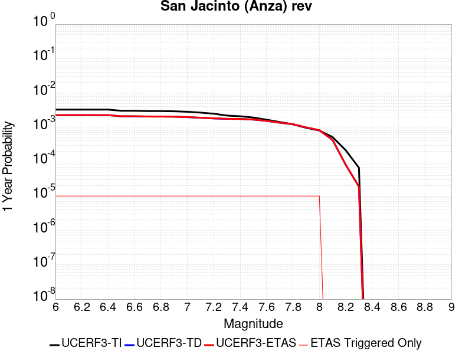 | 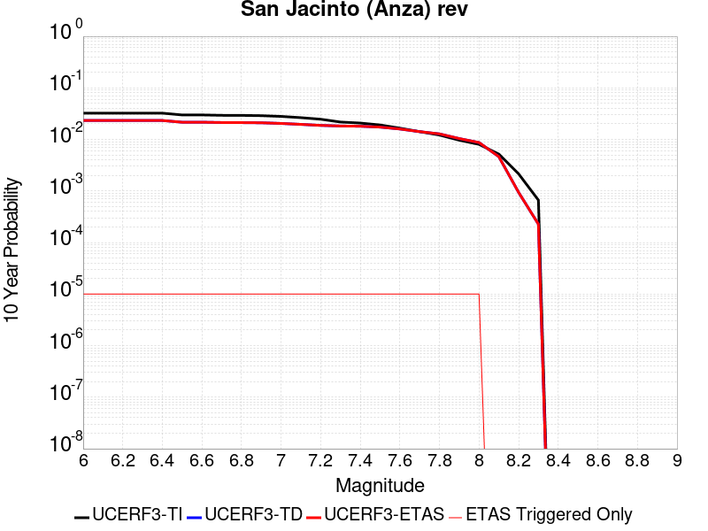 |

| Magnitude | 1 yr TI Prob | TD Prob | ETAS Prob | ETAS/TD Gain | ETAS Triggered Only | 10 yr TI Prob | TD Prob | ETAS Prob | ETAS/TD Gain | ETAS Triggered Only |
|-----|-----|-----|-----|-----|-----|-----|-----|-----|-----|-----|
| 6.0 | 0.0032827691 | 0.0022566165 | 0.0022665937 | 1.0044215 | 1.0E-5 | 0.032346968 | 0.023292562 | 0.02330233 | 1.0004194 | 1.0E-5 |
| 6.1 | 0.0032827691 | 0.0022566165 | 0.0022665937 | 1.0044215 | 1.0E-5 | 0.032346968 | 0.023292562 | 0.02330233 | 1.0004194 | 1.0E-5 |
| 6.2 | 0.0032827691 | 0.0022566165 | 0.0022665937 | 1.0044215 | 1.0E-5 | 0.032346968 | 0.023292562 | 0.02330233 | 1.0004194 | 1.0E-5 |
| 6.3 | 0.0032827691 | 0.0022566165 | 0.0022665937 | 1.0044215 | 1.0E-5 | 0.032346968 | 0.023292562 | 0.02330233 | 1.0004194 | 1.0E-5 |
| 6.4 | 0.0032827691 | 0.0022566165 | 0.0022665937 | 1.0044215 | 1.0E-5 | 0.032346968 | 0.023292562 | 0.02330233 | 1.0004194 | 1.0E-5 |
| 6.5 | 0.0030276014 | 0.002088955 | 0.002098934 | 1.0047771 | 1.0E-5 | 0.02986684 | 0.021590188 | 0.021599973 | 1.0004531 | 1.0E-5 |
| 6.6 | 0.0030276014 | 0.002088955 | 0.002098934 | 1.0047771 | 1.0E-5 | 0.02986684 | 0.021590188 | 0.021599973 | 1.0004531 | 1.0E-5 |
| 6.7 | 0.0029763177 | 0.0020588955 | 0.0020688751 | 1.0048469 | 1.0E-5 | 0.029367693 | 0.02128203 | 0.021291818 | 1.0004599 | 1.0E-5 |
| 6.8 | 0.0029681553 | 0.0020514193 | 0.0020613987 | 1.0048647 | 1.0E-5 | 0.029288229 | 0.021206751 | 0.02121654 | 1.0004616 | 1.0E-5 |
| 6.9 | 0.0029288116 | 0.0020360479 | 0.0020460275 | 1.0049015 | 1.0E-5 | 0.028905109 | 0.021046195 | 0.021055985 | 1.0004652 | 1.0E-5 |
| 7.0 | 0.0028337094 | 0.0019767124 | 0.0019866927 | 1.0050489 | 1.0E-5 | 0.027978465 | 0.020437196 | 0.020446992 | 1.0004793 | 1.0E-5 |
| 7.1 | 0.0026781242 | 0.0018966687 | 0.0019066497 | 1.0052624 | 1.0E-5 | 0.026460782 | 0.01961086 | 0.019620664 | 1.0005 | 1.0E-5 |
| 7.2 | 0.0024938055 | 0.0018108344 | 0.0018208163 | 1.0055124 | 1.0E-5 | 0.024660049 | 0.018725628 | 0.01873544 | 1.000524 | 1.0E-5 |
| 7.3 | 0.002196605 | 0.0017636728 | 0.0017736552 | 1.0056599 | 1.0E-5 | 0.02175019 | 0.018233923 | 0.01824374 | 1.0005385 | 1.0E-5 |
| 7.4 | 0.002098792 | 0.0017448291 | 0.0017548116 | 1.0057212 | 1.0E-5 | 0.020790804 | 0.01803853 | 0.01804835 | 1.0005443 | 1.0E-5 |
| 7.5 | 0.0019259118 | 0.0016778451 | 0.0016878283 | 1.00595 | 1.0E-5 | 0.01909306 | 0.017355029 | 0.017364856 | 1.0005662 | 1.0E-5 |
| 7.6 | 0.001668642 | 0.0015380166 | 0.0015480012 | 1.0064919 | 1.0E-5 | 0.01656168 | 0.015943231 | 0.015953071 | 1.0006173 | 1.0E-5 |
| 7.7 | 0.001424336 | 0.0013604438 | 0.0013704302 | 1.0073406 | 1.0E-5 | 0.014152412 | 0.014165673 | 0.014175531 | 1.000696 | 1.0E-5 |
| 7.8 | 0.0012237094 | 0.0012255836 | 0.0012355713 | 1.0081494 | 1.0E-5 | 0.012169928 | 0.012807612 | 0.012817484 | 1.0007708 | 1.0E-5 |
| 7.9 | 9.7068126E-4 | 9.860066E-4 | 9.959968E-4 | 1.010132 | 1.0E-5 | 0.0096645225 | 0.010392662 | 0.010402558 | 1.0009522 | 1.0E-5 |
| 8.0 | 8.0640207E-4 | 8.2090794E-4 | 8.3089975E-4 | 1.0121716 | 1.0E-5 | 0.008034821 | 0.008701843 | 0.008711756 | 1.0011392 | 1.0E-5 |
| 8.1 | 5.2081177E-4 | 4.3136327E-4 | 4.3136327E-4 | 1.0 | 0.0 | 0.0051959283 | 0.0046394016 | 0.0046394016 | 1.0 | 0.0 |
| 8.2 | 2.1508869E-4 | 8.1011865E-5 | 8.1011865E-5 | 1.0 | 0.0 | 0.0021488064 | 9.40314E-4 | 9.40314E-4 | 1.0 | 0.0 |
| 8.3 | 6.653009E-5 | 1.8842728E-5 | 1.8842728E-5 | 1.0 | 0.0 | 6.6510175E-4 | 2.2728964E-4 | 2.2728964E-4 | 1.0 | 0.0 |

## Rinconada 2011 CFM
*[(top)](#table-of-contents)*

| 1 Year | 10 Year |
|-----|-----|
| 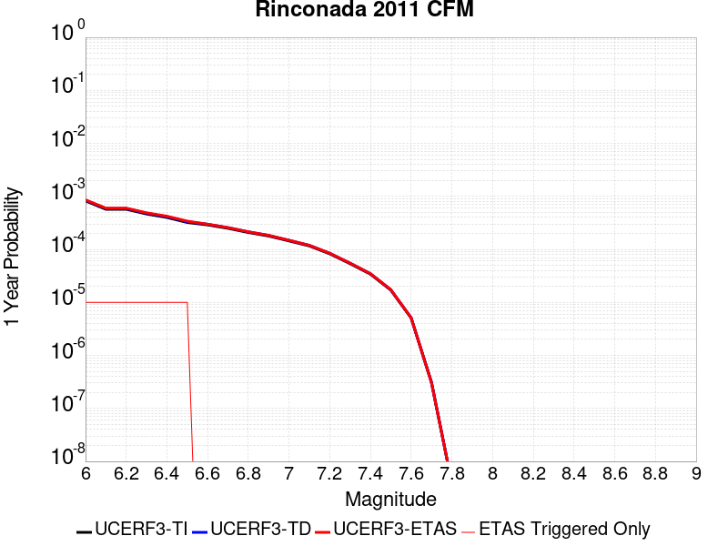 |  |

| Magnitude | 1 yr TI Prob | TD Prob | ETAS Prob | ETAS/TD Gain | ETAS Triggered Only | 10 yr TI Prob | TD Prob | ETAS Prob | ETAS/TD Gain | ETAS Triggered Only |
|-----|-----|-----|-----|-----|-----|-----|-----|-----|-----|-----|
| 6.0 | 8.2160486E-4 | 8.4884046E-4 | 8.58832E-4 | 1.0117707 | 1.0E-5 | 0.008185739 | 0.008456362 | 0.008466278 | 1.0011725 | 1.0E-5 |
| 6.1 | 5.720366E-4 | 5.906486E-4 | 6.006427E-4 | 1.0169206 | 1.0E-5 | 0.0057056635 | 0.0058908835 | 0.005900825 | 1.0016875 | 1.0E-5 |
| 6.2 | 5.720366E-4 | 5.906486E-4 | 6.006427E-4 | 1.0169206 | 1.0E-5 | 0.0057056635 | 0.0058908835 | 0.005900825 | 1.0016875 | 1.0E-5 |
| 6.3 | 4.6564735E-4 | 4.805959E-4 | 4.905911E-4 | 1.0207975 | 1.0E-5 | 0.0046467283 | 0.0047956104 | 0.0048055626 | 1.0020752 | 1.0E-5 |
| 6.4 | 4.0049385E-4 | 4.1318033E-4 | 4.231762E-4 | 1.0241925 | 1.0E-5 | 0.0039977287 | 0.004124148 | 0.0041341064 | 1.0024147 | 1.0E-5 |
| 6.5 | 3.2173982E-4 | 3.31747E-4 | 3.4174367E-4 | 1.0301335 | 1.0E-5 | 0.003212744 | 0.0033125298 | 0.0033224965 | 1.0030088 | 1.0E-5 |
| 6.6 | 2.897302E-4 | 2.986686E-4 | 2.986686E-4 | 1.0 | 0.0 | 0.0028935277 | 0.0029826807 | 0.0029826807 | 1.0 | 0.0 |
| 6.7 | 2.4979294E-4 | 2.5738036E-4 | 2.5738036E-4 | 1.0 | 0.0 | 0.0024951235 | 0.0025708287 | 0.0025708287 | 1.0 | 0.0 |
| 6.8 | 2.0845905E-4 | 2.1461258E-4 | 2.1461258E-4 | 1.0 | 0.0 | 0.002082636 | 0.0021440568 | 0.0021440568 | 1.0 | 0.0 |
| 6.9 | 1.7869633E-4 | 1.8377953E-4 | 1.8377953E-4 | 1.0 | 0.0 | 0.001785527 | 0.0018362779 | 0.0018362779 | 1.0 | 0.0 |
| 7.0 | 1.4459073E-4 | 1.4852583E-4 | 1.4852583E-4 | 1.0 | 0.0 | 0.0014449668 | 0.0014842671 | 0.0014842671 | 1.0 | 0.0 |
| 7.1 | 1.16213734E-4 | 1.1925743E-4 | 1.1925743E-4 | 1.0 | 0.0 | 0.0011615298 | 0.0011919354 | 0.0011919354 | 1.0 | 0.0 |
| 7.2 | 8.253252E-5 | 8.457275E-5 | 8.457275E-5 | 1.0 | 0.0 | 8.250187E-4 | 8.4540615E-4 | 8.4540615E-4 | 1.0 | 0.0 |
| 7.3 | 5.3776774E-5 | 5.502849E-5 | 5.502849E-5 | 1.0 | 0.0 | 5.376376E-4 | 5.501489E-4 | 5.501489E-4 | 1.0 | 0.0 |
| 7.4 | 3.4100947E-5 | 3.4868972E-5 | 3.4868972E-5 | 1.0 | 0.0 | 3.4095717E-4 | 3.4863513E-4 | 3.4863513E-4 | 1.0 | 0.0 |
| 7.5 | 1.7039794E-5 | 1.738401E-5 | 1.738401E-5 | 1.0 | 0.0 | 1.7038487E-4 | 1.7382656E-4 | 1.7382656E-4 | 1.0 | 0.0 |
| 7.6 | 5.089664E-6 | 5.124436E-6 | 5.124436E-6 | 1.0 | 0.0 | 5.0895473E-5 | 5.124319E-5 | 5.124319E-5 | 1.0 | 0.0 |
| 7.7 | 3.1307894E-7 | 3.0519442E-7 | 3.0519442E-7 | 1.0 | 0.0 | 3.1307852E-6 | 3.0519402E-6 | 3.0519402E-6 | 1.0 | 0.0 |
| 7.8 | 3.861218E-9 | 3.8953623E-9 | 3.8953623E-9 | 1.0 | 0.0 | 3.861218E-8 | 3.8953623E-8 | 3.8953623E-8 | 1.0 | 0.0 |

## San Jose
*[(top)](#table-of-contents)*

| 1 Year | 10 Year |
|-----|-----|
|  | 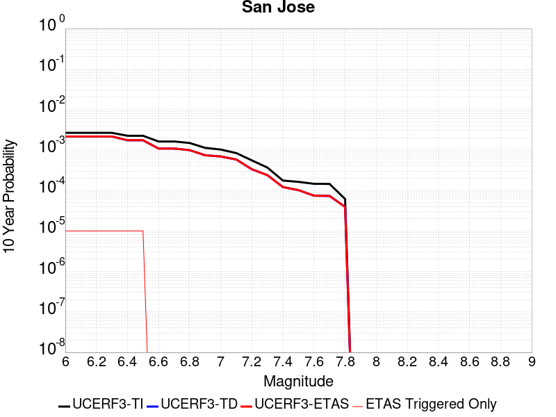 |

| Magnitude | 1 yr TI Prob | TD Prob | ETAS Prob | ETAS/TD Gain | ETAS Triggered Only | 10 yr TI Prob | TD Prob | ETAS Prob | ETAS/TD Gain | ETAS Triggered Only |
|-----|-----|-----|-----|-----|-----|-----|-----|-----|-----|-----|
| 6.0 | 2.653002E-4 | 2.1525097E-4 | 2.2524882E-4 | 1.0464474 | 1.0E-5 | 0.0026498367 | 0.002150716 | 0.0021606945 | 1.0046396 | 1.0E-5 |
| 6.1 | 2.653002E-4 | 2.1525097E-4 | 2.2524882E-4 | 1.0464474 | 1.0E-5 | 0.0026498367 | 0.002150716 | 0.0021606945 | 1.0046396 | 1.0E-5 |
| 6.2 | 2.653002E-4 | 2.1525097E-4 | 2.2524882E-4 | 1.0464474 | 1.0E-5 | 0.0026498367 | 0.002150716 | 0.0021606945 | 1.0046396 | 1.0E-5 |
| 6.3 | 2.653002E-4 | 2.1525097E-4 | 2.2524882E-4 | 1.0464474 | 1.0E-5 | 0.0026498367 | 0.002150716 | 0.0021606945 | 1.0046396 | 1.0E-5 |
| 6.4 | 2.2494372E-4 | 1.734171E-4 | 1.8341535E-4 | 1.0576545 | 1.0E-5 | 0.0022471617 | 0.0017330673 | 0.0017430501 | 1.0057601 | 1.0E-5 |
| 6.5 | 2.2494372E-4 | 1.734171E-4 | 1.8341535E-4 | 1.0576545 | 1.0E-5 | 0.0022471617 | 0.0017330673 | 0.0017430501 | 1.0057601 | 1.0E-5 |
| 6.6 | 1.622831E-4 | 1.0852454E-4 | 1.0852454E-4 | 1.0 | 0.0 | 0.0016216465 | 0.0010847754 | 0.0010847754 | 1.0 | 0.0 |
| 6.7 | 1.622831E-4 | 1.0852454E-4 | 1.0852454E-4 | 1.0 | 0.0 | 0.0016216465 | 0.0010847754 | 0.0010847754 | 1.0 | 0.0 |
| 6.8 | 1.4904508E-4 | 9.926107E-5 | 9.926107E-5 | 1.0 | 0.0 | 0.0014894515 | 9.922244E-4 | 9.922244E-4 | 1.0 | 0.0 |
| 6.9 | 1.12797185E-4 | 7.402062E-5 | 7.402062E-5 | 1.0 | 0.0 | 0.0011273995 | 7.400009E-4 | 7.400009E-4 | 1.0 | 0.0 |
| 7.0 | 1.02704755E-4 | 6.9166745E-5 | 6.9166745E-5 | 1.0 | 0.0 | 0.001026573 | 6.914928E-4 | 6.914928E-4 | 1.0 | 0.0 |
| 7.1 | 8.384928E-5 | 5.8203444E-5 | 5.8203444E-5 | 1.0 | 0.0 | 8.3817646E-4 | 5.8192067E-4 | 5.8192067E-4 | 1.0 | 0.0 |
| 7.2 | 5.5472963E-5 | 3.3412933E-5 | 3.3412933E-5 | 1.0 | 0.0 | 5.545912E-4 | 3.3411296E-4 | 3.3411296E-4 | 1.0 | 0.0 |
| 7.3 | 3.6841117E-5 | 2.3910043E-5 | 2.3910043E-5 | 1.0 | 0.0 | 3.6835007E-4 | 2.3910808E-4 | 2.3910808E-4 | 1.0 | 0.0 |
| 7.4 | 1.757207E-5 | 1.2122387E-5 | 1.2122387E-5 | 1.0 | 0.0 | 1.7570681E-4 | 1.2125002E-4 | 1.2125002E-4 | 1.0 | 0.0 |
| 7.5 | 1.6327383E-5 | 1.0190695E-5 | 1.0190695E-5 | 1.0 | 0.0 | 1.6326184E-4 | 1.01935E-4 | 1.01935E-4 | 1.0 | 0.0 |
| 7.6 | 1.46144175E-5 | 7.4312675E-6 | 7.4312675E-6 | 1.0 | 0.0 | 1.4613457E-4 | 7.434279E-5 | 7.434279E-5 | 1.0 | 0.0 |
| 7.7 | 1.4532674E-5 | 7.3136553E-6 | 7.3136553E-6 | 1.0 | 0.0 | 1.4531724E-4 | 7.3166746E-5 | 7.3166746E-5 | 1.0 | 0.0 |
| 7.8 | 6.1626865E-6 | 3.923244E-6 | 3.923244E-6 | 1.0 | 0.0 | 6.162516E-5 | 3.925012E-5 | 3.925012E-5 | 1.0 | 0.0 |

## Santa Susana East (connector)
*[(top)](#table-of-contents)*

| 1 Year | 10 Year |
|-----|-----|
|  |  |

| Magnitude | 1 yr TI Prob | TD Prob | ETAS Prob | ETAS/TD Gain | ETAS Triggered Only | 10 yr TI Prob | TD Prob | ETAS Prob | ETAS/TD Gain | ETAS Triggered Only |
|-----|-----|-----|-----|-----|-----|-----|-----|-----|-----|-----|
| 6.0 | 0.0014903803 | 0.0016697284 | 0.0016797117 | 1.005979 | 1.0E-5 | 0.014804244 | 0.016598959 | 0.016608791 | 1.0005925 | 1.0E-5 |
| 6.1 | 0.0014903803 | 0.0016697284 | 0.0016797117 | 1.005979 | 1.0E-5 | 0.014804244 | 0.016598959 | 0.016608791 | 1.0005925 | 1.0E-5 |
| 6.2 | 0.0014903803 | 0.0016697284 | 0.0016797117 | 1.005979 | 1.0E-5 | 0.014804244 | 0.016598959 | 0.016608791 | 1.0005925 | 1.0E-5 |
| 6.3 | 0.001013629 | 0.0010622914 | 0.0010722808 | 1.0094036 | 1.0E-5 | 0.010090181 | 0.010583567 | 0.010593461 | 1.0009348 | 1.0E-5 |
| 6.4 | 0.001013629 | 0.0010622914 | 0.0010722808 | 1.0094036 | 1.0E-5 | 0.010090181 | 0.010583567 | 0.010593461 | 1.0009348 | 1.0E-5 |
| 6.5 | 0.001013629 | 0.0010622914 | 0.0010722808 | 1.0094036 | 1.0E-5 | 0.010090181 | 0.010583567 | 0.010593461 | 1.0009348 | 1.0E-5 |
| 6.6 | 0.001013629 | 0.0010622914 | 0.0010722808 | 1.0094036 | 1.0E-5 | 0.010090181 | 0.010583567 | 0.010593461 | 1.0009348 | 1.0E-5 |
| 6.7 | 0.0010119933 | 0.0010616358 | 0.0010716252 | 1.0094094 | 1.0E-5 | 0.010073971 | 0.010577073 | 0.010586967 | 1.0009354 | 1.0E-5 |
| 6.8 | 6.372938E-4 | 6.0474256E-4 | 6.0474256E-4 | 1.0 | 0.0 | 0.0063546924 | 0.006033016 | 0.006033016 | 1.0 | 0.0 |
| 6.9 | 6.372938E-4 | 6.0474256E-4 | 6.0474256E-4 | 1.0 | 0.0 | 0.0063546924 | 0.006033016 | 0.006033016 | 1.0 | 0.0 |
| 7.0 | 4.8389446E-4 | 4.204289E-4 | 4.204289E-4 | 1.0 | 0.0 | 0.0048284214 | 0.0041970615 | 0.0041970615 | 1.0 | 0.0 |
| 7.1 | 4.7629757E-4 | 4.1433558E-4 | 4.1433558E-4 | 1.0 | 0.0 | 0.00475278 | 0.004136356 | 0.004136356 | 1.0 | 0.0 |
| 7.2 | 4.6172875E-4 | 4.0386018E-4 | 4.0386018E-4 | 1.0 | 0.0 | 0.0046077054 | 0.004031985 | 0.004031985 | 1.0 | 0.0 |
| 7.3 | 4.472291E-4 | 3.9388344E-4 | 3.9388344E-4 | 1.0 | 0.0 | 0.004463301 | 0.0039325706 | 0.0039325706 | 1.0 | 0.0 |
| 7.4 | 4.096385E-4 | 3.556775E-4 | 3.556775E-4 | 1.0 | 0.0 | 0.0040888423 | 0.003551747 | 0.003551747 | 1.0 | 0.0 |
| 7.5 | 2.5496128E-4 | 2.2325183E-4 | 2.2325183E-4 | 1.0 | 0.0 | 0.0025466895 | 0.0022304398 | 0.0022304398 | 1.0 | 0.0 |
| 7.6 | 7.249717E-5 | 6.0359478E-5 | 6.0359478E-5 | 1.0 | 0.0 | 7.247352E-4 | 6.034526E-4 | 6.034526E-4 | 1.0 | 0.0 |
| 7.7 | 1.5614127E-5 | 1.2376277E-5 | 1.2376277E-5 | 1.0 | 0.0 | 1.5613029E-4 | 1.2375659E-4 | 1.2375659E-4 | 1.0 | 0.0 |
| 7.8 | 2.5144072E-6 | 1.3734838E-6 | 1.3734838E-6 | 1.0 | 0.0 | 2.5143789E-5 | 1.3734761E-5 | 1.3734761E-5 | 1.0 | 0.0 |
| 7.9 | 1.3632825E-7 | 1.444358E-7 | 1.444358E-7 | 1.0 | 0.0 | 1.3632817E-6 | 1.4443581E-6 | 1.4443581E-6 | 1.0 | 0.0 |

## Kern Canyon (North Kern) 2011
*[(top)](#table-of-contents)*

| 1 Year | 10 Year |
|-----|-----|
|  | 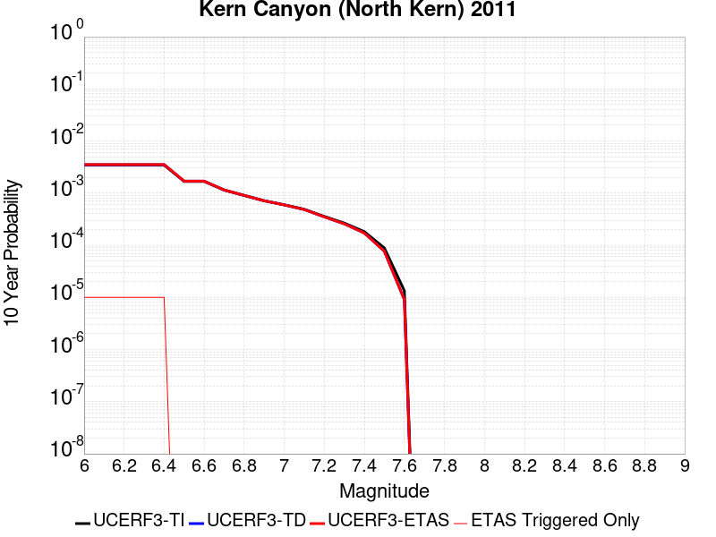 |

| Magnitude | 1 yr TI Prob | TD Prob | ETAS Prob | ETAS/TD Gain | ETAS Triggered Only | 10 yr TI Prob | TD Prob | ETAS Prob | ETAS/TD Gain | ETAS Triggered Only |
|-----|-----|-----|-----|-----|-----|-----|-----|-----|-----|-----|
| 6.0 | 3.4570007E-4 | 3.525352E-4 | 3.625317E-4 | 1.028356 | 1.0E-5 | 0.0034516277 | 0.0035205479 | 0.0035305128 | 1.0028305 | 1.0E-5 |
| 6.1 | 3.4570007E-4 | 3.525352E-4 | 3.625317E-4 | 1.028356 | 1.0E-5 | 0.0034516277 | 0.0035205479 | 0.0035305128 | 1.0028305 | 1.0E-5 |
| 6.2 | 3.4570007E-4 | 3.525352E-4 | 3.625317E-4 | 1.028356 | 1.0E-5 | 0.0034516277 | 0.0035205479 | 0.0035305128 | 1.0028305 | 1.0E-5 |
| 6.3 | 3.4570007E-4 | 3.525352E-4 | 3.625317E-4 | 1.028356 | 1.0E-5 | 0.0034516277 | 0.0035205479 | 0.0035305128 | 1.0028305 | 1.0E-5 |
| 6.4 | 3.4570007E-4 | 3.525352E-4 | 3.625317E-4 | 1.028356 | 1.0E-5 | 0.0034516277 | 0.0035205479 | 0.0035305128 | 1.0028305 | 1.0E-5 |
| 6.5 | 1.6780409E-4 | 1.6993697E-4 | 1.6993697E-4 | 1.0 | 0.0 | 0.0016767744 | 0.0016981501 | 0.0016981501 | 1.0 | 0.0 |
| 6.6 | 1.6780409E-4 | 1.6993697E-4 | 1.6993697E-4 | 1.0 | 0.0 | 0.0016767744 | 0.0016981501 | 0.0016981501 | 1.0 | 0.0 |
| 6.7 | 1.1430779E-4 | 1.15158124E-4 | 1.15158124E-4 | 1.0 | 0.0 | 0.0011424901 | 0.0011510039 | 0.0011510039 | 1.0 | 0.0 |
| 6.8 | 9.028525E-5 | 9.060688E-5 | 9.060688E-5 | 1.0 | 0.0 | 9.024858E-4 | 9.057091E-4 | 9.057091E-4 | 1.0 | 0.0 |
| 6.9 | 7.148377E-5 | 7.1422786E-5 | 7.1422786E-5 | 1.0 | 0.0 | 7.146078E-4 | 7.140029E-4 | 7.140029E-4 | 1.0 | 0.0 |
| 7.0 | 5.983557E-5 | 5.9553866E-5 | 5.9553866E-5 | 1.0 | 0.0 | 5.981946E-4 | 5.953822E-4 | 5.953822E-4 | 1.0 | 0.0 |
| 7.1 | 4.9021666E-5 | 4.8538946E-5 | 4.8538946E-5 | 1.0 | 0.0 | 4.901085E-4 | 4.8528524E-4 | 4.8528524E-4 | 1.0 | 0.0 |
| 7.2 | 3.5783723E-5 | 3.5059737E-5 | 3.5059737E-5 | 1.0 | 0.0 | 3.5777962E-4 | 3.5054295E-4 | 3.5054295E-4 | 1.0 | 0.0 |
| 7.3 | 2.6663936E-5 | 2.5772226E-5 | 2.5772226E-5 | 1.0 | 0.0 | 2.6660739E-4 | 2.5769285E-4 | 2.5769285E-4 | 1.0 | 0.0 |
| 7.4 | 1.8262032E-5 | 1.721664E-5 | 1.721664E-5 | 1.0 | 0.0 | 1.826053E-4 | 1.7215329E-4 | 1.7215329E-4 | 1.0 | 0.0 |
| 7.5 | 8.881548E-6 | 7.69633E-6 | 7.69633E-6 | 1.0 | 0.0 | 8.8811925E-5 | 7.696071E-5 | 7.696071E-5 | 1.0 | 0.0 |
| 7.6 | 1.3421597E-6 | 9.0543034E-7 | 9.0543034E-7 | 1.0 | 0.0 | 1.3421517E-5 | 9.054272E-6 | 9.054272E-6 | 1.0 | 0.0 |

## Cucamonga
*[(top)](#table-of-contents)*

| 1 Year | 10 Year |
|-----|-----|
|  | 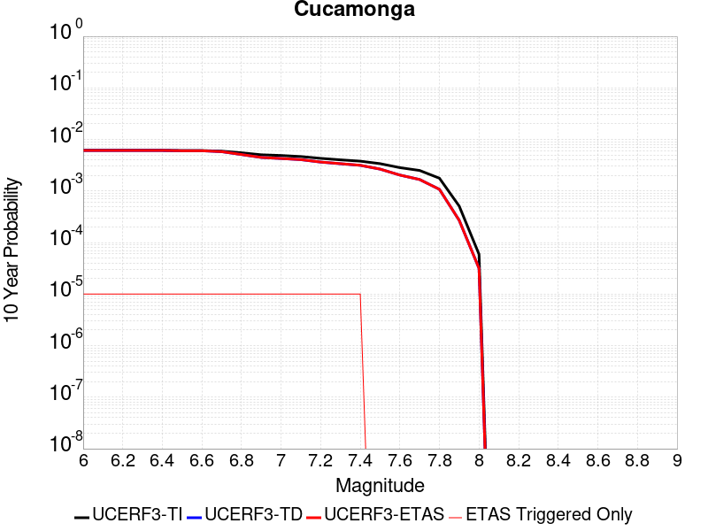 |

| Magnitude | 1 yr TI Prob | TD Prob | ETAS Prob | ETAS/TD Gain | ETAS Triggered Only | 10 yr TI Prob | TD Prob | ETAS Prob | ETAS/TD Gain | ETAS Triggered Only |
|-----|-----|-----|-----|-----|-----|-----|-----|-----|-----|-----|
| 6.0 | 6.180424E-4 | 6.1223225E-4 | 6.1223225E-4 | 1.0 | 0.0 | 0.0061632637 | 0.0061066314 | 0.0061165704 | 1.0016276 | 1.0E-5 |
| 6.1 | 6.180424E-4 | 6.1223225E-4 | 6.1223225E-4 | 1.0 | 0.0 | 0.0061632637 | 0.0061066314 | 0.0061165704 | 1.0016276 | 1.0E-5 |
| 6.2 | 6.180424E-4 | 6.1223225E-4 | 6.1223225E-4 | 1.0 | 0.0 | 0.0061632637 | 0.0061066314 | 0.0061165704 | 1.0016276 | 1.0E-5 |
| 6.3 | 6.180424E-4 | 6.1223225E-4 | 6.1223225E-4 | 1.0 | 0.0 | 0.0061632637 | 0.0061066314 | 0.0061165704 | 1.0016276 | 1.0E-5 |
| 6.4 | 6.180424E-4 | 6.1223225E-4 | 6.1223225E-4 | 1.0 | 0.0 | 0.0061632637 | 0.0061066314 | 0.0061165704 | 1.0016276 | 1.0E-5 |
| 6.5 | 6.102476E-4 | 6.0383807E-4 | 6.0383807E-4 | 1.0 | 0.0 | 0.006085745 | 0.0060231457 | 0.0060330858 | 1.0016502 | 1.0E-5 |
| 6.6 | 6.102476E-4 | 6.0383807E-4 | 6.0383807E-4 | 1.0 | 0.0 | 0.006085745 | 0.0060231457 | 0.0060330858 | 1.0016502 | 1.0E-5 |
| 6.7 | 5.9451134E-4 | 5.7979295E-4 | 5.7979295E-4 | 1.0 | 0.0 | 0.005929234 | 0.005783954 | 0.0057938965 | 1.0017189 | 1.0E-5 |
| 6.8 | 5.521017E-4 | 5.1043415E-4 | 5.1043415E-4 | 1.0 | 0.0 | 0.00550732 | 0.0050936276 | 0.0051035765 | 1.0019532 | 1.0E-5 |
| 6.9 | 5.054874E-4 | 4.4756167E-4 | 4.4756167E-4 | 1.0 | 0.0 | 0.005043391 | 0.004467539 | 0.0044774944 | 1.0022284 | 1.0E-5 |
| 7.0 | 4.893937E-4 | 4.2709676E-4 | 4.2709676E-4 | 1.0 | 0.0 | 0.0048831734 | 0.004263694 | 0.0042736516 | 1.0023354 | 1.0E-5 |
| 7.1 | 4.667083E-4 | 4.059619E-4 | 4.059619E-4 | 1.0 | 0.0 | 0.0046572937 | 0.00405314 | 0.0040630996 | 1.0024573 | 1.0E-5 |
| 7.2 | 4.3043532E-4 | 3.6389052E-4 | 3.6389052E-4 | 1.0 | 0.0 | 0.0042960253 | 0.0036338803 | 0.003643844 | 1.0027419 | 1.0E-5 |
| 7.3 | 4.026285E-4 | 3.383878E-4 | 3.383878E-4 | 1.0 | 0.0 | 0.004018998 | 0.0033796628 | 0.003389629 | 1.0029489 | 1.0E-5 |
| 7.4 | 3.7956095E-4 | 3.1468808E-4 | 3.1468808E-4 | 1.0 | 0.0 | 0.0037891332 | 0.0031433608 | 0.0031533295 | 1.0031713 | 1.0E-5 |
| 7.5 | 3.3967546E-4 | 2.6610345E-4 | 2.6610345E-4 | 1.0 | 0.0 | 0.0033915674 | 0.0026587727 | 0.0026587727 | 1.0 | 0.0 |
| 7.6 | 2.8430918E-4 | 2.0392009E-4 | 2.0392009E-4 | 1.0 | 0.0 | 0.0028394572 | 0.0020382507 | 0.0020382507 | 1.0 | 0.0 |
| 7.7 | 2.504116E-4 | 1.6696824E-4 | 1.6696824E-4 | 1.0 | 0.0 | 0.002501296 | 0.0016693595 | 0.0016693595 | 1.0 | 0.0 |
| 7.8 | 1.7708774E-4 | 1.0769927E-4 | 1.0769927E-4 | 1.0 | 0.0 | 0.0017694668 | 0.0010767077 | 0.0010767077 | 1.0 | 0.0 |
| 7.9 | 5.0875715E-5 | 2.6902302E-5 | 2.6902302E-5 | 1.0 | 0.0 | 5.086407E-4 | 2.6899087E-4 | 2.6899087E-4 | 1.0 | 0.0 |
| 8.0 | 5.9162867E-6 | 3.1586967E-6 | 3.1586967E-6 | 1.0 | 0.0 | 5.916129E-5 | 3.1586536E-5 | 3.1586536E-5 | 1.0 | 0.0 |

## San Clemente
*[(top)](#table-of-contents)*

| 1 Year | 10 Year |
|-----|-----|
|  | 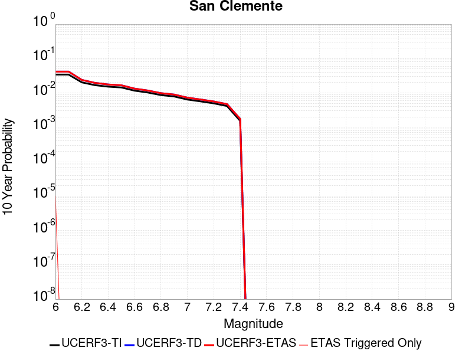 |

| Magnitude | 1 yr TI Prob | TD Prob | ETAS Prob | ETAS/TD Gain | ETAS Triggered Only | 10 yr TI Prob | TD Prob | ETAS Prob | ETAS/TD Gain | ETAS Triggered Only |
|-----|-----|-----|-----|-----|-----|-----|-----|-----|-----|-----|
| 6.0 | 0.003480294 | 0.0042512617 | 0.0042612194 | 1.0023422 | 1.0E-5 | 0.03426291 | 0.04175547 | 0.041765053 | 1.0002295 | 1.0E-5 |
| 6.1 | 0.003480294 | 0.0042512617 | 0.0042512617 | 1.0 | 0.0 | 0.03426291 | 0.04175547 | 0.04175547 | 1.0 | 0.0 |
| 6.2 | 0.0020537945 | 0.002420973 | 0.002420973 | 1.0 | 0.0 | 0.020349167 | 0.023952747 | 0.023952747 | 1.0 | 0.0 |
| 6.3 | 0.0016990956 | 0.0019771897 | 0.0019771897 | 1.0 | 0.0 | 0.01686163 | 0.01959978 | 0.01959978 | 1.0 | 0.0 |
| 6.4 | 0.0015357438 | 0.0017776407 | 0.0017776407 | 1.0 | 0.0 | 0.015251739 | 0.017637383 | 0.017637383 | 1.0 | 0.0 |
| 6.5 | 0.001455179 | 0.0016812581 | 0.0016812581 | 1.0 | 0.0 | 0.014456868 | 0.016688406 | 0.016688406 | 1.0 | 0.0 |
| 6.6 | 0.0011729331 | 0.0013433857 | 0.0013433857 | 1.0 | 0.0 | 0.011667615 | 0.013354364 | 0.013354364 | 1.0 | 0.0 |
| 6.7 | 0.0010358836 | 0.0011820234 | 0.0011820234 | 1.0 | 0.0 | 0.010310682 | 0.011758656 | 0.011758656 | 1.0 | 0.0 |
| 6.8 | 8.7088346E-4 | 9.897555E-4 | 9.897555E-4 | 1.0 | 0.0 | 0.008674784 | 0.009854501 | 0.009854501 | 1.0 | 0.0 |
| 6.9 | 7.93766E-4 | 9.0070075E-4 | 9.0070075E-4 | 1.0 | 0.0 | 0.007909367 | 0.008971448 | 0.008971448 | 1.0 | 0.0 |
| 7.0 | 6.4644177E-4 | 7.3196535E-4 | 7.3196535E-4 | 1.0 | 0.0 | 0.0064456454 | 0.0072963308 | 0.0072963308 | 1.0 | 0.0 |
| 7.1 | 5.7036756E-4 | 6.455181E-4 | 6.455181E-4 | 1.0 | 0.0 | 0.0056890585 | 0.0064371773 | 0.0064371773 | 1.0 | 0.0 |
| 7.2 | 4.9974193E-4 | 5.6572194E-4 | 5.6572194E-4 | 1.0 | 0.0 | 0.0049861963 | 0.0056435415 | 0.0056435415 | 1.0 | 0.0 |
| 7.3 | 4.1821605E-4 | 4.7388155E-4 | 4.7388155E-4 | 1.0 | 0.0 | 0.0041742986 | 0.004729413 | 0.004729413 | 1.0 | 0.0 |
| 7.4 | 1.5433785E-4 | 1.754338E-4 | 1.754338E-4 | 1.0 | 0.0 | 0.001542307 | 0.0017534482 | 0.0017534482 | 1.0 | 0.0 |

## Santa Susana alt 1
*[(top)](#table-of-contents)*

| 1 Year | 10 Year |
|-----|-----|
| 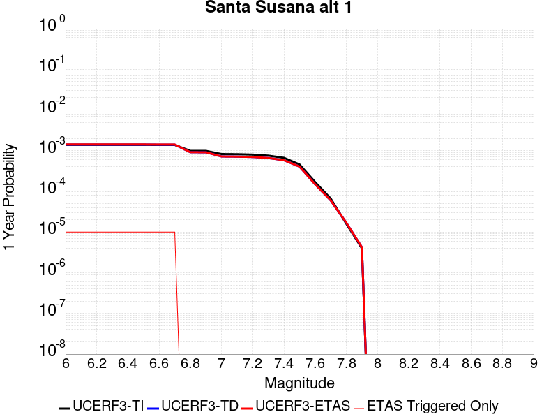 | 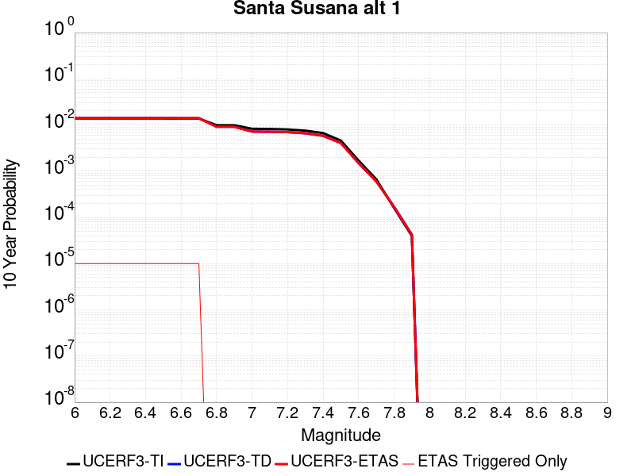 |

| Magnitude | 1 yr TI Prob | TD Prob | ETAS Prob | ETAS/TD Gain | ETAS Triggered Only | 10 yr TI Prob | TD Prob | ETAS Prob | ETAS/TD Gain | ETAS Triggered Only |
|-----|-----|-----|-----|-----|-----|-----|-----|-----|-----|-----|
| 6.0 | 0.0013947578 | 0.0014182818 | 0.0014282676 | 1.0070407 | 1.0E-5 | 0.013860362 | 0.014104064 | 0.014113923 | 1.000699 | 1.0E-5 |
| 6.1 | 0.0013947578 | 0.0014182818 | 0.0014282676 | 1.0070407 | 1.0E-5 | 0.013860362 | 0.014104064 | 0.014113923 | 1.000699 | 1.0E-5 |
| 6.2 | 0.0013947578 | 0.0014182818 | 0.0014282676 | 1.0070407 | 1.0E-5 | 0.013860362 | 0.014104064 | 0.014113923 | 1.000699 | 1.0E-5 |
| 6.3 | 0.0013947578 | 0.0014182818 | 0.0014282676 | 1.0070407 | 1.0E-5 | 0.013860362 | 0.014104064 | 0.014113923 | 1.000699 | 1.0E-5 |
| 6.4 | 0.0013947578 | 0.0014182818 | 0.0014282676 | 1.0070407 | 1.0E-5 | 0.013860362 | 0.014104064 | 0.014113923 | 1.000699 | 1.0E-5 |
| 6.5 | 0.0013947578 | 0.0014182818 | 0.0014282676 | 1.0070407 | 1.0E-5 | 0.013860362 | 0.014104064 | 0.014113923 | 1.000699 | 1.0E-5 |
| 6.6 | 0.0013895056 | 0.0014118385 | 0.0014218243 | 1.0070729 | 1.0E-5 | 0.013808494 | 0.01404045 | 0.01405031 | 1.0007023 | 1.0E-5 |
| 6.7 | 0.0013895056 | 0.0014118385 | 0.0014218243 | 1.0070729 | 1.0E-5 | 0.013808494 | 0.01404045 | 0.01405031 | 1.0007023 | 1.0E-5 |
| 6.8 | 9.947256E-4 | 9.198893E-4 | 9.198893E-4 | 1.0 | 0.0 | 0.009902848 | 0.00916307 | 0.00916307 | 1.0 | 0.0 |
| 6.9 | 9.930939E-4 | 9.189578E-4 | 9.189578E-4 | 1.0 | 0.0 | 0.0098866755 | 0.009153832 | 0.009153832 | 1.0 | 0.0 |
| 7.0 | 8.302132E-4 | 7.2314305E-4 | 7.2314305E-4 | 1.0 | 0.0 | 0.008271185 | 0.0072087944 | 0.0072087944 | 1.0 | 0.0 |
| 7.1 | 8.2293496E-4 | 7.168864E-4 | 7.168864E-4 | 1.0 | 0.0 | 0.008198941 | 0.007146632 | 0.007146632 | 1.0 | 0.0 |
| 7.2 | 8.0409093E-4 | 7.0260325E-4 | 7.0260325E-4 | 1.0 | 0.0 | 0.008011877 | 0.007004704 | 0.007004704 | 1.0 | 0.0 |
| 7.3 | 7.580857E-4 | 6.633878E-4 | 6.633878E-4 | 1.0 | 0.0 | 0.007555048 | 0.0066149267 | 0.0066149267 | 1.0 | 0.0 |
| 7.4 | 6.7074323E-4 | 5.8578164E-4 | 5.8578164E-4 | 1.0 | 0.0 | 0.0066872234 | 0.005843151 | 0.005843151 | 1.0 | 0.0 |
| 7.5 | 4.605111E-4 | 4.0719804E-4 | 4.0719804E-4 | 1.0 | 0.0 | 0.0045955796 | 0.004064768 | 0.004064768 | 1.0 | 0.0 |
| 7.6 | 1.6974064E-4 | 1.4984541E-4 | 1.4984541E-4 | 1.0 | 0.0 | 0.0016961104 | 0.0014974806 | 0.0014974806 | 1.0 | 0.0 |
| 7.7 | 6.653442E-5 | 5.995708E-5 | 5.995708E-5 | 1.0 | 0.0 | 6.6514505E-4 | 5.9941795E-4 | 5.9941795E-4 | 1.0 | 0.0 |
| 7.8 | 1.600588E-5 | 1.6905926E-5 | 1.6905926E-5 | 1.0 | 0.0 | 1.6004729E-4 | 1.6904743E-4 | 1.6904743E-4 | 1.0 | 0.0 |
| 7.9 | 3.977564E-6 | 4.22017E-6 | 4.22017E-6 | 1.0 | 0.0 | 3.977493E-5 | 4.220111E-5 | 4.220111E-5 | 1.0 | 0.0 |

## San Gabriel (Extension)
*[(top)](#table-of-contents)*

| 1 Year | 10 Year |
|-----|-----|
|  |  |

| Magnitude | 1 yr TI Prob | TD Prob | ETAS Prob | ETAS/TD Gain | ETAS Triggered Only | 10 yr TI Prob | TD Prob | ETAS Prob | ETAS/TD Gain | ETAS Triggered Only |
|-----|-----|-----|-----|-----|-----|-----|-----|-----|-----|-----|
| 6.0 | 2.9469383E-4 | 2.9825032E-4 | 2.9825032E-4 | 1.0 | 0.0 | 0.0029430336 | 0.0029786306 | 0.0029886009 | 1.0033473 | 1.0E-5 |
| 6.1 | 2.9469383E-4 | 2.9825032E-4 | 2.9825032E-4 | 1.0 | 0.0 | 0.0029430336 | 0.0029786306 | 0.0029886009 | 1.0033473 | 1.0E-5 |
| 6.2 | 2.9469383E-4 | 2.9825032E-4 | 2.9825032E-4 | 1.0 | 0.0 | 0.0029430336 | 0.0029786306 | 0.0029886009 | 1.0033473 | 1.0E-5 |
| 6.3 | 2.9469383E-4 | 2.9825032E-4 | 2.9825032E-4 | 1.0 | 0.0 | 0.0029430336 | 0.0029786306 | 0.0029886009 | 1.0033473 | 1.0E-5 |
| 6.4 | 2.9469383E-4 | 2.9825032E-4 | 2.9825032E-4 | 1.0 | 0.0 | 0.0029430336 | 0.0029786306 | 0.0029886009 | 1.0033473 | 1.0E-5 |
| 6.5 | 2.459117E-4 | 2.480375E-4 | 2.480375E-4 | 1.0 | 0.0 | 0.0024563975 | 0.002477695 | 0.0024876702 | 1.004026 | 1.0E-5 |
| 6.6 | 2.459117E-4 | 2.480375E-4 | 2.480375E-4 | 1.0 | 0.0 | 0.0024563975 | 0.002477695 | 0.0024876702 | 1.004026 | 1.0E-5 |
| 6.7 | 2.2157225E-4 | 2.2298795E-4 | 2.2298795E-4 | 1.0 | 0.0 | 0.0022135144 | 0.0022277178 | 0.0022376955 | 1.0044789 | 1.0E-5 |
| 6.8 | 2.1485193E-4 | 2.1607001E-4 | 2.1607001E-4 | 1.0 | 0.0 | 0.0021464431 | 0.0021586744 | 0.0021686528 | 1.0046225 | 1.0E-5 |
| 6.9 | 2.0159081E-4 | 2.0241845E-4 | 2.0241845E-4 | 1.0 | 0.0 | 0.0020140803 | 0.0020224121 | 0.002032392 | 1.0049345 | 1.0E-5 |
| 7.0 | 1.9276788E-4 | 1.9333589E-4 | 1.9333589E-4 | 1.0 | 0.0 | 0.0019260074 | 0.0019317471 | 0.0019417277 | 1.0051666 | 1.0E-5 |
| 7.1 | 1.861918E-4 | 1.8640893E-4 | 1.8640893E-4 | 1.0 | 0.0 | 0.0018603588 | 0.0018625953 | 0.0018725767 | 1.0053588 | 1.0E-5 |
| 7.2 | 1.4621185E-4 | 1.4487536E-4 | 1.4487536E-4 | 1.0 | 0.0 | 0.001461157 | 0.0014478238 | 0.0014578092 | 1.006897 | 1.0E-5 |
| 7.3 | 1.3483623E-4 | 1.3283295E-4 | 1.3283295E-4 | 1.0 | 0.0 | 0.0013475444 | 0.001327549 | 0.0013375357 | 1.0075227 | 1.0E-5 |
| 7.4 | 1.276441E-4 | 1.2504375E-4 | 1.2504375E-4 | 1.0 | 0.0 | 0.0012757082 | 0.0012497472 | 0.0012597347 | 1.0079917 | 1.0E-5 |
| 7.5 | 1.0654447E-4 | 9.866429E-5 | 9.866429E-5 | 1.0 | 0.0 | 0.001064934 | 9.86212E-4 | 9.86212E-4 | 1.0 | 0.0 |
| 7.6 | 9.562107E-5 | 8.5558044E-5 | 8.5558044E-5 | 1.0 | 0.0 | 9.5579936E-4 | 8.552569E-4 | 8.552569E-4 | 1.0 | 0.0 |
| 7.7 | 7.715353E-5 | 6.534313E-5 | 6.534313E-5 | 1.0 | 0.0 | 7.7126746E-4 | 6.532469E-4 | 6.532469E-4 | 1.0 | 0.0 |
| 7.8 | 4.0163945E-5 | 3.1666747E-5 | 3.1666747E-5 | 1.0 | 0.0 | 4.0156685E-4 | 3.1662837E-4 | 3.1662837E-4 | 1.0 | 0.0 |
| 7.9 | 9.207345E-6 | 4.8067786E-6 | 4.8067786E-6 | 1.0 | 0.0 | 9.206964E-5 | 4.8071433E-5 | 4.8071433E-5 | 1.0 | 0.0 |
| 8.0 | 5.45967E-6 | 1.3015823E-6 | 1.3015823E-6 | 1.0 | 0.0 | 5.459536E-5 | 1.3020428E-5 | 1.3020428E-5 | 1.0 | 0.0 |
| 8.1 | 4.109428E-6 | 7.23399E-7 | 7.23399E-7 | 1.0 | 0.0 | 4.109352E-5 | 7.238648E-6 | 7.238648E-6 | 1.0 | 0.0 |
| 8.2 | 6.9482525E-7 | 9.25104E-8 | 9.25104E-8 | 1.0 | 0.0 | 6.9482307E-6 | 9.270698E-7 | 9.270698E-7 | 1.0 | 0.0 |

## Great Valley 04b Gordon Valley
*[(top)](#table-of-contents)*

| 1 Year | 10 Year |
|-----|-----|
|  | 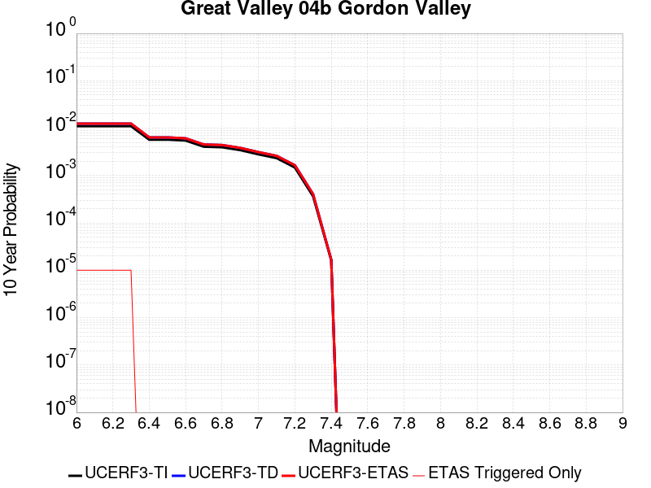 |

| Magnitude | 1 yr TI Prob | TD Prob | ETAS Prob | ETAS/TD Gain | ETAS Triggered Only | 10 yr TI Prob | TD Prob | ETAS Prob | ETAS/TD Gain | ETAS Triggered Only |
|-----|-----|-----|-----|-----|-----|-----|-----|-----|-----|-----|
| 6.0 | 0.0011046068 | 0.0012507503 | 0.0012607377 | 1.0079852 | 1.0E-5 | 0.010991322 | 0.012453555 | 0.01246343 | 1.000793 | 1.0E-5 |
| 6.1 | 0.0011046068 | 0.0012507503 | 0.0012607377 | 1.0079852 | 1.0E-5 | 0.010991322 | 0.012453555 | 0.01246343 | 1.000793 | 1.0E-5 |
| 6.2 | 0.0011046068 | 0.0012507503 | 0.0012607377 | 1.0079852 | 1.0E-5 | 0.010991322 | 0.012453555 | 0.01246343 | 1.000793 | 1.0E-5 |
| 6.3 | 0.0011046068 | 0.0012507503 | 0.0012607377 | 1.0079852 | 1.0E-5 | 0.010991322 | 0.012453555 | 0.01246343 | 1.000793 | 1.0E-5 |
| 6.4 | 5.731909E-4 | 6.392368E-4 | 6.392368E-4 | 1.0 | 0.0 | 0.005717147 | 0.006375568 | 0.006375568 | 1.0 | 0.0 |
| 6.5 | 5.731909E-4 | 6.392368E-4 | 6.392368E-4 | 1.0 | 0.0 | 0.005717147 | 0.006375568 | 0.006375568 | 1.0 | 0.0 |
| 6.6 | 5.4865726E-4 | 6.1157614E-4 | 6.1157614E-4 | 1.0 | 0.0 | 0.0054730466 | 0.0061004846 | 0.0061004846 | 1.0 | 0.0 |
| 6.7 | 4.063493E-4 | 4.5269073E-4 | 4.5269073E-4 | 1.0 | 0.0 | 0.004056071 | 0.004518203 | 0.004518203 | 1.0 | 0.0 |
| 6.8 | 3.957021E-4 | 4.4094236E-4 | 4.4094236E-4 | 1.0 | 0.0 | 0.0039499826 | 0.004401187 | 0.004401187 | 1.0 | 0.0 |
| 6.9 | 3.4453452E-4 | 3.8388927E-4 | 3.8388927E-4 | 1.0 | 0.0 | 0.0034400085 | 0.0038326478 | 0.0038326478 | 1.0 | 0.0 |
| 7.0 | 2.8016625E-4 | 3.1242138E-4 | 3.1242138E-4 | 1.0 | 0.0 | 0.0027981328 | 0.0031201104 | 0.0031201104 | 1.0 | 0.0 |
| 7.1 | 2.3313647E-4 | 2.6015594E-4 | 2.6015594E-4 | 1.0 | 0.0 | 0.0023289204 | 0.0025987588 | 0.0025987588 | 1.0 | 0.0 |
| 7.2 | 1.4783088E-4 | 1.6510284E-4 | 1.6510284E-4 | 1.0 | 0.0 | 0.0014773258 | 0.0016499738 | 0.0016499738 | 1.0 | 0.0 |
| 7.3 | 3.656989E-5 | 4.0557006E-5 | 4.0557006E-5 | 1.0 | 0.0 | 3.6563876E-4 | 4.05541E-4 | 4.05541E-4 | 1.0 | 0.0 |
| 7.4 | 1.6238852E-6 | 1.6732789E-6 | 1.6732789E-6 | 1.0 | 0.0 | 1.6238733E-5 | 1.673267E-5 | 1.673267E-5 | 1.0 | 0.0 |

## Channel Islands Thrust
*[(top)](#table-of-contents)*

| 1 Year | 10 Year |
|-----|-----|
|  |  |

| Magnitude | 1 yr TI Prob | TD Prob | ETAS Prob | ETAS/TD Gain | ETAS Triggered Only | 10 yr TI Prob | TD Prob | ETAS Prob | ETAS/TD Gain | ETAS Triggered Only |
|-----|-----|-----|-----|-----|-----|-----|-----|-----|-----|-----|
| 6.0 | 0.0011554264 | 0.0012564235 | 0.001266411 | 1.0079491 | 1.0E-5 | 0.011494373 | 0.012503792 | 0.012513666 | 1.0007898 | 1.0E-5 |
| 6.1 | 0.0011554264 | 0.0012564235 | 0.001266411 | 1.0079491 | 1.0E-5 | 0.011494373 | 0.012503792 | 0.012513666 | 1.0007898 | 1.0E-5 |
| 6.2 | 0.0011554264 | 0.0012564235 | 0.001266411 | 1.0079491 | 1.0E-5 | 0.011494373 | 0.012503792 | 0.012513666 | 1.0007898 | 1.0E-5 |
| 6.3 | 0.0011554264 | 0.0012564235 | 0.001266411 | 1.0079491 | 1.0E-5 | 0.011494373 | 0.012503792 | 0.012513666 | 1.0007898 | 1.0E-5 |
| 6.4 | 0.0011554264 | 0.0012564235 | 0.001266411 | 1.0079491 | 1.0E-5 | 0.011494373 | 0.012503792 | 0.012513666 | 1.0007898 | 1.0E-5 |
| 6.5 | 0.0011554264 | 0.0012564235 | 0.001266411 | 1.0079491 | 1.0E-5 | 0.011494373 | 0.012503792 | 0.012513666 | 1.0007898 | 1.0E-5 |
| 6.6 | 0.0011554264 | 0.0012564235 | 0.001266411 | 1.0079491 | 1.0E-5 | 0.011494373 | 0.012503792 | 0.012513666 | 1.0007898 | 1.0E-5 |
| 6.7 | 5.5301044E-4 | 5.935995E-4 | 5.935995E-4 | 1.0 | 0.0 | 0.005516363 | 0.0059206416 | 0.0059206416 | 1.0 | 0.0 |
| 6.8 | 5.345204E-4 | 5.73633E-4 | 5.73633E-4 | 1.0 | 0.0 | 0.0053323656 | 0.0057220133 | 0.0057220133 | 1.0 | 0.0 |
| 6.9 | 4.7208337E-4 | 5.059914E-4 | 5.059914E-4 | 1.0 | 0.0 | 0.0047108172 | 0.0050488105 | 0.0050488105 | 1.0 | 0.0 |
| 7.0 | 4.5146482E-4 | 4.8382411E-4 | 4.8382411E-4 | 1.0 | 0.0 | 0.004505487 | 0.0048281197 | 0.0048281197 | 1.0 | 0.0 |
| 7.1 | 4.3773788E-4 | 4.6913346E-4 | 4.6913346E-4 | 1.0 | 0.0 | 0.004368766 | 0.004681841 | 0.004681841 | 1.0 | 0.0 |
| 7.2 | 3.1120746E-4 | 3.3241173E-4 | 3.3241173E-4 | 1.0 | 0.0 | 0.00310772 | 0.0033192032 | 0.0033192032 | 1.0 | 0.0 |
| 7.3 | 2.5447016E-4 | 2.7160576E-4 | 2.7160576E-4 | 1.0 | 0.0 | 0.0025417898 | 0.0027127846 | 0.0027127846 | 1.0 | 0.0 |
| 7.4 | 2.0258849E-4 | 2.1609363E-4 | 2.1609363E-4 | 1.0 | 0.0 | 0.002024039 | 0.0021588767 | 0.0021588767 | 1.0 | 0.0 |
| 7.5 | 7.038446E-5 | 7.449725E-5 | 7.449725E-5 | 1.0 | 0.0 | 7.036218E-4 | 7.4472674E-4 | 7.4472674E-4 | 1.0 | 0.0 |
| 7.6 | 3.161029E-5 | 3.3152526E-5 | 3.3152526E-5 | 1.0 | 0.0 | 3.1605794E-4 | 3.3147744E-4 | 3.3147744E-4 | 1.0 | 0.0 |
| 7.7 | 1.1568181E-5 | 1.17964055E-5 | 1.17964055E-5 | 1.0 | 0.0 | 1.1567579E-4 | 1.1795891E-4 | 1.1795891E-4 | 1.0 | 0.0 |
| 7.8 | 1.1277401E-6 | 8.0702796E-7 | 8.0702796E-7 | 1.0 | 0.0 | 1.1277344E-5 | 8.070258E-6 | 8.070258E-6 | 1.0 | 0.0 |

## San Pedro Basin
*[(top)](#table-of-contents)*

| 1 Year | 10 Year |
|-----|-----|
|  |  |

| Magnitude | 1 yr TI Prob | TD Prob | ETAS Prob | ETAS/TD Gain | ETAS Triggered Only | 10 yr TI Prob | TD Prob | ETAS Prob | ETAS/TD Gain | ETAS Triggered Only |
|-----|-----|-----|-----|-----|-----|-----|-----|-----|-----|-----|
| 6.0 | 0.0027850836 | 0.0033018088 | 0.0033117756 | 1.0030186 | 1.0E-5 | 0.027504366 | 0.03258929 | 0.032598965 | 1.0002968 | 1.0E-5 |
| 6.1 | 0.0027850836 | 0.0033018088 | 0.0033117756 | 1.0030186 | 1.0E-5 | 0.027504366 | 0.03258929 | 0.032598965 | 1.0002968 | 1.0E-5 |
| 6.2 | 0.0012092749 | 0.0013892808 | 0.0013892808 | 1.0 | 0.0 | 0.012027155 | 0.013810828 | 0.013810828 | 1.0 | 0.0 |
| 6.3 | 0.0012092749 | 0.0013892808 | 0.0013892808 | 1.0 | 0.0 | 0.012027155 | 0.013810828 | 0.013810828 | 1.0 | 0.0 |
| 6.4 | 0.001025344 | 0.0011714738 | 0.0011714738 | 1.0 | 0.0 | 0.010206259 | 0.011657071 | 0.011657071 | 1.0 | 0.0 |
| 6.5 | 9.04529E-4 | 0.0010297889 | 0.0010297889 | 1.0 | 0.0 | 0.009008561 | 0.010253892 | 0.010253892 | 1.0 | 0.0 |
| 6.6 | 7.509924E-4 | 8.5137156E-4 | 8.5137156E-4 | 1.0 | 0.0 | 0.0074845953 | 0.008484301 | 0.008484301 | 1.0 | 0.0 |
| 6.7 | 6.590571E-4 | 7.4514386E-4 | 7.4514386E-4 | 1.0 | 0.0 | 0.006571059 | 0.0074294745 | 0.0074294745 | 1.0 | 0.0 |
| 6.8 | 5.9783855E-4 | 6.746416E-4 | 6.746416E-4 | 1.0 | 0.0 | 0.0059623276 | 0.006728875 | 0.006728875 | 1.0 | 0.0 |
| 6.9 | 4.7518566E-4 | 5.339365E-4 | 5.339365E-4 | 1.0 | 0.0 | 0.0047417083 | 0.0053292904 | 0.0053292904 | 1.0 | 0.0 |
| 7.0 | 3.0963816E-4 | 3.4350812E-4 | 3.4350812E-4 | 1.0 | 0.0 | 0.0030920706 | 0.0034320883 | 0.0034320883 | 1.0 | 0.0 |
| 7.1 | 1.1247819E-4 | 1.152898E-4 | 1.152898E-4 | 1.0 | 0.0 | 0.0011242128 | 0.0011523152 | 0.0011523152 | 1.0 | 0.0 |
| 7.2 | 1.1088375E-4 | 1.13638336E-4 | 1.13638336E-4 | 1.0 | 0.0 | 0.0011082845 | 0.0011358176 | 0.0011358176 | 1.0 | 0.0 |
| 7.3 | 8.94604E-5 | 9.101036E-5 | 9.101036E-5 | 1.0 | 0.0 | 8.9424395E-4 | 9.0974005E-4 | 9.0974005E-4 | 1.0 | 0.0 |
| 7.4 | 7.548913E-5 | 7.639631E-5 | 7.639631E-5 | 1.0 | 0.0 | 7.546349E-4 | 7.6370774E-4 | 7.6370774E-4 | 1.0 | 0.0 |
| 7.5 | 6.680587E-5 | 6.747247E-5 | 6.747247E-5 | 1.0 | 0.0 | 6.678579E-4 | 6.7452696E-4 | 6.7452696E-4 | 1.0 | 0.0 |
| 7.6 | 3.5246063E-5 | 3.532152E-5 | 3.532152E-5 | 1.0 | 0.0 | 3.5240475E-4 | 3.5316474E-4 | 3.5316474E-4 | 1.0 | 0.0 |
| 7.7 | 3.2412677E-6 | 2.3845303E-6 | 2.3845303E-6 | 1.0 | 0.0 | 3.2412205E-5 | 2.3845067E-5 | 2.3845067E-5 | 1.0 | 0.0 |
| 7.8 | 1.3869362E-7 | 7.898823E-8 | 7.898823E-8 | 1.0 | 0.0 | 1.3869354E-6 | 7.898823E-7 | 7.898823E-7 | 1.0 | 0.0 |

## San Jacinto (San Bernardino)
*[(top)](#table-of-contents)*

| 1 Year | 10 Year |
|-----|-----|
| 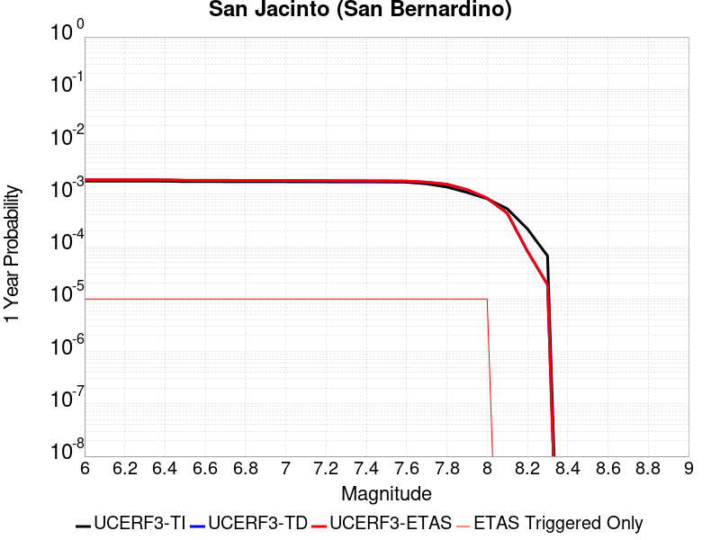 |  |

| Magnitude | 1 yr TI Prob | TD Prob | ETAS Prob | ETAS/TD Gain | ETAS Triggered Only | 10 yr TI Prob | TD Prob | ETAS Prob | ETAS/TD Gain | ETAS Triggered Only |
|-----|-----|-----|-----|-----|-----|-----|-----|-----|-----|-----|
| 6.0 | 0.0017774 | 0.0018756451 | 0.0018856263 | 1.0053215 | 1.0E-5 | 0.01763251 | 0.019346429 | 0.019356234 | 1.0005069 | 1.0E-5 |
| 6.1 | 0.0017774 | 0.0018756451 | 0.0018856263 | 1.0053215 | 1.0E-5 | 0.01763251 | 0.019346429 | 0.019356234 | 1.0005069 | 1.0E-5 |
| 6.2 | 0.0017774 | 0.0018756451 | 0.0018856263 | 1.0053215 | 1.0E-5 | 0.01763251 | 0.019346429 | 0.019356234 | 1.0005069 | 1.0E-5 |
| 6.3 | 0.0017774 | 0.0018756451 | 0.0018856263 | 1.0053215 | 1.0E-5 | 0.01763251 | 0.019346429 | 0.019356234 | 1.0005069 | 1.0E-5 |
| 6.4 | 0.0017729428 | 0.0018700549 | 0.0018800362 | 1.0053375 | 1.0E-5 | 0.017588645 | 0.01929151 | 0.019301318 | 1.0005083 | 1.0E-5 |
| 6.5 | 0.0017420477 | 0.0018315457 | 0.0018415274 | 1.0054499 | 1.0E-5 | 0.017284546 | 0.018913053 | 0.018922864 | 1.0005187 | 1.0E-5 |
| 6.6 | 0.0017394501 | 0.0018282757 | 0.0018382575 | 1.0054597 | 1.0E-5 | 0.017258976 | 0.018880919 | 0.01889073 | 1.0005196 | 1.0E-5 |
| 6.7 | 0.0017391514 | 0.0018277431 | 0.0018377249 | 1.0054612 | 1.0E-5 | 0.017256035 | 0.018875709 | 0.018885521 | 1.0005198 | 1.0E-5 |
| 6.8 | 0.0017348597 | 0.0018222256 | 0.0018322073 | 1.0054778 | 1.0E-5 | 0.017213784 | 0.018821482 | 0.018831292 | 1.0005213 | 1.0E-5 |
| 6.9 | 0.0017327217 | 0.0018191502 | 0.001829132 | 1.0054871 | 1.0E-5 | 0.017192734 | 0.01879135 | 0.018801162 | 1.0005221 | 1.0E-5 |
| 7.0 | 0.0017307063 | 0.0018160215 | 0.0018260033 | 1.0054965 | 1.0E-5 | 0.017172894 | 0.018760728 | 0.01877054 | 1.000523 | 1.0E-5 |
| 7.1 | 0.0017271966 | 0.0018097822 | 0.0018197641 | 1.0055156 | 1.0E-5 | 0.017138338 | 0.018699808 | 0.01870962 | 1.0005248 | 1.0E-5 |
| 7.2 | 0.0017222111 | 0.0018028781 | 0.0018128601 | 1.0055367 | 1.0E-5 | 0.017089253 | 0.018632201 | 0.018642014 | 1.0005267 | 1.0E-5 |
| 7.3 | 0.0017181796 | 0.0017959902 | 0.0018059722 | 1.005558 | 1.0E-5 | 0.017049557 | 0.018564949 | 0.018574763 | 1.0005287 | 1.0E-5 |
| 7.4 | 0.0017160608 | 0.0017919131 | 0.0018018951 | 1.0055707 | 1.0E-5 | 0.017028693 | 0.01852523 | 0.018535044 | 1.0005298 | 1.0E-5 |
| 7.5 | 0.0017109542 | 0.0017848789 | 0.001794861 | 1.0055926 | 1.0E-5 | 0.016978411 | 0.018456137 | 0.018465953 | 1.0005318 | 1.0E-5 |
| 7.6 | 0.0016955109 | 0.0017705658 | 0.001780548 | 1.0056379 | 1.0E-5 | 0.016826328 | 0.018313898 | 0.018323716 | 1.0005361 | 1.0E-5 |
| 7.7 | 0.0015791537 | 0.00169177 | 0.0017017531 | 1.005901 | 1.0E-5 | 0.01567979 | 0.017526472 | 0.017536297 | 1.0005605 | 1.0E-5 |
| 7.8 | 0.0013722149 | 0.001546472 | 0.0015564564 | 1.0064564 | 1.0E-5 | 0.013637724 | 0.016068073 | 0.016077911 | 1.0006124 | 1.0E-5 |
| 7.9 | 0.0010827117 | 0.0012210533 | 0.0012310412 | 1.0081797 | 1.0E-5 | 0.010774517 | 0.012791798 | 0.0128016705 | 1.0007718 | 1.0E-5 |
| 8.0 | 8.2088535E-4 | 8.361615E-4 | 8.461531E-4 | 1.0119494 | 1.0E-5 | 0.008178596 | 0.008864859 | 0.00887477 | 1.0011181 | 1.0E-5 |
| 8.1 | 5.2717153E-4 | 4.3452042E-4 | 4.3452042E-4 | 1.0 | 0.0 | 0.005259227 | 0.0046766037 | 0.0046766037 | 1.0 | 0.0 |
| 8.2 | 2.1856341E-4 | 8.233973E-5 | 8.233973E-5 | 1.0 | 0.0 | 0.0021834858 | 9.5639535E-4 | 9.5639535E-4 | 1.0 | 0.0 |
| 8.3 | 6.65684E-5 | 1.8857654E-5 | 1.8857654E-5 | 1.0 | 0.0 | 6.6548464E-4 | 2.2746001E-4 | 2.2746001E-4 | 1.0 | 0.0 |

## Calaveras (So) 2011 CFM
*[(top)](#table-of-contents)*

| 1 Year | 10 Year |
|-----|-----|
|  |  |

| Magnitude | 1 yr TI Prob | TD Prob | ETAS Prob | ETAS/TD Gain | ETAS Triggered Only | 10 yr TI Prob | TD Prob | ETAS Prob | ETAS/TD Gain | ETAS Triggered Only |
|-----|-----|-----|-----|-----|-----|-----|-----|-----|-----|-----|
| 6.0 | 0.00828899 | 0.015858818 | 0.015868658 | 1.0006206 | 1.0E-5 | 0.079865426 | 0.14439851 | 0.14440706 | 1.0000592 | 1.0E-5 |
| 6.1 | 0.007063716 | 0.013461906 | 0.013471772 | 1.0007328 | 1.0E-5 | 0.06843361 | 0.12402653 | 0.124035284 | 1.0000706 | 1.0E-5 |
| 6.2 | 0.0059661185 | 0.011245421 | 0.011255309 | 1.0008793 | 1.0E-5 | 0.058084648 | 0.10501737 | 0.10502632 | 1.0000852 | 1.0E-5 |
| 6.3 | 0.004525038 | 0.0083006825 | 0.008310599 | 1.0011947 | 1.0E-5 | 0.044339992 | 0.07933282 | 0.07934202 | 1.0001161 | 1.0E-5 |
| 6.4 | 0.0044306475 | 0.008148721 | 0.00815864 | 1.0012171 | 1.0E-5 | 0.04343345 | 0.077938974 | 0.07794819 | 1.0001183 | 1.0E-5 |
| 6.5 | 0.004376863 | 0.008057924 | 0.0080678435 | 1.001231 | 1.0E-5 | 0.042916555 | 0.077110246 | 0.07711947 | 1.0001197 | 1.0E-5 |
| 6.6 | 0.0042669317 | 0.007869773 | 0.007879694 | 1.0012606 | 1.0E-5 | 0.04185927 | 0.07539553 | 0.07540478 | 1.0001227 | 1.0E-5 |
| 6.7 | 0.004172157 | 0.0076982686 | 0.0077081914 | 1.001289 | 1.0E-5 | 0.040946912 | 0.07383767 | 0.07384693 | 1.0001254 | 1.0E-5 |
| 6.8 | 0.0037082357 | 0.006695695 | 0.0067056282 | 1.0014834 | 1.0E-5 | 0.036469642 | 0.064682275 | 0.06469163 | 1.0001446 | 1.0E-5 |
| 6.9 | 0.0029876942 | 0.005162333 | 0.0051722815 | 1.0019271 | 1.0E-5 | 0.02947844 | 0.050507538 | 0.050517034 | 1.000188 | 1.0E-5 |
| 7.0 | 0.0025403565 | 0.0043136105 | 0.0043235677 | 1.0023082 | 1.0E-5 | 0.025115121 | 0.042483483 | 0.042493057 | 1.0002254 | 1.0E-5 |
| 7.1 | 0.002241108 | 0.0037835862 | 0.0037935486 | 1.002633 | 1.0E-5 | 0.022186412 | 0.0374217 | 0.037431326 | 1.0002573 | 1.0E-5 |
| 7.2 | 0.0016794393 | 0.0028087131 | 0.0028087131 | 1.0 | 0.0 | 0.016668037 | 0.028034493 | 0.028034493 | 1.0 | 0.0 |
| 7.3 | 0.0012388286 | 0.0020573675 | 0.0020573675 | 1.0 | 0.0 | 0.012319452 | 0.020642038 | 0.020642038 | 1.0 | 0.0 |
| 7.4 | 8.343947E-4 | 0.0014254698 | 0.0014254698 | 1.0 | 0.0 | 0.008312687 | 0.0143752 | 0.0143752 | 1.0 | 0.0 |
| 7.5 | 7.205553E-4 | 0.0012921637 | 0.0012921637 | 1.0 | 0.0 | 0.007182234 | 0.013054431 | 0.013054431 | 1.0 | 0.0 |
| 7.6 | 4.5997082E-4 | 8.567974E-4 | 8.567974E-4 | 1.0 | 0.0 | 0.004590199 | 0.008718628 | 0.008718628 | 1.0 | 0.0 |
| 7.7 | 2.1053031E-4 | 4.0201397E-4 | 4.0201397E-4 | 1.0 | 0.0 | 0.0021033096 | 0.004164605 | 0.004164605 | 1.0 | 0.0 |
| 7.8 | 1.7807873E-4 | 3.5403192E-4 | 3.5403192E-4 | 1.0 | 0.0 | 0.0017793609 | 0.0036659774 | 0.0036659774 | 1.0 | 0.0 |
| 7.9 | 1.2908543E-4 | 2.753773E-4 | 2.753773E-4 | 1.0 | 0.0 | 0.0012901047 | 0.002834394 | 0.002834394 | 1.0 | 0.0 |
| 8.0 | 7.9474354E-5 | 1.715706E-4 | 1.715706E-4 | 1.0 | 0.0 | 7.944594E-4 | 0.0017562305 | 0.0017562305 | 1.0 | 0.0 |
| 8.1 | 5.2722597E-5 | 1.0672433E-4 | 1.0672433E-4 | 1.0 | 0.0 | 5.271009E-4 | 0.0010928321 | 0.0010928321 | 1.0 | 0.0 |

## Hayward (So) extension 2011 CFM
*[(top)](#table-of-contents)*

| 1 Year | 10 Year |
|-----|-----|
| 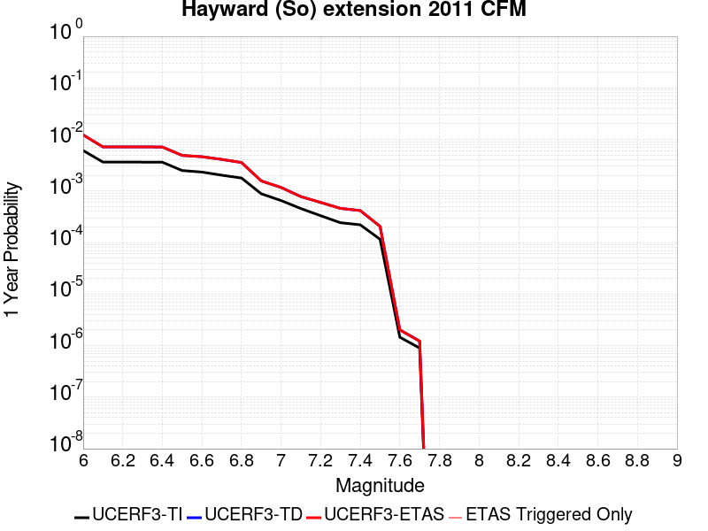 | 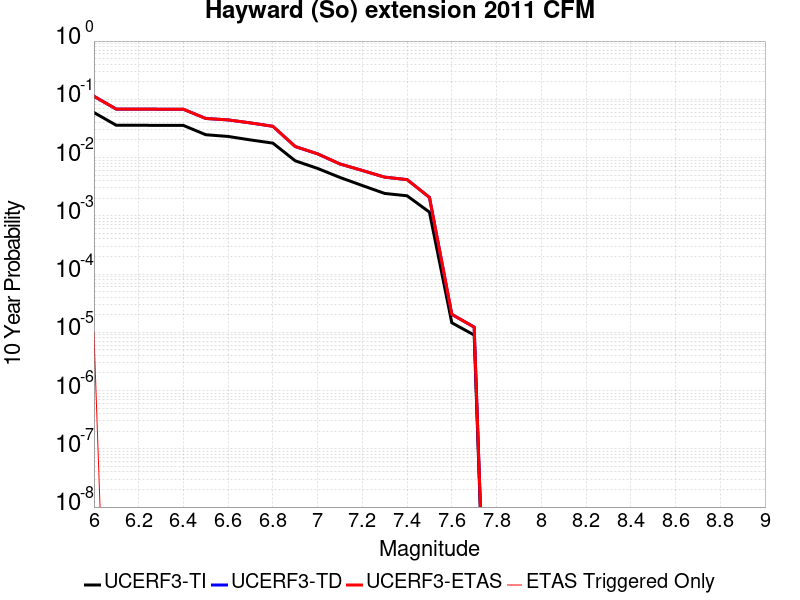 |

| Magnitude | 1 yr TI Prob | TD Prob | ETAS Prob | ETAS/TD Gain | ETAS Triggered Only | 10 yr TI Prob | TD Prob | ETAS Prob | ETAS/TD Gain | ETAS Triggered Only |
|-----|-----|-----|-----|-----|-----|-----|-----|-----|-----|-----|
| 6.0 | 0.0060976758 | 0.012248788 | 0.012248788 | 1.0 | 0.0 | 0.0593305 | 0.11284225 | 0.11285111 | 1.0000787 | 1.0E-5 |
| 6.1 | 0.0036416445 | 0.0071720546 | 0.0071720546 | 1.0 | 0.0 | 0.035825435 | 0.06780279 | 0.06780279 | 1.0 | 0.0 |
| 6.2 | 0.0036416445 | 0.0071720546 | 0.0071720546 | 1.0 | 0.0 | 0.035825435 | 0.06780279 | 0.06780279 | 1.0 | 0.0 |
| 6.3 | 0.0036308395 | 0.007155591 | 0.007155591 | 1.0 | 0.0 | 0.035720866 | 0.06765175 | 0.06765175 | 1.0 | 0.0 |
| 6.4 | 0.0036208609 | 0.0071385037 | 0.0071385037 | 1.0 | 0.0 | 0.03562429 | 0.06749579 | 0.06749579 | 1.0 | 0.0 |
| 6.5 | 0.0024943394 | 0.004901148 | 0.004901148 | 1.0 | 0.0 | 0.02466527 | 0.046901155 | 0.046901155 | 1.0 | 0.0 |
| 6.6 | 0.0023277493 | 0.004624217 | 0.004624217 | 1.0 | 0.0 | 0.02303517 | 0.044292703 | 0.044292703 | 1.0 | 0.0 |
| 6.7 | 0.002024885 | 0.004095898 | 0.004095898 | 1.0 | 0.0 | 0.020065336 | 0.039332543 | 0.039332543 | 1.0 | 0.0 |
| 6.8 | 0.0017840851 | 0.0035712998 | 0.0035712998 | 1.0 | 0.0 | 0.017698295 | 0.034420468 | 0.034420468 | 1.0 | 0.0 |
| 6.9 | 8.828813E-4 | 0.0015673965 | 0.0015673965 | 1.0 | 0.0 | 0.008793819 | 0.015463019 | 0.015463019 | 1.0 | 0.0 |
| 7.0 | 6.525269E-4 | 0.0011714145 | 0.0011714145 | 1.0 | 0.0 | 0.0065061417 | 0.011582092 | 0.011582092 | 1.0 | 0.0 |
| 7.1 | 4.5654282E-4 | 7.784922E-4 | 7.784922E-4 | 1.0 | 0.0 | 0.0045560603 | 0.007763349 | 0.007763349 | 1.0 | 0.0 |
| 7.2 | 3.3150852E-4 | 5.99797E-4 | 5.99797E-4 | 1.0 | 0.0 | 0.0033101442 | 0.006000173 | 0.006000173 | 1.0 | 0.0 |
| 7.3 | 2.4236954E-4 | 4.6000862E-4 | 4.6000862E-4 | 1.0 | 0.0 | 0.0024210536 | 0.0046106 | 0.0046106 | 1.0 | 0.0 |
| 7.4 | 2.2091944E-4 | 4.1694747E-4 | 4.1694747E-4 | 1.0 | 0.0 | 0.0022069993 | 0.004181874 | 0.004181874 | 1.0 | 0.0 |
| 7.5 | 1.157642E-4 | 2.0619857E-4 | 2.0619857E-4 | 1.0 | 0.0 | 0.0011570391 | 0.002073426 | 0.002073426 | 1.0 | 0.0 |
| 7.6 | 1.4585203E-6 | 2.023719E-6 | 2.023719E-6 | 1.0 | 0.0 | 1.4585107E-5 | 2.0327781E-5 | 2.0327781E-5 | 1.0 | 0.0 |
| 7.7 | 8.9709135E-7 | 1.2228583E-6 | 1.2228583E-6 | 1.0 | 0.0 | 8.970877E-6 | 1.2296686E-5 | 1.2296686E-5 | 1.0 | 0.0 |

## Blue Cut
*[(top)](#table-of-contents)*

| 1 Year | 10 Year |
|-----|-----|
| 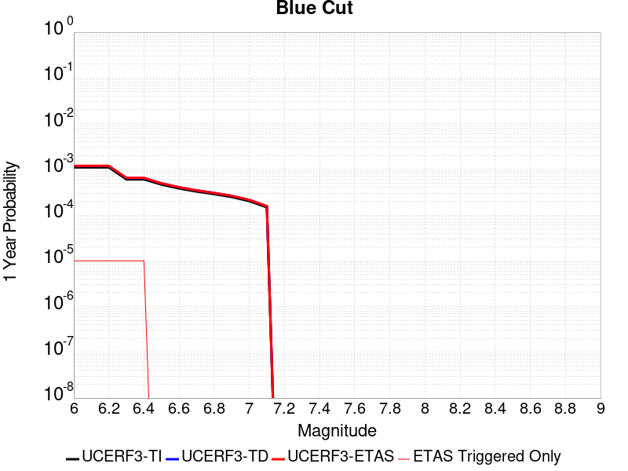 |  |

| Magnitude | 1 yr TI Prob | TD Prob | ETAS Prob | ETAS/TD Gain | ETAS Triggered Only | 10 yr TI Prob | TD Prob | ETAS Prob | ETAS/TD Gain | ETAS Triggered Only |
|-----|-----|-----|-----|-----|-----|-----|-----|-----|-----|-----|
| 6.0 | 0.0011070445 | 0.0011848459 | 0.001194834 | 1.0084299 | 1.0E-5 | 0.011015458 | 0.01179113 | 0.011801012 | 1.000838 | 1.0E-5 |
| 6.1 | 0.0011070445 | 0.0011848459 | 0.001194834 | 1.0084299 | 1.0E-5 | 0.011015458 | 0.01179113 | 0.011801012 | 1.000838 | 1.0E-5 |
| 6.2 | 0.0011070445 | 0.0011848459 | 0.001194834 | 1.0084299 | 1.0E-5 | 0.011015458 | 0.01179113 | 0.011801012 | 1.000838 | 1.0E-5 |
| 6.3 | 6.0582085E-4 | 6.443987E-4 | 6.5439224E-4 | 1.0155083 | 1.0E-5 | 0.0060417196 | 0.006426548 | 0.006436484 | 1.001546 | 1.0E-5 |
| 6.4 | 6.0582085E-4 | 6.443987E-4 | 6.5439224E-4 | 1.0155083 | 1.0E-5 | 0.0060417196 | 0.006426548 | 0.006436484 | 1.001546 | 1.0E-5 |
| 6.5 | 4.6591737E-4 | 4.946253E-4 | 4.946253E-4 | 1.0 | 0.0 | 0.0046494175 | 0.004936153 | 0.004936153 | 1.0 | 0.0 |
| 6.6 | 3.83198E-4 | 4.0641252E-4 | 4.0641252E-4 | 1.0 | 0.0 | 0.0038253788 | 0.004057484 | 0.004057484 | 1.0 | 0.0 |
| 6.7 | 3.2750185E-4 | 3.4720454E-4 | 3.4720454E-4 | 1.0 | 0.0 | 0.0032701963 | 0.0034673614 | 0.0034673614 | 1.0 | 0.0 |
| 6.8 | 2.8816288E-4 | 3.0547287E-4 | 3.0547287E-4 | 1.0 | 0.0 | 0.002877895 | 0.0030512456 | 0.0030512456 | 1.0 | 0.0 |
| 6.9 | 2.4927902E-4 | 2.6427925E-4 | 2.6427925E-4 | 1.0 | 0.0 | 0.0024899957 | 0.0026403419 | 0.0026403419 | 1.0 | 0.0 |
| 7.0 | 2.0259817E-4 | 2.1488115E-4 | 2.1488115E-4 | 1.0 | 0.0 | 0.0020241356 | 0.0021474094 | 0.0021474094 | 1.0 | 0.0 |
| 7.1 | 1.4795837E-4 | 1.5703736E-4 | 1.5703736E-4 | 1.0 | 0.0 | 0.001478599 | 0.001569909 | 0.001569909 | 1.0 | 0.0 |

## Owens Valley
*[(top)](#table-of-contents)*

| 1 Year | 10 Year |
|-----|-----|
| 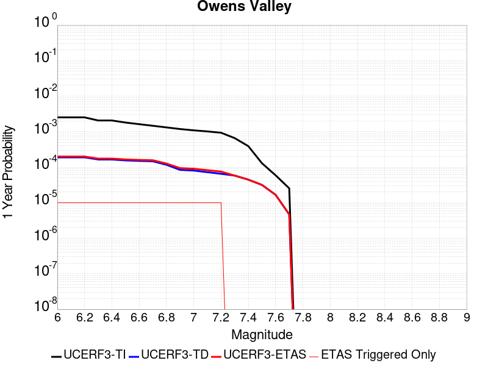 |  |

| Magnitude | 1 yr TI Prob | TD Prob | ETAS Prob | ETAS/TD Gain | ETAS Triggered Only | 10 yr TI Prob | TD Prob | ETAS Prob | ETAS/TD Gain | ETAS Triggered Only |
|-----|-----|-----|-----|-----|-----|-----|-----|-----|-----|-----|
| 6.0 | 0.002521386 | 1.8920389E-4 | 1.99202E-4 | 1.0528431 | 1.0E-5 | 0.024929691 | 0.0019249251 | 0.0019349059 | 1.005185 | 1.0E-5 |
| 6.1 | 0.002521386 | 1.8920389E-4 | 1.99202E-4 | 1.0528431 | 1.0E-5 | 0.024929691 | 0.0019249251 | 0.0019349059 | 1.005185 | 1.0E-5 |
| 6.2 | 0.002521386 | 1.8920389E-4 | 1.99202E-4 | 1.0528431 | 1.0E-5 | 0.024929691 | 0.0019249251 | 0.0019349059 | 1.005185 | 1.0E-5 |
| 6.3 | 0.002060538 | 1.6462678E-4 | 1.7462512E-4 | 1.0607334 | 1.0E-5 | 0.020415364 | 0.0016591517 | 0.0016691352 | 1.0060172 | 1.0E-5 |
| 6.4 | 0.002060538 | 1.6462678E-4 | 1.7462512E-4 | 1.0607334 | 1.0E-5 | 0.020415364 | 0.0016591517 | 0.0016691352 | 1.0060172 | 1.0E-5 |
| 6.5 | 0.0018023965 | 1.5503954E-4 | 1.65038E-4 | 1.0644897 | 1.0E-5 | 0.017878477 | 0.0015556873 | 0.0015656716 | 1.006418 | 1.0E-5 |
| 6.6 | 0.0016229092 | 1.4997451E-4 | 1.5997302E-4 | 1.066668 | 1.0E-5 | 0.016111081 | 0.0015012339 | 0.001511219 | 1.0066512 | 1.0E-5 |
| 6.7 | 0.001463541 | 1.4663194E-4 | 1.5663047E-4 | 1.068188 | 1.0E-5 | 0.014539397 | 0.001465735 | 0.0014757203 | 1.0068126 | 1.0E-5 |
| 6.8 | 0.0013164099 | 1.1663061E-4 | 1.2662944E-4 | 1.0857308 | 1.0E-5 | 0.01308639 | 0.0011659673 | 0.0011759556 | 1.0085666 | 1.0E-5 |
| 6.9 | 0.0011840039 | 8.3907464E-5 | 9.390663E-5 | 1.1191689 | 1.0E-5 | 0.011777153 | 8.389696E-4 | 8.489612E-4 | 1.0119094 | 1.0E-5 |
| 7.0 | 0.0010884746 | 8.032716E-5 | 9.032636E-5 | 1.1244808 | 1.0E-5 | 0.010831586 | 8.031529E-4 | 8.1314484E-4 | 1.0124409 | 1.0E-5 |
| 7.1 | 0.0010143308 | 7.233792E-5 | 8.2337196E-5 | 1.1382301 | 1.0E-5 | 0.010097133 | 7.2330143E-4 | 7.3329423E-4 | 1.0138155 | 1.0E-5 |
| 7.2 | 9.3233347E-4 | 6.516375E-5 | 7.51631E-5 | 1.1534495 | 1.0E-5 | 0.009284316 | 6.515837E-4 | 6.615772E-4 | 1.0153372 | 1.0E-5 |
| 7.3 | 6.582117E-4 | 5.7995258E-5 | 5.7995258E-5 | 1.0 | 0.0 | 0.0065626553 | 5.799336E-4 | 5.799336E-4 | 1.0 | 0.0 |
| 7.4 | 3.906093E-4 | 4.4604065E-5 | 4.4604065E-5 | 1.0 | 0.0 | 0.003899234 | 4.4604312E-4 | 4.4604312E-4 | 1.0 | 0.0 |
| 7.5 | 1.2905113E-4 | 3.1664305E-5 | 3.1664305E-5 | 1.0 | 0.0 | 0.0012897621 | 3.1659825E-4 | 3.1659825E-4 | 1.0 | 0.0 |
| 7.6 | 5.9110564E-5 | 1.6678721E-5 | 1.6678721E-5 | 1.0 | 0.0 | 5.9094845E-4 | 1.6677487E-4 | 1.6677487E-4 | 1.0 | 0.0 |
| 7.7 | 2.536535E-5 | 4.677564E-6 | 4.677564E-6 | 1.0 | 0.0 | 2.5362454E-4 | 4.677472E-5 | 4.677472E-5 | 1.0 | 0.0 |

## San Diego Trough north alt1
*[(top)](#table-of-contents)*

| 1 Year | 10 Year |
|-----|-----|
|  |  |

| Magnitude | 1 yr TI Prob | TD Prob | ETAS Prob | ETAS/TD Gain | ETAS Triggered Only | 10 yr TI Prob | TD Prob | ETAS Prob | ETAS/TD Gain | ETAS Triggered Only |
|-----|-----|-----|-----|-----|-----|-----|-----|-----|-----|-----|
| 6.0 | 0.0038171355 | 0.004593001 | 0.004593001 | 1.0 | 0.0 | 0.03752231 | 0.04504475 | 0.045054298 | 1.000212 | 1.0E-5 |
| 6.1 | 0.0019777524 | 0.0023394316 | 0.0023394316 | 1.0 | 0.0 | 0.019602431 | 0.023156574 | 0.023156574 | 1.0 | 0.0 |
| 6.2 | 0.0014935739 | 0.0017359114 | 0.0017359114 | 1.0 | 0.0 | 0.0148357535 | 0.017226173 | 0.017226173 | 1.0 | 0.0 |
| 6.3 | 0.0014935739 | 0.0017359114 | 0.0017359114 | 1.0 | 0.0 | 0.0148357535 | 0.017226173 | 0.017226173 | 1.0 | 0.0 |
| 6.4 | 0.001157945 | 0.0013269981 | 0.0013269981 | 1.0 | 0.0 | 0.011519298 | 0.013191903 | 0.013191903 | 1.0 | 0.0 |
| 6.5 | 0.0010954136 | 0.001252809 | 0.001252809 | 1.0 | 0.0 | 0.010900296 | 0.0124585405 | 0.0124585405 | 1.0 | 0.0 |
| 6.6 | 9.4949827E-4 | 0.0010797759 | 0.0010797759 | 1.0 | 0.0 | 0.009454516 | 0.010745965 | 0.010745965 | 1.0 | 0.0 |
| 6.7 | 8.284929E-4 | 9.379289E-4 | 9.379289E-4 | 1.0 | 0.0 | 0.008254109 | 0.00934007 | 0.00934007 | 1.0 | 0.0 |
| 6.8 | 7.4750587E-4 | 8.4499724E-4 | 8.4499724E-4 | 1.0 | 0.0 | 0.0074499645 | 0.008418109 | 0.008418109 | 1.0 | 0.0 |
| 6.9 | 6.558929E-4 | 7.409697E-4 | 7.409697E-4 | 1.0 | 0.0 | 0.0065396037 | 0.0073851775 | 0.0073851775 | 1.0 | 0.0 |
| 7.0 | 5.677453E-4 | 6.4103334E-4 | 6.4103334E-4 | 1.0 | 0.0 | 0.00566297 | 0.0063919704 | 0.0063919704 | 1.0 | 0.0 |
| 7.1 | 4.900001E-4 | 5.533079E-4 | 5.533079E-4 | 1.0 | 0.0 | 0.0048892107 | 0.005519399 | 0.005519399 | 1.0 | 0.0 |
| 7.2 | 4.2729423E-4 | 4.8298645E-4 | 4.8298645E-4 | 1.0 | 0.0 | 0.0042647356 | 0.0048194476 | 0.0048194476 | 1.0 | 0.0 |
| 7.3 | 3.2701128E-4 | 3.6986326E-4 | 3.6986326E-4 | 1.0 | 0.0 | 0.003265305 | 0.0036925229 | 0.0036925229 | 1.0 | 0.0 |
| 7.4 | 2.600867E-4 | 2.9438394E-4 | 2.9438394E-4 | 1.0 | 0.0 | 0.002597825 | 0.002939981 | 0.002939981 | 1.0 | 0.0 |
| 7.5 | 9.125422E-5 | 1.02769685E-4 | 1.02769685E-4 | 1.0 | 0.0 | 9.1216754E-4 | 0.0010272437 | 0.0010272437 | 1.0 | 0.0 |
| 7.6 | 8.864449E-6 | 9.148852E-6 | 9.148852E-6 | 1.0 | 0.0 | 8.8640954E-5 | 9.148495E-5 | 9.148495E-5 | 1.0 | 0.0 |

## Calaveras (Central) 2011 CFM
*[(top)](#table-of-contents)*

| 1 Year | 10 Year |
|-----|-----|
|  |  |

| Magnitude | 1 yr TI Prob | TD Prob | ETAS Prob | ETAS/TD Gain | ETAS Triggered Only | 10 yr TI Prob | TD Prob | ETAS Prob | ETAS/TD Gain | ETAS Triggered Only |
|-----|-----|-----|-----|-----|-----|-----|-----|-----|-----|-----|
| 6.0 | 0.0078024664 | 0.012849847 | 0.012859719 | 1.0007682 | 1.0E-5 | 0.07534136 | 0.120399095 | 0.120407894 | 1.0000731 | 1.0E-5 |
| 6.1 | 0.0075490056 | 0.012419128 | 0.012429004 | 1.0007952 | 1.0E-5 | 0.07297657 | 0.11667092 | 0.11667975 | 1.0000757 | 1.0E-5 |
| 6.2 | 0.007434286 | 0.01238373 | 0.012393606 | 1.0007975 | 1.0E-5 | 0.07190444 | 0.116324924 | 0.11633376 | 1.0000759 | 1.0E-5 |
| 6.3 | 0.0070386264 | 0.012039932 | 0.012049812 | 1.0008205 | 1.0E-5 | 0.0681982 | 0.11323759 | 0.113246456 | 1.0000783 | 1.0E-5 |
| 6.4 | 0.006757223 | 0.011742746 | 0.011752629 | 1.0008416 | 1.0E-5 | 0.06555412 | 0.1105156 | 0.11052449 | 1.0000805 | 1.0E-5 |
| 6.5 | 0.005463498 | 0.0093390085 | 0.009348916 | 1.0010607 | 1.0E-5 | 0.053311124 | 0.0891972 | 0.089206316 | 1.0001022 | 1.0E-5 |
| 6.6 | 0.0052862884 | 0.009074068 | 0.009083977 | 1.0010921 | 1.0E-5 | 0.05162293 | 0.08677472 | 0.086783856 | 1.0001053 | 1.0E-5 |
| 6.7 | 0.0050282106 | 0.008690982 | 0.008700896 | 1.0011406 | 1.0E-5 | 0.049159497 | 0.0832641 | 0.08327326 | 1.0001101 | 1.0E-5 |
| 6.8 | 0.0047319788 | 0.008129261 | 0.00813918 | 1.0012201 | 1.0E-5 | 0.046324775 | 0.07815751 | 0.07816672 | 1.0001179 | 1.0E-5 |
| 6.9 | 0.0038295772 | 0.006395317 | 0.0064052534 | 1.0015537 | 1.0E-5 | 0.037642512 | 0.062186148 | 0.062195525 | 1.0001508 | 1.0E-5 |
| 7.0 | 0.0029938098 | 0.0048870575 | 0.0048970087 | 1.0020362 | 1.0E-5 | 0.02953797 | 0.04798525 | 0.047994766 | 1.0001984 | 1.0E-5 |
| 7.1 | 0.0025825473 | 0.004192909 | 0.0042028674 | 1.002375 | 1.0E-5 | 0.0255274 | 0.041371524 | 0.04138111 | 1.0002317 | 1.0E-5 |
| 7.2 | 0.0019223199 | 0.0031010495 | 0.0031010495 | 1.0 | 0.0 | 0.01905776 | 0.030882219 | 0.030882219 | 1.0 | 0.0 |
| 7.3 | 0.0013477671 | 0.0022135996 | 0.0022135996 | 1.0 | 0.0 | 0.013396223 | 0.022174144 | 0.022174144 | 1.0 | 0.0 |
| 7.4 | 9.2563726E-4 | 0.0015606962 | 0.0015606962 | 1.0 | 0.0 | 0.009217911 | 0.015707906 | 0.015707906 | 1.0 | 0.0 |
| 7.5 | 7.76303E-4 | 0.0013682895 | 0.0013682895 | 1.0 | 0.0 | 0.0077359667 | 0.013801122 | 0.013801122 | 1.0 | 0.0 |
| 7.6 | 4.2605202E-4 | 7.803542E-4 | 7.803542E-4 | 1.0 | 0.0 | 0.004252361 | 0.007938672 | 0.007938672 | 1.0 | 0.0 |
| 7.7 | 1.7665124E-4 | 3.2623496E-4 | 3.2623496E-4 | 1.0 | 0.0 | 0.0017651088 | 0.0033879161 | 0.0033879161 | 1.0 | 0.0 |
| 7.8 | 1.4463716E-4 | 2.7994323E-4 | 2.7994323E-4 | 1.0 | 0.0 | 0.0014454306 | 0.0029071951 | 0.0029071951 | 1.0 | 0.0 |
| 7.9 | 1.0297595E-4 | 2.1537147E-4 | 2.1537147E-4 | 1.0 | 0.0 | 0.0010292825 | 0.0022234174 | 0.0022234174 | 1.0 | 0.0 |
| 8.0 | 6.139818E-5 | 1.3326813E-4 | 1.3326813E-4 | 1.0 | 0.0 | 6.1381224E-4 | 0.0013659728 | 0.0013659728 | 1.0 | 0.0 |
| 8.1 | 3.9192048E-5 | 8.039586E-5 | 8.039586E-5 | 1.0 | 0.0 | 3.9185135E-4 | 8.234898E-4 | 8.234898E-4 | 1.0 | 0.0 |

## San Juan
*[(top)](#table-of-contents)*

| 1 Year | 10 Year |
|-----|-----|
|  |  |

| Magnitude | 1 yr TI Prob | TD Prob | ETAS Prob | ETAS/TD Gain | ETAS Triggered Only | 10 yr TI Prob | TD Prob | ETAS Prob | ETAS/TD Gain | ETAS Triggered Only |
|-----|-----|-----|-----|-----|-----|-----|-----|-----|-----|-----|
| 6.0 | 4.5295584E-4 | 4.564175E-4 | 4.564175E-4 | 1.0 | 0.0 | 0.004520337 | 0.0045553423 | 0.0045652967 | 1.0021852 | 1.0E-5 |
| 6.1 | 4.5295584E-4 | 4.564175E-4 | 4.564175E-4 | 1.0 | 0.0 | 0.004520337 | 0.0045553423 | 0.0045652967 | 1.0021852 | 1.0E-5 |
| 6.2 | 4.5295584E-4 | 4.564175E-4 | 4.564175E-4 | 1.0 | 0.0 | 0.004520337 | 0.0045553423 | 0.0045652967 | 1.0021852 | 1.0E-5 |
| 6.3 | 3.2895492E-4 | 3.2776094E-4 | 3.2776094E-4 | 1.0 | 0.0 | 0.003284684 | 0.003272975 | 0.0032829426 | 1.0030453 | 1.0E-5 |
| 6.4 | 3.2079802E-4 | 3.18992E-4 | 3.18992E-4 | 1.0 | 0.0 | 0.0032033534 | 0.0031855376 | 0.0031955058 | 1.0031292 | 1.0E-5 |
| 6.5 | 2.7154534E-4 | 2.6801578E-4 | 2.6801578E-4 | 1.0 | 0.0 | 0.0027121378 | 0.0026770793 | 0.0026870526 | 1.0037254 | 1.0E-5 |
| 6.6 | 2.3571544E-4 | 2.303421E-4 | 2.303421E-4 | 1.0 | 0.0 | 0.0023546559 | 0.0023011705 | 0.0023111475 | 1.0043356 | 1.0E-5 |
| 6.7 | 2.0578515E-4 | 1.99292E-4 | 1.99292E-4 | 1.0 | 0.0 | 0.002055947 | 0.0019912578 | 0.0019912578 | 1.0 | 0.0 |
| 6.8 | 1.8018926E-4 | 1.730253E-4 | 1.730253E-4 | 1.0 | 0.0 | 0.0018004322 | 0.0017290247 | 0.0017290247 | 1.0 | 0.0 |
| 6.9 | 1.596469E-4 | 1.5193272E-4 | 1.5193272E-4 | 1.0 | 0.0 | 0.0015953224 | 0.0015184031 | 0.0015184031 | 1.0 | 0.0 |
| 7.0 | 1.3828653E-4 | 1.3001921E-4 | 1.3001921E-4 | 1.0 | 0.0 | 0.0013820052 | 0.0012995432 | 0.0012995432 | 1.0 | 0.0 |
| 7.1 | 1.1499152E-4 | 1.06115614E-4 | 1.06115614E-4 | 1.0 | 0.0 | 0.0011493203 | 0.0010607594 | 0.0010607594 | 1.0 | 0.0 |
| 7.2 | 5.628194E-5 | 4.5759065E-5 | 4.5759065E-5 | 1.0 | 0.0 | 5.6267687E-4 | 4.5755546E-4 | 4.5755546E-4 | 1.0 | 0.0 |
| 7.3 | 3.5723086E-5 | 2.540339E-5 | 2.540339E-5 | 1.0 | 0.0 | 3.571734E-4 | 2.5403837E-4 | 2.5403837E-4 | 1.0 | 0.0 |
| 7.4 | 2.7291273E-5 | 1.7023967E-5 | 1.7023967E-5 | 1.0 | 0.0 | 2.7287923E-4 | 1.7025857E-4 | 1.7025857E-4 | 1.0 | 0.0 |
| 7.5 | 2.4254627E-5 | 1.4209995E-5 | 1.4209995E-5 | 1.0 | 0.0 | 2.425198E-4 | 1.4212048E-4 | 1.4212048E-4 | 1.0 | 0.0 |
| 7.6 | 2.0822463E-5 | 1.1522092E-5 | 1.1522092E-5 | 1.0 | 0.0 | 2.0820512E-4 | 1.1523955E-4 | 1.1523955E-4 | 1.0 | 0.0 |
| 7.7 | 9.80149E-6 | 2.800096E-6 | 2.800096E-6 | 1.0 | 0.0 | 9.801057E-5 | 2.8009652E-5 | 2.8009652E-5 | 1.0 | 0.0 |
| 7.8 | 5.225927E-6 | 6.477881E-7 | 6.477881E-7 | 1.0 | 0.0 | 5.225804E-5 | 6.4837495E-6 | 6.4837495E-6 | 1.0 | 0.0 |
| 7.9 | 3.2201583E-6 | 2.2416414E-7 | 2.2416414E-7 | 1.0 | 0.0 | 3.2201115E-5 | 2.2469278E-6 | 2.2469278E-6 | 1.0 | 0.0 |
| 8.0 | 7.2917294E-7 | 1.762528E-8 | 1.762528E-8 | 1.0 | 0.0 | 7.2917055E-6 | 1.8055306E-7 | 1.8055306E-7 | 1.0 | 0.0 |
| 8.1 | 9.602671E-8 | 5.8964202E-9 | 5.8964202E-9 | 1.0 | 0.0 | 9.602667E-7 | 6.020749E-8 | 6.020749E-8 | 1.0 | 0.0 |

## Great Valley 05 Pittsburg - Kirby Hills alt1
*[(top)](#table-of-contents)*

| 1 Year | 10 Year |
|-----|-----|
|  |  |

| Magnitude | 1 yr TI Prob | TD Prob | ETAS Prob | ETAS/TD Gain | ETAS Triggered Only | 10 yr TI Prob | TD Prob | ETAS Prob | ETAS/TD Gain | ETAS Triggered Only |
|-----|-----|-----|-----|-----|-----|-----|-----|-----|-----|-----|
| 6.0 | 0.002182488 | 0.0027857681 | 0.0027857681 | 1.0 | 0.0 | 0.021611776 | 0.027602842 | 0.027612567 | 1.0003523 | 1.0E-5 |
| 6.1 | 0.002182488 | 0.0027857681 | 0.0027857681 | 1.0 | 0.0 | 0.021611776 | 0.027602842 | 0.027612567 | 1.0003523 | 1.0E-5 |
| 6.2 | 9.050688E-4 | 0.0011557458 | 0.0011557458 | 1.0 | 0.0 | 0.009013915 | 0.011535031 | 0.011535031 | 1.0 | 0.0 |
| 6.3 | 9.050688E-4 | 0.0011557458 | 0.0011557458 | 1.0 | 0.0 | 0.009013915 | 0.011535031 | 0.011535031 | 1.0 | 0.0 |
| 6.4 | 7.3174125E-4 | 9.340206E-4 | 9.340206E-4 | 1.0 | 0.0 | 0.0072933645 | 0.009338071 | 0.009338071 | 1.0 | 0.0 |

## Deep Springs
*[(top)](#table-of-contents)*

| 1 Year | 10 Year |
|-----|-----|
|  |  |

| Magnitude | 1 yr TI Prob | TD Prob | ETAS Prob | ETAS/TD Gain | ETAS Triggered Only | 10 yr TI Prob | TD Prob | ETAS Prob | ETAS/TD Gain | ETAS Triggered Only |
|-----|-----|-----|-----|-----|-----|-----|-----|-----|-----|-----|
| 6.0 | 0.001033166 | 0.0012058025 | 0.0012058025 | 1.0 | 0.0 | 0.010283757 | 0.012042372 | 0.012052251 | 1.0008204 | 1.0E-5 |
| 6.1 | 0.001033166 | 0.0012058025 | 0.0012058025 | 1.0 | 0.0 | 0.010283757 | 0.012042372 | 0.012052251 | 1.0008204 | 1.0E-5 |
| 6.2 | 0.001033166 | 0.0012058025 | 0.0012058025 | 1.0 | 0.0 | 0.010283757 | 0.012042372 | 0.012052251 | 1.0008204 | 1.0E-5 |
| 6.3 | 0.001033166 | 0.0012058025 | 0.0012058025 | 1.0 | 0.0 | 0.010283757 | 0.012042372 | 0.012052251 | 1.0008204 | 1.0E-5 |
| 6.4 | 0.001033166 | 0.0012058025 | 0.0012058025 | 1.0 | 0.0 | 0.010283757 | 0.012042372 | 0.012052251 | 1.0008204 | 1.0E-5 |
| 6.5 | 8.9657627E-4 | 0.0010462047 | 0.0010462047 | 1.0 | 0.0 | 0.008929676 | 0.01046201 | 0.010471906 | 1.0009458 | 1.0E-5 |
| 6.6 | 8.9657627E-4 | 0.0010462047 | 0.0010462047 | 1.0 | 0.0 | 0.008929676 | 0.01046201 | 0.010471906 | 1.0009458 | 1.0E-5 |

## Great Valley 09 (Laguna Seca)
*[(top)](#table-of-contents)*

| 1 Year | 10 Year |
|-----|-----|
|  |  |

| Magnitude | 1 yr TI Prob | TD Prob | ETAS Prob | ETAS/TD Gain | ETAS Triggered Only | 10 yr TI Prob | TD Prob | ETAS Prob | ETAS/TD Gain | ETAS Triggered Only |
|-----|-----|-----|-----|-----|-----|-----|-----|-----|-----|-----|
| 6.0 | 0.0028321352 | 0.0036721656 | 0.0036821286 | 1.0027132 | 1.0E-5 | 0.02796312 | 0.03611518 | 0.03612482 | 1.0002669 | 1.0E-5 |
| 6.1 | 0.0023754383 | 0.0030334084 | 0.003043378 | 1.0032866 | 1.0E-5 | 0.023502063 | 0.029919315 | 0.029929016 | 1.0003242 | 1.0E-5 |
| 6.2 | 0.0014879217 | 0.0018108002 | 0.0018108002 | 1.0 | 0.0 | 0.014779986 | 0.017957991 | 0.017957991 | 1.0 | 0.0 |
| 6.3 | 0.0012358186 | 0.0014710116 | 0.0014710116 | 1.0 | 0.0 | 0.012289686 | 0.014611243 | 0.014611243 | 1.0 | 0.0 |
| 6.4 | 0.0010008777 | 0.0011536357 | 0.0011536357 | 1.0 | 0.0 | 0.009963818 | 0.011476876 | 0.011476876 | 1.0 | 0.0 |
| 6.5 | 7.9297484E-4 | 8.762611E-4 | 8.762611E-4 | 1.0 | 0.0 | 0.007901512 | 0.008729468 | 0.008729468 | 1.0 | 0.0 |
| 6.6 | 5.730166E-4 | 5.8645394E-4 | 5.8645394E-4 | 1.0 | 0.0 | 0.005715413 | 0.0058494597 | 0.0058494597 | 1.0 | 0.0 |
| 6.7 | 4.7651984E-4 | 4.7053714E-4 | 4.7053714E-4 | 1.0 | 0.0 | 0.004754993 | 0.0046956534 | 0.0046956534 | 1.0 | 0.0 |
| 6.8 | 4.0616E-4 | 3.887582E-4 | 3.887582E-4 | 1.0 | 0.0 | 0.0040541845 | 0.0038809853 | 0.0038809853 | 1.0 | 0.0 |
| 6.9 | 2.9106764E-4 | 2.555647E-4 | 2.555647E-4 | 1.0 | 0.0 | 0.002906867 | 0.0025528453 | 0.0025528453 | 1.0 | 0.0 |
| 7.0 | 1.3991605E-4 | 7.939228E-5 | 7.939228E-5 | 1.0 | 0.0 | 0.0013982799 | 7.9364795E-4 | 7.9364795E-4 | 1.0 | 0.0 |
| 7.1 | 1.0409627E-4 | 3.8892154E-5 | 3.8892154E-5 | 1.0 | 0.0 | 0.0010404752 | 3.8885762E-4 | 3.8885762E-4 | 1.0 | 0.0 |
| 7.2 | 1.0409627E-4 | 3.8892154E-5 | 3.8892154E-5 | 1.0 | 0.0 | 0.0010404752 | 3.8885762E-4 | 3.8885762E-4 | 1.0 | 0.0 |
| 7.3 | 8.915652E-5 | 3.4327E-5 | 3.4327E-5 | 1.0 | 0.0 | 8.9120766E-4 | 3.43221E-4 | 3.43221E-4 | 1.0 | 0.0 |
| 7.4 | 7.2029165E-5 | 3.1691936E-5 | 3.1691936E-5 | 1.0 | 0.0 | 7.200583E-4 | 3.1687817E-4 | 3.1687817E-4 | 1.0 | 0.0 |
| 7.5 | 7.2029165E-5 | 3.1691936E-5 | 3.1691936E-5 | 1.0 | 0.0 | 7.200583E-4 | 3.1687817E-4 | 3.1687817E-4 | 1.0 | 0.0 |

## Coronado Bank alt1
*[(top)](#table-of-contents)*

| 1 Year | 10 Year |
|-----|-----|
|  | 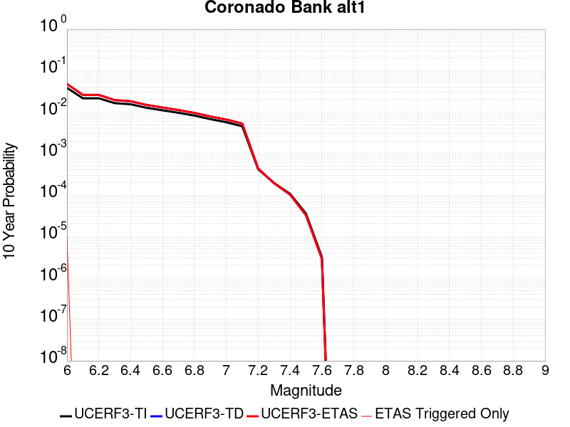 |

| Magnitude | 1 yr TI Prob | TD Prob | ETAS Prob | ETAS/TD Gain | ETAS Triggered Only | 10 yr TI Prob | TD Prob | ETAS Prob | ETAS/TD Gain | ETAS Triggered Only |
|-----|-----|-----|-----|-----|-----|-----|-----|-----|-----|-----|
| 6.0 | 0.0039233007 | 0.0048909336 | 0.004900885 | 1.0020345 | 1.0E-5 | 0.03854755 | 0.04790326 | 0.04791278 | 1.0001987 | 1.0E-5 |
| 6.1 | 0.0021791123 | 0.0026313327 | 0.0026313327 | 1.0 | 0.0 | 0.021578677 | 0.026010904 | 0.026010904 | 1.0 | 0.0 |
| 6.2 | 0.0021791123 | 0.0026313327 | 0.0026313327 | 1.0 | 0.0 | 0.021578677 | 0.026010904 | 0.026010904 | 1.0 | 0.0 |
| 6.3 | 0.0016575698 | 0.0019658383 | 0.0019658383 | 1.0 | 0.0 | 0.016452603 | 0.019488368 | 0.019488368 | 1.0 | 0.0 |
| 6.4 | 0.0015578003 | 0.0018421296 | 0.0018421296 | 1.0 | 0.0 | 0.015469253 | 0.018272351 | 0.018272351 | 1.0 | 0.0 |
| 6.5 | 0.0012782287 | 0.0014997851 | 0.0014997851 | 1.0 | 0.0 | 0.012709012 | 0.014899614 | 0.014899614 | 1.0 | 0.0 |
| 6.6 | 0.0011117056 | 0.0012987846 | 0.0012987846 | 1.0 | 0.0 | 0.011061605 | 0.0129143465 | 0.0129143465 | 1.0 | 0.0 |
| 6.7 | 9.6931186E-4 | 0.0011282694 | 0.0011282694 | 1.0 | 0.0 | 0.0096509475 | 0.011227572 | 0.011227572 | 1.0 | 0.0 |
| 6.8 | 8.273665E-4 | 9.6066546E-4 | 9.6066546E-4 | 1.0 | 0.0 | 0.008242928 | 0.009567108 | 0.009567108 | 1.0 | 0.0 |
| 6.9 | 6.792174E-4 | 7.873611E-4 | 7.873611E-4 | 1.0 | 0.0 | 0.006771452 | 0.007847538 | 0.007847538 | 1.0 | 0.0 |
| 7.0 | 5.7246623E-4 | 6.6351675E-4 | 6.6351675E-4 | 1.0 | 0.0 | 0.0057099373 | 0.006617106 | 0.006617106 | 1.0 | 0.0 |
| 7.1 | 4.573063E-4 | 5.302124E-4 | 5.302124E-4 | 1.0 | 0.0 | 0.0045636636 | 0.0052911737 | 0.0052911737 | 1.0 | 0.0 |
| 7.2 | 4.1877785E-5 | 4.3472966E-5 | 4.3472966E-5 | 1.0 | 0.0 | 4.1869894E-4 | 4.346457E-4 | 4.346457E-4 | 1.0 | 0.0 |
| 7.3 | 1.9458828E-5 | 1.930636E-5 | 1.930636E-5 | 1.0 | 0.0 | 1.9457124E-4 | 1.930469E-4 | 1.930469E-4 | 1.0 | 0.0 |
| 7.4 | 1.0726311E-5 | 1.0265739E-5 | 1.0265739E-5 | 1.0 | 0.0 | 1.0725793E-4 | 1.0265268E-4 | 1.0265268E-4 | 1.0 | 0.0 |
| 7.5 | 3.5718497E-6 | 3.2764776E-6 | 3.2764776E-6 | 1.0 | 0.0 | 3.5717923E-5 | 3.2764303E-5 | 3.2764303E-5 | 1.0 | 0.0 |
| 7.6 | 3.1815955E-7 | 2.886439E-7 | 2.886439E-7 | 1.0 | 0.0 | 3.181591E-6 | 2.8864363E-6 | 2.8864363E-6 | 1.0 | 0.0 |

## Great Valley 07 (Orestimba)
*[(top)](#table-of-contents)*

| 1 Year | 10 Year |
|-----|-----|
|  |  |

| Magnitude | 1 yr TI Prob | TD Prob | ETAS Prob | ETAS/TD Gain | ETAS Triggered Only | 10 yr TI Prob | TD Prob | ETAS Prob | ETAS/TD Gain | ETAS Triggered Only |
|-----|-----|-----|-----|-----|-----|-----|-----|-----|-----|-----|
| 6.0 | 0.0015478961 | 0.0017078797 | 0.0017178627 | 1.0058452 | 1.0E-5 | 0.015371585 | 0.016955089 | 0.01696492 | 1.0005798 | 1.0E-5 |
| 6.1 | 0.0015478961 | 0.0017078797 | 0.0017178627 | 1.0058452 | 1.0E-5 | 0.015371585 | 0.016955089 | 0.01696492 | 1.0005798 | 1.0E-5 |
| 6.2 | 0.0010029797 | 0.0011034793 | 0.0011034793 | 1.0 | 0.0 | 0.00998465 | 0.010982411 | 0.010982411 | 1.0 | 0.0 |
| 6.3 | 6.910097E-4 | 7.58847E-4 | 7.58847E-4 | 1.0 | 0.0 | 0.006888649 | 0.007563504 | 0.007563504 | 1.0 | 0.0 |
| 6.4 | 4.078841E-4 | 4.4722288E-4 | 4.4722288E-4 | 1.0 | 0.0 | 0.004071363 | 0.0044635693 | 0.0044635693 | 1.0 | 0.0 |
| 6.5 | 2.7690834E-4 | 3.0352082E-4 | 3.0352082E-4 | 1.0 | 0.0 | 0.0027656353 | 0.0030312722 | 0.0030312722 | 1.0 | 0.0 |
| 6.6 | 1.8784421E-4 | 2.0600717E-4 | 2.0600717E-4 | 1.0 | 0.0 | 0.0018768552 | 0.002058316 | 0.002058316 | 1.0 | 0.0 |
| 6.7 | 1.3232579E-4 | 1.4522807E-4 | 1.4522807E-4 | 1.0 | 0.0 | 0.0013224703 | 0.0014514616 | 0.0014514616 | 1.0 | 0.0 |
| 6.8 | 6.3216714E-5 | 6.9467984E-5 | 6.9467984E-5 | 1.0 | 0.0 | 6.3198735E-4 | 6.945578E-4 | 6.945578E-4 | 1.0 | 0.0 |

## Hosgri
*[(top)](#table-of-contents)*

| 1 Year | 10 Year |
|-----|-----|
| 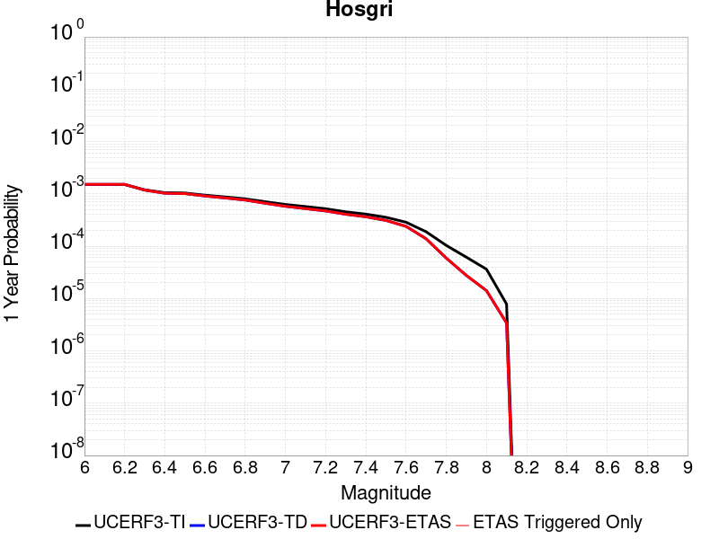 | 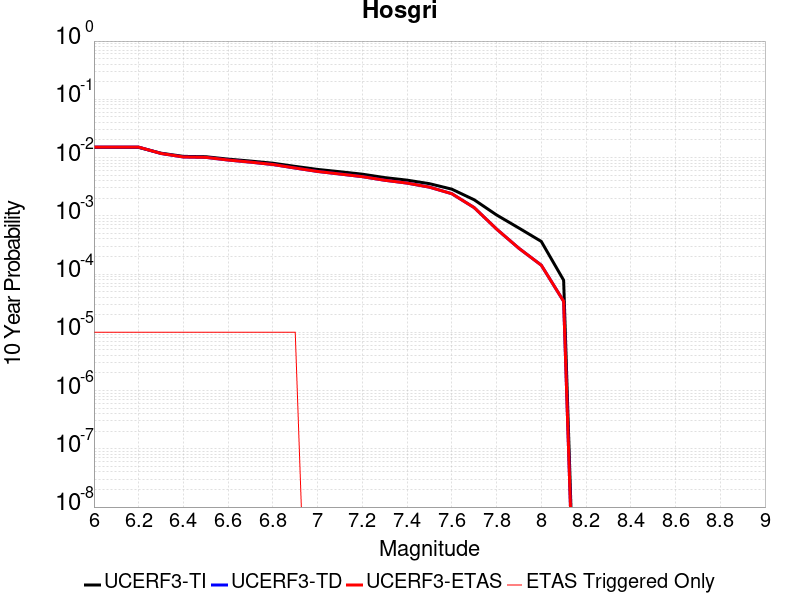 |

| Magnitude | 1 yr TI Prob | TD Prob | ETAS Prob | ETAS/TD Gain | ETAS Triggered Only | 10 yr TI Prob | TD Prob | ETAS Prob | ETAS/TD Gain | ETAS Triggered Only |
|-----|-----|-----|-----|-----|-----|-----|-----|-----|-----|-----|
| 6.0 | 0.0015037085 | 0.0015187687 | 0.0015187687 | 1.0 | 0.0 | 0.01493574 | 0.015087668 | 0.0150975175 | 1.0006528 | 1.0E-5 |
| 6.1 | 0.0015037085 | 0.0015187687 | 0.0015187687 | 1.0 | 0.0 | 0.01493574 | 0.015087668 | 0.0150975175 | 1.0006528 | 1.0E-5 |
| 6.2 | 0.0015037085 | 0.0015187687 | 0.0015187687 | 1.0 | 0.0 | 0.01493574 | 0.015087668 | 0.0150975175 | 1.0006528 | 1.0E-5 |
| 6.3 | 0.0011949413 | 0.0011807403 | 0.0011807403 | 1.0 | 0.0 | 0.011885363 | 0.011746069 | 0.011755952 | 1.0008414 | 1.0E-5 |
| 6.4 | 0.0010532405 | 0.0010272167 | 0.0010272167 | 1.0 | 0.0 | 0.010482626 | 0.010225733 | 0.01023563 | 1.000968 | 1.0E-5 |
| 6.5 | 0.0010390934 | 0.0010122261 | 0.0010122261 | 1.0 | 0.0 | 0.010342481 | 0.010077193 | 0.010087092 | 1.0009823 | 1.0E-5 |
| 6.6 | 9.438353E-4 | 9.105379E-4 | 9.105379E-4 | 1.0 | 0.0 | 0.009398366 | 0.009069015 | 0.009078925 | 1.0010927 | 1.0E-5 |
| 6.7 | 8.7413215E-4 | 8.3674054E-4 | 8.3674054E-4 | 1.0 | 0.0 | 0.008707017 | 0.008336807 | 0.008346723 | 1.0011895 | 1.0E-5 |
| 6.8 | 8.032922E-4 | 7.622522E-4 | 7.622522E-4 | 1.0 | 0.0 | 0.008003947 | 0.0075972406 | 0.007607165 | 1.0013063 | 1.0E-5 |
| 6.9 | 7.0758746E-4 | 6.619245E-4 | 6.619245E-4 | 1.0 | 0.0 | 0.007053386 | 0.0066003343 | 0.0066102683 | 1.001505 | 1.0E-5 |
| 7.0 | 6.275577E-4 | 5.788019E-4 | 5.788019E-4 | 1.0 | 0.0 | 0.006257884 | 0.0057737045 | 0.0057737045 | 1.0 | 0.0 |
| 7.1 | 5.72379E-4 | 5.228038E-4 | 5.228038E-4 | 1.0 | 0.0 | 0.0057090693 | 0.0052164905 | 0.0052164905 | 1.0 | 0.0 |
| 7.2 | 5.1966653E-4 | 4.713061E-4 | 4.713061E-4 | 1.0 | 0.0 | 0.00518453 | 0.004703812 | 0.004703812 | 1.0 | 0.0 |
| 7.3 | 4.53901E-4 | 4.083723E-4 | 4.083723E-4 | 1.0 | 0.0 | 0.00452975 | 0.004076958 | 0.004076958 | 1.0 | 0.0 |
| 7.4 | 4.103689E-4 | 3.6511387E-4 | 3.6511387E-4 | 1.0 | 0.0 | 0.004096119 | 0.003645877 | 0.003645877 | 1.0 | 0.0 |
| 7.5 | 3.5674145E-4 | 3.1091608E-4 | 3.1091608E-4 | 1.0 | 0.0 | 0.0035616932 | 0.0031055456 | 0.0031055456 | 1.0 | 0.0 |
| 7.6 | 2.8711787E-4 | 2.3974029E-4 | 2.3974029E-4 | 1.0 | 0.0 | 0.002867472 | 0.0023955493 | 0.0023955493 | 1.0 | 0.0 |
| 7.7 | 1.8858191E-4 | 1.3837451E-4 | 1.3837451E-4 | 1.0 | 0.0 | 0.0018842196 | 0.0013836145 | 0.0013836145 | 1.0 | 0.0 |
| 7.8 | 1.0358743E-4 | 5.927762E-5 | 5.927762E-5 | 1.0 | 0.0 | 0.0010353916 | 5.933477E-4 | 5.933477E-4 | 1.0 | 0.0 |
| 7.9 | 6.1666724E-5 | 2.7628043E-5 | 2.7628043E-5 | 1.0 | 0.0 | 6.1649614E-4 | 2.7693406E-4 | 2.7693406E-4 | 1.0 | 0.0 |
| 8.0 | 3.6331072E-5 | 1.41603E-5 | 1.41603E-5 | 1.0 | 0.0 | 3.6325134E-4 | 1.4216424E-4 | 1.4216424E-4 | 1.0 | 0.0 |
| 8.1 | 7.844113E-6 | 3.4058512E-6 | 3.4058512E-6 | 1.0 | 0.0 | 7.843835E-5 | 3.407529E-5 | 3.407529E-5 | 1.0 | 0.0 |

## San Jacinto (Borrego)
*[(top)](#table-of-contents)*

| 1 Year | 10 Year |
|-----|-----|
|  |  |

| Magnitude | 1 yr TI Prob | TD Prob | ETAS Prob | ETAS/TD Gain | ETAS Triggered Only | 10 yr TI Prob | TD Prob | ETAS Prob | ETAS/TD Gain | ETAS Triggered Only |
|-----|-----|-----|-----|-----|-----|-----|-----|-----|-----|-----|
| 6.0 | 0.0018475284 | 0.001456056 | 0.0014660414 | 1.0068579 | 1.0E-5 | 0.018322436 | 0.014868831 | 0.014878683 | 1.0006626 | 1.0E-5 |
| 6.1 | 0.0018466372 | 0.001456056 | 0.0014660414 | 1.0068579 | 1.0E-5 | 0.018313672 | 0.014868831 | 0.014878683 | 1.0006626 | 1.0E-5 |
| 6.2 | 0.0018084005 | 0.001456056 | 0.0014660414 | 1.0068579 | 1.0E-5 | 0.017937548 | 0.014868831 | 0.014878683 | 1.0006626 | 1.0E-5 |
| 6.3 | 0.0016728862 | 0.0014479982 | 0.0014579837 | 1.0068961 | 1.0E-5 | 0.016603488 | 0.014789867 | 0.01479972 | 1.0006661 | 1.0E-5 |
| 6.4 | 0.0016594254 | 0.0014462781 | 0.0014562636 | 1.0069042 | 1.0E-5 | 0.016470885 | 0.014772946 | 0.0147827985 | 1.0006669 | 1.0E-5 |
| 6.5 | 0.0016456128 | 0.0014327163 | 0.001442702 | 1.0069697 | 1.0E-5 | 0.0163348 | 0.014639534 | 0.014649387 | 1.000673 | 1.0E-5 |
| 6.6 | 0.0016406142 | 0.0014245997 | 0.0014345854 | 1.0070095 | 1.0E-5 | 0.016285548 | 0.014559781 | 0.0145696355 | 1.0006769 | 1.0E-5 |
| 6.7 | 0.0016279068 | 0.0014046961 | 0.0014146821 | 1.0071089 | 1.0E-5 | 0.01616033 | 0.014364153 | 0.01437401 | 1.0006862 | 1.0E-5 |
| 6.8 | 0.001617065 | 0.0013953695 | 0.0014053555 | 1.0071566 | 1.0E-5 | 0.016053487 | 0.014271434 | 0.0142812915 | 1.0006907 | 1.0E-5 |
| 6.9 | 0.0013891924 | 0.0011568131 | 0.0011668016 | 1.0086344 | 1.0E-5 | 0.0138054015 | 0.011881672 | 0.011891553 | 1.0008316 | 1.0E-5 |
| 7.0 | 0.0012439266 | 0.0010679353 | 0.0010779246 | 1.0093539 | 1.0E-5 | 0.012369866 | 0.01098206 | 0.0109919505 | 1.0009006 | 1.0E-5 |
| 7.1 | 0.0012344702 | 0.0010594124 | 0.0010694017 | 1.0094292 | 1.0E-5 | 0.0122763505 | 0.010897236 | 0.0109071275 | 1.0009077 | 1.0E-5 |
| 7.2 | 0.0011846646 | 0.0010191398 | 0.0010291295 | 1.0098022 | 1.0E-5 | 0.01178369 | 0.0104946075 | 0.010504503 | 1.0009428 | 1.0E-5 |
| 7.3 | 0.001096006 | 9.587571E-4 | 9.6874754E-4 | 1.0104202 | 1.0E-5 | 0.010906163 | 0.0098902425 | 0.009900143 | 1.0010011 | 1.0E-5 |
| 7.4 | 0.001078671 | 9.484628E-4 | 9.5845334E-4 | 1.0105333 | 1.0E-5 | 0.010734501 | 0.009786969 | 0.009796872 | 1.0010117 | 1.0E-5 |
| 7.5 | 0.001042723 | 9.273519E-4 | 9.3734264E-4 | 1.0107734 | 1.0E-5 | 0.010378438 | 0.009573898 | 0.009583802 | 1.0010345 | 1.0E-5 |
| 7.6 | 9.3302975E-4 | 8.571416E-4 | 8.671331E-4 | 1.0116566 | 1.0E-5 | 0.00929122 | 0.008865787 | 0.008875699 | 1.001118 | 1.0E-5 |
| 7.7 | 7.889362E-4 | 7.4254867E-4 | 7.5254124E-4 | 1.0134572 | 1.0E-5 | 0.007861412 | 0.0077135246 | 0.0077234474 | 1.0012864 | 1.0E-5 |
| 7.8 | 6.5207E-4 | 6.5876386E-4 | 6.6875725E-4 | 1.01517 | 1.0E-5 | 0.006501599 | 0.006867107 | 0.0068770386 | 1.0014462 | 1.0E-5 |
| 7.9 | 4.987573E-4 | 5.0879724E-4 | 5.187922E-4 | 1.0196441 | 1.0E-5 | 0.0049763937 | 0.0053517586 | 0.005361705 | 1.0018586 | 1.0E-5 |
| 8.0 | 4.1822926E-4 | 4.3259765E-4 | 4.4259333E-4 | 1.0231062 | 1.0E-5 | 0.0041744304 | 0.0045728353 | 0.0045827897 | 1.0021769 | 1.0E-5 |
| 8.1 | 3.4129233E-4 | 3.3709215E-4 | 3.3709215E-4 | 1.0 | 0.0 | 0.0034076865 | 0.0035802647 | 0.0035802647 | 1.0 | 0.0 |
| 8.2 | 9.3751136E-5 | 4.1584703E-5 | 4.1584703E-5 | 1.0 | 0.0 | 9.371159E-4 | 4.7112198E-4 | 4.7112198E-4 | 1.0 | 0.0 |
| 8.3 | 7.9143565E-6 | 2.5549946E-6 | 2.5549946E-6 | 1.0 | 0.0 | 7.914075E-5 | 2.9688901E-5 | 2.9688901E-5 | 1.0 | 0.0 |

## Green Valley 2011 CFM
*[(top)](#table-of-contents)*

| 1 Year | 10 Year |
|-----|-----|
|  |  |

| Magnitude | 1 yr TI Prob | TD Prob | ETAS Prob | ETAS/TD Gain | ETAS Triggered Only | 10 yr TI Prob | TD Prob | ETAS Prob | ETAS/TD Gain | ETAS Triggered Only |
|-----|-----|-----|-----|-----|-----|-----|-----|-----|-----|-----|
| 6.0 | 0.0051852856 | 0.008986672 | 0.008996583 | 1.0011028 | 1.0E-5 | 0.050659515 | 0.0855217 | 0.08553084 | 1.0001069 | 1.0E-5 |
| 6.1 | 0.0051454236 | 0.008907701 | 0.008917612 | 1.0011126 | 1.0E-5 | 0.050279044 | 0.08480932 | 0.08481847 | 1.0001079 | 1.0E-5 |
| 6.2 | 0.0050471667 | 0.008721082 | 0.008730995 | 1.0011367 | 1.0E-5 | 0.04934063 | 0.083118245 | 0.08312742 | 1.0001103 | 1.0E-5 |
| 6.3 | 0.0048282105 | 0.008296408 | 0.0083063245 | 1.0011953 | 1.0E-5 | 0.047246475 | 0.07925671 | 0.07926592 | 1.0001162 | 1.0E-5 |
| 6.4 | 0.004369175 | 0.0074670548 | 0.0074769803 | 1.0013292 | 1.0E-5 | 0.04284265 | 0.07163053 | 0.07163982 | 1.0001296 | 1.0E-5 |
| 6.5 | 0.0031009112 | 0.005168271 | 0.005178219 | 1.0019249 | 1.0E-5 | 0.030579966 | 0.050145593 | 0.050155092 | 1.0001894 | 1.0E-5 |
| 6.6 | 0.0023641558 | 0.0038539206 | 0.0038539206 | 1.0 | 0.0 | 0.023391623 | 0.037665732 | 0.037665732 | 1.0 | 0.0 |
| 6.7 | 0.0020229418 | 0.0032626393 | 0.0032626393 | 1.0 | 0.0 | 0.020046256 | 0.032005716 | 0.032005716 | 1.0 | 0.0 |
| 6.8 | 0.0011621192 | 0.0016311047 | 0.0016311047 | 1.0 | 0.0 | 0.011560607 | 0.016165968 | 0.016165968 | 1.0 | 0.0 |
| 6.9 | 9.4139716E-4 | 0.0012748688 | 0.0012748688 | 1.0 | 0.0 | 0.009374191 | 0.012667812 | 0.012667812 | 1.0 | 0.0 |
| 7.0 | 7.7002996E-4 | 0.0010212951 | 0.0010212951 | 1.0 | 0.0 | 0.007673672 | 0.010165328 | 0.010165328 | 1.0 | 0.0 |
| 7.1 | 6.467941E-4 | 8.503506E-4 | 8.503506E-4 | 1.0 | 0.0 | 0.006449148 | 0.008471247 | 0.008471247 | 1.0 | 0.0 |
| 7.2 | 5.521186E-4 | 7.2615856E-4 | 7.2615856E-4 | 1.0 | 0.0 | 0.0055074887 | 0.007238274 | 0.007238274 | 1.0 | 0.0 |
| 7.3 | 4.1724785E-4 | 5.500238E-4 | 5.500238E-4 | 1.0 | 0.0 | 0.004164653 | 0.0054868907 | 0.0054868907 | 1.0 | 0.0 |
| 7.4 | 3.5251552E-4 | 4.6598908E-4 | 4.6598908E-4 | 1.0 | 0.0 | 0.0035195686 | 0.0046503227 | 0.0046503227 | 1.0 | 0.0 |
| 7.5 | 2.9731085E-4 | 3.9211538E-4 | 3.9211538E-4 | 1.0 | 0.0 | 0.002969134 | 0.003914387 | 0.003914387 | 1.0 | 0.0 |
| 7.6 | 2.3496768E-4 | 3.0966863E-4 | 3.0966863E-4 | 1.0 | 0.0 | 0.002347194 | 0.0030924964 | 0.0030924964 | 1.0 | 0.0 |
| 7.7 | 5.6735033E-5 | 7.3605435E-5 | 7.3605435E-5 | 1.0 | 0.0 | 5.672055E-4 | 7.3581265E-4 | 7.3581265E-4 | 1.0 | 0.0 |
| 7.8 | 2.5762572E-6 | 3.2234313E-6 | 3.2234313E-6 | 1.0 | 0.0 | 2.5762274E-5 | 3.223222E-5 | 3.223222E-5 | 1.0 | 0.0 |

## Mission Creek
*[(top)](#table-of-contents)*

| 1 Year | 10 Year |
|-----|-----|
|  |  |

| Magnitude | 1 yr TI Prob | TD Prob | ETAS Prob | ETAS/TD Gain | ETAS Triggered Only | 10 yr TI Prob | TD Prob | ETAS Prob | ETAS/TD Gain | ETAS Triggered Only |
|-----|-----|-----|-----|-----|-----|-----|-----|-----|-----|-----|
| 6.0 | 6.0245243E-4 | 8.513139E-4 | 8.6130534E-4 | 1.0117365 | 1.0E-5 | 0.006008218 | 0.00850976 | 0.008519675 | 1.0011652 | 1.0E-5 |
| 6.1 | 6.0245243E-4 | 8.513139E-4 | 8.6130534E-4 | 1.0117365 | 1.0E-5 | 0.006008218 | 0.00850976 | 0.008519675 | 1.0011652 | 1.0E-5 |
| 6.2 | 6.0245243E-4 | 8.513139E-4 | 8.6130534E-4 | 1.0117365 | 1.0E-5 | 0.006008218 | 0.00850976 | 0.008519675 | 1.0011652 | 1.0E-5 |
| 6.3 | 6.0245243E-4 | 8.513139E-4 | 8.6130534E-4 | 1.0117365 | 1.0E-5 | 0.006008218 | 0.00850976 | 0.008519675 | 1.0011652 | 1.0E-5 |
| 6.4 | 6.0245243E-4 | 8.513139E-4 | 8.6130534E-4 | 1.0117365 | 1.0E-5 | 0.006008218 | 0.00850976 | 0.008519675 | 1.0011652 | 1.0E-5 |
| 6.5 | 6.0245243E-4 | 8.513139E-4 | 8.6130534E-4 | 1.0117365 | 1.0E-5 | 0.006008218 | 0.00850976 | 0.008519675 | 1.0011652 | 1.0E-5 |
| 6.6 | 4.800697E-4 | 7.2217546E-4 | 7.3216826E-4 | 1.0138371 | 1.0E-5 | 0.004790339 | 0.007226945 | 0.007236873 | 1.0013738 | 1.0E-5 |
| 6.7 | 4.7049852E-4 | 7.120427E-4 | 7.220356E-4 | 1.0140342 | 1.0E-5 | 0.004695036 | 0.0071262694 | 0.007136198 | 1.0013933 | 1.0E-5 |
| 6.8 | 4.524734E-4 | 6.9233845E-4 | 7.0233154E-4 | 1.0144339 | 1.0E-5 | 0.0045155324 | 0.006930458 | 0.0069403886 | 1.0014329 | 1.0E-5 |
| 6.9 | 3.653022E-4 | 5.986951E-4 | 6.086891E-4 | 1.016693 | 1.0E-5 | 0.0036470229 | 0.005999283 | 0.006009223 | 1.0016569 | 1.0E-5 |
| 7.0 | 3.0501327E-4 | 5.046837E-4 | 5.1467866E-4 | 1.0198044 | 1.0E-5 | 0.0030459496 | 0.0050636297 | 0.005073579 | 1.0019649 | 1.0E-5 |
| 7.1 | 2.8939504E-4 | 4.8666348E-4 | 4.966586E-4 | 1.0205381 | 1.0E-5 | 0.0028901845 | 0.004884225 | 0.004894176 | 1.0020374 | 1.0E-5 |
| 7.2 | 2.2876218E-4 | 4.0071676E-4 | 4.1071273E-4 | 1.0249453 | 1.0E-5 | 0.0022852682 | 0.004028154 | 0.0040381136 | 1.0024725 | 1.0E-5 |
| 7.3 | 1.9767738E-4 | 3.607568E-4 | 3.707532E-4 | 1.0277095 | 1.0E-5 | 0.0019750162 | 0.0036299077 | 0.0036398713 | 1.0027449 | 1.0E-5 |
| 7.4 | 1.1469489E-4 | 2.6207927E-4 | 2.7207666E-4 | 1.0381464 | 1.0E-5 | 0.0011463572 | 0.0026456832 | 0.0026556568 | 1.0037698 | 1.0E-5 |
| 7.5 | 1.0706078E-4 | 2.4075652E-4 | 2.5075412E-4 | 1.0415257 | 1.0E-5 | 0.0010700922 | 0.0024333464 | 0.002443322 | 1.0040996 | 1.0E-5 |
| 7.6 | 9.774366E-5 | 2.1510974E-4 | 2.251076E-4 | 1.0464779 | 1.0E-5 | 9.770069E-4 | 0.002177891 | 0.0021878695 | 1.0045816 | 1.0E-5 |
| 7.7 | 9.606641E-5 | 2.1091949E-4 | 2.2091738E-4 | 1.0474014 | 1.0E-5 | 9.6024893E-4 | 0.0021361776 | 0.002146156 | 1.0046712 | 1.0E-5 |
| 7.8 | 8.97132E-5 | 1.9356851E-4 | 2.0356658E-4 | 1.0516512 | 1.0E-5 | 8.967699E-4 | 0.0019621777 | 0.001972158 | 1.0050864 | 1.0E-5 |
| 7.9 | 7.3230265E-5 | 1.5390378E-4 | 1.6390224E-4 | 1.0649657 | 1.0E-5 | 7.3206134E-4 | 0.0015629655 | 0.0015729498 | 1.0063881 | 1.0E-5 |
| 8.0 | 2.0515794E-5 | 2.8843047E-5 | 2.8843047E-5 | 1.0 | 0.0 | 2.0513899E-4 | 2.98954E-4 | 2.98954E-4 | 1.0 | 0.0 |
| 8.1 | 8.331805E-6 | 5.9366585E-6 | 5.9366585E-6 | 1.0 | 0.0 | 8.331492E-5 | 6.548666E-5 | 6.548666E-5 | 1.0 | 0.0 |
| 8.2 | 2.5569052E-6 | 1.3273625E-6 | 1.3273625E-6 | 1.0 | 0.0 | 2.556876E-5 | 1.4952989E-5 | 1.4952989E-5 | 1.0 | 0.0 |

## Hunting Creek - Berryessa 2011 CFM
*[(top)](#table-of-contents)*

| 1 Year | 10 Year |
|-----|-----|
| 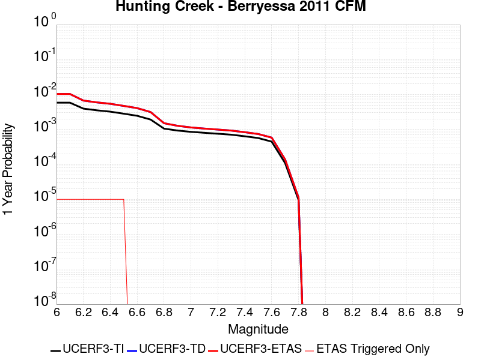 |  |

| Magnitude | 1 yr TI Prob | TD Prob | ETAS Prob | ETAS/TD Gain | ETAS Triggered Only | 10 yr TI Prob | TD Prob | ETAS Prob | ETAS/TD Gain | ETAS Triggered Only |
|-----|-----|-----|-----|-----|-----|-----|-----|-----|-----|-----|
| 6.0 | 0.0058641075 | 0.0103861485 | 0.010396045 | 1.0009528 | 1.0E-5 | 0.057117578 | 0.0980363 | 0.09804532 | 1.000092 | 1.0E-5 |
| 6.1 | 0.0058477195 | 0.010359387 | 0.010369283 | 1.0009553 | 1.0E-5 | 0.056962132 | 0.09779478 | 0.0978038 | 1.0000923 | 1.0E-5 |
| 6.2 | 0.0039559277 | 0.006720976 | 0.0067309085 | 1.0014778 | 1.0E-5 | 0.038862433 | 0.064591035 | 0.06460039 | 1.0001448 | 1.0E-5 |
| 6.3 | 0.003535705 | 0.0059526437 | 0.005962584 | 1.0016699 | 1.0E-5 | 0.034799766 | 0.05746498 | 0.057474405 | 1.000164 | 1.0E-5 |
| 6.4 | 0.0032385332 | 0.0054275393 | 0.0054374854 | 1.0018325 | 1.0E-5 | 0.03191742 | 0.052550133 | 0.052559607 | 1.0001802 | 1.0E-5 |
| 6.5 | 0.0028329059 | 0.004719838 | 0.004729791 | 1.0021087 | 1.0E-5 | 0.027970633 | 0.04587979 | 0.04588933 | 1.000208 | 1.0E-5 |
| 6.6 | 0.002465034 | 0.0040849387 | 0.0040849387 | 1.0 | 0.0 | 0.02437869 | 0.039851252 | 0.039851252 | 1.0 | 0.0 |
| 6.7 | 0.0019222875 | 0.0031481837 | 0.0031481837 | 1.0 | 0.0 | 0.019057442 | 0.03089214 | 0.03089214 | 1.0 | 0.0 |
| 6.8 | 0.0010582599 | 0.0015108008 | 0.0015108008 | 1.0 | 0.0 | 0.010532344 | 0.01497846 | 0.01497846 | 1.0 | 0.0 |
| 6.9 | 9.320591E-4 | 0.0012761244 | 0.0012761244 | 1.0 | 0.0 | 0.009281595 | 0.012679722 | 0.012679722 | 1.0 | 0.0 |
| 7.0 | 8.561793E-4 | 0.0011423966 | 0.0011423966 | 1.0 | 0.0 | 0.008528882 | 0.01136447 | 0.01136447 | 1.0 | 0.0 |
| 7.1 | 8.0374884E-4 | 0.0010610891 | 0.0010610891 | 1.0 | 0.0 | 0.00800848 | 0.01056055 | 0.01056055 | 1.0 | 0.0 |
| 7.2 | 7.5617427E-4 | 9.937752E-4 | 9.937752E-4 | 1.0 | 0.0 | 0.0075360634 | 0.009893886 | 0.009893886 | 1.0 | 0.0 |
| 7.3 | 7.101729E-4 | 9.2971674E-4 | 9.2971674E-4 | 1.0 | 0.0 | 0.0070790765 | 0.009258782 | 0.009258782 | 1.0 | 0.0 |
| 7.4 | 6.391345E-4 | 8.358833E-4 | 8.358833E-4 | 1.0 | 0.0 | 0.0063729943 | 0.008327835 | 0.008327835 | 1.0 | 0.0 |
| 7.5 | 5.6928146E-4 | 7.4280996E-4 | 7.4280996E-4 | 1.0 | 0.0 | 0.0056782532 | 0.007403646 | 0.007403646 | 1.0 | 0.0 |
| 7.6 | 4.4984656E-4 | 5.8603915E-4 | 5.8603915E-4 | 1.0 | 0.0 | 0.00448937 | 0.0058452515 | 0.0058452515 | 1.0 | 0.0 |
| 7.7 | 1.09535904E-4 | 1.3891989E-4 | 1.3891989E-4 | 1.0 | 0.0 | 0.0010948193 | 0.001388337 | 0.001388337 | 1.0 | 0.0 |
| 7.8 | 9.615583E-6 | 1.1309278E-5 | 1.1309278E-5 | 1.0 | 0.0 | 9.615166E-5 | 1.1308563E-4 | 1.1308563E-4 | 1.0 | 0.0 |

## Simi-Santa Rosa
*[(top)](#table-of-contents)*

| 1 Year | 10 Year |
|-----|-----|
|  |  |

| Magnitude | 1 yr TI Prob | TD Prob | ETAS Prob | ETAS/TD Gain | ETAS Triggered Only | 10 yr TI Prob | TD Prob | ETAS Prob | ETAS/TD Gain | ETAS Triggered Only |
|-----|-----|-----|-----|-----|-----|-----|-----|-----|-----|-----|
| 6.0 | 0.0011467156 | 0.0011616813 | 0.0011716696 | 1.0085982 | 1.0E-5 | 0.011408163 | 0.011560534 | 0.011570418 | 1.000855 | 1.0E-5 |
| 6.1 | 0.0011467156 | 0.0011616813 | 0.0011716696 | 1.0085982 | 1.0E-5 | 0.011408163 | 0.011560534 | 0.011570418 | 1.000855 | 1.0E-5 |
| 6.2 | 8.865613E-4 | 8.6939876E-4 | 8.7939005E-4 | 1.0114923 | 1.0E-5 | 0.008830327 | 0.008662896 | 0.008672809 | 1.0011443 | 1.0E-5 |
| 6.3 | 8.865613E-4 | 8.6939876E-4 | 8.7939005E-4 | 1.0114923 | 1.0E-5 | 0.008830327 | 0.008662896 | 0.008672809 | 1.0011443 | 1.0E-5 |
| 6.4 | 7.6497364E-4 | 7.3300186E-4 | 7.4299454E-4 | 1.0136325 | 1.0E-5 | 0.0076234564 | 0.007308317 | 0.007318244 | 1.0013583 | 1.0E-5 |
| 6.5 | 7.6497364E-4 | 7.3300186E-4 | 7.4299454E-4 | 1.0136325 | 1.0E-5 | 0.0076234564 | 0.007308317 | 0.007318244 | 1.0013583 | 1.0E-5 |
| 6.6 | 7.4992597E-4 | 7.1616226E-4 | 7.2615506E-4 | 1.0139533 | 1.0E-5 | 0.007474003 | 0.0071410118 | 0.00715094 | 1.0013903 | 1.0E-5 |
| 6.7 | 7.240546E-4 | 6.889421E-4 | 6.989352E-4 | 1.014505 | 1.0E-5 | 0.007217 | 0.0068705124 | 0.0068804435 | 1.0014455 | 1.0E-5 |
| 6.8 | 5.308578E-4 | 4.7755442E-4 | 4.8754967E-4 | 1.02093 | 1.0E-5 | 0.0052959146 | 0.0047669155 | 0.0047768676 | 1.0020878 | 1.0E-5 |
| 6.9 | 5.05996E-4 | 4.577653E-4 | 4.6776072E-4 | 1.0218352 | 1.0E-5 | 0.005048454 | 0.0045698415 | 0.004579796 | 1.0021783 | 1.0E-5 |
| 7.0 | 3.8630638E-4 | 3.4221137E-4 | 3.4221137E-4 | 1.0 | 0.0 | 0.0038563553 | 0.003418086 | 0.003418086 | 1.0 | 0.0 |
| 7.1 | 2.0209046E-4 | 1.4397675E-4 | 1.4397675E-4 | 1.0 | 0.0 | 0.0020190678 | 0.0014388582 | 0.0014388582 | 1.0 | 0.0 |
| 7.2 | 1.7831543E-4 | 1.2353274E-4 | 1.2353274E-4 | 1.0 | 0.0 | 0.0017817242 | 0.0012346628 | 0.0012346628 | 1.0 | 0.0 |
| 7.3 | 9.9251854E-5 | 7.3431824E-5 | 7.3431824E-5 | 1.0 | 0.0 | 9.920754E-4 | 7.340778E-4 | 7.340778E-4 | 1.0 | 0.0 |
| 7.4 | 7.915472E-5 | 5.752372E-5 | 5.752372E-5 | 1.0 | 0.0 | 7.9126534E-4 | 5.750894E-4 | 5.750894E-4 | 1.0 | 0.0 |
| 7.5 | 6.1502695E-5 | 4.4533645E-5 | 4.4533645E-5 | 1.0 | 0.0 | 6.148568E-4 | 4.4524815E-4 | 4.4524815E-4 | 1.0 | 0.0 |
| 7.6 | 3.5857727E-5 | 2.5009724E-5 | 2.5009724E-5 | 1.0 | 0.0 | 3.5851944E-4 | 2.5006922E-4 | 2.5006922E-4 | 1.0 | 0.0 |
| 7.7 | 2.8763823E-5 | 1.9165429E-5 | 1.9165429E-5 | 1.0 | 0.0 | 2.87601E-4 | 1.9163788E-4 | 1.9163788E-4 | 1.0 | 0.0 |
| 7.8 | 1.7667637E-5 | 1.0475176E-5 | 1.0475176E-5 | 1.0 | 0.0 | 1.7666233E-4 | 1.04746876E-4 | 1.04746876E-4 | 1.0 | 0.0 |
| 7.9 | 1.4586617E-5 | 7.643574E-6 | 7.643574E-6 | 1.0 | 0.0 | 1.458566E-4 | 7.643315E-5 | 7.643315E-5 | 1.0 | 0.0 |
| 8.0 | 2.9355108E-6 | 1.7404133E-6 | 1.7404133E-6 | 1.0 | 0.0 | 2.935472E-5 | 1.740401E-5 | 1.740401E-5 | 1.0 | 0.0 |

## Puente Hills
*[(top)](#table-of-contents)*

| 1 Year | 10 Year |
|-----|-----|
|  | 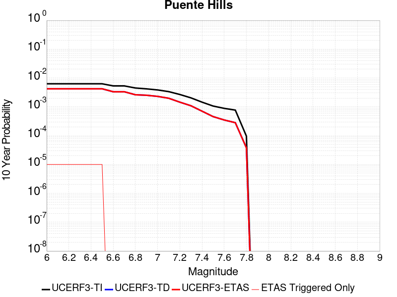 |

| Magnitude | 1 yr TI Prob | TD Prob | ETAS Prob | ETAS/TD Gain | ETAS Triggered Only | 10 yr TI Prob | TD Prob | ETAS Prob | ETAS/TD Gain | ETAS Triggered Only |
|-----|-----|-----|-----|-----|-----|-----|-----|-----|-----|-----|
| 6.0 | 6.312516E-4 | 4.224915E-4 | 4.3248726E-4 | 1.0236591 | 1.0E-5 | 0.0062946146 | 0.0042174426 | 0.0042274008 | 1.002361 | 1.0E-5 |
| 6.1 | 6.312516E-4 | 4.224915E-4 | 4.3248726E-4 | 1.0236591 | 1.0E-5 | 0.0062946146 | 0.0042174426 | 0.0042274008 | 1.002361 | 1.0E-5 |
| 6.2 | 6.312516E-4 | 4.224915E-4 | 4.3248726E-4 | 1.0236591 | 1.0E-5 | 0.0062946146 | 0.0042174426 | 0.0042274008 | 1.002361 | 1.0E-5 |
| 6.3 | 6.312516E-4 | 4.224915E-4 | 4.3248726E-4 | 1.0236591 | 1.0E-5 | 0.0062946146 | 0.0042174426 | 0.0042274008 | 1.002361 | 1.0E-5 |
| 6.4 | 6.312516E-4 | 4.224915E-4 | 4.3248726E-4 | 1.0236591 | 1.0E-5 | 0.0062946146 | 0.0042174426 | 0.0042274008 | 1.002361 | 1.0E-5 |
| 6.5 | 6.312516E-4 | 4.224915E-4 | 4.3248726E-4 | 1.0236591 | 1.0E-5 | 0.0062946146 | 0.0042174426 | 0.0042274008 | 1.002361 | 1.0E-5 |
| 6.6 | 5.332553E-4 | 3.3384675E-4 | 3.3384675E-4 | 1.0 | 0.0 | 0.0053197746 | 0.0033336976 | 0.0033336976 | 1.0 | 0.0 |
| 6.7 | 5.332553E-4 | 3.3384675E-4 | 3.3384675E-4 | 1.0 | 0.0 | 0.0053197746 | 0.0033336976 | 0.0033336976 | 1.0 | 0.0 |
| 6.8 | 4.505555E-4 | 2.6233259E-4 | 2.6233259E-4 | 1.0 | 0.0 | 0.004496431 | 0.0026202854 | 0.0026202854 | 1.0 | 0.0 |
| 6.9 | 4.2081063E-4 | 2.5230972E-4 | 2.5230972E-4 | 1.0 | 0.0 | 0.0042001465 | 0.0025202865 | 0.0025202865 | 1.0 | 0.0 |
| 7.0 | 3.857264E-4 | 2.304614E-4 | 2.304614E-4 | 1.0 | 0.0 | 0.0038505755 | 0.0023022695 | 0.0023022695 | 1.0 | 0.0 |
| 7.1 | 3.373358E-4 | 1.9849076E-4 | 1.9849076E-4 | 1.0 | 0.0 | 0.0033682417 | 0.0019831706 | 0.0019831706 | 1.0 | 0.0 |
| 7.2 | 2.6833118E-4 | 1.4538688E-4 | 1.4538688E-4 | 1.0 | 0.0 | 0.002680074 | 0.0014529274 | 0.0014529274 | 1.0 | 0.0 |
| 7.3 | 2.0495013E-4 | 1.09118606E-4 | 1.09118606E-4 | 1.0 | 0.0 | 0.002047612 | 0.001090657 | 0.001090657 | 1.0 | 0.0 |
| 7.4 | 1.4553878E-4 | 7.068202E-5 | 7.068202E-5 | 1.0 | 0.0 | 0.001454435 | 7.065998E-4 | 7.065998E-4 | 1.0 | 0.0 |
| 7.5 | 1.06529245E-4 | 4.584943E-5 | 4.584943E-5 | 1.0 | 0.0 | 0.0010647819 | 4.5840305E-4 | 4.5840305E-4 | 1.0 | 0.0 |
| 7.6 | 8.848612E-5 | 3.4951507E-5 | 3.4951507E-5 | 1.0 | 0.0 | 8.84509E-4 | 3.49463E-4 | 3.49463E-4 | 1.0 | 0.0 |
| 7.7 | 7.705422E-5 | 2.821542E-5 | 2.821542E-5 | 1.0 | 0.0 | 7.702751E-4 | 2.8212095E-4 | 2.8212095E-4 | 1.0 | 0.0 |
| 7.8 | 9.617985E-6 | 3.7996049E-6 | 3.7996049E-6 | 1.0 | 0.0 | 9.617568E-5 | 3.7995724E-5 | 3.7995724E-5 | 1.0 | 0.0 |

## San Jacinto (San Jacinto Valley) rev
*[(top)](#table-of-contents)*

| 1 Year | 10 Year |
|-----|-----|
| 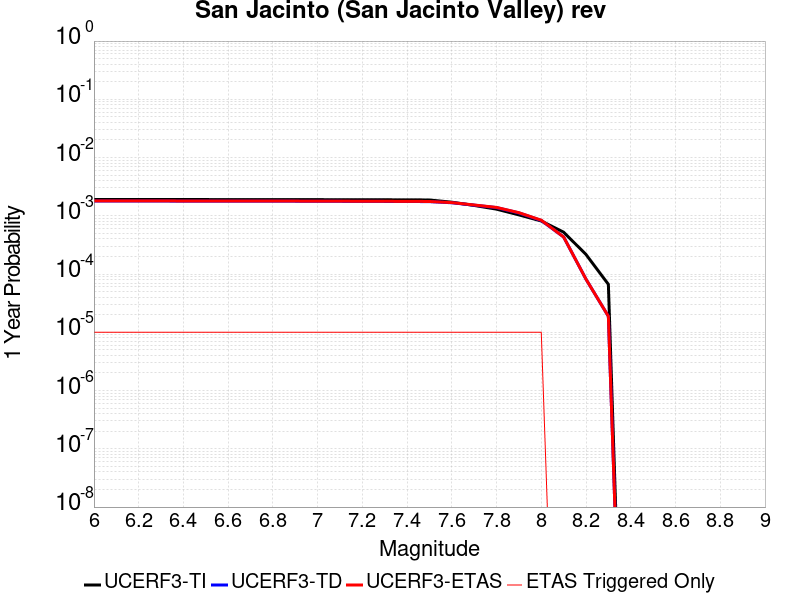 |  |

| Magnitude | 1 yr TI Prob | TD Prob | ETAS Prob | ETAS/TD Gain | ETAS Triggered Only | 10 yr TI Prob | TD Prob | ETAS Prob | ETAS/TD Gain | ETAS Triggered Only |
|-----|-----|-----|-----|-----|-----|-----|-----|-----|-----|-----|
| 6.0 | 0.0019041431 | 0.0017931493 | 0.0018031314 | 1.0055668 | 1.0E-5 | 0.018879099 | 0.018523198 | 0.018533014 | 1.0005299 | 1.0E-5 |
| 6.1 | 0.0019041431 | 0.0017931493 | 0.0018031314 | 1.0055668 | 1.0E-5 | 0.018879099 | 0.018523198 | 0.018533014 | 1.0005299 | 1.0E-5 |
| 6.2 | 0.0019041431 | 0.0017931493 | 0.0018031314 | 1.0055668 | 1.0E-5 | 0.018879099 | 0.018523198 | 0.018533014 | 1.0005299 | 1.0E-5 |
| 6.3 | 0.0019041431 | 0.0017931493 | 0.0018031314 | 1.0055668 | 1.0E-5 | 0.018879099 | 0.018523198 | 0.018533014 | 1.0005299 | 1.0E-5 |
| 6.4 | 0.0019011468 | 0.001789065 | 0.0017990471 | 1.0055795 | 1.0E-5 | 0.018849645 | 0.01848308 | 0.018492894 | 1.0005311 | 1.0E-5 |
| 6.5 | 0.0019011468 | 0.001789065 | 0.0017990471 | 1.0055795 | 1.0E-5 | 0.018849645 | 0.01848308 | 0.018492894 | 1.0005311 | 1.0E-5 |
| 6.6 | 0.0018997455 | 0.0017871578 | 0.00179714 | 1.0055854 | 1.0E-5 | 0.018835869 | 0.01846435 | 0.018474163 | 1.0005316 | 1.0E-5 |
| 6.7 | 0.0018992044 | 0.0017864066 | 0.0017963888 | 1.0055878 | 1.0E-5 | 0.018830549 | 0.018456973 | 0.018466787 | 1.0005318 | 1.0E-5 |
| 6.8 | 0.0018980318 | 0.0017847948 | 0.001794777 | 1.005593 | 1.0E-5 | 0.018819023 | 0.018441128 | 0.018450944 | 1.0005323 | 1.0E-5 |
| 6.9 | 0.0018965311 | 0.0017827335 | 0.0017927156 | 1.0055994 | 1.0E-5 | 0.018804269 | 0.018420862 | 0.018430676 | 1.0005329 | 1.0E-5 |
| 7.0 | 0.0018920569 | 0.0017765884 | 0.0017865706 | 1.0056188 | 1.0E-5 | 0.018760284 | 0.018360443 | 0.01837026 | 1.0005347 | 1.0E-5 |
| 7.1 | 0.001890278 | 0.0017743113 | 0.0017842936 | 1.005626 | 1.0E-5 | 0.018742796 | 0.018338043 | 0.018347861 | 1.0005354 | 1.0E-5 |
| 7.2 | 0.001887647 | 0.001770885 | 0.0017808672 | 1.0056369 | 1.0E-5 | 0.01871693 | 0.018304324 | 0.018314142 | 1.0005363 | 1.0E-5 |
| 7.3 | 0.0018829206 | 0.0017650661 | 0.0017750484 | 1.0056555 | 1.0E-5 | 0.018670462 | 0.018246878 | 0.018256696 | 1.000538 | 1.0E-5 |
| 7.4 | 0.0018807866 | 0.001762333 | 0.0017723154 | 1.0056643 | 1.0E-5 | 0.018649481 | 0.018219888 | 0.018229706 | 1.0005388 | 1.0E-5 |
| 7.5 | 0.0018692396 | 0.0017524265 | 0.001762409 | 1.0056964 | 1.0E-5 | 0.018535944 | 0.018121008 | 0.018130828 | 1.0005418 | 1.0E-5 |
| 7.6 | 0.001713488 | 0.0016755019 | 0.0016854851 | 1.0059583 | 1.0E-5 | 0.017003361 | 0.01734083 | 0.017350657 | 1.0005667 | 1.0E-5 |
| 7.7 | 0.0015059357 | 0.0015242205 | 0.0015342052 | 1.0065508 | 1.0E-5 | 0.014957713 | 0.01582899 | 0.015838832 | 1.0006218 | 1.0E-5 |
| 7.8 | 0.0013010362 | 0.0013830708 | 0.001393057 | 1.0072203 | 1.0E-5 | 0.012934455 | 0.014410337 | 0.014420193 | 1.0006839 | 1.0E-5 |
| 7.9 | 0.001036866 | 0.0011214828 | 0.0011314716 | 1.0089067 | 1.0E-5 | 0.010320415 | 0.011775744 | 0.011785626 | 1.0008392 | 1.0E-5 |
| 8.0 | 8.153773E-4 | 8.311453E-4 | 8.41137E-4 | 1.0120215 | 1.0E-5 | 0.00812392 | 0.008809453 | 0.008819365 | 1.0011251 | 1.0E-5 |
| 8.1 | 5.2401534E-4 | 4.3302414E-4 | 4.3302414E-4 | 1.0 | 0.0 | 0.0052278144 | 0.0046584895 | 0.0046584895 | 1.0 | 0.0 |
| 8.2 | 2.1680194E-4 | 8.166812E-5 | 8.166812E-5 | 1.0 | 0.0 | 0.0021659054 | 9.481009E-4 | 9.481009E-4 | 1.0 | 0.0 |
| 8.3 | 6.65684E-5 | 1.8857654E-5 | 1.8857654E-5 | 1.0 | 0.0 | 6.6548464E-4 | 2.2746001E-4 | 2.2746001E-4 | 1.0 | 0.0 |

## Ortigalita (North)
*[(top)](#table-of-contents)*

| 1 Year | 10 Year |
|-----|-----|
|  |  |

| Magnitude | 1 yr TI Prob | TD Prob | ETAS Prob | ETAS/TD Gain | ETAS Triggered Only | 10 yr TI Prob | TD Prob | ETAS Prob | ETAS/TD Gain | ETAS Triggered Only |
|-----|-----|-----|-----|-----|-----|-----|-----|-----|-----|-----|
| 6.0 | 0.004016016 | 0.0054680775 | 0.0054780226 | 1.0018188 | 1.0E-5 | 0.039442103 | 0.053454336 | 0.0534638 | 1.000177 | 1.0E-5 |
| 6.1 | 0.0024014818 | 0.003138735 | 0.003138735 | 1.0 | 0.0 | 0.023756953 | 0.030974828 | 0.030974828 | 1.0 | 0.0 |
| 6.2 | 0.0024014818 | 0.003138735 | 0.003138735 | 1.0 | 0.0 | 0.023756953 | 0.030974828 | 0.030974828 | 1.0 | 0.0 |
| 6.3 | 0.0017347244 | 0.0022141805 | 0.0022141805 | 1.0 | 0.0 | 0.017212452 | 0.021945486 | 0.021945486 | 1.0 | 0.0 |
| 6.4 | 0.001446016 | 0.0018247965 | 0.0018247965 | 1.0 | 0.0 | 0.014366428 | 0.018121095 | 0.018121095 | 1.0 | 0.0 |
| 6.5 | 0.0014437864 | 0.0018221827 | 0.0018221827 | 1.0 | 0.0 | 0.014344421 | 0.018095383 | 0.018095383 | 1.0 | 0.0 |
| 6.6 | 0.0011981975 | 0.0014976262 | 0.0014976262 | 1.0 | 0.0 | 0.011917574 | 0.014898595 | 0.014898595 | 1.0 | 0.0 |
| 6.7 | 0.0010363415 | 0.0012989055 | 0.0012989055 | 1.0 | 0.0 | 0.010315218 | 0.01293683 | 0.01293683 | 1.0 | 0.0 |
| 6.8 | 3.424451E-4 | 3.967679E-4 | 3.967679E-4 | 1.0 | 0.0 | 0.0034191788 | 0.0039608823 | 0.0039608823 | 1.0 | 0.0 |
| 6.9 | 2.933041E-4 | 3.392015E-4 | 3.392015E-4 | 1.0 | 0.0 | 0.0029291727 | 0.0033870947 | 0.0033870947 | 1.0 | 0.0 |
| 7.0 | 2.0220275E-4 | 2.3398253E-4 | 2.3398253E-4 | 1.0 | 0.0 | 0.0020201886 | 0.00233757 | 0.00233757 | 1.0 | 0.0 |
| 7.1 | 8.357586E-5 | 9.6893906E-5 | 9.6893906E-5 | 1.0 | 0.0 | 8.3544437E-4 | 9.6862135E-4 | 9.6862135E-4 | 1.0 | 0.0 |

## Great Valley 06 (Midland) 2011 CFM alt1
*[(top)](#table-of-contents)*

| 1 Year | 10 Year |
|-----|-----|
|  | 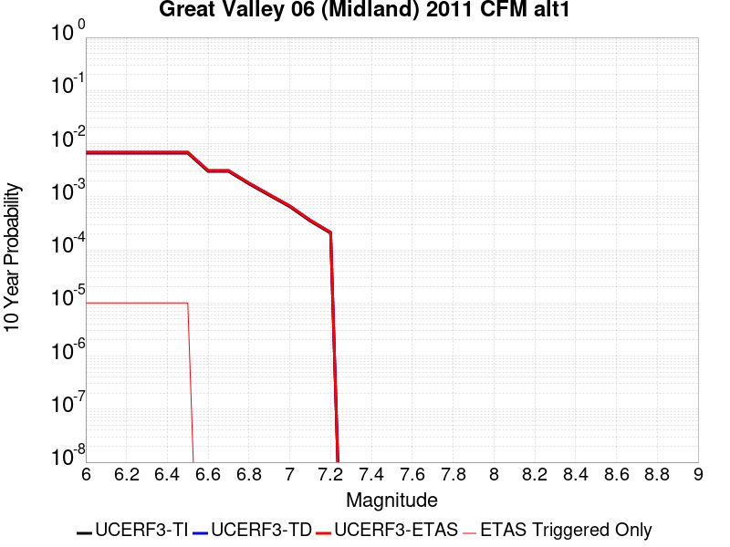 |

| Magnitude | 1 yr TI Prob | TD Prob | ETAS Prob | ETAS/TD Gain | ETAS Triggered Only | 10 yr TI Prob | TD Prob | ETAS Prob | ETAS/TD Gain | ETAS Triggered Only |
|-----|-----|-----|-----|-----|-----|-----|-----|-----|-----|-----|
| 6.0 | 6.6310563E-4 | 6.8910245E-4 | 6.8910245E-4 | 1.0 | 0.0 | 0.0066113044 | 0.0068721715 | 0.006882103 | 1.0014452 | 1.0E-5 |
| 6.1 | 6.6310563E-4 | 6.8910245E-4 | 6.8910245E-4 | 1.0 | 0.0 | 0.0066113044 | 0.0068721715 | 0.006882103 | 1.0014452 | 1.0E-5 |
| 6.2 | 6.6310563E-4 | 6.8910245E-4 | 6.8910245E-4 | 1.0 | 0.0 | 0.0066113044 | 0.0068721715 | 0.006882103 | 1.0014452 | 1.0E-5 |
| 6.3 | 6.6310563E-4 | 6.8910245E-4 | 6.8910245E-4 | 1.0 | 0.0 | 0.0066113044 | 0.0068721715 | 0.006882103 | 1.0014452 | 1.0E-5 |
| 6.4 | 6.6310563E-4 | 6.8910245E-4 | 6.8910245E-4 | 1.0 | 0.0 | 0.0066113044 | 0.0068721715 | 0.006882103 | 1.0014452 | 1.0E-5 |
| 6.5 | 6.6310563E-4 | 6.8910245E-4 | 6.8910245E-4 | 1.0 | 0.0 | 0.0066113044 | 0.0068721715 | 0.006882103 | 1.0014452 | 1.0E-5 |
| 6.6 | 3.0037065E-4 | 3.114961E-4 | 3.114961E-4 | 1.0 | 0.0 | 0.0029996498 | 0.0031109813 | 0.0031109813 | 1.0 | 0.0 |
| 6.7 | 3.0037065E-4 | 3.114961E-4 | 3.114961E-4 | 1.0 | 0.0 | 0.0029996498 | 0.0031109813 | 0.0031109813 | 1.0 | 0.0 |
| 6.8 | 1.7465191E-4 | 1.8101289E-4 | 1.8101289E-4 | 1.0 | 0.0 | 0.0017451472 | 0.0018088015 | 0.0018088015 | 1.0 | 0.0 |
| 6.9 | 1.0618339E-4 | 1.10041205E-4 | 1.10041205E-4 | 1.0 | 0.0 | 0.0010613267 | 0.0010999395 | 0.0010999395 | 1.0 | 0.0 |
| 7.0 | 6.482833E-5 | 6.719774E-5 | 6.719774E-5 | 1.0 | 0.0 | 6.480942E-4 | 6.7181856E-4 | 6.7181856E-4 | 1.0 | 0.0 |
| 7.1 | 3.4909244E-5 | 3.620649E-5 | 3.620649E-5 | 1.0 | 0.0 | 3.490376E-4 | 3.6203142E-4 | 3.6203142E-4 | 1.0 | 0.0 |
| 7.2 | 2.0600768E-5 | 2.1370783E-5 | 2.1370783E-5 | 1.0 | 0.0 | 2.0598859E-4 | 2.1370783E-4 | 2.1370783E-4 | 1.0 | 0.0 |

## San Gabriel
*[(top)](#table-of-contents)*

| 1 Year | 10 Year |
|-----|-----|
| 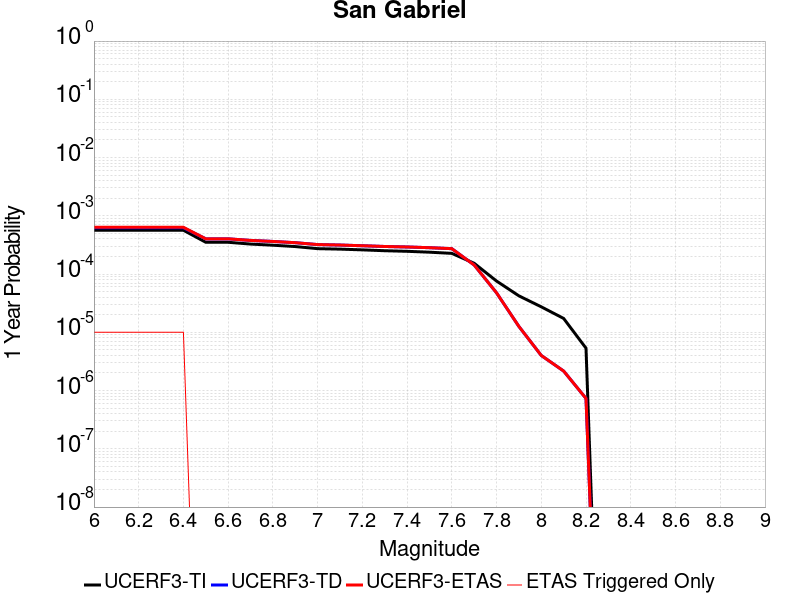 |  |

| Magnitude | 1 yr TI Prob | TD Prob | ETAS Prob | ETAS/TD Gain | ETAS Triggered Only | 10 yr TI Prob | TD Prob | ETAS Prob | ETAS/TD Gain | ETAS Triggered Only |
|-----|-----|-----|-----|-----|-----|-----|-----|-----|-----|-----|
| 6.0 | 5.653415E-4 | 6.251679E-4 | 6.351617E-4 | 1.0159857 | 1.0E-5 | 0.0056390543 | 0.0062461873 | 0.0062561245 | 1.001591 | 1.0E-5 |
| 6.1 | 5.653415E-4 | 6.251679E-4 | 6.351617E-4 | 1.0159857 | 1.0E-5 | 0.0056390543 | 0.0062461873 | 0.0062561245 | 1.001591 | 1.0E-5 |
| 6.2 | 5.653415E-4 | 6.251679E-4 | 6.351617E-4 | 1.0159857 | 1.0E-5 | 0.0056390543 | 0.0062461873 | 0.0062561245 | 1.001591 | 1.0E-5 |
| 6.3 | 5.653415E-4 | 6.251679E-4 | 6.351617E-4 | 1.0159857 | 1.0E-5 | 0.0056390543 | 0.0062461873 | 0.0062561245 | 1.001591 | 1.0E-5 |
| 6.4 | 5.653415E-4 | 6.251679E-4 | 6.351617E-4 | 1.0159857 | 1.0E-5 | 0.0056390543 | 0.0062461873 | 0.0062561245 | 1.001591 | 1.0E-5 |
| 6.5 | 3.511943E-4 | 4.0255862E-4 | 4.0255862E-4 | 1.0 | 0.0 | 0.003506398 | 0.0040293895 | 0.0040293895 | 1.0 | 0.0 |
| 6.6 | 3.511943E-4 | 4.0255862E-4 | 4.0255862E-4 | 1.0 | 0.0 | 0.003506398 | 0.0040293895 | 0.0040293895 | 1.0 | 0.0 |
| 6.7 | 3.2736175E-4 | 3.779877E-4 | 3.779877E-4 | 1.0 | 0.0 | 0.0032687993 | 0.0037845364 | 0.0037845364 | 1.0 | 0.0 |
| 6.8 | 3.128256E-4 | 3.6300326E-4 | 3.6300326E-4 | 1.0 | 0.0 | 0.003123856 | 0.0036351893 | 0.0036351893 | 1.0 | 0.0 |
| 6.9 | 2.9666146E-4 | 3.45532E-4 | 3.45532E-4 | 1.0 | 0.0 | 0.0029626573 | 0.0034610324 | 0.0034610324 | 1.0 | 0.0 |
| 7.0 | 2.7301308E-4 | 3.2069688E-4 | 3.2069688E-4 | 1.0 | 0.0 | 0.002726779 | 0.0032134135 | 0.0032134135 | 1.0 | 0.0 |
| 7.1 | 2.6793676E-4 | 3.1496567E-4 | 3.1496567E-4 | 1.0 | 0.0 | 0.0026761394 | 0.0031562652 | 0.0031562652 | 1.0 | 0.0 |
| 7.2 | 2.6028889E-4 | 3.0627442E-4 | 3.0627442E-4 | 1.0 | 0.0 | 0.0025998424 | 0.003069596 | 0.003069596 | 1.0 | 0.0 |
| 7.3 | 2.5157086E-4 | 2.9748783E-4 | 2.9748783E-4 | 1.0 | 0.0 | 0.0025128627 | 0.0029819692 | 0.0029819692 | 1.0 | 0.0 |
| 7.4 | 2.4582737E-4 | 2.9167475E-4 | 2.9167475E-4 | 1.0 | 0.0 | 0.002455556 | 0.0029239913 | 0.0029239913 | 1.0 | 0.0 |
| 7.5 | 2.37419E-4 | 2.8360868E-4 | 2.8360868E-4 | 1.0 | 0.0 | 0.002371655 | 0.0028435385 | 0.0028435385 | 1.0 | 0.0 |
| 7.6 | 2.2661954E-4 | 2.728046E-4 | 2.728046E-4 | 1.0 | 0.0 | 0.0022638857 | 0.0027357598 | 0.0027357598 | 1.0 | 0.0 |
| 7.7 | 1.5319703E-4 | 1.4315601E-4 | 1.4315601E-4 | 1.0 | 0.0 | 0.0015309147 | 0.0014379307 | 0.0014379307 | 1.0 | 0.0 |
| 7.8 | 7.587337E-5 | 4.7599282E-5 | 4.7599282E-5 | 1.0 | 0.0 | 7.584747E-4 | 4.80793E-4 | 4.80793E-4 | 1.0 | 0.0 |
| 7.9 | 4.225833E-5 | 1.2611996E-5 | 1.2611996E-5 | 1.0 | 0.0 | 4.2250296E-4 | 1.2919492E-4 | 1.2919492E-4 | 1.0 | 0.0 |
| 8.0 | 2.7379416E-5 | 4.005846E-6 | 4.005846E-6 | 1.0 | 0.0 | 2.7376044E-4 | 4.2180836E-5 | 4.2180836E-5 | 1.0 | 0.0 |
| 8.1 | 1.7303513E-5 | 2.164626E-6 | 2.164626E-6 | 1.0 | 0.0 | 1.7302166E-4 | 2.295942E-5 | 2.295942E-5 | 1.0 | 0.0 |
| 8.2 | 5.340643E-6 | 7.3258497E-7 | 7.3258497E-7 | 1.0 | 0.0 | 5.3405143E-5 | 7.925429E-6 | 7.925429E-6 | 1.0 | 0.0 |

## Ventura-Pitas Point
*[(top)](#table-of-contents)*

| 1 Year | 10 Year |
|-----|-----|
| 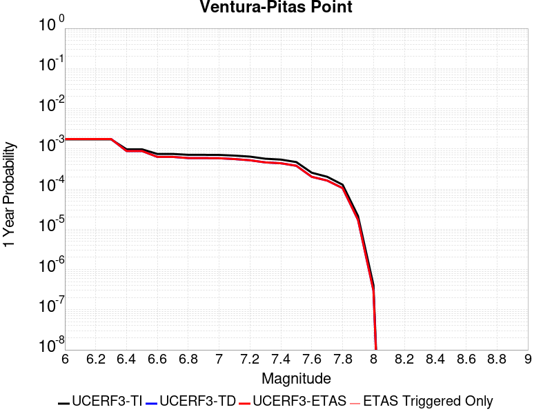 |  |

| Magnitude | 1 yr TI Prob | TD Prob | ETAS Prob | ETAS/TD Gain | ETAS Triggered Only | 10 yr TI Prob | TD Prob | ETAS Prob | ETAS/TD Gain | ETAS Triggered Only |
|-----|-----|-----|-----|-----|-----|-----|-----|-----|-----|-----|
| 6.0 | 0.0017297962 | 0.001759003 | 0.001759003 | 1.0 | 0.0 | 0.017163932 | 0.017476337 | 0.017486162 | 1.0005622 | 1.0E-5 |
| 6.1 | 0.0017297962 | 0.001759003 | 0.001759003 | 1.0 | 0.0 | 0.017163932 | 0.017476337 | 0.017486162 | 1.0005622 | 1.0E-5 |
| 6.2 | 0.0017297962 | 0.001759003 | 0.001759003 | 1.0 | 0.0 | 0.017163932 | 0.017476337 | 0.017486162 | 1.0005622 | 1.0E-5 |
| 6.3 | 0.0017297962 | 0.001759003 | 0.001759003 | 1.0 | 0.0 | 0.017163932 | 0.017476337 | 0.017486162 | 1.0005622 | 1.0E-5 |
| 6.4 | 9.781223E-4 | 8.876942E-4 | 8.876942E-4 | 1.0 | 0.0 | 0.009738282 | 0.00884382 | 0.008853732 | 1.0011207 | 1.0E-5 |
| 6.5 | 9.781223E-4 | 8.876942E-4 | 8.876942E-4 | 1.0 | 0.0 | 0.009738282 | 0.00884382 | 0.008853732 | 1.0011207 | 1.0E-5 |
| 6.6 | 7.490902E-4 | 6.323272E-4 | 6.323272E-4 | 1.0 | 0.0 | 0.0074657016 | 0.006305537 | 0.006305537 | 1.0 | 0.0 |
| 6.7 | 7.490902E-4 | 6.323272E-4 | 6.323272E-4 | 1.0 | 0.0 | 0.0074657016 | 0.006305537 | 0.006305537 | 1.0 | 0.0 |
| 6.8 | 7.127108E-4 | 5.917639E-4 | 5.917639E-4 | 1.0 | 0.0 | 0.007104293 | 0.005902097 | 0.005902097 | 1.0 | 0.0 |
| 6.9 | 7.116841E-4 | 5.9062184E-4 | 5.9062184E-4 | 1.0 | 0.0 | 0.007094092 | 0.0058907378 | 0.0058907378 | 1.0 | 0.0 |
| 7.0 | 7.077572E-4 | 5.864274E-4 | 5.864274E-4 | 1.0 | 0.0 | 0.007055073 | 0.0058490145 | 0.0058490145 | 1.0 | 0.0 |
| 7.1 | 6.815227E-4 | 5.5922923E-4 | 5.5922923E-4 | 1.0 | 0.0 | 0.0067943637 | 0.0055784243 | 0.0055784243 | 1.0 | 0.0 |
| 7.2 | 6.429523E-4 | 5.213992E-4 | 5.213992E-4 | 1.0 | 0.0 | 0.0064109527 | 0.0052019507 | 0.0052019507 | 1.0 | 0.0 |
| 7.3 | 5.69488E-4 | 4.6135488E-4 | 4.6135488E-4 | 1.0 | 0.0 | 0.0056803077 | 0.004604137 | 0.004604137 | 1.0 | 0.0 |
| 7.4 | 5.424914E-4 | 4.3943513E-4 | 4.3943513E-4 | 1.0 | 0.0 | 0.0054116896 | 0.0043858234 | 0.0043858234 | 1.0 | 0.0 |
| 7.5 | 4.7032707E-4 | 3.8070488E-4 | 3.8070488E-4 | 1.0 | 0.0 | 0.004693329 | 0.003800672 | 0.003800672 | 1.0 | 0.0 |
| 7.6 | 2.556514E-4 | 2.0212553E-4 | 2.0212553E-4 | 1.0 | 0.0 | 0.0025535747 | 0.0020194307 | 0.0020194307 | 1.0 | 0.0 |
| 7.7 | 2.0269687E-4 | 1.6313508E-4 | 1.6313508E-4 | 1.0 | 0.0 | 0.002025121 | 0.0016301625 | 0.0016301625 | 1.0 | 0.0 |
| 7.8 | 1.2863669E-4 | 1.0591035E-4 | 1.0591035E-4 | 1.0 | 0.0 | 0.0012856225 | 0.0010586034 | 0.0010586034 | 1.0 | 0.0 |
| 7.9 | 2.1371567E-5 | 1.7096016E-5 | 1.7096016E-5 | 1.0 | 0.0 | 2.1369511E-4 | 1.7094731E-4 | 1.7094731E-4 | 1.0 | 0.0 |
| 8.0 | 4.0654416E-7 | 2.9655615E-7 | 2.9655615E-7 | 1.0 | 0.0 | 4.065434E-6 | 2.9655596E-6 | 2.9655596E-6 | 1.0 | 0.0 |

## Lake Isabella (Seismicity)
*[(top)](#table-of-contents)*

| 1 Year | 10 Year |
|-----|-----|
|  |  |

| Magnitude | 1 yr TI Prob | TD Prob | ETAS Prob | ETAS/TD Gain | ETAS Triggered Only | 10 yr TI Prob | TD Prob | ETAS Prob | ETAS/TD Gain | ETAS Triggered Only |
|-----|-----|-----|-----|-----|-----|-----|-----|-----|-----|-----|
| 6.0 | 4.920106E-4 | 5.081923E-4 | 5.1818724E-4 | 1.0196676 | 1.0E-5 | 0.004909227 | 0.0050715944 | 0.0050815437 | 1.0019617 | 1.0E-5 |
| 6.1 | 4.920106E-4 | 5.081923E-4 | 5.1818724E-4 | 1.0196676 | 1.0E-5 | 0.004909227 | 0.0050715944 | 0.0050815437 | 1.0019617 | 1.0E-5 |
| 6.2 | 4.920106E-4 | 5.081923E-4 | 5.1818724E-4 | 1.0196676 | 1.0E-5 | 0.004909227 | 0.0050715944 | 0.0050815437 | 1.0019617 | 1.0E-5 |
| 6.3 | 4.920106E-4 | 5.081923E-4 | 5.1818724E-4 | 1.0196676 | 1.0E-5 | 0.004909227 | 0.0050715944 | 0.0050815437 | 1.0019617 | 1.0E-5 |
| 6.4 | 2.6837454E-4 | 2.7651637E-4 | 2.865136E-4 | 1.0361543 | 1.0E-5 | 0.0026805066 | 0.0027620634 | 0.0027720358 | 1.0036105 | 1.0E-5 |
| 6.5 | 2.6837454E-4 | 2.7651637E-4 | 2.865136E-4 | 1.0361543 | 1.0E-5 | 0.0026805066 | 0.0027620634 | 0.0027720358 | 1.0036105 | 1.0E-5 |
| 6.6 | 1.7744285E-4 | 1.825469E-4 | 1.9254506E-4 | 1.0547705 | 1.0E-5 | 0.0017730123 | 0.0018241272 | 0.001834109 | 1.0054721 | 1.0E-5 |
| 6.7 | 1.767679E-4 | 1.8186173E-4 | 1.9185992E-4 | 1.0549768 | 1.0E-5 | 0.0017662736 | 0.0018172868 | 0.0018272686 | 1.0054927 | 1.0E-5 |
| 6.8 | 1.3869164E-4 | 1.4263192E-4 | 1.4263192E-4 | 1.0 | 0.0 | 0.0013860512 | 0.0014255359 | 0.0014255359 | 1.0 | 0.0 |
| 6.9 | 1.2553448E-4 | 1.2910008E-4 | 1.2910008E-4 | 1.0 | 0.0 | 0.0012546359 | 0.0012903805 | 0.0012903805 | 1.0 | 0.0 |
| 7.0 | 8.8455E-5 | 9.0940965E-5 | 9.0940965E-5 | 1.0 | 0.0 | 8.84198E-4 | 9.091403E-4 | 9.091403E-4 | 1.0 | 0.0 |
| 7.1 | 1.826955E-5 | 1.8635306E-5 | 1.8635306E-5 | 1.0 | 0.0 | 1.8268047E-4 | 1.863377E-4 | 1.863377E-4 | 1.0 | 0.0 |
| 7.2 | 1.1646762E-5 | 1.187085E-5 | 1.187085E-5 | 1.0 | 0.0 | 1.1646151E-4 | 1.18702264E-4 | 1.18702264E-4 | 1.0 | 0.0 |
| 7.3 | 8.223522E-6 | 8.380322E-6 | 8.380322E-6 | 1.0 | 0.0 | 8.2232174E-5 | 8.380012E-5 | 8.380012E-5 | 1.0 | 0.0 |
| 7.4 | 5.852591E-6 | 5.964881E-6 | 5.964881E-6 | 1.0 | 0.0 | 5.8524372E-5 | 5.9647253E-5 | 5.9647253E-5 | 1.0 | 0.0 |
| 7.5 | 2.5490165E-6 | 2.5978486E-6 | 2.5978486E-6 | 1.0 | 0.0 | 2.5489873E-5 | 2.5978201E-5 | 2.5978201E-5 | 1.0 | 0.0 |
| 7.6 | 7.851001E-8 | 7.992659E-8 | 7.992659E-8 | 1.0 | 0.0 | 7.8509987E-7 | 7.992659E-7 | 7.992659E-7 | 1.0 | 0.0 |

## Great Valley 03a Dunnigan Hills
*[(top)](#table-of-contents)*

| 1 Year | 10 Year |
|-----|-----|
| 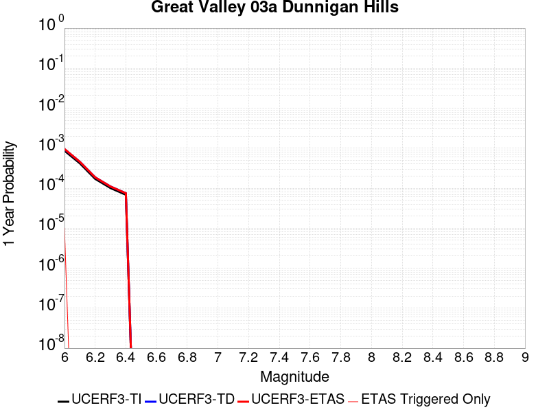 |  |

| Magnitude | 1 yr TI Prob | TD Prob | ETAS Prob | ETAS/TD Gain | ETAS Triggered Only | 10 yr TI Prob | TD Prob | ETAS Prob | ETAS/TD Gain | ETAS Triggered Only |
|-----|-----|-----|-----|-----|-----|-----|-----|-----|-----|-----|
| 6.0 | 8.6534437E-4 | 9.444811E-4 | 9.5447164E-4 | 1.0105778 | 1.0E-5 | 0.008619824 | 0.009411503 | 0.009421408 | 1.0010525 | 1.0E-5 |
| 6.1 | 4.194881E-4 | 4.5750974E-4 | 4.5750974E-4 | 1.0 | 0.0 | 0.004186971 | 0.004567676 | 0.004567676 | 1.0 | 0.0 |
| 6.2 | 1.7116789E-4 | 1.8676367E-4 | 1.8676367E-4 | 1.0 | 0.0 | 0.0017103611 | 0.0018664751 | 0.0018664751 | 1.0 | 0.0 |
| 6.3 | 1.00905054E-4 | 1.10113484E-4 | 1.10113484E-4 | 1.0 | 0.0 | 0.0010085925 | 0.0011008692 | 0.0011008692 | 1.0 | 0.0 |
| 6.4 | 6.857408E-5 | 7.482319E-5 | 7.482319E-5 | 1.0 | 0.0 | 6.8552926E-4 | 7.4823195E-4 | 7.4823195E-4 | 1.0 | 0.0 |

## Pine Mtn
*[(top)](#table-of-contents)*

| 1 Year | 10 Year |
|-----|-----|
|  | 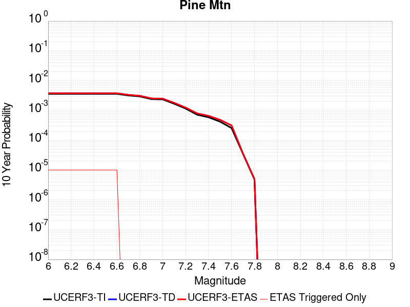 |

| Magnitude | 1 yr TI Prob | TD Prob | ETAS Prob | ETAS/TD Gain | ETAS Triggered Only | 10 yr TI Prob | TD Prob | ETAS Prob | ETAS/TD Gain | ETAS Triggered Only |
|-----|-----|-----|-----|-----|-----|-----|-----|-----|-----|-----|
| 6.0 | 3.596972E-4 | 3.7694667E-4 | 3.7694667E-4 | 1.0 | 0.0 | 0.0035911554 | 0.0037633702 | 0.0037733326 | 1.0026472 | 1.0E-5 |
| 6.1 | 3.596972E-4 | 3.7694667E-4 | 3.7694667E-4 | 1.0 | 0.0 | 0.0035911554 | 0.0037633702 | 0.0037733326 | 1.0026472 | 1.0E-5 |
| 6.2 | 3.596972E-4 | 3.7694667E-4 | 3.7694667E-4 | 1.0 | 0.0 | 0.0035911554 | 0.0037633702 | 0.0037733326 | 1.0026472 | 1.0E-5 |
| 6.3 | 3.596972E-4 | 3.7694667E-4 | 3.7694667E-4 | 1.0 | 0.0 | 0.0035911554 | 0.0037633702 | 0.0037733326 | 1.0026472 | 1.0E-5 |
| 6.4 | 3.596972E-4 | 3.7694667E-4 | 3.7694667E-4 | 1.0 | 0.0 | 0.0035911554 | 0.0037633702 | 0.0037733326 | 1.0026472 | 1.0E-5 |
| 6.5 | 3.596972E-4 | 3.7694667E-4 | 3.7694667E-4 | 1.0 | 0.0 | 0.0035911554 | 0.0037633702 | 0.0037733326 | 1.0026472 | 1.0E-5 |
| 6.6 | 3.596972E-4 | 3.7694667E-4 | 3.7694667E-4 | 1.0 | 0.0 | 0.0035911554 | 0.0037633702 | 0.0037733326 | 1.0026472 | 1.0E-5 |
| 6.7 | 3.1755073E-4 | 3.337389E-4 | 3.337389E-4 | 1.0 | 0.0 | 0.0031709734 | 0.003332596 | 0.003332596 | 1.0 | 0.0 |
| 6.8 | 2.94925E-4 | 3.1044747E-4 | 3.1044747E-4 | 1.0 | 0.0 | 0.002945339 | 0.0031003426 | 0.0031003426 | 1.0 | 0.0 |
| 6.9 | 2.4007261E-4 | 2.537569E-4 | 2.537569E-4 | 1.0 | 0.0 | 0.0023981342 | 0.0025348158 | 0.0025348158 | 1.0 | 0.0 |
| 7.0 | 2.3412947E-4 | 2.4768684E-4 | 2.4768684E-4 | 1.0 | 0.0 | 0.0023388295 | 0.0024742517 | 0.0024742517 | 1.0 | 0.0 |
| 7.1 | 1.6716159E-4 | 1.7892578E-4 | 1.7892578E-4 | 1.0 | 0.0 | 0.0016703589 | 0.0017878833 | 0.0017878833 | 1.0 | 0.0 |
| 7.2 | 1.15102564E-4 | 1.2409795E-4 | 1.2409795E-4 | 1.0 | 0.0 | 0.0011504296 | 0.0012403313 | 0.0012403313 | 1.0 | 0.0 |
| 7.3 | 7.182235E-5 | 7.939375E-5 | 7.939375E-5 | 1.0 | 0.0 | 7.1799144E-4 | 7.9366297E-4 | 7.9366297E-4 | 1.0 | 0.0 |
| 7.4 | 5.8678244E-5 | 6.5674925E-5 | 6.5674925E-5 | 1.0 | 0.0 | 5.866275E-4 | 6.5656344E-4 | 6.5656344E-4 | 1.0 | 0.0 |
| 7.5 | 4.1907308E-5 | 4.840416E-5 | 4.840416E-5 | 1.0 | 0.0 | 4.1899405E-4 | 4.8394292E-4 | 4.8394292E-4 | 1.0 | 0.0 |
| 7.6 | 2.5542888E-5 | 3.132191E-5 | 3.132191E-5 | 1.0 | 0.0 | 2.5539953E-4 | 3.131798E-4 | 3.131798E-4 | 1.0 | 0.0 |
| 7.7 | 3.4617963E-6 | 3.5423045E-6 | 3.5423045E-6 | 1.0 | 0.0 | 3.4617424E-5 | 3.5422527E-5 | 3.5422527E-5 | 1.0 | 0.0 |
| 7.8 | 4.818991E-7 | 4.9509936E-7 | 4.9509936E-7 | 1.0 | 0.0 | 4.8189804E-6 | 4.950984E-6 | 4.950984E-6 | 1.0 | 0.0 |

## Likely 2011 CFM
*[(top)](#table-of-contents)*

| 1 Year | 10 Year |
|-----|-----|
|  |  |

| Magnitude | 1 yr TI Prob | TD Prob | ETAS Prob | ETAS/TD Gain | ETAS Triggered Only | 10 yr TI Prob | TD Prob | ETAS Prob | ETAS/TD Gain | ETAS Triggered Only |
|-----|-----|-----|-----|-----|-----|-----|-----|-----|-----|-----|
| 6.0 | 0.0013200947 | 0.0014133515 | 0.0014233374 | 1.0070654 | 1.0E-5 | 0.013122803 | 0.014048284 | 0.014058144 | 1.0007018 | 1.0E-5 |
| 6.1 | 0.0013200947 | 0.0014133515 | 0.0014233374 | 1.0070654 | 1.0E-5 | 0.013122803 | 0.014048284 | 0.014058144 | 1.0007018 | 1.0E-5 |
| 6.2 | 8.5411523E-4 | 9.1094704E-4 | 9.209379E-4 | 1.0109676 | 1.0E-5 | 0.008508399 | 0.009073417 | 0.009083326 | 1.0010921 | 1.0E-5 |
| 6.3 | 6.2311086E-4 | 6.6311343E-4 | 6.6311343E-4 | 1.0 | 0.0 | 0.0062136655 | 0.006611903 | 0.006611903 | 1.0 | 0.0 |
| 6.4 | 4.7955062E-4 | 5.095804E-4 | 5.095804E-4 | 1.0 | 0.0 | 0.004785171 | 0.0050844005 | 0.0050844005 | 1.0 | 0.0 |
| 6.5 | 4.006037E-4 | 4.2530475E-4 | 4.2530475E-4 | 1.0 | 0.0 | 0.0039988225 | 0.004245101 | 0.004245101 | 1.0 | 0.0 |
| 6.6 | 3.3849955E-4 | 3.591741E-4 | 3.591741E-4 | 1.0 | 0.0 | 0.003379844 | 0.0035860809 | 0.0035860809 | 1.0 | 0.0 |
| 6.7 | 2.403095E-4 | 2.5481093E-4 | 2.5481093E-4 | 1.0 | 0.0 | 0.002400498 | 0.0025452706 | 0.0025452706 | 1.0 | 0.0 |
| 6.8 | 1.7110848E-4 | 1.8142852E-4 | 1.8142852E-4 | 1.0 | 0.0 | 0.0017097679 | 0.0018128593 | 0.0018128593 | 1.0 | 0.0 |
| 6.9 | 1.2151648E-4 | 1.2890223E-4 | 1.2890223E-4 | 1.0 | 0.0 | 0.0012145005 | 0.0012883176 | 0.0012883176 | 1.0 | 0.0 |
| 7.0 | 6.320152E-5 | 6.7120294E-5 | 6.7120294E-5 | 1.0 | 0.0 | 6.3183554E-4 | 6.710301E-4 | 6.710301E-4 | 1.0 | 0.0 |

## San Jacinto (Stepovers Combined)
*[(top)](#table-of-contents)*

| 1 Year | 10 Year |
|-----|-----|
| 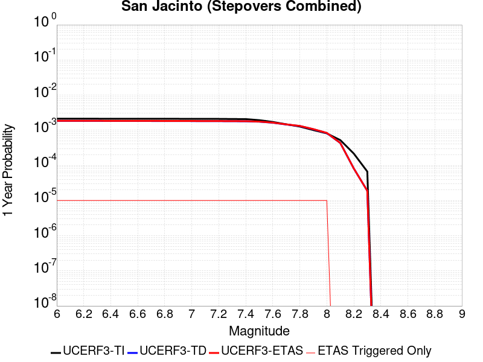 |  |

| Magnitude | 1 yr TI Prob | TD Prob | ETAS Prob | ETAS/TD Gain | ETAS Triggered Only | 10 yr TI Prob | TD Prob | ETAS Prob | ETAS/TD Gain | ETAS Triggered Only |
|-----|-----|-----|-----|-----|-----|-----|-----|-----|-----|-----|
| 6.0 | 0.0021197782 | 0.0018384842 | 0.0018484659 | 1.0054293 | 1.0E-5 | 0.020996714 | 0.018983515 | 0.018993324 | 1.0005168 | 1.0E-5 |
| 6.1 | 0.0021197782 | 0.0018384842 | 0.0018484659 | 1.0054293 | 1.0E-5 | 0.020996714 | 0.018983515 | 0.018993324 | 1.0005168 | 1.0E-5 |
| 6.2 | 0.0021197782 | 0.0018384842 | 0.0018484659 | 1.0054293 | 1.0E-5 | 0.020996714 | 0.018983515 | 0.018993324 | 1.0005168 | 1.0E-5 |
| 6.3 | 0.0021197782 | 0.0018384842 | 0.0018484659 | 1.0054293 | 1.0E-5 | 0.020996714 | 0.018983515 | 0.018993324 | 1.0005168 | 1.0E-5 |
| 6.4 | 0.0021150648 | 0.001831814 | 0.0018417956 | 1.005449 | 1.0E-5 | 0.020950472 | 0.018918084 | 0.018927895 | 1.0005186 | 1.0E-5 |
| 6.5 | 0.0021150648 | 0.001831814 | 0.0018417956 | 1.005449 | 1.0E-5 | 0.020950472 | 0.018918084 | 0.018927895 | 1.0005186 | 1.0E-5 |
| 6.6 | 0.0021130538 | 0.0018289674 | 0.001838949 | 1.0054575 | 1.0E-5 | 0.020930743 | 0.018890161 | 0.018899973 | 1.0005194 | 1.0E-5 |
| 6.7 | 0.002111905 | 0.0018273568 | 0.0018373384 | 1.0054624 | 1.0E-5 | 0.020919468 | 0.018874358 | 0.018884169 | 1.0005199 | 1.0E-5 |
| 6.8 | 0.0021107488 | 0.0018258755 | 0.0018358573 | 1.0054668 | 1.0E-5 | 0.020908125 | 0.018859772 | 0.018869583 | 1.0005202 | 1.0E-5 |
| 6.9 | 0.0021091616 | 0.0018239255 | 0.0018339073 | 1.0054727 | 1.0E-5 | 0.020892553 | 0.018840544 | 0.018850356 | 1.0005208 | 1.0E-5 |
| 7.0 | 0.0021039525 | 0.0018177053 | 0.0018276871 | 1.0054915 | 1.0E-5 | 0.02084144 | 0.01877916 | 0.018788973 | 1.0005225 | 1.0E-5 |
| 7.1 | 0.002102883 | 0.0018165836 | 0.0018265655 | 1.0054948 | 1.0E-5 | 0.020830948 | 0.018768037 | 0.01877785 | 1.0005229 | 1.0E-5 |
| 7.2 | 0.0020984085 | 0.0018116096 | 0.0018215914 | 1.00551 | 1.0E-5 | 0.020787042 | 0.018718777 | 0.01872859 | 1.0005243 | 1.0E-5 |
| 7.3 | 0.0020819185 | 0.0018026332 | 0.0018126151 | 1.0055374 | 1.0E-5 | 0.020625217 | 0.018627413 | 0.018637227 | 1.0005268 | 1.0E-5 |
| 7.4 | 0.0020704903 | 0.0017966651 | 0.0018066472 | 1.0055559 | 1.0E-5 | 0.020513052 | 0.01856655 | 0.018576365 | 1.0005286 | 1.0E-5 |
| 7.5 | 0.0019307006 | 0.0017480933 | 0.0017580759 | 1.0057105 | 1.0E-5 | 0.019140124 | 0.018068153 | 0.018077973 | 1.0005435 | 1.0E-5 |
| 7.6 | 0.0017173645 | 0.0016325067 | 0.0016424904 | 1.0061156 | 1.0E-5 | 0.01704153 | 0.016901208 | 0.01691104 | 1.0005816 | 1.0E-5 |
| 7.7 | 0.0014722579 | 0.0014537636 | 0.0014637491 | 1.0068687 | 1.0E-5 | 0.014625421 | 0.015113685 | 0.015123534 | 1.0006516 | 1.0E-5 |
| 7.8 | 0.0012686774 | 0.0013143102 | 0.001324297 | 1.0075985 | 1.0E-5 | 0.012614589 | 0.013711039 | 0.013720902 | 1.0007193 | 1.0E-5 |
| 7.9 | 0.0010102465 | 0.0010648834 | 0.0010748728 | 1.0093807 | 1.0E-5 | 0.0100566605 | 0.011198251 | 0.011208138 | 1.000883 | 1.0E-5 |
| 8.0 | 8.127754E-4 | 8.2849315E-4 | 8.384849E-4 | 1.01206 | 1.0E-5 | 0.008098091 | 0.008780761 | 0.008790673 | 1.0011289 | 1.0E-5 |
| 8.1 | 5.229494E-4 | 4.3253406E-4 | 4.3253406E-4 | 1.0 | 0.0 | 0.0052172043 | 0.0046527875 | 0.0046527875 | 1.0 | 0.0 |
| 8.2 | 2.1614227E-4 | 8.143048E-5 | 8.143048E-5 | 1.0 | 0.0 | 0.0021593217 | 9.452761E-4 | 9.452761E-4 | 1.0 | 0.0 |
| 8.3 | 6.653009E-5 | 1.8842728E-5 | 1.8842728E-5 | 1.0 | 0.0 | 6.6510175E-4 | 2.2728964E-4 | 2.2728964E-4 | 1.0 | 0.0 |

## San Jacinto (Superstition Mtn)
*[(top)](#table-of-contents)*

| 1 Year | 10 Year |
|-----|-----|
|  |  |

| Magnitude | 1 yr TI Prob | TD Prob | ETAS Prob | ETAS/TD Gain | ETAS Triggered Only | 10 yr TI Prob | TD Prob | ETAS Prob | ETAS/TD Gain | ETAS Triggered Only |
|-----|-----|-----|-----|-----|-----|-----|-----|-----|-----|-----|
| 6.0 | 0.0033440501 | 0.0049980166 | 0.0050079664 | 1.0019908 | 1.0E-5 | 0.03294174 | 0.048823282 | 0.048832797 | 1.0001948 | 1.0E-5 |
| 6.1 | 0.0033440501 | 0.0049980166 | 0.0050079664 | 1.0019908 | 1.0E-5 | 0.03294174 | 0.048823282 | 0.048832797 | 1.0001948 | 1.0E-5 |
| 6.2 | 0.002971072 | 0.004330826 | 0.0043407823 | 1.0022991 | 1.0E-5 | 0.029316625 | 0.042503368 | 0.042512942 | 1.0002253 | 1.0E-5 |
| 6.3 | 0.002966728 | 0.0043227915 | 0.0043327482 | 1.0023034 | 1.0E-5 | 0.029274331 | 0.04242662 | 0.042436197 | 1.0002257 | 1.0E-5 |
| 6.4 | 0.0028226813 | 0.0040366673 | 0.004046627 | 1.0024673 | 1.0E-5 | 0.02787096 | 0.039715875 | 0.03972548 | 1.0002418 | 1.0E-5 |
| 6.5 | 0.0022803338 | 0.0029409279 | 0.0029508986 | 1.0033903 | 1.0E-5 | 0.022570757 | 0.029236156 | 0.029245865 | 1.000332 | 1.0E-5 |
| 6.6 | 0.0014454646 | 0.0013290369 | 0.0013390236 | 1.0075142 | 1.0E-5 | 0.014360986 | 0.013539864 | 0.013549729 | 1.0007286 | 1.0E-5 |
| 6.7 | 0.0014143161 | 0.0012879225 | 0.0012979095 | 1.0077544 | 1.0E-5 | 0.014053487 | 0.01313332 | 0.013143189 | 1.0007514 | 1.0E-5 |
| 6.8 | 0.001328425 | 0.0011558059 | 0.0011657943 | 1.008642 | 1.0E-5 | 0.0132051185 | 0.011821573 | 0.011831454 | 1.0008359 | 1.0E-5 |
| 6.9 | 0.0011036064 | 9.1924524E-4 | 9.2923606E-4 | 1.0108685 | 1.0E-5 | 0.010981417 | 0.0094463155 | 0.009456221 | 1.0010486 | 1.0E-5 |
| 7.0 | 9.781026E-4 | 8.4288727E-4 | 8.5287885E-4 | 1.0118539 | 1.0E-5 | 0.009738087 | 0.008669503 | 0.008679417 | 1.0011435 | 1.0E-5 |
| 7.1 | 9.7415317E-4 | 8.389846E-4 | 8.489762E-4 | 1.0119091 | 1.0E-5 | 0.009698939 | 0.00863046 | 0.008640374 | 1.0011487 | 1.0E-5 |
| 7.2 | 9.285943E-4 | 8.0220675E-4 | 8.1219873E-4 | 1.0124556 | 1.0E-5 | 0.009247236 | 0.008261778 | 0.008271696 | 1.0012004 | 1.0E-5 |
| 7.3 | 8.649459E-4 | 7.5784273E-4 | 7.678351E-4 | 1.0131854 | 1.0E-5 | 0.00861587 | 0.007817097 | 0.007827019 | 1.0012692 | 1.0E-5 |
| 7.4 | 8.5472054E-4 | 7.507979E-4 | 7.607904E-4 | 1.0133091 | 1.0E-5 | 0.008514405 | 0.0077464804 | 0.0077564027 | 1.0012809 | 1.0E-5 |
| 7.5 | 8.236062E-4 | 7.320637E-4 | 7.420564E-4 | 1.0136501 | 1.0E-5 | 0.008205604 | 0.007557049 | 0.0075669736 | 1.0013132 | 1.0E-5 |
| 7.6 | 7.432043E-4 | 6.809116E-4 | 6.909048E-4 | 1.0146762 | 1.0E-5 | 0.007407237 | 0.007039651 | 0.00704958 | 1.0014105 | 1.0E-5 |
| 7.7 | 6.022235E-4 | 5.687321E-4 | 5.787264E-4 | 1.017573 | 1.0E-5 | 0.006005941 | 0.0059096953 | 0.005919636 | 1.0016822 | 1.0E-5 |
| 7.8 | 4.767588E-4 | 4.962757E-4 | 5.062708E-4 | 1.02014 | 1.0E-5 | 0.0047573727 | 0.005176218 | 0.0051861666 | 1.0019219 | 1.0E-5 |
| 7.9 | 3.6377716E-4 | 3.8507784E-4 | 3.95074E-4 | 1.0259588 | 1.0E-5 | 0.0036318225 | 0.0040513766 | 0.004061336 | 1.0024583 | 1.0E-5 |
| 8.0 | 3.0070372E-4 | 3.265467E-4 | 3.3654342E-4 | 1.0306135 | 1.0E-5 | 0.0030029714 | 0.003453067 | 0.0034630327 | 1.0028859 | 1.0E-5 |
| 8.1 | 2.6672508E-4 | 2.8668196E-4 | 2.8668196E-4 | 1.0 | 0.0 | 0.0026640517 | 0.0030399875 | 0.0030399875 | 1.0 | 0.0 |
| 8.2 | 5.779102E-5 | 2.7840057E-5 | 2.7840057E-5 | 1.0 | 0.0 | 5.777599E-4 | 3.1341249E-4 | 3.1341249E-4 | 1.0 | 0.0 |
| 8.3 | 7.0881396E-7 | 2.3339025E-7 | 2.3339025E-7 | 1.0 | 0.0 | 7.0881174E-6 | 2.615787E-6 | 2.615787E-6 | 1.0 | 0.0 |

## Big Pine (Central)
*[(top)](#table-of-contents)*

| 1 Year | 10 Year |
|-----|-----|
| 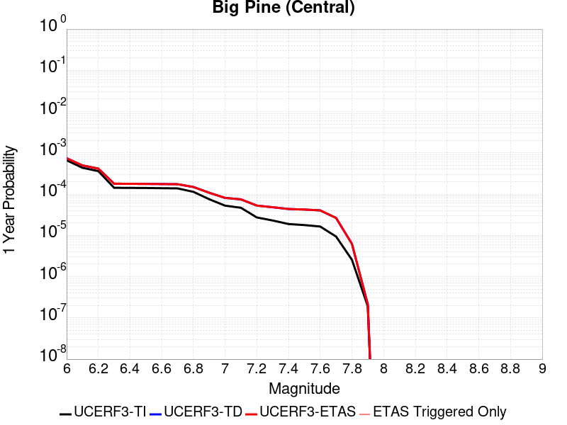 |  |

| Magnitude | 1 yr TI Prob | TD Prob | ETAS Prob | ETAS/TD Gain | ETAS Triggered Only | 10 yr TI Prob | TD Prob | ETAS Prob | ETAS/TD Gain | ETAS Triggered Only |
|-----|-----|-----|-----|-----|-----|-----|-----|-----|-----|-----|
| 6.0 | 6.628048E-4 | 7.433351E-4 | 7.433351E-4 | 1.0 | 0.0 | 0.006608314 | 0.0074135168 | 0.007423443 | 1.0013388 | 1.0E-5 |
| 6.1 | 4.3521097E-4 | 4.9615593E-4 | 4.9615593E-4 | 1.0 | 0.0 | 0.0043435963 | 0.004954038 | 0.0049639884 | 1.0020086 | 1.0E-5 |
| 6.2 | 3.6121515E-4 | 4.1564586E-4 | 4.1564586E-4 | 1.0 | 0.0 | 0.003606286 | 0.0041519944 | 0.004161953 | 1.0023985 | 1.0E-5 |
| 6.3 | 1.4235388E-4 | 1.7865608E-4 | 1.7865608E-4 | 1.0 | 0.0 | 0.0014226272 | 0.0017866332 | 0.0017866332 | 1.0 | 0.0 |
| 6.4 | 1.4158686E-4 | 1.7783667E-4 | 1.7783667E-4 | 1.0 | 0.0 | 0.0014149669 | 0.0017784522 | 0.0017784522 | 1.0 | 0.0 |
| 6.5 | 1.4072572E-4 | 1.7691562E-4 | 1.7691562E-4 | 1.0 | 0.0 | 0.0014063664 | 0.0017692564 | 0.0017692564 | 1.0 | 0.0 |
| 6.6 | 1.3925991E-4 | 1.7535161E-4 | 1.7535161E-4 | 1.0 | 0.0 | 0.0013917267 | 0.0017536411 | 0.0017536411 | 1.0 | 0.0 |
| 6.7 | 1.3778417E-4 | 1.7378786E-4 | 1.7378786E-4 | 1.0 | 0.0 | 0.0013769877 | 0.001738028 | 0.001738028 | 1.0 | 0.0 |
| 6.8 | 1.1367482E-4 | 1.4892635E-4 | 1.4892635E-4 | 1.0 | 0.0 | 0.0011361669 | 0.0014897605 | 0.0014897605 | 1.0 | 0.0 |
| 6.9 | 7.51954E-5 | 1.0792231E-4 | 1.0792231E-4 | 1.0 | 0.0 | 7.5169955E-4 | 0.0010801493 | 0.0010801493 | 1.0 | 0.0 |
| 7.0 | 5.2560266E-5 | 8.109284E-5 | 8.109284E-5 | 1.0 | 0.0 | 5.2547833E-4 | 8.1207167E-4 | 8.1207167E-4 | 1.0 | 0.0 |
| 7.1 | 4.6683643E-5 | 7.462263E-5 | 7.462263E-5 | 1.0 | 0.0 | 4.6673836E-4 | 7.4741466E-4 | 7.4741466E-4 | 1.0 | 0.0 |
| 7.2 | 2.7211627E-5 | 5.275702E-5 | 5.275702E-5 | 1.0 | 0.0 | 2.7208295E-4 | 5.288737E-4 | 5.288737E-4 | 1.0 | 0.0 |
| 7.3 | 2.2971257E-5 | 4.8102538E-5 | 4.8102538E-5 | 1.0 | 0.0 | 2.2968883E-4 | 4.823499E-4 | 4.823499E-4 | 1.0 | 0.0 |
| 7.4 | 1.8852415E-5 | 4.3609907E-5 | 4.3609907E-5 | 1.0 | 0.0 | 1.8850817E-4 | 4.3743252E-4 | 4.3743252E-4 | 1.0 | 0.0 |
| 7.5 | 1.7783263E-5 | 4.23036E-5 | 4.23036E-5 | 1.0 | 0.0 | 1.778184E-4 | 4.2435306E-4 | 4.2435306E-4 | 1.0 | 0.0 |
| 7.6 | 1.6398877E-5 | 4.0339008E-5 | 4.0339008E-5 | 1.0 | 0.0 | 1.6397667E-4 | 4.0468544E-4 | 4.0468544E-4 | 1.0 | 0.0 |
| 7.7 | 9.377899E-6 | 2.649265E-5 | 2.649265E-5 | 1.0 | 0.0 | 9.377503E-5 | 2.6627042E-4 | 2.6627042E-4 | 1.0 | 0.0 |
| 7.8 | 2.5687964E-6 | 6.2509143E-6 | 6.2509143E-6 | 1.0 | 0.0 | 2.5687666E-5 | 6.2949504E-5 | 6.2949504E-5 | 1.0 | 0.0 |
| 7.9 | 1.9204828E-7 | 2.141897E-7 | 2.141897E-7 | 1.0 | 0.0 | 1.920481E-6 | 2.1898745E-6 | 2.1898745E-6 | 1.0 | 0.0 |

## San Jacinto (Coyote Creek)
*[(top)](#table-of-contents)*

| 1 Year | 10 Year |
|-----|-----|
| 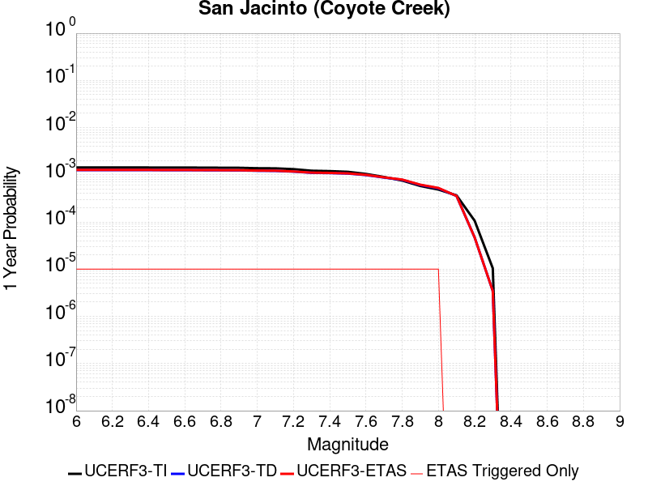 |  |

| Magnitude | 1 yr TI Prob | TD Prob | ETAS Prob | ETAS/TD Gain | ETAS Triggered Only | 10 yr TI Prob | TD Prob | ETAS Prob | ETAS/TD Gain | ETAS Triggered Only |
|-----|-----|-----|-----|-----|-----|-----|-----|-----|-----|-----|
| 6.0 | 0.0014273542 | 0.0012590011 | 0.0012689885 | 1.0079328 | 1.0E-5 | 0.01418221 | 0.012927456 | 0.012937326 | 1.0007635 | 1.0E-5 |
| 6.1 | 0.0014273542 | 0.0012590011 | 0.0012689885 | 1.0079328 | 1.0E-5 | 0.01418221 | 0.012927456 | 0.012937326 | 1.0007635 | 1.0E-5 |
| 6.2 | 0.0014273542 | 0.0012590011 | 0.0012689885 | 1.0079328 | 1.0E-5 | 0.01418221 | 0.012927456 | 0.012937326 | 1.0007635 | 1.0E-5 |
| 6.3 | 0.0014273542 | 0.0012590011 | 0.0012689885 | 1.0079328 | 1.0E-5 | 0.01418221 | 0.012927456 | 0.012937326 | 1.0007635 | 1.0E-5 |
| 6.4 | 0.0014273542 | 0.0012590011 | 0.0012689885 | 1.0079328 | 1.0E-5 | 0.01418221 | 0.012927456 | 0.012937326 | 1.0007635 | 1.0E-5 |
| 6.5 | 0.0014225657 | 0.0012530643 | 0.0012630518 | 1.0079705 | 1.0E-5 | 0.014134934 | 0.012868783 | 0.0128786545 | 1.0007671 | 1.0E-5 |
| 6.6 | 0.0014225657 | 0.0012530643 | 0.0012630518 | 1.0079705 | 1.0E-5 | 0.014134934 | 0.012868783 | 0.0128786545 | 1.0007671 | 1.0E-5 |
| 6.7 | 0.0014191137 | 0.001249162 | 0.0012591495 | 1.0079954 | 1.0E-5 | 0.014100855 | 0.012830195 | 0.012840067 | 1.0007694 | 1.0E-5 |
| 6.8 | 0.001411945 | 0.0012448479 | 0.0012548354 | 1.0080231 | 1.0E-5 | 0.014030075 | 0.012787337 | 0.012797209 | 1.000772 | 1.0E-5 |
| 6.9 | 0.0014069602 | 0.0012406532 | 0.0012506408 | 1.0080503 | 1.0E-5 | 0.013980856 | 0.012745653 | 0.012755526 | 1.0007746 | 1.0E-5 |
| 7.0 | 0.001379188 | 0.0012186096 | 0.0012285975 | 1.0081961 | 1.0E-5 | 0.0137065975 | 0.012527018 | 0.012536893 | 1.0007883 | 1.0E-5 |
| 7.1 | 0.0013691769 | 0.0012095434 | 0.0012195313 | 1.0082576 | 1.0E-5 | 0.013607717 | 0.012436883 | 0.012446758 | 1.000794 | 1.0E-5 |
| 7.2 | 0.0013177024 | 0.0011675768 | 0.0011775651 | 1.0085547 | 1.0E-5 | 0.013099162 | 0.012017925 | 0.012027805 | 1.0008221 | 1.0E-5 |
| 7.3 | 0.001220092 | 0.0011014809 | 0.0011114699 | 1.0090687 | 1.0E-5 | 0.012134149 | 0.011356855 | 0.011366741 | 1.0008705 | 1.0E-5 |
| 7.4 | 0.0011974899 | 0.0010874267 | 0.0010974158 | 1.009186 | 1.0E-5 | 0.011910575 | 0.011215971 | 0.011225859 | 1.0008816 | 1.0E-5 |
| 7.5 | 0.0011571277 | 0.0010625605 | 0.0010725498 | 1.0094012 | 1.0E-5 | 0.011511209 | 0.010965596 | 0.010975487 | 1.0009019 | 1.0E-5 |
| 7.6 | 0.001043725 | 9.888698E-4 | 9.988599E-4 | 1.0101025 | 1.0E-5 | 0.010388365 | 0.010223619 | 0.010233517 | 1.0009681 | 1.0E-5 |
| 7.7 | 8.986819E-4 | 8.7321026E-4 | 8.8320154E-4 | 1.011442 | 1.0E-5 | 0.008950562 | 0.009062162 | 0.009072071 | 1.0010935 | 1.0E-5 |
| 7.8 | 7.552038E-4 | 7.81832E-4 | 7.9182413E-4 | 1.0127804 | 1.0E-5 | 0.0075264242 | 0.008140619 | 0.0081505375 | 1.0012184 | 1.0E-5 |
| 7.9 | 5.797721E-4 | 6.073759E-4 | 6.1736983E-4 | 1.0164542 | 1.0E-5 | 0.0057826187 | 0.0063796355 | 0.006389572 | 1.0015575 | 1.0E-5 |
| 8.0 | 4.8657437E-4 | 5.163326E-4 | 5.2632747E-4 | 1.0193573 | 1.0E-5 | 0.0048551033 | 0.0054493384 | 0.0054592835 | 1.0018251 | 1.0E-5 |
| 8.1 | 3.664147E-4 | 3.5614165E-4 | 3.5614165E-4 | 1.0 | 0.0 | 0.003658111 | 0.003787139 | 0.003787139 | 1.0 | 0.0 |
| 8.2 | 1.06220665E-4 | 4.6922192E-5 | 4.6922192E-5 | 1.0 | 0.0 | 0.001061699 | 5.3244614E-4 | 5.3244614E-4 | 1.0 | 0.0 |
| 8.3 | 1.046241E-5 | 3.4520367E-6 | 3.4520367E-6 | 1.0 | 0.0 | 1.0461917E-4 | 4.01306E-5 | 4.01306E-5 | 1.0 | 0.0 |

## Oak Ridge (Onshore)
*[(top)](#table-of-contents)*

| 1 Year | 10 Year |
|-----|-----|
|  |  |

| Magnitude | 1 yr TI Prob | TD Prob | ETAS Prob | ETAS/TD Gain | ETAS Triggered Only | 10 yr TI Prob | TD Prob | ETAS Prob | ETAS/TD Gain | ETAS Triggered Only |
|-----|-----|-----|-----|-----|-----|-----|-----|-----|-----|-----|
| 6.0 | 0.001644939 | 0.0015394954 | 0.00154948 | 1.0064856 | 1.0E-5 | 0.01632816 | 0.015292809 | 0.015302656 | 1.0006438 | 1.0E-5 |
| 6.1 | 0.001644939 | 0.0015394954 | 0.00154948 | 1.0064856 | 1.0E-5 | 0.01632816 | 0.015292809 | 0.015302656 | 1.0006438 | 1.0E-5 |
| 6.2 | 0.001644939 | 0.0015394954 | 0.00154948 | 1.0064856 | 1.0E-5 | 0.01632816 | 0.015292809 | 0.015302656 | 1.0006438 | 1.0E-5 |
| 6.3 | 0.001644939 | 0.0015394954 | 0.00154948 | 1.0064856 | 1.0E-5 | 0.01632816 | 0.015292809 | 0.015302656 | 1.0006438 | 1.0E-5 |
| 6.4 | 0.001644939 | 0.0015394954 | 0.00154948 | 1.0064856 | 1.0E-5 | 0.01632816 | 0.015292809 | 0.015302656 | 1.0006438 | 1.0E-5 |
| 6.5 | 0.001644939 | 0.0015394954 | 0.00154948 | 1.0064856 | 1.0E-5 | 0.01632816 | 0.015292809 | 0.015302656 | 1.0006438 | 1.0E-5 |
| 6.6 | 0.001644939 | 0.0015394954 | 0.00154948 | 1.0064856 | 1.0E-5 | 0.01632816 | 0.015292809 | 0.015302656 | 1.0006438 | 1.0E-5 |
| 6.7 | 0.0016156785 | 0.001505015 | 0.0015149999 | 1.0066345 | 1.0E-5 | 0.016039822 | 0.014952665 | 0.014962516 | 1.0006588 | 1.0E-5 |
| 6.8 | 0.0015875935 | 0.0014724609 | 0.0014824462 | 1.0067813 | 1.0E-5 | 0.015762992 | 0.014631415 | 0.014641269 | 1.0006734 | 1.0E-5 |
| 6.9 | 0.0014067689 | 0.0012629895 | 0.0012729769 | 1.0079077 | 1.0E-5 | 0.0139789665 | 0.012560831 | 0.012570706 | 1.0007861 | 1.0E-5 |
| 7.0 | 0.0012981043 | 0.0011401077 | 0.0011401077 | 1.0 | 0.0 | 0.012905477 | 0.011344872 | 0.011344872 | 1.0 | 0.0 |
| 7.1 | 0.0010923136 | 9.0513297E-4 | 9.0513297E-4 | 1.0 | 0.0 | 0.0108696 | 0.009015398 | 0.009015398 | 1.0 | 0.0 |
| 7.2 | 0.0010659413 | 8.767172E-4 | 8.767172E-4 | 1.0 | 0.0 | 0.010608427 | 0.008733503 | 0.008733503 | 1.0 | 0.0 |
| 7.3 | 9.6293533E-4 | 8.0228766E-4 | 8.0228766E-4 | 1.0 | 0.0 | 0.009587734 | 0.007994777 | 0.007994777 | 1.0 | 0.0 |
| 7.4 | 9.1956573E-4 | 7.57189E-4 | 7.57189E-4 | 1.0 | 0.0 | 0.009157699 | 0.007546895 | 0.007546895 | 1.0 | 0.0 |
| 7.5 | 7.0911803E-4 | 5.82323E-4 | 5.82323E-4 | 1.0 | 0.0 | 0.007068595 | 0.0058082426 | 0.0058082426 | 1.0 | 0.0 |
| 7.6 | 3.646084E-4 | 2.940732E-4 | 2.940732E-4 | 1.0 | 0.0 | 0.0036401073 | 0.0029368843 | 0.0029368843 | 1.0 | 0.0 |
| 7.7 | 2.1299256E-4 | 1.7130113E-4 | 1.7130113E-4 | 1.0 | 0.0 | 0.0021278851 | 0.0017117043 | 0.0017117043 | 1.0 | 0.0 |
| 7.8 | 8.882289E-5 | 7.498035E-5 | 7.498035E-5 | 1.0 | 0.0 | 8.8787393E-4 | 7.495533E-4 | 7.495533E-4 | 1.0 | 0.0 |
| 7.9 | 1.4198865E-5 | 1.1800877E-5 | 1.1800877E-5 | 1.0 | 0.0 | 1.4197957E-4 | 1.1800278E-4 | 1.1800278E-4 | 1.0 | 0.0 |
| 8.0 | 4.8861335E-7 | 2.6718635E-7 | 2.6718635E-7 | 1.0 | 0.0 | 4.8861225E-6 | 2.6718606E-6 | 2.6718606E-6 | 1.0 | 0.0 |

## Elsinore (Stepovers Combined)
*[(top)](#table-of-contents)*

| 1 Year | 10 Year |
|-----|-----|
| 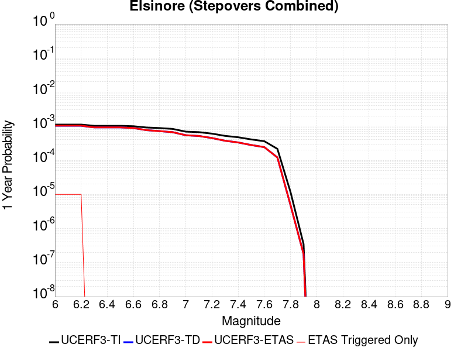 | 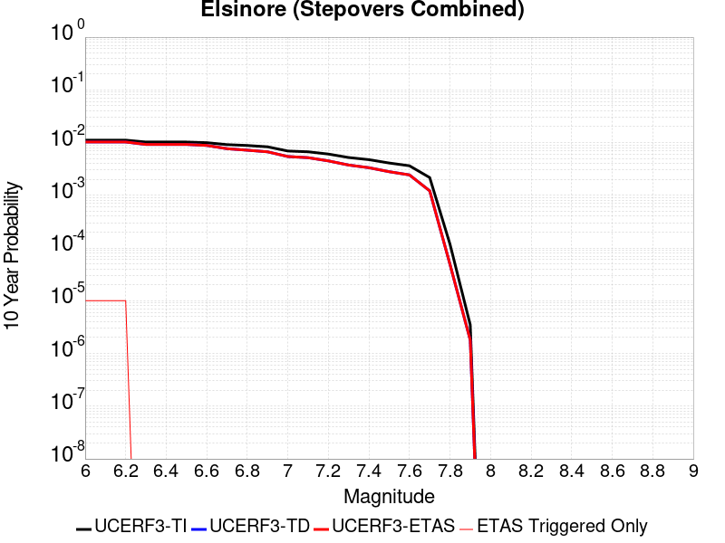 |

| Magnitude | 1 yr TI Prob | TD Prob | ETAS Prob | ETAS/TD Gain | ETAS Triggered Only | 10 yr TI Prob | TD Prob | ETAS Prob | ETAS/TD Gain | ETAS Triggered Only |
|-----|-----|-----|-----|-----|-----|-----|-----|-----|-----|-----|
| 6.0 | 0.0011182994 | 0.0010305526 | 0.0010405423 | 1.0096935 | 1.0E-5 | 0.011126885 | 0.010264838 | 0.010274735 | 1.0009642 | 1.0E-5 |
| 6.1 | 0.0011182994 | 0.0010305526 | 0.0010405423 | 1.0096935 | 1.0E-5 | 0.011126885 | 0.010264838 | 0.010274735 | 1.0009642 | 1.0E-5 |
| 6.2 | 0.0011182994 | 0.0010305526 | 0.0010405423 | 1.0096935 | 1.0E-5 | 0.011126885 | 0.010264838 | 0.010274735 | 1.0009642 | 1.0E-5 |
| 6.3 | 0.0010300872 | 9.2531374E-4 | 9.2531374E-4 | 1.0 | 0.0 | 0.010253254 | 0.009221202 | 0.009221202 | 1.0 | 0.0 |
| 6.4 | 0.0010300872 | 9.2531374E-4 | 9.2531374E-4 | 1.0 | 0.0 | 0.010253254 | 0.009221202 | 0.009221202 | 1.0 | 0.0 |
| 6.5 | 0.0010300872 | 9.2531374E-4 | 9.2531374E-4 | 1.0 | 0.0 | 0.010253254 | 0.009221202 | 0.009221202 | 1.0 | 0.0 |
| 6.6 | 0.0010007467 | 8.868369E-4 | 8.868369E-4 | 1.0 | 0.0 | 0.00996252 | 0.008839776 | 0.008839776 | 1.0 | 0.0 |
| 6.7 | 9.183606E-4 | 7.6844136E-4 | 7.6844136E-4 | 1.0 | 0.0 | 0.009145746 | 0.007664848 | 0.007664848 | 1.0 | 0.0 |
| 6.8 | 8.8517193E-4 | 7.189462E-4 | 7.189462E-4 | 1.0 | 0.0 | 0.008816543 | 0.0071726176 | 0.0071726176 | 1.0 | 0.0 |
| 6.9 | 8.347058E-4 | 6.701034E-4 | 6.701034E-4 | 1.0 | 0.0 | 0.008315775 | 0.0066867108 | 0.0066867108 | 1.0 | 0.0 |
| 7.0 | 6.944992E-4 | 5.449906E-4 | 5.449906E-4 | 1.0 | 0.0 | 0.006923327 | 0.005440468 | 0.005440468 | 1.0 | 0.0 |
| 7.1 | 6.710743E-4 | 5.183928E-4 | 5.183928E-4 | 1.0 | 0.0 | 0.0066905143 | 0.0051751686 | 0.0051751686 | 1.0 | 0.0 |
| 7.2 | 6.0770183E-4 | 4.503983E-4 | 4.503983E-4 | 1.0 | 0.0 | 0.0060604266 | 0.0044962782 | 0.0044962782 | 1.0 | 0.0 |
| 7.3 | 5.220972E-4 | 3.7566927E-4 | 3.7566927E-4 | 1.0 | 0.0 | 0.005208723 | 0.0037507294 | 0.0037507294 | 1.0 | 0.0 |
| 7.4 | 4.7558855E-4 | 3.3441206E-4 | 3.3441206E-4 | 1.0 | 0.0 | 0.00474572 | 0.0033392403 | 0.0033392403 | 1.0 | 0.0 |
| 7.5 | 4.1059E-4 | 2.8081346E-4 | 2.8081346E-4 | 1.0 | 0.0 | 0.0040983222 | 0.0028047129 | 0.0028047129 | 1.0 | 0.0 |
| 7.6 | 3.640086E-4 | 2.4404087E-4 | 2.4404087E-4 | 1.0 | 0.0 | 0.003634129 | 0.002437845 | 0.002437845 | 1.0 | 0.0 |
| 7.7 | 2.171282E-4 | 1.2148183E-4 | 1.2148183E-4 | 1.0 | 0.0 | 0.0021691616 | 0.0012142273 | 0.0012142273 | 1.0 | 0.0 |
| 7.8 | 1.1840509E-5 | 4.897146E-6 | 4.897146E-6 | 1.0 | 0.0 | 1.1839878E-4 | 4.897071E-5 | 4.897071E-5 | 1.0 | 0.0 |
| 7.9 | 3.4838732E-7 | 1.7948528E-7 | 1.7948528E-7 | 1.0 | 0.0 | 3.4838679E-6 | 1.7948516E-6 | 1.7948516E-6 | 1.0 | 0.0 |

## Gillem - Big Crack 2011 CFM
*[(top)](#table-of-contents)*

| 1 Year | 10 Year |
|-----|-----|
|  |  |

| Magnitude | 1 yr TI Prob | TD Prob | ETAS Prob | ETAS/TD Gain | ETAS Triggered Only | 10 yr TI Prob | TD Prob | ETAS Prob | ETAS/TD Gain | ETAS Triggered Only |
|-----|-----|-----|-----|-----|-----|-----|-----|-----|-----|-----|
| 6.0 | 0.0011456419 | 0.0012309974 | 0.0012309974 | 1.0 | 0.0 | 0.011397537 | 0.012250645 | 0.012260523 | 1.0008063 | 1.0E-5 |
| 6.1 | 5.2127644E-4 | 5.5879646E-4 | 5.5879646E-4 | 1.0 | 0.0 | 0.0052005537 | 0.005575724 | 0.005575724 | 1.0 | 0.0 |
| 6.2 | 5.2127644E-4 | 5.5879646E-4 | 5.5879646E-4 | 1.0 | 0.0 | 0.0052005537 | 0.005575724 | 0.005575724 | 1.0 | 0.0 |
| 6.3 | 2.406603E-4 | 2.5787242E-4 | 2.5787242E-4 | 1.0 | 0.0 | 0.0024039985 | 0.0025761703 | 0.0025761703 | 1.0 | 0.0 |
| 6.4 | 2.406603E-4 | 2.5787242E-4 | 2.5787242E-4 | 1.0 | 0.0 | 0.0024039985 | 0.0025761703 | 0.0025761703 | 1.0 | 0.0 |
| 6.5 | 1.417443E-4 | 1.5188863E-4 | 1.5188863E-4 | 1.0 | 0.0 | 0.0014165393 | 0.0015180861 | 0.0015180861 | 1.0 | 0.0 |
| 6.6 | 7.209913E-5 | 7.733047E-5 | 7.733047E-5 | 1.0 | 0.0 | 7.2075747E-4 | 7.731565E-4 | 7.731565E-4 | 1.0 | 0.0 |

## Chino alt 1
*[(top)](#table-of-contents)*

| 1 Year | 10 Year |
|-----|-----|
|  |  |

| Magnitude | 1 yr TI Prob | TD Prob | ETAS Prob | ETAS/TD Gain | ETAS Triggered Only | 10 yr TI Prob | TD Prob | ETAS Prob | ETAS/TD Gain | ETAS Triggered Only |
|-----|-----|-----|-----|-----|-----|-----|-----|-----|-----|-----|
| 6.0 | 0.0020537362 | 0.0025513761 | 0.0025613506 | 1.0039095 | 1.0E-5 | 0.020348595 | 0.025277665 | 0.025287412 | 1.0003856 | 1.0E-5 |
| 6.1 | 0.0011215154 | 0.0014016523 | 0.0014116383 | 1.0071244 | 1.0E-5 | 0.011158722 | 0.013945027 | 0.013954888 | 1.0007071 | 1.0E-5 |
| 6.2 | 0.0011215154 | 0.0014016523 | 0.0014116383 | 1.0071244 | 1.0E-5 | 0.011158722 | 0.013945027 | 0.013954888 | 1.0007071 | 1.0E-5 |
| 6.3 | 7.454001E-4 | 9.474294E-4 | 9.574199E-4 | 1.0105449 | 1.0E-5 | 0.007429048 | 0.009444368 | 0.009454274 | 1.0010488 | 1.0E-5 |
| 6.4 | 7.454001E-4 | 9.474294E-4 | 9.574199E-4 | 1.0105449 | 1.0E-5 | 0.007429048 | 0.009444368 | 0.009454274 | 1.0010488 | 1.0E-5 |
| 6.5 | 6.790315E-4 | 8.6855015E-4 | 8.785415E-4 | 1.0115035 | 1.0E-5 | 0.0067696036 | 0.008661863 | 0.008671777 | 1.0011445 | 1.0E-5 |
| 6.6 | 4.940122E-4 | 6.2803633E-4 | 6.3803006E-4 | 1.0159127 | 1.0E-5 | 0.004929154 | 0.0062718354 | 0.0062817726 | 1.0015844 | 1.0E-5 |
| 6.7 | 4.3372845E-4 | 5.4294505E-4 | 5.529396E-4 | 1.0184081 | 1.0E-5 | 0.004328829 | 0.0054257195 | 0.005435665 | 1.0018331 | 1.0E-5 |
| 6.8 | 1.8185932E-4 | 1.989575E-4 | 1.989575E-4 | 1.0 | 0.0 | 0.0018171056 | 0.001989471 | 0.001989471 | 1.0 | 0.0 |
| 6.9 | 1.18156495E-4 | 1.12328584E-4 | 1.12328584E-4 | 1.0 | 0.0 | 0.0011809369 | 0.0011233342 | 0.0011233342 | 1.0 | 0.0 |
| 7.0 | 9.3207556E-5 | 8.051188E-5 | 8.051188E-5 | 1.0 | 0.0 | 9.316847E-4 | 8.052742E-4 | 8.052742E-4 | 1.0 | 0.0 |
| 7.1 | 9.034557E-5 | 7.6873905E-5 | 7.6873905E-5 | 1.0 | 0.0 | 9.0308854E-4 | 7.689109E-4 | 7.689109E-4 | 1.0 | 0.0 |
| 7.2 | 8.352579E-5 | 7.082535E-5 | 7.082535E-5 | 1.0 | 0.0 | 8.34944E-4 | 7.084519E-4 | 7.084519E-4 | 1.0 | 0.0 |
| 7.3 | 6.9504385E-5 | 5.8530906E-5 | 5.8530906E-5 | 1.0 | 0.0 | 6.9482654E-4 | 5.852994E-4 | 5.852994E-4 | 1.0 | 0.0 |
| 7.4 | 5.8140613E-5 | 4.8196467E-5 | 4.8196467E-5 | 1.0 | 0.0 | 5.81254E-4 | 4.8187695E-4 | 4.8187695E-4 | 1.0 | 0.0 |
| 7.5 | 4.8807087E-5 | 3.9776958E-5 | 3.9776958E-5 | 1.0 | 0.0 | 4.879637E-4 | 3.9770178E-4 | 3.9770178E-4 | 1.0 | 0.0 |
| 7.6 | 4.4464414E-5 | 3.5901714E-5 | 3.5901714E-5 | 1.0 | 0.0 | 4.4455516E-4 | 3.589623E-4 | 3.589623E-4 | 1.0 | 0.0 |
| 7.7 | 1.1376757E-5 | 7.402222E-6 | 7.402222E-6 | 1.0 | 0.0 | 1.13761744E-4 | 7.402071E-5 | 7.402071E-5 | 1.0 | 0.0 |

## Palos Verdes
*[(top)](#table-of-contents)*

| 1 Year | 10 Year |
|-----|-----|
|  | 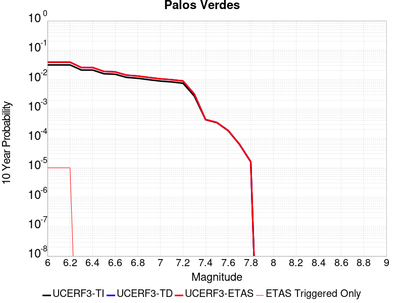 |

| Magnitude | 1 yr TI Prob | TD Prob | ETAS Prob | ETAS/TD Gain | ETAS Triggered Only | 10 yr TI Prob | TD Prob | ETAS Prob | ETAS/TD Gain | ETAS Triggered Only |
|-----|-----|-----|-----|-----|-----|-----|-----|-----|-----|-----|
| 6.0 | 0.0031914865 | 0.003970149 | 0.0039801095 | 1.0025088 | 1.0E-5 | 0.031460393 | 0.03904865 | 0.03905826 | 1.000246 | 1.0E-5 |
| 6.1 | 0.0031914865 | 0.003970149 | 0.0039801095 | 1.0025088 | 1.0E-5 | 0.031460393 | 0.03904865 | 0.03905826 | 1.000246 | 1.0E-5 |
| 6.2 | 0.0031914865 | 0.003970149 | 0.0039801095 | 1.0025088 | 1.0E-5 | 0.031460393 | 0.03904865 | 0.03905826 | 1.000246 | 1.0E-5 |
| 6.3 | 0.0021286458 | 0.0025927671 | 0.0025927671 | 1.0 | 0.0 | 0.021083709 | 0.025646534 | 0.025646534 | 1.0 | 0.0 |
| 6.4 | 0.0021286458 | 0.0025927671 | 0.0025927671 | 1.0 | 0.0 | 0.021083709 | 0.025646534 | 0.025646534 | 1.0 | 0.0 |
| 6.5 | 0.0015908304 | 0.0019060666 | 0.0019060666 | 1.0 | 0.0 | 0.015794903 | 0.018909054 | 0.018909054 | 1.0 | 0.0 |
| 6.6 | 0.0015253464 | 0.001832773 | 0.001832773 | 1.0 | 0.0 | 0.015149189 | 0.018188128 | 0.018188128 | 1.0 | 0.0 |
| 6.7 | 0.001192729 | 0.001420876 | 0.001420876 | 1.0 | 0.0 | 0.011863477 | 0.014127145 | 0.014127145 | 1.0 | 0.0 |
| 6.8 | 0.001112141 | 0.0013262255 | 0.0013262255 | 1.0 | 0.0 | 0.011065915 | 0.013192143 | 0.013192143 | 1.0 | 0.0 |
| 6.9 | 9.914007E-4 | 0.0011793474 | 0.0011793474 | 1.0 | 0.0 | 0.009869894 | 0.0117395725 | 0.0117395725 | 1.0 | 0.0 |
| 7.0 | 8.917837E-4 | 0.0010597695 | 0.0010597695 | 1.0 | 0.0 | 0.008882134 | 0.010555593 | 0.010555593 | 1.0 | 0.0 |
| 7.1 | 8.336179E-4 | 9.907234E-4 | 9.907234E-4 | 1.0 | 0.0 | 0.008304977 | 0.00987143 | 0.00987143 | 1.0 | 0.0 |
| 7.2 | 7.546402E-4 | 8.9701766E-4 | 8.9701766E-4 | 1.0 | 0.0 | 0.007520827 | 0.008942238 | 0.008942238 | 1.0 | 0.0 |
| 7.3 | 2.7589512E-4 | 3.2368326E-4 | 3.2368326E-4 | 1.0 | 0.0 | 0.0027555283 | 0.0032355408 | 0.0032355408 | 1.0 | 0.0 |
| 7.4 | 4.3200624E-5 | 4.3872667E-5 | 4.3872667E-5 | 1.0 | 0.0 | 4.3192226E-4 | 4.386473E-4 | 4.386473E-4 | 1.0 | 0.0 |
| 7.5 | 3.4227687E-5 | 3.478811E-5 | 3.478811E-5 | 1.0 | 0.0 | 3.4222414E-4 | 3.478333E-4 | 3.478333E-4 | 1.0 | 0.0 |
| 7.6 | 1.8272232E-5 | 1.8585893E-5 | 1.8585893E-5 | 1.0 | 0.0 | 1.8270731E-4 | 1.85848E-4 | 1.85848E-4 | 1.0 | 0.0 |
| 7.7 | 6.2541585E-6 | 6.3649163E-6 | 6.3649163E-6 | 1.0 | 0.0 | 6.2539824E-5 | 6.364738E-5 | 6.364738E-5 | 1.0 | 0.0 |
| 7.8 | 1.5885756E-6 | 1.6189731E-6 | 1.6189731E-6 | 1.0 | 0.0 | 1.5885644E-5 | 1.6189633E-5 | 1.6189633E-5 | 1.0 | 0.0 |

