# Searles Valley M6.4 and M7.1 PointSource Results

|   | Searles Valley M6.4 and M7.1 PointSource |
|-----|-----|
| Num Simulations | 100000 |
| Start Time | 2019/07/06 03:19:52 UTC |
| Start Time Epoch Milliseconds | 1562383192000 |
| Duration | 10 Years |
| Includes Spontaneous? | false |
| Historical Ruptures | *(none)* |

## Table Of Contents

* [Magnitude Number Distribution](#magnitude-number-distribution)
  * [10 Year Magnitude Number Distribution](#10-year-magnitude-number-distribution)
  * [1 Year Magnitude Number Distribution](#1-year-magnitude-number-distribution)
  * [1 Month Magnitude Number Distribution](#1-month-magnitude-number-distribution)
  * [1 Week Magnitude Number Distribution](#1-week-magnitude-number-distribution)
  * [1 Day Magnitude Number Distribution](#1-day-magnitude-number-distribution)
  * [1 Hour Magnitude Number Distribution](#1-hour-magnitude-number-distribution)
* [Hazard Change Over Time](#hazard-change-over-time)
  * [M&ge;5.0 Hazard Change Over Time](#mge50-hazard-change-over-time)
  * [M&ge;6.0 Hazard Change Over Time](#mge60-hazard-change-over-time)
  * [M&ge;7.0 Hazard Change Over Time](#mge70-hazard-change-over-time)
  * [M&ge;8.0 Hazard Change Over Time](#mge80-hazard-change-over-time)
* [Section Participation](#section-participation)
  * [Section Participation Plots](#section-participation-plots)
  * [Supra-Seismogenic Parent Sections Table](#supra-seismogenic-parent-sections-table)
  * [M≥6.5 Parent Sections Table](#m65-parent-sections-table)
  * [M≥7 Parent Sections Table](#m7-parent-sections-table)
  * [M≥7.5 Parent Sections Table](#m75-parent-sections-table)
  * [M≥8 Parent Sections Table](#m8-parent-sections-table)
* [Gridded Nucleation](#gridded-nucleation)
* [JSON Input File](#json-input-file)

## Magnitude Number Distribution
*[(top)](#table-of-contents)*

### 10 Year Magnitude Number Distribution
*[(top)](#table-of-contents)*

**Legend**
* **Mean** (thick black line): mean expected number across all 100000 catalogs
* **2.5%,97.5%** (thin black lines): expected number percentiles across all 100000 catalogs
* **Median** (thin blue line): median expected number across all 100000 catalogs
* **Mode** (thin cyan line): modal expected number across all 100000 catalogs
* **10 yr Probability** (thin red line): 10 year probability calculated as the fraction of catalogs with at least 1 occurrence
* **95% Conf** (light red shaded region): binomial 95% confidence bounds on probability
* **Primary** (thin green line): mean expected number from primary triggered aftershocks only (no secondary, tertiary, etc...) across all 100000 catalogs

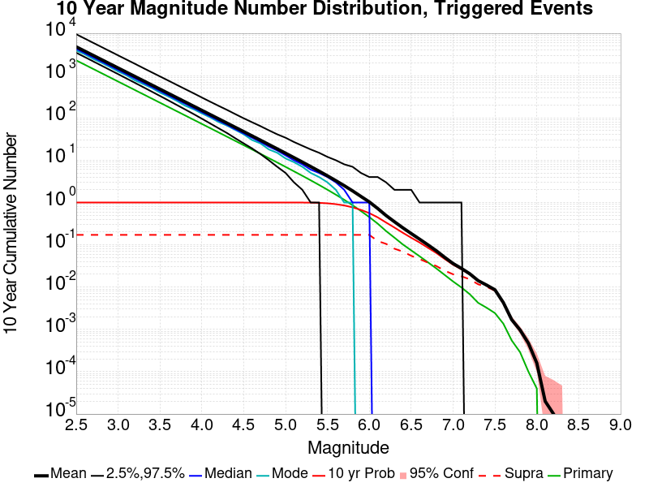

| Mag | Mean | 2.5 %ile | 97.5 %ile | Median | Mode | 10 yr Probability | Primary Aftershocks Mean |
|-----|-----|-----|-----|-----|-----|-----|-----|
| **M&ge;5** | 14.645 | 5.000 | 34.000 | 13.000 | 11.000 | 1.000 | 6.965 |
| **M&ge;5.1** | 11.524 | 3.000 | 27.000 | 10.000 | 9.000 | 1.000 | 5.469 |
| **M&ge;5.2** | 9.049 | 2.000 | 22.000 | 8.000 | 7.000 | 0.998 | 4.290 |
| **M&ge;5.3** | 7.077 | 1.000 | 18.000 | 6.000 | 5.000 | 0.994 | 3.349 |
| **M&ge;5.4** | 5.518 | 1.000 | 15.000 | 5.000 | 4.000 | 0.982 | 2.602 |
| **M&ge;5.5** | 4.276 | 0.000 | 12.000 | 4.000 | 3.000 | 0.957 | 2.008 |
| **M&ge;5.6** | 3.288 | 0.000 | 10.000 | 3.000 | 2.000 | 0.914 | 1.533 |
| **M&ge;5.7** | 2.507 | 0.000 | 8.000 | 2.000 | 1.000 | 0.852 | 1.162 |
| **M&ge;5.8** | 1.884 | 0.000 | 7.000 | 1.000 | 1.000 | 0.769 | 0.862 |
| **M&ge;5.9** | 1.393 | 0.000 | 5.000 | 1.000 | 0.000 | 0.669 | 0.629 |
| **M&ge;6** | 1.033 | 0.000 | 4.000 | 1.000 | 0.000 | 0.561 | 0.452 |
| **M&ge;6.1** | 0.722 | 0.000 | 4.000 | 0.000 | 0.000 | 0.446 | 0.317 |
| **M&ge;6.2** | 0.493 | 0.000 | 3.000 | 0.000 | 0.000 | 0.337 | 0.212 |
| **M&ge;6.3** | 0.351 | 0.000 | 2.000 | 0.000 | 0.000 | 0.256 | 0.148 |
| **M&ge;6.4** | 0.253 | 0.000 | 2.000 | 0.000 | 0.000 | 0.193 | 0.102 |
| **M&ge;6.5** | 0.185 | 0.000 | 2.000 | 0.000 | 0.000 | 0.147 | 0.074 |
| **M&ge;6.6** | 0.136 | 0.000 | 1.000 | 0.000 | 0.000 | 0.113 | 0.054 |
| **M&ge;6.7** | 0.100 | 0.000 | 1.000 | 0.000 | 0.000 | 0.085 | 0.039 |
| **M&ge;6.8** | 0.072 | 0.000 | 1.000 | 0.000 | 0.000 | 0.064 | 0.028 |
| **M&ge;6.9** | 0.051 | 0.000 | 1.000 | 0.000 | 0.000 | 0.046 | 0.019 |
| **M&ge;7** | 0.036 | 0.000 | 1.000 | 0.000 | 0.000 | 0.034 | 0.014 |
| **M&ge;7.1** | 0.028 | 0.000 | 1.000 | 0.000 | 0.000 | 0.026 | 9.81E-3 |
| **M&ge;7.2** | 0.021 | 0.000 | 0.000 | 0.000 | 0.000 | 0.020 | 6.78E-3 |
| **M&ge;7.3** | 0.014 | 0.000 | 0.000 | 0.000 | 0.000 | 0.014 | 4.24E-3 |
| **M&ge;7.4** | 0.011 | 0.000 | 0.000 | 0.000 | 0.000 | 0.011 | 3.26E-3 |
| **M&ge;7.5** | 8.64E-3 | 0.000 | 0.000 | 0.000 | 0.000 | 8.48E-3 | 2.43E-3 |
| **M&ge;7.6** | 4.32E-3 | 0.000 | 0.000 | 0.000 | 0.000 | 4.26E-3 | 1.37E-3 |
| **M&ge;7.7** | 1.70E-3 | 0.000 | 0.000 | 0.000 | 0.000 | 1.69E-3 | 5.50E-4 |
| **M&ge;7.8** | 9.70E-4 | 0.000 | 0.000 | 0.000 | 0.000 | 9.60E-4 | 2.90E-4 |
| **M&ge;7.9** | 4.70E-4 | 0.000 | 0.000 | 0.000 | 0.000 | 4.70E-4 | 1.00E-4 |
| **M&ge;8** | 1.60E-4 | 0.000 | 0.000 | 0.000 | 0.000 | 1.60E-4 | 4.00E-5 |
| **M&ge;8.1** | 2.00E-5 | 0.000 | 0.000 | 0.000 | 0.000 | 2.00E-5 | 0.000 |
| **M&ge;8.2** | 1.00E-5 | 0.000 | 0.000 | 0.000 | 0.000 | 1.00E-5 | 0.000 |
| **M&ge;8.3** | 0.000 | 0.000 | 0.000 | 0.000 | 0.000 | 0.000 | 0.000 |
| **M&ge;8.4** | 0.000 | 0.000 | 0.000 | 0.000 | 0.000 | 0.000 | 0.000 |
| **M&ge;8.5** | 0.000 | 0.000 | 0.000 | 0.000 | 0.000 | 0.000 | 0.000 |
| **M&ge;8.6** | 0.000 | 0.000 | 0.000 | 0.000 | 0.000 | 0.000 | 0.000 |
| **M&ge;8.7** | 0.000 | 0.000 | 0.000 | 0.000 | 0.000 | 0.000 | 0.000 |
| **M&ge;8.8** | 0.000 | 0.000 | 0.000 | 0.000 | 0.000 | 0.000 | 0.000 |
| **M&ge;8.9** | 0.000 | 0.000 | 0.000 | 0.000 | 0.000 | 0.000 | 0.000 |
| **M&ge;9** | 0.000 | 0.000 | 0.000 | 0.000 | 0.000 | 0.000 | 0.000 |

### 1 Year Magnitude Number Distribution
*[(top)](#table-of-contents)*

**Legend**
* **Mean** (thick black line): mean expected number across all 100000 catalogs
* **2.5%,97.5%** (thin black lines): expected number percentiles across all 100000 catalogs
* **Median** (thin blue line): median expected number across all 100000 catalogs
* **Mode** (thin cyan line): modal expected number across all 100000 catalogs
* **1 yr Probability** (thin red line): 1 year probability calculated as the fraction of catalogs with at least 1 occurrence
* **95% Conf** (light red shaded region): binomial 95% confidence bounds on probability
* **Primary** (thin green line): mean expected number from primary triggered aftershocks only (no secondary, tertiary, etc...) across all 100000 catalogs

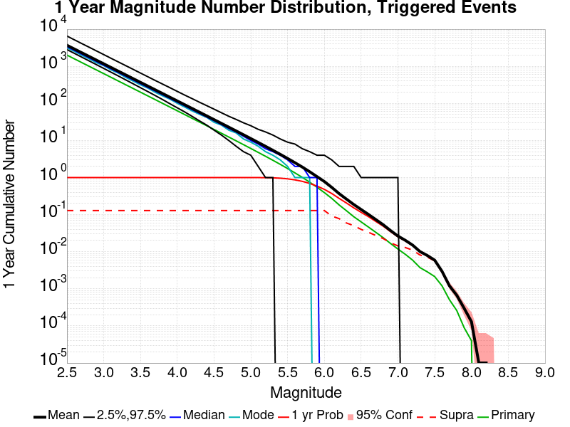

| Mag | Mean | 2.5 %ile | 97.5 %ile | Median | Mode | 1 yr Probability | Primary Aftershocks Mean |
|-----|-----|-----|-----|-----|-----|-----|-----|
| **M&ge;5** | 11.261 | 4.000 | 25.000 | 10.000 | 9.000 | 1.000 | 6.087 |
| **M&ge;5.1** | 8.855 | 2.000 | 20.000 | 8.000 | 7.000 | 0.999 | 4.780 |
| **M&ge;5.2** | 6.952 | 1.000 | 17.000 | 6.000 | 5.000 | 0.995 | 3.748 |
| **M&ge;5.3** | 5.433 | 1.000 | 14.000 | 5.000 | 4.000 | 0.985 | 2.926 |
| **M&ge;5.4** | 4.234 | 0.000 | 11.000 | 4.000 | 3.000 | 0.962 | 2.274 |
| **M&ge;5.5** | 3.278 | 0.000 | 9.000 | 3.000 | 2.000 | 0.924 | 1.753 |
| **M&ge;5.6** | 2.516 | 0.000 | 8.000 | 2.000 | 1.000 | 0.866 | 1.337 |
| **M&ge;5.7** | 1.918 | 0.000 | 6.000 | 2.000 | 1.000 | 0.790 | 1.014 |
| **M&ge;5.8** | 1.437 | 0.000 | 5.000 | 1.000 | 1.000 | 0.695 | 0.751 |
| **M&ge;5.9** | 1.061 | 0.000 | 4.000 | 1.000 | 0.000 | 0.589 | 0.548 |
| **M&ge;6** | 0.781 | 0.000 | 4.000 | 0.000 | 0.000 | 0.481 | 0.393 |
| **M&ge;6.1** | 0.545 | 0.000 | 3.000 | 0.000 | 0.000 | 0.372 | 0.275 |
| **M&ge;6.2** | 0.370 | 0.000 | 2.000 | 0.000 | 0.000 | 0.275 | 0.183 |
| **M&ge;6.3** | 0.263 | 0.000 | 2.000 | 0.000 | 0.000 | 0.206 | 0.128 |
| **M&ge;6.4** | 0.188 | 0.000 | 2.000 | 0.000 | 0.000 | 0.153 | 0.088 |
| **M&ge;6.5** | 0.138 | 0.000 | 1.000 | 0.000 | 0.000 | 0.115 | 0.064 |
| **M&ge;6.6** | 0.101 | 0.000 | 1.000 | 0.000 | 0.000 | 0.088 | 0.046 |
| **M&ge;6.7** | 0.074 | 0.000 | 1.000 | 0.000 | 0.000 | 0.066 | 0.033 |
| **M&ge;6.8** | 0.053 | 0.000 | 1.000 | 0.000 | 0.000 | 0.049 | 0.024 |
| **M&ge;6.9** | 0.037 | 0.000 | 1.000 | 0.000 | 0.000 | 0.035 | 0.017 |
| **M&ge;7** | 0.027 | 0.000 | 1.000 | 0.000 | 0.000 | 0.025 | 0.012 |
| **M&ge;7.1** | 0.020 | 0.000 | 0.000 | 0.000 | 0.000 | 0.020 | 8.54E-3 |
| **M&ge;7.2** | 0.015 | 0.000 | 0.000 | 0.000 | 0.000 | 0.015 | 5.93E-3 |
| **M&ge;7.3** | 0.010 | 0.000 | 0.000 | 0.000 | 0.000 | 9.90E-3 | 3.73E-3 |
| **M&ge;7.4** | 7.91E-3 | 0.000 | 0.000 | 0.000 | 0.000 | 7.81E-3 | 2.87E-3 |
| **M&ge;7.5** | 5.92E-3 | 0.000 | 0.000 | 0.000 | 0.000 | 5.85E-3 | 2.14E-3 |
| **M&ge;7.6** | 2.96E-3 | 0.000 | 0.000 | 0.000 | 0.000 | 2.94E-3 | 1.20E-3 |
| **M&ge;7.7** | 1.21E-3 | 0.000 | 0.000 | 0.000 | 0.000 | 1.21E-3 | 5.10E-4 |
| **M&ge;7.8** | 6.70E-4 | 0.000 | 0.000 | 0.000 | 0.000 | 6.70E-4 | 2.60E-4 |
| **M&ge;7.9** | 3.00E-4 | 0.000 | 0.000 | 0.000 | 0.000 | 3.00E-4 | 9.00E-5 |
| **M&ge;8** | 1.30E-4 | 0.000 | 0.000 | 0.000 | 0.000 | 1.30E-4 | 4.00E-5 |
| **M&ge;8.1** | 1.00E-5 | 0.000 | 0.000 | 0.000 | 0.000 | 1.00E-5 | 0.000 |
| **M&ge;8.2** | 1.00E-5 | 0.000 | 0.000 | 0.000 | 0.000 | 1.00E-5 | 0.000 |
| **M&ge;8.3** | 0.000 | 0.000 | 0.000 | 0.000 | 0.000 | 0.000 | 0.000 |
| **M&ge;8.4** | 0.000 | 0.000 | 0.000 | 0.000 | 0.000 | 0.000 | 0.000 |
| **M&ge;8.5** | 0.000 | 0.000 | 0.000 | 0.000 | 0.000 | 0.000 | 0.000 |
| **M&ge;8.6** | 0.000 | 0.000 | 0.000 | 0.000 | 0.000 | 0.000 | 0.000 |
| **M&ge;8.7** | 0.000 | 0.000 | 0.000 | 0.000 | 0.000 | 0.000 | 0.000 |
| **M&ge;8.8** | 0.000 | 0.000 | 0.000 | 0.000 | 0.000 | 0.000 | 0.000 |
| **M&ge;8.9** | 0.000 | 0.000 | 0.000 | 0.000 | 0.000 | 0.000 | 0.000 |
| **M&ge;9** | 0.000 | 0.000 | 0.000 | 0.000 | 0.000 | 0.000 | 0.000 |

### 1 Month Magnitude Number Distribution
*[(top)](#table-of-contents)*

**Legend**
* **Mean** (thick black line): mean expected number across all 100000 catalogs
* **2.5%,97.5%** (thin black lines): expected number percentiles across all 100000 catalogs
* **Median** (thin blue line): median expected number across all 100000 catalogs
* **Mode** (thin cyan line): modal expected number across all 100000 catalogs
* **1 mo Probability** (thin red line): 1 month probability calculated as the fraction of catalogs with at least 1 occurrence
* **95% Conf** (light red shaded region): binomial 95% confidence bounds on probability
* **Primary** (thin green line): mean expected number from primary triggered aftershocks only (no secondary, tertiary, etc...) across all 100000 catalogs

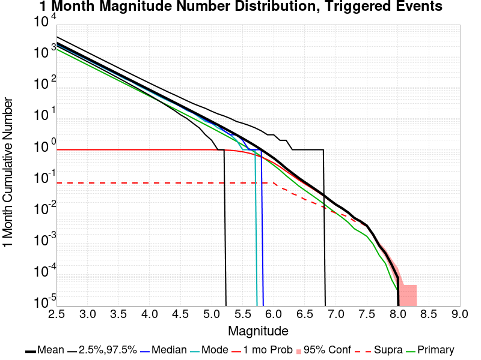

| Mag | Mean | 2.5 %ile | 97.5 %ile | Median | Mode | 1 mo Probability | Primary Aftershocks Mean |
|-----|-----|-----|-----|-----|-----|-----|-----|
| **M&ge;5** | 7.955 | 2.000 | 17.000 | 7.000 | 7.000 | 0.998 | 4.966 |
| **M&ge;5.1** | 6.253 | 1.000 | 14.000 | 6.000 | 5.000 | 0.994 | 3.899 |
| **M&ge;5.2** | 4.904 | 1.000 | 12.000 | 4.000 | 4.000 | 0.982 | 3.057 |
| **M&ge;5.3** | 3.829 | 0.000 | 10.000 | 3.000 | 3.000 | 0.958 | 2.384 |
| **M&ge;5.4** | 2.979 | 0.000 | 8.000 | 3.000 | 2.000 | 0.918 | 1.852 |
| **M&ge;5.5** | 2.303 | 0.000 | 7.000 | 2.000 | 1.000 | 0.857 | 1.428 |
| **M&ge;5.6** | 1.765 | 0.000 | 6.000 | 1.000 | 1.000 | 0.778 | 1.089 |
| **M&ge;5.7** | 1.343 | 0.000 | 5.000 | 1.000 | 1.000 | 0.687 | 0.826 |
| **M&ge;5.8** | 1.002 | 0.000 | 4.000 | 1.000 | 0.000 | 0.584 | 0.611 |
| **M&ge;5.9** | 0.737 | 0.000 | 3.000 | 0.000 | 0.000 | 0.478 | 0.446 |
| **M&ge;6** | 0.538 | 0.000 | 3.000 | 0.000 | 0.000 | 0.378 | 0.318 |
| **M&ge;6.1** | 0.375 | 0.000 | 2.000 | 0.000 | 0.000 | 0.285 | 0.223 |
| **M&ge;6.2** | 0.253 | 0.000 | 2.000 | 0.000 | 0.000 | 0.205 | 0.148 |
| **M&ge;6.3** | 0.178 | 0.000 | 1.000 | 0.000 | 0.000 | 0.150 | 0.102 |
| **M&ge;6.4** | 0.126 | 0.000 | 1.000 | 0.000 | 0.000 | 0.109 | 0.070 |
| **M&ge;6.5** | 0.092 | 0.000 | 1.000 | 0.000 | 0.000 | 0.081 | 0.051 |
| **M&ge;6.6** | 0.067 | 0.000 | 1.000 | 0.000 | 0.000 | 0.061 | 0.037 |
| **M&ge;6.7** | 0.049 | 0.000 | 1.000 | 0.000 | 0.000 | 0.045 | 0.027 |
| **M&ge;6.8** | 0.036 | 0.000 | 1.000 | 0.000 | 0.000 | 0.034 | 0.019 |
| **M&ge;6.9** | 0.025 | 0.000 | 0.000 | 0.000 | 0.000 | 0.024 | 0.013 |
| **M&ge;7** | 0.018 | 0.000 | 0.000 | 0.000 | 0.000 | 0.017 | 9.50E-3 |
| **M&ge;7.1** | 0.013 | 0.000 | 0.000 | 0.000 | 0.000 | 0.013 | 6.82E-3 |
| **M&ge;7.2** | 9.79E-3 | 0.000 | 0.000 | 0.000 | 0.000 | 9.63E-3 | 4.73E-3 |
| **M&ge;7.3** | 6.53E-3 | 0.000 | 0.000 | 0.000 | 0.000 | 6.43E-3 | 2.95E-3 |
| **M&ge;7.4** | 5.09E-3 | 0.000 | 0.000 | 0.000 | 0.000 | 5.03E-3 | 2.28E-3 |
| **M&ge;7.5** | 3.72E-3 | 0.000 | 0.000 | 0.000 | 0.000 | 3.67E-3 | 1.70E-3 |
| **M&ge;7.6** | 1.95E-3 | 0.000 | 0.000 | 0.000 | 0.000 | 1.94E-3 | 9.60E-4 |
| **M&ge;7.7** | 8.60E-4 | 0.000 | 0.000 | 0.000 | 0.000 | 8.60E-4 | 4.20E-4 |
| **M&ge;7.8** | 4.90E-4 | 0.000 | 0.000 | 0.000 | 0.000 | 4.90E-4 | 2.30E-4 |
| **M&ge;7.9** | 2.10E-4 | 0.000 | 0.000 | 0.000 | 0.000 | 2.10E-4 | 7.00E-5 |
| **M&ge;8** | 8.00E-5 | 0.000 | 0.000 | 0.000 | 0.000 | 8.00E-5 | 3.00E-5 |
| **M&ge;8.1** | 0.000 | 0.000 | 0.000 | 0.000 | 0.000 | 0.000 | 0.000 |
| **M&ge;8.2** | 0.000 | 0.000 | 0.000 | 0.000 | 0.000 | 0.000 | 0.000 |
| **M&ge;8.3** | 0.000 | 0.000 | 0.000 | 0.000 | 0.000 | 0.000 | 0.000 |
| **M&ge;8.4** | 0.000 | 0.000 | 0.000 | 0.000 | 0.000 | 0.000 | 0.000 |
| **M&ge;8.5** | 0.000 | 0.000 | 0.000 | 0.000 | 0.000 | 0.000 | 0.000 |
| **M&ge;8.6** | 0.000 | 0.000 | 0.000 | 0.000 | 0.000 | 0.000 | 0.000 |
| **M&ge;8.7** | 0.000 | 0.000 | 0.000 | 0.000 | 0.000 | 0.000 | 0.000 |
| **M&ge;8.8** | 0.000 | 0.000 | 0.000 | 0.000 | 0.000 | 0.000 | 0.000 |
| **M&ge;8.9** | 0.000 | 0.000 | 0.000 | 0.000 | 0.000 | 0.000 | 0.000 |
| **M&ge;9** | 0.000 | 0.000 | 0.000 | 0.000 | 0.000 | 0.000 | 0.000 |

### 1 Week Magnitude Number Distribution
*[(top)](#table-of-contents)*

**Legend**
* **Mean** (thick black line): mean expected number across all 100000 catalogs
* **2.5%,97.5%** (thin black lines): expected number percentiles across all 100000 catalogs
* **Median** (thin blue line): median expected number across all 100000 catalogs
* **Mode** (thin cyan line): modal expected number across all 100000 catalogs
* **1 wk Probability** (thin red line): 1 week probability calculated as the fraction of catalogs with at least 1 occurrence
* **95% Conf** (light red shaded region): binomial 95% confidence bounds on probability
* **Primary** (thin green line): mean expected number from primary triggered aftershocks only (no secondary, tertiary, etc...) across all 100000 catalogs


| Mag | Mean | 2.5 %ile | 97.5 %ile | Median | Mode | 1 wk Probability | Primary Aftershocks Mean |
|-----|-----|-----|-----|-----|-----|-----|-----|
| **M&ge;5** | 6.234 | 1.000 | 14.000 | 6.000 | 5.000 | 0.995 | 4.231 |
| **M&ge;5.1** | 4.903 | 1.000 | 11.000 | 5.000 | 4.000 | 0.985 | 3.325 |
| **M&ge;5.2** | 3.846 | 0.000 | 9.000 | 3.000 | 3.000 | 0.963 | 2.607 |
| **M&ge;5.3** | 3.000 | 0.000 | 8.000 | 3.000 | 2.000 | 0.925 | 2.032 |
| **M&ge;5.4** | 2.332 | 0.000 | 7.000 | 2.000 | 2.000 | 0.868 | 1.578 |
| **M&ge;5.5** | 1.801 | 0.000 | 6.000 | 2.000 | 1.000 | 0.793 | 1.216 |
| **M&ge;5.6** | 1.378 | 0.000 | 5.000 | 1.000 | 1.000 | 0.704 | 0.927 |
| **M&ge;5.7** | 1.047 | 0.000 | 4.000 | 1.000 | 0.000 | 0.607 | 0.702 |
| **M&ge;5.8** | 0.780 | 0.000 | 3.000 | 1.000 | 0.000 | 0.505 | 0.519 |
| **M&ge;5.9** | 0.572 | 0.000 | 3.000 | 0.000 | 0.000 | 0.405 | 0.379 |
| **M&ge;6** | 0.415 | 0.000 | 2.000 | 0.000 | 0.000 | 0.314 | 0.270 |
| **M&ge;6.1** | 0.289 | 0.000 | 2.000 | 0.000 | 0.000 | 0.233 | 0.188 |
| **M&ge;6.2** | 0.195 | 0.000 | 1.000 | 0.000 | 0.000 | 0.165 | 0.125 |
| **M&ge;6.3** | 0.137 | 0.000 | 1.000 | 0.000 | 0.000 | 0.120 | 0.086 |
| **M&ge;6.4** | 0.096 | 0.000 | 1.000 | 0.000 | 0.000 | 0.085 | 0.059 |
| **M&ge;6.5** | 0.070 | 0.000 | 1.000 | 0.000 | 0.000 | 0.063 | 0.043 |
| **M&ge;6.6** | 0.051 | 0.000 | 1.000 | 0.000 | 0.000 | 0.047 | 0.031 |
| **M&ge;6.7** | 0.037 | 0.000 | 1.000 | 0.000 | 0.000 | 0.035 | 0.022 |
| **M&ge;6.8** | 0.027 | 0.000 | 1.000 | 0.000 | 0.000 | 0.026 | 0.016 |
| **M&ge;6.9** | 0.019 | 0.000 | 0.000 | 0.000 | 0.000 | 0.018 | 0.011 |
| **M&ge;7** | 0.013 | 0.000 | 0.000 | 0.000 | 0.000 | 0.013 | 7.92E-3 |
| **M&ge;7.1** | 0.010 | 0.000 | 0.000 | 0.000 | 0.000 | 9.95E-3 | 5.68E-3 |
| **M&ge;7.2** | 7.32E-3 | 0.000 | 0.000 | 0.000 | 0.000 | 7.20E-3 | 3.93E-3 |
| **M&ge;7.3** | 4.92E-3 | 0.000 | 0.000 | 0.000 | 0.000 | 4.84E-3 | 2.50E-3 |
| **M&ge;7.4** | 3.79E-3 | 0.000 | 0.000 | 0.000 | 0.000 | 3.74E-3 | 1.93E-3 |
| **M&ge;7.5** | 2.81E-3 | 0.000 | 0.000 | 0.000 | 0.000 | 2.77E-3 | 1.49E-3 |
| **M&ge;7.6** | 1.52E-3 | 0.000 | 0.000 | 0.000 | 0.000 | 1.51E-3 | 8.50E-4 |
| **M&ge;7.7** | 6.90E-4 | 0.000 | 0.000 | 0.000 | 0.000 | 6.90E-4 | 3.70E-4 |
| **M&ge;7.8** | 3.90E-4 | 0.000 | 0.000 | 0.000 | 0.000 | 3.90E-4 | 2.10E-4 |
| **M&ge;7.9** | 1.40E-4 | 0.000 | 0.000 | 0.000 | 0.000 | 1.40E-4 | 6.00E-5 |
| **M&ge;8** | 5.00E-5 | 0.000 | 0.000 | 0.000 | 0.000 | 5.00E-5 | 3.00E-5 |
| **M&ge;8.1** | 0.000 | 0.000 | 0.000 | 0.000 | 0.000 | 0.000 | 0.000 |
| **M&ge;8.2** | 0.000 | 0.000 | 0.000 | 0.000 | 0.000 | 0.000 | 0.000 |
| **M&ge;8.3** | 0.000 | 0.000 | 0.000 | 0.000 | 0.000 | 0.000 | 0.000 |
| **M&ge;8.4** | 0.000 | 0.000 | 0.000 | 0.000 | 0.000 | 0.000 | 0.000 |
| **M&ge;8.5** | 0.000 | 0.000 | 0.000 | 0.000 | 0.000 | 0.000 | 0.000 |
| **M&ge;8.6** | 0.000 | 0.000 | 0.000 | 0.000 | 0.000 | 0.000 | 0.000 |
| **M&ge;8.7** | 0.000 | 0.000 | 0.000 | 0.000 | 0.000 | 0.000 | 0.000 |
| **M&ge;8.8** | 0.000 | 0.000 | 0.000 | 0.000 | 0.000 | 0.000 | 0.000 |
| **M&ge;8.9** | 0.000 | 0.000 | 0.000 | 0.000 | 0.000 | 0.000 | 0.000 |
| **M&ge;9** | 0.000 | 0.000 | 0.000 | 0.000 | 0.000 | 0.000 | 0.000 |

### 1 Day Magnitude Number Distribution
*[(top)](#table-of-contents)*

**Legend**
* **Mean** (thick black line): mean expected number across all 100000 catalogs
* **2.5%,97.5%** (thin black lines): expected number percentiles across all 100000 catalogs
* **Median** (thin blue line): median expected number across all 100000 catalogs
* **Mode** (thin cyan line): modal expected number across all 100000 catalogs
* **1 d Probability** (thin red line): 1 day probability calculated as the fraction of catalogs with at least 1 occurrence
* **95% Conf** (light red shaded region): binomial 95% confidence bounds on probability
* **Primary** (thin green line): mean expected number from primary triggered aftershocks only (no secondary, tertiary, etc...) across all 100000 catalogs

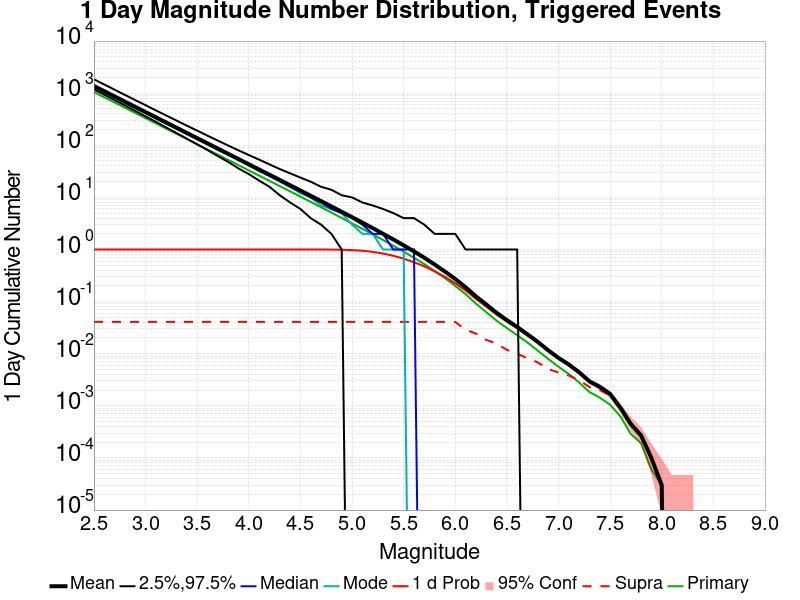

| Mag | Mean | 2.5 %ile | 97.5 %ile | Median | Mode | 1 d Probability | Primary Aftershocks Mean |
|-----|-----|-----|-----|-----|-----|-----|-----|
| **M&ge;5** | 4.176 | 0.000 | 10.000 | 4.000 | 3.000 | 0.975 | 3.173 |
| **M&ge;5.1** | 3.286 | 0.000 | 8.000 | 3.000 | 2.000 | 0.947 | 2.495 |
| **M&ge;5.2** | 2.577 | 0.000 | 7.000 | 2.000 | 2.000 | 0.902 | 1.956 |
| **M&ge;5.3** | 2.008 | 0.000 | 6.000 | 2.000 | 1.000 | 0.839 | 1.523 |
| **M&ge;5.4** | 1.560 | 0.000 | 5.000 | 1.000 | 1.000 | 0.759 | 1.182 |
| **M&ge;5.5** | 1.204 | 0.000 | 4.000 | 1.000 | 1.000 | 0.668 | 0.911 |
| **M&ge;5.6** | 0.920 | 0.000 | 4.000 | 1.000 | 0.000 | 0.571 | 0.694 |
| **M&ge;5.7** | 0.697 | 0.000 | 3.000 | 0.000 | 0.000 | 0.475 | 0.525 |
| **M&ge;5.8** | 0.516 | 0.000 | 2.000 | 0.000 | 0.000 | 0.382 | 0.387 |
| **M&ge;5.9** | 0.378 | 0.000 | 2.000 | 0.000 | 0.000 | 0.298 | 0.282 |
| **M&ge;6** | 0.272 | 0.000 | 2.000 | 0.000 | 0.000 | 0.226 | 0.201 |
| **M&ge;6.1** | 0.189 | 0.000 | 1.000 | 0.000 | 0.000 | 0.163 | 0.139 |
| **M&ge;6.2** | 0.126 | 0.000 | 1.000 | 0.000 | 0.000 | 0.113 | 0.092 |
| **M&ge;6.3** | 0.088 | 0.000 | 1.000 | 0.000 | 0.000 | 0.080 | 0.063 |
| **M&ge;6.4** | 0.061 | 0.000 | 1.000 | 0.000 | 0.000 | 0.057 | 0.043 |
| **M&ge;6.5** | 0.044 | 0.000 | 1.000 | 0.000 | 0.000 | 0.041 | 0.031 |
| **M&ge;6.6** | 0.033 | 0.000 | 1.000 | 0.000 | 0.000 | 0.031 | 0.023 |
| **M&ge;6.7** | 0.024 | 0.000 | 0.000 | 0.000 | 0.000 | 0.022 | 0.016 |
| **M&ge;6.8** | 0.017 | 0.000 | 0.000 | 0.000 | 0.000 | 0.016 | 0.011 |
| **M&ge;6.9** | 0.012 | 0.000 | 0.000 | 0.000 | 0.000 | 0.011 | 7.95E-3 |
| **M&ge;7** | 8.32E-3 | 0.000 | 0.000 | 0.000 | 0.000 | 8.09E-3 | 5.64E-3 |
| **M&ge;7.1** | 6.22E-3 | 0.000 | 0.000 | 0.000 | 0.000 | 6.10E-3 | 4.08E-3 |
| **M&ge;7.2** | 4.41E-3 | 0.000 | 0.000 | 0.000 | 0.000 | 4.34E-3 | 2.81E-3 |
| **M&ge;7.3** | 2.95E-3 | 0.000 | 0.000 | 0.000 | 0.000 | 2.90E-3 | 1.84E-3 |
| **M&ge;7.4** | 2.31E-3 | 0.000 | 0.000 | 0.000 | 0.000 | 2.28E-3 | 1.44E-3 |
| **M&ge;7.5** | 1.69E-3 | 0.000 | 0.000 | 0.000 | 0.000 | 1.67E-3 | 1.05E-3 |
| **M&ge;7.6** | 9.20E-4 | 0.000 | 0.000 | 0.000 | 0.000 | 9.20E-4 | 6.30E-4 |
| **M&ge;7.7** | 4.50E-4 | 0.000 | 0.000 | 0.000 | 0.000 | 4.50E-4 | 2.90E-4 |
| **M&ge;7.8** | 2.70E-4 | 0.000 | 0.000 | 0.000 | 0.000 | 2.70E-4 | 1.90E-4 |
| **M&ge;7.9** | 1.00E-4 | 0.000 | 0.000 | 0.000 | 0.000 | 1.00E-4 | 6.00E-5 |
| **M&ge;8** | 3.00E-5 | 0.000 | 0.000 | 0.000 | 0.000 | 3.00E-5 | 3.00E-5 |
| **M&ge;8.1** | 0.000 | 0.000 | 0.000 | 0.000 | 0.000 | 0.000 | 0.000 |
| **M&ge;8.2** | 0.000 | 0.000 | 0.000 | 0.000 | 0.000 | 0.000 | 0.000 |
| **M&ge;8.3** | 0.000 | 0.000 | 0.000 | 0.000 | 0.000 | 0.000 | 0.000 |
| **M&ge;8.4** | 0.000 | 0.000 | 0.000 | 0.000 | 0.000 | 0.000 | 0.000 |
| **M&ge;8.5** | 0.000 | 0.000 | 0.000 | 0.000 | 0.000 | 0.000 | 0.000 |
| **M&ge;8.6** | 0.000 | 0.000 | 0.000 | 0.000 | 0.000 | 0.000 | 0.000 |
| **M&ge;8.7** | 0.000 | 0.000 | 0.000 | 0.000 | 0.000 | 0.000 | 0.000 |
| **M&ge;8.8** | 0.000 | 0.000 | 0.000 | 0.000 | 0.000 | 0.000 | 0.000 |
| **M&ge;8.9** | 0.000 | 0.000 | 0.000 | 0.000 | 0.000 | 0.000 | 0.000 |
| **M&ge;9** | 0.000 | 0.000 | 0.000 | 0.000 | 0.000 | 0.000 | 0.000 |

### 1 Hour Magnitude Number Distribution
*[(top)](#table-of-contents)*

**Legend**
* **Mean** (thick black line): mean expected number across all 100000 catalogs
* **2.5%,97.5%** (thin black lines): expected number percentiles across all 100000 catalogs
* **Median** (thin blue line): median expected number across all 100000 catalogs
* **Mode** (thin cyan line): modal expected number across all 100000 catalogs
* **1 hr Probability** (thin red line): 1 hour probability calculated as the fraction of catalogs with at least 1 occurrence
* **95% Conf** (light red shaded region): binomial 95% confidence bounds on probability
* **Primary** (thin green line): mean expected number from primary triggered aftershocks only (no secondary, tertiary, etc...) across all 100000 catalogs

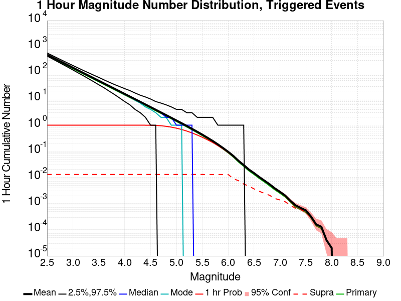

| Mag | Mean | 2.5 %ile | 97.5 %ile | Median | Mode | 1 hr Probability | Primary Aftershocks Mean |
|-----|-----|-----|-----|-----|-----|-----|-----|
| **M&ge;5** | 1.508 | 0.000 | 4.000 | 1.000 | 1.000 | 0.766 | 1.377 |
| **M&ge;5.1** | 1.187 | 0.000 | 4.000 | 1.000 | 1.000 | 0.684 | 1.084 |
| **M&ge;5.2** | 0.931 | 0.000 | 3.000 | 1.000 | 0.000 | 0.594 | 0.851 |
| **M&ge;5.3** | 0.724 | 0.000 | 3.000 | 1.000 | 0.000 | 0.505 | 0.661 |
| **M&ge;5.4** | 0.562 | 0.000 | 2.000 | 0.000 | 0.000 | 0.421 | 0.513 |
| **M&ge;5.5** | 0.433 | 0.000 | 2.000 | 0.000 | 0.000 | 0.345 | 0.396 |
| **M&ge;5.6** | 0.330 | 0.000 | 2.000 | 0.000 | 0.000 | 0.276 | 0.302 |
| **M&ge;5.7** | 0.250 | 0.000 | 2.000 | 0.000 | 0.000 | 0.217 | 0.228 |
| **M&ge;5.8** | 0.184 | 0.000 | 1.000 | 0.000 | 0.000 | 0.165 | 0.168 |
| **M&ge;5.9** | 0.134 | 0.000 | 1.000 | 0.000 | 0.000 | 0.124 | 0.122 |
| **M&ge;6** | 0.096 | 0.000 | 1.000 | 0.000 | 0.000 | 0.089 | 0.087 |
| **M&ge;6.1** | 0.066 | 0.000 | 1.000 | 0.000 | 0.000 | 0.063 | 0.060 |
| **M&ge;6.2** | 0.043 | 0.000 | 1.000 | 0.000 | 0.000 | 0.042 | 0.039 |
| **M&ge;6.3** | 0.030 | 0.000 | 1.000 | 0.000 | 0.000 | 0.029 | 0.027 |
| **M&ge;6.4** | 0.020 | 0.000 | 0.000 | 0.000 | 0.000 | 0.020 | 0.018 |
| **M&ge;6.5** | 0.015 | 0.000 | 0.000 | 0.000 | 0.000 | 0.014 | 0.013 |
| **M&ge;6.6** | 0.010 | 0.000 | 0.000 | 0.000 | 0.000 | 0.010 | 9.15E-3 |
| **M&ge;6.7** | 7.58E-3 | 0.000 | 0.000 | 0.000 | 0.000 | 7.46E-3 | 6.69E-3 |
| **M&ge;6.8** | 5.49E-3 | 0.000 | 0.000 | 0.000 | 0.000 | 5.44E-3 | 4.75E-3 |
| **M&ge;6.9** | 3.84E-3 | 0.000 | 0.000 | 0.000 | 0.000 | 3.82E-3 | 3.37E-3 |
| **M&ge;7** | 2.82E-3 | 0.000 | 0.000 | 0.000 | 0.000 | 2.81E-3 | 2.48E-3 |
| **M&ge;7.1** | 2.04E-3 | 0.000 | 0.000 | 0.000 | 0.000 | 2.03E-3 | 1.79E-3 |
| **M&ge;7.2** | 1.29E-3 | 0.000 | 0.000 | 0.000 | 0.000 | 1.28E-3 | 1.13E-3 |
| **M&ge;7.3** | 8.60E-4 | 0.000 | 0.000 | 0.000 | 0.000 | 8.50E-4 | 7.30E-4 |
| **M&ge;7.4** | 6.80E-4 | 0.000 | 0.000 | 0.000 | 0.000 | 6.80E-4 | 5.90E-4 |
| **M&ge;7.5** | 5.50E-4 | 0.000 | 0.000 | 0.000 | 0.000 | 5.50E-4 | 4.60E-4 |
| **M&ge;7.6** | 3.20E-4 | 0.000 | 0.000 | 0.000 | 0.000 | 3.20E-4 | 2.80E-4 |
| **M&ge;7.7** | 1.60E-4 | 0.000 | 0.000 | 0.000 | 0.000 | 1.60E-4 | 1.40E-4 |
| **M&ge;7.8** | 1.30E-4 | 0.000 | 0.000 | 0.000 | 0.000 | 1.30E-4 | 1.10E-4 |
| **M&ge;7.9** | 4.00E-5 | 0.000 | 0.000 | 0.000 | 0.000 | 4.00E-5 | 4.00E-5 |
| **M&ge;8** | 2.00E-5 | 0.000 | 0.000 | 0.000 | 0.000 | 2.00E-5 | 2.00E-5 |
| **M&ge;8.1** | 0.000 | 0.000 | 0.000 | 0.000 | 0.000 | 0.000 | 0.000 |
| **M&ge;8.2** | 0.000 | 0.000 | 0.000 | 0.000 | 0.000 | 0.000 | 0.000 |
| **M&ge;8.3** | 0.000 | 0.000 | 0.000 | 0.000 | 0.000 | 0.000 | 0.000 |
| **M&ge;8.4** | 0.000 | 0.000 | 0.000 | 0.000 | 0.000 | 0.000 | 0.000 |
| **M&ge;8.5** | 0.000 | 0.000 | 0.000 | 0.000 | 0.000 | 0.000 | 0.000 |
| **M&ge;8.6** | 0.000 | 0.000 | 0.000 | 0.000 | 0.000 | 0.000 | 0.000 |
| **M&ge;8.7** | 0.000 | 0.000 | 0.000 | 0.000 | 0.000 | 0.000 | 0.000 |
| **M&ge;8.8** | 0.000 | 0.000 | 0.000 | 0.000 | 0.000 | 0.000 | 0.000 |
| **M&ge;8.9** | 0.000 | 0.000 | 0.000 | 0.000 | 0.000 | 0.000 | 0.000 |
| **M&ge;9** | 0.000 | 0.000 | 0.000 | 0.000 | 0.000 | 0.000 | 0.000 |

## Hazard Change Over Time
*[(top)](#table-of-contents)*

These plots show how the probability of ruptures of various magnitudes within 100km of any scenario rupture changes over time

### M&ge;5.0 Hazard Change Over Time
*[(top)](#table-of-contents)*


| Forecast Duration | UCERF3-ETAS [95% Conf] | UCERF3-ETAS Triggered Only | UCERF3-TD | UCERF3-ETAS/TD Gain | UCERF3-TI |
|-----|-----|-----|-----|-----|-----|
| 1 Hour | 0.764 [0.761 - 0.767] | 0.764 | 5.91E-5 | 12921.74 | 5.87E-5 |
| 1 Day | 0.974 [0.973 - 0.975] | 0.974 | 1.42E-3 | 687 | 1.41E-3 |
| 1 Week | 0.994 [0.994 - 0.995] | 0.994 | 9.88E-3 | 100.61 | 9.81E-3 |
| 1 Month | 0.998 [0.998 - 0.999] | 0.998 | 0.042 | 23.96 | 0.041 |
| 1 Year | 1.000 [1.000 - 1.000] | 1.000 | 0.404 | 2.47 | 0.402 |
| 10 Years | 1.000 [1.000 - 1.000] | 1.000 | 0.994 | 1.01 | 0.994 |
| 30 Years | 1.000 [1.000 - 1.000] \* | \* | 1.000 | 1 \* | 1.000 |
| 100 Years | 1.000 [1.000 - 1.000] \* | \* | 1.000 | 1 \* | 1.000 |

\* *forecast duration is longer than simulation length, only ETAS ruptures from the first 10 years are included*
### M&ge;6.0 Hazard Change Over Time
*[(top)](#table-of-contents)*


| Forecast Duration | UCERF3-ETAS [95% Conf] | UCERF3-ETAS Triggered Only | UCERF3-TD | UCERF3-ETAS/TD Gain | UCERF3-TI |
|-----|-----|-----|-----|-----|-----|
| 1 Hour | 0.088 [0.087 - 0.090] | 0.088 | 6.89E-6 | 12835.54 | 6.43E-6 |
| 1 Day | 0.223 [0.221 - 0.226] | 0.223 | 1.65E-4 | 1349.28 | 1.54E-4 |
| 1 Week | 0.312 [0.309 - 0.314] | 0.311 | 1.16E-3 | 269.32 | 1.08E-3 |
| 1 Month | 0.376 [0.373 - 0.379] | 0.373 | 4.95E-3 | 76.07 | 4.62E-3 |
| 1 Year | 0.506 [0.503 - 0.509] | 0.475 | 0.059 | 8.63 | 0.055 |
| 10 Years | 0.757 [0.755 - 0.759] | 0.555 | 0.454 | 1.67 | 0.431 |
| 30 Years | 0.928 [0.927 - 0.928] \* | \* | 0.838 | 1.11 \* | 0.815 |
| 100 Years | 0.999 [0.999 - 0.999] \* | \* | 0.998 | 1 \* | 0.996 |

\* *forecast duration is longer than simulation length, only ETAS ruptures from the first 10 years are included*
### M&ge;7.0 Hazard Change Over Time
*[(top)](#table-of-contents)*


| Forecast Duration | UCERF3-ETAS [95% Conf] | UCERF3-ETAS Triggered Only | UCERF3-TD | UCERF3-ETAS/TD Gain | UCERF3-TI |
|-----|-----|-----|-----|-----|-----|
| 1 Hour | 2.73E-3 [2.42E-3 - 3.08E-3] | 2.73E-3 | 6.53E-7 | 4182.4 | 5.89E-7 |
| 1 Day | 7.76E-3 [7.23E-3 - 8.32E-3] | 7.74E-3 | 1.57E-5 | 494.95 | 1.41E-5 |
| 1 Week | 0.013 [0.012 - 0.013] | 0.012 | 1.10E-4 | 114.23 | 9.90E-5 |
| 1 Month | 0.017 [0.016 - 0.018] | 0.016 | 4.70E-4 | 36.03 | 4.24E-4 |
| 1 Year | 0.030 [0.029 - 0.031] | 0.024 | 5.71E-3 | 5.24 | 5.15E-3 |
| 10 Years | 0.086 [0.085 - 0.088] | 0.033 | 0.056 | 1.55 | 0.050 |
| 30 Years | 0.187 [0.187 - 0.188] \* | \* | 0.160 | 1.17 \* | 0.144 |
| 100 Years | 0.473 [0.472 - 0.473] \* | \* | 0.455 | 1.04 \* | 0.403 |

\* *forecast duration is longer than simulation length, only ETAS ruptures from the first 10 years are included*
### M&ge;8.0 Hazard Change Over Time
*[(top)](#table-of-contents)*

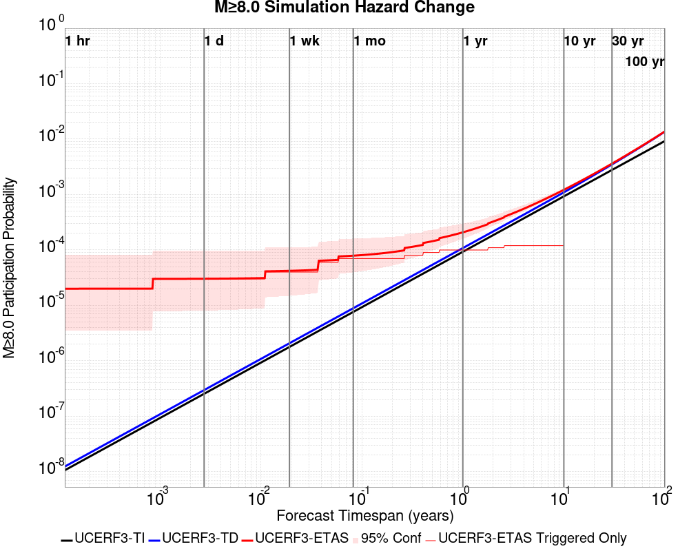

| Forecast Duration | UCERF3-ETAS [95% Conf] | UCERF3-ETAS Triggered Only | UCERF3-TD | UCERF3-ETAS/TD Gain | UCERF3-TI |
|-----|-----|-----|-----|-----|-----|
| 1 Hour | 2.00E-5 [3.48E-6 - 8.07E-5] | 2.00E-5 | 1.24E-8 | 1618.32 | 1.06E-8 |
| 1 Day | 3.03E-5 [8.04E-6 - 9.59E-5] | 3.00E-5 | 2.97E-7 | 102.08 | 2.54E-7 |
| 1 Week | 4.21E-5 [1.49E-5 - 1.12E-4] | 4.00E-5 | 2.08E-6 | 20.25 | 1.78E-6 |
| 1 Month | 7.89E-5 [3.96E-5 - 1.60E-4] | 7.00E-5 | 8.90E-6 | 8.86 | 7.63E-6 |
| 1 Year | 2.08E-4 [1.59E-4 - 2.99E-4] | 1.00E-4 | 1.08E-4 | 1.92 | 9.29E-5 |
| 10 Years | 1.22E-3 [1.16E-3 - 1.31E-3] | 1.20E-4 | 1.10E-3 | 1.11 | 9.29E-4 |
| 30 Years | 3.62E-3 [3.57E-3 - 3.72E-3] \* | \* | 3.50E-3 | 1.03 \* | 2.78E-3 |
| 100 Years | 0.014 [0.014 - 0.014] \* | \* | 0.014 | 1.01 \* | 9.25E-3 |

\* *forecast duration is longer than simulation length, only ETAS ruptures from the first 10 years are included*
## Section Participation
*[(top)](#table-of-contents)*

### Section Participation Plots
*[(top)](#table-of-contents)*

| Min Mag | Triggered Ruptures (no spontaneous) | Triggered Ruptures (primary aftershocks only) |
|-----|-----|-----|
| **All Supra. Seis.** |  | 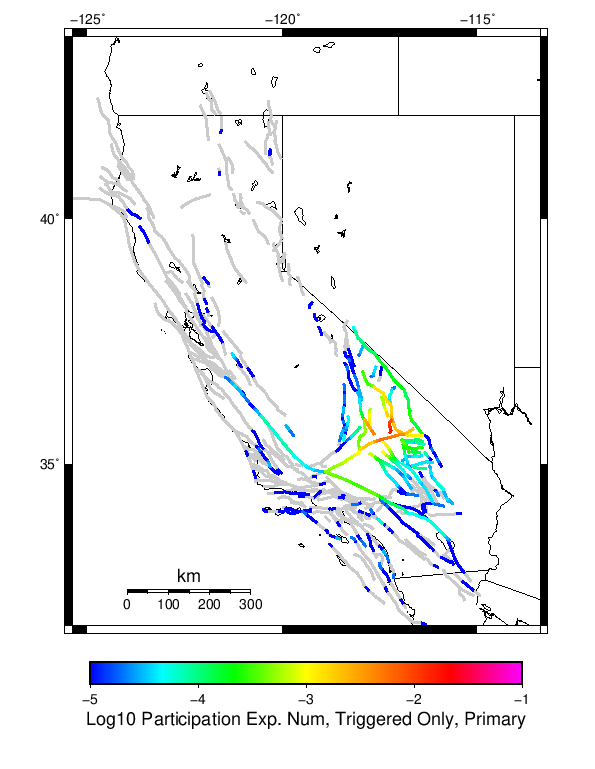 |
| **M&ge;6.5** | 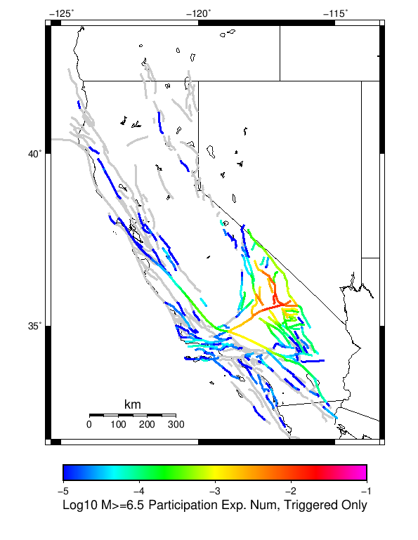 |  |
| **M&ge;7** | 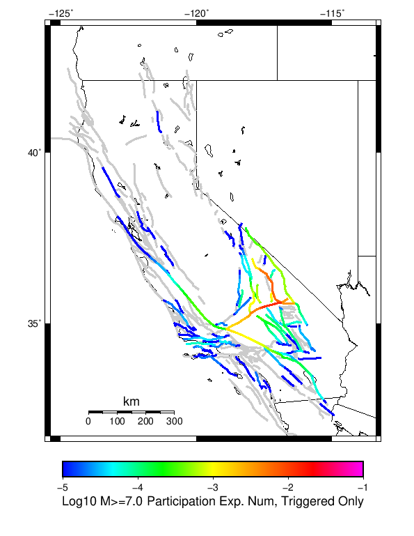 | 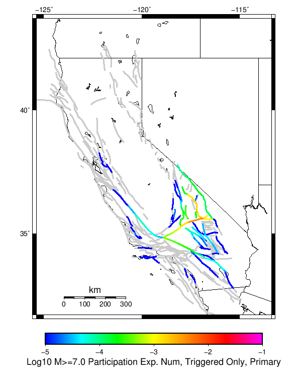 |
| **M&ge;7.5** |  |  |
| **M&ge;8** |  | 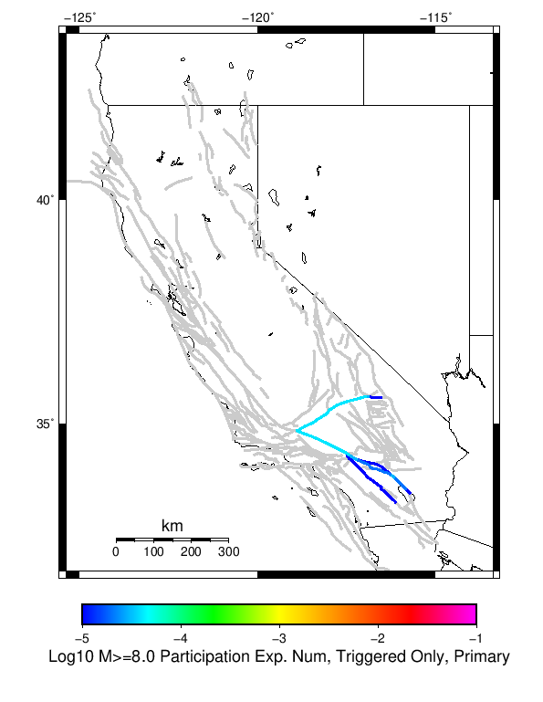 |

### Supra-Seismogenic Parent Sections Table
*[(top)](#table-of-contents)*

*First 10 of 200 with matching ruptures shown*

| Parent Name | Triggered Mean Count | Triggered 10 Year Prob | Triggered Primary Mean Count |
|-----|-----|-----|-----|
| Tank Canyon | 0.11172 | 0.09378 | 0.02849 |
| Garlock (Central) | 0.03183 | 0.03084 | 0.00964 |
| Panamint Valley | 0.01807 | 0.01746 | 0.00406 |
| Owl Lake | 0.01635 | 0.01424 | 0.0028 |
| Little Lake | 0.016 | 0.01597 | 0.00737 |
| Ash Hill | 0.01154 | 0.01097 | 0.00223 |
| Garlock (East) | 0.01051 | 0.00961 | 0.00165 |
| Blackwater | 0.00711 | 0.00678 | 0.00181 |
| Hunter Mountain-Saline Valley | 0.006 | 0.00588 | 0.0015 |
| Gravel Hills-Harper Lk | 0.0049 | 0.00465 | 0.00127 |

### M≥6.5 Parent Sections Table
*[(top)](#table-of-contents)*

*First 10 of 165 with matching ruptures shown*

| Parent Name | Triggered Mean Count | Triggered 10 Year Prob | Triggered Primary Mean Count |
|-----|-----|-----|-----|
| Panamint Valley | 0.01669 | 0.01619 | 0.00385 |
| Garlock (Central) | 0.01561 | 0.01536 | 0.00481 |
| Tank Canyon | 0.01348 | 0.0134 | 0.00318 |
| Owl Lake | 0.00689 | 0.00687 | 0.00172 |
| Garlock (East) | 0.00637 | 0.00605 | 0.00126 |
| Little Lake | 0.00632 | 0.00631 | 0.00298 |
| Hunter Mountain-Saline Valley | 0.0057 | 0.00563 | 0.00142 |
| So Sierra Nevada | 0.00387 | 0.00386 | 0.00106 |
| Ash Hill | 0.00318 | 0.00317 | 7.1E-4 |
| Garlock (West) | 0.003 | 0.003 | 0.001 |

### M≥7 Parent Sections Table
*[(top)](#table-of-contents)*

*First 10 of 119 with matching ruptures shown*

| Parent Name | Triggered Mean Count | Triggered 10 Year Prob | Triggered Primary Mean Count |
|-----|-----|-----|-----|
| Garlock (Central) | 0.01375 | 0.01363 | 0.00432 |
| Panamint Valley | 0.00804 | 0.008 | 0.00212 |
| Hunter Mountain-Saline Valley | 0.00532 | 0.00529 | 0.00134 |
| Owl Lake | 0.00408 | 0.00408 | 0.00139 |
| Garlock (East) | 0.00391 | 0.00391 | 0.00107 |
| Garlock (West) | 0.0029 | 0.0029 | 9.6E-4 |
| San Andreas (Mojave N) | 0.00146 | 0.00144 | 4.4E-4 |
| So Sierra Nevada | 0.00125 | 0.00124 | 3.8E-4 |
| San Andreas (Mojave S) | 0.00123 | 0.00121 | 3.8E-4 |
| Tank Canyon | 0.00108 | 0.00108 | 2.3E-4 |

### M≥7.5 Parent Sections Table
*[(top)](#table-of-contents)*

*First 10 of 67 with matching ruptures shown*

| Parent Name | Triggered Mean Count | Triggered 10 Year Prob | Triggered Primary Mean Count |
|-----|-----|-----|-----|
| Garlock (Central) | 0.00644 | 0.00643 | 0.00188 |
| Hunter Mountain-Saline Valley | 0.00483 | 0.00483 | 0.00124 |
| Panamint Valley | 0.00483 | 0.00483 | 0.00124 |
| Garlock (West) | 0.00251 | 0.00251 | 7.7E-4 |
| Garlock (East) | 0.00167 | 0.00167 | 4.2E-4 |
| San Andreas (Mojave N) | 0.00145 | 0.00143 | 4.4E-4 |
| San Andreas (Mojave S) | 0.00113 | 0.00111 | 3.5E-4 |
| San Andreas (San Bernardino N) | 6.6E-4 | 6.6E-4 | 1.8E-4 |
| Death Valley (No) | 5.1E-4 | 5.1E-4 | 1.4E-4 |
| Death Valley (Black Mtns Frontal) | 5.0E-4 | 5.0E-4 | 1.3E-4 |

### M≥8 Parent Sections Table
*[(top)](#table-of-contents)*

*First 10 of 28 with matching ruptures shown*

| Parent Name | Triggered Mean Count | Triggered 10 Year Prob | Triggered Primary Mean Count |
|-----|-----|-----|-----|
| San Andreas (Mojave N) | 1.6E-4 | 1.6E-4 | 4.0E-5 |
| San Andreas (Mojave S) | 1.6E-4 | 1.6E-4 | 4.0E-5 |
| San Andreas (San Bernardino N) | 1.6E-4 | 1.6E-4 | 4.0E-5 |
| Garlock (Central) | 1.2E-4 | 1.2E-4 | 4.0E-5 |
| Garlock (West) | 1.2E-4 | 1.2E-4 | 4.0E-5 |
| San Andreas (San Bernardino S) | 1.2E-4 | 1.2E-4 | 2.0E-5 |
| San Andreas (Coachella) rev | 1.1E-4 | 1.1E-4 | 3.0E-5 |
| San Andreas (San Gorgonio Pass-Garnet HIll) | 1.0E-4 | 1.0E-4 | 2.0E-5 |
| Garlock (East) | 9.0E-5 | 9.0E-5 | 1.0E-5 |
| San Andreas (Big Bend) | 4.0E-5 | 4.0E-5 | 0.0 |
## Gridded Nucleation
*[(top)](#table-of-contents)*

| Min Mag | Triggered Ruptures (no spontaneous) | Triggered Ruptures (primary aftershocks only) |
|-----|-----|-----|
| **M&ge;5** |  |  |
| **M&ge;6** | 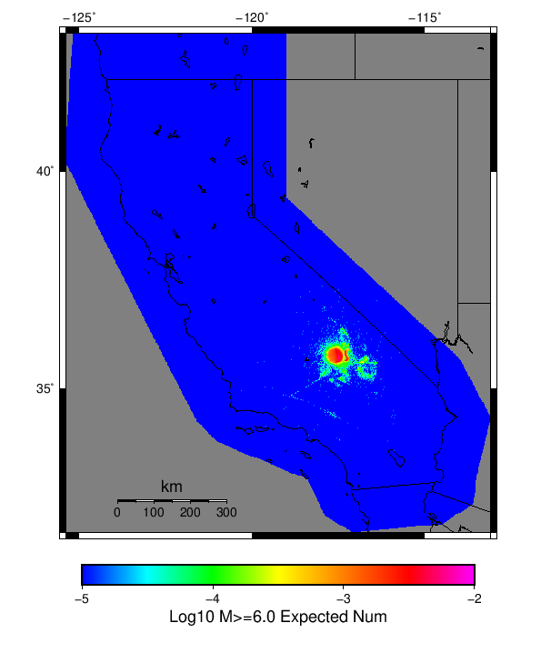 |  |
| **M&ge;7** |  |  |

## JSON Input File
*[(top)](#table-of-contents)*

```
{
  "numSimulations": 100000,
  "duration": 10.0,
  "startTimeMillis": 1562383192000,
  "includeSpontaneous": false,
  "randomSeed": 123456789,
  "binaryOutput": true,
  "binaryOutputFilters": [
    {
      "prefix": "results_complete",
      "descendantsOnly": false
    },
    {
      "prefix": "results_m5_preserve_chain",
      "minMag": 5.0,
      "preserveChainBelowMag": true,
      "descendantsOnly": false
    },
    {
      "prefix": "results_triggered_descendants",
      "descendantsOnly": true
    }
  ],
  "forceRecalc": false,
  "reuseERFs": true,
  "simulationName": "Searles Valley M6.4 and M7.1 PointSource",
  "numRetries": 3,
  "outputDir": "${ETAS_SIM_DIR}/2019-06-05_M7.1_SearlesValley_Sequence_UpdatedMw_and_depth",
  "triggerRuptures": [
    {
      "mag": 6.4,
      "latitude": 35.705,
      "longitude": -117.508,
      "depth": 8.7,
      "occurrenceTimeMillis": 1562261628000
    },
    {
      "mag": 7.1,
      "latitude": 35.766,
      "longitude": -117.605,
      "depth": 17.0,
      "occurrenceTimeMillis": 1562383192000 
    } 
  ],
  "cacheDir": "${ETAS_LAUNCHER}/inputs/cache_fm3p1_ba",
  "fssFile": "${ETAS_LAUNCHER}/inputs/2013_05_10-ucerf3p3-production-10runs_COMPOUND_SOL_FM3_1_SpatSeisU3_MEAN_BRANCH_AVG_SOL.zip",
  "probModel": "FULL_TD",
  "applySubSeisForSupraNucl": true,
  "totRateScaleFactor": 1.14,
  "gridSeisCorr": true,
  "timeIndependentERF": false,
  "griddedOnly": false,
  "imposeGR": false,
  "includeIndirectTriggering": true,
  "gridSeisDiscr": 0.1,
  "catalogCompletenessModel": "RELAXED"
}
```

