# Parent Section Magnitude-Probability Distributions

Only fault sections with at least one triggered aftershock are plotted. Sections are sorted by total supraseismogenic trigger rate (decreasing)

## Table Of Contents

* [Tank Canyon](#tank-canyon)
* [Garlock (Central)](#garlock-central)
* [Panamint Valley](#panamint-valley)
* [Owl Lake](#owl-lake)
* [Little Lake](#little-lake)
* [Ash Hill](#ash-hill)
* [Garlock (East)](#garlock-east)
* [Blackwater](#blackwater)
* [Hunter Mountain-Saline Valley](#hunter-mountain-saline-valley)
* [Gravel Hills-Harper Lk](#gravel-hills-harper-lk)
* [Goldstone Lake](#goldstone-lake)
* [McLean Lake](#mclean-lake)
* [So Sierra Nevada](#so-sierra-nevada)
* [Airport Lake](#airport-lake)
* [Coyote Canyon](#coyote-canyon)
* [Garlock (West)](#garlock-west)
* [Lenwood-Lockhart-Old Woman Springs](#lenwood-lockhart-old-woman-springs)
* [San Andreas (Mojave S)](#san-andreas-mojave-s)
* [Death Valley (So)](#death-valley-so)
* [Nelson Lake](#nelson-lake)
* [Bicycle Lake](#bicycle-lake)
* [Towne Pass](#towne-pass)
* [Paradise](#paradise)
* [San Andreas (Mojave N)](#san-andreas-mojave-n)
* [Garlic Springs](#garlic-springs)
* [Death Valley (Black Mtns Frontal)](#death-valley-black-mtns-frontal)
* [Helendale-So Lockhart](#helendale-so-lockhart)
* [San Andreas (San Bernardino N)](#san-andreas-san-bernardino-n)
* [Death Valley (No)](#death-valley-no)
* [Coyote Lake](#coyote-lake)
* [San Andreas (San Bernardino S)](#san-andreas-san-bernardino-s)
* [Cady](#cady)
* [San Andreas (Parkfield)](#san-andreas-parkfield)
* [San Andreas (Big Bend)](#san-andreas-big-bend)
* [Elsinore (Glen Ivy) rev](#elsinore-glen-ivy-rev)
* [Lake Isabella (Seismicity)](#lake-isabella-seismicity)
* [San Andreas (Carrizo) rev](#san-andreas-carrizo-rev)
* [San Andreas (Cholame) rev](#san-andreas-cholame-rev)
* [Death Valley (Fish Lake Valley)](#death-valley-fish-lake-valley)
* [Calico-Hidalgo](#calico-hidalgo)
* [Ludlow](#ludlow)
* [Scodie Lineament](#scodie-lineament)
* [White Wolf (Extension)](#white-wolf-extension)
* [Manix-Afton Hills](#manix-afton-hills)
* [Sierra Nevada  (No Extension)](#sierra-nevada--no-extension)
* [Baker](#baker)
* [Red Pass](#red-pass)
* [San Andreas (San Gorgonio Pass-Garnet HIll)](#san-andreas-san-gorgonio-pass-garnet-hill)
* [San Andreas (Creeping Section) 2011 CFM](#san-andreas-creeping-section-2011-cfm)
* [Cleghorn Pass](#cleghorn-pass)
* [San Andreas (Coachella) rev](#san-andreas-coachella-rev)
* [Cleghorn Lake](#cleghorn-lake)
* [Pinto Mtn](#pinto-mtn)
* [Rose Canyon](#rose-canyon)
* [Dry Mountain](#dry-mountain)
* [Owens Valley](#owens-valley)
* [Ortigalita (North)](#ortigalita-north)
* [Camp Rock 2011](#camp-rock-2011)
* [Mission Ridge-Arroyo Parida-Santa Ana](#mission-ridge-arroyo-parida-santa-ana)
* [Santa Ynez (East)](#santa-ynez-east)
* [Oceanic - West Huasna](#oceanic---west-huasna)
* [Lost Hills](#lost-hills)
* [Santa Ynez (West)](#santa-ynez-west)
* [White Mountains](#white-mountains)
* [Chino alt 1](#chino-alt-1)
* [Kern Canyon (North Kern) 2011](#kern-canyon-north-kern-2011)
* [Red Mountain](#red-mountain)
* [San Andreas (North Branch Mill Creek)](#san-andreas-north-branch-mill-creek)
* [Kern Canyon (Lake Isabella) 2011](#kern-canyon-lake-isabella-2011)
* [Brawley (Seismic Zone) alt 1](#brawley-seismic-zone-alt-1)
* [Deep Springs](#deep-springs)
* [Coronado Bank alt1](#coronado-bank-alt1)
* [Pleito](#pleito)
* [Pisgah-Bullion Mtn-Mesquite Lk](#pisgah-bullion-mtn-mesquite-lk)
* [Santa Cruz Island](#santa-cruz-island)
* [Whittier alt 1](#whittier-alt-1)
* [Bullion Mountains](#bullion-mountains)
* [Kern Canyon (South Kern) 2011](#kern-canyon-south-kern-2011)
* [Ventura-Pitas Point](#ventura-pitas-point)
* [Big Pine (Central)](#big-pine-central)
* [San Jacinto (San Bernardino)](#san-jacinto-san-bernardino)
* [Imperial](#imperial)
* [San Clemente](#san-clemente)
* [Santa Ynez River](#santa-ynez-river)
* [Channel Islands Thrust](#channel-islands-thrust)
* [Santa Cruz Catalina Ridge alt1](#santa-cruz-catalina-ridge-alt1)
* [Santa Rosa Island](#santa-rosa-island)
* [Mission Creek](#mission-creek)
* [Hosgri](#hosgri)
* [Tin Mountain](#tin-mountain)
* [Independence rev 2011](#independence-rev-2011)
* [Mono Lake 2011 CFM](#mono-lake-2011-cfm)
* [Elysian Park (Upper)](#elysian-park-upper)
* [Sheephole](#sheephole)
* [Robinson Creek](#robinson-creek)
* [San Cayetano](#san-cayetano)
* [San Diego Trough north alt1](#san-diego-trough-north-alt1)
* [Great Valley 09 (Laguna Seca)](#great-valley-09-laguna-seca)
* [Raymond](#raymond)
* [San Diego Trough south](#san-diego-trough-south)
* [Blue Cut](#blue-cut)
* [Ortigalita (South)](#ortigalita-south)
* [Palos Verdes](#palos-verdes)
* [Great Valley 07 (Orestimba)](#great-valley-07-orestimba)
* [Cerro Prieto](#cerro-prieto)
* [Big Pine (East)](#big-pine-east)
* [Oak Ridge (Onshore)](#oak-ridge-onshore)
* [Owens Valley Keough Hot Springs](#owens-valley-keough-hot-springs)
* [Pitas Point (Lower West)](#pitas-point-lower-west)
* [Calaveras (So) - Paicines extension 2011 CFM](#calaveras-so---paicines-extension-2011-cfm)
* [Pine Mtn](#pine-mtn)
* [Maacama 2011 CFM](#maacama-2011-cfm)
* [Hosgri (Extension)](#hosgri-extension)
* [San Jacinto (Lytle Creek connector)](#san-jacinto-lytle-creek-connector)
* [San Jacinto (Stepovers Combined)](#san-jacinto-stepovers-combined)
* [Rinconada 2011 CFM](#rinconada-2011-cfm)
* [Great Valley 03a Dunnigan Hills](#great-valley-03a-dunnigan-hills)
* [North Frontal  (East)](#north-frontal--east)
* [San Luis Range 2011 CFM](#san-luis-range-2011-cfm)
* [Point Reyes 2011 CFM](#point-reyes-2011-cfm)
* [Channel Islands Western Deep Ramp](#channel-islands-western-deep-ramp)
* [San Jacinto (San Jacinto Valley) rev](#san-jacinto-san-jacinto-valley-rev)
* [Great Valley 08 (Quinto)](#great-valley-08-quinto)
* [San Jose](#san-jose)
* [Oceanside alt1](#oceanside-alt1)
* [San Pedro Basin](#san-pedro-basin)
* [Hartley Springs 2011 CFM](#hartley-springs-2011-cfm)
* [Greenville (No) 2011 CFM](#greenville-no-2011-cfm)
* [San Jacinto (Superstition Mtn)](#san-jacinto-superstition-mtn)
* [Newport-Inglewood (Offshore)](#newport-inglewood-offshore)
* [Malibu Coast alt 1](#malibu-coast-alt-1)
* [Earthquake Valley](#earthquake-valley)
* [San Andreas (Santa Cruz Mts) 2011 CFM](#san-andreas-santa-cruz-mts-2011-cfm)
* [White Wolf](#white-wolf)
* [Cleghorn](#cleghorn)
* [Carlsbad](#carlsbad)
* [North Frontal  (West)](#north-frontal--west)
* [Santa Susana alt 1](#santa-susana-alt-1)
* [Los Alamos 2011 CFM](#los-alamos-2011-cfm)
* [Elsinore (Coyote Mountains)](#elsinore-coyote-mountains)
* [San Jacinto (Anza) rev](#san-jacinto-anza-rev)
* [Santa Susana East (connector)](#santa-susana-east-connector)
* [Hunting Creek - Berryessa 2011 CFM](#hunting-creek---berryessa-2011-cfm)
* [Earthquake Valley (No  Extension)](#earthquake-valley-no--extension)
* [Trinidad (alt1)](#trinidad-alt1)
* [Round Valley](#round-valley)
* [Great Valley 05 Pittsburg - Kirby Hills alt1](#great-valley-05-pittsburg---kirby-hills-alt1)
* [Davis Creek](#davis-creek)
* [Pitas Point (Lower)-Montalvo](#pitas-point-lower-montalvo)
* [Earthquake Valley (So Extension)](#earthquake-valley-so-extension)
* [Mount Diablo Thrust North CFM](#mount-diablo-thrust-north-cfm)
* [Superstition Hills](#superstition-hills)
* [San Andreas (Peninsula) 2011 CFM](#san-andreas-peninsula-2011-cfm)
* [Burnt Mtn](#burnt-mtn)
* [Clayton](#clayton)
* [San Jacinto (Coyote Creek)](#san-jacinto-coyote-creek)
* [Puente Hills](#puente-hills)
* [Jess Valley](#jess-valley)
* [Green Valley 2011 CFM](#green-valley-2011-cfm)
* [Elmore Ranch](#elmore-ranch)
* [Mohawk Valley 2011 CFM](#mohawk-valley-2011-cfm)
* [Casmalia 2011 CFM](#casmalia-2011-cfm)
* [Surprise Valley 2011 CFM](#surprise-valley-2011-cfm)
* [Mission Hills 2011](#mission-hills-2011)
* [Gillem - Big Crack 2011 CFM](#gillem---big-crack-2011-cfm)
* [Concord 2011 CFM](#concord-2011-cfm)
* [Fontana (Seismicity)](#fontana-seismicity)
* [Eureka Peak](#eureka-peak)
* [East Huasna 2011 CFM](#east-huasna-2011-cfm)
* [Homestead Valley 2011](#homestead-valley-2011)
* [Las Positas](#las-positas)
* [Great Valley 04b Gordon Valley](#great-valley-04b-gordon-valley)
* [Honey Lake 2011 CFM](#honey-lake-2011-cfm)
* [Garberville - Briceland 2011 CFM](#garberville---briceland-2011-cfm)
* [Yorba Linda](#yorba-linda)
* [Calaveras (So) 2011 CFM](#calaveras-so-2011-cfm)
* [Swain Ravine - Spenceville](#swain-ravine---spenceville)
* [Anaheim](#anaheim)
* [Redondo Canyon alt 1](#redondo-canyon-alt-1)
* [Shoreline](#shoreline)
* [Hilton Creek 2011 CFM](#hilton-creek-2011-cfm)
* [Collayami 2011 CFM](#collayami-2011-cfm)
* [Morales (East)](#morales-east)
* [Compton](#compton)
* [Hat Creek-McArthur-Mayfield](#hat-creek-mcarthur-mayfield)
* [Los Alamos extension](#los-alamos-extension)
* [Rocky Ledge 2011 CFM](#rocky-ledge-2011-cfm)
* [San Andreas (North Coast) 2011 CFM](#san-andreas-north-coast-2011-cfm)
* [Emerson-Copper Mtn 2011](#emerson-copper-mtn-2011)
* [Monte Vista - Shannon 2011 CFM](#monte-vista---shannon-2011-cfm)
* [Elsinore (Temecula) rev](#elsinore-temecula-rev)
* [Lions Head 2011 CFM](#lions-head-2011-cfm)
* [Calaveras (Central) 2011 CFM](#calaveras-central-2011-cfm)
* [Sargent 2011 CFM](#sargent-2011-cfm)
* [Mount Diablo Thrust South](#mount-diablo-thrust-south)
* [San Juan](#san-juan)
* [Peralta Hills](#peralta-hills)
* [San Jacinto (Borrego)](#san-jacinto-borrego)
* [Elsinore (Stepovers Combined)](#elsinore-stepovers-combined)
* [Likely 2011 CFM](#likely-2011-cfm)

## Tank Canyon
*[(top)](#table-of-contents)*

| 1 Week | 1 Month | 1 Year | 10 Year |
|-----|-----|-----|-----|
|  |  | 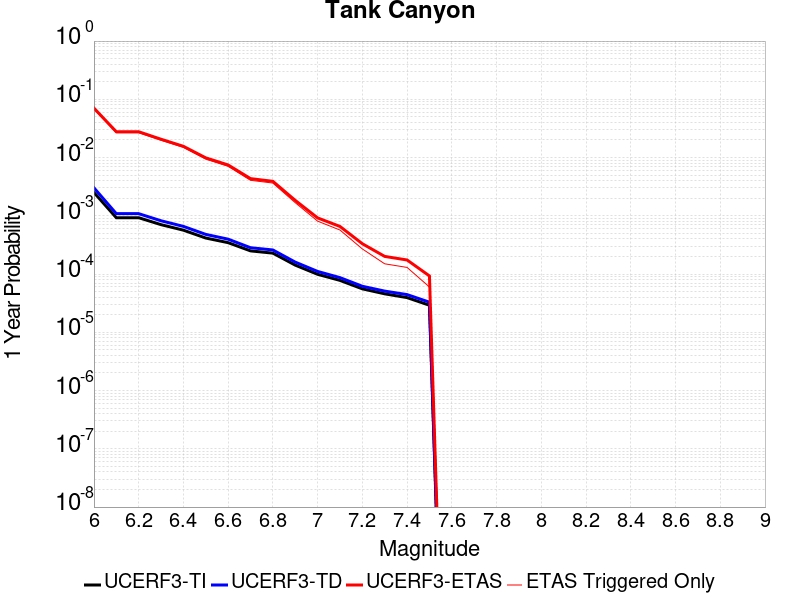 |  |

| Magnitude | 1 wk TI Prob | 1 wk TD Prob | 1 wk ETAS Prob | 1 wk ETAS/TD Gain | 1 wk ETAS Triggered Only | 1 mo TI Prob | 1 mo TD Prob | 1 mo ETAS Prob | 1 mo ETAS/TD Gain | 1 mo ETAS Triggered Only | 1 yr TI Prob | 1 yr TD Prob | 1 yr ETAS Prob | 1 yr ETAS/TD Gain | 1 yr ETAS Triggered Only | 10 yr TI Prob | 10 yr TD Prob | 10 yr ETAS Prob | 10 yr ETAS/TD Gain | 10 yr ETAS Triggered Only |
|-----|-----|-----|-----|-----|-----|-----|-----|-----|-----|-----|-----|-----|-----|-----|-----|-----|-----|-----|-----|-----|
| 6.0 | 4.8284557E-5 | 5.7964822E-5 | 0.031816125 | 548.8868 | 0.03176 | 2.0691741E-4 | 2.4840087E-4 | 0.0437076 | 175.95592 | 0.04347 | 0.0025163088 | 0.0030207601 | 0.07065583 | 23.390083 | 0.06784 | 0.02488006 | 0.029863637 | 0.12084302 | 4.046494 | 0.09378 |
| 6.1 | 1.7796336E-5 | 2.0873314E-5 | 0.01216062 | 582.5917 | 0.01214 | 7.626778E-5 | 8.945422E-5 | 0.01699794 | 190.01834 | 0.01691 | 9.281647E-4 | 0.0010885983 | 0.027749544 | 25.49108 | 0.02669 | 0.009242975 | 0.010836744 | 0.048424948 | 4.4685884 | 0.038 |
| 6.2 | 1.7796336E-5 | 2.0873314E-5 | 0.01216062 | 582.5917 | 0.01214 | 7.626778E-5 | 8.945422E-5 | 0.01699794 | 190.01834 | 0.01691 | 9.281647E-4 | 0.0010885983 | 0.027749544 | 25.49108 | 0.02669 | 0.009242975 | 0.010836744 | 0.048424948 | 4.4685884 | 0.038 |
| 6.3 | 1.3515912E-5 | 1.5759564E-5 | 0.009155615 | 580.9561 | 0.00914 | 5.792405E-5 | 6.753938E-5 | 0.01263669 | 187.10107 | 0.01257 | 7.049971E-4 | 8.2200574E-4 | 0.020635705 | 25.104088 | 0.01983 | 0.007027647 | 0.0081922645 | 0.036101732 | 4.406808 | 0.02814 |
| 6.4 | 1.0870146E-5 | 1.2618021E-5 | 0.006822532 | 540.6975 | 0.00681 | 4.658551E-5 | 5.4076212E-5 | 0.009493566 | 175.559 | 0.00944 | 5.67031E-4 | 6.581969E-4 | 0.015598357 | 23.698618 | 0.01495 | 0.005655863 | 0.0065644905 | 0.02775447 | 4.22797 | 0.02133 |
| 6.5 | 7.964826E-6 | 9.196094E-6 | 0.0041191583 | 447.92477 | 0.00411 | 3.4134522E-5 | 3.9411298E-5 | 0.005879181 | 149.17502 | 0.00584 | 4.1550855E-4 | 4.7973756E-4 | 0.009885224 | 20.60548 | 0.00941 | 0.0041473247 | 0.004788321 | 0.018124158 | 3.7850757 | 0.0134 |
| 6.6 | 6.6317E-6 | 7.6122988E-6 | 0.0030475892 | 400.3507 | 0.00304 | 2.8421264E-5 | 3.2623782E-5 | 0.004372482 | 134.02745 | 0.00434 | 3.4597394E-4 | 3.9713128E-4 | 0.0074643237 | 18.795607 | 0.00707 | 0.0034543579 | 0.003965368 | 0.013975516 | 3.5243933 | 0.01005 |
| 6.7 | 4.793663E-6 | 5.4307857E-6 | 0.0019054204 | 350.8554 | 0.0019 | 2.0544108E-5 | 2.3274613E-5 | 0.0026432136 | 113.56638 | 0.00262 | 2.500958E-4 | 2.8333595E-4 | 0.0043521826 | 15.360504 | 0.00407 | 0.0024981452 | 0.0028304397 | 0.0084843915 | 2.9975524 | 0.00567 |
| 6.8 | 4.382823E-6 | 4.9692567E-6 | 0.0017049608 | 343.10178 | 0.0017 | 1.8783392E-5 | 2.1296666E-5 | 0.0023612469 | 110.874016 | 0.00234 | 2.286638E-4 | 2.5926033E-4 | 0.003908314 | 15.074863 | 0.00365 | 0.0022842865 | 0.002590253 | 0.007696991 | 2.971521 | 0.00512 |
| 6.9 | 2.729601E-6 | 3.0735416E-6 | 7.8307115E-4 | 254.7781 | 7.8E-4 | 1.1698237E-5 | 1.3172262E-5 | 0.0011231577 | 85.26688 | 0.00111 | 1.4241673E-4 | 1.6036171E-4 | 0.0018400924 | 11.474636 | 0.00168 | 0.001423255 | 0.0016026258 | 0.0040187477 | 2.5076017 | 0.00242 |
| 7.0 | 1.8987357E-6 | 2.126939E-6 | 3.7212615E-4 | 174.95854 | 3.7E-4 | 8.137413E-6 | 9.115425E-6 | 5.2911066E-4 | 58.04564 | 5.2E-4 | 9.90685E-5 | 1.1097535E-4 | 9.208855E-4 | 8.298108 | 8.1E-4 | 9.902435E-4 | 0.0011092679 | 0.00218807 | 1.972535 | 0.00108 |
| 7.1 | 1.4928986E-6 | 1.6641272E-6 | 2.7166368E-4 | 163.24695 | 2.7E-4 | 6.398121E-6 | 7.1319573E-6 | 3.671294E-4 | 51.476665 | 3.6E-4 | 7.789434E-5 | 8.682871E-5 | 6.567792E-4 | 7.564079 | 5.7E-4 | 7.786704E-4 | 8.6800574E-4 | 0.0015673982 | 1.8057463 | 7.0E-4 |
| 7.2 | 1.069082E-6 | 1.1828573E-6 | 1.411827E-4 | 119.35734 | 1.4E-4 | 4.581772E-6 | 5.0693816E-6 | 1.6506857E-4 | 32.561874 | 1.6E-4 | 5.5781646E-5 | 6.171851E-5 | 3.3170183E-4 | 5.374431 | 2.7E-4 | 5.576765E-4 | 6.170659E-4 | 9.868375E-4 | 1.5992419 | 3.7E-4 |
| 7.3 | 8.776551E-7 | 9.770005E-7 | 1.00976904E-4 | 103.354 | 1.0E-4 | 3.7613736E-6 | 4.1871413E-6 | 1.2418664E-4 | 29.659052 | 1.2E-4 | 4.579376E-5 | 5.097777E-5 | 2.0097013E-4 | 3.942309 | 1.5E-4 | 4.5784327E-4 | 5.097118E-4 | 7.096098E-4 | 1.3921787 | 2.0E-4 |
| 7.4 | 7.55721E-7 | 8.510244E-7 | 8.085096E-5 | 95.00427 | 8.0E-5 | 3.2388E-6 | 3.6472454E-6 | 1.0364688E-4 | 28.417852 | 1.0E-4 | 3.9431678E-5 | 4.4404827E-5 | 1.7439906E-4 | 3.9274797 | 1.3E-4 | 3.942468E-4 | 4.440104E-4 | 6.139349E-4 | 1.3827039 | 1.7E-4 |
| 7.5 | 5.587665E-7 | 6.305619E-7 | 4.0630537E-5 | 64.43545 | 4.0E-5 | 2.3947114E-6 | 2.702408E-6 | 4.27023E-5 | 15.801574 | 4.0E-5 | 2.915522E-5 | 3.290182E-5 | 9.289984E-5 | 2.8235474 | 6.0E-5 | 2.9151395E-4 | 3.290182E-4 | 4.1898858E-4 | 1.2734511 | 9.0E-5 |

## Garlock (Central)
*[(top)](#table-of-contents)*

| 1 Week | 1 Month | 1 Year | 10 Year |
|-----|-----|-----|-----|
|  | 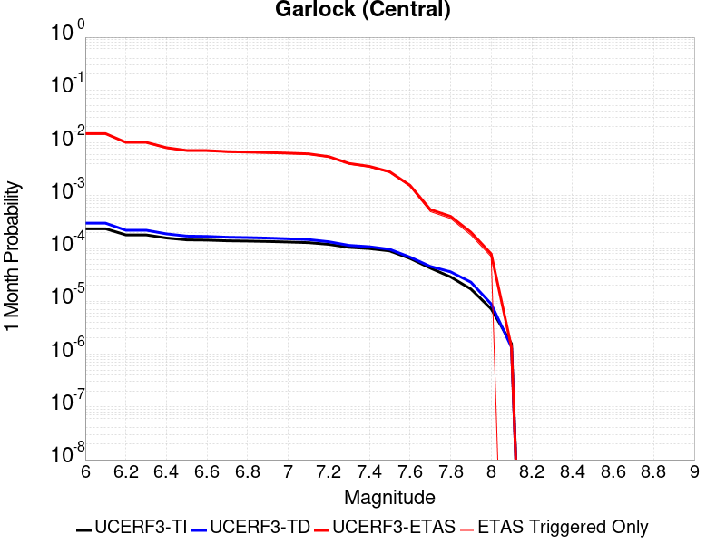 |  | 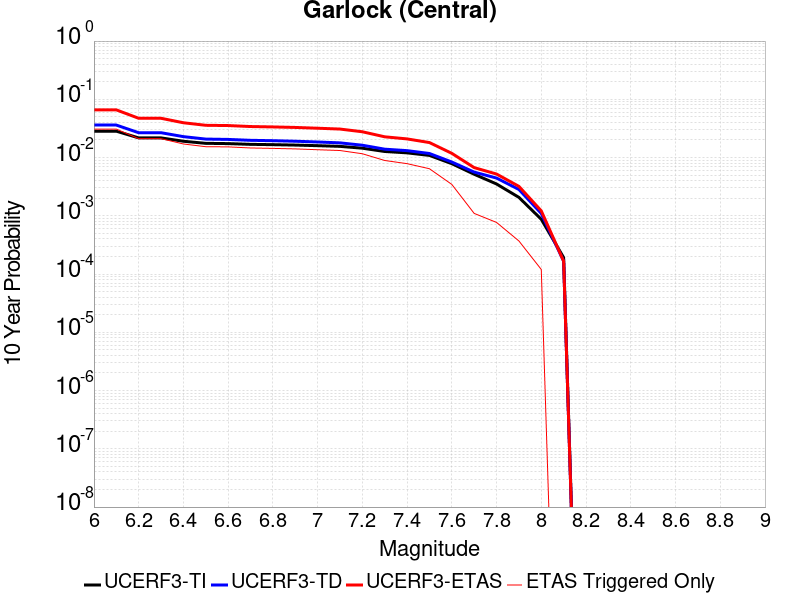 |

| Magnitude | 1 wk TI Prob | 1 wk TD Prob | 1 wk ETAS Prob | 1 wk ETAS/TD Gain | 1 wk ETAS Triggered Only | 1 mo TI Prob | 1 mo TD Prob | 1 mo ETAS Prob | 1 mo ETAS/TD Gain | 1 mo ETAS Triggered Only | 1 yr TI Prob | 1 yr TD Prob | 1 yr ETAS Prob | 1 yr ETAS/TD Gain | 1 yr ETAS Triggered Only | 10 yr TI Prob | 10 yr TD Prob | 10 yr ETAS Prob | 10 yr ETAS/TD Gain | 10 yr ETAS Triggered Only |
|-----|-----|-----|-----|-----|-----|-----|-----|-----|-----|-----|-----|-----|-----|-----|-----|-----|-----|-----|-----|-----|
| 6.0 | 5.5131142E-5 | 7.024681E-5 | 0.010869488 | 154.73283 | 0.0108 | 2.3625491E-4 | 3.010234E-4 | 0.01492662 | 49.586246 | 0.01463 | 0.0028726095 | 0.0036588663 | 0.025897201 | 7.0779305 | 0.02232 | 0.028357591 | 0.036079824 | 0.06580713 | 1.8239313 | 0.03084 |
| 6.1 | 5.5131142E-5 | 7.024681E-5 | 0.010869488 | 154.73283 | 0.0108 | 2.3625491E-4 | 3.010234E-4 | 0.01492662 | 49.586246 | 0.01463 | 0.0028726095 | 0.0036588663 | 0.025897201 | 7.0779305 | 0.02232 | 0.028357591 | 0.036079824 | 0.06580713 | 1.8239313 | 0.03084 |
| 6.2 | 4.216245E-5 | 5.1661493E-5 | 0.0075612734 | 146.3619 | 0.00751 | 1.806837E-4 | 2.2138779E-4 | 0.0102191735 | 46.15961 | 0.01 | 0.0021976046 | 0.0026920962 | 0.0179908 | 6.6828218 | 0.01534 | 0.021759989 | 0.026689773 | 0.04722662 | 1.769465 | 0.0211 |
| 6.3 | 4.216245E-5 | 5.1661493E-5 | 0.0075612734 | 146.3619 | 0.00751 | 1.806837E-4 | 2.2138779E-4 | 0.0102191735 | 46.15961 | 0.01 | 0.0021976046 | 0.0026920962 | 0.0179908 | 6.6828218 | 0.01534 | 0.021759989 | 0.026689773 | 0.04722662 | 1.769465 | 0.0211 |
| 6.4 | 3.6858168E-5 | 4.411054E-5 | 0.00594385 | 134.74898 | 0.0059 | 1.5795401E-4 | 1.8903162E-4 | 0.008087538 | 42.78405 | 0.0079 | 0.0019213937 | 0.002299056 | 0.014530869 | 6.3203635 | 0.01226 | 0.019048655 | 0.02284894 | 0.039567996 | 1.7317213 | 0.01711 |
| 6.5 | 3.39199E-5 | 4.0018083E-5 | 0.005259809 | 131.4358 | 0.00522 | 1.453629E-4 | 1.7149492E-4 | 0.0071702944 | 41.810535 | 0.007 | 0.0017683565 | 0.002085973 | 0.01303309 | 6.247967 | 0.01097 | 0.017543508 | 0.020759864 | 0.035800993 | 1.7245293 | 0.01536 |
| 6.6 | 3.3571985E-5 | 3.9472274E-5 | 0.0052492665 | 132.98618 | 0.00521 | 1.4387199E-4 | 1.6915603E-4 | 0.0071479753 | 42.2567 | 0.00698 | 0.0017502342 | 0.0020575512 | 0.012955083 | 6.29636 | 0.01092 | 0.017365133 | 0.020481179 | 0.035428636 | 1.7298143 | 0.01526 |
| 6.7 | 3.2580007E-5 | 3.8088703E-5 | 0.0049879 | 130.95485 | 0.00495 | 1.3962112E-4 | 1.632272E-4 | 0.0068321386 | 41.856617 | 0.00667 | 0.0016985617 | 0.0019855013 | 0.012364852 | 6.227572 | 0.0104 | 0.016856372 | 0.019773813 | 0.03409492 | 1.7242459 | 0.01461 |
| 6.8 | 3.2185937E-5 | 3.7515918E-5 | 0.004867335 | 129.74051 | 0.00483 | 1.3793244E-4 | 1.6077272E-4 | 0.0066897226 | 41.609814 | 0.00653 | 0.0016780337 | 0.001955672 | 0.012125744 | 6.200295 | 0.01019 | 0.016654192 | 0.019480614 | 0.033570677 | 1.7232864 | 0.01437 |
| 6.9 | 3.165394E-5 | 3.6720503E-5 | 0.0047765463 | 130.07846 | 0.00474 | 1.3565269E-4 | 1.5736422E-4 | 0.0065563573 | 41.66358 | 0.0064 | 0.0016503202 | 0.001914247 | 0.011875143 | 6.203558 | 0.00998 | 0.01638118 | 0.019073246 | 0.032894503 | 1.7246411 | 0.01409 |
| 7.0 | 3.0903822E-5 | 3.5625766E-5 | 0.004635462 | 130.11543 | 0.0046 | 1.3243823E-4 | 1.5267303E-4 | 0.0063917204 | 41.865417 | 0.00624 | 0.0016112428 | 0.0018572307 | 0.011509271 | 6.1970067 | 0.00967 | 0.015996104 | 0.018512413 | 0.03189009 | 1.7226328 | 0.01363 |
| 7.1 | 3.0069863E-5 | 3.4392073E-5 | 0.004484239 | 130.38583 | 0.00445 | 1.2886449E-4 | 1.4738638E-4 | 0.0061964947 | 42.04252 | 0.00605 | 0.0015677959 | 0.0017929734 | 0.0111861015 | 6.2388554 | 0.00941 | 0.01556781 | 0.017880075 | 0.030853879 | 1.7256012 | 0.01321 |
| 7.2 | 2.7957109E-5 | 3.128145E-5 | 0.0039311596 | 125.670616 | 0.0039 | 1.1981068E-4 | 1.340566E-4 | 0.0054833395 | 40.903168 | 0.00535 | 0.0014577188 | 0.0016309366 | 0.009947351 | 6.0991645 | 0.00833 | 0.014481937 | 0.016283695 | 0.027724314 | 1.7025814 | 0.01163 |
| 7.3 | 2.4519275E-5 | 2.6714795E-5 | 0.0029466369 | 110.29981 | 0.00292 | 1.0507837E-4 | 1.1448703E-4 | 0.004074034 | 35.58511 | 0.00396 | 0.0012785783 | 0.001393003 | 0.0076043387 | 5.4589534 | 0.00622 | 0.012712469 | 0.013928054 | 0.022713955 | 1.6308061 | 0.00891 |
| 7.4 | 2.3225532E-5 | 2.51994E-5 | 0.0025651355 | 101.79351 | 0.00254 | 9.95342E-5 | 1.0799304E-4 | 0.0035876173 | 33.220818 | 0.00348 | 0.0012111551 | 0.0013140367 | 0.0068167965 | 5.187676 | 0.00551 | 0.012045753 | 0.013145725 | 0.0209024 | 1.590053 | 0.00786 |
| 7.5 | 2.097765E-5 | 2.2483688E-5 | 0.0020724377 | 92.17516 | 0.00205 | 8.9901114E-5 | 9.635517E-5 | 0.0028360912 | 29.43372 | 0.00274 | 0.0010939965 | 0.0011725046 | 0.0055773337 | 4.756769 | 0.00441 | 0.010886264 | 0.011740365 | 0.018094875 | 1.5412531 | 0.00643 |
| 7.6 | 1.511254E-5 | 1.5991332E-5 | 0.0011459732 | 71.66215 | 0.00113 | 6.476642E-5 | 6.853253E-5 | 0.0015684298 | 22.885918 | 0.0015 | 7.882459E-4 | 8.3407195E-4 | 0.0031421452 | 3.7672353 | 0.00231 | 0.007854558 | 0.008383559 | 0.011814551 | 1.4092525 | 0.00346 |
| 7.7 | 9.934069E-6 | 1.0678794E-5 | 4.0067462E-4 | 37.52059 | 3.9E-4 | 4.2573887E-5 | 4.5765457E-5 | 5.457426E-4 | 11.92477 | 5.0E-4 | 5.182138E-4 | 5.570524E-4 | 0.0012866458 | 2.3097394 | 7.3E-4 | 0.00517007 | 0.005627684 | 0.0067214933 | 1.1943623 | 0.0011 |
| 7.8 | 6.7562896E-6 | 8.428449E-6 | 2.98426E-4 | 35.40699 | 2.9E-4 | 2.8955206E-5 | 3.6121426E-5 | 4.0610807E-4 | 11.242858 | 3.7E-4 | 3.5247262E-4 | 4.3968976E-4 | 9.5946115E-4 | 2.182132 | 5.2E-4 | 0.0035191406 | 0.004446654 | 0.0052132304 | 1.1723939 | 7.7E-4 |
| 7.9 | 3.975453E-6 | 5.37103E-6 | 1.2537038E-4 | 23.341963 | 1.2E-4 | 1.7037546E-5 | 2.3018498E-5 | 2.0301435E-4 | 8.819617 | 1.8E-4 | 2.0741238E-4 | 2.8021427E-4 | 5.2014703E-4 | 1.8562474 | 2.4E-4 | 0.002072189 | 0.0028336283 | 0.00320258 | 1.1302047 | 3.7E-4 |
| 8.0 | 1.6729537E-6 | 2.0775144E-6 | 4.207743E-5 | 20.253738 | 4.0E-5 | 7.169782E-6 | 8.903603E-6 | 7.890298E-5 | 8.861916 | 7.0E-5 | 8.7288594E-5 | 1.0839601E-4 | 2.0838517E-4 | 1.9224432 | 1.0E-4 | 8.7254314E-4 | 0.0010969337 | 0.0012168022 | 1.1092758 | 1.2E-4 |
| 8.1 | 3.6733252E-7 | 3.1489964E-7 | 3.1489964E-7 | 1.0 | 0.0 | 1.5742813E-6 | 1.3495693E-6 | 1.3495693E-6 | 1.0 | 0.0 | 1.9166706E-5 | 1.6430899E-5 | 1.6430899E-5 | 1.0 | 0.0 | 1.9165053E-4 | 1.6638759E-4 | 1.6638759E-4 | 1.0 | 0.0 |

## Panamint Valley
*[(top)](#table-of-contents)*

| 1 Week | 1 Month | 1 Year | 10 Year |
|-----|-----|-----|-----|
| 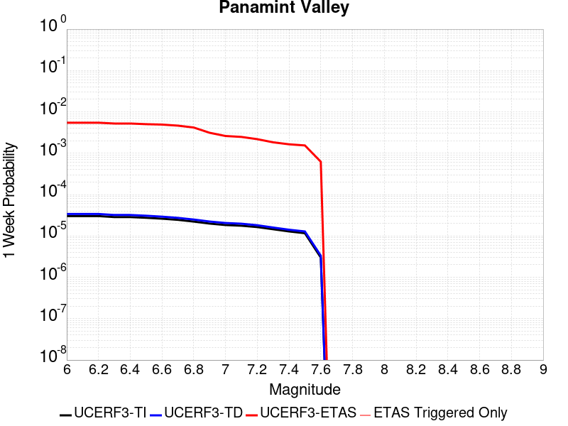 |  | 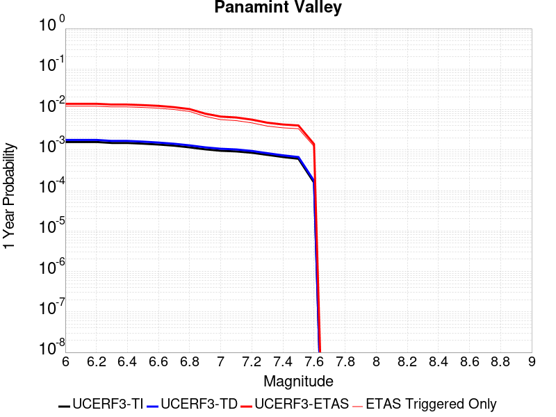 |  |

| Magnitude | 1 wk TI Prob | 1 wk TD Prob | 1 wk ETAS Prob | 1 wk ETAS/TD Gain | 1 wk ETAS Triggered Only | 1 mo TI Prob | 1 mo TD Prob | 1 mo ETAS Prob | 1 mo ETAS/TD Gain | 1 mo ETAS Triggered Only | 1 yr TI Prob | 1 yr TD Prob | 1 yr ETAS Prob | 1 yr ETAS/TD Gain | 1 yr ETAS Triggered Only | 10 yr TI Prob | 10 yr TD Prob | 10 yr ETAS Prob | 10 yr ETAS/TD Gain | 10 yr ETAS Triggered Only |
|-----|-----|-----|-----|-----|-----|-----|-----|-----|-----|-----|-----|-----|-----|-----|-----|-----|-----|-----|-----|-----|
| 6.0 | 3.0211835E-5 | 3.3984514E-5 | 0.0054638 | 160.77324 | 0.00543 | 1.2947287E-4 | 1.4563995E-4 | 0.007634549 | 52.420708 | 0.00749 | 0.0015751923 | 0.0017717537 | 0.013840334 | 7.8116574 | 0.01209 | 0.015640736 | 0.017583137 | 0.034736134 | 1.9755368 | 0.01746 |
| 6.1 | 3.0211835E-5 | 3.3984514E-5 | 0.0054638 | 160.77324 | 0.00543 | 1.2947287E-4 | 1.4563995E-4 | 0.007634549 | 52.420708 | 0.00749 | 0.0015751923 | 0.0017717537 | 0.013840334 | 7.8116574 | 0.01209 | 0.015640736 | 0.017583137 | 0.034736134 | 1.9755368 | 0.01746 |
| 6.2 | 3.0211835E-5 | 3.3984514E-5 | 0.0054638 | 160.77324 | 0.00543 | 1.2947287E-4 | 1.4563995E-4 | 0.007634549 | 52.420708 | 0.00749 | 0.0015751923 | 0.0017717537 | 0.013840334 | 7.8116574 | 0.01209 | 0.015640736 | 0.017583137 | 0.034736134 | 1.9755368 | 0.01746 |
| 6.3 | 2.8573924E-5 | 3.210268E-5 | 0.0052319355 | 162.97505 | 0.0052 | 1.2245393E-4 | 1.3757581E-4 | 0.007316588 | 53.182224 | 0.00718 | 0.001489857 | 0.0016737265 | 0.013254311 | 7.9190426 | 0.0116 | 0.01479908 | 0.016617801 | 0.033050116 | 1.9888382 | 0.01671 |
| 6.4 | 2.8573924E-5 | 3.210268E-5 | 0.0052319355 | 162.97505 | 0.0052 | 1.2245393E-4 | 1.3757581E-4 | 0.007316588 | 53.182224 | 0.00718 | 0.001489857 | 0.0016737265 | 0.013254311 | 7.9190426 | 0.0116 | 0.01479908 | 0.016617801 | 0.033050116 | 1.9888382 | 0.01671 |
| 6.5 | 2.7468774E-5 | 3.0828433E-5 | 0.005040674 | 163.50731 | 0.00501 | 1.1771801E-4 | 1.3211532E-4 | 0.0070412024 | 53.29588 | 0.00691 | 0.0014322745 | 0.0016073446 | 0.012829278 | 7.98166 | 0.01124 | 0.014230782 | 0.015963677 | 0.031895224 | 1.9979874 | 0.01619 |
| 6.6 | 2.6135967E-5 | 2.925248E-5 | 0.004929109 | 168.50226 | 0.0049 | 1.1200648E-4 | 1.253619E-4 | 0.0068545183 | 54.677845 | 0.00673 | 0.0013628257 | 0.0015252391 | 0.012298781 | 8.063511 | 0.01079 | 0.013544982 | 0.015154043 | 0.030438853 | 2.008629 | 0.01552 |
| 6.7 | 2.4498746E-5 | 2.7341335E-5 | 0.004647215 | 169.9703 | 0.00462 | 1.04990395E-4 | 1.1717203E-4 | 0.0063764383 | 54.41946 | 0.00626 | 0.0012775084 | 0.0014256609 | 0.011411404 | 8.004291 | 0.01 | 0.012701893 | 0.014171274 | 0.028327776 | 1.9989574 | 0.01436 |
| 6.8 | 2.2244329E-5 | 2.4935423E-5 | 0.004184832 | 167.82677 | 0.00416 | 9.532935E-5 | 1.0686185E-4 | 0.0057162624 | 53.492077 | 0.00561 | 0.0011600169 | 0.0013002884 | 0.010228664 | 7.8664584 | 0.00894 | 0.011539802 | 0.0129325185 | 0.025566982 | 1.976953 | 0.0128 |
| 6.9 | 1.9902658E-5 | 2.2290267E-5 | 0.0031222212 | 140.07106 | 0.0031 | 8.529431E-5 | 9.552632E-5 | 0.004325122 | 45.27676 | 0.00423 | 0.0010379635 | 0.0011624309 | 0.0079045845 | 6.800047 | 0.00675 | 0.010331288 | 0.011568608 | 0.021235466 | 1.8356112 | 0.00978 |
| 7.0 | 1.8353881E-5 | 2.0566185E-5 | 0.002610513 | 126.93228 | 0.00259 | 7.865712E-5 | 8.813792E-5 | 0.003557832 | 40.366646 | 0.00347 | 9.5722964E-4 | 0.0010725686 | 0.006686541 | 6.234138 | 0.00562 | 0.009531168 | 0.010678849 | 0.018593417 | 1.7411444 | 0.008 |
| 7.1 | 1.7667631E-5 | 1.9772613E-5 | 0.002479724 | 125.412056 | 0.00246 | 7.571623E-5 | 8.473711E-5 | 0.0033644591 | 39.70467 | 0.00328 | 9.2145515E-4 | 0.0010312037 | 0.0063457177 | 6.1537 | 0.00532 | 0.009176437 | 0.010269073 | 0.017692054 | 1.7228483 | 0.0075 |
| 7.2 | 1.6381597E-5 | 1.8158249E-5 | 0.0021881189 | 120.50274 | 0.00217 | 7.020495E-5 | 7.781885E-5 | 0.0029375963 | 37.74916 | 0.00286 | 8.544101E-4 | 9.4704994E-4 | 0.005622618 | 5.936981 | 0.00468 | 0.008511325 | 0.009434792 | 0.016061673 | 1.7023877 | 0.00669 |
| 7.3 | 1.4520491E-5 | 1.5966476E-5 | 0.0018359374 | 114.987015 | 0.00182 | 6.222919E-5 | 6.842605E-5 | 0.0024782612 | 36.218094 | 0.00241 | 7.57377E-4 | 8.327849E-4 | 0.0047195456 | 5.667184 | 0.00389 | 0.0075480095 | 0.00829975 | 0.013883023 | 1.6727036 | 0.00563 |
| 7.4 | 1.2852287E-5 | 1.4145411E-5 | 0.0016441223 | 116.23009 | 0.00163 | 5.5080065E-5 | 6.062187E-5 | 0.002220491 | 36.628544 | 0.00216 | 6.7039346E-4 | 7.378371E-4 | 0.0042652325 | 5.7807236 | 0.00353 | 0.0066837464 | 0.0073567946 | 0.012409348 | 1.6867875 | 0.00509 |
| 7.5 | 1.1637851E-5 | 1.2836797E-5 | 0.0015428171 | 120.18707 | 0.00153 | 4.987555E-5 | 5.5013777E-5 | 0.0020949016 | 38.079582 | 0.00204 | 6.070656E-4 | 6.6960254E-4 | 0.0040273527 | 6.014542 | 0.00336 | 0.006054099 | 0.0066787465 | 0.011476488 | 1.7183596 | 0.00483 |
| 7.6 | 3.0068115E-6 | 3.3330316E-6 | 6.2333094E-4 | 187.01622 | 6.2E-4 | 1.2886271E-5 | 1.4284384E-5 | 8.242728E-4 | 57.70447 | 8.1E-4 | 1.5687906E-4 | 1.7390578E-4 | 0.0014036918 | 8.071566 | 0.00123 | 0.0015676835 | 0.0017391363 | 0.0034960753 | 2.0102365 | 0.00176 |

## Owl Lake
*[(top)](#table-of-contents)*

| 1 Week | 1 Month | 1 Year | 10 Year |
|-----|-----|-----|-----|
|  |  |  |  |

| Magnitude | 1 wk TI Prob | 1 wk TD Prob | 1 wk ETAS Prob | 1 wk ETAS/TD Gain | 1 wk ETAS Triggered Only | 1 mo TI Prob | 1 mo TD Prob | 1 mo ETAS Prob | 1 mo ETAS/TD Gain | 1 mo ETAS Triggered Only | 1 yr TI Prob | 1 yr TD Prob | 1 yr ETAS Prob | 1 yr ETAS/TD Gain | 1 yr ETAS Triggered Only | 10 yr TI Prob | 10 yr TD Prob | 10 yr ETAS Prob | 10 yr ETAS/TD Gain | 10 yr ETAS Triggered Only |
|-----|-----|-----|-----|-----|-----|-----|-----|-----|-----|-----|-----|-----|-----|-----|-----|-----|-----|-----|-----|-----|
| 6.0 | 5.0320643E-5 | 6.635816E-5 | 0.004046094 | 60.973576 | 0.00398 | 2.1564208E-4 | 2.843674E-4 | 0.006002741 | 21.109104 | 0.00572 | 0.0026222812 | 0.0034577388 | 0.013074372 | 3.781191 | 0.00965 | 0.02591553 | 0.034140717 | 0.047894552 | 1.4028573 | 0.01424 |
| 6.1 | 5.0320643E-5 | 6.635816E-5 | 0.004046094 | 60.973576 | 0.00398 | 2.1564208E-4 | 2.843674E-4 | 0.006002741 | 21.109104 | 0.00572 | 0.0026222812 | 0.0034577388 | 0.013074372 | 3.781191 | 0.00965 | 0.02591553 | 0.034140717 | 0.047894552 | 1.4028573 | 0.01424 |
| 6.2 | 2.4125871E-5 | 3.0981035E-5 | 0.002510904 | 81.046486 | 0.00248 | 1.0339249E-4 | 1.3277028E-4 | 0.003772287 | 28.412134 | 0.00364 | 0.0012580766 | 0.001615439 | 0.0077754715 | 4.8132253 | 0.00617 | 0.012509781 | 0.016070465 | 0.025132455 | 1.563891 | 0.00921 |
| 6.3 | 1.7433485E-5 | 2.2355514E-5 | 0.0022323062 | 99.854836 | 0.00221 | 7.471279E-5 | 9.580672E-5 | 0.0031655126 | 33.04061 | 0.00307 | 9.0924866E-4 | 0.0011659743 | 0.0061901095 | 5.3089585 | 0.00503 | 0.009055373 | 0.011628896 | 0.01899226 | 1.6331955 | 0.00745 |
| 6.4 | 1.7433485E-5 | 2.2355514E-5 | 0.0022323062 | 99.854836 | 0.00221 | 7.471279E-5 | 9.580672E-5 | 0.0031655126 | 33.04061 | 0.00307 | 9.0924866E-4 | 0.0011659743 | 0.0061901095 | 5.3089585 | 0.00503 | 0.009055373 | 0.011628896 | 0.01899226 | 1.6331955 | 0.00745 |
| 6.5 | 1.5182742E-5 | 1.9429144E-5 | 0.0021193884 | 109.08295 | 0.0021 | 6.506727E-5 | 8.326596E-5 | 0.002963026 | 35.585083 | 0.00288 | 7.919061E-4 | 0.0010134429 | 0.0057086796 | 5.6329565 | 0.0047 | 0.0078909 | 0.010118429 | 0.016918914 | 1.6720892 | 0.00687 |
| 6.6 | 6.7271576E-6 | 8.547361E-6 | 0.0015585341 | 182.34097 | 0.00155 | 2.8830356E-5 | 3.6631063E-5 | 0.0020465574 | 55.86945 | 0.00201 | 3.5095305E-4 | 4.458976E-4 | 0.0034545555 | 7.747419 | 0.00301 | 0.0035039932 | 0.004467813 | 0.00872869 | 1.9536831 | 0.00428 |
| 6.7 | 6.682835E-6 | 8.479807E-6 | 0.0015484667 | 182.60637 | 0.00154 | 2.8640408E-5 | 3.6341557E-5 | 0.0020362688 | 56.031418 | 0.002 | 3.4864116E-4 | 4.4237426E-4 | 0.0034310515 | 7.7559924 | 0.00299 | 0.003480947 | 0.0044327388 | 0.008653944 | 1.9522792 | 0.00424 |
| 6.8 | 6.5774975E-6 | 8.32628E-6 | 0.0015383136 | 184.75398 | 0.00153 | 2.8188972E-5 | 3.5683603E-5 | 0.002015613 | 56.48569 | 0.00198 | 3.4314668E-4 | 4.343669E-4 | 0.003403077 | 7.8345675 | 0.00297 | 0.0034261728 | 0.004352885 | 0.008554515 | 1.965252 | 0.00422 |
| 6.9 | 6.363419E-6 | 7.999454E-6 | 0.0015279873 | 191.01143 | 0.00152 | 2.727151E-5 | 3.428296E-5 | 0.0019942157 | 58.169304 | 0.00196 | 3.3198006E-4 | 4.1732067E-4 | 0.003346098 | 8.01805 | 0.00293 | 0.0033148455 | 0.0041828766 | 0.008335434 | 1.9927516 | 0.00417 |
| 7.0 | 6.1342453E-6 | 7.6316555E-6 | 0.0015176202 | 198.85857 | 0.00151 | 2.6289357E-5 | 3.2706717E-5 | 0.001982643 | 60.61883 | 0.00195 | 3.2002592E-4 | 3.9813702E-4 | 0.0032969825 | 8.281025 | 0.0029 | 0.0031956544 | 0.003991571 | 0.008055285 | 2.018074 | 0.00408 |
| 7.1 | 5.842926E-6 | 7.142211E-6 | 0.001437132 | 201.21667 | 0.00143 | 2.504087E-5 | 3.0609146E-5 | 0.0018705528 | 61.11091 | 0.00184 | 3.0482994E-4 | 3.7260808E-4 | 0.003141576 | 8.431314 | 0.00277 | 0.0030441214 | 0.0037370329 | 0.007582608 | 2.029045 | 0.00386 |
| 7.2 | 4.77173E-6 | 5.358483E-6 | 0.001025353 | 191.35135 | 0.00102 | 2.045011E-5 | 2.2964748E-5 | 0.0013529342 | 58.91352 | 0.00133 | 2.4895166E-4 | 2.79564E-4 | 0.0022690077 | 8.116237 | 0.00199 | 0.0024867293 | 0.002808645 | 0.0055010617 | 1.9586177 | 0.0027 |
| 7.3 | 3.0494948E-6 | 2.710463E-6 | 3.3270958E-4 | 122.75009 | 3.3E-4 | 1.3069198E-5 | 1.1616219E-5 | 4.1161157E-4 | 35.43421 | 4.0E-4 | 1.5910587E-4 | 1.4141845E-4 | 7.413336E-4 | 5.242128 | 6.0E-4 | 0.0015899199 | 0.0014232415 | 0.0022820174 | 1.6033945 | 8.6E-4 |
| 7.4 | 2.7263884E-6 | 2.3056762E-6 | 2.0230522E-4 | 87.74225 | 2.0E-4 | 1.1684469E-5 | 9.881433E-6 | 2.4987906E-4 | 25.287735 | 2.4E-4 | 1.4224913E-4 | 1.20299905E-4 | 5.002542E-4 | 4.1583924 | 3.8E-4 | 0.0014215811 | 0.0012112238 | 0.0017605576 | 1.4535362 | 5.5E-4 |
| 7.5 | 2.6090431E-6 | 2.1656133E-6 | 1.6216526E-4 | 74.88191 | 1.6E-4 | 1.1181565E-5 | 9.281167E-6 | 1.992794E-4 | 21.471373 | 1.9E-4 | 1.3612706E-4 | 1.1299244E-4 | 4.1295856E-4 | 3.6547449 | 3.0E-4 | 0.001360437 | 0.0011379806 | 0.0015874685 | 1.3949873 | 4.5E-4 |
| 7.6 | 2.3008756E-6 | 1.8727933E-6 | 1.2187257E-4 | 65.07529 | 1.2E-4 | 9.860858E-6 | 8.0262325E-6 | 1.4802511E-4 | 18.442663 | 1.4E-4 | 1.20049335E-4 | 9.7715085E-5 | 3.0769457E-4 | 3.1488953 | 2.1E-4 | 0.001199845 | 9.849932E-4 | 0.0013146681 | 1.3346977 | 3.3E-4 |
| 7.7 | 1.7184348E-6 | 1.3419171E-6 | 7.134183E-5 | 53.16411 | 7.0E-5 | 7.3646997E-6 | 5.7510606E-6 | 8.57506E-5 | 14.910398 | 8.0E-5 | 8.966153E-5 | 7.0016955E-5 | 1.8000926E-4 | 2.570938 | 1.1E-4 | 8.962536E-4 | 7.078345E-4 | 9.0769294E-4 | 1.282352 | 2.0E-4 |
| 7.8 | 8.4612907E-7 | 8.4058576E-7 | 4.084055E-5 | 48.585823 | 4.0E-5 | 3.6262625E-6 | 3.6025056E-6 | 4.3602362E-5 | 12.103343 | 4.0E-5 | 4.4148852E-5 | 4.3859643E-5 | 1.0385701E-4 | 2.3679402 | 6.0E-5 | 4.414008E-4 | 4.4398365E-4 | 5.6393037E-4 | 1.2701602 | 1.2E-4 |
| 7.9 | 2.716738E-7 | 3.7681056E-7 | 3.7681056E-7 | 1.0 | 0.0 | 1.1643157E-6 | 1.6149015E-6 | 1.6149015E-6 | 1.0 | 0.0 | 1.4175452E-5 | 1.966126E-5 | 1.966126E-5 | 1.0 | 0.0 | 1.4174548E-4 | 1.9836679E-4 | 2.2836083E-4 | 1.151205 | 3.0E-5 |
| 8.0 | 2.1995428E-8 | 3.384878E-8 | 3.384878E-8 | 1.0 | 0.0 | 9.426611E-8 | 1.4506621E-7 | 1.4506621E-7 | 1.0 | 0.0 | 1.1476893E-6 | 1.7661803E-6 | 1.7661803E-6 | 1.0 | 0.0 | 1.14768345E-5 | 1.7963059E-5 | 1.7963059E-5 | 1.0 | 0.0 |

## Little Lake
*[(top)](#table-of-contents)*

| 1 Week | 1 Month | 1 Year | 10 Year |
|-----|-----|-----|-----|
|  |  |  |  |

| Magnitude | 1 wk TI Prob | 1 wk TD Prob | 1 wk ETAS Prob | 1 wk ETAS/TD Gain | 1 wk ETAS Triggered Only | 1 mo TI Prob | 1 mo TD Prob | 1 mo ETAS Prob | 1 mo ETAS/TD Gain | 1 mo ETAS Triggered Only | 1 yr TI Prob | 1 yr TD Prob | 1 yr ETAS Prob | 1 yr ETAS/TD Gain | 1 yr ETAS Triggered Only | 10 yr TI Prob | 10 yr TD Prob | 10 yr ETAS Prob | 10 yr ETAS/TD Gain | 10 yr ETAS Triggered Only |
|-----|-----|-----|-----|-----|-----|-----|-----|-----|-----|-----|-----|-----|-----|-----|-----|-----|-----|-----|-----|-----|
| 6.0 | 2.8424427E-5 | 3.120572E-5 | 0.0069609894 | 223.06773 | 0.00693 | 1.2181328E-4 | 1.337327E-4 | 0.008882563 | 66.42027 | 0.00875 | 0.0014820677 | 0.0016271127 | 0.013927067 | 8.559374 | 0.01232 | 0.014722223 | 0.016165402 | 0.03187724 | 1.9719424 | 0.01597 |
| 6.1 | 2.8424427E-5 | 3.120572E-5 | 0.0069609894 | 223.06773 | 0.00693 | 1.2181328E-4 | 1.337327E-4 | 0.008882563 | 66.42027 | 0.00875 | 0.0014820677 | 0.0016271127 | 0.013927067 | 8.559374 | 0.01232 | 0.014722223 | 0.016165402 | 0.03187724 | 1.9719424 | 0.01597 |
| 6.2 | 2.8424427E-5 | 3.120572E-5 | 0.0069609894 | 223.06773 | 0.00693 | 1.2181328E-4 | 1.337327E-4 | 0.008882563 | 66.42027 | 0.00875 | 0.0014820677 | 0.0016271127 | 0.013927067 | 8.559374 | 0.01232 | 0.014722223 | 0.016165402 | 0.03187724 | 1.9719424 | 0.01597 |
| 6.3 | 1.48860645E-5 | 1.6081389E-5 | 0.0031060318 | 193.14449 | 0.00309 | 6.379586E-5 | 6.8918576E-5 | 0.004018646 | 58.31006 | 0.00395 | 7.7643775E-4 | 8.3878887E-4 | 0.006434092 | 7.6706924 | 0.0056 | 0.007737305 | 0.008359048 | 0.01558811 | 1.8648189 | 0.00729 |
| 6.4 | 1.48860645E-5 | 1.6081389E-5 | 0.0031060318 | 193.14449 | 0.00309 | 6.379586E-5 | 6.8918576E-5 | 0.004018646 | 58.31006 | 0.00395 | 7.7643775E-4 | 8.3878887E-4 | 0.006434092 | 7.6706924 | 0.0056 | 0.007737305 | 0.008359048 | 0.01558811 | 1.8648189 | 0.00729 |
| 6.5 | 1.2797581E-5 | 1.3765565E-5 | 0.00259373 | 188.42162 | 0.00258 | 5.4845623E-5 | 5.899409E-5 | 0.0033687989 | 57.104008 | 0.00331 | 6.675408E-4 | 7.18042E-4 | 0.0055046026 | 7.6661286 | 0.00479 | 0.006655392 | 0.00715977 | 0.013424592 | 1.8750032 | 0.00631 |
| 6.6 | 9.661896E-6 | 1.0289038E-5 | 0.0018802698 | 182.74496 | 0.00187 | 4.1407468E-5 | 4.409522E-5 | 0.002453989 | 55.65204 | 0.00241 | 5.040193E-4 | 5.367433E-4 | 0.003974897 | 7.4055824 | 0.00344 | 0.005028777 | 0.0053560743 | 0.00992149 | 1.8523809 | 0.00459 |
| 6.7 | 7.767871E-6 | 8.199687E-6 | 0.001438188 | 175.39548 | 0.00143 | 3.329045E-5 | 3.5141118E-5 | 0.0019050754 | 54.212147 | 0.00187 | 4.0523586E-4 | 4.2777284E-4 | 0.0031066264 | 7.262327 | 0.00268 | 0.004044977 | 0.004270846 | 0.007885342 | 1.8463187 | 0.00363 |
| 6.8 | 6.4235196E-6 | 6.7357446E-6 | 0.001156728 | 171.7298 | 0.00115 | 2.752908E-5 | 2.8867229E-5 | 0.0015488233 | 53.653343 | 0.00152 | 3.35115E-4 | 3.5141467E-4 | 0.0025306486 | 7.2013173 | 0.00218 | 0.003346101 | 0.00350985 | 0.0064694257 | 1.84322 | 0.00297 |
| 6.9 | 3.1283696E-6 | 3.1121804E-6 | 4.731107E-4 | 152.01906 | 4.7E-4 | 1.3407229E-5 | 1.3337856E-5 | 6.3332956E-4 | 47.483612 | 6.2E-4 | 1.6322079E-4 | 1.6237781E-4 | 0.0010322365 | 6.357005 | 8.7E-4 | 0.0016310095 | 0.00162274 | 0.0028307764 | 1.7444425 | 0.00121 |
| 7.0 | 2.290603E-6 | 2.2286815E-6 | 3.3222794E-4 | 149.06927 | 3.3E-4 | 9.816834E-6 | 9.551463E-6 | 4.3954735E-4 | 46.01885 | 4.3E-4 | 1.19513395E-4 | 1.162839E-4 | 6.962165E-4 | 5.9872127 | 5.8E-4 | 0.0011944914 | 0.0011623327 | 0.0019813797 | 1.7046579 | 8.2E-4 |
| 7.1 | 1.293693E-6 | 1.1776827E-6 | 1.4117752E-4 | 119.87737 | 1.4E-4 | 5.5443866E-6 | 5.0472063E-6 | 1.9504625E-4 | 38.644398 | 1.9E-4 | 6.750081E-5 | 6.14487E-5 | 3.3143212E-4 | 5.393639 | 2.7E-4 | 6.7480316E-4 | 6.143856E-4 | 0.0010141399 | 1.6506569 | 4.0E-4 |
| 7.2 | 4.715842E-7 | 3.0917857E-7 | 3.0917857E-7 | 1.0 | 0.0 | 2.0210737E-6 | 1.3250503E-6 | 1.1325037E-5 | 8.546873 | 1.0E-5 | 2.4606294E-5 | 1.6132375E-5 | 3.6132053E-5 | 2.2397232 | 2.0E-5 | 2.460357E-4 | 1.6131258E-4 | 2.213029E-4 | 1.3718886 | 6.0E-5 |
| 7.3 | 3.9430947E-7 | 2.3097488E-7 | 2.3097488E-7 | 1.0 | 0.0 | 1.6898966E-6 | 9.89892E-7 | 1.0989882E-5 | 11.102102 | 1.0E-5 | 2.0574296E-5 | 1.2051869E-5 | 2.2051749E-5 | 1.8297368 | 1.0E-5 | 2.0572392E-4 | 1.20512224E-4 | 1.605074E-4 | 1.3318765 | 4.0E-5 |
| 7.4 | 3.547123E-7 | 1.9679135E-7 | 1.9679135E-7 | 1.0 | 0.0 | 1.5201948E-6 | 8.4339126E-7 | 1.0843382E-5 | 12.856883 | 1.0E-5 | 1.8508214E-5 | 1.0268241E-5 | 2.0268139E-5 | 1.9738667 | 1.0E-5 | 1.8506673E-4 | 1.02677724E-4 | 1.3267464E-4 | 1.2921463 | 3.0E-5 |
| 7.5 | 2.6354266E-7 | 1.4423138E-7 | 1.4423138E-7 | 1.0 | 0.0 | 1.129468E-6 | 6.181344E-7 | 1.0618128E-5 | 17.177702 | 1.0E-5 | 1.3751187E-5 | 7.5257603E-6 | 1.7525685E-5 | 2.3287594 | 1.0E-5 | 1.3750336E-4 | 7.5255106E-5 | 1.0525285E-4 | 1.398614 | 3.0E-5 |
| 7.6 | 1.269913E-7 | 7.572556E-8 | 7.572556E-8 | 1.0 | 0.0 | 5.4424834E-7 | 3.245381E-7 | 3.245381E-7 | 1.0 | 0.0 | 6.6262032E-6 | 3.9512443E-6 | 3.9512443E-6 | 1.0 | 0.0 | 6.626006E-5 | 3.9511775E-5 | 4.951138E-5 | 1.253079 | 1.0E-5 |

## Ash Hill
*[(top)](#table-of-contents)*

| 1 Week | 1 Month | 1 Year | 10 Year |
|-----|-----|-----|-----|
|  |  |  |  |

| Magnitude | 1 wk TI Prob | 1 wk TD Prob | 1 wk ETAS Prob | 1 wk ETAS/TD Gain | 1 wk ETAS Triggered Only | 1 mo TI Prob | 1 mo TD Prob | 1 mo ETAS Prob | 1 mo ETAS/TD Gain | 1 mo ETAS Triggered Only | 1 yr TI Prob | 1 yr TD Prob | 1 yr ETAS Prob | 1 yr ETAS/TD Gain | 1 yr ETAS Triggered Only | 10 yr TI Prob | 10 yr TD Prob | 10 yr ETAS Prob | 10 yr ETAS/TD Gain | 10 yr ETAS Triggered Only |
|-----|-----|-----|-----|-----|-----|-----|-----|-----|-----|-----|-----|-----|-----|-----|-----|-----|-----|-----|-----|-----|
| 6.0 | 2.1545662E-5 | 2.3194447E-5 | 0.0029631262 | 127.75154 | 0.00294 | 9.2335285E-5 | 9.940143E-5 | 0.004358978 | 43.852264 | 0.00426 | 0.0011236023 | 0.0012096206 | 0.008480814 | 7.011136 | 0.00728 | 0.011179381 | 0.012038348 | 0.022876289 | 1.9002845 | 0.01097 |
| 6.1 | 2.1545662E-5 | 2.3194447E-5 | 0.0029631262 | 127.75154 | 0.00294 | 9.2335285E-5 | 9.940143E-5 | 0.004358978 | 43.852264 | 0.00426 | 0.0011236023 | 0.0012096206 | 0.008480814 | 7.011136 | 0.00728 | 0.011179381 | 0.012038348 | 0.022876289 | 1.9002845 | 0.01097 |
| 6.2 | 2.1545662E-5 | 2.3194447E-5 | 0.0029631262 | 127.75154 | 0.00294 | 9.2335285E-5 | 9.940143E-5 | 0.004358978 | 43.852264 | 0.00426 | 0.0011236023 | 0.0012096206 | 0.008480814 | 7.011136 | 0.00728 | 0.011179381 | 0.012038348 | 0.022876289 | 1.9002845 | 0.01097 |
| 6.3 | 1.0025529E-5 | 1.0746934E-5 | 0.0013407327 | 124.75489 | 0.00133 | 4.2965847E-5 | 4.605755E-5 | 0.0018959723 | 41.165287 | 0.00185 | 5.229836E-4 | 5.6061964E-4 | 0.003588921 | 6.401704 | 0.00303 | 0.005217545 | 0.0055933665 | 0.010157693 | 1.8160249 | 0.00459 |
| 6.4 | 1.0025529E-5 | 1.0746934E-5 | 0.0013407327 | 124.75489 | 0.00133 | 4.2965847E-5 | 4.605755E-5 | 0.0018959723 | 41.165287 | 0.00185 | 5.229836E-4 | 5.6061964E-4 | 0.003588921 | 6.401704 | 0.00303 | 0.005217545 | 0.0055933665 | 0.010157693 | 1.8160249 | 0.00459 |
| 6.5 | 6.9617327E-6 | 7.456634E-6 | 9.174498E-4 | 123.03807 | 9.1E-4 | 2.9835655E-5 | 3.195666E-5 | 0.0013119158 | 41.052967 | 0.00128 | 3.6318856E-4 | 3.8901155E-4 | 0.0025081867 | 6.44759 | 0.00212 | 0.0036259557 | 0.0038841602 | 0.0070418473 | 1.8129652 | 0.00317 |
| 6.6 | 4.9919777E-6 | 5.3466883E-6 | 6.6534313E-4 | 124.44024 | 6.6E-4 | 2.1394015E-5 | 2.2914215E-5 | 9.228936E-4 | 40.276028 | 9.0E-4 | 2.60441E-4 | 2.7895154E-4 | 0.0017585387 | 6.304101 | 0.00148 | 0.0026013597 | 0.0027866727 | 0.004930681 | 1.7693795 | 0.00215 |
| 6.7 | 3.6630722E-6 | 3.924624E-6 | 4.739228E-4 | 120.75623 | 4.7E-4 | 1.5698786E-5 | 1.681974E-5 | 6.5680896E-4 | 39.04989 | 6.4E-4 | 1.9111596E-4 | 2.0476682E-4 | 0.0013145396 | 6.41969 | 0.00111 | 0.0019095168 | 0.0020463446 | 0.0036829885 | 1.7997891 | 0.00164 |
| 6.8 | 2.5599613E-6 | 2.744925E-6 | 3.127441E-4 | 113.93538 | 3.1E-4 | 1.0971216E-5 | 1.1763939E-5 | 4.5175877E-4 | 38.401997 | 4.4E-4 | 1.3356637E-4 | 1.4322149E-4 | 9.131112E-4 | 6.375518 | 7.7E-4 | 0.0013348613 | 0.0014317769 | 0.0025401877 | 1.7741505 | 0.00111 |
| 6.9 | 1.7684905E-6 | 1.8968707E-6 | 2.4189641E-4 | 127.52393 | 2.4E-4 | 7.579223E-6 | 8.129446E-6 | 3.1812693E-4 | 39.13267 | 3.1E-4 | 9.2273134E-5 | 9.8976E-5 | 6.689196E-4 | 6.7584014 | 5.7E-4 | 9.223483E-4 | 9.8976E-4 | 0.0017989583 | 1.8175702 | 8.1E-4 |

## Garlock (East)
*[(top)](#table-of-contents)*

| 1 Week | 1 Month | 1 Year | 10 Year |
|-----|-----|-----|-----|
|  |  |  |  |

| Magnitude | 1 wk TI Prob | 1 wk TD Prob | 1 wk ETAS Prob | 1 wk ETAS/TD Gain | 1 wk ETAS Triggered Only | 1 mo TI Prob | 1 mo TD Prob | 1 mo ETAS Prob | 1 mo ETAS/TD Gain | 1 mo ETAS Triggered Only | 1 yr TI Prob | 1 yr TD Prob | 1 yr ETAS Prob | 1 yr ETAS/TD Gain | 1 yr ETAS Triggered Only | 10 yr TI Prob | 10 yr TD Prob | 10 yr ETAS Prob | 10 yr ETAS/TD Gain | 10 yr ETAS Triggered Only |
|-----|-----|-----|-----|-----|-----|-----|-----|-----|-----|-----|-----|-----|-----|-----|-----|-----|-----|-----|-----|-----|
| 6.0 | 4.5092507E-5 | 6.290325E-5 | 0.002562746 | 40.741074 | 0.0025 | 1.9323928E-4 | 2.6956003E-4 | 0.003918576 | 14.536934 | 0.00365 | 0.0023501497 | 0.0032774 | 0.009616556 | 2.9342027 | 0.00636 | 0.023254504 | 0.032351844 | 0.041650943 | 1.2874365 | 0.00961 |
| 6.1 | 4.5092507E-5 | 6.290325E-5 | 0.002562746 | 40.741074 | 0.0025 | 1.9323928E-4 | 2.6956003E-4 | 0.003918576 | 14.536934 | 0.00365 | 0.0023501497 | 0.0032774 | 0.009616556 | 2.9342027 | 0.00636 | 0.023254504 | 0.032351844 | 0.041650943 | 1.2874365 | 0.00961 |
| 6.2 | 2.6674514E-5 | 3.4509674E-5 | 0.0016844528 | 48.811028 | 0.00165 | 1.1431433E-4 | 1.4789042E-4 | 0.0026575192 | 17.969517 | 0.00251 | 0.0013908884 | 0.0017991117 | 0.0060514477 | 3.3635752 | 0.00426 | 0.01382215 | 0.017890299 | 0.024008842 | 1.3420035 | 0.00623 |
| 6.3 | 2.6674514E-5 | 3.4509674E-5 | 0.0016844528 | 48.811028 | 0.00165 | 1.1431433E-4 | 1.4789042E-4 | 0.0026575192 | 17.969517 | 0.00251 | 0.0013908884 | 0.0017991117 | 0.0060514477 | 3.3635752 | 0.00426 | 0.01382215 | 0.017890299 | 0.024008842 | 1.3420035 | 0.00623 |
| 6.4 | 2.5312667E-5 | 3.233893E-5 | 0.0016422869 | 50.78359 | 0.00161 | 1.0847834E-4 | 1.3858822E-4 | 0.002608246 | 18.820112 | 0.00247 | 0.0013199237 | 0.0016860351 | 0.005819055 | 3.451325 | 0.00414 | 0.013121112 | 0.016778335 | 0.022726826 | 1.354534 | 0.00605 |
| 6.5 | 2.5312667E-5 | 3.233893E-5 | 0.0016422869 | 50.78359 | 0.00161 | 1.0847834E-4 | 1.3858822E-4 | 0.002608246 | 18.820112 | 0.00247 | 0.0013199237 | 0.0016860351 | 0.005819055 | 3.451325 | 0.00414 | 0.013121112 | 0.016778335 | 0.022726826 | 1.354534 | 0.00605 |
| 6.6 | 2.246556E-5 | 2.8133776E-5 | 0.0015480911 | 55.026066 | 0.00152 | 9.627742E-5 | 1.20567885E-4 | 0.0024302893 | 20.15702 | 0.00231 | 0.0011715472 | 0.0014669491 | 0.0052913306 | 3.6070309 | 0.00383 | 0.011653901 | 0.01461866 | 0.020107234 | 1.3754499 | 0.00557 |
| 6.7 | 2.2241198E-5 | 2.7803519E-5 | 0.0015377615 | 55.308163 | 0.00151 | 9.531594E-5 | 1.1915263E-4 | 0.0024188785 | 20.300673 | 0.0023 | 0.0011598538 | 0.0014497414 | 0.0052242614 | 3.6035817 | 0.00378 | 0.011538187 | 0.014448853 | 0.01987924 | 1.3758352 | 0.00551 |
| 6.8 | 1.9528685E-5 | 2.389819E-5 | 0.0014438643 | 60.417305 | 0.00142 | 8.369167E-5 | 1.0241691E-4 | 0.0022621956 | 22.088108 | 0.00216 | 0.0010184698 | 0.0012462323 | 0.004731883 | 3.796951 | 0.00349 | 0.010138147 | 0.012436427 | 0.0174335 | 1.4018092 | 0.00506 |
| 6.9 | 1.3318621E-5 | 1.5198884E-5 | 0.0012351803 | 81.26783 | 0.00122 | 5.7078556E-5 | 6.513648E-5 | 0.001915016 | 29.400051 | 0.00185 | 6.9470983E-4 | 7.927538E-4 | 0.0037204311 | 4.693047 | 0.00293 | 0.0069254204 | 0.007939888 | 0.012076778 | 1.5210264 | 0.00417 |
| 7.0 | 1.1760853E-5 | 1.31077895E-5 | 0.001143093 | 87.20715 | 0.00113 | 5.0402683E-5 | 5.6175057E-5 | 0.0017860779 | 31.794855 | 0.00173 | 6.134799E-4 | 6.8372174E-4 | 0.003411855 | 4.9901223 | 0.00273 | 0.0061178906 | 0.00685652 | 0.010739711 | 1.5663501 | 0.00391 |
| 7.1 | 1.0064758E-5 | 1.0902931E-5 | 0.0010608914 | 97.30334 | 0.00105 | 4.3133965E-5 | 4.672603E-5 | 0.0016666503 | 35.668564 | 0.00162 | 5.2502943E-4 | 5.687444E-4 | 0.0030973055 | 5.4458656 | 0.00253 | 0.005237907 | 0.0057129986 | 0.009262603 | 1.6213207 | 0.00357 |
| 7.2 | 9.768808E-6 | 1.0498807E-5 | 0.0010504879 | 100.05784 | 0.00104 | 4.186565E-5 | 4.499413E-5 | 0.0016349226 | 36.336353 | 0.00159 | 5.095951E-4 | 5.4766936E-4 | 0.0030363055 | 5.544049 | 0.00249 | 0.0050842804 | 0.0055032647 | 0.008984003 | 1.6324861 | 0.0035 |
| 7.3 | 9.344516E-6 | 9.944468E-6 | 9.699349E-4 | 97.535126 | 9.6E-4 | 4.004731E-5 | 4.261847E-5 | 0.0014725575 | 34.552097 | 0.00143 | 4.8746695E-4 | 5.1875977E-4 | 0.0027675927 | 5.3350177 | 0.00225 | 0.0048639905 | 0.0052149445 | 0.0084281005 | 1.6161438 | 0.00323 |
| 7.4 | 9.023491E-6 | 9.490661E-6 | 8.794824E-4 | 92.66819 | 8.7E-4 | 3.867153E-5 | 4.0673647E-5 | 0.0013406208 | 32.960426 | 0.0013 | 4.7072413E-4 | 4.950925E-4 | 0.0025440776 | 5.1385903 | 0.00205 | 0.004697283 | 0.0049783974 | 0.007893811 | 1.5856128 | 0.00293 |
| 7.5 | 7.081253E-6 | 7.087672E-6 | 4.4708455E-4 | 63.07918 | 4.4E-4 | 3.0347876E-5 | 3.0375388E-5 | 6.703559E-4 | 22.06905 | 6.4E-4 | 3.6942272E-4 | 3.6975832E-4 | 0.0014393626 | 3.892712 | 0.00107 | 0.003688092 | 0.0037243143 | 0.0053880946 | 1.4467347 | 0.00167 |
| 7.6 | 6.116396E-6 | 5.959245E-6 | 2.5595774E-4 | 42.951374 | 2.5E-4 | 2.6212863E-5 | 2.5539372E-5 | 4.0552966E-4 | 15.878608 | 3.8E-4 | 3.1909486E-4 | 3.1089774E-4 | 9.4070187E-4 | 3.0257597 | 6.3E-4 | 0.0031863707 | 0.0031357552 | 0.004152557 | 1.3242605 | 0.00102 |
| 7.7 | 4.797145E-6 | 4.757281E-6 | 1.8475643E-4 | 38.83656 | 1.8E-4 | 2.055903E-5 | 2.0388188E-5 | 2.7038308E-4 | 13.261751 | 2.5E-4 | 2.5027743E-4 | 2.4819805E-4 | 6.4809876E-4 | 2.6112163 | 4.0E-4 | 0.0024999576 | 0.0025093474 | 0.0031078418 | 1.238506 | 6.0E-4 |
| 7.8 | 3.4028885E-6 | 3.978462E-6 | 1.1397802E-4 | 28.648767 | 1.1E-4 | 1.4583726E-5 | 1.7050439E-5 | 1.8704754E-4 | 10.970247 | 1.7E-4 | 1.775424E-4 | 2.0756939E-4 | 4.7751336E-4 | 2.3004997 | 2.7E-4 | 0.0017740062 | 0.0021012232 | 0.0024904036 | 1.1852162 | 3.9E-4 |
| 7.9 | 2.5928412E-6 | 3.3724489E-6 | 7.337221E-5 | 21.756361 | 7.0E-5 | 1.1112129E-5 | 1.4453272E-5 | 1.3445153E-4 | 9.302498 | 1.2E-4 | 1.3528178E-4 | 1.7595445E-4 | 3.5592276E-4 | 2.0228121 | 1.8E-4 | 0.0013519945 | 0.0017812408 | 0.0020307954 | 1.1401016 | 2.5E-4 |
| 8.0 | 1.3743648E-6 | 1.6734747E-6 | 1.1673458E-5 | 6.9755807 | 1.0E-5 | 5.8901214E-6 | 7.1720146E-6 | 4.717173E-5 | 6.5771933 | 4.0E-5 | 7.1709874E-5 | 8.731581E-5 | 1.573097E-4 | 1.8016176 | 7.0E-5 | 7.1686733E-4 | 8.837234E-4 | 9.7364385E-4 | 1.1017518 | 9.0E-5 |
| 8.1 | 3.6733252E-7 | 3.1489964E-7 | 3.1489964E-7 | 1.0 | 0.0 | 1.5742813E-6 | 1.3495693E-6 | 1.3495693E-6 | 1.0 | 0.0 | 1.9166706E-5 | 1.6430899E-5 | 1.6430899E-5 | 1.0 | 0.0 | 1.9165053E-4 | 1.6638759E-4 | 1.6638759E-4 | 1.0 | 0.0 |

## Blackwater
*[(top)](#table-of-contents)*

| 1 Week | 1 Month | 1 Year | 10 Year |
|-----|-----|-----|-----|
|  |  |  |  |

| Magnitude | 1 wk TI Prob | 1 wk TD Prob | 1 wk ETAS Prob | 1 wk ETAS/TD Gain | 1 wk ETAS Triggered Only | 1 mo TI Prob | 1 mo TD Prob | 1 mo ETAS Prob | 1 mo ETAS/TD Gain | 1 mo ETAS Triggered Only | 1 yr TI Prob | 1 yr TD Prob | 1 yr ETAS Prob | 1 yr ETAS/TD Gain | 1 yr ETAS Triggered Only | 10 yr TI Prob | 10 yr TD Prob | 10 yr ETAS Prob | 10 yr ETAS/TD Gain | 10 yr ETAS Triggered Only |
|-----|-----|-----|-----|-----|-----|-----|-----|-----|-----|-----|-----|-----|-----|-----|-----|-----|-----|-----|-----|-----|
| 6.0 | 3.0708583E-5 | 3.3095846E-5 | 0.002353019 | 71.09711 | 0.00232 | 1.3160157E-4 | 1.4183241E-4 | 0.0031913999 | 22.501204 | 0.00305 | 0.0016010714 | 0.0017255784 | 0.0066770194 | 3.8694384 | 0.00496 | 0.015895851 | 0.017135633 | 0.023799453 | 1.3888867 | 0.00678 |
| 6.1 | 3.0708583E-5 | 3.3095846E-5 | 0.002353019 | 71.09711 | 0.00232 | 1.3160157E-4 | 1.4183241E-4 | 0.0031913999 | 22.501204 | 0.00305 | 0.0016010714 | 0.0017255784 | 0.0066770194 | 3.8694384 | 0.00496 | 0.015895851 | 0.017135633 | 0.023799453 | 1.3888867 | 0.00678 |
| 6.2 | 1.1707779E-5 | 1.2545122E-5 | 9.82533E-4 | 78.319916 | 9.7E-4 | 5.017523E-5 | 5.3763757E-5 | 0.0012636987 | 23.504658 | 0.00121 | 6.107122E-4 | 6.5438676E-4 | 0.0027030453 | 4.130654 | 0.00205 | 0.006090366 | 0.0065255696 | 0.0093470365 | 1.432371 | 0.00284 |
| 6.3 | 1.1707779E-5 | 1.2545122E-5 | 9.82533E-4 | 78.319916 | 9.7E-4 | 5.017523E-5 | 5.3763757E-5 | 0.0012636987 | 23.504658 | 0.00121 | 6.107122E-4 | 6.5438676E-4 | 0.0027030453 | 4.130654 | 0.00205 | 0.006090366 | 0.0065255696 | 0.0093470365 | 1.432371 | 0.00284 |
| 6.4 | 7.929244E-6 | 8.480098E-6 | 6.08475E-4 | 71.753296 | 6.0E-4 | 3.3982033E-5 | 3.6342793E-5 | 7.763159E-4 | 21.360931 | 7.4E-4 | 4.136527E-4 | 4.423877E-4 | 0.0018217772 | 4.118056 | 0.00138 | 0.0041288356 | 0.0044154758 | 0.0063668215 | 1.4419333 | 0.00196 |
| 6.5 | 5.8832115E-6 | 6.285991E-6 | 4.0628348E-4 | 64.63316 | 4.0E-4 | 2.521352E-5 | 2.6939697E-5 | 5.36926E-4 | 19.93066 | 5.1E-4 | 3.0693135E-4 | 3.27944E-4 | 0.0012676357 | 3.8654032 | 9.4E-4 | 0.0030650778 | 0.0032748538 | 0.0046403673 | 1.4169693 | 0.00137 |
| 6.6 | 5.8832115E-6 | 6.285991E-6 | 4.0628348E-4 | 64.63316 | 4.0E-4 | 2.521352E-5 | 2.6939697E-5 | 5.36926E-4 | 19.93066 | 5.1E-4 | 3.0693135E-4 | 3.27944E-4 | 0.0012676357 | 3.8654032 | 9.4E-4 | 0.0030650778 | 0.0032748538 | 0.0046403673 | 1.4169693 | 0.00137 |
| 6.7 | 3.0715053E-6 | 3.2814662E-6 | 1.732809E-4 | 52.805943 | 1.7E-4 | 1.3163528E-5 | 1.4063357E-5 | 2.3406027E-4 | 16.64327 | 2.2E-4 | 1.6025416E-4 | 1.7120909E-4 | 6.1113376E-4 | 3.5695171 | 4.4E-4 | 0.0016013865 | 0.0017108864 | 0.0023398085 | 1.3676002 | 6.3E-4 |
| 6.8 | 2.2722281E-6 | 2.4287538E-6 | 1.4242841E-4 | 58.642593 | 1.4E-4 | 9.738084E-6 | 1.0408908E-5 | 1.8040714E-4 | 17.331995 | 1.7E-4 | 1.1855473E-4 | 1.26722E-4 | 4.4668146E-4 | 3.5248926 | 3.2E-4 | 0.001184915 | 0.0012665876 | 0.0016860556 | 1.3311796 | 4.2E-4 |
| 6.9 | 9.952399E-7 | 1.0653489E-6 | 4.1065305E-5 | 38.546345 | 4.0E-5 | 4.265307E-6 | 4.5657757E-6 | 5.4565546E-5 | 11.950992 | 5.0E-5 | 5.1928873E-5 | 5.5587418E-5 | 1.6558131E-4 | 2.978755 | 1.1E-4 | 5.191674E-4 | 5.557858E-4 | 7.1569683E-4 | 1.2877207 | 1.6E-4 |
| 7.0 | 4.7385504E-7 | 5.0755597E-7 | 1.05075505E-5 | 20.702251 | 1.0E-5 | 2.0308057E-6 | 2.1752398E-6 | 1.2175218E-5 | 5.597184 | 1.0E-5 | 2.4724779E-5 | 2.6483543E-5 | 5.648275E-5 | 2.1327488 | 3.0E-5 | 2.4722028E-4 | 2.6483543E-4 | 3.0482485E-4 | 1.1509972 | 4.0E-5 |

## Hunter Mountain-Saline Valley
*[(top)](#table-of-contents)*

| 1 Week | 1 Month | 1 Year | 10 Year |
|-----|-----|-----|-----|
|  |  |  |  |

| Magnitude | 1 wk TI Prob | 1 wk TD Prob | 1 wk ETAS Prob | 1 wk ETAS/TD Gain | 1 wk ETAS Triggered Only | 1 mo TI Prob | 1 mo TD Prob | 1 mo ETAS Prob | 1 mo ETAS/TD Gain | 1 mo ETAS Triggered Only | 1 yr TI Prob | 1 yr TD Prob | 1 yr ETAS Prob | 1 yr ETAS/TD Gain | 1 yr ETAS Triggered Only | 10 yr TI Prob | 10 yr TD Prob | 10 yr ETAS Prob | 10 yr ETAS/TD Gain | 10 yr ETAS Triggered Only |
|-----|-----|-----|-----|-----|-----|-----|-----|-----|-----|-----|-----|-----|-----|-----|-----|-----|-----|-----|-----|-----|
| 6.0 | 4.5103672E-5 | 5.4570177E-5 | 0.0020144633 | 36.915096 | 0.00196 | 1.9328714E-4 | 2.3385242E-4 | 0.0027932539 | 11.944514 | 0.00256 | 0.002350731 | 0.0028435152 | 0.0069318567 | 2.4377773 | 0.0041 | 0.023260195 | 0.028091887 | 0.033806708 | 1.2034332 | 0.00588 |
| 6.1 | 4.5103672E-5 | 5.4570177E-5 | 0.0020144633 | 36.915096 | 0.00196 | 1.9328714E-4 | 2.3385242E-4 | 0.0027932539 | 11.944514 | 0.00256 | 0.002350731 | 0.0028435152 | 0.0069318567 | 2.4377773 | 0.0041 | 0.023260195 | 0.028091887 | 0.033806708 | 1.2034332 | 0.00588 |
| 6.2 | 3.9363465E-5 | 4.706337E-5 | 0.001946974 | 41.369198 | 0.0019 | 1.6868966E-4 | 2.0168544E-4 | 0.0026911832 | 13.343468 | 0.00249 | 0.002051862 | 0.0024528175 | 0.0064330306 | 2.6227107 | 0.00399 | 0.020330196 | 0.024273481 | 0.029874152 | 1.2307321 | 0.00574 |
| 6.3 | 3.9363465E-5 | 4.706337E-5 | 0.001946974 | 41.369198 | 0.0019 | 1.6868966E-4 | 2.0168544E-4 | 0.0026911832 | 13.343468 | 0.00249 | 0.002051862 | 0.0024528175 | 0.0064330306 | 2.6227107 | 0.00399 | 0.020330196 | 0.024273481 | 0.029874152 | 1.2307321 | 0.00574 |
| 6.4 | 3.2311684E-5 | 3.795099E-5 | 0.0018878807 | 49.74523 | 0.00185 | 1.384713E-4 | 1.6263737E-4 | 0.0025722454 | 15.815833 | 0.00241 | 0.0016845843 | 0.0019783843 | 0.0058706687 | 2.9674056 | 0.0039 | 0.016718714 | 0.019616475 | 0.025136033 | 1.2813736 | 0.00563 |
| 6.5 | 3.2311684E-5 | 3.795099E-5 | 0.0018878807 | 49.74523 | 0.00185 | 1.384713E-4 | 1.6263737E-4 | 0.0025722454 | 15.815833 | 0.00241 | 0.0016845843 | 0.0019783843 | 0.0058706687 | 2.9674056 | 0.0039 | 0.016718714 | 0.019616475 | 0.025136033 | 1.2813736 | 0.00563 |
| 6.6 | 2.9305844E-5 | 3.418183E-5 | 0.0018541196 | 54.24284 | 0.00182 | 1.2559042E-4 | 1.4648569E-4 | 0.002526137 | 17.24494 | 0.00238 | 0.0015279909 | 0.001782067 | 0.005625206 | 3.1565626 | 0.00385 | 0.015175272 | 0.01768569 | 0.023157181 | 1.3093739 | 0.00557 |
| 6.7 | 2.7826512E-5 | 3.2344276E-5 | 0.0018422857 | 56.958633 | 0.00181 | 1.19251024E-4 | 1.386113E-4 | 0.002508283 | 18.095804 | 0.00237 | 0.0014509142 | 0.0016863465 | 0.0055198707 | 3.2732723 | 0.00384 | 0.014414776 | 0.016743187 | 0.022210095 | 1.3265154 | 0.00556 |
| 6.8 | 2.3389874E-5 | 2.6866714E-5 | 0.0018268183 | 67.9956 | 0.0018 | 1.0023846E-4 | 1.15138246E-4 | 0.0024748666 | 21.49474 | 0.00236 | 0.00121972 | 0.001400954 | 0.005185644 | 3.7015095 | 0.00379 | 0.01213047 | 0.013927434 | 0.01931139 | 1.386572 | 0.00546 |
| 6.9 | 2.069209E-5 | 2.3570032E-5 | 0.0017835286 | 75.669334 | 0.00176 | 8.867737E-5 | 1.01010715E-4 | 0.0024207763 | 23.96554 | 0.00232 | 0.0010791123 | 0.0012291478 | 0.004954563 | 4.030893 | 0.00373 | 0.010738871 | 0.012228523 | 0.017542735 | 1.434575 | 0.00538 |
| 7.0 | 1.7462342E-5 | 1.9633546E-5 | 0.0017296 | 88.094124 | 0.00171 | 7.483646E-5 | 8.414118E-5 | 0.002343951 | 27.857359 | 0.00226 | 9.1075303E-4 | 0.0010239601 | 0.0046802126 | 4.5706983 | 0.00366 | 0.009070295 | 0.0101960525 | 0.015432116 | 1.5135382 | 0.00529 |
| 7.1 | 1.4807709E-5 | 1.6441749E-5 | 0.0016964141 | 103.17723 | 0.00168 | 6.3460066E-5 | 7.046283E-5 | 0.0023003058 | 32.64566 | 0.00223 | 7.723524E-4 | 8.575638E-4 | 0.004474459 | 5.2176404 | 0.00362 | 0.007696735 | 0.008545532 | 0.013711009 | 1.6044654 | 0.00521 |
| 7.2 | 1.4180048E-5 | 1.5698337E-5 | 0.0016856721 | 107.37903 | 0.00167 | 6.077022E-5 | 6.727694E-5 | 0.0022871275 | 33.995712 | 0.00222 | 7.396263E-4 | 8.188051E-4 | 0.004435841 | 5.417456 | 0.00362 | 0.0073716943 | 0.008160833 | 0.0133084785 | 1.6307745 | 0.00519 |
| 7.3 | 1.3730402E-5 | 1.5172075E-5 | 0.0016851467 | 111.06897 | 0.00167 | 5.8843252E-5 | 6.502165E-5 | 0.0022848772 | 35.140255 | 0.00222 | 7.161811E-4 | 7.9136714E-4 | 0.0043985103 | 5.558116 | 0.00361 | 0.007138774 | 0.007888422 | 0.013027561 | 1.6514785 | 0.00518 |
| 7.4 | 1.2810095E-5 | 1.4109277E-5 | 0.0016440863 | 116.5252 | 0.00163 | 5.489925E-5 | 6.0467017E-5 | 0.0022203363 | 36.719795 | 0.00216 | 6.681934E-4 | 7.359531E-4 | 0.0042633554 | 5.7929716 | 0.00353 | 0.006661878 | 0.007338053 | 0.012390702 | 1.6885545 | 0.00509 |
| 7.5 | 1.1595659E-5 | 1.2800664E-5 | 0.0015427811 | 120.52352 | 0.00153 | 4.9694736E-5 | 5.4858923E-5 | 0.002094747 | 38.184254 | 0.00204 | 6.0486543E-4 | 6.6771836E-4 | 0.0040254747 | 6.028702 | 0.00336 | 0.006032217 | 0.0066599925 | 0.011457824 | 1.720396 | 0.00483 |
| 7.6 | 2.997694E-6 | 3.3251579E-6 | 6.233231E-4 | 187.4567 | 6.2E-4 | 1.28471975E-5 | 1.425064E-5 | 8.242391E-4 | 57.83874 | 8.1E-4 | 1.564034E-4 | 1.73495E-4 | 0.0014032816 | 8.088311 | 0.00123 | 0.0015629337 | 0.001735031 | 0.0034919775 | 2.0126312 | 0.00176 |

## Gravel Hills-Harper Lk
*[(top)](#table-of-contents)*

| 1 Week | 1 Month | 1 Year | 10 Year |
|-----|-----|-----|-----|
|  |  |  |  |

| Magnitude | 1 wk TI Prob | 1 wk TD Prob | 1 wk ETAS Prob | 1 wk ETAS/TD Gain | 1 wk ETAS Triggered Only | 1 mo TI Prob | 1 mo TD Prob | 1 mo ETAS Prob | 1 mo ETAS/TD Gain | 1 mo ETAS Triggered Only | 1 yr TI Prob | 1 yr TD Prob | 1 yr ETAS Prob | 1 yr ETAS/TD Gain | 1 yr ETAS Triggered Only | 10 yr TI Prob | 10 yr TD Prob | 10 yr ETAS Prob | 10 yr ETAS/TD Gain | 10 yr ETAS Triggered Only |
|-----|-----|-----|-----|-----|-----|-----|-----|-----|-----|-----|-----|-----|-----|-----|-----|-----|-----|-----|-----|-----|
| 6.0 | 3.0679566E-5 | 3.1464646E-5 | 0.0015414171 | 48.98886 | 0.00151 | 1.3147724E-4 | 1.3484273E-4 | 0.0022445582 | 16.645748 | 0.00211 | 0.0015995599 | 0.0016406906 | 0.004985194 | 3.0384731 | 0.00335 | 0.015880952 | 0.01630734 | 0.02088151 | 1.2804977 | 0.00465 |
| 6.1 | 3.0679566E-5 | 3.1464646E-5 | 0.0015414171 | 48.98886 | 0.00151 | 1.3147724E-4 | 1.3484273E-4 | 0.0022445582 | 16.645748 | 0.00211 | 0.0015995599 | 0.0016406906 | 0.004985194 | 3.0384731 | 0.00335 | 0.015880952 | 0.01630734 | 0.02088151 | 1.2804977 | 0.00465 |
| 6.2 | 1.514536E-5 | 1.3635206E-5 | 5.2362826E-4 | 38.402664 | 5.1E-4 | 6.490707E-5 | 5.843536E-5 | 7.783933E-4 | 13.320587 | 7.2E-4 | 7.8995706E-4 | 7.1123015E-4 | 0.0018604122 | 2.6157668 | 0.00115 | 0.007871548 | 0.0070907404 | 0.008649608 | 1.2198455 | 0.00157 |
| 6.3 | 1.514536E-5 | 1.3635206E-5 | 5.2362826E-4 | 38.402664 | 5.1E-4 | 6.490707E-5 | 5.843536E-5 | 7.783933E-4 | 13.320587 | 7.2E-4 | 7.8995706E-4 | 7.1123015E-4 | 0.0018604122 | 2.6157668 | 0.00115 | 0.007871548 | 0.0070907404 | 0.008649608 | 1.2198455 | 0.00157 |
| 6.4 | 1.2532521E-5 | 1.06896905E-5 | 3.3068628E-4 | 30.935064 | 3.2E-4 | 5.37097E-5 | 4.581219E-5 | 5.257902E-4 | 11.477081 | 4.8E-4 | 6.537194E-4 | 5.576265E-4 | 0.0013072082 | 2.3442364 | 7.5E-4 | 0.0065179965 | 0.005562863 | 0.006587133 | 1.1841265 | 0.00103 |
| 6.5 | 1.1094058E-5 | 9.083664E-6 | 2.2908166E-4 | 25.219084 | 2.2E-4 | 4.7545094E-5 | 3.892943E-5 | 3.789162E-4 | 9.733413 | 3.4E-4 | 5.787078E-4 | 4.7386673E-4 | 0.0010036156 | 2.1179278 | 5.3E-4 | 0.0057720304 | 0.0047289706 | 0.0054754238 | 1.1578469 | 7.5E-4 |
| 6.6 | 9.688328E-6 | 7.5316952E-6 | 1.2753079E-4 | 16.932549 | 1.2E-4 | 4.1520743E-5 | 3.227831E-5 | 2.122725E-4 | 6.5763206 | 1.8E-4 | 5.053978E-4 | 3.9292008E-4 | 7.027983E-4 | 1.7886544 | 3.1E-4 | 0.0050424994 | 0.0039225104 | 0.0043906667 | 1.1193513 | 4.7E-4 |
| 6.7 | 8.974824E-6 | 6.749413E-6 | 1.1674867E-4 | 17.297604 | 1.1E-4 | 3.8462964E-5 | 2.8925748E-5 | 1.9892082E-4 | 6.876947 | 1.7E-4 | 4.6818596E-4 | 3.5211627E-4 | 6.4201414E-4 | 1.8233016 | 2.9E-4 | 0.004672008 | 0.0035158044 | 0.003934328 | 1.1190406 | 4.2E-4 |
| 6.8 | 7.4780046E-6 | 5.1161933E-6 | 5.511594E-5 | 10.772841 | 5.0E-5 | 3.20482E-5 | 2.1926366E-5 | 1.1192439E-4 | 5.1045575 | 9.0E-5 | 3.9011694E-4 | 2.669222E-4 | 4.1688216E-4 | 1.5618116 | 1.5E-4 | 0.0038943281 | 0.0026661542 | 0.002895541 | 1.0860366 | 2.3E-4 |
| 6.9 | 6.3409307E-6 | 3.9074966E-6 | 4.390734E-5 | 11.236692 | 4.0E-5 | 2.7175134E-5 | 1.6746313E-5 | 8.674514E-5 | 5.1799545 | 7.0E-5 | 3.3080703E-4 | 2.0386827E-4 | 3.1384584E-4 | 1.5394541 | 1.1E-4 | 0.0033031502 | 0.0020369107 | 0.0021965848 | 1.0783904 | 1.6E-4 |
| 7.0 | 5.1239335E-6 | 2.6058565E-6 | 3.2605778E-5 | 12.5125 | 3.0E-5 | 2.195953E-5 | 1.116791E-5 | 6.116735E-5 | 5.4770637 | 5.0E-5 | 2.6732447E-4 | 1.3596108E-4 | 2.0595155E-4 | 1.5147833 | 7.0E-5 | 0.0026700313 | 0.0013588042 | 0.0014686547 | 1.0808436 | 1.1E-4 |
| 7.1 | 4.438899E-6 | 2.0984728E-6 | 3.209841E-5 | 15.296082 | 3.0E-5 | 1.9023713E-5 | 8.993425E-6 | 5.8992977E-5 | 6.559567 | 5.0E-5 | 2.315891E-4 | 1.0948967E-4 | 1.79482E-4 | 1.6392597 | 7.0E-5 | 0.002313479 | 0.0010943791 | 0.0012042588 | 1.1004037 | 1.1E-4 |
| 7.2 | 3.50367E-6 | 1.2615716E-6 | 1.1261559E-5 | 8.926611 | 1.0E-5 | 1.5015643E-5 | 5.4067245E-6 | 2.5406616E-5 | 4.699077 | 2.0E-5 | 1.8280011E-4 | 6.582497E-5 | 9.5822994E-5 | 1.4557241 | 3.0E-5 | 0.0018264982 | 6.580629E-4 | 7.0803E-4 | 1.0759306 | 5.0E-5 |
| 7.3 | 2.561638E-6 | 7.1191585E-7 | 7.1191585E-7 | 1.0 | 0.0 | 1.0978401E-5 | 3.0510646E-6 | 3.0510646E-6 | 1.0 | 0.0 | 1.3365384E-4 | 3.71461E-5 | 3.71461E-5 | 1.0 | 0.0 | 0.0013357349 | 3.7140088E-4 | 3.8139717E-4 | 1.0269151 | 1.0E-5 |
| 7.4 | 2.0368864E-6 | 5.304837E-7 | 5.304837E-7 | 1.0 | 0.0 | 8.729483E-6 | 2.2734996E-6 | 2.2734996E-6 | 1.0 | 0.0 | 1.06276275E-4 | 2.7679513E-5 | 2.7679513E-5 | 1.0 | 0.0 | 0.0010622547 | 2.767612E-4 | 2.767612E-4 | 1.0 | 0.0 |
| 7.5 | 1.1681728E-6 | 3.6030585E-7 | 3.6030585E-7 | 1.0 | 0.0 | 5.0064455E-6 | 1.544167E-6 | 1.544167E-6 | 1.0 | 0.0 | 6.0951766E-5 | 1.8800076E-5 | 1.8800076E-5 | 1.0 | 0.0 | 6.093505E-4 | 1.8798532E-4 | 1.8798532E-4 | 1.0 | 0.0 |
| 7.6 | 1.3154387E-7 | 7.1197384E-8 | 7.1197384E-8 | 1.0 | 0.0 | 5.6375933E-7 | 3.051316E-7 | 3.051316E-7 | 1.0 | 0.0 | 6.863748E-6 | 3.7149728E-6 | 3.7149728E-6 | 1.0 | 0.0 | 6.863536E-5 | 3.7149264E-5 | 3.7149264E-5 | 1.0 | 0.0 |

## Goldstone Lake
*[(top)](#table-of-contents)*

| 1 Week | 1 Month | 1 Year | 10 Year |
|-----|-----|-----|-----|
|  |  |  |  |

| Magnitude | 1 wk TI Prob | 1 wk TD Prob | 1 wk ETAS Prob | 1 wk ETAS/TD Gain | 1 wk ETAS Triggered Only | 1 mo TI Prob | 1 mo TD Prob | 1 mo ETAS Prob | 1 mo ETAS/TD Gain | 1 mo ETAS Triggered Only | 1 yr TI Prob | 1 yr TD Prob | 1 yr ETAS Prob | 1 yr ETAS/TD Gain | 1 yr ETAS Triggered Only | 10 yr TI Prob | 10 yr TD Prob | 10 yr ETAS Prob | 10 yr ETAS/TD Gain | 10 yr ETAS Triggered Only |
|-----|-----|-----|-----|-----|-----|-----|-----|-----|-----|-----|-----|-----|-----|-----|-----|-----|-----|-----|-----|-----|
| 6.0 | 2.671352E-5 | 3.037609E-5 | 8.103524E-4 | 26.67731 | 7.8E-4 | 1.1448149E-4 | 1.3017785E-4 | 0.0015299956 | 11.753118 | 0.0014 | 0.001392921 | 0.0015839594 | 0.0038903004 | 2.4560606 | 0.00231 | 0.013842222 | 0.015746197 | 0.019397778 | 1.2319025 | 0.00371 |
| 6.1 | 2.671352E-5 | 3.037609E-5 | 8.103524E-4 | 26.67731 | 7.8E-4 | 1.1448149E-4 | 1.3017785E-4 | 0.0015299956 | 11.753118 | 0.0014 | 0.001392921 | 0.0015839594 | 0.0038903004 | 2.4560606 | 0.00231 | 0.013842222 | 0.015746197 | 0.019397778 | 1.2319025 | 0.00371 |
| 6.2 | 1.4197047E-5 | 1.6096245E-5 | 4.160898E-4 | 25.850117 | 4.0E-4 | 6.0843064E-5 | 6.8982634E-5 | 8.789268E-4 | 12.741275 | 8.1E-4 | 7.4051257E-4 | 8.3963864E-4 | 0.0021485386 | 2.558885 | 0.00131 | 0.007380498 | 0.0083743585 | 0.0104567725 | 1.2486655 | 0.0021 |
| 6.3 | 1.4197047E-5 | 1.6096245E-5 | 4.160898E-4 | 25.850117 | 4.0E-4 | 6.0843064E-5 | 6.8982634E-5 | 8.789268E-4 | 12.741275 | 8.1E-4 | 7.4051257E-4 | 8.3963864E-4 | 0.0021485386 | 2.558885 | 0.00131 | 0.007380498 | 0.0083743585 | 0.0104567725 | 1.2486655 | 0.0021 |
| 6.4 | 1.3238931E-5 | 1.500846E-5 | 3.9500275E-4 | 26.318674 | 3.8E-4 | 5.6737044E-5 | 6.4320935E-5 | 8.2427205E-4 | 12.814988 | 7.6E-4 | 6.9055456E-4 | 7.82924E-4 | 0.002011961 | 2.5698037 | 0.00123 | 0.006884126 | 0.0078112837 | 0.009795661 | 1.2540399 | 0.002 |
| 6.5 | 1.3238931E-5 | 1.500846E-5 | 3.9500275E-4 | 26.318674 | 3.8E-4 | 5.6737044E-5 | 6.4320935E-5 | 8.2427205E-4 | 12.814988 | 7.6E-4 | 6.9055456E-4 | 7.82924E-4 | 0.002011961 | 2.5698037 | 0.00123 | 0.006884126 | 0.0078112837 | 0.009795661 | 1.2540399 | 0.002 |
| 6.6 | 1.1328278E-5 | 1.2855166E-5 | 3.528508E-4 | 27.448172 | 3.4E-4 | 4.8548856E-5 | 5.5092944E-5 | 6.8505824E-4 | 12.434591 | 6.3E-4 | 5.90922E-4 | 6.7064585E-4 | 0.0016999551 | 2.534803 | 0.00103 | 0.0058935313 | 0.0066956086 | 0.008384226 | 1.2521977 | 0.0017 |
| 6.7 | 8.651175E-6 | 9.824565E-6 | 2.4982222E-4 | 25.428324 | 2.4E-4 | 3.707594E-5 | 4.2105108E-5 | 5.320845E-4 | 12.6370535 | 4.9E-4 | 4.5130608E-4 | 5.1259965E-4 | 0.0012822049 | 2.501377 | 7.7E-4 | 0.0045039062 | 0.005123051 | 0.006386545 | 1.2466291 | 0.00127 |
| 6.8 | 1.0215377E-6 | 1.1754702E-6 | 1.1754702E-6 | 1.0 | 0.0 | 4.378012E-6 | 5.0377203E-6 | 5.0377203E-6 | 1.0 | 0.0 | 5.3300988E-5 | 6.1332634E-5 | 8.133141E-5 | 1.3260707 | 2.0E-5 | 5.3288206E-4 | 6.1316835E-4 | 6.631377E-4 | 1.0814936 | 5.0E-5 |
| 6.9 | 7.9360774E-7 | 9.2833966E-7 | 9.2833966E-7 | 1.0 | 0.0 | 3.4011714E-6 | 3.9785928E-6 | 3.9785928E-6 | 1.0 | 0.0 | 4.1408475E-5 | 4.843836E-5 | 4.843836E-5 | 1.0 | 0.0 | 4.140076E-4 | 4.8428503E-4 | 5.042753E-4 | 1.041278 | 2.0E-5 |
| 7.0 | 7.4382757E-7 | 8.7473285E-7 | 8.7473285E-7 | 1.0 | 0.0 | 3.1878285E-6 | 3.74885E-6 | 3.74885E-6 | 1.0 | 0.0 | 3.8811122E-5 | 4.564136E-5 | 4.564136E-5 | 1.0 | 0.0 | 3.8804344E-4 | 4.5632652E-4 | 4.763174E-4 | 1.0438082 | 2.0E-5 |
| 7.1 | 6.4709513E-7 | 7.7113E-7 | 7.7113E-7 | 1.0 | 0.0 | 2.773262E-6 | 3.3048389E-6 | 3.3048389E-6 | 1.0 | 0.0 | 3.376394E-5 | 4.0235733E-5 | 4.0235733E-5 | 1.0 | 0.0 | 3.375881E-4 | 4.0229043E-4 | 4.122864E-4 | 1.0248476 | 1.0E-5 |
| 7.2 | 6.356704E-7 | 7.5883594E-7 | 7.5883594E-7 | 1.0 | 0.0 | 2.7242988E-6 | 3.2521505E-6 | 3.2521505E-6 | 1.0 | 0.0 | 3.3167835E-5 | 3.959427E-5 | 3.959427E-5 | 1.0 | 0.0 | 3.3162883E-4 | 3.958781E-4 | 4.0587416E-4 | 1.0252503 | 1.0E-5 |
| 7.3 | 5.7695723E-7 | 6.8965653E-7 | 6.8965653E-7 | 1.0 | 0.0 | 2.4726714E-6 | 2.9556677E-6 | 2.9556677E-6 | 1.0 | 0.0 | 3.0104358E-5 | 3.5984718E-5 | 3.5984718E-5 | 1.0 | 0.0 | 3.0100282E-4 | 3.5979465E-4 | 3.6979106E-4 | 1.0277836 | 1.0E-5 |
| 7.4 | 5.209647E-7 | 6.193514E-7 | 6.193514E-7 | 1.0 | 0.0 | 2.232704E-6 | 2.6543607E-6 | 2.6543607E-6 | 1.0 | 0.0 | 2.718283E-5 | 3.2316417E-5 | 3.2316417E-5 | 1.0 | 0.0 | 2.7179506E-4 | 3.2312275E-4 | 3.331195E-4 | 1.030938 | 1.0E-5 |
| 7.5 | 4.512955E-7 | 5.348885E-7 | 5.348885E-7 | 1.0 | 0.0 | 1.934122E-6 | 2.2923775E-6 | 2.2923775E-6 | 1.0 | 0.0 | 2.3547682E-5 | 2.7909393E-5 | 2.7909393E-5 | 1.0 | 0.0 | 2.3545188E-4 | 2.7906417E-4 | 2.890614E-4 | 1.0358241 | 1.0E-5 |
| 7.6 | 2.21172E-7 | 2.603961E-7 | 2.603961E-7 | 1.0 | 0.0 | 9.478797E-7 | 1.1159829E-6 | 1.1159829E-6 | 1.0 | 0.0 | 1.1540374E-5 | 1.3587036E-5 | 1.3587036E-5 | 1.0 | 0.0 | 1.1539775E-4 | 1.3586486E-4 | 1.4586351E-4 | 1.0735925 | 1.0E-5 |

## McLean Lake
*[(top)](#table-of-contents)*

| 1 Week | 1 Month | 1 Year | 10 Year |
|-----|-----|-----|-----|
|  |  |  |  |

| Magnitude | 1 wk TI Prob | 1 wk TD Prob | 1 wk ETAS Prob | 1 wk ETAS/TD Gain | 1 wk ETAS Triggered Only | 1 mo TI Prob | 1 mo TD Prob | 1 mo ETAS Prob | 1 mo ETAS/TD Gain | 1 mo ETAS Triggered Only | 1 yr TI Prob | 1 yr TD Prob | 1 yr ETAS Prob | 1 yr ETAS/TD Gain | 1 yr ETAS Triggered Only | 10 yr TI Prob | 10 yr TD Prob | 10 yr ETAS Prob | 10 yr ETAS/TD Gain | 10 yr ETAS Triggered Only |
|-----|-----|-----|-----|-----|-----|-----|-----|-----|-----|-----|-----|-----|-----|-----|-----|-----|-----|-----|-----|-----|
| 6.0 | 1.7360222E-5 | 1.8501627E-5 | 9.18485E-4 | 49.64347 | 9.0E-4 | 7.439883E-5 | 7.9290556E-5 | 0.0013991859 | 17.646313 | 0.00132 | 9.0542925E-4 | 9.6498354E-4 | 0.003262764 | 3.3811603 | 0.0023 | 0.009017491 | 0.0096127745 | 0.013336631 | 1.3873862 | 0.00376 |
| 6.1 | 9.062689E-6 | 9.592193E-6 | 4.6958777E-4 | 48.955204 | 4.6E-4 | 3.8839516E-5 | 4.1108804E-5 | 7.5107964E-4 | 18.27053 | 7.1E-4 | 4.727685E-4 | 5.003936E-4 | 0.0017097881 | 3.4168863 | 0.00121 | 0.0047176396 | 0.004993552 | 0.006874114 | 1.3765981 | 0.00189 |
| 6.2 | 9.062689E-6 | 9.592193E-6 | 4.6958777E-4 | 48.955204 | 4.6E-4 | 3.8839516E-5 | 4.1108804E-5 | 7.5107964E-4 | 18.27053 | 7.1E-4 | 4.727685E-4 | 5.003936E-4 | 0.0017097881 | 3.4168863 | 0.00121 | 0.0047176396 | 0.004993552 | 0.006874114 | 1.3765981 | 0.00189 |
| 6.3 | 7.2575485E-6 | 7.66771E-6 | 3.5766503E-4 | 46.645615 | 3.5E-4 | 3.110341E-5 | 3.2861237E-5 | 5.728435E-4 | 17.432194 | 5.4E-4 | 3.786182E-4 | 4.0001926E-4 | 0.0013096553 | 3.2739806 | 9.1E-4 | 0.0037797375 | 0.0039936965 | 0.005477746 | 1.3715979 | 0.00149 |
| 6.4 | 7.2575485E-6 | 7.66771E-6 | 3.5766503E-4 | 46.645615 | 3.5E-4 | 3.110341E-5 | 3.2861237E-5 | 5.728435E-4 | 17.432194 | 5.4E-4 | 3.786182E-4 | 4.0001926E-4 | 0.0013096553 | 3.2739806 | 9.1E-4 | 0.0037797375 | 0.0039936965 | 0.005477746 | 1.3715979 | 0.00149 |
| 6.5 | 6.06582E-6 | 6.4038773E-6 | 2.9640202E-4 | 46.284775 | 2.9E-4 | 2.5996113E-5 | 2.7444936E-5 | 4.474334E-4 | 16.30295 | 4.2E-4 | 3.164567E-4 | 3.3409733E-4 | 0.0010938434 | 3.2740262 | 7.6E-4 | 0.0031600643 | 0.0033365893 | 0.004592385 | 1.3763711 | 0.00126 |
| 6.6 | 5.598744E-6 | 5.910262E-6 | 2.9590854E-4 | 50.066906 | 2.9E-4 | 2.3994397E-5 | 2.5329486E-5 | 4.353191E-4 | 17.186258 | 4.1E-4 | 2.9209262E-4 | 3.0834923E-4 | 0.0010381241 | 3.3667154 | 7.3E-4 | 0.0029170897 | 0.003079843 | 0.004276147 | 1.3884302 | 0.0012 |
| 6.7 | 5.246996E-6 | 5.539162E-6 | 2.7553766E-4 | 49.743565 | 2.7E-4 | 2.2486933E-5 | 2.3739085E-5 | 3.937303E-4 | 16.58574 | 3.7E-4 | 2.73744E-4 | 2.8899137E-4 | 9.6879486E-4 | 3.3523314 | 6.8E-4 | 0.0027340704 | 0.0028867796 | 0.0039836043 | 1.3799474 | 0.0011 |
| 6.8 | 4.02324E-6 | 4.2469046E-6 | 1.942461E-4 | 45.738277 | 1.9E-4 | 1.7242342E-5 | 1.8200926E-5 | 2.4819674E-4 | 13.63649 | 2.3E-4 | 2.099053E-4 | 2.2157968E-4 | 7.1147113E-4 | 3.2109041 | 4.9E-4 | 0.0020970714 | 0.002214172 | 0.0030223785 | 1.3650153 | 8.1E-4 |
| 6.9 | 6.835972E-7 | 7.1399285E-7 | 3.071397E-5 | 43.0172 | 3.0E-5 | 2.9296991E-6 | 3.0599674E-6 | 4.3059845E-5 | 14.071995 | 4.0E-5 | 3.56685E-5 | 3.7254784E-5 | 8.725292E-5 | 2.3420594 | 5.0E-5 | 3.5662777E-4 | 3.7251666E-4 | 4.6248312E-4 | 1.2415099 | 9.0E-5 |

## So Sierra Nevada
*[(top)](#table-of-contents)*

| 1 Week | 1 Month | 1 Year | 10 Year |
|-----|-----|-----|-----|
|  |  |  |  |

| Magnitude | 1 wk TI Prob | 1 wk TD Prob | 1 wk ETAS Prob | 1 wk ETAS/TD Gain | 1 wk ETAS Triggered Only | 1 mo TI Prob | 1 mo TD Prob | 1 mo ETAS Prob | 1 mo ETAS/TD Gain | 1 mo ETAS Triggered Only | 1 yr TI Prob | 1 yr TD Prob | 1 yr ETAS Prob | 1 yr ETAS/TD Gain | 1 yr ETAS Triggered Only | 10 yr TI Prob | 10 yr TD Prob | 10 yr ETAS Prob | 10 yr ETAS/TD Gain | 10 yr ETAS Triggered Only |
|-----|-----|-----|-----|-----|-----|-----|-----|-----|-----|-----|-----|-----|-----|-----|-----|-----|-----|-----|-----|-----|
| 6.0 | 1.15488665E-5 | 1.1079643E-5 | 0.0014110642 | 127.35647 | 0.0014 | 4.9494203E-5 | 4.748339E-5 | 0.0018173993 | 38.27442 | 0.00177 | 6.024253E-4 | 5.7796965E-4 | 0.0033963397 | 5.876329 | 0.00282 | 0.006007948 | 0.005765934 | 0.009603677 | 1.6655892 | 0.00386 |
| 6.1 | 1.15488665E-5 | 1.1079643E-5 | 0.0014110642 | 127.35647 | 0.0014 | 4.9494203E-5 | 4.748339E-5 | 0.0018173993 | 38.27442 | 0.00177 | 6.024253E-4 | 5.7796965E-4 | 0.0033963397 | 5.876329 | 0.00282 | 0.006007948 | 0.005765934 | 0.009603677 | 1.6655892 | 0.00386 |
| 6.2 | 1.15488665E-5 | 1.1079643E-5 | 0.0014110642 | 127.35647 | 0.0014 | 4.9494203E-5 | 4.748339E-5 | 0.0018173993 | 38.27442 | 0.00177 | 6.024253E-4 | 5.7796965E-4 | 0.0033963397 | 5.876329 | 0.00282 | 0.006007948 | 0.005765934 | 0.009603677 | 1.6655892 | 0.00386 |
| 6.3 | 1.15488665E-5 | 1.1079643E-5 | 0.0014110642 | 127.35647 | 0.0014 | 4.9494203E-5 | 4.748339E-5 | 0.0018173993 | 38.27442 | 0.00177 | 6.024253E-4 | 5.7796965E-4 | 0.0033963397 | 5.876329 | 0.00282 | 0.006007948 | 0.005765934 | 0.009603677 | 1.6655892 | 0.00386 |
| 6.4 | 1.15488665E-5 | 1.1079643E-5 | 0.0014110642 | 127.35647 | 0.0014 | 4.9494203E-5 | 4.748339E-5 | 0.0018173993 | 38.27442 | 0.00177 | 6.024253E-4 | 5.7796965E-4 | 0.0033963397 | 5.876329 | 0.00282 | 0.006007948 | 0.005765934 | 0.009603677 | 1.6655892 | 0.00386 |
| 6.5 | 1.15488665E-5 | 1.1079643E-5 | 0.0014110642 | 127.35647 | 0.0014 | 4.9494203E-5 | 4.748339E-5 | 0.0018173993 | 38.27442 | 0.00177 | 6.024253E-4 | 5.7796965E-4 | 0.0033963397 | 5.876329 | 0.00282 | 0.006007948 | 0.005765934 | 0.009603677 | 1.6655892 | 0.00386 |
| 6.6 | 7.587044E-6 | 6.935635E-6 | 9.069294E-4 | 130.76372 | 9.0E-4 | 3.2515498E-5 | 2.9723828E-5 | 0.0011596902 | 39.015507 | 0.00113 | 3.9580427E-4 | 3.6183043E-4 | 0.0020812082 | 5.751888 | 0.00172 | 0.003951 | 0.0036127048 | 0.005924323 | 1.6398581 | 0.00232 |
| 6.7 | 7.587044E-6 | 6.935635E-6 | 9.069294E-4 | 130.76372 | 9.0E-4 | 3.2515498E-5 | 2.9723828E-5 | 0.0011596902 | 39.015507 | 0.00113 | 3.9580427E-4 | 3.6183043E-4 | 0.0020812082 | 5.751888 | 0.00172 | 0.003951 | 0.0036127048 | 0.005924323 | 1.6398581 | 0.00232 |
| 6.8 | 5.9026956E-6 | 5.1793927E-6 | 7.0517574E-4 | 136.15028 | 7.0E-4 | 2.5297022E-5 | 2.2197215E-5 | 8.921779E-4 | 40.193237 | 8.7E-4 | 3.0794772E-4 | 2.7021873E-4 | 0.0015398755 | 5.698626 | 0.00127 | 0.0030752132 | 0.002699018 | 0.0043645105 | 1.6170735 | 0.00167 |
| 6.9 | 5.0118915E-6 | 4.2524252E-6 | 5.6425005E-4 | 132.689 | 5.6E-4 | 2.1479358E-5 | 1.8224557E-5 | 7.182118E-4 | 39.40901 | 7.0E-4 | 2.614798E-4 | 2.2186211E-4 | 0.0012616314 | 5.6865563 | 0.00104 | 0.0026117235 | 0.0022164788 | 0.0036233536 | 1.6347342 | 0.00141 |
| 7.0 | 4.4924795E-6 | 3.7139177E-6 | 5.13712E-4 | 138.32079 | 5.1E-4 | 1.925334E-5 | 1.5916696E-5 | 6.4590666E-4 | 40.58045 | 6.3E-4 | 2.3438422E-4 | 1.9376918E-4 | 0.0011035928 | 5.6953993 | 9.1E-4 | 0.0023413717 | 0.0019360651 | 0.0031736644 | 1.6392343 | 0.00124 |
| 7.1 | 3.9118436E-6 | 3.1119775E-6 | 4.131107E-4 | 132.74861 | 4.1E-4 | 1.6764936E-5 | 1.3336982E-5 | 5.233302E-4 | 39.239025 | 5.1E-4 | 2.0409399E-4 | 1.6236622E-4 | 8.922477E-4 | 5.495279 | 7.3E-4 | 0.0020390663 | 0.001622532 | 0.0026209096 | 1.6153207 | 0.001 |
| 7.2 | 3.4200818E-6 | 2.6054543E-6 | 2.6260476E-4 | 100.7904 | 2.6E-4 | 1.4657411E-5 | 1.11661875E-5 | 3.6116227E-4 | 32.344276 | 3.5E-4 | 1.7843937E-4 | 1.3594035E-4 | 6.658683E-4 | 4.8982387 | 5.3E-4 | 0.0017829615 | 0.0013586218 | 0.0020776435 | 1.5292288 | 7.2E-4 |
| 7.3 | 2.6593618E-6 | 1.8284203E-6 | 9.182825E-5 | 50.22273 | 9.0E-5 | 1.13972155E-5 | 7.836065E-6 | 1.4783497E-4 | 18.86597 | 1.4E-4 | 1.3875226E-4 | 9.540021E-5 | 2.7538303E-4 | 2.8866084 | 1.8E-4 | 0.0013866565 | 9.5362146E-4 | 0.0012533354 | 1.3142903 | 3.0E-4 |
| 7.4 | 2.2577992E-6 | 1.436438E-6 | 7.1436334E-5 | 49.731583 | 7.0E-5 | 9.676246E-6 | 6.15615E-6 | 1.2615541E-4 | 20.492582 | 1.2E-4 | 1.1780193E-4 | 7.49488E-5 | 1.9493981E-4 | 2.600973 | 1.2E-4 | 0.001177395 | 7.492603E-4 | 9.491104E-4 | 1.26673 | 2.0E-4 |
| 7.5 | 1.489319E-6 | 7.353936E-7 | 3.0735373E-5 | 41.79445 | 3.0E-5 | 6.3827797E-6 | 3.1516831E-6 | 5.3151525E-5 | 16.864489 | 5.0E-5 | 7.770758E-5 | 3.8371072E-5 | 8.8369154E-5 | 2.303015 | 5.0E-5 | 7.7680405E-4 | 3.836449E-4 | 4.8360653E-4 | 1.2605578 | 1.0E-4 |
| 7.6 | 1.0680322E-6 | 4.6596554E-7 | 3.0465952E-5 | 65.382416 | 3.0E-5 | 4.577273E-6 | 1.9969937E-6 | 3.1996933E-5 | 16.02255 | 3.0E-5 | 5.5726876E-5 | 2.4313129E-5 | 5.43124E-5 | 2.2338712 | 3.0E-5 | 5.5712904E-4 | 2.4310495E-4 | 3.0309038E-4 | 1.246747 | 6.0E-5 |
| 7.7 | 5.509146E-7 | 1.5580486E-7 | 1.01558035E-5 | 65.18284 | 1.0E-5 | 2.3610605E-6 | 6.677349E-7 | 1.0667728E-5 | 15.975992 | 1.0E-5 | 2.8745531E-5 | 8.129644E-6 | 1.8129562E-5 | 2.2300563 | 1.0E-5 | 2.8741814E-4 | 8.1293576E-5 | 9.1292764E-5 | 1.123001 | 1.0E-5 |

## Airport Lake
*[(top)](#table-of-contents)*

| 1 Week | 1 Month | 1 Year | 10 Year |
|-----|-----|-----|-----|
|  |  |  |  |

| Magnitude | 1 wk TI Prob | 1 wk TD Prob | 1 wk ETAS Prob | 1 wk ETAS/TD Gain | 1 wk ETAS Triggered Only | 1 mo TI Prob | 1 mo TD Prob | 1 mo ETAS Prob | 1 mo ETAS/TD Gain | 1 mo ETAS Triggered Only | 1 yr TI Prob | 1 yr TD Prob | 1 yr ETAS Prob | 1 yr ETAS/TD Gain | 1 yr ETAS Triggered Only | 10 yr TI Prob | 10 yr TD Prob | 10 yr ETAS Prob | 10 yr ETAS/TD Gain | 10 yr ETAS Triggered Only |
|-----|-----|-----|-----|-----|-----|-----|-----|-----|-----|-----|-----|-----|-----|-----|-----|-----|-----|-----|-----|-----|
| 6.0 | 1.2387061E-5 | 1.3103157E-5 | 0.0014230846 | 108.60625 | 0.00141 | 5.3086325E-5 | 5.615534E-5 | 0.0018560543 | 33.052143 | 0.0018 | 6.461343E-4 | 6.8350515E-4 | 0.0032417553 | 4.74284 | 0.00256 | 0.0064425888 | 0.0068168393 | 0.010253253 | 1.5041066 | 0.00346 |
| 6.1 | 1.2387061E-5 | 1.3103157E-5 | 0.0014230846 | 108.60625 | 0.00141 | 5.3086325E-5 | 5.615534E-5 | 0.0018560543 | 33.052143 | 0.0018 | 6.461343E-4 | 6.8350515E-4 | 0.0032417553 | 4.74284 | 0.00256 | 0.0064425888 | 0.0068168393 | 0.010253253 | 1.5041066 | 0.00346 |
| 6.2 | 1.2387061E-5 | 1.3103157E-5 | 0.0014230846 | 108.60625 | 0.00141 | 5.3086325E-5 | 5.615534E-5 | 0.0018560543 | 33.052143 | 0.0018 | 6.461343E-4 | 6.8350515E-4 | 0.0032417553 | 4.74284 | 0.00256 | 0.0064425888 | 0.0068168393 | 0.010253253 | 1.5041066 | 0.00346 |
| 6.3 | 1.2387061E-5 | 1.3103157E-5 | 0.0014230846 | 108.60625 | 0.00141 | 5.3086325E-5 | 5.615534E-5 | 0.0018560543 | 33.052143 | 0.0018 | 6.461343E-4 | 6.8350515E-4 | 0.0032417553 | 4.74284 | 0.00256 | 0.0064425888 | 0.0068168393 | 0.010253253 | 1.5041066 | 0.00346 |
| 6.4 | 1.2387061E-5 | 1.3103157E-5 | 0.0014230846 | 108.60625 | 0.00141 | 5.3086325E-5 | 5.615534E-5 | 0.0018560543 | 33.052143 | 0.0018 | 6.461343E-4 | 6.8350515E-4 | 0.0032417553 | 4.74284 | 0.00256 | 0.0064425888 | 0.0068168393 | 0.010253253 | 1.5041066 | 0.00346 |
| 6.5 | 6.9922594E-6 | 7.384925E-6 | 0.0010073775 | 136.40999 | 0.001 | 2.996648E-5 | 3.1649324E-5 | 0.0013416079 | 42.38978 | 0.00131 | 3.6478083E-4 | 3.8526783E-4 | 0.002294532 | 5.95568 | 0.00191 | 0.003641826 | 0.0038465366 | 0.006406651 | 1.6655635 | 0.00257 |
| 6.6 | 6.9922594E-6 | 7.384925E-6 | 0.0010073775 | 136.40999 | 0.001 | 2.996648E-5 | 3.1649324E-5 | 0.0013416079 | 42.38978 | 0.00131 | 3.6478083E-4 | 3.8526783E-4 | 0.002294532 | 5.95568 | 0.00191 | 0.003641826 | 0.0038465366 | 0.006406651 | 1.6655635 | 0.00257 |
| 6.7 | 5.477277E-6 | 5.7860684E-6 | 8.5578114E-4 | 147.90373 | 8.5E-4 | 2.3473833E-5 | 2.4797222E-5 | 0.0011747687 | 47.37501 | 0.00115 | 2.8575645E-4 | 3.0186825E-4 | 0.0019613672 | 6.497428 | 0.00166 | 0.0028538927 | 0.003014966 | 0.0052382424 | 1.7374135 | 0.00223 |
| 6.8 | 3.9950432E-6 | 4.2190873E-6 | 6.342164E-4 | 150.32077 | 6.3E-4 | 1.7121502E-5 | 1.8081691E-5 | 8.780661E-4 | 48.56106 | 8.6E-4 | 2.0843433E-4 | 2.2012512E-4 | 0.0014298587 | 6.4956636 | 0.00121 | 0.0020823893 | 0.0021993418 | 0.0038058008 | 1.7304273 | 0.00161 |
| 6.9 | 2.95695E-6 | 3.1230243E-6 | 4.8312152E-4 | 154.69669 | 4.8E-4 | 1.2672582E-5 | 1.3384334E-5 | 6.5337576E-4 | 48.816456 | 6.4E-4 | 1.5427776E-4 | 1.6294434E-4 | 0.0010727961 | 6.583819 | 9.1E-4 | 0.001541707 | 0.0016284712 | 0.0028464843 | 1.7479489 | 0.00122 |
| 7.0 | 1.456072E-6 | 1.540812E-6 | 2.615404E-4 | 169.74194 | 2.6E-4 | 6.2402937E-6 | 6.603469E-6 | 3.3660128E-4 | 50.973404 | 3.3E-4 | 7.597293E-5 | 8.039528E-5 | 5.303591E-4 | 6.596894 | 4.5E-4 | 7.594696E-4 | 8.0376083E-4 | 0.0014032786 | 1.7458907 | 6.0E-4 |
| 7.1 | 6.995192E-7 | 7.4089746E-7 | 1.1074082E-4 | 149.46848 | 1.1E-4 | 2.997936E-6 | 3.1752747E-6 | 1.531748E-4 | 48.239857 | 1.5E-4 | 3.649926E-5 | 3.865897E-5 | 2.4865085E-4 | 6.4319057 | 2.1E-4 | 3.6493264E-4 | 3.865897E-4 | 6.6648144E-4 | 1.7240021 | 2.8E-4 |

## Coyote Canyon
*[(top)](#table-of-contents)*

| 1 Week | 1 Month | 1 Year | 10 Year |
|-----|-----|-----|-----|
|  |  |  |  |

| Magnitude | 1 wk TI Prob | 1 wk TD Prob | 1 wk ETAS Prob | 1 wk ETAS/TD Gain | 1 wk ETAS Triggered Only | 1 mo TI Prob | 1 mo TD Prob | 1 mo ETAS Prob | 1 mo ETAS/TD Gain | 1 mo ETAS Triggered Only | 1 yr TI Prob | 1 yr TD Prob | 1 yr ETAS Prob | 1 yr ETAS/TD Gain | 1 yr ETAS Triggered Only | 10 yr TI Prob | 10 yr TD Prob | 10 yr ETAS Prob | 10 yr ETAS/TD Gain | 10 yr ETAS Triggered Only |
|-----|-----|-----|-----|-----|-----|-----|-----|-----|-----|-----|-----|-----|-----|-----|-----|-----|-----|-----|-----|-----|
| 6.0 | 3.5090034E-5 | 4.0364324E-5 | 8.003336E-4 | 19.827747 | 7.6E-4 | 1.503772E-4 | 1.7297994E-4 | 0.001362774 | 7.8782206 | 0.00119 | 0.0018293047 | 0.0021042528 | 0.003970318 | 1.8868065 | 0.00187 | 0.018143194 | 0.020869201 | 0.023738055 | 1.1374683 | 0.00293 |
| 6.1 | 3.5090034E-5 | 4.0364324E-5 | 8.003336E-4 | 19.827747 | 7.6E-4 | 1.503772E-4 | 1.7297994E-4 | 0.001362774 | 7.8782206 | 0.00119 | 0.0018293047 | 0.0021042528 | 0.003970318 | 1.8868065 | 0.00187 | 0.018143194 | 0.020869201 | 0.023738055 | 1.1374683 | 0.00293 |
| 6.2 | 1.841879E-5 | 2.1059794E-5 | 4.4105094E-4 | 20.942795 | 4.2E-4 | 7.8935285E-5 | 9.0253714E-5 | 8.001896E-4 | 8.866003 | 7.1E-4 | 9.606133E-4 | 0.001098387 | 0.0022071677 | 2.0094628 | 0.00111 | 0.0095647145 | 0.010939667 | 0.012640851 | 1.155506 | 0.00172 |
| 6.3 | 1.841879E-5 | 2.1059794E-5 | 4.4105094E-4 | 20.942795 | 4.2E-4 | 7.8935285E-5 | 9.0253714E-5 | 8.001896E-4 | 8.866003 | 7.1E-4 | 9.606133E-4 | 0.001098387 | 0.0022071677 | 2.0094628 | 0.00111 | 0.0095647145 | 0.010939667 | 0.012640851 | 1.155506 | 0.00172 |
| 6.4 | 1.712201E-5 | 1.9565212E-5 | 4.195574E-4 | 21.44405 | 4.0E-4 | 7.337798E-5 | 8.3848776E-5 | 7.637918E-4 | 9.109158 | 6.8E-4 | 8.930107E-4 | 0.0010204813 | 0.0020793995 | 2.0376656 | 0.00106 | 0.008894307 | 0.010167871 | 0.011801094 | 1.1606258 | 0.00165 |
| 6.5 | 1.4744935E-5 | 1.6836972E-5 | 3.768309E-4 | 22.381157 | 3.6E-4 | 6.3191044E-5 | 7.215698E-5 | 6.82113E-4 | 9.45318 | 6.1E-4 | 7.6907943E-4 | 8.7825063E-4 | 0.0017874514 | 2.0352407 | 9.1E-4 | 0.007664232 | 0.008756994 | 0.01016456 | 1.1607361 | 0.00142 |
| 6.6 | 1.2017839E-5 | 1.37240895E-5 | 3.2371984E-4 | 23.58771 | 3.1E-4 | 5.150401E-5 | 5.88167E-5 | 5.587873E-4 | 9.500487 | 5.0E-4 | 6.268809E-4 | 7.159466E-4 | 0.0014754025 | 2.0607717 | 7.6E-4 | 0.0062511545 | 0.0071450938 | 0.008286877 | 1.1597996 | 0.00115 |
| 6.7 | 1.00956095E-5 | 1.1533517E-5 | 2.6153063E-4 | 22.675707 | 2.5E-4 | 4.326618E-5 | 4.942891E-5 | 4.5940865E-4 | 9.294331 | 4.1E-4 | 5.266384E-4 | 6.017178E-4 | 0.0012213447 | 2.0297635 | 6.2E-4 | 0.005253921 | 0.0060094125 | 0.0069835233 | 1.1620975 | 9.8E-4 |

## Garlock (West)
*[(top)](#table-of-contents)*

| 1 Week | 1 Month | 1 Year | 10 Year |
|-----|-----|-----|-----|
|  |  |  |  |

| Magnitude | 1 wk TI Prob | 1 wk TD Prob | 1 wk ETAS Prob | 1 wk ETAS/TD Gain | 1 wk ETAS Triggered Only | 1 mo TI Prob | 1 mo TD Prob | 1 mo ETAS Prob | 1 mo ETAS/TD Gain | 1 mo ETAS Triggered Only | 1 yr TI Prob | 1 yr TD Prob | 1 yr ETAS Prob | 1 yr ETAS/TD Gain | 1 yr ETAS Triggered Only | 10 yr TI Prob | 10 yr TD Prob | 10 yr ETAS Prob | 10 yr ETAS/TD Gain | 10 yr ETAS Triggered Only |
|-----|-----|-----|-----|-----|-----|-----|-----|-----|-----|-----|-----|-----|-----|-----|-----|-----|-----|-----|-----|-----|
| 6.0 | 2.5181727E-5 | 2.51973E-5 | 9.151749E-4 | 36.320354 | 8.9E-4 | 1.0791722E-4 | 1.0798398E-4 | 0.0013678479 | 12.667138 | 0.00126 | 0.0013131002 | 0.0013139155 | 0.003371209 | 2.565773 | 0.00206 | 0.013053683 | 0.013141977 | 0.016161762 | 1.2297817 | 0.00306 |
| 6.1 | 2.5077732E-5 | 2.5098372E-5 | 9.1507606E-4 | 36.459576 | 8.9E-4 | 1.0747157E-4 | 1.0756004E-4 | 0.0013674245 | 12.713128 | 0.00126 | 0.001307681 | 0.0013087603 | 0.003366064 | 2.5719488 | 0.00206 | 0.013000126 | 0.013091032 | 0.016110973 | 1.2306879 | 0.00306 |
| 6.2 | 2.494612E-5 | 2.498005E-5 | 9.1495784E-4 | 36.62754 | 8.9E-4 | 1.0690756E-4 | 1.0705298E-4 | 0.0013669181 | 12.768613 | 0.00126 | 0.0013008224 | 0.0013025942 | 0.0033599108 | 2.5793996 | 0.00206 | 0.012932341 | 0.013030097 | 0.016050225 | 1.2317809 | 0.00306 |
| 6.3 | 2.4733758E-5 | 2.479942E-5 | 9.1477734E-4 | 36.887047 | 8.9E-4 | 1.0599751E-4 | 1.06278916E-4 | 0.001366145 | 12.854337 | 0.00126 | 0.0012897556 | 0.0012931811 | 0.0033505172 | 2.590911 | 0.00206 | 0.012822957 | 0.012937066 | 0.015957478 | 1.2334697 | 0.00306 |
| 6.4 | 2.3237335E-5 | 2.317873E-5 | 9.0315833E-4 | 38.964962 | 8.8E-4 | 9.958477E-5 | 9.933365E-5 | 0.0013392104 | 13.481942 | 0.00124 | 0.0012117702 | 0.001208719 | 0.0032262774 | 2.6691706 | 0.00202 | 0.012051838 | 0.012101916 | 0.015075489 | 1.245711 | 0.00301 |
| 6.5 | 2.2732203E-5 | 2.2993298E-5 | 9.0297306E-4 | 39.27114 | 8.8E-4 | 9.742009E-5 | 9.8539E-5 | 0.0013384168 | 13.58261 | 0.00124 | 0.0011854442 | 0.0011990548 | 0.0032166326 | 2.6826403 | 0.00202 | 0.011791403 | 0.012006322 | 0.0149703035 | 1.2468684 | 0.003 |
| 6.6 | 2.1319436E-5 | 2.17735E-5 | 9.0175436E-4 | 41.415222 | 8.8E-4 | 9.136581E-5 | 9.331167E-5 | 0.0013231969 | 14.180401 | 0.00123 | 0.001111811 | 0.0011354799 | 0.003133209 | 2.7593699 | 0.002 | 0.011062649 | 0.011377227 | 0.014313436 | 1.2580779 | 0.00297 |
| 6.7 | 1.970802E-5 | 2.0393396E-5 | 9.003754E-4 | 44.150345 | 8.8E-4 | 8.446021E-5 | 8.739735E-5 | 0.0013072907 | 14.958014 | 0.00122 | 0.001027818 | 0.001063545 | 0.0030514286 | 2.8691108 | 0.00199 | 0.010230771 | 0.010664964 | 0.013593396 | 1.2745843 | 0.00296 |
| 6.8 | 1.8744462E-5 | 1.9901045E-5 | 8.898837E-4 | 44.715427 | 8.7E-4 | 8.033094E-5 | 8.5287415E-5 | 0.0012951843 | 15.186112 | 0.00121 | 9.775903E-4 | 0.0010378812 | 0.0030158262 | 2.9057527 | 0.00198 | 0.009733009 | 0.01041075 | 0.013330039 | 1.2804109 | 0.00295 |
| 6.9 | 1.7559682E-5 | 1.8953415E-5 | 8.889369E-4 | 46.90115 | 8.7E-4 | 7.5253614E-5 | 8.12264E-5 | 0.0012911281 | 15.895425 | 0.00121 | 9.158276E-4 | 9.884841E-4 | 0.002966527 | 3.001087 | 0.00198 | 0.0091206245 | 0.009921231 | 0.012841964 | 1.2943921 | 0.00295 |
| 7.0 | 1.6794445E-5 | 1.8216237E-5 | 8.782006E-4 | 48.209766 | 8.6E-4 | 7.197421E-5 | 7.8067256E-5 | 0.0012679744 | 16.242077 | 0.00119 | 8.759337E-4 | 9.5005584E-4 | 0.0028782221 | 3.0295296 | 0.00193 | 0.008724891 | 0.009540141 | 0.0124124745 | 1.3010788 | 0.0029 |
| 7.1 | 1.6337795E-5 | 1.7717046E-5 | 8.777018E-4 | 49.539967 | 8.6E-4 | 7.0017246E-5 | 7.5927994E-5 | 0.0012558384 | 16.53986 | 0.00118 | 8.521265E-4 | 9.240326E-4 | 0.0028422584 | 3.075929 | 0.00192 | 0.008488664 | 0.009281996 | 0.012105542 | 1.304196 | 0.00285 |
| 7.2 | 1.5780008E-5 | 1.7165687E-5 | 8.771509E-4 | 51.099087 | 8.6E-4 | 6.762685E-5 | 7.356516E-5 | 0.0012534783 | 17.039022 | 0.00118 | 8.2304585E-4 | 8.9528906E-4 | 0.0028135702 | 3.1426387 | 0.00192 | 0.008200042 | 0.008996838 | 0.011811287 | 1.3128265 | 0.00284 |
| 7.3 | 1.5058865E-5 | 1.6618762E-5 | 8.7660446E-4 | 52.74788 | 8.6E-4 | 6.45364E-5 | 7.122133E-5 | 0.001241138 | 17.426493 | 0.00117 | 7.854473E-4 | 8.667759E-4 | 0.0027551376 | 3.1786044 | 0.00189 | 0.00782677 | 0.008713539 | 0.011499053 | 1.3196766 | 0.00281 |
| 7.4 | 1.4887923E-5 | 1.6454731E-5 | 8.3644124E-4 | 50.83287 | 8.2E-4 | 6.380382E-5 | 7.051838E-5 | 0.0011904394 | 16.881264 | 0.00112 | 7.7653467E-4 | 8.582243E-4 | 0.0026566794 | 3.0955539 | 0.0018 | 0.0077382675 | 0.008628399 | 0.011315016 | 1.3113692 | 0.00271 |
| 7.5 | 1.4509299E-5 | 1.6046748E-5 | 7.660347E-4 | 47.73769 | 7.5E-4 | 6.218123E-5 | 6.876997E-5 | 0.0010886998 | 15.831035 | 0.00102 | 7.567935E-4 | 8.36954E-4 | 0.0024755814 | 2.9578464 | 0.00164 | 0.0075422134 | 0.008416704 | 0.010905579 | 1.2957065 | 0.00251 |
| 7.6 | 1.2756717E-5 | 1.4050848E-5 | 5.240437E-4 | 37.29623 | 5.1E-4 | 5.4670498E-5 | 6.0216535E-5 | 7.50175E-4 | 12.457956 | 6.9E-4 | 6.6541E-4 | 7.328904E-4 | 0.0018120989 | 2.4725375 | 0.00108 | 0.006634211 | 0.0073816874 | 0.009069139 | 1.2285997 | 0.0017 |
| 7.7 | 1.0328985E-5 | 1.1460557E-5 | 4.0145608E-4 | 35.02937 | 3.9E-4 | 4.4266326E-5 | 4.911575E-5 | 5.490912E-4 | 11.179534 | 5.0E-4 | 5.388092E-4 | 5.978206E-4 | 0.0013273841 | 2.2203722 | 7.3E-4 | 0.0053750467 | 0.006038511 | 0.007131869 | 1.1810641 | 0.0011 |
| 7.8 | 7.0306583E-6 | 8.899601E-6 | 2.98897E-4 | 33.58544 | 2.9E-4 | 3.0131043E-5 | 3.814059E-5 | 4.0812648E-4 | 10.700581 | 3.7E-4 | 3.667837E-4 | 4.642629E-4 | 9.840215E-4 | 2.119535 | 5.2E-4 | 0.003661789 | 0.0046952725 | 0.005461657 | 1.1632247 | 7.7E-4 |
| 7.9 | 4.060633E-6 | 5.4653938E-6 | 1.2546474E-4 | 22.956211 | 1.2E-4 | 1.7402595E-5 | 2.3422906E-5 | 2.0341869E-4 | 8.684605 | 1.8E-4 | 2.11856E-4 | 2.851367E-4 | 5.2506826E-4 | 1.8414617 | 2.4E-4 | 0.0021165414 | 0.002884201 | 0.003253134 | 1.1279151 | 3.7E-4 |
| 8.0 | 1.6729537E-6 | 2.0775144E-6 | 4.207743E-5 | 20.253738 | 4.0E-5 | 7.169782E-6 | 8.903603E-6 | 7.890298E-5 | 8.861916 | 7.0E-5 | 8.7288594E-5 | 1.0839601E-4 | 2.0838517E-4 | 1.9224432 | 1.0E-4 | 8.7254314E-4 | 0.0010969337 | 0.0012168022 | 1.1092758 | 1.2E-4 |
| 8.1 | 3.6733252E-7 | 3.1489964E-7 | 3.1489964E-7 | 1.0 | 0.0 | 1.5742813E-6 | 1.3495693E-6 | 1.3495693E-6 | 1.0 | 0.0 | 1.9166706E-5 | 1.6430899E-5 | 1.6430899E-5 | 1.0 | 0.0 | 1.9165053E-4 | 1.6638759E-4 | 1.6638759E-4 | 1.0 | 0.0 |

## Lenwood-Lockhart-Old Woman Springs
*[(top)](#table-of-contents)*

| 1 Week | 1 Month | 1 Year | 10 Year |
|-----|-----|-----|-----|
|  |  |  |  |

| Magnitude | 1 wk TI Prob | 1 wk TD Prob | 1 wk ETAS Prob | 1 wk ETAS/TD Gain | 1 wk ETAS Triggered Only | 1 mo TI Prob | 1 mo TD Prob | 1 mo ETAS Prob | 1 mo ETAS/TD Gain | 1 mo ETAS Triggered Only | 1 yr TI Prob | 1 yr TD Prob | 1 yr ETAS Prob | 1 yr ETAS/TD Gain | 1 yr ETAS Triggered Only | 10 yr TI Prob | 10 yr TD Prob | 10 yr ETAS Prob | 10 yr ETAS/TD Gain | 10 yr ETAS Triggered Only |
|-----|-----|-----|-----|-----|-----|-----|-----|-----|-----|-----|-----|-----|-----|-----|-----|-----|-----|-----|-----|-----|
| 6.0 | 3.744542E-5 | 4.396252E-5 | 0.001103916 | 25.110388 | 0.00106 | 1.604705E-4 | 1.8839816E-4 | 0.00155814 | 8.270463 | 0.00137 | 0.0019519776 | 0.0022915069 | 0.004326832 | 1.888204 | 0.00204 | 0.019349206 | 0.022696787 | 0.025286641 | 1.1141067 | 0.00265 |
| 6.1 | 3.744542E-5 | 4.396252E-5 | 0.001103916 | 25.110388 | 0.00106 | 1.604705E-4 | 1.8839816E-4 | 0.00155814 | 8.270463 | 0.00137 | 0.0019519776 | 0.0022915069 | 0.004326832 | 1.888204 | 0.00204 | 0.019349206 | 0.022696787 | 0.025286641 | 1.1141067 | 0.00265 |
| 6.2 | 3.744542E-5 | 4.396252E-5 | 0.001103916 | 25.110388 | 0.00106 | 1.604705E-4 | 1.8839816E-4 | 0.00155814 | 8.270463 | 0.00137 | 0.0019519776 | 0.0022915069 | 0.004326832 | 1.888204 | 0.00204 | 0.019349206 | 0.022696787 | 0.025286641 | 1.1141067 | 0.00265 |
| 6.3 | 2.1079984E-5 | 2.5353434E-5 | 4.3534304E-4 | 17.170969 | 4.1E-4 | 9.0339665E-5 | 1.0865316E-4 | 6.6859234E-4 | 6.153455 | 5.6E-4 | 0.0010993304 | 0.0013220694 | 0.002200906 | 1.6647432 | 8.8E-4 | 0.010939079 | 0.0131442575 | 0.014279142 | 1.0863407 | 0.00115 |
| 6.4 | 2.1079984E-5 | 2.5353434E-5 | 4.3534304E-4 | 17.170969 | 4.1E-4 | 9.0339665E-5 | 1.0865316E-4 | 6.6859234E-4 | 6.153455 | 5.6E-4 | 0.0010993304 | 0.0013220694 | 0.002200906 | 1.6647432 | 8.8E-4 | 0.010939079 | 0.0131442575 | 0.014279142 | 1.0863407 | 0.00115 |
| 6.5 | 1.7397282E-5 | 2.066241E-5 | 2.9065684E-4 | 14.066937 | 2.7E-4 | 7.455765E-5 | 8.8550245E-5 | 4.685166E-4 | 5.290969 | 3.8E-4 | 9.073613E-4 | 0.0010775778 | 0.0017168882 | 1.5932846 | 6.4E-4 | 0.009036654 | 0.010724821 | 0.01154592 | 1.0765606 | 8.3E-4 |
| 6.6 | 1.52050325E-5 | 1.7679693E-5 | 2.4767563E-4 | 14.009045 | 2.3E-4 | 6.51628E-5 | 7.576796E-5 | 4.0574296E-4 | 5.355073 | 3.3E-4 | 7.9306826E-4 | 9.220924E-4 | 0.001481576 | 1.6067544 | 5.6E-4 | 0.007902439 | 0.009183526 | 0.009887006 | 1.0766023 | 7.1E-4 |
| 6.7 | 1.332523E-5 | 1.5264002E-5 | 2.1526095E-4 | 14.102523 | 2.0E-4 | 5.7106878E-5 | 6.5415545E-5 | 3.2539855E-4 | 4.9743304 | 2.6E-4 | 6.950544E-4 | 7.961491E-4 | 0.001275767 | 1.6024221 | 4.8E-4 | 0.006928845 | 0.007933599 | 0.00854868 | 1.0775286 | 6.2E-4 |
| 6.8 | 1.1525329E-5 | 1.3030979E-5 | 1.730289E-4 | 13.278273 | 1.6E-4 | 4.9393333E-5 | 5.584588E-5 | 2.6583415E-4 | 4.760139 | 2.1E-4 | 6.011979E-4 | 6.797157E-4 | 0.0010794438 | 1.5880812 | 4.0E-4 | 0.00599574 | 0.006776819 | 0.007283363 | 1.0747465 | 5.1E-4 |
| 6.9 | 1.0253909E-5 | 1.15144385E-5 | 1.4151294E-4 | 12.290043 | 1.3E-4 | 4.3944583E-5 | 4.9346683E-5 | 2.193383E-4 | 4.444844 | 1.7E-4 | 5.3489394E-4 | 6.0063385E-4 | 9.3043566E-4 | 1.5490896 | 3.3E-4 | 0.0053360825 | 0.0059904843 | 0.0064079682 | 1.0696912 | 4.2E-4 |
| 7.0 | 8.104563E-6 | 8.991279E-6 | 1.0899038E-4 | 12.121788 | 1.0E-4 | 3.4733377E-5 | 3.8533497E-5 | 1.6852848E-4 | 4.373558 | 1.3E-4 | 4.2279682E-4 | 4.6904673E-4 | 7.0893415E-4 | 1.5114361 | 2.4E-4 | 0.0042199334 | 0.0046808156 | 0.0049893647 | 1.0659177 | 3.1E-4 |
| 7.1 | 6.7986157E-6 | 7.515816E-6 | 4.7515514E-5 | 6.32207 | 4.0E-5 | 2.91366E-5 | 3.2210253E-5 | 1.02207996E-4 | 3.173151 | 7.0E-5 | 3.5468035E-4 | 3.920914E-4 | 5.3203653E-4 | 1.3569196 | 1.4E-4 | 0.003541148 | 0.003914213 | 0.0041034687 | 1.048351 | 1.9E-4 |
| 7.2 | 5.6893327E-6 | 6.2800136E-6 | 2.6279888E-5 | 4.184686 | 2.0E-5 | 2.4382627E-5 | 2.6914078E-5 | 7.691273E-5 | 2.8577137 | 5.0E-5 | 2.9681803E-4 | 3.2763163E-4 | 4.2759886E-4 | 1.3051208 | 1.0E-4 | 0.002964219 | 0.0032716845 | 0.0034012592 | 1.0396049 | 1.3E-4 |
| 7.3 | 4.253348E-6 | 4.7069107E-6 | 1.4706863E-5 | 3.1245258 | 1.0E-5 | 1.8228506E-5 | 2.0172329E-5 | 5.0171722E-5 | 2.487156 | 3.0E-5 | 2.2190946E-4 | 2.4557224E-4 | 3.255526E-4 | 1.3256897 | 8.0E-5 | 0.00221688 | 0.0024531898 | 0.0025629199 | 1.0447296 | 1.1E-4 |
| 7.4 | 2.5448119E-6 | 2.852045E-6 | 1.2852017E-5 | 4.506246 | 1.0E-5 | 1.0906291E-5 | 1.2223002E-5 | 4.2222637E-5 | 3.4543588 | 3.0E-5 | 1.3277601E-4 | 1.4880655E-4 | 2.0879762E-4 | 1.403148 | 6.0E-5 | 0.001326967 | 0.0014872311 | 0.0015671122 | 1.0537112 | 8.0E-5 |
| 7.5 | 4.3706837E-8 | 4.562909E-8 | 4.562909E-8 | 1.0 | 0.0 | 1.8731501E-7 | 1.9555324E-7 | 1.9555324E-7 | 1.0 | 0.0 | 2.2805577E-6 | 2.3808586E-6 | 2.3808586E-6 | 1.0 | 0.0 | 2.2805343E-5 | 2.3808387E-5 | 2.3808387E-5 | 1.0 | 0.0 |

## San Andreas (Mojave S)
*[(top)](#table-of-contents)*

| 1 Week | 1 Month | 1 Year | 10 Year |
|-----|-----|-----|-----|
|  |  |  |  |

| Magnitude | 1 wk TI Prob | 1 wk TD Prob | 1 wk ETAS Prob | 1 wk ETAS/TD Gain | 1 wk ETAS Triggered Only | 1 mo TI Prob | 1 mo TD Prob | 1 mo ETAS Prob | 1 mo ETAS/TD Gain | 1 mo ETAS Triggered Only | 1 yr TI Prob | 1 yr TD Prob | 1 yr ETAS Prob | 1 yr ETAS/TD Gain | 1 yr ETAS Triggered Only | 10 yr TI Prob | 10 yr TD Prob | 10 yr ETAS Prob | 10 yr ETAS/TD Gain | 10 yr ETAS Triggered Only |
|-----|-----|-----|-----|-----|-----|-----|-----|-----|-----|-----|-----|-----|-----|-----|-----|-----|-----|-----|-----|-----|
| 6.0 | 3.1064058E-4 | 6.746083E-4 | 0.0015240349 | 2.2591405 | 8.5E-4 | 0.0013306376 | 0.0028881032 | 0.003974955 | 1.3763204 | 0.00109 | 0.016080605 | 0.03462235 | 0.03610903 | 1.0429399 | 0.00154 | 0.1496549 | 0.28660452 | 0.28806698 | 1.0051028 | 0.00205 |
| 6.1 | 3.1064058E-4 | 6.746083E-4 | 0.0015240349 | 2.2591405 | 8.5E-4 | 0.0013306376 | 0.0028881032 | 0.003974955 | 1.3763204 | 0.00109 | 0.016080605 | 0.03462235 | 0.03610903 | 1.0429399 | 0.00154 | 0.1496549 | 0.28660452 | 0.28806698 | 1.0051028 | 0.00205 |
| 6.2 | 3.1064058E-4 | 6.746083E-4 | 0.0015240349 | 2.2591405 | 8.5E-4 | 0.0013306376 | 0.0028881032 | 0.003974955 | 1.3763204 | 0.00109 | 0.016080605 | 0.03462235 | 0.03610903 | 1.0429399 | 0.00154 | 0.1496549 | 0.28660452 | 0.28806698 | 1.0051028 | 0.00205 |
| 6.3 | 3.1064058E-4 | 6.746083E-4 | 0.0015240349 | 2.2591405 | 8.5E-4 | 0.0013306376 | 0.0028881032 | 0.003974955 | 1.3763204 | 0.00109 | 0.016080605 | 0.03462235 | 0.03610903 | 1.0429399 | 0.00154 | 0.1496549 | 0.28660452 | 0.28806698 | 1.0051028 | 0.00205 |
| 6.4 | 1.9872203E-4 | 4.3179357E-4 | 0.0011115 | 2.5741467 | 6.8E-4 | 8.5138786E-4 | 0.0018492596 | 0.0027276322 | 1.4749861 | 8.8E-4 | 0.010316478 | 0.02228844 | 0.023500802 | 1.0543942 | 0.00124 | 0.098504856 | 0.19699748 | 0.19830637 | 1.0066442 | 0.00163 |
| 6.5 | 1.291105E-4 | 2.875267E-4 | 7.8738295E-4 | 2.738469 | 5.0E-4 | 5.5321335E-4 | 0.0012316781 | 0.0018808775 | 1.5270853 | 6.5E-4 | 0.006714592 | 0.0148934 | 0.0158194 | 1.0621752 | 9.4E-4 | 0.065152965 | 0.13803436 | 0.1391463 | 1.0080554 | 0.00129 |
| 6.6 | 1.291105E-4 | 2.875267E-4 | 7.8738295E-4 | 2.738469 | 5.0E-4 | 5.5321335E-4 | 0.0012316781 | 0.0018808775 | 1.5270853 | 6.5E-4 | 0.006714592 | 0.0148934 | 0.0158194 | 1.0621752 | 9.4E-4 | 0.065152965 | 0.13803436 | 0.1391463 | 1.0080554 | 0.00129 |
| 6.7 | 1.08001186E-4 | 2.4333889E-4 | 7.3321967E-4 | 3.0131626 | 4.9E-4 | 4.6278012E-4 | 0.0010424647 | 0.0016618184 | 1.5941243 | 6.2E-4 | 0.0056198016 | 0.012618446 | 0.013516963 | 1.0712067 | 9.1E-4 | 0.054797906 | 0.119176775 | 0.12027781 | 1.0092386 | 0.00125 |
| 6.8 | 1.0624356E-4 | 2.3851555E-4 | 7.283987E-4 | 3.0538833 | 4.9E-4 | 4.5525006E-4 | 0.0010218095 | 0.0016411761 | 1.6061467 | 6.2E-4 | 0.0055285925 | 0.012369843 | 0.0132587105 | 1.0718576 | 9.0E-4 | 0.053930566 | 0.11712591 | 0.11821185 | 1.0092715 | 0.00123 |
| 6.9 | 1.0393785E-4 | 2.3221898E-4 | 7.221052E-4 | 3.1095872 | 4.9E-4 | 4.4537184E-4 | 9.948451E-4 | 0.0016142282 | 1.6225926 | 6.2E-4 | 0.0054089287 | 0.012045221 | 0.012924501 | 1.0729982 | 8.9E-4 | 0.05279156 | 0.11442335 | 0.11550376 | 1.0094422 | 0.00122 |
| 7.0 | 1.0155622E-4 | 2.2591476E-4 | 7.1580405E-4 | 3.1684697 | 4.9E-4 | 4.3516833E-4 | 9.6784724E-4 | 0.0015872471 | 1.639977 | 6.2E-4 | 0.005285311 | 0.0117200995 | 0.012589786 | 1.0742047 | 8.8E-4 | 0.05161361 | 0.111683756 | 0.112758614 | 1.0096241 | 0.00121 |
| 7.1 | 9.885595E-5 | 2.1879886E-4 | 6.9869385E-4 | 3.1933157 | 4.8E-4 | 4.2359953E-4 | 9.3737274E-4 | 0.0015368103 | 1.6394869 | 6.0E-4 | 0.0051451353 | 0.011352993 | 0.01220323 | 1.074891 | 8.6E-4 | 0.05027629 | 0.1085682 | 0.109629005 | 1.0097709 | 0.00119 |
| 7.2 | 9.6411415E-5 | 2.124288E-4 | 6.8232894E-4 | 3.212036 | 4.7E-4 | 4.1312634E-4 | 9.100918E-4 | 0.0014995548 | 1.6476963 | 5.9E-4 | 0.005018219 | 0.011024255 | 0.011864885 | 1.0762527 | 8.5E-4 | 0.049064007 | 0.105758004 | 0.10681321 | 1.0099776 | 0.00118 |
| 7.3 | 9.1180635E-5 | 1.9471257E-4 | 6.54623E-4 | 3.3619967 | 4.6E-4 | 3.907156E-4 | 8.342157E-4 | 0.0014137318 | 1.6946838 | 5.8E-4 | 0.004746591 | 0.01010939 | 0.010930999 | 1.0812719 | 8.3E-4 | 0.046464786 | 0.09795115 | 0.09897949 | 1.0104984 | 0.00114 |
| 7.4 | 8.887388E-5 | 1.8719878E-4 | 6.271164E-4 | 3.3500028 | 4.4E-4 | 3.8083247E-4 | 8.020339E-4 | 0.0013615848 | 1.6976649 | 5.6E-4 | 0.0046267817 | 0.00972114 | 0.010523266 | 1.0825136 | 8.1E-4 | 0.045316286 | 0.09458615 | 0.09560021 | 1.0107211 | 0.00112 |
| 7.5 | 8.6750515E-5 | 1.8051457E-4 | 6.1043695E-4 | 3.3816493 | 4.3E-4 | 3.7173493E-4 | 7.7340455E-4 | 0.0013229792 | 1.7105914 | 5.5E-4 | 0.004516484 | 0.009375632 | 0.010168131 | 1.0845276 | 8.0E-4 | 0.04425787 | 0.091549896 | 0.09255827 | 1.0110146 | 0.00111 |
| 7.6 | 8.453092E-5 | 1.7439072E-4 | 5.943175E-4 | 3.407965 | 4.2E-4 | 3.6222505E-4 | 7.471748E-4 | 0.0012867713 | 1.7221825 | 5.4E-4 | 0.0044011753 | 0.009058985 | 0.009841828 | 1.0864162 | 7.9E-4 | 0.04315024 | 0.08870898 | 0.089711405 | 1.0113001 | 0.0011 |
| 7.7 | 8.259102E-5 | 1.6961215E-4 | 5.895409E-4 | 3.4758177 | 4.2E-4 | 3.539135E-4 | 7.2670676E-4 | 0.0012663143 | 1.7425382 | 5.4E-4 | 0.004300386 | 0.008811831 | 0.009594869 | 1.0888622 | 7.9E-4 | 0.042181134 | 0.08645982 | 0.08746472 | 1.0116227 | 0.0011 |
| 7.8 | 7.444844E-5 | 1.5283503E-4 | 5.1278E-4 | 3.355121 | 3.6E-4 | 3.1902574E-4 | 6.548429E-4 | 0.0011145417 | 1.7019986 | 4.6E-4 | 0.0038772223 | 0.007943616 | 0.008578532 | 1.0799278 | 6.4E-4 | 0.03810269 | 0.078290746 | 0.079147935 | 1.0109488 | 9.3E-4 |
| 7.9 | 5.2586525E-5 | 1.00064186E-4 | 2.4005018E-4 | 2.398962 | 1.4E-4 | 2.2535135E-4 | 4.2877605E-4 | 6.38686E-4 | 1.4895562 | 2.1E-4 | 0.0027402006 | 0.005207864 | 0.0055063018 | 1.0573052 | 3.0E-4 | 0.027066574 | 0.052200034 | 0.0526455 | 1.0085338 | 4.7E-4 |
| 8.0 | 3.379877E-5 | 5.4074168E-5 | 1.0407146E-4 | 1.924606 | 5.0E-5 | 1.4484383E-4 | 2.3172585E-4 | 3.1170732E-4 | 1.3451556 | 8.0E-5 | 0.0017620471 | 0.002817614 | 0.0029472478 | 1.0460083 | 1.3E-4 | 0.017481409 | 0.028834904 | 0.02899029 | 1.0053889 | 1.6E-4 |
| 8.1 | 1.8668277E-5 | 1.9309397E-5 | 1.9309397E-5 | 1.0 | 0.0 | 8.000444E-5 | 8.275193E-5 | 8.275193E-5 | 1.0 | 0.0 | 9.736188E-4 | 0.0010070398 | 0.0010170297 | 1.0099201 | 1.0E-5 | 0.009693642 | 0.010798888 | 0.010818672 | 1.001832 | 2.0E-5 |
| 8.2 | 8.541571E-6 | 5.460819E-6 | 5.460819E-6 | 1.0 | 0.0 | 3.660622E-5 | 2.3403301E-5 | 2.3403301E-5 | 1.0 | 0.0 | 4.455896E-4 | 2.84898E-4 | 2.9489517E-4 | 1.0350903 | 1.0E-5 | 0.0044469717 | 0.0032408056 | 0.003250773 | 1.0030756 | 1.0E-5 |
| 8.3 | 1.983087E-6 | 7.6599065E-7 | 7.6599065E-7 | 1.0 | 0.0 | 8.498917E-6 | 3.282813E-6 | 3.282813E-6 | 1.0 | 0.0 | 1.034694E-4 | 3.9967534E-5 | 3.9967534E-5 | 1.0 | 0.0 | 0.0010342124 | 4.719687E-4 | 4.719687E-4 | 1.0 | 0.0 |

## Death Valley (So)
*[(top)](#table-of-contents)*

| 1 Week | 1 Month | 1 Year | 10 Year |
|-----|-----|-----|-----|
|  |  |  |  |

| Magnitude | 1 wk TI Prob | 1 wk TD Prob | 1 wk ETAS Prob | 1 wk ETAS/TD Gain | 1 wk ETAS Triggered Only | 1 mo TI Prob | 1 mo TD Prob | 1 mo ETAS Prob | 1 mo ETAS/TD Gain | 1 mo ETAS Triggered Only | 1 yr TI Prob | 1 yr TD Prob | 1 yr ETAS Prob | 1 yr ETAS/TD Gain | 1 yr ETAS Triggered Only | 10 yr TI Prob | 10 yr TD Prob | 10 yr ETAS Prob | 10 yr ETAS/TD Gain | 10 yr ETAS Triggered Only |
|-----|-----|-----|-----|-----|-----|-----|-----|-----|-----|-----|-----|-----|-----|-----|-----|-----|-----|-----|-----|-----|
| 6.0 | 2.0684236E-5 | 2.5617775E-5 | 5.956032E-4 | 23.249605 | 5.7E-4 | 8.864371E-5 | 1.0978594E-4 | 9.896894E-4 | 9.014718 | 8.8E-4 | 0.0010787029 | 0.0013358411 | 0.002813864 | 2.1064363 | 0.00148 | 0.010734817 | 0.013281397 | 0.015422576 | 1.1612164 | 0.00217 |
| 6.1 | 2.0684236E-5 | 2.5617775E-5 | 5.956032E-4 | 23.249605 | 5.7E-4 | 8.864371E-5 | 1.0978594E-4 | 9.896894E-4 | 9.014718 | 8.8E-4 | 0.0010787029 | 0.0013358411 | 0.002813864 | 2.1064363 | 0.00148 | 0.010734817 | 0.013281397 | 0.015422576 | 1.1612164 | 0.00217 |
| 6.2 | 2.0684236E-5 | 2.5617775E-5 | 5.956032E-4 | 23.249605 | 5.7E-4 | 8.864371E-5 | 1.0978594E-4 | 9.896894E-4 | 9.014718 | 8.8E-4 | 0.0010787029 | 0.0013358411 | 0.002813864 | 2.1064363 | 0.00148 | 0.010734817 | 0.013281397 | 0.015422576 | 1.1612164 | 0.00217 |
| 6.3 | 2.0240292E-5 | 2.511786E-5 | 5.9510354E-4 | 23.692446 | 5.7E-4 | 8.6741224E-5 | 1.07643624E-4 | 9.775499E-4 | 9.081355 | 8.7E-4 | 0.0010555626 | 0.00130979 | 0.0027678777 | 2.1132226 | 0.00146 | 0.010505628 | 0.013023956 | 0.015116345 | 1.1606569 | 0.00212 |
| 6.4 | 2.0240292E-5 | 2.511786E-5 | 5.9510354E-4 | 23.692446 | 5.7E-4 | 8.6741224E-5 | 1.07643624E-4 | 9.775499E-4 | 9.081355 | 8.7E-4 | 0.0010555626 | 0.00130979 | 0.0027678777 | 2.1132226 | 0.00146 | 0.010505628 | 0.013023956 | 0.015116345 | 1.1606569 | 0.00212 |
| 6.5 | 1.9962767E-5 | 2.4807114E-5 | 5.9479295E-4 | 23.97671 | 5.7E-4 | 8.55519E-5 | 1.0631196E-4 | 9.762195E-4 | 9.182592 | 8.7E-4 | 0.0010410968 | 0.0012935963 | 0.0027317335 | 2.1117358 | 0.00144 | 0.010362327 | 0.012863902 | 0.0149270175 | 1.1603801 | 0.00209 |
| 6.6 | 1.8937297E-5 | 2.3310964E-5 | 5.7329814E-4 | 24.593496 | 5.5E-4 | 8.115732E-5 | 9.990039E-5 | 9.3981647E-4 | 9.407536 | 8.4E-4 | 9.876423E-4 | 0.0012156231 | 0.002563982 | 2.1091914 | 0.00135 | 0.009832645 | 0.012092789 | 0.014019208 | 1.1593032 | 0.00195 |
| 6.7 | 1.8621096E-5 | 2.2911607E-5 | 5.628992E-4 | 24.5683 | 5.4E-4 | 7.980225E-5 | 9.818898E-5 | 9.1810845E-4 | 9.350422 | 8.2E-4 | 9.711593E-4 | 0.0011948098 | 0.0025032447 | 2.0950987 | 0.00131 | 0.009669261 | 0.011886904 | 0.013754438 | 1.1571085 | 0.00189 |
| 6.8 | 1.7830353E-5 | 2.1805688E-5 | 5.5179413E-4 | 25.305056 | 5.3E-4 | 7.641356E-5 | 9.344968E-5 | 8.833759E-4 | 9.452957 | 7.9E-4 | 9.29938E-4 | 0.00113717 | 0.0023957372 | 2.1067538 | 0.00126 | 0.009260561 | 0.011316354 | 0.013105872 | 1.1581355 | 0.00181 |
| 6.9 | 1.3135183E-5 | 1.5303925E-5 | 3.9529812E-4 | 25.829851 | 3.8E-4 | 5.6292425E-5 | 6.558664E-5 | 5.9555186E-4 | 9.080384 | 5.3E-4 | 6.8514474E-4 | 7.982312E-4 | 0.0016275687 | 2.038969 | 8.3E-4 | 0.006830362 | 0.007954649 | 0.009115342 | 1.1459138 | 0.00117 |
| 7.0 | 1.1507512E-5 | 1.3154199E-5 | 3.2315013E-4 | 24.566309 | 3.1E-4 | 4.9316975E-5 | 5.6373956E-5 | 4.8634972E-4 | 8.627206 | 4.3E-4 | 6.002687E-4 | 6.8614254E-4 | 0.0013456896 | 1.9612392 | 6.6E-4 | 0.0059864987 | 0.0068409415 | 0.0077645793 | 1.1350162 | 9.3E-4 |
| 7.1 | 9.715903E-6 | 1.0865278E-5 | 2.4086278E-4 | 22.16812 | 2.3E-4 | 4.1638916E-5 | 4.656467E-5 | 3.6654976E-4 | 7.871843 | 3.2E-4 | 5.068359E-4 | 5.667817E-4 | 0.0010365152 | 1.8287735 | 4.7E-4 | 0.0050568148 | 0.0056538144 | 0.0062504224 | 1.105523 | 6.0E-4 |
| 7.2 | 9.233269E-6 | 1.02863105E-5 | 2.1028426E-4 | 20.443117 | 2.0E-4 | 3.9570554E-5 | 4.4083466E-5 | 3.1407157E-4 | 7.1244755 | 2.7E-4 | 4.81665E-4 | 5.3658825E-4 | 9.363736E-4 | 1.7450505 | 4.0E-4 | 0.0048062233 | 0.0053533576 | 0.0058606276 | 1.0947573 | 5.1E-4 |
| 7.3 | 8.8041315E-6 | 9.808164E-6 | 1.898064E-4 | 19.35188 | 1.8E-4 | 3.7731446E-5 | 4.2034335E-5 | 2.8202424E-4 | 6.7093782 | 2.4E-4 | 4.592835E-4 | 5.1165203E-4 | 8.61473E-4 | 1.6837087 | 3.5E-4 | 0.0045833546 | 0.005105167 | 0.0055528698 | 1.087696 | 4.5E-4 |
| 7.4 | 8.708749E-6 | 9.707175E-6 | 1.7970553E-4 | 18.51265 | 1.7E-4 | 3.7322676E-5 | 4.160154E-5 | 2.615924E-4 | 6.288046 | 2.2E-4 | 4.5430884E-4 | 5.0638523E-4 | 8.262232E-4 | 1.6316099 | 3.2E-4 | 0.004533812 | 0.0050527398 | 0.0054706177 | 1.0827032 | 4.2E-4 |
| 7.5 | 8.612678E-6 | 9.604817E-6 | 1.6960329E-4 | 17.658148 | 1.6E-4 | 3.6910955E-5 | 4.1162875E-5 | 2.5115424E-4 | 6.1014743 | 2.1E-4 | 4.492982E-4 | 5.01047E-4 | 8.0089667E-4 | 1.5984462 | 3.0E-4 | 0.004483909 | 0.0049995985 | 0.0053975987 | 1.0796064 | 4.0E-4 |
| 7.6 | 8.319024E-6 | 9.283916E-6 | 1.5928253E-4 | 17.156824 | 1.5E-4 | 3.5652476E-5 | 3.978763E-5 | 2.2978007E-4 | 5.7751637 | 1.9E-4 | 4.3398244E-4 | 4.8431093E-4 | 7.641753E-4 | 1.577861 | 2.8E-4 | 0.0043313587 | 0.0048329784 | 0.0052011902 | 1.0761874 | 3.7E-4 |
| 7.7 | 7.4718328E-6 | 8.34517E-6 | 1.5834392E-4 | 18.97432 | 1.5E-4 | 3.2021748E-5 | 3.5764548E-5 | 2.2575776E-4 | 6.3123336 | 1.9E-4 | 3.8979502E-4 | 4.353504E-4 | 6.752459E-4 | 1.55104 | 2.4E-4 | 0.00389112 | 0.0043453807 | 0.004644077 | 1.0687388 | 3.0E-4 |
| 7.8 | 3.4586725E-7 | 3.6482615E-7 | 1.0364823E-5 | 28.410307 | 1.0E-5 | 1.4822873E-6 | 1.5635396E-6 | 1.1563524E-5 | 7.3957343 | 1.0E-5 | 1.80467E-5 | 1.9035933E-5 | 2.9035744E-5 | 1.5253123 | 1.0E-5 | 1.8045233E-4 | 1.9034347E-4 | 2.0034157E-4 | 1.0525266 | 1.0E-5 |
| 7.9 | 2.5591178E-9 | 2.6696718E-9 | 2.6696718E-9 | 1.0 | 0.0 | 1.0967647E-8 | 1.14414505E-8 | 1.14414505E-8 | 1.0 | 0.0 | 1.335311E-7 | 1.3929966E-7 | 1.3929966E-7 | 1.0 | 0.0 | 1.3353102E-6 | 1.3929966E-6 | 1.3929966E-6 | 1.0 | 0.0 |

## Nelson Lake
*[(top)](#table-of-contents)*

| 1 Week | 1 Month | 1 Year | 10 Year |
|-----|-----|-----|-----|
|  |  |  |  |

| Magnitude | 1 wk TI Prob | 1 wk TD Prob | 1 wk ETAS Prob | 1 wk ETAS/TD Gain | 1 wk ETAS Triggered Only | 1 mo TI Prob | 1 mo TD Prob | 1 mo ETAS Prob | 1 mo ETAS/TD Gain | 1 mo ETAS Triggered Only | 1 yr TI Prob | 1 yr TD Prob | 1 yr ETAS Prob | 1 yr ETAS/TD Gain | 1 yr ETAS Triggered Only | 10 yr TI Prob | 10 yr TD Prob | 10 yr ETAS Prob | 10 yr ETAS/TD Gain | 10 yr ETAS Triggered Only |
|-----|-----|-----|-----|-----|-----|-----|-----|-----|-----|-----|-----|-----|-----|-----|-----|-----|-----|-----|-----|-----|
| 6.0 | 9.913453E-6 | 1.0192255E-5 | 3.901884E-4 | 38.28283 | 3.8E-4 | 4.2485535E-5 | 4.3680422E-5 | 7.4364984E-4 | 17.024786 | 7.0E-4 | 5.1713863E-4 | 5.316897E-4 | 0.0017310517 | 3.2557554 | 0.0012 | 0.0051593683 | 0.005305204 | 0.007264753 | 1.3693635 | 0.00197 |
| 6.1 | 9.913453E-6 | 1.0192255E-5 | 3.901884E-4 | 38.28283 | 3.8E-4 | 4.2485535E-5 | 4.3680422E-5 | 7.4364984E-4 | 17.024786 | 7.0E-4 | 5.1713863E-4 | 5.316897E-4 | 0.0017310517 | 3.2557554 | 0.0012 | 0.0051593683 | 0.005305204 | 0.007264753 | 1.3693635 | 0.00197 |
| 6.2 | 4.5596407E-6 | 4.696313E-6 | 1.6469556E-4 | 35.06912 | 1.6E-4 | 1.954117E-5 | 2.0126909E-5 | 3.1012108E-4 | 15.408282 | 2.9E-4 | 2.3788778E-4 | 2.4501883E-4 | 7.348988E-4 | 2.9993563 | 4.9E-4 | 0.0023763329 | 0.0024476128 | 0.0032556301 | 1.3301247 | 8.1E-4 |
| 6.3 | 4.5596407E-6 | 4.696313E-6 | 1.6469556E-4 | 35.06912 | 1.6E-4 | 1.954117E-5 | 2.0126909E-5 | 3.1012108E-4 | 15.408282 | 2.9E-4 | 2.3788778E-4 | 2.4501883E-4 | 7.348988E-4 | 2.9993563 | 4.9E-4 | 0.0023763329 | 0.0024476128 | 0.0032556301 | 1.3301247 | 8.1E-4 |
| 6.4 | 3.4025713E-6 | 3.5098972E-6 | 1.3350944E-4 | 38.03799 | 1.3E-4 | 1.4582367E-5 | 1.5042335E-5 | 2.2503917E-4 | 14.960389 | 2.1E-4 | 1.7752586E-4 | 1.8312587E-4 | 5.030673E-4 | 2.747112 | 3.2E-4 | 0.001773841 | 0.0018298327 | 0.0023987896 | 1.310934 | 5.7E-4 |
| 6.5 | 2.8352947E-6 | 2.927856E-6 | 1.1292753E-4 | 38.57004 | 1.1E-4 | 1.2151207E-5 | 1.2547898E-5 | 1.5254614E-4 | 12.157106 | 1.4E-4 | 1.479309E-4 | 1.5276071E-4 | 3.8272556E-4 | 2.5053928 | 2.3E-4 | 0.0014783246 | 0.0015266308 | 0.001936005 | 1.2681552 | 4.1E-4 |
| 6.6 | 2.251518E-6 | 2.3290677E-6 | 8.232888E-5 | 35.34843 | 8.0E-5 | 9.649328E-6 | 9.981683E-6 | 9.998078E-5 | 10.016425 | 9.0E-5 | 1.1747423E-4 | 1.2152085E-4 | 2.8150142E-4 | 2.3164866 | 1.6E-4 | 0.0011741214 | 0.0012146058 | 0.0015142413 | 1.2466937 | 3.0E-4 |
| 6.7 | 1.8911853E-6 | 1.9591396E-6 | 8.1958984E-5 | 41.83417 | 8.0E-5 | 8.105055E-6 | 8.39629E-6 | 9.839553E-5 | 11.718931 | 9.0E-5 | 9.867457E-5 | 1.0222061E-4 | 2.5220527E-4 | 2.4672644 | 1.5E-4 | 9.863076E-4 | 0.0010217935 | 0.0012815278 | 1.2541946 | 2.6E-4 |
| 6.8 | 1.4874814E-6 | 1.5438305E-6 | 8.154371E-5 | 52.81908 | 8.0E-5 | 6.374905E-6 | 6.6164025E-6 | 9.6615804E-5 | 14.6024685 | 9.0E-5 | 7.76117E-5 | 8.055224E-5 | 2.3054016E-4 | 2.8619955 | 1.5E-4 | 7.75846E-4 | 8.0528157E-4 | 0.0010350964 | 1.2853844 | 2.3E-4 |
| 6.9 | 6.835972E-7 | 7.1399285E-7 | 3.071397E-5 | 43.0172 | 3.0E-5 | 2.9296991E-6 | 3.0599674E-6 | 4.3059845E-5 | 14.071995 | 4.0E-5 | 3.56685E-5 | 3.7254784E-5 | 8.725292E-5 | 2.3420594 | 5.0E-5 | 3.5662777E-4 | 3.7251666E-4 | 4.6248312E-4 | 1.2415099 | 9.0E-5 |

## Bicycle Lake
*[(top)](#table-of-contents)*

| 1 Week | 1 Month | 1 Year | 10 Year |
|-----|-----|-----|-----|
|  |  |  |  |

| Magnitude | 1 wk TI Prob | 1 wk TD Prob | 1 wk ETAS Prob | 1 wk ETAS/TD Gain | 1 wk ETAS Triggered Only | 1 mo TI Prob | 1 mo TD Prob | 1 mo ETAS Prob | 1 mo ETAS/TD Gain | 1 mo ETAS Triggered Only | 1 yr TI Prob | 1 yr TD Prob | 1 yr ETAS Prob | 1 yr ETAS/TD Gain | 1 yr ETAS Triggered Only | 10 yr TI Prob | 10 yr TD Prob | 10 yr ETAS Prob | 10 yr ETAS/TD Gain | 10 yr ETAS Triggered Only |
|-----|-----|-----|-----|-----|-----|-----|-----|-----|-----|-----|-----|-----|-----|-----|-----|-----|-----|-----|-----|-----|
| 6.0 | 1.9621975E-5 | 2.2097078E-5 | 3.920889E-4 | 17.743925 | 3.7E-4 | 8.4091465E-5 | 9.4699084E-5 | 7.2463945E-4 | 7.6520214 | 6.3E-4 | 0.0010233327 | 0.0011524865 | 0.0021812995 | 1.8926898 | 0.00103 | 0.01018633 | 0.011478408 | 0.013119354 | 1.1429594 | 0.00166 |
| 6.1 | 1.9621975E-5 | 2.2097078E-5 | 3.920889E-4 | 17.743925 | 3.7E-4 | 8.4091465E-5 | 9.4699084E-5 | 7.2463945E-4 | 7.6520214 | 6.3E-4 | 0.0010233327 | 0.0011524865 | 0.0021812995 | 1.8926898 | 0.00103 | 0.01018633 | 0.011478408 | 0.013119354 | 1.1429594 | 0.00166 |
| 6.2 | 9.9971285E-6 | 1.1255639E-5 | 2.012535E-4 | 17.880238 | 1.9E-4 | 4.2844134E-5 | 4.8237856E-5 | 4.0822048E-4 | 8.462658 | 3.6E-4 | 5.2150246E-4 | 5.871896E-4 | 0.0011468608 | 1.9531353 | 5.6E-4 | 0.0052028033 | 0.005861487 | 0.0067462698 | 1.1509486 | 8.9E-4 |
| 6.3 | 9.589428E-6 | 1.0798346E-5 | 1.907964E-4 | 17.669039 | 1.8E-4 | 4.10969E-5 | 4.62781E-5 | 3.962619E-4 | 8.562623 | 3.5E-4 | 5.002399E-4 | 5.6334207E-4 | 0.0010930435 | 1.9402839 | 5.3E-4 | 0.0049911533 | 0.0056242296 | 0.0064793928 | 1.1520498 | 8.6E-4 |
| 6.4 | 9.589428E-6 | 1.0798346E-5 | 1.907964E-4 | 17.669039 | 1.8E-4 | 4.10969E-5 | 4.62781E-5 | 3.962619E-4 | 8.562623 | 3.5E-4 | 5.002399E-4 | 5.6334207E-4 | 0.0010930435 | 1.9402839 | 5.3E-4 | 0.0049911533 | 0.0056242296 | 0.0064793928 | 1.1520498 | 8.6E-4 |
| 6.5 | 5.557707E-6 | 6.2856016E-6 | 1.2628485E-4 | 20.091131 | 1.2E-4 | 2.3818526E-5 | 2.6938165E-5 | 2.8693117E-4 | 10.651474 | 2.6E-4 | 2.8995197E-4 | 3.2794967E-4 | 6.878316E-4 | 2.0973694 | 3.6E-4 | 0.0028957394 | 0.0032772934 | 0.0038155236 | 1.1642301 | 5.4E-4 |
| 6.6 | 4.8742945E-6 | 5.5132896E-6 | 1.1551268E-4 | 20.95168 | 1.1E-4 | 2.0889667E-5 | 2.3628318E-5 | 2.2362359E-4 | 9.46422 | 2.0E-4 | 2.54302E-4 | 2.87663E-4 | 5.875767E-4 | 2.042587 | 3.0E-4 | 0.002540112 | 0.0028754752 | 0.0033241813 | 1.1560459 | 4.5E-4 |
| 6.7 | 3.991108E-6 | 4.5159104E-6 | 1.0451546E-4 | 23.14383 | 1.0E-4 | 1.7104636E-5 | 1.9353902E-5 | 1.8935061E-4 | 9.783588 | 1.7E-4 | 2.0822904E-4 | 2.3563375E-4 | 4.8557483E-4 | 2.0607185 | 2.5E-4 | 0.0020803404 | 0.0023563374 | 0.002755395 | 1.1693549 | 4.0E-4 |

## Towne Pass
*[(top)](#table-of-contents)*

| 1 Week | 1 Month | 1 Year | 10 Year |
|-----|-----|-----|-----|
|  |  |  |  |

| Magnitude | 1 wk TI Prob | 1 wk TD Prob | 1 wk ETAS Prob | 1 wk ETAS/TD Gain | 1 wk ETAS Triggered Only | 1 mo TI Prob | 1 mo TD Prob | 1 mo ETAS Prob | 1 mo ETAS/TD Gain | 1 mo ETAS Triggered Only | 1 yr TI Prob | 1 yr TD Prob | 1 yr ETAS Prob | 1 yr ETAS/TD Gain | 1 yr ETAS Triggered Only | 10 yr TI Prob | 10 yr TD Prob | 10 yr ETAS Prob | 10 yr ETAS/TD Gain | 10 yr ETAS Triggered Only |
|-----|-----|-----|-----|-----|-----|-----|-----|-----|-----|-----|-----|-----|-----|-----|-----|-----|-----|-----|-----|-----|
| 6.0 | 3.849728E-6 | 3.8945414E-6 | 3.1389334E-4 | 80.59828 | 3.1E-4 | 1.649873E-5 | 1.669081E-5 | 4.8668295E-4 | 29.15874 | 4.7E-4 | 2.0085352E-4 | 2.0319603E-4 | 0.0012529826 | 6.1663737 | 0.00105 | 0.0020067208 | 0.0020305314 | 0.0036871608 | 1.8158599 | 0.00166 |
| 6.1 | 3.849728E-6 | 3.8945414E-6 | 3.1389334E-4 | 80.59828 | 3.1E-4 | 1.649873E-5 | 1.669081E-5 | 4.8668295E-4 | 29.15874 | 4.7E-4 | 2.0085352E-4 | 2.0319603E-4 | 0.0012529826 | 6.1663737 | 0.00105 | 0.0020067208 | 0.0020305314 | 0.0036871608 | 1.8158599 | 0.00166 |
| 6.2 | 3.849728E-6 | 3.8945414E-6 | 3.1389334E-4 | 80.59828 | 3.1E-4 | 1.649873E-5 | 1.669081E-5 | 4.8668295E-4 | 29.15874 | 4.7E-4 | 2.0085352E-4 | 2.0319603E-4 | 0.0012529826 | 6.1663737 | 0.00105 | 0.0020067208 | 0.0020305314 | 0.0036871608 | 1.8158599 | 0.00166 |
| 6.3 | 3.849728E-6 | 3.8945414E-6 | 3.1389334E-4 | 80.59828 | 3.1E-4 | 1.649873E-5 | 1.669081E-5 | 4.8668295E-4 | 29.15874 | 4.7E-4 | 2.0085352E-4 | 2.0319603E-4 | 0.0012529826 | 6.1663737 | 0.00105 | 0.0020067208 | 0.0020305314 | 0.0036871608 | 1.8158599 | 0.00166 |
| 6.4 | 3.849728E-6 | 3.8945414E-6 | 3.1389334E-4 | 80.59828 | 3.1E-4 | 1.649873E-5 | 1.669081E-5 | 4.8668295E-4 | 29.15874 | 4.7E-4 | 2.0085352E-4 | 2.0319603E-4 | 0.0012529826 | 6.1663737 | 0.00105 | 0.0020067208 | 0.0020305314 | 0.0036871608 | 1.8158599 | 0.00166 |
| 6.5 | 1.1953545E-6 | 1.203052E-6 | 1.2120291E-4 | 100.74619 | 1.2E-4 | 5.1229376E-6 | 5.1559277E-6 | 1.7515504E-4 | 33.97159 | 1.7E-4 | 6.236998E-5 | 6.277173E-5 | 3.8275163E-4 | 6.097516 | 3.2E-4 | 6.235248E-4 | 6.275517E-4 | 0.0010372944 | 1.6529226 | 4.1E-4 |
| 6.6 | 1.1953545E-6 | 1.203052E-6 | 1.2120291E-4 | 100.74619 | 1.2E-4 | 5.1229376E-6 | 5.1559277E-6 | 1.7515504E-4 | 33.97159 | 1.7E-4 | 6.236998E-5 | 6.277173E-5 | 3.8275163E-4 | 6.097516 | 3.2E-4 | 6.235248E-4 | 6.275517E-4 | 0.0010372944 | 1.6529226 | 4.1E-4 |
| 6.7 | 8.375951E-7 | 8.4106705E-7 | 9.084099E-5 | 108.006836 | 9.0E-5 | 3.5896885E-6 | 3.6045683E-6 | 1.1360417E-4 | 31.51672 | 1.1E-4 | 4.370358E-5 | 4.3884793E-5 | 2.738747E-4 | 6.240765 | 2.3E-4 | 4.3694986E-4 | 4.38767E-4 | 7.3863537E-4 | 1.6834342 | 3.0E-4 |
| 6.8 | 6.38041E-7 | 6.392156E-7 | 5.0639184E-5 | 79.22082 | 5.0E-5 | 2.7344586E-6 | 2.7394929E-6 | 7.27393E-5 | 26.552103 | 7.0E-5 | 3.3291526E-5 | 3.3352855E-5 | 2.1334685E-4 | 6.3966594 | 1.8E-4 | 3.3286537E-4 | 3.334823E-4 | 5.534089E-4 | 1.6594852 | 2.2E-4 |
| 6.9 | 5.3460053E-7 | 5.345333E-7 | 4.0534513E-5 | 75.83159 | 4.0E-5 | 2.2911431E-6 | 2.2908553E-6 | 6.229072E-5 | 27.191032 | 6.0E-5 | 2.789431E-5 | 2.789084E-5 | 1.7788666E-4 | 6.37796 | 1.5E-4 | 2.789081E-4 | 2.7887672E-4 | 4.488293E-4 | 1.6094184 | 1.7E-4 |
| 7.0 | 3.557783E-7 | 3.5324226E-7 | 3.0353232E-5 | 85.92752 | 3.0E-5 | 1.5247632E-6 | 1.5138945E-6 | 4.1513835E-5 | 27.421879 | 4.0E-5 | 1.8563835E-5 | 1.843152E-5 | 9.843004E-5 | 5.340311 | 8.0E-5 | 1.8562283E-4 | 1.8430075E-4 | 2.7428416E-4 | 1.4882423 | 9.0E-5 |
| 7.1 | 3.037942E-7 | 3.0002218E-7 | 3.0300012E-5 | 100.99258 | 3.0E-5 | 1.3019744E-6 | 1.2858087E-6 | 4.128576E-5 | 32.108784 | 4.0E-5 | 1.5851423E-5 | 1.5654618E-5 | 9.565336E-5 | 6.110234 | 8.0E-5 | 1.5850292E-4 | 1.5653588E-4 | 2.465218E-4 | 1.5748581 | 9.0E-5 |
| 7.2 | 2.0808248E-7 | 2.0217689E-7 | 2.0202173E-5 | 99.923256 | 2.0E-5 | 8.917818E-7 | 8.6647213E-7 | 3.0866446E-5 | 35.623127 | 3.0E-5 | 1.0857389E-5 | 1.0549252E-5 | 8.054851E-5 | 7.635472 | 7.0E-5 | 1.0856859E-4 | 1.0548797E-4 | 1.8547953E-4 | 1.7583003 | 8.0E-5 |
| 7.3 | 1.1162073E-7 | 1.0636894E-7 | 1.0106368E-5 | 95.0124 | 1.0E-5 | 4.7837443E-7 | 4.558668E-7 | 2.0455858E-5 | 44.872444 | 2.0E-5 | 5.8241935E-6 | 5.550166E-6 | 3.5549998E-5 | 6.405214 | 3.0E-5 | 5.8240406E-5 | 5.5500474E-5 | 9.549825E-5 | 1.7206745 | 4.0E-5 |

## Paradise
*[(top)](#table-of-contents)*

| 1 Week | 1 Month | 1 Year | 10 Year |
|-----|-----|-----|-----|
|  |  |  |  |

| Magnitude | 1 wk TI Prob | 1 wk TD Prob | 1 wk ETAS Prob | 1 wk ETAS/TD Gain | 1 wk ETAS Triggered Only | 1 mo TI Prob | 1 mo TD Prob | 1 mo ETAS Prob | 1 mo ETAS/TD Gain | 1 mo ETAS Triggered Only | 1 yr TI Prob | 1 yr TD Prob | 1 yr ETAS Prob | 1 yr ETAS/TD Gain | 1 yr ETAS Triggered Only | 10 yr TI Prob | 10 yr TD Prob | 10 yr ETAS Prob | 10 yr ETAS/TD Gain | 10 yr ETAS Triggered Only |
|-----|-----|-----|-----|-----|-----|-----|-----|-----|-----|-----|-----|-----|-----|-----|-----|-----|-----|-----|-----|-----|
| 6.0 | 1.4851273E-5 | 1.6694692E-5 | 3.766887E-4 | 22.563381 | 3.6E-4 | 6.364676E-5 | 7.154685E-5 | 6.115082E-4 | 8.546963 | 5.4E-4 | 7.7462377E-4 | 8.707584E-4 | 0.0017999485 | 2.0671046 | 9.3E-4 | 0.0077192914 | 0.008675844 | 0.010281789 | 1.1851053 | 0.00162 |
| 6.1 | 1.4851273E-5 | 1.6694692E-5 | 3.766887E-4 | 22.563381 | 3.6E-4 | 6.364676E-5 | 7.154685E-5 | 6.115082E-4 | 8.546963 | 5.4E-4 | 7.7462377E-4 | 8.707584E-4 | 0.0017999485 | 2.0671046 | 9.3E-4 | 0.0077192914 | 0.008675844 | 0.010281789 | 1.1851053 | 0.00162 |
| 6.2 | 1.4851273E-5 | 1.6694692E-5 | 3.766887E-4 | 22.563381 | 3.6E-4 | 6.364676E-5 | 7.154685E-5 | 6.115082E-4 | 8.546963 | 5.4E-4 | 7.7462377E-4 | 8.707584E-4 | 0.0017999485 | 2.0671046 | 9.3E-4 | 0.0077192914 | 0.008675844 | 0.010281789 | 1.1851053 | 0.00162 |
| 6.3 | 1.0426831E-5 | 1.188862E-5 | 2.2188612E-4 | 18.66374 | 2.1E-4 | 4.4685654E-5 | 5.0950268E-5 | 3.7093397E-4 | 7.2803144 | 3.2E-4 | 5.43912E-4 | 6.201489E-4 | 0.0011198388 | 1.805758 | 5.0E-4 | 0.0054258266 | 0.0061847917 | 0.006940091 | 1.122122 | 7.6E-4 |
| 6.4 | 1.0426831E-5 | 1.188862E-5 | 2.2188612E-4 | 18.66374 | 2.1E-4 | 4.4685654E-5 | 5.0950268E-5 | 3.7093397E-4 | 7.2803144 | 3.2E-4 | 5.43912E-4 | 6.201489E-4 | 0.0011198388 | 1.805758 | 5.0E-4 | 0.0054258266 | 0.0061847917 | 0.006940091 | 1.122122 | 7.6E-4 |
| 6.5 | 9.25027E-6 | 1.06199595E-5 | 1.4061858E-4 | 13.240971 | 1.3E-4 | 3.964341E-5 | 4.551335E-5 | 2.4550426E-4 | 5.3941154 | 2.0E-4 | 4.8255164E-4 | 5.53989E-4 | 8.838062E-4 | 1.5953497 | 3.3E-4 | 0.0048150513 | 0.0055265795 | 0.0060834843 | 1.1007684 | 5.6E-4 |
| 6.6 | 7.904275E-6 | 9.159525E-6 | 1.0915861E-4 | 11.917497 | 1.0E-4 | 3.3875025E-5 | 3.9254537E-5 | 1.6924944E-4 | 4.311589 | 1.3E-4 | 4.1235037E-4 | 4.7782314E-4 | 6.877228E-4 | 1.4392831 | 2.1E-4 | 0.0041158604 | 0.0047683544 | 0.005096781 | 1.0688763 | 3.3E-4 |
| 6.7 | 7.2061953E-6 | 8.407248E-6 | 9.840649E-5 | 11.704958 | 9.0E-5 | 3.088333E-5 | 3.6030586E-5 | 1.4602662E-4 | 4.0528517 | 1.1E-4 | 3.7593965E-4 | 4.3858777E-4 | 6.085132E-4 | 1.3874377 | 1.7E-4 | 0.003753043 | 0.004377591 | 0.0046264967 | 1.056859 | 2.5E-4 |
| 6.8 | 6.6948724E-6 | 7.842166E-6 | 9.784146E-5 | 12.476332 | 9.0E-5 | 2.8691995E-5 | 3.360887E-5 | 1.4360517E-4 | 4.2728357 | 1.1E-4 | 3.4926904E-4 | 4.0911473E-4 | 5.6904927E-4 | 1.3909284 | 1.6E-4 | 0.003487206 | 0.0040839734 | 0.004313034 | 1.0560877 | 2.3E-4 |
| 6.9 | 6.0421025E-6 | 7.130621E-6 | 9.712998E-5 | 13.6215315 | 9.0E-5 | 2.5894467E-5 | 3.0559466E-5 | 1.3055641E-4 | 4.2722087 | 1.0E-4 | 3.1521954E-4 | 3.7200135E-4 | 4.919567E-4 | 1.3224595 | 1.2E-4 | 0.0031477278 | 0.0037141247 | 0.0038934562 | 1.0482837 | 1.8E-4 |
| 7.0 | 4.134091E-6 | 5.0803087E-6 | 6.508001E-5 | 12.8102455 | 6.0E-5 | 1.7717413E-5 | 2.177258E-5 | 9.177106E-5 | 4.214983 | 7.0E-5 | 2.1568815E-4 | 2.6505045E-4 | 3.350319E-4 | 1.2640307 | 7.0E-5 | 0.0021547892 | 0.0026474963 | 0.0027671787 | 1.0452058 | 1.2E-4 |
| 7.1 | 3.7674888E-6 | 4.6318696E-6 | 6.463159E-5 | 13.953673 | 6.0E-5 | 1.6146281E-5 | 1.9850726E-5 | 8.984934E-5 | 4.5262494 | 7.0E-5 | 1.9656324E-4 | 2.4165731E-4 | 3.1164038E-4 | 1.2895964 | 7.0E-5 | 0.0019638946 | 0.002414096 | 0.0024939028 | 1.0330586 | 8.0E-5 |
| 7.2 | 3.4065345E-6 | 4.156723E-6 | 6.415648E-5 | 15.434387 | 6.0E-5 | 1.4599351E-5 | 1.7814415E-5 | 8.781317E-5 | 4.9293323 | 7.0E-5 | 1.777326E-4 | 2.1687041E-4 | 2.8685524E-4 | 1.3227034 | 7.0E-5 | 0.0017759053 | 0.002166736 | 0.0022465626 | 1.0368419 | 8.0E-5 |
| 7.3 | 2.9934936E-6 | 3.6293168E-6 | 6.36291E-5 | 17.531977 | 6.0E-5 | 1.2829195E-5 | 1.555413E-5 | 8.555304E-5 | 5.5003424 | 7.0E-5 | 1.5618425E-4 | 1.8935655E-4 | 2.593433E-4 | 1.3696029 | 7.0E-5 | 0.0015607453 | 0.0018920974 | 0.001971946 | 1.0422012 | 8.0E-5 |
| 7.4 | 2.4049796E-6 | 2.8889842E-6 | 4.2888867E-5 | 14.845657 | 4.0E-5 | 1.0307015E-5 | 1.238131E-5 | 6.238069E-5 | 5.038295 | 5.0E-5 | 1.2548068E-4 | 1.5073347E-4 | 2.0072592E-4 | 1.3316613 | 5.0E-5 | 0.0012540985 | 0.0015064536 | 0.0015663633 | 1.0397687 | 6.0E-5 |
| 7.5 | 1.2710091E-6 | 1.5134682E-6 | 3.1513424E-5 | 20.821993 | 3.0E-5 | 5.44717E-6 | 6.4862834E-6 | 4.6486024E-5 | 7.16682 | 4.0E-5 | 6.631728E-5 | 7.8968886E-5 | 1.1896573E-4 | 1.5064886 | 4.0E-5 | 6.6297496E-4 | 7.8953087E-4 | 8.3949143E-4 | 1.0632788 | 5.0E-5 |
| 7.6 | 2.21172E-7 | 2.603961E-7 | 2.603961E-7 | 1.0 | 0.0 | 9.478797E-7 | 1.1159829E-6 | 1.1159829E-6 | 1.0 | 0.0 | 1.1540374E-5 | 1.3587036E-5 | 1.3587036E-5 | 1.0 | 0.0 | 1.1539775E-4 | 1.3586486E-4 | 1.4586351E-4 | 1.0735925 | 1.0E-5 |

## San Andreas (Mojave N)
*[(top)](#table-of-contents)*

| 1 Week | 1 Month | 1 Year | 10 Year |
|-----|-----|-----|-----|
|  |  |  |  |

| Magnitude | 1 wk TI Prob | 1 wk TD Prob | 1 wk ETAS Prob | 1 wk ETAS/TD Gain | 1 wk ETAS Triggered Only | 1 mo TI Prob | 1 mo TD Prob | 1 mo ETAS Prob | 1 mo ETAS/TD Gain | 1 mo ETAS Triggered Only | 1 yr TI Prob | 1 yr TD Prob | 1 yr ETAS Prob | 1 yr ETAS/TD Gain | 1 yr ETAS Triggered Only | 10 yr TI Prob | 10 yr TD Prob | 10 yr ETAS Prob | 10 yr ETAS/TD Gain | 10 yr ETAS Triggered Only |
|-----|-----|-----|-----|-----|-----|-----|-----|-----|-----|-----|-----|-----|-----|-----|-----|-----|-----|-----|-----|-----|
| 6.0 | 9.877682E-5 | 1.9400702E-4 | 6.9391E-4 | 3.5767264 | 5.0E-4 | 4.2326056E-4 | 8.311939E-4 | 0.0014806536 | 1.7813576 | 6.5E-4 | 0.0051410277 | 0.010072956 | 0.011043085 | 1.0963103 | 9.8E-4 | 0.05023708 | 0.09831428 | 0.099612705 | 1.013207 | 0.00144 |
| 6.1 | 9.877682E-5 | 1.9400702E-4 | 6.9391E-4 | 3.5767264 | 5.0E-4 | 4.2326056E-4 | 8.311939E-4 | 0.0014806536 | 1.7813576 | 6.5E-4 | 0.0051410277 | 0.010072956 | 0.011043085 | 1.0963103 | 9.8E-4 | 0.05023708 | 0.09831428 | 0.099612705 | 1.013207 | 0.00144 |
| 6.2 | 9.877682E-5 | 1.9400702E-4 | 6.9391E-4 | 3.5767264 | 5.0E-4 | 4.2326056E-4 | 8.311939E-4 | 0.0014806536 | 1.7813576 | 6.5E-4 | 0.0051410277 | 0.010072956 | 0.011043085 | 1.0963103 | 9.8E-4 | 0.05023708 | 0.09831428 | 0.099612705 | 1.013207 | 0.00144 |
| 6.3 | 9.877682E-5 | 1.9400702E-4 | 6.9391E-4 | 3.5767264 | 5.0E-4 | 4.2326056E-4 | 8.311939E-4 | 0.0014806536 | 1.7813576 | 6.5E-4 | 0.0051410277 | 0.010072956 | 0.011043085 | 1.0963103 | 9.8E-4 | 0.05023708 | 0.09831428 | 0.099612705 | 1.013207 | 0.00144 |
| 6.4 | 9.877682E-5 | 1.9400702E-4 | 6.9391E-4 | 3.5767264 | 5.0E-4 | 4.2326056E-4 | 8.311939E-4 | 0.0014806536 | 1.7813576 | 6.5E-4 | 0.0051410277 | 0.010072956 | 0.011043085 | 1.0963103 | 9.8E-4 | 0.05023708 | 0.09831428 | 0.099612705 | 1.013207 | 0.00144 |
| 6.5 | 9.861474E-5 | 1.9374468E-4 | 6.9364783E-4 | 3.580216 | 5.0E-4 | 4.2256617E-4 | 8.300703E-4 | 0.0014795308 | 1.7824162 | 6.5E-4 | 0.0051326132 | 0.010059402 | 0.011029544 | 1.0964413 | 9.8E-4 | 0.050156746 | 0.098192066 | 0.09949067 | 1.0132251 | 0.00144 |
| 6.6 | 9.861474E-5 | 1.9374468E-4 | 6.9364783E-4 | 3.580216 | 5.0E-4 | 4.2256617E-4 | 8.300703E-4 | 0.0014795308 | 1.7824162 | 6.5E-4 | 0.0051326132 | 0.010059402 | 0.011029544 | 1.0964413 | 9.8E-4 | 0.050156746 | 0.098192066 | 0.09949067 | 1.0132251 | 0.00144 |
| 6.7 | 9.8552715E-5 | 1.9364421E-4 | 6.9354736E-4 | 3.581555 | 5.0E-4 | 4.223004E-4 | 8.2964E-4 | 0.0014791008 | 1.7828224 | 6.5E-4 | 0.0051293927 | 0.010054212 | 0.011024359 | 1.0964916 | 9.8E-4 | 0.050125998 | 0.098145254 | 0.09944393 | 1.0132321 | 0.00144 |
| 6.8 | 9.8464974E-5 | 1.9349584E-4 | 6.933991E-4 | 3.583535 | 5.0E-4 | 4.219245E-4 | 8.290045E-4 | 0.0014784657 | 1.783423 | 6.5E-4 | 0.0051248376 | 0.010046546 | 0.011016701 | 1.096566 | 9.8E-4 | 0.05008251 | 0.09807528 | 0.09937405 | 1.0132426 | 0.00144 |
| 6.9 | 9.825824E-5 | 1.9317595E-4 | 6.930794E-4 | 3.587814 | 5.0E-4 | 4.2103877E-4 | 8.276344E-4 | 0.0014770965 | 1.7847209 | 6.5E-4 | 0.0051141046 | 0.010030019 | 0.01100019 | 1.0967267 | 9.8E-4 | 0.049980022 | 0.09792438 | 0.09922337 | 1.0132653 | 0.00144 |
| 7.0 | 9.781462E-5 | 1.924896E-4 | 6.9239334E-4 | 3.597043 | 5.0E-4 | 4.1913814E-4 | 8.246948E-4 | 0.0014741587 | 1.7875204 | 6.5E-4 | 0.005091073 | 0.009994558 | 0.010964763 | 1.0970733 | 9.8E-4 | 0.04976007 | 0.09760077 | 0.09890023 | 1.013314 | 0.00144 |
| 7.1 | 9.7121134E-5 | 1.9150671E-4 | 6.9141097E-4 | 3.6103745 | 5.0E-4 | 4.1616702E-4 | 8.204851E-4 | 0.00145996 | 1.7793864 | 6.4E-4 | 0.005055068 | 0.009943774 | 0.010904129 | 1.0965785 | 9.7E-4 | 0.04941613 | 0.09713728 | 0.098428376 | 1.0132915 | 0.00143 |
| 7.2 | 9.663819E-5 | 1.9081456E-4 | 6.907192E-4 | 3.619845 | 5.0E-4 | 4.1409794E-4 | 8.175206E-4 | 0.0014569974 | 1.7822149 | 6.4E-4 | 0.0050299936 | 0.00990801 | 0.010868399 | 1.0969306 | 9.7E-4 | 0.049176537 | 0.09681055 | 0.09810211 | 1.0133411 | 0.00143 |
| 7.3 | 9.6277574E-5 | 1.9033969E-4 | 6.9024455E-4 | 3.6263824 | 5.0E-4 | 4.125529E-4 | 8.154867E-4 | 0.0014549649 | 1.7841674 | 6.4E-4 | 0.0050112694 | 0.009883473 | 0.010843886 | 1.0971737 | 9.7E-4 | 0.04899759 | 0.09658401 | 0.09787589 | 1.0133758 | 0.00143 |
| 7.4 | 9.593308E-5 | 1.897375E-4 | 6.896426E-4 | 3.6347196 | 5.0E-4 | 4.1107697E-4 | 8.129075E-4 | 0.0014523872 | 1.7866575 | 6.4E-4 | 0.0049933824 | 0.009852355 | 0.0108127985 | 1.0974836 | 9.7E-4 | 0.04882661 | 0.09630218 | 0.09759447 | 1.0134192 | 0.00143 |
| 7.5 | 9.561707E-5 | 1.8919831E-4 | 6.8910373E-4 | 3.6422296 | 5.0E-4 | 4.0972308E-4 | 8.1059814E-4 | 0.0014500794 | 1.7889004 | 6.4E-4 | 0.0049769743 | 0.009824493 | 0.010784963 | 1.0977628 | 9.7E-4 | 0.048669744 | 0.09604836 | 0.097341016 | 1.0134584 | 0.00143 |
| 7.6 | 9.418194E-5 | 1.8572104E-4 | 6.856282E-4 | 3.6917098 | 5.0E-4 | 4.0357444E-4 | 7.957047E-4 | 0.0014351954 | 1.8036785 | 6.4E-4 | 0.004902454 | 0.009644784 | 0.010605428 | 1.0996025 | 9.7E-4 | 0.047957025 | 0.094430685 | 0.09572565 | 1.0137134 | 0.00143 |
| 7.7 | 8.202141E-5 | 1.6021315E-4 | 6.4013625E-4 | 3.9955287 | 4.8E-4 | 3.51473E-4 | 6.8644714E-4 | 0.0012960284 | 1.8880236 | 6.1E-4 | 0.00427079 | 0.008325525 | 0.009208115 | 1.1060102 | 8.9E-4 | 0.04189639 | 0.08223219 | 0.08343447 | 1.0146205 | 0.00131 |
| 7.8 | 7.2859846E-5 | 1.4516471E-4 | 5.0511246E-4 | 3.4795814 | 3.6E-4 | 3.1221908E-4 | 6.219862E-4 | 0.0010817001 | 1.7391062 | 4.6E-4 | 0.003794643 | 0.0075464295 | 0.0081816 | 1.0841683 | 6.4E-4 | 0.037304975 | 0.07472468 | 0.07558519 | 1.0115157 | 9.3E-4 |
| 7.9 | 5.3874453E-5 | 1.0045676E-4 | 2.4044269E-4 | 2.3934944 | 1.4E-4 | 2.3087008E-4 | 4.3045796E-4 | 6.4036757E-4 | 1.4876425 | 2.1E-4 | 0.0028072202 | 0.005228243 | 0.0055266744 | 1.0570806 | 3.0E-4 | 0.02772022 | 0.05242443 | 0.05286979 | 1.0084953 | 4.7E-4 |
| 8.0 | 3.468538E-5 | 5.4260272E-5 | 1.0425756E-4 | 1.9214345 | 5.0E-5 | 1.4864317E-4 | 2.325233E-4 | 3.125047E-4 | 1.3439715 | 8.0E-5 | 0.0018082283 | 0.002827298 | 0.0029569303 | 1.0458503 | 1.3E-4 | 0.017935853 | 0.028947512 | 0.02910288 | 1.0053673 | 1.6E-4 |
| 8.1 | 1.9152367E-5 | 1.940263E-5 | 1.940263E-5 | 1.0 | 0.0 | 8.207899E-5 | 8.3151484E-5 | 8.3151484E-5 | 1.0 | 0.0 | 9.988535E-4 | 0.0010118998 | 0.0010218896 | 1.0098724 | 1.0E-5 | 0.009943757 | 0.01085625 | 0.010876033 | 1.0018222 | 2.0E-5 |
| 8.2 | 8.643924E-6 | 5.4748625E-6 | 5.4748625E-6 | 1.0 | 0.0 | 3.704486E-5 | 2.3463486E-5 | 2.3463486E-5 | 1.0 | 0.0 | 4.5092785E-4 | 2.8563058E-4 | 2.9562772E-4 | 1.0350002 | 1.0E-5 | 0.0045001395 | 0.0032487072 | 0.0032586746 | 1.0030681 | 1.0E-5 |
| 8.3 | 1.983087E-6 | 7.6599065E-7 | 7.6599065E-7 | 1.0 | 0.0 | 8.498917E-6 | 3.282813E-6 | 3.282813E-6 | 1.0 | 0.0 | 1.034694E-4 | 3.9967534E-5 | 3.9967534E-5 | 1.0 | 0.0 | 0.0010342124 | 4.719687E-4 | 4.719687E-4 | 1.0 | 0.0 |

## Garlic Springs
*[(top)](#table-of-contents)*

| 1 Week | 1 Month | 1 Year | 10 Year |
|-----|-----|-----|-----|
|  |  |  |  |

| Magnitude | 1 wk TI Prob | 1 wk TD Prob | 1 wk ETAS Prob | 1 wk ETAS/TD Gain | 1 wk ETAS Triggered Only | 1 mo TI Prob | 1 mo TD Prob | 1 mo ETAS Prob | 1 mo ETAS/TD Gain | 1 mo ETAS Triggered Only | 1 yr TI Prob | 1 yr TD Prob | 1 yr ETAS Prob | 1 yr ETAS/TD Gain | 1 yr ETAS Triggered Only | 10 yr TI Prob | 10 yr TD Prob | 10 yr ETAS Prob | 10 yr ETAS/TD Gain | 10 yr ETAS Triggered Only |
|-----|-----|-----|-----|-----|-----|-----|-----|-----|-----|-----|-----|-----|-----|-----|-----|-----|-----|-----|-----|-----|
| 6.0 | 1.6760017E-5 | 1.8776833E-5 | 2.2877289E-4 | 12.183785 | 2.1E-4 | 7.182667E-5 | 8.0470316E-5 | 4.0044458E-4 | 4.9763017 | 3.2E-4 | 8.7413884E-4 | 9.794032E-4 | 0.0015788155 | 1.612018 | 6.0E-4 | 0.008707083 | 0.009762413 | 0.010821967 | 1.1085341 | 0.00107 |
| 6.1 | 9.852767E-6 | 1.09735865E-5 | 1.5097205E-4 | 13.757767 | 1.4E-4 | 4.222546E-5 | 4.702921E-5 | 2.770184E-4 | 5.8903475 | 2.3E-4 | 5.139737E-4 | 5.7250116E-4 | 9.3229505E-4 | 1.6284597 | 3.6E-4 | 0.005127866 | 0.005717221 | 0.0062939054 | 1.1008679 | 5.8E-4 |
| 6.2 | 9.852767E-6 | 1.09735865E-5 | 1.5097205E-4 | 13.757767 | 1.4E-4 | 4.222546E-5 | 4.702921E-5 | 2.770184E-4 | 5.8903475 | 2.3E-4 | 5.139737E-4 | 5.7250116E-4 | 9.3229505E-4 | 1.6284597 | 3.6E-4 | 0.005127866 | 0.005717221 | 0.0062939054 | 1.1008679 | 5.8E-4 |
| 6.3 | 4.3167724E-6 | 4.7780286E-6 | 1.0477755E-4 | 21.929033 | 1.0E-4 | 1.8500323E-5 | 2.0477235E-5 | 1.4047477E-4 | 6.8600464 | 1.2E-4 | 2.2521814E-4 | 2.4930484E-4 | 4.6925E-4 | 1.8822337 | 2.2E-4 | 0.0022499003 | 0.00249251 | 0.0027817872 | 1.1160586 | 2.9E-4 |
| 6.4 | 4.3167724E-6 | 4.7780286E-6 | 1.0477755E-4 | 21.929033 | 1.0E-4 | 1.8500323E-5 | 2.0477235E-5 | 1.4047477E-4 | 6.8600464 | 1.2E-4 | 2.2521814E-4 | 2.4930484E-4 | 4.6925E-4 | 1.8822337 | 2.2E-4 | 0.0022499003 | 0.00249251 | 0.0027817872 | 1.1160586 | 2.9E-4 |
| 6.5 | 4.3167724E-6 | 4.7780286E-6 | 1.0477755E-4 | 21.929033 | 1.0E-4 | 1.8500323E-5 | 2.0477235E-5 | 1.4047477E-4 | 6.8600464 | 1.2E-4 | 2.2521814E-4 | 2.4930484E-4 | 4.6925E-4 | 1.8822337 | 2.2E-4 | 0.0022499003 | 0.00249251 | 0.0027817872 | 1.1160586 | 2.9E-4 |
| 6.6 | 4.301311E-6 | 4.760897E-6 | 1.04760424E-4 | 22.004345 | 1.0E-4 | 1.8434059E-5 | 2.0403815E-5 | 1.4040136E-4 | 6.881133 | 1.2E-4 | 2.2441156E-4 | 2.4841115E-4 | 4.683565E-4 | 1.8854085 | 2.2E-4 | 0.0022418506 | 0.002483593 | 0.0027728728 | 1.1164763 | 2.9E-4 |
| 6.7 | 3.8599724E-6 | 4.27106E-6 | 9.4270676E-5 | 22.071962 | 9.0E-5 | 1.6542634E-5 | 1.8304541E-5 | 1.2830253E-4 | 7.0093274 | 1.1E-4 | 2.0138794E-4 | 2.228578E-4 | 4.2281323E-4 | 1.8972332 | 2.0E-4 | 0.0020120554 | 0.002228578 | 0.0024979762 | 1.1208835 | 2.7E-4 |

## Death Valley (Black Mtns Frontal)
*[(top)](#table-of-contents)*

| 1 Week | 1 Month | 1 Year | 10 Year |
|-----|-----|-----|-----|
|  |  |  |  |

| Magnitude | 1 wk TI Prob | 1 wk TD Prob | 1 wk ETAS Prob | 1 wk ETAS/TD Gain | 1 wk ETAS Triggered Only | 1 mo TI Prob | 1 mo TD Prob | 1 mo ETAS Prob | 1 mo ETAS/TD Gain | 1 mo ETAS Triggered Only | 1 yr TI Prob | 1 yr TD Prob | 1 yr ETAS Prob | 1 yr ETAS/TD Gain | 1 yr ETAS Triggered Only | 10 yr TI Prob | 10 yr TD Prob | 10 yr ETAS Prob | 10 yr ETAS/TD Gain | 10 yr ETAS Triggered Only |
|-----|-----|-----|-----|-----|-----|-----|-----|-----|-----|-----|-----|-----|-----|-----|-----|-----|-----|-----|-----|-----|
| 6.0 | 1.6707214E-5 | 1.867027E-5 | 3.6866372E-4 | 19.746033 | 3.5E-4 | 7.160038E-5 | 8.001302E-5 | 5.199778E-4 | 6.498665 | 4.4E-4 | 8.71386E-4 | 9.737309E-4 | 0.0016430784 | 1.6874051 | 6.7E-4 | 0.00867977 | 0.009695496 | 0.010606577 | 1.0939695 | 9.2E-4 |
| 6.1 | 1.6707214E-5 | 1.867027E-5 | 3.6866372E-4 | 19.746033 | 3.5E-4 | 7.160038E-5 | 8.001302E-5 | 5.199778E-4 | 6.498665 | 4.4E-4 | 8.71386E-4 | 9.737309E-4 | 0.0016430784 | 1.6874051 | 6.7E-4 | 0.00867977 | 0.009695496 | 0.010606577 | 1.0939695 | 9.2E-4 |
| 6.2 | 1.6707214E-5 | 1.867027E-5 | 3.6866372E-4 | 19.746033 | 3.5E-4 | 7.160038E-5 | 8.001302E-5 | 5.199778E-4 | 6.498665 | 4.4E-4 | 8.71386E-4 | 9.737309E-4 | 0.0016430784 | 1.6874051 | 6.7E-4 | 0.00867977 | 0.009695496 | 0.010606577 | 1.0939695 | 9.2E-4 |
| 6.3 | 1.6707214E-5 | 1.867027E-5 | 3.6866372E-4 | 19.746033 | 3.5E-4 | 7.160038E-5 | 8.001302E-5 | 5.199778E-4 | 6.498665 | 4.4E-4 | 8.71386E-4 | 9.737309E-4 | 0.0016430784 | 1.6874051 | 6.7E-4 | 0.00867977 | 0.009695496 | 0.010606577 | 1.0939695 | 9.2E-4 |
| 6.4 | 1.5515609E-5 | 1.7338214E-5 | 3.2733285E-4 | 18.879272 | 3.1E-4 | 6.649377E-5 | 7.4304546E-5 | 4.6427557E-4 | 6.2482796 | 3.9E-4 | 8.0926094E-4 | 9.042885E-4 | 0.0015037459 | 1.6629051 | 6.0E-4 | 0.008063202 | 0.009006773 | 0.009809477 | 1.0891223 | 8.1E-4 |
| 6.5 | 1.5515609E-5 | 1.7338214E-5 | 3.2733285E-4 | 18.879272 | 3.1E-4 | 6.649377E-5 | 7.4304546E-5 | 4.6427557E-4 | 6.2482796 | 3.9E-4 | 8.0926094E-4 | 9.042885E-4 | 0.0015037459 | 1.6629051 | 6.0E-4 | 0.008063202 | 0.009006773 | 0.009809477 | 1.0891223 | 8.1E-4 |
| 6.6 | 1.5041828E-5 | 1.6809145E-5 | 3.168041E-4 | 18.847128 | 3.0E-4 | 6.4463384E-5 | 7.203723E-5 | 4.4201058E-4 | 6.135863 | 3.7E-4 | 7.8455906E-4 | 8.767063E-4 | 0.0014561978 | 1.660987 | 5.8E-4 | 0.00781795 | 0.008733132 | 0.009496408 | 1.0874 | 7.7E-4 |
| 6.7 | 1.4634985E-5 | 1.6356016E-5 | 3.0635128E-4 | 18.730188 | 2.9E-4 | 6.271985E-5 | 7.009536E-5 | 4.2007084E-4 | 5.992848 | 3.5E-4 | 7.6334673E-4 | 8.5308263E-4 | 0.0013826306 | 1.6207463 | 5.3E-4 | 0.007607299 | 0.008498715 | 0.0092026815 | 1.082832 | 7.1E-4 |
| 6.8 | 1.4209158E-5 | 1.5882048E-5 | 2.8587776E-4 | 18.000057 | 2.7E-4 | 6.089497E-5 | 6.8064175E-5 | 3.980417E-4 | 5.848036 | 3.3E-4 | 7.4114406E-4 | 8.2837185E-4 | 0.0013179659 | 1.5910318 | 4.9E-4 | 0.007386771 | 0.008253456 | 0.008888174 | 1.0769032 | 6.4E-4 |
| 6.9 | 1.3780098E-5 | 1.5404594E-5 | 2.4540105E-4 | 15.930382 | 2.3E-4 | 5.9056227E-5 | 6.6018045E-5 | 3.4599955E-4 | 5.240985 | 2.8E-4 | 7.1877235E-4 | 8.0347876E-4 | 0.0012231413 | 1.5223069 | 4.2E-4 | 0.0071645193 | 0.008006332 | 0.00856185 | 1.0693846 | 5.6E-4 |
| 7.0 | 1.3585064E-5 | 1.5188155E-5 | 2.4518467E-4 | 16.14315 | 2.3E-4 | 5.8220405E-5 | 6.50905E-5 | 3.4507227E-4 | 5.301423 | 2.8E-4 | 7.086029E-4 | 7.9219416E-4 | 0.0012118615 | 1.5297531 | 4.2E-4 | 0.007063476 | 0.007894293 | 0.008449873 | 1.0703773 | 5.6E-4 |
| 7.1 | 1.3398601E-5 | 1.49813395E-5 | 2.4497788E-4 | 16.352201 | 2.3E-4 | 5.742131E-5 | 6.420419E-5 | 3.441862E-4 | 5.360806 | 2.8E-4 | 6.9888023E-4 | 7.8141113E-4 | 0.0011910908 | 1.5242817 | 4.1E-4 | 0.0069668638 | 0.007787224 | 0.008323019 | 1.0688044 | 5.4E-4 |
| 7.2 | 1.3126312E-5 | 1.4679561E-5 | 2.3467634E-4 | 15.986605 | 2.2E-4 | 5.6254412E-5 | 6.291092E-5 | 3.3289392E-4 | 5.291513 | 2.7E-4 | 6.846822E-4 | 7.6567667E-4 | 0.0011653705 | 1.5220137 | 4.0E-4 | 0.006825765 | 0.00763097 | 0.008156925 | 1.0689238 | 5.3E-4 |
| 7.3 | 1.2922429E-5 | 1.4453788E-5 | 2.2445075E-4 | 15.528853 | 2.1E-4 | 5.5380664E-5 | 6.194336E-5 | 3.2192725E-4 | 5.1971226 | 2.6E-4 | 6.74051E-4 | 7.53905E-4 | 0.0011436109 | 1.5169166 | 3.9E-4 | 0.006720101 | 0.007514055 | 0.008030147 | 1.0686836 | 5.2E-4 |
| 7.4 | 1.2768878E-5 | 1.4283772E-5 | 2.2428077E-4 | 15.70179 | 2.1E-4 | 5.4722615E-5 | 6.1214756E-5 | 3.2119884E-4 | 5.2470818 | 2.6E-4 | 6.660441E-4 | 7.4504025E-4 | 0.0011347497 | 1.5230716 | 3.9E-4 | 0.0066405144 | 0.0074260035 | 0.007942142 | 1.0695043 | 5.2E-4 |
| 7.5 | 1.2521929E-5 | 1.40120155E-5 | 2.1400921E-4 | 15.273265 | 2.0E-4 | 5.366431E-5 | 6.005014E-5 | 3.1003513E-4 | 5.1629376 | 2.5E-4 | 6.531671E-4 | 7.3087064E-4 | 0.0011006002 | 1.5058755 | 3.7E-4 | 0.006512506 | 0.0072852457 | 0.007781603 | 1.0681319 | 5.0E-4 |
| 7.6 | 1.1301089E-5 | 1.2648149E-5 | 1.8264599E-4 | 14.440532 | 1.7E-4 | 4.8432343E-5 | 5.4205255E-5 | 2.6419386E-4 | 4.873953 | 2.1E-4 | 5.895042E-4 | 6.5975444E-4 | 9.795433E-4 | 1.4847089 | 3.2E-4 | 0.0058794282 | 0.00657851 | 0.006985813 | 1.0619141 | 4.1E-4 |
| 7.7 | 9.189108E-6 | 1.0283358E-5 | 1.7028171E-4 | 16.55896 | 1.6E-4 | 3.93813E-5 | 4.407082E-5 | 2.44062E-4 | 5.53795 | 2.0E-4 | 4.7936183E-4 | 5.3643517E-4 | 7.962957E-4 | 1.4844211 | 2.6E-4 | 0.004783291 | 0.005351914 | 0.0056702015 | 1.0594717 | 3.2E-4 |
| 7.8 | 3.4586725E-7 | 3.6482615E-7 | 1.0364823E-5 | 28.410307 | 1.0E-5 | 1.4822873E-6 | 1.5635396E-6 | 1.1563524E-5 | 7.3957343 | 1.0E-5 | 1.80467E-5 | 1.9035933E-5 | 2.9035744E-5 | 1.5253123 | 1.0E-5 | 1.8045233E-4 | 1.9034347E-4 | 2.0034157E-4 | 1.0525266 | 1.0E-5 |
| 7.9 | 2.5591178E-9 | 2.6696718E-9 | 2.6696718E-9 | 1.0 | 0.0 | 1.0967647E-8 | 1.14414505E-8 | 1.14414505E-8 | 1.0 | 0.0 | 1.335311E-7 | 1.3929966E-7 | 1.3929966E-7 | 1.0 | 0.0 | 1.3353102E-6 | 1.3929966E-6 | 1.3929966E-6 | 1.0 | 0.0 |

## Helendale-So Lockhart
*[(top)](#table-of-contents)*

| 1 Week | 1 Month | 1 Year | 10 Year |
|-----|-----|-----|-----|
|  |  |  |  |

| Magnitude | 1 wk TI Prob | 1 wk TD Prob | 1 wk ETAS Prob | 1 wk ETAS/TD Gain | 1 wk ETAS Triggered Only | 1 mo TI Prob | 1 mo TD Prob | 1 mo ETAS Prob | 1 mo ETAS/TD Gain | 1 mo ETAS Triggered Only | 1 yr TI Prob | 1 yr TD Prob | 1 yr ETAS Prob | 1 yr ETAS/TD Gain | 1 yr ETAS Triggered Only | 10 yr TI Prob | 10 yr TD Prob | 10 yr ETAS Prob | 10 yr ETAS/TD Gain | 10 yr ETAS Triggered Only |
|-----|-----|-----|-----|-----|-----|-----|-----|-----|-----|-----|-----|-----|-----|-----|-----|-----|-----|-----|-----|-----|
| 6.0 | 1.7296055E-5 | 1.8103729E-5 | 3.180983E-4 | 17.570871 | 3.0E-4 | 7.412385E-5 | 7.7585224E-5 | 4.6755496E-4 | 6.0263405 | 3.9E-4 | 9.0208417E-4 | 9.4421144E-4 | 0.001563626 | 1.6560125 | 6.2E-4 | 0.008984311 | 0.009404116 | 0.010315465 | 1.0969095 | 9.2E-4 |
| 6.1 | 1.7296055E-5 | 1.8103729E-5 | 3.180983E-4 | 17.570871 | 3.0E-4 | 7.412385E-5 | 7.7585224E-5 | 4.6755496E-4 | 6.0263405 | 3.9E-4 | 9.0208417E-4 | 9.4421144E-4 | 0.001563626 | 1.6560125 | 6.2E-4 | 0.008984311 | 0.009404116 | 0.010315465 | 1.0969095 | 9.2E-4 |
| 6.2 | 1.7296055E-5 | 1.8103729E-5 | 3.180983E-4 | 17.570871 | 3.0E-4 | 7.412385E-5 | 7.7585224E-5 | 4.6755496E-4 | 6.0263405 | 3.9E-4 | 9.0208417E-4 | 9.4421144E-4 | 0.001563626 | 1.6560125 | 6.2E-4 | 0.008984311 | 0.009404116 | 0.010315465 | 1.0969095 | 9.2E-4 |
| 6.3 | 1.0669118E-5 | 1.1135425E-5 | 2.0113331E-4 | 18.062473 | 1.9E-4 | 4.5723988E-5 | 4.772239E-5 | 2.7771143E-4 | 5.8193107 | 2.3E-4 | 5.5654737E-4 | 5.80868E-4 | 9.7064144E-4 | 1.671019 | 3.9E-4 | 0.0055515557 | 0.0057937936 | 0.006400259 | 1.104675 | 6.1E-4 |
| 6.4 | 1.0669118E-5 | 1.1135425E-5 | 2.0113331E-4 | 18.062473 | 1.9E-4 | 4.5723988E-5 | 4.772239E-5 | 2.7771143E-4 | 5.8193107 | 2.3E-4 | 5.5654737E-4 | 5.80868E-4 | 9.7064144E-4 | 1.671019 | 3.9E-4 | 0.0055515557 | 0.0057937936 | 0.006400259 | 1.104675 | 6.1E-4 |
| 6.5 | 8.790038E-6 | 9.170197E-6 | 1.5916882E-4 | 17.357187 | 1.5E-4 | 3.767105E-5 | 3.930026E-5 | 2.292928E-4 | 5.8343835 | 1.9E-4 | 4.585485E-4 | 4.7837716E-4 | 8.082193E-4 | 1.6895022 | 3.3E-4 | 0.0045760344 | 0.004773638 | 0.005281204 | 1.1063267 | 5.1E-4 |
| 6.6 | 7.396949E-6 | 7.715537E-6 | 1.5771438E-4 | 20.441141 | 1.5E-4 | 3.1700827E-5 | 3.3066175E-5 | 2.1306022E-4 | 6.4434495 | 1.8E-4 | 3.858892E-4 | 4.025073E-4 | 6.923906E-4 | 1.7201939 | 2.9E-4 | 0.003852198 | 0.00401789 | 0.0044660815 | 1.1115491 | 4.5E-4 |
| 6.7 | 6.4600285E-6 | 6.738031E-6 | 1.4673709E-4 | 21.777443 | 1.4E-4 | 2.7685543E-5 | 2.887696E-5 | 1.7887262E-4 | 6.1943026 | 1.5E-4 | 3.3701936E-4 | 3.5152107E-4 | 6.0143316E-4 | 1.7109449 | 2.5E-4 | 0.0033650869 | 0.003509732 | 0.003898363 | 1.1107296 | 3.9E-4 |
| 6.8 | 5.600104E-6 | 5.836009E-6 | 1.05835425E-4 | 18.134897 | 1.0E-4 | 2.4000226E-5 | 2.5011232E-5 | 1.3500848E-4 | 5.397914 | 1.1E-4 | 2.9216358E-4 | 3.044698E-4 | 4.94412E-4 | 1.6238456 | 1.9E-4 | 0.0029177975 | 0.003040588 | 0.0033297064 | 1.0950863 | 2.9E-4 |
| 6.9 | 4.839122E-6 | 5.0395092E-6 | 9.503905E-5 | 18.858791 | 9.0E-5 | 2.0738931E-5 | 2.159772E-5 | 1.2159556E-4 | 5.630018 | 1.0E-4 | 2.5246723E-4 | 2.6292098E-4 | 4.2287892E-4 | 1.6083878 | 1.6E-4 | 0.002521806 | 0.002626147 | 0.0028655166 | 1.0911486 | 2.4E-4 |
| 7.0 | 3.6937633E-6 | 3.845208E-6 | 6.384498E-5 | 16.603777 | 6.0E-5 | 1.5830317E-5 | 1.647936E-5 | 7.647837E-5 | 4.640858 | 6.0E-5 | 1.9271708E-4 | 2.0061806E-4 | 2.906E-4 | 1.4485236 | 9.0E-5 | 0.0019255003 | 0.002004401 | 0.00217406 | 1.0846434 | 1.7E-4 |
| 7.1 | 2.7858857E-6 | 2.8978538E-6 | 2.2897795E-5 | 7.9016395 | 2.0E-5 | 1.1939455E-5 | 1.2419316E-5 | 3.2419066E-5 | 2.6103747 | 2.0E-5 | 1.4535317E-4 | 1.511949E-4 | 1.8119035E-4 | 1.1983894 | 3.0E-5 | 0.0014525814 | 0.0015109418 | 0.001580836 | 1.0462587 | 7.0E-5 |
| 7.2 | 2.1672065E-6 | 2.2540128E-6 | 1.22539905E-5 | 5.436522 | 1.0E-5 | 9.2879945E-6 | 9.66002E-6 | 1.9659923E-5 | 2.0351846 | 1.0E-5 | 1.1307546E-4 | 1.1760458E-4 | 1.3760223E-4 | 1.1700414 | 2.0E-5 | 0.0011301794 | 0.0011754417 | 0.0012153946 | 1.0339898 | 4.0E-5 |
| 7.3 | 1.4823496E-6 | 1.5422102E-6 | 1.5422102E-6 | 1.0 | 0.0 | 6.3529114E-6 | 6.6094562E-6 | 6.6094562E-6 | 1.0 | 0.0 | 7.734395E-5 | 8.046731E-5 | 9.046651E-5 | 1.1242641 | 1.0E-5 | 7.731704E-4 | 8.0439687E-4 | 8.243808E-4 | 1.0248433 | 2.0E-5 |
| 7.4 | 4.2321457E-7 | 4.4108765E-7 | 4.4108765E-7 | 1.0 | 0.0 | 1.8137755E-6 | 1.8903745E-6 | 1.8903745E-6 | 1.0 | 0.0 | 2.2082493E-5 | 2.3015113E-5 | 2.3015113E-5 | 1.0 | 0.0 | 2.2080299E-4 | 2.3013182E-4 | 2.3013182E-4 | 1.0 | 0.0 |
| 7.5 | 5.6942316E-8 | 5.9415648E-8 | 5.9415648E-8 | 1.0 | 0.0 | 2.440385E-7 | 2.5463845E-7 | 2.5463845E-7 | 1.0 | 0.0 | 2.9711643E-6 | 3.1002196E-6 | 3.1002196E-6 | 1.0 | 0.0 | 2.9711247E-5 | 3.1001844E-5 | 3.1001844E-5 | 1.0 | 0.0 |

## San Andreas (San Bernardino N)
*[(top)](#table-of-contents)*

| 1 Week | 1 Month | 1 Year | 10 Year |
|-----|-----|-----|-----|
|  |  |  |  |

| Magnitude | 1 wk TI Prob | 1 wk TD Prob | 1 wk ETAS Prob | 1 wk ETAS/TD Gain | 1 wk ETAS Triggered Only | 1 mo TI Prob | 1 mo TD Prob | 1 mo ETAS Prob | 1 mo ETAS/TD Gain | 1 mo ETAS Triggered Only | 1 yr TI Prob | 1 yr TD Prob | 1 yr ETAS Prob | 1 yr ETAS/TD Gain | 1 yr ETAS Triggered Only | 10 yr TI Prob | 10 yr TD Prob | 10 yr ETAS Prob | 10 yr ETAS/TD Gain | 10 yr ETAS Triggered Only |
|-----|-----|-----|-----|-----|-----|-----|-----|-----|-----|-----|-----|-----|-----|-----|-----|-----|-----|-----|-----|-----|
| 6.0 | 1.4273766E-4 | 3.1606483E-4 | 6.259669E-4 | 1.9805014 | 3.1E-4 | 6.115894E-4 | 0.0013538664 | 0.0017433384 | 1.2876738 | 3.9E-4 | 0.0074207084 | 0.016360244 | 0.016891409 | 1.0324669 | 5.4E-4 | 0.07177748 | 0.15026689 | 0.15092118 | 1.0043542 | 7.7E-4 |
| 6.1 | 1.4273766E-4 | 3.1606483E-4 | 6.259669E-4 | 1.9805014 | 3.1E-4 | 6.115894E-4 | 0.0013538664 | 0.0017433384 | 1.2876738 | 3.9E-4 | 0.0074207084 | 0.016360244 | 0.016891409 | 1.0324669 | 5.4E-4 | 0.07177748 | 0.15026689 | 0.15092118 | 1.0043542 | 7.7E-4 |
| 6.2 | 1.4273766E-4 | 3.1606483E-4 | 6.259669E-4 | 1.9805014 | 3.1E-4 | 6.115894E-4 | 0.0013538664 | 0.0017433384 | 1.2876738 | 3.9E-4 | 0.0074207084 | 0.016360244 | 0.016891409 | 1.0324669 | 5.4E-4 | 0.07177748 | 0.15026689 | 0.15092118 | 1.0043542 | 7.7E-4 |
| 6.3 | 1.3730655E-4 | 3.0511338E-4 | 6.150188E-4 | 2.0157058 | 3.1E-4 | 5.883239E-4 | 0.0013069791 | 0.0016964694 | 1.2980081 | 3.9E-4 | 0.0071393442 | 0.015797772 | 0.016329242 | 1.033642 | 5.4E-4 | 0.06914291 | 0.14556676 | 0.14622468 | 1.0045197 | 7.7E-4 |
| 6.4 | 1.3730655E-4 | 3.0511338E-4 | 6.150188E-4 | 2.0157058 | 3.1E-4 | 5.883239E-4 | 0.0013069791 | 0.0016964694 | 1.2980081 | 3.9E-4 | 0.0071393442 | 0.015797772 | 0.016329242 | 1.033642 | 5.4E-4 | 0.06914291 | 0.14556676 | 0.14622468 | 1.0045197 | 7.7E-4 |
| 6.5 | 1.2942807E-4 | 2.8925808E-4 | 5.991684E-4 | 2.0713973 | 3.1E-4 | 5.545738E-4 | 0.0012390936 | 0.0016286104 | 1.3143562 | 3.9E-4 | 0.0067310524 | 0.01498286 | 0.01551477 | 1.0355012 | 5.4E-4 | 0.06530788 | 0.13870941 | 0.13937262 | 1.0047811 | 7.7E-4 |
| 6.6 | 1.1125901E-4 | 2.536472E-4 | 5.6356855E-4 | 2.22186 | 3.1E-4 | 4.767372E-4 | 0.0010866089 | 0.001476185 | 1.3585248 | 3.9E-4 | 0.005788839 | 0.013149847 | 0.013682746 | 1.0405251 | 5.4E-4 | 0.056403454 | 0.122999296 | 0.12366582 | 1.0054189 | 7.6E-4 |
| 6.7 | 1.02209575E-4 | 2.3499702E-4 | 5.449242E-4 | 2.3188558 | 3.1E-4 | 4.3796748E-4 | 0.0010067427 | 0.0013963501 | 1.3869979 | 3.9E-4 | 0.0053192247 | 0.012188629 | 0.012712169 | 1.0429531 | 5.3E-4 | 0.051936906 | 0.114790924 | 0.11545483 | 1.0057837 | 7.5E-4 |
| 6.8 | 9.610582E-5 | 2.2025521E-4 | 5.301869E-4 | 2.4071481 | 3.1E-4 | 4.1181705E-4 | 9.436101E-4 | 0.001333242 | 1.4129163 | 3.9E-4 | 0.0050023515 | 0.011428202 | 0.011942259 | 1.0449815 | 5.2E-4 | 0.048912346 | 0.1081929 | 0.10884392 | 1.0060172 | 7.3E-4 |
| 6.9 | 9.3877505E-5 | 2.1481077E-4 | 5.2474416E-4 | 2.4428205 | 3.1E-4 | 4.0227012E-4 | 9.2029345E-4 | 0.0013099345 | 1.4233879 | 3.9E-4 | 0.0048866454 | 0.011147255 | 0.01165157 | 1.0452411 | 5.1E-4 | 0.04780577 | 0.10578323 | 0.106427066 | 1.0060863 | 7.2E-4 |
| 7.0 | 9.1019785E-5 | 2.0808022E-4 | 5.180157E-4 | 2.4895 | 3.1E-4 | 3.900265E-4 | 8.914682E-4 | 0.0012811206 | 1.4370905 | 3.9E-4 | 0.0047382377 | 0.010799837 | 0.011304329 | 1.0467129 | 5.1E-4 | 0.046384744 | 0.102753714 | 0.10339973 | 1.0062871 | 7.2E-4 |
| 7.1 | 8.771155E-5 | 1.9982594E-4 | 4.9976597E-4 | 2.5010066 | 3.0E-4 | 3.758525E-4 | 8.5611636E-4 | 0.001235791 | 1.4434849 | 3.8E-4 | 0.0045664064 | 0.0103736 | 0.010868412 | 1.0476993 | 5.0E-4 | 0.044737056 | 0.09906527 | 0.09970493 | 1.006457 | 7.1E-4 |
| 7.2 | 8.0830236E-5 | 1.8388197E-4 | 4.7382867E-4 | 2.5768085 | 2.9E-4 | 3.4636928E-4 | 7.8782777E-4 | 0.0011575363 | 1.4692758 | 3.7E-4 | 0.0042088944 | 0.009549725 | 0.010035045 | 1.0508204 | 4.9E-4 | 0.041300658 | 0.09179615 | 0.092431895 | 1.0069256 | 7.0E-4 |
| 7.3 | 7.7668235E-5 | 1.7331762E-4 | 4.5326908E-4 | 2.615251 | 2.8E-4 | 3.328214E-4 | 7.425784E-4 | 0.0011023111 | 1.4844372 | 3.6E-4 | 0.0040445733 | 0.009003494 | 0.0094791725 | 1.0528326 | 4.8E-4 | 0.03971748 | 0.08706327 | 0.08769319 | 1.0072353 | 6.9E-4 |
| 7.4 | 7.520177E-5 | 1.6551897E-4 | 4.2547594E-4 | 2.5705569 | 2.6E-4 | 3.2225347E-4 | 7.0917426E-4 | 0.0010489331 | 1.4790908 | 3.4E-4 | 0.0039163795 | 0.008600081 | 0.009056126 | 1.0530279 | 4.6E-4 | 0.038480744 | 0.08351955 | 0.08413359 | 1.0073521 | 6.7E-4 |
| 7.5 | 7.274697E-5 | 1.5839566E-4 | 4.0835605E-4 | 2.5780761 | 2.5E-4 | 3.1173544E-4 | 6.78662E-4 | 0.0010084381 | 1.4859209 | 3.3E-4 | 0.003788775 | 0.008231463 | 0.008677758 | 1.0542183 | 4.5E-4 | 0.03724827 | 0.08023631 | 0.08084335 | 1.0075657 | 6.6E-4 |
| 7.6 | 7.1185845E-5 | 1.540943E-4 | 3.940573E-4 | 2.5572479 | 2.4E-4 | 3.0504653E-4 | 6.6023704E-4 | 9.800257E-4 | 1.4843544 | 3.2E-4 | 0.0037076178 | 0.008008812 | 0.008445287 | 1.0544995 | 4.4E-4 | 0.036463667 | 0.07822598 | 0.078815915 | 1.0075414 | 6.4E-4 |
| 7.7 | 6.709961E-5 | 1.4318313E-4 | 3.8314876E-4 | 2.675935 | 2.4E-4 | 2.8753807E-4 | 6.1349774E-4 | 9.333014E-4 | 1.5212793 | 3.2E-4 | 0.003495157 | 0.0074437927 | 0.007880517 | 1.0586697 | 4.4E-4 | 0.034406938 | 0.07305469 | 0.07364794 | 1.0081205 | 6.4E-4 |
| 7.8 | 6.300812E-5 | 1.3202413E-4 | 3.6199376E-4 | 2.741876 | 2.3E-4 | 2.7000686E-4 | 5.65695E-4 | 8.7551965E-4 | 1.5476885 | 3.1E-4 | 0.0032823787 | 0.006865616 | 0.0072926637 | 1.0622009 | 4.3E-4 | 0.032343175 | 0.06771354 | 0.06830088 | 1.0086739 | 6.3E-4 |
| 7.9 | 4.983037E-5 | 9.723488E-5 | 2.2722223E-4 | 2.3368387 | 1.3E-4 | 2.1354125E-4 | 4.1665437E-4 | 6.1657105E-4 | 1.4798142 | 2.0E-4 | 0.0025967648 | 0.0050609782 | 0.0053495103 | 1.0570111 | 2.9E-4 | 0.025666296 | 0.05064886 | 0.05108556 | 1.0086222 | 4.6E-4 |
| 8.0 | 3.2211527E-5 | 5.3304586E-5 | 1.0330192E-4 | 1.9379556 | 5.0E-5 | 1.380421E-4 | 2.2842824E-4 | 3.0840994E-4 | 1.3501394 | 8.0E-5 | 0.0016793669 | 0.0027775685 | 0.0029072075 | 1.0466735 | 1.3E-4 | 0.016667323 | 0.028361378 | 0.02851684 | 1.0054815 | 1.6E-4 |
| 8.1 | 1.743376E-5 | 1.8824427E-5 | 1.8824427E-5 | 1.0 | 0.0 | 7.471398E-5 | 8.067362E-5 | 8.067362E-5 | 1.0 | 0.0 | 9.0926304E-4 | 9.817594E-4 | 9.917496E-4 | 1.0101758 | 1.0E-5 | 0.009055517 | 0.010484105 | 0.010503896 | 1.0018877 | 2.0E-5 |
| 8.2 | 7.831616E-6 | 5.1551065E-6 | 5.1551065E-6 | 1.0 | 0.0 | 3.3563636E-5 | 2.2093127E-5 | 2.2093127E-5 | 1.0 | 0.0 | 4.0856065E-4 | 2.6895068E-4 | 2.78948E-4 | 1.0371715 | 1.0E-5 | 0.004078103 | 0.0030418145 | 0.0030517841 | 1.0032775 | 1.0E-5 |
| 8.3 | 1.983087E-6 | 7.6599065E-7 | 7.6599065E-7 | 1.0 | 0.0 | 8.498917E-6 | 3.282813E-6 | 3.282813E-6 | 1.0 | 0.0 | 1.034694E-4 | 3.9967534E-5 | 3.9967534E-5 | 1.0 | 0.0 | 0.0010342124 | 4.719687E-4 | 4.719687E-4 | 1.0 | 0.0 |

## Death Valley (No)
*[(top)](#table-of-contents)*

| 1 Week | 1 Month | 1 Year | 10 Year |
|-----|-----|-----|-----|
|  |  |  |  |

| Magnitude | 1 wk TI Prob | 1 wk TD Prob | 1 wk ETAS Prob | 1 wk ETAS/TD Gain | 1 wk ETAS Triggered Only | 1 mo TI Prob | 1 mo TD Prob | 1 mo ETAS Prob | 1 mo ETAS/TD Gain | 1 mo ETAS Triggered Only | 1 yr TI Prob | 1 yr TD Prob | 1 yr ETAS Prob | 1 yr ETAS/TD Gain | 1 yr ETAS Triggered Only | 10 yr TI Prob | 10 yr TD Prob | 10 yr ETAS Prob | 10 yr ETAS/TD Gain | 10 yr ETAS Triggered Only |
|-----|-----|-----|-----|-----|-----|-----|-----|-----|-----|-----|-----|-----|-----|-----|-----|-----|-----|-----|-----|-----|
| 6.0 | 2.0074807E-5 | 2.2500084E-5 | 2.7249445E-4 | 12.11082 | 2.5E-4 | 8.603206E-5 | 9.642541E-5 | 4.1639456E-4 | 4.3183074 | 3.2E-4 | 0.001046937 | 0.0011733545 | 0.0016727678 | 1.4256287 | 5.0E-4 | 0.010420183 | 0.011672506 | 0.012344569 | 1.0575765 | 6.8E-4 |
| 6.1 | 2.0074807E-5 | 2.2500084E-5 | 2.7249445E-4 | 12.11082 | 2.5E-4 | 8.603206E-5 | 9.642541E-5 | 4.1639456E-4 | 4.3183074 | 3.2E-4 | 0.001046937 | 0.0011733545 | 0.0016727678 | 1.4256287 | 5.0E-4 | 0.010420183 | 0.011672506 | 0.012344569 | 1.0575765 | 6.8E-4 |
| 6.2 | 2.0074807E-5 | 2.2500084E-5 | 2.7249445E-4 | 12.11082 | 2.5E-4 | 8.603206E-5 | 9.642541E-5 | 4.1639456E-4 | 4.3183074 | 3.2E-4 | 0.001046937 | 0.0011733545 | 0.0016727678 | 1.4256287 | 5.0E-4 | 0.010420183 | 0.011672506 | 0.012344569 | 1.0575765 | 6.8E-4 |
| 6.3 | 1.9050609E-5 | 2.1336948E-5 | 2.713316E-4 | 12.716516 | 2.5E-4 | 8.164292E-5 | 9.1440896E-5 | 4.1141163E-4 | 4.4992085 | 3.2E-4 | 9.935491E-4 | 0.001112731 | 0.0016021858 | 1.439868 | 4.9E-4 | 0.009891188 | 0.011072419 | 0.011735001 | 1.0598407 | 6.7E-4 |
| 6.4 | 1.9050609E-5 | 2.1336948E-5 | 2.713316E-4 | 12.716516 | 2.5E-4 | 8.164292E-5 | 9.1440896E-5 | 4.1141163E-4 | 4.4992085 | 3.2E-4 | 9.935491E-4 | 0.001112731 | 0.0016021858 | 1.439868 | 4.9E-4 | 0.009891188 | 0.011072419 | 0.011735001 | 1.0598407 | 6.7E-4 |
| 6.5 | 1.8367004E-5 | 2.0561009E-5 | 2.7055587E-4 | 13.158687 | 2.5E-4 | 7.8713354E-5 | 8.811567E-5 | 4.0808748E-4 | 4.6312704 | 3.2E-4 | 9.5791375E-4 | 0.0010722869 | 0.0015517721 | 1.4471614 | 4.8E-4 | 0.009537951 | 0.0106719155 | 0.011324872 | 1.0611845 | 6.6E-4 |
| 6.6 | 1.779439E-5 | 1.9910927E-5 | 2.6990596E-4 | 13.555669 | 2.5E-4 | 7.625944E-5 | 8.53298E-5 | 4.0530247E-4 | 4.7498355 | 3.2E-4 | 9.280632E-4 | 0.0010384015 | 0.0015079135 | 1.4521488 | 4.7E-4 | 0.009241969 | 0.010336253 | 0.010969637 | 1.061278 | 6.4E-4 |
| 6.7 | 1.7025437E-5 | 1.9043426E-5 | 2.6903866E-4 | 14.127641 | 2.5E-4 | 7.296412E-5 | 8.161216E-5 | 4.0158603E-4 | 4.9206643 | 3.2E-4 | 8.87976E-4 | 9.931813E-4 | 0.0014327443 | 1.4425808 | 4.4E-4 | 0.008844362 | 0.009888145 | 0.010492113 | 1.06108 | 6.1E-4 |
| 6.8 | 1.6545107E-5 | 1.8512545E-5 | 2.6850792E-4 | 14.504106 | 2.5E-4 | 7.090568E-5 | 7.93371E-5 | 3.893125E-4 | 4.9070673 | 3.1E-4 | 8.629347E-4 | 9.655073E-4 | 0.0013950921 | 1.4449317 | 4.3E-4 | 0.008595915 | 0.009613829 | 0.010198156 | 1.0607799 | 5.9E-4 |
| 6.9 | 1.615478E-5 | 1.8087594E-5 | 2.6808307E-4 | 14.821379 | 2.5E-4 | 6.9232934E-5 | 7.751599E-5 | 3.8749195E-4 | 4.9988647 | 3.1E-4 | 8.4258494E-4 | 9.433546E-4 | 0.001372949 | 1.4553901 | 4.3E-4 | 0.008393973 | 0.009394196 | 0.009978653 | 1.0622147 | 5.9E-4 |
| 7.0 | 1.5894311E-5 | 1.780555E-5 | 2.5780126E-4 | 14.4787035 | 2.4E-4 | 6.81167E-5 | 7.6307304E-5 | 3.762844E-4 | 4.931172 | 3.0E-4 | 8.2900526E-4 | 9.286515E-4 | 0.0013482615 | 1.4518487 | 4.2E-4 | 0.008259195 | 0.009248397 | 0.009823034 | 1.0621336 | 5.8E-4 |
| 7.1 | 1.5602263E-5 | 1.7483504E-5 | 2.4747947E-4 | 14.155028 | 2.3E-4 | 6.6865134E-5 | 7.492718E-5 | 3.549062E-4 | 4.7366815 | 2.8E-4 | 8.137789E-4 | 9.118627E-4 | 0.001311498 | 1.4382626 | 4.0E-4 | 0.008108052 | 0.009081894 | 0.009636808 | 1.0611012 | 5.6E-4 |
| 7.2 | 1.5323829E-5 | 1.717063E-5 | 2.3716685E-4 | 13.812356 | 2.2E-4 | 6.56719E-5 | 7.358637E-5 | 3.435665E-4 | 4.6688876 | 2.7E-4 | 7.99262E-4 | 8.9555193E-4 | 0.0012852027 | 1.4350957 | 3.9E-4 | 0.007963934 | 0.008920107 | 0.009465201 | 1.0611085 | 5.5E-4 |
| 7.3 | 1.4556212E-5 | 1.6302456E-5 | 2.1629919E-4 | 13.267891 | 2.0E-4 | 6.238227E-5 | 6.9865826E-5 | 3.0984907E-4 | 4.4349155 | 2.4E-4 | 7.592395E-4 | 8.5029035E-4 | 0.0012099842 | 1.4230248 | 3.6E-4 | 0.0075665074 | 0.008471014 | 0.008976694 | 1.0596954 | 5.1E-4 |
| 7.4 | 1.411725E-5 | 1.580796E-5 | 2.158048E-4 | 13.651654 | 2.0E-4 | 6.0501097E-5 | 6.7746674E-5 | 3.0773043E-4 | 4.5423694 | 2.4E-4 | 7.363519E-4 | 8.245094E-4 | 0.0011842126 | 1.4362632 | 3.6E-4 | 0.0073391674 | 0.008215138 | 0.008720948 | 1.0615705 | 5.1E-4 |
| 7.5 | 1.3503312E-5 | 1.5126289E-5 | 2.1512326E-4 | 14.221813 | 2.0E-4 | 5.7870053E-5 | 6.482538E-5 | 3.0480983E-4 | 4.702014 | 2.4E-4 | 7.043401E-4 | 7.8896893E-4 | 0.0011486849 | 1.4559317 | 3.6E-4 | 0.007021119 | 0.007862304 | 0.008368295 | 1.0643564 | 5.1E-4 |
| 7.6 | 1.1279839E-5 | 1.2626327E-5 | 1.8262418E-4 | 14.463761 | 1.7E-4 | 4.834127E-5 | 5.4111737E-5 | 2.6410038E-4 | 4.8806486 | 2.1E-4 | 5.88396E-4 | 6.5861654E-4 | 9.784058E-4 | 1.485547 | 3.2E-4 | 0.005868405 | 0.006567199 | 0.006974506 | 1.0620215 | 4.1E-4 |
| 7.7 | 9.189108E-6 | 1.0283358E-5 | 1.7028171E-4 | 16.55896 | 1.6E-4 | 3.93813E-5 | 4.407082E-5 | 2.44062E-4 | 5.53795 | 2.0E-4 | 4.7936183E-4 | 5.3643517E-4 | 7.962957E-4 | 1.4844211 | 2.6E-4 | 0.004783291 | 0.005351914 | 0.0056702015 | 1.0594717 | 3.2E-4 |
| 7.8 | 3.4586725E-7 | 3.6482615E-7 | 1.0364823E-5 | 28.410307 | 1.0E-5 | 1.4822873E-6 | 1.5635396E-6 | 1.1563524E-5 | 7.3957343 | 1.0E-5 | 1.80467E-5 | 1.9035933E-5 | 2.9035744E-5 | 1.5253123 | 1.0E-5 | 1.8045233E-4 | 1.9034347E-4 | 2.0034157E-4 | 1.0525266 | 1.0E-5 |
| 7.9 | 2.5591178E-9 | 2.6696718E-9 | 2.6696718E-9 | 1.0 | 0.0 | 1.0967647E-8 | 1.14414505E-8 | 1.14414505E-8 | 1.0 | 0.0 | 1.335311E-7 | 1.3929966E-7 | 1.3929966E-7 | 1.0 | 0.0 | 1.3353102E-6 | 1.3929966E-6 | 1.3929966E-6 | 1.0 | 0.0 |

## Coyote Lake
*[(top)](#table-of-contents)*

| 1 Week | 1 Month | 1 Year | 10 Year |
|-----|-----|-----|-----|
|  |  |  |  |

| Magnitude | 1 wk TI Prob | 1 wk TD Prob | 1 wk ETAS Prob | 1 wk ETAS/TD Gain | 1 wk ETAS Triggered Only | 1 mo TI Prob | 1 mo TD Prob | 1 mo ETAS Prob | 1 mo ETAS/TD Gain | 1 mo ETAS Triggered Only | 1 yr TI Prob | 1 yr TD Prob | 1 yr ETAS Prob | 1 yr ETAS/TD Gain | 1 yr ETAS Triggered Only | 10 yr TI Prob | 10 yr TD Prob | 10 yr ETAS Prob | 10 yr ETAS/TD Gain | 10 yr ETAS Triggered Only |
|-----|-----|-----|-----|-----|-----|-----|-----|-----|-----|-----|-----|-----|-----|-----|-----|-----|-----|-----|-----|-----|
| 6.0 | 1.980352E-5 | 2.1706745E-5 | 2.217024E-4 | 10.213526 | 2.0E-4 | 8.486947E-5 | 9.302599E-5 | 3.4300273E-4 | 3.6871707 | 2.5E-4 | 0.0010327959 | 0.0011320751 | 0.0015615883 | 1.3794035 | 4.3E-4 | 0.010280091 | 0.011270258 | 0.011932707 | 1.0587785 | 6.7E-4 |
| 6.1 | 1.980352E-5 | 2.1706745E-5 | 2.217024E-4 | 10.213526 | 2.0E-4 | 8.486947E-5 | 9.302599E-5 | 3.4300273E-4 | 3.6871707 | 2.5E-4 | 0.0010327959 | 0.0011320751 | 0.0015615883 | 1.3794035 | 4.3E-4 | 0.010280091 | 0.011270258 | 0.011932707 | 1.0587785 | 6.7E-4 |
| 6.2 | 1.980352E-5 | 2.1706745E-5 | 2.217024E-4 | 10.213526 | 2.0E-4 | 8.486947E-5 | 9.302599E-5 | 3.4300273E-4 | 3.6871707 | 2.5E-4 | 0.0010327959 | 0.0011320751 | 0.0015615883 | 1.3794035 | 4.3E-4 | 0.010280091 | 0.011270258 | 0.011932707 | 1.0587785 | 6.7E-4 |
| 6.3 | 1.5344787E-5 | 1.682067E-5 | 1.6681815E-4 | 9.91745 | 1.5E-4 | 6.576172E-5 | 7.2086936E-5 | 2.6207324E-4 | 3.6355164 | 1.9E-4 | 8.003548E-4 | 8.773662E-4 | 0.0011970855 | 1.364408 | 3.2E-4 | 0.007974784 | 0.00874507 | 0.009280347 | 1.0612091 | 5.4E-4 |
| 6.4 | 1.5344787E-5 | 1.682067E-5 | 1.6681815E-4 | 9.91745 | 1.5E-4 | 6.576172E-5 | 7.2086936E-5 | 2.6207324E-4 | 3.6355164 | 1.9E-4 | 8.003548E-4 | 8.773662E-4 | 0.0011970855 | 1.364408 | 3.2E-4 | 0.007974784 | 0.00874507 | 0.009280347 | 1.0612091 | 5.4E-4 |
| 6.5 | 1.4189697E-5 | 1.5557987E-5 | 1.6555566E-4 | 10.6412 | 1.5E-4 | 6.081157E-5 | 6.6675726E-5 | 2.5666304E-4 | 3.849423 | 1.9E-4 | 7.401293E-4 | 8.115349E-4 | 0.0011312752 | 1.3939946 | 3.2E-4 | 0.0073766913 | 0.008091656 | 0.008607448 | 1.0637437 | 5.2E-4 |
| 6.6 | 1.3469301E-5 | 1.4771577E-5 | 1.6476936E-4 | 11.154487 | 1.5E-4 | 5.7724297E-5 | 6.330556E-5 | 2.5329355E-4 | 4.0011263 | 1.9E-4 | 7.025667E-4 | 7.7053264E-4 | 0.0010902861 | 1.4149772 | 3.2E-4 | 0.0070034964 | 0.0076845144 | 0.008180672 | 1.0645659 | 5.0E-4 |
| 6.7 | 1.3027966E-5 | 1.4281745E-5 | 1.5427974E-4 | 10.802584 | 1.4E-4 | 5.5832945E-5 | 6.120638E-5 | 2.4119536E-4 | 3.9406898 | 1.8E-4 | 6.7955407E-4 | 7.4499263E-4 | 0.0010447692 | 1.4023886 | 3.0E-4 | 0.006774798 | 0.0074308286 | 0.007907262 | 1.0641158 | 4.8E-4 |
| 6.8 | 5.695434E-6 | 6.2244176E-6 | 2.6224294E-5 | 4.213132 | 2.0E-5 | 2.4408775E-5 | 2.6675973E-5 | 4.667544E-5 | 1.7497183 | 2.0E-5 | 2.971363E-4 | 3.2476155E-4 | 3.547518E-4 | 1.0923455 | 3.0E-5 | 0.0029673933 | 0.0032458105 | 0.0033454858 | 1.0307089 | 1.0E-4 |
| 6.9 | 4.385688E-6 | 4.7930553E-6 | 2.479296E-5 | 5.1726837 | 2.0E-5 | 1.879567E-5 | 2.0541665E-5 | 4.0541254E-5 | 1.9736109 | 2.0E-5 | 2.2881327E-4 | 2.5009477E-4 | 2.800873E-4 | 1.1199245 | 3.0E-5 | 0.002285778 | 0.0025009478 | 0.0025907226 | 1.0358963 | 9.0E-5 |

## San Andreas (San Bernardino S)
*[(top)](#table-of-contents)*

| 1 Week | 1 Month | 1 Year | 10 Year |
|-----|-----|-----|-----|
|  |  |  |  |

| Magnitude | 1 wk TI Prob | 1 wk TD Prob | 1 wk ETAS Prob | 1 wk ETAS/TD Gain | 1 wk ETAS Triggered Only | 1 mo TI Prob | 1 mo TD Prob | 1 mo ETAS Prob | 1 mo ETAS/TD Gain | 1 mo ETAS Triggered Only | 1 yr TI Prob | 1 yr TD Prob | 1 yr ETAS Prob | 1 yr ETAS/TD Gain | 1 yr ETAS Triggered Only | 10 yr TI Prob | 10 yr TD Prob | 10 yr ETAS Prob | 10 yr ETAS/TD Gain | 10 yr ETAS Triggered Only |
|-----|-----|-----|-----|-----|-----|-----|-----|-----|-----|-----|-----|-----|-----|-----|-----|-----|-----|-----|-----|-----|
| 6.0 | 1.2336002E-4 | 3.0004102E-4 | 4.99981E-4 | 1.6663755 | 2.0E-4 | 5.2857865E-4 | 0.0012852824 | 0.0015349612 | 1.1942598 | 2.5E-4 | 0.006416472 | 0.015540994 | 0.01587571 | 1.0215377 | 3.4E-4 | 0.06234337 | 0.14283717 | 0.14325719 | 1.0029405 | 4.9E-4 |
| 6.1 | 1.2336002E-4 | 3.0004102E-4 | 4.99981E-4 | 1.6663755 | 2.0E-4 | 5.2857865E-4 | 0.0012852824 | 0.0015349612 | 1.1942598 | 2.5E-4 | 0.006416472 | 0.015540994 | 0.01587571 | 1.0215377 | 3.4E-4 | 0.06234337 | 0.14283717 | 0.14325719 | 1.0029405 | 4.9E-4 |
| 6.2 | 1.2336002E-4 | 3.0004102E-4 | 4.99981E-4 | 1.6663755 | 2.0E-4 | 5.2857865E-4 | 0.0012852824 | 0.0015349612 | 1.1942598 | 2.5E-4 | 0.006416472 | 0.015540994 | 0.01587571 | 1.0215377 | 3.4E-4 | 0.06234337 | 0.14283717 | 0.14325719 | 1.0029405 | 4.9E-4 |
| 6.3 | 1.1712257E-4 | 2.8792414E-4 | 4.8786655E-4 | 1.6944274 | 2.0E-4 | 5.018573E-4 | 0.0012334028 | 0.0014830944 | 1.2024413 | 2.5E-4 | 0.006093008 | 0.014918125 | 0.015253053 | 1.022451 | 3.4E-4 | 0.059286322 | 0.13754563 | 0.1379596 | 1.0030098 | 4.8E-4 |
| 6.4 | 1.1712257E-4 | 2.8792414E-4 | 4.8786655E-4 | 1.6944274 | 2.0E-4 | 5.018573E-4 | 0.0012334028 | 0.0014830944 | 1.2024413 | 2.5E-4 | 0.006093008 | 0.014918125 | 0.015253053 | 1.022451 | 3.4E-4 | 0.059286322 | 0.13754563 | 0.1379596 | 1.0030098 | 4.8E-4 |
| 6.5 | 1.0689076E-4 | 2.680528E-4 | 4.6799917E-4 | 1.7459217 | 2.0E-4 | 4.5802278E-4 | 0.0011483167 | 0.0013780525 | 1.2000632 | 2.3E-4 | 0.0055621783 | 0.01389575 | 0.014211304 | 1.0227087 | 3.2E-4 | 0.05425003 | 0.12879294 | 0.12918499 | 1.003044 | 4.5E-4 |
| 6.6 | 9.7648895E-5 | 2.50501E-4 | 4.504509E-4 | 1.7982 | 2.0E-4 | 4.1842813E-4 | 0.0010731576 | 0.0013029109 | 1.2140908 | 2.3E-4 | 0.005082469 | 0.012991785 | 0.013297758 | 1.0235512 | 3.1E-4 | 0.049677886 | 0.12095292 | 0.12133091 | 1.0031251 | 4.3E-4 |
| 6.7 | 8.757013E-5 | 2.3120902E-4 | 4.3116277E-4 | 1.8648181 | 2.0E-4 | 3.7524657E-4 | 9.905418E-4 | 0.001220314 | 1.2319661 | 2.3E-4 | 0.00455906 | 0.011997245 | 0.012303526 | 1.0255293 | 3.1E-4 | 0.04466656 | 0.11226123 | 0.11264296 | 1.0034003 | 4.3E-4 |
| 6.8 | 8.562978E-5 | 2.2680782E-4 | 4.2676248E-4 | 1.8816038 | 2.0E-4 | 3.6693315E-4 | 9.7169366E-4 | 0.0012014701 | 1.2364701 | 2.3E-4 | 0.004458263 | 0.011770263 | 0.012076614 | 1.0260276 | 3.1E-4 | 0.043698758 | 0.11027153 | 0.110654116 | 1.0034695 | 4.3E-4 |
| 6.9 | 6.124075E-5 | 1.7065753E-4 | 3.4062853E-4 | 1.9959772 | 1.7E-4 | 2.6243398E-4 | 7.311852E-4 | 9.31039E-4 | 1.2733285 | 2.0E-4 | 0.0031904527 | 0.008866051 | 0.0091336565 | 1.0301832 | 2.7E-4 | 0.031450346 | 0.08418263 | 0.08453064 | 1.0041339 | 3.8E-4 |
| 7.0 | 5.8598747E-5 | 1.649477E-4 | 3.3491966E-4 | 2.0304596 | 1.7E-4 | 2.5111332E-4 | 7.06728E-4 | 9.065867E-4 | 1.2827942 | 2.0E-4 | 0.0030530186 | 0.008570663 | 0.008838349 | 1.0312328 | 2.7E-4 | 0.03011414 | 0.081500374 | 0.0818494 | 1.0042826 | 3.8E-4 |
| 7.1 | 5.613814E-5 | 1.5913323E-4 | 3.2910617E-4 | 2.0681171 | 1.7E-4 | 2.4056983E-4 | 6.818221E-4 | 8.816857E-4 | 1.2931317 | 2.0E-4 | 0.0029250039 | 0.008269769 | 0.008537536 | 1.032379 | 2.7E-4 | 0.028868021 | 0.07879931 | 0.079149365 | 1.0044423 | 3.8E-4 |
| 7.2 | 4.991222E-5 | 1.4519796E-4 | 3.0517473E-4 | 2.101784 | 1.6E-4 | 2.1389198E-4 | 6.2212895E-4 | 8.120107E-4 | 1.305213 | 1.9E-4 | 0.002601025 | 0.007548217 | 0.0078062546 | 1.0341852 | 2.6E-4 | 0.025707912 | 0.07225321 | 0.072596475 | 1.0047508 | 3.7E-4 |
| 7.3 | 4.7410045E-5 | 1.3714004E-4 | 2.8711947E-4 | 2.0936224 | 1.5E-4 | 2.0317009E-4 | 5.8761094E-4 | 7.675052E-4 | 1.3061451 | 1.8E-4 | 0.0024707897 | 0.007130781 | 0.0073789987 | 1.0348092 | 2.5E-4 | 0.024434982 | 0.06853558 | 0.06887091 | 1.0048927 | 3.6E-4 |
| 7.4 | 4.5556746E-5 | 1.3121912E-4 | 2.7120076E-4 | 2.0667777 | 1.4E-4 | 1.952286E-4 | 5.622468E-4 | 7.3215115E-4 | 1.3021884 | 1.7E-4 | 0.002374317 | 0.0068239477 | 0.00706231 | 1.0349302 | 2.4E-4 | 0.023491086 | 0.065788016 | 0.06611499 | 1.0049701 | 3.5E-4 |
| 7.5 | 4.3084514E-5 | 1.2357246E-4 | 2.535564E-4 | 2.0518842 | 1.3E-4 | 1.8463485E-4 | 5.2948913E-4 | 6.894044E-4 | 1.302018 | 1.6E-4 | 0.0022456115 | 0.0064275465 | 0.0066560684 | 1.0355535 | 2.3E-4 | 0.022230545 | 0.062188786 | 0.062507644 | 1.0051272 | 3.4E-4 |
| 7.6 | 3.408608E-5 | 9.83552E-5 | 2.183434E-4 | 2.2199478 | 1.2E-4 | 1.4607502E-4 | 4.214543E-4 | 5.713911E-4 | 1.3557605 | 1.5E-4 | 0.0017770125 | 0.0051191594 | 0.0053380327 | 1.0427558 | 2.2E-4 | 0.017628696 | 0.050020292 | 0.050324287 | 1.0060774 | 3.2E-4 |
| 7.7 | 2.8315713E-5 | 8.248679E-5 | 2.0247689E-4 | 2.4546583 | 1.2E-4 | 1.2134742E-4 | 3.5346695E-4 | 5.0341396E-4 | 1.4242178 | 1.5E-4 | 0.0014764034 | 0.0042949775 | 0.0045140325 | 1.0510026 | 2.2E-4 | 0.01466633 | 0.0422714 | 0.042577878 | 1.0072501 | 3.2E-4 |
| 7.8 | 2.6222975E-5 | 7.463088E-5 | 1.9462193E-4 | 2.6077936 | 1.2E-4 | 1.1237934E-4 | 3.1980744E-4 | 4.6975946E-4 | 1.4688822 | 1.5E-4 | 0.0013673597 | 0.0038867102 | 0.0041058552 | 1.0563831 | 2.2E-4 | 0.013589768 | 0.03843674 | 0.038744442 | 1.0080054 | 3.2E-4 |
| 7.9 | 2.1469694E-5 | 5.787864E-5 | 1.2787459E-4 | 2.2093573 | 7.0E-5 | 9.200973E-5 | 2.4802773E-4 | 3.4800294E-4 | 1.4030807 | 1.0E-4 | 0.0011196428 | 0.0030155594 | 0.0031750768 | 1.0528982 | 1.6E-4 | 0.011140184 | 0.030152109 | 0.03040427 | 1.0083629 | 2.6E-4 |
| 8.0 | 1.2420249E-5 | 3.131896E-5 | 6.131802E-5 | 1.9578563 | 3.0E-5 | 5.322855E-5 | 1.342172E-4 | 1.842105E-4 | 1.3724805 | 5.0E-5 | 6.478649E-4 | 0.0016328706 | 0.0017327074 | 1.0611418 | 1.0E-4 | 0.0064597935 | 0.016522504 | 0.016640522 | 1.0071428 | 1.2E-4 |
| 8.1 | 4.9197724E-6 | 7.822348E-6 | 7.822348E-6 | 1.0 | 0.0 | 2.1084568E-5 | 3.352392E-5 | 3.352392E-5 | 1.0 | 0.0 | 2.566744E-4 | 4.0807744E-4 | 4.1807335E-4 | 1.0244951 | 1.0E-5 | 0.002563781 | 0.0043843705 | 0.0043943264 | 1.0022708 | 1.0E-5 |
| 8.2 | 2.5634774E-6 | 2.9067196E-6 | 2.9067196E-6 | 1.0 | 0.0 | 1.0986286E-5 | 1.2457311E-5 | 1.2457311E-5 | 1.0 | 0.0 | 1.3374983E-4 | 1.5165724E-4 | 1.6165573E-4 | 1.0659282 | 1.0E-5 | 0.0013366934 | 0.0017049741 | 0.001714957 | 1.0058552 | 1.0E-5 |
| 8.3 | 5.2850464E-7 | 3.2088764E-7 | 3.2088764E-7 | 1.0 | 0.0 | 2.2650179E-6 | 1.375232E-6 | 1.375232E-6 | 1.0 | 0.0 | 2.7576245E-5 | 1.6743334E-5 | 1.6743334E-5 | 1.0 | 0.0 | 2.7572823E-4 | 1.9870346E-4 | 1.9870346E-4 | 1.0 | 0.0 |

## Cady
*[(top)](#table-of-contents)*

| 1 Week | 1 Month | 1 Year | 10 Year |
|-----|-----|-----|-----|
|  |  |  |  |

| Magnitude | 1 wk TI Prob | 1 wk TD Prob | 1 wk ETAS Prob | 1 wk ETAS/TD Gain | 1 wk ETAS Triggered Only | 1 mo TI Prob | 1 mo TD Prob | 1 mo ETAS Prob | 1 mo ETAS/TD Gain | 1 mo ETAS Triggered Only | 1 yr TI Prob | 1 yr TD Prob | 1 yr ETAS Prob | 1 yr ETAS/TD Gain | 1 yr ETAS Triggered Only | 10 yr TI Prob | 10 yr TD Prob | 10 yr ETAS Prob | 10 yr ETAS/TD Gain | 10 yr ETAS Triggered Only |
|-----|-----|-----|-----|-----|-----|-----|-----|-----|-----|-----|-----|-----|-----|-----|-----|-----|-----|-----|-----|-----|
| 6.0 | 1.9892565E-5 | 2.1858728E-5 | 2.3185414E-4 | 10.6069355 | 2.1E-4 | 8.525106E-5 | 9.3677416E-5 | 3.6365213E-4 | 3.8819616 | 2.7E-4 | 0.0010374374 | 0.0011400167 | 0.0015295721 | 1.3417102 | 3.9E-4 | 0.010326075 | 0.011350701 | 0.011835138 | 1.0426792 | 4.9E-4 |
| 6.1 | 1.9892565E-5 | 2.1858728E-5 | 2.3185414E-4 | 10.6069355 | 2.1E-4 | 8.525106E-5 | 9.3677416E-5 | 3.6365213E-4 | 3.8819616 | 2.7E-4 | 0.0010374374 | 0.0011400167 | 0.0015295721 | 1.3417102 | 3.9E-4 | 0.010326075 | 0.011350701 | 0.011835138 | 1.0426792 | 4.9E-4 |
| 6.2 | 1.9892565E-5 | 2.1858728E-5 | 2.3185414E-4 | 10.6069355 | 2.1E-4 | 8.525106E-5 | 9.3677416E-5 | 3.6365213E-4 | 3.8819616 | 2.7E-4 | 0.0010374374 | 0.0011400167 | 0.0015295721 | 1.3417102 | 3.9E-4 | 0.010326075 | 0.011350701 | 0.011835138 | 1.0426792 | 4.9E-4 |
| 6.3 | 1.1117327E-5 | 1.2176583E-5 | 1.2217525E-4 | 10.033623 | 1.1E-4 | 4.764482E-5 | 5.2184492E-5 | 1.9217719E-4 | 3.6826494 | 1.4E-4 | 5.7992124E-4 | 6.351925E-4 | 8.3506544E-4 | 1.3146652 | 2.0E-4 | 0.0057841022 | 0.0063368753 | 0.0066051646 | 1.0423378 | 2.7E-4 |
| 6.4 | 1.1117327E-5 | 1.2176583E-5 | 1.2217525E-4 | 10.033623 | 1.1E-4 | 4.764482E-5 | 5.2184492E-5 | 1.9217719E-4 | 3.6826494 | 1.4E-4 | 5.7992124E-4 | 6.351925E-4 | 8.3506544E-4 | 1.3146652 | 2.0E-4 | 0.0057841022 | 0.0063368753 | 0.0066051646 | 1.0423378 | 2.7E-4 |
| 6.5 | 6.103093E-6 | 6.672021E-6 | 5.6671688E-5 | 8.493932 | 5.0E-5 | 2.615585E-5 | 2.8594131E-5 | 9.859213E-5 | 3.4479847 | 7.0E-5 | 3.1840094E-4 | 3.480905E-4 | 4.3805919E-4 | 1.2584635 | 9.0E-5 | 0.0031794512 | 0.0034766865 | 0.0035863041 | 1.0315293 | 1.1E-4 |
| 6.6 | 5.817237E-6 | 6.3656585E-6 | 5.636534E-5 | 8.854597 | 5.0E-5 | 2.4930776E-5 | 2.728118E-5 | 8.727954E-5 | 3.1992586 | 6.0E-5 | 3.034899E-4 | 3.3211018E-4 | 4.120836E-4 | 1.240804 | 8.0E-5 | 0.0030307577 | 0.0033173605 | 0.0034170288 | 1.0300444 | 1.0E-4 |
| 6.7 | 4.8846314E-6 | 5.3405684E-6 | 5.53403E-5 | 10.362249 | 5.0E-5 | 2.0933967E-5 | 2.2888014E-5 | 8.288664E-5 | 3.6213994 | 6.0E-5 | 2.5484123E-4 | 2.7863772E-4 | 3.5861545E-4 | 1.2870312 | 8.0E-5 | 0.0025454918 | 0.0027840391 | 0.0028737886 | 1.0322372 | 9.0E-5 |
| 6.8 | 1.7788773E-6 | 1.9399079E-6 | 1.1939888E-5 | 6.154874 | 1.0E-5 | 7.6237375E-6 | 8.313874E-6 | 1.831379E-5 | 2.2027988 | 1.0E-5 | 9.281505E-5 | 1.01218284E-4 | 1.2121626E-4 | 1.1975727 | 2.0E-5 | 9.2776294E-4 | 0.0010118765 | 0.0010418461 | 1.0296179 | 3.0E-5 |
| 6.9 | 7.5455404E-7 | 8.297092E-7 | 8.297092E-7 | 1.0 | 0.0 | 3.233799E-6 | 3.5558937E-6 | 3.5558937E-6 | 1.0 | 0.0 | 3.937079E-5 | 4.3292483E-5 | 5.329205E-5 | 1.2309769 | 1.0E-5 | 3.9363815E-4 | 4.3287344E-4 | 4.428691E-4 | 1.0230914 | 1.0E-5 |
| 7.0 | 6.8578805E-7 | 7.541816E-7 | 7.541816E-7 | 1.0 | 0.0 | 2.9390883E-6 | 3.2322048E-6 | 3.2322048E-6 | 1.0 | 0.0 | 3.578281E-5 | 3.9351715E-5 | 4.9351318E-5 | 1.2541085 | 1.0E-5 | 3.577705E-4 | 3.9347992E-4 | 4.0347598E-4 | 1.0254042 | 1.0E-5 |

## San Andreas (Parkfield)
*[(top)](#table-of-contents)*

| 1 Week | 1 Month | 1 Year | 10 Year |
|-----|-----|-----|-----|
|  |  |  |  |

| Magnitude | 1 wk TI Prob | 1 wk TD Prob | 1 wk ETAS Prob | 1 wk ETAS/TD Gain | 1 wk ETAS Triggered Only | 1 mo TI Prob | 1 mo TD Prob | 1 mo ETAS Prob | 1 mo ETAS/TD Gain | 1 mo ETAS Triggered Only | 1 yr TI Prob | 1 yr TD Prob | 1 yr ETAS Prob | 1 yr ETAS/TD Gain | 1 yr ETAS Triggered Only | 10 yr TI Prob | 10 yr TD Prob | 10 yr ETAS Prob | 10 yr ETAS/TD Gain | 10 yr ETAS Triggered Only |
|-----|-----|-----|-----|-----|-----|-----|-----|-----|-----|-----|-----|-----|-----|-----|-----|-----|-----|-----|-----|-----|
| 6.0 | 5.556969E-4 | 7.7782426E-4 | 9.077231E-4 | 1.1670029 | 1.3E-4 | 0.0023793848 | 0.0033298214 | 0.0035391222 | 1.0628564 | 2.1E-4 | 0.028586963 | 0.040191233 | 0.040479176 | 1.0071644 | 3.0E-4 | 0.25176284 | 0.33716413 | 0.33746243 | 1.0008847 | 4.5E-4 |
| 6.1 | 1.925858E-4 | 3.0276453E-4 | 3.7274332E-4 | 1.2311327 | 7.0E-5 | 8.2510663E-4 | 0.0012970108 | 0.0014068681 | 1.0847003 | 1.1E-4 | 0.0099994885 | 0.015778083 | 0.015955243 | 1.0112282 | 1.8E-4 | 0.095613256 | 0.1497237 | 0.14994475 | 1.0014765 | 2.6E-4 |
| 6.2 | 9.4306815E-5 | 1.8242796E-4 | 2.524152E-4 | 1.3836432 | 7.0E-5 | 4.0410945E-4 | 7.816011E-4 | 8.8152295E-4 | 1.1278425 | 1.0E-4 | 0.0049089384 | 0.009474681 | 0.009633165 | 1.0167271 | 1.6E-4 | 0.048019063 | 0.09185409 | 0.09207204 | 1.0023729 | 2.4E-4 |
| 6.3 | 9.283051E-5 | 1.7939322E-4 | 2.4938065E-4 | 1.3901343 | 7.0E-5 | 3.9778434E-4 | 7.686027E-4 | 8.685259E-4 | 1.1300062 | 1.0E-4 | 0.0048322747 | 0.009317789 | 0.0094762985 | 1.0170114 | 1.6E-4 | 0.047285385 | 0.09050704 | 0.09072531 | 1.0024117 | 2.4E-4 |
| 6.4 | 9.138826E-5 | 1.770153E-4 | 2.4700293E-4 | 1.395376 | 7.0E-5 | 3.916052E-4 | 7.5841765E-4 | 8.583418E-4 | 1.1317534 | 1.0E-4 | 0.0047573745 | 0.00919484 | 0.009353369 | 1.0172411 | 1.6E-4 | 0.046568092 | 0.08940927 | 0.08962782 | 1.0024443 | 2.4E-4 |
| 6.5 | 9.000255E-5 | 1.7459576E-4 | 2.4458353E-4 | 1.4008561 | 7.0E-5 | 3.8566816E-4 | 7.480541E-4 | 8.4797933E-4 | 1.1335802 | 1.0E-4 | 0.0046854047 | 0.009069731 | 0.009228281 | 1.0174811 | 1.6E-4 | 0.045878403 | 0.088295065 | 0.08851387 | 1.0024781 | 2.4E-4 |
| 6.6 | 8.8109264E-5 | 1.7140752E-4 | 2.4139552E-4 | 1.4083135 | 7.0E-5 | 3.7755648E-4 | 7.3439797E-4 | 8.343246E-4 | 1.136066 | 1.0E-4 | 0.0045870654 | 0.008904854 | 0.009063429 | 1.0178077 | 1.6E-4 | 0.04493529 | 0.0868267 | 0.087045856 | 1.0025241 | 2.4E-4 |
| 6.7 | 8.738073E-5 | 1.7007832E-4 | 2.4006641E-4 | 1.4115051 | 7.0E-5 | 3.7443507E-4 | 7.287046E-4 | 8.2863175E-4 | 1.1371298 | 1.0E-4 | 0.0045492216 | 0.008836143 | 0.008994729 | 1.0179474 | 1.6E-4 | 0.04457213 | 0.08622707 | 0.08644637 | 1.0025433 | 2.4E-4 |
| 6.8 | 8.710195E-5 | 1.6953335E-4 | 2.3952147E-4 | 1.4128281 | 7.0E-5 | 3.7324068E-4 | 7.263703E-4 | 8.262977E-4 | 1.1375709 | 1.0E-4 | 0.0045347405 | 0.008807961 | 0.008966551 | 1.0180054 | 1.6E-4 | 0.04443313 | 0.08597467 | 0.08619404 | 1.0025516 | 2.4E-4 |
| 6.9 | 8.6801556E-5 | 1.689429E-4 | 2.3893107E-4 | 1.4142712 | 7.0E-5 | 3.7195362E-4 | 7.2384125E-4 | 8.2376885E-4 | 1.1380519 | 1.0E-4 | 0.0045191357 | 0.008777418 | 0.008936014 | 1.0180686 | 1.6E-4 | 0.044283327 | 0.085700735 | 0.08592016 | 1.0025605 | 2.4E-4 |
| 7.0 | 8.5571606E-5 | 1.6647128E-4 | 2.3645963E-4 | 1.4204229 | 7.0E-5 | 3.6668387E-4 | 7.132544E-4 | 8.131831E-4 | 1.1401024 | 1.0E-4 | 0.004455241 | 0.008649553 | 0.0088081695 | 1.0183381 | 1.6E-4 | 0.043669727 | 0.08454914 | 0.08476885 | 1.0025986 | 2.4E-4 |
| 7.1 | 7.82589E-5 | 1.5128135E-4 | 2.2127076E-4 | 1.462644 | 7.0E-5 | 3.3535215E-4 | 6.481883E-4 | 7.4812345E-4 | 1.1541761 | 1.0E-4 | 0.0040752706 | 0.007863306 | 0.0080220485 | 1.0201876 | 1.6E-4 | 0.040013418 | 0.07746111 | 0.07767329 | 1.0027392 | 2.3E-4 |
| 7.2 | 7.690929E-5 | 1.4865391E-4 | 2.186435E-4 | 1.4708225 | 7.0E-5 | 3.2956956E-4 | 6.369334E-4 | 7.368697E-4 | 1.1569023 | 1.0E-4 | 0.004005129 | 0.007727258 | 0.007886021 | 1.020546 | 1.6E-4 | 0.0393371 | 0.07623427 | 0.07644674 | 1.002787 | 2.3E-4 |
| 7.3 | 7.5543794E-5 | 1.4561978E-4 | 2.1560959E-4 | 1.480634 | 7.0E-5 | 3.2371894E-4 | 6.2393624E-4 | 7.2387385E-4 | 1.1601728 | 1.0E-4 | 0.003934157 | 0.007570127 | 0.007728916 | 1.0209757 | 1.6E-4 | 0.038652334 | 0.07479735 | 0.07501015 | 1.0028449 | 2.3E-4 |
| 7.4 | 7.4214564E-5 | 1.4262961E-4 | 2.0262106E-4 | 1.42061 | 6.0E-5 | 3.1802364E-4 | 6.111273E-4 | 7.010723E-4 | 1.1471788 | 9.0E-5 | 0.003865065 | 0.00741525 | 0.0075641377 | 1.0200785 | 1.5E-4 | 0.03798529 | 0.07337123 | 0.073575094 | 1.0027784 | 2.2E-4 |
| 7.5 | 6.149578E-5 | 1.11907226E-4 | 1.7190051E-4 | 1.5360984 | 6.0E-5 | 2.6352672E-4 | 4.7951436E-4 | 5.59476E-4 | 1.1667554 | 8.0E-5 | 0.0032037178 | 0.0058224914 | 0.0059417924 | 1.0204897 | 1.2E-4 | 0.03157923 | 0.058557566 | 0.058727026 | 1.0028939 | 1.8E-4 |
| 7.6 | 6.0643448E-5 | 1.10193796E-4 | 1.7018718E-4 | 1.5444353 | 6.0E-5 | 2.598746E-4 | 4.7217376E-4 | 5.52136E-4 | 1.1693492 | 8.0E-5 | 0.0031593828 | 0.0057335934 | 0.0058529056 | 1.0208093 | 1.2E-4 | 0.031148417 | 0.057718582 | 0.05787877 | 1.0027753 | 1.7E-4 |
| 7.7 | 5.1652263E-5 | 9.174698E-5 | 1.4174239E-4 | 1.5449271 | 5.0E-5 | 2.2134806E-4 | 3.931421E-4 | 4.631146E-4 | 1.1779827 | 7.0E-5 | 0.002691582 | 0.0047760103 | 0.004875533 | 1.020838 | 1.0E-4 | 0.026592141 | 0.04853623 | 0.04867895 | 1.0029404 | 1.5E-4 |
| 7.8 | 4.8090482E-5 | 8.559635E-5 | 1.2559292E-4 | 1.4672697 | 4.0E-5 | 2.060858E-4 | 3.6678996E-4 | 4.2676795E-4 | 1.1635214 | 6.0E-5 | 0.0025062072 | 0.0044565317 | 0.004546131 | 1.0201051 | 9.0E-5 | 0.024781305 | 0.04530245 | 0.045436107 | 1.0029503 | 1.4E-4 |
| 7.9 | 3.970278E-5 | 6.750426E-5 | 8.750291E-5 | 1.2962576 | 2.0E-5 | 1.7014367E-4 | 2.892719E-4 | 3.1926323E-4 | 1.1036787 | 3.0E-5 | 0.002069531 | 0.0035162016 | 0.0035759907 | 1.0170039 | 6.0E-5 | 0.020503636 | 0.035881363 | 0.035977773 | 1.002687 | 1.0E-4 |
| 8.0 | 2.8982335E-5 | 4.069796E-5 | 5.0697552E-5 | 1.2457026 | 1.0E-5 | 1.2420409E-4 | 1.7440817E-4 | 1.8440642E-4 | 1.0573268 | 1.0E-5 | 0.0015111357 | 0.0021213528 | 0.002151289 | 1.0141119 | 3.0E-5 | 0.015009012 | 0.022010697 | 0.022049816 | 1.0017773 | 4.0E-5 |
| 8.1 | 1.8836186E-5 | 1.8681134E-5 | 1.8681134E-5 | 1.0 | 0.0 | 8.0724014E-5 | 8.005955E-5 | 8.005955E-5 | 1.0 | 0.0 | 9.823717E-4 | 9.742898E-4 | 9.8428E-4 | 1.0102539 | 1.0E-5 | 0.009780403 | 0.010488115 | 0.010507906 | 1.001887 | 2.0E-5 |
| 8.2 | 8.643924E-6 | 5.4748625E-6 | 5.4748625E-6 | 1.0 | 0.0 | 3.704486E-5 | 2.3463486E-5 | 2.3463486E-5 | 1.0 | 0.0 | 4.5092785E-4 | 2.8563058E-4 | 2.9562772E-4 | 1.0350002 | 1.0E-5 | 0.0045001395 | 0.0032487072 | 0.0032586746 | 1.0030681 | 1.0E-5 |
| 8.3 | 1.983087E-6 | 7.6599065E-7 | 7.6599065E-7 | 1.0 | 0.0 | 8.498917E-6 | 3.282813E-6 | 3.282813E-6 | 1.0 | 0.0 | 1.034694E-4 | 3.9967534E-5 | 3.9967534E-5 | 1.0 | 0.0 | 0.0010342124 | 4.719687E-4 | 4.719687E-4 | 1.0 | 0.0 |

## San Andreas (Big Bend)
*[(top)](#table-of-contents)*

| 1 Week | 1 Month | 1 Year | 10 Year |
|-----|-----|-----|-----|
|  |  |  |  |

| Magnitude | 1 wk TI Prob | 1 wk TD Prob | 1 wk ETAS Prob | 1 wk ETAS/TD Gain | 1 wk ETAS Triggered Only | 1 mo TI Prob | 1 mo TD Prob | 1 mo ETAS Prob | 1 mo ETAS/TD Gain | 1 mo ETAS Triggered Only | 1 yr TI Prob | 1 yr TD Prob | 1 yr ETAS Prob | 1 yr ETAS/TD Gain | 1 yr ETAS Triggered Only | 10 yr TI Prob | 10 yr TD Prob | 10 yr ETAS Prob | 10 yr ETAS/TD Gain | 10 yr ETAS Triggered Only |
|-----|-----|-----|-----|-----|-----|-----|-----|-----|-----|-----|-----|-----|-----|-----|-----|-----|-----|-----|-----|-----|
| 6.0 | 1.0179969E-4 | 2.0072258E-4 | 3.206985E-4 | 1.59772 | 1.2E-4 | 4.362114E-4 | 8.599571E-4 | 0.0010198195 | 1.1858958 | 1.6E-4 | 0.0052979486 | 0.010419998 | 0.010687185 | 1.0256417 | 2.7E-4 | 0.051734097 | 0.10144902 | 0.10181743 | 1.0036315 | 4.1E-4 |
| 6.1 | 1.0179969E-4 | 2.0072258E-4 | 3.206985E-4 | 1.59772 | 1.2E-4 | 4.362114E-4 | 8.599571E-4 | 0.0010198195 | 1.1858958 | 1.6E-4 | 0.0052979486 | 0.010419998 | 0.010687185 | 1.0256417 | 2.7E-4 | 0.051734097 | 0.10144902 | 0.10181743 | 1.0036315 | 4.1E-4 |
| 6.2 | 1.0179969E-4 | 2.0072258E-4 | 3.206985E-4 | 1.59772 | 1.2E-4 | 4.362114E-4 | 8.599571E-4 | 0.0010198195 | 1.1858958 | 1.6E-4 | 0.0052979486 | 0.010419998 | 0.010687185 | 1.0256417 | 2.7E-4 | 0.051734097 | 0.10144902 | 0.10181743 | 1.0036315 | 4.1E-4 |
| 6.3 | 1.0179969E-4 | 2.0072258E-4 | 3.206985E-4 | 1.59772 | 1.2E-4 | 4.362114E-4 | 8.599571E-4 | 0.0010198195 | 1.1858958 | 1.6E-4 | 0.0052979486 | 0.010419998 | 0.010687185 | 1.0256417 | 2.7E-4 | 0.051734097 | 0.10144902 | 0.10181743 | 1.0036315 | 4.1E-4 |
| 6.4 | 9.1639464E-5 | 1.8429532E-4 | 2.842769E-4 | 1.5425074 | 1.0E-4 | 3.9268145E-4 | 7.895982E-4 | 9.194956E-4 | 1.1645107 | 1.3E-4 | 0.0047704205 | 0.009571102 | 0.009769188 | 1.0206963 | 2.0E-4 | 0.046693064 | 0.09377527 | 0.09402902 | 1.0027058 | 2.8E-4 |
| 6.5 | 9.1639464E-5 | 1.8429532E-4 | 2.842769E-4 | 1.5425074 | 1.0E-4 | 3.9268145E-4 | 7.895982E-4 | 9.194956E-4 | 1.1645107 | 1.3E-4 | 0.0047704205 | 0.009571102 | 0.009769188 | 1.0206963 | 2.0E-4 | 0.046693064 | 0.09377527 | 0.09402902 | 1.0027058 | 2.8E-4 |
| 6.6 | 9.042622E-5 | 1.823659E-4 | 2.8234767E-4 | 1.5482482 | 1.0E-4 | 3.8748336E-4 | 7.8133424E-4 | 9.1123267E-4 | 1.166252 | 1.3E-4 | 0.0047074095 | 0.009471365 | 0.009669471 | 1.0209162 | 2.0E-4 | 0.046089325 | 0.092869274 | 0.09312327 | 1.002735 | 2.8E-4 |
| 6.7 | 8.9836685E-5 | 1.8150927E-4 | 2.814911E-4 | 1.5508361 | 1.0E-4 | 3.8495753E-4 | 7.776651E-4 | 9.07564E-4 | 1.167037 | 1.3E-4 | 0.00467679 | 0.00942708 | 0.009625195 | 1.0210155 | 2.0E-4 | 0.045795817 | 0.09246355 | 0.09271766 | 1.0027483 | 2.8E-4 |
| 6.8 | 8.9471854E-5 | 1.8097709E-4 | 2.8095898E-4 | 1.5524561 | 1.0E-4 | 3.8339442E-4 | 7.7538576E-4 | 9.0528495E-4 | 1.1675285 | 1.3E-4 | 0.004657841 | 0.009399569 | 0.009597689 | 1.0210775 | 2.0E-4 | 0.04561414 | 0.092210755 | 0.09246494 | 1.0027565 | 2.8E-4 |
| 6.9 | 8.858234E-5 | 1.7979681E-4 | 2.7977885E-4 | 1.5560833 | 1.0E-4 | 3.7958333E-4 | 7.703304E-4 | 9.002303E-4 | 1.1686287 | 1.3E-4 | 0.004611638 | 0.009338548 | 0.009536681 | 1.0212166 | 2.0E-4 | 0.04517103 | 0.09165087 | 0.091896124 | 1.002676 | 2.7E-4 |
| 7.0 | 8.7433385E-5 | 1.7818481E-4 | 2.5817056E-4 | 1.448892 | 8.0E-5 | 3.746607E-4 | 7.634259E-4 | 8.733419E-4 | 1.1439773 | 1.1E-4 | 0.004551957 | 0.009255203 | 0.009423629 | 1.018198 | 1.7E-4 | 0.044598386 | 0.09088532 | 0.0911035 | 1.0024006 | 2.4E-4 |
| 7.1 | 8.684964E-5 | 1.7730435E-4 | 2.5729017E-4 | 1.4511216 | 8.0E-5 | 3.7215967E-4 | 7.596547E-4 | 8.695711E-4 | 1.1446927 | 1.1E-4 | 0.0045216335 | 0.009209678 | 0.009378112 | 1.0182889 | 1.7E-4 | 0.04430731 | 0.09046686 | 0.09068515 | 1.0024129 | 2.4E-4 |
| 7.2 | 8.606521E-5 | 1.762105E-4 | 2.561964E-4 | 1.4539225 | 8.0E-5 | 3.6879873E-4 | 7.549695E-4 | 8.6488645E-4 | 1.1455913 | 1.1E-4 | 0.0044808835 | 0.0091531165 | 0.00932156 | 1.0184029 | 1.7E-4 | 0.043916024 | 0.089947365 | 0.09016578 | 1.0024282 | 2.4E-4 |
| 7.3 | 8.568266E-5 | 1.7563057E-4 | 2.5561653E-4 | 1.4554216 | 8.0E-5 | 3.6715972E-4 | 7.524855E-4 | 8.624027E-4 | 1.1460723 | 1.1E-4 | 0.0044610105 | 0.009123127 | 0.009291576 | 1.018464 | 1.7E-4 | 0.043725148 | 0.08966853 | 0.08988701 | 1.0024365 | 2.4E-4 |
| 7.4 | 8.5432206E-5 | 1.7525644E-4 | 2.5524243E-4 | 1.456394 | 8.0E-5 | 3.6608664E-4 | 7.50883E-4 | 8.6080044E-4 | 1.1463842 | 1.1E-4 | 0.004447999 | 0.009103781 | 0.009272233 | 1.0185035 | 1.7E-4 | 0.043600157 | 0.08948871 | 0.08970723 | 1.0024419 | 2.4E-4 |
| 7.5 | 8.4791965E-5 | 1.7394972E-4 | 2.539358E-4 | 1.459823 | 8.0E-5 | 3.633435E-4 | 7.4528606E-4 | 8.5520407E-4 | 1.1474843 | 1.1E-4 | 0.0044147377 | 0.009036204 | 0.009204668 | 1.0186433 | 1.7E-4 | 0.043280575 | 0.088866346 | 0.08908502 | 1.0024607 | 2.4E-4 |
| 7.6 | 8.241105E-5 | 1.6840403E-4 | 2.4839057E-4 | 1.474968 | 8.0E-5 | 3.531424E-4 | 7.215321E-4 | 8.2146E-4 | 1.138494 | 1.0E-4 | 0.0042910352 | 0.008749358 | 0.008907959 | 1.0181271 | 1.6E-4 | 0.042091176 | 0.086243294 | 0.08644432 | 1.0023309 | 2.2E-4 |
| 7.7 | 7.00432E-5 | 1.42045E-4 | 2.1203505E-4 | 1.4927316 | 7.0E-5 | 3.001506E-4 | 6.0862233E-4 | 6.9856754E-4 | 1.147785 | 9.0E-5 | 0.0036482112 | 0.0073848404 | 0.0075238063 | 1.0188178 | 1.4E-4 | 0.035888977 | 0.07351733 | 0.073702626 | 1.0025204 | 2.0E-4 |
| 7.8 | 6.415362E-5 | 1.2968935E-4 | 1.7968286E-4 | 1.3854867 | 5.0E-5 | 2.749151E-4 | 5.556931E-4 | 6.256542E-4 | 1.1258988 | 7.0E-5 | 0.0033419547 | 0.0067446055 | 0.006843931 | 1.0147266 | 1.0E-4 | 0.03292141 | 0.06725231 | 0.067392215 | 1.0020804 | 1.5E-4 |
| 7.9 | 4.939911E-5 | 9.3411545E-5 | 1.13409675E-4 | 1.2140863 | 2.0E-5 | 2.116933E-4 | 4.0027377E-4 | 4.3026177E-4 | 1.0749187 | 3.0E-5 | 0.0025743195 | 0.004862453 | 0.004922161 | 1.0122795 | 6.0E-5 | 0.025447013 | 0.048914436 | 0.049009547 | 1.0019444 | 1.0E-4 |
| 8.0 | 3.344983E-5 | 5.222685E-5 | 6.2226325E-5 | 1.1914624 | 1.0E-5 | 1.4334853E-4 | 2.2381016E-4 | 2.3380792E-4 | 1.0446707 | 1.0E-5 | 0.0017438711 | 0.0027214854 | 0.002751404 | 1.0109934 | 3.0E-5 | 0.017302496 | 0.027922187 | 0.02796107 | 1.0013926 | 4.0E-5 |
| 8.1 | 1.9104898E-5 | 1.9173063E-5 | 1.9173063E-5 | 1.0 | 0.0 | 8.1875565E-5 | 8.216769E-5 | 8.216769E-5 | 1.0 | 0.0 | 9.963791E-4 | 9.999331E-4 | 0.0010099232 | 1.0099907 | 1.0E-5 | 0.009919235 | 0.010749801 | 0.010769586 | 1.0018405 | 2.0E-5 |
| 8.2 | 8.643924E-6 | 5.4748625E-6 | 5.4748625E-6 | 1.0 | 0.0 | 3.704486E-5 | 2.3463486E-5 | 2.3463486E-5 | 1.0 | 0.0 | 4.5092785E-4 | 2.8563058E-4 | 2.9562772E-4 | 1.0350002 | 1.0E-5 | 0.0045001395 | 0.0032487072 | 0.0032586746 | 1.0030681 | 1.0E-5 |
| 8.3 | 1.983087E-6 | 7.6599065E-7 | 7.6599065E-7 | 1.0 | 0.0 | 8.498917E-6 | 3.282813E-6 | 3.282813E-6 | 1.0 | 0.0 | 1.034694E-4 | 3.9967534E-5 | 3.9967534E-5 | 1.0 | 0.0 | 0.0010342124 | 4.719687E-4 | 4.719687E-4 | 1.0 | 0.0 |

## Elsinore (Glen Ivy) rev
*[(top)](#table-of-contents)*

| 1 Week | 1 Month | 1 Year | 10 Year |
|-----|-----|-----|-----|
|  |  |  |  |

| Magnitude | 1 wk TI Prob | 1 wk TD Prob | 1 wk ETAS Prob | 1 wk ETAS/TD Gain | 1 wk ETAS Triggered Only | 1 mo TI Prob | 1 mo TD Prob | 1 mo ETAS Prob | 1 mo ETAS/TD Gain | 1 mo ETAS Triggered Only | 1 yr TI Prob | 1 yr TD Prob | 1 yr ETAS Prob | 1 yr ETAS/TD Gain | 1 yr ETAS Triggered Only | 10 yr TI Prob | 10 yr TD Prob | 10 yr ETAS Prob | 10 yr ETAS/TD Gain | 10 yr ETAS Triggered Only |
|-----|-----|-----|-----|-----|-----|-----|-----|-----|-----|-----|-----|-----|-----|-----|-----|-----|-----|-----|-----|-----|
| 6.0 | 1.6204086E-4 | 2.9360707E-4 | 4.3356596E-4 | 1.4766878 | 1.4E-4 | 6.94276E-4 | 0.0012578638 | 0.00142765 | 1.1349797 | 1.7E-4 | 0.008420097 | 0.015234485 | 0.015490524 | 1.0168066 | 2.6E-4 | 0.081081145 | 0.13969168 | 0.14000998 | 1.0022787 | 3.7E-4 |
| 6.1 | 1.6204086E-4 | 2.9360707E-4 | 4.3356596E-4 | 1.4766878 | 1.4E-4 | 6.94276E-4 | 0.0012578638 | 0.00142765 | 1.1349797 | 1.7E-4 | 0.008420097 | 0.015234485 | 0.015490524 | 1.0168066 | 2.6E-4 | 0.081081145 | 0.13969168 | 0.14000998 | 1.0022787 | 3.7E-4 |
| 6.2 | 1.6204086E-4 | 2.9360707E-4 | 4.3356596E-4 | 1.4766878 | 1.4E-4 | 6.94276E-4 | 0.0012578638 | 0.00142765 | 1.1349797 | 1.7E-4 | 0.008420097 | 0.015234485 | 0.015490524 | 1.0168066 | 2.6E-4 | 0.081081145 | 0.13969168 | 0.14000998 | 1.0022787 | 3.7E-4 |
| 6.3 | 1.0111737E-4 | 1.7703383E-4 | 2.770161E-4 | 1.5647638 | 1.0E-4 | 4.332882E-4 | 7.5861247E-4 | 8.585366E-4 | 1.1317196 | 1.0E-4 | 0.005262531 | 0.009217682 | 0.0093663 | 1.016123 | 1.5E-4 | 0.0513964 | 0.0870191 | 0.08725648 | 1.0027279 | 2.6E-4 |
| 6.4 | 1.0111737E-4 | 1.7703383E-4 | 2.770161E-4 | 1.5647638 | 1.0E-4 | 4.332882E-4 | 7.5861247E-4 | 8.585366E-4 | 1.1317196 | 1.0E-4 | 0.005262531 | 0.009217682 | 0.0093663 | 1.016123 | 1.5E-4 | 0.0513964 | 0.0870191 | 0.08725648 | 1.0027279 | 2.6E-4 |
| 6.5 | 3.6624708E-5 | 4.6391084E-5 | 6.639015E-5 | 1.4310974 | 2.0E-5 | 1.569536E-4 | 1.9880582E-4 | 2.1880186E-4 | 1.1005807 | 2.0E-5 | 0.001909235 | 0.0024181372 | 0.0024580404 | 1.0165017 | 4.0E-5 | 0.01892915 | 0.023739954 | 0.02379853 | 1.0024674 | 6.0E-5 |
| 6.6 | 2.5051324E-5 | 2.614772E-5 | 3.614746E-5 | 1.3824326 | 1.0E-5 | 1.073584E-4 | 1.12057096E-4 | 1.2205597E-4 | 1.0892302 | 1.0E-5 | 0.0013063047 | 0.0013634858 | 0.001393445 | 1.0219724 | 3.0E-5 | 0.012986525 | 0.013564618 | 0.013604076 | 1.0029088 | 4.0E-5 |
| 6.7 | 2.2189772E-5 | 2.2072849E-5 | 3.207263E-5 | 1.4530352 | 1.0E-5 | 9.509556E-5 | 9.4594696E-5 | 1.0459375E-4 | 1.1057042 | 1.0E-5 | 0.0011571734 | 0.0011511183 | 0.0011810838 | 1.0260316 | 3.0E-5 | 0.011511663 | 0.011465415 | 0.0115049565 | 1.0034487 | 4.0E-5 |
| 6.8 | 1.6654378E-5 | 1.4437705E-5 | 1.4437705E-5 | 1.0 | 0.0 | 7.137396E-5 | 6.187444E-5 | 6.187444E-5 | 1.0 | 0.0 | 8.686314E-4 | 7.530661E-4 | 7.6305855E-4 | 1.0132691 | 1.0E-5 | 0.008652439 | 0.00751048 | 0.00753033 | 1.002643 | 2.0E-5 |
| 6.9 | 1.5042909E-5 | 1.2332022E-5 | 1.2332022E-5 | 1.0 | 0.0 | 6.446802E-5 | 5.285047E-5 | 5.285047E-5 | 1.0 | 0.0 | 7.8461546E-4 | 6.4326765E-4 | 6.4326765E-4 | 1.0 | 0.0 | 0.007818509 | 0.00641828 | 0.0064282157 | 1.001548 | 1.0E-5 |
| 7.0 | 1.4361385E-5 | 1.1451324E-5 | 1.1451324E-5 | 1.0 | 0.0 | 6.154734E-5 | 4.9076196E-5 | 4.9076196E-5 | 1.0 | 0.0 | 7.490812E-4 | 5.973418E-4 | 5.973418E-4 | 1.0 | 0.0 | 0.007465612 | 0.0059613534 | 0.0059613534 | 1.0 | 0.0 |
| 7.1 | 1.3265571E-5 | 1.0244926E-5 | 1.0244926E-5 | 1.0 | 0.0 | 5.6851208E-5 | 4.39061E-5 | 4.39061E-5 | 1.0 | 0.0 | 6.919436E-4 | 5.344282E-4 | 5.344282E-4 | 1.0 | 0.0 | 0.006897931 | 0.0053347866 | 0.0053347866 | 1.0 | 0.0 |
| 7.2 | 1.1596403E-5 | 8.505067E-6 | 8.505067E-6 | 1.0 | 0.0 | 4.9697923E-5 | 3.6449786E-5 | 3.6449786E-5 | 1.0 | 0.0 | 6.049042E-4 | 4.436875E-4 | 4.436875E-4 | 1.0 | 0.0 | 0.006032603 | 0.0044294316 | 0.0044294316 | 1.0 | 0.0 |
| 7.3 | 1.0150827E-5 | 7.2387597E-6 | 7.2387597E-6 | 1.0 | 0.0 | 4.3502816E-5 | 3.1022897E-5 | 3.1022897E-5 | 1.0 | 0.0 | 5.2951806E-4 | 3.7763975E-4 | 3.7763975E-4 | 1.0 | 0.0 | 0.005282581 | 0.0037703665 | 0.0037703665 | 1.0 | 0.0 |
| 7.4 | 9.080705E-6 | 6.352519E-6 | 6.352519E-6 | 1.0 | 0.0 | 3.8916725E-5 | 2.7224805E-5 | 2.7224805E-5 | 1.0 | 0.0 | 4.7370812E-4 | 3.3141294E-4 | 3.3141294E-4 | 1.0 | 0.0 | 0.004726996 | 0.0033093381 | 0.0033093381 | 1.0 | 0.0 |
| 7.5 | 7.671649E-6 | 5.2256332E-6 | 5.2256332E-6 | 1.0 | 0.0 | 3.287808E-5 | 2.2395385E-5 | 2.2395385E-5 | 1.0 | 0.0 | 4.0021708E-4 | 2.7263095E-4 | 2.7263095E-4 | 1.0 | 0.0 | 0.0039949706 | 0.00272309 | 0.00272309 | 1.0 | 0.0 |
| 7.6 | 6.990086E-6 | 4.687545E-6 | 4.687545E-6 | 1.0 | 0.0 | 2.9957167E-5 | 2.008933E-5 | 2.008933E-5 | 1.0 | 0.0 | 3.6466747E-4 | 2.445613E-4 | 2.445613E-4 | 1.0 | 0.0 | 0.0036406964 | 0.002443038 | 0.002443038 | 1.0 | 0.0 |
| 7.7 | 4.163505E-6 | 2.3295343E-6 | 2.3295343E-6 | 1.0 | 0.0 | 1.7843471E-5 | 9.983683E-6 | 9.983683E-6 | 1.0 | 0.0 | 2.172226E-4 | 1.21545316E-4 | 1.21545316E-4 | 1.0 | 0.0 | 0.0021701038 | 0.0012148614 | 0.0012148614 | 1.0 | 0.0 |
| 7.8 | 2.2692414E-7 | 9.3854695E-8 | 9.3854695E-8 | 1.0 | 0.0 | 9.725317E-7 | 4.0223435E-7 | 4.0223435E-7 | 1.0 | 0.0 | 1.1840509E-5 | 4.8971956E-6 | 4.8971956E-6 | 1.0 | 0.0 | 1.1839878E-4 | 4.8971204E-5 | 4.8971204E-5 | 1.0 | 0.0 |
| 7.9 | 6.676829E-9 | 3.439853E-9 | 3.439853E-9 | 1.0 | 0.0 | 2.861498E-8 | 1.4742227E-8 | 1.4742227E-8 | 1.0 | 0.0 | 3.4838732E-7 | 1.7948659E-7 | 1.7948659E-7 | 1.0 | 0.0 | 3.4838679E-6 | 1.7948646E-6 | 1.7948646E-6 | 1.0 | 0.0 |

## Lake Isabella (Seismicity)
*[(top)](#table-of-contents)*

| 1 Week | 1 Month | 1 Year | 10 Year |
|-----|-----|-----|-----|
|  |  |  |  |

| Magnitude | 1 wk TI Prob | 1 wk TD Prob | 1 wk ETAS Prob | 1 wk ETAS/TD Gain | 1 wk ETAS Triggered Only | 1 mo TI Prob | 1 mo TD Prob | 1 mo ETAS Prob | 1 mo ETAS/TD Gain | 1 mo ETAS Triggered Only | 1 yr TI Prob | 1 yr TD Prob | 1 yr ETAS Prob | 1 yr ETAS/TD Gain | 1 yr ETAS Triggered Only | 10 yr TI Prob | 10 yr TD Prob | 10 yr ETAS Prob | 10 yr ETAS/TD Gain | 10 yr ETAS Triggered Only |
|-----|-----|-----|-----|-----|-----|-----|-----|-----|-----|-----|-----|-----|-----|-----|-----|-----|-----|-----|-----|-----|
| 6.0 | 9.431637E-6 | 9.741651E-6 | 1.4974028E-4 | 15.37114 | 1.4E-4 | 4.0420677E-5 | 4.1749343E-5 | 2.4174099E-4 | 5.7902946 | 2.0E-4 | 4.920106E-4 | 5.0819275E-4 | 8.180352E-4 | 1.6096947 | 3.1E-4 | 0.004909227 | 0.005071599 | 0.005459621 | 1.0765089 | 3.9E-4 |
| 6.1 | 9.431637E-6 | 9.741651E-6 | 1.4974028E-4 | 15.37114 | 1.4E-4 | 4.0420677E-5 | 4.1749343E-5 | 2.4174099E-4 | 5.7902946 | 2.0E-4 | 4.920106E-4 | 5.0819275E-4 | 8.180352E-4 | 1.6096947 | 3.1E-4 | 0.004909227 | 0.005071599 | 0.005459621 | 1.0765089 | 3.9E-4 |
| 6.2 | 9.431637E-6 | 9.741651E-6 | 1.4974028E-4 | 15.37114 | 1.4E-4 | 4.0420677E-5 | 4.1749343E-5 | 2.4174099E-4 | 5.7902946 | 2.0E-4 | 4.920106E-4 | 5.0819275E-4 | 8.180352E-4 | 1.6096947 | 3.1E-4 | 0.004909227 | 0.005071599 | 0.005459621 | 1.0765089 | 3.9E-4 |
| 6.3 | 9.431637E-6 | 9.741651E-6 | 1.4974028E-4 | 15.37114 | 1.4E-4 | 4.0420677E-5 | 4.1749343E-5 | 2.4174099E-4 | 5.7902946 | 2.0E-4 | 4.920106E-4 | 5.0819275E-4 | 8.180352E-4 | 1.6096947 | 3.1E-4 | 0.004909227 | 0.005071599 | 0.005459621 | 1.0765089 | 3.9E-4 |
| 6.4 | 5.144063E-6 | 5.3000763E-6 | 8.529965E-5 | 16.094044 | 8.0E-5 | 2.2045799E-5 | 2.2714434E-5 | 1.2271217E-4 | 5.402387 | 1.0E-4 | 2.6837454E-4 | 2.765166E-4 | 4.4646958E-4 | 1.6146213 | 1.7E-4 | 0.0026805066 | 0.0027620657 | 0.002951541 | 1.0685991 | 1.9E-4 |
| 6.5 | 5.144063E-6 | 5.3000763E-6 | 8.529965E-5 | 16.094044 | 8.0E-5 | 2.2045799E-5 | 2.2714434E-5 | 1.2271217E-4 | 5.402387 | 1.0E-4 | 2.6837454E-4 | 2.765166E-4 | 4.4646958E-4 | 1.6146213 | 1.7E-4 | 0.0026805066 | 0.0027620657 | 0.002951541 | 1.0685991 | 1.9E-4 |
| 6.6 | 3.4009804E-6 | 3.498786E-6 | 7.3498544E-5 | 21.006868 | 7.0E-5 | 1.4575549E-5 | 1.4994721E-5 | 9.499352E-5 | 6.335131 | 8.0E-5 | 1.7744285E-4 | 1.8254704E-4 | 3.125233E-4 | 1.7120153 | 1.3E-4 | 0.0017730123 | 0.0018241286 | 0.0019638732 | 1.076609 | 1.4E-4 |
| 6.7 | 3.3880428E-6 | 3.4856528E-6 | 7.348541E-5 | 21.082253 | 7.0E-5 | 1.4520103E-5 | 1.4938435E-5 | 9.493724E-5 | 6.355233 | 8.0E-5 | 1.767679E-4 | 1.8186188E-4 | 3.1183823E-4 | 1.7146982 | 1.3E-4 | 0.0017662736 | 0.0018172882 | 0.0019570338 | 1.0768979 | 1.4E-4 |
| 6.8 | 2.6582E-6 | 2.7337003E-6 | 6.273354E-5 | 22.948214 | 6.0E-5 | 1.1392236E-5 | 1.1715813E-5 | 8.171499E-5 | 6.974761 | 7.0E-5 | 1.3869164E-4 | 1.4263204E-4 | 2.5261633E-4 | 1.7711053 | 1.1E-4 | 0.0013860512 | 0.0014255369 | 0.0015453659 | 1.0840588 | 1.2E-4 |
| 6.9 | 2.406011E-6 | 2.4743288E-6 | 6.247418E-5 | 25.24894 | 6.0E-5 | 1.0311434E-5 | 1.0604231E-5 | 8.060349E-5 | 7.601069 | 7.0E-5 | 1.2553448E-4 | 1.2910018E-4 | 2.3908597E-4 | 1.8519415 | 1.1E-4 | 0.0012546359 | 0.0012903814 | 0.0014102266 | 1.0928757 | 1.2E-4 |
| 7.0 | 1.6953097E-6 | 1.7429371E-6 | 5.174285E-5 | 29.687157 | 5.0E-5 | 7.265593E-6 | 7.469715E-6 | 6.7469264E-5 | 9.032374 | 6.0E-5 | 8.8455E-5 | 9.094104E-5 | 1.8093285E-4 | 1.9895623 | 9.0E-5 | 8.84198E-4 | 9.09141E-4 | 0.00100905 | 1.1098939 | 1.0E-4 |
| 7.1 | 3.5013824E-7 | 3.5714822E-7 | 1.0357145E-5 | 28.999569 | 1.0E-5 | 1.5005916E-6 | 1.5306344E-6 | 1.1530619E-5 | 7.533229 | 1.0E-5 | 1.826955E-5 | 1.8635317E-5 | 2.8635131E-5 | 1.5366055 | 1.0E-5 | 1.8268047E-4 | 1.863378E-4 | 1.9633592E-4 | 1.053656 | 1.0E-5 |
| 7.2 | 2.2321095E-7 | 2.2750574E-7 | 1.02275035E-5 | 44.954926 | 1.0E-5 | 9.56618E-7 | 9.750242E-7 | 1.0975014E-5 | 11.2561455 | 1.0E-5 | 1.1646762E-5 | 1.1870856E-5 | 2.1870737E-5 | 1.8423892 | 1.0E-5 | 1.1646151E-4 | 1.1870232E-4 | 1.2870114E-4 | 1.0842344 | 1.0E-5 |
| 7.3 | 1.5760406E-7 | 1.6060922E-7 | 1.0160607E-5 | 63.262917 | 1.0E-5 | 6.7544585E-7 | 6.8832503E-7 | 1.0688318E-5 | 15.528009 | 1.0E-5 | 8.223522E-6 | 8.380326E-6 | 1.8380242E-5 | 2.193261 | 1.0E-5 | 8.2232174E-5 | 8.3800165E-5 | 9.3799325E-5 | 1.1193215 | 1.0E-5 |
| 7.4 | 1.1216497E-7 | 1.1431706E-7 | 1.0114316E-5 | 88.476 | 1.0E-5 | 4.8070694E-7 | 4.899302E-7 | 1.0489925E-5 | 21.411062 | 1.0E-5 | 5.852591E-6 | 5.964884E-6 | 1.5964824E-5 | 2.6764686 | 1.0E-5 | 5.8524372E-5 | 5.9647282E-5 | 6.964669E-5 | 1.1676422 | 1.0E-5 |
| 7.5 | 4.885185E-8 | 4.9787737E-8 | 1.0049787E-5 | 201.85266 | 1.0E-5 | 2.0936506E-7 | 2.13376E-7 | 1.0213374E-5 | 47.865616 | 1.0E-5 | 2.5490165E-6 | 2.59785E-6 | 1.2597824E-5 | 4.849327 | 1.0E-5 | 2.5489873E-5 | 2.5978214E-5 | 3.5977955E-5 | 1.384928 | 1.0E-5 |
| 7.6 | 1.504641E-9 | 1.5317903E-9 | 1.5317903E-9 | 1.0 | 0.0 | 6.4484613E-9 | 6.5648154E-9 | 6.5648154E-9 | 1.0 | 0.0 | 7.851001E-8 | 7.992663E-8 | 7.992663E-8 | 1.0 | 0.0 | 7.8509987E-7 | 7.992663E-7 | 7.992663E-7 | 1.0 | 0.0 |

## San Andreas (Carrizo) rev
*[(top)](#table-of-contents)*

| 1 Week | 1 Month | 1 Year | 10 Year |
|-----|-----|-----|-----|
|  |  |  |  |

| Magnitude | 1 wk TI Prob | 1 wk TD Prob | 1 wk ETAS Prob | 1 wk ETAS/TD Gain | 1 wk ETAS Triggered Only | 1 mo TI Prob | 1 mo TD Prob | 1 mo ETAS Prob | 1 mo ETAS/TD Gain | 1 mo ETAS Triggered Only | 1 yr TI Prob | 1 yr TD Prob | 1 yr ETAS Prob | 1 yr ETAS/TD Gain | 1 yr ETAS Triggered Only | 10 yr TI Prob | 10 yr TD Prob | 10 yr ETAS Prob | 10 yr ETAS/TD Gain | 10 yr ETAS Triggered Only |
|-----|-----|-----|-----|-----|-----|-----|-----|-----|-----|-----|-----|-----|-----|-----|-----|-----|-----|-----|-----|-----|
| 6.0 | 1.1674632E-4 | 2.432302E-4 | 3.5320345E-4 | 1.4521365 | 1.1E-4 | 5.002454E-4 | 0.0010420004 | 0.0012018336 | 1.1533908 | 1.6E-4 | 0.006073493 | 0.012613042 | 0.012889511 | 1.0219193 | 2.8E-4 | 0.0591016 | 0.12061418 | 0.12093955 | 1.0026976 | 3.7E-4 |
| 6.1 | 1.1674632E-4 | 2.432302E-4 | 3.5320345E-4 | 1.4521365 | 1.1E-4 | 5.002454E-4 | 0.0010420004 | 0.0012018336 | 1.1533908 | 1.6E-4 | 0.006073493 | 0.012613042 | 0.012889511 | 1.0219193 | 2.8E-4 | 0.0591016 | 0.12061418 | 0.12093955 | 1.0026976 | 3.7E-4 |
| 6.2 | 1.1674632E-4 | 2.432302E-4 | 3.5320345E-4 | 1.4521365 | 1.1E-4 | 5.002454E-4 | 0.0010420004 | 0.0012018336 | 1.1533908 | 1.6E-4 | 0.006073493 | 0.012613042 | 0.012889511 | 1.0219193 | 2.8E-4 | 0.0591016 | 0.12061418 | 0.12093955 | 1.0026976 | 3.7E-4 |
| 6.3 | 1.1674632E-4 | 2.432302E-4 | 3.5320345E-4 | 1.4521365 | 1.1E-4 | 5.002454E-4 | 0.0010420004 | 0.0012018336 | 1.1533908 | 1.6E-4 | 0.006073493 | 0.012613042 | 0.012889511 | 1.0219193 | 2.8E-4 | 0.0591016 | 0.12061418 | 0.12093955 | 1.0026976 | 3.7E-4 |
| 6.4 | 1.1674632E-4 | 2.432302E-4 | 3.5320345E-4 | 1.4521365 | 1.1E-4 | 5.002454E-4 | 0.0010420004 | 0.0012018336 | 1.1533908 | 1.6E-4 | 0.006073493 | 0.012613042 | 0.012889511 | 1.0219193 | 2.8E-4 | 0.0591016 | 0.12061418 | 0.12093955 | 1.0026976 | 3.7E-4 |
| 6.5 | 1.13136164E-4 | 2.3643032E-4 | 3.4640433E-4 | 1.4651433 | 1.1E-4 | 4.847792E-4 | 0.0010128808 | 0.0011627289 | 1.1479424 | 1.5E-4 | 0.0058862255 | 0.012262545 | 0.0125292335 | 1.0217483 | 2.7E-4 | 0.057327334 | 0.11758555 | 0.11790322 | 1.0027016 | 3.6E-4 |
| 6.6 | 1.13136164E-4 | 2.3643032E-4 | 3.4640433E-4 | 1.4651433 | 1.1E-4 | 4.847792E-4 | 0.0010128808 | 0.0011627289 | 1.1479424 | 1.5E-4 | 0.0058862255 | 0.012262545 | 0.0125292335 | 1.0217483 | 2.7E-4 | 0.057327334 | 0.11758555 | 0.11790322 | 1.0027016 | 3.6E-4 |
| 6.7 | 1.1149675E-4 | 2.3334254E-4 | 3.4331687E-4 | 1.4713 | 1.1E-4 | 4.777557E-4 | 9.996577E-4 | 0.0011495077 | 1.1499014 | 1.5E-4 | 0.0058011734 | 0.012103349 | 0.012370081 | 1.0220379 | 2.7E-4 | 0.05652051 | 0.1162071 | 0.11652526 | 1.0027379 | 3.6E-4 |
| 6.8 | 1.1103589E-4 | 2.3236412E-4 | 3.4233858E-4 | 1.473285 | 1.1E-4 | 4.7578133E-4 | 9.954676E-4 | 0.0011453184 | 1.150533 | 1.5E-4 | 0.005777263 | 0.012052901 | 0.012319647 | 1.0221312 | 2.7E-4 | 0.056293584 | 0.1157674 | 0.11608572 | 1.0027497 | 3.6E-4 |
| 6.9 | 1.1053259E-4 | 2.3128795E-4 | 3.4126252E-4 | 1.4754876 | 1.1E-4 | 4.7362508E-4 | 9.90859E-4 | 0.0011407104 | 1.1512338 | 1.5E-4 | 0.0057511497 | 0.01199741 | 0.012254291 | 1.0214113 | 2.6E-4 | 0.05604569 | 0.11528359 | 0.11559325 | 1.002686 | 3.5E-4 |
| 7.0 | 1.1005377E-4 | 2.3029637E-4 | 3.4027104E-4 | 1.4775354 | 1.1E-4 | 4.7157376E-4 | 9.866126E-4 | 0.0011364646 | 1.1518854 | 1.5E-4 | 0.0057263062 | 0.011946279 | 0.012203173 | 1.021504 | 2.6E-4 | 0.055809796 | 0.11483591 | 0.11514572 | 1.0026978 | 3.5E-4 |
| 7.1 | 1.0308142E-4 | 2.1539345E-4 | 3.153719E-4 | 1.4641666 | 1.0E-4 | 4.417027E-4 | 9.227892E-4 | 0.00106266 | 1.1515739 | 1.4E-4 | 0.0053644776 | 0.011177397 | 0.011404827 | 1.0203472 | 2.3E-4 | 0.052368138 | 0.108092256 | 0.108377665 | 1.0026405 | 3.2E-4 |
| 7.2 | 1.0027479E-4 | 2.094724E-4 | 2.9945356E-4 | 1.4295609 | 9.0E-5 | 4.296783E-4 | 8.9743105E-4 | 0.0010273143 | 1.144728 | 1.3E-4 | 0.0052187922 | 0.010871782 | 0.01108939 | 1.0200158 | 2.2E-4 | 0.050979212 | 0.10539625 | 0.105673574 | 1.0026313 | 3.1E-4 |
| 7.3 | 9.816942E-5 | 2.0422463E-4 | 2.9420626E-4 | 1.4406012 | 9.0E-5 | 4.2065824E-4 | 8.7495585E-4 | 0.0010048421 | 1.148449 | 1.3E-4 | 0.005109493 | 0.010600842 | 0.010818509 | 1.0205331 | 2.2E-4 | 0.049935985 | 0.102979995 | 0.10325807 | 1.0027003 | 3.1E-4 |
| 7.4 | 9.5634205E-5 | 1.9791997E-4 | 2.7790412E-4 | 1.4041238 | 8.0E-5 | 4.0979648E-4 | 8.479536E-4 | 9.6785184E-4 | 1.1413971 | 1.2E-4 | 0.0049778637 | 0.010275229 | 0.010483071 | 1.0202276 | 2.1E-4 | 0.048678253 | 0.10006632 | 0.1003363 | 1.0026981 | 3.0E-4 |
| 7.5 | 8.052417E-5 | 1.611261E-4 | 2.3111481E-4 | 1.4343723 | 7.0E-5 | 3.4505792E-4 | 6.903579E-4 | 7.902888E-4 | 1.1447524 | 1.0E-4 | 0.0041929903 | 0.008372796 | 0.008531456 | 1.0189495 | 1.6E-4 | 0.04114753 | 0.08281049 | 0.08302145 | 1.0025474 | 2.3E-4 |
| 7.6 | 7.897024E-5 | 1.5765853E-4 | 2.276475E-4 | 1.4439275 | 7.0E-5 | 3.384E-4 | 6.755046E-4 | 7.6544384E-4 | 1.1331438 | 9.0E-5 | 0.0041122385 | 0.008193332 | 0.008342103 | 1.0181576 | 1.5E-4 | 0.040369697 | 0.08115171 | 0.081344664 | 1.0023777 | 2.1E-4 |
| 7.7 | 6.707427E-5 | 1.3276102E-4 | 1.9275307E-4 | 1.4518799 | 6.0E-5 | 2.8742946E-4 | 5.688518E-4 | 6.488063E-4 | 1.1405542 | 8.0E-5 | 0.003493839 | 0.00690381 | 0.0070329127 | 1.0187001 | 1.3E-4 | 0.034394164 | 0.069048055 | 0.06922494 | 1.0025617 | 1.9E-4 |
| 7.8 | 6.147705E-5 | 1.2197486E-4 | 1.7196876E-4 | 1.4098705 | 5.0E-5 | 2.6344648E-4 | 5.226447E-4 | 5.926081E-4 | 1.1338642 | 7.0E-5 | 0.0032027436 | 0.006344659 | 0.0064440244 | 1.0156612 | 1.0E-4 | 0.031569764 | 0.06351457 | 0.06365503 | 1.0022117 | 1.5E-4 |
| 7.9 | 4.7636717E-5 | 8.87977E-5 | 1.08795924E-4 | 1.225211 | 2.0E-5 | 2.0414138E-4 | 3.8050607E-4 | 4.1049466E-4 | 1.0788124 | 3.0E-5 | 0.0024825884 | 0.0046228287 | 0.004682551 | 1.0129191 | 6.0E-5 | 0.024550365 | 0.046628095 | 0.04672343 | 1.0020447 | 1.0E-4 |
| 8.0 | 3.3554235E-5 | 5.2136907E-5 | 6.213639E-5 | 1.1917927 | 1.0E-5 | 1.4379594E-4 | 2.2342477E-4 | 2.3342253E-4 | 1.0447478 | 1.0E-5 | 0.0017493097 | 0.002716805 | 0.0027467236 | 1.0110124 | 3.0E-5 | 0.017356034 | 0.027880952 | 0.027919838 | 1.0013946 | 4.0E-5 |
| 8.1 | 1.9175432E-5 | 1.9184976E-5 | 1.9184976E-5 | 1.0 | 0.0 | 8.217783E-5 | 8.2218736E-5 | 8.2218736E-5 | 1.0 | 0.0 | 0.0010000558 | 0.0010005541 | 0.001010544 | 1.0099845 | 1.0E-5 | 0.009955673 | 0.0107580265 | 0.0107778115 | 1.001839 | 2.0E-5 |
| 8.2 | 8.643924E-6 | 5.4748625E-6 | 5.4748625E-6 | 1.0 | 0.0 | 3.704486E-5 | 2.3463486E-5 | 2.3463486E-5 | 1.0 | 0.0 | 4.5092785E-4 | 2.8563058E-4 | 2.9562772E-4 | 1.0350002 | 1.0E-5 | 0.0045001395 | 0.0032487072 | 0.0032586746 | 1.0030681 | 1.0E-5 |
| 8.3 | 1.983087E-6 | 7.6599065E-7 | 7.6599065E-7 | 1.0 | 0.0 | 8.498917E-6 | 3.282813E-6 | 3.282813E-6 | 1.0 | 0.0 | 1.034694E-4 | 3.9967534E-5 | 3.9967534E-5 | 1.0 | 0.0 | 0.0010342124 | 4.719687E-4 | 4.719687E-4 | 1.0 | 0.0 |

## San Andreas (Cholame) rev
*[(top)](#table-of-contents)*

| 1 Week | 1 Month | 1 Year | 10 Year |
|-----|-----|-----|-----|
|  |  |  |  |

| Magnitude | 1 wk TI Prob | 1 wk TD Prob | 1 wk ETAS Prob | 1 wk ETAS/TD Gain | 1 wk ETAS Triggered Only | 1 mo TI Prob | 1 mo TD Prob | 1 mo ETAS Prob | 1 mo ETAS/TD Gain | 1 mo ETAS Triggered Only | 1 yr TI Prob | 1 yr TD Prob | 1 yr ETAS Prob | 1 yr ETAS/TD Gain | 1 yr ETAS Triggered Only | 10 yr TI Prob | 10 yr TD Prob | 10 yr ETAS Prob | 10 yr ETAS/TD Gain | 10 yr ETAS Triggered Only |
|-----|-----|-----|-----|-----|-----|-----|-----|-----|-----|-----|-----|-----|-----|-----|-----|-----|-----|-----|-----|-----|
| 6.0 | 1.2302514E-4 | 2.5204287E-4 | 3.6201515E-4 | 1.4363236 | 1.1E-4 | 5.27144E-4 | 0.0010797381 | 0.0012295762 | 1.1387726 | 1.5E-4 | 0.0063991086 | 0.0130670825 | 0.013323685 | 1.0196373 | 2.6E-4 | 0.06217949 | 0.12439073 | 0.12470595 | 1.0025342 | 3.6E-4 |
| 6.1 | 1.2302514E-4 | 2.5204287E-4 | 3.6201515E-4 | 1.4363236 | 1.1E-4 | 5.27144E-4 | 0.0010797381 | 0.0012295762 | 1.1387726 | 1.5E-4 | 0.0063991086 | 0.0130670825 | 0.013323685 | 1.0196373 | 2.6E-4 | 0.06217949 | 0.12439073 | 0.12470595 | 1.0025342 | 3.6E-4 |
| 6.2 | 1.2203569E-4 | 2.5021084E-4 | 3.601833E-4 | 1.4395193 | 1.1E-4 | 5.2290526E-4 | 0.0010718931 | 0.0012217324 | 1.1397893 | 1.5E-4 | 0.006347804 | 0.01297271 | 0.013229337 | 1.0197821 | 2.6E-4 | 0.061695136 | 0.12357691 | 0.12389242 | 1.0025532 | 3.6E-4 |
| 6.3 | 1.2142645E-4 | 2.4907055E-4 | 3.5904316E-4 | 1.4415319 | 1.1E-4 | 5.202953E-4 | 0.0010670102 | 0.0012168501 | 1.1404297 | 1.5E-4 | 0.006316212 | 0.012913967 | 0.013170609 | 1.0198733 | 2.6E-4 | 0.06139677 | 0.12307103 | 0.123386726 | 1.0025651 | 3.6E-4 |
| 6.4 | 1.1865206E-4 | 2.44126E-4 | 3.5409915E-4 | 1.450477 | 1.1E-4 | 5.0840975E-4 | 0.0010458364 | 0.0011956795 | 1.1432759 | 1.5E-4 | 0.006172335 | 0.012659196 | 0.012915905 | 1.0202785 | 2.6E-4 | 0.060036868 | 0.1208638 | 0.121180296 | 1.0026186 | 3.6E-4 |
| 6.5 | 1.17443946E-4 | 2.4205919E-4 | 3.5203257E-4 | 1.4543242 | 1.1E-4 | 5.032341E-4 | 0.0010369857 | 0.0011868301 | 1.1445 | 1.5E-4 | 0.006109677 | 0.012552682 | 0.012809419 | 1.0204527 | 2.6E-4 | 0.059444077 | 0.11993805 | 0.120254874 | 1.0026416 | 3.6E-4 |
| 6.6 | 1.13579066E-4 | 2.3514954E-4 | 3.4512367E-4 | 1.4676775 | 1.1E-4 | 4.866766E-4 | 0.001007396 | 0.0011572449 | 1.1487488 | 1.5E-4 | 0.0059092017 | 0.012196515 | 0.012453344 | 1.0210576 | 2.6E-4 | 0.057545185 | 0.11685214 | 0.11717008 | 1.0027208 | 3.6E-4 |
| 6.7 | 1.1271412E-4 | 2.3359268E-4 | 3.43567E-4 | 1.4707952 | 1.1E-4 | 4.829711E-4 | 0.0010007289 | 0.0011505788 | 1.1497407 | 1.5E-4 | 0.005864331 | 0.012116249 | 0.012373098 | 1.0211987 | 2.6E-4 | 0.057119697 | 0.116155714 | 0.1164739 | 1.0027393 | 3.6E-4 |
| 6.8 | 1.1217975E-4 | 2.3247694E-4 | 3.4245139E-4 | 1.4730552 | 1.1E-4 | 4.8068175E-4 | 9.959509E-4 | 0.0011458015 | 1.1504599 | 1.5E-4 | 0.005836608 | 0.012058721 | 0.012315586 | 1.0213012 | 2.6E-4 | 0.056856725 | 0.11565396 | 0.11597233 | 1.0027528 | 3.6E-4 |
| 6.9 | 1.1146753E-4 | 2.3096445E-4 | 3.4093903E-4 | 1.4761537 | 1.1E-4 | 4.7763053E-4 | 9.894737E-4 | 0.0011393252 | 1.1514457 | 1.5E-4 | 0.0057996577 | 0.011980731 | 0.012227736 | 1.0206169 | 2.5E-4 | 0.056506127 | 0.11497439 | 0.115284145 | 1.0026941 | 3.5E-4 |
| 7.0 | 1.0965793E-4 | 2.2719789E-4 | 3.371729E-4 | 1.4840494 | 1.1E-4 | 4.698779E-4 | 9.733434E-4 | 0.0011231974 | 1.153958 | 1.5E-4 | 0.005705768 | 0.011786487 | 0.01203354 | 1.0209607 | 2.5E-4 | 0.055614736 | 0.11327597 | 0.11358632 | 1.0027398 | 3.5E-4 |
| 7.1 | 9.927982E-5 | 2.0538924E-4 | 3.0536868E-4 | 1.4867804 | 1.0E-4 | 4.2541555E-4 | 8.7994366E-4 | 0.0010198205 | 1.158961 | 1.4E-4 | 0.0051671406 | 0.010660981 | 0.010888529 | 1.021344 | 2.3E-4 | 0.05048634 | 0.1033706 | 0.10365752 | 1.0027757 | 3.2E-4 |
| 7.2 | 9.696786E-5 | 2.0043184E-4 | 2.904138E-4 | 1.4489404 | 9.0E-5 | 4.1551032E-4 | 8.5871184E-4 | 9.886002E-4 | 1.1512595 | 1.3E-4 | 0.00504711 | 0.010404981 | 0.010622691 | 1.0209237 | 2.2E-4 | 0.04934009 | 0.1011086 | 0.101387255 | 1.002756 | 3.1E-4 |
| 7.3 | 9.4727984E-5 | 1.9472468E-4 | 2.8470717E-4 | 1.462101 | 9.0E-5 | 4.0591392E-4 | 8.3426846E-4 | 9.6416E-4 | 1.1556952 | 1.3E-4 | 0.0049308087 | 0.010110183 | 0.0103279585 | 1.0215403 | 2.2E-4 | 0.048228268 | 0.09847952 | 0.09875899 | 1.0028379 | 3.1E-4 |
| 7.4 | 9.220358E-5 | 1.8843076E-4 | 2.684157E-4 | 1.4244791 | 8.0E-5 | 3.9509835E-4 | 8.073114E-4 | 9.272145E-4 | 1.1485215 | 1.2E-4 | 0.004799717 | 0.009784967 | 0.0099929115 | 1.0212514 | 2.1E-4 | 0.046973653 | 0.095557496 | 0.09582883 | 1.0028394 | 3.0E-4 |
| 7.5 | 7.71631E-5 | 1.5177966E-4 | 2.2176903E-4 | 1.4611249 | 7.0E-5 | 3.306571E-4 | 6.503223E-4 | 7.502572E-4 | 1.15367 | 1.0E-4 | 0.0040183207 | 0.007889002 | 0.008047739 | 1.0201215 | 1.6E-4 | 0.03946433 | 0.07828531 | 0.0784973 | 1.002708 | 2.3E-4 |
| 7.6 | 7.5634416E-5 | 1.483744E-4 | 2.18364E-4 | 1.4717095 | 7.0E-5 | 3.241072E-4 | 6.3573546E-4 | 7.256782E-4 | 1.1414783 | 9.0E-5 | 0.0039388672 | 0.0077126776 | 0.007861521 | 1.0192986 | 1.5E-4 | 0.038697794 | 0.07664872 | 0.07684262 | 1.0025297 | 2.1E-4 |
| 7.7 | 6.3783E-5 | 1.235872E-4 | 1.8357979E-4 | 1.4854271 | 6.0E-5 | 2.7332708E-4 | 5.29552E-4 | 6.095096E-4 | 1.1509911 | 8.0E-5 | 0.0033226798 | 0.0064282627 | 0.006557427 | 1.0200932 | 1.3E-4 | 0.032734364 | 0.06454029 | 0.06471803 | 1.0027539 | 1.9E-4 |
| 7.8 | 5.863422E-5 | 1.1416107E-4 | 1.6415537E-4 | 1.4379276 | 5.0E-5 | 2.512653E-4 | 4.8917E-4 | 5.591358E-4 | 1.1430296 | 7.0E-5 | 0.003054864 | 0.0059394026 | 0.0060388087 | 1.0167367 | 1.0E-4 | 0.030132094 | 0.059659187 | 0.059800237 | 1.0023643 | 1.5E-4 |
| 7.9 | 4.595283E-5 | 8.426331E-5 | 1.0426163E-4 | 1.2373313 | 2.0E-5 | 1.9692584E-4 | 3.610785E-4 | 3.9106768E-4 | 1.0830544 | 3.0E-5 | 0.0023949358 | 0.0043872762 | 0.004447013 | 1.013616 | 6.0E-5 | 0.023692891 | 0.044362005 | 0.04445757 | 1.0021542 | 1.0E-4 |
| 8.0 | 3.2950178E-5 | 5.0772942E-5 | 6.0772436E-5 | 1.1969453 | 1.0E-5 | 1.412074E-4 | 2.1758018E-4 | 2.2757801E-4 | 1.04595 | 1.0E-5 | 0.0017178444 | 0.0026458222 | 0.002675743 | 1.0113087 | 3.0E-5 | 0.017046256 | 0.027180137 | 0.02721905 | 1.0014317 | 4.0E-5 |
| 8.1 | 1.9177472E-5 | 1.9185145E-5 | 1.9185145E-5 | 1.0 | 0.0 | 8.218658E-5 | 8.221946E-5 | 8.221946E-5 | 1.0 | 0.0 | 0.0010001622 | 0.0010005629 | 0.0010105529 | 1.0099844 | 1.0E-5 | 0.009956728 | 0.010758142 | 0.010777927 | 1.001839 | 2.0E-5 |
| 8.2 | 8.643924E-6 | 5.4748625E-6 | 5.4748625E-6 | 1.0 | 0.0 | 3.704486E-5 | 2.3463486E-5 | 2.3463486E-5 | 1.0 | 0.0 | 4.5092785E-4 | 2.8563058E-4 | 2.9562772E-4 | 1.0350002 | 1.0E-5 | 0.0045001395 | 0.0032487072 | 0.0032586746 | 1.0030681 | 1.0E-5 |
| 8.3 | 1.983087E-6 | 7.6599065E-7 | 7.6599065E-7 | 1.0 | 0.0 | 8.498917E-6 | 3.282813E-6 | 3.282813E-6 | 1.0 | 0.0 | 1.034694E-4 | 3.9967534E-5 | 3.9967534E-5 | 1.0 | 0.0 | 0.0010342124 | 4.719687E-4 | 4.719687E-4 | 1.0 | 0.0 |

## Death Valley (Fish Lake Valley)
*[(top)](#table-of-contents)*

| 1 Week | 1 Month | 1 Year | 10 Year |
|-----|-----|-----|-----|
|  |  |  |  |

| Magnitude | 1 wk TI Prob | 1 wk TD Prob | 1 wk ETAS Prob | 1 wk ETAS/TD Gain | 1 wk ETAS Triggered Only | 1 mo TI Prob | 1 mo TD Prob | 1 mo ETAS Prob | 1 mo ETAS/TD Gain | 1 mo ETAS Triggered Only | 1 yr TI Prob | 1 yr TD Prob | 1 yr ETAS Prob | 1 yr ETAS/TD Gain | 1 yr ETAS Triggered Only | 10 yr TI Prob | 10 yr TD Prob | 10 yr ETAS Prob | 10 yr ETAS/TD Gain | 10 yr ETAS Triggered Only |
|-----|-----|-----|-----|-----|-----|-----|-----|-----|-----|-----|-----|-----|-----|-----|-----|-----|-----|-----|-----|-----|
| 6.0 | 3.872328E-5 | 4.7267473E-5 | 2.0725992E-4 | 4.3848314 | 1.6E-4 | 1.6594635E-4 | 2.0256084E-4 | 4.0252032E-4 | 1.9871576 | 2.0E-4 | 0.0020185246 | 0.002463534 | 0.0027328688 | 1.1093286 | 2.7E-4 | 0.02000288 | 0.024388181 | 0.024739401 | 1.0144012 | 3.6E-4 |
| 6.1 | 3.872328E-5 | 4.7267473E-5 | 2.0725992E-4 | 4.3848314 | 1.6E-4 | 1.6594635E-4 | 2.0256084E-4 | 4.0252032E-4 | 1.9871576 | 2.0E-4 | 0.0020185246 | 0.002463534 | 0.0027328688 | 1.1093286 | 2.7E-4 | 0.02000288 | 0.024388181 | 0.024739401 | 1.0144012 | 3.6E-4 |
| 6.2 | 3.872328E-5 | 4.7267473E-5 | 2.0725992E-4 | 4.3848314 | 1.6E-4 | 1.6594635E-4 | 2.0256084E-4 | 4.0252032E-4 | 1.9871576 | 2.0E-4 | 0.0020185246 | 0.002463534 | 0.0027328688 | 1.1093286 | 2.7E-4 | 0.02000288 | 0.024388181 | 0.024739401 | 1.0144012 | 3.6E-4 |
| 6.3 | 2.8356371E-5 | 3.3609853E-5 | 1.9360447E-4 | 5.760349 | 1.6E-4 | 1.2152165E-4 | 1.4403471E-4 | 3.440059E-4 | 2.388354 | 2.0E-4 | 0.0014785219 | 0.0017522911 | 0.002021818 | 1.153814 | 2.7E-4 | 0.014687235 | 0.017391782 | 0.01774552 | 1.0203395 | 3.6E-4 |
| 6.4 | 2.8356371E-5 | 3.3609853E-5 | 1.9360447E-4 | 5.760349 | 1.6E-4 | 1.2152165E-4 | 1.4403471E-4 | 3.440059E-4 | 2.388354 | 2.0E-4 | 0.0014785219 | 0.0017522911 | 0.002021818 | 1.153814 | 2.7E-4 | 0.014687235 | 0.017391782 | 0.01774552 | 1.0203395 | 3.6E-4 |
| 6.5 | 2.4448687E-5 | 2.8607552E-5 | 1.8860298E-4 | 6.5927687 | 1.6E-4 | 1.0477588E-4 | 1.2259831E-4 | 3.225738E-4 | 2.6311438 | 2.0E-4 | 0.0012748998 | 0.0014916632 | 0.0017612603 | 1.1807361 | 2.7E-4 | 0.012676105 | 0.014821377 | 0.015176041 | 1.0239292 | 3.6E-4 |
| 6.6 | 2.1298161E-5 | 2.4660083E-5 | 1.8465614E-4 | 7.488058 | 1.6E-4 | 9.127464E-5 | 1.0568198E-4 | 3.0566085E-4 | 2.89227 | 2.0E-4 | 0.0011107022 | 0.0012859525 | 0.0015556053 | 1.209691 | 2.7E-4 | 0.011051672 | 0.012788526 | 0.013143921 | 1.0277902 | 3.6E-4 |
| 6.7 | 1.8959729E-5 | 2.1781025E-5 | 1.8177753E-4 | 8.345683 | 1.6E-4 | 8.125345E-5 | 9.334405E-5 | 2.933254E-4 | 3.142411 | 2.0E-4 | 9.888117E-4 | 0.001135897 | 0.0014055902 | 1.2374276 | 2.7E-4 | 0.009844234 | 0.01130357 | 0.0116595 | 1.0314883 | 3.6E-4 |
| 6.8 | 1.6691629E-5 | 1.9018353E-5 | 1.790153E-4 | 9.412766 | 1.6E-4 | 7.153359E-5 | 8.150477E-5 | 2.8148846E-4 | 3.453644 | 2.0E-4 | 8.7057345E-4 | 9.918857E-4 | 0.0012616179 | 1.2719388 | 2.7E-4 | 0.008671708 | 0.009876343 | 0.0102327885 | 1.0360907 | 3.6E-4 |
| 6.9 | 1.450505E-5 | 1.638954E-5 | 1.7638692E-4 | 10.762164 | 1.6E-4 | 6.216302E-5 | 7.0239046E-5 | 2.70225E-4 | 3.8472192 | 2.0E-4 | 7.5657194E-4 | 8.5483363E-4 | 0.0011246029 | 1.315581 | 2.7E-4 | 0.007540013 | 0.008516385 | 0.00887332 | 1.0419115 | 3.6E-4 |
| 7.0 | 1.2940855E-5 | 1.4537972E-5 | 1.7453564E-4 | 12.005502 | 1.6E-4 | 5.545963E-5 | 6.230414E-5 | 2.6229167E-4 | 4.20986 | 2.0E-4 | 6.750118E-4 | 7.5829466E-4 | 0.0010280899 | 1.355792 | 2.7E-4 | 0.006729651 | 0.0075576897 | 0.007914969 | 1.0472736 | 3.6E-4 |
| 7.1 | 1.2544658E-5 | 1.4078208E-5 | 1.7407596E-4 | 12.3649235 | 1.6E-4 | 5.3761712E-5 | 6.0333812E-5 | 2.6032174E-4 | 4.314691 | 2.0E-4 | 6.5435225E-4 | 7.343222E-4 | 0.001004124 | 1.367416 | 2.7E-4 | 0.006524288 | 0.007319551 | 0.0076769157 | 1.0488234 | 3.6E-4 |
| 7.2 | 1.2489416E-5 | 1.4015674E-5 | 1.7401343E-4 | 12.41563 | 1.6E-4 | 5.3524967E-5 | 6.0065824E-5 | 2.600538E-4 | 4.3294806 | 2.0E-4 | 6.514716E-4 | 7.310616E-4 | 0.0010008642 | 1.3690559 | 2.7E-4 | 0.006495651 | 0.0072871596 | 0.0076445364 | 1.049042 | 3.6E-4 |
| 7.3 | 1.2368307E-5 | 1.3879812E-5 | 1.7387759E-4 | 12.527373 | 1.6E-4 | 5.3005948E-5 | 5.9483587E-5 | 2.5947168E-4 | 4.362072 | 2.0E-4 | 6.451563E-4 | 7.2397763E-4 | 9.937822E-4 | 1.3726697 | 2.7E-4 | 0.0064328653 | 0.007216782 | 0.007574184 | 1.0495237 | 3.6E-4 |
| 7.4 | 1.2161707E-5 | 1.36478675E-5 | 1.7364569E-4 | 12.723283 | 1.6E-4 | 5.212056E-5 | 5.8489582E-5 | 2.5847787E-4 | 4.4192123 | 2.0E-4 | 6.3438306E-4 | 7.118836E-4 | 9.816914E-4 | 1.3790054 | 2.7E-4 | 0.006325751 | 0.0070966207 | 0.0074540656 | 1.0503684 | 3.6E-4 |
| 7.5 | 1.1707948E-5 | 1.3145515E-5 | 1.7314342E-4 | 13.171291 | 1.6E-4 | 5.0175953E-5 | 5.6336736E-5 | 2.5632547E-4 | 4.5498815 | 2.0E-4 | 6.10721E-4 | 6.856895E-4 | 9.5550437E-4 | 1.3934942 | 2.7E-4 | 0.0060904534 | 0.006836321 | 0.00719386 | 1.0522999 | 3.6E-4 |
| 7.6 | 1.0319538E-5 | 1.1579622E-5 | 1.7157778E-4 | 14.817217 | 1.6E-4 | 4.4225842E-5 | 4.9626036E-5 | 2.496161E-4 | 5.0299425 | 2.0E-4 | 5.383166E-4 | 6.040347E-4 | 8.6387765E-4 | 1.4301789 | 2.6E-4 | 0.0053701443 | 0.0060244603 | 0.006352472 | 1.0544467 | 3.3E-4 |
| 7.7 | 8.937764E-6 | 1.0022779E-5 | 1.6002127E-4 | 15.965759 | 1.5E-4 | 3.830414E-5 | 4.295409E-5 | 2.3294592E-4 | 5.4231377 | 1.9E-4 | 4.6625308E-4 | 5.228456E-4 | 7.627201E-4 | 1.4587865 | 2.4E-4 | 0.0046527605 | 0.005216664 | 0.005515099 | 1.0572081 | 3.0E-4 |
| 7.8 | 3.108007E-7 | 3.284654E-7 | 1.0328462E-5 | 31.444597 | 1.0E-5 | 1.3320023E-6 | 1.407708E-6 | 1.1407694E-5 | 8.103736 | 1.0E-5 | 1.6217007E-5 | 1.7138715E-5 | 2.7138543E-5 | 1.5834643 | 1.0E-5 | 1.6215823E-4 | 1.7137431E-4 | 1.813726E-4 | 1.0583419 | 1.0E-5 |
| 7.9 | 2.5591178E-9 | 2.6696718E-9 | 2.6696718E-9 | 1.0 | 0.0 | 1.0967647E-8 | 1.14414505E-8 | 1.14414505E-8 | 1.0 | 0.0 | 1.335311E-7 | 1.3929966E-7 | 1.3929966E-7 | 1.0 | 0.0 | 1.3353102E-6 | 1.3929966E-6 | 1.3929966E-6 | 1.0 | 0.0 |

## Calico-Hidalgo
*[(top)](#table-of-contents)*

| 1 Week | 1 Month | 1 Year | 10 Year |
|-----|-----|-----|-----|
|  |  |  |  |

| Magnitude | 1 wk TI Prob | 1 wk TD Prob | 1 wk ETAS Prob | 1 wk ETAS/TD Gain | 1 wk ETAS Triggered Only | 1 mo TI Prob | 1 mo TD Prob | 1 mo ETAS Prob | 1 mo ETAS/TD Gain | 1 mo ETAS Triggered Only | 1 yr TI Prob | 1 yr TD Prob | 1 yr ETAS Prob | 1 yr ETAS/TD Gain | 1 yr ETAS Triggered Only | 10 yr TI Prob | 10 yr TD Prob | 10 yr ETAS Prob | 10 yr ETAS/TD Gain | 10 yr ETAS Triggered Only |
|-----|-----|-----|-----|-----|-----|-----|-----|-----|-----|-----|-----|-----|-----|-----|-----|-----|-----|-----|-----|-----|
| 6.0 | 4.0906612E-5 | 5.0703686E-5 | 1.806971E-4 | 3.563786 | 1.3E-4 | 1.7530227E-4 | 2.172857E-4 | 3.972466E-4 | 1.8282224 | 1.8E-4 | 0.0021322158 | 0.002642648 | 0.0028620667 | 1.0830299 | 2.2E-4 | 0.02111873 | 0.026152607 | 0.026473977 | 1.0122882 | 3.3E-4 |
| 6.1 | 4.0906612E-5 | 5.0703686E-5 | 1.806971E-4 | 3.563786 | 1.3E-4 | 1.7530227E-4 | 2.172857E-4 | 3.972466E-4 | 1.8282224 | 1.8E-4 | 0.0021322158 | 0.002642648 | 0.0028620667 | 1.0830299 | 2.2E-4 | 0.02111873 | 0.026152607 | 0.026473977 | 1.0122882 | 3.3E-4 |
| 6.2 | 4.0906612E-5 | 5.0703686E-5 | 1.806971E-4 | 3.563786 | 1.3E-4 | 1.7530227E-4 | 2.172857E-4 | 3.972466E-4 | 1.8282224 | 1.8E-4 | 0.0021322158 | 0.002642648 | 0.0028620667 | 1.0830299 | 2.2E-4 | 0.02111873 | 0.026152607 | 0.026473977 | 1.0122882 | 3.3E-4 |
| 6.3 | 2.4242801E-5 | 3.0090669E-5 | 1.2008796E-4 | 3.9908705 | 9.0E-5 | 1.0389358E-4 | 1.2895382E-4 | 2.3893964E-4 | 1.8529085 | 1.1E-4 | 0.0012641704 | 0.0015689151 | 0.0017086954 | 1.0890937 | 1.4E-4 | 0.01257003 | 0.01558206 | 0.015808476 | 1.0145305 | 2.3E-4 |
| 6.4 | 2.4242801E-5 | 3.0090669E-5 | 1.2008796E-4 | 3.9908705 | 9.0E-5 | 1.0389358E-4 | 1.2895382E-4 | 2.3893964E-4 | 1.8529085 | 1.1E-4 | 0.0012641704 | 0.0015689151 | 0.0017086954 | 1.0890937 | 1.4E-4 | 0.01257003 | 0.01558206 | 0.015808476 | 1.0145305 | 2.3E-4 |
| 6.5 | 2.0286952E-5 | 2.5315738E-5 | 1.1531346E-4 | 4.555011 | 9.0E-5 | 8.694118E-5 | 1.0849161E-4 | 2.1847968E-4 | 2.0137932 | 1.1E-4 | 0.0010579949 | 0.001320102 | 0.0014499305 | 1.0983472 | 1.3E-4 | 0.010529719 | 0.013124538 | 0.013331782 | 1.0157906 | 2.1E-4 |
| 6.6 | 2.0269223E-5 | 2.5296687E-5 | 1.1529441E-4 | 4.557688 | 9.0E-5 | 8.6865206E-5 | 1.08409964E-4 | 2.1839804E-4 | 2.014557 | 1.1E-4 | 0.0010570707 | 0.0013191093 | 0.0014489378 | 1.0984213 | 1.3E-4 | 0.010520565 | 0.013114728 | 0.013321973 | 1.0158025 | 2.1E-4 |
| 6.7 | 1.799852E-5 | 2.25406E-5 | 1.1253857E-4 | 4.9927053 | 9.0E-5 | 7.713423E-5 | 9.659908E-5 | 1.9658942E-4 | 2.0351067 | 1.0E-4 | 9.3870464E-4 | 0.0011754738 | 0.0012953328 | 1.1019665 | 1.2E-4 | 0.009347493 | 0.011694173 | 0.011881951 | 1.0160574 | 1.9E-4 |
| 6.8 | 1.7458793E-5 | 2.184212E-5 | 1.11840156E-4 | 5.120389 | 9.0E-5 | 7.4821255E-5 | 9.3605806E-5 | 1.9359645E-4 | 2.06821 | 1.0E-4 | 9.10568E-4 | 0.0011390693 | 0.0012589326 | 1.1052291 | 1.2E-4 | 0.009068459 | 0.011333893 | 0.01152174 | 1.0165739 | 1.9E-4 |
| 6.9 | 1.542884E-5 | 1.9025927E-5 | 8.9024594E-5 | 4.67912 | 7.0E-5 | 6.612192E-5 | 8.153721E-5 | 1.6153068E-4 | 1.9810671 | 8.0E-5 | 8.04737E-4 | 9.922766E-4 | 0.0010921774 | 1.1006783 | 1.0E-4 | 0.008018291 | 0.009879857 | 0.010038277 | 1.0160346 | 1.6E-4 |
| 7.0 | 1.468253E-5 | 1.8030598E-5 | 8.802934E-5 | 4.8822193 | 7.0E-5 | 6.292361E-5 | 7.7271776E-5 | 1.572656E-4 | 2.0352268 | 8.0E-5 | 7.658257E-4 | 9.4039086E-4 | 0.0010402969 | 1.1062387 | 1.0E-4 | 0.0076319184 | 0.009365481 | 0.009523983 | 1.016924 | 1.6E-4 |
| 7.1 | 1.3139281E-5 | 1.6200942E-5 | 8.6199805E-5 | 5.3206663 | 7.0E-5 | 5.6309986E-5 | 6.943083E-5 | 1.4942528E-4 | 2.1521459 | 8.0E-5 | 6.853584E-4 | 8.4500515E-4 | 9.349291E-4 | 1.1064183 | 9.0E-5 | 0.0068324856 | 0.0084192185 | 0.008538208 | 1.0141331 | 1.2E-4 |
| 7.2 | 1.1127404E-5 | 1.3866597E-5 | 8.386563E-5 | 6.0480323 | 7.0E-5 | 4.7688E-5 | 5.942698E-5 | 1.3942223E-4 | 2.3461099 | 8.0E-5 | 5.8044674E-4 | 7.232942E-4 | 8.132291E-4 | 1.1243407 | 9.0E-5 | 0.0057893298 | 0.0072105085 | 0.0073197153 | 1.0151455 | 1.1E-4 |
| 7.3 | 9.808154E-6 | 1.2176215E-5 | 8.2175364E-5 | 6.7488427 | 7.0E-5 | 4.2034266E-5 | 5.2182797E-5 | 1.3217863E-4 | 2.5329924 | 8.0E-5 | 5.11647E-4 | 6.3515105E-4 | 7.250939E-4 | 1.1416086 | 9.0E-5 | 0.0051047057 | 0.006334433 | 0.006443736 | 1.0172554 | 1.1E-4 |
| 7.4 | 7.942452E-6 | 9.792144E-6 | 5.9791655E-5 | 6.1060843 | 5.0E-5 | 3.4038632E-5 | 4.1965708E-5 | 1.0196319E-4 | 2.429679 | 6.0E-5 | 4.1434157E-4 | 5.1082217E-4 | 5.8078644E-4 | 1.136964 | 7.0E-5 | 0.0041356985 | 0.005097421 | 0.005177013 | 1.0156142 | 8.0E-5 |
| 7.5 | 4.7121216E-6 | 5.772836E-6 | 3.5772664E-5 | 6.196722 | 3.0E-5 | 2.019465E-5 | 2.4740535E-5 | 6.473954E-5 | 2.6167397 | 4.0E-5 | 2.4584212E-4 | 3.0118204E-4 | 3.4117E-4 | 1.1327701 | 4.0E-5 | 0.0024557032 | 0.0030084911 | 0.0030583406 | 1.0165696 | 5.0E-5 |
| 7.6 | 2.21172E-7 | 2.603961E-7 | 2.603961E-7 | 1.0 | 0.0 | 9.478797E-7 | 1.1159829E-6 | 1.1159829E-6 | 1.0 | 0.0 | 1.1540374E-5 | 1.3587036E-5 | 1.3587036E-5 | 1.0 | 0.0 | 1.1539775E-4 | 1.3586486E-4 | 1.4586351E-4 | 1.0735925 | 1.0E-5 |

## Ludlow
*[(top)](#table-of-contents)*

| 1 Week | 1 Month | 1 Year | 10 Year |
|-----|-----|-----|-----|
|  |  |  |  |

| Magnitude | 1 wk TI Prob | 1 wk TD Prob | 1 wk ETAS Prob | 1 wk ETAS/TD Gain | 1 wk ETAS Triggered Only | 1 mo TI Prob | 1 mo TD Prob | 1 mo ETAS Prob | 1 mo ETAS/TD Gain | 1 mo ETAS Triggered Only | 1 yr TI Prob | 1 yr TD Prob | 1 yr ETAS Prob | 1 yr ETAS/TD Gain | 1 yr ETAS Triggered Only | 10 yr TI Prob | 10 yr TD Prob | 10 yr ETAS Prob | 10 yr ETAS/TD Gain | 10 yr ETAS Triggered Only |
|-----|-----|-----|-----|-----|-----|-----|-----|-----|-----|-----|-----|-----|-----|-----|-----|-----|-----|-----|-----|-----|
| 6.0 | 2.2407607E-5 | 2.3657254E-5 | 1.3365466E-4 | 5.6496267 | 1.1E-4 | 9.602906E-5 | 1.0138454E-4 | 2.3137136E-4 | 2.282117 | 1.3E-4 | 0.0011685267 | 0.001233702 | 0.0014334552 | 1.1619138 | 2.0E-4 | 0.011624013 | 0.012273042 | 0.012589115 | 1.0257534 | 3.2E-4 |
| 6.1 | 2.2407607E-5 | 2.3657254E-5 | 1.3365466E-4 | 5.6496267 | 1.1E-4 | 9.602906E-5 | 1.0138454E-4 | 2.3137136E-4 | 2.282117 | 1.3E-4 | 0.0011685267 | 0.001233702 | 0.0014334552 | 1.1619138 | 2.0E-4 | 0.011624013 | 0.012273042 | 0.012589115 | 1.0257534 | 3.2E-4 |
| 6.2 | 1.0781252E-5 | 1.1365663E-5 | 8.1364866E-5 | 7.158831 | 7.0E-5 | 4.620455E-5 | 4.8709102E-5 | 1.1870569E-4 | 2.4370332 | 7.0E-5 | 5.623952E-4 | 5.9287593E-4 | 6.928167E-4 | 1.1685693 | 1.0E-4 | 0.00560974 | 0.0059133614 | 0.006102238 | 1.0319406 | 1.9E-4 |
| 6.3 | 1.0781252E-5 | 1.1365663E-5 | 8.1364866E-5 | 7.158831 | 7.0E-5 | 4.620455E-5 | 4.8709102E-5 | 1.1870569E-4 | 2.4370332 | 7.0E-5 | 5.623952E-4 | 5.9287593E-4 | 6.928167E-4 | 1.1685693 | 1.0E-4 | 0.00560974 | 0.0059133614 | 0.006102238 | 1.0319406 | 1.9E-4 |
| 6.4 | 7.814439E-6 | 8.237729E-6 | 6.8237234E-5 | 8.283501 | 6.0E-5 | 3.3490025E-5 | 3.530408E-5 | 9.530196E-5 | 2.6994603 | 6.0E-5 | 4.0766477E-4 | 4.2974384E-4 | 5.197052E-4 | 1.2093371 | 9.0E-5 | 0.0040691774 | 0.0042892746 | 0.0044585452 | 1.0394638 | 1.7E-4 |
| 6.5 | 6.4986366E-6 | 6.85092E-6 | 5.685058E-5 | 8.298241 | 5.0E-5 | 2.7851002E-5 | 2.9360759E-5 | 7.935929E-5 | 2.7029033 | 5.0E-5 | 3.390332E-4 | 3.5740953E-4 | 4.3738095E-4 | 1.2237529 | 8.0E-5 | 0.003385164 | 0.0035684432 | 0.003717908 | 1.0418851 | 1.5E-4 |
| 6.6 | 5.582177E-6 | 5.8860055E-6 | 4.588577E-5 | 7.79574 | 4.0E-5 | 2.3923398E-5 | 2.5225498E-5 | 6.522449E-5 | 2.5856571 | 4.0E-5 | 2.9122844E-4 | 3.0707786E-4 | 3.7705636E-4 | 1.2278852 | 7.0E-5 | 0.0029084706 | 0.003066609 | 0.0031862408 | 1.0390111 | 1.2E-4 |
| 6.7 | 4.6858763E-6 | 4.940427E-6 | 3.494028E-5 | 7.0723195 | 3.0E-5 | 2.0082172E-5 | 2.1173091E-5 | 5.1172457E-5 | 2.4168627 | 3.0E-5 | 2.4447302E-4 | 2.5775246E-4 | 3.0773957E-4 | 1.1939346 | 5.0E-5 | 0.0024420423 | 0.0025745912 | 0.0026743338 | 1.0387411 | 1.0E-4 |
| 6.8 | 3.5584908E-6 | 3.7520183E-6 | 2.3751943E-5 | 6.3304443 | 2.0E-5 | 1.5250586E-5 | 1.6079981E-5 | 3.607966E-5 | 2.2437625 | 2.0E-5 | 1.8566006E-4 | 1.957566E-4 | 2.2575073E-4 | 1.1532215 | 3.0E-5 | 0.0018550502 | 0.0019558826 | 0.0020257458 | 1.0357195 | 7.0E-5 |
| 6.9 | 2.532834E-6 | 2.6710034E-6 | 1.26709765E-5 | 4.7439013 | 1.0E-5 | 1.0854958E-5 | 1.1447109E-5 | 2.1446995E-5 | 1.8735731 | 1.0E-5 | 1.3215111E-4 | 1.3935992E-4 | 1.5935714E-4 | 1.1434933 | 2.0E-5 | 0.0013207254 | 0.0013927529 | 0.0014526693 | 1.0430201 | 6.0E-5 |
| 7.0 | 1.7083285E-6 | 1.8019439E-6 | 1.8019439E-6 | 1.0 | 0.0 | 7.3213873E-6 | 7.722595E-6 | 7.722595E-6 | 1.0 | 0.0 | 8.913424E-5 | 9.40187E-5 | 9.40187E-5 | 1.0 | 0.0 | 8.9098496E-4 | 9.3980576E-4 | 9.697775E-4 | 1.0318915 | 3.0E-5 |
| 7.1 | 1.0905424E-6 | 1.1497619E-6 | 1.1497619E-6 | 1.0 | 0.0 | 4.6737446E-6 | 4.9275427E-6 | 4.9275427E-6 | 1.0 | 0.0 | 5.6901354E-5 | 5.999128E-5 | 5.999128E-5 | 1.0 | 0.0 | 5.6886784E-4 | 5.997606E-4 | 6.197486E-4 | 1.0333266 | 2.0E-5 |
| 7.2 | 6.06668E-7 | 6.387277E-7 | 6.387277E-7 | 1.0 | 0.0 | 2.600003E-6 | 2.7374022E-6 | 2.7374022E-6 | 1.0 | 0.0 | 3.1654577E-5 | 3.3327433E-5 | 3.3327433E-5 | 1.0 | 0.0 | 3.1650066E-4 | 3.3323118E-4 | 3.5322452E-4 | 1.0599984 | 2.0E-5 |

## Scodie Lineament
*[(top)](#table-of-contents)*

| 1 Week | 1 Month | 1 Year | 10 Year |
|-----|-----|-----|-----|
|  |  |  |  |

| Magnitude | 1 wk TI Prob | 1 wk TD Prob | 1 wk ETAS Prob | 1 wk ETAS/TD Gain | 1 wk ETAS Triggered Only | 1 mo TI Prob | 1 mo TD Prob | 1 mo ETAS Prob | 1 mo ETAS/TD Gain | 1 mo ETAS Triggered Only | 1 yr TI Prob | 1 yr TD Prob | 1 yr ETAS Prob | 1 yr ETAS/TD Gain | 1 yr ETAS Triggered Only | 10 yr TI Prob | 10 yr TD Prob | 10 yr ETAS Prob | 10 yr ETAS/TD Gain | 10 yr ETAS Triggered Only |
|-----|-----|-----|-----|-----|-----|-----|-----|-----|-----|-----|-----|-----|-----|-----|-----|-----|-----|-----|-----|-----|
| 6.0 | 3.2919327E-6 | 3.0133422E-6 | 1.3301295E-4 | 44.141335 | 1.3E-4 | 1.4108206E-5 | 1.2914278E-5 | 1.6291234E-4 | 12.614902 | 1.5E-4 | 1.7175387E-4 | 1.5722317E-4 | 3.6719014E-4 | 2.3354712 | 2.1E-4 | 0.0017162118 | 0.0015714309 | 0.0018709594 | 1.1906089 | 3.0E-4 |
| 6.1 | 1.8663811E-6 | 1.5490499E-6 | 5.1548974E-5 | 33.277798 | 5.0E-5 | 7.998751E-6 | 6.6387715E-6 | 5.663844E-5 | 8.531465 | 5.0E-5 | 9.738045E-5 | 8.082454E-5 | 1.8081645E-4 | 2.237148 | 1.0E-4 | 9.7337784E-4 | 8.080003E-4 | 9.079195E-4 | 1.1236624 | 1.0E-4 |
| 6.2 | 1.8663811E-6 | 1.5490499E-6 | 5.1548974E-5 | 33.277798 | 5.0E-5 | 7.998751E-6 | 6.6387715E-6 | 5.663844E-5 | 8.531465 | 5.0E-5 | 9.738045E-5 | 8.082454E-5 | 1.8081645E-4 | 2.237148 | 1.0E-4 | 9.7337784E-4 | 8.080003E-4 | 9.079195E-4 | 1.1236624 | 1.0E-4 |
| 6.3 | 1.8663811E-6 | 1.5490499E-6 | 5.1548974E-5 | 33.277798 | 5.0E-5 | 7.998751E-6 | 6.6387715E-6 | 5.663844E-5 | 8.531465 | 5.0E-5 | 9.738045E-5 | 8.082454E-5 | 1.8081645E-4 | 2.237148 | 1.0E-4 | 9.7337784E-4 | 8.080003E-4 | 9.079195E-4 | 1.1236624 | 1.0E-4 |
| 6.4 | 1.8663811E-6 | 1.5490499E-6 | 5.1548974E-5 | 33.277798 | 5.0E-5 | 7.998751E-6 | 6.6387715E-6 | 5.663844E-5 | 8.531465 | 5.0E-5 | 9.738045E-5 | 8.082454E-5 | 1.8081645E-4 | 2.237148 | 1.0E-4 | 9.7337784E-4 | 8.080003E-4 | 9.079195E-4 | 1.1236624 | 1.0E-4 |
| 6.5 | 1.8106311E-6 | 1.4909839E-6 | 5.1490908E-5 | 34.53485 | 5.0E-5 | 7.759824E-6 | 6.3899183E-6 | 5.63896E-5 | 8.824776 | 5.0E-5 | 9.447177E-5 | 7.7794975E-5 | 1.777872E-4 | 2.28533 | 1.0E-4 | 9.4431615E-4 | 7.7772606E-4 | 8.776483E-4 | 1.12848 | 1.0E-4 |
| 6.6 | 1.2414679E-6 | 8.997558E-7 | 2.0899737E-5 | 23.228235 | 2.0E-5 | 5.320566E-6 | 3.856091E-6 | 2.3856013E-5 | 6.1865797 | 2.0E-5 | 6.477596E-5 | 4.6946985E-5 | 1.06944164E-4 | 2.2779775 | 6.0E-5 | 6.475708E-4 | 4.693793E-4 | 5.293512E-4 | 1.1277684 | 6.0E-5 |
| 6.7 | 1.1062215E-6 | 7.594311E-7 | 2.0759417E-5 | 27.335484 | 2.0E-5 | 4.7409408E-6 | 3.2547011E-6 | 2.3254635E-5 | 7.1449375 | 2.0E-5 | 5.7719422E-5 | 3.9625334E-5 | 6.962415E-5 | 1.7570614 | 3.0E-5 | 5.770443E-4 | 3.961897E-4 | 4.261778E-4 | 1.0756913 | 3.0E-5 |
| 6.8 | 1.0006736E-6 | 6.500397E-7 | 2.0650026E-5 | 31.767332 | 2.0E-5 | 4.288594E-6 | 2.7858816E-6 | 2.2785825E-5 | 8.179036 | 2.0E-5 | 5.221238E-5 | 3.3917644E-5 | 6.3916625E-5 | 1.8844655 | 3.0E-5 | 5.220012E-4 | 3.3913075E-4 | 3.6912056E-4 | 1.0884315 | 3.0E-5 |
| 6.9 | 9.167364E-7 | 5.631625E-7 | 1.0563157E-5 | 18.756855 | 1.0E-5 | 3.9288643E-6 | 2.4135516E-6 | 1.2413528E-5 | 5.143262 | 1.0E-5 | 4.7832873E-5 | 2.9384651E-5 | 4.9384063E-5 | 1.6806074 | 2.0E-5 | 4.782258E-4 | 2.9381333E-4 | 3.1380745E-4 | 1.0680504 | 2.0E-5 |
| 7.0 | 7.6987664E-7 | 4.113383E-7 | 1.0411334E-5 | 25.31088 | 1.0E-5 | 3.2994672E-6 | 1.7628774E-6 | 1.176286E-5 | 6.672534 | 1.0E-5 | 4.0170275E-5 | 2.1462862E-5 | 4.146243E-5 | 1.9318222 | 2.0E-5 | 4.0163012E-4 | 2.1461173E-4 | 2.3460745E-4 | 1.0931716 | 2.0E-5 |
| 7.1 | 7.1038727E-7 | 3.5211494E-7 | 1.03521115E-5 | 29.399809 | 1.0E-5 | 3.0445133E-6 | 1.5090633E-6 | 1.1509048E-5 | 7.6266174 | 1.0E-5 | 3.706632E-5 | 1.8372726E-5 | 3.837236E-5 | 2.08855 | 2.0E-5 | 3.7060137E-4 | 1.8371557E-4 | 2.037119E-4 | 1.1088439 | 2.0E-5 |
| 7.2 | 2.0799602E-7 | 3.1186854E-8 | 3.1186854E-8 | 1.0 | 0.0 | 8.914113E-7 | 1.3365793E-7 | 1.3365793E-7 | 1.0 | 0.0 | 1.0852878E-5 | 1.6272843E-6 | 1.6272843E-6 | 1.0 | 0.0 | 1.08523476E-4 | 1.627273E-5 | 1.627273E-5 | 1.0 | 0.0 |
| 7.3 | 1.5048182E-7 | 1.5945696E-8 | 1.5945696E-8 | 1.0 | 0.0 | 6.449219E-7 | 6.83387E-8 | 6.83387E-8 | 1.0 | 0.0 | 7.851896E-6 | 8.320234E-7 | 8.320234E-7 | 1.0 | 0.0 | 7.851618E-5 | 8.320206E-6 | 8.320206E-6 | 1.0 | 0.0 |
| 7.4 | 5.9334678E-8 | 4.8683537E-9 | 4.8683537E-9 | 1.0 | 0.0 | 2.5429145E-7 | 2.0864372E-8 | 2.0864372E-8 | 1.0 | 0.0 | 3.095994E-6 | 2.5402372E-7 | 2.5402372E-7 | 1.0 | 0.0 | 3.095951E-5 | 2.5402353E-6 | 2.5402353E-6 | 1.0 | 0.0 |

## White Wolf (Extension)
*[(top)](#table-of-contents)*

| 1 Week | 1 Month | 1 Year | 10 Year |
|-----|-----|-----|-----|
|  |  |  |  |

| Magnitude | 1 wk TI Prob | 1 wk TD Prob | 1 wk ETAS Prob | 1 wk ETAS/TD Gain | 1 wk ETAS Triggered Only | 1 mo TI Prob | 1 mo TD Prob | 1 mo ETAS Prob | 1 mo ETAS/TD Gain | 1 mo ETAS Triggered Only | 1 yr TI Prob | 1 yr TD Prob | 1 yr ETAS Prob | 1 yr ETAS/TD Gain | 1 yr ETAS Triggered Only | 10 yr TI Prob | 10 yr TD Prob | 10 yr ETAS Prob | 10 yr ETAS/TD Gain | 10 yr ETAS Triggered Only |
|-----|-----|-----|-----|-----|-----|-----|-----|-----|-----|-----|-----|-----|-----|-----|-----|-----|-----|-----|-----|-----|
| 6.0 | 8.222555E-6 | 6.0666657E-6 | 7.6066244E-5 | 12.538393 | 7.0E-5 | 3.5239045E-5 | 2.5999774E-5 | 1.3599692E-4 | 5.230696 | 1.1E-4 | 4.289509E-4 | 3.1650788E-4 | 5.5643194E-4 | 1.758035 | 2.4E-4 | 0.0042812387 | 0.003161223 | 0.0034602745 | 1.0946 | 3.0E-4 |
| 6.1 | 8.222555E-6 | 6.0666657E-6 | 7.6066244E-5 | 12.538393 | 7.0E-5 | 3.5239045E-5 | 2.5999774E-5 | 1.3599692E-4 | 5.230696 | 1.1E-4 | 4.289509E-4 | 3.1650788E-4 | 5.5643194E-4 | 1.758035 | 2.4E-4 | 0.0042812387 | 0.003161223 | 0.0034602745 | 1.0946 | 3.0E-4 |
| 6.2 | 8.222555E-6 | 6.0666657E-6 | 7.6066244E-5 | 12.538393 | 7.0E-5 | 3.5239045E-5 | 2.5999774E-5 | 1.3599692E-4 | 5.230696 | 1.1E-4 | 4.289509E-4 | 3.1650788E-4 | 5.5643194E-4 | 1.758035 | 2.4E-4 | 0.0042812387 | 0.003161223 | 0.0034602745 | 1.0946 | 3.0E-4 |
| 6.3 | 8.222555E-6 | 6.0666657E-6 | 7.6066244E-5 | 12.538393 | 7.0E-5 | 3.5239045E-5 | 2.5999774E-5 | 1.3599692E-4 | 5.230696 | 1.1E-4 | 4.289509E-4 | 3.1650788E-4 | 5.5643194E-4 | 1.758035 | 2.4E-4 | 0.0042812387 | 0.003161223 | 0.0034602745 | 1.0946 | 3.0E-4 |
| 6.4 | 5.821773E-6 | 3.5571766E-6 | 6.355696E-5 | 17.86725 | 6.0E-5 | 2.4950215E-5 | 1.5244959E-5 | 8.524389E-5 | 5.591612 | 7.0E-5 | 3.0372653E-4 | 1.8559267E-4 | 3.3556484E-4 | 1.8080716 | 1.5E-4 | 0.0030331176 | 0.001854485 | 0.0020141883 | 1.0861173 | 1.6E-4 |
| 6.5 | 5.766023E-6 | 3.4991106E-6 | 6.34989E-5 | 18.147154 | 6.0E-5 | 2.4711293E-5 | 1.4996108E-5 | 8.499506E-5 | 5.6678076 | 7.0E-5 | 3.0081844E-4 | 1.8256342E-4 | 3.3253603E-4 | 1.8214823 | 1.5E-4 | 0.0030041158 | 0.0018242426 | 0.0019839506 | 1.0875477 | 1.6E-4 |
| 6.6 | 4.643576E-6 | 2.332624E-6 | 2.2332577E-5 | 9.574015 | 2.0E-5 | 1.9900888E-5 | 9.996925E-6 | 3.9996623E-5 | 4.000893 | 3.0E-5 | 2.4226638E-4 | 1.2170619E-4 | 2.1169524E-4 | 1.7393959 | 9.0E-5 | 0.0024200242 | 0.0012164378 | 0.0013063283 | 1.0738965 | 9.0E-5 |
| 6.7 | 3.9529173E-6 | 1.6483477E-6 | 2.1648315E-5 | 13.133342 | 2.0E-5 | 1.6940963E-5 | 7.0643296E-6 | 2.7064189E-5 | 3.831105 | 2.0E-5 | 2.0623671E-4 | 8.6005006E-5 | 1.2600157E-4 | 1.4650491 | 4.0E-5 | 0.002060454 | 8.597357E-4 | 8.997013E-4 | 1.0464859 | 4.0E-5 |
| 6.8 | 3.4377522E-6 | 1.2245237E-6 | 2.12245E-5 | 17.33286 | 2.0E-5 | 1.473314E-5 | 5.2479486E-6 | 2.5247844E-5 | 4.8109927 | 2.0E-5 | 1.7936122E-4 | 6.3891996E-5 | 9.389008E-5 | 1.4695123 | 3.0E-5 | 0.0017921652 | 6.387454E-4 | 6.6872616E-4 | 1.0469371 | 3.0E-5 |
| 6.9 | 3.1367306E-6 | 1.0033783E-6 | 1.1003368E-5 | 10.96632 | 1.0E-5 | 1.3443062E-5 | 4.3001864E-6 | 1.4300143E-5 | 3.3254707 | 1.0E-5 | 1.63657E-4 | 5.235359E-5 | 7.235254E-5 | 1.3819977 | 2.0E-5 | 0.0016353652 | 5.2342017E-4 | 5.434097E-4 | 1.0381902 | 2.0E-5 |
| 7.0 | 2.8298145E-6 | 7.4286646E-7 | 1.0742859E-5 | 14.461359 | 1.0E-5 | 1.2127721E-5 | 3.1837099E-6 | 1.3183678E-5 | 4.14098 | 1.0E-5 | 1.47645E-4 | 3.8761027E-5 | 5.876025E-5 | 1.5159621 | 2.0E-5 | 0.0014754693 | 3.8754768E-4 | 4.0753992E-4 | 1.0515865 | 2.0E-5 |
| 7.1 | 2.4091064E-6 | 5.4227525E-7 | 1.054227E-5 | 19.440811 | 1.0E-5 | 1.03247E-5 | 2.3240348E-6 | 1.2324012E-5 | 5.3028517 | 1.0E-5 | 1.2569598E-4 | 2.8294799E-5 | 4.829423E-5 | 1.7068237 | 2.0E-5 | 0.001256249 | 2.8291598E-4 | 3.0291034E-4 | 1.0706724 | 2.0E-5 |
| 7.2 | 1.3875518E-6 | 1.0743063E-7 | 1.0743063E-7 | 1.0 | 0.0 | 5.9466374E-6 | 4.6041689E-7 | 4.6041689E-7 | 1.0 | 0.0 | 7.23979E-5 | 5.6055624E-6 | 5.6055624E-6 | 1.0 | 0.0 | 7.2374323E-4 | 5.6054323E-5 | 5.6054323E-5 | 1.0 | 0.0 |
| 7.3 | 7.056077E-7 | 5.002034E-8 | 5.002034E-8 | 1.0 | 0.0 | 3.0240296E-6 | 2.1437286E-7 | 2.1437286E-7 | 1.0 | 0.0 | 3.681694E-5 | 2.609987E-6 | 2.609987E-6 | 1.0 | 0.0 | 3.681084E-4 | 2.609961E-5 | 2.609961E-5 | 1.0 | 0.0 |
| 7.4 | 5.9334678E-8 | 4.8683537E-9 | 4.8683537E-9 | 1.0 | 0.0 | 2.5429145E-7 | 2.0864372E-8 | 2.0864372E-8 | 1.0 | 0.0 | 3.095994E-6 | 2.5402372E-7 | 2.5402372E-7 | 1.0 | 0.0 | 3.095951E-5 | 2.5402353E-6 | 2.5402353E-6 | 1.0 | 0.0 |

## Manix-Afton Hills
*[(top)](#table-of-contents)*

| 1 Week | 1 Month | 1 Year | 10 Year |
|-----|-----|-----|-----|
|  |  |  |  |

| Magnitude | 1 wk TI Prob | 1 wk TD Prob | 1 wk ETAS Prob | 1 wk ETAS/TD Gain | 1 wk ETAS Triggered Only | 1 mo TI Prob | 1 mo TD Prob | 1 mo ETAS Prob | 1 mo ETAS/TD Gain | 1 mo ETAS Triggered Only | 1 yr TI Prob | 1 yr TD Prob | 1 yr ETAS Prob | 1 yr ETAS/TD Gain | 1 yr ETAS Triggered Only | 10 yr TI Prob | 10 yr TD Prob | 10 yr ETAS Prob | 10 yr ETAS/TD Gain | 10 yr ETAS Triggered Only |
|-----|-----|-----|-----|-----|-----|-----|-----|-----|-----|-----|-----|-----|-----|-----|-----|-----|-----|-----|-----|-----|
| 6.0 | 1.3783202E-5 | 1.47110895E-5 | 6.471035E-5 | 4.3987465 | 5.0E-5 | 5.906953E-5 | 6.30461E-5 | 1.4304106E-4 | 2.2688327 | 8.0E-5 | 7.189342E-4 | 7.6733343E-4 | 9.1721833E-4 | 1.1953322 | 1.5E-4 | 0.0071661277 | 0.007648596 | 0.007916531 | 1.0350306 | 2.7E-4 |
| 6.1 | 1.3783202E-5 | 1.47110895E-5 | 6.471035E-5 | 4.3987465 | 5.0E-5 | 5.906953E-5 | 6.30461E-5 | 1.4304106E-4 | 2.2688327 | 8.0E-5 | 7.189342E-4 | 7.6733343E-4 | 9.1721833E-4 | 1.1953322 | 1.5E-4 | 0.0071661277 | 0.007648596 | 0.007916531 | 1.0350306 | 2.7E-4 |
| 6.2 | 1.3783202E-5 | 1.47110895E-5 | 6.471035E-5 | 4.3987465 | 5.0E-5 | 5.906953E-5 | 6.30461E-5 | 1.4304106E-4 | 2.2688327 | 8.0E-5 | 7.189342E-4 | 7.6733343E-4 | 9.1721833E-4 | 1.1953322 | 1.5E-4 | 0.0071661277 | 0.007648596 | 0.007916531 | 1.0350306 | 2.7E-4 |
| 6.3 | 1.10494875E-5 | 1.1793136E-5 | 5.1792664E-5 | 4.3917637 | 4.0E-5 | 4.7354086E-5 | 5.054109E-5 | 1.1053806E-4 | 2.1870928 | 6.0E-5 | 5.763835E-4 | 6.151744E-4 | 7.4509444E-4 | 1.2111921 | 1.3E-4 | 0.005748908 | 0.0061357557 | 0.006364344 | 1.0372552 | 2.3E-4 |
| 6.4 | 1.10494875E-5 | 1.1793136E-5 | 5.1792664E-5 | 4.3917637 | 4.0E-5 | 4.7354086E-5 | 5.054109E-5 | 1.1053806E-4 | 2.1870928 | 6.0E-5 | 5.763835E-4 | 6.151744E-4 | 7.4509444E-4 | 1.2111921 | 1.3E-4 | 0.005748908 | 0.0061357557 | 0.006364344 | 1.0372552 | 2.3E-4 |
| 6.5 | 9.788949E-6 | 1.045432E-5 | 5.0453902E-5 | 4.8261294 | 4.0E-5 | 4.1951964E-5 | 4.480351E-5 | 1.0480082E-4 | 2.3391209 | 6.0E-5 | 5.1064545E-4 | 5.453555E-4 | 6.6529005E-4 | 1.2199199 | 1.2E-4 | 0.0050947363 | 0.0054410985 | 0.005649956 | 1.0383852 | 2.1E-4 |
| 6.6 | 8.810006E-6 | 9.4136285E-6 | 4.941325E-5 | 5.249119 | 4.0E-5 | 3.775662E-5 | 4.0343548E-5 | 9.034153E-5 | 2.2393055 | 5.0E-5 | 4.5958988E-4 | 4.9108086E-4 | 6.0102687E-4 | 1.2238857 | 1.1E-4 | 0.0045864056 | 0.004900839 | 0.005079957 | 1.0365484 | 1.8E-4 |
| 6.7 | 8.80128E-6 | 9.404108E-6 | 4.940373E-5 | 5.2534204 | 4.0E-5 | 3.7719226E-5 | 4.0302748E-5 | 9.030073E-5 | 2.2405603 | 5.0E-5 | 4.591348E-4 | 4.9058435E-4 | 6.005304E-4 | 1.2241124 | 1.1E-4 | 0.004581874 | 0.0048958957 | 0.0050750147 | 1.0365855 | 1.8E-4 |
| 6.8 | 6.8994877E-6 | 7.380076E-6 | 3.7379854E-5 | 5.0649686 | 3.0E-5 | 2.9568899E-5 | 3.162856E-5 | 7.162729E-5 | 2.2646399 | 4.0E-5 | 3.5994186E-4 | 3.8501783E-4 | 4.8497933E-4 | 1.2596282 | 1.0E-4 | 0.003593594 | 0.0038443129 | 0.0039837747 | 1.0362774 | 1.4E-4 |
| 6.9 | 4.9328037E-6 | 5.2709615E-6 | 1.5270909E-5 | 2.897177 | 1.0E-5 | 2.1140417E-5 | 2.2589675E-5 | 3.2589447E-5 | 1.4426701 | 1.0E-5 | 2.5735417E-4 | 2.7500073E-4 | 3.4498147E-4 | 1.2544748 | 7.0E-5 | 0.0025705635 | 0.0027472095 | 0.0028569072 | 1.0399306 | 1.1E-4 |
| 7.0 | 3.347973E-6 | 3.59003E-6 | 1.35899945E-5 | 3.7854822 | 1.0E-5 | 1.4348378E-5 | 1.5385775E-5 | 2.5385621E-5 | 1.649941 | 1.0E-5 | 1.746775E-4 | 1.8730981E-4 | 2.2730233E-4 | 1.2135099 | 4.0E-5 | 0.0017454025 | 0.0018719219 | 0.0019417909 | 1.0373247 | 7.0E-5 |
| 7.1 | 1.2073567E-6 | 1.293482E-6 | 1.293482E-6 | 1.0 | 0.0 | 5.1743755E-6 | 5.543492E-6 | 5.543492E-6 | 1.0 | 0.0 | 6.29962E-5 | 6.749156E-5 | 6.749156E-5 | 1.0 | 0.0 | 6.297835E-4 | 6.7487074E-4 | 6.84864E-4 | 1.0148077 | 1.0E-5 |

## Sierra Nevada  (No Extension)
*[(top)](#table-of-contents)*

| 1 Week | 1 Month | 1 Year | 10 Year |
|-----|-----|-----|-----|
|  |  |  |  |

| Magnitude | 1 wk TI Prob | 1 wk TD Prob | 1 wk ETAS Prob | 1 wk ETAS/TD Gain | 1 wk ETAS Triggered Only | 1 mo TI Prob | 1 mo TD Prob | 1 mo ETAS Prob | 1 mo ETAS/TD Gain | 1 mo ETAS Triggered Only | 1 yr TI Prob | 1 yr TD Prob | 1 yr ETAS Prob | 1 yr ETAS/TD Gain | 1 yr ETAS Triggered Only | 10 yr TI Prob | 10 yr TD Prob | 10 yr ETAS Prob | 10 yr ETAS/TD Gain | 10 yr ETAS Triggered Only |
|-----|-----|-----|-----|-----|-----|-----|-----|-----|-----|-----|-----|-----|-----|-----|-----|-----|-----|-----|-----|-----|
| 6.0 | 7.7690465E-6 | 6.976322E-6 | 6.69759E-5 | 9.600461 | 6.0E-5 | 3.329549E-5 | 2.9898381E-5 | 1.1989569E-4 | 4.0101066 | 9.0E-5 | 4.0529718E-4 | 3.6398784E-4 | 5.039369E-4 | 1.3844882 | 1.4E-4 | 0.004045588 | 0.0036374326 | 0.003896487 | 1.071219 | 2.6E-4 |
| 6.1 | 7.7690465E-6 | 6.976322E-6 | 6.69759E-5 | 9.600461 | 6.0E-5 | 3.329549E-5 | 2.9898381E-5 | 1.1989569E-4 | 4.0101066 | 9.0E-5 | 4.0529718E-4 | 3.6398784E-4 | 5.039369E-4 | 1.3844882 | 1.4E-4 | 0.004045588 | 0.0036374326 | 0.003896487 | 1.071219 | 2.6E-4 |
| 6.2 | 7.7690465E-6 | 6.976322E-6 | 6.69759E-5 | 9.600461 | 6.0E-5 | 3.329549E-5 | 2.9898381E-5 | 1.1989569E-4 | 4.0101066 | 9.0E-5 | 4.0529718E-4 | 3.6398784E-4 | 5.039369E-4 | 1.3844882 | 1.4E-4 | 0.004045588 | 0.0036374326 | 0.003896487 | 1.071219 | 2.6E-4 |
| 6.3 | 7.7690465E-6 | 6.976322E-6 | 6.69759E-5 | 9.600461 | 6.0E-5 | 3.329549E-5 | 2.9898381E-5 | 1.1989569E-4 | 4.0101066 | 9.0E-5 | 4.0529718E-4 | 3.6398784E-4 | 5.039369E-4 | 1.3844882 | 1.4E-4 | 0.004045588 | 0.0036374326 | 0.003896487 | 1.071219 | 2.6E-4 |
| 6.4 | 7.7690465E-6 | 6.976322E-6 | 6.69759E-5 | 9.600461 | 6.0E-5 | 3.329549E-5 | 2.9898381E-5 | 1.1989569E-4 | 4.0101066 | 9.0E-5 | 4.0529718E-4 | 3.6398784E-4 | 5.039369E-4 | 1.3844882 | 1.4E-4 | 0.004045588 | 0.0036374326 | 0.003896487 | 1.071219 | 2.6E-4 |
| 6.5 | 7.7690465E-6 | 6.976322E-6 | 6.69759E-5 | 9.600461 | 6.0E-5 | 3.329549E-5 | 2.9898381E-5 | 1.1989569E-4 | 4.0101066 | 9.0E-5 | 4.0529718E-4 | 3.6398784E-4 | 5.039369E-4 | 1.3844882 | 1.4E-4 | 0.004045588 | 0.0036374326 | 0.003896487 | 1.071219 | 2.6E-4 |
| 6.6 | 2.653E-6 | 1.614854E-6 | 3.1614807E-5 | 19.577501 | 3.0E-5 | 1.136995E-5 | 6.9207845E-6 | 6.692037E-5 | 9.669477 | 6.0E-5 | 1.3842035E-4 | 8.425733E-5 | 1.5425144E-4 | 1.8307183 | 7.0E-5 | 0.0013833415 | 8.422573E-4 | 9.821394E-4 | 1.16608 | 1.4E-4 |
| 6.7 | 2.5902466E-6 | 1.5501876E-6 | 3.1550142E-5 | 20.352467 | 3.0E-5 | 1.11010095E-5 | 6.643644E-6 | 6.6643246E-5 | 10.031128 | 6.0E-5 | 1.351464E-4 | 8.0883394E-5 | 1.5087773E-4 | 1.8653734 | 7.0E-5 | 0.0013506424 | 8.0854254E-4 | 9.4842934E-4 | 1.1730111 | 1.4E-4 |
| 6.8 | 2.5853892E-6 | 1.5469877E-6 | 3.154694E-5 | 20.392496 | 3.0E-5 | 1.1080193E-5 | 6.629931E-6 | 6.662953E-5 | 10.0498085 | 6.0E-5 | 1.34893E-4 | 8.071645E-5 | 1.507108E-4 | 1.8671634 | 7.0E-5 | 0.0013481114 | 8.068743E-4 | 9.4676134E-4 | 1.173369 | 1.4E-4 |
| 6.9 | 2.458257E-6 | 1.4220619E-6 | 3.142202E-5 | 22.096098 | 3.0E-5 | 1.0535345E-5 | 6.094537E-6 | 6.609417E-5 | 10.844822 | 6.0E-5 | 1.2826028E-4 | 7.4198484E-5 | 1.4419328E-4 | 1.9433455 | 7.0E-5 | 0.0012818627 | 7.4173906E-4 | 8.8163523E-4 | 1.1886057 | 1.4E-4 |
| 7.0 | 2.4341468E-6 | 1.3990258E-6 | 3.1398984E-5 | 22.443462 | 3.0E-5 | 1.0432016E-5 | 5.9958115E-6 | 6.599545E-5 | 11.006926 | 6.0E-5 | 1.270024E-4 | 7.2996576E-5 | 1.4299147E-4 | 1.9588791 | 7.0E-5 | 0.0012692984 | 7.297279E-4 | 8.696257E-4 | 1.1917124 | 1.4E-4 |
| 7.1 | 2.3652476E-6 | 1.3339754E-6 | 3.1333937E-5 | 23.48914 | 3.0E-5 | 1.0136736E-5 | 5.717025E-6 | 6.571668E-5 | 11.494908 | 6.0E-5 | 1.2340778E-4 | 6.9602575E-5 | 1.295984E-4 | 1.8619771 | 6.0E-5 | 0.0012333926 | 6.9580943E-4 | 8.25719E-4 | 1.1867027 | 1.3E-4 |
| 7.2 | 2.272158E-6 | 1.2502821E-6 | 3.1250245E-5 | 24.994555 | 3.0E-5 | 9.737784E-6 | 5.3583412E-6 | 6.535802E-5 | 12.197435 | 6.0E-5 | 1.1855107E-4 | 6.5235865E-5 | 1.2523195E-4 | 1.9196795 | 6.0E-5 | 0.0011848784 | 6.5216864E-4 | 7.820839E-4 | 1.1992049 | 1.3E-4 |
| 7.3 | 2.1382127E-6 | 1.1419703E-6 | 3.1141935E-5 | 27.270355 | 3.0E-5 | 9.163737E-6 | 4.8941492E-6 | 6.489386E-5 | 13.259477 | 6.0E-5 | 1.1156279E-4 | 5.958465E-5 | 1.1958108E-4 | 2.0069108 | 6.0E-5 | 0.001115068 | 5.956879E-4 | 7.1561645E-4 | 1.2013278 | 1.2E-4 |
| 7.4 | 1.9048055E-6 | 9.575242E-7 | 3.0957497E-5 | 32.33077 | 3.0E-5 | 8.163426E-6 | 4.1036687E-6 | 6.410342E-5 | 15.621002 | 6.0E-5 | 9.9385186E-5 | 4.996103E-5 | 1.0995803E-4 | 2.200876 | 6.0E-5 | 9.934074E-4 | 4.994987E-4 | 6.0944376E-4 | 1.2201108 | 1.1E-4 |
| 7.5 | 1.5373403E-6 | 7.560042E-7 | 3.0755982E-5 | 40.68229 | 3.0E-5 | 6.5885843E-6 | 3.2400142E-6 | 5.323985E-5 | 16.431982 | 5.0E-5 | 8.021306E-5 | 3.9446462E-5 | 8.944449E-5 | 2.2674909 | 5.0E-5 | 8.0184115E-4 | 3.943951E-4 | 4.943556E-4 | 1.2534529 | 1.0E-4 |
| 7.6 | 1.0680322E-6 | 4.6596554E-7 | 3.0465952E-5 | 65.382416 | 3.0E-5 | 4.577273E-6 | 1.9969937E-6 | 3.1996933E-5 | 16.02255 | 3.0E-5 | 5.5726876E-5 | 2.4313129E-5 | 5.43124E-5 | 2.2338712 | 3.0E-5 | 5.5712904E-4 | 2.4310495E-4 | 3.0309038E-4 | 1.246747 | 6.0E-5 |
| 7.7 | 5.509146E-7 | 1.5580486E-7 | 1.01558035E-5 | 65.18284 | 1.0E-5 | 2.3610605E-6 | 6.677349E-7 | 1.0667728E-5 | 15.975992 | 1.0E-5 | 2.8745531E-5 | 8.129644E-6 | 1.8129562E-5 | 2.2300563 | 1.0E-5 | 2.8741814E-4 | 8.1293576E-5 | 9.1292764E-5 | 1.123001 | 1.0E-5 |

## Baker
*[(top)](#table-of-contents)*

| 1 Week | 1 Month | 1 Year | 10 Year |
|-----|-----|-----|-----|
|  |  |  |  |

| Magnitude | 1 wk TI Prob | 1 wk TD Prob | 1 wk ETAS Prob | 1 wk ETAS/TD Gain | 1 wk ETAS Triggered Only | 1 mo TI Prob | 1 mo TD Prob | 1 mo ETAS Prob | 1 mo ETAS/TD Gain | 1 mo ETAS Triggered Only | 1 yr TI Prob | 1 yr TD Prob | 1 yr ETAS Prob | 1 yr ETAS/TD Gain | 1 yr ETAS Triggered Only | 10 yr TI Prob | 10 yr TD Prob | 10 yr ETAS Prob | 10 yr ETAS/TD Gain | 10 yr ETAS Triggered Only |
|-----|-----|-----|-----|-----|-----|-----|-----|-----|-----|-----|-----|-----|-----|-----|-----|-----|-----|-----|-----|-----|
| 6.0 | 5.695525E-6 | 5.8348373E-6 | 8.583437E-5 | 14.710671 | 8.0E-5 | 2.4409164E-5 | 2.5006228E-5 | 1.3500347E-4 | 5.398794 | 1.1E-4 | 2.9714106E-4 | 3.044123E-4 | 4.643636E-4 | 1.525443 | 1.6E-4 | 0.0029674405 | 0.0030403486 | 0.003279619 | 1.0786983 | 2.4E-4 |
| 6.1 | 5.695525E-6 | 5.8348373E-6 | 8.583437E-5 | 14.710671 | 8.0E-5 | 2.4409164E-5 | 2.5006228E-5 | 1.3500347E-4 | 5.398794 | 1.1E-4 | 2.9714106E-4 | 3.044123E-4 | 4.643636E-4 | 1.525443 | 1.6E-4 | 0.0029674405 | 0.0030403486 | 0.003279619 | 1.0786983 | 2.4E-4 |
| 6.2 | 5.695525E-6 | 5.8348373E-6 | 8.583437E-5 | 14.710671 | 8.0E-5 | 2.4409164E-5 | 2.5006228E-5 | 1.3500347E-4 | 5.398794 | 1.1E-4 | 2.9714106E-4 | 3.044123E-4 | 4.643636E-4 | 1.525443 | 1.6E-4 | 0.0029674405 | 0.0030403486 | 0.003279619 | 1.0786983 | 2.4E-4 |
| 6.3 | 3.2995713E-6 | 3.383667E-6 | 7.338343E-5 | 21.687544 | 7.0E-5 | 1.4140943E-5 | 1.4501353E-5 | 1.14499904E-4 | 7.8958087 | 1.0E-4 | 1.7215237E-4 | 1.7654014E-4 | 3.1651542E-4 | 1.7928808 | 1.4E-4 | 0.0017201907 | 0.001764046 | 0.0019636932 | 1.1131757 | 2.0E-4 |
| 6.4 | 3.2995713E-6 | 3.383667E-6 | 7.338343E-5 | 21.687544 | 7.0E-5 | 1.4140943E-5 | 1.4501353E-5 | 1.14499904E-4 | 7.8958087 | 1.0E-4 | 1.7215237E-4 | 1.7654014E-4 | 3.1651542E-4 | 1.7928808 | 1.4E-4 | 0.0017201907 | 0.001764046 | 0.0019636932 | 1.1131757 | 2.0E-4 |
| 6.5 | 2.782202E-6 | 2.8558404E-6 | 6.2855666E-5 | 22.009518 | 6.0E-5 | 1.1923668E-5 | 1.223926E-5 | 1.0223816E-4 | 8.353295 | 9.0E-5 | 1.4516099E-4 | 1.4900314E-4 | 2.7898376E-4 | 1.8723348 | 1.3E-4 | 0.001450662 | 0.0014890651 | 0.001668797 | 1.1207012 | 1.8E-4 |
| 6.6 | 2.3163404E-6 | 2.38092E-6 | 5.23808E-5 | 22.000237 | 5.0E-5 | 9.927136E-6 | 1.0203904E-5 | 9.020309E-5 | 8.840056 | 8.0E-5 | 1.20856166E-4 | 1.2422565E-4 | 2.4421074E-4 | 1.9658641 | 1.2E-4 | 0.0012079047 | 0.0012415823 | 0.0014013837 | 1.1287078 | 1.6E-4 |
| 6.7 | 2.037056E-6 | 2.0965003E-6 | 5.2096395E-5 | 24.849218 | 5.0E-5 | 8.7302105E-6 | 8.984972E-6 | 8.8984256E-5 | 9.903676 | 8.0E-5 | 1.0628513E-4 | 1.093867E-4 | 2.2937357E-4 | 2.0969055 | 1.2E-4 | 0.0010623431 | 0.0010933448 | 0.0012531698 | 1.1461799 | 1.6E-4 |
| 6.8 | 1.8356744E-6 | 1.8915287E-6 | 5.1891435E-5 | 27.433596 | 5.0E-5 | 7.867153E-6 | 8.106527E-6 | 8.810588E-5 | 10.868511 | 8.0E-5 | 9.577837E-5 | 9.869264E-5 | 2.186808E-4 | 2.2157762 | 1.2E-4 | 9.57371E-4 | 9.86502E-4 | 0.001136354 | 1.1519024 | 1.5E-4 |
| 6.9 | 1.6310546E-6 | 1.6832072E-6 | 5.1683124E-5 | 30.705147 | 5.0E-5 | 6.9902153E-6 | 7.213726E-6 | 7.721322E-5 | 10.703653 | 7.0E-5 | 8.510255E-5 | 8.782368E-5 | 1.9781402E-4 | 2.2523994 | 1.1E-4 | 8.5069967E-4 | 8.7790104E-4 | 0.001007787 | 1.1479504 | 1.3E-4 |
| 7.0 | 1.2058036E-6 | 1.2508665E-6 | 5.1250805E-5 | 40.97224 | 5.0E-5 | 5.1677193E-6 | 5.3608455E-6 | 7.536047E-5 | 14.057571 | 7.0E-5 | 6.291517E-5 | 6.5266366E-5 | 1.7525919E-4 | 2.685291 | 1.1E-4 | 6.289736E-4 | 6.524743E-4 | 7.823895E-4 | 1.1991116 | 1.3E-4 |
| 7.1 | 1.052382E-6 | 1.0951609E-6 | 5.1095107E-5 | 46.655342 | 5.0E-5 | 4.5102006E-6 | 4.693538E-6 | 7.469321E-5 | 15.914052 | 7.0E-5 | 5.491031E-5 | 5.7142337E-5 | 1.6713605E-4 | 2.9249074 | 1.1E-4 | 5.4896745E-4 | 5.7127734E-4 | 7.0120307E-4 | 1.2274302 | 1.3E-4 |
| 7.2 | 1.0067454E-6 | 1.0487711E-6 | 4.104873E-5 | 39.13984 | 4.0E-5 | 4.3146156E-6 | 4.4947255E-6 | 6.449446E-5 | 14.34892 | 6.0E-5 | 5.252918E-5 | 5.4721917E-5 | 1.4471699E-4 | 2.6445892 | 9.0E-5 | 5.251676E-4 | 5.470853E-4 | 6.570251E-4 | 1.2009555 | 1.1E-4 |
| 7.3 | 9.3596316E-7 | 9.767723E-7 | 4.0976734E-5 | 41.95116 | 4.0E-5 | 4.0112645E-6 | 4.1861604E-6 | 6.418591E-5 | 15.332883 | 6.0E-5 | 4.8836053E-5 | 5.096532E-5 | 1.4096074E-4 | 2.7658167 | 9.0E-5 | 4.8825322E-4 | 5.095371E-4 | 6.19481E-4 | 1.2157723 | 1.1E-4 |
| 7.4 | 8.8117395E-7 | 9.2076635E-7 | 3.092074E-5 | 33.581528 | 3.0E-5 | 3.7764542E-6 | 3.9461356E-6 | 4.3945976E-5 | 11.136459 | 4.0E-5 | 4.5977362E-5 | 4.8043148E-5 | 1.08040265E-4 | 2.2488174 | 6.0E-5 | 4.596785E-4 | 4.8032837E-4 | 5.6028995E-4 | 1.1664727 | 8.0E-5 |
| 7.5 | 8.292386E-7 | 8.6745956E-7 | 2.0867443E-5 | 24.055809 | 2.0E-5 | 3.5538749E-6 | 3.7176785E-6 | 3.3717566E-5 | 9.069522 | 3.0E-5 | 4.326757E-5 | 4.5261804E-5 | 8.525999E-5 | 1.8837074 | 4.0E-5 | 4.3259145E-4 | 4.5252658E-4 | 5.124994E-4 | 1.1325289 | 6.0E-5 |
| 7.6 | 7.553842E-7 | 7.9144706E-7 | 2.079143E-5 | 26.270147 | 2.0E-5 | 3.2373566E-6 | 3.3919116E-6 | 2.3391844E-5 | 6.89636 | 2.0E-5 | 3.9414106E-5 | 4.129575E-5 | 7.129451E-5 | 1.7264371 | 3.0E-5 | 3.9407116E-4 | 4.1288146E-4 | 4.5286494E-4 | 1.0968401 | 4.0E-5 |
| 7.7 | 6.5285366E-7 | 6.852797E-7 | 2.0685266E-5 | 30.185144 | 2.0E-5 | 2.797941E-6 | 2.9369096E-6 | 2.293685E-5 | 7.8098593 | 2.0E-5 | 3.40644E-5 | 3.5756293E-5 | 6.575522E-5 | 1.838983 | 3.0E-5 | 3.405918E-4 | 3.5750607E-4 | 3.8749535E-4 | 1.0838847 | 3.0E-5 |
| 7.8 | 3.4586725E-7 | 3.6482615E-7 | 1.0364823E-5 | 28.410307 | 1.0E-5 | 1.4822873E-6 | 1.5635396E-6 | 1.1563524E-5 | 7.3957343 | 1.0E-5 | 1.80467E-5 | 1.9035933E-5 | 2.9035744E-5 | 1.5253123 | 1.0E-5 | 1.8045233E-4 | 1.9034347E-4 | 2.0034157E-4 | 1.0525266 | 1.0E-5 |
| 7.9 | 2.5591178E-9 | 2.6696718E-9 | 2.6696718E-9 | 1.0 | 0.0 | 1.0967647E-8 | 1.14414505E-8 | 1.14414505E-8 | 1.0 | 0.0 | 1.335311E-7 | 1.3929966E-7 | 1.3929966E-7 | 1.0 | 0.0 | 1.3353102E-6 | 1.3929966E-6 | 1.3929966E-6 | 1.0 | 0.0 |

## Red Pass
*[(top)](#table-of-contents)*

| 1 Week | 1 Month | 1 Year | 10 Year |
|-----|-----|-----|-----|
|  |  |  |  |

| Magnitude | 1 wk TI Prob | 1 wk TD Prob | 1 wk ETAS Prob | 1 wk ETAS/TD Gain | 1 wk ETAS Triggered Only | 1 mo TI Prob | 1 mo TD Prob | 1 mo ETAS Prob | 1 mo ETAS/TD Gain | 1 mo ETAS Triggered Only | 1 yr TI Prob | 1 yr TD Prob | 1 yr ETAS Prob | 1 yr ETAS/TD Gain | 1 yr ETAS Triggered Only | 10 yr TI Prob | 10 yr TD Prob | 10 yr ETAS Prob | 10 yr ETAS/TD Gain | 10 yr ETAS Triggered Only |
|-----|-----|-----|-----|-----|-----|-----|-----|-----|-----|-----|-----|-----|-----|-----|-----|-----|-----|-----|-----|-----|
| 6.0 | 8.258278E-6 | 8.551265E-6 | 5.855084E-5 | 6.8470383 | 5.0E-5 | 3.539214E-5 | 3.6647863E-5 | 1.066453E-4 | 2.9100003 | 7.0E-5 | 4.308141E-4 | 4.4611428E-4 | 5.7605625E-4 | 1.2912751 | 1.3E-4 | 0.0042997985 | 0.004453945 | 0.004692876 | 1.0536448 | 2.4E-4 |
| 6.1 | 3.649988E-6 | 3.7753161E-6 | 1.3775279E-5 | 3.6487749 | 1.0E-5 | 1.5642712E-5 | 1.6179853E-5 | 2.617969E-5 | 1.6180426 | 1.0E-5 | 1.9043336E-4 | 1.9697666E-4 | 2.1697272E-4 | 1.1015148 | 2.0E-5 | 0.0019027026 | 0.001968488 | 0.00203835 | 1.0354903 | 7.0E-5 |
| 6.2 | 3.649988E-6 | 3.7753161E-6 | 1.3775279E-5 | 3.6487749 | 1.0E-5 | 1.5642712E-5 | 1.6179853E-5 | 2.617969E-5 | 1.6180426 | 1.0E-5 | 1.9043336E-4 | 1.9697666E-4 | 2.1697272E-4 | 1.1015148 | 2.0E-5 | 0.0019027026 | 0.001968488 | 0.00203835 | 1.0354903 | 7.0E-5 |
| 6.3 | 1.3924937E-6 | 1.4411166E-6 | 1.4411166E-6 | 1.0 | 0.0 | 5.9678164E-6 | 6.1762075E-6 | 6.1762075E-6 | 1.0 | 0.0 | 7.265574E-5 | 7.519415E-5 | 7.519415E-5 | 1.0 | 0.0 | 7.263199E-4 | 7.518258E-4 | 7.6181826E-4 | 1.013291 | 1.0E-5 |
| 6.4 | 1.3924937E-6 | 1.4411166E-6 | 1.4411166E-6 | 1.0 | 0.0 | 5.9678164E-6 | 6.1762075E-6 | 6.1762075E-6 | 1.0 | 0.0 | 7.265574E-5 | 7.519415E-5 | 7.519415E-5 | 1.0 | 0.0 | 7.263199E-4 | 7.518258E-4 | 7.6181826E-4 | 1.013291 | 1.0E-5 |
| 6.5 | 9.876812E-7 | 1.0221912E-6 | 1.0221912E-6 | 1.0 | 0.0 | 4.2329125E-6 | 4.3808195E-6 | 4.3808195E-6 | 1.0 | 0.0 | 5.153449E-5 | 5.3336476E-5 | 5.3336476E-5 | 1.0 | 0.0 | 5.1522546E-4 | 5.333648E-4 | 5.4335943E-4 | 1.0187389 | 1.0E-5 |

## San Andreas (San Gorgonio Pass-Garnet HIll)
*[(top)](#table-of-contents)*

| 1 Week | 1 Month | 1 Year | 10 Year |
|-----|-----|-----|-----|
|  |  |  |  |

| Magnitude | 1 wk TI Prob | 1 wk TD Prob | 1 wk ETAS Prob | 1 wk ETAS/TD Gain | 1 wk ETAS Triggered Only | 1 mo TI Prob | 1 mo TD Prob | 1 mo ETAS Prob | 1 mo ETAS/TD Gain | 1 mo ETAS Triggered Only | 1 yr TI Prob | 1 yr TD Prob | 1 yr ETAS Prob | 1 yr ETAS/TD Gain | 1 yr ETAS Triggered Only | 10 yr TI Prob | 10 yr TD Prob | 10 yr ETAS Prob | 10 yr ETAS/TD Gain | 10 yr ETAS Triggered Only |
|-----|-----|-----|-----|-----|-----|-----|-----|-----|-----|-----|-----|-----|-----|-----|-----|-----|-----|-----|-----|-----|
| 6.0 | 8.31567E-5 | 2.3382473E-4 | 3.238037E-4 | 1.3848137 | 9.0E-5 | 3.5633717E-4 | 0.0010017233 | 0.0011016232 | 1.099728 | 1.0E-4 | 0.004329778 | 0.012127888 | 0.012285948 | 1.0130327 | 1.6E-4 | 0.042463828 | 0.11257892 | 0.11277415 | 1.0017341 | 2.2E-4 |
| 6.1 | 8.31567E-5 | 2.3382473E-4 | 3.238037E-4 | 1.3848137 | 9.0E-5 | 3.5633717E-4 | 0.0010017233 | 0.0011016232 | 1.099728 | 1.0E-4 | 0.004329778 | 0.012127888 | 0.012285948 | 1.0130327 | 1.6E-4 | 0.042463828 | 0.11257892 | 0.11277415 | 1.0017341 | 2.2E-4 |
| 6.2 | 8.31567E-5 | 2.3382473E-4 | 3.238037E-4 | 1.3848137 | 9.0E-5 | 3.5633717E-4 | 0.0010017233 | 0.0011016232 | 1.099728 | 1.0E-4 | 0.004329778 | 0.012127888 | 0.012285948 | 1.0130327 | 1.6E-4 | 0.042463828 | 0.11257892 | 0.11277415 | 1.0017341 | 2.2E-4 |
| 6.3 | 8.31567E-5 | 2.3382473E-4 | 3.238037E-4 | 1.3848137 | 9.0E-5 | 3.5633717E-4 | 0.0010017233 | 0.0011016232 | 1.099728 | 1.0E-4 | 0.004329778 | 0.012127888 | 0.012285948 | 1.0130327 | 1.6E-4 | 0.042463828 | 0.11257892 | 0.11277415 | 1.0017341 | 2.2E-4 |
| 6.4 | 8.059055E-5 | 2.2940808E-4 | 3.1938744E-4 | 1.392224 | 9.0E-5 | 3.4534236E-4 | 9.828096E-4 | 0.0010827113 | 1.1016492 | 1.0E-4 | 0.0041964394 | 0.011900152 | 0.012058248 | 1.0132852 | 1.6E-4 | 0.041180745 | 0.11056015 | 0.11075582 | 1.0017699 | 2.2E-4 |
| 6.5 | 8.059055E-5 | 2.2940808E-4 | 3.1938744E-4 | 1.392224 | 9.0E-5 | 3.4534236E-4 | 9.828096E-4 | 0.0010827113 | 1.1016492 | 1.0E-4 | 0.0041964394 | 0.011900152 | 0.012058248 | 1.0132852 | 1.6E-4 | 0.041180745 | 0.11056015 | 0.11075582 | 1.0017699 | 2.2E-4 |
| 6.6 | 7.619237E-5 | 2.218517E-4 | 3.1183174E-4 | 1.4055864 | 9.0E-5 | 3.2649786E-4 | 9.5044886E-4 | 0.0010503539 | 1.1051134 | 1.0E-4 | 0.0039678677 | 0.01151087 | 0.0116591435 | 1.0128812 | 1.5E-4 | 0.03897764 | 0.10709683 | 0.10728434 | 1.0017508 | 2.1E-4 |
| 6.7 | 7.440636E-5 | 2.1860997E-4 | 3.085903E-4 | 1.4116021 | 9.0E-5 | 3.188454E-4 | 9.3656575E-4 | 0.001036472 | 1.1066731 | 1.0E-4 | 0.0038750346 | 0.011343609 | 0.011491907 | 1.0130733 | 1.5E-4 | 0.038081564 | 0.105605274 | 0.105784155 | 1.0016938 | 2.0E-4 |
| 6.8 | 7.3735864E-5 | 2.1708169E-4 | 3.0706215E-4 | 1.4145005 | 9.0E-5 | 3.1597257E-4 | 9.3002064E-4 | 0.0010299276 | 1.1074245 | 1.0E-4 | 0.0038401815 | 0.011264749 | 0.011413059 | 1.0131658 | 1.5E-4 | 0.03774495 | 0.10490683 | 0.10508584 | 1.0017065 | 2.0E-4 |
| 6.9 | 7.27575E-5 | 2.1477141E-4 | 3.047521E-4 | 1.4189602 | 9.0E-5 | 3.117806E-4 | 9.201265E-4 | 0.0010200344 | 1.1085807 | 1.0E-4 | 0.003789323 | 0.011145526 | 0.011293855 | 1.0133083 | 1.5E-4 | 0.037253562 | 0.103854746 | 0.10403397 | 1.0017258 | 2.0E-4 |
| 7.0 | 7.102591E-5 | 2.1061185E-4 | 3.005929E-4 | 1.4272364 | 9.0E-5 | 3.0436125E-4 | 9.0231217E-4 | 0.001002222 | 1.1107264 | 1.0E-4 | 0.003699303 | 0.010930831 | 0.011079191 | 1.0135727 | 1.5E-4 | 0.03638325 | 0.10195695 | 0.102127574 | 1.0016736 | 1.9E-4 |
| 7.1 | 7.028513E-5 | 2.0896831E-4 | 2.989495E-4 | 1.4305973 | 9.0E-5 | 3.0118722E-4 | 8.9527335E-4 | 9.951838E-4 | 1.1115978 | 1.0E-4 | 0.0036607897 | 0.010845989 | 0.010994363 | 1.01368 | 1.5E-4 | 0.036010686 | 0.101199985 | 0.10137076 | 1.0016875 | 1.9E-4 |
| 7.2 | 6.8498244E-5 | 2.0504706E-4 | 2.950286E-4 | 1.4388336 | 9.0E-5 | 2.9353087E-4 | 8.784794E-4 | 9.783915E-4 | 1.113733 | 1.0E-4 | 0.003567883 | 0.010643536 | 0.01079194 | 1.0139431 | 1.5E-4 | 0.035111405 | 0.09939202 | 0.09956314 | 1.0017216 | 1.9E-4 |
| 7.3 | 6.622592E-5 | 1.9732013E-4 | 2.7730435E-4 | 1.4053526 | 8.0E-5 | 2.8379448E-4 | 8.453858E-4 | 9.353097E-4 | 1.1063703 | 9.0E-5 | 0.0034497243 | 0.0102444785 | 0.010383044 | 1.0135258 | 1.4E-4 | 0.033966612 | 0.095888525 | 0.09605127 | 1.0016972 | 1.8E-4 |
| 7.4 | 5.1050705E-5 | 1.4689034E-4 | 2.2687858E-4 | 1.544544 | 8.0E-5 | 2.1877038E-4 | 6.29379E-4 | 7.1932236E-4 | 1.1429081 | 9.0E-5 | 0.002660276 | 0.0076359594 | 0.0077748904 | 1.0181943 | 1.4E-4 | 0.02628654 | 0.07286301 | 0.0730299 | 1.0022904 | 1.8E-4 |
| 7.5 | 3.9302922E-5 | 1.1129847E-4 | 1.8129067E-4 | 1.6288695 | 7.0E-5 | 1.6843023E-4 | 4.7690654E-4 | 5.568684E-4 | 1.1676677 | 8.0E-5 | 0.0020487092 | 0.005790949 | 0.005920196 | 1.0223188 | 1.3E-4 | 0.020299247 | 0.05600951 | 0.05616999 | 1.0028652 | 1.7E-4 |
| 7.6 | 2.9851626E-5 | 8.4949745E-5 | 1.4494464E-4 | 1.7062399 | 6.0E-5 | 1.2792926E-4 | 3.6401965E-4 | 4.3399417E-4 | 1.1922274 | 7.0E-5 | 0.0015564259 | 0.0044229585 | 0.0045424276 | 1.0270112 | 1.2E-4 | 0.0154556995 | 0.04319374 | 0.04333726 | 1.0033227 | 1.5E-4 |
| 7.7 | 2.1135214E-5 | 6.3529005E-5 | 1.2352518E-4 | 1.9443905 | 6.0E-5 | 9.0576345E-5 | 2.7223877E-4 | 3.4221972E-4 | 1.2570572 | 7.0E-5 | 0.0011022091 | 0.0033094748 | 0.0034290776 | 1.0361395 | 1.2E-4 | 0.010967582 | 0.032582592 | 0.032727707 | 1.0044537 | 1.5E-4 |
| 7.8 | 1.883379E-5 | 5.564028E-5 | 1.1563694E-4 | 2.0782955 | 6.0E-5 | 8.0713755E-5 | 2.3843657E-4 | 3.0841987E-4 | 1.2935091 | 7.0E-5 | 9.822468E-4 | 0.0028991038 | 0.003018756 | 1.041272 | 1.2E-4 | 0.0097791655 | 0.028695205 | 0.028840901 | 1.0050774 | 1.5E-4 |
| 7.9 | 1.5156185E-5 | 4.1658426E-5 | 8.165676E-5 | 1.9601499 | 4.0E-5 | 6.495346E-5 | 1.785239E-4 | 2.2851497E-4 | 1.2800245 | 5.0E-5 | 7.9052144E-4 | 0.0021713632 | 0.002271146 | 1.045954 | 1.0E-4 | 0.007877152 | 0.021759422 | 0.021886595 | 1.0058445 | 1.3E-4 |
| 8.0 | 1.1405907E-5 | 2.9974231E-5 | 4.997363E-5 | 1.6672198 | 2.0E-5 | 4.8881542E-5 | 1.2845467E-4 | 1.5845081E-4 | 1.2335154 | 3.0E-5 | 5.9497025E-4 | 0.0015628147 | 0.0016426896 | 1.0511097 | 8.0E-5 | 0.005933798 | 0.015772851 | 0.015871273 | 1.00624 | 1.0E-4 |
| 8.1 | 4.3511436E-6 | 7.369219E-6 | 7.369219E-6 | 1.0 | 0.0 | 1.8647626E-5 | 3.1581985E-5 | 3.1581985E-5 | 1.0 | 0.0 | 2.2701119E-4 | 3.8444297E-4 | 3.9443912E-4 | 1.0260017 | 1.0E-5 | 0.0022677942 | 0.0041163345 | 0.0041262936 | 1.0024194 | 1.0E-5 |
| 8.2 | 2.3042528E-6 | 2.7329415E-6 | 2.7329415E-6 | 1.0 | 0.0 | 9.875332E-6 | 1.1712554E-5 | 1.1712554E-5 | 1.0 | 0.0 | 1.2022553E-4 | 1.4259106E-4 | 1.5258964E-4 | 1.0701206 | 1.0E-5 | 0.0012016051 | 0.0015979785 | 0.0016079627 | 1.0062479 | 1.0E-5 |
| 8.3 | 5.202968E-7 | 3.1598344E-7 | 3.1598344E-7 | 1.0 | 0.0 | 2.2298414E-6 | 1.3542141E-6 | 1.3542141E-6 | 1.0 | 0.0 | 2.714798E-5 | 1.6487444E-5 | 1.6487444E-5 | 1.0 | 0.0 | 2.7144665E-4 | 1.9563142E-4 | 1.9563142E-4 | 1.0 | 0.0 |

## San Andreas (Creeping Section) 2011 CFM
*[(top)](#table-of-contents)*

| 1 Week | 1 Month | 1 Year | 10 Year |
|-----|-----|-----|-----|
|  |  |  |  |

| Magnitude | 1 wk TI Prob | 1 wk TD Prob | 1 wk ETAS Prob | 1 wk ETAS/TD Gain | 1 wk ETAS Triggered Only | 1 mo TI Prob | 1 mo TD Prob | 1 mo ETAS Prob | 1 mo ETAS/TD Gain | 1 mo ETAS Triggered Only | 1 yr TI Prob | 1 yr TD Prob | 1 yr ETAS Prob | 1 yr ETAS/TD Gain | 1 yr ETAS Triggered Only | 10 yr TI Prob | 10 yr TD Prob | 10 yr ETAS Prob | 10 yr ETAS/TD Gain | 10 yr ETAS Triggered Only |
|-----|-----|-----|-----|-----|-----|-----|-----|-----|-----|-----|-----|-----|-----|-----|-----|-----|-----|-----|-----|-----|
| 6.0 | 5.986481E-4 | 0.001228691 | 0.001298605 | 1.0569012 | 7.0E-5 | 0.0025631124 | 0.005246795 | 0.005336323 | 1.0170634 | 9.0E-5 | 0.030762846 | 0.061203245 | 0.061334677 | 1.0021474 | 1.4E-4 | 0.26835477 | 0.425928 | 0.42604282 | 1.0002695 | 2.0E-4 |
| 6.1 | 5.015945E-4 | 0.0010230356 | 0.0010829743 | 1.058589 | 6.0E-5 | 0.00214792 | 0.004369436 | 0.0044490863 | 1.018229 | 8.0E-5 | 0.025839351 | 0.051246606 | 0.051360458 | 1.0022216 | 1.2E-4 | 0.23032776 | 0.37284943 | 0.37295607 | 1.000286 | 1.7E-4 |
| 6.2 | 4.073338E-4 | 8.1157376E-4 | 8.7152503E-4 | 1.0738704 | 6.0E-5 | 0.0017445484 | 0.0034683137 | 0.003548036 | 1.0229859 | 8.0E-5 | 0.021034058 | 0.04093177 | 0.041046858 | 1.0028117 | 1.2E-4 | 0.19150782 | 0.31302592 | 0.31313583 | 1.0003512 | 1.6E-4 |
| 6.3 | 3.464099E-4 | 6.7455834E-4 | 7.345179E-4 | 1.0888871 | 6.0E-5 | 0.0014837692 | 0.0028832308 | 0.0029630002 | 1.0276667 | 8.0E-5 | 0.017915873 | 0.034187846 | 0.034294087 | 1.0031075 | 1.1E-4 | 0.16538359 | 0.27130842 | 0.2714177 | 1.0004029 | 1.5E-4 |
| 6.4 | 2.935057E-4 | 5.5516965E-4 | 6.1513635E-4 | 1.1080151 | 6.0E-5 | 0.0012572751 | 0.0023727308 | 0.0024525411 | 1.0336365 | 8.0E-5 | 0.015200248 | 0.02826279 | 0.028359964 | 1.0034382 | 1.0E-4 | 0.14201577 | 0.23297668 | 0.23307638 | 1.000428 | 1.3E-4 |
| 6.5 | 2.3409708E-4 | 4.2132285E-4 | 4.8129758E-4 | 1.1423486 | 6.0E-5 | 0.0010028875 | 0.0018017791 | 0.001881635 | 1.0443206 | 8.0E-5 | 0.012141965 | 0.021586355 | 0.021684196 | 1.0045326 | 1.0E-4 | 0.11499573 | 0.1868149 | 0.18692063 | 1.0005659 | 1.3E-4 |
| 6.6 | 1.5842178E-4 | 2.5068692E-4 | 3.1067187E-4 | 1.2392824 | 6.0E-5 | 6.7877385E-4 | 0.0010739256 | 0.0011538398 | 1.0744131 | 8.0E-5 | 0.0082328 | 0.012995283 | 0.013093984 | 1.0075951 | 1.0E-4 | 0.07934396 | 0.12313759 | 0.12325159 | 1.0009258 | 1.3E-4 |
| 6.7 | 1.5616413E-4 | 2.4605254E-4 | 3.0603778E-4 | 1.2437904 | 6.0E-5 | 6.691031E-4 | 0.0010540807 | 0.0011339963 | 1.0758156 | 8.0E-5 | 0.0081159435 | 0.012757154 | 0.012855878 | 1.0077387 | 1.0E-4 | 0.0782586 | 0.12116472 | 0.121278964 | 1.000943 | 1.3E-4 |
| 6.8 | 1.5538467E-4 | 2.442914E-4 | 3.0427676E-4 | 1.2455482 | 6.0E-5 | 6.6576427E-4 | 0.001046539 | 0.0011264554 | 1.0763625 | 8.0E-5 | 0.008075596 | 0.012666538 | 0.012765272 | 1.0077949 | 1.0E-4 | 0.07788358 | 0.12039561 | 0.12050995 | 1.0009497 | 1.3E-4 |
| 6.9 | 1.5153569E-4 | 2.3538464E-4 | 2.953705E-4 | 1.2548419 | 6.0E-5 | 6.49277E-4 | 0.0010084033 | 0.0010883226 | 1.0792533 | 8.0E-5 | 0.007876333 | 0.012208726 | 0.012307505 | 1.0080909 | 1.0E-4 | 0.07602952 | 0.11646574 | 0.1165806 | 1.0009862 | 1.3E-4 |
| 7.0 | 1.4588932E-4 | 2.2395732E-4 | 2.839439E-4 | 1.2678481 | 6.0E-5 | 6.250901E-4 | 9.59466E-4 | 0.0010393893 | 1.0832998 | 8.0E-5 | 0.0075839474 | 0.011619428 | 0.011718266 | 1.0085063 | 1.0E-4 | 0.073302895 | 0.11131206 | 0.11142759 | 1.0010378 | 1.3E-4 |
| 7.1 | 1.1565079E-4 | 1.6281323E-4 | 2.2280346E-4 | 1.3684604 | 6.0E-5 | 4.955521E-4 | 6.9758523E-4 | 7.7752944E-4 | 1.1146014 | 8.0E-5 | 0.006016669 | 0.008460228 | 0.008559382 | 1.0117201 | 1.0E-4 | 0.058563538 | 0.08366478 | 0.08378391 | 1.0014238 | 1.3E-4 |
| 7.2 | 1.0393792E-4 | 1.4615392E-4 | 2.0614515E-4 | 1.4104661 | 6.0E-5 | 4.4537216E-4 | 6.262243E-4 | 7.0617424E-4 | 1.1276697 | 8.0E-5 | 0.005408933 | 0.0075977976 | 0.007697038 | 1.0130618 | 1.0E-4 | 0.052791595 | 0.07561503 | 0.075735204 | 1.0015892 | 1.3E-4 |
| 7.3 | 9.332884E-5 | 1.27806E-4 | 1.8779833E-4 | 1.4694015 | 6.0E-5 | 3.999194E-4 | 5.4762565E-4 | 6.2758185E-4 | 1.1460052 | 8.0E-5 | 0.0048581534 | 0.0066470946 | 0.00674643 | 1.0149442 | 1.0E-4 | 0.047533102 | 0.06647954 | 0.0666009 | 1.0018255 | 1.3E-4 |
| 7.4 | 8.670252E-5 | 1.1702972E-4 | 1.6702387E-4 | 1.427192 | 5.0E-5 | 3.715293E-4 | 5.014601E-4 | 5.71425E-4 | 1.1395223 | 7.0E-5 | 0.004513991 | 0.0060883067 | 0.006177759 | 1.0146924 | 9.0E-5 | 0.044233937 | 0.061148684 | 0.061261345 | 1.0018424 | 1.2E-4 |
| 7.5 | 7.3036405E-5 | 9.005699E-5 | 1.4005248E-4 | 1.5551541 | 5.0E-5 | 3.129756E-4 | 3.859015E-4 | 4.4587834E-4 | 1.1554201 | 6.0E-5 | 0.0038038217 | 0.0046882504 | 0.004767875 | 1.016984 | 8.0E-5 | 0.03739367 | 0.047875606 | 0.047980342 | 1.0021876 | 1.1E-4 |
| 7.6 | 6.3935775E-5 | 8.280209E-5 | 1.3279796E-4 | 1.6037995 | 5.0E-5 | 2.7398168E-4 | 3.5481792E-4 | 4.1479664E-4 | 1.1690408 | 6.0E-5 | 0.0033306254 | 0.00431137 | 0.0043910253 | 1.0184755 | 8.0E-5 | 0.032811474 | 0.043990135 | 0.044085737 | 1.0021732 | 1.0E-4 |
| 7.7 | 5.5050095E-5 | 6.661729E-5 | 1.0661463E-4 | 1.6004047 | 4.0E-5 | 2.3590765E-4 | 2.8547147E-4 | 3.3545718E-4 | 1.1750989 | 5.0E-5 | 0.0028683927 | 0.0034700802 | 0.0035298718 | 1.0172306 | 6.0E-5 | 0.0283165 | 0.03579509 | 0.035872225 | 1.002155 | 8.0E-5 |
| 7.8 | 5.027131E-5 | 6.1627725E-5 | 9.162587E-5 | 1.486764 | 3.0E-5 | 2.1543067E-4 | 2.640921E-4 | 3.0408154E-4 | 1.1514223 | 4.0E-5 | 0.0026197135 | 0.003210584 | 0.0032604234 | 1.0155234 | 5.0E-5 | 0.025890453 | 0.03312572 | 0.033193402 | 1.0020431 | 7.0E-5 |
| 7.9 | 3.7271806E-5 | 5.0224386E-5 | 7.022338E-5 | 1.3981929 | 2.0E-5 | 1.5972654E-4 | 2.1522962E-4 | 2.4522317E-4 | 1.139356 | 3.0E-5 | 0.0019429359 | 0.0026172737 | 0.002657169 | 1.015243 | 4.0E-5 | 0.019260362 | 0.027066687 | 0.027125064 | 1.0021567 | 6.0E-5 |
| 8.0 | 2.7310243E-5 | 3.1428404E-5 | 4.142809E-5 | 1.3181735 | 1.0E-5 | 1.17038646E-4 | 1.3468621E-4 | 1.4468486E-4 | 1.0742366 | 1.0E-5 | 0.0014240141 | 0.0016385721 | 0.0016585393 | 1.0121857 | 2.0E-5 | 0.014149235 | 0.01721387 | 0.017233524 | 1.0011419 | 2.0E-5 |
| 8.1 | 1.7940547E-5 | 1.7400796E-5 | 1.7400796E-5 | 1.0 | 0.0 | 7.688579E-5 | 7.457271E-5 | 7.457271E-5 | 1.0 | 0.0 | 9.3568244E-4 | 9.075451E-4 | 9.1753603E-4 | 1.0110087 | 1.0E-5 | 0.009317525 | 0.009799073 | 0.009808975 | 1.0010105 | 1.0E-5 |
| 8.2 | 8.643924E-6 | 5.4748625E-6 | 5.4748625E-6 | 1.0 | 0.0 | 3.704486E-5 | 2.3463486E-5 | 2.3463486E-5 | 1.0 | 0.0 | 4.5092785E-4 | 2.8563058E-4 | 2.9562772E-4 | 1.0350002 | 1.0E-5 | 0.0045001395 | 0.0032487072 | 0.0032586746 | 1.0030681 | 1.0E-5 |
| 8.3 | 1.983087E-6 | 7.6599065E-7 | 7.6599065E-7 | 1.0 | 0.0 | 8.498917E-6 | 3.282813E-6 | 3.282813E-6 | 1.0 | 0.0 | 1.034694E-4 | 3.9967534E-5 | 3.9967534E-5 | 1.0 | 0.0 | 0.0010342124 | 4.719687E-4 | 4.719687E-4 | 1.0 | 0.0 |

## Cleghorn Pass
*[(top)](#table-of-contents)*

| 1 Week | 1 Month | 1 Year | 10 Year |
|-----|-----|-----|-----|
|  |  |  |  |

| Magnitude | 1 wk TI Prob | 1 wk TD Prob | 1 wk ETAS Prob | 1 wk ETAS/TD Gain | 1 wk ETAS Triggered Only | 1 mo TI Prob | 1 mo TD Prob | 1 mo ETAS Prob | 1 mo ETAS/TD Gain | 1 mo ETAS Triggered Only | 1 yr TI Prob | 1 yr TD Prob | 1 yr ETAS Prob | 1 yr ETAS/TD Gain | 1 yr ETAS Triggered Only | 10 yr TI Prob | 10 yr TD Prob | 10 yr ETAS Prob | 10 yr ETAS/TD Gain | 10 yr ETAS Triggered Only |
|-----|-----|-----|-----|-----|-----|-----|-----|-----|-----|-----|-----|-----|-----|-----|-----|-----|-----|-----|-----|-----|
| 6.0 | 1.0522846E-5 | 1.1040642E-5 | 2.104053E-5 | 1.9057344 | 1.0E-5 | 4.509713E-5 | 4.7316473E-5 | 6.731553E-5 | 1.4226657 | 2.0E-5 | 5.4891926E-4 | 5.759784E-4 | 6.659266E-4 | 1.1561658 | 9.0E-5 | 0.0054756533 | 0.005750022 | 0.0059190444 | 1.0293951 | 1.7E-4 |
| 6.1 | 1.0522846E-5 | 1.1040642E-5 | 2.104053E-5 | 1.9057344 | 1.0E-5 | 4.509713E-5 | 4.7316473E-5 | 6.731553E-5 | 1.4226657 | 2.0E-5 | 5.4891926E-4 | 5.759784E-4 | 6.659266E-4 | 1.1561658 | 9.0E-5 | 0.0054756533 | 0.005750022 | 0.0059190444 | 1.0293951 | 1.7E-4 |
| 6.2 | 2.1045846E-6 | 2.2082024E-6 | 1.220818E-5 | 5.52856 | 1.0E-5 | 9.019617E-6 | 9.463714E-6 | 1.946362E-5 | 2.0566576 | 1.0E-5 | 1.098083E-4 | 1.1521882E-4 | 1.4521537E-4 | 1.2603441 | 3.0E-5 | 0.0010975406 | 0.0011520023 | 0.0012019447 | 1.0433527 | 5.0E-5 |
| 6.3 | 2.1045846E-6 | 2.2082024E-6 | 1.220818E-5 | 5.52856 | 1.0E-5 | 9.019617E-6 | 9.463714E-6 | 1.946362E-5 | 2.0566576 | 1.0E-5 | 1.098083E-4 | 1.1521882E-4 | 1.4521537E-4 | 1.2603441 | 3.0E-5 | 0.0010975406 | 0.0011520023 | 0.0012019447 | 1.0433527 | 5.0E-5 |
| 6.4 | 1.7259927E-6 | 1.810877E-6 | 1.1810859E-5 | 6.522176 | 1.0E-5 | 7.3970905E-6 | 7.760902E-6 | 1.7760824E-5 | 2.2885 | 1.0E-5 | 9.005586E-5 | 9.4488976E-5 | 1.2448615E-4 | 1.3174673 | 3.0E-5 | 9.001937E-4 | 9.448898E-4 | 9.84852E-4 | 1.042293 | 4.0E-5 |

## San Andreas (Coachella) rev
*[(top)](#table-of-contents)*

| 1 Week | 1 Month | 1 Year | 10 Year |
|-----|-----|-----|-----|
|  |  |  |  |

| Magnitude | 1 wk TI Prob | 1 wk TD Prob | 1 wk ETAS Prob | 1 wk ETAS/TD Gain | 1 wk ETAS Triggered Only | 1 mo TI Prob | 1 mo TD Prob | 1 mo ETAS Prob | 1 mo ETAS/TD Gain | 1 mo ETAS Triggered Only | 1 yr TI Prob | 1 yr TD Prob | 1 yr ETAS Prob | 1 yr ETAS/TD Gain | 1 yr ETAS Triggered Only | 10 yr TI Prob | 10 yr TD Prob | 10 yr ETAS Prob | 10 yr ETAS/TD Gain | 10 yr ETAS Triggered Only |
|-----|-----|-----|-----|-----|-----|-----|-----|-----|-----|-----|-----|-----|-----|-----|-----|-----|-----|-----|-----|-----|
| 6.0 | 1.1925945E-4 | 3.2729402E-4 | 3.972711E-4 | 1.213805 | 7.0E-5 | 5.110118E-4 | 0.0014019393 | 0.0014818271 | 1.0569838 | 8.0E-5 | 0.0062038354 | 0.016936364 | 0.017093655 | 1.0092871 | 1.6E-4 | 0.060334753 | 0.15265316 | 0.15282263 | 1.0011102 | 2.0E-4 |
| 6.1 | 1.1925945E-4 | 3.2729402E-4 | 3.972711E-4 | 1.213805 | 7.0E-5 | 5.110118E-4 | 0.0014019393 | 0.0014818271 | 1.0569838 | 8.0E-5 | 0.0062038354 | 0.016936364 | 0.017093655 | 1.0092871 | 1.6E-4 | 0.060334753 | 0.15265316 | 0.15282263 | 1.0011102 | 2.0E-4 |
| 6.2 | 1.07432395E-4 | 3.0230157E-4 | 3.6228343E-4 | 1.1984173 | 6.0E-5 | 4.603433E-4 | 0.0012949388 | 0.0013648482 | 1.0539865 | 7.0E-5 | 0.005590286 | 0.015653009 | 0.015790816 | 1.008804 | 1.4E-4 | 0.05451731 | 0.14182423 | 0.14197871 | 1.0010892 | 1.8E-4 |
| 6.3 | 1.0718766E-4 | 3.0175463E-4 | 3.6173651E-4 | 1.1987771 | 6.0E-5 | 4.592948E-4 | 0.0012925972 | 0.0013625066 | 1.0540845 | 7.0E-5 | 0.005577586 | 0.015624908 | 0.01576272 | 1.00882 | 1.4E-4 | 0.054396555 | 0.14159249 | 0.14174701 | 1.0010912 | 1.8E-4 |
| 6.4 | 1.0355944E-4 | 2.9383553E-4 | 3.538179E-4 | 1.2041359 | 6.0E-5 | 4.4375064E-4 | 0.0012586913 | 0.0013286032 | 1.0555433 | 7.0E-5 | 0.0053892885 | 0.015217941 | 0.015355811 | 1.0090597 | 1.4E-4 | 0.052604496 | 0.13815255 | 0.13830769 | 1.001123 | 1.8E-4 |
| 6.5 | 1.0227914E-4 | 2.9102986E-4 | 3.5101242E-4 | 1.2061044 | 6.0E-5 | 4.382655E-4 | 0.0012466786 | 0.0013165914 | 1.0560791 | 7.0E-5 | 0.0053228354 | 0.01507372 | 0.01521161 | 1.0091476 | 1.4E-4 | 0.051971316 | 0.13693172 | 0.13708708 | 1.0011345 | 1.8E-4 |
| 6.6 | 1.0116757E-4 | 2.8868738E-4 | 3.4867006E-4 | 1.2077773 | 6.0E-5 | 4.3350324E-4 | 0.0012366489 | 0.0013065623 | 1.0565345 | 7.0E-5 | 0.0052651367 | 0.01495329 | 0.015091197 | 1.0092225 | 1.4E-4 | 0.051421247 | 0.1359099 | 0.13606544 | 1.0011444 | 1.8E-4 |
| 6.7 | 1.0050676E-4 | 2.8727303E-4 | 3.472558E-4 | 1.2088006 | 6.0E-5 | 4.3067214E-4 | 0.0012305931 | 0.001300507 | 1.0568131 | 7.0E-5 | 0.005230834 | 0.014880571 | 0.015018486 | 1.0092683 | 1.4E-4 | 0.051094085 | 0.13529462 | 0.13545027 | 1.0011505 | 1.8E-4 |
| 6.8 | 9.976819E-5 | 2.853096E-4 | 3.4529247E-4 | 1.2102379 | 6.0E-5 | 4.2750788E-4 | 0.0012221863 | 0.0012921008 | 1.0572044 | 7.0E-5 | 0.0051924936 | 0.0147796115 | 0.014917542 | 1.0093325 | 1.4E-4 | 0.050728295 | 0.13444631 | 0.13460211 | 1.0011588 | 1.8E-4 |
| 6.9 | 9.77719E-5 | 2.8027873E-4 | 3.4026193E-4 | 1.2140126 | 6.0E-5 | 4.1895514E-4 | 0.0012006456 | 0.0012705615 | 1.058232 | 7.0E-5 | 0.0050888555 | 0.014520878 | 0.014658845 | 1.0095013 | 1.4E-4 | 0.049738888 | 0.1322748 | 0.132431 | 1.0011808 | 1.8E-4 |
| 7.0 | 8.500761E-5 | 2.4762485E-4 | 3.0761E-4 | 1.242242 | 6.0E-5 | 3.6426744E-4 | 0.001060821 | 0.0011307467 | 1.0659167 | 7.0E-5 | 0.0044259406 | 0.012839786 | 0.012968116 | 1.0099947 | 1.3E-4 | 0.04338823 | 0.11813272 | 0.11827382 | 1.0011944 | 1.6E-4 |
| 7.1 | 8.319876E-5 | 2.4365232E-4 | 3.036377E-4 | 1.2461926 | 6.0E-5 | 3.5651738E-4 | 0.0010438096 | 0.0011137365 | 1.066992 | 7.0E-5 | 0.004331963 | 0.012635092 | 0.01276345 | 1.0101588 | 1.3E-4 | 0.042484846 | 0.116353 | 0.11649439 | 1.0012151 | 1.6E-4 |
| 7.2 | 7.563917E-5 | 2.2413683E-4 | 2.8412338E-4 | 1.2676336 | 6.0E-5 | 3.2412758E-4 | 9.602359E-4 | 0.0010301686 | 1.0728288 | 7.0E-5 | 0.0039391145 | 0.011628893 | 0.011757382 | 1.011049 | 1.3E-4 | 0.03870018 | 0.10775925 | 0.10789309 | 1.001242 | 1.5E-4 |
| 7.3 | 7.082985E-5 | 2.0729867E-4 | 2.572883E-4 | 1.2411479 | 5.0E-5 | 3.0352117E-4 | 8.881233E-4 | 9.4806997E-4 | 1.0674982 | 6.0E-5 | 0.0036891096 | 0.010759917 | 0.010878626 | 1.0110325 | 1.2E-4 | 0.03628465 | 0.100282 | 0.10040796 | 1.0012561 | 1.4E-4 |
| 7.4 | 5.146215E-5 | 1.4273795E-4 | 1.927308E-4 | 1.3502423 | 5.0E-5 | 2.2053342E-4 | 6.115915E-4 | 6.715548E-4 | 1.0980448 | 6.0E-5 | 0.0026816884 | 0.0074208933 | 0.007540003 | 1.0160506 | 1.2E-4 | 0.02649557 | 0.070849575 | 0.070979655 | 1.0018361 | 1.4E-4 |
| 7.5 | 4.0285166E-5 | 1.09416E-4 | 1.5941053E-4 | 1.4569216 | 5.0E-5 | 1.7263928E-4 | 4.6884175E-4 | 5.2881363E-4 | 1.1279149 | 6.0E-5 | 0.002099857 | 0.0056932783 | 0.005812595 | 1.0209575 | 1.2E-4 | 0.020801254 | 0.055011146 | 0.055143446 | 1.0024049 | 1.4E-4 |
| 7.6 | 3.1168736E-5 | 8.4389096E-5 | 1.3438487E-4 | 1.5924436 | 5.0E-5 | 1.3357346E-4 | 3.6161754E-4 | 4.2159585E-4 | 1.1658611 | 6.0E-5 | 0.0016250437 | 0.0043938323 | 0.004513305 | 1.027191 | 1.2E-4 | 0.016132116 | 0.04281005 | 0.042944055 | 1.0031303 | 1.4E-4 |
| 7.7 | 2.2100989E-5 | 6.238755E-5 | 1.12384434E-4 | 1.801392 | 5.0E-5 | 9.4715084E-5 | 2.6734784E-4 | 3.2733183E-4 | 1.2243667 | 6.0E-5 | 0.001152546 | 0.0032501083 | 0.0033597508 | 1.033735 | 1.1E-4 | 0.011465867 | 0.0319002 | 0.032026052 | 1.0039452 | 1.3E-4 |
| 7.8 | 1.7484861E-5 | 5.179572E-5 | 1.0179313E-4 | 1.9652808 | 5.0E-5 | 7.493296E-5 | 2.2196278E-4 | 2.8194947E-4 | 1.2702556 | 6.0E-5 | 9.1192697E-4 | 0.0026990508 | 0.0028087539 | 1.0406451 | 1.1E-4 | 0.009081938 | 0.026640115 | 0.026766652 | 1.0047499 | 1.3E-4 |
| 7.9 | 1.3967285E-5 | 3.822255E-5 | 6.822141E-5 | 1.7848469 | 3.0E-5 | 5.985842E-5 | 1.6380067E-4 | 2.037941E-4 | 1.2441592 | 4.0E-5 | 7.2853256E-4 | 0.00199245 | 0.0020822708 | 1.0450805 | 9.0E-5 | 0.0072614877 | 0.019909438 | 0.020017248 | 1.005415 | 1.1E-4 |
| 8.0 | 1.1887396E-5 | 3.106521E-5 | 6.106428E-5 | 1.9656805 | 3.0E-5 | 5.094499E-5 | 1.3312983E-4 | 1.731245E-4 | 1.3004186 | 4.0E-5 | 6.200787E-4 | 0.0016196516 | 0.0017095058 | 1.0554775 | 9.0E-5 | 0.006183513 | 0.016279267 | 0.016387478 | 1.0066471 | 1.1E-4 |
| 8.1 | 5.100864E-6 | 8.973418E-6 | 8.973418E-6 | 1.0 | 0.0 | 2.1860664E-5 | 3.8456936E-5 | 3.8456936E-5 | 1.0 | 0.0 | 2.6612106E-4 | 4.6811273E-4 | 4.7810806E-4 | 1.0213524 | 1.0E-5 | 0.002658026 | 0.0049177306 | 0.0049376325 | 1.0040469 | 2.0E-5 |
| 8.2 | 2.3004484E-6 | 2.7864487E-6 | 2.7864487E-6 | 1.0 | 0.0 | 9.859027E-6 | 1.1941868E-5 | 1.1941868E-5 | 1.0 | 0.0 | 1.2002704E-4 | 1.4538258E-4 | 1.5538113E-4 | 1.068774 | 1.0E-5 | 0.0011996223 | 0.0015973912 | 0.0016073752 | 1.0062503 | 1.0E-5 |
| 8.3 | 1.0424446E-7 | 5.8161504E-8 | 5.8161504E-8 | 1.0 | 0.0 | 4.4676187E-7 | 2.4926356E-7 | 2.4926356E-7 | 1.0 | 0.0 | 5.439312E-6 | 3.03478E-6 | 3.03478E-6 | 1.0 | 0.0 | 5.4391792E-5 | 3.190716E-5 | 3.190716E-5 | 1.0 | 0.0 |

## Cleghorn Lake
*[(top)](#table-of-contents)*

| 1 Week | 1 Month | 1 Year | 10 Year |
|-----|-----|-----|-----|
|  |  |  |  |

| Magnitude | 1 wk TI Prob | 1 wk TD Prob | 1 wk ETAS Prob | 1 wk ETAS/TD Gain | 1 wk ETAS Triggered Only | 1 mo TI Prob | 1 mo TD Prob | 1 mo ETAS Prob | 1 mo ETAS/TD Gain | 1 mo ETAS Triggered Only | 1 yr TI Prob | 1 yr TD Prob | 1 yr ETAS Prob | 1 yr ETAS/TD Gain | 1 yr ETAS Triggered Only | 10 yr TI Prob | 10 yr TD Prob | 10 yr ETAS Prob | 10 yr ETAS/TD Gain | 10 yr ETAS Triggered Only |
|-----|-----|-----|-----|-----|-----|-----|-----|-----|-----|-----|-----|-----|-----|-----|-----|-----|-----|-----|-----|-----|
| 6.0 | 1.5467183E-5 | 1.6794203E-5 | 3.6793866E-5 | 2.190867 | 2.0E-5 | 6.6286244E-5 | 7.197348E-5 | 9.197204E-5 | 1.2778602 | 2.0E-5 | 8.067362E-4 | 8.759797E-4 | 9.5590967E-4 | 1.0912464 | 8.0E-5 | 0.008038137 | 0.008730696 | 0.008899211 | 1.0193015 | 1.7E-4 |
| 6.1 | 1.5467183E-5 | 1.6794203E-5 | 3.6793866E-5 | 2.190867 | 2.0E-5 | 6.6286244E-5 | 7.197348E-5 | 9.197204E-5 | 1.2778602 | 2.0E-5 | 8.067362E-4 | 8.759797E-4 | 9.5590967E-4 | 1.0912464 | 8.0E-5 | 0.008038137 | 0.008730696 | 0.008899211 | 1.0193015 | 1.7E-4 |
| 6.2 | 1.2624631E-5 | 1.3681544E-5 | 2.3681408E-5 | 1.7309016 | 1.0E-5 | 5.410444E-5 | 5.863415E-5 | 6.863356E-5 | 1.1705391 | 1.0E-5 | 6.585225E-4 | 7.1368564E-4 | 7.8363565E-4 | 1.0980124 | 7.0E-5 | 0.0065657445 | 0.0071187317 | 0.0072676637 | 1.0209211 | 1.5E-4 |
| 6.3 | 1.2624631E-5 | 1.3681544E-5 | 2.3681408E-5 | 1.7309016 | 1.0E-5 | 5.410444E-5 | 5.863415E-5 | 6.863356E-5 | 1.1705391 | 1.0E-5 | 6.585225E-4 | 7.1368564E-4 | 7.8363565E-4 | 1.0980124 | 7.0E-5 | 0.0065657445 | 0.0071187317 | 0.0072676637 | 1.0209211 | 1.5E-4 |
| 6.4 | 9.417684E-6 | 1.0170118E-5 | 2.0170015E-5 | 1.9832628 | 1.0E-5 | 4.036088E-5 | 4.3585722E-5 | 5.3585285E-5 | 1.2294229 | 1.0E-5 | 4.912829E-4 | 5.3056807E-4 | 6.005309E-4 | 1.1318641 | 7.0E-5 | 0.004901982 | 0.005297049 | 0.0054363073 | 1.0262898 | 1.4E-4 |
| 6.5 | 9.368219E-6 | 1.0117545E-5 | 2.0117443E-5 | 1.9883721 | 1.0E-5 | 4.014889E-5 | 4.3360415E-5 | 5.335998E-5 | 1.2306151 | 1.0E-5 | 4.8870314E-4 | 5.2782625E-4 | 5.977893E-4 | 1.1325494 | 7.0E-5 | 0.004876298 | 0.0052697617 | 0.0054090237 | 1.0264267 | 1.4E-4 |
| 6.6 | 7.803798E-6 | 8.441831E-6 | 1.8441746E-5 | 2.1845672 | 1.0E-5 | 3.3444423E-5 | 3.6179E-5 | 4.6178637E-5 | 1.2763934 | 1.0E-5 | 4.0710976E-4 | 4.4043022E-4 | 5.004038E-4 | 1.1361704 | 6.0E-5 | 0.0040636472 | 0.0043994905 | 0.0045189625 | 1.0271559 | 1.2E-4 |
| 6.7 | 2.3108669E-6 | 2.4438336E-6 | 1.2443809E-5 | 5.0919213 | 1.0E-5 | 9.903678E-6 | 1.0473532E-5 | 2.0473428E-5 | 1.9547777 | 1.0E-5 | 1.205706E-4 | 1.2750797E-4 | 1.4750543E-4 | 1.1568329 | 2.0E-5 | 0.001205052 | 0.0012743667 | 0.0013342904 | 1.0470222 | 6.0E-5 |
| 6.8 | 2.0882828E-6 | 2.2062823E-6 | 1.220626E-5 | 5.5325017 | 1.0E-5 | 8.949753E-6 | 9.455462E-6 | 1.9455367E-5 | 2.0575798 | 1.0E-5 | 1.08957785E-4 | 1.1511434E-4 | 1.3511203E-4 | 1.1737204 | 2.0E-5 | 0.0010890438 | 0.0011505639 | 0.0012104949 | 1.0520884 | 6.0E-5 |
| 6.9 | 1.876935E-6 | 1.981051E-6 | 1.1981031E-5 | 6.047816 | 1.0E-5 | 8.043982E-6 | 8.490192E-6 | 1.8490107E-5 | 2.1778197 | 1.0E-5 | 9.7931086E-5 | 1.03363345E-4 | 1.2336127E-4 | 1.1934721 | 2.0E-5 | 9.788794E-4 | 0.0010331686 | 0.0010931067 | 1.0580138 | 6.0E-5 |
| 7.0 | 1.5357559E-6 | 1.6202807E-6 | 1.6202807E-6 | 1.0 | 0.0 | 6.5817944E-6 | 6.9440425E-6 | 6.9440425E-6 | 1.0 | 0.0 | 8.01304E-5 | 8.454057E-5 | 8.454057E-5 | 1.0 | 0.0 | 8.010151E-4 | 8.450965E-4 | 8.750711E-4 | 1.0354689 | 3.0E-5 |
| 7.1 | 1.0905424E-6 | 1.1497619E-6 | 1.1497619E-6 | 1.0 | 0.0 | 4.6737446E-6 | 4.9275427E-6 | 4.9275427E-6 | 1.0 | 0.0 | 5.6901354E-5 | 5.999128E-5 | 5.999128E-5 | 1.0 | 0.0 | 5.6886784E-4 | 5.997606E-4 | 6.197486E-4 | 1.0333266 | 2.0E-5 |
| 7.2 | 6.06668E-7 | 6.387277E-7 | 6.387277E-7 | 1.0 | 0.0 | 2.600003E-6 | 2.7374022E-6 | 2.7374022E-6 | 1.0 | 0.0 | 3.1654577E-5 | 3.3327433E-5 | 3.3327433E-5 | 1.0 | 0.0 | 3.1650066E-4 | 3.3323118E-4 | 3.5322452E-4 | 1.0599984 | 2.0E-5 |

## Pinto Mtn
*[(top)](#table-of-contents)*

| 1 Week | 1 Month | 1 Year | 10 Year |
|-----|-----|-----|-----|
|  |  |  |  |

| Magnitude | 1 wk TI Prob | 1 wk TD Prob | 1 wk ETAS Prob | 1 wk ETAS/TD Gain | 1 wk ETAS Triggered Only | 1 mo TI Prob | 1 mo TD Prob | 1 mo ETAS Prob | 1 mo ETAS/TD Gain | 1 mo ETAS Triggered Only | 1 yr TI Prob | 1 yr TD Prob | 1 yr ETAS Prob | 1 yr ETAS/TD Gain | 1 yr ETAS Triggered Only | 10 yr TI Prob | 10 yr TD Prob | 10 yr ETAS Prob | 10 yr ETAS/TD Gain | 10 yr ETAS Triggered Only |
|-----|-----|-----|-----|-----|-----|-----|-----|-----|-----|-----|-----|-----|-----|-----|-----|-----|-----|-----|-----|-----|
| 6.0 | 4.4194956E-5 | 4.785362E-5 | 7.7852186E-5 | 1.6268818 | 3.0E-5 | 1.893932E-4 | 2.0507174E-4 | 2.4506354E-4 | 1.1950136 | 4.0E-5 | 0.0023034236 | 0.0024940541 | 0.0025738548 | 1.0319963 | 8.0E-5 | 0.022796938 | 0.024678145 | 0.024824442 | 1.0059283 | 1.5E-4 |
| 6.1 | 4.4194956E-5 | 4.785362E-5 | 7.7852186E-5 | 1.6268818 | 3.0E-5 | 1.893932E-4 | 2.0507174E-4 | 2.4506354E-4 | 1.1950136 | 4.0E-5 | 0.0023034236 | 0.0024940541 | 0.0025738548 | 1.0319963 | 8.0E-5 | 0.022796938 | 0.024678145 | 0.024824442 | 1.0059283 | 1.5E-4 |
| 6.2 | 4.4194956E-5 | 4.785362E-5 | 7.7852186E-5 | 1.6268818 | 3.0E-5 | 1.893932E-4 | 2.0507174E-4 | 2.4506354E-4 | 1.1950136 | 4.0E-5 | 0.0023034236 | 0.0024940541 | 0.0025738548 | 1.0319963 | 8.0E-5 | 0.022796938 | 0.024678145 | 0.024824442 | 1.0059283 | 1.5E-4 |
| 6.3 | 4.4194956E-5 | 4.785362E-5 | 7.7852186E-5 | 1.6268818 | 3.0E-5 | 1.893932E-4 | 2.0507174E-4 | 2.4506354E-4 | 1.1950136 | 4.0E-5 | 0.0023034236 | 0.0024940541 | 0.0025738548 | 1.0319963 | 8.0E-5 | 0.022796938 | 0.024678145 | 0.024824442 | 1.0059283 | 1.5E-4 |
| 6.4 | 3.729929E-5 | 3.9603186E-5 | 5.9602393E-5 | 1.5049899 | 2.0E-5 | 1.5984432E-4 | 1.6971743E-4 | 1.9971233E-4 | 1.1767344 | 3.0E-5 | 0.0019443673 | 0.002064445 | 0.0021343005 | 1.0338374 | 7.0E-5 | 0.019274427 | 0.02046269 | 0.02059003 | 1.0062231 | 1.3E-4 |
| 6.5 | 3.729929E-5 | 3.9603186E-5 | 5.9602393E-5 | 1.5049899 | 2.0E-5 | 1.5984432E-4 | 1.6971743E-4 | 1.9971233E-4 | 1.1767344 | 3.0E-5 | 0.0019443673 | 0.002064445 | 0.0021343005 | 1.0338374 | 7.0E-5 | 0.019274427 | 0.02046269 | 0.02059003 | 1.0062231 | 1.3E-4 |
| 6.6 | 3.0204548E-5 | 3.1205298E-5 | 5.1204675E-5 | 1.6408968 | 2.0E-5 | 1.2944164E-4 | 1.3373033E-4 | 1.5372765E-4 | 1.1495347 | 2.0E-5 | 0.0015748127 | 0.0016269855 | 0.0016868878 | 1.036818 | 6.0E-5 | 0.015636992 | 0.01615461 | 0.016252993 | 1.0060902 | 1.0E-4 |
| 6.7 | 2.9857754E-5 | 3.081468E-5 | 5.0814066E-5 | 1.6490213 | 2.0E-5 | 1.2795553E-4 | 1.3205643E-4 | 1.5205379E-4 | 1.1514304 | 2.0E-5 | 0.0015567453 | 0.001606636 | 0.0016665396 | 1.0372851 | 6.0E-5 | 0.015458848 | 0.01595405 | 0.016052453 | 1.006168 | 1.0E-4 |
| 6.8 | 2.4819734E-5 | 2.5009364E-5 | 3.5009114E-5 | 1.3998402 | 1.0E-5 | 1.0636595E-4 | 1.07178705E-4 | 1.1717763E-4 | 1.0932921 | 1.0E-5 | 0.0012942362 | 0.0013041412 | 0.0013540761 | 1.0382894 | 5.0E-5 | 0.012867244 | 0.0129672475 | 0.01303634 | 1.0053282 | 7.0E-5 |
| 6.9 | 2.331124E-5 | 2.3337643E-5 | 3.333741E-5 | 1.4284823 | 1.0E-5 | 9.990149E-5 | 1.00014746E-4 | 1.10013745E-4 | 1.0999752 | 1.0E-5 | 0.001215622 | 0.0012170197 | 0.001256971 | 1.0328271 | 4.0E-5 | 0.012089936 | 0.012105742 | 0.012165015 | 1.0048963 | 6.0E-5 |
| 7.0 | 2.1818534E-5 | 2.1760772E-5 | 3.1760555E-5 | 1.4595325 | 1.0E-5 | 9.3504656E-5 | 9.325723E-5 | 1.032563E-4 | 1.1072203 | 1.0E-5 | 0.0011378246 | 0.0011348352 | 0.0011648012 | 1.0264056 | 3.0E-5 | 0.011320163 | 0.011292503 | 0.011341939 | 1.0043777 | 5.0E-5 |
| 7.1 | 2.066081E-5 | 2.0540418E-5 | 3.0540214E-5 | 1.486835 | 1.0E-5 | 8.854332E-5 | 8.8027504E-5 | 9.802662E-5 | 1.1135908 | 1.0E-5 | 0.0010774818 | 0.0010712275 | 0.0011011953 | 1.0279752 | 3.0E-5 | 0.010722724 | 0.010662688 | 0.010712155 | 1.0046393 | 5.0E-5 |
| 7.2 | 1.8990233E-5 | 1.9053701E-5 | 2.9053512E-5 | 1.5248224 | 1.0E-5 | 8.138417E-5 | 8.1656275E-5 | 9.1655456E-5 | 1.1224545 | 1.0E-5 | 9.904018E-4 | 9.937311E-4 | 0.0010237013 | 1.0301592 | 3.0E-5 | 0.009859995 | 0.009894874 | 0.009944379 | 1.0050031 | 5.0E-5 |
| 7.3 | 1.3335872E-5 | 1.4906372E-5 | 2.4906223E-5 | 1.6708441 | 1.0E-5 | 5.7152483E-5 | 6.388296E-5 | 7.388232E-5 | 1.1565263 | 1.0E-5 | 6.956093E-4 | 7.775102E-4 | 8.074869E-4 | 1.0385547 | 3.0E-5 | 0.006934359 | 0.0077491994 | 0.007798812 | 1.0064023 | 5.0E-5 |
| 7.4 | 9.414066E-6 | 1.186061E-5 | 2.1860491E-5 | 1.843117 | 1.0E-5 | 4.0345374E-5 | 5.0830247E-5 | 6.082974E-5 | 1.1967232 | 1.0E-5 | 4.910942E-4 | 6.1869196E-4 | 6.4867345E-4 | 1.0484594 | 3.0E-5 | 0.0049001034 | 0.006170644 | 0.006210397 | 1.0064423 | 4.0E-5 |
| 7.5 | 7.2101157E-6 | 9.157893E-6 | 9.157893E-6 | 1.0 | 0.0 | 3.090013E-5 | 3.924757E-5 | 3.924757E-5 | 1.0 | 0.0 | 3.7614413E-4 | 4.7774217E-4 | 4.8773742E-4 | 1.0209218 | 1.0E-5 | 0.0037550807 | 0.004767927 | 0.0047878316 | 1.0041747 | 2.0E-5 |
| 7.6 | 3.296375E-6 | 4.5453176E-6 | 4.5453176E-6 | 1.0 | 0.0 | 1.4127245E-5 | 1.9479796E-5 | 1.9479796E-5 | 1.0 | 0.0 | 1.7198564E-4 | 2.3714209E-4 | 2.4713972E-4 | 1.0421588 | 1.0E-5 | 0.0017185259 | 0.0023690276 | 0.0023889802 | 1.0084223 | 2.0E-5 |
| 7.7 | 2.5741092E-6 | 3.584251E-6 | 3.584251E-6 | 1.0 | 0.0 | 1.103185E-5 | 1.5360993E-5 | 1.5360993E-5 | 1.0 | 0.0 | 1.3430449E-4 | 1.8700535E-4 | 1.8700535E-4 | 1.0 | 0.0 | 0.0013422335 | 0.0018686098 | 0.0018686098 | 1.0 | 0.0 |

## Rose Canyon
*[(top)](#table-of-contents)*

| 1 Week | 1 Month | 1 Year | 10 Year |
|-----|-----|-----|-----|
|  |  |  |  |

| Magnitude | 1 wk TI Prob | 1 wk TD Prob | 1 wk ETAS Prob | 1 wk ETAS/TD Gain | 1 wk ETAS Triggered Only | 1 mo TI Prob | 1 mo TD Prob | 1 mo ETAS Prob | 1 mo ETAS/TD Gain | 1 mo ETAS Triggered Only | 1 yr TI Prob | 1 yr TD Prob | 1 yr ETAS Prob | 1 yr ETAS/TD Gain | 1 yr ETAS Triggered Only | 10 yr TI Prob | 10 yr TD Prob | 10 yr ETAS Prob | 10 yr ETAS/TD Gain | 10 yr ETAS Triggered Only |
|-----|-----|-----|-----|-----|-----|-----|-----|-----|-----|-----|-----|-----|-----|-----|-----|-----|-----|-----|-----|-----|
| 6.0 | 4.5923203E-5 | 4.9714225E-5 | 1.2971024E-4 | 2.6091173 | 8.0E-5 | 1.9679888E-4 | 2.1304491E-4 | 3.130236E-4 | 1.4692845 | 1.0E-4 | 0.0023933933 | 0.0025909345 | 0.0027106234 | 1.0461954 | 1.2E-4 | 0.023677798 | 0.02563999 | 0.025786145 | 1.0057002 | 1.5E-4 |
| 6.1 | 4.5923203E-5 | 4.9714225E-5 | 7.9712736E-5 | 1.603419 | 3.0E-5 | 1.9679888E-4 | 2.1304491E-4 | 2.5303639E-4 | 1.1877139 | 4.0E-5 | 0.0023933933 | 0.0025909345 | 0.002650779 | 1.0230976 | 6.0E-5 | 0.023677798 | 0.02563999 | 0.025698453 | 1.0022801 | 6.0E-5 |
| 6.2 | 2.8844734E-5 | 2.9668723E-5 | 5.9667833E-5 | 2.0111358 | 3.0E-5 | 1.2361443E-4 | 1.2714567E-4 | 1.5714185E-4 | 1.2359198 | 3.0E-5 | 0.0015039665 | 0.0015468939 | 0.001586832 | 1.0258182 | 4.0E-5 | 0.0149382865 | 0.015374276 | 0.0154136615 | 1.0025618 | 4.0E-5 |
| 6.3 | 2.3171577E-5 | 2.3161238E-5 | 5.3160544E-5 | 2.2952375 | 3.0E-5 | 9.9302975E-5 | 9.9258745E-5 | 1.2925577E-4 | 1.3022103 | 3.0E-5 | 0.0012083431 | 0.0012078186 | 0.0012477703 | 1.0330776 | 4.0E-5 | 0.012017938 | 0.012022437 | 0.012061955 | 1.0032871 | 4.0E-5 |
| 6.4 | 2.0066604E-5 | 1.9667024E-5 | 4.9666436E-5 | 2.525366 | 3.0E-5 | 8.599689E-5 | 8.4284584E-5 | 1.14282055E-4 | 1.355907 | 3.0E-5 | 0.0010465092 | 0.0010256917 | 0.0010656507 | 1.0389581 | 4.0E-5 | 0.010415946 | 0.010217559 | 0.01025715 | 1.0038748 | 4.0E-5 |
| 6.5 | 1.776989E-5 | 1.7113807E-5 | 3.7113467E-5 | 2.168627 | 2.0E-5 | 7.615444E-5 | 7.334287E-5 | 9.33414E-5 | 1.2726718 | 2.0E-5 | 9.267859E-4 | 8.925905E-4 | 9.225637E-4 | 1.0335801 | 3.0E-5 | 0.009229303 | 0.008896211 | 0.008925944 | 1.0033423 | 3.0E-5 |
| 6.6 | 1.5227364E-5 | 1.433926E-5 | 3.4338973E-5 | 2.394752 | 2.0E-5 | 6.52585E-5 | 6.1452556E-5 | 8.1451326E-5 | 1.3254343 | 2.0E-5 | 7.942326E-4 | 7.479332E-4 | 7.7791075E-4 | 1.0400805 | 3.0E-5 | 0.007914 | 0.007458359 | 0.0074881352 | 1.0039923 | 3.0E-5 |
| 6.7 | 1.2703898E-5 | 1.1673274E-5 | 3.167304E-5 | 2.7132955 | 2.0E-5 | 5.4444143E-5 | 5.0027378E-5 | 7.002638E-5 | 1.3997611 | 2.0E-5 | 6.626558E-4 | 6.089174E-4 | 6.388991E-4 | 1.0492377 | 3.0E-5 | 0.006606833 | 0.0060750856 | 0.0061049033 | 1.0049082 | 3.0E-5 |
| 6.8 | 1.1554917E-5 | 1.0609337E-5 | 3.0609124E-5 | 2.885112 | 2.0E-5 | 4.9520135E-5 | 4.546782E-5 | 6.5466906E-5 | 1.4398515 | 2.0E-5 | 6.0274085E-4 | 5.5343413E-4 | 5.8341754E-4 | 1.054177 | 3.0E-5 | 0.0060110865 | 0.0055225673 | 0.0055524018 | 1.0054022 | 3.0E-5 |
| 6.9 | 8.732078E-6 | 7.881357E-6 | 1.7881279E-5 | 2.268807 | 1.0E-5 | 3.7422655E-5 | 3.3776825E-5 | 4.3776487E-5 | 1.296051 | 1.0E-5 | 4.5552556E-4 | 4.111582E-4 | 4.2115408E-4 | 1.0243115 | 1.0E-5 | 0.0045459294 | 0.0041048084 | 0.0041147675 | 1.0024261 | 1.0E-5 |
| 7.0 | 5.9337494E-6 | 5.1074853E-6 | 1.5107435E-5 | 2.9579008 | 1.0E-5 | 2.5430107E-5 | 2.188904E-5 | 3.188882E-5 | 1.4568397 | 1.0E-5 | 3.0956755E-4 | 2.664666E-4 | 2.7646395E-4 | 1.0375181 | 1.0E-5 | 0.0030913667 | 0.0026614866 | 0.00267146 | 1.0037473 | 1.0E-5 |
| 7.1 | 5.013409E-6 | 4.1773833E-6 | 1.4177342E-5 | 3.3938332 | 1.0E-5 | 2.1485863E-5 | 1.7902948E-5 | 2.790277E-5 | 1.5585572 | 1.0E-5 | 2.6155898E-4 | 2.179467E-4 | 2.2794452E-4 | 1.0458728 | 1.0E-5 | 0.0026125133 | 0.0021773411 | 0.0021873193 | 1.0045828 | 1.0E-5 |
| 7.2 | 4.120763E-6 | 3.2821383E-6 | 1.3282105E-5 | 4.0467844 | 1.0E-5 | 1.7660293E-5 | 1.4066231E-5 | 2.406609E-5 | 1.7109125 | 1.0E-5 | 2.1499286E-4 | 1.7124301E-4 | 1.812413E-4 | 1.0583866 | 1.0E-5 | 0.0021478499 | 0.00171112 | 0.0017211029 | 1.0058341 | 1.0E-5 |
| 7.3 | 3.2081239E-6 | 2.4405372E-6 | 2.4405372E-6 | 1.0 | 0.0 | 1.374903E-5 | 1.0459404E-5 | 1.0459404E-5 | 1.0 | 0.0 | 1.6738157E-4 | 1.2733586E-4 | 1.2733586E-4 | 1.0 | 0.0 | 0.0016725556 | 0.001272636 | 0.001272636 | 1.0 | 0.0 |
| 7.4 | 2.4194755E-6 | 1.7680634E-6 | 1.7680634E-6 | 1.0 | 0.0 | 1.0369139E-5 | 7.577393E-6 | 7.577393E-6 | 1.0 | 0.0 | 1.2623696E-4 | 9.2250906E-5 | 9.2250906E-5 | 1.0 | 0.0 | 0.0012616527 | 9.2213147E-4 | 9.2213147E-4 | 1.0 | 0.0 |
| 7.5 | 1.3842889E-6 | 9.3786275E-7 | 9.3786275E-7 | 1.0 | 0.0 | 5.9326535E-6 | 4.019406E-6 | 4.019406E-6 | 1.0 | 0.0 | 7.222766E-5 | 4.8935202E-5 | 4.8935202E-5 | 1.0 | 0.0 | 7.220419E-4 | 4.892478E-4 | 4.892478E-4 | 1.0 | 0.0 |
| 7.6 | 1.0021575E-6 | 6.411463E-7 | 6.411463E-7 | 1.0 | 0.0 | 4.2949537E-6 | 2.7477672E-6 | 2.7477672E-6 | 1.0 | 0.0 | 5.2289808E-5 | 3.3453573E-5 | 3.3453573E-5 | 1.0 | 0.0 | 5.2277505E-4 | 3.344875E-4 | 3.344875E-4 | 1.0 | 0.0 |
| 7.7 | 8.7620116E-8 | 6.4492404E-8 | 6.4492404E-8 | 1.0 | 0.0 | 3.7551473E-7 | 2.76396E-7 | 2.76396E-7 | 1.0 | 0.0 | 4.5718825E-6 | 3.3651165E-6 | 3.3651165E-6 | 1.0 | 0.0 | 4.5717883E-5 | 3.3650686E-5 | 3.3650686E-5 | 1.0 | 0.0 |

## Dry Mountain
*[(top)](#table-of-contents)*

| 1 Week | 1 Month | 1 Year | 10 Year |
|-----|-----|-----|-----|
|  |  |  |  |

| Magnitude | 1 wk TI Prob | 1 wk TD Prob | 1 wk ETAS Prob | 1 wk ETAS/TD Gain | 1 wk ETAS Triggered Only | 1 mo TI Prob | 1 mo TD Prob | 1 mo ETAS Prob | 1 mo ETAS/TD Gain | 1 mo ETAS Triggered Only | 1 yr TI Prob | 1 yr TD Prob | 1 yr ETAS Prob | 1 yr ETAS/TD Gain | 1 yr ETAS Triggered Only | 10 yr TI Prob | 10 yr TD Prob | 10 yr ETAS Prob | 10 yr ETAS/TD Gain | 10 yr ETAS Triggered Only |
|-----|-----|-----|-----|-----|-----|-----|-----|-----|-----|-----|-----|-----|-----|-----|-----|-----|-----|-----|-----|-----|
| 6.0 | 6.222801E-6 | 6.439381E-6 | 4.6439123E-5 | 7.211737 | 4.0E-5 | 2.6668875E-5 | 2.7597147E-5 | 9.759521E-5 | 3.5364242 | 7.0E-5 | 3.2464517E-4 | 3.3595937E-4 | 4.4592243E-4 | 1.3273106 | 1.1E-4 | 0.0032417132 | 0.0033560768 | 0.003495607 | 1.0415754 | 1.4E-4 |
| 6.1 | 6.222801E-6 | 6.439381E-6 | 4.6439123E-5 | 7.211737 | 4.0E-5 | 2.6668875E-5 | 2.7597147E-5 | 9.759521E-5 | 3.5364242 | 7.0E-5 | 3.2464517E-4 | 3.3595937E-4 | 4.4592243E-4 | 1.3273106 | 1.1E-4 | 0.0032417132 | 0.0033560768 | 0.003495607 | 1.0415754 | 1.4E-4 |
| 6.2 | 6.222801E-6 | 6.439381E-6 | 4.6439123E-5 | 7.211737 | 4.0E-5 | 2.6668875E-5 | 2.7597147E-5 | 9.759521E-5 | 3.5364242 | 7.0E-5 | 3.2464517E-4 | 3.3595937E-4 | 4.4592243E-4 | 1.3273106 | 1.1E-4 | 0.0032417132 | 0.0033560768 | 0.003495607 | 1.0415754 | 1.4E-4 |
| 6.3 | 6.222801E-6 | 6.439381E-6 | 4.6439123E-5 | 7.211737 | 4.0E-5 | 2.6668875E-5 | 2.7597147E-5 | 9.759521E-5 | 3.5364242 | 7.0E-5 | 3.2464517E-4 | 3.3595937E-4 | 4.4592243E-4 | 1.3273106 | 1.1E-4 | 0.0032417132 | 0.0033560768 | 0.003495607 | 1.0415754 | 1.4E-4 |
| 6.4 | 6.222801E-6 | 6.439381E-6 | 4.6439123E-5 | 7.211737 | 4.0E-5 | 2.6668875E-5 | 2.7597147E-5 | 9.759521E-5 | 3.5364242 | 7.0E-5 | 3.2464517E-4 | 3.3595937E-4 | 4.4592243E-4 | 1.3273106 | 1.1E-4 | 0.0032417132 | 0.0033560768 | 0.003495607 | 1.0415754 | 1.4E-4 |
| 6.5 | 2.8528623E-6 | 2.9521684E-6 | 2.295211E-5 | 7.7746615 | 2.0E-5 | 1.22264955E-5 | 1.2652138E-5 | 4.2651758E-5 | 3.3711107 | 3.0E-5 | 1.4884741E-4 | 1.540376E-4 | 2.1402835E-4 | 1.3894553 | 6.0E-5 | 0.0014874774 | 0.0015401616 | 0.0016200384 | 1.0518626 | 8.0E-5 |
| 6.6 | 2.8528623E-6 | 2.9521684E-6 | 2.295211E-5 | 7.7746615 | 2.0E-5 | 1.22264955E-5 | 1.2652138E-5 | 4.2651758E-5 | 3.3711107 | 3.0E-5 | 1.4884741E-4 | 1.540376E-4 | 2.1402835E-4 | 1.3894553 | 6.0E-5 | 0.0014874774 | 0.0015401616 | 0.0016200384 | 1.0518626 | 8.0E-5 |
| 6.7 | 2.541E-6 | 2.6293578E-6 | 1.2629332E-5 | 4.8032 | 1.0E-5 | 1.0889954E-5 | 1.1268677E-5 | 2.1268565E-5 | 1.8874056 | 1.0E-5 | 1.3257713E-4 | 1.3719614E-4 | 1.6719202E-4 | 1.2186351 | 3.0E-5 | 0.0013249806 | 0.0013719613 | 0.0014218928 | 1.0363941 | 5.0E-5 |

## Owens Valley
*[(top)](#table-of-contents)*

| 1 Week | 1 Month | 1 Year | 10 Year |
|-----|-----|-----|-----|
|  |  |  |  |

| Magnitude | 1 wk TI Prob | 1 wk TD Prob | 1 wk ETAS Prob | 1 wk ETAS/TD Gain | 1 wk ETAS Triggered Only | 1 mo TI Prob | 1 mo TD Prob | 1 mo ETAS Prob | 1 mo ETAS/TD Gain | 1 mo ETAS Triggered Only | 1 yr TI Prob | 1 yr TD Prob | 1 yr ETAS Prob | 1 yr ETAS/TD Gain | 1 yr ETAS Triggered Only | 10 yr TI Prob | 10 yr TD Prob | 10 yr ETAS Prob | 10 yr ETAS/TD Gain | 10 yr ETAS Triggered Only |
|-----|-----|-----|-----|-----|-----|-----|-----|-----|-----|-----|-----|-----|-----|-----|-----|-----|-----|-----|-----|-----|
| 6.0 | 4.83821E-5 | 3.626567E-6 | 5.3626387E-5 | 14.787094 | 5.0E-5 | 2.0733538E-4 | 1.5542342E-5 | 8.554126E-5 | 5.5037556 | 7.0E-5 | 0.002521386 | 1.8921259E-4 | 2.5919933E-4 | 1.3698843 | 7.0E-5 | 0.024929691 | 0.001925011 | 0.0020547607 | 1.0674021 | 1.3E-4 |
| 6.1 | 4.83821E-5 | 3.626567E-6 | 5.3626387E-5 | 14.787094 | 5.0E-5 | 2.0733538E-4 | 1.5542342E-5 | 8.554126E-5 | 5.5037556 | 7.0E-5 | 0.002521386 | 1.8921259E-4 | 2.5919933E-4 | 1.3698843 | 7.0E-5 | 0.024929691 | 0.001925011 | 0.0020547607 | 1.0674021 | 1.3E-4 |
| 6.2 | 4.83821E-5 | 3.626567E-6 | 5.3626387E-5 | 14.787094 | 5.0E-5 | 2.0733538E-4 | 1.5542342E-5 | 8.554126E-5 | 5.5037556 | 7.0E-5 | 0.002521386 | 1.8921259E-4 | 2.5919933E-4 | 1.3698843 | 7.0E-5 | 0.024929691 | 0.001925011 | 0.0020547607 | 1.0674021 | 1.3E-4 |
| 6.3 | 3.953008E-5 | 3.1553948E-6 | 4.315527E-5 | 13.676662 | 4.0E-5 | 1.6940363E-4 | 1.3523055E-5 | 7.352224E-5 | 5.436807 | 6.0E-5 | 0.002060538 | 1.6463149E-4 | 2.246216E-4 | 1.3643904 | 6.0E-5 | 0.020415364 | 0.0016592 | 0.0017690174 | 1.066187 | 1.1E-4 |
| 6.4 | 3.953008E-5 | 3.1553948E-6 | 4.315527E-5 | 13.676662 | 4.0E-5 | 1.6940363E-4 | 1.3523055E-5 | 7.352224E-5 | 5.436807 | 6.0E-5 | 0.002060538 | 1.6463149E-4 | 2.246216E-4 | 1.3643904 | 6.0E-5 | 0.020415364 | 0.0016592 | 0.0017690174 | 1.066187 | 1.1E-4 |
| 6.5 | 3.457342E-5 | 2.9715961E-6 | 4.297148E-5 | 14.460739 | 4.0E-5 | 1.4816338E-4 | 1.2735354E-5 | 7.273459E-5 | 5.711234 | 6.0E-5 | 0.0018023965 | 1.550426E-4 | 2.150333E-4 | 1.3869305 | 6.0E-5 | 0.017878477 | 0.001555719 | 0.0016655478 | 1.0705968 | 1.1E-4 |
| 6.6 | 3.1127765E-5 | 2.8744932E-6 | 4.2874377E-5 | 14.915456 | 4.0E-5 | 1.3339789E-4 | 1.2319203E-5 | 7.2318464E-5 | 5.870385 | 6.0E-5 | 0.0016229092 | 1.4997667E-4 | 2.0996766E-4 | 1.4000022 | 6.0E-5 | 0.016111081 | 0.0015012559 | 0.0016110907 | 1.073162 | 1.1E-4 |
| 6.7 | 2.806885E-5 | 2.8104134E-6 | 3.281033E-5 | 11.674556 | 3.0E-5 | 1.2028952E-4 | 1.20445775E-5 | 6.2043975E-5 | 5.151196 | 5.0E-5 | 0.001463541 | 1.4663354E-4 | 1.966262E-4 | 1.3409361 | 5.0E-5 | 0.014539397 | 0.0014657511 | 0.0015456338 | 1.0544995 | 8.0E-5 |
| 6.8 | 2.524524E-5 | 2.2353688E-6 | 2.2235325E-5 | 9.94705 | 2.0E-5 | 1.0818939E-4 | 9.580118E-6 | 4.9579736E-5 | 5.175274 | 4.0E-5 | 0.0013164099 | 1.16632E-4 | 1.5662733E-4 | 1.3429191 | 4.0E-5 | 0.01308639 | 0.0011659812 | 0.0012358995 | 1.0599653 | 7.0E-5 |
| 6.9 | 2.2704568E-5 | 1.6081682E-6 | 2.1608135E-5 | 13.43649 | 2.0E-5 | 9.730166E-5 | 6.8921313E-6 | 4.6891855E-5 | 6.80368 | 4.0E-5 | 0.0011840039 | 8.390849E-5 | 1.2390513E-4 | 1.4766698 | 4.0E-5 | 0.011777153 | 8.3897985E-4 | 9.089211E-4 | 1.0833646 | 7.0E-5 |
| 7.0 | 2.0871712E-5 | 1.5395453E-6 | 2.1539514E-5 | 13.9908285 | 2.0E-5 | 8.944713E-5 | 6.598035E-6 | 4.6597772E-5 | 7.0623713 | 4.0E-5 | 0.0010884746 | 8.032813E-5 | 1.2032491E-4 | 1.4979175 | 4.0E-5 | 0.010831586 | 8.0316263E-4 | 8.731064E-4 | 1.0870855 | 7.0E-5 |
| 7.1 | 1.944928E-5 | 1.3864178E-6 | 2.138639E-5 | 15.425646 | 2.0E-5 | 8.335139E-5 | 5.941777E-6 | 4.594154E-5 | 7.7319527 | 4.0E-5 | 0.0010143308 | 7.233874E-5 | 1.1233585E-4 | 1.552914 | 4.0E-5 | 0.010097133 | 7.2330976E-4 | 7.932591E-4 | 1.0967073 | 7.0E-5 |
| 7.2 | 1.7876306E-5 | 1.2489141E-6 | 2.1248889E-5 | 17.013891 | 2.0E-5 | 7.6610486E-5 | 5.352478E-6 | 4.5352263E-5 | 8.473134 | 4.0E-5 | 9.3233347E-4 | 6.516448E-5 | 1.05161875E-4 | 1.6137913 | 4.0E-5 | 0.009284316 | 6.5159105E-4 | 7.215454E-4 | 1.1073593 | 7.0E-5 |
| 7.3 | 1.2618672E-5 | 1.1115209E-6 | 2.1111498E-5 | 18.993343 | 2.0E-5 | 5.40789E-5 | 4.763652E-6 | 4.4763463E-5 | 9.396878 | 4.0E-5 | 6.582117E-4 | 5.799593E-5 | 9.799361E-5 | 1.6896635 | 4.0E-5 | 0.0065626553 | 5.7994033E-4 | 6.4989977E-4 | 1.120632 | 7.0E-5 |
| 7.4 | 7.4874442E-6 | 8.5486437E-7 | 2.0854848E-5 | 24.395504 | 2.0E-5 | 3.208865E-5 | 3.6636993E-6 | 4.3663553E-5 | 11.917887 | 4.0E-5 | 3.906093E-4 | 4.4604632E-5 | 8.460285E-5 | 1.8967278 | 4.0E-5 | 0.003899234 | 4.4604883E-4 | 5.160176E-4 | 1.1568635 | 7.0E-5 |
| 7.5 | 2.4734156E-6 | 6.068616E-7 | 2.0606849E-5 | 33.956425 | 2.0E-5 | 1.060031E-5 | 2.6008327E-6 | 3.2600754E-5 | 12.534738 | 3.0E-5 | 1.2905113E-4 | 3.166468E-5 | 6.166373E-5 | 1.9473978 | 3.0E-5 | 0.0012897621 | 3.1660203E-4 | 3.7658302E-4 | 1.1894524 | 6.0E-5 |
| 7.6 | 1.1328841E-6 | 3.196531E-7 | 2.0319647E-5 | 63.567806 | 2.0E-5 | 4.8552088E-6 | 1.3699412E-6 | 2.1369913E-5 | 15.599147 | 2.0E-5 | 5.9110564E-5 | 1.6678909E-5 | 3.6678575E-5 | 2.1990993 | 2.0E-5 | 5.9094845E-4 | 1.6677675E-4 | 2.1676841E-4 | 1.299752 | 5.0E-5 |
| 7.7 | 4.8613185E-7 | 8.964689E-8 | 8.964689E-8 | 1.0 | 0.0 | 2.0834207E-6 | 3.8420092E-7 | 3.8420092E-7 | 1.0 | 0.0 | 2.536535E-5 | 4.6776368E-6 | 4.6776368E-6 | 1.0 | 0.0 | 2.5362454E-4 | 4.677545E-5 | 4.677545E-5 | 1.0 | 0.0 |

## Ortigalita (North)
*[(top)](#table-of-contents)*

| 1 Week | 1 Month | 1 Year | 10 Year |
|-----|-----|-----|-----|
|  |  |  |  |

| Magnitude | 1 wk TI Prob | 1 wk TD Prob | 1 wk ETAS Prob | 1 wk ETAS/TD Gain | 1 wk ETAS Triggered Only | 1 mo TI Prob | 1 mo TD Prob | 1 mo ETAS Prob | 1 mo ETAS/TD Gain | 1 mo ETAS Triggered Only | 1 yr TI Prob | 1 yr TD Prob | 1 yr ETAS Prob | 1 yr ETAS/TD Gain | 1 yr ETAS Triggered Only | 10 yr TI Prob | 10 yr TD Prob | 10 yr ETAS Prob | 10 yr ETAS/TD Gain | 10 yr ETAS Triggered Only |
|-----|-----|-----|-----|-----|-----|-----|-----|-----|-----|-----|-----|-----|-----|-----|-----|-----|-----|-----|-----|-----|
| 6.0 | 7.711876E-5 | 1.05064966E-4 | 1.6505866E-4 | 1.5710152 | 6.0E-5 | 3.3046713E-4 | 4.502116E-4 | 5.201801E-4 | 1.1554124 | 7.0E-5 | 0.004016016 | 0.0054681194 | 0.0055576274 | 1.016369 | 9.0E-5 | 0.039442103 | 0.053454787 | 0.053549442 | 1.0017707 | 1.0E-4 |
| 6.1 | 4.607858E-5 | 6.0239203E-5 | 1.0023679E-4 | 1.6639794 | 4.0E-5 | 1.9746469E-4 | 2.5814527E-4 | 3.0813235E-4 | 1.1936394 | 5.0E-5 | 0.0024014818 | 0.0031387596 | 0.0031886026 | 1.0158799 | 5.0E-5 | 0.023756953 | 0.030975068 | 0.03103321 | 1.0018771 | 6.0E-5 |
| 6.2 | 4.607858E-5 | 6.0239203E-5 | 1.0023679E-4 | 1.6639794 | 4.0E-5 | 1.9746469E-4 | 2.5814527E-4 | 3.0813235E-4 | 1.1936394 | 5.0E-5 | 0.0024014818 | 0.0031387596 | 0.0031886026 | 1.0158799 | 5.0E-5 | 0.023756953 | 0.030975068 | 0.03103321 | 1.0018771 | 6.0E-5 |
| 6.3 | 3.327423E-5 | 4.2475127E-5 | 7.247386E-5 | 1.7062657 | 3.0E-5 | 1.4259605E-4 | 1.8202531E-4 | 2.2201803E-4 | 1.2197096 | 4.0E-5 | 0.0017347244 | 0.002214197 | 0.0022541084 | 1.0180253 | 4.0E-5 | 0.017212452 | 0.021945644 | 0.021994548 | 1.0022284 | 5.0E-5 |
| 6.4 | 2.7732503E-5 | 3.4998593E-5 | 5.4997894E-5 | 1.5714315 | 2.0E-5 | 1.1884817E-4 | 1.4998685E-4 | 1.7998235E-4 | 1.1999875 | 3.0E-5 | 0.001446016 | 0.0018248095 | 0.0018547548 | 1.0164101 | 3.0E-5 | 0.014366428 | 0.018121224 | 0.018160498 | 1.0021673 | 4.0E-5 |
| 6.5 | 2.7689714E-5 | 3.4948407E-5 | 5.4947708E-5 | 1.5722522 | 2.0E-5 | 1.186648E-4 | 1.497718E-4 | 1.797673E-4 | 1.2002747 | 3.0E-5 | 0.0014437864 | 0.0018221956 | 0.0018521409 | 1.0164336 | 3.0E-5 | 0.014344421 | 0.01809551 | 0.018134786 | 1.0021704 | 4.0E-5 |
| 6.6 | 2.2976905E-5 | 2.8718265E-5 | 4.871769E-5 | 1.6964009 | 2.0E-5 | 9.846873E-5 | 1.230739E-4 | 1.5307021E-4 | 1.243726 | 3.0E-5 | 0.0011981975 | 0.0014976363 | 0.0015275915 | 1.0200015 | 3.0E-5 | 0.011917574 | 0.014898697 | 0.014938101 | 1.0026448 | 4.0E-5 |
| 6.7 | 1.9871539E-5 | 2.4904411E-5 | 4.4903914E-5 | 1.8030505 | 2.0E-5 | 8.516096E-5 | 1.0673023E-4 | 1.2672809E-4 | 1.1873683 | 2.0E-5 | 0.0010363415 | 0.0012989145 | 0.0013188886 | 1.0153775 | 2.0E-5 | 0.010315218 | 0.012936919 | 0.012966531 | 1.0022889 | 3.0E-5 |
| 6.8 | 6.5640475E-6 | 7.6054926E-6 | 7.6054926E-6 | 1.0 | 0.0 | 2.813133E-5 | 3.2594577E-5 | 3.2594577E-5 | 1.0 | 0.0 | 3.424451E-4 | 3.9676955E-4 | 3.9676955E-4 | 1.0 | 0.0 | 0.0034191788 | 0.003960899 | 0.003970859 | 1.0025147 | 1.0E-5 |
| 6.9 | 5.6219683E-6 | 6.5018376E-6 | 6.5018376E-6 | 1.0 | 0.0 | 2.4093928E-5 | 2.7864735E-5 | 2.7864735E-5 | 1.0 | 0.0 | 2.933041E-4 | 3.3920293E-4 | 3.3920293E-4 | 1.0 | 0.0 | 0.0029291727 | 0.003387109 | 0.003397075 | 1.0029423 | 1.0E-5 |
| 7.0 | 3.875591E-6 | 4.4847548E-6 | 4.4847548E-6 | 1.0 | 0.0 | 1.6609569E-5 | 1.9220248E-5 | 1.9220248E-5 | 1.0 | 0.0 | 2.0220275E-4 | 2.339835E-4 | 2.339835E-4 | 1.0 | 0.0 | 0.0020201886 | 0.0023375798 | 0.0023475564 | 1.0042679 | 1.0E-5 |
| 7.1 | 1.6017933E-6 | 1.8570418E-6 | 1.8570418E-6 | 1.0 | 0.0 | 6.8648105E-6 | 7.958732E-6 | 7.958732E-6 | 1.0 | 0.0 | 8.357586E-5 | 9.689432E-5 | 9.689432E-5 | 1.0 | 0.0 | 8.3544437E-4 | 9.686254E-4 | 9.686254E-4 | 1.0 | 0.0 |

## Camp Rock 2011
*[(top)](#table-of-contents)*

| 1 Week | 1 Month | 1 Year | 10 Year |
|-----|-----|-----|-----|
|  |  |  |  |

| Magnitude | 1 wk TI Prob | 1 wk TD Prob | 1 wk ETAS Prob | 1 wk ETAS/TD Gain | 1 wk ETAS Triggered Only | 1 mo TI Prob | 1 mo TD Prob | 1 mo ETAS Prob | 1 mo ETAS/TD Gain | 1 mo ETAS Triggered Only | 1 yr TI Prob | 1 yr TD Prob | 1 yr ETAS Prob | 1 yr ETAS/TD Gain | 1 yr ETAS Triggered Only | 10 yr TI Prob | 10 yr TD Prob | 10 yr ETAS Prob | 10 yr ETAS/TD Gain | 10 yr ETAS Triggered Only |
|-----|-----|-----|-----|-----|-----|-----|-----|-----|-----|-----|-----|-----|-----|-----|-----|-----|-----|-----|-----|-----|
| 6.0 | 1.6710783E-5 | 4.25026E-6 | 3.4250133E-5 | 8.058361 | 3.0E-5 | 7.161568E-5 | 1.8215276E-5 | 7.821419E-5 | 4.2938786 | 6.0E-5 | 8.7157206E-4 | 2.2174895E-4 | 3.0173123E-4 | 1.3606883 | 8.0E-5 | 0.008681616 | 0.0022153298 | 0.0023350639 | 1.0540481 | 1.2E-4 |
| 6.1 | 1.6710783E-5 | 4.25026E-6 | 3.4250133E-5 | 8.058361 | 3.0E-5 | 7.161568E-5 | 1.8215276E-5 | 7.821419E-5 | 4.2938786 | 6.0E-5 | 8.7157206E-4 | 2.2174895E-4 | 3.0173123E-4 | 1.3606883 | 8.0E-5 | 0.008681616 | 0.0022153298 | 0.0023350639 | 1.0540481 | 1.2E-4 |
| 6.2 | 1.6710783E-5 | 4.25026E-6 | 3.4250133E-5 | 8.058361 | 3.0E-5 | 7.161568E-5 | 1.8215276E-5 | 7.821419E-5 | 4.2938786 | 6.0E-5 | 8.7157206E-4 | 2.2174895E-4 | 3.0173123E-4 | 1.3606883 | 8.0E-5 | 0.008681616 | 0.0022153298 | 0.0023350639 | 1.0540481 | 1.2E-4 |
| 6.3 | 1.6710783E-5 | 4.25026E-6 | 3.4250133E-5 | 8.058361 | 3.0E-5 | 7.161568E-5 | 1.8215276E-5 | 7.821419E-5 | 4.2938786 | 6.0E-5 | 8.7157206E-4 | 2.2174895E-4 | 3.0173123E-4 | 1.3606883 | 8.0E-5 | 0.008681616 | 0.0022153298 | 0.0023350639 | 1.0540481 | 1.2E-4 |
| 6.4 | 7.982846E-6 | 3.6820884E-6 | 3.368198E-5 | 9.14752 | 3.0E-5 | 3.421175E-5 | 1.5780286E-5 | 7.577934E-5 | 4.8021526 | 6.0E-5 | 4.1644843E-4 | 1.9210839E-4 | 2.7209302E-4 | 1.4163516 | 8.0E-5 | 0.0041566887 | 0.001919458 | 0.0020392276 | 1.0623976 | 1.2E-4 |
| 6.5 | 7.982846E-6 | 3.6820884E-6 | 3.368198E-5 | 9.14752 | 3.0E-5 | 3.421175E-5 | 1.5780286E-5 | 7.577934E-5 | 4.8021526 | 6.0E-5 | 4.1644843E-4 | 1.9210839E-4 | 2.7209302E-4 | 1.4163516 | 8.0E-5 | 0.0041566887 | 0.001919458 | 0.0020392276 | 1.0623976 | 1.2E-4 |
| 6.6 | 7.048869E-6 | 3.4243571E-6 | 3.3424254E-5 | 9.760738 | 3.0E-5 | 3.0209088E-5 | 1.4675736E-5 | 6.4675005E-5 | 4.4069343 | 5.0E-5 | 3.677336E-4 | 1.7866275E-4 | 2.4865023E-4 | 1.3917296 | 7.0E-5 | 0.0036712566 | 0.0017852228 | 0.0018950264 | 1.061507 | 1.1E-4 |
| 6.7 | 6.987307E-6 | 3.3623348E-6 | 3.3362234E-5 | 9.922341 | 3.0E-5 | 2.9945259E-5 | 1.4409929E-5 | 6.440921E-5 | 4.46978 | 5.0E-5 | 3.6452254E-4 | 1.7542706E-4 | 2.454148E-4 | 1.3989562 | 7.0E-5 | 0.0036392517 | 0.001752917 | 0.0018627242 | 1.0626426 | 1.1E-4 |
| 6.8 | 6.3737602E-6 | 3.1179077E-6 | 3.3117813E-5 | 10.621807 | 3.0E-5 | 2.731583E-5 | 1.3362394E-5 | 6.3361724E-5 | 4.741794 | 5.0E-5 | 3.3251947E-4 | 1.626753E-4 | 2.3266391E-4 | 1.430235 | 7.0E-5 | 0.0033202237 | 0.0016255907 | 0.0017354119 | 1.0675577 | 1.1E-4 |
| 6.9 | 6.112211E-6 | 2.9331156E-6 | 3.293303E-5 | 11.228002 | 3.0E-5 | 2.6194928E-5 | 1.2570436E-5 | 6.256981E-5 | 4.9775367 | 5.0E-5 | 3.1887658E-4 | 1.5303459E-4 | 2.2302388E-4 | 1.4573429 | 7.0E-5 | 0.003184194 | 0.0015293199 | 0.0016391516 | 1.0718174 | 1.1E-4 |
| 7.0 | 5.5140117E-6 | 2.641923E-6 | 3.2641845E-5 | 12.355335 | 3.0E-5 | 2.3631264E-5 | 1.132248E-5 | 6.1321916E-5 | 5.415944 | 5.0E-5 | 2.8767265E-4 | 1.3784273E-4 | 2.0783307E-4 | 1.5077552 | 7.0E-5 | 0.0028730053 | 0.0013775975 | 0.0014874459 | 1.0797392 | 1.1E-4 |
| 7.1 | 4.8151105E-6 | 2.1342705E-6 | 3.2134205E-5 | 15.056295 | 3.0E-5 | 2.0636026E-5 | 9.146843E-6 | 5.9146387E-5 | 6.466317 | 5.0E-5 | 2.5121463E-4 | 1.1135734E-4 | 1.8134955E-4 | 1.6285369 | 7.0E-5 | 0.0025093083 | 0.0011130372 | 0.0012229148 | 1.0987186 | 1.1E-4 |
| 7.2 | 3.818335E-6 | 1.2937425E-6 | 1.129373E-5 | 8.729504 | 1.0E-5 | 1.6364189E-5 | 5.5445994E-6 | 2.5544488E-5 | 4.607094 | 2.0E-5 | 1.9921579E-4 | 6.750349E-5 | 9.750146E-5 | 1.4443915 | 3.0E-5 | 0.0019903728 | 6.748381E-4 | 7.248043E-4 | 1.0740418 | 5.0E-5 |
| 7.3 | 2.7166698E-6 | 7.3835776E-7 | 7.3835776E-7 | 1.0 | 0.0 | 1.1642818E-5 | 3.1643867E-6 | 3.1643867E-6 | 1.0 | 0.0 | 1.4174209E-4 | 3.8525748E-5 | 3.8525748E-5 | 1.0 | 0.0 | 0.0014165172 | 3.851927E-4 | 3.9518884E-4 | 1.025951 | 1.0E-5 |
| 7.4 | 2.0893426E-6 | 5.4618386E-7 | 5.4618386E-7 | 1.0 | 0.0 | 8.954295E-6 | 2.3407858E-6 | 2.3407858E-6 | 1.0 | 0.0 | 1.0901308E-4 | 2.84987E-5 | 2.84987E-5 | 1.0 | 0.0 | 0.0010895962 | 2.84951E-4 | 2.84951E-4 | 1.0 | 0.0 |
| 7.5 | 1.1681728E-6 | 3.6030585E-7 | 3.6030585E-7 | 1.0 | 0.0 | 5.0064455E-6 | 1.544167E-6 | 1.544167E-6 | 1.0 | 0.0 | 6.0951766E-5 | 1.8800076E-5 | 1.8800076E-5 | 1.0 | 0.0 | 6.093505E-4 | 1.8798532E-4 | 1.8798532E-4 | 1.0 | 0.0 |
| 7.6 | 1.3154387E-7 | 7.1197384E-8 | 7.1197384E-8 | 1.0 | 0.0 | 5.6375933E-7 | 3.051316E-7 | 3.051316E-7 | 1.0 | 0.0 | 6.863748E-6 | 3.7149728E-6 | 3.7149728E-6 | 1.0 | 0.0 | 6.863536E-5 | 3.7149264E-5 | 3.7149264E-5 | 1.0 | 0.0 |

## Mission Ridge-Arroyo Parida-Santa Ana
*[(top)](#table-of-contents)*

| 1 Week | 1 Month | 1 Year | 10 Year |
|-----|-----|-----|-----|
|  |  |  |  |

| Magnitude | 1 wk TI Prob | 1 wk TD Prob | 1 wk ETAS Prob | 1 wk ETAS/TD Gain | 1 wk ETAS Triggered Only | 1 mo TI Prob | 1 mo TD Prob | 1 mo ETAS Prob | 1 mo ETAS/TD Gain | 1 mo ETAS Triggered Only | 1 yr TI Prob | 1 yr TD Prob | 1 yr ETAS Prob | 1 yr ETAS/TD Gain | 1 yr ETAS Triggered Only | 10 yr TI Prob | 10 yr TD Prob | 10 yr ETAS Prob | 10 yr ETAS/TD Gain | 10 yr ETAS Triggered Only |
|-----|-----|-----|-----|-----|-----|-----|-----|-----|-----|-----|-----|-----|-----|-----|-----|-----|-----|-----|-----|-----|
| 6.0 | 4.169034E-5 | 4.7138263E-5 | 5.7137793E-5 | 1.2121319 | 1.0E-5 | 1.7866064E-4 | 2.0201034E-4 | 2.1200832E-4 | 1.0494924 | 1.0E-5 | 0.0021730233 | 0.00245745 | 0.0025173025 | 1.0243555 | 6.0E-5 | 0.021518968 | 0.024384614 | 0.024482176 | 1.0040009 | 1.0E-4 |
| 6.1 | 1.73813E-5 | 1.6854226E-5 | 1.6854226E-5 | 1.0 | 0.0 | 7.4489166E-5 | 7.223046E-5 | 7.223046E-5 | 1.0 | 0.0 | 9.065282E-4 | 8.790618E-4 | 8.8905304E-4 | 1.0113658 | 1.0E-5 | 0.009028391 | 0.008756988 | 0.008786725 | 1.0033958 | 3.0E-5 |
| 6.2 | 1.4622182E-5 | 1.367329E-5 | 1.367329E-5 | 1.0 | 0.0 | 6.2664985E-5 | 5.8598518E-5 | 5.8598518E-5 | 1.0 | 0.0 | 7.6267915E-4 | 7.132073E-4 | 7.2320015E-4 | 1.0140111 | 1.0E-5 | 0.007600669 | 0.007109627 | 0.0071294853 | 1.0027931 | 2.0E-5 |
| 6.3 | 1.3552434E-5 | 1.2482201E-5 | 1.2482201E-5 | 1.0 | 0.0 | 5.8080568E-5 | 5.3494066E-5 | 5.3494066E-5 | 1.0 | 0.0 | 7.069015E-4 | 6.510988E-4 | 6.610923E-4 | 1.0153487 | 1.0E-5 | 0.00704657 | 0.006492275 | 0.006512145 | 1.0030606 | 2.0E-5 |
| 6.4 | 1.30977305E-5 | 1.1979156E-5 | 1.1979156E-5 | 1.0 | 0.0 | 5.613192E-5 | 5.1338247E-5 | 5.1338247E-5 | 1.0 | 0.0 | 6.831918E-4 | 6.248669E-4 | 6.3486065E-4 | 1.0159934 | 1.0E-5 | 0.006810953 | 0.0062314444 | 0.00625132 | 1.0031896 | 2.0E-5 |
| 6.5 | 1.225205E-5 | 1.1048803E-5 | 1.1048803E-5 | 1.0 | 0.0 | 5.2507727E-5 | 4.7351168E-5 | 4.7351168E-5 | 1.0 | 0.0 | 6.3909404E-4 | 5.7635066E-4 | 5.863449E-4 | 1.0173405 | 1.0E-5 | 0.006372592 | 0.005748869 | 0.005768754 | 1.003459 | 2.0E-5 |
| 6.6 | 1.1352241E-5 | 1.0063535E-5 | 1.0063535E-5 | 1.0 | 0.0 | 4.8651553E-5 | 4.3128734E-5 | 4.3128734E-5 | 1.0 | 0.0 | 5.921717E-4 | 5.2496797E-4 | 5.2496797E-4 | 1.0 | 0.0 | 0.0059059616 | 0.0052375244 | 0.005247472 | 1.0018992 | 1.0E-5 |
| 6.7 | 1.0864116E-5 | 9.517027E-6 | 9.517027E-6 | 1.0 | 0.0 | 4.6559664E-5 | 4.0786632E-5 | 4.0786632E-5 | 1.0 | 0.0 | 5.667165E-4 | 4.964661E-4 | 4.964661E-4 | 1.0 | 0.0 | 0.005652734 | 0.004953804 | 0.004963754 | 1.0020087 | 1.0E-5 |
| 6.8 | 1.0666365E-5 | 9.299779E-6 | 9.299779E-6 | 1.0 | 0.0 | 4.571219E-5 | 3.9855597E-5 | 3.9855597E-5 | 1.0 | 0.0 | 5.564038E-4 | 4.8513585E-4 | 4.8513585E-4 | 1.0 | 0.0 | 0.005550127 | 0.0048410003 | 0.0048509515 | 1.0020556 | 1.0E-5 |
| 6.9 | 1.0038665E-5 | 8.592046E-6 | 8.592046E-6 | 1.0 | 0.0 | 4.302214E-5 | 3.682254E-5 | 3.682254E-5 | 1.0 | 0.0 | 5.236687E-4 | 4.4822405E-4 | 4.4822405E-4 | 1.0 | 0.0 | 0.005224364 | 0.004473411 | 0.004483366 | 1.0022254 | 1.0E-5 |
| 7.0 | 9.5379955E-6 | 8.025073E-6 | 8.025073E-6 | 1.0 | 0.0 | 4.0876483E-5 | 3.4392728E-5 | 3.4392728E-5 | 1.0 | 0.0 | 4.975576E-4 | 4.1865272E-4 | 4.1865272E-4 | 1.0 | 0.0 | 0.00496445 | 0.0041788397 | 0.004188798 | 1.002383 | 1.0E-5 |
| 7.1 | 9.207389E-6 | 7.652375E-6 | 7.652375E-6 | 1.0 | 0.0 | 3.945964E-5 | 3.279549E-5 | 3.279549E-5 | 1.0 | 0.0 | 4.803152E-4 | 3.9921363E-4 | 3.9921363E-4 | 1.0 | 0.0 | 0.004792784 | 0.003985161 | 0.0039951215 | 1.0024993 | 1.0E-5 |
| 7.2 | 7.638091E-6 | 5.9311183E-6 | 5.9311183E-6 | 1.0 | 0.0 | 3.2734264E-5 | 2.541883E-5 | 2.541883E-5 | 1.0 | 0.0 | 3.984668E-4 | 3.0943064E-4 | 3.0943064E-4 | 1.0 | 0.0 | 0.0039775306 | 0.0030900547 | 0.0031000238 | 1.0032262 | 1.0E-5 |
| 7.3 | 7.2500147E-6 | 5.5961527E-6 | 5.5961527E-6 | 1.0 | 0.0 | 3.1071122E-5 | 2.3983293E-5 | 2.3983293E-5 | 1.0 | 0.0 | 3.7822526E-4 | 2.9195778E-4 | 2.9195778E-4 | 1.0 | 0.0 | 0.0037758215 | 0.0029157975 | 0.0029257683 | 1.0034196 | 1.0E-5 |
| 7.4 | 6.3899715E-6 | 4.9184964E-6 | 4.9184964E-6 | 1.0 | 0.0 | 2.7385306E-5 | 2.10791E-5 | 2.10791E-5 | 1.0 | 0.0 | 3.3336508E-4 | 2.5660804E-4 | 2.5660804E-4 | 1.0 | 0.0 | 0.0033286542 | 0.0025631618 | 0.002573136 | 1.0038915 | 1.0E-5 |
| 7.5 | 5.379025E-6 | 4.0838527E-6 | 4.0838527E-6 | 1.0 | 0.0 | 2.305276E-5 | 1.7502109E-5 | 1.7502109E-5 | 1.0 | 0.0 | 2.806312E-4 | 2.1306744E-4 | 2.1306744E-4 | 1.0 | 0.0 | 0.0028027708 | 0.002128643 | 0.0021386216 | 1.0046878 | 1.0E-5 |
| 7.6 | 4.1270696E-6 | 3.0883439E-6 | 3.0883439E-6 | 1.0 | 0.0 | 1.768732E-5 | 1.3235693E-5 | 1.3235693E-5 | 1.0 | 0.0 | 2.1532185E-4 | 1.6113273E-4 | 1.6113273E-4 | 1.0 | 0.0 | 0.0021511333 | 0.001610167 | 0.0016201509 | 1.0062006 | 1.0E-5 |
| 7.7 | 2.5406805E-6 | 1.8282013E-6 | 1.8282013E-6 | 1.0 | 0.0 | 1.0888585E-5 | 7.835125E-6 | 7.835125E-6 | 1.0 | 0.0 | 1.3256045E-4 | 9.538854E-5 | 9.538854E-5 | 1.0 | 0.0 | 0.0013248142 | 9.534821E-4 | 9.534821E-4 | 1.0 | 0.0 |
| 7.8 | 4.8608285E-7 | 3.5098864E-7 | 3.5098864E-7 | 1.0 | 0.0 | 2.0832106E-6 | 1.5042363E-6 | 1.5042363E-6 | 1.0 | 0.0 | 2.5362791E-5 | 1.8313924E-5 | 1.8313924E-5 | 1.0 | 0.0 | 2.5359896E-4 | 1.8312426E-4 | 1.8312426E-4 | 1.0 | 0.0 |
| 7.9 | 2.0472514E-8 | 1.2688783E-8 | 1.2688783E-8 | 1.0 | 0.0 | 8.7739345E-8 | 5.43805E-8 | 5.43805E-8 | 1.0 | 0.0 | 1.068226E-6 | 6.6208236E-7 | 6.6208236E-7 | 1.0 | 0.0 | 1.0682209E-5 | 6.620805E-6 | 6.620805E-6 | 1.0 | 0.0 |
| 8.0 | 4.443582E-9 | 2.0321211E-9 | 2.0321211E-9 | 1.0 | 0.0 | 1.9043922E-8 | 8.70909E-9 | 8.70909E-9 | 1.0 | 0.0 | 2.3185973E-7 | 1.0603316E-7 | 1.0603316E-7 | 1.0 | 0.0 | 2.3185949E-6 | 1.0603312E-6 | 1.0603312E-6 | 1.0 | 0.0 |

## Santa Ynez (East)
*[(top)](#table-of-contents)*

| 1 Week | 1 Month | 1 Year | 10 Year |
|-----|-----|-----|-----|
|  |  |  |  |

| Magnitude | 1 wk TI Prob | 1 wk TD Prob | 1 wk ETAS Prob | 1 wk ETAS/TD Gain | 1 wk ETAS Triggered Only | 1 mo TI Prob | 1 mo TD Prob | 1 mo ETAS Prob | 1 mo ETAS/TD Gain | 1 mo ETAS Triggered Only | 1 yr TI Prob | 1 yr TD Prob | 1 yr ETAS Prob | 1 yr ETAS/TD Gain | 1 yr ETAS Triggered Only | 10 yr TI Prob | 10 yr TD Prob | 10 yr ETAS Prob | 10 yr ETAS/TD Gain | 10 yr ETAS Triggered Only |
|-----|-----|-----|-----|-----|-----|-----|-----|-----|-----|-----|-----|-----|-----|-----|-----|-----|-----|-----|-----|-----|
| 6.0 | 3.2269712E-5 | 3.67505E-5 | 4.6750134E-5 | 1.2720951 | 1.0E-5 | 1.3829143E-4 | 1.5749598E-4 | 1.6749439E-4 | 1.0634837 | 1.0E-5 | 0.0016823979 | 0.0019164166 | 0.0019862824 | 1.0364565 | 7.0E-5 | 0.016697178 | 0.019056441 | 0.019144727 | 1.0046328 | 9.0E-5 |
| 6.1 | 3.2269712E-5 | 3.67505E-5 | 4.6750134E-5 | 1.2720951 | 1.0E-5 | 1.3829143E-4 | 1.5749598E-4 | 1.6749439E-4 | 1.0634837 | 1.0E-5 | 0.0016823979 | 0.0019164166 | 0.0019862824 | 1.0364565 | 7.0E-5 | 0.016697178 | 0.019056441 | 0.019144727 | 1.0046328 | 9.0E-5 |
| 6.2 | 3.2269712E-5 | 3.67505E-5 | 4.6750134E-5 | 1.2720951 | 1.0E-5 | 1.3829143E-4 | 1.5749598E-4 | 1.6749439E-4 | 1.0634837 | 1.0E-5 | 0.0016823979 | 0.0019164166 | 0.0019862824 | 1.0364565 | 7.0E-5 | 0.016697178 | 0.019056441 | 0.019144727 | 1.0046328 | 9.0E-5 |
| 6.3 | 3.2269712E-5 | 3.67505E-5 | 4.6750134E-5 | 1.2720951 | 1.0E-5 | 1.3829143E-4 | 1.5749598E-4 | 1.6749439E-4 | 1.0634837 | 1.0E-5 | 0.0016823979 | 0.0019164166 | 0.0019862824 | 1.0364565 | 7.0E-5 | 0.016697178 | 0.019056441 | 0.019144727 | 1.0046328 | 9.0E-5 |
| 6.4 | 1.4404779E-5 | 1.4849382E-5 | 1.4849382E-5 | 1.0 | 0.0 | 6.1733306E-5 | 6.363868E-5 | 6.363868E-5 | 1.0 | 0.0 | 7.513438E-4 | 7.745306E-4 | 8.144996E-4 | 1.0516042 | 4.0E-5 | 0.0074880854 | 0.007718862 | 0.007758553 | 1.0051421 | 4.0E-5 |
| 6.5 | 1.4404779E-5 | 1.4849382E-5 | 1.4849382E-5 | 1.0 | 0.0 | 6.1733306E-5 | 6.363868E-5 | 6.363868E-5 | 1.0 | 0.0 | 7.513438E-4 | 7.745306E-4 | 8.144996E-4 | 1.0516042 | 4.0E-5 | 0.0074880854 | 0.007718862 | 0.007758553 | 1.0051421 | 4.0E-5 |
| 6.6 | 1.280208E-5 | 1.3011947E-5 | 1.3011947E-5 | 1.0 | 0.0 | 5.4864904E-5 | 5.5764307E-5 | 5.5764307E-5 | 1.0 | 0.0 | 6.6777546E-4 | 6.787207E-4 | 7.1869354E-4 | 1.0588944 | 4.0E-5 | 0.006657724 | 0.0067666885 | 0.006806418 | 1.0058713 | 4.0E-5 |
| 6.7 | 1.2457027E-5 | 1.2628468E-5 | 1.2628468E-5 | 1.0 | 0.0 | 5.3386164E-5 | 5.412089E-5 | 5.412089E-5 | 1.0 | 0.0 | 6.497827E-4 | 6.587243E-4 | 6.986979E-4 | 1.0606835 | 4.0E-5 | 0.00647886 | 0.006567915 | 0.006607652 | 1.0060502 | 4.0E-5 |
| 6.8 | 1.2095134E-5 | 1.2230915E-5 | 1.2230915E-5 | 1.0 | 0.0 | 5.1835254E-5 | 5.241716E-5 | 5.241716E-5 | 1.0 | 0.0 | 6.309115E-4 | 6.379937E-4 | 6.7796814E-4 | 1.0626565 | 4.0E-5 | 0.0062912325 | 0.006361809 | 0.0064015547 | 1.0062475 | 4.0E-5 |
| 6.9 | 1.1104036E-5 | 1.1157347E-5 | 1.1157347E-5 | 1.0 | 0.0 | 4.758786E-5 | 4.781633E-5 | 4.781633E-5 | 1.0 | 0.0 | 5.7922816E-4 | 5.820096E-4 | 6.2198634E-4 | 1.0686874 | 4.0E-5 | 0.005777207 | 0.0058049993 | 0.0058447667 | 1.0068506 | 4.0E-5 |
| 7.0 | 1.0577444E-5 | 1.058168E-5 | 1.058168E-5 | 1.0 | 0.0 | 4.5331115E-5 | 4.5349276E-5 | 4.5349276E-5 | 1.0 | 0.0 | 5.5176654E-4 | 5.519888E-4 | 5.919667E-4 | 1.0724252 | 4.0E-5 | 0.0055039856 | 0.0055063153 | 0.0055460953 | 1.0072244 | 4.0E-5 |
| 7.1 | 1.0021775E-5 | 9.980988E-6 | 9.980988E-6 | 1.0 | 0.0 | 4.294976E-5 | 4.2774966E-5 | 4.2774966E-5 | 1.0 | 0.0 | 5.2278786E-4 | 5.2066194E-4 | 5.606411E-4 | 1.0767853 | 4.0E-5 | 0.0052155964 | 0.0051945536 | 0.005234346 | 1.0076604 | 4.0E-5 |
| 7.2 | 8.874109E-6 | 8.748793E-6 | 8.748793E-6 | 1.0 | 0.0 | 3.8031343E-5 | 3.7494297E-5 | 3.7494297E-5 | 1.0 | 0.0 | 4.629332E-4 | 4.5639853E-4 | 4.8638484E-4 | 1.0657021 | 3.0E-5 | 0.0046197 | 0.0045547304 | 0.0045845937 | 1.0065565 | 3.0E-5 |
| 7.3 | 7.5504267E-6 | 7.5051175E-6 | 7.5051175E-6 | 1.0 | 0.0 | 3.235857E-5 | 3.21644E-5 | 3.21644E-5 | 1.0 | 0.0 | 3.9389438E-4 | 3.915322E-4 | 4.2152047E-4 | 1.0765921 | 3.0E-5 | 0.0039319694 | 0.003908531 | 0.0039384137 | 1.0076455 | 3.0E-5 |
| 7.4 | 6.309394E-6 | 6.1831556E-6 | 6.1831556E-6 | 1.0 | 0.0 | 2.703998E-5 | 2.6498974E-5 | 2.6498974E-5 | 1.0 | 0.0 | 3.2916202E-4 | 3.225782E-4 | 3.5256855E-4 | 1.0929707 | 3.0E-5 | 0.003286749 | 0.003221197 | 0.0032511004 | 1.0092833 | 3.0E-5 |
| 7.5 | 4.6103073E-6 | 4.4408903E-6 | 4.4408903E-6 | 1.0 | 0.0 | 1.975831E-5 | 1.9032252E-5 | 1.9032252E-5 | 1.0 | 0.0 | 2.4053088E-4 | 2.3169373E-4 | 2.6168677E-4 | 1.1294513 | 3.0E-5 | 0.002402707 | 0.002314591 | 0.0023445217 | 1.0129312 | 3.0E-5 |
| 7.6 | 1.2858658E-6 | 1.3008173E-6 | 1.3008173E-6 | 1.0 | 0.0 | 5.5108417E-6 | 5.5749197E-6 | 5.5749197E-6 | 1.0 | 0.0 | 6.7092435E-5 | 6.78726E-5 | 7.7871926E-5 | 1.1473248 | 1.0E-5 | 6.707218E-4 | 6.785256E-4 | 6.885188E-4 | 1.0147278 | 1.0E-5 |
| 7.7 | 5.3302307E-7 | 5.612138E-7 | 5.612138E-7 | 1.0 | 0.0 | 2.2843826E-6 | 2.4052001E-6 | 2.4052001E-6 | 1.0 | 0.0 | 2.7812002E-5 | 2.9282954E-5 | 2.9282954E-5 | 1.0 | 0.0 | 2.7808524E-4 | 2.9279452E-4 | 2.9279452E-4 | 1.0 | 0.0 |
| 7.8 | 4.613933E-8 | 4.80301E-8 | 4.80301E-8 | 1.0 | 0.0 | 1.9773998E-7 | 2.0584326E-7 | 2.0584326E-7 | 1.0 | 0.0 | 2.4074816E-6 | 2.5061388E-6 | 2.5061388E-6 | 1.0 | 0.0 | 2.4074554E-5 | 2.5061116E-5 | 2.5061116E-5 | 1.0 | 0.0 |

## Oceanic - West Huasna
*[(top)](#table-of-contents)*

| 1 Week | 1 Month | 1 Year | 10 Year |
|-----|-----|-----|-----|
|  |  |  |  |

| Magnitude | 1 wk TI Prob | 1 wk TD Prob | 1 wk ETAS Prob | 1 wk ETAS/TD Gain | 1 wk ETAS Triggered Only | 1 mo TI Prob | 1 mo TD Prob | 1 mo ETAS Prob | 1 mo ETAS/TD Gain | 1 mo ETAS Triggered Only | 1 yr TI Prob | 1 yr TD Prob | 1 yr ETAS Prob | 1 yr ETAS/TD Gain | 1 yr ETAS Triggered Only | 10 yr TI Prob | 10 yr TD Prob | 10 yr ETAS Prob | 10 yr ETAS/TD Gain | 10 yr ETAS Triggered Only |
|-----|-----|-----|-----|-----|-----|-----|-----|-----|-----|-----|-----|-----|-----|-----|-----|-----|-----|-----|-----|-----|
| 6.0 | 3.195567E-5 | 2.7926868E-5 | 9.7924916E-5 | 3.5064766 | 7.0E-5 | 1.3694567E-4 | 1.1968133E-4 | 1.9967176E-4 | 1.6683618 | 8.0E-5 | 0.0016660384 | 0.0014561893 | 0.0015360729 | 1.0548579 | 8.0E-5 | 0.016536033 | 0.014471028 | 0.014589291 | 1.0081724 | 1.2E-4 |
| 6.1 | 2.1156782E-5 | 1.7573486E-5 | 5.7572783E-5 | 3.2761164 | 4.0E-5 | 9.066878E-5 | 7.531282E-5 | 1.15309806E-4 | 1.5310781 | 4.0E-5 | 0.0011033333 | 9.165572E-4 | 9.5652055E-4 | 1.0436016 | 4.0E-5 | 0.010978713 | 0.009128777 | 0.009178321 | 1.0054272 | 5.0E-5 |
| 6.2 | 1.6195117E-5 | 1.3327152E-5 | 4.3326752E-5 | 3.2510135 | 3.0E-5 | 6.9405796E-5 | 5.7115132E-5 | 8.711342E-5 | 1.5252248 | 3.0E-5 | 8.44688E-4 | 6.9515745E-4 | 7.251366E-4 | 1.0431257 | 3.0E-5 | 0.008414844 | 0.006930123 | 0.006969846 | 1.0057319 | 4.0E-5 |
| 6.3 | 1.3559345E-5 | 1.1179142E-5 | 4.1178806E-5 | 3.683539 | 3.0E-5 | 5.811018E-5 | 4.7909736E-5 | 7.79083E-5 | 1.6261475 | 3.0E-5 | 7.072618E-4 | 5.831459E-4 | 6.131284E-4 | 1.0514151 | 3.0E-5 | 0.0070501505 | 0.0058162753 | 0.0058560427 | 1.0068372 | 4.0E-5 |
| 6.4 | 1.2120619E-5 | 1.0000977E-5 | 4.000068E-5 | 3.9996767 | 3.0E-5 | 5.1944477E-5 | 4.2860633E-5 | 7.2859344E-5 | 1.699913 | 3.0E-5 | 6.322405E-4 | 5.2170374E-4 | 5.516881E-4 | 1.0574739 | 3.0E-5 | 0.006304447 | 0.0052048573 | 0.0052446495 | 1.0076451 | 4.0E-5 |
| 6.5 | 1.13511915E-5 | 9.3674735E-6 | 3.936719E-5 | 4.202541 | 3.0E-5 | 4.8647056E-5 | 4.01457E-5 | 7.0144495E-5 | 1.747248 | 3.0E-5 | 5.9211696E-4 | 4.886647E-4 | 5.1865005E-4 | 1.0613618 | 3.0E-5 | 0.0059054173 | 0.0048759608 | 0.004915766 | 1.0081635 | 4.0E-5 |
| 6.6 | 9.850605E-6 | 8.135418E-6 | 3.8135175E-5 | 4.6875496 | 3.0E-5 | 4.2216197E-5 | 3.4865614E-5 | 6.4864566E-5 | 1.8604167 | 3.0E-5 | 5.1386096E-4 | 4.2440637E-4 | 4.5439365E-4 | 1.070657 | 3.0E-5 | 0.0051267436 | 0.004235991 | 0.0042758216 | 1.0094029 | 4.0E-5 |
| 6.7 | 8.8558645E-6 | 7.318433E-6 | 3.7318212E-5 | 5.0992084 | 3.0E-5 | 3.7953152E-5 | 3.1364336E-5 | 6.13634E-5 | 1.9564704 | 3.0E-5 | 4.6198163E-4 | 3.8179406E-4 | 4.117826E-4 | 1.0785464 | 3.0E-5 | 0.004610224 | 0.0038114067 | 0.0038512542 | 1.0104548 | 4.0E-5 |
| 6.8 | 7.67136E-6 | 6.391756E-6 | 3.6391564E-5 | 5.693516 | 3.0E-5 | 3.2876844E-5 | 2.7392953E-5 | 5.739213E-5 | 2.0951421 | 3.0E-5 | 4.0020206E-4 | 3.3345833E-4 | 3.6344831E-4 | 1.0899363 | 3.0E-5 | 0.003994821 | 0.0033296007 | 0.0033694676 | 1.0119735 | 4.0E-5 |
| 6.9 | 6.534529E-6 | 5.4583297E-6 | 3.5458164E-5 | 6.4961567 | 3.0E-5 | 2.8004823E-5 | 2.3392633E-5 | 5.339193E-5 | 2.2824252 | 3.0E-5 | 3.4090536E-4 | 2.847682E-4 | 3.1475967E-4 | 1.1053188 | 3.0E-5 | 0.0034038287 | 0.0028440498 | 0.002883936 | 1.0140245 | 4.0E-5 |
| 7.0 | 5.460525E-6 | 4.5699517E-6 | 3.4569814E-5 | 7.564591 | 3.0E-5 | 2.3402039E-5 | 1.958536E-5 | 4.9584774E-5 | 2.5317264 | 3.0E-5 | 2.8488258E-4 | 2.3842578E-4 | 2.6841863E-4 | 1.1257954 | 3.0E-5 | 0.0028451765 | 0.0023817138 | 0.0024216184 | 1.0167546 | 4.0E-5 |
| 7.1 | 4.4825083E-6 | 3.7524428E-6 | 1.3752406E-5 | 3.6649206 | 1.0E-5 | 1.9210609E-5 | 1.60818E-5 | 2.6081638E-5 | 1.6218109 | 1.0E-5 | 2.3386406E-4 | 1.9577841E-4 | 2.0577647E-4 | 1.0510682 | 1.0E-5 | 0.002336181 | 0.0019560715 | 0.0019660518 | 1.0051023 | 1.0E-5 |
| 7.2 | 2.821708E-6 | 2.4249334E-6 | 2.4249334E-6 | 1.0 | 0.0 | 1.2092979E-5 | 1.039253E-5 | 1.039253E-5 | 1.0 | 0.0 | 1.4722206E-4 | 1.2652173E-4 | 1.2652173E-4 | 1.0 | 0.0 | 0.0014712457 | 0.0012644994 | 0.0012644994 | 1.0 | 0.0 |
| 7.3 | 2.0644757E-6 | 1.7687412E-6 | 1.7687412E-6 | 1.0 | 0.0 | 8.847723E-6 | 7.5802973E-6 | 7.5802973E-6 | 1.0 | 0.0 | 1.0771569E-4 | 9.228622E-5 | 9.228622E-5 | 1.0 | 0.0 | 0.001076635 | 9.2248066E-4 | 9.2248066E-4 | 1.0 | 0.0 |
| 7.4 | 1.6980367E-6 | 1.4379892E-6 | 1.4379892E-6 | 1.0 | 0.0 | 7.27728E-6 | 6.162796E-6 | 6.162796E-6 | 1.0 | 0.0 | 8.8597284E-5 | 7.5029464E-5 | 7.5029464E-5 | 1.0 | 0.0 | 8.8561967E-4 | 7.500429E-4 | 7.500429E-4 | 1.0 | 0.0 |
| 7.5 | 1.3637683E-6 | 1.1302635E-6 | 1.1302635E-6 | 1.0 | 0.0 | 5.844708E-6 | 4.8439774E-6 | 4.8439774E-6 | 1.0 | 0.0 | 7.1156996E-5 | 5.897383E-5 | 5.897383E-5 | 1.0 | 0.0 | 7.1134215E-4 | 5.895833E-4 | 5.895833E-4 | 1.0 | 0.0 |
| 7.6 | 9.802994E-7 | 7.677247E-7 | 7.677247E-7 | 1.0 | 0.0 | 4.2012766E-6 | 3.2902446E-6 | 3.2902446E-6 | 1.0 | 0.0 | 5.1149345E-5 | 4.0057992E-5 | 4.0057992E-5 | 1.0 | 0.0 | 5.113757E-4 | 4.0050913E-4 | 4.0050913E-4 | 1.0 | 0.0 |
| 7.7 | 5.986191E-7 | 4.0050548E-7 | 4.0050548E-7 | 1.0 | 0.0 | 2.5655079E-6 | 1.7164509E-6 | 1.7164509E-6 | 1.0 | 0.0 | 3.1234613E-5 | 2.089759E-5 | 2.089759E-5 | 1.0 | 0.0 | 3.123022E-4 | 2.089576E-4 | 2.089576E-4 | 1.0 | 0.0 |
| 7.8 | 2.9189815E-7 | 1.5285792E-7 | 1.5285792E-7 | 1.0 | 0.0 | 1.2509914E-6 | 6.5510517E-7 | 6.5510517E-7 | 1.0 | 0.0 | 1.5230714E-5 | 7.9758765E-6 | 7.9758765E-6 | 1.0 | 0.0 | 1.522967E-4 | 7.9757214E-5 | 7.9757214E-5 | 1.0 | 0.0 |
| 7.9 | 1.2057845E-7 | 4.621248E-8 | 4.621248E-8 | 1.0 | 0.0 | 5.1676466E-7 | 1.9805347E-7 | 1.9805347E-7 | 1.0 | 0.0 | 6.2915915E-6 | 2.4112983E-6 | 2.4112983E-6 | 1.0 | 0.0 | 6.2914136E-5 | 2.4114026E-5 | 2.4114026E-5 | 1.0 | 0.0 |
| 8.0 | 3.3806387E-9 | 9.011393E-10 | 9.011393E-10 | 1.0 | 0.0 | 1.4488451E-8 | 3.8620254E-9 | 3.8620254E-9 | 1.0 | 0.0 | 1.7639688E-7 | 4.702016E-8 | 4.702016E-8 | 1.0 | 0.0 | 1.7639674E-6 | 4.7129527E-7 | 4.7129527E-7 | 1.0 | 0.0 |

## Lost Hills
*[(top)](#table-of-contents)*

| 1 Week | 1 Month | 1 Year | 10 Year |
|-----|-----|-----|-----|
|  |  |  |  |

| Magnitude | 1 wk TI Prob | 1 wk TD Prob | 1 wk ETAS Prob | 1 wk ETAS/TD Gain | 1 wk ETAS Triggered Only | 1 mo TI Prob | 1 mo TD Prob | 1 mo ETAS Prob | 1 mo ETAS/TD Gain | 1 mo ETAS Triggered Only | 1 yr TI Prob | 1 yr TD Prob | 1 yr ETAS Prob | 1 yr ETAS/TD Gain | 1 yr ETAS Triggered Only | 10 yr TI Prob | 10 yr TD Prob | 10 yr ETAS Prob | 10 yr ETAS/TD Gain | 10 yr ETAS Triggered Only |
|-----|-----|-----|-----|-----|-----|-----|-----|-----|-----|-----|-----|-----|-----|-----|-----|-----|-----|-----|-----|-----|
| 6.0 | 2.233523E-5 | 2.5106583E-5 | 5.510583E-5 | 2.1948757 | 3.0E-5 | 9.571891E-5 | 1.0759615E-4 | 1.5759077E-4 | 1.4646506 | 5.0E-5 | 0.0011647546 | 0.001309364 | 0.0013692855 | 1.0457637 | 6.0E-5 | 0.011586686 | 0.013033091 | 0.013141657 | 1.0083301 | 1.1E-4 |
| 6.1 | 2.233523E-5 | 2.5106583E-5 | 5.510583E-5 | 2.1948757 | 3.0E-5 | 9.571891E-5 | 1.0759615E-4 | 1.5759077E-4 | 1.4646506 | 5.0E-5 | 0.0011647546 | 0.001309364 | 0.0013692855 | 1.0457637 | 6.0E-5 | 0.011586686 | 0.013033091 | 0.013141657 | 1.0083301 | 1.1E-4 |
| 6.2 | 2.233523E-5 | 2.5106583E-5 | 5.510583E-5 | 2.1948757 | 3.0E-5 | 9.571891E-5 | 1.0759615E-4 | 1.5759077E-4 | 1.4646506 | 5.0E-5 | 0.0011647546 | 0.001309364 | 0.0013692855 | 1.0457637 | 6.0E-5 | 0.011586686 | 0.013033091 | 0.013141657 | 1.0083301 | 1.1E-4 |
| 6.3 | 2.233523E-5 | 2.5106583E-5 | 5.510583E-5 | 2.1948757 | 3.0E-5 | 9.571891E-5 | 1.0759615E-4 | 1.5759077E-4 | 1.4646506 | 5.0E-5 | 0.0011647546 | 0.001309364 | 0.0013692855 | 1.0457637 | 6.0E-5 | 0.011586686 | 0.013033091 | 0.013141657 | 1.0083301 | 1.1E-4 |
| 6.4 | 1.2288092E-5 | 1.3781108E-5 | 2.3780969E-5 | 1.7256211 | 1.0E-5 | 5.2662188E-5 | 5.906108E-5 | 7.90599E-5 | 1.3386124 | 2.0E-5 | 6.409735E-4 | 7.189252E-4 | 7.3891087E-4 | 1.0277992 | 2.0E-5 | 0.006391279 | 0.0071752006 | 0.007224842 | 1.0069184 | 5.0E-5 |
| 6.5 | 1.2288092E-5 | 1.3781108E-5 | 2.3780969E-5 | 1.7256211 | 1.0E-5 | 5.2662188E-5 | 5.906108E-5 | 7.90599E-5 | 1.3386124 | 2.0E-5 | 6.409735E-4 | 7.189252E-4 | 7.3891087E-4 | 1.0277992 | 2.0E-5 | 0.006391279 | 0.0071752006 | 0.007224842 | 1.0069184 | 5.0E-5 |
| 6.6 | 8.58281E-6 | 9.63377E-6 | 1.9633673E-5 | 2.0380054 | 1.0E-5 | 3.6782953E-5 | 4.12874E-5 | 5.128699E-5 | 1.2421947 | 1.0E-5 | 4.4774043E-4 | 5.026414E-4 | 5.126363E-4 | 1.019885 | 1.0E-5 | 0.0044683935 | 0.005023205 | 0.0050630043 | 1.007923 | 4.0E-5 |
| 6.7 | 7.205685E-6 | 8.088302E-6 | 8.088302E-6 | 1.0 | 0.0 | 3.088114E-5 | 3.466415E-5 | 3.466415E-5 | 1.0 | 0.0 | 3.7591302E-4 | 4.2203604E-4 | 4.2203604E-4 | 1.0 | 0.0 | 0.0037527776 | 0.0042203604 | 0.004240276 | 1.0047189 | 2.0E-5 |

## Santa Ynez (West)
*[(top)](#table-of-contents)*

| 1 Week | 1 Month | 1 Year | 10 Year |
|-----|-----|-----|-----|
|  |  |  |  |

| Magnitude | 1 wk TI Prob | 1 wk TD Prob | 1 wk ETAS Prob | 1 wk ETAS/TD Gain | 1 wk ETAS Triggered Only | 1 mo TI Prob | 1 mo TD Prob | 1 mo ETAS Prob | 1 mo ETAS/TD Gain | 1 mo ETAS Triggered Only | 1 yr TI Prob | 1 yr TD Prob | 1 yr ETAS Prob | 1 yr ETAS/TD Gain | 1 yr ETAS Triggered Only | 10 yr TI Prob | 10 yr TD Prob | 10 yr ETAS Prob | 10 yr ETAS/TD Gain | 10 yr ETAS Triggered Only |
|-----|-----|-----|-----|-----|-----|-----|-----|-----|-----|-----|-----|-----|-----|-----|-----|-----|-----|-----|-----|-----|
| 6.0 | 4.7352758E-5 | 5.4972126E-5 | 6.497157E-5 | 1.1819004 | 1.0E-5 | 2.0292461E-4 | 2.3557522E-4 | 2.4557285E-4 | 1.0424393 | 1.0E-5 | 0.0024678076 | 0.0028645284 | 0.0029243564 | 1.0208858 | 6.0E-5 | 0.024405818 | 0.028304417 | 0.02839187 | 1.0030897 | 9.0E-5 |
| 6.1 | 4.7352758E-5 | 5.4972126E-5 | 5.4972126E-5 | 1.0 | 0.0 | 2.0292461E-4 | 2.3557522E-4 | 2.3557522E-4 | 1.0 | 0.0 | 0.0024678076 | 0.0028645284 | 0.0029044137 | 1.0139239 | 4.0E-5 | 0.024405818 | 0.028304417 | 0.028372437 | 1.0024031 | 7.0E-5 |
| 6.2 | 3.0415853E-5 | 3.392511E-5 | 3.392511E-5 | 1.0 | 0.0 | 1.3034715E-4 | 1.4538545E-4 | 1.4538545E-4 | 1.0 | 0.0 | 0.0015858212 | 0.0017686661 | 0.0018085954 | 1.0225759 | 4.0E-5 | 0.015745522 | 0.017549807 | 0.017618578 | 1.0039186 | 7.0E-5 |
| 6.3 | 3.0415853E-5 | 3.392511E-5 | 3.392511E-5 | 1.0 | 0.0 | 1.3034715E-4 | 1.4538545E-4 | 1.4538545E-4 | 1.0 | 0.0 | 0.0015858212 | 0.0017686661 | 0.0018085954 | 1.0225759 | 4.0E-5 | 0.015745522 | 0.017549807 | 0.017618578 | 1.0039186 | 7.0E-5 |
| 6.4 | 2.5452082E-5 | 2.7912422E-5 | 2.7912422E-5 | 1.0 | 0.0 | 1.09075794E-4 | 1.196193E-4 | 1.196193E-4 | 1.0 | 0.0 | 0.0013271887 | 0.0014554089 | 0.0014953506 | 1.0274436 | 4.0E-5 | 0.013192902 | 0.014460951 | 0.014529939 | 1.0047706 | 7.0E-5 |
| 6.5 | 2.3143784E-5 | 2.5128256E-5 | 2.5128256E-5 | 1.0 | 0.0 | 9.9183875E-5 | 1.0768817E-4 | 1.0768817E-4 | 1.0 | 0.0 | 0.0012068948 | 0.0013103267 | 0.0013502743 | 1.0304867 | 4.0E-5 | 0.012003611 | 0.01302768 | 0.013096768 | 1.0053031 | 7.0E-5 |
| 6.6 | 1.9118515E-5 | 2.035434E-5 | 2.035434E-5 | 1.0 | 0.0 | 8.193392E-5 | 8.7230015E-5 | 8.7230015E-5 | 1.0 | 0.0 | 9.97089E-4 | 0.001061516 | 0.0011014736 | 1.037642 | 4.0E-5 | 0.00992627 | 0.010565365 | 0.010624731 | 1.0056189 | 6.0E-5 |
| 6.7 | 1.722807E-5 | 1.8146347E-5 | 1.8146347E-5 | 1.0 | 0.0 | 7.3832496E-5 | 7.776777E-5 | 7.776777E-5 | 1.0 | 0.0 | 8.985399E-4 | 9.464169E-4 | 9.863791E-4 | 1.0422246 | 4.0E-5 | 0.008949154 | 0.0094245095 | 0.009483945 | 1.0063064 | 6.0E-5 |
| 6.8 | 1.5317364E-5 | 1.5926486E-5 | 1.5926486E-5 | 1.0 | 0.0 | 6.56442E-5 | 6.82546E-5 | 6.82546E-5 | 1.0 | 0.0 | 7.98925E-4 | 8.306873E-4 | 8.70654E-4 | 1.0481129 | 4.0E-5 | 0.007960589 | 0.00827631 | 0.008325896 | 1.0059913 | 5.0E-5 |
| 6.9 | 1.3071226E-5 | 1.3329624E-5 | 1.3329624E-5 | 1.0 | 0.0 | 5.6018336E-5 | 5.7125722E-5 | 5.7125722E-5 | 1.0 | 0.0 | 6.8180985E-4 | 6.9528597E-4 | 7.3525816E-4 | 1.0574902 | 4.0E-5 | 0.0067972173 | 0.006931367 | 0.0069810203 | 1.0071635 | 5.0E-5 |
| 7.0 | 1.1836986E-5 | 1.19327815E-5 | 1.19327815E-5 | 1.0 | 0.0 | 5.0728955E-5 | 5.11395E-5 | 5.11395E-5 | 1.0 | 0.0 | 6.1745E-4 | 6.2244723E-4 | 6.6242233E-4 | 1.0642225 | 4.0E-5 | 0.006157372 | 0.006207231 | 0.0062469826 | 1.006404 | 4.0E-5 |
| 7.1 | 1.0597169E-5 | 1.0542201E-5 | 1.0542201E-5 | 1.0 | 0.0 | 4.541565E-5 | 4.5180084E-5 | 4.5180084E-5 | 1.0 | 0.0 | 5.5279525E-4 | 5.4992986E-4 | 5.8990787E-4 | 1.0726966 | 4.0E-5 | 0.0055142213 | 0.005485821 | 0.0055256016 | 1.0072515 | 4.0E-5 |
| 7.2 | 9.59113E-6 | 9.459144E-6 | 9.459144E-6 | 1.0 | 0.0 | 4.11042E-5 | 4.0538565E-5 | 4.0538565E-5 | 1.0 | 0.0 | 5.0032866E-4 | 4.934463E-4 | 5.234315E-4 | 1.0607669 | 3.0E-5 | 0.004992037 | 0.0049236254 | 0.0049534775 | 1.0060631 | 3.0E-5 |
| 7.3 | 8.586084E-6 | 8.379583E-6 | 8.379583E-6 | 1.0 | 0.0 | 3.679698E-5 | 3.5912013E-5 | 3.5912013E-5 | 1.0 | 0.0 | 4.4791115E-4 | 4.3714207E-4 | 4.6712894E-4 | 1.0685976 | 3.0E-5 | 0.004470094 | 0.004362933 | 0.0043928022 | 1.0068461 | 3.0E-5 |
| 7.4 | 7.2622997E-6 | 6.9515427E-6 | 6.9515427E-6 | 1.0 | 0.0 | 3.112377E-5 | 2.979199E-5 | 2.979199E-5 | 1.0 | 0.0 | 3.78866E-4 | 3.626581E-4 | 3.926472E-4 | 1.0826925 | 3.0E-5 | 0.0037822074 | 0.0036207628 | 0.0036506543 | 1.0082556 | 3.0E-5 |
| 7.5 | 5.627296E-6 | 5.251588E-6 | 5.251588E-6 | 1.0 | 0.0 | 2.411676E-5 | 2.2506614E-5 | 2.2506614E-5 | 1.0 | 0.0 | 2.9358198E-4 | 2.739843E-4 | 3.0397606E-4 | 1.1094654 | 3.0E-5 | 0.0029319443 | 0.002736537 | 0.0027664548 | 1.0109328 | 3.0E-5 |
| 7.6 | 2.265244E-6 | 2.0608625E-6 | 2.0608625E-6 | 1.0 | 0.0 | 9.708152E-6 | 8.832238E-6 | 8.832238E-6 | 1.0 | 0.0 | 1.18190335E-4 | 1.0752728E-4 | 1.175262E-4 | 1.0929897 | 1.0E-5 | 0.001181275 | 0.0010747612 | 0.0010847504 | 1.0092944 | 1.0E-5 |
| 7.7 | 1.3099874E-6 | 1.1016252E-6 | 1.1016252E-6 | 1.0 | 0.0 | 5.61422E-6 | 4.7212425E-6 | 4.7212425E-6 | 1.0 | 0.0 | 6.8350986E-5 | 5.7479636E-5 | 5.7479636E-5 | 1.0 | 0.0 | 6.832996E-4 | 5.7465007E-4 | 5.7465007E-4 | 1.0 | 0.0 |
| 7.8 | 7.903951E-7 | 6.0711415E-7 | 6.0711415E-7 | 1.0 | 0.0 | 3.3874032E-6 | 2.6019152E-6 | 2.6019152E-6 | 1.0 | 0.0 | 4.1240855E-5 | 3.167787E-5 | 3.167787E-5 | 1.0 | 0.0 | 4.12332E-4 | 3.167349E-4 | 3.167349E-4 | 1.0 | 0.0 |
| 7.9 | 7.0753297E-9 | 5.0899476E-9 | 5.0899476E-9 | 1.0 | 0.0 | 3.032284E-8 | 2.181406E-8 | 2.181406E-8 | 1.0 | 0.0 | 3.6918053E-7 | 2.6558615E-7 | 2.6558615E-7 | 1.0 | 0.0 | 3.691799E-6 | 2.6558594E-6 | 2.6558594E-6 | 1.0 | 0.0 |

## White Mountains
*[(top)](#table-of-contents)*

| 1 Week | 1 Month | 1 Year | 10 Year |
|-----|-----|-----|-----|
|  |  |  |  |

| Magnitude | 1 wk TI Prob | 1 wk TD Prob | 1 wk ETAS Prob | 1 wk ETAS/TD Gain | 1 wk ETAS Triggered Only | 1 mo TI Prob | 1 mo TD Prob | 1 mo ETAS Prob | 1 mo ETAS/TD Gain | 1 mo ETAS Triggered Only | 1 yr TI Prob | 1 yr TD Prob | 1 yr ETAS Prob | 1 yr ETAS/TD Gain | 1 yr ETAS Triggered Only | 10 yr TI Prob | 10 yr TD Prob | 10 yr ETAS Prob | 10 yr ETAS/TD Gain | 10 yr ETAS Triggered Only |
|-----|-----|-----|-----|-----|-----|-----|-----|-----|-----|-----|-----|-----|-----|-----|-----|-----|-----|-----|-----|-----|
| 6.0 | 3.503579E-5 | 3.378405E-5 | 8.378236E-5 | 2.4799383 | 5.0E-5 | 1.5014476E-4 | 1.4478143E-4 | 2.0477275E-4 | 1.4143578 | 6.0E-5 | 0.0018264796 | 0.0017614096 | 0.0018412686 | 1.0453382 | 8.0E-5 | 0.018115403 | 0.017486818 | 0.017575245 | 1.0050567 | 9.0E-5 |
| 6.1 | 3.503579E-5 | 3.378405E-5 | 8.378236E-5 | 2.4799383 | 5.0E-5 | 1.5014476E-4 | 1.4478143E-4 | 2.0477275E-4 | 1.4143578 | 6.0E-5 | 0.0018264796 | 0.0017614096 | 0.0018412686 | 1.0453382 | 8.0E-5 | 0.018115403 | 0.017486818 | 0.017575245 | 1.0050567 | 9.0E-5 |
| 6.2 | 3.503579E-5 | 3.378405E-5 | 8.378236E-5 | 2.4799383 | 5.0E-5 | 1.5014476E-4 | 1.4478143E-4 | 2.0477275E-4 | 1.4143578 | 6.0E-5 | 0.0018264796 | 0.0017614096 | 0.0018412686 | 1.0453382 | 8.0E-5 | 0.018115403 | 0.017486818 | 0.017575245 | 1.0050567 | 9.0E-5 |
| 6.3 | 1.7818425E-5 | 1.5916074E-5 | 3.5915757E-5 | 2.2565713 | 2.0E-5 | 7.636245E-5 | 6.821004E-5 | 9.8207995E-5 | 1.439788 | 3.0E-5 | 9.293162E-4 | 8.301551E-4 | 8.7012193E-4 | 1.0481437 | 4.0E-5 | 0.009254395 | 0.008271999 | 0.0083116675 | 1.0047956 | 4.0E-5 |
| 6.4 | 1.7818425E-5 | 1.5916074E-5 | 3.5915757E-5 | 2.2565713 | 2.0E-5 | 7.636245E-5 | 6.821004E-5 | 9.8207995E-5 | 1.439788 | 3.0E-5 | 9.293162E-4 | 8.301551E-4 | 8.7012193E-4 | 1.0481437 | 4.0E-5 | 0.009254395 | 0.008271999 | 0.0083116675 | 1.0047956 | 4.0E-5 |
| 6.5 | 1.3397557E-5 | 1.13362685E-5 | 2.1336155E-5 | 1.8821145 | 1.0E-5 | 5.741684E-5 | 4.858314E-5 | 6.858217E-5 | 1.4116454 | 2.0E-5 | 6.988258E-4 | 5.913462E-4 | 6.113344E-4 | 1.0338011 | 2.0E-5 | 0.006966323 | 0.005898432 | 0.0059183137 | 1.0033708 | 2.0E-5 |
| 6.6 | 1.0818695E-5 | 8.625366E-6 | 1.862528E-5 | 2.1593611 | 1.0E-5 | 4.6365014E-5 | 3.6965357E-5 | 5.6964618E-5 | 1.5410272 | 2.0E-5 | 5.6434784E-4 | 4.4996463E-4 | 4.6995562E-4 | 1.044428 | 2.0E-5 | 0.005629168 | 0.004490972 | 0.0045108823 | 1.0044334 | 2.0E-5 |
| 6.7 | 9.067908E-6 | 6.802442E-6 | 1.6802374E-5 | 2.4700503 | 1.0E-5 | 3.8861883E-5 | 2.9153016E-5 | 4.9152433E-5 | 1.6860154 | 2.0E-5 | 4.7304068E-4 | 3.5488335E-4 | 3.7487625E-4 | 1.0563365 | 2.0E-5 | 0.00472035 | 0.0035434833 | 0.0035634125 | 1.0056242 | 2.0E-5 |
| 6.8 | 7.295947E-6 | 4.936391E-6 | 1.4936341E-5 | 3.0257614 | 1.0E-5 | 3.126797E-5 | 2.1155796E-5 | 4.1155374E-5 | 1.9453474 | 2.0E-5 | 3.8062103E-4 | 2.575425E-4 | 2.7753736E-4 | 1.0776371 | 2.0E-5 | 0.0037996976 | 0.0025725532 | 0.002592502 | 1.0077543 | 2.0E-5 |
| 6.9 | 6.2243444E-6 | 3.832213E-6 | 3.832213E-6 | 1.0 | 0.0 | 2.6675489E-5 | 1.642367E-5 | 2.6423506E-5 | 1.6088673 | 1.0E-5 | 3.2472567E-4 | 1.9994036E-4 | 2.0993837E-4 | 1.050005 | 1.0E-5 | 0.0032425157 | 0.0019976576 | 0.0020076376 | 1.0049958 | 1.0E-5 |
| 7.0 | 4.9878413E-6 | 2.6795342E-6 | 2.6795342E-6 | 1.0 | 0.0 | 2.1376287E-5 | 1.14836685E-5 | 2.1483555E-5 | 1.8707918 | 1.0E-5 | 2.602252E-4 | 1.3980496E-4 | 1.4980356E-4 | 1.0715182 | 1.0E-5 | 0.002599207 | 0.0013971963 | 0.0014071823 | 1.0071472 | 1.0E-5 |
| 7.1 | 4.0252844E-6 | 1.8857575E-6 | 1.8857575E-6 | 1.0 | 0.0 | 1.7251105E-5 | 8.081794E-6 | 1.8081711E-5 | 2.2373393 | 1.0E-5 | 2.1001195E-4 | 9.8391516E-5 | 1.0839054E-4 | 1.1016247 | 1.0E-5 | 0.0020981359 | 9.834924E-4 | 9.934825E-4 | 1.0101578 | 1.0E-5 |
| 7.2 | 3.3284066E-6 | 1.281964E-6 | 1.281964E-6 | 1.0 | 0.0 | 1.4264522E-5 | 5.494121E-6 | 1.5494066E-5 | 2.8201175 | 1.0E-5 | 1.736567E-4 | 6.688897E-5 | 7.6888304E-5 | 1.1494914 | 1.0E-5 | 0.0017352107 | 6.6869846E-4 | 6.786918E-4 | 1.0149444 | 1.0E-5 |
| 7.3 | 2.458226E-6 | 6.05722E-7 | 6.05722E-7 | 1.0 | 0.0 | 1.0535211E-5 | 2.5959491E-6 | 1.2595923E-5 | 4.8521457 | 1.0E-5 | 1.2825865E-4 | 3.1605257E-5 | 4.1604944E-5 | 1.316393 | 1.0E-5 | 0.0012818464 | 3.160114E-4 | 3.2600824E-4 | 1.0316344 | 1.0E-5 |
| 7.4 | 1.965953E-6 | 3.1089303E-7 | 3.1089303E-7 | 1.0 | 0.0 | 8.425486E-6 | 1.332398E-6 | 1.1332385E-5 | 8.505255 | 1.0E-5 | 1.0257547E-4 | 1.6221828E-5 | 2.6221665E-5 | 1.6164434 | 1.0E-5 | 0.0010252813 | 1.6220656E-4 | 1.7220493E-4 | 1.0616398 | 1.0E-5 |
| 7.5 | 1.2014192E-6 | 1.8244253E-7 | 1.8244253E-7 | 1.0 | 0.0 | 5.148929E-6 | 7.8189635E-7 | 7.8189635E-7 | 1.0 | 0.0 | 6.2686406E-5 | 9.519547E-6 | 9.519547E-6 | 1.0 | 0.0 | 6.266873E-4 | 9.519148E-5 | 9.519148E-5 | 1.0 | 0.0 |
| 7.6 | 2.5612175E-7 | 4.8946475E-8 | 4.8946475E-8 | 1.0 | 0.0 | 1.0976642E-6 | 2.0977059E-7 | 2.0977059E-7 | 1.0 | 0.0 | 1.3363979E-5 | 2.5539543E-6 | 2.5539543E-6 | 1.0 | 0.0 | 1.3363175E-4 | 2.5539286E-5 | 2.5539286E-5 | 1.0 | 0.0 |

## Chino alt 1
*[(top)](#table-of-contents)*

| 1 Week | 1 Month | 1 Year | 10 Year |
|-----|-----|-----|-----|
|  |  |  |  |

| Magnitude | 1 wk TI Prob | 1 wk TD Prob | 1 wk ETAS Prob | 1 wk ETAS/TD Gain | 1 wk ETAS Triggered Only | 1 mo TI Prob | 1 mo TD Prob | 1 mo ETAS Prob | 1 mo ETAS/TD Gain | 1 mo ETAS Triggered Only | 1 yr TI Prob | 1 yr TD Prob | 1 yr ETAS Prob | 1 yr ETAS/TD Gain | 1 yr ETAS Triggered Only | 10 yr TI Prob | 10 yr TD Prob | 10 yr ETAS Prob | 10 yr ETAS/TD Gain | 10 yr ETAS Triggered Only |
|-----|-----|-----|-----|-----|-----|-----|-----|-----|-----|-----|-----|-----|-----|-----|-----|-----|-----|-----|-----|-----|
| 6.0 | 3.939946E-5 | 4.8948554E-5 | 7.894709E-5 | 1.6128584 | 3.0E-5 | 1.6884391E-4 | 2.097656E-4 | 2.397593E-4 | 1.1429868 | 3.0E-5 | 0.0020537362 | 0.0025513945 | 0.0026112415 | 1.0234566 | 6.0E-5 | 0.020348595 | 0.025277847 | 0.02537532 | 1.0038561 | 1.0E-4 |
| 6.1 | 2.1505624E-5 | 2.6879026E-5 | 4.687849E-5 | 1.7440546 | 2.0E-5 | 9.2163704E-5 | 1.1519137E-4 | 1.3518907E-4 | 1.1736041 | 2.0E-5 | 0.0011215154 | 0.001401664 | 0.001441608 | 1.0284975 | 4.0E-5 | 0.011158722 | 0.013945141 | 0.014004304 | 1.0042425 | 6.0E-5 |
| 6.2 | 2.1505624E-5 | 2.6879026E-5 | 4.687849E-5 | 1.7440546 | 2.0E-5 | 9.2163704E-5 | 1.1519137E-4 | 1.3518907E-4 | 1.1736041 | 2.0E-5 | 0.0011215154 | 0.001401664 | 0.001441608 | 1.0284975 | 4.0E-5 | 0.011158722 | 0.013945141 | 0.014004304 | 1.0042425 | 6.0E-5 |
| 6.3 | 1.4290785E-5 | 1.8165128E-5 | 2.8164946E-5 | 1.5504954 | 1.0E-5 | 6.1244784E-5 | 7.784848E-5 | 8.78477E-5 | 1.1284447 | 1.0E-5 | 7.454001E-4 | 9.4743853E-4 | 9.774101E-4 | 1.0316343 | 3.0E-5 | 0.007429048 | 0.0094444575 | 0.009493985 | 1.0052441 | 5.0E-5 |
| 6.4 | 1.4290785E-5 | 1.8165128E-5 | 2.8164946E-5 | 1.5504954 | 1.0E-5 | 6.1244784E-5 | 7.784848E-5 | 8.78477E-5 | 1.1284447 | 1.0E-5 | 7.454001E-4 | 9.4743853E-4 | 9.774101E-4 | 1.0316343 | 3.0E-5 | 0.007429048 | 0.0094444575 | 0.009493985 | 1.0052441 | 5.0E-5 |
| 6.5 | 1.3017944E-5 | 1.6652088E-5 | 2.6651922E-5 | 1.6005152 | 1.0E-5 | 5.5789995E-5 | 7.136439E-5 | 8.136367E-5 | 1.1401159 | 1.0E-5 | 6.790315E-4 | 8.685589E-4 | 8.985328E-4 | 1.03451 | 3.0E-5 | 0.0067696036 | 0.008661949 | 0.008711516 | 1.0057224 | 5.0E-5 |
| 6.6 | 9.470016E-6 | 1.2039424E-5 | 2.2039305E-5 | 1.8305945 | 1.0E-5 | 4.058515E-5 | 5.1596704E-5 | 6.159619E-5 | 1.1938008 | 1.0E-5 | 4.940122E-4 | 6.280428E-4 | 6.580239E-4 | 1.0477375 | 3.0E-5 | 0.004929154 | 0.0062718987 | 0.006311648 | 1.0063376 | 4.0E-5 |
| 6.7 | 8.314155E-6 | 1.0407736E-5 | 2.0407633E-5 | 1.9608136 | 1.0E-5 | 3.5631605E-5 | 4.4604003E-5 | 5.460356E-5 | 1.2241851 | 1.0E-5 | 4.3372845E-4 | 5.429507E-4 | 5.729344E-4 | 1.0552236 | 3.0E-5 | 0.004328829 | 0.005425775 | 0.0054655583 | 1.0073322 | 4.0E-5 |
| 6.8 | 3.4856364E-6 | 3.8133708E-6 | 3.8133708E-6 | 1.0 | 0.0 | 1.4938357E-5 | 1.6342927E-5 | 1.6342927E-5 | 1.0 | 0.0 | 1.8185932E-4 | 1.9895904E-4 | 2.0895705E-4 | 1.0502516 | 1.0E-5 | 0.0018171056 | 0.0019894864 | 0.0020094467 | 1.0100329 | 2.0E-5 |
| 6.9 | 2.2645952E-6 | 2.1529022E-6 | 2.1529022E-6 | 1.0 | 0.0 | 9.705372E-6 | 9.226692E-6 | 9.226692E-6 | 1.0 | 0.0 | 1.18156495E-4 | 1.123294E-4 | 1.123294E-4 | 1.0 | 0.0 | 0.0011809369 | 0.0011233423 | 0.0011333311 | 1.008892 | 1.0E-5 |
| 7.0 | 1.7864003E-6 | 1.5430785E-6 | 1.5430785E-6 | 1.0 | 0.0 | 7.655979E-6 | 6.613177E-6 | 6.613177E-6 | 1.0 | 0.0 | 9.3207556E-5 | 8.051251E-5 | 8.051251E-5 | 1.0 | 0.0 | 9.316847E-4 | 8.0528046E-4 | 8.0528046E-4 | 1.0 | 0.0 |
| 7.1 | 1.7315456E-6 | 1.4733511E-6 | 1.4733511E-6 | 1.0 | 0.0 | 7.420889E-6 | 6.3143466E-6 | 6.3143466E-6 | 1.0 | 0.0 | 9.034557E-5 | 7.6874516E-5 | 7.6874516E-5 | 1.0 | 0.0 | 9.0308854E-4 | 7.6891703E-4 | 7.6891703E-4 | 1.0 | 0.0 |
| 7.2 | 1.6008337E-6 | 1.3574215E-6 | 1.3574215E-6 | 1.0 | 0.0 | 6.860698E-6 | 5.817508E-6 | 5.817508E-6 | 1.0 | 0.0 | 8.352579E-5 | 7.082591E-5 | 7.082591E-5 | 1.0 | 0.0 | 8.34944E-4 | 7.0845755E-4 | 7.0845755E-4 | 1.0 | 0.0 |
| 7.3 | 1.3320939E-6 | 1.121782E-6 | 1.121782E-6 | 1.0 | 0.0 | 5.7089615E-6 | 4.807629E-6 | 4.807629E-6 | 1.0 | 0.0 | 6.9504385E-5 | 5.8531357E-5 | 5.8531357E-5 | 1.0 | 0.0 | 6.9482654E-4 | 5.8530393E-4 | 5.8530393E-4 | 1.0 | 0.0 |
| 7.4 | 1.114294E-6 | 9.237111E-7 | 9.237111E-7 | 1.0 | 0.0 | 4.775537E-6 | 3.958756E-6 | 3.958756E-6 | 1.0 | 0.0 | 5.8140613E-5 | 4.8196827E-5 | 4.8196827E-5 | 1.0 | 0.0 | 5.81254E-4 | 4.8188053E-4 | 4.8188053E-4 | 1.0 | 0.0 |
| 7.5 | 9.354081E-7 | 7.6234323E-7 | 7.6234323E-7 | 1.0 | 0.0 | 4.0088858E-6 | 3.2671815E-6 | 3.2671815E-6 | 1.0 | 0.0 | 4.8807087E-5 | 3.9777242E-5 | 3.9777242E-5 | 1.0 | 0.0 | 4.879637E-4 | 3.977046E-4 | 3.977046E-4 | 1.0 | 0.0 |
| 7.6 | 8.521771E-7 | 6.88071E-7 | 6.88071E-7 | 1.0 | 0.0 | 3.6521824E-6 | 2.9488726E-6 | 2.9488726E-6 | 1.0 | 0.0 | 4.4464414E-5 | 3.5901965E-5 | 3.5901965E-5 | 1.0 | 0.0 | 4.4455516E-4 | 3.589648E-4 | 3.589648E-4 | 1.0 | 0.0 |
| 7.7 | 2.1803626E-7 | 1.418649E-7 | 1.418649E-7 | 1.0 | 0.0 | 9.344408E-7 | 6.079923E-7 | 6.079923E-7 | 1.0 | 0.0 | 1.1376757E-5 | 7.4022914E-6 | 7.4022914E-6 | 1.0 | 0.0 | 1.13761744E-4 | 7.402141E-5 | 7.402141E-5 | 1.0 | 0.0 |

## Kern Canyon (North Kern) 2011
*[(top)](#table-of-contents)*

| 1 Week | 1 Month | 1 Year | 10 Year |
|-----|-----|-----|-----|
|  |  |  |  |

| Magnitude | 1 wk TI Prob | 1 wk TD Prob | 1 wk ETAS Prob | 1 wk ETAS/TD Gain | 1 wk ETAS Triggered Only | 1 mo TI Prob | 1 mo TD Prob | 1 mo ETAS Prob | 1 mo ETAS/TD Gain | 1 mo ETAS Triggered Only | 1 yr TI Prob | 1 yr TD Prob | 1 yr ETAS Prob | 1 yr ETAS/TD Gain | 1 yr ETAS Triggered Only | 10 yr TI Prob | 10 yr TD Prob | 10 yr ETAS Prob | 10 yr ETAS/TD Gain | 10 yr ETAS Triggered Only |
|-----|-----|-----|-----|-----|-----|-----|-----|-----|-----|-----|-----|-----|-----|-----|-----|-----|-----|-----|-----|-----|
| 6.0 | 6.6264497E-6 | 6.75733E-6 | 6.6756926E-5 | 9.879187 | 6.0E-5 | 2.8398761E-5 | 2.895971E-5 | 8.8957975E-5 | 3.071784 | 6.0E-5 | 3.4570007E-4 | 3.5253543E-4 | 4.2251076E-4 | 1.1984916 | 7.0E-5 | 0.0034516277 | 0.0035205502 | 0.0036201982 | 1.0283047 | 1.0E-4 |
| 6.1 | 6.6264497E-6 | 6.75733E-6 | 6.6756926E-5 | 9.879187 | 6.0E-5 | 2.8398761E-5 | 2.895971E-5 | 8.8957975E-5 | 3.071784 | 6.0E-5 | 3.4570007E-4 | 3.5253543E-4 | 4.2251076E-4 | 1.1984916 | 7.0E-5 | 0.0034516277 | 0.0035205502 | 0.0036201982 | 1.0283047 | 1.0E-4 |
| 6.2 | 6.6264497E-6 | 6.75733E-6 | 6.6756926E-5 | 9.879187 | 6.0E-5 | 2.8398761E-5 | 2.895971E-5 | 8.8957975E-5 | 3.071784 | 6.0E-5 | 3.4570007E-4 | 3.5253543E-4 | 4.2251076E-4 | 1.1984916 | 7.0E-5 | 0.0034516277 | 0.0035205502 | 0.0036201982 | 1.0283047 | 1.0E-4 |
| 6.3 | 6.6264497E-6 | 6.75733E-6 | 6.6756926E-5 | 9.879187 | 6.0E-5 | 2.8398761E-5 | 2.895971E-5 | 8.8957975E-5 | 3.071784 | 6.0E-5 | 3.4570007E-4 | 3.5253543E-4 | 4.2251076E-4 | 1.1984916 | 7.0E-5 | 0.0034516277 | 0.0035205502 | 0.0036201982 | 1.0283047 | 1.0E-4 |
| 6.4 | 6.6264497E-6 | 6.75733E-6 | 6.6756926E-5 | 9.879187 | 6.0E-5 | 2.8398761E-5 | 2.895971E-5 | 8.8957975E-5 | 3.071784 | 6.0E-5 | 3.4570007E-4 | 3.5253543E-4 | 4.2251076E-4 | 1.1984916 | 7.0E-5 | 0.0034516277 | 0.0035205502 | 0.0036201982 | 1.0283047 | 1.0E-4 |
| 6.5 | 3.2162225E-6 | 3.2570915E-6 | 2.3257026E-5 | 7.140428 | 2.0E-5 | 1.3783738E-5 | 1.3958893E-5 | 3.3958615E-5 | 2.4327583 | 2.0E-5 | 1.6780409E-4 | 1.6993708E-4 | 1.8993368E-4 | 1.1176707 | 2.0E-5 | 0.0016767744 | 0.001698151 | 0.0017281 | 1.0176363 | 3.0E-5 |
| 6.6 | 3.2162225E-6 | 3.2570915E-6 | 2.3257026E-5 | 7.140428 | 2.0E-5 | 1.3783738E-5 | 1.3958893E-5 | 3.3958615E-5 | 2.4327583 | 2.0E-5 | 1.6780409E-4 | 1.6993708E-4 | 1.8993368E-4 | 1.1176707 | 2.0E-5 | 0.0016767744 | 0.001698151 | 0.0017281 | 1.0176363 | 3.0E-5 |
| 6.7 | 2.1908265E-6 | 2.2071222E-6 | 2.2207078E-5 | 10.061554 | 2.0E-5 | 9.389223E-6 | 9.459061E-6 | 2.9458872E-5 | 3.1143546 | 2.0E-5 | 1.1430779E-4 | 1.1515819E-4 | 1.3515589E-4 | 1.1736542 | 2.0E-5 | 0.0011424901 | 0.0011510046 | 0.00118097 | 1.0260342 | 3.0E-5 |
| 6.8 | 1.7303895E-6 | 1.7365529E-6 | 2.1736518E-5 | 12.51705 | 2.0E-5 | 7.415934E-6 | 7.4423488E-6 | 2.74422E-5 | 3.6873035 | 2.0E-5 | 9.028525E-5 | 9.0606925E-5 | 1.1060511E-4 | 1.2207136 | 2.0E-5 | 9.024858E-4 | 9.057096E-4 | 9.356824E-4 | 1.0330932 | 3.0E-5 |
| 6.9 | 1.3700314E-6 | 1.3688622E-6 | 2.1368834E-5 | 15.610654 | 2.0E-5 | 5.87155E-6 | 5.8665396E-6 | 2.5866422E-5 | 4.409145 | 2.0E-5 | 7.148377E-5 | 7.142282E-5 | 9.1421396E-5 | 1.2800026 | 2.0E-5 | 7.146078E-4 | 7.140032E-4 | 7.439818E-4 | 1.0419866 | 3.0E-5 |
| 7.0 | 1.1467797E-6 | 1.1413804E-6 | 2.1141357E-5 | 18.522621 | 2.0E-5 | 4.9147607E-6 | 4.8916213E-6 | 2.4891524E-5 | 5.088604 | 2.0E-5 | 5.983557E-5 | 5.9553895E-5 | 7.95527E-5 | 1.3358103 | 2.0E-5 | 5.981946E-4 | 5.953825E-4 | 6.2536466E-4 | 1.0503578 | 3.0E-5 |
| 7.1 | 9.3952065E-7 | 9.3026904E-7 | 2.093025E-5 | 22.499138 | 2.0E-5 | 4.026511E-6 | 3.9868614E-6 | 2.3986782E-5 | 6.0164576 | 2.0E-5 | 4.9021666E-5 | 4.8538972E-5 | 6.8538E-5 | 1.4120201 | 2.0E-5 | 4.901085E-4 | 4.8528548E-4 | 5.052758E-4 | 1.0411929 | 2.0E-5 |
| 7.2 | 6.858055E-7 | 6.7193E-7 | 2.0671916E-5 | 30.764984 | 2.0E-5 | 2.939163E-6 | 2.879697E-6 | 2.287964E-5 | 7.945155 | 2.0E-5 | 3.5783723E-5 | 3.5059755E-5 | 5.5059056E-5 | 1.5704346 | 2.0E-5 | 3.5777962E-4 | 3.5054312E-4 | 3.7053612E-4 | 1.0570344 | 2.0E-5 |
| 7.3 | 5.1101983E-7 | 4.9393E-7 | 2.049392E-5 | 41.49155 | 2.0E-5 | 2.1900833E-6 | 2.116841E-6 | 2.21168E-5 | 10.448021 | 2.0E-5 | 2.6663936E-5 | 2.5772239E-5 | 4.5771725E-5 | 1.7760088 | 2.0E-5 | 2.6660739E-4 | 2.57693E-4 | 2.7768782E-4 | 1.0775918 | 2.0E-5 |
| 7.4 | 3.4999414E-7 | 3.2995905E-7 | 1.0329955E-5 | 31.306782 | 1.0E-5 | 1.499974E-6 | 1.4141094E-6 | 1.1414096E-5 | 8.071578 | 1.0E-5 | 1.8262032E-5 | 1.721665E-5 | 2.7216476E-5 | 1.5808231 | 1.0E-5 | 1.826053E-4 | 1.7215339E-4 | 1.8215168E-4 | 1.0580777 | 1.0E-5 |
| 7.5 | 1.7021522E-7 | 1.4750044E-7 | 1.0147499E-5 | 68.796394 | 1.0E-5 | 7.2949354E-7 | 6.321446E-7 | 1.0632139E-5 | 16.819155 | 1.0E-5 | 8.881548E-6 | 7.696334E-6 | 1.7696257E-5 | 2.29931 | 1.0E-5 | 8.8811925E-5 | 7.696076E-5 | 8.695999E-5 | 1.1299263 | 1.0E-5 |
| 7.6 | 2.572245E-8 | 1.7352555E-8 | 1.7352555E-8 | 1.0 | 0.0 | 1.10239064E-7 | 7.436809E-8 | 7.436809E-8 | 1.0 | 0.0 | 1.3421597E-6 | 9.054312E-7 | 9.054312E-7 | 1.0 | 0.0 | 1.3421517E-5 | 9.05428E-6 | 9.05428E-6 | 1.0 | 0.0 |

## Red Mountain
*[(top)](#table-of-contents)*

| 1 Week | 1 Month | 1 Year | 10 Year |
|-----|-----|-----|-----|
|  |  |  |  |

| Magnitude | 1 wk TI Prob | 1 wk TD Prob | 1 wk ETAS Prob | 1 wk ETAS/TD Gain | 1 wk ETAS Triggered Only | 1 mo TI Prob | 1 mo TD Prob | 1 mo ETAS Prob | 1 mo ETAS/TD Gain | 1 mo ETAS Triggered Only | 1 yr TI Prob | 1 yr TD Prob | 1 yr ETAS Prob | 1 yr ETAS/TD Gain | 1 yr ETAS Triggered Only | 10 yr TI Prob | 10 yr TD Prob | 10 yr ETAS Prob | 10 yr ETAS/TD Gain | 10 yr ETAS Triggered Only |
|-----|-----|-----|-----|-----|-----|-----|-----|-----|-----|-----|-----|-----|-----|-----|-----|-----|-----|-----|-----|-----|
| 6.0 | 4.1810763E-5 | 4.7589947E-5 | 7.758852E-5 | 1.6303552 | 3.0E-5 | 1.7917668E-4 | 2.039419E-4 | 2.3393579E-4 | 1.1470708 | 3.0E-5 | 0.0021792934 | 0.0024803306 | 0.002550157 | 1.028152 | 7.0E-5 | 0.021580452 | 0.024544092 | 0.024622127 | 1.0031794 | 8.0E-5 |
| 6.1 | 4.1810763E-5 | 4.7589947E-5 | 7.758852E-5 | 1.6303552 | 3.0E-5 | 1.7917668E-4 | 2.039419E-4 | 2.3393579E-4 | 1.1470708 | 3.0E-5 | 0.0021792934 | 0.0024803306 | 0.002550157 | 1.028152 | 7.0E-5 | 0.021580452 | 0.024544092 | 0.024622127 | 1.0031794 | 8.0E-5 |
| 6.2 | 4.1810763E-5 | 4.7589947E-5 | 7.758852E-5 | 1.6303552 | 3.0E-5 | 1.7917668E-4 | 2.039419E-4 | 2.3393579E-4 | 1.1470708 | 3.0E-5 | 0.0021792934 | 0.0024803306 | 0.002550157 | 1.028152 | 7.0E-5 | 0.021580452 | 0.024544092 | 0.024622127 | 1.0031794 | 8.0E-5 |
| 6.3 | 4.1810763E-5 | 4.7589947E-5 | 7.758852E-5 | 1.6303552 | 3.0E-5 | 1.7917668E-4 | 2.039419E-4 | 2.3393579E-4 | 1.1470708 | 3.0E-5 | 0.0021792934 | 0.0024803306 | 0.002550157 | 1.028152 | 7.0E-5 | 0.021580452 | 0.024544092 | 0.024622127 | 1.0031794 | 8.0E-5 |
| 6.4 | 4.1810763E-5 | 4.7589947E-5 | 7.758852E-5 | 1.6303552 | 3.0E-5 | 1.7917668E-4 | 2.039419E-4 | 2.3393579E-4 | 1.1470708 | 3.0E-5 | 0.0021792934 | 0.0024803306 | 0.002550157 | 1.028152 | 7.0E-5 | 0.021580452 | 0.024544092 | 0.024622127 | 1.0031794 | 8.0E-5 |
| 6.5 | 3.154503E-5 | 3.5359728E-5 | 5.535902E-5 | 1.5655953 | 2.0E-5 | 1.3518598E-4 | 1.5153342E-4 | 1.7153038E-4 | 1.1319641 | 2.0E-5 | 0.0016446467 | 0.0018434501 | 0.0019033395 | 1.0324876 | 6.0E-5 | 0.01632528 | 0.018291233 | 0.018359954 | 1.003757 | 7.0E-5 |
| 6.6 | 3.1535834E-5 | 3.534911E-5 | 5.5348402E-5 | 1.5657651 | 2.0E-5 | 1.3514658E-4 | 1.5148791E-4 | 1.7148488E-4 | 1.1320038 | 2.0E-5 | 0.0016441676 | 0.001842897 | 0.0019027865 | 1.0324974 | 6.0E-5 | 0.01632056 | 0.018285794 | 0.018354515 | 1.0037581 | 7.0E-5 |
| 6.7 | 2.8267326E-5 | 3.146934E-5 | 5.146871E-5 | 1.6355193 | 2.0E-5 | 1.2114006E-4 | 1.348621E-4 | 1.548594E-4 | 1.1482797 | 2.0E-5 | 0.0014738824 | 0.0016407946 | 0.0017006961 | 1.0365076 | 6.0E-5 | 0.014641452 | 0.016295563 | 0.016364424 | 1.0042256 | 7.0E-5 |
| 6.8 | 2.8212884E-5 | 3.1407224E-5 | 5.1406598E-5 | 1.6367762 | 2.0E-5 | 1.20906756E-4 | 1.3459593E-4 | 1.5459323E-4 | 1.1485729 | 2.0E-5 | 0.0014710457 | 0.0016375587 | 0.0016974604 | 1.03658 | 6.0E-5 | 0.014613459 | 0.01626368 | 0.01633254 | 1.0042341 | 7.0E-5 |
| 6.9 | 2.4227871E-5 | 2.6706979E-5 | 4.6706446E-5 | 1.748848 | 2.0E-5 | 1.03829596E-4 | 1.14453884E-4 | 1.3445159E-4 | 1.1747229 | 2.0E-5 | 0.0012633923 | 0.0013926612 | 0.0014525776 | 1.043023 | 6.0E-5 | 0.012562336 | 0.013847026 | 0.013916057 | 1.0049852 | 7.0E-5 |
| 7.0 | 2.348524E-5 | 2.5835763E-5 | 4.5835248E-5 | 1.7741008 | 2.0E-5 | 1.0064714E-4 | 1.1072042E-4 | 1.3071821E-4 | 1.1806152 | 2.0E-5 | 0.0012246901 | 0.0013472632 | 0.0014071824 | 1.0444747 | 6.0E-5 | 0.012179627 | 0.01339859 | 0.013467652 | 1.0051544 | 7.0E-5 |
| 7.1 | 2.2311642E-5 | 2.4462828E-5 | 4.446234E-5 | 1.817547 | 2.0E-5 | 9.561782E-5 | 1.048369E-4 | 1.2483481E-4 | 1.1907525 | 2.0E-5 | 0.0011635252 | 0.0012757168 | 0.0013356402 | 1.0469724 | 6.0E-5 | 0.01157452 | 0.012691451 | 0.012760563 | 1.0054455 | 7.0E-5 |
| 7.2 | 1.6533986E-5 | 1.7670347E-5 | 2.767017E-5 | 1.5659099 | 1.0E-5 | 7.085802E-5 | 7.572822E-5 | 8.572746E-5 | 1.1320412 | 1.0E-5 | 8.623549E-4 | 9.216645E-4 | 9.716184E-4 | 1.0541997 | 5.0E-5 | 0.008590161 | 0.009184699 | 0.009244148 | 1.0064726 | 6.0E-5 |
| 7.3 | 1.4703092E-5 | 1.555952E-5 | 2.5559366E-5 | 1.6426833 | 1.0E-5 | 6.301173E-5 | 6.66823E-5 | 7.668164E-5 | 1.1499548 | 1.0E-5 | 7.668978E-4 | 8.1161625E-4 | 8.6157565E-4 | 1.0615555 | 5.0E-5 | 0.0076425658 | 0.008092596 | 0.0081521105 | 1.0073541 | 6.0E-5 |
| 7.4 | 6.1331984E-6 | 5.528872E-6 | 5.528872E-6 | 1.0 | 0.0 | 2.6284872E-5 | 2.3694953E-5 | 2.3694953E-5 | 1.0 | 0.0 | 3.199713E-4 | 2.8844838E-4 | 2.984455E-4 | 1.0346582 | 1.0E-5 | 0.0031951098 | 0.0028807942 | 0.0029007366 | 1.0069225 | 2.0E-5 |
| 7.5 | 5.954766E-6 | 5.3385015E-6 | 5.3385015E-6 | 1.0 | 0.0 | 2.5520176E-5 | 2.2879094E-5 | 2.2879094E-5 | 1.0 | 0.0 | 3.1066386E-4 | 2.785179E-4 | 2.8851512E-4 | 1.0358944 | 1.0E-5 | 0.003102299 | 0.0027817423 | 0.0028016868 | 1.0071697 | 2.0E-5 |
| 7.6 | 4.9726646E-6 | 4.315295E-6 | 4.315295E-6 | 1.0 | 0.0 | 2.1311245E-5 | 1.8493993E-5 | 1.8493993E-5 | 1.0 | 0.0 | 2.5943352E-4 | 2.2514143E-4 | 2.3513917E-4 | 1.0444065 | 1.0E-5 | 0.0025913084 | 0.002249168 | 0.002269123 | 1.0088722 | 2.0E-5 |
| 7.7 | 3.3613894E-6 | 2.8526642E-6 | 2.8526642E-6 | 1.0 | 0.0 | 1.4405875E-5 | 1.2225649E-5 | 1.2225649E-5 | 1.0 | 0.0 | 1.7537741E-4 | 1.4883737E-4 | 1.5883589E-4 | 1.0671774 | 1.0E-5 | 0.0017523908 | 0.0014874031 | 0.0014973882 | 1.0067132 | 1.0E-5 |
| 7.8 | 1.1828961E-6 | 1.0122756E-6 | 1.0122756E-6 | 1.0 | 0.0 | 5.069545E-6 | 4.338317E-6 | 4.338317E-6 | 1.0 | 0.0 | 6.171996E-5 | 5.281776E-5 | 5.281776E-5 | 1.0 | 0.0 | 6.170282E-4 | 5.2805495E-4 | 5.2805495E-4 | 1.0 | 0.0 |
| 7.9 | 2.2967266E-7 | 1.8618952E-7 | 1.8618952E-7 | 1.0 | 0.0 | 9.843111E-7 | 7.9795484E-7 | 7.9795484E-7 | 1.0 | 0.0 | 1.19839215E-5 | 9.7150605E-6 | 9.7150605E-6 | 1.0 | 0.0 | 1.1983275E-4 | 9.714664E-5 | 9.714664E-5 | 1.0 | 0.0 |

## San Andreas (North Branch Mill Creek)
*[(top)](#table-of-contents)*

| 1 Week | 1 Month | 1 Year | 10 Year |
|-----|-----|-----|-----|
|  |  |  |  |

| Magnitude | 1 wk TI Prob | 1 wk TD Prob | 1 wk ETAS Prob | 1 wk ETAS/TD Gain | 1 wk ETAS Triggered Only | 1 mo TI Prob | 1 mo TD Prob | 1 mo ETAS Prob | 1 mo ETAS/TD Gain | 1 mo ETAS Triggered Only | 1 yr TI Prob | 1 yr TD Prob | 1 yr ETAS Prob | 1 yr ETAS/TD Gain | 1 yr ETAS Triggered Only | 10 yr TI Prob | 10 yr TD Prob | 10 yr ETAS Prob | 10 yr ETAS/TD Gain | 10 yr ETAS Triggered Only |
|-----|-----|-----|-----|-----|-----|-----|-----|-----|-----|-----|-----|-----|-----|-----|-----|-----|-----|-----|-----|-----|
| 6.0 | 1.3461156E-5 | 2.3499893E-5 | 5.349919E-5 | 2.2765715 | 3.0E-5 | 5.7689394E-5 | 1.00709956E-4 | 1.4070593E-4 | 1.3971401 | 4.0E-5 | 7.02142E-4 | 0.0012254574 | 0.0012853838 | 1.0489013 | 6.0E-5 | 0.0069992766 | 0.01222957 | 0.012328347 | 1.0080769 | 1.0E-4 |
| 6.1 | 1.3461156E-5 | 2.3499893E-5 | 5.349919E-5 | 2.2765715 | 3.0E-5 | 5.7689394E-5 | 1.00709956E-4 | 1.4070593E-4 | 1.3971401 | 4.0E-5 | 7.02142E-4 | 0.0012254574 | 0.0012853838 | 1.0489013 | 6.0E-5 | 0.0069992766 | 0.01222957 | 0.012328347 | 1.0080769 | 1.0E-4 |
| 6.2 | 1.3461156E-5 | 2.3499893E-5 | 5.349919E-5 | 2.2765715 | 3.0E-5 | 5.7689394E-5 | 1.00709956E-4 | 1.4070593E-4 | 1.3971401 | 4.0E-5 | 7.02142E-4 | 0.0012254574 | 0.0012853838 | 1.0489013 | 6.0E-5 | 0.0069992766 | 0.01222957 | 0.012328347 | 1.0080769 | 1.0E-4 |
| 6.3 | 1.3461156E-5 | 2.3499893E-5 | 5.349919E-5 | 2.2765715 | 3.0E-5 | 5.7689394E-5 | 1.00709956E-4 | 1.4070593E-4 | 1.3971401 | 4.0E-5 | 7.02142E-4 | 0.0012254574 | 0.0012853838 | 1.0489013 | 6.0E-5 | 0.0069992766 | 0.01222957 | 0.012328347 | 1.0080769 | 1.0E-4 |
| 6.4 | 1.3461156E-5 | 2.3499893E-5 | 5.349919E-5 | 2.2765715 | 3.0E-5 | 5.7689394E-5 | 1.00709956E-4 | 1.4070593E-4 | 1.3971401 | 4.0E-5 | 7.02142E-4 | 0.0012254574 | 0.0012853838 | 1.0489013 | 6.0E-5 | 0.0069992766 | 0.01222957 | 0.012328347 | 1.0080769 | 1.0E-4 |
| 6.5 | 1.3450706E-5 | 2.3488852E-5 | 5.3488147E-5 | 2.2771716 | 3.0E-5 | 5.764461E-5 | 1.0066265E-4 | 1.4065862E-4 | 1.3973268 | 4.0E-5 | 7.0159714E-4 | 0.001224882 | 0.0012848085 | 1.0489243 | 6.0E-5 | 0.006993862 | 0.01222388 | 0.012322657 | 1.0080807 | 1.0E-4 |
| 6.6 | 1.3074523E-5 | 2.3103135E-5 | 5.310244E-5 | 2.298495 | 3.0E-5 | 5.6032466E-5 | 9.9009696E-5 | 1.3900574E-4 | 1.4039608 | 4.0E-5 | 6.8198174E-4 | 0.0012047797 | 0.0012647074 | 1.0497416 | 6.0E-5 | 0.006798926 | 0.012025044 | 0.012123842 | 1.008216 | 1.0E-4 |
| 6.7 | 1.3050216E-5 | 2.3078432E-5 | 5.307774E-5 | 2.299885 | 3.0E-5 | 5.59283E-5 | 9.890384E-5 | 1.3889988E-4 | 1.4043933 | 4.0E-5 | 6.8071426E-4 | 0.0012034923 | 0.00126342 | 1.0497949 | 6.0E-5 | 0.0067863287 | 0.012012309 | 0.012111108 | 1.0082248 | 1.0E-4 |
| 6.8 | 1.29049395E-5 | 2.292684E-5 | 5.2926152E-5 | 2.30848 | 3.0E-5 | 5.530571E-5 | 9.825421E-5 | 1.3825028E-4 | 1.4070673 | 4.0E-5 | 6.73139E-4 | 0.0011955918 | 0.00125552 | 1.0501244 | 6.0E-5 | 0.0067110364 | 0.011934154 | 0.012032961 | 1.0082793 | 1.0E-4 |
| 6.9 | 1.2867369E-5 | 2.2886245E-5 | 5.288556E-5 | 2.310801 | 3.0E-5 | 5.51447E-5 | 9.8080236E-5 | 1.3807631E-4 | 1.4077893 | 4.0E-5 | 6.711799E-4 | 0.0011934759 | 0.0012534043 | 1.0502133 | 6.0E-5 | 0.006691564 | 0.011913223 | 0.012012032 | 1.008294 | 1.0E-4 |
| 7.0 | 1.2495996E-5 | 2.2286325E-5 | 5.2285657E-5 | 2.346087 | 3.0E-5 | 5.3553173E-5 | 9.550934E-5 | 1.3550553E-4 | 1.4187672 | 4.0E-5 | 6.518148E-4 | 0.0011622087 | 0.0012221391 | 1.0515659 | 6.0E-5 | 0.0064990623 | 0.0116038285 | 0.011702668 | 1.0085179 | 1.0E-4 |
| 7.1 | 1.2452067E-5 | 2.2231397E-5 | 5.223073E-5 | 2.3494127 | 3.0E-5 | 5.3364907E-5 | 9.527396E-5 | 1.3527015E-4 | 1.419802 | 4.0E-5 | 6.4952404E-4 | 0.0011593461 | 0.0012192765 | 1.0516933 | 6.0E-5 | 0.0064762887 | 0.0115755 | 0.011674343 | 1.008539 | 1.0E-4 |
| 7.2 | 1.2002777E-5 | 2.1609963E-5 | 5.1609317E-5 | 2.3882186 | 3.0E-5 | 5.143946E-5 | 9.2610855E-5 | 1.3260715E-4 | 1.4318748 | 4.0E-5 | 6.2609545E-4 | 0.0011269567 | 0.001186889 | 1.0531807 | 6.0E-5 | 0.006243344 | 0.011254923 | 0.011353797 | 1.008785 | 1.0E-4 |
| 7.3 | 1.1923425E-5 | 2.1479793E-5 | 5.147915E-5 | 2.3966315 | 3.0E-5 | 5.109939E-5 | 9.205302E-5 | 1.3204935E-4 | 1.4344922 | 4.0E-5 | 6.219575E-4 | 0.001120172 | 0.0011801048 | 1.0535032 | 6.0E-5 | 0.0062021962 | 0.011187789 | 0.01128667 | 1.0088383 | 1.0E-4 |
| 7.4 | 1.16105175E-5 | 2.0853771E-5 | 5.0853145E-5 | 2.4385586 | 3.0E-5 | 4.975841E-5 | 8.937026E-5 | 1.2936669E-4 | 1.4475362 | 4.0E-5 | 6.0564023E-4 | 0.0010875424 | 0.0011474771 | 1.0551102 | 6.0E-5 | 0.006039923 | 0.010865397 | 0.01096431 | 1.0091035 | 1.0E-4 |
| 7.5 | 1.1037265E-5 | 1.9553907E-5 | 4.955332E-5 | 2.5341902 | 3.0E-5 | 4.7301706E-5 | 8.379978E-5 | 1.2379643E-4 | 1.4772882 | 4.0E-5 | 5.757461E-4 | 0.0010197869 | 0.0010797258 | 1.0587758 | 6.0E-5 | 0.005742567 | 0.010194898 | 0.010293878 | 1.0097089 | 1.0E-4 |
| 7.6 | 1.0720915E-5 | 1.899582E-5 | 4.8995247E-5 | 2.5792649 | 3.0E-5 | 4.5945973E-5 | 8.140812E-5 | 1.2140487E-4 | 1.4913114 | 4.0E-5 | 5.592486E-4 | 9.906954E-4 | 0.0010506359 | 1.0605035 | 6.0E-5 | 0.005578433 | 0.009906623 | 0.0100056315 | 1.0099943 | 1.0E-4 |
| 7.7 | 9.276279E-6 | 1.6441649E-5 | 4.6441157E-5 | 2.8246045 | 3.0E-5 | 3.9754876E-5 | 7.0462316E-5 | 1.104595E-4 | 1.5676394 | 4.0E-5 | 4.839081E-4 | 8.575427E-4 | 9.074998E-4 | 1.0582561 | 5.0E-5 | 0.0048285574 | 0.008586041 | 0.008675268 | 1.0103922 | 9.0E-5 |
| 7.8 | 5.8346777E-6 | 1.1155013E-5 | 4.115468E-5 | 3.6893437 | 3.0E-5 | 2.5005522E-5 | 4.7806323E-5 | 8.7804416E-5 | 1.8366693 | 4.0E-5 | 3.043997E-4 | 5.818867E-4 | 6.318576E-4 | 1.0858774 | 5.0E-5 | 0.0030398308 | 0.0058469265 | 0.0059364 | 1.0153027 | 9.0E-5 |
| 7.9 | 4.690204E-6 | 8.509093E-6 | 3.850884E-5 | 4.52561 | 3.0E-5 | 2.0100719E-5 | 3.6467034E-5 | 7.646558E-5 | 2.096841 | 4.0E-5 | 2.4469878E-4 | 4.4389578E-4 | 4.8387802E-4 | 1.0900712 | 4.0E-5 | 0.002444295 | 0.004470747 | 0.0045503895 | 1.0178142 | 8.0E-5 |
| 8.0 | 2.9570454E-6 | 4.846947E-6 | 1.4846898E-5 | 3.0631444 | 1.0E-5 | 1.267299E-5 | 2.0772464E-5 | 3.0772255E-5 | 1.4813966 | 1.0E-5 | 1.5428272E-4 | 2.528754E-4 | 2.628729E-4 | 1.0395352 | 1.0E-5 | 0.0015417566 | 0.002549644 | 0.0025695933 | 1.0078242 | 2.0E-5 |
| 8.1 | 1.6376824E-6 | 2.1968929E-6 | 2.1968929E-6 | 1.0 | 0.0 | 7.01862E-6 | 9.41522E-6 | 9.41522E-6 | 1.0 | 0.0 | 8.544835E-5 | 1.14624294E-4 | 1.14624294E-4 | 1.0 | 0.0 | 8.54155E-4 | 0.0011606582 | 0.0011706466 | 1.0086058 | 1.0E-5 |
| 8.2 | 6.9631557E-7 | 4.5360213E-7 | 4.5360213E-7 | 1.0 | 0.0 | 2.984206E-6 | 1.9440076E-6 | 1.9440076E-6 | 1.0 | 0.0 | 3.63321E-5 | 2.3668037E-5 | 2.3668037E-5 | 1.0 | 0.0 | 3.6326164E-4 | 2.451564E-4 | 2.451564E-4 | 1.0 | 0.0 |
| 8.3 | 1.7876137E-7 | 8.360375E-8 | 8.360375E-8 | 1.0 | 0.0 | 7.661199E-7 | 3.5830175E-7 | 3.5830175E-7 | 1.0 | 0.0 | 9.32747E-6 | 4.3623154E-6 | 4.3623154E-6 | 1.0 | 0.0 | 9.3270784E-5 | 4.5817014E-5 | 4.5817014E-5 | 1.0 | 0.0 |

## Kern Canyon (Lake Isabella) 2011
*[(top)](#table-of-contents)*

| 1 Week | 1 Month | 1 Year | 10 Year |
|-----|-----|-----|-----|
|  |  |  |  |

| Magnitude | 1 wk TI Prob | 1 wk TD Prob | 1 wk ETAS Prob | 1 wk ETAS/TD Gain | 1 wk ETAS Triggered Only | 1 mo TI Prob | 1 mo TD Prob | 1 mo ETAS Prob | 1 mo ETAS/TD Gain | 1 mo ETAS Triggered Only | 1 yr TI Prob | 1 yr TD Prob | 1 yr ETAS Prob | 1 yr ETAS/TD Gain | 1 yr ETAS Triggered Only | 10 yr TI Prob | 10 yr TD Prob | 10 yr ETAS Prob | 10 yr ETAS/TD Gain | 10 yr ETAS Triggered Only |
|-----|-----|-----|-----|-----|-----|-----|-----|-----|-----|-----|-----|-----|-----|-----|-----|-----|-----|-----|-----|-----|
| 6.0 | 4.2387383E-6 | 4.001639E-6 | 6.40014E-5 | 15.993797 | 6.0E-5 | 1.8165894E-5 | 1.7149778E-5 | 7.714875E-5 | 4.4985275 | 6.0E-5 | 2.2114732E-4 | 2.087804E-4 | 2.887637E-4 | 1.3830978 | 8.0E-5 | 0.0022092736 | 0.0020860266 | 0.0021858178 | 1.047838 | 1.0E-4 |
| 6.1 | 4.2387383E-6 | 4.001639E-6 | 6.40014E-5 | 15.993797 | 6.0E-5 | 1.8165894E-5 | 1.7149778E-5 | 7.714875E-5 | 4.4985275 | 6.0E-5 | 2.2114732E-4 | 2.087804E-4 | 2.887637E-4 | 1.3830978 | 8.0E-5 | 0.0022092736 | 0.0020860266 | 0.0021858178 | 1.047838 | 1.0E-4 |
| 6.2 | 4.2387383E-6 | 4.001639E-6 | 6.40014E-5 | 15.993797 | 6.0E-5 | 1.8165894E-5 | 1.7149778E-5 | 7.714875E-5 | 4.4985275 | 6.0E-5 | 2.2114732E-4 | 2.087804E-4 | 2.887637E-4 | 1.3830978 | 8.0E-5 | 0.0022092736 | 0.0020860266 | 0.0021858178 | 1.047838 | 1.0E-4 |
| 6.3 | 4.2387383E-6 | 4.001639E-6 | 6.40014E-5 | 15.993797 | 6.0E-5 | 1.8165894E-5 | 1.7149778E-5 | 7.714875E-5 | 4.4985275 | 6.0E-5 | 2.2114732E-4 | 2.087804E-4 | 2.887637E-4 | 1.3830978 | 8.0E-5 | 0.0022092736 | 0.0020860266 | 0.0021858178 | 1.047838 | 1.0E-4 |
| 6.4 | 4.2387383E-6 | 4.001639E-6 | 6.40014E-5 | 15.993797 | 6.0E-5 | 1.8165894E-5 | 1.7149778E-5 | 7.714875E-5 | 4.4985275 | 6.0E-5 | 2.2114732E-4 | 2.087804E-4 | 2.887637E-4 | 1.3830978 | 8.0E-5 | 0.0022092736 | 0.0020860266 | 0.0021858178 | 1.047838 | 1.0E-4 |
| 6.5 | 2.7857532E-6 | 2.517867E-6 | 5.2517742E-5 | 20.858028 | 5.0E-5 | 1.1938888E-5 | 1.0790815E-5 | 6.0790277E-5 | 5.63352 | 5.0E-5 | 1.4534626E-4 | 1.3137059E-4 | 1.913627E-4 | 1.4566633 | 6.0E-5 | 0.0014525123 | 0.001312962 | 0.0013728832 | 1.0456382 | 6.0E-5 |
| 6.6 | 2.2233348E-6 | 1.9441236E-6 | 4.1944048E-5 | 21.574783 | 4.0E-5 | 9.528543E-6 | 8.331932E-6 | 4.83316E-5 | 5.8007674 | 4.0E-5 | 1.1600384E-4 | 1.01436635E-4 | 1.5143157E-4 | 1.4928685 | 5.0E-5 | 0.001159433 | 0.001013912 | 0.0010638613 | 1.049264 | 5.0E-5 |
| 6.7 | 2.1635126E-6 | 1.8835036E-6 | 4.1883428E-5 | 22.236979 | 4.0E-5 | 9.272164E-6 | 8.072134E-6 | 4.807181E-5 | 5.9552794 | 4.0E-5 | 1.1288274E-4 | 9.827388E-5 | 1.4826897E-4 | 1.5087322 | 5.0E-5 | 0.0011282542 | 9.823124E-4 | 0.0010322633 | 1.0508503 | 5.0E-5 |
| 6.8 | 1.8685711E-6 | 1.5831425E-6 | 2.1583111E-5 | 13.633081 | 2.0E-5 | 8.008137E-6 | 6.784879E-6 | 2.6784743E-5 | 3.9477112 | 2.0E-5 | 9.74947E-5 | 8.260282E-5 | 1.1260034E-4 | 1.3631537 | 3.0E-5 | 9.745194E-4 | 8.2572614E-4 | 8.5570134E-4 | 1.0363016 | 3.0E-5 |
| 6.9 | 1.5815071E-6 | 1.3064928E-6 | 2.1306467E-5 | 16.30814 | 2.0E-5 | 6.77787E-6 | 5.599243E-6 | 2.559913E-5 | 4.5718913 | 2.0E-5 | 8.251744E-5 | 6.816868E-5 | 8.816732E-5 | 1.2933699 | 2.0E-5 | 8.248681E-4 | 6.8148033E-4 | 7.0146675E-4 | 1.0293279 | 2.0E-5 |
| 7.0 | 1.3772564E-6 | 1.1210718E-6 | 2.112105E-5 | 18.84005 | 2.0E-5 | 5.9025137E-6 | 4.8045845E-6 | 2.4804489E-5 | 5.1626706 | 2.0E-5 | 7.186073E-5 | 5.8494268E-5 | 7.8493096E-5 | 1.3418938 | 2.0E-5 | 7.18375E-4 | 5.847908E-4 | 6.0477905E-4 | 1.0341803 | 2.0E-5 |
| 7.1 | 1.0916998E-6 | 8.763777E-7 | 1.0876369E-5 | 12.410595 | 1.0E-5 | 4.678705E-6 | 3.7558991E-6 | 1.3755862E-5 | 3.6624682 | 1.0E-5 | 5.6961744E-5 | 4.5727127E-5 | 5.572667E-5 | 1.2186786 | 1.0E-5 | 5.6947145E-4 | 4.571785E-4 | 4.6717393E-4 | 1.0218633 | 1.0E-5 |
| 7.2 | 7.6277024E-7 | 5.901454E-7 | 1.059014E-5 | 17.944965 | 1.0E-5 | 3.2690114E-6 | 2.5291922E-6 | 1.2529167E-5 | 4.953821 | 1.0E-5 | 3.9799485E-5 | 3.0792486E-5 | 4.079218E-5 | 1.3247446 | 1.0E-5 | 3.9792358E-4 | 3.0788282E-4 | 3.1787975E-4 | 1.0324699 | 1.0E-5 |
| 7.3 | 5.3265916E-7 | 4.3824414E-7 | 1.043824E-5 | 23.818321 | 1.0E-5 | 2.282823E-6 | 1.878188E-6 | 1.1878169E-5 | 6.3242707 | 1.0E-5 | 2.7793016E-5 | 2.2866701E-5 | 3.2866472E-5 | 1.4373071 | 1.0E-5 | 2.778954E-4 | 2.2864387E-4 | 2.3864159E-4 | 1.0437261 | 1.0E-5 |
| 7.4 | 3.4946007E-7 | 3.006571E-7 | 3.006571E-7 | 1.0 | 0.0 | 1.497685E-6 | 1.2885298E-6 | 1.2885298E-6 | 1.0 | 0.0 | 1.8234163E-5 | 1.568774E-5 | 1.568774E-5 | 1.0 | 0.0 | 1.8232666E-4 | 1.5686655E-4 | 1.5686655E-4 | 1.0 | 0.0 |
| 7.5 | 1.8317026E-7 | 1.4244812E-7 | 1.4244812E-7 | 1.0 | 0.0 | 7.850152E-7 | 6.104918E-7 | 6.104918E-7 | 1.0 | 0.0 | 9.557518E-6 | 7.432713E-6 | 7.432713E-6 | 1.0 | 0.0 | 9.5571064E-5 | 7.432472E-5 | 7.432472E-5 | 1.0 | 0.0 |
| 7.6 | 2.572245E-8 | 1.7352555E-8 | 1.7352555E-8 | 1.0 | 0.0 | 1.10239064E-7 | 7.436809E-8 | 7.436809E-8 | 1.0 | 0.0 | 1.3421597E-6 | 9.054312E-7 | 9.054312E-7 | 1.0 | 0.0 | 1.3421517E-5 | 9.05428E-6 | 9.05428E-6 | 1.0 | 0.0 |

## Brawley (Seismic Zone) alt 1
*[(top)](#table-of-contents)*

| 1 Week | 1 Month | 1 Year | 10 Year |
|-----|-----|-----|-----|
|  |  |  |  |

| Magnitude | 1 wk TI Prob | 1 wk TD Prob | 1 wk ETAS Prob | 1 wk ETAS/TD Gain | 1 wk ETAS Triggered Only | 1 mo TI Prob | 1 mo TD Prob | 1 mo ETAS Prob | 1 mo ETAS/TD Gain | 1 mo ETAS Triggered Only | 1 yr TI Prob | 1 yr TD Prob | 1 yr ETAS Prob | 1 yr ETAS/TD Gain | 1 yr ETAS Triggered Only | 10 yr TI Prob | 10 yr TD Prob | 10 yr ETAS Prob | 10 yr ETAS/TD Gain | 10 yr ETAS Triggered Only |
|-----|-----|-----|-----|-----|-----|-----|-----|-----|-----|-----|-----|-----|-----|-----|-----|-----|-----|-----|-----|-----|
| 6.0 | 2.2521618E-4 | 4.7632487E-4 | 4.863201E-4 | 1.020984 | 1.0E-5 | 9.6485513E-4 | 0.0020398323 | 0.0020597915 | 1.0097847 | 2.0E-5 | 0.011683988 | 0.024546238 | 0.024624273 | 1.0031792 | 8.0E-5 | 0.11088423 | 0.21350002 | 0.21357867 | 1.0003684 | 1.0E-4 |
| 6.1 | 2.2521618E-4 | 4.7632487E-4 | 4.863201E-4 | 1.020984 | 1.0E-5 | 9.6485513E-4 | 0.0020398323 | 0.0020597915 | 1.0097847 | 2.0E-5 | 0.011683988 | 0.024546238 | 0.024614519 | 1.0027817 | 7.0E-5 | 0.11088423 | 0.21350002 | 0.2135708 | 1.0003315 | 9.0E-5 |
| 6.2 | 2.198148E-4 | 4.6717093E-4 | 4.7716626E-4 | 1.0213954 | 1.0E-5 | 9.417233E-4 | 0.0020006616 | 0.0020206214 | 1.0099767 | 2.0E-5 | 0.011405343 | 0.024080504 | 0.024148816 | 1.002837 | 7.0E-5 | 0.10837428 | 0.20993657 | 0.21000768 | 1.0003387 | 9.0E-5 |
| 6.3 | 2.1704129E-4 | 4.615278E-4 | 4.7152315E-4 | 1.0216571 | 1.0E-5 | 9.298453E-4 | 0.0019765133 | 0.0019964739 | 1.0100988 | 2.0E-5 | 0.011262234 | 0.02379366 | 0.023861995 | 1.002872 | 7.0E-5 | 0.107082725 | 0.20782755 | 0.20789884 | 1.0003431 | 9.0E-5 |
| 6.4 | 1.876142E-4 | 4.00449E-4 | 4.10445E-4 | 1.024962 | 1.0E-5 | 8.038131E-4 | 0.0017150956 | 0.0017350613 | 1.0116411 | 2.0E-5 | 0.00974259 | 0.020680401 | 0.020748954 | 1.0033149 | 7.0E-5 | 0.093263686 | 0.18457815 | 0.18465154 | 1.0003976 | 9.0E-5 |
| 6.5 | 1.7390939E-4 | 3.7477075E-4 | 3.8476702E-4 | 1.026673 | 1.0E-5 | 7.45113E-4 | 0.0016051838 | 0.0016251517 | 1.0124396 | 2.0E-5 | 0.009034078 | 0.019368723 | 0.019437367 | 1.0035441 | 7.0E-5 | 0.086755216 | 0.17440031 | 0.17447463 | 1.000426 | 9.0E-5 |
| 6.6 | 1.591791E-4 | 3.4891962E-4 | 3.5891612E-4 | 1.0286499 | 1.0E-5 | 6.8201777E-4 | 0.0014945229 | 0.001504508 | 1.0066811 | 1.0E-5 | 0.008271996 | 0.018045569 | 0.018094668 | 1.0027207 | 5.0E-5 | 0.07970774 | 0.16380852 | 0.16386706 | 1.0003573 | 7.0E-5 |
| 6.7 | 1.4268003E-4 | 3.20582E-4 | 3.305788E-4 | 1.0311832 | 1.0E-5 | 6.1134255E-4 | 0.0013732077 | 0.0013831939 | 1.0072722 | 1.0E-5 | 0.007417723 | 0.016592601 | 0.016631939 | 1.0023707 | 4.0E-5 | 0.07174956 | 0.15193306 | 0.15198395 | 1.0003349 | 6.0E-5 |
| 6.8 | 1.239713E-4 | 2.9053655E-4 | 3.0053366E-4 | 1.034409 | 1.0E-5 | 5.3119735E-4 | 0.0012445687 | 0.0012545562 | 1.0080249 | 1.0E-5 | 0.0064481674 | 0.015048777 | 0.015088175 | 1.0026181 | 4.0E-5 | 0.06264243 | 0.13837762 | 0.13842933 | 1.0003736 | 6.0E-5 |
| 6.9 | 1.0180238E-4 | 2.625439E-4 | 2.7254128E-4 | 1.0380789 | 1.0E-5 | 4.3622297E-4 | 0.0011247073 | 0.001134696 | 1.0088812 | 1.0E-5 | 0.005298089 | 0.0136083355 | 0.013647792 | 1.0028994 | 4.0E-5 | 0.05173543 | 0.124961674 | 0.12501417 | 1.0004201 | 6.0E-5 |
| 7.0 | 7.6619996E-5 | 2.23993E-4 | 2.3399077E-4 | 1.0446342 | 1.0E-5 | 3.283301E-4 | 9.5962E-4 | 9.696104E-4 | 1.0104108 | 1.0E-5 | 0.0039900932 | 0.011621496 | 0.01166103 | 1.0034019 | 4.0E-5 | 0.039192066 | 0.107266866 | 0.10732043 | 1.0004994 | 6.0E-5 |
| 7.1 | 7.5127435E-5 | 2.2082464E-4 | 2.3082244E-4 | 1.0452749 | 1.0E-5 | 3.2193496E-4 | 9.4605127E-4 | 9.560418E-4 | 1.0105603 | 1.0E-5 | 0.0039125155 | 0.011458045 | 0.011497586 | 1.003451 | 4.0E-5 | 0.038443442 | 0.10583085 | 0.1058845 | 1.000507 | 6.0E-5 |
| 7.2 | 6.788582E-5 | 2.0210193E-4 | 2.1209991E-4 | 1.04947 | 1.0E-5 | 2.9090676E-4 | 8.6586666E-4 | 8.75858E-4 | 1.0115391 | 1.0E-5 | 0.0035360386 | 0.0104916105 | 0.010531191 | 1.0037726 | 4.0E-5 | 0.034803 | 0.09750131 | 0.097546436 | 1.0004628 | 5.0E-5 |
| 7.3 | 6.399602E-5 | 1.8841137E-4 | 1.9840949E-4 | 1.0530653 | 1.0E-5 | 2.7423984E-4 | 8.072303E-4 | 8.1722223E-4 | 1.0123781 | 1.0E-5 | 0.0033337586 | 0.009784332 | 0.00982394 | 1.0040482 | 4.0E-5 | 0.03284188 | 0.09139617 | 0.091441594 | 1.0004971 | 5.0E-5 |
| 7.4 | 4.506759E-5 | 1.2529209E-4 | 1.3529083E-4 | 1.0798035 | 1.0E-5 | 1.9313251E-4 | 5.368565E-4 | 5.468511E-4 | 1.0186169 | 1.0E-5 | 0.0023488526 | 0.0065168133 | 0.006556553 | 1.0060979 | 4.0E-5 | 0.023241805 | 0.062363707 | 0.062410586 | 1.0007517 | 5.0E-5 |
| 7.5 | 3.43289E-5 | 9.33541E-5 | 1.03353166E-4 | 1.1071091 | 1.0E-5 | 1.4711556E-4 | 4.00028E-4 | 4.1002396E-4 | 1.0249883 | 1.0E-5 | 0.0017896603 | 0.0048595266 | 0.0048993323 | 1.0081912 | 4.0E-5 | 0.01775316 | 0.04705519 | 0.047102835 | 1.0010126 | 5.0E-5 |
| 7.6 | 2.5980507E-5 | 7.053101E-5 | 8.0530306E-5 | 1.1417716 | 1.0E-5 | 1.1134028E-4 | 3.0224086E-4 | 3.1223785E-4 | 1.0330762 | 1.0E-5 | 0.001354725 | 0.003673598 | 0.0037134509 | 1.0108485 | 4.0E-5 | 0.013464959 | 0.035840835 | 0.03588904 | 1.001345 | 5.0E-5 |
| 7.7 | 1.7292105E-5 | 4.9407296E-5 | 5.9406804E-5 | 1.2023892 | 1.0E-5 | 7.4106916E-5 | 2.117284E-4 | 2.2172628E-4 | 1.0472203 | 1.0E-5 | 9.018782E-4 | 0.0025747516 | 0.0026046743 | 1.0116216 | 3.0E-5 | 0.008982267 | 0.025290398 | 0.025329387 | 1.0015416 | 4.0E-5 |
| 7.8 | 1.2927471E-5 | 3.9693266E-5 | 4.969287E-5 | 1.2519219 | 1.0E-5 | 5.5402274E-5 | 1.7010293E-4 | 1.8010123E-4 | 1.0587779 | 1.0E-5 | 6.743139E-4 | 0.0020690386 | 0.0020989764 | 1.0144695 | 3.0E-5 | 0.0067227143 | 0.020431727 | 0.02047091 | 1.0019177 | 4.0E-5 |
| 7.9 | 1.0200774E-5 | 2.874569E-5 | 2.874569E-5 | 1.0 | 0.0 | 4.371687E-5 | 1.2319001E-4 | 1.2319001E-4 | 1.0 | 0.0 | 5.321229E-4 | 0.0014988075 | 0.0015187776 | 1.0133239 | 2.0E-5 | 0.005308505 | 0.014991644 | 0.015021194 | 1.0019711 | 3.0E-5 |
| 8.0 | 8.650396E-6 | 2.3277367E-5 | 2.3277367E-5 | 1.0 | 0.0 | 3.70726E-5 | 9.975634E-5 | 9.975634E-5 | 1.0 | 0.0 | 4.5126543E-4 | 0.0012138576 | 0.0012338333 | 1.0164564 | 2.0E-5 | 0.0045035016 | 0.012211097 | 0.01224073 | 1.0024267 | 3.0E-5 |
| 8.1 | 3.9368224E-6 | 7.3279825E-6 | 7.3279825E-6 | 1.0 | 0.0 | 1.6871985E-5 | 3.140526E-5 | 3.140526E-5 | 1.0 | 0.0 | 2.0539707E-4 | 3.8229208E-4 | 3.9228826E-4 | 1.026148 | 1.0E-5 | 0.0020520731 | 0.004001185 | 0.0040211044 | 1.0049785 | 2.0E-5 |
| 8.2 | 1.7101195E-6 | 2.217876E-6 | 2.217876E-6 | 1.0 | 0.0 | 7.329063E-6 | 9.505149E-6 | 9.505149E-6 | 1.0 | 0.0 | 8.922769E-5 | 1.1571907E-4 | 1.2571791E-4 | 1.0864062 | 1.0E-5 | 8.9191867E-4 | 0.0012666774 | 0.0012766648 | 1.0078846 | 1.0E-5 |
| 8.3 | 3.0346666E-8 | 1.721586E-8 | 1.721586E-8 | 1.0 | 0.0 | 1.3005713E-7 | 7.378226E-8 | 7.378226E-8 | 1.0 | 0.0 | 1.5834444E-6 | 8.9829894E-7 | 8.9829894E-7 | 1.0 | 0.0 | 1.5834332E-5 | 9.367729E-6 | 9.367729E-6 | 1.0 | 0.0 |

## Deep Springs
*[(top)](#table-of-contents)*

| 1 Week | 1 Month | 1 Year | 10 Year |
|-----|-----|-----|-----|
|  |  |  |  |

| Magnitude | 1 wk TI Prob | 1 wk TD Prob | 1 wk ETAS Prob | 1 wk ETAS/TD Gain | 1 wk ETAS Triggered Only | 1 mo TI Prob | 1 mo TD Prob | 1 mo ETAS Prob | 1 mo ETAS/TD Gain | 1 mo ETAS Triggered Only | 1 yr TI Prob | 1 yr TD Prob | 1 yr ETAS Prob | 1 yr ETAS/TD Gain | 1 yr ETAS Triggered Only | 10 yr TI Prob | 10 yr TD Prob | 10 yr ETAS Prob | 10 yr ETAS/TD Gain | 10 yr ETAS Triggered Only |
|-----|-----|-----|-----|-----|-----|-----|-----|-----|-----|-----|-----|-----|-----|-----|-----|-----|-----|-----|-----|-----|
| 6.0 | 1.9810619E-5 | 2.311252E-5 | 5.3111828E-5 | 2.297968 | 3.0E-5 | 8.489989E-5 | 9.905276E-5 | 1.490478E-4 | 1.5047315 | 5.0E-5 | 0.001033166 | 0.0012058079 | 0.0012557476 | 1.0414159 | 5.0E-5 | 0.010283757 | 0.012042425 | 0.012131341 | 1.0073836 | 9.0E-5 |
| 6.1 | 1.9810619E-5 | 2.311252E-5 | 5.3111828E-5 | 2.297968 | 3.0E-5 | 8.489989E-5 | 9.905276E-5 | 1.490478E-4 | 1.5047315 | 5.0E-5 | 0.001033166 | 0.0012058079 | 0.0012557476 | 1.0414159 | 5.0E-5 | 0.010283757 | 0.012042425 | 0.012131341 | 1.0073836 | 9.0E-5 |
| 6.2 | 1.9810619E-5 | 2.311252E-5 | 5.3111828E-5 | 2.297968 | 3.0E-5 | 8.489989E-5 | 9.905276E-5 | 1.490478E-4 | 1.5047315 | 5.0E-5 | 0.001033166 | 0.0012058079 | 0.0012557476 | 1.0414159 | 5.0E-5 | 0.010283757 | 0.012042425 | 0.012131341 | 1.0073836 | 9.0E-5 |
| 6.3 | 1.9810619E-5 | 2.311252E-5 | 5.3111828E-5 | 2.297968 | 3.0E-5 | 8.489989E-5 | 9.905276E-5 | 1.490478E-4 | 1.5047315 | 5.0E-5 | 0.001033166 | 0.0012058079 | 0.0012557476 | 1.0414159 | 5.0E-5 | 0.010283757 | 0.012042425 | 0.012131341 | 1.0073836 | 9.0E-5 |
| 6.4 | 1.9810619E-5 | 2.311252E-5 | 5.3111828E-5 | 2.297968 | 3.0E-5 | 8.489989E-5 | 9.905276E-5 | 1.490478E-4 | 1.5047315 | 5.0E-5 | 0.001033166 | 0.0012058079 | 0.0012557476 | 1.0414159 | 5.0E-5 | 0.010283757 | 0.012042425 | 0.012131341 | 1.0073836 | 9.0E-5 |
| 6.5 | 1.7190405E-5 | 2.0050555E-5 | 4.0050156E-5 | 1.9974586 | 2.0E-5 | 7.367108E-5 | 8.593095E-5 | 1.2592752E-4 | 1.46545 | 4.0E-5 | 8.9657627E-4 | 0.0010462094 | 0.0010861675 | 1.0381932 | 4.0E-5 | 0.008929676 | 0.010462056 | 0.010541219 | 1.0075667 | 8.0E-5 |
| 6.6 | 1.7190405E-5 | 2.0050555E-5 | 4.0050156E-5 | 1.9974586 | 2.0E-5 | 7.367108E-5 | 8.593095E-5 | 1.2592752E-4 | 1.46545 | 4.0E-5 | 8.9657627E-4 | 0.0010462094 | 0.0010861675 | 1.0381932 | 4.0E-5 | 0.008929676 | 0.010462056 | 0.010541219 | 1.0075667 | 8.0E-5 |

## Coronado Bank alt1
*[(top)](#table-of-contents)*

| 1 Week | 1 Month | 1 Year | 10 Year |
|-----|-----|-----|-----|
| 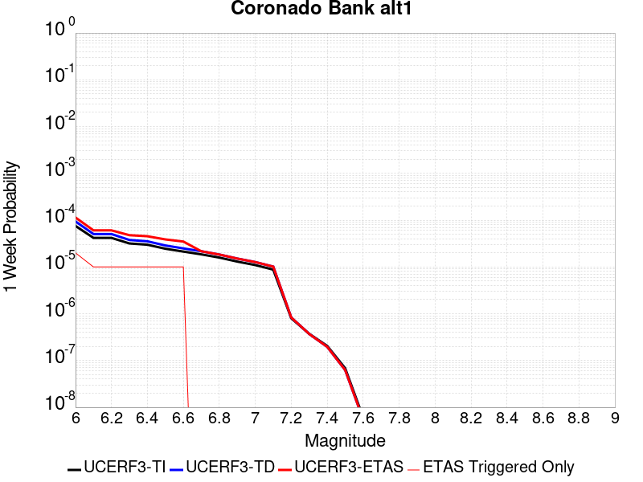 |  |  |  |

| Magnitude | 1 wk TI Prob | 1 wk TD Prob | 1 wk ETAS Prob | 1 wk ETAS/TD Gain | 1 wk ETAS Triggered Only | 1 mo TI Prob | 1 mo TD Prob | 1 mo ETAS Prob | 1 mo ETAS/TD Gain | 1 mo ETAS Triggered Only | 1 yr TI Prob | 1 yr TD Prob | 1 yr ETAS Prob | 1 yr ETAS/TD Gain | 1 yr ETAS Triggered Only | 10 yr TI Prob | 10 yr TD Prob | 10 yr ETAS Prob | 10 yr ETAS/TD Gain | 10 yr ETAS Triggered Only |
|-----|-----|-----|-----|-----|-----|-----|-----|-----|-----|-----|-----|-----|-----|-----|-----|-----|-----|-----|-----|-----|
| 6.0 | 7.533492E-5 | 9.394913E-5 | 1.1394725E-4 | 1.2128612 | 2.0E-5 | 3.22824E-4 | 4.0258127E-4 | 4.3256918E-4 | 1.0744891 | 3.0E-5 | 0.0039233007 | 0.0048909653 | 0.004960623 | 1.014242 | 7.0E-5 | 0.03854755 | 0.04790356 | 0.04797021 | 1.0013913 | 7.0E-5 |
| 6.1 | 4.1807285E-5 | 5.049283E-5 | 6.0492326E-5 | 1.1980379 | 1.0E-5 | 1.7916178E-4 | 2.1638049E-4 | 2.3637616E-4 | 1.0924097 | 2.0E-5 | 0.0021791123 | 0.0026313474 | 0.0026812158 | 1.0189517 | 5.0E-5 | 0.021578677 | 0.026011046 | 0.026059747 | 1.0018723 | 5.0E-5 |
| 6.2 | 4.1807285E-5 | 5.049283E-5 | 6.0492326E-5 | 1.1980379 | 1.0E-5 | 1.7916178E-4 | 2.1638049E-4 | 2.3637616E-4 | 1.0924097 | 2.0E-5 | 0.0021791123 | 0.0026313474 | 0.0026812158 | 1.0189517 | 5.0E-5 | 0.021578677 | 0.026011046 | 0.026059747 | 1.0018723 | 5.0E-5 |
| 6.3 | 3.1793104E-5 | 3.7711117E-5 | 4.771074E-5 | 1.2651638 | 1.0E-5 | 1.3624904E-4 | 1.6160926E-4 | 1.8160604E-4 | 1.1237353 | 2.0E-5 | 0.0016575698 | 0.001965848 | 0.0019957891 | 1.0152305 | 3.0E-5 | 0.016452603 | 0.019488465 | 0.01951788 | 1.0015094 | 3.0E-5 |
| 6.4 | 2.9878007E-5 | 3.5335794E-5 | 4.533544E-5 | 1.2829891 | 1.0E-5 | 1.2804232E-4 | 1.5143053E-4 | 1.714275E-4 | 1.1320537 | 2.0E-5 | 0.0015578003 | 0.0018421387 | 0.0018720834 | 1.0162554 | 3.0E-5 | 0.015469253 | 0.01827244 | 0.018301893 | 1.0016118 | 3.0E-5 |
| 6.5 | 2.4512565E-5 | 2.8764043E-5 | 3.8763756E-5 | 1.3476462 | 1.0E-5 | 1.0504962E-4 | 1.2326881E-4 | 1.4326634E-4 | 1.162227 | 2.0E-5 | 0.0012782287 | 0.0014997921 | 0.0015297472 | 1.0199728 | 3.0E-5 | 0.012709012 | 0.014899683 | 0.014929236 | 1.0019835 | 3.0E-5 |
| 6.6 | 2.1317413E-5 | 2.490667E-5 | 3.490642E-5 | 1.4014889 | 1.0E-5 | 9.135714E-5 | 1.0673863E-4 | 1.267365E-4 | 1.1873536 | 2.0E-5 | 0.0011117056 | 0.0012987906 | 0.0013187645 | 1.015379 | 2.0E-5 | 0.011061605 | 0.012914404 | 0.012934146 | 1.0015286 | 2.0E-5 |
| 6.7 | 1.8585655E-5 | 2.163488E-5 | 2.163488E-5 | 1.0 | 0.0 | 7.9650374E-5 | 9.271773E-5 | 1.02716804E-4 | 1.1078442 | 1.0E-5 | 9.6931186E-4 | 0.0011282742 | 0.001138263 | 1.0088531 | 1.0E-5 | 0.0096509475 | 0.011227623 | 0.01123751 | 1.0008807 | 1.0E-5 |
| 6.8 | 1.5862879E-5 | 1.8419474E-5 | 1.8419474E-5 | 1.0 | 0.0 | 6.798199E-5 | 7.893833E-5 | 7.893833E-5 | 1.0 | 0.0 | 8.273665E-4 | 9.6066965E-4 | 9.6066965E-4 | 1.0 | 0.0 | 0.008242928 | 0.00956715 | 0.00956715 | 1.0 | 0.0 |
| 6.9 | 1.3021509E-5 | 1.5095265E-5 | 1.5095265E-5 | 1.0 | 0.0 | 5.5805274E-5 | 6.469249E-5 | 6.469249E-5 | 1.0 | 0.0 | 6.792174E-4 | 7.8736455E-4 | 7.8736455E-4 | 1.0 | 0.0 | 0.006771452 | 0.007847573 | 0.007847573 | 1.0 | 0.0 |
| 7.0 | 1.0974371E-5 | 1.2720104E-5 | 1.2720104E-5 | 1.0 | 0.0 | 4.7032172E-5 | 5.451369E-5 | 5.451369E-5 | 1.0 | 0.0 | 5.7246623E-4 | 6.6351966E-4 | 6.6351966E-4 | 1.0 | 0.0 | 0.0057099373 | 0.006617135 | 0.006617135 | 1.0 | 0.0 |
| 7.1 | 8.766221E-6 | 1.01638325E-5 | 1.01638325E-5 | 1.0 | 0.0 | 3.7568978E-5 | 4.355865E-5 | 4.355865E-5 | 1.0 | 0.0 | 4.573063E-4 | 5.3021475E-4 | 5.3021475E-4 | 1.0 | 0.0 | 0.0045636636 | 0.0052911965 | 0.0052911965 | 1.0 | 0.0 |
| 7.2 | 8.026024E-7 | 8.331765E-7 | 8.331765E-7 | 1.0 | 0.0 | 3.43972E-6 | 3.5707515E-6 | 3.5707515E-6 | 1.0 | 0.0 | 4.1877785E-5 | 4.3473043E-5 | 4.3473043E-5 | 1.0 | 0.0 | 4.1869894E-4 | 4.3464647E-4 | 4.3464647E-4 | 1.0 | 0.0 |
| 7.3 | 3.7293114E-7 | 3.7000953E-7 | 3.7000953E-7 | 1.0 | 0.0 | 1.5982754E-6 | 1.5857541E-6 | 1.5857541E-6 | 1.0 | 0.0 | 1.9458828E-5 | 1.9306386E-5 | 1.9306386E-5 | 1.0 | 0.0 | 1.9457124E-4 | 1.9304715E-4 | 1.9304715E-4 | 1.0 | 0.0 |
| 7.4 | 2.0557036E-7 | 1.9674363E-7 | 1.9674363E-7 | 1.0 | 0.0 | 8.810155E-7 | 8.431867E-7 | 8.431867E-7 | 1.0 | 0.0 | 1.0726311E-5 | 1.026575E-5 | 1.026575E-5 | 1.0 | 0.0 | 1.0725793E-4 | 1.0265279E-4 | 1.0265279E-4 | 1.0 | 0.0 |
| 7.5 | 6.845446E-8 | 6.279369E-8 | 6.279369E-8 | 1.0 | 0.0 | 2.9337625E-7 | 2.691158E-7 | 2.691158E-7 | 1.0 | 0.0 | 3.5718497E-6 | 3.2764797E-6 | 3.2764797E-6 | 1.0 | 0.0 | 3.5717923E-5 | 3.2764325E-5 | 3.2764325E-5 | 1.0 | 0.0 |
| 7.6 | 6.0975145E-9 | 5.53185E-9 | 5.53185E-9 | 1.0 | 0.0 | 2.6132206E-8 | 2.370793E-8 | 2.370793E-8 | 1.0 | 0.0 | 3.1815955E-7 | 2.88644E-7 | 2.88644E-7 | 1.0 | 0.0 | 3.181591E-6 | 2.8864374E-6 | 2.8864374E-6 | 1.0 | 0.0 |

## Pleito
*[(top)](#table-of-contents)*

| 1 Week | 1 Month | 1 Year | 10 Year |
|-----|-----|-----|-----|
|  |  |  |  |

| Magnitude | 1 wk TI Prob | 1 wk TD Prob | 1 wk ETAS Prob | 1 wk ETAS/TD Gain | 1 wk ETAS Triggered Only | 1 mo TI Prob | 1 mo TD Prob | 1 mo ETAS Prob | 1 mo ETAS/TD Gain | 1 mo ETAS Triggered Only | 1 yr TI Prob | 1 yr TD Prob | 1 yr ETAS Prob | 1 yr ETAS/TD Gain | 1 yr ETAS Triggered Only | 10 yr TI Prob | 10 yr TD Prob | 10 yr ETAS Prob | 10 yr ETAS/TD Gain | 10 yr ETAS Triggered Only |
|-----|-----|-----|-----|-----|-----|-----|-----|-----|-----|-----|-----|-----|-----|-----|-----|-----|-----|-----|-----|-----|
| 6.0 | 1.6763008E-5 | 2.4763838E-5 | 5.4763095E-5 | 2.2114139 | 3.0E-5 | 7.183948E-5 | 1.0612683E-4 | 1.4612258E-4 | 1.3768675 | 4.0E-5 | 8.742947E-4 | 0.0012914003 | 0.0013513229 | 1.0464011 | 6.0E-5 | 0.00870863 | 0.0129538905 | 0.013042725 | 1.0068578 | 9.0E-5 |
| 6.1 | 1.6763008E-5 | 2.4763838E-5 | 5.4763095E-5 | 2.2114139 | 3.0E-5 | 7.183948E-5 | 1.0612683E-4 | 1.4612258E-4 | 1.3768675 | 4.0E-5 | 8.742947E-4 | 0.0012914003 | 0.0013513229 | 1.0464011 | 6.0E-5 | 0.00870863 | 0.0129538905 | 0.013042725 | 1.0068578 | 9.0E-5 |
| 6.2 | 1.6763008E-5 | 2.4763838E-5 | 5.4763095E-5 | 2.2114139 | 3.0E-5 | 7.183948E-5 | 1.0612683E-4 | 1.4612258E-4 | 1.3768675 | 4.0E-5 | 8.742947E-4 | 0.0012914003 | 0.0013513229 | 1.0464011 | 6.0E-5 | 0.00870863 | 0.0129538905 | 0.013042725 | 1.0068578 | 9.0E-5 |
| 6.3 | 1.6763008E-5 | 2.4763838E-5 | 5.4763095E-5 | 2.2114139 | 3.0E-5 | 7.183948E-5 | 1.0612683E-4 | 1.4612258E-4 | 1.3768675 | 4.0E-5 | 8.742947E-4 | 0.0012914003 | 0.0013513229 | 1.0464011 | 6.0E-5 | 0.00870863 | 0.0129538905 | 0.013042725 | 1.0068578 | 9.0E-5 |
| 6.4 | 1.6763008E-5 | 2.4763838E-5 | 5.4763095E-5 | 2.2114139 | 3.0E-5 | 7.183948E-5 | 1.0612683E-4 | 1.4612258E-4 | 1.3768675 | 4.0E-5 | 8.742947E-4 | 0.0012914003 | 0.0013513229 | 1.0464011 | 6.0E-5 | 0.00870863 | 0.0129538905 | 0.013042725 | 1.0068578 | 9.0E-5 |
| 6.5 | 1.6763008E-5 | 2.4763838E-5 | 5.4763095E-5 | 2.2114139 | 3.0E-5 | 7.183948E-5 | 1.0612683E-4 | 1.4612258E-4 | 1.3768675 | 4.0E-5 | 8.742947E-4 | 0.0012914003 | 0.0013513229 | 1.0464011 | 6.0E-5 | 0.00870863 | 0.0129538905 | 0.013042725 | 1.0068578 | 9.0E-5 |
| 6.6 | 9.910213E-6 | 1.7214623E-5 | 4.7214107E-5 | 2.7426744 | 3.0E-5 | 4.247165E-5 | 7.377489E-5 | 1.13771945E-4 | 1.5421499 | 4.0E-5 | 5.169696E-4 | 8.978429E-4 | 9.47798E-4 | 1.055639 | 5.0E-5 | 0.0051576863 | 0.009050702 | 0.009110159 | 1.0065693 | 6.0E-5 |
| 6.7 | 9.910213E-6 | 1.7214623E-5 | 4.7214107E-5 | 2.7426744 | 3.0E-5 | 4.247165E-5 | 7.377489E-5 | 1.13771945E-4 | 1.5421499 | 4.0E-5 | 5.169696E-4 | 8.978429E-4 | 9.47798E-4 | 1.055639 | 5.0E-5 | 0.0051576863 | 0.009050702 | 0.009110159 | 1.0065693 | 6.0E-5 |
| 6.8 | 8.300162E-6 | 1.5474232E-5 | 4.5473767E-5 | 2.9386768 | 3.0E-5 | 3.557164E-5 | 6.631646E-5 | 1.0631381E-4 | 1.6031286 | 4.0E-5 | 4.3299864E-4 | 8.071053E-4 | 8.570649E-4 | 1.0618998 | 5.0E-5 | 0.004321559 | 0.008150139 | 0.0082096495 | 1.0073018 | 6.0E-5 |
| 6.9 | 8.183114E-6 | 1.5345448E-5 | 4.5344987E-5 | 2.9549472 | 3.0E-5 | 3.5070017E-5 | 6.576455E-5 | 1.0576192E-4 | 1.6081904 | 4.0E-5 | 4.2689382E-4 | 8.003907E-4 | 8.503507E-4 | 1.0624195 | 5.0E-5 | 0.0042607468 | 0.008083483 | 0.008142998 | 1.0073625 | 6.0E-5 |
| 7.0 | 7.1748823E-6 | 1.413244E-5 | 2.4132298E-5 | 1.7075819 | 1.0E-5 | 3.0749135E-5 | 6.0566195E-5 | 8.056498E-5 | 1.3301972 | 2.0E-5 | 3.743064E-4 | 7.371445E-4 | 7.5712975E-4 | 1.0271118 | 2.0E-5 | 0.0037367654 | 0.007454939 | 0.0074847154 | 1.0039942 | 3.0E-5 |
| 7.1 | 7.1671807E-6 | 1.412281E-5 | 2.412267E-5 | 1.7080643 | 1.0E-5 | 3.0716128E-5 | 6.052493E-5 | 8.052372E-5 | 1.3304224 | 2.0E-5 | 3.7390468E-4 | 7.366424E-4 | 7.5662765E-4 | 1.0271302 | 2.0E-5 | 0.0037327618 | 0.0074499524 | 0.0074797287 | 1.0039968 | 3.0E-5 |
| 7.2 | 7.0649667E-6 | 1.39701015E-5 | 2.3969962E-5 | 1.7158045 | 1.0E-5 | 3.0278077E-5 | 5.9870494E-5 | 7.986929E-5 | 1.3340343 | 2.0E-5 | 3.6857324E-4 | 7.2868E-4 | 7.486654E-4 | 1.0274268 | 2.0E-5 | 0.0036796255 | 0.0073707094 | 0.0074004885 | 1.0040401 | 3.0E-5 |
| 7.3 | 7.02082E-6 | 1.3913556E-5 | 2.3913417E-5 | 1.7187135 | 1.0E-5 | 3.008888E-5 | 5.9628168E-5 | 7.9626974E-5 | 1.335392 | 2.0E-5 | 3.6627054E-4 | 7.2573166E-4 | 7.4571715E-4 | 1.0275384 | 2.0E-5 | 0.0036566744 | 0.007341209 | 0.007370989 | 1.0040566 | 3.0E-5 |
| 7.4 | 6.987146E-6 | 1.3873118E-5 | 2.3872979E-5 | 1.7208085 | 1.0E-5 | 2.9944567E-5 | 5.945487E-5 | 7.945368E-5 | 1.3363696 | 2.0E-5 | 3.6451413E-4 | 7.2362315E-4 | 7.436087E-4 | 1.0276186 | 2.0E-5 | 0.0036391679 | 0.007320144 | 0.0073499247 | 1.0040683 | 3.0E-5 |
| 7.5 | 6.9494554E-6 | 1.3830024E-5 | 2.3829885E-5 | 1.7230545 | 1.0E-5 | 2.9783041E-5 | 5.9270187E-5 | 7.9269004E-5 | 1.3374177 | 2.0E-5 | 3.625482E-4 | 7.2137616E-4 | 7.413617E-4 | 1.0277048 | 2.0E-5 | 0.0036195726 | 0.0072977724 | 0.007327554 | 1.0040809 | 3.0E-5 |
| 7.6 | 6.92694E-6 | 1.3789138E-5 | 2.3789E-5 | 1.7251985 | 1.0E-5 | 2.9686547E-5 | 5.909497E-5 | 7.909379E-5 | 1.3384182 | 2.0E-5 | 3.6137376E-4 | 7.1924424E-4 | 7.392299E-4 | 1.027787 | 2.0E-5 | 0.0036078666 | 0.0072765257 | 0.0073063076 | 1.0040928 | 3.0E-5 |
| 7.7 | 6.395867E-6 | 1.2668219E-5 | 2.2668091E-5 | 1.789367 | 1.0E-5 | 2.741057E-5 | 5.429124E-5 | 7.4290154E-5 | 1.3683636 | 2.0E-5 | 3.336726E-4 | 6.6079566E-4 | 6.807825E-4 | 1.0302465 | 2.0E-5 | 0.0033317201 | 0.0066951844 | 0.0067249835 | 1.0044508 | 3.0E-5 |
| 7.8 | 5.8664327E-6 | 1.153586E-5 | 1.153586E-5 | 1.0 | 0.0 | 2.5141611E-5 | 4.9438466E-5 | 5.943797E-5 | 1.2022617 | 1.0E-5 | 3.060561E-4 | 6.017473E-4 | 6.1174127E-4 | 1.0166082 | 1.0E-5 | 0.0030563495 | 0.0061006667 | 0.0061205444 | 1.0032583 | 2.0E-5 |
| 7.9 | 3.7167474E-6 | 7.1140853E-6 | 7.1140853E-6 | 1.0 | 0.0 | 1.592882E-5 | 3.0488582E-5 | 3.0488582E-5 | 1.0 | 0.0 | 1.9391612E-4 | 3.7113542E-4 | 3.7113542E-4 | 1.0 | 0.0 | 0.0019374699 | 0.0037674906 | 0.003777453 | 1.0026443 | 1.0E-5 |
| 8.0 | 1.0903841E-6 | 1.2879392E-6 | 1.2879392E-6 | 1.0 | 0.0 | 4.6730665E-6 | 5.5197274E-6 | 5.5197274E-6 | 1.0 | 0.0 | 5.68931E-5 | 6.720063E-5 | 6.720063E-5 | 1.0 | 0.0 | 5.6878536E-4 | 6.941948E-4 | 6.941948E-4 | 1.0 | 0.0 |
| 8.1 | 2.6894583E-7 | 1.1060341E-7 | 1.1060341E-7 | 1.0 | 0.0 | 1.1526245E-6 | 4.740145E-7 | 4.740145E-7 | 1.0 | 0.0 | 1.4033113E-5 | 5.7711113E-6 | 5.7711113E-6 | 1.0 | 0.0 | 1.4032227E-4 | 6.456908E-5 | 6.456908E-5 | 1.0 | 0.0 |
| 8.2 | 5.2967013E-9 | 2.4578228E-9 | 2.4578228E-9 | 1.0 | 0.0 | 2.2700148E-8 | 1.0533527E-8 | 1.0533527E-8 | 1.0 | 0.0 | 2.7637427E-7 | 1.2824569E-7 | 1.2824569E-7 | 1.0 | 0.0 | 2.7637393E-6 | 1.4592787E-6 | 1.4592787E-6 | 1.0 | 0.0 |

## Pisgah-Bullion Mtn-Mesquite Lk
*[(top)](#table-of-contents)*

| 1 Week | 1 Month | 1 Year | 10 Year |
|-----|-----|-----|-----|
|  |  |  |  |

| Magnitude | 1 wk TI Prob | 1 wk TD Prob | 1 wk ETAS Prob | 1 wk ETAS/TD Gain | 1 wk ETAS Triggered Only | 1 mo TI Prob | 1 mo TD Prob | 1 mo ETAS Prob | 1 mo ETAS/TD Gain | 1 mo ETAS Triggered Only | 1 yr TI Prob | 1 yr TD Prob | 1 yr ETAS Prob | 1 yr ETAS/TD Gain | 1 yr ETAS Triggered Only | 10 yr TI Prob | 10 yr TD Prob | 10 yr ETAS Prob | 10 yr ETAS/TD Gain | 10 yr ETAS Triggered Only |
|-----|-----|-----|-----|-----|-----|-----|-----|-----|-----|-----|-----|-----|-----|-----|-----|-----|-----|-----|-----|-----|
| 6.0 | 3.0240792E-5 | 2.4091114E-5 | 6.409015E-5 | 2.6603231 | 4.0E-5 | 1.2959696E-4 | 1.03244114E-4 | 1.6323791E-4 | 1.5810869 | 6.0E-5 | 0.0015767008 | 0.0012563728 | 0.0013262848 | 1.055646 | 7.0E-5 | 0.015655609 | 0.012502721 | 0.012591596 | 1.0071084 | 9.0E-5 |
| 6.1 | 3.0240792E-5 | 2.4091114E-5 | 6.409015E-5 | 2.6603231 | 4.0E-5 | 1.2959696E-4 | 1.03244114E-4 | 1.6323791E-4 | 1.5810869 | 6.0E-5 | 0.0015767008 | 0.0012563728 | 0.0013262848 | 1.055646 | 7.0E-5 | 0.015655609 | 0.012502721 | 0.012591596 | 1.0071084 | 9.0E-5 |
| 6.2 | 3.0240792E-5 | 2.4091114E-5 | 6.409015E-5 | 2.6603231 | 4.0E-5 | 1.2959696E-4 | 1.03244114E-4 | 1.6323791E-4 | 1.5810869 | 6.0E-5 | 0.0015767008 | 0.0012563728 | 0.0013262848 | 1.055646 | 7.0E-5 | 0.015655609 | 0.012502721 | 0.012591596 | 1.0071084 | 9.0E-5 |
| 6.3 | 2.0498217E-5 | 1.36380695E-5 | 2.3637933E-5 | 1.7332317 | 1.0E-5 | 8.784654E-5 | 5.844765E-5 | 6.8447065E-5 | 1.1710833 | 1.0E-5 | 0.0010690069 | 7.1138405E-4 | 7.3136983E-4 | 1.0280942 | 2.0E-5 | 0.01063879 | 0.0070926943 | 0.0071224817 | 1.0041997 | 3.0E-5 |
| 6.4 | 2.0498217E-5 | 1.36380695E-5 | 2.3637933E-5 | 1.7332317 | 1.0E-5 | 8.784654E-5 | 5.844765E-5 | 6.8447065E-5 | 1.1710833 | 1.0E-5 | 0.0010690069 | 7.1138405E-4 | 7.3136983E-4 | 1.0280942 | 2.0E-5 | 0.01063879 | 0.0070926943 | 0.0071224817 | 1.0041997 | 3.0E-5 |
| 6.5 | 1.7316182E-5 | 1.0477042E-5 | 1.0477042E-5 | 1.0 | 0.0 | 7.42101E-5 | 4.4900895E-5 | 4.4900895E-5 | 1.0 | 0.0 | 9.0313336E-4 | 5.465413E-4 | 5.565358E-4 | 1.0182868 | 1.0E-5 | 0.008994718 | 0.0054529672 | 0.005472858 | 1.0036477 | 2.0E-5 |
| 6.6 | 1.5251077E-5 | 8.414273E-6 | 8.414273E-6 | 1.0 | 0.0 | 6.536012E-5 | 3.6060712E-5 | 3.6060712E-5 | 1.0 | 0.0 | 7.9546886E-4 | 4.3895794E-4 | 4.4895356E-4 | 1.0227712 | 1.0E-5 | 0.007926274 | 0.0043816264 | 0.0043915827 | 1.0022722 | 1.0E-5 |
| 6.7 | 1.2997425E-5 | 6.4114965E-6 | 6.4114965E-6 | 1.0 | 0.0 | 5.570206E-5 | 2.7477578E-5 | 2.7477578E-5 | 1.0 | 0.0 | 6.7796157E-4 | 3.3449283E-4 | 3.4448947E-4 | 1.029886 | 1.0E-5 | 0.0067589693 | 0.0033403537 | 0.0033503203 | 1.0029837 | 1.0E-5 |
| 6.8 | 1.035386E-5 | 4.3332193E-6 | 4.3332193E-6 | 1.0 | 0.0 | 4.437293E-5 | 1.8570812E-5 | 1.8570812E-5 | 1.0 | 0.0 | 5.401065E-4 | 2.2607706E-4 | 2.360748E-4 | 1.0442227 | 1.0E-5 | 0.0053879567 | 0.0022585576 | 0.0022685349 | 1.0044177 | 1.0E-5 |
| 6.9 | 8.816252E-6 | 3.580638E-6 | 3.580638E-6 | 1.0 | 0.0 | 3.778339E-5 | 1.5345504E-5 | 1.5345504E-5 | 1.0 | 0.0 | 4.5991567E-4 | 1.8681608E-4 | 1.968142E-4 | 1.0535185 | 1.0E-5 | 0.00458965 | 0.0018666488 | 0.0018766301 | 1.0053473 | 1.0E-5 |
| 7.0 | 6.8232207E-6 | 2.5675843E-6 | 2.5675843E-6 | 1.0 | 0.0 | 2.9242048E-5 | 1.1003888E-5 | 1.1003888E-5 | 1.0 | 0.0 | 3.5596377E-4 | 1.3396442E-4 | 1.3396442E-4 | 1.0 | 0.0 | 0.0035539411 | 0.0013388677 | 0.0013388677 | 1.0 | 0.0 |
| 7.1 | 5.837013E-6 | 2.22738E-6 | 2.22738E-6 | 1.0 | 0.0 | 2.501553E-5 | 9.545881E-6 | 9.545881E-6 | 1.0 | 0.0 | 3.045215E-4 | 1.16215204E-4 | 1.16215204E-4 | 1.0 | 0.0 | 0.0030410455 | 0.0011615733 | 0.0011615733 | 1.0 | 0.0 |
| 7.2 | 4.278052E-6 | 1.6275711E-6 | 1.6275711E-6 | 1.0 | 0.0 | 1.833438E-5 | 6.9752873E-6 | 6.9752873E-6 | 1.0 | 0.0 | 2.231982E-4 | 8.492105E-5 | 8.492105E-5 | 1.0 | 0.0 | 0.0022297418 | 8.489092E-4 | 8.489092E-4 | 1.0 | 0.0 |
| 7.3 | 1.8803692E-6 | 8.344926E-7 | 8.344926E-7 | 1.0 | 0.0 | 8.0587E-6 | 3.5763926E-6 | 3.5763926E-6 | 1.0 | 0.0 | 9.811026E-5 | 4.354186E-5 | 4.354186E-5 | 1.0 | 0.0 | 9.806695E-4 | 4.3534773E-4 | 4.3534773E-4 | 1.0 | 0.0 |

## Santa Cruz Island
*[(top)](#table-of-contents)*

| 1 Week | 1 Month | 1 Year | 10 Year |
|-----|-----|-----|-----|
|  |  |  |  |

| Magnitude | 1 wk TI Prob | 1 wk TD Prob | 1 wk ETAS Prob | 1 wk ETAS/TD Gain | 1 wk ETAS Triggered Only | 1 mo TI Prob | 1 mo TD Prob | 1 mo ETAS Prob | 1 mo ETAS/TD Gain | 1 mo ETAS Triggered Only | 1 yr TI Prob | 1 yr TD Prob | 1 yr ETAS Prob | 1 yr ETAS/TD Gain | 1 yr ETAS Triggered Only | 10 yr TI Prob | 10 yr TD Prob | 10 yr ETAS Prob | 10 yr ETAS/TD Gain | 10 yr ETAS Triggered Only |
|-----|-----|-----|-----|-----|-----|-----|-----|-----|-----|-----|-----|-----|-----|-----|-----|-----|-----|-----|-----|-----|
| 6.0 | 2.9164563E-5 | 3.1599742E-5 | 4.159943E-5 | 1.3164482 | 1.0E-5 | 1.2498499E-4 | 1.3542121E-4 | 1.554185E-4 | 1.1476674 | 2.0E-5 | 0.0015206301 | 0.0016476426 | 0.0016875766 | 1.0242372 | 4.0E-5 | 0.015102667 | 0.016368 | 0.016436853 | 1.0042067 | 7.0E-5 |
| 6.1 | 2.9164563E-5 | 3.1599742E-5 | 4.159943E-5 | 1.3164482 | 1.0E-5 | 1.2498499E-4 | 1.3542121E-4 | 1.554185E-4 | 1.1476674 | 2.0E-5 | 0.0015206301 | 0.0016476426 | 0.0016875766 | 1.0242372 | 4.0E-5 | 0.015102667 | 0.016368 | 0.016436853 | 1.0042067 | 7.0E-5 |
| 6.2 | 2.9164563E-5 | 3.1599742E-5 | 4.159943E-5 | 1.3164482 | 1.0E-5 | 1.2498499E-4 | 1.3542121E-4 | 1.554185E-4 | 1.1476674 | 2.0E-5 | 0.0015206301 | 0.0016476426 | 0.0016875766 | 1.0242372 | 4.0E-5 | 0.015102667 | 0.016368 | 0.016436853 | 1.0042067 | 7.0E-5 |
| 6.3 | 1.6635553E-5 | 1.780436E-5 | 2.780418E-5 | 1.5616503 | 1.0E-5 | 7.1293274E-5 | 7.630226E-5 | 8.63015E-5 | 1.1310477 | 1.0E-5 | 8.6765E-4 | 9.2860236E-4 | 9.385931E-4 | 1.0107589 | 1.0E-5 | 0.008642701 | 0.009249094 | 0.009288724 | 1.0042847 | 4.0E-5 |
| 6.4 | 1.6635553E-5 | 1.780436E-5 | 2.780418E-5 | 1.5616503 | 1.0E-5 | 7.1293274E-5 | 7.630226E-5 | 8.63015E-5 | 1.1310477 | 1.0E-5 | 8.6765E-4 | 9.2860236E-4 | 9.385931E-4 | 1.0107589 | 1.0E-5 | 0.008642701 | 0.009249094 | 0.009288724 | 1.0042847 | 4.0E-5 |
| 6.5 | 1.2238748E-5 | 1.3042995E-5 | 1.3042995E-5 | 1.0 | 0.0 | 5.2450723E-5 | 5.5897377E-5 | 5.5897377E-5 | 1.0 | 0.0 | 6.3840044E-4 | 6.8034173E-4 | 6.8034173E-4 | 1.0 | 0.0 | 0.0063656955 | 0.0067829876 | 0.00679292 | 1.0014642 | 1.0E-5 |
| 6.6 | 1.0489767E-5 | 1.1156636E-5 | 1.1156636E-5 | 1.0 | 0.0 | 4.495537E-5 | 4.781329E-5 | 4.781329E-5 | 1.0 | 0.0 | 5.4719415E-4 | 5.819735E-4 | 5.819735E-4 | 1.0 | 0.0 | 0.005458487 | 0.0058047357 | 0.0058146776 | 1.0017127 | 1.0E-5 |
| 6.7 | 8.699222E-6 | 9.236782E-6 | 9.236782E-6 | 1.0 | 0.0 | 3.7281847E-5 | 3.958561E-5 | 3.958561E-5 | 1.0 | 0.0 | 4.5381195E-4 | 4.8184878E-4 | 4.8184878E-4 | 1.0 | 0.0 | 0.0045288634 | 0.004808108 | 0.00481806 | 1.0020698 | 1.0E-5 |
| 6.8 | 8.307732E-6 | 8.8169045E-6 | 8.8169045E-6 | 1.0 | 0.0 | 3.560408E-5 | 3.7786187E-5 | 3.7786187E-5 | 1.0 | 0.0 | 4.3339343E-4 | 4.5995016E-4 | 4.5995016E-4 | 1.0 | 0.0 | 0.004325492 | 0.0045900354 | 0.0045999894 | 1.0021687 | 1.0E-5 |
| 6.9 | 8.073121E-6 | 8.564939E-6 | 8.564939E-6 | 1.0 | 0.0 | 3.459863E-5 | 3.6706366E-5 | 3.6706366E-5 | 1.0 | 0.0 | 4.2115687E-4 | 4.468088E-4 | 4.468088E-4 | 1.0 | 0.0 | 0.004203596 | 0.004459156 | 0.0044691116 | 1.0022326 | 1.0E-5 |
| 7.0 | 7.617019E-6 | 8.074664E-6 | 8.074664E-6 | 1.0 | 0.0 | 3.264396E-5 | 3.4605247E-5 | 3.4605247E-5 | 1.0 | 0.0 | 3.9736772E-4 | 4.212378E-4 | 4.212378E-4 | 1.0 | 0.0 | 0.003966579 | 0.0042044413 | 0.004214399 | 1.0023685 | 1.0E-5 |
| 7.1 | 7.1224836E-6 | 7.545788E-6 | 7.545788E-6 | 1.0 | 0.0 | 3.052457E-5 | 3.2338692E-5 | 3.2338692E-5 | 1.0 | 0.0 | 3.715733E-4 | 3.936528E-4 | 3.936528E-4 | 1.0 | 0.0 | 0.003709526 | 0.003929598 | 0.0039395588 | 1.0025347 | 1.0E-5 |
| 7.2 | 6.441115E-6 | 6.8273835E-6 | 6.8273835E-6 | 1.0 | 0.0 | 2.7604487E-5 | 2.9259887E-5 | 2.9259887E-5 | 1.0 | 0.0 | 3.360328E-4 | 3.5618112E-4 | 3.5618112E-4 | 1.0 | 0.0 | 0.0033552512 | 0.003556131 | 0.0035660954 | 1.002802 | 1.0E-5 |
| 7.3 | 5.494274E-6 | 5.8199944E-6 | 5.8199944E-6 | 1.0 | 0.0 | 2.3546674E-5 | 2.4942596E-5 | 2.4942596E-5 | 1.0 | 0.0 | 2.8664304E-4 | 3.0363398E-4 | 3.0363398E-4 | 1.0 | 0.0 | 0.002862736 | 0.0030322142 | 0.0030322142 | 1.0 | 0.0 |
| 7.4 | 4.0802624E-6 | 4.312256E-6 | 4.312256E-6 | 1.0 | 0.0 | 1.7486722E-5 | 1.8480967E-5 | 1.8480967E-5 | 1.0 | 0.0 | 2.1288003E-4 | 2.2498262E-4 | 2.2498262E-4 | 1.0 | 0.0 | 0.0021267622 | 0.0022475575 | 0.0022475575 | 1.0 | 0.0 |
| 7.5 | 2.3584746E-6 | 2.4753094E-6 | 2.4753094E-6 | 1.0 | 0.0 | 1.0107709E-5 | 1.0608426E-5 | 1.0608426E-5 | 1.0 | 0.0 | 1.2305441E-4 | 1.2915E-4 | 1.2915E-4 | 1.0 | 0.0 | 0.0012298629 | 0.0012907543 | 0.0012907543 | 1.0 | 0.0 |
| 7.6 | 9.4981914E-7 | 9.86093E-7 | 9.86093E-7 | 1.0 | 0.0 | 4.0706473E-6 | 4.2261063E-6 | 4.2261063E-6 | 1.0 | 0.0 | 4.9559E-5 | 5.145164E-5 | 5.145164E-5 | 1.0 | 0.0 | 4.954795E-4 | 5.1439856E-4 | 5.1439856E-4 | 1.0 | 0.0 |
| 7.7 | 2.6013532E-7 | 2.6416603E-7 | 2.6416603E-7 | 1.0 | 0.0 | 1.1148652E-6 | 1.1321397E-6 | 1.1321397E-6 | 1.0 | 0.0 | 1.3573399E-5 | 1.3783714E-5 | 1.3783714E-5 | 1.0 | 0.0 | 1.357257E-4 | 1.3782867E-4 | 1.3782867E-4 | 1.0 | 0.0 |
| 7.8 | 4.1522263E-8 | 3.965679E-8 | 3.965679E-8 | 1.0 | 0.0 | 1.7795254E-7 | 1.6995766E-7 | 1.6995766E-7 | 1.0 | 0.0 | 2.16657E-6 | 2.0692328E-6 | 2.0692328E-6 | 1.0 | 0.0 | 2.1665488E-5 | 2.0692156E-5 | 2.0692156E-5 | 1.0 | 0.0 |
| 7.9 | 7.7242046E-10 | 5.9468175E-10 | 5.9468175E-10 | 1.0 | 0.0 | 3.3103735E-9 | 2.5486364E-9 | 2.5486364E-9 | 1.0 | 0.0 | 4.0303796E-8 | 3.1029646E-8 | 3.1029646E-8 | 1.0 | 0.0 | 4.030379E-7 | 3.1029643E-7 | 3.1029643E-7 | 1.0 | 0.0 |

## Whittier alt 1
*[(top)](#table-of-contents)*

| 1 Week | 1 Month | 1 Year | 10 Year |
|-----|-----|-----|-----|
| 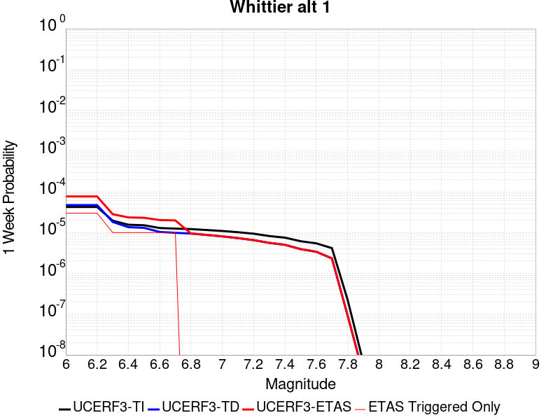 |  |  |  |

| Magnitude | 1 wk TI Prob | 1 wk TD Prob | 1 wk ETAS Prob | 1 wk ETAS/TD Gain | 1 wk ETAS Triggered Only | 1 mo TI Prob | 1 mo TD Prob | 1 mo ETAS Prob | 1 mo ETAS/TD Gain | 1 mo ETAS Triggered Only | 1 yr TI Prob | 1 yr TD Prob | 1 yr ETAS Prob | 1 yr ETAS/TD Gain | 1 yr ETAS Triggered Only | 10 yr TI Prob | 10 yr TD Prob | 10 yr ETAS Prob | 10 yr ETAS/TD Gain | 10 yr ETAS Triggered Only |
|-----|-----|-----|-----|-----|-----|-----|-----|-----|-----|-----|-----|-----|-----|-----|-----|-----|-----|-----|-----|-----|
| 6.0 | 4.2554693E-5 | 4.725218E-5 | 7.725076E-5 | 1.6348614 | 3.0E-5 | 1.8236451E-4 | 2.0249544E-4 | 2.4248734E-4 | 1.1974953 | 4.0E-5 | 0.002218027 | 0.0024629154 | 0.002532743 | 1.0283515 | 7.0E-5 | 0.02196019 | 0.024390234 | 0.024478039 | 1.0036 | 9.0E-5 |
| 6.1 | 4.2554693E-5 | 4.725218E-5 | 7.725076E-5 | 1.6348614 | 3.0E-5 | 1.8236451E-4 | 2.0249544E-4 | 2.4248734E-4 | 1.1974953 | 4.0E-5 | 0.002218027 | 0.0024629154 | 0.002532743 | 1.0283515 | 7.0E-5 | 0.02196019 | 0.024390234 | 0.024478039 | 1.0036 | 9.0E-5 |
| 6.2 | 4.2554693E-5 | 4.725218E-5 | 7.725076E-5 | 1.6348614 | 3.0E-5 | 1.8236451E-4 | 2.0249544E-4 | 2.4248734E-4 | 1.1974953 | 4.0E-5 | 0.002218027 | 0.0024629154 | 0.002532743 | 1.0283515 | 7.0E-5 | 0.02196019 | 0.024390234 | 0.024478039 | 1.0036 | 9.0E-5 |
| 6.3 | 1.9617712E-5 | 1.8268593E-5 | 2.8268409E-5 | 1.5473776 | 1.0E-5 | 8.40732E-5 | 7.829172E-5 | 8.829094E-5 | 1.1277174 | 1.0E-5 | 0.0010231105 | 9.52804E-4 | 9.827754E-4 | 1.031456 | 3.0E-5 | 0.01018413 | 0.009490474 | 0.00952019 | 1.003131 | 3.0E-5 |
| 6.4 | 1.5611336E-5 | 1.3604271E-5 | 2.3604134E-5 | 1.7350533 | 1.0E-5 | 6.690401E-5 | 5.8302747E-5 | 6.8302164E-5 | 1.1715086 | 1.0E-5 | 8.142519E-4 | 7.0961076E-4 | 7.295966E-4 | 1.0281645 | 2.0E-5 | 0.008112748 | 0.0070754145 | 0.007095273 | 1.0028067 | 2.0E-5 |
| 6.5 | 1.5150166E-5 | 1.3100925E-5 | 2.3100794E-5 | 1.7632949 | 1.0E-5 | 6.492767E-5 | 5.6145647E-5 | 6.614508E-5 | 1.1780982 | 1.0E-5 | 7.9020765E-4 | 6.8336475E-4 | 7.0335105E-4 | 1.0292469 | 2.0E-5 | 0.007874036 | 0.0068145846 | 0.0068344483 | 1.0029149 | 2.0E-5 |
| 6.6 | 1.295588E-5 | 1.0380725E-5 | 2.0380621E-5 | 1.9633138 | 1.0E-5 | 5.552402E-5 | 4.4488075E-5 | 5.448763E-5 | 1.2247694 | 1.0E-5 | 6.7579525E-4 | 5.4150965E-4 | 5.614988E-4 | 1.0369138 | 2.0E-5 | 0.006737438 | 0.0054033357 | 0.0054232273 | 1.0036814 | 2.0E-5 |
| 6.7 | 1.2542085E-5 | 9.899369E-6 | 1.989927E-5 | 2.0101554 | 1.0E-5 | 5.3750682E-5 | 4.242519E-5 | 5.2424763E-5 | 1.235699 | 1.0E-5 | 6.542181E-4 | 5.164061E-4 | 5.3639576E-4 | 1.0387092 | 2.0E-5 | 0.006522954 | 0.0051534795 | 0.0051733763 | 1.0038608 | 2.0E-5 |
| 6.8 | 1.2195878E-5 | 9.495415E-6 | 9.495415E-6 | 1.0 | 0.0 | 5.2267E-5 | 4.069401E-5 | 4.069401E-5 | 1.0 | 0.0 | 6.36165E-4 | 4.9533875E-4 | 5.053338E-4 | 1.0201782 | 1.0E-5 | 0.0063434686 | 0.004943688 | 0.0049536387 | 1.0020127 | 1.0E-5 |
| 6.9 | 1.1580298E-5 | 8.772933E-6 | 8.772933E-6 | 1.0 | 0.0 | 4.9628903E-5 | 3.7597754E-5 | 3.7597754E-5 | 1.0 | 0.0 | 6.040644E-4 | 4.5765814E-4 | 4.5765814E-4 | 1.0 | 0.0 | 0.00602425 | 0.0045684157 | 0.0045684157 | 1.0 | 0.0 |
| 7.0 | 1.0964795E-5 | 8.083994E-6 | 8.083994E-6 | 1.0 | 0.0 | 4.6991136E-5 | 3.4645236E-5 | 3.4645236E-5 | 1.0 | 0.0 | 5.7196687E-4 | 4.2172565E-4 | 4.2172565E-4 | 1.0 | 0.0 | 0.0057049696 | 0.004210462 | 0.004210462 | 1.0 | 0.0 |
| 7.1 | 1.0230601E-5 | 7.3266697E-6 | 7.3266697E-6 | 1.0 | 0.0 | 4.3844695E-5 | 3.1399642E-5 | 3.1399642E-5 | 1.0 | 0.0 | 5.336784E-4 | 3.8222488E-4 | 3.8222488E-4 | 1.0 | 0.0 | 0.005323986 | 0.0038168381 | 0.0038168381 | 1.0 | 0.0 |
| 7.2 | 9.40865E-6 | 6.543289E-6 | 6.543289E-6 | 1.0 | 0.0 | 4.032216E-5 | 2.8042374E-5 | 2.8042374E-5 | 1.0 | 0.0 | 4.908117E-4 | 3.4136363E-4 | 3.4136363E-4 | 1.0 | 0.0 | 0.0048972913 | 0.003409485 | 0.003409485 | 1.0 | 0.0 |
| 7.3 | 8.237384E-6 | 5.5977525E-6 | 5.5977525E-6 | 1.0 | 0.0 | 3.5302593E-5 | 2.3990153E-5 | 2.3990153E-5 | 1.0 | 0.0 | 4.2972428E-4 | 2.92042E-4 | 2.92042E-4 | 1.0 | 0.0 | 0.0042889426 | 0.002916903 | 0.002916903 | 1.0 | 0.0 |
| 7.4 | 7.5316966E-6 | 5.027819E-6 | 5.027819E-6 | 1.0 | 0.0 | 3.2278298E-5 | 2.1547625E-5 | 2.1547625E-5 | 1.0 | 0.0 | 3.9291743E-4 | 2.6231175E-4 | 2.6231175E-4 | 1.0 | 0.0 | 0.0039222343 | 0.0026201333 | 0.0026201333 | 1.0 | 0.0 |
| 7.5 | 6.149649E-6 | 3.933841E-6 | 3.933841E-6 | 1.0 | 0.0 | 2.6355372E-5 | 1.6859214E-5 | 1.6859214E-5 | 1.0 | 0.0 | 3.208294E-4 | 2.052425E-4 | 2.052425E-4 | 1.0 | 0.0 | 0.003203666 | 0.0020506186 | 0.0020506186 | 1.0 | 0.0 |
| 7.6 | 5.457711E-6 | 3.3953788E-6 | 3.3953788E-6 | 1.0 | 0.0 | 2.338998E-5 | 1.4551547E-5 | 1.4551547E-5 | 1.0 | 0.0 | 2.8473578E-4 | 1.771515E-4 | 1.771515E-4 | 1.0 | 0.0 | 0.0028437122 | 0.0017701836 | 0.0017701836 | 1.0 | 0.0 |
| 7.7 | 4.1676276E-6 | 2.3331952E-6 | 2.3331952E-6 | 1.0 | 0.0 | 1.7861139E-5 | 9.999374E-6 | 9.999374E-6 | 1.0 | 0.0 | 2.1743766E-4 | 1.2173632E-4 | 1.2173632E-4 | 1.0 | 0.0 | 0.0021722503 | 0.0012167693 | 0.0012167693 | 1.0 | 0.0 |
| 7.8 | 2.2692414E-7 | 9.3854695E-8 | 9.3854695E-8 | 1.0 | 0.0 | 9.725317E-7 | 4.0223435E-7 | 4.0223435E-7 | 1.0 | 0.0 | 1.1840509E-5 | 4.8971956E-6 | 4.8971956E-6 | 1.0 | 0.0 | 1.1839878E-4 | 4.8971204E-5 | 4.8971204E-5 | 1.0 | 0.0 |
| 7.9 | 6.676829E-9 | 3.439853E-9 | 3.439853E-9 | 1.0 | 0.0 | 2.861498E-8 | 1.4742227E-8 | 1.4742227E-8 | 1.0 | 0.0 | 3.4838732E-7 | 1.7948659E-7 | 1.7948659E-7 | 1.0 | 0.0 | 3.4838679E-6 | 1.7948646E-6 | 1.7948646E-6 | 1.0 | 0.0 |

## Bullion Mountains
*[(top)](#table-of-contents)*

| 1 Week | 1 Month | 1 Year | 10 Year |
|-----|-----|-----|-----|
|  |  |  |  |

| Magnitude | 1 wk TI Prob | 1 wk TD Prob | 1 wk ETAS Prob | 1 wk ETAS/TD Gain | 1 wk ETAS Triggered Only | 1 mo TI Prob | 1 mo TD Prob | 1 mo ETAS Prob | 1 mo ETAS/TD Gain | 1 mo ETAS Triggered Only | 1 yr TI Prob | 1 yr TD Prob | 1 yr ETAS Prob | 1 yr ETAS/TD Gain | 1 yr ETAS Triggered Only | 10 yr TI Prob | 10 yr TD Prob | 10 yr ETAS Prob | 10 yr ETAS/TD Gain | 10 yr ETAS Triggered Only |
|-----|-----|-----|-----|-----|-----|-----|-----|-----|-----|-----|-----|-----|-----|-----|-----|-----|-----|-----|-----|-----|
| 6.0 | 1.6420427E-5 | 1.4692089E-5 | 3.4691795E-5 | 2.3612568 | 2.0E-5 | 7.037136E-5 | 6.296479E-5 | 9.29629E-5 | 1.4764267 | 3.0E-5 | 8.5643446E-4 | 7.663651E-4 | 8.3631143E-4 | 1.0912703 | 7.0E-5 | 0.008531413 | 0.007641016 | 0.0077303285 | 1.0116886 | 9.0E-5 |
| 6.1 | 1.6420427E-5 | 1.4692089E-5 | 3.4691795E-5 | 2.3612568 | 2.0E-5 | 7.037136E-5 | 6.296479E-5 | 9.29629E-5 | 1.4764267 | 3.0E-5 | 8.5643446E-4 | 7.663651E-4 | 8.3631143E-4 | 1.0912703 | 7.0E-5 | 0.008531413 | 0.007641016 | 0.0077303285 | 1.0116886 | 9.0E-5 |
| 6.2 | 1.6420427E-5 | 1.4692089E-5 | 3.4691795E-5 | 2.3612568 | 2.0E-5 | 7.037136E-5 | 6.296479E-5 | 9.29629E-5 | 1.4764267 | 3.0E-5 | 8.5643446E-4 | 7.663651E-4 | 8.3631143E-4 | 1.0912703 | 7.0E-5 | 0.008531413 | 0.007641016 | 0.0077303285 | 1.0116886 | 9.0E-5 |
| 6.3 | 1.2046778E-5 | 9.862335E-6 | 2.9862138E-5 | 3.0278974 | 2.0E-5 | 5.1628023E-5 | 4.2266598E-5 | 6.226575E-5 | 1.473167 | 2.0E-5 | 6.283899E-4 | 5.144975E-4 | 5.544769E-4 | 1.0777057 | 4.0E-5 | 0.0062661595 | 0.005135345 | 0.0051751393 | 1.0077492 | 4.0E-5 |
| 6.4 | 1.2046778E-5 | 9.862335E-6 | 2.9862138E-5 | 3.0278974 | 2.0E-5 | 5.1628023E-5 | 4.2266598E-5 | 6.226575E-5 | 1.473167 | 2.0E-5 | 6.283899E-4 | 5.144975E-4 | 5.544769E-4 | 1.0777057 | 4.0E-5 | 0.0062661595 | 0.005135345 | 0.0051751393 | 1.0077492 | 4.0E-5 |
| 6.5 | 1.0244343E-5 | 7.879458E-6 | 7.879458E-6 | 1.0 | 0.0 | 4.390359E-5 | 3.3768785E-5 | 3.3768785E-5 | 1.0 | 0.0 | 5.343951E-4 | 4.110781E-4 | 4.3106987E-4 | 1.0486325 | 2.0E-5 | 0.005331118 | 0.004105208 | 0.004125126 | 1.0048518 | 2.0E-5 |
| 6.6 | 9.605408E-6 | 7.1774966E-6 | 7.1774966E-6 | 1.0 | 0.0 | 4.1165385E-5 | 3.076045E-5 | 3.076045E-5 | 1.0 | 0.0 | 5.010733E-4 | 3.744645E-4 | 3.94457E-4 | 1.0533895 | 2.0E-5 | 0.00499945 | 0.003740332 | 0.0037602573 | 1.0053271 | 2.0E-5 |
| 6.7 | 8.60418E-6 | 6.1240044E-6 | 6.1240044E-6 | 1.0 | 0.0 | 3.687454E-5 | 2.624558E-5 | 2.624558E-5 | 1.0 | 0.0 | 4.48855E-4 | 3.1951256E-4 | 3.3950616E-4 | 1.0625753 | 2.0E-5 | 0.004479495 | 0.0031924439 | 0.00321238 | 1.0062448 | 2.0E-5 |
| 6.8 | 5.187994E-6 | 2.5631666E-6 | 2.5631666E-6 | 1.0 | 0.0 | 2.223407E-5 | 1.0984976E-5 | 1.0984976E-5 | 1.0 | 0.0 | 2.7066618E-4 | 1.3373788E-4 | 1.3373788E-4 | 1.0 | 0.0 | 0.0027033675 | 0.0013369655 | 0.0013369655 | 1.0 | 0.0 |
| 6.9 | 4.5302368E-6 | 2.3443165E-6 | 2.3443165E-6 | 1.0 | 0.0 | 1.9415156E-5 | 1.0047055E-5 | 1.0047055E-5 | 1.0 | 0.0 | 2.3635388E-4 | 1.2232E-4 | 1.2232E-4 | 1.0 | 0.0 | 0.0023610266 | 0.0012229157 | 0.0012229157 | 1.0 | 0.0 |
| 7.0 | 3.431668E-6 | 1.6882402E-6 | 1.6882402E-6 | 1.0 | 0.0 | 1.4707065E-5 | 7.235315E-6 | 7.235315E-6 | 1.0 | 0.0 | 1.7904381E-4 | 8.808996E-5 | 8.808996E-5 | 1.0 | 0.0 | 0.0017889962 | 8.808996E-4 | 8.808996E-4 | 1.0 | 0.0 |

## Kern Canyon (South Kern) 2011
*[(top)](#table-of-contents)*

| 1 Week | 1 Month | 1 Year | 10 Year |
|-----|-----|-----|-----|
|  |  |  | 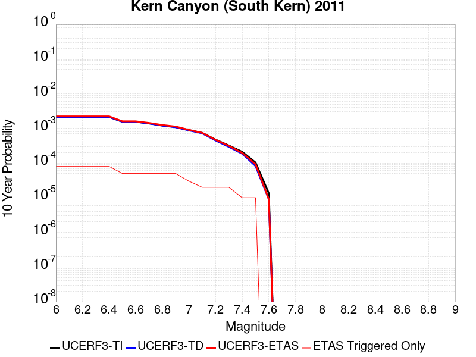 |

| Magnitude | 1 wk TI Prob | 1 wk TD Prob | 1 wk ETAS Prob | 1 wk ETAS/TD Gain | 1 wk ETAS Triggered Only | 1 mo TI Prob | 1 mo TD Prob | 1 mo ETAS Prob | 1 mo ETAS/TD Gain | 1 mo ETAS Triggered Only | 1 yr TI Prob | 1 yr TD Prob | 1 yr ETAS Prob | 1 yr ETAS/TD Gain | 1 yr ETAS Triggered Only | 10 yr TI Prob | 10 yr TD Prob | 10 yr ETAS Prob | 10 yr ETAS/TD Gain | 10 yr ETAS Triggered Only |
|-----|-----|-----|-----|-----|-----|-----|-----|-----|-----|-----|-----|-----|-----|-----|-----|-----|-----|-----|-----|-----|
| 6.0 | 4.105075E-6 | 4.1137264E-6 | 3.4113604E-5 | 8.292628 | 3.0E-5 | 1.7593058E-5 | 1.763014E-5 | 6.762926E-5 | 3.8360023 | 5.0E-5 | 2.1417443E-4 | 2.1462646E-4 | 2.746136E-4 | 1.2794955 | 6.0E-5 | 0.0021396813 | 0.0021442557 | 0.0022240842 | 1.037229 | 8.0E-5 |
| 6.1 | 4.105075E-6 | 4.1137264E-6 | 3.4113604E-5 | 8.292628 | 3.0E-5 | 1.7593058E-5 | 1.763014E-5 | 6.762926E-5 | 3.8360023 | 5.0E-5 | 2.1417443E-4 | 2.1462646E-4 | 2.746136E-4 | 1.2794955 | 6.0E-5 | 0.0021396813 | 0.0021442557 | 0.0022240842 | 1.037229 | 8.0E-5 |
| 6.2 | 4.105075E-6 | 4.1137264E-6 | 3.4113604E-5 | 8.292628 | 3.0E-5 | 1.7593058E-5 | 1.763014E-5 | 6.762926E-5 | 3.8360023 | 5.0E-5 | 2.1417443E-4 | 2.1462646E-4 | 2.746136E-4 | 1.2794955 | 6.0E-5 | 0.0021396813 | 0.0021442557 | 0.0022240842 | 1.037229 | 8.0E-5 |
| 6.3 | 4.105075E-6 | 4.1137264E-6 | 3.4113604E-5 | 8.292628 | 3.0E-5 | 1.7593058E-5 | 1.763014E-5 | 6.762926E-5 | 3.8360023 | 5.0E-5 | 2.1417443E-4 | 2.1462646E-4 | 2.746136E-4 | 1.2794955 | 6.0E-5 | 0.0021396813 | 0.0021442557 | 0.0022240842 | 1.037229 | 8.0E-5 |
| 6.4 | 4.105075E-6 | 4.1137264E-6 | 3.4113604E-5 | 8.292628 | 3.0E-5 | 1.7593058E-5 | 1.763014E-5 | 6.762926E-5 | 3.8360023 | 5.0E-5 | 2.1417443E-4 | 2.1462646E-4 | 2.746136E-4 | 1.2794955 | 6.0E-5 | 0.0021396813 | 0.0021442557 | 0.0022240842 | 1.037229 | 8.0E-5 |
| 6.5 | 2.9849807E-6 | 2.9731548E-6 | 2.2973096E-5 | 7.7268414 | 2.0E-5 | 1.2792712E-5 | 1.274203E-5 | 4.274165E-5 | 3.3543828 | 3.0E-5 | 1.5574014E-4 | 1.5512333E-4 | 1.8511867E-4 | 1.1933645 | 3.0E-5 | 0.0015563103 | 0.0015501656 | 0.0016000881 | 1.0322046 | 5.0E-5 |
| 6.6 | 2.9849807E-6 | 2.9731548E-6 | 2.2973096E-5 | 7.7268414 | 2.0E-5 | 1.2792712E-5 | 1.274203E-5 | 4.274165E-5 | 3.3543828 | 3.0E-5 | 1.5574014E-4 | 1.5512333E-4 | 1.8511867E-4 | 1.1933645 | 3.0E-5 | 0.0015563103 | 0.0015501656 | 0.0016000881 | 1.0322046 | 5.0E-5 |
| 6.7 | 2.6756725E-6 | 2.6582206E-6 | 2.2658167E-5 | 8.523809 | 2.0E-5 | 1.1467117E-5 | 1.1392325E-5 | 4.1391984E-5 | 3.6333218 | 3.0E-5 | 1.396032E-4 | 1.3869285E-4 | 1.6868868E-4 | 1.2162753 | 3.0E-5 | 0.0013951553 | 0.0013860738 | 0.0014360045 | 1.0360231 | 5.0E-5 |
| 6.8 | 2.3283721E-6 | 2.3047787E-6 | 2.2304732E-5 | 9.677602 | 2.0E-5 | 9.9787E-6 | 9.877586E-6 | 3.987729E-5 | 4.037149 | 3.0E-5 | 1.214839E-4 | 1.20253055E-4 | 1.5024944E-4 | 1.2494439 | 3.0E-5 | 0.001214175 | 0.0012018873 | 0.0012518272 | 1.0415512 | 5.0E-5 |
| 6.9 | 2.0972677E-6 | 2.0696411E-6 | 2.20696E-5 | 10.663491 | 2.0E-5 | 8.988259E-6 | 8.869861E-6 | 3.8869595E-5 | 4.3822103 | 3.0E-5 | 1.0942656E-4 | 1.0798526E-4 | 1.3798202E-4 | 1.2777857 | 3.0E-5 | 0.0010937268 | 0.0010793337 | 0.0011292797 | 1.0462749 | 5.0E-5 |
| 7.0 | 1.7132242E-6 | 1.6787036E-6 | 2.167867E-5 | 12.913936 | 2.0E-5 | 7.3423685E-6 | 7.194424E-6 | 2.719428E-5 | 3.7799106 | 2.0E-5 | 8.938967E-5 | 8.758863E-5 | 1.0758688E-4 | 1.2283201 | 2.0E-5 | 8.935372E-4 | 8.7554497E-4 | 9.055187E-4 | 1.0342344 | 3.0E-5 |
| 7.1 | 1.4215541E-6 | 1.3815752E-6 | 2.1381547E-5 | 15.47621 | 2.0E-5 | 6.0923603E-6 | 5.9210233E-6 | 2.5920905E-5 | 4.3777747 | 2.0E-5 | 7.417196E-5 | 7.20861E-5 | 9.208466E-5 | 1.277426 | 2.0E-5 | 7.414721E-4 | 7.206299E-4 | 7.406155E-4 | 1.0277334 | 2.0E-5 |
| 7.2 | 9.097853E-7 | 8.6037755E-7 | 2.086036E-5 | 24.245588 | 2.0E-5 | 3.899074E-6 | 3.6873273E-6 | 2.3687253E-5 | 6.423963 | 2.0E-5 | 4.7470192E-5 | 4.4892295E-5 | 6.48914E-5 | 1.4454907 | 2.0E-5 | 4.7460053E-4 | 4.4883334E-4 | 4.6882438E-4 | 1.0445399 | 2.0E-5 |
| 7.3 | 6.144169E-7 | 5.628206E-7 | 2.056281E-5 | 36.535282 | 2.0E-5 | 2.6332125E-6 | 2.4120861E-6 | 2.2412038E-5 | 9.291557 | 2.0E-5 | 3.205889E-5 | 2.9366758E-5 | 4.9366172E-5 | 1.6810222 | 2.0E-5 | 3.2054266E-4 | 2.936293E-4 | 3.1362343E-4 | 1.0680931 | 2.0E-5 |
| 7.4 | 4.049844E-7 | 3.5728314E-7 | 1.0357279E-5 | 28.988997 | 1.0E-5 | 1.7356463E-6 | 1.5312125E-6 | 1.1531197E-5 | 7.530762 | 1.0E-5 | 2.1131287E-5 | 1.8642357E-5 | 2.864217E-5 | 1.536403 | 1.0E-5 | 2.1129279E-4 | 1.8640817E-4 | 1.964063E-4 | 1.0536357 | 1.0E-5 |
| 7.5 | 1.9871162E-7 | 1.583044E-7 | 1.0158303E-5 | 64.169426 | 1.0E-5 | 8.5162094E-7 | 6.7844724E-7 | 1.067844E-5 | 15.73953 | 1.0E-5 | 1.0368436E-5 | 8.260065E-6 | 1.8259982E-5 | 2.2106342 | 1.0E-5 | 1.0367952E-4 | 8.259767E-5 | 9.259684E-5 | 1.1210588 | 1.0E-5 |
| 7.6 | 2.572245E-8 | 1.7352555E-8 | 1.7352555E-8 | 1.0 | 0.0 | 1.10239064E-7 | 7.436809E-8 | 7.436809E-8 | 1.0 | 0.0 | 1.3421597E-6 | 9.054312E-7 | 9.054312E-7 | 1.0 | 0.0 | 1.3421517E-5 | 9.05428E-6 | 9.05428E-6 | 1.0 | 0.0 |

## Ventura-Pitas Point
*[(top)](#table-of-contents)*

| 1 Week | 1 Month | 1 Year | 10 Year |
|-----|-----|-----|-----|
|  |  |  |  |

| Magnitude | 1 wk TI Prob | 1 wk TD Prob | 1 wk ETAS Prob | 1 wk ETAS/TD Gain | 1 wk ETAS Triggered Only | 1 mo TI Prob | 1 mo TD Prob | 1 mo ETAS Prob | 1 mo ETAS/TD Gain | 1 mo ETAS Triggered Only | 1 yr TI Prob | 1 yr TD Prob | 1 yr ETAS Prob | 1 yr ETAS/TD Gain | 1 yr ETAS Triggered Only | 10 yr TI Prob | 10 yr TD Prob | 10 yr ETAS Prob | 10 yr ETAS/TD Gain | 10 yr ETAS Triggered Only |
|-----|-----|-----|-----|-----|-----|-----|-----|-----|-----|-----|-----|-----|-----|-----|-----|-----|-----|-----|-----|-----|
| 6.0 | 3.3179622E-5 | 3.3735185E-5 | 5.3734508E-5 | 1.5928328 | 2.0E-5 | 1.4219063E-4 | 1.445728E-4 | 1.7456846E-4 | 1.2074779 | 3.0E-5 | 0.0017297962 | 0.0017590096 | 0.0018189041 | 1.0340501 | 6.0E-5 | 0.017163932 | 0.0174764 | 0.017545177 | 1.0039355 | 7.0E-5 |
| 6.1 | 3.3179622E-5 | 3.3735185E-5 | 5.3734508E-5 | 1.5928328 | 2.0E-5 | 1.4219063E-4 | 1.445728E-4 | 1.7456846E-4 | 1.2074779 | 3.0E-5 | 0.0017297962 | 0.0017590096 | 0.0018189041 | 1.0340501 | 6.0E-5 | 0.017163932 | 0.0174764 | 0.017545177 | 1.0039355 | 7.0E-5 |
| 6.2 | 3.3179622E-5 | 3.3735185E-5 | 5.3734508E-5 | 1.5928328 | 2.0E-5 | 1.4219063E-4 | 1.445728E-4 | 1.7456846E-4 | 1.2074779 | 3.0E-5 | 0.0017297962 | 0.0017590096 | 0.0018189041 | 1.0340501 | 6.0E-5 | 0.017163932 | 0.0174764 | 0.017545177 | 1.0039355 | 7.0E-5 |
| 6.3 | 3.3179622E-5 | 3.3735185E-5 | 5.3734508E-5 | 1.5928328 | 2.0E-5 | 1.4219063E-4 | 1.445728E-4 | 1.7456846E-4 | 1.2074779 | 3.0E-5 | 0.0017297962 | 0.0017590096 | 0.0018189041 | 1.0340501 | 6.0E-5 | 0.017163932 | 0.0174764 | 0.017545177 | 1.0039355 | 7.0E-5 |
| 6.4 | 1.8754668E-5 | 1.701961E-5 | 2.701944E-5 | 1.5875475 | 1.0E-5 | 8.037467E-5 | 7.293928E-5 | 8.2938546E-5 | 1.1370903 | 1.0E-5 | 9.781223E-4 | 8.8769704E-4 | 9.176704E-4 | 1.0337653 | 3.0E-5 | 0.009738282 | 0.008843848 | 0.008883494 | 1.0044829 | 4.0E-5 |
| 6.5 | 1.8754668E-5 | 1.701961E-5 | 2.701944E-5 | 1.5875475 | 1.0E-5 | 8.037467E-5 | 7.293928E-5 | 8.2938546E-5 | 1.1370903 | 1.0E-5 | 9.781223E-4 | 8.8769704E-4 | 9.176704E-4 | 1.0337653 | 3.0E-5 | 0.009738282 | 0.008843848 | 0.008883494 | 1.0044829 | 4.0E-5 |
| 6.6 | 1.4361558E-5 | 1.2122275E-5 | 2.2122154E-5 | 1.8249177 | 1.0E-5 | 6.154808E-5 | 5.1951585E-5 | 6.195107E-5 | 1.1924769 | 1.0E-5 | 7.490902E-4 | 6.3232926E-4 | 6.523166E-4 | 1.031609 | 2.0E-5 | 0.0074657016 | 0.0063055577 | 0.0063254316 | 1.0031518 | 2.0E-5 |
| 6.7 | 1.4361558E-5 | 1.2122275E-5 | 2.2122154E-5 | 1.8249177 | 1.0E-5 | 6.154808E-5 | 5.1951585E-5 | 6.195107E-5 | 1.1924769 | 1.0E-5 | 7.490902E-4 | 6.3232926E-4 | 6.523166E-4 | 1.031609 | 2.0E-5 | 0.0074657016 | 0.0063055577 | 0.0063254316 | 1.0031518 | 2.0E-5 |
| 6.8 | 1.3663846E-5 | 1.13444175E-5 | 2.1344304E-5 | 1.8814808 | 1.0E-5 | 5.8558027E-5 | 4.861804E-5 | 5.8617552E-5 | 1.205675 | 1.0E-5 | 7.127108E-4 | 5.917658E-4 | 6.1175396E-4 | 1.0337771 | 2.0E-5 | 0.007104293 | 0.005902116 | 0.005921998 | 1.0033686 | 2.0E-5 |
| 6.9 | 1.3644157E-5 | 1.1322519E-5 | 2.1322405E-5 | 1.8831857 | 1.0E-5 | 5.8473648E-5 | 4.8524187E-5 | 5.8523703E-5 | 1.2060728 | 1.0E-5 | 7.116841E-4 | 5.9062376E-4 | 6.10612E-4 | 1.0338424 | 2.0E-5 | 0.007094092 | 0.0058907564 | 0.0059106387 | 1.0033752 | 2.0E-5 |
| 7.0 | 1.3568845E-5 | 1.1242086E-5 | 2.1241973E-5 | 1.8895047 | 1.0E-5 | 5.8150898E-5 | 4.817949E-5 | 5.8179005E-5 | 1.2075472 | 1.0E-5 | 7.077572E-4 | 5.864293E-4 | 6.064176E-4 | 1.0340847 | 2.0E-5 | 0.007055073 | 0.0058490336 | 0.0058689164 | 1.0033994 | 2.0E-5 |
| 7.1 | 1.306572E-5 | 1.072054E-5 | 2.0720432E-5 | 1.9327788 | 1.0E-5 | 5.599474E-5 | 4.5944373E-5 | 5.594391E-5 | 1.2176446 | 1.0E-5 | 6.815227E-4 | 5.5923103E-4 | 5.7921984E-4 | 1.0357434 | 2.0E-5 | 0.0067943637 | 0.0055784425 | 0.005598331 | 1.0035652 | 2.0E-5 |
| 7.2 | 1.232604E-5 | 9.995143E-6 | 1.9995043E-5 | 2.000476 | 1.0E-5 | 5.2824813E-5 | 4.2835632E-5 | 5.2835207E-5 | 1.2334405 | 1.0E-5 | 6.429523E-4 | 5.214008E-4 | 5.413904E-4 | 1.0383382 | 2.0E-5 | 0.0064109527 | 0.005201967 | 0.005221863 | 1.0038247 | 2.0E-5 |
| 7.3 | 1.0917261E-5 | 8.84384E-6 | 1.8843752E-5 | 2.1307204 | 1.0E-5 | 4.678742E-5 | 3.790163E-5 | 4.7901252E-5 | 1.2638309 | 1.0E-5 | 5.69488E-4 | 4.6135622E-4 | 4.81347E-4 | 1.0433304 | 2.0E-5 | 0.0056803077 | 0.00460415 | 0.004624058 | 1.004324 | 2.0E-5 |
| 7.4 | 1.039959E-5 | 8.423562E-6 | 1.8423478E-5 | 2.1871362 | 1.0E-5 | 4.456891E-5 | 3.610049E-5 | 4.610013E-5 | 1.2769946 | 1.0E-5 | 5.424914E-4 | 4.3943635E-4 | 4.5942757E-4 | 1.0454929 | 2.0E-5 | 0.0054116896 | 0.004385836 | 0.004405748 | 1.0045401 | 2.0E-5 |
| 7.5 | 9.015877E-6 | 7.2975445E-6 | 1.7297472E-5 | 2.370314 | 1.0E-5 | 3.86389E-5 | 3.1274823E-5 | 4.127451E-5 | 1.319736 | 1.0E-5 | 4.7032707E-4 | 3.8070587E-4 | 4.0069825E-4 | 1.052514 | 2.0E-5 | 0.004693329 | 0.0038006818 | 0.0038206058 | 1.0052422 | 2.0E-5 |
| 7.6 | 4.900162E-6 | 3.8741155E-6 | 3.8741155E-6 | 1.0 | 0.0 | 2.1000526E-5 | 1.6603248E-5 | 1.6603248E-5 | 1.0 | 0.0 | 2.556514E-4 | 2.0212591E-4 | 2.121239E-4 | 1.0494641 | 1.0E-5 | 0.0025535747 | 0.0020194345 | 0.0020294143 | 1.0049419 | 1.0E-5 |
| 7.7 | 3.8850626E-6 | 3.1267302E-6 | 3.1267302E-6 | 1.0 | 0.0 | 1.6650163E-5 | 1.3400205E-5 | 1.3400205E-5 | 1.0 | 0.0 | 2.0269687E-4 | 1.6313537E-4 | 1.7313373E-4 | 1.0612888 | 1.0E-5 | 0.002025121 | 0.0016301654 | 0.001640149 | 1.0061244 | 1.0E-5 |
| 7.8 | 2.4654719E-6 | 2.029875E-6 | 2.029875E-6 | 1.0 | 0.0 | 1.0566265E-5 | 8.699436E-6 | 8.699436E-6 | 1.0 | 0.0 | 1.2863669E-4 | 1.0591053E-4 | 1.0591053E-4 | 1.0 | 0.0 | 0.0012856225 | 0.0010586053 | 0.0010586053 | 1.0 | 0.0 |
| 7.9 | 4.095894E-7 | 3.2764765E-7 | 3.2764765E-7 | 1.0 | 0.0 | 1.7553821E-6 | 1.4042034E-6 | 1.4042034E-6 | 1.0 | 0.0 | 2.1371567E-5 | 1.7096047E-5 | 1.7096047E-5 | 1.0 | 0.0 | 2.1369511E-4 | 1.7094762E-4 | 1.7094762E-4 | 1.0 | 0.0 |
| 8.0 | 7.791402E-9 | 5.683497E-9 | 5.683497E-9 | 1.0 | 0.0 | 3.3391725E-8 | 2.4357844E-8 | 2.4357844E-8 | 1.0 | 0.0 | 4.0654416E-7 | 2.9655675E-7 | 2.9655675E-7 | 1.0 | 0.0 | 4.065434E-6 | 2.9655655E-6 | 2.9655655E-6 | 1.0 | 0.0 |

## Big Pine (Central)
*[(top)](#table-of-contents)*

| 1 Week | 1 Month | 1 Year | 10 Year |
|-----|-----|-----|-----|
|  |  |  |  |

| Magnitude | 1 wk TI Prob | 1 wk TD Prob | 1 wk ETAS Prob | 1 wk ETAS/TD Gain | 1 wk ETAS Triggered Only | 1 mo TI Prob | 1 mo TD Prob | 1 mo ETAS Prob | 1 mo ETAS/TD Gain | 1 mo ETAS Triggered Only | 1 yr TI Prob | 1 yr TD Prob | 1 yr ETAS Prob | 1 yr ETAS/TD Gain | 1 yr ETAS Triggered Only | 10 yr TI Prob | 10 yr TD Prob | 10 yr ETAS Prob | 10 yr ETAS/TD Gain | 10 yr ETAS Triggered Only |
|-----|-----|-----|-----|-----|-----|-----|-----|-----|-----|-----|-----|-----|-----|-----|-----|-----|-----|-----|-----|-----|
| 6.0 | 1.2706755E-5 | 1.4250529E-5 | 3.4250243E-5 | 2.4034367 | 2.0E-5 | 5.4456385E-5 | 6.107247E-5 | 9.107064E-5 | 1.4911897 | 3.0E-5 | 6.628048E-4 | 7.433402E-4 | 7.8331045E-4 | 1.0537711 | 4.0E-5 | 0.006608314 | 0.0074135666 | 0.0074929735 | 1.0107111 | 8.0E-5 |
| 6.1 | 8.342579E-6 | 9.510762E-6 | 2.9510571E-5 | 3.102861 | 2.0E-5 | 3.5753423E-5 | 4.0759893E-5 | 7.075867E-5 | 1.7359877 | 3.0E-5 | 4.3521097E-4 | 4.961604E-4 | 5.261455E-4 | 1.0604343 | 3.0E-5 | 0.0043435963 | 0.0049540824 | 0.0049938844 | 1.0080341 | 4.0E-5 |
| 6.2 | 6.923899E-6 | 7.967147E-6 | 2.7966988E-5 | 3.5102887 | 2.0E-5 | 2.9673516E-5 | 3.4144578E-5 | 6.4143554E-5 | 1.8785868 | 3.0E-5 | 3.6121515E-4 | 4.156502E-4 | 4.456377E-4 | 1.072146 | 3.0E-5 | 0.003606286 | 0.0041520367 | 0.004191871 | 1.0095938 | 4.0E-5 |
| 6.3 | 2.728396E-6 | 3.4242908E-6 | 1.3424256E-5 | 3.9203029 | 1.0E-5 | 1.1693074E-5 | 1.4675454E-5 | 2.4675308E-5 | 1.6814 | 1.0E-5 | 1.4235388E-4 | 1.7865987E-4 | 1.8865809E-4 | 1.0559623 | 1.0E-5 | 0.0014226272 | 0.0017866704 | 0.0018066347 | 1.011174 | 2.0E-5 |
| 6.4 | 2.7136944E-6 | 3.408584E-6 | 1.340855E-5 | 3.9337595 | 1.0E-5 | 1.1630066E-5 | 1.4608141E-5 | 2.4607994E-5 | 1.6845398 | 1.0E-5 | 1.4158686E-4 | 1.7784047E-4 | 1.8783868E-4 | 1.0562202 | 1.0E-5 | 0.0014149669 | 0.0017784894 | 0.0017984539 | 1.0112255 | 2.0E-5 |
| 6.5 | 2.6971882E-6 | 3.3909291E-6 | 1.3390895E-5 | 3.9490342 | 1.0E-5 | 1.1559327E-5 | 1.45324775E-5 | 2.4532332E-5 | 1.6881039 | 1.0E-5 | 1.4072572E-4 | 1.7691942E-4 | 1.8691765E-4 | 1.056513 | 1.0E-5 | 0.0014063664 | 0.0017692937 | 0.0017892583 | 1.011284 | 2.0E-5 |
| 6.6 | 2.669092E-6 | 3.3609497E-6 | 1.33609165E-5 | 3.9753394 | 1.0E-5 | 1.1438916E-5 | 1.4403995E-5 | 2.4403851E-5 | 1.6942418 | 1.0E-5 | 1.3925991E-4 | 1.753554E-4 | 1.8535365E-4 | 1.0570171 | 1.0E-5 | 0.0013917267 | 0.0017536782 | 0.0017736432 | 1.0113846 | 2.0E-5 |
| 6.7 | 2.6408059E-6 | 3.3309752E-6 | 1.3330942E-5 | 4.002114 | 1.0E-5 | 1.1317691E-5 | 1.4275535E-5 | 2.4275392E-5 | 1.7004892 | 1.0E-5 | 1.3778417E-4 | 1.7379165E-4 | 1.837899E-4 | 1.0575302 | 1.0E-5 | 0.0013769877 | 0.0017380653 | 0.0017580305 | 1.011487 | 2.0E-5 |
| 6.8 | 2.1786943E-6 | 2.8544325E-6 | 2.8544325E-6 | 1.0 | 0.0 | 9.337228E-6 | 1.2233229E-5 | 1.2233229E-5 | 1.0 | 0.0 | 1.1367482E-4 | 1.4893012E-4 | 1.4893012E-4 | 1.0 | 0.0 | 0.0011361669 | 0.0014897975 | 0.0014997825 | 1.0067023 | 1.0E-5 |
| 6.9 | 1.4411696E-6 | 2.068499E-6 | 2.068499E-6 | 1.0 | 0.0 | 6.1764263E-6 | 8.864968E-6 | 8.864968E-6 | 1.0 | 0.0 | 7.51954E-5 | 1.079259E-4 | 1.079259E-4 | 1.0 | 0.0 | 7.5169955E-4 | 0.0010801847 | 0.0010901738 | 1.0092477 | 1.0E-5 |
| 7.0 | 1.0073411E-6 | 1.554261E-6 | 1.554261E-6 | 1.0 | 0.0 | 4.317169E-6 | 6.6611024E-6 | 6.6611024E-6 | 1.0 | 0.0 | 5.2560266E-5 | 8.1096056E-5 | 8.1096056E-5 | 1.0 | 0.0 | 5.2547833E-4 | 8.1210316E-4 | 8.1210316E-4 | 1.0 | 0.0 |
| 7.1 | 8.947104E-7 | 1.4302494E-6 | 1.4302494E-6 | 1.0 | 0.0 | 3.834468E-6 | 6.129627E-6 | 6.129627E-6 | 1.0 | 0.0 | 4.6683643E-5 | 7.46258E-5 | 7.46258E-5 | 1.0 | 0.0 | 4.6673836E-4 | 7.474457E-4 | 7.474457E-4 | 1.0 | 0.0 |
| 7.2 | 5.215166E-7 | 1.0111678E-6 | 1.0111678E-6 | 1.0 | 0.0 | 2.2350691E-6 | 4.3335694E-6 | 4.3335694E-6 | 1.0 | 0.0 | 2.7211627E-5 | 5.2759973E-5 | 5.2759973E-5 | 1.0 | 0.0 | 2.7208295E-4 | 5.2890263E-4 | 5.2890263E-4 | 1.0 | 0.0 |
| 7.3 | 4.4024807E-7 | 9.219589E-7 | 9.219589E-7 | 1.0 | 0.0 | 1.8867761E-6 | 3.9512465E-6 | 3.9512465E-6 | 1.0 | 0.0 | 2.2971257E-5 | 4.810541E-5 | 4.810541E-5 | 1.0 | 0.0 | 2.2968883E-4 | 4.8237795E-4 | 4.8237795E-4 | 1.0 | 0.0 |
| 7.4 | 3.6130905E-7 | 8.358523E-7 | 8.358523E-7 | 1.0 | 0.0 | 1.5484665E-6 | 3.5822195E-6 | 3.5822195E-6 | 1.0 | 0.0 | 1.8852415E-5 | 4.3612687E-5 | 4.3612687E-5 | 1.0 | 0.0 | 1.8850817E-4 | 4.374597E-4 | 4.374597E-4 | 1.0 | 0.0 |
| 7.5 | 3.408184E-7 | 8.108147E-7 | 8.108147E-7 | 1.0 | 0.0 | 1.4606494E-6 | 3.4749157E-6 | 3.4749157E-6 | 1.0 | 0.0 | 1.7783263E-5 | 4.2306317E-5 | 4.2306317E-5 | 1.0 | 0.0 | 1.778184E-4 | 4.2437963E-4 | 4.2437963E-4 | 1.0 | 0.0 |
| 7.6 | 3.1428627E-7 | 7.7316E-7 | 7.7316E-7 | 1.0 | 0.0 | 1.3469405E-6 | 3.3135389E-6 | 3.3135389E-6 | 1.0 | 0.0 | 1.6398877E-5 | 4.0341627E-5 | 4.0341627E-5 | 1.0 | 0.0 | 1.6397667E-4 | 4.0471106E-4 | 4.0471106E-4 | 1.0 | 0.0 |
| 7.7 | 1.7972785E-7 | 5.077752E-7 | 5.077752E-7 | 1.0 | 0.0 | 7.70262E-7 | 2.1761778E-6 | 2.1761778E-6 | 1.0 | 0.0 | 9.377899E-6 | 2.6494654E-5 | 2.6494654E-5 | 1.0 | 0.0 | 9.377503E-5 | 2.662899E-4 | 2.662899E-4 | 1.0 | 0.0 |
| 7.8 | 4.9230927E-8 | 1.198079E-7 | 1.198079E-7 | 1.0 | 0.0 | 2.1098968E-7 | 5.134623E-7 | 5.134623E-7 | 1.0 | 0.0 | 2.5687964E-6 | 6.2513873E-6 | 6.2513873E-6 | 1.0 | 0.0 | 2.5687666E-5 | 6.295415E-5 | 6.295415E-5 | 1.0 | 0.0 |
| 7.9 | 3.6805972E-9 | 4.105293E-9 | 4.105293E-9 | 1.0 | 0.0 | 1.5773987E-8 | 1.7594113E-8 | 1.7594113E-8 | 1.0 | 0.0 | 1.9204828E-7 | 2.1420831E-7 | 2.1420831E-7 | 1.0 | 0.0 | 1.920481E-6 | 2.1900614E-6 | 2.1900614E-6 | 1.0 | 0.0 |

## San Jacinto (San Bernardino)
*[(top)](#table-of-contents)*

| 1 Week | 1 Month | 1 Year | 10 Year |
|-----|-----|-----|-----|
|  |  |  |  |

| Magnitude | 1 wk TI Prob | 1 wk TD Prob | 1 wk ETAS Prob | 1 wk ETAS/TD Gain | 1 wk ETAS Triggered Only | 1 mo TI Prob | 1 mo TD Prob | 1 mo ETAS Prob | 1 mo ETAS/TD Gain | 1 mo ETAS Triggered Only | 1 yr TI Prob | 1 yr TD Prob | 1 yr ETAS Prob | 1 yr ETAS/TD Gain | 1 yr ETAS Triggered Only | 10 yr TI Prob | 10 yr TD Prob | 10 yr ETAS Prob | 10 yr ETAS/TD Gain | 10 yr ETAS Triggered Only |
|-----|-----|-----|-----|-----|-----|-----|-----|-----|-----|-----|-----|-----|-----|-----|-----|-----|-----|-----|-----|-----|
| 6.0 | 3.409352E-5 | 3.5986508E-5 | 5.598579E-5 | 1.5557438 | 2.0E-5 | 1.461069E-4 | 1.542188E-4 | 1.9421263E-4 | 1.2593317 | 4.0E-5 | 0.0017774 | 0.0018759987 | 0.0019358861 | 1.0319229 | 6.0E-5 | 0.01763251 | 0.019349935 | 0.019428387 | 1.0040544 | 8.0E-5 |
| 6.1 | 3.409352E-5 | 3.5986508E-5 | 5.598579E-5 | 1.5557438 | 2.0E-5 | 1.461069E-4 | 1.542188E-4 | 1.9421263E-4 | 1.2593317 | 4.0E-5 | 0.0017774 | 0.0018759987 | 0.0019358861 | 1.0319229 | 6.0E-5 | 0.01763251 | 0.019349935 | 0.019428387 | 1.0040544 | 8.0E-5 |
| 6.2 | 3.409352E-5 | 3.5986508E-5 | 5.598579E-5 | 1.5557438 | 2.0E-5 | 1.461069E-4 | 1.542188E-4 | 1.9421263E-4 | 1.2593317 | 4.0E-5 | 0.0017774 | 0.0018759987 | 0.0019358861 | 1.0319229 | 6.0E-5 | 0.01763251 | 0.019349935 | 0.019428387 | 1.0040544 | 8.0E-5 |
| 6.3 | 3.409352E-5 | 3.5986508E-5 | 5.598579E-5 | 1.5557438 | 2.0E-5 | 1.461069E-4 | 1.542188E-4 | 1.9421263E-4 | 1.2593317 | 4.0E-5 | 0.0017774 | 0.0018759987 | 0.0019358861 | 1.0319229 | 6.0E-5 | 0.01763251 | 0.019349935 | 0.019428387 | 1.0040544 | 8.0E-5 |
| 6.4 | 3.400795E-5 | 3.5879173E-5 | 5.5878456E-5 | 1.5574064 | 2.0E-5 | 1.4574021E-4 | 1.5375883E-4 | 1.9375268E-4 | 1.2601076 | 4.0E-5 | 0.0017729428 | 0.0018704084 | 0.0019302962 | 1.0320185 | 6.0E-5 | 0.017588645 | 0.019295016 | 0.019373473 | 1.0040661 | 8.0E-5 |
| 6.5 | 3.341482E-5 | 3.5139812E-5 | 5.513911E-5 | 1.5691351 | 2.0E-5 | 1.4319851E-4 | 1.5059051E-4 | 1.9058448E-4 | 1.265581 | 4.0E-5 | 0.0017420477 | 0.0018318989 | 0.0018818073 | 1.0272441 | 5.0E-5 | 0.017284546 | 0.018916558 | 0.018975424 | 1.0031118 | 6.0E-5 |
| 6.6 | 3.3364955E-5 | 3.5077028E-5 | 5.507633E-5 | 1.5701537 | 2.0E-5 | 1.4298483E-4 | 1.5032147E-4 | 1.9031546E-4 | 1.2660564 | 4.0E-5 | 0.0017394501 | 0.001828629 | 0.0018785376 | 1.0272928 | 5.0E-5 | 0.017258976 | 0.018884424 | 0.018943291 | 1.0031172 | 6.0E-5 |
| 6.7 | 3.335922E-5 | 3.5066805E-5 | 5.5066103E-5 | 1.57032 | 2.0E-5 | 1.4296026E-4 | 1.5027766E-4 | 1.9027165E-4 | 1.266134 | 4.0E-5 | 0.0017391514 | 0.0018280965 | 0.001878005 | 1.0273008 | 5.0E-5 | 0.017256035 | 0.018879214 | 0.018938081 | 1.0031182 | 6.0E-5 |
| 6.8 | 3.327683E-5 | 3.496087E-5 | 5.4960172E-5 | 1.5720482 | 2.0E-5 | 1.4260718E-4 | 1.498237E-4 | 1.8981771E-4 | 1.2669405 | 4.0E-5 | 0.0017348597 | 0.0018225788 | 0.0018724877 | 1.0273837 | 5.0E-5 | 0.017213784 | 0.018824987 | 0.018883858 | 1.0031272 | 6.0E-5 |
| 6.9 | 3.3235785E-5 | 3.4901823E-5 | 5.4901127E-5 | 1.5730159 | 2.0E-5 | 1.4243131E-4 | 1.4957068E-4 | 1.895647E-4 | 1.267392 | 4.0E-5 | 0.0017327217 | 0.0018195034 | 0.0018694124 | 1.02743 | 5.0E-5 | 0.017192734 | 0.018794855 | 0.018853728 | 1.0031323 | 6.0E-5 |
| 7.0 | 3.3197095E-5 | 3.4841752E-5 | 5.4841057E-5 | 1.5740039 | 2.0E-5 | 1.422655E-4 | 1.4931326E-4 | 1.8930729E-4 | 1.2678531 | 4.0E-5 | 0.0017307063 | 0.0018163746 | 0.0018662838 | 1.0274774 | 5.0E-5 | 0.017172894 | 0.018764233 | 0.018823108 | 1.0031376 | 6.0E-5 |
| 7.1 | 3.3129716E-5 | 3.4721965E-5 | 5.472127E-5 | 1.5759842 | 2.0E-5 | 1.4197677E-4 | 1.4879994E-4 | 1.8879399E-4 | 1.2687773 | 4.0E-5 | 0.0017271966 | 0.0018101353 | 0.0018600448 | 1.0275723 | 5.0E-5 | 0.017138338 | 0.018703312 | 0.01876219 | 1.003148 | 6.0E-5 |
| 7.2 | 3.3034008E-5 | 3.458941E-5 | 5.458872E-5 | 1.5781916 | 2.0E-5 | 1.4156665E-4 | 1.4823192E-4 | 1.88226E-4 | 1.2698075 | 4.0E-5 | 0.0017222111 | 0.0018032312 | 0.001853141 | 1.027678 | 5.0E-5 | 0.017089253 | 0.018635705 | 0.018694587 | 1.0031596 | 6.0E-5 |
| 7.3 | 3.2956614E-5 | 3.445717E-5 | 5.445648E-5 | 1.5804107 | 2.0E-5 | 1.4123498E-4 | 1.4766524E-4 | 1.8765933E-4 | 1.270843 | 4.0E-5 | 0.0017181796 | 0.0017963431 | 0.0018462533 | 1.0277843 | 5.0E-5 | 0.017049557 | 0.018568452 | 0.018627338 | 1.0031713 | 6.0E-5 |
| 7.4 | 3.2915937E-5 | 3.4378863E-5 | 4.437852E-5 | 1.2908664 | 1.0E-5 | 1.4106068E-4 | 1.4732967E-4 | 1.7732526E-4 | 1.2035949 | 3.0E-5 | 0.0017160608 | 0.0017922645 | 0.0018321928 | 1.0222782 | 4.0E-5 | 0.017028693 | 0.018528719 | 0.018577792 | 1.0026485 | 5.0E-5 |
| 7.5 | 3.281791E-5 | 3.4243778E-5 | 4.4243436E-5 | 1.2920139 | 1.0E-5 | 1.406406E-4 | 1.4675081E-4 | 1.767464E-4 | 1.2043982 | 3.0E-5 | 0.0017109542 | 0.0017852283 | 0.0018251569 | 1.022366 | 4.0E-5 | 0.016978411 | 0.018459605 | 0.018508682 | 1.0026586 | 5.0E-5 |
| 7.6 | 3.2521442E-5 | 3.396873E-5 | 4.396839E-5 | 1.2943784 | 1.0E-5 | 1.3937015E-4 | 1.4557215E-4 | 1.755678E-4 | 1.2060534 | 3.0E-5 | 0.0016955109 | 0.0017709016 | 0.0018108308 | 1.0225474 | 4.0E-5 | 0.016826328 | 0.018317232 | 0.018366316 | 1.0026797 | 5.0E-5 |
| 7.7 | 3.0287873E-5 | 3.245276E-5 | 4.2452437E-5 | 1.3081301 | 1.0E-5 | 1.297987E-4 | 1.3907586E-4 | 1.6907169E-4 | 1.2156796 | 3.0E-5 | 0.0015791537 | 0.0016919347 | 0.001731867 | 1.0236015 | 4.0E-5 | 0.01567979 | 0.01752809 | 0.017577214 | 1.0028026 | 5.0E-5 |
| 7.8 | 2.6316151E-5 | 2.9663592E-5 | 3.9663293E-5 | 1.3371036 | 1.0E-5 | 1.1277862E-4 | 1.2712348E-4 | 1.5711968E-4 | 1.235961 | 3.0E-5 | 0.0013722149 | 0.0015466306 | 0.0015865688 | 1.0258226 | 4.0E-5 | 0.013637724 | 0.016069634 | 0.01611883 | 1.0030614 | 5.0E-5 |
| 7.9 | 2.0761147E-5 | 2.34181E-5 | 3.3417866E-5 | 1.42701 | 1.0E-5 | 8.897331E-5 | 1.0035944E-4 | 1.3035642E-4 | 1.2988956 | 3.0E-5 | 0.0010827117 | 0.0012211921 | 0.0012611432 | 1.0327148 | 4.0E-5 | 0.010774517 | 0.012793174 | 0.012842534 | 1.0038583 | 5.0E-5 |
| 8.0 | 1.5738568E-5 | 1.6033575E-5 | 2.6033415E-5 | 1.6236812 | 1.0E-5 | 6.744926E-5 | 6.871352E-5 | 8.871214E-5 | 1.2910435 | 2.0E-5 | 8.2088535E-4 | 8.3626667E-4 | 8.5624994E-4 | 1.0238959 | 2.0E-5 | 0.008178596 | 0.008865921 | 0.008885743 | 1.0022358 | 2.0E-5 |
| 8.1 | 1.0105832E-5 | 8.3304985E-6 | 8.3304985E-6 | 1.0 | 0.0 | 4.3309992E-5 | 3.570165E-5 | 3.570165E-5 | 1.0 | 0.0 | 5.2717153E-4 | 4.345814E-4 | 4.345814E-4 | 1.0 | 0.0 | 0.005259227 | 0.004677232 | 0.004677232 | 1.0 | 0.0 |
| 8.2 | 4.189207E-6 | 1.5784357E-6 | 1.5784357E-6 | 1.0 | 0.0 | 1.7953622E-5 | 6.7647065E-6 | 6.7647065E-6 | 1.0 | 0.0 | 2.1856341E-4 | 8.235722E-5 | 8.235722E-5 | 1.0 | 0.0 | 0.0021834858 | 9.565867E-4 | 9.565867E-4 | 1.0 | 0.0 |
| 8.3 | 1.2758221E-6 | 3.6149942E-7 | 3.6149942E-7 | 1.0 | 0.0 | 5.4677976E-6 | 1.5492824E-6 | 1.5492824E-6 | 1.0 | 0.0 | 6.65684E-5 | 1.8862354E-5 | 1.8862354E-5 | 1.0 | 0.0 | 6.6548464E-4 | 2.2751294E-4 | 2.2751294E-4 | 1.0 | 0.0 |

## Imperial
*[(top)](#table-of-contents)*

| 1 Week | 1 Month | 1 Year | 10 Year |
|-----|-----|-----|-----|
|  |  |  |  |

| Magnitude | 1 wk TI Prob | 1 wk TD Prob | 1 wk ETAS Prob | 1 wk ETAS/TD Gain | 1 wk ETAS Triggered Only | 1 mo TI Prob | 1 mo TD Prob | 1 mo ETAS Prob | 1 mo ETAS/TD Gain | 1 mo ETAS Triggered Only | 1 yr TI Prob | 1 yr TD Prob | 1 yr ETAS Prob | 1 yr ETAS/TD Gain | 1 yr ETAS Triggered Only | 10 yr TI Prob | 10 yr TD Prob | 10 yr ETAS Prob | 10 yr ETAS/TD Gain | 10 yr ETAS Triggered Only |
|-----|-----|-----|-----|-----|-----|-----|-----|-----|-----|-----|-----|-----|-----|-----|-----|-----|-----|-----|-----|-----|
| 6.0 | 2.7496446E-4 | 5.0552754E-4 | 5.155225E-4 | 1.0197713 | 1.0E-5 | 0.0011778869 | 0.002164787 | 0.0021847438 | 1.0092188 | 2.0E-5 | 0.0142467655 | 0.026038699 | 0.026097136 | 1.0022442 | 6.0E-5 | 0.13367249 | 0.2280438 | 0.22810555 | 1.0002708 | 8.0E-5 |
| 6.1 | 2.5356023E-4 | 4.8656776E-4 | 4.965629E-4 | 1.0205421 | 1.0E-5 | 0.001086234 | 0.0020836622 | 0.0021036207 | 1.0095785 | 2.0E-5 | 0.013144928 | 0.025071215 | 0.02512971 | 1.0023332 | 6.0E-5 | 0.123940155 | 0.21947981 | 0.21954225 | 1.0002846 | 8.0E-5 |
| 6.2 | 2.4820742E-4 | 4.7752203E-4 | 4.8751725E-4 | 1.0209315 | 1.0E-5 | 0.0010633124 | 0.0020449557 | 0.002064915 | 1.0097601 | 2.0E-5 | 0.01286919 | 0.024611235 | 0.024669759 | 1.0023779 | 6.0E-5 | 0.12148927 | 0.21598552 | 0.21604824 | 1.0002904 | 8.0E-5 |
| 6.3 | 2.3205351E-4 | 4.5890483E-4 | 4.6890022E-4 | 1.021781 | 1.0E-5 | 9.94136E-4 | 0.0019652895 | 0.00198525 | 1.0101566 | 2.0E-5 | 0.012036599 | 0.02366133 | 0.02371991 | 1.0024757 | 6.0E-5 | 0.11405133 | 0.20793462 | 0.20799798 | 1.0003047 | 8.0E-5 |
| 6.4 | 2.0304754E-4 | 3.987652E-4 | 4.087612E-4 | 1.0250674 | 1.0E-5 | 8.6991355E-4 | 0.0017078889 | 0.0017278548 | 1.0116904 | 2.0E-5 | 0.010539869 | 0.020595672 | 0.020654434 | 1.0028533 | 6.0E-5 | 0.100537635 | 0.1850669 | 0.18513209 | 1.0003523 | 8.0E-5 |
| 6.5 | 1.854992E-4 | 3.6988858E-4 | 3.7988488E-4 | 1.0270252 | 1.0E-5 | 7.9475436E-4 | 0.0015842861 | 0.0016042544 | 1.012604 | 2.0E-5 | 0.009633281 | 0.01911948 | 0.019178335 | 1.0030781 | 6.0E-5 | 0.0922623 | 0.173298 | 0.17336413 | 1.0003816 | 8.0E-5 |
| 6.6 | 1.6586106E-4 | 3.403506E-4 | 3.5034723E-4 | 1.0293715 | 1.0E-5 | 7.106394E-4 | 0.0014578402 | 0.0014678257 | 1.0068494 | 1.0E-5 | 0.008617763 | 0.01760642 | 0.017645715 | 1.002232 | 4.0E-5 | 0.08291132 | 0.16077545 | 0.1608258 | 1.0003132 | 6.0E-5 |
| 6.7 | 1.4224656E-4 | 3.076692E-4 | 3.176661E-4 | 1.0324924 | 1.0E-5 | 6.094856E-4 | 0.001317924 | 0.0013279109 | 1.0075777 | 1.0E-5 | 0.0073952693 | 0.015929576 | 0.015959099 | 1.0018533 | 3.0E-5 | 0.07153955 | 0.14648417 | 0.14652684 | 1.0002913 | 5.0E-5 |
| 6.8 | 1.2317259E-4 | 2.779122E-4 | 2.879094E-4 | 1.0359726 | 1.0E-5 | 5.2777573E-4 | 0.0011905148 | 0.0012005029 | 1.0083897 | 1.0E-5 | 0.0064067547 | 0.0143995695 | 0.014429138 | 1.0020534 | 3.0E-5 | 0.06225166 | 0.13293684 | 0.13298018 | 1.0003262 | 5.0E-5 |
| 6.9 | 9.859898E-5 | 2.5014306E-4 | 2.6014054E-4 | 1.0399672 | 1.0E-5 | 4.2249862E-4 | 0.0010716055 | 0.0010815947 | 1.0093218 | 1.0E-5 | 0.0051317946 | 0.012969712 | 0.012999322 | 1.0022831 | 3.0E-5 | 0.05014893 | 0.11940631 | 0.119450346 | 1.0003687 | 5.0E-5 |
| 7.0 | 7.3191884E-5 | 2.1266776E-4 | 2.2266564E-4 | 1.0470117 | 1.0E-5 | 3.136418E-4 | 9.1111806E-4 | 9.21109E-4 | 1.0109655 | 1.0E-5 | 0.003811904 | 0.011037128 | 0.011066796 | 1.002688 | 3.0E-5 | 0.037471764 | 0.10206493 | 0.10210982 | 1.0004399 | 5.0E-5 |
| 7.1 | 7.1760296E-5 | 2.0968143E-4 | 2.1967932E-4 | 1.0476815 | 1.0E-5 | 3.0750787E-4 | 8.983284E-4 | 9.083194E-4 | 1.0111217 | 1.0E-5 | 0.003737482 | 0.010882978 | 0.010912652 | 1.0027266 | 3.0E-5 | 0.03675245 | 0.10070146 | 0.10074642 | 1.0004466 | 5.0E-5 |
| 7.2 | 6.46614E-5 | 1.9136685E-4 | 2.0136495E-4 | 1.0522456 | 1.0E-5 | 2.7709085E-4 | 8.1988896E-4 | 8.298807E-4 | 1.0121868 | 1.0E-5 | 0.0033683628 | 0.0099370815 | 0.009966783 | 1.002989 | 3.0E-5 | 0.033177625 | 0.09250898 | 0.09254528 | 1.0003924 | 4.0E-5 |
| 7.3 | 6.088115E-5 | 1.78084E-4 | 1.8808221E-4 | 1.0561433 | 1.0E-5 | 2.6089314E-4 | 7.6299673E-4 | 7.729891E-4 | 1.0130962 | 1.0E-5 | 0.0031717476 | 0.009250494 | 0.009280216 | 1.003213 | 3.0E-5 | 0.031268585 | 0.08655989 | 0.08659643 | 1.0004221 | 4.0E-5 |
| 7.4 | 4.199346E-5 | 1.1510366E-4 | 1.2510251E-4 | 1.0868682 | 1.0E-5 | 1.7995955E-4 | 4.9320905E-4 | 5.032041E-4 | 1.0202653 | 1.0E-5 | 0.0021888057 | 0.0059884563 | 0.006018277 | 1.0049796 | 3.0E-5 | 0.02167372 | 0.057439793 | 0.057477497 | 1.0006564 | 4.0E-5 |
| 7.5 | 3.130448E-5 | 8.33328E-5 | 9.333197E-5 | 1.1199908 | 1.0E-5 | 1.3415517E-4 | 3.57092E-4 | 3.6708842E-4 | 1.027994 | 1.0E-5 | 0.0016321153 | 0.004338988 | 0.004368858 | 1.0068841 | 3.0E-5 | 0.016201803 | 0.04213201 | 0.042170323 | 1.0009094 | 4.0E-5 |
| 7.6 | 2.3074248E-5 | 6.0844646E-5 | 7.084404E-5 | 1.164343 | 1.0E-5 | 9.888588E-5 | 2.6073685E-4 | 2.7073422E-4 | 1.0383428 | 1.0E-5 | 0.0012032706 | 0.0031698733 | 0.0031997783 | 1.0094341 | 3.0E-5 | 0.011967761 | 0.031026395 | 0.031065153 | 1.0012492 | 4.0E-5 |
| 7.7 | 1.45864815E-5 | 4.0124698E-5 | 5.0124298E-5 | 1.2492131 | 1.0E-5 | 6.2511994E-5 | 1.7195169E-4 | 1.8194997E-4 | 1.0581459 | 1.0E-5 | 7.608177E-4 | 0.0020915072 | 0.0021214443 | 1.0143137 | 3.0E-5 | 0.007582182 | 0.020627763 | 0.020666938 | 1.0018991 | 4.0E-5 |
| 7.8 | 1.0352979E-5 | 3.0960902E-5 | 4.0960593E-5 | 1.322978 | 1.0E-5 | 4.4369157E-5 | 1.3268284E-4 | 1.4268151E-4 | 1.0753577 | 1.0E-5 | 5.400606E-4 | 0.0016142189 | 0.0016441705 | 1.0185548 | 3.0E-5 | 0.0053875 | 0.016016833 | 0.016056191 | 1.0024574 | 4.0E-5 |
| 7.9 | 8.137906E-6 | 2.2149103E-5 | 2.2149103E-5 | 1.0 | 0.0 | 3.4876273E-5 | 9.492128E-5 | 9.492128E-5 | 1.0 | 0.0 | 4.2453592E-4 | 0.0011550548 | 0.0011750316 | 1.0172952 | 2.0E-5 | 0.004237258 | 0.011617903 | 0.011647554 | 1.0025523 | 3.0E-5 |
| 8.0 | 6.93792E-6 | 1.8008766E-5 | 1.8008766E-5 | 1.0 | 0.0 | 2.9733603E-5 | 7.717814E-5 | 7.717814E-5 | 1.0 | 0.0 | 3.6194647E-4 | 9.392396E-4 | 9.592208E-4 | 1.0212739 | 2.0E-5 | 0.0036135751 | 0.00950155 | 0.009531265 | 1.0031273 | 3.0E-5 |
| 8.1 | 3.4286315E-6 | 6.379872E-6 | 6.379872E-6 | 1.0 | 0.0 | 1.4694053E-5 | 2.7342023E-5 | 2.7342023E-5 | 1.0 | 0.0 | 1.7888541E-4 | 3.328384E-4 | 3.4283506E-4 | 1.0300347 | 1.0E-5 | 0.0017874148 | 0.0034860307 | 0.003505961 | 1.0057172 | 2.0E-5 |
| 8.2 | 1.4906886E-6 | 1.9366646E-6 | 1.9366646E-6 | 1.0 | 0.0 | 6.3886496E-6 | 8.299965E-6 | 8.299965E-6 | 1.0 | 0.0 | 7.7779034E-5 | 1.0104742E-4 | 1.1104641E-4 | 1.0989535 | 1.0E-5 | 7.775182E-4 | 0.0011075331 | 0.001117522 | 1.009019 | 1.0E-5 |
| 8.3 | 2.5758007E-8 | 1.4500102E-8 | 1.4500102E-8 | 1.0 | 0.0 | 1.10391454E-7 | 6.214329E-8 | 6.214329E-8 | 1.0 | 0.0 | 1.3440151E-6 | 7.565946E-7 | 7.565946E-7 | 1.0 | 0.0 | 1.344007E-5 | 7.887763E-6 | 7.887763E-6 | 1.0 | 0.0 |

## San Clemente
*[(top)](#table-of-contents)*

| 1 Week | 1 Month | 1 Year | 10 Year |
|-----|-----|-----|-----|
|  |  |  |  |

| Magnitude | 1 wk TI Prob | 1 wk TD Prob | 1 wk ETAS Prob | 1 wk ETAS/TD Gain | 1 wk ETAS Triggered Only | 1 mo TI Prob | 1 mo TD Prob | 1 mo ETAS Prob | 1 mo ETAS/TD Gain | 1 mo ETAS Triggered Only | 1 yr TI Prob | 1 yr TD Prob | 1 yr ETAS Prob | 1 yr ETAS/TD Gain | 1 yr ETAS Triggered Only | 10 yr TI Prob | 10 yr TD Prob | 10 yr ETAS Prob | 10 yr ETAS/TD Gain | 10 yr ETAS Triggered Only |
|-----|-----|-----|-----|-----|-----|-----|-----|-----|-----|-----|-----|-----|-----|-----|-----|-----|-----|-----|-----|-----|
| 6.0 | 6.681379E-5 | 8.163422E-5 | 1.2163096E-4 | 1.4899505 | 4.0E-5 | 2.8631336E-4 | 3.498173E-4 | 3.997998E-4 | 1.1428818 | 5.0E-5 | 0.003480294 | 0.0042512873 | 0.00432099 | 1.0163956 | 7.0E-5 | 0.03426291 | 0.041755714 | 0.04182279 | 1.0016065 | 7.0E-5 |
| 6.1 | 6.681379E-5 | 8.163422E-5 | 9.163341E-5 | 1.1224877 | 1.0E-5 | 2.8631336E-4 | 3.498173E-4 | 3.6981032E-4 | 1.0571527 | 2.0E-5 | 0.003480294 | 0.0042512873 | 0.00428116 | 1.0070267 | 3.0E-5 | 0.03426291 | 0.041755714 | 0.04178446 | 1.0006884 | 3.0E-5 |
| 6.2 | 3.9400576E-5 | 4.6451984E-5 | 4.6451984E-5 | 1.0 | 0.0 | 1.6884868E-4 | 1.9906509E-4 | 1.9906509E-4 | 1.0 | 0.0 | 0.0020537945 | 0.002420985 | 0.0024309605 | 1.0041206 | 1.0E-5 | 0.020349167 | 0.02395286 | 0.02396262 | 1.0004075 | 1.0E-5 |
| 6.3 | 3.2590255E-5 | 3.7929087E-5 | 3.7929087E-5 | 1.0 | 0.0 | 1.3966505E-4 | 1.6254328E-4 | 1.6254328E-4 | 1.0 | 0.0 | 0.0016990956 | 0.0019771983 | 0.0019871786 | 1.0050477 | 1.0E-5 | 0.01686163 | 0.019599866 | 0.01960967 | 1.0005002 | 1.0E-5 |
| 6.4 | 2.9454652E-5 | 3.4097775E-5 | 3.4097775E-5 | 1.0 | 0.0 | 1.2622811E-4 | 1.4612528E-4 | 1.4612528E-4 | 1.0 | 0.0 | 0.0015357438 | 0.0017776482 | 0.0017876304 | 1.0056154 | 1.0E-5 | 0.015251739 | 0.017637458 | 0.017647281 | 1.000557 | 1.0E-5 |
| 6.5 | 2.790836E-5 | 3.2247463E-5 | 3.2247463E-5 | 1.0 | 0.0 | 1.1960178E-4 | 1.3819622E-4 | 1.3819622E-4 | 1.0 | 0.0 | 0.001455179 | 0.0016812651 | 0.0016912483 | 1.0059379 | 1.0E-5 | 0.014456868 | 0.016688475 | 0.016698308 | 1.0005893 | 1.0E-5 |
| 6.6 | 2.2492153E-5 | 2.5762707E-5 | 2.5762707E-5 | 1.0 | 0.0 | 9.639138E-5 | 1.1040701E-4 | 1.1040701E-4 | 1.0 | 0.0 | 0.0011729331 | 0.0013433908 | 0.0013533774 | 1.0074339 | 1.0E-5 | 0.011667615 | 0.013354415 | 0.0133642815 | 1.0007389 | 1.0E-5 |
| 6.7 | 1.9862755E-5 | 2.2666423E-5 | 2.2666423E-5 | 1.0 | 0.0 | 8.512331E-5 | 9.713826E-5 | 9.713826E-5 | 1.0 | 0.0 | 0.0010358836 | 0.0011820279 | 0.0011920161 | 1.00845 | 1.0E-5 | 0.010310682 | 0.011758701 | 0.011768583 | 1.0008404 | 1.0E-5 |
| 6.8 | 1.6697575E-5 | 1.897771E-5 | 1.897771E-5 | 1.0 | 0.0 | 7.155907E-5 | 8.133056E-5 | 8.133056E-5 | 1.0 | 0.0 | 8.7088346E-4 | 9.897591E-4 | 9.997492E-4 | 1.0100935 | 1.0E-5 | 0.008674784 | 0.0098545365 | 0.009864438 | 1.0010048 | 1.0E-5 |
| 6.9 | 1.5218415E-5 | 1.72694E-5 | 1.72694E-5 | 1.0 | 0.0 | 6.522015E-5 | 7.4009666E-5 | 7.4009666E-5 | 1.0 | 0.0 | 7.93766E-4 | 9.00704E-4 | 9.00704E-4 | 1.0 | 0.0 | 0.007909367 | 0.008971481 | 0.008971481 | 1.0 | 0.0 |
| 7.0 | 1.2392958E-5 | 1.4033016E-5 | 1.4033016E-5 | 1.0 | 0.0 | 5.3111595E-5 | 6.014015E-5 | 6.014015E-5 | 1.0 | 0.0 | 6.4644177E-4 | 7.319679E-4 | 7.319679E-4 | 1.0 | 0.0 | 0.0064456454 | 0.0072963564 | 0.0072963564 | 1.0 | 0.0 |
| 7.1 | 1.0934128E-5 | 1.2375138E-5 | 1.2375138E-5 | 1.0 | 0.0 | 4.6859706E-5 | 5.303527E-5 | 5.303527E-5 | 1.0 | 0.0 | 5.7036756E-4 | 6.455204E-4 | 6.455204E-4 | 1.0 | 0.0 | 0.0056890585 | 0.0064371997 | 0.0064371997 | 1.0 | 0.0 |
| 7.2 | 9.5798805E-6 | 1.0844935E-5 | 1.0844935E-5 | 1.0 | 0.0 | 4.1055984E-5 | 4.6477508E-5 | 4.6477508E-5 | 1.0 | 0.0 | 4.9974193E-4 | 5.657239E-4 | 5.657239E-4 | 1.0 | 0.0 | 0.0049861963 | 0.0056435615 | 0.0056435615 | 1.0 | 0.0 |
| 7.3 | 8.0167365E-6 | 9.083918E-6 | 9.083918E-6 | 1.0 | 0.0 | 3.4356988E-5 | 3.8930535E-5 | 3.8930535E-5 | 1.0 | 0.0 | 4.1821605E-4 | 4.7388324E-4 | 4.7388324E-4 | 1.0 | 0.0 | 0.0041742986 | 0.0047294297 | 0.0047294297 | 1.0 | 0.0 |
| 7.4 | 2.9581017E-6 | 3.3623792E-6 | 3.3623792E-6 | 1.0 | 0.0 | 1.2677518E-5 | 1.4410146E-5 | 1.4410146E-5 | 1.0 | 0.0 | 1.5433785E-4 | 1.7543444E-4 | 1.7543444E-4 | 1.0 | 0.0 | 0.001542307 | 0.0017534546 | 0.0017534546 | 1.0 | 0.0 |

## Santa Ynez River
*[(top)](#table-of-contents)*

| 1 Week | 1 Month | 1 Year | 10 Year |
|-----|-----|-----|-----|
|  |  |  |  |

| Magnitude | 1 wk TI Prob | 1 wk TD Prob | 1 wk ETAS Prob | 1 wk ETAS/TD Gain | 1 wk ETAS Triggered Only | 1 mo TI Prob | 1 mo TD Prob | 1 mo ETAS Prob | 1 mo ETAS/TD Gain | 1 mo ETAS Triggered Only | 1 yr TI Prob | 1 yr TD Prob | 1 yr ETAS Prob | 1 yr ETAS/TD Gain | 1 yr ETAS Triggered Only | 10 yr TI Prob | 10 yr TD Prob | 10 yr ETAS Prob | 10 yr ETAS/TD Gain | 10 yr ETAS Triggered Only |
|-----|-----|-----|-----|-----|-----|-----|-----|-----|-----|-----|-----|-----|-----|-----|-----|-----|-----|-----|-----|-----|
| 6.0 | 1.6396456E-5 | 1.7209435E-5 | 1.7209435E-5 | 1.0 | 0.0 | 7.026863E-5 | 7.375284E-5 | 7.375284E-5 | 1.0 | 0.0 | 8.551848E-4 | 8.976064E-4 | 9.075975E-4 | 1.0111307 | 1.0E-5 | 0.0085190125 | 0.008943358 | 0.008992911 | 1.0055407 | 5.0E-5 |
| 6.1 | 1.6396456E-5 | 1.7209435E-5 | 1.7209435E-5 | 1.0 | 0.0 | 7.026863E-5 | 7.375284E-5 | 7.375284E-5 | 1.0 | 0.0 | 8.551848E-4 | 8.976064E-4 | 9.075975E-4 | 1.0111307 | 1.0E-5 | 0.0085190125 | 0.008943358 | 0.008992911 | 1.0055407 | 5.0E-5 |
| 6.2 | 1.6396456E-5 | 1.7209435E-5 | 1.7209435E-5 | 1.0 | 0.0 | 7.026863E-5 | 7.375284E-5 | 7.375284E-5 | 1.0 | 0.0 | 8.551848E-4 | 8.976064E-4 | 9.075975E-4 | 1.0111307 | 1.0E-5 | 0.0085190125 | 0.008943358 | 0.008992911 | 1.0055407 | 5.0E-5 |
| 6.3 | 9.736976E-6 | 1.012233E-5 | 1.012233E-5 | 1.0 | 0.0 | 4.172923E-5 | 4.338072E-5 | 4.338072E-5 | 1.0 | 0.0 | 5.0793495E-4 | 5.280373E-4 | 5.3803204E-4 | 1.018928 | 1.0E-5 | 0.005067755 | 0.005268332 | 0.005298174 | 1.0056643 | 3.0E-5 |
| 6.4 | 9.736976E-6 | 1.012233E-5 | 1.012233E-5 | 1.0 | 0.0 | 4.172923E-5 | 4.338072E-5 | 4.338072E-5 | 1.0 | 0.0 | 5.0793495E-4 | 5.280373E-4 | 5.3803204E-4 | 1.018928 | 1.0E-5 | 0.005067755 | 0.005268332 | 0.005298174 | 1.0056643 | 3.0E-5 |
| 6.5 | 7.081964E-6 | 7.3298966E-6 | 7.3298966E-6 | 1.0 | 0.0 | 3.035092E-5 | 3.1413474E-5 | 3.1413474E-5 | 1.0 | 0.0 | 3.694598E-4 | 3.8239348E-4 | 3.9238966E-4 | 1.026141 | 1.0E-5 | 0.0036884616 | 0.0038175168 | 0.0038474023 | 1.0078285 | 3.0E-5 |
| 6.6 | 5.873247E-6 | 6.059743E-6 | 6.059743E-6 | 1.0 | 0.0 | 2.5170815E-5 | 2.5970074E-5 | 2.5970074E-5 | 1.0 | 0.0 | 3.064116E-4 | 3.1614062E-4 | 3.2613747E-4 | 1.0316215 | 1.0E-5 | 0.0030598943 | 0.0031569963 | 0.0031769332 | 1.0063151 | 2.0E-5 |
| 6.7 | 4.973277E-6 | 5.115901E-6 | 5.115901E-6 | 1.0 | 0.0 | 2.1313872E-5 | 2.1925109E-5 | 2.1925109E-5 | 1.0 | 0.0 | 2.5946548E-4 | 2.66906E-4 | 2.769033E-4 | 1.0374564 | 1.0E-5 | 0.0025916274 | 0.0026659032 | 0.0026758765 | 1.003741 | 1.0E-5 |
| 6.8 | 4.396492E-6 | 4.5109778E-6 | 4.5109778E-6 | 1.0 | 0.0 | 1.884197E-5 | 1.9332621E-5 | 1.9332621E-5 | 1.0 | 0.0 | 2.2937685E-4 | 2.3534958E-4 | 2.453472E-4 | 1.04248 | 1.0E-5 | 0.0022914023 | 0.0023510386 | 0.0023610152 | 1.0042435 | 1.0E-5 |
| 6.9 | 3.5255632E-6 | 3.6013332E-6 | 3.6013332E-6 | 1.0 | 0.0 | 1.5109469E-5 | 1.5434196E-5 | 1.5434196E-5 | 1.0 | 0.0 | 1.8394225E-4 | 1.8789528E-4 | 1.978934E-4 | 1.0532111 | 1.0E-5 | 0.0018379007 | 0.0018773803 | 0.0018873615 | 1.0053166 | 1.0E-5 |
| 7.0 | 3.211603E-6 | 3.273654E-6 | 3.273654E-6 | 1.0 | 0.0 | 1.376394E-5 | 1.4029872E-5 | 1.4029872E-5 | 1.0 | 0.0 | 1.6756308E-4 | 1.7080043E-4 | 1.8079873E-4 | 1.0585378 | 1.0E-5 | 0.0016743679 | 0.0017067058 | 0.0017166887 | 1.0058492 | 1.0E-5 |
| 7.1 | 2.5094619E-6 | 2.5409204E-6 | 2.5409204E-6 | 1.0 | 0.0 | 1.0754793E-5 | 1.0889614E-5 | 1.0889614E-5 | 1.0 | 0.0 | 1.3093173E-4 | 1.3257304E-4 | 1.4257172E-4 | 1.0754201 | 1.0E-5 | 0.0013085462 | 0.0013249456 | 0.0013349323 | 1.0075375 | 1.0E-5 |
| 7.2 | 2.0515774E-6 | 2.0619375E-6 | 2.0619375E-6 | 1.0 | 0.0 | 8.792445E-6 | 8.836846E-6 | 8.836846E-6 | 1.0 | 0.0 | 1.0704277E-4 | 1.0758333E-4 | 1.1758225E-4 | 1.0929412 | 1.0E-5 | 0.0010699122 | 0.0010753168 | 0.001085306 | 1.0092896 | 1.0E-5 |
| 7.3 | 1.6845745E-6 | 1.6773907E-6 | 1.6773907E-6 | 1.0 | 0.0 | 7.219585E-6 | 7.1887976E-6 | 7.1887976E-6 | 1.0 | 0.0 | 8.78949E-5 | 8.752012E-5 | 9.751925E-5 | 1.1142495 | 1.0E-5 | 8.7860145E-4 | 8.7485946E-4 | 8.848507E-4 | 1.0114204 | 1.0E-5 |
| 7.4 | 1.3600285E-6 | 1.3333357E-6 | 1.3333357E-6 | 1.0 | 0.0 | 5.82868E-6 | 5.714284E-6 | 5.714284E-6 | 1.0 | 0.0 | 7.096187E-5 | 6.956921E-5 | 7.956851E-5 | 1.1437317 | 1.0E-5 | 7.0939213E-4 | 6.954765E-4 | 7.054695E-4 | 1.0143687 | 1.0E-5 |
| 7.5 | 9.735342E-7 | 9.290103E-7 | 9.290103E-7 | 1.0 | 0.0 | 4.172283E-6 | 3.9814668E-6 | 3.9814668E-6 | 1.0 | 0.0 | 5.079636E-5 | 4.8473295E-5 | 5.847281E-5 | 1.2062892 | 1.0E-5 | 5.0784746E-4 | 4.8462892E-4 | 4.946241E-4 | 1.0206244 | 1.0E-5 |
| 7.6 | 5.067187E-7 | 4.77857E-7 | 4.77857E-7 | 1.0 | 0.0 | 2.1716498E-6 | 2.047957E-6 | 2.047957E-6 | 1.0 | 0.0 | 2.6439517E-5 | 2.4933597E-5 | 3.493335E-5 | 1.4010552 | 1.0E-5 | 2.643637E-4 | 2.4930874E-4 | 2.5930625E-4 | 1.0401009 | 1.0E-5 |
| 7.7 | 2.769089E-7 | 2.5759124E-7 | 2.5759124E-7 | 1.0 | 0.0 | 1.1867519E-6 | 1.1039621E-6 | 1.1039621E-6 | 1.0 | 0.0 | 1.4448608E-5 | 1.34406555E-5 | 1.34406555E-5 | 1.0 | 0.0 | 1.444767E-4 | 1.3439846E-4 | 1.3439846E-4 | 1.0 | 0.0 |
| 7.8 | 1.7044663E-7 | 1.5449015E-7 | 1.5449015E-7 | 1.0 | 0.0 | 7.3048534E-7 | 6.621005E-7 | 6.621005E-7 | 1.0 | 0.0 | 8.893623E-6 | 8.061043E-6 | 8.061043E-6 | 1.0 | 0.0 | 8.893267E-5 | 8.060753E-5 | 8.060753E-5 | 1.0 | 0.0 |
| 7.9 | 4.8344287E-8 | 4.0910923E-8 | 4.0910923E-8 | 1.0 | 0.0 | 2.0718979E-7 | 1.7533252E-7 | 1.7533252E-7 | 1.0 | 0.0 | 2.5225327E-6 | 2.1346711E-6 | 2.1346711E-6 | 1.0 | 0.0 | 2.5225041E-5 | 2.1346512E-5 | 2.1346512E-5 | 1.0 | 0.0 |

## Channel Islands Thrust
*[(top)](#table-of-contents)*

| 1 Week | 1 Month | 1 Year | 10 Year |
|-----|-----|-----|-----|
|  |  |  |  |

| Magnitude | 1 wk TI Prob | 1 wk TD Prob | 1 wk ETAS Prob | 1 wk ETAS/TD Gain | 1 wk ETAS Triggered Only | 1 mo TI Prob | 1 mo TD Prob | 1 mo ETAS Prob | 1 mo ETAS/TD Gain | 1 mo ETAS Triggered Only | 1 yr TI Prob | 1 yr TD Prob | 1 yr ETAS Prob | 1 yr ETAS/TD Gain | 1 yr ETAS Triggered Only | 10 yr TI Prob | 10 yr TD Prob | 10 yr ETAS Prob | 10 yr ETAS/TD Gain | 10 yr ETAS Triggered Only |
|-----|-----|-----|-----|-----|-----|-----|-----|-----|-----|-----|-----|-----|-----|-----|-----|-----|-----|-----|-----|-----|
| 6.0 | 2.2156251E-5 | 2.4092022E-5 | 5.40913E-5 | 2.2451954 | 3.0E-5 | 9.495191E-5 | 1.03248036E-4 | 1.432439E-4 | 1.3873765 | 4.0E-5 | 0.0011554264 | 0.0012564264 | 0.0013263385 | 1.0556436 | 7.0E-5 | 0.011494373 | 0.0125038205 | 0.012572945 | 1.0055283 | 7.0E-5 |
| 6.1 | 2.2156251E-5 | 2.4092022E-5 | 5.40913E-5 | 2.2451954 | 3.0E-5 | 9.495191E-5 | 1.03248036E-4 | 1.432439E-4 | 1.3873765 | 4.0E-5 | 0.0011554264 | 0.0012564264 | 0.0013263385 | 1.0556436 | 7.0E-5 | 0.011494373 | 0.0125038205 | 0.012572945 | 1.0055283 | 7.0E-5 |
| 6.2 | 2.2156251E-5 | 2.4092022E-5 | 5.40913E-5 | 2.2451954 | 3.0E-5 | 9.495191E-5 | 1.03248036E-4 | 1.432439E-4 | 1.3873765 | 4.0E-5 | 0.0011554264 | 0.0012564264 | 0.0013263385 | 1.0556436 | 7.0E-5 | 0.011494373 | 0.0125038205 | 0.012572945 | 1.0055283 | 7.0E-5 |
| 6.3 | 2.2156251E-5 | 2.4092022E-5 | 5.40913E-5 | 2.2451954 | 3.0E-5 | 9.495191E-5 | 1.03248036E-4 | 1.432439E-4 | 1.3873765 | 4.0E-5 | 0.0011554264 | 0.0012564264 | 0.0013263385 | 1.0556436 | 7.0E-5 | 0.011494373 | 0.0125038205 | 0.012572945 | 1.0055283 | 7.0E-5 |
| 6.4 | 2.2156251E-5 | 2.4092022E-5 | 5.40913E-5 | 2.2451954 | 3.0E-5 | 9.495191E-5 | 1.03248036E-4 | 1.432439E-4 | 1.3873765 | 4.0E-5 | 0.0011554264 | 0.0012564264 | 0.0013263385 | 1.0556436 | 7.0E-5 | 0.011494373 | 0.0125038205 | 0.012572945 | 1.0055283 | 7.0E-5 |
| 6.5 | 2.2156251E-5 | 2.4092022E-5 | 5.40913E-5 | 2.2451954 | 3.0E-5 | 9.495191E-5 | 1.03248036E-4 | 1.432439E-4 | 1.3873765 | 4.0E-5 | 0.0011554264 | 0.0012564264 | 0.0013263385 | 1.0556436 | 7.0E-5 | 0.011494373 | 0.0125038205 | 0.012572945 | 1.0055283 | 7.0E-5 |
| 6.6 | 2.2156251E-5 | 2.4092022E-5 | 5.40913E-5 | 2.2451954 | 3.0E-5 | 9.495191E-5 | 1.03248036E-4 | 1.432439E-4 | 1.3873765 | 4.0E-5 | 0.0011554264 | 0.0012564264 | 0.0013263385 | 1.0556436 | 7.0E-5 | 0.011494373 | 0.0125038205 | 0.012572945 | 1.0055283 | 7.0E-5 |
| 6.7 | 1.0601296E-5 | 1.1379544E-5 | 3.1379317E-5 | 2.7575197 | 2.0E-5 | 4.5433335E-5 | 4.876859E-5 | 6.8767615E-5 | 1.4100801 | 2.0E-5 | 5.5301044E-4 | 5.936007E-4 | 6.1358884E-4 | 1.0336727 | 2.0E-5 | 0.005516363 | 0.005920653 | 0.005940535 | 1.003358 | 2.0E-5 |
| 6.8 | 1.0246747E-5 | 1.0996669E-5 | 3.099645E-5 | 2.8187127 | 2.0E-5 | 4.391389E-5 | 4.7127756E-5 | 6.712681E-5 | 1.4243584 | 2.0E-5 | 5.345204E-4 | 5.7363417E-4 | 5.936227E-4 | 1.0348455 | 2.0E-5 | 0.0053323656 | 0.005722025 | 0.0057419105 | 1.0034753 | 2.0E-5 |
| 6.9 | 9.049551E-6 | 9.699645E-6 | 2.969945E-5 | 3.0619113 | 2.0E-5 | 3.878322E-5 | 4.1569267E-5 | 6.156843E-5 | 1.4811047 | 2.0E-5 | 4.7208337E-4 | 5.059924E-4 | 5.2598224E-4 | 1.0395063 | 2.0E-5 | 0.0047108172 | 0.0050488203 | 0.0050687194 | 1.0039413 | 2.0E-5 |
| 7.0 | 8.6542195E-6 | 9.274603E-6 | 2.9274417E-5 | 3.1564066 | 2.0E-5 | 3.7088983E-5 | 3.9747716E-5 | 5.9746922E-5 | 1.5031536 | 2.0E-5 | 4.5146482E-4 | 4.8382508E-4 | 5.0381536E-4 | 1.0413172 | 2.0E-5 | 0.004505487 | 0.004828129 | 0.0048480327 | 1.0041224 | 2.0E-5 |
| 7.1 | 8.391028E-6 | 8.992924E-6 | 2.8992745E-5 | 3.2239506 | 2.0E-5 | 3.5961057E-5 | 3.854056E-5 | 5.853979E-5 | 1.5189139 | 2.0E-5 | 4.3773788E-4 | 4.6913436E-4 | 4.8912497E-4 | 1.0426117 | 2.0E-5 | 0.004368766 | 0.0046818503 | 0.0047017564 | 1.0042518 | 2.0E-5 |
| 7.2 | 5.965188E-6 | 6.3716952E-6 | 1.6371632E-5 | 2.569431 | 1.0E-5 | 2.556484E-5 | 2.7306982E-5 | 3.730671E-5 | 1.3661968 | 1.0E-5 | 3.1120746E-4 | 3.3241234E-4 | 3.42409E-4 | 1.0300732 | 1.0E-5 | 0.00310772 | 0.0033192092 | 0.003329176 | 1.0030028 | 1.0E-5 |
| 7.3 | 4.877518E-6 | 5.2060063E-6 | 1.5205955E-5 | 2.9208481 | 1.0E-5 | 2.0903482E-5 | 2.2311267E-5 | 3.2311043E-5 | 1.448194 | 1.0E-5 | 2.5447016E-4 | 2.716063E-4 | 2.8160357E-4 | 1.036808 | 1.0E-5 | 0.0025417898 | 0.0027127895 | 0.0027227623 | 1.0036763 | 1.0E-5 |
| 7.4 | 3.8829853E-6 | 4.141863E-6 | 1.4141821E-5 | 3.4143627 | 1.0E-5 | 1.664126E-5 | 1.7750723E-5 | 2.7750544E-5 | 1.5633473 | 1.0E-5 | 2.0258849E-4 | 2.1609402E-4 | 2.2609186E-4 | 1.0462662 | 1.0E-5 | 0.002024039 | 0.0021588807 | 0.0021688591 | 1.004622 | 1.0E-5 |
| 7.5 | 1.3489616E-6 | 1.4277903E-6 | 1.4277903E-6 | 1.0 | 0.0 | 5.7812517E-6 | 6.119087E-6 | 6.119087E-6 | 1.0 | 0.0 | 7.038446E-5 | 7.449738E-5 | 7.449738E-5 | 1.0 | 0.0 | 7.036218E-4 | 7.44728E-4 | 7.44728E-4 | 1.0 | 0.0 |
| 7.6 | 6.058192E-7 | 6.353778E-7 | 6.353778E-7 | 1.0 | 0.0 | 2.5963652E-6 | 2.7230449E-6 | 2.7230449E-6 | 1.0 | 0.0 | 3.161029E-5 | 3.3152584E-5 | 3.3152584E-5 | 1.0 | 0.0 | 3.1605794E-4 | 3.31478E-4 | 3.31478E-4 | 1.0 | 0.0 |
| 7.7 | 2.2170494E-7 | 2.2607902E-7 | 2.2607902E-7 | 1.0 | 0.0 | 9.5016367E-7 | 9.689098E-7 | 9.689098E-7 | 1.0 | 0.0 | 1.1568181E-5 | 1.1796425E-5 | 1.1796425E-5 | 1.0 | 0.0 | 1.1567579E-4 | 1.1795909E-4 | 1.1795909E-4 | 1.0 | 0.0 |
| 7.8 | 2.1613102E-8 | 1.5466682E-8 | 1.5466682E-8 | 1.0 | 0.0 | 9.262757E-8 | 6.628578E-8 | 6.628578E-8 | 1.0 | 0.0 | 1.1277401E-6 | 8.070291E-7 | 8.070291E-7 | 1.0 | 0.0 | 1.1277344E-5 | 8.070269E-6 | 8.070269E-6 | 1.0 | 0.0 |

## Santa Cruz Catalina Ridge alt1
*[(top)](#table-of-contents)*

| 1 Week | 1 Month | 1 Year | 10 Year |
|-----|-----|-----|-----|
|  |  |  |  |

| Magnitude | 1 wk TI Prob | 1 wk TD Prob | 1 wk ETAS Prob | 1 wk ETAS/TD Gain | 1 wk ETAS Triggered Only | 1 mo TI Prob | 1 mo TD Prob | 1 mo ETAS Prob | 1 mo ETAS/TD Gain | 1 mo ETAS Triggered Only | 1 yr TI Prob | 1 yr TD Prob | 1 yr ETAS Prob | 1 yr ETAS/TD Gain | 1 yr ETAS Triggered Only | 10 yr TI Prob | 10 yr TD Prob | 10 yr ETAS Prob | 10 yr ETAS/TD Gain | 10 yr ETAS Triggered Only |
|-----|-----|-----|-----|-----|-----|-----|-----|-----|-----|-----|-----|-----|-----|-----|-----|-----|-----|-----|-----|-----|
| 6.0 | 3.2833184E-5 | 3.65584E-5 | 7.6556935E-5 | 2.0940998 | 4.0E-5 | 1.4070606E-4 | 1.5667039E-4 | 1.9666411E-4 | 1.2552731 | 4.0E-5 | 0.00171175 | 0.0019059596 | 0.0019458833 | 1.0209469 | 4.0E-5 | 0.016986247 | 0.018913029 | 0.018981706 | 1.0036311 | 7.0E-5 |
| 6.1 | 1.9835548E-5 | 2.1659505E-5 | 3.165929E-5 | 1.461681 | 1.0E-5 | 8.500672E-5 | 9.282326E-5 | 1.02822334E-4 | 1.1077216 | 1.0E-5 | 0.0010344655 | 0.0011295575 | 0.0011395462 | 1.0088431 | 1.0E-5 | 0.010296632 | 0.011240295 | 0.011269959 | 1.0026389 | 3.0E-5 |
| 6.2 | 1.9835548E-5 | 2.1659505E-5 | 3.165929E-5 | 1.461681 | 1.0E-5 | 8.500672E-5 | 9.282326E-5 | 1.02822334E-4 | 1.1077216 | 1.0E-5 | 0.0010344655 | 0.0011295575 | 0.0011395462 | 1.0088431 | 1.0E-5 | 0.010296632 | 0.011240295 | 0.011269959 | 1.0026389 | 3.0E-5 |
| 6.3 | 1.5728183E-5 | 1.703395E-5 | 2.7033779E-5 | 1.587053 | 1.0E-5 | 6.7404755E-5 | 7.300063E-5 | 8.29999E-5 | 1.1369752 | 1.0E-5 | 8.2034385E-4 | 8.884264E-4 | 8.984175E-4 | 1.0112458 | 1.0E-5 | 0.008173222 | 0.008849427 | 0.008879161 | 1.00336 | 3.0E-5 |
| 6.4 | 1.5728183E-5 | 1.703395E-5 | 2.7033779E-5 | 1.587053 | 1.0E-5 | 6.7404755E-5 | 7.300063E-5 | 8.29999E-5 | 1.1369752 | 1.0E-5 | 8.2034385E-4 | 8.884264E-4 | 8.984175E-4 | 1.0112458 | 1.0E-5 | 0.008173222 | 0.008849427 | 0.008879161 | 1.00336 | 3.0E-5 |
| 6.5 | 1.3707734E-5 | 1.4794522E-5 | 2.4794374E-5 | 1.6759158 | 1.0E-5 | 5.8746107E-5 | 6.3403575E-5 | 7.340294E-5 | 1.1577098 | 1.0E-5 | 7.1499916E-4 | 7.716686E-4 | 7.816609E-4 | 1.012949 | 1.0E-5 | 0.0071270303 | 0.0076902895 | 0.007720059 | 1.003871 | 3.0E-5 |
| 6.6 | 1.2539813E-5 | 1.3510219E-5 | 2.3510085E-5 | 1.7401705 | 1.0E-5 | 5.3740947E-5 | 5.789967E-5 | 6.789909E-5 | 1.1727026 | 1.0E-5 | 6.540996E-4 | 7.0470315E-4 | 7.146961E-4 | 1.0141804 | 1.0E-5 | 0.0065217763 | 0.0070249885 | 0.007044848 | 1.0028269 | 2.0E-5 |
| 6.7 | 1.1504083E-5 | 1.2377375E-5 | 2.2377251E-5 | 1.8079158 | 1.0E-5 | 4.930228E-5 | 5.3044827E-5 | 6.3044296E-5 | 1.1885098 | 1.0E-5 | 6.0008996E-4 | 6.456314E-4 | 6.5562496E-4 | 1.0154787 | 1.0E-5 | 0.005984721 | 0.006437786 | 0.006457657 | 1.0030867 | 2.0E-5 |
| 6.8 | 1.012739E-5 | 1.0877071E-5 | 2.0876963E-5 | 1.9193552 | 1.0E-5 | 4.340238E-5 | 4.6615194E-5 | 5.661473E-5 | 1.2145123 | 1.0E-5 | 5.282958E-4 | 5.673937E-4 | 5.7738804E-4 | 1.0176145 | 1.0E-5 | 0.0052704164 | 0.0056596193 | 0.0056795063 | 1.0035138 | 2.0E-5 |
| 6.9 | 8.9607865E-6 | 9.609117E-6 | 1.960902E-5 | 2.0406682 | 1.0E-5 | 3.8402806E-5 | 4.1181287E-5 | 5.1180876E-5 | 1.2428187 | 1.0E-5 | 4.6745385E-4 | 5.012679E-4 | 5.1126286E-4 | 1.0199394 | 1.0E-5 | 0.0046647177 | 0.005001492 | 0.005021392 | 1.0039788 | 2.0E-5 |
| 7.0 | 8.046829E-6 | 8.619746E-6 | 1.861966E-5 | 2.160117 | 1.0E-5 | 3.4485955E-5 | 3.694125E-5 | 4.694088E-5 | 1.2706901 | 1.0E-5 | 4.1978562E-4 | 4.496677E-4 | 4.5966322E-4 | 1.0222286 | 1.0E-5 | 0.004189935 | 0.0044876686 | 0.004507579 | 1.0044366 | 2.0E-5 |
| 7.1 | 7.136131E-6 | 7.637656E-6 | 1.763758E-5 | 2.3092923 | 1.0E-5 | 3.0583058E-5 | 3.2732405E-5 | 4.2732077E-5 | 1.3054976 | 1.0E-5 | 3.7228514E-4 | 3.9844486E-4 | 4.084409E-4 | 1.0250876 | 1.0E-5 | 0.0037166206 | 0.003977381 | 0.0039973017 | 1.0050085 | 2.0E-5 |
| 7.2 | 6.362014E-6 | 6.8049585E-6 | 1.680489E-5 | 2.4695067 | 1.0E-5 | 2.726549E-5 | 2.9163786E-5 | 3.9163493E-5 | 1.342881 | 1.0E-5 | 3.3190678E-4 | 3.550119E-4 | 3.6500834E-4 | 1.0281581 | 1.0E-5 | 0.0033141149 | 0.003544516 | 0.003564445 | 1.0056225 | 2.0E-5 |
| 7.3 | 5.004101E-6 | 5.351715E-6 | 1.5351661E-5 | 2.8685498 | 1.0E-5 | 2.1445969E-5 | 2.2935723E-5 | 3.293549E-5 | 1.435991 | 1.0E-5 | 2.6107338E-4 | 2.792072E-4 | 2.8920438E-4 | 1.0358057 | 1.0E-5 | 0.002607669 | 0.0027886187 | 0.0027985908 | 1.003576 | 1.0E-5 |
| 7.4 | 3.4901443E-6 | 3.7320526E-6 | 1.3732015E-5 | 3.6794808 | 1.0E-5 | 1.4957676E-5 | 1.5994416E-5 | 2.5994255E-5 | 1.6252083 | 1.0E-5 | 1.8209449E-4 | 1.9471499E-4 | 2.0471304E-4 | 1.0513471 | 1.0E-5 | 0.0018194534 | 0.0019454823 | 0.0019554629 | 1.0051302 | 1.0E-5 |
| 7.5 | 1.1215045E-6 | 1.189387E-6 | 1.189387E-6 | 1.0 | 0.0 | 4.806439E-6 | 5.097363E-6 | 5.097363E-6 | 1.0 | 0.0 | 5.851682E-5 | 6.205866E-5 | 6.205866E-5 | 1.0 | 0.0 | 5.850142E-4 | 6.2041637E-4 | 6.2041637E-4 | 1.0 | 0.0 |
| 7.6 | 2.8599047E-7 | 2.9951994E-7 | 2.9951994E-7 | 1.0 | 0.0 | 1.2256729E-6 | 1.2836562E-6 | 1.2836562E-6 | 1.0 | 0.0 | 1.4922465E-5 | 1.5628404E-5 | 1.5628404E-5 | 1.0 | 0.0 | 1.4921463E-4 | 1.5627318E-4 | 1.5627318E-4 | 1.0 | 0.0 |
| 7.7 | 2.0781519E-7 | 2.1744323E-7 | 2.1744323E-7 | 1.0 | 0.0 | 8.906362E-7 | 9.3189925E-7 | 9.3189925E-7 | 1.0 | 0.0 | 1.08434415E-5 | 1.13458145E-5 | 1.13458145E-5 | 1.0 | 0.0 | 1.0842913E-4 | 1.1345245E-4 | 1.1345245E-4 | 1.0 | 0.0 |
| 7.8 | 3.614776E-8 | 3.764102E-8 | 3.764102E-8 | 1.0 | 0.0 | 1.5491896E-7 | 1.6131864E-7 | 1.6131864E-7 | 1.0 | 0.0 | 1.8861368E-6 | 1.9640527E-6 | 1.9640527E-6 | 1.0 | 0.0 | 1.8861208E-5 | 1.9640367E-5 | 1.9640367E-5 | 1.0 | 0.0 |

## Santa Rosa Island
*[(top)](#table-of-contents)*

| 1 Week | 1 Month | 1 Year | 10 Year |
|-----|-----|-----|-----|
|  |  |  |  |

| Magnitude | 1 wk TI Prob | 1 wk TD Prob | 1 wk ETAS Prob | 1 wk ETAS/TD Gain | 1 wk ETAS Triggered Only | 1 mo TI Prob | 1 mo TD Prob | 1 mo ETAS Prob | 1 mo ETAS/TD Gain | 1 mo ETAS Triggered Only | 1 yr TI Prob | 1 yr TD Prob | 1 yr ETAS Prob | 1 yr ETAS/TD Gain | 1 yr ETAS Triggered Only | 10 yr TI Prob | 10 yr TD Prob | 10 yr ETAS Prob | 10 yr ETAS/TD Gain | 10 yr ETAS Triggered Only |
|-----|-----|-----|-----|-----|-----|-----|-----|-----|-----|-----|-----|-----|-----|-----|-----|-----|-----|-----|-----|-----|
| 6.0 | 4.1143165E-5 | 4.7091133E-5 | 4.7091133E-5 | 1.0 | 0.0 | 1.7631594E-4 | 2.0180465E-4 | 2.0180465E-4 | 1.0 | 0.0 | 0.002144533 | 0.0024544 | 0.0024943019 | 1.0162573 | 4.0E-5 | 0.021239553 | 0.024293551 | 0.024352094 | 1.0024098 | 6.0E-5 |
| 6.1 | 2.1061249E-5 | 2.3864959E-5 | 2.3864959E-5 | 1.0 | 0.0 | 9.0259375E-5 | 1.0227455E-4 | 1.0227455E-4 | 1.0 | 0.0 | 0.0010983539 | 0.0012445104 | 0.0012445104 | 1.0 | 0.0 | 0.01092941 | 0.012378449 | 0.012398201 | 1.0015957 | 2.0E-5 |
| 6.2 | 2.1061249E-5 | 2.3864959E-5 | 2.3864959E-5 | 1.0 | 0.0 | 9.0259375E-5 | 1.0227455E-4 | 1.0227455E-4 | 1.0 | 0.0 | 0.0010983539 | 0.0012445104 | 0.0012445104 | 1.0 | 0.0 | 0.01092941 | 0.012378449 | 0.012398201 | 1.0015957 | 2.0E-5 |
| 6.3 | 1.5158236E-5 | 1.7074419E-5 | 1.7074419E-5 | 1.0 | 0.0 | 6.496225E-5 | 7.3174095E-5 | 7.3174095E-5 | 1.0 | 0.0 | 7.906284E-4 | 8.905424E-4 | 8.905424E-4 | 1.0 | 0.0 | 0.007878214 | 0.008870989 | 0.008890812 | 1.0022346 | 2.0E-5 |
| 6.4 | 1.2341918E-5 | 1.3852917E-5 | 1.3852917E-5 | 1.0 | 0.0 | 5.2892858E-5 | 5.9368336E-5 | 5.9368336E-5 | 1.0 | 0.0 | 6.437803E-4 | 7.225779E-4 | 7.225779E-4 | 1.0 | 0.0 | 0.006419184 | 0.007203121 | 0.007222977 | 1.0027566 | 2.0E-5 |
| 6.5 | 9.061158E-6 | 1.0117031E-5 | 1.0117031E-5 | 1.0 | 0.0 | 3.883296E-5 | 4.3358013E-5 | 4.3358013E-5 | 1.0 | 0.0 | 4.726887E-4 | 5.277613E-4 | 5.277613E-4 | 1.0 | 0.0 | 0.004716845 | 0.0052656173 | 0.005285512 | 1.0037782 | 2.0E-5 |
| 6.6 | 7.5461685E-6 | 8.400733E-6 | 8.400733E-6 | 1.0 | 0.0 | 3.2340322E-5 | 3.600267E-5 | 3.600267E-5 | 1.0 | 0.0 | 3.936723E-4 | 4.3824865E-4 | 4.3824865E-4 | 1.0 | 0.0 | 0.003929756 | 0.0043742736 | 0.004394186 | 1.0045522 | 2.0E-5 |
| 6.7 | 5.5023775E-6 | 6.087381E-6 | 6.087381E-6 | 1.0 | 0.0 | 2.3581404E-5 | 2.6088532E-5 | 2.6088532E-5 | 1.0 | 0.0 | 2.8706578E-4 | 3.1758484E-4 | 3.1758484E-4 | 1.0 | 0.0 | 0.0028669522 | 0.0031716314 | 0.003191568 | 1.0062859 | 2.0E-5 |
| 6.8 | 3.7351679E-6 | 4.0831405E-6 | 4.0831405E-6 | 1.0 | 0.0 | 1.6007763E-5 | 1.749907E-5 | 1.749907E-5 | 1.0 | 0.0 | 1.948771E-4 | 2.1303284E-4 | 2.1303284E-4 | 1.0 | 0.0 | 0.0019470629 | 0.0021285315 | 0.00213851 | 1.004688 | 1.0E-5 |
| 6.9 | 2.456366E-6 | 2.6292705E-6 | 2.6292705E-6 | 1.0 | 0.0 | 1.0527241E-5 | 1.1268254E-5 | 1.1268254E-5 | 1.0 | 0.0 | 1.2816161E-4 | 1.3718237E-4 | 1.3718237E-4 | 1.0 | 0.0 | 0.0012808773 | 0.0013709799 | 0.0013809662 | 1.007284 | 1.0E-5 |
| 7.0 | 2.3245157E-6 | 2.4827782E-6 | 2.4827782E-6 | 1.0 | 0.0 | 9.962172E-6 | 1.0640435E-5 | 1.0640435E-5 | 1.0 | 0.0 | 1.2128269E-4 | 1.2953962E-4 | 1.2953962E-4 | 1.0 | 0.0 | 0.0012121652 | 0.0012946434 | 0.0013046304 | 1.0077142 | 1.0E-5 |
| 7.1 | 2.2248344E-6 | 2.37325E-6 | 2.37325E-6 | 1.0 | 0.0 | 9.53497E-6 | 1.0171032E-5 | 1.0171032E-5 | 1.0 | 0.0 | 1.1608207E-4 | 1.2382529E-4 | 1.2382529E-4 | 1.0 | 0.0 | 0.0011602144 | 0.001237565 | 0.0012475526 | 1.0080703 | 1.0E-5 |
| 7.2 | 2.1350402E-6 | 2.276154E-6 | 2.276154E-6 | 1.0 | 0.0 | 9.150141E-6 | 9.754909E-6 | 9.754909E-6 | 1.0 | 0.0 | 1.1139726E-4 | 1.1875956E-4 | 1.1875956E-4 | 1.0 | 0.0 | 0.0011134144 | 0.0011869629 | 0.001196951 | 1.0084149 | 1.0E-5 |
| 7.3 | 1.9793572E-6 | 2.108719E-6 | 2.108719E-6 | 1.0 | 0.0 | 8.482932E-6 | 9.037336E-6 | 9.037336E-6 | 1.0 | 0.0 | 1.032748E-4 | 1.10024026E-4 | 1.10024026E-4 | 1.0 | 0.0 | 0.0010322682 | 0.0010996973 | 0.0010996973 | 1.0 | 0.0 |
| 7.4 | 1.6951194E-6 | 1.8045733E-6 | 1.8045733E-6 | 1.0 | 0.0 | 7.264777E-6 | 7.733863E-6 | 7.733863E-6 | 1.0 | 0.0 | 8.844508E-5 | 9.415573E-5 | 9.415573E-5 | 1.0 | 0.0 | 8.840988E-4 | 9.4116E-4 | 9.4116E-4 | 1.0 | 0.0 |
| 7.5 | 8.987207E-7 | 9.5122147E-7 | 9.5122147E-7 | 1.0 | 0.0 | 3.8516546E-6 | 4.076657E-6 | 4.076657E-6 | 1.0 | 0.0 | 4.6892885E-5 | 4.963218E-5 | 4.963218E-5 | 1.0 | 0.0 | 4.688299E-4 | 4.9621216E-4 | 4.9621216E-4 | 1.0 | 0.0 |
| 7.6 | 3.8783037E-7 | 4.052932E-7 | 4.052932E-7 | 1.0 | 0.0 | 1.6621291E-6 | 1.7369698E-6 | 1.7369698E-6 | 1.0 | 0.0 | 2.0236233E-5 | 2.1147409E-5 | 2.1147409E-5 | 1.0 | 0.0 | 2.023439E-4 | 2.1145462E-4 | 2.1145462E-4 | 1.0 | 0.0 |
| 7.7 | 6.181804E-8 | 6.339035E-8 | 6.339035E-8 | 1.0 | 0.0 | 2.6493444E-7 | 2.7167292E-7 | 2.7167292E-7 | 1.0 | 0.0 | 3.225572E-6 | 3.3076128E-6 | 3.3076128E-6 | 1.0 | 0.0 | 3.225525E-5 | 3.307564E-5 | 3.307564E-5 | 1.0 | 0.0 |
| 7.8 | 1.3704449E-9 | 1.3964153E-9 | 1.3964153E-9 | 1.0 | 0.0 | 5.873335E-9 | 5.984637E-9 | 5.984637E-9 | 1.0 | 0.0 | 7.1507856E-8 | 7.286295E-8 | 7.286295E-8 | 1.0 | 0.0 | 7.1507833E-7 | 7.286294E-7 | 7.286294E-7 | 1.0 | 0.0 |

## Mission Creek
*[(top)](#table-of-contents)*

| 1 Week | 1 Month | 1 Year | 10 Year |
|-----|-----|-----|-----|
|  |  |  |  |

| Magnitude | 1 wk TI Prob | 1 wk TD Prob | 1 wk ETAS Prob | 1 wk ETAS/TD Gain | 1 wk ETAS Triggered Only | 1 mo TI Prob | 1 mo TD Prob | 1 mo ETAS Prob | 1 mo ETAS/TD Gain | 1 mo ETAS Triggered Only | 1 yr TI Prob | 1 yr TD Prob | 1 yr ETAS Prob | 1 yr ETAS/TD Gain | 1 yr ETAS Triggered Only | 10 yr TI Prob | 10 yr TD Prob | 10 yr ETAS Prob | 10 yr ETAS/TD Gain | 10 yr ETAS Triggered Only |
|-----|-----|-----|-----|-----|-----|-----|-----|-----|-----|-----|-----|-----|-----|-----|-----|-----|-----|-----|-----|-----|
| 6.0 | 1.1549387E-5 | 1.632237E-5 | 3.6322042E-5 | 2.2252922 | 2.0E-5 | 4.9496433E-5 | 6.9951224E-5 | 9.9949124E-5 | 1.4288403 | 3.0E-5 | 6.0245243E-4 | 8.513384E-4 | 8.9130434E-4 | 1.0469449 | 4.0E-5 | 0.006008218 | 0.008509998 | 0.008569487 | 1.0069906 | 6.0E-5 |
| 6.1 | 1.1549387E-5 | 1.632237E-5 | 3.6322042E-5 | 2.2252922 | 2.0E-5 | 4.9496433E-5 | 6.9951224E-5 | 9.9949124E-5 | 1.4288403 | 3.0E-5 | 6.0245243E-4 | 8.513384E-4 | 8.9130434E-4 | 1.0469449 | 4.0E-5 | 0.006008218 | 0.008509998 | 0.008569487 | 1.0069906 | 6.0E-5 |
| 6.2 | 1.1549387E-5 | 1.632237E-5 | 3.6322042E-5 | 2.2252922 | 2.0E-5 | 4.9496433E-5 | 6.9951224E-5 | 9.9949124E-5 | 1.4288403 | 3.0E-5 | 6.0245243E-4 | 8.513384E-4 | 8.9130434E-4 | 1.0469449 | 4.0E-5 | 0.006008218 | 0.008509998 | 0.008569487 | 1.0069906 | 6.0E-5 |
| 6.3 | 1.1549387E-5 | 1.632237E-5 | 3.6322042E-5 | 2.2252922 | 2.0E-5 | 4.9496433E-5 | 6.9951224E-5 | 9.9949124E-5 | 1.4288403 | 3.0E-5 | 6.0245243E-4 | 8.513384E-4 | 8.9130434E-4 | 1.0469449 | 4.0E-5 | 0.006008218 | 0.008509998 | 0.008569487 | 1.0069906 | 6.0E-5 |
| 6.4 | 1.1549387E-5 | 1.632237E-5 | 3.6322042E-5 | 2.2252922 | 2.0E-5 | 4.9496433E-5 | 6.9951224E-5 | 9.9949124E-5 | 1.4288403 | 3.0E-5 | 6.0245243E-4 | 8.513384E-4 | 8.9130434E-4 | 1.0469449 | 4.0E-5 | 0.006008218 | 0.008509998 | 0.008569487 | 1.0069906 | 6.0E-5 |
| 6.5 | 1.1549387E-5 | 1.632237E-5 | 3.6322042E-5 | 2.2252922 | 2.0E-5 | 4.9496433E-5 | 6.9951224E-5 | 9.9949124E-5 | 1.4288403 | 3.0E-5 | 6.0245243E-4 | 8.513384E-4 | 8.9130434E-4 | 1.0469449 | 4.0E-5 | 0.006008218 | 0.008509998 | 0.008569487 | 1.0069906 | 6.0E-5 |
| 6.6 | 9.202681E-6 | 1.3845646E-5 | 3.384537E-5 | 2.4444773 | 2.0E-5 | 3.9439463E-5 | 5.9337188E-5 | 8.933541E-5 | 1.5055552 | 3.0E-5 | 4.800697E-4 | 7.221998E-4 | 7.6217094E-4 | 1.0553464 | 4.0E-5 | 0.004790339 | 0.0072271815 | 0.007286748 | 1.008242 | 6.0E-5 |
| 6.7 | 9.019164E-6 | 1.3651316E-5 | 3.3651042E-5 | 2.4650402 | 2.0E-5 | 3.8652986E-5 | 5.8504378E-5 | 8.8502624E-5 | 1.5127522 | 3.0E-5 | 4.7049852E-4 | 7.12067E-4 | 7.5203856E-4 | 1.0561345 | 4.0E-5 | 0.004695036 | 0.007126506 | 0.0071860785 | 1.0083593 | 6.0E-5 |
| 6.8 | 8.673558E-6 | 1.3273427E-5 | 3.327316E-5 | 2.5067499 | 2.0E-5 | 3.717186E-5 | 5.6884925E-5 | 8.688322E-5 | 1.5273505 | 3.0E-5 | 4.524734E-4 | 6.923627E-4 | 7.3233503E-4 | 1.0577332 | 4.0E-5 | 0.0045155324 | 0.006930694 | 0.006990278 | 1.0085971 | 6.0E-5 |
| 6.9 | 7.002255E-6 | 1.1477657E-5 | 3.1477426E-5 | 2.742496 | 2.0E-5 | 3.000932E-5 | 4.9189068E-5 | 7.9187594E-5 | 1.6098616 | 3.0E-5 | 3.653022E-4 | 5.9871917E-4 | 6.2870124E-4 | 1.050077 | 3.0E-5 | 0.0036470229 | 0.005999517 | 0.006049217 | 1.008284 | 5.0E-5 |
| 7.0 | 5.84644E-6 | 9.67498E-6 | 2.9674786E-5 | 3.0671678 | 2.0E-5 | 2.5055931E-5 | 4.1463565E-5 | 7.1462324E-5 | 1.7234968 | 3.0E-5 | 3.0501327E-4 | 5.047066E-4 | 5.346914E-4 | 1.0594105 | 3.0E-5 | 0.0030459496 | 0.0050638523 | 0.005113599 | 1.0098239 | 5.0E-5 |
| 7.1 | 5.54703E-6 | 9.329456E-6 | 2.9329269E-5 | 3.1437278 | 2.0E-5 | 2.377277E-5 | 3.9982795E-5 | 6.9981594E-5 | 1.7502928 | 3.0E-5 | 2.8939504E-4 | 4.8668624E-4 | 5.1667163E-4 | 1.0616113 | 3.0E-5 | 0.0028901845 | 0.004884446 | 0.004934202 | 1.0101866 | 5.0E-5 |
| 7.2 | 4.384709E-6 | 7.68157E-6 | 1.7681494E-5 | 2.3018072 | 1.0E-5 | 1.8791474E-5 | 3.2920623E-5 | 5.2919964E-5 | 1.607502 | 2.0E-5 | 2.2876218E-4 | 4.0073853E-4 | 4.207305E-4 | 1.0498879 | 2.0E-5 | 0.0022852682 | 0.004028366 | 0.0040682047 | 1.0098896 | 4.0E-5 |
| 7.3 | 3.7888456E-6 | 6.915452E-6 | 1.6915383E-5 | 2.446027 | 1.0E-5 | 1.623781E-5 | 2.9637333E-5 | 4.963674E-5 | 1.6748046 | 2.0E-5 | 1.9767738E-4 | 3.6077813E-4 | 3.807709E-4 | 1.0554157 | 2.0E-5 | 0.0019750162 | 0.0036301152 | 0.00366997 | 1.0109789 | 4.0E-5 |
| 7.4 | 2.1982462E-6 | 5.0237763E-6 | 1.50237265E-5 | 2.9905243 | 1.0E-5 | 9.421021E-6 | 2.1530293E-5 | 4.1529864E-5 | 1.9289037 | 2.0E-5 | 1.1469489E-4 | 2.621E-4 | 2.8209476E-4 | 1.0762868 | 2.0E-5 | 0.0011463572 | 0.0026458844 | 0.0026857785 | 1.0150778 | 4.0E-5 |
| 7.5 | 2.051923E-6 | 4.615016E-6 | 1.461497E-5 | 3.1668296 | 1.0E-5 | 8.793926E-6 | 1.9778492E-5 | 3.9778097E-5 | 2.0111794 | 2.0E-5 | 1.0706078E-4 | 2.4077666E-4 | 2.6077183E-4 | 1.0830445 | 2.0E-5 | 0.0010700922 | 0.0024335422 | 0.0024734447 | 1.016397 | 4.0E-5 |
| 7.6 | 1.8733427E-6 | 4.1233748E-6 | 1.4123334E-5 | 3.4251878 | 1.0E-5 | 8.028587E-6 | 1.7671488E-5 | 3.7671136E-5 | 2.1317465 | 2.0E-5 | 9.774366E-5 | 2.151292E-4 | 2.351249E-4 | 1.0929474 | 2.0E-5 | 9.770069E-4 | 0.0021780801 | 0.0022179931 | 1.0183249 | 4.0E-5 |
| 7.7 | 1.8411953E-6 | 4.0430496E-6 | 1.4043009E-5 | 3.4733706 | 1.0E-5 | 7.890813E-6 | 1.732724E-5 | 3.7326896E-5 | 2.1542318 | 2.0E-5 | 9.606641E-5 | 2.1093882E-4 | 2.309346E-4 | 1.0947943 | 2.0E-5 | 9.6024893E-4 | 0.0021363653 | 0.00217628 | 1.0186834 | 4.0E-5 |
| 7.8 | 1.7194251E-6 | 3.7104276E-6 | 1.3710391E-5 | 3.6950972 | 1.0E-5 | 7.368944E-6 | 1.5901736E-5 | 3.590142E-5 | 2.2577043 | 2.0E-5 | 8.97132E-5 | 1.9358651E-4 | 2.1358264E-4 | 1.103293 | 2.0E-5 | 8.967699E-4 | 0.0019623525 | 0.002002274 | 1.0203437 | 4.0E-5 |
| 7.9 | 1.4035052E-6 | 2.9500632E-6 | 1.2950034E-5 | 4.389748 | 1.0E-5 | 6.0150082E-6 | 1.2643067E-5 | 3.2642813E-5 | 2.5818746 | 2.0E-5 | 7.3230265E-5 | 1.5391852E-4 | 1.7391544E-4 | 1.1299189 | 2.0E-5 | 7.3206134E-4 | 0.0015631086 | 0.0016030462 | 1.02555 | 4.0E-5 |
| 8.0 | 3.9318823E-7 | 5.528522E-7 | 1.0552847E-5 | 19.088007 | 1.0E-5 | 1.6850913E-6 | 2.3693647E-6 | 2.2369317E-5 | 9.441062 | 2.0E-5 | 2.0515794E-5 | 2.8846638E-5 | 4.884606E-5 | 1.6933017 | 2.0E-5 | 2.0513899E-4 | 2.9899E-4 | 3.18984E-4 | 1.0668719 | 2.0E-5 |
| 8.1 | 1.596793E-7 | 1.1380002E-7 | 1.1380002E-7 | 1.0 | 0.0 | 6.8433974E-7 | 4.877143E-7 | 4.877143E-7 | 1.0 | 0.0 | 8.331805E-6 | 5.937906E-6 | 5.937906E-6 | 1.0 | 0.0 | 8.331492E-5 | 6.549966E-5 | 6.549966E-5 | 1.0 | 0.0 |
| 8.2 | 4.9003038E-8 | 2.5444924E-8 | 2.5444924E-8 | 1.0 | 0.0 | 2.10013E-7 | 1.0904967E-7 | 1.0904967E-7 | 1.0 | 0.0 | 2.5569052E-6 | 1.327679E-6 | 1.327679E-6 | 1.0 | 0.0 | 2.556876E-5 | 1.495635E-5 | 1.495635E-5 | 1.0 | 0.0 |

## Hosgri
*[(top)](#table-of-contents)*

| 1 Week | 1 Month | 1 Year | 10 Year |
|-----|-----|-----|-----|
|  |  | 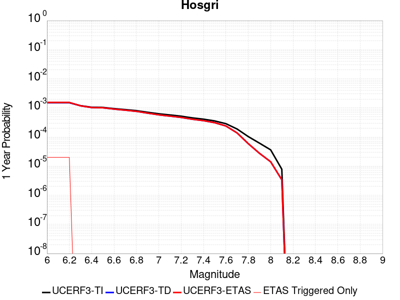 |  |

| Magnitude | 1 wk TI Prob | 1 wk TD Prob | 1 wk ETAS Prob | 1 wk ETAS/TD Gain | 1 wk ETAS Triggered Only | 1 mo TI Prob | 1 mo TD Prob | 1 mo ETAS Prob | 1 mo ETAS/TD Gain | 1 mo ETAS Triggered Only | 1 yr TI Prob | 1 yr TD Prob | 1 yr ETAS Prob | 1 yr ETAS/TD Gain | 1 yr ETAS Triggered Only | 10 yr TI Prob | 10 yr TD Prob | 10 yr ETAS Prob | 10 yr ETAS/TD Gain | 10 yr ETAS Triggered Only |
|-----|-----|-----|-----|-----|-----|-----|-----|-----|-----|-----|-----|-----|-----|-----|-----|-----|-----|-----|-----|-----|
| 6.0 | 2.883978E-5 | 2.9128416E-5 | 3.9128125E-5 | 1.3432974 | 1.0E-5 | 1.235932E-4 | 1.2483024E-4 | 1.4482775E-4 | 1.1601976 | 2.0E-5 | 0.0015037085 | 0.001518776 | 0.0015387456 | 1.0131485 | 2.0E-5 | 0.01493574 | 0.01508774 | 0.015136985 | 1.003264 | 5.0E-5 |
| 6.1 | 2.883978E-5 | 2.9128416E-5 | 3.9128125E-5 | 1.3432974 | 1.0E-5 | 1.235932E-4 | 1.2483024E-4 | 1.4482775E-4 | 1.1601976 | 2.0E-5 | 0.0015037085 | 0.001518776 | 0.0015387456 | 1.0131485 | 2.0E-5 | 0.01493574 | 0.01508774 | 0.015136985 | 1.003264 | 5.0E-5 |
| 6.2 | 2.883978E-5 | 2.9128416E-5 | 3.9128125E-5 | 1.3432974 | 1.0E-5 | 1.235932E-4 | 1.2483024E-4 | 1.4482775E-4 | 1.1601976 | 2.0E-5 | 0.0015037085 | 0.001518776 | 0.0015387456 | 1.0131485 | 2.0E-5 | 0.01493574 | 0.01508774 | 0.015136985 | 1.003264 | 5.0E-5 |
| 6.3 | 2.2914428E-5 | 2.2641969E-5 | 2.2641969E-5 | 1.0 | 0.0 | 9.8200995E-5 | 9.703343E-5 | 9.703343E-5 | 1.0 | 0.0 | 0.0011949413 | 0.0011807467 | 0.0011807467 | 1.0 | 0.0 | 0.011885363 | 0.011746133 | 0.0117757805 | 1.002524 | 3.0E-5 |
| 6.4 | 2.0195741E-5 | 1.969656E-5 | 1.969656E-5 | 1.0 | 0.0 | 8.65503E-5 | 8.4411105E-5 | 8.4411105E-5 | 1.0 | 0.0 | 0.0010532405 | 0.0010272227 | 0.0010272227 | 1.0 | 0.0 | 0.010482626 | 0.010225792 | 0.010245589 | 1.0019358 | 2.0E-5 |
| 6.5 | 1.9924333E-5 | 1.940898E-5 | 1.940898E-5 | 1.0 | 0.0 | 8.53872E-5 | 8.3178704E-5 | 8.3178704E-5 | 1.0 | 0.0 | 0.0010390934 | 0.0010122322 | 0.0010122322 | 1.0 | 0.0 | 0.010342481 | 0.010077253 | 0.010097052 | 1.0019647 | 2.0E-5 |
| 6.6 | 1.809694E-5 | 1.74583E-5 | 1.74583E-5 | 1.0 | 0.0 | 7.7556004E-5 | 7.4819145E-5 | 7.4819145E-5 | 1.0 | 0.0 | 9.438353E-4 | 9.105437E-4 | 9.105437E-4 | 1.0 | 0.0 | 0.009398366 | 0.009069073 | 0.009078982 | 1.0010927 | 1.0E-5 |
| 6.7 | 1.675989E-5 | 1.6042764E-5 | 1.6042764E-5 | 1.0 | 0.0 | 7.182612E-5 | 6.87529E-5 | 6.87529E-5 | 1.0 | 0.0 | 8.7413215E-4 | 8.3674624E-4 | 8.3674624E-4 | 1.0 | 0.0 | 0.008707017 | 0.0083368635 | 0.00834678 | 1.0011895 | 1.0E-5 |
| 6.8 | 1.5401129E-5 | 1.4614083E-5 | 1.4614083E-5 | 1.0 | 0.0 | 6.6003166E-5 | 6.2630286E-5 | 6.2630286E-5 | 1.0 | 0.0 | 8.032922E-4 | 7.622578E-4 | 7.622578E-4 | 1.0 | 0.0 | 0.008003947 | 0.007597296 | 0.00760722 | 1.0013063 | 1.0E-5 |
| 6.9 | 1.356559E-5 | 1.2689968E-5 | 1.2689968E-5 | 1.0 | 0.0 | 5.8136946E-5 | 5.4384444E-5 | 5.4384444E-5 | 1.0 | 0.0 | 7.0758746E-4 | 6.619299E-4 | 6.619299E-4 | 1.0 | 0.0 | 0.007053386 | 0.006600388 | 0.006610322 | 1.001505 | 1.0E-5 |
| 7.0 | 1.2030819E-5 | 1.1095962E-5 | 1.1095962E-5 | 1.0 | 0.0 | 5.155963E-5 | 4.7553254E-5 | 4.7553254E-5 | 1.0 | 0.0 | 6.275577E-4 | 5.7880714E-4 | 5.7880714E-4 | 1.0 | 0.0 | 0.006257884 | 0.005773757 | 0.0057836995 | 1.001722 | 1.0E-5 |
| 7.1 | 1.0972698E-5 | 1.0022179E-5 | 1.0022179E-5 | 1.0 | 0.0 | 4.7025E-5 | 4.2951488E-5 | 4.2951488E-5 | 1.0 | 0.0 | 5.72379E-4 | 5.22809E-4 | 5.22809E-4 | 1.0 | 0.0 | 0.0057090693 | 0.005216542 | 0.00522649 | 1.001907 | 1.0E-5 |
| 7.2 | 9.961926E-6 | 9.034746E-6 | 9.034746E-6 | 1.0 | 0.0 | 4.2693267E-5 | 3.8719765E-5 | 3.8719765E-5 | 1.0 | 0.0 | 5.1966653E-4 | 4.713112E-4 | 4.713112E-4 | 1.0 | 0.0 | 0.00518453 | 0.0047038626 | 0.0047138156 | 1.002116 | 1.0E-5 |
| 7.3 | 8.700929E-6 | 7.8281E-6 | 7.8281E-6 | 1.0 | 0.0 | 3.7289166E-5 | 3.354857E-5 | 3.354857E-5 | 1.0 | 0.0 | 4.53901E-4 | 4.0837732E-4 | 4.0837732E-4 | 1.0 | 0.0 | 0.00452975 | 0.004077008 | 0.0040869676 | 1.0024428 | 1.0E-5 |
| 7.4 | 7.866285E-6 | 6.998739E-6 | 6.998739E-6 | 1.0 | 0.0 | 3.3712215E-5 | 2.9994251E-5 | 2.9994251E-5 | 1.0 | 0.0 | 4.103689E-4 | 3.6511885E-4 | 3.6511885E-4 | 1.0 | 0.0 | 0.004096119 | 0.0036459267 | 0.0036558902 | 1.0027328 | 1.0E-5 |
| 7.5 | 6.8381305E-6 | 5.9596955E-6 | 5.9596955E-6 | 1.0 | 0.0 | 2.9305946E-5 | 2.5541302E-5 | 2.5541302E-5 | 1.0 | 0.0 | 3.5674145E-4 | 3.10921E-4 | 3.10921E-4 | 1.0 | 0.0 | 0.0035616932 | 0.0031055948 | 0.0031155637 | 1.00321 | 1.0E-5 |
| 7.6 | 5.503376E-6 | 4.5952443E-6 | 4.5952443E-6 | 1.0 | 0.0 | 2.3585684E-5 | 1.9693754E-5 | 1.9693754E-5 | 1.0 | 0.0 | 2.8711787E-4 | 2.397451E-4 | 2.397451E-4 | 1.0 | 0.0 | 0.002867472 | 0.0023955975 | 0.0023955975 | 1.0 | 0.0 |
| 7.7 | 3.6144982E-6 | 2.6522112E-6 | 2.6522112E-6 | 1.0 | 0.0 | 1.5490614E-5 | 1.1366569E-5 | 1.1366569E-5 | 1.0 | 0.0 | 1.8858191E-4 | 1.383792E-4 | 1.383792E-4 | 1.0 | 0.0 | 0.0018842196 | 0.0013836613 | 0.0013836613 | 1.0 | 0.0 |
| 7.8 | 1.9853494E-6 | 1.1361129E-6 | 1.1361129E-6 | 1.0 | 0.0 | 8.508612E-6 | 4.8690463E-6 | 4.8690463E-6 | 1.0 | 0.0 | 1.0358743E-4 | 5.9279027E-5 | 5.9279027E-5 | 1.0 | 0.0 | 0.0010353916 | 5.9336185E-4 | 5.9336185E-4 | 1.0 | 0.0 |
| 7.9 | 1.1818757E-6 | 5.2951856E-7 | 5.2951856E-7 | 1.0 | 0.0 | 5.0651715E-6 | 2.2693632E-6 | 2.2693632E-6 | 1.0 | 0.0 | 6.1666724E-5 | 2.7629147E-5 | 2.7629147E-5 | 1.0 | 0.0 | 6.1649614E-4 | 2.7694515E-4 | 2.7694515E-4 | 1.0 | 0.0 |
| 8.0 | 6.962958E-7 | 2.7139782E-7 | 2.7139782E-7 | 1.0 | 0.0 | 2.9841215E-6 | 1.163133E-6 | 1.163133E-6 | 1.0 | 0.0 | 3.6331072E-5 | 1.4161053E-5 | 1.4161053E-5 | 1.0 | 0.0 | 3.6325134E-4 | 1.4217179E-4 | 1.4217179E-4 | 1.0 | 0.0 |
| 8.1 | 1.5033264E-7 | 6.527624E-8 | 6.527624E-8 | 1.0 | 0.0 | 6.442826E-7 | 2.7975528E-7 | 2.7975528E-7 | 1.0 | 0.0 | 7.844113E-6 | 3.4060151E-6 | 3.4060151E-6 | 1.0 | 0.0 | 7.843835E-5 | 3.407693E-5 | 3.407693E-5 | 1.0 | 0.0 |

## Tin Mountain
*[(top)](#table-of-contents)*

| 1 Week | 1 Month | 1 Year | 10 Year |
|-----|-----|-----|-----|
|  |  |  |  |

| Magnitude | 1 wk TI Prob | 1 wk TD Prob | 1 wk ETAS Prob | 1 wk ETAS/TD Gain | 1 wk ETAS Triggered Only | 1 mo TI Prob | 1 mo TD Prob | 1 mo ETAS Prob | 1 mo ETAS/TD Gain | 1 mo ETAS Triggered Only | 1 yr TI Prob | 1 yr TD Prob | 1 yr ETAS Prob | 1 yr ETAS/TD Gain | 1 yr ETAS Triggered Only | 10 yr TI Prob | 10 yr TD Prob | 10 yr ETAS Prob | 10 yr ETAS/TD Gain | 10 yr ETAS Triggered Only |
|-----|-----|-----|-----|-----|-----|-----|-----|-----|-----|-----|-----|-----|-----|-----|-----|-----|-----|-----|-----|-----|
| 6.0 | 4.083776E-6 | 4.1815365E-6 | 4.4181368E-5 | 10.565822 | 4.0E-5 | 1.750178E-5 | 1.792077E-5 | 5.7920053E-5 | 3.232007 | 4.0E-5 | 2.1306332E-4 | 2.1816725E-4 | 2.581585E-4 | 1.1833056 | 4.0E-5 | 0.0021285915 | 0.0021798965 | 0.0022397656 | 1.0274643 | 6.0E-5 |
| 6.1 | 4.083776E-6 | 4.1815365E-6 | 4.4181368E-5 | 10.565822 | 4.0E-5 | 1.750178E-5 | 1.792077E-5 | 5.7920053E-5 | 3.232007 | 4.0E-5 | 2.1306332E-4 | 2.1816725E-4 | 2.581585E-4 | 1.1833056 | 4.0E-5 | 0.0021285915 | 0.0021798965 | 0.0022397656 | 1.0274643 | 6.0E-5 |
| 6.2 | 4.083776E-6 | 4.1815365E-6 | 4.4181368E-5 | 10.565822 | 4.0E-5 | 1.750178E-5 | 1.792077E-5 | 5.7920053E-5 | 3.232007 | 4.0E-5 | 2.1306332E-4 | 2.1816725E-4 | 2.581585E-4 | 1.1833056 | 4.0E-5 | 0.0021285915 | 0.0021798965 | 0.0022397656 | 1.0274643 | 6.0E-5 |
| 6.3 | 4.083776E-6 | 4.1815365E-6 | 4.4181368E-5 | 10.565822 | 4.0E-5 | 1.750178E-5 | 1.792077E-5 | 5.7920053E-5 | 3.232007 | 4.0E-5 | 2.1306332E-4 | 2.1816725E-4 | 2.581585E-4 | 1.1833056 | 4.0E-5 | 0.0021285915 | 0.0021798965 | 0.0022397656 | 1.0274643 | 6.0E-5 |
| 6.4 | 4.083776E-6 | 4.1815365E-6 | 4.4181368E-5 | 10.565822 | 4.0E-5 | 1.750178E-5 | 1.792077E-5 | 5.7920053E-5 | 3.232007 | 4.0E-5 | 2.1306332E-4 | 2.1816725E-4 | 2.581585E-4 | 1.1833056 | 4.0E-5 | 0.0021285915 | 0.0021798965 | 0.0022397656 | 1.0274643 | 6.0E-5 |
| 6.5 | 2.3143427E-6 | 2.3731573E-6 | 3.2373086E-5 | 13.641357 | 3.0E-5 | 9.9185745E-6 | 1.0170638E-5 | 4.0170333E-5 | 3.9496374 | 3.0E-5 | 1.2075195E-4 | 1.2382126E-4 | 1.5381754E-4 | 1.2422547 | 3.0E-5 | 0.0012068636 | 0.0012375986 | 0.0012775491 | 1.0322807 | 4.0E-5 |
| 6.6 | 2.3143427E-6 | 2.3731573E-6 | 3.2373086E-5 | 13.641357 | 3.0E-5 | 9.9185745E-6 | 1.0170638E-5 | 4.0170333E-5 | 3.9496374 | 3.0E-5 | 1.2075195E-4 | 1.2382126E-4 | 1.5381754E-4 | 1.2422547 | 3.0E-5 | 0.0012068636 | 0.0012375986 | 0.0012775491 | 1.0322807 | 4.0E-5 |
| 6.7 | 1.7029532E-6 | 1.7497915E-6 | 2.1749756E-5 | 12.4299135 | 2.0E-5 | 7.2983503E-6 | 7.499088E-6 | 2.7498938E-5 | 3.666971 | 2.0E-5 | 8.885379E-5 | 9.1298105E-5 | 1.1129628E-4 | 1.2190425 | 2.0E-5 | 8.881827E-4 | 9.1265864E-4 | 9.426312E-4 | 1.032841 | 3.0E-5 |
| 6.8 | 1.2914646E-6 | 1.3299378E-6 | 2.1329912E-5 | 16.038277 | 2.0E-5 | 5.534837E-6 | 5.6997237E-6 | 2.569961E-5 | 4.508922 | 2.0E-5 | 6.738455E-5 | 6.939237E-5 | 8.939098E-5 | 1.2881961 | 2.0E-5 | 6.736412E-4 | 6.9375033E-4 | 7.1373646E-4 | 1.0288088 | 2.0E-5 |
| 6.9 | 5.8708974E-7 | 6.1169936E-7 | 2.0611687E-5 | 33.695778 | 2.0E-5 | 2.5160964E-6 | 2.6215664E-6 | 2.2621514E-5 | 8.629007 | 2.0E-5 | 3.0633044E-5 | 3.1917145E-5 | 5.1916504E-5 | 1.6266025 | 2.0E-5 | 3.0628822E-4 | 3.191297E-4 | 3.3912333E-4 | 1.0626504 | 2.0E-5 |
| 7.0 | 4.6248786E-7 | 4.832015E-7 | 1.0483197E-5 | 21.69529 | 1.0E-5 | 1.9820893E-6 | 2.0708624E-6 | 1.2070842E-5 | 5.8288965 | 1.0E-5 | 2.413167E-5 | 2.5212494E-5 | 3.521224E-5 | 1.3966187 | 1.0E-5 | 2.412905E-4 | 2.5210003E-4 | 2.620975E-4 | 1.0396568 | 1.0E-5 |
| 7.1 | 3.804606E-7 | 3.987147E-7 | 3.987147E-7 | 1.0 | 0.0 | 1.6305444E-6 | 1.7087764E-6 | 1.7087764E-6 | 1.0 | 0.0 | 1.9851697E-5 | 2.0804187E-5 | 2.0804187E-5 | 1.0 | 0.0 | 1.9849923E-4 | 2.0802575E-4 | 2.0802575E-4 | 1.0 | 0.0 |
| 7.2 | 3.5864858E-7 | 3.7616863E-7 | 3.7616863E-7 | 1.0 | 0.0 | 1.5370645E-6 | 1.6121504E-6 | 1.6121504E-6 | 1.0 | 0.0 | 1.87136E-5 | 1.9627789E-5 | 1.9627789E-5 | 1.0 | 0.0 | 1.8712023E-4 | 1.9626386E-4 | 1.9626386E-4 | 1.0 | 0.0 |
| 7.3 | 3.342063E-7 | 3.506347E-7 | 3.506347E-7 | 1.0 | 0.0 | 1.4323119E-6 | 1.5027196E-6 | 1.5027196E-6 | 1.0 | 0.0 | 1.7438259E-5 | 1.829549E-5 | 1.829549E-5 | 1.0 | 0.0 | 1.743689E-4 | 1.8294314E-4 | 1.8294314E-4 | 1.0 | 0.0 |
| 7.4 | 2.971242E-7 | 3.1165817E-7 | 3.1165817E-7 | 1.0 | 0.0 | 1.2733886E-6 | 1.3356774E-6 | 1.3356774E-6 | 1.0 | 0.0 | 1.5503398E-5 | 1.6261785E-5 | 1.6261785E-5 | 1.0 | 0.0 | 1.5502315E-4 | 1.6260923E-4 | 1.6260923E-4 | 1.0 | 0.0 |
| 7.5 | 1.4326713E-7 | 1.5012525E-7 | 1.5012525E-7 | 1.0 | 0.0 | 6.140018E-7 | 6.433939E-7 | 6.433939E-7 | 1.0 | 0.0 | 7.4754466E-6 | 7.8333205E-6 | 7.8333205E-6 | 1.0 | 0.0 | 7.475195E-5 | 7.833321E-5 | 7.833321E-5 | 1.0 | 0.0 |

## Independence rev 2011
*[(top)](#table-of-contents)*

| 1 Week | 1 Month | 1 Year | 10 Year |
|-----|-----|-----|-----|
|  |  |  |  |

| Magnitude | 1 wk TI Prob | 1 wk TD Prob | 1 wk ETAS Prob | 1 wk ETAS/TD Gain | 1 wk ETAS Triggered Only | 1 mo TI Prob | 1 mo TD Prob | 1 mo ETAS Prob | 1 mo ETAS/TD Gain | 1 mo ETAS Triggered Only | 1 yr TI Prob | 1 yr TD Prob | 1 yr ETAS Prob | 1 yr ETAS/TD Gain | 1 yr ETAS Triggered Only | 10 yr TI Prob | 10 yr TD Prob | 10 yr ETAS Prob | 10 yr ETAS/TD Gain | 10 yr ETAS Triggered Only |
|-----|-----|-----|-----|-----|-----|-----|-----|-----|-----|-----|-----|-----|-----|-----|-----|-----|-----|-----|-----|-----|
| 6.0 | 4.422171E-6 | 4.326227E-6 | 1.4326184E-5 | 3.311473 | 1.0E-5 | 1.8952025E-5 | 1.8540857E-5 | 2.8540673E-5 | 1.5393394 | 1.0E-5 | 2.3071647E-4 | 2.2571455E-4 | 2.5570777E-4 | 1.1328813 | 3.0E-5 | 0.0023047708 | 0.0022551466 | 0.0023150113 | 1.0265458 | 6.0E-5 |
| 6.1 | 4.422171E-6 | 4.326227E-6 | 1.4326184E-5 | 3.311473 | 1.0E-5 | 1.8952025E-5 | 1.8540857E-5 | 2.8540673E-5 | 1.5393394 | 1.0E-5 | 2.3071647E-4 | 2.2571455E-4 | 2.5570777E-4 | 1.1328813 | 3.0E-5 | 0.0023047708 | 0.0022551466 | 0.0023150113 | 1.0265458 | 6.0E-5 |
| 6.2 | 4.422171E-6 | 4.326227E-6 | 1.4326184E-5 | 3.311473 | 1.0E-5 | 1.8952025E-5 | 1.8540857E-5 | 2.8540673E-5 | 1.5393394 | 1.0E-5 | 2.3071647E-4 | 2.2571455E-4 | 2.5570777E-4 | 1.1328813 | 3.0E-5 | 0.0023047708 | 0.0022551466 | 0.0023150113 | 1.0265458 | 6.0E-5 |
| 6.3 | 4.422171E-6 | 4.326227E-6 | 1.4326184E-5 | 3.311473 | 1.0E-5 | 1.8952025E-5 | 1.8540857E-5 | 2.8540673E-5 | 1.5393394 | 1.0E-5 | 2.3071647E-4 | 2.2571455E-4 | 2.5570777E-4 | 1.1328813 | 3.0E-5 | 0.0023047708 | 0.0022551466 | 0.0023150113 | 1.0265458 | 6.0E-5 |
| 6.4 | 4.422171E-6 | 4.326227E-6 | 1.4326184E-5 | 3.311473 | 1.0E-5 | 1.8952025E-5 | 1.8540857E-5 | 2.8540673E-5 | 1.5393394 | 1.0E-5 | 2.3071647E-4 | 2.2571455E-4 | 2.5570777E-4 | 1.1328813 | 3.0E-5 | 0.0023047708 | 0.0022551466 | 0.0023150113 | 1.0265458 | 6.0E-5 |
| 6.5 | 4.422171E-6 | 4.326227E-6 | 1.4326184E-5 | 3.311473 | 1.0E-5 | 1.8952025E-5 | 1.8540857E-5 | 2.8540673E-5 | 1.5393394 | 1.0E-5 | 2.3071647E-4 | 2.2571455E-4 | 2.5570777E-4 | 1.1328813 | 3.0E-5 | 0.0023047708 | 0.0022551466 | 0.0023150113 | 1.0265458 | 6.0E-5 |
| 6.6 | 2.663744E-6 | 2.5319862E-6 | 1.2531961E-5 | 4.9494586 | 1.0E-5 | 1.1415996E-5 | 1.0851327E-5 | 2.085122E-5 | 1.9215363 | 1.0E-5 | 1.3898089E-4 | 1.3210738E-4 | 1.5210474E-4 | 1.151372 | 2.0E-5 | 0.0013889399 | 0.0013203367 | 0.0013702707 | 1.0378191 | 5.0E-5 |
| 6.7 | 2.663744E-6 | 2.5319862E-6 | 1.2531961E-5 | 4.9494586 | 1.0E-5 | 1.1415996E-5 | 1.0851327E-5 | 2.085122E-5 | 1.9215363 | 1.0E-5 | 1.3898089E-4 | 1.3210738E-4 | 1.5210474E-4 | 1.151372 | 2.0E-5 | 0.0013889399 | 0.0013203367 | 0.0013702707 | 1.0378191 | 5.0E-5 |
| 6.8 | 1.9716529E-6 | 1.8322585E-6 | 1.18322405E-5 | 6.4577355 | 1.0E-5 | 8.449913E-6 | 7.852514E-6 | 1.7852435E-5 | 2.2734675 | 1.0E-5 | 1.0287284E-4 | 9.5600284E-5 | 1.1559837E-4 | 1.2091844 | 2.0E-5 | 0.0010282523 | 9.556045E-4 | 0.0010055567 | 1.0522729 | 5.0E-5 |
| 6.9 | 1.8788617E-6 | 1.7429993E-6 | 1.1742982E-5 | 6.737227 | 1.0E-5 | 8.0522395E-6 | 7.4699765E-6 | 1.7469902E-5 | 2.3386824 | 1.0E-5 | 9.80316E-5 | 9.0943286E-5 | 1.10941466E-4 | 1.2198973 | 2.0E-5 | 9.798837E-4 | 9.0907275E-4 | 9.5902727E-4 | 1.0549511 | 5.0E-5 |
| 7.0 | 1.5045488E-6 | 1.3849503E-6 | 1.1384936E-5 | 8.220466 | 1.0E-5 | 6.44805E-6 | 5.9354884E-6 | 1.593543E-5 | 2.6847713 | 1.0E-5 | 7.8502184E-5 | 7.226223E-5 | 9.226078E-5 | 1.2767497 | 2.0E-5 | 7.8474457E-4 | 7.2239246E-4 | 7.7235635E-4 | 1.0691645 | 5.0E-5 |
| 7.1 | 1.272341E-6 | 1.1625096E-6 | 1.1162498E-5 | 9.602069 | 1.0E-5 | 5.4528787E-6 | 4.982175E-6 | 1.4982125E-5 | 3.0071454 | 1.0E-5 | 6.6386776E-5 | 6.0656326E-5 | 7.065572E-5 | 1.1648532 | 1.0E-5 | 6.636695E-4 | 6.064009E-4 | 6.363827E-4 | 1.0494422 | 3.0E-5 |
| 7.2 | 1.0416892E-6 | 9.4098806E-7 | 1.0940978E-5 | 11.627117 | 1.0E-5 | 4.464375E-6 | 4.0328E-6 | 1.4032759E-5 | 3.479657 | 1.0E-5 | 5.4352407E-5 | 4.909825E-5 | 5.9097758E-5 | 1.2036632 | 1.0E-5 | 5.4339116E-4 | 4.9087586E-4 | 5.208612E-4 | 1.0610852 | 3.0E-5 |
| 7.3 | 7.9450155E-7 | 7.235002E-7 | 1.0723493E-5 | 14.821687 | 1.0E-5 | 3.4050022E-6 | 3.1007114E-6 | 1.310068E-5 | 4.225056 | 1.0E-5 | 4.1455114E-5 | 3.775052E-5 | 4.775014E-5 | 1.264887 | 1.0E-5 | 4.144738E-4 | 3.7744216E-4 | 4.0743084E-4 | 1.0794524 | 3.0E-5 |
| 7.4 | 5.3893444E-7 | 5.019512E-7 | 1.0501946E-5 | 20.922245 | 1.0E-5 | 2.309717E-6 | 2.1512178E-6 | 1.2151197E-5 | 5.64852 | 1.0E-5 | 2.8120441E-5 | 2.6190766E-5 | 3.6190504E-5 | 1.381804 | 1.0E-5 | 2.8116882E-4 | 2.6187726E-4 | 2.918694E-4 | 1.1145275 | 3.0E-5 |
| 7.5 | 3.8852085E-7 | 3.682554E-7 | 1.0368251E-5 | 28.155058 | 1.0E-5 | 1.6650882E-6 | 1.5782365E-6 | 1.157822E-5 | 7.3361764 | 1.0E-5 | 2.027226E-5 | 1.9214862E-5 | 2.9214669E-5 | 1.5204206 | 1.0E-5 | 2.0270412E-4 | 1.9213221E-4 | 2.2212646E-4 | 1.1561124 | 3.0E-5 |
| 7.6 | 2.414929E-7 | 2.345755E-7 | 1.0234573E-5 | 43.630188 | 1.0E-5 | 1.0349692E-6 | 1.0053232E-6 | 1.1005313E-5 | 10.94704 | 1.0E-5 | 1.2600677E-5 | 1.2239742E-5 | 2.223962E-5 | 1.8170006 | 1.0E-5 | 1.2599962E-4 | 1.223908E-4 | 1.3238958E-4 | 1.0816954 | 1.0E-5 |
| 7.7 | 6.8298014E-8 | 6.85897E-8 | 1.0068589E-5 | 146.79448 | 1.0E-5 | 2.9270575E-7 | 2.9395582E-7 | 1.0293953E-5 | 35.018707 | 1.0E-5 | 3.5636867E-6 | 3.5789067E-6 | 1.35788705E-5 | 3.7941394 | 1.0E-5 | 3.5636294E-5 | 3.5788536E-5 | 4.578818E-5 | 1.279409 | 1.0E-5 |

## Mono Lake 2011 CFM
*[(top)](#table-of-contents)*

| 1 Week | 1 Month | 1 Year | 10 Year |
|-----|-----|-----|-----|
|  |  |  |  |

| Magnitude | 1 wk TI Prob | 1 wk TD Prob | 1 wk ETAS Prob | 1 wk ETAS/TD Gain | 1 wk ETAS Triggered Only | 1 mo TI Prob | 1 mo TD Prob | 1 mo ETAS Prob | 1 mo ETAS/TD Gain | 1 mo ETAS Triggered Only | 1 yr TI Prob | 1 yr TD Prob | 1 yr ETAS Prob | 1 yr ETAS/TD Gain | 1 yr ETAS Triggered Only | 10 yr TI Prob | 10 yr TD Prob | 10 yr ETAS Prob | 10 yr ETAS/TD Gain | 10 yr ETAS Triggered Only |
|-----|-----|-----|-----|-----|-----|-----|-----|-----|-----|-----|-----|-----|-----|-----|-----|-----|-----|-----|-----|-----|
| 6.0 | 2.0341662E-5 | 2.3828166E-5 | 3.3827928E-5 | 1.4196614 | 1.0E-5 | 8.717564E-5 | 1.0211971E-4 | 1.12118694E-4 | 1.0979143 | 1.0E-5 | 0.0010608466 | 0.0012431298 | 0.001263105 | 1.0160685 | 2.0E-5 | 0.010557966 | 0.012413835 | 0.012473091 | 1.0047733 | 6.0E-5 |
| 6.1 | 2.0341662E-5 | 2.3828166E-5 | 3.3827928E-5 | 1.4196614 | 1.0E-5 | 8.717564E-5 | 1.0211971E-4 | 1.12118694E-4 | 1.0979143 | 1.0E-5 | 0.0010608466 | 0.0012431298 | 0.001263105 | 1.0160685 | 2.0E-5 | 0.010557966 | 0.012413835 | 0.012473091 | 1.0047733 | 6.0E-5 |
| 6.2 | 2.0341662E-5 | 2.3828166E-5 | 3.3827928E-5 | 1.4196614 | 1.0E-5 | 8.717564E-5 | 1.0211971E-4 | 1.12118694E-4 | 1.0979143 | 1.0E-5 | 0.0010608466 | 0.0012431298 | 0.001263105 | 1.0160685 | 2.0E-5 | 0.010557966 | 0.012413835 | 0.012473091 | 1.0047733 | 6.0E-5 |
| 6.3 | 2.0341662E-5 | 2.3828166E-5 | 3.3827928E-5 | 1.4196614 | 1.0E-5 | 8.717564E-5 | 1.0211971E-4 | 1.12118694E-4 | 1.0979143 | 1.0E-5 | 0.0010608466 | 0.0012431298 | 0.001263105 | 1.0160685 | 2.0E-5 | 0.010557966 | 0.012413835 | 0.012473091 | 1.0047733 | 6.0E-5 |
| 6.4 | 1.749821E-5 | 2.0490985E-5 | 3.049078E-5 | 1.4880095 | 1.0E-5 | 7.499018E-5 | 8.781851E-5 | 9.781763E-5 | 1.1138612 | 1.0E-5 | 9.1262296E-4 | 0.0010691903 | 0.001089169 | 1.0186857 | 2.0E-5 | 0.009088841 | 0.010691865 | 0.010751223 | 1.0055517 | 6.0E-5 |
| 6.5 | 1.749821E-5 | 2.0490985E-5 | 3.049078E-5 | 1.4880095 | 1.0E-5 | 7.499018E-5 | 8.781851E-5 | 9.781763E-5 | 1.1138612 | 1.0E-5 | 9.1262296E-4 | 0.0010691903 | 0.001089169 | 1.0186857 | 2.0E-5 | 0.009088841 | 0.010691865 | 0.010751223 | 1.0055517 | 6.0E-5 |

## Elysian Park (Upper)
*[(top)](#table-of-contents)*

| 1 Week | 1 Month | 1 Year | 10 Year |
|-----|-----|-----|-----|
|  |  |  |  |

| Magnitude | 1 wk TI Prob | 1 wk TD Prob | 1 wk ETAS Prob | 1 wk ETAS/TD Gain | 1 wk ETAS Triggered Only | 1 mo TI Prob | 1 mo TD Prob | 1 mo ETAS Prob | 1 mo ETAS/TD Gain | 1 mo ETAS Triggered Only | 1 yr TI Prob | 1 yr TD Prob | 1 yr ETAS Prob | 1 yr ETAS/TD Gain | 1 yr ETAS Triggered Only | 10 yr TI Prob | 10 yr TD Prob | 10 yr ETAS Prob | 10 yr ETAS/TD Gain | 10 yr ETAS Triggered Only |
|-----|-----|-----|-----|-----|-----|-----|-----|-----|-----|-----|-----|-----|-----|-----|-----|-----|-----|-----|-----|-----|
| 6.0 | 3.1876025E-5 | 3.7035516E-5 | 3.7035516E-5 | 1.0 | 0.0 | 1.3660437E-4 | 1.587167E-4 | 1.587167E-4 | 1.0 | 0.0 | 0.0016618895 | 0.0019311075 | 0.001981011 | 1.0258418 | 5.0E-5 | 0.016495159 | 0.019189782 | 0.019248633 | 1.0030667 | 6.0E-5 |
| 6.1 | 3.1876025E-5 | 3.7035516E-5 | 3.7035516E-5 | 1.0 | 0.0 | 1.3660437E-4 | 1.587167E-4 | 1.587167E-4 | 1.0 | 0.0 | 0.0016618895 | 0.0019311075 | 0.001981011 | 1.0258418 | 5.0E-5 | 0.016495159 | 0.019189782 | 0.019248633 | 1.0030667 | 6.0E-5 |
| 6.2 | 3.1876025E-5 | 3.7035516E-5 | 3.7035516E-5 | 1.0 | 0.0 | 1.3660437E-4 | 1.587167E-4 | 1.587167E-4 | 1.0 | 0.0 | 0.0016618895 | 0.0019311075 | 0.001981011 | 1.0258418 | 5.0E-5 | 0.016495159 | 0.019189782 | 0.019248633 | 1.0030667 | 6.0E-5 |
| 6.3 | 3.1876025E-5 | 3.7035516E-5 | 3.7035516E-5 | 1.0 | 0.0 | 1.3660437E-4 | 1.587167E-4 | 1.587167E-4 | 1.0 | 0.0 | 0.0016618895 | 0.0019311075 | 0.001981011 | 1.0258418 | 5.0E-5 | 0.016495159 | 0.019189782 | 0.019248633 | 1.0030667 | 6.0E-5 |
| 6.4 | 1.9273462E-5 | 2.1202266E-5 | 2.1202266E-5 | 1.0 | 0.0 | 8.259794E-5 | 9.086466E-5 | 9.086466E-5 | 1.0 | 0.0 | 0.001005166 | 0.0011058892 | 0.0011158782 | 1.0090325 | 1.0E-5 | 0.010006315 | 0.011020724 | 0.011040503 | 1.0017948 | 2.0E-5 |
| 6.5 | 1.9273462E-5 | 2.1202266E-5 | 2.1202266E-5 | 1.0 | 0.0 | 8.259794E-5 | 9.086466E-5 | 9.086466E-5 | 1.0 | 0.0 | 0.001005166 | 0.0011058892 | 0.0011158782 | 1.0090325 | 1.0E-5 | 0.010006315 | 0.011020724 | 0.011040503 | 1.0017948 | 2.0E-5 |
| 6.6 | 9.813258E-6 | 9.665599E-6 | 9.665599E-6 | 1.0 | 0.0 | 4.205614E-5 | 4.1423376E-5 | 4.1423376E-5 | 1.0 | 0.0 | 5.119132E-4 | 5.0422014E-4 | 5.0422014E-4 | 1.0 | 0.0 | 0.005107356 | 0.0050314846 | 0.0050314846 | 1.0 | 0.0 |
| 6.7 | 9.801478E-6 | 9.653168E-6 | 9.653168E-6 | 1.0 | 0.0 | 4.2005657E-5 | 4.1370105E-5 | 4.1370105E-5 | 1.0 | 0.0 | 5.112989E-4 | 5.035719E-4 | 5.035719E-4 | 1.0 | 0.0 | 0.0051012407 | 0.0050250315 | 0.0050250315 | 1.0 | 0.0 |
| 6.8 | 8.102489E-6 | 7.773004E-6 | 7.773004E-6 | 1.0 | 0.0 | 3.4724493E-5 | 3.3312477E-5 | 3.3312477E-5 | 1.0 | 0.0 | 4.2268867E-4 | 4.055089E-4 | 4.055089E-4 | 1.0 | 0.0 | 0.004218856 | 0.0040481836 | 0.0040481836 | 1.0 | 0.0 |
| 6.9 | 6.08275E-6 | 5.4814514E-6 | 5.4814514E-6 | 1.0 | 0.0 | 2.6068668E-5 | 2.3491726E-5 | 2.3491726E-5 | 1.0 | 0.0 | 3.173398E-4 | 2.85975E-4 | 2.85975E-4 | 1.0 | 0.0 | 0.0031688702 | 0.0028561477 | 0.0028561477 | 1.0 | 0.0 |
| 7.0 | 5.5995934E-6 | 4.98278E-6 | 4.98278E-6 | 1.0 | 0.0 | 2.3998036E-5 | 2.13546E-5 | 2.13546E-5 | 1.0 | 0.0 | 2.9213692E-4 | 2.599619E-4 | 2.599619E-4 | 1.0 | 0.0 | 0.0029175316 | 0.0025966454 | 0.0025966454 | 1.0 | 0.0 |
| 7.1 | 4.709881E-6 | 4.0874015E-6 | 4.0874015E-6 | 1.0 | 0.0 | 2.0185047E-5 | 1.7517319E-5 | 1.7517319E-5 | 1.0 | 0.0 | 2.4572524E-4 | 2.132529E-4 | 2.132529E-4 | 1.0 | 0.0 | 0.002454537 | 0.002130524 | 0.002130524 | 1.0 | 0.0 |
| 7.2 | 3.6063436E-6 | 2.9779544E-6 | 2.9779544E-6 | 1.0 | 0.0 | 1.5455667E-5 | 1.27626E-5 | 1.27626E-5 | 1.0 | 0.0 | 1.881565E-4 | 1.5537368E-4 | 1.5537368E-4 | 1.0 | 0.0 | 0.0018799726 | 0.0015526618 | 0.0015526618 | 1.0 | 0.0 |
| 7.3 | 2.471135E-6 | 2.0954615E-6 | 2.0954615E-6 | 1.0 | 0.0 | 1.0590536E-5 | 8.980519E-6 | 8.980519E-6 | 1.0 | 0.0 | 1.2893214E-4 | 1.093324E-4 | 1.093324E-4 | 1.0 | 0.0 | 0.0012885736 | 0.0010927934 | 0.0010927934 | 1.0 | 0.0 |
| 7.4 | 1.163943E-6 | 1.0275091E-6 | 1.0275091E-6 | 1.0 | 0.0 | 4.988318E-6 | 4.4036033E-6 | 4.4036033E-6 | 1.0 | 0.0 | 6.0731076E-5 | 5.3612584E-5 | 5.3612584E-5 | 1.0 | 0.0 | 6.071448E-4 | 5.359995E-4 | 5.359995E-4 | 1.0 | 0.0 |
| 7.5 | 4.99459E-7 | 4.917604E-7 | 4.917604E-7 | 1.0 | 0.0 | 2.140537E-6 | 2.1075427E-6 | 2.1075427E-6 | 1.0 | 0.0 | 2.6060725E-5 | 2.5659048E-5 | 2.5659048E-5 | 1.0 | 0.0 | 2.605767E-4 | 2.5656243E-4 | 2.5656243E-4 | 1.0 | 0.0 |
| 7.6 | 2.4667852E-7 | 2.4778336E-7 | 2.4778336E-7 | 1.0 | 0.0 | 1.0571932E-6 | 1.0619283E-6 | 1.0619283E-6 | 1.0 | 0.0 | 1.2871251E-5 | 1.2928905E-5 | 1.2928905E-5 | 1.0 | 0.0 | 1.2870505E-4 | 1.2928189E-4 | 1.2928189E-4 | 1.0 | 0.0 |
| 7.7 | 8.2312795E-8 | 7.3864456E-8 | 7.3864456E-8 | 1.0 | 0.0 | 3.527691E-7 | 3.165619E-7 | 3.165619E-7 | 1.0 | 0.0 | 4.294955E-6 | 3.8541357E-6 | 3.8541357E-6 | 1.0 | 0.0 | 4.2948723E-5 | 3.8540802E-5 | 3.8540802E-5 | 1.0 | 0.0 |
| 7.8 | 2.7819295E-8 | 1.7566023E-8 | 1.7566023E-8 | 1.0 | 0.0 | 1.1922555E-7 | 7.5282955E-8 | 7.5282955E-8 | 1.0 | 0.0 | 1.45157E-6 | 9.165697E-7 | 9.165697E-7 | 1.0 | 0.0 | 1.45156055E-5 | 9.165675E-6 | 9.165675E-6 | 1.0 | 0.0 |

## Sheephole
*[(top)](#table-of-contents)*

| 1 Week | 1 Month | 1 Year | 10 Year |
|-----|-----|-----|-----|
|  |  |  |  |

| Magnitude | 1 wk TI Prob | 1 wk TD Prob | 1 wk ETAS Prob | 1 wk ETAS/TD Gain | 1 wk ETAS Triggered Only | 1 mo TI Prob | 1 mo TD Prob | 1 mo ETAS Prob | 1 mo ETAS/TD Gain | 1 mo ETAS Triggered Only | 1 yr TI Prob | 1 yr TD Prob | 1 yr ETAS Prob | 1 yr ETAS/TD Gain | 1 yr ETAS Triggered Only | 10 yr TI Prob | 10 yr TD Prob | 10 yr ETAS Prob | 10 yr ETAS/TD Gain | 10 yr ETAS Triggered Only |
|-----|-----|-----|-----|-----|-----|-----|-----|-----|-----|-----|-----|-----|-----|-----|-----|-----|-----|-----|-----|-----|
| 6.0 | 4.5579695E-6 | 4.7412627E-6 | 1.4741215E-5 | 3.1091328 | 1.0E-5 | 1.9534009E-5 | 2.031957E-5 | 3.0319366E-5 | 1.4921265 | 1.0E-5 | 2.3780059E-4 | 2.473682E-4 | 2.6736327E-4 | 1.0808312 | 2.0E-5 | 0.0023754628 | 0.002471473 | 0.0025213496 | 1.0201808 | 5.0E-5 |
| 6.1 | 4.5579695E-6 | 4.7412627E-6 | 1.4741215E-5 | 3.1091328 | 1.0E-5 | 1.9534009E-5 | 2.031957E-5 | 3.0319366E-5 | 1.4921265 | 1.0E-5 | 2.3780059E-4 | 2.473682E-4 | 2.6736327E-4 | 1.0808312 | 2.0E-5 | 0.0023754628 | 0.002471473 | 0.0025213496 | 1.0201808 | 5.0E-5 |
| 6.2 | 2.6677674E-6 | 2.7873941E-6 | 1.2787366E-5 | 4.58757 | 1.0E-5 | 1.1433239E-5 | 1.1945926E-5 | 2.1945807E-5 | 1.8370954 | 1.0E-5 | 1.3919079E-4 | 1.4543302E-4 | 1.6543012E-4 | 1.1375003 | 2.0E-5 | 0.0013910364 | 0.0014534844 | 0.0015034117 | 1.03435 | 5.0E-5 |
| 6.3 | 2.6677674E-6 | 2.7873941E-6 | 1.2787366E-5 | 4.58757 | 1.0E-5 | 1.1433239E-5 | 1.1945926E-5 | 2.1945807E-5 | 1.8370954 | 1.0E-5 | 1.3919079E-4 | 1.4543302E-4 | 1.6543012E-4 | 1.1375003 | 2.0E-5 | 0.0013910364 | 0.0014534844 | 0.0015034117 | 1.03435 | 5.0E-5 |
| 6.4 | 2.2159759E-6 | 2.3228788E-6 | 1.2322856E-5 | 5.304993 | 1.0E-5 | 9.497005E-6 | 9.955161E-6 | 1.9955061E-5 | 2.0044942 | 1.0E-5 | 1.156199E-4 | 1.2119815E-4 | 1.4119573E-4 | 1.164999 | 2.0E-5 | 0.0011555976 | 0.0012113999 | 0.0012613393 | 1.0412246 | 5.0E-5 |
| 6.5 | 2.1986082E-6 | 2.304759E-6 | 1.2304736E-5 | 5.3388386 | 1.0E-5 | 9.4225725E-6 | 9.877506E-6 | 1.9877407E-5 | 2.0123913 | 1.0E-5 | 1.1471378E-4 | 1.2025281E-4 | 1.402504E-4 | 1.1662962 | 2.0E-5 | 0.0011465458 | 0.0012019566 | 0.0012518966 | 1.0415488 | 5.0E-5 |
| 6.6 | 1.5232331E-6 | 1.6018919E-6 | 1.16018755E-5 | 7.2426085 | 1.0E-5 | 6.5281256E-6 | 6.865234E-6 | 1.6865166E-5 | 2.4566047 | 1.0E-5 | 7.947703E-5 | 8.35812E-5 | 9.358037E-5 | 1.1196342 | 1.0E-5 | 7.9448614E-4 | 8.3551643E-4 | 8.75483E-4 | 1.0478346 | 4.0E-5 |
| 6.7 | 1.3137362E-6 | 1.382819E-6 | 1.13828055E-5 | 8.231594 | 1.0E-5 | 5.6302856E-6 | 5.926355E-6 | 1.5926295E-5 | 2.687368 | 1.0E-5 | 6.854657E-5 | 7.215112E-5 | 8.21504E-5 | 1.138588 | 1.0E-5 | 6.8525434E-4 | 7.212908E-4 | 7.61262E-4 | 1.0554161 | 4.0E-5 |
| 6.8 | 1.2275751E-6 | 1.2922847E-6 | 1.1292272E-5 | 8.738223 | 1.0E-5 | 5.2610258E-6 | 5.5383516E-6 | 1.5538297E-5 | 2.8055813 | 1.0E-5 | 6.4051106E-5 | 6.7427485E-5 | 7.7426805E-5 | 1.1482974 | 1.0E-5 | 6.4032647E-4 | 6.740836E-4 | 7.140566E-4 | 1.0592998 | 4.0E-5 |
| 6.9 | 1.1837088E-6 | 1.246102E-6 | 1.1246089E-5 | 9.025015 | 1.0E-5 | 5.0730278E-6 | 5.340427E-6 | 1.5340374E-5 | 2.8724995 | 1.0E-5 | 6.176237E-5 | 6.501789E-5 | 7.501724E-5 | 1.1537938 | 1.0E-5 | 6.17452E-4 | 6.5000186E-4 | 6.8997586E-4 | 1.0614983 | 4.0E-5 |
| 7.0 | 9.849371E-7 | 1.0366288E-6 | 1.0366288E-6 | 1.0 | 0.0 | 4.2211523E-6 | 4.442688E-6 | 4.442688E-6 | 1.0 | 0.0 | 5.1391315E-5 | 5.4088487E-5 | 5.4088487E-5 | 1.0 | 0.0 | 5.137943E-4 | 5.407633E-4 | 5.6075247E-4 | 1.0369648 | 2.0E-5 |
| 7.1 | 8.1643645E-7 | 8.591669E-7 | 8.591669E-7 | 1.0 | 0.0 | 3.4990085E-6 | 3.682139E-6 | 3.682139E-6 | 1.0 | 0.0 | 4.2599597E-5 | 4.482921E-5 | 4.482921E-5 | 1.0 | 0.0 | 4.259143E-4 | 4.4821028E-4 | 4.6820132E-4 | 1.0446019 | 2.0E-5 |
| 7.2 | 5.7295756E-7 | 6.029502E-7 | 6.029502E-7 | 1.0 | 0.0 | 2.45553E-6 | 2.58407E-6 | 2.58407E-6 | 1.0 | 0.0 | 2.9895667E-5 | 3.1460666E-5 | 3.1460666E-5 | 1.0 | 0.0 | 2.9891645E-4 | 3.145688E-4 | 3.3456253E-4 | 1.063559 | 2.0E-5 |

## Robinson Creek
*[(top)](#table-of-contents)*

| 1 Week | 1 Month | 1 Year | 10 Year |
|-----|-----|-----|-----|
|  |  |  |  |

| Magnitude | 1 wk TI Prob | 1 wk TD Prob | 1 wk ETAS Prob | 1 wk ETAS/TD Gain | 1 wk ETAS Triggered Only | 1 mo TI Prob | 1 mo TD Prob | 1 mo ETAS Prob | 1 mo ETAS/TD Gain | 1 mo ETAS Triggered Only | 1 yr TI Prob | 1 yr TD Prob | 1 yr ETAS Prob | 1 yr ETAS/TD Gain | 1 yr ETAS Triggered Only | 10 yr TI Prob | 10 yr TD Prob | 10 yr ETAS Prob | 10 yr ETAS/TD Gain | 10 yr ETAS Triggered Only |
|-----|-----|-----|-----|-----|-----|-----|-----|-----|-----|-----|-----|-----|-----|-----|-----|-----|-----|-----|-----|-----|
| 6.0 | 1.3705327E-5 | 1.5285013E-5 | 3.528471E-5 | 2.3084512 | 2.0E-5 | 5.8735794E-5 | 6.55072E-5 | 8.550589E-5 | 1.30529 | 2.0E-5 | 7.1487366E-4 | 7.9755014E-4 | 8.275262E-4 | 1.0375851 | 3.0E-5 | 0.0071257832 | 0.007975501 | 0.008025102 | 1.0062191 | 5.0E-5 |
| 6.1 | 1.3705327E-5 | 1.5285013E-5 | 3.528471E-5 | 2.3084512 | 2.0E-5 | 5.8735794E-5 | 6.55072E-5 | 8.550589E-5 | 1.30529 | 2.0E-5 | 7.1487366E-4 | 7.9755014E-4 | 8.275262E-4 | 1.0375851 | 3.0E-5 | 0.0071257832 | 0.007975501 | 0.008025102 | 1.0062191 | 5.0E-5 |
| 6.2 | 1.3705327E-5 | 1.5285013E-5 | 3.528471E-5 | 2.3084512 | 2.0E-5 | 5.8735794E-5 | 6.55072E-5 | 8.550589E-5 | 1.30529 | 2.0E-5 | 7.1487366E-4 | 7.9755014E-4 | 8.275262E-4 | 1.0375851 | 3.0E-5 | 0.0071257832 | 0.007975501 | 0.008025102 | 1.0062191 | 5.0E-5 |
| 6.3 | 1.3705327E-5 | 1.5285013E-5 | 3.528471E-5 | 2.3084512 | 2.0E-5 | 5.8735794E-5 | 6.55072E-5 | 8.550589E-5 | 1.30529 | 2.0E-5 | 7.1487366E-4 | 7.9755014E-4 | 8.275262E-4 | 1.0375851 | 3.0E-5 | 0.0071257832 | 0.007975501 | 0.008025102 | 1.0062191 | 5.0E-5 |
| 6.4 | 1.3705327E-5 | 1.5285013E-5 | 3.528471E-5 | 2.3084512 | 2.0E-5 | 5.8735794E-5 | 6.55072E-5 | 8.550589E-5 | 1.30529 | 2.0E-5 | 7.1487366E-4 | 7.9755014E-4 | 8.275262E-4 | 1.0375851 | 3.0E-5 | 0.0071257832 | 0.007975501 | 0.008025102 | 1.0062191 | 5.0E-5 |

## San Cayetano
*[(top)](#table-of-contents)*

| 1 Week | 1 Month | 1 Year | 10 Year |
|-----|-----|-----|-----|
|  |  |  |  |

| Magnitude | 1 wk TI Prob | 1 wk TD Prob | 1 wk ETAS Prob | 1 wk ETAS/TD Gain | 1 wk ETAS Triggered Only | 1 mo TI Prob | 1 mo TD Prob | 1 mo ETAS Prob | 1 mo ETAS/TD Gain | 1 mo ETAS Triggered Only | 1 yr TI Prob | 1 yr TD Prob | 1 yr ETAS Prob | 1 yr ETAS/TD Gain | 1 yr ETAS Triggered Only | 10 yr TI Prob | 10 yr TD Prob | 10 yr ETAS Prob | 10 yr ETAS/TD Gain | 10 yr ETAS Triggered Only |
|-----|-----|-----|-----|-----|-----|-----|-----|-----|-----|-----|-----|-----|-----|-----|-----|-----|-----|-----|-----|-----|
| 6.0 | 2.3476267E-5 | 1.816928E-5 | 2.8169097E-5 | 1.5503696 | 1.0E-5 | 1.0060869E-4 | 7.786603E-5 | 8.786526E-5 | 1.1284157 | 1.0E-5 | 0.0012242225 | 9.476103E-4 | 9.875724E-4 | 1.0421715 | 4.0E-5 | 0.012175002 | 0.009436584 | 0.009486113 | 1.0052485 | 5.0E-5 |
| 6.1 | 2.3476267E-5 | 1.816928E-5 | 2.8169097E-5 | 1.5503696 | 1.0E-5 | 1.0060869E-4 | 7.786603E-5 | 8.786526E-5 | 1.1284157 | 1.0E-5 | 0.0012242225 | 9.476103E-4 | 9.875724E-4 | 1.0421715 | 4.0E-5 | 0.012175002 | 0.009436584 | 0.009486113 | 1.0052485 | 5.0E-5 |
| 6.2 | 2.3476267E-5 | 1.816928E-5 | 2.8169097E-5 | 1.5503696 | 1.0E-5 | 1.0060869E-4 | 7.786603E-5 | 8.786526E-5 | 1.1284157 | 1.0E-5 | 0.0012242225 | 9.476103E-4 | 9.875724E-4 | 1.0421715 | 4.0E-5 | 0.012175002 | 0.009436584 | 0.009486113 | 1.0052485 | 5.0E-5 |
| 6.3 | 2.3476267E-5 | 1.816928E-5 | 2.8169097E-5 | 1.5503696 | 1.0E-5 | 1.0060869E-4 | 7.786603E-5 | 8.786526E-5 | 1.1284157 | 1.0E-5 | 0.0012242225 | 9.476103E-4 | 9.875724E-4 | 1.0421715 | 4.0E-5 | 0.012175002 | 0.009436584 | 0.009486113 | 1.0052485 | 5.0E-5 |
| 6.4 | 2.3476267E-5 | 1.816928E-5 | 2.8169097E-5 | 1.5503696 | 1.0E-5 | 1.0060869E-4 | 7.786603E-5 | 8.786526E-5 | 1.1284157 | 1.0E-5 | 0.0012242225 | 9.476103E-4 | 9.875724E-4 | 1.0421715 | 4.0E-5 | 0.012175002 | 0.009436584 | 0.009486113 | 1.0052485 | 5.0E-5 |
| 6.5 | 2.3476267E-5 | 1.816928E-5 | 2.8169097E-5 | 1.5503696 | 1.0E-5 | 1.0060869E-4 | 7.786603E-5 | 8.786526E-5 | 1.1284157 | 1.0E-5 | 0.0012242225 | 9.476103E-4 | 9.875724E-4 | 1.0421715 | 4.0E-5 | 0.012175002 | 0.009436584 | 0.009486113 | 1.0052485 | 5.0E-5 |
| 6.6 | 2.3476267E-5 | 1.816928E-5 | 2.8169097E-5 | 1.5503696 | 1.0E-5 | 1.0060869E-4 | 7.786603E-5 | 8.786526E-5 | 1.1284157 | 1.0E-5 | 0.0012242225 | 9.476103E-4 | 9.875724E-4 | 1.0421715 | 4.0E-5 | 0.012175002 | 0.009436584 | 0.009486113 | 1.0052485 | 5.0E-5 |
| 6.7 | 2.3476267E-5 | 1.816928E-5 | 2.8169097E-5 | 1.5503696 | 1.0E-5 | 1.0060869E-4 | 7.786603E-5 | 8.786526E-5 | 1.1284157 | 1.0E-5 | 0.0012242225 | 9.476103E-4 | 9.875724E-4 | 1.0421715 | 4.0E-5 | 0.012175002 | 0.009436584 | 0.009486113 | 1.0052485 | 5.0E-5 |
| 6.8 | 2.3241924E-5 | 1.7936987E-5 | 2.7936809E-5 | 1.5574973 | 1.0E-5 | 9.960445E-5 | 7.687056E-5 | 8.686979E-5 | 1.1300788 | 1.0E-5 | 0.0012120095 | 9.3550084E-4 | 9.7546336E-4 | 1.0427178 | 4.0E-5 | 0.012054204 | 0.009316482 | 0.009366016 | 1.0053169 | 5.0E-5 |
| 6.9 | 2.2761007E-5 | 1.7432423E-5 | 2.7432248E-5 | 1.5736337 | 1.0E-5 | 9.7543525E-5 | 7.470827E-5 | 8.470752E-5 | 1.133844 | 1.0E-5 | 0.0011869454 | 9.09197E-4 | 9.4916066E-4 | 1.0439548 | 4.0E-5 | 0.011806256 | 0.009055603 | 0.009105151 | 1.0054715 | 5.0E-5 |
| 7.0 | 2.240283E-5 | 1.7066168E-5 | 2.7065998E-5 | 1.5859447 | 1.0E-5 | 9.600859E-5 | 7.313869E-5 | 8.313796E-5 | 1.1367165 | 1.0E-5 | 0.0011682777 | 8.9010317E-4 | 9.300676E-4 | 1.0448986 | 4.0E-5 | 0.011621549 | 0.008866196 | 0.008915752 | 1.0055894 | 5.0E-5 |
| 7.1 | 2.1871154E-5 | 1.6586018E-5 | 2.6585853E-5 | 1.6029074 | 1.0E-5 | 9.373015E-5 | 7.108101E-5 | 8.10803E-5 | 1.1406746 | 1.0E-5 | 0.0011405671 | 8.6507114E-4 | 9.050365E-4 | 1.046199 | 4.0E-5 | 0.011347309 | 0.008617838 | 0.008667408 | 1.005752 | 5.0E-5 |
| 7.2 | 2.0714133E-5 | 1.5564561E-5 | 2.5564404E-5 | 1.6424752 | 1.0E-5 | 8.8771834E-5 | 6.670357E-5 | 7.6702905E-5 | 1.149907 | 1.0E-5 | 0.0010802611 | 8.1181666E-4 | 8.517842E-4 | 1.0492322 | 4.0E-5 | 0.010750249 | 0.008089285 | 0.008138881 | 1.006131 | 5.0E-5 |
| 7.3 | 1.8408395E-5 | 1.3996864E-5 | 2.3996725E-5 | 1.7144357 | 1.0E-5 | 7.8890735E-5 | 5.99852E-5 | 6.99846E-5 | 1.1666977 | 1.0E-5 | 9.600714E-4 | 7.300781E-4 | 7.700489E-4 | 1.0547487 | 4.0E-5 | 0.009559342 | 0.0072775153 | 0.0073271515 | 1.0068204 | 5.0E-5 |
| 7.4 | 1.6856795E-5 | 1.28500815E-5 | 2.2849952E-5 | 1.7781953 | 1.0E-5 | 7.2241404E-5 | 5.5070628E-5 | 6.507008E-5 | 1.181575 | 1.0E-5 | 8.7918417E-4 | 6.7028153E-4 | 7.102547E-4 | 1.0596365 | 4.0E-5 | 0.00875714 | 0.0066832784 | 0.0067329444 | 1.0074314 | 5.0E-5 |
| 7.5 | 1.2822778E-5 | 9.577542E-6 | 1.9577446E-5 | 2.0440993 | 1.0E-5 | 5.495361E-5 | 4.1045972E-5 | 5.104556E-5 | 1.2436193 | 1.0E-5 | 6.688548E-4 | 4.996217E-4 | 5.396017E-4 | 1.0800205 | 4.0E-5 | 0.006668452 | 0.0049851555 | 0.0050349063 | 1.0099797 | 5.0E-5 |
| 7.6 | 5.6272684E-6 | 3.854903E-6 | 3.854903E-6 | 1.0 | 0.0 | 2.4116642E-5 | 1.652091E-5 | 1.652091E-5 | 1.0 | 0.0 | 2.9358055E-4 | 2.0112359E-4 | 2.1112159E-4 | 1.0497106 | 1.0E-5 | 0.0029319301 | 0.0020094267 | 0.0020293863 | 1.0099331 | 2.0E-5 |
| 7.7 | 3.5261346E-6 | 2.3407013E-6 | 2.3407013E-6 | 1.0 | 0.0 | 1.5111918E-5 | 1.0031539E-5 | 1.0031539E-5 | 1.0 | 0.0 | 1.8397206E-4 | 1.2212721E-4 | 1.2212721E-4 | 1.0 | 0.0 | 0.0018381984 | 0.0012206084 | 0.0012206084 | 1.0 | 0.0 |
| 7.8 | 1.4826929E-6 | 1.056428E-6 | 1.056428E-6 | 1.0 | 0.0 | 6.354383E-6 | 4.5275406E-6 | 4.5275406E-6 | 1.0 | 0.0 | 7.736187E-5 | 5.5121433E-5 | 5.5121433E-5 | 1.0 | 0.0 | 7.733494E-4 | 5.5107963E-4 | 5.5107963E-4 | 1.0 | 0.0 |
| 7.9 | 2.7568166E-7 | 1.6978244E-7 | 1.6978244E-7 | 1.0 | 0.0 | 1.1814923E-6 | 7.2763885E-7 | 7.2763885E-7 | 1.0 | 0.0 | 1.4384574E-5 | 8.858967E-6 | 8.858967E-6 | 1.0 | 0.0 | 1.4383643E-4 | 8.8586174E-5 | 8.8586174E-5 | 1.0 | 0.0 |
| 8.0 | 5.407832E-8 | 2.6887697E-8 | 2.6887697E-8 | 1.0 | 0.0 | 2.3176422E-7 | 1.15232986E-7 | 1.15232986E-7 | 1.0 | 0.0 | 2.8217257E-6 | 1.4029607E-6 | 1.4029607E-6 | 1.0 | 0.0 | 2.8216898E-5 | 1.4029522E-5 | 1.4029522E-5 | 1.0 | 0.0 |

## San Diego Trough north alt1
*[(top)](#table-of-contents)*

| 1 Week | 1 Month | 1 Year | 10 Year |
|-----|-----|-----|-----|
|  |  |  |  |

| Magnitude | 1 wk TI Prob | 1 wk TD Prob | 1 wk ETAS Prob | 1 wk ETAS/TD Gain | 1 wk ETAS Triggered Only | 1 mo TI Prob | 1 mo TD Prob | 1 mo ETAS Prob | 1 mo ETAS/TD Gain | 1 mo ETAS Triggered Only | 1 yr TI Prob | 1 yr TD Prob | 1 yr ETAS Prob | 1 yr ETAS/TD Gain | 1 yr ETAS Triggered Only | 10 yr TI Prob | 10 yr TD Prob | 10 yr ETAS Prob | 10 yr ETAS/TD Gain | 10 yr ETAS Triggered Only |
|-----|-----|-----|-----|-----|-----|-----|-----|-----|-----|-----|-----|-----|-----|-----|-----|-----|-----|-----|-----|-----|
| 6.0 | 7.329252E-5 | 8.821093E-5 | 9.821005E-5 | 1.1133547 | 1.0E-5 | 3.14073E-4 | 3.7799572E-4 | 3.9798816E-4 | 1.0528907 | 2.0E-5 | 0.0038171355 | 0.004593027 | 0.004622889 | 1.0065017 | 3.0E-5 | 0.03752231 | 0.045044992 | 0.04509274 | 1.00106 | 5.0E-5 |
| 6.1 | 3.7940346E-5 | 4.4885E-5 | 5.4884553E-5 | 1.2227815 | 1.0E-5 | 1.6259136E-4 | 1.9235066E-4 | 2.0234875E-4 | 1.0519783 | 1.0E-5 | 0.0019777524 | 0.0023394432 | 0.0023593963 | 1.0085291 | 2.0E-5 | 0.019602431 | 0.023156688 | 0.023176223 | 1.0008436 | 2.0E-5 |
| 6.2 | 2.8645263E-5 | 3.329678E-5 | 3.329678E-5 | 1.0 | 0.0 | 1.2275964E-4 | 1.4269284E-4 | 1.4269284E-4 | 1.0 | 0.0 | 0.0014935739 | 0.0017359189 | 0.0017359189 | 1.0 | 0.0 | 0.0148357535 | 0.017226247 | 0.017226247 | 1.0 | 0.0 |
| 6.3 | 2.8645263E-5 | 3.329678E-5 | 3.329678E-5 | 1.0 | 0.0 | 1.2275964E-4 | 1.4269284E-4 | 1.4269284E-4 | 1.0 | 0.0 | 0.0014935739 | 0.0017359189 | 0.0017359189 | 1.0 | 0.0 | 0.0148357535 | 0.017226247 | 0.017226247 | 1.0 | 0.0 |
| 6.4 | 2.2204576E-5 | 2.5448318E-5 | 2.5448318E-5 | 1.0 | 0.0 | 9.5159E-5 | 1.0905972E-4 | 1.0905972E-4 | 1.0 | 0.0 | 0.001157945 | 0.0013270034 | 0.0013270034 | 1.0 | 0.0 | 0.011519298 | 0.013191955 | 0.013191955 | 1.0 | 0.0 |
| 6.5 | 2.1004838E-5 | 2.4024694E-5 | 2.4024694E-5 | 1.0 | 0.0 | 9.0017624E-5 | 1.0295896E-4 | 1.0295896E-4 | 1.0 | 0.0 | 0.0010954136 | 0.0012528138 | 0.0012528138 | 1.0 | 0.0 | 0.010900296 | 0.012458589 | 0.012458589 | 1.0 | 0.0 |
| 6.6 | 1.820557E-5 | 2.0704787E-5 | 2.0704787E-5 | 1.0 | 0.0 | 7.802154E-5 | 8.873181E-5 | 8.873181E-5 | 1.0 | 0.0 | 9.4949827E-4 | 0.0010797799 | 0.0010797799 | 1.0 | 0.0 | 0.009454516 | 0.010746004 | 0.010746004 | 1.0 | 0.0 |
| 6.7 | 1.5884485E-5 | 1.7983646E-5 | 1.7983646E-5 | 1.0 | 0.0 | 6.807459E-5 | 7.707051E-5 | 7.707051E-5 | 1.0 | 0.0 | 8.284929E-4 | 9.3793223E-4 | 9.3793223E-4 | 1.0 | 0.0 | 0.008254109 | 0.009340104 | 0.009340104 | 1.0 | 0.0 |
| 6.8 | 1.4331171E-5 | 1.6201066E-5 | 1.6201066E-5 | 1.0 | 0.0 | 6.141786E-5 | 6.94313E-5 | 6.94313E-5 | 1.0 | 0.0 | 7.4750587E-4 | 8.450002E-4 | 8.450002E-4 | 1.0 | 0.0 | 0.0074499645 | 0.008418139 | 0.008418139 | 1.0 | 0.0 |
| 6.9 | 1.2574203E-5 | 1.4205835E-5 | 1.4205835E-5 | 1.0 | 0.0 | 5.3888325E-5 | 6.0880735E-5 | 6.0880735E-5 | 1.0 | 0.0 | 6.558929E-4 | 7.409723E-4 | 7.409723E-4 | 1.0 | 0.0 | 0.0065396037 | 0.007385203 | 0.007385203 | 1.0 | 0.0 |
| 7.0 | 1.0883844E-5 | 1.2289262E-5 | 1.2289262E-5 | 1.0 | 0.0 | 4.664421E-5 | 5.2667205E-5 | 5.2667205E-5 | 1.0 | 0.0 | 5.677453E-4 | 6.4103556E-4 | 6.4103556E-4 | 1.0 | 0.0 | 0.00566297 | 0.006391993 | 0.006391993 | 1.0 | 0.0 |
| 7.1 | 9.393088E-6 | 1.060702E-5 | 1.060702E-5 | 1.0 | 0.0 | 4.025547E-5 | 4.545787E-5 | 4.545787E-5 | 1.0 | 0.0 | 4.900001E-4 | 5.533098E-4 | 5.533098E-4 | 1.0 | 0.0 | 0.0048892107 | 0.005519418 | 0.005519418 | 1.0 | 0.0 |
| 7.2 | 8.190791E-6 | 9.258625E-6 | 9.258625E-6 | 1.0 | 0.0 | 3.510292E-5 | 3.9679224E-5 | 3.9679224E-5 | 1.0 | 0.0 | 4.2729423E-4 | 4.8298817E-4 | 4.8298817E-4 | 1.0 | 0.0 | 0.0042647356 | 0.004819465 | 0.004819465 | 1.0 | 0.0 |
| 7.3 | 6.268162E-6 | 7.089716E-6 | 7.089716E-6 | 1.0 | 0.0 | 2.6863276E-5 | 3.0384144E-5 | 3.0384144E-5 | 1.0 | 0.0 | 3.2701128E-4 | 3.6986457E-4 | 3.6986457E-4 | 1.0 | 0.0 | 0.003265305 | 0.003692536 | 0.003692536 | 1.0 | 0.0 |
| 7.4 | 4.985186E-6 | 5.6426816E-6 | 5.6426816E-6 | 1.0 | 0.0 | 2.1364907E-5 | 2.4182698E-5 | 2.4182698E-5 | 1.0 | 0.0 | 2.600867E-4 | 2.9438498E-4 | 2.9438498E-4 | 1.0 | 0.0 | 0.002597825 | 0.0029399914 | 0.0029399914 | 1.0 | 0.0 |
| 7.5 | 1.7489613E-6 | 1.969678E-6 | 1.969678E-6 | 1.0 | 0.0 | 7.495527E-6 | 8.4414505E-6 | 8.4414505E-6 | 1.0 | 0.0 | 9.125422E-5 | 1.02770035E-4 | 1.02770035E-4 | 1.0 | 0.0 | 9.1216754E-4 | 0.0010272472 | 0.0010272472 | 1.0 | 0.0 |
| 7.6 | 1.6988751E-7 | 1.7533823E-7 | 1.7533823E-7 | 1.0 | 0.0 | 7.2808916E-7 | 7.5144936E-7 | 7.5144936E-7 | 1.0 | 0.0 | 8.864449E-6 | 9.14886E-6 | 9.14886E-6 | 1.0 | 0.0 | 8.8640954E-5 | 9.1485024E-5 | 9.1485024E-5 | 1.0 | 0.0 |

## Great Valley 09 (Laguna Seca)
*[(top)](#table-of-contents)*

| 1 Week | 1 Month | 1 Year | 10 Year |
|-----|-----|-----|-----|
|  |  |  |  |

| Magnitude | 1 wk TI Prob | 1 wk TD Prob | 1 wk ETAS Prob | 1 wk ETAS/TD Gain | 1 wk ETAS Triggered Only | 1 mo TI Prob | 1 mo TD Prob | 1 mo ETAS Prob | 1 mo ETAS/TD Gain | 1 mo ETAS Triggered Only | 1 yr TI Prob | 1 yr TD Prob | 1 yr ETAS Prob | 1 yr ETAS/TD Gain | 1 yr ETAS Triggered Only | 10 yr TI Prob | 10 yr TD Prob | 10 yr ETAS Prob | 10 yr ETAS/TD Gain | 10 yr ETAS Triggered Only |
|-----|-----|-----|-----|-----|-----|-----|-----|-----|-----|-----|-----|-----|-----|-----|-----|-----|-----|-----|-----|-----|
| 6.0 | 5.4353277E-5 | 7.05022E-5 | 9.050079E-5 | 1.2836591 | 2.0E-5 | 2.3292181E-4 | 3.0211566E-4 | 3.321066E-4 | 1.0992697 | 3.0E-5 | 0.0028321352 | 0.0036721937 | 0.003712047 | 1.0108527 | 4.0E-5 | 0.02796312 | 0.03611547 | 0.036163665 | 1.0013344 | 5.0E-5 |
| 6.1 | 4.5578287E-5 | 5.822118E-5 | 6.82206E-5 | 1.1717488 | 1.0E-5 | 1.953209E-4 | 2.4949326E-4 | 2.5949077E-4 | 1.0400712 | 1.0E-5 | 0.0023754383 | 0.003033432 | 0.0030434018 | 1.0032866 | 1.0E-5 | 0.023502063 | 0.029919548 | 0.02993895 | 1.0006485 | 2.0E-5 |
| 6.2 | 2.8536782E-5 | 3.4737273E-5 | 4.4736928E-5 | 1.2878652 | 1.0E-5 | 1.2229476E-4 | 1.4886224E-4 | 1.5886074E-4 | 1.0671662 | 1.0E-5 | 0.0014879217 | 0.001810813 | 0.0018207949 | 1.0055124 | 1.0E-5 | 0.014779986 | 0.017958116 | 0.017977757 | 1.0010937 | 2.0E-5 |
| 6.3 | 2.3698774E-5 | 2.8213295E-5 | 3.8213013E-5 | 1.3544328 | 1.0E-5 | 1.01562226E-4 | 1.20905075E-4 | 1.3090386E-4 | 1.0826995 | 1.0E-5 | 0.0012358186 | 0.0014710218 | 0.0014810071 | 1.006788 | 1.0E-5 | 0.012289686 | 0.014611342 | 0.014621195 | 1.0006744 | 1.0E-5 |
| 6.4 | 1.9191197E-5 | 2.2123184E-5 | 3.2122964E-5 | 1.4520046 | 1.0E-5 | 8.2245395E-5 | 9.4806666E-5 | 1.0480572E-4 | 1.1054678 | 1.0E-5 | 0.0010008777 | 0.0011536429 | 0.0011636313 | 1.0086582 | 1.0E-5 | 0.009963818 | 0.011476948 | 0.011486833 | 1.0008613 | 1.0E-5 |
| 6.5 | 1.5203241E-5 | 1.6802203E-5 | 2.6802036E-5 | 1.59515 | 1.0E-5 | 6.5155116E-5 | 7.200386E-5 | 8.200314E-5 | 1.1388714 | 1.0E-5 | 7.9297484E-4 | 8.7626575E-4 | 8.8625704E-4 | 1.011402 | 1.0E-5 | 0.007901512 | 0.0087295165 | 0.0087394295 | 1.0011356 | 1.0E-5 |
| 6.6 | 1.0984925E-5 | 1.1242595E-5 | 1.1242595E-5 | 1.0 | 0.0 | 4.70774E-5 | 4.8181686E-5 | 4.8181686E-5 | 1.0 | 0.0 | 5.730166E-4 | 5.8645656E-4 | 5.8645656E-4 | 1.0 | 0.0 | 0.005715413 | 0.0058494853 | 0.0058494853 | 1.0 | 0.0 |
| 6.7 | 9.134616E-6 | 9.019894E-6 | 9.019894E-6 | 1.0 | 0.0 | 3.9147766E-5 | 3.865613E-5 | 3.865613E-5 | 1.0 | 0.0 | 4.7651984E-4 | 4.7053912E-4 | 4.7053912E-4 | 1.0 | 0.0 | 0.004754993 | 0.0046956735 | 0.0046956735 | 1.0 | 0.0 |
| 6.8 | 7.785589E-6 | 7.4519444E-6 | 7.4519444E-6 | 1.0 | 0.0 | 3.3366385E-5 | 3.1936524E-5 | 3.1936524E-5 | 1.0 | 0.0 | 4.0616E-4 | 3.8875983E-4 | 3.8875983E-4 | 1.0 | 0.0 | 0.0040541845 | 0.0038810016 | 0.0038810016 | 1.0 | 0.0 |
| 6.9 | 5.579095E-6 | 4.898492E-6 | 4.898492E-6 | 1.0 | 0.0 | 2.3910188E-5 | 2.0993377E-5 | 2.0993377E-5 | 1.0 | 0.0 | 2.9106764E-4 | 2.5556577E-4 | 2.5556577E-4 | 1.0 | 0.0 | 0.002906867 | 0.002552856 | 0.002552856 | 1.0 | 0.0 |
| 7.0 | 2.6816688E-6 | 1.5216126E-6 | 1.5216126E-6 | 1.0 | 0.0 | 1.1492816E-5 | 6.521181E-6 | 6.521181E-6 | 1.0 | 0.0 | 1.3991605E-4 | 7.939258E-5 | 7.939258E-5 | 1.0 | 0.0 | 0.0013982799 | 7.9365086E-4 | 7.9365086E-4 | 1.0 | 0.0 |
| 7.1 | 1.9951021E-6 | 7.453827E-7 | 7.453827E-7 | 1.0 | 0.0 | 8.55041E-6 | 3.1944935E-6 | 3.1944935E-6 | 1.0 | 0.0 | 1.0409627E-4 | 3.8892307E-5 | 3.8892307E-5 | 1.0 | 0.0 | 0.0010404752 | 3.8885913E-4 | 3.8885913E-4 | 1.0 | 0.0 |
| 7.2 | 1.9951021E-6 | 7.453827E-7 | 7.453827E-7 | 1.0 | 0.0 | 8.55041E-6 | 3.1944935E-6 | 3.1944935E-6 | 1.0 | 0.0 | 1.0409627E-4 | 3.8892307E-5 | 3.8892307E-5 | 1.0 | 0.0 | 0.0010404752 | 3.8885913E-4 | 3.8885913E-4 | 1.0 | 0.0 |
| 7.3 | 1.7087556E-6 | 6.578881E-7 | 6.578881E-7 | 1.0 | 0.0 | 7.3232177E-6 | 2.8195177E-6 | 2.8195177E-6 | 1.0 | 0.0 | 8.915652E-5 | 3.4327128E-5 | 3.4327128E-5 | 1.0 | 0.0 | 8.9120766E-4 | 3.432223E-4 | 3.432223E-4 | 1.0 | 0.0 |
| 7.4 | 1.3804846E-6 | 6.073852E-7 | 6.073852E-7 | 1.0 | 0.0 | 5.916349E-6 | 2.6030768E-6 | 2.6030768E-6 | 1.0 | 0.0 | 7.2029165E-5 | 3.169204E-5 | 3.169204E-5 | 1.0 | 0.0 | 7.200583E-4 | 3.1687922E-4 | 3.1687922E-4 | 1.0 | 0.0 |
| 7.5 | 1.3804846E-6 | 6.073852E-7 | 6.073852E-7 | 1.0 | 0.0 | 5.916349E-6 | 2.6030768E-6 | 2.6030768E-6 | 1.0 | 0.0 | 7.2029165E-5 | 3.169204E-5 | 3.169204E-5 | 1.0 | 0.0 | 7.200583E-4 | 3.1687922E-4 | 3.1687922E-4 | 1.0 | 0.0 |

## Raymond
*[(top)](#table-of-contents)*

| 1 Week | 1 Month | 1 Year | 10 Year |
|-----|-----|-----|-----|
|  |  |  |  |

| Magnitude | 1 wk TI Prob | 1 wk TD Prob | 1 wk ETAS Prob | 1 wk ETAS/TD Gain | 1 wk ETAS Triggered Only | 1 mo TI Prob | 1 mo TD Prob | 1 mo ETAS Prob | 1 mo ETAS/TD Gain | 1 mo ETAS Triggered Only | 1 yr TI Prob | 1 yr TD Prob | 1 yr ETAS Prob | 1 yr ETAS/TD Gain | 1 yr ETAS Triggered Only | 10 yr TI Prob | 10 yr TD Prob | 10 yr ETAS Prob | 10 yr ETAS/TD Gain | 10 yr ETAS Triggered Only |
|-----|-----|-----|-----|-----|-----|-----|-----|-----|-----|-----|-----|-----|-----|-----|-----|-----|-----|-----|-----|-----|
| 6.0 | 1.5157413E-5 | 1.5810128E-5 | 2.580997E-5 | 1.632496 | 1.0E-5 | 6.4958724E-5 | 6.7756075E-5 | 8.775472E-5 | 1.2951565 | 2.0E-5 | 7.905855E-4 | 8.2464307E-4 | 8.546183E-4 | 1.0363494 | 3.0E-5 | 0.007877788 | 0.008218348 | 0.00825802 | 1.0048271 | 4.0E-5 |
| 6.1 | 1.5157413E-5 | 1.5810128E-5 | 2.580997E-5 | 1.632496 | 1.0E-5 | 6.4958724E-5 | 6.7756075E-5 | 8.775472E-5 | 1.2951565 | 2.0E-5 | 7.905855E-4 | 8.2464307E-4 | 8.546183E-4 | 1.0363494 | 3.0E-5 | 0.007877788 | 0.008218348 | 0.00825802 | 1.0048271 | 4.0E-5 |
| 6.2 | 1.5157413E-5 | 1.5810128E-5 | 2.580997E-5 | 1.632496 | 1.0E-5 | 6.4958724E-5 | 6.7756075E-5 | 8.775472E-5 | 1.2951565 | 2.0E-5 | 7.905855E-4 | 8.2464307E-4 | 8.546183E-4 | 1.0363494 | 3.0E-5 | 0.007877788 | 0.008218348 | 0.00825802 | 1.0048271 | 4.0E-5 |
| 6.3 | 1.5157413E-5 | 1.5810128E-5 | 2.580997E-5 | 1.632496 | 1.0E-5 | 6.4958724E-5 | 6.7756075E-5 | 8.775472E-5 | 1.2951565 | 2.0E-5 | 7.905855E-4 | 8.2464307E-4 | 8.546183E-4 | 1.0363494 | 3.0E-5 | 0.007877788 | 0.008218348 | 0.00825802 | 1.0048271 | 4.0E-5 |
| 6.4 | 1.3941944E-5 | 1.445469E-5 | 2.4454546E-5 | 1.6918069 | 1.0E-5 | 5.9749822E-5 | 6.1947336E-5 | 7.194671E-5 | 1.1614175 | 1.0E-5 | 7.2721124E-4 | 7.5397117E-4 | 7.7395607E-4 | 1.0265062 | 2.0E-5 | 0.007248361 | 0.0075164647 | 0.007546239 | 1.0039612 | 3.0E-5 |
| 6.5 | 1.3941944E-5 | 1.445469E-5 | 2.4454546E-5 | 1.6918069 | 1.0E-5 | 5.9749822E-5 | 6.1947336E-5 | 7.194671E-5 | 1.1614175 | 1.0E-5 | 7.2721124E-4 | 7.5397117E-4 | 7.7395607E-4 | 1.0265062 | 2.0E-5 | 0.007248361 | 0.0075164647 | 0.007546239 | 1.0039612 | 3.0E-5 |
| 6.6 | 1.0542609E-5 | 1.0671113E-5 | 1.0671113E-5 | 1.0 | 0.0 | 4.5181827E-5 | 4.573257E-5 | 4.573257E-5 | 1.0 | 0.0 | 5.499499E-4 | 5.5665727E-4 | 5.5665727E-4 | 1.0 | 0.0 | 0.005485909 | 0.00555319 | 0.00555319 | 1.0 | 0.0 |
| 6.7 | 1.0542609E-5 | 1.0671113E-5 | 1.0671113E-5 | 1.0 | 0.0 | 4.5181827E-5 | 4.573257E-5 | 4.573257E-5 | 1.0 | 0.0 | 5.499499E-4 | 5.5665727E-4 | 5.5665727E-4 | 1.0 | 0.0 | 0.005485909 | 0.00555319 | 0.00555319 | 1.0 | 0.0 |
| 6.8 | 1.0079132E-5 | 1.0176646E-5 | 1.0176646E-5 | 1.0 | 0.0 | 4.3195567E-5 | 4.3613498E-5 | 4.3613498E-5 | 1.0 | 0.0 | 5.257791E-4 | 5.3087034E-4 | 5.3087034E-4 | 1.0 | 0.0 | 0.0052453685 | 0.005296571 | 0.005296571 | 1.0 | 0.0 |
| 6.9 | 7.721598E-6 | 7.5489047E-6 | 7.5489047E-6 | 1.0 | 0.0 | 3.3092143E-5 | 3.2352054E-5 | 3.2352054E-5 | 1.0 | 0.0 | 4.0282236E-4 | 3.9381627E-4 | 3.9381627E-4 | 1.0 | 0.0 | 0.0040209293 | 0.0039313175 | 0.0039313175 | 1.0 | 0.0 |
| 7.0 | 7.137566E-6 | 6.9113057E-6 | 6.9113057E-6 | 1.0 | 0.0 | 3.058921E-5 | 2.961955E-5 | 2.961955E-5 | 1.0 | 0.0 | 3.7236E-4 | 3.6055944E-4 | 3.6055944E-4 | 1.0 | 0.0 | 0.0037173668 | 0.0035998628 | 0.0035998628 | 1.0 | 0.0 |
| 7.1 | 5.654976E-6 | 5.29954E-6 | 5.29954E-6 | 1.0 | 0.0 | 2.4235387E-5 | 2.2712118E-5 | 2.2712118E-5 | 1.0 | 0.0 | 2.9502588E-4 | 2.7648517E-4 | 2.7648517E-4 | 1.0 | 0.0 | 0.0029463451 | 0.002761443 | 0.002761443 | 1.0 | 0.0 |
| 7.2 | 4.9358455E-6 | 4.5266574E-6 | 4.5266574E-6 | 1.0 | 0.0 | 2.1153453E-5 | 1.9399817E-5 | 1.9399817E-5 | 1.0 | 0.0 | 2.5751285E-4 | 2.3616731E-4 | 2.3616731E-4 | 1.0 | 0.0 | 0.0025721465 | 0.0023591854 | 0.0023591854 | 1.0 | 0.0 |
| 7.3 | 4.2368597E-6 | 3.8056164E-6 | 3.8056164E-6 | 1.0 | 0.0 | 1.8157843E-5 | 1.6309683E-5 | 1.6309683E-5 | 1.0 | 0.0 | 2.2104931E-4 | 1.9855241E-4 | 1.9855241E-4 | 1.0 | 0.0 | 0.0022082955 | 0.0019837688 | 0.0019837688 | 1.0 | 0.0 |
| 7.4 | 3.4999923E-6 | 3.043744E-6 | 3.043744E-6 | 1.0 | 0.0 | 1.49998805E-5 | 1.3044552E-5 | 1.3044552E-5 | 1.0 | 0.0 | 1.8260824E-4 | 1.5880594E-4 | 1.5880594E-4 | 1.0 | 0.0 | 0.0018245826 | 0.0015869403 | 0.0015869403 | 1.0 | 0.0 |
| 7.5 | 2.738017E-6 | 2.3020468E-6 | 2.3020468E-6 | 1.0 | 0.0 | 1.1734306E-5 | 9.865878E-6 | 9.865878E-6 | 1.0 | 0.0 | 1.428558E-4 | 1.2011051E-4 | 1.2011051E-4 | 1.0 | 0.0 | 0.0014276401 | 0.0012004703 | 0.0012004703 | 1.0 | 0.0 |
| 7.6 | 1.8186392E-6 | 1.442312E-6 | 1.442312E-6 | 1.0 | 0.0 | 7.794145E-6 | 6.181323E-6 | 6.181323E-6 | 1.0 | 0.0 | 9.488958E-5 | 7.5255055E-5 | 7.5255055E-5 | 1.0 | 0.0 | 9.4849075E-4 | 7.523072E-4 | 7.523072E-4 | 1.0 | 0.0 |
| 7.7 | 1.0660348E-6 | 7.6438056E-7 | 7.6438056E-7 | 1.0 | 0.0 | 4.5687125E-6 | 3.2759126E-6 | 3.2759126E-6 | 1.0 | 0.0 | 5.5622655E-5 | 3.9883522E-5 | 3.9883522E-5 | 1.0 | 0.0 | 5.5608735E-4 | 3.9877277E-4 | 3.9877277E-4 | 1.0 | 0.0 |
| 7.8 | 6.913602E-7 | 4.3204133E-7 | 4.3204133E-7 | 1.0 | 0.0 | 2.962969E-6 | 1.8516045E-6 | 1.8516045E-6 | 1.0 | 0.0 | 3.607355E-5 | 2.2543056E-5 | 2.2543056E-5 | 1.0 | 0.0 | 3.6067693E-4 | 2.2541556E-4 | 2.2541556E-4 | 1.0 | 0.0 |
| 7.9 | 7.425201E-8 | 5.3222113E-8 | 5.3222113E-8 | 1.0 | 0.0 | 3.1822285E-7 | 2.2809476E-7 | 2.2809476E-7 | 1.0 | 0.0 | 3.874356E-6 | 2.7770516E-6 | 2.7770516E-6 | 1.0 | 0.0 | 3.8742884E-5 | 2.7770298E-5 | 2.7770298E-5 | 1.0 | 0.0 |

## San Diego Trough south
*[(top)](#table-of-contents)*

| 1 Week | 1 Month | 1 Year | 10 Year |
|-----|-----|-----|-----|
|  |  |  |  |

| Magnitude | 1 wk TI Prob | 1 wk TD Prob | 1 wk ETAS Prob | 1 wk ETAS/TD Gain | 1 wk ETAS Triggered Only | 1 mo TI Prob | 1 mo TD Prob | 1 mo ETAS Prob | 1 mo ETAS/TD Gain | 1 mo ETAS Triggered Only | 1 yr TI Prob | 1 yr TD Prob | 1 yr ETAS Prob | 1 yr ETAS/TD Gain | 1 yr ETAS Triggered Only | 10 yr TI Prob | 10 yr TD Prob | 10 yr ETAS Prob | 10 yr ETAS/TD Gain | 10 yr ETAS Triggered Only |
|-----|-----|-----|-----|-----|-----|-----|-----|-----|-----|-----|-----|-----|-----|-----|-----|-----|-----|-----|-----|-----|
| 6.0 | 8.279495E-5 | 1.04241306E-4 | 1.1424026E-4 | 1.0959213 | 1.0E-5 | 3.5478722E-4 | 4.4667677E-4 | 4.6666784E-4 | 1.0447551 | 2.0E-5 | 0.004310982 | 0.0054256152 | 0.0054653985 | 1.0073324 | 4.0E-5 | 0.042283054 | 0.05299221 | 0.05303009 | 1.0007148 | 4.0E-5 |
| 6.1 | 4.6961468E-5 | 5.772944E-5 | 5.772944E-5 | 1.0 | 0.0 | 2.0124791E-4 | 2.473894E-4 | 2.473894E-4 | 1.0 | 0.0 | 0.00244744 | 0.0030079768 | 0.0030079768 | 1.0 | 0.0 | 0.024206603 | 0.029679462 | 0.029679462 | 1.0 | 0.0 |
| 6.2 | 3.5079658E-5 | 4.214154E-5 | 4.214154E-5 | 1.0 | 0.0 | 1.5033272E-4 | 1.8059435E-4 | 1.8059435E-4 | 1.0 | 0.0 | 0.0018287642 | 0.0021965632 | 0.0021965632 | 1.0 | 0.0 | 0.018137876 | 0.021751117 | 0.021751117 | 1.0 | 0.0 |
| 6.3 | 3.5079658E-5 | 4.214154E-5 | 4.214154E-5 | 1.0 | 0.0 | 1.5033272E-4 | 1.8059435E-4 | 1.8059435E-4 | 1.0 | 0.0 | 0.0018287642 | 0.0021965632 | 0.0021965632 | 1.0 | 0.0 | 0.018137876 | 0.021751117 | 0.021751117 | 1.0 | 0.0 |
| 6.4 | 2.7196904E-5 | 3.2087162E-5 | 3.2087162E-5 | 1.0 | 0.0 | 1.16552954E-4 | 1.3750927E-4 | 1.3750927E-4 | 1.0 | 0.0 | 0.0014181085 | 0.0016729041 | 0.0016729041 | 1.0 | 0.0 | 0.014090929 | 0.016604643 | 0.016604643 | 1.0 | 0.0 |
| 6.5 | 2.5584688E-5 | 3.010164E-5 | 3.010164E-5 | 1.0 | 0.0 | 1.0964406E-4 | 1.2900073E-4 | 1.2900073E-4 | 1.0 | 0.0 | 0.0013340989 | 0.0015694655 | 0.0015694655 | 1.0 | 0.0 | 0.013261181 | 0.015585314 | 0.015585314 | 1.0 | 0.0 |
| 6.6 | 2.2034688E-5 | 2.5742738E-5 | 2.5742738E-5 | 1.0 | 0.0 | 9.443096E-5 | 1.1032141E-4 | 1.1032141E-4 | 1.0 | 0.0 | 0.0011490905 | 0.0013423424 | 0.0013423424 | 1.0 | 0.0 | 0.011431668 | 0.013343317 | 0.013343317 | 1.0 | 0.0 |
| 6.7 | 1.9394853E-5 | 2.254176E-5 | 2.254176E-5 | 1.0 | 0.0 | 8.311815E-5 | 9.6603995E-5 | 9.6603995E-5 | 1.0 | 0.0 | 0.0010114936 | 0.0011755243 | 0.0011755243 | 1.0 | 0.0 | 0.01006902 | 0.011693766 | 0.011693766 | 1.0 | 0.0 |
| 6.8 | 1.7615313E-5 | 2.0403182E-5 | 2.0403182E-5 | 1.0 | 0.0 | 7.549201E-5 | 8.74393E-5 | 8.74393E-5 | 1.0 | 0.0 | 9.1872766E-4 | 0.0010640579 | 0.0010640579 | 1.0 | 0.0 | 0.009149387 | 0.010590198 | 0.010590198 | 1.0 | 0.0 |
| 6.9 | 1.5621423E-5 | 1.8026114E-5 | 1.8026114E-5 | 1.0 | 0.0 | 6.6947236E-5 | 7.725251E-5 | 7.725251E-5 | 1.0 | 0.0 | 8.147778E-4 | 9.40147E-4 | 9.40147E-4 | 1.0 | 0.0 | 0.008117969 | 0.009362142 | 0.009362142 | 1.0 | 0.0 |
| 7.0 | 1.3444376E-5 | 1.544809E-5 | 1.544809E-5 | 1.0 | 0.0 | 5.7617483E-5 | 6.620443E-5 | 6.620443E-5 | 1.0 | 0.0 | 7.0126704E-4 | 8.057436E-4 | 8.057436E-4 | 1.0 | 0.0 | 0.006990582 | 0.008028555 | 0.008028555 | 1.0 | 0.0 |
| 7.1 | 1.2268361E-5 | 1.407303E-5 | 1.407303E-5 | 1.0 | 0.0 | 5.2577634E-5 | 6.0311606E-5 | 6.0311606E-5 | 1.0 | 0.0 | 6.399447E-4 | 7.3404907E-4 | 7.3404907E-4 | 1.0 | 0.0 | 0.0063810493 | 0.0073165493 | 0.0073165493 | 1.0 | 0.0 |
| 7.2 | 1.0922655E-5 | 1.2513563E-5 | 1.2513563E-5 | 1.0 | 0.0 | 4.681054E-5 | 5.3628468E-5 | 5.3628468E-5 | 1.0 | 0.0 | 5.697693E-4 | 6.5273355E-4 | 6.5273355E-4 | 1.0 | 0.0 | 0.0056831064 | 0.0065084435 | 0.0065084435 | 1.0 | 0.0 |
| 7.3 | 6.1106753E-6 | 6.928925E-6 | 6.928925E-6 | 1.0 | 0.0 | 2.6188345E-5 | 2.9695057E-5 | 2.9695057E-5 | 1.0 | 0.0 | 3.1879646E-4 | 3.6147775E-4 | 3.6147775E-4 | 1.0 | 0.0 | 0.0031833951 | 0.003608943 | 0.003608943 | 1.0 | 0.0 |
| 7.4 | 4.933187E-6 | 5.5895525E-6 | 5.5895525E-6 | 1.0 | 0.0 | 2.114206E-5 | 2.3955008E-5 | 2.3955008E-5 | 1.0 | 0.0 | 2.5737417E-4 | 2.9161357E-4 | 2.9161357E-4 | 1.0 | 0.0 | 0.002570763 | 0.0029123505 | 0.0029123505 | 1.0 | 0.0 |
| 7.5 | 1.7489613E-6 | 1.969678E-6 | 1.969678E-6 | 1.0 | 0.0 | 7.495527E-6 | 8.4414505E-6 | 8.4414505E-6 | 1.0 | 0.0 | 9.125422E-5 | 1.02770035E-4 | 1.02770035E-4 | 1.0 | 0.0 | 9.1216754E-4 | 0.0010272472 | 0.0010272472 | 1.0 | 0.0 |
| 7.6 | 1.6988751E-7 | 1.7533823E-7 | 1.7533823E-7 | 1.0 | 0.0 | 7.2808916E-7 | 7.5144936E-7 | 7.5144936E-7 | 1.0 | 0.0 | 8.864449E-6 | 9.14886E-6 | 9.14886E-6 | 1.0 | 0.0 | 8.8640954E-5 | 9.1485024E-5 | 9.1485024E-5 | 1.0 | 0.0 |

## Blue Cut
*[(top)](#table-of-contents)*

| 1 Week | 1 Month | 1 Year | 10 Year |
|-----|-----|-----|-----|
|  |  |  |  |

| Magnitude | 1 wk TI Prob | 1 wk TD Prob | 1 wk ETAS Prob | 1 wk ETAS/TD Gain | 1 wk ETAS Triggered Only | 1 mo TI Prob | 1 mo TD Prob | 1 mo ETAS Prob | 1 mo ETAS/TD Gain | 1 mo ETAS Triggered Only | 1 yr TI Prob | 1 yr TD Prob | 1 yr ETAS Prob | 1 yr ETAS/TD Gain | 1 yr ETAS Triggered Only | 10 yr TI Prob | 10 yr TD Prob | 10 yr ETAS Prob | 10 yr ETAS/TD Gain | 10 yr ETAS Triggered Only |
|-----|-----|-----|-----|-----|-----|-----|-----|-----|-----|-----|-----|-----|-----|-----|-----|-----|-----|-----|-----|-----|
| 6.0 | 2.1227985E-5 | 2.2719574E-5 | 4.271912E-5 | 1.8802782 | 2.0E-5 | 9.097391E-5 | 9.73663E-5 | 1.17364354E-4 | 1.2053899 | 2.0E-5 | 0.0011070445 | 0.0011848481 | 0.0012148125 | 1.0252897 | 3.0E-5 | 0.011015458 | 0.011791152 | 0.01183068 | 1.0033524 | 4.0E-5 |
| 6.1 | 2.1227985E-5 | 2.2719574E-5 | 4.271912E-5 | 1.8802782 | 2.0E-5 | 9.097391E-5 | 9.73663E-5 | 1.17364354E-4 | 1.2053899 | 2.0E-5 | 0.0011070445 | 0.0011848481 | 0.0012148125 | 1.0252897 | 3.0E-5 | 0.011015458 | 0.011791152 | 0.01183068 | 1.0033524 | 4.0E-5 |
| 6.2 | 2.1227985E-5 | 2.2719574E-5 | 4.271912E-5 | 1.8802782 | 2.0E-5 | 9.097391E-5 | 9.73663E-5 | 1.17364354E-4 | 1.2053899 | 2.0E-5 | 0.0011070445 | 0.0011848481 | 0.0012148125 | 1.0252897 | 3.0E-5 | 0.011015458 | 0.011791152 | 0.01183068 | 1.0033524 | 4.0E-5 |
| 6.3 | 1.1613981E-5 | 1.2353542E-5 | 2.2353419E-5 | 1.8094745 | 1.0E-5 | 4.9773254E-5 | 5.2942745E-5 | 6.2942214E-5 | 1.1888733 | 1.0E-5 | 6.0582085E-4 | 6.443998E-4 | 6.5439334E-4 | 1.0155083 | 1.0E-5 | 0.0060417196 | 0.0064265593 | 0.006446431 | 1.003092 | 2.0E-5 |
| 6.4 | 1.1613981E-5 | 1.2353542E-5 | 2.2353419E-5 | 1.8094745 | 1.0E-5 | 4.9773254E-5 | 5.2942745E-5 | 6.2942214E-5 | 1.1888733 | 1.0E-5 | 6.0582085E-4 | 6.443998E-4 | 6.5439334E-4 | 1.0155083 | 1.0E-5 | 0.0060417196 | 0.0064265593 | 0.006446431 | 1.003092 | 2.0E-5 |
| 6.5 | 8.931326E-6 | 9.4816E-6 | 1.9481506E-5 | 2.0546644 | 1.0E-5 | 3.8276554E-5 | 4.0634844E-5 | 5.063444E-5 | 1.2460842 | 1.0E-5 | 4.6591737E-4 | 4.946261E-4 | 5.0462113E-4 | 1.0202073 | 1.0E-5 | 0.0046494175 | 0.004936161 | 0.0049461117 | 1.0020158 | 1.0E-5 |
| 6.6 | 7.345353E-6 | 7.79028E-6 | 1.7790202E-5 | 2.283641 | 1.0E-5 | 3.1479703E-5 | 3.338653E-5 | 4.3386193E-5 | 1.299512 | 1.0E-5 | 3.83198E-4 | 4.064132E-4 | 4.164091E-4 | 1.0245955 | 1.0E-5 | 0.0038253788 | 0.0040574907 | 0.0040674503 | 1.0024545 | 1.0E-5 |
| 6.7 | 6.2775666E-6 | 6.655149E-6 | 1.6655082E-5 | 2.502586 | 1.0E-5 | 2.690358E-5 | 2.8521798E-5 | 3.8521513E-5 | 1.350599 | 1.0E-5 | 3.2750185E-4 | 3.472051E-4 | 3.572016E-4 | 1.0287914 | 1.0E-5 | 0.0032701963 | 0.003467367 | 0.0034773324 | 1.002874 | 1.0E-5 |
| 6.8 | 5.5234095E-6 | 5.8551113E-6 | 1.5855052E-5 | 2.7078996 | 1.0E-5 | 2.367154E-5 | 2.5093133E-5 | 3.5092882E-5 | 1.3985054 | 1.0E-5 | 2.8816288E-4 | 3.0547334E-4 | 3.154703E-4 | 1.032726 | 1.0E-5 | 0.002877895 | 0.0030512505 | 0.00306122 | 1.0032673 | 1.0E-5 |
| 6.9 | 4.7780054E-6 | 5.0654203E-6 | 1.506537E-5 | 2.9741597 | 1.0E-5 | 2.0477004E-5 | 2.1708804E-5 | 3.1708587E-5 | 1.4606326 | 1.0E-5 | 2.4927902E-4 | 2.642797E-4 | 2.7427703E-4 | 1.0378287 | 1.0E-5 | 0.0024899957 | 0.002640346 | 0.0026503198 | 1.0037774 | 1.0E-5 |
| 7.0 | 3.883171E-6 | 4.118487E-6 | 1.41184455E-5 | 3.428066 | 1.0E-5 | 1.6642054E-5 | 1.7650578E-5 | 2.7650402E-5 | 1.5665437 | 1.0E-5 | 2.0259817E-4 | 2.1488148E-4 | 2.2487935E-4 | 1.0465273 | 1.0E-5 | 0.0020241356 | 0.0021474129 | 0.0021573913 | 1.0046468 | 1.0E-5 |
| 7.1 | 2.8358215E-6 | 3.0097158E-6 | 1.3009686E-5 | 4.3225627 | 1.0E-5 | 1.2153464E-5 | 1.2898756E-5 | 2.2898626E-5 | 1.7752585 | 1.0E-5 | 1.4795837E-4 | 1.5703762E-4 | 1.6703604E-4 | 1.063669 | 1.0E-5 | 0.001478599 | 0.0015699116 | 0.001579896 | 1.0063598 | 1.0E-5 |

## Ortigalita (South)
*[(top)](#table-of-contents)*

| 1 Week | 1 Month | 1 Year | 10 Year |
|-----|-----|-----|-----|
|  |  |  |  |

| Magnitude | 1 wk TI Prob | 1 wk TD Prob | 1 wk ETAS Prob | 1 wk ETAS/TD Gain | 1 wk ETAS Triggered Only | 1 mo TI Prob | 1 mo TD Prob | 1 mo ETAS Prob | 1 mo ETAS/TD Gain | 1 mo ETAS Triggered Only | 1 yr TI Prob | 1 yr TD Prob | 1 yr ETAS Prob | 1 yr ETAS/TD Gain | 1 yr ETAS Triggered Only | 10 yr TI Prob | 10 yr TD Prob | 10 yr ETAS Prob | 10 yr ETAS/TD Gain | 10 yr ETAS Triggered Only |
|-----|-----|-----|-----|-----|-----|-----|-----|-----|-----|-----|-----|-----|-----|-----|-----|-----|-----|-----|-----|-----|
| 6.0 | 3.72394E-5 | 4.325562E-5 | 5.3255186E-5 | 1.2311739 | 1.0E-5 | 1.5958765E-4 | 1.8536893E-4 | 1.9536707E-4 | 1.0539365 | 1.0E-5 | 0.0019412481 | 0.0022546875 | 0.0022746425 | 1.0088505 | 2.0E-5 | 0.019243775 | 0.022334497 | 0.022373604 | 1.001751 | 4.0E-5 |
| 6.1 | 2.7299884E-5 | 3.149204E-5 | 4.1491727E-5 | 1.3175305 | 1.0E-5 | 1.16994255E-4 | 1.3495922E-4 | 1.4495787E-4 | 1.0740864 | 1.0E-5 | 0.0014234743 | 0.0016419457 | 0.0016519292 | 1.0060804 | 1.0E-5 | 0.014143906 | 0.01630407 | 0.016333582 | 1.0018101 | 3.0E-5 |
| 6.2 | 2.7299884E-5 | 3.149204E-5 | 4.1491727E-5 | 1.3175305 | 1.0E-5 | 1.16994255E-4 | 1.3495922E-4 | 1.4495787E-4 | 1.0740864 | 1.0E-5 | 0.0014234743 | 0.0016419457 | 0.0016519292 | 1.0060804 | 1.0E-5 | 0.014143906 | 0.01630407 | 0.016333582 | 1.0018101 | 3.0E-5 |
| 6.3 | 2.0546433E-5 | 2.363145E-5 | 3.3631215E-5 | 1.4231548 | 1.0E-5 | 8.805317E-5 | 1.0127382E-4 | 1.11272806E-4 | 1.0987322 | 1.0E-5 | 0.00107152 | 0.0012323303 | 0.001242318 | 1.0081047 | 1.0E-5 | 0.010663681 | 0.01225703 | 0.012286662 | 1.0024176 | 3.0E-5 |
| 6.4 | 2.0546433E-5 | 2.363145E-5 | 3.3631215E-5 | 1.4231548 | 1.0E-5 | 8.805317E-5 | 1.0127382E-4 | 1.11272806E-4 | 1.0987322 | 1.0E-5 | 0.00107152 | 0.0012323303 | 0.001242318 | 1.0081047 | 1.0E-5 | 0.010663681 | 0.01225703 | 0.012286662 | 1.0024176 | 3.0E-5 |
| 6.5 | 1.7779594E-5 | 2.0446974E-5 | 3.0446769E-5 | 1.4890599 | 1.0E-5 | 7.619603E-5 | 8.762702E-5 | 9.762614E-5 | 1.11411 | 1.0E-5 | 9.272918E-4 | 0.0010663504 | 0.0010763397 | 1.0093678 | 1.0E-5 | 0.009234319 | 0.010613803 | 0.010643485 | 1.0027965 | 3.0E-5 |
| 6.6 | 1.6272212E-5 | 1.8714967E-5 | 2.871478E-5 | 1.5343217 | 1.0E-5 | 6.973618E-5 | 8.0204605E-5 | 9.02038E-5 | 1.1246711 | 1.0E-5 | 8.487073E-4 | 9.760658E-4 | 9.86056E-4 | 1.0102352 | 1.0E-5 | 0.008454733 | 0.009719091 | 0.009748799 | 1.0030568 | 3.0E-5 |
| 6.7 | 1.3051484E-5 | 1.5038758E-5 | 2.5038607E-5 | 1.6649386 | 1.0E-5 | 5.593373E-5 | 6.445028E-5 | 7.4449636E-5 | 1.1551484 | 1.0E-5 | 6.807804E-4 | 7.844092E-4 | 7.9440133E-4 | 1.0127385 | 1.0E-5 | 0.006786986 | 0.007817388 | 0.007847154 | 1.0038075 | 3.0E-5 |
| 6.8 | 1.04277415E-5 | 1.1987235E-5 | 1.1987235E-5 | 1.0 | 0.0 | 4.4689557E-5 | 5.1372896E-5 | 5.1372896E-5 | 1.0 | 0.0 | 5.439595E-4 | 6.2529295E-4 | 6.2529295E-4 | 1.0 | 0.0 | 0.0054262993 | 0.00623609 | 0.006255965 | 1.0031872 | 2.0E-5 |
| 6.9 | 7.639968E-6 | 8.791503E-6 | 8.791503E-6 | 1.0 | 0.0 | 3.274231E-5 | 3.767736E-5 | 3.767736E-5 | 1.0 | 0.0 | 3.9856473E-4 | 4.586312E-4 | 4.586312E-4 | 1.0 | 0.0 | 0.003978506 | 0.004577433 | 0.004587387 | 1.0021746 | 1.0E-5 |
| 7.0 | 3.919831E-6 | 4.5334014E-6 | 4.5334014E-6 | 1.0 | 0.0 | 1.679917E-5 | 1.942873E-5 | 1.942873E-5 | 1.0 | 0.0 | 2.045107E-4 | 2.3652123E-4 | 2.3652123E-4 | 1.0 | 0.0 | 0.0020432258 | 0.0023629034 | 0.0023728798 | 1.004222 | 1.0E-5 |
| 7.1 | 1.6017933E-6 | 1.8570418E-6 | 1.8570418E-6 | 1.0 | 0.0 | 6.8648105E-6 | 7.958732E-6 | 7.958732E-6 | 1.0 | 0.0 | 8.357586E-5 | 9.689432E-5 | 9.689432E-5 | 1.0 | 0.0 | 8.3544437E-4 | 9.686254E-4 | 9.686254E-4 | 1.0 | 0.0 |

## Palos Verdes
*[(top)](#table-of-contents)*

| 1 Week | 1 Month | 1 Year | 10 Year |
|-----|-----|-----|-----|
|  |  |  |  |

| Magnitude | 1 wk TI Prob | 1 wk TD Prob | 1 wk ETAS Prob | 1 wk ETAS/TD Gain | 1 wk ETAS Triggered Only | 1 mo TI Prob | 1 mo TD Prob | 1 mo ETAS Prob | 1 mo ETAS/TD Gain | 1 mo ETAS Triggered Only | 1 yr TI Prob | 1 yr TD Prob | 1 yr ETAS Prob | 1 yr ETAS/TD Gain | 1 yr ETAS Triggered Only | 10 yr TI Prob | 10 yr TD Prob | 10 yr ETAS Prob | 10 yr ETAS/TD Gain | 10 yr ETAS Triggered Only |
|-----|-----|-----|-----|-----|-----|-----|-----|-----|-----|-----|-----|-----|-----|-----|-----|-----|-----|-----|-----|-----|
| 6.0 | 6.126063E-5 | 7.622612E-5 | 1.0622383E-4 | 1.3935359 | 3.0E-5 | 2.6251914E-4 | 3.2664582E-4 | 3.56636E-4 | 1.0918126 | 3.0E-5 | 0.0031914865 | 0.003970174 | 0.004010015 | 1.0100352 | 4.0E-5 | 0.031460393 | 0.039048895 | 0.039087333 | 1.0009843 | 4.0E-5 |
| 6.1 | 6.126063E-5 | 7.622612E-5 | 1.0622383E-4 | 1.3935359 | 3.0E-5 | 2.6251914E-4 | 3.2664582E-4 | 3.56636E-4 | 1.0918126 | 3.0E-5 | 0.0031914865 | 0.003970174 | 0.004010015 | 1.0100352 | 4.0E-5 | 0.031460393 | 0.039048895 | 0.039087333 | 1.0009843 | 4.0E-5 |
| 6.2 | 6.126063E-5 | 7.622612E-5 | 1.0622383E-4 | 1.3935359 | 3.0E-5 | 2.6251914E-4 | 3.2664582E-4 | 3.56636E-4 | 1.0918126 | 3.0E-5 | 0.0031914865 | 0.003970174 | 0.004010015 | 1.0100352 | 4.0E-5 | 0.031460393 | 0.039048895 | 0.039087333 | 1.0009843 | 4.0E-5 |
| 6.3 | 4.0838047E-5 | 4.9749437E-5 | 7.9747944E-5 | 1.6029919 | 3.0E-5 | 1.7500846E-4 | 2.1319572E-4 | 2.4318932E-4 | 1.1406858 | 3.0E-5 | 0.0021286458 | 0.0025927818 | 0.002632678 | 1.0153874 | 4.0E-5 | 0.021083709 | 0.025646681 | 0.025685655 | 1.0015197 | 4.0E-5 |
| 6.4 | 4.0838047E-5 | 4.9749437E-5 | 7.9747944E-5 | 1.6029919 | 3.0E-5 | 1.7500846E-4 | 2.1319572E-4 | 2.4318932E-4 | 1.1406858 | 3.0E-5 | 0.0021286458 | 0.0025927818 | 0.002632678 | 1.0153874 | 4.0E-5 | 0.021083709 | 0.025646681 | 0.025685655 | 1.0015197 | 4.0E-5 |
| 6.5 | 3.0512005E-5 | 3.656162E-5 | 4.6561257E-5 | 1.2735008 | 1.0E-5 | 1.3075917E-4 | 1.5668393E-4 | 1.6668237E-4 | 1.0638127 | 1.0E-5 | 0.0015908304 | 0.0019060767 | 0.0019260385 | 1.0104728 | 2.0E-5 | 0.015794903 | 0.018909154 | 0.018928776 | 1.0010377 | 2.0E-5 |
| 6.6 | 2.9255087E-5 | 3.515442E-5 | 4.515407E-5 | 1.2844492 | 1.0E-5 | 1.2537291E-4 | 1.5065377E-4 | 1.6065226E-4 | 1.0663674 | 1.0E-5 | 0.0015253464 | 0.0018327828 | 0.0018527461 | 1.0108924 | 2.0E-5 | 0.015149189 | 0.018188225 | 0.018207861 | 1.0010796 | 2.0E-5 |
| 6.7 | 2.287198E-5 | 2.7248278E-5 | 3.7248006E-5 | 1.3669857 | 1.0E-5 | 9.801909E-5 | 1.16773626E-4 | 1.2677246E-4 | 1.0856258 | 1.0E-5 | 0.001192729 | 0.0014208833 | 0.001440855 | 1.0140557 | 2.0E-5 | 0.011863477 | 0.014127217 | 0.014146934 | 1.0013957 | 2.0E-5 |
| 6.8 | 2.1325764E-5 | 2.5431877E-5 | 2.5431877E-5 | 1.0 | 0.0 | 9.139293E-5 | 1.0898971E-4 | 1.0898971E-4 | 1.0 | 0.0 | 0.001112141 | 0.0013262323 | 0.001336219 | 1.0075302 | 1.0E-5 | 0.011065915 | 0.013192211 | 0.01320208 | 1.000748 | 1.0E-5 |
| 6.9 | 1.9009392E-5 | 2.2613547E-5 | 2.2613547E-5 | 1.0 | 0.0 | 8.1466285E-5 | 9.6912096E-5 | 9.6912096E-5 | 1.0 | 0.0 | 9.914007E-4 | 0.0011793535 | 0.0011893417 | 1.0084692 | 1.0E-5 | 0.009869894 | 0.011739632 | 0.011749515 | 1.0008419 | 1.0E-5 |
| 7.0 | 1.7098473E-5 | 2.0319356E-5 | 2.0319356E-5 | 1.0 | 0.0 | 7.3277115E-5 | 8.708052E-5 | 8.708052E-5 | 1.0 | 0.0 | 8.917837E-4 | 0.001059775 | 0.0010697644 | 1.009426 | 1.0E-5 | 0.008882134 | 0.010555646 | 0.010565541 | 1.0009373 | 1.0E-5 |
| 7.1 | 1.5982785E-5 | 1.899476E-5 | 1.899476E-5 | 1.0 | 0.0 | 6.849585E-5 | 8.1404054E-5 | 8.1404054E-5 | 1.0 | 0.0 | 8.336179E-4 | 9.907284E-4 | 0.0010007184 | 1.0100836 | 1.0E-5 | 0.008304977 | 0.009871479 | 0.009881381 | 1.001003 | 1.0E-5 |
| 7.2 | 1.4468002E-5 | 1.7197237E-5 | 1.7197237E-5 | 1.0 | 0.0 | 6.200425E-5 | 7.370083E-5 | 7.370083E-5 | 1.0 | 0.0 | 7.546402E-4 | 8.970222E-4 | 9.0701325E-4 | 1.011138 | 1.0E-5 | 0.007520827 | 0.008942284 | 0.008952194 | 1.0011083 | 1.0E-5 |
| 7.3 | 5.288233E-6 | 6.2036747E-6 | 6.2036747E-6 | 1.0 | 0.0 | 2.2663658E-5 | 2.6587102E-5 | 2.6587102E-5 | 1.0 | 0.0 | 2.7589512E-4 | 3.236848E-4 | 3.3368156E-4 | 1.0308843 | 1.0E-5 | 0.0027555283 | 0.0032355562 | 0.003245524 | 1.0030806 | 1.0E-5 |
| 7.4 | 8.279556E-7 | 8.408347E-7 | 8.408347E-7 | 1.0 | 0.0 | 3.5483763E-6 | 3.6035726E-6 | 3.6035726E-6 | 1.0 | 0.0 | 4.3200624E-5 | 4.3872686E-5 | 4.3872686E-5 | 1.0 | 0.0 | 4.3192226E-4 | 4.3864746E-4 | 4.3864746E-4 | 1.0 | 0.0 |
| 7.5 | 6.559831E-7 | 6.667229E-7 | 6.667229E-7 | 1.0 | 0.0 | 2.8113532E-6 | 2.857381E-6 | 2.857381E-6 | 1.0 | 0.0 | 3.4227687E-5 | 3.4788125E-5 | 3.4788125E-5 | 1.0 | 0.0 | 3.4222414E-4 | 3.4783344E-4 | 3.4783344E-4 | 1.0 | 0.0 |
| 7.6 | 3.5018968E-7 | 3.5620027E-7 | 3.5620027E-7 | 1.0 | 0.0 | 1.500812E-6 | 1.526572E-6 | 1.526572E-6 | 1.0 | 0.0 | 1.8272232E-5 | 1.8585903E-5 | 1.8585903E-5 | 1.0 | 0.0 | 1.8270731E-4 | 1.8584808E-4 | 1.8584808E-4 | 1.0 | 0.0 |
| 7.7 | 1.1986104E-7 | 1.2198376E-7 | 1.2198376E-7 | 1.0 | 0.0 | 5.1369005E-7 | 5.2278745E-7 | 5.2278745E-7 | 1.0 | 0.0 | 6.2541585E-6 | 6.364919E-6 | 6.364919E-6 | 1.0 | 0.0 | 6.2539824E-5 | 6.364741E-5 | 6.364741E-5 | 1.0 | 0.0 |
| 7.8 | 3.0445005E-8 | 3.1027582E-8 | 3.1027582E-8 | 1.0 | 0.0 | 1.3047858E-7 | 1.3297536E-7 | 1.3297536E-7 | 1.0 | 0.0 | 1.5885756E-6 | 1.6189739E-6 | 1.6189739E-6 | 1.0 | 0.0 | 1.5885644E-5 | 1.6189642E-5 | 1.6189642E-5 | 1.0 | 0.0 |

## Great Valley 07 (Orestimba)
*[(top)](#table-of-contents)*

| 1 Week | 1 Month | 1 Year | 10 Year |
|-----|-----|-----|-----|
|  |  |  |  |

| Magnitude | 1 wk TI Prob | 1 wk TD Prob | 1 wk ETAS Prob | 1 wk ETAS/TD Gain | 1 wk ETAS Triggered Only | 1 mo TI Prob | 1 mo TD Prob | 1 mo ETAS Prob | 1 mo ETAS/TD Gain | 1 mo ETAS Triggered Only | 1 yr TI Prob | 1 yr TD Prob | 1 yr ETAS Prob | 1 yr ETAS/TD Gain | 1 yr ETAS Triggered Only | 10 yr TI Prob | 10 yr TD Prob | 10 yr ETAS Prob | 10 yr ETAS/TD Gain | 10 yr ETAS Triggered Only |
|-----|-----|-----|-----|-----|-----|-----|-----|-----|-----|-----|-----|-----|-----|-----|-----|-----|-----|-----|-----|-----|
| 6.0 | 2.9687902E-5 | 3.27575E-5 | 5.2756845E-5 | 1.6105273 | 2.0E-5 | 1.2722766E-4 | 1.4038214E-4 | 1.7037793E-4 | 1.2136724 | 3.0E-5 | 0.0015478961 | 0.0017078844 | 0.0017378331 | 1.0175356 | 3.0E-5 | 0.015371585 | 0.016955135 | 0.016994458 | 1.0023192 | 4.0E-5 |
| 6.1 | 2.9687902E-5 | 3.27575E-5 | 5.2756845E-5 | 1.6105273 | 2.0E-5 | 1.2722766E-4 | 1.4038214E-4 | 1.7037793E-4 | 1.2136724 | 3.0E-5 | 0.0015478961 | 0.0017078844 | 0.0017378331 | 1.0175356 | 3.0E-5 | 0.015371585 | 0.016955135 | 0.016984627 | 1.0017394 | 3.0E-5 |
| 6.2 | 1.9231524E-5 | 2.1159167E-5 | 4.1158743E-5 | 1.9451969 | 2.0E-5 | 8.2418206E-5 | 9.067912E-5 | 1.206764E-4 | 1.330807 | 3.0E-5 | 0.0010029797 | 0.0011034822 | 0.0011334491 | 1.0271567 | 3.0E-5 | 0.00998465 | 0.01098244 | 0.011012111 | 1.0027016 | 3.0E-5 |
| 6.3 | 1.324766E-5 | 1.4548534E-5 | 3.4548244E-5 | 2.374689 | 2.0E-5 | 5.6774446E-5 | 6.234942E-5 | 9.2347545E-5 | 1.4811293 | 3.0E-5 | 6.910097E-4 | 7.5884897E-4 | 7.888262E-4 | 1.0395036 | 3.0E-5 | 0.006888649 | 0.0075635235 | 0.0075932965 | 1.0039364 | 3.0E-5 |
| 6.4 | 7.818645E-6 | 8.57284E-6 | 8.57284E-6 | 1.0 | 0.0 | 3.3508048E-5 | 3.6740243E-5 | 4.673988E-5 | 1.2721711 | 1.0E-5 | 4.078841E-4 | 4.4722404E-4 | 4.5721958E-4 | 1.0223502 | 1.0E-5 | 0.004071363 | 0.0044635804 | 0.004473536 | 1.0022304 | 1.0E-5 |
| 6.5 | 5.3076565E-6 | 5.8178007E-6 | 5.8178007E-6 | 1.0 | 0.0 | 2.27469E-5 | 2.4933206E-5 | 3.4932957E-5 | 1.4010615 | 1.0E-5 | 2.7690834E-4 | 3.035216E-4 | 3.1351857E-4 | 1.0329366 | 1.0E-5 | 0.0027656353 | 0.00303128 | 0.0030412497 | 1.003289 | 1.0E-5 |
| 6.6 | 3.6003578E-6 | 3.9484953E-6 | 3.9484953E-6 | 1.0 | 0.0 | 1.5430012E-5 | 1.6922022E-5 | 2.6921853E-5 | 1.590936 | 1.0E-5 | 1.8784421E-4 | 2.0600771E-4 | 2.1600565E-4 | 1.0485319 | 1.0E-5 | 0.0018768552 | 0.0020583214 | 0.0020683007 | 1.0048484 | 1.0E-5 |
| 6.7 | 2.5361826E-6 | 2.7834678E-6 | 2.7834678E-6 | 1.0 | 0.0 | 1.0869308E-5 | 1.1929101E-5 | 2.1928981E-5 | 1.8382761 | 1.0E-5 | 1.3232579E-4 | 1.4522845E-4 | 1.55227E-4 | 1.0688471 | 1.0E-5 | 0.0013224703 | 0.0014514653 | 0.0014614508 | 1.0068796 | 1.0E-5 |
| 6.8 | 1.2115831E-6 | 1.3313797E-6 | 1.3313797E-6 | 1.0 | 0.0 | 5.1924885E-6 | 5.7059065E-6 | 5.7059065E-6 | 1.0 | 0.0 | 6.3216714E-5 | 6.9468166E-5 | 6.9468166E-5 | 1.0 | 0.0 | 6.3198735E-4 | 6.945596E-4 | 6.945596E-4 | 1.0 | 0.0 |

## Cerro Prieto
*[(top)](#table-of-contents)*

| 1 Week | 1 Month | 1 Year | 10 Year |
|-----|-----|-----|-----|
|  |  |  |  |

| Magnitude | 1 wk TI Prob | 1 wk TD Prob | 1 wk ETAS Prob | 1 wk ETAS/TD Gain | 1 wk ETAS Triggered Only | 1 mo TI Prob | 1 mo TD Prob | 1 mo ETAS Prob | 1 mo ETAS/TD Gain | 1 mo ETAS Triggered Only | 1 yr TI Prob | 1 yr TD Prob | 1 yr ETAS Prob | 1 yr ETAS/TD Gain | 1 yr ETAS Triggered Only | 10 yr TI Prob | 10 yr TD Prob | 10 yr ETAS Prob | 10 yr ETAS/TD Gain | 10 yr ETAS Triggered Only |
|-----|-----|-----|-----|-----|-----|-----|-----|-----|-----|-----|-----|-----|-----|-----|-----|-----|-----|-----|-----|-----|
| 6.0 | 2.9101528E-4 | 5.964804E-4 | 6.1646843E-4 | 1.03351 | 2.0E-5 | 0.0012466122 | 0.002554082 | 0.0025840055 | 1.0117159 | 3.0E-5 | 0.015072231 | 0.03064807 | 0.030686844 | 1.0012652 | 4.0E-5 | 0.14089979 | 0.25397858 | 0.2540084 | 1.0001175 | 4.0E-5 |
| 6.1 | 2.9101528E-4 | 5.964804E-4 | 6.1646843E-4 | 1.03351 | 2.0E-5 | 0.0012466122 | 0.002554082 | 0.0025840055 | 1.0117159 | 3.0E-5 | 0.015072231 | 0.03064807 | 0.030686844 | 1.0012652 | 4.0E-5 | 0.14089979 | 0.25397858 | 0.2540084 | 1.0001175 | 4.0E-5 |
| 6.2 | 2.9101528E-4 | 5.964804E-4 | 6.1646843E-4 | 1.03351 | 2.0E-5 | 0.0012466122 | 0.002554082 | 0.0025840055 | 1.0117159 | 3.0E-5 | 0.015072231 | 0.03064807 | 0.030686844 | 1.0012652 | 4.0E-5 | 0.14089979 | 0.25397858 | 0.2540084 | 1.0001175 | 4.0E-5 |
| 6.3 | 2.9101528E-4 | 5.964804E-4 | 6.1646843E-4 | 1.03351 | 2.0E-5 | 0.0012466122 | 0.002554082 | 0.0025840055 | 1.0117159 | 3.0E-5 | 0.015072231 | 0.03064807 | 0.030686844 | 1.0012652 | 4.0E-5 | 0.14089979 | 0.25397858 | 0.2540084 | 1.0001175 | 4.0E-5 |
| 6.4 | 2.508648E-4 | 5.1397446E-4 | 5.3396414E-4 | 1.0388924 | 2.0E-5 | 0.0010746918 | 0.0022010866 | 0.0022310207 | 1.0135996 | 3.0E-5 | 0.013006088 | 0.026471792 | 0.026510732 | 1.001471 | 4.0E-5 | 0.12270685 | 0.22440416 | 0.22443518 | 1.0001383 | 4.0E-5 |
| 6.5 | 2.508648E-4 | 5.1397446E-4 | 5.3396414E-4 | 1.0388924 | 2.0E-5 | 0.0010746918 | 0.0022010866 | 0.0022310207 | 1.0135996 | 3.0E-5 | 0.013006088 | 0.026471792 | 0.026510732 | 1.001471 | 4.0E-5 | 0.12270685 | 0.22440416 | 0.22443518 | 1.0001383 | 4.0E-5 |
| 6.6 | 2.294914E-4 | 4.7116808E-4 | 4.9115863E-4 | 1.0424277 | 2.0E-5 | 9.831638E-4 | 0.0020179166 | 0.002047856 | 1.0148368 | 3.0E-5 | 0.011904482 | 0.02429866 | 0.024327932 | 1.0012046 | 3.0E-5 | 0.11286586 | 0.20858558 | 0.20860931 | 1.0001138 | 3.0E-5 |
| 6.7 | 1.9621674E-4 | 4.0419117E-4 | 4.241831E-4 | 1.0494615 | 2.0E-5 | 8.4065786E-4 | 0.0017312564 | 0.0017612043 | 1.0172985 | 3.0E-5 | 0.010187071 | 0.020884845 | 0.02091422 | 1.0014064 | 3.0E-5 | 0.09732539 | 0.18290249 | 0.182927 | 1.000134 | 3.0E-5 |
| 6.8 | 1.5476145E-4 | 3.056516E-4 | 3.1564853E-4 | 1.032707 | 1.0E-5 | 6.6309475E-4 | 0.00130938 | 0.0013293538 | 1.0152544 | 2.0E-5 | 0.008043335 | 0.015836509 | 0.015856192 | 1.0012429 | 2.0E-5 | 0.07758363 | 0.14336355 | 0.14338069 | 1.0001194 | 2.0E-5 |
| 6.9 | 1.20509176E-4 | 2.2582515E-4 | 2.358229E-4 | 1.0442721 | 1.0E-5 | 5.1636563E-4 | 9.6752634E-4 | 9.87507E-4 | 1.0206512 | 2.0E-5 | 0.006268645 | 0.011726342 | 0.011746108 | 1.0016856 | 2.0E-5 | 0.060947374 | 0.109451205 | 0.10946901 | 1.0001627 | 2.0E-5 |
| 7.0 | 9.3269155E-5 | 1.6716642E-4 | 1.6716642E-4 | 1.0 | 0.0 | 3.9966372E-4 | 7.162739E-4 | 7.2626676E-4 | 1.0139512 | 1.0E-5 | 0.0048550544 | 0.008693418 | 0.008703331 | 1.0011402 | 1.0E-5 | 0.04750344 | 0.08315912 | 0.08316828 | 1.0001103 | 1.0E-5 |
| 7.1 | 5.029709E-5 | 8.171893E-5 | 8.171893E-5 | 1.0 | 0.0 | 2.1554115E-4 | 3.5019626E-4 | 3.5019626E-4 | 1.0 | 0.0 | 0.0026210553 | 0.0042587193 | 0.0042587193 | 1.0 | 0.0 | 0.025903556 | 0.042365108 | 0.042365108 | 1.0 | 0.0 |
| 7.2 | 6.5445185E-8 | 6.814903E-8 | 6.814903E-8 | 1.0 | 0.0 | 2.8047933E-7 | 2.9206726E-7 | 2.9206726E-7 | 1.0 | 0.0 | 3.4148304E-6 | 3.555919E-6 | 3.555919E-6 | 1.0 | 0.0 | 3.414778E-5 | 3.5559187E-5 | 3.5559187E-5 | 1.0 | 0.0 |

## Big Pine (East)
*[(top)](#table-of-contents)*

| 1 Week | 1 Month | 1 Year | 10 Year |
|-----|-----|-----|-----|
|  |  |  |  |

| Magnitude | 1 wk TI Prob | 1 wk TD Prob | 1 wk ETAS Prob | 1 wk ETAS/TD Gain | 1 wk ETAS Triggered Only | 1 mo TI Prob | 1 mo TD Prob | 1 mo ETAS Prob | 1 mo ETAS/TD Gain | 1 mo ETAS Triggered Only | 1 yr TI Prob | 1 yr TD Prob | 1 yr ETAS Prob | 1 yr ETAS/TD Gain | 1 yr ETAS Triggered Only | 10 yr TI Prob | 10 yr TD Prob | 10 yr ETAS Prob | 10 yr ETAS/TD Gain | 10 yr ETAS Triggered Only |
|-----|-----|-----|-----|-----|-----|-----|-----|-----|-----|-----|-----|-----|-----|-----|-----|-----|-----|-----|-----|-----|
| 6.0 | 9.916913E-6 | 1.2816984E-5 | 2.2816856E-5 | 1.7802048 | 1.0E-5 | 4.250036E-5 | 5.49289E-5 | 6.4928354E-5 | 1.1820436 | 1.0E-5 | 5.173191E-4 | 6.685763E-4 | 6.785696E-4 | 1.0149472 | 1.0E-5 | 0.0051611643 | 0.006670441 | 0.006700241 | 1.0044675 | 3.0E-5 |
| 6.1 | 9.916913E-6 | 1.2816984E-5 | 2.2816856E-5 | 1.7802048 | 1.0E-5 | 4.250036E-5 | 5.49289E-5 | 6.4928354E-5 | 1.1820436 | 1.0E-5 | 5.173191E-4 | 6.685763E-4 | 6.785696E-4 | 1.0149472 | 1.0E-5 | 0.0051611643 | 0.006670441 | 0.006700241 | 1.0044675 | 3.0E-5 |
| 6.2 | 9.916913E-6 | 1.2816984E-5 | 2.2816856E-5 | 1.7802048 | 1.0E-5 | 4.250036E-5 | 5.49289E-5 | 6.4928354E-5 | 1.1820436 | 1.0E-5 | 5.173191E-4 | 6.685763E-4 | 6.785696E-4 | 1.0149472 | 1.0E-5 | 0.0051611643 | 0.006670441 | 0.006700241 | 1.0044675 | 3.0E-5 |
| 6.3 | 5.479711E-6 | 8.112951E-6 | 1.811287E-5 | 2.232587 | 1.0E-5 | 2.3484265E-5 | 3.4769346E-5 | 4.4769E-5 | 1.2875997 | 1.0E-5 | 2.858834E-4 | 4.2323777E-4 | 4.3323354E-4 | 1.0236174 | 1.0E-5 | 0.0028551589 | 0.004227244 | 0.004257117 | 1.0070668 | 3.0E-5 |
| 6.4 | 5.465009E-6 | 8.097245E-6 | 1.8097164E-5 | 2.234978 | 1.0E-5 | 2.3421257E-5 | 3.4702036E-5 | 4.4701686E-5 | 1.2881576 | 1.0E-5 | 2.851165E-4 | 4.2241855E-4 | 4.3241432E-4 | 1.0236632 | 1.0E-5 | 0.0028475097 | 0.0042190826 | 0.004248956 | 1.0070806 | 3.0E-5 |
| 6.5 | 4.826767E-6 | 7.422301E-6 | 7.422301E-6 | 1.0 | 0.0 | 2.068598E-5 | 3.180949E-5 | 3.180949E-5 | 1.0 | 0.0 | 2.518227E-4 | 3.872145E-4 | 3.872145E-4 | 1.0 | 0.0 | 0.0025153751 | 0.003868283 | 0.0038882056 | 1.0051502 | 2.0E-5 |
| 6.6 | 4.3146847E-6 | 6.8822374E-6 | 6.8822374E-6 | 1.0 | 0.0 | 1.8491375E-5 | 2.9494982E-5 | 2.9494982E-5 | 1.0 | 0.0 | 2.2510924E-4 | 3.590447E-4 | 3.590447E-4 | 1.0 | 0.0 | 0.0022488134 | 0.0035874986 | 0.0036074268 | 1.0055549 | 2.0E-5 |
| 6.7 | 3.6968106E-6 | 5.9954727E-6 | 5.9954727E-6 | 1.0 | 0.0 | 1.5843378E-5 | 2.5694639E-5 | 2.5694639E-5 | 1.0 | 0.0 | 1.9287605E-4 | 3.1278885E-4 | 3.1278885E-4 | 1.0 | 0.0 | 0.0019270873 | 0.0031262483 | 0.0031461858 | 1.0063775 | 2.0E-5 |
| 6.8 | 3.4671132E-6 | 5.702177E-6 | 5.702177E-6 | 1.0 | 0.0 | 1.4858972E-5 | 2.4437682E-5 | 2.4437682E-5 | 1.0 | 0.0 | 1.8089297E-4 | 2.974896E-4 | 2.974896E-4 | 1.0 | 0.0 | 0.0018074579 | 0.002973667 | 0.0029936077 | 1.0067058 | 2.0E-5 |
| 6.9 | 2.7686972E-6 | 4.825223E-6 | 4.825223E-6 | 1.0 | 0.0 | 1.1865792E-5 | 2.0679368E-5 | 2.0679368E-5 | 1.0 | 0.0 | 1.4445644E-4 | 2.5174298E-4 | 2.5174298E-4 | 1.0 | 0.0 | 0.0014436257 | 0.0025172636 | 0.0025272386 | 1.0039625 | 1.0E-5 |
| 7.0 | 2.1472624E-6 | 3.9850406E-6 | 3.9850406E-6 | 1.0 | 0.0 | 9.20252E-6 | 1.7078637E-5 | 1.7078637E-5 | 1.0 | 0.0 | 1.12034926E-4 | 2.079131E-4 | 2.079131E-4 | 1.0 | 0.0 | 0.0011197845 | 0.0020798394 | 0.0020798394 | 1.0 | 0.0 |
| 7.1 | 1.7018335E-6 | 3.344876E-6 | 3.344876E-6 | 1.0 | 0.0 | 7.293552E-6 | 1.4335106E-5 | 1.4335106E-5 | 1.0 | 0.0 | 8.879537E-5 | 1.7451629E-4 | 1.7451629E-4 | 1.0 | 0.0 | 8.87599E-4 | 0.0017464145 | 0.0017464145 | 1.0 | 0.0 |
| 7.2 | 1.25603E-6 | 2.794484E-6 | 2.794484E-6 | 1.0 | 0.0 | 5.3829745E-6 | 1.1976307E-5 | 1.1976307E-5 | 1.0 | 0.0 | 6.553574E-5 | 1.4580201E-4 | 1.4580201E-4 | 1.0 | 0.0 | 6.551642E-4 | 0.001459661 | 0.001459661 | 1.0 | 0.0 |
| 7.3 | 1.112297E-6 | 2.610332E-6 | 2.610332E-6 | 1.0 | 0.0 | 4.7669787E-6 | 1.118709E-5 | 1.118709E-5 | 1.0 | 0.0 | 5.803642E-5 | 1.3619453E-4 | 1.3619453E-4 | 1.0 | 0.0 | 5.802127E-4 | 0.0013635408 | 0.0013635408 | 1.0 | 0.0 |
| 7.4 | 1.0137181E-6 | 2.4834917E-6 | 2.4834917E-6 | 1.0 | 0.0 | 4.3444993E-6 | 1.0643494E-5 | 1.0643494E-5 | 1.0 | 0.0 | 5.2892992E-5 | 1.2957705E-4 | 1.2957705E-4 | 1.0 | 0.0 | 5.288041E-4 | 0.0012972289 | 0.0012972289 | 1.0 | 0.0 |
| 7.5 | 9.598608E-7 | 2.4071483E-6 | 2.4071483E-6 | 1.0 | 0.0 | 4.1136827E-6 | 1.031631E-5 | 1.031631E-5 | 1.0 | 0.0 | 5.0082934E-5 | 1.2559404E-4 | 1.2559404E-4 | 1.0 | 0.0 | 5.007165E-4 | 0.0012572526 | 0.0012572526 | 1.0 | 0.0 |
| 7.6 | 7.929459E-7 | 2.0448588E-6 | 2.0448588E-6 | 1.0 | 0.0 | 3.3983351E-6 | 8.763653E-6 | 8.763653E-6 | 1.0 | 0.0 | 4.1373947E-5 | 1.06692416E-4 | 1.06692416E-4 | 1.0 | 0.0 | 4.1366243E-4 | 0.0010685222 | 0.0010685222 | 1.0 | 0.0 |
| 7.7 | 4.155788E-7 | 1.1605589E-6 | 1.1605589E-6 | 1.0 | 0.0 | 1.7810507E-6 | 4.9738146E-6 | 4.9738146E-6 | 1.0 | 0.0 | 2.1684076E-5 | 6.0554554E-5 | 6.0554554E-5 | 1.0 | 0.0 | 2.1681961E-4 | 6.0857297E-4 | 6.0857297E-4 | 1.0 | 0.0 |
| 7.8 | 1.14666925E-7 | 2.592015E-7 | 2.592015E-7 | 1.0 | 0.0 | 4.914296E-7 | 1.1108631E-6 | 1.1108631E-6 | 1.0 | 0.0 | 5.9831386E-6 | 1.3524678E-5 | 1.3524678E-5 | 1.0 | 0.0 | 5.9829777E-5 | 1.3634123E-4 | 1.3634123E-4 | 1.0 | 0.0 |
| 7.9 | 2.9231824E-8 | 4.1463963E-8 | 4.1463963E-8 | 1.0 | 0.0 | 1.2527924E-7 | 1.7770269E-7 | 1.7770269E-7 | 1.0 | 0.0 | 1.5252737E-6 | 2.1635283E-6 | 2.1635283E-6 | 1.0 | 0.0 | 1.5252632E-5 | 2.1967755E-5 | 2.1967755E-5 | 1.0 | 0.0 |

## Oak Ridge (Onshore)
*[(top)](#table-of-contents)*

| 1 Week | 1 Month | 1 Year | 10 Year |
|-----|-----|-----|-----|
|  |  |  |  |

| Magnitude | 1 wk TI Prob | 1 wk TD Prob | 1 wk ETAS Prob | 1 wk ETAS/TD Gain | 1 wk ETAS Triggered Only | 1 mo TI Prob | 1 mo TD Prob | 1 mo ETAS Prob | 1 mo ETAS/TD Gain | 1 mo ETAS Triggered Only | 1 yr TI Prob | 1 yr TD Prob | 1 yr ETAS Prob | 1 yr ETAS/TD Gain | 1 yr ETAS Triggered Only | 10 yr TI Prob | 10 yr TD Prob | 10 yr ETAS Prob | 10 yr ETAS/TD Gain | 10 yr ETAS Triggered Only |
|-----|-----|-----|-----|-----|-----|-----|-----|-----|-----|-----|-----|-----|-----|-----|-----|-----|-----|-----|-----|-----|
| 6.0 | 3.155064E-5 | 2.9525974E-5 | 3.952568E-5 | 1.3386749 | 1.0E-5 | 1.3521002E-4 | 1.2653397E-4 | 1.365327E-4 | 1.0790201 | 1.0E-5 | 0.001644939 | 0.0015395004 | 0.001549485 | 1.0064856 | 1.0E-5 | 0.01632816 | 0.015292859 | 0.0153224 | 1.0019317 | 3.0E-5 |
| 6.1 | 3.155064E-5 | 2.9525974E-5 | 3.952568E-5 | 1.3386749 | 1.0E-5 | 1.3521002E-4 | 1.2653397E-4 | 1.365327E-4 | 1.0790201 | 1.0E-5 | 0.001644939 | 0.0015395004 | 0.001549485 | 1.0064856 | 1.0E-5 | 0.01632816 | 0.015292859 | 0.0153224 | 1.0019317 | 3.0E-5 |
| 6.2 | 3.155064E-5 | 2.9525974E-5 | 3.952568E-5 | 1.3386749 | 1.0E-5 | 1.3521002E-4 | 1.2653397E-4 | 1.365327E-4 | 1.0790201 | 1.0E-5 | 0.001644939 | 0.0015395004 | 0.001549485 | 1.0064856 | 1.0E-5 | 0.01632816 | 0.015292859 | 0.0153224 | 1.0019317 | 3.0E-5 |
| 6.3 | 3.155064E-5 | 2.9525974E-5 | 3.952568E-5 | 1.3386749 | 1.0E-5 | 1.3521002E-4 | 1.2653397E-4 | 1.365327E-4 | 1.0790201 | 1.0E-5 | 0.001644939 | 0.0015395004 | 0.001549485 | 1.0064856 | 1.0E-5 | 0.01632816 | 0.015292859 | 0.0153224 | 1.0019317 | 3.0E-5 |
| 6.4 | 3.155064E-5 | 2.9525974E-5 | 3.952568E-5 | 1.3386749 | 1.0E-5 | 1.3521002E-4 | 1.2653397E-4 | 1.365327E-4 | 1.0790201 | 1.0E-5 | 0.001644939 | 0.0015395004 | 0.001549485 | 1.0064856 | 1.0E-5 | 0.01632816 | 0.015292859 | 0.0153224 | 1.0019317 | 3.0E-5 |
| 6.5 | 3.155064E-5 | 2.9525974E-5 | 3.952568E-5 | 1.3386749 | 1.0E-5 | 1.3521002E-4 | 1.2653397E-4 | 1.365327E-4 | 1.0790201 | 1.0E-5 | 0.001644939 | 0.0015395004 | 0.001549485 | 1.0064856 | 1.0E-5 | 0.01632816 | 0.015292859 | 0.0153224 | 1.0019317 | 3.0E-5 |
| 6.6 | 3.155064E-5 | 2.9525974E-5 | 3.952568E-5 | 1.3386749 | 1.0E-5 | 1.3521002E-4 | 1.2653397E-4 | 1.365327E-4 | 1.0790201 | 1.0E-5 | 0.001644939 | 0.0015395004 | 0.001549485 | 1.0064856 | 1.0E-5 | 0.01632816 | 0.015292859 | 0.0153224 | 1.0019317 | 3.0E-5 |
| 6.7 | 3.098897E-5 | 2.8864175E-5 | 3.8863887E-5 | 1.3464402 | 1.0E-5 | 1.328031E-4 | 1.2369796E-4 | 1.3369671E-4 | 1.0808321 | 1.0E-5 | 0.0016156785 | 0.0015050198 | 0.0015150048 | 1.0066345 | 1.0E-5 | 0.016039822 | 0.014952714 | 0.014982265 | 1.0019764 | 3.0E-5 |
| 6.8 | 3.0449872E-5 | 2.8239372E-5 | 3.823909E-5 | 1.3541055 | 1.0E-5 | 1.3049292E-4 | 1.2102048E-4 | 1.3101926E-4 | 1.0826206 | 1.0E-5 | 0.0015875935 | 0.0014724657 | 0.0014824509 | 1.0067813 | 1.0E-5 | 0.015762992 | 0.014631462 | 0.014661022 | 1.0020204 | 3.0E-5 |
| 6.9 | 2.697928E-5 | 2.4219773E-5 | 3.421953E-5 | 1.4128758 | 1.0E-5 | 1.15620365E-4 | 1.0379502E-4 | 1.1379398E-4 | 1.0963337 | 1.0E-5 | 0.0014067689 | 0.0012629933 | 0.0012729807 | 1.0079077 | 1.0E-5 | 0.0139789665 | 0.01256087 | 0.012580618 | 1.0015723 | 2.0E-5 |
| 7.0 | 2.4893961E-5 | 2.1862043E-5 | 3.1861822E-5 | 1.4574038 | 1.0E-5 | 1.0668404E-4 | 9.3691204E-5 | 1.0369026E-4 | 1.1067237 | 1.0E-5 | 0.0012981043 | 0.0011401111 | 0.0011500998 | 1.008761 | 1.0E-5 | 0.012905477 | 0.011344905 | 0.011364679 | 1.001743 | 2.0E-5 |
| 7.1 | 2.0945363E-5 | 1.7354487E-5 | 2.7354314E-5 | 1.5762099 | 1.0E-5 | 8.976275E-5 | 7.437428E-5 | 8.437354E-5 | 1.1344451 | 1.0E-5 | 0.0010923136 | 9.051354E-4 | 9.1512635E-4 | 1.0110381 | 1.0E-5 | 0.0108696 | 0.009015423 | 0.009035243 | 1.0021985 | 2.0E-5 |
| 7.2 | 2.0439404E-5 | 1.6809423E-5 | 2.6809255E-5 | 1.5948944 | 1.0E-5 | 8.7594504E-5 | 7.203843E-5 | 8.20377E-5 | 1.1388048 | 1.0E-5 | 0.0010659413 | 8.767196E-4 | 8.867108E-4 | 1.0113962 | 1.0E-5 | 0.010608427 | 0.008733526 | 0.008753352 | 1.00227 | 2.0E-5 |
| 7.3 | 1.8463334E-5 | 1.5381811E-5 | 2.5381656E-5 | 1.6501086 | 1.0E-5 | 7.912617E-5 | 6.59204E-5 | 7.591974E-5 | 1.1516881 | 1.0E-5 | 9.6293533E-4 | 8.0228975E-4 | 8.1228174E-4 | 1.0124543 | 1.0E-5 | 0.009587734 | 0.007994797 | 0.008014637 | 1.0024816 | 2.0E-5 |
| 7.4 | 1.763139E-5 | 1.451684E-5 | 2.4516694E-5 | 1.6888452 | 1.0E-5 | 7.556091E-5 | 6.221356E-5 | 7.221294E-5 | 1.1607267 | 1.0E-5 | 9.1956573E-4 | 7.571909E-4 | 7.671833E-4 | 1.0131967 | 1.0E-5 | 0.009157699 | 0.007546914 | 0.0075667626 | 1.0026301 | 2.0E-5 |
| 7.5 | 1.3594944E-5 | 1.1163356E-5 | 2.1163245E-5 | 1.895778 | 1.0E-5 | 5.8262744E-5 | 4.784209E-5 | 5.7841615E-5 | 1.209011 | 1.0E-5 | 7.0911803E-4 | 5.8232434E-4 | 5.923185E-4 | 1.0171626 | 1.0E-5 | 0.007068595 | 0.0058082556 | 0.0058281394 | 1.0034233 | 2.0E-5 |
| 7.6 | 6.9889534E-6 | 5.6367144E-6 | 5.6367144E-6 | 1.0 | 0.0 | 2.9952313E-5 | 2.4157125E-5 | 2.4157125E-5 | 1.0 | 0.0 | 3.646084E-4 | 2.9407372E-4 | 2.9407372E-4 | 1.0 | 0.0 | 0.0036401073 | 0.0029368899 | 0.0029468604 | 1.003395 | 1.0E-5 |
| 7.7 | 4.0824193E-6 | 3.2832586E-6 | 3.2832586E-6 | 1.0 | 0.0 | 1.7495966E-5 | 1.4071033E-5 | 1.4071033E-5 | 1.0 | 0.0 | 2.1299256E-4 | 1.713015E-4 | 1.713015E-4 | 1.0 | 0.0 | 0.0021278851 | 0.0017117079 | 0.0017117079 | 1.0 | 0.0 |
| 7.8 | 1.7023609E-6 | 1.4370495E-6 | 1.4370495E-6 | 1.0 | 0.0 | 7.295812E-6 | 6.1587693E-6 | 6.1587693E-6 | 1.0 | 0.0 | 8.882289E-5 | 7.498047E-5 | 7.498047E-5 | 1.0 | 0.0 | 8.8787393E-4 | 7.495545E-4 | 7.495545E-4 | 1.0 | 0.0 |
| 7.9 | 2.721225E-7 | 2.2616497E-7 | 2.2616497E-7 | 1.0 | 0.0 | 1.1662388E-6 | 9.692781E-7 | 9.692781E-7 | 1.0 | 0.0 | 1.4198865E-5 | 1.1800899E-5 | 1.1800899E-5 | 1.0 | 0.0 | 1.4197957E-4 | 1.1800301E-4 | 1.1800301E-4 | 1.0 | 0.0 |
| 8.0 | 9.364255E-9 | 5.1206666E-9 | 5.1206666E-9 | 1.0 | 0.0 | 4.0132523E-8 | 2.1945715E-8 | 2.1945715E-8 | 1.0 | 0.0 | 4.8861335E-7 | 2.6718905E-7 | 2.6718905E-7 | 1.0 | 0.0 | 4.8861225E-6 | 2.6718876E-6 | 2.6718876E-6 | 1.0 | 0.0 |

## Owens Valley Keough Hot Springs
*[(top)](#table-of-contents)*

| 1 Week | 1 Month | 1 Year | 10 Year |
|-----|-----|-----|-----|
|  |  |  |  |

| Magnitude | 1 wk TI Prob | 1 wk TD Prob | 1 wk ETAS Prob | 1 wk ETAS/TD Gain | 1 wk ETAS Triggered Only | 1 mo TI Prob | 1 mo TD Prob | 1 mo ETAS Prob | 1 mo ETAS/TD Gain | 1 mo ETAS Triggered Only | 1 yr TI Prob | 1 yr TD Prob | 1 yr ETAS Prob | 1 yr ETAS/TD Gain | 1 yr ETAS Triggered Only | 10 yr TI Prob | 10 yr TD Prob | 10 yr ETAS Prob | 10 yr ETAS/TD Gain | 10 yr ETAS Triggered Only |
|-----|-----|-----|-----|-----|-----|-----|-----|-----|-----|-----|-----|-----|-----|-----|-----|-----|-----|-----|-----|-----|
| 6.0 | 1.5708529E-5 | 4.950656E-6 | 1.4950607E-5 | 3.0199244 | 1.0E-5 | 6.7320536E-5 | 2.1216953E-5 | 4.121653E-5 | 1.9426224 | 2.0E-5 | 8.193192E-4 | 2.582909E-4 | 2.7828573E-4 | 1.0774121 | 2.0E-5 | 0.008163051 | 0.0025805652 | 0.0026104876 | 1.0115954 | 3.0E-5 |
| 6.1 | 1.5708529E-5 | 4.950656E-6 | 1.4950607E-5 | 3.0199244 | 1.0E-5 | 6.7320536E-5 | 2.1216953E-5 | 4.121653E-5 | 1.9426224 | 2.0E-5 | 8.193192E-4 | 2.582909E-4 | 2.7828573E-4 | 1.0774121 | 2.0E-5 | 0.008163051 | 0.0025805652 | 0.0026104876 | 1.0115954 | 3.0E-5 |
| 6.2 | 1.5708529E-5 | 4.950656E-6 | 1.4950607E-5 | 3.0199244 | 1.0E-5 | 6.7320536E-5 | 2.1216953E-5 | 4.121653E-5 | 1.9426224 | 2.0E-5 | 8.193192E-4 | 2.582909E-4 | 2.7828573E-4 | 1.0774121 | 2.0E-5 | 0.008163051 | 0.0025805652 | 0.0026104876 | 1.0115954 | 3.0E-5 |
| 6.3 | 1.5708529E-5 | 4.950656E-6 | 1.4950607E-5 | 3.0199244 | 1.0E-5 | 6.7320536E-5 | 2.1216953E-5 | 4.121653E-5 | 1.9426224 | 2.0E-5 | 8.193192E-4 | 2.582909E-4 | 2.7828573E-4 | 1.0774121 | 2.0E-5 | 0.008163051 | 0.0025805652 | 0.0026104876 | 1.0115954 | 3.0E-5 |
| 6.4 | 1.4622509E-5 | 3.7265204E-6 | 1.3726483E-5 | 3.6834583 | 1.0E-5 | 6.266639E-5 | 1.5970723E-5 | 3.5970403E-5 | 2.2522714 | 2.0E-5 | 7.626962E-4 | 1.944295E-4 | 2.1442561E-4 | 1.1028451 | 2.0E-5 | 0.007600839 | 0.0019430731 | 0.0019630343 | 1.010273 | 2.0E-5 |
| 6.5 | 1.3335527E-5 | 2.2777172E-6 | 1.2277695E-5 | 5.390351 | 1.0E-5 | 5.7151006E-5 | 9.761612E-6 | 2.9761417E-5 | 3.048822 | 2.0E-5 | 6.955913E-4 | 1.18841825E-4 | 1.3883944E-4 | 1.168271 | 2.0E-5 | 0.0069341804 | 0.0011880046 | 0.0012079809 | 1.016815 | 2.0E-5 |
| 6.6 | 1.3332855E-5 | 2.2748663E-6 | 1.2274843E-5 | 5.3958526 | 1.0E-5 | 5.7139558E-5 | 9.749395E-6 | 2.9749199E-5 | 3.0513895 | 2.0E-5 | 6.9545204E-4 | 1.186931E-4 | 1.3869072E-4 | 1.1684818 | 2.0E-5 | 0.0069327964 | 0.0011865189 | 0.0012064951 | 1.016836 | 2.0E-5 |
| 6.7 | 1.3318214E-5 | 2.2640966E-6 | 1.2264074E-5 | 5.416763 | 1.0E-5 | 5.707681E-5 | 9.703239E-6 | 2.9703046E-5 | 3.0611475 | 2.0E-5 | 6.946886E-4 | 1.1813121E-4 | 1.3812885E-4 | 1.1692833 | 2.0E-5 | 0.0069252094 | 0.001180906 | 0.0012008824 | 1.0169162 | 2.0E-5 |
| 6.8 | 1.2441338E-5 | 1.6777863E-6 | 1.6777863E-6 | 1.0 | 0.0 | 5.331893E-5 | 7.1904947E-6 | 1.7190423E-5 | 2.390715 | 1.0E-5 | 6.489646E-4 | 8.7541055E-5 | 9.754018E-5 | 1.1142222 | 1.0E-5 | 0.0064707273 | 8.752499E-4 | 8.8524114E-4 | 1.0114154 | 1.0E-5 |
| 6.9 | 1.1130476E-5 | 1.0303868E-6 | 1.0303868E-6 | 1.0 | 0.0 | 4.7701167E-5 | 4.415936E-6 | 1.4415892E-5 | 3.2645156 | 1.0E-5 | 5.806069E-4 | 5.3762706E-5 | 6.376217E-5 | 1.1859926 | 1.0E-5 | 0.0057909233 | 5.37651E-4 | 5.476456E-4 | 1.0185894 | 1.0E-5 |
| 7.0 | 1.0986073E-5 | 9.579413E-7 | 9.579413E-7 | 1.0 | 0.0 | 4.7082318E-5 | 4.1054564E-6 | 1.4105415E-5 | 3.435773 | 1.0E-5 | 5.730765E-4 | 4.99828E-5 | 5.9982296E-5 | 1.2000588 | 1.0E-5 | 0.0057160086 | 4.9986853E-4 | 5.0986354E-4 | 1.0199952 | 1.0E-5 |
| 7.1 | 1.0451338E-5 | 8.0002656E-7 | 8.0002656E-7 | 1.0 | 0.0 | 4.4790682E-5 | 3.4286807E-6 | 1.34286465E-5 | 3.9165637 | 1.0E-5 | 5.451901E-4 | 4.1743395E-5 | 5.1742976E-5 | 1.2395489 | 1.0E-5 | 0.005438545 | 4.1750458E-4 | 4.275004E-4 | 1.0239419 | 1.0E-5 |
| 7.2 | 9.989061E-6 | 6.544956E-7 | 6.544956E-7 | 1.0 | 0.0 | 4.280956E-5 | 2.804978E-6 | 1.280495E-5 | 4.56508 | 1.0E-5 | 5.2108173E-4 | 3.4150078E-5 | 4.4149736E-5 | 1.2928151 | 1.0E-5 | 0.0051986156 | 3.415851E-4 | 3.515817E-4 | 1.0292653 | 1.0E-5 |
| 7.3 | 9.465365E-6 | 5.4600474E-7 | 5.4600474E-7 | 1.0 | 0.0 | 4.056522E-5 | 2.3400182E-6 | 1.2339995E-5 | 5.273461 | 1.0E-5 | 4.937696E-4 | 2.8489352E-5 | 3.8489066E-5 | 1.3509983 | 1.0E-5 | 0.0049267393 | 2.8498896E-4 | 2.949861E-4 | 1.0350791 | 1.0E-5 |
| 7.4 | 6.3824805E-6 | 4.016335E-7 | 4.016335E-7 | 1.0 | 0.0 | 2.73532E-5 | 1.7212853E-6 | 1.17212685E-5 | 6.8096023 | 1.0E-5 | 3.3297433E-4 | 2.095645E-5 | 3.095624E-5 | 1.4771701 | 1.0E-5 | 0.0033247585 | 2.0963654E-4 | 2.1963443E-4 | 1.0476916 | 1.0E-5 |
| 7.5 | 1.6192645E-6 | 2.516124E-7 | 2.516124E-7 | 1.0 | 0.0 | 6.9396865E-6 | 1.0783383E-6 | 1.0783383E-6 | 1.0 | 0.0 | 8.448741E-5 | 1.31286915E-5 | 1.31286915E-5 | 1.0 | 0.0 | 8.4455294E-4 | 1.3127929E-4 | 1.3127929E-4 | 1.0 | 0.0 |
| 7.6 | 5.7062545E-7 | 1.07924045E-7 | 1.07924045E-7 | 1.0 | 0.0 | 2.4455355E-6 | 4.6253152E-7 | 4.6253152E-7 | 1.0 | 0.0 | 2.9773988E-5 | 5.6313074E-6 | 5.6313074E-6 | 1.0 | 0.0 | 2.977E-4 | 5.6311732E-5 | 5.6311732E-5 | 1.0 | 0.0 |
| 7.7 | 2.5988817E-7 | 4.5457977E-8 | 4.5457977E-8 | 1.0 | 0.0 | 1.113806E-6 | 1.9481989E-7 | 1.9481989E-7 | 1.0 | 0.0 | 1.3560503E-5 | 2.3719301E-6 | 2.3719301E-6 | 1.0 | 0.0 | 1.3559677E-4 | 2.371909E-5 | 2.371909E-5 | 1.0 | 0.0 |

## Pitas Point (Lower West)
*[(top)](#table-of-contents)*

| 1 Week | 1 Month | 1 Year | 10 Year |
|-----|-----|-----|-----|
|  |  |  |  |

| Magnitude | 1 wk TI Prob | 1 wk TD Prob | 1 wk ETAS Prob | 1 wk ETAS/TD Gain | 1 wk ETAS Triggered Only | 1 mo TI Prob | 1 mo TD Prob | 1 mo ETAS Prob | 1 mo ETAS/TD Gain | 1 mo ETAS Triggered Only | 1 yr TI Prob | 1 yr TD Prob | 1 yr ETAS Prob | 1 yr ETAS/TD Gain | 1 yr ETAS Triggered Only | 10 yr TI Prob | 10 yr TD Prob | 10 yr ETAS Prob | 10 yr ETAS/TD Gain | 10 yr ETAS Triggered Only |
|-----|-----|-----|-----|-----|-----|-----|-----|-----|-----|-----|-----|-----|-----|-----|-----|-----|-----|-----|-----|-----|
| 6.0 | 8.151497E-6 | 7.855762E-6 | 7.855762E-6 | 1.0 | 0.0 | 3.493452E-5 | 3.3667122E-5 | 3.3667122E-5 | 1.0 | 0.0 | 4.252448E-4 | 4.0982084E-4 | 4.2981267E-4 | 1.0487818 | 2.0E-5 | 0.0042443196 | 0.0040907315 | 0.004120609 | 1.0073036 | 3.0E-5 |
| 6.1 | 8.151497E-6 | 7.855762E-6 | 7.855762E-6 | 1.0 | 0.0 | 3.493452E-5 | 3.3667122E-5 | 3.3667122E-5 | 1.0 | 0.0 | 4.252448E-4 | 4.0982084E-4 | 4.2981267E-4 | 1.0487818 | 2.0E-5 | 0.0042443196 | 0.0040907315 | 0.004120609 | 1.0073036 | 3.0E-5 |
| 6.2 | 8.151497E-6 | 7.855762E-6 | 7.855762E-6 | 1.0 | 0.0 | 3.493452E-5 | 3.3667122E-5 | 3.3667122E-5 | 1.0 | 0.0 | 4.252448E-4 | 4.0982084E-4 | 4.2981267E-4 | 1.0487818 | 2.0E-5 | 0.0042443196 | 0.0040907315 | 0.004120609 | 1.0073036 | 3.0E-5 |
| 6.3 | 8.151497E-6 | 7.855762E-6 | 7.855762E-6 | 1.0 | 0.0 | 3.493452E-5 | 3.3667122E-5 | 3.3667122E-5 | 1.0 | 0.0 | 4.252448E-4 | 4.0982084E-4 | 4.2981267E-4 | 1.0487818 | 2.0E-5 | 0.0042443196 | 0.0040907315 | 0.004120609 | 1.0073036 | 3.0E-5 |
| 6.4 | 8.151497E-6 | 7.855762E-6 | 7.855762E-6 | 1.0 | 0.0 | 3.493452E-5 | 3.3667122E-5 | 3.3667122E-5 | 1.0 | 0.0 | 4.252448E-4 | 4.0982084E-4 | 4.2981267E-4 | 1.0487818 | 2.0E-5 | 0.0042443196 | 0.0040907315 | 0.004120609 | 1.0073036 | 3.0E-5 |
| 6.5 | 8.151497E-6 | 7.855762E-6 | 7.855762E-6 | 1.0 | 0.0 | 3.493452E-5 | 3.3667122E-5 | 3.3667122E-5 | 1.0 | 0.0 | 4.252448E-4 | 4.0982084E-4 | 4.2981267E-4 | 1.0487818 | 2.0E-5 | 0.0042443196 | 0.0040907315 | 0.004120609 | 1.0073036 | 3.0E-5 |
| 6.6 | 8.151497E-6 | 7.855762E-6 | 7.855762E-6 | 1.0 | 0.0 | 3.493452E-5 | 3.3667122E-5 | 3.3667122E-5 | 1.0 | 0.0 | 4.252448E-4 | 4.0982084E-4 | 4.2981267E-4 | 1.0487818 | 2.0E-5 | 0.0042443196 | 0.0040907315 | 0.004120609 | 1.0073036 | 3.0E-5 |
| 6.7 | 8.151497E-6 | 7.855762E-6 | 7.855762E-6 | 1.0 | 0.0 | 3.493452E-5 | 3.3667122E-5 | 3.3667122E-5 | 1.0 | 0.0 | 4.252448E-4 | 4.0982084E-4 | 4.2981267E-4 | 1.0487818 | 2.0E-5 | 0.0042443196 | 0.0040907315 | 0.004120609 | 1.0073036 | 3.0E-5 |
| 6.8 | 8.151497E-6 | 7.855762E-6 | 7.855762E-6 | 1.0 | 0.0 | 3.493452E-5 | 3.3667122E-5 | 3.3667122E-5 | 1.0 | 0.0 | 4.252448E-4 | 4.0982084E-4 | 4.2981267E-4 | 1.0487818 | 2.0E-5 | 0.0042443196 | 0.0040907315 | 0.004120609 | 1.0073036 | 3.0E-5 |
| 6.9 | 8.151497E-6 | 7.855762E-6 | 7.855762E-6 | 1.0 | 0.0 | 3.493452E-5 | 3.3667122E-5 | 3.3667122E-5 | 1.0 | 0.0 | 4.252448E-4 | 4.0982084E-4 | 4.2981267E-4 | 1.0487818 | 2.0E-5 | 0.0042443196 | 0.0040907315 | 0.004120609 | 1.0073036 | 3.0E-5 |
| 7.0 | 8.103535E-6 | 7.805192E-6 | 7.805192E-6 | 1.0 | 0.0 | 3.4728975E-5 | 3.3450397E-5 | 3.3450397E-5 | 1.0 | 0.0 | 4.2274324E-4 | 4.0718322E-4 | 4.2717508E-4 | 1.0490979 | 2.0E-5 | 0.0042193993 | 0.004064452 | 0.00409433 | 1.007351 | 3.0E-5 |
| 7.1 | 7.853298E-6 | 7.540883E-6 | 7.540883E-6 | 1.0 | 0.0 | 3.3656554E-5 | 3.2317676E-5 | 3.2317676E-5 | 1.0 | 0.0 | 4.096915E-4 | 3.9339735E-4 | 4.1338947E-4 | 1.0508192 | 2.0E-5 | 0.00408937 | 0.0039270855 | 0.0039569675 | 1.0076092 | 3.0E-5 |
| 7.2 | 7.771102E-6 | 7.453165E-6 | 7.453165E-6 | 1.0 | 0.0 | 3.33043E-5 | 3.194175E-5 | 3.194175E-5 | 1.0 | 0.0 | 4.0540437E-4 | 3.8882208E-4 | 4.0881432E-4 | 1.0514174 | 2.0E-5 | 0.0040466557 | 0.0038814936 | 0.003911377 | 1.007699 | 3.0E-5 |
| 7.3 | 7.3945344E-6 | 7.0492697E-6 | 7.0492697E-6 | 1.0 | 0.0 | 3.1690477E-5 | 3.021081E-5 | 3.021081E-5 | 1.0 | 0.0 | 3.8576324E-4 | 3.6775516E-4 | 3.877478E-4 | 1.054364 | 2.0E-5 | 0.0038509427 | 0.0036715334 | 0.0037014233 | 1.0081409 | 3.0E-5 |
| 7.4 | 6.964645E-6 | 6.5901186E-6 | 6.5901186E-6 | 1.0 | 0.0 | 2.9848137E-5 | 2.8243063E-5 | 2.8243063E-5 | 1.0 | 0.0 | 3.6334046E-4 | 3.4380553E-4 | 3.5380208E-4 | 1.0290762 | 1.0E-5 | 0.0036274698 | 0.0034327896 | 0.0034527208 | 1.0058062 | 2.0E-5 |
| 7.5 | 6.6525035E-6 | 6.259157E-6 | 6.259157E-6 | 1.0 | 0.0 | 2.851042E-5 | 2.6824686E-5 | 2.6824686E-5 | 1.0 | 0.0 | 3.4705905E-4 | 3.265421E-4 | 3.3653883E-4 | 1.0306139 | 1.0E-5 | 0.0034651754 | 0.0032606742 | 0.003280609 | 1.0061136 | 2.0E-5 |
| 7.6 | 5.613338E-6 | 5.151386E-6 | 5.151386E-6 | 1.0 | 0.0 | 2.405694E-5 | 2.2077185E-5 | 2.2077185E-5 | 1.0 | 0.0 | 2.928539E-4 | 2.6875688E-4 | 2.787542E-4 | 1.0371983 | 1.0E-5 | 0.0029246826 | 0.0026843501 | 0.0026943232 | 1.0037153 | 1.0E-5 |
| 7.7 | 4.494704E-6 | 3.996911E-6 | 3.996911E-6 | 1.0 | 0.0 | 1.9262876E-5 | 1.7129507E-5 | 1.7129507E-5 | 1.0 | 0.0 | 2.3450027E-4 | 2.0853203E-4 | 2.1852994E-4 | 1.0479443 | 1.0E-5 | 0.0023425296 | 0.0020833875 | 0.0020933668 | 1.0047898 | 1.0E-5 |
| 7.8 | 2.6075882E-6 | 2.1836374E-6 | 2.1836374E-6 | 1.0 | 0.0 | 1.117533E-5 | 9.358413E-6 | 9.358413E-6 | 1.0 | 0.0 | 1.3605114E-4 | 1.1393277E-4 | 1.1393277E-4 | 1.0 | 0.0 | 0.0013596788 | 0.0011387484 | 0.0011387484 | 1.0 | 0.0 |
| 7.9 | 4.045984E-7 | 3.242375E-7 | 3.242375E-7 | 1.0 | 0.0 | 1.733992E-6 | 1.3895885E-6 | 1.3895885E-6 | 1.0 | 0.0 | 2.1111147E-5 | 1.6918111E-5 | 1.6918111E-5 | 1.0 | 0.0 | 2.1109142E-4 | 1.6916855E-4 | 1.6916855E-4 | 1.0 | 0.0 |
| 8.0 | 7.791402E-9 | 5.683497E-9 | 5.683497E-9 | 1.0 | 0.0 | 3.3391725E-8 | 2.4357844E-8 | 2.4357844E-8 | 1.0 | 0.0 | 4.0654416E-7 | 2.9655675E-7 | 2.9655675E-7 | 1.0 | 0.0 | 4.065434E-6 | 2.9655655E-6 | 2.9655655E-6 | 1.0 | 0.0 |

## Calaveras (So) - Paicines extension 2011 CFM
*[(top)](#table-of-contents)*

| 1 Week | 1 Month | 1 Year | 10 Year |
|-----|-----|-----|-----|
|  |  |  |  |

| Magnitude | 1 wk TI Prob | 1 wk TD Prob | 1 wk ETAS Prob | 1 wk ETAS/TD Gain | 1 wk ETAS Triggered Only | 1 mo TI Prob | 1 mo TD Prob | 1 mo ETAS Prob | 1 mo ETAS/TD Gain | 1 mo ETAS Triggered Only | 1 yr TI Prob | 1 yr TD Prob | 1 yr ETAS Prob | 1 yr ETAS/TD Gain | 1 yr ETAS Triggered Only | 10 yr TI Prob | 10 yr TD Prob | 10 yr ETAS Prob | 10 yr ETAS/TD Gain | 10 yr ETAS Triggered Only |
|-----|-----|-----|-----|-----|-----|-----|-----|-----|-----|-----|-----|-----|-----|-----|-----|-----|-----|-----|-----|-----|
| 6.0 | 1.5183659E-4 | 3.0533716E-4 | 3.0533716E-4 | 1.0 | 0.0 | 6.5056595E-4 | 0.0013069661 | 0.0013069661 | 1.0 | 0.0 | 0.007891912 | 0.01569571 | 0.015705554 | 1.0006272 | 1.0E-5 | 0.076174594 | 0.13848671 | 0.13851257 | 1.0001867 | 3.0E-5 |
| 6.1 | 1.5024997E-4 | 3.0227835E-4 | 3.0227835E-4 | 1.0 | 0.0 | 6.437695E-4 | 0.00129387 | 0.00129387 | 1.0 | 0.0 | 0.0078097614 | 0.015539104 | 0.015548949 | 1.0006335 | 1.0E-5 | 0.075409345 | 0.13715632 | 0.1371822 | 1.0001887 | 3.0E-5 |
| 6.2 | 1.2743923E-4 | 2.5306802E-4 | 2.5306802E-4 | 1.0 | 0.0 | 5.460538E-4 | 0.0010841049 | 0.0010841049 | 1.0 | 0.0 | 0.0066279583 | 0.013046704 | 0.013056573 | 1.0007565 | 1.0E-5 | 0.064337276 | 0.11725405 | 0.11728053 | 1.0002259 | 3.0E-5 |
| 6.3 | 1.1525114E-4 | 2.2595265E-4 | 2.2595265E-4 | 1.0 | 0.0 | 4.9383997E-4 | 9.6799526E-4 | 9.6799526E-4 | 1.0 | 0.0 | 0.0059959386 | 0.011667927 | 0.011667927 | 1.0 | 0.0 | 0.058367174 | 0.10637007 | 0.10638794 | 1.000168 | 2.0E-5 |
| 6.4 | 1.07200925E-4 | 2.0836305E-4 | 2.0836305E-4 | 1.0 | 0.0 | 4.5935164E-4 | 8.926636E-4 | 8.926636E-4 | 1.0 | 0.0 | 0.0055782744 | 0.010772766 | 0.010772766 | 1.0 | 0.0 | 0.0544031 | 0.09919256 | 0.099210575 | 1.0001817 | 2.0E-5 |
| 6.5 | 9.69631E-5 | 1.8729115E-4 | 1.8729115E-4 | 1.0 | 0.0 | 4.1548995E-4 | 8.024135E-4 | 8.024135E-4 | 1.0 | 0.0 | 0.0050468626 | 0.009694662 | 0.009694662 | 1.0 | 0.0 | 0.04933773 | 0.090084255 | 0.09010246 | 1.0002021 | 2.0E-5 |
| 6.6 | 8.0552316E-5 | 1.5070537E-4 | 1.5070537E-4 | 1.0 | 0.0 | 3.4517853E-4 | 6.456994E-4 | 6.456994E-4 | 1.0 | 0.0 | 0.0041944524 | 0.007826256 | 0.007826256 | 1.0 | 0.0 | 0.04116161 | 0.074854024 | 0.07487253 | 1.0002472 | 2.0E-5 |
| 6.7 | 7.815757E-5 | 1.4610609E-4 | 1.4610609E-4 | 1.0 | 0.0 | 3.34918E-4 | 6.260017E-4 | 6.260017E-4 | 1.0 | 0.0 | 0.004070005 | 0.0075890915 | 0.0075890915 | 1.0 | 0.0 | 0.039962657 | 0.072703585 | 0.07272213 | 1.0002551 | 2.0E-5 |
| 6.8 | 6.965264E-5 | 1.2721405E-4 | 1.2721405E-4 | 1.0 | 0.0 | 2.9847719E-4 | 5.450839E-4 | 5.450839E-4 | 1.0 | 0.0 | 0.0036279052 | 0.00661342 | 0.00661342 | 1.0 | 0.0 | 0.03569247 | 0.06379891 | 0.063817635 | 1.0002935 | 2.0E-5 |
| 6.9 | 5.8000453E-5 | 1.01435086E-4 | 1.01435086E-4 | 1.0 | 0.0 | 2.4854968E-4 | 4.3464993E-4 | 4.3464993E-4 | 1.0 | 0.0 | 0.0030218933 | 0.0052791284 | 0.0052791284 | 1.0 | 0.0 | 0.029811295 | 0.051501602 | 0.051511087 | 1.0001842 | 1.0E-5 |
| 7.0 | 4.9865852E-5 | 8.567692E-5 | 8.567692E-5 | 1.0 | 0.0 | 2.1369329E-4 | 3.671356E-4 | 3.671356E-4 | 1.0 | 0.0 | 0.0025986114 | 0.0044608037 | 0.0044608037 | 1.0 | 0.0 | 0.025684336 | 0.043781694 | 0.043791257 | 1.0002184 | 1.0E-5 |
| 7.1 | 4.283875E-5 | 7.112159E-5 | 7.112159E-5 | 1.0 | 0.0 | 1.8358172E-4 | 3.047715E-4 | 3.047715E-4 | 1.0 | 0.0 | 0.0022328163 | 0.003704336 | 0.003704336 | 1.0 | 0.0 | 0.022105146 | 0.03673583 | 0.036745463 | 1.0002623 | 1.0E-5 |
| 7.2 | 3.450115E-5 | 5.5776054E-5 | 5.5776054E-5 | 1.0 | 0.0 | 1.478537E-4 | 2.390185E-4 | 2.390185E-4 | 1.0 | 0.0 | 0.0017986323 | 0.0029061958 | 0.0029061958 | 1.0 | 0.0 | 0.017841442 | 0.029079199 | 0.029088907 | 1.0003339 | 1.0E-5 |
| 7.3 | 2.5709045E-5 | 4.0588155E-5 | 4.0588155E-5 | 1.0 | 0.0 | 1.1017697E-4 | 1.7393773E-4 | 1.7393773E-4 | 1.0 | 0.0 | 0.0013405791 | 0.002115652 | 0.002115652 | 1.0 | 0.0 | 0.013325208 | 0.021297242 | 0.021307029 | 1.0004596 | 1.0E-5 |
| 7.4 | 1.8003093E-5 | 2.8509934E-5 | 2.8509934E-5 | 1.0 | 0.0 | 7.715383E-5 | 1.2217973E-4 | 1.2217973E-4 | 1.0 | 0.0 | 9.3894306E-4 | 0.0014865254 | 0.0014865254 | 1.0 | 0.0 | 0.009349857 | 0.015052196 | 0.015062045 | 1.0006543 | 1.0E-5 |
| 7.5 | 1.5595824E-5 | 2.5822499E-5 | 2.5822499E-5 | 1.0 | 0.0 | 6.683753E-5 | 1.1066317E-4 | 1.1066317E-4 | 1.0 | 0.0 | 8.134431E-4 | 0.0013464936 | 0.0013464936 | 1.0 | 0.0 | 0.008104719 | 0.01365213 | 0.013661994 | 1.0007225 | 1.0E-5 |
| 7.6 | 1.1110309E-5 | 1.9222098E-5 | 1.9222098E-5 | 1.0 | 0.0 | 4.761474E-5 | 8.2377825E-5 | 8.2377825E-5 | 1.0 | 0.0 | 5.795553E-4 | 0.0010024898 | 0.0010024898 | 1.0 | 0.0 | 0.0057804612 | 0.010203943 | 0.010213841 | 1.00097 | 1.0E-5 |
| 7.7 | 6.2140443E-6 | 1.0437076E-5 | 1.0437076E-5 | 1.0 | 0.0 | 2.6631347E-5 | 4.4729557E-5 | 4.4729557E-5 | 1.0 | 0.0 | 3.241884E-4 | 5.444464E-4 | 5.444464E-4 | 1.0 | 0.0 | 0.0032371588 | 0.005619835 | 0.005629779 | 1.0017694 | 1.0E-5 |
| 7.8 | 5.305533E-6 | 9.433038E-6 | 9.433038E-6 | 1.0 | 0.0 | 2.27378E-5 | 4.042668E-5 | 4.042668E-5 | 1.0 | 0.0 | 2.7679754E-4 | 4.920837E-4 | 4.920837E-4 | 1.0 | 0.0 | 0.0027645302 | 0.005074324 | 0.0050842734 | 1.0019608 | 1.0E-5 |
| 7.9 | 3.363505E-6 | 7.3848937E-6 | 7.3848937E-6 | 1.0 | 0.0 | 1.4414942E-5 | 3.164916E-5 | 3.164916E-5 | 1.0 | 0.0 | 1.7548777E-4 | 3.8526047E-4 | 3.8526047E-4 | 1.0 | 0.0 | 0.0017534926 | 0.003948527 | 0.0039584874 | 1.0025226 | 1.0E-5 |
| 8.0 | 2.0271132E-6 | 4.413104E-6 | 4.413104E-6 | 1.0 | 0.0 | 8.687599E-6 | 1.8913164E-5 | 1.8913164E-5 | 1.0 | 0.0 | 1.05766376E-4 | 2.302435E-4 | 2.302435E-4 | 1.0 | 0.0 | 0.0010571606 | 0.002351099 | 0.002351099 | 1.0 | 0.0 |
| 8.1 | 1.2206116E-6 | 2.3751331E-6 | 2.3751331E-6 | 1.0 | 0.0 | 5.2311816E-6 | 1.0179103E-5 | 1.0179103E-5 | 1.0 | 0.0 | 6.3687774E-5 | 1.2392356E-4 | 1.2392356E-4 | 1.0 | 0.0 | 6.366953E-4 | 0.0012705477 | 0.0012705477 | 1.0 | 0.0 |

## Pine Mtn
*[(top)](#table-of-contents)*

| 1 Week | 1 Month | 1 Year | 10 Year |
|-----|-----|-----|-----|
|  |  |  |  |

| Magnitude | 1 wk TI Prob | 1 wk TD Prob | 1 wk ETAS Prob | 1 wk ETAS/TD Gain | 1 wk ETAS Triggered Only | 1 mo TI Prob | 1 mo TD Prob | 1 mo ETAS Prob | 1 mo ETAS/TD Gain | 1 mo ETAS Triggered Only | 1 yr TI Prob | 1 yr TD Prob | 1 yr ETAS Prob | 1 yr ETAS/TD Gain | 1 yr ETAS Triggered Only | 10 yr TI Prob | 10 yr TD Prob | 10 yr ETAS Prob | 10 yr ETAS/TD Gain | 10 yr ETAS Triggered Only |
|-----|-----|-----|-----|-----|-----|-----|-----|-----|-----|-----|-----|-----|-----|-----|-----|-----|-----|-----|-----|-----|
| 6.0 | 6.894797E-6 | 7.225461E-6 | 1.722539E-5 | 2.3839846 | 1.0E-5 | 2.9548795E-5 | 3.096591E-5 | 4.0965602E-5 | 1.3229258 | 1.0E-5 | 3.596972E-4 | 3.7694772E-4 | 3.8694395E-4 | 1.0265188 | 1.0E-5 | 0.0035911554 | 0.003763381 | 0.003793268 | 1.0079416 | 3.0E-5 |
| 6.1 | 6.894797E-6 | 7.225461E-6 | 1.722539E-5 | 2.3839846 | 1.0E-5 | 2.9548795E-5 | 3.096591E-5 | 4.0965602E-5 | 1.3229258 | 1.0E-5 | 3.596972E-4 | 3.7694772E-4 | 3.8694395E-4 | 1.0265188 | 1.0E-5 | 0.0035911554 | 0.003763381 | 0.003793268 | 1.0079416 | 3.0E-5 |
| 6.2 | 6.894797E-6 | 7.225461E-6 | 1.722539E-5 | 2.3839846 | 1.0E-5 | 2.9548795E-5 | 3.096591E-5 | 4.0965602E-5 | 1.3229258 | 1.0E-5 | 3.596972E-4 | 3.7694772E-4 | 3.8694395E-4 | 1.0265188 | 1.0E-5 | 0.0035911554 | 0.003763381 | 0.003793268 | 1.0079416 | 3.0E-5 |
| 6.3 | 6.894797E-6 | 7.225461E-6 | 1.722539E-5 | 2.3839846 | 1.0E-5 | 2.9548795E-5 | 3.096591E-5 | 4.0965602E-5 | 1.3229258 | 1.0E-5 | 3.596972E-4 | 3.7694772E-4 | 3.8694395E-4 | 1.0265188 | 1.0E-5 | 0.0035911554 | 0.003763381 | 0.003793268 | 1.0079416 | 3.0E-5 |
| 6.4 | 6.894797E-6 | 7.225461E-6 | 1.722539E-5 | 2.3839846 | 1.0E-5 | 2.9548795E-5 | 3.096591E-5 | 4.0965602E-5 | 1.3229258 | 1.0E-5 | 3.596972E-4 | 3.7694772E-4 | 3.8694395E-4 | 1.0265188 | 1.0E-5 | 0.0035911554 | 0.003763381 | 0.003793268 | 1.0079416 | 3.0E-5 |
| 6.5 | 6.894797E-6 | 7.225461E-6 | 1.722539E-5 | 2.3839846 | 1.0E-5 | 2.9548795E-5 | 3.096591E-5 | 4.0965602E-5 | 1.3229258 | 1.0E-5 | 3.596972E-4 | 3.7694772E-4 | 3.8694395E-4 | 1.0265188 | 1.0E-5 | 0.0035911554 | 0.003763381 | 0.003793268 | 1.0079416 | 3.0E-5 |
| 6.6 | 6.894797E-6 | 7.225461E-6 | 1.722539E-5 | 2.3839846 | 1.0E-5 | 2.9548795E-5 | 3.096591E-5 | 4.0965602E-5 | 1.3229258 | 1.0E-5 | 3.596972E-4 | 3.7694772E-4 | 3.8694395E-4 | 1.0265188 | 1.0E-5 | 0.0035911554 | 0.003763381 | 0.003793268 | 1.0079416 | 3.0E-5 |
| 6.7 | 6.0867933E-6 | 6.3971133E-6 | 1.6397049E-5 | 2.563195 | 1.0E-5 | 2.6085996E-5 | 2.7415923E-5 | 3.7415648E-5 | 1.3647416 | 1.0E-5 | 3.1755073E-4 | 3.3373994E-4 | 3.437366E-4 | 1.0299535 | 1.0E-5 | 0.0031709734 | 0.0033326065 | 0.0033625064 | 1.0089719 | 3.0E-5 |
| 6.8 | 5.6530425E-6 | 5.9505956E-6 | 5.9505956E-6 | 1.0 | 0.0 | 2.42271E-5 | 2.5502315E-5 | 2.5502315E-5 | 1.0 | 0.0 | 2.94925E-4 | 3.104485E-4 | 3.104485E-4 | 1.0 | 0.0 | 0.002945339 | 0.0031003528 | 0.0031202908 | 1.0064309 | 2.0E-5 |
| 6.9 | 4.6015225E-6 | 4.863834E-6 | 4.863834E-6 | 1.0 | 0.0 | 1.9720663E-5 | 2.0844845E-5 | 2.0844845E-5 | 1.0 | 0.0 | 2.4007261E-4 | 2.5375787E-4 | 2.5375787E-4 | 1.0 | 0.0 | 0.0023981342 | 0.0025348254 | 0.0025547748 | 1.0078701 | 2.0E-5 |
| 7.0 | 4.4875965E-6 | 4.747473E-6 | 4.747473E-6 | 1.0 | 0.0 | 1.9232413E-5 | 2.0346162E-5 | 2.0346162E-5 | 1.0 | 0.0 | 2.3412947E-4 | 2.4768783E-4 | 2.4768783E-4 | 1.0 | 0.0 | 0.0023388295 | 0.0024742614 | 0.002494212 | 1.0080632 | 2.0E-5 |
| 7.1 | 3.203907E-6 | 3.4294096E-6 | 3.4294096E-6 | 1.0 | 0.0 | 1.3730958E-5 | 1.4697391E-5 | 1.4697391E-5 | 1.0 | 0.0 | 1.6716159E-4 | 1.789267E-4 | 1.789267E-4 | 1.0 | 0.0 | 0.0016703589 | 0.0017878925 | 0.0017878925 | 1.0 | 0.0 |
| 7.2 | 2.2060601E-6 | 2.3784817E-6 | 2.3784817E-6 | 1.0 | 0.0 | 9.4545085E-6 | 1.0193455E-5 | 1.0193455E-5 | 1.0 | 0.0 | 1.15102564E-4 | 1.240987E-4 | 1.240987E-4 | 1.0 | 0.0 | 0.0011504296 | 0.0012403389 | 0.0012403389 | 1.0 | 0.0 |
| 7.3 | 1.3765207E-6 | 1.5216481E-6 | 1.5216481E-6 | 1.0 | 0.0 | 5.899361E-6 | 6.521333E-6 | 6.521333E-6 | 1.0 | 0.0 | 7.182235E-5 | 7.939443E-5 | 7.939443E-5 | 1.0 | 0.0 | 7.1799144E-4 | 7.936697E-4 | 7.936697E-4 | 1.0 | 0.0 |
| 7.4 | 1.1245983E-6 | 1.2587075E-6 | 1.2587075E-6 | 1.0 | 0.0 | 4.819698E-6 | 5.39445E-6 | 5.39445E-6 | 1.0 | 0.0 | 5.8678244E-5 | 6.567554E-5 | 6.567554E-5 | 1.0 | 0.0 | 5.866275E-4 | 6.5656955E-4 | 6.5656955E-4 | 1.0 | 0.0 |
| 7.5 | 8.031682E-7 | 9.276951E-7 | 9.276951E-7 | 1.0 | 0.0 | 3.4421448E-6 | 3.9758306E-6 | 3.9758306E-6 | 1.0 | 0.0 | 4.1907308E-5 | 4.840473E-5 | 4.840473E-5 | 1.0 | 0.0 | 4.1899405E-4 | 4.8394862E-4 | 4.8394862E-4 | 1.0 | 0.0 |
| 7.6 | 4.8953444E-7 | 6.003009E-7 | 6.003009E-7 | 1.0 | 0.0 | 2.098003E-6 | 2.5727159E-6 | 2.5727159E-6 | 1.0 | 0.0 | 2.5542888E-5 | 3.1322415E-5 | 3.1322415E-5 | 1.0 | 0.0 | 2.5539953E-4 | 3.1318486E-4 | 3.1318486E-4 | 1.0 | 0.0 |
| 7.7 | 6.634529E-8 | 6.788826E-8 | 6.788826E-8 | 1.0 | 0.0 | 2.843369E-7 | 2.9094966E-7 | 2.9094966E-7 | 1.0 | 0.0 | 3.4617963E-6 | 3.5423066E-6 | 3.5423066E-6 | 1.0 | 0.0 | 3.4617424E-5 | 3.542255E-5 | 3.542255E-5 | 1.0 | 0.0 |
| 7.8 | 9.235578E-9 | 9.488566E-9 | 9.488566E-9 | 1.0 | 0.0 | 3.9581046E-8 | 4.0665284E-8 | 4.0665284E-8 | 1.0 | 0.0 | 4.818991E-7 | 4.950997E-7 | 4.950997E-7 | 1.0 | 0.0 | 4.8189804E-6 | 4.950988E-6 | 4.950988E-6 | 1.0 | 0.0 |

## Maacama 2011 CFM
*[(top)](#table-of-contents)*

| 1 Week | 1 Month | 1 Year | 10 Year |
|-----|-----|-----|-----|
|  |  |  |  |

| Magnitude | 1 wk TI Prob | 1 wk TD Prob | 1 wk ETAS Prob | 1 wk ETAS/TD Gain | 1 wk ETAS Triggered Only | 1 mo TI Prob | 1 mo TD Prob | 1 mo ETAS Prob | 1 mo ETAS/TD Gain | 1 mo ETAS Triggered Only | 1 yr TI Prob | 1 yr TD Prob | 1 yr ETAS Prob | 1 yr ETAS/TD Gain | 1 yr ETAS Triggered Only | 10 yr TI Prob | 10 yr TD Prob | 10 yr ETAS Prob | 10 yr ETAS/TD Gain | 10 yr ETAS Triggered Only |
|-----|-----|-----|-----|-----|-----|-----|-----|-----|-----|-----|-----|-----|-----|-----|-----|-----|-----|-----|-----|-----|
| 6.0 | 1.368203E-4 | 2.5787868E-4 | 2.678761E-4 | 1.0387679 | 1.0E-5 | 5.862409E-4 | 0.0011047312 | 0.0011147201 | 1.009042 | 1.0E-5 | 0.0071141496 | 0.013350483 | 0.013360349 | 1.000739 | 1.0E-5 | 0.06890667 | 0.124189645 | 0.124215916 | 1.0002116 | 3.0E-5 |
| 6.1 | 1.368203E-4 | 2.5787868E-4 | 2.678761E-4 | 1.0387679 | 1.0E-5 | 5.862409E-4 | 0.0011047312 | 0.0011147201 | 1.009042 | 1.0E-5 | 0.0071141496 | 0.013350483 | 0.013360349 | 1.000739 | 1.0E-5 | 0.06890667 | 0.124189645 | 0.124215916 | 1.0002116 | 3.0E-5 |
| 6.2 | 1.360743E-4 | 2.566255E-4 | 2.6662293E-4 | 1.0389572 | 1.0E-5 | 5.8304524E-4 | 0.001099365 | 0.001109354 | 1.0090861 | 1.0E-5 | 0.007075496 | 0.013286048 | 0.013295914 | 1.0007427 | 1.0E-5 | 0.06854413 | 0.12362404 | 0.123650335 | 1.0002127 | 3.0E-5 |
| 6.3 | 1.1917239E-4 | 2.235362E-4 | 2.3353397E-4 | 1.0447255 | 1.0E-5 | 5.1063887E-4 | 9.5765886E-4 | 9.676493E-4 | 1.0104321 | 1.0E-5 | 0.0061993203 | 0.011587509 | 0.011597393 | 1.000853 | 1.0E-5 | 0.060292065 | 0.10884413 | 0.10886196 | 1.0001638 | 2.0E-5 |
| 6.4 | 1.1859289E-4 | 2.2257185E-4 | 2.3256961E-4 | 1.0449194 | 1.0E-5 | 5.0815626E-4 | 9.535289E-4 | 9.635194E-4 | 1.0104773 | 1.0E-5 | 0.006169266 | 0.0115378285 | 0.011547714 | 1.0008568 | 1.0E-5 | 0.06000784 | 0.108401 | 0.10841883 | 1.0001645 | 2.0E-5 |
| 6.5 | 1.09512424E-4 | 2.0515872E-4 | 2.1515667E-4 | 1.0487328 | 1.0E-5 | 4.6925453E-4 | 8.789523E-4 | 8.8894356E-4 | 1.0113672 | 1.0E-5 | 0.005698218 | 0.01063927 | 0.010649163 | 1.00093 | 1.0E-5 | 0.055543028 | 0.100493506 | 0.10051149 | 1.000179 | 2.0E-5 |
| 6.6 | 1.0502928E-4 | 1.9674368E-4 | 2.0674172E-4 | 1.0508176 | 1.0E-5 | 4.500478E-4 | 8.4291224E-4 | 8.529038E-4 | 1.0118536 | 1.0E-5 | 0.0054655746 | 0.01020536 | 0.010215258 | 1.0009699 | 1.0E-5 | 0.053330887 | 0.096646085 | 0.09666415 | 1.0001869 | 2.0E-5 |
| 6.7 | 9.739358E-5 | 1.825636E-4 | 1.9256177E-4 | 1.0547655 | 1.0E-5 | 4.173343E-4 | 7.821781E-4 | 7.921703E-4 | 1.0127748 | 1.0E-5 | 0.0050692135 | 0.009475501 | 0.009485407 | 1.0010453 | 1.0E-5 | 0.049551267 | 0.090118766 | 0.09013697 | 1.000202 | 2.0E-5 |
| 6.8 | 8.969524E-5 | 1.6657855E-4 | 1.7657688E-4 | 1.0600218 | 1.0E-5 | 3.8435153E-4 | 7.1370887E-4 | 7.237017E-4 | 1.0140014 | 1.0E-5 | 0.0046694432 | 0.008649083 | 0.008658996 | 1.0011462 | 1.0E-5 | 0.045725387 | 0.082651116 | 0.08266946 | 1.000222 | 2.0E-5 |
| 6.9 | 7.838291E-5 | 1.4417822E-4 | 1.4417822E-4 | 1.0 | 0.0 | 3.358835E-4 | 6.177581E-4 | 6.177581E-4 | 1.0 | 0.0 | 0.0040817154 | 0.007491799 | 0.007491799 | 1.0 | 0.0 | 0.04007554 | 0.07205178 | 0.072061054 | 1.0001287 | 1.0E-5 |
| 7.0 | 6.961957E-5 | 1.270709E-4 | 1.270709E-4 | 1.0 | 0.0 | 2.9833548E-4 | 5.4447335E-4 | 5.4447335E-4 | 1.0 | 0.0 | 0.0036261857 | 0.006606736 | 0.006606736 | 1.0 | 0.0 | 0.035675827 | 0.063870616 | 0.063879974 | 1.0001465 | 1.0E-5 |
| 7.1 | 5.999398E-5 | 1.0904674E-4 | 1.0904674E-4 | 1.0 | 0.0 | 2.570917E-4 | 4.6726142E-4 | 4.6726142E-4 | 1.0 | 0.0 | 0.0031255994 | 0.0056728474 | 0.0056728474 | 1.0 | 0.0 | 0.030820016 | 0.055138282 | 0.055147734 | 1.0001713 | 1.0E-5 |
| 7.2 | 5.116532E-5 | 9.3055336E-5 | 9.3055336E-5 | 1.0 | 0.0 | 2.1926152E-4 | 3.9875024E-4 | 3.9875024E-4 | 1.0 | 0.0 | 0.002666241 | 0.004843103 | 0.004843103 | 1.0 | 0.0 | 0.026344774 | 0.04730284 | 0.047312364 | 1.0002013 | 1.0E-5 |
| 7.3 | 4.2087835E-5 | 7.617328E-5 | 7.617328E-5 | 1.0 | 0.0 | 1.8036396E-4 | 3.2641852E-4 | 3.2641852E-4 | 1.0 | 0.0 | 0.0021937196 | 0.0039661685 | 0.0039661685 | 1.0 | 0.0 | 0.0217219 | 0.038904376 | 0.038904376 | 1.0 | 0.0 |
| 7.4 | 2.8991652E-5 | 5.1167233E-5 | 5.1167233E-5 | 1.0 | 0.0 | 1.2424402E-4 | 2.1927188E-4 | 2.1927188E-4 | 1.0 | 0.0 | 0.0015116213 | 0.0026660617 | 0.0026660617 | 1.0 | 0.0 | 0.015013801 | 0.026331667 | 0.026331667 | 1.0 | 0.0 |
| 7.5 | 1.1292299E-6 | 1.4950161E-6 | 1.4950161E-6 | 1.0 | 0.0 | 4.8395473E-6 | 6.4072037E-6 | 6.4072037E-6 | 1.0 | 0.0 | 5.8919897E-5 | 7.800615E-5 | 7.800615E-5 | 1.0 | 0.0 | 5.890428E-4 | 7.8048074E-4 | 7.8048074E-4 | 1.0 | 0.0 |
| 7.6 | 2.6535366E-7 | 3.4720597E-7 | 3.4720597E-7 | 1.0 | 0.0 | 1.1372296E-6 | 1.4880247E-6 | 1.4880247E-6 | 1.0 | 0.0 | 1.3845682E-5 | 1.8116552E-5 | 1.8116552E-5 | 1.0 | 0.0 | 1.3844819E-4 | 1.816747E-4 | 1.816747E-4 | 1.0 | 0.0 |
| 7.7 | 9.727789E-8 | 1.2302169E-7 | 1.2302169E-7 | 1.0 | 0.0 | 4.1690518E-7 | 5.2723567E-7 | 5.2723567E-7 | 1.0 | 0.0 | 5.0758085E-6 | 6.419076E-6 | 6.419076E-6 | 1.0 | 0.0 | 5.0756928E-5 | 6.45712E-5 | 6.45712E-5 | 1.0 | 0.0 |
| 7.8 | 6.1939325E-9 | 7.711523E-9 | 7.711523E-9 | 1.0 | 0.0 | 2.6545425E-8 | 3.3049385E-8 | 3.3049385E-8 | 1.0 | 0.0 | 3.231905E-7 | 4.0237617E-7 | 4.0237617E-7 | 1.0 | 0.0 | 3.2319003E-6 | 4.0598557E-6 | 4.0598557E-6 | 1.0 | 0.0 |

## Hosgri (Extension)
*[(top)](#table-of-contents)*

| 1 Week | 1 Month | 1 Year | 10 Year |
|-----|-----|-----|-----|
|  |  |  |  |

| Magnitude | 1 wk TI Prob | 1 wk TD Prob | 1 wk ETAS Prob | 1 wk ETAS/TD Gain | 1 wk ETAS Triggered Only | 1 mo TI Prob | 1 mo TD Prob | 1 mo ETAS Prob | 1 mo ETAS/TD Gain | 1 mo ETAS Triggered Only | 1 yr TI Prob | 1 yr TD Prob | 1 yr ETAS Prob | 1 yr ETAS/TD Gain | 1 yr ETAS Triggered Only | 10 yr TI Prob | 10 yr TD Prob | 10 yr ETAS Prob | 10 yr ETAS/TD Gain | 10 yr ETAS Triggered Only |
|-----|-----|-----|-----|-----|-----|-----|-----|-----|-----|-----|-----|-----|-----|-----|-----|-----|-----|-----|-----|-----|
| 6.0 | 1.1369135E-5 | 1.2083072E-5 | 3.208283E-5 | 2.6551883 | 2.0E-5 | 4.8723956E-5 | 5.1783692E-5 | 7.1782655E-5 | 1.386202 | 2.0E-5 | 5.9305265E-4 | 6.3030684E-4 | 6.5029424E-4 | 1.0317106 | 2.0E-5 | 0.005914725 | 0.0062874397 | 0.006317251 | 1.0047414 | 3.0E-5 |
| 6.1 | 6.934979E-6 | 7.324555E-6 | 1.7324483E-5 | 2.3652606 | 1.0E-5 | 2.9721E-5 | 3.1390595E-5 | 4.139028E-5 | 1.3185568 | 1.0E-5 | 3.617931E-4 | 3.8211764E-4 | 3.921138E-4 | 1.02616 | 1.0E-5 | 0.0036120464 | 0.0038150186 | 0.0038349421 | 1.0052224 | 2.0E-5 |
| 6.2 | 6.934979E-6 | 7.324555E-6 | 1.7324483E-5 | 2.3652606 | 1.0E-5 | 2.9721E-5 | 3.1390595E-5 | 4.139028E-5 | 1.3185568 | 1.0E-5 | 3.617931E-4 | 3.8211764E-4 | 3.921138E-4 | 1.02616 | 1.0E-5 | 0.0036120464 | 0.0038150186 | 0.0038349421 | 1.0052224 | 2.0E-5 |
| 6.3 | 4.5484676E-6 | 4.76933E-6 | 4.76933E-6 | 1.0 | 0.0 | 1.9493287E-5 | 2.043983E-5 | 2.043983E-5 | 1.0 | 0.0 | 2.3730492E-4 | 2.4882692E-4 | 2.4882692E-4 | 1.0 | 0.0 | 0.0023705168 | 0.0024855258 | 0.002495501 | 1.0040133 | 1.0E-5 |
| 6.4 | 4.218095E-6 | 4.4168614E-6 | 4.4168614E-6 | 1.0 | 0.0 | 1.8077424E-5 | 1.8929271E-5 | 1.8929271E-5 | 1.0 | 0.0 | 2.2007042E-4 | 2.3043984E-4 | 2.3043984E-4 | 1.0 | 0.0 | 0.002198526 | 0.0023020422 | 0.0023120192 | 1.004334 | 1.0E-5 |
| 6.5 | 3.717374E-6 | 3.8838775E-6 | 3.8838775E-6 | 1.0 | 0.0 | 1.5931506E-5 | 1.6645085E-5 | 1.6645085E-5 | 1.0 | 0.0 | 1.9394881E-4 | 2.0263524E-4 | 2.0263524E-4 | 1.0 | 0.0 | 0.0019377962 | 0.0020245234 | 0.0020345033 | 1.0049294 | 1.0E-5 |
| 6.6 | 3.4605036E-6 | 3.608306E-6 | 3.608306E-6 | 1.0 | 0.0 | 1.4830645E-5 | 1.5464078E-5 | 1.5464078E-5 | 1.0 | 0.0 | 1.8054814E-4 | 1.8825903E-4 | 1.8825903E-4 | 1.0 | 0.0 | 0.0018040152 | 0.0018810101 | 0.0018810101 | 1.0 | 0.0 |
| 6.7 | 3.123439E-6 | 3.2465687E-6 | 3.2465687E-6 | 1.0 | 0.0 | 1.33860985E-5 | 1.3913792E-5 | 1.3913792E-5 | 1.0 | 0.0 | 1.6296357E-4 | 1.6938736E-4 | 1.6938736E-4 | 1.0 | 0.0 | 0.001628441 | 0.0016925934 | 0.0016925934 | 1.0 | 0.0 |
| 6.8 | 2.8290783E-6 | 2.9305404E-6 | 2.9305404E-6 | 1.0 | 0.0 | 1.2124565E-5 | 1.2559399E-5 | 1.2559399E-5 | 1.0 | 0.0 | 1.4760658E-4 | 1.5290003E-4 | 1.5290003E-4 | 1.0 | 0.0 | 0.0014750857 | 0.001527957 | 0.001527957 | 1.0 | 0.0 |
| 6.9 | 2.454112E-6 | 2.5283196E-6 | 2.5283196E-6 | 1.0 | 0.0 | 1.0517581E-5 | 1.0835611E-5 | 1.0835611E-5 | 1.0 | 0.0 | 1.2804402E-4 | 1.3191563E-4 | 1.3191563E-4 | 1.0 | 0.0 | 0.0012797028 | 0.0013183793 | 0.0013183793 | 1.0 | 0.0 |
| 7.0 | 2.1008145E-6 | 2.1498704E-6 | 2.1498704E-6 | 1.0 | 0.0 | 9.003459E-6 | 9.213698E-6 | 9.213698E-6 | 1.0 | 0.0 | 1.096116E-4 | 1.1217103E-4 | 1.1217103E-4 | 1.0 | 0.0 | 0.0010955755 | 0.0011211479 | 0.0011211479 | 1.0 | 0.0 |
| 7.1 | 1.744384E-6 | 1.7686352E-6 | 1.7686352E-6 | 1.0 | 0.0 | 7.47591E-6 | 7.5798434E-6 | 7.5798434E-6 | 1.0 | 0.0 | 9.1015405E-5 | 9.22807E-5 | 9.22807E-5 | 1.0 | 0.0 | 9.097813E-4 | 9.2242553E-4 | 9.2242553E-4 | 1.0 | 0.0 |
| 7.2 | 1.5456587E-6 | 1.5562882E-6 | 1.5562882E-6 | 1.0 | 0.0 | 6.6242346E-6 | 6.66979E-6 | 6.66979E-6 | 1.0 | 0.0 | 8.064707E-5 | 8.120168E-5 | 8.120168E-5 | 1.0 | 0.0 | 8.0617814E-4 | 8.117213E-4 | 8.117213E-4 | 1.0 | 0.0 |
| 7.3 | 1.3775123E-6 | 1.3766082E-6 | 1.3766082E-6 | 1.0 | 0.0 | 5.9036106E-6 | 5.899736E-6 | 5.899736E-6 | 1.0 | 0.0 | 7.187409E-5 | 7.182693E-5 | 7.182693E-5 | 1.0 | 0.0 | 7.185085E-4 | 7.180382E-4 | 7.180382E-4 | 1.0 | 0.0 |
| 7.4 | 1.214491E-6 | 1.2023461E-6 | 1.2023461E-6 | 1.0 | 0.0 | 5.2049513E-6 | 5.1529014E-6 | 5.1529014E-6 | 1.0 | 0.0 | 6.336844E-5 | 6.2734776E-5 | 6.2734776E-5 | 1.0 | 0.0 | 6.335037E-4 | 6.271715E-4 | 6.271715E-4 | 1.0 | 0.0 |
| 7.5 | 1.0101123E-6 | 9.842246E-7 | 9.842246E-7 | 1.0 | 0.0 | 4.3290456E-6 | 4.2180986E-6 | 4.2180986E-6 | 1.0 | 0.0 | 5.2704854E-5 | 5.1354145E-5 | 5.1354145E-5 | 1.0 | 0.0 | 5.2692357E-4 | 5.1342335E-4 | 5.1342335E-4 | 1.0 | 0.0 |
| 7.6 | 8.1558215E-7 | 7.765966E-7 | 7.765966E-7 | 1.0 | 0.0 | 3.4953473E-6 | 3.328267E-6 | 3.328267E-6 | 1.0 | 0.0 | 4.255502E-5 | 4.0520903E-5 | 4.0520903E-5 | 1.0 | 0.0 | 4.2546875E-4 | 4.0513556E-4 | 4.0513556E-4 | 1.0 | 0.0 |
| 7.7 | 4.757816E-7 | 4.1308888E-7 | 4.1308888E-7 | 1.0 | 0.0 | 2.0390623E-6 | 1.7703798E-6 | 1.7703798E-6 | 1.0 | 0.0 | 2.4825302E-5 | 2.155416E-5 | 2.155416E-5 | 1.0 | 0.0 | 2.482253E-4 | 2.1552083E-4 | 2.1552083E-4 | 1.0 | 0.0 |
| 7.8 | 2.782787E-7 | 2.0047722E-7 | 2.0047722E-7 | 1.0 | 0.0 | 1.1926223E-6 | 8.5918776E-7 | 8.5918776E-7 | 1.0 | 0.0 | 1.452008E-5 | 1.04605615E-5 | 1.04605615E-5 | 1.0 | 0.0 | 1.4519131E-4 | 1.04600724E-4 | 1.04600724E-4 | 1.0 | 0.0 |
| 7.9 | 1.6948086E-7 | 9.244227E-8 | 9.244227E-8 | 1.0 | 0.0 | 7.2634634E-7 | 3.961811E-7 | 3.961811E-7 | 1.0 | 0.0 | 8.843231E-6 | 4.8234942E-6 | 4.8234942E-6 | 1.0 | 0.0 | 8.842879E-5 | 4.8233902E-5 | 4.8233902E-5 | 1.0 | 0.0 |
| 8.0 | 1.0225492E-7 | 4.4738776E-8 | 4.4738776E-8 | 1.0 | 0.0 | 4.382353E-7 | 1.917376E-7 | 1.917376E-7 | 1.0 | 0.0 | 5.335502E-6 | 2.3344028E-6 | 2.3344028E-6 | 1.0 | 0.0 | 5.335374E-5 | 2.3343786E-5 | 2.3343786E-5 | 1.0 | 0.0 |
| 8.1 | 1.43711345E-8 | 5.787707E-9 | 5.787707E-9 | 1.0 | 0.0 | 6.1590576E-8 | 2.480446E-8 | 2.480446E-8 | 1.0 | 0.0 | 7.4986497E-7 | 3.0199428E-7 | 3.0199428E-7 | 1.0 | 0.0 | 7.4986247E-6 | 3.0199392E-6 | 3.0199392E-6 | 1.0 | 0.0 |

## San Jacinto (Lytle Creek connector)
*[(top)](#table-of-contents)*

| 1 Week | 1 Month | 1 Year | 10 Year |
|-----|-----|-----|-----|
|  |  |  |  |

| Magnitude | 1 wk TI Prob | 1 wk TD Prob | 1 wk ETAS Prob | 1 wk ETAS/TD Gain | 1 wk ETAS Triggered Only | 1 mo TI Prob | 1 mo TD Prob | 1 mo ETAS Prob | 1 mo ETAS/TD Gain | 1 mo ETAS Triggered Only | 1 yr TI Prob | 1 yr TD Prob | 1 yr ETAS Prob | 1 yr ETAS/TD Gain | 1 yr ETAS Triggered Only | 10 yr TI Prob | 10 yr TD Prob | 10 yr ETAS Prob | 10 yr ETAS/TD Gain | 10 yr ETAS Triggered Only |
|-----|-----|-----|-----|-----|-----|-----|-----|-----|-----|-----|-----|-----|-----|-----|-----|-----|-----|-----|-----|-----|
| 6.0 | 6.693995E-6 | 6.660216E-6 | 2.6660084E-5 | 4.0028853 | 2.0E-5 | 2.8688235E-5 | 2.854347E-5 | 5.8542617E-5 | 2.0509984 | 3.0E-5 | 3.492233E-4 | 3.4746144E-4 | 3.77451E-4 | 1.0863105 | 3.0E-5 | 0.00348675 | 0.0035493854 | 0.0035792787 | 1.0084221 | 3.0E-5 |
| 6.1 | 6.693995E-6 | 6.660216E-6 | 2.6660084E-5 | 4.0028853 | 2.0E-5 | 2.8688235E-5 | 2.854347E-5 | 5.8542617E-5 | 2.0509984 | 3.0E-5 | 3.492233E-4 | 3.4746144E-4 | 3.77451E-4 | 1.0863105 | 3.0E-5 | 0.00348675 | 0.0035493854 | 0.0035792787 | 1.0084221 | 3.0E-5 |
| 6.2 | 6.693995E-6 | 6.660216E-6 | 2.6660084E-5 | 4.0028853 | 2.0E-5 | 2.8688235E-5 | 2.854347E-5 | 5.8542617E-5 | 2.0509984 | 3.0E-5 | 3.492233E-4 | 3.4746144E-4 | 3.77451E-4 | 1.0863105 | 3.0E-5 | 0.00348675 | 0.0035493854 | 0.0035792787 | 1.0084221 | 3.0E-5 |
| 6.3 | 6.693995E-6 | 6.660216E-6 | 2.6660084E-5 | 4.0028853 | 2.0E-5 | 2.8688235E-5 | 2.854347E-5 | 5.8542617E-5 | 2.0509984 | 3.0E-5 | 3.492233E-4 | 3.4746144E-4 | 3.77451E-4 | 1.0863105 | 3.0E-5 | 0.00348675 | 0.0035493854 | 0.0035792787 | 1.0084221 | 3.0E-5 |
| 6.4 | 6.693995E-6 | 6.660216E-6 | 2.6660084E-5 | 4.0028853 | 2.0E-5 | 2.8688235E-5 | 2.854347E-5 | 5.8542617E-5 | 2.0509984 | 3.0E-5 | 3.492233E-4 | 3.4746144E-4 | 3.77451E-4 | 1.0863105 | 3.0E-5 | 0.00348675 | 0.0035493854 | 0.0035792787 | 1.0084221 | 3.0E-5 |
| 6.5 | 6.6561875E-6 | 6.6204343E-6 | 2.6620302E-5 | 4.02093 | 2.0E-5 | 2.8526205E-5 | 2.837298E-5 | 5.837213E-5 | 2.057314 | 3.0E-5 | 3.472512E-4 | 3.4538636E-4 | 3.75376E-4 | 1.0868293 | 3.0E-5 | 0.0034670907 | 0.003528701 | 0.003558595 | 1.0084717 | 3.0E-5 |
| 6.6 | 6.6561875E-6 | 6.6204343E-6 | 2.6620302E-5 | 4.02093 | 2.0E-5 | 2.8526205E-5 | 2.837298E-5 | 5.837213E-5 | 2.057314 | 3.0E-5 | 3.472512E-4 | 3.4538636E-4 | 3.75376E-4 | 1.0868293 | 3.0E-5 | 0.0034670907 | 0.003528701 | 0.003558595 | 1.0084717 | 3.0E-5 |
| 6.7 | 6.5802237E-6 | 6.539611E-6 | 2.6539481E-5 | 4.0582657 | 2.0E-5 | 2.8200653E-5 | 2.8026603E-5 | 5.8025762E-5 | 2.0703816 | 3.0E-5 | 3.4328885E-4 | 3.4117055E-4 | 3.711603E-4 | 1.0879025 | 3.0E-5 | 0.0034275902 | 0.0034866752 | 0.0035165707 | 1.0085741 | 3.0E-5 |
| 6.8 | 6.575632E-6 | 6.5341005E-6 | 2.653397E-5 | 4.060845 | 2.0E-5 | 2.8180975E-5 | 2.8002989E-5 | 5.8002148E-5 | 2.0712843 | 3.0E-5 | 3.4304935E-4 | 3.4088313E-4 | 3.708729E-4 | 1.0879767 | 3.0E-5 | 0.0034252026 | 0.00348381 | 0.0035137055 | 1.0085813 | 3.0E-5 |
| 6.9 | 6.570433E-6 | 6.525495E-6 | 2.6525364E-5 | 4.064882 | 2.0E-5 | 2.8158694E-5 | 2.7966107E-5 | 5.7965266E-5 | 2.0726972 | 3.0E-5 | 3.4277816E-4 | 3.4043423E-4 | 3.70424E-4 | 1.0880928 | 3.0E-5 | 0.0034224992 | 0.0034793352 | 0.003509231 | 1.0085924 | 3.0E-5 |
| 7.0 | 6.5643826E-6 | 6.515616E-6 | 2.6515485E-5 | 4.0695286 | 2.0E-5 | 2.8132765E-5 | 2.792377E-5 | 5.792293E-5 | 2.0743234 | 3.0E-5 | 3.424626E-4 | 3.3991894E-4 | 3.6990872E-4 | 1.0882263 | 3.0E-5 | 0.0034193532 | 0.0034741985 | 0.0035040942 | 1.0086051 | 3.0E-5 |
| 7.1 | 6.557402E-6 | 6.5043278E-6 | 2.6504198E-5 | 4.074856 | 2.0E-5 | 2.8102848E-5 | 2.7875392E-5 | 5.7874557E-5 | 2.076188 | 3.0E-5 | 3.4209844E-4 | 3.3933012E-4 | 3.6931995E-4 | 1.0883795 | 3.0E-5 | 0.0034157229 | 0.0034683298 | 0.0034982257 | 1.0086197 | 3.0E-5 |
| 7.2 | 6.546394E-6 | 6.4862943E-6 | 2.6486165E-5 | 4.0834045 | 2.0E-5 | 2.8055672E-5 | 2.7798109E-5 | 5.7797275E-5 | 2.07918 | 3.0E-5 | 3.4152428E-4 | 3.3838948E-4 | 3.6837935E-4 | 1.0886252 | 3.0E-5 | 0.0034099987 | 0.0034589572 | 0.0034888533 | 1.0086432 | 3.0E-5 |
| 7.3 | 6.5364216E-6 | 6.4670803E-6 | 2.646695E-5 | 4.0925655 | 2.0E-5 | 2.8012933E-5 | 2.7715765E-5 | 5.7714933E-5 | 2.0823865 | 3.0E-5 | 3.4100408E-4 | 3.3738726E-4 | 3.6737713E-4 | 1.0888886 | 3.0E-5 | 0.003404813 | 0.0034489788 | 0.0034788754 | 1.0086682 | 3.0E-5 |
| 7.4 | 6.5269523E-6 | 6.4481674E-6 | 2.6448039E-5 | 4.1016364 | 2.0E-5 | 2.7972354E-5 | 2.7634711E-5 | 5.7633883E-5 | 2.0855613 | 3.0E-5 | 3.4051016E-4 | 3.3640073E-4 | 3.6639065E-4 | 1.0891494 | 3.0E-5 | 0.0033998888 | 0.003439161 | 0.0034690576 | 1.0086931 | 3.0E-5 |
| 7.5 | 6.5111835E-6 | 6.424442E-6 | 2.6424314E-5 | 4.113091 | 2.0E-5 | 2.7904773E-5 | 2.7533031E-5 | 5.7532205E-5 | 2.0895703 | 3.0E-5 | 3.3968766E-4 | 3.3516317E-4 | 3.6515313E-4 | 1.0894786 | 3.0E-5 | 0.0033916887 | 0.003426834 | 0.0034567313 | 1.0087245 | 3.0E-5 |
| 7.6 | 6.4768806E-6 | 6.383551E-6 | 2.6383423E-5 | 4.1330323 | 2.0E-5 | 2.7757764E-5 | 2.735779E-5 | 5.735697E-5 | 2.0965497 | 3.0E-5 | 3.3789838E-4 | 3.3303024E-4 | 3.6302026E-4 | 1.0900519 | 3.0E-5 | 0.0033738504 | 0.003405566 | 0.003435464 | 1.008779 | 3.0E-5 |
| 7.7 | 6.1655364E-6 | 6.1760365E-6 | 2.6175912E-5 | 4.2383027 | 2.0E-5 | 2.642346E-5 | 2.646846E-5 | 5.6467667E-5 | 2.1333945 | 3.0E-5 | 3.2165812E-4 | 3.2220592E-4 | 3.5219625E-4 | 1.0930781 | 3.0E-5 | 0.0032119295 | 0.0032971818 | 0.0033270828 | 1.0090687 | 3.0E-5 |
| 7.8 | 5.5043524E-6 | 5.7370967E-6 | 2.5736983E-5 | 4.4860635 | 2.0E-5 | 2.3589868E-5 | 2.4587327E-5 | 5.4586588E-5 | 2.220111 | 3.0E-5 | 2.871688E-4 | 2.9930964E-4 | 3.2930064E-4 | 1.1002007 | 3.0E-5 | 0.0028679797 | 0.0030672832 | 0.0030971912 | 1.0097506 | 3.0E-5 |
| 7.9 | 3.889249E-6 | 4.076761E-6 | 2.407668E-5 | 5.9058356 | 2.0E-5 | 1.6668104E-5 | 1.7471715E-5 | 4.7471192E-5 | 2.7170308 | 3.0E-5 | 2.0291525E-4 | 2.1269741E-4 | 2.4269104E-4 | 1.1410154 | 3.0E-5 | 0.0020273007 | 0.0021943315 | 0.0022242656 | 1.0136416 | 3.0E-5 |
| 8.0 | 2.668535E-6 | 2.5315155E-6 | 1.253149E-5 | 4.950193 | 1.0E-5 | 1.1436528E-5 | 1.0849307E-5 | 3.084909E-5 | 2.8434157 | 2.0E-5 | 1.3923083E-4 | 1.3208234E-4 | 1.520797E-4 | 1.1514007 | 2.0E-5 | 0.0013914363 | 0.0013757964 | 0.0013957688 | 1.0145171 | 2.0E-5 |
| 8.1 | 1.5911459E-6 | 1.218661E-6 | 1.218661E-6 | 1.0 | 0.0 | 6.8191785E-6 | 5.2228224E-6 | 5.2228224E-6 | 1.0 | 0.0 | 8.3020335E-5 | 6.3586034E-5 | 6.3586034E-5 | 1.0 | 0.0 | 8.298933E-4 | 6.6932244E-4 | 6.6932244E-4 | 1.0 | 0.0 |
| 8.2 | 6.1294963E-7 | 2.1812275E-7 | 2.1812275E-7 | 1.0 | 0.0 | 2.6269242E-6 | 9.3481145E-7 | 9.3481145E-7 | 1.0 | 0.0 | 3.1982334E-5 | 1.138127E-5 | 1.138127E-5 | 1.0 | 0.0 | 3.1977732E-4 | 1.2784546E-4 | 1.2784546E-4 | 1.0 | 0.0 |
| 8.3 | 1.762871E-7 | 4.7546838E-8 | 4.7546838E-8 | 1.0 | 0.0 | 7.5551594E-7 | 2.0377215E-7 | 2.0377215E-7 | 1.0 | 0.0 | 9.1983675E-6 | 2.480923E-6 | 2.480923E-6 | 1.0 | 0.0 | 9.197987E-5 | 2.868753E-5 | 2.868753E-5 | 1.0 | 0.0 |

## San Jacinto (Stepovers Combined)
*[(top)](#table-of-contents)*

| 1 Week | 1 Month | 1 Year | 10 Year |
|-----|-----|-----|-----|
|  |  |  |  |

| Magnitude | 1 wk TI Prob | 1 wk TD Prob | 1 wk ETAS Prob | 1 wk ETAS/TD Gain | 1 wk ETAS Triggered Only | 1 mo TI Prob | 1 mo TD Prob | 1 mo ETAS Prob | 1 mo ETAS/TD Gain | 1 mo ETAS Triggered Only | 1 yr TI Prob | 1 yr TD Prob | 1 yr ETAS Prob | 1 yr ETAS/TD Gain | 1 yr ETAS Triggered Only | 10 yr TI Prob | 10 yr TD Prob | 10 yr ETAS Prob | 10 yr ETAS/TD Gain | 10 yr ETAS Triggered Only |
|-----|-----|-----|-----|-----|-----|-----|-----|-----|-----|-----|-----|-----|-----|-----|-----|-----|-----|-----|-----|-----|
| 6.0 | 4.0667746E-5 | 3.5272755E-5 | 4.52724E-5 | 1.283495 | 1.0E-5 | 1.742787E-4 | 1.5116022E-4 | 1.8115567E-4 | 1.198435 | 3.0E-5 | 0.0021197782 | 0.0018388226 | 0.0018687674 | 1.0162848 | 3.0E-5 | 0.020996714 | 0.018986892 | 0.019016322 | 1.0015501 | 3.0E-5 |
| 6.1 | 4.0667746E-5 | 3.5272755E-5 | 4.52724E-5 | 1.283495 | 1.0E-5 | 1.742787E-4 | 1.5116022E-4 | 1.8115567E-4 | 1.198435 | 3.0E-5 | 0.0021197782 | 0.0018388226 | 0.0018687674 | 1.0162848 | 3.0E-5 | 0.020996714 | 0.018986892 | 0.019016322 | 1.0015501 | 3.0E-5 |
| 6.2 | 4.0667746E-5 | 3.5272755E-5 | 4.52724E-5 | 1.283495 | 1.0E-5 | 1.742787E-4 | 1.5116022E-4 | 1.8115567E-4 | 1.198435 | 3.0E-5 | 0.0021197782 | 0.0018388226 | 0.0018687674 | 1.0162848 | 3.0E-5 | 0.020996714 | 0.018986892 | 0.019016322 | 1.0015501 | 3.0E-5 |
| 6.3 | 4.0667746E-5 | 3.5272755E-5 | 4.52724E-5 | 1.283495 | 1.0E-5 | 1.742787E-4 | 1.5116022E-4 | 1.8115567E-4 | 1.198435 | 3.0E-5 | 0.0021197782 | 0.0018388226 | 0.0018687674 | 1.0162848 | 3.0E-5 | 0.020996714 | 0.018986892 | 0.019016322 | 1.0015501 | 3.0E-5 |
| 6.4 | 4.0577226E-5 | 3.5144654E-5 | 4.5144305E-5 | 1.2845283 | 1.0E-5 | 1.738908E-4 | 1.5061127E-4 | 1.8060676E-4 | 1.1991583 | 3.0E-5 | 0.0021150648 | 0.0018321523 | 0.0018620973 | 1.0163442 | 3.0E-5 | 0.020950472 | 0.018921461 | 0.018950893 | 1.0015554 | 3.0E-5 |
| 6.5 | 4.0577226E-5 | 3.5144654E-5 | 4.5144305E-5 | 1.2845283 | 1.0E-5 | 1.738908E-4 | 1.5061127E-4 | 1.8060676E-4 | 1.1991583 | 3.0E-5 | 0.0021150648 | 0.0018321523 | 0.0018620973 | 1.0163442 | 3.0E-5 | 0.020950472 | 0.018921461 | 0.018950893 | 1.0015554 | 3.0E-5 |
| 6.6 | 4.053861E-5 | 3.509E-5 | 4.508965E-5 | 1.2849715 | 1.0E-5 | 1.7372532E-4 | 1.5037706E-4 | 1.8037256E-4 | 1.1994685 | 3.0E-5 | 0.0021130538 | 0.0018293057 | 0.0018592507 | 1.0163697 | 3.0E-5 | 0.020930743 | 0.018893538 | 0.018922972 | 1.0015578 | 3.0E-5 |
| 6.7 | 4.0516545E-5 | 3.5059067E-5 | 4.5058718E-5 | 1.2852229 | 1.0E-5 | 1.7363077E-4 | 1.5024451E-4 | 1.8024001E-4 | 1.1996446 | 3.0E-5 | 0.002111905 | 0.001827695 | 0.0018576402 | 1.0163841 | 3.0E-5 | 0.020919468 | 0.018877735 | 0.018907169 | 1.0015591 | 3.0E-5 |
| 6.8 | 4.049434E-5 | 3.503063E-5 | 4.503028E-5 | 1.2854545 | 1.0E-5 | 1.7353562E-4 | 1.5012265E-4 | 1.8011815E-4 | 1.1998066 | 3.0E-5 | 0.0021107488 | 0.0018262138 | 0.0018561591 | 1.0163975 | 3.0E-5 | 0.020908125 | 0.018863149 | 0.018892583 | 1.0015604 | 3.0E-5 |
| 6.9 | 4.046386E-5 | 3.499319E-5 | 4.499284E-5 | 1.2857599 | 1.0E-5 | 1.73405E-4 | 1.4996222E-4 | 1.7995771E-4 | 1.2000204 | 3.0E-5 | 0.0021091616 | 0.0018242638 | 0.0018542091 | 1.016415 | 3.0E-5 | 0.020892553 | 0.01884392 | 0.018873356 | 1.001562 | 3.0E-5 |
| 7.0 | 4.036382E-5 | 3.487376E-5 | 4.487341E-5 | 1.2867385 | 1.0E-5 | 1.7297632E-4 | 1.4945042E-4 | 1.7944594E-4 | 1.2007055 | 3.0E-5 | 0.0021039525 | 0.0018180435 | 0.001847989 | 1.0164713 | 3.0E-5 | 0.02084144 | 0.018782536 | 0.018811973 | 1.0015672 | 3.0E-5 |
| 7.1 | 4.0343282E-5 | 3.4852223E-5 | 4.4851873E-5 | 1.2869158 | 1.0E-5 | 1.7288832E-4 | 1.4935812E-4 | 1.7935365E-4 | 1.2008295 | 3.0E-5 | 0.002102883 | 0.0018169218 | 0.0018468673 | 1.0164814 | 3.0E-5 | 0.020830948 | 0.018771412 | 0.01880085 | 1.0015682 | 3.0E-5 |
| 7.2 | 4.0257353E-5 | 3.4756722E-5 | 4.4756373E-5 | 1.2877041 | 1.0E-5 | 1.725201E-4 | 1.489489E-4 | 1.7894442E-4 | 1.2013813 | 3.0E-5 | 0.0020984085 | 0.0018119477 | 0.0018418933 | 1.0165268 | 3.0E-5 | 0.020787042 | 0.018722152 | 0.01875159 | 1.0015724 | 3.0E-5 |
| 7.3 | 3.9940667E-5 | 3.4584376E-5 | 4.458403E-5 | 1.2891378 | 1.0E-5 | 1.7116306E-4 | 1.4821035E-4 | 1.7820591E-4 | 1.202385 | 3.0E-5 | 0.0020819185 | 0.0018029709 | 0.0018329169 | 1.0166092 | 3.0E-5 | 0.020625217 | 0.018630784 | 0.018660225 | 1.0015802 | 3.0E-5 |
| 7.4 | 3.9721202E-5 | 3.4469766E-5 | 4.4469423E-5 | 1.2900993 | 1.0E-5 | 1.7022261E-4 | 1.4771923E-4 | 1.777148E-4 | 1.203058 | 3.0E-5 | 0.0020704903 | 0.0017970012 | 0.0018269473 | 1.0166645 | 3.0E-5 | 0.020513052 | 0.018569905 | 0.018599348 | 1.0015855 | 3.0E-5 |
| 7.5 | 3.7036873E-5 | 3.3537184E-5 | 4.353685E-5 | 1.2981665 | 1.0E-5 | 1.5871979E-4 | 1.437229E-4 | 1.7371858E-4 | 1.2087051 | 3.0E-5 | 0.0019307006 | 0.0017484248 | 0.0017783723 | 1.0171283 | 3.0E-5 | 0.019140124 | 0.018071463 | 0.018100921 | 1.0016301 | 3.0E-5 |
| 7.6 | 3.2940967E-5 | 3.1317984E-5 | 4.131767E-5 | 1.3192953 | 1.0E-5 | 1.4116794E-4 | 1.3421304E-4 | 1.6420902E-4 | 1.2234952 | 3.0E-5 | 0.0017173645 | 0.0016328213 | 0.0016627724 | 1.0183431 | 3.0E-5 | 0.01704153 | 0.016904354 | 0.016933847 | 1.0017447 | 3.0E-5 |
| 7.7 | 2.8236149E-5 | 2.7883889E-5 | 3.7883612E-5 | 1.35862 | 1.0E-5 | 1.2100645E-4 | 1.19496915E-4 | 1.4949332E-4 | 1.2510225 | 3.0E-5 | 0.0014722579 | 0.001453905 | 0.0014838615 | 1.0206041 | 3.0E-5 | 0.014625421 | 0.015115095 | 0.0151446415 | 1.0019548 | 3.0E-5 |
| 7.8 | 2.4329287E-5 | 2.5207537E-5 | 3.5207286E-5 | 1.3966968 | 1.0E-5 | 1.042642E-4 | 1.0802783E-4 | 1.380246E-4 | 1.2776762 | 3.0E-5 | 0.0012686774 | 0.0013144462 | 0.0013444067 | 1.0227933 | 3.0E-5 | 0.012614589 | 0.013712396 | 0.013741984 | 1.0021578 | 3.0E-5 |
| 7.9 | 1.9370926E-5 | 2.0421452E-5 | 3.0421248E-5 | 1.4896711 | 1.0E-5 | 8.301561E-5 | 8.7517576E-5 | 1.1751495E-4 | 1.3427583 | 3.0E-5 | 0.0010102465 | 0.0010650064 | 0.0010949745 | 1.0281389 | 3.0E-5 | 0.0100566605 | 0.011199482 | 0.011229146 | 1.0026487 | 3.0E-5 |
| 8.0 | 1.5583017E-5 | 1.588647E-5 | 2.588631E-5 | 1.6294565 | 1.0E-5 | 6.6782646E-5 | 6.808309E-5 | 8.808173E-5 | 1.2937387 | 2.0E-5 | 8.127754E-4 | 8.285971E-4 | 8.485805E-4 | 1.0241172 | 2.0E-5 | 0.008098091 | 0.008781809 | 0.008801634 | 1.0022575 | 2.0E-5 |
| 8.1 | 1.0024873E-5 | 8.292404E-6 | 8.292404E-6 | 1.0 | 0.0 | 4.2963035E-5 | 3.5538393E-5 | 3.5538393E-5 | 1.0 | 0.0 | 5.229494E-4 | 4.3259456E-4 | 4.3259456E-4 | 1.0 | 0.0 | 0.0052172043 | 0.0046534105 | 0.0046534105 | 1.0 | 0.0 |
| 8.2 | 4.142796E-6 | 1.561004E-6 | 1.561004E-6 | 1.0 | 0.0 | 1.775472E-5 | 6.69E-6 | 6.69E-6 | 1.0 | 0.0 | 2.1614227E-4 | 8.144774E-5 | 8.144774E-5 | 1.0 | 0.0 | 0.0021593217 | 9.454649E-4 | 9.454649E-4 | 1.0 | 0.0 |
| 8.3 | 1.2750878E-6 | 3.612133E-7 | 3.612133E-7 | 1.0 | 0.0 | 5.4646503E-6 | 1.548056E-6 | 1.548056E-6 | 1.0 | 0.0 | 6.653009E-5 | 1.8847424E-5 | 1.8847424E-5 | 1.0 | 0.0 | 6.6510175E-4 | 2.2734253E-4 | 2.2734253E-4 | 1.0 | 0.0 |

## Rinconada 2011 CFM
*[(top)](#table-of-contents)*

| 1 Week | 1 Month | 1 Year | 10 Year |
|-----|-----|-----|-----|
|  |  |  |  |

| Magnitude | 1 wk TI Prob | 1 wk TD Prob | 1 wk ETAS Prob | 1 wk ETAS/TD Gain | 1 wk ETAS Triggered Only | 1 mo TI Prob | 1 mo TD Prob | 1 mo ETAS Prob | 1 mo ETAS/TD Gain | 1 mo ETAS Triggered Only | 1 yr TI Prob | 1 yr TD Prob | 1 yr ETAS Prob | 1 yr ETAS/TD Gain | 1 yr ETAS Triggered Only | 10 yr TI Prob | 10 yr TD Prob | 10 yr ETAS Prob | 10 yr ETAS/TD Gain | 10 yr ETAS Triggered Only |
|-----|-----|-----|-----|-----|-----|-----|-----|-----|-----|-----|-----|-----|-----|-----|-----|-----|-----|-----|-----|-----|
| 6.0 | 1.5752368E-5 | 1.6274716E-5 | 3.627439E-5 | 2.2288802 | 2.0E-5 | 6.75084E-5 | 6.974694E-5 | 8.974554E-5 | 1.286731 | 2.0E-5 | 8.2160486E-4 | 8.488412E-4 | 8.788158E-4 | 1.0353123 | 3.0E-5 | 0.008185739 | 0.00845637 | 0.008486116 | 1.0035176 | 3.0E-5 |
| 6.1 | 1.0966133E-5 | 1.1323029E-5 | 2.1322916E-5 | 1.8831459 | 1.0E-5 | 4.6996865E-5 | 4.852637E-5 | 5.8525882E-5 | 1.2060635 | 1.0E-5 | 5.720366E-4 | 5.906491E-4 | 6.006432E-4 | 1.0169206 | 1.0E-5 | 0.0057056635 | 0.0058908886 | 0.00590083 | 1.0016875 | 1.0E-5 |
| 6.2 | 1.0966133E-5 | 1.1323029E-5 | 2.1322916E-5 | 1.8831459 | 1.0E-5 | 4.6996865E-5 | 4.852637E-5 | 5.8525882E-5 | 1.2060635 | 1.0E-5 | 5.720366E-4 | 5.906491E-4 | 6.006432E-4 | 1.0169206 | 1.0E-5 | 0.0057056635 | 0.0058908886 | 0.00590083 | 1.0016875 | 1.0E-5 |
| 6.3 | 8.926149E-6 | 9.212771E-6 | 1.9212679E-5 | 2.0854397 | 1.0E-5 | 3.8254362E-5 | 3.948271E-5 | 4.9482314E-5 | 1.2532654 | 1.0E-5 | 4.6564735E-4 | 4.805963E-4 | 4.905915E-4 | 1.0207975 | 1.0E-5 | 0.0046467283 | 0.0047956146 | 0.0048055663 | 1.0020752 | 1.0E-5 |
| 6.4 | 7.676955E-6 | 7.920191E-6 | 1.7920112E-5 | 2.2625859 | 1.0E-5 | 3.290082E-5 | 3.3943234E-5 | 4.3942895E-5 | 1.2945995 | 1.0E-5 | 4.0049385E-4 | 4.1318068E-4 | 4.2317656E-4 | 1.0241925 | 1.0E-5 | 0.0039977287 | 0.004124151 | 0.0041341097 | 1.0024147 | 1.0E-5 |
| 6.5 | 6.1671026E-6 | 6.3589546E-6 | 1.6358892E-5 | 2.5725756 | 1.0E-5 | 2.6430173E-5 | 2.725238E-5 | 3.7252106E-5 | 1.3669305 | 1.0E-5 | 3.2173982E-4 | 3.317473E-4 | 3.4174396E-4 | 1.0301335 | 1.0E-5 | 0.003212744 | 0.0033125326 | 0.0033224993 | 1.0030088 | 1.0E-5 |
| 6.6 | 5.553456E-6 | 5.7248126E-6 | 1.5724756E-5 | 2.746772 | 1.0E-5 | 2.3800309E-5 | 2.453468E-5 | 3.4534434E-5 | 1.4075763 | 1.0E-5 | 2.897302E-4 | 2.9866883E-4 | 3.0866585E-4 | 1.033472 | 1.0E-5 | 0.0028935277 | 0.002982683 | 0.0029926533 | 1.0033426 | 1.0E-5 |
| 6.7 | 4.787857E-6 | 4.9333094E-6 | 1.493326E-5 | 3.027027 | 1.0E-5 | 2.0519226E-5 | 2.1142583E-5 | 3.1142372E-5 | 1.472969 | 1.0E-5 | 2.4979294E-4 | 2.573806E-4 | 2.6737803E-4 | 1.0388429 | 1.0E-5 | 0.0024951235 | 0.0025708308 | 0.002580805 | 1.0038798 | 1.0E-5 |
| 6.8 | 3.9955166E-6 | 4.1134763E-6 | 1.4113435E-5 | 3.4310238 | 1.0E-5 | 1.7123532E-5 | 1.7629065E-5 | 2.7628888E-5 | 1.5672351 | 1.0E-5 | 2.0845905E-4 | 2.1461274E-4 | 2.246106E-4 | 1.0465856 | 1.0E-5 | 0.002082636 | 0.0021440585 | 0.0021540371 | 1.004654 | 1.0E-5 |
| 6.9 | 3.4250072E-6 | 3.5224464E-6 | 1.3522411E-5 | 3.838926 | 1.0E-5 | 1.46785205E-5 | 1.5096111E-5 | 2.509596E-5 | 1.6624123 | 1.0E-5 | 1.7869633E-4 | 1.8377967E-4 | 1.9377783E-4 | 1.054403 | 1.0E-5 | 0.001785527 | 0.0018362794 | 0.001846261 | 1.0054358 | 1.0E-5 |
| 7.0 | 2.7712713E-6 | 2.8467E-6 | 1.2846672E-5 | 4.5128293 | 1.0E-5 | 1.1876823E-5 | 1.2200086E-5 | 2.2199963E-5 | 1.8196564 | 1.0E-5 | 1.4459073E-4 | 1.4852593E-4 | 1.5852445E-4 | 1.0673183 | 1.0E-5 | 0.0014449668 | 0.0014842682 | 0.0014942534 | 1.0067273 | 1.0E-5 |
| 7.1 | 2.227358E-6 | 2.2856984E-6 | 2.2856984E-6 | 1.0 | 0.0 | 9.545785E-6 | 9.795814E-6 | 9.795814E-6 | 1.0 | 0.0 | 1.16213734E-4 | 1.19257515E-4 | 1.19257515E-4 | 1.0 | 0.0 | 0.0011615298 | 0.0011919362 | 0.0011919362 | 1.0 | 0.0 |
| 7.2 | 1.581796E-6 | 1.6209011E-6 | 1.6209011E-6 | 1.0 | 0.0 | 6.779108E-6 | 6.9467005E-6 | 6.9467005E-6 | 1.0 | 0.0 | 8.253252E-5 | 8.457281E-5 | 8.457281E-5 | 1.0 | 0.0 | 8.250187E-4 | 8.454067E-4 | 8.454067E-4 | 1.0 | 0.0 |
| 7.3 | 1.0306567E-6 | 1.0546477E-6 | 1.0546477E-6 | 1.0 | 0.0 | 4.4170924E-6 | 4.519911E-6 | 4.519911E-6 | 1.0 | 0.0 | 5.3776774E-5 | 5.5028526E-5 | 5.5028526E-5 | 1.0 | 0.0 | 5.376376E-4 | 5.5014924E-4 | 5.5014924E-4 | 1.0 | 0.0 |
| 7.4 | 6.535541E-7 | 6.682742E-7 | 6.682742E-7 | 1.0 | 0.0 | 2.800943E-6 | 2.864029E-6 | 2.864029E-6 | 1.0 | 0.0 | 3.4100947E-5 | 3.4868997E-5 | 3.4868997E-5 | 1.0 | 0.0 | 3.4095717E-4 | 3.4863537E-4 | 3.4863537E-4 | 1.0 | 0.0 |
| 7.5 | 3.2656962E-7 | 3.3316687E-7 | 3.3316687E-7 | 1.0 | 0.0 | 1.3995833E-6 | 1.4278572E-6 | 1.4278572E-6 | 1.0 | 0.0 | 1.7039794E-5 | 1.7384024E-5 | 1.7384024E-5 | 1.0 | 0.0 | 1.7038487E-4 | 1.7382667E-4 | 1.7382667E-4 | 1.0 | 0.0 |
| 7.6 | 9.754343E-8 | 9.82099E-8 | 9.82099E-8 | 1.0 | 0.0 | 4.180432E-7 | 4.208995E-7 | 4.208995E-7 | 1.0 | 0.0 | 5.089664E-6 | 5.1244397E-6 | 5.1244397E-6 | 1.0 | 0.0 | 5.0895473E-5 | 5.1243223E-5 | 5.1243223E-5 | 1.0 | 0.0 |
| 7.7 | 6.0001453E-9 | 5.8490435E-9 | 5.8490435E-9 | 1.0 | 0.0 | 2.5714908E-8 | 2.506733E-8 | 2.506733E-8 | 1.0 | 0.0 | 3.1307894E-7 | 3.051947E-7 | 3.051947E-7 | 1.0 | 0.0 | 3.1307852E-6 | 3.051943E-6 | 3.051943E-6 | 1.0 | 0.0 |
| 7.8 | 7.400003E-11 | 7.4654505E-11 | 7.4654505E-11 | 1.0 | 0.0 | 3.171432E-10 | 3.1994773E-10 | 3.1994773E-10 | 1.0 | 0.0 | 3.861218E-9 | 3.895363E-9 | 3.895363E-9 | 1.0 | 0.0 | 3.861218E-8 | 3.895363E-8 | 3.895363E-8 | 1.0 | 0.0 |

## Great Valley 03a Dunnigan Hills
*[(top)](#table-of-contents)*

| 1 Week | 1 Month | 1 Year | 10 Year |
|-----|-----|-----|-----|
|  |  |  |  |

| Magnitude | 1 wk TI Prob | 1 wk TD Prob | 1 wk ETAS Prob | 1 wk ETAS/TD Gain | 1 wk ETAS Triggered Only | 1 mo TI Prob | 1 mo TD Prob | 1 mo ETAS Prob | 1 mo ETAS/TD Gain | 1 mo ETAS Triggered Only | 1 yr TI Prob | 1 yr TD Prob | 1 yr ETAS Prob | 1 yr ETAS/TD Gain | 1 yr ETAS Triggered Only | 10 yr TI Prob | 10 yr TD Prob | 10 yr ETAS Prob | 10 yr ETAS/TD Gain | 10 yr ETAS Triggered Only |
|-----|-----|-----|-----|-----|-----|-----|-----|-----|-----|-----|-----|-----|-----|-----|-----|-----|-----|-----|-----|-----|
| 6.0 | 1.6591328E-5 | 1.8107954E-5 | 1.8107954E-5 | 1.0 | 0.0 | 7.110376E-5 | 7.7603596E-5 | 7.7603596E-5 | 1.0 | 0.0 | 8.6534437E-4 | 9.444834E-4 | 9.54474E-4 | 1.0105778 | 1.0E-5 | 0.008619824 | 0.009411525 | 0.009431337 | 1.002105 | 2.0E-5 |
| 6.1 | 8.041125E-6 | 8.769726E-6 | 8.769726E-6 | 1.0 | 0.0 | 3.4461507E-5 | 3.7584115E-5 | 3.7584115E-5 | 1.0 | 0.0 | 4.194881E-4 | 4.5751085E-4 | 4.6750627E-4 | 1.0218474 | 1.0E-5 | 0.004186971 | 0.004567687 | 0.004587596 | 1.0043585 | 2.0E-5 |
| 6.2 | 3.2807004E-6 | 3.5795688E-6 | 3.5795688E-6 | 1.0 | 0.0 | 1.4060069E-5 | 1.5340942E-5 | 1.5340942E-5 | 1.0 | 0.0 | 1.7116789E-4 | 1.8676413E-4 | 1.8676413E-4 | 1.0 | 0.0 | 0.0017103611 | 0.0018664796 | 0.001876461 | 1.0053477 | 1.0E-5 |
| 6.3 | 1.9339366E-6 | 2.1103806E-6 | 2.1103806E-6 | 1.0 | 0.0 | 8.288273E-6 | 9.044474E-6 | 9.044474E-6 | 1.0 | 0.0 | 1.00905054E-4 | 1.1011375E-4 | 1.1011375E-4 | 1.0 | 0.0 | 0.0010085925 | 0.0011008718 | 0.0011008718 | 1.0 | 0.0 |
| 6.4 | 1.3142635E-6 | 1.4339867E-6 | 1.4339867E-6 | 1.0 | 0.0 | 5.6325457E-6 | 6.145657E-6 | 6.145657E-6 | 1.0 | 0.0 | 6.857408E-5 | 7.482337E-5 | 7.482337E-5 | 1.0 | 0.0 | 6.8552926E-4 | 7.4823375E-4 | 7.4823375E-4 | 1.0 | 0.0 |

## North Frontal  (East)
*[(top)](#table-of-contents)*

| 1 Week | 1 Month | 1 Year | 10 Year |
|-----|-----|-----|-----|
|  |  |  |  |

| Magnitude | 1 wk TI Prob | 1 wk TD Prob | 1 wk ETAS Prob | 1 wk ETAS/TD Gain | 1 wk ETAS Triggered Only | 1 mo TI Prob | 1 mo TD Prob | 1 mo ETAS Prob | 1 mo ETAS/TD Gain | 1 mo ETAS Triggered Only | 1 yr TI Prob | 1 yr TD Prob | 1 yr ETAS Prob | 1 yr ETAS/TD Gain | 1 yr ETAS Triggered Only | 10 yr TI Prob | 10 yr TD Prob | 10 yr ETAS Prob | 10 yr ETAS/TD Gain | 10 yr ETAS Triggered Only |
|-----|-----|-----|-----|-----|-----|-----|-----|-----|-----|-----|-----|-----|-----|-----|-----|-----|-----|-----|-----|-----|
| 6.0 | 7.135738E-6 | 7.4771765E-6 | 2.7477026E-5 | 3.6747863 | 2.0E-5 | 3.0581377E-5 | 3.204476E-5 | 5.204412E-5 | 1.624107 | 2.0E-5 | 3.7226462E-4 | 3.9009505E-4 | 4.1008726E-4 | 1.0512495 | 2.0E-5 | 0.0037164164 | 0.0038960609 | 0.0039259437 | 1.00767 | 3.0E-5 |
| 6.1 | 7.135738E-6 | 7.4771765E-6 | 2.7477026E-5 | 3.6747863 | 2.0E-5 | 3.0581377E-5 | 3.204476E-5 | 5.204412E-5 | 1.624107 | 2.0E-5 | 3.7226462E-4 | 3.9009505E-4 | 4.1008726E-4 | 1.0512495 | 2.0E-5 | 0.0037164164 | 0.0038960609 | 0.0039259437 | 1.00767 | 3.0E-5 |
| 6.2 | 7.135738E-6 | 7.4771765E-6 | 2.7477026E-5 | 3.6747863 | 2.0E-5 | 3.0581377E-5 | 3.204476E-5 | 5.204412E-5 | 1.624107 | 2.0E-5 | 3.7226462E-4 | 3.9009505E-4 | 4.1008726E-4 | 1.0512495 | 2.0E-5 | 0.0037164164 | 0.0038960609 | 0.0039259437 | 1.00767 | 3.0E-5 |
| 6.3 | 7.135738E-6 | 7.4771765E-6 | 2.7477026E-5 | 3.6747863 | 2.0E-5 | 3.0581377E-5 | 3.204476E-5 | 5.204412E-5 | 1.624107 | 2.0E-5 | 3.7226462E-4 | 3.9009505E-4 | 4.1008726E-4 | 1.0512495 | 2.0E-5 | 0.0037164164 | 0.0038960609 | 0.0039259437 | 1.00767 | 3.0E-5 |
| 6.4 | 7.135738E-6 | 7.4771765E-6 | 2.7477026E-5 | 3.6747863 | 2.0E-5 | 3.0581377E-5 | 3.204476E-5 | 5.204412E-5 | 1.624107 | 2.0E-5 | 3.7226462E-4 | 3.9009505E-4 | 4.1008726E-4 | 1.0512495 | 2.0E-5 | 0.0037164164 | 0.0038960609 | 0.0039259437 | 1.00767 | 3.0E-5 |
| 6.5 | 7.135738E-6 | 7.4771765E-6 | 2.7477026E-5 | 3.6747863 | 2.0E-5 | 3.0581377E-5 | 3.204476E-5 | 5.204412E-5 | 1.624107 | 2.0E-5 | 3.7226462E-4 | 3.9009505E-4 | 4.1008726E-4 | 1.0512495 | 2.0E-5 | 0.0037164164 | 0.0038960609 | 0.0039259437 | 1.00767 | 3.0E-5 |
| 6.6 | 7.135738E-6 | 7.4771765E-6 | 2.7477026E-5 | 3.6747863 | 2.0E-5 | 3.0581377E-5 | 3.204476E-5 | 5.204412E-5 | 1.624107 | 2.0E-5 | 3.7226462E-4 | 3.9009505E-4 | 4.1008726E-4 | 1.0512495 | 2.0E-5 | 0.0037164164 | 0.0038960609 | 0.0039259437 | 1.00767 | 3.0E-5 |
| 6.7 | 7.135738E-6 | 7.4771765E-6 | 2.7477026E-5 | 3.6747863 | 2.0E-5 | 3.0581377E-5 | 3.204476E-5 | 5.204412E-5 | 1.624107 | 2.0E-5 | 3.7226462E-4 | 3.9009505E-4 | 4.1008726E-4 | 1.0512495 | 2.0E-5 | 0.0037164164 | 0.0038960609 | 0.0039259437 | 1.00767 | 3.0E-5 |
| 6.8 | 5.959142E-6 | 6.236683E-6 | 2.6236557E-5 | 4.206813 | 2.0E-5 | 2.553893E-5 | 2.6728469E-5 | 4.6727935E-5 | 1.7482458 | 2.0E-5 | 3.108921E-4 | 3.253886E-4 | 3.4538208E-4 | 1.061445 | 2.0E-5 | 0.0031045752 | 0.0032508948 | 0.0032807973 | 1.0091982 | 3.0E-5 |
| 6.9 | 2.2946929E-6 | 2.3824605E-6 | 1.2382437E-5 | 5.1973314 | 1.0E-5 | 9.834361E-6 | 1.0210508E-5 | 2.0210406E-5 | 1.9793732 | 1.0E-5 | 1.1972676E-4 | 1.2430632E-4 | 1.3430507E-4 | 1.0804365 | 1.0E-5 | 0.0011966228 | 0.0012424142 | 0.0012524019 | 1.0080389 | 1.0E-5 |
| 7.0 | 2.2468673E-6 | 2.3321538E-6 | 1.2332131E-5 | 5.287872 | 1.0E-5 | 9.629396E-6 | 9.994909E-6 | 1.999481E-5 | 2.0004992 | 1.0E-5 | 1.1723159E-4 | 1.21681696E-4 | 1.3168047E-4 | 1.0821717 | 1.0E-5 | 0.0011716976 | 0.0012161969 | 0.0012261848 | 1.0082123 | 1.0E-5 |
| 7.1 | 1.9921076E-6 | 2.0646032E-6 | 1.2064583E-5 | 5.843536 | 1.0E-5 | 8.537577E-6 | 8.848272E-6 | 1.8848183E-5 | 2.1301541 | 1.0E-5 | 1.0394004E-4 | 1.0772282E-4 | 1.1772174E-4 | 1.0928209 | 1.0E-5 | 0.0010389143 | 0.0010767487 | 0.001086738 | 1.0092772 | 1.0E-5 |
| 7.2 | 1.4524545E-6 | 1.5045148E-6 | 1.5045148E-6 | 1.0 | 0.0 | 6.2247905E-6 | 6.447906E-6 | 6.447906E-6 | 1.0 | 0.0 | 7.5784184E-5 | 7.850068E-5 | 7.850068E-5 | 1.0 | 0.0 | 7.575835E-4 | 7.8475394E-4 | 7.8475394E-4 | 1.0 | 0.0 |
| 7.3 | 8.9802575E-7 | 9.3087283E-7 | 9.3087283E-7 | 1.0 | 0.0 | 3.848676E-6 | 3.9894494E-6 | 3.9894494E-6 | 1.0 | 0.0 | 4.685662E-5 | 4.857058E-5 | 4.857058E-5 | 1.0 | 0.0 | 4.6846745E-4 | 4.8561094E-4 | 4.8561094E-4 | 1.0 | 0.0 |
| 7.4 | 7.776139E-7 | 8.0604747E-7 | 8.0604747E-7 | 1.0 | 0.0 | 3.3326266E-6 | 3.4544853E-6 | 3.4544853E-6 | 1.0 | 0.0 | 4.0573974E-5 | 4.2057654E-5 | 4.2057654E-5 | 1.0 | 0.0 | 4.0566566E-4 | 4.205077E-4 | 4.205077E-4 | 1.0 | 0.0 |
| 7.5 | 5.244417E-7 | 5.441219E-7 | 5.441219E-7 | 1.0 | 0.0 | 2.2476054E-6 | 2.3319494E-6 | 2.3319494E-6 | 1.0 | 0.0 | 2.7364253E-5 | 2.839118E-5 | 2.839118E-5 | 1.0 | 0.0 | 2.7360884E-4 | 2.8388205E-4 | 2.8388205E-4 | 1.0 | 0.0 |
| 7.6 | 1.5489647E-7 | 1.6089504E-7 | 1.6089504E-7 | 1.0 | 0.0 | 6.6384183E-7 | 6.895501E-7 | 6.895501E-7 | 1.0 | 0.0 | 8.082245E-6 | 8.395261E-6 | 8.395261E-6 | 1.0 | 0.0 | 8.08195E-5 | 8.395143E-5 | 8.395143E-5 | 1.0 | 0.0 |

## San Luis Range 2011 CFM
*[(top)](#table-of-contents)*

| 1 Week | 1 Month | 1 Year | 10 Year |
|-----|-----|-----|-----|
|  |  |  |  |

| Magnitude | 1 wk TI Prob | 1 wk TD Prob | 1 wk ETAS Prob | 1 wk ETAS/TD Gain | 1 wk ETAS Triggered Only | 1 mo TI Prob | 1 mo TD Prob | 1 mo ETAS Prob | 1 mo ETAS/TD Gain | 1 mo ETAS Triggered Only | 1 yr TI Prob | 1 yr TD Prob | 1 yr ETAS Prob | 1 yr ETAS/TD Gain | 1 yr ETAS Triggered Only | 10 yr TI Prob | 10 yr TD Prob | 10 yr ETAS Prob | 10 yr ETAS/TD Gain | 10 yr ETAS Triggered Only |
|-----|-----|-----|-----|-----|-----|-----|-----|-----|-----|-----|-----|-----|-----|-----|-----|-----|-----|-----|-----|-----|
| 6.0 | 8.8368415E-6 | 8.965454E-6 | 1.8965364E-5 | 2.1153824 | 1.0E-5 | 3.787163E-5 | 3.842285E-5 | 4.8422466E-5 | 1.2602518 | 1.0E-5 | 4.609895E-4 | 4.677057E-4 | 4.8769635E-4 | 1.0427419 | 2.0E-5 | 0.0046003438 | 0.0046679964 | 0.004697856 | 1.0063968 | 3.0E-5 |
| 6.1 | 8.8368415E-6 | 8.965454E-6 | 1.8965364E-5 | 2.1153824 | 1.0E-5 | 3.787163E-5 | 3.842285E-5 | 4.8422466E-5 | 1.2602518 | 1.0E-5 | 4.609895E-4 | 4.677057E-4 | 4.8769635E-4 | 1.0427419 | 2.0E-5 | 0.0046003438 | 0.0046679964 | 0.004697856 | 1.0063968 | 3.0E-5 |
| 6.2 | 8.8368415E-6 | 8.965454E-6 | 1.8965364E-5 | 2.1153824 | 1.0E-5 | 3.787163E-5 | 3.842285E-5 | 4.8422466E-5 | 1.2602518 | 1.0E-5 | 4.609895E-4 | 4.677057E-4 | 4.8769635E-4 | 1.0427419 | 2.0E-5 | 0.0046003438 | 0.0046679964 | 0.004697856 | 1.0063968 | 3.0E-5 |
| 6.3 | 8.8368415E-6 | 8.965454E-6 | 1.8965364E-5 | 2.1153824 | 1.0E-5 | 3.787163E-5 | 3.842285E-5 | 4.8422466E-5 | 1.2602518 | 1.0E-5 | 4.609895E-4 | 4.677057E-4 | 4.8769635E-4 | 1.0427419 | 2.0E-5 | 0.0046003438 | 0.0046679964 | 0.004697856 | 1.0063968 | 3.0E-5 |
| 6.4 | 3.9094193E-6 | 3.9412025E-6 | 1.3941163E-5 | 3.5372865 | 1.0E-5 | 1.6754546E-5 | 1.689076E-5 | 2.6890591E-5 | 1.5920297 | 1.0E-5 | 2.039675E-4 | 2.056259E-4 | 2.1562383E-4 | 1.048622 | 1.0E-5 | 0.0020378039 | 0.0020543851 | 0.0020643645 | 1.0048577 | 1.0E-5 |
| 6.5 | 3.9094193E-6 | 3.9412025E-6 | 1.3941163E-5 | 3.5372865 | 1.0E-5 | 1.6754546E-5 | 1.689076E-5 | 2.6890591E-5 | 1.5920297 | 1.0E-5 | 2.039675E-4 | 2.056259E-4 | 2.1562383E-4 | 1.048622 | 1.0E-5 | 0.0020378039 | 0.0020543851 | 0.0020643645 | 1.0048577 | 1.0E-5 |
| 6.6 | 3.0587726E-6 | 3.0753883E-6 | 1.3075358E-5 | 4.251612 | 1.0E-5 | 1.3108959E-5 | 1.318017E-5 | 2.3180037E-5 | 1.7587056 | 1.0E-5 | 1.595899E-4 | 1.6045687E-4 | 1.7045526E-4 | 1.062312 | 1.0E-5 | 0.0015947534 | 0.0016034221 | 0.001613406 | 1.0062267 | 1.0E-5 |
| 6.7 | 2.6160574E-6 | 2.6251273E-6 | 1.2625101E-5 | 4.809329 | 1.0E-5 | 1.1211626E-5 | 1.1250498E-5 | 2.1250386E-5 | 1.8888396 | 1.0E-5 | 1.3649299E-4 | 1.3696625E-4 | 1.4696489E-4 | 1.0730007 | 1.0E-5 | 0.0013640919 | 0.0013688246 | 0.0013788108 | 1.0072955 | 1.0E-5 |
| 6.8 | 2.5110312E-6 | 2.51814E-6 | 1.2518115E-5 | 4.9711747 | 1.0E-5 | 1.0761518E-5 | 1.0791985E-5 | 2.0791877E-5 | 1.9266036 | 1.0E-5 | 1.310136E-4 | 1.3138456E-4 | 1.4138324E-4 | 1.0761025 | 1.0E-5 | 0.0013093639 | 0.0013130746 | 0.0013230615 | 1.0076057 | 1.0E-5 |
| 6.9 | 1.8564405E-6 | 1.852487E-6 | 1.1852469E-5 | 6.3981385 | 1.0E-5 | 7.95615E-6 | 7.939206E-6 | 1.7939126E-5 | 2.2595618 | 1.0E-5 | 9.686181E-5 | 9.665557E-5 | 1.06654596E-4 | 1.1034502 | 1.0E-5 | 9.68196E-4 | 9.661373E-4 | 9.7612763E-4 | 1.0103405 | 1.0E-5 |
| 7.0 | 1.546127E-6 | 1.5369537E-6 | 1.15369385E-5 | 7.5063667 | 1.0E-5 | 6.626242E-6 | 6.586928E-6 | 1.6586862E-5 | 2.5181484 | 1.0E-5 | 8.06715E-5 | 8.0192905E-5 | 9.01921E-5 | 1.1246893 | 1.0E-5 | 8.0642226E-4 | 8.016404E-4 | 8.116324E-4 | 1.0124644 | 1.0E-5 |
| 7.1 | 1.3368208E-6 | 1.3235326E-6 | 1.3235326E-6 | 1.0 | 0.0 | 5.7292195E-6 | 5.67227E-6 | 5.67227E-6 | 1.0 | 0.0 | 6.975101E-5 | 6.905771E-5 | 6.905771E-5 | 1.0 | 0.0 | 6.972912E-4 | 6.9036294E-4 | 6.9036294E-4 | 1.0 | 0.0 |
| 7.2 | 1.0623363E-6 | 1.0454368E-6 | 1.0454368E-6 | 1.0 | 0.0 | 4.5528623E-6 | 4.4804356E-6 | 4.4804356E-6 | 1.0 | 0.0 | 5.5429686E-5 | 5.4547938E-5 | 5.4547938E-5 | 1.0 | 0.0 | 5.5415864E-4 | 5.4534577E-4 | 5.4534577E-4 | 1.0 | 0.0 |
| 7.3 | 7.831679E-7 | 7.7273904E-7 | 7.7273904E-7 | 1.0 | 0.0 | 3.3564295E-6 | 3.3117344E-6 | 3.3117344E-6 | 1.0 | 0.0 | 4.086376E-5 | 4.0319625E-5 | 4.0319625E-5 | 1.0 | 0.0 | 4.0856248E-4 | 4.031232E-4 | 4.031232E-4 | 1.0 | 0.0 |
| 7.4 | 5.9558846E-7 | 5.910636E-7 | 5.910636E-7 | 1.0 | 0.0 | 2.5525194E-6 | 2.5331274E-6 | 2.5331274E-6 | 1.0 | 0.0 | 3.107648E-5 | 3.084039E-5 | 3.084039E-5 | 1.0 | 0.0 | 3.1072134E-4 | 3.083612E-4 | 3.083612E-4 | 1.0 | 0.0 |
| 7.5 | 4.1616502E-7 | 4.119631E-7 | 4.119631E-7 | 1.0 | 0.0 | 1.7835631E-6 | 1.7655549E-6 | 1.7655549E-6 | 1.0 | 0.0 | 2.1714664E-5 | 2.149542E-5 | 2.149542E-5 | 1.0 | 0.0 | 2.1712543E-4 | 2.1493346E-4 | 2.1493346E-4 | 1.0 | 0.0 |
| 7.6 | 2.3816014E-7 | 2.3376548E-7 | 2.3376548E-7 | 1.0 | 0.0 | 1.0206859E-6 | 1.0018516E-6 | 1.0018516E-6 | 1.0 | 0.0 | 1.242678E-5 | 1.2197475E-5 | 1.2197475E-5 | 1.0 | 0.0 | 1.2426086E-4 | 1.2196808E-4 | 1.2196808E-4 | 1.0 | 0.0 |
| 7.7 | 9.918777E-8 | 9.3867584E-8 | 9.3867584E-8 | 1.0 | 0.0 | 4.2509038E-7 | 4.0228957E-7 | 4.0228957E-7 | 1.0 | 0.0 | 5.1754632E-6 | 4.8978645E-6 | 4.8978645E-6 | 1.0 | 0.0 | 5.1753424E-5 | 4.897757E-5 | 4.897757E-5 | 1.0 | 0.0 |
| 7.8 | 3.4982556E-8 | 2.968655E-8 | 2.968655E-8 | 1.0 | 0.0 | 1.4992524E-7 | 1.2722806E-7 | 1.2722806E-7 | 1.0 | 0.0 | 1.8253382E-6 | 1.5490006E-6 | 1.5490006E-6 | 1.0 | 0.0 | 1.8253233E-5 | 1.5489897E-5 | 1.5489897E-5 | 1.0 | 0.0 |
| 7.9 | 1.6624908E-8 | 1.1477036E-8 | 1.1477036E-8 | 1.0 | 0.0 | 7.12496E-8 | 4.91873E-8 | 4.91873E-8 | 1.0 | 0.0 | 8.6746354E-7 | 5.988552E-7 | 5.988552E-7 | 1.0 | 0.0 | 8.674601E-6 | 5.988536E-6 | 5.988536E-6 | 1.0 | 0.0 |
| 8.0 | 6.3352315E-9 | 3.0888412E-9 | 3.0888412E-9 | 1.0 | 0.0 | 2.715099E-8 | 1.3237893E-8 | 1.3237893E-8 | 1.0 | 0.0 | 3.3056327E-7 | 1.6117131E-7 | 1.6117131E-7 | 1.0 | 0.0 | 3.3056278E-6 | 1.611712E-6 | 1.611712E-6 | 1.0 | 0.0 |

## Point Reyes 2011 CFM
*[(top)](#table-of-contents)*

| 1 Week | 1 Month | 1 Year | 10 Year |
|-----|-----|-----|-----|
|  |  |  |  |

| Magnitude | 1 wk TI Prob | 1 wk TD Prob | 1 wk ETAS Prob | 1 wk ETAS/TD Gain | 1 wk ETAS Triggered Only | 1 mo TI Prob | 1 mo TD Prob | 1 mo ETAS Prob | 1 mo ETAS/TD Gain | 1 mo ETAS Triggered Only | 1 yr TI Prob | 1 yr TD Prob | 1 yr ETAS Prob | 1 yr ETAS/TD Gain | 1 yr ETAS Triggered Only | 10 yr TI Prob | 10 yr TD Prob | 10 yr ETAS Prob | 10 yr ETAS/TD Gain | 10 yr ETAS Triggered Only |
|-----|-----|-----|-----|-----|-----|-----|-----|-----|-----|-----|-----|-----|-----|-----|-----|-----|-----|-----|-----|-----|
| 6.0 | 8.8644965E-6 | 8.967163E-6 | 8.967163E-6 | 1.0 | 0.0 | 3.7990147E-5 | 3.843017E-5 | 5.84294E-5 | 1.5204045 | 2.0E-5 | 4.624319E-4 | 4.6779314E-4 | 4.977791E-4 | 1.0641009 | 3.0E-5 | 0.0046147075 | 0.004668713 | 0.0046985727 | 1.0063957 | 3.0E-5 |
| 6.1 | 4.526405E-6 | 4.5392185E-6 | 4.5392185E-6 | 1.0 | 0.0 | 1.9398734E-5 | 1.9453653E-5 | 3.9453265E-5 | 2.0280645 | 2.0E-5 | 2.36154E-4 | 2.3682354E-4 | 2.6681644E-4 | 1.1266466 | 3.0E-5 | 0.002359032 | 0.0023658178 | 0.0023957468 | 1.0126506 | 3.0E-5 |
| 6.2 | 4.526405E-6 | 4.5392185E-6 | 4.5392185E-6 | 1.0 | 0.0 | 1.9398734E-5 | 1.9453653E-5 | 3.9453265E-5 | 2.0280645 | 2.0E-5 | 2.36154E-4 | 2.3682354E-4 | 2.6681644E-4 | 1.1266466 | 3.0E-5 | 0.002359032 | 0.0023658178 | 0.0023957468 | 1.0126506 | 3.0E-5 |
| 6.3 | 2.6842322E-6 | 2.660676E-6 | 2.660676E-6 | 1.0 | 0.0 | 1.1503801E-5 | 1.1402849E-5 | 1.1402849E-5 | 1.0 | 0.0 | 1.4004979E-4 | 1.3882104E-4 | 1.4881964E-4 | 1.0720252 | 1.0E-5 | 0.0013996155 | 0.0013873649 | 0.001397351 | 1.0071979 | 1.0E-5 |
| 6.4 | 2.6842322E-6 | 2.660676E-6 | 2.660676E-6 | 1.0 | 0.0 | 1.1503801E-5 | 1.1402849E-5 | 1.1402849E-5 | 1.0 | 0.0 | 1.4004979E-4 | 1.3882104E-4 | 1.4881964E-4 | 1.0720252 | 1.0E-5 | 0.0013996155 | 0.0013873649 | 0.001397351 | 1.0071979 | 1.0E-5 |
| 6.5 | 1.9281833E-6 | 1.8906262E-6 | 1.8906262E-6 | 1.0 | 0.0 | 8.263617E-6 | 8.102659E-6 | 8.102659E-6 | 1.0 | 0.0 | 1.0060489E-4 | 9.86455E-5 | 1.0864451E-4 | 1.1013631 | 1.0E-5 | 0.0010055936 | 9.860279E-4 | 9.960181E-4 | 1.0101317 | 1.0E-5 |
| 6.6 | 1.4726726E-6 | 1.4269577E-6 | 1.4269577E-6 | 1.0 | 0.0 | 6.3114385E-6 | 6.1155188E-6 | 6.1155188E-6 | 1.0 | 0.0 | 7.683905E-5 | 7.445395E-5 | 8.4453204E-5 | 1.1343012 | 1.0E-5 | 7.6812494E-4 | 7.4429717E-4 | 7.5428974E-4 | 1.0134255 | 1.0E-5 |
| 6.7 | 8.572307E-7 | 8.007212E-7 | 8.007212E-7 | 1.0 | 0.0 | 3.6738406E-6 | 3.431658E-6 | 3.431658E-6 | 1.0 | 0.0 | 4.472809E-5 | 4.1779647E-5 | 4.1779647E-5 | 1.0 | 0.0 | 4.471909E-4 | 4.1772184E-4 | 4.1772184E-4 | 1.0 | 0.0 |
| 6.8 | 6.6745434E-7 | 6.0773E-7 | 6.0773E-7 | 1.0 | 0.0 | 2.8605155E-6 | 2.6045543E-6 | 2.6045543E-6 | 1.0 | 0.0 | 3.482622E-5 | 3.171E-5 | 3.171E-5 | 1.0 | 0.0 | 3.4820763E-4 | 3.1705803E-4 | 3.1705803E-4 | 1.0 | 0.0 |
| 6.9 | 4.291521E-7 | 3.6535937E-7 | 3.6535937E-7 | 1.0 | 0.0 | 1.839222E-6 | 1.565825E-6 | 1.565825E-6 | 1.0 | 0.0 | 2.2392298E-5 | 1.9063755E-5 | 1.9063755E-5 | 1.0 | 0.0 | 2.2390042E-4 | 1.9062385E-4 | 1.9062385E-4 | 1.0 | 0.0 |
| 7.0 | 2.6812808E-7 | 2.0187414E-7 | 2.0187414E-7 | 1.0 | 0.0 | 1.1491198E-6 | 8.651746E-7 | 8.651746E-7 | 1.0 | 0.0 | 1.3990444E-5 | 1.0533451E-5 | 1.0533451E-5 | 1.0 | 0.0 | 1.3989564E-4 | 1.0533186E-4 | 1.0533186E-4 | 1.0 | 0.0 |
| 7.1 | 1.9451231E-7 | 1.2725499E-7 | 1.2725499E-7 | 1.0 | 0.0 | 8.336239E-7 | 5.453784E-7 | 5.453784E-7 | 1.0 | 0.0 | 1.0149324E-5 | 6.6399616E-6 | 6.6399616E-6 | 1.0 | 0.0 | 1.014886E-4 | 6.639991E-5 | 6.639991E-5 | 1.0 | 0.0 |
| 7.2 | 1.6715143E-7 | 1.00428394E-7 | 1.00428394E-7 | 1.0 | 0.0 | 7.1636305E-7 | 4.3040734E-7 | 4.3040734E-7 | 1.0 | 0.0 | 8.721685E-6 | 5.2401965E-6 | 5.2401965E-6 | 1.0 | 0.0 | 8.721343E-5 | 5.2402997E-5 | 5.2402997E-5 | 1.0 | 0.0 |
| 7.3 | 1.5503173E-7 | 9.0131024E-8 | 9.0131024E-8 | 1.0 | 0.0 | 6.644215E-7 | 3.8627576E-7 | 3.8627576E-7 | 1.0 | 0.0 | 8.089301E-6 | 4.702897E-6 | 4.702897E-6 | 1.0 | 0.0 | 8.089007E-5 | 4.7030244E-5 | 4.7030244E-5 | 1.0 | 0.0 |
| 7.4 | 1.4251614E-7 | 8.097624E-8 | 8.097624E-8 | 1.0 | 0.0 | 6.1078333E-7 | 3.47041E-7 | 3.47041E-7 | 1.0 | 0.0 | 7.4362615E-6 | 4.225216E-6 | 4.225216E-6 | 1.0 | 0.0 | 7.436013E-5 | 4.2253625E-5 | 4.2253625E-5 | 1.0 | 0.0 |
| 7.5 | 1.2710186E-7 | 7.0296394E-8 | 7.0296394E-8 | 1.0 | 0.0 | 5.447221E-7 | 3.0127023E-7 | 3.0127023E-7 | 1.0 | 0.0 | 6.6319717E-6 | 3.667959E-6 | 3.667959E-6 | 1.0 | 0.0 | 6.6317734E-5 | 3.6681253E-5 | 3.6681253E-5 | 1.0 | 0.0 |
| 7.6 | 1.0144708E-7 | 5.4952274E-8 | 5.4952274E-8 | 1.0 | 0.0 | 4.347731E-7 | 2.3550973E-7 | 2.3550973E-7 | 1.0 | 0.0 | 5.2933497E-6 | 2.8673273E-6 | 2.8673273E-6 | 1.0 | 0.0 | 5.293224E-5 | 2.8675171E-5 | 2.8675171E-5 | 1.0 | 0.0 |
| 7.7 | 7.090527E-8 | 3.98231E-8 | 3.98231E-8 | 1.0 | 0.0 | 3.038797E-7 | 1.7067042E-7 | 1.7067042E-7 | 1.0 | 0.0 | 3.699729E-6 | 2.0779103E-6 | 2.0779103E-6 | 1.0 | 0.0 | 3.6996673E-5 | 2.0781177E-5 | 2.0781177E-5 | 1.0 | 0.0 |
| 7.8 | 3.8712045E-8 | 2.7440025E-8 | 2.7440025E-8 | 1.0 | 0.0 | 1.6590876E-7 | 1.176001E-7 | 1.176001E-7 | 1.0 | 0.0 | 2.0199373E-6 | 1.4317802E-6 | 1.4317802E-6 | 1.0 | 0.0 | 2.0199188E-5 | 1.4319979E-5 | 1.4319979E-5 | 1.0 | 0.0 |
| 7.9 | 1.7068782E-8 | 1.1833354E-8 | 1.1833354E-8 | 1.0 | 0.0 | 7.315192E-8 | 5.0714362E-8 | 5.0714362E-8 | 1.0 | 0.0 | 8.906242E-7 | 6.174472E-7 | 6.174472E-7 | 1.0 | 0.0 | 8.906207E-6 | 6.1767228E-6 | 6.1767228E-6 | 1.0 | 0.0 |
| 8.0 | 1.0172592E-8 | 7.0280843E-9 | 7.0280843E-9 | 1.0 | 0.0 | 4.359682E-8 | 3.0120354E-8 | 3.0120354E-8 | 1.0 | 0.0 | 5.3079117E-7 | 3.6671526E-7 | 3.6671526E-7 | 1.0 | 0.0 | 5.307899E-6 | 3.6694144E-6 | 3.6694144E-6 | 1.0 | 0.0 |
| 8.1 | 3.7861243E-9 | 3.5452439E-9 | 3.5452439E-9 | 1.0 | 0.0 | 1.6226247E-8 | 1.5193901E-8 | 1.5193901E-8 | 1.0 | 0.0 | 1.9755454E-7 | 1.8498575E-7 | 1.8498575E-7 | 1.0 | 0.0 | 1.9755437E-6 | 1.8518531E-6 | 1.8518531E-6 | 1.0 | 0.0 |

## Channel Islands Western Deep Ramp
*[(top)](#table-of-contents)*

| 1 Week | 1 Month | 1 Year | 10 Year |
|-----|-----|-----|-----|
|  |  |  |  |

| Magnitude | 1 wk TI Prob | 1 wk TD Prob | 1 wk ETAS Prob | 1 wk ETAS/TD Gain | 1 wk ETAS Triggered Only | 1 mo TI Prob | 1 mo TD Prob | 1 mo ETAS Prob | 1 mo ETAS/TD Gain | 1 mo ETAS Triggered Only | 1 yr TI Prob | 1 yr TD Prob | 1 yr ETAS Prob | 1 yr ETAS/TD Gain | 1 yr ETAS Triggered Only | 10 yr TI Prob | 10 yr TD Prob | 10 yr ETAS Prob | 10 yr ETAS/TD Gain | 10 yr ETAS Triggered Only |
|-----|-----|-----|-----|-----|-----|-----|-----|-----|-----|-----|-----|-----|-----|-----|-----|-----|-----|-----|-----|-----|
| 6.0 | 6.0213506E-6 | 6.2548684E-6 | 2.6254744E-5 | 4.1974893 | 2.0E-5 | 2.5805533E-5 | 2.6806329E-5 | 4.680579E-5 | 1.7460725 | 2.0E-5 | 3.1413708E-4 | 3.2632265E-4 | 3.463161E-4 | 1.061269 | 2.0E-5 | 0.0031369338 | 0.0032588763 | 0.0032887785 | 1.0091757 | 3.0E-5 |
| 6.1 | 6.0213506E-6 | 6.2548684E-6 | 2.6254744E-5 | 4.1974893 | 2.0E-5 | 2.5805533E-5 | 2.6806329E-5 | 4.680579E-5 | 1.7460725 | 2.0E-5 | 3.1413708E-4 | 3.2632265E-4 | 3.463161E-4 | 1.061269 | 2.0E-5 | 0.0031369338 | 0.0032588763 | 0.0032887785 | 1.0091757 | 3.0E-5 |
| 6.2 | 6.0213506E-6 | 6.2548684E-6 | 2.6254744E-5 | 4.1974893 | 2.0E-5 | 2.5805533E-5 | 2.6806329E-5 | 4.680579E-5 | 1.7460725 | 2.0E-5 | 3.1413708E-4 | 3.2632265E-4 | 3.463161E-4 | 1.061269 | 2.0E-5 | 0.0031369338 | 0.0032588763 | 0.0032887785 | 1.0091757 | 3.0E-5 |
| 6.3 | 6.0213506E-6 | 6.2548684E-6 | 2.6254744E-5 | 4.1974893 | 2.0E-5 | 2.5805533E-5 | 2.6806329E-5 | 4.680579E-5 | 1.7460725 | 2.0E-5 | 3.1413708E-4 | 3.2632265E-4 | 3.463161E-4 | 1.061269 | 2.0E-5 | 0.0031369338 | 0.0032588763 | 0.0032887785 | 1.0091757 | 3.0E-5 |
| 6.4 | 6.0213506E-6 | 6.2548684E-6 | 2.6254744E-5 | 4.1974893 | 2.0E-5 | 2.5805533E-5 | 2.6806329E-5 | 4.680579E-5 | 1.7460725 | 2.0E-5 | 3.1413708E-4 | 3.2632265E-4 | 3.463161E-4 | 1.061269 | 2.0E-5 | 0.0031369338 | 0.0032588763 | 0.0032887785 | 1.0091757 | 3.0E-5 |
| 6.5 | 6.0213506E-6 | 6.2548684E-6 | 2.6254744E-5 | 4.1974893 | 2.0E-5 | 2.5805533E-5 | 2.6806329E-5 | 4.680579E-5 | 1.7460725 | 2.0E-5 | 3.1413708E-4 | 3.2632265E-4 | 3.463161E-4 | 1.061269 | 2.0E-5 | 0.0031369338 | 0.0032588763 | 0.0032887785 | 1.0091757 | 3.0E-5 |
| 6.6 | 6.0213506E-6 | 6.2548684E-6 | 2.6254744E-5 | 4.1974893 | 2.0E-5 | 2.5805533E-5 | 2.6806329E-5 | 4.680579E-5 | 1.7460725 | 2.0E-5 | 3.1413708E-4 | 3.2632265E-4 | 3.463161E-4 | 1.061269 | 2.0E-5 | 0.0031369338 | 0.0032588763 | 0.0032887785 | 1.0091757 | 3.0E-5 |
| 6.7 | 5.313309E-6 | 5.5252403E-6 | 1.5525186E-5 | 2.809866 | 1.0E-5 | 2.2771126E-5 | 2.367941E-5 | 3.3679175E-5 | 1.4222978 | 1.0E-5 | 2.772032E-4 | 2.8826276E-4 | 2.982599E-4 | 1.0346806 | 1.0E-5 | 0.0027685766 | 0.0028792918 | 0.0028992342 | 1.0069262 | 2.0E-5 |
| 6.8 | 5.313309E-6 | 5.5252403E-6 | 1.5525186E-5 | 2.809866 | 1.0E-5 | 2.2771126E-5 | 2.367941E-5 | 3.3679175E-5 | 1.4222978 | 1.0E-5 | 2.772032E-4 | 2.8826276E-4 | 2.982599E-4 | 1.0346806 | 1.0E-5 | 0.0027685766 | 0.0028792918 | 0.0028992342 | 1.0069262 | 2.0E-5 |
| 6.9 | 4.744377E-6 | 4.9394303E-6 | 4.9394303E-6 | 1.0 | 0.0 | 2.0332885E-5 | 2.1168837E-5 | 2.1168837E-5 | 1.0 | 0.0 | 2.4752476E-4 | 2.5770385E-4 | 2.5770385E-4 | 1.0 | 0.0 | 0.0024724922 | 0.0025744175 | 0.0025843917 | 1.0038744 | 1.0E-5 |
| 7.0 | 4.722209E-6 | 4.9164732E-6 | 4.9164732E-6 | 1.0 | 0.0 | 2.0237881E-5 | 2.107045E-5 | 2.107045E-5 | 1.0 | 0.0 | 2.4636835E-4 | 2.5650626E-4 | 2.5650626E-4 | 1.0 | 0.0 | 0.002460954 | 0.0025624693 | 0.0025724438 | 1.0038925 | 1.0E-5 |
| 7.1 | 4.611174E-6 | 4.801409E-6 | 4.801409E-6 | 1.0 | 0.0 | 1.9762025E-5 | 2.0577325E-5 | 2.0577325E-5 | 1.0 | 0.0 | 2.4057609E-4 | 2.5050386E-4 | 2.5050386E-4 | 1.0 | 0.0 | 0.002403158 | 0.002502582 | 0.002512557 | 1.0039859 | 1.0E-5 |
| 7.2 | 4.043994E-6 | 4.2120264E-6 | 4.2120264E-6 | 1.0 | 0.0 | 1.7331287E-5 | 1.8051438E-5 | 1.8051438E-5 | 1.0 | 0.0 | 2.10988E-4 | 2.1975765E-4 | 2.1975765E-4 | 1.0 | 0.0 | 0.002107878 | 0.0021957543 | 0.0022057323 | 1.0045443 | 1.0E-5 |
| 7.3 | 2.1233036E-6 | 2.2297875E-6 | 2.2297875E-6 | 1.0 | 0.0 | 9.099841E-6 | 9.556197E-6 | 9.556197E-6 | 1.0 | 0.0 | 1.1078493E-4 | 1.1634055E-4 | 1.1634055E-4 | 1.0 | 0.0 | 0.0011072971 | 0.001162802 | 0.001162802 | 1.0 | 0.0 |
| 7.4 | 1.9051884E-6 | 2.0014973E-6 | 2.0014973E-6 | 1.0 | 0.0 | 8.165067E-6 | 8.577817E-6 | 8.577817E-6 | 1.0 | 0.0 | 9.940516E-5 | 1.0442998E-4 | 1.0442998E-4 | 1.0 | 0.0 | 9.93607E-4 | 0.0010438144 | 0.0010438144 | 1.0 | 0.0 |
| 7.5 | 1.2408497E-6 | 1.3038839E-6 | 1.3038839E-6 | 1.0 | 0.0 | 5.317916E-6 | 5.588062E-6 | 5.588062E-6 | 1.0 | 0.0 | 6.4743705E-5 | 6.8032554E-5 | 6.8032554E-5 | 1.0 | 0.0 | 6.4724847E-4 | 6.8011944E-4 | 6.8011944E-4 | 1.0 | 0.0 |
| 7.6 | 6.5440025E-7 | 6.886718E-7 | 6.886718E-7 | 1.0 | 0.0 | 2.8045695E-6 | 2.9514472E-6 | 2.9514472E-6 | 1.0 | 0.0 | 3.4145098E-5 | 3.593329E-5 | 3.593329E-5 | 1.0 | 0.0 | 3.4139853E-4 | 3.5927625E-4 | 3.5927625E-4 | 1.0 | 0.0 |
| 7.7 | 3.985963E-7 | 4.1930787E-7 | 4.1930787E-7 | 1.0 | 0.0 | 1.7082689E-6 | 1.7970326E-6 | 1.7970326E-6 | 1.0 | 0.0 | 2.0797976E-5 | 2.1878664E-5 | 2.1878664E-5 | 1.0 | 0.0 | 2.0796029E-4 | 2.1876628E-4 | 2.1876628E-4 | 1.0 | 0.0 |
| 7.8 | 3.706329E-8 | 3.8591796E-8 | 3.8591796E-8 | 1.0 | 0.0 | 1.5884267E-7 | 1.653934E-7 | 1.653934E-7 | 1.0 | 0.0 | 1.9339077E-6 | 2.0136629E-6 | 2.0136629E-6 | 1.0 | 0.0 | 1.933891E-5 | 2.0136458E-5 | 2.0136458E-5 | 1.0 | 0.0 |

## San Jacinto (San Jacinto Valley) rev
*[(top)](#table-of-contents)*

| 1 Week | 1 Month | 1 Year | 10 Year |
|-----|-----|-----|-----|
|  |  | 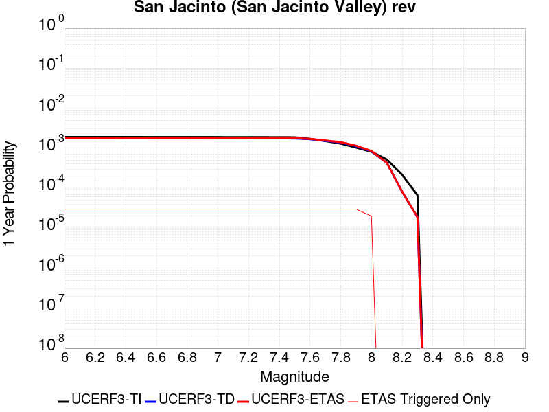 |  |

| Magnitude | 1 wk TI Prob | 1 wk TD Prob | 1 wk ETAS Prob | 1 wk ETAS/TD Gain | 1 wk ETAS Triggered Only | 1 mo TI Prob | 1 mo TD Prob | 1 mo ETAS Prob | 1 mo ETAS/TD Gain | 1 mo ETAS Triggered Only | 1 yr TI Prob | 1 yr TD Prob | 1 yr ETAS Prob | 1 yr ETAS/TD Gain | 1 yr ETAS Triggered Only | 10 yr TI Prob | 10 yr TD Prob | 10 yr ETAS Prob | 10 yr ETAS/TD Gain | 10 yr ETAS Triggered Only |
|-----|-----|-----|-----|-----|-----|-----|-----|-----|-----|-----|-----|-----|-----|-----|-----|-----|-----|-----|-----|-----|
| 6.0 | 3.652694E-5 | 3.4402394E-5 | 4.4402048E-5 | 1.2906674 | 1.0E-5 | 1.5653463E-4 | 1.474305E-4 | 1.7742607E-4 | 1.2034557 | 3.0E-5 | 0.0019041431 | 0.00179349 | 0.0018234362 | 1.0166972 | 3.0E-5 | 0.018879099 | 0.018526595 | 0.01855604 | 1.0015893 | 3.0E-5 |
| 6.1 | 3.652694E-5 | 3.4402394E-5 | 4.4402048E-5 | 1.2906674 | 1.0E-5 | 1.5653463E-4 | 1.474305E-4 | 1.7742607E-4 | 1.2034557 | 3.0E-5 | 0.0019041431 | 0.00179349 | 0.0018234362 | 1.0166972 | 3.0E-5 | 0.018879099 | 0.018526595 | 0.01855604 | 1.0015893 | 3.0E-5 |
| 6.2 | 3.652694E-5 | 3.4402394E-5 | 4.4402048E-5 | 1.2906674 | 1.0E-5 | 1.5653463E-4 | 1.474305E-4 | 1.7742607E-4 | 1.2034557 | 3.0E-5 | 0.0019041431 | 0.00179349 | 0.0018234362 | 1.0166972 | 3.0E-5 | 0.018879099 | 0.018526595 | 0.01855604 | 1.0015893 | 3.0E-5 |
| 6.3 | 3.652694E-5 | 3.4402394E-5 | 4.4402048E-5 | 1.2906674 | 1.0E-5 | 1.5653463E-4 | 1.474305E-4 | 1.7742607E-4 | 1.2034557 | 3.0E-5 | 0.0019041431 | 0.00179349 | 0.0018234362 | 1.0166972 | 3.0E-5 | 0.018879099 | 0.018526595 | 0.01855604 | 1.0015893 | 3.0E-5 |
| 6.4 | 3.646941E-5 | 3.432397E-5 | 4.4323624E-5 | 1.2913316 | 1.0E-5 | 1.5628811E-4 | 1.4709444E-4 | 1.7709003E-4 | 1.2039206 | 3.0E-5 | 0.0019011468 | 0.0017894056 | 0.0018193519 | 1.0167353 | 3.0E-5 | 0.018849645 | 0.018486476 | 0.018515922 | 1.0015928 | 3.0E-5 |
| 6.5 | 3.646941E-5 | 3.432397E-5 | 4.4323624E-5 | 1.2913316 | 1.0E-5 | 1.5628811E-4 | 1.4709444E-4 | 1.7709003E-4 | 1.2039206 | 3.0E-5 | 0.0019011468 | 0.0017894056 | 0.0018193519 | 1.0167353 | 3.0E-5 | 0.018849645 | 0.018486476 | 0.018515922 | 1.0015928 | 3.0E-5 |
| 6.6 | 3.6442503E-5 | 3.4287354E-5 | 4.428701E-5 | 1.2916427 | 1.0E-5 | 1.561728E-4 | 1.4693754E-4 | 1.7693313E-4 | 1.2041384 | 3.0E-5 | 0.0018997455 | 0.0017874985 | 0.0018174448 | 1.0167532 | 3.0E-5 | 0.018835869 | 0.018467745 | 0.018497191 | 1.0015944 | 3.0E-5 |
| 6.7 | 3.6432113E-5 | 3.4272925E-5 | 4.4272583E-5 | 1.2917655 | 1.0E-5 | 1.5612828E-4 | 1.4687571E-4 | 1.7687131E-4 | 1.2042243 | 3.0E-5 | 0.0018992044 | 0.0017867472 | 0.0018166937 | 1.0167602 | 3.0E-5 | 0.018830549 | 0.018460369 | 0.018489815 | 1.0015951 | 3.0E-5 |
| 6.8 | 3.6409598E-5 | 3.424198E-5 | 4.424164E-5 | 1.2920291 | 1.0E-5 | 1.560318E-4 | 1.4674311E-4 | 1.767387E-4 | 1.2044089 | 3.0E-5 | 0.0018980318 | 0.0017851355 | 0.0018150819 | 1.0167755 | 3.0E-5 | 0.018819023 | 0.018444523 | 0.01847397 | 1.0015965 | 3.0E-5 |
| 6.9 | 3.638078E-5 | 3.4202407E-5 | 4.4202065E-5 | 1.2923671 | 1.0E-5 | 1.5590832E-4 | 1.4657351E-4 | 1.7656913E-4 | 1.2046454 | 3.0E-5 | 0.0018965311 | 0.001783074 | 0.0018130206 | 1.0167949 | 3.0E-5 | 0.018804269 | 0.018424258 | 0.018453704 | 1.0015982 | 3.0E-5 |
| 7.0 | 3.6294874E-5 | 3.408442E-5 | 4.4084078E-5 | 1.2933792 | 1.0E-5 | 1.5554018E-4 | 1.4606792E-4 | 1.7606354E-4 | 1.2053539 | 3.0E-5 | 0.0018920569 | 0.001776929 | 0.0018068757 | 1.0168531 | 3.0E-5 | 0.018760284 | 0.018363839 | 0.01839329 | 1.0016036 | 3.0E-5 |
| 7.1 | 3.6260717E-5 | 3.4040702E-5 | 4.404036E-5 | 1.293756 | 1.0E-5 | 1.5539382E-4 | 1.4588058E-4 | 1.7587621E-4 | 1.2056177 | 3.0E-5 | 0.001890278 | 0.0017746518 | 0.0018045986 | 1.0168747 | 3.0E-5 | 0.018742796 | 0.018341439 | 0.01837089 | 1.0016056 | 3.0E-5 |
| 7.2 | 3.6210204E-5 | 3.397492E-5 | 4.397458E-5 | 1.2943248 | 1.0E-5 | 1.5517735E-4 | 1.455987E-4 | 1.7559432E-4 | 1.2060158 | 3.0E-5 | 0.001887647 | 0.0017712255 | 0.0018011723 | 1.0169075 | 3.0E-5 | 0.01871693 | 0.01830772 | 0.01833717 | 1.0016086 | 3.0E-5 |
| 7.3 | 3.6119454E-5 | 3.386321E-5 | 4.386287E-5 | 1.2952957 | 1.0E-5 | 1.5478847E-4 | 1.4511998E-4 | 1.7511562E-4 | 1.2066956 | 3.0E-5 | 0.0018829206 | 0.0017654065 | 0.0017953535 | 1.0169632 | 3.0E-5 | 0.018670462 | 0.018250274 | 0.018279726 | 1.0016139 | 3.0E-5 |
| 7.4 | 3.607848E-5 | 3.381071E-5 | 4.381037E-5 | 1.2957543 | 1.0E-5 | 1.5461289E-4 | 1.44895E-4 | 1.7489065E-4 | 1.2070165 | 3.0E-5 | 0.0018807866 | 0.0017626719 | 0.001792619 | 1.0169896 | 3.0E-5 | 0.018649481 | 0.018223269 | 0.018252721 | 1.0016162 | 3.0E-5 |
| 7.5 | 3.5856774E-5 | 3.3620483E-5 | 4.3620144E-5 | 1.2974278 | 1.0E-5 | 1.5366284E-4 | 1.4407984E-4 | 1.7407551E-4 | 1.2081879 | 3.0E-5 | 0.0018692396 | 0.0017527633 | 0.0017827107 | 1.0170858 | 3.0E-5 | 0.018535944 | 0.018124366 | 0.018153822 | 1.0016252 | 3.0E-5 |
| 7.6 | 3.286655E-5 | 3.2143445E-5 | 4.2143125E-5 | 1.3110954 | 1.0E-5 | 1.4084904E-4 | 1.3775036E-4 | 1.6774623E-4 | 1.2177553 | 3.0E-5 | 0.001713488 | 0.0016758227 | 0.0017057724 | 1.0178716 | 3.0E-5 | 0.017003361 | 0.017344031 | 0.017373512 | 1.0016997 | 3.0E-5 |
| 7.7 | 2.8882527E-5 | 2.9236293E-5 | 3.9236E-5 | 1.3420306 | 1.0E-5 | 1.237764E-4 | 1.2529238E-4 | 1.5528862E-4 | 1.2394099 | 3.0E-5 | 0.0015059357 | 0.0015243685 | 0.0015543228 | 1.0196502 | 3.0E-5 | 0.014957713 | 0.015830461 | 0.015859986 | 1.001865 | 3.0E-5 |
| 7.8 | 2.4950225E-5 | 2.6527203E-5 | 3.6526937E-5 | 1.3769615 | 1.0E-5 | 1.0692515E-4 | 1.1368306E-4 | 1.4367966E-4 | 1.2638615 | 3.0E-5 | 0.0013010362 | 0.0013832134 | 0.0014131719 | 1.0216587 | 3.0E-5 | 0.012934455 | 0.014411755 | 0.014441323 | 1.0020516 | 3.0E-5 |
| 7.9 | 1.9881603E-5 | 2.1507445E-5 | 3.150723E-5 | 1.4649453 | 1.0E-5 | 8.520408E-5 | 9.217151E-5 | 1.2216874E-4 | 1.3254502 | 3.0E-5 | 0.001036866 | 0.0011216112 | 0.0011515776 | 1.0267172 | 3.0E-5 | 0.010320415 | 0.011777027 | 0.011806673 | 1.0025173 | 3.0E-5 |
| 8.0 | 1.563292E-5 | 1.5937347E-5 | 2.5937186E-5 | 1.627447 | 1.0E-5 | 6.6996516E-5 | 6.8301124E-5 | 8.829976E-5 | 1.2928009 | 2.0E-5 | 8.153773E-4 | 8.3124964E-4 | 8.51233E-4 | 1.0240401 | 2.0E-5 | 0.00812392 | 0.008810506 | 0.00883033 | 1.0022501 | 2.0E-5 |
| 8.1 | 1.0045313E-5 | 8.301802E-6 | 8.301802E-6 | 1.0 | 0.0 | 4.305063E-5 | 3.5578672E-5 | 3.5578672E-5 | 1.0 | 0.0 | 5.2401534E-4 | 4.3308473E-4 | 4.3308473E-4 | 1.0 | 0.0 | 0.0052278144 | 0.0046591135 | 0.0046591135 | 1.0 | 0.0 |
| 8.2 | 4.1554413E-6 | 1.5655598E-6 | 1.5655598E-6 | 1.0 | 0.0 | 1.7808914E-5 | 6.709525E-6 | 6.709525E-6 | 1.0 | 0.0 | 2.1680194E-4 | 8.168544E-5 | 8.168544E-5 | 1.0 | 0.0 | 0.0021659054 | 9.482903E-4 | 9.482903E-4 | 1.0 | 0.0 |
| 8.3 | 1.2758221E-6 | 3.6149942E-7 | 3.6149942E-7 | 1.0 | 0.0 | 5.4677976E-6 | 1.5492824E-6 | 1.5492824E-6 | 1.0 | 0.0 | 6.65684E-5 | 1.8862354E-5 | 1.8862354E-5 | 1.0 | 0.0 | 6.6548464E-4 | 2.2751294E-4 | 2.2751294E-4 | 1.0 | 0.0 |

## Great Valley 08 (Quinto)
*[(top)](#table-of-contents)*

| 1 Week | 1 Month | 1 Year | 10 Year |
|-----|-----|-----|-----|
|  |  |  |  |

| Magnitude | 1 wk TI Prob | 1 wk TD Prob | 1 wk ETAS Prob | 1 wk ETAS/TD Gain | 1 wk ETAS Triggered Only | 1 mo TI Prob | 1 mo TD Prob | 1 mo ETAS Prob | 1 mo ETAS/TD Gain | 1 mo ETAS Triggered Only | 1 yr TI Prob | 1 yr TD Prob | 1 yr ETAS Prob | 1 yr ETAS/TD Gain | 1 yr ETAS Triggered Only | 10 yr TI Prob | 10 yr TD Prob | 10 yr ETAS Prob | 10 yr ETAS/TD Gain | 10 yr ETAS Triggered Only |
|-----|-----|-----|-----|-----|-----|-----|-----|-----|-----|-----|-----|-----|-----|-----|-----|-----|-----|-----|-----|-----|
| 6.0 | 7.737697E-6 | 8.253038E-6 | 8.253038E-6 | 1.0 | 0.0 | 3.3161137E-5 | 3.536979E-5 | 4.5369437E-5 | 1.2827171 | 1.0E-5 | 4.0366207E-4 | 4.3056096E-4 | 4.4055664E-4 | 1.0232155 | 1.0E-5 | 0.004029296 | 0.0042991205 | 0.0043289918 | 1.0069481 | 3.0E-5 |
| 6.1 | 7.737697E-6 | 8.253038E-6 | 8.253038E-6 | 1.0 | 0.0 | 3.3161137E-5 | 3.536979E-5 | 4.5369437E-5 | 1.2827171 | 1.0E-5 | 4.0366207E-4 | 4.3056096E-4 | 4.4055664E-4 | 1.0232155 | 1.0E-5 | 0.004029296 | 0.0042991205 | 0.0043289918 | 1.0069481 | 3.0E-5 |
| 6.2 | 7.737697E-6 | 8.253038E-6 | 8.253038E-6 | 1.0 | 0.0 | 3.3161137E-5 | 3.536979E-5 | 4.5369437E-5 | 1.2827171 | 1.0E-5 | 4.0366207E-4 | 4.3056096E-4 | 4.4055664E-4 | 1.0232155 | 1.0E-5 | 0.004029296 | 0.0042991205 | 0.0043289918 | 1.0069481 | 3.0E-5 |
| 6.3 | 5.374012E-6 | 5.7505736E-6 | 5.7505736E-6 | 1.0 | 0.0 | 2.3031276E-5 | 2.4645145E-5 | 3.4644898E-5 | 1.4057494 | 1.0E-5 | 2.803697E-4 | 3.0002446E-4 | 3.1002148E-4 | 1.0333207 | 1.0E-5 | 0.0028001624 | 0.0029972875 | 0.0030271974 | 1.009979 | 3.0E-5 |
| 6.4 | 5.374012E-6 | 5.7505736E-6 | 5.7505736E-6 | 1.0 | 0.0 | 2.3031276E-5 | 2.4645145E-5 | 3.4644898E-5 | 1.4057494 | 1.0E-5 | 2.803697E-4 | 3.0002446E-4 | 3.1002148E-4 | 1.0333207 | 1.0E-5 | 0.0028001624 | 0.0029972875 | 0.0030271974 | 1.009979 | 3.0E-5 |
| 6.5 | 3.65427E-6 | 3.941324E-6 | 3.941324E-6 | 1.0 | 0.0 | 1.5661062E-5 | 1.689132E-5 | 2.689115E-5 | 1.5920101 | 1.0E-5 | 1.9065675E-4 | 2.0563944E-4 | 2.156374E-4 | 1.0486188 | 1.0E-5 | 0.0019049325 | 0.0020551833 | 0.0020651626 | 1.0048558 | 1.0E-5 |
| 6.6 | 3.6143538E-6 | 3.8985104E-6 | 3.8985104E-6 | 1.0 | 0.0 | 1.5489995E-5 | 1.6707834E-5 | 2.6707668E-5 | 1.5985116 | 1.0E-5 | 1.8857437E-4 | 2.0340596E-4 | 2.1340392E-4 | 1.0491527 | 1.0E-5 | 0.0018841444 | 0.0020328893 | 0.0020428689 | 1.0049092 | 1.0E-5 |
| 6.7 | 2.4821015E-6 | 2.6857067E-6 | 2.6857067E-6 | 1.0 | 0.0 | 1.0637535E-5 | 1.1510153E-5 | 1.1510153E-5 | 1.0 | 0.0 | 1.2950429E-4 | 1.4013276E-4 | 1.4013276E-4 | 1.0 | 0.0 | 0.0012942884 | 0.0014009989 | 0.0014009989 | 1.0 | 0.0 |
| 6.8 | 4.7110538E-7 | 5.193021E-7 | 5.193021E-7 | 1.0 | 0.0 | 2.0190216E-6 | 2.2255786E-6 | 2.2255786E-6 | 1.0 | 0.0 | 2.458131E-5 | 2.70961E-5 | 2.70961E-5 | 1.0 | 0.0 | 2.457859E-4 | 2.7092977E-4 | 2.7092977E-4 | 1.0 | 0.0 |
| 6.9 | 3.958685E-7 | 4.3703452E-7 | 4.3703452E-7 | 1.0 | 0.0 | 1.6965782E-6 | 1.8730038E-6 | 1.8730038E-6 | 1.0 | 0.0 | 2.0655643E-5 | 2.28036E-5 | 2.28036E-5 | 1.0 | 0.0 | 2.0653724E-4 | 2.2801422E-4 | 2.2801422E-4 | 1.0 | 0.0 |
| 7.0 | 2.70294E-7 | 2.9920008E-7 | 2.9920008E-7 | 1.0 | 0.0 | 1.1584025E-6 | 1.2822856E-6 | 1.2822856E-6 | 1.0 | 0.0 | 1.4103458E-5 | 1.5611728E-5 | 1.5611728E-5 | 1.0 | 0.0 | 1.4102564E-4 | 1.5610759E-4 | 1.5610759E-4 | 1.0 | 0.0 |
| 7.1 | 1.4828602E-7 | 1.6469107E-7 | 1.6469107E-7 | 1.0 | 0.0 | 6.3551136E-7 | 7.058187E-7 | 7.058187E-7 | 1.0 | 0.0 | 7.737323E-6 | 8.593317E-6 | 8.593317E-6 | 1.0 | 0.0 | 7.737054E-5 | 8.593065E-5 | 8.593065E-5 | 1.0 | 0.0 |

## San Jose
*[(top)](#table-of-contents)*

| 1 Week | 1 Month | 1 Year | 10 Year |
|-----|-----|-----|-----|
|  |  |  |  |

| Magnitude | 1 wk TI Prob | 1 wk TD Prob | 1 wk ETAS Prob | 1 wk ETAS/TD Gain | 1 wk ETAS Triggered Only | 1 mo TI Prob | 1 mo TD Prob | 1 mo ETAS Prob | 1 mo ETAS/TD Gain | 1 mo ETAS Triggered Only | 1 yr TI Prob | 1 yr TD Prob | 1 yr ETAS Prob | 1 yr ETAS/TD Gain | 1 yr ETAS Triggered Only | 10 yr TI Prob | 10 yr TD Prob | 10 yr ETAS Prob | 10 yr ETAS/TD Gain | 10 yr ETAS Triggered Only |
|-----|-----|-----|-----|-----|-----|-----|-----|-----|-----|-----|-----|-----|-----|-----|-----|-----|-----|-----|-----|-----|
| 6.0 | 5.0851277E-6 | 4.1256726E-6 | 4.1256726E-6 | 1.0 | 0.0 | 2.1793223E-5 | 1.768135E-5 | 2.7681173E-5 | 1.5655577 | 1.0E-5 | 2.653002E-4 | 2.152518E-4 | 2.2524965E-4 | 1.0464473 | 1.0E-5 | 0.0026498367 | 0.0021507242 | 0.0021806597 | 1.0139188 | 3.0E-5 |
| 6.1 | 5.0851277E-6 | 4.1256726E-6 | 4.1256726E-6 | 1.0 | 0.0 | 2.1793223E-5 | 1.768135E-5 | 2.7681173E-5 | 1.5655577 | 1.0E-5 | 2.653002E-4 | 2.152518E-4 | 2.2524965E-4 | 1.0464473 | 1.0E-5 | 0.0026498367 | 0.0021507242 | 0.0021806597 | 1.0139188 | 3.0E-5 |
| 6.2 | 5.0851277E-6 | 4.1256726E-6 | 4.1256726E-6 | 1.0 | 0.0 | 2.1793223E-5 | 1.768135E-5 | 2.7681173E-5 | 1.5655577 | 1.0E-5 | 2.653002E-4 | 2.152518E-4 | 2.2524965E-4 | 1.0464473 | 1.0E-5 | 0.0026498367 | 0.0021507242 | 0.0021806597 | 1.0139188 | 3.0E-5 |
| 6.3 | 5.0851277E-6 | 4.1256726E-6 | 4.1256726E-6 | 1.0 | 0.0 | 2.1793223E-5 | 1.768135E-5 | 2.7681173E-5 | 1.5655577 | 1.0E-5 | 2.653002E-4 | 2.152518E-4 | 2.2524965E-4 | 1.0464473 | 1.0E-5 | 0.0026498367 | 0.0021507242 | 0.0021806597 | 1.0139188 | 3.0E-5 |
| 6.4 | 4.3115124E-6 | 3.3237832E-6 | 3.3237832E-6 | 1.0 | 0.0 | 1.8477778E-5 | 1.424472E-5 | 1.424472E-5 | 1.0 | 0.0 | 2.2494372E-4 | 1.7341787E-4 | 1.7341787E-4 | 1.0 | 0.0 | 0.0022471617 | 0.0017330751 | 0.0017530405 | 1.0115201 | 2.0E-5 |
| 6.5 | 4.3115124E-6 | 3.3237832E-6 | 3.3237832E-6 | 1.0 | 0.0 | 1.8477778E-5 | 1.424472E-5 | 1.424472E-5 | 1.0 | 0.0 | 2.2494372E-4 | 1.7341787E-4 | 1.7341787E-4 | 1.0 | 0.0 | 0.0022471617 | 0.0017330751 | 0.0017530405 | 1.0115201 | 2.0E-5 |
| 6.6 | 3.110396E-6 | 2.0799866E-6 | 2.0799866E-6 | 1.0 | 0.0 | 1.33302E-5 | 8.9141995E-6 | 8.9141995E-6 | 1.0 | 0.0 | 1.622831E-4 | 1.0852526E-4 | 1.0852526E-4 | 1.0 | 0.0 | 0.0016216465 | 0.0010847825 | 0.0010847825 | 1.0 | 0.0 |
| 6.7 | 3.110396E-6 | 2.0799866E-6 | 2.0799866E-6 | 1.0 | 0.0 | 1.33302E-5 | 8.9141995E-6 | 8.9141995E-6 | 1.0 | 0.0 | 1.622831E-4 | 1.0852526E-4 | 1.0852526E-4 | 1.0 | 0.0 | 0.0016216465 | 0.0010847825 | 0.0010847825 | 1.0 | 0.0 |
| 6.8 | 2.856651E-6 | 1.902435E-6 | 1.902435E-6 | 1.0 | 0.0 | 1.2242733E-5 | 8.153269E-6 | 8.153269E-6 | 1.0 | 0.0 | 1.4904508E-4 | 9.926178E-5 | 9.926178E-5 | 1.0 | 0.0 | 0.0014894515 | 9.922314E-4 | 9.922314E-4 | 1.0 | 0.0 |
| 6.9 | 2.1618725E-6 | 1.4186642E-6 | 1.4186642E-6 | 1.0 | 0.0 | 9.265135E-6 | 6.0799757E-6 | 6.0799757E-6 | 1.0 | 0.0 | 1.12797185E-4 | 7.402128E-5 | 7.402128E-5 | 1.0 | 0.0 | 0.0011273995 | 7.4000744E-4 | 7.4000744E-4 | 1.0 | 0.0 |
| 7.0 | 1.9684312E-6 | 1.3256331E-6 | 1.3256331E-6 | 1.0 | 0.0 | 8.436106E-6 | 5.681273E-6 | 5.681273E-6 | 1.0 | 0.0 | 1.02704755E-4 | 6.9167385E-5 | 6.9167385E-5 | 1.0 | 0.0 | 0.001026573 | 6.914992E-4 | 6.914992E-4 | 1.0 | 0.0 |
| 7.1 | 1.6070337E-6 | 1.1155087E-6 | 1.1155087E-6 | 1.0 | 0.0 | 6.887269E-6 | 4.780743E-6 | 4.780743E-6 | 1.0 | 0.0 | 8.384928E-5 | 5.8204052E-5 | 5.8204052E-5 | 1.0 | 0.0 | 8.3817646E-4 | 5.819267E-4 | 5.819267E-4 | 1.0 | 0.0 |
| 7.2 | 1.0631658E-6 | 6.4037624E-7 | 6.4037624E-7 | 1.0 | 0.0 | 4.556417E-6 | 2.7444669E-6 | 2.7444669E-6 | 1.0 | 0.0 | 5.5472963E-5 | 3.3413387E-5 | 3.3413387E-5 | 1.0 | 0.0 | 5.545912E-4 | 3.3411747E-4 | 3.3411747E-4 | 1.0 | 0.0 |
| 7.3 | 7.060711E-7 | 4.5824706E-7 | 4.5824706E-7 | 1.0 | 0.0 | 3.0260155E-6 | 1.9639147E-6 | 1.9639147E-6 | 1.0 | 0.0 | 3.6841117E-5 | 2.3910407E-5 | 2.3910407E-5 | 1.0 | 0.0 | 3.6835007E-4 | 2.3911172E-4 | 2.3911172E-4 | 1.0 | 0.0 |
| 7.4 | 3.3677085E-7 | 2.3233133E-7 | 2.3233133E-7 | 1.0 | 0.0 | 1.4433028E-6 | 9.957054E-7 | 9.957054E-7 | 1.0 | 0.0 | 1.757207E-5 | 1.21226485E-5 | 1.21226485E-5 | 1.0 | 0.0 | 1.7570681E-4 | 1.2125263E-4 | 1.2125263E-4 | 1.0 | 0.0 |
| 7.5 | 3.129161E-7 | 1.9530925E-7 | 1.9530925E-7 | 1.0 | 0.0 | 1.3410682E-6 | 8.370394E-7 | 8.370394E-7 | 1.0 | 0.0 | 1.6327383E-5 | 1.0190909E-5 | 1.0190909E-5 | 1.0 | 0.0 | 1.6326184E-4 | 1.0193714E-4 | 1.0193714E-4 | 1.0 | 0.0 |
| 7.6 | 2.8008668E-7 | 1.4242323E-7 | 1.4242323E-7 | 1.0 | 0.0 | 1.2003709E-6 | 6.1038514E-7 | 6.1038514E-7 | 1.0 | 0.0 | 1.46144175E-5 | 7.4314153E-6 | 7.4314153E-6 | 1.0 | 0.0 | 1.4613457E-4 | 7.434427E-5 | 7.434427E-5 | 1.0 | 0.0 |
| 7.7 | 2.7852005E-7 | 1.4016913E-7 | 1.4016913E-7 | 1.0 | 0.0 | 1.1936568E-6 | 6.007248E-7 | 6.007248E-7 | 1.0 | 0.0 | 1.4532674E-5 | 7.3138012E-6 | 7.3138012E-6 | 1.0 | 0.0 | 1.4531724E-4 | 7.316821E-5 | 7.316821E-5 | 1.0 | 0.0 |
| 7.8 | 1.1810797E-7 | 7.5190094E-8 | 7.5190094E-8 | 1.0 | 0.0 | 5.0617695E-7 | 3.222432E-7 | 3.222432E-7 | 1.0 | 0.0 | 6.1626865E-6 | 3.9233046E-6 | 3.9233046E-6 | 1.0 | 0.0 | 6.162516E-5 | 3.9250725E-5 | 3.9250725E-5 | 1.0 | 0.0 |

## Oceanside alt1
*[(top)](#table-of-contents)*

| 1 Week | 1 Month | 1 Year | 10 Year |
|-----|-----|-----|-----|
|  |  |  |  |

| Magnitude | 1 wk TI Prob | 1 wk TD Prob | 1 wk ETAS Prob | 1 wk ETAS/TD Gain | 1 wk ETAS Triggered Only | 1 mo TI Prob | 1 mo TD Prob | 1 mo ETAS Prob | 1 mo ETAS/TD Gain | 1 mo ETAS Triggered Only | 1 yr TI Prob | 1 yr TD Prob | 1 yr ETAS Prob | 1 yr ETAS/TD Gain | 1 yr ETAS Triggered Only | 10 yr TI Prob | 10 yr TD Prob | 10 yr ETAS Prob | 10 yr ETAS/TD Gain | 10 yr ETAS Triggered Only |
|-----|-----|-----|-----|-----|-----|-----|-----|-----|-----|-----|-----|-----|-----|-----|-----|-----|-----|-----|-----|-----|
| 6.0 | 1.1617542E-5 | 1.1423493E-5 | 2.1423379E-5 | 1.8753791 | 1.0E-5 | 4.9788516E-5 | 4.8956997E-5 | 6.895602E-5 | 1.4085017 | 2.0E-5 | 6.060066E-4 | 5.9590454E-4 | 6.2588666E-4 | 1.0503136 | 3.0E-5 | 0.0060435664 | 0.005944664 | 0.005974486 | 1.0050166 | 3.0E-5 |
| 6.1 | 1.1617542E-5 | 1.1423493E-5 | 2.1423379E-5 | 1.8753791 | 1.0E-5 | 4.9788516E-5 | 4.8956997E-5 | 6.895602E-5 | 1.4085017 | 2.0E-5 | 6.060066E-4 | 5.9590454E-4 | 6.2588666E-4 | 1.0503136 | 3.0E-5 | 0.0060435664 | 0.005944664 | 0.005974486 | 1.0050166 | 3.0E-5 |
| 6.2 | 1.1617542E-5 | 1.1423493E-5 | 2.1423379E-5 | 1.8753791 | 1.0E-5 | 4.9788516E-5 | 4.8956997E-5 | 6.895602E-5 | 1.4085017 | 2.0E-5 | 6.060066E-4 | 5.9590454E-4 | 6.2588666E-4 | 1.0503136 | 3.0E-5 | 0.0060435664 | 0.005944664 | 0.005974486 | 1.0050166 | 3.0E-5 |
| 6.3 | 1.1617542E-5 | 1.1423493E-5 | 2.1423379E-5 | 1.8753791 | 1.0E-5 | 4.9788516E-5 | 4.8956997E-5 | 6.895602E-5 | 1.4085017 | 2.0E-5 | 6.060066E-4 | 5.9590454E-4 | 6.2588666E-4 | 1.0503136 | 3.0E-5 | 0.0060435664 | 0.005944664 | 0.005974486 | 1.0050166 | 3.0E-5 |
| 6.4 | 1.1617542E-5 | 1.1423493E-5 | 2.1423379E-5 | 1.8753791 | 1.0E-5 | 4.9788516E-5 | 4.8956997E-5 | 6.895602E-5 | 1.4085017 | 2.0E-5 | 6.060066E-4 | 5.9590454E-4 | 6.2588666E-4 | 1.0503136 | 3.0E-5 | 0.0060435664 | 0.005944664 | 0.005974486 | 1.0050166 | 3.0E-5 |
| 6.5 | 1.1617542E-5 | 1.1423493E-5 | 2.1423379E-5 | 1.8753791 | 1.0E-5 | 4.9788516E-5 | 4.8956997E-5 | 6.895602E-5 | 1.4085017 | 2.0E-5 | 6.060066E-4 | 5.9590454E-4 | 6.2588666E-4 | 1.0503136 | 3.0E-5 | 0.0060435664 | 0.005944664 | 0.005974486 | 1.0050166 | 3.0E-5 |
| 6.6 | 7.561768E-6 | 7.1336153E-6 | 1.7133543E-5 | 2.4018037 | 1.0E-5 | 3.2407173E-5 | 3.0572286E-5 | 5.0571674E-5 | 1.6541673 | 2.0E-5 | 3.9448592E-4 | 3.7215507E-4 | 4.0214392E-4 | 1.0805815 | 3.0E-5 | 0.0039378637 | 0.00371543 | 0.0037453186 | 1.0080445 | 3.0E-5 |
| 6.7 | 7.1042605E-6 | 6.6556854E-6 | 1.6655618E-5 | 2.5024648 | 1.0E-5 | 3.0446476E-5 | 2.8524059E-5 | 4.852349E-5 | 1.7011424 | 2.0E-5 | 3.706228E-4 | 3.472259E-4 | 3.6721895E-4 | 1.0575794 | 2.0E-5 | 0.0037000529 | 0.003466917 | 0.0034868477 | 1.0057489 | 2.0E-5 |
| 6.8 | 6.285554E-6 | 5.799706E-6 | 1.5799647E-5 | 2.7242155 | 1.0E-5 | 2.693781E-5 | 2.4855648E-5 | 4.485515E-5 | 1.8046261 | 2.0E-5 | 3.2791847E-4 | 3.0257605E-4 | 3.2257E-4 | 1.0660791 | 2.0E-5 | 0.0032743502 | 0.0030216982 | 0.0030416378 | 1.0065988 | 2.0E-5 |
| 6.9 | 6.148883E-6 | 5.6565445E-6 | 1.5656487E-5 | 2.7678537 | 1.0E-5 | 2.635209E-5 | 2.424211E-5 | 4.4241628E-5 | 1.8249906 | 2.0E-5 | 3.2078946E-4 | 2.9510827E-4 | 3.1510237E-4 | 1.0677518 | 2.0E-5 | 0.003203268 | 0.0029472208 | 0.0029671618 | 1.0067661 | 2.0E-5 |
| 7.0 | 5.253857E-6 | 4.722404E-6 | 1.4722356E-5 | 3.1175556 | 1.0E-5 | 2.2516335E-5 | 2.0238718E-5 | 4.0238312E-5 | 1.9881848 | 2.0E-5 | 2.7410188E-4 | 2.4637886E-4 | 2.663739E-4 | 1.0811558 | 2.0E-5 | 0.0027376404 | 0.0024610884 | 0.0024810391 | 1.0081065 | 2.0E-5 |
| 7.1 | 4.730754E-6 | 4.17851E-6 | 1.41784685E-5 | 3.3931875 | 1.0E-5 | 2.0274503E-5 | 1.7907778E-5 | 3.790742E-5 | 2.1168132 | 2.0E-5 | 2.468141E-4 | 2.1800565E-4 | 2.3800129E-4 | 1.0917207 | 2.0E-5 | 0.0024654015 | 0.0021779444 | 0.0021979008 | 1.009163 | 2.0E-5 |
| 7.2 | 3.7998386E-6 | 3.214026E-6 | 1.3213994E-5 | 4.1113524 | 1.0E-5 | 1.6284921E-5 | 1.37743245E-5 | 3.377405E-5 | 2.4519567 | 2.0E-5 | 1.9825088E-4 | 1.6768962E-4 | 1.8768627E-4 | 1.1192479 | 2.0E-5 | 0.001980741 | 0.001675643 | 0.0016956095 | 1.0119157 | 2.0E-5 |
| 7.3 | 3.2656465E-6 | 2.698376E-6 | 2.698376E-6 | 1.0 | 0.0 | 1.3995553E-5 | 1.1564418E-5 | 1.1564418E-5 | 1.0 | 0.0 | 1.7038253E-4 | 1.407878E-4 | 1.407878E-4 | 1.0 | 0.0 | 0.0017025196 | 0.0014069972 | 0.0014069972 | 1.0 | 0.0 |
| 7.4 | 2.593703E-6 | 2.0680277E-6 | 2.0680277E-6 | 1.0 | 0.0 | 1.1115822E-5 | 8.862946E-6 | 8.862946E-6 | 1.0 | 0.0 | 1.3532673E-4 | 1.0790111E-4 | 1.0790111E-4 | 1.0 | 0.0 | 0.0013524436 | 0.0010784961 | 0.0010784961 | 1.0 | 0.0 |
| 7.5 | 1.8715585E-6 | 1.4137177E-6 | 1.4137177E-6 | 1.0 | 0.0 | 8.020941E-6 | 6.0587763E-6 | 6.0587763E-6 | 1.0 | 0.0 | 9.7650576E-5 | 7.376316E-5 | 7.376316E-5 | 1.0 | 0.0 | 9.7607676E-4 | 7.3739287E-4 | 7.3739287E-4 | 1.0 | 0.0 |
| 7.6 | 1.2246786E-6 | 8.5268175E-7 | 8.5268175E-7 | 1.0 | 0.0 | 5.248612E-6 | 3.6543456E-6 | 3.6543456E-6 | 1.0 | 0.0 | 6.389998E-5 | 4.4490793E-5 | 4.4490793E-5 | 1.0 | 0.0 | 6.3881604E-4 | 4.4482335E-4 | 4.4482335E-4 | 1.0 | 0.0 |
| 7.7 | 5.140719E-7 | 2.734703E-7 | 2.734703E-7 | 1.0 | 0.0 | 2.2031636E-6 | 1.1720151E-6 | 1.1720151E-6 | 1.0 | 0.0 | 2.6823185E-5 | 1.4269205E-5 | 1.4269205E-5 | 1.0 | 0.0 | 2.6819948E-4 | 1.4268424E-4 | 1.4268424E-4 | 1.0 | 0.0 |
| 7.8 | 1.16056995E-8 | 9.782373E-9 | 9.782373E-9 | 1.0 | 0.0 | 4.9738713E-8 | 4.1924455E-8 | 4.1924455E-8 | 1.0 | 0.0 | 6.0556863E-7 | 5.1043025E-7 | 5.1043025E-7 | 1.0 | 0.0 | 6.05567E-6 | 5.1043025E-6 | 5.1043025E-6 | 1.0 | 0.0 |

## San Pedro Basin
*[(top)](#table-of-contents)*

| 1 Week | 1 Month | 1 Year | 10 Year |
|-----|-----|-----|-----|
|  |  |  |  |

| Magnitude | 1 wk TI Prob | 1 wk TD Prob | 1 wk ETAS Prob | 1 wk ETAS/TD Gain | 1 wk ETAS Triggered Only | 1 mo TI Prob | 1 mo TD Prob | 1 mo ETAS Prob | 1 mo ETAS/TD Gain | 1 mo ETAS Triggered Only | 1 yr TI Prob | 1 yr TD Prob | 1 yr ETAS Prob | 1 yr ETAS/TD Gain | 1 yr ETAS Triggered Only | 10 yr TI Prob | 10 yr TD Prob | 10 yr ETAS Prob | 10 yr ETAS/TD Gain | 10 yr ETAS Triggered Only |
|-----|-----|-----|-----|-----|-----|-----|-----|-----|-----|-----|-----|-----|-----|-----|-----|-----|-----|-----|-----|-----|
| 6.0 | 5.3449043E-5 | 6.336954E-5 | 7.33689E-5 | 1.1577945 | 1.0E-5 | 2.2904722E-4 | 2.715589E-4 | 2.8155622E-4 | 1.0368145 | 1.0E-5 | 0.0027850836 | 0.0033018254 | 0.0033117924 | 1.0030186 | 1.0E-5 | 0.027504366 | 0.03258945 | 0.0326088 | 1.0005937 | 2.0E-5 |
| 6.1 | 5.3449043E-5 | 6.336954E-5 | 7.33689E-5 | 1.1577945 | 1.0E-5 | 2.2904722E-4 | 2.715589E-4 | 2.8155622E-4 | 1.0368145 | 1.0E-5 | 0.0027850836 | 0.0033018254 | 0.0033117924 | 1.0030186 | 1.0E-5 | 0.027504366 | 0.03258945 | 0.0326088 | 1.0005937 | 2.0E-5 |
| 6.2 | 2.3189454E-5 | 2.6642796E-5 | 2.6642796E-5 | 1.0 | 0.0 | 9.9379584E-5 | 1.14178685E-4 | 1.14178685E-4 | 1.0 | 0.0 | 0.0012092749 | 0.0013892864 | 0.0013892864 | 1.0 | 0.0 | 0.012027155 | 0.013810883 | 0.013810883 | 1.0 | 0.0 |
| 6.3 | 2.3189454E-5 | 2.6642796E-5 | 2.6642796E-5 | 1.0 | 0.0 | 9.9379584E-5 | 1.14178685E-4 | 1.14178685E-4 | 1.0 | 0.0 | 0.0012092749 | 0.0013892864 | 0.0013892864 | 1.0 | 0.0 | 0.012027155 | 0.013810883 | 0.013810883 | 1.0 | 0.0 |
| 6.4 | 1.966056E-5 | 2.2463413E-5 | 2.2463413E-5 | 1.0 | 0.0 | 8.425682E-5 | 9.626844E-5 | 9.626844E-5 | 1.0 | 0.0 | 0.001025344 | 0.0011714783 | 0.0011714783 | 1.0 | 0.0 | 0.010206259 | 0.011657117 | 0.011657117 | 1.0 | 0.0 |
| 6.5 | 1.7342953E-5 | 1.9745148E-5 | 1.9745148E-5 | 1.0 | 0.0 | 7.4324824E-5 | 8.4619525E-5 | 8.4619525E-5 | 1.0 | 0.0 | 9.04529E-4 | 0.0010297928 | 0.0010297928 | 1.0 | 0.0 | 0.009008561 | 0.010253931 | 0.010253931 | 1.0 | 0.0 |
| 6.6 | 1.439804E-5 | 1.6322716E-5 | 1.6322716E-5 | 1.0 | 0.0 | 6.170443E-5 | 6.99528E-5 | 6.99528E-5 | 1.0 | 0.0 | 7.509924E-4 | 8.513747E-4 | 8.513747E-4 | 1.0 | 0.0 | 0.0074845953 | 0.008484332 | 0.008484332 | 1.0 | 0.0 |
| 6.7 | 1.2634884E-5 | 1.4285297E-5 | 1.4285297E-5 | 1.0 | 0.0 | 5.414838E-5 | 6.1221435E-5 | 6.1221435E-5 | 1.0 | 0.0 | 6.590571E-4 | 7.4514654E-4 | 7.4514654E-4 | 1.0 | 0.0 | 0.006571059 | 0.007429501 | 0.007429501 | 1.0 | 0.0 |
| 6.8 | 1.146091E-5 | 1.2933192E-5 | 1.2933192E-5 | 1.0 | 0.0 | 4.911726E-5 | 5.5426954E-5 | 5.5426954E-5 | 1.0 | 0.0 | 5.9783855E-4 | 6.7464396E-4 | 6.7464396E-4 | 1.0 | 0.0 | 0.0059623276 | 0.006728899 | 0.006728899 | 1.0 | 0.0 |
| 6.9 | 9.109035E-6 | 1.0235011E-5 | 1.0235011E-5 | 1.0 | 0.0 | 3.9038136E-5 | 4.3863754E-5 | 4.3863754E-5 | 1.0 | 0.0 | 4.7518566E-4 | 5.3393835E-4 | 5.3393835E-4 | 1.0 | 0.0 | 0.0047417083 | 0.005329309 | 0.005329309 | 1.0 | 0.0 |
| 7.0 | 5.9351028E-6 | 6.583964E-6 | 6.583964E-6 | 1.0 | 0.0 | 2.5435906E-5 | 2.8216817E-5 | 2.8216817E-5 | 1.0 | 0.0 | 3.0963816E-4 | 3.435092E-4 | 3.435092E-4 | 1.0 | 0.0 | 0.0030920706 | 0.0034320992 | 0.0034320992 | 1.0 | 0.0 |
| 7.1 | 2.1557585E-6 | 2.209648E-6 | 2.209648E-6 | 1.0 | 0.0 | 9.238933E-6 | 9.469887E-6 | 9.469887E-6 | 1.0 | 0.0 | 1.1247819E-4 | 1.1528993E-4 | 1.1528993E-4 | 1.0 | 0.0 | 0.0011242128 | 0.0011523166 | 0.0011523166 | 1.0 | 0.0 |
| 7.2 | 2.1251979E-6 | 2.1779945E-6 | 2.1779945E-6 | 1.0 | 0.0 | 9.107958E-6 | 9.334229E-6 | 9.334229E-6 | 1.0 | 0.0 | 1.1088375E-4 | 1.1363847E-4 | 1.1363847E-4 | 1.0 | 0.0 | 0.0011082845 | 0.0011358189 | 0.0011358189 | 1.0 | 0.0 |
| 7.3 | 1.7145798E-6 | 1.7442874E-6 | 1.7442874E-6 | 1.0 | 0.0 | 7.3481783E-6 | 7.4754967E-6 | 7.4754967E-6 | 1.0 | 0.0 | 8.94604E-5 | 9.1010465E-5 | 9.1010465E-5 | 1.0 | 0.0 | 8.9424395E-4 | 9.0974104E-4 | 9.0974104E-4 | 1.0 | 0.0 |
| 7.4 | 1.4467993E-6 | 1.4641868E-6 | 1.4641868E-6 | 1.0 | 0.0 | 6.200554E-6 | 6.2750714E-6 | 6.2750714E-6 | 1.0 | 0.0 | 7.548913E-5 | 7.639639E-5 | 7.639639E-5 | 1.0 | 0.0 | 7.546349E-4 | 7.6370855E-4 | 7.6370855E-4 | 1.0 | 0.0 |
| 7.5 | 1.2803735E-6 | 1.2931497E-6 | 1.2931497E-6 | 1.0 | 0.0 | 5.487303E-6 | 5.5420587E-6 | 5.5420587E-6 | 1.0 | 0.0 | 6.680587E-5 | 6.7472545E-5 | 6.7472545E-5 | 1.0 | 0.0 | 6.678579E-4 | 6.7452766E-4 | 6.7452766E-4 | 1.0 | 0.0 |
| 7.6 | 6.755009E-7 | 6.769465E-7 | 6.769465E-7 | 1.0 | 0.0 | 2.8950008E-6 | 2.9011965E-6 | 2.9011965E-6 | 1.0 | 0.0 | 3.5246063E-5 | 3.5321555E-5 | 3.5321555E-5 | 1.0 | 0.0 | 3.5240475E-4 | 3.5316512E-4 | 3.5316512E-4 | 1.0 | 0.0 |
| 7.7 | 6.211885E-8 | 4.569953E-8 | 4.569953E-8 | 1.0 | 0.0 | 2.6622362E-7 | 1.9585512E-7 | 1.9585512E-7 | 1.0 | 0.0 | 3.2412677E-6 | 2.3845337E-6 | 2.3845337E-6 | 1.0 | 0.0 | 3.2412205E-5 | 2.3845101E-5 | 2.3845101E-5 | 1.0 | 0.0 |
| 7.8 | 2.6580573E-9 | 1.5138163E-9 | 1.5138163E-9 | 1.0 | 0.0 | 1.1391674E-8 | 6.487784E-9 | 6.487784E-9 | 1.0 | 0.0 | 1.3869362E-7 | 7.898877E-8 | 7.898877E-8 | 1.0 | 0.0 | 1.3869354E-6 | 7.898877E-7 | 7.898877E-7 | 1.0 | 0.0 |

## Hartley Springs 2011 CFM
*[(top)](#table-of-contents)*

| 1 Week | 1 Month | 1 Year | 10 Year |
|-----|-----|-----|-----|
|  |  |  |  |

| Magnitude | 1 wk TI Prob | 1 wk TD Prob | 1 wk ETAS Prob | 1 wk ETAS/TD Gain | 1 wk ETAS Triggered Only | 1 mo TI Prob | 1 mo TD Prob | 1 mo ETAS Prob | 1 mo ETAS/TD Gain | 1 mo ETAS Triggered Only | 1 yr TI Prob | 1 yr TD Prob | 1 yr ETAS Prob | 1 yr ETAS/TD Gain | 1 yr ETAS Triggered Only | 10 yr TI Prob | 10 yr TD Prob | 10 yr ETAS Prob | 10 yr ETAS/TD Gain | 10 yr ETAS Triggered Only |
|-----|-----|-----|-----|-----|-----|-----|-----|-----|-----|-----|-----|-----|-----|-----|-----|-----|-----|-----|-----|-----|
| 6.0 | 1.4352418E-5 | 1.4434182E-5 | 1.4434182E-5 | 1.0 | 0.0 | 6.1508916E-5 | 6.1860235E-5 | 6.1860235E-5 | 1.0 | 0.0 | 7.486137E-4 | 7.5305253E-4 | 7.5305253E-4 | 1.0 | 0.0 | 0.007460968 | 0.0075211283 | 0.007540978 | 1.0026392 | 2.0E-5 |
| 6.1 | 1.4352418E-5 | 1.4434182E-5 | 1.4434182E-5 | 1.0 | 0.0 | 6.1508916E-5 | 6.1860235E-5 | 6.1860235E-5 | 1.0 | 0.0 | 7.486137E-4 | 7.5305253E-4 | 7.5305253E-4 | 1.0 | 0.0 | 0.007460968 | 0.0075211283 | 0.007540978 | 1.0026392 | 2.0E-5 |
| 6.2 | 1.4352418E-5 | 1.4434182E-5 | 1.4434182E-5 | 1.0 | 0.0 | 6.1508916E-5 | 6.1860235E-5 | 6.1860235E-5 | 1.0 | 0.0 | 7.486137E-4 | 7.5305253E-4 | 7.5305253E-4 | 1.0 | 0.0 | 0.007460968 | 0.0075211283 | 0.007540978 | 1.0026392 | 2.0E-5 |
| 6.3 | 1.4352418E-5 | 1.4434182E-5 | 1.4434182E-5 | 1.0 | 0.0 | 6.1508916E-5 | 6.1860235E-5 | 6.1860235E-5 | 1.0 | 0.0 | 7.486137E-4 | 7.5305253E-4 | 7.5305253E-4 | 1.0 | 0.0 | 0.007460968 | 0.0075211283 | 0.007540978 | 1.0026392 | 2.0E-5 |
| 6.4 | 1.4352418E-5 | 1.4434182E-5 | 1.4434182E-5 | 1.0 | 0.0 | 6.1508916E-5 | 6.1860235E-5 | 6.1860235E-5 | 1.0 | 0.0 | 7.486137E-4 | 7.5305253E-4 | 7.5305253E-4 | 1.0 | 0.0 | 0.007460968 | 0.0075211283 | 0.007540978 | 1.0026392 | 2.0E-5 |
| 6.5 | 1.2279858E-5 | 1.2133106E-5 | 1.2133106E-5 | 1.0 | 0.0 | 5.26269E-5 | 5.1998883E-5 | 5.1998883E-5 | 1.0 | 0.0 | 6.4054417E-4 | 6.3306064E-4 | 6.3306064E-4 | 1.0 | 0.0 | 0.0063870098 | 0.006328085 | 0.006347958 | 1.0031406 | 2.0E-5 |
| 6.6 | 1.2279858E-5 | 1.2133106E-5 | 1.2133106E-5 | 1.0 | 0.0 | 5.26269E-5 | 5.1998883E-5 | 5.1998883E-5 | 1.0 | 0.0 | 6.4054417E-4 | 6.3306064E-4 | 6.3306064E-4 | 1.0 | 0.0 | 0.0063870098 | 0.006328085 | 0.006347958 | 1.0031406 | 2.0E-5 |
| 6.7 | 2.1282601E-6 | 8.8948315E-7 | 8.8948315E-7 | 1.0 | 0.0 | 9.121083E-6 | 3.8120663E-6 | 3.8120663E-6 | 1.0 | 0.0 | 1.11043526E-4 | 4.641118E-5 | 4.641118E-5 | 1.0 | 0.0 | 0.0011098806 | 4.6404017E-4 | 4.6404017E-4 | 1.0 | 0.0 |
| 6.8 | 2.00516E-6 | 8.517597E-7 | 8.517597E-7 | 1.0 | 0.0 | 8.593515E-6 | 3.650395E-6 | 3.650395E-6 | 1.0 | 0.0 | 1.04621024E-4 | 4.444291E-5 | 4.444291E-5 | 1.0 | 0.0 | 0.0010457177 | 4.4436535E-4 | 4.4436535E-4 | 1.0 | 0.0 |
| 6.9 | 2.00516E-6 | 8.517597E-7 | 8.517597E-7 | 1.0 | 0.0 | 8.593515E-6 | 3.650395E-6 | 3.650395E-6 | 1.0 | 0.0 | 1.04621024E-4 | 4.444291E-5 | 4.444291E-5 | 1.0 | 0.0 | 0.0010457177 | 4.4436535E-4 | 4.4436535E-4 | 1.0 | 0.0 |
| 7.0 | 1.8366732E-6 | 8.237307E-7 | 8.237307E-7 | 1.0 | 0.0 | 7.871433E-6 | 3.5302712E-6 | 3.5302712E-6 | 1.0 | 0.0 | 9.583048E-5 | 4.298046E-5 | 4.298046E-5 | 1.0 | 0.0 | 9.5789164E-4 | 4.2974652E-4 | 4.2974652E-4 | 1.0 | 0.0 |
| 7.1 | 1.5097997E-6 | 7.1902616E-7 | 7.1902616E-7 | 1.0 | 0.0 | 6.470554E-6 | 3.0815384E-6 | 3.0815384E-6 | 1.0 | 0.0 | 7.877615E-5 | 3.7517326E-5 | 3.7517326E-5 | 1.0 | 0.0 | 7.874823E-4 | 3.7513362E-4 | 3.7513362E-4 | 1.0 | 0.0 |
| 7.2 | 1.3490993E-6 | 6.405254E-7 | 6.405254E-7 | 1.0 | 0.0 | 5.7818415E-6 | 2.7451074E-6 | 2.7451074E-6 | 1.0 | 0.0 | 7.0391645E-5 | 3.3421402E-5 | 3.3421402E-5 | 1.0 | 0.0 | 7.0369354E-4 | 3.341867E-4 | 3.341867E-4 | 1.0 | 0.0 |
| 7.3 | 7.900015E-7 | 4.0889498E-7 | 4.0889498E-7 | 1.0 | 0.0 | 3.3857161E-6 | 1.752407E-6 | 1.752407E-6 | 1.0 | 0.0 | 4.1220315E-5 | 2.1335554E-5 | 2.1335554E-5 | 1.0 | 0.0 | 4.121267E-4 | 2.1335555E-4 | 2.1335555E-4 | 1.0 | 0.0 |

## Greenville (No) 2011 CFM
*[(top)](#table-of-contents)*

| 1 Week | 1 Month | 1 Year | 10 Year |
|-----|-----|-----|-----|
|  |  |  |  |

| Magnitude | 1 wk TI Prob | 1 wk TD Prob | 1 wk ETAS Prob | 1 wk ETAS/TD Gain | 1 wk ETAS Triggered Only | 1 mo TI Prob | 1 mo TD Prob | 1 mo ETAS Prob | 1 mo ETAS/TD Gain | 1 mo ETAS Triggered Only | 1 yr TI Prob | 1 yr TD Prob | 1 yr ETAS Prob | 1 yr ETAS/TD Gain | 1 yr ETAS Triggered Only | 10 yr TI Prob | 10 yr TD Prob | 10 yr ETAS Prob | 10 yr ETAS/TD Gain | 10 yr ETAS Triggered Only |
|-----|-----|-----|-----|-----|-----|-----|-----|-----|-----|-----|-----|-----|-----|-----|-----|-----|-----|-----|-----|-----|
| 6.0 | 3.286654E-5 | 4.036648E-5 | 5.0366078E-5 | 1.2477202 | 1.0E-5 | 1.4084899E-4 | 1.7298796E-4 | 1.8298623E-4 | 1.0577976 | 1.0E-5 | 0.0017134876 | 0.002104132 | 0.002114111 | 1.0047425 | 1.0E-5 | 0.017003356 | 0.020846982 | 0.020856773 | 1.0004697 | 1.0E-5 |
| 6.1 | 3.286654E-5 | 4.036648E-5 | 5.0366078E-5 | 1.2477202 | 1.0E-5 | 1.4084899E-4 | 1.7298796E-4 | 1.8298623E-4 | 1.0577976 | 1.0E-5 | 0.0017134876 | 0.002104132 | 0.002114111 | 1.0047425 | 1.0E-5 | 0.017003356 | 0.020846982 | 0.020856773 | 1.0004697 | 1.0E-5 |
| 6.2 | 3.1697953E-5 | 3.8929385E-5 | 4.8928996E-5 | 1.2568654 | 1.0E-5 | 1.358413E-4 | 1.6682976E-4 | 1.7682809E-4 | 1.0599314 | 1.0E-5 | 0.0016526132 | 0.002029298 | 0.002039278 | 1.0049179 | 1.0E-5 | 0.01640377 | 0.020112377 | 0.020122174 | 1.0004872 | 1.0E-5 |
| 6.3 | 3.1363317E-5 | 3.851826E-5 | 4.8517875E-5 | 1.2596071 | 1.0E-5 | 1.344073E-4 | 1.6506804E-4 | 1.7506638E-4 | 1.0605711 | 1.0E-5 | 0.0016351803 | 0.0020078886 | 0.0020178687 | 1.0049703 | 1.0E-5 | 0.016232004 | 0.019902144 | 0.019911945 | 1.0004925 | 1.0E-5 |
| 6.4 | 3.0228604E-5 | 3.7125395E-5 | 4.7125024E-5 | 1.2693474 | 1.0E-5 | 1.2954473E-4 | 1.5909935E-4 | 1.6909775E-4 | 1.0628438 | 1.0E-5 | 0.0015760659 | 0.0019353506 | 0.0019453312 | 1.005157 | 1.0E-5 | 0.015649348 | 0.019189484 | 0.019199293 | 1.0005112 | 1.0E-5 |
| 6.5 | 2.9537814E-5 | 3.6280853E-5 | 4.628049E-5 | 1.2756175 | 1.0E-5 | 1.2658449E-4 | 1.554803E-4 | 1.6547875E-4 | 1.0643069 | 1.0E-5 | 0.0015400766 | 0.0018913659 | 0.001901347 | 1.0052772 | 1.0E-5 | 0.01529447 | 0.018757146 | 0.018766958 | 1.0005231 | 1.0E-5 |
| 6.6 | 2.7345395E-5 | 3.3590182E-5 | 4.3589847E-5 | 1.297696 | 1.0E-5 | 1.1718928E-4 | 1.4395016E-4 | 1.5394873E-4 | 1.0694585 | 1.0E-5 | 0.0014258457 | 0.0017512152 | 0.0017611977 | 1.0057003 | 1.0E-5 | 0.014167317 | 0.01737797 | 0.017387796 | 1.0005654 | 1.0E-5 |
| 6.7 | 2.5615784E-5 | 3.1567088E-5 | 4.156677E-5 | 1.3167757 | 1.0E-5 | 1.09777306E-4 | 1.3528067E-4 | 1.4527932E-4 | 1.0739104 | 1.0E-5 | 0.0013357193 | 0.0016458282 | 0.0016558118 | 1.006066 | 1.0E-5 | 0.013277191 | 0.016340064 | 0.0163499 | 1.000602 | 1.0E-5 |
| 6.8 | 2.0059057E-5 | 2.4712073E-5 | 3.4711826E-5 | 1.4046504 | 1.0E-5 | 8.596455E-5 | 1.0590468E-4 | 1.1590362E-4 | 1.0944146 | 1.0E-5 | 0.0010461159 | 0.001288643 | 0.0012986301 | 1.0077502 | 1.0E-5 | 0.0104120495 | 0.012813724 | 0.012823596 | 1.0007704 | 1.0E-5 |
| 6.9 | 1.6321746E-5 | 2.018467E-5 | 3.0184468E-5 | 1.4954154 | 1.0E-5 | 6.9948466E-5 | 8.650293E-5 | 9.6502066E-5 | 1.1155931 | 1.0E-5 | 8.5128983E-4 | 0.0010526767 | 0.0010626662 | 1.0094895 | 1.0E-5 | 0.008480361 | 0.010478431 | 0.010488327 | 1.0009444 | 1.0E-5 |
| 7.0 | 1.22527645E-5 | 1.5135633E-5 | 2.5135481E-5 | 1.6606826 | 1.0E-5 | 5.2510793E-5 | 6.486541E-5 | 7.486476E-5 | 1.1541554 | 1.0E-5 | 6.3913135E-4 | 7.894544E-4 | 7.994465E-4 | 1.0126569 | 1.0E-5 | 0.0063729626 | 0.007867137 | 0.007877057 | 1.0012611 | 1.0E-5 |
| 7.1 | 8.996482E-6 | 1.1164954E-5 | 2.1164842E-5 | 1.8956497 | 1.0E-5 | 3.8555783E-5 | 4.7848935E-5 | 5.7848454E-5 | 1.208981 | 1.0E-5 | 4.6931554E-4 | 5.824063E-4 | 5.9240044E-4 | 1.0171602 | 1.0E-5 | 0.004683256 | 0.0058090906 | 0.005819033 | 1.0017115 | 1.0E-5 |
| 7.2 | 6.0273087E-6 | 7.569474E-6 | 1.7569399E-5 | 2.3210857 | 1.0E-5 | 2.5831067E-5 | 3.2440203E-5 | 4.243988E-5 | 1.3082495 | 1.0E-5 | 3.1444785E-4 | 3.9488857E-4 | 4.0488463E-4 | 1.0253136 | 1.0E-5 | 0.0031400328 | 0.003942066 | 0.0039520264 | 1.0025268 | 1.0E-5 |
| 7.3 | 3.1209995E-6 | 3.9663746E-6 | 3.9663746E-6 | 1.0 | 0.0 | 1.3375643E-5 | 1.699864E-5 | 1.699864E-5 | 1.0 | 0.0 | 1.6283628E-4 | 2.0693893E-4 | 2.0693893E-4 | 1.0 | 0.0 | 0.0016271701 | 0.0020675526 | 0.0020675526 | 1.0 | 0.0 |
| 7.4 | 2.0254208E-6 | 2.6096043E-6 | 2.6096043E-6 | 1.0 | 0.0 | 8.680347E-6 | 1.1183971E-5 | 1.1183971E-5 | 1.0 | 0.0 | 1.0567809E-4 | 1.361564E-4 | 1.361564E-4 | 1.0 | 0.0 | 0.0010562785 | 0.0013607866 | 0.0013607866 | 1.0 | 0.0 |
| 7.5 | 1.6763418E-6 | 2.173353E-6 | 2.173353E-6 | 1.0 | 0.0 | 7.184302E-6 | 9.314337E-6 | 9.314337E-6 | 1.0 | 0.0 | 8.746537E-5 | 1.1339621E-4 | 1.1339621E-4 | 1.0 | 0.0 | 8.743095E-4 | 0.0011334305 | 0.0011334305 | 1.0 | 0.0 |
| 7.6 | 1.1935462E-6 | 1.5458467E-6 | 1.5458467E-6 | 1.0 | 0.0 | 5.115188E-6 | 6.6250404E-6 | 6.6250404E-6 | 1.0 | 0.0 | 6.2275634E-5 | 8.065693E-5 | 8.065693E-5 | 1.0 | 0.0 | 6.2258187E-4 | 8.0630725E-4 | 8.0630725E-4 | 1.0 | 0.0 |
| 7.7 | 3.0464201E-7 | 3.9846822E-7 | 3.9846822E-7 | 1.0 | 0.0 | 1.3056081E-6 | 1.7077199E-6 | 1.7077199E-6 | 1.0 | 0.0 | 1.589566E-5 | 2.0791296E-5 | 2.0791296E-5 | 1.0 | 0.0 | 1.5894524E-4 | 2.0789822E-4 | 2.0789822E-4 | 1.0 | 0.0 |

## San Jacinto (Superstition Mtn)
*[(top)](#table-of-contents)*

| 1 Week | 1 Month | 1 Year | 10 Year |
|-----|-----|-----|-----|
|  |  |  |  |

| Magnitude | 1 wk TI Prob | 1 wk TD Prob | 1 wk ETAS Prob | 1 wk ETAS/TD Gain | 1 wk ETAS Triggered Only | 1 mo TI Prob | 1 mo TD Prob | 1 mo ETAS Prob | 1 mo ETAS/TD Gain | 1 mo ETAS Triggered Only | 1 yr TI Prob | 1 yr TD Prob | 1 yr ETAS Prob | 1 yr ETAS/TD Gain | 1 yr ETAS Triggered Only | 10 yr TI Prob | 10 yr TD Prob | 10 yr ETAS Prob | 10 yr ETAS/TD Gain | 10 yr ETAS Triggered Only |
|-----|-----|-----|-----|-----|-----|-----|-----|-----|-----|-----|-----|-----|-----|-----|-----|-----|-----|-----|-----|-----|
| 6.0 | 6.4193904E-5 | 9.599367E-5 | 9.599367E-5 | 1.0 | 0.0 | 2.7508775E-4 | 4.1134638E-4 | 4.1134638E-4 | 1.0 | 0.0 | 0.0033440501 | 0.0049980893 | 0.0049980893 | 1.0 | 0.0 | 0.03294174 | 0.048823986 | 0.048843008 | 1.0003896 | 2.0E-5 |
| 6.1 | 6.4193904E-5 | 9.599367E-5 | 9.599367E-5 | 1.0 | 0.0 | 2.7508775E-4 | 4.1134638E-4 | 4.1134638E-4 | 1.0 | 0.0 | 0.0033440501 | 0.0049980893 | 0.0049980893 | 1.0 | 0.0 | 0.03294174 | 0.048823986 | 0.048843008 | 1.0003896 | 2.0E-5 |
| 6.2 | 5.7023593E-5 | 8.3144434E-5 | 8.3144434E-5 | 1.0 | 0.0 | 2.4436394E-4 | 3.5629404E-4 | 3.5629404E-4 | 1.0 | 0.0 | 0.002971072 | 0.0043308944 | 0.0043308944 | 1.0 | 0.0 | 0.029316625 | 0.04250403 | 0.04252318 | 1.0004505 | 2.0E-5 |
| 6.3 | 5.6940098E-5 | 8.298979E-5 | 8.298979E-5 | 1.0 | 0.0 | 2.4400617E-4 | 3.5563146E-4 | 3.5563146E-4 | 1.0 | 0.0 | 0.002966728 | 0.00432286 | 0.00432286 | 1.0 | 0.0 | 0.029274331 | 0.042427283 | 0.042446434 | 1.0004514 | 2.0E-5 |
| 6.4 | 5.4171585E-5 | 7.7483564E-5 | 7.7483564E-5 | 1.0 | 0.0 | 2.3214328E-4 | 3.3203943E-4 | 3.3203943E-4 | 1.0 | 0.0 | 0.0028226813 | 0.0040367353 | 0.0040367353 | 1.0 | 0.0 | 0.02787096 | 0.03971653 | 0.03973574 | 1.0004835 | 2.0E-5 |
| 6.5 | 4.375144E-5 | 5.642133E-5 | 5.642133E-5 | 1.0 | 0.0 | 1.874927E-4 | 2.4178992E-4 | 2.4178992E-4 | 1.0 | 0.0 | 0.0022803338 | 0.002940994 | 0.002940994 | 1.0 | 0.0 | 0.022570757 | 0.029236801 | 0.029256217 | 1.0006641 | 2.0E-5 |
| 6.6 | 2.772192E-5 | 2.5488358E-5 | 2.5488358E-5 | 1.0 | 0.0 | 1.1880282E-4 | 1.09231354E-4 | 1.09231354E-4 | 1.0 | 0.0 | 0.0014454646 | 0.0013290998 | 0.0013290998 | 1.0 | 0.0 | 0.014360986 | 0.01354049 | 0.013550354 | 1.0007285 | 1.0E-5 |
| 6.7 | 2.7124124E-5 | 2.4699386E-5 | 2.4699386E-5 | 1.0 | 0.0 | 1.1624106E-4 | 1.05850326E-4 | 1.05850326E-4 | 1.0 | 0.0 | 0.0014143161 | 0.001287985 | 0.001287985 | 1.0 | 0.0 | 0.014053487 | 0.013133943 | 0.013143812 | 1.0007514 | 1.0E-5 |
| 6.8 | 2.5475807E-5 | 2.216446E-5 | 2.216446E-5 | 1.0 | 0.0 | 1.0917746E-4 | 9.4987154E-5 | 9.4987154E-5 | 1.0 | 0.0 | 0.001328425 | 0.001155867 | 0.001155867 | 1.0 | 0.0 | 0.0132051185 | 0.011822182 | 0.011822182 | 1.0 | 0.0 |
| 6.9 | 2.1162023E-5 | 1.7626244E-5 | 1.7626244E-5 | 1.0 | 0.0 | 9.069123E-5 | 7.5538876E-5 | 7.5538876E-5 | 1.0 | 0.0 | 0.0011036064 | 9.193016E-4 | 9.193016E-4 | 1.0 | 0.0 | 0.010981417 | 0.00944688 | 0.00944688 | 1.0 | 0.0 |
| 7.0 | 1.8754288E-5 | 1.6161559E-5 | 1.6161559E-5 | 1.0 | 0.0 | 8.037304E-5 | 6.9261994E-5 | 6.9261994E-5 | 1.0 | 0.0 | 9.781026E-4 | 8.4294105E-4 | 8.4294105E-4 | 1.0 | 0.0 | 0.009738087 | 0.008670042 | 0.008670042 | 1.0 | 0.0 |
| 7.1 | 1.8678527E-5 | 1.6086702E-5 | 1.6086702E-5 | 1.0 | 0.0 | 8.0048376E-5 | 6.89412E-5 | 6.89412E-5 | 1.0 | 0.0 | 9.7415317E-4 | 8.3903834E-4 | 8.3903834E-4 | 1.0 | 0.0 | 0.009698939 | 0.008630998 | 0.008630998 | 1.0 | 0.0 |
| 7.2 | 1.7804578E-5 | 1.5381282E-5 | 1.5381282E-5 | 1.0 | 0.0 | 7.6303106E-5 | 6.5918124E-5 | 6.5918124E-5 | 1.0 | 0.0 | 9.285943E-4 | 8.022599E-4 | 8.022599E-4 | 1.0 | 0.0 | 0.009247236 | 0.008262311 | 0.008262311 | 1.0 | 0.0 |
| 7.3 | 1.6583685E-5 | 1.4530388E-5 | 1.4530388E-5 | 1.0 | 0.0 | 7.1070994E-5 | 6.227162E-5 | 6.227162E-5 | 1.0 | 0.0 | 8.649459E-4 | 7.5789524E-4 | 7.5789524E-4 | 1.0 | 0.0 | 0.00861587 | 0.007817623 | 0.007817623 | 1.0 | 0.0 |
| 7.4 | 1.6387552E-5 | 1.4395274E-5 | 1.4395274E-5 | 1.0 | 0.0 | 7.023047E-5 | 6.169258E-5 | 6.169258E-5 | 1.0 | 0.0 | 8.5472054E-4 | 7.5085036E-4 | 7.5085036E-4 | 1.0 | 0.0 | 0.008514405 | 0.0077470057 | 0.0077470057 | 1.0 | 0.0 |
| 7.5 | 1.5790754E-5 | 1.4035962E-5 | 1.4035962E-5 | 1.0 | 0.0 | 6.767291E-5 | 6.0152746E-5 | 6.0152746E-5 | 1.0 | 0.0 | 8.236062E-4 | 7.321156E-4 | 7.321156E-4 | 1.0 | 0.0 | 0.008205604 | 0.007557569 | 0.007557569 | 1.0 | 0.0 |
| 7.6 | 1.4248672E-5 | 1.3054932E-5 | 1.3054932E-5 | 1.0 | 0.0 | 6.106431E-5 | 5.594852E-5 | 5.594852E-5 | 1.0 | 0.0 | 7.432043E-4 | 6.8096205E-4 | 6.8096205E-4 | 1.0 | 0.0 | 0.007407237 | 0.0070401574 | 0.0070401574 | 1.0 | 0.0 |
| 7.7 | 1.15449975E-5 | 1.090368E-5 | 1.090368E-5 | 1.0 | 0.0 | 4.947762E-5 | 4.6729223E-5 | 4.6729223E-5 | 1.0 | 0.0 | 6.022235E-4 | 5.687805E-4 | 5.687805E-4 | 1.0 | 0.0 | 0.006005941 | 0.0059101824 | 0.0059101824 | 1.0 | 0.0 |
| 7.8 | 9.1391985E-6 | 9.514299E-6 | 9.514299E-6 | 1.0 | 0.0 | 3.9167408E-5 | 4.0774932E-5 | 4.0774932E-5 | 1.0 | 0.0 | 4.767588E-4 | 4.963223E-4 | 4.963223E-4 | 1.0 | 0.0 | 0.0047573727 | 0.0051766867 | 0.0051766867 | 1.0 | 0.0 |
| 7.9 | 6.973017E-6 | 7.3821784E-6 | 7.3821784E-6 | 1.0 | 0.0 | 2.9884017E-5 | 3.1637526E-5 | 3.1637526E-5 | 1.0 | 0.0 | 3.6377716E-4 | 3.8511935E-4 | 3.8511935E-4 | 1.0 | 0.0 | 0.0036318225 | 0.0040517943 | 0.0040517943 | 1.0 | 0.0 |
| 8.0 | 5.7638235E-6 | 6.259972E-6 | 6.259972E-6 | 1.0 | 0.0 | 2.4701867E-5 | 2.6828178E-5 | 2.6828178E-5 | 1.0 | 0.0 | 3.0070372E-4 | 3.2658462E-4 | 3.2658462E-4 | 1.0 | 0.0 | 0.0030029714 | 0.0034534493 | 0.0034534493 | 1.0 | 0.0 |
| 8.1 | 5.1124434E-6 | 5.4956718E-6 | 5.4956718E-6 | 1.0 | 0.0 | 2.1910288E-5 | 2.355267E-5 | 2.355267E-5 | 1.0 | 0.0 | 2.6672508E-4 | 2.867165E-4 | 2.867165E-4 | 1.0 | 0.0 | 0.0026640517 | 0.003040336 | 0.003040336 | 1.0 | 0.0 |
| 8.2 | 1.1075938E-6 | 5.336568E-7 | 5.336568E-7 | 1.0 | 0.0 | 4.7468216E-6 | 2.2870988E-6 | 2.2870988E-6 | 1.0 | 0.0 | 5.779102E-5 | 2.7845093E-5 | 2.7845093E-5 | 1.0 | 0.0 | 5.777599E-4 | 3.1346595E-4 | 3.1346595E-4 | 1.0 | 0.0 |
| 8.3 | 1.3584393E-8 | 4.473836E-9 | 4.473836E-9 | 1.0 | 0.0 | 5.8218827E-8 | 1.9173582E-8 | 1.9173582E-8 | 1.0 | 0.0 | 7.0881396E-7 | 2.3343837E-7 | 2.3343837E-7 | 1.0 | 0.0 | 7.0881174E-6 | 2.6163036E-6 | 2.6163036E-6 | 1.0 | 0.0 |

## Newport-Inglewood (Offshore)
*[(top)](#table-of-contents)*

| 1 Week | 1 Month | 1 Year | 10 Year |
|-----|-----|-----|-----|
|  |  |  |  |

| Magnitude | 1 wk TI Prob | 1 wk TD Prob | 1 wk ETAS Prob | 1 wk ETAS/TD Gain | 1 wk ETAS Triggered Only | 1 mo TI Prob | 1 mo TD Prob | 1 mo ETAS Prob | 1 mo ETAS/TD Gain | 1 mo ETAS Triggered Only | 1 yr TI Prob | 1 yr TD Prob | 1 yr ETAS Prob | 1 yr ETAS/TD Gain | 1 yr ETAS Triggered Only | 10 yr TI Prob | 10 yr TD Prob | 10 yr ETAS Prob | 10 yr ETAS/TD Gain | 10 yr ETAS Triggered Only |
|-----|-----|-----|-----|-----|-----|-----|-----|-----|-----|-----|-----|-----|-----|-----|-----|-----|-----|-----|-----|-----|
| 6.0 | 1.9626508E-5 | 1.8965357E-5 | 2.8965167E-5 | 1.5272672 | 1.0E-5 | 8.411089E-5 | 8.1277634E-5 | 9.127682E-5 | 1.1230251 | 1.0E-5 | 0.001023569 | 9.891186E-4 | 9.991087E-4 | 1.0101 | 1.0E-5 | 0.010188672 | 0.009848503 | 0.009868307 | 1.0020108 | 2.0E-5 |
| 6.1 | 1.331886E-5 | 1.2218092E-5 | 2.221797E-5 | 1.8184484 | 1.0E-5 | 5.707958E-5 | 5.2362207E-5 | 6.236169E-5 | 1.1909674 | 1.0E-5 | 6.947222E-4 | 6.3732493E-4 | 6.4731855E-4 | 1.0156806 | 1.0E-5 | 0.006925544 | 0.006355149 | 0.0063650855 | 1.0015635 | 1.0E-5 |
| 6.2 | 1.2250852E-5 | 1.1076029E-5 | 2.1075919E-5 | 1.9028406 | 1.0E-5 | 5.2502597E-5 | 4.7467838E-5 | 5.7467365E-5 | 1.2106589 | 1.0E-5 | 6.3903164E-4 | 5.777687E-4 | 5.877629E-4 | 1.017298 | 1.0E-5 | 0.006371971 | 0.0057627866 | 0.005772729 | 1.0017253 | 1.0E-5 |
| 6.3 | 1.2106258E-5 | 1.0918891E-5 | 2.0918782E-5 | 1.915834 | 1.0E-5 | 5.1882926E-5 | 4.6794412E-5 | 5.6793946E-5 | 1.2136908 | 1.0E-5 | 6.3149154E-4 | 5.69574E-4 | 5.795683E-4 | 1.017547 | 1.0E-5 | 0.0062970007 | 0.005681259 | 0.0056912024 | 1.0017502 | 1.0E-5 |
| 6.4 | 1.1348758E-5 | 1.0109362E-5 | 2.010926E-5 | 1.9891721 | 1.0E-5 | 4.8636626E-5 | 4.3325123E-5 | 5.332469E-5 | 1.230803 | 1.0E-5 | 5.919901E-4 | 5.273565E-4 | 5.3735124E-4 | 1.0189525 | 1.0E-5 | 0.005904155 | 0.0052611465 | 0.005271094 | 1.0018908 | 1.0E-5 |
| 6.5 | 1.100837E-5 | 9.7433895E-6 | 1.9743291E-5 | 2.026327 | 1.0E-5 | 4.7177873E-5 | 4.1756717E-5 | 5.17563E-5 | 1.2394724 | 1.0E-5 | 5.7423924E-4 | 5.082702E-4 | 5.182651E-4 | 1.0196645 | 1.0E-5 | 0.005727576 | 0.0050711688 | 0.005081118 | 1.001962 | 1.0E-5 |
| 6.6 | 1.0634696E-5 | 9.345544E-6 | 1.934545E-5 | 2.0700188 | 1.0E-5 | 4.557647E-5 | 4.0051716E-5 | 5.0051316E-5 | 1.2496672 | 1.0E-5 | 5.5475225E-4 | 4.8752132E-4 | 4.975164E-4 | 1.020502 | 1.0E-5 | 0.0055336943 | 0.0048646047 | 0.004874556 | 1.0020456 | 1.0E-5 |
| 6.7 | 9.9780855E-6 | 8.667911E-6 | 1.8667824E-5 | 2.1536705 | 1.0E-5 | 4.276252E-5 | 3.7147664E-5 | 4.7147292E-5 | 1.2691859 | 1.0E-5 | 5.205093E-4 | 4.5217964E-4 | 4.621751E-4 | 1.0221051 | 1.0E-5 | 0.0051929182 | 0.004512675 | 0.0045226295 | 1.002206 | 1.0E-5 |
| 6.8 | 9.59546E-6 | 8.27295E-6 | 1.8272867E-5 | 2.2087486 | 1.0E-5 | 4.1122752E-5 | 3.5455025E-5 | 4.5454668E-5 | 1.2820375 | 1.0E-5 | 5.0055445E-4 | 4.315801E-4 | 4.4157577E-4 | 1.0231607 | 1.0E-5 | 0.004994285 | 0.004307495 | 0.004317452 | 1.0023116 | 1.0E-5 |
| 6.9 | 9.000614E-6 | 7.70684E-6 | 1.7706763E-5 | 2.2975388 | 1.0E-5 | 3.857349E-5 | 3.30289E-5 | 4.302857E-5 | 1.3027551 | 1.0E-5 | 4.6953102E-4 | 4.0205332E-4 | 4.120493E-4 | 1.0248623 | 1.0E-5 | 0.004685402 | 0.0040133307 | 0.0040232907 | 1.0024817 | 1.0E-5 |
| 7.0 | 7.4070194E-6 | 6.148904E-6 | 1.6148842E-5 | 2.626296 | 1.0E-5 | 3.1743984E-5 | 2.635218E-5 | 3.6351918E-5 | 1.3794652 | 1.0E-5 | 3.8641447E-4 | 3.207907E-4 | 3.307875E-4 | 1.031163 | 1.0E-5 | 0.0038574322 | 0.0032032963 | 0.0032132643 | 1.0031118 | 1.0E-5 |
| 7.1 | 6.299615E-6 | 5.0565927E-6 | 1.5056542E-5 | 2.9776063 | 1.0E-5 | 2.699807E-5 | 2.1670932E-5 | 3.1670716E-5 | 1.4614376 | 1.0E-5 | 3.2865192E-4 | 2.638118E-4 | 2.7380916E-4 | 1.0378958 | 1.0E-5 | 0.003281663 | 0.002635001 | 0.0026449745 | 1.003785 | 1.0E-5 |
| 7.2 | 5.096653E-6 | 3.892769E-6 | 1.389273E-5 | 3.5688555 | 1.0E-5 | 2.1842614E-5 | 1.668319E-5 | 2.6683023E-5 | 1.5993958 | 1.0E-5 | 2.6590136E-4 | 2.0309901E-4 | 2.1309698E-4 | 1.0492271 | 1.0E-5 | 0.0026558342 | 0.0020291451 | 0.0020391247 | 1.0049182 | 1.0E-5 |
| 7.3 | 3.9753018E-6 | 2.9099103E-6 | 2.9099103E-6 | 1.0 | 0.0 | 1.7036897E-5 | 1.2470985E-5 | 1.2470985E-5 | 1.0 | 0.0 | 2.0740448E-4 | 1.5182374E-4 | 1.5182374E-4 | 1.0 | 0.0 | 0.00207211 | 0.0015172083 | 0.0015172083 | 1.0 | 0.0 |
| 7.4 | 3.0568392E-6 | 2.1449955E-6 | 2.1449955E-6 | 1.0 | 0.0 | 1.3100675E-5 | 9.192806E-6 | 9.192806E-6 | 1.0 | 0.0 | 1.5948903E-4 | 1.1191672E-4 | 1.1191672E-4 | 1.0 | 0.0 | 0.0015937461 | 0.0011186098 | 0.0011186098 | 1.0 | 0.0 |
| 7.5 | 1.7279019E-6 | 1.1469883E-6 | 1.1469883E-6 | 1.0 | 0.0 | 7.405273E-6 | 4.915655E-6 | 4.915655E-6 | 1.0 | 0.0 | 9.015547E-5 | 5.9846494E-5 | 5.9846494E-5 | 1.0 | 0.0 | 9.01189E-4 | 5.9830764E-4 | 5.9830764E-4 | 1.0 | 0.0 |
| 7.6 | 1.1156416E-6 | 7.223012E-7 | 7.223012E-7 | 1.0 | 0.0 | 4.7813123E-6 | 3.095573E-6 | 3.095573E-6 | 1.0 | 0.0 | 5.821092E-5 | 3.7687976E-5 | 3.7687976E-5 | 1.0 | 0.0 | 5.8195676E-4 | 3.7681818E-4 | 3.7681818E-4 | 1.0 | 0.0 |
| 7.7 | 9.117973E-8 | 6.734145E-8 | 6.734145E-8 | 1.0 | 0.0 | 3.907702E-7 | 2.886062E-7 | 2.886062E-7 | 1.0 | 0.0 | 4.757617E-6 | 3.513775E-6 | 3.513775E-6 | 1.0 | 0.0 | 4.7575148E-5 | 3.5137225E-5 | 3.5137225E-5 | 1.0 | 0.0 |

## Malibu Coast alt 1
*[(top)](#table-of-contents)*

| 1 Week | 1 Month | 1 Year | 10 Year |
|-----|-----|-----|-----|
|  |  |  |  |

| Magnitude | 1 wk TI Prob | 1 wk TD Prob | 1 wk ETAS Prob | 1 wk ETAS/TD Gain | 1 wk ETAS Triggered Only | 1 mo TI Prob | 1 mo TD Prob | 1 mo ETAS Prob | 1 mo ETAS/TD Gain | 1 mo ETAS Triggered Only | 1 yr TI Prob | 1 yr TD Prob | 1 yr ETAS Prob | 1 yr ETAS/TD Gain | 1 yr ETAS Triggered Only | 10 yr TI Prob | 10 yr TD Prob | 10 yr ETAS Prob | 10 yr ETAS/TD Gain | 10 yr ETAS Triggered Only |
|-----|-----|-----|-----|-----|-----|-----|-----|-----|-----|-----|-----|-----|-----|-----|-----|-----|-----|-----|-----|-----|
| 6.0 | 1.6572556E-5 | 1.7598066E-5 | 1.7598066E-5 | 1.0 | 0.0 | 7.102331E-5 | 7.541821E-5 | 7.541821E-5 | 1.0 | 0.0 | 8.6436566E-4 | 9.178488E-4 | 9.278396E-4 | 1.010885 | 1.0E-5 | 0.0086101135 | 0.009142512 | 0.00916233 | 1.0021676 | 2.0E-5 |
| 6.1 | 1.6572556E-5 | 1.7598066E-5 | 1.7598066E-5 | 1.0 | 0.0 | 7.102331E-5 | 7.541821E-5 | 7.541821E-5 | 1.0 | 0.0 | 8.6436566E-4 | 9.178488E-4 | 9.278396E-4 | 1.010885 | 1.0E-5 | 0.0086101135 | 0.009142512 | 0.00916233 | 1.0021676 | 2.0E-5 |
| 6.2 | 1.1085717E-5 | 1.1557147E-5 | 1.1557147E-5 | 1.0 | 0.0 | 4.750935E-5 | 4.952971E-5 | 4.952971E-5 | 1.0 | 0.0 | 5.782728E-4 | 6.028609E-4 | 6.128549E-4 | 1.0165776 | 1.0E-5 | 0.0057677035 | 0.0060126255 | 0.0060225655 | 1.0016532 | 1.0E-5 |
| 6.3 | 1.0208568E-5 | 1.0592237E-5 | 1.0592237E-5 | 1.0 | 0.0 | 4.375027E-5 | 4.539453E-5 | 4.539453E-5 | 1.0 | 0.0 | 5.325294E-4 | 5.5254117E-4 | 5.6253566E-4 | 1.0180882 | 1.0E-5 | 0.0053125503 | 0.0055119814 | 0.0055219266 | 1.0018042 | 1.0E-5 |
| 6.4 | 9.0682315E-6 | 9.342637E-6 | 9.342637E-6 | 1.0 | 0.0 | 3.8863272E-5 | 4.003927E-5 | 4.003927E-5 | 1.0 | 0.0 | 4.730576E-4 | 4.8737114E-4 | 4.9736624E-4 | 1.0205083 | 1.0E-5 | 0.0047205184 | 0.004863236 | 0.0048731877 | 1.0020462 | 1.0E-5 |
| 6.5 | 7.605796E-6 | 7.748587E-6 | 7.748587E-6 | 1.0 | 0.0 | 3.259586E-5 | 3.3207816E-5 | 3.3207816E-5 | 1.0 | 0.0 | 3.9678233E-4 | 4.0423148E-4 | 4.0423148E-4 | 1.0 | 0.0 | 0.0039607463 | 0.0040351 | 0.0040351 | 1.0 | 0.0 |
| 6.6 | 5.889873E-6 | 5.8795385E-6 | 5.8795385E-6 | 1.0 | 0.0 | 2.5242069E-5 | 2.519778E-5 | 2.519778E-5 | 1.0 | 0.0 | 3.0727885E-4 | 3.0673988E-4 | 3.0673988E-4 | 1.0 | 0.0 | 0.003068543 | 0.0030631777 | 0.0030631777 | 1.0 | 0.0 |
| 6.7 | 5.66586E-6 | 5.641641E-6 | 5.641641E-6 | 1.0 | 0.0 | 2.428203E-5 | 2.417824E-5 | 2.417824E-5 | 1.0 | 0.0 | 2.955936E-4 | 2.9433038E-4 | 2.9433038E-4 | 1.0 | 0.0 | 0.0029520073 | 0.0029394177 | 0.0029394177 | 1.0 | 0.0 |
| 6.8 | 5.521556E-6 | 5.489427E-6 | 5.489427E-6 | 1.0 | 0.0 | 2.3663597E-5 | 2.3525903E-5 | 2.3525903E-5 | 1.0 | 0.0 | 2.880662E-4 | 2.8639034E-4 | 2.8639034E-4 | 1.0 | 0.0 | 0.0028769306 | 0.002860224 | 0.002860224 | 1.0 | 0.0 |
| 6.9 | 5.29752E-6 | 5.2499317E-6 | 5.2499317E-6 | 1.0 | 0.0 | 2.270346E-5 | 2.2499513E-5 | 2.2499513E-5 | 1.0 | 0.0 | 2.7637955E-4 | 2.7389723E-4 | 2.7389723E-4 | 1.0 | 0.0 | 0.0027603607 | 0.0027356069 | 0.0027356069 | 1.0 | 0.0 |
| 7.0 | 5.106743E-6 | 5.0476788E-6 | 5.0476788E-6 | 1.0 | 0.0 | 2.1885859E-5 | 2.163273E-5 | 2.163273E-5 | 1.0 | 0.0 | 2.6642776E-4 | 2.6334674E-4 | 2.6334674E-4 | 1.0 | 0.0 | 0.0026610855 | 0.0026303562 | 0.0026303562 | 1.0 | 0.0 |
| 7.1 | 4.8469647E-6 | 4.770373E-6 | 4.770373E-6 | 1.0 | 0.0 | 2.0772539E-5 | 2.0444295E-5 | 2.0444295E-5 | 1.0 | 0.0 | 2.528763E-4 | 2.4888094E-4 | 2.4888094E-4 | 1.0 | 0.0 | 0.0025258875 | 0.00248603 | 0.00248603 | 1.0 | 0.0 |
| 7.2 | 4.545514E-6 | 4.4481935E-6 | 4.4481935E-6 | 1.0 | 0.0 | 1.9480629E-5 | 1.9063547E-5 | 1.9063547E-5 | 1.0 | 0.0 | 2.3715083E-4 | 2.3207403E-4 | 2.3207403E-4 | 1.0 | 0.0 | 0.0023689792 | 0.0023183243 | 0.0023183243 | 1.0 | 0.0 |
| 7.3 | 3.794097E-6 | 3.6519348E-6 | 3.6519348E-6 | 1.0 | 0.0 | 1.6260314E-5 | 1.5651056E-5 | 1.5651056E-5 | 1.0 | 0.0 | 1.9795135E-4 | 1.9053498E-4 | 1.9053498E-4 | 1.0 | 0.0 | 0.001977751 | 0.0019037209 | 0.0019037209 | 1.0 | 0.0 |
| 7.4 | 2.808217E-6 | 2.719077E-6 | 2.719077E-6 | 1.0 | 0.0 | 1.203516E-5 | 1.1653135E-5 | 1.1653135E-5 | 1.0 | 0.0 | 1.4651821E-4 | 1.418677E-4 | 1.418677E-4 | 1.0 | 0.0 | 0.0014642165 | 0.001417774 | 0.001417774 | 1.0 | 0.0 |
| 7.5 | 1.83809E-6 | 1.8190691E-6 | 1.8190691E-6 | 1.0 | 0.0 | 7.877505E-6 | 7.795988E-6 | 7.795988E-6 | 1.0 | 0.0 | 9.59044E-5 | 9.491203E-5 | 9.491203E-5 | 1.0 | 0.0 | 9.5863023E-4 | 9.48717E-4 | 9.48717E-4 | 1.0 | 0.0 |
| 7.6 | 1.1292672E-6 | 1.1001447E-6 | 1.1001447E-6 | 1.0 | 0.0 | 4.839708E-6 | 4.714897E-6 | 4.714897E-6 | 1.0 | 0.0 | 5.8921847E-5 | 5.7402376E-5 | 5.7402376E-5 | 1.0 | 0.0 | 5.890623E-4 | 5.738771E-4 | 5.738771E-4 | 1.0 | 0.0 |
| 7.7 | 5.065272E-7 | 4.609151E-7 | 4.609151E-7 | 1.0 | 0.0 | 2.170829E-6 | 1.975349E-6 | 1.975349E-6 | 1.0 | 0.0 | 2.6429525E-5 | 2.404962E-5 | 2.404962E-5 | 1.0 | 0.0 | 2.642638E-4 | 2.4047129E-4 | 2.4047129E-4 | 1.0 | 0.0 |
| 7.8 | 8.952991E-8 | 6.707874E-8 | 6.707874E-8 | 1.0 | 0.0 | 3.8369956E-7 | 2.8748025E-7 | 2.8748025E-7 | 1.0 | 0.0 | 4.671532E-6 | 3.5000667E-6 | 3.5000667E-6 | 1.0 | 0.0 | 4.671434E-5 | 3.5000136E-5 | 3.5000136E-5 | 1.0 | 0.0 |
| 7.9 | 8.007447E-10 | 6.1608785E-10 | 6.1608785E-10 | 1.0 | 0.0 | 3.4317629E-9 | 2.6403764E-9 | 2.6403764E-9 | 1.0 | 0.0 | 4.1781714E-8 | 3.2146584E-8 | 3.2146584E-8 | 1.0 | 0.0 | 4.1781706E-7 | 3.214658E-7 | 3.214658E-7 | 1.0 | 0.0 |

## Earthquake Valley
*[(top)](#table-of-contents)*

| 1 Week | 1 Month | 1 Year | 10 Year |
|-----|-----|-----|-----|
|  |  |  |  |

| Magnitude | 1 wk TI Prob | 1 wk TD Prob | 1 wk ETAS Prob | 1 wk ETAS/TD Gain | 1 wk ETAS Triggered Only | 1 mo TI Prob | 1 mo TD Prob | 1 mo ETAS Prob | 1 mo ETAS/TD Gain | 1 mo ETAS Triggered Only | 1 yr TI Prob | 1 yr TD Prob | 1 yr ETAS Prob | 1 yr ETAS/TD Gain | 1 yr ETAS Triggered Only | 10 yr TI Prob | 10 yr TD Prob | 10 yr ETAS Prob | 10 yr ETAS/TD Gain | 10 yr ETAS Triggered Only |
|-----|-----|-----|-----|-----|-----|-----|-----|-----|-----|-----|-----|-----|-----|-----|-----|-----|-----|-----|-----|-----|
| 6.0 | 1.9416384E-5 | 2.258408E-5 | 3.2583852E-5 | 1.4427798 | 1.0E-5 | 8.321042E-5 | 9.6785996E-5 | 1.0678503E-4 | 1.1033107 | 1.0E-5 | 0.001012616 | 0.0011778527 | 0.0011978291 | 1.01696 | 2.0E-5 | 0.010080142 | 0.011727943 | 0.011747709 | 1.0016854 | 2.0E-5 |
| 6.1 | 1.9416384E-5 | 2.258408E-5 | 3.2583852E-5 | 1.4427798 | 1.0E-5 | 8.321042E-5 | 9.6785996E-5 | 1.0678503E-4 | 1.1033107 | 1.0E-5 | 0.001012616 | 0.0011778527 | 0.0011978291 | 1.01696 | 2.0E-5 | 0.010080142 | 0.011727943 | 0.011747709 | 1.0016854 | 2.0E-5 |
| 6.2 | 1.9416384E-5 | 2.258408E-5 | 3.2583852E-5 | 1.4427798 | 1.0E-5 | 8.321042E-5 | 9.6785996E-5 | 1.0678503E-4 | 1.1033107 | 1.0E-5 | 0.001012616 | 0.0011778527 | 0.0011978291 | 1.01696 | 2.0E-5 | 0.010080142 | 0.011727943 | 0.011747709 | 1.0016854 | 2.0E-5 |
| 6.3 | 1.9416384E-5 | 2.258408E-5 | 3.2583852E-5 | 1.4427798 | 1.0E-5 | 8.321042E-5 | 9.6785996E-5 | 1.0678503E-4 | 1.1033107 | 1.0E-5 | 0.001012616 | 0.0011778527 | 0.0011978291 | 1.01696 | 2.0E-5 | 0.010080142 | 0.011727943 | 0.011747709 | 1.0016854 | 2.0E-5 |
| 6.4 | 1.9416384E-5 | 2.258408E-5 | 3.2583852E-5 | 1.4427798 | 1.0E-5 | 8.321042E-5 | 9.6785996E-5 | 1.0678503E-4 | 1.1033107 | 1.0E-5 | 0.001012616 | 0.0011778527 | 0.0011978291 | 1.01696 | 2.0E-5 | 0.010080142 | 0.011727943 | 0.011747709 | 1.0016854 | 2.0E-5 |
| 6.5 | 1.9389157E-5 | 2.2552667E-5 | 3.255244E-5 | 1.4433966 | 1.0E-5 | 8.309374E-5 | 9.665139E-5 | 1.0665043E-4 | 1.1034546 | 1.0E-5 | 0.0010111968 | 0.0011762156 | 0.0011961921 | 1.0169836 | 2.0E-5 | 0.010066078 | 0.011711745 | 0.011731511 | 1.0016876 | 2.0E-5 |
| 6.6 | 1.9389157E-5 | 2.2552667E-5 | 3.255244E-5 | 1.4433966 | 1.0E-5 | 8.309374E-5 | 9.665139E-5 | 1.0665043E-4 | 1.1034546 | 1.0E-5 | 0.0010111968 | 0.0011762156 | 0.0011961921 | 1.0169836 | 2.0E-5 | 0.010066078 | 0.011711745 | 0.011731511 | 1.0016876 | 2.0E-5 |
| 6.7 | 1.4925434E-5 | 1.7208227E-5 | 2.7208056E-5 | 1.5811074 | 1.0E-5 | 6.396457E-5 | 7.374794E-5 | 8.37472E-5 | 1.135587 | 1.0E-5 | 7.7849044E-4 | 8.9759636E-4 | 9.0758735E-4 | 1.0111308 | 1.0E-5 | 0.007757689 | 0.008948085 | 0.008957995 | 1.0011076 | 1.0E-5 |
| 6.8 | 1.3570335E-5 | 1.5616843E-5 | 2.5616688E-5 | 1.6403242 | 1.0E-5 | 5.8157282E-5 | 6.692807E-5 | 7.6927405E-5 | 1.1494042 | 1.0E-5 | 7.0783484E-4 | 8.1462675E-4 | 8.246186E-4 | 1.0122656 | 1.0E-5 | 0.0070558446 | 0.008124476 | 0.008134395 | 1.0012208 | 1.0E-5 |
| 6.9 | 1.3570335E-5 | 1.5616843E-5 | 2.5616688E-5 | 1.6403242 | 1.0E-5 | 5.8157282E-5 | 6.692807E-5 | 7.6927405E-5 | 1.1494042 | 1.0E-5 | 7.0783484E-4 | 8.1462675E-4 | 8.246186E-4 | 1.0122656 | 1.0E-5 | 0.0070558446 | 0.008124476 | 0.008134395 | 1.0012208 | 1.0E-5 |
| 7.0 | 1.3433392E-5 | 1.5460388E-5 | 2.5460233E-5 | 1.6468043 | 1.0E-5 | 5.757041E-5 | 6.6257584E-5 | 7.625692E-5 | 1.1509161 | 1.0E-5 | 7.0069433E-4 | 8.064695E-4 | 8.1646146E-4 | 1.0123898 | 1.0E-5 | 0.006984891 | 0.008043497 | 0.008053416 | 1.0012332 | 1.0E-5 |
| 7.1 | 8.181609E-6 | 9.416851E-6 | 9.416851E-6 | 1.0 | 0.0 | 3.5063567E-5 | 4.0357685E-5 | 4.0357685E-5 | 1.0 | 0.0 | 4.268153E-4 | 4.9131113E-4 | 4.9131113E-4 | 1.0 | 0.0 | 0.0042599645 | 0.0049088253 | 0.0049088253 | 1.0 | 0.0 |
| 7.2 | 2.0663983E-7 | 1.726294E-7 | 1.726294E-7 | 1.0 | 0.0 | 8.855989E-7 | 7.398401E-7 | 7.398401E-7 | 1.0 | 0.0 | 1.0782113E-5 | 9.00752E-6 | 9.00752E-6 | 1.0 | 0.0 | 1.07815904E-4 | 9.00719E-5 | 9.00719E-5 | 1.0 | 0.0 |
| 7.3 | 2.0462376E-7 | 1.7078433E-7 | 1.7078433E-7 | 1.0 | 0.0 | 8.7695867E-7 | 7.319327E-7 | 7.319327E-7 | 1.0 | 0.0 | 1.0676919E-5 | 8.911247E-6 | 8.911247E-6 | 1.0 | 0.0 | 1.0676406E-4 | 8.910926E-5 | 8.910926E-5 | 1.0 | 0.0 |
| 7.4 | 2.0171088E-7 | 1.6860913E-7 | 1.6860913E-7 | 1.0 | 0.0 | 8.644749E-7 | 7.2261037E-7 | 7.2261037E-7 | 1.0 | 0.0 | 1.0524931E-5 | 8.79775E-6 | 8.79775E-6 | 1.0 | 0.0 | 1.05244326E-4 | 8.7974375E-5 | 8.7974375E-5 | 1.0 | 0.0 |
| 7.5 | 1.4847944E-7 | 1.2559275E-7 | 1.2559275E-7 | 1.0 | 0.0 | 6.363403E-7 | 5.3825454E-7 | 5.3825454E-7 | 1.0 | 0.0 | 7.747416E-6 | 6.5532317E-6 | 6.5532317E-6 | 1.0 | 0.0 | 7.747146E-5 | 6.55306E-5 | 6.55306E-5 | 1.0 | 0.0 |
| 7.6 | 1.3185847E-7 | 1.1123213E-7 | 1.1123213E-7 | 1.0 | 0.0 | 5.6510765E-7 | 4.7670906E-7 | 4.7670906E-7 | 1.0 | 0.0 | 6.8801637E-6 | 5.8039195E-6 | 5.8039195E-6 | 1.0 | 0.0 | 6.8799505E-5 | 5.803789E-5 | 5.803789E-5 | 1.0 | 0.0 |
| 7.7 | 2.8609954E-8 | 1.4170958E-8 | 1.4170958E-8 | 1.0 | 0.0 | 1.2261408E-7 | 6.0732674E-8 | 6.0732674E-8 | 1.0 | 0.0 | 1.4928254E-6 | 7.394201E-7 | 7.394201E-7 | 1.0 | 0.0 | 1.4928154E-5 | 7.394182E-6 | 7.394182E-6 | 1.0 | 0.0 |
| 7.8 | 6.527266E-9 | 2.923417E-9 | 2.923417E-9 | 1.0 | 0.0 | 2.7973995E-8 | 1.2528931E-8 | 1.2528931E-8 | 1.0 | 0.0 | 3.4058334E-7 | 1.5253973E-7 | 1.5253973E-7 | 1.0 | 0.0 | 3.4058282E-6 | 1.5253964E-6 | 1.5253964E-6 | 1.0 | 0.0 |
| 7.9 | 1.2898267E-9 | 7.127684E-10 | 7.127684E-10 | 1.0 | 0.0 | 5.527829E-9 | 3.0547218E-9 | 3.0547218E-9 | 1.0 | 0.0 | 6.7301315E-8 | 3.719124E-8 | 3.719124E-8 | 1.0 | 0.0 | 6.7301295E-7 | 3.719124E-7 | 3.719124E-7 | 1.0 | 0.0 |

## San Andreas (Santa Cruz Mts) 2011 CFM
*[(top)](#table-of-contents)*

| 1 Week | 1 Month | 1 Year | 10 Year |
|-----|-----|-----|-----|
|  |  |  |  |

| Magnitude | 1 wk TI Prob | 1 wk TD Prob | 1 wk ETAS Prob | 1 wk ETAS/TD Gain | 1 wk ETAS Triggered Only | 1 mo TI Prob | 1 mo TD Prob | 1 mo ETAS Prob | 1 mo ETAS/TD Gain | 1 mo ETAS Triggered Only | 1 yr TI Prob | 1 yr TD Prob | 1 yr ETAS Prob | 1 yr ETAS/TD Gain | 1 yr ETAS Triggered Only | 10 yr TI Prob | 10 yr TD Prob | 10 yr ETAS Prob | 10 yr ETAS/TD Gain | 10 yr ETAS Triggered Only |
|-----|-----|-----|-----|-----|-----|-----|-----|-----|-----|-----|-----|-----|-----|-----|-----|-----|-----|-----|-----|-----|
| 6.0 | 1.7221631E-4 | 1.3793171E-4 | 1.4793033E-4 | 1.0724896 | 1.0E-5 | 7.378611E-4 | 5.9100403E-4 | 6.009981E-4 | 1.0169103 | 1.0E-5 | 0.008946515 | 0.007172124 | 0.0071919803 | 1.0027685 | 2.0E-5 | 0.08594794 | 0.0705551 | 0.07057369 | 1.0002635 | 2.0E-5 |
| 6.1 | 1.7221631E-4 | 1.3793171E-4 | 1.4793033E-4 | 1.0724896 | 1.0E-5 | 7.378611E-4 | 5.9100403E-4 | 6.009981E-4 | 1.0169103 | 1.0E-5 | 0.008946515 | 0.007172124 | 0.0071919803 | 1.0027685 | 2.0E-5 | 0.08594794 | 0.0705551 | 0.07057369 | 1.0002635 | 2.0E-5 |
| 6.2 | 1.7221631E-4 | 1.3793171E-4 | 1.4793033E-4 | 1.0724896 | 1.0E-5 | 7.378611E-4 | 5.9100403E-4 | 6.009981E-4 | 1.0169103 | 1.0E-5 | 0.008946515 | 0.007172124 | 0.0071919803 | 1.0027685 | 2.0E-5 | 0.08594794 | 0.0705551 | 0.07057369 | 1.0002635 | 2.0E-5 |
| 6.3 | 1.716926E-4 | 1.3712609E-4 | 1.4712471E-4 | 1.0729156 | 1.0E-5 | 7.3561794E-4 | 5.875529E-4 | 5.97547E-4 | 1.0170097 | 1.0E-5 | 0.008919428 | 0.0071303817 | 0.007150239 | 1.0027848 | 2.0E-5 | 0.08569809 | 0.070167266 | 0.07018586 | 1.000265 | 2.0E-5 |
| 6.4 | 1.6392978E-4 | 1.3588481E-4 | 1.4588344E-4 | 1.0735817 | 1.0E-5 | 7.02367E-4 | 5.822355E-4 | 5.922297E-4 | 1.0171652 | 1.0E-5 | 0.008517839 | 0.007066063 | 0.0070859217 | 1.0028105 | 2.0E-5 | 0.08198654 | 0.06940135 | 0.069419965 | 1.0002682 | 2.0E-5 |
| 6.5 | 1.5742714E-4 | 1.2648388E-4 | 1.364826E-4 | 1.0790515 | 1.0E-5 | 6.745133E-4 | 5.4196286E-4 | 5.519574E-4 | 1.0184414 | 1.0E-5 | 0.00818132 | 0.0065787593 | 0.0065986277 | 1.00302 | 2.0E-5 | 0.078865945 | 0.06486309 | 0.0648818 | 1.0002884 | 2.0E-5 |
| 6.6 | 1.3038084E-4 | 1.1588213E-4 | 1.2588098E-4 | 1.0862846 | 1.0E-5 | 5.5865536E-4 | 4.9654447E-4 | 5.065395E-4 | 1.0201292 | 1.0E-5 | 0.006780438 | 0.0060289134 | 0.0060487925 | 1.0032973 | 2.0E-5 | 0.0657725 | 0.05932738 | 0.05934619 | 1.0003171 | 2.0E-5 |
| 6.7 | 1.2867592E-4 | 1.1314701E-4 | 1.2314587E-4 | 1.0883706 | 1.0E-5 | 5.5135164E-4 | 4.8482692E-4 | 4.9482204E-4 | 1.0206159 | 1.0E-5 | 0.0066920654 | 0.00588703 | 0.0059069125 | 1.0033773 | 2.0E-5 | 0.06494093 | 0.058038417 | 0.058057256 | 1.0003246 | 2.0E-5 |
| 6.8 | 1.2801298E-4 | 1.1252261E-4 | 1.2252148E-4 | 1.088861 | 1.0E-5 | 5.485117E-4 | 4.8215193E-4 | 4.921471E-4 | 1.0207304 | 1.0E-5 | 0.0066577005 | 0.0058546383 | 0.005874521 | 1.0033962 | 2.0E-5 | 0.06461738 | 0.057752274 | 0.057771116 | 1.0003263 | 2.0E-5 |
| 6.9 | 1.269149E-4 | 1.1094465E-4 | 1.2094354E-4 | 1.0901251 | 1.0E-5 | 5.4380763E-4 | 4.7539172E-4 | 4.8538696E-4 | 1.0210253 | 1.0E-5 | 0.006600777 | 0.005772772 | 0.0057926564 | 1.0034446 | 2.0E-5 | 0.06408122 | 0.0570241 | 0.057042956 | 1.0003307 | 2.0E-5 |
| 7.0 | 1.2030331E-4 | 1.0824504E-4 | 1.1824395E-4 | 1.092373 | 1.0E-5 | 5.154837E-4 | 4.638261E-4 | 4.7382145E-4 | 1.0215498 | 1.0E-5 | 0.006257969 | 0.0056326967 | 0.0056525837 | 1.0035307 | 2.0E-5 | 0.06084648 | 0.055696685 | 0.055715572 | 1.000339 | 2.0E-5 |
| 7.1 | 8.049617E-5 | 5.39266E-5 | 6.392606E-5 | 1.1854272 | 1.0E-5 | 3.4493793E-4 | 2.3109373E-4 | 2.4109142E-4 | 1.0432625 | 1.0E-5 | 0.0041915346 | 0.0028099709 | 0.0028299147 | 1.0070975 | 2.0E-5 | 0.041133516 | 0.029618956 | 0.029638363 | 1.0006553 | 2.0E-5 |
| 7.2 | 7.093979E-5 | 4.2937932E-5 | 5.2937503E-5 | 1.2328843 | 1.0E-5 | 3.0399222E-4 | 1.8400686E-4 | 1.9400501E-4 | 1.0543358 | 1.0E-5 | 0.0036948253 | 0.0022380045 | 0.0022579597 | 1.0089165 | 2.0E-5 | 0.03633994 | 0.023941692 | 0.023961212 | 1.0008154 | 2.0E-5 |
| 7.3 | 6.193693E-5 | 2.8894141E-5 | 3.8893853E-5 | 1.3460809 | 1.0E-5 | 2.6541698E-4 | 1.2382616E-4 | 1.3382493E-4 | 1.0807483 | 1.0E-5 | 0.0032266637 | 0.0015065427 | 0.0015265126 | 1.0132555 | 2.0E-5 | 0.031802133 | 0.016499156 | 0.016518826 | 1.0011922 | 2.0E-5 |
| 7.4 | 5.906492E-5 | 2.702346E-5 | 3.702319E-5 | 1.3700389 | 1.0E-5 | 2.5311083E-4 | 1.1580969E-4 | 1.2580854E-4 | 1.0863385 | 1.0E-5 | 0.0030772698 | 0.0014090725 | 0.0014290443 | 1.0141737 | 2.0E-5 | 0.030350044 | 0.015471023 | 0.015490713 | 1.0012728 | 2.0E-5 |
| 7.5 | 5.424296E-5 | 2.4678277E-5 | 3.467803E-5 | 1.4052047 | 1.0E-5 | 2.324491E-4 | 1.05759755E-4 | 1.157587E-4 | 1.0945439 | 1.0E-5 | 0.002826395 | 0.0012868657 | 0.0013068399 | 1.0155216 | 2.0E-5 | 0.027907165 | 0.014163188 | 0.014182904 | 1.0013921 | 2.0E-5 |
| 7.6 | 4.43084E-5 | 1.990431E-5 | 2.9904111E-5 | 1.5023937 | 1.0E-5 | 1.8987931E-4 | 8.53014E-5 | 9.5300544E-5 | 1.1172214 | 1.0E-5 | 0.0023093296 | 0.0010380499 | 0.0010580292 | 1.0192469 | 2.0E-5 | 0.022854783 | 0.011412679 | 0.011432451 | 1.0017325 | 2.0E-5 |
| 7.7 | 4.118098E-5 | 1.8936442E-5 | 2.8936252E-5 | 1.5280724 | 1.0E-5 | 1.7647797E-4 | 8.115366E-5 | 9.115285E-5 | 1.123213 | 1.0E-5 | 0.002146502 | 9.875982E-4 | 0.0010075785 | 1.0202311 | 2.0E-5 | 0.021258866 | 0.010870468 | 0.01089025 | 1.0018198 | 2.0E-5 |
| 7.8 | 3.5408906E-5 | 1.856446E-5 | 2.8564275E-5 | 1.5386536 | 1.0E-5 | 1.5174363E-4 | 7.955955E-5 | 8.955875E-5 | 1.125682 | 1.0E-5 | 0.0018459131 | 9.682073E-4 | 9.88188E-4 | 1.0206367 | 2.0E-5 | 0.018306552 | 0.010652021 | 0.010671807 | 1.0018575 | 2.0E-5 |
| 7.9 | 2.5860836E-5 | 1.7315993E-5 | 2.731582E-5 | 1.5774908 | 1.0E-5 | 1.10827445E-4 | 7.420929E-5 | 8.420855E-5 | 1.134744 | 1.0E-5 | 0.001348489 | 9.031238E-4 | 9.2310575E-4 | 1.0221254 | 2.0E-5 | 0.013403354 | 0.009907599 | 0.0099274 | 1.0019987 | 2.0E-5 |
| 8.0 | 1.9777332E-5 | 1.4839596E-5 | 1.4839596E-5 | 1.0 | 0.0 | 8.4757245E-5 | 6.3596715E-5 | 6.3596715E-5 | 1.0 | 0.0 | 0.0010314309 | 7.740152E-4 | 7.840074E-4 | 1.0129097 | 1.0E-5 | 0.010266567 | 0.008508967 | 0.008518882 | 1.0011653 | 1.0E-5 |
| 8.1 | 1.468494E-5 | 1.2107374E-5 | 1.2107374E-5 | 1.0 | 0.0 | 6.293394E-5 | 5.1887713E-5 | 5.1887713E-5 | 1.0 | 0.0 | 7.6595135E-4 | 6.3155E-4 | 6.4154365E-4 | 1.0158241 | 1.0E-5 | 0.0076331664 | 0.006969149 | 0.0069790795 | 1.0014249 | 1.0E-5 |
| 8.2 | 8.63836E-6 | 5.469061E-6 | 5.469061E-6 | 1.0 | 0.0 | 3.7021015E-5 | 2.3438623E-5 | 2.3438623E-5 | 1.0 | 0.0 | 4.5063766E-4 | 2.8532793E-4 | 2.953251E-4 | 1.0350374 | 1.0E-5 | 0.004497249 | 0.00324569 | 0.0032556574 | 1.003071 | 1.0E-5 |
| 8.3 | 1.983087E-6 | 7.6599065E-7 | 7.6599065E-7 | 1.0 | 0.0 | 8.498917E-6 | 3.282813E-6 | 3.282813E-6 | 1.0 | 0.0 | 1.034694E-4 | 3.9967534E-5 | 3.9967534E-5 | 1.0 | 0.0 | 0.0010342124 | 4.719687E-4 | 4.719687E-4 | 1.0 | 0.0 |

## White Wolf
*[(top)](#table-of-contents)*

| 1 Week | 1 Month | 1 Year | 10 Year |
|-----|-----|-----|-----|
|  |  |  |  |

| Magnitude | 1 wk TI Prob | 1 wk TD Prob | 1 wk ETAS Prob | 1 wk ETAS/TD Gain | 1 wk ETAS Triggered Only | 1 mo TI Prob | 1 mo TD Prob | 1 mo ETAS Prob | 1 mo ETAS/TD Gain | 1 mo ETAS Triggered Only | 1 yr TI Prob | 1 yr TD Prob | 1 yr ETAS Prob | 1 yr ETAS/TD Gain | 1 yr ETAS Triggered Only | 10 yr TI Prob | 10 yr TD Prob | 10 yr ETAS Prob | 10 yr ETAS/TD Gain | 10 yr ETAS Triggered Only |
|-----|-----|-----|-----|-----|-----|-----|-----|-----|-----|-----|-----|-----|-----|-----|-----|-----|-----|-----|-----|-----|
| 6.0 | 2.0037822E-5 | 1.0469162E-6 | 1.10469055E-5 | 10.551853 | 1.0E-5 | 8.587355E-5 | 4.486776E-6 | 1.4486731E-5 | 3.2287617 | 1.0E-5 | 0.001045009 | 5.4625183E-5 | 7.462409E-5 | 1.3661115 | 2.0E-5 | 0.010401085 | 5.461226E-4 | 5.661117E-4 | 1.0366018 | 2.0E-5 |
| 6.1 | 2.0037822E-5 | 1.0469162E-6 | 1.10469055E-5 | 10.551853 | 1.0E-5 | 8.587355E-5 | 4.486776E-6 | 1.4486731E-5 | 3.2287617 | 1.0E-5 | 0.001045009 | 5.4625183E-5 | 7.462409E-5 | 1.3661115 | 2.0E-5 | 0.010401085 | 5.461226E-4 | 5.661117E-4 | 1.0366018 | 2.0E-5 |
| 6.2 | 2.0037822E-5 | 1.0469162E-6 | 1.10469055E-5 | 10.551853 | 1.0E-5 | 8.587355E-5 | 4.486776E-6 | 1.4486731E-5 | 3.2287617 | 1.0E-5 | 0.001045009 | 5.4625183E-5 | 7.462409E-5 | 1.3661115 | 2.0E-5 | 0.010401085 | 5.461226E-4 | 5.661117E-4 | 1.0366018 | 2.0E-5 |
| 6.3 | 2.0037822E-5 | 1.0469162E-6 | 1.10469055E-5 | 10.551853 | 1.0E-5 | 8.587355E-5 | 4.486776E-6 | 1.4486731E-5 | 3.2287617 | 1.0E-5 | 0.001045009 | 5.4625183E-5 | 7.462409E-5 | 1.3661115 | 2.0E-5 | 0.010401085 | 5.461226E-4 | 5.661117E-4 | 1.0366018 | 2.0E-5 |
| 6.4 | 1.132487E-5 | 1.0469162E-6 | 1.10469055E-5 | 10.551853 | 1.0E-5 | 4.8534253E-5 | 4.486776E-6 | 1.4486731E-5 | 3.2287617 | 1.0E-5 | 5.907443E-4 | 5.4625183E-5 | 7.462409E-5 | 1.3661115 | 2.0E-5 | 0.005891764 | 5.461226E-4 | 5.661117E-4 | 1.0366018 | 2.0E-5 |
| 6.5 | 1.132487E-5 | 1.0469162E-6 | 1.10469055E-5 | 10.551853 | 1.0E-5 | 4.8534253E-5 | 4.486776E-6 | 1.4486731E-5 | 3.2287617 | 1.0E-5 | 5.907443E-4 | 5.4625183E-5 | 7.462409E-5 | 1.3661115 | 2.0E-5 | 0.005891764 | 5.461226E-4 | 5.661117E-4 | 1.0366018 | 2.0E-5 |
| 6.6 | 9.347473E-6 | 1.0469162E-6 | 1.10469055E-5 | 10.551853 | 1.0E-5 | 4.0059982E-5 | 4.486776E-6 | 1.4486731E-5 | 3.2287617 | 1.0E-5 | 4.8762115E-4 | 5.4625183E-5 | 7.462409E-5 | 1.3661115 | 2.0E-5 | 0.0048655253 | 5.461226E-4 | 5.661117E-4 | 1.0366018 | 2.0E-5 |
| 6.7 | 7.842647E-6 | 1.0048342E-6 | 1.1004824E-5 | 10.95188 | 1.0E-5 | 3.361091E-5 | 4.3064256E-6 | 1.4306383E-5 | 3.3221016 | 1.0E-5 | 4.0913603E-4 | 5.2429517E-5 | 7.242847E-5 | 1.3814445 | 2.0E-5 | 0.004083836 | 5.2417646E-4 | 5.4416596E-4 | 1.038135 | 2.0E-5 |
| 6.8 | 6.26597E-6 | 9.734822E-7 | 1.0973473E-5 | 11.272391 | 1.0E-5 | 2.685388E-5 | 4.17206E-6 | 1.4172018E-5 | 3.3968873 | 1.0E-5 | 3.2689696E-4 | 5.0793697E-5 | 7.079268E-5 | 1.3937297 | 2.0E-5 | 0.003264165 | 5.078258E-4 | 5.2781566E-4 | 1.0393636 | 2.0E-5 |
| 6.9 | 5.258436E-6 | 9.183254E-7 | 1.0918317E-5 | 11.889377 | 1.0E-5 | 2.2535958E-5 | 3.9356746E-6 | 1.3935635E-5 | 3.5408506 | 1.0E-5 | 2.7434074E-4 | 4.7915833E-5 | 6.791487E-5 | 1.4173785 | 2.0E-5 | 0.0027400232 | 4.790598E-4 | 4.990502E-4 | 1.0417285 | 2.0E-5 |
| 7.0 | 4.675028E-6 | 8.6611794E-7 | 1.086611E-5 | 12.545761 | 1.0E-5 | 2.003568E-5 | 3.7119291E-6 | 1.3711892E-5 | 3.694007 | 1.0E-5 | 2.4390711E-4 | 4.5191846E-5 | 6.519094E-5 | 1.4425377 | 2.0E-5 | 0.0024363957 | 4.518313E-4 | 4.7182225E-4 | 1.0442443 | 2.0E-5 |
| 7.1 | 2.8270078E-6 | 6.8741696E-7 | 1.068741E-5 | 15.547201 | 1.0E-5 | 1.2115692E-5 | 2.9460696E-6 | 1.294604E-5 | 4.394343 | 1.0E-5 | 1.4749856E-4 | 3.5867848E-5 | 5.586713E-5 | 1.5575825 | 2.0E-5 | 0.001474007 | 3.586247E-4 | 3.7861752E-4 | 1.0557486 | 2.0E-5 |
| 7.2 | 1.6881406E-6 | 2.2706382E-7 | 2.2706382E-7 | 1.0 | 0.0 | 7.2348685E-6 | 9.731303E-7 | 9.731303E-7 | 1.0 | 0.0 | 8.808096E-5 | 1.1847799E-5 | 1.1847799E-5 | 1.0 | 0.0 | 8.8046055E-4 | 1.1847183E-4 | 1.1847183E-4 | 1.0 | 0.0 |
| 7.3 | 9.086107E-7 | 1.5266386E-7 | 1.5266386E-7 | 1.0 | 0.0 | 3.8940398E-6 | 6.5427355E-7 | 6.5427355E-7 | 1.0 | 0.0 | 4.7408903E-5 | 7.965752E-6 | 7.965752E-6 | 1.0 | 0.0 | 4.739879E-4 | 7.965475E-5 | 7.965475E-5 | 1.0 | 0.0 |
| 7.4 | 1.9717383E-7 | 9.003913E-8 | 9.003913E-8 | 1.0 | 0.0 | 8.450304E-7 | 3.8588192E-7 | 3.8588192E-7 | 1.0 | 0.0 | 1.0288197E-5 | 4.6981027E-6 | 4.6981027E-6 | 1.0 | 0.0 | 1.028772E-4 | 4.6980065E-5 | 4.6980065E-5 | 1.0 | 0.0 |
| 7.5 | 1.086975E-7 | 6.6597195E-8 | 6.6597195E-8 | 1.0 | 0.0 | 4.6584634E-7 | 2.8541652E-7 | 2.8541652E-7 | 1.0 | 0.0 | 5.6716644E-6 | 3.474941E-6 | 3.474941E-6 | 1.0 | 0.0 | 5.6715195E-5 | 3.474889E-5 | 3.474889E-5 | 1.0 | 0.0 |
| 7.6 | 2.4217808E-8 | 1.5820765E-8 | 1.5820765E-8 | 1.0 | 0.0 | 1.03790605E-7 | 6.780328E-8 | 6.780328E-8 | 1.0 | 0.0 | 1.2636499E-6 | 8.255046E-7 | 8.255046E-7 | 1.0 | 0.0 | 1.2636427E-5 | 8.2550205E-6 | 8.2550205E-6 | 1.0 | 0.0 |

## Cleghorn
*[(top)](#table-of-contents)*

| 1 Week | 1 Month | 1 Year | 10 Year |
|-----|-----|-----|-----|
|  |  |  |  |

| Magnitude | 1 wk TI Prob | 1 wk TD Prob | 1 wk ETAS Prob | 1 wk ETAS/TD Gain | 1 wk ETAS Triggered Only | 1 mo TI Prob | 1 mo TD Prob | 1 mo ETAS Prob | 1 mo ETAS/TD Gain | 1 mo ETAS Triggered Only | 1 yr TI Prob | 1 yr TD Prob | 1 yr ETAS Prob | 1 yr ETAS/TD Gain | 1 yr ETAS Triggered Only | 10 yr TI Prob | 10 yr TD Prob | 10 yr ETAS Prob | 10 yr ETAS/TD Gain | 10 yr ETAS Triggered Only |
|-----|-----|-----|-----|-----|-----|-----|-----|-----|-----|-----|-----|-----|-----|-----|-----|-----|-----|-----|-----|-----|
| 6.0 | 7.9267165E-6 | 9.831582E-6 | 1.9831485E-5 | 2.0171201 | 1.0E-5 | 3.39712E-5 | 4.2134732E-5 | 5.2134314E-5 | 1.2373239 | 1.0E-5 | 4.1352084E-4 | 5.128803E-4 | 5.228751E-4 | 1.0194877 | 1.0E-5 | 0.004127522 | 0.0051320773 | 0.0051519745 | 1.003877 | 2.0E-5 |
| 6.1 | 7.9267165E-6 | 9.831582E-6 | 1.9831485E-5 | 2.0171201 | 1.0E-5 | 3.39712E-5 | 4.2134732E-5 | 5.2134314E-5 | 1.2373239 | 1.0E-5 | 4.1352084E-4 | 5.128803E-4 | 5.228751E-4 | 1.0194877 | 1.0E-5 | 0.004127522 | 0.0051320773 | 0.0051519745 | 1.003877 | 2.0E-5 |
| 6.2 | 7.9267165E-6 | 9.831582E-6 | 1.9831485E-5 | 2.0171201 | 1.0E-5 | 3.39712E-5 | 4.2134732E-5 | 5.2134314E-5 | 1.2373239 | 1.0E-5 | 4.1352084E-4 | 5.128803E-4 | 5.228751E-4 | 1.0194877 | 1.0E-5 | 0.004127522 | 0.0051320773 | 0.0051519745 | 1.003877 | 2.0E-5 |
| 6.3 | 7.9267165E-6 | 9.831582E-6 | 1.9831485E-5 | 2.0171201 | 1.0E-5 | 3.39712E-5 | 4.2134732E-5 | 5.2134314E-5 | 1.2373239 | 1.0E-5 | 4.1352084E-4 | 5.128803E-4 | 5.228751E-4 | 1.0194877 | 1.0E-5 | 0.004127522 | 0.0051320773 | 0.0051519745 | 1.003877 | 2.0E-5 |
| 6.4 | 4.3445207E-6 | 6.0914435E-6 | 6.0914435E-6 | 1.0 | 0.0 | 1.8619241E-5 | 2.610593E-5 | 2.610593E-5 | 1.0 | 0.0 | 2.2666567E-4 | 3.1779436E-4 | 3.1779436E-4 | 1.0 | 0.0 | 0.0022643462 | 0.0031875873 | 0.0031875873 | 1.0 | 0.0 |
| 6.5 | 4.3445207E-6 | 6.0914435E-6 | 6.0914435E-6 | 1.0 | 0.0 | 1.8619241E-5 | 2.610593E-5 | 2.610593E-5 | 1.0 | 0.0 | 2.2666567E-4 | 3.1779436E-4 | 3.1779436E-4 | 1.0 | 0.0 | 0.0022643462 | 0.0031875873 | 0.0031875873 | 1.0 | 0.0 |
| 6.6 | 4.040109E-6 | 5.773851E-6 | 5.773851E-6 | 1.0 | 0.0 | 1.7314638E-5 | 2.4744846E-5 | 2.4744846E-5 | 1.0 | 0.0 | 2.1078532E-4 | 3.012278E-4 | 3.012278E-4 | 1.0 | 0.0 | 0.002105855 | 0.003022377 | 0.003022377 | 1.0 | 0.0 |
| 6.7 | 3.3632055E-6 | 5.067348E-6 | 5.067348E-6 | 1.0 | 0.0 | 1.4413658E-5 | 2.1717027E-5 | 2.1717027E-5 | 1.0 | 0.0 | 1.7547216E-4 | 2.6437303E-4 | 2.6437303E-4 | 1.0 | 0.0 | 0.0017533366 | 0.0026547113 | 0.0026547113 | 1.0 | 0.0 |
| 6.8 | 3.2902772E-6 | 4.9892556E-6 | 4.9892556E-6 | 1.0 | 0.0 | 1.4101111E-5 | 2.1382351E-5 | 2.1382351E-5 | 1.0 | 0.0 | 1.716675E-4 | 2.6029933E-4 | 2.6029933E-4 | 1.0 | 0.0 | 0.0017153495 | 0.0026140702 | 0.0026140702 | 1.0 | 0.0 |
| 6.9 | 3.031547E-6 | 4.6910186E-6 | 4.6910186E-6 | 1.0 | 0.0 | 1.299228E-5 | 2.0104211E-5 | 2.0104211E-5 | 1.0 | 0.0 | 1.5816953E-4 | 2.4474156E-4 | 2.4474156E-4 | 1.0 | 0.0 | 0.00158057 | 0.0024588439 | 0.0024588439 | 1.0 | 0.0 |
| 7.0 | 2.8259715E-6 | 4.3705895E-6 | 4.3705895E-6 | 1.0 | 0.0 | 1.211125E-5 | 1.8730963E-5 | 1.8730963E-5 | 1.0 | 0.0 | 1.4744449E-4 | 2.2802586E-4 | 2.2802586E-4 | 1.0 | 0.0 | 0.001473467 | 0.0022920412 | 0.0022920412 | 1.0 | 0.0 |
| 7.1 | 2.5962665E-6 | 4.0658106E-6 | 4.0658106E-6 | 1.0 | 0.0 | 1.1126809E-5 | 1.7424789E-5 | 1.7424789E-5 | 1.0 | 0.0 | 1.3546048E-4 | 2.1212637E-4 | 2.1212637E-4 | 1.0 | 0.0 | 0.0013537793 | 0.002133366 | 0.002133366 | 1.0 | 0.0 |
| 7.2 | 2.3247253E-6 | 3.676367E-6 | 3.676367E-6 | 1.0 | 0.0 | 9.96307E-6 | 1.5755764E-5 | 1.5755764E-5 | 1.0 | 0.0 | 1.21293626E-4 | 1.9180974E-4 | 1.9180974E-4 | 1.0 | 0.0 | 0.0012122744 | 0.0019305905 | 0.0019305905 | 1.0 | 0.0 |
| 7.3 | 2.056928E-6 | 3.2350938E-6 | 3.2350938E-6 | 1.0 | 0.0 | 8.815376E-6 | 1.3864615E-5 | 1.3864615E-5 | 1.0 | 0.0 | 1.0732192E-4 | 1.6878877E-4 | 1.6878877E-4 | 1.0 | 0.0 | 0.001072701 | 0.0017008206 | 0.0017008206 | 1.0 | 0.0 |
| 7.4 | 1.8055999E-6 | 2.8255042E-6 | 2.8255042E-6 | 1.0 | 0.0 | 7.738263E-6 | 1.2109248E-5 | 1.2109248E-5 | 1.0 | 0.0 | 9.4209274E-5 | 1.4742027E-4 | 1.4742027E-4 | 1.0 | 0.0 | 9.4169343E-4 | 0.0014875771 | 0.0014875771 | 1.0 | 0.0 |
| 7.5 | 1.4683443E-6 | 2.4247483E-6 | 2.4247483E-6 | 1.0 | 0.0 | 6.292889E-6 | 1.0391738E-5 | 1.0391738E-5 | 1.0 | 0.0 | 7.661323E-5 | 1.2651215E-4 | 1.2651215E-4 | 1.0 | 0.0 | 7.658682E-4 | 0.0012787961 | 0.0012787961 | 1.0 | 0.0 |
| 7.6 | 9.804088E-7 | 1.900266E-6 | 1.900266E-6 | 1.0 | 0.0 | 4.201745E-6 | 8.143972E-6 | 8.143972E-6 | 1.0 | 0.0 | 5.1155046E-5 | 9.91484E-5 | 9.91484E-5 | 1.0 | 0.0 | 5.114327E-4 | 0.001005471 | 0.001005471 | 1.0 | 0.0 |
| 7.7 | 7.3434086E-7 | 1.6284146E-6 | 1.6284146E-6 | 1.0 | 0.0 | 3.1471714E-6 | 6.978901E-6 | 6.978901E-6 | 1.0 | 0.0 | 3.831614E-5 | 8.4964835E-5 | 8.4964835E-5 | 1.0 | 0.0 | 3.8309532E-4 | 8.637868E-4 | 8.637868E-4 | 1.0 | 0.0 |
| 7.8 | 6.434184E-7 | 1.5220047E-6 | 1.5220047E-6 | 1.0 | 0.0 | 2.7575045E-6 | 6.5228614E-6 | 6.5228614E-6 | 1.0 | 0.0 | 3.35721E-5 | 7.941297E-5 | 7.941297E-5 | 1.0 | 0.0 | 3.3567028E-4 | 8.079678E-4 | 8.079678E-4 | 1.0 | 0.0 |
| 7.9 | 3.4943926E-7 | 7.574459E-7 | 7.574459E-7 | 1.0 | 0.0 | 1.497596E-6 | 3.2461926E-6 | 3.2461926E-6 | 1.0 | 0.0 | 1.8233079E-5 | 3.952169E-5 | 3.952169E-5 | 1.0 | 0.0 | 1.8231584E-4 | 4.040099E-4 | 4.040099E-4 | 1.0 | 0.0 |
| 8.0 | 6.717524E-8 | 5.838828E-8 | 5.838828E-8 | 1.0 | 0.0 | 2.8789387E-7 | 2.5023547E-7 | 2.5023547E-7 | 1.0 | 0.0 | 3.505102E-6 | 3.0466126E-6 | 3.0466126E-6 | 1.0 | 0.0 | 3.5050467E-5 | 3.273506E-5 | 3.273506E-5 | 1.0 | 0.0 |
| 8.1 | 3.1984914E-8 | 1.2956093E-8 | 1.2956093E-8 | 1.0 | 0.0 | 1.370782E-7 | 5.552611E-8 | 5.552611E-8 | 1.0 | 0.0 | 1.6689258E-6 | 6.760302E-7 | 6.760302E-7 | 1.0 | 0.0 | 1.6689133E-5 | 7.74454E-6 | 7.74454E-6 | 1.0 | 0.0 |
| 8.2 | 1.21887656E-8 | 3.6495305E-9 | 3.6495305E-9 | 1.0 | 0.0 | 5.2237567E-8 | 1.5640845E-8 | 1.5640845E-8 | 1.0 | 0.0 | 6.359922E-7 | 1.9042727E-7 | 1.9042727E-7 | 1.0 | 0.0 | 6.3599036E-6 | 2.2470974E-6 | 2.2470974E-6 | 1.0 | 0.0 |

## Carlsbad
*[(top)](#table-of-contents)*

| 1 Week | 1 Month | 1 Year | 10 Year |
|-----|-----|-----|-----|
|  |  |  |  |

| Magnitude | 1 wk TI Prob | 1 wk TD Prob | 1 wk ETAS Prob | 1 wk ETAS/TD Gain | 1 wk ETAS Triggered Only | 1 mo TI Prob | 1 mo TD Prob | 1 mo ETAS Prob | 1 mo ETAS/TD Gain | 1 mo ETAS Triggered Only | 1 yr TI Prob | 1 yr TD Prob | 1 yr ETAS Prob | 1 yr ETAS/TD Gain | 1 yr ETAS Triggered Only | 10 yr TI Prob | 10 yr TD Prob | 10 yr ETAS Prob | 10 yr ETAS/TD Gain | 10 yr ETAS Triggered Only |
|-----|-----|-----|-----|-----|-----|-----|-----|-----|-----|-----|-----|-----|-----|-----|-----|-----|-----|-----|-----|-----|
| 6.0 | 4.9038536E-6 | 4.9872565E-6 | 4.9872565E-6 | 1.0 | 0.0 | 2.1016345E-5 | 2.1373784E-5 | 3.137357E-5 | 1.4678528 | 1.0E-5 | 2.5584397E-4 | 2.601952E-4 | 2.8019E-4 | 1.0768454 | 2.0E-5 | 0.002555496 | 0.0025989525 | 0.0026189005 | 1.0076754 | 2.0E-5 |
| 6.1 | 4.9038536E-6 | 4.9872565E-6 | 4.9872565E-6 | 1.0 | 0.0 | 2.1016345E-5 | 2.1373784E-5 | 3.137357E-5 | 1.4678528 | 1.0E-5 | 2.5584397E-4 | 2.601952E-4 | 2.8019E-4 | 1.0768454 | 2.0E-5 | 0.002555496 | 0.0025989525 | 0.0026189005 | 1.0076754 | 2.0E-5 |
| 6.2 | 4.3820614E-6 | 4.4547687E-6 | 4.4547687E-6 | 1.0 | 0.0 | 1.8780129E-5 | 1.9091729E-5 | 2.9091538E-5 | 1.523777 | 1.0E-5 | 2.2862408E-4 | 2.3241735E-4 | 2.524127E-4 | 1.0860322 | 2.0E-5 | 0.00228389 | 0.0023217786 | 0.0023417321 | 1.008594 | 2.0E-5 |
| 6.3 | 4.302872E-6 | 4.373006E-6 | 4.373006E-6 | 1.0 | 0.0 | 1.8440749E-5 | 1.8741322E-5 | 2.8741135E-5 | 1.5335703 | 1.0E-5 | 2.24493E-4 | 2.2815206E-4 | 2.481475E-4 | 1.0876409 | 2.0E-5 | 0.0022426634 | 0.0022792136 | 0.002299168 | 1.008755 | 2.0E-5 |
| 6.4 | 4.0835243E-6 | 4.1476546E-6 | 4.1476546E-6 | 1.0 | 0.0 | 1.75007E-5 | 1.7775543E-5 | 2.7775364E-5 | 1.5625607 | 1.0E-5 | 2.1305021E-4 | 2.1639607E-4 | 2.3639174E-4 | 1.0924032 | 2.0E-5 | 0.0021284607 | 0.0021618877 | 0.0021818443 | 1.0092312 | 2.0E-5 |
| 6.5 | 3.987806E-6 | 4.0488867E-6 | 4.0488867E-6 | 1.0 | 0.0 | 1.7090486E-5 | 1.7352257E-5 | 2.7352084E-5 | 1.5762839 | 1.0E-5 | 2.080568E-4 | 2.1124359E-4 | 2.3123936E-4 | 1.0946574 | 2.0E-5 | 0.002078621 | 0.0021104617 | 0.0021304195 | 1.0094566 | 2.0E-5 |
| 6.6 | 3.8707576E-6 | 3.927488E-6 | 3.927488E-6 | 1.0 | 0.0 | 1.6588854E-5 | 1.6831984E-5 | 2.6831816E-5 | 1.594097 | 1.0E-5 | 2.0195059E-4 | 2.0491047E-4 | 2.2490637E-4 | 1.0975837 | 2.0E-5 | 0.0020176715 | 0.0020472489 | 0.0020672078 | 1.0097492 | 2.0E-5 |
| 6.7 | 3.3093434E-6 | 3.3423917E-6 | 3.3423917E-6 | 1.0 | 0.0 | 1.4182823E-5 | 1.4324457E-5 | 2.4324314E-5 | 1.6980968 | 1.0E-5 | 1.7266218E-4 | 1.7438637E-4 | 1.8438463E-4 | 1.057334 | 1.0E-5 | 0.001725281 | 0.0017425013 | 0.0017524839 | 1.0057288 | 1.0E-5 |
| 6.8 | 3.136983E-6 | 3.1664536E-6 | 3.1664536E-6 | 1.0 | 0.0 | 1.3444143E-5 | 1.3570445E-5 | 2.3570308E-5 | 1.7368855 | 1.0E-5 | 1.6367015E-4 | 1.6520769E-4 | 1.7520603E-4 | 1.0605198 | 1.0E-5 | 0.0016354966 | 0.0016508545 | 0.0016608379 | 1.0060475 | 1.0E-5 |
| 6.9 | 2.9056644E-6 | 2.9267585E-6 | 2.9267585E-6 | 1.0 | 0.0 | 1.2452788E-5 | 1.2543191E-5 | 2.2543065E-5 | 1.7972354 | 1.0E-5 | 1.5160214E-4 | 1.5270269E-4 | 1.6270117E-4 | 1.0654768 | 1.0E-5 | 0.0015149876 | 0.001525983 | 0.0015359677 | 1.0065432 | 1.0E-5 |
| 7.0 | 2.5071035E-6 | 2.5113977E-6 | 2.5113977E-6 | 1.0 | 0.0 | 1.0744685E-5 | 1.07630885E-5 | 2.0762982E-5 | 1.9290913 | 1.0E-5 | 1.308087E-4 | 1.3103275E-4 | 1.4103144E-4 | 1.0763068 | 1.0E-5 | 0.0013073172 | 0.0013095582 | 0.0013195451 | 1.0076262 | 1.0E-5 |
| 7.1 | 2.1786877E-6 | 2.1678832E-6 | 2.1678832E-6 | 1.0 | 0.0 | 9.3372E-6 | 9.290896E-6 | 1.9290803E-5 | 2.0763125 | 1.0E-5 | 1.13674476E-4 | 1.1311081E-4 | 1.2310968E-4 | 1.0883989 | 1.0E-5 | 0.0011361635 | 0.0011305353 | 0.0011405239 | 1.0088353 | 1.0E-5 |
| 7.2 | 1.6628418E-6 | 1.6213872E-6 | 1.6213872E-6 | 1.0 | 0.0 | 7.1264453E-6 | 6.948784E-6 | 1.6948716E-5 | 2.4390907 | 1.0E-5 | 8.676102E-5 | 8.4598185E-5 | 9.459734E-5 | 1.1181959 | 1.0E-5 | 8.672715E-4 | 8.45662E-4 | 8.5565355E-4 | 1.0118151 | 1.0E-5 |
| 7.3 | 1.0595926E-6 | 9.816804E-7 | 9.816804E-7 | 1.0 | 0.0 | 4.541103E-6 | 4.2071947E-6 | 4.2071947E-6 | 1.0 | 0.0 | 5.5286528E-5 | 5.1221403E-5 | 5.1221403E-5 | 1.0 | 0.0 | 5.527277E-4 | 5.1209686E-4 | 5.1209686E-4 | 1.0 | 0.0 |
| 7.4 | 7.956623E-7 | 7.1737975E-7 | 7.1737975E-7 | 1.0 | 0.0 | 3.4099767E-6 | 3.074481E-6 | 3.074481E-6 | 1.0 | 0.0 | 4.1515676E-5 | 3.743117E-5 | 3.743117E-5 | 1.0 | 0.0 | 4.150792E-4 | 3.7424936E-4 | 3.7424936E-4 | 1.0 | 0.0 |
| 7.5 | 5.1043804E-7 | 4.4483627E-7 | 4.4483627E-7 | 1.0 | 0.0 | 2.1875896E-6 | 1.9064398E-6 | 1.9064398E-6 | 1.0 | 0.0 | 2.663358E-5 | 2.3210663E-5 | 2.3210663E-5 | 1.0 | 0.0 | 2.6630386E-4 | 2.3208297E-4 | 2.3208297E-4 | 1.0 | 0.0 |
| 7.6 | 2.3723294E-7 | 1.989569E-7 | 1.989569E-7 | 1.0 | 0.0 | 1.0167122E-6 | 8.5267214E-7 | 8.5267214E-7 | 1.0 | 0.0 | 1.2378401E-5 | 1.0381237E-5 | 1.0381237E-5 | 1.0 | 0.0 | 1.237771E-4 | 1.038078E-4 | 1.038078E-4 | 1.0 | 0.0 |
| 7.7 | 1.9992152E-8 | 9.8601785E-9 | 9.8601785E-9 | 1.0 | 0.0 | 8.568065E-8 | 4.225791E-8 | 4.225791E-8 | 1.0 | 0.0 | 1.0431614E-6 | 5.1449E-7 | 5.1449E-7 | 1.0 | 0.0 | 1.0431565E-5 | 5.1449E-6 | 5.1449E-6 | 1.0 | 0.0 |

## North Frontal  (West)
*[(top)](#table-of-contents)*

| 1 Week | 1 Month | 1 Year | 10 Year |
|-----|-----|-----|-----|
|  |  |  |  |

| Magnitude | 1 wk TI Prob | 1 wk TD Prob | 1 wk ETAS Prob | 1 wk ETAS/TD Gain | 1 wk ETAS Triggered Only | 1 mo TI Prob | 1 mo TD Prob | 1 mo ETAS Prob | 1 mo ETAS/TD Gain | 1 mo ETAS Triggered Only | 1 yr TI Prob | 1 yr TD Prob | 1 yr ETAS Prob | 1 yr ETAS/TD Gain | 1 yr ETAS Triggered Only | 10 yr TI Prob | 10 yr TD Prob | 10 yr ETAS Prob | 10 yr ETAS/TD Gain | 10 yr ETAS Triggered Only |
|-----|-----|-----|-----|-----|-----|-----|-----|-----|-----|-----|-----|-----|-----|-----|-----|-----|-----|-----|-----|-----|
| 6.0 | 4.7316266E-6 | 4.8526726E-6 | 1.4852624E-5 | 3.0607102 | 1.0E-5 | 2.0278241E-5 | 2.0797012E-5 | 3.0796804E-5 | 1.4808283 | 1.0E-5 | 2.4685962E-4 | 2.5317568E-4 | 2.6317313E-4 | 1.0394883 | 1.0E-5 | 0.0024658558 | 0.0025290183 | 0.002548968 | 1.0078882 | 2.0E-5 |
| 6.1 | 4.7316266E-6 | 4.8526726E-6 | 1.4852624E-5 | 3.0607102 | 1.0E-5 | 2.0278241E-5 | 2.0797012E-5 | 3.0796804E-5 | 1.4808283 | 1.0E-5 | 2.4685962E-4 | 2.5317568E-4 | 2.6317313E-4 | 1.0394883 | 1.0E-5 | 0.0024658558 | 0.0025290183 | 0.002548968 | 1.0078882 | 2.0E-5 |
| 6.2 | 4.7316266E-6 | 4.8526726E-6 | 1.4852624E-5 | 3.0607102 | 1.0E-5 | 2.0278241E-5 | 2.0797012E-5 | 3.0796804E-5 | 1.4808283 | 1.0E-5 | 2.4685962E-4 | 2.5317568E-4 | 2.6317313E-4 | 1.0394883 | 1.0E-5 | 0.0024658558 | 0.0025290183 | 0.002548968 | 1.0078882 | 2.0E-5 |
| 6.3 | 4.7316266E-6 | 4.8526726E-6 | 1.4852624E-5 | 3.0607102 | 1.0E-5 | 2.0278241E-5 | 2.0797012E-5 | 3.0796804E-5 | 1.4808283 | 1.0E-5 | 2.4685962E-4 | 2.5317568E-4 | 2.6317313E-4 | 1.0394883 | 1.0E-5 | 0.0024658558 | 0.0025290183 | 0.002548968 | 1.0078882 | 2.0E-5 |
| 6.4 | 4.7316266E-6 | 4.8526726E-6 | 1.4852624E-5 | 3.0607102 | 1.0E-5 | 2.0278241E-5 | 2.0797012E-5 | 3.0796804E-5 | 1.4808283 | 1.0E-5 | 2.4685962E-4 | 2.5317568E-4 | 2.6317313E-4 | 1.0394883 | 1.0E-5 | 0.0024658558 | 0.0025290183 | 0.002548968 | 1.0078882 | 2.0E-5 |
| 6.5 | 4.7316266E-6 | 4.8526726E-6 | 1.4852624E-5 | 3.0607102 | 1.0E-5 | 2.0278241E-5 | 2.0797012E-5 | 3.0796804E-5 | 1.4808283 | 1.0E-5 | 2.4685962E-4 | 2.5317568E-4 | 2.6317313E-4 | 1.0394883 | 1.0E-5 | 0.0024658558 | 0.0025290183 | 0.002548968 | 1.0078882 | 2.0E-5 |
| 6.6 | 4.7316266E-6 | 4.8526726E-6 | 1.4852624E-5 | 3.0607102 | 1.0E-5 | 2.0278241E-5 | 2.0797012E-5 | 3.0796804E-5 | 1.4808283 | 1.0E-5 | 2.4685962E-4 | 2.5317568E-4 | 2.6317313E-4 | 1.0394883 | 1.0E-5 | 0.0024658558 | 0.0025290183 | 0.002548968 | 1.0078882 | 2.0E-5 |
| 6.7 | 3.5382777E-6 | 3.6308859E-6 | 1.363085E-5 | 3.7541387 | 1.0E-5 | 1.516396E-5 | 1.5560852E-5 | 2.5560696E-5 | 1.6426283 | 1.0E-5 | 1.8460557E-4 | 1.8943768E-4 | 1.9943577E-4 | 1.0527778 | 1.0E-5 | 0.0018445229 | 0.0018928389 | 0.0019128011 | 1.0105461 | 2.0E-5 |
| 6.8 | 3.5382777E-6 | 3.6308859E-6 | 1.363085E-5 | 3.7541387 | 1.0E-5 | 1.516396E-5 | 1.5560852E-5 | 2.5560696E-5 | 1.6426283 | 1.0E-5 | 1.8460557E-4 | 1.8943768E-4 | 1.9943577E-4 | 1.0527778 | 1.0E-5 | 0.0018445229 | 0.0018928389 | 0.0019128011 | 1.0105461 | 2.0E-5 |
| 6.9 | 3.0428037E-6 | 3.1227605E-6 | 1.312273E-5 | 4.202285 | 1.0E-5 | 1.30405215E-5 | 1.33831945E-5 | 2.3383061E-5 | 1.7471957 | 1.0E-5 | 1.5875678E-4 | 1.6292889E-4 | 1.7292726E-4 | 1.0613664 | 1.0E-5 | 0.0015864341 | 0.0016281615 | 0.001648129 | 1.0122638 | 2.0E-5 |
| 7.0 | 2.538778E-6 | 2.6060904E-6 | 1.2606064E-5 | 4.8371553 | 1.0E-5 | 1.0880432E-5 | 1.1168913E-5 | 2.1168802E-5 | 1.8953322 | 1.0E-5 | 1.324612E-4 | 1.3597352E-4 | 1.4597215E-4 | 1.0735338 | 1.0E-5 | 0.0013238228 | 0.0013589499 | 0.0013689363 | 1.0073487 | 1.0E-5 |
| 7.1 | 2.2418935E-6 | 2.3012074E-6 | 1.2301184E-5 | 5.3455353 | 1.0E-5 | 9.60808E-6 | 9.862282E-6 | 1.9862184E-5 | 2.0139542 | 1.0E-5 | 1.1697209E-4 | 1.2006712E-4 | 1.3006592E-4 | 1.0832767 | 1.0E-5 | 0.0011691054 | 0.0012000664 | 0.0012100544 | 1.0083228 | 1.0E-5 |
| 7.2 | 1.6526745E-6 | 1.6924851E-6 | 1.6924851E-6 | 1.0 | 0.0 | 7.082872E-6 | 7.253489E-6 | 7.253489E-6 | 1.0 | 0.0 | 8.623055E-5 | 8.8307905E-5 | 8.8307905E-5 | 1.0 | 0.0 | 8.61971E-4 | 8.827532E-4 | 8.827532E-4 | 1.0 | 0.0 |
| 7.3 | 1.0246019E-6 | 1.0442261E-6 | 1.0442261E-6 | 1.0 | 0.0 | 4.391144E-6 | 4.4752474E-6 | 4.4752474E-6 | 1.0 | 0.0 | 5.3460866E-5 | 5.448489E-5 | 5.448489E-5 | 1.0 | 0.0 | 5.344801E-4 | 5.4472685E-4 | 5.4472685E-4 | 1.0 | 0.0 |
| 7.4 | 8.9045164E-7 | 9.0565584E-7 | 9.0565584E-7 | 1.0 | 0.0 | 3.8162157E-6 | 3.8813773E-6 | 3.8813773E-6 | 1.0 | 0.0 | 4.646144E-5 | 4.7254853E-5 | 4.7254853E-5 | 1.0 | 0.0 | 4.6451724E-4 | 4.7245892E-4 | 4.7245892E-4 | 1.0 | 0.0 |
| 7.5 | 6.3357E-7 | 6.4027006E-7 | 6.4027006E-7 | 1.0 | 0.0 | 2.7152971E-6 | 2.744012E-6 | 2.744012E-6 | 1.0 | 0.0 | 3.305824E-5 | 3.34079E-5 | 3.34079E-5 | 1.0 | 0.0 | 3.3053322E-4 | 3.3403534E-4 | 3.3403534E-4 | 1.0 | 0.0 |
| 7.6 | 2.5087024E-7 | 2.4361097E-7 | 2.4361097E-7 | 1.0 | 0.0 | 1.0751578E-6 | 1.0440467E-6 | 1.0440467E-6 | 1.0 | 0.0 | 1.3089967E-5 | 1.2711216E-5 | 1.2711216E-5 | 1.0 | 0.0 | 1.3089196E-4 | 1.2710695E-4 | 1.2710695E-4 | 1.0 | 0.0 |
| 7.7 | 3.282987E-8 | 2.2874195E-8 | 2.2874195E-8 | 1.0 | 0.0 | 1.4069944E-7 | 9.803227E-8 | 9.803227E-8 | 1.0 | 0.0 | 1.7130144E-6 | 1.1935423E-6 | 1.1935423E-6 | 1.0 | 0.0 | 1.7130013E-5 | 1.1935367E-5 | 1.1935367E-5 | 1.0 | 0.0 |
| 7.8 | 8.77499E-9 | 5.6815956E-9 | 5.6815956E-9 | 1.0 | 0.0 | 3.7607098E-8 | 2.4349696E-8 | 2.4349696E-8 | 1.0 | 0.0 | 4.578663E-7 | 2.9645753E-7 | 2.9645753E-7 | 1.0 | 0.0 | 4.5786537E-6 | 2.9645726E-6 | 2.9645726E-6 | 1.0 | 0.0 |

## Santa Susana alt 1
*[(top)](#table-of-contents)*

| 1 Week | 1 Month | 1 Year | 10 Year |
|-----|-----|-----|-----|
|  |  |  |  |

| Magnitude | 1 wk TI Prob | 1 wk TD Prob | 1 wk ETAS Prob | 1 wk ETAS/TD Gain | 1 wk ETAS Triggered Only | 1 mo TI Prob | 1 mo TD Prob | 1 mo ETAS Prob | 1 mo ETAS/TD Gain | 1 mo ETAS Triggered Only | 1 yr TI Prob | 1 yr TD Prob | 1 yr ETAS Prob | 1 yr ETAS/TD Gain | 1 yr ETAS Triggered Only | 10 yr TI Prob | 10 yr TD Prob | 10 yr ETAS Prob | 10 yr ETAS/TD Gain | 10 yr ETAS Triggered Only |
|-----|-----|-----|-----|-----|-----|-----|-----|-----|-----|-----|-----|-----|-----|-----|-----|-----|-----|-----|-----|-----|
| 6.0 | 2.674877E-5 | 2.7198023E-5 | 3.719775E-5 | 1.3676637 | 1.0E-5 | 1.1463255E-4 | 1.1655839E-4 | 1.2655722E-4 | 1.085784 | 1.0E-5 | 0.0013947578 | 0.0014182882 | 0.001428274 | 1.0070407 | 1.0E-5 | 0.013860362 | 0.014104128 | 0.014123846 | 1.001398 | 2.0E-5 |
| 6.1 | 2.674877E-5 | 2.7198023E-5 | 3.719775E-5 | 1.3676637 | 1.0E-5 | 1.1463255E-4 | 1.1655839E-4 | 1.2655722E-4 | 1.085784 | 1.0E-5 | 0.0013947578 | 0.0014182882 | 0.001428274 | 1.0070407 | 1.0E-5 | 0.013860362 | 0.014104128 | 0.014123846 | 1.001398 | 2.0E-5 |
| 6.2 | 2.674877E-5 | 2.7198023E-5 | 3.719775E-5 | 1.3676637 | 1.0E-5 | 1.1463255E-4 | 1.1655839E-4 | 1.2655722E-4 | 1.085784 | 1.0E-5 | 0.0013947578 | 0.0014182882 | 0.001428274 | 1.0070407 | 1.0E-5 | 0.013860362 | 0.014104128 | 0.014123846 | 1.001398 | 2.0E-5 |
| 6.3 | 2.674877E-5 | 2.7198023E-5 | 3.719775E-5 | 1.3676637 | 1.0E-5 | 1.1463255E-4 | 1.1655839E-4 | 1.2655722E-4 | 1.085784 | 1.0E-5 | 0.0013947578 | 0.0014182882 | 0.001428274 | 1.0070407 | 1.0E-5 | 0.013860362 | 0.014104128 | 0.014123846 | 1.001398 | 2.0E-5 |
| 6.4 | 2.674877E-5 | 2.7198023E-5 | 3.719775E-5 | 1.3676637 | 1.0E-5 | 1.1463255E-4 | 1.1655839E-4 | 1.2655722E-4 | 1.085784 | 1.0E-5 | 0.0013947578 | 0.0014182882 | 0.001428274 | 1.0070407 | 1.0E-5 | 0.013860362 | 0.014104128 | 0.014123846 | 1.001398 | 2.0E-5 |
| 6.5 | 2.674877E-5 | 2.7198023E-5 | 3.719775E-5 | 1.3676637 | 1.0E-5 | 1.1463255E-4 | 1.1655839E-4 | 1.2655722E-4 | 1.085784 | 1.0E-5 | 0.0013947578 | 0.0014182882 | 0.001428274 | 1.0070407 | 1.0E-5 | 0.013860362 | 0.014104128 | 0.014123846 | 1.001398 | 2.0E-5 |
| 6.6 | 2.6647976E-5 | 2.7074359E-5 | 3.707409E-5 | 1.3693432 | 1.0E-5 | 1.14200615E-4 | 1.1602845E-4 | 1.2602728E-4 | 1.0861758 | 1.0E-5 | 0.0013895056 | 0.0014118447 | 0.0014218307 | 1.0070729 | 1.0E-5 | 0.013808494 | 0.014040513 | 0.014060232 | 1.0014044 | 2.0E-5 |
| 6.7 | 2.6647976E-5 | 2.7074359E-5 | 3.707409E-5 | 1.3693432 | 1.0E-5 | 1.14200615E-4 | 1.1602845E-4 | 1.2602728E-4 | 1.0861758 | 1.0E-5 | 0.0013895056 | 0.0014118447 | 0.0014218307 | 1.0070729 | 1.0E-5 | 0.013808494 | 0.014040513 | 0.014060232 | 1.0014044 | 2.0E-5 |
| 6.8 | 1.9073179E-5 | 1.7637283E-5 | 2.7637108E-5 | 1.5669707 | 1.0E-5 | 8.1739636E-5 | 7.558627E-5 | 8.558552E-5 | 1.1322892 | 1.0E-5 | 9.947256E-4 | 9.198925E-4 | 9.298833E-4 | 1.0108608 | 1.0E-5 | 0.009902848 | 0.009163101 | 0.009182918 | 1.0021627 | 2.0E-5 |
| 6.9 | 1.9041876E-5 | 1.7619415E-5 | 2.7619239E-5 | 1.5675458 | 1.0E-5 | 8.160549E-5 | 7.55097E-5 | 8.550894E-5 | 1.1324233 | 1.0E-5 | 9.930939E-4 | 9.1896096E-4 | 9.289518E-4 | 1.0108719 | 1.0E-5 | 0.0098866755 | 0.0091538625 | 0.009173679 | 1.0021648 | 2.0E-5 |
| 7.0 | 1.5917482E-5 | 1.3863864E-5 | 2.3863726E-5 | 1.7212896 | 1.0E-5 | 6.8215995E-5 | 5.9415237E-5 | 6.9414644E-5 | 1.168297 | 1.0E-5 | 8.302132E-4 | 7.231451E-4 | 7.3313783E-4 | 1.0138185 | 1.0E-5 | 0.008271185 | 0.0072088144 | 0.00722867 | 1.0027543 | 2.0E-5 |
| 7.1 | 1.577788E-5 | 1.3743872E-5 | 2.3743734E-5 | 1.727587 | 1.0E-5 | 6.761774E-5 | 5.8901005E-5 | 6.8900415E-5 | 1.1697664 | 1.0E-5 | 8.2293496E-4 | 7.1688846E-4 | 7.2688126E-4 | 1.0139391 | 1.0E-5 | 0.008198941 | 0.007146652 | 0.007166509 | 1.0027785 | 2.0E-5 |
| 7.2 | 1.5416446E-5 | 1.3469944E-5 | 2.346981E-5 | 1.7423836 | 1.0E-5 | 6.606882E-5 | 5.772708E-5 | 6.7726505E-5 | 1.173219 | 1.0E-5 | 8.0409093E-4 | 7.026052E-4 | 7.1259815E-4 | 1.0142227 | 1.0E-5 | 0.008011877 | 0.0070047234 | 0.0070245834 | 1.0028353 | 2.0E-5 |
| 7.3 | 1.4534083E-5 | 1.2717879E-5 | 2.2717752E-5 | 1.7862847 | 1.0E-5 | 6.228744E-5 | 5.4504082E-5 | 6.450354E-5 | 1.1834625 | 1.0E-5 | 7.580857E-4 | 6.633896E-4 | 6.7338295E-4 | 1.0150641 | 1.0E-5 | 0.007555048 | 0.0066149444 | 0.006634812 | 1.0030035 | 2.0E-5 |
| 7.4 | 1.2858995E-5 | 1.1229652E-5 | 2.122954E-5 | 1.8904896 | 1.0E-5 | 5.5108816E-5 | 4.8126214E-5 | 5.8125734E-5 | 1.2077769 | 1.0E-5 | 6.7074323E-4 | 5.857831E-4 | 5.9577724E-4 | 1.0170611 | 1.0E-5 | 0.0066872234 | 0.005843165 | 0.005863048 | 1.0034028 | 2.0E-5 |
| 7.5 | 8.827668E-6 | 7.805457E-6 | 1.780538E-5 | 2.2811449 | 1.0E-5 | 3.7832317E-5 | 3.3451546E-5 | 4.345121E-5 | 1.2989298 | 1.0E-5 | 4.605111E-4 | 4.071989E-4 | 4.1719482E-4 | 1.024548 | 1.0E-5 | 0.0045955796 | 0.0040647765 | 0.004084695 | 1.0049003 | 2.0E-5 |
| 7.6 | 3.2533426E-6 | 2.871988E-6 | 2.871988E-6 | 1.0 | 0.0 | 1.3942822E-5 | 1.2308465E-5 | 1.2308465E-5 | 1.0 | 0.0 | 1.6974064E-4 | 1.4984563E-4 | 1.4984563E-4 | 1.0 | 0.0 | 0.0016961104 | 0.0014974826 | 0.0015074677 | 1.0066679 | 1.0E-5 |
| 7.7 | 1.2751709E-6 | 1.1491089E-6 | 1.1491089E-6 | 1.0 | 0.0 | 5.4650063E-6 | 4.9247437E-6 | 4.9247437E-6 | 1.0 | 0.0 | 6.653442E-5 | 5.9957198E-5 | 5.9957198E-5 | 1.0 | 0.0 | 6.6514505E-4 | 5.994191E-4 | 5.994191E-4 | 1.0 | 0.0 |
| 7.8 | 3.067544E-7 | 3.2400436E-7 | 3.2400436E-7 | 1.0 | 0.0 | 1.3146611E-6 | 1.3885895E-6 | 1.3885895E-6 | 1.0 | 0.0 | 1.600588E-5 | 1.6905957E-5 | 1.6905957E-5 | 1.0 | 0.0 | 1.6004729E-4 | 1.6904772E-4 | 1.6904772E-4 | 1.0 | 0.0 |
| 7.9 | 7.622999E-8 | 8.087964E-8 | 8.087964E-8 | 1.0 | 0.0 | 3.2669993E-7 | 3.4662696E-7 | 3.4662696E-7 | 1.0 | 0.0 | 3.977564E-6 | 4.2201773E-6 | 4.2201773E-6 | 1.0 | 0.0 | 3.977493E-5 | 4.220118E-5 | 4.220118E-5 | 1.0 | 0.0 |

## Los Alamos 2011 CFM
*[(top)](#table-of-contents)*

| 1 Week | 1 Month | 1 Year | 10 Year |
|-----|-----|-----|-----|
|  |  |  |  |

| Magnitude | 1 wk TI Prob | 1 wk TD Prob | 1 wk ETAS Prob | 1 wk ETAS/TD Gain | 1 wk ETAS Triggered Only | 1 mo TI Prob | 1 mo TD Prob | 1 mo ETAS Prob | 1 mo ETAS/TD Gain | 1 mo ETAS Triggered Only | 1 yr TI Prob | 1 yr TD Prob | 1 yr ETAS Prob | 1 yr ETAS/TD Gain | 1 yr ETAS Triggered Only | 10 yr TI Prob | 10 yr TD Prob | 10 yr ETAS Prob | 10 yr ETAS/TD Gain | 10 yr ETAS Triggered Only |
|-----|-----|-----|-----|-----|-----|-----|-----|-----|-----|-----|-----|-----|-----|-----|-----|-----|-----|-----|-----|-----|
| 6.0 | 4.6284417E-6 | 4.751731E-6 | 1.4751684E-5 | 3.1044862 | 1.0E-5 | 1.9836029E-5 | 2.0364414E-5 | 3.036421E-5 | 1.4910427 | 1.0E-5 | 2.4147688E-4 | 2.4791027E-4 | 2.579078E-4 | 1.0403272 | 1.0E-5 | 0.0024121467 | 0.0024765113 | 0.0024964618 | 1.0080559 | 2.0E-5 |
| 6.1 | 4.6284417E-6 | 4.751731E-6 | 1.4751684E-5 | 3.1044862 | 1.0E-5 | 1.9836029E-5 | 2.0364414E-5 | 3.036421E-5 | 1.4910427 | 1.0E-5 | 2.4147688E-4 | 2.4791027E-4 | 2.579078E-4 | 1.0403272 | 1.0E-5 | 0.0024121467 | 0.0024765113 | 0.0024964618 | 1.0080559 | 2.0E-5 |
| 6.2 | 4.6284417E-6 | 4.751731E-6 | 1.4751684E-5 | 3.1044862 | 1.0E-5 | 1.9836029E-5 | 2.0364414E-5 | 3.036421E-5 | 1.4910427 | 1.0E-5 | 2.4147688E-4 | 2.4791027E-4 | 2.579078E-4 | 1.0403272 | 1.0E-5 | 0.0024121467 | 0.0024765113 | 0.0024964618 | 1.0080559 | 2.0E-5 |
| 6.3 | 4.6284417E-6 | 4.751731E-6 | 1.4751684E-5 | 3.1044862 | 1.0E-5 | 1.9836029E-5 | 2.0364414E-5 | 3.036421E-5 | 1.4910427 | 1.0E-5 | 2.4147688E-4 | 2.4791027E-4 | 2.579078E-4 | 1.0403272 | 1.0E-5 | 0.0024121467 | 0.0024765113 | 0.0024964618 | 1.0080559 | 2.0E-5 |
| 6.4 | 4.6284417E-6 | 4.751731E-6 | 1.4751684E-5 | 3.1044862 | 1.0E-5 | 1.9836029E-5 | 2.0364414E-5 | 3.036421E-5 | 1.4910427 | 1.0E-5 | 2.4147688E-4 | 2.4791027E-4 | 2.579078E-4 | 1.0403272 | 1.0E-5 | 0.0024121467 | 0.0024765113 | 0.0024964618 | 1.0080559 | 2.0E-5 |
| 6.5 | 4.6284417E-6 | 4.751731E-6 | 1.4751684E-5 | 3.1044862 | 1.0E-5 | 1.9836029E-5 | 2.0364414E-5 | 3.036421E-5 | 1.4910427 | 1.0E-5 | 2.4147688E-4 | 2.4791027E-4 | 2.579078E-4 | 1.0403272 | 1.0E-5 | 0.0024121467 | 0.0024765113 | 0.0024964618 | 1.0080559 | 2.0E-5 |
| 6.6 | 4.6284417E-6 | 4.751731E-6 | 1.4751684E-5 | 3.1044862 | 1.0E-5 | 1.9836029E-5 | 2.0364414E-5 | 3.036421E-5 | 1.4910427 | 1.0E-5 | 2.4147688E-4 | 2.4791027E-4 | 2.579078E-4 | 1.0403272 | 1.0E-5 | 0.0024121467 | 0.0024765113 | 0.0024964618 | 1.0080559 | 2.0E-5 |
| 6.7 | 4.062321E-6 | 4.166349E-6 | 4.166349E-6 | 1.0 | 0.0 | 1.7409831E-5 | 1.7855667E-5 | 1.7855667E-5 | 1.0 | 0.0 | 2.1194408E-4 | 2.1737257E-4 | 2.1737257E-4 | 1.0 | 0.0 | 0.0021174205 | 0.0021717492 | 0.0021817274 | 1.0045946 | 1.0E-5 |
| 6.8 | 4.062321E-6 | 4.166349E-6 | 4.166349E-6 | 1.0 | 0.0 | 1.7409831E-5 | 1.7855667E-5 | 1.7855667E-5 | 1.0 | 0.0 | 2.1194408E-4 | 2.1737257E-4 | 2.1737257E-4 | 1.0 | 0.0 | 0.0021174205 | 0.0021717492 | 0.0021817274 | 1.0045946 | 1.0E-5 |
| 6.9 | 3.2936077E-6 | 3.372958E-6 | 3.372958E-6 | 1.0 | 0.0 | 1.4115385E-5 | 1.4455459E-5 | 1.4455459E-5 | 1.0 | 0.0 | 1.7184127E-4 | 1.7598194E-4 | 1.7598194E-4 | 1.0 | 0.0 | 0.0017170844 | 0.0017585184 | 0.0017685008 | 1.0056766 | 1.0E-5 |
| 7.0 | 3.1687898E-6 | 3.2448156E-6 | 3.2448156E-6 | 1.0 | 0.0 | 1.3580457E-5 | 1.3906283E-5 | 1.3906283E-5 | 1.0 | 0.0 | 1.6532952E-4 | 1.6929678E-4 | 1.6929678E-4 | 1.0 | 0.0 | 0.0016520657 | 0.0016917696 | 0.0017017527 | 1.005901 | 1.0E-5 |
| 7.1 | 2.9379228E-6 | 3.0073259E-6 | 3.0073259E-6 | 1.0 | 0.0 | 1.25910365E-5 | 1.288848E-5 | 1.288848E-5 | 1.0 | 0.0 | 1.5328509E-4 | 1.5690686E-4 | 1.5690686E-4 | 1.0 | 0.0 | 0.001531794 | 0.0015680499 | 0.0015780343 | 1.0063673 | 1.0E-5 |
| 7.2 | 2.0020686E-6 | 2.0416298E-6 | 2.0416298E-6 | 1.0 | 0.0 | 8.580266E-6 | 8.749813E-6 | 8.749813E-6 | 1.0 | 0.0 | 1.0445973E-4 | 1.0652381E-4 | 1.0652381E-4 | 1.0 | 0.0 | 0.0010441064 | 0.001064732 | 0.0010747212 | 1.009382 | 1.0E-5 |
| 7.3 | 1.7364243E-6 | 1.7678802E-6 | 1.7678802E-6 | 1.0 | 0.0 | 7.441797E-6 | 7.576608E-6 | 7.576608E-6 | 1.0 | 0.0 | 9.0600115E-5 | 9.2241324E-5 | 9.2241324E-5 | 1.0 | 0.0 | 9.0563187E-4 | 9.2203356E-4 | 9.320243E-4 | 1.0108356 | 1.0E-5 |
| 7.4 | 1.5718434E-6 | 1.5983177E-6 | 1.5983177E-6 | 1.0 | 0.0 | 6.7364545E-6 | 6.849915E-6 | 6.849915E-6 | 1.0 | 0.0 | 8.201325E-5 | 8.339455E-5 | 8.339455E-5 | 1.0 | 0.0 | 8.198299E-4 | 8.3363557E-4 | 8.4362726E-4 | 1.0119857 | 1.0E-5 |
| 7.5 | 1.3841119E-6 | 1.4042793E-6 | 1.4042793E-6 | 1.0 | 0.0 | 5.9318945E-6 | 6.0183256E-6 | 6.0183256E-6 | 1.0 | 0.0 | 7.221842E-5 | 7.327068E-5 | 7.327068E-5 | 1.0 | 0.0 | 7.2194956E-4 | 7.324681E-4 | 7.424608E-4 | 1.0136424 | 1.0E-5 |
| 7.6 | 1.0843726E-6 | 1.093442E-6 | 1.093442E-6 | 1.0 | 0.0 | 4.647303E-6 | 4.6861724E-6 | 4.6861724E-6 | 1.0 | 0.0 | 5.6579443E-5 | 5.705268E-5 | 5.705268E-5 | 1.0 | 0.0 | 5.656504E-4 | 5.703829E-4 | 5.703829E-4 | 1.0 | 0.0 |
| 7.7 | 5.544814E-7 | 5.5018705E-7 | 5.5018705E-7 | 1.0 | 0.0 | 2.3763469E-6 | 2.3579425E-6 | 2.3579425E-6 | 1.0 | 0.0 | 2.8931638E-5 | 2.8707573E-5 | 2.8707573E-5 | 1.0 | 0.0 | 2.8927872E-4 | 2.870388E-4 | 2.870388E-4 | 1.0 | 0.0 |
| 7.8 | 2.0707465E-7 | 1.977846E-7 | 1.977846E-7 | 1.0 | 0.0 | 8.874625E-7 | 8.4764804E-7 | 8.4764804E-7 | 1.0 | 0.0 | 1.08048025E-5 | 1.0320066E-5 | 1.0320066E-5 | 1.0 | 0.0 | 1.0804277E-4 | 1.0319592E-4 | 1.0319592E-4 | 1.0 | 0.0 |
| 7.9 | 3.9821284E-8 | 3.433109E-8 | 3.433109E-8 | 1.0 | 0.0 | 1.7066264E-7 | 1.4713324E-7 | 1.4713324E-7 | 1.0 | 0.0 | 2.0778157E-6 | 1.7913457E-6 | 1.7913457E-6 | 1.0 | 0.0 | 2.0777963E-5 | 1.7913319E-5 | 1.7913319E-5 | 1.0 | 0.0 |
| 8.0 | 7.880441E-11 | 8.2353124E-11 | 8.2353124E-11 | 1.0 | 0.0 | 3.3773329E-10 | 3.52942E-10 | 3.52942E-10 | 1.0 | 0.0 | 4.1119033E-9 | 4.2970694E-9 | 4.2970694E-9 | 1.0 | 0.0 | 4.1119034E-8 | 4.2970694E-8 | 4.2970694E-8 | 1.0 | 0.0 |

## Elsinore (Coyote Mountains)
*[(top)](#table-of-contents)*

| 1 Week | 1 Month | 1 Year | 10 Year |
|-----|-----|-----|-----|
|  |  |  |  |

| Magnitude | 1 wk TI Prob | 1 wk TD Prob | 1 wk ETAS Prob | 1 wk ETAS/TD Gain | 1 wk ETAS Triggered Only | 1 mo TI Prob | 1 mo TD Prob | 1 mo ETAS Prob | 1 mo ETAS/TD Gain | 1 mo ETAS Triggered Only | 1 yr TI Prob | 1 yr TD Prob | 1 yr ETAS Prob | 1 yr ETAS/TD Gain | 1 yr ETAS Triggered Only | 10 yr TI Prob | 10 yr TD Prob | 10 yr ETAS Prob | 10 yr ETAS/TD Gain | 10 yr ETAS Triggered Only |
|-----|-----|-----|-----|-----|-----|-----|-----|-----|-----|-----|-----|-----|-----|-----|-----|-----|-----|-----|-----|-----|
| 6.0 | 4.20513E-5 | 4.8631882E-5 | 5.8631398E-5 | 1.2056165 | 1.0E-5 | 1.8020741E-4 | 2.0840895E-4 | 2.1840687E-4 | 1.0479726 | 1.0E-5 | 0.0021918174 | 0.002535 | 0.0025449747 | 1.0039347 | 1.0E-5 | 0.021703249 | 0.025111282 | 0.02513078 | 1.0007764 | 2.0E-5 |
| 6.1 | 4.20513E-5 | 4.8631882E-5 | 5.8631398E-5 | 1.2056165 | 1.0E-5 | 1.8020741E-4 | 2.0840895E-4 | 2.1840687E-4 | 1.0479726 | 1.0E-5 | 0.0021918174 | 0.002535 | 0.0025449747 | 1.0039347 | 1.0E-5 | 0.021703249 | 0.025111282 | 0.02513078 | 1.0007764 | 2.0E-5 |
| 6.2 | 2.3413893E-5 | 2.469566E-5 | 2.469566E-5 | 1.0 | 0.0 | 1.0034139E-4 | 1.0583479E-4 | 1.0583479E-4 | 1.0 | 0.0 | 0.0012209718 | 0.0012878707 | 0.0012878707 | 1.0 | 0.0 | 0.012142851 | 0.01281264 | 0.01281264 | 1.0 | 0.0 |
| 6.3 | 2.3413893E-5 | 2.469566E-5 | 2.469566E-5 | 1.0 | 0.0 | 1.0034139E-4 | 1.0583479E-4 | 1.0583479E-4 | 1.0 | 0.0 | 0.0012209718 | 0.0012878707 | 0.0012878707 | 1.0 | 0.0 | 0.012142851 | 0.01281264 | 0.01281264 | 1.0 | 0.0 |
| 6.4 | 1.6894814E-5 | 1.6568361E-5 | 1.6568361E-5 | 1.0 | 0.0 | 7.240433E-5 | 7.1005554E-5 | 7.1005554E-5 | 1.0 | 0.0 | 8.811662E-4 | 8.6418656E-4 | 8.6418656E-4 | 1.0 | 0.0 | 0.0087768035 | 0.00861194 | 0.00861194 | 1.0 | 0.0 |
| 6.5 | 1.6894814E-5 | 1.6568361E-5 | 1.6568361E-5 | 1.0 | 0.0 | 7.240433E-5 | 7.1005554E-5 | 7.1005554E-5 | 1.0 | 0.0 | 8.811662E-4 | 8.6418656E-4 | 8.6418656E-4 | 1.0 | 0.0 | 0.0087768035 | 0.00861194 | 0.00861194 | 1.0 | 0.0 |
| 6.6 | 1.1910969E-5 | 1.0530774E-5 | 1.0530774E-5 | 1.0 | 0.0 | 5.1046012E-5 | 4.5131183E-5 | 4.5131183E-5 | 1.0 | 0.0 | 6.21308E-4 | 5.4934516E-4 | 5.4934516E-4 | 1.0 | 0.0 | 0.0061957375 | 0.005481174 | 0.005481174 | 1.0 | 0.0 |
| 6.7 | 9.1486E-6 | 7.2028593E-6 | 7.2028593E-6 | 1.0 | 0.0 | 3.9207694E-5 | 3.0869054E-5 | 3.0869054E-5 | 1.0 | 0.0 | 4.7724912E-4 | 3.757697E-4 | 3.757697E-4 | 1.0 | 0.0 | 0.0047622547 | 0.0037517229 | 0.0037517229 | 1.0 | 0.0 |
| 6.8 | 7.90441E-6 | 5.7290276E-6 | 5.7290276E-6 | 1.0 | 0.0 | 3.3875604E-5 | 2.4552752E-5 | 2.4552752E-5 | 1.0 | 0.0 | 4.1235742E-4 | 2.9889002E-4 | 2.9889002E-4 | 1.0 | 0.0 | 0.0041159308 | 0.002985009 | 0.002985009 | 1.0 | 0.0 |
| 6.9 | 7.77015E-6 | 5.582982E-6 | 5.582982E-6 | 1.0 | 0.0 | 3.3300217E-5 | 2.3926852E-5 | 2.3926852E-5 | 1.0 | 0.0 | 4.0535472E-4 | 2.9127175E-4 | 2.9127175E-4 | 1.0 | 0.0 | 0.004046161 | 0.002909027 | 0.002909027 | 1.0 | 0.0 |
| 7.0 | 7.675798E-6 | 5.47984E-6 | 5.47984E-6 | 1.0 | 0.0 | 3.289586E-5 | 2.3484827E-5 | 2.3484827E-5 | 1.0 | 0.0 | 4.004335E-4 | 2.858915E-4 | 2.858915E-4 | 1.0 | 0.0 | 0.003997127 | 0.0028553635 | 0.0028553635 | 1.0 | 0.0 |
| 7.1 | 7.447814E-6 | 5.238714E-6 | 5.238714E-6 | 1.0 | 0.0 | 3.191881E-5 | 2.2451446E-5 | 2.2451446E-5 | 1.0 | 0.0 | 3.8854225E-4 | 2.7331332E-4 | 2.7331332E-4 | 1.0 | 0.0 | 0.003878636 | 0.0027298962 | 0.0027298962 | 1.0 | 0.0 |
| 7.2 | 7.128185E-6 | 4.905372E-6 | 4.905372E-6 | 1.0 | 0.0 | 3.0549007E-5 | 2.102286E-5 | 2.102286E-5 | 1.0 | 0.0 | 3.7187067E-4 | 2.5592445E-4 | 2.5592445E-4 | 1.0 | 0.0 | 0.00371249 | 0.0025564157 | 0.0025564157 | 1.0 | 0.0 |
| 7.3 | 7.0913875E-6 | 4.874047E-6 | 4.874047E-6 | 1.0 | 0.0 | 3.0391306E-5 | 2.0888614E-5 | 2.0888614E-5 | 1.0 | 0.0 | 3.6995133E-4 | 2.5429038E-4 | 2.5429038E-4 | 1.0 | 0.0 | 0.0036933604 | 0.0025401122 | 0.0025401122 | 1.0 | 0.0 |
| 7.4 | 7.051521E-6 | 4.837899E-6 | 4.837899E-6 | 1.0 | 0.0 | 3.0220453E-5 | 2.0733693E-5 | 2.0733693E-5 | 1.0 | 0.0 | 3.6787192E-4 | 2.5240466E-4 | 2.5240466E-4 | 1.0 | 0.0 | 0.0036726352 | 0.0025212981 | 0.0025212981 | 1.0 | 0.0 |
| 7.5 | 6.910666E-6 | 4.733448E-6 | 4.733448E-6 | 1.0 | 0.0 | 2.9616802E-5 | 2.0286056E-5 | 2.0286056E-5 | 1.0 | 0.0 | 3.605249E-4 | 2.4695593E-4 | 2.4695593E-4 | 1.0 | 0.0 | 0.0035994058 | 0.0024669329 | 0.0024669329 | 1.0 | 0.0 |
| 7.6 | 6.341753E-6 | 4.3065565E-6 | 4.3065565E-6 | 1.0 | 0.0 | 2.7178658E-5 | 1.8456547E-5 | 1.8456547E-5 | 1.0 | 0.0 | 3.3084993E-4 | 2.2468645E-4 | 2.2468645E-4 | 1.0 | 0.0 | 0.0033035777 | 0.002244708 | 0.002244708 | 1.0 | 0.0 |
| 7.7 | 3.9205916E-6 | 2.2439415E-6 | 2.2439415E-6 | 1.0 | 0.0 | 1.6802427E-5 | 9.616861E-6 | 9.616861E-6 | 1.0 | 0.0 | 2.0455034E-4 | 1.1707973E-4 | 1.1707973E-4 | 1.0 | 0.0 | 0.0020436216 | 0.0011702535 | 0.0011702535 | 1.0 | 0.0 |
| 7.8 | 2.0846227E-7 | 8.486417E-8 | 8.486417E-8 | 1.0 | 0.0 | 8.9340944E-7 | 3.6370355E-7 | 3.6370355E-7 | 1.0 | 0.0 | 1.0877206E-5 | 4.428085E-6 | 4.428085E-6 | 1.0 | 0.0 | 1.0876673E-4 | 4.4280296E-5 | 4.4280296E-5 | 1.0 | 0.0 |
| 7.9 | 4.4969806E-9 | 2.2691855E-9 | 2.2691855E-9 | 1.0 | 0.0 | 1.9272775E-8 | 9.72508E-9 | 9.72508E-9 | 1.0 | 0.0 | 2.3464601E-7 | 1.18402845E-7 | 1.18402845E-7 | 1.0 | 0.0 | 2.3464577E-6 | 1.184028E-6 | 1.184028E-6 | 1.0 | 0.0 |

## San Jacinto (Anza) rev
*[(top)](#table-of-contents)*

| 1 Week | 1 Month | 1 Year | 10 Year |
|-----|-----|-----|-----|
|  |  |  |  |

| Magnitude | 1 wk TI Prob | 1 wk TD Prob | 1 wk ETAS Prob | 1 wk ETAS/TD Gain | 1 wk ETAS Triggered Only | 1 mo TI Prob | 1 mo TD Prob | 1 mo ETAS Prob | 1 mo ETAS/TD Gain | 1 mo ETAS Triggered Only | 1 yr TI Prob | 1 yr TD Prob | 1 yr ETAS Prob | 1 yr ETAS/TD Gain | 1 yr ETAS Triggered Only | 10 yr TI Prob | 10 yr TD Prob | 10 yr ETAS Prob | 10 yr ETAS/TD Gain | 10 yr ETAS Triggered Only |
|-----|-----|-----|-----|-----|-----|-----|-----|-----|-----|-----|-----|-----|-----|-----|-----|-----|-----|-----|-----|-----|
| 6.0 | 6.3015636E-5 | 4.3302647E-5 | 5.3302214E-5 | 1.2309228 | 1.0E-5 | 2.7003905E-4 | 1.8556965E-4 | 2.0556593E-4 | 1.1077563 | 2.0E-5 | 0.0032827691 | 0.0022569813 | 0.002276936 | 1.0088414 | 2.0E-5 | 0.032346968 | 0.023296192 | 0.023315726 | 1.0008385 | 2.0E-5 |
| 6.1 | 6.3015636E-5 | 4.3302647E-5 | 5.3302214E-5 | 1.2309228 | 1.0E-5 | 2.7003905E-4 | 1.8556965E-4 | 2.0556593E-4 | 1.1077563 | 2.0E-5 | 0.0032827691 | 0.0022569813 | 0.002276936 | 1.0088414 | 2.0E-5 | 0.032346968 | 0.023296192 | 0.023315726 | 1.0008385 | 2.0E-5 |
| 6.2 | 6.3015636E-5 | 4.3302647E-5 | 5.3302214E-5 | 1.2309228 | 1.0E-5 | 2.7003905E-4 | 1.8556965E-4 | 2.0556593E-4 | 1.1077563 | 2.0E-5 | 0.0032827691 | 0.0022569813 | 0.002276936 | 1.0088414 | 2.0E-5 | 0.032346968 | 0.023296192 | 0.023315726 | 1.0008385 | 2.0E-5 |
| 6.3 | 6.3015636E-5 | 4.3302647E-5 | 5.3302214E-5 | 1.2309228 | 1.0E-5 | 2.7003905E-4 | 1.8556965E-4 | 2.0556593E-4 | 1.1077563 | 2.0E-5 | 0.0032827691 | 0.0022569813 | 0.002276936 | 1.0088414 | 2.0E-5 | 0.032346968 | 0.023296192 | 0.023315726 | 1.0008385 | 2.0E-5 |
| 6.4 | 6.3015636E-5 | 4.3302647E-5 | 5.3302214E-5 | 1.2309228 | 1.0E-5 | 2.7003905E-4 | 1.8556965E-4 | 2.0556593E-4 | 1.1077563 | 2.0E-5 | 0.0032827691 | 0.0022569813 | 0.002276936 | 1.0088414 | 2.0E-5 | 0.032346968 | 0.023296192 | 0.023315726 | 1.0008385 | 2.0E-5 |
| 6.5 | 5.811017E-5 | 4.0082516E-5 | 5.0082115E-5 | 1.2494754 | 1.0E-5 | 2.4901982E-4 | 1.7177092E-4 | 1.917675E-4 | 1.1164142 | 2.0E-5 | 0.0030276014 | 0.0020893107 | 0.002109269 | 1.0095525 | 2.0E-5 | 0.02986684 | 0.021593736 | 0.021613305 | 1.0009062 | 2.0E-5 |
| 6.6 | 5.811017E-5 | 4.0082516E-5 | 5.0082115E-5 | 1.2494754 | 1.0E-5 | 2.4901982E-4 | 1.7177092E-4 | 1.917675E-4 | 1.1164142 | 2.0E-5 | 0.0030276014 | 0.0020893107 | 0.002109269 | 1.0095525 | 2.0E-5 | 0.02986684 | 0.021593736 | 0.021613305 | 1.0009062 | 2.0E-5 |
| 6.7 | 5.712442E-5 | 3.9505223E-5 | 4.950483E-5 | 1.2531211 | 1.0E-5 | 2.4479596E-4 | 1.6929714E-4 | 1.8929376E-4 | 1.1181155 | 2.0E-5 | 0.0029763177 | 0.0020592497 | 0.0020792084 | 1.0096923 | 2.0E-5 | 0.029367693 | 0.021285562 | 0.021305136 | 1.0009196 | 2.0E-5 |
| 6.8 | 5.6967532E-5 | 3.9361643E-5 | 4.936125E-5 | 1.2540444 | 1.0E-5 | 2.4412372E-4 | 1.6868189E-4 | 1.886785E-4 | 1.1185464 | 2.0E-5 | 0.0029681553 | 0.002051773 | 0.002071732 | 1.0097277 | 2.0E-5 | 0.029288229 | 0.021210281 | 0.021229858 | 1.0009229 | 2.0E-5 |
| 6.9 | 5.6211324E-5 | 3.9066435E-5 | 4.9066046E-5 | 1.2559642 | 1.0E-5 | 2.4088343E-4 | 1.6741687E-4 | 1.8741352E-4 | 1.1194422 | 2.0E-5 | 0.0029288116 | 0.0020364004 | 0.0020563595 | 1.0098013 | 2.0E-5 | 0.028905109 | 0.021049714 | 0.021069292 | 1.0009302 | 2.0E-5 |
| 7.0 | 5.4383527E-5 | 3.792697E-5 | 4.792659E-5 | 1.2636546 | 1.0E-5 | 2.3305144E-4 | 1.6253405E-4 | 1.825308E-4 | 1.1230311 | 2.0E-5 | 0.0028337094 | 0.001977061 | 0.0019970215 | 1.0100961 | 2.0E-5 | 0.027978465 | 0.020440677 | 0.020460268 | 1.0009584 | 2.0E-5 |
| 7.1 | 5.1393665E-5 | 3.6389913E-5 | 4.638955E-5 | 1.2747915 | 1.0E-5 | 2.2023996E-4 | 1.5594746E-4 | 1.7594435E-4 | 1.1282283 | 2.0E-5 | 0.0026781242 | 0.0018970112 | 0.0019169733 | 1.0105228 | 2.0E-5 | 0.026460782 | 0.019614287 | 0.019633895 | 1.0009997 | 2.0E-5 |
| 7.2 | 4.785222E-5 | 3.4741795E-5 | 4.474145E-5 | 1.2878277 | 1.0E-5 | 2.0506482E-4 | 1.4888494E-4 | 1.6888196E-4 | 1.1343119 | 2.0E-5 | 0.0024938055 | 0.0018111705 | 0.0018311343 | 1.0110226 | 2.0E-5 | 0.024660049 | 0.018728992 | 0.018748617 | 1.0010478 | 2.0E-5 |
| 7.3 | 4.2143256E-5 | 3.383628E-5 | 4.3835942E-5 | 1.2955308 | 1.0E-5 | 1.8060145E-4 | 1.4500458E-4 | 1.6500168E-4 | 1.1379067 | 2.0E-5 | 0.002196605 | 0.0017640047 | 0.0017839693 | 1.0113178 | 2.0E-5 | 0.02175019 | 0.01823724 | 0.018256877 | 1.0010767 | 2.0E-5 |
| 7.4 | 4.0264713E-5 | 3.347446E-5 | 4.3474127E-5 | 1.2987252 | 1.0E-5 | 1.7255165E-4 | 1.4345412E-4 | 1.6345124E-4 | 1.1393974 | 2.0E-5 | 0.002098792 | 0.0017451581 | 0.0017651232 | 1.0114403 | 2.0E-5 | 0.020790804 | 0.018041821 | 0.018061459 | 1.0010885 | 2.0E-5 |
| 7.5 | 3.694492E-5 | 3.218847E-5 | 4.2188145E-5 | 1.3106602 | 1.0E-5 | 1.5832575E-4 | 1.379433E-4 | 1.5794054E-4 | 1.1449671 | 2.0E-5 | 0.0019259118 | 0.001678169 | 0.0016981354 | 1.0118978 | 2.0E-5 | 0.01909306 | 0.01735827 | 0.017377922 | 1.0011321 | 2.0E-5 |
| 7.6 | 3.200565E-5 | 2.9504106E-5 | 3.950381E-5 | 1.3389258 | 1.0E-5 | 1.3715986E-4 | 1.2644005E-4 | 1.4643752E-4 | 1.1581577 | 2.0E-5 | 0.001668642 | 0.0015383229 | 0.0015582921 | 1.0129812 | 2.0E-5 | 0.01656168 | 0.0159463 | 0.015965981 | 1.0012342 | 2.0E-5 |
| 7.7 | 2.731642E-5 | 2.6092788E-5 | 3.6092526E-5 | 1.3832377 | 1.0E-5 | 1.1706512E-4 | 1.1182144E-4 | 1.3181921E-4 | 1.1788366 | 2.0E-5 | 0.001424336 | 0.0013605768 | 0.0013805496 | 1.0146797 | 2.0E-5 | 0.014152412 | 0.014167004 | 0.014186721 | 1.0013918 | 2.0E-5 |
| 7.8 | 2.3466424E-5 | 2.3504817E-5 | 3.3504584E-5 | 1.4254347 | 1.0E-5 | 1.0056651E-4 | 1.0073105E-4 | 1.2072903E-4 | 1.1985285 | 2.0E-5 | 0.0012237094 | 0.0012257113 | 0.0012456868 | 1.0162971 | 2.0E-5 | 0.012169928 | 0.012808893 | 0.012828637 | 1.0015414 | 2.0E-5 |
| 7.9 | 1.8611925E-5 | 1.8908117E-5 | 2.8907927E-5 | 1.5288634 | 1.0E-5 | 7.9762955E-5 | 8.1032274E-5 | 1.0103065E-4 | 1.2467953 | 2.0E-5 | 9.7068126E-4 | 9.861222E-4 | 0.0010061024 | 1.0202614 | 2.0E-5 | 0.0096645225 | 0.010393824 | 0.010413617 | 1.0019042 | 2.0E-5 |
| 8.0 | 1.5460775E-5 | 1.5740965E-5 | 2.5740806E-5 | 1.6352751 | 1.0E-5 | 6.6258784E-5 | 6.7459536E-5 | 8.745819E-5 | 1.2964541 | 2.0E-5 | 8.0640207E-4 | 8.21011E-4 | 8.4099465E-4 | 1.0243402 | 2.0E-5 | 0.008034821 | 0.0087028835 | 0.0087227095 | 1.0022781 | 2.0E-5 |
| 8.1 | 9.983884E-6 | 8.269952E-6 | 8.269952E-6 | 1.0 | 0.0 | 4.2787375E-5 | 3.544217E-5 | 3.544217E-5 | 1.0 | 0.0 | 5.2081177E-4 | 4.314235E-4 | 4.314235E-4 | 1.0 | 0.0 | 0.0051959283 | 0.004640022 | 0.004640022 | 1.0 | 0.0 |
| 8.2 | 4.1226E-6 | 1.5529788E-6 | 1.5529788E-6 | 1.0 | 0.0 | 1.7668166E-5 | 6.6556063E-6 | 6.6556063E-6 | 1.0 | 0.0 | 2.1508869E-4 | 8.102902E-5 | 8.102902E-5 | 1.0 | 0.0 | 0.0021488064 | 9.4050163E-4 | 9.4050163E-4 | 1.0 | 0.0 |
| 8.3 | 1.2750878E-6 | 3.612133E-7 | 3.612133E-7 | 1.0 | 0.0 | 5.4646503E-6 | 1.548056E-6 | 1.548056E-6 | 1.0 | 0.0 | 6.653009E-5 | 1.8847424E-5 | 1.8847424E-5 | 1.0 | 0.0 | 6.6510175E-4 | 2.2734253E-4 | 2.2734253E-4 | 1.0 | 0.0 |

## Santa Susana East (connector)
*[(top)](#table-of-contents)*

| 1 Week | 1 Month | 1 Year | 10 Year |
|-----|-----|-----|-----|
|  |  |  |  |

| Magnitude | 1 wk TI Prob | 1 wk TD Prob | 1 wk ETAS Prob | 1 wk ETAS/TD Gain | 1 wk ETAS Triggered Only | 1 mo TI Prob | 1 mo TD Prob | 1 mo ETAS Prob | 1 mo ETAS/TD Gain | 1 mo ETAS Triggered Only | 1 yr TI Prob | 1 yr TD Prob | 1 yr ETAS Prob | 1 yr ETAS/TD Gain | 1 yr ETAS Triggered Only | 10 yr TI Prob | 10 yr TD Prob | 10 yr ETAS Prob | 10 yr ETAS/TD Gain | 10 yr ETAS Triggered Only |
|-----|-----|-----|-----|-----|-----|-----|-----|-----|-----|-----|-----|-----|-----|-----|-----|-----|-----|-----|-----|-----|
| 6.0 | 2.858397E-5 | 3.202091E-5 | 5.202027E-5 | 1.6245718 | 2.0E-5 | 1.2249697E-4 | 1.3722685E-4 | 1.572241E-4 | 1.145724 | 2.0E-5 | 0.0014903803 | 0.0016697381 | 0.0016897047 | 1.0119579 | 2.0E-5 | 0.014804244 | 0.016599052 | 0.01661872 | 1.0011849 | 2.0E-5 |
| 6.1 | 2.858397E-5 | 3.202091E-5 | 5.202027E-5 | 1.6245718 | 2.0E-5 | 1.2249697E-4 | 1.3722685E-4 | 1.572241E-4 | 1.145724 | 2.0E-5 | 0.0014903803 | 0.0016697381 | 0.0016897047 | 1.0119579 | 2.0E-5 | 0.014804244 | 0.016599052 | 0.01661872 | 1.0011849 | 2.0E-5 |
| 6.2 | 2.858397E-5 | 3.202091E-5 | 5.202027E-5 | 1.6245718 | 2.0E-5 | 1.2249697E-4 | 1.3722685E-4 | 1.572241E-4 | 1.145724 | 2.0E-5 | 0.0014903803 | 0.0016697381 | 0.0016897047 | 1.0119579 | 2.0E-5 | 0.014804244 | 0.016599052 | 0.01661872 | 1.0011849 | 2.0E-5 |
| 6.3 | 1.943582E-5 | 2.036718E-5 | 3.0366977E-5 | 1.490976 | 1.0E-5 | 8.329371E-5 | 8.7285625E-5 | 9.7284756E-5 | 1.1145564 | 1.0E-5 | 0.001013629 | 0.0010622967 | 0.001072286 | 1.0094036 | 1.0E-5 | 0.010090181 | 0.010583619 | 0.010593513 | 1.0009348 | 1.0E-5 |
| 6.4 | 1.943582E-5 | 2.036718E-5 | 3.0366977E-5 | 1.490976 | 1.0E-5 | 8.329371E-5 | 8.7285625E-5 | 9.7284756E-5 | 1.1145564 | 1.0E-5 | 0.001013629 | 0.0010622967 | 0.001072286 | 1.0094036 | 1.0E-5 | 0.010090181 | 0.010583619 | 0.010593513 | 1.0009348 | 1.0E-5 |
| 6.5 | 1.943582E-5 | 2.036718E-5 | 3.0366977E-5 | 1.490976 | 1.0E-5 | 8.329371E-5 | 8.7285625E-5 | 9.7284756E-5 | 1.1145564 | 1.0E-5 | 0.001013629 | 0.0010622967 | 0.001072286 | 1.0094036 | 1.0E-5 | 0.010090181 | 0.010583619 | 0.010593513 | 1.0009348 | 1.0E-5 |
| 6.6 | 1.943582E-5 | 2.036718E-5 | 3.0366977E-5 | 1.490976 | 1.0E-5 | 8.329371E-5 | 8.7285625E-5 | 9.7284756E-5 | 1.1145564 | 1.0E-5 | 0.001013629 | 0.0010622967 | 0.001072286 | 1.0094036 | 1.0E-5 | 0.010090181 | 0.010583619 | 0.010593513 | 1.0009348 | 1.0E-5 |
| 6.7 | 1.9404439E-5 | 2.03546E-5 | 3.0354397E-5 | 1.4912794 | 1.0E-5 | 8.3159226E-5 | 8.723172E-5 | 9.723085E-5 | 1.1146272 | 1.0E-5 | 0.0010119933 | 0.0010616409 | 0.0010716304 | 1.0094094 | 1.0E-5 | 0.010073971 | 0.010577125 | 0.010587019 | 1.0009354 | 1.0E-5 |
| 6.8 | 1.2217526E-5 | 1.1592998E-5 | 2.1592881E-5 | 1.8625797 | 1.0E-5 | 5.2359774E-5 | 4.9683425E-5 | 5.9682927E-5 | 1.2012644 | 1.0E-5 | 6.372938E-4 | 6.0474465E-4 | 6.147386E-4 | 1.0165259 | 1.0E-5 | 0.0063546924 | 0.006033037 | 0.0060429764 | 1.0016476 | 1.0E-5 |
| 6.9 | 1.2217526E-5 | 1.1592998E-5 | 2.1592881E-5 | 1.8625797 | 1.0E-5 | 5.2359774E-5 | 4.9683425E-5 | 5.9682927E-5 | 1.2012644 | 1.0E-5 | 6.372938E-4 | 6.0474465E-4 | 6.147386E-4 | 1.0165259 | 1.0E-5 | 0.0063546924 | 0.006033037 | 0.0060429764 | 1.0016476 | 1.0E-5 |
| 7.0 | 9.276017E-6 | 8.059113E-6 | 1.8059032E-5 | 2.2408214 | 1.0E-5 | 3.9753755E-5 | 3.4538618E-5 | 4.4538272E-5 | 1.289521 | 1.0E-5 | 4.8389446E-4 | 4.2042998E-4 | 4.3042577E-4 | 1.0237752 | 1.0E-5 | 0.0048284214 | 0.0041970722 | 0.0042070304 | 1.0023726 | 1.0E-5 |
| 7.1 | 9.130355E-6 | 7.942286E-6 | 1.7942208E-5 | 2.2590733 | 1.0E-5 | 3.9129503E-5 | 3.4037945E-5 | 4.4037606E-5 | 1.2937797 | 1.0E-5 | 4.7629757E-4 | 4.1433662E-4 | 4.2433248E-4 | 1.024125 | 1.0E-5 | 0.00475278 | 0.004136367 | 0.0041463254 | 1.0024076 | 1.0E-5 |
| 7.2 | 8.851015E-6 | 7.741445E-6 | 1.7741368E-5 | 2.2917385 | 1.0E-5 | 3.7932372E-5 | 3.317722E-5 | 4.317689E-5 | 1.3014016 | 1.0E-5 | 4.6172875E-4 | 4.038612E-4 | 4.1385717E-4 | 1.024751 | 1.0E-5 | 0.0046077054 | 0.0040319953 | 0.0040419553 | 1.0024701 | 1.0E-5 |
| 7.3 | 8.573006E-6 | 7.550166E-6 | 1.755009E-5 | 2.324464 | 1.0E-5 | 3.6740938E-5 | 3.2357475E-5 | 4.235715E-5 | 1.3090376 | 1.0E-5 | 4.472291E-4 | 3.9388443E-4 | 4.038805E-4 | 1.0253781 | 1.0E-5 | 0.004463301 | 0.0039325804 | 0.0039425413 | 1.0025328 | 1.0E-5 |
| 7.4 | 7.852282E-6 | 6.817687E-6 | 1.681762E-5 | 2.4667633 | 1.0E-5 | 3.36522E-5 | 2.9218349E-5 | 3.9218055E-5 | 1.3422407 | 1.0E-5 | 4.096385E-4 | 3.5567835E-4 | 3.656748E-4 | 1.0281053 | 1.0E-5 | 0.0040888423 | 0.0035517553 | 0.0035617198 | 1.0028055 | 1.0E-5 |
| 7.5 | 4.8869324E-6 | 4.279055E-6 | 1.4279012E-5 | 3.3369546 | 1.0E-5 | 2.0943828E-5 | 1.8338687E-5 | 2.8338503E-5 | 1.5452853 | 1.0E-5 | 2.5496128E-4 | 2.232523E-4 | 2.3325007E-4 | 1.0447824 | 1.0E-5 | 0.0025466895 | 0.0022304445 | 0.0022404222 | 1.0044734 | 1.0E-5 |
| 7.6 | 1.3894544E-6 | 1.1568179E-6 | 1.1568179E-6 | 1.0 | 0.0 | 5.954791E-6 | 4.957783E-6 | 4.957783E-6 | 1.0 | 0.0 | 7.249717E-5 | 6.0359558E-5 | 6.0359558E-5 | 1.0 | 0.0 | 7.247352E-4 | 6.0345343E-4 | 6.0345343E-4 | 1.0 | 0.0 |
| 7.7 | 2.9924632E-7 | 2.371928E-7 | 2.371928E-7 | 1.0 | 0.0 | 1.2824837E-6 | 1.0165402E-6 | 1.0165402E-6 | 1.0 | 0.0 | 1.5614127E-5 | 1.2376314E-5 | 1.2376314E-5 | 1.0 | 0.0 | 1.5613029E-4 | 1.2375697E-4 | 1.2375697E-4 | 1.0 | 0.0 |
| 7.8 | 4.8188564E-8 | 2.6323061E-8 | 2.6323061E-8 | 1.0 | 0.0 | 2.065224E-7 | 1.1281311E-7 | 1.1281311E-7 | 1.0 | 0.0 | 2.5144072E-6 | 1.3734989E-6 | 1.3734989E-6 | 1.0 | 0.0 | 2.5143789E-5 | 1.3734912E-5 | 1.3734912E-5 | 1.0 | 0.0 |
| 7.9 | 2.6127251E-9 | 2.7681102E-9 | 2.7681102E-9 | 1.0 | 0.0 | 1.1197393E-8 | 1.186333E-8 | 1.186333E-8 | 1.0 | 0.0 | 1.3632825E-7 | 1.4443603E-7 | 1.4443603E-7 | 1.0 | 0.0 | 1.3632817E-6 | 1.4443604E-6 | 1.4443604E-6 | 1.0 | 0.0 |

## Hunting Creek - Berryessa 2011 CFM
*[(top)](#table-of-contents)*

| 1 Week | 1 Month | 1 Year | 10 Year |
|-----|-----|-----|-----|
|  |  |  |  |

| Magnitude | 1 wk TI Prob | 1 wk TD Prob | 1 wk ETAS Prob | 1 wk ETAS/TD Gain | 1 wk ETAS Triggered Only | 1 mo TI Prob | 1 mo TD Prob | 1 mo ETAS Prob | 1 mo ETAS/TD Gain | 1 mo ETAS Triggered Only | 1 yr TI Prob | 1 yr TD Prob | 1 yr ETAS Prob | 1 yr ETAS/TD Gain | 1 yr ETAS Triggered Only | 10 yr TI Prob | 10 yr TD Prob | 10 yr ETAS Prob | 10 yr ETAS/TD Gain | 10 yr ETAS Triggered Only |
|-----|-----|-----|-----|-----|-----|-----|-----|-----|-----|-----|-----|-----|-----|-----|-----|-----|-----|-----|-----|-----|
| 6.0 | 1.1270982E-4 | 2.0012174E-4 | 2.1011975E-4 | 1.0499595 | 1.0E-5 | 4.8295266E-4 | 8.5739547E-4 | 8.7737833E-4 | 1.0233065 | 2.0E-5 | 0.0058641075 | 0.010386313 | 0.010406105 | 1.0019056 | 2.0E-5 | 0.057117578 | 0.09803703 | 0.098055065 | 1.000184 | 2.0E-5 |
| 6.1 | 1.1239393E-4 | 1.9960315E-4 | 2.0960114E-4 | 1.0500894 | 1.0E-5 | 4.8159933E-4 | 8.551744E-4 | 8.751573E-4 | 1.023367 | 2.0E-5 | 0.0058477195 | 0.010359551 | 0.010379344 | 1.0019106 | 2.0E-5 | 0.056962132 | 0.09779551 | 0.09781355 | 1.0001845 | 2.0E-5 |
| 6.2 | 7.596265E-5 | 1.2940196E-4 | 1.2940196E-4 | 1.0 | 0.0 | 3.2551357E-4 | 5.5444165E-4 | 5.5444165E-4 | 1.0 | 0.0 | 0.0039559277 | 0.0067210156 | 0.0067210156 | 1.0 | 0.0 | 0.038862433 | 0.0645915 | 0.0645915 | 1.0 | 0.0 |
| 6.3 | 6.78794E-5 | 1.145119E-4 | 1.145119E-4 | 1.0 | 0.0 | 2.9087928E-4 | 4.906513E-4 | 4.906513E-4 | 1.0 | 0.0 | 0.003535705 | 0.005952679 | 0.005952679 | 1.0 | 0.0 | 0.034799766 | 0.057465393 | 0.057465393 | 1.0 | 0.0 |
| 6.4 | 6.2165134E-5 | 1.0436625E-4 | 1.0436625E-4 | 1.0 | 0.0 | 2.6639478E-4 | 4.4721062E-4 | 4.4721062E-4 | 1.0 | 0.0 | 0.0032385332 | 0.005427573 | 0.005427573 | 1.0 | 0.0 | 0.03191742 | 0.052550517 | 0.052550517 | 1.0 | 0.0 |
| 6.5 | 5.4368087E-5 | 9.071415E-5 | 9.071415E-5 | 1.0 | 0.0 | 2.3298527E-4 | 3.8872007E-4 | 3.8872007E-4 | 1.0 | 0.0 | 0.0028329059 | 0.0047198683 | 0.0047198683 | 1.0 | 0.0 | 0.027970633 | 0.045880128 | 0.045880128 | 1.0 | 0.0 |
| 6.6 | 4.729947E-5 | 7.847572E-5 | 7.847572E-5 | 1.0 | 0.0 | 2.0269625E-4 | 3.362842E-4 | 3.362842E-4 | 1.0 | 0.0 | 0.002465034 | 0.0040849647 | 0.0040849647 | 1.0 | 0.0 | 0.02437869 | 0.03985155 | 0.03985155 | 1.0 | 0.0 |
| 6.7 | 3.6875328E-5 | 6.0451803E-5 | 6.0451803E-5 | 1.0 | 0.0 | 1.5802756E-4 | 2.59056E-4 | 2.59056E-4 | 1.0 | 0.0 | 0.0019222875 | 0.0031482063 | 0.0031482063 | 1.0 | 0.0 | 0.019057442 | 0.03089237 | 0.03089237 | 1.0 | 0.0 |
| 6.8 | 2.0292036E-5 | 2.8976308E-5 | 2.8976308E-5 | 1.0 | 0.0 | 8.6962966E-5 | 1.2417832E-4 | 1.2417832E-4 | 1.0 | 0.0 | 0.0010582599 | 0.0015108072 | 0.0015108072 | 1.0 | 0.0 | 0.010532344 | 0.014978523 | 0.014978523 | 1.0 | 0.0 |
| 6.9 | 1.7871042E-5 | 2.4472254E-5 | 2.4472254E-5 | 1.0 | 0.0 | 7.658793E-5 | 1.048769E-4 | 1.048769E-4 | 1.0 | 0.0 | 9.320591E-4 | 0.0012761299 | 0.0012761299 | 1.0 | 0.0 | 0.009281595 | 0.012679775 | 0.012679775 | 1.0 | 0.0 |
| 7.0 | 1.6415532E-5 | 2.1906277E-5 | 2.1906277E-5 | 1.0 | 0.0 | 7.035038E-5 | 9.3880684E-5 | 9.3880684E-5 | 1.0 | 0.0 | 8.561793E-4 | 0.0011424015 | 0.0011424015 | 1.0 | 0.0 | 0.008528882 | 0.01136452 | 0.01136452 | 1.0 | 0.0 |
| 7.1 | 1.5409885E-5 | 2.0346342E-5 | 2.0346342E-5 | 1.0 | 0.0 | 6.6040695E-5 | 8.7195716E-5 | 8.7195716E-5 | 1.0 | 0.0 | 8.0374884E-4 | 0.0010610938 | 0.0010610938 | 1.0 | 0.0 | 0.00800848 | 0.010560595 | 0.010560595 | 1.0 | 0.0 |
| 7.2 | 1.4497423E-5 | 1.9054964E-5 | 1.9054964E-5 | 1.0 | 0.0 | 6.213033E-5 | 8.166159E-5 | 8.166159E-5 | 1.0 | 0.0 | 7.5617427E-4 | 9.937795E-4 | 9.937795E-4 | 1.0 | 0.0 | 0.0075360634 | 0.009893929 | 0.009893929 | 1.0 | 0.0 |
| 7.3 | 1.3615175E-5 | 1.7826127E-5 | 1.7826127E-5 | 1.0 | 0.0 | 5.8349444E-5 | 7.639547E-5 | 7.639547E-5 | 1.0 | 0.0 | 7.101729E-4 | 9.297209E-4 | 9.297209E-4 | 1.0 | 0.0 | 0.0070790765 | 0.009258823 | 0.009258823 | 1.0 | 0.0 |
| 7.4 | 1.2252825E-5 | 1.602625E-5 | 1.602625E-5 | 1.0 | 0.0 | 5.251105E-5 | 6.868213E-5 | 6.868213E-5 | 1.0 | 0.0 | 6.391345E-4 | 8.35887E-4 | 8.35887E-4 | 1.0 | 0.0 | 0.0063729943 | 0.008327872 | 0.008327872 | 1.0 | 0.0 |
| 7.5 | 1.0913301E-5 | 1.4241117E-5 | 1.4241117E-5 | 1.0 | 0.0 | 4.6770452E-5 | 6.1031948E-5 | 6.1031948E-5 | 1.0 | 0.0 | 5.6928146E-4 | 7.4281334E-4 | 7.4281334E-4 | 1.0 | 0.0 | 0.0056782532 | 0.0074036797 | 0.0074036797 | 1.0 | 0.0 |
| 7.6 | 8.623192E-6 | 1.12346415E-5 | 1.12346415E-5 | 1.0 | 0.0 | 3.6956015E-5 | 4.814759E-5 | 4.814759E-5 | 1.0 | 0.0 | 4.4984656E-4 | 5.8604183E-4 | 5.8604183E-4 | 1.0 | 0.0 | 0.00448937 | 0.0058452785 | 0.0058452785 | 1.0 | 0.0 |
| 7.7 | 2.0993634E-6 | 2.662584E-6 | 2.662584E-6 | 1.0 | 0.0 | 8.997241E-6 | 1.1411025E-5 | 1.1411025E-5 | 1.0 | 0.0 | 1.09535904E-4 | 1.3892044E-4 | 1.3892044E-4 | 1.0 | 0.0 | 0.0010948193 | 0.0013883426 | 0.0013883426 | 1.0 | 0.0 |
| 7.8 | 1.8428308E-7 | 2.167437E-7 | 2.167437E-7 | 1.0 | 0.0 | 7.897844E-7 | 9.289013E-7 | 9.289013E-7 | 1.0 | 0.0 | 9.615583E-6 | 1.1309318E-5 | 1.1309318E-5 | 1.0 | 0.0 | 9.615166E-5 | 1.13086026E-4 | 1.13086026E-4 | 1.0 | 0.0 |

## Earthquake Valley (No  Extension)
*[(top)](#table-of-contents)*

| 1 Week | 1 Month | 1 Year | 10 Year |
|-----|-----|-----|-----|
| 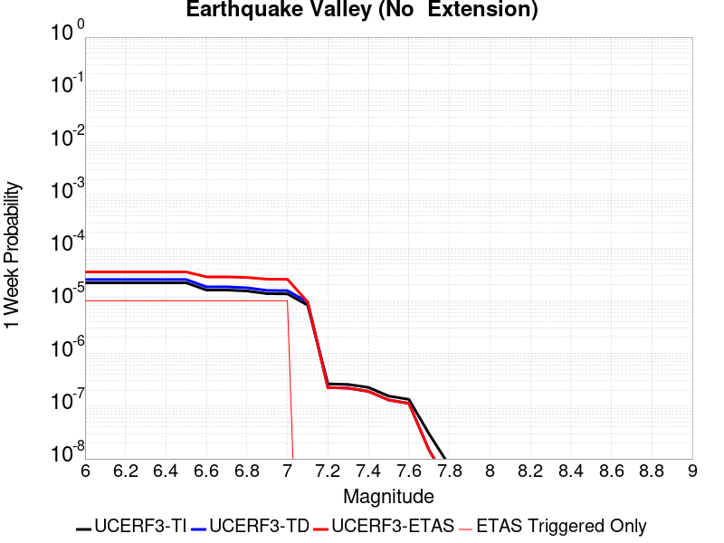 |  |  |  |

| Magnitude | 1 wk TI Prob | 1 wk TD Prob | 1 wk ETAS Prob | 1 wk ETAS/TD Gain | 1 wk ETAS Triggered Only | 1 mo TI Prob | 1 mo TD Prob | 1 mo ETAS Prob | 1 mo ETAS/TD Gain | 1 mo ETAS Triggered Only | 1 yr TI Prob | 1 yr TD Prob | 1 yr ETAS Prob | 1 yr ETAS/TD Gain | 1 yr ETAS Triggered Only | 10 yr TI Prob | 10 yr TD Prob | 10 yr ETAS Prob | 10 yr ETAS/TD Gain | 10 yr ETAS Triggered Only |
|-----|-----|-----|-----|-----|-----|-----|-----|-----|-----|-----|-----|-----|-----|-----|-----|-----|-----|-----|-----|-----|
| 6.0 | 2.1859703E-5 | 2.5198362E-5 | 3.519811E-5 | 1.3968412 | 1.0E-5 | 9.3681076E-5 | 1.07989326E-4 | 1.17988246E-4 | 1.0925918 | 1.0E-5 | 0.0011399703 | 0.001314122 | 0.0013241089 | 1.0075996 | 1.0E-5 | 0.011341401 | 0.013077871 | 0.01308774 | 1.0007546 | 1.0E-5 |
| 6.1 | 2.1859703E-5 | 2.5198362E-5 | 3.519811E-5 | 1.3968412 | 1.0E-5 | 9.3681076E-5 | 1.07989326E-4 | 1.17988246E-4 | 1.0925918 | 1.0E-5 | 0.0011399703 | 0.001314122 | 0.0013241089 | 1.0075996 | 1.0E-5 | 0.011341401 | 0.013077871 | 0.01308774 | 1.0007546 | 1.0E-5 |
| 6.2 | 2.1859703E-5 | 2.5198362E-5 | 3.519811E-5 | 1.3968412 | 1.0E-5 | 9.3681076E-5 | 1.07989326E-4 | 1.17988246E-4 | 1.0925918 | 1.0E-5 | 0.0011399703 | 0.001314122 | 0.0013241089 | 1.0075996 | 1.0E-5 | 0.011341401 | 0.013077871 | 0.01308774 | 1.0007546 | 1.0E-5 |
| 6.3 | 2.1859703E-5 | 2.5198362E-5 | 3.519811E-5 | 1.3968412 | 1.0E-5 | 9.3681076E-5 | 1.07989326E-4 | 1.17988246E-4 | 1.0925918 | 1.0E-5 | 0.0011399703 | 0.001314122 | 0.0013241089 | 1.0075996 | 1.0E-5 | 0.011341401 | 0.013077871 | 0.01308774 | 1.0007546 | 1.0E-5 |
| 6.4 | 2.1859703E-5 | 2.5198362E-5 | 3.519811E-5 | 1.3968412 | 1.0E-5 | 9.3681076E-5 | 1.07989326E-4 | 1.17988246E-4 | 1.0925918 | 1.0E-5 | 0.0011399703 | 0.001314122 | 0.0013241089 | 1.0075996 | 1.0E-5 | 0.011341401 | 0.013077871 | 0.01308774 | 1.0007546 | 1.0E-5 |
| 6.5 | 2.1859703E-5 | 2.5198362E-5 | 3.519811E-5 | 1.3968412 | 1.0E-5 | 9.3681076E-5 | 1.07989326E-4 | 1.17988246E-4 | 1.0925918 | 1.0E-5 | 0.0011399703 | 0.001314122 | 0.0013241089 | 1.0075996 | 1.0E-5 | 0.011341401 | 0.013077871 | 0.01308774 | 1.0007546 | 1.0E-5 |
| 6.6 | 1.597E-5 | 1.8356275E-5 | 2.8356093E-5 | 1.5447628 | 1.0E-5 | 6.8441055E-5 | 7.866787E-5 | 8.866709E-5 | 1.1271067 | 1.0E-5 | 8.329513E-4 | 9.574478E-4 | 9.674382E-4 | 1.0104344 | 1.0E-5 | 0.008298361 | 0.009541836 | 0.00955174 | 1.0010381 | 1.0E-5 |
| 6.7 | 1.597E-5 | 1.8356275E-5 | 2.8356093E-5 | 1.5447628 | 1.0E-5 | 6.8441055E-5 | 7.866787E-5 | 8.866709E-5 | 1.1271067 | 1.0E-5 | 8.329513E-4 | 9.574478E-4 | 9.674382E-4 | 1.0104344 | 1.0E-5 | 0.008298361 | 0.009541836 | 0.00955174 | 1.0010381 | 1.0E-5 |
| 6.8 | 1.5315149E-5 | 1.7602091E-5 | 2.7601916E-5 | 1.5681043 | 1.0E-5 | 6.5634704E-5 | 7.543584E-5 | 8.543509E-5 | 1.132553 | 1.0E-5 | 7.988095E-4 | 9.181311E-4 | 9.281219E-4 | 1.0108817 | 1.0E-5 | 0.007959441 | 0.009151919 | 0.009161827 | 1.0010827 | 1.0E-5 |
| 6.9 | 1.3634728E-5 | 1.5675821E-5 | 2.5675665E-5 | 1.6379151 | 1.0E-5 | 5.8433237E-5 | 6.718082E-5 | 7.718016E-5 | 1.148842 | 1.0E-5 | 7.1119244E-4 | 8.177017E-4 | 8.276935E-4 | 1.0122194 | 1.0E-5 | 0.007089207 | 0.008155 | 0.008164919 | 1.0012163 | 1.0E-5 |
| 7.0 | 1.3496271E-5 | 1.5517853E-5 | 2.5517698E-5 | 1.6444091 | 1.0E-5 | 5.783988E-5 | 6.650385E-5 | 7.650319E-5 | 1.1503572 | 1.0E-5 | 7.03973E-4 | 8.094657E-4 | 8.1945764E-4 | 1.0123439 | 1.0E-5 | 0.007017471 | 0.0080732405 | 0.00808316 | 1.0012287 | 1.0E-5 |
| 7.1 | 8.242798E-6 | 9.4726E-6 | 9.4726E-6 | 1.0 | 0.0 | 3.53258E-5 | 4.0596606E-5 | 4.0596606E-5 | 1.0 | 0.0 | 4.300067E-4 | 4.9421866E-4 | 4.9421866E-4 | 1.0 | 0.0 | 0.004291756 | 0.0049377717 | 0.0049377717 | 1.0 | 0.0 |
| 7.2 | 2.6506527E-7 | 2.2560312E-7 | 2.2560312E-7 | 1.0 | 0.0 | 1.1359936E-6 | 9.668702E-7 | 9.668702E-7 | 1.0 | 0.0 | 1.3830633E-5 | 1.17715845E-5 | 1.17715845E-5 | 1.0 | 0.0 | 1.3829772E-4 | 1.1771003E-4 | 1.1771003E-4 | 1.0 | 0.0 |
| 7.3 | 2.5810488E-7 | 2.1955442E-7 | 2.1955442E-7 | 1.0 | 0.0 | 1.1061633E-6 | 9.409472E-7 | 9.409472E-7 | 1.0 | 0.0 | 1.3467455E-5 | 1.1455976E-5 | 1.1455976E-5 | 1.0 | 0.0 | 1.3466639E-4 | 1.1455427E-4 | 1.1455427E-4 | 1.0 | 0.0 |
| 7.4 | 2.2676066E-7 | 1.9110601E-7 | 1.9110601E-7 | 1.0 | 0.0 | 9.71831E-7 | 8.190255E-7 | 8.190255E-7 | 1.0 | 0.0 | 1.1831979E-5 | 9.9715935E-6 | 9.9715935E-6 | 1.0 | 0.0 | 1.1831349E-4 | 9.9711855E-5 | 9.9711855E-5 | 1.0 | 0.0 |
| 7.5 | 1.5553917E-7 | 1.3112096E-7 | 1.3112096E-7 | 1.0 | 0.0 | 6.6659624E-7 | 5.619469E-7 | 5.619469E-7 | 1.0 | 0.0 | 8.115779E-6 | 6.8416834E-6 | 6.8416834E-6 | 1.0 | 0.0 | 8.115482E-5 | 6.841495E-5 | 6.841495E-5 | 1.0 | 0.0 |
| 7.6 | 1.3448629E-7 | 1.1288419E-7 | 1.1288419E-7 | 1.0 | 0.0 | 5.7636964E-7 | 4.837893E-7 | 4.837893E-7 | 1.0 | 0.0 | 7.017278E-6 | 5.890121E-6 | 5.890121E-6 | 1.0 | 0.0 | 7.0170565E-5 | 5.889986E-5 | 5.889986E-5 | 1.0 | 0.0 |
| 7.7 | 2.9719402E-8 | 1.458206E-8 | 1.458206E-8 | 1.0 | 0.0 | 1.2736886E-7 | 6.249454E-8 | 6.249454E-8 | 1.0 | 0.0 | 1.5507147E-6 | 7.608708E-7 | 7.608708E-7 | 1.0 | 0.0 | 1.550704E-5 | 7.6086876E-6 | 7.6086876E-6 | 1.0 | 0.0 |
| 7.8 | 7.4390196E-9 | 3.2502152E-9 | 3.2502152E-9 | 1.0 | 0.0 | 3.1881513E-8 | 1.3929493E-8 | 1.3929493E-8 | 1.0 | 0.0 | 3.8815733E-7 | 1.6959156E-7 | 1.6959156E-7 | 1.0 | 0.0 | 3.8815665E-6 | 1.6959145E-6 | 1.6959145E-6 | 1.0 | 0.0 |
| 7.9 | 1.5373532E-9 | 8.440161E-10 | 8.440161E-10 | 1.0 | 0.0 | 6.5886567E-9 | 3.6172119E-9 | 3.6172119E-9 | 1.0 | 0.0 | 8.021689E-8 | 4.4039556E-8 | 4.4039556E-8 | 1.0 | 0.0 | 8.0216864E-7 | 4.4039552E-7 | 4.4039552E-7 | 1.0 | 0.0 |

## Trinidad (alt1)
*[(top)](#table-of-contents)*

| 1 Week | 1 Month | 1 Year | 10 Year |
|-----|-----|-----|-----|
|  |  |  |  |

| Magnitude | 1 wk TI Prob | 1 wk TD Prob | 1 wk ETAS Prob | 1 wk ETAS/TD Gain | 1 wk ETAS Triggered Only | 1 mo TI Prob | 1 mo TD Prob | 1 mo ETAS Prob | 1 mo ETAS/TD Gain | 1 mo ETAS Triggered Only | 1 yr TI Prob | 1 yr TD Prob | 1 yr ETAS Prob | 1 yr ETAS/TD Gain | 1 yr ETAS Triggered Only | 10 yr TI Prob | 10 yr TD Prob | 10 yr ETAS Prob | 10 yr ETAS/TD Gain | 10 yr ETAS Triggered Only |
|-----|-----|-----|-----|-----|-----|-----|-----|-----|-----|-----|-----|-----|-----|-----|-----|-----|-----|-----|-----|-----|
| 6.0 | 3.0167168E-5 | 3.4033183E-5 | 3.4033183E-5 | 1.0 | 0.0 | 1.2928146E-4 | 1.4584929E-4 | 1.5584784E-4 | 1.0685539 | 1.0E-5 | 0.0015728653 | 0.0017744373 | 0.0017844195 | 1.0056256 | 1.0E-5 | 0.0156177925 | 0.017619645 | 0.017629469 | 1.0005575 | 1.0E-5 |
| 6.1 | 3.0167168E-5 | 3.4033183E-5 | 3.4033183E-5 | 1.0 | 0.0 | 1.2928146E-4 | 1.4584929E-4 | 1.5584784E-4 | 1.0685539 | 1.0E-5 | 0.0015728653 | 0.0017744373 | 0.0017844195 | 1.0056256 | 1.0E-5 | 0.0156177925 | 0.017619645 | 0.017629469 | 1.0005575 | 1.0E-5 |
| 6.2 | 3.0167168E-5 | 3.4033183E-5 | 3.4033183E-5 | 1.0 | 0.0 | 1.2928146E-4 | 1.4584929E-4 | 1.5584784E-4 | 1.0685539 | 1.0E-5 | 0.0015728653 | 0.0017744373 | 0.0017844195 | 1.0056256 | 1.0E-5 | 0.0156177925 | 0.017619645 | 0.017629469 | 1.0005575 | 1.0E-5 |
| 6.3 | 3.0167168E-5 | 3.4033183E-5 | 3.4033183E-5 | 1.0 | 0.0 | 1.2928146E-4 | 1.4584929E-4 | 1.5584784E-4 | 1.0685539 | 1.0E-5 | 0.0015728653 | 0.0017744373 | 0.0017844195 | 1.0056256 | 1.0E-5 | 0.0156177925 | 0.017619645 | 0.017629469 | 1.0005575 | 1.0E-5 |
| 6.4 | 3.0167168E-5 | 3.4033183E-5 | 3.4033183E-5 | 1.0 | 0.0 | 1.2928146E-4 | 1.4584929E-4 | 1.5584784E-4 | 1.0685539 | 1.0E-5 | 0.0015728653 | 0.0017744373 | 0.0017844195 | 1.0056256 | 1.0E-5 | 0.0156177925 | 0.017619645 | 0.017629469 | 1.0005575 | 1.0E-5 |
| 6.5 | 3.0167168E-5 | 3.4033183E-5 | 3.4033183E-5 | 1.0 | 0.0 | 1.2928146E-4 | 1.4584929E-4 | 1.5584784E-4 | 1.0685539 | 1.0E-5 | 0.0015728653 | 0.0017744373 | 0.0017844195 | 1.0056256 | 1.0E-5 | 0.0156177925 | 0.017619645 | 0.017629469 | 1.0005575 | 1.0E-5 |
| 6.6 | 3.0167168E-5 | 3.4033183E-5 | 3.4033183E-5 | 1.0 | 0.0 | 1.2928146E-4 | 1.4584929E-4 | 1.5584784E-4 | 1.0685539 | 1.0E-5 | 0.0015728653 | 0.0017744373 | 0.0017844195 | 1.0056256 | 1.0E-5 | 0.0156177925 | 0.017619645 | 0.017629469 | 1.0005575 | 1.0E-5 |
| 6.7 | 3.0167168E-5 | 3.4033183E-5 | 3.4033183E-5 | 1.0 | 0.0 | 1.2928146E-4 | 1.4584929E-4 | 1.5584784E-4 | 1.0685539 | 1.0E-5 | 0.0015728653 | 0.0017744373 | 0.0017844195 | 1.0056256 | 1.0E-5 | 0.0156177925 | 0.017619645 | 0.017629469 | 1.0005575 | 1.0E-5 |
| 6.8 | 1.717077E-5 | 1.9195684E-5 | 1.9195684E-5 | 1.0 | 0.0 | 7.358694E-5 | 8.226487E-5 | 8.226487E-5 | 1.0 | 0.0 | 8.9555274E-4 | 0.0010011591 | 0.0010011591 | 1.0 | 0.0 | 0.008919522 | 0.009970939 | 0.009970939 | 1.0 | 0.0 |
| 6.9 | 1.717077E-5 | 1.9195684E-5 | 1.9195684E-5 | 1.0 | 0.0 | 7.358694E-5 | 8.226487E-5 | 8.226487E-5 | 1.0 | 0.0 | 8.9555274E-4 | 0.0010011591 | 0.0010011591 | 1.0 | 0.0 | 0.008919522 | 0.009970939 | 0.009970939 | 1.0 | 0.0 |
| 7.0 | 1.2858572E-5 | 1.433737E-5 | 1.433737E-5 | 1.0 | 0.0 | 5.5107E-5 | 6.14446E-5 | 6.14446E-5 | 1.0 | 0.0 | 6.707212E-4 | 7.478634E-4 | 7.478634E-4 | 1.0 | 0.0 | 0.006687004 | 0.0074566454 | 0.0074566454 | 1.0 | 0.0 |
| 7.1 | 1.0588431E-5 | 1.1801269E-5 | 1.1801269E-5 | 1.0 | 0.0 | 4.53782E-5 | 5.057605E-5 | 5.057605E-5 | 1.0 | 0.0 | 5.5233954E-4 | 6.156183E-4 | 6.156183E-4 | 1.0 | 0.0 | 0.005509687 | 0.006141979 | 0.006141979 | 1.0 | 0.0 |
| 7.2 | 8.138061E-6 | 9.067213E-6 | 9.067213E-6 | 1.0 | 0.0 | 3.487694E-5 | 3.8859045E-5 | 3.8859045E-5 | 1.0 | 0.0 | 4.2454398E-4 | 4.7303102E-4 | 4.7303102E-4 | 1.0 | 0.0 | 0.0042373384 | 0.0047226823 | 0.0047226823 | 1.0 | 0.0 |
| 7.3 | 5.787542E-6 | 6.46032E-6 | 6.46032E-6 | 1.0 | 0.0 | 2.4803514E-5 | 2.7686914E-5 | 2.7686914E-5 | 1.0 | 0.0 | 3.0194095E-4 | 3.3705754E-4 | 3.3705754E-4 | 1.0 | 0.0 | 0.00301531 | 0.0033675742 | 0.0033675742 | 1.0 | 0.0 |
| 7.4 | 4.303563E-6 | 4.800851E-6 | 4.800851E-6 | 1.0 | 0.0 | 1.844371E-5 | 2.0575026E-5 | 2.0575026E-5 | 1.0 | 0.0 | 2.2452902E-4 | 2.504919E-4 | 2.504919E-4 | 1.0 | 0.0 | 0.0022430231 | 0.0025040337 | 0.0025040337 | 1.0 | 0.0 |
| 7.5 | 5.6063425E-7 | 6.142982E-7 | 6.142982E-7 | 1.0 | 0.0 | 2.402716E-6 | 2.632704E-6 | 2.632704E-6 | 1.0 | 0.0 | 2.9252675E-5 | 3.2052718E-5 | 3.2052718E-5 | 1.0 | 0.0 | 2.9248823E-4 | 3.2048248E-4 | 3.2048248E-4 | 1.0 | 0.0 |
| 7.6 | 4.6699128E-7 | 5.1257996E-7 | 5.1257996E-7 | 1.0 | 0.0 | 2.0013897E-6 | 2.1967694E-6 | 2.1967694E-6 | 1.0 | 0.0 | 2.4366647E-5 | 2.6745354E-5 | 2.6745354E-5 | 1.0 | 0.0 | 2.4363975E-4 | 2.6742276E-4 | 2.6742276E-4 | 1.0 | 0.0 |
| 7.7 | 2.2080937E-7 | 2.4346897E-7 | 2.4346897E-7 | 1.0 | 0.0 | 9.4632554E-7 | 1.043438E-6 | 1.043438E-6 | 1.0 | 0.0 | 1.15214525E-5 | 1.270379E-5 | 1.270379E-5 | 1.0 | 0.0 | 1.1520855E-4 | 1.2703124E-4 | 1.2703124E-4 | 1.0 | 0.0 |
| 7.8 | 1.1438307E-8 | 1.2682963E-8 | 1.2682963E-8 | 1.0 | 0.0 | 4.9021317E-8 | 5.4355557E-8 | 5.4355557E-8 | 1.0 | 0.0 | 5.9683435E-7 | 6.6177887E-7 | 6.6177887E-7 | 1.0 | 0.0 | 5.9683275E-6 | 6.617789E-6 | 6.617789E-6 | 1.0 | 0.0 |

## Round Valley
*[(top)](#table-of-contents)*

| 1 Week | 1 Month | 1 Year | 10 Year |
|-----|-----|-----|-----|
| 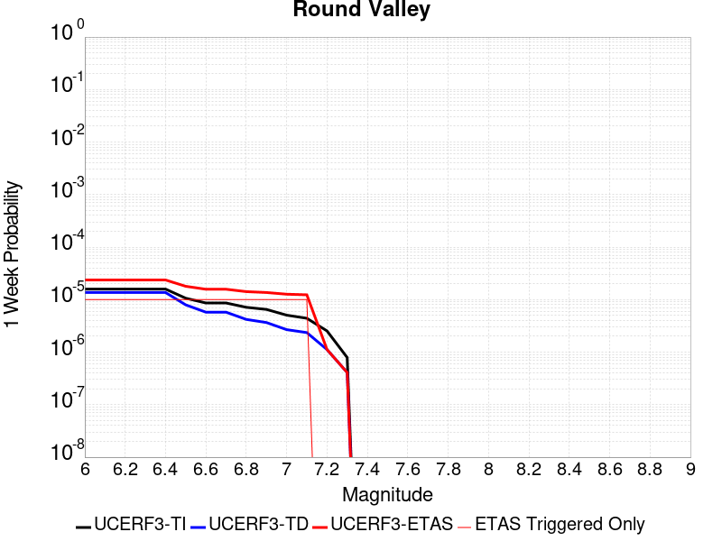 |  |  |  |

| Magnitude | 1 wk TI Prob | 1 wk TD Prob | 1 wk ETAS Prob | 1 wk ETAS/TD Gain | 1 wk ETAS Triggered Only | 1 mo TI Prob | 1 mo TD Prob | 1 mo ETAS Prob | 1 mo ETAS/TD Gain | 1 mo ETAS Triggered Only | 1 yr TI Prob | 1 yr TD Prob | 1 yr ETAS Prob | 1 yr ETAS/TD Gain | 1 yr ETAS Triggered Only | 10 yr TI Prob | 10 yr TD Prob | 10 yr ETAS Prob | 10 yr ETAS/TD Gain | 10 yr ETAS Triggered Only |
|-----|-----|-----|-----|-----|-----|-----|-----|-----|-----|-----|-----|-----|-----|-----|-----|-----|-----|-----|-----|-----|
| 6.0 | 1.588152E-5 | 1.3670716E-5 | 2.3670578E-5 | 1.7314806 | 1.0E-5 | 6.806188E-5 | 5.8587688E-5 | 6.85871E-5 | 1.1706743 | 1.0E-5 | 8.283384E-4 | 7.13111E-4 | 7.231039E-4 | 1.014013 | 1.0E-5 | 0.008252576 | 0.0071121147 | 0.007122044 | 1.0013961 | 1.0E-5 |
| 6.1 | 1.588152E-5 | 1.3670716E-5 | 2.3670578E-5 | 1.7314806 | 1.0E-5 | 6.806188E-5 | 5.8587688E-5 | 6.85871E-5 | 1.1706743 | 1.0E-5 | 8.283384E-4 | 7.13111E-4 | 7.231039E-4 | 1.014013 | 1.0E-5 | 0.008252576 | 0.0071121147 | 0.007122044 | 1.0013961 | 1.0E-5 |
| 6.2 | 1.588152E-5 | 1.3670716E-5 | 2.3670578E-5 | 1.7314806 | 1.0E-5 | 6.806188E-5 | 5.8587688E-5 | 6.85871E-5 | 1.1706743 | 1.0E-5 | 8.283384E-4 | 7.13111E-4 | 7.231039E-4 | 1.014013 | 1.0E-5 | 0.008252576 | 0.0071121147 | 0.007122044 | 1.0013961 | 1.0E-5 |
| 6.3 | 1.588152E-5 | 1.3670716E-5 | 2.3670578E-5 | 1.7314806 | 1.0E-5 | 6.806188E-5 | 5.8587688E-5 | 6.85871E-5 | 1.1706743 | 1.0E-5 | 8.283384E-4 | 7.13111E-4 | 7.231039E-4 | 1.014013 | 1.0E-5 | 0.008252576 | 0.0071121147 | 0.007122044 | 1.0013961 | 1.0E-5 |
| 6.4 | 1.588152E-5 | 1.3670716E-5 | 2.3670578E-5 | 1.7314806 | 1.0E-5 | 6.806188E-5 | 5.8587688E-5 | 6.85871E-5 | 1.1706743 | 1.0E-5 | 8.283384E-4 | 7.13111E-4 | 7.231039E-4 | 1.014013 | 1.0E-5 | 0.008252576 | 0.0071121147 | 0.007122044 | 1.0013961 | 1.0E-5 |
| 6.5 | 1.0646776E-5 | 7.953037E-6 | 1.7952958E-5 | 2.2573712 | 1.0E-5 | 4.5628243E-5 | 3.408405E-5 | 4.4083707E-5 | 1.2933824 | 1.0E-5 | 5.553823E-4 | 4.1490266E-4 | 4.2489852E-4 | 1.0240921 | 1.0E-5 | 0.005539963 | 0.0041421093 | 0.004152068 | 1.0024042 | 1.0E-5 |
| 6.6 | 8.632956E-6 | 5.768742E-6 | 1.5768685E-5 | 2.7334702 | 1.0E-5 | 3.6997862E-5 | 2.4722967E-5 | 3.472272E-5 | 1.4044722 | 1.0E-5 | 4.5035584E-4 | 3.009644E-4 | 3.109614E-4 | 1.0332165 | 1.0E-5 | 0.0044944426 | 0.003005946 | 0.0030159159 | 1.0033168 | 1.0E-5 |
| 6.7 | 8.632956E-6 | 5.768742E-6 | 1.5768685E-5 | 2.7334702 | 1.0E-5 | 3.6997862E-5 | 2.4722967E-5 | 3.472272E-5 | 1.4044722 | 1.0E-5 | 4.5035584E-4 | 3.009644E-4 | 3.109614E-4 | 1.0332165 | 1.0E-5 | 0.0044944426 | 0.003005946 | 0.0030159159 | 1.0033168 | 1.0E-5 |
| 6.8 | 7.143895E-6 | 4.2018346E-6 | 1.42017925E-5 | 3.3799028 | 1.0E-5 | 3.0616335E-5 | 1.8007748E-5 | 2.8007567E-5 | 1.5553066 | 1.0E-5 | 3.726901E-4 | 2.1922393E-4 | 2.2922174E-4 | 1.0456054 | 1.0E-5 | 0.0037206567 | 0.0021902416 | 0.0022002198 | 1.0045557 | 1.0E-5 |
| 6.9 | 6.5120694E-6 | 3.6644687E-6 | 1.3664432E-5 | 3.7288985 | 1.0E-5 | 2.790857E-5 | 1.570478E-5 | 2.5704623E-5 | 1.6367388 | 1.0E-5 | 3.3973387E-4 | 1.9119044E-4 | 2.0118852E-4 | 1.0522939 | 1.0E-5 | 0.0033921495 | 0.0019104085 | 0.0019203894 | 1.0052245 | 1.0E-5 |
| 7.0 | 5.0614435E-6 | 2.6836676E-6 | 1.2683641E-5 | 4.726234 | 1.0E-5 | 2.169172E-5 | 1.1501388E-5 | 2.1501273E-5 | 1.8694503 | 1.0E-5 | 2.6406467E-4 | 1.4002142E-4 | 1.5002003E-4 | 1.0714077 | 1.0E-5 | 0.0026375111 | 0.0013994334 | 0.0014094195 | 1.0071357 | 1.0E-5 |
| 7.1 | 4.41728E-6 | 2.3575074E-6 | 1.2357484E-5 | 5.2417583 | 1.0E-5 | 1.8931061E-5 | 1.0103569E-5 | 2.0103469E-5 | 1.9897392 | 1.0E-5 | 2.304613E-4 | 1.23005E-4 | 1.3300376E-4 | 1.0812875 | 1.0E-5 | 0.0023022245 | 0.0012294657 | 0.0012394533 | 1.0081236 | 1.0E-5 |
| 7.2 | 2.535495E-6 | 1.1208391E-6 | 1.1208391E-6 | 1.0 | 0.0 | 1.0866362E-5 | 4.8035904E-6 | 4.8035904E-6 | 1.0 | 0.0 | 1.3228992E-4 | 5.8482667E-5 | 5.8482667E-5 | 1.0 | 0.0 | 0.0013221119 | 5.84724E-4 | 5.84724E-4 | 1.0 | 0.0 |
| 7.3 | 7.900015E-7 | 4.0889498E-7 | 4.0889498E-7 | 1.0 | 0.0 | 3.3857161E-6 | 1.752407E-6 | 1.752407E-6 | 1.0 | 0.0 | 4.1220315E-5 | 2.1335554E-5 | 2.1335554E-5 | 1.0 | 0.0 | 4.121267E-4 | 2.1335555E-4 | 2.1335555E-4 | 1.0 | 0.0 |

## Great Valley 05 Pittsburg - Kirby Hills alt1
*[(top)](#table-of-contents)*

| 1 Week | 1 Month | 1 Year | 10 Year |
|-----|-----|-----|-----|
|  |  |  |  |

| Magnitude | 1 wk TI Prob | 1 wk TD Prob | 1 wk ETAS Prob | 1 wk ETAS/TD Gain | 1 wk ETAS Triggered Only | 1 mo TI Prob | 1 mo TD Prob | 1 mo ETAS Prob | 1 mo ETAS/TD Gain | 1 mo ETAS Triggered Only | 1 yr TI Prob | 1 yr TD Prob | 1 yr ETAS Prob | 1 yr ETAS/TD Gain | 1 yr ETAS Triggered Only | 10 yr TI Prob | 10 yr TD Prob | 10 yr ETAS Prob | 10 yr ETAS/TD Gain | 10 yr ETAS Triggered Only |
|-----|-----|-----|-----|-----|-----|-----|-----|-----|-----|-----|-----|-----|-----|-----|-----|-----|-----|-----|-----|-----|
| 6.0 | 4.187212E-5 | 5.3442072E-5 | 6.344154E-5 | 1.1871085 | 1.0E-5 | 1.794396E-4 | 2.290231E-4 | 2.3902081E-4 | 1.0436537 | 1.0E-5 | 0.002182488 | 0.0027857882 | 0.0027957603 | 1.0035796 | 1.0E-5 | 0.021611776 | 0.02760304 | 0.027612763 | 1.0003523 | 1.0E-5 |
| 6.1 | 4.187212E-5 | 5.3442072E-5 | 6.344154E-5 | 1.1871085 | 1.0E-5 | 1.794396E-4 | 2.290231E-4 | 2.3902081E-4 | 1.0436537 | 1.0E-5 | 0.002182488 | 0.0027857882 | 0.0027957603 | 1.0035796 | 1.0E-5 | 0.021611776 | 0.02760304 | 0.027612763 | 1.0003523 | 1.0E-5 |
| 6.2 | 1.7353306E-5 | 2.2154374E-5 | 2.2154374E-5 | 1.0 | 0.0 | 7.436919E-5 | 9.494618E-5 | 9.494618E-5 | 1.0 | 0.0 | 9.050688E-4 | 0.0011557543 | 0.0011557543 | 1.0 | 0.0 | 0.009013915 | 0.011535114 | 0.011535114 | 1.0 | 0.0 |
| 6.3 | 1.7353306E-5 | 2.2154374E-5 | 2.2154374E-5 | 1.0 | 0.0 | 7.436919E-5 | 9.494618E-5 | 9.494618E-5 | 1.0 | 0.0 | 9.050688E-4 | 0.0011557543 | 0.0011557543 | 1.0 | 0.0 | 0.009013915 | 0.011535114 | 0.011535114 | 1.0 | 0.0 |
| 6.4 | 1.4028824E-5 | 1.7900597E-5 | 1.7900597E-5 | 1.0 | 0.0 | 6.0122147E-5 | 7.671684E-5 | 7.671684E-5 | 1.0 | 0.0 | 7.3174125E-4 | 9.340275E-4 | 9.340275E-4 | 1.0 | 0.0 | 0.0072933645 | 0.009338138 | 0.009338138 | 1.0 | 0.0 |

## Davis Creek
*[(top)](#table-of-contents)*

| 1 Week | 1 Month | 1 Year | 10 Year |
|-----|-----|-----|-----|
|  |  |  |  |

| Magnitude | 1 wk TI Prob | 1 wk TD Prob | 1 wk ETAS Prob | 1 wk ETAS/TD Gain | 1 wk ETAS Triggered Only | 1 mo TI Prob | 1 mo TD Prob | 1 mo ETAS Prob | 1 mo ETAS/TD Gain | 1 mo ETAS Triggered Only | 1 yr TI Prob | 1 yr TD Prob | 1 yr ETAS Prob | 1 yr ETAS/TD Gain | 1 yr ETAS Triggered Only | 10 yr TI Prob | 10 yr TD Prob | 10 yr ETAS Prob | 10 yr ETAS/TD Gain | 10 yr ETAS Triggered Only |
|-----|-----|-----|-----|-----|-----|-----|-----|-----|-----|-----|-----|-----|-----|-----|-----|-----|-----|-----|-----|-----|
| 6.0 | 2.331472E-5 | 2.5417214E-5 | 3.541696E-5 | 1.3934242 | 1.0E-5 | 9.99164E-5 | 1.0892704E-4 | 1.1892595E-4 | 1.0917946 | 1.0E-5 | 0.0012158032 | 0.0013254983 | 0.0013354851 | 1.0075344 | 1.0E-5 | 0.01209173 | 0.013187704 | 0.013197572 | 1.0007483 | 1.0E-5 |
| 6.1 | 1.0407654E-5 | 1.1316986E-5 | 2.1316873E-5 | 1.8836174 | 1.0E-5 | 4.4603472E-5 | 4.8500624E-5 | 5.8500136E-5 | 1.206173 | 1.0E-5 | 5.4291193E-4 | 5.9036224E-4 | 6.003563E-4 | 1.0169288 | 1.0E-5 | 0.0054158745 | 0.005890611 | 0.005900552 | 1.0016876 | 1.0E-5 |
| 6.2 | 1.0407654E-5 | 1.1316986E-5 | 2.1316873E-5 | 1.8836174 | 1.0E-5 | 4.4603472E-5 | 4.8500624E-5 | 5.8500136E-5 | 1.206173 | 1.0E-5 | 5.4291193E-4 | 5.9036224E-4 | 6.003563E-4 | 1.0169288 | 1.0E-5 | 0.0054158745 | 0.005890611 | 0.005900552 | 1.0016876 | 1.0E-5 |
| 6.3 | 5.1323277E-6 | 5.568556E-6 | 5.568556E-6 | 1.0 | 0.0 | 2.1995505E-5 | 2.386507E-5 | 2.386507E-5 | 1.0 | 0.0 | 2.6776237E-4 | 2.905271E-4 | 2.905271E-4 | 1.0 | 0.0 | 0.0026743996 | 0.0029023192 | 0.0029023192 | 1.0 | 0.0 |
| 6.4 | 2.4985154E-6 | 2.704538E-6 | 2.704538E-6 | 1.0 | 0.0 | 1.07078795E-5 | 1.1590847E-5 | 1.1590847E-5 | 1.0 | 0.0 | 1.3036063E-4 | 1.4111304E-4 | 1.4111304E-4 | 1.0 | 0.0 | 0.0013028418 | 0.001410589 | 0.001410589 | 1.0 | 0.0 |
| 6.5 | 2.4846438E-6 | 2.6904722E-6 | 2.6904722E-6 | 1.0 | 0.0 | 1.064843E-5 | 1.1530565E-5 | 1.1530565E-5 | 1.0 | 0.0 | 1.2963692E-4 | 1.403792E-4 | 1.403792E-4 | 1.0 | 0.0 | 0.0012956132 | 0.0014032599 | 0.0014032599 | 1.0 | 0.0 |
| 6.6 | 2.072566E-7 | 2.1018087E-7 | 2.1018087E-7 | 1.0 | 0.0 | 8.882423E-7 | 9.0077486E-7 | 9.0077486E-7 | 1.0 | 0.0 | 1.0814296E-5 | 1.0966881E-5 | 1.0966881E-5 | 1.0 | 0.0 | 1.081377E-4 | 1.09663575E-4 | 1.09663575E-4 | 1.0 | 0.0 |
| 6.7 | 1.7544528E-7 | 1.7790826E-7 | 1.7790826E-7 | 1.0 | 0.0 | 7.5190815E-7 | 7.6246374E-7 | 7.6246374E-7 | 1.0 | 0.0 | 9.154443E-6 | 9.282958E-6 | 9.282958E-6 | 1.0 | 0.0 | 9.1540656E-5 | 9.282586E-5 | 9.282586E-5 | 1.0 | 0.0 |
| 6.8 | 1.2320395E-7 | 1.2481138E-7 | 1.2481138E-7 | 1.0 | 0.0 | 5.280168E-7 | 5.349058E-7 | 5.349058E-7 | 1.0 | 0.0 | 6.428586E-6 | 6.5124595E-6 | 6.5124595E-6 | 1.0 | 0.0 | 6.4284E-5 | 6.5122804E-5 | 6.5122804E-5 | 1.0 | 0.0 |
| 6.9 | 6.399997E-8 | 6.486058E-8 | 6.486058E-8 | 1.0 | 0.0 | 2.7428555E-7 | 2.7797387E-7 | 2.7797387E-7 | 1.0 | 0.0 | 3.3394215E-6 | 3.3843273E-6 | 3.3843273E-6 | 1.0 | 0.0 | 3.3393713E-5 | 3.384282E-5 | 3.384282E-5 | 1.0 | 0.0 |
| 7.0 | 6.4455685E-9 | 6.535264E-9 | 6.535264E-9 | 1.0 | 0.0 | 2.7623864E-8 | 2.8008275E-8 | 2.8008275E-8 | 1.0 | 0.0 | 3.3632048E-7 | 3.4100074E-7 | 3.4100074E-7 | 1.0 | 0.0 | 3.3631998E-6 | 3.4100074E-6 | 3.4100074E-6 | 1.0 | 0.0 |

## Pitas Point (Lower)-Montalvo
*[(top)](#table-of-contents)*

| 1 Week | 1 Month | 1 Year | 10 Year |
|-----|-----|-----|-----|
|  |  |  |  |

| Magnitude | 1 wk TI Prob | 1 wk TD Prob | 1 wk ETAS Prob | 1 wk ETAS/TD Gain | 1 wk ETAS Triggered Only | 1 mo TI Prob | 1 mo TD Prob | 1 mo ETAS Prob | 1 mo ETAS/TD Gain | 1 mo ETAS Triggered Only | 1 yr TI Prob | 1 yr TD Prob | 1 yr ETAS Prob | 1 yr ETAS/TD Gain | 1 yr ETAS Triggered Only | 10 yr TI Prob | 10 yr TD Prob | 10 yr ETAS Prob | 10 yr ETAS/TD Gain | 10 yr ETAS Triggered Only |
|-----|-----|-----|-----|-----|-----|-----|-----|-----|-----|-----|-----|-----|-----|-----|-----|-----|-----|-----|-----|-----|
| 6.0 | 5.2543637E-6 | 4.8378706E-6 | 4.8378706E-6 | 1.0 | 0.0 | 2.2518509E-5 | 2.0733567E-5 | 2.0733567E-5 | 1.0 | 0.0 | 2.7412834E-4 | 2.5240227E-4 | 2.6239973E-4 | 1.0396093 | 1.0E-5 | 0.0027379042 | 0.0025211885 | 0.0025311632 | 1.0039564 | 1.0E-5 |
| 6.1 | 5.2543637E-6 | 4.8378706E-6 | 4.8378706E-6 | 1.0 | 0.0 | 2.2518509E-5 | 2.0733567E-5 | 2.0733567E-5 | 1.0 | 0.0 | 2.7412834E-4 | 2.5240227E-4 | 2.6239973E-4 | 1.0396093 | 1.0E-5 | 0.0027379042 | 0.0025211885 | 0.0025311632 | 1.0039564 | 1.0E-5 |
| 6.2 | 5.2543637E-6 | 4.8378706E-6 | 4.8378706E-6 | 1.0 | 0.0 | 2.2518509E-5 | 2.0733567E-5 | 2.0733567E-5 | 1.0 | 0.0 | 2.7412834E-4 | 2.5240227E-4 | 2.6239973E-4 | 1.0396093 | 1.0E-5 | 0.0027379042 | 0.0025211885 | 0.0025311632 | 1.0039564 | 1.0E-5 |
| 6.3 | 5.2543637E-6 | 4.8378706E-6 | 4.8378706E-6 | 1.0 | 0.0 | 2.2518509E-5 | 2.0733567E-5 | 2.0733567E-5 | 1.0 | 0.0 | 2.7412834E-4 | 2.5240227E-4 | 2.6239973E-4 | 1.0396093 | 1.0E-5 | 0.0027379042 | 0.0025211885 | 0.0025311632 | 1.0039564 | 1.0E-5 |
| 6.4 | 5.2543637E-6 | 4.8378706E-6 | 4.8378706E-6 | 1.0 | 0.0 | 2.2518509E-5 | 2.0733567E-5 | 2.0733567E-5 | 1.0 | 0.0 | 2.7412834E-4 | 2.5240227E-4 | 2.6239973E-4 | 1.0396093 | 1.0E-5 | 0.0027379042 | 0.0025211885 | 0.0025311632 | 1.0039564 | 1.0E-5 |
| 6.5 | 5.2543637E-6 | 4.8378706E-6 | 4.8378706E-6 | 1.0 | 0.0 | 2.2518509E-5 | 2.0733567E-5 | 2.0733567E-5 | 1.0 | 0.0 | 2.7412834E-4 | 2.5240227E-4 | 2.6239973E-4 | 1.0396093 | 1.0E-5 | 0.0027379042 | 0.0025211885 | 0.0025311632 | 1.0039564 | 1.0E-5 |
| 6.6 | 5.2543637E-6 | 4.8378706E-6 | 4.8378706E-6 | 1.0 | 0.0 | 2.2518509E-5 | 2.0733567E-5 | 2.0733567E-5 | 1.0 | 0.0 | 2.7412834E-4 | 2.5240227E-4 | 2.6239973E-4 | 1.0396093 | 1.0E-5 | 0.0027379042 | 0.0025211885 | 0.0025311632 | 1.0039564 | 1.0E-5 |
| 6.7 | 5.2543637E-6 | 4.8378706E-6 | 4.8378706E-6 | 1.0 | 0.0 | 2.2518509E-5 | 2.0733567E-5 | 2.0733567E-5 | 1.0 | 0.0 | 2.7412834E-4 | 2.5240227E-4 | 2.6239973E-4 | 1.0396093 | 1.0E-5 | 0.0027379042 | 0.0025211885 | 0.0025311632 | 1.0039564 | 1.0E-5 |
| 6.8 | 5.2543637E-6 | 4.8378706E-6 | 4.8378706E-6 | 1.0 | 0.0 | 2.2518509E-5 | 2.0733567E-5 | 2.0733567E-5 | 1.0 | 0.0 | 2.7412834E-4 | 2.5240227E-4 | 2.6239973E-4 | 1.0396093 | 1.0E-5 | 0.0027379042 | 0.0025211885 | 0.0025311632 | 1.0039564 | 1.0E-5 |
| 6.9 | 5.2543637E-6 | 4.8378706E-6 | 4.8378706E-6 | 1.0 | 0.0 | 2.2518509E-5 | 2.0733567E-5 | 2.0733567E-5 | 1.0 | 0.0 | 2.7412834E-4 | 2.5240227E-4 | 2.6239973E-4 | 1.0396093 | 1.0E-5 | 0.0027379042 | 0.0025211885 | 0.0025311632 | 1.0039564 | 1.0E-5 |
| 7.0 | 5.2543637E-6 | 4.8378706E-6 | 4.8378706E-6 | 1.0 | 0.0 | 2.2518509E-5 | 2.0733567E-5 | 2.0733567E-5 | 1.0 | 0.0 | 2.7412834E-4 | 2.5240227E-4 | 2.6239973E-4 | 1.0396093 | 1.0E-5 | 0.0027379042 | 0.0025211885 | 0.0025311632 | 1.0039564 | 1.0E-5 |
| 7.1 | 5.2543637E-6 | 4.8378706E-6 | 4.8378706E-6 | 1.0 | 0.0 | 2.2518509E-5 | 2.0733567E-5 | 2.0733567E-5 | 1.0 | 0.0 | 2.7412834E-4 | 2.5240227E-4 | 2.6239973E-4 | 1.0396093 | 1.0E-5 | 0.0027379042 | 0.0025211885 | 0.0025311632 | 1.0039564 | 1.0E-5 |
| 7.2 | 5.2458695E-6 | 4.8290244E-6 | 4.8290244E-6 | 1.0 | 0.0 | 2.2482105E-5 | 2.0695656E-5 | 2.0695656E-5 | 1.0 | 0.0 | 2.7368523E-4 | 2.519408E-4 | 2.6193826E-4 | 1.0396819 | 1.0E-5 | 0.0027334841 | 0.0025165842 | 0.002526559 | 1.0039636 | 1.0E-5 |
| 7.3 | 5.22665E-6 | 4.8089414E-6 | 4.8089414E-6 | 1.0 | 0.0 | 2.2399736E-5 | 2.0609588E-5 | 2.0609588E-5 | 1.0 | 0.0 | 2.7268266E-4 | 2.5089315E-4 | 2.6089067E-4 | 1.0398476 | 1.0E-5 | 0.002723483 | 0.0025061315 | 0.0025161065 | 1.0039802 | 1.0E-5 |
| 7.4 | 5.210642E-6 | 4.792154E-6 | 4.792154E-6 | 1.0 | 0.0 | 2.233113E-5 | 2.0537642E-5 | 2.0537642E-5 | 1.0 | 0.0 | 2.718476E-4 | 2.5001742E-4 | 2.6001493E-4 | 1.0399872 | 1.0E-5 | 0.002715153 | 0.0024973939 | 0.0025073688 | 1.0039942 | 1.0E-5 |
| 7.5 | 5.1226016E-6 | 4.7000403E-6 | 4.7000403E-6 | 1.0 | 0.0 | 2.1953823E-5 | 2.0142877E-5 | 2.0142877E-5 | 1.0 | 0.0 | 2.67255E-4 | 2.4521223E-4 | 2.5520977E-4 | 1.040771 | 1.0E-5 | 0.0026693381 | 0.0024494485 | 0.0024594238 | 1.0040725 | 1.0E-5 |
| 7.6 | 4.8796987E-6 | 4.4449403E-6 | 4.4449403E-6 | 1.0 | 0.0 | 2.0912828E-5 | 1.9049607E-5 | 1.9049607E-5 | 1.0 | 0.0 | 2.5458392E-4 | 2.3190459E-4 | 2.4190226E-4 | 1.0431112 | 1.0E-5 | 0.0025429246 | 0.0023166565 | 0.0023266333 | 1.0043066 | 1.0E-5 |
| 7.7 | 4.0834398E-6 | 3.6091124E-6 | 3.6091124E-6 | 1.0 | 0.0 | 1.7500339E-5 | 1.5467534E-5 | 1.5467534E-5 | 1.0 | 0.0 | 2.1304579E-4 | 1.8830119E-4 | 1.982993E-4 | 1.0530964 | 1.0E-5 | 0.0021284167 | 0.00188144 | 0.0018914213 | 1.005305 | 1.0E-5 |
| 7.8 | 2.5445438E-6 | 2.121228E-6 | 2.121228E-6 | 1.0 | 0.0 | 1.0905142E-5 | 9.090945E-6 | 9.090945E-6 | 1.0 | 0.0 | 1.3276201E-4 | 1.1067669E-4 | 1.1067669E-4 | 1.0 | 0.0 | 0.0013268272 | 0.0011062203 | 0.0011062203 | 1.0 | 0.0 |
| 7.9 | 4.1677114E-7 | 3.3293693E-7 | 3.3293693E-7 | 1.0 | 0.0 | 1.7861609E-6 | 1.4268718E-6 | 1.4268718E-6 | 1.0 | 0.0 | 2.1746291E-5 | 1.737203E-5 | 1.737203E-5 | 1.0 | 0.0 | 2.1744163E-4 | 1.7370703E-4 | 1.7370703E-4 | 1.0 | 0.0 |
| 8.0 | 7.791402E-9 | 5.683497E-9 | 5.683497E-9 | 1.0 | 0.0 | 3.3391725E-8 | 2.4357844E-8 | 2.4357844E-8 | 1.0 | 0.0 | 4.0654416E-7 | 2.9655675E-7 | 2.9655675E-7 | 1.0 | 0.0 | 4.065434E-6 | 2.9655655E-6 | 2.9655655E-6 | 1.0 | 0.0 |

## Earthquake Valley (So Extension)
*[(top)](#table-of-contents)*

| 1 Week | 1 Month | 1 Year | 10 Year |
|-----|-----|-----|-----|
|  |  |  |  |

| Magnitude | 1 wk TI Prob | 1 wk TD Prob | 1 wk ETAS Prob | 1 wk ETAS/TD Gain | 1 wk ETAS Triggered Only | 1 mo TI Prob | 1 mo TD Prob | 1 mo ETAS Prob | 1 mo ETAS/TD Gain | 1 mo ETAS Triggered Only | 1 yr TI Prob | 1 yr TD Prob | 1 yr ETAS Prob | 1 yr ETAS/TD Gain | 1 yr ETAS Triggered Only | 10 yr TI Prob | 10 yr TD Prob | 10 yr ETAS Prob | 10 yr ETAS/TD Gain | 10 yr ETAS Triggered Only |
|-----|-----|-----|-----|-----|-----|-----|-----|-----|-----|-----|-----|-----|-----|-----|-----|-----|-----|-----|-----|-----|
| 6.0 | 3.0194888E-5 | 3.7072114E-5 | 3.7072114E-5 | 1.0 | 0.0 | 1.2940024E-4 | 1.5887388E-4 | 1.5887388E-4 | 1.0 | 0.0 | 0.0015743093 | 0.0019331174 | 0.001943098 | 1.005163 | 1.0E-5 | 0.01563203 | 0.019213019 | 0.019222826 | 1.0005105 | 1.0E-5 |
| 6.1 | 3.0194888E-5 | 3.7072114E-5 | 3.7072114E-5 | 1.0 | 0.0 | 1.2940024E-4 | 1.5887388E-4 | 1.5887388E-4 | 1.0 | 0.0 | 0.0015743093 | 0.0019331174 | 0.001943098 | 1.005163 | 1.0E-5 | 0.01563203 | 0.019213019 | 0.019222826 | 1.0005105 | 1.0E-5 |
| 6.2 | 3.0194888E-5 | 3.7072114E-5 | 3.7072114E-5 | 1.0 | 0.0 | 1.2940024E-4 | 1.5887388E-4 | 1.5887388E-4 | 1.0 | 0.0 | 0.0015743093 | 0.0019331174 | 0.001943098 | 1.005163 | 1.0E-5 | 0.01563203 | 0.019213019 | 0.019222826 | 1.0005105 | 1.0E-5 |
| 6.3 | 1.5795305E-5 | 1.844658E-5 | 1.844658E-5 | 1.0 | 0.0 | 6.769241E-5 | 7.9055004E-5 | 7.9055004E-5 | 1.0 | 0.0 | 8.238434E-4 | 9.6218096E-4 | 9.721713E-4 | 1.010383 | 1.0E-5 | 0.008207959 | 0.009591061 | 0.009600965 | 1.0010326 | 1.0E-5 |
| 6.4 | 1.5795305E-5 | 1.844658E-5 | 1.844658E-5 | 1.0 | 0.0 | 6.769241E-5 | 7.9055004E-5 | 7.9055004E-5 | 1.0 | 0.0 | 8.238434E-4 | 9.6218096E-4 | 9.721713E-4 | 1.010383 | 1.0E-5 | 0.008207959 | 0.009591061 | 0.009600965 | 1.0010326 | 1.0E-5 |
| 6.5 | 1.5795305E-5 | 1.844658E-5 | 1.844658E-5 | 1.0 | 0.0 | 6.769241E-5 | 7.9055004E-5 | 7.9055004E-5 | 1.0 | 0.0 | 8.238434E-4 | 9.6218096E-4 | 9.721713E-4 | 1.010383 | 1.0E-5 | 0.008207959 | 0.009591061 | 0.009600965 | 1.0010326 | 1.0E-5 |
| 6.6 | 1.5795305E-5 | 1.844658E-5 | 1.844658E-5 | 1.0 | 0.0 | 6.769241E-5 | 7.9055004E-5 | 7.9055004E-5 | 1.0 | 0.0 | 8.238434E-4 | 9.6218096E-4 | 9.721713E-4 | 1.010383 | 1.0E-5 | 0.008207959 | 0.009591061 | 0.009600965 | 1.0010326 | 1.0E-5 |
| 6.7 | 1.1363076E-5 | 1.3138294E-5 | 1.3138294E-5 | 1.0 | 0.0 | 4.8697988E-5 | 5.6306188E-5 | 5.6306188E-5 | 1.0 | 0.0 | 5.927367E-4 | 6.8538834E-4 | 6.8538834E-4 | 1.0 | 0.0 | 0.0059115817 | 0.0068402183 | 0.0068402183 | 1.0 | 0.0 |
| 6.8 | 1.0049611E-5 | 1.1594334E-5 | 1.1594334E-5 | 1.0 | 0.0 | 4.306905E-5 | 4.9689468E-5 | 4.9689468E-5 | 1.0 | 0.0 | 5.242395E-4 | 6.048745E-4 | 6.048745E-4 | 1.0 | 0.0 | 0.0052300454 | 0.006039458 | 0.006039458 | 1.0 | 0.0 |
| 6.9 | 1.0049611E-5 | 1.1594334E-5 | 1.1594334E-5 | 1.0 | 0.0 | 4.306905E-5 | 4.9689468E-5 | 4.9689468E-5 | 1.0 | 0.0 | 5.242395E-4 | 6.048745E-4 | 6.048745E-4 | 1.0 | 0.0 | 0.0052300454 | 0.006039458 | 0.006039458 | 1.0 | 0.0 |
| 7.0 | 1.0049611E-5 | 1.1594334E-5 | 1.1594334E-5 | 1.0 | 0.0 | 4.306905E-5 | 4.9689468E-5 | 4.9689468E-5 | 1.0 | 0.0 | 5.242395E-4 | 6.048745E-4 | 6.048745E-4 | 1.0 | 0.0 | 0.0052300454 | 0.006039458 | 0.006039458 | 1.0 | 0.0 |
| 7.1 | 8.140254E-6 | 9.383458E-6 | 9.383458E-6 | 1.0 | 0.0 | 3.4886336E-5 | 4.0214578E-5 | 4.0214578E-5 | 1.0 | 0.0 | 4.2465836E-4 | 4.8956956E-4 | 4.8956956E-4 | 1.0 | 0.0 | 0.0042384774 | 0.0048914864 | 0.0048914864 | 1.0 | 0.0 |
| 7.2 | 1.673835E-7 | 1.4154125E-7 | 1.4154125E-7 | 1.0 | 0.0 | 7.173577E-7 | 6.066052E-7 | 6.066052E-7 | 1.0 | 0.0 | 8.733795E-6 | 7.385397E-6 | 7.385397E-6 | 1.0 | 0.0 | 8.733451E-5 | 7.385187E-5 | 7.385187E-5 | 1.0 | 0.0 |
| 7.3 | 1.6632116E-7 | 1.4052354E-7 | 1.4052354E-7 | 1.0 | 0.0 | 7.1280476E-7 | 6.0224363E-7 | 6.0224363E-7 | 1.0 | 0.0 | 8.678364E-6 | 7.332295E-6 | 7.332295E-6 | 1.0 | 0.0 | 8.6780245E-5 | 7.332089E-5 | 7.332089E-5 | 1.0 | 0.0 |
| 7.4 | 1.6569169E-7 | 1.3996983E-7 | 1.3996983E-7 | 1.0 | 0.0 | 7.1010703E-7 | 5.9987053E-7 | 5.9987053E-7 | 1.0 | 0.0 | 8.645519E-6 | 7.303403E-6 | 7.303403E-6 | 1.0 | 0.0 | 8.645182E-5 | 7.303199E-5 | 7.303199E-5 | 1.0 | 0.0 |
| 7.5 | 1.1764555E-7 | 1.0095917E-7 | 1.0095917E-7 | 1.0 | 0.0 | 5.041951E-7 | 4.326821E-7 | 4.326821E-7 | 1.0 | 0.0 | 6.138558E-6 | 5.267894E-6 | 5.267894E-6 | 1.0 | 0.0 | 6.1383886E-5 | 5.2677904E-5 | 5.2677904E-5 | 1.0 | 0.0 |
| 7.6 | 1.07927605E-7 | 9.260736E-8 | 9.260736E-8 | 1.0 | 0.0 | 4.6254678E-7 | 3.9688865E-7 | 3.9688865E-7 | 1.0 | 0.0 | 5.6314925E-6 | 4.832111E-6 | 4.832111E-6 | 1.0 | 0.0 | 5.63135E-5 | 4.8320264E-5 | 4.8320264E-5 | 1.0 | 0.0 |
| 7.7 | 2.1826905E-8 | 1.1180516E-8 | 1.1180516E-8 | 1.0 | 0.0 | 9.3543875E-8 | 4.7916494E-8 | 4.7916494E-8 | 1.0 | 0.0 | 1.1388961E-6 | 5.833832E-7 | 5.833832E-7 | 1.0 | 0.0 | 1.1388902E-5 | 5.8338223E-6 | 5.8338223E-6 | 1.0 | 0.0 |
| 7.8 | 2.6169649E-9 | 1.1969472E-9 | 1.1969472E-9 | 1.0 | 0.0 | 1.1215564E-8 | 5.1297735E-9 | 5.1297735E-9 | 1.0 | 0.0 | 1.3654947E-7 | 6.2454994E-8 | 6.2454994E-8 | 1.0 | 0.0 | 1.365494E-6 | 6.245499E-7 | 6.245499E-7 | 1.0 | 0.0 |

## Mount Diablo Thrust North CFM
*[(top)](#table-of-contents)*

| 1 Week | 1 Month | 1 Year | 10 Year |
|-----|-----|-----|-----|
|  |  |  |  |

| Magnitude | 1 wk TI Prob | 1 wk TD Prob | 1 wk ETAS Prob | 1 wk ETAS/TD Gain | 1 wk ETAS Triggered Only | 1 mo TI Prob | 1 mo TD Prob | 1 mo ETAS Prob | 1 mo ETAS/TD Gain | 1 mo ETAS Triggered Only | 1 yr TI Prob | 1 yr TD Prob | 1 yr ETAS Prob | 1 yr ETAS/TD Gain | 1 yr ETAS Triggered Only | 10 yr TI Prob | 10 yr TD Prob | 10 yr ETAS Prob | 10 yr ETAS/TD Gain | 10 yr ETAS Triggered Only |
|-----|-----|-----|-----|-----|-----|-----|-----|-----|-----|-----|-----|-----|-----|-----|-----|-----|-----|-----|-----|-----|
| 6.0 | 1.479628E-5 | 1.876973E-5 | 2.8769542E-5 | 1.5327626 | 1.0E-5 | 6.341109E-5 | 8.043928E-5 | 9.043847E-5 | 1.1243074 | 1.0E-5 | 7.717565E-4 | 9.789177E-4 | 9.889079E-4 | 1.0102054 | 1.0E-5 | 0.007690818 | 0.009747355 | 0.009757258 | 1.0010159 | 1.0E-5 |
| 6.1 | 1.479628E-5 | 1.876973E-5 | 2.8769542E-5 | 1.5327626 | 1.0E-5 | 6.341109E-5 | 8.043928E-5 | 9.043847E-5 | 1.1243074 | 1.0E-5 | 7.717565E-4 | 9.789177E-4 | 9.889079E-4 | 1.0102054 | 1.0E-5 | 0.007690818 | 0.009747355 | 0.009757258 | 1.0010159 | 1.0E-5 |
| 6.2 | 1.479628E-5 | 1.876973E-5 | 2.8769542E-5 | 1.5327626 | 1.0E-5 | 6.341109E-5 | 8.043928E-5 | 9.043847E-5 | 1.1243074 | 1.0E-5 | 7.717565E-4 | 9.789177E-4 | 9.889079E-4 | 1.0102054 | 1.0E-5 | 0.007690818 | 0.009747355 | 0.009757258 | 1.0010159 | 1.0E-5 |
| 6.3 | 1.479628E-5 | 1.876973E-5 | 2.8769542E-5 | 1.5327626 | 1.0E-5 | 6.341109E-5 | 8.043928E-5 | 9.043847E-5 | 1.1243074 | 1.0E-5 | 7.717565E-4 | 9.789177E-4 | 9.889079E-4 | 1.0102054 | 1.0E-5 | 0.007690818 | 0.009747355 | 0.009757258 | 1.0010159 | 1.0E-5 |
| 6.4 | 1.479628E-5 | 1.876973E-5 | 2.8769542E-5 | 1.5327626 | 1.0E-5 | 6.341109E-5 | 8.043928E-5 | 9.043847E-5 | 1.1243074 | 1.0E-5 | 7.717565E-4 | 9.789177E-4 | 9.889079E-4 | 1.0102054 | 1.0E-5 | 0.007690818 | 0.009747355 | 0.009757258 | 1.0010159 | 1.0E-5 |
| 6.5 | 1.479628E-5 | 1.876973E-5 | 2.8769542E-5 | 1.5327626 | 1.0E-5 | 6.341109E-5 | 8.043928E-5 | 9.043847E-5 | 1.1243074 | 1.0E-5 | 7.717565E-4 | 9.789177E-4 | 9.889079E-4 | 1.0102054 | 1.0E-5 | 0.007690818 | 0.009747355 | 0.009757258 | 1.0010159 | 1.0E-5 |
| 6.6 | 1.479016E-5 | 1.8762841E-5 | 2.8762654E-5 | 1.5329583 | 1.0E-5 | 6.338486E-5 | 8.040976E-5 | 9.0408954E-5 | 1.124353 | 1.0E-5 | 7.714374E-4 | 9.785586E-4 | 9.885489E-4 | 1.0102091 | 1.0E-5 | 0.007687649 | 0.009743797 | 0.0097536985 | 1.0010163 | 1.0E-5 |
| 6.7 | 1.479016E-5 | 1.8762841E-5 | 2.8762654E-5 | 1.5329583 | 1.0E-5 | 6.338486E-5 | 8.040976E-5 | 9.0408954E-5 | 1.124353 | 1.0E-5 | 7.714374E-4 | 9.785586E-4 | 9.885489E-4 | 1.0102091 | 1.0E-5 | 0.007687649 | 0.009743797 | 0.0097536985 | 1.0010163 | 1.0E-5 |
| 6.8 | 1.4771667E-5 | 1.8741612E-5 | 2.8741424E-5 | 1.5335621 | 1.0E-5 | 6.330561E-5 | 8.031878E-5 | 9.0317975E-5 | 1.1244938 | 1.0E-5 | 7.704732E-4 | 9.774519E-4 | 9.874422E-4 | 1.0102206 | 1.0E-5 | 0.007678074 | 0.009732827 | 0.009742729 | 1.0010175 | 1.0E-5 |
| 6.9 | 1.2548234E-5 | 1.5822025E-5 | 2.5821868E-5 | 1.6320204 | 1.0E-5 | 5.3777036E-5 | 6.780694E-5 | 7.780626E-5 | 1.1474675 | 1.0E-5 | 6.545387E-4 | 8.2524033E-4 | 8.352321E-4 | 1.0121077 | 1.0E-5 | 0.006526142 | 0.008222396 | 0.008232313 | 1.0012062 | 1.0E-5 |
| 7.0 | 1.01754185E-5 | 1.2808985E-5 | 2.2808857E-5 | 1.780692 | 1.0E-5 | 4.360821E-5 | 5.4894506E-5 | 6.489396E-5 | 1.1821576 | 1.0E-5 | 5.308006E-4 | 6.6813733E-4 | 6.7813066E-4 | 1.014957 | 1.0E-5 | 0.005295345 | 0.006661672 | 0.0066716056 | 1.0014911 | 1.0E-5 |
| 7.1 | 8.398341E-6 | 1.0554712E-5 | 2.0554608E-5 | 1.9474341 | 1.0E-5 | 3.5992394E-5 | 4.5233704E-5 | 5.5233253E-5 | 1.2210641 | 1.0E-5 | 4.3811928E-4 | 5.5058225E-4 | 5.605768E-4 | 1.0181526 | 1.0E-5 | 0.0043725655 | 0.0054924674 | 0.0055024126 | 1.0018107 | 1.0E-5 |
| 7.2 | 6.024759E-6 | 7.648385E-6 | 1.7648308E-5 | 2.3074555 | 1.0E-5 | 2.582014E-5 | 3.2778386E-5 | 4.2778054E-5 | 1.3050691 | 1.0E-5 | 3.1431485E-4 | 3.9900444E-4 | 4.0900047E-4 | 1.0250524 | 1.0E-5 | 0.0031387066 | 0.0039830892 | 0.0039930493 | 1.0025007 | 1.0E-5 |
| 7.3 | 3.2099704E-6 | 4.1355897E-6 | 4.1355897E-6 | 1.0 | 0.0 | 1.3756943E-5 | 1.7723836E-5 | 1.7723836E-5 | 1.0 | 0.0 | 1.674779E-4 | 2.1576651E-4 | 2.1576651E-4 | 1.0 | 0.0 | 0.0016735174 | 0.0021556707 | 0.0021556707 | 1.0 | 0.0 |
| 7.4 | 2.2041513E-6 | 2.8734273E-6 | 2.8734273E-6 | 1.0 | 0.0 | 9.4463285E-6 | 1.2314631E-5 | 1.2314631E-5 | 1.0 | 0.0 | 1.1500298E-4 | 1.499204E-4 | 1.499204E-4 | 1.0 | 0.0 | 0.0011494348 | 0.0014982593 | 0.0014982593 | 1.0 | 0.0 |
| 7.5 | 1.8869501E-6 | 2.4696565E-6 | 2.4696565E-6 | 1.0 | 0.0 | 8.086904E-6 | 1.0584199E-5 | 1.0584199E-5 | 1.0 | 0.0 | 9.845361E-5 | 1.2885507E-4 | 1.2885507E-4 | 1.0 | 0.0 | 9.841E-4 | 0.0012878602 | 0.0012878602 | 1.0 | 0.0 |
| 7.6 | 1.3012458E-6 | 1.7005032E-6 | 1.7005032E-6 | 1.0 | 0.0 | 5.576756E-6 | 7.287851E-6 | 7.287851E-6 | 1.0 | 0.0 | 6.7894885E-5 | 8.8726025E-5 | 8.8726025E-5 | 1.0 | 0.0 | 6.787415E-4 | 8.869415E-4 | 8.869415E-4 | 1.0 | 0.0 |
| 7.7 | 3.603383E-7 | 4.716468E-7 | 4.716468E-7 | 1.0 | 0.0 | 1.5443061E-6 | 2.021342E-6 | 2.021342E-6 | 1.0 | 0.0 | 1.8801764E-5 | 2.4609568E-5 | 2.4609568E-5 | 1.0 | 0.0 | 1.8800174E-4 | 2.46074E-4 | 2.46074E-4 | 1.0 | 0.0 |

## Superstition Hills
*[(top)](#table-of-contents)*

| 1 Week | 1 Month | 1 Year | 10 Year |
|-----|-----|-----|-----|
|  |  |  |  |

| Magnitude | 1 wk TI Prob | 1 wk TD Prob | 1 wk ETAS Prob | 1 wk ETAS/TD Gain | 1 wk ETAS Triggered Only | 1 mo TI Prob | 1 mo TD Prob | 1 mo ETAS Prob | 1 mo ETAS/TD Gain | 1 mo ETAS Triggered Only | 1 yr TI Prob | 1 yr TD Prob | 1 yr ETAS Prob | 1 yr ETAS/TD Gain | 1 yr ETAS Triggered Only | 10 yr TI Prob | 10 yr TD Prob | 10 yr ETAS Prob | 10 yr ETAS/TD Gain | 10 yr ETAS Triggered Only |
|-----|-----|-----|-----|-----|-----|-----|-----|-----|-----|-----|-----|-----|-----|-----|-----|-----|-----|-----|-----|-----|
| 6.0 | 6.6865185E-5 | 1.41376995E-5 | 1.41376995E-5 | 1.0 | 0.0 | 2.8653358E-4 | 6.0588824E-5 | 6.0588824E-5 | 1.0 | 0.0 | 0.0034829667 | 7.374355E-4 | 7.374355E-4 | 1.0 | 0.0 | 0.03428881 | 0.0075204074 | 0.007530332 | 1.0013198 | 1.0E-5 |
| 6.1 | 6.544851E-5 | 1.41376995E-5 | 1.41376995E-5 | 1.0 | 0.0 | 2.8046346E-4 | 6.0588824E-5 | 6.0588824E-5 | 1.0 | 0.0 | 0.0034092965 | 7.374355E-4 | 7.374355E-4 | 1.0 | 0.0 | 0.033574644 | 0.007520407 | 0.0075303316 | 1.0013198 | 1.0E-5 |
| 6.2 | 6.544851E-5 | 1.41376995E-5 | 1.41376995E-5 | 1.0 | 0.0 | 2.8046346E-4 | 6.0588824E-5 | 6.0588824E-5 | 1.0 | 0.0 | 0.0034092965 | 7.374355E-4 | 7.374355E-4 | 1.0 | 0.0 | 0.033574644 | 0.007520407 | 0.0075303316 | 1.0013198 | 1.0E-5 |
| 6.3 | 5.2402065E-5 | 1.4137698E-5 | 1.4137698E-5 | 1.0 | 0.0 | 2.2456095E-4 | 6.058882E-5 | 6.058882E-5 | 1.0 | 0.0 | 0.0027306017 | 7.374354E-4 | 7.374354E-4 | 1.0 | 0.0 | 0.02697292 | 0.0075204014 | 0.0075303265 | 1.0013198 | 1.0E-5 |
| 6.4 | 4.542238E-5 | 1.4137698E-5 | 1.4137698E-5 | 1.0 | 0.0 | 1.9465282E-4 | 6.0588816E-5 | 6.0588816E-5 | 1.0 | 0.0 | 0.0023673223 | 7.3743536E-4 | 7.3743536E-4 | 1.0 | 0.0 | 0.023422617 | 0.0075203986 | 0.007530323 | 1.0013198 | 1.0E-5 |
| 6.5 | 2.9672969E-5 | 1.4137696E-5 | 1.4137696E-5 | 1.0 | 0.0 | 1.2716366E-4 | 6.058881E-5 | 6.058881E-5 | 1.0 | 0.0 | 0.0015471181 | 7.374353E-4 | 7.374353E-4 | 1.0 | 0.0 | 0.015363912 | 0.007520392 | 0.007530317 | 1.0013198 | 1.0E-5 |
| 6.6 | 2.6056105E-5 | 1.3803458E-5 | 1.3803458E-5 | 1.0 | 0.0 | 1.1166424E-4 | 5.9156428E-5 | 5.9156428E-5 | 1.0 | 0.0 | 0.0013586642 | 7.200076E-4 | 7.200076E-4 | 1.0 | 0.0 | 0.013503874 | 0.0073448285 | 0.007354755 | 1.0013515 | 1.0E-5 |
| 6.7 | 1.4611248E-5 | 1.3383359E-5 | 1.3383359E-5 | 1.0 | 0.0 | 6.261813E-5 | 5.7356083E-5 | 5.7356083E-5 | 1.0 | 0.0 | 7.6210906E-4 | 6.981025E-4 | 6.981025E-4 | 1.0 | 0.0 | 0.0075950073 | 0.00712602 | 0.0071359486 | 1.0013933 | 1.0E-5 |
| 6.8 | 1.30607E-5 | 1.09787925E-5 | 1.09787925E-5 | 1.0 | 0.0 | 5.597323E-5 | 4.705117E-5 | 4.705117E-5 | 1.0 | 0.0 | 6.8126095E-4 | 5.7270617E-4 | 5.7270617E-4 | 1.0 | 0.0 | 0.006791762 | 0.00587438 | 0.00587438 | 1.0 | 0.0 |
| 6.9 | 1.0443096E-5 | 8.195349E-6 | 8.195349E-6 | 1.0 | 0.0 | 4.4755358E-5 | 3.5122466E-5 | 3.5122466E-5 | 1.0 | 0.0 | 5.447602E-4 | 4.2753448E-4 | 4.2753448E-4 | 1.0 | 0.0 | 0.005434267 | 0.0044094524 | 0.0044094524 | 1.0 | 0.0 |
| 7.0 | 8.045912E-6 | 6.739692E-6 | 6.739692E-6 | 1.0 | 0.0 | 3.4482026E-5 | 2.888408E-5 | 2.888408E-5 | 1.0 | 0.0 | 4.197378E-4 | 3.5160795E-4 | 3.5160795E-4 | 1.0 | 0.0 | 0.0041894587 | 0.0036334093 | 0.0036334093 | 1.0 | 0.0 |
| 7.1 | 8.045912E-6 | 6.739692E-6 | 6.739692E-6 | 1.0 | 0.0 | 3.4482026E-5 | 2.888408E-5 | 2.888408E-5 | 1.0 | 0.0 | 4.197378E-4 | 3.5160795E-4 | 3.5160795E-4 | 1.0 | 0.0 | 0.0041894587 | 0.0036334093 | 0.0036334093 | 1.0 | 0.0 |
| 7.2 | 7.375506E-6 | 6.2466297E-6 | 6.2466297E-6 | 1.0 | 0.0 | 3.1608928E-5 | 2.6771E-5 | 2.6771E-5 | 1.0 | 0.0 | 3.8477074E-4 | 3.2588904E-4 | 3.2588904E-4 | 1.0 | 0.0 | 0.003841052 | 0.003373887 | 0.003373887 | 1.0 | 0.0 |
| 7.3 | 6.6063913E-6 | 5.7990574E-6 | 5.7990574E-6 | 1.0 | 0.0 | 2.8312797E-5 | 2.485287E-5 | 2.485287E-5 | 1.0 | 0.0 | 3.446538E-4 | 3.025424E-4 | 3.025424E-4 | 1.0 | 0.0 | 0.0034411973 | 0.003138153 | 0.003138153 | 1.0 | 0.0 |
| 7.4 | 6.4313126E-6 | 5.680481E-6 | 5.680481E-6 | 1.0 | 0.0 | 2.7562477E-5 | 2.4344696E-5 | 2.4344696E-5 | 1.0 | 0.0 | 3.355215E-4 | 2.9635706E-4 | 2.9635706E-4 | 1.0 | 0.0 | 0.0033501536 | 0.0030759154 | 0.0030759154 | 1.0 | 0.0 |
| 7.5 | 6.0742927E-6 | 5.4763104E-6 | 5.4763104E-6 | 1.0 | 0.0 | 2.6032423E-5 | 2.3469694E-5 | 2.3469694E-5 | 1.0 | 0.0 | 3.1689866E-4 | 2.8570674E-4 | 2.8570674E-4 | 1.0 | 0.0 | 0.0031644711 | 0.002967756 | 0.002967756 | 1.0 | 0.0 |
| 7.6 | 5.6987187E-6 | 5.294521E-6 | 5.294521E-6 | 1.0 | 0.0 | 2.4422852E-5 | 2.269061E-5 | 2.269061E-5 | 1.0 | 0.0 | 2.9730765E-4 | 2.7622381E-4 | 2.7622381E-4 | 1.0 | 0.0 | 0.002969102 | 0.0028710118 | 0.0028710118 | 1.0 | 0.0 |
| 7.7 | 5.1658035E-6 | 4.925535E-6 | 4.925535E-6 | 1.0 | 0.0 | 2.2138971E-5 | 2.1109268E-5 | 2.1109268E-5 | 1.0 | 0.0 | 2.6950863E-4 | 2.5697565E-4 | 2.5697565E-4 | 1.0 | 0.0 | 0.00269182 | 0.0026760625 | 0.0026760625 | 1.0 | 0.0 |
| 7.8 | 3.6864697E-6 | 4.1964995E-6 | 4.1964995E-6 | 1.0 | 0.0 | 1.579906E-5 | 1.7984876E-5 | 1.7984876E-5 | 1.0 | 0.0 | 1.9233658E-4 | 2.1894432E-4 | 2.1894432E-4 | 1.0 | 0.0 | 0.0019217018 | 0.0022892624 | 0.0022892624 | 1.0 | 0.0 |
| 7.9 | 3.0265903E-6 | 3.5637288E-6 | 3.5637288E-6 | 1.0 | 0.0 | 1.2971037E-5 | 1.5273037E-5 | 1.5273037E-5 | 1.0 | 0.0 | 1.5791094E-4 | 1.859338E-4 | 1.859338E-4 | 1.0 | 0.0 | 0.0015779877 | 0.0019534735 | 0.0019534735 | 1.0 | 0.0 |
| 8.0 | 2.5271493E-6 | 3.0867361E-6 | 3.0867361E-6 | 1.0 | 0.0 | 1.0830595E-5 | 1.3228804E-5 | 1.3228804E-5 | 1.0 | 0.0 | 1.3185451E-4 | 1.610492E-4 | 1.610492E-4 | 1.0 | 0.0 | 0.0013177631 | 0.0016973554 | 0.0016973554 | 1.0 | 0.0 |
| 8.1 | 2.3749135E-6 | 2.917377E-6 | 2.917377E-6 | 1.0 | 0.0 | 1.0178161E-5 | 1.25029865E-5 | 1.25029865E-5 | 1.0 | 0.0 | 1.2391206E-4 | 1.5221364E-4 | 1.5221364E-4 | 1.0 | 0.0 | 0.0012384299 | 0.001604949 | 0.001604949 | 1.0 | 0.0 |
| 8.2 | 1.7186406E-9 | 1.1440593E-9 | 1.1440593E-9 | 1.0 | 0.0 | 7.3656024E-9 | 4.9031117E-9 | 4.9031117E-9 | 1.0 | 0.0 | 8.9676206E-8 | 5.969538E-8 | 5.969538E-8 | 1.0 | 0.0 | 8.9676166E-7 | 6.389059E-7 | 6.389059E-7 | 1.0 | 0.0 |

## San Andreas (Peninsula) 2011 CFM
*[(top)](#table-of-contents)*

| 1 Week | 1 Month | 1 Year | 10 Year |
|-----|-----|-----|-----|
|  |  |  |  |

| Magnitude | 1 wk TI Prob | 1 wk TD Prob | 1 wk ETAS Prob | 1 wk ETAS/TD Gain | 1 wk ETAS Triggered Only | 1 mo TI Prob | 1 mo TD Prob | 1 mo ETAS Prob | 1 mo ETAS/TD Gain | 1 mo ETAS Triggered Only | 1 yr TI Prob | 1 yr TD Prob | 1 yr ETAS Prob | 1 yr ETAS/TD Gain | 1 yr ETAS Triggered Only | 10 yr TI Prob | 10 yr TD Prob | 10 yr ETAS Prob | 10 yr ETAS/TD Gain | 10 yr ETAS Triggered Only |
|-----|-----|-----|-----|-----|-----|-----|-----|-----|-----|-----|-----|-----|-----|-----|-----|-----|-----|-----|-----|-----|
| 6.0 | 8.6200685E-5 | 2.52136E-5 | 2.52136E-5 | 1.0 | 0.0 | 3.6937918E-4 | 1.0805382E-4 | 1.0805382E-4 | 1.0 | 0.0 | 0.0044879215 | 0.001314763 | 0.0013247498 | 1.0075959 | 1.0E-5 | 0.043983612 | 0.014774441 | 0.014784293 | 1.0006669 | 1.0E-5 |
| 6.1 | 8.6200685E-5 | 2.52136E-5 | 2.52136E-5 | 1.0 | 0.0 | 3.6937918E-4 | 1.0805382E-4 | 1.0805382E-4 | 1.0 | 0.0 | 0.0044879215 | 0.001314763 | 0.0013247498 | 1.0075959 | 1.0E-5 | 0.043983612 | 0.014774441 | 0.014784293 | 1.0006669 | 1.0E-5 |
| 6.2 | 8.6200685E-5 | 2.52136E-5 | 2.52136E-5 | 1.0 | 0.0 | 3.6937918E-4 | 1.0805382E-4 | 1.0805382E-4 | 1.0 | 0.0 | 0.0044879215 | 0.001314763 | 0.0013247498 | 1.0075959 | 1.0E-5 | 0.043983612 | 0.014774441 | 0.014784293 | 1.0006669 | 1.0E-5 |
| 6.3 | 8.551163E-5 | 2.490552E-5 | 2.490552E-5 | 1.0 | 0.0 | 3.6642692E-4 | 1.06733576E-4 | 1.06733576E-4 | 1.0 | 0.0 | 0.004452125 | 0.0012987083 | 0.0013086953 | 1.00769 | 1.0E-5 | 0.043639794 | 0.014601416 | 0.01461127 | 1.0006748 | 1.0E-5 |
| 6.4 | 8.551163E-5 | 2.490552E-5 | 2.490552E-5 | 1.0 | 0.0 | 3.6642692E-4 | 1.06733576E-4 | 1.06733576E-4 | 1.0 | 0.0 | 0.004452125 | 0.0012987083 | 0.0013086953 | 1.00769 | 1.0E-5 | 0.043639794 | 0.014601416 | 0.01461127 | 1.0006748 | 1.0E-5 |
| 6.5 | 8.511146E-5 | 2.4726973E-5 | 2.4726973E-5 | 1.0 | 0.0 | 3.647124E-4 | 1.05968444E-4 | 1.05968444E-4 | 1.0 | 0.0 | 0.004431336 | 0.0012894038 | 0.0012993909 | 1.0077455 | 1.0E-5 | 0.04344007 | 0.0145011945 | 0.014511049 | 1.0006796 | 1.0E-5 |
| 6.6 | 8.4985084E-5 | 2.4657606E-5 | 2.4657606E-5 | 1.0 | 0.0 | 3.6417096E-4 | 1.05671184E-4 | 1.05671184E-4 | 1.0 | 0.0 | 0.0044247704 | 0.001285789 | 0.0012957761 | 1.0077673 | 1.0E-5 | 0.043376986 | 0.014463263 | 0.014473118 | 1.0006814 | 1.0E-5 |
| 6.7 | 8.462618E-5 | 2.4486111E-5 | 2.4486111E-5 | 1.0 | 0.0 | 3.6263323E-4 | 1.0493627E-4 | 1.0493627E-4 | 1.0 | 0.0 | 0.004406125 | 0.0012768519 | 0.0012868391 | 1.0078218 | 1.0E-5 | 0.043197807 | 0.01436807 | 0.0143779265 | 1.0006859 | 1.0E-5 |
| 6.8 | 8.42337E-5 | 2.438192E-5 | 2.438192E-5 | 1.0 | 0.0 | 3.6095164E-4 | 1.04489765E-4 | 1.04489765E-4 | 1.0 | 0.0 | 0.004385734 | 0.0012714221 | 0.0012814094 | 1.0078552 | 1.0E-5 | 0.043001823 | 0.014308756 | 0.014318613 | 1.0006889 | 1.0E-5 |
| 6.9 | 8.365989E-5 | 2.4186513E-5 | 2.4186513E-5 | 1.0 | 0.0 | 3.5849313E-4 | 1.03652375E-4 | 1.03652375E-4 | 1.0 | 0.0 | 0.004355922 | 0.0012612387 | 0.0012712261 | 1.0079187 | 1.0E-5 | 0.04271523 | 0.014201242 | 0.0142111 | 1.0006942 | 1.0E-5 |
| 7.0 | 8.30936E-5 | 2.3948E-5 | 2.3948E-5 | 1.0 | 0.0 | 3.560668E-4 | 1.02630256E-4 | 1.02630256E-4 | 1.0 | 0.0 | 0.004326499 | 0.0012488087 | 0.0012587962 | 1.0079976 | 1.0E-5 | 0.042432297 | 0.014072227 | 0.014082086 | 1.0007006 | 1.0E-5 |
| 7.1 | 8.041264E-5 | 2.3634402E-5 | 2.3634402E-5 | 1.0 | 0.0 | 3.4458007E-4 | 1.0128637E-4 | 1.0128637E-4 | 1.0 | 0.0 | 0.0041871946 | 0.0012324656 | 0.0012424532 | 1.0081038 | 1.0E-5 | 0.041091725 | 0.013895032 | 0.013904893 | 1.0007097 | 1.0E-5 |
| 7.2 | 7.8427016E-5 | 2.3058019E-5 | 2.3058019E-5 | 1.0 | 0.0 | 3.3607247E-4 | 9.8816345E-5 | 9.8816345E-5 | 1.0 | 0.0 | 0.004084008 | 0.0012024266 | 0.0012124146 | 1.0083065 | 1.0E-5 | 0.040097635 | 0.013579085 | 0.013588948 | 1.0007265 | 1.0E-5 |
| 7.3 | 7.721087E-5 | 2.2842805E-5 | 2.2842805E-5 | 1.0 | 0.0 | 3.3086175E-4 | 9.7894066E-5 | 9.7894066E-5 | 1.0 | 0.0 | 0.004020803 | 0.0011912102 | 0.0012011983 | 1.0083848 | 1.0E-5 | 0.03948827 | 0.013462781 | 0.0134726465 | 1.0007328 | 1.0E-5 |
| 7.4 | 7.3536525E-5 | 2.0960428E-5 | 2.0960428E-5 | 1.0 | 0.0 | 3.1511846E-4 | 8.982732E-5 | 8.982732E-5 | 1.0 | 0.0 | 0.0038298194 | 0.0010931002 | 0.0011030893 | 1.0091383 | 1.0E-5 | 0.037644852 | 0.012419564 | 0.012429439 | 1.0007951 | 1.0E-5 |
| 7.5 | 6.806207E-5 | 1.876674E-5 | 1.876674E-5 | 1.0 | 0.0 | 2.9166197E-4 | 8.042641E-5 | 8.042641E-5 | 1.0 | 0.0 | 0.0035452035 | 9.787527E-4 | 9.887429E-4 | 1.010207 | 1.0E-5 | 0.034891766 | 0.01117254 | 0.011182427 | 1.000885 | 1.0E-5 |
| 7.6 | 5.6731416E-5 | 1.4177827E-5 | 1.4177827E-5 | 1.0 | 0.0 | 2.43112E-4 | 6.07607E-5 | 6.07607E-5 | 1.0 | 0.0 | 0.0029558712 | 7.395106E-4 | 7.495032E-4 | 1.0135125 | 1.0E-5 | 0.02916862 | 0.008485565 | 0.00849548 | 1.0011685 | 1.0E-5 |
| 7.7 | 4.946994E-5 | 1.3246218E-5 | 1.3246218E-5 | 1.0 | 0.0 | 2.1199681E-4 | 5.6768273E-5 | 5.6768273E-5 | 1.0 | 0.0 | 0.002578006 | 6.9093466E-4 | 7.0092775E-4 | 1.0144632 | 1.0E-5 | 0.02548303 | 0.0079078935 | 0.007917815 | 1.0012546 | 1.0E-5 |
| 7.8 | 3.9718198E-5 | 1.298254E-5 | 1.298254E-5 | 1.0 | 0.0 | 1.7020974E-4 | 5.5638273E-5 | 5.5638273E-5 | 1.0 | 0.0 | 0.0020703338 | 6.771856E-4 | 6.871788E-4 | 1.014757 | 1.0E-5 | 0.020511515 | 0.0077184658 | 0.007728389 | 1.0012856 | 1.0E-5 |
| 7.9 | 2.4115114E-5 | 1.218559E-5 | 1.218559E-5 | 1.0 | 0.0 | 1.0334639E-4 | 5.2222913E-5 | 5.2222913E-5 | 1.0 | 0.0 | 0.001257516 | 6.3562865E-4 | 6.4562226E-4 | 1.0157225 | 1.0E-5 | 0.012504238 | 0.007159044 | 0.0071689724 | 1.0013869 | 1.0E-5 |
| 8.0 | 1.7756569E-5 | 1.1410005E-5 | 1.1410005E-5 | 1.0 | 0.0 | 7.6097356E-5 | 4.8899106E-5 | 4.8899106E-5 | 1.0 | 0.0 | 9.260915E-4 | 5.951841E-4 | 6.051782E-4 | 1.0167916 | 1.0E-5 | 0.009222416 | 0.006659493 | 0.0066694263 | 1.0014917 | 1.0E-5 |
| 8.1 | 1.3159258E-5 | 9.746194E-6 | 9.746194E-6 | 1.0 | 0.0 | 5.6395602E-5 | 4.1768737E-5 | 4.1768737E-5 | 1.0 | 0.0 | 6.864001E-4 | 5.0841586E-4 | 5.1841076E-4 | 1.0196589 | 1.0E-5 | 0.0068428386 | 0.005689538 | 0.005699481 | 1.0017476 | 1.0E-5 |
| 8.2 | 8.635426E-6 | 5.466912E-6 | 5.466912E-6 | 1.0 | 0.0 | 3.700844E-5 | 2.3429413E-5 | 2.3429413E-5 | 1.0 | 0.0 | 4.5048463E-4 | 2.8521585E-4 | 2.95213E-4 | 1.0350511 | 1.0E-5 | 0.004495725 | 0.0032445018 | 0.0032544693 | 1.0030721 | 1.0E-5 |
| 8.3 | 1.983087E-6 | 7.6599065E-7 | 7.6599065E-7 | 1.0 | 0.0 | 8.498917E-6 | 3.282813E-6 | 3.282813E-6 | 1.0 | 0.0 | 1.034694E-4 | 3.9967534E-5 | 3.9967534E-5 | 1.0 | 0.0 | 0.0010342124 | 4.719687E-4 | 4.719687E-4 | 1.0 | 0.0 |

## Burnt Mtn
*[(top)](#table-of-contents)*

| 1 Week | 1 Month | 1 Year | 10 Year |
|-----|-----|-----|-----|
|  |  |  |  |

| Magnitude | 1 wk TI Prob | 1 wk TD Prob | 1 wk ETAS Prob | 1 wk ETAS/TD Gain | 1 wk ETAS Triggered Only | 1 mo TI Prob | 1 mo TD Prob | 1 mo ETAS Prob | 1 mo ETAS/TD Gain | 1 mo ETAS Triggered Only | 1 yr TI Prob | 1 yr TD Prob | 1 yr ETAS Prob | 1 yr ETAS/TD Gain | 1 yr ETAS Triggered Only | 10 yr TI Prob | 10 yr TD Prob | 10 yr ETAS Prob | 10 yr ETAS/TD Gain | 10 yr ETAS Triggered Only |
|-----|-----|-----|-----|-----|-----|-----|-----|-----|-----|-----|-----|-----|-----|-----|-----|-----|-----|-----|-----|-----|
| 6.0 | 1.5673151E-5 | 1.1749407E-5 | 1.1749407E-5 | 1.0 | 0.0 | 6.716892E-5 | 5.0354356E-5 | 5.0354356E-5 | 1.0 | 0.0 | 8.1747473E-4 | 6.1302073E-4 | 6.2301464E-4 | 1.0163027 | 1.0E-5 | 0.008144741 | 0.006125938 | 0.0061358768 | 1.0016224 | 1.0E-5 |
| 6.1 | 1.5673151E-5 | 1.1749407E-5 | 1.1749407E-5 | 1.0 | 0.0 | 6.716892E-5 | 5.0354356E-5 | 5.0354356E-5 | 1.0 | 0.0 | 8.1747473E-4 | 6.1302073E-4 | 6.2301464E-4 | 1.0163027 | 1.0E-5 | 0.008144741 | 0.006125938 | 0.0061358768 | 1.0016224 | 1.0E-5 |
| 6.2 | 1.5673151E-5 | 1.1749407E-5 | 1.1749407E-5 | 1.0 | 0.0 | 6.716892E-5 | 5.0354356E-5 | 5.0354356E-5 | 1.0 | 0.0 | 8.1747473E-4 | 6.1302073E-4 | 6.2301464E-4 | 1.0163027 | 1.0E-5 | 0.008144741 | 0.006125938 | 0.0061358768 | 1.0016224 | 1.0E-5 |
| 6.3 | 1.5673151E-5 | 1.1749407E-5 | 1.1749407E-5 | 1.0 | 0.0 | 6.716892E-5 | 5.0354356E-5 | 5.0354356E-5 | 1.0 | 0.0 | 8.1747473E-4 | 6.1302073E-4 | 6.2301464E-4 | 1.0163027 | 1.0E-5 | 0.008144741 | 0.006125938 | 0.0061358768 | 1.0016224 | 1.0E-5 |
| 6.4 | 1.5673151E-5 | 1.1749407E-5 | 1.1749407E-5 | 1.0 | 0.0 | 6.716892E-5 | 5.0354356E-5 | 5.0354356E-5 | 1.0 | 0.0 | 8.1747473E-4 | 6.1302073E-4 | 6.2301464E-4 | 1.0163027 | 1.0E-5 | 0.008144741 | 0.006125938 | 0.0061358768 | 1.0016224 | 1.0E-5 |
| 6.5 | 1.36191375E-5 | 1.0078299E-5 | 1.0078299E-5 | 1.0 | 0.0 | 5.8366426E-5 | 4.3192707E-5 | 4.3192707E-5 | 1.0 | 0.0 | 7.103795E-4 | 5.2587123E-4 | 5.3586595E-4 | 1.019006 | 1.0E-5 | 0.0070811296 | 0.0052587125 | 0.0052686594 | 1.0018916 | 1.0E-5 |

## Clayton
*[(top)](#table-of-contents)*

| 1 Week | 1 Month | 1 Year | 10 Year |
|-----|-----|-----|-----|
|  |  |  |  |

| Magnitude | 1 wk TI Prob | 1 wk TD Prob | 1 wk ETAS Prob | 1 wk ETAS/TD Gain | 1 wk ETAS Triggered Only | 1 mo TI Prob | 1 mo TD Prob | 1 mo ETAS Prob | 1 mo ETAS/TD Gain | 1 mo ETAS Triggered Only | 1 yr TI Prob | 1 yr TD Prob | 1 yr ETAS Prob | 1 yr ETAS/TD Gain | 1 yr ETAS Triggered Only | 10 yr TI Prob | 10 yr TD Prob | 10 yr ETAS Prob | 10 yr ETAS/TD Gain | 10 yr ETAS Triggered Only |
|-----|-----|-----|-----|-----|-----|-----|-----|-----|-----|-----|-----|-----|-----|-----|-----|-----|-----|-----|-----|-----|
| 6.0 | 1.1413061E-5 | 1.2667059E-5 | 2.2666933E-5 | 1.7894392 | 1.0E-5 | 4.89122E-5 | 5.4286393E-5 | 6.428585E-5 | 1.1841983 | 1.0E-5 | 5.953433E-4 | 6.607586E-4 | 6.70752E-4 | 1.0151241 | 1.0E-5 | 0.005937509 | 0.0065901424 | 0.0066000763 | 1.0015074 | 1.0E-5 |
| 6.1 | 1.1413061E-5 | 1.2667059E-5 | 2.2666933E-5 | 1.7894392 | 1.0E-5 | 4.89122E-5 | 5.4286393E-5 | 6.428585E-5 | 1.1841983 | 1.0E-5 | 5.953433E-4 | 6.607586E-4 | 6.70752E-4 | 1.0151241 | 1.0E-5 | 0.005937509 | 0.0065901424 | 0.0066000763 | 1.0015074 | 1.0E-5 |
| 6.2 | 1.1413061E-5 | 1.2667059E-5 | 2.2666933E-5 | 1.7894392 | 1.0E-5 | 4.89122E-5 | 5.4286393E-5 | 6.428585E-5 | 1.1841983 | 1.0E-5 | 5.953433E-4 | 6.607586E-4 | 6.70752E-4 | 1.0151241 | 1.0E-5 | 0.005937509 | 0.0065901424 | 0.0066000763 | 1.0015074 | 1.0E-5 |
| 6.3 | 8.538689E-6 | 9.532753E-6 | 1.9532657E-5 | 2.0490048 | 1.0E-5 | 3.659387E-5 | 4.0854076E-5 | 5.085367E-5 | 1.2447636 | 1.0E-5 | 4.4543925E-4 | 4.9729564E-4 | 5.0729065E-4 | 1.0200988 | 1.0E-5 | 0.0044454746 | 0.0049628937 | 0.004972844 | 1.002005 | 1.0E-5 |
| 6.4 | 8.538689E-6 | 9.532753E-6 | 1.9532657E-5 | 2.0490048 | 1.0E-5 | 3.659387E-5 | 4.0854076E-5 | 5.085367E-5 | 1.2447636 | 1.0E-5 | 4.4543925E-4 | 4.9729564E-4 | 5.0729065E-4 | 1.0200988 | 1.0E-5 | 0.0044454746 | 0.0049628937 | 0.004972844 | 1.002005 | 1.0E-5 |
| 6.5 | 7.197462E-6 | 8.080952E-6 | 1.8080871E-5 | 2.237468 | 1.0E-5 | 3.08459E-5 | 3.4632238E-5 | 4.463189E-5 | 1.2887383 | 1.0E-5 | 3.7548412E-4 | 4.2157414E-4 | 4.315699E-4 | 1.0237106 | 1.0E-5 | 0.003748503 | 0.004208556 | 0.0042185136 | 1.0023661 | 1.0E-5 |
| 6.6 | 7.1760483E-6 | 8.056968E-6 | 1.8056888E-5 | 2.2411516 | 1.0E-5 | 3.075413E-5 | 3.4529454E-5 | 4.4529108E-5 | 1.2895979 | 1.0E-5 | 3.743672E-4 | 4.203232E-4 | 4.30319E-4 | 1.0237812 | 1.0E-5 | 0.0037373714 | 0.004196094 | 0.004206052 | 1.0023732 | 1.0E-5 |
| 6.7 | 6.202582E-6 | 6.9766934E-6 | 6.9766934E-6 | 1.0 | 0.0 | 2.6582224E-5 | 2.9899817E-5 | 2.9899817E-5 | 1.0 | 0.0 | 3.235905E-4 | 3.6397713E-4 | 3.6397713E-4 | 1.0 | 0.0 | 0.0032311971 | 0.0036345655 | 0.0036345655 | 1.0 | 0.0 |
| 6.8 | 3.6417277E-6 | 4.1212957E-6 | 4.1212957E-6 | 1.0 | 0.0 | 1.5607311E-5 | 1.766258E-5 | 1.766258E-5 | 1.0 | 0.0 | 1.9000245E-4 | 2.1502146E-4 | 2.1502146E-4 | 1.0 | 0.0 | 0.0018984007 | 0.0021482105 | 0.0021482105 | 1.0 | 0.0 |
| 6.9 | 2.6498485E-6 | 2.9995201E-6 | 2.9995201E-6 | 1.0 | 0.0 | 1.1356444E-5 | 1.2855025E-5 | 1.2855025E-5 | 1.0 | 0.0 | 1.3825593E-4 | 1.5649908E-4 | 1.5649908E-4 | 1.0 | 0.0 | 0.0013816995 | 0.0015639283 | 0.0015639283 | 1.0 | 0.0 |
| 7.0 | 2.070442E-6 | 2.3407233E-6 | 2.3407233E-6 | 1.0 | 0.0 | 8.873292E-6 | 1.0031635E-5 | 1.0031635E-5 | 1.0 | 0.0 | 1.0802698E-4 | 1.2212861E-4 | 1.2212861E-4 | 1.0 | 0.0 | 0.0010797448 | 0.0012206447 | 0.0012206447 | 1.0 | 0.0 |
| 7.1 | 1.2111691E-6 | 1.3588725E-6 | 1.3588725E-6 | 1.0 | 0.0 | 5.190714E-6 | 5.8237274E-6 | 5.8237274E-6 | 1.0 | 0.0 | 6.319511E-5 | 7.090174E-5 | 7.090174E-5 | 1.0 | 0.0 | 6.3177146E-4 | 7.0880755E-4 | 7.0880755E-4 | 1.0 | 0.0 |
| 7.2 | 3.9541607E-7 | 4.2227694E-7 | 4.2227694E-7 | 1.0 | 0.0 | 1.6946392E-6 | 1.8097571E-6 | 1.8097571E-6 | 1.0 | 0.0 | 2.0632036E-5 | 2.2033571E-5 | 2.2033571E-5 | 1.0 | 0.0 | 2.063012E-4 | 2.2031402E-4 | 2.2031402E-4 | 1.0 | 0.0 |
| 7.3 | 2.5685637E-7 | 2.745679E-7 | 2.745679E-7 | 1.0 | 0.0 | 1.1008126E-6 | 1.176719E-6 | 1.176719E-6 | 1.0 | 0.0 | 1.3402311E-5 | 1.4326461E-5 | 1.4326461E-5 | 1.0 | 0.0 | 1.3401502E-4 | 1.4325544E-4 | 1.4325544E-4 | 1.0 | 0.0 |
| 7.4 | 1.482299E-7 | 1.5807963E-7 | 1.5807963E-7 | 1.0 | 0.0 | 6.3527085E-7 | 6.7748397E-7 | 6.7748397E-7 | 1.0 | 0.0 | 7.734395E-6 | 8.248337E-6 | 8.248337E-6 | 1.0 | 0.0 | 7.734126E-5 | 8.248033E-5 | 8.248033E-5 | 1.0 | 0.0 |
| 7.5 | 9.7969505E-8 | 1.04382096E-7 | 1.04382096E-7 | 1.0 | 0.0 | 4.1986925E-7 | 4.4735177E-7 | 4.4735177E-7 | 1.0 | 0.0 | 5.111896E-6 | 5.446494E-6 | 5.446494E-6 | 1.0 | 0.0 | 5.1117782E-5 | 5.4463624E-5 | 5.4463624E-5 | 1.0 | 0.0 |
| 7.6 | 6.125415E-8 | 6.5231326E-8 | 6.5231326E-8 | 1.0 | 0.0 | 2.6251774E-7 | 2.7956278E-7 | 2.7956278E-7 | 1.0 | 0.0 | 3.196149E-6 | 3.4036718E-6 | 3.4036718E-6 | 1.0 | 0.0 | 3.196103E-5 | 3.403621E-5 | 3.403621E-5 | 1.0 | 0.0 |

## San Jacinto (Coyote Creek)
*[(top)](#table-of-contents)*

| 1 Week | 1 Month | 1 Year | 10 Year |
|-----|-----|-----|-----|
| 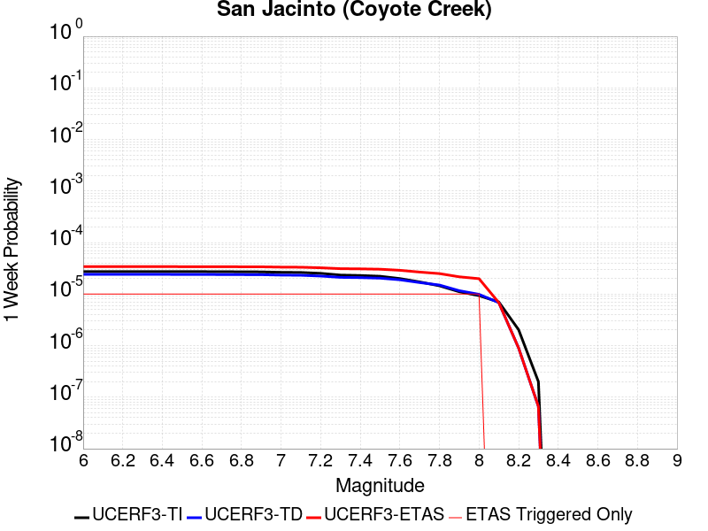 |  |  |  |

| Magnitude | 1 wk TI Prob | 1 wk TD Prob | 1 wk ETAS Prob | 1 wk ETAS/TD Gain | 1 wk ETAS Triggered Only | 1 mo TI Prob | 1 mo TD Prob | 1 mo ETAS Prob | 1 mo ETAS/TD Gain | 1 mo ETAS Triggered Only | 1 yr TI Prob | 1 yr TD Prob | 1 yr ETAS Prob | 1 yr ETAS/TD Gain | 1 yr ETAS Triggered Only | 10 yr TI Prob | 10 yr TD Prob | 10 yr ETAS Prob | 10 yr ETAS/TD Gain | 10 yr ETAS Triggered Only |
|-----|-----|-----|-----|-----|-----|-----|-----|-----|-----|-----|-----|-----|-----|-----|-----|-----|-----|-----|-----|-----|
| 6.0 | 2.7374346E-5 | 2.4145214E-5 | 3.4144974E-5 | 1.4141507 | 1.0E-5 | 1.1731335E-4 | 1.034754E-4 | 1.13474365E-4 | 1.0966313 | 1.0E-5 | 0.0014273542 | 0.0012590875 | 0.0012690749 | 1.0079323 | 1.0E-5 | 0.01418221 | 0.012928318 | 0.012938188 | 1.0007635 | 1.0E-5 |
| 6.1 | 2.7374346E-5 | 2.4145214E-5 | 3.4144974E-5 | 1.4141507 | 1.0E-5 | 1.1731335E-4 | 1.034754E-4 | 1.13474365E-4 | 1.0966313 | 1.0E-5 | 0.0014273542 | 0.0012590875 | 0.0012690749 | 1.0079323 | 1.0E-5 | 0.01418221 | 0.012928318 | 0.012938188 | 1.0007635 | 1.0E-5 |
| 6.2 | 2.7374346E-5 | 2.4145214E-5 | 3.4144974E-5 | 1.4141507 | 1.0E-5 | 1.1731335E-4 | 1.034754E-4 | 1.13474365E-4 | 1.0966313 | 1.0E-5 | 0.0014273542 | 0.0012590875 | 0.0012690749 | 1.0079323 | 1.0E-5 | 0.01418221 | 0.012928318 | 0.012938188 | 1.0007635 | 1.0E-5 |
| 6.3 | 2.7374346E-5 | 2.4145214E-5 | 3.4144974E-5 | 1.4141507 | 1.0E-5 | 1.1731335E-4 | 1.034754E-4 | 1.13474365E-4 | 1.0966313 | 1.0E-5 | 0.0014273542 | 0.0012590875 | 0.0012690749 | 1.0079323 | 1.0E-5 | 0.01418221 | 0.012928318 | 0.012938188 | 1.0007635 | 1.0E-5 |
| 6.4 | 2.7374346E-5 | 2.4145214E-5 | 3.4144974E-5 | 1.4141507 | 1.0E-5 | 1.1731335E-4 | 1.034754E-4 | 1.13474365E-4 | 1.0966313 | 1.0E-5 | 0.0014273542 | 0.0012590875 | 0.0012690749 | 1.0079323 | 1.0E-5 | 0.01418221 | 0.012928318 | 0.012938188 | 1.0007635 | 1.0E-5 |
| 6.5 | 2.7282445E-5 | 2.4031293E-5 | 3.403105E-5 | 1.4161141 | 1.0E-5 | 1.16919524E-4 | 1.029872E-4 | 1.1298617E-4 | 1.0970894 | 1.0E-5 | 0.0014225657 | 0.0012531505 | 0.001263138 | 1.0079699 | 1.0E-5 | 0.014134934 | 0.012869646 | 0.012879517 | 1.000767 | 1.0E-5 |
| 6.6 | 2.7282445E-5 | 2.4031293E-5 | 3.403105E-5 | 1.4161141 | 1.0E-5 | 1.16919524E-4 | 1.029872E-4 | 1.1298617E-4 | 1.0970894 | 1.0E-5 | 0.0014225657 | 0.0012531505 | 0.001263138 | 1.0079699 | 1.0E-5 | 0.014134934 | 0.012869646 | 0.012879517 | 1.000767 | 1.0E-5 |
| 6.7 | 2.7216198E-5 | 2.3956412E-5 | 3.3956174E-5 | 1.4174148 | 1.0E-5 | 1.1663563E-4 | 1.02666316E-4 | 1.12665286E-4 | 1.0973929 | 1.0E-5 | 0.0014191137 | 0.0012492483 | 0.0012592358 | 1.0079948 | 1.0E-5 | 0.014100855 | 0.0128310565 | 0.0128409285 | 1.0007694 | 1.0E-5 |
| 6.8 | 2.7078617E-5 | 2.387363E-5 | 3.387339E-5 | 1.4188622 | 1.0E-5 | 1.1604605E-4 | 1.0231156E-4 | 1.1231054E-4 | 1.0977306 | 1.0E-5 | 0.001411945 | 0.0012449342 | 0.0012549217 | 1.0080225 | 1.0E-5 | 0.014030075 | 0.012788199 | 0.012798071 | 1.000772 | 1.0E-5 |
| 6.9 | 2.6982952E-5 | 2.3793142E-5 | 3.3792905E-5 | 1.4202791 | 1.0E-5 | 1.15636096E-4 | 1.0196664E-4 | 1.11965615E-4 | 1.0980613 | 1.0E-5 | 0.0014069602 | 0.0012407395 | 0.001250727 | 1.0080497 | 1.0E-5 | 0.013980856 | 0.012746515 | 0.012756387 | 1.0007745 | 1.0E-5 |
| 7.0 | 2.6449972E-5 | 2.3370165E-5 | 3.336993E-5 | 1.427886 | 1.0E-5 | 1.1335209E-4 | 1.00154015E-4 | 1.10153014E-4 | 1.0998362 | 1.0E-5 | 0.001379188 | 0.0012186957 | 0.0012286834 | 1.0081955 | 1.0E-5 | 0.0137065975 | 0.0125278765 | 0.012537751 | 1.0007882 | 1.0E-5 |
| 7.1 | 2.6257849E-5 | 2.3196202E-5 | 3.319597E-5 | 1.4310951 | 1.0E-5 | 1.1252879E-4 | 9.940852E-5 | 1.0940753E-4 | 1.100585 | 1.0E-5 | 0.0013691769 | 0.0012096294 | 0.0012196172 | 1.008257 | 1.0E-5 | 0.013607717 | 0.012437741 | 0.012447617 | 1.000794 | 1.0E-5 |
| 7.2 | 2.5270041E-5 | 2.2390966E-5 | 3.239074E-5 | 1.4465986 | 1.0E-5 | 1.0829568E-4 | 9.595777E-5 | 1.0595681E-4 | 1.1042025 | 1.0E-5 | 0.0013177024 | 0.0011676621 | 0.0011776504 | 1.0085541 | 1.0E-5 | 0.013099162 | 0.012018777 | 0.012028657 | 1.0008221 | 1.0E-5 |
| 7.3 | 2.339701E-5 | 2.1122814E-5 | 3.1122603E-5 | 1.4734118 | 1.0E-5 | 1.0026905E-4 | 9.0523215E-5 | 1.0052231E-4 | 1.1104589 | 1.0E-5 | 0.001220092 | 0.0011015651 | 0.001111554 | 1.009068 | 1.0E-5 | 0.012134149 | 0.011357696 | 0.011367583 | 1.0008705 | 1.0E-5 |
| 7.4 | 2.296333E-5 | 2.0853171E-5 | 3.0852963E-5 | 1.4795334 | 1.0E-5 | 9.841056E-5 | 8.936768E-5 | 9.9366785E-5 | 1.1118873 | 1.0E-5 | 0.0011974899 | 0.0010875105 | 0.0010974996 | 1.0091853 | 1.0E-5 | 0.011910575 | 0.01121681 | 0.011226697 | 1.0008816 | 1.0E-5 |
| 7.5 | 2.2188895E-5 | 2.0376096E-5 | 3.0375892E-5 | 1.4907612 | 1.0E-5 | 9.50918E-5 | 8.732321E-5 | 9.7322336E-5 | 1.1145071 | 1.0E-5 | 0.0011571277 | 0.0010626436 | 0.001072633 | 1.0094005 | 1.0E-5 | 0.011511209 | 0.010966429 | 0.010976318 | 1.0009018 | 1.0E-5 |
| 7.6 | 2.0013189E-5 | 1.8962366E-5 | 2.8962177E-5 | 1.5273503 | 1.0E-5 | 8.5767984E-5 | 8.1264756E-5 | 9.1263944E-5 | 1.1230446 | 1.0E-5 | 0.001043725 | 9.889511E-4 | 9.989413E-4 | 1.0101017 | 1.0E-5 | 0.010388365 | 0.010224434 | 0.010234331 | 1.0009681 | 1.0E-5 |
| 7.7 | 1.7230794E-5 | 1.674371E-5 | 2.6743543E-5 | 1.5972292 | 1.0E-5 | 7.384417E-5 | 7.175679E-5 | 8.175607E-5 | 1.1393496 | 1.0E-5 | 8.986819E-4 | 8.7328954E-4 | 8.832808E-4 | 1.011441 | 1.0E-5 | 0.008950562 | 0.009062956 | 0.009072865 | 1.0010934 | 1.0E-5 |
| 7.8 | 1.4478809E-5 | 1.4990978E-5 | 2.4990828E-5 | 1.6670579 | 1.0E-5 | 6.205057E-5 | 6.424547E-5 | 7.4244825E-5 | 1.155643 | 1.0E-5 | 7.552038E-4 | 7.819085E-4 | 7.9190073E-4 | 1.0127792 | 1.0E-5 | 0.0075264242 | 0.008141387 | 0.008151306 | 1.0012183 | 1.0E-5 |
| 7.9 | 1.1114467E-5 | 1.1645102E-5 | 2.1644986E-5 | 1.8587202 | 1.0E-5 | 4.7632562E-5 | 4.990663E-5 | 5.990613E-5 | 1.2003642 | 1.0E-5 | 5.797721E-4 | 6.074444E-4 | 6.174383E-4 | 1.0164524 | 1.0E-5 | 0.0057826187 | 0.0063803247 | 0.006390261 | 1.0015574 | 1.0E-5 |
| 8.0 | 9.327402E-6 | 9.899186E-6 | 1.9899087E-5 | 2.010174 | 1.0E-5 | 3.9973966E-5 | 4.2424395E-5 | 5.2423973E-5 | 1.2357035 | 1.0E-5 | 4.8657437E-4 | 5.1639514E-4 | 5.2639E-4 | 1.019355 | 1.0E-5 | 0.0048551033 | 0.0054499684 | 0.005459914 | 1.0018249 | 1.0E-5 |
| 8.1 | 7.0235833E-6 | 6.827495E-6 | 6.827495E-6 | 1.0 | 0.0 | 3.0100724E-5 | 2.9260367E-5 | 2.9260367E-5 | 1.0 | 0.0 | 3.664147E-4 | 3.5618723E-4 | 3.5618723E-4 | 1.0 | 0.0 | 0.003658111 | 0.0037876023 | 0.0037876023 | 1.0 | 0.0 |
| 8.2 | 2.0358202E-6 | 8.994527E-7 | 8.994527E-7 | 1.0 | 0.0 | 8.724915E-6 | 3.854792E-6 | 3.854792E-6 | 1.0 | 0.0 | 1.06220665E-4 | 4.69311E-5 | 4.69311E-5 | 1.0 | 0.0 | 0.001061699 | 5.3254166E-4 | 5.3254166E-4 | 1.0 | 0.0 |
| 8.3 | 2.0051264E-7 | 6.617272E-8 | 6.617272E-8 | 1.0 | 0.0 | 8.5933965E-7 | 2.8359733E-7 | 2.8359733E-7 | 1.0 | 0.0 | 1.046241E-5 | 3.4527925E-6 | 3.4527925E-6 | 1.0 | 0.0 | 1.0461917E-4 | 4.01389E-5 | 4.01389E-5 | 1.0 | 0.0 |

## Puente Hills
*[(top)](#table-of-contents)*

| 1 Week | 1 Month | 1 Year | 10 Year |
|-----|-----|-----|-----|
| 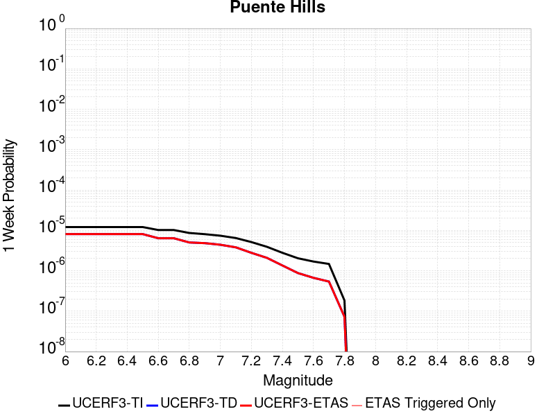 |  |  |  |

| Magnitude | 1 wk TI Prob | 1 wk TD Prob | 1 wk ETAS Prob | 1 wk ETAS/TD Gain | 1 wk ETAS Triggered Only | 1 mo TI Prob | 1 mo TD Prob | 1 mo ETAS Prob | 1 mo ETAS/TD Gain | 1 mo ETAS Triggered Only | 1 yr TI Prob | 1 yr TD Prob | 1 yr ETAS Prob | 1 yr ETAS/TD Gain | 1 yr ETAS Triggered Only | 10 yr TI Prob | 10 yr TD Prob | 10 yr ETAS Prob | 10 yr ETAS/TD Gain | 10 yr ETAS Triggered Only |
|-----|-----|-----|-----|-----|-----|-----|-----|-----|-----|-----|-----|-----|-----|-----|-----|-----|-----|-----|-----|-----|
| 6.0 | 1.2101656E-5 | 8.098625E-6 | 8.098625E-6 | 1.0 | 0.0 | 5.1863204E-5 | 3.4707962E-5 | 3.4707962E-5 | 1.0 | 0.0 | 6.312516E-4 | 4.2249315E-4 | 4.3248892E-4 | 1.023659 | 1.0E-5 | 0.0062946146 | 0.0042174594 | 0.004227417 | 1.002361 | 1.0E-5 |
| 6.1 | 1.2101656E-5 | 8.098625E-6 | 8.098625E-6 | 1.0 | 0.0 | 5.1863204E-5 | 3.4707962E-5 | 3.4707962E-5 | 1.0 | 0.0 | 6.312516E-4 | 4.2249315E-4 | 4.3248892E-4 | 1.023659 | 1.0E-5 | 0.0062946146 | 0.0042174594 | 0.004227417 | 1.002361 | 1.0E-5 |
| 6.2 | 1.2101656E-5 | 8.098625E-6 | 8.098625E-6 | 1.0 | 0.0 | 5.1863204E-5 | 3.4707962E-5 | 3.4707962E-5 | 1.0 | 0.0 | 6.312516E-4 | 4.2249315E-4 | 4.3248892E-4 | 1.023659 | 1.0E-5 | 0.0062946146 | 0.0042174594 | 0.004227417 | 1.002361 | 1.0E-5 |
| 6.3 | 1.2101656E-5 | 8.098625E-6 | 8.098625E-6 | 1.0 | 0.0 | 5.1863204E-5 | 3.4707962E-5 | 3.4707962E-5 | 1.0 | 0.0 | 6.312516E-4 | 4.2249315E-4 | 4.3248892E-4 | 1.023659 | 1.0E-5 | 0.0062946146 | 0.0042174594 | 0.004227417 | 1.002361 | 1.0E-5 |
| 6.4 | 1.2101656E-5 | 8.098625E-6 | 8.098625E-6 | 1.0 | 0.0 | 5.1863204E-5 | 3.4707962E-5 | 3.4707962E-5 | 1.0 | 0.0 | 6.312516E-4 | 4.2249315E-4 | 4.3248892E-4 | 1.023659 | 1.0E-5 | 0.0062946146 | 0.0042174594 | 0.004227417 | 1.002361 | 1.0E-5 |
| 6.5 | 1.2101656E-5 | 8.098625E-6 | 8.098625E-6 | 1.0 | 0.0 | 5.1863204E-5 | 3.4707962E-5 | 3.4707962E-5 | 1.0 | 0.0 | 6.312516E-4 | 4.2249315E-4 | 4.3248892E-4 | 1.023659 | 1.0E-5 | 0.0062946146 | 0.0042174594 | 0.004227417 | 1.002361 | 1.0E-5 |
| 6.6 | 1.0222488E-5 | 6.3991847E-6 | 6.3991847E-6 | 1.0 | 0.0 | 4.3809923E-5 | 2.7424801E-5 | 2.7424801E-5 | 1.0 | 0.0 | 5.332553E-4 | 3.3384826E-4 | 3.3384826E-4 | 1.0 | 0.0 | 0.0053197746 | 0.0033337125 | 0.0033337125 | 1.0 | 0.0 |
| 6.7 | 1.0222488E-5 | 6.3991847E-6 | 6.3991847E-6 | 1.0 | 0.0 | 4.3809923E-5 | 2.7424801E-5 | 2.7424801E-5 | 1.0 | 0.0 | 5.332553E-4 | 3.3384826E-4 | 3.3384826E-4 | 1.0 | 0.0 | 0.0053197746 | 0.0033337125 | 0.0033337125 | 1.0 | 0.0 |
| 6.8 | 8.6367845E-6 | 5.0282533E-6 | 5.0282533E-6 | 1.0 | 0.0 | 3.7014266E-5 | 2.1549482E-5 | 2.1549482E-5 | 1.0 | 0.0 | 4.505555E-4 | 2.623339E-4 | 2.623339E-4 | 1.0 | 0.0 | 0.004496431 | 0.0026202986 | 0.0026202986 | 1.0 | 0.0 |
| 6.9 | 8.066481E-6 | 4.836117E-6 | 4.836117E-6 | 1.0 | 0.0 | 3.4570177E-5 | 2.0726053E-5 | 2.0726053E-5 | 1.0 | 0.0 | 4.2081063E-4 | 2.52311E-4 | 2.52311E-4 | 1.0 | 0.0 | 0.0042001465 | 0.0025202993 | 0.0025202993 | 1.0 | 0.0 |
| 7.0 | 7.393828E-6 | 4.417296E-6 | 4.417296E-6 | 1.0 | 0.0 | 3.168745E-5 | 1.8931134E-5 | 1.8931134E-5 | 1.0 | 0.0 | 3.857264E-4 | 2.3046264E-4 | 2.3046264E-4 | 1.0 | 0.0 | 0.0038505755 | 0.0023022818 | 0.0023022818 | 1.0 | 0.0 |
| 7.1 | 6.4660953E-6 | 3.8044495E-6 | 3.8044495E-6 | 1.0 | 0.0 | 2.7711543E-5 | 1.6304684E-5 | 1.6304684E-5 | 1.0 | 0.0 | 3.373358E-4 | 1.984918E-4 | 1.984918E-4 | 1.0 | 0.0 | 0.0033682417 | 0.001983181 | 0.001983181 | 1.0 | 0.0 |
| 7.2 | 5.143232E-6 | 2.7865456E-6 | 2.7865456E-6 | 1.0 | 0.0 | 2.2042237E-5 | 1.1942284E-5 | 1.1942284E-5 | 1.0 | 0.0 | 2.6833118E-4 | 1.453877E-4 | 1.453877E-4 | 1.0 | 0.0 | 0.002680074 | 0.0014529356 | 0.0014529356 | 1.0 | 0.0 |
| 7.3 | 3.928255E-6 | 2.0913774E-6 | 2.0913774E-6 | 1.0 | 0.0 | 1.683527E-5 | 8.963015E-6 | 8.963015E-6 | 1.0 | 0.0 | 2.0495013E-4 | 1.0911931E-4 | 1.0911931E-4 | 1.0 | 0.0 | 0.002047612 | 0.001090664 | 0.001090664 | 1.0 | 0.0 |
| 7.4 | 2.7894434E-6 | 1.3546753E-6 | 1.3546753E-6 | 1.0 | 0.0 | 1.1954703E-5 | 5.8057385E-6 | 5.8057385E-6 | 1.0 | 0.0 | 1.4553878E-4 | 7.068262E-5 | 7.068262E-5 | 1.0 | 0.0 | 0.001454435 | 7.066058E-4 | 7.066058E-4 | 1.0 | 0.0 |
| 7.5 | 2.041735E-6 | 8.787305E-7 | 8.787305E-7 | 1.0 | 0.0 | 8.750263E-6 | 3.7659825E-6 | 3.7659825E-6 | 1.0 | 0.0 | 1.06529245E-4 | 4.5849905E-5 | 4.5849905E-5 | 1.0 | 0.0 | 0.0010647819 | 4.5840783E-4 | 4.5840783E-4 | 1.0 | 0.0 |
| 7.6 | 1.6959062E-6 | 6.6986263E-7 | 6.6986263E-7 | 1.0 | 0.0 | 7.268149E-6 | 2.8708366E-6 | 2.8708366E-6 | 1.0 | 0.0 | 8.848612E-5 | 3.4951907E-5 | 3.4951907E-5 | 1.0 | 0.0 | 8.84509E-4 | 3.4946698E-4 | 3.4946698E-4 | 1.0 | 0.0 |
| 7.7 | 1.4767965E-6 | 5.407607E-7 | 5.407607E-7 | 1.0 | 0.0 | 6.3291122E-6 | 2.317544E-6 | 2.317544E-6 | 1.0 | 0.0 | 7.705422E-5 | 2.8215758E-5 | 2.8215758E-5 | 1.0 | 0.0 | 7.702751E-4 | 2.8212433E-4 | 2.8212433E-4 | 1.0 | 0.0 |
| 7.8 | 1.8432911E-7 | 7.28201E-8 | 7.28201E-8 | 1.0 | 0.0 | 7.8998164E-7 | 3.1208612E-7 | 3.1208612E-7 | 1.0 | 0.0 | 9.617985E-6 | 3.7996451E-6 | 3.7996451E-6 | 1.0 | 0.0 | 9.617568E-5 | 3.7996128E-5 | 3.7996128E-5 | 1.0 | 0.0 |

## Jess Valley
*[(top)](#table-of-contents)*

| 1 Week | 1 Month | 1 Year | 10 Year |
|-----|-----|-----|-----|
|  |  |  |  |

| Magnitude | 1 wk TI Prob | 1 wk TD Prob | 1 wk ETAS Prob | 1 wk ETAS/TD Gain | 1 wk ETAS Triggered Only | 1 mo TI Prob | 1 mo TD Prob | 1 mo ETAS Prob | 1 mo ETAS/TD Gain | 1 mo ETAS Triggered Only | 1 yr TI Prob | 1 yr TD Prob | 1 yr ETAS Prob | 1 yr ETAS/TD Gain | 1 yr ETAS Triggered Only | 10 yr TI Prob | 10 yr TD Prob | 10 yr ETAS Prob | 10 yr ETAS/TD Gain | 10 yr ETAS Triggered Only |
|-----|-----|-----|-----|-----|-----|-----|-----|-----|-----|-----|-----|-----|-----|-----|-----|-----|-----|-----|-----|-----|
| 6.0 | 3.3861274E-6 | 3.4340592E-6 | 1.3434025E-5 | 3.9119956 | 1.0E-5 | 1.4511894E-5 | 1.471733E-5 | 2.4717183E-5 | 1.6794611 | 1.0E-5 | 1.7666799E-4 | 1.7917156E-4 | 1.8916978E-4 | 1.0558025 | 1.0E-5 | 0.001765276 | 0.0017905476 | 0.0018005297 | 1.005575 | 1.0E-5 |
| 6.1 | 3.3861274E-6 | 3.4340592E-6 | 1.3434025E-5 | 3.9119956 | 1.0E-5 | 1.4511894E-5 | 1.471733E-5 | 2.4717183E-5 | 1.6794611 | 1.0E-5 | 1.7666799E-4 | 1.7917156E-4 | 1.8916978E-4 | 1.0558025 | 1.0E-5 | 0.001765276 | 0.0017905476 | 0.0018005297 | 1.005575 | 1.0E-5 |
| 6.2 | 3.3861274E-6 | 3.4340592E-6 | 1.3434025E-5 | 3.9119956 | 1.0E-5 | 1.4511894E-5 | 1.471733E-5 | 2.4717183E-5 | 1.6794611 | 1.0E-5 | 1.7666799E-4 | 1.7917156E-4 | 1.8916978E-4 | 1.0558025 | 1.0E-5 | 0.001765276 | 0.0017905476 | 0.0018005297 | 1.005575 | 1.0E-5 |
| 6.3 | 3.3861274E-6 | 3.4340592E-6 | 1.3434025E-5 | 3.9119956 | 1.0E-5 | 1.4511894E-5 | 1.471733E-5 | 2.4717183E-5 | 1.6794611 | 1.0E-5 | 1.7666799E-4 | 1.7917156E-4 | 1.8916978E-4 | 1.0558025 | 1.0E-5 | 0.001765276 | 0.0017905476 | 0.0018005297 | 1.005575 | 1.0E-5 |
| 6.4 | 1.5291708E-6 | 1.5502784E-6 | 1.5502784E-6 | 1.0 | 0.0 | 6.553573E-6 | 6.644038E-6 | 6.644038E-6 | 1.0 | 0.0 | 7.978683E-5 | 8.088895E-5 | 8.088895E-5 | 1.0 | 0.0 | 7.975819E-4 | 8.086733E-4 | 8.086733E-4 | 1.0 | 0.0 |
| 6.5 | 1.5291708E-6 | 1.5502784E-6 | 1.5502784E-6 | 1.0 | 0.0 | 6.553573E-6 | 6.644038E-6 | 6.644038E-6 | 1.0 | 0.0 | 7.978683E-5 | 8.088895E-5 | 8.088895E-5 | 1.0 | 0.0 | 7.975819E-4 | 8.086733E-4 | 8.086733E-4 | 1.0 | 0.0 |
| 6.6 | 5.396423E-7 | 5.4719953E-7 | 5.4719953E-7 | 1.0 | 0.0 | 2.312751E-6 | 2.3451398E-6 | 2.3451398E-6 | 1.0 | 0.0 | 2.8157378E-5 | 2.855189E-5 | 2.855189E-5 | 1.0 | 0.0 | 2.8153812E-4 | 2.8550063E-4 | 2.8550063E-4 | 1.0 | 0.0 |
| 6.7 | 5.396423E-7 | 5.4719953E-7 | 5.4719953E-7 | 1.0 | 0.0 | 2.312751E-6 | 2.3451398E-6 | 2.3451398E-6 | 1.0 | 0.0 | 2.8157378E-5 | 2.855189E-5 | 2.855189E-5 | 1.0 | 0.0 | 2.8153812E-4 | 2.8550063E-4 | 2.8550063E-4 | 1.0 | 0.0 |
| 6.8 | 3.6058395E-7 | 3.6563068E-7 | 3.6563068E-7 | 1.0 | 0.0 | 1.5453588E-6 | 1.5669885E-6 | 1.5669885E-6 | 1.0 | 0.0 | 1.8814582E-5 | 1.9078087E-5 | 1.9078087E-5 | 1.0 | 0.0 | 1.8812988E-4 | 1.9078086E-4 | 1.9078086E-4 | 1.0 | 0.0 |

## Green Valley 2011 CFM
*[(top)](#table-of-contents)*

| 1 Week | 1 Month | 1 Year | 10 Year |
|-----|-----|-----|-----|
|  |  |  |  |

| Magnitude | 1 wk TI Prob | 1 wk TD Prob | 1 wk ETAS Prob | 1 wk ETAS/TD Gain | 1 wk ETAS Triggered Only | 1 mo TI Prob | 1 mo TD Prob | 1 mo ETAS Prob | 1 mo ETAS/TD Gain | 1 mo ETAS Triggered Only | 1 yr TI Prob | 1 yr TD Prob | 1 yr ETAS Prob | 1 yr ETAS/TD Gain | 1 yr ETAS Triggered Only | 10 yr TI Prob | 10 yr TD Prob | 10 yr ETAS Prob | 10 yr ETAS/TD Gain | 10 yr ETAS Triggered Only |
|-----|-----|-----|-----|-----|-----|-----|-----|-----|-----|-----|-----|-----|-----|-----|-----|-----|-----|-----|-----|-----|
| 6.0 | 9.9629346E-5 | 1.7305532E-4 | 1.8305359E-4 | 1.057775 | 1.0E-5 | 4.2691303E-4 | 7.4143766E-4 | 7.514302E-4 | 1.0134773 | 1.0E-5 | 0.0051852856 | 0.008986705 | 0.008996615 | 1.0011028 | 1.0E-5 | 0.050659515 | 0.085522056 | 0.085531205 | 1.0001069 | 1.0E-5 |
| 6.1 | 9.88615E-5 | 1.7152846E-4 | 1.8152675E-4 | 1.0582894 | 1.0E-5 | 4.2362334E-4 | 7.348976E-4 | 7.448903E-4 | 1.0135974 | 1.0E-5 | 0.0051454236 | 0.0089077335 | 0.008917645 | 1.0011126 | 1.0E-5 | 0.050279044 | 0.084809676 | 0.084818825 | 1.0001079 | 1.0E-5 |
| 6.2 | 9.696895E-5 | 1.6791887E-4 | 1.779172E-4 | 1.0595425 | 1.0E-5 | 4.15515E-4 | 7.194366E-4 | 7.294294E-4 | 1.0138898 | 1.0E-5 | 0.0050471667 | 0.008721114 | 0.008731027 | 1.0011367 | 1.0E-5 | 0.04934063 | 0.0831186 | 0.083127774 | 1.0001103 | 1.0E-5 |
| 6.3 | 9.275224E-5 | 1.5971228E-4 | 1.6971068E-4 | 1.0626026 | 1.0E-5 | 3.9744904E-4 | 6.842841E-4 | 6.9427723E-4 | 1.0146039 | 1.0E-5 | 0.0048282105 | 0.008296439 | 0.008306356 | 1.0011953 | 1.0E-5 | 0.047246475 | 0.07925707 | 0.07926627 | 1.0001162 | 1.0E-5 |
| 6.4 | 8.391499E-5 | 1.4367796E-4 | 1.5367652E-4 | 1.0695901 | 1.0E-5 | 3.595861E-4 | 6.156248E-4 | 6.256187E-4 | 1.0162337 | 1.0E-5 | 0.004369175 | 0.0074670846 | 0.0074770097 | 1.0013292 | 1.0E-5 | 0.04284265 | 0.071630865 | 0.07164015 | 1.0001296 | 1.0E-5 |
| 6.5 | 5.9519385E-5 | 9.9340905E-5 | 1.0933991E-4 | 1.1006534 | 1.0E-5 | 2.5505814E-4 | 4.2568138E-4 | 4.3567715E-4 | 1.0234817 | 1.0E-5 | 0.0031009112 | 0.005168295 | 0.0051782434 | 1.0019249 | 1.0E-5 | 0.030579966 | 0.050145864 | 0.05015536 | 1.0001894 | 1.0E-5 |
| 6.6 | 4.5361558E-5 | 7.402609E-5 | 8.402535E-5 | 1.1350775 | 1.0E-5 | 1.9439218E-4 | 3.1721895E-4 | 3.272158E-4 | 1.0315139 | 1.0E-5 | 0.0023641558 | 0.0038539418 | 0.0038639032 | 1.0025847 | 1.0E-5 | 0.023391623 | 0.037665963 | 0.037675586 | 1.0002555 | 1.0E-5 |
| 6.7 | 3.8808106E-5 | 6.2651976E-5 | 7.2651346E-5 | 1.1596019 | 1.0E-5 | 1.6630985E-4 | 2.6848342E-4 | 2.7848073E-4 | 1.0372362 | 1.0E-5 | 0.0020229418 | 0.0032626586 | 0.003272626 | 1.003055 | 1.0E-5 | 0.020046256 | 0.032005914 | 0.032015596 | 1.0003024 | 1.0E-5 |
| 6.8 | 2.2284667E-5 | 3.1285235E-5 | 4.1284922E-5 | 1.3196295 | 1.0E-5 | 9.550222E-5 | 1.3407279E-4 | 1.4407144E-4 | 1.0745764 | 1.0E-5 | 0.0011621192 | 0.0016311078 | 0.0016410915 | 1.0061208 | 1.0E-5 | 0.011560607 | 0.016165998 | 0.016175836 | 1.0006086 | 1.0E-5 |
| 6.9 | 1.8050168E-5 | 2.4448054E-5 | 3.444781E-5 | 1.4090205 | 1.0E-5 | 7.735557E-5 | 1.047732E-4 | 1.1477215E-4 | 1.0954343 | 1.0E-5 | 9.4139716E-4 | 0.0012748708 | 0.0012848581 | 1.007834 | 1.0E-5 | 0.009374191 | 0.012667833 | 0.012677706 | 1.0007794 | 1.0E-5 |
| 7.0 | 1.4763166E-5 | 1.9582854E-5 | 2.9582658E-5 | 1.5106409 | 1.0E-5 | 6.326917E-5 | 8.3923835E-5 | 9.3922994E-5 | 1.1191456 | 1.0E-5 | 7.7002996E-4 | 0.0010212966 | 0.0010312864 | 1.0097815 | 1.0E-5 | 0.007673672 | 0.010165343 | 0.010175241 | 1.0009737 | 1.0E-5 |
| 7.1 | 1.2399713E-5 | 1.6303715E-5 | 2.630355E-5 | 1.6133472 | 1.0E-5 | 5.3140546E-5 | 6.98712E-5 | 7.98705E-5 | 1.1431105 | 1.0E-5 | 6.467941E-4 | 8.503518E-4 | 8.6034334E-4 | 1.0117499 | 1.0E-5 | 0.006449148 | 0.008471259 | 0.008481174 | 1.0011705 | 1.0E-5 |
| 7.2 | 1.0584195E-5 | 1.3921742E-5 | 2.3921602E-5 | 1.7182909 | 1.0E-5 | 4.5360044E-5 | 5.9663253E-5 | 6.966266E-5 | 1.1675974 | 1.0E-5 | 5.521186E-4 | 7.261596E-4 | 7.3615235E-4 | 1.013761 | 1.0E-5 | 0.0055074887 | 0.007238285 | 0.0072482126 | 1.0013715 | 1.0E-5 |
| 7.3 | 7.998173E-6 | 1.054402E-5 | 1.054402E-5 | 1.0 | 0.0 | 3.4277433E-5 | 4.518788E-5 | 4.518788E-5 | 1.0 | 0.0 | 4.1724785E-4 | 5.500247E-4 | 5.500247E-4 | 1.0 | 0.0 | 0.004164653 | 0.0054868995 | 0.0054868995 | 1.0 | 0.0 |
| 7.4 | 6.7571127E-6 | 8.932697E-6 | 8.932697E-6 | 1.0 | 0.0 | 2.8958733E-5 | 3.828243E-5 | 3.828243E-5 | 1.0 | 0.0 | 3.5251552E-4 | 4.6598984E-4 | 4.6598984E-4 | 1.0 | 0.0 | 0.0035195686 | 0.0046503306 | 0.0046503306 | 1.0 | 0.0 |
| 7.5 | 5.69878E-6 | 7.516314E-6 | 7.516314E-6 | 1.0 | 0.0 | 2.4423114E-5 | 3.221238E-5 | 3.221238E-5 | 1.0 | 0.0 | 2.9731085E-4 | 3.9211605E-4 | 3.9211605E-4 | 1.0 | 0.0 | 0.002969134 | 0.0039143935 | 0.0039143935 | 1.0 | 0.0 |
| 7.6 | 4.503664E-6 | 5.9356807E-6 | 5.9356807E-6 | 1.0 | 0.0 | 1.9301275E-5 | 2.5438389E-5 | 2.5438389E-5 | 1.0 | 0.0 | 2.3496768E-4 | 3.096692E-4 | 3.096692E-4 | 1.0 | 0.0 | 0.002347194 | 0.003092502 | 0.003092502 | 1.0 | 0.0 |
| 7.7 | 1.0873546E-6 | 1.4106979E-6 | 1.4106979E-6 | 1.0 | 0.0 | 4.6600826E-6 | 6.045834E-6 | 6.045834E-6 | 1.0 | 0.0 | 5.6735033E-5 | 7.360557E-5 | 7.360557E-5 | 1.0 | 0.0 | 5.672055E-4 | 7.35814E-4 | 7.35814E-4 | 1.0 | 0.0 |
| 7.8 | 4.9373917E-8 | 6.1777136E-8 | 6.1777136E-8 | 1.0 | 0.0 | 2.1160248E-7 | 2.6475914E-7 | 2.6475914E-7 | 1.0 | 0.0 | 2.5762572E-6 | 3.223439E-6 | 3.223439E-6 | 1.0 | 0.0 | 2.5762274E-5 | 3.2232296E-5 | 3.2232296E-5 | 1.0 | 0.0 |

## Elmore Ranch
*[(top)](#table-of-contents)*

| 1 Week | 1 Month | 1 Year | 10 Year |
|-----|-----|-----|-----|
|  |  |  |  |

| Magnitude | 1 wk TI Prob | 1 wk TD Prob | 1 wk ETAS Prob | 1 wk ETAS/TD Gain | 1 wk ETAS Triggered Only | 1 mo TI Prob | 1 mo TD Prob | 1 mo ETAS Prob | 1 mo ETAS/TD Gain | 1 mo ETAS Triggered Only | 1 yr TI Prob | 1 yr TD Prob | 1 yr ETAS Prob | 1 yr ETAS/TD Gain | 1 yr ETAS Triggered Only | 10 yr TI Prob | 10 yr TD Prob | 10 yr ETAS Prob | 10 yr ETAS/TD Gain | 10 yr ETAS Triggered Only |
|-----|-----|-----|-----|-----|-----|-----|-----|-----|-----|-----|-----|-----|-----|-----|-----|-----|-----|-----|-----|-----|
| 6.0 | 9.102099E-5 | 8.952015E-5 | 8.952015E-5 | 1.0 | 0.0 | 3.9003167E-4 | 3.8361453E-4 | 3.8361453E-4 | 1.0 | 0.0 | 0.0047383 | 0.004662009 | 0.004662009 | 1.0 | 0.0 | 0.046385348 | 0.045870975 | 0.045880515 | 1.000208 | 1.0E-5 |
| 6.1 | 3.8306698E-5 | 4.1498504E-5 | 4.1498504E-5 | 1.0 | 0.0 | 1.6416123E-4 | 1.7784268E-4 | 1.7784268E-4 | 1.0 | 0.0 | 0.0019968306 | 0.0021631396 | 0.0021631396 | 1.0 | 0.0 | 0.019789828 | 0.021628205 | 0.021637987 | 1.0004524 | 1.0E-5 |
| 6.2 | 3.8306698E-5 | 4.1498504E-5 | 4.1498504E-5 | 1.0 | 0.0 | 1.6416123E-4 | 1.7784268E-4 | 1.7784268E-4 | 1.0 | 0.0 | 0.0019968306 | 0.0021631396 | 0.0021631396 | 1.0 | 0.0 | 0.019789828 | 0.021628205 | 0.021637987 | 1.0004524 | 1.0E-5 |
| 6.3 | 3.3197924E-5 | 3.6554302E-5 | 3.6554302E-5 | 1.0 | 0.0 | 1.4226905E-4 | 1.5665586E-4 | 1.5665586E-4 | 1.0 | 0.0 | 0.0017307495 | 0.001905917 | 0.001905917 | 1.0 | 0.0 | 0.017173318 | 0.01908996 | 0.019099768 | 1.0005138 | 1.0E-5 |
| 6.4 | 2.5148964E-5 | 2.7420487E-5 | 2.7420487E-5 | 1.0 | 0.0 | 1.0777682E-4 | 1.17514726E-4 | 1.17514726E-4 | 1.0 | 0.0 | 0.0013113929 | 0.0014304507 | 0.0014304507 | 1.0 | 0.0 | 0.01303681 | 0.014387194 | 0.014387194 | 1.0 | 0.0 |
| 6.5 | 2.5148964E-5 | 2.7420487E-5 | 2.7420487E-5 | 1.0 | 0.0 | 1.0777682E-4 | 1.17514726E-4 | 1.17514726E-4 | 1.0 | 0.0 | 0.0013113929 | 0.0014304507 | 0.0014304507 | 1.0 | 0.0 | 0.01303681 | 0.014387194 | 0.014387194 | 1.0 | 0.0 |

## Mohawk Valley 2011 CFM
*[(top)](#table-of-contents)*

| 1 Week | 1 Month | 1 Year | 10 Year |
|-----|-----|-----|-----|
|  |  |  |  |

| Magnitude | 1 wk TI Prob | 1 wk TD Prob | 1 wk ETAS Prob | 1 wk ETAS/TD Gain | 1 wk ETAS Triggered Only | 1 mo TI Prob | 1 mo TD Prob | 1 mo ETAS Prob | 1 mo ETAS/TD Gain | 1 mo ETAS Triggered Only | 1 yr TI Prob | 1 yr TD Prob | 1 yr ETAS Prob | 1 yr ETAS/TD Gain | 1 yr ETAS Triggered Only | 10 yr TI Prob | 10 yr TD Prob | 10 yr ETAS Prob | 10 yr ETAS/TD Gain | 10 yr ETAS Triggered Only |
|-----|-----|-----|-----|-----|-----|-----|-----|-----|-----|-----|-----|-----|-----|-----|-----|-----|-----|-----|-----|-----|
| 6.0 | 2.5425423E-5 | 2.7644777E-5 | 3.7644502E-5 | 1.361722 | 1.0E-5 | 1.0896155E-4 | 1.18472846E-4 | 1.2847167E-4 | 1.0843976 | 1.0E-5 | 0.0013257994 | 0.001441561 | 0.0014515467 | 1.0069269 | 1.0E-5 | 0.013179175 | 0.01433298 | 0.014342836 | 1.0006877 | 1.0E-5 |
| 6.1 | 2.5425423E-5 | 2.7644777E-5 | 3.7644502E-5 | 1.361722 | 1.0E-5 | 1.0896155E-4 | 1.18472846E-4 | 1.2847167E-4 | 1.0843976 | 1.0E-5 | 0.0013257994 | 0.001441561 | 0.0014515467 | 1.0069269 | 1.0E-5 | 0.013179175 | 0.01433298 | 0.014342836 | 1.0006877 | 1.0E-5 |
| 6.2 | 2.5425423E-5 | 2.7644777E-5 | 3.7644502E-5 | 1.361722 | 1.0E-5 | 1.0896155E-4 | 1.18472846E-4 | 1.2847167E-4 | 1.0843976 | 1.0E-5 | 0.0013257994 | 0.001441561 | 0.0014515467 | 1.0069269 | 1.0E-5 | 0.013179175 | 0.01433298 | 0.014342836 | 1.0006877 | 1.0E-5 |
| 6.3 | 2.5425423E-5 | 2.7644777E-5 | 3.7644502E-5 | 1.361722 | 1.0E-5 | 1.0896155E-4 | 1.18472846E-4 | 1.2847167E-4 | 1.0843976 | 1.0E-5 | 0.0013257994 | 0.001441561 | 0.0014515467 | 1.0069269 | 1.0E-5 | 0.013179175 | 0.01433298 | 0.014342836 | 1.0006877 | 1.0E-5 |
| 6.4 | 1.1812642E-5 | 1.2763586E-5 | 2.2763457E-5 | 1.7834688 | 1.0E-5 | 5.0624625E-5 | 5.470002E-5 | 6.4699474E-5 | 1.1828053 | 1.0E-5 | 6.161805E-4 | 6.6578394E-4 | 6.757773E-4 | 1.0150099 | 1.0E-5 | 0.0061447476 | 0.0066393665 | 0.0066493 | 1.0014962 | 1.0E-5 |
| 6.5 | 1.1812642E-5 | 1.2763586E-5 | 2.2763457E-5 | 1.7834688 | 1.0E-5 | 5.0624625E-5 | 5.470002E-5 | 6.4699474E-5 | 1.1828053 | 1.0E-5 | 6.161805E-4 | 6.6578394E-4 | 6.757773E-4 | 1.0150099 | 1.0E-5 | 0.0061447476 | 0.0066393665 | 0.0066493 | 1.0014962 | 1.0E-5 |
| 6.6 | 9.34204E-6 | 1.0085189E-5 | 2.0085088E-5 | 1.9915429 | 1.0E-5 | 4.0036703E-5 | 4.3221593E-5 | 5.322116E-5 | 1.2313558 | 1.0E-5 | 4.873378E-4 | 5.261076E-4 | 5.3610234E-4 | 1.0189976 | 1.0E-5 | 0.0048627043 | 0.0052497895 | 0.005259737 | 1.0018948 | 1.0E-5 |
| 6.7 | 7.0661854E-6 | 7.6242004E-6 | 1.7624125E-5 | 2.311603 | 1.0E-5 | 3.02833E-5 | 3.2674787E-5 | 4.267446E-5 | 1.3060364 | 1.0E-5 | 3.686368E-4 | 3.9775198E-4 | 4.07748E-4 | 1.0251313 | 1.0E-5 | 0.0036802588 | 0.0039712964 | 0.0039812564 | 1.002508 | 1.0E-5 |
| 6.8 | 4.806676E-6 | 5.187216E-6 | 1.51871645E-5 | 2.9278064 | 1.0E-5 | 2.0599877E-5 | 2.2230774E-5 | 3.223055E-5 | 1.449817 | 1.0E-5 | 2.507746E-4 | 2.7063242E-4 | 2.8062973E-4 | 1.0369405 | 1.0E-5 | 0.0025049183 | 0.0027036548 | 0.0027136279 | 1.0036887 | 1.0E-5 |
| 6.9 | 3.4163209E-6 | 3.6888976E-6 | 3.6888976E-6 | 1.0 | 0.0 | 1.4641293E-5 | 1.5809495E-5 | 1.5809495E-5 | 1.0 | 0.0 | 1.7824316E-4 | 1.9246903E-4 | 1.9246903E-4 | 1.0 | 0.0 | 0.0017810026 | 0.0019235554 | 0.0019235554 | 1.0 | 0.0 |
| 7.0 | 2.5271734E-6 | 2.7310127E-6 | 2.7310127E-6 | 1.0 | 0.0 | 1.0830699E-5 | 1.17043155E-5 | 1.17043155E-5 | 1.0 | 0.0 | 1.3185578E-4 | 1.4249566E-4 | 1.4249566E-4 | 1.0 | 0.0 | 0.0013177756 | 0.0014245264 | 0.0014245264 | 1.0 | 0.0 |

## Casmalia 2011 CFM
*[(top)](#table-of-contents)*

| 1 Week | 1 Month | 1 Year | 10 Year |
|-----|-----|-----|-----|
|  |  |  |  |

| Magnitude | 1 wk TI Prob | 1 wk TD Prob | 1 wk ETAS Prob | 1 wk ETAS/TD Gain | 1 wk ETAS Triggered Only | 1 mo TI Prob | 1 mo TD Prob | 1 mo ETAS Prob | 1 mo ETAS/TD Gain | 1 mo ETAS Triggered Only | 1 yr TI Prob | 1 yr TD Prob | 1 yr ETAS Prob | 1 yr ETAS/TD Gain | 1 yr ETAS Triggered Only | 10 yr TI Prob | 10 yr TD Prob | 10 yr ETAS Prob | 10 yr ETAS/TD Gain | 10 yr ETAS Triggered Only |
|-----|-----|-----|-----|-----|-----|-----|-----|-----|-----|-----|-----|-----|-----|-----|-----|-----|-----|-----|-----|-----|
| 6.0 | 4.1704893E-6 | 4.262483E-6 | 4.262483E-6 | 1.0 | 0.0 | 1.7873403E-5 | 1.8267656E-5 | 1.8267656E-5 | 1.0 | 0.0 | 2.1758694E-4 | 2.2238622E-4 | 2.2238622E-4 | 1.0 | 0.0 | 0.0021737402 | 0.0022216577 | 0.0022316356 | 1.0044911 | 1.0E-5 |
| 6.1 | 4.1704893E-6 | 4.262483E-6 | 4.262483E-6 | 1.0 | 0.0 | 1.7873403E-5 | 1.8267656E-5 | 1.8267656E-5 | 1.0 | 0.0 | 2.1758694E-4 | 2.2238622E-4 | 2.2238622E-4 | 1.0 | 0.0 | 0.0021737402 | 0.0022216577 | 0.0022316356 | 1.0044911 | 1.0E-5 |
| 6.2 | 3.457312E-6 | 3.5370217E-6 | 3.5370217E-6 | 1.0 | 0.0 | 1.4816967E-5 | 1.5158577E-5 | 1.5158577E-5 | 1.0 | 0.0 | 1.8038164E-4 | 1.8454014E-4 | 1.8454014E-4 | 1.0 | 0.0 | 0.001802353 | 0.0018438784 | 0.00185386 | 1.0054133 | 1.0E-5 |
| 6.3 | 3.457312E-6 | 3.5370217E-6 | 3.5370217E-6 | 1.0 | 0.0 | 1.4816967E-5 | 1.5158577E-5 | 1.5158577E-5 | 1.0 | 0.0 | 1.8038164E-4 | 1.8454014E-4 | 1.8454014E-4 | 1.0 | 0.0 | 0.001802353 | 0.0018438784 | 0.00185386 | 1.0054133 | 1.0E-5 |
| 6.4 | 3.0957337E-6 | 3.1692257E-6 | 3.1692257E-6 | 1.0 | 0.0 | 1.3267363E-5 | 1.3582326E-5 | 1.3582326E-5 | 1.0 | 0.0 | 1.6151817E-4 | 1.6535232E-4 | 1.6535232E-4 | 1.0 | 0.0 | 0.0016140083 | 0.0016522991 | 0.0016622825 | 1.0060421 | 1.0E-5 |
| 6.5 | 3.0957337E-6 | 3.1692257E-6 | 3.1692257E-6 | 1.0 | 0.0 | 1.3267363E-5 | 1.3582326E-5 | 1.3582326E-5 | 1.0 | 0.0 | 1.6151817E-4 | 1.6535232E-4 | 1.6535232E-4 | 1.0 | 0.0 | 0.0016140083 | 0.0016522991 | 0.0016622825 | 1.0060421 | 1.0E-5 |
| 6.6 | 2.9459152E-6 | 3.0165752E-6 | 3.0165752E-6 | 1.0 | 0.0 | 1.262529E-5 | 1.2928115E-5 | 1.2928115E-5 | 1.0 | 0.0 | 1.5370206E-4 | 1.5738848E-4 | 1.5738848E-4 | 1.0 | 0.0 | 0.0015359579 | 0.0015727758 | 0.0015827601 | 1.0063481 | 1.0E-5 |
| 6.7 | 2.8634809E-6 | 2.9324726E-6 | 2.9324726E-6 | 1.0 | 0.0 | 1.2272003E-5 | 1.256768E-5 | 1.256768E-5 | 1.0 | 0.0 | 1.4940138E-4 | 1.530008E-4 | 1.530008E-4 | 1.0 | 0.0 | 0.0014930099 | 0.0015289601 | 0.0015389448 | 1.0065304 | 1.0E-5 |
| 6.8 | 2.7999822E-6 | 2.8675968E-6 | 2.8675968E-6 | 1.0 | 0.0 | 1.1999869E-5 | 1.2289643E-5 | 1.2289643E-5 | 1.0 | 0.0 | 1.460886E-4 | 1.4961617E-4 | 1.4961617E-4 | 1.0 | 0.0 | 0.001459926 | 0.0014951597 | 0.0015051448 | 1.0066782 | 1.0E-5 |
| 6.9 | 2.551052E-6 | 2.6119649E-6 | 2.6119649E-6 | 1.0 | 0.0 | 1.0933034E-5 | 1.1194087E-5 | 1.1194087E-5 | 1.0 | 0.0 | 1.3310155E-4 | 1.3627953E-4 | 1.3627953E-4 | 1.0 | 0.0 | 0.0013302186 | 0.0013619636 | 0.0013719499 | 1.0073323 | 1.0E-5 |
| 7.0 | 2.3081875E-6 | 2.3624088E-6 | 2.3624088E-6 | 1.0 | 0.0 | 9.892195E-6 | 1.01245705E-5 | 1.01245705E-5 | 1.0 | 0.0 | 1.20430814E-4 | 1.232597E-4 | 1.232597E-4 | 1.0 | 0.0 | 0.0012036557 | 0.0012319161 | 0.0012419039 | 1.0081074 | 1.0E-5 |
| 7.1 | 2.093245E-6 | 2.1417243E-6 | 2.1417243E-6 | 1.0 | 0.0 | 8.971019E-6 | 9.178786E-6 | 9.178786E-6 | 1.0 | 0.0 | 1.09216686E-4 | 1.1174601E-4 | 1.1174601E-4 | 1.0 | 0.0 | 0.0010916302 | 0.0011169002 | 0.001126889 | 1.0089433 | 1.0E-5 |
| 7.2 | 1.9714576E-6 | 2.0165091E-6 | 2.0165091E-6 | 1.0 | 0.0 | 8.449076E-6 | 8.642153E-6 | 8.642153E-6 | 1.0 | 0.0 | 1.0286264E-4 | 1.05213156E-4 | 1.05213156E-4 | 1.0 | 0.0 | 0.0010281504 | 0.0010516352 | 0.0010616247 | 1.009499 | 1.0E-5 |
| 7.3 | 1.6689512E-6 | 1.7047131E-6 | 1.7047131E-6 | 1.0 | 0.0 | 7.1526288E-6 | 7.3058927E-6 | 7.3058927E-6 | 1.0 | 0.0 | 8.7079774E-5 | 8.894562E-5 | 8.894562E-5 | 1.0 | 0.0 | 8.7045657E-4 | 8.89101E-4 | 8.990921E-4 | 1.0112373 | 1.0E-5 |
| 7.4 | 1.4490954E-6 | 1.4778908E-6 | 1.4778908E-6 | 1.0 | 0.0 | 6.210394E-6 | 6.333802E-6 | 6.333802E-6 | 1.0 | 0.0 | 7.560892E-5 | 7.711132E-5 | 7.711132E-5 | 1.0 | 0.0 | 7.55832E-4 | 7.7084627E-4 | 7.8083854E-4 | 1.0129627 | 1.0E-5 |
| 7.5 | 1.226873E-6 | 1.2481701E-6 | 1.2481701E-6 | 1.0 | 0.0 | 5.2580162E-6 | 5.3492895E-6 | 5.3492895E-6 | 1.0 | 0.0 | 6.401447E-5 | 6.5125656E-5 | 6.5125656E-5 | 1.0 | 0.0 | 6.399603E-4 | 6.5106625E-4 | 6.6105975E-4 | 1.0153494 | 1.0E-5 |
| 7.6 | 9.2561345E-7 | 9.361923E-7 | 9.361923E-7 | 1.0 | 0.0 | 3.966909E-6 | 4.012247E-6 | 4.012247E-6 | 1.0 | 0.0 | 4.8296046E-5 | 4.884801E-5 | 4.884801E-5 | 1.0 | 0.0 | 4.828555E-4 | 4.8837316E-4 | 4.8837316E-4 | 1.0 | 0.0 |
| 7.7 | 5.4367933E-7 | 5.392888E-7 | 5.392888E-7 | 1.0 | 0.0 | 2.3300522E-6 | 2.3112357E-6 | 2.3112357E-6 | 1.0 | 0.0 | 2.8368017E-5 | 2.8138933E-5 | 2.8138933E-5 | 1.0 | 0.0 | 2.8364395E-4 | 2.8135383E-4 | 2.8135383E-4 | 1.0 | 0.0 |
| 7.8 | 1.8825742E-7 | 1.7342276E-7 | 1.7342276E-7 | 1.0 | 0.0 | 8.068173E-7 | 7.4324015E-7 | 7.4324015E-7 | 1.0 | 0.0 | 9.822956E-6 | 9.048912E-6 | 9.048912E-6 | 1.0 | 0.0 | 9.822522E-5 | 9.048546E-5 | 9.048546E-5 | 1.0 | 0.0 |
| 7.9 | 6.342771E-8 | 4.6790706E-8 | 4.6790706E-8 | 1.0 | 0.0 | 2.7183304E-7 | 2.0053157E-7 | 2.0053157E-7 | 1.0 | 0.0 | 3.3095623E-6 | 2.4414692E-6 | 2.4414692E-6 | 1.0 | 0.0 | 3.309513E-5 | 2.4414428E-5 | 2.4414428E-5 | 1.0 | 0.0 |
| 8.0 | 1.2574819E-8 | 6.4733463E-9 | 6.4733463E-9 | 1.0 | 0.0 | 5.3892084E-8 | 2.7742912E-8 | 2.7742912E-8 | 1.0 | 0.0 | 6.561359E-7 | 3.377699E-7 | 3.377699E-7 | 1.0 | 0.0 | 6.56134E-6 | 3.377694E-6 | 3.377694E-6 | 1.0 | 0.0 |

## Surprise Valley 2011 CFM
*[(top)](#table-of-contents)*

| 1 Week | 1 Month | 1 Year | 10 Year |
|-----|-----|-----|-----|
|  |  |  |  |

| Magnitude | 1 wk TI Prob | 1 wk TD Prob | 1 wk ETAS Prob | 1 wk ETAS/TD Gain | 1 wk ETAS Triggered Only | 1 mo TI Prob | 1 mo TD Prob | 1 mo ETAS Prob | 1 mo ETAS/TD Gain | 1 mo ETAS Triggered Only | 1 yr TI Prob | 1 yr TD Prob | 1 yr ETAS Prob | 1 yr ETAS/TD Gain | 1 yr ETAS Triggered Only | 10 yr TI Prob | 10 yr TD Prob | 10 yr ETAS Prob | 10 yr ETAS/TD Gain | 10 yr ETAS Triggered Only |
|-----|-----|-----|-----|-----|-----|-----|-----|-----|-----|-----|-----|-----|-----|-----|-----|-----|-----|-----|-----|-----|
| 6.0 | 4.0396248E-5 | 4.485131E-5 | 4.485131E-5 | 1.0 | 0.0 | 1.7311527E-4 | 1.9220692E-4 | 2.02205E-4 | 1.0520172 | 1.0E-5 | 0.002105641 | 0.0023378176 | 0.0023477944 | 1.0042675 | 1.0E-5 | 0.020858008 | 0.023153966 | 0.023163734 | 1.0004219 | 1.0E-5 |
| 6.1 | 4.0396248E-5 | 4.485131E-5 | 4.485131E-5 | 1.0 | 0.0 | 1.7311527E-4 | 1.9220692E-4 | 2.02205E-4 | 1.0520172 | 1.0E-5 | 0.002105641 | 0.0023378176 | 0.0023477944 | 1.0042675 | 1.0E-5 | 0.020858008 | 0.023153966 | 0.023163734 | 1.0004219 | 1.0E-5 |
| 6.2 | 2.2295266E-5 | 2.440125E-5 | 2.440125E-5 | 1.0 | 0.0 | 9.554764E-5 | 1.0457276E-4 | 1.1457172E-4 | 1.0956172 | 1.0E-5 | 0.0011626717 | 0.0012724606 | 0.0012824478 | 1.0078487 | 1.0E-5 | 0.011566074 | 0.012654981 | 0.0126648545 | 1.0007802 | 1.0E-5 |
| 6.3 | 1.572643E-5 | 1.7096807E-5 | 1.7096807E-5 | 1.0 | 0.0 | 6.7397246E-5 | 7.327003E-5 | 7.327003E-5 | 1.0 | 0.0 | 8.202525E-4 | 8.91708E-4 | 8.91708E-4 | 1.0 | 0.0 | 0.008172315 | 0.008882407 | 0.008882407 | 1.0 | 0.0 |
| 6.4 | 1.5714395E-5 | 1.7084629E-5 | 1.7084629E-5 | 1.0 | 0.0 | 6.734567E-5 | 7.3217845E-5 | 7.3217845E-5 | 1.0 | 0.0 | 8.1962504E-4 | 8.9107314E-4 | 8.9107314E-4 | 1.0 | 0.0 | 0.008166086 | 0.008876109 | 0.008876109 | 1.0 | 0.0 |
| 6.5 | 1.2733495E-5 | 1.38016E-5 | 1.38016E-5 | 1.0 | 0.0 | 5.457098E-5 | 5.9148413E-5 | 5.9148413E-5 | 1.0 | 0.0 | 6.641992E-4 | 7.1990065E-4 | 7.1990065E-4 | 1.0 | 0.0 | 0.0066221743 | 0.0071763797 | 0.0071763797 | 1.0 | 0.0 |
| 6.6 | 1.0983784E-5 | 1.1886554E-5 | 1.1886554E-5 | 1.0 | 0.0 | 4.7072506E-5 | 5.094141E-5 | 5.094141E-5 | 1.0 | 0.0 | 5.7295704E-4 | 6.200405E-4 | 6.200405E-4 | 1.0 | 0.0 | 0.0057148207 | 0.0061836545 | 0.0061836545 | 1.0 | 0.0 |
| 6.7 | 9.104806E-6 | 9.839491E-6 | 9.839491E-6 | 1.0 | 0.0 | 3.902001E-5 | 4.2168587E-5 | 4.2168587E-5 | 1.0 | 0.0 | 4.7496508E-4 | 5.132855E-4 | 5.132855E-4 | 1.0 | 0.0 | 0.004739512 | 0.005121397 | 0.005121397 | 1.0 | 0.0 |
| 6.8 | 6.2162403E-6 | 6.7041337E-6 | 6.7041337E-6 | 1.0 | 0.0 | 2.6640759E-5 | 2.8731698E-5 | 2.8731698E-5 | 1.0 | 0.0 | 3.2430296E-4 | 3.497545E-4 | 3.497545E-4 | 1.0 | 0.0 | 0.003238301 | 0.0034922638 | 0.0034922638 | 1.0 | 0.0 |
| 6.9 | 4.1792696E-6 | 4.50323E-6 | 4.50323E-6 | 1.0 | 0.0 | 1.7911032E-5 | 1.9299423E-5 | 1.9299423E-5 | 1.0 | 0.0 | 2.1804498E-4 | 2.3494668E-4 | 2.3494668E-4 | 1.0 | 0.0 | 0.0021783116 | 0.0023471361 | 0.0023471361 | 1.0 | 0.0 |
| 7.0 | 2.7478413E-6 | 2.9622424E-6 | 2.9622424E-6 | 1.0 | 0.0 | 1.177641E-5 | 1.269527E-5 | 1.269527E-5 | 1.0 | 0.0 | 1.4336836E-4 | 1.545552E-4 | 1.545552E-4 | 1.0 | 0.0 | 0.001432759 | 0.0015445995 | 0.0015445995 | 1.0 | 0.0 |
| 7.1 | 8.128648E-7 | 8.724922E-7 | 8.724922E-7 | 1.0 | 0.0 | 3.4837017E-6 | 3.7392501E-6 | 3.7392501E-6 | 1.0 | 0.0 | 4.2413245E-5 | 4.552502E-5 | 4.552502E-5 | 1.0 | 0.0 | 4.2405148E-4 | 4.5521575E-4 | 4.5521575E-4 | 1.0 | 0.0 |
| 7.2 | 4.8641045E-8 | 4.9402068E-8 | 4.9402068E-8 | 1.0 | 0.0 | 2.084616E-7 | 2.1172312E-7 | 2.1172312E-7 | 1.0 | 0.0 | 2.538017E-6 | 2.577726E-6 | 2.577726E-6 | 1.0 | 0.0 | 2.537988E-5 | 2.5776973E-5 | 2.5776973E-5 | 1.0 | 0.0 |
| 7.3 | 5.3911844E-9 | 5.4758145E-9 | 5.4758145E-9 | 1.0 | 0.0 | 2.3105075E-8 | 2.3467775E-8 | 2.3467775E-8 | 1.0 | 0.0 | 2.8130427E-7 | 2.8572015E-7 | 2.8572015E-7 | 1.0 | 0.0 | 2.8130391E-6 | 2.8571992E-6 | 2.8571992E-6 | 1.0 | 0.0 |

## Mission Hills 2011
*[(top)](#table-of-contents)*

| 1 Week | 1 Month | 1 Year | 10 Year |
|-----|-----|-----|-----|
|  |  |  |  |

| Magnitude | 1 wk TI Prob | 1 wk TD Prob | 1 wk ETAS Prob | 1 wk ETAS/TD Gain | 1 wk ETAS Triggered Only | 1 mo TI Prob | 1 mo TD Prob | 1 mo ETAS Prob | 1 mo ETAS/TD Gain | 1 mo ETAS Triggered Only | 1 yr TI Prob | 1 yr TD Prob | 1 yr ETAS Prob | 1 yr ETAS/TD Gain | 1 yr ETAS Triggered Only | 10 yr TI Prob | 10 yr TD Prob | 10 yr ETAS Prob | 10 yr ETAS/TD Gain | 10 yr ETAS Triggered Only |
|-----|-----|-----|-----|-----|-----|-----|-----|-----|-----|-----|-----|-----|-----|-----|-----|-----|-----|-----|-----|-----|
| 6.0 | 1.8765717E-5 | 1.9054645E-5 | 1.9054645E-5 | 1.0 | 0.0 | 8.0422025E-5 | 8.166215E-5 | 8.166215E-5 | 1.0 | 0.0 | 9.786983E-4 | 9.941267E-4 | 9.941267E-4 | 1.0 | 0.0 | 0.009743992 | 0.009930461 | 0.009940362 | 1.000997 | 1.0E-5 |
| 6.1 | 1.8765717E-5 | 1.9054645E-5 | 1.9054645E-5 | 1.0 | 0.0 | 8.0422025E-5 | 8.166215E-5 | 8.166215E-5 | 1.0 | 0.0 | 9.786983E-4 | 9.941267E-4 | 9.941267E-4 | 1.0 | 0.0 | 0.009743992 | 0.009930461 | 0.009940362 | 1.000997 | 1.0E-5 |
| 6.2 | 1.8765717E-5 | 1.9054645E-5 | 1.9054645E-5 | 1.0 | 0.0 | 8.0422025E-5 | 8.166215E-5 | 8.166215E-5 | 1.0 | 0.0 | 9.786983E-4 | 9.941267E-4 | 9.941267E-4 | 1.0 | 0.0 | 0.009743992 | 0.009930461 | 0.009940362 | 1.000997 | 1.0E-5 |
| 6.3 | 1.8765717E-5 | 1.9054645E-5 | 1.9054645E-5 | 1.0 | 0.0 | 8.0422025E-5 | 8.166215E-5 | 8.166215E-5 | 1.0 | 0.0 | 9.786983E-4 | 9.941267E-4 | 9.941267E-4 | 1.0 | 0.0 | 0.009743992 | 0.009930461 | 0.009940362 | 1.000997 | 1.0E-5 |
| 6.4 | 4.566357E-6 | 2.5148488E-6 | 2.5148488E-6 | 1.0 | 0.0 | 1.9569954E-5 | 1.0777889E-5 | 1.0777889E-5 | 1.0 | 0.0 | 2.3823815E-4 | 1.3121472E-4 | 1.3121472E-4 | 1.0 | 0.0 | 0.002379829 | 0.0013115506 | 0.0013115506 | 1.0 | 0.0 |
| 6.5 | 4.566357E-6 | 2.5148488E-6 | 2.5148488E-6 | 1.0 | 0.0 | 1.9569954E-5 | 1.0777889E-5 | 1.0777889E-5 | 1.0 | 0.0 | 2.3823815E-4 | 1.3121472E-4 | 1.3121472E-4 | 1.0 | 0.0 | 0.002379829 | 0.0013115506 | 0.0013115506 | 1.0 | 0.0 |
| 6.6 | 4.566357E-6 | 2.5148488E-6 | 2.5148488E-6 | 1.0 | 0.0 | 1.9569954E-5 | 1.0777889E-5 | 1.0777889E-5 | 1.0 | 0.0 | 2.3823815E-4 | 1.3121472E-4 | 1.3121472E-4 | 1.0 | 0.0 | 0.002379829 | 0.0013115506 | 0.0013115506 | 1.0 | 0.0 |
| 6.7 | 2.3266773E-6 | 1.3296187E-6 | 1.3296187E-6 | 1.0 | 0.0 | 9.971435E-6 | 5.698354E-6 | 5.698354E-6 | 1.0 | 0.0 | 1.2139547E-4 | 6.937531E-5 | 6.937531E-5 | 1.0 | 0.0 | 0.0012132917 | 6.9354265E-4 | 6.9354265E-4 | 1.0 | 0.0 |
| 6.8 | 2.032735E-6 | 1.1894115E-6 | 1.1894115E-6 | 1.0 | 0.0 | 8.711692E-6 | 5.097468E-6 | 5.097468E-6 | 1.0 | 0.0 | 1.06059684E-4 | 6.205996E-5 | 6.205996E-5 | 1.0 | 0.0 | 0.0010600908 | 6.2043115E-4 | 6.2043115E-4 | 1.0 | 0.0 |
| 6.9 | 1.3186259E-6 | 1.0561778E-6 | 1.0561778E-6 | 1.0 | 0.0 | 5.6512413E-6 | 4.5264687E-6 | 4.5264687E-6 | 1.0 | 0.0 | 6.8801695E-5 | 5.5108394E-5 | 5.5108394E-5 | 1.0 | 0.0 | 6.8780396E-4 | 5.5095024E-4 | 5.5095024E-4 | 1.0 | 0.0 |
| 7.0 | 1.2726016E-6 | 1.0159088E-6 | 1.0159088E-6 | 1.0 | 0.0 | 5.4539955E-6 | 4.3538876E-6 | 4.3538876E-6 | 1.0 | 0.0 | 6.6400375E-5 | 5.300732E-5 | 5.300732E-5 | 1.0 | 0.0 | 6.6380535E-4 | 5.299496E-4 | 5.299496E-4 | 1.0 | 0.0 |
| 7.1 | 1.2063913E-6 | 9.570072E-7 | 9.570072E-7 | 1.0 | 0.0 | 5.170238E-6 | 4.101453E-6 | 4.101453E-6 | 1.0 | 0.0 | 6.294583E-5 | 4.9934075E-5 | 4.9934075E-5 | 1.0 | 0.0 | 6.2928005E-4 | 4.992311E-4 | 4.992311E-4 | 1.0 | 0.0 |
| 7.2 | 9.105806E-7 | 7.3765557E-7 | 7.3765557E-7 | 1.0 | 0.0 | 3.9024826E-6 | 3.1613772E-6 | 3.1613772E-6 | 1.0 | 0.0 | 4.7511687E-5 | 3.8489103E-5 | 3.8489103E-5 | 1.0 | 0.0 | 4.7501532E-4 | 3.8482592E-4 | 3.8482592E-4 | 1.0 | 0.0 |
| 7.3 | 7.020432E-7 | 5.710089E-7 | 5.710089E-7 | 1.0 | 0.0 | 3.0087533E-6 | 2.447179E-6 | 2.447179E-6 | 1.0 | 0.0 | 3.6630954E-5 | 2.979401E-5 | 2.979401E-5 | 1.0 | 0.0 | 3.6624918E-4 | 2.9790145E-4 | 2.9790145E-4 | 1.0 | 0.0 |
| 7.4 | 5.3900635E-7 | 4.4480825E-7 | 4.4480825E-7 | 1.0 | 0.0 | 2.3100251E-6 | 1.9063198E-6 | 1.9063198E-6 | 1.0 | 0.0 | 2.8124194E-5 | 2.3209208E-5 | 2.3209208E-5 | 1.0 | 0.0 | 2.8120633E-4 | 2.3206905E-4 | 2.3206905E-4 | 1.0 | 0.0 |
| 7.5 | 2.907075E-7 | 2.2875415E-7 | 2.2875415E-7 | 1.0 | 0.0 | 1.2458887E-6 | 9.803746E-7 | 9.803746E-7 | 1.0 | 0.0 | 1.5168589E-5 | 1.1935997E-5 | 1.1935997E-5 | 1.0 | 0.0 | 1.5167553E-4 | 1.1935373E-4 | 1.1935373E-4 | 1.0 | 0.0 |
| 7.6 | 1.6903675E-7 | 1.2353402E-7 | 1.2353402E-7 | 1.0 | 0.0 | 7.2444305E-7 | 5.294314E-7 | 5.294314E-7 | 1.0 | 0.0 | 8.820059E-6 | 6.4458095E-6 | 6.4458095E-6 | 1.0 | 0.0 | 8.8197085E-5 | 6.445635E-5 | 6.445635E-5 | 1.0 | 0.0 |
| 7.7 | 7.168073E-8 | 3.9135116E-8 | 3.9135116E-8 | 1.0 | 0.0 | 3.072031E-7 | 1.6772192E-7 | 1.6772192E-7 | 1.0 | 0.0 | 3.7401915E-6 | 2.0420127E-6 | 2.0420127E-6 | 1.0 | 0.0 | 3.7401285E-5 | 2.041995E-5 | 2.041995E-5 | 1.0 | 0.0 |
| 7.8 | 6.564101E-8 | 3.3835356E-8 | 3.3835356E-8 | 1.0 | 0.0 | 2.813186E-7 | 1.4500866E-7 | 1.4500866E-7 | 1.0 | 0.0 | 3.4250486E-6 | 1.7654792E-6 | 1.7654792E-6 | 1.0 | 0.0 | 3.424996E-5 | 1.7654662E-5 | 1.7654662E-5 | 1.0 | 0.0 |
| 7.9 | 1.0029074E-8 | 3.7292542E-9 | 3.7292542E-9 | 1.0 | 0.0 | 4.2981743E-8 | 1.5982518E-8 | 1.5982518E-8 | 1.0 | 0.0 | 5.2330256E-7 | 1.9458714E-7 | 1.9458714E-7 | 1.0 | 0.0 | 5.2330133E-6 | 1.945871E-6 | 1.945871E-6 | 1.0 | 0.0 |

## Gillem - Big Crack 2011 CFM
*[(top)](#table-of-contents)*

| 1 Week | 1 Month | 1 Year | 10 Year |
|-----|-----|-----|-----|
|  | 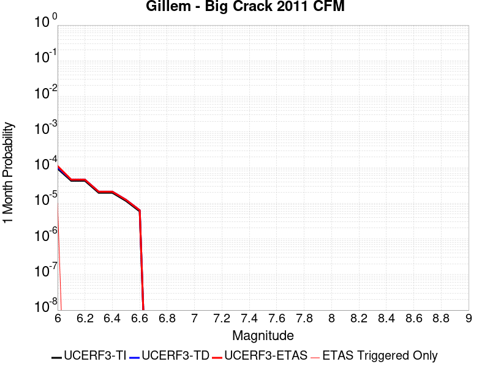 |  |  |

| Magnitude | 1 wk TI Prob | 1 wk TD Prob | 1 wk ETAS Prob | 1 wk ETAS/TD Gain | 1 wk ETAS Triggered Only | 1 mo TI Prob | 1 mo TD Prob | 1 mo ETAS Prob | 1 mo ETAS/TD Gain | 1 mo ETAS Triggered Only | 1 yr TI Prob | 1 yr TD Prob | 1 yr ETAS Prob | 1 yr ETAS/TD Gain | 1 yr ETAS Triggered Only | 10 yr TI Prob | 10 yr TD Prob | 10 yr ETAS Prob | 10 yr ETAS/TD Gain | 10 yr ETAS Triggered Only |
|-----|-----|-----|-----|-----|-----|-----|-----|-----|-----|-----|-----|-----|-----|-----|-----|-----|-----|-----|-----|-----|
| 6.0 | 2.196852E-5 | 2.3604485E-5 | 3.360425E-5 | 1.4236383 | 1.0E-5 | 9.4147406E-5 | 1.01158665E-4 | 1.1115765E-4 | 1.0988446 | 1.0E-5 | 0.0011456419 | 0.0012309998 | 0.0012409874 | 1.0081135 | 1.0E-5 | 0.011397537 | 0.012250669 | 0.012260547 | 1.0008063 | 1.0E-5 |
| 6.1 | 9.992795E-6 | 1.071189E-5 | 1.071189E-5 | 1.0 | 0.0 | 4.2825563E-5 | 4.5907396E-5 | 4.5907396E-5 | 1.0 | 0.0 | 5.2127644E-4 | 5.587975E-4 | 5.587975E-4 | 1.0 | 0.0 | 0.0052005537 | 0.0055757347 | 0.0055757347 | 1.0 | 0.0 |
| 6.2 | 9.992795E-6 | 1.071189E-5 | 1.071189E-5 | 1.0 | 0.0 | 4.2825563E-5 | 4.5907396E-5 | 4.5907396E-5 | 1.0 | 0.0 | 5.2127644E-4 | 5.587975E-4 | 5.587975E-4 | 1.0 | 0.0 | 0.0052005537 | 0.0055757347 | 0.0055757347 | 1.0 | 0.0 |
| 6.3 | 4.6127884E-6 | 4.942657E-6 | 4.942657E-6 | 1.0 | 0.0 | 1.9768944E-5 | 2.1182668E-5 | 2.1182668E-5 | 1.0 | 0.0 | 2.406603E-4 | 2.5787292E-4 | 2.5787292E-4 | 1.0 | 0.0 | 0.0024039985 | 0.0025761751 | 0.0025761751 | 1.0 | 0.0 |
| 6.4 | 4.6127884E-6 | 4.942657E-6 | 4.942657E-6 | 1.0 | 0.0 | 1.9768944E-5 | 2.1182668E-5 | 2.1182668E-5 | 1.0 | 0.0 | 2.406603E-4 | 2.5787292E-4 | 2.5787292E-4 | 1.0 | 0.0 | 0.0024039985 | 0.0025761751 | 0.0025761751 | 1.0 | 0.0 |
| 6.5 | 2.716712E-6 | 2.9111113E-6 | 2.9111113E-6 | 1.0 | 0.0 | 1.1643E-5 | 1.24761455E-5 | 1.24761455E-5 | 1.0 | 0.0 | 1.417443E-4 | 1.5188892E-4 | 1.5188892E-4 | 1.0 | 0.0 | 0.0014165393 | 0.001518089 | 0.001518089 | 1.0 | 0.0 |
| 6.6 | 1.3818255E-6 | 1.4820689E-6 | 1.4820689E-6 | 1.0 | 0.0 | 5.922096E-6 | 6.3517155E-6 | 6.3517155E-6 | 1.0 | 0.0 | 7.209913E-5 | 7.7330624E-5 | 7.7330624E-5 | 1.0 | 0.0 | 7.2075747E-4 | 7.7315804E-4 | 7.7315804E-4 | 1.0 | 0.0 |

## Concord 2011 CFM
*[(top)](#table-of-contents)*

| 1 Week | 1 Month | 1 Year | 10 Year |
|-----|-----|-----|-----|
|  |  |  |  |

| Magnitude | 1 wk TI Prob | 1 wk TD Prob | 1 wk ETAS Prob | 1 wk ETAS/TD Gain | 1 wk ETAS Triggered Only | 1 mo TI Prob | 1 mo TD Prob | 1 mo ETAS Prob | 1 mo ETAS/TD Gain | 1 mo ETAS Triggered Only | 1 yr TI Prob | 1 yr TD Prob | 1 yr ETAS Prob | 1 yr ETAS/TD Gain | 1 yr ETAS Triggered Only | 10 yr TI Prob | 10 yr TD Prob | 10 yr ETAS Prob | 10 yr ETAS/TD Gain | 10 yr ETAS Triggered Only |
|-----|-----|-----|-----|-----|-----|-----|-----|-----|-----|-----|-----|-----|-----|-----|-----|-----|-----|-----|-----|-----|
| 6.0 | 5.7865112E-5 | 9.759152E-5 | 1.0759054E-4 | 1.1024579 | 1.0E-5 | 2.4796976E-4 | 4.1818706E-4 | 4.281829E-4 | 1.0239028 | 1.0E-5 | 0.0030148525 | 0.005079467 | 0.005089416 | 1.0019587 | 1.0E-5 | 0.029742775 | 0.049248982 | 0.04925849 | 1.000193 | 1.0E-5 |
| 6.1 | 5.7865112E-5 | 9.759152E-5 | 1.0759054E-4 | 1.1024579 | 1.0E-5 | 2.4796976E-4 | 4.1818706E-4 | 4.281829E-4 | 1.0239028 | 1.0E-5 | 0.0030148525 | 0.005079467 | 0.005089416 | 1.0019587 | 1.0E-5 | 0.029742775 | 0.049248982 | 0.04925849 | 1.000193 | 1.0E-5 |
| 6.2 | 5.6789337E-5 | 9.5795076E-5 | 1.0579412E-4 | 1.1043795 | 1.0E-5 | 2.4336016E-4 | 4.104905E-4 | 4.2048638E-4 | 1.0243511 | 1.0E-5 | 0.0029588845 | 0.0049861916 | 0.0049961414 | 1.0019956 | 1.0E-5 | 0.029197963 | 0.04836556 | 0.048375074 | 1.0001968 | 1.0E-5 |
| 6.3 | 5.203322E-5 | 8.803056E-5 | 9.8029675E-5 | 1.1135869 | 1.0E-5 | 2.2298045E-4 | 3.7722368E-4 | 3.872199E-4 | 1.0264995 | 1.0E-5 | 0.0027114071 | 0.0045838105 | 0.0045937644 | 1.0021716 | 1.0E-5 | 0.026785625 | 0.04453672 | 0.044546273 | 1.0002146 | 1.0E-5 |
| 6.4 | 4.7120942E-5 | 7.897404E-5 | 8.897325E-5 | 1.1266139 | 1.0E-5 | 2.0193127E-4 | 3.3842045E-4 | 3.4841706E-4 | 1.029539 | 1.0E-5 | 0.0024557412 | 0.00411323 | 0.0041231886 | 1.0024211 | 1.0E-5 | 0.024287801 | 0.040065527 | 0.040075127 | 1.0002396 | 1.0E-5 |
| 6.5 | 2.9598437E-5 | 4.667486E-5 | 5.667439E-5 | 1.214238 | 1.0E-5 | 1.2684427E-4 | 2.0002096E-4 | 2.1001896E-4 | 1.0499848 | 1.0E-5 | 0.001543235 | 0.0024327459 | 0.0024427215 | 1.0041006 | 1.0E-5 | 0.015325619 | 0.023909973 | 0.023919733 | 1.0004083 | 1.0E-5 |
| 6.6 | 2.0443718E-5 | 2.998433E-5 | 3.9984032E-5 | 1.3334975 | 1.0E-5 | 8.7613E-5 | 1.2849816E-4 | 1.3849686E-4 | 1.0778121 | 1.0E-5 | 0.0010661662 | 0.0015633785 | 0.0015733629 | 1.0063864 | 1.0E-5 | 0.010610655 | 0.015466996 | 0.0154768415 | 1.0006366 | 1.0E-5 |
| 6.7 | 1.798539E-5 | 2.5557381E-5 | 3.5557125E-5 | 1.3912663 | 1.0E-5 | 7.7077966E-5 | 1.0952716E-4 | 1.1952606E-4 | 1.0912915 | 1.0E-5 | 9.380202E-4 | 0.001332699 | 0.0013426857 | 1.0074936 | 1.0E-5 | 0.009340706 | 0.013217433 | 0.013227301 | 1.0007466 | 1.0E-5 |
| 6.8 | 1.613555E-5 | 2.1959211E-5 | 3.1958993E-5 | 1.4553797 | 1.0E-5 | 6.915052E-5 | 9.4107585E-5 | 1.0410664E-4 | 1.1062514 | 1.0E-5 | 8.4158237E-4 | 0.0011451716 | 0.0011551601 | 1.0087223 | 1.0E-5 | 0.008384023 | 0.0113782035 | 0.01138809 | 1.0008689 | 1.0E-5 |
| 6.9 | 1.2916435E-5 | 1.7081054E-5 | 2.7080883E-5 | 1.585434 | 1.0E-5 | 5.5354973E-5 | 7.32025E-5 | 8.320177E-5 | 1.1365974 | 1.0E-5 | 6.7373837E-4 | 8.908818E-4 | 9.008729E-4 | 1.0112149 | 1.0E-5 | 0.006716994 | 0.008867139 | 0.00887705 | 1.0011177 | 1.0E-5 |
| 7.0 | 9.81129E-6 | 1.2630829E-5 | 2.2630702E-5 | 1.7917037 | 1.0E-5 | 4.2047708E-5 | 5.413101E-5 | 6.413047E-5 | 1.184727 | 1.0E-5 | 5.118106E-4 | 6.588474E-4 | 6.6884083E-4 | 1.0151681 | 1.0E-5 | 0.005106334 | 0.006569153 | 0.006579087 | 1.0015123 | 1.0E-5 |
| 7.1 | 8.0889195E-6 | 1.0418261E-5 | 2.0418156E-5 | 1.9598432 | 1.0E-5 | 3.4666336E-5 | 4.4648932E-5 | 5.4648484E-5 | 1.2239596 | 1.0E-5 | 4.219809E-4 | 5.434662E-4 | 5.534608E-4 | 1.0183904 | 1.0E-5 | 0.004211805 | 0.0054215975 | 0.0054315436 | 1.0018345 | 1.0E-5 |
| 7.2 | 6.267438E-6 | 8.115699E-6 | 1.8115617E-5 | 2.2321699 | 1.0E-5 | 2.6860173E-5 | 3.4781104E-5 | 4.4780758E-5 | 1.2875024 | 1.0E-5 | 3.2697353E-4 | 4.233784E-4 | 4.3337417E-4 | 1.0236095 | 1.0E-5 | 0.0032649285 | 0.004225969 | 0.0042359265 | 1.0023563 | 1.0E-5 |
| 7.3 | 3.6761196E-6 | 4.8401653E-6 | 4.8401653E-6 | 1.0 | 0.0 | 1.5754704E-5 | 2.0743402E-5 | 2.0743402E-5 | 1.0 | 0.0 | 1.9179663E-4 | 2.5252186E-4 | 2.5252186E-4 | 1.0 | 0.0 | 0.0019163118 | 0.002522487 | 0.002522487 | 1.0 | 0.0 |
| 7.4 | 2.8044356E-6 | 3.7096036E-6 | 3.7096036E-6 | 1.0 | 0.0 | 1.2018954E-5 | 1.5898204E-5 | 1.5898204E-5 | 1.0 | 0.0 | 1.4632095E-4 | 1.9354356E-4 | 1.9354356E-4 | 1.0 | 0.0 | 0.0014622464 | 0.0019338481 | 0.0019338481 | 1.0 | 0.0 |
| 7.5 | 2.4578699E-6 | 3.2447442E-6 | 3.2447442E-6 | 1.0 | 0.0 | 1.0533685E-5 | 1.3905973E-5 | 1.3905973E-5 | 1.0 | 0.0 | 1.2824008E-4 | 1.6929218E-4 | 1.6929218E-4 | 1.0 | 0.0 | 0.0012816609 | 0.001691713 | 0.001691713 | 1.0 | 0.0 |
| 7.6 | 1.7713267E-6 | 2.3351192E-6 | 2.3351192E-6 | 1.0 | 0.0 | 7.591378E-6 | 1.0007616E-5 | 1.0007616E-5 | 1.0 | 0.0 | 9.2421105E-5 | 1.21836E-4 | 1.21836E-4 | 1.0 | 0.0 | 9.2382677E-4 | 0.0012177454 | 0.0012177454 | 1.0 | 0.0 |
| 7.7 | 5.1912366E-7 | 6.8290143E-7 | 6.8290143E-7 | 1.0 | 0.0 | 2.2248137E-6 | 2.9267171E-6 | 2.9267171E-6 | 1.0 | 0.0 | 2.708677E-5 | 3.5632213E-5 | 3.5632213E-5 | 1.0 | 0.0 | 2.708347E-4 | 3.5627294E-4 | 3.5627294E-4 | 1.0 | 0.0 |

## Fontana (Seismicity)
*[(top)](#table-of-contents)*

| 1 Week | 1 Month | 1 Year | 10 Year |
|-----|-----|-----|-----|
|  |  |  |  |

| Magnitude | 1 wk TI Prob | 1 wk TD Prob | 1 wk ETAS Prob | 1 wk ETAS/TD Gain | 1 wk ETAS Triggered Only | 1 mo TI Prob | 1 mo TD Prob | 1 mo ETAS Prob | 1 mo ETAS/TD Gain | 1 mo ETAS Triggered Only | 1 yr TI Prob | 1 yr TD Prob | 1 yr ETAS Prob | 1 yr ETAS/TD Gain | 1 yr ETAS Triggered Only | 10 yr TI Prob | 10 yr TD Prob | 10 yr ETAS Prob | 10 yr ETAS/TD Gain | 10 yr ETAS Triggered Only |
|-----|-----|-----|-----|-----|-----|-----|-----|-----|-----|-----|-----|-----|-----|-----|-----|-----|-----|-----|-----|-----|
| 6.0 | 7.1789214E-6 | 7.5520006E-6 | 7.5520006E-6 | 1.0 | 0.0 | 3.076644E-5 | 3.2365548E-5 | 3.2365548E-5 | 1.0 | 0.0 | 3.7451705E-4 | 3.9402005E-4 | 4.0401611E-4 | 1.0253694 | 1.0E-5 | 0.003738865 | 0.003937214 | 0.0039471746 | 1.0025299 | 1.0E-5 |
| 6.1 | 7.1789214E-6 | 7.5520006E-6 | 7.5520006E-6 | 1.0 | 0.0 | 3.076644E-5 | 3.2365548E-5 | 3.2365548E-5 | 1.0 | 0.0 | 3.7451705E-4 | 3.9402005E-4 | 4.0401611E-4 | 1.0253694 | 1.0E-5 | 0.003738865 | 0.003937214 | 0.0039471746 | 1.0025299 | 1.0E-5 |
| 6.2 | 7.1789214E-6 | 7.5520006E-6 | 7.5520006E-6 | 1.0 | 0.0 | 3.076644E-5 | 3.2365548E-5 | 3.2365548E-5 | 1.0 | 0.0 | 3.7451705E-4 | 3.9402005E-4 | 4.0401611E-4 | 1.0253694 | 1.0E-5 | 0.003738865 | 0.003937214 | 0.0039471746 | 1.0025299 | 1.0E-5 |
| 6.3 | 7.1789214E-6 | 7.5520006E-6 | 7.5520006E-6 | 1.0 | 0.0 | 3.076644E-5 | 3.2365548E-5 | 3.2365548E-5 | 1.0 | 0.0 | 3.7451705E-4 | 3.9402005E-4 | 4.0401611E-4 | 1.0253694 | 1.0E-5 | 0.003738865 | 0.003937214 | 0.0039471746 | 1.0025299 | 1.0E-5 |
| 6.4 | 7.1789214E-6 | 7.5520006E-6 | 7.5520006E-6 | 1.0 | 0.0 | 3.076644E-5 | 3.2365548E-5 | 3.2365548E-5 | 1.0 | 0.0 | 3.7451705E-4 | 3.9402005E-4 | 4.0401611E-4 | 1.0253694 | 1.0E-5 | 0.003738865 | 0.003937214 | 0.0039471746 | 1.0025299 | 1.0E-5 |
| 6.5 | 5.2611317E-6 | 5.532726E-6 | 5.532726E-6 | 1.0 | 0.0 | 2.2547512E-5 | 2.3711682E-5 | 2.3711682E-5 | 1.0 | 0.0 | 2.744814E-4 | 2.8868974E-4 | 2.8868974E-4 | 1.0 | 0.0 | 0.002741426 | 0.0028868972 | 0.0028868972 | 1.0 | 0.0 |
| 6.6 | 5.2611317E-6 | 5.532726E-6 | 5.532726E-6 | 1.0 | 0.0 | 2.2547512E-5 | 2.3711682E-5 | 2.3711682E-5 | 1.0 | 0.0 | 2.744814E-4 | 2.8868974E-4 | 2.8868974E-4 | 1.0 | 0.0 | 0.002741426 | 0.0028868972 | 0.0028868972 | 1.0 | 0.0 |

## Eureka Peak
*[(top)](#table-of-contents)*

| 1 Week | 1 Month | 1 Year | 10 Year |
|-----|-----|-----|-----|
|  |  |  |  |

| Magnitude | 1 wk TI Prob | 1 wk TD Prob | 1 wk ETAS Prob | 1 wk ETAS/TD Gain | 1 wk ETAS Triggered Only | 1 mo TI Prob | 1 mo TD Prob | 1 mo ETAS Prob | 1 mo ETAS/TD Gain | 1 mo ETAS Triggered Only | 1 yr TI Prob | 1 yr TD Prob | 1 yr ETAS Prob | 1 yr ETAS/TD Gain | 1 yr ETAS Triggered Only | 10 yr TI Prob | 10 yr TD Prob | 10 yr ETAS Prob | 10 yr ETAS/TD Gain | 10 yr ETAS Triggered Only |
|-----|-----|-----|-----|-----|-----|-----|-----|-----|-----|-----|-----|-----|-----|-----|-----|-----|-----|-----|-----|-----|
| 6.0 | 3.1949054E-5 | 9.310571E-6 | 1.9310479E-5 | 2.074038 | 1.0E-5 | 1.3691733E-4 | 3.990228E-5 | 4.990188E-5 | 1.2506022 | 1.0E-5 | 0.0016656938 | 4.8578004E-4 | 4.957752E-4 | 1.0205754 | 1.0E-5 | 0.016532637 | 0.0049248957 | 0.0049348464 | 1.0020205 | 1.0E-5 |
| 6.1 | 3.1949054E-5 | 9.310571E-6 | 1.9310479E-5 | 2.074038 | 1.0E-5 | 1.3691733E-4 | 3.990228E-5 | 4.990188E-5 | 1.2506022 | 1.0E-5 | 0.0016656938 | 4.8578004E-4 | 4.957752E-4 | 1.0205754 | 1.0E-5 | 0.016532637 | 0.0049248957 | 0.0049348464 | 1.0020205 | 1.0E-5 |
| 6.2 | 3.1949054E-5 | 9.310571E-6 | 1.9310479E-5 | 2.074038 | 1.0E-5 | 1.3691733E-4 | 3.990228E-5 | 4.990188E-5 | 1.2506022 | 1.0E-5 | 0.0016656938 | 4.8578004E-4 | 4.957752E-4 | 1.0205754 | 1.0E-5 | 0.016532637 | 0.0049248957 | 0.0049348464 | 1.0020205 | 1.0E-5 |
| 6.3 | 2.7339745E-5 | 7.980718E-6 | 1.7980637E-5 | 2.2530103 | 1.0E-5 | 1.1716507E-4 | 3.4203054E-5 | 4.4202712E-5 | 1.2923615 | 1.0E-5 | 0.0014255513 | 4.164185E-4 | 4.2641434E-4 | 1.0240043 | 1.0E-5 | 0.0141644105 | 0.004228374 | 0.0042383317 | 1.002355 | 1.0E-5 |
| 6.4 | 2.7339745E-5 | 7.980718E-6 | 1.7980637E-5 | 2.2530103 | 1.0E-5 | 1.1716507E-4 | 3.4203054E-5 | 4.4202712E-5 | 1.2923615 | 1.0E-5 | 0.0014255513 | 4.164185E-4 | 4.2641434E-4 | 1.0240043 | 1.0E-5 | 0.0141644105 | 0.004228374 | 0.0042383317 | 1.002355 | 1.0E-5 |
| 6.5 | 9.738388E-8 | 1.8619214E-7 | 1.8619214E-7 | 1.0 | 0.0 | 4.1735944E-7 | 7.979661E-7 | 7.979661E-7 | 1.0 | 0.0 | 5.081339E-6 | 9.715194E-6 | 9.715194E-6 | 1.0 | 0.0 | 5.0812232E-5 | 9.714778E-5 | 9.714778E-5 | 1.0 | 0.0 |
| 6.6 | 9.3495956E-8 | 1.8328048E-7 | 1.8328048E-7 | 1.0 | 0.0 | 4.0069688E-7 | 7.854875E-7 | 7.854875E-7 | 1.0 | 0.0 | 4.8784736E-6 | 9.5632695E-6 | 9.5632695E-6 | 1.0 | 0.0 | 4.8783666E-5 | 9.562866E-5 | 9.562866E-5 | 1.0 | 0.0 |
| 6.7 | 9.3495956E-8 | 1.8328048E-7 | 1.8328048E-7 | 1.0 | 0.0 | 4.0069688E-7 | 7.854875E-7 | 7.854875E-7 | 1.0 | 0.0 | 4.8784736E-6 | 9.5632695E-6 | 9.5632695E-6 | 1.0 | 0.0 | 4.8783666E-5 | 9.562866E-5 | 9.562866E-5 | 1.0 | 0.0 |
| 6.8 | 8.591428E-8 | 1.8021015E-7 | 1.8021015E-7 | 1.0 | 0.0 | 3.68204E-7 | 7.72329E-7 | 7.72329E-7 | 1.0 | 0.0 | 4.4828744E-6 | 9.403066E-6 | 9.403066E-6 | 1.0 | 0.0 | 4.482784E-5 | 9.402676E-5 | 9.402676E-5 | 1.0 | 0.0 |
| 6.9 | 7.749723E-8 | 1.7439022E-7 | 1.7439022E-7 | 1.0 | 0.0 | 3.3213098E-7 | 7.473864E-7 | 7.473864E-7 | 1.0 | 0.0 | 4.043687E-6 | 9.099393E-6 | 9.099393E-6 | 1.0 | 0.0 | 4.0436134E-5 | 9.099028E-5 | 9.099028E-5 | 1.0 | 0.0 |
| 7.0 | 6.897872E-8 | 1.6415258E-7 | 1.6415258E-7 | 1.0 | 0.0 | 2.9562307E-7 | 7.035109E-7 | 7.035109E-7 | 1.0 | 0.0 | 3.5992048E-6 | 8.565212E-6 | 8.565212E-6 | 1.0 | 0.0 | 3.5991467E-5 | 8.564889E-5 | 8.564889E-5 | 1.0 | 0.0 |
| 7.1 | 5.859318E-8 | 1.4787166E-7 | 1.4787166E-7 | 1.0 | 0.0 | 2.5111362E-7 | 6.337355E-7 | 6.337355E-7 | 1.0 | 0.0 | 3.057304E-6 | 7.715704E-6 | 7.715704E-6 | 1.0 | 0.0 | 3.0572617E-5 | 7.715442E-5 | 7.715442E-5 | 1.0 | 0.0 |
| 7.2 | 5.1375338E-8 | 1.342105E-7 | 1.342105E-7 | 1.0 | 0.0 | 2.2018E-7 | 5.751877E-7 | 5.751877E-7 | 1.0 | 0.0 | 2.680688E-6 | 7.002888E-6 | 7.002888E-6 | 1.0 | 0.0 | 2.6806558E-5 | 7.0026734E-5 | 7.0026734E-5 | 1.0 | 0.0 |
| 7.3 | 4.5441396E-8 | 1.16363104E-7 | 1.16363104E-7 | 1.0 | 0.0 | 1.9474882E-7 | 4.986989E-7 | 4.986989E-7 | 1.0 | 0.0 | 2.3710643E-6 | 6.071643E-6 | 6.071643E-6 | 1.0 | 0.0 | 2.371039E-5 | 6.0714825E-5 | 6.0714825E-5 | 1.0 | 0.0 |
| 7.4 | 2.981918E-8 | 6.9113334E-8 | 6.9113334E-8 | 1.0 | 0.0 | 1.2779647E-7 | 2.9619997E-7 | 2.9619997E-7 | 1.0 | 0.0 | 1.5559209E-6 | 3.6062293E-6 | 3.6062293E-6 | 1.0 | 0.0 | 1.55591E-5 | 3.606175E-5 | 3.606175E-5 | 1.0 | 0.0 |
| 7.5 | 4.24214E-9 | 8.342421E-9 | 8.342421E-9 | 1.0 | 0.0 | 1.81806E-8 | 3.5753235E-8 | 3.5753235E-8 | 1.0 | 0.0 | 2.213488E-7 | 4.352956E-7 | 4.352956E-7 | 1.0 | 0.0 | 2.2134857E-6 | 4.352954E-6 | 4.352954E-6 | 1.0 | 0.0 |

## East Huasna 2011 CFM
*[(top)](#table-of-contents)*

| 1 Week | 1 Month | 1 Year | 10 Year |
|-----|-----|-----|-----|
|  |  |  |  |

| Magnitude | 1 wk TI Prob | 1 wk TD Prob | 1 wk ETAS Prob | 1 wk ETAS/TD Gain | 1 wk ETAS Triggered Only | 1 mo TI Prob | 1 mo TD Prob | 1 mo ETAS Prob | 1 mo ETAS/TD Gain | 1 mo ETAS Triggered Only | 1 yr TI Prob | 1 yr TD Prob | 1 yr ETAS Prob | 1 yr ETAS/TD Gain | 1 yr ETAS Triggered Only | 10 yr TI Prob | 10 yr TD Prob | 10 yr ETAS Prob | 10 yr ETAS/TD Gain | 10 yr ETAS Triggered Only |
|-----|-----|-----|-----|-----|-----|-----|-----|-----|-----|-----|-----|-----|-----|-----|-----|-----|-----|-----|-----|-----|
| 6.0 | 1.4658423E-6 | 1.4715657E-6 | 1.1471551E-5 | 7.795473 | 1.0E-5 | 6.282166E-6 | 6.3066955E-6 | 1.6306632E-5 | 2.5856063 | 1.0E-5 | 7.6482684E-5 | 7.678138E-5 | 8.6780616E-5 | 1.13023 | 1.0E-5 | 7.645637E-4 | 7.6755555E-4 | 7.775479E-4 | 1.0130184 | 1.0E-5 |
| 6.1 | 1.4658423E-6 | 1.4715657E-6 | 1.1471551E-5 | 7.795473 | 1.0E-5 | 6.282166E-6 | 6.3066955E-6 | 1.6306632E-5 | 2.5856063 | 1.0E-5 | 7.6482684E-5 | 7.678138E-5 | 8.6780616E-5 | 1.13023 | 1.0E-5 | 7.645637E-4 | 7.6755555E-4 | 7.775479E-4 | 1.0130184 | 1.0E-5 |
| 6.2 | 1.4658423E-6 | 1.4715657E-6 | 1.1471551E-5 | 7.795473 | 1.0E-5 | 6.282166E-6 | 6.3066955E-6 | 1.6306632E-5 | 2.5856063 | 1.0E-5 | 7.6482684E-5 | 7.678138E-5 | 8.6780616E-5 | 1.13023 | 1.0E-5 | 7.645637E-4 | 7.6755555E-4 | 7.775479E-4 | 1.0130184 | 1.0E-5 |
| 6.3 | 1.4658423E-6 | 1.4715657E-6 | 1.1471551E-5 | 7.795473 | 1.0E-5 | 6.282166E-6 | 6.3066955E-6 | 1.6306632E-5 | 2.5856063 | 1.0E-5 | 7.6482684E-5 | 7.678138E-5 | 8.6780616E-5 | 1.13023 | 1.0E-5 | 7.645637E-4 | 7.6755555E-4 | 7.775479E-4 | 1.0130184 | 1.0E-5 |
| 6.4 | 1.0488257E-6 | 1.0527513E-6 | 1.1052741E-5 | 10.49891 | 1.0E-5 | 4.4949593E-6 | 4.5117836E-6 | 1.4511738E-5 | 3.2164085 | 1.0E-5 | 5.472476E-5 | 5.49296E-5 | 6.4929045E-5 | 1.1820412 | 1.0E-5 | 5.4711284E-4 | 5.491621E-4 | 5.5915664E-4 | 1.0181996 | 1.0E-5 |
| 6.5 | 1.0488257E-6 | 1.0527513E-6 | 1.1052741E-5 | 10.49891 | 1.0E-5 | 4.4949593E-6 | 4.5117836E-6 | 1.4511738E-5 | 3.2164085 | 1.0E-5 | 5.472476E-5 | 5.49296E-5 | 6.4929045E-5 | 1.1820412 | 1.0E-5 | 5.4711284E-4 | 5.491621E-4 | 5.5915664E-4 | 1.0181996 | 1.0E-5 |
| 6.6 | 8.463064E-7 | 8.49363E-7 | 1.0849354E-5 | 12.773519 | 1.0E-5 | 3.6270226E-6 | 3.6401223E-6 | 1.3640086E-5 | 3.7471504 | 1.0E-5 | 4.4158103E-5 | 4.4317596E-5 | 5.431715E-5 | 1.225634 | 1.0E-5 | 4.414933E-4 | 4.4308844E-4 | 4.53084E-4 | 1.0225588 | 1.0E-5 |
| 6.7 | 7.876149E-7 | 7.902531E-7 | 1.0790245E-5 | 13.654163 | 1.0E-5 | 3.375488E-6 | 3.3867946E-6 | 1.3386761E-5 | 3.9526343 | 1.0E-5 | 4.109579E-5 | 4.1233452E-5 | 5.1233037E-5 | 1.2425115 | 1.0E-5 | 4.108819E-4 | 4.1225864E-4 | 4.222545E-4 | 1.0242466 | 1.0E-5 |
| 6.8 | 6.9940785E-7 | 7.0165754E-7 | 1.070165E-5 | 15.251957 | 1.0E-5 | 2.9974588E-6 | 3.0071003E-6 | 1.300707E-5 | 4.325453 | 1.0E-5 | 3.649345E-5 | 3.6610836E-5 | 4.661047E-5 | 1.2731332 | 1.0E-5 | 3.6487455E-4 | 3.660485E-4 | 3.7604486E-4 | 1.0273088 | 1.0E-5 |
| 6.9 | 5.899658E-7 | 5.9155974E-7 | 1.0591554E-5 | 17.904453 | 1.0E-5 | 2.5284223E-6 | 2.5352535E-6 | 1.2535228E-5 | 4.944369 | 1.0E-5 | 3.0783107E-5 | 3.086628E-5 | 4.086597E-5 | 1.3239682 | 1.0E-5 | 3.0778843E-4 | 3.086202E-4 | 3.186171E-4 | 1.0323923 | 1.0E-5 |
| 7.0 | 4.793814E-7 | 4.8032706E-7 | 1.0480322E-5 | 21.819138 | 1.0E-5 | 2.05449E-6 | 2.058543E-6 | 1.2058523E-5 | 5.857795 | 1.0E-5 | 2.501313E-5 | 2.5062474E-5 | 3.5062225E-5 | 1.3989929 | 1.0E-5 | 2.5010316E-4 | 2.5059667E-4 | 2.6059416E-4 | 1.0398948 | 1.0E-5 |
| 7.1 | 4.1256908E-7 | 4.129939E-7 | 4.129939E-7 | 1.0 | 0.0 | 1.768152E-6 | 1.7699726E-6 | 1.7699726E-6 | 1.0 | 0.0 | 2.1527037E-5 | 2.1549205E-5 | 2.1549205E-5 | 1.0 | 0.0 | 2.1524953E-4 | 2.154713E-4 | 2.154713E-4 | 1.0 | 0.0 |
| 7.2 | 2.822599E-7 | 2.8161398E-7 | 2.8161398E-7 | 1.0 | 0.0 | 1.2096847E-6 | 1.2069165E-6 | 1.2069165E-6 | 1.0 | 0.0 | 1.47278115E-5 | 1.469411E-5 | 1.469411E-5 | 1.0 | 0.0 | 1.4726835E-4 | 1.4693146E-4 | 1.4693146E-4 | 1.0 | 0.0 |
| 7.3 | 1.5261652E-7 | 1.5075E-7 | 1.5075E-7 | 1.0 | 0.0 | 6.540707E-7 | 6.4607127E-7 | 6.4607127E-7 | 1.0 | 0.0 | 7.963281E-6 | 7.8658895E-6 | 7.8658895E-6 | 1.0 | 0.0 | 7.962996E-5 | 7.865613E-5 | 7.865613E-5 | 1.0 | 0.0 |
| 7.4 | 7.976414E-8 | 8.057865E-8 | 8.057865E-8 | 1.0 | 0.0 | 3.418463E-7 | 3.45337E-7 | 3.45337E-7 | 1.0 | 0.0 | 4.1619705E-6 | 4.2044703E-6 | 4.2044703E-6 | 1.0 | 0.0 | 4.161893E-5 | 4.2043914E-5 | 4.2043914E-5 | 1.0 | 0.0 |
| 7.5 | 4.2715055E-8 | 4.3202512E-8 | 4.3202512E-8 | 1.0 | 0.0 | 1.830645E-7 | 1.8515361E-7 | 1.8515361E-7 | 1.0 | 0.0 | 2.228808E-6 | 2.2542429E-6 | 2.2542429E-6 | 1.0 | 0.0 | 2.2287857E-5 | 2.2542203E-5 | 2.2542203E-5 | 1.0 | 0.0 |
| 7.6 | 2.1807532E-8 | 2.2057476E-8 | 2.2057476E-8 | 1.0 | 0.0 | 9.346085E-8 | 9.4532034E-8 | 9.4532034E-8 | 1.0 | 0.0 | 1.1378852E-6 | 1.1509269E-6 | 1.1509269E-6 | 1.0 | 0.0 | 1.1378794E-5 | 1.1509211E-5 | 1.1509211E-5 | 1.0 | 0.0 |
| 7.7 | 4.7196043E-9 | 4.767283E-9 | 4.767283E-9 | 1.0 | 0.0 | 2.0226874E-8 | 2.0431212E-8 | 2.0431212E-8 | 1.0 | 0.0 | 2.4626218E-7 | 2.4874998E-7 | 2.4874998E-7 | 1.0 | 0.0 | 2.462619E-6 | 2.487497E-6 | 2.487497E-6 | 1.0 | 0.0 |
| 7.8 | 7.400003E-11 | 7.4654505E-11 | 7.4654505E-11 | 1.0 | 0.0 | 3.171432E-10 | 3.1994773E-10 | 3.1994773E-10 | 1.0 | 0.0 | 3.861218E-9 | 3.895363E-9 | 3.895363E-9 | 1.0 | 0.0 | 3.861218E-8 | 3.895363E-8 | 3.895363E-8 | 1.0 | 0.0 |

## Homestead Valley 2011
*[(top)](#table-of-contents)*

| 1 Week | 1 Month | 1 Year | 10 Year |
|-----|-----|-----|-----|
|  |  |  |  |

| Magnitude | 1 wk TI Prob | 1 wk TD Prob | 1 wk ETAS Prob | 1 wk ETAS/TD Gain | 1 wk ETAS Triggered Only | 1 mo TI Prob | 1 mo TD Prob | 1 mo ETAS Prob | 1 mo ETAS/TD Gain | 1 mo ETAS Triggered Only | 1 yr TI Prob | 1 yr TD Prob | 1 yr ETAS Prob | 1 yr ETAS/TD Gain | 1 yr ETAS Triggered Only | 10 yr TI Prob | 10 yr TD Prob | 10 yr ETAS Prob | 10 yr ETAS/TD Gain | 10 yr ETAS Triggered Only |
|-----|-----|-----|-----|-----|-----|-----|-----|-----|-----|-----|-----|-----|-----|-----|-----|-----|-----|-----|-----|-----|
| 6.0 | 1.539795E-5 | 6.286606E-6 | 6.286606E-6 | 1.0 | 0.0 | 6.5989545E-5 | 2.6942436E-5 | 2.6942436E-5 | 1.0 | 0.0 | 8.0312655E-4 | 3.279954E-4 | 3.379921E-4 | 1.0304782 | 1.0E-5 | 0.008002302 | 0.0032771337 | 0.003287101 | 1.0030415 | 1.0E-5 |
| 6.1 | 1.539795E-5 | 6.286606E-6 | 6.286606E-6 | 1.0 | 0.0 | 6.5989545E-5 | 2.6942436E-5 | 2.6942436E-5 | 1.0 | 0.0 | 8.0312655E-4 | 3.279954E-4 | 3.379921E-4 | 1.0304782 | 1.0E-5 | 0.008002302 | 0.0032771337 | 0.003287101 | 1.0030415 | 1.0E-5 |
| 6.2 | 1.539795E-5 | 6.286606E-6 | 6.286606E-6 | 1.0 | 0.0 | 6.5989545E-5 | 2.6942436E-5 | 2.6942436E-5 | 1.0 | 0.0 | 8.0312655E-4 | 3.279954E-4 | 3.379921E-4 | 1.0304782 | 1.0E-5 | 0.008002302 | 0.0032771337 | 0.003287101 | 1.0030415 | 1.0E-5 |
| 6.3 | 1.539795E-5 | 6.286606E-6 | 6.286606E-6 | 1.0 | 0.0 | 6.5989545E-5 | 2.6942436E-5 | 2.6942436E-5 | 1.0 | 0.0 | 8.0312655E-4 | 3.279954E-4 | 3.379921E-4 | 1.0304782 | 1.0E-5 | 0.008002302 | 0.0032771337 | 0.003287101 | 1.0030415 | 1.0E-5 |
| 6.4 | 1.539795E-5 | 6.286606E-6 | 6.286606E-6 | 1.0 | 0.0 | 6.5989545E-5 | 2.6942436E-5 | 2.6942436E-5 | 1.0 | 0.0 | 8.0312655E-4 | 3.279954E-4 | 3.379921E-4 | 1.0304782 | 1.0E-5 | 0.008002302 | 0.0032771337 | 0.003287101 | 1.0030415 | 1.0E-5 |
| 6.5 | 1.0265258E-5 | 2.8788488E-6 | 2.8788488E-6 | 1.0 | 0.0 | 4.3993223E-5 | 1.2337905E-5 | 1.2337905E-5 | 1.0 | 0.0 | 5.3548586E-4 | 1.5021059E-4 | 1.6020909E-4 | 1.0665632 | 1.0E-5 | 0.005341973 | 0.0015017724 | 0.0015117575 | 1.0066488 | 1.0E-5 |
| 6.6 | 6.664671E-6 | 5.348204E-7 | 5.348204E-7 | 1.0 | 0.0 | 2.8562565E-5 | 2.2920863E-6 | 2.2920863E-6 | 1.0 | 0.0 | 3.476937E-4 | 2.7905911E-5 | 2.7905911E-5 | 1.0 | 0.0 | 0.003471502 | 2.790357E-4 | 2.790357E-4 | 1.0 | 0.0 |
| 6.7 | 6.5954046E-6 | 5.348204E-7 | 5.348204E-7 | 1.0 | 0.0 | 2.8265715E-5 | 2.2920863E-6 | 2.2920863E-6 | 1.0 | 0.0 | 3.4408073E-4 | 2.7905911E-5 | 2.7905911E-5 | 1.0 | 0.0 | 0.0034354846 | 2.790357E-4 | 2.790357E-4 | 1.0 | 0.0 |
| 6.8 | 4.648189E-6 | 2.3265572E-7 | 2.3265572E-7 | 1.0 | 0.0 | 1.9920659E-5 | 9.970956E-7 | 9.970956E-7 | 1.0 | 0.0 | 2.4250703E-4 | 1.2139576E-5 | 1.2139576E-5 | 1.0 | 0.0 | 0.0024224254 | 1.2138961E-4 | 1.2138961E-4 | 1.0 | 0.0 |
| 6.9 | 4.1428534E-6 | 1.9344557E-7 | 1.9344557E-7 | 1.0 | 0.0 | 1.7754966E-5 | 8.2905217E-7 | 8.2905217E-7 | 1.0 | 0.0 | 2.1614527E-4 | 1.0093667E-5 | 1.0093667E-5 | 1.0 | 0.0 | 0.0021593515 | 1.0093238E-4 | 1.0093238E-4 | 1.0 | 0.0 |
| 7.0 | 3.0673707E-6 | 1.5367603E-7 | 1.5367603E-7 | 1.0 | 0.0 | 1.3145808E-5 | 6.586114E-7 | 6.586114E-7 | 1.0 | 0.0 | 1.6003846E-4 | 8.0185655E-6 | 8.0185655E-6 | 1.0 | 0.0 | 0.0015992324 | 8.0182865E-5 | 8.0182865E-5 | 1.0 | 0.0 |
| 7.1 | 2.340854E-6 | 1.468766E-7 | 1.468766E-7 | 1.0 | 0.0 | 1.0032193E-5 | 6.29471E-7 | 6.29471E-7 | 1.0 | 0.0 | 1.221351E-4 | 7.663783E-6 | 7.663783E-6 | 1.0 | 0.0 | 0.00122068 | 7.663529E-5 | 7.663529E-5 | 1.0 | 0.0 |
| 7.2 | 1.3754182E-6 | 1.3922634E-7 | 1.3922634E-7 | 1.0 | 0.0 | 5.8946357E-6 | 5.966842E-7 | 5.966842E-7 | 1.0 | 0.0 | 7.176483E-5 | 7.2646067E-6 | 7.2646067E-6 | 1.0 | 0.0 | 7.174166E-4 | 7.264379E-5 | 7.264379E-5 | 1.0 | 0.0 |
| 7.3 | 1.2573237E-6 | 1.3827146E-7 | 1.3827146E-7 | 1.0 | 0.0 | 5.388519E-6 | 5.9259185E-7 | 5.9259185E-7 | 1.0 | 0.0 | 6.560324E-5 | 7.2147827E-6 | 7.2147827E-6 | 1.0 | 0.0 | 6.558388E-4 | 7.214558E-5 | 7.214558E-5 | 1.0 | 0.0 |
| 7.4 | 1.0994207E-6 | 1.3106106E-7 | 1.3106106E-7 | 1.0 | 0.0 | 4.7117946E-6 | 5.616901E-7 | 5.616901E-7 | 1.0 | 0.0 | 5.736459E-5 | 6.8385566E-6 | 6.8385566E-6 | 1.0 | 0.0 | 5.734978E-4 | 6.838355E-5 | 6.838355E-5 | 1.0 | 0.0 |
| 7.5 | 5.5569126E-7 | 6.772991E-8 | 6.772991E-8 | 1.0 | 0.0 | 2.3815317E-6 | 2.90271E-7 | 2.90271E-7 | 1.0 | 0.0 | 2.8994764E-5 | 3.5340445E-6 | 3.5340445E-6 | 1.0 | 0.0 | 2.899098E-4 | 3.5339945E-5 | 3.5339945E-5 | 1.0 | 0.0 |

## Las Positas
*[(top)](#table-of-contents)*

| 1 Week | 1 Month | 1 Year | 10 Year |
|-----|-----|-----|-----|
|  | 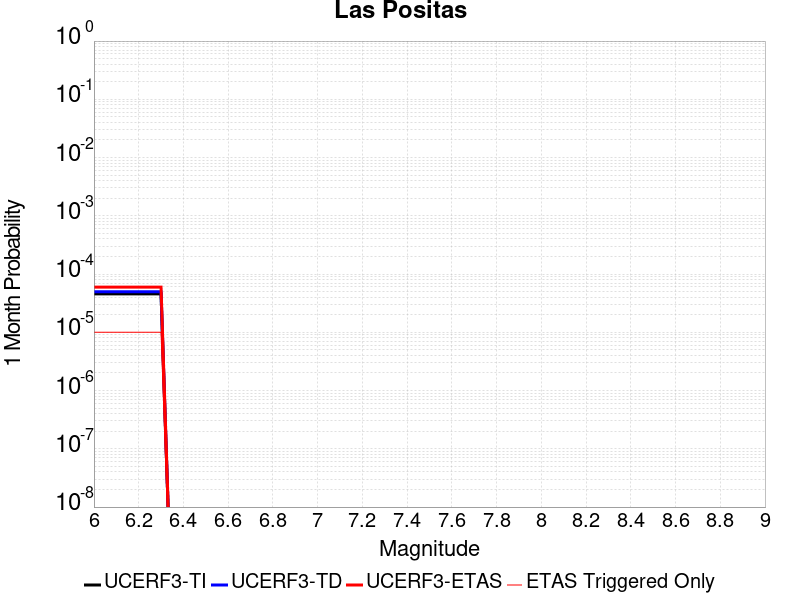 |  |  |

| Magnitude | 1 wk TI Prob | 1 wk TD Prob | 1 wk ETAS Prob | 1 wk ETAS/TD Gain | 1 wk ETAS Triggered Only | 1 mo TI Prob | 1 mo TD Prob | 1 mo ETAS Prob | 1 mo ETAS/TD Gain | 1 mo ETAS Triggered Only | 1 yr TI Prob | 1 yr TD Prob | 1 yr ETAS Prob | 1 yr ETAS/TD Gain | 1 yr ETAS Triggered Only | 10 yr TI Prob | 10 yr TD Prob | 10 yr ETAS Prob | 10 yr ETAS/TD Gain | 10 yr ETAS Triggered Only |
|-----|-----|-----|-----|-----|-----|-----|-----|-----|-----|-----|-----|-----|-----|-----|-----|-----|-----|-----|-----|-----|
| 6.0 | 1.0659424E-5 | 1.15911225E-5 | 2.1591006E-5 | 1.8627192 | 1.0E-5 | 4.568245E-5 | 4.9676237E-5 | 5.967574E-5 | 1.2012935 | 1.0E-5 | 5.560419E-4 | 6.048082E-4 | 6.148022E-4 | 1.0165242 | 1.0E-5 | 0.005546526 | 0.006048082 | 0.0060580214 | 1.0016434 | 1.0E-5 |
| 6.1 | 1.0659424E-5 | 1.15911225E-5 | 2.1591006E-5 | 1.8627192 | 1.0E-5 | 4.568245E-5 | 4.9676237E-5 | 5.967574E-5 | 1.2012935 | 1.0E-5 | 5.560419E-4 | 6.048082E-4 | 6.148022E-4 | 1.0165242 | 1.0E-5 | 0.005546526 | 0.006048082 | 0.0060580214 | 1.0016434 | 1.0E-5 |
| 6.2 | 1.0659424E-5 | 1.15911225E-5 | 2.1591006E-5 | 1.8627192 | 1.0E-5 | 4.568245E-5 | 4.9676237E-5 | 5.967574E-5 | 1.2012935 | 1.0E-5 | 5.560419E-4 | 6.048082E-4 | 6.148022E-4 | 1.0165242 | 1.0E-5 | 0.005546526 | 0.006048082 | 0.0060580214 | 1.0016434 | 1.0E-5 |
| 6.3 | 1.0659424E-5 | 1.15911225E-5 | 2.1591006E-5 | 1.8627192 | 1.0E-5 | 4.568245E-5 | 4.9676237E-5 | 5.967574E-5 | 1.2012935 | 1.0E-5 | 5.560419E-4 | 6.048082E-4 | 6.148022E-4 | 1.0165242 | 1.0E-5 | 0.005546526 | 0.006048082 | 0.0060580214 | 1.0016434 | 1.0E-5 |

## Great Valley 04b Gordon Valley
*[(top)](#table-of-contents)*

| 1 Week | 1 Month | 1 Year | 10 Year |
|-----|-----|-----|-----|
|  |  |  |  |

| Magnitude | 1 wk TI Prob | 1 wk TD Prob | 1 wk ETAS Prob | 1 wk ETAS/TD Gain | 1 wk ETAS Triggered Only | 1 mo TI Prob | 1 mo TD Prob | 1 mo ETAS Prob | 1 mo ETAS/TD Gain | 1 mo ETAS Triggered Only | 1 yr TI Prob | 1 yr TD Prob | 1 yr ETAS Prob | 1 yr ETAS/TD Gain | 1 yr ETAS Triggered Only | 10 yr TI Prob | 10 yr TD Prob | 10 yr ETAS Prob | 10 yr ETAS/TD Gain | 10 yr ETAS Triggered Only |
|-----|-----|-----|-----|-----|-----|-----|-----|-----|-----|-----|-----|-----|-----|-----|-----|-----|-----|-----|-----|-----|
| 6.0 | 2.1181217E-5 | 2.3981953E-5 | 3.3981712E-5 | 1.4169703 | 1.0E-5 | 9.077348E-5 | 1.0277669E-4 | 1.1277566E-4 | 1.0972884 | 1.0E-5 | 0.0011046068 | 0.0012507546 | 0.0012607421 | 1.0079851 | 1.0E-5 | 0.010991322 | 0.012453599 | 0.012463475 | 1.000793 | 1.0E-5 |
| 6.1 | 2.1181217E-5 | 2.3981953E-5 | 3.3981712E-5 | 1.4169703 | 1.0E-5 | 9.077348E-5 | 1.0277669E-4 | 1.1277566E-4 | 1.0972884 | 1.0E-5 | 0.0011046068 | 0.0012507546 | 0.0012607421 | 1.0079851 | 1.0E-5 | 0.010991322 | 0.012453599 | 0.012463475 | 1.000793 | 1.0E-5 |
| 6.2 | 2.1181217E-5 | 2.3981953E-5 | 3.3981712E-5 | 1.4169703 | 1.0E-5 | 9.077348E-5 | 1.0277669E-4 | 1.1277566E-4 | 1.0972884 | 1.0E-5 | 0.0011046068 | 0.0012507546 | 0.0012607421 | 1.0079851 | 1.0E-5 | 0.010991322 | 0.012453599 | 0.012463475 | 1.000793 | 1.0E-5 |
| 6.3 | 2.1181217E-5 | 2.3981953E-5 | 3.3981712E-5 | 1.4169703 | 1.0E-5 | 9.077348E-5 | 1.0277669E-4 | 1.1277566E-4 | 1.0972884 | 1.0E-5 | 0.0011046068 | 0.0012507546 | 0.0012607421 | 1.0079851 | 1.0E-5 | 0.010991322 | 0.012453599 | 0.012463475 | 1.000793 | 1.0E-5 |
| 6.4 | 1.0988268E-5 | 1.2254499E-5 | 1.2254499E-5 | 1.0 | 0.0 | 4.7091726E-5 | 5.2518313E-5 | 5.2518313E-5 | 1.0 | 0.0 | 5.731909E-4 | 6.392388E-4 | 6.392388E-4 | 1.0 | 0.0 | 0.005717147 | 0.0063755875 | 0.0063755875 | 1.0 | 0.0 |
| 6.5 | 1.0988268E-5 | 1.2254499E-5 | 1.2254499E-5 | 1.0 | 0.0 | 4.7091726E-5 | 5.2518313E-5 | 5.2518313E-5 | 1.0 | 0.0 | 5.731909E-4 | 6.392388E-4 | 6.392388E-4 | 1.0 | 0.0 | 0.005717147 | 0.0063755875 | 0.0063755875 | 1.0 | 0.0 |
| 6.6 | 1.0517822E-5 | 1.1724062E-5 | 1.1724062E-5 | 1.0 | 0.0 | 4.5075605E-5 | 5.02451E-5 | 5.02451E-5 | 1.0 | 0.0 | 5.4865726E-4 | 6.11578E-4 | 6.11578E-4 | 1.0 | 0.0 | 0.0054730466 | 0.0061005033 | 0.0061005033 | 1.0 | 0.0 |
| 6.7 | 7.789219E-6 | 8.6776445E-6 | 8.6776445E-6 | 1.0 | 0.0 | 3.3381937E-5 | 3.7189402E-5 | 3.7189402E-5 | 1.0 | 0.0 | 4.063493E-4 | 4.526921E-4 | 4.526921E-4 | 1.0 | 0.0 | 0.004056071 | 0.0045182165 | 0.0045182165 | 1.0 | 0.0 |
| 6.8 | 7.5850853E-6 | 8.452389E-6 | 8.452389E-6 | 1.0 | 0.0 | 3.2507105E-5 | 3.622405E-5 | 3.622405E-5 | 1.0 | 0.0 | 3.957021E-4 | 4.409437E-4 | 4.409437E-4 | 1.0 | 0.0 | 0.0039499826 | 0.0044012 | 0.0044012 | 1.0 | 0.0 |
| 6.9 | 6.604105E-6 | 7.3585493E-6 | 7.3585493E-6 | 1.0 | 0.0 | 2.8303E-5 | 3.153628E-5 | 3.153628E-5 | 1.0 | 0.0 | 3.4453452E-4 | 3.8389044E-4 | 3.8389044E-4 | 1.0 | 0.0 | 0.0034400085 | 0.0038326595 | 0.0038326595 | 1.0 | 0.0 |
| 7.0 | 5.3701115E-6 | 5.9884183E-6 | 5.9884183E-6 | 1.0 | 0.0 | 2.301456E-5 | 2.5664414E-5 | 2.5664414E-5 | 1.0 | 0.0 | 2.8016625E-4 | 3.1242234E-4 | 3.1242234E-4 | 1.0 | 0.0 | 0.0027981328 | 0.00312012 | 0.00312012 | 1.0 | 0.0 |
| 7.1 | 4.4685607E-6 | 4.986478E-6 | 4.986478E-6 | 1.0 | 0.0 | 1.9150835E-5 | 2.1370459E-5 | 2.1370459E-5 | 1.0 | 0.0 | 2.3313647E-4 | 2.6015675E-4 | 2.6015675E-4 | 1.0 | 0.0 | 0.0023289204 | 0.0025987667 | 0.0025987667 | 1.0 | 0.0 |
| 7.2 | 2.833378E-6 | 3.164419E-6 | 3.164419E-6 | 1.0 | 0.0 | 1.2142991E-5 | 1.3561736E-5 | 1.3561736E-5 | 1.0 | 0.0 | 1.4783088E-4 | 1.6510337E-4 | 1.6510337E-4 | 1.0 | 0.0 | 0.0014773258 | 0.0016499789 | 0.0016499789 | 1.0 | 0.0 |
| 7.3 | 7.0087293E-7 | 7.7728157E-7 | 7.7728157E-7 | 1.0 | 0.0 | 3.0037377E-6 | 3.3312049E-6 | 3.3312049E-6 | 1.0 | 0.0 | 3.656989E-5 | 4.0557123E-5 | 4.0557123E-5 | 1.0 | 0.0 | 3.6563876E-4 | 4.055422E-4 | 4.055422E-4 | 1.0 | 0.0 |
| 7.4 | 3.112171E-8 | 3.2068368E-8 | 3.2068368E-8 | 1.0 | 0.0 | 1.3337875E-7 | 1.3743585E-7 | 1.3743585E-7 | 1.0 | 0.0 | 1.6238852E-6 | 1.6732803E-6 | 1.6732803E-6 | 1.0 | 0.0 | 1.6238733E-5 | 1.6732685E-5 | 1.6732685E-5 | 1.0 | 0.0 |

## Honey Lake 2011 CFM
*[(top)](#table-of-contents)*

| 1 Week | 1 Month | 1 Year | 10 Year |
|-----|-----|-----|-----|
|  |  |  |  |

| Magnitude | 1 wk TI Prob | 1 wk TD Prob | 1 wk ETAS Prob | 1 wk ETAS/TD Gain | 1 wk ETAS Triggered Only | 1 mo TI Prob | 1 mo TD Prob | 1 mo ETAS Prob | 1 mo ETAS/TD Gain | 1 mo ETAS Triggered Only | 1 yr TI Prob | 1 yr TD Prob | 1 yr ETAS Prob | 1 yr ETAS/TD Gain | 1 yr ETAS Triggered Only | 10 yr TI Prob | 10 yr TD Prob | 10 yr ETAS Prob | 10 yr ETAS/TD Gain | 10 yr ETAS Triggered Only |
|-----|-----|-----|-----|-----|-----|-----|-----|-----|-----|-----|-----|-----|-----|-----|-----|-----|-----|-----|-----|-----|
| 6.0 | 6.155506E-5 | 7.954667E-5 | 7.954667E-5 | 1.0 | 0.0 | 2.6378073E-4 | 3.40873E-4 | 3.40873E-4 | 1.0 | 0.0 | 0.0032068014 | 0.0041427943 | 0.0041427943 | 1.0 | 0.0 | 0.03160919 | 0.040702924 | 0.040712517 | 1.0002357 | 1.0E-5 |
| 6.1 | 6.155506E-5 | 7.954667E-5 | 7.954667E-5 | 1.0 | 0.0 | 2.6378073E-4 | 3.40873E-4 | 3.40873E-4 | 1.0 | 0.0 | 0.0032068014 | 0.0041427943 | 0.0041427943 | 1.0 | 0.0 | 0.03160919 | 0.040702924 | 0.040702924 | 1.0 | 0.0 |
| 6.2 | 4.1335024E-5 | 5.257629E-5 | 5.257629E-5 | 1.0 | 0.0 | 1.7713808E-4 | 2.253086E-4 | 2.253086E-4 | 1.0 | 0.0 | 0.0021545228 | 0.0027398595 | 0.0027398595 | 1.0 | 0.0 | 0.021337535 | 0.027076708 | 0.027076708 | 1.0 | 0.0 |
| 6.3 | 4.1335024E-5 | 5.257629E-5 | 5.257629E-5 | 1.0 | 0.0 | 1.7713808E-4 | 2.253086E-4 | 2.253086E-4 | 1.0 | 0.0 | 0.0021545228 | 0.0027398595 | 0.0027398595 | 1.0 | 0.0 | 0.021337535 | 0.027076708 | 0.027076708 | 1.0 | 0.0 |
| 6.4 | 3.2393702E-5 | 4.0887444E-5 | 4.0887444E-5 | 1.0 | 0.0 | 1.3882275E-4 | 1.7522085E-4 | 1.7522085E-4 | 1.0 | 0.0 | 0.0016888566 | 0.002131335 | 0.002131335 | 1.0 | 0.0 | 0.016760793 | 0.02111982 | 0.02111982 | 1.0 | 0.0 |
| 6.5 | 2.7205504E-5 | 3.4211684E-5 | 3.4211684E-5 | 1.0 | 0.0 | 1.1658981E-4 | 1.4661385E-4 | 1.4661385E-4 | 1.0 | 0.0 | 0.0014185566 | 0.0017836588 | 0.0017836588 | 1.0 | 0.0 | 0.014095354 | 0.017702932 | 0.017702932 | 1.0 | 0.0 |
| 6.6 | 2.069265E-5 | 2.5955307E-5 | 2.5955307E-5 | 1.0 | 0.0 | 8.867977E-5 | 1.1123277E-4 | 1.1123277E-4 | 1.0 | 0.0 | 0.0010791414 | 0.0013535038 | 0.0013535038 | 1.0 | 0.0 | 0.010739161 | 0.013461002 | 0.013461002 | 1.0 | 0.0 |
| 6.7 | 1.8060919E-5 | 2.2656828E-5 | 2.2656828E-5 | 1.0 | 0.0 | 7.7401644E-5 | 9.709754E-5 | 9.709754E-5 | 1.0 | 0.0 | 9.419576E-4 | 0.0011816026 | 0.0011816026 | 1.0 | 0.0 | 0.009379748 | 0.011761238 | 0.011761238 | 1.0 | 0.0 |
| 6.8 | 1.4474663E-5 | 1.818127E-5 | 1.818127E-5 | 1.0 | 0.0 | 6.203279E-5 | 7.791784E-5 | 7.791784E-5 | 1.0 | 0.0 | 7.5498753E-4 | 9.483136E-4 | 9.483136E-4 | 1.0 | 0.0 | 0.007524277 | 0.009450192 | 0.009450192 | 1.0 | 0.0 |
| 6.9 | 8.564552E-6 | 1.0802308E-5 | 1.0802308E-5 | 1.0 | 0.0 | 3.6704707E-5 | 4.6295158E-5 | 4.6295158E-5 | 1.0 | 0.0 | 4.4678818E-4 | 5.635644E-4 | 5.635644E-4 | 1.0 | 0.0 | 0.0044589094 | 0.0056278477 | 0.0056278477 | 1.0 | 0.0 |

## Garberville - Briceland 2011 CFM
*[(top)](#table-of-contents)*

| 1 Week | 1 Month | 1 Year | 10 Year |
|-----|-----|-----|-----|
|  |  |  |  |

| Magnitude | 1 wk TI Prob | 1 wk TD Prob | 1 wk ETAS Prob | 1 wk ETAS/TD Gain | 1 wk ETAS Triggered Only | 1 mo TI Prob | 1 mo TD Prob | 1 mo ETAS Prob | 1 mo ETAS/TD Gain | 1 mo ETAS Triggered Only | 1 yr TI Prob | 1 yr TD Prob | 1 yr ETAS Prob | 1 yr ETAS/TD Gain | 1 yr ETAS Triggered Only | 10 yr TI Prob | 10 yr TD Prob | 10 yr ETAS Prob | 10 yr ETAS/TD Gain | 10 yr ETAS Triggered Only |
|-----|-----|-----|-----|-----|-----|-----|-----|-----|-----|-----|-----|-----|-----|-----|-----|-----|-----|-----|-----|-----|
| 6.0 | 4.8399295E-5 | 6.452381E-5 | 7.452317E-5 | 1.1549716 | 1.0E-5 | 2.0740906E-4 | 2.7650563E-4 | 2.8650285E-4 | 1.0361556 | 1.0E-5 | 0.002522281 | 0.003362017 | 0.0033719833 | 1.0029644 | 1.0E-5 | 0.024938442 | 0.03317861 | 0.03318828 | 1.0002913 | 1.0E-5 |
| 6.1 | 4.8399295E-5 | 6.452381E-5 | 7.452317E-5 | 1.1549716 | 1.0E-5 | 2.0740906E-4 | 2.7650563E-4 | 2.8650285E-4 | 1.0361556 | 1.0E-5 | 0.002522281 | 0.003362017 | 0.0033719833 | 1.0029644 | 1.0E-5 | 0.024938442 | 0.03317861 | 0.03318828 | 1.0002913 | 1.0E-5 |
| 6.2 | 4.8399295E-5 | 6.452381E-5 | 7.452317E-5 | 1.1549716 | 1.0E-5 | 2.0740906E-4 | 2.7650563E-4 | 2.8650285E-4 | 1.0361556 | 1.0E-5 | 0.002522281 | 0.003362017 | 0.0033719833 | 1.0029644 | 1.0E-5 | 0.024938442 | 0.03317861 | 0.03318828 | 1.0002913 | 1.0E-5 |
| 6.3 | 4.8399295E-5 | 6.452381E-5 | 7.452317E-5 | 1.1549716 | 1.0E-5 | 2.0740906E-4 | 2.7650563E-4 | 2.8650285E-4 | 1.0361556 | 1.0E-5 | 0.002522281 | 0.003362017 | 0.0033719833 | 1.0029644 | 1.0E-5 | 0.024938442 | 0.03317861 | 0.03318828 | 1.0002913 | 1.0E-5 |
| 6.4 | 4.8399295E-5 | 6.452381E-5 | 7.452317E-5 | 1.1549716 | 1.0E-5 | 2.0740906E-4 | 2.7650563E-4 | 2.8650285E-4 | 1.0361556 | 1.0E-5 | 0.002522281 | 0.003362017 | 0.0033719833 | 1.0029644 | 1.0E-5 | 0.024938442 | 0.03317861 | 0.03318828 | 1.0002913 | 1.0E-5 |
| 6.5 | 4.8399295E-5 | 6.452381E-5 | 7.452317E-5 | 1.1549716 | 1.0E-5 | 2.0740906E-4 | 2.7650563E-4 | 2.8650285E-4 | 1.0361556 | 1.0E-5 | 0.002522281 | 0.003362017 | 0.0033719833 | 1.0029644 | 1.0E-5 | 0.024938442 | 0.03317861 | 0.03318828 | 1.0002913 | 1.0E-5 |
| 6.6 | 4.8399295E-5 | 6.452381E-5 | 7.452317E-5 | 1.1549716 | 1.0E-5 | 2.0740906E-4 | 2.7650563E-4 | 2.8650285E-4 | 1.0361556 | 1.0E-5 | 0.002522281 | 0.003362017 | 0.0033719833 | 1.0029644 | 1.0E-5 | 0.024938442 | 0.03317861 | 0.03318828 | 1.0002913 | 1.0E-5 |
| 6.7 | 3.495179E-5 | 4.6308873E-5 | 5.6308407E-5 | 1.2159313 | 1.0E-5 | 1.4978478E-4 | 1.9845461E-4 | 2.0845262E-4 | 1.0503794 | 1.0E-5 | 0.0018221042 | 0.002414053 | 0.002424029 | 1.0041324 | 1.0E-5 | 0.018072363 | 0.023930617 | 0.023940377 | 1.0004079 | 1.0E-5 |
| 6.8 | 2.7517597E-5 | 3.6241618E-5 | 3.6241618E-5 | 1.0 | 0.0 | 1.1792722E-4 | 1.5531474E-4 | 1.5531474E-4 | 1.0 | 0.0 | 0.0014348183 | 0.0018897996 | 0.0018897996 | 1.0 | 0.0 | 0.014255894 | 0.018783508 | 0.018783508 | 1.0 | 0.0 |
| 6.9 | 2.74461E-5 | 3.6159345E-5 | 3.6159345E-5 | 1.0 | 0.0 | 1.1762084E-4 | 1.5496218E-4 | 1.5496218E-4 | 1.0 | 0.0 | 0.001431093 | 0.0018855145 | 0.0018855145 | 1.0 | 0.0 | 0.014219119 | 0.018741382 | 0.018741382 | 1.0 | 0.0 |
| 7.0 | 1.9023773E-5 | 2.4707579E-5 | 2.4707579E-5 | 1.0 | 0.0 | 8.152791E-5 | 1.0588763E-4 | 1.0588763E-4 | 1.0 | 0.0 | 9.921503E-4 | 0.0012888284 | 0.0012888284 | 1.0 | 0.0 | 0.009877323 | 0.012852574 | 0.012852574 | 1.0 | 0.0 |
| 7.1 | 5.566844E-6 | 6.512147E-6 | 6.512147E-6 | 1.0 | 0.0 | 2.3857683E-5 | 2.7908927E-5 | 2.7908927E-5 | 1.0 | 0.0 | 2.9042858E-4 | 3.3974246E-4 | 3.3974246E-4 | 1.0 | 0.0 | 0.002900493 | 0.0033926512 | 0.0033926512 | 1.0 | 0.0 |
| 7.2 | 4.011353E-6 | 4.6746213E-6 | 4.6746213E-6 | 1.0 | 0.0 | 1.7191402E-5 | 2.0033956E-5 | 2.0033956E-5 | 1.0 | 0.0 | 2.0928521E-4 | 2.4388955E-4 | 2.4388955E-4 | 1.0 | 0.0 | 0.0020908823 | 0.0024365564 | 0.0024365564 | 1.0 | 0.0 |
| 7.3 | 2.0974871E-6 | 2.4395908E-6 | 2.4395908E-6 | 1.0 | 0.0 | 8.989199E-6 | 1.0455362E-5 | 1.0455362E-5 | 1.0 | 0.0 | 1.09438006E-4 | 1.272891E-4 | 1.272891E-4 | 1.0 | 0.0 | 0.0010938413 | 0.0012724071 | 0.0012724071 | 1.0 | 0.0 |

## Yorba Linda
*[(top)](#table-of-contents)*

| 1 Week | 1 Month | 1 Year | 10 Year |
|-----|-----|-----|-----|
|  |  |  |  |

| Magnitude | 1 wk TI Prob | 1 wk TD Prob | 1 wk ETAS Prob | 1 wk ETAS/TD Gain | 1 wk ETAS Triggered Only | 1 mo TI Prob | 1 mo TD Prob | 1 mo ETAS Prob | 1 mo ETAS/TD Gain | 1 mo ETAS Triggered Only | 1 yr TI Prob | 1 yr TD Prob | 1 yr ETAS Prob | 1 yr ETAS/TD Gain | 1 yr ETAS Triggered Only | 10 yr TI Prob | 10 yr TD Prob | 10 yr ETAS Prob | 10 yr ETAS/TD Gain | 10 yr ETAS Triggered Only |
|-----|-----|-----|-----|-----|-----|-----|-----|-----|-----|-----|-----|-----|-----|-----|-----|-----|-----|-----|-----|-----|
| 6.0 | 1.9346849E-6 | 1.6909235E-6 | 1.6909235E-6 | 1.0 | 0.0 | 8.29148E-6 | 7.2468E-6 | 7.2468E-6 | 1.0 | 0.0 | 1.009441E-4 | 8.822717E-5 | 8.822717E-5 | 1.0 | 0.0 | 0.0010089825 | 8.820145E-4 | 8.920057E-4 | 1.0113276 | 1.0E-5 |
| 6.1 | 1.9346849E-6 | 1.6909235E-6 | 1.6909235E-6 | 1.0 | 0.0 | 8.29148E-6 | 7.2468E-6 | 7.2468E-6 | 1.0 | 0.0 | 1.009441E-4 | 8.822717E-5 | 8.822717E-5 | 1.0 | 0.0 | 0.0010089825 | 8.820145E-4 | 8.920057E-4 | 1.0113276 | 1.0E-5 |
| 6.2 | 1.9346849E-6 | 1.6909235E-6 | 1.6909235E-6 | 1.0 | 0.0 | 8.29148E-6 | 7.2468E-6 | 7.2468E-6 | 1.0 | 0.0 | 1.009441E-4 | 8.822717E-5 | 8.822717E-5 | 1.0 | 0.0 | 0.0010089825 | 8.820145E-4 | 8.920057E-4 | 1.0113276 | 1.0E-5 |
| 6.3 | 1.1028608E-6 | 8.481986E-7 | 8.481986E-7 | 1.0 | 0.0 | 4.7265376E-6 | 3.6351323E-6 | 3.6351323E-6 | 1.0 | 0.0 | 5.754407E-5 | 4.4256903E-5 | 4.4256903E-5 | 1.0 | 0.0 | 5.7529175E-4 | 4.4248742E-4 | 4.4248742E-4 | 1.0 | 0.0 |
| 6.4 | 1.1028608E-6 | 8.481986E-7 | 8.481986E-7 | 1.0 | 0.0 | 4.7265376E-6 | 3.6351323E-6 | 3.6351323E-6 | 1.0 | 0.0 | 5.754407E-5 | 4.4256903E-5 | 4.4256903E-5 | 1.0 | 0.0 | 5.7529175E-4 | 4.4248742E-4 | 4.4248742E-4 | 1.0 | 0.0 |
| 6.5 | 8.4451364E-7 | 5.8692325E-7 | 5.8692325E-7 | 1.0 | 0.0 | 3.619339E-6 | 2.5153831E-6 | 2.5153831E-6 | 1.0 | 0.0 | 4.406456E-5 | 3.0624382E-5 | 3.0624382E-5 | 1.0 | 0.0 | 4.4055824E-4 | 3.0620373E-4 | 3.0620373E-4 | 1.0 | 0.0 |
| 6.6 | 8.422957E-7 | 5.8447665E-7 | 5.8447665E-7 | 1.0 | 0.0 | 3.6098338E-6 | 2.5048976E-6 | 2.5048976E-6 | 1.0 | 0.0 | 4.3948843E-5 | 3.0496723E-5 | 3.0496723E-5 | 1.0 | 0.0 | 4.394015E-4 | 3.0492753E-4 | 3.0492753E-4 | 1.0 | 0.0 |
| 6.7 | 8.4119705E-7 | 5.832608E-7 | 5.832608E-7 | 1.0 | 0.0 | 3.6051254E-6 | 2.499687E-6 | 2.499687E-6 | 1.0 | 0.0 | 4.3891516E-5 | 3.0433286E-5 | 3.0433286E-5 | 1.0 | 0.0 | 4.388285E-4 | 3.0429332E-4 | 3.0429332E-4 | 1.0 | 0.0 |
| 6.8 | 7.5919155E-7 | 4.995118E-7 | 4.995118E-7 | 1.0 | 0.0 | 3.253674E-6 | 2.1407632E-6 | 2.1407632E-6 | 1.0 | 0.0 | 3.961276E-5 | 2.6063499E-5 | 2.6063499E-5 | 1.0 | 0.0 | 3.9605703E-4 | 2.6060612E-4 | 2.6060612E-4 | 1.0 | 0.0 |
| 6.9 | 7.5804564E-7 | 4.981302E-7 | 4.981302E-7 | 1.0 | 0.0 | 3.248763E-6 | 2.134842E-6 | 2.134842E-6 | 1.0 | 0.0 | 3.955297E-5 | 2.5991409E-5 | 2.5991409E-5 | 1.0 | 0.0 | 3.9545933E-4 | 2.598854E-4 | 2.598854E-4 | 1.0 | 0.0 |
| 7.0 | 7.539293E-7 | 4.943436E-7 | 4.943436E-7 | 1.0 | 0.0 | 3.2311218E-6 | 2.118614E-6 | 2.118614E-6 | 1.0 | 0.0 | 3.9338196E-5 | 2.5793837E-5 | 2.5793837E-5 | 1.0 | 0.0 | 3.9331234E-4 | 2.5791014E-4 | 2.5791014E-4 | 1.0 | 0.0 |
| 7.1 | 6.0900885E-7 | 3.781838E-7 | 3.781838E-7 | 1.0 | 0.0 | 2.6100352E-6 | 1.6207867E-6 | 1.6207867E-6 | 1.0 | 0.0 | 3.1776715E-5 | 1.9732903E-5 | 1.9732903E-5 | 1.0 | 0.0 | 3.1772171E-4 | 1.9731186E-4 | 1.9731186E-4 | 1.0 | 0.0 |
| 7.2 | 5.849925E-7 | 3.5880063E-7 | 3.5880063E-7 | 1.0 | 0.0 | 2.5071083E-6 | 1.5377161E-6 | 1.5377161E-6 | 1.0 | 0.0 | 3.0523614E-5 | 1.8721536E-5 | 1.8721536E-5 | 1.0 | 0.0 | 3.0519423E-4 | 1.8719993E-4 | 1.8719993E-4 | 1.0 | 0.0 |
| 7.3 | 4.89808E-7 | 3.038045E-7 | 3.038045E-7 | 1.0 | 0.0 | 2.0991754E-6 | 1.3020187E-6 | 1.3020187E-6 | 1.0 | 0.0 | 2.5557161E-5 | 1.5851965E-5 | 1.5851965E-5 | 1.0 | 0.0 | 2.5554223E-4 | 1.5850857E-4 | 1.5850857E-4 | 1.0 | 0.0 |
| 7.4 | 3.8700415E-7 | 2.4723E-7 | 2.4723E-7 | 1.0 | 0.0 | 1.6585881E-6 | 1.0595568E-6 | 1.0595568E-6 | 1.0 | 0.0 | 2.0193123E-5 | 1.2900028E-5 | 1.2900028E-5 | 1.0 | 0.0 | 2.0191289E-4 | 1.2899292E-4 | 1.2899292E-4 | 1.0 | 0.0 |
| 7.5 | 2.900565E-7 | 1.8637812E-7 | 1.8637812E-7 | 1.0 | 0.0 | 1.2430987E-6 | 7.987631E-7 | 7.987631E-7 | 1.0 | 0.0 | 1.5134622E-5 | 9.7248985E-6 | 9.7248985E-6 | 1.0 | 0.0 | 1.5133592E-4 | 9.724481E-5 | 9.724481E-5 | 1.0 | 0.0 |
| 7.6 | 2.2770318E-7 | 1.4814457E-7 | 1.4814457E-7 | 1.0 | 0.0 | 9.758704E-7 | 6.349051E-7 | 6.349051E-7 | 1.0 | 0.0 | 1.1881158E-5 | 7.729943E-6 | 7.729943E-6 | 1.0 | 0.0 | 1.1880523E-4 | 7.729679E-5 | 7.729679E-5 | 1.0 | 0.0 |
| 7.7 | 1.5017194E-7 | 8.735719E-8 | 8.735719E-8 | 1.0 | 0.0 | 6.4359386E-7 | 3.743879E-7 | 3.743879E-7 | 1.0 | 0.0 | 7.835727E-6 | 4.5581633E-6 | 4.5581633E-6 | 1.0 | 0.0 | 7.835451E-5 | 4.5580728E-5 | 4.5580728E-5 | 1.0 | 0.0 |
| 7.8 | 3.895753E-8 | 1.8533399E-8 | 1.8533399E-8 | 1.0 | 0.0 | 1.6696083E-7 | 7.9428844E-8 | 7.9428844E-8 | 1.0 | 0.0 | 2.0327461E-6 | 9.670458E-7 | 9.670458E-7 | 1.0 | 0.0 | 2.0327276E-5 | 9.670418E-6 | 9.670418E-6 | 1.0 | 0.0 |
| 7.9 | 6.648505E-9 | 3.4184469E-9 | 3.4184469E-9 | 1.0 | 0.0 | 2.8493591E-8 | 1.4650486E-8 | 1.4650486E-8 | 1.0 | 0.0 | 3.4690942E-7 | 1.7836966E-7 | 1.7836966E-7 | 1.0 | 0.0 | 3.4690888E-6 | 1.7836953E-6 | 1.7836953E-6 | 1.0 | 0.0 |

## Calaveras (So) 2011 CFM
*[(top)](#table-of-contents)*

| 1 Week | 1 Month | 1 Year | 10 Year |
|-----|-----|-----|-----|
|  |  |  |  |

| Magnitude | 1 wk TI Prob | 1 wk TD Prob | 1 wk ETAS Prob | 1 wk ETAS/TD Gain | 1 wk ETAS Triggered Only | 1 mo TI Prob | 1 mo TD Prob | 1 mo ETAS Prob | 1 mo ETAS/TD Gain | 1 mo ETAS Triggered Only | 1 yr TI Prob | 1 yr TD Prob | 1 yr ETAS Prob | 1 yr ETAS/TD Gain | 1 yr ETAS Triggered Only | 10 yr TI Prob | 10 yr TD Prob | 10 yr ETAS Prob | 10 yr ETAS/TD Gain | 10 yr ETAS Triggered Only |
|-----|-----|-----|-----|-----|-----|-----|-----|-----|-----|-----|-----|-----|-----|-----|-----|-----|-----|-----|-----|-----|
| 6.0 | 1.5950744E-4 | 3.071188E-4 | 3.071188E-4 | 1.0 | 0.0 | 6.834242E-4 | 0.0013155643 | 0.0013155643 | 1.0 | 0.0 | 0.00828899 | 0.01585904 | 0.01585904 | 1.0 | 0.0 | 0.079865426 | 0.14440064 | 0.1444092 | 1.0000592 | 1.0E-5 |
| 6.1 | 1.3584697E-4 | 2.6036944E-4 | 2.6036944E-4 | 1.0 | 0.0 | 5.8207137E-4 | 0.0011153965 | 0.0011153965 | 1.0 | 0.0 | 0.007063716 | 0.013462106 | 0.013462106 | 1.0 | 0.0 | 0.06843361 | 0.12402854 | 0.1240373 | 1.0000706 | 1.0E-5 |
| 6.2 | 1.14676266E-4 | 2.1726108E-4 | 2.1726108E-4 | 1.0 | 0.0 | 4.9137714E-4 | 9.307893E-4 | 9.307893E-4 | 1.0 | 0.0 | 0.0059661185 | 0.011245592 | 0.011245592 | 1.0 | 0.0 | 0.058084648 | 0.105019294 | 0.10502824 | 1.0000852 | 1.0E-5 |
| 6.3 | 8.691518E-5 | 1.5987165E-4 | 1.5987165E-4 | 1.0 | 0.0 | 3.7244044E-4 | 6.8496726E-4 | 6.8496726E-4 | 1.0 | 0.0 | 0.004525038 | 0.008300893 | 0.008300893 | 1.0 | 0.0 | 0.044339992 | 0.0793347 | 0.07934391 | 1.000116 | 1.0E-5 |
| 6.4 | 8.50982E-5 | 1.5693568E-4 | 1.5693568E-4 | 1.0 | 0.0 | 3.646556E-4 | 6.7239115E-4 | 6.7239115E-4 | 1.0 | 0.0 | 0.0044306475 | 0.008148931 | 0.008148931 | 1.0 | 0.0 | 0.04343345 | 0.077940844 | 0.07795007 | 1.0001183 | 1.0E-5 |
| 6.5 | 8.4062965E-5 | 1.5518135E-4 | 1.5518135E-4 | 1.0 | 0.0 | 3.602201E-4 | 6.648764E-4 | 6.648764E-4 | 1.0 | 0.0 | 0.004376863 | 0.008058134 | 0.008058134 | 1.0 | 0.0 | 0.042916555 | 0.077112116 | 0.07712134 | 1.0001197 | 1.0E-5 |
| 6.6 | 8.194716E-5 | 1.5154095E-4 | 1.5154095E-4 | 1.0 | 0.0 | 3.5115483E-4 | 6.492825E-4 | 6.492825E-4 | 1.0 | 0.0 | 0.0042669317 | 0.007869979 | 0.007869979 | 1.0 | 0.0 | 0.04185927 | 0.07539739 | 0.07540663 | 1.0001227 | 1.0E-5 |
| 6.7 | 8.012326E-5 | 1.4821833E-4 | 1.4821833E-4 | 1.0 | 0.0 | 3.433402E-4 | 6.350497E-4 | 6.350497E-4 | 1.0 | 0.0 | 0.004172157 | 0.007698474 | 0.007698474 | 1.0 | 0.0 | 0.040946912 | 0.073839515 | 0.07384878 | 1.0001254 | 1.0E-5 |
| 6.8 | 7.119773E-5 | 1.2880519E-4 | 1.2880519E-4 | 1.0 | 0.0 | 3.0509746E-4 | 5.519001E-4 | 5.519001E-4 | 1.0 | 0.0 | 0.0037082357 | 0.0066958875 | 0.0066958875 | 1.0 | 0.0 | 0.036469642 | 0.06468402 | 0.06469337 | 1.0001446 | 1.0E-5 |
| 6.9 | 5.7343088E-5 | 9.9189E-5 | 9.9189E-5 | 1.0 | 0.0 | 2.4573295E-4 | 4.2502693E-4 | 4.2502693E-4 | 1.0 | 0.0 | 0.0029876942 | 0.0051625078 | 0.0051625078 | 1.0 | 0.0 | 0.02947844 | 0.050509132 | 0.050509132 | 1.0 | 0.0 |
| 7.0 | 4.8746577E-5 | 8.284751E-5 | 8.284751E-5 | 1.0 | 0.0 | 2.0889717E-4 | 3.550128E-4 | 3.550128E-4 | 1.0 | 0.0 | 0.0025403565 | 0.004313781 | 0.004313781 | 1.0 | 0.0 | 0.025115121 | 0.04248505 | 0.04248505 | 1.0 | 0.0 |
| 7.1 | 4.2998014E-5 | 7.264914E-5 | 7.264914E-5 | 1.0 | 0.0 | 1.8426418E-4 | 3.1131663E-4 | 3.1131663E-4 | 1.0 | 0.0 | 0.002241108 | 0.0037837527 | 0.0037837527 | 1.0 | 0.0 | 0.022186412 | 0.037423246 | 0.037423246 | 1.0 | 0.0 |
| 7.2 | 3.221292E-5 | 5.390566E-5 | 5.390566E-5 | 1.0 | 0.0 | 1.3804805E-4 | 2.3100396E-4 | 2.3100396E-4 | 1.0 | 0.0 | 0.0016794393 | 0.0028088738 | 0.0028088738 | 1.0 | 0.0 | 0.016668037 | 0.028035998 | 0.028035998 | 1.0 | 0.0 |
| 7.3 | 2.3756531E-5 | 3.9471706E-5 | 3.9471706E-5 | 1.0 | 0.0 | 1.0180973E-4 | 1.6915359E-4 | 1.6915359E-4 | 1.0 | 0.0 | 0.0012388286 | 0.0020575167 | 0.0020575167 | 1.0 | 0.0 | 0.012319452 | 0.02064345 | 0.02064345 | 1.0 | 0.0 |
| 7.4 | 1.5997684E-5 | 2.734085E-5 | 2.734085E-5 | 1.0 | 0.0 | 6.8559704E-5 | 1.1716982E-4 | 1.1716982E-4 | 1.0 | 0.0 | 8.343947E-4 | 0.0014256114 | 0.0014256114 | 1.0 | 0.0 | 0.008312687 | 0.014376549 | 0.014376549 | 1.0 | 0.0 |
| 7.5 | 1.3814293E-5 | 2.4782603E-5 | 2.4782603E-5 | 1.0 | 0.0 | 5.9202768E-5 | 1.0620684E-4 | 1.0620684E-4 | 1.0 | 0.0 | 7.205553E-4 | 0.0012923037 | 0.0012923037 | 1.0 | 0.0 | 0.007182234 | 0.013055766 | 0.013055766 | 1.0 | 0.0 |
| 7.6 | 8.817309E-6 | 1.6429829E-5 | 1.6429829E-5 | 1.0 | 0.0 | 3.7787922E-5 | 7.041166E-5 | 7.041166E-5 | 1.0 | 0.0 | 4.5997082E-4 | 8.5692614E-4 | 8.5692614E-4 | 1.0 | 0.0 | 0.004590199 | 0.008719863 | 0.008719863 | 1.0 | 0.0 |
| 7.7 | 4.0352206E-6 | 7.706877E-6 | 7.706877E-6 | 1.0 | 0.0 | 1.7293689E-5 | 3.3029053E-5 | 3.3029053E-5 | 1.0 | 0.0 | 2.1053031E-4 | 4.020546E-4 | 4.020546E-4 | 1.0 | 0.0 | 0.0021033096 | 0.0041649863 | 0.0041649863 | 1.0 | 0.0 |
| 7.8 | 3.413169E-6 | 6.7868646E-6 | 6.7868646E-6 | 1.0 | 0.0 | 1.4627784E-5 | 2.9086239E-5 | 2.9086239E-5 | 1.0 | 0.0 | 1.7807873E-4 | 3.5406748E-4 | 3.5406748E-4 | 1.0 | 0.0 | 0.0017793609 | 0.0036663096 | 0.0036663096 | 1.0 | 0.0 |
| 7.9 | 2.4740732E-6 | 5.2788087E-6 | 5.2788087E-6 | 1.0 | 0.0 | 1.06031275E-5 | 2.2623271E-5 | 2.2623271E-5 | 1.0 | 0.0 | 1.2908543E-4 | 2.7540355E-4 | 2.7540355E-4 | 1.0 | 0.0 | 0.0012901047 | 0.002834638 | 0.002834638 | 1.0 | 0.0 |
| 8.0 | 1.5231818E-6 | 3.2887135E-6 | 3.2887135E-6 | 1.0 | 0.0 | 6.527906E-6 | 1.409441E-5 | 1.409441E-5 | 1.0 | 0.0 | 7.9474354E-5 | 1.7158597E-4 | 1.7158597E-4 | 1.0 | 0.0 | 7.944594E-4 | 0.0017563739 | 0.0017563739 | 1.0 | 0.0 |
| 8.1 | 1.0104524E-6 | 2.0456548E-6 | 2.0456548E-6 | 1.0 | 0.0 | 4.330503E-6 | 8.767062E-6 | 8.767062E-6 | 1.0 | 0.0 | 5.2722597E-5 | 1.06733794E-4 | 1.06733794E-4 | 1.0 | 0.0 | 5.271009E-4 | 0.0010929212 | 0.0010929212 | 1.0 | 0.0 |

## Swain Ravine - Spenceville
*[(top)](#table-of-contents)*

| 1 Week | 1 Month | 1 Year | 10 Year |
|-----|-----|-----|-----|
|  |  |  |  |

| Magnitude | 1 wk TI Prob | 1 wk TD Prob | 1 wk ETAS Prob | 1 wk ETAS/TD Gain | 1 wk ETAS Triggered Only | 1 mo TI Prob | 1 mo TD Prob | 1 mo ETAS Prob | 1 mo ETAS/TD Gain | 1 mo ETAS Triggered Only | 1 yr TI Prob | 1 yr TD Prob | 1 yr ETAS Prob | 1 yr ETAS/TD Gain | 1 yr ETAS Triggered Only | 10 yr TI Prob | 10 yr TD Prob | 10 yr ETAS Prob | 10 yr ETAS/TD Gain | 10 yr ETAS Triggered Only |
|-----|-----|-----|-----|-----|-----|-----|-----|-----|-----|-----|-----|-----|-----|-----|-----|-----|-----|-----|-----|-----|
| 6.0 | 5.596169E-6 | 5.663794E-6 | 5.663794E-6 | 1.0 | 0.0 | 2.398336E-5 | 2.4273193E-5 | 2.4273193E-5 | 1.0 | 0.0 | 2.9195828E-4 | 2.9548878E-4 | 3.0548582E-4 | 1.0338322 | 1.0E-5 | 0.00291575 | 0.002951228 | 0.0029611986 | 1.0033784 | 1.0E-5 |
| 6.1 | 5.596169E-6 | 5.663794E-6 | 5.663794E-6 | 1.0 | 0.0 | 2.398336E-5 | 2.4273193E-5 | 2.4273193E-5 | 1.0 | 0.0 | 2.9195828E-4 | 2.9548878E-4 | 3.0548582E-4 | 1.0338322 | 1.0E-5 | 0.00291575 | 0.002951228 | 0.0029611986 | 1.0033784 | 1.0E-5 |
| 6.2 | 5.596169E-6 | 5.663794E-6 | 5.663794E-6 | 1.0 | 0.0 | 2.398336E-5 | 2.4273193E-5 | 2.4273193E-5 | 1.0 | 0.0 | 2.9195828E-4 | 2.9548878E-4 | 3.0548582E-4 | 1.0338322 | 1.0E-5 | 0.00291575 | 0.002951228 | 0.0029611986 | 1.0033784 | 1.0E-5 |
| 6.3 | 5.596169E-6 | 5.663794E-6 | 5.663794E-6 | 1.0 | 0.0 | 2.398336E-5 | 2.4273193E-5 | 2.4273193E-5 | 1.0 | 0.0 | 2.9195828E-4 | 2.9548878E-4 | 3.0548582E-4 | 1.0338322 | 1.0E-5 | 0.00291575 | 0.002951228 | 0.0029611986 | 1.0033784 | 1.0E-5 |
| 6.4 | 2.8426775E-6 | 2.874144E-6 | 2.874144E-6 | 1.0 | 0.0 | 1.2182847E-5 | 1.2317704E-5 | 1.2317704E-5 | 1.0 | 0.0 | 1.4831607E-4 | 1.4995811E-4 | 1.5995662E-4 | 1.0666753 | 1.0E-5 | 0.0014821711 | 0.0014986077 | 0.0015085926 | 1.0066628 | 1.0E-5 |
| 6.5 | 1.9210793E-6 | 1.9414147E-6 | 1.9414147E-6 | 1.0 | 0.0 | 8.233172E-6 | 8.320323E-6 | 8.320323E-6 | 1.0 | 0.0 | 1.0023425E-4 | 1.0129536E-4 | 1.0129536E-4 | 1.0 | 0.0 | 0.0010018905 | 0.0010125053 | 0.0010125053 | 1.0 | 0.0 |
| 6.6 | 1.9210793E-6 | 1.9414147E-6 | 1.9414147E-6 | 1.0 | 0.0 | 8.233172E-6 | 8.320323E-6 | 8.320323E-6 | 1.0 | 0.0 | 1.0023425E-4 | 1.0129536E-4 | 1.0129536E-4 | 1.0 | 0.0 | 0.0010018905 | 0.0010125053 | 0.0010125053 | 1.0 | 0.0 |
| 6.7 | 1.4667394E-6 | 1.4818934E-6 | 1.4818934E-6 | 1.0 | 0.0 | 6.286011E-6 | 6.3509565E-6 | 6.3509565E-6 | 1.0 | 0.0 | 7.65295E-5 | 7.732023E-5 | 7.732023E-5 | 1.0 | 0.0 | 7.6503144E-4 | 7.72941E-4 | 7.72941E-4 | 1.0 | 0.0 |
| 6.8 | 1.1076943E-6 | 1.1189535E-6 | 1.1189535E-6 | 1.0 | 0.0 | 4.747252E-6 | 4.7955064E-6 | 4.7955064E-6 | 1.0 | 0.0 | 5.7796264E-5 | 5.838377E-5 | 5.838377E-5 | 1.0 | 0.0 | 5.778124E-4 | 5.836887E-4 | 5.836887E-4 | 1.0 | 0.0 |
| 6.9 | 8.514296E-7 | 8.600095E-7 | 8.600095E-7 | 1.0 | 0.0 | 3.648979E-6 | 3.6857498E-6 | 3.6857498E-6 | 1.0 | 0.0 | 4.442541E-5 | 4.4873108E-5 | 4.4873108E-5 | 1.0 | 0.0 | 4.441653E-4 | 4.4864335E-4 | 4.4864335E-4 | 1.0 | 0.0 |
| 7.0 | 4.8544706E-7 | 4.9033E-7 | 4.9033E-7 | 1.0 | 0.0 | 2.0804857E-6 | 2.1014127E-6 | 2.1014127E-6 | 1.0 | 0.0 | 2.532962E-5 | 2.5584413E-5 | 2.5584413E-5 | 1.0 | 0.0 | 2.5326732E-4 | 2.5581598E-4 | 2.5581598E-4 | 1.0 | 0.0 |
| 7.1 | 3.829186E-7 | 3.8678783E-7 | 3.8678783E-7 | 1.0 | 0.0 | 1.6410787E-6 | 1.6576612E-6 | 1.6576612E-6 | 1.0 | 0.0 | 1.997995E-5 | 2.0181848E-5 | 2.0181848E-5 | 1.0 | 0.0 | 1.9978154E-4 | 2.0180122E-4 | 2.0180122E-4 | 1.0 | 0.0 |
| 7.2 | 1.4726595E-7 | 1.4879437E-7 | 1.4879437E-7 | 1.0 | 0.0 | 6.3113964E-7 | 6.3769005E-7 | 6.3769005E-7 | 1.0 | 0.0 | 7.684098E-6 | 7.763854E-6 | 7.763854E-6 | 1.0 | 0.0 | 7.6838325E-5 | 7.763636E-5 | 7.763636E-5 | 1.0 | 0.0 |
| 7.3 | 4.1880604E-8 | 4.2324306E-8 | 4.2324306E-8 | 1.0 | 0.0 | 1.7948828E-7 | 1.8138988E-7 | 1.8138988E-7 | 1.0 | 0.0 | 2.1852677E-6 | 2.2084218E-6 | 2.2084218E-6 | 1.0 | 0.0 | 2.1852462E-5 | 2.2084218E-5 | 2.2084218E-5 | 1.0 | 0.0 |

## Anaheim
*[(top)](#table-of-contents)*

| 1 Week | 1 Month | 1 Year | 10 Year |
|-----|-----|-----|-----|
|  |  |  |  |

| Magnitude | 1 wk TI Prob | 1 wk TD Prob | 1 wk ETAS Prob | 1 wk ETAS/TD Gain | 1 wk ETAS Triggered Only | 1 mo TI Prob | 1 mo TD Prob | 1 mo ETAS Prob | 1 mo ETAS/TD Gain | 1 mo ETAS Triggered Only | 1 yr TI Prob | 1 yr TD Prob | 1 yr ETAS Prob | 1 yr ETAS/TD Gain | 1 yr ETAS Triggered Only | 10 yr TI Prob | 10 yr TD Prob | 10 yr ETAS Prob | 10 yr ETAS/TD Gain | 10 yr ETAS Triggered Only |
|-----|-----|-----|-----|-----|-----|-----|-----|-----|-----|-----|-----|-----|-----|-----|-----|-----|-----|-----|-----|-----|
| 6.0 | 2.9254998E-6 | 2.5122863E-6 | 2.5122863E-6 | 1.0 | 0.0 | 1.25377965E-5 | 1.0766909E-5 | 1.0766909E-5 | 1.0 | 0.0 | 1.5263697E-4 | 1.3108159E-4 | 1.4108028E-4 | 1.0762783 | 1.0E-5 | 0.0015253217 | 0.0013102728 | 0.0013202598 | 1.007622 | 1.0E-5 |
| 6.1 | 1.6729715E-6 | 1.2337348E-6 | 1.2337348E-6 | 1.0 | 0.0 | 7.1698582E-6 | 5.287426E-6 | 5.287426E-6 | 1.0 | 0.0 | 8.7289525E-5 | 6.437293E-5 | 7.4372285E-5 | 1.1553348 | 1.0E-5 | 8.7255245E-4 | 6.435838E-4 | 6.535773E-4 | 1.015528 | 1.0E-5 |
| 6.2 | 1.6729715E-6 | 1.2337348E-6 | 1.2337348E-6 | 1.0 | 0.0 | 7.1698582E-6 | 5.287426E-6 | 5.287426E-6 | 1.0 | 0.0 | 8.7289525E-5 | 6.437293E-5 | 7.4372285E-5 | 1.1553348 | 1.0E-5 | 8.7255245E-4 | 6.435838E-4 | 6.535773E-4 | 1.015528 | 1.0E-5 |
| 6.3 | 1.1444064E-6 | 6.9596666E-7 | 6.9596666E-7 | 1.0 | 0.0 | 4.9045893E-6 | 2.9827113E-6 | 2.9827113E-6 | 1.0 | 0.0 | 5.971174E-5 | 3.631396E-5 | 3.631396E-5 | 1.0 | 0.0 | 5.96957E-4 | 3.6308577E-4 | 3.6308577E-4 | 1.0 | 0.0 |
| 6.4 | 1.1444064E-6 | 6.9596666E-7 | 6.9596666E-7 | 1.0 | 0.0 | 4.9045893E-6 | 2.9827113E-6 | 2.9827113E-6 | 1.0 | 0.0 | 5.971174E-5 | 3.631396E-5 | 3.631396E-5 | 1.0 | 0.0 | 5.96957E-4 | 3.6308577E-4 | 3.6308577E-4 | 1.0 | 0.0 |
| 6.5 | 1.1385318E-6 | 6.9003505E-7 | 6.9003505E-7 | 1.0 | 0.0 | 4.879413E-6 | 2.95729E-6 | 2.95729E-6 | 1.0 | 0.0 | 5.9405233E-5 | 3.6004465E-5 | 3.6004465E-5 | 1.0 | 0.0 | 5.938936E-4 | 3.5999183E-4 | 3.5999183E-4 | 1.0 | 0.0 |
| 6.6 | 1.1165511E-6 | 6.678222E-7 | 6.678222E-7 | 1.0 | 0.0 | 4.78521E-6 | 2.862092E-6 | 2.862092E-6 | 1.0 | 0.0 | 5.8258374E-5 | 3.484547E-5 | 3.484547E-5 | 1.0 | 0.0 | 5.8243104E-4 | 3.484055E-4 | 3.484055E-4 | 1.0 | 0.0 |
| 6.7 | 1.1098243E-6 | 6.610416E-7 | 6.610416E-7 | 1.0 | 0.0 | 4.7563813E-6 | 2.8330326E-6 | 2.8330326E-6 | 1.0 | 0.0 | 5.7907404E-5 | 3.449168E-5 | 3.449168E-5 | 1.0 | 0.0 | 5.7892315E-4 | 3.4486872E-4 | 3.4486872E-4 | 1.0 | 0.0 |
| 6.8 | 1.1077587E-6 | 6.589619E-7 | 6.589619E-7 | 1.0 | 0.0 | 4.7475287E-6 | 2.8241195E-6 | 2.8241195E-6 | 1.0 | 0.0 | 5.779963E-5 | 3.438317E-5 | 3.438317E-5 | 1.0 | 0.0 | 5.77846E-4 | 3.4378393E-4 | 3.4378393E-4 | 1.0 | 0.0 |
| 6.9 | 1.1024468E-6 | 6.5361957E-7 | 6.5361957E-7 | 1.0 | 0.0 | 4.7247636E-6 | 2.8012241E-6 | 2.8012241E-6 | 1.0 | 0.0 | 5.752248E-5 | 3.4104425E-5 | 3.4104425E-5 | 1.0 | 0.0 | 5.750759E-4 | 3.4099736E-4 | 3.4099736E-4 | 1.0 | 0.0 |
| 7.0 | 1.0993066E-6 | 6.510303E-7 | 6.510303E-7 | 1.0 | 0.0 | 4.7113053E-6 | 2.7901272E-6 | 2.7901272E-6 | 1.0 | 0.0 | 5.7358633E-5 | 3.3969325E-5 | 3.3969325E-5 | 1.0 | 0.0 | 5.734383E-4 | 3.3964674E-4 | 3.3964674E-4 | 1.0 | 0.0 |
| 7.1 | 8.334877E-7 | 4.4049145E-7 | 4.4049145E-7 | 1.0 | 0.0 | 3.5720855E-6 | 1.8878193E-6 | 1.8878193E-6 | 1.0 | 0.0 | 4.348927E-5 | 2.298398E-5 | 2.298398E-5 | 1.0 | 0.0 | 4.3480762E-4 | 2.2981827E-4 | 2.2981827E-4 | 1.0 | 0.0 |
| 7.2 | 7.794411E-7 | 3.997645E-7 | 3.997645E-7 | 1.0 | 0.0 | 3.3404576E-6 | 1.7132754E-6 | 1.7132754E-6 | 1.0 | 0.0 | 4.0669314E-5 | 2.0858948E-5 | 2.0858948E-5 | 1.0 | 0.0 | 4.066187E-4 | 2.0857195E-4 | 2.0857195E-4 | 1.0 | 0.0 |
| 7.3 | 5.01704E-7 | 2.5573388E-7 | 2.5573388E-7 | 1.0 | 0.0 | 2.150158E-6 | 1.0960019E-6 | 1.0960019E-6 | 1.0 | 0.0 | 2.617786E-5 | 1.3343754E-5 | 1.3343754E-5 | 1.0 | 0.0 | 2.6174777E-4 | 1.3343077E-4 | 1.3343077E-4 | 1.0 | 0.0 |
| 7.4 | 2.4008182E-7 | 1.2367859E-7 | 1.2367859E-7 | 1.0 | 0.0 | 1.0289217E-6 | 5.30051E-7 | 5.30051E-7 | 1.0 | 0.0 | 1.252705E-5 | 6.4533597E-6 | 6.4533597E-6 | 1.0 | 0.0 | 1.2526344E-4 | 6.453248E-5 | 6.453248E-5 | 1.0 | 0.0 |
| 7.5 | 2.0263876E-8 | 1.6120866E-8 | 1.6120866E-8 | 1.0 | 0.0 | 8.684518E-8 | 6.908943E-8 | 6.908943E-8 | 1.0 | 0.0 | 1.0573395E-6 | 8.4116357E-7 | 8.4116357E-7 | 1.0 | 0.0 | 1.0573345E-5 | 8.411613E-6 | 8.411613E-6 | 1.0 | 0.0 |
| 7.6 | 1.4871431E-9 | 1.508418E-9 | 1.508418E-9 | 1.0 | 0.0 | 6.37347E-9 | 6.4646484E-9 | 6.4646484E-9 | 1.0 | 0.0 | 7.7596994E-8 | 7.870709E-8 | 7.870709E-8 | 1.0 | 0.0 | 7.759697E-7 | 7.8707063E-7 | 7.8707063E-7 | 1.0 | 0.0 |
| 7.7 | 1.5093293E-10 | 1.5333512E-10 | 1.5333512E-10 | 1.0 | 0.0 | 6.4685546E-10 | 6.571509E-10 | 6.571509E-10 | 1.0 | 0.0 | 7.875465E-9 | 8.0008125E-9 | 8.0008125E-9 | 1.0 | 0.0 | 7.8754645E-8 | 8.000812E-8 | 8.000812E-8 | 1.0 | 0.0 |

## Redondo Canyon alt 1
*[(top)](#table-of-contents)*

| 1 Week | 1 Month | 1 Year | 10 Year |
|-----|-----|-----|-----|
|  |  |  | 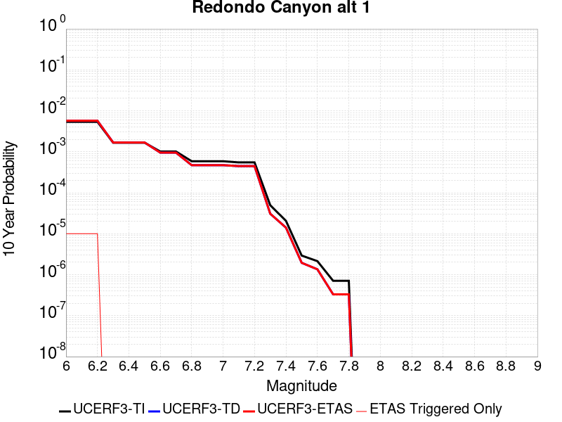 |

| Magnitude | 1 wk TI Prob | 1 wk TD Prob | 1 wk ETAS Prob | 1 wk ETAS/TD Gain | 1 wk ETAS Triggered Only | 1 mo TI Prob | 1 mo TD Prob | 1 mo ETAS Prob | 1 mo ETAS/TD Gain | 1 mo ETAS Triggered Only | 1 yr TI Prob | 1 yr TD Prob | 1 yr ETAS Prob | 1 yr ETAS/TD Gain | 1 yr ETAS Triggered Only | 10 yr TI Prob | 10 yr TD Prob | 10 yr ETAS Prob | 10 yr ETAS/TD Gain | 10 yr ETAS Triggered Only |
|-----|-----|-----|-----|-----|-----|-----|-----|-----|-----|-----|-----|-----|-----|-----|-----|-----|-----|-----|-----|-----|
| 6.0 | 1.0346246E-5 | 1.09813445E-5 | 1.09813445E-5 | 1.0 | 0.0 | 4.43403E-5 | 4.7062502E-5 | 4.7062502E-5 | 1.0 | 0.0 | 5.3970946E-4 | 5.729142E-4 | 5.729142E-4 | 1.0 | 0.0 | 0.0053840056 | 0.005722111 | 0.005732054 | 1.0017376 | 1.0E-5 |
| 6.1 | 1.0346246E-5 | 1.09813445E-5 | 1.09813445E-5 | 1.0 | 0.0 | 4.43403E-5 | 4.7062502E-5 | 4.7062502E-5 | 1.0 | 0.0 | 5.3970946E-4 | 5.729142E-4 | 5.729142E-4 | 1.0 | 0.0 | 0.0053840056 | 0.005722111 | 0.005732054 | 1.0017376 | 1.0E-5 |
| 6.2 | 1.0346246E-5 | 1.09813445E-5 | 1.09813445E-5 | 1.0 | 0.0 | 4.43403E-5 | 4.7062502E-5 | 4.7062502E-5 | 1.0 | 0.0 | 5.3970946E-4 | 5.729142E-4 | 5.729142E-4 | 1.0 | 0.0 | 0.0053840056 | 0.005722111 | 0.005732054 | 1.0017376 | 1.0E-5 |
| 6.3 | 3.2052794E-6 | 3.2361174E-6 | 3.2361174E-6 | 1.0 | 0.0 | 1.373684E-5 | 1.3869023E-5 | 1.3869023E-5 | 1.0 | 0.0 | 1.6723319E-4 | 1.6884625E-4 | 1.6884625E-4 | 1.0 | 0.0 | 0.001671074 | 0.0016875692 | 0.0016875692 | 1.0 | 0.0 |
| 6.4 | 3.2052794E-6 | 3.2361174E-6 | 3.2361174E-6 | 1.0 | 0.0 | 1.373684E-5 | 1.3869023E-5 | 1.3869023E-5 | 1.0 | 0.0 | 1.6723319E-4 | 1.6884625E-4 | 1.6884625E-4 | 1.0 | 0.0 | 0.001671074 | 0.0016875692 | 0.0016875692 | 1.0 | 0.0 |
| 6.5 | 3.2052794E-6 | 3.2361174E-6 | 3.2361174E-6 | 1.0 | 0.0 | 1.373684E-5 | 1.3869023E-5 | 1.3869023E-5 | 1.0 | 0.0 | 1.6723319E-4 | 1.6884625E-4 | 1.6884625E-4 | 1.0 | 0.0 | 0.001671074 | 0.0016875692 | 0.0016875692 | 1.0 | 0.0 |
| 6.6 | 1.948328E-6 | 1.8288681E-6 | 1.8288681E-6 | 1.0 | 0.0 | 8.349951E-6 | 7.837991E-6 | 7.837991E-6 | 1.0 | 0.0 | 1.016559E-4 | 9.542486E-5 | 9.542486E-5 | 1.0 | 0.0 | 0.0010160941 | 9.539858E-4 | 9.539858E-4 | 1.0 | 0.0 |
| 6.7 | 1.948328E-6 | 1.8288681E-6 | 1.8288681E-6 | 1.0 | 0.0 | 8.349951E-6 | 7.837991E-6 | 7.837991E-6 | 1.0 | 0.0 | 1.016559E-4 | 9.542486E-5 | 9.542486E-5 | 1.0 | 0.0 | 0.0010160941 | 9.539858E-4 | 9.539858E-4 | 1.0 | 0.0 |
| 6.8 | 1.1278219E-6 | 9.033076E-7 | 9.033076E-7 | 1.0 | 0.0 | 4.8335132E-6 | 3.871315E-6 | 3.871315E-6 | 1.0 | 0.0 | 5.8846435E-5 | 4.7132668E-5 | 4.7132668E-5 | 1.0 | 0.0 | 5.8830855E-4 | 4.7126875E-4 | 4.7126875E-4 | 1.0 | 0.0 |
| 6.9 | 1.1278219E-6 | 9.033076E-7 | 9.033076E-7 | 1.0 | 0.0 | 4.8335132E-6 | 3.871315E-6 | 3.871315E-6 | 1.0 | 0.0 | 5.8846435E-5 | 4.7132668E-5 | 4.7132668E-5 | 1.0 | 0.0 | 5.8830855E-4 | 4.7126875E-4 | 4.7126875E-4 | 1.0 | 0.0 |
| 7.0 | 1.1278219E-6 | 9.033076E-7 | 9.033076E-7 | 1.0 | 0.0 | 4.8335132E-6 | 3.871315E-6 | 3.871315E-6 | 1.0 | 0.0 | 5.8846435E-5 | 4.7132668E-5 | 4.7132668E-5 | 1.0 | 0.0 | 5.8830855E-4 | 4.7126875E-4 | 4.7126875E-4 | 1.0 | 0.0 |
| 7.1 | 1.0545139E-6 | 8.5692716E-7 | 8.5692716E-7 | 1.0 | 0.0 | 4.5193374E-6 | 3.6725423E-6 | 3.6725423E-6 | 1.0 | 0.0 | 5.5021545E-5 | 4.471271E-5 | 4.471271E-5 | 1.0 | 0.0 | 5.500792E-4 | 4.470789E-4 | 4.470789E-4 | 1.0 | 0.0 |
| 7.2 | 1.0545139E-6 | 8.5692716E-7 | 8.5692716E-7 | 1.0 | 0.0 | 4.5193374E-6 | 3.6725423E-6 | 3.6725423E-6 | 1.0 | 0.0 | 5.5021545E-5 | 4.471271E-5 | 4.471271E-5 | 1.0 | 0.0 | 5.500792E-4 | 4.470789E-4 | 4.470789E-4 | 1.0 | 0.0 |
| 7.3 | 9.505161E-8 | 5.8957607E-8 | 5.8957607E-8 | 1.0 | 0.0 | 4.0736398E-7 | 2.5267545E-7 | 2.5267545E-7 | 1.0 | 0.0 | 4.959645E-6 | 3.0763204E-6 | 3.0763204E-6 | 1.0 | 0.0 | 4.9595343E-5 | 3.0762894E-5 | 3.0762894E-5 | 1.0 | 0.0 |
| 7.4 | 3.9520785E-8 | 2.6987191E-8 | 2.6987191E-8 | 1.0 | 0.0 | 1.6937479E-7 | 1.1565938E-7 | 1.1565938E-7 | 1.0 | 0.0 | 2.062136E-6 | 1.4081523E-6 | 1.4081523E-6 | 1.0 | 0.0 | 2.062117E-5 | 1.4081461E-5 | 1.4081461E-5 | 1.0 | 0.0 |
| 7.5 | 5.6133214E-9 | 3.7368215E-9 | 3.7368215E-9 | 1.0 | 0.0 | 2.4057092E-8 | 1.601495E-8 | 1.601495E-8 | 1.0 | 0.0 | 2.9289507E-7 | 1.9498201E-7 | 1.9498201E-7 | 1.0 | 0.0 | 2.9289467E-6 | 1.9498186E-6 | 1.9498186E-6 | 1.0 | 0.0 |
| 7.6 | 4.1064334E-9 | 2.5957634E-9 | 2.5957634E-9 | 1.0 | 0.0 | 1.7599E-8 | 1.11247E-8 | 1.11247E-8 | 1.0 | 0.0 | 2.142678E-7 | 1.3544322E-7 | 1.3544322E-7 | 1.0 | 0.0 | 2.1426758E-6 | 1.3544316E-6 | 1.3544316E-6 | 1.0 | 0.0 |
| 7.7 | 1.361975E-9 | 6.360824E-10 | 6.360824E-10 | 1.0 | 0.0 | 5.8370353E-9 | 2.7260674E-9 | 2.7260674E-9 | 1.0 | 0.0 | 7.1065905E-8 | 3.318987E-8 | 3.318987E-8 | 1.0 | 0.0 | 7.106588E-7 | 3.318987E-7 | 3.318987E-7 | 1.0 | 0.0 |
| 7.8 | 1.361975E-9 | 6.360824E-10 | 6.360824E-10 | 1.0 | 0.0 | 5.8370353E-9 | 2.7260674E-9 | 2.7260674E-9 | 1.0 | 0.0 | 7.1065905E-8 | 3.318987E-8 | 3.318987E-8 | 1.0 | 0.0 | 7.106588E-7 | 3.318987E-7 | 3.318987E-7 | 1.0 | 0.0 |

## Shoreline
*[(top)](#table-of-contents)*

| 1 Week | 1 Month | 1 Year | 10 Year |
|-----|-----|-----|-----|
|  |  |  |  |

| Magnitude | 1 wk TI Prob | 1 wk TD Prob | 1 wk ETAS Prob | 1 wk ETAS/TD Gain | 1 wk ETAS Triggered Only | 1 mo TI Prob | 1 mo TD Prob | 1 mo ETAS Prob | 1 mo ETAS/TD Gain | 1 mo ETAS Triggered Only | 1 yr TI Prob | 1 yr TD Prob | 1 yr ETAS Prob | 1 yr ETAS/TD Gain | 1 yr ETAS Triggered Only | 10 yr TI Prob | 10 yr TD Prob | 10 yr ETAS Prob | 10 yr ETAS/TD Gain | 10 yr ETAS Triggered Only |
|-----|-----|-----|-----|-----|-----|-----|-----|-----|-----|-----|-----|-----|-----|-----|-----|-----|-----|-----|-----|-----|
| 6.0 | 3.9888673E-6 | 4.047929E-6 | 1.4047889E-5 | 3.4703891 | 1.0E-5 | 1.7095033E-5 | 1.7348184E-5 | 2.734801E-5 | 1.5764192 | 1.0E-5 | 2.0811215E-4 | 2.1119925E-4 | 2.2119714E-4 | 1.0473386 | 1.0E-5 | 0.0020791737 | 0.002110534 | 0.002120513 | 1.0047281 | 1.0E-5 |
| 6.1 | 3.9888673E-6 | 4.047929E-6 | 1.4047889E-5 | 3.4703891 | 1.0E-5 | 1.7095033E-5 | 1.7348184E-5 | 2.734801E-5 | 1.5764192 | 1.0E-5 | 2.0811215E-4 | 2.1119925E-4 | 2.2119714E-4 | 1.0473386 | 1.0E-5 | 0.0020791737 | 0.002110534 | 0.002120513 | 1.0047281 | 1.0E-5 |
| 6.2 | 1.4039653E-6 | 1.4100891E-6 | 1.4100891E-6 | 1.0 | 0.0 | 6.0169805E-6 | 6.0432253E-6 | 6.0432253E-6 | 1.0 | 0.0 | 7.325427E-5 | 7.357384E-5 | 7.357384E-5 | 1.0 | 0.0 | 7.3230127E-4 | 7.355009E-4 | 7.355009E-4 | 1.0 | 0.0 |
| 6.3 | 1.4039653E-6 | 1.4100891E-6 | 1.4100891E-6 | 1.0 | 0.0 | 6.0169805E-6 | 6.0432253E-6 | 6.0432253E-6 | 1.0 | 0.0 | 7.325427E-5 | 7.357384E-5 | 7.357384E-5 | 1.0 | 0.0 | 7.3230127E-4 | 7.355009E-4 | 7.355009E-4 | 1.0 | 0.0 |
| 6.4 | 1.3314152E-6 | 1.3361605E-6 | 1.3361605E-6 | 1.0 | 0.0 | 5.7060524E-6 | 5.7263896E-6 | 5.7263896E-6 | 1.0 | 0.0 | 6.946897E-5 | 6.971662E-5 | 6.971662E-5 | 1.0 | 0.0 | 6.9447263E-4 | 6.9695286E-4 | 6.9695286E-4 | 1.0 | 0.0 |
| 6.5 | 1.1187026E-6 | 1.120364E-6 | 1.120364E-6 | 1.0 | 0.0 | 4.794431E-6 | 4.8015513E-6 | 4.8015513E-6 | 1.0 | 0.0 | 5.8370628E-5 | 5.8457343E-5 | 5.8457343E-5 | 1.0 | 0.0 | 5.83553E-4 | 5.844222E-4 | 5.844222E-4 | 1.0 | 0.0 |
| 6.6 | 9.793089E-7 | 9.784919E-7 | 9.784919E-7 | 1.0 | 0.0 | 4.1970316E-6 | 4.1935305E-6 | 4.1935305E-6 | 1.0 | 0.0 | 5.1097657E-5 | 5.105505E-5 | 5.105505E-5 | 1.0 | 0.0 | 5.108591E-4 | 5.1043445E-4 | 5.1043445E-4 | 1.0 | 0.0 |
| 6.7 | 8.995986E-7 | 8.9728E-7 | 8.9728E-7 | 1.0 | 0.0 | 3.8554167E-6 | 3.84548E-6 | 3.84548E-6 | 1.0 | 0.0 | 4.693869E-5 | 4.6817724E-5 | 4.6817724E-5 | 1.0 | 0.0 | 4.6928777E-4 | 4.6807955E-4 | 4.6807955E-4 | 1.0 | 0.0 |
| 6.8 | 7.931612E-7 | 7.8804027E-7 | 7.8804027E-7 | 1.0 | 0.0 | 3.3992578E-6 | 3.377311E-6 | 3.377311E-6 | 1.0 | 0.0 | 4.1385178E-5 | 4.1117994E-5 | 4.1117994E-5 | 1.0 | 0.0 | 4.1377472E-4 | 4.1110438E-4 | 4.1110438E-4 | 1.0 | 0.0 |
| 6.9 | 7.1465956E-7 | 7.078006E-7 | 7.078006E-7 | 1.0 | 0.0 | 3.062823E-6 | 3.0334277E-6 | 3.0334277E-6 | 1.0 | 0.0 | 3.7289232E-5 | 3.6931357E-5 | 3.6931357E-5 | 1.0 | 0.0 | 3.7282976E-4 | 3.6925258E-4 | 3.6925258E-4 | 1.0 | 0.0 |
| 7.0 | 6.389046E-7 | 6.299458E-7 | 6.299458E-7 | 1.0 | 0.0 | 2.7381598E-6 | 2.699765E-6 | 2.699765E-6 | 1.0 | 0.0 | 3.3336586E-5 | 3.2869146E-5 | 3.2869146E-5 | 1.0 | 0.0 | 3.3331584E-4 | 3.2864307E-4 | 3.2864307E-4 | 1.0 | 0.0 |
| 7.1 | 5.4300875E-7 | 5.3111313E-7 | 5.3111313E-7 | 1.0 | 0.0 | 2.3271782E-6 | 2.276197E-6 | 2.276197E-6 | 1.0 | 0.0 | 2.8333026E-5 | 2.7712347E-5 | 2.7712347E-5 | 1.0 | 0.0 | 2.8329415E-4 | 2.77089E-4 | 2.77089E-4 | 1.0 | 0.0 |
| 7.2 | 4.6768855E-7 | 4.5348952E-7 | 4.5348952E-7 | 1.0 | 0.0 | 2.0043778E-6 | 1.9435251E-6 | 1.9435251E-6 | 1.0 | 0.0 | 2.4403027E-5 | 2.3662162E-5 | 2.3662162E-5 | 1.0 | 0.0 | 2.4400349E-4 | 2.3659648E-4 | 2.3659648E-4 | 1.0 | 0.0 |
| 7.3 | 4.0966103E-7 | 3.9385662E-7 | 3.9385662E-7 | 1.0 | 0.0 | 1.7556889E-6 | 1.6879559E-6 | 1.6879559E-6 | 1.0 | 0.0 | 2.1375303E-5 | 2.055067E-5 | 2.055067E-5 | 1.0 | 0.0 | 2.1373246E-4 | 2.0548773E-4 | 2.0548773E-4 | 1.0 | 0.0 |
| 7.4 | 3.5105785E-7 | 3.3363975E-7 | 3.3363975E-7 | 1.0 | 0.0 | 1.5045327E-6 | 1.4298838E-6 | 1.4298838E-6 | 1.0 | 0.0 | 1.8317533E-5 | 1.7408696E-5 | 1.7408696E-5 | 1.0 | 0.0 | 1.8316023E-4 | 1.7407336E-4 | 1.7407336E-4 | 1.0 | 0.0 |
| 7.5 | 2.8737534E-7 | 2.6820038E-7 | 2.6820038E-7 | 1.0 | 0.0 | 1.2316079E-6 | 1.1494297E-6 | 1.1494297E-6 | 1.0 | 0.0 | 1.4994724E-5 | 1.3994217E-5 | 1.3994217E-5 | 1.0 | 0.0 | 1.4993713E-4 | 1.3993339E-4 | 1.3993339E-4 | 1.0 | 0.0 |
| 7.6 | 2.0924051E-7 | 1.8778988E-7 | 1.8778988E-7 | 1.0 | 0.0 | 8.967448E-7 | 8.048135E-7 | 8.048135E-7 | 1.0 | 0.0 | 1.0917813E-5 | 9.79856E-6 | 9.79856E-6 | 1.0 | 0.0 | 1.0917276E-4 | 9.798129E-5 | 9.798129E-5 | 1.0 | 0.0 |
| 7.7 | 1.392265E-7 | 1.15433906E-7 | 1.15433906E-7 | 1.0 | 0.0 | 5.9668486E-7 | 4.9471663E-7 | 4.9471663E-7 | 1.0 | 0.0 | 7.2646135E-6 | 6.023158E-6 | 6.023158E-6 | 1.0 | 0.0 | 7.2643765E-5 | 6.0229955E-5 | 6.0229955E-5 | 1.0 | 0.0 |
| 7.8 | 8.1080074E-8 | 5.586722E-8 | 5.586722E-8 | 1.0 | 0.0 | 3.4748598E-7 | 2.394309E-7 | 2.394309E-7 | 1.0 | 0.0 | 4.2306337E-6 | 2.9150672E-6 | 2.9150672E-6 | 1.0 | 0.0 | 4.230553E-5 | 2.9150291E-5 | 2.9150291E-5 | 1.0 | 0.0 |
| 7.9 | 5.0859036E-8 | 2.7244445E-8 | 2.7244445E-8 | 1.0 | 0.0 | 2.1796728E-7 | 1.16761896E-7 | 1.16761896E-7 | 1.0 | 0.0 | 2.6537484E-6 | 1.4215751E-6 | 1.4215751E-6 | 1.0 | 0.0 | 2.6537167E-5 | 1.4215661E-5 | 1.4215661E-5 | 1.0 | 0.0 |
| 8.0 | 3.1760536E-8 | 1.3577205E-8 | 1.3577205E-8 | 1.0 | 0.0 | 1.3611657E-7 | 5.8188025E-8 | 5.8188025E-8 | 1.0 | 0.0 | 1.6572179E-6 | 7.0843896E-7 | 7.0843896E-7 | 1.0 | 0.0 | 1.6572056E-5 | 7.084367E-6 | 7.084367E-6 | 1.0 | 0.0 |
| 8.1 | 1.2947896E-8 | 5.6628693E-9 | 5.6628693E-9 | 1.0 | 0.0 | 5.5490982E-8 | 2.426944E-8 | 2.426944E-8 | 1.0 | 0.0 | 6.756025E-7 | 2.954804E-7 | 2.954804E-7 | 1.0 | 0.0 | 6.7560045E-6 | 2.9548003E-6 | 2.9548003E-6 | 1.0 | 0.0 |

## Hilton Creek 2011 CFM
*[(top)](#table-of-contents)*

| 1 Week | 1 Month | 1 Year | 10 Year |
|-----|-----|-----|-----|
|  |  |  |  |

| Magnitude | 1 wk TI Prob | 1 wk TD Prob | 1 wk ETAS Prob | 1 wk ETAS/TD Gain | 1 wk ETAS Triggered Only | 1 mo TI Prob | 1 mo TD Prob | 1 mo ETAS Prob | 1 mo ETAS/TD Gain | 1 mo ETAS Triggered Only | 1 yr TI Prob | 1 yr TD Prob | 1 yr ETAS Prob | 1 yr ETAS/TD Gain | 1 yr ETAS Triggered Only | 10 yr TI Prob | 10 yr TD Prob | 10 yr ETAS Prob | 10 yr ETAS/TD Gain | 10 yr ETAS Triggered Only |
|-----|-----|-----|-----|-----|-----|-----|-----|-----|-----|-----|-----|-----|-----|-----|-----|-----|-----|-----|-----|-----|
| 6.0 | 2.4923684E-5 | 4.456762E-6 | 1.44567175E-5 | 3.2437716 | 1.0E-5 | 1.06811414E-4 | 1.9100278E-5 | 2.9100087E-5 | 1.5235426 | 1.0E-5 | 0.0012996531 | 2.325227E-4 | 2.4252037E-4 | 1.0429965 | 1.0E-5 | 0.012920785 | 0.0023257772 | 0.002335754 | 1.0042896 | 1.0E-5 |
| 6.1 | 2.4923684E-5 | 4.456762E-6 | 1.44567175E-5 | 3.2437716 | 1.0E-5 | 1.06811414E-4 | 1.9100278E-5 | 2.9100087E-5 | 1.5235426 | 1.0E-5 | 0.0012996531 | 2.325227E-4 | 2.4252037E-4 | 1.0429965 | 1.0E-5 | 0.012920785 | 0.0023257772 | 0.002335754 | 1.0042896 | 1.0E-5 |
| 6.2 | 2.4923684E-5 | 4.456762E-6 | 1.44567175E-5 | 3.2437716 | 1.0E-5 | 1.06811414E-4 | 1.9100278E-5 | 2.9100087E-5 | 1.5235426 | 1.0E-5 | 0.0012996531 | 2.325227E-4 | 2.4252037E-4 | 1.0429965 | 1.0E-5 | 0.012920785 | 0.0023257772 | 0.002335754 | 1.0042896 | 1.0E-5 |
| 6.3 | 2.4923684E-5 | 4.456762E-6 | 1.44567175E-5 | 3.2437716 | 1.0E-5 | 1.06811414E-4 | 1.9100278E-5 | 2.9100087E-5 | 1.5235426 | 1.0E-5 | 0.0012996531 | 2.325227E-4 | 2.4252037E-4 | 1.0429965 | 1.0E-5 | 0.012920785 | 0.0023257772 | 0.002335754 | 1.0042896 | 1.0E-5 |
| 6.4 | 2.4923684E-5 | 4.456762E-6 | 1.44567175E-5 | 3.2437716 | 1.0E-5 | 1.06811414E-4 | 1.9100278E-5 | 2.9100087E-5 | 1.5235426 | 1.0E-5 | 0.0012996531 | 2.325227E-4 | 2.4252037E-4 | 1.0429965 | 1.0E-5 | 0.012920785 | 0.0023257772 | 0.002335754 | 1.0042896 | 1.0E-5 |
| 6.5 | 2.1963904E-5 | 4.1443413E-6 | 1.41443E-5 | 3.4129186 | 1.0E-5 | 9.412762E-5 | 1.7761351E-5 | 2.7761173E-5 | 1.5630102 | 1.0E-5 | 0.0011454013 | 2.162245E-4 | 2.2622233E-4 | 1.0462382 | 1.0E-5 | 0.011395155 | 0.002162927 | 0.0021729055 | 1.0046134 | 1.0E-5 |
| 6.6 | 2.1963904E-5 | 4.1443413E-6 | 1.41443E-5 | 3.4129186 | 1.0E-5 | 9.412762E-5 | 1.7761351E-5 | 2.7761173E-5 | 1.5630102 | 1.0E-5 | 0.0011454013 | 2.162245E-4 | 2.2622233E-4 | 1.0462382 | 1.0E-5 | 0.011395155 | 0.002162927 | 0.0021729055 | 1.0046134 | 1.0E-5 |
| 6.7 | 1.9397496E-5 | 4.0143746E-6 | 1.4014335E-5 | 3.4910378 | 1.0E-5 | 8.3129475E-5 | 1.7204358E-5 | 2.7204185E-5 | 1.581238 | 1.0E-5 | 0.0010116313 | 2.094444E-4 | 2.1944231E-4 | 1.0477353 | 1.0E-5 | 0.0100703845 | 0.0020949803 | 0.0021049595 | 1.0047634 | 1.0E-5 |
| 6.8 | 1.917303E-5 | 3.907314E-6 | 1.39072745E-5 | 3.559293 | 1.0E-5 | 8.216754E-5 | 1.6745531E-5 | 2.6745363E-5 | 1.5971643 | 1.0E-5 | 9.999307E-4 | 2.0385924E-4 | 2.138572E-4 | 1.0490434 | 1.0E-5 | 0.009954433 | 0.0020392318 | 0.0020492114 | 1.0048938 | 1.0E-5 |
| 6.9 | 6.480681E-6 | 3.2317153E-6 | 1.3231683E-5 | 4.094322 | 1.0E-5 | 2.7774051E-5 | 1.3850141E-5 | 2.3850003E-5 | 1.7220043 | 1.0E-5 | 3.380966E-4 | 1.6861355E-4 | 1.7861187E-4 | 1.0592972 | 1.0E-5 | 0.0033758266 | 0.0016849673 | 0.0016949504 | 1.0059248 | 1.0E-5 |
| 7.0 | 5.388316E-6 | 2.788372E-6 | 1.2788344E-5 | 4.586312 | 1.0E-5 | 2.3092578E-5 | 1.1950117E-5 | 2.1949998E-5 | 1.8368019 | 1.0E-5 | 2.8111585E-4 | 1.4548401E-4 | 1.5548254E-4 | 1.0687261 | 1.0E-5 | 0.002807605 | 0.0014539903 | 0.0014639758 | 1.0068676 | 1.0E-5 |
| 7.1 | 4.41728E-6 | 2.3575074E-6 | 1.2357484E-5 | 5.2417583 | 1.0E-5 | 1.8931061E-5 | 1.0103569E-5 | 2.0103469E-5 | 1.9897392 | 1.0E-5 | 2.304613E-4 | 1.23005E-4 | 1.3300376E-4 | 1.0812875 | 1.0E-5 | 0.0023022245 | 0.0012294657 | 0.0012394533 | 1.0081236 | 1.0E-5 |
| 7.2 | 2.535495E-6 | 1.1208391E-6 | 1.1208391E-6 | 1.0 | 0.0 | 1.0866362E-5 | 4.8035904E-6 | 4.8035904E-6 | 1.0 | 0.0 | 1.3228992E-4 | 5.8482667E-5 | 5.8482667E-5 | 1.0 | 0.0 | 0.0013221119 | 5.84724E-4 | 5.84724E-4 | 1.0 | 0.0 |
| 7.3 | 7.900015E-7 | 4.0889498E-7 | 4.0889498E-7 | 1.0 | 0.0 | 3.3857161E-6 | 1.752407E-6 | 1.752407E-6 | 1.0 | 0.0 | 4.1220315E-5 | 2.1335554E-5 | 2.1335554E-5 | 1.0 | 0.0 | 4.121267E-4 | 2.1335555E-4 | 2.1335555E-4 | 1.0 | 0.0 |

## Collayami 2011 CFM
*[(top)](#table-of-contents)*

| 1 Week | 1 Month | 1 Year | 10 Year |
|-----|-----|-----|-----|
|  |  |  |  |

| Magnitude | 1 wk TI Prob | 1 wk TD Prob | 1 wk ETAS Prob | 1 wk ETAS/TD Gain | 1 wk ETAS Triggered Only | 1 mo TI Prob | 1 mo TD Prob | 1 mo ETAS Prob | 1 mo ETAS/TD Gain | 1 mo ETAS Triggered Only | 1 yr TI Prob | 1 yr TD Prob | 1 yr ETAS Prob | 1 yr ETAS/TD Gain | 1 yr ETAS Triggered Only | 10 yr TI Prob | 10 yr TD Prob | 10 yr ETAS Prob | 10 yr ETAS/TD Gain | 10 yr ETAS Triggered Only |
|-----|-----|-----|-----|-----|-----|-----|-----|-----|-----|-----|-----|-----|-----|-----|-----|-----|-----|-----|-----|-----|
| 6.0 | 3.112429E-5 | 3.493857E-5 | 3.493857E-5 | 1.0 | 0.0 | 1.33383E-4 | 1.4972912E-4 | 1.4972912E-4 | 1.0 | 0.0 | 0.0016227282 | 0.0018216016 | 0.0018216016 | 1.0 | 0.0 | 0.016109297 | 0.018084232 | 0.018094052 | 1.000543 | 1.0E-5 |
| 6.1 | 1.7119446E-5 | 1.9156616E-5 | 1.9156616E-5 | 1.0 | 0.0 | 7.336699E-5 | 8.209753E-5 | 8.209753E-5 | 1.0 | 0.0 | 8.92877E-4 | 9.991383E-4 | 9.991383E-4 | 1.0 | 0.0 | 0.00889298 | 0.009952341 | 0.009962242 | 1.0009948 | 1.0E-5 |
| 6.2 | 1.7119446E-5 | 1.9156616E-5 | 1.9156616E-5 | 1.0 | 0.0 | 7.336699E-5 | 8.209753E-5 | 8.209753E-5 | 1.0 | 0.0 | 8.92877E-4 | 9.991383E-4 | 9.991383E-4 | 1.0 | 0.0 | 0.00889298 | 0.009952341 | 0.009962242 | 1.0009948 | 1.0E-5 |
| 6.3 | 9.041288E-6 | 1.0106096E-5 | 1.0106096E-5 | 1.0 | 0.0 | 3.87478E-5 | 4.3311244E-5 | 4.3311244E-5 | 1.0 | 0.0 | 4.7165234E-4 | 5.2720873E-4 | 5.2720873E-4 | 1.0 | 0.0 | 0.0047065257 | 0.005261738 | 0.0052716853 | 1.0018905 | 1.0E-5 |
| 6.4 | 5.5972064E-6 | 6.2580466E-6 | 6.2580466E-6 | 1.0 | 0.0 | 2.3987806E-5 | 2.6820002E-5 | 2.6820002E-5 | 1.0 | 0.0 | 2.920124E-4 | 3.2649818E-4 | 3.2649818E-4 | 1.0 | 0.0 | 0.0029162897 | 0.0032615191 | 0.0032615191 | 1.0 | 0.0 |
| 6.5 | 3.530659E-6 | 3.9520487E-6 | 3.9520487E-6 | 1.0 | 0.0 | 1.5131307E-5 | 1.69373E-5 | 1.69373E-5 | 1.0 | 0.0 | 1.842081E-4 | 2.062025E-4 | 2.062025E-4 | 1.0 | 0.0 | 0.0018405546 | 0.0020611305 | 0.0020611305 | 1.0 | 0.0 |
| 6.6 | 2.4625563E-6 | 2.7572657E-6 | 2.7572657E-6 | 1.0 | 0.0 | 1.0553769E-5 | 1.1816854E-5 | 1.1816854E-5 | 1.0 | 0.0 | 1.2848456E-4 | 1.4387019E-4 | 1.4387019E-4 | 1.0 | 0.0 | 0.001284103 | 0.0014387019 | 0.0014387019 | 1.0 | 0.0 |

## Morales (East)
*[(top)](#table-of-contents)*

| 1 Week | 1 Month | 1 Year | 10 Year |
|-----|-----|-----|-----|
|  |  |  |  |

| Magnitude | 1 wk TI Prob | 1 wk TD Prob | 1 wk ETAS Prob | 1 wk ETAS/TD Gain | 1 wk ETAS Triggered Only | 1 mo TI Prob | 1 mo TD Prob | 1 mo ETAS Prob | 1 mo ETAS/TD Gain | 1 mo ETAS Triggered Only | 1 yr TI Prob | 1 yr TD Prob | 1 yr ETAS Prob | 1 yr ETAS/TD Gain | 1 yr ETAS Triggered Only | 10 yr TI Prob | 10 yr TD Prob | 10 yr ETAS Prob | 10 yr ETAS/TD Gain | 10 yr ETAS Triggered Only |
|-----|-----|-----|-----|-----|-----|-----|-----|-----|-----|-----|-----|-----|-----|-----|-----|-----|-----|-----|-----|-----|
| 6.0 | 1.4942771E-6 | 2.123479E-6 | 2.123479E-6 | 1.0 | 0.0 | 6.404029E-6 | 9.100596E-6 | 9.100596E-6 | 1.0 | 0.0 | 7.7966266E-5 | 1.107947E-4 | 1.2079359E-4 | 1.090247 | 1.0E-5 | 7.793892E-4 | 0.0011074544 | 0.0011174433 | 1.0090197 | 1.0E-5 |
| 6.1 | 1.4942771E-6 | 2.123479E-6 | 2.123479E-6 | 1.0 | 0.0 | 6.404029E-6 | 9.100596E-6 | 9.100596E-6 | 1.0 | 0.0 | 7.7966266E-5 | 1.107947E-4 | 1.2079359E-4 | 1.090247 | 1.0E-5 | 7.793892E-4 | 0.0011074544 | 0.0011174433 | 1.0090197 | 1.0E-5 |
| 6.2 | 1.4942771E-6 | 2.123479E-6 | 2.123479E-6 | 1.0 | 0.0 | 6.404029E-6 | 9.100596E-6 | 9.100596E-6 | 1.0 | 0.0 | 7.7966266E-5 | 1.107947E-4 | 1.2079359E-4 | 1.090247 | 1.0E-5 | 7.793892E-4 | 0.0011074544 | 0.0011174433 | 1.0090197 | 1.0E-5 |
| 6.3 | 1.4942771E-6 | 2.123479E-6 | 2.123479E-6 | 1.0 | 0.0 | 6.404029E-6 | 9.100596E-6 | 9.100596E-6 | 1.0 | 0.0 | 7.7966266E-5 | 1.107947E-4 | 1.2079359E-4 | 1.090247 | 1.0E-5 | 7.793892E-4 | 0.0011074544 | 0.0011174433 | 1.0090197 | 1.0E-5 |
| 6.4 | 8.798845E-7 | 1.5022731E-6 | 1.5022731E-6 | 1.0 | 0.0 | 3.7709283E-6 | 6.438298E-6 | 6.438298E-6 | 1.0 | 0.0 | 4.5910085E-5 | 7.8383564E-5 | 7.8383564E-5 | 1.0 | 0.0 | 4.59006E-4 | 7.835727E-4 | 7.835727E-4 | 1.0 | 0.0 |
| 6.5 | 7.1751725E-7 | 1.3384229E-6 | 1.3384229E-6 | 1.0 | 0.0 | 3.0750705E-6 | 5.7360858E-6 | 5.7360858E-6 | 1.0 | 0.0 | 3.7438338E-5 | 6.9834685E-5 | 6.9834685E-5 | 1.0 | 0.0 | 3.743203E-4 | 6.9813756E-4 | 6.9813756E-4 | 1.0 | 0.0 |
| 6.6 | 7.1751725E-7 | 1.3384229E-6 | 1.3384229E-6 | 1.0 | 0.0 | 3.0750705E-6 | 5.7360858E-6 | 5.7360858E-6 | 1.0 | 0.0 | 3.7438338E-5 | 6.9834685E-5 | 6.9834685E-5 | 1.0 | 0.0 | 3.743203E-4 | 6.9813756E-4 | 6.9813756E-4 | 1.0 | 0.0 |
| 6.7 | 7.159057E-7 | 1.3358889E-6 | 1.3358889E-6 | 1.0 | 0.0 | 3.0681638E-6 | 5.725226E-6 | 5.725226E-6 | 1.0 | 0.0 | 3.7354253E-5 | 6.970247E-5 | 6.970247E-5 | 1.0 | 0.0 | 3.7347974E-4 | 6.968163E-4 | 6.968163E-4 | 1.0 | 0.0 |
| 6.8 | 7.032203E-7 | 1.3174443E-6 | 1.3174443E-6 | 1.0 | 0.0 | 3.0137978E-6 | 5.646178E-6 | 5.646178E-6 | 1.0 | 0.0 | 3.669237E-5 | 6.8740126E-5 | 6.8740126E-5 | 1.0 | 0.0 | 3.6686313E-4 | 6.871988E-4 | 6.871988E-4 | 1.0 | 0.0 |
| 6.9 | 6.941549E-7 | 1.3025061E-6 | 1.3025061E-6 | 1.0 | 0.0 | 2.974946E-6 | 5.582158E-6 | 5.582158E-6 | 1.0 | 0.0 | 3.6219368E-5 | 6.7960726E-5 | 6.7960726E-5 | 1.0 | 0.0 | 3.6213463E-4 | 6.7940954E-4 | 6.7940954E-4 | 1.0 | 0.0 |
| 7.0 | 6.2932247E-7 | 1.18774E-6 | 1.18774E-6 | 1.0 | 0.0 | 2.6970936E-6 | 5.090305E-6 | 5.090305E-6 | 1.0 | 0.0 | 3.283662E-5 | 6.1972765E-5 | 6.1972765E-5 | 1.0 | 0.0 | 3.283177E-4 | 6.1956374E-4 | 6.1956374E-4 | 1.0 | 0.0 |
| 7.1 | 5.6200963E-7 | 1.0640374E-6 | 1.0640374E-6 | 1.0 | 0.0 | 2.4086105E-6 | 4.5601523E-6 | 4.5601523E-6 | 1.0 | 0.0 | 2.9324437E-5 | 5.551849E-5 | 5.551849E-5 | 1.0 | 0.0 | 2.9320567E-4 | 5.550534E-4 | 5.550534E-4 | 1.0 | 0.0 |
| 7.2 | 4.91044E-7 | 9.285713E-7 | 9.285713E-7 | 1.0 | 0.0 | 2.1044725E-6 | 3.9795855E-6 | 3.9795855E-6 | 1.0 | 0.0 | 2.5621652E-5 | 4.8450413E-5 | 4.8450413E-5 | 1.0 | 0.0 | 2.56187E-4 | 4.8440482E-4 | 4.8440482E-4 | 1.0 | 0.0 |
| 7.3 | 4.2978448E-7 | 7.9739846E-7 | 7.9739846E-7 | 1.0 | 0.0 | 1.8419321E-6 | 3.4174175E-6 | 3.4174175E-6 | 1.0 | 0.0 | 2.2425293E-5 | 4.1606294E-5 | 4.1606294E-5 | 1.0 | 0.0 | 2.242303E-4 | 4.1599068E-4 | 4.1599068E-4 | 1.0 | 0.0 |
| 7.4 | 3.774317E-7 | 6.806746E-7 | 6.806746E-7 | 1.0 | 0.0 | 1.6175634E-6 | 2.9171736E-6 | 2.9171736E-6 | 1.0 | 0.0 | 1.9693656E-5 | 3.5516037E-5 | 3.5516037E-5 | 1.0 | 0.0 | 1.969191E-4 | 3.551089E-4 | 3.551089E-4 | 1.0 | 0.0 |
| 7.5 | 1.0603232E-7 | 9.840901E-8 | 9.840901E-8 | 1.0 | 0.0 | 4.5442414E-7 | 4.2175282E-7 | 4.2175282E-7 | 1.0 | 0.0 | 5.5326E-6 | 5.134829E-6 | 5.134829E-6 | 1.0 | 0.0 | 5.532462E-5 | 5.134967E-5 | 5.134967E-5 | 1.0 | 0.0 |
| 7.6 | 9.960384E-8 | 8.755334E-8 | 8.755334E-8 | 1.0 | 0.0 | 4.2687353E-7 | 3.7522852E-7 | 3.7522852E-7 | 1.0 | 0.0 | 5.197173E-6 | 4.568398E-6 | 4.568398E-6 | 1.0 | 0.0 | 5.1970514E-5 | 4.5685607E-5 | 4.5685607E-5 | 1.0 | 0.0 |
| 7.7 | 6.499468E-8 | 4.1038682E-8 | 4.1038682E-8 | 1.0 | 0.0 | 2.785486E-7 | 1.7588006E-7 | 1.7588006E-7 | 1.0 | 0.0 | 3.3913238E-6 | 2.1413375E-6 | 2.1413375E-6 | 1.0 | 0.0 | 3.3912722E-5 | 2.1415728E-5 | 2.1415728E-5 | 1.0 | 0.0 |
| 7.8 | 2.2517119E-8 | 7.1312614E-9 | 7.1312614E-9 | 1.0 | 0.0 | 9.6501935E-8 | 3.0562546E-8 | 3.0562546E-8 | 1.0 | 0.0 | 1.1749105E-6 | 3.7209892E-7 | 3.7209892E-7 | 1.0 | 0.0 | 1.1749043E-5 | 3.7235213E-6 | 3.7235213E-6 | 1.0 | 0.0 |
| 7.9 | 8.493023E-9 | 9.970124E-10 | 9.970124E-10 | 1.0 | 0.0 | 3.639867E-8 | 4.2729082E-9 | 4.2729082E-9 | 1.0 | 0.0 | 4.4315374E-7 | 5.202266E-8 | 5.202266E-8 | 1.0 | 0.0 | 4.4315284E-6 | 5.2233156E-7 | 5.2233156E-7 | 1.0 | 0.0 |
| 8.0 | 1.4971842E-9 | 5.5458416E-11 | 5.5458416E-11 | 1.0 | 0.0 | 6.4165038E-9 | 2.376762E-10 | 2.376762E-10 | 1.0 | 0.0 | 7.812093E-8 | 2.8937068E-9 | 2.8937068E-9 | 1.0 | 0.0 | 7.81209E-7 | 3.019288E-8 | 3.019288E-8 | 1.0 | 0.0 |

## Compton
*[(top)](#table-of-contents)*

| 1 Week | 1 Month | 1 Year | 10 Year |
|-----|-----|-----|-----|
|  |  |  |  |

| Magnitude | 1 wk TI Prob | 1 wk TD Prob | 1 wk ETAS Prob | 1 wk ETAS/TD Gain | 1 wk ETAS Triggered Only | 1 mo TI Prob | 1 mo TD Prob | 1 mo ETAS Prob | 1 mo ETAS/TD Gain | 1 mo ETAS Triggered Only | 1 yr TI Prob | 1 yr TD Prob | 1 yr ETAS Prob | 1 yr ETAS/TD Gain | 1 yr ETAS Triggered Only | 10 yr TI Prob | 10 yr TD Prob | 10 yr ETAS Prob | 10 yr ETAS/TD Gain | 10 yr ETAS Triggered Only |
|-----|-----|-----|-----|-----|-----|-----|-----|-----|-----|-----|-----|-----|-----|-----|-----|-----|-----|-----|-----|-----|
| 6.0 | 1.06050875E-5 | 6.358671E-6 | 6.358671E-6 | 1.0 | 0.0 | 4.5449582E-5 | 2.7251177E-5 | 2.7251177E-5 | 1.0 | 0.0 | 5.5320817E-4 | 3.317354E-4 | 3.417321E-4 | 1.0301346 | 1.0E-5 | 0.0055183303 | 0.0033126862 | 0.003322653 | 1.0030087 | 1.0E-5 |
| 6.1 | 1.06050875E-5 | 6.358671E-6 | 6.358671E-6 | 1.0 | 0.0 | 4.5449582E-5 | 2.7251177E-5 | 2.7251177E-5 | 1.0 | 0.0 | 5.5320817E-4 | 3.317354E-4 | 3.417321E-4 | 1.0301346 | 1.0E-5 | 0.0055183303 | 0.0033126862 | 0.003322653 | 1.0030087 | 1.0E-5 |
| 6.2 | 1.06050875E-5 | 6.358671E-6 | 6.358671E-6 | 1.0 | 0.0 | 4.5449582E-5 | 2.7251177E-5 | 2.7251177E-5 | 1.0 | 0.0 | 5.5320817E-4 | 3.317354E-4 | 3.417321E-4 | 1.0301346 | 1.0E-5 | 0.0055183303 | 0.0033126862 | 0.003322653 | 1.0030087 | 1.0E-5 |
| 6.3 | 1.06050875E-5 | 6.358671E-6 | 6.358671E-6 | 1.0 | 0.0 | 4.5449582E-5 | 2.7251177E-5 | 2.7251177E-5 | 1.0 | 0.0 | 5.5320817E-4 | 3.317354E-4 | 3.417321E-4 | 1.0301346 | 1.0E-5 | 0.0055183303 | 0.0033126862 | 0.003322653 | 1.0030087 | 1.0E-5 |
| 6.4 | 1.06050875E-5 | 6.358671E-6 | 6.358671E-6 | 1.0 | 0.0 | 4.5449582E-5 | 2.7251177E-5 | 2.7251177E-5 | 1.0 | 0.0 | 5.5320817E-4 | 3.317354E-4 | 3.417321E-4 | 1.0301346 | 1.0E-5 | 0.0055183303 | 0.0033126862 | 0.003322653 | 1.0030087 | 1.0E-5 |
| 6.5 | 1.06050875E-5 | 6.358671E-6 | 6.358671E-6 | 1.0 | 0.0 | 4.5449582E-5 | 2.7251177E-5 | 2.7251177E-5 | 1.0 | 0.0 | 5.5320817E-4 | 3.317354E-4 | 3.417321E-4 | 1.0301346 | 1.0E-5 | 0.0055183303 | 0.0033126862 | 0.003322653 | 1.0030087 | 1.0E-5 |
| 6.6 | 1.06050875E-5 | 6.358671E-6 | 6.358671E-6 | 1.0 | 0.0 | 4.5449582E-5 | 2.7251177E-5 | 2.7251177E-5 | 1.0 | 0.0 | 5.5320817E-4 | 3.317354E-4 | 3.417321E-4 | 1.0301346 | 1.0E-5 | 0.0055183303 | 0.0033126862 | 0.003322653 | 1.0030087 | 1.0E-5 |
| 6.7 | 1.06050875E-5 | 6.358671E-6 | 6.358671E-6 | 1.0 | 0.0 | 4.5449582E-5 | 2.7251177E-5 | 2.7251177E-5 | 1.0 | 0.0 | 5.5320817E-4 | 3.317354E-4 | 3.417321E-4 | 1.0301346 | 1.0E-5 | 0.0055183303 | 0.0033126862 | 0.003322653 | 1.0030087 | 1.0E-5 |
| 6.8 | 1.06050875E-5 | 6.358671E-6 | 6.358671E-6 | 1.0 | 0.0 | 4.5449582E-5 | 2.7251177E-5 | 2.7251177E-5 | 1.0 | 0.0 | 5.5320817E-4 | 3.317354E-4 | 3.417321E-4 | 1.0301346 | 1.0E-5 | 0.0055183303 | 0.0033126862 | 0.003322653 | 1.0030087 | 1.0E-5 |
| 6.9 | 1.06050875E-5 | 6.358671E-6 | 6.358671E-6 | 1.0 | 0.0 | 4.5449582E-5 | 2.7251177E-5 | 2.7251177E-5 | 1.0 | 0.0 | 5.5320817E-4 | 3.317354E-4 | 3.417321E-4 | 1.0301346 | 1.0E-5 | 0.0055183303 | 0.0033126862 | 0.003322653 | 1.0030087 | 1.0E-5 |
| 7.0 | 7.672486E-6 | 4.2720512E-6 | 4.2720512E-6 | 1.0 | 0.0 | 3.288167E-5 | 1.8308665E-5 | 1.8308665E-5 | 1.0 | 0.0 | 4.0026082E-4 | 2.2288582E-4 | 2.2288582E-4 | 1.0 | 0.0 | 0.0039954064 | 0.002226685 | 0.002226685 | 1.0 | 0.0 |
| 7.1 | 7.163992E-6 | 3.883762E-6 | 3.883762E-6 | 1.0 | 0.0 | 3.0702464E-5 | 1.6644592E-5 | 1.6644592E-5 | 1.0 | 0.0 | 3.7373835E-4 | 2.0262963E-4 | 2.0262963E-4 | 1.0 | 0.0 | 0.0037311043 | 0.0020245055 | 0.0020245055 | 1.0 | 0.0 |
| 7.2 | 6.3689185E-6 | 3.3102428E-6 | 3.3102428E-6 | 1.0 | 0.0 | 2.729508E-5 | 1.418668E-5 | 1.418668E-5 | 1.0 | 0.0 | 3.322669E-4 | 1.7270957E-4 | 1.7270957E-4 | 1.0 | 0.0 | 0.0033177056 | 0.0017257951 | 0.0017257951 | 1.0 | 0.0 |
| 7.3 | 4.4987873E-6 | 2.4480942E-6 | 2.4480942E-6 | 1.0 | 0.0 | 1.9280375E-5 | 1.0491792E-5 | 1.0491792E-5 | 1.0 | 0.0 | 2.3471327E-4 | 1.2773038E-4 | 1.2773038E-4 | 1.0 | 0.0 | 0.002344655 | 0.0012765999 | 0.0012765999 | 1.0 | 0.0 |
| 7.4 | 2.987296E-6 | 1.7394335E-6 | 1.7394335E-6 | 1.0 | 0.0 | 1.2802635E-5 | 7.454694E-6 | 7.454694E-6 | 1.0 | 0.0 | 1.5586092E-4 | 9.0757174E-5 | 9.0757174E-5 | 1.0 | 0.0 | 0.0015575165 | 9.072069E-4 | 9.072069E-4 | 1.0 | 0.0 |
| 7.5 | 2.4111696E-6 | 1.4472155E-6 | 1.4472155E-6 | 1.0 | 0.0 | 1.0333543E-5 | 6.2023378E-6 | 6.2023378E-6 | 1.0 | 0.0 | 1.2580362E-4 | 7.551089E-5 | 7.551089E-5 | 1.0 | 0.0 | 0.0012573242 | 7.54857E-4 | 7.54857E-4 | 1.0 | 0.0 |
| 7.6 | 1.8783096E-6 | 1.1360459E-6 | 1.1360459E-6 | 1.0 | 0.0 | 8.049874E-6 | 4.8687593E-6 | 4.8687593E-6 | 1.0 | 0.0 | 9.8002805E-5 | 5.927557E-5 | 5.927557E-5 | 1.0 | 0.0 | 9.795959E-4 | 5.926016E-4 | 5.926016E-4 | 1.0 | 0.0 |
| 7.7 | 6.6646817E-7 | 3.560237E-7 | 3.560237E-7 | 1.0 | 0.0 | 2.856289E-6 | 1.525815E-6 | 1.525815E-6 | 1.0 | 0.0 | 3.4774763E-5 | 1.8576653E-5 | 1.8576653E-5 | 1.0 | 0.0 | 3.4769322E-4 | 1.8575235E-4 | 1.8575235E-4 | 1.0 | 0.0 |
| 7.8 | 7.054689E-8 | 4.1342968E-8 | 4.1342968E-8 | 1.0 | 0.0 | 3.0234378E-7 | 1.7718413E-7 | 1.7718413E-7 | 1.0 | 0.0 | 3.6810293E-6 | 2.1572148E-6 | 2.1572148E-6 | 1.0 | 0.0 | 3.6809684E-5 | 2.1571948E-5 | 2.1571948E-5 | 1.0 | 0.0 |
| 7.9 | 7.420925E-9 | 4.0131285E-9 | 4.0131285E-9 | 1.0 | 0.0 | 3.1803964E-8 | 1.7199122E-8 | 1.7199122E-8 | 1.0 | 0.0 | 3.872132E-7 | 2.093993E-7 | 2.093993E-7 | 1.0 | 0.0 | 3.872125E-6 | 2.0939913E-6 | 2.0939913E-6 | 1.0 | 0.0 |

## Hat Creek-McArthur-Mayfield
*[(top)](#table-of-contents)*

| 1 Week | 1 Month | 1 Year | 10 Year |
|-----|-----|-----|-----|
|  |  |  |  |

| Magnitude | 1 wk TI Prob | 1 wk TD Prob | 1 wk ETAS Prob | 1 wk ETAS/TD Gain | 1 wk ETAS Triggered Only | 1 mo TI Prob | 1 mo TD Prob | 1 mo ETAS Prob | 1 mo ETAS/TD Gain | 1 mo ETAS Triggered Only | 1 yr TI Prob | 1 yr TD Prob | 1 yr ETAS Prob | 1 yr ETAS/TD Gain | 1 yr ETAS Triggered Only | 10 yr TI Prob | 10 yr TD Prob | 10 yr ETAS Prob | 10 yr ETAS/TD Gain | 10 yr ETAS Triggered Only |
|-----|-----|-----|-----|-----|-----|-----|-----|-----|-----|-----|-----|-----|-----|-----|-----|-----|-----|-----|-----|-----|
| 6.0 | 3.967457E-5 | 4.315831E-5 | 4.315831E-5 | 1.0 | 0.0 | 1.7002279E-4 | 1.8495171E-4 | 1.8495171E-4 | 1.0 | 0.0 | 0.002068062 | 0.002249576 | 0.0022595534 | 1.0044353 | 1.0E-5 | 0.02048922 | 0.022280399 | 0.022290176 | 1.0004388 | 1.0E-5 |
| 6.1 | 2.5044013E-5 | 2.7071164E-5 | 2.7071164E-5 | 1.0 | 0.0 | 1.0732707E-4 | 1.1601429E-4 | 1.1601429E-4 | 1.0 | 0.0 | 0.0013059238 | 0.0014115906 | 0.0014215765 | 1.0070742 | 1.0E-5 | 0.01298276 | 0.01402966 | 0.01403952 | 1.0007027 | 1.0E-5 |
| 6.2 | 2.5044013E-5 | 2.7071164E-5 | 2.7071164E-5 | 1.0 | 0.0 | 1.0732707E-4 | 1.1601429E-4 | 1.1601429E-4 | 1.0 | 0.0 | 0.0013059238 | 0.0014115906 | 0.0014215765 | 1.0070742 | 1.0E-5 | 0.01298276 | 0.01402966 | 0.01403952 | 1.0007027 | 1.0E-5 |
| 6.3 | 1.6624012E-5 | 1.7891072E-5 | 1.7891072E-5 | 1.0 | 0.0 | 7.124382E-5 | 7.6673816E-5 | 7.6673816E-5 | 1.0 | 0.0 | 8.670483E-4 | 9.331125E-4 | 9.4310316E-4 | 1.0107068 | 1.0E-5 | 0.008636732 | 0.009292879 | 0.009302787 | 1.0010661 | 1.0E-5 |
| 6.4 | 1.6624012E-5 | 1.7891072E-5 | 1.7891072E-5 | 1.0 | 0.0 | 7.124382E-5 | 7.6673816E-5 | 7.6673816E-5 | 1.0 | 0.0 | 8.670483E-4 | 9.331125E-4 | 9.4310316E-4 | 1.0107068 | 1.0E-5 | 0.008636732 | 0.009292879 | 0.009302787 | 1.0010661 | 1.0E-5 |
| 6.5 | 1.3394842E-5 | 1.4392137E-5 | 1.4392137E-5 | 1.0 | 0.0 | 5.7405203E-5 | 6.167916E-5 | 6.167916E-5 | 1.0 | 0.0 | 6.986842E-4 | 7.506906E-4 | 7.606831E-4 | 1.013311 | 1.0E-5 | 0.006964916 | 0.0074821403 | 0.007492066 | 1.0013266 | 1.0E-5 |
| 6.6 | 1.1137514E-5 | 1.1954546E-5 | 1.1954546E-5 | 1.0 | 0.0 | 4.7731326E-5 | 5.1232782E-5 | 5.1232782E-5 | 1.0 | 0.0 | 5.809739E-4 | 6.2358467E-4 | 6.335784E-4 | 1.0160263 | 1.0E-5 | 0.005794574 | 0.00621877 | 0.0062287077 | 1.001598 | 1.0E-5 |
| 6.7 | 7.0200663E-6 | 7.5242897E-6 | 7.5242897E-6 | 1.0 | 0.0 | 3.008565E-5 | 3.2246568E-5 | 3.2246568E-5 | 1.0 | 0.0 | 3.6623122E-4 | 3.925328E-4 | 4.0252888E-4 | 1.0254656 | 1.0E-5 | 0.0036562826 | 0.0039185574 | 0.003928518 | 1.002542 | 1.0E-5 |
| 6.8 | 5.940172E-6 | 6.3654766E-6 | 6.3654766E-6 | 1.0 | 0.0 | 2.545763E-5 | 2.7280335E-5 | 2.7280335E-5 | 1.0 | 0.0 | 3.0990256E-4 | 3.3208873E-4 | 3.420854E-4 | 1.0301025 | 1.0E-5 | 0.0030947074 | 0.0033160534 | 0.0033260202 | 1.0030056 | 1.0E-5 |
| 6.9 | 4.129831E-6 | 4.423547E-6 | 4.423547E-6 | 1.0 | 0.0 | 1.7699154E-5 | 1.8957926E-5 | 1.8957926E-5 | 1.0 | 0.0 | 2.154659E-4 | 2.3078908E-4 | 2.4078677E-4 | 1.0433196 | 1.0E-5 | 0.002152571 | 0.0023055724 | 0.0023155494 | 1.0043273 | 1.0E-5 |
| 7.0 | 2.6512955E-6 | 2.8374002E-6 | 2.8374002E-6 | 1.0 | 0.0 | 1.1362646E-5 | 1.2160232E-5 | 1.2160232E-5 | 1.0 | 0.0 | 1.3833142E-4 | 1.480412E-4 | 1.5803972E-4 | 1.0675387 | 1.0E-5 | 0.0013824535 | 0.0014794683 | 0.0014894535 | 1.0067492 | 1.0E-5 |
| 7.1 | 1.2992575E-6 | 1.3909317E-6 | 1.3909317E-6 | 1.0 | 0.0 | 5.568235E-6 | 5.961124E-6 | 5.961124E-6 | 1.0 | 0.0 | 6.779115E-5 | 7.257448E-5 | 7.257448E-5 | 1.0 | 0.0 | 6.7770475E-4 | 7.2552945E-4 | 7.2552945E-4 | 1.0 | 0.0 |
| 7.2 | 4.968191E-7 | 5.3271475E-7 | 5.3271475E-7 | 1.0 | 0.0 | 2.1292228E-6 | 2.283062E-6 | 2.283062E-6 | 1.0 | 0.0 | 2.592298E-5 | 2.7796052E-5 | 2.7796052E-5 | 1.0 | 0.0 | 2.5919956E-4 | 2.7793812E-4 | 2.7793812E-4 | 1.0 | 0.0 |

## Los Alamos extension
*[(top)](#table-of-contents)*

| 1 Week | 1 Month | 1 Year | 10 Year |
|-----|-----|-----|-----|
|  |  |  |  |

| Magnitude | 1 wk TI Prob | 1 wk TD Prob | 1 wk ETAS Prob | 1 wk ETAS/TD Gain | 1 wk ETAS Triggered Only | 1 mo TI Prob | 1 mo TD Prob | 1 mo ETAS Prob | 1 mo ETAS/TD Gain | 1 mo ETAS Triggered Only | 1 yr TI Prob | 1 yr TD Prob | 1 yr ETAS Prob | 1 yr ETAS/TD Gain | 1 yr ETAS Triggered Only | 10 yr TI Prob | 10 yr TD Prob | 10 yr ETAS Prob | 10 yr ETAS/TD Gain | 10 yr ETAS Triggered Only |
|-----|-----|-----|-----|-----|-----|-----|-----|-----|-----|-----|-----|-----|-----|-----|-----|-----|-----|-----|-----|-----|
| 6.0 | 4.0146506E-6 | 4.0861596E-6 | 4.0861596E-6 | 1.0 | 0.0 | 1.7205533E-5 | 1.7512002E-5 | 1.7512002E-5 | 1.0 | 0.0 | 2.0945723E-4 | 2.1318886E-4 | 2.1318886E-4 | 1.0 | 0.0 | 0.0020925992 | 0.0021299527 | 0.0021399313 | 1.0046849 | 1.0E-5 |
| 6.1 | 4.0146506E-6 | 4.0861596E-6 | 4.0861596E-6 | 1.0 | 0.0 | 1.7205533E-5 | 1.7512002E-5 | 1.7512002E-5 | 1.0 | 0.0 | 2.0945723E-4 | 2.1318886E-4 | 2.1318886E-4 | 1.0 | 0.0 | 0.0020925992 | 0.0021299527 | 0.0021399313 | 1.0046849 | 1.0E-5 |
| 6.2 | 4.0146506E-6 | 4.0861596E-6 | 4.0861596E-6 | 1.0 | 0.0 | 1.7205533E-5 | 1.7512002E-5 | 1.7512002E-5 | 1.0 | 0.0 | 2.0945723E-4 | 2.1318886E-4 | 2.1318886E-4 | 1.0 | 0.0 | 0.0020925992 | 0.0021299527 | 0.0021399313 | 1.0046849 | 1.0E-5 |
| 6.3 | 4.0146506E-6 | 4.0861596E-6 | 4.0861596E-6 | 1.0 | 0.0 | 1.7205533E-5 | 1.7512002E-5 | 1.7512002E-5 | 1.0 | 0.0 | 2.0945723E-4 | 2.1318886E-4 | 2.1318886E-4 | 1.0 | 0.0 | 0.0020925992 | 0.0021299527 | 0.0021399313 | 1.0046849 | 1.0E-5 |
| 6.4 | 4.0146506E-6 | 4.0861596E-6 | 4.0861596E-6 | 1.0 | 0.0 | 1.7205533E-5 | 1.7512002E-5 | 1.7512002E-5 | 1.0 | 0.0 | 2.0945723E-4 | 2.1318886E-4 | 2.1318886E-4 | 1.0 | 0.0 | 0.0020925992 | 0.0021299527 | 0.0021399313 | 1.0046849 | 1.0E-5 |
| 6.5 | 4.0146506E-6 | 4.0861596E-6 | 4.0861596E-6 | 1.0 | 0.0 | 1.7205533E-5 | 1.7512002E-5 | 1.7512002E-5 | 1.0 | 0.0 | 2.0945723E-4 | 2.1318886E-4 | 2.1318886E-4 | 1.0 | 0.0 | 0.0020925992 | 0.0021299527 | 0.0021399313 | 1.0046849 | 1.0E-5 |
| 6.6 | 4.0146506E-6 | 4.0861596E-6 | 4.0861596E-6 | 1.0 | 0.0 | 1.7205533E-5 | 1.7512002E-5 | 1.7512002E-5 | 1.0 | 0.0 | 2.0945723E-4 | 2.1318886E-4 | 2.1318886E-4 | 1.0 | 0.0 | 0.0020925992 | 0.0021299527 | 0.0021399313 | 1.0046849 | 1.0E-5 |
| 6.7 | 4.0146506E-6 | 4.0861596E-6 | 4.0861596E-6 | 1.0 | 0.0 | 1.7205533E-5 | 1.7512002E-5 | 1.7512002E-5 | 1.0 | 0.0 | 2.0945723E-4 | 2.1318886E-4 | 2.1318886E-4 | 1.0 | 0.0 | 0.0020925992 | 0.0021299527 | 0.0021399313 | 1.0046849 | 1.0E-5 |
| 6.8 | 3.6584688E-6 | 3.7188588E-6 | 3.7188588E-6 | 1.0 | 0.0 | 1.5679057E-5 | 1.5937874E-5 | 1.5937874E-5 | 1.0 | 0.0 | 1.9087581E-4 | 1.9402728E-4 | 1.9402728E-4 | 1.0 | 0.0 | 0.0019071194 | 0.0019386712 | 0.0019486519 | 1.0051482 | 1.0E-5 |
| 6.9 | 3.644631E-6 | 3.7045688E-6 | 3.7045688E-6 | 1.0 | 0.0 | 1.5619753E-5 | 1.5876632E-5 | 1.5876632E-5 | 1.0 | 0.0 | 1.901539E-4 | 1.9328178E-4 | 1.9328178E-4 | 1.0 | 0.0 | 0.0018999127 | 0.0019312293 | 0.0019412099 | 1.0051681 | 1.0E-5 |
| 7.0 | 3.6318522E-6 | 3.6913295E-6 | 3.6913295E-6 | 1.0 | 0.0 | 1.5564989E-5 | 1.5819893E-5 | 1.5819893E-5 | 1.0 | 0.0 | 1.8948725E-4 | 1.925911E-4 | 1.925911E-4 | 1.0 | 0.0 | 0.0018932576 | 0.0019243343 | 0.0019343151 | 1.0051866 | 1.0E-5 |
| 7.1 | 3.5001724E-6 | 3.5554E-6 | 3.5554E-6 | 1.0 | 0.0 | 1.5000653E-5 | 1.5237345E-5 | 1.5237345E-5 | 1.0 | 0.0 | 1.8261763E-4 | 1.854998E-4 | 1.854998E-4 | 1.0 | 0.0 | 0.0018246764 | 0.0018535402 | 0.0018635218 | 1.005385 | 1.0E-5 |
| 7.2 | 2.5204702E-6 | 2.5436943E-6 | 2.5436943E-6 | 1.0 | 0.0 | 1.080197E-5 | 1.0901502E-5 | 1.0901502E-5 | 1.0 | 0.0 | 1.3150605E-4 | 1.3271775E-4 | 1.3271775E-4 | 1.0 | 0.0 | 0.0013142825 | 0.0013263905 | 0.0013363772 | 1.0075293 | 1.0E-5 |
| 7.3 | 2.1399692E-6 | 2.1501316E-6 | 2.1501316E-6 | 1.0 | 0.0 | 9.1712645E-6 | 9.2148175E-6 | 9.2148175E-6 | 1.0 | 0.0 | 1.1165442E-4 | 1.1218466E-4 | 1.1218466E-4 | 1.0 | 0.0 | 0.0011159834 | 0.0011212835 | 0.0011312723 | 1.0089084 | 1.0E-5 |
| 7.4 | 1.9660122E-6 | 1.9702363E-6 | 1.9702363E-6 | 1.0 | 0.0 | 8.42574E-6 | 8.4438425E-6 | 8.4438425E-6 | 1.0 | 0.0 | 1.0257855E-4 | 1.0279897E-4 | 1.0279897E-4 | 1.0 | 0.0 | 0.0010253121 | 0.0010275173 | 0.001037507 | 1.0097222 | 1.0E-5 |
| 7.5 | 1.7204633E-6 | 1.7150983E-6 | 1.7150983E-6 | 1.0 | 0.0 | 7.373393E-6 | 7.3504007E-6 | 7.3504007E-6 | 1.0 | 0.0 | 8.976737E-5 | 8.948748E-5 | 8.948748E-5 | 1.0 | 0.0 | 8.9731114E-4 | 8.9451746E-4 | 9.045085E-4 | 1.0111692 | 1.0E-5 |
| 7.6 | 1.3717638E-6 | 1.3535827E-6 | 1.3535827E-6 | 1.0 | 0.0 | 5.878974E-6 | 5.8010555E-6 | 5.8010555E-6 | 1.0 | 0.0 | 7.157416E-5 | 7.062559E-5 | 7.062559E-5 | 1.0 | 0.0 | 7.1551115E-4 | 7.060341E-4 | 7.060341E-4 | 1.0 | 0.0 |
| 7.7 | 8.272564E-7 | 7.957636E-7 | 7.957636E-7 | 1.0 | 0.0 | 3.5453797E-6 | 3.410411E-6 | 3.410411E-6 | 1.0 | 0.0 | 4.3164142E-5 | 4.1520965E-5 | 4.1520965E-5 | 1.0 | 0.0 | 4.315576E-4 | 4.1513226E-4 | 4.1513226E-4 | 1.0 | 0.0 |
| 7.8 | 3.9708277E-7 | 3.6719027E-7 | 3.6719027E-7 | 1.0 | 0.0 | 1.7017821E-6 | 1.5736716E-6 | 1.5736716E-6 | 1.0 | 0.0 | 2.0719E-5 | 1.9159284E-5 | 1.9159284E-5 | 1.0 | 0.0 | 2.071707E-4 | 1.9157639E-4 | 1.9157639E-4 | 1.0 | 0.0 |
| 7.9 | 9.292528E-8 | 7.889087E-8 | 7.889087E-8 | 1.0 | 0.0 | 3.9825116E-7 | 3.381037E-7 | 3.381037E-7 | 1.0 | 0.0 | 4.848697E-6 | 4.116405E-6 | 4.116405E-6 | 1.0 | 0.0 | 4.8485912E-5 | 4.1163294E-5 | 4.1163294E-5 | 1.0 | 0.0 |
| 8.0 | 7.880441E-11 | 8.2353124E-11 | 8.2353124E-11 | 1.0 | 0.0 | 3.3773329E-10 | 3.52942E-10 | 3.52942E-10 | 1.0 | 0.0 | 4.1119033E-9 | 4.2970694E-9 | 4.2970694E-9 | 1.0 | 0.0 | 4.1119034E-8 | 4.2970694E-8 | 4.2970694E-8 | 1.0 | 0.0 |

## Rocky Ledge 2011 CFM
*[(top)](#table-of-contents)*

| 1 Week | 1 Month | 1 Year | 10 Year |
|-----|-----|-----|-----|
|  |  |  |  |

| Magnitude | 1 wk TI Prob | 1 wk TD Prob | 1 wk ETAS Prob | 1 wk ETAS/TD Gain | 1 wk ETAS Triggered Only | 1 mo TI Prob | 1 mo TD Prob | 1 mo ETAS Prob | 1 mo ETAS/TD Gain | 1 mo ETAS Triggered Only | 1 yr TI Prob | 1 yr TD Prob | 1 yr ETAS Prob | 1 yr ETAS/TD Gain | 1 yr ETAS Triggered Only | 10 yr TI Prob | 10 yr TD Prob | 10 yr ETAS Prob | 10 yr ETAS/TD Gain | 10 yr ETAS Triggered Only |
|-----|-----|-----|-----|-----|-----|-----|-----|-----|-----|-----|-----|-----|-----|-----|-----|-----|-----|-----|-----|-----|
| 6.0 | 8.7550525E-6 | 9.486605E-6 | 9.486605E-6 | 1.0 | 0.0 | 3.7521113E-5 | 4.0656712E-5 | 5.0656305E-5 | 1.2459519 | 1.0E-5 | 4.567238E-4 | 4.949655E-4 | 5.049606E-4 | 1.0201935 | 1.0E-5 | 0.0045578624 | 0.0049467194 | 0.0049566696 | 1.0020115 | 1.0E-5 |
| 6.1 | 8.7550525E-6 | 9.486605E-6 | 9.486605E-6 | 1.0 | 0.0 | 3.7521113E-5 | 4.0656712E-5 | 4.0656712E-5 | 1.0 | 0.0 | 4.567238E-4 | 4.949655E-4 | 4.949655E-4 | 1.0 | 0.0 | 0.0045578624 | 0.0049467194 | 0.0049467194 | 1.0 | 0.0 |
| 6.2 | 7.442295E-6 | 8.06304E-6 | 8.06304E-6 | 1.0 | 0.0 | 3.189516E-5 | 3.4555887E-5 | 3.4555887E-5 | 1.0 | 0.0 | 3.8825438E-4 | 4.2071793E-4 | 4.2071793E-4 | 1.0 | 0.0 | 0.0038757676 | 0.004207179 | 0.004207179 | 1.0 | 0.0 |

## San Andreas (North Coast) 2011 CFM
*[(top)](#table-of-contents)*

| 1 Week | 1 Month | 1 Year | 10 Year |
|-----|-----|-----|-----|
|  |  |  |  |

| Magnitude | 1 wk TI Prob | 1 wk TD Prob | 1 wk ETAS Prob | 1 wk ETAS/TD Gain | 1 wk ETAS Triggered Only | 1 mo TI Prob | 1 mo TD Prob | 1 mo ETAS Prob | 1 mo ETAS/TD Gain | 1 mo ETAS Triggered Only | 1 yr TI Prob | 1 yr TD Prob | 1 yr ETAS Prob | 1 yr ETAS/TD Gain | 1 yr ETAS Triggered Only | 10 yr TI Prob | 10 yr TD Prob | 10 yr ETAS Prob | 10 yr ETAS/TD Gain | 10 yr ETAS Triggered Only |
|-----|-----|-----|-----|-----|-----|-----|-----|-----|-----|-----|-----|-----|-----|-----|-----|-----|-----|-----|-----|-----|
| 6.0 | 1.5333705E-4 | 7.1106435E-5 | 7.1106435E-5 | 1.0 | 0.0 | 6.5699324E-4 | 3.0470645E-4 | 3.0470645E-4 | 1.0 | 0.0 | 0.007969595 | 0.0037035241 | 0.0037134872 | 1.0026901 | 1.0E-5 | 0.0768977 | 0.03935284 | 0.03936245 | 1.0002441 | 1.0E-5 |
| 6.1 | 1.5333705E-4 | 7.1106435E-5 | 7.1106435E-5 | 1.0 | 0.0 | 6.5699324E-4 | 3.0470645E-4 | 3.0470645E-4 | 1.0 | 0.0 | 0.007969595 | 0.0037035241 | 0.0037134872 | 1.0026901 | 1.0E-5 | 0.0768977 | 0.03935284 | 0.03936245 | 1.0002441 | 1.0E-5 |
| 6.2 | 1.3912938E-4 | 6.050204E-5 | 6.050204E-5 | 1.0 | 0.0 | 5.961325E-4 | 2.5926883E-4 | 2.5926883E-4 | 1.0 | 0.0 | 0.007233787 | 0.003152056 | 0.0031620245 | 1.0031625 | 1.0E-5 | 0.07002798 | 0.03369227 | 0.033701934 | 1.0002868 | 1.0E-5 |
| 6.3 | 1.3912938E-4 | 6.050204E-5 | 6.050204E-5 | 1.0 | 0.0 | 5.961325E-4 | 2.5926883E-4 | 2.5926883E-4 | 1.0 | 0.0 | 0.007233787 | 0.003152056 | 0.0031620245 | 1.0031625 | 1.0E-5 | 0.07002798 | 0.03369227 | 0.033701934 | 1.0002868 | 1.0E-5 |
| 6.4 | 1.2623647E-4 | 5.0442024E-5 | 5.0442024E-5 | 1.0 | 0.0 | 5.4090127E-4 | 2.161623E-4 | 2.161623E-4 | 1.0 | 0.0 | 0.0065656058 | 0.0026286195 | 0.0026385933 | 1.0037943 | 1.0E-5 | 0.06374981 | 0.028303223 | 0.02831294 | 1.0003433 | 1.0E-5 |
| 6.5 | 1.1736096E-4 | 4.3523814E-5 | 4.3523814E-5 | 1.0 | 0.0 | 5.028786E-4 | 1.8651738E-4 | 1.8651738E-4 | 1.0 | 0.0 | 0.006105373 | 0.0022685004 | 0.0022784777 | 1.0043982 | 1.0E-5 | 0.05940335 | 0.02457932 | 0.024589075 | 1.0003968 | 1.0E-5 |
| 6.6 | 1.1586959E-4 | 4.2423668E-5 | 4.2423668E-5 | 1.0 | 0.0 | 4.964894E-4 | 1.8180315E-4 | 1.8180315E-4 | 1.0 | 0.0 | 0.006028018 | 0.0022112224 | 0.0022212004 | 1.0045124 | 1.0E-5 | 0.058671024 | 0.023984991 | 0.023994751 | 1.000407 | 1.0E-5 |
| 6.7 | 1.13693764E-4 | 4.073593E-5 | 4.073593E-5 | 1.0 | 0.0 | 4.87168E-4 | 1.7457096E-4 | 1.7457096E-4 | 1.0 | 0.0 | 0.005915152 | 0.0021233456 | 0.0021333243 | 1.0046996 | 1.0E-5 | 0.057601593 | 0.023076393 | 0.023086162 | 1.0004233 | 1.0E-5 |
| 6.8 | 1.1204889E-4 | 3.9953447E-5 | 3.9953447E-5 | 1.0 | 0.0 | 4.8012115E-4 | 1.7121792E-4 | 1.7121792E-4 | 1.0 | 0.0 | 0.005829819 | 0.002082601 | 0.0020925803 | 1.0047917 | 1.0E-5 | 0.05679232 | 0.022636656 | 0.022646429 | 1.0004318 | 1.0E-5 |
| 6.9 | 1.1005794E-4 | 3.900957E-5 | 3.900957E-5 | 1.0 | 0.0 | 4.7159163E-4 | 1.6717325E-4 | 1.6717325E-4 | 1.0 | 0.0 | 0.0057265228 | 0.0020334502 | 0.0020434298 | 1.0049077 | 1.0E-5 | 0.055811852 | 0.022102542 | 0.022112321 | 1.0004424 | 1.0E-5 |
| 7.0 | 1.0647948E-4 | 3.7166337E-5 | 3.7166337E-5 | 1.0 | 0.0 | 4.562608E-4 | 1.5927466E-4 | 1.5927466E-4 | 1.0 | 0.0 | 0.0055408357 | 0.0019374598 | 0.0019474404 | 1.0051514 | 1.0E-5 | 0.054047033 | 0.021062272 | 0.021072062 | 1.0004648 | 1.0E-5 |
| 7.1 | 1.04795035E-4 | 3.6215948E-5 | 3.6215948E-5 | 1.0 | 0.0 | 4.4904428E-4 | 1.5520205E-4 | 1.5520205E-4 | 1.0 | 0.0 | 0.0054534175 | 0.0018879628 | 0.0018979439 | 1.0052867 | 1.0E-5 | 0.053215165 | 0.020530313 | 0.020540107 | 1.0004771 | 1.0E-5 |
| 7.2 | 1.02724036E-4 | 3.5124547E-5 | 3.5124547E-5 | 1.0 | 0.0 | 4.401716E-4 | 1.5052517E-4 | 1.5052517E-4 | 1.0 | 0.0 | 0.0053459285 | 0.0018311188 | 0.0018411005 | 1.0054511 | 1.0E-5 | 0.052191395 | 0.019919246 | 0.019929048 | 1.000492 | 1.0E-5 |
| 7.3 | 1.00650694E-4 | 3.4592013E-5 | 3.4592013E-5 | 1.0 | 0.0 | 4.312888E-4 | 1.4824314E-4 | 1.4824314E-4 | 1.0 | 0.0 | 0.005238306 | 0.0018033815 | 0.0018133634 | 1.0055351 | 1.0E-5 | 0.051165357 | 0.019596443 | 0.019606246 | 1.0005003 | 1.0E-5 |
| 7.4 | 9.672919E-5 | 3.338123E-5 | 3.338123E-5 | 1.0 | 0.0 | 4.144878E-4 | 1.4305465E-4 | 1.4305465E-4 | 1.0 | 0.0 | 0.005034718 | 0.0017403142 | 0.0017502968 | 1.0057361 | 1.0E-5 | 0.049221683 | 0.018869769 | 0.01887958 | 1.00052 | 1.0E-5 |
| 7.5 | 8.7600405E-5 | 2.2700917E-5 | 2.2700917E-5 | 1.0 | 0.0 | 3.753763E-4 | 9.728602E-5 | 9.728602E-5 | 1.0 | 0.0 | 0.0045606326 | 0.0011838155 | 0.0011938037 | 1.0084373 | 1.0E-5 | 0.04468165 | 0.013130207 | 0.013140076 | 1.0007516 | 1.0E-5 |
| 7.6 | 7.9562284E-5 | 1.9226305E-5 | 1.9226305E-5 | 1.0 | 0.0 | 3.4093665E-4 | 8.239586E-5 | 8.239586E-5 | 1.0 | 0.0 | 0.0041430052 | 0.0010027094 | 0.0010126993 | 1.009963 | 1.0E-5 | 0.040666126 | 0.011221658 | 0.011231546 | 1.0008811 | 1.0E-5 |
| 7.7 | 6.3866544E-5 | 1.1941707E-5 | 1.1941707E-5 | 1.0 | 0.0 | 2.7368503E-4 | 5.117774E-5 | 5.117774E-5 | 1.0 | 0.0 | 0.0033270244 | 6.2291115E-4 | 6.329049E-4 | 1.0160437 | 1.0E-5 | 0.032776527 | 0.007210334 | 0.0072202617 | 1.0013769 | 1.0E-5 |
| 7.8 | 4.2543215E-5 | 9.076524E-6 | 9.076524E-6 | 1.0 | 0.0 | 1.8231533E-4 | 3.8898812E-5 | 3.8898812E-5 | 1.0 | 0.0 | 0.0022174292 | 4.7349022E-4 | 4.8348546E-4 | 1.0211098 | 1.0E-5 | 0.021954332 | 0.005490525 | 0.0055004703 | 1.0018113 | 1.0E-5 |
| 7.9 | 2.2636612E-5 | 7.81435E-6 | 7.81435E-6 | 1.0 | 0.0 | 9.7010445E-5 | 3.3489643E-5 | 3.3489643E-5 | 1.0 | 0.0 | 0.0011804621 | 4.076602E-4 | 4.1765612E-4 | 1.0245203 | 1.0E-5 | 0.011742111 | 0.0046832846 | 0.0046932376 | 1.0021253 | 1.0E-5 |
| 8.0 | 1.5167874E-5 | 7.0494675E-6 | 7.0494675E-6 | 1.0 | 0.0 | 6.500356E-5 | 3.0211655E-5 | 3.0211655E-5 | 1.0 | 0.0 | 7.9113094E-4 | 3.677649E-4 | 3.7776123E-4 | 1.0271813 | 1.0E-5 | 0.007883203 | 0.004215588 | 0.0042255456 | 1.0023621 | 1.0E-5 |
| 8.1 | 1.0681047E-5 | 6.386992E-6 | 6.386992E-6 | 1.0 | 0.0 | 4.5775112E-5 | 2.7372536E-5 | 2.7372536E-5 | 1.0 | 0.0 | 5.5716943E-4 | 3.3320975E-4 | 3.4320643E-4 | 1.0300012 | 1.0E-5 | 0.0055577457 | 0.003817393 | 0.0038273546 | 1.0026096 | 1.0E-5 |
| 8.2 | 8.226114E-6 | 5.1150587E-6 | 5.1150587E-6 | 1.0 | 0.0 | 3.52543E-5 | 2.1921496E-5 | 2.1921496E-5 | 1.0 | 0.0 | 4.2913653E-4 | 2.668616E-4 | 2.7685892E-4 | 1.0374626 | 1.0E-5 | 0.004283088 | 0.0030450926 | 0.0030550621 | 1.003274 | 1.0E-5 |
| 8.3 | 1.983087E-6 | 7.6599065E-7 | 7.6599065E-7 | 1.0 | 0.0 | 8.498917E-6 | 3.282813E-6 | 3.282813E-6 | 1.0 | 0.0 | 1.034694E-4 | 3.9967534E-5 | 3.9967534E-5 | 1.0 | 0.0 | 0.0010342124 | 4.719687E-4 | 4.719687E-4 | 1.0 | 0.0 |

## Emerson-Copper Mtn 2011
*[(top)](#table-of-contents)*

| 1 Week | 1 Month | 1 Year | 10 Year |
|-----|-----|-----|-----|
|  |  |  |  |

| Magnitude | 1 wk TI Prob | 1 wk TD Prob | 1 wk ETAS Prob | 1 wk ETAS/TD Gain | 1 wk ETAS Triggered Only | 1 mo TI Prob | 1 mo TD Prob | 1 mo ETAS Prob | 1 mo ETAS/TD Gain | 1 mo ETAS Triggered Only | 1 yr TI Prob | 1 yr TD Prob | 1 yr ETAS Prob | 1 yr ETAS/TD Gain | 1 yr ETAS Triggered Only | 10 yr TI Prob | 10 yr TD Prob | 10 yr ETAS Prob | 10 yr ETAS/TD Gain | 10 yr ETAS Triggered Only |
|-----|-----|-----|-----|-----|-----|-----|-----|-----|-----|-----|-----|-----|-----|-----|-----|-----|-----|-----|-----|-----|
| 6.0 | 2.1364202E-5 | 9.968114E-6 | 9.968114E-6 | 1.0 | 0.0 | 9.1557646E-5 | 4.2719836E-5 | 4.2719836E-5 | 1.0 | 0.0 | 0.0011141442 | 5.199986E-4 | 5.299934E-4 | 1.0192208 | 1.0E-5 | 0.011085749 | 0.005188688 | 0.005198636 | 1.0019172 | 1.0E-5 |
| 6.1 | 2.1364202E-5 | 9.968114E-6 | 9.968114E-6 | 1.0 | 0.0 | 9.1557646E-5 | 4.2719836E-5 | 4.2719836E-5 | 1.0 | 0.0 | 0.0011141442 | 5.199986E-4 | 5.299934E-4 | 1.0192208 | 1.0E-5 | 0.011085749 | 0.005188688 | 0.005198636 | 1.0019172 | 1.0E-5 |
| 6.2 | 2.1364202E-5 | 9.968114E-6 | 9.968114E-6 | 1.0 | 0.0 | 9.1557646E-5 | 4.2719836E-5 | 4.2719836E-5 | 1.0 | 0.0 | 0.0011141442 | 5.199986E-4 | 5.299934E-4 | 1.0192208 | 1.0E-5 | 0.011085749 | 0.005188688 | 0.005198636 | 1.0019172 | 1.0E-5 |
| 6.3 | 1.7751237E-5 | 8.089227E-6 | 8.089227E-6 | 1.0 | 0.0 | 7.607452E-5 | 3.466769E-5 | 3.466769E-5 | 1.0 | 0.0 | 9.258136E-4 | 4.2200365E-4 | 4.3199942E-4 | 1.0236865 | 1.0E-5 | 0.00921966 | 0.0042126453 | 0.004222603 | 1.0023638 | 1.0E-5 |
| 6.4 | 1.7751237E-5 | 8.089227E-6 | 8.089227E-6 | 1.0 | 0.0 | 7.607452E-5 | 3.466769E-5 | 3.466769E-5 | 1.0 | 0.0 | 9.258136E-4 | 4.2200365E-4 | 4.3199942E-4 | 1.0236865 | 1.0E-5 | 0.00921966 | 0.0042126453 | 0.004222603 | 1.0023638 | 1.0E-5 |
| 6.5 | 1.5886664E-5 | 6.603819E-6 | 6.603819E-6 | 1.0 | 0.0 | 6.808392E-5 | 2.8301802E-5 | 2.8301802E-5 | 1.0 | 0.0 | 8.286065E-4 | 3.4452465E-4 | 3.545212E-4 | 1.0290155 | 1.0E-5 | 0.008255237 | 0.0034403696 | 0.003450335 | 1.0028967 | 1.0E-5 |
| 6.6 | 1.5886664E-5 | 6.603819E-6 | 6.603819E-6 | 1.0 | 0.0 | 6.808392E-5 | 2.8301802E-5 | 2.8301802E-5 | 1.0 | 0.0 | 8.286065E-4 | 3.4452465E-4 | 3.545212E-4 | 1.0290155 | 1.0E-5 | 0.008255237 | 0.0034403696 | 0.003450335 | 1.0028967 | 1.0E-5 |
| 6.7 | 1.428471E-5 | 5.470403E-6 | 5.470403E-6 | 1.0 | 0.0 | 6.121875E-5 | 2.3444394E-5 | 2.3444394E-5 | 1.0 | 0.0 | 7.450834E-4 | 2.8540206E-4 | 2.953992E-4 | 1.0350283 | 1.0E-5 | 0.007425902 | 0.0028507432 | 0.0028607147 | 1.0034978 | 1.0E-5 |
| 6.8 | 1.3490684E-5 | 5.073699E-6 | 5.073699E-6 | 1.0 | 0.0 | 5.7815934E-5 | 2.1744265E-5 | 2.1744265E-5 | 1.0 | 0.0 | 7.0368167E-4 | 2.6470813E-4 | 2.7470547E-4 | 1.0377674 | 1.0E-5 | 0.007014576 | 0.002644309 | 0.0026542826 | 1.0037717 | 1.0E-5 |
| 6.9 | 1.2235421E-5 | 4.289677E-6 | 4.289677E-6 | 1.0 | 0.0 | 5.2436466E-5 | 1.838422E-5 | 1.838422E-5 | 1.0 | 0.0 | 6.38227E-4 | 2.238085E-4 | 2.3380626E-4 | 1.044671 | 1.0E-5 | 0.0063639707 | 0.0022361854 | 0.002246163 | 1.0044619 | 1.0E-5 |
| 7.0 | 1.1009851E-5 | 3.7189886E-6 | 3.7189886E-6 | 1.0 | 0.0 | 4.7184225E-5 | 1.5938444E-5 | 1.5938444E-5 | 1.0 | 0.0 | 5.743165E-4 | 1.9403672E-4 | 2.0403478E-4 | 1.0515267 | 1.0E-5 | 0.005728345 | 0.0019390108 | 0.0019489914 | 1.0051472 | 1.0E-5 |
| 7.1 | 9.726373E-6 | 3.2117953E-6 | 3.2117953E-6 | 1.0 | 0.0 | 4.168379E-5 | 1.3764783E-5 | 1.3764783E-5 | 1.0 | 0.0 | 5.07382E-4 | 1.6757673E-4 | 1.7757504E-4 | 1.0596641 | 1.0E-5 | 0.0050622504 | 0.0016748349 | 0.0016848181 | 1.0059607 | 1.0E-5 |
| 7.2 | 3.9335127E-6 | 1.1524792E-6 | 1.1524792E-6 | 1.0 | 0.0 | 1.6857803E-5 | 4.9391874E-6 | 4.9391874E-6 | 1.0 | 0.0 | 2.0522442E-4 | 6.0133007E-5 | 6.0133007E-5 | 1.0 | 0.0 | 0.00205035 | 6.011733E-4 | 6.011733E-4 | 1.0 | 0.0 |
| 7.3 | 2.661632E-6 | 6.911505E-7 | 6.911505E-7 | 1.0 | 0.0 | 1.14069435E-5 | 2.9620703E-6 | 2.9620703E-6 | 1.0 | 0.0 | 1.3887069E-4 | 3.6062618E-5 | 3.6062618E-5 | 1.0 | 0.0 | 0.0013878393 | 3.605687E-4 | 3.605687E-4 | 1.0 | 0.0 |
| 7.4 | 2.0893426E-6 | 5.4618386E-7 | 5.4618386E-7 | 1.0 | 0.0 | 8.954295E-6 | 2.3407858E-6 | 2.3407858E-6 | 1.0 | 0.0 | 1.0901308E-4 | 2.84987E-5 | 2.84987E-5 | 1.0 | 0.0 | 0.0010895962 | 2.84951E-4 | 2.84951E-4 | 1.0 | 0.0 |
| 7.5 | 1.1681728E-6 | 3.6030585E-7 | 3.6030585E-7 | 1.0 | 0.0 | 5.0064455E-6 | 1.544167E-6 | 1.544167E-6 | 1.0 | 0.0 | 6.0951766E-5 | 1.8800076E-5 | 1.8800076E-5 | 1.0 | 0.0 | 6.093505E-4 | 1.8798532E-4 | 1.8798532E-4 | 1.0 | 0.0 |
| 7.6 | 1.3154387E-7 | 7.1197384E-8 | 7.1197384E-8 | 1.0 | 0.0 | 5.6375933E-7 | 3.051316E-7 | 3.051316E-7 | 1.0 | 0.0 | 6.863748E-6 | 3.7149728E-6 | 3.7149728E-6 | 1.0 | 0.0 | 6.863536E-5 | 3.7149264E-5 | 3.7149264E-5 | 1.0 | 0.0 |

## Monte Vista - Shannon 2011 CFM
*[(top)](#table-of-contents)*

| 1 Week | 1 Month | 1 Year | 10 Year |
|-----|-----|-----|-----|
|  |  |  |  |

| Magnitude | 1 wk TI Prob | 1 wk TD Prob | 1 wk ETAS Prob | 1 wk ETAS/TD Gain | 1 wk ETAS Triggered Only | 1 mo TI Prob | 1 mo TD Prob | 1 mo ETAS Prob | 1 mo ETAS/TD Gain | 1 mo ETAS Triggered Only | 1 yr TI Prob | 1 yr TD Prob | 1 yr ETAS Prob | 1 yr ETAS/TD Gain | 1 yr ETAS Triggered Only | 10 yr TI Prob | 10 yr TD Prob | 10 yr ETAS Prob | 10 yr ETAS/TD Gain | 10 yr ETAS Triggered Only |
|-----|-----|-----|-----|-----|-----|-----|-----|-----|-----|-----|-----|-----|-----|-----|-----|-----|-----|-----|-----|-----|
| 6.0 | 2.7907707E-5 | 2.7584209E-5 | 2.7584209E-5 | 1.0 | 0.0 | 1.19598975E-4 | 1.1821338E-4 | 1.1821338E-4 | 1.0 | 0.0 | 0.0014551448 | 0.0014384214 | 0.001448407 | 1.006942 | 1.0E-5 | 0.014456532 | 0.014320195 | 0.014330052 | 1.0006883 | 1.0E-5 |
| 6.1 | 2.7907707E-5 | 2.7584209E-5 | 2.7584209E-5 | 1.0 | 0.0 | 1.19598975E-4 | 1.1821338E-4 | 1.1821338E-4 | 1.0 | 0.0 | 0.0014551448 | 0.0014384214 | 0.001448407 | 1.006942 | 1.0E-5 | 0.014456532 | 0.014320195 | 0.014330052 | 1.0006883 | 1.0E-5 |
| 6.2 | 2.7907707E-5 | 2.7584209E-5 | 2.7584209E-5 | 1.0 | 0.0 | 1.19598975E-4 | 1.1821338E-4 | 1.1821338E-4 | 1.0 | 0.0 | 0.0014551448 | 0.0014384214 | 0.001448407 | 1.006942 | 1.0E-5 | 0.014456532 | 0.014320195 | 0.014330052 | 1.0006883 | 1.0E-5 |
| 6.3 | 2.7907707E-5 | 2.7584209E-5 | 2.7584209E-5 | 1.0 | 0.0 | 1.19598975E-4 | 1.1821338E-4 | 1.1821338E-4 | 1.0 | 0.0 | 0.0014551448 | 0.0014384214 | 0.001448407 | 1.006942 | 1.0E-5 | 0.014456532 | 0.014320195 | 0.014330052 | 1.0006883 | 1.0E-5 |
| 6.4 | 2.7907707E-5 | 2.7584209E-5 | 2.7584209E-5 | 1.0 | 0.0 | 1.19598975E-4 | 1.1821338E-4 | 1.1821338E-4 | 1.0 | 0.0 | 0.0014551448 | 0.0014384214 | 0.001448407 | 1.006942 | 1.0E-5 | 0.014456532 | 0.014320195 | 0.014330052 | 1.0006883 | 1.0E-5 |
| 6.5 | 1.7990213E-5 | 1.6639884E-5 | 1.6639884E-5 | 1.0 | 0.0 | 7.709863E-5 | 7.131221E-5 | 7.131221E-5 | 1.0 | 0.0 | 9.382716E-4 | 8.679467E-4 | 8.77938E-4 | 1.0115114 | 1.0E-5 | 0.0093431985 | 0.008668941 | 0.008678854 | 1.0011436 | 1.0E-5 |
| 6.6 | 9.650407E-6 | 7.4571435E-6 | 7.4571435E-6 | 1.0 | 0.0 | 4.135823E-5 | 3.195884E-5 | 3.195884E-5 | 1.0 | 0.0 | 5.0342013E-4 | 3.8903722E-4 | 3.9903334E-4 | 1.0256945 | 1.0E-5 | 0.005022812 | 0.0039012418 | 0.003911203 | 1.0025533 | 1.0E-5 |
| 6.7 | 9.62828E-6 | 7.4350583E-6 | 7.4350583E-6 | 1.0 | 0.0 | 4.1263404E-5 | 3.186419E-5 | 3.186419E-5 | 1.0 | 0.0 | 5.022661E-4 | 3.878853E-4 | 3.978814E-4 | 1.0257708 | 1.0E-5 | 0.0050113243 | 0.003889763 | 0.003899724 | 1.0025609 | 1.0E-5 |
| 6.8 | 6.887523E-6 | 4.4615676E-6 | 4.4615676E-6 | 1.0 | 0.0 | 2.9517621E-5 | 1.9120876E-5 | 1.9120876E-5 | 1.0 | 0.0 | 3.5931775E-4 | 2.3277402E-4 | 2.3277402E-4 | 1.0 | 0.0 | 0.0035873733 | 0.0023424553 | 0.0023424553 | 1.0 | 0.0 |
| 6.9 | 6.2722347E-6 | 3.8034377E-6 | 3.8034377E-6 | 1.0 | 0.0 | 2.6880729E-5 | 1.6300357E-5 | 1.6300357E-5 | 1.0 | 0.0 | 3.2722374E-4 | 1.984408E-4 | 1.984408E-4 | 1.0 | 0.0 | 0.003267423 | 0.0019997752 | 0.0019997752 | 1.0 | 0.0 |
| 7.0 | 5.5320347E-6 | 3.0305885E-6 | 3.0305885E-6 | 1.0 | 0.0 | 2.3708504E-5 | 1.2988182E-5 | 1.2988182E-5 | 1.0 | 0.0 | 2.8861282E-4 | 1.5812147E-4 | 1.5812147E-4 | 1.0 | 0.0 | 0.0028823826 | 0.001597215 | 0.001597215 | 1.0 | 0.0 |
| 7.1 | 3.8794055E-6 | 1.2837862E-6 | 1.2837862E-6 | 1.0 | 0.0 | 1.6625918E-5 | 5.5019295E-6 | 5.5019295E-6 | 1.0 | 0.0 | 2.0240174E-4 | 6.698394E-5 | 6.698394E-5 | 1.0 | 0.0 | 0.002022175 | 6.8658835E-4 | 6.8658835E-4 | 1.0 | 0.0 |
| 7.2 | 3.4813652E-6 | 9.671046E-7 | 9.671046E-7 | 1.0 | 0.0 | 1.49200505E-5 | 4.1447274E-6 | 4.1447274E-6 | 1.0 | 0.0 | 1.8163648E-4 | 5.0460894E-5 | 5.0460894E-5 | 1.0 | 0.0 | 0.0018148809 | 5.214329E-4 | 5.214329E-4 | 1.0 | 0.0 |
| 7.3 | 3.1682148E-6 | 7.719097E-7 | 7.719097E-7 | 1.0 | 0.0 | 1.3577992E-5 | 3.30818E-6 | 3.30818E-6 | 1.0 | 0.0 | 1.6529951E-4 | 4.027635E-5 | 4.027635E-5 | 1.0 | 0.0 | 0.0016517661 | 4.1960424E-4 | 4.1960424E-4 | 1.0 | 0.0 |
| 7.4 | 2.9707667E-6 | 7.3457204E-7 | 7.3457204E-7 | 1.0 | 0.0 | 1.2731795E-5 | 3.148162E-6 | 3.148162E-6 | 1.0 | 0.0 | 1.5499859E-4 | 3.8328202E-5 | 3.8328202E-5 | 1.0 | 0.0 | 0.0015489052 | 3.9992164E-4 | 3.9992164E-4 | 1.0 | 0.0 |
| 7.5 | 2.3462758E-6 | 6.007889E-7 | 6.007889E-7 | 1.0 | 0.0 | 1.0055429E-5 | 2.574807E-6 | 2.574807E-6 | 1.0 | 0.0 | 1.2241797E-4 | 3.1347827E-5 | 3.1347827E-5 | 1.0 | 0.0 | 0.0012235056 | 3.2839534E-4 | 3.2839534E-4 | 1.0 | 0.0 |
| 7.6 | 2.112783E-6 | 5.251582E-7 | 5.251582E-7 | 1.0 | 0.0 | 9.054753E-6 | 2.250676E-6 | 2.250676E-6 | 1.0 | 0.0 | 1.1023604E-4 | 2.7401638E-5 | 2.7401638E-5 | 1.0 | 0.0 | 0.0011018137 | 2.885138E-4 | 2.885138E-4 | 1.0 | 0.0 |
| 7.7 | 1.7022471E-6 | 4.231601E-7 | 4.231601E-7 | 1.0 | 0.0 | 7.2953244E-6 | 1.8135419E-6 | 1.8135419E-6 | 1.0 | 0.0 | 8.881695E-5 | 2.207965E-5 | 2.207965E-5 | 1.0 | 0.0 | 8.878146E-4 | 2.3398738E-4 | 2.3398738E-4 | 1.0 | 0.0 |
| 7.8 | 7.230914E-7 | 3.7285864E-7 | 3.7285864E-7 | 1.0 | 0.0 | 3.0989595E-6 | 1.5979647E-6 | 1.5979647E-6 | 1.0 | 0.0 | 3.772918E-5 | 1.9455047E-5 | 1.9455047E-5 | 1.0 | 0.0 | 3.7722773E-4 | 2.0726922E-4 | 2.0726922E-4 | 1.0 | 0.0 |
| 7.9 | 4.3588446E-7 | 3.4305793E-7 | 3.4305793E-7 | 1.0 | 0.0 | 1.868075E-6 | 1.4702474E-6 | 1.4702474E-6 | 1.0 | 0.0 | 2.2743576E-5 | 1.7900116E-5 | 1.7900116E-5 | 1.0 | 0.0 | 2.2741247E-4 | 1.8995286E-4 | 1.8995286E-4 | 1.0 | 0.0 |
| 8.0 | 2.3317523E-7 | 3.1513588E-7 | 3.1513588E-7 | 1.0 | 0.0 | 9.99322E-7 | 1.3505817E-6 | 1.3505817E-6 | 1.0 | 0.0 | 1.2166677E-5 | 1.644321E-5 | 1.644321E-5 | 1.0 | 0.0 | 1.21660116E-4 | 1.7399415E-4 | 1.7399415E-4 | 1.0 | 0.0 |
| 8.1 | 1.4662456E-7 | 2.030774E-7 | 2.030774E-7 | 1.0 | 0.0 | 6.283908E-7 | 8.703314E-7 | 8.703314E-7 | 1.0 | 0.0 | 7.650631E-6 | 1.05962345E-5 | 1.05962345E-5 | 1.0 | 0.0 | 7.650368E-5 | 1.113227E-4 | 1.113227E-4 | 1.0 | 0.0 |
| 8.2 | 5.4931775E-9 | 5.07573E-9 | 5.07573E-9 | 1.0 | 0.0 | 2.3542189E-8 | 2.1753127E-8 | 2.1753127E-8 | 1.0 | 0.0 | 2.8662612E-7 | 2.6484432E-7 | 2.6484432E-7 | 1.0 | 0.0 | 2.8662573E-6 | 2.7539324E-6 | 2.7539324E-6 | 1.0 | 0.0 |

## Elsinore (Temecula) rev
*[(top)](#table-of-contents)*

| 1 Week | 1 Month | 1 Year | 10 Year |
|-----|-----|-----|-----|
|  |  |  |  |

| Magnitude | 1 wk TI Prob | 1 wk TD Prob | 1 wk ETAS Prob | 1 wk ETAS/TD Gain | 1 wk ETAS Triggered Only | 1 mo TI Prob | 1 mo TD Prob | 1 mo ETAS Prob | 1 mo ETAS/TD Gain | 1 mo ETAS Triggered Only | 1 yr TI Prob | 1 yr TD Prob | 1 yr ETAS Prob | 1 yr ETAS/TD Gain | 1 yr ETAS Triggered Only | 10 yr TI Prob | 10 yr TD Prob | 10 yr ETAS Prob | 10 yr ETAS/TD Gain | 10 yr ETAS Triggered Only |
|-----|-----|-----|-----|-----|-----|-----|-----|-----|-----|-----|-----|-----|-----|-----|-----|-----|-----|-----|-----|-----|
| 6.0 | 2.9514995E-5 | 2.2517117E-5 | 3.251689E-5 | 1.4440966 | 1.0E-5 | 1.264867E-4 | 9.649849E-5 | 1.0649752E-4 | 1.1036186 | 1.0E-5 | 0.0015388876 | 0.0011742581 | 0.0011842463 | 1.0085061 | 1.0E-5 | 0.015282745 | 0.011696897 | 0.011706781 | 1.000845 | 1.0E-5 |
| 6.1 | 2.9514995E-5 | 2.2517117E-5 | 3.251689E-5 | 1.4440966 | 1.0E-5 | 1.264867E-4 | 9.649849E-5 | 1.0649752E-4 | 1.1036186 | 1.0E-5 | 0.0015388876 | 0.0011742581 | 0.0011842463 | 1.0085061 | 1.0E-5 | 0.015282745 | 0.011696897 | 0.011706781 | 1.000845 | 1.0E-5 |
| 6.2 | 2.9514995E-5 | 2.2517117E-5 | 3.251689E-5 | 1.4440966 | 1.0E-5 | 1.264867E-4 | 9.649849E-5 | 1.0649752E-4 | 1.1036186 | 1.0E-5 | 0.0015388876 | 0.0011742581 | 0.0011842463 | 1.0085061 | 1.0E-5 | 0.015282745 | 0.011696897 | 0.011706781 | 1.000845 | 1.0E-5 |
| 6.3 | 2.3223649E-5 | 1.8406454E-5 | 1.8406454E-5 | 1.0 | 0.0 | 9.952613E-5 | 7.888251E-5 | 7.888251E-5 | 1.0 | 0.0 | 0.001211057 | 9.599888E-4 | 9.599888E-4 | 1.0 | 0.0 | 0.012044783 | 0.009569948 | 0.009569948 | 1.0 | 0.0 |
| 6.4 | 2.3223649E-5 | 1.8406454E-5 | 1.8406454E-5 | 1.0 | 0.0 | 9.952613E-5 | 7.888251E-5 | 7.888251E-5 | 1.0 | 0.0 | 0.001211057 | 9.599888E-4 | 9.599888E-4 | 1.0 | 0.0 | 0.012044783 | 0.009569948 | 0.009569948 | 1.0 | 0.0 |
| 6.5 | 1.8338875E-5 | 1.4750118E-5 | 1.4750118E-5 | 1.0 | 0.0 | 7.8592806E-5 | 6.321331E-5 | 6.321331E-5 | 1.0 | 0.0 | 9.5644733E-4 | 7.69359E-4 | 7.69359E-4 | 1.0 | 0.0 | 0.009523412 | 0.0076739118 | 0.0076739118 | 1.0 | 0.0 |
| 6.6 | 1.8223333E-5 | 1.4612673E-5 | 1.4612673E-5 | 1.0 | 0.0 | 7.809766E-5 | 6.262429E-5 | 6.262429E-5 | 1.0 | 0.0 | 9.504242E-4 | 7.6219277E-4 | 7.6219277E-4 | 1.0 | 0.0 | 0.009463696 | 0.0076027405 | 0.0076027405 | 1.0 | 0.0 |
| 6.7 | 1.7512752E-5 | 1.402721E-5 | 1.402721E-5 | 1.0 | 0.0 | 7.505249E-5 | 6.011528E-5 | 6.011528E-5 | 1.0 | 0.0 | 9.13381E-4 | 7.3166634E-4 | 7.3166634E-4 | 1.0 | 0.0 | 0.00909636 | 0.00729892 | 0.00729892 | 1.0 | 0.0 |
| 6.8 | 1.7417142E-5 | 1.3951195E-5 | 1.3951195E-5 | 1.0 | 0.0 | 7.4642754E-5 | 5.9789512E-5 | 5.9789512E-5 | 1.0 | 0.0 | 9.083966E-4 | 7.277028E-4 | 7.277028E-4 | 1.0 | 0.0 | 0.009046922 | 0.0072594886 | 0.0072594886 | 1.0 | 0.0 |
| 6.9 | 1.6402591E-5 | 1.2988613E-5 | 1.2988613E-5 | 1.0 | 0.0 | 7.0294926E-5 | 5.5664343E-5 | 5.5664343E-5 | 1.0 | 0.0 | 8.5550465E-4 | 6.775103E-4 | 6.775103E-4 | 1.0 | 0.0 | 0.008522186 | 0.006760169 | 0.006760169 | 1.0 | 0.0 |
| 7.0 | 1.3912486E-5 | 1.0878233E-5 | 1.0878233E-5 | 1.0 | 0.0 | 5.9623577E-5 | 4.6620182E-5 | 4.6620182E-5 | 1.0 | 0.0 | 7.2567526E-4 | 5.674556E-4 | 5.674556E-4 | 1.0 | 0.0 | 0.0072331014 | 0.005663986 | 0.005663986 | 1.0 | 0.0 |
| 7.1 | 1.3405147E-5 | 1.03274215E-5 | 1.03274215E-5 | 1.0 | 0.0 | 5.7449364E-5 | 4.425964E-5 | 4.425964E-5 | 1.0 | 0.0 | 6.9922156E-4 | 5.3873047E-4 | 5.3873047E-4 | 1.0 | 0.0 | 0.0069702556 | 0.005377577 | 0.005377577 | 1.0 | 0.0 |
| 7.2 | 1.21402E-5 | 8.996737E-6 | 8.996737E-6 | 1.0 | 0.0 | 5.202839E-5 | 3.8556886E-5 | 3.8556886E-5 | 1.0 | 0.0 | 6.332616E-4 | 4.6933076E-4 | 4.6933076E-4 | 1.0 | 0.0 | 0.0063146 | 0.004684821 | 0.004684821 | 1.0 | 0.0 |
| 7.3 | 1.05047775E-5 | 7.571771E-6 | 7.571771E-6 | 1.0 | 0.0 | 4.5019697E-5 | 3.245005E-5 | 3.245005E-5 | 1.0 | 0.0 | 5.4797693E-4 | 3.950092E-4 | 3.950092E-4 | 1.0 | 0.0 | 0.005466277 | 0.00394346 | 0.00394346 | 1.0 | 0.0 |
| 7.4 | 9.624483E-6 | 6.7868696E-6 | 6.7868696E-6 | 1.0 | 0.0 | 4.124713E-5 | 2.9086266E-5 | 2.9086266E-5 | 1.0 | 0.0 | 5.0206814E-4 | 3.5406914E-4 | 3.5406914E-4 | 1.0 | 0.0 | 0.005009353 | 0.003535204 | 0.003535204 | 1.0 | 0.0 |
| 7.5 | 8.215151E-6 | 5.635538E-6 | 5.635538E-6 | 1.0 | 0.0 | 3.5207315E-5 | 2.4152088E-5 | 2.4152088E-5 | 1.0 | 0.0 | 4.2856473E-4 | 2.9401327E-4 | 2.9401327E-4 | 1.0 | 0.0 | 0.004277392 | 0.002936371 | 0.002936371 | 1.0 | 0.0 |
| 7.6 | 6.975058E-6 | 4.676045E-6 | 4.676045E-6 | 1.0 | 0.0 | 2.9892764E-5 | 2.0040046E-5 | 2.0040046E-5 | 1.0 | 0.0 | 3.6388362E-4 | 2.439614E-4 | 2.439614E-4 | 1.0 | 0.0 | 0.0036328835 | 0.002437052 | 0.002437052 | 1.0 | 0.0 |
| 7.7 | 4.159604E-6 | 2.3269924E-6 | 2.3269924E-6 | 1.0 | 0.0 | 1.7826753E-5 | 9.97279E-6 | 9.97279E-6 | 1.0 | 0.0 | 2.1701909E-4 | 1.21412704E-4 | 1.21412704E-4 | 1.0 | 0.0 | 0.0021680726 | 0.0012135367 | 0.0012135367 | 1.0 | 0.0 |
| 7.8 | 2.2692414E-7 | 9.3854695E-8 | 9.3854695E-8 | 1.0 | 0.0 | 9.725317E-7 | 4.0223435E-7 | 4.0223435E-7 | 1.0 | 0.0 | 1.1840509E-5 | 4.8971956E-6 | 4.8971956E-6 | 1.0 | 0.0 | 1.1839878E-4 | 4.8971204E-5 | 4.8971204E-5 | 1.0 | 0.0 |
| 7.9 | 6.676829E-9 | 3.439853E-9 | 3.439853E-9 | 1.0 | 0.0 | 2.861498E-8 | 1.4742227E-8 | 1.4742227E-8 | 1.0 | 0.0 | 3.4838732E-7 | 1.7948659E-7 | 1.7948659E-7 | 1.0 | 0.0 | 3.4838679E-6 | 1.7948646E-6 | 1.7948646E-6 | 1.0 | 0.0 |

## Lions Head 2011 CFM
*[(top)](#table-of-contents)*

| 1 Week | 1 Month | 1 Year | 10 Year |
|-----|-----|-----|-----|
|  |  |  |  |

| Magnitude | 1 wk TI Prob | 1 wk TD Prob | 1 wk ETAS Prob | 1 wk ETAS/TD Gain | 1 wk ETAS Triggered Only | 1 mo TI Prob | 1 mo TD Prob | 1 mo ETAS Prob | 1 mo ETAS/TD Gain | 1 mo ETAS Triggered Only | 1 yr TI Prob | 1 yr TD Prob | 1 yr ETAS Prob | 1 yr ETAS/TD Gain | 1 yr ETAS Triggered Only | 10 yr TI Prob | 10 yr TD Prob | 10 yr ETAS Prob | 10 yr ETAS/TD Gain | 10 yr ETAS Triggered Only |
|-----|-----|-----|-----|-----|-----|-----|-----|-----|-----|-----|-----|-----|-----|-----|-----|-----|-----|-----|-----|-----|
| 6.0 | 8.889363E-7 | 8.891425E-7 | 8.891425E-7 | 1.0 | 0.0 | 3.8097214E-6 | 3.8106054E-6 | 3.8106054E-6 | 1.0 | 0.0 | 4.638237E-5 | 4.6393197E-5 | 4.6393197E-5 | 1.0 | 0.0 | 4.637269E-4 | 4.638414E-4 | 4.7383676E-4 | 1.0215491 | 1.0E-5 |
| 6.1 | 8.889363E-7 | 8.891425E-7 | 8.891425E-7 | 1.0 | 0.0 | 3.8097214E-6 | 3.8106054E-6 | 3.8106054E-6 | 1.0 | 0.0 | 4.638237E-5 | 4.6393197E-5 | 4.6393197E-5 | 1.0 | 0.0 | 4.637269E-4 | 4.638414E-4 | 4.7383676E-4 | 1.0215491 | 1.0E-5 |
| 6.2 | 5.7435483E-7 | 5.736071E-7 | 5.736071E-7 | 1.0 | 0.0 | 2.4615185E-6 | 2.458314E-6 | 2.458314E-6 | 1.0 | 0.0 | 2.9968574E-5 | 2.9929575E-5 | 2.9929575E-5 | 1.0 | 0.0 | 2.9964533E-4 | 2.992569E-4 | 2.992569E-4 | 1.0 | 0.0 |
| 6.3 | 5.7435483E-7 | 5.736071E-7 | 5.736071E-7 | 1.0 | 0.0 | 2.4615185E-6 | 2.458314E-6 | 2.458314E-6 | 1.0 | 0.0 | 2.9968574E-5 | 2.9929575E-5 | 2.9929575E-5 | 1.0 | 0.0 | 2.9964533E-4 | 2.992569E-4 | 2.992569E-4 | 1.0 | 0.0 |
| 6.4 | 4.1835764E-7 | 4.171541E-7 | 4.171541E-7 | 1.0 | 0.0 | 1.7929601E-6 | 1.787802E-6 | 1.787802E-6 | 1.0 | 0.0 | 2.1829072E-5 | 2.1766275E-5 | 2.1766275E-5 | 1.0 | 0.0 | 2.1826927E-4 | 2.1764166E-4 | 2.1764166E-4 | 1.0 | 0.0 |
| 6.5 | 4.1835764E-7 | 4.171541E-7 | 4.171541E-7 | 1.0 | 0.0 | 1.7929601E-6 | 1.787802E-6 | 1.787802E-6 | 1.0 | 0.0 | 2.1829072E-5 | 2.1766275E-5 | 2.1766275E-5 | 1.0 | 0.0 | 2.1826927E-4 | 2.1764166E-4 | 2.1764166E-4 | 1.0 | 0.0 |
| 6.6 | 3.6896213E-7 | 3.6761884E-7 | 3.6761884E-7 | 1.0 | 0.0 | 1.5812653E-6 | 1.5755083E-6 | 1.5755083E-6 | 1.0 | 0.0 | 1.9251736E-5 | 1.9181647E-5 | 1.9181647E-5 | 1.0 | 0.0 | 1.9250068E-4 | 1.9180003E-4 | 1.9180003E-4 | 1.0 | 0.0 |
| 6.7 | 3.3283942E-7 | 3.3139824E-7 | 3.3139824E-7 | 1.0 | 0.0 | 1.4264539E-6 | 1.4202773E-6 | 1.4202773E-6 | 1.0 | 0.0 | 1.7366938E-5 | 1.7291739E-5 | 1.7291739E-5 | 1.0 | 0.0 | 1.736558E-4 | 1.7290401E-4 | 1.7290401E-4 | 1.0 | 0.0 |
| 6.8 | 2.9684807E-7 | 2.953145E-7 | 2.953145E-7 | 1.0 | 0.0 | 1.2722054E-6 | 1.2656328E-6 | 1.2656328E-6 | 1.0 | 0.0 | 1.5488991E-5 | 1.5408972E-5 | 1.5408972E-5 | 1.0 | 0.0 | 1.5487912E-4 | 1.5407907E-4 | 1.5407907E-4 | 1.0 | 0.0 |
| 6.9 | 2.8254823E-7 | 2.8096647E-7 | 2.8096647E-7 | 1.0 | 0.0 | 1.2109203E-6 | 1.2041414E-6 | 1.2041414E-6 | 1.0 | 0.0 | 1.4742856E-5 | 1.4660324E-5 | 1.4660324E-5 | 1.0 | 0.0 | 1.4741877E-4 | 1.465936E-4 | 1.465936E-4 | 1.0 | 0.0 |
| 7.0 | 2.5794475E-7 | 2.5627148E-7 | 2.5627148E-7 | 1.0 | 0.0 | 1.105477E-6 | 1.0983058E-6 | 1.0983058E-6 | 1.0 | 0.0 | 1.34591E-5 | 1.3371792E-5 | 1.3371792E-5 | 1.0 | 0.0 | 1.3458285E-4 | 1.337099E-4 | 1.337099E-4 | 1.0 | 0.0 |
| 7.1 | 2.2678832E-7 | 2.2496131E-7 | 2.2496131E-7 | 1.0 | 0.0 | 9.719496E-7 | 9.641195E-7 | 9.641195E-7 | 1.0 | 0.0 | 1.1833421E-5 | 1.1738091E-5 | 1.1738091E-5 | 1.0 | 0.0 | 1.1832791E-4 | 1.1737474E-4 | 1.1737474E-4 | 1.0 | 0.0 |
| 7.2 | 1.968546E-7 | 1.9487938E-7 | 1.9487938E-7 | 1.0 | 0.0 | 8.436623E-7 | 8.35197E-7 | 8.35197E-7 | 1.0 | 0.0 | 1.027154E-5 | 1.0168476E-5 | 1.0168476E-5 | 1.0 | 0.0 | 1.0271065E-4 | 1.0168012E-4 | 1.0168012E-4 | 1.0 | 0.0 |
| 7.3 | 1.6101195E-7 | 1.5880458E-7 | 1.5880458E-7 | 1.0 | 0.0 | 6.90051E-7 | 6.8059086E-7 | 6.8059086E-7 | 1.0 | 0.0 | 8.401339E-6 | 8.2861625E-6 | 8.2861625E-6 | 1.0 | 0.0 | 8.4010215E-5 | 8.285854E-5 | 8.285854E-5 | 1.0 | 0.0 |
| 7.4 | 1.304744E-7 | 1.2803389E-7 | 1.2803389E-7 | 1.0 | 0.0 | 5.591759E-7 | 5.487165E-7 | 5.487165E-7 | 1.0 | 0.0 | 6.807945E-6 | 6.680603E-6 | 6.680603E-6 | 1.0 | 0.0 | 6.807737E-5 | 6.680403E-5 | 6.680403E-5 | 1.0 | 0.0 |
| 7.5 | 9.410614E-8 | 9.132599E-8 | 9.132599E-8 | 1.0 | 0.0 | 4.0331196E-7 | 3.91397E-7 | 3.91397E-7 | 1.0 | 0.0 | 4.910312E-6 | 4.7652484E-6 | 4.7652484E-6 | 1.0 | 0.0 | 4.9102036E-5 | 4.765146E-5 | 4.765146E-5 | 1.0 | 0.0 |
| 7.6 | 6.6360826E-8 | 6.327055E-8 | 6.327055E-8 | 1.0 | 0.0 | 2.844035E-7 | 2.7115945E-7 | 2.7115945E-7 | 1.0 | 0.0 | 3.462607E-6 | 3.3013614E-6 | 3.3013614E-6 | 1.0 | 0.0 | 3.4625533E-5 | 3.3013126E-5 | 3.3013126E-5 | 1.0 | 0.0 |
| 7.7 | 3.9100893E-8 | 3.5617894E-8 | 3.5617894E-8 | 1.0 | 0.0 | 1.6757524E-7 | 1.5264811E-7 | 1.5264811E-7 | 1.0 | 0.0 | 2.0402267E-6 | 1.8584891E-6 | 1.8584891E-6 | 1.0 | 0.0 | 2.040208E-5 | 1.8584737E-5 | 1.8584737E-5 | 1.0 | 0.0 |
| 7.8 | 1.9858547E-8 | 1.6059074E-8 | 1.6059074E-8 | 1.0 | 0.0 | 8.5108056E-8 | 6.882461E-8 | 6.882461E-8 | 1.0 | 0.0 | 1.0361902E-6 | 8.3793924E-7 | 8.3793924E-7 | 1.0 | 0.0 | 1.0361853E-5 | 8.379361E-6 | 8.379361E-6 | 1.0 | 0.0 |
| 7.9 | 9.717722E-9 | 6.4448784E-9 | 6.4448784E-9 | 1.0 | 0.0 | 4.1647375E-8 | 2.762091E-8 | 2.762091E-8 | 1.0 | 0.0 | 5.070567E-7 | 3.3628453E-7 | 3.3628453E-7 | 1.0 | 0.0 | 5.0705553E-6 | 3.3628403E-6 | 3.3628403E-6 | 1.0 | 0.0 |
| 8.0 | 3.8397716E-9 | 1.908926E-9 | 1.908926E-9 | 1.0 | 0.0 | 1.6456164E-8 | 8.18111E-9 | 8.18111E-9 | 1.0 | 0.0 | 2.0035378E-7 | 9.9605E-8 | 9.9605E-8 | 1.0 | 0.0 | 2.0035359E-6 | 9.960496E-7 | 9.960496E-7 | 1.0 | 0.0 |

## Calaveras (Central) 2011 CFM
*[(top)](#table-of-contents)*

| 1 Week | 1 Month | 1 Year | 10 Year |
|-----|-----|-----|-----|
|  |  |  |  |

| Magnitude | 1 wk TI Prob | 1 wk TD Prob | 1 wk ETAS Prob | 1 wk ETAS/TD Gain | 1 wk ETAS Triggered Only | 1 mo TI Prob | 1 mo TD Prob | 1 mo ETAS Prob | 1 mo ETAS/TD Gain | 1 mo ETAS Triggered Only | 1 yr TI Prob | 1 yr TD Prob | 1 yr ETAS Prob | 1 yr ETAS/TD Gain | 1 yr ETAS Triggered Only | 10 yr TI Prob | 10 yr TD Prob | 10 yr ETAS Prob | 10 yr ETAS/TD Gain | 10 yr ETAS Triggered Only |
|-----|-----|-----|-----|-----|-----|-----|-----|-----|-----|-----|-----|-----|-----|-----|-----|-----|-----|-----|-----|-----|
| 6.0 | 1.5010907E-4 | 2.481574E-4 | 2.481574E-4 | 1.0 | 0.0 | 6.4316596E-4 | 0.0010621005 | 0.0010621005 | 1.0 | 0.0 | 0.0078024664 | 0.012850073 | 0.012850073 | 1.0 | 0.0 | 0.07534136 | 0.120401435 | 0.12041023 | 1.0000731 | 1.0E-5 |
| 6.1 | 1.4521465E-4 | 2.397987E-4 | 2.397987E-4 | 1.0 | 0.0 | 6.222001E-4 | 0.0010263061 | 0.0010263061 | 1.0 | 0.0 | 0.0075490056 | 0.012419341 | 0.012419341 | 1.0 | 0.0 | 0.07297657 | 0.11667323 | 0.11668206 | 1.0000757 | 1.0E-5 |
| 6.2 | 1.429998E-4 | 2.3911126E-4 | 2.3911126E-4 | 1.0 | 0.0 | 6.127123E-4 | 0.0010233623 | 0.0010233623 | 1.0 | 0.0 | 0.007434286 | 0.01238394 | 0.01238394 | 1.0 | 0.0 | 0.07190444 | 0.1163272 | 0.11633603 | 1.0000759 | 1.0E-5 |
| 6.3 | 1.3536277E-4 | 2.3242626E-4 | 2.3242626E-4 | 1.0 | 0.0 | 5.799972E-4 | 9.947343E-4 | 9.947343E-4 | 1.0 | 0.0 | 0.0070386264 | 0.012040132 | 0.012040132 | 1.0 | 0.0 | 0.0681982 | 0.11323977 | 0.113248646 | 1.0000783 | 1.0E-5 |
| 6.4 | 1.2993296E-4 | 2.2666177E-4 | 2.2666177E-4 | 1.0 | 0.0 | 5.5673666E-4 | 9.700479E-4 | 9.700479E-4 | 1.0 | 0.0 | 0.006757223 | 0.011742937 | 0.011742937 | 1.0 | 0.0 | 0.06555412 | 0.11051771 | 0.11052661 | 1.0000805 | 1.0E-5 |
| 6.5 | 1.0498927E-4 | 1.7981697E-4 | 1.7981697E-4 | 1.0 | 0.0 | 4.498764E-4 | 7.704157E-4 | 7.704157E-4 | 1.0 | 0.0 | 0.005463498 | 0.00933924 | 0.00933924 | 1.0 | 0.0 | 0.053311124 | 0.089199215 | 0.08920832 | 1.0001022 | 1.0E-5 |
| 6.6 | 1.0157505E-4 | 1.7469203E-4 | 1.7469203E-4 | 1.0 | 0.0 | 4.35249E-4 | 7.484645E-4 | 7.484645E-4 | 1.0 | 0.0 | 0.0052862884 | 0.009074297 | 0.009074297 | 1.0 | 0.0 | 0.05162293 | 0.08677671 | 0.086785845 | 1.0001053 | 1.0E-5 |
| 6.7 | 9.660386E-5 | 1.6728524E-4 | 1.6728524E-4 | 1.0 | 0.0 | 4.1395082E-4 | 7.1673887E-4 | 7.1673887E-4 | 1.0 | 0.0 | 0.0050282106 | 0.008691208 | 0.008691208 | 1.0 | 0.0 | 0.049159497 | 0.083266065 | 0.08327523 | 1.0001101 | 1.0E-5 |
| 6.8 | 9.089927E-5 | 1.5643016E-4 | 1.5643016E-4 | 1.0 | 0.0 | 3.8951015E-4 | 6.702439E-4 | 6.702439E-4 | 1.0 | 0.0 | 0.0047319788 | 0.008129478 | 0.008129478 | 1.0 | 0.0 | 0.046324775 | 0.078159414 | 0.07816863 | 1.0001179 | 1.0E-5 |
| 6.9 | 7.353187E-5 | 1.2295354E-4 | 1.2295354E-4 | 1.0 | 0.0 | 3.150985E-4 | 5.2683795E-4 | 5.2683795E-4 | 1.0 | 0.0 | 0.0038295772 | 0.006395508 | 0.006395508 | 1.0 | 0.0 | 0.037642512 | 0.062187865 | 0.062187865 | 1.0 | 0.0 |
| 7.0 | 5.746064E-5 | 9.3887444E-5 | 9.3887444E-5 | 1.0 | 0.0 | 2.4623662E-4 | 4.0231308E-4 | 4.0231308E-4 | 1.0 | 0.0 | 0.0029938098 | 0.004887232 | 0.004887232 | 1.0 | 0.0 | 0.02953797 | 0.04798685 | 0.04798685 | 1.0 | 0.0 |
| 7.1 | 4.9557195E-5 | 8.052461E-5 | 8.052461E-5 | 1.0 | 0.0 | 2.123707E-4 | 3.4506017E-4 | 3.4506017E-4 | 1.0 | 0.0 | 0.0025825473 | 0.0041930773 | 0.0041930773 | 1.0 | 0.0 | 0.0255274 | 0.041373078 | 0.041373078 | 1.0 | 0.0 |
| 7.2 | 3.687595E-5 | 5.9524526E-5 | 5.9524526E-5 | 1.0 | 0.0 | 1.5803022E-4 | 2.5508032E-4 | 2.5508032E-4 | 1.0 | 0.0 | 0.0019223199 | 0.0031012094 | 0.0031012094 | 1.0 | 0.0 | 0.01905776 | 0.030883716 | 0.030883716 | 1.0 | 0.0 |
| 7.3 | 2.5846984E-5 | 4.247213E-5 | 4.247213E-5 | 1.0 | 0.0 | 1.1076809E-4 | 1.8201082E-4 | 1.8201082E-4 | 1.0 | 0.0 | 0.0013477671 | 0.002213747 | 0.002213747 | 1.0 | 0.0 | 0.013396223 | 0.02217554 | 0.02217554 | 1.0 | 0.0 |
| 7.4 | 1.7747854E-5 | 2.9936204E-5 | 2.9936204E-5 | 1.0 | 0.0 | 7.6060016E-5 | 1.2829172E-4 | 1.2829172E-4 | 1.0 | 0.0 | 9.2563726E-4 | 0.0015608355 | 0.0015608355 | 1.0 | 0.0 | 0.009217911 | 0.015709236 | 0.015709236 | 1.0 | 0.0 |
| 7.5 | 1.4883479E-5 | 2.6243379E-5 | 2.6243379E-5 | 1.0 | 0.0 | 6.378478E-5 | 1.1246678E-4 | 1.1246678E-4 | 1.0 | 0.0 | 7.76303E-4 | 0.0013684258 | 0.0013684258 | 1.0 | 0.0 | 0.0077359667 | 0.013802425 | 0.013802425 | 1.0 | 0.0 |
| 7.6 | 8.166975E-6 | 1.4963478E-5 | 1.4963478E-5 | 1.0 | 0.0 | 3.5000852E-5 | 6.412762E-5 | 6.412762E-5 | 1.0 | 0.0 | 4.2605202E-4 | 7.804755E-4 | 7.804755E-4 | 1.0 | 0.0 | 0.004252361 | 0.00793984 | 0.00793984 | 1.0 | 0.0 |
| 7.7 | 3.3858064E-6 | 6.253914E-6 | 6.253914E-6 | 1.0 | 0.0 | 1.4510518E-5 | 2.6802214E-5 | 2.6802214E-5 | 1.0 | 0.0 | 1.7665124E-4 | 3.2626814E-4 | 3.2626814E-4 | 1.0 | 0.0 | 0.0017651088 | 0.0033882293 | 0.0033882293 | 1.0 | 0.0 |
| 7.8 | 2.7721615E-6 | 5.3663807E-6 | 5.3663807E-6 | 1.0 | 0.0 | 1.1880637E-5 | 2.2998573E-5 | 2.2998573E-5 | 1.0 | 0.0 | 1.4463716E-4 | 2.799717E-4 | 2.799717E-4 | 1.0 | 0.0 | 0.0014454306 | 0.0029074624 | 0.0029074624 | 1.0 | 0.0 |
| 7.9 | 1.9736292E-6 | 4.1284193E-6 | 4.1284193E-6 | 1.0 | 0.0 | 8.4583835E-6 | 1.7693106E-5 | 1.7693106E-5 | 1.0 | 0.0 | 1.0297595E-4 | 2.1539231E-4 | 2.1539231E-4 | 1.0 | 0.0 | 0.0010292825 | 0.0022236116 | 0.0022236116 | 1.0 | 0.0 |
| 8.0 | 1.1767289E-6 | 2.5544743E-6 | 2.5544743E-6 | 1.0 | 0.0 | 5.0431145E-6 | 1.0947701E-5 | 1.0947701E-5 | 1.0 | 0.0 | 6.139818E-5 | 1.3328013E-4 | 1.3328013E-4 | 1.0 | 0.0 | 6.1381224E-4 | 0.0013660848 | 0.0013660848 | 1.0 | 0.0 |
| 8.1 | 7.5112825E-7 | 1.5409794E-6 | 1.5409794E-6 | 1.0 | 0.0 | 3.2191172E-6 | 6.6041807E-6 | 6.6041807E-6 | 1.0 | 0.0 | 3.9192048E-5 | 8.0402955E-5 | 8.0402955E-5 | 1.0 | 0.0 | 3.9185135E-4 | 8.235564E-4 | 8.235564E-4 | 1.0 | 0.0 |

## Sargent 2011 CFM
*[(top)](#table-of-contents)*

| 1 Week | 1 Month | 1 Year | 10 Year |
|-----|-----|-----|-----|
|  |  |  |  |

| Magnitude | 1 wk TI Prob | 1 wk TD Prob | 1 wk ETAS Prob | 1 wk ETAS/TD Gain | 1 wk ETAS Triggered Only | 1 mo TI Prob | 1 mo TD Prob | 1 mo ETAS Prob | 1 mo ETAS/TD Gain | 1 mo ETAS Triggered Only | 1 yr TI Prob | 1 yr TD Prob | 1 yr ETAS Prob | 1 yr ETAS/TD Gain | 1 yr ETAS Triggered Only | 10 yr TI Prob | 10 yr TD Prob | 10 yr ETAS Prob | 10 yr ETAS/TD Gain | 10 yr ETAS Triggered Only |
|-----|-----|-----|-----|-----|-----|-----|-----|-----|-----|-----|-----|-----|-----|-----|-----|-----|-----|-----|-----|-----|
| 6.0 | 3.7327867E-5 | 3.664913E-5 | 3.664913E-5 | 1.0 | 0.0 | 1.5996677E-4 | 1.5706103E-4 | 1.5706103E-4 | 1.0 | 0.0 | 0.0019458556 | 0.0019110236 | 0.0019210045 | 1.0052228 | 1.0E-5 | 0.01928905 | 0.019018095 | 0.019027904 | 1.0005158 | 1.0E-5 |
| 6.1 | 2.3771476E-5 | 1.8479273E-5 | 1.8479273E-5 | 1.0 | 0.0 | 1.01873775E-4 | 7.919498E-5 | 7.919498E-5 | 1.0 | 0.0 | 0.0012396075 | 9.638493E-4 | 9.638493E-4 | 1.0 | 0.0 | 0.012327154 | 0.009636091 | 0.009636091 | 1.0 | 0.0 |
| 6.2 | 2.3112721E-5 | 1.7710632E-5 | 1.7710632E-5 | 1.0 | 0.0 | 9.9050754E-5 | 7.590099E-5 | 7.590099E-5 | 1.0 | 0.0 | 0.0012052758 | 9.237792E-4 | 9.237792E-4 | 1.0 | 0.0 | 0.011987597 | 0.009238743 | 0.009238743 | 1.0 | 0.0 |
| 6.3 | 1.728509E-5 | 1.0458927E-5 | 1.0458927E-5 | 1.0 | 0.0 | 7.407686E-5 | 4.482347E-5 | 4.482347E-5 | 1.0 | 0.0 | 9.015125E-4 | 5.456343E-4 | 5.456343E-4 | 1.0 | 0.0 | 0.008978641 | 0.0054791216 | 0.0054791216 | 1.0 | 0.0 |
| 6.4 | 1.48395575E-5 | 7.4559816E-6 | 7.4559816E-6 | 1.0 | 0.0 | 6.3596555E-5 | 3.195403E-5 | 3.195403E-5 | 1.0 | 0.0 | 7.7401294E-4 | 3.8900663E-4 | 3.8900663E-4 | 1.0 | 0.0 | 0.0077132257 | 0.003918666 | 0.003918666 | 1.0 | 0.0 |
| 6.5 | 1.4358964E-5 | 6.894759E-6 | 6.894759E-6 | 1.0 | 0.0 | 6.1536964E-5 | 2.9548846E-5 | 2.9548846E-5 | 1.0 | 0.0 | 7.48955E-4 | 3.5973339E-4 | 3.5973339E-4 | 1.0 | 0.0 | 0.0074643586 | 0.0036269152 | 0.0036269152 | 1.0 | 0.0 |
| 6.6 | 9.772591E-6 | 1.3736154E-6 | 1.3736154E-6 | 1.0 | 0.0 | 4.188186E-5 | 5.88691E-6 | 5.88691E-6 | 1.0 | 0.0 | 5.097923E-4 | 7.16708E-5 | 7.16708E-5 | 1.0 | 0.0 | 0.005086244 | 7.483097E-4 | 7.483097E-4 | 1.0 | 0.0 |
| 6.7 | 9.752745E-6 | 1.3523068E-6 | 1.3523068E-6 | 1.0 | 0.0 | 4.179681E-5 | 5.795587E-6 | 5.795587E-6 | 1.0 | 0.0 | 5.0875737E-4 | 7.055902E-5 | 7.055902E-5 | 1.0 | 0.0 | 0.005075942 | 7.371994E-4 | 7.371994E-4 | 1.0 | 0.0 |
| 6.8 | 9.608213E-6 | 1.2361709E-6 | 1.2361709E-6 | 1.0 | 0.0 | 4.1177405E-5 | 5.2978644E-6 | 5.2978644E-6 | 1.0 | 0.0 | 5.012196E-4 | 6.449961E-5 | 6.449961E-5 | 1.0 | 0.0 | 0.005000906 | 6.7634037E-4 | 6.7634037E-4 | 1.0 | 0.0 |
| 6.9 | 9.427164E-6 | 1.12094E-6 | 1.12094E-6 | 1.0 | 0.0 | 4.04015E-5 | 4.80402E-6 | 4.80402E-6 | 1.0 | 0.0 | 4.9177726E-4 | 5.8487396E-5 | 5.8487396E-5 | 1.0 | 0.0 | 0.004906904 | 6.1557174E-4 | 6.1557174E-4 | 1.0 | 0.0 |
| 7.0 | 9.247601E-6 | 9.873988E-7 | 9.873988E-7 | 1.0 | 0.0 | 3.9631974E-5 | 4.2317024E-6 | 4.2317024E-6 | 1.0 | 0.0 | 4.8241246E-4 | 5.1519775E-5 | 5.1519775E-5 | 1.0 | 0.0 | 0.0048136655 | 5.4542476E-4 | 5.4542476E-4 | 1.0 | 0.0 |
| 7.1 | 8.995454E-6 | 8.2711284E-7 | 8.2711284E-7 | 1.0 | 0.0 | 3.8551374E-5 | 3.5447645E-6 | 3.5447645E-6 | 1.0 | 0.0 | 4.6926187E-4 | 4.3156666E-5 | 4.3156666E-5 | 1.0 | 0.0 | 0.004682722 | 4.6090686E-4 | 4.6090686E-4 | 1.0 | 0.0 |
| 7.2 | 8.520861E-6 | 5.2766507E-7 | 5.2766507E-7 | 1.0 | 0.0 | 3.6517464E-5 | 2.2614197E-6 | 2.2614197E-6 | 1.0 | 0.0 | 4.445094E-4 | 2.7532446E-5 | 2.7532446E-5 | 1.0 | 0.0 | 0.004436213 | 3.0297207E-4 | 3.0297207E-4 | 1.0 | 0.0 |
| 7.3 | 8.043592E-6 | 3.456507E-7 | 3.456507E-7 | 1.0 | 0.0 | 3.4472083E-5 | 1.4813593E-6 | 1.4813593E-6 | 1.0 | 0.0 | 4.196168E-4 | 1.8035402E-5 | 1.8035402E-5 | 1.0 | 0.0 | 0.004188253 | 2.0669671E-4 | 2.0669671E-4 | 1.0 | 0.0 |
| 7.4 | 7.662316E-6 | 2.928958E-7 | 2.928958E-7 | 1.0 | 0.0 | 3.2838085E-5 | 1.2552671E-6 | 1.2552671E-6 | 1.0 | 0.0 | 3.9973034E-4 | 1.528277E-5 | 1.528277E-5 | 1.0 | 0.0 | 0.0039901207 | 1.7736501E-4 | 1.7736501E-4 | 1.0 | 0.0 |
| 7.5 | 6.961638E-6 | 2.3574503E-7 | 2.3574503E-7 | 1.0 | 0.0 | 2.9835252E-5 | 1.0103355E-6 | 1.0103355E-6 | 1.0 | 0.0 | 3.6318362E-4 | 1.2300766E-5 | 1.2300766E-5 | 1.0 | 0.0 | 0.0036259065 | 1.4409334E-4 | 1.4409334E-4 | 1.0 | 0.0 |
| 7.6 | 6.282332E-6 | 1.6892966E-7 | 1.6892966E-7 | 1.0 | 0.0 | 2.6924003E-5 | 7.2398404E-7 | 7.2398404E-7 | 1.0 | 0.0 | 3.2775043E-4 | 8.814471E-6 | 8.814471E-6 | 1.0 | 0.0 | 0.0032726745 | 1.05050465E-4 | 1.05050465E-4 | 1.0 | 0.0 |
| 7.7 | 4.934408E-6 | 5.001089E-8 | 5.001089E-8 | 1.0 | 0.0 | 2.114729E-5 | 2.1433237E-7 | 2.1433237E-7 | 1.0 | 0.0 | 2.5743784E-4 | 2.6094935E-6 | 2.6094935E-6 | 1.0 | 0.0 | 0.0025713982 | 3.2545362E-5 | 3.2545362E-5 | 1.0 | 0.0 |
| 7.8 | 2.373212E-6 | 3.5172643E-8 | 3.5172643E-8 | 1.0 | 0.0 | 1.0170869E-5 | 1.507399E-7 | 1.507399E-7 | 1.0 | 0.0 | 1.238233E-4 | 1.8352565E-6 | 1.8352565E-6 | 1.0 | 0.0 | 0.0012375432 | 2.4125171E-5 | 2.4125171E-5 | 1.0 | 0.0 |
| 7.9 | 1.8227792E-6 | 3.0619603E-8 | 3.0619603E-8 | 1.0 | 0.0 | 7.811887E-6 | 1.3122686E-7 | 1.3122686E-7 | 1.0 | 0.0 | 9.510558E-5 | 1.5976858E-6 | 1.5976858E-6 | 1.0 | 0.0 | 9.5064886E-4 | 2.1410624E-5 | 2.1410624E-5 | 1.0 | 0.0 |
| 8.0 | 1.9095137E-7 | 1.326461E-8 | 1.326461E-8 | 1.0 | 0.0 | 8.1836276E-7 | 5.684833E-8 | 5.684833E-8 | 1.0 | 0.0 | 9.963521E-6 | 6.921282E-7 | 6.921282E-7 | 1.0 | 0.0 | 9.963074E-5 | 8.463319E-6 | 8.463319E-6 | 1.0 | 0.0 |

## Mount Diablo Thrust South
*[(top)](#table-of-contents)*

| 1 Week | 1 Month | 1 Year | 10 Year |
|-----|-----|-----|-----|
|  |  |  |  |

| Magnitude | 1 wk TI Prob | 1 wk TD Prob | 1 wk ETAS Prob | 1 wk ETAS/TD Gain | 1 wk ETAS Triggered Only | 1 mo TI Prob | 1 mo TD Prob | 1 mo ETAS Prob | 1 mo ETAS/TD Gain | 1 mo ETAS Triggered Only | 1 yr TI Prob | 1 yr TD Prob | 1 yr ETAS Prob | 1 yr ETAS/TD Gain | 1 yr ETAS Triggered Only | 10 yr TI Prob | 10 yr TD Prob | 10 yr ETAS Prob | 10 yr ETAS/TD Gain | 10 yr ETAS Triggered Only |
|-----|-----|-----|-----|-----|-----|-----|-----|-----|-----|-----|-----|-----|-----|-----|-----|-----|-----|-----|-----|-----|
| 6.0 | 2.2377444E-5 | 2.695623E-5 | 3.695596E-5 | 1.3709618 | 1.0E-5 | 9.5899806E-5 | 1.1552271E-4 | 1.2552155E-4 | 1.0865531 | 1.0E-5 | 0.0011669548 | 0.0014057803 | 0.0014157663 | 1.0071034 | 1.0E-5 | 0.011608457 | 0.013988447 | 0.013998307 | 1.0007049 | 1.0E-5 |
| 6.1 | 2.2377444E-5 | 2.695623E-5 | 3.695596E-5 | 1.3709618 | 1.0E-5 | 9.5899806E-5 | 1.1552271E-4 | 1.2552155E-4 | 1.0865531 | 1.0E-5 | 0.0011669548 | 0.0014057803 | 0.0014157663 | 1.0071034 | 1.0E-5 | 0.011608457 | 0.013988447 | 0.013998307 | 1.0007049 | 1.0E-5 |
| 6.2 | 2.2377444E-5 | 2.695623E-5 | 3.695596E-5 | 1.3709618 | 1.0E-5 | 9.5899806E-5 | 1.1552271E-4 | 1.2552155E-4 | 1.0865531 | 1.0E-5 | 0.0011669548 | 0.0014057803 | 0.0014157663 | 1.0071034 | 1.0E-5 | 0.011608457 | 0.013988447 | 0.013998307 | 1.0007049 | 1.0E-5 |
| 6.3 | 2.2377444E-5 | 2.695623E-5 | 3.695596E-5 | 1.3709618 | 1.0E-5 | 9.5899806E-5 | 1.1552271E-4 | 1.2552155E-4 | 1.0865531 | 1.0E-5 | 0.0011669548 | 0.0014057803 | 0.0014157663 | 1.0071034 | 1.0E-5 | 0.011608457 | 0.013988447 | 0.013998307 | 1.0007049 | 1.0E-5 |
| 6.4 | 1.2228463E-5 | 1.4747655E-5 | 2.4747507E-5 | 1.6780639 | 1.0E-5 | 5.2406645E-5 | 6.320278E-5 | 7.320214E-5 | 1.1582109 | 1.0E-5 | 6.378641E-4 | 7.6923496E-4 | 7.7922724E-4 | 1.0129899 | 1.0E-5 | 0.0063603627 | 0.0076671084 | 0.0076770317 | 1.0012943 | 1.0E-5 |
| 6.5 | 1.2228463E-5 | 1.4747655E-5 | 2.4747507E-5 | 1.6780639 | 1.0E-5 | 5.2406645E-5 | 6.320278E-5 | 7.320214E-5 | 1.1582109 | 1.0E-5 | 6.378641E-4 | 7.6923496E-4 | 7.7922724E-4 | 1.0129899 | 1.0E-5 | 0.0063603627 | 0.0076671084 | 0.0076770317 | 1.0012943 | 1.0E-5 |
| 6.6 | 1.2068118E-5 | 1.4552453E-5 | 2.4552308E-5 | 1.6871594 | 1.0E-5 | 5.1719482E-5 | 6.2366234E-5 | 7.236561E-5 | 1.1603332 | 1.0E-5 | 6.2950276E-4 | 7.590571E-4 | 7.6904957E-4 | 1.0131643 | 1.0E-5 | 0.006277225 | 0.0075660287 | 0.007575953 | 1.0013117 | 1.0E-5 |
| 6.7 | 1.1499428E-5 | 1.3875117E-5 | 2.3874978E-5 | 1.7207047 | 1.0E-5 | 4.9282335E-5 | 5.94635E-5 | 6.9462905E-5 | 1.1681604 | 1.0E-5 | 5.9984723E-4 | 7.237403E-4 | 7.3373306E-4 | 1.013807 | 1.0E-5 | 0.0059823063 | 0.0072152023 | 0.0072251298 | 1.0013759 | 1.0E-5 |
| 6.8 | 8.82118E-6 | 1.0830408E-5 | 2.0830299E-5 | 1.9233162 | 1.0E-5 | 3.780451E-5 | 4.641524E-5 | 5.6414774E-5 | 1.2154365 | 1.0E-5 | 4.601727E-4 | 5.6496455E-4 | 5.749589E-4 | 1.0176902 | 1.0E-5 | 0.0045922096 | 0.005635934 | 0.0056458777 | 1.0017643 | 1.0E-5 |
| 6.9 | 8.047112E-6 | 9.9393765E-6 | 1.9939276E-5 | 2.0060894 | 1.0E-5 | 3.4487166E-5 | 4.259666E-5 | 5.2596235E-5 | 1.2347502 | 1.0E-5 | 4.1980037E-4 | 5.1849615E-4 | 5.28491E-4 | 1.0192765 | 1.0E-5 | 0.004190082 | 0.0051734787 | 0.005183427 | 1.001923 | 1.0E-5 |
| 7.0 | 6.2574763E-6 | 7.748453E-6 | 1.7748376E-5 | 2.2905703 | 1.0E-5 | 2.681748E-5 | 3.3207252E-5 | 4.320692E-5 | 1.301129 | 1.0E-5 | 3.264539E-4 | 4.0422694E-4 | 4.142229E-4 | 1.0247285 | 1.0E-5 | 0.0032597475 | 0.004035359 | 0.0040453183 | 1.0024681 | 1.0E-5 |
| 7.1 | 3.6485903E-6 | 4.512883E-6 | 1.4512838E-5 | 3.2158682 | 1.0E-5 | 1.5636722E-5 | 1.9340787E-5 | 2.9340594E-5 | 1.517032 | 1.0E-5 | 1.9036046E-4 | 2.3544904E-4 | 2.454467E-4 | 1.042462 | 1.0E-5 | 0.0019019748 | 0.0023520947 | 0.002362071 | 1.0042416 | 1.0E-5 |
| 7.2 | 2.3034274E-6 | 2.9054847E-6 | 1.2905456E-5 | 4.4417562 | 1.0E-5 | 9.871795E-6 | 1.2452019E-5 | 2.2451895E-5 | 1.8030726 | 1.0E-5 | 1.2018247E-4 | 1.5159303E-4 | 1.6159152E-4 | 1.0659561 | 1.0E-5 | 0.0012011749 | 0.0015149695 | 0.0015249543 | 1.0065908 | 1.0E-5 |
| 7.3 | 1.224035E-6 | 1.567953E-6 | 1.567953E-6 | 1.0 | 0.0 | 5.245854E-6 | 6.7197816E-6 | 6.7197816E-6 | 1.0 | 0.0 | 6.38664E-5 | 8.181038E-5 | 8.181038E-5 | 1.0 | 0.0 | 6.384805E-4 | 8.1784575E-4 | 8.1784575E-4 | 1.0 | 0.0 |
| 7.4 | 5.1601154E-7 | 6.72323E-7 | 6.72323E-7 | 1.0 | 0.0 | 2.2114762E-6 | 2.8813813E-6 | 2.8813813E-6 | 1.0 | 0.0 | 2.6924388E-5 | 3.508027E-5 | 3.508027E-5 | 1.0 | 0.0 | 2.6921128E-4 | 3.507647E-4 | 3.507647E-4 | 1.0 | 0.0 |
| 7.5 | 3.552894E-7 | 4.6652323E-7 | 4.6652323E-7 | 1.0 | 0.0 | 1.5226678E-6 | 1.9993838E-6 | 1.9993838E-6 | 1.0 | 0.0 | 1.8538323E-5 | 2.434224E-5 | 2.434224E-5 | 1.0 | 0.0 | 1.8536777E-4 | 2.4340794E-4 | 2.4340794E-4 | 1.0 | 0.0 |
| 7.6 | 1.3124082E-7 | 1.7191535E-7 | 1.7191535E-7 | 1.0 | 0.0 | 5.6246057E-7 | 7.367799E-7 | 7.367799E-7 | 1.0 | 0.0 | 6.8479358E-6 | 8.970267E-6 | 8.970267E-6 | 1.0 | 0.0 | 6.8477246E-5 | 8.9703215E-5 | 8.9703215E-5 | 1.0 | 0.0 |
| 7.7 | 3.6193022E-8 | 4.733273E-8 | 4.733273E-8 | 1.0 | 0.0 | 1.5511293E-7 | 2.0285455E-7 | 2.0285455E-7 | 1.0 | 0.0 | 1.8884983E-6 | 2.4697524E-6 | 2.4697524E-6 | 1.0 | 0.0 | 1.8884823E-5 | 2.4697838E-5 | 2.4697838E-5 | 1.0 | 0.0 |

## San Juan
*[(top)](#table-of-contents)*

| 1 Week | 1 Month | 1 Year | 10 Year |
|-----|-----|-----|-----|
|  |  |  | 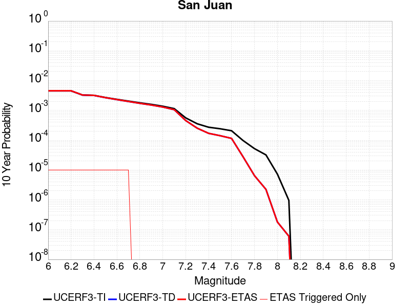 |

| Magnitude | 1 wk TI Prob | 1 wk TD Prob | 1 wk ETAS Prob | 1 wk ETAS/TD Gain | 1 wk ETAS Triggered Only | 1 mo TI Prob | 1 mo TD Prob | 1 mo ETAS Prob | 1 mo ETAS/TD Gain | 1 mo ETAS Triggered Only | 1 yr TI Prob | 1 yr TD Prob | 1 yr ETAS Prob | 1 yr ETAS/TD Gain | 1 yr ETAS Triggered Only | 10 yr TI Prob | 10 yr TD Prob | 10 yr ETAS Prob | 10 yr ETAS/TD Gain | 10 yr ETAS Triggered Only |
|-----|-----|-----|-----|-----|-----|-----|-----|-----|-----|-----|-----|-----|-----|-----|-----|-----|-----|-----|-----|-----|
| 6.0 | 8.682808E-6 | 8.7491635E-6 | 8.7491635E-6 | 1.0 | 0.0 | 3.72115E-5 | 3.74959E-5 | 3.74959E-5 | 1.0 | 0.0 | 4.5295584E-4 | 4.564218E-4 | 4.6641726E-4 | 1.0218996 | 1.0E-5 | 0.004520337 | 0.004555385 | 0.0045653395 | 1.0021852 | 1.0E-5 |
| 6.1 | 8.682808E-6 | 8.7491635E-6 | 8.7491635E-6 | 1.0 | 0.0 | 3.72115E-5 | 3.74959E-5 | 3.74959E-5 | 1.0 | 0.0 | 4.5295584E-4 | 4.564218E-4 | 4.6641726E-4 | 1.0218996 | 1.0E-5 | 0.004520337 | 0.004555385 | 0.0045653395 | 1.0021852 | 1.0E-5 |
| 6.2 | 8.682808E-6 | 8.7491635E-6 | 8.7491635E-6 | 1.0 | 0.0 | 3.72115E-5 | 3.74959E-5 | 3.74959E-5 | 1.0 | 0.0 | 4.5295584E-4 | 4.564218E-4 | 4.6641726E-4 | 1.0218996 | 1.0E-5 | 0.004520337 | 0.004555385 | 0.0045653395 | 1.0021852 | 1.0E-5 |
| 6.3 | 6.3054235E-6 | 6.2825848E-6 | 6.2825848E-6 | 1.0 | 0.0 | 2.7022963E-5 | 2.6925094E-5 | 2.6925094E-5 | 1.0 | 0.0 | 3.2895492E-4 | 3.2776513E-4 | 3.3776183E-4 | 1.0304997 | 1.0E-5 | 0.003284684 | 0.003273017 | 0.0032829843 | 1.0030453 | 1.0E-5 |
| 6.4 | 6.1490473E-6 | 6.1144656E-6 | 6.1144656E-6 | 1.0 | 0.0 | 2.6352795E-5 | 2.6204598E-5 | 2.6204598E-5 | 1.0 | 0.0 | 3.2079802E-4 | 3.1899565E-4 | 3.2899246E-4 | 1.0313383 | 1.0E-5 | 0.0032033534 | 0.0031855737 | 0.003195542 | 1.0031291 | 1.0E-5 |
| 6.5 | 5.204848E-6 | 5.137233E-6 | 5.137233E-6 | 1.0 | 0.0 | 2.23063E-5 | 2.2016533E-5 | 2.2016533E-5 | 1.0 | 0.0 | 2.7154534E-4 | 2.6801927E-4 | 2.780166E-4 | 1.0373007 | 1.0E-5 | 0.0027121378 | 0.0026771144 | 0.0026870877 | 1.0037254 | 1.0E-5 |
| 6.6 | 4.5179986E-6 | 4.4150297E-6 | 4.4150297E-6 | 1.0 | 0.0 | 1.9362706E-5 | 1.8921424E-5 | 1.8921424E-5 | 1.0 | 0.0 | 2.3571544E-4 | 2.3034477E-4 | 2.4034247E-4 | 1.0434031 | 1.0E-5 | 0.0023546559 | 0.0023011973 | 0.0023111743 | 1.0043355 | 1.0E-5 |
| 6.7 | 3.9442616E-6 | 3.819828E-6 | 3.819828E-6 | 1.0 | 0.0 | 1.6903869E-5 | 1.6370592E-5 | 1.6370592E-5 | 1.0 | 0.0 | 2.0578515E-4 | 1.992944E-4 | 2.0929241E-4 | 1.050167 | 1.0E-5 | 0.002055947 | 0.0019912818 | 0.0020012618 | 1.0050119 | 1.0E-5 |
| 6.8 | 3.4536245E-6 | 3.3163353E-6 | 3.3163353E-6 | 1.0 | 0.0 | 1.4801163E-5 | 1.4212792E-5 | 1.4212792E-5 | 1.0 | 0.0 | 1.8018926E-4 | 1.7302761E-4 | 1.7302761E-4 | 1.0 | 0.0 | 0.0018004322 | 0.0017290477 | 0.0017290477 | 1.0 | 0.0 |
| 6.9 | 3.059865E-6 | 2.9120315E-6 | 2.9120315E-6 | 1.0 | 0.0 | 1.3113641E-5 | 1.2480078E-5 | 1.2480078E-5 | 1.0 | 0.0 | 1.596469E-4 | 1.5193493E-4 | 1.5193493E-4 | 1.0 | 0.0 | 0.0015953224 | 0.0015184252 | 0.0015184252 | 1.0 | 0.0 |
| 7.0 | 2.6504351E-6 | 2.4920002E-6 | 2.4920002E-6 | 1.0 | 0.0 | 1.1358958E-5 | 1.0679961E-5 | 1.0679961E-5 | 1.0 | 0.0 | 1.3828653E-4 | 1.300213E-4 | 1.300213E-4 | 1.0 | 0.0 | 0.0013820052 | 0.0012995641 | 0.0012995641 | 1.0 | 0.0 |
| 7.1 | 2.2039317E-6 | 2.0338296E-6 | 2.0338296E-6 | 1.0 | 0.0 | 9.445387E-6 | 8.716386E-6 | 8.716386E-6 | 1.0 | 0.0 | 1.1499152E-4 | 1.0611736E-4 | 1.0611736E-4 | 1.0 | 0.0 | 0.0011493203 | 0.0010607769 | 0.0010607769 | 1.0 | 0.0 |
| 7.2 | 1.0786707E-6 | 8.7701903E-7 | 8.7701903E-7 | 1.0 | 0.0 | 4.622866E-6 | 3.7586476E-6 | 3.7586476E-6 | 1.0 | 0.0 | 5.628194E-5 | 4.5760586E-5 | 4.5760586E-5 | 1.0 | 0.0 | 5.6267687E-4 | 4.5757066E-4 | 4.5757066E-4 | 1.0 | 0.0 |
| 7.3 | 6.846433E-7 | 4.868805E-7 | 4.868805E-7 | 1.0 | 0.0 | 2.9341822E-6 | 2.086629E-6 | 2.086629E-6 | 1.0 | 0.0 | 3.5723086E-5 | 2.5404412E-5 | 2.5404412E-5 | 1.0 | 0.0 | 3.571734E-4 | 2.540486E-4 | 2.540486E-4 | 1.0 | 0.0 |
| 7.4 | 5.23043E-7 | 3.2628162E-7 | 3.2628162E-7 | 1.0 | 0.0 | 2.2416111E-6 | 1.398349E-6 | 1.398349E-6 | 1.0 | 0.0 | 2.7291273E-5 | 1.7024766E-5 | 1.7024766E-5 | 1.0 | 0.0 | 2.7287923E-4 | 1.7026656E-4 | 1.7026656E-4 | 1.0 | 0.0 |
| 7.5 | 4.648444E-7 | 2.7234944E-7 | 2.7234944E-7 | 1.0 | 0.0 | 1.9921886E-6 | 1.1672114E-6 | 1.1672114E-6 | 1.0 | 0.0 | 2.4254627E-5 | 1.42107065E-5 | 1.42107065E-5 | 1.0 | 0.0 | 2.425198E-4 | 1.421276E-4 | 1.421276E-4 | 1.0 | 0.0 |
| 7.6 | 3.9906567E-7 | 2.2083314E-7 | 2.2083314E-7 | 1.0 | 0.0 | 1.7102802E-6 | 9.464274E-7 | 9.464274E-7 | 1.0 | 0.0 | 2.0822463E-5 | 1.1522693E-5 | 1.1522693E-5 | 1.0 | 0.0 | 2.0820512E-4 | 1.15245566E-4 | 1.15245566E-4 | 1.0 | 0.0 |
| 7.7 | 1.8784601E-7 | 5.3666906E-8 | 5.3666906E-8 | 1.0 | 0.0 | 8.0505407E-7 | 2.30001E-7 | 2.30001E-7 | 1.0 | 0.0 | 9.80149E-6 | 2.8002585E-6 | 2.8002585E-6 | 1.0 | 0.0 | 9.801057E-5 | 2.8011282E-5 | 2.8011282E-5 | 1.0 | 0.0 |
| 7.8 | 1.00154914E-7 | 1.2415832E-8 | 1.2415832E-8 | 1.0 | 0.0 | 4.2923529E-7 | 5.3210716E-8 | 5.3210716E-8 | 1.0 | 0.0 | 5.225927E-6 | 6.4784024E-7 | 6.4784024E-7 | 1.0 | 0.0 | 5.225804E-5 | 6.484273E-6 | 6.484273E-6 | 1.0 | 0.0 |
| 7.9 | 6.171429E-8 | 4.2966155E-9 | 4.2966155E-9 | 1.0 | 0.0 | 2.6448978E-7 | 1.8414067E-8 | 1.8414067E-8 | 1.0 | 0.0 | 3.2201583E-6 | 2.2419121E-7 | 2.2419121E-7 | 1.0 | 0.0 | 3.2201115E-5 | 2.2472002E-6 | 2.2472002E-6 | 1.0 | 0.0 |
| 8.0 | 1.3974572E-8 | 3.3788217E-10 | 3.3788217E-10 | 1.0 | 0.0 | 5.989102E-8 | 1.448067E-9 | 1.448067E-9 | 1.0 | 0.0 | 7.2917294E-7 | 1.763022E-8 | 1.763022E-8 | 1.0 | 0.0 | 7.2917055E-6 | 1.8060365E-7 | 1.8060365E-7 | 1.0 | 0.0 |
| 8.1 | 1.8403477E-9 | 1.1302803E-10 | 1.1302803E-10 | 1.0 | 0.0 | 7.887204E-9 | 4.844063E-10 | 4.844063E-10 | 1.0 | 0.0 | 9.602671E-8 | 5.8976446E-9 | 5.8976446E-9 | 1.0 | 0.0 | 9.602667E-7 | 6.021993E-8 | 6.021993E-8 | 1.0 | 0.0 |

## Peralta Hills
*[(top)](#table-of-contents)*

| 1 Week | 1 Month | 1 Year | 10 Year |
|-----|-----|-----|-----|
| 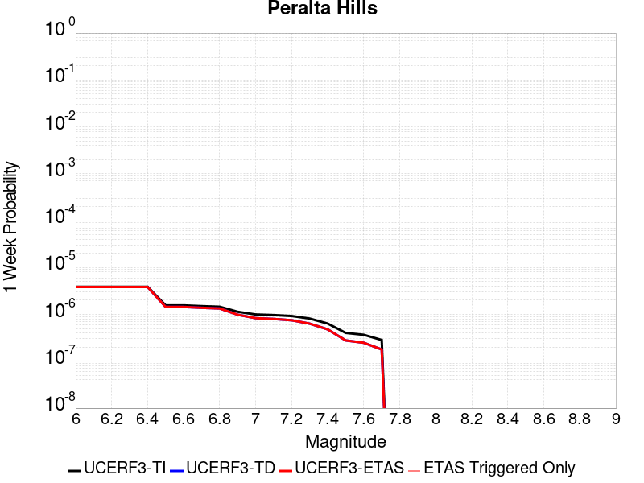 |  |  |  |

| Magnitude | 1 wk TI Prob | 1 wk TD Prob | 1 wk ETAS Prob | 1 wk ETAS/TD Gain | 1 wk ETAS Triggered Only | 1 mo TI Prob | 1 mo TD Prob | 1 mo ETAS Prob | 1 mo ETAS/TD Gain | 1 mo ETAS Triggered Only | 1 yr TI Prob | 1 yr TD Prob | 1 yr ETAS Prob | 1 yr ETAS/TD Gain | 1 yr ETAS Triggered Only | 10 yr TI Prob | 10 yr TD Prob | 10 yr ETAS Prob | 10 yr ETAS/TD Gain | 10 yr ETAS Triggered Only |
|-----|-----|-----|-----|-----|-----|-----|-----|-----|-----|-----|-----|-----|-----|-----|-----|-----|-----|-----|-----|-----|
| 6.0 | 3.8850067E-6 | 3.839512E-6 | 3.839512E-6 | 1.0 | 0.0 | 1.6649923E-5 | 1.645499E-5 | 1.645499E-5 | 1.0 | 0.0 | 2.0269395E-4 | 2.0032849E-4 | 2.1032649E-4 | 1.049908 | 1.0E-5 | 0.0020250916 | 0.0020022066 | 0.0020121867 | 1.0049845 | 1.0E-5 |
| 6.1 | 3.8850067E-6 | 3.839512E-6 | 3.839512E-6 | 1.0 | 0.0 | 1.6649923E-5 | 1.645499E-5 | 1.645499E-5 | 1.0 | 0.0 | 2.0269395E-4 | 2.0032849E-4 | 2.1032649E-4 | 1.049908 | 1.0E-5 | 0.0020250916 | 0.0020022066 | 0.0020121867 | 1.0049845 | 1.0E-5 |
| 6.2 | 3.8850067E-6 | 3.839512E-6 | 3.839512E-6 | 1.0 | 0.0 | 1.6649923E-5 | 1.645499E-5 | 1.645499E-5 | 1.0 | 0.0 | 2.0269395E-4 | 2.0032849E-4 | 2.1032649E-4 | 1.049908 | 1.0E-5 | 0.0020250916 | 0.0020022066 | 0.0020121867 | 1.0049845 | 1.0E-5 |
| 6.3 | 3.8850067E-6 | 3.839512E-6 | 3.839512E-6 | 1.0 | 0.0 | 1.6649923E-5 | 1.645499E-5 | 1.645499E-5 | 1.0 | 0.0 | 2.0269395E-4 | 2.0032849E-4 | 2.1032649E-4 | 1.049908 | 1.0E-5 | 0.0020250916 | 0.0020022066 | 0.0020121867 | 1.0049845 | 1.0E-5 |
| 6.4 | 3.8850067E-6 | 3.839512E-6 | 3.839512E-6 | 1.0 | 0.0 | 1.6649923E-5 | 1.645499E-5 | 1.645499E-5 | 1.0 | 0.0 | 2.0269395E-4 | 2.0032849E-4 | 2.1032649E-4 | 1.049908 | 1.0E-5 | 0.0020250916 | 0.0020022066 | 0.0020121867 | 1.0049845 | 1.0E-5 |
| 6.5 | 1.5587785E-6 | 1.4430796E-6 | 1.4430796E-6 | 1.0 | 0.0 | 6.6804623E-6 | 6.184613E-6 | 6.184613E-6 | 1.0 | 0.0 | 8.133159E-5 | 7.529531E-5 | 7.529531E-5 | 1.0 | 0.0 | 8.1301836E-4 | 7.52722E-4 | 7.52722E-4 | 1.0 | 0.0 |
| 6.6 | 1.5587785E-6 | 1.4430796E-6 | 1.4430796E-6 | 1.0 | 0.0 | 6.6804623E-6 | 6.184613E-6 | 6.184613E-6 | 1.0 | 0.0 | 8.133159E-5 | 7.529531E-5 | 7.529531E-5 | 1.0 | 0.0 | 8.1301836E-4 | 7.52722E-4 | 7.52722E-4 | 1.0 | 0.0 |
| 6.7 | 1.5018579E-6 | 1.3837022E-6 | 1.3837022E-6 | 1.0 | 0.0 | 6.436518E-6 | 5.93014E-6 | 5.93014E-6 | 1.0 | 0.0 | 7.836179E-5 | 7.21973E-5 | 7.21973E-5 | 1.0 | 0.0 | 7.833416E-4 | 7.21762E-4 | 7.21762E-4 | 1.0 | 0.0 |
| 6.8 | 1.4584314E-6 | 1.3381342E-6 | 1.3381342E-6 | 1.0 | 0.0 | 6.250405E-6 | 5.7348498E-6 | 5.7348498E-6 | 1.0 | 0.0 | 7.6096025E-5 | 6.98198E-5 | 6.98198E-5 | 1.0 | 0.0 | 7.6069974E-4 | 6.98002E-4 | 6.98002E-4 | 1.0 | 0.0 |
| 6.9 | 1.1382393E-6 | 9.862285E-7 | 9.862285E-7 | 1.0 | 0.0 | 4.8781594E-6 | 4.226687E-6 | 4.226687E-6 | 1.0 | 0.0 | 5.9389975E-5 | 5.1458785E-5 | 5.1458785E-5 | 1.0 | 0.0 | 5.93741E-4 | 5.144769E-4 | 5.144769E-4 | 1.0 | 0.0 |
| 7.0 | 9.970413E-7 | 8.309642E-7 | 8.309642E-7 | 1.0 | 0.0 | 4.273027E-6 | 3.561271E-6 | 3.561271E-6 | 1.0 | 0.0 | 5.2022864E-5 | 4.335768E-5 | 4.335768E-5 | 1.0 | 0.0 | 5.2010687E-4 | 4.33499E-4 | 4.33499E-4 | 1.0 | 0.0 |
| 7.1 | 9.684443E-7 | 7.99408E-7 | 7.99408E-7 | 1.0 | 0.0 | 4.150469E-6 | 3.4260302E-6 | 3.4260302E-6 | 1.0 | 0.0 | 5.053079E-5 | 4.1711188E-5 | 4.1711188E-5 | 1.0 | 0.0 | 5.05193E-4 | 4.170403E-4 | 4.170403E-4 | 1.0 | 0.0 |
| 7.2 | 9.240811E-7 | 7.5031426E-7 | 7.5031426E-7 | 1.0 | 0.0 | 3.960342E-6 | 3.215629E-6 | 3.215629E-6 | 1.0 | 0.0 | 4.8216094E-5 | 3.9149647E-5 | 3.9149647E-5 | 1.0 | 0.0 | 4.8205635E-4 | 3.9143403E-4 | 3.9143403E-4 | 1.0 | 0.0 |
| 7.3 | 8.158643E-7 | 6.350017E-7 | 6.350017E-7 | 1.0 | 0.0 | 3.4965567E-6 | 2.7214332E-6 | 2.7214332E-6 | 1.0 | 0.0 | 4.2569747E-5 | 3.313301E-5 | 3.313301E-5 | 1.0 | 0.0 | 4.2561593E-4 | 3.3128684E-4 | 3.3128684E-4 | 1.0 | 0.0 |
| 7.4 | 6.3822824E-7 | 4.7957286E-7 | 4.7957286E-7 | 1.0 | 0.0 | 2.7352612E-6 | 2.0553111E-6 | 2.0553111E-6 | 1.0 | 0.0 | 3.3301294E-5 | 2.5023177E-5 | 2.5023177E-5 | 1.0 | 0.0 | 3.3296304E-4 | 2.5020874E-4 | 2.5020874E-4 | 1.0 | 0.0 |
| 7.5 | 4.0292628E-7 | 2.7846056E-7 | 2.7846056E-7 | 1.0 | 0.0 | 1.7268258E-6 | 1.193402E-6 | 1.193402E-6 | 1.0 | 0.0 | 2.1023901E-5 | 1.4529601E-5 | 1.4529601E-5 | 1.0 | 0.0 | 2.1021912E-4 | 1.452893E-4 | 1.452893E-4 | 1.0 | 0.0 |
| 7.6 | 3.672993E-7 | 2.485495E-7 | 2.485495E-7 | 1.0 | 0.0 | 1.5741389E-6 | 1.0652118E-6 | 1.0652118E-6 | 1.0 | 0.0 | 1.9164972E-5 | 1.2968904E-5 | 1.2968904E-5 | 1.0 | 0.0 | 1.916332E-4 | 1.296842E-4 | 1.296842E-4 | 1.0 | 0.0 |
| 7.7 | 2.8466823E-7 | 1.7859877E-7 | 1.7859877E-7 | 1.0 | 0.0 | 1.2200061E-6 | 7.6542324E-7 | 7.6542324E-7 | 1.0 | 0.0 | 1.4853474E-5 | 9.319015E-6 | 9.319015E-6 | 1.0 | 0.0 | 1.485248E-4 | 9.3188835E-5 | 9.3188835E-5 | 1.0 | 0.0 |

## San Jacinto (Borrego)
*[(top)](#table-of-contents)*

| 1 Week | 1 Month | 1 Year | 10 Year |
|-----|-----|-----|-----|
|  |  |  |  |

| Magnitude | 1 wk TI Prob | 1 wk TD Prob | 1 wk ETAS Prob | 1 wk ETAS/TD Gain | 1 wk ETAS Triggered Only | 1 mo TI Prob | 1 mo TD Prob | 1 mo ETAS Prob | 1 mo ETAS/TD Gain | 1 mo ETAS Triggered Only | 1 yr TI Prob | 1 yr TD Prob | 1 yr ETAS Prob | 1 yr ETAS/TD Gain | 1 yr ETAS Triggered Only | 10 yr TI Prob | 10 yr TD Prob | 10 yr ETAS Prob | 10 yr ETAS/TD Gain | 10 yr ETAS Triggered Only |
|-----|-----|-----|-----|-----|-----|-----|-----|-----|-----|-----|-----|-----|-----|-----|-----|-----|-----|-----|-----|-----|
| 6.0 | 3.543992E-5 | 2.7926511E-5 | 3.7926235E-5 | 1.3580726 | 1.0E-5 | 1.5187653E-4 | 1.1967963E-4 | 1.2967843E-4 | 1.0835464 | 1.0E-5 | 0.0018475284 | 0.0014561379 | 0.0014661233 | 1.0068575 | 1.0E-5 | 0.018322436 | 0.014869647 | 0.014879499 | 1.0006626 | 1.0E-5 |
| 6.1 | 3.542281E-5 | 2.7926511E-5 | 3.7926235E-5 | 1.3580726 | 1.0E-5 | 1.5180321E-4 | 1.1967963E-4 | 1.2967843E-4 | 1.0835464 | 1.0E-5 | 0.0018466372 | 0.0014561379 | 0.0014661233 | 1.0068575 | 1.0E-5 | 0.018313672 | 0.014869647 | 0.014879499 | 1.0006626 | 1.0E-5 |
| 6.2 | 3.4688688E-5 | 2.7926511E-5 | 3.792623E-5 | 1.3580726 | 1.0E-5 | 1.4865733E-4 | 1.1967963E-4 | 1.2967843E-4 | 1.0835464 | 1.0E-5 | 0.0018084005 | 0.0014561379 | 0.0014661233 | 1.0068575 | 1.0E-5 | 0.017937548 | 0.014869647 | 0.014879499 | 1.0006626 | 1.0E-5 |
| 6.3 | 3.2087122E-5 | 2.7771865E-5 | 3.7771588E-5 | 1.3600667 | 1.0E-5 | 1.3750899E-4 | 1.1901691E-4 | 1.2901572E-4 | 1.0840117 | 1.0E-5 | 0.0016728862 | 0.00144808 | 0.0014580655 | 1.0068957 | 1.0E-5 | 0.016603488 | 0.014790683 | 0.0148005355 | 1.0006661 | 1.0E-5 |
| 6.4 | 3.1828724E-5 | 2.773885E-5 | 3.7738573E-5 | 1.3604952 | 1.0E-5 | 1.364017E-4 | 1.1887544E-4 | 1.2887425E-4 | 1.0841117 | 1.0E-5 | 0.0016594254 | 0.0014463598 | 0.0014563453 | 1.0069039 | 1.0E-5 | 0.016470885 | 0.014773762 | 0.014783614 | 1.0006669 | 1.0E-5 |
| 6.5 | 3.1563577E-5 | 2.747857E-5 | 3.7478294E-5 | 1.36391 | 1.0E-5 | 1.3526545E-4 | 1.1776006E-4 | 1.2775887E-4 | 1.0849085 | 1.0E-5 | 0.0016456128 | 0.0014327979 | 0.0014427836 | 1.0069693 | 1.0E-5 | 0.0163348 | 0.014640348 | 0.014650201 | 1.000673 | 1.0E-5 |
| 6.6 | 3.1467625E-5 | 2.7322796E-5 | 3.7322523E-5 | 1.3659848 | 1.0E-5 | 1.3485427E-4 | 1.1709251E-4 | 1.2709133E-4 | 1.0853926 | 1.0E-5 | 0.0016406142 | 0.0014246812 | 0.0014346669 | 1.0070091 | 1.0E-5 | 0.016285548 | 0.014560594 | 0.014570449 | 1.0006768 | 1.0E-5 |
| 6.7 | 3.1223695E-5 | 2.6940816E-5 | 3.6940546E-5 | 1.371174 | 1.0E-5 | 1.3380898E-4 | 1.15455594E-4 | 1.2545443E-4 | 1.0866034 | 1.0E-5 | 0.0016279068 | 0.0014047775 | 0.0014147635 | 1.0071086 | 1.0E-5 | 0.01616033 | 0.014364966 | 0.014374822 | 1.0006862 | 1.0E-5 |
| 6.8 | 3.1015585E-5 | 2.6761822E-5 | 3.6761554E-5 | 1.3736566 | 1.0E-5 | 1.3291716E-4 | 1.1468855E-4 | 1.246874E-4 | 1.0871826 | 1.0E-5 | 0.001617065 | 0.0013954508 | 0.0014054369 | 1.0071561 | 1.0E-5 | 0.016053487 | 0.014272246 | 0.014282103 | 1.0006907 | 1.0E-5 |
| 6.9 | 2.6641965E-5 | 2.2184247E-5 | 3.2184023E-5 | 1.4507604 | 1.0E-5 | 1.1417485E-4 | 9.50719E-5 | 1.0507095E-4 | 1.1051736 | 1.0E-5 | 0.0013891924 | 0.0011568897 | 0.001166878 | 1.0086339 | 1.0E-5 | 0.0138054015 | 0.011882438 | 0.01189232 | 1.0008316 | 1.0E-5 |
| 7.0 | 2.3854353E-5 | 2.0479023E-5 | 3.047882E-5 | 1.4882945 | 1.0E-5 | 1.02228936E-4 | 8.77643E-5 | 9.7763426E-5 | 1.1139315 | 1.0E-5 | 0.0012439266 | 0.0010680092 | 0.0010779985 | 1.0093532 | 1.0E-5 | 0.012369866 | 0.0109828 | 0.010992691 | 1.0009005 | 1.0E-5 |
| 7.1 | 2.3672901E-5 | 2.031551E-5 | 3.0315308E-5 | 1.4922247 | 1.0E-5 | 1.0145135E-4 | 8.7063585E-5 | 9.7062715E-5 | 1.1148486 | 1.0E-5 | 0.0012344702 | 0.0010594862 | 0.0010694757 | 1.0094285 | 1.0E-5 | 0.0122763505 | 0.010897976 | 0.010907867 | 1.0009077 | 1.0E-5 |
| 7.2 | 2.2717244E-5 | 1.9542893E-5 | 2.9542696E-5 | 1.511685 | 1.0E-5 | 9.735599E-5 | 8.375258E-5 | 9.375174E-5 | 1.1193893 | 1.0E-5 | 0.0011846646 | 0.001019213 | 0.0010292028 | 1.0098015 | 1.0E-5 | 0.01178369 | 0.010495341 | 0.010505237 | 1.0009428 | 1.0E-5 |
| 7.3 | 2.1016205E-5 | 1.8384526E-5 | 2.8384342E-5 | 1.5439258 | 1.0E-5 | 9.006634E-5 | 7.878846E-5 | 8.878767E-5 | 1.1269121 | 1.0E-5 | 0.001096006 | 9.5882936E-4 | 9.688198E-4 | 1.0104194 | 1.0E-5 | 0.010906163 | 0.009890967 | 0.009900868 | 1.001001 | 1.0E-5 |
| 7.4 | 2.0683625E-5 | 1.8187047E-5 | 2.8186865E-5 | 1.5498319 | 1.0E-5 | 8.86411E-5 | 7.794217E-5 | 8.794139E-5 | 1.1282903 | 1.0E-5 | 0.001078671 | 9.485348E-4 | 9.5852534E-4 | 1.0105326 | 1.0E-5 | 0.010734501 | 0.009787692 | 0.0097975945 | 1.0010117 | 1.0E-5 |
| 7.5 | 1.9993966E-5 | 1.7782075E-5 | 2.7781896E-5 | 1.5623541 | 1.0E-5 | 8.568561E-5 | 7.620667E-5 | 8.620591E-5 | 1.1312121 | 1.0E-5 | 0.001042723 | 9.2742336E-4 | 9.3741406E-4 | 1.0107726 | 1.0E-5 | 0.010378438 | 0.009574614 | 0.009584519 | 1.0010344 | 1.0E-5 |
| 7.6 | 1.788966E-5 | 1.643529E-5 | 2.6435126E-5 | 1.6084368 | 1.0E-5 | 7.666772E-5 | 7.043507E-5 | 8.0434365E-5 | 1.1419648 | 1.0E-5 | 9.3302975E-4 | 8.572113E-4 | 8.6720276E-4 | 1.0116557 | 1.0E-5 | 0.00929122 | 0.008866487 | 0.008876398 | 1.0011178 | 1.0E-5 |
| 7.7 | 1.5125781E-5 | 1.4237377E-5 | 2.4237235E-5 | 1.7023666 | 1.0E-5 | 6.4823165E-5 | 6.1015908E-5 | 7.1015296E-5 | 1.1638817 | 1.0E-5 | 7.889362E-4 | 7.426163E-4 | 7.526089E-4 | 1.0134559 | 1.0E-5 | 0.007861412 | 0.0077142045 | 0.0077241273 | 1.0012863 | 1.0E-5 |
| 7.8 | 1.250089E-5 | 1.26304985E-5 | 2.2630373E-5 | 1.7917244 | 1.0E-5 | 5.3574146E-5 | 5.412959E-5 | 6.4129046E-5 | 1.1847318 | 1.0E-5 | 6.5207E-4 | 6.588291E-4 | 6.688225E-4 | 1.0151684 | 1.0E-5 | 0.006501599 | 0.0068677636 | 0.0068776947 | 1.0014461 | 1.0E-5 |
| 7.9 | 9.561E-6 | 9.754616E-6 | 1.975452E-5 | 2.0251455 | 1.0E-5 | 4.0975072E-5 | 4.1804833E-5 | 5.1804414E-5 | 1.2391968 | 1.0E-5 | 4.987573E-4 | 5.088555E-4 | 5.1885046E-4 | 1.019642 | 1.0E-5 | 0.0049763937 | 0.0053523467 | 0.005362293 | 1.0018584 | 1.0E-5 |
| 8.0 | 8.01699E-6 | 8.293488E-6 | 1.8293405E-5 | 2.2057555 | 1.0E-5 | 3.4358076E-5 | 3.554304E-5 | 4.554268E-5 | 1.281339 | 1.0E-5 | 4.1822926E-4 | 4.3265108E-4 | 4.4264673E-4 | 1.0231034 | 1.0E-5 | 0.0041744304 | 0.004573375 | 0.0045833294 | 1.0021765 | 1.0E-5 |
| 8.1 | 6.541947E-6 | 6.4622354E-6 | 6.4622354E-6 | 1.0 | 0.0 | 2.8036617E-5 | 2.7695003E-5 | 2.7695003E-5 | 1.0 | 0.0 | 3.4129233E-4 | 3.37135E-4 | 3.37135E-4 | 1.0 | 0.0 | 0.0034076865 | 0.0035806994 | 0.0035806994 | 1.0 | 0.0 |
| 8.2 | 1.7968189E-6 | 7.9713476E-7 | 7.9713476E-7 | 1.0 | 0.0 | 7.70063E-6 | 3.4162874E-6 | 3.4162874E-6 | 1.0 | 0.0 | 9.3751136E-5 | 4.159253E-5 | 4.159253E-5 | 1.0 | 0.0 | 9.371159E-4 | 4.712058E-4 | 4.712058E-4 | 1.0 | 0.0 |
| 8.3 | 1.5167889E-7 | 4.897714E-8 | 4.897714E-8 | 1.0 | 0.0 | 6.500522E-7 | 2.09902E-7 | 2.09902E-7 | 1.0 | 0.0 | 7.9143565E-6 | 2.5555544E-6 | 2.5555544E-6 | 1.0 | 0.0 | 7.914075E-5 | 2.969505E-5 | 2.969505E-5 | 1.0 | 0.0 |

## Elsinore (Stepovers Combined)
*[(top)](#table-of-contents)*

| 1 Week | 1 Month | 1 Year | 10 Year |
|-----|-----|-----|-----|
|  |  |  |  |

| Magnitude | 1 wk TI Prob | 1 wk TD Prob | 1 wk ETAS Prob | 1 wk ETAS/TD Gain | 1 wk ETAS Triggered Only | 1 mo TI Prob | 1 mo TD Prob | 1 mo ETAS Prob | 1 mo ETAS/TD Gain | 1 mo ETAS Triggered Only | 1 yr TI Prob | 1 yr TD Prob | 1 yr ETAS Prob | 1 yr ETAS/TD Gain | 1 yr ETAS Triggered Only | 10 yr TI Prob | 10 yr TD Prob | 10 yr ETAS Prob | 10 yr ETAS/TD Gain | 10 yr ETAS Triggered Only |
|-----|-----|-----|-----|-----|-----|-----|-----|-----|-----|-----|-----|-----|-----|-----|-----|-----|-----|-----|-----|-----|
| 6.0 | 2.144392E-5 | 1.9760193E-5 | 1.9760193E-5 | 1.0 | 0.0 | 9.189928E-5 | 8.468392E-5 | 8.468392E-5 | 1.0 | 0.0 | 0.0011182994 | 0.0010305607 | 0.0010305607 | 1.0 | 0.0 | 0.011126885 | 0.010264917 | 0.010274814 | 1.0009642 | 1.0E-5 |
| 6.1 | 2.144392E-5 | 1.9760193E-5 | 1.9760193E-5 | 1.0 | 0.0 | 9.189928E-5 | 8.468392E-5 | 8.468392E-5 | 1.0 | 0.0 | 0.0011182994 | 0.0010305607 | 0.0010305607 | 1.0 | 0.0 | 0.011126885 | 0.010264917 | 0.010274814 | 1.0009642 | 1.0E-5 |
| 6.2 | 2.144392E-5 | 1.9760193E-5 | 1.9760193E-5 | 1.0 | 0.0 | 9.189928E-5 | 8.468392E-5 | 8.468392E-5 | 1.0 | 0.0 | 0.0011182994 | 0.0010305607 | 0.0010305607 | 1.0 | 0.0 | 0.011126885 | 0.010264917 | 0.010274814 | 1.0009642 | 1.0E-5 |
| 6.3 | 1.9751555E-5 | 1.7741453E-5 | 1.7741453E-5 | 1.0 | 0.0 | 8.4646774E-5 | 7.603267E-5 | 7.603267E-5 | 1.0 | 0.0 | 0.0010300872 | 9.253213E-4 | 9.253213E-4 | 1.0 | 0.0 | 0.010253254 | 0.009221276 | 0.009231185 | 1.0010744 | 1.0E-5 |
| 6.4 | 1.9751555E-5 | 1.7741453E-5 | 1.7741453E-5 | 1.0 | 0.0 | 8.4646774E-5 | 7.603267E-5 | 7.603267E-5 | 1.0 | 0.0 | 0.0010300872 | 9.253213E-4 | 9.253213E-4 | 1.0 | 0.0 | 0.010253254 | 0.009221276 | 0.009231185 | 1.0010744 | 1.0E-5 |
| 6.5 | 1.9751555E-5 | 1.7741453E-5 | 1.7741453E-5 | 1.0 | 0.0 | 8.4646774E-5 | 7.603267E-5 | 7.603267E-5 | 1.0 | 0.0 | 0.0010300872 | 9.253213E-4 | 9.253213E-4 | 1.0 | 0.0 | 0.010253254 | 0.009221276 | 0.009231185 | 1.0010744 | 1.0E-5 |
| 6.6 | 1.9188685E-5 | 1.7003393E-5 | 1.7003393E-5 | 1.0 | 0.0 | 8.2234634E-5 | 7.286974E-5 | 7.286974E-5 | 1.0 | 0.0 | 0.0010007467 | 8.868442E-4 | 8.868442E-4 | 1.0 | 0.0 | 0.00996252 | 0.0088398475 | 0.008849759 | 1.0011213 | 1.0E-5 |
| 6.7 | 1.7608272E-5 | 1.4732616E-5 | 1.4732616E-5 | 1.0 | 0.0 | 7.546184E-5 | 6.3138315E-5 | 6.3138315E-5 | 1.0 | 0.0 | 9.183606E-4 | 7.684476E-4 | 7.684476E-4 | 1.0 | 0.0 | 0.009145746 | 0.00766491 | 0.0076748333 | 1.0012946 | 1.0E-5 |
| 6.8 | 1.697165E-5 | 1.3783365E-5 | 1.3783365E-5 | 1.0 | 0.0 | 7.273361E-5 | 5.9070277E-5 | 5.9070277E-5 | 1.0 | 0.0 | 8.8517193E-4 | 7.18952E-4 | 7.18952E-4 | 1.0 | 0.0 | 0.008816543 | 0.007172675 | 0.0071826032 | 1.0013841 | 1.0E-5 |
| 6.9 | 1.600365E-5 | 1.2846671E-5 | 1.2846671E-5 | 1.0 | 0.0 | 6.858527E-5 | 5.5056043E-5 | 5.5056043E-5 | 1.0 | 0.0 | 8.347058E-4 | 6.7010894E-4 | 6.7010894E-4 | 1.0 | 0.0 | 0.008315775 | 0.0066867657 | 0.006696699 | 1.0014855 | 1.0E-5 |
| 7.0 | 1.3314581E-5 | 1.0447548E-5 | 1.0447548E-5 | 1.0 | 0.0 | 5.7061243E-5 | 4.4774453E-5 | 4.4774453E-5 | 1.0 | 0.0 | 6.944992E-4 | 5.449953E-4 | 5.449953E-4 | 1.0 | 0.0 | 0.006923327 | 0.0054405155 | 0.0054405155 | 1.0 | 0.0 |
| 7.1 | 1.2865345E-5 | 9.937536E-6 | 9.937536E-6 | 1.0 | 0.0 | 5.5136024E-5 | 4.258876E-5 | 4.258876E-5 | 1.0 | 0.0 | 6.710743E-4 | 5.183973E-4 | 5.183973E-4 | 1.0 | 0.0 | 0.0066905143 | 0.0051752133 | 0.0051752133 | 1.0 | 0.0 |
| 7.2 | 1.1650051E-5 | 8.633809E-6 | 8.633809E-6 | 1.0 | 0.0 | 4.9927836E-5 | 3.7001522E-5 | 3.7001522E-5 | 1.0 | 0.0 | 6.0770183E-4 | 4.504022E-4 | 4.504022E-4 | 1.0 | 0.0 | 0.0060604266 | 0.0044963174 | 0.0044963174 | 1.0 | 0.0 |
| 7.3 | 1.0008533E-5 | 7.2010425E-6 | 7.2010425E-6 | 1.0 | 0.0 | 4.2893007E-5 | 3.0861254E-5 | 3.0861254E-5 | 1.0 | 0.0 | 5.220972E-4 | 3.7567242E-4 | 3.7567242E-4 | 1.0 | 0.0 | 0.005208723 | 0.003750761 | 0.003750761 | 1.0 | 0.0 |
| 7.4 | 9.116759E-6 | 6.410068E-6 | 6.410068E-6 | 1.0 | 0.0 | 3.907124E-5 | 2.747144E-5 | 2.747144E-5 | 1.0 | 0.0 | 4.7558855E-4 | 3.3441483E-4 | 3.3441483E-4 | 1.0 | 0.0 | 0.00474572 | 0.0033392678 | 0.0033392678 | 1.0 | 0.0 |
| 7.5 | 7.870524E-6 | 5.3825365E-6 | 5.3825365E-6 | 1.0 | 0.0 | 3.3730383E-5 | 2.3067816E-5 | 2.3067816E-5 | 1.0 | 0.0 | 4.1059E-4 | 2.8081573E-4 | 2.8081573E-4 | 1.0 | 0.0 | 0.0040983222 | 0.0028047354 | 0.0028047354 | 1.0 | 0.0 |
| 7.6 | 6.9774537E-6 | 4.6776067E-6 | 4.6776067E-6 | 1.0 | 0.0 | 2.990303E-5 | 2.0046738E-5 | 2.0046738E-5 | 1.0 | 0.0 | 3.640086E-4 | 2.4404288E-4 | 2.4404288E-4 | 1.0 | 0.0 | 0.003634129 | 0.0024378651 | 0.0024378651 | 1.0 | 0.0 |
| 7.7 | 4.1616954E-6 | 2.32834E-6 | 2.32834E-6 | 1.0 | 0.0 | 1.7835715E-5 | 9.978567E-6 | 9.978567E-6 | 1.0 | 0.0 | 2.171282E-4 | 1.2148302E-4 | 1.2148302E-4 | 1.0 | 0.0 | 0.0021691616 | 0.0012142392 | 0.0012142392 | 1.0 | 0.0 |
| 7.8 | 2.2692414E-7 | 9.3854695E-8 | 9.3854695E-8 | 1.0 | 0.0 | 9.725317E-7 | 4.0223435E-7 | 4.0223435E-7 | 1.0 | 0.0 | 1.1840509E-5 | 4.8971956E-6 | 4.8971956E-6 | 1.0 | 0.0 | 1.1839878E-4 | 4.8971204E-5 | 4.8971204E-5 | 1.0 | 0.0 |
| 7.9 | 6.676829E-9 | 3.439853E-9 | 3.439853E-9 | 1.0 | 0.0 | 2.861498E-8 | 1.4742227E-8 | 1.4742227E-8 | 1.0 | 0.0 | 3.4838732E-7 | 1.7948659E-7 | 1.7948659E-7 | 1.0 | 0.0 | 3.4838679E-6 | 1.7948646E-6 | 1.7948646E-6 | 1.0 | 0.0 |

## Likely 2011 CFM
*[(top)](#table-of-contents)*

| 1 Week | 1 Month | 1 Year | 10 Year |
|-----|-----|-----|-----|
|  | 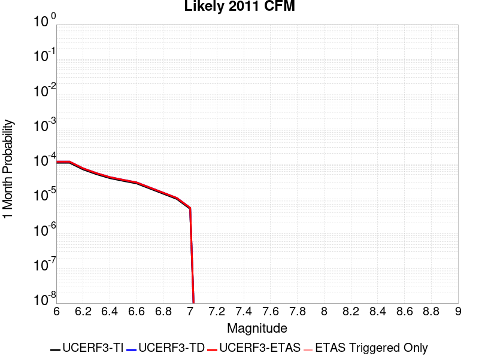 |  |  |

| Magnitude | 1 wk TI Prob | 1 wk TD Prob | 1 wk ETAS Prob | 1 wk ETAS/TD Gain | 1 wk ETAS Triggered Only | 1 mo TI Prob | 1 mo TD Prob | 1 mo ETAS Prob | 1 mo ETAS/TD Gain | 1 mo ETAS Triggered Only | 1 yr TI Prob | 1 yr TD Prob | 1 yr ETAS Prob | 1 yr ETAS/TD Gain | 1 yr ETAS Triggered Only | 10 yr TI Prob | 10 yr TD Prob | 10 yr ETAS Prob | 10 yr ETAS/TD Gain | 10 yr ETAS Triggered Only |
|-----|-----|-----|-----|-----|-----|-----|-----|-----|-----|-----|-----|-----|-----|-----|-----|-----|-----|-----|-----|-----|
| 6.0 | 2.5315949E-5 | 2.7104748E-5 | 2.7104748E-5 | 1.0 | 0.0 | 1.0849241E-4 | 1.16158284E-4 | 1.16158284E-4 | 1.0 | 0.0 | 0.0013200947 | 0.0014133542 | 0.0014133542 | 1.0 | 0.0 | 0.013122803 | 0.01404831 | 0.01405817 | 1.0007018 | 1.0E-5 |
| 6.1 | 2.5315949E-5 | 2.7104748E-5 | 2.7104748E-5 | 1.0 | 0.0 | 1.0849241E-4 | 1.16158284E-4 | 1.16158284E-4 | 1.0 | 0.0 | 0.0013200947 | 0.0014133542 | 0.0014133542 | 1.0 | 0.0 | 0.013122803 | 0.01404831 | 0.01405817 | 1.0007018 | 1.0E-5 |
| 6.2 | 1.6375941E-5 | 1.7465842E-5 | 1.7465842E-5 | 1.0 | 0.0 | 7.0180715E-5 | 7.485153E-5 | 7.485153E-5 | 1.0 | 0.0 | 8.5411523E-4 | 9.109487E-4 | 9.109487E-4 | 1.0 | 0.0 | 0.008508399 | 0.009073433 | 0.009083342 | 1.0010921 | 1.0E-5 |
| 6.3 | 1.1945543E-5 | 1.2712587E-5 | 1.2712587E-5 | 1.0 | 0.0 | 5.119418E-5 | 5.4481407E-5 | 5.4481407E-5 | 1.0 | 0.0 | 6.2311086E-4 | 6.631146E-4 | 6.631146E-4 | 1.0 | 0.0 | 0.0062136655 | 0.0066119144 | 0.0066218483 | 1.0015024 | 1.0E-5 |
| 6.4 | 9.192729E-6 | 9.768488E-6 | 9.768488E-6 | 1.0 | 0.0 | 3.939681E-5 | 4.1864292E-5 | 4.1864292E-5 | 1.0 | 0.0 | 4.7955062E-4 | 5.0958124E-4 | 5.0958124E-4 | 1.0 | 0.0 | 0.004785171 | 0.0050844094 | 0.0050844094 | 1.0 | 0.0 |
| 6.5 | 7.67906E-6 | 8.152622E-6 | 8.152622E-6 | 1.0 | 0.0 | 3.2909844E-5 | 3.4939352E-5 | 3.4939352E-5 | 1.0 | 0.0 | 4.006037E-4 | 4.2530545E-4 | 4.2530545E-4 | 1.0 | 0.0 | 0.0039988225 | 0.004245108 | 0.004245108 | 1.0 | 0.0 |
| 6.6 | 6.4884057E-6 | 6.8847507E-6 | 6.8847507E-6 | 1.0 | 0.0 | 2.7807157E-5 | 2.9505749E-5 | 2.9505749E-5 | 1.0 | 0.0 | 3.3849955E-4 | 3.591747E-4 | 3.591747E-4 | 1.0 | 0.0 | 0.003379844 | 0.0035860867 | 0.0035860867 | 1.0 | 0.0 |
| 6.7 | 4.6060636E-6 | 4.884041E-6 | 4.884041E-6 | 1.0 | 0.0 | 1.9740122E-5 | 2.0931442E-5 | 2.0931442E-5 | 1.0 | 0.0 | 2.403095E-4 | 2.5481134E-4 | 2.5481134E-4 | 1.0 | 0.0 | 0.002400498 | 0.0025452746 | 0.0025452746 | 1.0 | 0.0 |
| 6.8 | 3.2795615E-6 | 3.4773732E-6 | 3.4773732E-6 | 1.0 | 0.0 | 1.4055187E-5 | 1.4902946E-5 | 1.4902946E-5 | 1.0 | 0.0 | 1.7110848E-4 | 1.8142881E-4 | 1.8142881E-4 | 1.0 | 0.0 | 0.0017097679 | 0.0018128622 | 0.0018128622 | 1.0 | 0.0 |
| 6.9 | 2.3289967E-6 | 2.4705569E-6 | 2.4705569E-6 | 1.0 | 0.0 | 9.981376E-6 | 1.058806E-5 | 1.058806E-5 | 1.0 | 0.0 | 1.2151648E-4 | 1.2890245E-4 | 1.2890245E-4 | 1.0 | 0.0 | 0.0012145005 | 0.0012883197 | 0.0012883197 | 1.0 | 0.0 |
| 7.0 | 1.211292E-6 | 1.2863958E-6 | 1.2863958E-6 | 1.0 | 0.0 | 5.1912407E-6 | 5.5131145E-6 | 5.5131145E-6 | 1.0 | 0.0 | 6.320152E-5 | 6.712041E-5 | 6.712041E-5 | 1.0 | 0.0 | 6.3183554E-4 | 6.710312E-4 | 6.710312E-4 | 1.0 | 0.0 |

