# Parent Section Magnitude-Probability Distributions

Only fault sections with at least one triggered aftershock are plotted. Sections are sorted by total supraseismogenic trigger rate (decreasing)

## Table Of Contents

* [Tank Canyon](#tank-canyon)
* [Garlock (Central)](#garlock-central)
* [Panamint Valley](#panamint-valley)
* [Owl Lake](#owl-lake)
* [Little Lake](#little-lake)
* [Ash Hill](#ash-hill)
* [Garlock (East)](#garlock-east)
* [Blackwater](#blackwater)
* [Hunter Mountain-Saline Valley](#hunter-mountain-saline-valley)
* [Gravel Hills-Harper Lk](#gravel-hills-harper-lk)
* [Goldstone Lake](#goldstone-lake)
* [McLean Lake](#mclean-lake)
* [So Sierra Nevada](#so-sierra-nevada)
* [Airport Lake](#airport-lake)
* [Coyote Canyon](#coyote-canyon)
* [Garlock (West)](#garlock-west)
* [Lenwood-Lockhart-Old Woman Springs](#lenwood-lockhart-old-woman-springs)
* [San Andreas (Mojave S)](#san-andreas-mojave-s)
* [Death Valley (So)](#death-valley-so)
* [Nelson Lake](#nelson-lake)
* [Bicycle Lake](#bicycle-lake)
* [Towne Pass](#towne-pass)
* [Paradise](#paradise)
* [San Andreas (Mojave N)](#san-andreas-mojave-n)
* [Garlic Springs](#garlic-springs)
* [Death Valley (Black Mtns Frontal)](#death-valley-black-mtns-frontal)
* [Helendale-So Lockhart](#helendale-so-lockhart)
* [San Andreas (San Bernardino N)](#san-andreas-san-bernardino-n)
* [Death Valley (No)](#death-valley-no)
* [Coyote Lake](#coyote-lake)
* [San Andreas (San Bernardino S)](#san-andreas-san-bernardino-s)
* [Cady](#cady)
* [San Andreas (Parkfield)](#san-andreas-parkfield)
* [San Andreas (Big Bend)](#san-andreas-big-bend)
* [Elsinore (Glen Ivy) rev](#elsinore-glen-ivy-rev)
* [Lake Isabella (Seismicity)](#lake-isabella-seismicity)
* [San Andreas (Carrizo) rev](#san-andreas-carrizo-rev)
* [San Andreas (Cholame) rev](#san-andreas-cholame-rev)
* [Death Valley (Fish Lake Valley)](#death-valley-fish-lake-valley)
* [Calico-Hidalgo](#calico-hidalgo)
* [Ludlow](#ludlow)
* [Scodie Lineament](#scodie-lineament)
* [White Wolf (Extension)](#white-wolf-extension)
* [Manix-Afton Hills](#manix-afton-hills)
* [Sierra Nevada  (No Extension)](#sierra-nevada--no-extension)
* [Red Pass](#red-pass)
* [Baker](#baker)
* [San Andreas (San Gorgonio Pass-Garnet HIll)](#san-andreas-san-gorgonio-pass-garnet-hill)
* [San Andreas (Coachella) rev](#san-andreas-coachella-rev)
* [Cleghorn Pass](#cleghorn-pass)
* [San Andreas (Creeping Section) 2011 CFM](#san-andreas-creeping-section-2011-cfm)
* [Cleghorn Lake](#cleghorn-lake)
* [Pinto Mtn](#pinto-mtn)
* [Rose Canyon](#rose-canyon)
* [Dry Mountain](#dry-mountain)
* [Ortigalita (North)](#ortigalita-north)
* [Owens Valley](#owens-valley)
* [Santa Ynez (East)](#santa-ynez-east)
* [Camp Rock 2011](#camp-rock-2011)
* [Oceanic - West Huasna](#oceanic---west-huasna)
* [Mission Ridge-Arroyo Parida-Santa Ana](#mission-ridge-arroyo-parida-santa-ana)
* [Lost Hills](#lost-hills)
* [Santa Ynez (West)](#santa-ynez-west)
* [Chino alt 1](#chino-alt-1)
* [Red Mountain](#red-mountain)
* [Brawley (Seismic Zone) alt 1](#brawley-seismic-zone-alt-1)
* [Kern Canyon (Lake Isabella) 2011](#kern-canyon-lake-isabella-2011)
* [San Andreas (North Branch Mill Creek)](#san-andreas-north-branch-mill-creek)
* [White Mountains](#white-mountains)
* [Kern Canyon (North Kern) 2011](#kern-canyon-north-kern-2011)
* [Pleito](#pleito)
* [Bullion Mountains](#bullion-mountains)
* [Coronado Bank alt1](#coronado-bank-alt1)
* [Pisgah-Bullion Mtn-Mesquite Lk](#pisgah-bullion-mtn-mesquite-lk)
* [Santa Cruz Island](#santa-cruz-island)
* [Deep Springs](#deep-springs)
* [Whittier alt 1](#whittier-alt-1)
* [Kern Canyon (South Kern) 2011](#kern-canyon-south-kern-2011)
* [Big Pine (Central)](#big-pine-central)
* [Ventura-Pitas Point](#ventura-pitas-point)
* [San Jacinto (San Bernardino)](#san-jacinto-san-bernardino)
* [Imperial](#imperial)
* [Santa Ynez River](#santa-ynez-river)
* [Channel Islands Thrust](#channel-islands-thrust)
* [San Clemente](#san-clemente)
* [Santa Cruz Catalina Ridge alt1](#santa-cruz-catalina-ridge-alt1)
* [Tin Mountain](#tin-mountain)
* [Mono Lake 2011 CFM](#mono-lake-2011-cfm)
* [Independence rev 2011](#independence-rev-2011)
* [Santa Rosa Island](#santa-rosa-island)
* [Hosgri](#hosgri)
* [Elysian Park (Upper)](#elysian-park-upper)
* [Mission Creek](#mission-creek)
* [Great Valley 09 (Laguna Seca)](#great-valley-09-laguna-seca)
* [San Diego Trough north alt1](#san-diego-trough-north-alt1)
* [San Cayetano](#san-cayetano)
* [Robinson Creek](#robinson-creek)
* [Sheephole](#sheephole)
* [Ortigalita (South)](#ortigalita-south)
* [Raymond](#raymond)
* [San Diego Trough south](#san-diego-trough-south)
* [Great Valley 07 (Orestimba)](#great-valley-07-orestimba)
* [Cerro Prieto](#cerro-prieto)
* [Blue Cut](#blue-cut)
* [Palos Verdes](#palos-verdes)
* [San Jacinto (Stepovers Combined)](#san-jacinto-stepovers-combined)
* [San Jacinto (San Jacinto Valley) rev](#san-jacinto-san-jacinto-valley-rev)
* [San Jacinto (Lytle Creek connector)](#san-jacinto-lytle-creek-connector)
* [Point Reyes 2011 CFM](#point-reyes-2011-cfm)
* [Oak Ridge (Onshore)](#oak-ridge-onshore)
* [San Luis Range 2011 CFM](#san-luis-range-2011-cfm)
* [Pine Mtn](#pine-mtn)
* [Rinconada 2011 CFM](#rinconada-2011-cfm)
* [Pitas Point (Lower West)](#pitas-point-lower-west)
* [Calaveras (So) - Paicines extension 2011 CFM](#calaveras-so---paicines-extension-2011-cfm)
* [Great Valley 03a Dunnigan Hills](#great-valley-03a-dunnigan-hills)
* [Owens Valley Keough Hot Springs](#owens-valley-keough-hot-springs)
* [Hosgri (Extension)](#hosgri-extension)
* [Channel Islands Western Deep Ramp](#channel-islands-western-deep-ramp)
* [Oceanside alt1](#oceanside-alt1)
* [Great Valley 08 (Quinto)](#great-valley-08-quinto)
* [Maacama 2011 CFM](#maacama-2011-cfm)
* [San Jose](#san-jose)
* [Big Pine (East)](#big-pine-east)
* [North Frontal  (East)](#north-frontal--east)
* [Hartley Springs 2011 CFM](#hartley-springs-2011-cfm)
* [Greenville (No) 2011 CFM](#greenville-no-2011-cfm)
* [Malibu Coast alt 1](#malibu-coast-alt-1)
* [Cleghorn](#cleghorn)
* [San Jacinto (Anza) rev](#san-jacinto-anza-rev)
* [Santa Susana alt 1](#santa-susana-alt-1)
* [Los Alamos 2011 CFM](#los-alamos-2011-cfm)
* [Hunting Creek - Berryessa 2011 CFM](#hunting-creek---berryessa-2011-cfm)
* [Newport-Inglewood (Offshore)](#newport-inglewood-offshore)
* [San Pedro Basin](#san-pedro-basin)
* [San Jacinto (Superstition Mtn)](#san-jacinto-superstition-mtn)
* [Elsinore (Coyote Mountains)](#elsinore-coyote-mountains)
* [San Andreas (Santa Cruz Mts) 2011 CFM](#san-andreas-santa-cruz-mts-2011-cfm)
* [North Frontal  (West)](#north-frontal--west)
* [Carlsbad](#carlsbad)
* [White Wolf](#white-wolf)
* [Earthquake Valley](#earthquake-valley)
* [Santa Susana East (connector)](#santa-susana-east-connector)
* [Mount Diablo Thrust South](#mount-diablo-thrust-south)
* [Gillem - Big Crack 2011 CFM](#gillem---big-crack-2011-cfm)
* [Garberville - Briceland 2011 CFM](#garberville---briceland-2011-cfm)
* [Redondo Canyon alt 1](#redondo-canyon-alt-1)
* [Earthquake Valley (No  Extension)](#earthquake-valley-no--extension)
* [Fontana (Seismicity)](#fontana-seismicity)
* [Puente Hills](#puente-hills)
* [Elsinore (Stepovers Combined)](#elsinore-stepovers-combined)
* [Homestead Valley 2011](#homestead-valley-2011)
* [Lions Head 2011 CFM](#lions-head-2011-cfm)
* [Earthquake Valley (So Extension)](#earthquake-valley-so-extension)
* [Green Valley 2011 CFM](#green-valley-2011-cfm)
* [Mount Diablo Thrust North CFM](#mount-diablo-thrust-north-cfm)
* [Clayton](#clayton)
* [Davis Creek](#davis-creek)
* [San Jacinto (Borrego)](#san-jacinto-borrego)
* [San Andreas (North Coast) 2011 CFM](#san-andreas-north-coast-2011-cfm)
* [Calaveras (Central) 2011 CFM](#calaveras-central-2011-cfm)
* [Las Positas](#las-positas)
* [Great Valley 04b Gordon Valley](#great-valley-04b-gordon-valley)
* [Mission Hills 2011](#mission-hills-2011)
* [Yorba Linda](#yorba-linda)
* [San Andreas (Peninsula) 2011 CFM](#san-andreas-peninsula-2011-cfm)
* [San Jacinto (Coyote Creek)](#san-jacinto-coyote-creek)
* [Superstition Hills](#superstition-hills)
* [Shoreline](#shoreline)
* [Concord 2011 CFM](#concord-2011-cfm)
* [East Huasna 2011 CFM](#east-huasna-2011-cfm)
* [Anaheim](#anaheim)
* [Great Valley 05 Pittsburg - Kirby Hills alt1](#great-valley-05-pittsburg---kirby-hills-alt1)
* [Hilton Creek 2011 CFM](#hilton-creek-2011-cfm)
* [San Juan](#san-juan)
* [Honey Lake 2011 CFM](#honey-lake-2011-cfm)
* [Peralta Hills](#peralta-hills)
* [Calaveras (So) 2011 CFM](#calaveras-so-2011-cfm)
* [Eureka Peak](#eureka-peak)
* [Sargent 2011 CFM](#sargent-2011-cfm)
* [Morales (East)](#morales-east)
* [Round Valley](#round-valley)
* [Collayami 2011 CFM](#collayami-2011-cfm)
* [Likely 2011 CFM](#likely-2011-cfm)
* [Pitas Point (Lower)-Montalvo](#pitas-point-lower-montalvo)
* [Jess Valley](#jess-valley)
* [Hat Creek-McArthur-Mayfield](#hat-creek-mcarthur-mayfield)
* [Burnt Mtn](#burnt-mtn)
* [Monte Vista - Shannon 2011 CFM](#monte-vista---shannon-2011-cfm)
* [Surprise Valley 2011 CFM](#surprise-valley-2011-cfm)
* [Trinidad (alt1)](#trinidad-alt1)
* [Los Alamos extension](#los-alamos-extension)
* [Elsinore (Temecula) rev](#elsinore-temecula-rev)
* [Mohawk Valley 2011 CFM](#mohawk-valley-2011-cfm)
* [Elmore Ranch](#elmore-ranch)
* [Emerson-Copper Mtn 2011](#emerson-copper-mtn-2011)
* [Compton](#compton)
* [Swain Ravine - Spenceville](#swain-ravine---spenceville)
* [Casmalia 2011 CFM](#casmalia-2011-cfm)
* [Rocky Ledge 2011 CFM](#rocky-ledge-2011-cfm)

## Tank Canyon
*[(top)](#table-of-contents)*

| 1 Week | 1 Month | 1 Year | 10 Year |
|-----|-----|-----|-----|
| 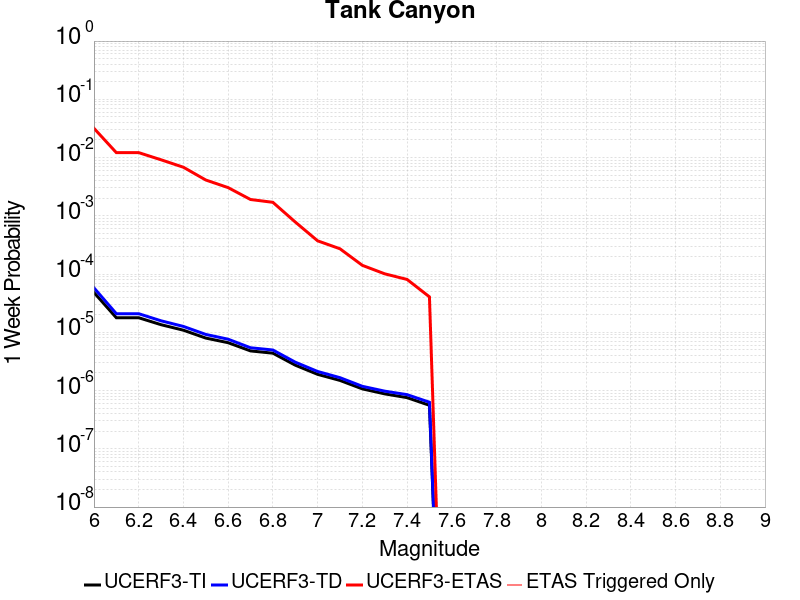 |  |  |  |

| Magnitude | 1 wk TI Prob | 1 wk TD Prob | 1 wk ETAS Prob | 1 wk ETAS/TD Gain | 1 wk ETAS Triggered Only | 1 mo TI Prob | 1 mo TD Prob | 1 mo ETAS Prob | 1 mo ETAS/TD Gain | 1 mo ETAS Triggered Only | 1 yr TI Prob | 1 yr TD Prob | 1 yr ETAS Prob | 1 yr ETAS/TD Gain | 1 yr ETAS Triggered Only | 10 yr TI Prob | 10 yr TD Prob | 10 yr ETAS Prob | 10 yr ETAS/TD Gain | 10 yr ETAS Triggered Only |
|-----|-----|-----|-----|-----|-----|-----|-----|-----|-----|-----|-----|-----|-----|-----|-----|-----|-----|-----|-----|-----|
| 6.0 | 4.8284557E-5 | 5.796445E-5 | 0.031816125 | 548.89026 | 0.03176 | 2.0691741E-4 | 2.4839924E-4 | 0.0437076 | 175.95705 | 0.04347 | 0.0025163088 | 0.0030207336 | 0.07065581 | 23.390282 | 0.06784 | 0.02488006 | 0.029863616 | 0.12084301 | 4.0464964 | 0.09378 |
| 6.1 | 1.7796336E-5 | 2.0873378E-5 | 0.01216062 | 582.58997 | 0.01214 | 7.626778E-5 | 8.945448E-5 | 0.016997943 | 190.01778 | 0.01691 | 9.281647E-4 | 0.0010886024 | 0.027749548 | 25.490988 | 0.02669 | 0.009242975 | 0.010836642 | 0.04842485 | 4.4686213 | 0.038 |
| 6.2 | 1.7796336E-5 | 2.0873378E-5 | 0.01216062 | 582.58997 | 0.01214 | 7.626778E-5 | 8.945448E-5 | 0.016997943 | 190.01778 | 0.01691 | 9.281647E-4 | 0.0010886024 | 0.027749548 | 25.490988 | 0.02669 | 0.009242975 | 0.010836642 | 0.04842485 | 4.4686213 | 0.038 |
| 6.3 | 1.3515912E-5 | 1.5759651E-5 | 0.009155615 | 580.9529 | 0.00914 | 5.792405E-5 | 6.7539746E-5 | 0.01263669 | 187.10005 | 0.01257 | 7.049971E-4 | 8.2200987E-4 | 0.02063571 | 25.103968 | 0.01983 | 0.007027647 | 0.008192157 | 0.036101628 | 4.4068527 | 0.02814 |
| 6.4 | 1.0870146E-5 | 1.2618114E-5 | 0.006822532 | 540.6935 | 0.00681 | 4.658551E-5 | 5.4076605E-5 | 0.009493566 | 175.55772 | 0.00944 | 5.67031E-4 | 6.582015E-4 | 0.015598361 | 23.698458 | 0.01495 | 0.005655863 | 0.006564382 | 0.027754365 | 4.228024 | 0.02133 |
| 6.5 | 7.964826E-6 | 9.196184E-6 | 0.0041191583 | 447.9204 | 0.00411 | 3.4134522E-5 | 3.941168E-5 | 0.0058791814 | 149.17358 | 0.00584 | 4.1550855E-4 | 4.797421E-4 | 0.009885227 | 20.605295 | 0.00941 | 0.0041473247 | 0.004788209 | 0.018124048 | 3.785141 | 0.0134 |
| 6.6 | 6.6317E-6 | 7.612378E-6 | 0.0030475892 | 400.34656 | 0.00304 | 2.8421264E-5 | 3.262412E-5 | 0.0043724827 | 134.02606 | 0.00434 | 3.4597394E-4 | 3.9713533E-4 | 0.0074643274 | 18.795425 | 0.00707 | 0.0034543579 | 0.0039652516 | 0.0139754005 | 3.5244677 | 0.01005 |
| 6.7 | 4.793663E-6 | 5.4308593E-6 | 0.0019054206 | 350.85068 | 0.0019 | 2.0544108E-5 | 2.3274928E-5 | 0.0026432138 | 113.564865 | 0.00262 | 2.500958E-4 | 2.833398E-4 | 0.004352187 | 15.36031 | 0.00407 | 0.0024981452 | 0.0028303189 | 0.008484271 | 2.9976377 | 0.00567 |
| 6.8 | 4.382823E-6 | 4.969325E-6 | 0.0017049608 | 343.09708 | 0.0017 | 1.8783392E-5 | 2.1296957E-5 | 0.002361247 | 110.87251 | 0.00234 | 2.286638E-4 | 2.5926388E-4 | 0.0039083175 | 15.074671 | 0.00365 | 0.0022842865 | 0.0025901233 | 0.007696862 | 2.9716198 | 0.00512 |
| 6.9 | 2.729601E-6 | 3.0735862E-6 | 7.830712E-4 | 254.77444 | 7.8E-4 | 1.1698237E-5 | 1.3172453E-5 | 0.0011231578 | 85.265656 | 0.00111 | 1.4241673E-4 | 1.6036403E-4 | 0.0018400946 | 11.474484 | 0.00168 | 0.001423255 | 0.0016024808 | 0.004018603 | 2.5077386 | 0.00242 |
| 7.0 | 1.8987357E-6 | 2.126971E-6 | 3.7212617E-4 | 174.95593 | 3.7E-4 | 8.137413E-6 | 9.115562E-6 | 5.2911084E-4 | 58.044785 | 5.2E-4 | 9.90685E-5 | 1.1097702E-4 | 9.208871E-4 | 8.297998 | 8.1E-4 | 9.902435E-4 | 0.0011092846 | 0.0021880865 | 1.9725205 | 0.00108 |
| 7.1 | 1.4928986E-6 | 1.6641525E-6 | 2.716637E-4 | 163.24448 | 2.7E-4 | 6.398121E-6 | 7.132066E-6 | 3.671295E-4 | 51.4759 | 3.6E-4 | 7.789434E-5 | 8.6830034E-5 | 6.5678055E-4 | 7.5639787 | 5.7E-4 | 7.786704E-4 | 8.6801895E-4 | 0.0015674114 | 1.805734 | 7.0E-4 |
| 7.2 | 1.069082E-6 | 1.1828765E-6 | 1.4118271E-4 | 119.35541 | 1.4E-4 | 4.581772E-6 | 5.0694644E-6 | 1.6506865E-4 | 32.56136 | 1.6E-4 | 5.5781646E-5 | 6.171951E-5 | 3.3170285E-4 | 5.3743596 | 2.7E-4 | 5.576765E-4 | 6.1707594E-4 | 9.868477E-4 | 1.5992321 | 3.7E-4 |
| 7.3 | 8.776551E-7 | 9.770151E-7 | 1.0097692E-4 | 103.35246 | 1.0E-4 | 3.7613736E-6 | 4.187204E-6 | 1.241867E-4 | 29.658623 | 1.2E-4 | 4.579376E-5 | 5.0978535E-5 | 2.0097088E-4 | 3.9422648 | 1.5E-4 | 4.5784327E-4 | 5.097194E-4 | 7.096175E-4 | 1.3921727 | 2.0E-4 |
| 7.4 | 7.55721E-7 | 8.5103835E-7 | 8.085097E-5 | 95.00273 | 8.0E-5 | 3.2388E-6 | 3.6473052E-6 | 1.0364694E-4 | 28.417402 | 1.0E-4 | 3.9431678E-5 | 4.4405555E-5 | 1.7439979E-4 | 3.9274318 | 1.3E-4 | 3.942468E-4 | 4.4401767E-4 | 6.1394216E-4 | 1.3826977 | 1.7E-4 |
| 7.5 | 5.587665E-7 | 6.305732E-7 | 4.0630548E-5 | 64.43431 | 4.0E-5 | 2.3947114E-6 | 2.7024564E-6 | 4.2702348E-5 | 15.801309 | 4.0E-5 | 2.915522E-5 | 3.2902408E-5 | 9.290043E-5 | 2.8235147 | 6.0E-5 | 2.9151395E-4 | 3.2902407E-4 | 4.1899446E-4 | 1.2734462 | 9.0E-5 |

## Garlock (Central)
*[(top)](#table-of-contents)*

| 1 Week | 1 Month | 1 Year | 10 Year |
|-----|-----|-----|-----|
| 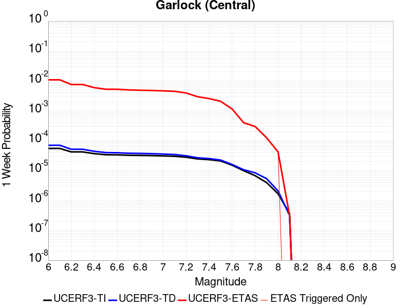 |  |  |  |

| Magnitude | 1 wk TI Prob | 1 wk TD Prob | 1 wk ETAS Prob | 1 wk ETAS/TD Gain | 1 wk ETAS Triggered Only | 1 mo TI Prob | 1 mo TD Prob | 1 mo ETAS Prob | 1 mo ETAS/TD Gain | 1 mo ETAS Triggered Only | 1 yr TI Prob | 1 yr TD Prob | 1 yr ETAS Prob | 1 yr ETAS/TD Gain | 1 yr ETAS Triggered Only | 10 yr TI Prob | 10 yr TD Prob | 10 yr ETAS Prob | 10 yr ETAS/TD Gain | 10 yr ETAS Triggered Only |
|-----|-----|-----|-----|-----|-----|-----|-----|-----|-----|-----|-----|-----|-----|-----|-----|-----|-----|-----|-----|-----|
| 6.0 | 5.5131142E-5 | 7.02476E-5 | 0.010869489 | 154.73111 | 0.0108 | 2.3625491E-4 | 3.0102677E-4 | 0.014926623 | 49.5857 | 0.01463 | 0.0028726095 | 0.003658906 | 0.025897238 | 7.077864 | 0.02232 | 0.028357591 | 0.036136653 | 0.0658622 | 1.8225871 | 0.03084 |
| 6.1 | 5.5131142E-5 | 7.02476E-5 | 0.010869489 | 154.73111 | 0.0108 | 2.3625491E-4 | 3.0102677E-4 | 0.014926623 | 49.5857 | 0.01463 | 0.0028726095 | 0.003658906 | 0.025897238 | 7.077864 | 0.02232 | 0.028357591 | 0.036136653 | 0.0658622 | 1.8225871 | 0.03084 |
| 6.2 | 4.216245E-5 | 5.1661802E-5 | 0.007561274 | 146.36102 | 0.00751 | 1.806837E-4 | 2.213891E-4 | 0.010219175 | 46.15934 | 0.01 | 0.0021976046 | 0.002692112 | 0.017990815 | 6.6827884 | 0.01534 | 0.021759989 | 0.026701316 | 0.047237918 | 1.7691232 | 0.0211 |
| 6.3 | 4.216245E-5 | 5.1661802E-5 | 0.007561274 | 146.36102 | 0.00751 | 1.806837E-4 | 2.213891E-4 | 0.010219175 | 46.15934 | 0.01 | 0.0021976046 | 0.002692112 | 0.017990815 | 6.6827884 | 0.01534 | 0.021759989 | 0.026701316 | 0.047237918 | 1.7691232 | 0.0211 |
| 6.4 | 3.6858168E-5 | 4.411026E-5 | 0.00594385 | 134.74983 | 0.0059 | 1.5795401E-4 | 1.8903041E-4 | 0.008087537 | 42.784317 | 0.0079 | 0.0019213937 | 0.0022990413 | 0.014530855 | 6.3203974 | 0.01226 | 0.019048655 | 0.022866098 | 0.03958486 | 1.7311593 | 0.01711 |
| 6.5 | 3.39199E-5 | 4.0018425E-5 | 0.0052598095 | 131.4347 | 0.00522 | 1.453629E-4 | 1.7149639E-4 | 0.007170296 | 41.81019 | 0.007 | 0.0017683565 | 0.0020859907 | 0.013033108 | 6.247922 | 0.01097 | 0.017543508 | 0.020758783 | 0.035799928 | 1.7245678 | 0.01536 |
| 6.6 | 3.3571985E-5 | 3.947258E-5 | 0.005249267 | 132.98515 | 0.00521 | 1.4387199E-4 | 1.6915736E-4 | 0.0071479767 | 42.256374 | 0.00698 | 0.0017502342 | 0.0020575672 | 0.012955098 | 6.2963185 | 0.01092 | 0.017365133 | 0.02048004 | 0.035427514 | 1.7298557 | 0.01526 |
| 6.7 | 3.2580007E-5 | 3.808902E-5 | 0.0049879006 | 130.95377 | 0.00495 | 1.3962112E-4 | 1.6322857E-4 | 0.00683214 | 41.856277 | 0.00667 | 0.0016985617 | 0.0019855178 | 0.012364868 | 6.227528 | 0.0104 | 0.016856372 | 0.019770872 | 0.03409202 | 1.7243559 | 0.01461 |
| 6.8 | 3.2185937E-5 | 3.7516216E-5 | 0.004867335 | 129.7395 | 0.00483 | 1.3793244E-4 | 1.60774E-4 | 0.006689724 | 41.609493 | 0.00653 | 0.0016780337 | 0.0019556875 | 0.012125759 | 6.200254 | 0.01019 | 0.016654192 | 0.019477876 | 0.03356798 | 1.7233901 | 0.01437 |
| 6.9 | 3.165394E-5 | 3.672075E-5 | 0.0047765467 | 130.07759 | 0.00474 | 1.3565269E-4 | 1.5736527E-4 | 0.006556358 | 41.66331 | 0.0064 | 0.0016503202 | 0.00191426 | 0.011875155 | 6.203523 | 0.00998 | 0.01638118 | 0.019071518 | 0.0328928 | 1.7247081 | 0.01409 |
| 7.0 | 3.0903822E-5 | 3.562591E-5 | 0.004635462 | 130.11491 | 0.0046 | 1.3243823E-4 | 1.5267366E-4 | 0.006391721 | 41.86525 | 0.00624 | 0.0016112428 | 0.0018572382 | 0.011509279 | 6.1969857 | 0.00967 | 0.015996104 | 0.018513491 | 0.031891152 | 1.7225899 | 0.01363 |
| 7.1 | 3.0069863E-5 | 3.4392175E-5 | 0.004484239 | 130.38545 | 0.00445 | 1.2886449E-4 | 1.4738683E-4 | 0.006196495 | 42.042397 | 0.00605 | 0.0015677959 | 0.0017929787 | 0.011186107 | 6.2388396 | 0.00941 | 0.01556781 | 0.017880987 | 0.03085478 | 1.7255635 | 0.01321 |
| 7.2 | 2.7957109E-5 | 3.128141E-5 | 0.0039311596 | 125.67078 | 0.0039 | 1.1981068E-4 | 1.3405642E-4 | 0.005483339 | 40.90322 | 0.00535 | 0.0014577188 | 0.0016309345 | 0.009947349 | 6.099171 | 0.00833 | 0.014481937 | 0.01628435 | 0.027724965 | 1.7025526 | 0.01163 |
| 7.3 | 2.4519275E-5 | 2.6714602E-5 | 0.0029466366 | 110.3006 | 0.00292 | 1.0507837E-4 | 1.1448621E-4 | 0.004074033 | 35.585358 | 0.00396 | 0.0012785783 | 0.001392993 | 0.0076043284 | 5.4589853 | 0.00622 | 0.012712469 | 0.013928609 | 0.022714505 | 1.6307806 | 0.00891 |
| 7.4 | 2.3225532E-5 | 2.5199166E-5 | 0.0025651352 | 101.79444 | 0.00254 | 9.95342E-5 | 1.0799204E-4 | 0.0035876161 | 33.22112 | 0.00348 | 0.0012111551 | 0.0013140244 | 0.0068167844 | 5.1877146 | 0.00551 | 0.012045753 | 0.013146195 | 0.020902866 | 1.5900316 | 0.00786 |
| 7.5 | 2.097765E-5 | 2.2483406E-5 | 0.0020724372 | 92.1763 | 0.00205 | 8.9901114E-5 | 9.6353964E-5 | 0.00283609 | 29.434076 | 0.00274 | 0.0010939965 | 0.00117249 | 0.0055773193 | 4.756816 | 0.00441 | 0.010886264 | 0.011740657 | 0.018095164 | 1.5412395 | 0.00643 |
| 7.6 | 1.511254E-5 | 1.5990969E-5 | 0.0011459729 | 71.66376 | 0.00113 | 6.476642E-5 | 6.8530964E-5 | 0.0015684281 | 22.886415 | 0.0015 | 7.882459E-4 | 8.34053E-4 | 0.0031421264 | 3.7672982 | 0.00231 | 0.007854558 | 0.008383866 | 0.011814858 | 1.4092374 | 0.00346 |
| 7.7 | 9.934069E-6 | 1.0678523E-5 | 4.0067435E-4 | 37.521515 | 3.9E-4 | 4.2573887E-5 | 4.5764296E-5 | 5.457414E-4 | 11.925047 | 5.0E-4 | 5.182138E-4 | 5.570383E-4 | 0.0012866317 | 2.3097725 | 7.3E-4 | 0.00517007 | 0.005627418 | 0.006721228 | 1.1943716 | 0.0011 |
| 7.8 | 6.7562896E-6 | 8.42837E-6 | 2.9842593E-4 | 35.407314 | 2.9E-4 | 2.8955206E-5 | 3.6121084E-5 | 4.0610772E-4 | 11.242954 | 3.7E-4 | 3.5247262E-4 | 4.3968562E-4 | 9.59457E-4 | 2.1821432 | 5.2E-4 | 0.0035191406 | 0.004446415 | 0.0052129915 | 1.1724032 | 7.7E-4 |
| 7.9 | 3.975453E-6 | 5.3710532E-6 | 1.2537041E-4 | 23.341867 | 1.2E-4 | 1.7037546E-5 | 2.3018596E-5 | 2.0301445E-4 | 8.819585 | 1.8E-4 | 2.0741238E-4 | 2.8021546E-4 | 5.201482E-4 | 1.8562437 | 2.4E-4 | 0.002072189 | 0.0028335669 | 0.0032025184 | 1.1302074 | 3.7E-4 |
| 8.0 | 1.6729537E-6 | 2.0775192E-6 | 4.2077438E-5 | 20.253693 | 4.0E-5 | 7.169782E-6 | 8.903624E-6 | 7.8903E-5 | 8.861897 | 7.0E-5 | 8.7288594E-5 | 1.0839626E-4 | 2.0838542E-4 | 1.922441 | 1.0E-4 | 8.7254314E-4 | 0.001096854 | 0.0012167224 | 1.1092838 | 1.2E-4 |
| 8.1 | 3.6733252E-7 | 3.1489736E-7 | 3.1489736E-7 | 1.0 | 0.0 | 1.5742813E-6 | 1.3495595E-6 | 1.3495595E-6 | 1.0 | 0.0 | 1.9166706E-5 | 1.643078E-5 | 1.643078E-5 | 1.0 | 0.0 | 1.9165053E-4 | 1.662928E-4 | 1.662928E-4 | 1.0 | 0.0 |

## Panamint Valley
*[(top)](#table-of-contents)*

| 1 Week | 1 Month | 1 Year | 10 Year |
|-----|-----|-----|-----|
|  | 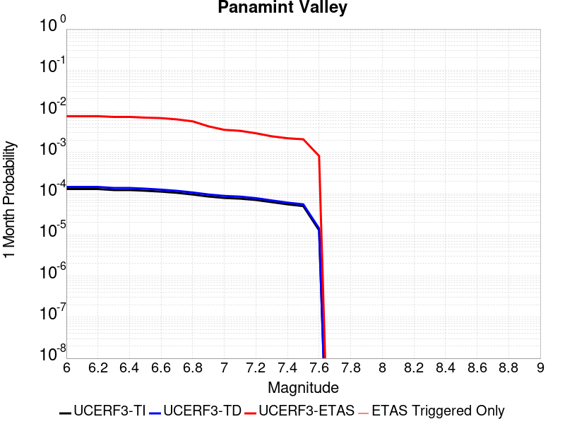 |  |  |

| Magnitude | 1 wk TI Prob | 1 wk TD Prob | 1 wk ETAS Prob | 1 wk ETAS/TD Gain | 1 wk ETAS Triggered Only | 1 mo TI Prob | 1 mo TD Prob | 1 mo ETAS Prob | 1 mo ETAS/TD Gain | 1 mo ETAS Triggered Only | 1 yr TI Prob | 1 yr TD Prob | 1 yr ETAS Prob | 1 yr ETAS/TD Gain | 1 yr ETAS Triggered Only | 10 yr TI Prob | 10 yr TD Prob | 10 yr ETAS Prob | 10 yr ETAS/TD Gain | 10 yr ETAS Triggered Only |
|-----|-----|-----|-----|-----|-----|-----|-----|-----|-----|-----|-----|-----|-----|-----|-----|-----|-----|-----|-----|-----|
| 6.0 | 3.0211835E-5 | 3.3984263E-5 | 0.0054638 | 160.77441 | 0.00543 | 1.2947287E-4 | 1.4563887E-4 | 0.007634548 | 52.42109 | 0.00749 | 0.0015751923 | 0.0017717406 | 0.0138403205 | 7.811708 | 0.01209 | 0.015640736 | 0.017583003 | 0.034736004 | 1.9755445 | 0.01746 |
| 6.1 | 3.0211835E-5 | 3.3984263E-5 | 0.0054638 | 160.77441 | 0.00543 | 1.2947287E-4 | 1.4563887E-4 | 0.007634548 | 52.42109 | 0.00749 | 0.0015751923 | 0.0017717406 | 0.0138403205 | 7.811708 | 0.01209 | 0.015640736 | 0.017583003 | 0.034736004 | 1.9755445 | 0.01746 |
| 6.2 | 3.0211835E-5 | 3.3984263E-5 | 0.0054638 | 160.77441 | 0.00543 | 1.2947287E-4 | 1.4563887E-4 | 0.007634548 | 52.42109 | 0.00749 | 0.0015751923 | 0.0017717406 | 0.0138403205 | 7.811708 | 0.01209 | 0.015640736 | 0.017583003 | 0.034736004 | 1.9755445 | 0.01746 |
| 6.3 | 2.8573924E-5 | 3.2102445E-5 | 0.0052319355 | 162.97624 | 0.0052 | 1.2245393E-4 | 1.375748E-4 | 0.007316587 | 53.18261 | 0.00718 | 0.001489857 | 0.0016737141 | 0.013254299 | 7.9190936 | 0.0116 | 0.01479908 | 0.016618038 | 0.03305035 | 1.9888239 | 0.01671 |
| 6.4 | 2.8573924E-5 | 3.2102445E-5 | 0.0052319355 | 162.97624 | 0.0052 | 1.2245393E-4 | 1.375748E-4 | 0.007316587 | 53.18261 | 0.00718 | 0.001489857 | 0.0016737141 | 0.013254299 | 7.9190936 | 0.0116 | 0.01479908 | 0.016618038 | 0.03305035 | 1.9888239 | 0.01671 |
| 6.5 | 2.7468774E-5 | 3.0828138E-5 | 0.0050406735 | 163.50885 | 0.00501 | 1.1771801E-4 | 1.3211406E-4 | 0.007041201 | 53.29638 | 0.00691 | 0.0014322745 | 0.0016073292 | 0.012829263 | 7.9817266 | 0.01124 | 0.014230782 | 0.015963882 | 0.03189543 | 1.9979743 | 0.01619 |
| 6.6 | 2.6135967E-5 | 2.9252153E-5 | 0.004929109 | 168.50415 | 0.0049 | 1.1200648E-4 | 1.2536049E-4 | 0.006854517 | 54.678448 | 0.00673 | 0.0013628257 | 0.0015252219 | 0.012298765 | 8.06359 | 0.01079 | 0.013544982 | 0.015154343 | 0.030439148 | 2.0086088 | 0.01552 |
| 6.7 | 2.4498746E-5 | 2.7341044E-5 | 0.004647215 | 169.97209 | 0.00462 | 1.04990395E-4 | 1.17170785E-4 | 0.0063764374 | 54.42003 | 0.00626 | 0.0012775084 | 0.0014256459 | 0.011411389 | 8.004365 | 0.01 | 0.012701893 | 0.014171593 | 0.028328089 | 1.9989347 | 0.01436 |
| 6.8 | 2.2244329E-5 | 2.4935374E-5 | 0.004184832 | 167.8271 | 0.00416 | 9.532935E-5 | 1.0686163E-4 | 0.005716262 | 53.492184 | 0.00561 | 0.0011600169 | 0.0013002857 | 0.010228661 | 7.8664722 | 0.00894 | 0.011539802 | 0.012932955 | 0.025567414 | 1.9769197 | 0.0128 |
| 6.9 | 1.9902658E-5 | 2.2290182E-5 | 0.003122221 | 140.07158 | 0.0031 | 8.529431E-5 | 9.552596E-5 | 0.004325122 | 45.276928 | 0.00423 | 0.0010379635 | 0.0011624265 | 0.00790458 | 6.800069 | 0.00675 | 0.010331288 | 0.011569021 | 0.021235876 | 1.8355811 | 0.00978 |
| 7.0 | 1.8353881E-5 | 2.056605E-5 | 0.0026105128 | 126.933105 | 0.00259 | 7.865712E-5 | 8.813734E-5 | 0.0035578315 | 40.3669 | 0.00347 | 9.5722964E-4 | 0.0010725616 | 0.006686534 | 6.2341723 | 0.00562 | 0.009531168 | 0.01067939 | 0.018593954 | 1.7411065 | 0.008 |
| 7.1 | 1.7667631E-5 | 1.9772435E-5 | 0.002479724 | 125.41317 | 0.00246 | 7.571623E-5 | 8.4736355E-5 | 0.0033644584 | 39.705017 | 0.00328 | 9.2145515E-4 | 0.0010311945 | 0.0063457084 | 6.153746 | 0.00532 | 0.009176437 | 0.0102695925 | 0.017692572 | 1.7228113 | 0.0075 |
| 7.2 | 1.6381597E-5 | 1.8158042E-5 | 0.0021881186 | 120.504105 | 0.00217 | 7.020495E-5 | 7.781795E-5 | 0.0029375954 | 37.749584 | 0.00286 | 8.544101E-4 | 9.470391E-4 | 0.0056226067 | 5.937038 | 0.00468 | 0.008511325 | 0.009435269 | 0.016062148 | 1.7023518 | 0.00669 |
| 7.3 | 1.4520491E-5 | 1.596657E-5 | 0.0018359375 | 114.986336 | 0.00182 | 6.222919E-5 | 6.842646E-5 | 0.0024782615 | 36.217884 | 0.00241 | 7.57377E-4 | 8.327899E-4 | 0.0047195503 | 5.667156 | 0.00389 | 0.0075480095 | 0.008300399 | 0.013883669 | 1.6726506 | 0.00563 |
| 7.4 | 1.2852287E-5 | 1.41454875E-5 | 0.0016441224 | 116.22946 | 0.00163 | 5.5080065E-5 | 6.06222E-5 | 0.0022204912 | 36.628353 | 0.00216 | 6.7039346E-4 | 7.378411E-4 | 0.0042652367 | 5.780698 | 0.00353 | 0.0066837464 | 0.007357429 | 0.0124099795 | 1.6867278 | 0.00509 |
| 7.5 | 1.1637851E-5 | 1.2836868E-5 | 0.0015428172 | 120.186424 | 0.00153 | 4.987555E-5 | 5.5014076E-5 | 0.0020949019 | 38.07938 | 0.00204 | 6.070656E-4 | 6.696062E-4 | 0.0040273564 | 6.0145144 | 0.00336 | 0.006054099 | 0.0066793845 | 0.011477123 | 1.7182906 | 0.00483 |
| 7.6 | 3.0068115E-6 | 3.3330623E-6 | 6.23331E-4 | 187.01451 | 6.2E-4 | 1.2886271E-5 | 1.4284516E-5 | 8.242729E-4 | 57.70395 | 8.1E-4 | 1.5687906E-4 | 1.7390738E-4 | 0.0014036935 | 8.071501 | 0.00123 | 0.0015676835 | 0.0017397973 | 0.0034967354 | 2.0098522 | 0.00176 |

## Owl Lake
*[(top)](#table-of-contents)*

| 1 Week | 1 Month | 1 Year | 10 Year |
|-----|-----|-----|-----|
|  |  |  | 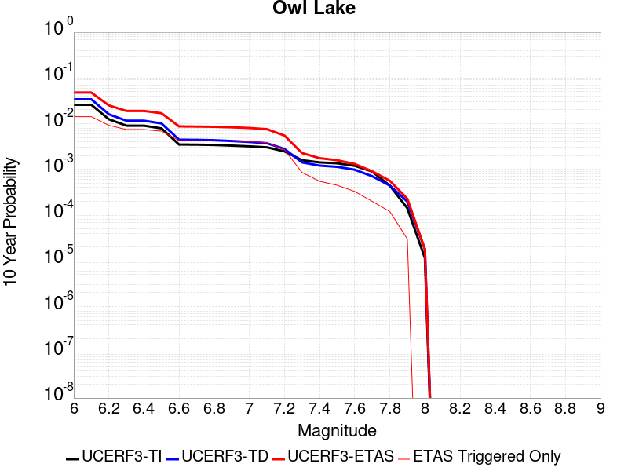 |

| Magnitude | 1 wk TI Prob | 1 wk TD Prob | 1 wk ETAS Prob | 1 wk ETAS/TD Gain | 1 wk ETAS Triggered Only | 1 mo TI Prob | 1 mo TD Prob | 1 mo ETAS Prob | 1 mo ETAS/TD Gain | 1 mo ETAS Triggered Only | 1 yr TI Prob | 1 yr TD Prob | 1 yr ETAS Prob | 1 yr ETAS/TD Gain | 1 yr ETAS Triggered Only | 10 yr TI Prob | 10 yr TD Prob | 10 yr ETAS Prob | 10 yr ETAS/TD Gain | 10 yr ETAS Triggered Only |
|-----|-----|-----|-----|-----|-----|-----|-----|-----|-----|-----|-----|-----|-----|-----|-----|-----|-----|-----|-----|-----|
| 6.0 | 5.0320643E-5 | 6.6358676E-5 | 0.0040460946 | 60.973106 | 0.00398 | 2.1564208E-4 | 2.843643E-4 | 0.0060027377 | 21.109322 | 0.00572 | 0.0026222812 | 0.003457547 | 0.013074182 | 3.781346 | 0.00965 | 0.02591553 | 0.034141295 | 0.047895122 | 1.4028502 | 0.01424 |
| 6.1 | 5.0320643E-5 | 6.6358676E-5 | 0.0040460946 | 60.973106 | 0.00398 | 2.1564208E-4 | 2.843643E-4 | 0.0060027377 | 21.109322 | 0.00572 | 0.0026222812 | 0.003457547 | 0.013074182 | 3.781346 | 0.00965 | 0.02591553 | 0.034141295 | 0.047895122 | 1.4028502 | 0.01424 |
| 6.2 | 2.4125871E-5 | 3.0980515E-5 | 0.0025109036 | 81.04784 | 0.00248 | 1.0339249E-4 | 1.3276804E-4 | 0.0037722848 | 28.412598 | 0.00364 | 0.0012580766 | 0.0016154252 | 0.007775458 | 4.8132577 | 0.00617 | 0.012509781 | 0.016070755 | 0.025132744 | 1.5638807 | 0.00921 |
| 6.3 | 1.7433485E-5 | 2.2355545E-5 | 0.0022323062 | 99.8547 | 0.00221 | 7.471279E-5 | 9.580685E-5 | 0.0031655128 | 33.04057 | 0.00307 | 9.0924866E-4 | 0.001165962 | 0.006190097 | 5.3090043 | 0.00503 | 0.009055373 | 0.0116291465 | 0.01899251 | 1.6331817 | 0.00745 |
| 6.4 | 1.7433485E-5 | 2.2355545E-5 | 0.0022323062 | 99.8547 | 0.00221 | 7.471279E-5 | 9.580685E-5 | 0.0031655128 | 33.04057 | 0.00307 | 9.0924866E-4 | 0.001165962 | 0.006190097 | 5.3090043 | 0.00503 | 0.009055373 | 0.0116291465 | 0.01899251 | 1.6331817 | 0.00745 |
| 6.5 | 1.5182742E-5 | 1.9429277E-5 | 0.0021193884 | 109.082214 | 0.0021 | 6.506727E-5 | 8.3266525E-5 | 0.0029630268 | 35.58485 | 0.00288 | 7.919061E-4 | 0.0010134344 | 0.005708671 | 5.6329956 | 0.0047 | 0.0078909 | 0.010118678 | 0.016919162 | 1.6720724 | 0.00687 |
| 6.6 | 6.7271576E-6 | 8.547518E-6 | 0.0015585342 | 182.33765 | 0.00155 | 2.8830356E-5 | 3.6631736E-5 | 0.002046558 | 55.868443 | 0.00201 | 3.5095305E-4 | 4.4590578E-4 | 0.0034545637 | 7.747295 | 0.00301 | 0.0035039932 | 0.0044680187 | 0.008728895 | 1.9536389 | 0.00428 |
| 6.7 | 6.682835E-6 | 8.479961E-6 | 0.0015484669 | 182.60307 | 0.00154 | 2.8640408E-5 | 3.6342215E-5 | 0.0020362695 | 56.03042 | 0.002 | 3.4864116E-4 | 4.423823E-4 | 0.0034310597 | 7.75587 | 0.00299 | 0.003480947 | 0.0044329325 | 0.008654137 | 1.9522375 | 0.00424 |
| 6.8 | 6.5774975E-6 | 8.326427E-6 | 0.0015383137 | 184.75075 | 0.00153 | 2.8188972E-5 | 3.5684232E-5 | 0.0020156135 | 56.484715 | 0.00198 | 3.4314668E-4 | 4.3437455E-4 | 0.0034030844 | 7.8344474 | 0.00297 | 0.0034261728 | 0.0043531056 | 0.008554735 | 1.9652028 | 0.00422 |
| 6.9 | 6.363419E-6 | 7.999591E-6 | 0.0015279874 | 191.00821 | 0.00152 | 2.727151E-5 | 3.428354E-5 | 0.0019942163 | 58.16833 | 0.00196 | 3.3198006E-4 | 4.1732774E-4 | 0.0033461049 | 8.017931 | 0.00293 | 0.0033148455 | 0.0041830647 | 0.008335621 | 1.9927068 | 0.00417 |
| 7.0 | 6.1342453E-6 | 7.631779E-6 | 0.0015176203 | 198.85536 | 0.00151 | 2.6289357E-5 | 3.2707245E-5 | 0.0019826435 | 60.617867 | 0.00195 | 3.2002592E-4 | 3.9814346E-4 | 0.0032969888 | 8.280907 | 0.0029 | 0.0031956544 | 0.003991739 | 0.008055453 | 2.018031 | 0.00408 |
| 7.1 | 5.842926E-6 | 7.142312E-6 | 0.0014371321 | 201.21385 | 0.00143 | 2.504087E-5 | 3.060958E-5 | 0.0018705532 | 61.110058 | 0.00184 | 3.0482994E-4 | 3.7261334E-4 | 0.003141581 | 8.43121 | 0.00277 | 0.0030441214 | 0.0037371595 | 0.0075827343 | 2.02901 | 0.00386 |
| 7.2 | 4.77173E-6 | 5.358478E-6 | 0.001025353 | 191.35153 | 0.00102 | 2.045011E-5 | 2.2964727E-5 | 0.0013529342 | 58.913574 | 0.00133 | 2.4895166E-4 | 2.7956374E-4 | 0.0022690075 | 8.116243 | 0.00199 | 0.0024867293 | 0.0028086212 | 0.005501038 | 1.9586258 | 0.0027 |
| 7.3 | 3.0494948E-6 | 2.710356E-6 | 3.3270946E-4 | 122.75489 | 3.3E-4 | 1.3069198E-5 | 1.1615762E-5 | 4.116111E-4 | 35.43557 | 4.0E-4 | 1.5910587E-4 | 1.4141288E-4 | 7.4132805E-4 | 5.2422953 | 6.0E-4 | 0.0015899199 | 0.0014231089 | 0.0022818851 | 1.6034508 | 8.6E-4 |
| 7.4 | 2.7263884E-6 | 2.3055634E-6 | 2.023051E-4 | 87.7465 | 2.0E-4 | 1.1684469E-5 | 9.880949E-6 | 2.498786E-4 | 25.288925 | 2.4E-4 | 1.4224913E-4 | 1.2029401E-4 | 5.002483E-4 | 4.158547 | 3.8E-4 | 0.0014215811 | 0.0012110578 | 0.0017603916 | 1.4535985 | 5.5E-4 |
| 7.5 | 2.6090431E-6 | 2.1655019E-6 | 1.6216516E-4 | 74.88572 | 1.6E-4 | 1.1181565E-5 | 9.2806895E-6 | 1.9927893E-4 | 21.472427 | 1.9E-4 | 1.3612706E-4 | 1.1298663E-4 | 4.1295274E-4 | 3.6548815 | 3.0E-4 | 0.001360437 | 0.0011378126 | 0.0015873007 | 1.3950456 | 4.5E-4 |
| 7.6 | 2.3008756E-6 | 1.8726826E-6 | 1.2187246E-4 | 65.07908 | 1.2E-4 | 9.860858E-6 | 8.025758E-6 | 1.4802463E-4 | 18.443695 | 1.4E-4 | 1.20049335E-4 | 9.770931E-5 | 3.0768878E-4 | 3.1490223 | 2.1E-4 | 0.001199845 | 9.848307E-4 | 0.0013145056 | 1.334753 | 3.3E-4 |
| 7.7 | 1.7184348E-6 | 1.341808E-6 | 7.134172E-5 | 53.168346 | 7.0E-5 | 7.3646997E-6 | 5.750593E-6 | 8.5750136E-5 | 14.911528 | 8.0E-5 | 8.966153E-5 | 7.0011265E-5 | 1.8000357E-4 | 2.5710657 | 1.1E-4 | 8.962536E-4 | 7.0769014E-4 | 9.0754865E-4 | 1.2824095 | 2.0E-4 |
| 7.8 | 8.4612907E-7 | 8.4054994E-7 | 4.0840518E-5 | 48.587852 | 4.0E-5 | 3.6262625E-6 | 3.602352E-6 | 4.360221E-5 | 12.103816 | 4.0E-5 | 4.4148852E-5 | 4.3857777E-5 | 1.0385514E-4 | 2.3679984 | 6.0E-5 | 4.414008E-4 | 4.4386165E-4 | 5.6380837E-4 | 1.2702345 | 1.2E-4 |
| 7.9 | 2.716738E-7 | 3.7681625E-7 | 3.7681625E-7 | 1.0 | 0.0 | 1.1643157E-6 | 1.6149258E-6 | 1.6149258E-6 | 1.0 | 0.0 | 1.4175452E-5 | 1.9661555E-5 | 1.9661555E-5 | 1.0 | 0.0 | 1.4174548E-4 | 1.9829652E-4 | 2.2829056E-4 | 1.1512586 | 3.0E-5 |
| 8.0 | 2.1995428E-8 | 3.3853325E-8 | 3.3853325E-8 | 1.0 | 0.0 | 9.426611E-8 | 1.4508568E-7 | 1.4508568E-7 | 1.0 | 0.0 | 1.1476893E-6 | 1.7664173E-6 | 1.7664173E-6 | 1.0 | 0.0 | 1.14768345E-5 | 1.7869768E-5 | 1.7869768E-5 | 1.0 | 0.0 |

## Little Lake
*[(top)](#table-of-contents)*

| 1 Week | 1 Month | 1 Year | 10 Year |
|-----|-----|-----|-----|
|  |  |  |  |

| Magnitude | 1 wk TI Prob | 1 wk TD Prob | 1 wk ETAS Prob | 1 wk ETAS/TD Gain | 1 wk ETAS Triggered Only | 1 mo TI Prob | 1 mo TD Prob | 1 mo ETAS Prob | 1 mo ETAS/TD Gain | 1 mo ETAS Triggered Only | 1 yr TI Prob | 1 yr TD Prob | 1 yr ETAS Prob | 1 yr ETAS/TD Gain | 1 yr ETAS Triggered Only | 10 yr TI Prob | 10 yr TD Prob | 10 yr ETAS Prob | 10 yr ETAS/TD Gain | 10 yr ETAS Triggered Only |
|-----|-----|-----|-----|-----|-----|-----|-----|-----|-----|-----|-----|-----|-----|-----|-----|-----|-----|-----|-----|-----|
| 6.0 | 2.8424427E-5 | 3.1205716E-5 | 0.0069609894 | 223.06778 | 0.00693 | 1.2181328E-4 | 1.3373268E-4 | 0.008882563 | 66.42029 | 0.00875 | 0.0014820677 | 0.0016271125 | 0.013927067 | 8.559376 | 0.01232 | 0.014722223 | 0.016165398 | 0.03187724 | 1.9719425 | 0.01597 |
| 6.1 | 2.8424427E-5 | 3.1205716E-5 | 0.0069609894 | 223.06778 | 0.00693 | 1.2181328E-4 | 1.3373268E-4 | 0.008882563 | 66.42029 | 0.00875 | 0.0014820677 | 0.0016271125 | 0.013927067 | 8.559376 | 0.01232 | 0.014722223 | 0.016165398 | 0.03187724 | 1.9719425 | 0.01597 |
| 6.2 | 2.8424427E-5 | 3.1205716E-5 | 0.0069609894 | 223.06778 | 0.00693 | 1.2181328E-4 | 1.3373268E-4 | 0.008882563 | 66.42029 | 0.00875 | 0.0014820677 | 0.0016271125 | 0.013927067 | 8.559376 | 0.01232 | 0.014722223 | 0.016165398 | 0.03187724 | 1.9719425 | 0.01597 |
| 6.3 | 1.48860645E-5 | 1.6081383E-5 | 0.0031060318 | 193.14455 | 0.00309 | 6.379586E-5 | 6.8918554E-5 | 0.004018646 | 58.310078 | 0.00395 | 7.7643775E-4 | 8.387886E-4 | 0.0064340914 | 7.670695 | 0.0056 | 0.007737305 | 0.008359045 | 0.0155881075 | 1.8648192 | 0.00729 |
| 6.4 | 1.48860645E-5 | 1.6081383E-5 | 0.0031060318 | 193.14455 | 0.00309 | 6.379586E-5 | 6.8918554E-5 | 0.004018646 | 58.310078 | 0.00395 | 7.7643775E-4 | 8.387886E-4 | 0.0064340914 | 7.670695 | 0.0056 | 0.007737305 | 0.008359045 | 0.0155881075 | 1.8648192 | 0.00729 |
| 6.5 | 1.2797581E-5 | 1.376556E-5 | 0.00259373 | 188.42169 | 0.00258 | 5.4845623E-5 | 5.8994065E-5 | 0.0033687989 | 57.104027 | 0.00331 | 6.675408E-4 | 7.1804173E-4 | 0.005504602 | 7.6661315 | 0.00479 | 0.006655392 | 0.007159767 | 0.013424589 | 1.8750036 | 0.00631 |
| 6.6 | 9.661896E-6 | 1.0289033E-5 | 0.0018802698 | 182.74506 | 0.00187 | 4.1407468E-5 | 4.40952E-5 | 0.002453989 | 55.652065 | 0.00241 | 5.040193E-4 | 5.36743E-4 | 0.003974897 | 7.405586 | 0.00344 | 0.005028777 | 0.0053560715 | 0.009921487 | 1.8523813 | 0.00459 |
| 6.7 | 7.767871E-6 | 8.199681E-6 | 0.0014381879 | 175.3956 | 0.00143 | 3.329045E-5 | 3.5141096E-5 | 0.0019050754 | 54.21218 | 0.00187 | 4.0523586E-4 | 4.2777258E-4 | 0.0031066262 | 7.2623315 | 0.00268 | 0.004044977 | 0.004270843 | 0.00788534 | 1.8463193 | 0.00363 |
| 6.8 | 6.4235196E-6 | 6.735739E-6 | 0.001156728 | 171.72992 | 0.00115 | 2.752908E-5 | 2.8867207E-5 | 0.0015488233 | 53.653385 | 0.00152 | 3.35115E-4 | 3.5141438E-4 | 0.0025306484 | 7.2013226 | 0.00218 | 0.003346101 | 0.0035098472 | 0.006469423 | 1.8432207 | 0.00297 |
| 6.9 | 3.1283696E-6 | 3.1121751E-6 | 4.731107E-4 | 152.01932 | 4.7E-4 | 1.3407229E-5 | 1.33378335E-5 | 6.3332956E-4 | 47.483692 | 6.2E-4 | 1.6322079E-4 | 1.6237753E-4 | 0.0010322363 | 6.357014 | 8.7E-4 | 0.0016310095 | 0.0016227372 | 0.0028307736 | 1.7444437 | 0.00121 |
| 7.0 | 2.290603E-6 | 2.2286763E-6 | 3.3222794E-4 | 149.06963 | 3.3E-4 | 9.816834E-6 | 9.551441E-6 | 4.3954732E-4 | 46.01896 | 4.3E-4 | 1.19513395E-4 | 1.1628362E-4 | 6.962162E-4 | 5.9872246 | 5.8E-4 | 0.0011944914 | 0.0011623299 | 0.001981377 | 1.7046596 | 8.2E-4 |
| 7.1 | 1.293693E-6 | 1.1776774E-6 | 1.4117752E-4 | 119.877914 | 1.4E-4 | 5.5443866E-6 | 5.047183E-6 | 1.9504622E-4 | 38.64457 | 1.9E-4 | 6.750081E-5 | 6.1448416E-5 | 3.3143183E-4 | 5.393659 | 2.7E-4 | 6.7480316E-4 | 6.1438273E-4 | 0.0010141371 | 1.6506599 | 4.0E-4 |
| 7.2 | 4.715842E-7 | 3.091732E-7 | 3.091732E-7 | 1.0 | 0.0 | 2.0210737E-6 | 1.3250274E-6 | 1.1325014E-5 | 8.547004 | 1.0E-5 | 2.4606294E-5 | 1.6132095E-5 | 3.6131773E-5 | 2.2397447 | 2.0E-5 | 2.460357E-4 | 1.6130977E-4 | 2.213001E-4 | 1.3718952 | 6.0E-5 |
| 7.3 | 3.9430947E-7 | 2.3096938E-7 | 2.3096938E-7 | 1.0 | 0.0 | 1.6898966E-6 | 9.898685E-7 | 1.0989858E-5 | 11.102343 | 1.0E-5 | 2.0574296E-5 | 1.2051582E-5 | 2.2051461E-5 | 1.8297566 | 1.0E-5 | 2.0572392E-4 | 1.2050936E-4 | 1.6050454E-4 | 1.3318844 | 4.0E-5 |
| 7.4 | 3.547123E-7 | 1.9678579E-7 | 1.9678579E-7 | 1.0 | 0.0 | 1.5201948E-6 | 8.433674E-7 | 1.0843359E-5 | 12.857219 | 1.0E-5 | 1.8508214E-5 | 1.02679505E-5 | 2.0267848E-5 | 1.9738942 | 1.0E-5 | 1.8506673E-4 | 1.0267482E-4 | 1.3267175E-4 | 1.2921546 | 3.0E-5 |
| 7.5 | 2.6354266E-7 | 1.4422719E-7 | 1.4422719E-7 | 1.0 | 0.0 | 1.129468E-6 | 6.1811636E-7 | 1.06181105E-5 | 17.178173 | 1.0E-5 | 1.3751187E-5 | 7.525541E-6 | 1.7525466E-5 | 2.328798 | 1.0E-5 | 1.3750336E-4 | 7.5252916E-5 | 1.05250656E-4 | 1.3986256 | 3.0E-5 |
| 7.6 | 1.269913E-7 | 7.572344E-8 | 7.572344E-8 | 1.0 | 0.0 | 5.4424834E-7 | 3.24529E-7 | 3.24529E-7 | 1.0 | 0.0 | 6.6262032E-6 | 3.9511337E-6 | 3.9511337E-6 | 1.0 | 0.0 | 6.626006E-5 | 3.9510673E-5 | 4.9510276E-5 | 1.2530862 | 1.0E-5 |

## Ash Hill
*[(top)](#table-of-contents)*

| 1 Week | 1 Month | 1 Year | 10 Year |
|-----|-----|-----|-----|
|  |  |  |  |

| Magnitude | 1 wk TI Prob | 1 wk TD Prob | 1 wk ETAS Prob | 1 wk ETAS/TD Gain | 1 wk ETAS Triggered Only | 1 mo TI Prob | 1 mo TD Prob | 1 mo ETAS Prob | 1 mo ETAS/TD Gain | 1 mo ETAS Triggered Only | 1 yr TI Prob | 1 yr TD Prob | 1 yr ETAS Prob | 1 yr ETAS/TD Gain | 1 yr ETAS Triggered Only | 10 yr TI Prob | 10 yr TD Prob | 10 yr ETAS Prob | 10 yr ETAS/TD Gain | 10 yr ETAS Triggered Only |
|-----|-----|-----|-----|-----|-----|-----|-----|-----|-----|-----|-----|-----|-----|-----|-----|-----|-----|-----|-----|-----|
| 6.0 | 2.1545662E-5 | 2.3194447E-5 | 0.0029631262 | 127.75154 | 0.00294 | 9.2335285E-5 | 9.940143E-5 | 0.004358978 | 43.852264 | 0.00426 | 0.0011236023 | 0.0012096206 | 0.008480814 | 7.011136 | 0.00728 | 0.011179381 | 0.012038348 | 0.022876289 | 1.9002845 | 0.01097 |
| 6.1 | 2.1545662E-5 | 2.3194447E-5 | 0.0029631262 | 127.75154 | 0.00294 | 9.2335285E-5 | 9.940143E-5 | 0.004358978 | 43.852264 | 0.00426 | 0.0011236023 | 0.0012096206 | 0.008480814 | 7.011136 | 0.00728 | 0.011179381 | 0.012038348 | 0.022876289 | 1.9002845 | 0.01097 |
| 6.2 | 2.1545662E-5 | 2.3194447E-5 | 0.0029631262 | 127.75154 | 0.00294 | 9.2335285E-5 | 9.940143E-5 | 0.004358978 | 43.852264 | 0.00426 | 0.0011236023 | 0.0012096206 | 0.008480814 | 7.011136 | 0.00728 | 0.011179381 | 0.012038348 | 0.022876289 | 1.9002845 | 0.01097 |
| 6.3 | 1.0025529E-5 | 1.0746934E-5 | 0.0013407327 | 124.75489 | 0.00133 | 4.2965847E-5 | 4.605755E-5 | 0.0018959723 | 41.165287 | 0.00185 | 5.229836E-4 | 5.6061964E-4 | 0.003588921 | 6.401704 | 0.00303 | 0.005217545 | 0.0055933665 | 0.010157693 | 1.8160249 | 0.00459 |
| 6.4 | 1.0025529E-5 | 1.0746934E-5 | 0.0013407327 | 124.75489 | 0.00133 | 4.2965847E-5 | 4.605755E-5 | 0.0018959723 | 41.165287 | 0.00185 | 5.229836E-4 | 5.6061964E-4 | 0.003588921 | 6.401704 | 0.00303 | 0.005217545 | 0.0055933665 | 0.010157693 | 1.8160249 | 0.00459 |
| 6.5 | 6.9617327E-6 | 7.456634E-6 | 9.174498E-4 | 123.03807 | 9.1E-4 | 2.9835655E-5 | 3.195666E-5 | 0.0013119158 | 41.052967 | 0.00128 | 3.6318856E-4 | 3.8901155E-4 | 0.0025081867 | 6.44759 | 0.00212 | 0.0036259557 | 0.0038841602 | 0.0070418473 | 1.8129652 | 0.00317 |
| 6.6 | 4.9919777E-6 | 5.3466883E-6 | 6.6534313E-4 | 124.44024 | 6.6E-4 | 2.1394015E-5 | 2.2914215E-5 | 9.228936E-4 | 40.276028 | 9.0E-4 | 2.60441E-4 | 2.7895154E-4 | 0.0017585387 | 6.304101 | 0.00148 | 0.0026013597 | 0.0027866727 | 0.004930681 | 1.7693795 | 0.00215 |
| 6.7 | 3.6630722E-6 | 3.924624E-6 | 4.739228E-4 | 120.75623 | 4.7E-4 | 1.5698786E-5 | 1.681974E-5 | 6.5680896E-4 | 39.04989 | 6.4E-4 | 1.9111596E-4 | 2.0476682E-4 | 0.0013145396 | 6.41969 | 0.00111 | 0.0019095168 | 0.0020463446 | 0.0036829885 | 1.7997891 | 0.00164 |
| 6.8 | 2.5599613E-6 | 2.744925E-6 | 3.127441E-4 | 113.93538 | 3.1E-4 | 1.0971216E-5 | 1.1763939E-5 | 4.5175877E-4 | 38.401997 | 4.4E-4 | 1.3356637E-4 | 1.4322149E-4 | 9.131112E-4 | 6.375518 | 7.7E-4 | 0.0013348613 | 0.0014317769 | 0.0025401877 | 1.7741505 | 0.00111 |
| 6.9 | 1.7684905E-6 | 1.8968707E-6 | 2.4189641E-4 | 127.52393 | 2.4E-4 | 7.579223E-6 | 8.129446E-6 | 3.1812693E-4 | 39.13267 | 3.1E-4 | 9.2273134E-5 | 9.8976E-5 | 6.689196E-4 | 6.7584014 | 5.7E-4 | 9.223483E-4 | 9.8976E-4 | 0.0017989583 | 1.8175702 | 8.1E-4 |

## Garlock (East)
*[(top)](#table-of-contents)*

| 1 Week | 1 Month | 1 Year | 10 Year |
|-----|-----|-----|-----|
|  |  |  |  |

| Magnitude | 1 wk TI Prob | 1 wk TD Prob | 1 wk ETAS Prob | 1 wk ETAS/TD Gain | 1 wk ETAS Triggered Only | 1 mo TI Prob | 1 mo TD Prob | 1 mo ETAS Prob | 1 mo ETAS/TD Gain | 1 mo ETAS Triggered Only | 1 yr TI Prob | 1 yr TD Prob | 1 yr ETAS Prob | 1 yr ETAS/TD Gain | 1 yr ETAS Triggered Only | 10 yr TI Prob | 10 yr TD Prob | 10 yr ETAS Prob | 10 yr ETAS/TD Gain | 10 yr ETAS Triggered Only |
|-----|-----|-----|-----|-----|-----|-----|-----|-----|-----|-----|-----|-----|-----|-----|-----|-----|-----|-----|-----|-----|
| 6.0 | 4.5092507E-5 | 6.2904815E-5 | 0.0025627476 | 40.740086 | 0.0025 | 1.9323928E-4 | 2.6956675E-4 | 0.003918583 | 14.536596 | 0.00365 | 0.0023501497 | 0.003277482 | 0.009616637 | 2.934154 | 0.00636 | 0.023254504 | 0.03235377 | 0.04165285 | 1.2874187 | 0.00961 |
| 6.1 | 4.5092507E-5 | 6.2904815E-5 | 0.0025627476 | 40.740086 | 0.0025 | 1.9323928E-4 | 2.6956675E-4 | 0.003918583 | 14.536596 | 0.00365 | 0.0023501497 | 0.003277482 | 0.009616637 | 2.934154 | 0.00636 | 0.023254504 | 0.03235377 | 0.04165285 | 1.2874187 | 0.00961 |
| 6.2 | 2.6674514E-5 | 3.4511588E-5 | 0.0016844546 | 48.80838 | 0.00165 | 1.1431433E-4 | 1.4789861E-4 | 0.0026575273 | 17.968576 | 0.00251 | 0.0013908884 | 0.0017992114 | 0.006051547 | 3.363444 | 0.00426 | 0.01382215 | 0.017872788 | 0.023991441 | 1.3423446 | 0.00623 |
| 6.3 | 2.6674514E-5 | 3.4511588E-5 | 0.0016844546 | 48.80838 | 0.00165 | 1.1431433E-4 | 1.4789861E-4 | 0.0026575273 | 17.968576 | 0.00251 | 0.0013908884 | 0.0017992114 | 0.006051547 | 3.363444 | 0.00426 | 0.01382215 | 0.017872788 | 0.023991441 | 1.3423446 | 0.00623 |
| 6.4 | 2.5312667E-5 | 3.2340467E-5 | 0.0016422884 | 50.78122 | 0.00161 | 1.0847834E-4 | 1.3859481E-4 | 0.0026082525 | 18.819265 | 0.00247 | 0.0013199237 | 0.0016861152 | 0.005819135 | 3.451208 | 0.00414 | 0.013121112 | 0.016772287 | 0.022720814 | 1.3546641 | 0.00605 |
| 6.5 | 2.5312667E-5 | 3.2340467E-5 | 0.0016422884 | 50.78122 | 0.00161 | 1.0847834E-4 | 1.3859481E-4 | 0.0026082525 | 18.819265 | 0.00247 | 0.0013199237 | 0.0016861152 | 0.005819135 | 3.451208 | 0.00414 | 0.013121112 | 0.016772287 | 0.022720814 | 1.3546641 | 0.00605 |
| 6.6 | 2.246556E-5 | 2.8134691E-5 | 0.0015480919 | 55.024307 | 0.00152 | 9.627742E-5 | 1.2057181E-4 | 0.0024302932 | 20.156397 | 0.00231 | 0.0011715472 | 0.0014669969 | 0.005291378 | 3.606946 | 0.00383 | 0.011653901 | 0.014613169 | 0.020101774 | 1.3755931 | 0.00557 |
| 6.7 | 2.2241198E-5 | 2.7804432E-5 | 0.0015377625 | 55.30638 | 0.00151 | 9.531594E-5 | 1.1915654E-4 | 0.0024188824 | 20.30004 | 0.0023 | 0.0011598538 | 0.0014497889 | 0.005224309 | 3.603496 | 0.00378 | 0.011538187 | 0.014442829 | 0.01987325 | 1.3759942 | 0.00551 |
| 6.8 | 1.9528685E-5 | 2.3898969E-5 | 0.001443865 | 60.41537 | 0.00142 | 8.369167E-5 | 1.0242024E-4 | 0.002262199 | 22.087421 | 0.00216 | 0.0010184698 | 0.0012462728 | 0.0047319233 | 3.79686 | 0.00349 | 0.010138147 | 0.012436723 | 0.017433794 | 1.4017996 | 0.00506 |
| 6.9 | 1.3318621E-5 | 1.5198818E-5 | 0.0012351803 | 81.26818 | 0.00122 | 5.7078556E-5 | 6.51362E-5 | 0.0019150157 | 29.400175 | 0.00185 | 6.9470983E-4 | 7.927504E-4 | 0.0037204276 | 4.6930633 | 0.00293 | 0.0069254204 | 0.007940721 | 0.012077608 | 1.5209713 | 0.00417 |
| 7.0 | 1.1760853E-5 | 1.3107653E-5 | 0.0011430929 | 87.20805 | 0.00113 | 5.0402683E-5 | 5.6174475E-5 | 0.0017860773 | 31.795176 | 0.00173 | 6.134799E-4 | 6.8371464E-4 | 0.003411848 | 4.990164 | 0.00273 | 0.0061178906 | 0.006857401 | 0.010740588 | 1.5662768 | 0.00391 |
| 7.1 | 1.0064758E-5 | 1.0902761E-5 | 0.0010608913 | 97.30483 | 0.00105 | 4.3133965E-5 | 4.67253E-5 | 0.0016666496 | 35.669106 | 0.00162 | 5.2502943E-4 | 5.6873553E-4 | 0.0030972967 | 5.445935 | 0.00253 | 0.005237907 | 0.0057133473 | 0.009262951 | 1.6212826 | 0.00357 |
| 7.2 | 9.768808E-6 | 1.0498628E-5 | 0.0010504877 | 100.05952 | 0.00104 | 4.186565E-5 | 4.499337E-5 | 0.0016349219 | 36.336952 | 0.00159 | 5.095951E-4 | 5.4766005E-4 | 0.0030362965 | 5.544126 | 0.00249 | 0.0050842804 | 0.005503584 | 0.008984322 | 1.6324493 | 0.0035 |
| 7.3 | 9.344516E-6 | 9.9442705E-6 | 9.6993474E-4 | 97.53704 | 9.6E-4 | 4.004731E-5 | 4.2617627E-5 | 0.0014725567 | 34.55276 | 0.00143 | 4.8746695E-4 | 5.187495E-4 | 0.0027675824 | 5.3351035 | 0.00225 | 0.0048639905 | 0.005215269 | 0.008428424 | 1.6161052 | 0.00323 |
| 7.4 | 9.023491E-6 | 9.490441E-6 | 8.794822E-4 | 92.67032 | 8.7E-4 | 3.867153E-5 | 4.0672705E-5 | 0.0013406199 | 32.961166 | 0.0013 | 4.7072413E-4 | 4.95081E-4 | 0.0025440662 | 5.1386867 | 0.00205 | 0.004697283 | 0.0049787266 | 0.007894139 | 1.5855739 | 0.00293 |
| 7.5 | 7.081253E-6 | 7.0873994E-6 | 4.4708428E-4 | 63.08157 | 4.4E-4 | 3.0347876E-5 | 3.0374218E-5 | 6.7035476E-4 | 22.06986 | 6.4E-4 | 3.6942272E-4 | 3.697441E-4 | 0.0014393484 | 3.8928235 | 0.00107 | 0.003688092 | 0.0037244745 | 0.0053882548 | 1.4467154 | 0.00167 |
| 7.6 | 6.116396E-6 | 5.9589424E-6 | 2.5595745E-4 | 42.953503 | 2.5E-4 | 2.6212863E-5 | 2.5538076E-5 | 4.0552838E-4 | 15.879362 | 3.8E-4 | 3.1909486E-4 | 3.1088197E-4 | 9.4068615E-4 | 3.0258625 | 6.3E-4 | 0.0031863707 | 0.0031359126 | 0.004152714 | 1.3242441 | 0.00102 |
| 7.7 | 4.797145E-6 | 4.7571157E-6 | 1.8475625E-4 | 38.837875 | 1.8E-4 | 2.055903E-5 | 2.0387479E-5 | 2.7038238E-4 | 13.262178 | 2.5E-4 | 2.5027743E-4 | 2.481894E-4 | 6.4809015E-4 | 2.6112723 | 4.0E-4 | 0.0024999576 | 0.0025094065 | 0.003107901 | 1.2385004 | 6.0E-4 |
| 7.8 | 3.4028885E-6 | 3.978375E-6 | 1.13977934E-4 | 28.649372 | 1.1E-4 | 1.4583726E-5 | 1.7050066E-5 | 1.8704718E-4 | 10.970466 | 1.7E-4 | 1.775424E-4 | 2.0756487E-4 | 4.7750882E-4 | 2.3005283 | 2.7E-4 | 0.0017740062 | 0.0021012141 | 0.0024903945 | 1.185217 | 3.9E-4 |
| 7.9 | 2.5928412E-6 | 3.372436E-6 | 7.33722E-5 | 21.75644 | 7.0E-5 | 1.1112129E-5 | 1.4453217E-5 | 1.3445149E-4 | 9.30253 | 1.2E-4 | 1.3528178E-4 | 1.7595377E-4 | 3.559221E-4 | 2.022816 | 1.8E-4 | 0.0013519945 | 0.0017812426 | 0.0020307973 | 1.1401014 | 2.5E-4 |
| 8.0 | 1.3743648E-6 | 1.6734741E-6 | 1.1673457E-5 | 6.975583 | 1.0E-5 | 5.8901214E-6 | 7.1720124E-6 | 4.7171725E-5 | 6.577195 | 4.0E-5 | 7.1709874E-5 | 8.731578E-5 | 1.5730967E-4 | 1.8016179 | 7.0E-5 | 7.1686733E-4 | 8.837377E-4 | 9.7365817E-4 | 1.1017501 | 9.0E-5 |
| 8.1 | 3.6733252E-7 | 3.1489736E-7 | 3.1489736E-7 | 1.0 | 0.0 | 1.5742813E-6 | 1.3495595E-6 | 1.3495595E-6 | 1.0 | 0.0 | 1.9166706E-5 | 1.643078E-5 | 1.643078E-5 | 1.0 | 0.0 | 1.9165053E-4 | 1.662928E-4 | 1.662928E-4 | 1.0 | 0.0 |

## Blackwater
*[(top)](#table-of-contents)*

| 1 Week | 1 Month | 1 Year | 10 Year |
|-----|-----|-----|-----|
|  |  |  |  |

| Magnitude | 1 wk TI Prob | 1 wk TD Prob | 1 wk ETAS Prob | 1 wk ETAS/TD Gain | 1 wk ETAS Triggered Only | 1 mo TI Prob | 1 mo TD Prob | 1 mo ETAS Prob | 1 mo ETAS/TD Gain | 1 mo ETAS Triggered Only | 1 yr TI Prob | 1 yr TD Prob | 1 yr ETAS Prob | 1 yr ETAS/TD Gain | 1 yr ETAS Triggered Only | 10 yr TI Prob | 10 yr TD Prob | 10 yr ETAS Prob | 10 yr ETAS/TD Gain | 10 yr ETAS Triggered Only |
|-----|-----|-----|-----|-----|-----|-----|-----|-----|-----|-----|-----|-----|-----|-----|-----|-----|-----|-----|-----|-----|
| 6.0 | 3.0708583E-5 | 3.3095846E-5 | 0.002353019 | 71.09711 | 0.00232 | 1.3160157E-4 | 1.4183241E-4 | 0.0031913999 | 22.501204 | 0.00305 | 0.0016010714 | 0.0017255784 | 0.0066770194 | 3.8694384 | 0.00496 | 0.015895851 | 0.017135633 | 0.023799453 | 1.3888867 | 0.00678 |
| 6.1 | 3.0708583E-5 | 3.3095846E-5 | 0.002353019 | 71.09711 | 0.00232 | 1.3160157E-4 | 1.4183241E-4 | 0.0031913999 | 22.501204 | 0.00305 | 0.0016010714 | 0.0017255784 | 0.0066770194 | 3.8694384 | 0.00496 | 0.015895851 | 0.017135633 | 0.023799453 | 1.3888867 | 0.00678 |
| 6.2 | 1.1707779E-5 | 1.2545122E-5 | 9.82533E-4 | 78.319916 | 9.7E-4 | 5.017523E-5 | 5.3763757E-5 | 0.0012636987 | 23.504658 | 0.00121 | 6.107122E-4 | 6.5438676E-4 | 0.0027030453 | 4.130654 | 0.00205 | 0.006090366 | 0.0065255696 | 0.0093470365 | 1.432371 | 0.00284 |
| 6.3 | 1.1707779E-5 | 1.2545122E-5 | 9.82533E-4 | 78.319916 | 9.7E-4 | 5.017523E-5 | 5.3763757E-5 | 0.0012636987 | 23.504658 | 0.00121 | 6.107122E-4 | 6.5438676E-4 | 0.0027030453 | 4.130654 | 0.00205 | 0.006090366 | 0.0065255696 | 0.0093470365 | 1.432371 | 0.00284 |
| 6.4 | 7.929244E-6 | 8.480098E-6 | 6.08475E-4 | 71.753296 | 6.0E-4 | 3.3982033E-5 | 3.6342793E-5 | 7.763159E-4 | 21.360931 | 7.4E-4 | 4.136527E-4 | 4.423877E-4 | 0.0018217772 | 4.118056 | 0.00138 | 0.0041288356 | 0.0044154758 | 0.0063668215 | 1.4419333 | 0.00196 |
| 6.5 | 5.8832115E-6 | 6.285991E-6 | 4.0628348E-4 | 64.63316 | 4.0E-4 | 2.521352E-5 | 2.6939697E-5 | 5.36926E-4 | 19.93066 | 5.1E-4 | 3.0693135E-4 | 3.27944E-4 | 0.0012676357 | 3.8654032 | 9.4E-4 | 0.0030650778 | 0.0032748538 | 0.0046403673 | 1.4169693 | 0.00137 |
| 6.6 | 5.8832115E-6 | 6.285991E-6 | 4.0628348E-4 | 64.63316 | 4.0E-4 | 2.521352E-5 | 2.6939697E-5 | 5.36926E-4 | 19.93066 | 5.1E-4 | 3.0693135E-4 | 3.27944E-4 | 0.0012676357 | 3.8654032 | 9.4E-4 | 0.0030650778 | 0.0032748538 | 0.0046403673 | 1.4169693 | 0.00137 |
| 6.7 | 3.0715053E-6 | 3.2814662E-6 | 1.732809E-4 | 52.805943 | 1.7E-4 | 1.3163528E-5 | 1.4063357E-5 | 2.3406027E-4 | 16.64327 | 2.2E-4 | 1.6025416E-4 | 1.7120909E-4 | 6.1113376E-4 | 3.5695171 | 4.4E-4 | 0.0016013865 | 0.0017108864 | 0.0023398085 | 1.3676002 | 6.3E-4 |
| 6.8 | 2.2722281E-6 | 2.4287538E-6 | 1.4242841E-4 | 58.642593 | 1.4E-4 | 9.738084E-6 | 1.0408908E-5 | 1.8040714E-4 | 17.331995 | 1.7E-4 | 1.1855473E-4 | 1.26722E-4 | 4.4668146E-4 | 3.5248926 | 3.2E-4 | 0.001184915 | 0.0012665876 | 0.0016860556 | 1.3311796 | 4.2E-4 |
| 6.9 | 9.952399E-7 | 1.0653489E-6 | 4.1065305E-5 | 38.546345 | 4.0E-5 | 4.265307E-6 | 4.5657757E-6 | 5.4565546E-5 | 11.950992 | 5.0E-5 | 5.1928873E-5 | 5.5587418E-5 | 1.6558131E-4 | 2.978755 | 1.1E-4 | 5.191674E-4 | 5.557858E-4 | 7.1569683E-4 | 1.2877207 | 1.6E-4 |
| 7.0 | 4.7385504E-7 | 5.0755597E-7 | 1.05075505E-5 | 20.702251 | 1.0E-5 | 2.0308057E-6 | 2.1752398E-6 | 1.2175218E-5 | 5.597184 | 1.0E-5 | 2.4724779E-5 | 2.6483543E-5 | 5.648275E-5 | 2.1327488 | 3.0E-5 | 2.4722028E-4 | 2.6483543E-4 | 3.0482485E-4 | 1.1509972 | 4.0E-5 |

## Hunter Mountain-Saline Valley
*[(top)](#table-of-contents)*

| 1 Week | 1 Month | 1 Year | 10 Year |
|-----|-----|-----|-----|
|  |  |  |  |

| Magnitude | 1 wk TI Prob | 1 wk TD Prob | 1 wk ETAS Prob | 1 wk ETAS/TD Gain | 1 wk ETAS Triggered Only | 1 mo TI Prob | 1 mo TD Prob | 1 mo ETAS Prob | 1 mo ETAS/TD Gain | 1 mo ETAS Triggered Only | 1 yr TI Prob | 1 yr TD Prob | 1 yr ETAS Prob | 1 yr ETAS/TD Gain | 1 yr ETAS Triggered Only | 10 yr TI Prob | 10 yr TD Prob | 10 yr ETAS Prob | 10 yr ETAS/TD Gain | 10 yr ETAS Triggered Only |
|-----|-----|-----|-----|-----|-----|-----|-----|-----|-----|-----|-----|-----|-----|-----|-----|-----|-----|-----|-----|-----|
| 6.0 | 4.5103672E-5 | 5.456906E-5 | 0.0020144621 | 36.91583 | 0.00196 | 1.9328714E-4 | 2.3384714E-4 | 0.0027932485 | 11.944762 | 0.00256 | 0.002350731 | 0.0028435462 | 0.0069318875 | 2.4377615 | 0.0041 | 0.023260195 | 0.028092625 | 0.033807438 | 1.2034276 | 0.00588 |
| 6.1 | 4.5103672E-5 | 5.456906E-5 | 0.0020144621 | 36.91583 | 0.00196 | 1.9328714E-4 | 2.3384714E-4 | 0.0027932485 | 11.944762 | 0.00256 | 0.002350731 | 0.0028435462 | 0.0069318875 | 2.4377615 | 0.0041 | 0.023260195 | 0.028092625 | 0.033807438 | 1.2034276 | 0.00588 |
| 6.2 | 3.9363465E-5 | 4.706271E-5 | 0.0019469733 | 41.369766 | 0.0019 | 1.6868966E-4 | 2.016826E-4 | 0.0026911804 | 13.343641 | 0.00249 | 0.002051862 | 0.0024528534 | 0.0064330664 | 2.6226869 | 0.00399 | 0.020330196 | 0.024274187 | 0.029874854 | 1.2307252 | 0.00574 |
| 6.3 | 3.9363465E-5 | 4.706271E-5 | 0.0019469733 | 41.369766 | 0.0019 | 1.6868966E-4 | 2.016826E-4 | 0.0026911804 | 13.343641 | 0.00249 | 0.002051862 | 0.0024528534 | 0.0064330664 | 2.6226869 | 0.00399 | 0.020330196 | 0.024274187 | 0.029874854 | 1.2307252 | 0.00574 |
| 6.4 | 3.2311684E-5 | 3.795112E-5 | 0.001887881 | 49.745068 | 0.00185 | 1.384713E-4 | 1.6263791E-4 | 0.002572246 | 15.815783 | 0.00241 | 0.0016845843 | 0.001978387 | 0.0058706715 | 2.967403 | 0.0039 | 0.016718714 | 0.019617118 | 0.025136674 | 1.2813642 | 0.00563 |
| 6.5 | 3.2311684E-5 | 3.795112E-5 | 0.001887881 | 49.745068 | 0.00185 | 1.384713E-4 | 1.6263791E-4 | 0.002572246 | 15.815783 | 0.00241 | 0.0016845843 | 0.001978387 | 0.0058706715 | 2.967403 | 0.0039 | 0.016718714 | 0.019617118 | 0.025136674 | 1.2813642 | 0.00563 |
| 6.6 | 2.9305844E-5 | 3.418196E-5 | 0.0018541197 | 54.242634 | 0.00182 | 1.2559042E-4 | 1.4648624E-4 | 0.0025261375 | 17.244879 | 0.00238 | 0.0015279909 | 0.0017820727 | 0.0056252116 | 3.1565557 | 0.00385 | 0.015175272 | 0.017686324 | 0.02315781 | 1.3093626 | 0.00557 |
| 6.7 | 2.7826512E-5 | 3.2344353E-5 | 0.0018422859 | 56.9585 | 0.00181 | 1.19251024E-4 | 1.3861163E-4 | 0.0025082831 | 18.095762 | 0.00237 | 0.0014509142 | 0.0016863506 | 0.005519875 | 3.2732666 | 0.00384 | 0.014414776 | 0.016743818 | 0.022210723 | 1.3265028 | 0.00556 |
| 6.8 | 2.3389874E-5 | 2.6866792E-5 | 0.0018268185 | 67.99541 | 0.0018 | 1.0023846E-4 | 1.1513857E-4 | 0.0024748668 | 21.49468 | 0.00236 | 0.00121972 | 0.001400958 | 0.0051856483 | 3.7015016 | 0.00379 | 0.01213047 | 0.013928067 | 0.01931202 | 1.3865542 | 0.00546 |
| 6.9 | 2.069209E-5 | 2.357011E-5 | 0.0017835286 | 75.66908 | 0.00176 | 8.867737E-5 | 1.0101105E-4 | 0.0024207768 | 23.965466 | 0.00232 | 0.0010791123 | 0.0012291519 | 0.004954567 | 4.030883 | 0.00373 | 0.010738871 | 0.012229158 | 0.017543364 | 1.4345522 | 0.00538 |
| 7.0 | 1.7462342E-5 | 1.9633622E-5 | 0.0017296 | 88.09378 | 0.00171 | 7.483646E-5 | 8.414151E-5 | 0.0023439513 | 27.857252 | 0.00226 | 9.1075303E-4 | 0.0010239641 | 0.0046802163 | 4.570684 | 0.00366 | 0.009070295 | 0.010196688 | 0.015432747 | 1.5135059 | 0.00529 |
| 7.1 | 1.4807709E-5 | 1.6441827E-5 | 0.0016964142 | 103.17675 | 0.00168 | 6.3460066E-5 | 7.046316E-5 | 0.002300306 | 32.64551 | 0.00223 | 7.723524E-4 | 8.575678E-4 | 0.0044744634 | 5.2176204 | 0.00362 | 0.007696735 | 0.008546168 | 0.0137116425 | 1.60442 | 0.00521 |
| 7.2 | 1.4180048E-5 | 1.5698413E-5 | 0.0016856722 | 107.37851 | 0.00167 | 6.077022E-5 | 6.727727E-5 | 0.002287128 | 33.995552 | 0.00222 | 7.396263E-4 | 8.1880915E-4 | 0.004435845 | 5.4174347 | 0.00362 | 0.0073716943 | 0.008161469 | 0.013309112 | 1.6307249 | 0.00519 |
| 7.3 | 1.3730402E-5 | 1.5172151E-5 | 0.0016851468 | 111.06842 | 0.00167 | 5.8843252E-5 | 6.502197E-5 | 0.0022848777 | 35.140083 | 0.00222 | 7.161811E-4 | 7.9137104E-4 | 0.004398514 | 5.558093 | 0.00361 | 0.007138774 | 0.007889058 | 0.013028192 | 1.6514256 | 0.00518 |
| 7.4 | 1.2810095E-5 | 1.4109353E-5 | 0.0016440863 | 116.524574 | 0.00163 | 5.489925E-5 | 6.0467344E-5 | 0.0022203368 | 36.7196 | 0.00216 | 6.681934E-4 | 7.3595706E-4 | 0.004263359 | 5.7929454 | 0.00353 | 0.006661878 | 0.0073386896 | 0.012391335 | 1.6884943 | 0.00509 |
| 7.5 | 1.1595659E-5 | 1.2800734E-5 | 0.0015427811 | 120.522865 | 0.00153 | 4.9694736E-5 | 5.485922E-5 | 0.0020947473 | 38.18405 | 0.00204 | 6.0486543E-4 | 6.67722E-4 | 0.0040254784 | 6.028674 | 0.00336 | 0.006032217 | 0.006660632 | 0.011458461 | 1.7203264 | 0.00483 |
| 7.6 | 2.997694E-6 | 3.3251877E-6 | 6.2332314E-4 | 187.45503 | 6.2E-4 | 1.28471975E-5 | 1.4250767E-5 | 8.242392E-4 | 57.838234 | 8.1E-4 | 1.564034E-4 | 1.7349655E-4 | 0.0014032832 | 8.088248 | 0.00123 | 0.0015629337 | 0.0017356955 | 0.0034926408 | 2.0122428 | 0.00176 |

## Gravel Hills-Harper Lk
*[(top)](#table-of-contents)*

| 1 Week | 1 Month | 1 Year | 10 Year |
|-----|-----|-----|-----|
|  |  |  |  |

| Magnitude | 1 wk TI Prob | 1 wk TD Prob | 1 wk ETAS Prob | 1 wk ETAS/TD Gain | 1 wk ETAS Triggered Only | 1 mo TI Prob | 1 mo TD Prob | 1 mo ETAS Prob | 1 mo ETAS/TD Gain | 1 mo ETAS Triggered Only | 1 yr TI Prob | 1 yr TD Prob | 1 yr ETAS Prob | 1 yr ETAS/TD Gain | 1 yr ETAS Triggered Only | 10 yr TI Prob | 10 yr TD Prob | 10 yr ETAS Prob | 10 yr ETAS/TD Gain | 10 yr ETAS Triggered Only |
|-----|-----|-----|-----|-----|-----|-----|-----|-----|-----|-----|-----|-----|-----|-----|-----|-----|-----|-----|-----|-----|
| 6.0 | 3.0679566E-5 | 3.1464628E-5 | 0.0015414171 | 48.98889 | 0.00151 | 1.3147724E-4 | 1.3484266E-4 | 0.0022445582 | 16.645758 | 0.00211 | 0.0015995599 | 0.00164069 | 0.0049851937 | 3.0384738 | 0.00335 | 0.015880952 | 0.016307337 | 0.02088151 | 1.2804977 | 0.00465 |
| 6.1 | 3.0679566E-5 | 3.1464628E-5 | 0.0015414171 | 48.98889 | 0.00151 | 1.3147724E-4 | 1.3484266E-4 | 0.0022445582 | 16.645758 | 0.00211 | 0.0015995599 | 0.00164069 | 0.0049851937 | 3.0384738 | 0.00335 | 0.015880952 | 0.016307337 | 0.02088151 | 1.2804977 | 0.00465 |
| 6.2 | 1.514536E-5 | 1.36352E-5 | 5.2362826E-4 | 38.40268 | 5.1E-4 | 6.490707E-5 | 5.843533E-5 | 7.7839324E-4 | 13.320593 | 7.2E-4 | 7.8995706E-4 | 7.112298E-4 | 0.0018604118 | 2.6157677 | 0.00115 | 0.007871548 | 0.007090737 | 0.008649604 | 1.2198457 | 0.00157 |
| 6.3 | 1.514536E-5 | 1.36352E-5 | 5.2362826E-4 | 38.40268 | 5.1E-4 | 6.490707E-5 | 5.843533E-5 | 7.7839324E-4 | 13.320593 | 7.2E-4 | 7.8995706E-4 | 7.112298E-4 | 0.0018604118 | 2.6157677 | 0.00115 | 0.007871548 | 0.007090737 | 0.008649604 | 1.2198457 | 0.00157 |
| 6.4 | 1.2532521E-5 | 1.0689684E-5 | 3.3068625E-4 | 30.935083 | 3.2E-4 | 5.37097E-5 | 4.581216E-5 | 5.2579015E-4 | 11.477088 | 4.8E-4 | 6.537194E-4 | 5.5762613E-4 | 0.0013072079 | 2.344237 | 7.5E-4 | 0.0065179965 | 0.005562859 | 0.0065871296 | 1.1841266 | 0.00103 |
| 6.5 | 1.1094058E-5 | 9.083657E-6 | 2.2908166E-4 | 25.2191 | 2.2E-4 | 4.7545094E-5 | 3.89294E-5 | 3.7891616E-4 | 9.733419 | 3.4E-4 | 5.787078E-4 | 4.7386638E-4 | 0.0010036152 | 2.1179287 | 5.3E-4 | 0.0057720304 | 0.004728967 | 0.00547542 | 1.157847 | 7.5E-4 |
| 6.6 | 9.688328E-6 | 7.531688E-6 | 1.2753079E-4 | 16.932564 | 1.2E-4 | 4.1520743E-5 | 3.227828E-5 | 2.1227247E-4 | 6.5763254 | 1.8E-4 | 5.053978E-4 | 3.9291973E-4 | 7.027979E-4 | 1.7886552 | 3.1E-4 | 0.0050424994 | 0.0039225067 | 0.0043906635 | 1.1193514 | 4.7E-4 |
| 6.7 | 8.974824E-6 | 6.749406E-6 | 1.1674866E-4 | 17.29762 | 1.1E-4 | 3.8462964E-5 | 2.8925719E-5 | 1.989208E-4 | 6.876953 | 1.7E-4 | 4.6818596E-4 | 3.5211592E-4 | 6.420138E-4 | 1.8233024 | 2.9E-4 | 0.004672008 | 0.003515801 | 0.0039343243 | 1.1190407 | 4.2E-4 |
| 6.8 | 7.4780046E-6 | 5.1161865E-6 | 5.5115932E-5 | 10.772855 | 5.0E-5 | 3.20482E-5 | 2.1926337E-5 | 1.1192436E-4 | 5.1045628 | 9.0E-5 | 3.9011694E-4 | 2.6692182E-4 | 4.1688178E-4 | 1.5618123 | 1.5E-4 | 0.0038943281 | 0.0026661505 | 0.0028955373 | 1.0860367 | 2.3E-4 |
| 6.9 | 6.3409307E-6 | 3.907489E-6 | 4.3907334E-5 | 11.236713 | 4.0E-5 | 2.7175134E-5 | 1.674628E-5 | 8.674511E-5 | 5.179963 | 7.0E-5 | 3.3080703E-4 | 2.0386786E-4 | 3.1384543E-4 | 1.5394552 | 1.1E-4 | 0.0033031502 | 0.0020369065 | 0.0021965806 | 1.0783905 | 1.6E-4 |
| 7.0 | 5.1239335E-6 | 2.6058492E-6 | 3.260577E-5 | 12.512531 | 3.0E-5 | 2.195953E-5 | 1.1167879E-5 | 6.1167324E-5 | 5.477076 | 5.0E-5 | 2.6732447E-4 | 1.359607E-4 | 2.0595118E-4 | 1.5147847 | 7.0E-5 | 0.0026700313 | 0.0013588005 | 0.001468651 | 1.0808438 | 1.1E-4 |
| 7.1 | 4.438899E-6 | 2.0984692E-6 | 3.2098407E-5 | 15.296105 | 3.0E-5 | 1.9023713E-5 | 8.99341E-6 | 5.899296E-5 | 6.5595765 | 5.0E-5 | 2.315891E-4 | 1.0948948E-4 | 1.7948182E-4 | 1.6392608 | 7.0E-5 | 0.002313479 | 0.0010943774 | 0.0012042569 | 1.1004038 | 1.1E-4 |
| 7.2 | 3.50367E-6 | 1.2615715E-6 | 1.1261559E-5 | 8.926612 | 1.0E-5 | 1.5015643E-5 | 5.406724E-6 | 2.5406616E-5 | 4.6990776 | 2.0E-5 | 1.8280011E-4 | 6.5824956E-5 | 9.582299E-5 | 1.4557241 | 3.0E-5 | 0.0018264982 | 6.580628E-4 | 7.0802995E-4 | 1.0759306 | 5.0E-5 |
| 7.3 | 2.561638E-6 | 7.118686E-7 | 7.118686E-7 | 1.0 | 0.0 | 1.0978401E-5 | 3.050862E-6 | 3.050862E-6 | 1.0 | 0.0 | 1.3365384E-4 | 3.7143633E-5 | 3.7143633E-5 | 1.0 | 0.0 | 0.0013357349 | 3.7137623E-4 | 3.8137252E-4 | 1.0269169 | 1.0E-5 |
| 7.4 | 2.0368864E-6 | 5.304471E-7 | 5.304471E-7 | 1.0 | 0.0 | 8.729483E-6 | 2.2733427E-6 | 2.2733427E-6 | 1.0 | 0.0 | 1.06276275E-4 | 2.76776E-5 | 2.76776E-5 | 1.0 | 0.0 | 0.0010622547 | 2.767421E-4 | 2.767421E-4 | 1.0 | 0.0 |
| 7.5 | 1.1681728E-6 | 3.6028484E-7 | 3.6028484E-7 | 1.0 | 0.0 | 5.0064455E-6 | 1.544077E-6 | 1.544077E-6 | 1.0 | 0.0 | 6.0951766E-5 | 1.879898E-5 | 1.879898E-5 | 1.0 | 0.0 | 6.093505E-4 | 1.8797436E-4 | 1.8797436E-4 | 1.0 | 0.0 |
| 7.6 | 1.3154387E-7 | 7.1196716E-8 | 7.1196716E-8 | 1.0 | 0.0 | 5.6375933E-7 | 3.0512876E-7 | 3.0512876E-7 | 1.0 | 0.0 | 6.863748E-6 | 3.714938E-6 | 3.714938E-6 | 1.0 | 0.0 | 6.863536E-5 | 3.7148915E-5 | 3.7148915E-5 | 1.0 | 0.0 |

## Goldstone Lake
*[(top)](#table-of-contents)*

| 1 Week | 1 Month | 1 Year | 10 Year |
|-----|-----|-----|-----|
|  |  |  |  |

| Magnitude | 1 wk TI Prob | 1 wk TD Prob | 1 wk ETAS Prob | 1 wk ETAS/TD Gain | 1 wk ETAS Triggered Only | 1 mo TI Prob | 1 mo TD Prob | 1 mo ETAS Prob | 1 mo ETAS/TD Gain | 1 mo ETAS Triggered Only | 1 yr TI Prob | 1 yr TD Prob | 1 yr ETAS Prob | 1 yr ETAS/TD Gain | 1 yr ETAS Triggered Only | 10 yr TI Prob | 10 yr TD Prob | 10 yr ETAS Prob | 10 yr ETAS/TD Gain | 10 yr ETAS Triggered Only |
|-----|-----|-----|-----|-----|-----|-----|-----|-----|-----|-----|-----|-----|-----|-----|-----|-----|-----|-----|-----|-----|
| 6.0 | 2.671352E-5 | 3.0376103E-5 | 8.103524E-4 | 26.6773 | 7.8E-4 | 1.1448149E-4 | 1.3017791E-4 | 0.0015299957 | 11.753113 | 0.0014 | 0.001392921 | 0.0015839601 | 0.003890301 | 2.45606 | 0.00231 | 0.013842222 | 0.015746202 | 0.019397784 | 1.2319024 | 0.00371 |
| 6.1 | 2.671352E-5 | 3.0376103E-5 | 8.103524E-4 | 26.6773 | 7.8E-4 | 1.1448149E-4 | 1.3017791E-4 | 0.0015299957 | 11.753113 | 0.0014 | 0.001392921 | 0.0015839601 | 0.003890301 | 2.45606 | 0.00231 | 0.013842222 | 0.015746202 | 0.019397784 | 1.2319024 | 0.00371 |
| 6.2 | 1.4197047E-5 | 1.6096254E-5 | 4.160898E-4 | 25.850101 | 4.0E-4 | 6.0843064E-5 | 6.898268E-5 | 8.7892683E-4 | 12.741268 | 8.1E-4 | 7.4051257E-4 | 8.3963916E-4 | 0.0021485393 | 2.5588841 | 0.00131 | 0.007380498 | 0.008374364 | 0.010456778 | 1.2486653 | 0.0021 |
| 6.3 | 1.4197047E-5 | 1.6096254E-5 | 4.160898E-4 | 25.850101 | 4.0E-4 | 6.0843064E-5 | 6.898268E-5 | 8.7892683E-4 | 12.741268 | 8.1E-4 | 7.4051257E-4 | 8.3963916E-4 | 0.0021485393 | 2.5588841 | 0.00131 | 0.007380498 | 0.008374364 | 0.010456778 | 1.2486653 | 0.0021 |
| 6.4 | 1.3238931E-5 | 1.500847E-5 | 3.9500277E-4 | 26.318657 | 3.8E-4 | 5.6737044E-5 | 6.432098E-5 | 8.242721E-4 | 12.8149805 | 7.6E-4 | 6.9055456E-4 | 7.8292453E-4 | 0.0020119615 | 2.5698025 | 0.00123 | 0.006884126 | 0.007811289 | 0.009795666 | 1.2540396 | 0.002 |
| 6.5 | 1.3238931E-5 | 1.500847E-5 | 3.9500277E-4 | 26.318657 | 3.8E-4 | 5.6737044E-5 | 6.432098E-5 | 8.242721E-4 | 12.8149805 | 7.6E-4 | 6.9055456E-4 | 7.8292453E-4 | 0.0020119615 | 2.5698025 | 0.00123 | 0.006884126 | 0.007811289 | 0.009795666 | 1.2540396 | 0.002 |
| 6.6 | 1.1328278E-5 | 1.2855176E-5 | 3.528508E-4 | 27.448153 | 3.4E-4 | 4.8548856E-5 | 5.5092984E-5 | 6.850583E-4 | 12.434583 | 6.3E-4 | 5.90922E-4 | 6.706464E-4 | 0.0016999556 | 2.5348017 | 0.00103 | 0.0058935313 | 0.0066956137 | 0.0083842315 | 1.2521975 | 0.0017 |
| 6.7 | 8.651175E-6 | 9.824575E-6 | 2.4982222E-4 | 25.428299 | 2.4E-4 | 3.707594E-5 | 4.2105148E-5 | 5.320845E-4 | 12.637041 | 4.9E-4 | 4.5130608E-4 | 5.126002E-4 | 0.0012822055 | 2.5013754 | 7.7E-4 | 0.0045039062 | 0.0051230565 | 0.00638655 | 1.2466289 | 0.00127 |
| 6.8 | 1.0215377E-6 | 1.1754802E-6 | 1.1754802E-6 | 1.0 | 0.0 | 4.378012E-6 | 5.037763E-6 | 5.037763E-6 | 1.0 | 0.0 | 5.3300988E-5 | 6.133315E-5 | 8.133193E-5 | 1.3260679 | 2.0E-5 | 5.3288206E-4 | 6.131735E-4 | 6.631429E-4 | 1.081493 | 5.0E-5 |
| 6.9 | 7.9360774E-7 | 9.283496E-7 | 9.283496E-7 | 1.0 | 0.0 | 3.4011714E-6 | 3.9786355E-6 | 3.9786355E-6 | 1.0 | 0.0 | 4.1408475E-5 | 4.843888E-5 | 4.843888E-5 | 1.0 | 0.0 | 4.140076E-4 | 4.842902E-4 | 5.0428056E-4 | 1.0412775 | 2.0E-5 |
| 7.0 | 7.4382757E-7 | 8.747428E-7 | 8.747428E-7 | 1.0 | 0.0 | 3.1878285E-6 | 3.7488926E-6 | 3.7488926E-6 | 1.0 | 0.0 | 3.8811122E-5 | 4.564188E-5 | 4.564188E-5 | 1.0 | 0.0 | 3.8804344E-4 | 4.563317E-4 | 4.7632257E-4 | 1.0438077 | 2.0E-5 |
| 7.1 | 6.4709513E-7 | 7.711399E-7 | 7.711399E-7 | 1.0 | 0.0 | 2.773262E-6 | 3.3048816E-6 | 3.3048816E-6 | 1.0 | 0.0 | 3.376394E-5 | 4.023625E-5 | 4.023625E-5 | 1.0 | 0.0 | 3.375881E-4 | 4.022956E-4 | 4.1229159E-4 | 1.0248474 | 1.0E-5 |
| 7.2 | 6.356704E-7 | 7.588459E-7 | 7.588459E-7 | 1.0 | 0.0 | 2.7242988E-6 | 3.252193E-6 | 3.252193E-6 | 1.0 | 0.0 | 3.3167835E-5 | 3.959479E-5 | 3.959479E-5 | 1.0 | 0.0 | 3.3162883E-4 | 3.9588328E-4 | 4.0587934E-4 | 1.02525 | 1.0E-5 |
| 7.3 | 5.7695723E-7 | 6.896648E-7 | 6.896648E-7 | 1.0 | 0.0 | 2.4726714E-6 | 2.9557032E-6 | 2.9557032E-6 | 1.0 | 0.0 | 3.0104358E-5 | 3.598515E-5 | 3.598515E-5 | 1.0 | 0.0 | 3.0100282E-4 | 3.5979896E-4 | 3.6979537E-4 | 1.0277833 | 1.0E-5 |
| 7.4 | 5.209647E-7 | 6.193583E-7 | 6.193583E-7 | 1.0 | 0.0 | 2.232704E-6 | 2.6543903E-6 | 2.6543903E-6 | 1.0 | 0.0 | 2.718283E-5 | 3.2316777E-5 | 3.2316777E-5 | 1.0 | 0.0 | 2.7179506E-4 | 3.2312635E-4 | 3.331231E-4 | 1.0309377 | 1.0E-5 |
| 7.5 | 4.512955E-7 | 5.3489487E-7 | 5.3489487E-7 | 1.0 | 0.0 | 1.934122E-6 | 2.2924048E-6 | 2.2924048E-6 | 1.0 | 0.0 | 2.3547682E-5 | 2.7909726E-5 | 2.7909726E-5 | 1.0 | 0.0 | 2.3545188E-4 | 2.7906752E-4 | 2.8906474E-4 | 1.0358236 | 1.0E-5 |
| 7.6 | 2.21172E-7 | 2.6040198E-7 | 2.6040198E-7 | 1.0 | 0.0 | 9.478797E-7 | 1.1160082E-6 | 1.1160082E-6 | 1.0 | 0.0 | 1.1540374E-5 | 1.3587343E-5 | 1.3587343E-5 | 1.0 | 0.0 | 1.1539775E-4 | 1.3586794E-4 | 1.4586658E-4 | 1.0735909 | 1.0E-5 |

## McLean Lake
*[(top)](#table-of-contents)*

| 1 Week | 1 Month | 1 Year | 10 Year |
|-----|-----|-----|-----|
|  |  |  |  |

| Magnitude | 1 wk TI Prob | 1 wk TD Prob | 1 wk ETAS Prob | 1 wk ETAS/TD Gain | 1 wk ETAS Triggered Only | 1 mo TI Prob | 1 mo TD Prob | 1 mo ETAS Prob | 1 mo ETAS/TD Gain | 1 mo ETAS Triggered Only | 1 yr TI Prob | 1 yr TD Prob | 1 yr ETAS Prob | 1 yr ETAS/TD Gain | 1 yr ETAS Triggered Only | 10 yr TI Prob | 10 yr TD Prob | 10 yr ETAS Prob | 10 yr ETAS/TD Gain | 10 yr ETAS Triggered Only |
|-----|-----|-----|-----|-----|-----|-----|-----|-----|-----|-----|-----|-----|-----|-----|-----|-----|-----|-----|-----|-----|
| 6.0 | 1.7360222E-5 | 1.8501627E-5 | 9.18485E-4 | 49.64347 | 9.0E-4 | 7.439883E-5 | 7.9290556E-5 | 0.0013991859 | 17.646313 | 0.00132 | 9.0542925E-4 | 9.6498354E-4 | 0.003262764 | 3.3811603 | 0.0023 | 0.009017491 | 0.0096127745 | 0.013336631 | 1.3873862 | 0.00376 |
| 6.1 | 9.062689E-6 | 9.592193E-6 | 4.6958777E-4 | 48.955204 | 4.6E-4 | 3.8839516E-5 | 4.1108804E-5 | 7.5107964E-4 | 18.27053 | 7.1E-4 | 4.727685E-4 | 5.003936E-4 | 0.0017097881 | 3.4168863 | 0.00121 | 0.0047176396 | 0.004993552 | 0.006874114 | 1.3765981 | 0.00189 |
| 6.2 | 9.062689E-6 | 9.592193E-6 | 4.6958777E-4 | 48.955204 | 4.6E-4 | 3.8839516E-5 | 4.1108804E-5 | 7.5107964E-4 | 18.27053 | 7.1E-4 | 4.727685E-4 | 5.003936E-4 | 0.0017097881 | 3.4168863 | 0.00121 | 0.0047176396 | 0.004993552 | 0.006874114 | 1.3765981 | 0.00189 |
| 6.3 | 7.2575485E-6 | 7.66771E-6 | 3.5766503E-4 | 46.645615 | 3.5E-4 | 3.110341E-5 | 3.2861237E-5 | 5.728435E-4 | 17.432194 | 5.4E-4 | 3.786182E-4 | 4.0001926E-4 | 0.0013096553 | 3.2739806 | 9.1E-4 | 0.0037797375 | 0.0039936965 | 0.005477746 | 1.3715979 | 0.00149 |
| 6.4 | 7.2575485E-6 | 7.66771E-6 | 3.5766503E-4 | 46.645615 | 3.5E-4 | 3.110341E-5 | 3.2861237E-5 | 5.728435E-4 | 17.432194 | 5.4E-4 | 3.786182E-4 | 4.0001926E-4 | 0.0013096553 | 3.2739806 | 9.1E-4 | 0.0037797375 | 0.0039936965 | 0.005477746 | 1.3715979 | 0.00149 |
| 6.5 | 6.06582E-6 | 6.4038773E-6 | 2.9640202E-4 | 46.284775 | 2.9E-4 | 2.5996113E-5 | 2.7444936E-5 | 4.474334E-4 | 16.30295 | 4.2E-4 | 3.164567E-4 | 3.3409733E-4 | 0.0010938434 | 3.2740262 | 7.6E-4 | 0.0031600643 | 0.0033365893 | 0.004592385 | 1.3763711 | 0.00126 |
| 6.6 | 5.598744E-6 | 5.910262E-6 | 2.9590854E-4 | 50.066906 | 2.9E-4 | 2.3994397E-5 | 2.5329486E-5 | 4.353191E-4 | 17.186258 | 4.1E-4 | 2.9209262E-4 | 3.0834923E-4 | 0.0010381241 | 3.3667154 | 7.3E-4 | 0.0029170897 | 0.003079843 | 0.004276147 | 1.3884302 | 0.0012 |
| 6.7 | 5.246996E-6 | 5.539162E-6 | 2.7553766E-4 | 49.743565 | 2.7E-4 | 2.2486933E-5 | 2.3739085E-5 | 3.937303E-4 | 16.58574 | 3.7E-4 | 2.73744E-4 | 2.8899137E-4 | 9.6879486E-4 | 3.3523314 | 6.8E-4 | 0.0027340704 | 0.0028867796 | 0.0039836043 | 1.3799474 | 0.0011 |
| 6.8 | 4.02324E-6 | 4.2469046E-6 | 1.942461E-4 | 45.738277 | 1.9E-4 | 1.7242342E-5 | 1.8200926E-5 | 2.4819674E-4 | 13.63649 | 2.3E-4 | 2.099053E-4 | 2.2157968E-4 | 7.1147113E-4 | 3.2109041 | 4.9E-4 | 0.0020970714 | 0.002214172 | 0.0030223785 | 1.3650153 | 8.1E-4 |
| 6.9 | 6.835972E-7 | 7.1399285E-7 | 3.071397E-5 | 43.0172 | 3.0E-5 | 2.9296991E-6 | 3.0599674E-6 | 4.3059845E-5 | 14.071995 | 4.0E-5 | 3.56685E-5 | 3.7254784E-5 | 8.725292E-5 | 2.3420594 | 5.0E-5 | 3.5662777E-4 | 3.7251666E-4 | 4.6248312E-4 | 1.2415099 | 9.0E-5 |

## So Sierra Nevada
*[(top)](#table-of-contents)*

| 1 Week | 1 Month | 1 Year | 10 Year |
|-----|-----|-----|-----|
|  |  |  |  |

| Magnitude | 1 wk TI Prob | 1 wk TD Prob | 1 wk ETAS Prob | 1 wk ETAS/TD Gain | 1 wk ETAS Triggered Only | 1 mo TI Prob | 1 mo TD Prob | 1 mo ETAS Prob | 1 mo ETAS/TD Gain | 1 mo ETAS Triggered Only | 1 yr TI Prob | 1 yr TD Prob | 1 yr ETAS Prob | 1 yr ETAS/TD Gain | 1 yr ETAS Triggered Only | 10 yr TI Prob | 10 yr TD Prob | 10 yr ETAS Prob | 10 yr ETAS/TD Gain | 10 yr ETAS Triggered Only |
|-----|-----|-----|-----|-----|-----|-----|-----|-----|-----|-----|-----|-----|-----|-----|-----|-----|-----|-----|-----|-----|
| 6.0 | 1.15488665E-5 | 1.1079612E-5 | 0.0014110641 | 127.35682 | 0.0014 | 4.9494203E-5 | 4.7483256E-5 | 0.0018173992 | 38.27453 | 0.00177 | 6.024253E-4 | 5.779681E-4 | 0.003396338 | 5.8763423 | 0.00282 | 0.006007948 | 0.005765918 | 0.0096036615 | 1.6655911 | 0.00386 |
| 6.1 | 1.15488665E-5 | 1.1079612E-5 | 0.0014110641 | 127.35682 | 0.0014 | 4.9494203E-5 | 4.7483256E-5 | 0.0018173992 | 38.27453 | 0.00177 | 6.024253E-4 | 5.779681E-4 | 0.003396338 | 5.8763423 | 0.00282 | 0.006007948 | 0.005765918 | 0.0096036615 | 1.6655911 | 0.00386 |
| 6.2 | 1.15488665E-5 | 1.1079612E-5 | 0.0014110641 | 127.35682 | 0.0014 | 4.9494203E-5 | 4.7483256E-5 | 0.0018173992 | 38.27453 | 0.00177 | 6.024253E-4 | 5.779681E-4 | 0.003396338 | 5.8763423 | 0.00282 | 0.006007948 | 0.005765918 | 0.0096036615 | 1.6655911 | 0.00386 |
| 6.3 | 1.15488665E-5 | 1.1079612E-5 | 0.0014110641 | 127.35682 | 0.0014 | 4.9494203E-5 | 4.7483256E-5 | 0.0018173992 | 38.27453 | 0.00177 | 6.024253E-4 | 5.779681E-4 | 0.003396338 | 5.8763423 | 0.00282 | 0.006007948 | 0.005765918 | 0.0096036615 | 1.6655911 | 0.00386 |
| 6.4 | 1.15488665E-5 | 1.1079612E-5 | 0.0014110641 | 127.35682 | 0.0014 | 4.9494203E-5 | 4.7483256E-5 | 0.0018173992 | 38.27453 | 0.00177 | 6.024253E-4 | 5.779681E-4 | 0.003396338 | 5.8763423 | 0.00282 | 0.006007948 | 0.005765918 | 0.0096036615 | 1.6655911 | 0.00386 |
| 6.5 | 1.15488665E-5 | 1.1079612E-5 | 0.0014110641 | 127.35682 | 0.0014 | 4.9494203E-5 | 4.7483256E-5 | 0.0018173992 | 38.27453 | 0.00177 | 6.024253E-4 | 5.779681E-4 | 0.003396338 | 5.8763423 | 0.00282 | 0.006007948 | 0.005765918 | 0.0096036615 | 1.6655911 | 0.00386 |
| 6.6 | 7.587044E-6 | 6.9356042E-6 | 9.069294E-4 | 130.76428 | 9.0E-4 | 3.2515498E-5 | 2.9723697E-5 | 0.0011596901 | 39.015675 | 0.00113 | 3.9580427E-4 | 3.6182883E-4 | 0.0020812065 | 5.751909 | 0.00172 | 0.003951 | 0.0036126887 | 0.0059243073 | 1.639861 | 0.00232 |
| 6.7 | 7.587044E-6 | 6.9356042E-6 | 9.069294E-4 | 130.76428 | 9.0E-4 | 3.2515498E-5 | 2.9723697E-5 | 0.0011596901 | 39.015675 | 0.00113 | 3.9580427E-4 | 3.6182883E-4 | 0.0020812065 | 5.751909 | 0.00172 | 0.003951 | 0.0036126887 | 0.0059243073 | 1.639861 | 0.00232 |
| 6.8 | 5.9026956E-6 | 5.179362E-6 | 7.0517574E-4 | 136.15108 | 7.0E-4 | 2.5297022E-5 | 2.2197082E-5 | 8.9217775E-4 | 40.19347 | 8.7E-4 | 3.0794772E-4 | 2.7021713E-4 | 0.001539874 | 5.698654 | 0.00127 | 0.0030752132 | 0.002699002 | 0.0043644947 | 1.6170772 | 0.00167 |
| 6.9 | 5.0118915E-6 | 4.2523943E-6 | 5.6425E-4 | 132.68996 | 5.6E-4 | 2.1479358E-5 | 1.8224424E-5 | 7.1821164E-4 | 39.40929 | 7.0E-4 | 2.614798E-4 | 2.2186051E-4 | 0.0012616297 | 5.68659 | 0.00104 | 0.0026117235 | 0.0022164627 | 0.0036233375 | 1.6347388 | 0.00141 |
| 7.0 | 4.4924795E-6 | 3.7138868E-6 | 5.13712E-4 | 138.32193 | 5.1E-4 | 1.925334E-5 | 1.5916565E-5 | 6.4590655E-4 | 40.580776 | 6.3E-4 | 2.3438422E-4 | 1.9376757E-4 | 0.0011035913 | 5.6954384 | 9.1E-4 | 0.0023413717 | 0.0019360491 | 0.0031736484 | 1.6392397 | 0.00124 |
| 7.1 | 3.9118436E-6 | 3.1119469E-6 | 4.1311068E-4 | 132.74991 | 4.1E-4 | 1.6764936E-5 | 1.333685E-5 | 5.2333006E-4 | 39.239403 | 5.1E-4 | 2.0409399E-4 | 1.6236462E-4 | 8.922461E-4 | 5.495323 | 7.3E-4 | 0.0020390663 | 0.0016225161 | 0.0026208935 | 1.6153268 | 0.001 |
| 7.2 | 3.4200818E-6 | 2.6054236E-6 | 2.6260474E-4 | 100.79157 | 2.6E-4 | 1.4657411E-5 | 1.11660565E-5 | 3.6116215E-4 | 32.344646 | 3.5E-4 | 1.7843937E-4 | 1.3593875E-4 | 6.658667E-4 | 4.8982844 | 5.3E-4 | 0.0017829615 | 0.0013586058 | 0.0020776277 | 1.529235 | 7.2E-4 |
| 7.3 | 2.6593618E-6 | 1.8283897E-6 | 9.1828224E-5 | 50.223553 | 9.0E-5 | 1.13972155E-5 | 7.8359335E-6 | 1.4783484E-4 | 18.866268 | 1.4E-4 | 1.3875226E-4 | 9.539862E-5 | 2.7538143E-4 | 2.8866398 | 1.8E-4 | 0.0013866565 | 9.536055E-4 | 0.0012533194 | 1.3142955 | 3.0E-4 |
| 7.4 | 2.2577992E-6 | 1.4364078E-6 | 7.1436305E-5 | 49.73261 | 7.0E-5 | 9.676246E-6 | 6.1560204E-6 | 1.2615528E-4 | 20.492992 | 1.2E-4 | 1.1780193E-4 | 7.4947224E-5 | 1.9493823E-4 | 2.6010067 | 1.2E-4 | 0.001177395 | 7.4924453E-4 | 9.4909465E-4 | 1.2667356 | 2.0E-4 |
| 7.5 | 1.489319E-6 | 7.353661E-7 | 3.0735344E-5 | 41.79598 | 3.0E-5 | 6.3827797E-6 | 3.1515651E-6 | 5.315141E-5 | 16.865084 | 5.0E-5 | 7.770758E-5 | 3.8369635E-5 | 8.836771E-5 | 2.3030639 | 5.0E-5 | 7.7680405E-4 | 3.8363054E-4 | 4.8359216E-4 | 1.2605674 | 1.0E-4 |
| 7.6 | 1.0680322E-6 | 4.65941E-7 | 3.0465928E-5 | 65.3858 | 3.0E-5 | 4.577273E-6 | 1.9968884E-6 | 3.1996828E-5 | 16.023342 | 3.0E-5 | 5.5726876E-5 | 2.4311848E-5 | 5.431112E-5 | 2.2339363 | 3.0E-5 | 5.5712904E-4 | 2.4309216E-4 | 3.0307757E-4 | 1.24676 | 6.0E-5 |
| 7.7 | 5.509146E-7 | 1.5578539E-7 | 1.01557835E-5 | 65.190865 | 1.0E-5 | 2.3610605E-6 | 6.676515E-7 | 1.0667645E-5 | 15.977864 | 1.0E-5 | 2.8745531E-5 | 8.128628E-6 | 1.8128547E-5 | 2.2302098 | 1.0E-5 | 2.8741814E-4 | 8.128342E-5 | 9.128261E-5 | 1.1230164 | 1.0E-5 |

## Airport Lake
*[(top)](#table-of-contents)*

| 1 Week | 1 Month | 1 Year | 10 Year |
|-----|-----|-----|-----|
|  |  |  |  |

| Magnitude | 1 wk TI Prob | 1 wk TD Prob | 1 wk ETAS Prob | 1 wk ETAS/TD Gain | 1 wk ETAS Triggered Only | 1 mo TI Prob | 1 mo TD Prob | 1 mo ETAS Prob | 1 mo ETAS/TD Gain | 1 mo ETAS Triggered Only | 1 yr TI Prob | 1 yr TD Prob | 1 yr ETAS Prob | 1 yr ETAS/TD Gain | 1 yr ETAS Triggered Only | 10 yr TI Prob | 10 yr TD Prob | 10 yr ETAS Prob | 10 yr ETAS/TD Gain | 10 yr ETAS Triggered Only |
|-----|-----|-----|-----|-----|-----|-----|-----|-----|-----|-----|-----|-----|-----|-----|-----|-----|-----|-----|-----|-----|
| 6.0 | 1.2387061E-5 | 1.3103157E-5 | 0.0014230846 | 108.60625 | 0.00141 | 5.3086325E-5 | 5.615534E-5 | 0.0018560543 | 33.052143 | 0.0018 | 6.461343E-4 | 6.8350515E-4 | 0.0032417553 | 4.74284 | 0.00256 | 0.0064425888 | 0.0068168393 | 0.010253253 | 1.5041066 | 0.00346 |
| 6.1 | 1.2387061E-5 | 1.3103157E-5 | 0.0014230846 | 108.60625 | 0.00141 | 5.3086325E-5 | 5.615534E-5 | 0.0018560543 | 33.052143 | 0.0018 | 6.461343E-4 | 6.8350515E-4 | 0.0032417553 | 4.74284 | 0.00256 | 0.0064425888 | 0.0068168393 | 0.010253253 | 1.5041066 | 0.00346 |
| 6.2 | 1.2387061E-5 | 1.3103157E-5 | 0.0014230846 | 108.60625 | 0.00141 | 5.3086325E-5 | 5.615534E-5 | 0.0018560543 | 33.052143 | 0.0018 | 6.461343E-4 | 6.8350515E-4 | 0.0032417553 | 4.74284 | 0.00256 | 0.0064425888 | 0.0068168393 | 0.010253253 | 1.5041066 | 0.00346 |
| 6.3 | 1.2387061E-5 | 1.3103157E-5 | 0.0014230846 | 108.60625 | 0.00141 | 5.3086325E-5 | 5.615534E-5 | 0.0018560543 | 33.052143 | 0.0018 | 6.461343E-4 | 6.8350515E-4 | 0.0032417553 | 4.74284 | 0.00256 | 0.0064425888 | 0.0068168393 | 0.010253253 | 1.5041066 | 0.00346 |
| 6.4 | 1.2387061E-5 | 1.3103157E-5 | 0.0014230846 | 108.60625 | 0.00141 | 5.3086325E-5 | 5.615534E-5 | 0.0018560543 | 33.052143 | 0.0018 | 6.461343E-4 | 6.8350515E-4 | 0.0032417553 | 4.74284 | 0.00256 | 0.0064425888 | 0.0068168393 | 0.010253253 | 1.5041066 | 0.00346 |
| 6.5 | 6.9922594E-6 | 7.384925E-6 | 0.0010073775 | 136.40999 | 0.001 | 2.996648E-5 | 3.1649324E-5 | 0.0013416079 | 42.38978 | 0.00131 | 3.6478083E-4 | 3.8526783E-4 | 0.002294532 | 5.95568 | 0.00191 | 0.003641826 | 0.0038465366 | 0.006406651 | 1.6655635 | 0.00257 |
| 6.6 | 6.9922594E-6 | 7.384925E-6 | 0.0010073775 | 136.40999 | 0.001 | 2.996648E-5 | 3.1649324E-5 | 0.0013416079 | 42.38978 | 0.00131 | 3.6478083E-4 | 3.8526783E-4 | 0.002294532 | 5.95568 | 0.00191 | 0.003641826 | 0.0038465366 | 0.006406651 | 1.6655635 | 0.00257 |
| 6.7 | 5.477277E-6 | 5.7860684E-6 | 8.5578114E-4 | 147.90373 | 8.5E-4 | 2.3473833E-5 | 2.4797222E-5 | 0.0011747687 | 47.37501 | 0.00115 | 2.8575645E-4 | 3.0186825E-4 | 0.0019613672 | 6.497428 | 0.00166 | 0.0028538927 | 0.003014966 | 0.0052382424 | 1.7374135 | 0.00223 |
| 6.8 | 3.9950432E-6 | 4.2190873E-6 | 6.342164E-4 | 150.32077 | 6.3E-4 | 1.7121502E-5 | 1.8081691E-5 | 8.780661E-4 | 48.56106 | 8.6E-4 | 2.0843433E-4 | 2.2012512E-4 | 0.0014298587 | 6.4956636 | 0.00121 | 0.0020823893 | 0.0021993418 | 0.0038058008 | 1.7304273 | 0.00161 |
| 6.9 | 2.95695E-6 | 3.1230243E-6 | 4.8312152E-4 | 154.69669 | 4.8E-4 | 1.2672582E-5 | 1.3384334E-5 | 6.5337576E-4 | 48.816456 | 6.4E-4 | 1.5427776E-4 | 1.6294434E-4 | 0.0010727961 | 6.583819 | 9.1E-4 | 0.001541707 | 0.0016284712 | 0.0028464843 | 1.7479489 | 0.00122 |
| 7.0 | 1.456072E-6 | 1.540812E-6 | 2.615404E-4 | 169.74194 | 2.6E-4 | 6.2402937E-6 | 6.603469E-6 | 3.3660128E-4 | 50.973404 | 3.3E-4 | 7.597293E-5 | 8.039528E-5 | 5.303591E-4 | 6.596894 | 4.5E-4 | 7.594696E-4 | 8.0376083E-4 | 0.0014032786 | 1.7458907 | 6.0E-4 |
| 7.1 | 6.995192E-7 | 7.4089746E-7 | 1.1074082E-4 | 149.46848 | 1.1E-4 | 2.997936E-6 | 3.1752747E-6 | 1.531748E-4 | 48.239857 | 1.5E-4 | 3.649926E-5 | 3.865897E-5 | 2.4865085E-4 | 6.4319057 | 2.1E-4 | 3.6493264E-4 | 3.865897E-4 | 6.6648144E-4 | 1.7240021 | 2.8E-4 |

## Coyote Canyon
*[(top)](#table-of-contents)*

| 1 Week | 1 Month | 1 Year | 10 Year |
|-----|-----|-----|-----|
|  |  |  |  |

| Magnitude | 1 wk TI Prob | 1 wk TD Prob | 1 wk ETAS Prob | 1 wk ETAS/TD Gain | 1 wk ETAS Triggered Only | 1 mo TI Prob | 1 mo TD Prob | 1 mo ETAS Prob | 1 mo ETAS/TD Gain | 1 mo ETAS Triggered Only | 1 yr TI Prob | 1 yr TD Prob | 1 yr ETAS Prob | 1 yr ETAS/TD Gain | 1 yr ETAS Triggered Only | 10 yr TI Prob | 10 yr TD Prob | 10 yr ETAS Prob | 10 yr ETAS/TD Gain | 10 yr ETAS Triggered Only |
|-----|-----|-----|-----|-----|-----|-----|-----|-----|-----|-----|-----|-----|-----|-----|-----|-----|-----|-----|-----|-----|
| 6.0 | 3.5090034E-5 | 4.0364317E-5 | 8.003336E-4 | 19.827751 | 7.6E-4 | 1.503772E-4 | 1.7297991E-4 | 0.001362774 | 7.8782215 | 0.00119 | 0.0018293047 | 0.0021042533 | 0.0039703185 | 1.8868062 | 0.00187 | 0.018143194 | 0.020869205 | 0.023738058 | 1.1374682 | 0.00293 |
| 6.1 | 3.5090034E-5 | 4.0364317E-5 | 8.003336E-4 | 19.827751 | 7.6E-4 | 1.503772E-4 | 1.7297991E-4 | 0.001362774 | 7.8782215 | 0.00119 | 0.0018293047 | 0.0021042533 | 0.0039703185 | 1.8868062 | 0.00187 | 0.018143194 | 0.020869205 | 0.023738058 | 1.1374682 | 0.00293 |
| 6.2 | 1.841879E-5 | 2.1059794E-5 | 4.4105094E-4 | 20.942797 | 4.2E-4 | 7.8935285E-5 | 9.025371E-5 | 8.001896E-4 | 8.866003 | 7.1E-4 | 9.606133E-4 | 0.0010983871 | 0.002207168 | 2.0094628 | 0.00111 | 0.0095647145 | 0.010939668 | 0.012640852 | 1.155506 | 0.00172 |
| 6.3 | 1.841879E-5 | 2.1059794E-5 | 4.4105094E-4 | 20.942797 | 4.2E-4 | 7.8935285E-5 | 9.025371E-5 | 8.001896E-4 | 8.866003 | 7.1E-4 | 9.606133E-4 | 0.0010983871 | 0.002207168 | 2.0094628 | 0.00111 | 0.0095647145 | 0.010939668 | 0.012640852 | 1.155506 | 0.00172 |
| 6.4 | 1.712201E-5 | 1.9565212E-5 | 4.195574E-4 | 21.44405 | 4.0E-4 | 7.337798E-5 | 8.3848776E-5 | 7.637918E-4 | 9.109158 | 6.8E-4 | 8.930107E-4 | 0.0010204813 | 0.0020793995 | 2.0376656 | 0.00106 | 0.008894307 | 0.010167871 | 0.011801094 | 1.1606258 | 0.00165 |
| 6.5 | 1.4744935E-5 | 1.6836972E-5 | 3.768309E-4 | 22.381157 | 3.6E-4 | 6.3191044E-5 | 7.215698E-5 | 6.82113E-4 | 9.45318 | 6.1E-4 | 7.6907943E-4 | 8.782507E-4 | 0.0017874514 | 2.0352407 | 9.1E-4 | 0.007664232 | 0.008756994 | 0.01016456 | 1.1607361 | 0.00142 |
| 6.6 | 1.2017839E-5 | 1.3724089E-5 | 3.2371984E-4 | 23.58771 | 3.1E-4 | 5.150401E-5 | 5.88167E-5 | 5.587873E-4 | 9.500487 | 5.0E-4 | 6.268809E-4 | 7.159466E-4 | 0.0014754025 | 2.0607717 | 7.6E-4 | 0.0062511545 | 0.0071450938 | 0.008286877 | 1.1597996 | 0.00115 |
| 6.7 | 1.00956095E-5 | 1.1533517E-5 | 2.6153063E-4 | 22.675707 | 2.5E-4 | 4.326618E-5 | 4.942891E-5 | 4.5940865E-4 | 9.294331 | 4.1E-4 | 5.266384E-4 | 6.017178E-4 | 0.0012213447 | 2.0297635 | 6.2E-4 | 0.005253921 | 0.0060094125 | 0.0069835233 | 1.1620975 | 9.8E-4 |

## Garlock (West)
*[(top)](#table-of-contents)*

| 1 Week | 1 Month | 1 Year | 10 Year |
|-----|-----|-----|-----|
|  |  |  |  |

| Magnitude | 1 wk TI Prob | 1 wk TD Prob | 1 wk ETAS Prob | 1 wk ETAS/TD Gain | 1 wk ETAS Triggered Only | 1 mo TI Prob | 1 mo TD Prob | 1 mo ETAS Prob | 1 mo ETAS/TD Gain | 1 mo ETAS Triggered Only | 1 yr TI Prob | 1 yr TD Prob | 1 yr ETAS Prob | 1 yr ETAS/TD Gain | 1 yr ETAS Triggered Only | 10 yr TI Prob | 10 yr TD Prob | 10 yr ETAS Prob | 10 yr ETAS/TD Gain | 10 yr ETAS Triggered Only |
|-----|-----|-----|-----|-----|-----|-----|-----|-----|-----|-----|-----|-----|-----|-----|-----|-----|-----|-----|-----|-----|
| 6.0 | 2.5181727E-5 | 2.5197181E-5 | 9.151748E-4 | 36.320522 | 8.9E-4 | 1.0791722E-4 | 1.0798347E-4 | 0.0013678474 | 12.667192 | 0.00126 | 0.0013131002 | 0.0013139093 | 0.0033712026 | 2.5657804 | 0.00206 | 0.013053683 | 0.013141793 | 0.01616158 | 1.229785 | 0.00306 |
| 6.1 | 2.5077732E-5 | 2.5098223E-5 | 9.150759E-4 | 36.459785 | 8.9E-4 | 1.0747157E-4 | 1.075594E-4 | 0.0013674239 | 12.713198 | 0.00126 | 0.001307681 | 0.0013087525 | 0.0033660564 | 2.571958 | 0.00206 | 0.013000126 | 0.013090834 | 0.016110776 | 1.2306913 | 0.00306 |
| 6.2 | 2.494612E-5 | 2.4979914E-5 | 9.1495767E-4 | 36.627735 | 8.9E-4 | 1.0690756E-4 | 1.070524E-4 | 0.0013669175 | 12.768677 | 0.00126 | 0.0013008224 | 0.0013025872 | 0.0033599038 | 2.5794082 | 0.00206 | 0.012932341 | 0.013029905 | 0.016050033 | 1.2317843 | 0.00306 |
| 6.3 | 2.4733758E-5 | 2.4799276E-5 | 9.147772E-4 | 36.887253 | 8.9E-4 | 1.0599751E-4 | 1.06278305E-4 | 0.0013661444 | 12.854405 | 0.00126 | 0.0012897556 | 0.0012931736 | 0.0033505098 | 2.5909202 | 0.00206 | 0.012822957 | 0.012936871 | 0.015957285 | 1.2334733 | 0.00306 |
| 6.4 | 2.3237335E-5 | 2.3178607E-5 | 9.031582E-4 | 38.96516 | 8.8E-4 | 9.958477E-5 | 9.933313E-5 | 0.00133921 | 13.482008 | 0.00124 | 0.0012117702 | 0.0012087126 | 0.0032262711 | 2.6691794 | 0.00202 | 0.012051838 | 0.01210173 | 0.015075305 | 1.2457148 | 0.00301 |
| 6.5 | 2.2732203E-5 | 2.2992977E-5 | 9.0297277E-4 | 39.271675 | 8.8E-4 | 9.742009E-5 | 9.8537625E-5 | 0.0013384154 | 13.582786 | 0.00124 | 0.0011854442 | 0.0011990381 | 0.003216616 | 2.6826637 | 0.00202 | 0.011791403 | 0.012006034 | 0.014970017 | 1.2468743 | 0.003 |
| 6.6 | 2.1319436E-5 | 2.1773201E-5 | 9.01754E-4 | 41.415775 | 8.8E-4 | 9.136581E-5 | 9.3310395E-5 | 0.0013231956 | 14.180581 | 0.00123 | 0.001111811 | 0.0011354643 | 0.0031331934 | 2.759394 | 0.002 | 0.011062649 | 0.011376951 | 0.014313161 | 1.2580842 | 0.00297 |
| 6.7 | 1.970802E-5 | 2.0393094E-5 | 9.0037513E-4 | 44.15098 | 8.8E-4 | 8.446021E-5 | 8.739606E-5 | 0.0013072895 | 14.95822 | 0.00122 | 0.001027818 | 0.0010635294 | 0.003051413 | 2.8691385 | 0.00199 | 0.010230771 | 0.010664687 | 0.01359312 | 1.2745916 | 0.00296 |
| 6.8 | 1.8744462E-5 | 1.9900775E-5 | 8.8988343E-4 | 44.716022 | 8.7E-4 | 8.033094E-5 | 8.528626E-5 | 0.0012951831 | 15.186304 | 0.00121 | 9.775903E-4 | 0.0010378672 | 0.0030158123 | 2.9057784 | 0.00198 | 0.009733009 | 0.010410494 | 0.0133297825 | 1.2804179 | 0.00295 |
| 6.9 | 1.7559682E-5 | 1.8953151E-5 | 8.889367E-4 | 46.901787 | 8.7E-4 | 7.5253614E-5 | 8.122527E-5 | 0.001291127 | 15.895632 | 0.00121 | 9.158276E-4 | 9.884704E-4 | 0.0029665134 | 3.0011148 | 0.00198 | 0.0091206245 | 0.009921072 | 0.012841805 | 1.2943969 | 0.00295 |
| 7.0 | 1.6794445E-5 | 1.8215967E-5 | 8.782003E-4 | 48.210464 | 8.6E-4 | 7.197421E-5 | 7.806611E-5 | 0.0012679732 | 16.242302 | 0.00119 | 8.759337E-4 | 9.5004175E-4 | 0.0028782082 | 3.0295596 | 0.00193 | 0.008724891 | 0.009539957 | 0.012412291 | 1.3010846 | 0.0029 |
| 7.1 | 1.6337795E-5 | 1.771677E-5 | 8.7770156E-4 | 49.54072 | 8.6E-4 | 7.0017246E-5 | 7.592681E-5 | 0.0012558373 | 16.540102 | 0.00118 | 8.521265E-4 | 9.2401815E-4 | 0.002842244 | 3.075961 | 0.00192 | 0.008488664 | 0.00928172 | 0.0121052675 | 1.3042052 | 0.00285 |
| 7.2 | 1.5780008E-5 | 1.71654E-5 | 8.771506E-4 | 51.09993 | 8.6E-4 | 6.762685E-5 | 7.3563926E-5 | 0.0012534771 | 17.039291 | 0.00118 | 8.2304585E-4 | 8.952741E-4 | 0.002813555 | 3.1426747 | 0.00192 | 0.008200042 | 0.008996558 | 0.011811008 | 1.3128363 | 0.00284 |
| 7.3 | 1.5058865E-5 | 1.6618484E-5 | 8.766042E-4 | 52.74875 | 8.6E-4 | 6.45364E-5 | 7.122013E-5 | 0.0012411368 | 17.42677 | 0.00117 | 7.854473E-4 | 8.667614E-4 | 0.0027551232 | 3.178641 | 0.00189 | 0.00782677 | 0.008713262 | 0.011498778 | 1.3196869 | 0.00281 |
| 7.4 | 1.4887923E-5 | 1.6454453E-5 | 8.3644094E-4 | 50.833717 | 8.2E-4 | 6.380382E-5 | 7.0517184E-5 | 0.0011904382 | 16.881535 | 0.00112 | 7.7653467E-4 | 8.5820974E-4 | 0.002656665 | 3.0955894 | 0.0018 | 0.0077382675 | 0.0086281 | 0.011314718 | 1.31138 | 0.00271 |
| 7.5 | 1.4509299E-5 | 1.6046468E-5 | 7.660344E-4 | 47.738506 | 7.5E-4 | 6.218123E-5 | 6.876877E-5 | 0.0010886986 | 15.831293 | 0.00102 | 7.567935E-4 | 8.369394E-4 | 0.0024755667 | 2.9578807 | 0.00164 | 0.0075422134 | 0.00841641 | 0.010905284 | 1.2957169 | 0.00251 |
| 7.6 | 1.2756717E-5 | 1.4050529E-5 | 5.2404334E-4 | 37.29706 | 5.1E-4 | 5.4670498E-5 | 6.0215163E-5 | 7.5017364E-4 | 12.458218 | 6.9E-4 | 6.6541E-4 | 7.328737E-4 | 0.0018120821 | 2.472571 | 0.00108 | 0.006634211 | 0.007381373 | 0.009068824 | 1.2286094 | 0.0017 |
| 7.7 | 1.0328985E-5 | 1.146033E-5 | 4.0145585E-4 | 35.030045 | 3.9E-4 | 4.4266326E-5 | 4.9114777E-5 | 5.490902E-4 | 11.179735 | 5.0E-4 | 5.388092E-4 | 5.9780874E-4 | 0.0013273724 | 2.2203963 | 7.3E-4 | 0.0053750467 | 0.006038285 | 0.0071316427 | 1.1810709 | 0.0011 |
| 7.8 | 7.0306583E-6 | 8.899537E-6 | 2.9889695E-4 | 33.58568 | 2.9E-4 | 3.0131043E-5 | 3.8140315E-5 | 4.0812622E-4 | 10.700651 | 3.7E-4 | 3.667837E-4 | 4.6425956E-4 | 9.840181E-4 | 2.119543 | 5.2E-4 | 0.003661789 | 0.004695066 | 0.00546145 | 1.163232 | 7.7E-4 |
| 7.9 | 4.060633E-6 | 5.465412E-6 | 1.2546475E-4 | 22.956139 | 1.2E-4 | 1.7402595E-5 | 2.3422985E-5 | 2.0341876E-4 | 8.684579 | 1.8E-4 | 2.11856E-4 | 2.8513762E-4 | 5.250692E-4 | 1.8414588 | 2.4E-4 | 0.0021165414 | 0.002884143 | 0.003253076 | 1.1279176 | 3.7E-4 |
| 8.0 | 1.6729537E-6 | 2.0775192E-6 | 4.2077438E-5 | 20.253693 | 4.0E-5 | 7.169782E-6 | 8.903624E-6 | 7.8903E-5 | 8.861897 | 7.0E-5 | 8.7288594E-5 | 1.0839626E-4 | 2.0838542E-4 | 1.922441 | 1.0E-4 | 8.7254314E-4 | 0.001096854 | 0.0012167224 | 1.1092838 | 1.2E-4 |
| 8.1 | 3.6733252E-7 | 3.1489736E-7 | 3.1489736E-7 | 1.0 | 0.0 | 1.5742813E-6 | 1.3495595E-6 | 1.3495595E-6 | 1.0 | 0.0 | 1.9166706E-5 | 1.643078E-5 | 1.643078E-5 | 1.0 | 0.0 | 1.9165053E-4 | 1.662928E-4 | 1.662928E-4 | 1.0 | 0.0 |

## Lenwood-Lockhart-Old Woman Springs
*[(top)](#table-of-contents)*

| 1 Week | 1 Month | 1 Year | 10 Year |
|-----|-----|-----|-----|
|  |  |  |  |

| Magnitude | 1 wk TI Prob | 1 wk TD Prob | 1 wk ETAS Prob | 1 wk ETAS/TD Gain | 1 wk ETAS Triggered Only | 1 mo TI Prob | 1 mo TD Prob | 1 mo ETAS Prob | 1 mo ETAS/TD Gain | 1 mo ETAS Triggered Only | 1 yr TI Prob | 1 yr TD Prob | 1 yr ETAS Prob | 1 yr ETAS/TD Gain | 1 yr ETAS Triggered Only | 10 yr TI Prob | 10 yr TD Prob | 10 yr ETAS Prob | 10 yr ETAS/TD Gain | 10 yr ETAS Triggered Only |
|-----|-----|-----|-----|-----|-----|-----|-----|-----|-----|-----|-----|-----|-----|-----|-----|-----|-----|-----|-----|-----|
| 6.0 | 3.744542E-5 | 4.396349E-5 | 0.0011039169 | 25.109858 | 0.00106 | 1.604705E-4 | 1.8840231E-4 | 0.0015581442 | 8.270303 | 0.00137 | 0.0019519776 | 0.0022915571 | 0.0043268823 | 1.8881843 | 0.00204 | 0.019349206 | 0.022697281 | 0.025287135 | 1.114104 | 0.00265 |
| 6.1 | 3.744542E-5 | 4.396349E-5 | 0.0011039169 | 25.109858 | 0.00106 | 1.604705E-4 | 1.8840231E-4 | 0.0015581442 | 8.270303 | 0.00137 | 0.0019519776 | 0.0022915571 | 0.0043268823 | 1.8881843 | 0.00204 | 0.019349206 | 0.022697281 | 0.025287135 | 1.114104 | 0.00265 |
| 6.2 | 3.744542E-5 | 4.396349E-5 | 0.0011039169 | 25.109858 | 0.00106 | 1.604705E-4 | 1.8840231E-4 | 0.0015581442 | 8.270303 | 0.00137 | 0.0019519776 | 0.0022915571 | 0.0043268823 | 1.8881843 | 0.00204 | 0.019349206 | 0.022697281 | 0.025287135 | 1.114104 | 0.00265 |
| 6.3 | 2.1079984E-5 | 2.5354384E-5 | 4.35344E-4 | 17.170362 | 4.1E-4 | 9.0339665E-5 | 1.0865723E-4 | 6.6859636E-4 | 6.1532617 | 5.6E-4 | 0.0010993304 | 0.0013221189 | 0.0022009555 | 1.6647182 | 8.8E-4 | 0.010939079 | 0.013144747 | 0.014279631 | 1.0863374 | 0.00115 |
| 6.4 | 2.1079984E-5 | 2.5354384E-5 | 4.35344E-4 | 17.170362 | 4.1E-4 | 9.0339665E-5 | 1.0865723E-4 | 6.6859636E-4 | 6.1532617 | 5.6E-4 | 0.0010993304 | 0.0013221189 | 0.0022009555 | 1.6647182 | 8.8E-4 | 0.010939079 | 0.013144747 | 0.014279631 | 1.0863374 | 0.00115 |
| 6.5 | 1.7397282E-5 | 2.0663285E-5 | 2.906577E-4 | 14.066384 | 2.7E-4 | 7.455765E-5 | 8.8554E-5 | 4.6852036E-4 | 5.290787 | 3.8E-4 | 9.073613E-4 | 0.0010776235 | 0.0017169337 | 1.5932595 | 6.4E-4 | 0.009036654 | 0.010725273 | 0.0115463715 | 1.0765573 | 8.3E-4 |
| 6.6 | 1.52050325E-5 | 1.7680086E-5 | 2.47676E-4 | 14.008757 | 2.3E-4 | 6.51628E-5 | 7.576964E-5 | 4.0574462E-4 | 5.3549767 | 3.3E-4 | 7.9306826E-4 | 9.221128E-4 | 0.0014815964 | 1.606741 | 5.6E-4 | 0.007902439 | 0.009183729 | 0.009887208 | 1.0766007 | 7.1E-4 |
| 6.7 | 1.332523E-5 | 1.5264379E-5 | 2.1526133E-4 | 14.1022 | 2.0E-4 | 5.7106878E-5 | 6.541716E-5 | 3.2540015E-4 | 4.974232 | 2.6E-4 | 6.950544E-4 | 7.9616875E-4 | 0.0012757865 | 1.6024072 | 4.8E-4 | 0.006928845 | 0.0079337945 | 0.008548875 | 1.0775267 | 6.2E-4 |
| 6.8 | 1.1525329E-5 | 1.3031365E-5 | 1.7302929E-4 | 13.277909 | 1.6E-4 | 4.9393333E-5 | 5.5847537E-5 | 2.658358E-4 | 4.7600274 | 2.1E-4 | 6.011979E-4 | 6.7973585E-4 | 0.001079464 | 1.5880638 | 4.0E-4 | 0.00599574 | 0.0067770192 | 0.007283563 | 1.0747443 | 5.1E-4 |
| 6.9 | 1.0253909E-5 | 1.1514835E-5 | 1.4151334E-4 | 12.289655 | 1.3E-4 | 4.3944583E-5 | 4.934838E-5 | 2.1933999E-4 | 4.4447255 | 1.7E-4 | 5.3489394E-4 | 6.006545E-4 | 9.3045627E-4 | 1.5490707 | 3.3E-4 | 0.0053360825 | 0.0059906896 | 0.0064081736 | 1.0696888 | 4.2E-4 |
| 7.0 | 8.104563E-6 | 8.99143E-6 | 1.08990534E-4 | 12.121601 | 1.0E-4 | 3.4733377E-5 | 3.853415E-5 | 1.6852914E-4 | 4.3735013 | 1.3E-4 | 4.2279682E-4 | 4.6905465E-4 | 7.0894207E-4 | 1.5114274 | 2.4E-4 | 0.0042199334 | 0.0046808943 | 0.0049894433 | 1.0659167 | 3.1E-4 |
| 7.1 | 6.7986157E-6 | 7.5159796E-6 | 4.7515678E-5 | 6.3219543 | 4.0E-5 | 2.91366E-5 | 3.2210955E-5 | 1.022087E-4 | 3.1731036 | 7.0E-5 | 3.5468035E-4 | 3.9209996E-4 | 5.320451E-4 | 1.3569118 | 1.4E-4 | 0.003541148 | 0.003914298 | 0.004103554 | 1.04835 | 1.9E-4 |
| 7.2 | 5.6893327E-6 | 6.280132E-6 | 2.6280006E-5 | 4.1846266 | 2.0E-5 | 2.4382627E-5 | 2.6914584E-5 | 7.691324E-5 | 2.857679 | 5.0E-5 | 2.9681803E-4 | 3.276378E-4 | 4.2760503E-4 | 1.3051151 | 1.0E-4 | 0.002964219 | 0.003271746 | 0.0034013207 | 1.0396042 | 1.3E-4 |
| 7.3 | 4.253348E-6 | 4.707075E-6 | 1.4707028E-5 | 3.1244516 | 1.0E-5 | 1.8228506E-5 | 2.017303E-5 | 5.0172428E-5 | 2.487104 | 3.0E-5 | 2.2190946E-4 | 2.455808E-4 | 3.2556115E-4 | 1.3256783 | 8.0E-5 | 0.00221688 | 0.0024532753 | 0.0025630053 | 1.044728 | 1.1E-4 |
| 7.4 | 2.5448119E-6 | 2.8520594E-6 | 1.28520305E-5 | 4.5062284 | 1.0E-5 | 1.0906291E-5 | 1.2223064E-5 | 4.22227E-5 | 3.4543464 | 3.0E-5 | 1.3277601E-4 | 1.4880729E-4 | 2.0879836E-4 | 1.403146 | 6.0E-5 | 0.001326967 | 0.0014872387 | 0.0015671197 | 1.0537109 | 8.0E-5 |
| 7.5 | 4.3706837E-8 | 4.562909E-8 | 4.562909E-8 | 1.0 | 0.0 | 1.8731501E-7 | 1.9555324E-7 | 1.9555324E-7 | 1.0 | 0.0 | 2.2805577E-6 | 2.3808586E-6 | 2.3808586E-6 | 1.0 | 0.0 | 2.2805343E-5 | 2.3808387E-5 | 2.3808387E-5 | 1.0 | 0.0 |

## San Andreas (Mojave S)
*[(top)](#table-of-contents)*

| 1 Week | 1 Month | 1 Year | 10 Year |
|-----|-----|-----|-----|
|  |  |  |  |

| Magnitude | 1 wk TI Prob | 1 wk TD Prob | 1 wk ETAS Prob | 1 wk ETAS/TD Gain | 1 wk ETAS Triggered Only | 1 mo TI Prob | 1 mo TD Prob | 1 mo ETAS Prob | 1 mo ETAS/TD Gain | 1 mo ETAS Triggered Only | 1 yr TI Prob | 1 yr TD Prob | 1 yr ETAS Prob | 1 yr ETAS/TD Gain | 1 yr ETAS Triggered Only | 10 yr TI Prob | 10 yr TD Prob | 10 yr ETAS Prob | 10 yr ETAS/TD Gain | 10 yr ETAS Triggered Only |
|-----|-----|-----|-----|-----|-----|-----|-----|-----|-----|-----|-----|-----|-----|-----|-----|-----|-----|-----|-----|-----|
| 6.0 | 3.1064058E-4 | 6.7462435E-4 | 0.001524051 | 2.2591105 | 8.5E-4 | 0.0013306376 | 0.002888172 | 0.003975024 | 1.3763113 | 0.00109 | 0.016080605 | 0.034565594 | 0.036052365 | 1.043013 | 0.00154 | 0.1496549 | 0.28654557 | 0.28800815 | 1.0051042 | 0.00205 |
| 6.1 | 3.1064058E-4 | 6.7462435E-4 | 0.001524051 | 2.2591105 | 8.5E-4 | 0.0013306376 | 0.002888172 | 0.003975024 | 1.3763113 | 0.00109 | 0.016080605 | 0.034565594 | 0.036052365 | 1.043013 | 0.00154 | 0.1496549 | 0.28654557 | 0.28800815 | 1.0051042 | 0.00205 |
| 6.2 | 3.1064058E-4 | 6.7462435E-4 | 0.001524051 | 2.2591105 | 8.5E-4 | 0.0013306376 | 0.002888172 | 0.003975024 | 1.3763113 | 0.00109 | 0.016080605 | 0.034565594 | 0.036052365 | 1.043013 | 0.00154 | 0.1496549 | 0.28654557 | 0.28800815 | 1.0051042 | 0.00205 |
| 6.3 | 3.1064058E-4 | 6.7462435E-4 | 0.001524051 | 2.2591105 | 8.5E-4 | 0.0013306376 | 0.002888172 | 0.003975024 | 1.3763113 | 0.00109 | 0.016080605 | 0.034565594 | 0.036052365 | 1.043013 | 0.00154 | 0.1496549 | 0.28654557 | 0.28800815 | 1.0051042 | 0.00205 |
| 6.4 | 1.9872203E-4 | 4.3181062E-4 | 0.001111517 | 2.5740845 | 6.8E-4 | 8.5138786E-4 | 0.0018493326 | 0.0027277053 | 1.4749674 | 8.8E-4 | 0.010316478 | 0.02228931 | 0.023501672 | 1.0543921 | 0.00124 | 0.098504856 | 0.19686839 | 0.1981775 | 1.0066496 | 0.00163 |
| 6.5 | 1.291105E-4 | 2.8754136E-4 | 7.873976E-4 | 2.7383802 | 5.0E-4 | 5.5321335E-4 | 0.0012317409 | 0.0018809403 | 1.5270584 | 6.5E-4 | 0.006714592 | 0.014894155 | 0.015820155 | 1.062172 | 9.4E-4 | 0.065152965 | 0.13800792 | 0.1391199 | 1.0080572 | 0.00129 |
| 6.6 | 1.291105E-4 | 2.8754136E-4 | 7.873976E-4 | 2.7383802 | 5.0E-4 | 5.5321335E-4 | 0.0012317409 | 0.0018809403 | 1.5270584 | 6.5E-4 | 0.006714592 | 0.014894155 | 0.015820155 | 1.062172 | 9.4E-4 | 0.065152965 | 0.13800792 | 0.1391199 | 1.0080572 | 0.00129 |
| 6.7 | 1.08001186E-4 | 2.4335351E-4 | 7.332343E-4 | 3.0130417 | 4.9E-4 | 4.6278012E-4 | 0.0010425274 | 0.001661881 | 1.5940887 | 6.2E-4 | 0.0056198016 | 0.0126192 | 0.013517716 | 1.0712024 | 9.1E-4 | 0.054797906 | 0.1191843 | 0.120285325 | 1.009238 | 0.00125 |
| 6.8 | 1.0624356E-4 | 2.3853009E-4 | 7.2841323E-4 | 3.0537581 | 4.9E-4 | 4.5525006E-4 | 0.0010218718 | 0.0016412382 | 1.6061097 | 6.2E-4 | 0.0055285925 | 0.012370593 | 0.013259459 | 1.0718532 | 9.0E-4 | 0.053930566 | 0.11713307 | 0.118219 | 1.0092709 | 0.00123 |
| 6.9 | 1.0393785E-4 | 2.3223337E-4 | 7.221196E-4 | 3.1094565 | 4.9E-4 | 4.4537184E-4 | 9.949068E-4 | 0.0016142898 | 1.6225541 | 6.2E-4 | 0.0054089287 | 0.012045963 | 0.012925242 | 1.0729936 | 8.9E-4 | 0.05279156 | 0.114433445 | 0.11551383 | 1.0094413 | 0.00122 |
| 7.0 | 1.0155622E-4 | 2.2592908E-4 | 7.158184E-4 | 3.1683323 | 4.9E-4 | 4.3516833E-4 | 9.6790853E-4 | 0.0015873085 | 1.6399364 | 6.2E-4 | 0.005285311 | 0.011720838 | 0.012590524 | 1.0741999 | 8.8E-4 | 0.05161361 | 0.11169745 | 0.11277229 | 1.0096228 | 0.00121 |
| 7.1 | 9.885595E-5 | 2.188132E-4 | 6.987082E-4 | 3.193172 | 4.8E-4 | 4.2359953E-4 | 9.374342E-4 | 0.0015368718 | 1.639445 | 6.0E-4 | 0.0051451353 | 0.011353733 | 0.012203969 | 1.074886 | 8.6E-4 | 0.05027629 | 0.10857606 | 0.10963686 | 1.00977 | 0.00119 |
| 7.2 | 9.6411415E-5 | 2.1244297E-4 | 6.8234315E-4 | 3.2118886 | 4.7E-4 | 4.1312634E-4 | 9.101525E-4 | 0.0014996155 | 1.647653 | 5.9E-4 | 0.005018219 | 0.011024987 | 0.011865616 | 1.0762476 | 8.5E-4 | 0.049064007 | 0.1057697 | 0.10682489 | 1.0099763 | 0.00118 |
| 7.3 | 9.1180635E-5 | 1.9472656E-4 | 6.54637E-4 | 3.361827 | 4.6E-4 | 3.907156E-4 | 8.342756E-4 | 0.0014137917 | 1.694634 | 5.8E-4 | 0.004746591 | 0.010110112 | 0.010931721 | 1.081266 | 8.3E-4 | 0.046464786 | 0.09796175 | 0.09899008 | 1.0104972 | 0.00114 |
| 7.4 | 8.887388E-5 | 1.872126E-4 | 6.271302E-4 | 3.349829 | 4.4E-4 | 3.8083247E-4 | 8.020931E-4 | 0.0013616439 | 1.6976134 | 5.6E-4 | 0.0046267817 | 0.009721855 | 0.0105239805 | 1.0825075 | 8.1E-4 | 0.045316286 | 0.09459384 | 0.0956079 | 1.0107201 | 0.00112 |
| 7.5 | 8.6750515E-5 | 1.80528E-4 | 6.104504E-4 | 3.3814719 | 4.3E-4 | 3.7173493E-4 | 7.734621E-4 | 0.0013230367 | 1.7105385 | 5.5E-4 | 0.004516484 | 0.009376327 | 0.010168825 | 1.0845213 | 8.0E-4 | 0.04425787 | 0.09155605 | 0.09256443 | 1.0110137 | 0.00111 |
| 7.6 | 8.453092E-5 | 1.7440386E-4 | 5.943306E-4 | 3.4077835 | 4.2E-4 | 3.6222505E-4 | 7.4723107E-4 | 0.0012868276 | 1.722128 | 5.4E-4 | 0.0044011753 | 0.009059664 | 0.009842507 | 1.0864097 | 7.9E-4 | 0.04315024 | 0.08871447 | 0.08971689 | 1.0112994 | 0.0011 |
| 7.7 | 8.259102E-5 | 1.6962511E-4 | 5.8955385E-4 | 3.4756286 | 4.2E-4 | 3.539135E-4 | 7.267622E-4 | 0.0012663698 | 1.7424815 | 5.4E-4 | 0.004300386 | 0.0088125 | 0.0095955385 | 1.0888554 | 7.9E-4 | 0.042181134 | 0.086465426 | 0.087470315 | 1.0116218 | 0.0011 |
| 7.8 | 7.444844E-5 | 1.528469E-4 | 5.1279186E-4 | 3.354938 | 3.6E-4 | 3.1902574E-4 | 6.5489375E-4 | 0.0011145925 | 1.701944 | 4.6E-4 | 0.0038772223 | 0.007944231 | 0.008579147 | 1.0799216 | 6.4E-4 | 0.03810269 | 0.07829387 | 0.07915106 | 1.0109483 | 9.3E-4 |
| 7.9 | 5.2586525E-5 | 1.0007023E-4 | 2.4005622E-4 | 2.3988774 | 1.4E-4 | 2.2535135E-4 | 4.2880196E-4 | 6.387119E-4 | 1.4895266 | 2.1E-4 | 0.0027402006 | 0.005208178 | 0.005506615 | 1.0573018 | 3.0E-4 | 0.027066574 | 0.052201588 | 0.052647054 | 1.0085336 | 4.7E-4 |
| 8.0 | 3.379877E-5 | 5.4075565E-5 | 1.0407286E-4 | 1.9245821 | 5.0E-5 | 1.4484383E-4 | 2.3173184E-4 | 3.117133E-4 | 1.3451467 | 8.0E-5 | 0.0017620471 | 0.0028176866 | 0.0029473205 | 1.0460072 | 1.3E-4 | 0.017481409 | 0.028835915 | 0.028991302 | 1.0053886 | 1.6E-4 |
| 8.1 | 1.8668277E-5 | 1.9308145E-5 | 1.9308145E-5 | 1.0 | 0.0 | 8.000444E-5 | 8.274657E-5 | 8.274657E-5 | 1.0 | 0.0 | 9.736188E-4 | 0.0010069745 | 0.0010169644 | 1.0099207 | 1.0E-5 | 0.009693642 | 0.010798624 | 0.010818408 | 1.0018321 | 2.0E-5 |
| 8.2 | 8.541571E-6 | 5.4596358E-6 | 5.4596358E-6 | 1.0 | 0.0 | 3.660622E-5 | 2.339823E-5 | 2.339823E-5 | 1.0 | 0.0 | 4.455896E-4 | 2.848363E-4 | 2.9483344E-4 | 1.0350978 | 1.0E-5 | 0.0044469717 | 0.003240283 | 0.0032502508 | 1.0030762 | 1.0E-5 |
| 8.3 | 1.983087E-6 | 7.6564595E-7 | 7.6564595E-7 | 1.0 | 0.0 | 8.498917E-6 | 3.281336E-6 | 3.281336E-6 | 1.0 | 0.0 | 1.034694E-4 | 3.9949547E-5 | 3.9949547E-5 | 1.0 | 0.0 | 0.0010342124 | 4.717979E-4 | 4.717979E-4 | 1.0 | 0.0 |

## Death Valley (So)
*[(top)](#table-of-contents)*

| 1 Week | 1 Month | 1 Year | 10 Year |
|-----|-----|-----|-----|
|  |  |  |  |

| Magnitude | 1 wk TI Prob | 1 wk TD Prob | 1 wk ETAS Prob | 1 wk ETAS/TD Gain | 1 wk ETAS Triggered Only | 1 mo TI Prob | 1 mo TD Prob | 1 mo ETAS Prob | 1 mo ETAS/TD Gain | 1 mo ETAS Triggered Only | 1 yr TI Prob | 1 yr TD Prob | 1 yr ETAS Prob | 1 yr ETAS/TD Gain | 1 yr ETAS Triggered Only | 10 yr TI Prob | 10 yr TD Prob | 10 yr ETAS Prob | 10 yr ETAS/TD Gain | 10 yr ETAS Triggered Only |
|-----|-----|-----|-----|-----|-----|-----|-----|-----|-----|-----|-----|-----|-----|-----|-----|-----|-----|-----|-----|-----|
| 6.0 | 2.0684236E-5 | 2.5618314E-5 | 5.956037E-4 | 23.249138 | 5.7E-4 | 8.864371E-5 | 1.0978825E-4 | 9.896916E-4 | 9.014549 | 8.8E-4 | 0.0010787029 | 0.0013358692 | 0.0028138922 | 2.106413 | 0.00148 | 0.010734817 | 0.013279985 | 0.015421167 | 1.1612338 | 0.00217 |
| 6.1 | 2.0684236E-5 | 2.5618314E-5 | 5.956037E-4 | 23.249138 | 5.7E-4 | 8.864371E-5 | 1.0978825E-4 | 9.896916E-4 | 9.014549 | 8.8E-4 | 0.0010787029 | 0.0013358692 | 0.0028138922 | 2.106413 | 0.00148 | 0.010734817 | 0.013279985 | 0.015421167 | 1.1612338 | 0.00217 |
| 6.2 | 2.0684236E-5 | 2.5618314E-5 | 5.956037E-4 | 23.249138 | 5.7E-4 | 8.864371E-5 | 1.0978825E-4 | 9.896916E-4 | 9.014549 | 8.8E-4 | 0.0010787029 | 0.0013358692 | 0.0028138922 | 2.106413 | 0.00148 | 0.010734817 | 0.013279985 | 0.015421167 | 1.1612338 | 0.00217 |
| 6.3 | 2.0240292E-5 | 2.51184E-5 | 5.9510407E-4 | 23.69196 | 5.7E-4 | 8.6741224E-5 | 1.0764593E-4 | 9.775523E-4 | 9.081182 | 8.7E-4 | 0.0010555626 | 0.001309818 | 0.0027679056 | 2.1131988 | 0.00146 | 0.010505628 | 0.013022543 | 0.015114935 | 1.1606746 | 0.00212 |
| 6.4 | 2.0240292E-5 | 2.51184E-5 | 5.9510407E-4 | 23.69196 | 5.7E-4 | 8.6741224E-5 | 1.0764593E-4 | 9.775523E-4 | 9.081182 | 8.7E-4 | 0.0010555626 | 0.001309818 | 0.0027679056 | 2.1131988 | 0.00146 | 0.010505628 | 0.013022543 | 0.015114935 | 1.1606746 | 0.00212 |
| 6.5 | 1.9962767E-5 | 2.4807652E-5 | 5.947935E-4 | 23.976212 | 5.7E-4 | 8.55519E-5 | 1.0631427E-4 | 9.7622175E-4 | 9.182415 | 8.7E-4 | 0.0010410968 | 0.0012936244 | 0.0027317614 | 2.1117115 | 0.00144 | 0.010362327 | 0.01286249 | 0.014925607 | 1.160398 | 0.00209 |
| 6.6 | 1.8937297E-5 | 2.3311462E-5 | 5.7329866E-4 | 24.592993 | 5.5E-4 | 8.115732E-5 | 9.990252E-5 | 9.398186E-4 | 9.407356 | 8.4E-4 | 9.876423E-4 | 0.0012156491 | 0.0025640079 | 2.1091678 | 0.00135 | 0.009832645 | 0.0120915035 | 0.014017925 | 1.1593202 | 0.00195 |
| 6.7 | 1.8621096E-5 | 2.2912098E-5 | 5.6289975E-4 | 24.567795 | 5.4E-4 | 7.980225E-5 | 9.8191085E-5 | 9.181106E-4 | 9.350244 | 8.2E-4 | 9.711593E-4 | 0.0011948354 | 0.00250327 | 2.0950754 | 0.00131 | 0.009669261 | 0.011885625 | 0.013753162 | 1.1571256 | 0.00189 |
| 6.8 | 1.7830353E-5 | 2.1806083E-5 | 5.5179454E-4 | 25.304613 | 5.3E-4 | 7.641356E-5 | 9.3451374E-5 | 8.8337756E-4 | 9.452804 | 7.9E-4 | 9.29938E-4 | 0.0011371907 | 0.0023957577 | 2.1067336 | 0.00126 | 0.009260561 | 0.01131609 | 0.013105608 | 1.1581392 | 0.00181 |
| 6.9 | 1.3135183E-5 | 1.5304031E-5 | 3.952982E-4 | 25.829681 | 3.8E-4 | 5.6292425E-5 | 6.558709E-5 | 5.955523E-4 | 9.080329 | 5.3E-4 | 6.8514474E-4 | 7.982367E-4 | 0.0016275742 | 2.038962 | 8.3E-4 | 0.006830362 | 0.007955158 | 0.009115851 | 1.1459044 | 0.00117 |
| 7.0 | 1.1507512E-5 | 1.3154237E-5 | 3.2315016E-4 | 24.56624 | 3.1E-4 | 4.9316975E-5 | 5.637412E-5 | 4.863499E-4 | 8.627184 | 4.3E-4 | 6.002687E-4 | 6.861445E-4 | 0.0013456916 | 1.9612365 | 6.6E-4 | 0.0059864987 | 0.0068414924 | 0.0077651297 | 1.1350052 | 9.3E-4 |
| 7.1 | 9.715903E-6 | 1.0865287E-5 | 2.4086279E-4 | 22.168102 | 2.3E-4 | 4.1638916E-5 | 4.6564706E-5 | 3.665498E-4 | 7.8718376 | 3.2E-4 | 5.068359E-4 | 5.667821E-4 | 0.0010365157 | 1.8287729 | 4.7E-4 | 0.0050568148 | 0.005653834 | 0.0062504415 | 1.1055226 | 6.0E-4 |
| 7.2 | 9.233269E-6 | 1.0286314E-5 | 2.1028426E-4 | 20.443111 | 2.0E-4 | 3.9570554E-5 | 4.408348E-5 | 3.1407157E-4 | 7.124473 | 2.7E-4 | 4.81665E-4 | 5.365884E-4 | 9.363738E-4 | 1.7450503 | 4.0E-4 | 0.0048062233 | 0.0053533595 | 0.005860629 | 1.0947573 | 5.1E-4 |
| 7.3 | 8.8041315E-6 | 9.808164E-6 | 1.898064E-4 | 19.35188 | 1.8E-4 | 3.7731446E-5 | 4.2034335E-5 | 2.8202424E-4 | 6.7093782 | 2.4E-4 | 4.592835E-4 | 5.1165203E-4 | 8.61473E-4 | 1.6837087 | 3.5E-4 | 0.0045833546 | 0.005105167 | 0.0055528698 | 1.087696 | 4.5E-4 |
| 7.4 | 8.708749E-6 | 9.707175E-6 | 1.7970553E-4 | 18.51265 | 1.7E-4 | 3.7322676E-5 | 4.160154E-5 | 2.615924E-4 | 6.288046 | 2.2E-4 | 4.5430884E-4 | 5.0638523E-4 | 8.262232E-4 | 1.6316099 | 3.2E-4 | 0.004533812 | 0.0050527398 | 0.0054706177 | 1.0827032 | 4.2E-4 |
| 7.5 | 8.612678E-6 | 9.604817E-6 | 1.6960329E-4 | 17.658148 | 1.6E-4 | 3.6910955E-5 | 4.1162875E-5 | 2.5115424E-4 | 6.1014743 | 2.1E-4 | 4.492982E-4 | 5.01047E-4 | 8.0089667E-4 | 1.5984462 | 3.0E-4 | 0.004483909 | 0.0049995985 | 0.0053975987 | 1.0796064 | 4.0E-4 |
| 7.6 | 8.319024E-6 | 9.283916E-6 | 1.5928253E-4 | 17.156824 | 1.5E-4 | 3.5652476E-5 | 3.978763E-5 | 2.2978007E-4 | 5.7751637 | 1.9E-4 | 4.3398244E-4 | 4.8431093E-4 | 7.641753E-4 | 1.577861 | 2.8E-4 | 0.0043313587 | 0.0048329784 | 0.0052011902 | 1.0761874 | 3.7E-4 |
| 7.7 | 7.4718328E-6 | 8.34517E-6 | 1.5834392E-4 | 18.97432 | 1.5E-4 | 3.2021748E-5 | 3.5764548E-5 | 2.2575776E-4 | 6.3123336 | 1.9E-4 | 3.8979502E-4 | 4.353504E-4 | 6.752459E-4 | 1.55104 | 2.4E-4 | 0.00389112 | 0.0043453807 | 0.004644077 | 1.0687388 | 3.0E-4 |
| 7.8 | 3.4586725E-7 | 3.6482615E-7 | 1.0364823E-5 | 28.410307 | 1.0E-5 | 1.4822873E-6 | 1.5635396E-6 | 1.1563524E-5 | 7.3957343 | 1.0E-5 | 1.80467E-5 | 1.9035933E-5 | 2.9035744E-5 | 1.5253123 | 1.0E-5 | 1.8045233E-4 | 1.9034347E-4 | 2.0034157E-4 | 1.0525266 | 1.0E-5 |
| 7.9 | 2.5591178E-9 | 2.6696718E-9 | 2.6696718E-9 | 1.0 | 0.0 | 1.0967647E-8 | 1.14414505E-8 | 1.14414505E-8 | 1.0 | 0.0 | 1.335311E-7 | 1.3929966E-7 | 1.3929966E-7 | 1.0 | 0.0 | 1.3353102E-6 | 1.3929966E-6 | 1.3929966E-6 | 1.0 | 0.0 |

## Nelson Lake
*[(top)](#table-of-contents)*

| 1 Week | 1 Month | 1 Year | 10 Year |
|-----|-----|-----|-----|
|  |  |  |  |

| Magnitude | 1 wk TI Prob | 1 wk TD Prob | 1 wk ETAS Prob | 1 wk ETAS/TD Gain | 1 wk ETAS Triggered Only | 1 mo TI Prob | 1 mo TD Prob | 1 mo ETAS Prob | 1 mo ETAS/TD Gain | 1 mo ETAS Triggered Only | 1 yr TI Prob | 1 yr TD Prob | 1 yr ETAS Prob | 1 yr ETAS/TD Gain | 1 yr ETAS Triggered Only | 10 yr TI Prob | 10 yr TD Prob | 10 yr ETAS Prob | 10 yr ETAS/TD Gain | 10 yr ETAS Triggered Only |
|-----|-----|-----|-----|-----|-----|-----|-----|-----|-----|-----|-----|-----|-----|-----|-----|-----|-----|-----|-----|-----|
| 6.0 | 9.913453E-6 | 1.0192255E-5 | 3.901884E-4 | 38.28283 | 3.8E-4 | 4.2485535E-5 | 4.3680422E-5 | 7.4364984E-4 | 17.024786 | 7.0E-4 | 5.1713863E-4 | 5.316897E-4 | 0.0017310517 | 3.2557554 | 0.0012 | 0.0051593683 | 0.005305204 | 0.007264753 | 1.3693635 | 0.00197 |
| 6.1 | 9.913453E-6 | 1.0192255E-5 | 3.901884E-4 | 38.28283 | 3.8E-4 | 4.2485535E-5 | 4.3680422E-5 | 7.4364984E-4 | 17.024786 | 7.0E-4 | 5.1713863E-4 | 5.316897E-4 | 0.0017310517 | 3.2557554 | 0.0012 | 0.0051593683 | 0.005305204 | 0.007264753 | 1.3693635 | 0.00197 |
| 6.2 | 4.5596407E-6 | 4.696313E-6 | 1.6469556E-4 | 35.06912 | 1.6E-4 | 1.954117E-5 | 2.0126909E-5 | 3.1012108E-4 | 15.408282 | 2.9E-4 | 2.3788778E-4 | 2.4501883E-4 | 7.348988E-4 | 2.9993563 | 4.9E-4 | 0.0023763329 | 0.0024476128 | 0.0032556301 | 1.3301247 | 8.1E-4 |
| 6.3 | 4.5596407E-6 | 4.696313E-6 | 1.6469556E-4 | 35.06912 | 1.6E-4 | 1.954117E-5 | 2.0126909E-5 | 3.1012108E-4 | 15.408282 | 2.9E-4 | 2.3788778E-4 | 2.4501883E-4 | 7.348988E-4 | 2.9993563 | 4.9E-4 | 0.0023763329 | 0.0024476128 | 0.0032556301 | 1.3301247 | 8.1E-4 |
| 6.4 | 3.4025713E-6 | 3.5098972E-6 | 1.3350944E-4 | 38.03799 | 1.3E-4 | 1.4582367E-5 | 1.5042335E-5 | 2.2503917E-4 | 14.960389 | 2.1E-4 | 1.7752586E-4 | 1.8312587E-4 | 5.030673E-4 | 2.747112 | 3.2E-4 | 0.001773841 | 0.0018298327 | 0.0023987896 | 1.310934 | 5.7E-4 |
| 6.5 | 2.8352947E-6 | 2.927856E-6 | 1.1292753E-4 | 38.57004 | 1.1E-4 | 1.2151207E-5 | 1.2547898E-5 | 1.5254614E-4 | 12.157106 | 1.4E-4 | 1.479309E-4 | 1.5276071E-4 | 3.8272556E-4 | 2.5053928 | 2.3E-4 | 0.0014783246 | 0.0015266308 | 0.001936005 | 1.2681552 | 4.1E-4 |
| 6.6 | 2.251518E-6 | 2.3290677E-6 | 8.232888E-5 | 35.34843 | 8.0E-5 | 9.649328E-6 | 9.981683E-6 | 9.998078E-5 | 10.016425 | 9.0E-5 | 1.1747423E-4 | 1.2152085E-4 | 2.8150142E-4 | 2.3164866 | 1.6E-4 | 0.0011741214 | 0.0012146058 | 0.0015142413 | 1.2466937 | 3.0E-4 |
| 6.7 | 1.8911853E-6 | 1.9591396E-6 | 8.1958984E-5 | 41.83417 | 8.0E-5 | 8.105055E-6 | 8.39629E-6 | 9.839553E-5 | 11.718931 | 9.0E-5 | 9.867457E-5 | 1.0222061E-4 | 2.5220527E-4 | 2.4672644 | 1.5E-4 | 9.863076E-4 | 0.0010217935 | 0.0012815278 | 1.2541946 | 2.6E-4 |
| 6.8 | 1.4874814E-6 | 1.5438305E-6 | 8.154371E-5 | 52.81908 | 8.0E-5 | 6.374905E-6 | 6.6164025E-6 | 9.6615804E-5 | 14.6024685 | 9.0E-5 | 7.76117E-5 | 8.055224E-5 | 2.3054016E-4 | 2.8619955 | 1.5E-4 | 7.75846E-4 | 8.0528157E-4 | 0.0010350964 | 1.2853844 | 2.3E-4 |
| 6.9 | 6.835972E-7 | 7.1399285E-7 | 3.071397E-5 | 43.0172 | 3.0E-5 | 2.9296991E-6 | 3.0599674E-6 | 4.3059845E-5 | 14.071995 | 4.0E-5 | 3.56685E-5 | 3.7254784E-5 | 8.725292E-5 | 2.3420594 | 5.0E-5 | 3.5662777E-4 | 3.7251666E-4 | 4.6248312E-4 | 1.2415099 | 9.0E-5 |

## Bicycle Lake
*[(top)](#table-of-contents)*

| 1 Week | 1 Month | 1 Year | 10 Year |
|-----|-----|-----|-----|
|  |  |  |  |

| Magnitude | 1 wk TI Prob | 1 wk TD Prob | 1 wk ETAS Prob | 1 wk ETAS/TD Gain | 1 wk ETAS Triggered Only | 1 mo TI Prob | 1 mo TD Prob | 1 mo ETAS Prob | 1 mo ETAS/TD Gain | 1 mo ETAS Triggered Only | 1 yr TI Prob | 1 yr TD Prob | 1 yr ETAS Prob | 1 yr ETAS/TD Gain | 1 yr ETAS Triggered Only | 10 yr TI Prob | 10 yr TD Prob | 10 yr ETAS Prob | 10 yr ETAS/TD Gain | 10 yr ETAS Triggered Only |
|-----|-----|-----|-----|-----|-----|-----|-----|-----|-----|-----|-----|-----|-----|-----|-----|-----|-----|-----|-----|-----|
| 6.0 | 1.9621975E-5 | 2.2097078E-5 | 3.920889E-4 | 17.743925 | 3.7E-4 | 8.4091465E-5 | 9.4699084E-5 | 7.2463945E-4 | 7.6520214 | 6.3E-4 | 0.0010233327 | 0.0011524865 | 0.0021812995 | 1.8926898 | 0.00103 | 0.01018633 | 0.011478408 | 0.013119354 | 1.1429594 | 0.00166 |
| 6.1 | 1.9621975E-5 | 2.2097078E-5 | 3.920889E-4 | 17.743925 | 3.7E-4 | 8.4091465E-5 | 9.4699084E-5 | 7.2463945E-4 | 7.6520214 | 6.3E-4 | 0.0010233327 | 0.0011524865 | 0.0021812995 | 1.8926898 | 0.00103 | 0.01018633 | 0.011478408 | 0.013119354 | 1.1429594 | 0.00166 |
| 6.2 | 9.9971285E-6 | 1.125564E-5 | 2.012535E-4 | 17.880238 | 1.9E-4 | 4.2844134E-5 | 4.8237856E-5 | 4.0822048E-4 | 8.462658 | 3.6E-4 | 5.2150246E-4 | 5.871897E-4 | 0.0011468609 | 1.9531353 | 5.6E-4 | 0.0052028033 | 0.005861487 | 0.0067462698 | 1.1509486 | 8.9E-4 |
| 6.3 | 9.589428E-6 | 1.0798346E-5 | 1.907964E-4 | 17.669039 | 1.8E-4 | 4.10969E-5 | 4.62781E-5 | 3.962619E-4 | 8.562623 | 3.5E-4 | 5.002399E-4 | 5.6334207E-4 | 0.0010930435 | 1.9402839 | 5.3E-4 | 0.0049911533 | 0.0056242296 | 0.0064793928 | 1.1520498 | 8.6E-4 |
| 6.4 | 9.589428E-6 | 1.0798346E-5 | 1.907964E-4 | 17.669039 | 1.8E-4 | 4.10969E-5 | 4.62781E-5 | 3.962619E-4 | 8.562623 | 3.5E-4 | 5.002399E-4 | 5.6334207E-4 | 0.0010930435 | 1.9402839 | 5.3E-4 | 0.0049911533 | 0.0056242296 | 0.0064793928 | 1.1520498 | 8.6E-4 |
| 6.5 | 5.557707E-6 | 6.2856016E-6 | 1.2628485E-4 | 20.091131 | 1.2E-4 | 2.3818526E-5 | 2.6938165E-5 | 2.8693117E-4 | 10.651474 | 2.6E-4 | 2.8995197E-4 | 3.279497E-4 | 6.878316E-4 | 2.0973694 | 3.6E-4 | 0.0028957394 | 0.0032772934 | 0.0038155238 | 1.1642301 | 5.4E-4 |
| 6.6 | 4.8742945E-6 | 5.5132896E-6 | 1.1551268E-4 | 20.95168 | 1.1E-4 | 2.0889667E-5 | 2.3628318E-5 | 2.2362359E-4 | 9.464219 | 2.0E-4 | 2.54302E-4 | 2.87663E-4 | 5.875767E-4 | 2.042587 | 3.0E-4 | 0.002540112 | 0.0028754752 | 0.0033241813 | 1.1560459 | 4.5E-4 |
| 6.7 | 3.991108E-6 | 4.5159104E-6 | 1.0451546E-4 | 23.14383 | 1.0E-4 | 1.7104636E-5 | 1.9353902E-5 | 1.8935061E-4 | 9.783588 | 1.7E-4 | 2.0822904E-4 | 2.3563375E-4 | 4.8557483E-4 | 2.0607185 | 2.5E-4 | 0.0020803404 | 0.0023563374 | 0.002755395 | 1.1693549 | 4.0E-4 |

## Towne Pass
*[(top)](#table-of-contents)*

| 1 Week | 1 Month | 1 Year | 10 Year |
|-----|-----|-----|-----|
|  |  |  |  |

| Magnitude | 1 wk TI Prob | 1 wk TD Prob | 1 wk ETAS Prob | 1 wk ETAS/TD Gain | 1 wk ETAS Triggered Only | 1 mo TI Prob | 1 mo TD Prob | 1 mo ETAS Prob | 1 mo ETAS/TD Gain | 1 mo ETAS Triggered Only | 1 yr TI Prob | 1 yr TD Prob | 1 yr ETAS Prob | 1 yr ETAS/TD Gain | 1 yr ETAS Triggered Only | 10 yr TI Prob | 10 yr TD Prob | 10 yr ETAS Prob | 10 yr ETAS/TD Gain | 10 yr ETAS Triggered Only |
|-----|-----|-----|-----|-----|-----|-----|-----|-----|-----|-----|-----|-----|-----|-----|-----|-----|-----|-----|-----|-----|
| 6.0 | 3.849728E-6 | 3.894542E-6 | 3.1389334E-4 | 80.59827 | 3.1E-4 | 1.649873E-5 | 1.6690812E-5 | 4.8668295E-4 | 29.158735 | 4.7E-4 | 2.0085352E-4 | 2.0319606E-4 | 0.0012529826 | 6.1663733 | 0.00105 | 0.0020067208 | 0.0020305319 | 0.003687161 | 1.8158598 | 0.00166 |
| 6.1 | 3.849728E-6 | 3.894542E-6 | 3.1389334E-4 | 80.59827 | 3.1E-4 | 1.649873E-5 | 1.6690812E-5 | 4.8668295E-4 | 29.158735 | 4.7E-4 | 2.0085352E-4 | 2.0319606E-4 | 0.0012529826 | 6.1663733 | 0.00105 | 0.0020067208 | 0.0020305319 | 0.003687161 | 1.8158598 | 0.00166 |
| 6.2 | 3.849728E-6 | 3.894542E-6 | 3.1389334E-4 | 80.59827 | 3.1E-4 | 1.649873E-5 | 1.6690812E-5 | 4.8668295E-4 | 29.158735 | 4.7E-4 | 2.0085352E-4 | 2.0319606E-4 | 0.0012529826 | 6.1663733 | 0.00105 | 0.0020067208 | 0.0020305319 | 0.003687161 | 1.8158598 | 0.00166 |
| 6.3 | 3.849728E-6 | 3.894542E-6 | 3.1389334E-4 | 80.59827 | 3.1E-4 | 1.649873E-5 | 1.6690812E-5 | 4.8668295E-4 | 29.158735 | 4.7E-4 | 2.0085352E-4 | 2.0319606E-4 | 0.0012529826 | 6.1663733 | 0.00105 | 0.0020067208 | 0.0020305319 | 0.003687161 | 1.8158598 | 0.00166 |
| 6.4 | 3.849728E-6 | 3.894542E-6 | 3.1389334E-4 | 80.59827 | 3.1E-4 | 1.649873E-5 | 1.6690812E-5 | 4.8668295E-4 | 29.158735 | 4.7E-4 | 2.0085352E-4 | 2.0319606E-4 | 0.0012529826 | 6.1663733 | 0.00105 | 0.0020067208 | 0.0020305319 | 0.003687161 | 1.8158598 | 0.00166 |
| 6.5 | 1.1953545E-6 | 1.2030526E-6 | 1.2120291E-4 | 100.74614 | 1.2E-4 | 5.1229376E-6 | 5.15593E-6 | 1.7515506E-4 | 33.971573 | 1.7E-4 | 6.236998E-5 | 6.277176E-5 | 3.8275166E-4 | 6.0975137 | 3.2E-4 | 6.235248E-4 | 6.2755204E-4 | 0.0010372947 | 1.6529223 | 4.1E-4 |
| 6.6 | 1.1953545E-6 | 1.2030526E-6 | 1.2120291E-4 | 100.74614 | 1.2E-4 | 5.1229376E-6 | 5.15593E-6 | 1.7515506E-4 | 33.971573 | 1.7E-4 | 6.236998E-5 | 6.277176E-5 | 3.8275166E-4 | 6.0975137 | 3.2E-4 | 6.235248E-4 | 6.2755204E-4 | 0.0010372947 | 1.6529223 | 4.1E-4 |
| 6.7 | 8.375951E-7 | 8.410676E-7 | 9.084099E-5 | 108.00677 | 9.0E-5 | 3.5896885E-6 | 3.6045708E-6 | 1.13604176E-4 | 31.516699 | 1.1E-4 | 4.370358E-5 | 4.3884826E-5 | 2.7387473E-4 | 6.2407618 | 2.3E-4 | 4.3694986E-4 | 4.3876728E-4 | 7.3863566E-4 | 1.6834338 | 3.0E-4 |
| 6.8 | 6.38041E-7 | 6.3921624E-7 | 5.0639184E-5 | 79.22074 | 5.0E-5 | 2.7344586E-6 | 2.7394954E-6 | 7.2739305E-5 | 26.55208 | 7.0E-5 | 3.3291526E-5 | 3.3352884E-5 | 2.1334688E-4 | 6.3966546 | 1.8E-4 | 3.3286537E-4 | 3.334826E-4 | 5.534092E-4 | 1.6594846 | 2.2E-4 |
| 6.9 | 5.3460053E-7 | 5.345339E-7 | 4.0534513E-5 | 75.83151 | 4.0E-5 | 2.2911431E-6 | 2.2908578E-6 | 6.229072E-5 | 27.191004 | 6.0E-5 | 2.789431E-5 | 2.7890868E-5 | 1.7788669E-4 | 6.377954 | 1.5E-4 | 2.789081E-4 | 2.78877E-4 | 4.488296E-4 | 1.6094177 | 1.7E-4 |
| 7.0 | 3.557783E-7 | 3.5324283E-7 | 3.0353232E-5 | 85.92738 | 3.0E-5 | 1.5247632E-6 | 1.513897E-6 | 4.1513835E-5 | 27.421835 | 4.0E-5 | 1.8563835E-5 | 1.8431549E-5 | 9.843007E-5 | 5.340304 | 8.0E-5 | 1.8562283E-4 | 1.8430105E-4 | 2.7428445E-4 | 1.4882414 | 9.0E-5 |
| 7.1 | 3.037942E-7 | 3.0002275E-7 | 3.0300014E-5 | 100.992386 | 3.0E-5 | 1.3019744E-6 | 1.2858112E-6 | 4.128576E-5 | 32.108727 | 4.0E-5 | 1.5851423E-5 | 1.5654647E-5 | 9.565339E-5 | 6.110224 | 8.0E-5 | 1.5850292E-4 | 1.5653619E-4 | 2.465221E-4 | 1.5748569 | 9.0E-5 |
| 7.2 | 2.0808248E-7 | 2.0217735E-7 | 2.0202173E-5 | 99.923035 | 2.0E-5 | 8.917818E-7 | 8.6647407E-7 | 3.086645E-5 | 35.62305 | 3.0E-5 | 1.0857389E-5 | 1.0549275E-5 | 8.054854E-5 | 7.635457 | 7.0E-5 | 1.0856859E-4 | 1.0548821E-4 | 1.8547977E-4 | 1.7582986 | 8.0E-5 |
| 7.3 | 1.1162073E-7 | 1.0636902E-7 | 1.0106368E-5 | 95.01232 | 1.0E-5 | 4.7837443E-7 | 4.5586717E-7 | 2.0455858E-5 | 44.87241 | 2.0E-5 | 5.8241935E-6 | 5.5501705E-6 | 3.5550005E-5 | 6.405209 | 3.0E-5 | 5.8240406E-5 | 5.550052E-5 | 9.5498304E-5 | 1.7206739 | 4.0E-5 |

## Paradise
*[(top)](#table-of-contents)*

| 1 Week | 1 Month | 1 Year | 10 Year |
|-----|-----|-----|-----|
|  |  |  |  |

| Magnitude | 1 wk TI Prob | 1 wk TD Prob | 1 wk ETAS Prob | 1 wk ETAS/TD Gain | 1 wk ETAS Triggered Only | 1 mo TI Prob | 1 mo TD Prob | 1 mo ETAS Prob | 1 mo ETAS/TD Gain | 1 mo ETAS Triggered Only | 1 yr TI Prob | 1 yr TD Prob | 1 yr ETAS Prob | 1 yr ETAS/TD Gain | 1 yr ETAS Triggered Only | 10 yr TI Prob | 10 yr TD Prob | 10 yr ETAS Prob | 10 yr ETAS/TD Gain | 10 yr ETAS Triggered Only |
|-----|-----|-----|-----|-----|-----|-----|-----|-----|-----|-----|-----|-----|-----|-----|-----|-----|-----|-----|-----|-----|
| 6.0 | 1.4851273E-5 | 1.6694768E-5 | 3.7668875E-4 | 22.56328 | 3.6E-4 | 6.364676E-5 | 7.154718E-5 | 6.1150856E-4 | 8.546927 | 5.4E-4 | 7.7462377E-4 | 8.707624E-4 | 0.0017999526 | 2.0670996 | 9.3E-4 | 0.0077192914 | 0.008675884 | 0.010281829 | 1.1851045 | 0.00162 |
| 6.1 | 1.4851273E-5 | 1.6694768E-5 | 3.7668875E-4 | 22.56328 | 3.6E-4 | 6.364676E-5 | 7.154718E-5 | 6.1150856E-4 | 8.546927 | 5.4E-4 | 7.7462377E-4 | 8.707624E-4 | 0.0017999526 | 2.0670996 | 9.3E-4 | 0.0077192914 | 0.008675884 | 0.010281829 | 1.1851045 | 0.00162 |
| 6.2 | 1.4851273E-5 | 1.6694768E-5 | 3.7668875E-4 | 22.56328 | 3.6E-4 | 6.364676E-5 | 7.154718E-5 | 6.1150856E-4 | 8.546927 | 5.4E-4 | 7.7462377E-4 | 8.707624E-4 | 0.0017999526 | 2.0670996 | 9.3E-4 | 0.0077192914 | 0.008675884 | 0.010281829 | 1.1851045 | 0.00162 |
| 6.3 | 1.0426831E-5 | 1.1888697E-5 | 2.218862E-4 | 18.663626 | 2.1E-4 | 4.4685654E-5 | 5.09506E-5 | 3.709343E-4 | 7.2802734 | 3.2E-4 | 5.43912E-4 | 6.201529E-4 | 0.0011198429 | 1.8057528 | 5.0E-4 | 0.0054258266 | 0.0061848317 | 0.006940131 | 1.1221212 | 7.6E-4 |
| 6.4 | 1.0426831E-5 | 1.1888697E-5 | 2.218862E-4 | 18.663626 | 2.1E-4 | 4.4685654E-5 | 5.09506E-5 | 3.709343E-4 | 7.2802734 | 3.2E-4 | 5.43912E-4 | 6.201529E-4 | 0.0011198429 | 1.8057528 | 5.0E-4 | 0.0054258266 | 0.0061848317 | 0.006940131 | 1.1221212 | 7.6E-4 |
| 6.5 | 9.25027E-6 | 1.0620037E-5 | 1.4061866E-4 | 13.240882 | 1.3E-4 | 3.964341E-5 | 4.551368E-5 | 2.4550458E-4 | 5.3940835 | 2.0E-4 | 4.8255164E-4 | 5.5399304E-4 | 8.838102E-4 | 1.5953454 | 3.3E-4 | 0.0048150513 | 0.0055266195 | 0.006083525 | 1.1007677 | 5.6E-4 |
| 6.6 | 7.904275E-6 | 9.159602E-6 | 1.0915869E-4 | 11.917404 | 1.0E-4 | 3.3875025E-5 | 3.925487E-5 | 1.6924976E-4 | 4.311561 | 1.3E-4 | 4.1235037E-4 | 4.7782718E-4 | 6.8772683E-4 | 1.4392794 | 2.1E-4 | 0.0041158604 | 0.004768395 | 0.005096821 | 1.0688757 | 3.3E-4 |
| 6.7 | 7.2061953E-6 | 8.407326E-6 | 9.840657E-5 | 11.70486 | 9.0E-5 | 3.088333E-5 | 3.603092E-5 | 1.4602696E-4 | 4.0528235 | 1.1E-4 | 3.7593965E-4 | 4.3859181E-4 | 6.0851726E-4 | 1.3874341 | 1.7E-4 | 0.003753043 | 0.004377631 | 0.0046265367 | 1.0568585 | 2.5E-4 |
| 6.8 | 6.6948724E-6 | 7.842242E-6 | 9.7841534E-5 | 12.47622 | 9.0E-5 | 2.8691995E-5 | 3.3609194E-5 | 1.436055E-4 | 4.272804 | 1.1E-4 | 3.4926904E-4 | 4.091187E-4 | 5.690532E-4 | 1.3909246 | 1.6E-4 | 0.003487206 | 0.0040840125 | 0.0043130736 | 1.0560871 | 2.3E-4 |
| 6.9 | 6.0421025E-6 | 7.1306963E-6 | 9.7130054E-5 | 13.621399 | 9.0E-5 | 2.5894467E-5 | 3.0559786E-5 | 1.3055673E-4 | 4.272174 | 1.0E-4 | 3.1521954E-4 | 3.7200528E-4 | 4.919607E-4 | 1.322456 | 1.2E-4 | 0.0031477278 | 0.0037141638 | 0.0038934953 | 1.0482831 | 1.8E-4 |
| 7.0 | 4.134091E-6 | 5.0803824E-6 | 6.508008E-5 | 12.810074 | 6.0E-5 | 1.7717413E-5 | 2.1772896E-5 | 9.177137E-5 | 4.2149367 | 7.0E-5 | 2.1568815E-4 | 2.650543E-4 | 3.3503573E-4 | 1.2640269 | 7.0E-5 | 0.0021547892 | 0.0026475347 | 0.0027672169 | 1.0452052 | 1.2E-4 |
| 7.1 | 3.7674888E-6 | 4.631936E-6 | 6.4631655E-5 | 13.953486 | 6.0E-5 | 1.6146281E-5 | 1.9851012E-5 | 8.984962E-5 | 4.5261984 | 7.0E-5 | 1.9656324E-4 | 2.4166079E-4 | 3.1164387E-4 | 1.2895923 | 7.0E-5 | 0.0019638946 | 0.0024141306 | 0.0024939375 | 1.0330582 | 8.0E-5 |
| 7.2 | 3.4065345E-6 | 4.156782E-6 | 6.4156535E-5 | 15.434182 | 6.0E-5 | 1.4599351E-5 | 1.7814667E-5 | 8.781342E-5 | 4.9292765 | 7.0E-5 | 1.777326E-4 | 2.168735E-4 | 2.868583E-4 | 1.3226988 | 7.0E-5 | 0.0017759053 | 0.0021667667 | 0.0022465934 | 1.0368414 | 8.0E-5 |
| 7.3 | 2.9934936E-6 | 3.6293673E-6 | 6.362915E-5 | 17.531748 | 6.0E-5 | 1.2829195E-5 | 1.5554348E-5 | 8.5553256E-5 | 5.50028 | 7.0E-5 | 1.5618425E-4 | 1.8935918E-4 | 2.5934592E-4 | 1.3695978 | 7.0E-5 | 0.0015607453 | 0.0018921237 | 0.0019719724 | 1.0422006 | 8.0E-5 |
| 7.4 | 2.4049796E-6 | 2.8890186E-6 | 4.2888903E-5 | 14.845492 | 4.0E-5 | 1.0307015E-5 | 1.2381457E-5 | 6.238084E-5 | 5.0382466 | 5.0E-5 | 1.2548068E-4 | 1.5073526E-4 | 2.0072772E-4 | 1.3316574 | 5.0E-5 | 0.0012540985 | 0.0015064715 | 0.0015663812 | 1.0397682 | 6.0E-5 |
| 7.5 | 1.2710091E-6 | 1.5134859E-6 | 3.1513442E-5 | 20.82176 | 3.0E-5 | 5.44717E-6 | 6.4863593E-6 | 4.64861E-5 | 7.1667476 | 4.0E-5 | 6.631728E-5 | 7.896981E-5 | 1.1896665E-4 | 1.5064827 | 4.0E-5 | 6.6297496E-4 | 7.895401E-4 | 8.3950063E-4 | 1.063278 | 5.0E-5 |
| 7.6 | 2.21172E-7 | 2.6040198E-7 | 2.6040198E-7 | 1.0 | 0.0 | 9.478797E-7 | 1.1160082E-6 | 1.1160082E-6 | 1.0 | 0.0 | 1.1540374E-5 | 1.3587343E-5 | 1.3587343E-5 | 1.0 | 0.0 | 1.1539775E-4 | 1.3586794E-4 | 1.4586658E-4 | 1.0735909 | 1.0E-5 |

## San Andreas (Mojave N)
*[(top)](#table-of-contents)*

| 1 Week | 1 Month | 1 Year | 10 Year |
|-----|-----|-----|-----|
|  |  |  |  |

| Magnitude | 1 wk TI Prob | 1 wk TD Prob | 1 wk ETAS Prob | 1 wk ETAS/TD Gain | 1 wk ETAS Triggered Only | 1 mo TI Prob | 1 mo TD Prob | 1 mo ETAS Prob | 1 mo ETAS/TD Gain | 1 mo ETAS Triggered Only | 1 yr TI Prob | 1 yr TD Prob | 1 yr ETAS Prob | 1 yr ETAS/TD Gain | 1 yr ETAS Triggered Only | 10 yr TI Prob | 10 yr TD Prob | 10 yr ETAS Prob | 10 yr ETAS/TD Gain | 10 yr ETAS Triggered Only |
|-----|-----|-----|-----|-----|-----|-----|-----|-----|-----|-----|-----|-----|-----|-----|-----|-----|-----|-----|-----|-----|
| 6.0 | 9.877682E-5 | 1.9402112E-4 | 6.939241E-4 | 3.576539 | 5.0E-4 | 4.2326056E-4 | 8.312543E-4 | 0.001480714 | 1.7813009 | 6.5E-4 | 0.0051410277 | 0.010073684 | 0.011043812 | 1.0963032 | 9.8E-4 | 0.05023708 | 0.09832245 | 0.099620864 | 1.0132056 | 0.00144 |
| 6.1 | 9.877682E-5 | 1.9402112E-4 | 6.939241E-4 | 3.576539 | 5.0E-4 | 4.2326056E-4 | 8.312543E-4 | 0.001480714 | 1.7813009 | 6.5E-4 | 0.0051410277 | 0.010073684 | 0.011043812 | 1.0963032 | 9.8E-4 | 0.05023708 | 0.09832245 | 0.099620864 | 1.0132056 | 0.00144 |
| 6.2 | 9.877682E-5 | 1.9402112E-4 | 6.939241E-4 | 3.576539 | 5.0E-4 | 4.2326056E-4 | 8.312543E-4 | 0.001480714 | 1.7813009 | 6.5E-4 | 0.0051410277 | 0.010073684 | 0.011043812 | 1.0963032 | 9.8E-4 | 0.05023708 | 0.09832245 | 0.099620864 | 1.0132056 | 0.00144 |
| 6.3 | 9.877682E-5 | 1.9402112E-4 | 6.939241E-4 | 3.576539 | 5.0E-4 | 4.2326056E-4 | 8.312543E-4 | 0.001480714 | 1.7813009 | 6.5E-4 | 0.0051410277 | 0.010073684 | 0.011043812 | 1.0963032 | 9.8E-4 | 0.05023708 | 0.09832245 | 0.099620864 | 1.0132056 | 0.00144 |
| 6.4 | 9.877682E-5 | 1.9402112E-4 | 6.939241E-4 | 3.576539 | 5.0E-4 | 4.2326056E-4 | 8.312543E-4 | 0.001480714 | 1.7813009 | 6.5E-4 | 0.0051410277 | 0.010073684 | 0.011043812 | 1.0963032 | 9.8E-4 | 0.05023708 | 0.09832245 | 0.099620864 | 1.0132056 | 0.00144 |
| 6.5 | 9.861474E-5 | 1.937588E-4 | 6.936619E-4 | 3.5800278 | 5.0E-4 | 4.2256617E-4 | 8.3013077E-4 | 0.0014795912 | 1.7823591 | 6.5E-4 | 0.0051326132 | 0.0100601325 | 0.0110302735 | 1.0964342 | 9.8E-4 | 0.050156746 | 0.09820034 | 0.099498935 | 1.0132239 | 0.00144 |
| 6.6 | 9.861474E-5 | 1.937588E-4 | 6.936619E-4 | 3.5800278 | 5.0E-4 | 4.2256617E-4 | 8.3013077E-4 | 0.0014795912 | 1.7823591 | 6.5E-4 | 0.0051326132 | 0.0100601325 | 0.0110302735 | 1.0964342 | 9.8E-4 | 0.050156746 | 0.09820034 | 0.099498935 | 1.0132239 | 0.00144 |
| 6.7 | 9.8552715E-5 | 1.9365833E-4 | 6.935615E-4 | 3.5813668 | 5.0E-4 | 4.223004E-4 | 8.2970044E-4 | 0.0014791611 | 1.7827653 | 6.5E-4 | 0.0051293927 | 0.010054941 | 0.011025088 | 1.0964845 | 9.8E-4 | 0.050125998 | 0.098153554 | 0.09945221 | 1.0132309 | 0.00144 |
| 6.8 | 9.8464974E-5 | 1.9350994E-4 | 6.934132E-4 | 3.5833466 | 5.0E-4 | 4.219245E-4 | 8.290649E-4 | 0.001478526 | 1.7833658 | 6.5E-4 | 0.0051248376 | 0.010047276 | 0.011017429 | 1.0965589 | 9.8E-4 | 0.05008251 | 0.09808378 | 0.099382535 | 1.0132413 | 0.00144 |
| 6.9 | 9.825824E-5 | 1.9319002E-4 | 6.930934E-4 | 3.5876255 | 5.0E-4 | 4.2103877E-4 | 8.276947E-4 | 0.0014771566 | 1.7846637 | 6.5E-4 | 0.0051141046 | 0.010030746 | 0.011000916 | 1.0967196 | 9.8E-4 | 0.049980022 | 0.09793296 | 0.099231936 | 1.013264 | 0.00144 |
| 7.0 | 9.781462E-5 | 1.9250368E-4 | 6.924074E-4 | 3.596853 | 5.0E-4 | 4.1913814E-4 | 8.247551E-4 | 0.001474219 | 1.7874627 | 6.5E-4 | 0.005091073 | 0.009995285 | 0.01096549 | 1.0970662 | 9.8E-4 | 0.04976007 | 0.09760912 | 0.09890856 | 1.0133127 | 0.00144 |
| 7.1 | 9.7121134E-5 | 1.9152075E-4 | 6.91425E-4 | 3.6101832 | 5.0E-4 | 4.1616702E-4 | 8.205452E-4 | 0.0014600201 | 1.7793292 | 6.4E-4 | 0.005055068 | 0.0099444995 | 0.010904853 | 1.0965713 | 9.7E-4 | 0.04941613 | 0.09714571 | 0.09843679 | 1.0132902 | 0.00143 |
| 7.2 | 9.663819E-5 | 1.9082859E-4 | 6.907332E-4 | 3.6196525 | 5.0E-4 | 4.1409794E-4 | 8.175807E-4 | 0.0014570574 | 1.7821574 | 6.4E-4 | 0.0050299936 | 0.009908735 | 0.010869124 | 1.0969235 | 9.7E-4 | 0.049176537 | 0.09681882 | 0.09811037 | 1.0133399 | 0.00143 |
| 7.3 | 9.6277574E-5 | 1.9035369E-4 | 6.902585E-4 | 3.6261892 | 5.0E-4 | 4.125529E-4 | 8.1554666E-4 | 0.0014550247 | 1.7841097 | 6.4E-4 | 0.0050112694 | 0.009884195 | 0.010844608 | 1.0971664 | 9.7E-4 | 0.04899759 | 0.09659227 | 0.09788415 | 1.0133744 | 0.00143 |
| 7.4 | 9.593308E-5 | 1.8975153E-4 | 6.8965665E-4 | 3.6345248 | 5.0E-4 | 4.1107697E-4 | 8.129676E-4 | 0.0014524473 | 1.7865993 | 6.4E-4 | 0.0049933824 | 0.009853081 | 0.010813523 | 1.0974764 | 9.7E-4 | 0.04882661 | 0.096309856 | 0.09760214 | 1.013418 | 0.00143 |
| 7.5 | 9.561707E-5 | 1.8921228E-4 | 6.8911765E-4 | 3.6420345 | 5.0E-4 | 4.0972308E-4 | 8.106579E-4 | 0.0014501391 | 1.7888422 | 6.4E-4 | 0.0049769743 | 0.009825215 | 0.010785684 | 1.0977556 | 9.7E-4 | 0.048669744 | 0.09605624 | 0.097348884 | 1.0134571 | 0.00143 |
| 7.6 | 9.418194E-5 | 1.8573487E-4 | 6.85642E-4 | 3.6915092 | 5.0E-4 | 4.0357444E-4 | 7.95764E-4 | 0.0014352547 | 1.8036186 | 6.4E-4 | 0.004902454 | 0.009645499 | 0.010606143 | 1.0995951 | 9.7E-4 | 0.047957025 | 0.09443746 | 0.09573241 | 1.0137123 | 0.00143 |
| 7.7 | 8.202141E-5 | 1.6022482E-4 | 6.401479E-4 | 3.9953105 | 4.8E-4 | 3.51473E-4 | 6.8649714E-4 | 0.0012960783 | 1.8879589 | 6.1E-4 | 0.00427079 | 0.008326128 | 0.009208718 | 1.1060024 | 8.9E-4 | 0.04189639 | 0.08223791 | 0.08344018 | 1.0146194 | 0.00131 |
| 7.8 | 7.2859846E-5 | 1.4517571E-4 | 5.0512346E-4 | 3.4793937 | 3.6E-4 | 3.1221908E-4 | 6.2203326E-4 | 0.0010817471 | 1.7390503 | 4.6E-4 | 0.003794643 | 0.0075469986 | 0.008182169 | 1.0841619 | 6.4E-4 | 0.037304975 | 0.07472766 | 0.07558816 | 1.0115151 | 9.3E-4 |
| 7.9 | 5.3874453E-5 | 1.00462625E-4 | 2.4044856E-4 | 2.393413 | 1.4E-4 | 2.3087008E-4 | 4.3048308E-4 | 6.403927E-4 | 1.487614 | 2.1E-4 | 0.0028072202 | 0.0052285474 | 0.005526979 | 1.0570773 | 3.0E-4 | 0.02772022 | 0.05242588 | 0.052871242 | 1.0084951 | 4.7E-4 |
| 8.0 | 3.468538E-5 | 5.4261534E-5 | 1.0425883E-4 | 1.9214131 | 5.0E-5 | 1.4864317E-4 | 2.3252872E-4 | 3.1251012E-4 | 1.3439635 | 8.0E-5 | 0.0018082283 | 0.0028273636 | 0.0029569962 | 1.0458492 | 1.3E-4 | 0.017935853 | 0.028948462 | 0.029103829 | 1.005367 | 1.6E-4 |
| 8.1 | 1.9152367E-5 | 1.9401303E-5 | 1.9401303E-5 | 1.0 | 0.0 | 8.207899E-5 | 8.3145795E-5 | 8.3145795E-5 | 1.0 | 0.0 | 9.988535E-4 | 0.0010118305 | 0.0010218205 | 1.009873 | 1.0E-5 | 0.009943757 | 0.01085595 | 0.010875734 | 1.0018224 | 2.0E-5 |
| 8.2 | 8.643924E-6 | 5.473668E-6 | 5.473668E-6 | 1.0 | 0.0 | 3.704486E-5 | 2.3458366E-5 | 2.3458366E-5 | 1.0 | 0.0 | 4.5092785E-4 | 2.8556827E-4 | 2.955654E-4 | 1.035008 | 1.0E-5 | 0.0045001395 | 0.0032481793 | 0.003258147 | 1.0030687 | 1.0E-5 |
| 8.3 | 1.983087E-6 | 7.6564595E-7 | 7.6564595E-7 | 1.0 | 0.0 | 8.498917E-6 | 3.281336E-6 | 3.281336E-6 | 1.0 | 0.0 | 1.034694E-4 | 3.9949547E-5 | 3.9949547E-5 | 1.0 | 0.0 | 0.0010342124 | 4.717979E-4 | 4.717979E-4 | 1.0 | 0.0 |

## Garlic Springs
*[(top)](#table-of-contents)*

| 1 Week | 1 Month | 1 Year | 10 Year |
|-----|-----|-----|-----|
|  |  |  |  |

| Magnitude | 1 wk TI Prob | 1 wk TD Prob | 1 wk ETAS Prob | 1 wk ETAS/TD Gain | 1 wk ETAS Triggered Only | 1 mo TI Prob | 1 mo TD Prob | 1 mo ETAS Prob | 1 mo ETAS/TD Gain | 1 mo ETAS Triggered Only | 1 yr TI Prob | 1 yr TD Prob | 1 yr ETAS Prob | 1 yr ETAS/TD Gain | 1 yr ETAS Triggered Only | 10 yr TI Prob | 10 yr TD Prob | 10 yr ETAS Prob | 10 yr ETAS/TD Gain | 10 yr ETAS Triggered Only |
|-----|-----|-----|-----|-----|-----|-----|-----|-----|-----|-----|-----|-----|-----|-----|-----|-----|-----|-----|-----|-----|
| 6.0 | 1.6760017E-5 | 1.8776833E-5 | 2.2877289E-4 | 12.183785 | 2.1E-4 | 7.182667E-5 | 8.0470316E-5 | 4.0044458E-4 | 4.9763017 | 3.2E-4 | 8.7413884E-4 | 9.794032E-4 | 0.0015788155 | 1.612018 | 6.0E-4 | 0.008707083 | 0.009762413 | 0.010821967 | 1.1085341 | 0.00107 |
| 6.1 | 9.852767E-6 | 1.0973587E-5 | 1.5097205E-4 | 13.757767 | 1.4E-4 | 4.222546E-5 | 4.702921E-5 | 2.770184E-4 | 5.8903475 | 2.3E-4 | 5.139737E-4 | 5.7250116E-4 | 9.3229505E-4 | 1.6284597 | 3.6E-4 | 0.005127866 | 0.005717221 | 0.0062939054 | 1.1008679 | 5.8E-4 |
| 6.2 | 9.852767E-6 | 1.0973587E-5 | 1.5097205E-4 | 13.757767 | 1.4E-4 | 4.222546E-5 | 4.702921E-5 | 2.770184E-4 | 5.8903475 | 2.3E-4 | 5.139737E-4 | 5.7250116E-4 | 9.3229505E-4 | 1.6284597 | 3.6E-4 | 0.005127866 | 0.005717221 | 0.0062939054 | 1.1008679 | 5.8E-4 |
| 6.3 | 4.3167724E-6 | 4.7780286E-6 | 1.0477755E-4 | 21.929033 | 1.0E-4 | 1.8500323E-5 | 2.0477235E-5 | 1.4047477E-4 | 6.8600464 | 1.2E-4 | 2.2521814E-4 | 2.4930484E-4 | 4.6925E-4 | 1.8822337 | 2.2E-4 | 0.0022499003 | 0.00249251 | 0.0027817872 | 1.1160586 | 2.9E-4 |
| 6.4 | 4.3167724E-6 | 4.7780286E-6 | 1.0477755E-4 | 21.929033 | 1.0E-4 | 1.8500323E-5 | 2.0477235E-5 | 1.4047477E-4 | 6.8600464 | 1.2E-4 | 2.2521814E-4 | 2.4930484E-4 | 4.6925E-4 | 1.8822337 | 2.2E-4 | 0.0022499003 | 0.00249251 | 0.0027817872 | 1.1160586 | 2.9E-4 |
| 6.5 | 4.3167724E-6 | 4.7780286E-6 | 1.0477755E-4 | 21.929033 | 1.0E-4 | 1.8500323E-5 | 2.0477235E-5 | 1.4047477E-4 | 6.8600464 | 1.2E-4 | 2.2521814E-4 | 2.4930484E-4 | 4.6925E-4 | 1.8822337 | 2.2E-4 | 0.0022499003 | 0.00249251 | 0.0027817872 | 1.1160586 | 2.9E-4 |
| 6.6 | 4.301311E-6 | 4.760897E-6 | 1.04760424E-4 | 22.004345 | 1.0E-4 | 1.8434059E-5 | 2.0403815E-5 | 1.4040136E-4 | 6.881133 | 1.2E-4 | 2.2441156E-4 | 2.4841115E-4 | 4.683565E-4 | 1.8854085 | 2.2E-4 | 0.0022418506 | 0.002483593 | 0.0027728728 | 1.1164763 | 2.9E-4 |
| 6.7 | 3.8599724E-6 | 4.27106E-6 | 9.4270676E-5 | 22.071962 | 9.0E-5 | 1.6542634E-5 | 1.8304541E-5 | 1.2830253E-4 | 7.0093274 | 1.1E-4 | 2.0138794E-4 | 2.228578E-4 | 4.2281323E-4 | 1.8972332 | 2.0E-4 | 0.0020120554 | 0.002228578 | 0.0024979762 | 1.1208835 | 2.7E-4 |

## Death Valley (Black Mtns Frontal)
*[(top)](#table-of-contents)*

| 1 Week | 1 Month | 1 Year | 10 Year |
|-----|-----|-----|-----|
|  |  |  |  |

| Magnitude | 1 wk TI Prob | 1 wk TD Prob | 1 wk ETAS Prob | 1 wk ETAS/TD Gain | 1 wk ETAS Triggered Only | 1 mo TI Prob | 1 mo TD Prob | 1 mo ETAS Prob | 1 mo ETAS/TD Gain | 1 mo ETAS Triggered Only | 1 yr TI Prob | 1 yr TD Prob | 1 yr ETAS Prob | 1 yr ETAS/TD Gain | 1 yr ETAS Triggered Only | 10 yr TI Prob | 10 yr TD Prob | 10 yr ETAS Prob | 10 yr ETAS/TD Gain | 10 yr ETAS Triggered Only |
|-----|-----|-----|-----|-----|-----|-----|-----|-----|-----|-----|-----|-----|-----|-----|-----|-----|-----|-----|-----|-----|
| 6.0 | 1.6707214E-5 | 1.867027E-5 | 3.6866372E-4 | 19.746033 | 3.5E-4 | 7.160038E-5 | 8.001303E-5 | 5.199778E-4 | 6.498665 | 4.4E-4 | 8.71386E-4 | 9.737309E-4 | 0.0016430784 | 1.6874051 | 6.7E-4 | 0.00867977 | 0.009695496 | 0.010606577 | 1.0939695 | 9.2E-4 |
| 6.1 | 1.6707214E-5 | 1.867027E-5 | 3.6866372E-4 | 19.746033 | 3.5E-4 | 7.160038E-5 | 8.001303E-5 | 5.199778E-4 | 6.498665 | 4.4E-4 | 8.71386E-4 | 9.737309E-4 | 0.0016430784 | 1.6874051 | 6.7E-4 | 0.00867977 | 0.009695496 | 0.010606577 | 1.0939695 | 9.2E-4 |
| 6.2 | 1.6707214E-5 | 1.867027E-5 | 3.6866372E-4 | 19.746033 | 3.5E-4 | 7.160038E-5 | 8.001303E-5 | 5.199778E-4 | 6.498665 | 4.4E-4 | 8.71386E-4 | 9.737309E-4 | 0.0016430784 | 1.6874051 | 6.7E-4 | 0.00867977 | 0.009695496 | 0.010606577 | 1.0939695 | 9.2E-4 |
| 6.3 | 1.6707214E-5 | 1.867027E-5 | 3.6866372E-4 | 19.746033 | 3.5E-4 | 7.160038E-5 | 8.001303E-5 | 5.199778E-4 | 6.498665 | 4.4E-4 | 8.71386E-4 | 9.737309E-4 | 0.0016430784 | 1.6874051 | 6.7E-4 | 0.00867977 | 0.009695496 | 0.010606577 | 1.0939695 | 9.2E-4 |
| 6.4 | 1.5515609E-5 | 1.7338214E-5 | 3.2733285E-4 | 18.879272 | 3.1E-4 | 6.649377E-5 | 7.4304546E-5 | 4.6427557E-4 | 6.2482796 | 3.9E-4 | 8.0926094E-4 | 9.042885E-4 | 0.0015037459 | 1.6629051 | 6.0E-4 | 0.008063202 | 0.009006773 | 0.009809477 | 1.0891223 | 8.1E-4 |
| 6.5 | 1.5515609E-5 | 1.7338214E-5 | 3.2733285E-4 | 18.879272 | 3.1E-4 | 6.649377E-5 | 7.4304546E-5 | 4.6427557E-4 | 6.2482796 | 3.9E-4 | 8.0926094E-4 | 9.042885E-4 | 0.0015037459 | 1.6629051 | 6.0E-4 | 0.008063202 | 0.009006773 | 0.009809477 | 1.0891223 | 8.1E-4 |
| 6.6 | 1.5041828E-5 | 1.6809145E-5 | 3.168041E-4 | 18.847128 | 3.0E-4 | 6.4463384E-5 | 7.203723E-5 | 4.4201058E-4 | 6.135863 | 3.7E-4 | 7.8455906E-4 | 8.767063E-4 | 0.0014561978 | 1.660987 | 5.8E-4 | 0.00781795 | 0.008733132 | 0.009496408 | 1.0874 | 7.7E-4 |
| 6.7 | 1.4634985E-5 | 1.6356016E-5 | 3.0635128E-4 | 18.730188 | 2.9E-4 | 6.271985E-5 | 7.009536E-5 | 4.2007084E-4 | 5.992848 | 3.5E-4 | 7.6334673E-4 | 8.5308263E-4 | 0.0013826306 | 1.6207463 | 5.3E-4 | 0.007607299 | 0.008498715 | 0.0092026815 | 1.082832 | 7.1E-4 |
| 6.8 | 1.4209158E-5 | 1.5882048E-5 | 2.8587776E-4 | 18.000057 | 2.7E-4 | 6.089497E-5 | 6.8064175E-5 | 3.980417E-4 | 5.848036 | 3.3E-4 | 7.4114406E-4 | 8.2837185E-4 | 0.0013179659 | 1.5910318 | 4.9E-4 | 0.007386771 | 0.008253456 | 0.008888174 | 1.0769032 | 6.4E-4 |
| 6.9 | 1.3780098E-5 | 1.5404594E-5 | 2.4540105E-4 | 15.930382 | 2.3E-4 | 5.9056227E-5 | 6.6018045E-5 | 3.4599955E-4 | 5.240985 | 2.8E-4 | 7.1877235E-4 | 8.0347876E-4 | 0.0012231413 | 1.5223069 | 4.2E-4 | 0.0071645193 | 0.008006332 | 0.00856185 | 1.0693846 | 5.6E-4 |
| 7.0 | 1.3585064E-5 | 1.5188155E-5 | 2.4518467E-4 | 16.14315 | 2.3E-4 | 5.8220405E-5 | 6.50905E-5 | 3.4507227E-4 | 5.301423 | 2.8E-4 | 7.086029E-4 | 7.9219416E-4 | 0.0012118615 | 1.5297531 | 4.2E-4 | 0.007063476 | 0.007894293 | 0.008449873 | 1.0703773 | 5.6E-4 |
| 7.1 | 1.3398601E-5 | 1.49813395E-5 | 2.4497788E-4 | 16.352201 | 2.3E-4 | 5.742131E-5 | 6.420419E-5 | 3.441862E-4 | 5.360806 | 2.8E-4 | 6.9888023E-4 | 7.8141113E-4 | 0.0011910908 | 1.5242817 | 4.1E-4 | 0.0069668638 | 0.007787224 | 0.008323019 | 1.0688044 | 5.4E-4 |
| 7.2 | 1.3126312E-5 | 1.4679561E-5 | 2.3467634E-4 | 15.986605 | 2.2E-4 | 5.6254412E-5 | 6.291092E-5 | 3.3289392E-4 | 5.291513 | 2.7E-4 | 6.846822E-4 | 7.6567667E-4 | 0.0011653705 | 1.5220137 | 4.0E-4 | 0.006825765 | 0.00763097 | 0.008156925 | 1.0689238 | 5.3E-4 |
| 7.3 | 1.2922429E-5 | 1.4453788E-5 | 2.2445075E-4 | 15.528853 | 2.1E-4 | 5.5380664E-5 | 6.194336E-5 | 3.2192725E-4 | 5.1971226 | 2.6E-4 | 6.74051E-4 | 7.53905E-4 | 0.0011436109 | 1.5169166 | 3.9E-4 | 0.006720101 | 0.007514055 | 0.008030147 | 1.0686836 | 5.2E-4 |
| 7.4 | 1.2768878E-5 | 1.4283772E-5 | 2.2428077E-4 | 15.70179 | 2.1E-4 | 5.4722615E-5 | 6.1214756E-5 | 3.2119884E-4 | 5.2470818 | 2.6E-4 | 6.660441E-4 | 7.4504025E-4 | 0.0011347497 | 1.5230716 | 3.9E-4 | 0.0066405144 | 0.0074260035 | 0.007942142 | 1.0695043 | 5.2E-4 |
| 7.5 | 1.2521929E-5 | 1.40120155E-5 | 2.1400921E-4 | 15.273265 | 2.0E-4 | 5.366431E-5 | 6.005014E-5 | 3.1003513E-4 | 5.1629376 | 2.5E-4 | 6.531671E-4 | 7.3087064E-4 | 0.0011006002 | 1.5058755 | 3.7E-4 | 0.006512506 | 0.0072852457 | 0.007781603 | 1.0681319 | 5.0E-4 |
| 7.6 | 1.1301089E-5 | 1.2648149E-5 | 1.8264599E-4 | 14.440532 | 1.7E-4 | 4.8432343E-5 | 5.4205255E-5 | 2.6419386E-4 | 4.873953 | 2.1E-4 | 5.895042E-4 | 6.5975444E-4 | 9.795433E-4 | 1.4847089 | 3.2E-4 | 0.0058794282 | 0.00657851 | 0.006985813 | 1.0619141 | 4.1E-4 |
| 7.7 | 9.189108E-6 | 1.0283358E-5 | 1.7028171E-4 | 16.55896 | 1.6E-4 | 3.93813E-5 | 4.407082E-5 | 2.44062E-4 | 5.53795 | 2.0E-4 | 4.7936183E-4 | 5.3643517E-4 | 7.962957E-4 | 1.4844211 | 2.6E-4 | 0.004783291 | 0.005351914 | 0.0056702015 | 1.0594717 | 3.2E-4 |
| 7.8 | 3.4586725E-7 | 3.6482615E-7 | 1.0364823E-5 | 28.410307 | 1.0E-5 | 1.4822873E-6 | 1.5635396E-6 | 1.1563524E-5 | 7.3957343 | 1.0E-5 | 1.80467E-5 | 1.9035933E-5 | 2.9035744E-5 | 1.5253123 | 1.0E-5 | 1.8045233E-4 | 1.9034347E-4 | 2.0034157E-4 | 1.0525266 | 1.0E-5 |
| 7.9 | 2.5591178E-9 | 2.6696718E-9 | 2.6696718E-9 | 1.0 | 0.0 | 1.0967647E-8 | 1.14414505E-8 | 1.14414505E-8 | 1.0 | 0.0 | 1.335311E-7 | 1.3929966E-7 | 1.3929966E-7 | 1.0 | 0.0 | 1.3353102E-6 | 1.3929966E-6 | 1.3929966E-6 | 1.0 | 0.0 |

## Helendale-So Lockhart
*[(top)](#table-of-contents)*

| 1 Week | 1 Month | 1 Year | 10 Year |
|-----|-----|-----|-----|
|  |  |  |  |

| Magnitude | 1 wk TI Prob | 1 wk TD Prob | 1 wk ETAS Prob | 1 wk ETAS/TD Gain | 1 wk ETAS Triggered Only | 1 mo TI Prob | 1 mo TD Prob | 1 mo ETAS Prob | 1 mo ETAS/TD Gain | 1 mo ETAS Triggered Only | 1 yr TI Prob | 1 yr TD Prob | 1 yr ETAS Prob | 1 yr ETAS/TD Gain | 1 yr ETAS Triggered Only | 10 yr TI Prob | 10 yr TD Prob | 10 yr ETAS Prob | 10 yr ETAS/TD Gain | 10 yr ETAS Triggered Only |
|-----|-----|-----|-----|-----|-----|-----|-----|-----|-----|-----|-----|-----|-----|-----|-----|-----|-----|-----|-----|-----|
| 6.0 | 1.7296055E-5 | 1.8103729E-5 | 3.180983E-4 | 17.570871 | 3.0E-4 | 7.412385E-5 | 7.7585224E-5 | 4.6755496E-4 | 6.0263405 | 3.9E-4 | 9.0208417E-4 | 9.4421144E-4 | 0.001563626 | 1.6560125 | 6.2E-4 | 0.008984311 | 0.009404116 | 0.010315465 | 1.0969095 | 9.2E-4 |
| 6.1 | 1.7296055E-5 | 1.8103729E-5 | 3.180983E-4 | 17.570871 | 3.0E-4 | 7.412385E-5 | 7.7585224E-5 | 4.6755496E-4 | 6.0263405 | 3.9E-4 | 9.0208417E-4 | 9.4421144E-4 | 0.001563626 | 1.6560125 | 6.2E-4 | 0.008984311 | 0.009404116 | 0.010315465 | 1.0969095 | 9.2E-4 |
| 6.2 | 1.7296055E-5 | 1.8103729E-5 | 3.180983E-4 | 17.570871 | 3.0E-4 | 7.412385E-5 | 7.7585224E-5 | 4.6755496E-4 | 6.0263405 | 3.9E-4 | 9.0208417E-4 | 9.4421144E-4 | 0.001563626 | 1.6560125 | 6.2E-4 | 0.008984311 | 0.009404116 | 0.010315465 | 1.0969095 | 9.2E-4 |
| 6.3 | 1.0669118E-5 | 1.1135425E-5 | 2.0113331E-4 | 18.062473 | 1.9E-4 | 4.5723988E-5 | 4.772239E-5 | 2.7771143E-4 | 5.8193107 | 2.3E-4 | 5.5654737E-4 | 5.80868E-4 | 9.7064144E-4 | 1.671019 | 3.9E-4 | 0.0055515557 | 0.0057937936 | 0.006400259 | 1.104675 | 6.1E-4 |
| 6.4 | 1.0669118E-5 | 1.1135425E-5 | 2.0113331E-4 | 18.062473 | 1.9E-4 | 4.5723988E-5 | 4.772239E-5 | 2.7771143E-4 | 5.8193107 | 2.3E-4 | 5.5654737E-4 | 5.80868E-4 | 9.7064144E-4 | 1.671019 | 3.9E-4 | 0.0055515557 | 0.0057937936 | 0.006400259 | 1.104675 | 6.1E-4 |
| 6.5 | 8.790038E-6 | 9.170197E-6 | 1.5916882E-4 | 17.357187 | 1.5E-4 | 3.767105E-5 | 3.930026E-5 | 2.292928E-4 | 5.8343835 | 1.9E-4 | 4.585485E-4 | 4.7837716E-4 | 8.082193E-4 | 1.6895022 | 3.3E-4 | 0.0045760344 | 0.004773638 | 0.005281204 | 1.1063267 | 5.1E-4 |
| 6.6 | 7.396949E-6 | 7.715537E-6 | 1.5771438E-4 | 20.441141 | 1.5E-4 | 3.1700827E-5 | 3.3066175E-5 | 2.1306022E-4 | 6.4434495 | 1.8E-4 | 3.858892E-4 | 4.025073E-4 | 6.923906E-4 | 1.7201939 | 2.9E-4 | 0.003852198 | 0.00401789 | 0.0044660815 | 1.1115491 | 4.5E-4 |
| 6.7 | 6.4600285E-6 | 6.738031E-6 | 1.4673709E-4 | 21.777443 | 1.4E-4 | 2.7685543E-5 | 2.887696E-5 | 1.7887262E-4 | 6.1943026 | 1.5E-4 | 3.3701936E-4 | 3.5152107E-4 | 6.0143316E-4 | 1.7109449 | 2.5E-4 | 0.0033650869 | 0.003509732 | 0.003898363 | 1.1107296 | 3.9E-4 |
| 6.8 | 5.600104E-6 | 5.836009E-6 | 1.05835425E-4 | 18.134897 | 1.0E-4 | 2.4000226E-5 | 2.5011232E-5 | 1.3500848E-4 | 5.397914 | 1.1E-4 | 2.9216358E-4 | 3.044698E-4 | 4.94412E-4 | 1.6238456 | 1.9E-4 | 0.0029177975 | 0.003040588 | 0.0033297064 | 1.0950863 | 2.9E-4 |
| 6.9 | 4.839122E-6 | 5.0395092E-6 | 9.503905E-5 | 18.858791 | 9.0E-5 | 2.0738931E-5 | 2.159772E-5 | 1.2159556E-4 | 5.630018 | 1.0E-4 | 2.5246723E-4 | 2.6292098E-4 | 4.2287892E-4 | 1.6083878 | 1.6E-4 | 0.002521806 | 0.002626147 | 0.0028655166 | 1.0911486 | 2.4E-4 |
| 7.0 | 3.6937633E-6 | 3.845208E-6 | 6.384498E-5 | 16.603777 | 6.0E-5 | 1.5830317E-5 | 1.647936E-5 | 7.647837E-5 | 4.640858 | 6.0E-5 | 1.9271708E-4 | 2.0061806E-4 | 2.906E-4 | 1.4485236 | 9.0E-5 | 0.0019255003 | 0.002004401 | 0.00217406 | 1.0846434 | 1.7E-4 |
| 7.1 | 2.7858857E-6 | 2.8978538E-6 | 2.2897795E-5 | 7.9016395 | 2.0E-5 | 1.1939455E-5 | 1.2419316E-5 | 3.2419066E-5 | 2.6103747 | 2.0E-5 | 1.4535317E-4 | 1.511949E-4 | 1.8119035E-4 | 1.1983894 | 3.0E-5 | 0.0014525814 | 0.0015109418 | 0.001580836 | 1.0462587 | 7.0E-5 |
| 7.2 | 2.1672065E-6 | 2.2540128E-6 | 1.22539905E-5 | 5.436522 | 1.0E-5 | 9.2879945E-6 | 9.66002E-6 | 1.9659923E-5 | 2.0351846 | 1.0E-5 | 1.1307546E-4 | 1.1760458E-4 | 1.3760223E-4 | 1.1700414 | 2.0E-5 | 0.0011301794 | 0.0011754417 | 0.0012153946 | 1.0339898 | 4.0E-5 |
| 7.3 | 1.4823496E-6 | 1.5422102E-6 | 1.5422102E-6 | 1.0 | 0.0 | 6.3529114E-6 | 6.6094562E-6 | 6.6094562E-6 | 1.0 | 0.0 | 7.734395E-5 | 8.046731E-5 | 9.046651E-5 | 1.1242641 | 1.0E-5 | 7.731704E-4 | 8.0439687E-4 | 8.243808E-4 | 1.0248433 | 2.0E-5 |
| 7.4 | 4.2321457E-7 | 4.4108765E-7 | 4.4108765E-7 | 1.0 | 0.0 | 1.8137755E-6 | 1.8903745E-6 | 1.8903745E-6 | 1.0 | 0.0 | 2.2082493E-5 | 2.3015113E-5 | 2.3015113E-5 | 1.0 | 0.0 | 2.2080299E-4 | 2.3013182E-4 | 2.3013182E-4 | 1.0 | 0.0 |
| 7.5 | 5.6942316E-8 | 5.9415648E-8 | 5.9415648E-8 | 1.0 | 0.0 | 2.440385E-7 | 2.5463845E-7 | 2.5463845E-7 | 1.0 | 0.0 | 2.9711643E-6 | 3.1002196E-6 | 3.1002196E-6 | 1.0 | 0.0 | 2.9711247E-5 | 3.1001844E-5 | 3.1001844E-5 | 1.0 | 0.0 |

## San Andreas (San Bernardino N)
*[(top)](#table-of-contents)*

| 1 Week | 1 Month | 1 Year | 10 Year |
|-----|-----|-----|-----|
|  |  |  |  |

| Magnitude | 1 wk TI Prob | 1 wk TD Prob | 1 wk ETAS Prob | 1 wk ETAS/TD Gain | 1 wk ETAS Triggered Only | 1 mo TI Prob | 1 mo TD Prob | 1 mo ETAS Prob | 1 mo ETAS/TD Gain | 1 mo ETAS Triggered Only | 1 yr TI Prob | 1 yr TD Prob | 1 yr ETAS Prob | 1 yr ETAS/TD Gain | 1 yr ETAS Triggered Only | 10 yr TI Prob | 10 yr TD Prob | 10 yr ETAS Prob | 10 yr ETAS/TD Gain | 10 yr ETAS Triggered Only |
|-----|-----|-----|-----|-----|-----|-----|-----|-----|-----|-----|-----|-----|-----|-----|-----|-----|-----|-----|-----|-----|
| 6.0 | 1.4273766E-4 | 3.160784E-4 | 6.2598044E-4 | 1.9804593 | 3.1E-4 | 6.115894E-4 | 0.0013539245 | 0.0017433964 | 1.2876616 | 3.9E-4 | 0.0074207084 | 0.016360939 | 0.016892105 | 1.0324655 | 5.4E-4 | 0.07177748 | 0.15021162 | 0.15086596 | 1.0043561 | 7.7E-4 |
| 6.1 | 1.4273766E-4 | 3.160784E-4 | 6.2598044E-4 | 1.9804593 | 3.1E-4 | 6.115894E-4 | 0.0013539245 | 0.0017433964 | 1.2876616 | 3.9E-4 | 0.0074207084 | 0.016360939 | 0.016892105 | 1.0324655 | 5.4E-4 | 0.07177748 | 0.15021162 | 0.15086596 | 1.0043561 | 7.7E-4 |
| 6.2 | 1.4273766E-4 | 3.160784E-4 | 6.2598044E-4 | 1.9804593 | 3.1E-4 | 6.115894E-4 | 0.0013539245 | 0.0017433964 | 1.2876616 | 3.9E-4 | 0.0074207084 | 0.016360939 | 0.016892105 | 1.0324655 | 5.4E-4 | 0.07177748 | 0.15021162 | 0.15086596 | 1.0043561 | 7.7E-4 |
| 6.3 | 1.3730655E-4 | 3.0512668E-4 | 6.150321E-4 | 2.0156615 | 3.1E-4 | 5.883239E-4 | 0.001307036 | 0.0016965263 | 1.2979951 | 3.9E-4 | 0.0071393442 | 0.015798455 | 0.016329924 | 1.0336405 | 5.4E-4 | 0.06914291 | 0.1455135 | 0.14617147 | 1.0045216 | 7.7E-4 |
| 6.4 | 1.3730655E-4 | 3.0512668E-4 | 6.150321E-4 | 2.0156615 | 3.1E-4 | 5.883239E-4 | 0.001307036 | 0.0016965263 | 1.2979951 | 3.9E-4 | 0.0071393442 | 0.015798455 | 0.016329924 | 1.0336405 | 5.4E-4 | 0.06914291 | 0.1455135 | 0.14617147 | 1.0045216 | 7.7E-4 |
| 6.5 | 1.2942807E-4 | 2.8927144E-4 | 5.9918175E-4 | 2.0713477 | 3.1E-4 | 5.545738E-4 | 0.0012391509 | 0.0016286676 | 1.3143417 | 3.9E-4 | 0.0067310524 | 0.014983548 | 0.015515456 | 1.0354996 | 5.4E-4 | 0.06530788 | 0.13865088 | 0.13931412 | 1.0047835 | 7.7E-4 |
| 6.6 | 1.1125901E-4 | 2.5365927E-4 | 5.635806E-4 | 2.221802 | 3.1E-4 | 4.767372E-4 | 0.0010866605 | 0.0014762367 | 1.3585078 | 3.9E-4 | 0.005788839 | 0.0131504685 | 0.013683367 | 1.0405232 | 5.4E-4 | 0.056403454 | 0.12300495 | 0.12367147 | 1.0054187 | 7.6E-4 |
| 6.7 | 1.02209575E-4 | 2.3500937E-4 | 5.449365E-4 | 2.3187864 | 3.1E-4 | 4.3796748E-4 | 0.0010067957 | 0.0013964031 | 1.3869776 | 3.9E-4 | 0.0053192247 | 0.012189267 | 0.012712806 | 1.0429509 | 5.3E-4 | 0.051936906 | 0.114792764 | 0.11545667 | 1.0057836 | 7.5E-4 |
| 6.8 | 9.610582E-5 | 2.2026796E-4 | 5.301997E-4 | 2.4070668 | 3.1E-4 | 4.1181705E-4 | 9.436647E-4 | 0.0013332966 | 1.4128923 | 3.9E-4 | 0.0050023515 | 0.011428859 | 0.011942917 | 1.0449789 | 5.2E-4 | 0.048912346 | 0.108204685 | 0.108855695 | 1.0060165 | 7.3E-4 |
| 6.9 | 9.3877505E-5 | 2.1482339E-4 | 5.247568E-4 | 2.4427357 | 3.1E-4 | 4.0227012E-4 | 9.203475E-4 | 0.0013099886 | 1.423363 | 3.9E-4 | 0.0048866454 | 0.011147907 | 0.011652222 | 1.0452385 | 5.1E-4 | 0.04780577 | 0.10579827 | 0.106442094 | 1.0060854 | 7.2E-4 |
| 7.0 | 9.1019785E-5 | 2.0809306E-4 | 5.1802857E-4 | 2.489408 | 3.1E-4 | 3.900265E-4 | 8.915232E-4 | 0.0012811755 | 1.4370636 | 3.9E-4 | 0.0047382377 | 0.0108004995 | 0.011304991 | 1.04671 | 5.1E-4 | 0.046384744 | 0.102768146 | 0.103414156 | 1.006286 | 7.2E-4 |
| 7.1 | 8.771155E-5 | 1.9983841E-4 | 4.997784E-4 | 2.500913 | 3.0E-4 | 3.758525E-4 | 8.5616973E-4 | 0.0012358445 | 1.4434572 | 3.8E-4 | 0.0045664064 | 0.010374243 | 0.010869056 | 1.0476962 | 5.0E-4 | 0.044737056 | 0.099076435 | 0.09971609 | 1.0064561 | 7.1E-4 |
| 7.2 | 8.0830236E-5 | 1.8389444E-4 | 4.7384112E-4 | 2.5767016 | 2.9E-4 | 3.4636928E-4 | 7.8788114E-4 | 0.0011575896 | 1.469244 | 3.7E-4 | 0.0042088944 | 0.009550368 | 0.010035689 | 1.0508169 | 4.9E-4 | 0.041300658 | 0.09180518 | 0.09244092 | 1.0069249 | 7.0E-4 |
| 7.3 | 7.7668235E-5 | 1.7333007E-4 | 4.5328154E-4 | 2.615135 | 2.8E-4 | 3.328214E-4 | 7.426318E-4 | 0.0011023645 | 1.4844024 | 3.6E-4 | 0.0040445733 | 0.009004138 | 0.009479816 | 1.0528288 | 4.8E-4 | 0.03971748 | 0.08706761 | 0.087697536 | 1.0072349 | 6.9E-4 |
| 7.4 | 7.520177E-5 | 1.655312E-4 | 4.2548816E-4 | 2.570441 | 2.6E-4 | 3.2225347E-4 | 7.092266E-4 | 0.0010489854 | 1.4790554 | 3.4E-4 | 0.0039163795 | 0.008600714 | 0.009056757 | 1.0530239 | 4.6E-4 | 0.038480744 | 0.08352156 | 0.0841356 | 1.0073519 | 6.7E-4 |
| 7.5 | 7.274697E-5 | 1.584075E-4 | 4.083679E-4 | 2.577958 | 2.5E-4 | 3.1173544E-4 | 6.7871273E-4 | 0.0010084887 | 1.4858845 | 3.3E-4 | 0.003788775 | 0.008232076 | 0.008678371 | 1.0542142 | 4.5E-4 | 0.03724827 | 0.08023653 | 0.080843575 | 1.0075657 | 6.6E-4 |
| 7.6 | 7.1185845E-5 | 1.5410586E-4 | 3.9406886E-4 | 2.557131 | 2.4E-4 | 3.0504653E-4 | 6.602866E-4 | 9.800752E-4 | 1.484318 | 3.2E-4 | 0.0037076178 | 0.0080094095 | 0.008445885 | 1.0544953 | 4.4E-4 | 0.036463667 | 0.07822661 | 0.07881654 | 1.0075414 | 6.4E-4 |
| 7.7 | 6.709961E-5 | 1.4319421E-4 | 3.8315984E-4 | 2.6758053 | 2.4E-4 | 2.8753807E-4 | 6.135452E-4 | 9.3334884E-4 | 1.5212389 | 3.2E-4 | 0.003495157 | 0.0074443663 | 0.007881091 | 1.0586652 | 4.4E-4 | 0.034406938 | 0.07305557 | 0.07364882 | 1.0081204 | 6.4E-4 |
| 7.8 | 6.300812E-5 | 1.320343E-4 | 3.6200395E-4 | 2.7417417 | 2.3E-4 | 2.7000686E-4 | 5.657386E-4 | 8.7556324E-4 | 1.5476463 | 3.1E-4 | 0.0032823787 | 0.006866143 | 0.007293191 | 1.0621961 | 4.3E-4 | 0.032343175 | 0.06771384 | 0.06830118 | 1.0086739 | 6.3E-4 |
| 7.9 | 4.983037E-5 | 9.7241085E-5 | 2.2722845E-4 | 2.3367536 | 1.3E-4 | 2.1354125E-4 | 4.1668097E-4 | 6.165976E-4 | 1.4797835 | 2.0E-4 | 0.0025967648 | 0.0050613005 | 0.0053498326 | 1.0570076 | 2.9E-4 | 0.025666296 | 0.050650507 | 0.051087208 | 1.0086218 | 4.6E-4 |
| 8.0 | 3.2211527E-5 | 5.3306234E-5 | 1.03303566E-4 | 1.9379267 | 5.0E-5 | 1.380421E-4 | 2.2843528E-4 | 3.0841702E-4 | 1.3501287 | 8.0E-5 | 0.0016793669 | 0.0027776542 | 0.0029072932 | 1.0466721 | 1.3E-4 | 0.016667323 | 0.028362568 | 0.02851803 | 1.0054812 | 1.6E-4 |
| 8.1 | 1.743376E-5 | 1.8823403E-5 | 1.8823403E-5 | 1.0 | 0.0 | 7.471398E-5 | 8.066923E-5 | 8.066923E-5 | 1.0 | 0.0 | 9.0926304E-4 | 9.81706E-4 | 9.916961E-4 | 1.0101763 | 1.0E-5 | 0.009055517 | 0.010483979 | 0.01050377 | 1.0018877 | 2.0E-5 |
| 8.2 | 7.831616E-6 | 5.1540533E-6 | 5.1540533E-6 | 1.0 | 0.0 | 3.3563636E-5 | 2.2088612E-5 | 2.2088612E-5 | 1.0 | 0.0 | 4.0856065E-4 | 2.6889573E-4 | 2.7889304E-4 | 1.0371791 | 1.0E-5 | 0.004078103 | 0.0030413668 | 0.0030513364 | 1.003278 | 1.0E-5 |
| 8.3 | 1.983087E-6 | 7.6564595E-7 | 7.6564595E-7 | 1.0 | 0.0 | 8.498917E-6 | 3.281336E-6 | 3.281336E-6 | 1.0 | 0.0 | 1.034694E-4 | 3.9949547E-5 | 3.9949547E-5 | 1.0 | 0.0 | 0.0010342124 | 4.717979E-4 | 4.717979E-4 | 1.0 | 0.0 |

## Death Valley (No)
*[(top)](#table-of-contents)*

| 1 Week | 1 Month | 1 Year | 10 Year |
|-----|-----|-----|-----|
|  |  |  |  |

| Magnitude | 1 wk TI Prob | 1 wk TD Prob | 1 wk ETAS Prob | 1 wk ETAS/TD Gain | 1 wk ETAS Triggered Only | 1 mo TI Prob | 1 mo TD Prob | 1 mo ETAS Prob | 1 mo ETAS/TD Gain | 1 mo ETAS Triggered Only | 1 yr TI Prob | 1 yr TD Prob | 1 yr ETAS Prob | 1 yr ETAS/TD Gain | 1 yr ETAS Triggered Only | 10 yr TI Prob | 10 yr TD Prob | 10 yr ETAS Prob | 10 yr ETAS/TD Gain | 10 yr ETAS Triggered Only |
|-----|-----|-----|-----|-----|-----|-----|-----|-----|-----|-----|-----|-----|-----|-----|-----|-----|-----|-----|-----|-----|
| 6.0 | 2.0074807E-5 | 2.2500084E-5 | 2.7249445E-4 | 12.11082 | 2.5E-4 | 8.603206E-5 | 9.642541E-5 | 4.1639456E-4 | 4.3183074 | 3.2E-4 | 0.001046937 | 0.0011733545 | 0.0016727678 | 1.4256287 | 5.0E-4 | 0.010420183 | 0.011672506 | 0.012344569 | 1.0575765 | 6.8E-4 |
| 6.1 | 2.0074807E-5 | 2.2500084E-5 | 2.7249445E-4 | 12.11082 | 2.5E-4 | 8.603206E-5 | 9.642541E-5 | 4.1639456E-4 | 4.3183074 | 3.2E-4 | 0.001046937 | 0.0011733545 | 0.0016727678 | 1.4256287 | 5.0E-4 | 0.010420183 | 0.011672506 | 0.012344569 | 1.0575765 | 6.8E-4 |
| 6.2 | 2.0074807E-5 | 2.2500084E-5 | 2.7249445E-4 | 12.11082 | 2.5E-4 | 8.603206E-5 | 9.642541E-5 | 4.1639456E-4 | 4.3183074 | 3.2E-4 | 0.001046937 | 0.0011733545 | 0.0016727678 | 1.4256287 | 5.0E-4 | 0.010420183 | 0.011672506 | 0.012344569 | 1.0575765 | 6.8E-4 |
| 6.3 | 1.9050609E-5 | 2.1336948E-5 | 2.713316E-4 | 12.716516 | 2.5E-4 | 8.164292E-5 | 9.1440896E-5 | 4.1141163E-4 | 4.4992085 | 3.2E-4 | 9.935491E-4 | 0.001112731 | 0.0016021858 | 1.439868 | 4.9E-4 | 0.009891188 | 0.011072419 | 0.011735001 | 1.0598407 | 6.7E-4 |
| 6.4 | 1.9050609E-5 | 2.1336948E-5 | 2.713316E-4 | 12.716516 | 2.5E-4 | 8.164292E-5 | 9.1440896E-5 | 4.1141163E-4 | 4.4992085 | 3.2E-4 | 9.935491E-4 | 0.001112731 | 0.0016021858 | 1.439868 | 4.9E-4 | 0.009891188 | 0.011072419 | 0.011735001 | 1.0598407 | 6.7E-4 |
| 6.5 | 1.8367004E-5 | 2.0561009E-5 | 2.7055587E-4 | 13.158687 | 2.5E-4 | 7.8713354E-5 | 8.811567E-5 | 4.0808748E-4 | 4.6312704 | 3.2E-4 | 9.5791375E-4 | 0.0010722869 | 0.0015517721 | 1.4471614 | 4.8E-4 | 0.009537951 | 0.0106719155 | 0.011324872 | 1.0611845 | 6.6E-4 |
| 6.6 | 1.779439E-5 | 1.9910927E-5 | 2.6990596E-4 | 13.555669 | 2.5E-4 | 7.625944E-5 | 8.53298E-5 | 4.0530247E-4 | 4.7498355 | 3.2E-4 | 9.280632E-4 | 0.0010384015 | 0.0015079135 | 1.4521488 | 4.7E-4 | 0.009241969 | 0.010336253 | 0.010969638 | 1.061278 | 6.4E-4 |
| 6.7 | 1.7025437E-5 | 1.9043426E-5 | 2.6903866E-4 | 14.127641 | 2.5E-4 | 7.296412E-5 | 8.161216E-5 | 4.0158603E-4 | 4.9206643 | 3.2E-4 | 8.87976E-4 | 9.931813E-4 | 0.0014327443 | 1.4425808 | 4.4E-4 | 0.008844362 | 0.009888145 | 0.010492113 | 1.06108 | 6.1E-4 |
| 6.8 | 1.6545107E-5 | 1.8512545E-5 | 2.6850792E-4 | 14.504106 | 2.5E-4 | 7.090568E-5 | 7.93371E-5 | 3.893125E-4 | 4.9070673 | 3.1E-4 | 8.629347E-4 | 9.655073E-4 | 0.0013950921 | 1.4449317 | 4.3E-4 | 0.008595915 | 0.009613829 | 0.010198156 | 1.0607799 | 5.9E-4 |
| 6.9 | 1.615478E-5 | 1.8087594E-5 | 2.6808307E-4 | 14.821379 | 2.5E-4 | 6.9232934E-5 | 7.751599E-5 | 3.8749195E-4 | 4.9988647 | 3.1E-4 | 8.4258494E-4 | 9.433546E-4 | 0.001372949 | 1.4553901 | 4.3E-4 | 0.008393973 | 0.009394196 | 0.009978653 | 1.0622147 | 5.9E-4 |
| 7.0 | 1.5894311E-5 | 1.780555E-5 | 2.5780126E-4 | 14.4787035 | 2.4E-4 | 6.81167E-5 | 7.6307304E-5 | 3.762844E-4 | 4.931172 | 3.0E-4 | 8.2900526E-4 | 9.286515E-4 | 0.0013482615 | 1.4518487 | 4.2E-4 | 0.008259195 | 0.009248397 | 0.009823034 | 1.0621336 | 5.8E-4 |
| 7.1 | 1.5602263E-5 | 1.7483504E-5 | 2.4747947E-4 | 14.155028 | 2.3E-4 | 6.6865134E-5 | 7.492718E-5 | 3.549062E-4 | 4.7366815 | 2.8E-4 | 8.137789E-4 | 9.118627E-4 | 0.001311498 | 1.4382626 | 4.0E-4 | 0.008108052 | 0.009081894 | 0.009636808 | 1.0611012 | 5.6E-4 |
| 7.2 | 1.5323829E-5 | 1.717063E-5 | 2.3716685E-4 | 13.812356 | 2.2E-4 | 6.56719E-5 | 7.358637E-5 | 3.435665E-4 | 4.6688876 | 2.7E-4 | 7.99262E-4 | 8.9555193E-4 | 0.0012852027 | 1.4350957 | 3.9E-4 | 0.007963934 | 0.008920107 | 0.009465201 | 1.0611085 | 5.5E-4 |
| 7.3 | 1.4556212E-5 | 1.6302456E-5 | 2.1629919E-4 | 13.267891 | 2.0E-4 | 6.238227E-5 | 6.9865826E-5 | 3.0984907E-4 | 4.4349155 | 2.4E-4 | 7.592395E-4 | 8.5029035E-4 | 0.0012099842 | 1.4230248 | 3.6E-4 | 0.0075665074 | 0.008471014 | 0.008976694 | 1.0596954 | 5.1E-4 |
| 7.4 | 1.411725E-5 | 1.580796E-5 | 2.158048E-4 | 13.651654 | 2.0E-4 | 6.0501097E-5 | 6.7746674E-5 | 3.0773043E-4 | 4.5423694 | 2.4E-4 | 7.363519E-4 | 8.245094E-4 | 0.0011842126 | 1.4362632 | 3.6E-4 | 0.0073391674 | 0.008215138 | 0.008720948 | 1.0615705 | 5.1E-4 |
| 7.5 | 1.3503312E-5 | 1.5126289E-5 | 2.1512326E-4 | 14.221813 | 2.0E-4 | 5.7870053E-5 | 6.482538E-5 | 3.0480983E-4 | 4.702014 | 2.4E-4 | 7.043401E-4 | 7.8896893E-4 | 0.0011486849 | 1.4559317 | 3.6E-4 | 0.007021119 | 0.007862304 | 0.008368295 | 1.0643564 | 5.1E-4 |
| 7.6 | 1.1279839E-5 | 1.2626327E-5 | 1.8262418E-4 | 14.463761 | 1.7E-4 | 4.834127E-5 | 5.4111737E-5 | 2.6410038E-4 | 4.8806486 | 2.1E-4 | 5.88396E-4 | 6.5861654E-4 | 9.784058E-4 | 1.485547 | 3.2E-4 | 0.005868405 | 0.006567199 | 0.006974506 | 1.0620215 | 4.1E-4 |
| 7.7 | 9.189108E-6 | 1.0283358E-5 | 1.7028171E-4 | 16.55896 | 1.6E-4 | 3.93813E-5 | 4.407082E-5 | 2.44062E-4 | 5.53795 | 2.0E-4 | 4.7936183E-4 | 5.3643517E-4 | 7.962957E-4 | 1.4844211 | 2.6E-4 | 0.004783291 | 0.005351914 | 0.0056702015 | 1.0594717 | 3.2E-4 |
| 7.8 | 3.4586725E-7 | 3.6482615E-7 | 1.0364823E-5 | 28.410307 | 1.0E-5 | 1.4822873E-6 | 1.5635396E-6 | 1.1563524E-5 | 7.3957343 | 1.0E-5 | 1.80467E-5 | 1.9035933E-5 | 2.9035744E-5 | 1.5253123 | 1.0E-5 | 1.8045233E-4 | 1.9034347E-4 | 2.0034157E-4 | 1.0525266 | 1.0E-5 |
| 7.9 | 2.5591178E-9 | 2.6696718E-9 | 2.6696718E-9 | 1.0 | 0.0 | 1.0967647E-8 | 1.14414505E-8 | 1.14414505E-8 | 1.0 | 0.0 | 1.335311E-7 | 1.3929966E-7 | 1.3929966E-7 | 1.0 | 0.0 | 1.3353102E-6 | 1.3929966E-6 | 1.3929966E-6 | 1.0 | 0.0 |

## Coyote Lake
*[(top)](#table-of-contents)*

| 1 Week | 1 Month | 1 Year | 10 Year |
|-----|-----|-----|-----|
|  |  |  |  |

| Magnitude | 1 wk TI Prob | 1 wk TD Prob | 1 wk ETAS Prob | 1 wk ETAS/TD Gain | 1 wk ETAS Triggered Only | 1 mo TI Prob | 1 mo TD Prob | 1 mo ETAS Prob | 1 mo ETAS/TD Gain | 1 mo ETAS Triggered Only | 1 yr TI Prob | 1 yr TD Prob | 1 yr ETAS Prob | 1 yr ETAS/TD Gain | 1 yr ETAS Triggered Only | 10 yr TI Prob | 10 yr TD Prob | 10 yr ETAS Prob | 10 yr ETAS/TD Gain | 10 yr ETAS Triggered Only |
|-----|-----|-----|-----|-----|-----|-----|-----|-----|-----|-----|-----|-----|-----|-----|-----|-----|-----|-----|-----|-----|
| 6.0 | 1.980352E-5 | 2.1706745E-5 | 2.217024E-4 | 10.213526 | 2.0E-4 | 8.486947E-5 | 9.302599E-5 | 3.4300273E-4 | 3.6871707 | 2.5E-4 | 0.0010327959 | 0.0011320751 | 0.0015615883 | 1.3794035 | 4.3E-4 | 0.010280091 | 0.011270258 | 0.011932707 | 1.0587785 | 6.7E-4 |
| 6.1 | 1.980352E-5 | 2.1706745E-5 | 2.217024E-4 | 10.213526 | 2.0E-4 | 8.486947E-5 | 9.302599E-5 | 3.4300273E-4 | 3.6871707 | 2.5E-4 | 0.0010327959 | 0.0011320751 | 0.0015615883 | 1.3794035 | 4.3E-4 | 0.010280091 | 0.011270258 | 0.011932707 | 1.0587785 | 6.7E-4 |
| 6.2 | 1.980352E-5 | 2.1706745E-5 | 2.217024E-4 | 10.213526 | 2.0E-4 | 8.486947E-5 | 9.302599E-5 | 3.4300273E-4 | 3.6871707 | 2.5E-4 | 0.0010327959 | 0.0011320751 | 0.0015615883 | 1.3794035 | 4.3E-4 | 0.010280091 | 0.011270258 | 0.011932707 | 1.0587785 | 6.7E-4 |
| 6.3 | 1.5344787E-5 | 1.682067E-5 | 1.6681815E-4 | 9.91745 | 1.5E-4 | 6.576172E-5 | 7.2086936E-5 | 2.6207324E-4 | 3.6355164 | 1.9E-4 | 8.003548E-4 | 8.773662E-4 | 0.0011970855 | 1.364408 | 3.2E-4 | 0.007974784 | 0.00874507 | 0.009280347 | 1.0612091 | 5.4E-4 |
| 6.4 | 1.5344787E-5 | 1.682067E-5 | 1.6681815E-4 | 9.91745 | 1.5E-4 | 6.576172E-5 | 7.2086936E-5 | 2.6207324E-4 | 3.6355164 | 1.9E-4 | 8.003548E-4 | 8.773662E-4 | 0.0011970855 | 1.364408 | 3.2E-4 | 0.007974784 | 0.00874507 | 0.009280347 | 1.0612091 | 5.4E-4 |
| 6.5 | 1.4189697E-5 | 1.5557987E-5 | 1.6555566E-4 | 10.6412 | 1.5E-4 | 6.081157E-5 | 6.6675726E-5 | 2.5666304E-4 | 3.849423 | 1.9E-4 | 7.401293E-4 | 8.115349E-4 | 0.0011312752 | 1.3939946 | 3.2E-4 | 0.0073766913 | 0.008091656 | 0.008607448 | 1.0637437 | 5.2E-4 |
| 6.6 | 1.3469301E-5 | 1.4771577E-5 | 1.6476936E-4 | 11.154487 | 1.5E-4 | 5.7724297E-5 | 6.330556E-5 | 2.5329355E-4 | 4.0011263 | 1.9E-4 | 7.025667E-4 | 7.7053264E-4 | 0.0010902861 | 1.4149772 | 3.2E-4 | 0.0070034964 | 0.0076845144 | 0.008180672 | 1.0645659 | 5.0E-4 |
| 6.7 | 1.3027966E-5 | 1.4281745E-5 | 1.5427974E-4 | 10.802584 | 1.4E-4 | 5.5832945E-5 | 6.120638E-5 | 2.4119536E-4 | 3.9406898 | 1.8E-4 | 6.7955407E-4 | 7.4499263E-4 | 0.0010447692 | 1.4023886 | 3.0E-4 | 0.006774798 | 0.0074308286 | 0.007907262 | 1.0641158 | 4.8E-4 |
| 6.8 | 5.695434E-6 | 6.2244176E-6 | 2.6224294E-5 | 4.213132 | 2.0E-5 | 2.4408775E-5 | 2.6675973E-5 | 4.667544E-5 | 1.7497183 | 2.0E-5 | 2.971363E-4 | 3.2476155E-4 | 3.547518E-4 | 1.0923455 | 3.0E-5 | 0.0029673933 | 0.0032458105 | 0.0033454858 | 1.0307089 | 1.0E-4 |
| 6.9 | 4.385688E-6 | 4.7930553E-6 | 2.479296E-5 | 5.1726837 | 2.0E-5 | 1.879567E-5 | 2.0541665E-5 | 4.0541254E-5 | 1.9736109 | 2.0E-5 | 2.2881327E-4 | 2.5009477E-4 | 2.800873E-4 | 1.1199245 | 3.0E-5 | 0.002285778 | 0.0025009478 | 0.0025907226 | 1.0358963 | 9.0E-5 |

## San Andreas (San Bernardino S)
*[(top)](#table-of-contents)*

| 1 Week | 1 Month | 1 Year | 10 Year |
|-----|-----|-----|-----|
|  |  |  |  |

| Magnitude | 1 wk TI Prob | 1 wk TD Prob | 1 wk ETAS Prob | 1 wk ETAS/TD Gain | 1 wk ETAS Triggered Only | 1 mo TI Prob | 1 mo TD Prob | 1 mo ETAS Prob | 1 mo ETAS/TD Gain | 1 mo ETAS Triggered Only | 1 yr TI Prob | 1 yr TD Prob | 1 yr ETAS Prob | 1 yr ETAS/TD Gain | 1 yr ETAS Triggered Only | 10 yr TI Prob | 10 yr TD Prob | 10 yr ETAS Prob | 10 yr ETAS/TD Gain | 10 yr ETAS Triggered Only |
|-----|-----|-----|-----|-----|-----|-----|-----|-----|-----|-----|-----|-----|-----|-----|-----|-----|-----|-----|-----|-----|
| 6.0 | 1.2336002E-4 | 3.0005194E-4 | 4.9999193E-4 | 1.6663513 | 2.0E-4 | 5.2857865E-4 | 0.0012853292 | 0.0015350078 | 1.1942527 | 2.5E-4 | 0.006416472 | 0.015541554 | 0.01587627 | 1.0215368 | 3.4E-4 | 0.06234337 | 0.14294699 | 0.14336695 | 1.0029378 | 4.9E-4 |
| 6.1 | 1.2336002E-4 | 3.0005194E-4 | 4.9999193E-4 | 1.6663513 | 2.0E-4 | 5.2857865E-4 | 0.0012853292 | 0.0015350078 | 1.1942527 | 2.5E-4 | 0.006416472 | 0.015541554 | 0.01587627 | 1.0215368 | 3.4E-4 | 0.06234337 | 0.14294699 | 0.14336695 | 1.0029378 | 4.9E-4 |
| 6.2 | 1.2336002E-4 | 3.0005194E-4 | 4.9999193E-4 | 1.6663513 | 2.0E-4 | 5.2857865E-4 | 0.0012853292 | 0.0015350078 | 1.1942527 | 2.5E-4 | 0.006416472 | 0.015541554 | 0.01587627 | 1.0215368 | 3.4E-4 | 0.06234337 | 0.14294699 | 0.14336695 | 1.0029378 | 4.9E-4 |
| 6.3 | 1.1712257E-4 | 2.8793467E-4 | 4.8787709E-4 | 1.694402 | 2.0E-4 | 5.018573E-4 | 0.0012334478 | 0.0014831395 | 1.202434 | 2.5E-4 | 0.006093008 | 0.014918666 | 0.015253593 | 1.0224502 | 3.4E-4 | 0.059286322 | 0.13765779 | 0.13807172 | 1.0030069 | 4.8E-4 |
| 6.4 | 1.1712257E-4 | 2.8793467E-4 | 4.8787709E-4 | 1.694402 | 2.0E-4 | 5.018573E-4 | 0.0012334478 | 0.0014831395 | 1.202434 | 2.5E-4 | 0.006093008 | 0.014918666 | 0.015253593 | 1.0224502 | 3.4E-4 | 0.059286322 | 0.13765779 | 0.13807172 | 1.0030069 | 4.8E-4 |
| 6.5 | 1.0689076E-4 | 2.6806415E-4 | 4.6801055E-4 | 1.74589 | 2.0E-4 | 4.5802278E-4 | 0.0011483653 | 0.0013781012 | 1.2000546 | 2.3E-4 | 0.0055621783 | 0.013896335 | 0.014211888 | 1.0227077 | 3.2E-4 | 0.05425003 | 0.1288989 | 0.1292909 | 1.0030411 | 4.5E-4 |
| 6.6 | 9.7648895E-5 | 2.505129E-4 | 4.504628E-4 | 1.798162 | 2.0E-4 | 4.1842813E-4 | 0.0010732086 | 0.0013029618 | 1.2140806 | 2.3E-4 | 0.005082469 | 0.012992399 | 0.013298371 | 1.0235502 | 3.1E-4 | 0.049677886 | 0.121077746 | 0.121455684 | 1.0031215 | 4.3E-4 |
| 6.7 | 8.757013E-5 | 2.3122175E-4 | 4.3117552E-4 | 1.8647705 | 2.0E-4 | 3.7524657E-4 | 9.905964E-4 | 0.0012203685 | 1.2319534 | 2.3E-4 | 0.00455906 | 0.011997902 | 0.012304182 | 1.0255278 | 3.1E-4 | 0.04466656 | 0.112373024 | 0.1127547 | 1.0033965 | 4.3E-4 |
| 6.8 | 8.562978E-5 | 2.2682057E-4 | 4.267752E-4 | 1.8815542 | 2.0E-4 | 3.6693315E-4 | 9.7174826E-4 | 0.0012015247 | 1.2364569 | 2.3E-4 | 0.004458263 | 0.011770921 | 0.012077272 | 1.0260261 | 3.1E-4 | 0.043698758 | 0.11037863 | 0.110761166 | 1.0034657 | 4.3E-4 |
| 6.9 | 6.124075E-5 | 1.7066885E-4 | 3.4063985E-4 | 1.995911 | 1.7E-4 | 2.6243398E-4 | 7.312337E-4 | 9.310875E-4 | 1.2733104 | 2.0E-4 | 0.0031904527 | 0.008866636 | 0.009134242 | 1.0301813 | 2.7E-4 | 0.031450346 | 0.08420262 | 0.08455062 | 1.0041329 | 3.8E-4 |
| 7.0 | 5.8598747E-5 | 1.6495936E-4 | 3.349313E-4 | 2.030387 | 1.7E-4 | 2.5111332E-4 | 7.067779E-4 | 9.066366E-4 | 1.2827743 | 2.0E-4 | 0.0030530186 | 0.008571265 | 0.008838952 | 1.0312306 | 2.7E-4 | 0.03011414 | 0.08151562 | 0.08186464 | 1.0042816 | 3.8E-4 |
| 7.1 | 5.613814E-5 | 1.5914452E-4 | 3.2911747E-4 | 2.0680416 | 1.7E-4 | 2.4056983E-4 | 6.818704E-4 | 8.81734E-4 | 1.2931108 | 2.0E-4 | 0.0029250039 | 0.008270353 | 0.0085381195 | 1.0323768 | 2.7E-4 | 0.028868021 | 0.07881268 | 0.07916273 | 1.0044415 | 3.8E-4 |
| 7.2 | 4.991222E-5 | 1.4520933E-4 | 3.0518608E-4 | 2.1016977 | 1.6E-4 | 2.1389198E-4 | 6.221777E-4 | 8.1205944E-4 | 1.305189 | 1.9E-4 | 0.002601025 | 0.0075488063 | 0.0078068436 | 1.0341825 | 2.6E-4 | 0.025707912 | 0.07226191 | 0.07260517 | 1.0047503 | 3.7E-4 |
| 7.3 | 4.7410045E-5 | 1.371513E-4 | 2.8713074E-4 | 2.0935326 | 1.5E-4 | 2.0317009E-4 | 5.8765925E-4 | 7.6755346E-4 | 1.3061199 | 1.8E-4 | 0.0024707897 | 0.0071313656 | 0.0073795826 | 1.0348064 | 2.5E-4 | 0.024434982 | 0.068541944 | 0.068877265 | 1.0048922 | 3.6E-4 |
| 7.4 | 4.5556746E-5 | 1.3123035E-4 | 2.7121196E-4 | 2.0666864 | 1.4E-4 | 1.952286E-4 | 5.6229485E-4 | 7.3219923E-4 | 1.3021625 | 1.7E-4 | 0.002374317 | 0.0068245293 | 0.0070628915 | 1.0349272 | 2.4E-4 | 0.023491086 | 0.06579143 | 0.066118404 | 1.0049698 | 3.5E-4 |
| 7.5 | 4.3084514E-5 | 1.2358342E-4 | 2.5356736E-4 | 2.051791 | 1.3E-4 | 1.8463485E-4 | 5.2953605E-4 | 6.894513E-4 | 1.3019913 | 1.6E-4 | 0.0022456115 | 0.0064281146 | 0.006656636 | 1.0355504 | 2.3E-4 | 0.022230545 | 0.062190283 | 0.06250914 | 1.0051271 | 3.4E-4 |
| 7.6 | 3.408608E-5 | 9.836477E-5 | 2.1835296E-4 | 2.219829 | 1.2E-4 | 1.4607502E-4 | 4.214953E-4 | 5.7143206E-4 | 1.3557259 | 1.5E-4 | 0.0017770125 | 0.005119656 | 0.0053385296 | 1.0427517 | 2.2E-4 | 0.017628696 | 0.05002244 | 0.05032643 | 1.0060772 | 3.2E-4 |
| 7.7 | 2.8315713E-5 | 8.2495724E-5 | 2.0248583E-4 | 2.454501 | 1.2E-4 | 1.2134742E-4 | 3.5350522E-4 | 5.034522E-4 | 1.4241719 | 1.5E-4 | 0.0014764034 | 0.004295442 | 0.004514497 | 1.0509971 | 2.2E-4 | 0.01466633 | 0.042272415 | 0.042578887 | 1.00725 | 3.2E-4 |
| 7.8 | 2.6222975E-5 | 7.463898E-5 | 1.9463002E-4 | 2.607619 | 1.2E-4 | 1.1237934E-4 | 3.1984213E-4 | 4.6979415E-4 | 1.4688313 | 1.5E-4 | 0.0013673597 | 0.003887131 | 0.0041062757 | 1.056377 | 2.2E-4 | 0.013589768 | 0.038437475 | 0.038745176 | 1.0080053 | 3.2E-4 |
| 7.9 | 2.1469694E-5 | 5.7884805E-5 | 1.2788075E-4 | 2.2092283 | 7.0E-5 | 9.200973E-5 | 2.4805416E-4 | 3.4802937E-4 | 1.4030378 | 1.0E-4 | 0.0011196428 | 0.00301588 | 0.0031753976 | 1.0528926 | 1.6E-4 | 0.011140184 | 0.030153265 | 0.030405425 | 1.0083627 | 2.6E-4 |
| 8.0 | 1.2420249E-5 | 3.1321662E-5 | 6.132072E-5 | 1.9577736 | 3.0E-5 | 5.322855E-5 | 1.342288E-4 | 1.8422208E-4 | 1.3724483 | 5.0E-5 | 6.478649E-4 | 0.0016330116 | 0.0017328482 | 1.0611366 | 1.0E-4 | 0.0064597935 | 0.01652369 | 0.016641708 | 1.0071423 | 1.2E-4 |
| 8.1 | 4.9197724E-6 | 7.822525E-6 | 7.822525E-6 | 1.0 | 0.0 | 2.1084568E-5 | 3.3524673E-5 | 3.3524673E-5 | 1.0 | 0.0 | 2.566744E-4 | 4.080866E-4 | 4.1808252E-4 | 1.0244946 | 1.0E-5 | 0.002563781 | 0.004384557 | 0.004394513 | 1.0022707 | 1.0E-5 |
| 8.2 | 2.5634774E-6 | 2.9065757E-6 | 2.9065757E-6 | 1.0 | 0.0 | 1.0986286E-5 | 1.2456694E-5 | 1.2456694E-5 | 1.0 | 0.0 | 1.3374983E-4 | 1.5164974E-4 | 1.6164822E-4 | 1.0659314 | 1.0E-5 | 0.0013366934 | 0.001704941 | 0.001714924 | 1.0058553 | 1.0E-5 |
| 8.3 | 5.2850464E-7 | 3.2080476E-7 | 3.2080476E-7 | 1.0 | 0.0 | 2.2650179E-6 | 1.3748769E-6 | 1.3748769E-6 | 1.0 | 0.0 | 2.7576245E-5 | 1.673901E-5 | 1.673901E-5 | 1.0 | 0.0 | 2.7572823E-4 | 1.986671E-4 | 1.986671E-4 | 1.0 | 0.0 |

## Cady
*[(top)](#table-of-contents)*

| 1 Week | 1 Month | 1 Year | 10 Year |
|-----|-----|-----|-----|
|  |  |  |  |

| Magnitude | 1 wk TI Prob | 1 wk TD Prob | 1 wk ETAS Prob | 1 wk ETAS/TD Gain | 1 wk ETAS Triggered Only | 1 mo TI Prob | 1 mo TD Prob | 1 mo ETAS Prob | 1 mo ETAS/TD Gain | 1 mo ETAS Triggered Only | 1 yr TI Prob | 1 yr TD Prob | 1 yr ETAS Prob | 1 yr ETAS/TD Gain | 1 yr ETAS Triggered Only | 10 yr TI Prob | 10 yr TD Prob | 10 yr ETAS Prob | 10 yr ETAS/TD Gain | 10 yr ETAS Triggered Only |
|-----|-----|-----|-----|-----|-----|-----|-----|-----|-----|-----|-----|-----|-----|-----|-----|-----|-----|-----|-----|-----|
| 6.0 | 1.9892565E-5 | 2.1858728E-5 | 2.3185414E-4 | 10.6069355 | 2.1E-4 | 8.525106E-5 | 9.3677416E-5 | 3.6365213E-4 | 3.8819616 | 2.7E-4 | 0.0010374374 | 0.0011400167 | 0.0015295721 | 1.3417102 | 3.9E-4 | 0.010326075 | 0.011350701 | 0.011835138 | 1.0426792 | 4.9E-4 |
| 6.1 | 1.9892565E-5 | 2.1858728E-5 | 2.3185414E-4 | 10.6069355 | 2.1E-4 | 8.525106E-5 | 9.3677416E-5 | 3.6365213E-4 | 3.8819616 | 2.7E-4 | 0.0010374374 | 0.0011400167 | 0.0015295721 | 1.3417102 | 3.9E-4 | 0.010326075 | 0.011350701 | 0.011835138 | 1.0426792 | 4.9E-4 |
| 6.2 | 1.9892565E-5 | 2.1858728E-5 | 2.3185414E-4 | 10.6069355 | 2.1E-4 | 8.525106E-5 | 9.3677416E-5 | 3.6365213E-4 | 3.8819616 | 2.7E-4 | 0.0010374374 | 0.0011400167 | 0.0015295721 | 1.3417102 | 3.9E-4 | 0.010326075 | 0.011350701 | 0.011835138 | 1.0426792 | 4.9E-4 |
| 6.3 | 1.1117327E-5 | 1.2176583E-5 | 1.2217525E-4 | 10.033623 | 1.1E-4 | 4.764482E-5 | 5.2184492E-5 | 1.9217719E-4 | 3.6826494 | 1.4E-4 | 5.7992124E-4 | 6.351925E-4 | 8.3506544E-4 | 1.3146652 | 2.0E-4 | 0.0057841022 | 0.0063368753 | 0.0066051646 | 1.0423378 | 2.7E-4 |
| 6.4 | 1.1117327E-5 | 1.2176583E-5 | 1.2217525E-4 | 10.033623 | 1.1E-4 | 4.764482E-5 | 5.2184492E-5 | 1.9217719E-4 | 3.6826494 | 1.4E-4 | 5.7992124E-4 | 6.351925E-4 | 8.3506544E-4 | 1.3146652 | 2.0E-4 | 0.0057841022 | 0.0063368753 | 0.0066051646 | 1.0423378 | 2.7E-4 |
| 6.5 | 6.103093E-6 | 6.672021E-6 | 5.6671688E-5 | 8.493932 | 5.0E-5 | 2.615585E-5 | 2.8594131E-5 | 9.859213E-5 | 3.4479847 | 7.0E-5 | 3.1840094E-4 | 3.480905E-4 | 4.3805919E-4 | 1.2584635 | 9.0E-5 | 0.0031794512 | 0.0034766865 | 0.0035863041 | 1.0315293 | 1.1E-4 |
| 6.6 | 5.817237E-6 | 6.3656585E-6 | 5.636534E-5 | 8.854597 | 5.0E-5 | 2.4930776E-5 | 2.728118E-5 | 8.727954E-5 | 3.1992586 | 6.0E-5 | 3.034899E-4 | 3.3211018E-4 | 4.120836E-4 | 1.240804 | 8.0E-5 | 0.0030307577 | 0.0033173605 | 0.0034170288 | 1.0300444 | 1.0E-4 |
| 6.7 | 4.8846314E-6 | 5.3405684E-6 | 5.53403E-5 | 10.362249 | 5.0E-5 | 2.0933967E-5 | 2.2888014E-5 | 8.288664E-5 | 3.6213994 | 6.0E-5 | 2.5484123E-4 | 2.7863772E-4 | 3.5861545E-4 | 1.2870312 | 8.0E-5 | 0.0025454918 | 0.0027840391 | 0.0028737886 | 1.0322372 | 9.0E-5 |
| 6.8 | 1.7788773E-6 | 1.9399079E-6 | 1.1939888E-5 | 6.154874 | 1.0E-5 | 7.6237375E-6 | 8.313874E-6 | 1.831379E-5 | 2.2027988 | 1.0E-5 | 9.281505E-5 | 1.01218284E-4 | 1.2121626E-4 | 1.1975727 | 2.0E-5 | 9.2776294E-4 | 0.0010118765 | 0.0010418461 | 1.0296179 | 3.0E-5 |
| 6.9 | 7.5455404E-7 | 8.297092E-7 | 8.297092E-7 | 1.0 | 0.0 | 3.233799E-6 | 3.5558937E-6 | 3.5558937E-6 | 1.0 | 0.0 | 3.937079E-5 | 4.3292483E-5 | 5.329205E-5 | 1.2309769 | 1.0E-5 | 3.9363815E-4 | 4.3287344E-4 | 4.428691E-4 | 1.0230914 | 1.0E-5 |
| 7.0 | 6.8578805E-7 | 7.541816E-7 | 7.541816E-7 | 1.0 | 0.0 | 2.9390883E-6 | 3.2322048E-6 | 3.2322048E-6 | 1.0 | 0.0 | 3.578281E-5 | 3.9351715E-5 | 4.9351318E-5 | 1.2541085 | 1.0E-5 | 3.577705E-4 | 3.9347992E-4 | 4.0347598E-4 | 1.0254042 | 1.0E-5 |

## San Andreas (Parkfield)
*[(top)](#table-of-contents)*

| 1 Week | 1 Month | 1 Year | 10 Year |
|-----|-----|-----|-----|
|  |  |  |  |

| Magnitude | 1 wk TI Prob | 1 wk TD Prob | 1 wk ETAS Prob | 1 wk ETAS/TD Gain | 1 wk ETAS Triggered Only | 1 mo TI Prob | 1 mo TD Prob | 1 mo ETAS Prob | 1 mo ETAS/TD Gain | 1 mo ETAS Triggered Only | 1 yr TI Prob | 1 yr TD Prob | 1 yr ETAS Prob | 1 yr ETAS/TD Gain | 1 yr ETAS Triggered Only | 10 yr TI Prob | 10 yr TD Prob | 10 yr ETAS Prob | 10 yr ETAS/TD Gain | 10 yr ETAS Triggered Only |
|-----|-----|-----|-----|-----|-----|-----|-----|-----|-----|-----|-----|-----|-----|-----|-----|-----|-----|-----|-----|-----|
| 6.0 | 5.556969E-4 | 7.778562E-4 | 9.077551E-4 | 1.166996 | 1.3E-4 | 0.0023793848 | 0.0033299583 | 0.0035392588 | 1.0628538 | 2.1E-4 | 0.028586963 | 0.040235043 | 0.04052297 | 1.0071561 | 3.0E-4 | 0.25176284 | 0.3371973 | 0.33749557 | 1.0008845 | 4.5E-4 |
| 6.1 | 1.925858E-4 | 3.0278185E-4 | 3.7276064E-4 | 1.2311195 | 7.0E-5 | 8.2510663E-4 | 0.001297085 | 0.0014069423 | 1.0846956 | 1.1E-4 | 0.0099994885 | 0.01577393 | 0.01595109 | 1.0112312 | 1.8E-4 | 0.095613256 | 0.14975825 | 0.14997931 | 1.0014762 | 2.6E-4 |
| 6.2 | 9.4306815E-5 | 1.8243887E-4 | 2.524261E-4 | 1.3836201 | 7.0E-5 | 4.0410945E-4 | 7.8164786E-4 | 8.815697E-4 | 1.1278348 | 1.0E-4 | 0.0049089384 | 0.009475246 | 0.00963373 | 1.0167261 | 1.6E-4 | 0.048019063 | 0.0918565 | 0.09207446 | 1.0023727 | 2.4E-4 |
| 6.3 | 9.283051E-5 | 1.794041E-4 | 2.4939154E-4 | 1.3901106 | 7.0E-5 | 3.9778434E-4 | 7.686494E-4 | 8.685725E-4 | 1.1299983 | 1.0E-4 | 0.0048322747 | 0.009318355 | 0.009476864 | 1.0170105 | 1.6E-4 | 0.047285385 | 0.090509474 | 0.09072775 | 1.0024116 | 2.4E-4 |
| 6.4 | 9.138826E-5 | 1.7702584E-4 | 2.4701344E-4 | 1.3953525 | 7.0E-5 | 3.916052E-4 | 7.5846276E-4 | 8.5838686E-4 | 1.1317456 | 1.0E-4 | 0.0047573745 | 0.009195387 | 0.009353916 | 1.01724 | 1.6E-4 | 0.046568092 | 0.0894136 | 0.08963214 | 1.0024441 | 2.4E-4 |
| 6.5 | 9.000255E-5 | 1.746064E-4 | 2.4459418E-4 | 1.4008317 | 7.0E-5 | 3.8566816E-4 | 7.4809964E-4 | 8.4802485E-4 | 1.133572 | 1.0E-4 | 0.0046854047 | 0.009070284 | 0.009228833 | 1.01748 | 1.6E-4 | 0.045878403 | 0.08829608 | 0.08851489 | 1.0024781 | 2.4E-4 |
| 6.6 | 8.8109264E-5 | 1.7141816E-4 | 2.4140616E-4 | 1.4082881 | 7.0E-5 | 3.7755648E-4 | 7.3444354E-4 | 8.343701E-4 | 1.1360575 | 1.0E-4 | 0.0045870654 | 0.008905404 | 0.00906398 | 1.0178066 | 1.6E-4 | 0.04493529 | 0.08682707 | 0.087046236 | 1.0025241 | 2.4E-4 |
| 6.7 | 8.738073E-5 | 1.7008898E-4 | 2.4007709E-4 | 1.4114792 | 7.0E-5 | 3.7443507E-4 | 7.287503E-4 | 8.2867744E-4 | 1.1371212 | 1.0E-4 | 0.0045492216 | 0.008836695 | 0.008995281 | 1.0179464 | 1.6E-4 | 0.04457213 | 0.0862268 | 0.08644611 | 1.0025433 | 2.4E-4 |
| 6.8 | 8.710195E-5 | 1.6954402E-4 | 2.3953215E-4 | 1.4128021 | 7.0E-5 | 3.7324068E-4 | 7.26416E-4 | 8.2634337E-4 | 1.1375622 | 1.0E-4 | 0.0045347405 | 0.008808513 | 0.008967103 | 1.0180043 | 1.6E-4 | 0.04443313 | 0.08597436 | 0.086193725 | 1.0025516 | 2.4E-4 |
| 6.9 | 8.6801556E-5 | 1.6895356E-4 | 2.3894174E-4 | 1.414245 | 7.0E-5 | 3.7195362E-4 | 7.238869E-4 | 8.238145E-4 | 1.1380432 | 1.0E-4 | 0.0045191357 | 0.0087779695 | 0.008936565 | 1.0180675 | 1.6E-4 | 0.044283327 | 0.08570042 | 0.08591985 | 1.0025605 | 2.4E-4 |
| 7.0 | 8.5571606E-5 | 1.664819E-4 | 2.3647025E-4 | 1.4203961 | 7.0E-5 | 3.6668387E-4 | 7.132999E-4 | 8.1322854E-4 | 1.1400934 | 1.0E-4 | 0.004455241 | 0.008650103 | 0.008808719 | 1.0183369 | 1.6E-4 | 0.043669727 | 0.08454836 | 0.08476807 | 1.0025986 | 2.4E-4 |
| 7.1 | 7.82589E-5 | 1.5128969E-4 | 2.2127909E-4 | 1.4626186 | 7.0E-5 | 3.3535215E-4 | 6.4822397E-4 | 7.4815913E-4 | 1.1541677 | 1.0E-4 | 0.0040752706 | 0.007863738 | 0.00802248 | 1.0201865 | 1.6E-4 | 0.040013418 | 0.077460445 | 0.07767263 | 1.0027393 | 2.3E-4 |
| 7.2 | 7.690929E-5 | 1.4866212E-4 | 2.1865171E-4 | 1.4707965 | 7.0E-5 | 3.2956956E-4 | 6.369685E-4 | 7.369048E-4 | 1.1568936 | 1.0E-4 | 0.004005129 | 0.0077276826 | 0.007886446 | 1.0205448 | 1.6E-4 | 0.0393371 | 0.07623341 | 0.07644588 | 1.002787 | 2.3E-4 |
| 7.3 | 7.5543794E-5 | 1.4562748E-4 | 2.1561728E-4 | 1.4806085 | 7.0E-5 | 3.2371894E-4 | 6.239692E-4 | 7.239068E-4 | 1.1601644 | 1.0E-4 | 0.003934157 | 0.0075705256 | 0.0077293147 | 1.0209746 | 1.6E-4 | 0.038652334 | 0.07479777 | 0.07501057 | 1.0028449 | 2.3E-4 |
| 7.4 | 7.4214564E-5 | 1.4263717E-4 | 2.0262861E-4 | 1.4205877 | 6.0E-5 | 3.1802364E-4 | 6.1115966E-4 | 7.0110464E-4 | 1.147171 | 9.0E-5 | 0.003865065 | 0.0074156416 | 0.007564529 | 1.0200775 | 1.5E-4 | 0.03798529 | 0.07337152 | 0.073575385 | 1.0027784 | 2.2E-4 |
| 7.5 | 6.149578E-5 | 1.1191443E-4 | 1.7190771E-4 | 1.5360639 | 6.0E-5 | 2.6352672E-4 | 4.795452E-4 | 5.595068E-4 | 1.1667447 | 8.0E-5 | 0.0032037178 | 0.005822865 | 0.0059421663 | 1.0204884 | 1.2E-4 | 0.03157923 | 0.058559462 | 0.058728922 | 1.0028938 | 1.8E-4 |
| 7.6 | 6.0643448E-5 | 1.102009E-4 | 1.7019428E-4 | 1.5444002 | 6.0E-5 | 2.598746E-4 | 4.7220418E-4 | 5.521664E-4 | 1.1693382 | 8.0E-5 | 0.0031593828 | 0.005733962 | 0.005853274 | 1.020808 | 1.2E-4 | 0.031148417 | 0.05772042 | 0.057880607 | 1.0027752 | 1.7E-4 |
| 7.7 | 5.1652263E-5 | 9.175265E-5 | 1.4174805E-4 | 1.5448934 | 5.0E-5 | 2.2134806E-4 | 3.9316638E-4 | 4.6313886E-4 | 1.1779717 | 7.0E-5 | 0.002691582 | 0.0047763046 | 0.0048758266 | 1.0208367 | 1.0E-4 | 0.026592141 | 0.04853641 | 0.04867913 | 1.0029404 | 1.5E-4 |
| 7.8 | 4.8090482E-5 | 8.560165E-5 | 1.2559822E-4 | 1.4672407 | 4.0E-5 | 2.060858E-4 | 3.6681266E-4 | 4.2679065E-4 | 1.1635113 | 6.0E-5 | 0.0025062072 | 0.004456807 | 0.004546406 | 1.0201038 | 9.0E-5 | 0.024781305 | 0.045302264 | 0.045435924 | 1.0029503 | 1.4E-4 |
| 7.9 | 3.970278E-5 | 6.7507375E-5 | 8.750602E-5 | 1.2962439 | 2.0E-5 | 1.7014367E-4 | 2.8928524E-4 | 3.1927656E-4 | 1.1036738 | 3.0E-5 | 0.002069531 | 0.0035163634 | 0.0035761525 | 1.017003 | 6.0E-5 | 0.020503636 | 0.03588176 | 0.035978172 | 1.002687 | 1.0E-4 |
| 8.0 | 2.8982335E-5 | 4.0698153E-5 | 5.069775E-5 | 1.2457014 | 1.0E-5 | 1.2420409E-4 | 1.7440901E-4 | 1.8440725E-4 | 1.0573264 | 1.0E-5 | 0.0015111357 | 0.0021213628 | 0.0021512993 | 1.0141119 | 3.0E-5 | 0.015009012 | 0.02201118 | 0.0220503 | 1.0017773 | 4.0E-5 |
| 8.1 | 1.8836186E-5 | 1.867974E-5 | 1.867974E-5 | 1.0 | 0.0 | 8.0724014E-5 | 8.005358E-5 | 8.005358E-5 | 1.0 | 0.0 | 9.823717E-4 | 9.742171E-4 | 9.842074E-4 | 1.0102546 | 1.0E-5 | 0.009780403 | 0.010487711 | 0.010507501 | 1.001887 | 2.0E-5 |
| 8.2 | 8.643924E-6 | 5.473668E-6 | 5.473668E-6 | 1.0 | 0.0 | 3.704486E-5 | 2.3458366E-5 | 2.3458366E-5 | 1.0 | 0.0 | 4.5092785E-4 | 2.8556827E-4 | 2.955654E-4 | 1.035008 | 1.0E-5 | 0.0045001395 | 0.0032481793 | 0.003258147 | 1.0030687 | 1.0E-5 |
| 8.3 | 1.983087E-6 | 7.6564595E-7 | 7.6564595E-7 | 1.0 | 0.0 | 8.498917E-6 | 3.281336E-6 | 3.281336E-6 | 1.0 | 0.0 | 1.034694E-4 | 3.9949547E-5 | 3.9949547E-5 | 1.0 | 0.0 | 0.0010342124 | 4.717979E-4 | 4.717979E-4 | 1.0 | 0.0 |

## San Andreas (Big Bend)
*[(top)](#table-of-contents)*

| 1 Week | 1 Month | 1 Year | 10 Year |
|-----|-----|-----|-----|
|  |  |  |  |

| Magnitude | 1 wk TI Prob | 1 wk TD Prob | 1 wk ETAS Prob | 1 wk ETAS/TD Gain | 1 wk ETAS Triggered Only | 1 mo TI Prob | 1 mo TD Prob | 1 mo ETAS Prob | 1 mo ETAS/TD Gain | 1 mo ETAS Triggered Only | 1 yr TI Prob | 1 yr TD Prob | 1 yr ETAS Prob | 1 yr ETAS/TD Gain | 1 yr ETAS Triggered Only | 10 yr TI Prob | 10 yr TD Prob | 10 yr ETAS Prob | 10 yr ETAS/TD Gain | 10 yr ETAS Triggered Only |
|-----|-----|-----|-----|-----|-----|-----|-----|-----|-----|-----|-----|-----|-----|-----|-----|-----|-----|-----|-----|-----|
| 6.0 | 1.0179969E-4 | 2.0073925E-4 | 3.2071516E-4 | 1.5976704 | 1.2E-4 | 4.362114E-4 | 8.6002843E-4 | 0.0010198909 | 1.1858803 | 1.6E-4 | 0.0052979486 | 0.010420859 | 0.010688046 | 1.0256395 | 2.7E-4 | 0.051734097 | 0.101455905 | 0.101824306 | 1.0036311 | 4.1E-4 |
| 6.1 | 1.0179969E-4 | 2.0073925E-4 | 3.2071516E-4 | 1.5976704 | 1.2E-4 | 4.362114E-4 | 8.6002843E-4 | 0.0010198909 | 1.1858803 | 1.6E-4 | 0.0052979486 | 0.010420859 | 0.010688046 | 1.0256395 | 2.7E-4 | 0.051734097 | 0.101455905 | 0.101824306 | 1.0036311 | 4.1E-4 |
| 6.2 | 1.0179969E-4 | 2.0073925E-4 | 3.2071516E-4 | 1.5976704 | 1.2E-4 | 4.362114E-4 | 8.6002843E-4 | 0.0010198909 | 1.1858803 | 1.6E-4 | 0.0052979486 | 0.010420859 | 0.010688046 | 1.0256395 | 2.7E-4 | 0.051734097 | 0.101455905 | 0.101824306 | 1.0036311 | 4.1E-4 |
| 6.3 | 1.0179969E-4 | 2.0073925E-4 | 3.2071516E-4 | 1.5976704 | 1.2E-4 | 4.362114E-4 | 8.6002843E-4 | 0.0010198909 | 1.1858803 | 1.6E-4 | 0.0052979486 | 0.010420859 | 0.010688046 | 1.0256395 | 2.7E-4 | 0.051734097 | 0.101455905 | 0.101824306 | 1.0036311 | 4.1E-4 |
| 6.4 | 9.1639464E-5 | 1.8430917E-4 | 2.8429073E-4 | 1.5424666 | 1.0E-4 | 3.9268145E-4 | 7.896575E-4 | 9.195549E-4 | 1.1644983 | 1.3E-4 | 0.0047704205 | 0.009571818 | 0.0097699035 | 1.0206946 | 2.0E-4 | 0.046693064 | 0.09378695 | 0.094040684 | 1.0027055 | 2.8E-4 |
| 6.5 | 9.1639464E-5 | 1.8430917E-4 | 2.8429073E-4 | 1.5424666 | 1.0E-4 | 3.9268145E-4 | 7.896575E-4 | 9.195549E-4 | 1.1644983 | 1.3E-4 | 0.0047704205 | 0.009571818 | 0.0097699035 | 1.0206946 | 2.0E-4 | 0.046693064 | 0.09378695 | 0.094040684 | 1.0027055 | 2.8E-4 |
| 6.6 | 9.042622E-5 | 1.8238011E-4 | 2.8236187E-4 | 1.5482054 | 1.0E-4 | 3.8748336E-4 | 7.813951E-4 | 9.1129355E-4 | 1.1662391 | 1.3E-4 | 0.0047074095 | 0.0094721 | 0.009670205 | 1.0209147 | 2.0E-4 | 0.046089325 | 0.09287721 | 0.09313121 | 1.0027348 | 2.8E-4 |
| 6.7 | 8.9836685E-5 | 1.8152347E-4 | 2.8150532E-4 | 1.5507929 | 1.0E-4 | 3.8495753E-4 | 7.7772595E-4 | 9.0762484E-4 | 1.167024 | 1.3E-4 | 0.00467679 | 0.009427815 | 0.0096259285 | 1.0210139 | 2.0E-4 | 0.045795817 | 0.09247148 | 0.09272559 | 1.002748 | 2.8E-4 |
| 6.8 | 8.9471854E-5 | 1.8099119E-4 | 2.809731E-4 | 1.5524131 | 1.0E-4 | 3.8339442E-4 | 7.754462E-4 | 9.0534537E-4 | 1.1675154 | 1.3E-4 | 0.004657841 | 0.009400298 | 0.009598418 | 1.021076 | 2.0E-4 | 0.04561414 | 0.0922192 | 0.09247338 | 1.0027562 | 2.8E-4 |
| 6.9 | 8.858234E-5 | 1.7981093E-4 | 2.7979293E-4 | 1.5560397 | 1.0E-4 | 3.7958333E-4 | 7.7039085E-4 | 9.002907E-4 | 1.1686155 | 1.3E-4 | 0.004611638 | 0.009339278 | 0.00953741 | 1.021215 | 2.0E-4 | 0.04517103 | 0.0916591 | 0.09190436 | 1.0026757 | 2.7E-4 |
| 7.0 | 8.7433385E-5 | 1.7819891E-4 | 2.5818465E-4 | 1.4488566 | 8.0E-5 | 3.746607E-4 | 7.6348626E-4 | 8.734023E-4 | 1.143966 | 1.1E-4 | 0.004551957 | 0.009255932 | 0.009424359 | 1.0181966 | 1.7E-4 | 0.044598386 | 0.090893224 | 0.091111414 | 1.0024005 | 2.4E-4 |
| 7.1 | 8.684964E-5 | 1.7731842E-4 | 2.5730423E-4 | 1.4510858 | 8.0E-5 | 3.7215967E-4 | 7.597149E-4 | 8.6963136E-4 | 1.1446811 | 1.1E-4 | 0.0045216335 | 0.009210405 | 0.009378839 | 1.0182874 | 1.7E-4 | 0.04430731 | 0.09047475 | 0.090693034 | 1.0024127 | 2.4E-4 |
| 7.2 | 8.606521E-5 | 1.7622454E-4 | 2.5621045E-4 | 1.4538863 | 8.0E-5 | 3.6879873E-4 | 7.550296E-4 | 8.649465E-4 | 1.1455797 | 1.1E-4 | 0.0044808835 | 0.009153842 | 0.009322286 | 1.0184014 | 1.7E-4 | 0.043916024 | 0.08995517 | 0.09017359 | 1.002428 | 2.4E-4 |
| 7.3 | 8.568266E-5 | 1.7564454E-4 | 2.556305E-4 | 1.4553853 | 8.0E-5 | 3.6715972E-4 | 7.5254537E-4 | 8.6246256E-4 | 1.1460606 | 1.1E-4 | 0.0044610105 | 0.00912385 | 0.009292299 | 1.0184625 | 1.7E-4 | 0.043725148 | 0.08967623 | 0.08989471 | 1.0024363 | 2.4E-4 |
| 7.4 | 8.5432206E-5 | 1.752704E-4 | 2.5525637E-4 | 1.4563576 | 8.0E-5 | 3.6608664E-4 | 7.509428E-4 | 8.6086016E-4 | 1.1463726 | 1.1E-4 | 0.004447999 | 0.009104501 | 0.009272954 | 1.0185021 | 1.7E-4 | 0.043600157 | 0.08949642 | 0.08971494 | 1.0024416 | 2.4E-4 |
| 7.5 | 8.4791965E-5 | 1.7396381E-4 | 2.539499E-4 | 1.4597857 | 8.0E-5 | 3.633435E-4 | 7.4534636E-4 | 8.5526437E-4 | 1.1474724 | 1.1E-4 | 0.0044147377 | 0.009036932 | 0.009205396 | 1.0186417 | 1.7E-4 | 0.043280575 | 0.08887209 | 0.08909076 | 1.0024605 | 2.4E-4 |
| 7.6 | 8.241105E-5 | 1.6841735E-4 | 2.4840387E-4 | 1.4749305 | 8.0E-5 | 3.531424E-4 | 7.2158914E-4 | 8.2151697E-4 | 1.138483 | 1.0E-4 | 0.0042910352 | 0.008750047 | 0.008908647 | 1.0181257 | 1.6E-4 | 0.042091176 | 0.08625032 | 0.086451344 | 1.0023307 | 2.2E-4 |
| 7.7 | 7.00432E-5 | 1.4205615E-4 | 2.120462E-4 | 1.492693 | 7.0E-5 | 3.001506E-4 | 6.0867006E-4 | 6.986153E-4 | 1.1477734 | 9.0E-5 | 0.0036482112 | 0.0073854174 | 0.0075243837 | 1.0188162 | 1.4E-4 | 0.035888977 | 0.073522985 | 0.07370828 | 1.0025202 | 2.0E-4 |
| 7.8 | 6.415362E-5 | 1.2969968E-4 | 1.7969319E-4 | 1.385456 | 5.0E-5 | 2.749151E-4 | 5.557374E-4 | 6.256985E-4 | 1.1258888 | 7.0E-5 | 0.0033419547 | 0.0067451415 | 0.006844467 | 1.0147254 | 1.0E-4 | 0.03292141 | 0.06725514 | 0.06739505 | 1.0020803 | 1.5E-4 |
| 7.9 | 4.939911E-5 | 9.341721E-5 | 1.1341535E-4 | 1.2140733 | 2.0E-5 | 2.116933E-4 | 4.0029807E-4 | 4.3028608E-4 | 1.0749141 | 3.0E-5 | 0.0025743195 | 0.004862747 | 0.0049224556 | 1.0122787 | 6.0E-5 | 0.025447013 | 0.0489158 | 0.04901091 | 1.0019443 | 1.0E-4 |
| 8.0 | 3.344983E-5 | 5.2228E-5 | 6.2227475E-5 | 1.1914582 | 1.0E-5 | 1.4334853E-4 | 2.2381509E-4 | 2.3381285E-4 | 1.0446697 | 1.0E-5 | 0.0017438711 | 0.0027215453 | 0.0027514638 | 1.0109931 | 3.0E-5 | 0.017302496 | 0.027923161 | 0.027962044 | 1.0013925 | 4.0E-5 |
| 8.1 | 1.9104898E-5 | 1.9171663E-5 | 1.9171663E-5 | 1.0 | 0.0 | 8.1875565E-5 | 8.2161685E-5 | 8.2161685E-5 | 1.0 | 0.0 | 9.963791E-4 | 9.9986E-4 | 0.0010098501 | 1.0099914 | 1.0E-5 | 0.009919235 | 0.010749552 | 0.010769337 | 1.0018406 | 2.0E-5 |
| 8.2 | 8.643924E-6 | 5.473668E-6 | 5.473668E-6 | 1.0 | 0.0 | 3.704486E-5 | 2.3458366E-5 | 2.3458366E-5 | 1.0 | 0.0 | 4.5092785E-4 | 2.8556827E-4 | 2.955654E-4 | 1.035008 | 1.0E-5 | 0.0045001395 | 0.0032481793 | 0.003258147 | 1.0030687 | 1.0E-5 |
| 8.3 | 1.983087E-6 | 7.6564595E-7 | 7.6564595E-7 | 1.0 | 0.0 | 8.498917E-6 | 3.281336E-6 | 3.281336E-6 | 1.0 | 0.0 | 1.034694E-4 | 3.9949547E-5 | 3.9949547E-5 | 1.0 | 0.0 | 0.0010342124 | 4.717979E-4 | 4.717979E-4 | 1.0 | 0.0 |

## Elsinore (Glen Ivy) rev
*[(top)](#table-of-contents)*

| 1 Week | 1 Month | 1 Year | 10 Year |
|-----|-----|-----|-----|
|  | 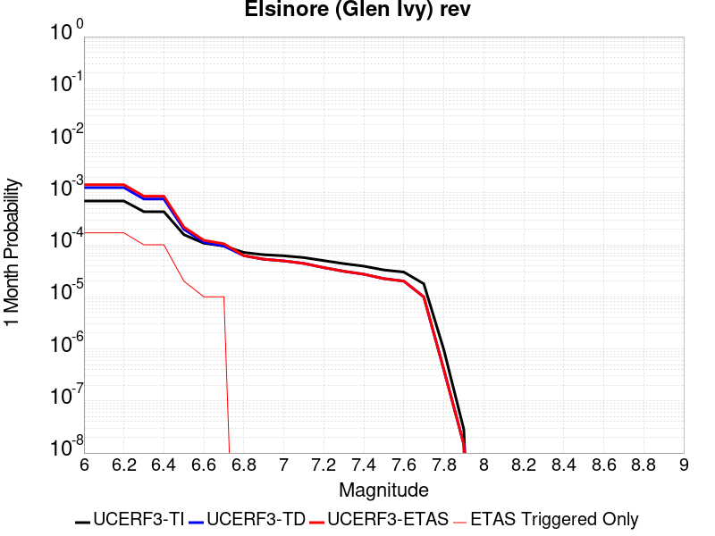 |  |  |

| Magnitude | 1 wk TI Prob | 1 wk TD Prob | 1 wk ETAS Prob | 1 wk ETAS/TD Gain | 1 wk ETAS Triggered Only | 1 mo TI Prob | 1 mo TD Prob | 1 mo ETAS Prob | 1 mo ETAS/TD Gain | 1 mo ETAS Triggered Only | 1 yr TI Prob | 1 yr TD Prob | 1 yr ETAS Prob | 1 yr ETAS/TD Gain | 1 yr ETAS Triggered Only | 10 yr TI Prob | 10 yr TD Prob | 10 yr ETAS Prob | 10 yr ETAS/TD Gain | 10 yr ETAS Triggered Only |
|-----|-----|-----|-----|-----|-----|-----|-----|-----|-----|-----|-----|-----|-----|-----|-----|-----|-----|-----|-----|-----|
| 6.0 | 1.6204086E-4 | 2.937271E-4 | 4.3368596E-4 | 1.4764929 | 1.4E-4 | 6.94276E-4 | 0.0012583778 | 0.001428164 | 1.1349245 | 1.7E-4 | 0.008420097 | 0.0152346175 | 0.015490657 | 1.0168064 | 2.6E-4 | 0.081081145 | 0.13962454 | 0.13994288 | 1.00228 | 3.7E-4 |
| 6.1 | 1.6204086E-4 | 2.937271E-4 | 4.3368596E-4 | 1.4764929 | 1.4E-4 | 6.94276E-4 | 0.0012583778 | 0.001428164 | 1.1349245 | 1.7E-4 | 0.008420097 | 0.0152346175 | 0.015490657 | 1.0168064 | 2.6E-4 | 0.081081145 | 0.13962454 | 0.13994288 | 1.00228 | 3.7E-4 |
| 6.2 | 1.6204086E-4 | 2.937271E-4 | 4.3368596E-4 | 1.4764929 | 1.4E-4 | 6.94276E-4 | 0.0012583778 | 0.001428164 | 1.1349245 | 1.7E-4 | 0.008420097 | 0.0152346175 | 0.015490657 | 1.0168064 | 2.6E-4 | 0.081081145 | 0.13962454 | 0.13994288 | 1.00228 | 3.7E-4 |
| 6.3 | 1.0111737E-4 | 1.7703463E-4 | 2.7701692E-4 | 1.5647613 | 1.0E-4 | 4.332882E-4 | 7.5861585E-4 | 8.5854E-4 | 1.131719 | 1.0E-4 | 0.005262531 | 0.0092177205 | 0.009366338 | 1.016123 | 1.5E-4 | 0.0513964 | 0.08707393 | 0.08731129 | 1.002726 | 2.6E-4 |
| 6.4 | 1.0111737E-4 | 1.7703463E-4 | 2.7701692E-4 | 1.5647613 | 1.0E-4 | 4.332882E-4 | 7.5861585E-4 | 8.5854E-4 | 1.131719 | 1.0E-4 | 0.005262531 | 0.0092177205 | 0.009366338 | 1.016123 | 1.5E-4 | 0.0513964 | 0.08707393 | 0.08731129 | 1.002726 | 2.6E-4 |
| 6.5 | 3.6624708E-5 | 4.6391986E-5 | 6.6391054E-5 | 1.4310889 | 2.0E-5 | 1.569536E-4 | 1.9880968E-4 | 2.188057E-4 | 1.1005788 | 2.0E-5 | 0.001909235 | 0.0024181814 | 0.0024580846 | 1.0165013 | 4.0E-5 | 0.01892915 | 0.023697061 | 0.02375564 | 1.0024719 | 6.0E-5 |
| 6.6 | 2.5051324E-5 | 2.6147465E-5 | 3.61472E-5 | 1.3824363 | 1.0E-5 | 1.073584E-4 | 1.12056E-4 | 1.2205488E-4 | 1.0892311 | 1.0E-5 | 0.0013063047 | 0.0013634725 | 0.0013934316 | 1.0219727 | 3.0E-5 | 0.012986525 | 0.013565759 | 0.0136052165 | 1.0029086 | 4.0E-5 |
| 6.7 | 2.2189772E-5 | 2.2072489E-5 | 3.207227E-5 | 1.4530426 | 1.0E-5 | 9.509556E-5 | 9.459316E-5 | 1.0459221E-4 | 1.1057059 | 1.0E-5 | 0.0011571734 | 0.0011510996 | 0.0011810651 | 1.0260321 | 3.0E-5 | 0.011511663 | 0.0114663225 | 0.011505865 | 1.0034485 | 4.0E-5 |
| 6.8 | 1.6654378E-5 | 1.44376E-5 | 1.44376E-5 | 1.0 | 0.0 | 7.137396E-5 | 6.187399E-5 | 6.187399E-5 | 1.0 | 0.0 | 8.686314E-4 | 7.5306057E-4 | 7.630531E-4 | 1.0132692 | 1.0E-5 | 0.008652439 | 0.0075100763 | 0.007529926 | 1.0026431 | 2.0E-5 |
| 6.9 | 1.5042909E-5 | 1.2331886E-5 | 1.2331886E-5 | 1.0 | 0.0 | 6.446802E-5 | 5.2849886E-5 | 5.2849886E-5 | 1.0 | 0.0 | 7.8461546E-4 | 6.4326054E-4 | 6.4326054E-4 | 1.0 | 0.0 | 0.007818509 | 0.006417925 | 0.006427861 | 1.0015482 | 1.0E-5 |
| 7.0 | 1.4361385E-5 | 1.1451172E-5 | 1.1451172E-5 | 1.0 | 0.0 | 6.154734E-5 | 4.9075545E-5 | 4.9075545E-5 | 1.0 | 0.0 | 7.490812E-4 | 5.973339E-4 | 5.973339E-4 | 1.0 | 0.0 | 0.007465612 | 0.005960982 | 0.005960982 | 1.0 | 0.0 |
| 7.1 | 1.3265571E-5 | 1.0244736E-5 | 1.0244736E-5 | 1.0 | 0.0 | 5.6851208E-5 | 4.3905282E-5 | 4.3905282E-5 | 1.0 | 0.0 | 6.919436E-4 | 5.344183E-4 | 5.344183E-4 | 1.0 | 0.0 | 0.006897931 | 0.0053346003 | 0.0053346003 | 1.0 | 0.0 |
| 7.2 | 1.1596403E-5 | 8.504847E-6 | 8.504847E-6 | 1.0 | 0.0 | 4.9697923E-5 | 3.6448844E-5 | 3.6448844E-5 | 1.0 | 0.0 | 6.049042E-4 | 4.4367602E-4 | 4.4367602E-4 | 1.0 | 0.0 | 0.006032603 | 0.004429357 | 0.004429357 | 1.0 | 0.0 |
| 7.3 | 1.0150827E-5 | 7.238537E-6 | 7.238537E-6 | 1.0 | 0.0 | 4.3502816E-5 | 3.102194E-5 | 3.102194E-5 | 1.0 | 0.0 | 5.2951806E-4 | 3.776281E-4 | 3.776281E-4 | 1.0 | 0.0 | 0.005282581 | 0.003770271 | 0.003770271 | 1.0 | 0.0 |
| 7.4 | 9.080705E-6 | 6.352307E-6 | 6.352307E-6 | 1.0 | 0.0 | 3.8916725E-5 | 2.7223898E-5 | 2.7223898E-5 | 1.0 | 0.0 | 4.7370812E-4 | 3.314019E-4 | 3.314019E-4 | 1.0 | 0.0 | 0.004726996 | 0.0033092257 | 0.0033092257 | 1.0 | 0.0 |
| 7.5 | 7.671649E-6 | 5.225419E-6 | 5.225419E-6 | 1.0 | 0.0 | 3.287808E-5 | 2.2394468E-5 | 2.2394468E-5 | 1.0 | 0.0 | 4.0021708E-4 | 2.7261977E-4 | 2.7261977E-4 | 1.0 | 0.0 | 0.0039949706 | 0.0027229784 | 0.0027229784 | 1.0 | 0.0 |
| 7.6 | 6.990086E-6 | 4.687336E-6 | 4.687336E-6 | 1.0 | 0.0 | 2.9957167E-5 | 2.0088435E-5 | 2.0088435E-5 | 1.0 | 0.0 | 3.6466747E-4 | 2.445504E-4 | 2.445504E-4 | 1.0 | 0.0 | 0.0036406964 | 0.0024429292 | 0.0024429292 | 1.0 | 0.0 |
| 7.7 | 4.163505E-6 | 2.329331E-6 | 2.329331E-6 | 1.0 | 0.0 | 1.7843471E-5 | 9.982813E-6 | 9.982813E-6 | 1.0 | 0.0 | 2.172226E-4 | 1.2153471E-4 | 1.2153471E-4 | 1.0 | 0.0 | 0.0021701038 | 0.0012147555 | 0.0012147555 | 1.0 | 0.0 |
| 7.8 | 2.2692414E-7 | 9.384417E-8 | 9.384417E-8 | 1.0 | 0.0 | 9.725317E-7 | 4.0218927E-7 | 4.0218927E-7 | 1.0 | 0.0 | 1.1840509E-5 | 4.8966467E-6 | 4.8966467E-6 | 1.0 | 0.0 | 1.1839878E-4 | 4.8965718E-5 | 4.8965718E-5 | 1.0 | 0.0 |
| 7.9 | 6.676829E-9 | 3.4397174E-9 | 3.4397174E-9 | 1.0 | 0.0 | 2.861498E-8 | 1.4741646E-8 | 1.4741646E-8 | 1.0 | 0.0 | 3.4838732E-7 | 1.7947953E-7 | 1.7947953E-7 | 1.0 | 0.0 | 3.4838679E-6 | 1.794794E-6 | 1.794794E-6 | 1.0 | 0.0 |

## Lake Isabella (Seismicity)
*[(top)](#table-of-contents)*

| 1 Week | 1 Month | 1 Year | 10 Year |
|-----|-----|-----|-----|
|  |  |  |  |

| Magnitude | 1 wk TI Prob | 1 wk TD Prob | 1 wk ETAS Prob | 1 wk ETAS/TD Gain | 1 wk ETAS Triggered Only | 1 mo TI Prob | 1 mo TD Prob | 1 mo ETAS Prob | 1 mo ETAS/TD Gain | 1 mo ETAS Triggered Only | 1 yr TI Prob | 1 yr TD Prob | 1 yr ETAS Prob | 1 yr ETAS/TD Gain | 1 yr ETAS Triggered Only | 10 yr TI Prob | 10 yr TD Prob | 10 yr ETAS Prob | 10 yr ETAS/TD Gain | 10 yr ETAS Triggered Only |
|-----|-----|-----|-----|-----|-----|-----|-----|-----|-----|-----|-----|-----|-----|-----|-----|-----|-----|-----|-----|-----|
| 6.0 | 9.431637E-6 | 9.741651E-6 | 1.4974028E-4 | 15.37114 | 1.4E-4 | 4.0420677E-5 | 4.1749343E-5 | 2.4174099E-4 | 5.7902946 | 2.0E-4 | 4.920106E-4 | 5.0819275E-4 | 8.180352E-4 | 1.6096947 | 3.1E-4 | 0.004909227 | 0.005071599 | 0.005459621 | 1.0765089 | 3.9E-4 |
| 6.1 | 9.431637E-6 | 9.741651E-6 | 1.4974028E-4 | 15.37114 | 1.4E-4 | 4.0420677E-5 | 4.1749343E-5 | 2.4174099E-4 | 5.7902946 | 2.0E-4 | 4.920106E-4 | 5.0819275E-4 | 8.180352E-4 | 1.6096947 | 3.1E-4 | 0.004909227 | 0.005071599 | 0.005459621 | 1.0765089 | 3.9E-4 |
| 6.2 | 9.431637E-6 | 9.741651E-6 | 1.4974028E-4 | 15.37114 | 1.4E-4 | 4.0420677E-5 | 4.1749343E-5 | 2.4174099E-4 | 5.7902946 | 2.0E-4 | 4.920106E-4 | 5.0819275E-4 | 8.180352E-4 | 1.6096947 | 3.1E-4 | 0.004909227 | 0.005071599 | 0.005459621 | 1.0765089 | 3.9E-4 |
| 6.3 | 9.431637E-6 | 9.741651E-6 | 1.4974028E-4 | 15.37114 | 1.4E-4 | 4.0420677E-5 | 4.1749343E-5 | 2.4174099E-4 | 5.7902946 | 2.0E-4 | 4.920106E-4 | 5.0819275E-4 | 8.180352E-4 | 1.6096947 | 3.1E-4 | 0.004909227 | 0.005071599 | 0.005459621 | 1.0765089 | 3.9E-4 |
| 6.4 | 5.144063E-6 | 5.3000763E-6 | 8.529965E-5 | 16.094044 | 8.0E-5 | 2.2045799E-5 | 2.2714434E-5 | 1.2271217E-4 | 5.402387 | 1.0E-4 | 2.6837454E-4 | 2.765166E-4 | 4.4646958E-4 | 1.6146213 | 1.7E-4 | 0.0026805066 | 0.0027620657 | 0.002951541 | 1.0685991 | 1.9E-4 |
| 6.5 | 5.144063E-6 | 5.3000763E-6 | 8.529965E-5 | 16.094044 | 8.0E-5 | 2.2045799E-5 | 2.2714434E-5 | 1.2271217E-4 | 5.402387 | 1.0E-4 | 2.6837454E-4 | 2.765166E-4 | 4.4646958E-4 | 1.6146213 | 1.7E-4 | 0.0026805066 | 0.0027620657 | 0.002951541 | 1.0685991 | 1.9E-4 |
| 6.6 | 3.4009804E-6 | 3.498786E-6 | 7.3498544E-5 | 21.006868 | 7.0E-5 | 1.4575549E-5 | 1.4994721E-5 | 9.499352E-5 | 6.335131 | 8.0E-5 | 1.7744285E-4 | 1.8254704E-4 | 3.125233E-4 | 1.7120153 | 1.3E-4 | 0.0017730123 | 0.0018241286 | 0.0019638732 | 1.076609 | 1.4E-4 |
| 6.7 | 3.3880428E-6 | 3.4856528E-6 | 7.348541E-5 | 21.082253 | 7.0E-5 | 1.4520103E-5 | 1.4938435E-5 | 9.493724E-5 | 6.355233 | 8.0E-5 | 1.767679E-4 | 1.8186188E-4 | 3.1183823E-4 | 1.7146982 | 1.3E-4 | 0.0017662736 | 0.0018172882 | 0.0019570338 | 1.0768979 | 1.4E-4 |
| 6.8 | 2.6582E-6 | 2.7337003E-6 | 6.273354E-5 | 22.948214 | 6.0E-5 | 1.1392236E-5 | 1.1715813E-5 | 8.171499E-5 | 6.974761 | 7.0E-5 | 1.3869164E-4 | 1.4263204E-4 | 2.5261633E-4 | 1.7711053 | 1.1E-4 | 0.0013860512 | 0.0014255369 | 0.0015453659 | 1.0840588 | 1.2E-4 |
| 6.9 | 2.406011E-6 | 2.4743288E-6 | 6.247418E-5 | 25.24894 | 6.0E-5 | 1.0311434E-5 | 1.0604231E-5 | 8.060349E-5 | 7.601069 | 7.0E-5 | 1.2553448E-4 | 1.2910018E-4 | 2.3908597E-4 | 1.8519415 | 1.1E-4 | 0.0012546359 | 0.0012903814 | 0.0014102266 | 1.0928757 | 1.2E-4 |
| 7.0 | 1.6953097E-6 | 1.7429371E-6 | 5.174285E-5 | 29.687157 | 5.0E-5 | 7.265593E-6 | 7.469715E-6 | 6.7469264E-5 | 9.032374 | 6.0E-5 | 8.8455E-5 | 9.094104E-5 | 1.8093285E-4 | 1.9895623 | 9.0E-5 | 8.84198E-4 | 9.09141E-4 | 0.00100905 | 1.1098939 | 1.0E-4 |
| 7.1 | 3.5013824E-7 | 3.5714822E-7 | 1.0357145E-5 | 28.999569 | 1.0E-5 | 1.5005916E-6 | 1.5306344E-6 | 1.1530619E-5 | 7.533229 | 1.0E-5 | 1.826955E-5 | 1.8635317E-5 | 2.8635131E-5 | 1.5366055 | 1.0E-5 | 1.8268047E-4 | 1.863378E-4 | 1.9633592E-4 | 1.053656 | 1.0E-5 |
| 7.2 | 2.2321095E-7 | 2.2750574E-7 | 1.02275035E-5 | 44.954926 | 1.0E-5 | 9.56618E-7 | 9.750242E-7 | 1.0975014E-5 | 11.2561455 | 1.0E-5 | 1.1646762E-5 | 1.1870856E-5 | 2.1870737E-5 | 1.8423892 | 1.0E-5 | 1.1646151E-4 | 1.1870232E-4 | 1.2870114E-4 | 1.0842344 | 1.0E-5 |
| 7.3 | 1.5760406E-7 | 1.6060922E-7 | 1.0160607E-5 | 63.262917 | 1.0E-5 | 6.7544585E-7 | 6.8832503E-7 | 1.0688318E-5 | 15.528009 | 1.0E-5 | 8.223522E-6 | 8.380326E-6 | 1.8380242E-5 | 2.193261 | 1.0E-5 | 8.2232174E-5 | 8.3800165E-5 | 9.3799325E-5 | 1.1193215 | 1.0E-5 |
| 7.4 | 1.1216497E-7 | 1.1431706E-7 | 1.0114316E-5 | 88.476 | 1.0E-5 | 4.8070694E-7 | 4.899302E-7 | 1.0489925E-5 | 21.411062 | 1.0E-5 | 5.852591E-6 | 5.964884E-6 | 1.5964824E-5 | 2.6764686 | 1.0E-5 | 5.8524372E-5 | 5.9647282E-5 | 6.964669E-5 | 1.1676422 | 1.0E-5 |
| 7.5 | 4.885185E-8 | 4.9787737E-8 | 1.0049787E-5 | 201.85266 | 1.0E-5 | 2.0936506E-7 | 2.13376E-7 | 1.0213374E-5 | 47.865616 | 1.0E-5 | 2.5490165E-6 | 2.59785E-6 | 1.2597824E-5 | 4.849327 | 1.0E-5 | 2.5489873E-5 | 2.5978214E-5 | 3.5977955E-5 | 1.384928 | 1.0E-5 |
| 7.6 | 1.504641E-9 | 1.5317903E-9 | 1.5317903E-9 | 1.0 | 0.0 | 6.4484613E-9 | 6.5648154E-9 | 6.5648154E-9 | 1.0 | 0.0 | 7.851001E-8 | 7.992663E-8 | 7.992663E-8 | 1.0 | 0.0 | 7.8509987E-7 | 7.992663E-7 | 7.992663E-7 | 1.0 | 0.0 |

## San Andreas (Carrizo) rev
*[(top)](#table-of-contents)*

| 1 Week | 1 Month | 1 Year | 10 Year |
|-----|-----|-----|-----|
|  |  |  |  |

| Magnitude | 1 wk TI Prob | 1 wk TD Prob | 1 wk ETAS Prob | 1 wk ETAS/TD Gain | 1 wk ETAS Triggered Only | 1 mo TI Prob | 1 mo TD Prob | 1 mo ETAS Prob | 1 mo ETAS/TD Gain | 1 mo ETAS Triggered Only | 1 yr TI Prob | 1 yr TD Prob | 1 yr ETAS Prob | 1 yr ETAS/TD Gain | 1 yr ETAS Triggered Only | 10 yr TI Prob | 10 yr TD Prob | 10 yr ETAS Prob | 10 yr ETAS/TD Gain | 10 yr ETAS Triggered Only |
|-----|-----|-----|-----|-----|-----|-----|-----|-----|-----|-----|-----|-----|-----|-----|-----|-----|-----|-----|-----|-----|
| 6.0 | 1.1674632E-4 | 2.4324407E-4 | 3.532173E-4 | 1.4521106 | 1.1E-4 | 5.002454E-4 | 0.0010420597 | 0.001201893 | 1.1533821 | 1.6E-4 | 0.006073493 | 0.012613757 | 0.012890225 | 1.0219179 | 2.8E-4 | 0.0591016 | 0.120640226 | 0.120965585 | 1.002697 | 3.7E-4 |
| 6.1 | 1.1674632E-4 | 2.4324407E-4 | 3.532173E-4 | 1.4521106 | 1.1E-4 | 5.002454E-4 | 0.0010420597 | 0.001201893 | 1.1533821 | 1.6E-4 | 0.006073493 | 0.012613757 | 0.012890225 | 1.0219179 | 2.8E-4 | 0.0591016 | 0.120640226 | 0.120965585 | 1.002697 | 3.7E-4 |
| 6.2 | 1.1674632E-4 | 2.4324407E-4 | 3.532173E-4 | 1.4521106 | 1.1E-4 | 5.002454E-4 | 0.0010420597 | 0.001201893 | 1.1533821 | 1.6E-4 | 0.006073493 | 0.012613757 | 0.012890225 | 1.0219179 | 2.8E-4 | 0.0591016 | 0.120640226 | 0.120965585 | 1.002697 | 3.7E-4 |
| 6.3 | 1.1674632E-4 | 2.4324407E-4 | 3.532173E-4 | 1.4521106 | 1.1E-4 | 5.002454E-4 | 0.0010420597 | 0.001201893 | 1.1533821 | 1.6E-4 | 0.006073493 | 0.012613757 | 0.012890225 | 1.0219179 | 2.8E-4 | 0.0591016 | 0.120640226 | 0.120965585 | 1.002697 | 3.7E-4 |
| 6.4 | 1.1674632E-4 | 2.4324407E-4 | 3.532173E-4 | 1.4521106 | 1.1E-4 | 5.002454E-4 | 0.0010420597 | 0.001201893 | 1.1533821 | 1.6E-4 | 0.006073493 | 0.012613757 | 0.012890225 | 1.0219179 | 2.8E-4 | 0.0591016 | 0.120640226 | 0.120965585 | 1.002697 | 3.7E-4 |
| 6.5 | 1.13136164E-4 | 2.3644442E-4 | 3.464184E-4 | 1.4651157 | 1.1E-4 | 4.847792E-4 | 0.0010129412 | 0.0011627893 | 1.1479336 | 1.5E-4 | 0.0058862255 | 0.012263271 | 0.01252996 | 1.021747 | 2.7E-4 | 0.057327334 | 0.11761008 | 0.11792774 | 1.0027009 | 3.6E-4 |
| 6.6 | 1.13136164E-4 | 2.3644442E-4 | 3.464184E-4 | 1.4651157 | 1.1E-4 | 4.847792E-4 | 0.0010129412 | 0.0011627893 | 1.1479336 | 1.5E-4 | 0.0058862255 | 0.012263271 | 0.01252996 | 1.021747 | 2.7E-4 | 0.057327334 | 0.11761008 | 0.11792774 | 1.0027009 | 3.6E-4 |
| 6.7 | 1.1149675E-4 | 2.3335687E-4 | 3.433312E-4 | 1.471271 | 1.1E-4 | 4.777557E-4 | 9.997191E-4 | 0.0011495692 | 1.1498921 | 1.5E-4 | 0.0058011734 | 0.012104088 | 0.01237082 | 1.0220366 | 2.7E-4 | 0.05652051 | 0.1162291 | 0.11654726 | 1.0027373 | 3.6E-4 |
| 6.8 | 1.1103589E-4 | 2.3237852E-4 | 3.4235296E-4 | 1.4732556 | 1.1E-4 | 4.7578133E-4 | 9.955293E-4 | 0.00114538 | 1.1505237 | 1.5E-4 | 0.005777263 | 0.012053643 | 0.012320389 | 1.0221299 | 2.7E-4 | 0.056293584 | 0.11578894 | 0.116107255 | 1.0027491 | 3.6E-4 |
| 6.9 | 1.1053259E-4 | 2.3130233E-4 | 3.412769E-4 | 1.475458 | 1.1E-4 | 4.7362508E-4 | 9.909206E-4 | 0.001140772 | 1.1512244 | 1.5E-4 | 0.0057511497 | 0.011998152 | 0.012255033 | 1.02141 | 2.6E-4 | 0.05604569 | 0.11530445 | 0.11561409 | 1.0026854 | 3.5E-4 |
| 7.0 | 1.1005377E-4 | 2.3031076E-4 | 3.4028542E-4 | 1.4775056 | 1.1E-4 | 4.7157376E-4 | 9.866742E-4 | 0.0011365262 | 1.1518759 | 1.5E-4 | 0.0057263062 | 0.011947021 | 0.012203915 | 1.0215027 | 2.6E-4 | 0.055809796 | 0.11485658 | 0.11516638 | 1.0026972 | 3.5E-4 |
| 7.1 | 1.0308142E-4 | 2.1540876E-4 | 3.153872E-4 | 1.4641336 | 1.0E-4 | 4.417027E-4 | 9.228548E-4 | 0.0010627257 | 1.1515632 | 1.4E-4 | 0.0053644776 | 0.011178188 | 0.011405618 | 1.0203458 | 2.3E-4 | 0.052368138 | 0.10809042 | 0.10837583 | 1.0026405 | 3.2E-4 |
| 7.2 | 1.0027479E-4 | 2.094876E-4 | 2.9946875E-4 | 1.4295297 | 9.0E-5 | 4.296783E-4 | 8.9749607E-4 | 0.0010273794 | 1.1447175 | 1.3E-4 | 0.0052187922 | 0.010872566 | 0.011090174 | 1.0200144 | 2.2E-4 | 0.050979212 | 0.10539086 | 0.10566819 | 1.0026314 | 3.1E-4 |
| 7.3 | 9.816942E-5 | 2.0423878E-4 | 2.942204E-4 | 1.4405707 | 9.0E-5 | 4.2065824E-4 | 8.7501644E-4 | 0.0010049026 | 1.1484387 | 1.3E-4 | 0.005109493 | 0.010601572 | 0.01081924 | 1.0205317 | 2.2E-4 | 0.049935985 | 0.10297545 | 0.10325353 | 1.0027004 | 3.1E-4 |
| 7.4 | 9.5634205E-5 | 1.9793298E-4 | 2.7791716E-4 | 1.4040972 | 8.0E-5 | 4.0979648E-4 | 8.4800937E-4 | 9.679076E-4 | 1.1413878 | 1.2E-4 | 0.0049778637 | 0.010275901 | 0.010483744 | 1.0202261 | 2.1E-4 | 0.048678253 | 0.100067884 | 0.10033786 | 1.002698 | 3.0E-4 |
| 7.5 | 8.052417E-5 | 1.6113915E-4 | 2.3112788E-4 | 1.4343371 | 7.0E-5 | 3.4505792E-4 | 6.9041376E-4 | 7.903447E-4 | 1.1447407 | 1.0E-4 | 0.0041929903 | 0.008373471 | 0.008532132 | 1.018948 | 1.6E-4 | 0.04114753 | 0.082815245 | 0.08302619 | 1.0025473 | 2.3E-4 |
| 7.6 | 7.897024E-5 | 1.5767086E-4 | 2.2765982E-4 | 1.4438928 | 7.0E-5 | 3.384E-4 | 6.755574E-4 | 7.6549663E-4 | 1.1331333 | 9.0E-5 | 0.0041122385 | 0.00819397 | 0.008342741 | 1.0181562 | 1.5E-4 | 0.040369697 | 0.08115866 | 0.081351615 | 1.0023775 | 2.1E-4 |
| 7.7 | 6.707427E-5 | 1.3277122E-4 | 1.9276325E-4 | 1.4518452 | 6.0E-5 | 2.8742946E-4 | 5.688955E-4 | 6.4885E-4 | 1.1405433 | 8.0E-5 | 0.003493839 | 0.0069043385 | 0.0070334408 | 1.0186987 | 1.3E-4 | 0.034394164 | 0.06905339 | 0.06923027 | 1.0025615 | 1.9E-4 |
| 7.8 | 6.147705E-5 | 1.2198445E-4 | 1.7197835E-4 | 1.4098383 | 5.0E-5 | 2.6344648E-4 | 5.226858E-4 | 5.926492E-4 | 1.1338537 | 7.0E-5 | 0.0032027436 | 0.006345156 | 0.0064445217 | 1.01566 | 1.0E-4 | 0.031569764 | 0.0635172 | 0.063657664 | 1.0022116 | 1.5E-4 |
| 7.9 | 4.7636717E-5 | 8.8802946E-5 | 1.0880117E-4 | 1.2251978 | 2.0E-5 | 2.0414138E-4 | 3.8052857E-4 | 4.1051715E-4 | 1.0788077 | 3.0E-5 | 0.0024825884 | 0.004623101 | 0.004682824 | 1.0129184 | 6.0E-5 | 0.024550365 | 0.046629366 | 0.0467247 | 1.0020446 | 1.0E-4 |
| 8.0 | 3.3554235E-5 | 5.2138024E-5 | 6.213751E-5 | 1.1917886 | 1.0E-5 | 1.4379594E-4 | 2.2342955E-4 | 2.3342732E-4 | 1.0447469 | 1.0E-5 | 0.0017493097 | 0.002716863 | 0.0027467816 | 1.0110122 | 3.0E-5 | 0.017356034 | 0.027881905 | 0.02792079 | 1.0013946 | 4.0E-5 |
| 8.1 | 1.9175432E-5 | 1.9183564E-5 | 1.9183564E-5 | 1.0 | 0.0 | 8.217783E-5 | 8.221269E-5 | 8.221269E-5 | 1.0 | 0.0 | 0.0010000558 | 0.0010004805 | 0.0010104704 | 1.0099852 | 1.0E-5 | 0.009955673 | 0.010757771 | 0.010777556 | 1.0018392 | 2.0E-5 |
| 8.2 | 8.643924E-6 | 5.473668E-6 | 5.473668E-6 | 1.0 | 0.0 | 3.704486E-5 | 2.3458366E-5 | 2.3458366E-5 | 1.0 | 0.0 | 4.5092785E-4 | 2.8556827E-4 | 2.955654E-4 | 1.035008 | 1.0E-5 | 0.0045001395 | 0.0032481793 | 0.003258147 | 1.0030687 | 1.0E-5 |
| 8.3 | 1.983087E-6 | 7.6564595E-7 | 7.6564595E-7 | 1.0 | 0.0 | 8.498917E-6 | 3.281336E-6 | 3.281336E-6 | 1.0 | 0.0 | 1.034694E-4 | 3.9949547E-5 | 3.9949547E-5 | 1.0 | 0.0 | 0.0010342124 | 4.717979E-4 | 4.717979E-4 | 1.0 | 0.0 |

## San Andreas (Cholame) rev
*[(top)](#table-of-contents)*

| 1 Week | 1 Month | 1 Year | 10 Year |
|-----|-----|-----|-----|
|  |  |  |  |

| Magnitude | 1 wk TI Prob | 1 wk TD Prob | 1 wk ETAS Prob | 1 wk ETAS/TD Gain | 1 wk ETAS Triggered Only | 1 mo TI Prob | 1 mo TD Prob | 1 mo ETAS Prob | 1 mo ETAS/TD Gain | 1 mo ETAS Triggered Only | 1 yr TI Prob | 1 yr TD Prob | 1 yr ETAS Prob | 1 yr ETAS/TD Gain | 1 yr ETAS Triggered Only | 10 yr TI Prob | 10 yr TD Prob | 10 yr ETAS Prob | 10 yr ETAS/TD Gain | 10 yr ETAS Triggered Only |
|-----|-----|-----|-----|-----|-----|-----|-----|-----|-----|-----|-----|-----|-----|-----|-----|-----|-----|-----|-----|-----|
| 6.0 | 1.2302514E-4 | 2.5205986E-4 | 3.6203212E-4 | 1.4362943 | 1.1E-4 | 5.27144E-4 | 0.0010798109 | 0.001229649 | 1.1387632 | 1.5E-4 | 0.0063991086 | 0.013067958 | 0.01332456 | 1.019636 | 2.6E-4 | 0.06217949 | 0.12438412 | 0.12469934 | 1.0025343 | 3.6E-4 |
| 6.1 | 1.2302514E-4 | 2.5205986E-4 | 3.6203212E-4 | 1.4362943 | 1.1E-4 | 5.27144E-4 | 0.0010798109 | 0.001229649 | 1.1387632 | 1.5E-4 | 0.0063991086 | 0.013067958 | 0.01332456 | 1.019636 | 2.6E-4 | 0.06217949 | 0.12438412 | 0.12469934 | 1.0025343 | 3.6E-4 |
| 6.2 | 1.2203569E-4 | 2.502277E-4 | 3.6020018E-4 | 1.4394896 | 1.1E-4 | 5.2290526E-4 | 0.0010719653 | 0.0012218045 | 1.1397799 | 1.5E-4 | 0.006347804 | 0.012973578 | 0.013230205 | 1.0197808 | 2.6E-4 | 0.061695136 | 0.12357131 | 0.12388682 | 1.0025533 | 3.6E-4 |
| 6.3 | 1.2142645E-4 | 2.4908737E-4 | 3.5905998E-4 | 1.4415021 | 1.1E-4 | 5.202953E-4 | 0.0010670823 | 0.0012169222 | 1.1404202 | 1.5E-4 | 0.006316212 | 0.012914834 | 0.013171475 | 1.0198718 | 2.6E-4 | 0.06139677 | 0.123065315 | 0.12338102 | 1.0025653 | 3.6E-4 |
| 6.4 | 1.1865206E-4 | 2.4414246E-4 | 3.541156E-4 | 1.4504466 | 1.1E-4 | 5.0840975E-4 | 0.0010459068 | 0.00119575 | 1.1432662 | 1.5E-4 | 0.006172335 | 0.012660044 | 0.012916752 | 1.020277 | 2.6E-4 | 0.060036868 | 0.12085904 | 0.12117553 | 1.0026187 | 3.6E-4 |
| 6.5 | 1.17443946E-4 | 2.4207575E-4 | 3.5204913E-4 | 1.4542933 | 1.1E-4 | 5.032341E-4 | 0.0010370566 | 0.001186901 | 1.1444901 | 1.5E-4 | 0.006109677 | 0.012553536 | 0.012810272 | 1.0204513 | 2.6E-4 | 0.059444077 | 0.11993008 | 0.1202469 | 1.0026418 | 3.6E-4 |
| 6.6 | 1.13579066E-4 | 2.3516564E-4 | 3.4513976E-4 | 1.4676454 | 1.1E-4 | 4.866766E-4 | 0.001007465 | 0.0011573138 | 1.1487385 | 1.5E-4 | 0.0059092017 | 0.012197345 | 0.0124541735 | 1.021056 | 2.6E-4 | 0.057545185 | 0.1168492 | 0.11716713 | 1.002721 | 3.6E-4 |
| 6.7 | 1.1271412E-4 | 2.336088E-4 | 3.4358312E-4 | 1.4707627 | 1.1E-4 | 4.829711E-4 | 0.001000798 | 0.0011506479 | 1.1497304 | 1.5E-4 | 0.005864331 | 0.012117079 | 0.012373929 | 1.0211973 | 2.6E-4 | 0.057119697 | 0.11615275 | 0.11647093 | 1.0027393 | 3.6E-4 |
| 6.8 | 1.1217975E-4 | 2.3249313E-4 | 3.4246754E-4 | 1.4730222 | 1.1E-4 | 4.8068175E-4 | 9.960202E-4 | 0.0011458708 | 1.1504494 | 1.5E-4 | 0.005836608 | 0.012059555 | 0.01231642 | 1.0212997 | 2.6E-4 | 0.056856725 | 0.11565061 | 0.11596897 | 1.0027528 | 3.6E-4 |
| 6.9 | 1.1146753E-4 | 2.3098059E-4 | 3.409552E-4 | 1.4761205 | 1.1E-4 | 4.7763053E-4 | 9.895428E-4 | 0.0011393944 | 1.1514351 | 1.5E-4 | 0.0057996577 | 0.011981564 | 0.012228568 | 1.0206153 | 2.5E-4 | 0.056506127 | 0.11497027 | 0.115280025 | 1.0026942 | 3.5E-4 |
| 7.0 | 1.0965793E-4 | 2.2721413E-4 | 3.3718912E-4 | 1.4840149 | 1.1E-4 | 4.698779E-4 | 9.734129E-4 | 0.0011232669 | 1.153947 | 1.5E-4 | 0.005705768 | 0.011787324 | 0.012034377 | 1.0209593 | 2.5E-4 | 0.055614736 | 0.11327011 | 0.113580465 | 1.0027399 | 3.5E-4 |
| 7.1 | 9.927982E-5 | 2.0540332E-4 | 3.0538277E-4 | 1.486747 | 1.0E-4 | 4.2541555E-4 | 8.8000396E-4 | 0.0010198808 | 1.1589502 | 1.4E-4 | 0.0051671406 | 0.010661708 | 0.010889256 | 1.0213425 | 2.3E-4 | 0.05048634 | 0.10336573 | 0.10365265 | 1.0027758 | 3.2E-4 |
| 7.2 | 9.696786E-5 | 2.0044584E-4 | 2.904278E-4 | 1.448909 | 9.0E-5 | 4.1551032E-4 | 8.587718E-4 | 9.886601E-4 | 1.1512489 | 1.3E-4 | 0.00504711 | 0.010405703 | 0.010623414 | 1.0209223 | 2.2E-4 | 0.04934009 | 0.10110233 | 0.10138099 | 1.0027562 | 3.1E-4 |
| 7.3 | 9.4727984E-5 | 1.9473763E-4 | 2.847201E-4 | 1.4620703 | 9.0E-5 | 4.0591392E-4 | 8.343239E-4 | 9.6421543E-4 | 1.1556848 | 1.3E-4 | 0.0049308087 | 0.010110851 | 0.010328626 | 1.0215389 | 2.2E-4 | 0.048228268 | 0.09847412 | 0.098753594 | 1.002838 | 3.1E-4 |
| 7.4 | 9.220358E-5 | 1.8844259E-4 | 2.684275E-4 | 1.4244525 | 8.0E-5 | 3.9509835E-4 | 8.07362E-4 | 9.2726515E-4 | 1.1485122 | 1.2E-4 | 0.004799717 | 0.009785578 | 0.009993522 | 1.0212501 | 2.1E-4 | 0.046973653 | 0.09555831 | 0.095829636 | 1.0028394 | 3.0E-4 |
| 7.5 | 7.71631E-5 | 1.5179155E-4 | 2.2178092E-4 | 1.4610888 | 7.0E-5 | 3.306571E-4 | 6.5037323E-4 | 7.5030816E-4 | 1.1536579 | 1.0E-4 | 0.0040183207 | 0.007889617 | 0.008048355 | 1.0201198 | 1.6E-4 | 0.03946433 | 0.078289196 | 0.07850119 | 1.0027078 | 2.3E-4 |
| 7.6 | 7.5634416E-5 | 1.4838556E-4 | 2.1837518E-4 | 1.471674 | 7.0E-5 | 3.241072E-4 | 6.357833E-4 | 7.257261E-4 | 1.1414677 | 9.0E-5 | 0.0039388672 | 0.007713256 | 0.0078620985 | 1.019297 | 1.5E-4 | 0.038697794 | 0.076654874 | 0.076848775 | 1.0025295 | 2.1E-4 |
| 7.7 | 6.3783E-5 | 1.2359623E-4 | 1.8358881E-4 | 1.4853917 | 6.0E-5 | 2.7332708E-4 | 5.2959064E-4 | 6.095483E-4 | 1.1509801 | 8.0E-5 | 0.0033226798 | 0.0064287307 | 0.006557895 | 1.0200918 | 1.3E-4 | 0.032734364 | 0.06454488 | 0.06472261 | 1.0027537 | 1.9E-4 |
| 7.8 | 5.863422E-5 | 1.14169685E-4 | 1.6416398E-4 | 1.4378946 | 5.0E-5 | 2.512653E-4 | 4.892069E-4 | 5.591727E-4 | 1.1430187 | 7.0E-5 | 0.003054864 | 0.0059398497 | 0.0060392558 | 1.0167354 | 1.0E-4 | 0.030132094 | 0.05966162 | 0.05980267 | 1.0023642 | 1.5E-4 |
| 7.9 | 4.595283E-5 | 8.426815E-5 | 1.04266466E-4 | 1.2373176 | 2.0E-5 | 1.9692584E-4 | 3.6109926E-4 | 3.910884E-4 | 1.0830497 | 3.0E-5 | 0.0023949358 | 0.0043875277 | 0.004447264 | 1.0136151 | 6.0E-5 | 0.023692891 | 0.044363137 | 0.044458702 | 1.0021541 | 1.0E-4 |
| 8.0 | 3.2950178E-5 | 5.077396E-5 | 6.0773455E-5 | 1.1969414 | 1.0E-5 | 1.412074E-4 | 2.1758456E-4 | 2.2758238E-4 | 1.0459491 | 1.0E-5 | 0.0017178444 | 0.0026458753 | 0.002675796 | 1.0113084 | 3.0E-5 | 0.017046256 | 0.027181072 | 0.027219985 | 1.0014316 | 4.0E-5 |
| 8.1 | 1.9177472E-5 | 1.9183733E-5 | 1.9183733E-5 | 1.0 | 0.0 | 8.218658E-5 | 8.221342E-5 | 8.221342E-5 | 1.0 | 0.0 | 0.0010001622 | 0.0010004893 | 0.0010104793 | 1.0099851 | 1.0E-5 | 0.009956728 | 0.010757887 | 0.010777672 | 1.001839 | 2.0E-5 |
| 8.2 | 8.643924E-6 | 5.473668E-6 | 5.473668E-6 | 1.0 | 0.0 | 3.704486E-5 | 2.3458366E-5 | 2.3458366E-5 | 1.0 | 0.0 | 4.5092785E-4 | 2.8556827E-4 | 2.955654E-4 | 1.035008 | 1.0E-5 | 0.0045001395 | 0.0032481793 | 0.003258147 | 1.0030687 | 1.0E-5 |
| 8.3 | 1.983087E-6 | 7.6564595E-7 | 7.6564595E-7 | 1.0 | 0.0 | 8.498917E-6 | 3.281336E-6 | 3.281336E-6 | 1.0 | 0.0 | 1.034694E-4 | 3.9949547E-5 | 3.9949547E-5 | 1.0 | 0.0 | 0.0010342124 | 4.717979E-4 | 4.717979E-4 | 1.0 | 0.0 |

## Death Valley (Fish Lake Valley)
*[(top)](#table-of-contents)*

| 1 Week | 1 Month | 1 Year | 10 Year |
|-----|-----|-----|-----|
|  |  |  |  |

| Magnitude | 1 wk TI Prob | 1 wk TD Prob | 1 wk ETAS Prob | 1 wk ETAS/TD Gain | 1 wk ETAS Triggered Only | 1 mo TI Prob | 1 mo TD Prob | 1 mo ETAS Prob | 1 mo ETAS/TD Gain | 1 mo ETAS Triggered Only | 1 yr TI Prob | 1 yr TD Prob | 1 yr ETAS Prob | 1 yr ETAS/TD Gain | 1 yr ETAS Triggered Only | 10 yr TI Prob | 10 yr TD Prob | 10 yr ETAS Prob | 10 yr ETAS/TD Gain | 10 yr ETAS Triggered Only |
|-----|-----|-----|-----|-----|-----|-----|-----|-----|-----|-----|-----|-----|-----|-----|-----|-----|-----|-----|-----|-----|
| 6.0 | 3.872328E-5 | 4.7265705E-5 | 2.0725814E-4 | 4.3849583 | 1.6E-4 | 1.6594635E-4 | 2.0255324E-4 | 4.0251273E-4 | 1.9871947 | 2.0E-4 | 0.0020185246 | 0.0024635606 | 0.0027328955 | 1.1093274 | 2.7E-4 | 0.02000288 | 0.024388338 | 0.024739558 | 1.0144012 | 3.6E-4 |
| 6.1 | 3.872328E-5 | 4.7265705E-5 | 2.0725814E-4 | 4.3849583 | 1.6E-4 | 1.6594635E-4 | 2.0255324E-4 | 4.0251273E-4 | 1.9871947 | 2.0E-4 | 0.0020185246 | 0.0024635606 | 0.0027328955 | 1.1093274 | 2.7E-4 | 0.02000288 | 0.024388338 | 0.024739558 | 1.0144012 | 3.6E-4 |
| 6.2 | 3.872328E-5 | 4.7265705E-5 | 2.0725814E-4 | 4.3849583 | 1.6E-4 | 1.6594635E-4 | 2.0255324E-4 | 4.0251273E-4 | 1.9871947 | 2.0E-4 | 0.0020185246 | 0.0024635606 | 0.0027328955 | 1.1093274 | 2.7E-4 | 0.02000288 | 0.024388338 | 0.024739558 | 1.0144012 | 3.6E-4 |
| 6.3 | 2.8356371E-5 | 3.360979E-5 | 1.9360441E-4 | 5.760358 | 1.6E-4 | 1.2152165E-4 | 1.4403443E-4 | 3.4400562E-4 | 2.388357 | 2.0E-4 | 0.0014785219 | 0.0017522788 | 0.0020218056 | 1.153815 | 2.7E-4 | 0.014687235 | 0.017391816 | 0.017745554 | 1.0203394 | 3.6E-4 |
| 6.4 | 2.8356371E-5 | 3.360979E-5 | 1.9360441E-4 | 5.760358 | 1.6E-4 | 1.2152165E-4 | 1.4403443E-4 | 3.4400562E-4 | 2.388357 | 2.0E-4 | 0.0014785219 | 0.0017522788 | 0.0020218056 | 1.153815 | 2.7E-4 | 0.014687235 | 0.017391816 | 0.017745554 | 1.0203394 | 3.6E-4 |
| 6.5 | 2.4448687E-5 | 2.8607585E-5 | 1.8860301E-4 | 6.5927625 | 1.6E-4 | 1.0477588E-4 | 1.2259845E-4 | 3.2257393E-4 | 2.6311421 | 2.0E-4 | 0.0012748998 | 0.0014916616 | 0.0017612589 | 1.1807362 | 2.7E-4 | 0.012676105 | 0.014821392 | 0.015176056 | 1.0239292 | 3.6E-4 |
| 6.6 | 2.1298161E-5 | 2.4660083E-5 | 1.8465614E-4 | 7.488058 | 1.6E-4 | 9.127464E-5 | 1.0568197E-4 | 3.0566083E-4 | 2.8922706 | 2.0E-4 | 0.0011107022 | 0.0012859512 | 0.001555604 | 1.2096913 | 2.7E-4 | 0.011051672 | 0.01278853 | 0.013143927 | 1.0277902 | 3.6E-4 |
| 6.7 | 1.8959729E-5 | 2.1781027E-5 | 1.8177755E-4 | 8.345683 | 1.6E-4 | 8.125345E-5 | 9.334406E-5 | 2.933254E-4 | 3.142411 | 2.0E-4 | 9.888117E-4 | 0.001135897 | 0.0014055903 | 1.2374276 | 2.7E-4 | 0.009844234 | 0.01130357 | 0.011659501 | 1.0314883 | 3.6E-4 |
| 6.8 | 1.6691629E-5 | 1.9018351E-5 | 1.790153E-4 | 9.412766 | 1.6E-4 | 7.153359E-5 | 8.150477E-5 | 2.8148846E-4 | 3.453644 | 2.0E-4 | 8.7057345E-4 | 9.918857E-4 | 0.0012616179 | 1.2719388 | 2.7E-4 | 0.008671708 | 0.009876343 | 0.0102327885 | 1.0360907 | 3.6E-4 |
| 6.9 | 1.450505E-5 | 1.638954E-5 | 1.7638692E-4 | 10.762164 | 1.6E-4 | 6.216302E-5 | 7.0239046E-5 | 2.70225E-4 | 3.8472192 | 2.0E-4 | 7.5657194E-4 | 8.5483363E-4 | 0.0011246029 | 1.315581 | 2.7E-4 | 0.007540013 | 0.008516385 | 0.00887332 | 1.0419115 | 3.6E-4 |
| 7.0 | 1.2940855E-5 | 1.4537972E-5 | 1.7453564E-4 | 12.005502 | 1.6E-4 | 5.545963E-5 | 6.230414E-5 | 2.6229167E-4 | 4.20986 | 2.0E-4 | 6.750118E-4 | 7.5829466E-4 | 0.0010280899 | 1.355792 | 2.7E-4 | 0.006729651 | 0.0075576897 | 0.007914969 | 1.0472736 | 3.6E-4 |
| 7.1 | 1.2544658E-5 | 1.4078208E-5 | 1.7407596E-4 | 12.3649235 | 1.6E-4 | 5.3761712E-5 | 6.0333812E-5 | 2.6032174E-4 | 4.314691 | 2.0E-4 | 6.5435225E-4 | 7.343222E-4 | 0.001004124 | 1.367416 | 2.7E-4 | 0.006524288 | 0.007319551 | 0.0076769157 | 1.0488234 | 3.6E-4 |
| 7.2 | 1.2489416E-5 | 1.4015674E-5 | 1.7401343E-4 | 12.41563 | 1.6E-4 | 5.3524967E-5 | 6.0065824E-5 | 2.600538E-4 | 4.3294806 | 2.0E-4 | 6.514716E-4 | 7.310616E-4 | 0.0010008642 | 1.3690559 | 2.7E-4 | 0.006495651 | 0.0072871596 | 0.0076445364 | 1.049042 | 3.6E-4 |
| 7.3 | 1.2368307E-5 | 1.3879812E-5 | 1.7387759E-4 | 12.527373 | 1.6E-4 | 5.3005948E-5 | 5.9483587E-5 | 2.5947168E-4 | 4.362072 | 2.0E-4 | 6.451563E-4 | 7.2397763E-4 | 9.937822E-4 | 1.3726697 | 2.7E-4 | 0.0064328653 | 0.007216782 | 0.007574184 | 1.0495237 | 3.6E-4 |
| 7.4 | 1.2161707E-5 | 1.36478675E-5 | 1.7364569E-4 | 12.723283 | 1.6E-4 | 5.212056E-5 | 5.8489582E-5 | 2.5847787E-4 | 4.4192123 | 2.0E-4 | 6.3438306E-4 | 7.118836E-4 | 9.816914E-4 | 1.3790054 | 2.7E-4 | 0.006325751 | 0.0070966207 | 0.0074540656 | 1.0503684 | 3.6E-4 |
| 7.5 | 1.1707948E-5 | 1.3145515E-5 | 1.7314342E-4 | 13.171291 | 1.6E-4 | 5.0175953E-5 | 5.6336736E-5 | 2.5632547E-4 | 4.5498815 | 2.0E-4 | 6.10721E-4 | 6.856895E-4 | 9.5550437E-4 | 1.3934942 | 2.7E-4 | 0.0060904534 | 0.006836321 | 0.00719386 | 1.0522999 | 3.6E-4 |
| 7.6 | 1.0319538E-5 | 1.1579622E-5 | 1.7157778E-4 | 14.817217 | 1.6E-4 | 4.4225842E-5 | 4.9626036E-5 | 2.496161E-4 | 5.0299425 | 2.0E-4 | 5.383166E-4 | 6.040347E-4 | 8.6387765E-4 | 1.4301789 | 2.6E-4 | 0.0053701443 | 0.0060244603 | 0.006352472 | 1.0544467 | 3.3E-4 |
| 7.7 | 8.937764E-6 | 1.0022779E-5 | 1.6002127E-4 | 15.965759 | 1.5E-4 | 3.830414E-5 | 4.295409E-5 | 2.3294592E-4 | 5.4231377 | 1.9E-4 | 4.6625308E-4 | 5.228456E-4 | 7.627201E-4 | 1.4587865 | 2.4E-4 | 0.0046527605 | 0.005216664 | 0.005515099 | 1.0572081 | 3.0E-4 |
| 7.8 | 3.108007E-7 | 3.284654E-7 | 1.0328462E-5 | 31.444597 | 1.0E-5 | 1.3320023E-6 | 1.407708E-6 | 1.1407694E-5 | 8.103736 | 1.0E-5 | 1.6217007E-5 | 1.7138715E-5 | 2.7138543E-5 | 1.5834643 | 1.0E-5 | 1.6215823E-4 | 1.7137431E-4 | 1.813726E-4 | 1.0583419 | 1.0E-5 |
| 7.9 | 2.5591178E-9 | 2.6696718E-9 | 2.6696718E-9 | 1.0 | 0.0 | 1.0967647E-8 | 1.14414505E-8 | 1.14414505E-8 | 1.0 | 0.0 | 1.335311E-7 | 1.3929966E-7 | 1.3929966E-7 | 1.0 | 0.0 | 1.3353102E-6 | 1.3929966E-6 | 1.3929966E-6 | 1.0 | 0.0 |

## Calico-Hidalgo
*[(top)](#table-of-contents)*

| 1 Week | 1 Month | 1 Year | 10 Year |
|-----|-----|-----|-----|
|  |  |  |  |

| Magnitude | 1 wk TI Prob | 1 wk TD Prob | 1 wk ETAS Prob | 1 wk ETAS/TD Gain | 1 wk ETAS Triggered Only | 1 mo TI Prob | 1 mo TD Prob | 1 mo ETAS Prob | 1 mo ETAS/TD Gain | 1 mo ETAS Triggered Only | 1 yr TI Prob | 1 yr TD Prob | 1 yr ETAS Prob | 1 yr ETAS/TD Gain | 1 yr ETAS Triggered Only | 10 yr TI Prob | 10 yr TD Prob | 10 yr ETAS Prob | 10 yr ETAS/TD Gain | 10 yr ETAS Triggered Only |
|-----|-----|-----|-----|-----|-----|-----|-----|-----|-----|-----|-----|-----|-----|-----|-----|-----|-----|-----|-----|-----|
| 6.0 | 4.0906612E-5 | 5.0704355E-5 | 1.8069777E-4 | 3.5637522 | 1.3E-4 | 1.7530227E-4 | 2.1728857E-4 | 3.9724945E-4 | 1.8282114 | 1.8E-4 | 0.0021322158 | 0.002642678 | 0.0028620968 | 1.0830289 | 2.2E-4 | 0.02111873 | 0.026152814 | 0.026474183 | 1.0122881 | 3.3E-4 |
| 6.1 | 4.0906612E-5 | 5.0704355E-5 | 1.8069777E-4 | 3.5637522 | 1.3E-4 | 1.7530227E-4 | 2.1728857E-4 | 3.9724945E-4 | 1.8282114 | 1.8E-4 | 0.0021322158 | 0.002642678 | 0.0028620968 | 1.0830289 | 2.2E-4 | 0.02111873 | 0.026152814 | 0.026474183 | 1.0122881 | 3.3E-4 |
| 6.2 | 4.0906612E-5 | 5.0704355E-5 | 1.8069777E-4 | 3.5637522 | 1.3E-4 | 1.7530227E-4 | 2.1728857E-4 | 3.9724945E-4 | 1.8282114 | 1.8E-4 | 0.0021322158 | 0.002642678 | 0.0028620968 | 1.0830289 | 2.2E-4 | 0.02111873 | 0.026152814 | 0.026474183 | 1.0122881 | 3.3E-4 |
| 6.3 | 2.4242801E-5 | 3.0090967E-5 | 1.2008826E-4 | 3.9908407 | 9.0E-5 | 1.0389358E-4 | 1.289551E-4 | 2.3894092E-4 | 1.8529 | 1.1E-4 | 0.0012641704 | 0.0015689312 | 0.0017087115 | 1.0890927 | 1.4E-4 | 0.01257003 | 0.015582229 | 0.015808646 | 1.0145304 | 2.3E-4 |
| 6.4 | 2.4242801E-5 | 3.0090967E-5 | 1.2008826E-4 | 3.9908407 | 9.0E-5 | 1.0389358E-4 | 1.289551E-4 | 2.3894092E-4 | 1.8529 | 1.1E-4 | 0.0012641704 | 0.0015689312 | 0.0017087115 | 1.0890927 | 1.4E-4 | 0.01257003 | 0.015582229 | 0.015808646 | 1.0145304 | 2.3E-4 |
| 6.5 | 2.0286952E-5 | 2.5316054E-5 | 1.1531378E-4 | 4.5549664 | 9.0E-5 | 8.694118E-5 | 1.0849296E-4 | 2.1848103E-4 | 2.0137806 | 1.1E-4 | 0.0010579949 | 0.0013201186 | 0.0014499469 | 1.098346 | 1.3E-4 | 0.010529719 | 0.013124701 | 0.013331944 | 1.0157903 | 2.1E-4 |
| 6.6 | 2.0269223E-5 | 2.5297004E-5 | 1.1529473E-4 | 4.5576434 | 9.0E-5 | 8.6865206E-5 | 1.08411325E-4 | 2.183994E-4 | 2.0145442 | 1.1E-4 | 0.0010570707 | 0.0013191258 | 0.0014489543 | 1.0984201 | 1.3E-4 | 0.010520565 | 0.01311489 | 0.013322136 | 1.0158024 | 2.1E-4 |
| 6.7 | 1.799852E-5 | 2.2540933E-5 | 1.125389E-4 | 4.992646 | 9.0E-5 | 7.713423E-5 | 9.660051E-5 | 1.9659085E-4 | 2.0350912 | 1.0E-4 | 9.3870464E-4 | 0.0011754911 | 0.0012953501 | 1.101965 | 1.2E-4 | 0.009347493 | 0.011694346 | 0.011882124 | 1.0160571 | 1.9E-4 |
| 6.8 | 1.7458793E-5 | 2.184258E-5 | 1.11840614E-4 | 5.120302 | 9.0E-5 | 7.4821255E-5 | 9.360778E-5 | 1.9359842E-4 | 2.0681872 | 1.0E-4 | 9.10568E-4 | 0.0011390933 | 0.0012589566 | 1.105227 | 1.2E-4 | 0.009068459 | 0.011334131 | 0.011521977 | 1.0165735 | 1.9E-4 |
| 6.9 | 1.542884E-5 | 1.9026285E-5 | 8.902495E-5 | 4.679051 | 7.0E-5 | 6.612192E-5 | 8.153875E-5 | 1.6153223E-4 | 1.9810486 | 8.0E-5 | 8.04737E-4 | 9.922953E-4 | 0.0010921961 | 1.1006764 | 1.0E-4 | 0.008018291 | 0.009880043 | 0.0100384625 | 1.0160342 | 1.6E-4 |
| 7.0 | 1.468253E-5 | 1.803109E-5 | 8.802983E-5 | 4.882113 | 7.0E-5 | 6.292361E-5 | 7.727389E-5 | 1.5726771E-4 | 2.0351985 | 8.0E-5 | 7.658257E-4 | 9.4041653E-4 | 0.0010403225 | 1.1062359 | 1.0E-4 | 0.0076319184 | 0.009365736 | 0.009524237 | 1.0169235 | 1.6E-4 |
| 7.1 | 1.3139281E-5 | 1.620139E-5 | 8.6200256E-5 | 5.320547 | 7.0E-5 | 5.6309986E-5 | 6.943275E-5 | 1.494272E-4 | 2.1521142 | 8.0E-5 | 6.853584E-4 | 8.4502844E-4 | 9.349524E-4 | 1.1064153 | 9.0E-5 | 0.0068324856 | 0.008419449 | 0.008538439 | 1.0141327 | 1.2E-4 |
| 7.2 | 1.1127404E-5 | 1.3867038E-5 | 8.386607E-5 | 6.0478716 | 7.0E-5 | 4.7688E-5 | 5.9428872E-5 | 1.3942411E-4 | 2.346067 | 8.0E-5 | 5.8044674E-4 | 7.233172E-4 | 8.132521E-4 | 1.1243367 | 9.0E-5 | 0.0057893298 | 0.007210737 | 0.007319944 | 1.0151451 | 1.1E-4 |
| 7.3 | 9.808154E-6 | 1.2176586E-5 | 8.2175735E-5 | 6.7486677 | 7.0E-5 | 4.2034266E-5 | 5.2184383E-5 | 1.3218021E-4 | 2.5329456 | 8.0E-5 | 5.11647E-4 | 6.351704E-4 | 7.251132E-4 | 1.1416043 | 9.0E-5 | 0.0051047057 | 0.006334625 | 0.0064439285 | 1.0172548 | 1.1E-4 |
| 7.4 | 7.942452E-6 | 9.792348E-6 | 5.979186E-5 | 6.1059775 | 5.0E-5 | 3.4038632E-5 | 4.1966585E-5 | 1.0196406E-4 | 2.4296489 | 6.0E-5 | 4.1434157E-4 | 5.108328E-4 | 5.807971E-4 | 1.1369611 | 7.0E-5 | 0.0041356985 | 0.005097527 | 0.0051771193 | 1.0156139 | 8.0E-5 |
| 7.5 | 4.7121216E-6 | 5.7729717E-6 | 3.57728E-5 | 6.1966004 | 3.0E-5 | 2.019465E-5 | 2.4741115E-5 | 6.4740125E-5 | 2.616702 | 4.0E-5 | 2.4584212E-4 | 3.011891E-4 | 3.4117704E-4 | 1.132767 | 4.0E-5 | 0.0024557032 | 0.0030085614 | 0.0030584112 | 1.0165693 | 5.0E-5 |
| 7.6 | 2.21172E-7 | 2.6040198E-7 | 2.6040198E-7 | 1.0 | 0.0 | 9.478797E-7 | 1.1160082E-6 | 1.1160082E-6 | 1.0 | 0.0 | 1.1540374E-5 | 1.3587343E-5 | 1.3587343E-5 | 1.0 | 0.0 | 1.1539775E-4 | 1.3586794E-4 | 1.4586658E-4 | 1.0735909 | 1.0E-5 |

## Ludlow
*[(top)](#table-of-contents)*

| 1 Week | 1 Month | 1 Year | 10 Year |
|-----|-----|-----|-----|
|  |  |  |  |

| Magnitude | 1 wk TI Prob | 1 wk TD Prob | 1 wk ETAS Prob | 1 wk ETAS/TD Gain | 1 wk ETAS Triggered Only | 1 mo TI Prob | 1 mo TD Prob | 1 mo ETAS Prob | 1 mo ETAS/TD Gain | 1 mo ETAS Triggered Only | 1 yr TI Prob | 1 yr TD Prob | 1 yr ETAS Prob | 1 yr ETAS/TD Gain | 1 yr ETAS Triggered Only | 10 yr TI Prob | 10 yr TD Prob | 10 yr ETAS Prob | 10 yr ETAS/TD Gain | 10 yr ETAS Triggered Only |
|-----|-----|-----|-----|-----|-----|-----|-----|-----|-----|-----|-----|-----|-----|-----|-----|-----|-----|-----|-----|-----|
| 6.0 | 2.2407607E-5 | 2.3657254E-5 | 1.3365466E-4 | 5.6496267 | 1.1E-4 | 9.602906E-5 | 1.0138454E-4 | 2.3137136E-4 | 2.282117 | 1.3E-4 | 0.0011685267 | 0.001233702 | 0.0014334552 | 1.1619138 | 2.0E-4 | 0.011624013 | 0.012273042 | 0.012589115 | 1.0257534 | 3.2E-4 |
| 6.1 | 2.2407607E-5 | 2.3657254E-5 | 1.3365466E-4 | 5.6496267 | 1.1E-4 | 9.602906E-5 | 1.0138454E-4 | 2.3137136E-4 | 2.282117 | 1.3E-4 | 0.0011685267 | 0.001233702 | 0.0014334552 | 1.1619138 | 2.0E-4 | 0.011624013 | 0.012273042 | 0.012589115 | 1.0257534 | 3.2E-4 |
| 6.2 | 1.0781252E-5 | 1.1365663E-5 | 8.1364866E-5 | 7.158831 | 7.0E-5 | 4.620455E-5 | 4.8709102E-5 | 1.1870569E-4 | 2.4370332 | 7.0E-5 | 5.623952E-4 | 5.9287593E-4 | 6.928167E-4 | 1.1685693 | 1.0E-4 | 0.00560974 | 0.0059133614 | 0.006102238 | 1.0319406 | 1.9E-4 |
| 6.3 | 1.0781252E-5 | 1.1365663E-5 | 8.1364866E-5 | 7.158831 | 7.0E-5 | 4.620455E-5 | 4.8709102E-5 | 1.1870569E-4 | 2.4370332 | 7.0E-5 | 5.623952E-4 | 5.9287593E-4 | 6.928167E-4 | 1.1685693 | 1.0E-4 | 0.00560974 | 0.0059133614 | 0.006102238 | 1.0319406 | 1.9E-4 |
| 6.4 | 7.814439E-6 | 8.237729E-6 | 6.8237234E-5 | 8.283501 | 6.0E-5 | 3.3490025E-5 | 3.530408E-5 | 9.530196E-5 | 2.6994603 | 6.0E-5 | 4.0766477E-4 | 4.2974384E-4 | 5.197052E-4 | 1.2093371 | 9.0E-5 | 0.0040691774 | 0.0042892746 | 0.0044585452 | 1.0394638 | 1.7E-4 |
| 6.5 | 6.4986366E-6 | 6.85092E-6 | 5.685058E-5 | 8.298241 | 5.0E-5 | 2.7851002E-5 | 2.9360759E-5 | 7.935929E-5 | 2.7029033 | 5.0E-5 | 3.390332E-4 | 3.5740953E-4 | 4.3738095E-4 | 1.2237529 | 8.0E-5 | 0.003385164 | 0.0035684432 | 0.003717908 | 1.0418851 | 1.5E-4 |
| 6.6 | 5.582177E-6 | 5.8860055E-6 | 4.588577E-5 | 7.79574 | 4.0E-5 | 2.3923398E-5 | 2.5225498E-5 | 6.522449E-5 | 2.5856571 | 4.0E-5 | 2.9122844E-4 | 3.0707786E-4 | 3.7705636E-4 | 1.2278852 | 7.0E-5 | 0.0029084706 | 0.003066609 | 0.0031862408 | 1.0390111 | 1.2E-4 |
| 6.7 | 4.6858763E-6 | 4.940427E-6 | 3.494028E-5 | 7.0723195 | 3.0E-5 | 2.0082172E-5 | 2.1173091E-5 | 5.1172457E-5 | 2.4168627 | 3.0E-5 | 2.4447302E-4 | 2.5775246E-4 | 3.0773957E-4 | 1.1939346 | 5.0E-5 | 0.0024420423 | 0.0025745912 | 0.0026743338 | 1.0387411 | 1.0E-4 |
| 6.8 | 3.5584908E-6 | 3.7520183E-6 | 2.3751943E-5 | 6.3304443 | 2.0E-5 | 1.5250586E-5 | 1.6079981E-5 | 3.607966E-5 | 2.2437625 | 2.0E-5 | 1.8566006E-4 | 1.957566E-4 | 2.2575073E-4 | 1.1532215 | 3.0E-5 | 0.0018550502 | 0.0019558826 | 0.0020257458 | 1.0357195 | 7.0E-5 |
| 6.9 | 2.532834E-6 | 2.6710034E-6 | 1.26709765E-5 | 4.7439013 | 1.0E-5 | 1.0854958E-5 | 1.1447109E-5 | 2.1446995E-5 | 1.8735731 | 1.0E-5 | 1.3215111E-4 | 1.3935992E-4 | 1.5935714E-4 | 1.1434933 | 2.0E-5 | 0.0013207254 | 0.0013927529 | 0.0014526693 | 1.0430201 | 6.0E-5 |
| 7.0 | 1.7083285E-6 | 1.8019439E-6 | 1.8019439E-6 | 1.0 | 0.0 | 7.3213873E-6 | 7.722595E-6 | 7.722595E-6 | 1.0 | 0.0 | 8.913424E-5 | 9.40187E-5 | 9.40187E-5 | 1.0 | 0.0 | 8.9098496E-4 | 9.3980576E-4 | 9.697775E-4 | 1.0318915 | 3.0E-5 |
| 7.1 | 1.0905424E-6 | 1.1497619E-6 | 1.1497619E-6 | 1.0 | 0.0 | 4.6737446E-6 | 4.9275427E-6 | 4.9275427E-6 | 1.0 | 0.0 | 5.6901354E-5 | 5.999128E-5 | 5.999128E-5 | 1.0 | 0.0 | 5.6886784E-4 | 5.997606E-4 | 6.197486E-4 | 1.0333266 | 2.0E-5 |
| 7.2 | 6.06668E-7 | 6.387277E-7 | 6.387277E-7 | 1.0 | 0.0 | 2.600003E-6 | 2.7374022E-6 | 2.7374022E-6 | 1.0 | 0.0 | 3.1654577E-5 | 3.3327433E-5 | 3.3327433E-5 | 1.0 | 0.0 | 3.1650066E-4 | 3.3323118E-4 | 3.5322452E-4 | 1.0599984 | 2.0E-5 |

## Scodie Lineament
*[(top)](#table-of-contents)*

| 1 Week | 1 Month | 1 Year | 10 Year |
|-----|-----|-----|-----|
|  |  |  |  |

| Magnitude | 1 wk TI Prob | 1 wk TD Prob | 1 wk ETAS Prob | 1 wk ETAS/TD Gain | 1 wk ETAS Triggered Only | 1 mo TI Prob | 1 mo TD Prob | 1 mo ETAS Prob | 1 mo ETAS/TD Gain | 1 mo ETAS Triggered Only | 1 yr TI Prob | 1 yr TD Prob | 1 yr ETAS Prob | 1 yr ETAS/TD Gain | 1 yr ETAS Triggered Only | 10 yr TI Prob | 10 yr TD Prob | 10 yr ETAS Prob | 10 yr ETAS/TD Gain | 10 yr ETAS Triggered Only |
|-----|-----|-----|-----|-----|-----|-----|-----|-----|-----|-----|-----|-----|-----|-----|-----|-----|-----|-----|-----|-----|
| 6.0 | 3.2919327E-6 | 3.0133303E-6 | 1.3301295E-4 | 44.141502 | 1.3E-4 | 1.4108206E-5 | 1.2914227E-5 | 1.6291229E-4 | 12.614946 | 1.5E-4 | 1.7175387E-4 | 1.5722254E-4 | 3.6718952E-4 | 2.3354762 | 2.1E-4 | 0.0017162118 | 0.0015714248 | 0.0018709534 | 1.1906096 | 3.0E-4 |
| 6.1 | 1.8663811E-6 | 1.5490382E-6 | 5.154896E-5 | 33.278046 | 5.0E-5 | 7.998751E-6 | 6.6387206E-6 | 5.663839E-5 | 8.531522 | 5.0E-5 | 9.738045E-5 | 8.082393E-5 | 1.8081584E-4 | 2.2371573 | 1.0E-4 | 9.7337784E-4 | 8.079941E-4 | 9.079133E-4 | 1.1236633 | 1.0E-4 |
| 6.2 | 1.8663811E-6 | 1.5490382E-6 | 5.154896E-5 | 33.278046 | 5.0E-5 | 7.998751E-6 | 6.6387206E-6 | 5.663839E-5 | 8.531522 | 5.0E-5 | 9.738045E-5 | 8.082393E-5 | 1.8081584E-4 | 2.2371573 | 1.0E-4 | 9.7337784E-4 | 8.079941E-4 | 9.079133E-4 | 1.1236633 | 1.0E-4 |
| 6.3 | 1.8663811E-6 | 1.5490382E-6 | 5.154896E-5 | 33.278046 | 5.0E-5 | 7.998751E-6 | 6.6387206E-6 | 5.663839E-5 | 8.531522 | 5.0E-5 | 9.738045E-5 | 8.082393E-5 | 1.8081584E-4 | 2.2371573 | 1.0E-4 | 9.7337784E-4 | 8.079941E-4 | 9.079133E-4 | 1.1236633 | 1.0E-4 |
| 6.4 | 1.8663811E-6 | 1.5490382E-6 | 5.154896E-5 | 33.278046 | 5.0E-5 | 7.998751E-6 | 6.6387206E-6 | 5.663839E-5 | 8.531522 | 5.0E-5 | 9.738045E-5 | 8.082393E-5 | 1.8081584E-4 | 2.2371573 | 1.0E-4 | 9.7337784E-4 | 8.079941E-4 | 9.079133E-4 | 1.1236633 | 1.0E-4 |
| 6.5 | 1.8106311E-6 | 1.4909722E-6 | 5.1490897E-5 | 34.53512 | 5.0E-5 | 7.759824E-6 | 6.389868E-6 | 5.638955E-5 | 8.824838 | 5.0E-5 | 9.447177E-5 | 7.779436E-5 | 1.7778658E-4 | 2.2853403 | 1.0E-4 | 9.4431615E-4 | 7.7771995E-4 | 8.7764213E-4 | 1.128481 | 1.0E-4 |
| 6.6 | 1.2414679E-6 | 8.9974395E-7 | 2.0899726E-5 | 23.228525 | 2.0E-5 | 5.320566E-6 | 3.85604E-6 | 2.3855962E-5 | 6.186648 | 2.0E-5 | 6.477596E-5 | 4.6946367E-5 | 1.0694355E-4 | 2.2779942 | 6.0E-5 | 6.475708E-4 | 4.6937316E-4 | 5.29345E-4 | 1.1277701 | 6.0E-5 |
| 6.7 | 1.1062215E-6 | 7.594193E-7 | 2.0759404E-5 | 27.335892 | 2.0E-5 | 4.7409408E-6 | 3.2546504E-6 | 2.3254586E-5 | 7.145033 | 2.0E-5 | 5.7719422E-5 | 3.962472E-5 | 6.962353E-5 | 1.7570732 | 3.0E-5 | 5.770443E-4 | 3.9618355E-4 | 4.2617167E-4 | 1.0756925 | 3.0E-5 |
| 6.8 | 1.0006736E-6 | 6.5002786E-7 | 2.0650015E-5 | 31.76789 | 2.0E-5 | 4.288594E-6 | 2.7858312E-6 | 2.2785776E-5 | 8.179166 | 2.0E-5 | 5.221238E-5 | 3.391703E-5 | 6.391601E-5 | 1.8844814 | 3.0E-5 | 5.220012E-4 | 3.3912458E-4 | 3.6911442E-4 | 1.088433 | 3.0E-5 |
| 6.9 | 9.167364E-7 | 5.6315065E-7 | 1.0563145E-5 | 18.757227 | 1.0E-5 | 3.9288643E-6 | 2.413501E-6 | 1.2413477E-5 | 5.1433487 | 1.0E-5 | 4.7832873E-5 | 2.9384037E-5 | 4.938345E-5 | 1.6806217 | 2.0E-5 | 4.782258E-4 | 2.9380718E-4 | 3.138013E-4 | 1.0680518 | 2.0E-5 |
| 7.0 | 7.6987664E-7 | 4.113265E-7 | 1.0411322E-5 | 25.311577 | 1.0E-5 | 3.2994672E-6 | 1.7628269E-6 | 1.176281E-5 | 6.6726966 | 1.0E-5 | 4.0170275E-5 | 2.1462245E-5 | 4.1461815E-5 | 1.931849 | 2.0E-5 | 4.0163012E-4 | 2.1460558E-4 | 2.3460129E-4 | 1.0931742 | 2.0E-5 |
| 7.1 | 7.1038727E-7 | 3.5210306E-7 | 1.03521E-5 | 29.400766 | 1.0E-5 | 3.0445133E-6 | 1.5090123E-6 | 1.1508997E-5 | 7.626841 | 1.0E-5 | 3.706632E-5 | 1.8372106E-5 | 3.8371738E-5 | 2.0885868 | 2.0E-5 | 3.7060137E-4 | 1.8370937E-4 | 2.037057E-4 | 1.1088476 | 2.0E-5 |
| 7.2 | 2.0799602E-7 | 3.1178534E-8 | 3.1178534E-8 | 1.0 | 0.0 | 8.914113E-7 | 1.3362228E-7 | 1.3362228E-7 | 1.0 | 0.0 | 1.0852878E-5 | 1.6268501E-6 | 1.6268501E-6 | 1.0 | 0.0 | 1.08523476E-4 | 1.626839E-5 | 1.626839E-5 | 1.0 | 0.0 |
| 7.3 | 1.5048182E-7 | 1.5939106E-8 | 1.5939106E-8 | 1.0 | 0.0 | 6.449219E-7 | 6.8310456E-8 | 6.8310456E-8 | 1.0 | 0.0 | 7.851896E-6 | 8.316795E-7 | 8.316795E-7 | 1.0 | 0.0 | 7.851618E-5 | 8.316767E-6 | 8.316767E-6 | 1.0 | 0.0 |
| 7.4 | 5.9334678E-8 | 4.8638475E-9 | 4.8638475E-9 | 1.0 | 0.0 | 2.5429145E-7 | 2.084506E-8 | 2.084506E-8 | 1.0 | 0.0 | 3.095994E-6 | 2.5378858E-7 | 2.5378858E-7 | 1.0 | 0.0 | 3.095951E-5 | 2.5378843E-6 | 2.5378843E-6 | 1.0 | 0.0 |

## White Wolf (Extension)
*[(top)](#table-of-contents)*

| 1 Week | 1 Month | 1 Year | 10 Year |
|-----|-----|-----|-----|
|  |  |  |  |

| Magnitude | 1 wk TI Prob | 1 wk TD Prob | 1 wk ETAS Prob | 1 wk ETAS/TD Gain | 1 wk ETAS Triggered Only | 1 mo TI Prob | 1 mo TD Prob | 1 mo ETAS Prob | 1 mo ETAS/TD Gain | 1 mo ETAS Triggered Only | 1 yr TI Prob | 1 yr TD Prob | 1 yr ETAS Prob | 1 yr ETAS/TD Gain | 1 yr ETAS Triggered Only | 10 yr TI Prob | 10 yr TD Prob | 10 yr ETAS Prob | 10 yr ETAS/TD Gain | 10 yr ETAS Triggered Only |
|-----|-----|-----|-----|-----|-----|-----|-----|-----|-----|-----|-----|-----|-----|-----|-----|-----|-----|-----|-----|-----|
| 6.0 | 8.222555E-6 | 6.066615E-6 | 7.606619E-5 | 12.53849 | 7.0E-5 | 3.5239045E-5 | 2.5999556E-5 | 1.359967E-4 | 5.2307315 | 1.1E-4 | 4.289509E-4 | 3.1650523E-4 | 5.5642927E-4 | 1.7580413 | 2.4E-4 | 0.0042812387 | 0.0031611966 | 0.0034602482 | 1.0946008 | 3.0E-4 |
| 6.1 | 8.222555E-6 | 6.066615E-6 | 7.606619E-5 | 12.53849 | 7.0E-5 | 3.5239045E-5 | 2.5999556E-5 | 1.359967E-4 | 5.2307315 | 1.1E-4 | 4.289509E-4 | 3.1650523E-4 | 5.5642927E-4 | 1.7580413 | 2.4E-4 | 0.0042812387 | 0.0031611966 | 0.0034602482 | 1.0946008 | 3.0E-4 |
| 6.2 | 8.222555E-6 | 6.066615E-6 | 7.606619E-5 | 12.53849 | 7.0E-5 | 3.5239045E-5 | 2.5999556E-5 | 1.359967E-4 | 5.2307315 | 1.1E-4 | 4.289509E-4 | 3.1650523E-4 | 5.5642927E-4 | 1.7580413 | 2.4E-4 | 0.0042812387 | 0.0031611966 | 0.0034602482 | 1.0946008 | 3.0E-4 |
| 6.3 | 8.222555E-6 | 6.066615E-6 | 7.606619E-5 | 12.53849 | 7.0E-5 | 3.5239045E-5 | 2.5999556E-5 | 1.359967E-4 | 5.2307315 | 1.1E-4 | 4.289509E-4 | 3.1650523E-4 | 5.5642927E-4 | 1.7580413 | 2.4E-4 | 0.0042812387 | 0.0031611966 | 0.0034602482 | 1.0946008 | 3.0E-4 |
| 6.4 | 5.821773E-6 | 3.5571256E-6 | 6.3556916E-5 | 17.86749 | 6.0E-5 | 2.4950215E-5 | 1.5244741E-5 | 8.524367E-5 | 5.591677 | 7.0E-5 | 3.0372653E-4 | 1.8559002E-4 | 3.355622E-4 | 1.8080832 | 1.5E-4 | 0.0030331176 | 0.0018544586 | 0.0020141618 | 1.0861186 | 1.6E-4 |
| 6.5 | 5.766023E-6 | 3.4990599E-6 | 6.349885E-5 | 18.147404 | 6.0E-5 | 2.4711293E-5 | 1.49958905E-5 | 8.499484E-5 | 5.667876 | 7.0E-5 | 3.0081844E-4 | 1.8256076E-4 | 3.3253338E-4 | 1.8214942 | 1.5E-4 | 0.0030041158 | 0.0018242161 | 0.0019839243 | 1.0875489 | 1.6E-4 |
| 6.6 | 4.643576E-6 | 2.3325733E-6 | 2.2332526E-5 | 9.574202 | 2.0E-5 | 1.9900888E-5 | 9.9967065E-6 | 3.999641E-5 | 4.0009584 | 3.0E-5 | 2.4226638E-4 | 1.2170354E-4 | 2.1169258E-4 | 1.739412 | 9.0E-5 | 0.0024200242 | 0.0012164112 | 0.0013063018 | 1.0738981 | 9.0E-5 |
| 6.7 | 3.9529173E-6 | 1.6482975E-6 | 2.1648264E-5 | 13.133712 | 2.0E-5 | 1.6940963E-5 | 7.064114E-6 | 2.7063972E-5 | 3.8311913 | 2.0E-5 | 2.0623671E-4 | 8.600239E-5 | 1.2599894E-4 | 1.4650633 | 4.0E-5 | 0.002060454 | 8.597095E-4 | 8.996751E-4 | 1.0464873 | 4.0E-5 |
| 6.8 | 3.4377522E-6 | 1.2244764E-6 | 2.1224452E-5 | 17.333492 | 2.0E-5 | 1.473314E-5 | 5.247746E-6 | 2.524764E-5 | 4.81114 | 2.0E-5 | 1.7936122E-4 | 6.388952E-5 | 9.3887604E-5 | 1.4695306 | 3.0E-5 | 0.0017921652 | 6.3872064E-4 | 6.687015E-4 | 1.0469389 | 3.0E-5 |
| 6.9 | 3.1367306E-6 | 1.0033316E-6 | 1.1003322E-5 | 10.966785 | 1.0E-5 | 1.3443062E-5 | 4.299986E-6 | 1.4299942E-5 | 3.3255792 | 1.0E-5 | 1.63657E-4 | 5.2351144E-5 | 7.23501E-5 | 1.3820156 | 2.0E-5 | 0.0016353652 | 5.233958E-4 | 5.433853E-4 | 1.038192 | 2.0E-5 |
| 7.0 | 2.8298145E-6 | 7.4282326E-7 | 1.0742816E-5 | 14.462142 | 1.0E-5 | 1.2127721E-5 | 3.1835248E-6 | 1.3183493E-5 | 4.1411624 | 1.0E-5 | 1.47645E-4 | 3.8758775E-5 | 5.8758E-5 | 1.5159922 | 2.0E-5 | 0.0014754693 | 3.8752513E-4 | 4.075174E-4 | 1.0515896 | 2.0E-5 |
| 7.1 | 2.4091064E-6 | 5.4223835E-7 | 1.0542233E-5 | 19.442064 | 1.0E-5 | 1.03247E-5 | 2.3238767E-6 | 1.2323853E-5 | 5.303144 | 1.0E-5 | 1.2569598E-4 | 2.8292874E-5 | 4.829231E-5 | 1.7068717 | 2.0E-5 | 0.001256249 | 2.8289677E-4 | 3.028911E-4 | 1.0706772 | 2.0E-5 |
| 7.2 | 1.3875518E-6 | 1.0740268E-7 | 1.0740268E-7 | 1.0 | 0.0 | 5.9466374E-6 | 4.6029712E-7 | 4.6029712E-7 | 1.0 | 0.0 | 7.23979E-5 | 5.604104E-6 | 5.604104E-6 | 1.0 | 0.0 | 7.2374323E-4 | 5.6039742E-5 | 5.6039742E-5 | 1.0 | 0.0 |
| 7.3 | 7.056077E-7 | 5.0002956E-8 | 5.0002956E-8 | 1.0 | 0.0 | 3.0240296E-6 | 2.1429837E-7 | 2.1429837E-7 | 1.0 | 0.0 | 3.681694E-5 | 2.60908E-6 | 2.60908E-6 | 1.0 | 0.0 | 3.681084E-4 | 2.609054E-5 | 2.609054E-5 | 1.0 | 0.0 |
| 7.4 | 5.9334678E-8 | 4.8638475E-9 | 4.8638475E-9 | 1.0 | 0.0 | 2.5429145E-7 | 2.084506E-8 | 2.084506E-8 | 1.0 | 0.0 | 3.095994E-6 | 2.5378858E-7 | 2.5378858E-7 | 1.0 | 0.0 | 3.095951E-5 | 2.5378843E-6 | 2.5378843E-6 | 1.0 | 0.0 |

## Manix-Afton Hills
*[(top)](#table-of-contents)*

| 1 Week | 1 Month | 1 Year | 10 Year |
|-----|-----|-----|-----|
|  |  |  |  |

| Magnitude | 1 wk TI Prob | 1 wk TD Prob | 1 wk ETAS Prob | 1 wk ETAS/TD Gain | 1 wk ETAS Triggered Only | 1 mo TI Prob | 1 mo TD Prob | 1 mo ETAS Prob | 1 mo ETAS/TD Gain | 1 mo ETAS Triggered Only | 1 yr TI Prob | 1 yr TD Prob | 1 yr ETAS Prob | 1 yr ETAS/TD Gain | 1 yr ETAS Triggered Only | 10 yr TI Prob | 10 yr TD Prob | 10 yr ETAS Prob | 10 yr ETAS/TD Gain | 10 yr ETAS Triggered Only |
|-----|-----|-----|-----|-----|-----|-----|-----|-----|-----|-----|-----|-----|-----|-----|-----|-----|-----|-----|-----|-----|
| 6.0 | 1.3783202E-5 | 1.47110895E-5 | 6.471035E-5 | 4.3987465 | 5.0E-5 | 5.906953E-5 | 6.30461E-5 | 1.4304106E-4 | 2.2688327 | 8.0E-5 | 7.189342E-4 | 7.6733343E-4 | 9.1721833E-4 | 1.1953322 | 1.5E-4 | 0.0071661277 | 0.007648596 | 0.007916531 | 1.0350306 | 2.7E-4 |
| 6.1 | 1.3783202E-5 | 1.47110895E-5 | 6.471035E-5 | 4.3987465 | 5.0E-5 | 5.906953E-5 | 6.30461E-5 | 1.4304106E-4 | 2.2688327 | 8.0E-5 | 7.189342E-4 | 7.6733343E-4 | 9.1721833E-4 | 1.1953322 | 1.5E-4 | 0.0071661277 | 0.007648596 | 0.007916531 | 1.0350306 | 2.7E-4 |
| 6.2 | 1.3783202E-5 | 1.47110895E-5 | 6.471035E-5 | 4.3987465 | 5.0E-5 | 5.906953E-5 | 6.30461E-5 | 1.4304106E-4 | 2.2688327 | 8.0E-5 | 7.189342E-4 | 7.6733343E-4 | 9.1721833E-4 | 1.1953322 | 1.5E-4 | 0.0071661277 | 0.007648596 | 0.007916531 | 1.0350306 | 2.7E-4 |
| 6.3 | 1.10494875E-5 | 1.1793136E-5 | 5.1792664E-5 | 4.3917637 | 4.0E-5 | 4.7354086E-5 | 5.054109E-5 | 1.1053806E-4 | 2.1870928 | 6.0E-5 | 5.763835E-4 | 6.151744E-4 | 7.4509444E-4 | 1.2111921 | 1.3E-4 | 0.005748908 | 0.0061357557 | 0.006364344 | 1.0372552 | 2.3E-4 |
| 6.4 | 1.10494875E-5 | 1.1793136E-5 | 5.1792664E-5 | 4.3917637 | 4.0E-5 | 4.7354086E-5 | 5.054109E-5 | 1.1053806E-4 | 2.1870928 | 6.0E-5 | 5.763835E-4 | 6.151744E-4 | 7.4509444E-4 | 1.2111921 | 1.3E-4 | 0.005748908 | 0.0061357557 | 0.006364344 | 1.0372552 | 2.3E-4 |
| 6.5 | 9.788949E-6 | 1.045432E-5 | 5.0453902E-5 | 4.8261294 | 4.0E-5 | 4.1951964E-5 | 4.480351E-5 | 1.0480082E-4 | 2.3391209 | 6.0E-5 | 5.1064545E-4 | 5.453555E-4 | 6.6529005E-4 | 1.2199199 | 1.2E-4 | 0.0050947363 | 0.0054410985 | 0.005649956 | 1.0383852 | 2.1E-4 |
| 6.6 | 8.810006E-6 | 9.4136285E-6 | 4.941325E-5 | 5.249119 | 4.0E-5 | 3.775662E-5 | 4.0343548E-5 | 9.034153E-5 | 2.2393055 | 5.0E-5 | 4.5958988E-4 | 4.9108086E-4 | 6.0102687E-4 | 1.2238857 | 1.1E-4 | 0.0045864056 | 0.004900839 | 0.005079957 | 1.0365484 | 1.8E-4 |
| 6.7 | 8.80128E-6 | 9.404108E-6 | 4.940373E-5 | 5.2534204 | 4.0E-5 | 3.7719226E-5 | 4.0302748E-5 | 9.030073E-5 | 2.2405603 | 5.0E-5 | 4.591348E-4 | 4.9058435E-4 | 6.005304E-4 | 1.2241124 | 1.1E-4 | 0.004581874 | 0.0048958957 | 0.0050750147 | 1.0365855 | 1.8E-4 |
| 6.8 | 6.8994877E-6 | 7.380076E-6 | 3.7379854E-5 | 5.0649686 | 3.0E-5 | 2.9568899E-5 | 3.162856E-5 | 7.162729E-5 | 2.2646399 | 4.0E-5 | 3.5994186E-4 | 3.8501783E-4 | 4.8497933E-4 | 1.2596282 | 1.0E-4 | 0.003593594 | 0.0038443129 | 0.0039837747 | 1.0362774 | 1.4E-4 |
| 6.9 | 4.9328037E-6 | 5.2709615E-6 | 1.5270909E-5 | 2.897177 | 1.0E-5 | 2.1140417E-5 | 2.2589675E-5 | 3.2589447E-5 | 1.4426701 | 1.0E-5 | 2.5735417E-4 | 2.7500073E-4 | 3.4498147E-4 | 1.2544748 | 7.0E-5 | 0.0025705635 | 0.0027472095 | 0.0028569072 | 1.0399306 | 1.1E-4 |
| 7.0 | 3.347973E-6 | 3.59003E-6 | 1.35899945E-5 | 3.7854822 | 1.0E-5 | 1.4348378E-5 | 1.5385775E-5 | 2.5385621E-5 | 1.649941 | 1.0E-5 | 1.746775E-4 | 1.8730981E-4 | 2.2730233E-4 | 1.2135099 | 4.0E-5 | 0.0017454025 | 0.0018719219 | 0.0019417909 | 1.0373247 | 7.0E-5 |
| 7.1 | 1.2073567E-6 | 1.293482E-6 | 1.293482E-6 | 1.0 | 0.0 | 5.1743755E-6 | 5.543492E-6 | 5.543492E-6 | 1.0 | 0.0 | 6.29962E-5 | 6.749156E-5 | 6.749156E-5 | 1.0 | 0.0 | 6.297835E-4 | 6.7487074E-4 | 6.84864E-4 | 1.0148077 | 1.0E-5 |

## Sierra Nevada  (No Extension)
*[(top)](#table-of-contents)*

| 1 Week | 1 Month | 1 Year | 10 Year |
|-----|-----|-----|-----|
|  |  |  |  |

| Magnitude | 1 wk TI Prob | 1 wk TD Prob | 1 wk ETAS Prob | 1 wk ETAS/TD Gain | 1 wk ETAS Triggered Only | 1 mo TI Prob | 1 mo TD Prob | 1 mo ETAS Prob | 1 mo ETAS/TD Gain | 1 mo ETAS Triggered Only | 1 yr TI Prob | 1 yr TD Prob | 1 yr ETAS Prob | 1 yr ETAS/TD Gain | 1 yr ETAS Triggered Only | 10 yr TI Prob | 10 yr TD Prob | 10 yr ETAS Prob | 10 yr ETAS/TD Gain | 10 yr ETAS Triggered Only |
|-----|-----|-----|-----|-----|-----|-----|-----|-----|-----|-----|-----|-----|-----|-----|-----|-----|-----|-----|-----|-----|
| 6.0 | 7.7690465E-6 | 6.9762887E-6 | 6.697587E-5 | 9.600502 | 6.0E-5 | 3.329549E-5 | 2.989824E-5 | 1.1989555E-4 | 4.010121 | 9.0E-5 | 4.0529718E-4 | 3.6398612E-4 | 5.0393515E-4 | 1.38449 | 1.4E-4 | 0.004045588 | 0.0036374154 | 0.0038964697 | 1.0712193 | 2.6E-4 |
| 6.1 | 7.7690465E-6 | 6.9762887E-6 | 6.697587E-5 | 9.600502 | 6.0E-5 | 3.329549E-5 | 2.989824E-5 | 1.1989555E-4 | 4.010121 | 9.0E-5 | 4.0529718E-4 | 3.6398612E-4 | 5.0393515E-4 | 1.38449 | 1.4E-4 | 0.004045588 | 0.0036374154 | 0.0038964697 | 1.0712193 | 2.6E-4 |
| 6.2 | 7.7690465E-6 | 6.9762887E-6 | 6.697587E-5 | 9.600502 | 6.0E-5 | 3.329549E-5 | 2.989824E-5 | 1.1989555E-4 | 4.010121 | 9.0E-5 | 4.0529718E-4 | 3.6398612E-4 | 5.0393515E-4 | 1.38449 | 1.4E-4 | 0.004045588 | 0.0036374154 | 0.0038964697 | 1.0712193 | 2.6E-4 |
| 6.3 | 7.7690465E-6 | 6.9762887E-6 | 6.697587E-5 | 9.600502 | 6.0E-5 | 3.329549E-5 | 2.989824E-5 | 1.1989555E-4 | 4.010121 | 9.0E-5 | 4.0529718E-4 | 3.6398612E-4 | 5.0393515E-4 | 1.38449 | 1.4E-4 | 0.004045588 | 0.0036374154 | 0.0038964697 | 1.0712193 | 2.6E-4 |
| 6.4 | 7.7690465E-6 | 6.9762887E-6 | 6.697587E-5 | 9.600502 | 6.0E-5 | 3.329549E-5 | 2.989824E-5 | 1.1989555E-4 | 4.010121 | 9.0E-5 | 4.0529718E-4 | 3.6398612E-4 | 5.0393515E-4 | 1.38449 | 1.4E-4 | 0.004045588 | 0.0036374154 | 0.0038964697 | 1.0712193 | 2.6E-4 |
| 6.5 | 7.7690465E-6 | 6.9762887E-6 | 6.697587E-5 | 9.600502 | 6.0E-5 | 3.329549E-5 | 2.989824E-5 | 1.1989555E-4 | 4.010121 | 9.0E-5 | 4.0529718E-4 | 3.6398612E-4 | 5.0393515E-4 | 1.38449 | 1.4E-4 | 0.004045588 | 0.0036374154 | 0.0038964697 | 1.0712193 | 2.6E-4 |
| 6.6 | 2.653E-6 | 1.6148208E-6 | 3.161477E-5 | 19.577883 | 3.0E-5 | 1.136995E-5 | 6.9206426E-6 | 6.692023E-5 | 9.669655 | 6.0E-5 | 1.3842035E-4 | 8.42556E-5 | 1.542497E-4 | 1.8307353 | 7.0E-5 | 0.0013833415 | 8.4224E-4 | 9.82122E-4 | 1.1660835 | 1.4E-4 |
| 6.7 | 2.5902466E-6 | 1.5501544E-6 | 3.155011E-5 | 20.35288 | 3.0E-5 | 1.11010095E-5 | 6.643502E-6 | 6.66431E-5 | 10.031322 | 6.0E-5 | 1.351464E-4 | 8.088166E-5 | 1.50876E-4 | 1.8653919 | 7.0E-5 | 0.0013506424 | 8.0852525E-4 | 9.4841205E-4 | 1.1730148 | 1.4E-4 |
| 6.8 | 2.5853892E-6 | 1.5469546E-6 | 3.1546908E-5 | 20.39291 | 3.0E-5 | 1.1080193E-5 | 6.629789E-6 | 6.662939E-5 | 10.050002 | 6.0E-5 | 1.34893E-4 | 8.071472E-5 | 1.5070906E-4 | 1.867182 | 7.0E-5 | 0.0013481114 | 8.06857E-4 | 9.4674405E-4 | 1.1733727 | 1.4E-4 |
| 6.9 | 2.458257E-6 | 1.422029E-6 | 3.1421987E-5 | 22.096588 | 3.0E-5 | 1.0535345E-5 | 6.0943958E-6 | 6.609403E-5 | 10.845051 | 6.0E-5 | 1.2826028E-4 | 7.419676E-5 | 1.4419157E-4 | 1.9433675 | 7.0E-5 | 0.0012818627 | 7.4172183E-4 | 8.81618E-4 | 1.18861 | 1.4E-4 |
| 7.0 | 2.4341468E-6 | 1.3989927E-6 | 3.139895E-5 | 22.44397 | 3.0E-5 | 1.0432016E-5 | 5.9956697E-6 | 6.599531E-5 | 11.007163 | 6.0E-5 | 1.270024E-4 | 7.299485E-5 | 1.4298974E-4 | 1.9589018 | 7.0E-5 | 0.0012692984 | 7.297107E-4 | 8.696085E-4 | 1.1917169 | 1.4E-4 |
| 7.1 | 2.3652476E-6 | 1.3339427E-6 | 3.1333904E-5 | 23.489693 | 3.0E-5 | 1.0136736E-5 | 5.716885E-6 | 6.5716544E-5 | 11.495167 | 6.0E-5 | 1.2340778E-4 | 6.9600865E-5 | 1.295967E-4 | 1.8619982 | 6.0E-5 | 0.0012333926 | 6.957924E-4 | 8.257019E-4 | 1.1867074 | 1.3E-4 |
| 7.2 | 2.272158E-6 | 1.2502497E-6 | 3.1250212E-5 | 24.995176 | 3.0E-5 | 9.737784E-6 | 5.358202E-6 | 6.535788E-5 | 12.197726 | 6.0E-5 | 1.1855107E-4 | 6.523417E-5 | 1.2523026E-4 | 1.9197034 | 6.0E-5 | 0.0011848784 | 6.5215176E-4 | 7.8206696E-4 | 1.1992102 | 1.3E-4 |
| 7.3 | 2.1382127E-6 | 1.1419382E-6 | 3.1141903E-5 | 27.271093 | 3.0E-5 | 9.163737E-6 | 4.894012E-6 | 6.489372E-5 | 13.25982 | 6.0E-5 | 1.1156279E-4 | 5.9582977E-5 | 1.195794E-4 | 2.006939 | 6.0E-5 | 0.001115068 | 5.956712E-4 | 7.1559974E-4 | 1.2013334 | 1.2E-4 |
| 7.4 | 1.9048055E-6 | 9.574928E-7 | 3.0957464E-5 | 32.3318 | 3.0E-5 | 8.163426E-6 | 4.103534E-6 | 6.410329E-5 | 15.621482 | 6.0E-5 | 9.9385186E-5 | 4.995939E-5 | 1.09956396E-4 | 2.2009153 | 6.0E-5 | 9.934074E-4 | 4.9948227E-4 | 6.0942734E-4 | 1.220118 | 1.1E-4 |
| 7.5 | 1.5373403E-6 | 7.559763E-7 | 3.0755953E-5 | 40.683754 | 3.0E-5 | 6.5885843E-6 | 3.2398946E-6 | 5.323973E-5 | 16.43255 | 5.0E-5 | 8.021306E-5 | 3.9445007E-5 | 8.9443034E-5 | 2.2675376 | 5.0E-5 | 8.0184115E-4 | 3.9438053E-4 | 4.943411E-4 | 1.2534622 | 1.0E-4 |
| 7.6 | 1.0680322E-6 | 4.65941E-7 | 3.0465928E-5 | 65.3858 | 3.0E-5 | 4.577273E-6 | 1.9968884E-6 | 3.1996828E-5 | 16.023342 | 3.0E-5 | 5.5726876E-5 | 2.4311848E-5 | 5.431112E-5 | 2.2339363 | 3.0E-5 | 5.5712904E-4 | 2.4309216E-4 | 3.0307757E-4 | 1.24676 | 6.0E-5 |
| 7.7 | 5.509146E-7 | 1.5578539E-7 | 1.01557835E-5 | 65.190865 | 1.0E-5 | 2.3610605E-6 | 6.676515E-7 | 1.0667645E-5 | 15.977864 | 1.0E-5 | 2.8745531E-5 | 8.128628E-6 | 1.8128547E-5 | 2.2302098 | 1.0E-5 | 2.8741814E-4 | 8.128342E-5 | 9.128261E-5 | 1.1230164 | 1.0E-5 |

## Red Pass
*[(top)](#table-of-contents)*

| 1 Week | 1 Month | 1 Year | 10 Year |
|-----|-----|-----|-----|
|  |  |  |  |

| Magnitude | 1 wk TI Prob | 1 wk TD Prob | 1 wk ETAS Prob | 1 wk ETAS/TD Gain | 1 wk ETAS Triggered Only | 1 mo TI Prob | 1 mo TD Prob | 1 mo ETAS Prob | 1 mo ETAS/TD Gain | 1 mo ETAS Triggered Only | 1 yr TI Prob | 1 yr TD Prob | 1 yr ETAS Prob | 1 yr ETAS/TD Gain | 1 yr ETAS Triggered Only | 10 yr TI Prob | 10 yr TD Prob | 10 yr ETAS Prob | 10 yr ETAS/TD Gain | 10 yr ETAS Triggered Only |
|-----|-----|-----|-----|-----|-----|-----|-----|-----|-----|-----|-----|-----|-----|-----|-----|-----|-----|-----|-----|-----|
| 6.0 | 8.258278E-6 | 8.551265E-6 | 5.855084E-5 | 6.8470383 | 5.0E-5 | 3.539214E-5 | 3.6647863E-5 | 1.066453E-4 | 2.9100003 | 7.0E-5 | 4.308141E-4 | 4.4611428E-4 | 5.7605625E-4 | 1.2912751 | 1.3E-4 | 0.0042997985 | 0.004453945 | 0.004692876 | 1.0536448 | 2.4E-4 |
| 6.1 | 3.649988E-6 | 3.7753161E-6 | 1.3775279E-5 | 3.6487749 | 1.0E-5 | 1.5642712E-5 | 1.6179853E-5 | 2.617969E-5 | 1.6180426 | 1.0E-5 | 1.9043336E-4 | 1.9697666E-4 | 2.1697272E-4 | 1.1015148 | 2.0E-5 | 0.0019027026 | 0.001968488 | 0.00203835 | 1.0354903 | 7.0E-5 |
| 6.2 | 3.649988E-6 | 3.7753161E-6 | 1.3775279E-5 | 3.6487749 | 1.0E-5 | 1.5642712E-5 | 1.6179853E-5 | 2.617969E-5 | 1.6180426 | 1.0E-5 | 1.9043336E-4 | 1.9697666E-4 | 2.1697272E-4 | 1.1015148 | 2.0E-5 | 0.0019027026 | 0.001968488 | 0.00203835 | 1.0354903 | 7.0E-5 |
| 6.3 | 1.3924937E-6 | 1.4411166E-6 | 1.4411166E-6 | 1.0 | 0.0 | 5.9678164E-6 | 6.1762075E-6 | 6.1762075E-6 | 1.0 | 0.0 | 7.265574E-5 | 7.519415E-5 | 7.519415E-5 | 1.0 | 0.0 | 7.263199E-4 | 7.518258E-4 | 7.6181826E-4 | 1.013291 | 1.0E-5 |
| 6.4 | 1.3924937E-6 | 1.4411166E-6 | 1.4411166E-6 | 1.0 | 0.0 | 5.9678164E-6 | 6.1762075E-6 | 6.1762075E-6 | 1.0 | 0.0 | 7.265574E-5 | 7.519415E-5 | 7.519415E-5 | 1.0 | 0.0 | 7.263199E-4 | 7.518258E-4 | 7.6181826E-4 | 1.013291 | 1.0E-5 |
| 6.5 | 9.876812E-7 | 1.0221912E-6 | 1.0221912E-6 | 1.0 | 0.0 | 4.2329125E-6 | 4.3808195E-6 | 4.3808195E-6 | 1.0 | 0.0 | 5.153449E-5 | 5.3336476E-5 | 5.3336476E-5 | 1.0 | 0.0 | 5.1522546E-4 | 5.333648E-4 | 5.4335943E-4 | 1.0187389 | 1.0E-5 |

## Baker
*[(top)](#table-of-contents)*

| 1 Week | 1 Month | 1 Year | 10 Year |
|-----|-----|-----|-----|
|  |  |  |  |

| Magnitude | 1 wk TI Prob | 1 wk TD Prob | 1 wk ETAS Prob | 1 wk ETAS/TD Gain | 1 wk ETAS Triggered Only | 1 mo TI Prob | 1 mo TD Prob | 1 mo ETAS Prob | 1 mo ETAS/TD Gain | 1 mo ETAS Triggered Only | 1 yr TI Prob | 1 yr TD Prob | 1 yr ETAS Prob | 1 yr ETAS/TD Gain | 1 yr ETAS Triggered Only | 10 yr TI Prob | 10 yr TD Prob | 10 yr ETAS Prob | 10 yr ETAS/TD Gain | 10 yr ETAS Triggered Only |
|-----|-----|-----|-----|-----|-----|-----|-----|-----|-----|-----|-----|-----|-----|-----|-----|-----|-----|-----|-----|-----|
| 6.0 | 5.695525E-6 | 5.8348373E-6 | 8.583437E-5 | 14.710671 | 8.0E-5 | 2.4409164E-5 | 2.5006228E-5 | 1.3500347E-4 | 5.398794 | 1.1E-4 | 2.9714106E-4 | 3.044123E-4 | 4.643636E-4 | 1.525443 | 1.6E-4 | 0.0029674405 | 0.0030403486 | 0.003279619 | 1.0786983 | 2.4E-4 |
| 6.1 | 5.695525E-6 | 5.8348373E-6 | 8.583437E-5 | 14.710671 | 8.0E-5 | 2.4409164E-5 | 2.5006228E-5 | 1.3500347E-4 | 5.398794 | 1.1E-4 | 2.9714106E-4 | 3.044123E-4 | 4.643636E-4 | 1.525443 | 1.6E-4 | 0.0029674405 | 0.0030403486 | 0.003279619 | 1.0786983 | 2.4E-4 |
| 6.2 | 5.695525E-6 | 5.8348373E-6 | 8.583437E-5 | 14.710671 | 8.0E-5 | 2.4409164E-5 | 2.5006228E-5 | 1.3500347E-4 | 5.398794 | 1.1E-4 | 2.9714106E-4 | 3.044123E-4 | 4.643636E-4 | 1.525443 | 1.6E-4 | 0.0029674405 | 0.0030403486 | 0.003279619 | 1.0786983 | 2.4E-4 |
| 6.3 | 3.2995713E-6 | 3.383667E-6 | 7.338343E-5 | 21.687544 | 7.0E-5 | 1.4140943E-5 | 1.4501353E-5 | 1.14499904E-4 | 7.8958087 | 1.0E-4 | 1.7215237E-4 | 1.7654014E-4 | 3.1651542E-4 | 1.7928808 | 1.4E-4 | 0.0017201907 | 0.001764046 | 0.0019636932 | 1.1131757 | 2.0E-4 |
| 6.4 | 3.2995713E-6 | 3.383667E-6 | 7.338343E-5 | 21.687544 | 7.0E-5 | 1.4140943E-5 | 1.4501353E-5 | 1.14499904E-4 | 7.8958087 | 1.0E-4 | 1.7215237E-4 | 1.7654014E-4 | 3.1651542E-4 | 1.7928808 | 1.4E-4 | 0.0017201907 | 0.001764046 | 0.0019636932 | 1.1131757 | 2.0E-4 |
| 6.5 | 2.782202E-6 | 2.8558404E-6 | 6.2855666E-5 | 22.009518 | 6.0E-5 | 1.1923668E-5 | 1.223926E-5 | 1.0223816E-4 | 8.353295 | 9.0E-5 | 1.4516099E-4 | 1.4900314E-4 | 2.7898376E-4 | 1.8723348 | 1.3E-4 | 0.001450662 | 0.0014890651 | 0.001668797 | 1.1207012 | 1.8E-4 |
| 6.6 | 2.3163404E-6 | 2.38092E-6 | 5.23808E-5 | 22.000237 | 5.0E-5 | 9.927136E-6 | 1.0203904E-5 | 9.020309E-5 | 8.840056 | 8.0E-5 | 1.20856166E-4 | 1.2422565E-4 | 2.4421074E-4 | 1.9658641 | 1.2E-4 | 0.0012079047 | 0.0012415823 | 0.0014013837 | 1.1287078 | 1.6E-4 |
| 6.7 | 2.037056E-6 | 2.0965003E-6 | 5.2096395E-5 | 24.849218 | 5.0E-5 | 8.7302105E-6 | 8.984972E-6 | 8.8984256E-5 | 9.903676 | 8.0E-5 | 1.0628513E-4 | 1.093867E-4 | 2.2937357E-4 | 2.0969055 | 1.2E-4 | 0.0010623431 | 0.0010933448 | 0.0012531698 | 1.1461799 | 1.6E-4 |
| 6.8 | 1.8356744E-6 | 1.8915287E-6 | 5.1891435E-5 | 27.433596 | 5.0E-5 | 7.867153E-6 | 8.106527E-6 | 8.810588E-5 | 10.868511 | 8.0E-5 | 9.577837E-5 | 9.869264E-5 | 2.186808E-4 | 2.2157762 | 1.2E-4 | 9.57371E-4 | 9.86502E-4 | 0.001136354 | 1.1519024 | 1.5E-4 |
| 6.9 | 1.6310546E-6 | 1.6832072E-6 | 5.1683124E-5 | 30.705147 | 5.0E-5 | 6.9902153E-6 | 7.213726E-6 | 7.721322E-5 | 10.703653 | 7.0E-5 | 8.510255E-5 | 8.782368E-5 | 1.9781402E-4 | 2.2523994 | 1.1E-4 | 8.5069967E-4 | 8.7790104E-4 | 0.001007787 | 1.1479504 | 1.3E-4 |
| 7.0 | 1.2058036E-6 | 1.2508665E-6 | 5.1250805E-5 | 40.97224 | 5.0E-5 | 5.1677193E-6 | 5.3608455E-6 | 7.536047E-5 | 14.057571 | 7.0E-5 | 6.291517E-5 | 6.5266366E-5 | 1.7525919E-4 | 2.685291 | 1.1E-4 | 6.289736E-4 | 6.524743E-4 | 7.823895E-4 | 1.1991116 | 1.3E-4 |
| 7.1 | 1.052382E-6 | 1.0951609E-6 | 5.1095107E-5 | 46.655342 | 5.0E-5 | 4.5102006E-6 | 4.693538E-6 | 7.469321E-5 | 15.914052 | 7.0E-5 | 5.491031E-5 | 5.7142337E-5 | 1.6713605E-4 | 2.9249074 | 1.1E-4 | 5.4896745E-4 | 5.7127734E-4 | 7.0120307E-4 | 1.2274302 | 1.3E-4 |
| 7.2 | 1.0067454E-6 | 1.0487711E-6 | 4.104873E-5 | 39.13984 | 4.0E-5 | 4.3146156E-6 | 4.4947255E-6 | 6.449446E-5 | 14.34892 | 6.0E-5 | 5.252918E-5 | 5.4721917E-5 | 1.4471699E-4 | 2.6445892 | 9.0E-5 | 5.251676E-4 | 5.470853E-4 | 6.570251E-4 | 1.2009555 | 1.1E-4 |
| 7.3 | 9.3596316E-7 | 9.767723E-7 | 4.0976734E-5 | 41.95116 | 4.0E-5 | 4.0112645E-6 | 4.1861604E-6 | 6.418591E-5 | 15.332883 | 6.0E-5 | 4.8836053E-5 | 5.096532E-5 | 1.4096074E-4 | 2.7658167 | 9.0E-5 | 4.8825322E-4 | 5.095371E-4 | 6.19481E-4 | 1.2157723 | 1.1E-4 |
| 7.4 | 8.8117395E-7 | 9.2076635E-7 | 3.092074E-5 | 33.581528 | 3.0E-5 | 3.7764542E-6 | 3.9461356E-6 | 4.3945976E-5 | 11.136459 | 4.0E-5 | 4.5977362E-5 | 4.8043148E-5 | 1.08040265E-4 | 2.2488174 | 6.0E-5 | 4.596785E-4 | 4.8032837E-4 | 5.6028995E-4 | 1.1664727 | 8.0E-5 |
| 7.5 | 8.292386E-7 | 8.6745956E-7 | 2.0867443E-5 | 24.055809 | 2.0E-5 | 3.5538749E-6 | 3.7176785E-6 | 3.3717566E-5 | 9.069522 | 3.0E-5 | 4.326757E-5 | 4.5261804E-5 | 8.525999E-5 | 1.8837074 | 4.0E-5 | 4.3259145E-4 | 4.5252658E-4 | 5.124994E-4 | 1.1325289 | 6.0E-5 |
| 7.6 | 7.553842E-7 | 7.9144706E-7 | 2.079143E-5 | 26.270147 | 2.0E-5 | 3.2373566E-6 | 3.3919116E-6 | 2.3391844E-5 | 6.89636 | 2.0E-5 | 3.9414106E-5 | 4.129575E-5 | 7.129451E-5 | 1.7264371 | 3.0E-5 | 3.9407116E-4 | 4.1288146E-4 | 4.5286494E-4 | 1.0968401 | 4.0E-5 |
| 7.7 | 6.5285366E-7 | 6.852797E-7 | 2.0685266E-5 | 30.185144 | 2.0E-5 | 2.797941E-6 | 2.9369096E-6 | 2.293685E-5 | 7.8098593 | 2.0E-5 | 3.40644E-5 | 3.5756293E-5 | 6.575522E-5 | 1.838983 | 3.0E-5 | 3.405918E-4 | 3.5750607E-4 | 3.8749535E-4 | 1.0838847 | 3.0E-5 |
| 7.8 | 3.4586725E-7 | 3.6482615E-7 | 1.0364823E-5 | 28.410307 | 1.0E-5 | 1.4822873E-6 | 1.5635396E-6 | 1.1563524E-5 | 7.3957343 | 1.0E-5 | 1.80467E-5 | 1.9035933E-5 | 2.9035744E-5 | 1.5253123 | 1.0E-5 | 1.8045233E-4 | 1.9034347E-4 | 2.0034157E-4 | 1.0525266 | 1.0E-5 |
| 7.9 | 2.5591178E-9 | 2.6696718E-9 | 2.6696718E-9 | 1.0 | 0.0 | 1.0967647E-8 | 1.14414505E-8 | 1.14414505E-8 | 1.0 | 0.0 | 1.335311E-7 | 1.3929966E-7 | 1.3929966E-7 | 1.0 | 0.0 | 1.3353102E-6 | 1.3929966E-6 | 1.3929966E-6 | 1.0 | 0.0 |

## San Andreas (San Gorgonio Pass-Garnet HIll)
*[(top)](#table-of-contents)*

| 1 Week | 1 Month | 1 Year | 10 Year |
|-----|-----|-----|-----|
|  |  |  |  |

| Magnitude | 1 wk TI Prob | 1 wk TD Prob | 1 wk ETAS Prob | 1 wk ETAS/TD Gain | 1 wk ETAS Triggered Only | 1 mo TI Prob | 1 mo TD Prob | 1 mo ETAS Prob | 1 mo ETAS/TD Gain | 1 mo ETAS Triggered Only | 1 yr TI Prob | 1 yr TD Prob | 1 yr ETAS Prob | 1 yr ETAS/TD Gain | 1 yr ETAS Triggered Only | 10 yr TI Prob | 10 yr TD Prob | 10 yr ETAS Prob | 10 yr ETAS/TD Gain | 10 yr ETAS Triggered Only |
|-----|-----|-----|-----|-----|-----|-----|-----|-----|-----|-----|-----|-----|-----|-----|-----|-----|-----|-----|-----|-----|
| 6.0 | 8.31567E-5 | 2.3384395E-4 | 3.238229E-4 | 1.3847821 | 9.0E-5 | 3.5633717E-4 | 0.0010018025 | 0.0011017023 | 1.0997201 | 1.0E-4 | 0.004329778 | 0.012128622 | 0.012286682 | 1.013032 | 1.6E-4 | 0.042463828 | 0.11258187 | 0.11277711 | 1.0017341 | 2.2E-4 |
| 6.1 | 8.31567E-5 | 2.3384395E-4 | 3.238229E-4 | 1.3847821 | 9.0E-5 | 3.5633717E-4 | 0.0010018025 | 0.0011017023 | 1.0997201 | 1.0E-4 | 0.004329778 | 0.012128622 | 0.012286682 | 1.013032 | 1.6E-4 | 0.042463828 | 0.11258187 | 0.11277711 | 1.0017341 | 2.2E-4 |
| 6.2 | 8.31567E-5 | 2.3384395E-4 | 3.238229E-4 | 1.3847821 | 9.0E-5 | 3.5633717E-4 | 0.0010018025 | 0.0011017023 | 1.0997201 | 1.0E-4 | 0.004329778 | 0.012128622 | 0.012286682 | 1.013032 | 1.6E-4 | 0.042463828 | 0.11258187 | 0.11277711 | 1.0017341 | 2.2E-4 |
| 6.3 | 8.31567E-5 | 2.3384395E-4 | 3.238229E-4 | 1.3847821 | 9.0E-5 | 3.5633717E-4 | 0.0010018025 | 0.0011017023 | 1.0997201 | 1.0E-4 | 0.004329778 | 0.012128622 | 0.012286682 | 1.013032 | 1.6E-4 | 0.042463828 | 0.11258187 | 0.11277711 | 1.0017341 | 2.2E-4 |
| 6.4 | 8.059055E-5 | 2.2941893E-4 | 3.1939827E-4 | 1.3922055 | 9.0E-5 | 3.4534236E-4 | 9.828559E-4 | 0.0010827577 | 1.1016443 | 1.0E-4 | 0.0041964394 | 0.011900819 | 0.012058915 | 1.0132844 | 1.6E-4 | 0.041180745 | 0.110562965 | 0.11075864 | 1.0017698 | 2.2E-4 |
| 6.5 | 8.059055E-5 | 2.2941893E-4 | 3.1939827E-4 | 1.3922055 | 9.0E-5 | 3.4534236E-4 | 9.828559E-4 | 0.0010827577 | 1.1016443 | 1.0E-4 | 0.0041964394 | 0.011900819 | 0.012058915 | 1.0132844 | 1.6E-4 | 0.041180745 | 0.110562965 | 0.11075864 | 1.0017698 | 2.2E-4 |
| 6.6 | 7.619237E-5 | 2.2186468E-4 | 3.1184472E-4 | 1.4055626 | 9.0E-5 | 3.2649786E-4 | 9.5050444E-4 | 0.0010504094 | 1.1051073 | 1.0E-4 | 0.0039678677 | 0.0115115335 | 0.0116598075 | 1.0128804 | 1.5E-4 | 0.03897764 | 0.10709954 | 0.10728705 | 1.0017508 | 2.1E-4 |
| 6.7 | 7.440636E-5 | 2.1862281E-4 | 3.0860314E-4 | 1.4115779 | 9.0E-5 | 3.188454E-4 | 9.3662075E-4 | 0.0010365271 | 1.1066668 | 1.0E-4 | 0.0038750346 | 0.011344268 | 0.011492566 | 1.0130725 | 1.5E-4 | 0.038081564 | 0.1056081 | 0.10578698 | 1.0016938 | 2.0E-4 |
| 6.8 | 7.3735864E-5 | 2.1709445E-4 | 3.0707492E-4 | 1.4144762 | 9.0E-5 | 3.1597257E-4 | 9.300753E-4 | 0.0010299822 | 1.1074182 | 1.0E-4 | 0.0038401815 | 0.011265406 | 0.011413717 | 1.0131651 | 1.5E-4 | 0.03774495 | 0.104909696 | 0.10508871 | 1.0017064 | 2.0E-4 |
| 6.9 | 7.27575E-5 | 2.1478413E-4 | 3.047648E-4 | 1.4189354 | 9.0E-5 | 3.117806E-4 | 9.20181E-4 | 0.0010200889 | 1.1085743 | 1.0E-4 | 0.003789323 | 0.011146182 | 0.01129451 | 1.0133076 | 1.5E-4 | 0.037253562 | 0.10385753 | 0.104036756 | 1.0017257 | 2.0E-4 |
| 7.0 | 7.102591E-5 | 2.1062451E-4 | 3.0060555E-4 | 1.4272107 | 9.0E-5 | 3.0436125E-4 | 9.023664E-4 | 0.0010022762 | 1.1107197 | 1.0E-4 | 0.003699303 | 0.010931484 | 0.011079844 | 1.0135719 | 1.5E-4 | 0.03638325 | 0.101959534 | 0.10213016 | 1.0016735 | 1.9E-4 |
| 7.1 | 7.028513E-5 | 2.0898094E-4 | 2.9896214E-4 | 1.4305713 | 9.0E-5 | 3.0118722E-4 | 8.953274E-4 | 9.952378E-4 | 1.111591 | 1.0E-4 | 0.0036607897 | 0.010846641 | 0.010995014 | 1.0136791 | 1.5E-4 | 0.036010686 | 0.10120243 | 0.1013732 | 1.0016874 | 1.9E-4 |
| 7.2 | 6.8498244E-5 | 2.050596E-4 | 2.9504116E-4 | 1.4388068 | 9.0E-5 | 2.9353087E-4 | 8.7853306E-4 | 9.784452E-4 | 1.1137261 | 1.0E-4 | 0.003567883 | 0.0106441835 | 0.010792587 | 1.0139422 | 1.5E-4 | 0.035111405 | 0.09939449 | 0.09956561 | 1.0017216 | 1.9E-4 |
| 7.3 | 6.622592E-5 | 1.9733235E-4 | 2.7731658E-4 | 1.4053274 | 8.0E-5 | 2.8379448E-4 | 8.4543816E-4 | 9.3536207E-4 | 1.1063637 | 9.0E-5 | 0.0034497243 | 0.010245111 | 0.010383677 | 1.013525 | 1.4E-4 | 0.033966612 | 0.095891245 | 0.09605399 | 1.0016972 | 1.8E-4 |
| 7.4 | 5.1050705E-5 | 1.4690042E-4 | 2.2688867E-4 | 1.5445065 | 8.0E-5 | 2.1877038E-4 | 6.294222E-4 | 7.1936555E-4 | 1.1428983 | 9.0E-5 | 0.002660276 | 0.007636482 | 0.007775413 | 1.018193 | 1.4E-4 | 0.02628654 | 0.07286554 | 0.073032424 | 1.0022902 | 1.8E-4 |
| 7.5 | 3.9302922E-5 | 1.11307076E-4 | 1.8129929E-4 | 1.6288209 | 7.0E-5 | 1.6843023E-4 | 4.7694342E-4 | 5.569053E-4 | 1.1676548 | 8.0E-5 | 0.0020487092 | 0.0057913954 | 0.0059206425 | 1.022317 | 1.3E-4 | 0.020299247 | 0.05601151 | 0.056171987 | 1.0028651 | 1.7E-4 |
| 7.6 | 2.9851626E-5 | 8.4956984E-5 | 1.4495189E-4 | 1.7061797 | 6.0E-5 | 1.2792926E-4 | 3.6405068E-4 | 4.340252E-4 | 1.1922109 | 7.0E-5 | 0.0015564259 | 0.0044233347 | 0.004542804 | 1.0270089 | 1.2E-4 | 0.0154556995 | 0.043196145 | 0.043339666 | 1.0033225 | 1.5E-4 |
| 7.7 | 2.1135214E-5 | 6.353527E-5 | 1.2353146E-4 | 1.9442974 | 6.0E-5 | 9.0576345E-5 | 2.722656E-4 | 3.4224655E-4 | 1.2570319 | 7.0E-5 | 0.0011022091 | 0.0033098008 | 0.0034294035 | 1.0361359 | 1.2E-4 | 0.010967582 | 0.03258456 | 0.032729674 | 1.0044534 | 1.5E-4 |
| 7.8 | 1.883379E-5 | 5.564576E-5 | 1.1564242E-4 | 2.0781891 | 6.0E-5 | 8.0713755E-5 | 2.3846005E-4 | 3.0844336E-4 | 1.2934803 | 7.0E-5 | 9.822468E-4 | 0.002899389 | 0.0030190411 | 1.041268 | 1.2E-4 | 0.0097791655 | 0.028696978 | 0.028842675 | 1.005077 | 1.5E-4 |
| 7.9 | 1.5156185E-5 | 4.1662403E-5 | 8.1660735E-5 | 1.9600582 | 4.0E-5 | 6.495346E-5 | 1.7854095E-4 | 2.2853202E-4 | 1.2799978 | 5.0E-5 | 7.9052144E-4 | 0.0021715704 | 0.0022713533 | 1.0459496 | 1.0E-4 | 0.007877152 | 0.021760946 | 0.021888116 | 1.005844 | 1.3E-4 |
| 8.0 | 1.1405907E-5 | 2.9976925E-5 | 4.9976326E-5 | 1.6671598 | 2.0E-5 | 4.8881542E-5 | 1.2846621E-4 | 1.5846237E-4 | 1.2334944 | 3.0E-5 | 5.9497025E-4 | 0.0015629551 | 0.00164283 | 1.0511051 | 8.0E-5 | 0.005933798 | 0.015774013 | 0.015872436 | 1.0062395 | 1.0E-4 |
| 8.1 | 4.3511436E-6 | 7.369465E-6 | 7.369465E-6 | 1.0 | 0.0 | 1.8647626E-5 | 3.158304E-5 | 3.158304E-5 | 1.0 | 0.0 | 2.2701119E-4 | 3.844558E-4 | 3.9445196E-4 | 1.0260007 | 1.0E-5 | 0.0022677942 | 0.0041165445 | 0.004126503 | 1.0024192 | 1.0E-5 |
| 8.2 | 2.3042528E-6 | 2.7328301E-6 | 2.7328301E-6 | 1.0 | 0.0 | 9.875332E-6 | 1.1712076E-5 | 1.1712076E-5 | 1.0 | 0.0 | 1.2022553E-4 | 1.4258524E-4 | 1.5258382E-4 | 1.0701234 | 1.0E-5 | 0.0012016051 | 0.0015979637 | 0.0016079478 | 1.006248 | 1.0E-5 |
| 8.3 | 5.202968E-7 | 3.1590292E-7 | 3.1590292E-7 | 1.0 | 0.0 | 2.2298414E-6 | 1.353869E-6 | 1.353869E-6 | 1.0 | 0.0 | 2.714798E-5 | 1.6483244E-5 | 1.6483244E-5 | 1.0 | 0.0 | 2.7144665E-4 | 1.955901E-4 | 1.955901E-4 | 1.0 | 0.0 |

## San Andreas (Coachella) rev
*[(top)](#table-of-contents)*

| 1 Week | 1 Month | 1 Year | 10 Year |
|-----|-----|-----|-----|
|  |  |  |  |

| Magnitude | 1 wk TI Prob | 1 wk TD Prob | 1 wk ETAS Prob | 1 wk ETAS/TD Gain | 1 wk ETAS Triggered Only | 1 mo TI Prob | 1 mo TD Prob | 1 mo ETAS Prob | 1 mo ETAS/TD Gain | 1 mo ETAS Triggered Only | 1 yr TI Prob | 1 yr TD Prob | 1 yr ETAS Prob | 1 yr ETAS/TD Gain | 1 yr ETAS Triggered Only | 10 yr TI Prob | 10 yr TD Prob | 10 yr ETAS Prob | 10 yr ETAS/TD Gain | 10 yr ETAS Triggered Only |
|-----|-----|-----|-----|-----|-----|-----|-----|-----|-----|-----|-----|-----|-----|-----|-----|-----|-----|-----|-----|-----|
| 6.0 | 1.1925945E-4 | 3.273077E-4 | 3.972848E-4 | 1.213796 | 7.0E-5 | 5.110118E-4 | 0.001401998 | 0.0014818858 | 1.0569814 | 8.0E-5 | 0.0062038354 | 0.016937068 | 0.017094357 | 1.0092868 | 1.6E-4 | 0.060334753 | 0.15267672 | 0.15284617 | 1.00111 | 2.0E-4 |
| 6.1 | 1.1925945E-4 | 3.273077E-4 | 3.972848E-4 | 1.213796 | 7.0E-5 | 5.110118E-4 | 0.001401998 | 0.0014818858 | 1.0569814 | 8.0E-5 | 0.0062038354 | 0.016937068 | 0.017094357 | 1.0092868 | 1.6E-4 | 0.060334753 | 0.15267672 | 0.15284617 | 1.00111 | 2.0E-4 |
| 6.2 | 1.07432395E-4 | 3.0231563E-4 | 3.622975E-4 | 1.1984081 | 6.0E-5 | 4.603433E-4 | 0.001294999 | 0.0013649084 | 1.053984 | 7.0E-5 | 0.005590286 | 0.015653731 | 0.01579154 | 1.0088036 | 1.4E-4 | 0.05451731 | 0.14182784 | 0.1419823 | 1.0010891 | 1.8E-4 |
| 6.3 | 1.0718766E-4 | 3.0176868E-4 | 3.6175057E-4 | 1.1987678 | 6.0E-5 | 4.592948E-4 | 0.0012926573 | 0.0013625668 | 1.054082 | 7.0E-5 | 0.005577586 | 0.01562563 | 0.015763443 | 1.0088196 | 1.4E-4 | 0.054396555 | 0.14159605 | 0.14175057 | 1.0010912 | 1.8E-4 |
| 6.4 | 1.0355944E-4 | 2.9384956E-4 | 3.538319E-4 | 1.2041261 | 6.0E-5 | 4.4375064E-4 | 0.0012587514 | 0.0013286632 | 1.0555407 | 7.0E-5 | 0.0053892885 | 0.015218662 | 0.015356531 | 1.0090592 | 1.4E-4 | 0.052604496 | 0.13815795 | 0.13831308 | 1.0011228 | 1.8E-4 |
| 6.5 | 1.0227914E-4 | 2.9104383E-4 | 3.510264E-4 | 1.2060945 | 6.0E-5 | 4.382655E-4 | 0.0012467385 | 0.0013166512 | 1.0560765 | 7.0E-5 | 0.0053228354 | 0.015074439 | 0.015212328 | 1.0091473 | 1.4E-4 | 0.051971316 | 0.13694239 | 0.13709773 | 1.0011344 | 1.8E-4 |
| 6.6 | 1.0116757E-4 | 2.8870135E-4 | 3.4868403E-4 | 1.2077672 | 6.0E-5 | 4.3350324E-4 | 0.0012367087 | 0.0013066222 | 1.0565319 | 7.0E-5 | 0.0052651367 | 0.014954008 | 0.015091915 | 1.009222 | 1.4E-4 | 0.051421247 | 0.13591973 | 0.13607527 | 1.0011443 | 1.8E-4 |
| 6.7 | 1.0050676E-4 | 2.8728697E-4 | 3.4726973E-4 | 1.2087904 | 6.0E-5 | 4.3067214E-4 | 0.0012306528 | 0.0013005667 | 1.0568104 | 7.0E-5 | 0.005230834 | 0.014881288 | 0.0150192045 | 1.0092678 | 1.4E-4 | 0.051094085 | 0.13530464 | 0.1354603 | 1.0011504 | 1.8E-4 |
| 6.8 | 9.976819E-5 | 2.8532353E-4 | 3.453064E-4 | 1.2102276 | 6.0E-5 | 4.2750788E-4 | 0.001222246 | 0.0012921604 | 1.0572016 | 7.0E-5 | 0.0051924936 | 0.014780328 | 0.014918258 | 1.0093321 | 1.4E-4 | 0.050728295 | 0.13445628 | 0.13461207 | 1.0011587 | 1.8E-4 |
| 6.9 | 9.77719E-5 | 2.802926E-4 | 3.4027576E-4 | 1.214002 | 6.0E-5 | 4.1895514E-4 | 0.0012007048 | 0.0012706207 | 1.0582291 | 7.0E-5 | 0.0050888555 | 0.0145215895 | 0.014659557 | 1.0095009 | 1.4E-4 | 0.049738888 | 0.13228476 | 0.13244095 | 1.0011806 | 1.8E-4 |
| 7.0 | 8.500761E-5 | 2.4763815E-4 | 3.076233E-4 | 1.242229 | 6.0E-5 | 3.6426744E-4 | 0.0010608779 | 0.0011308036 | 1.0659131 | 7.0E-5 | 0.0044259406 | 0.01284047 | 0.012968801 | 1.0099943 | 1.3E-4 | 0.04338823 | 0.11813615 | 0.11827725 | 1.0011944 | 1.6E-4 |
| 7.1 | 8.319876E-5 | 2.4366553E-4 | 3.0365092E-4 | 1.2461792 | 6.0E-5 | 3.5651738E-4 | 0.0010438662 | 0.001113793 | 1.0669883 | 7.0E-5 | 0.004331963 | 0.012635773 | 0.012764131 | 1.0101583 | 1.3E-4 | 0.042484846 | 0.11635632 | 0.1164977 | 1.0012151 | 1.6E-4 |
| 7.2 | 7.563917E-5 | 2.2414974E-4 | 2.841363E-4 | 1.2676182 | 6.0E-5 | 3.2412758E-4 | 9.602912E-4 | 0.0010302239 | 1.0728246 | 7.0E-5 | 0.0039391145 | 0.011629559 | 0.011758047 | 1.0110484 | 1.3E-4 | 0.03870018 | 0.10776202 | 0.10789585 | 1.0012419 | 1.5E-4 |
| 7.3 | 7.082985E-5 | 2.07311E-4 | 2.5730062E-4 | 1.2411336 | 5.0E-5 | 3.0352117E-4 | 8.881761E-4 | 9.4812276E-4 | 1.0674942 | 6.0E-5 | 0.0036891096 | 0.010760553 | 0.010879262 | 1.0110319 | 1.2E-4 | 0.03628465 | 0.10028403 | 0.10040999 | 1.001256 | 1.4E-4 |
| 7.4 | 5.146215E-5 | 1.4274761E-4 | 1.9274047E-4 | 1.3502185 | 5.0E-5 | 2.2053342E-4 | 6.1163295E-4 | 6.715962E-4 | 1.0980381 | 6.0E-5 | 0.0026816884 | 0.0074213943 | 0.0075405035 | 1.0160495 | 1.2E-4 | 0.02649557 | 0.07085049 | 0.07098057 | 1.001836 | 1.4E-4 |
| 7.5 | 4.0285166E-5 | 1.0942422E-4 | 1.5941875E-4 | 1.4568872 | 5.0E-5 | 1.7263928E-4 | 4.6887697E-4 | 5.2884885E-4 | 1.1279054 | 6.0E-5 | 0.002099857 | 0.0056937044 | 0.005813021 | 1.0209559 | 1.2E-4 | 0.020801254 | 0.055013083 | 0.05514538 | 1.0024048 | 1.4E-4 |
| 7.6 | 3.1168736E-5 | 8.439599E-5 | 1.3439177E-4 | 1.5923952 | 5.0E-5 | 1.3357346E-4 | 3.616471E-4 | 4.2162542E-4 | 1.1658475 | 6.0E-5 | 0.0016250437 | 0.004394191 | 0.0045136637 | 1.0271888 | 1.2E-4 | 0.016132116 | 0.042812474 | 0.04294648 | 1.0031301 | 1.4E-4 |
| 7.7 | 2.2100989E-5 | 6.239345E-5 | 1.1239033E-4 | 1.8013161 | 5.0E-5 | 9.4715084E-5 | 2.6737314E-4 | 3.273571E-4 | 1.2243454 | 6.0E-5 | 0.001152546 | 0.0032504152 | 0.0033600575 | 1.0337318 | 1.1E-4 | 0.011465867 | 0.031902168 | 0.032028023 | 1.003945 | 1.3E-4 |
| 7.8 | 1.7484861E-5 | 5.180078E-5 | 1.0179819E-4 | 1.9651864 | 5.0E-5 | 7.493296E-5 | 2.2198448E-4 | 2.8197115E-4 | 1.2702292 | 6.0E-5 | 9.1192697E-4 | 0.0026993142 | 0.0028090172 | 1.0406411 | 1.1E-4 | 0.009081938 | 0.026641786 | 0.026768323 | 1.0047495 | 1.3E-4 |
| 7.9 | 1.3967285E-5 | 3.8226146E-5 | 6.8225E-5 | 1.7847731 | 3.0E-5 | 5.985842E-5 | 1.6381606E-4 | 2.0380951E-4 | 1.2441363 | 4.0E-5 | 7.2853256E-4 | 0.0019926373 | 0.002082458 | 1.0450763 | 9.0E-5 | 0.0072614877 | 0.019911002 | 0.020018812 | 1.0054146 | 1.1E-4 |
| 8.0 | 1.1887396E-5 | 3.106798E-5 | 6.106705E-5 | 1.9655944 | 3.0E-5 | 5.094499E-5 | 1.331417E-4 | 1.7313637E-4 | 1.3003918 | 4.0E-5 | 6.200787E-4 | 0.0016197958 | 0.00170965 | 1.0554726 | 9.0E-5 | 0.006183513 | 0.016280565 | 0.016388776 | 1.0066465 | 1.1E-4 |
| 8.1 | 5.100864E-6 | 8.973766E-6 | 8.973766E-6 | 1.0 | 0.0 | 2.1860664E-5 | 3.845843E-5 | 3.845843E-5 | 1.0 | 0.0 | 2.6612106E-4 | 4.6813092E-4 | 4.7812623E-4 | 1.0213516 | 1.0E-5 | 0.002658026 | 0.004918092 | 0.0049379934 | 1.0040466 | 2.0E-5 |
| 8.2 | 2.3004484E-6 | 2.7863473E-6 | 2.7863473E-6 | 1.0 | 0.0 | 9.859027E-6 | 1.19414335E-5 | 1.19414335E-5 | 1.0 | 0.0 | 1.2002704E-4 | 1.4537729E-4 | 1.5537583E-4 | 1.0687765 | 1.0E-5 | 0.0011996223 | 0.0015973782 | 0.0016073622 | 1.0062503 | 1.0E-5 |
| 8.3 | 1.0424446E-7 | 5.814421E-8 | 5.814421E-8 | 1.0 | 0.0 | 4.4676187E-7 | 2.4918944E-7 | 2.4918944E-7 | 1.0 | 0.0 | 5.439312E-6 | 3.0338776E-6 | 3.0338776E-6 | 1.0 | 0.0 | 5.4391792E-5 | 3.189592E-5 | 3.189592E-5 | 1.0 | 0.0 |

## Cleghorn Pass
*[(top)](#table-of-contents)*

| 1 Week | 1 Month | 1 Year | 10 Year |
|-----|-----|-----|-----|
|  |  |  |  |

| Magnitude | 1 wk TI Prob | 1 wk TD Prob | 1 wk ETAS Prob | 1 wk ETAS/TD Gain | 1 wk ETAS Triggered Only | 1 mo TI Prob | 1 mo TD Prob | 1 mo ETAS Prob | 1 mo ETAS/TD Gain | 1 mo ETAS Triggered Only | 1 yr TI Prob | 1 yr TD Prob | 1 yr ETAS Prob | 1 yr ETAS/TD Gain | 1 yr ETAS Triggered Only | 10 yr TI Prob | 10 yr TD Prob | 10 yr ETAS Prob | 10 yr ETAS/TD Gain | 10 yr ETAS Triggered Only |
|-----|-----|-----|-----|-----|-----|-----|-----|-----|-----|-----|-----|-----|-----|-----|-----|-----|-----|-----|-----|-----|
| 6.0 | 1.0522846E-5 | 1.1040642E-5 | 2.104053E-5 | 1.9057344 | 1.0E-5 | 4.509713E-5 | 4.7316473E-5 | 6.731553E-5 | 1.4226657 | 2.0E-5 | 5.4891926E-4 | 5.759784E-4 | 6.659266E-4 | 1.1561658 | 9.0E-5 | 0.0054756533 | 0.005750022 | 0.0059190444 | 1.0293951 | 1.7E-4 |
| 6.1 | 1.0522846E-5 | 1.1040642E-5 | 2.104053E-5 | 1.9057344 | 1.0E-5 | 4.509713E-5 | 4.7316473E-5 | 6.731553E-5 | 1.4226657 | 2.0E-5 | 5.4891926E-4 | 5.759784E-4 | 6.659266E-4 | 1.1561658 | 9.0E-5 | 0.0054756533 | 0.005750022 | 0.0059190444 | 1.0293951 | 1.7E-4 |
| 6.2 | 2.1045846E-6 | 2.2082024E-6 | 1.220818E-5 | 5.52856 | 1.0E-5 | 9.019617E-6 | 9.463714E-6 | 1.946362E-5 | 2.0566576 | 1.0E-5 | 1.098083E-4 | 1.1521882E-4 | 1.4521537E-4 | 1.2603441 | 3.0E-5 | 0.0010975406 | 0.0011520023 | 0.0012019447 | 1.0433527 | 5.0E-5 |
| 6.3 | 2.1045846E-6 | 2.2082024E-6 | 1.220818E-5 | 5.52856 | 1.0E-5 | 9.019617E-6 | 9.463714E-6 | 1.946362E-5 | 2.0566576 | 1.0E-5 | 1.098083E-4 | 1.1521882E-4 | 1.4521537E-4 | 1.2603441 | 3.0E-5 | 0.0010975406 | 0.0011520023 | 0.0012019447 | 1.0433527 | 5.0E-5 |
| 6.4 | 1.7259927E-6 | 1.810877E-6 | 1.1810859E-5 | 6.522176 | 1.0E-5 | 7.3970905E-6 | 7.760902E-6 | 1.7760824E-5 | 2.2885 | 1.0E-5 | 9.005586E-5 | 9.4488976E-5 | 1.2448615E-4 | 1.3174673 | 3.0E-5 | 9.001937E-4 | 9.448898E-4 | 9.84852E-4 | 1.042293 | 4.0E-5 |

## San Andreas (Creeping Section) 2011 CFM
*[(top)](#table-of-contents)*

| 1 Week | 1 Month | 1 Year | 10 Year |
|-----|-----|-----|-----|
|  |  |  |  |

| Magnitude | 1 wk TI Prob | 1 wk TD Prob | 1 wk ETAS Prob | 1 wk ETAS/TD Gain | 1 wk ETAS Triggered Only | 1 mo TI Prob | 1 mo TD Prob | 1 mo ETAS Prob | 1 mo ETAS/TD Gain | 1 mo ETAS Triggered Only | 1 yr TI Prob | 1 yr TD Prob | 1 yr ETAS Prob | 1 yr ETAS/TD Gain | 1 yr ETAS Triggered Only | 10 yr TI Prob | 10 yr TD Prob | 10 yr ETAS Prob | 10 yr ETAS/TD Gain | 10 yr ETAS Triggered Only |
|-----|-----|-----|-----|-----|-----|-----|-----|-----|-----|-----|-----|-----|-----|-----|-----|-----|-----|-----|-----|-----|
| 6.0 | 5.986481E-4 | 0.0012275929 | 0.001297507 | 1.0569521 | 7.0E-5 | 0.0025631124 | 0.005245547 | 0.005335075 | 1.0170674 | 9.0E-5 | 0.030762846 | 0.06120491 | 0.061336342 | 1.0021474 | 1.4E-4 | 0.26835477 | 0.42593494 | 0.42604974 | 1.0002695 | 2.0E-4 |
| 6.1 | 5.015945E-4 | 0.0010217986 | 0.0010817372 | 1.05866 | 6.0E-5 | 0.00214792 | 0.0043678596 | 0.00444751 | 1.0182356 | 8.0E-5 | 0.025839351 | 0.05124837 | 0.05136222 | 1.0022216 | 1.2E-4 | 0.23032776 | 0.37285668 | 0.37296328 | 1.000286 | 1.7E-4 |
| 6.2 | 4.073338E-4 | 8.1073755E-4 | 8.706889E-4 | 1.0739467 | 6.0E-5 | 0.0017445484 | 0.0034671477 | 0.0035468703 | 1.0229937 | 8.0E-5 | 0.021034058 | 0.04093317 | 0.041048255 | 1.0028116 | 1.2E-4 | 0.19150782 | 0.31303346 | 0.31314337 | 1.0003511 | 1.6E-4 |
| 6.3 | 3.464099E-4 | 6.7391695E-4 | 7.338765E-4 | 1.0889717 | 6.0E-5 | 0.0014837692 | 0.0028829593 | 0.0029627287 | 1.0276693 | 8.0E-5 | 0.017915873 | 0.034189582 | 0.03429582 | 1.0031073 | 1.1E-4 | 0.16538359 | 0.2713166 | 0.27142587 | 1.0004028 | 1.5E-4 |
| 6.4 | 2.935057E-4 | 5.5442745E-4 | 6.1439414E-4 | 1.1081598 | 6.0E-5 | 0.0012572751 | 0.0023725363 | 0.0024523465 | 1.0336392 | 8.0E-5 | 0.015200248 | 0.02826451 | 0.028361684 | 1.003438 | 1.0E-4 | 0.14201577 | 0.23298529 | 0.23308499 | 1.000428 | 1.3E-4 |
| 6.5 | 2.3409708E-4 | 4.2093755E-4 | 4.809123E-4 | 1.142479 | 6.0E-5 | 0.0010028875 | 0.0018019684 | 0.0018818243 | 1.0443159 | 8.0E-5 | 0.012141965 | 0.021587461 | 0.021685302 | 1.0045323 | 1.0E-4 | 0.11499573 | 0.18682368 | 0.18692939 | 1.0005659 | 1.3E-4 |
| 6.6 | 1.5842178E-4 | 2.506933E-4 | 3.1067827E-4 | 1.2392763 | 6.0E-5 | 6.7877385E-4 | 0.0010739497 | 0.0011538639 | 1.0744114 | 8.0E-5 | 0.0082328 | 0.012995575 | 0.013094275 | 1.007595 | 1.0E-4 | 0.07934396 | 0.12314638 | 0.12326037 | 1.0009257 | 1.3E-4 |
| 6.7 | 1.5616413E-4 | 2.4605883E-4 | 3.0604406E-4 | 1.2437842 | 6.0E-5 | 6.691031E-4 | 0.0010541069 | 0.0011340225 | 1.0758137 | 8.0E-5 | 0.0081159435 | 0.01275744 | 0.012856164 | 1.0077386 | 1.0E-4 | 0.0782586 | 0.12117351 | 0.121287756 | 1.0009428 | 1.3E-4 |
| 6.8 | 1.5538467E-4 | 2.4429744E-4 | 3.042828E-4 | 1.2455423 | 6.0E-5 | 6.6576427E-4 | 0.0010465645 | 0.0011264808 | 1.0763606 | 8.0E-5 | 0.008075596 | 0.012666838 | 0.012765572 | 1.0077946 | 1.0E-4 | 0.07788358 | 0.120404355 | 0.1205187 | 1.0009497 | 1.3E-4 |
| 6.9 | 1.5153569E-4 | 2.3539034E-4 | 2.953762E-4 | 1.2548357 | 6.0E-5 | 6.49277E-4 | 0.0010084276 | 0.0010883469 | 1.0792514 | 8.0E-5 | 0.007876333 | 0.01220901 | 0.01230779 | 1.0080906 | 1.0E-4 | 0.07602952 | 0.11647445 | 0.11658931 | 1.0009861 | 1.3E-4 |
| 7.0 | 1.4588932E-4 | 2.2396253E-4 | 2.839491E-4 | 1.2678419 | 6.0E-5 | 6.250901E-4 | 9.5948833E-4 | 0.0010394115 | 1.0832977 | 8.0E-5 | 0.0075839474 | 0.011619697 | 0.011718535 | 1.0085061 | 1.0E-4 | 0.073302895 | 0.11132046 | 0.11143599 | 1.0010378 | 1.3E-4 |
| 7.1 | 1.1565079E-4 | 1.6281738E-4 | 2.2280762E-4 | 1.368451 | 6.0E-5 | 4.955521E-4 | 6.9760304E-4 | 7.775472E-4 | 1.1145984 | 8.0E-5 | 0.006016669 | 0.0084604435 | 0.008559597 | 1.0117197 | 1.0E-4 | 0.058563538 | 0.08367046 | 0.08378959 | 1.0014237 | 1.3E-4 |
| 7.2 | 1.0393792E-4 | 1.4615769E-4 | 2.0614892E-4 | 1.4104556 | 6.0E-5 | 4.4537216E-4 | 6.2624045E-4 | 7.0619036E-4 | 1.1276665 | 8.0E-5 | 0.005408933 | 0.0075979927 | 0.007697233 | 1.0130614 | 1.0E-4 | 0.052791595 | 0.07561969 | 0.07573986 | 1.0015892 | 1.3E-4 |
| 7.3 | 9.332884E-5 | 1.2780898E-4 | 1.8780131E-4 | 1.4693906 | 6.0E-5 | 3.999194E-4 | 5.4763845E-4 | 6.275946E-4 | 1.1460018 | 8.0E-5 | 0.0048581534 | 0.006647249 | 0.006746584 | 1.0149438 | 1.0E-4 | 0.047533102 | 0.06648326 | 0.066604614 | 1.0018253 | 1.3E-4 |
| 7.4 | 8.670252E-5 | 1.17032345E-4 | 1.6702649E-4 | 1.4271823 | 5.0E-5 | 3.715293E-4 | 5.0147134E-4 | 5.7143625E-4 | 1.1395192 | 7.0E-5 | 0.004513991 | 0.006088443 | 0.0061778952 | 1.0146921 | 9.0E-5 | 0.044233937 | 0.061151642 | 0.061264306 | 1.0018424 | 1.2E-4 |
| 7.5 | 7.3036405E-5 | 9.005856E-5 | 1.4005406E-4 | 1.5551443 | 5.0E-5 | 3.129756E-4 | 3.8590826E-4 | 4.4588512E-4 | 1.1554173 | 6.0E-5 | 0.0038038217 | 0.0046883323 | 0.004767957 | 1.0169836 | 8.0E-5 | 0.03739367 | 0.047877792 | 0.047982525 | 1.0021875 | 1.1E-4 |
| 7.6 | 6.3935775E-5 | 8.280385E-5 | 1.327997E-4 | 1.6037867 | 5.0E-5 | 2.7398168E-4 | 3.5482543E-4 | 4.1480415E-4 | 1.1690372 | 6.0E-5 | 0.0033306254 | 0.004311461 | 0.004391116 | 1.0184752 | 8.0E-5 | 0.032811474 | 0.04399201 | 0.044087607 | 1.0021732 | 1.0E-4 |
| 7.7 | 5.5050095E-5 | 6.6618326E-5 | 1.0661566E-4 | 1.6003953 | 4.0E-5 | 2.3590765E-4 | 2.854759E-4 | 3.3546163E-4 | 1.1750962 | 5.0E-5 | 0.0028683927 | 0.003470134 | 0.0035299256 | 1.0172304 | 6.0E-5 | 0.0283165 | 0.035796214 | 0.03587335 | 1.0021548 | 8.0E-5 |
| 7.8 | 5.027131E-5 | 6.162871E-5 | 9.1626855E-5 | 1.4867562 | 3.0E-5 | 2.1543067E-4 | 2.640963E-4 | 3.0408573E-4 | 1.1514199 | 4.0E-5 | 0.0026197135 | 0.003210635 | 0.0032604744 | 1.0155232 | 5.0E-5 | 0.025890453 | 0.03312666 | 0.03319434 | 1.0020431 | 7.0E-5 |
| 7.9 | 3.7271806E-5 | 5.022507E-5 | 7.0224065E-5 | 1.3981875 | 2.0E-5 | 1.5972654E-4 | 2.1523255E-4 | 2.4522608E-4 | 1.1393541 | 3.0E-5 | 0.0019429359 | 0.002617309 | 0.0026572044 | 1.0152428 | 4.0E-5 | 0.019260362 | 0.027067466 | 0.027125841 | 1.0021567 | 6.0E-5 |
| 8.0 | 2.7310243E-5 | 3.1427757E-5 | 4.1427444E-5 | 1.3181801 | 1.0E-5 | 1.17038646E-4 | 1.3468343E-4 | 1.446821E-4 | 1.0742382 | 1.0E-5 | 0.0014240141 | 0.0016385383 | 0.0016585055 | 1.012186 | 2.0E-5 | 0.014149235 | 0.01721386 | 0.017233515 | 1.0011419 | 2.0E-5 |
| 8.1 | 1.7940547E-5 | 1.7399378E-5 | 1.7399378E-5 | 1.0 | 0.0 | 7.688579E-5 | 7.456663E-5 | 7.456663E-5 | 1.0 | 0.0 | 9.3568244E-4 | 9.074711E-4 | 9.1746205E-4 | 1.0110097 | 1.0E-5 | 0.009317525 | 0.009798636 | 0.009808538 | 1.0010105 | 1.0E-5 |
| 8.2 | 8.643924E-6 | 5.473668E-6 | 5.473668E-6 | 1.0 | 0.0 | 3.704486E-5 | 2.3458366E-5 | 2.3458366E-5 | 1.0 | 0.0 | 4.5092785E-4 | 2.8556827E-4 | 2.955654E-4 | 1.035008 | 1.0E-5 | 0.0045001395 | 0.0032481793 | 0.003258147 | 1.0030687 | 1.0E-5 |
| 8.3 | 1.983087E-6 | 7.6564595E-7 | 7.6564595E-7 | 1.0 | 0.0 | 8.498917E-6 | 3.281336E-6 | 3.281336E-6 | 1.0 | 0.0 | 1.034694E-4 | 3.9949547E-5 | 3.9949547E-5 | 1.0 | 0.0 | 0.0010342124 | 4.717979E-4 | 4.717979E-4 | 1.0 | 0.0 |

## Cleghorn Lake
*[(top)](#table-of-contents)*

| 1 Week | 1 Month | 1 Year | 10 Year |
|-----|-----|-----|-----|
|  |  |  |  |

| Magnitude | 1 wk TI Prob | 1 wk TD Prob | 1 wk ETAS Prob | 1 wk ETAS/TD Gain | 1 wk ETAS Triggered Only | 1 mo TI Prob | 1 mo TD Prob | 1 mo ETAS Prob | 1 mo ETAS/TD Gain | 1 mo ETAS Triggered Only | 1 yr TI Prob | 1 yr TD Prob | 1 yr ETAS Prob | 1 yr ETAS/TD Gain | 1 yr ETAS Triggered Only | 10 yr TI Prob | 10 yr TD Prob | 10 yr ETAS Prob | 10 yr ETAS/TD Gain | 10 yr ETAS Triggered Only |
|-----|-----|-----|-----|-----|-----|-----|-----|-----|-----|-----|-----|-----|-----|-----|-----|-----|-----|-----|-----|-----|
| 6.0 | 1.5467183E-5 | 1.6794203E-5 | 3.6793866E-5 | 2.190867 | 2.0E-5 | 6.6286244E-5 | 7.197348E-5 | 9.197204E-5 | 1.2778602 | 2.0E-5 | 8.067362E-4 | 8.759797E-4 | 9.5590967E-4 | 1.0912464 | 8.0E-5 | 0.008038137 | 0.008730696 | 0.008899211 | 1.0193015 | 1.7E-4 |
| 6.1 | 1.5467183E-5 | 1.6794203E-5 | 3.6793866E-5 | 2.190867 | 2.0E-5 | 6.6286244E-5 | 7.197348E-5 | 9.197204E-5 | 1.2778602 | 2.0E-5 | 8.067362E-4 | 8.759797E-4 | 9.5590967E-4 | 1.0912464 | 8.0E-5 | 0.008038137 | 0.008730696 | 0.008899211 | 1.0193015 | 1.7E-4 |
| 6.2 | 1.2624631E-5 | 1.3681544E-5 | 2.3681408E-5 | 1.7309016 | 1.0E-5 | 5.410444E-5 | 5.863415E-5 | 6.863356E-5 | 1.1705391 | 1.0E-5 | 6.585225E-4 | 7.1368564E-4 | 7.8363565E-4 | 1.0980124 | 7.0E-5 | 0.0065657445 | 0.0071187317 | 0.0072676637 | 1.0209211 | 1.5E-4 |
| 6.3 | 1.2624631E-5 | 1.3681544E-5 | 2.3681408E-5 | 1.7309016 | 1.0E-5 | 5.410444E-5 | 5.863415E-5 | 6.863356E-5 | 1.1705391 | 1.0E-5 | 6.585225E-4 | 7.1368564E-4 | 7.8363565E-4 | 1.0980124 | 7.0E-5 | 0.0065657445 | 0.0071187317 | 0.0072676637 | 1.0209211 | 1.5E-4 |
| 6.4 | 9.417684E-6 | 1.0170118E-5 | 2.0170015E-5 | 1.9832628 | 1.0E-5 | 4.036088E-5 | 4.3585722E-5 | 5.3585285E-5 | 1.2294229 | 1.0E-5 | 4.912829E-4 | 5.3056807E-4 | 6.005309E-4 | 1.1318641 | 7.0E-5 | 0.004901982 | 0.005297049 | 0.0054363073 | 1.0262898 | 1.4E-4 |
| 6.5 | 9.368219E-6 | 1.0117545E-5 | 2.0117443E-5 | 1.9883721 | 1.0E-5 | 4.014889E-5 | 4.3360415E-5 | 5.335998E-5 | 1.2306151 | 1.0E-5 | 4.8870314E-4 | 5.2782625E-4 | 5.977893E-4 | 1.1325494 | 7.0E-5 | 0.004876298 | 0.0052697617 | 0.0054090237 | 1.0264267 | 1.4E-4 |
| 6.6 | 7.803798E-6 | 8.441831E-6 | 1.8441746E-5 | 2.1845672 | 1.0E-5 | 3.3444423E-5 | 3.6179E-5 | 4.6178637E-5 | 1.2763934 | 1.0E-5 | 4.0710976E-4 | 4.4043022E-4 | 5.004038E-4 | 1.1361704 | 6.0E-5 | 0.0040636472 | 0.0043994905 | 0.0045189625 | 1.0271559 | 1.2E-4 |
| 6.7 | 2.3108669E-6 | 2.4438336E-6 | 1.2443809E-5 | 5.0919213 | 1.0E-5 | 9.903678E-6 | 1.0473532E-5 | 2.0473428E-5 | 1.9547777 | 1.0E-5 | 1.205706E-4 | 1.2750797E-4 | 1.4750543E-4 | 1.1568329 | 2.0E-5 | 0.001205052 | 0.0012743667 | 0.0013342904 | 1.0470222 | 6.0E-5 |
| 6.8 | 2.0882828E-6 | 2.2062823E-6 | 1.220626E-5 | 5.5325017 | 1.0E-5 | 8.949753E-6 | 9.455462E-6 | 1.9455367E-5 | 2.0575798 | 1.0E-5 | 1.08957785E-4 | 1.1511434E-4 | 1.3511203E-4 | 1.1737204 | 2.0E-5 | 0.0010890438 | 0.0011505639 | 0.0012104949 | 1.0520884 | 6.0E-5 |
| 6.9 | 1.876935E-6 | 1.981051E-6 | 1.1981031E-5 | 6.047816 | 1.0E-5 | 8.043982E-6 | 8.490192E-6 | 1.8490107E-5 | 2.1778197 | 1.0E-5 | 9.7931086E-5 | 1.03363345E-4 | 1.2336127E-4 | 1.1934721 | 2.0E-5 | 9.788794E-4 | 0.0010331686 | 0.0010931067 | 1.0580138 | 6.0E-5 |
| 7.0 | 1.5357559E-6 | 1.6202807E-6 | 1.6202807E-6 | 1.0 | 0.0 | 6.5817944E-6 | 6.9440425E-6 | 6.9440425E-6 | 1.0 | 0.0 | 8.01304E-5 | 8.454057E-5 | 8.454057E-5 | 1.0 | 0.0 | 8.010151E-4 | 8.450965E-4 | 8.750711E-4 | 1.0354689 | 3.0E-5 |
| 7.1 | 1.0905424E-6 | 1.1497619E-6 | 1.1497619E-6 | 1.0 | 0.0 | 4.6737446E-6 | 4.9275427E-6 | 4.9275427E-6 | 1.0 | 0.0 | 5.6901354E-5 | 5.999128E-5 | 5.999128E-5 | 1.0 | 0.0 | 5.6886784E-4 | 5.997606E-4 | 6.197486E-4 | 1.0333266 | 2.0E-5 |
| 7.2 | 6.06668E-7 | 6.387277E-7 | 6.387277E-7 | 1.0 | 0.0 | 2.600003E-6 | 2.7374022E-6 | 2.7374022E-6 | 1.0 | 0.0 | 3.1654577E-5 | 3.3327433E-5 | 3.3327433E-5 | 1.0 | 0.0 | 3.1650066E-4 | 3.3323118E-4 | 3.5322452E-4 | 1.0599984 | 2.0E-5 |

## Pinto Mtn
*[(top)](#table-of-contents)*

| 1 Week | 1 Month | 1 Year | 10 Year |
|-----|-----|-----|-----|
|  |  |  |  |

| Magnitude | 1 wk TI Prob | 1 wk TD Prob | 1 wk ETAS Prob | 1 wk ETAS/TD Gain | 1 wk ETAS Triggered Only | 1 mo TI Prob | 1 mo TD Prob | 1 mo ETAS Prob | 1 mo ETAS/TD Gain | 1 mo ETAS Triggered Only | 1 yr TI Prob | 1 yr TD Prob | 1 yr ETAS Prob | 1 yr ETAS/TD Gain | 1 yr ETAS Triggered Only | 10 yr TI Prob | 10 yr TD Prob | 10 yr ETAS Prob | 10 yr ETAS/TD Gain | 10 yr ETAS Triggered Only |
|-----|-----|-----|-----|-----|-----|-----|-----|-----|-----|-----|-----|-----|-----|-----|-----|-----|-----|-----|-----|-----|
| 6.0 | 4.4194956E-5 | 4.7853926E-5 | 7.785249E-5 | 1.6268778 | 3.0E-5 | 1.893932E-4 | 2.0507304E-4 | 2.4506485E-4 | 1.1950125 | 4.0E-5 | 0.0023034236 | 0.0024940688 | 0.0025738692 | 1.0319961 | 8.0E-5 | 0.022796938 | 0.024678305 | 0.024824603 | 1.0059282 | 1.5E-4 |
| 6.1 | 4.4194956E-5 | 4.7853926E-5 | 7.785249E-5 | 1.6268778 | 3.0E-5 | 1.893932E-4 | 2.0507304E-4 | 2.4506485E-4 | 1.1950125 | 4.0E-5 | 0.0023034236 | 0.0024940688 | 0.0025738692 | 1.0319961 | 8.0E-5 | 0.022796938 | 0.024678305 | 0.024824603 | 1.0059282 | 1.5E-4 |
| 6.2 | 4.4194956E-5 | 4.7853926E-5 | 7.785249E-5 | 1.6268778 | 3.0E-5 | 1.893932E-4 | 2.0507304E-4 | 2.4506485E-4 | 1.1950125 | 4.0E-5 | 0.0023034236 | 0.0024940688 | 0.0025738692 | 1.0319961 | 8.0E-5 | 0.022796938 | 0.024678305 | 0.024824603 | 1.0059282 | 1.5E-4 |
| 6.3 | 4.4194956E-5 | 4.7853926E-5 | 7.785249E-5 | 1.6268778 | 3.0E-5 | 1.893932E-4 | 2.0507304E-4 | 2.4506485E-4 | 1.1950125 | 4.0E-5 | 0.0023034236 | 0.0024940688 | 0.0025738692 | 1.0319961 | 8.0E-5 | 0.022796938 | 0.024678305 | 0.024824603 | 1.0059282 | 1.5E-4 |
| 6.4 | 3.729929E-5 | 3.960349E-5 | 5.96027E-5 | 1.504986 | 2.0E-5 | 1.5984432E-4 | 1.6971873E-4 | 1.9971364E-4 | 1.176733 | 3.0E-5 | 0.0019443673 | 0.0020644604 | 0.002134316 | 1.0338372 | 7.0E-5 | 0.019274427 | 0.020462848 | 0.020590188 | 1.006223 | 1.3E-4 |
| 6.5 | 3.729929E-5 | 3.960349E-5 | 5.96027E-5 | 1.504986 | 2.0E-5 | 1.5984432E-4 | 1.6971873E-4 | 1.9971364E-4 | 1.176733 | 3.0E-5 | 0.0019443673 | 0.0020644604 | 0.002134316 | 1.0338372 | 7.0E-5 | 0.019274427 | 0.020462848 | 0.020590188 | 1.006223 | 1.3E-4 |
| 6.6 | 3.0204548E-5 | 3.12056E-5 | 5.1204977E-5 | 1.6408906 | 2.0E-5 | 1.2944164E-4 | 1.3373162E-4 | 1.5372895E-4 | 1.1495333 | 2.0E-5 | 0.0015748127 | 0.0016270012 | 0.0016869036 | 1.0368177 | 6.0E-5 | 0.015636992 | 0.016154764 | 0.01625315 | 1.0060902 | 1.0E-4 |
| 6.7 | 2.9857754E-5 | 3.0814987E-5 | 5.0814368E-5 | 1.6490148 | 2.0E-5 | 1.2795553E-4 | 1.3205773E-4 | 1.5205509E-4 | 1.1514289 | 2.0E-5 | 0.0015567453 | 0.0016066517 | 0.0016665553 | 1.0372847 | 6.0E-5 | 0.015458848 | 0.015954204 | 0.01605261 | 1.0061679 | 1.0E-4 |
| 6.8 | 2.4819734E-5 | 2.5009665E-5 | 3.5009416E-5 | 1.3998355 | 1.0E-5 | 1.0636595E-4 | 1.0718E-4 | 1.17178926E-4 | 1.093291 | 1.0E-5 | 0.0012942362 | 0.001304157 | 0.0013540918 | 1.038289 | 5.0E-5 | 0.012867244 | 0.012967403 | 0.013036495 | 1.0053282 | 7.0E-5 |
| 6.9 | 2.331124E-5 | 2.3337945E-5 | 3.333771E-5 | 1.4284767 | 1.0E-5 | 9.990149E-5 | 1.0001605E-4 | 1.1001505E-4 | 1.0999739 | 1.0E-5 | 0.001215622 | 0.0012170355 | 0.0012569868 | 1.0328268 | 4.0E-5 | 0.012089936 | 0.012105897 | 0.012165171 | 1.0048963 | 6.0E-5 |
| 7.0 | 2.1818534E-5 | 2.1761074E-5 | 3.1760857E-5 | 1.4595262 | 1.0E-5 | 9.3504656E-5 | 9.3258524E-5 | 1.0325759E-4 | 1.1072189 | 1.0E-5 | 0.0011378246 | 0.0011348509 | 0.0011648169 | 1.0264052 | 3.0E-5 | 0.011320163 | 0.01129266 | 0.011342094 | 1.0043776 | 5.0E-5 |
| 7.1 | 2.066081E-5 | 2.0540718E-5 | 3.0540512E-5 | 1.4868279 | 1.0E-5 | 8.854332E-5 | 8.8028784E-5 | 9.802791E-5 | 1.1135892 | 1.0E-5 | 0.0010774818 | 0.0010712431 | 0.001101211 | 1.0279748 | 3.0E-5 | 0.010722724 | 0.0106628435 | 0.010712311 | 1.0046391 | 5.0E-5 |
| 7.2 | 1.8990233E-5 | 1.9054001E-5 | 2.9053812E-5 | 1.5248141 | 1.0E-5 | 8.138417E-5 | 8.165756E-5 | 9.1656744E-5 | 1.1224526 | 1.0E-5 | 9.904018E-4 | 9.937467E-4 | 0.0010237169 | 1.0301588 | 3.0E-5 | 0.009859995 | 0.009895029 | 0.009944534 | 1.0050031 | 5.0E-5 |
| 7.3 | 1.3335872E-5 | 1.4906713E-5 | 2.4906563E-5 | 1.6708287 | 1.0E-5 | 5.7152483E-5 | 6.388442E-5 | 7.388378E-5 | 1.1565228 | 1.0E-5 | 6.956093E-4 | 7.77528E-4 | 8.0750464E-4 | 1.0385538 | 3.0E-5 | 0.006934359 | 0.007749376 | 0.0077989884 | 1.0064021 | 5.0E-5 |
| 7.4 | 9.414066E-6 | 1.186096E-5 | 2.1860842E-5 | 1.8430921 | 1.0E-5 | 4.0345374E-5 | 5.083175E-5 | 6.083124E-5 | 1.1967175 | 1.0E-5 | 4.910942E-4 | 6.1871024E-4 | 6.4869167E-4 | 1.048458 | 3.0E-5 | 0.0049001034 | 0.0061708256 | 0.0062105786 | 1.0064421 | 4.0E-5 |
| 7.5 | 7.2101157E-6 | 9.158192E-6 | 9.158192E-6 | 1.0 | 0.0 | 3.090013E-5 | 3.9248847E-5 | 3.9248847E-5 | 1.0 | 0.0 | 3.7614413E-4 | 4.7775774E-4 | 4.87753E-4 | 1.0209211 | 1.0E-5 | 0.0037550807 | 0.004768082 | 0.0047879866 | 1.0041746 | 2.0E-5 |
| 7.6 | 3.296375E-6 | 4.5455017E-6 | 4.5455017E-6 | 1.0 | 0.0 | 1.4127245E-5 | 1.9480583E-5 | 1.9480583E-5 | 1.0 | 0.0 | 1.7198564E-4 | 2.3715167E-4 | 2.4714932E-4 | 1.042157 | 1.0E-5 | 0.0017185259 | 0.0023691233 | 0.002389076 | 1.0084219 | 2.0E-5 |
| 7.7 | 2.5741092E-6 | 3.5844084E-6 | 3.5844084E-6 | 1.0 | 0.0 | 1.103185E-5 | 1.5361667E-5 | 1.5361667E-5 | 1.0 | 0.0 | 1.3430449E-4 | 1.8701357E-4 | 1.8701357E-4 | 1.0 | 0.0 | 0.0013422335 | 0.0018686918 | 0.0018686918 | 1.0 | 0.0 |

## Rose Canyon
*[(top)](#table-of-contents)*

| 1 Week | 1 Month | 1 Year | 10 Year |
|-----|-----|-----|-----|
|  |  |  |  |

| Magnitude | 1 wk TI Prob | 1 wk TD Prob | 1 wk ETAS Prob | 1 wk ETAS/TD Gain | 1 wk ETAS Triggered Only | 1 mo TI Prob | 1 mo TD Prob | 1 mo ETAS Prob | 1 mo ETAS/TD Gain | 1 mo ETAS Triggered Only | 1 yr TI Prob | 1 yr TD Prob | 1 yr ETAS Prob | 1 yr ETAS/TD Gain | 1 yr ETAS Triggered Only | 10 yr TI Prob | 10 yr TD Prob | 10 yr ETAS Prob | 10 yr ETAS/TD Gain | 10 yr ETAS Triggered Only |
|-----|-----|-----|-----|-----|-----|-----|-----|-----|-----|-----|-----|-----|-----|-----|-----|-----|-----|-----|-----|-----|
| 6.0 | 4.5923203E-5 | 4.9714607E-5 | 1.2971064E-4 | 2.609105 | 8.0E-5 | 1.9679888E-4 | 2.1304654E-4 | 3.1302526E-4 | 1.469281 | 1.0E-4 | 0.0023933933 | 0.0025909478 | 0.002710637 | 1.0461951 | 1.2E-4 | 0.023677798 | 0.025618518 | 0.025764676 | 1.0057051 | 1.5E-4 |
| 6.1 | 4.5923203E-5 | 4.9714607E-5 | 7.9713114E-5 | 1.6034144 | 3.0E-5 | 1.9679888E-4 | 2.1304654E-4 | 2.5303802E-4 | 1.1877124 | 4.0E-5 | 0.0023933933 | 0.0025909478 | 0.0026507925 | 1.0230975 | 6.0E-5 | 0.023677798 | 0.025618518 | 0.02567698 | 1.002282 | 6.0E-5 |
| 6.2 | 2.8844734E-5 | 2.9669678E-5 | 5.966879E-5 | 2.0111034 | 3.0E-5 | 1.2361443E-4 | 1.2714976E-4 | 1.5714594E-4 | 1.2359122 | 3.0E-5 | 0.0015039665 | 0.001546976 | 0.0015869142 | 1.0258169 | 4.0E-5 | 0.0149382865 | 0.015364873 | 0.015404259 | 1.0025634 | 4.0E-5 |
| 6.3 | 2.3171577E-5 | 2.3162425E-5 | 5.316173E-5 | 2.2951713 | 3.0E-5 | 9.9302975E-5 | 9.926383E-5 | 1.2926085E-4 | 1.3021948 | 3.0E-5 | 0.0012083431 | 0.0012078804 | 0.0012478321 | 1.0330758 | 4.0E-5 | 0.012017938 | 0.012012152 | 0.012051672 | 1.0032899 | 4.0E-5 |
| 6.4 | 2.0066604E-5 | 1.9668067E-5 | 4.9667477E-5 | 2.5252852 | 3.0E-5 | 8.599689E-5 | 8.428905E-5 | 1.1428652E-4 | 1.3558881 | 3.0E-5 | 0.0010465092 | 0.001025746 | 0.001065705 | 1.038956 | 4.0E-5 | 0.010415946 | 0.010211479 | 0.01025107 | 1.0038772 | 4.0E-5 |
| 6.5 | 1.776989E-5 | 1.7115402E-5 | 3.711506E-5 | 2.168518 | 2.0E-5 | 7.615444E-5 | 7.33497E-5 | 9.334823E-5 | 1.2726464 | 2.0E-5 | 9.267859E-4 | 8.926737E-4 | 9.226469E-4 | 1.033577 | 3.0E-5 | 0.009229303 | 0.008874663 | 0.0089043975 | 1.0033504 | 3.0E-5 |
| 6.6 | 1.5227364E-5 | 1.4340872E-5 | 3.4340585E-5 | 2.3945951 | 2.0E-5 | 6.52585E-5 | 6.145947E-5 | 8.145824E-5 | 1.3253977 | 2.0E-5 | 7.942326E-4 | 7.480173E-4 | 7.7799486E-4 | 1.040076 | 3.0E-5 | 0.007914 | 0.0074410336 | 0.0074708103 | 1.0040017 | 3.0E-5 |
| 6.7 | 1.2703898E-5 | 1.1674277E-5 | 3.1674044E-5 | 2.713148 | 2.0E-5 | 5.4444143E-5 | 5.0031682E-5 | 7.003068E-5 | 1.3997267 | 2.0E-5 | 6.626558E-4 | 6.089697E-4 | 6.3895143E-4 | 1.0492336 | 3.0E-5 | 0.006606833 | 0.0060623093 | 0.0060921274 | 1.0049186 | 3.0E-5 |
| 6.8 | 1.1554917E-5 | 1.0610384E-5 | 3.0610172E-5 | 2.8849258 | 2.0E-5 | 4.9520135E-5 | 4.547231E-5 | 6.5471395E-5 | 1.4398081 | 2.0E-5 | 6.0274085E-4 | 5.5348873E-4 | 5.8347214E-4 | 1.0541717 | 3.0E-5 | 0.0060110865 | 0.005504414 | 0.005534249 | 1.0054202 | 3.0E-5 |
| 6.9 | 8.732078E-6 | 7.882285E-6 | 1.7882207E-5 | 2.2686577 | 1.0E-5 | 3.7422655E-5 | 3.37808E-5 | 4.3780463E-5 | 1.2960161 | 1.0E-5 | 4.5552556E-4 | 4.112066E-4 | 4.2120248E-4 | 1.0243087 | 1.0E-5 | 0.0045459294 | 0.004089515 | 0.0040994743 | 1.0024353 | 1.0E-5 |
| 7.0 | 5.9337494E-6 | 5.107436E-6 | 1.51073855E-5 | 2.9579196 | 1.0E-5 | 2.5430107E-5 | 2.1888829E-5 | 3.1888612E-5 | 1.456844 | 1.0E-5 | 3.0956755E-4 | 2.6646405E-4 | 2.764614E-4 | 1.0375185 | 1.0E-5 | 0.0030913667 | 0.002661461 | 0.0026714345 | 1.0037473 | 1.0E-5 |
| 7.1 | 5.013409E-6 | 4.17734E-6 | 1.4177298E-5 | 3.393858 | 1.0E-5 | 2.1485863E-5 | 1.7902763E-5 | 2.7902584E-5 | 1.558563 | 1.0E-5 | 2.6155898E-4 | 2.1794444E-4 | 2.2794226E-4 | 1.0458733 | 1.0E-5 | 0.0026125133 | 0.0021773188 | 0.002187297 | 1.0045828 | 1.0E-5 |
| 7.2 | 4.120763E-6 | 3.2820917E-6 | 1.3282059E-5 | 4.0468273 | 1.0E-5 | 1.7660293E-5 | 1.4066032E-5 | 2.4065892E-5 | 1.7109226 | 1.0E-5 | 2.1499286E-4 | 1.7124058E-4 | 1.8123887E-4 | 1.0583874 | 1.0E-5 | 0.0021478499 | 0.0017110958 | 0.0017210786 | 1.0058342 | 1.0E-5 |
| 7.3 | 3.2081239E-6 | 2.4404965E-6 | 2.4404965E-6 | 1.0 | 0.0 | 1.374903E-5 | 1.0459229E-5 | 1.0459229E-5 | 1.0 | 0.0 | 1.6738157E-4 | 1.2733374E-4 | 1.2733374E-4 | 1.0 | 0.0 | 0.0016725556 | 0.0012726148 | 0.0012726148 | 1.0 | 0.0 |
| 7.4 | 2.4194755E-6 | 1.7680321E-6 | 1.7680321E-6 | 1.0 | 0.0 | 1.0369139E-5 | 7.5772587E-6 | 7.5772587E-6 | 1.0 | 0.0 | 1.2623696E-4 | 9.224927E-5 | 9.224927E-5 | 1.0 | 0.0 | 0.0012616527 | 9.221151E-4 | 9.221151E-4 | 1.0 | 0.0 |
| 7.5 | 1.3842889E-6 | 9.3782967E-7 | 9.3782967E-7 | 1.0 | 0.0 | 5.9326535E-6 | 4.019264E-6 | 4.019264E-6 | 1.0 | 0.0 | 7.222766E-5 | 4.8933474E-5 | 4.8933474E-5 | 1.0 | 0.0 | 7.220419E-4 | 4.8923056E-4 | 4.8923056E-4 | 1.0 | 0.0 |
| 7.6 | 1.0021575E-6 | 6.4113493E-7 | 6.4113493E-7 | 1.0 | 0.0 | 4.2949537E-6 | 2.7477186E-6 | 2.7477186E-6 | 1.0 | 0.0 | 5.2289808E-5 | 3.345298E-5 | 3.345298E-5 | 1.0 | 0.0 | 5.2277505E-4 | 3.344816E-4 | 3.344816E-4 | 1.0 | 0.0 |
| 7.7 | 8.7620116E-8 | 6.449304E-8 | 6.449304E-8 | 1.0 | 0.0 | 3.7551473E-7 | 2.763987E-7 | 2.763987E-7 | 1.0 | 0.0 | 4.5718825E-6 | 3.3651493E-6 | 3.3651493E-6 | 1.0 | 0.0 | 4.5717883E-5 | 3.3651013E-5 | 3.3651013E-5 | 1.0 | 0.0 |

## Dry Mountain
*[(top)](#table-of-contents)*

| 1 Week | 1 Month | 1 Year | 10 Year |
|-----|-----|-----|-----|
|  |  |  |  |

| Magnitude | 1 wk TI Prob | 1 wk TD Prob | 1 wk ETAS Prob | 1 wk ETAS/TD Gain | 1 wk ETAS Triggered Only | 1 mo TI Prob | 1 mo TD Prob | 1 mo ETAS Prob | 1 mo ETAS/TD Gain | 1 mo ETAS Triggered Only | 1 yr TI Prob | 1 yr TD Prob | 1 yr ETAS Prob | 1 yr ETAS/TD Gain | 1 yr ETAS Triggered Only | 10 yr TI Prob | 10 yr TD Prob | 10 yr ETAS Prob | 10 yr ETAS/TD Gain | 10 yr ETAS Triggered Only |
|-----|-----|-----|-----|-----|-----|-----|-----|-----|-----|-----|-----|-----|-----|-----|-----|-----|-----|-----|-----|-----|
| 6.0 | 6.222801E-6 | 6.439381E-6 | 4.6439123E-5 | 7.211737 | 4.0E-5 | 2.6668875E-5 | 2.7597147E-5 | 9.759521E-5 | 3.5364242 | 7.0E-5 | 3.2464517E-4 | 3.3595937E-4 | 4.4592243E-4 | 1.3273106 | 1.1E-4 | 0.0032417132 | 0.0033560768 | 0.003495607 | 1.0415754 | 1.4E-4 |
| 6.1 | 6.222801E-6 | 6.439381E-6 | 4.6439123E-5 | 7.211737 | 4.0E-5 | 2.6668875E-5 | 2.7597147E-5 | 9.759521E-5 | 3.5364242 | 7.0E-5 | 3.2464517E-4 | 3.3595937E-4 | 4.4592243E-4 | 1.3273106 | 1.1E-4 | 0.0032417132 | 0.0033560768 | 0.003495607 | 1.0415754 | 1.4E-4 |
| 6.2 | 6.222801E-6 | 6.439381E-6 | 4.6439123E-5 | 7.211737 | 4.0E-5 | 2.6668875E-5 | 2.7597147E-5 | 9.759521E-5 | 3.5364242 | 7.0E-5 | 3.2464517E-4 | 3.3595937E-4 | 4.4592243E-4 | 1.3273106 | 1.1E-4 | 0.0032417132 | 0.0033560768 | 0.003495607 | 1.0415754 | 1.4E-4 |
| 6.3 | 6.222801E-6 | 6.439381E-6 | 4.6439123E-5 | 7.211737 | 4.0E-5 | 2.6668875E-5 | 2.7597147E-5 | 9.759521E-5 | 3.5364242 | 7.0E-5 | 3.2464517E-4 | 3.3595937E-4 | 4.4592243E-4 | 1.3273106 | 1.1E-4 | 0.0032417132 | 0.0033560768 | 0.003495607 | 1.0415754 | 1.4E-4 |
| 6.4 | 6.222801E-6 | 6.439381E-6 | 4.6439123E-5 | 7.211737 | 4.0E-5 | 2.6668875E-5 | 2.7597147E-5 | 9.759521E-5 | 3.5364242 | 7.0E-5 | 3.2464517E-4 | 3.3595937E-4 | 4.4592243E-4 | 1.3273106 | 1.1E-4 | 0.0032417132 | 0.0033560768 | 0.003495607 | 1.0415754 | 1.4E-4 |
| 6.5 | 2.8528623E-6 | 2.9521684E-6 | 2.295211E-5 | 7.7746615 | 2.0E-5 | 1.22264955E-5 | 1.2652138E-5 | 4.2651758E-5 | 3.3711107 | 3.0E-5 | 1.4884741E-4 | 1.540376E-4 | 2.1402835E-4 | 1.3894553 | 6.0E-5 | 0.0014874774 | 0.0015401616 | 0.0016200384 | 1.0518626 | 8.0E-5 |
| 6.6 | 2.8528623E-6 | 2.9521684E-6 | 2.295211E-5 | 7.7746615 | 2.0E-5 | 1.22264955E-5 | 1.2652138E-5 | 4.2651758E-5 | 3.3711107 | 3.0E-5 | 1.4884741E-4 | 1.540376E-4 | 2.1402835E-4 | 1.3894553 | 6.0E-5 | 0.0014874774 | 0.0015401616 | 0.0016200384 | 1.0518626 | 8.0E-5 |
| 6.7 | 2.541E-6 | 2.6293578E-6 | 1.2629332E-5 | 4.8032 | 1.0E-5 | 1.0889954E-5 | 1.1268677E-5 | 2.1268565E-5 | 1.8874056 | 1.0E-5 | 1.3257713E-4 | 1.3719614E-4 | 1.6719202E-4 | 1.2186351 | 3.0E-5 | 0.0013249806 | 0.0013719613 | 0.0014218928 | 1.0363941 | 5.0E-5 |

## Ortigalita (North)
*[(top)](#table-of-contents)*

| 1 Week | 1 Month | 1 Year | 10 Year |
|-----|-----|-----|-----|
|  |  |  |  |

| Magnitude | 1 wk TI Prob | 1 wk TD Prob | 1 wk ETAS Prob | 1 wk ETAS/TD Gain | 1 wk ETAS Triggered Only | 1 mo TI Prob | 1 mo TD Prob | 1 mo ETAS Prob | 1 mo ETAS/TD Gain | 1 mo ETAS Triggered Only | 1 yr TI Prob | 1 yr TD Prob | 1 yr ETAS Prob | 1 yr ETAS/TD Gain | 1 yr ETAS Triggered Only | 10 yr TI Prob | 10 yr TD Prob | 10 yr ETAS Prob | 10 yr ETAS/TD Gain | 10 yr ETAS Triggered Only |
|-----|-----|-----|-----|-----|-----|-----|-----|-----|-----|-----|-----|-----|-----|-----|-----|-----|-----|-----|-----|-----|
| 6.0 | 7.711876E-5 | 1.0505308E-4 | 1.6504677E-4 | 1.5710799 | 6.0E-5 | 3.3046713E-4 | 4.501601E-4 | 5.201286E-4 | 1.1554302 | 7.0E-5 | 0.004016016 | 0.0054680547 | 0.0055575627 | 1.0163692 | 9.0E-5 | 0.039442103 | 0.053455614 | 0.053550266 | 1.0017707 | 1.0E-4 |
| 6.1 | 4.607858E-5 | 6.0239887E-5 | 1.0023748E-4 | 1.6639719 | 4.0E-5 | 1.9746469E-4 | 2.5814763E-4 | 3.0813474E-4 | 1.1936376 | 5.0E-5 | 0.0024014818 | 0.0031387366 | 0.0031885796 | 1.01588 | 5.0E-5 | 0.023756953 | 0.030975312 | 0.031033453 | 1.0018771 | 6.0E-5 |
| 6.2 | 4.607858E-5 | 6.0239887E-5 | 1.0023748E-4 | 1.6639719 | 4.0E-5 | 1.9746469E-4 | 2.5814763E-4 | 3.0813474E-4 | 1.1936376 | 5.0E-5 | 0.0024014818 | 0.0031387366 | 0.0031885796 | 1.01588 | 5.0E-5 | 0.023756953 | 0.030975312 | 0.031033453 | 1.0018771 | 6.0E-5 |
| 6.3 | 3.327423E-5 | 4.2476124E-5 | 7.2474846E-5 | 1.7062491 | 3.0E-5 | 1.4259605E-4 | 1.8202956E-4 | 2.2202227E-4 | 1.2197045 | 4.0E-5 | 0.0017347244 | 0.002214206 | 0.0022541175 | 1.0180252 | 4.0E-5 | 0.017212452 | 0.02194574 | 0.021994641 | 1.0022284 | 5.0E-5 |
| 6.4 | 2.7732503E-5 | 3.4999008E-5 | 5.4998305E-5 | 1.5714248 | 2.0E-5 | 1.1884817E-4 | 1.499886E-4 | 1.799841E-4 | 1.1999851 | 3.0E-5 | 0.001446016 | 0.0018248158 | 0.001854761 | 1.01641 | 3.0E-5 | 0.014366428 | 0.018121297 | 0.018160572 | 1.0021673 | 4.0E-5 |
| 6.5 | 2.7689714E-5 | 3.4948822E-5 | 5.4948123E-5 | 1.5722454 | 2.0E-5 | 1.186648E-4 | 1.4977354E-4 | 1.7976905E-4 | 1.2002724 | 3.0E-5 | 0.0014437864 | 0.0018222018 | 0.0018521472 | 1.0164336 | 3.0E-5 | 0.014344421 | 0.018095585 | 0.01813486 | 1.0021704 | 4.0E-5 |
| 6.6 | 2.2976905E-5 | 2.871829E-5 | 4.8717717E-5 | 1.6964003 | 2.0E-5 | 9.846873E-5 | 1.23074E-4 | 1.5307032E-4 | 1.2437258 | 3.0E-5 | 0.0011981975 | 0.0014976348 | 0.0015275899 | 1.0200015 | 3.0E-5 | 0.011917574 | 0.014898733 | 0.0149381375 | 1.0026448 | 4.0E-5 |
| 6.7 | 1.9871539E-5 | 2.4904637E-5 | 4.490414E-5 | 1.8030432 | 2.0E-5 | 8.516096E-5 | 1.067312E-4 | 1.2672906E-4 | 1.1873666 | 2.0E-5 | 0.0010363415 | 0.0012989199 | 0.001318894 | 1.0153774 | 2.0E-5 | 0.010315218 | 0.012936938 | 0.01296655 | 1.0022889 | 3.0E-5 |
| 6.8 | 6.5640475E-6 | 7.6054926E-6 | 7.6054926E-6 | 1.0 | 0.0 | 2.813133E-5 | 3.2594577E-5 | 3.2594577E-5 | 1.0 | 0.0 | 3.424451E-4 | 3.9676955E-4 | 3.9676955E-4 | 1.0 | 0.0 | 0.0034191788 | 0.003960899 | 0.003970859 | 1.0025147 | 1.0E-5 |
| 6.9 | 5.6219683E-6 | 6.5018376E-6 | 6.5018376E-6 | 1.0 | 0.0 | 2.4093928E-5 | 2.7864735E-5 | 2.7864735E-5 | 1.0 | 0.0 | 2.933041E-4 | 3.3920293E-4 | 3.3920293E-4 | 1.0 | 0.0 | 0.0029291727 | 0.003387109 | 0.003397075 | 1.0029423 | 1.0E-5 |
| 7.0 | 3.875591E-6 | 4.4847548E-6 | 4.4847548E-6 | 1.0 | 0.0 | 1.6609569E-5 | 1.9220248E-5 | 1.9220248E-5 | 1.0 | 0.0 | 2.0220275E-4 | 2.339835E-4 | 2.339835E-4 | 1.0 | 0.0 | 0.0020201886 | 0.0023375798 | 0.0023475564 | 1.0042679 | 1.0E-5 |
| 7.1 | 1.6017933E-6 | 1.8570418E-6 | 1.8570418E-6 | 1.0 | 0.0 | 6.8648105E-6 | 7.958732E-6 | 7.958732E-6 | 1.0 | 0.0 | 8.357586E-5 | 9.689432E-5 | 9.689432E-5 | 1.0 | 0.0 | 8.3544437E-4 | 9.686254E-4 | 9.686254E-4 | 1.0 | 0.0 |

## Owens Valley
*[(top)](#table-of-contents)*

| 1 Week | 1 Month | 1 Year | 10 Year |
|-----|-----|-----|-----|
|  |  |  |  |

| Magnitude | 1 wk TI Prob | 1 wk TD Prob | 1 wk ETAS Prob | 1 wk ETAS/TD Gain | 1 wk ETAS Triggered Only | 1 mo TI Prob | 1 mo TD Prob | 1 mo ETAS Prob | 1 mo ETAS/TD Gain | 1 mo ETAS Triggered Only | 1 yr TI Prob | 1 yr TD Prob | 1 yr ETAS Prob | 1 yr ETAS/TD Gain | 1 yr ETAS Triggered Only | 10 yr TI Prob | 10 yr TD Prob | 10 yr ETAS Prob | 10 yr ETAS/TD Gain | 10 yr ETAS Triggered Only |
|-----|-----|-----|-----|-----|-----|-----|-----|-----|-----|-----|-----|-----|-----|-----|-----|-----|-----|-----|-----|-----|
| 6.0 | 4.83821E-5 | 3.6210524E-6 | 5.362087E-5 | 14.80809 | 5.0E-5 | 2.0733538E-4 | 1.551871E-5 | 8.5517626E-5 | 5.5106144 | 7.0E-5 | 0.002521386 | 1.889249E-4 | 2.5891166E-4 | 1.3704476 | 7.0E-5 | 0.024929691 | 0.0019297141 | 0.0020594634 | 1.0672375 | 1.3E-4 |
| 6.1 | 4.83821E-5 | 3.6210524E-6 | 5.362087E-5 | 14.80809 | 5.0E-5 | 2.0733538E-4 | 1.551871E-5 | 8.5517626E-5 | 5.5106144 | 7.0E-5 | 0.002521386 | 1.889249E-4 | 2.5891166E-4 | 1.3704476 | 7.0E-5 | 0.024929691 | 0.0019297141 | 0.0020594634 | 1.0672375 | 1.3E-4 |
| 6.2 | 4.83821E-5 | 3.6210524E-6 | 5.362087E-5 | 14.80809 | 5.0E-5 | 2.0733538E-4 | 1.551871E-5 | 8.5517626E-5 | 5.5106144 | 7.0E-5 | 0.002521386 | 1.889249E-4 | 2.5891166E-4 | 1.3704476 | 7.0E-5 | 0.024929691 | 0.0019297141 | 0.0020594634 | 1.0672375 | 1.3E-4 |
| 6.3 | 3.953008E-5 | 3.1530958E-6 | 4.315297E-5 | 13.6859045 | 4.0E-5 | 1.6940363E-4 | 1.3513202E-5 | 7.351239E-5 | 5.4400425 | 6.0E-5 | 0.002060538 | 1.6451156E-4 | 2.2450168E-4 | 1.3646561 | 6.0E-5 | 0.020415364 | 0.0016621627 | 0.0017719798 | 1.0660689 | 1.1E-4 |
| 6.4 | 3.953008E-5 | 3.1530958E-6 | 4.315297E-5 | 13.6859045 | 4.0E-5 | 1.6940363E-4 | 1.3513202E-5 | 7.351239E-5 | 5.4400425 | 6.0E-5 | 0.002060538 | 1.6451156E-4 | 2.2450168E-4 | 1.3646561 | 6.0E-5 | 0.020415364 | 0.0016621627 | 0.0017719798 | 1.0660689 | 1.1E-4 |
| 6.5 | 3.457342E-5 | 2.9707387E-6 | 4.297062E-5 | 14.464624 | 4.0E-5 | 1.4816338E-4 | 1.273168E-5 | 7.2730916E-5 | 5.712594 | 6.0E-5 | 0.0018023965 | 1.5499788E-4 | 2.1498857E-4 | 1.387042 | 6.0E-5 | 0.017878477 | 0.0015563119 | 0.0016661406 | 1.0705699 | 1.1E-4 |
| 6.6 | 3.1127765E-5 | 2.8737306E-6 | 4.2873617E-5 | 14.919149 | 4.0E-5 | 1.3339789E-4 | 1.2315934E-5 | 7.23152E-5 | 5.8716774 | 6.0E-5 | 0.0016229092 | 1.4993687E-4 | 2.0992788E-4 | 1.4001085 | 6.0E-5 | 0.016111081 | 0.0015013438 | 0.0016111786 | 1.0731577 | 1.1E-4 |
| 6.7 | 2.806885E-5 | 2.8101606E-6 | 3.2810076E-5 | 11.675517 | 3.0E-5 | 1.2028952E-4 | 1.2043493E-5 | 6.204289E-5 | 5.1515694 | 5.0E-5 | 0.001463541 | 1.4662035E-4 | 1.9661302E-4 | 1.3409668 | 5.0E-5 | 0.014539397 | 0.0014656087 | 0.0015454915 | 1.0545049 | 8.0E-5 |
| 6.8 | 2.524524E-5 | 2.2351392E-6 | 2.2235094E-5 | 9.9479685 | 2.0E-5 | 1.0818939E-4 | 9.579134E-6 | 4.957875E-5 | 5.1757026 | 4.0E-5 | 0.0013164099 | 1.16620016E-4 | 1.5661535E-4 | 1.3429543 | 4.0E-5 | 0.01308639 | 0.001165827 | 0.0012357455 | 1.0599732 | 7.0E-5 |
| 6.9 | 2.2704568E-5 | 1.6079711E-6 | 2.1607939E-5 | 13.438015 | 2.0E-5 | 9.730166E-5 | 6.8912864E-6 | 4.689101E-5 | 6.8043914 | 4.0E-5 | 0.0011840039 | 8.38982E-5 | 1.2389485E-4 | 1.4767283 | 4.0E-5 | 0.011777153 | 8.38853E-4 | 9.0879435E-4 | 1.0833772 | 7.0E-5 |
| 7.0 | 2.0871712E-5 | 1.5393621E-6 | 2.1539332E-5 | 13.992374 | 2.0E-5 | 8.944713E-5 | 6.5972495E-6 | 4.6596986E-5 | 7.0630927 | 4.0E-5 | 0.0010884746 | 8.031857E-5 | 1.2031536E-4 | 1.4979768 | 4.0E-5 | 0.010831586 | 8.030395E-4 | 8.729833E-4 | 1.0870988 | 7.0E-5 |
| 7.1 | 1.944928E-5 | 1.3862556E-6 | 2.1386228E-5 | 15.427335 | 2.0E-5 | 8.335139E-5 | 5.941082E-6 | 4.5940844E-5 | 7.7327404 | 4.0E-5 | 0.0010143308 | 7.233028E-5 | 1.1232738E-4 | 1.5529788 | 4.0E-5 | 0.010097133 | 7.2319806E-4 | 7.931474E-4 | 1.0967222 | 7.0E-5 |
| 7.2 | 1.7876306E-5 | 1.2487686E-6 | 2.1248743E-5 | 17.015759 | 2.0E-5 | 7.6610486E-5 | 5.3518543E-6 | 4.535164E-5 | 8.474005 | 4.0E-5 | 9.3233347E-4 | 6.515689E-5 | 1.0515428E-4 | 1.6138629 | 4.0E-5 | 0.009284316 | 6.5148395E-4 | 7.214383E-4 | 1.107377 | 7.0E-5 |
| 7.3 | 1.2618672E-5 | 1.1113839E-6 | 2.1111362E-5 | 18.995562 | 2.0E-5 | 5.40789E-5 | 4.763065E-6 | 4.4762874E-5 | 9.397913 | 4.0E-5 | 6.582117E-4 | 5.7988782E-5 | 9.798646E-5 | 1.6897485 | 4.0E-5 | 0.0065626553 | 5.7983754E-4 | 6.49797E-4 | 1.1206535 | 7.0E-5 |
| 7.4 | 7.4874442E-6 | 8.547518E-7 | 2.0854735E-5 | 24.398586 | 2.0E-5 | 3.208865E-5 | 3.6632168E-6 | 4.366307E-5 | 11.919325 | 4.0E-5 | 3.906093E-4 | 4.4598757E-5 | 8.459697E-5 | 1.8968459 | 4.0E-5 | 0.003899234 | 4.459579E-4 | 5.159267E-4 | 1.1568955 | 7.0E-5 |
| 7.5 | 2.4734156E-6 | 6.0679935E-7 | 2.0606787E-5 | 33.959805 | 2.0E-5 | 1.060031E-5 | 2.6005662E-6 | 3.260049E-5 | 12.535919 | 3.0E-5 | 1.2905113E-4 | 3.1661435E-5 | 6.166049E-5 | 1.947495 | 3.0E-5 | 0.0012897621 | 3.1656958E-4 | 3.765506E-4 | 1.1894718 | 6.0E-5 |
| 7.6 | 1.1328841E-6 | 3.1961991E-7 | 2.0319614E-5 | 63.574303 | 2.0E-5 | 4.8552088E-6 | 1.369799E-6 | 2.1369771E-5 | 15.600662 | 2.0E-5 | 5.9110564E-5 | 1.6677177E-5 | 3.6676844E-5 | 2.1992238 | 2.0E-5 | 5.9094845E-4 | 1.6675945E-4 | 2.167511E-4 | 1.2997831 | 5.0E-5 |
| 7.7 | 4.8613185E-7 | 8.962742E-8 | 8.962742E-8 | 1.0 | 0.0 | 2.0834207E-6 | 3.8411747E-7 | 3.8411747E-7 | 1.0 | 0.0 | 2.536535E-5 | 4.676621E-6 | 4.676621E-6 | 1.0 | 0.0 | 2.5362454E-4 | 4.676529E-5 | 4.676529E-5 | 1.0 | 0.0 |

## Santa Ynez (East)
*[(top)](#table-of-contents)*

| 1 Week | 1 Month | 1 Year | 10 Year |
|-----|-----|-----|-----|
|  |  |  |  |

| Magnitude | 1 wk TI Prob | 1 wk TD Prob | 1 wk ETAS Prob | 1 wk ETAS/TD Gain | 1 wk ETAS Triggered Only | 1 mo TI Prob | 1 mo TD Prob | 1 mo ETAS Prob | 1 mo ETAS/TD Gain | 1 mo ETAS Triggered Only | 1 yr TI Prob | 1 yr TD Prob | 1 yr ETAS Prob | 1 yr ETAS/TD Gain | 1 yr ETAS Triggered Only | 10 yr TI Prob | 10 yr TD Prob | 10 yr ETAS Prob | 10 yr ETAS/TD Gain | 10 yr ETAS Triggered Only |
|-----|-----|-----|-----|-----|-----|-----|-----|-----|-----|-----|-----|-----|-----|-----|-----|-----|-----|-----|-----|-----|
| 6.0 | 3.2269712E-5 | 3.6750775E-5 | 4.6750407E-5 | 1.272093 | 1.0E-5 | 1.3829143E-4 | 1.5749714E-4 | 1.6749556E-4 | 1.0634832 | 1.0E-5 | 0.0016823979 | 0.0019164253 | 0.0019862913 | 1.0364563 | 7.0E-5 | 0.016697178 | 0.019056438 | 0.019144723 | 1.0046328 | 9.0E-5 |
| 6.1 | 3.2269712E-5 | 3.6750775E-5 | 4.6750407E-5 | 1.272093 | 1.0E-5 | 1.3829143E-4 | 1.5749714E-4 | 1.6749556E-4 | 1.0634832 | 1.0E-5 | 0.0016823979 | 0.0019164253 | 0.0019862913 | 1.0364563 | 7.0E-5 | 0.016697178 | 0.019056438 | 0.019144723 | 1.0046328 | 9.0E-5 |
| 6.2 | 3.2269712E-5 | 3.6750775E-5 | 4.6750407E-5 | 1.272093 | 1.0E-5 | 1.3829143E-4 | 1.5749714E-4 | 1.6749556E-4 | 1.0634832 | 1.0E-5 | 0.0016823979 | 0.0019164253 | 0.0019862913 | 1.0364563 | 7.0E-5 | 0.016697178 | 0.019056438 | 0.019144723 | 1.0046328 | 9.0E-5 |
| 6.3 | 3.2269712E-5 | 3.6750775E-5 | 4.6750407E-5 | 1.272093 | 1.0E-5 | 1.3829143E-4 | 1.5749714E-4 | 1.6749556E-4 | 1.0634832 | 1.0E-5 | 0.0016823979 | 0.0019164253 | 0.0019862913 | 1.0364563 | 7.0E-5 | 0.016697178 | 0.019056438 | 0.019144723 | 1.0046328 | 9.0E-5 |
| 6.4 | 1.4404779E-5 | 1.48492945E-5 | 1.48492945E-5 | 1.0 | 0.0 | 6.1733306E-5 | 6.363831E-5 | 6.363831E-5 | 1.0 | 0.0 | 7.513438E-4 | 7.7452604E-4 | 8.144951E-4 | 1.0516045 | 4.0E-5 | 0.0074880854 | 0.007718817 | 0.007758508 | 1.0051421 | 4.0E-5 |
| 6.5 | 1.4404779E-5 | 1.48492945E-5 | 1.48492945E-5 | 1.0 | 0.0 | 6.1733306E-5 | 6.363831E-5 | 6.363831E-5 | 1.0 | 0.0 | 7.513438E-4 | 7.7452604E-4 | 8.144951E-4 | 1.0516045 | 4.0E-5 | 0.0074880854 | 0.007718817 | 0.007758508 | 1.0051421 | 4.0E-5 |
| 6.6 | 1.280208E-5 | 1.301186E-5 | 1.301186E-5 | 1.0 | 0.0 | 5.4864904E-5 | 5.5763932E-5 | 5.5763932E-5 | 1.0 | 0.0 | 6.6777546E-4 | 6.7871617E-4 | 7.18689E-4 | 1.0588948 | 4.0E-5 | 0.006657724 | 0.0067666434 | 0.0068063727 | 1.0058713 | 4.0E-5 |
| 6.7 | 1.2457027E-5 | 1.262838E-5 | 1.262838E-5 | 1.0 | 0.0 | 5.3386164E-5 | 5.4120515E-5 | 5.4120515E-5 | 1.0 | 0.0 | 6.497827E-4 | 6.5871974E-4 | 6.986934E-4 | 1.0606838 | 4.0E-5 | 0.00647886 | 0.00656787 | 0.006607607 | 1.0060502 | 4.0E-5 |
| 6.8 | 1.2095134E-5 | 1.2230827E-5 | 1.2230827E-5 | 1.0 | 0.0 | 5.1835254E-5 | 5.2416784E-5 | 5.2416784E-5 | 1.0 | 0.0 | 6.309115E-4 | 6.3798914E-4 | 6.779636E-4 | 1.062657 | 4.0E-5 | 0.0062912325 | 0.006361764 | 0.006401509 | 1.0062475 | 4.0E-5 |
| 6.9 | 1.1104036E-5 | 1.115726E-5 | 1.115726E-5 | 1.0 | 0.0 | 4.758786E-5 | 4.781596E-5 | 4.781596E-5 | 1.0 | 0.0 | 5.7922816E-4 | 5.82005E-4 | 6.2198174E-4 | 1.0686879 | 4.0E-5 | 0.005777207 | 0.0058049536 | 0.0058447216 | 1.0068507 | 4.0E-5 |
| 7.0 | 1.0577444E-5 | 1.05815925E-5 | 1.05815925E-5 | 1.0 | 0.0 | 4.5331115E-5 | 4.53489E-5 | 4.53489E-5 | 1.0 | 0.0 | 5.5176654E-4 | 5.5198424E-4 | 5.9196213E-4 | 1.0724258 | 4.0E-5 | 0.0055039856 | 0.00550627 | 0.0055460497 | 1.0072244 | 4.0E-5 |
| 7.1 | 1.0021775E-5 | 9.9809E-6 | 9.9809E-6 | 1.0 | 0.0 | 4.294976E-5 | 4.277459E-5 | 4.277459E-5 | 1.0 | 0.0 | 5.2278786E-4 | 5.206574E-4 | 5.606366E-4 | 1.0767859 | 4.0E-5 | 0.0052155964 | 0.005194508 | 0.0052343006 | 1.0076604 | 4.0E-5 |
| 7.2 | 8.874109E-6 | 8.748706E-6 | 8.748706E-6 | 1.0 | 0.0 | 3.8031343E-5 | 3.7493923E-5 | 3.7493923E-5 | 1.0 | 0.0 | 4.629332E-4 | 4.56394E-4 | 4.863803E-4 | 1.0657027 | 3.0E-5 | 0.0046197 | 0.0045546847 | 0.0045845485 | 1.0065566 | 3.0E-5 |
| 7.3 | 7.5504267E-6 | 7.5050243E-6 | 7.5050243E-6 | 1.0 | 0.0 | 3.235857E-5 | 3.2164E-5 | 3.2164E-5 | 1.0 | 0.0 | 3.9389438E-4 | 3.9152734E-4 | 4.2151558E-4 | 1.076593 | 3.0E-5 | 0.0039319694 | 0.0039084824 | 0.0039383653 | 1.0076456 | 3.0E-5 |
| 7.4 | 6.309394E-6 | 6.183062E-6 | 6.183062E-6 | 1.0 | 0.0 | 2.703998E-5 | 2.6498574E-5 | 2.6498574E-5 | 1.0 | 0.0 | 3.2916202E-4 | 3.2257332E-4 | 3.5256366E-4 | 1.0929722 | 3.0E-5 | 0.003286749 | 0.0032211484 | 0.0032510518 | 1.0092834 | 3.0E-5 |
| 7.5 | 4.6103073E-6 | 4.4408016E-6 | 4.4408016E-6 | 1.0 | 0.0 | 1.975831E-5 | 1.9031871E-5 | 1.9031871E-5 | 1.0 | 0.0 | 2.4053088E-4 | 2.316891E-4 | 2.6168214E-4 | 1.1294539 | 3.0E-5 | 0.002402707 | 0.002314545 | 0.0023444756 | 1.0129315 | 3.0E-5 |
| 7.6 | 1.2858658E-6 | 1.3008196E-6 | 1.3008196E-6 | 1.0 | 0.0 | 5.5108417E-6 | 5.574929E-6 | 5.574929E-6 | 1.0 | 0.0 | 6.7092435E-5 | 6.787272E-5 | 7.787204E-5 | 1.1473246 | 1.0E-5 | 6.707218E-4 | 6.7852676E-4 | 6.8852E-4 | 1.0147278 | 1.0E-5 |
| 7.7 | 5.3302307E-7 | 5.612138E-7 | 5.612138E-7 | 1.0 | 0.0 | 2.2843826E-6 | 2.4052001E-6 | 2.4052001E-6 | 1.0 | 0.0 | 2.7812002E-5 | 2.9282955E-5 | 2.9282955E-5 | 1.0 | 0.0 | 2.7808524E-4 | 2.9279455E-4 | 2.9279455E-4 | 1.0 | 0.0 |
| 7.8 | 4.613933E-8 | 4.80301E-8 | 4.80301E-8 | 1.0 | 0.0 | 1.9773998E-7 | 2.0584326E-7 | 2.0584326E-7 | 1.0 | 0.0 | 2.4074816E-6 | 2.5061388E-6 | 2.5061388E-6 | 1.0 | 0.0 | 2.4074554E-5 | 2.5061116E-5 | 2.5061116E-5 | 1.0 | 0.0 |

## Camp Rock 2011
*[(top)](#table-of-contents)*

| 1 Week | 1 Month | 1 Year | 10 Year |
|-----|-----|-----|-----|
|  |  |  |  |

| Magnitude | 1 wk TI Prob | 1 wk TD Prob | 1 wk ETAS Prob | 1 wk ETAS/TD Gain | 1 wk ETAS Triggered Only | 1 mo TI Prob | 1 mo TD Prob | 1 mo ETAS Prob | 1 mo ETAS/TD Gain | 1 mo ETAS Triggered Only | 1 yr TI Prob | 1 yr TD Prob | 1 yr ETAS Prob | 1 yr ETAS/TD Gain | 1 yr ETAS Triggered Only | 10 yr TI Prob | 10 yr TD Prob | 10 yr ETAS Prob | 10 yr ETAS/TD Gain | 10 yr ETAS Triggered Only |
|-----|-----|-----|-----|-----|-----|-----|-----|-----|-----|-----|-----|-----|-----|-----|-----|-----|-----|-----|-----|-----|
| 6.0 | 1.6710783E-5 | 4.249999E-6 | 3.424987E-5 | 8.058795 | 3.0E-5 | 7.161568E-5 | 1.8214158E-5 | 7.821307E-5 | 4.2940807 | 6.0E-5 | 8.7157206E-4 | 2.2173533E-4 | 3.017176E-4 | 1.3607105 | 8.0E-5 | 0.008681616 | 0.0022151938 | 0.002334928 | 1.0540513 | 1.2E-4 |
| 6.1 | 1.6710783E-5 | 4.249999E-6 | 3.424987E-5 | 8.058795 | 3.0E-5 | 7.161568E-5 | 1.8214158E-5 | 7.821307E-5 | 4.2940807 | 6.0E-5 | 8.7157206E-4 | 2.2173533E-4 | 3.017176E-4 | 1.3607105 | 8.0E-5 | 0.008681616 | 0.0022151938 | 0.002334928 | 1.0540513 | 1.2E-4 |
| 6.2 | 1.6710783E-5 | 4.249999E-6 | 3.424987E-5 | 8.058795 | 3.0E-5 | 7.161568E-5 | 1.8214158E-5 | 7.821307E-5 | 4.2940807 | 6.0E-5 | 8.7157206E-4 | 2.2173533E-4 | 3.017176E-4 | 1.3607105 | 8.0E-5 | 0.008681616 | 0.0022151938 | 0.002334928 | 1.0540513 | 1.2E-4 |
| 6.3 | 1.6710783E-5 | 4.249999E-6 | 3.424987E-5 | 8.058795 | 3.0E-5 | 7.161568E-5 | 1.8214158E-5 | 7.821307E-5 | 4.2940807 | 6.0E-5 | 8.7157206E-4 | 2.2173533E-4 | 3.017176E-4 | 1.3607105 | 8.0E-5 | 0.008681616 | 0.0022151938 | 0.002334928 | 1.0540513 | 1.2E-4 |
| 6.4 | 7.982846E-6 | 3.6820359E-6 | 3.3681925E-5 | 9.147636 | 3.0E-5 | 3.421175E-5 | 1.578006E-5 | 7.577911E-5 | 4.802207 | 6.0E-5 | 4.1644843E-4 | 1.9210564E-4 | 2.7209028E-4 | 1.4163575 | 8.0E-5 | 0.0041566887 | 0.0019194306 | 0.0020392004 | 1.0623986 | 1.2E-4 |
| 6.5 | 7.982846E-6 | 3.6820359E-6 | 3.3681925E-5 | 9.147636 | 3.0E-5 | 3.421175E-5 | 1.578006E-5 | 7.577911E-5 | 4.802207 | 6.0E-5 | 4.1644843E-4 | 1.9210564E-4 | 2.7209028E-4 | 1.4163575 | 8.0E-5 | 0.0041566887 | 0.0019194306 | 0.0020392004 | 1.0623986 | 1.2E-4 |
| 6.6 | 7.048869E-6 | 3.4242998E-6 | 3.3424196E-5 | 9.760885 | 3.0E-5 | 3.0209088E-5 | 1.467549E-5 | 6.467476E-5 | 4.406991 | 5.0E-5 | 3.677336E-4 | 1.7865976E-4 | 2.4864727E-4 | 1.3917361 | 7.0E-5 | 0.0036712566 | 0.0017851929 | 0.0018949965 | 1.0615079 | 1.1E-4 |
| 6.7 | 6.987307E-6 | 3.3622775E-6 | 3.3362176E-5 | 9.922494 | 3.0E-5 | 2.9945259E-5 | 1.4409683E-5 | 6.440896E-5 | 4.469839 | 5.0E-5 | 3.6452254E-4 | 1.7542407E-4 | 2.454118E-4 | 1.3989631 | 7.0E-5 | 0.0036392517 | 0.0017528872 | 0.0018626943 | 1.0626436 | 1.1E-4 |
| 6.8 | 6.3737602E-6 | 3.1178672E-6 | 3.3117773E-5 | 10.621932 | 3.0E-5 | 2.731583E-5 | 1.3362222E-5 | 6.336156E-5 | 4.7418427 | 5.0E-5 | 3.3251947E-4 | 1.6267318E-4 | 2.326618E-4 | 1.4302406 | 7.0E-5 | 0.0033202237 | 0.0016255698 | 0.0017353909 | 1.0675585 | 1.1E-4 |
| 6.9 | 6.112211E-6 | 2.933078E-6 | 3.293299E-5 | 11.228133 | 3.0E-5 | 2.6194928E-5 | 1.2570275E-5 | 6.256965E-5 | 4.9775877 | 5.0E-5 | 3.1887658E-4 | 1.5303263E-4 | 2.2302193E-4 | 1.4573488 | 7.0E-5 | 0.003184194 | 0.0015293002 | 0.001639132 | 1.0718184 | 1.1E-4 |
| 7.0 | 5.5140117E-6 | 2.64191E-6 | 3.264183E-5 | 12.3553915 | 3.0E-5 | 2.3631264E-5 | 1.1322423E-5 | 6.132186E-5 | 5.415966 | 5.0E-5 | 2.8767265E-4 | 1.3784204E-4 | 2.0783239E-4 | 1.5077577 | 7.0E-5 | 0.0028730053 | 0.0013775907 | 0.0014874391 | 1.0797396 | 1.1E-4 |
| 7.1 | 4.8151105E-6 | 2.1342612E-6 | 3.2134198E-5 | 15.056357 | 3.0E-5 | 2.0636026E-5 | 9.146803E-6 | 5.9146347E-5 | 6.466341 | 5.0E-5 | 2.5121463E-4 | 1.1135685E-4 | 1.8134905E-4 | 1.6285397 | 7.0E-5 | 0.0025093083 | 0.0011130325 | 0.00122291 | 1.0987191 | 1.1E-4 |
| 7.2 | 3.818335E-6 | 1.2937372E-6 | 1.1293724E-5 | 8.729535 | 1.0E-5 | 1.6364189E-5 | 5.5445767E-6 | 2.5544467E-5 | 4.607108 | 2.0E-5 | 1.9921579E-4 | 6.750321E-5 | 9.750119E-5 | 1.4443933 | 3.0E-5 | 0.0019903728 | 6.7483535E-4 | 7.248016E-4 | 1.0740422 | 5.0E-5 |
| 7.3 | 2.7166698E-6 | 7.383078E-7 | 7.383078E-7 | 1.0 | 0.0 | 1.1642818E-5 | 3.1641725E-6 | 3.1641725E-6 | 1.0 | 0.0 | 1.4174209E-4 | 3.852314E-5 | 3.852314E-5 | 1.0 | 0.0 | 0.0014165172 | 3.8516664E-4 | 3.951628E-4 | 1.0259528 | 1.0E-5 |
| 7.4 | 2.0893426E-6 | 5.4614605E-7 | 5.4614605E-7 | 1.0 | 0.0 | 8.954295E-6 | 2.340624E-6 | 2.340624E-6 | 1.0 | 0.0 | 1.0901308E-4 | 2.8496728E-5 | 2.8496728E-5 | 1.0 | 0.0 | 0.0010895962 | 2.849313E-4 | 2.849313E-4 | 1.0 | 0.0 |
| 7.5 | 1.1681728E-6 | 3.6028484E-7 | 3.6028484E-7 | 1.0 | 0.0 | 5.0064455E-6 | 1.544077E-6 | 1.544077E-6 | 1.0 | 0.0 | 6.0951766E-5 | 1.879898E-5 | 1.879898E-5 | 1.0 | 0.0 | 6.093505E-4 | 1.8797436E-4 | 1.8797436E-4 | 1.0 | 0.0 |
| 7.6 | 1.3154387E-7 | 7.1196716E-8 | 7.1196716E-8 | 1.0 | 0.0 | 5.6375933E-7 | 3.0512876E-7 | 3.0512876E-7 | 1.0 | 0.0 | 6.863748E-6 | 3.714938E-6 | 3.714938E-6 | 1.0 | 0.0 | 6.863536E-5 | 3.7148915E-5 | 3.7148915E-5 | 1.0 | 0.0 |

## Oceanic - West Huasna
*[(top)](#table-of-contents)*

| 1 Week | 1 Month | 1 Year | 10 Year |
|-----|-----|-----|-----|
|  |  |  |  |

| Magnitude | 1 wk TI Prob | 1 wk TD Prob | 1 wk ETAS Prob | 1 wk ETAS/TD Gain | 1 wk ETAS Triggered Only | 1 mo TI Prob | 1 mo TD Prob | 1 mo ETAS Prob | 1 mo ETAS/TD Gain | 1 mo ETAS Triggered Only | 1 yr TI Prob | 1 yr TD Prob | 1 yr ETAS Prob | 1 yr ETAS/TD Gain | 1 yr ETAS Triggered Only | 10 yr TI Prob | 10 yr TD Prob | 10 yr ETAS Prob | 10 yr ETAS/TD Gain | 10 yr ETAS Triggered Only |
|-----|-----|-----|-----|-----|-----|-----|-----|-----|-----|-----|-----|-----|-----|-----|-----|-----|-----|-----|-----|-----|
| 6.0 | 3.195567E-5 | 2.7926368E-5 | 9.7924414E-5 | 3.5065217 | 7.0E-5 | 1.3694567E-4 | 1.19679185E-4 | 1.9966961E-4 | 1.6683737 | 8.0E-5 | 0.0016660384 | 0.0014561634 | 0.0015360469 | 1.0548589 | 8.0E-5 | 0.016536033 | 0.01447077 | 0.014589034 | 1.0081726 | 1.2E-4 |
| 6.1 | 2.1156782E-5 | 1.7573117E-5 | 5.7572415E-5 | 3.276164 | 4.0E-5 | 9.066878E-5 | 7.531123E-5 | 1.1530823E-4 | 1.5310892 | 4.0E-5 | 0.0011033333 | 9.1653795E-4 | 9.565013E-4 | 1.0436025 | 4.0E-5 | 0.010978713 | 0.009128587 | 0.009178131 | 1.0054272 | 5.0E-5 |
| 6.2 | 1.6195117E-5 | 1.3327227E-5 | 4.332683E-5 | 3.251001 | 3.0E-5 | 6.9405796E-5 | 5.7115452E-5 | 8.711374E-5 | 1.525222 | 3.0E-5 | 8.44688E-4 | 6.9516135E-4 | 7.251405E-4 | 1.0431254 | 3.0E-5 | 0.008414844 | 0.0069301617 | 0.0069698845 | 1.0057318 | 4.0E-5 |
| 6.3 | 1.3559345E-5 | 1.1179013E-5 | 4.117868E-5 | 3.68357 | 3.0E-5 | 5.811018E-5 | 4.7909183E-5 | 7.7907745E-5 | 1.6261548 | 3.0E-5 | 7.072618E-4 | 5.8313913E-4 | 6.1312167E-4 | 1.0514157 | 3.0E-5 | 0.0070501505 | 0.005816208 | 0.005855975 | 1.0068374 | 4.0E-5 |
| 6.4 | 1.2120619E-5 | 1.0000874E-5 | 4.0000574E-5 | 3.999708 | 3.0E-5 | 5.1944477E-5 | 4.2860185E-5 | 7.28589E-5 | 1.6999203 | 3.0E-5 | 6.322405E-4 | 5.216983E-4 | 5.5168266E-4 | 1.0574745 | 3.0E-5 | 0.006304447 | 0.005204804 | 0.0052445955 | 1.0076452 | 4.0E-5 |
| 6.5 | 1.13511915E-5 | 9.367378E-6 | 3.9367096E-5 | 4.202574 | 3.0E-5 | 4.8647056E-5 | 4.0145293E-5 | 7.014409E-5 | 1.7472557 | 3.0E-5 | 5.9211696E-4 | 4.886598E-4 | 5.186451E-4 | 1.0613624 | 3.0E-5 | 0.0059054173 | 0.0048759114 | 0.0049157166 | 1.0081636 | 4.0E-5 |
| 6.6 | 9.850605E-6 | 8.1353155E-6 | 3.8135073E-5 | 4.687596 | 3.0E-5 | 4.2216197E-5 | 3.4865174E-5 | 6.486413E-5 | 1.8604275 | 3.0E-5 | 5.1386096E-4 | 4.2440102E-4 | 4.543883E-4 | 1.0706578 | 3.0E-5 | 0.0051267436 | 0.0042359377 | 0.004275768 | 1.009403 | 4.0E-5 |
| 6.7 | 8.8558645E-6 | 7.318341E-6 | 3.731812E-5 | 5.09926 | 3.0E-5 | 3.7953152E-5 | 3.1363943E-5 | 6.1363E-5 | 1.9564824 | 3.0E-5 | 4.6198163E-4 | 3.8178926E-4 | 4.1177782E-4 | 1.0785474 | 3.0E-5 | 0.004610224 | 0.0038113592 | 0.0038512065 | 1.0104549 | 4.0E-5 |
| 6.8 | 7.67136E-6 | 6.39169E-6 | 3.63915E-5 | 5.6935644 | 3.0E-5 | 3.2876844E-5 | 2.739267E-5 | 5.7391848E-5 | 2.0951536 | 3.0E-5 | 4.0020206E-4 | 3.3345487E-4 | 3.6344488E-4 | 1.0899372 | 3.0E-5 | 0.003994821 | 0.0033295664 | 0.003369433 | 1.0119736 | 4.0E-5 |
| 6.9 | 6.534529E-6 | 5.458261E-6 | 3.54581E-5 | 6.4962263 | 3.0E-5 | 2.8004823E-5 | 2.3392338E-5 | 5.3391635E-5 | 2.2824411 | 3.0E-5 | 3.4090536E-4 | 2.8476462E-4 | 3.147561E-4 | 1.1053202 | 3.0E-5 | 0.0034038287 | 0.002844014 | 0.0028839002 | 1.0140246 | 4.0E-5 |
| 7.0 | 5.460525E-6 | 4.5699203E-6 | 3.4569784E-5 | 7.564636 | 3.0E-5 | 2.3402039E-5 | 1.9585226E-5 | 4.958464E-5 | 2.5317369 | 3.0E-5 | 2.8488258E-4 | 2.3842414E-4 | 2.6841697E-4 | 1.1257962 | 3.0E-5 | 0.0028451765 | 0.0023816973 | 0.0024216021 | 1.0167547 | 4.0E-5 |
| 7.1 | 4.4825083E-6 | 3.7524153E-6 | 1.37523775E-5 | 3.66494 | 1.0E-5 | 1.9210609E-5 | 1.6081682E-5 | 2.6081521E-5 | 1.6218156 | 1.0E-5 | 2.3386406E-4 | 1.9577699E-4 | 2.0577502E-4 | 1.0510685 | 1.0E-5 | 0.002336181 | 0.001956057 | 0.0019660376 | 1.0051023 | 1.0E-5 |
| 7.2 | 2.821708E-6 | 2.424941E-6 | 2.424941E-6 | 1.0 | 0.0 | 1.2092979E-5 | 1.0392562E-5 | 1.0392562E-5 | 1.0 | 0.0 | 1.4722206E-4 | 1.265221E-4 | 1.265221E-4 | 1.0 | 0.0 | 0.0014712457 | 0.0012645032 | 0.0012645032 | 1.0 | 0.0 |
| 7.3 | 2.0644757E-6 | 1.7687502E-6 | 1.7687502E-6 | 1.0 | 0.0 | 8.847723E-6 | 7.580336E-6 | 7.580336E-6 | 1.0 | 0.0 | 1.0771569E-4 | 9.228668E-5 | 9.228668E-5 | 1.0 | 0.0 | 0.001076635 | 9.224854E-4 | 9.224854E-4 | 1.0 | 0.0 |
| 7.4 | 1.6980367E-6 | 1.4379966E-6 | 1.4379966E-6 | 1.0 | 0.0 | 7.27728E-6 | 6.1628284E-6 | 6.1628284E-6 | 1.0 | 0.0 | 8.8597284E-5 | 7.502986E-5 | 7.502986E-5 | 1.0 | 0.0 | 8.8561967E-4 | 7.5004686E-4 | 7.5004686E-4 | 1.0 | 0.0 |
| 7.5 | 1.3637683E-6 | 1.1302697E-6 | 1.1302697E-6 | 1.0 | 0.0 | 5.844708E-6 | 4.844004E-6 | 4.844004E-6 | 1.0 | 0.0 | 7.1156996E-5 | 5.897415E-5 | 5.897415E-5 | 1.0 | 0.0 | 7.1134215E-4 | 5.8958656E-4 | 5.8958656E-4 | 1.0 | 0.0 |
| 7.6 | 9.802994E-7 | 7.6772847E-7 | 7.6772847E-7 | 1.0 | 0.0 | 4.2012766E-6 | 3.2902608E-6 | 3.2902608E-6 | 1.0 | 0.0 | 5.1149345E-5 | 4.005819E-5 | 4.005819E-5 | 1.0 | 0.0 | 5.113757E-4 | 4.0051117E-4 | 4.0051117E-4 | 1.0 | 0.0 |
| 7.7 | 5.986191E-7 | 4.0050708E-7 | 4.0050708E-7 | 1.0 | 0.0 | 2.5655079E-6 | 1.7164577E-6 | 1.7164577E-6 | 1.0 | 0.0 | 3.1234613E-5 | 2.0897673E-5 | 2.0897673E-5 | 1.0 | 0.0 | 3.123022E-4 | 2.0895849E-4 | 2.0895849E-4 | 1.0 | 0.0 |
| 7.8 | 2.9189815E-7 | 1.5285202E-7 | 1.5285202E-7 | 1.0 | 0.0 | 1.2509914E-6 | 6.5507993E-7 | 6.5507993E-7 | 1.0 | 0.0 | 1.5230714E-5 | 7.975569E-6 | 7.975569E-6 | 1.0 | 0.0 | 1.522967E-4 | 7.97542E-5 | 7.97542E-5 | 1.0 | 0.0 |
| 7.9 | 1.2057845E-7 | 4.6208047E-8 | 4.6208047E-8 | 1.0 | 0.0 | 5.1676466E-7 | 1.9803447E-7 | 1.9803447E-7 | 1.0 | 0.0 | 6.2915915E-6 | 2.411067E-6 | 2.411067E-6 | 1.0 | 0.0 | 6.2914136E-5 | 2.4111772E-5 | 2.4111772E-5 | 1.0 | 0.0 |
| 8.0 | 3.3806387E-9 | 9.0093144E-10 | 9.0093144E-10 | 1.0 | 0.0 | 1.4488451E-8 | 3.8611354E-9 | 3.8611354E-9 | 1.0 | 0.0 | 1.7639688E-7 | 4.7009323E-8 | 4.7009323E-8 | 1.0 | 0.0 | 1.7639674E-6 | 4.712806E-7 | 4.712806E-7 | 1.0 | 0.0 |

## Mission Ridge-Arroyo Parida-Santa Ana
*[(top)](#table-of-contents)*

| 1 Week | 1 Month | 1 Year | 10 Year |
|-----|-----|-----|-----|
|  |  |  |  |

| Magnitude | 1 wk TI Prob | 1 wk TD Prob | 1 wk ETAS Prob | 1 wk ETAS/TD Gain | 1 wk ETAS Triggered Only | 1 mo TI Prob | 1 mo TD Prob | 1 mo ETAS Prob | 1 mo ETAS/TD Gain | 1 mo ETAS Triggered Only | 1 yr TI Prob | 1 yr TD Prob | 1 yr ETAS Prob | 1 yr ETAS/TD Gain | 1 yr ETAS Triggered Only | 10 yr TI Prob | 10 yr TD Prob | 10 yr ETAS Prob | 10 yr ETAS/TD Gain | 10 yr ETAS Triggered Only |
|-----|-----|-----|-----|-----|-----|-----|-----|-----|-----|-----|-----|-----|-----|-----|-----|-----|-----|-----|-----|-----|
| 6.0 | 4.169034E-5 | 4.7137048E-5 | 5.7136574E-5 | 1.2121373 | 1.0E-5 | 1.7866064E-4 | 2.0200513E-4 | 2.1200311E-4 | 1.0494937 | 1.0E-5 | 0.0021730233 | 0.0024574657 | 0.0025173184 | 1.0243554 | 6.0E-5 | 0.021518968 | 0.02438483 | 0.024482392 | 1.0040009 | 1.0E-4 |
| 6.1 | 1.73813E-5 | 1.6854203E-5 | 1.6854203E-5 | 1.0 | 0.0 | 7.4489166E-5 | 7.223036E-5 | 7.223036E-5 | 1.0 | 0.0 | 9.065282E-4 | 8.790605E-4 | 8.890517E-4 | 1.0113658 | 1.0E-5 | 0.009028391 | 0.008757128 | 0.008786866 | 1.0033958 | 3.0E-5 |
| 6.2 | 1.4622182E-5 | 1.3673262E-5 | 1.3673262E-5 | 1.0 | 0.0 | 6.2664985E-5 | 5.85984E-5 | 5.85984E-5 | 1.0 | 0.0 | 7.6267915E-4 | 7.132059E-4 | 7.2319875E-4 | 1.0140111 | 1.0E-5 | 0.007600669 | 0.007109767 | 0.007129625 | 1.0027931 | 2.0E-5 |
| 6.3 | 1.3552434E-5 | 1.2482174E-5 | 1.2482174E-5 | 1.0 | 0.0 | 5.8080568E-5 | 5.349395E-5 | 5.349395E-5 | 1.0 | 0.0 | 7.069015E-4 | 6.510974E-4 | 6.610909E-4 | 1.0153487 | 1.0E-5 | 0.00704657 | 0.006492415 | 0.0065122847 | 1.0030605 | 2.0E-5 |
| 6.4 | 1.30977305E-5 | 1.1979128E-5 | 1.1979128E-5 | 1.0 | 0.0 | 5.613192E-5 | 5.133813E-5 | 5.133813E-5 | 1.0 | 0.0 | 6.831918E-4 | 6.2486547E-4 | 6.3485926E-4 | 1.0159935 | 1.0E-5 | 0.006810953 | 0.006231584 | 0.0062514595 | 1.0031894 | 2.0E-5 |
| 6.5 | 1.225205E-5 | 1.1048776E-5 | 1.1048776E-5 | 1.0 | 0.0 | 5.2507727E-5 | 4.735105E-5 | 4.735105E-5 | 1.0 | 0.0 | 6.3909404E-4 | 5.7634927E-4 | 5.863435E-4 | 1.0173405 | 1.0E-5 | 0.006372592 | 0.005749009 | 0.0057688938 | 1.0034589 | 2.0E-5 |
| 6.6 | 1.1352241E-5 | 1.0063508E-5 | 1.0063508E-5 | 1.0 | 0.0 | 4.8651553E-5 | 4.3128617E-5 | 4.3128617E-5 | 1.0 | 0.0 | 5.921717E-4 | 5.249665E-4 | 5.249665E-4 | 1.0 | 0.0 | 0.0059059616 | 0.0052376646 | 0.005247612 | 1.0018992 | 1.0E-5 |
| 6.7 | 1.0864116E-5 | 9.517E-6 | 9.517E-6 | 1.0 | 0.0 | 4.6559664E-5 | 4.0786515E-5 | 4.0786515E-5 | 1.0 | 0.0 | 5.667165E-4 | 4.964647E-4 | 4.964647E-4 | 1.0 | 0.0 | 0.005652734 | 0.0049539437 | 0.0049638944 | 1.0020086 | 1.0E-5 |
| 6.8 | 1.0666365E-5 | 9.299752E-6 | 9.299752E-6 | 1.0 | 0.0 | 4.571219E-5 | 3.985548E-5 | 3.985548E-5 | 1.0 | 0.0 | 5.564038E-4 | 4.8513446E-4 | 4.8513446E-4 | 1.0 | 0.0 | 0.005550127 | 0.00484114 | 0.0048510917 | 1.0020556 | 1.0E-5 |
| 6.9 | 1.0038665E-5 | 8.592018E-6 | 8.592018E-6 | 1.0 | 0.0 | 4.302214E-5 | 3.682243E-5 | 3.682243E-5 | 1.0 | 0.0 | 5.236687E-4 | 4.4822265E-4 | 4.4822265E-4 | 1.0 | 0.0 | 0.005224364 | 0.0044735507 | 0.004483506 | 1.0022254 | 1.0E-5 |
| 7.0 | 9.5379955E-6 | 8.025047E-6 | 8.025047E-6 | 1.0 | 0.0 | 4.0876483E-5 | 3.439261E-5 | 3.439261E-5 | 1.0 | 0.0 | 4.975576E-4 | 4.1865133E-4 | 4.1865133E-4 | 1.0 | 0.0 | 0.00496445 | 0.00417898 | 0.004188938 | 1.0023829 | 1.0E-5 |
| 7.1 | 9.207389E-6 | 7.652347E-6 | 7.652347E-6 | 1.0 | 0.0 | 3.945964E-5 | 3.2795375E-5 | 3.2795375E-5 | 1.0 | 0.0 | 4.803152E-4 | 3.992122E-4 | 3.992122E-4 | 1.0 | 0.0 | 0.004792784 | 0.003985301 | 0.003995261 | 1.0024992 | 1.0E-5 |
| 7.2 | 7.638091E-6 | 5.9310923E-6 | 5.9310923E-6 | 1.0 | 0.0 | 3.2734264E-5 | 2.5418722E-5 | 2.5418722E-5 | 1.0 | 0.0 | 3.984668E-4 | 3.094293E-4 | 3.094293E-4 | 1.0 | 0.0 | 0.0039775306 | 0.0030901956 | 0.0031001647 | 1.003226 | 1.0E-5 |
| 7.3 | 7.2500147E-6 | 5.596131E-6 | 5.596131E-6 | 1.0 | 0.0 | 3.1071122E-5 | 2.3983199E-5 | 2.3983199E-5 | 1.0 | 0.0 | 3.7822526E-4 | 2.9195662E-4 | 2.9195662E-4 | 1.0 | 0.0 | 0.0037758215 | 0.0029159402 | 0.0029259112 | 1.0034194 | 1.0E-5 |
| 7.4 | 6.3899715E-6 | 4.9184864E-6 | 4.9184864E-6 | 1.0 | 0.0 | 2.7385306E-5 | 2.1079059E-5 | 2.1079059E-5 | 1.0 | 0.0 | 3.3336508E-4 | 2.566075E-4 | 2.566075E-4 | 1.0 | 0.0 | 0.0033286542 | 0.002563311 | 0.0025732853 | 1.0038912 | 1.0E-5 |
| 7.5 | 5.379025E-6 | 4.0838477E-6 | 4.0838477E-6 | 1.0 | 0.0 | 2.305276E-5 | 1.7502087E-5 | 1.7502087E-5 | 1.0 | 0.0 | 2.806312E-4 | 2.1306718E-4 | 2.1306718E-4 | 1.0 | 0.0 | 0.0028027708 | 0.0021286402 | 0.0021386188 | 1.0046878 | 1.0E-5 |
| 7.6 | 4.1270696E-6 | 3.0883373E-6 | 3.0883373E-6 | 1.0 | 0.0 | 1.768732E-5 | 1.32356645E-5 | 1.32356645E-5 | 1.0 | 0.0 | 2.1532185E-4 | 1.6113237E-4 | 1.6113237E-4 | 1.0 | 0.0 | 0.0021511333 | 0.0016101635 | 0.0016201474 | 1.0062006 | 1.0E-5 |
| 7.7 | 2.5406805E-6 | 1.8282044E-6 | 1.8282044E-6 | 1.0 | 0.0 | 1.0888585E-5 | 7.835139E-6 | 7.835139E-6 | 1.0 | 0.0 | 1.3256045E-4 | 9.53887E-5 | 9.53887E-5 | 1.0 | 0.0 | 0.0013248142 | 9.534837E-4 | 9.534837E-4 | 1.0 | 0.0 |
| 7.8 | 4.8608285E-7 | 3.509864E-7 | 3.509864E-7 | 1.0 | 0.0 | 2.0832106E-6 | 1.5042266E-6 | 1.5042266E-6 | 1.0 | 0.0 | 2.5362791E-5 | 1.8313805E-5 | 1.8313805E-5 | 1.0 | 0.0 | 2.5359896E-4 | 1.8312308E-4 | 1.8312308E-4 | 1.0 | 0.0 |
| 7.9 | 2.0472514E-8 | 1.2688718E-8 | 1.2688718E-8 | 1.0 | 0.0 | 8.7739345E-8 | 5.438022E-8 | 5.438022E-8 | 1.0 | 0.0 | 1.068226E-6 | 6.6207895E-7 | 6.6207895E-7 | 1.0 | 0.0 | 1.0682209E-5 | 6.620771E-6 | 6.620771E-6 | 1.0 | 0.0 |
| 8.0 | 4.443582E-9 | 2.032067E-9 | 2.032067E-9 | 1.0 | 0.0 | 1.9043922E-8 | 8.7088585E-9 | 8.7088585E-9 | 1.0 | 0.0 | 2.3185973E-7 | 1.0603035E-7 | 1.0603035E-7 | 1.0 | 0.0 | 2.3185949E-6 | 1.0603031E-6 | 1.0603031E-6 | 1.0 | 0.0 |

## Lost Hills
*[(top)](#table-of-contents)*

| 1 Week | 1 Month | 1 Year | 10 Year |
|-----|-----|-----|-----|
|  |  |  |  |

| Magnitude | 1 wk TI Prob | 1 wk TD Prob | 1 wk ETAS Prob | 1 wk ETAS/TD Gain | 1 wk ETAS Triggered Only | 1 mo TI Prob | 1 mo TD Prob | 1 mo ETAS Prob | 1 mo ETAS/TD Gain | 1 mo ETAS Triggered Only | 1 yr TI Prob | 1 yr TD Prob | 1 yr ETAS Prob | 1 yr ETAS/TD Gain | 1 yr ETAS Triggered Only | 10 yr TI Prob | 10 yr TD Prob | 10 yr ETAS Prob | 10 yr ETAS/TD Gain | 10 yr ETAS Triggered Only |
|-----|-----|-----|-----|-----|-----|-----|-----|-----|-----|-----|-----|-----|-----|-----|-----|-----|-----|-----|-----|-----|
| 6.0 | 2.233523E-5 | 2.5106583E-5 | 5.510583E-5 | 2.1948757 | 3.0E-5 | 9.571891E-5 | 1.0759615E-4 | 1.5759077E-4 | 1.4646506 | 5.0E-5 | 0.0011647546 | 0.001309364 | 0.0013692854 | 1.0457637 | 6.0E-5 | 0.011586686 | 0.013033091 | 0.013141657 | 1.0083301 | 1.1E-4 |
| 6.1 | 2.233523E-5 | 2.5106583E-5 | 5.510583E-5 | 2.1948757 | 3.0E-5 | 9.571891E-5 | 1.0759615E-4 | 1.5759077E-4 | 1.4646506 | 5.0E-5 | 0.0011647546 | 0.001309364 | 0.0013692854 | 1.0457637 | 6.0E-5 | 0.011586686 | 0.013033091 | 0.013141657 | 1.0083301 | 1.1E-4 |
| 6.2 | 2.233523E-5 | 2.5106583E-5 | 5.510583E-5 | 2.1948757 | 3.0E-5 | 9.571891E-5 | 1.0759615E-4 | 1.5759077E-4 | 1.4646506 | 5.0E-5 | 0.0011647546 | 0.001309364 | 0.0013692854 | 1.0457637 | 6.0E-5 | 0.011586686 | 0.013033091 | 0.013141657 | 1.0083301 | 1.1E-4 |
| 6.3 | 2.233523E-5 | 2.5106583E-5 | 5.510583E-5 | 2.1948757 | 3.0E-5 | 9.571891E-5 | 1.0759615E-4 | 1.5759077E-4 | 1.4646506 | 5.0E-5 | 0.0011647546 | 0.001309364 | 0.0013692854 | 1.0457637 | 6.0E-5 | 0.011586686 | 0.013033091 | 0.013141657 | 1.0083301 | 1.1E-4 |
| 6.4 | 1.2288092E-5 | 1.3781108E-5 | 2.3780969E-5 | 1.7256211 | 1.0E-5 | 5.2662188E-5 | 5.906108E-5 | 7.90599E-5 | 1.3386124 | 2.0E-5 | 6.409735E-4 | 7.189252E-4 | 7.3891087E-4 | 1.0277992 | 2.0E-5 | 0.006391279 | 0.0071752006 | 0.007224842 | 1.0069184 | 5.0E-5 |
| 6.5 | 1.2288092E-5 | 1.3781108E-5 | 2.3780969E-5 | 1.7256211 | 1.0E-5 | 5.2662188E-5 | 5.906108E-5 | 7.90599E-5 | 1.3386124 | 2.0E-5 | 6.409735E-4 | 7.189252E-4 | 7.3891087E-4 | 1.0277992 | 2.0E-5 | 0.006391279 | 0.0071752006 | 0.007224842 | 1.0069184 | 5.0E-5 |
| 6.6 | 8.58281E-6 | 9.63377E-6 | 1.9633673E-5 | 2.0380054 | 1.0E-5 | 3.6782953E-5 | 4.12874E-5 | 5.128699E-5 | 1.2421947 | 1.0E-5 | 4.4774043E-4 | 5.026414E-4 | 5.126363E-4 | 1.019885 | 1.0E-5 | 0.0044683935 | 0.005023205 | 0.0050630043 | 1.007923 | 4.0E-5 |
| 6.7 | 7.205685E-6 | 8.088302E-6 | 8.088302E-6 | 1.0 | 0.0 | 3.088114E-5 | 3.466415E-5 | 3.466415E-5 | 1.0 | 0.0 | 3.7591302E-4 | 4.2203604E-4 | 4.2203604E-4 | 1.0 | 0.0 | 0.0037527776 | 0.0042203604 | 0.004240276 | 1.0047189 | 2.0E-5 |

## Santa Ynez (West)
*[(top)](#table-of-contents)*

| 1 Week | 1 Month | 1 Year | 10 Year |
|-----|-----|-----|-----|
| 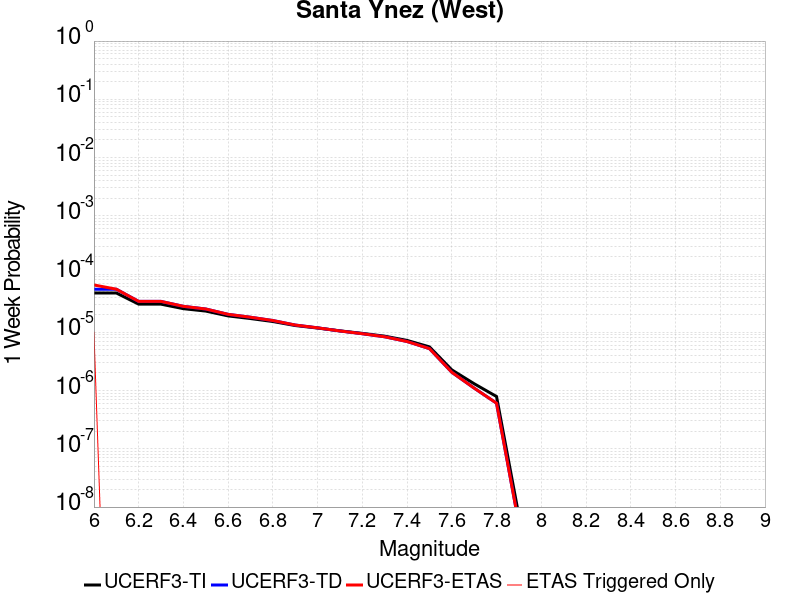 |  |  |  |

| Magnitude | 1 wk TI Prob | 1 wk TD Prob | 1 wk ETAS Prob | 1 wk ETAS/TD Gain | 1 wk ETAS Triggered Only | 1 mo TI Prob | 1 mo TD Prob | 1 mo ETAS Prob | 1 mo ETAS/TD Gain | 1 mo ETAS Triggered Only | 1 yr TI Prob | 1 yr TD Prob | 1 yr ETAS Prob | 1 yr ETAS/TD Gain | 1 yr ETAS Triggered Only | 10 yr TI Prob | 10 yr TD Prob | 10 yr ETAS Prob | 10 yr ETAS/TD Gain | 10 yr ETAS Triggered Only |
|-----|-----|-----|-----|-----|-----|-----|-----|-----|-----|-----|-----|-----|-----|-----|-----|-----|-----|-----|-----|-----|
| 6.0 | 4.7352758E-5 | 5.497084E-5 | 6.497029E-5 | 1.1819047 | 1.0E-5 | 2.0292461E-4 | 2.3556968E-4 | 2.4556732E-4 | 1.0424403 | 1.0E-5 | 0.0024678076 | 0.002864558 | 0.0029243862 | 1.0208856 | 6.0E-5 | 0.024405818 | 0.028304456 | 0.028391909 | 1.0030897 | 9.0E-5 |
| 6.1 | 4.7352758E-5 | 5.497084E-5 | 5.497084E-5 | 1.0 | 0.0 | 2.0292461E-4 | 2.3556968E-4 | 2.3556968E-4 | 1.0 | 0.0 | 0.0024678076 | 0.002864558 | 0.0029044433 | 1.0139238 | 4.0E-5 | 0.024405818 | 0.028304456 | 0.028372474 | 1.0024031 | 7.0E-5 |
| 6.2 | 3.0415853E-5 | 3.3925004E-5 | 3.3925004E-5 | 1.0 | 0.0 | 1.3034715E-4 | 1.4538495E-4 | 1.4538495E-4 | 1.0 | 0.0 | 0.0015858212 | 0.0017686592 | 0.0018085884 | 1.022576 | 4.0E-5 | 0.015745522 | 0.01754978 | 0.01761855 | 1.0039186 | 7.0E-5 |
| 6.3 | 3.0415853E-5 | 3.3925004E-5 | 3.3925004E-5 | 1.0 | 0.0 | 1.3034715E-4 | 1.4538495E-4 | 1.4538495E-4 | 1.0 | 0.0 | 0.0015858212 | 0.0017686592 | 0.0018085884 | 1.022576 | 4.0E-5 | 0.015745522 | 0.01754978 | 0.01761855 | 1.0039186 | 7.0E-5 |
| 6.4 | 2.5452082E-5 | 2.7912318E-5 | 2.7912318E-5 | 1.0 | 0.0 | 1.09075794E-4 | 1.1961885E-4 | 1.1961885E-4 | 1.0 | 0.0 | 0.0013271887 | 0.0014554056 | 0.0014953474 | 1.0274438 | 4.0E-5 | 0.013192902 | 0.01446091 | 0.014529898 | 1.0047706 | 7.0E-5 |
| 6.5 | 2.3143784E-5 | 2.5128133E-5 | 2.5128133E-5 | 1.0 | 0.0 | 9.9183875E-5 | 1.07687636E-4 | 1.07687636E-4 | 1.0 | 0.0 | 0.0012068948 | 0.001310323 | 0.0013502706 | 1.0304868 | 4.0E-5 | 0.012003611 | 0.013027638 | 0.0130967265 | 1.0053031 | 7.0E-5 |
| 6.6 | 1.9118515E-5 | 2.0354244E-5 | 2.0354244E-5 | 1.0 | 0.0 | 8.193392E-5 | 8.722961E-5 | 8.722961E-5 | 1.0 | 0.0 | 9.97089E-4 | 0.001061511 | 0.0011014685 | 1.0376421 | 4.0E-5 | 0.00992627 | 0.010565317 | 0.0106246825 | 1.0056189 | 6.0E-5 |
| 6.7 | 1.722807E-5 | 1.8146253E-5 | 1.8146253E-5 | 1.0 | 0.0 | 7.3832496E-5 | 7.776737E-5 | 7.776737E-5 | 1.0 | 0.0 | 8.985399E-4 | 9.4641204E-4 | 9.863742E-4 | 1.0422249 | 4.0E-5 | 0.008949154 | 0.009424461 | 0.009483896 | 1.0063064 | 6.0E-5 |
| 6.8 | 1.5317364E-5 | 1.5926391E-5 | 1.5926391E-5 | 1.0 | 0.0 | 6.56442E-5 | 6.82542E-5 | 6.82542E-5 | 1.0 | 0.0 | 7.98925E-4 | 8.3068234E-4 | 8.706491E-4 | 1.0481132 | 4.0E-5 | 0.007960589 | 0.008276261 | 0.008325847 | 1.0059913 | 5.0E-5 |
| 6.9 | 1.3071226E-5 | 1.332953E-5 | 1.332953E-5 | 1.0 | 0.0 | 5.6018336E-5 | 5.712532E-5 | 5.712532E-5 | 1.0 | 0.0 | 6.8180985E-4 | 6.952811E-4 | 7.3525327E-4 | 1.0574907 | 4.0E-5 | 0.0067972173 | 0.0069313184 | 0.006980972 | 1.0071636 | 5.0E-5 |
| 7.0 | 1.1836986E-5 | 1.1932688E-5 | 1.1932688E-5 | 1.0 | 0.0 | 5.0728955E-5 | 5.1139097E-5 | 5.1139097E-5 | 1.0 | 0.0 | 6.1745E-4 | 6.2244234E-4 | 6.6241744E-4 | 1.0642229 | 4.0E-5 | 0.006157372 | 0.0062071825 | 0.006246934 | 1.0064042 | 4.0E-5 |
| 7.1 | 1.0597169E-5 | 1.0542107E-5 | 1.0542107E-5 | 1.0 | 0.0 | 4.541565E-5 | 4.5179684E-5 | 4.5179684E-5 | 1.0 | 0.0 | 5.5279525E-4 | 5.4992497E-4 | 5.899029E-4 | 1.0726972 | 4.0E-5 | 0.0055142213 | 0.005485772 | 0.0055255527 | 1.0072516 | 4.0E-5 |
| 7.2 | 9.59113E-6 | 9.45905E-6 | 9.45905E-6 | 1.0 | 0.0 | 4.11042E-5 | 4.053816E-5 | 4.053816E-5 | 1.0 | 0.0 | 5.0032866E-4 | 4.934414E-4 | 5.234266E-4 | 1.0607675 | 3.0E-5 | 0.004992037 | 0.0049235765 | 0.0049534286 | 1.0060631 | 3.0E-5 |
| 7.3 | 8.586084E-6 | 8.379489E-6 | 8.379489E-6 | 1.0 | 0.0 | 3.679698E-5 | 3.591161E-5 | 3.591161E-5 | 1.0 | 0.0 | 4.4791115E-4 | 4.3713715E-4 | 4.6712405E-4 | 1.0685984 | 3.0E-5 | 0.004470094 | 0.004362884 | 0.0043927534 | 1.0068462 | 3.0E-5 |
| 7.4 | 7.2622997E-6 | 6.9514485E-6 | 6.9514485E-6 | 1.0 | 0.0 | 3.112377E-5 | 2.9791589E-5 | 2.9791589E-5 | 1.0 | 0.0 | 3.78866E-4 | 3.6265317E-4 | 3.926423E-4 | 1.0826937 | 3.0E-5 | 0.0037822074 | 0.003620714 | 0.0036506054 | 1.0082556 | 3.0E-5 |
| 7.5 | 5.627296E-6 | 5.2514984E-6 | 5.2514984E-6 | 1.0 | 0.0 | 2.411676E-5 | 2.2506232E-5 | 2.2506232E-5 | 1.0 | 0.0 | 2.9358198E-4 | 2.7397962E-4 | 3.039714E-4 | 1.1094671 | 3.0E-5 | 0.0029319443 | 0.0027364905 | 0.0027664085 | 1.0109329 | 3.0E-5 |
| 7.6 | 2.265244E-6 | 2.0608632E-6 | 2.0608632E-6 | 1.0 | 0.0 | 9.708152E-6 | 8.832241E-6 | 8.832241E-6 | 1.0 | 0.0 | 1.18190335E-4 | 1.0752732E-4 | 1.1752624E-4 | 1.0929897 | 1.0E-5 | 0.001181275 | 0.0010747615 | 0.0010847508 | 1.0092944 | 1.0E-5 |
| 7.7 | 1.3099874E-6 | 1.1016228E-6 | 1.1016228E-6 | 1.0 | 0.0 | 5.61422E-6 | 4.7212325E-6 | 4.7212325E-6 | 1.0 | 0.0 | 6.8350986E-5 | 5.7479516E-5 | 5.7479516E-5 | 1.0 | 0.0 | 6.832996E-4 | 5.7464885E-4 | 5.7464885E-4 | 1.0 | 0.0 |
| 7.8 | 7.903951E-7 | 6.0710704E-7 | 6.0710704E-7 | 1.0 | 0.0 | 3.3874032E-6 | 2.601885E-6 | 2.601885E-6 | 1.0 | 0.0 | 4.1240855E-5 | 3.16775E-5 | 3.16775E-5 | 1.0 | 0.0 | 4.12332E-4 | 3.167312E-4 | 3.167312E-4 | 1.0 | 0.0 |
| 7.9 | 7.0753297E-9 | 5.090092E-9 | 5.090092E-9 | 1.0 | 0.0 | 3.032284E-8 | 2.181468E-8 | 2.181468E-8 | 1.0 | 0.0 | 3.6918053E-7 | 2.655937E-7 | 2.655937E-7 | 1.0 | 0.0 | 3.691799E-6 | 2.6559348E-6 | 2.6559348E-6 | 1.0 | 0.0 |

## Chino alt 1
*[(top)](#table-of-contents)*

| 1 Week | 1 Month | 1 Year | 10 Year |
|-----|-----|-----|-----|
|  |  |  |  |

| Magnitude | 1 wk TI Prob | 1 wk TD Prob | 1 wk ETAS Prob | 1 wk ETAS/TD Gain | 1 wk ETAS Triggered Only | 1 mo TI Prob | 1 mo TD Prob | 1 mo ETAS Prob | 1 mo ETAS/TD Gain | 1 mo ETAS Triggered Only | 1 yr TI Prob | 1 yr TD Prob | 1 yr ETAS Prob | 1 yr ETAS/TD Gain | 1 yr ETAS Triggered Only | 10 yr TI Prob | 10 yr TD Prob | 10 yr ETAS Prob | 10 yr ETAS/TD Gain | 10 yr ETAS Triggered Only |
|-----|-----|-----|-----|-----|-----|-----|-----|-----|-----|-----|-----|-----|-----|-----|-----|-----|-----|-----|-----|-----|
| 6.0 | 3.939946E-5 | 4.894798E-5 | 7.894651E-5 | 1.6128656 | 3.0E-5 | 1.6884391E-4 | 2.0976314E-4 | 2.3975683E-4 | 1.1429884 | 3.0E-5 | 0.0020537362 | 0.002551385 | 0.002611232 | 1.0234567 | 6.0E-5 | 0.020348595 | 0.025280168 | 0.02537764 | 1.0038557 | 1.0E-4 |
| 6.1 | 2.1505624E-5 | 2.6878823E-5 | 4.6878286E-5 | 1.7440602 | 2.0E-5 | 9.2163704E-5 | 1.15190494E-4 | 1.351882E-4 | 1.1736054 | 2.0E-5 | 0.0011215154 | 0.0014016517 | 0.0014415955 | 1.0284978 | 4.0E-5 | 0.011158722 | 0.013947425 | 0.014006589 | 1.0042418 | 6.0E-5 |
| 6.2 | 2.1505624E-5 | 2.6878823E-5 | 4.6878286E-5 | 1.7440602 | 2.0E-5 | 9.2163704E-5 | 1.15190494E-4 | 1.351882E-4 | 1.1736054 | 2.0E-5 | 0.0011215154 | 0.0014016517 | 0.0014415955 | 1.0284978 | 4.0E-5 | 0.011158722 | 0.013947425 | 0.014006589 | 1.0042418 | 6.0E-5 |
| 6.3 | 1.4290785E-5 | 1.8164832E-5 | 2.816465E-5 | 1.5505043 | 1.0E-5 | 6.1244784E-5 | 7.784722E-5 | 8.7846434E-5 | 1.1284467 | 1.0E-5 | 7.454001E-4 | 9.4742293E-4 | 9.773945E-4 | 1.0316348 | 3.0E-5 | 0.007429048 | 0.00944674 | 0.009496268 | 1.0052428 | 5.0E-5 |
| 6.4 | 1.4290785E-5 | 1.8164832E-5 | 2.816465E-5 | 1.5505043 | 1.0E-5 | 6.1244784E-5 | 7.784722E-5 | 8.7846434E-5 | 1.1284467 | 1.0E-5 | 7.454001E-4 | 9.4742293E-4 | 9.773945E-4 | 1.0316348 | 3.0E-5 | 0.007429048 | 0.00944674 | 0.009496268 | 1.0052428 | 5.0E-5 |
| 6.5 | 1.3017944E-5 | 1.6651793E-5 | 2.6651625E-5 | 1.600526 | 1.0E-5 | 5.5789995E-5 | 7.1363116E-5 | 8.136241E-5 | 1.1401184 | 1.0E-5 | 6.790315E-4 | 8.6854334E-4 | 8.985173E-4 | 1.0345106 | 3.0E-5 | 0.0067696036 | 0.008664233 | 0.0087137995 | 1.0057209 | 5.0E-5 |
| 6.6 | 9.470016E-6 | 1.2039209E-5 | 2.2039088E-5 | 1.8306093 | 1.0E-5 | 4.058515E-5 | 5.159578E-5 | 6.159527E-5 | 1.1938043 | 1.0E-5 | 4.940122E-4 | 6.280315E-4 | 6.580127E-4 | 1.0477383 | 3.0E-5 | 0.004929154 | 0.006273248 | 0.0063129966 | 1.0063363 | 4.0E-5 |
| 6.7 | 8.314155E-6 | 1.040749E-5 | 2.0407386E-5 | 1.9608364 | 1.0E-5 | 3.5631605E-5 | 4.4602948E-5 | 5.4602504E-5 | 1.2241905 | 1.0E-5 | 4.3372845E-4 | 5.4293784E-4 | 5.7292153E-4 | 1.0552249 | 3.0E-5 | 0.004328829 | 0.0054270807 | 0.0054668635 | 1.0073304 | 4.0E-5 |
| 6.8 | 3.4856364E-6 | 3.8134033E-6 | 3.8134033E-6 | 1.0 | 0.0 | 1.4938357E-5 | 1.6343065E-5 | 1.6343065E-5 | 1.0 | 0.0 | 1.8185932E-4 | 1.9896074E-4 | 2.0895875E-4 | 1.0502511 | 1.0E-5 | 0.0018171056 | 0.0019894529 | 0.002009413 | 1.010033 | 2.0E-5 |
| 6.9 | 2.2645952E-6 | 2.152909E-6 | 2.152909E-6 | 1.0 | 0.0 | 9.705372E-6 | 9.226722E-6 | 9.226722E-6 | 1.0 | 0.0 | 1.18156495E-4 | 1.12329755E-4 | 1.12329755E-4 | 1.0 | 0.0 | 0.0011809369 | 0.0011233138 | 0.0011333026 | 1.0088922 | 1.0E-5 |
| 7.0 | 1.7864003E-6 | 1.5430741E-6 | 1.5430741E-6 | 1.0 | 0.0 | 7.655979E-6 | 6.613158E-6 | 6.613158E-6 | 1.0 | 0.0 | 9.3207556E-5 | 8.051228E-5 | 8.051228E-5 | 1.0 | 0.0 | 9.316847E-4 | 8.052856E-4 | 8.052856E-4 | 1.0 | 0.0 |
| 7.1 | 1.7315456E-6 | 1.4733466E-6 | 1.4733466E-6 | 1.0 | 0.0 | 7.420889E-6 | 6.314328E-6 | 6.314328E-6 | 1.0 | 0.0 | 9.034557E-5 | 7.687428E-5 | 7.687428E-5 | 1.0 | 0.0 | 9.0308854E-4 | 7.68921E-4 | 7.68921E-4 | 1.0 | 0.0 |
| 7.2 | 1.6008337E-6 | 1.3574178E-6 | 1.3574178E-6 | 1.0 | 0.0 | 6.860698E-6 | 5.817492E-6 | 5.817492E-6 | 1.0 | 0.0 | 8.352579E-5 | 7.082572E-5 | 7.082572E-5 | 1.0 | 0.0 | 8.34944E-4 | 7.0846075E-4 | 7.0846075E-4 | 1.0 | 0.0 |
| 7.3 | 1.3320939E-6 | 1.1217794E-6 | 1.1217794E-6 | 1.0 | 0.0 | 5.7089615E-6 | 4.8076176E-6 | 4.8076176E-6 | 1.0 | 0.0 | 6.9504385E-5 | 5.853122E-5 | 5.853122E-5 | 1.0 | 0.0 | 6.9482654E-4 | 5.8530655E-4 | 5.8530655E-4 | 1.0 | 0.0 |
| 7.4 | 1.114294E-6 | 9.237087E-7 | 9.237087E-7 | 1.0 | 0.0 | 4.775537E-6 | 3.9587458E-6 | 3.9587458E-6 | 1.0 | 0.0 | 5.8140613E-5 | 4.81967E-5 | 4.81967E-5 | 1.0 | 0.0 | 5.81254E-4 | 4.8187698E-4 | 4.8187698E-4 | 1.0 | 0.0 |
| 7.5 | 9.354081E-7 | 7.6233886E-7 | 7.6233886E-7 | 1.0 | 0.0 | 4.0088858E-6 | 3.2671626E-6 | 3.2671626E-6 | 1.0 | 0.0 | 4.8807087E-5 | 3.9777013E-5 | 3.9777013E-5 | 1.0 | 0.0 | 4.879637E-4 | 3.9770233E-4 | 3.9770233E-4 | 1.0 | 0.0 |
| 7.6 | 8.521771E-7 | 6.880688E-7 | 6.880688E-7 | 1.0 | 0.0 | 3.6521824E-6 | 2.948863E-6 | 2.948863E-6 | 1.0 | 0.0 | 4.4464414E-5 | 3.590185E-5 | 3.590185E-5 | 1.0 | 0.0 | 4.4455516E-4 | 3.5896365E-4 | 3.5896365E-4 | 1.0 | 0.0 |
| 7.7 | 2.1803626E-7 | 1.4186368E-7 | 1.4186368E-7 | 1.0 | 0.0 | 9.344408E-7 | 6.0798715E-7 | 6.0798715E-7 | 1.0 | 0.0 | 1.1376757E-5 | 7.4022278E-6 | 7.4022278E-6 | 1.0 | 0.0 | 1.13761744E-4 | 7.402077E-5 | 7.402077E-5 | 1.0 | 0.0 |

## Red Mountain
*[(top)](#table-of-contents)*

| 1 Week | 1 Month | 1 Year | 10 Year |
|-----|-----|-----|-----|
|  |  |  |  |

| Magnitude | 1 wk TI Prob | 1 wk TD Prob | 1 wk ETAS Prob | 1 wk ETAS/TD Gain | 1 wk ETAS Triggered Only | 1 mo TI Prob | 1 mo TD Prob | 1 mo ETAS Prob | 1 mo ETAS/TD Gain | 1 mo ETAS Triggered Only | 1 yr TI Prob | 1 yr TD Prob | 1 yr ETAS Prob | 1 yr ETAS/TD Gain | 1 yr ETAS Triggered Only | 10 yr TI Prob | 10 yr TD Prob | 10 yr ETAS Prob | 10 yr ETAS/TD Gain | 10 yr ETAS Triggered Only |
|-----|-----|-----|-----|-----|-----|-----|-----|-----|-----|-----|-----|-----|-----|-----|-----|-----|-----|-----|-----|-----|
| 6.0 | 4.1810763E-5 | 4.7590016E-5 | 7.7588586E-5 | 1.6303543 | 3.0E-5 | 1.7917668E-4 | 2.039422E-4 | 2.3393608E-4 | 1.1470705 | 3.0E-5 | 0.0021792934 | 0.0024803334 | 0.0025501598 | 1.028152 | 7.0E-5 | 0.021580452 | 0.02454411 | 0.024622148 | 1.0031794 | 8.0E-5 |
| 6.1 | 4.1810763E-5 | 4.7590016E-5 | 7.7588586E-5 | 1.6303543 | 3.0E-5 | 1.7917668E-4 | 2.039422E-4 | 2.3393608E-4 | 1.1470705 | 3.0E-5 | 0.0021792934 | 0.0024803334 | 0.0025501598 | 1.028152 | 7.0E-5 | 0.021580452 | 0.02454411 | 0.024622148 | 1.0031794 | 8.0E-5 |
| 6.2 | 4.1810763E-5 | 4.7590016E-5 | 7.7588586E-5 | 1.6303543 | 3.0E-5 | 1.7917668E-4 | 2.039422E-4 | 2.3393608E-4 | 1.1470705 | 3.0E-5 | 0.0021792934 | 0.0024803334 | 0.0025501598 | 1.028152 | 7.0E-5 | 0.021580452 | 0.02454411 | 0.024622148 | 1.0031794 | 8.0E-5 |
| 6.3 | 4.1810763E-5 | 4.7590016E-5 | 7.7588586E-5 | 1.6303543 | 3.0E-5 | 1.7917668E-4 | 2.039422E-4 | 2.3393608E-4 | 1.1470705 | 3.0E-5 | 0.0021792934 | 0.0024803334 | 0.0025501598 | 1.028152 | 7.0E-5 | 0.021580452 | 0.02454411 | 0.024622148 | 1.0031794 | 8.0E-5 |
| 6.4 | 4.1810763E-5 | 4.7590016E-5 | 7.7588586E-5 | 1.6303543 | 3.0E-5 | 1.7917668E-4 | 2.039422E-4 | 2.3393608E-4 | 1.1470705 | 3.0E-5 | 0.0021792934 | 0.0024803334 | 0.0025501598 | 1.028152 | 7.0E-5 | 0.021580452 | 0.02454411 | 0.024622148 | 1.0031794 | 8.0E-5 |
| 6.5 | 3.154503E-5 | 3.5359757E-5 | 5.535905E-5 | 1.5655948 | 2.0E-5 | 1.3518598E-4 | 1.5153353E-4 | 1.715305E-4 | 1.131964 | 2.0E-5 | 0.0016446467 | 0.0018434518 | 0.0019033412 | 1.0324876 | 6.0E-5 | 0.01632528 | 0.018291244 | 0.018359965 | 1.003757 | 7.0E-5 |
| 6.6 | 3.1535834E-5 | 3.5349138E-5 | 5.534843E-5 | 1.5657647 | 2.0E-5 | 1.3514658E-4 | 1.5148803E-4 | 1.7148501E-4 | 1.1320037 | 2.0E-5 | 0.0016441676 | 0.0018428987 | 0.0019027882 | 1.0324974 | 6.0E-5 | 0.01632056 | 0.018285805 | 0.018354526 | 1.0037581 | 7.0E-5 |
| 6.7 | 2.8267326E-5 | 3.1469353E-5 | 5.1468727E-5 | 1.6355189 | 2.0E-5 | 1.2114006E-4 | 1.3486217E-4 | 1.5485947E-4 | 1.1482795 | 2.0E-5 | 0.0014738824 | 0.0016407954 | 0.0017006969 | 1.0365076 | 6.0E-5 | 0.014641452 | 0.01629557 | 0.016364431 | 1.0042256 | 7.0E-5 |
| 6.8 | 2.8212884E-5 | 3.1407242E-5 | 5.1406612E-5 | 1.6367759 | 2.0E-5 | 1.20906756E-4 | 1.3459599E-4 | 1.545933E-4 | 1.1485728 | 2.0E-5 | 0.0014710457 | 0.0016375595 | 0.0016974612 | 1.0365798 | 6.0E-5 | 0.014613459 | 0.016263688 | 0.01633255 | 1.0042341 | 7.0E-5 |
| 6.9 | 2.4227871E-5 | 2.6706994E-5 | 4.670646E-5 | 1.7488475 | 2.0E-5 | 1.03829596E-4 | 1.1445395E-4 | 1.3445166E-4 | 1.1747228 | 2.0E-5 | 0.0012633923 | 0.0013926621 | 0.0014525785 | 1.043023 | 6.0E-5 | 0.012562336 | 0.0138470335 | 0.013916064 | 1.0049852 | 7.0E-5 |
| 7.0 | 2.348524E-5 | 2.5835778E-5 | 4.5835262E-5 | 1.7741003 | 2.0E-5 | 1.0064714E-4 | 1.10720495E-4 | 1.3071828E-4 | 1.1806151 | 2.0E-5 | 0.0012246901 | 0.001347264 | 0.0014071832 | 1.0444747 | 6.0E-5 | 0.012179627 | 0.013398598 | 0.01346766 | 1.0051544 | 7.0E-5 |
| 7.1 | 2.2311642E-5 | 2.4462845E-5 | 4.4462355E-5 | 1.8175464 | 2.0E-5 | 9.561782E-5 | 1.04836974E-4 | 1.2483487E-4 | 1.1907524 | 2.0E-5 | 0.0011635252 | 0.0012757176 | 0.001335641 | 1.0469724 | 6.0E-5 | 0.01157452 | 0.01269146 | 0.012760571 | 1.0054455 | 7.0E-5 |
| 7.2 | 1.6533986E-5 | 1.7670362E-5 | 2.7670185E-5 | 1.5659094 | 1.0E-5 | 7.085802E-5 | 7.572828E-5 | 8.572753E-5 | 1.1320411 | 1.0E-5 | 8.623549E-4 | 9.2166534E-4 | 9.716192E-4 | 1.0541996 | 5.0E-5 | 0.008590161 | 0.009184707 | 0.009244156 | 1.0064726 | 6.0E-5 |
| 7.3 | 1.4703092E-5 | 1.5559537E-5 | 2.555938E-5 | 1.6426827 | 1.0E-5 | 6.301173E-5 | 6.668237E-5 | 7.66817E-5 | 1.1499547 | 1.0E-5 | 7.668978E-4 | 8.1161706E-4 | 8.6157647E-4 | 1.0615554 | 5.0E-5 | 0.0076425658 | 0.008092604 | 0.008152118 | 1.0073541 | 6.0E-5 |
| 7.4 | 6.1331984E-6 | 5.5288874E-6 | 5.5288874E-6 | 1.0 | 0.0 | 2.6284872E-5 | 2.3695018E-5 | 2.3695018E-5 | 1.0 | 0.0 | 3.199713E-4 | 2.884492E-4 | 2.984463E-4 | 1.0346582 | 1.0E-5 | 0.0031951098 | 0.0028808024 | 0.0029007448 | 1.0069225 | 2.0E-5 |
| 7.5 | 5.954766E-6 | 5.338517E-6 | 5.338517E-6 | 1.0 | 0.0 | 2.5520176E-5 | 2.2879161E-5 | 2.2879161E-5 | 1.0 | 0.0 | 3.1066386E-4 | 2.785187E-4 | 2.885159E-4 | 1.0358943 | 1.0E-5 | 0.003102299 | 0.0027817504 | 0.0028016947 | 1.0071697 | 2.0E-5 |
| 7.6 | 4.9726646E-6 | 4.315309E-6 | 4.315309E-6 | 1.0 | 0.0 | 2.1311245E-5 | 1.8494053E-5 | 1.8494053E-5 | 1.0 | 0.0 | 2.5943352E-4 | 2.2514217E-4 | 2.3513992E-4 | 1.0444064 | 1.0E-5 | 0.0025913084 | 0.0022491754 | 0.0022691304 | 1.0088722 | 2.0E-5 |
| 7.7 | 3.3613894E-6 | 2.8526886E-6 | 2.8526886E-6 | 1.0 | 0.0 | 1.4405875E-5 | 1.22257525E-5 | 1.22257525E-5 | 1.0 | 0.0 | 1.7537741E-4 | 1.4883863E-4 | 1.5883715E-4 | 1.0671768 | 1.0E-5 | 0.0017523908 | 0.0014874157 | 0.0014974009 | 1.006713 | 1.0E-5 |
| 7.8 | 1.1828961E-6 | 1.0122935E-6 | 1.0122935E-6 | 1.0 | 0.0 | 5.069545E-6 | 4.338394E-6 | 4.338394E-6 | 1.0 | 0.0 | 6.171996E-5 | 5.281869E-5 | 5.281869E-5 | 1.0 | 0.0 | 6.170282E-4 | 5.280643E-4 | 5.280643E-4 | 1.0 | 0.0 |
| 7.9 | 2.2967266E-7 | 1.861919E-7 | 1.861919E-7 | 1.0 | 0.0 | 9.843111E-7 | 7.97965E-7 | 7.97965E-7 | 1.0 | 0.0 | 1.19839215E-5 | 9.715184E-6 | 9.715184E-6 | 1.0 | 0.0 | 1.1983275E-4 | 9.714788E-5 | 9.714788E-5 | 1.0 | 0.0 |

## Brawley (Seismic Zone) alt 1
*[(top)](#table-of-contents)*

| 1 Week | 1 Month | 1 Year | 10 Year |
|-----|-----|-----|-----|
|  |  |  |  |

| Magnitude | 1 wk TI Prob | 1 wk TD Prob | 1 wk ETAS Prob | 1 wk ETAS/TD Gain | 1 wk ETAS Triggered Only | 1 mo TI Prob | 1 mo TD Prob | 1 mo ETAS Prob | 1 mo ETAS/TD Gain | 1 mo ETAS Triggered Only | 1 yr TI Prob | 1 yr TD Prob | 1 yr ETAS Prob | 1 yr ETAS/TD Gain | 1 yr ETAS Triggered Only | 10 yr TI Prob | 10 yr TD Prob | 10 yr ETAS Prob | 10 yr ETAS/TD Gain | 10 yr ETAS Triggered Only |
|-----|-----|-----|-----|-----|-----|-----|-----|-----|-----|-----|-----|-----|-----|-----|-----|-----|-----|-----|-----|-----|
| 6.0 | 2.2521618E-4 | 4.763429E-4 | 4.8633813E-4 | 1.0209833 | 1.0E-5 | 9.6485513E-4 | 0.0020399094 | 0.0020598685 | 1.0097843 | 2.0E-5 | 0.011683988 | 0.024544531 | 0.024622569 | 1.0031794 | 8.0E-5 | 0.11088423 | 0.21349923 | 0.21357788 | 1.0003684 | 1.0E-4 |
| 6.1 | 2.2521618E-4 | 4.763429E-4 | 4.8633813E-4 | 1.0209833 | 1.0E-5 | 9.6485513E-4 | 0.0020399094 | 0.0020598685 | 1.0097843 | 2.0E-5 | 0.011683988 | 0.024544531 | 0.024612814 | 1.002782 | 7.0E-5 | 0.11088423 | 0.21349923 | 0.21357001 | 1.0003315 | 9.0E-5 |
| 6.2 | 2.198148E-4 | 4.6718874E-4 | 4.7718408E-4 | 1.0213946 | 1.0E-5 | 9.417233E-4 | 0.0020007377 | 0.0020206978 | 1.0099763 | 2.0E-5 | 0.011405343 | 0.024078513 | 0.024146827 | 1.0028372 | 7.0E-5 | 0.10837428 | 0.20993572 | 0.21000683 | 1.0003387 | 9.0E-5 |
| 6.3 | 2.1704129E-4 | 4.615455E-4 | 4.715409E-4 | 1.0216564 | 1.0E-5 | 9.298453E-4 | 0.0019765892 | 0.0019965498 | 1.0100985 | 2.0E-5 | 0.011262234 | 0.023792034 | 0.023860369 | 1.0028721 | 7.0E-5 | 0.107082725 | 0.20782684 | 0.20789813 | 1.0003431 | 9.0E-5 |
| 6.4 | 1.876142E-4 | 4.004663E-4 | 4.104623E-4 | 1.0249609 | 1.0E-5 | 8.038131E-4 | 0.0017151695 | 0.0017351352 | 1.0116407 | 2.0E-5 | 0.00974259 | 0.020678662 | 0.020747213 | 1.0033151 | 7.0E-5 | 0.093263686 | 0.18457787 | 0.18465126 | 1.0003976 | 9.0E-5 |
| 6.5 | 1.7390939E-4 | 3.7478763E-4 | 3.847839E-4 | 1.0266718 | 1.0E-5 | 7.45113E-4 | 0.0016052561 | 0.001625224 | 1.012439 | 2.0E-5 | 0.009034078 | 0.019367293 | 0.019435937 | 1.0035443 | 7.0E-5 | 0.086755216 | 0.17440015 | 0.17447445 | 1.000426 | 9.0E-5 |
| 6.6 | 1.591791E-4 | 3.4893592E-4 | 3.5893242E-4 | 1.0286486 | 1.0E-5 | 6.8201777E-4 | 0.0014945926 | 0.0015045777 | 1.0066807 | 1.0E-5 | 0.008271996 | 0.018045008 | 0.018094106 | 1.0027208 | 5.0E-5 | 0.07970774 | 0.16380787 | 0.1638664 | 1.0003574 | 7.0E-5 |
| 6.7 | 1.4268003E-4 | 3.2059717E-4 | 3.30594E-4 | 1.0311818 | 1.0E-5 | 6.1134255E-4 | 0.0013732726 | 0.001383259 | 1.0072719 | 1.0E-5 | 0.007417723 | 0.01659171 | 0.016631046 | 1.0023708 | 4.0E-5 | 0.07174956 | 0.15193592 | 0.15198681 | 1.0003349 | 6.0E-5 |
| 6.8 | 1.239713E-4 | 2.9055026E-4 | 3.0054737E-4 | 1.0344075 | 1.0E-5 | 5.3119735E-4 | 0.0012446274 | 0.0012546149 | 1.0080246 | 1.0E-5 | 0.0064481674 | 0.015049482 | 0.01508888 | 1.002618 | 4.0E-5 | 0.06264243 | 0.1383805 | 0.1384322 | 1.0003736 | 6.0E-5 |
| 6.9 | 1.0180238E-4 | 2.6255674E-4 | 2.7255414E-4 | 1.038077 | 1.0E-5 | 4.3622297E-4 | 0.0011247622 | 0.001134751 | 1.0088807 | 1.0E-5 | 0.005298089 | 0.013608998 | 0.013648453 | 1.0028993 | 4.0E-5 | 0.05173543 | 0.12496472 | 0.12501723 | 1.0004201 | 6.0E-5 |
| 7.0 | 7.6619996E-5 | 2.2400476E-4 | 2.3400252E-4 | 1.044632 | 1.0E-5 | 3.283301E-4 | 9.596704E-4 | 9.696608E-4 | 1.0104102 | 1.0E-5 | 0.0039900932 | 0.011622103 | 0.011661638 | 1.0034018 | 4.0E-5 | 0.039192066 | 0.10726982 | 0.107323386 | 1.0004994 | 6.0E-5 |
| 7.1 | 7.5127435E-5 | 2.2083633E-4 | 2.3083412E-4 | 1.0452724 | 1.0E-5 | 3.2193496E-4 | 9.461013E-4 | 9.5609186E-4 | 1.0105597 | 1.0E-5 | 0.0039125155 | 0.011458648 | 0.0114981895 | 1.0034509 | 4.0E-5 | 0.038443442 | 0.10583378 | 0.10588743 | 1.0005069 | 6.0E-5 |
| 7.2 | 6.788582E-5 | 2.0211334E-4 | 2.1211132E-4 | 1.0494672 | 1.0E-5 | 2.9090676E-4 | 8.6591556E-4 | 8.759069E-4 | 1.0115385 | 1.0E-5 | 0.0035360386 | 0.0104922 | 0.01053178 | 1.0037724 | 4.0E-5 | 0.034803 | 0.097503684 | 0.097548805 | 1.0004628 | 5.0E-5 |
| 7.3 | 6.399602E-5 | 1.8842232E-4 | 1.9842043E-4 | 1.0530623 | 1.0E-5 | 2.7423984E-4 | 8.0727716E-4 | 8.172691E-4 | 1.0123773 | 1.0E-5 | 0.0033337586 | 0.009784897 | 0.009824505 | 1.004048 | 4.0E-5 | 0.03284188 | 0.091397986 | 0.09144341 | 1.0004971 | 5.0E-5 |
| 7.4 | 4.506759E-5 | 1.2530042E-4 | 1.3529917E-4 | 1.0797982 | 1.0E-5 | 1.9313251E-4 | 5.3689216E-4 | 5.4688676E-4 | 1.0186157 | 1.0E-5 | 0.0023488526 | 0.006517245 | 0.0065569845 | 1.0060976 | 4.0E-5 | 0.023241805 | 0.062364522 | 0.0624114 | 1.0007517 | 5.0E-5 |
| 7.5 | 3.43289E-5 | 9.336103E-5 | 1.0336009E-4 | 1.1071011 | 1.0E-5 | 1.4711556E-4 | 4.0005764E-4 | 4.1005365E-4 | 1.0249864 | 1.0E-5 | 0.0017896603 | 0.004859886 | 0.004899692 | 1.0081906 | 4.0E-5 | 0.01775316 | 0.047057066 | 0.047104713 | 1.0010126 | 5.0E-5 |
| 7.6 | 2.5980507E-5 | 7.053672E-5 | 8.053602E-5 | 1.1417601 | 1.0E-5 | 1.1134028E-4 | 3.0226534E-4 | 3.1226233E-4 | 1.0330735 | 1.0E-5 | 0.001354725 | 0.0036738948 | 0.003713748 | 1.0108476 | 4.0E-5 | 0.013464959 | 0.03584298 | 0.035891186 | 1.0013449 | 5.0E-5 |
| 7.7 | 1.7292105E-5 | 4.9412036E-5 | 5.9411544E-5 | 1.2023698 | 1.0E-5 | 7.4106916E-5 | 2.1174872E-4 | 2.217466E-4 | 1.0472158 | 1.0E-5 | 9.018782E-4 | 0.0025749984 | 0.002604921 | 1.0116205 | 3.0E-5 | 0.008982267 | 0.025292095 | 0.025331084 | 1.0015415 | 4.0E-5 |
| 7.8 | 1.2927471E-5 | 3.9697254E-5 | 4.9696857E-5 | 1.2518966 | 1.0E-5 | 5.5402274E-5 | 1.7012001E-4 | 1.8011831E-4 | 1.0587721 | 1.0E-5 | 6.743139E-4 | 0.0020692463 | 0.002099184 | 1.0144681 | 3.0E-5 | 0.0067227143 | 0.020433143 | 0.020472325 | 1.0019176 | 4.0E-5 |
| 7.9 | 1.0200774E-5 | 2.8748475E-5 | 2.8748475E-5 | 1.0 | 0.0 | 4.371687E-5 | 1.2320194E-4 | 1.2320194E-4 | 1.0 | 0.0 | 5.321229E-4 | 0.0014989526 | 0.0015189226 | 1.0133226 | 2.0E-5 | 0.005308505 | 0.014992894 | 0.015022444 | 1.001971 | 3.0E-5 |
| 8.0 | 8.650396E-6 | 2.3279512E-5 | 2.3279512E-5 | 1.0 | 0.0 | 3.70726E-5 | 9.976552E-5 | 9.976552E-5 | 1.0 | 0.0 | 4.5126543E-4 | 0.0012139693 | 0.001233945 | 1.0164549 | 2.0E-5 | 0.0045035016 | 0.012212163 | 0.012241797 | 1.0024266 | 3.0E-5 |
| 8.1 | 3.9368224E-6 | 7.3283345E-6 | 7.3283345E-6 | 1.0 | 0.0 | 1.6871985E-5 | 3.1406773E-5 | 3.1406773E-5 | 1.0 | 0.0 | 2.0539707E-4 | 3.8231048E-4 | 3.9230665E-4 | 1.0261468 | 1.0E-5 | 0.0020520731 | 0.0040015313 | 0.0040214513 | 1.0049781 | 2.0E-5 |
| 8.2 | 1.7101195E-6 | 2.2178374E-6 | 2.2178374E-6 | 1.0 | 0.0 | 7.329063E-6 | 9.504983E-6 | 9.504983E-6 | 1.0 | 0.0 | 8.922769E-5 | 1.15717055E-4 | 1.257159E-4 | 1.0864077 | 1.0E-5 | 8.9191867E-4 | 0.00126669 | 0.0012766774 | 1.0078846 | 1.0E-5 |
| 8.3 | 3.0346666E-8 | 1.721086E-8 | 1.721086E-8 | 1.0 | 0.0 | 1.3005713E-7 | 7.376083E-8 | 7.376083E-8 | 1.0 | 0.0 | 1.5834444E-6 | 8.98038E-7 | 8.98038E-7 | 1.0 | 0.0 | 1.5834332E-5 | 9.36379E-6 | 9.36379E-6 | 1.0 | 0.0 |

## Kern Canyon (Lake Isabella) 2011
*[(top)](#table-of-contents)*

| 1 Week | 1 Month | 1 Year | 10 Year |
|-----|-----|-----|-----|
|  |  |  |  |

| Magnitude | 1 wk TI Prob | 1 wk TD Prob | 1 wk ETAS Prob | 1 wk ETAS/TD Gain | 1 wk ETAS Triggered Only | 1 mo TI Prob | 1 mo TD Prob | 1 mo ETAS Prob | 1 mo ETAS/TD Gain | 1 mo ETAS Triggered Only | 1 yr TI Prob | 1 yr TD Prob | 1 yr ETAS Prob | 1 yr ETAS/TD Gain | 1 yr ETAS Triggered Only | 10 yr TI Prob | 10 yr TD Prob | 10 yr ETAS Prob | 10 yr ETAS/TD Gain | 10 yr ETAS Triggered Only |
|-----|-----|-----|-----|-----|-----|-----|-----|-----|-----|-----|-----|-----|-----|-----|-----|-----|-----|-----|-----|-----|
| 6.0 | 4.2387383E-6 | 4.0016344E-6 | 6.40014E-5 | 15.993814 | 6.0E-5 | 1.8165894E-5 | 1.7149758E-5 | 7.714873E-5 | 4.4985313 | 6.0E-5 | 2.2114732E-4 | 2.0878017E-4 | 2.8876346E-4 | 1.3830981 | 8.0E-5 | 0.0022092736 | 0.002086024 | 0.0021858155 | 1.0478381 | 1.0E-4 |
| 6.1 | 4.2387383E-6 | 4.0016344E-6 | 6.40014E-5 | 15.993814 | 6.0E-5 | 1.8165894E-5 | 1.7149758E-5 | 7.714873E-5 | 4.4985313 | 6.0E-5 | 2.2114732E-4 | 2.0878017E-4 | 2.8876346E-4 | 1.3830981 | 8.0E-5 | 0.0022092736 | 0.002086024 | 0.0021858155 | 1.0478381 | 1.0E-4 |
| 6.2 | 4.2387383E-6 | 4.0016344E-6 | 6.40014E-5 | 15.993814 | 6.0E-5 | 1.8165894E-5 | 1.7149758E-5 | 7.714873E-5 | 4.4985313 | 6.0E-5 | 2.2114732E-4 | 2.0878017E-4 | 2.8876346E-4 | 1.3830981 | 8.0E-5 | 0.0022092736 | 0.002086024 | 0.0021858155 | 1.0478381 | 1.0E-4 |
| 6.3 | 4.2387383E-6 | 4.0016344E-6 | 6.40014E-5 | 15.993814 | 6.0E-5 | 1.8165894E-5 | 1.7149758E-5 | 7.714873E-5 | 4.4985313 | 6.0E-5 | 2.2114732E-4 | 2.0878017E-4 | 2.8876346E-4 | 1.3830981 | 8.0E-5 | 0.0022092736 | 0.002086024 | 0.0021858155 | 1.0478381 | 1.0E-4 |
| 6.4 | 4.2387383E-6 | 4.0016344E-6 | 6.40014E-5 | 15.993814 | 6.0E-5 | 1.8165894E-5 | 1.7149758E-5 | 7.714873E-5 | 4.4985313 | 6.0E-5 | 2.2114732E-4 | 2.0878017E-4 | 2.8876346E-4 | 1.3830981 | 8.0E-5 | 0.0022092736 | 0.002086024 | 0.0021858155 | 1.0478381 | 1.0E-4 |
| 6.5 | 2.7857532E-6 | 2.5178624E-6 | 5.2517735E-5 | 20.858065 | 5.0E-5 | 1.1938888E-5 | 1.0790796E-5 | 6.0790255E-5 | 5.6335287 | 5.0E-5 | 1.4534626E-4 | 1.3137035E-4 | 1.9136247E-4 | 1.4566641 | 6.0E-5 | 0.0014525123 | 0.0013129596 | 0.0013728809 | 1.0456383 | 6.0E-5 |
| 6.6 | 2.2233348E-6 | 1.944119E-6 | 4.194404E-5 | 21.574831 | 4.0E-5 | 9.528543E-6 | 8.331913E-6 | 4.8331578E-5 | 5.8007784 | 4.0E-5 | 1.1600384E-4 | 1.014364E-4 | 1.5143133E-4 | 1.4928697 | 5.0E-5 | 0.001159433 | 0.0010139096 | 0.001063859 | 1.0492641 | 5.0E-5 |
| 6.7 | 2.1635126E-6 | 1.8834991E-6 | 4.1883424E-5 | 22.23703 | 4.0E-5 | 9.272164E-6 | 8.072114E-6 | 4.807179E-5 | 5.9552913 | 4.0E-5 | 1.1288274E-4 | 9.827364E-5 | 1.4826872E-4 | 1.5087334 | 5.0E-5 | 0.0011282542 | 9.8231E-4 | 0.0010322608 | 1.0508504 | 5.0E-5 |
| 6.8 | 1.8685711E-6 | 1.583138E-6 | 2.1583106E-5 | 13.633118 | 2.0E-5 | 8.008137E-6 | 6.7848596E-6 | 2.6784724E-5 | 3.9477196 | 2.0E-5 | 9.74947E-5 | 8.2602586E-5 | 1.1260011E-4 | 1.3631548 | 3.0E-5 | 9.745194E-4 | 8.2572375E-4 | 8.5569895E-4 | 1.0363017 | 3.0E-5 |
| 6.9 | 1.5815071E-6 | 1.3064887E-6 | 2.1306463E-5 | 16.308187 | 2.0E-5 | 6.77787E-6 | 5.5992255E-6 | 2.5599113E-5 | 4.5719028 | 2.0E-5 | 8.251744E-5 | 6.816846E-5 | 8.81671E-5 | 1.2933708 | 2.0E-5 | 8.248681E-4 | 6.8147824E-4 | 7.014646E-4 | 1.029328 | 2.0E-5 |
| 7.0 | 1.3772564E-6 | 1.1210681E-6 | 2.1121046E-5 | 18.840109 | 2.0E-5 | 5.9025137E-6 | 4.8045686E-6 | 2.4804473E-5 | 5.1626844 | 2.0E-5 | 7.186073E-5 | 5.8494075E-5 | 7.849291E-5 | 1.341895 | 2.0E-5 | 7.18375E-4 | 5.8478885E-4 | 6.0477713E-4 | 1.0341804 | 2.0E-5 |
| 7.1 | 1.0916998E-6 | 8.7637505E-7 | 1.0876366E-5 | 12.41063 | 1.0E-5 | 4.678705E-6 | 3.7558877E-6 | 1.375585E-5 | 3.6624763 | 1.0E-5 | 5.6961744E-5 | 4.5726985E-5 | 5.572653E-5 | 1.2186792 | 1.0E-5 | 5.6947145E-4 | 4.571771E-4 | 4.6717256E-4 | 1.0218633 | 1.0E-5 |
| 7.2 | 7.6277024E-7 | 5.901439E-7 | 1.0590138E-5 | 17.945011 | 1.0E-5 | 3.2690114E-6 | 2.5291856E-6 | 1.252916E-5 | 4.9538317 | 1.0E-5 | 3.9799485E-5 | 3.0792406E-5 | 4.07921E-5 | 1.3247454 | 1.0E-5 | 3.9792358E-4 | 3.07882E-4 | 3.1787893E-4 | 1.03247 | 1.0E-5 |
| 7.3 | 5.3265916E-7 | 4.3824264E-7 | 1.0438238E-5 | 23.8184 | 1.0E-5 | 2.282823E-6 | 1.8781814E-6 | 1.1878163E-5 | 6.3242893 | 1.0E-5 | 2.7793016E-5 | 2.2866623E-5 | 3.2866392E-5 | 1.4373087 | 1.0E-5 | 2.778954E-4 | 2.2864307E-4 | 2.3864079E-4 | 1.0437263 | 1.0E-5 |
| 7.4 | 3.4946007E-7 | 3.0065647E-7 | 3.0065647E-7 | 1.0 | 0.0 | 1.497685E-6 | 1.2885271E-6 | 1.2885271E-6 | 1.0 | 0.0 | 1.8234163E-5 | 1.5687707E-5 | 1.5687707E-5 | 1.0 | 0.0 | 1.8232666E-4 | 1.5686621E-4 | 1.5686621E-4 | 1.0 | 0.0 |
| 7.5 | 1.8317026E-7 | 1.4244755E-7 | 1.4244755E-7 | 1.0 | 0.0 | 7.850152E-7 | 6.1048934E-7 | 6.1048934E-7 | 1.0 | 0.0 | 9.557518E-6 | 7.432683E-6 | 7.432683E-6 | 1.0 | 0.0 | 9.5571064E-5 | 7.432442E-5 | 7.432442E-5 | 1.0 | 0.0 |
| 7.6 | 2.572245E-8 | 1.735264E-8 | 1.735264E-8 | 1.0 | 0.0 | 1.10239064E-7 | 7.436845E-8 | 7.436845E-8 | 1.0 | 0.0 | 1.3421597E-6 | 9.0543557E-7 | 9.0543557E-7 | 1.0 | 0.0 | 1.3421517E-5 | 9.054324E-6 | 9.054324E-6 | 1.0 | 0.0 |

## San Andreas (North Branch Mill Creek)
*[(top)](#table-of-contents)*

| 1 Week | 1 Month | 1 Year | 10 Year |
|-----|-----|-----|-----|
|  |  |  |  |

| Magnitude | 1 wk TI Prob | 1 wk TD Prob | 1 wk ETAS Prob | 1 wk ETAS/TD Gain | 1 wk ETAS Triggered Only | 1 mo TI Prob | 1 mo TD Prob | 1 mo ETAS Prob | 1 mo ETAS/TD Gain | 1 mo ETAS Triggered Only | 1 yr TI Prob | 1 yr TD Prob | 1 yr ETAS Prob | 1 yr ETAS/TD Gain | 1 yr ETAS Triggered Only | 10 yr TI Prob | 10 yr TD Prob | 10 yr ETAS Prob | 10 yr ETAS/TD Gain | 10 yr ETAS Triggered Only |
|-----|-----|-----|-----|-----|-----|-----|-----|-----|-----|-----|-----|-----|-----|-----|-----|-----|-----|-----|-----|-----|
| 6.0 | 1.3461156E-5 | 2.3500992E-5 | 5.3500287E-5 | 2.276512 | 3.0E-5 | 5.7689394E-5 | 1.00714664E-4 | 1.4071063E-4 | 1.3971217 | 4.0E-5 | 7.02142E-4 | 0.0012255146 | 0.0012854411 | 1.048899 | 6.0E-5 | 0.0069992766 | 0.012228743 | 0.01232752 | 1.0080775 | 1.0E-4 |
| 6.1 | 1.3461156E-5 | 2.3500992E-5 | 5.3500287E-5 | 2.276512 | 3.0E-5 | 5.7689394E-5 | 1.00714664E-4 | 1.4071063E-4 | 1.3971217 | 4.0E-5 | 7.02142E-4 | 0.0012255146 | 0.0012854411 | 1.048899 | 6.0E-5 | 0.0069992766 | 0.012228743 | 0.01232752 | 1.0080775 | 1.0E-4 |
| 6.2 | 1.3461156E-5 | 2.3500992E-5 | 5.3500287E-5 | 2.276512 | 3.0E-5 | 5.7689394E-5 | 1.00714664E-4 | 1.4071063E-4 | 1.3971217 | 4.0E-5 | 7.02142E-4 | 0.0012255146 | 0.0012854411 | 1.048899 | 6.0E-5 | 0.0069992766 | 0.012228743 | 0.01232752 | 1.0080775 | 1.0E-4 |
| 6.3 | 1.3461156E-5 | 2.3500992E-5 | 5.3500287E-5 | 2.276512 | 3.0E-5 | 5.7689394E-5 | 1.00714664E-4 | 1.4071063E-4 | 1.3971217 | 4.0E-5 | 7.02142E-4 | 0.0012255146 | 0.0012854411 | 1.048899 | 6.0E-5 | 0.0069992766 | 0.012228743 | 0.01232752 | 1.0080775 | 1.0E-4 |
| 6.4 | 1.3461156E-5 | 2.3500992E-5 | 5.3500287E-5 | 2.276512 | 3.0E-5 | 5.7689394E-5 | 1.00714664E-4 | 1.4071063E-4 | 1.3971217 | 4.0E-5 | 7.02142E-4 | 0.0012255146 | 0.0012854411 | 1.048899 | 6.0E-5 | 0.0069992766 | 0.012228743 | 0.01232752 | 1.0080775 | 1.0E-4 |
| 6.5 | 1.3450706E-5 | 2.348995E-5 | 5.3489246E-5 | 2.2771118 | 3.0E-5 | 5.764461E-5 | 1.00667356E-4 | 1.4066332E-4 | 1.3973082 | 4.0E-5 | 7.0159714E-4 | 0.0012249392 | 0.0012848658 | 1.0489221 | 6.0E-5 | 0.006993862 | 0.012223053 | 0.012321831 | 1.0080813 | 1.0E-4 |
| 6.6 | 1.3074523E-5 | 2.3104236E-5 | 5.3103544E-5 | 2.2984333 | 3.0E-5 | 5.6032466E-5 | 9.901441E-5 | 1.3901044E-4 | 1.4039416 | 4.0E-5 | 6.8198174E-4 | 0.001204837 | 0.0012647647 | 1.0497392 | 6.0E-5 | 0.006798926 | 0.012024218 | 0.012123016 | 1.0082165 | 1.0E-4 |
| 6.7 | 1.3050216E-5 | 2.3079532E-5 | 5.307884E-5 | 2.299823 | 3.0E-5 | 5.59283E-5 | 9.890855E-5 | 1.389046E-4 | 1.404374 | 4.0E-5 | 6.8071426E-4 | 0.0012035496 | 0.0012634774 | 1.0497925 | 6.0E-5 | 0.0067863287 | 0.012011483 | 0.012110283 | 1.0082253 | 1.0E-4 |
| 6.8 | 1.29049395E-5 | 2.2927941E-5 | 5.292725E-5 | 2.3084173 | 3.0E-5 | 5.530571E-5 | 9.825892E-5 | 1.3825498E-4 | 1.4070477 | 4.0E-5 | 6.73139E-4 | 0.001195649 | 0.0012555773 | 1.0501219 | 6.0E-5 | 0.0067110364 | 0.011933328 | 0.012032134 | 1.0082799 | 1.0E-4 |
| 6.9 | 1.2867369E-5 | 2.2887343E-5 | 5.2886655E-5 | 2.310738 | 3.0E-5 | 5.51447E-5 | 9.808494E-5 | 1.3808101E-4 | 1.4077698 | 4.0E-5 | 6.711799E-4 | 0.0011935332 | 0.0012534616 | 1.050211 | 6.0E-5 | 0.006691564 | 0.011912397 | 0.012011206 | 1.0082946 | 1.0E-4 |
| 7.0 | 1.2495996E-5 | 2.2287419E-5 | 5.2286752E-5 | 2.346021 | 3.0E-5 | 5.3553173E-5 | 9.551403E-5 | 1.3551021E-4 | 1.4187466 | 4.0E-5 | 6.518148E-4 | 0.0011622658 | 0.001222196 | 1.0515633 | 6.0E-5 | 0.0064990623 | 0.011603 | 0.011701839 | 1.0085185 | 1.0E-4 |
| 7.1 | 1.2452067E-5 | 2.2232492E-5 | 5.2231826E-5 | 2.3493464 | 3.0E-5 | 5.3364907E-5 | 9.527864E-5 | 1.3527484E-4 | 1.4197812 | 4.0E-5 | 6.4952404E-4 | 0.001159403 | 0.0012193335 | 1.0516908 | 6.0E-5 | 0.0064762887 | 0.01157467 | 0.011673513 | 1.0085396 | 1.0E-4 |
| 7.2 | 1.2002777E-5 | 2.1611015E-5 | 5.1610365E-5 | 2.388151 | 3.0E-5 | 5.143946E-5 | 9.261536E-5 | 1.3261166E-4 | 1.4318538 | 4.0E-5 | 6.2609545E-4 | 0.0011270114 | 0.0011869437 | 1.0531782 | 6.0E-5 | 0.006243344 | 0.011254057 | 0.011352932 | 1.0087857 | 1.0E-4 |
| 7.3 | 1.1923425E-5 | 2.1480853E-5 | 5.148021E-5 | 2.3965626 | 3.0E-5 | 5.109939E-5 | 9.205757E-5 | 1.3205389E-4 | 1.4344707 | 4.0E-5 | 6.219575E-4 | 0.0011202273 | 0.0011801601 | 1.0535005 | 6.0E-5 | 0.0062021962 | 0.011186944 | 0.011285826 | 1.008839 | 1.0E-4 |
| 7.4 | 1.16105175E-5 | 2.0854808E-5 | 5.085418E-5 | 2.4384873 | 3.0E-5 | 4.975841E-5 | 8.93747E-5 | 1.2937112E-4 | 1.4475139 | 4.0E-5 | 6.0564023E-4 | 0.0010875963 | 0.0011475311 | 1.0551075 | 6.0E-5 | 0.006039923 | 0.010864409 | 0.010963322 | 1.0091044 | 1.0E-4 |
| 7.5 | 1.1037265E-5 | 1.9554842E-5 | 4.9554255E-5 | 2.534117 | 3.0E-5 | 4.7301706E-5 | 8.380379E-5 | 1.2380043E-4 | 1.4772654 | 4.0E-5 | 5.757461E-4 | 0.0010198357 | 0.0010797745 | 1.058773 | 6.0E-5 | 0.005742567 | 0.010195527 | 0.010294507 | 1.0097082 | 1.0E-4 |
| 7.6 | 1.0720915E-5 | 1.8996727E-5 | 4.8996157E-5 | 2.5791893 | 3.0E-5 | 4.5945973E-5 | 8.141202E-5 | 1.2140876E-4 | 1.491288 | 4.0E-5 | 5.592486E-4 | 9.907428E-4 | 0.0010506833 | 1.0605006 | 6.0E-5 | 0.005578433 | 0.009907238 | 0.010006247 | 1.0099937 | 1.0E-4 |
| 7.7 | 9.276279E-6 | 1.6442464E-5 | 4.644197E-5 | 2.8245142 | 3.0E-5 | 3.9754876E-5 | 7.046581E-5 | 1.1046299E-4 | 1.5676112 | 4.0E-5 | 4.839081E-4 | 8.5758517E-4 | 9.075423E-4 | 1.0582533 | 5.0E-5 | 0.0048285574 | 0.008586575 | 0.0086758025 | 1.0103915 | 9.0E-5 |
| 7.8 | 5.8346777E-6 | 1.11555855E-5 | 4.115525E-5 | 3.689206 | 3.0E-5 | 2.5005522E-5 | 4.7808775E-5 | 8.780686E-5 | 1.8366265 | 4.0E-5 | 3.043997E-4 | 5.819165E-4 | 6.318874E-4 | 1.085873 | 5.0E-5 | 0.0030398308 | 0.0058473325 | 0.005936806 | 1.0153016 | 9.0E-5 |
| 7.9 | 4.690204E-6 | 8.509473E-6 | 3.8509217E-5 | 4.5254526 | 3.0E-5 | 2.0100719E-5 | 3.6468664E-5 | 7.646721E-5 | 2.096792 | 4.0E-5 | 2.4469878E-4 | 4.439156E-4 | 4.8389786E-4 | 1.0900673 | 4.0E-5 | 0.002444295 | 0.004471164 | 0.0045508067 | 1.0178125 | 8.0E-5 |
| 8.0 | 2.9570454E-6 | 4.8470656E-6 | 1.4847017E-5 | 3.063094 | 1.0E-5 | 1.267299E-5 | 2.0772974E-5 | 3.0772764E-5 | 1.4813848 | 1.0E-5 | 1.5428272E-4 | 2.5288164E-4 | 2.628791E-4 | 1.0395342 | 1.0E-5 | 0.0015417566 | 0.0025499314 | 0.0025698806 | 1.0078233 | 2.0E-5 |
| 8.1 | 1.6376824E-6 | 2.1968672E-6 | 2.1968672E-6 | 1.0 | 0.0 | 7.01862E-6 | 9.415111E-6 | 9.415111E-6 | 1.0 | 0.0 | 8.544835E-5 | 1.1462297E-4 | 1.1462297E-4 | 1.0 | 0.0 | 8.54155E-4 | 0.0011607445 | 0.0011707328 | 1.0086051 | 1.0E-5 |
| 8.2 | 6.9631557E-7 | 4.535001E-7 | 4.535001E-7 | 1.0 | 0.0 | 2.984206E-6 | 1.9435704E-6 | 1.9435704E-6 | 1.0 | 0.0 | 3.63321E-5 | 2.3662713E-5 | 2.3662713E-5 | 1.0 | 0.0 | 3.6326164E-4 | 2.4510184E-4 | 2.4510184E-4 | 1.0 | 0.0 |
| 8.3 | 1.7876137E-7 | 8.357368E-8 | 8.357368E-8 | 1.0 | 0.0 | 7.661199E-7 | 3.5817288E-7 | 3.5817288E-7 | 1.0 | 0.0 | 9.32747E-6 | 4.3607465E-6 | 4.3607465E-6 | 1.0 | 0.0 | 9.3270784E-5 | 4.5800018E-5 | 4.5800018E-5 | 1.0 | 0.0 |

## White Mountains
*[(top)](#table-of-contents)*

| 1 Week | 1 Month | 1 Year | 10 Year |
|-----|-----|-----|-----|
|  |  |  |  |

| Magnitude | 1 wk TI Prob | 1 wk TD Prob | 1 wk ETAS Prob | 1 wk ETAS/TD Gain | 1 wk ETAS Triggered Only | 1 mo TI Prob | 1 mo TD Prob | 1 mo ETAS Prob | 1 mo ETAS/TD Gain | 1 mo ETAS Triggered Only | 1 yr TI Prob | 1 yr TD Prob | 1 yr ETAS Prob | 1 yr ETAS/TD Gain | 1 yr ETAS Triggered Only | 10 yr TI Prob | 10 yr TD Prob | 10 yr ETAS Prob | 10 yr ETAS/TD Gain | 10 yr ETAS Triggered Only |
|-----|-----|-----|-----|-----|-----|-----|-----|-----|-----|-----|-----|-----|-----|-----|-----|-----|-----|-----|-----|-----|
| 6.0 | 3.503579E-5 | 3.3784127E-5 | 8.3782434E-5 | 2.4799352 | 5.0E-5 | 1.5014476E-4 | 1.4478175E-4 | 2.0477307E-4 | 1.4143568 | 6.0E-5 | 0.0018264796 | 0.0017614134 | 0.0018412725 | 1.045338 | 8.0E-5 | 0.018115403 | 0.017486857 | 0.017575283 | 1.0050567 | 9.0E-5 |
| 6.1 | 3.503579E-5 | 3.3784127E-5 | 8.3782434E-5 | 2.4799352 | 5.0E-5 | 1.5014476E-4 | 1.4478175E-4 | 2.0477307E-4 | 1.4143568 | 6.0E-5 | 0.0018264796 | 0.0017614134 | 0.0018412725 | 1.045338 | 8.0E-5 | 0.018115403 | 0.017486857 | 0.017575283 | 1.0050567 | 9.0E-5 |
| 6.2 | 3.503579E-5 | 3.3784127E-5 | 8.3782434E-5 | 2.4799352 | 5.0E-5 | 1.5014476E-4 | 1.4478175E-4 | 2.0477307E-4 | 1.4143568 | 6.0E-5 | 0.0018264796 | 0.0017614134 | 0.0018412725 | 1.045338 | 8.0E-5 | 0.018115403 | 0.017486857 | 0.017575283 | 1.0050567 | 9.0E-5 |
| 6.3 | 1.7818425E-5 | 1.591616E-5 | 3.591584E-5 | 2.2565646 | 2.0E-5 | 7.636245E-5 | 6.821041E-5 | 9.820836E-5 | 1.4397856 | 3.0E-5 | 9.293162E-4 | 8.301596E-4 | 8.7012636E-4 | 1.0481435 | 4.0E-5 | 0.009254395 | 0.0082720425 | 0.008311712 | 1.0047956 | 4.0E-5 |
| 6.4 | 1.7818425E-5 | 1.591616E-5 | 3.591584E-5 | 2.2565646 | 2.0E-5 | 7.636245E-5 | 6.821041E-5 | 9.820836E-5 | 1.4397856 | 3.0E-5 | 9.293162E-4 | 8.301596E-4 | 8.7012636E-4 | 1.0481435 | 4.0E-5 | 0.009254395 | 0.0082720425 | 0.008311712 | 1.0047956 | 4.0E-5 |
| 6.5 | 1.3397557E-5 | 1.1336374E-5 | 2.133626E-5 | 1.8821063 | 1.0E-5 | 5.741684E-5 | 4.8583595E-5 | 6.858262E-5 | 1.4116416 | 2.0E-5 | 6.988258E-4 | 5.913517E-4 | 6.1133987E-4 | 1.0338008 | 2.0E-5 | 0.006966323 | 0.005898487 | 0.0059183687 | 1.0033706 | 2.0E-5 |
| 6.6 | 1.0818695E-5 | 8.625434E-6 | 1.8625347E-5 | 2.1593518 | 1.0E-5 | 4.6365014E-5 | 3.6965648E-5 | 5.696491E-5 | 1.5410229 | 2.0E-5 | 5.6434784E-4 | 4.4996818E-4 | 4.6995917E-4 | 1.0444276 | 2.0E-5 | 0.005629168 | 0.0044910074 | 0.0045109177 | 1.0044334 | 2.0E-5 |
| 6.7 | 9.067908E-6 | 6.802476E-6 | 1.6802407E-5 | 2.470043 | 1.0E-5 | 3.8861883E-5 | 2.915316E-5 | 4.915258E-5 | 1.686012 | 2.0E-5 | 4.7304068E-4 | 3.548851E-4 | 3.74878E-4 | 1.0563363 | 2.0E-5 | 0.00472035 | 0.003543501 | 0.0035634302 | 1.0056242 | 2.0E-5 |
| 6.8 | 7.295947E-6 | 4.9364285E-6 | 1.4936379E-5 | 3.025746 | 1.0E-5 | 3.126797E-5 | 2.1155956E-5 | 4.1155534E-5 | 1.9453403 | 2.0E-5 | 3.8062103E-4 | 2.5754445E-4 | 2.775393E-4 | 1.0776365 | 2.0E-5 | 0.0037996976 | 0.0025725728 | 0.0025925213 | 1.0077543 | 2.0E-5 |
| 6.9 | 6.2243444E-6 | 3.8322546E-6 | 3.8322546E-6 | 1.0 | 0.0 | 2.6675489E-5 | 1.6423846E-5 | 2.6423682E-5 | 1.6088607 | 1.0E-5 | 3.2472567E-4 | 1.9994251E-4 | 2.0994052E-4 | 1.0500044 | 1.0E-5 | 0.0032425157 | 0.001997679 | 0.002007659 | 1.0049958 | 1.0E-5 |
| 7.0 | 4.9878413E-6 | 2.679564E-6 | 2.679564E-6 | 1.0 | 0.0 | 2.1376287E-5 | 1.1483797E-5 | 2.1483682E-5 | 1.8707821 | 1.0E-5 | 2.602252E-4 | 1.3980652E-4 | 1.4980511E-4 | 1.0715175 | 1.0E-5 | 0.002599207 | 0.0013972119 | 0.0014071979 | 1.0071471 | 1.0E-5 |
| 7.1 | 4.0252844E-6 | 1.885702E-6 | 1.885702E-6 | 1.0 | 0.0 | 1.7251105E-5 | 8.081555E-6 | 1.8081475E-5 | 2.2373755 | 1.0E-5 | 2.1001195E-4 | 9.838863E-5 | 1.0838764E-4 | 1.1016277 | 1.0E-5 | 0.0020981359 | 9.834635E-4 | 9.934537E-4 | 1.0101582 | 1.0E-5 |
| 7.2 | 3.3284066E-6 | 1.2818929E-6 | 1.2818929E-6 | 1.0 | 0.0 | 1.4264522E-5 | 5.4938155E-6 | 1.549376E-5 | 2.8202186 | 1.0E-5 | 1.736567E-4 | 6.688525E-5 | 7.6884586E-5 | 1.1494998 | 1.0E-5 | 0.0017352107 | 6.6866126E-4 | 6.786546E-4 | 1.0149453 | 1.0E-5 |
| 7.3 | 2.458226E-6 | 6.056684E-7 | 6.056684E-7 | 1.0 | 0.0 | 1.0535211E-5 | 2.5957193E-6 | 1.2595693E-5 | 4.8524866 | 1.0E-5 | 1.2825865E-4 | 3.160246E-5 | 4.1602147E-5 | 1.316421 | 1.0E-5 | 0.0012818464 | 3.1598343E-4 | 3.2598025E-4 | 1.0316372 | 1.0E-5 |
| 7.4 | 1.965953E-6 | 3.1084684E-7 | 3.1084684E-7 | 1.0 | 0.0 | 8.425486E-6 | 1.3322001E-6 | 1.1332187E-5 | 8.50637 | 1.0E-5 | 1.0257547E-4 | 1.6219417E-5 | 2.6219255E-5 | 1.616535 | 1.0E-5 | 0.0010252813 | 1.6218246E-4 | 1.7218084E-4 | 1.061649 | 1.0E-5 |
| 7.5 | 1.2014192E-6 | 1.8241002E-7 | 1.8241002E-7 | 1.0 | 0.0 | 5.148929E-6 | 7.8175697E-7 | 7.8175697E-7 | 1.0 | 0.0 | 6.2686406E-5 | 9.51785E-6 | 9.51785E-6 | 1.0 | 0.0 | 6.266873E-4 | 9.517451E-5 | 9.517451E-5 | 1.0 | 0.0 |
| 7.6 | 2.5612175E-7 | 4.893784E-8 | 4.893784E-8 | 1.0 | 0.0 | 1.0976642E-6 | 2.0973359E-7 | 2.0973359E-7 | 1.0 | 0.0 | 1.3363979E-5 | 2.5535037E-6 | 2.5535037E-6 | 1.0 | 0.0 | 1.3363175E-4 | 2.553478E-5 | 2.553478E-5 | 1.0 | 0.0 |

## Kern Canyon (North Kern) 2011
*[(top)](#table-of-contents)*

| 1 Week | 1 Month | 1 Year | 10 Year |
|-----|-----|-----|-----|
|  |  |  |  |

| Magnitude | 1 wk TI Prob | 1 wk TD Prob | 1 wk ETAS Prob | 1 wk ETAS/TD Gain | 1 wk ETAS Triggered Only | 1 mo TI Prob | 1 mo TD Prob | 1 mo ETAS Prob | 1 mo ETAS/TD Gain | 1 mo ETAS Triggered Only | 1 yr TI Prob | 1 yr TD Prob | 1 yr ETAS Prob | 1 yr ETAS/TD Gain | 1 yr ETAS Triggered Only | 10 yr TI Prob | 10 yr TD Prob | 10 yr ETAS Prob | 10 yr ETAS/TD Gain | 10 yr ETAS Triggered Only |
|-----|-----|-----|-----|-----|-----|-----|-----|-----|-----|-----|-----|-----|-----|-----|-----|-----|-----|-----|-----|-----|
| 6.0 | 6.6264497E-6 | 6.75733E-6 | 6.6756926E-5 | 9.879187 | 6.0E-5 | 2.8398761E-5 | 2.895971E-5 | 8.8957975E-5 | 3.071784 | 6.0E-5 | 3.4570007E-4 | 3.5253543E-4 | 4.2251076E-4 | 1.1984916 | 7.0E-5 | 0.0034516277 | 0.0035205502 | 0.0036201982 | 1.0283047 | 1.0E-4 |
| 6.1 | 6.6264497E-6 | 6.75733E-6 | 6.6756926E-5 | 9.879187 | 6.0E-5 | 2.8398761E-5 | 2.895971E-5 | 8.8957975E-5 | 3.071784 | 6.0E-5 | 3.4570007E-4 | 3.5253543E-4 | 4.2251076E-4 | 1.1984916 | 7.0E-5 | 0.0034516277 | 0.0035205502 | 0.0036201982 | 1.0283047 | 1.0E-4 |
| 6.2 | 6.6264497E-6 | 6.75733E-6 | 6.6756926E-5 | 9.879187 | 6.0E-5 | 2.8398761E-5 | 2.895971E-5 | 8.8957975E-5 | 3.071784 | 6.0E-5 | 3.4570007E-4 | 3.5253543E-4 | 4.2251076E-4 | 1.1984916 | 7.0E-5 | 0.0034516277 | 0.0035205502 | 0.0036201982 | 1.0283047 | 1.0E-4 |
| 6.3 | 6.6264497E-6 | 6.75733E-6 | 6.6756926E-5 | 9.879187 | 6.0E-5 | 2.8398761E-5 | 2.895971E-5 | 8.8957975E-5 | 3.071784 | 6.0E-5 | 3.4570007E-4 | 3.5253543E-4 | 4.2251076E-4 | 1.1984916 | 7.0E-5 | 0.0034516277 | 0.0035205502 | 0.0036201982 | 1.0283047 | 1.0E-4 |
| 6.4 | 6.6264497E-6 | 6.75733E-6 | 6.6756926E-5 | 9.879187 | 6.0E-5 | 2.8398761E-5 | 2.895971E-5 | 8.8957975E-5 | 3.071784 | 6.0E-5 | 3.4570007E-4 | 3.5253543E-4 | 4.2251076E-4 | 1.1984916 | 7.0E-5 | 0.0034516277 | 0.0035205502 | 0.0036201982 | 1.0283047 | 1.0E-4 |
| 6.5 | 3.2162225E-6 | 3.2570915E-6 | 2.3257026E-5 | 7.1404276 | 2.0E-5 | 1.3783738E-5 | 1.3958894E-5 | 3.3958615E-5 | 2.4327583 | 2.0E-5 | 1.6780409E-4 | 1.6993708E-4 | 1.8993368E-4 | 1.1176707 | 2.0E-5 | 0.0016767744 | 0.001698151 | 0.0017281001 | 1.0176363 | 3.0E-5 |
| 6.6 | 3.2162225E-6 | 3.2570915E-6 | 2.3257026E-5 | 7.1404276 | 2.0E-5 | 1.3783738E-5 | 1.3958894E-5 | 3.3958615E-5 | 2.4327583 | 2.0E-5 | 1.6780409E-4 | 1.6993708E-4 | 1.8993368E-4 | 1.1176707 | 2.0E-5 | 0.0016767744 | 0.001698151 | 0.0017281001 | 1.0176363 | 3.0E-5 |
| 6.7 | 2.1908265E-6 | 2.2071222E-6 | 2.2207078E-5 | 10.061553 | 2.0E-5 | 9.389223E-6 | 9.459062E-6 | 2.9458874E-5 | 3.1143546 | 2.0E-5 | 1.1430779E-4 | 1.1515819E-4 | 1.3515589E-4 | 1.1736542 | 2.0E-5 | 0.0011424901 | 0.0011510046 | 0.0011809701 | 1.0260342 | 3.0E-5 |
| 6.8 | 1.7303895E-6 | 1.736553E-6 | 2.1736518E-5 | 12.517049 | 2.0E-5 | 7.415934E-6 | 7.442349E-6 | 2.74422E-5 | 3.6873035 | 2.0E-5 | 9.028525E-5 | 9.060693E-5 | 1.1060512E-4 | 1.2207136 | 2.0E-5 | 9.024858E-4 | 9.0570963E-4 | 9.3568244E-4 | 1.0330932 | 3.0E-5 |
| 6.9 | 1.3700314E-6 | 1.3688623E-6 | 2.1368834E-5 | 15.610653 | 2.0E-5 | 5.87155E-6 | 5.86654E-6 | 2.5866422E-5 | 4.4091444 | 2.0E-5 | 7.148377E-5 | 7.142283E-5 | 9.14214E-5 | 1.2800025 | 2.0E-5 | 7.146078E-4 | 7.140033E-4 | 7.4398186E-4 | 1.0419866 | 3.0E-5 |
| 7.0 | 1.1467797E-6 | 1.1413805E-6 | 2.1141357E-5 | 18.52262 | 2.0E-5 | 4.9147607E-6 | 4.8916218E-6 | 2.4891524E-5 | 5.0886035 | 2.0E-5 | 5.983557E-5 | 5.95539E-5 | 7.955271E-5 | 1.3358102 | 2.0E-5 | 5.981946E-4 | 5.9538253E-4 | 6.253647E-4 | 1.0503578 | 3.0E-5 |
| 7.1 | 9.3952065E-7 | 9.3026915E-7 | 2.093025E-5 | 22.499134 | 2.0E-5 | 4.026511E-6 | 3.986862E-6 | 2.3986782E-5 | 6.016457 | 2.0E-5 | 4.9021666E-5 | 4.853898E-5 | 6.853801E-5 | 1.41202 | 2.0E-5 | 4.901085E-4 | 4.8528553E-4 | 5.0527585E-4 | 1.0411929 | 2.0E-5 |
| 7.2 | 6.858055E-7 | 6.7193014E-7 | 2.0671916E-5 | 30.764978 | 2.0E-5 | 2.939163E-6 | 2.8796974E-6 | 2.287964E-5 | 7.945154 | 2.0E-5 | 3.5783723E-5 | 3.5059762E-5 | 5.505906E-5 | 1.5704346 | 2.0E-5 | 3.5777962E-4 | 3.5054318E-4 | 3.7053617E-4 | 1.0570343 | 2.0E-5 |
| 7.3 | 5.1101983E-7 | 4.939301E-7 | 2.049392E-5 | 41.491543 | 2.0E-5 | 2.1900833E-6 | 2.1168414E-6 | 2.21168E-5 | 10.448019 | 2.0E-5 | 2.6663936E-5 | 2.5772246E-5 | 4.577173E-5 | 1.7760086 | 2.0E-5 | 2.6660739E-4 | 2.5769303E-4 | 2.7768788E-4 | 1.0775918 | 2.0E-5 |
| 7.4 | 3.4999414E-7 | 3.2995916E-7 | 1.0329956E-5 | 31.306772 | 1.0E-5 | 1.499974E-6 | 1.4141099E-6 | 1.1414096E-5 | 8.071576 | 1.0E-5 | 1.8262032E-5 | 1.7216655E-5 | 2.7216482E-5 | 1.580823 | 1.0E-5 | 1.826053E-4 | 1.7215345E-4 | 1.8215172E-4 | 1.0580777 | 1.0E-5 |
| 7.5 | 1.7021522E-7 | 1.4750053E-7 | 1.0147499E-5 | 68.79636 | 1.0E-5 | 7.2949354E-7 | 6.32145E-7 | 1.0632139E-5 | 16.819145 | 1.0E-5 | 8.881548E-6 | 7.696339E-6 | 1.7696262E-5 | 2.299309 | 1.0E-5 | 8.8811925E-5 | 7.696081E-5 | 8.696003E-5 | 1.1299263 | 1.0E-5 |
| 7.6 | 2.572245E-8 | 1.735264E-8 | 1.735264E-8 | 1.0 | 0.0 | 1.10239064E-7 | 7.436845E-8 | 7.436845E-8 | 1.0 | 0.0 | 1.3421597E-6 | 9.0543557E-7 | 9.0543557E-7 | 1.0 | 0.0 | 1.3421517E-5 | 9.054324E-6 | 9.054324E-6 | 1.0 | 0.0 |

## Pleito
*[(top)](#table-of-contents)*

| 1 Week | 1 Month | 1 Year | 10 Year |
|-----|-----|-----|-----|
|  |  |  |  |

| Magnitude | 1 wk TI Prob | 1 wk TD Prob | 1 wk ETAS Prob | 1 wk ETAS/TD Gain | 1 wk ETAS Triggered Only | 1 mo TI Prob | 1 mo TD Prob | 1 mo ETAS Prob | 1 mo ETAS/TD Gain | 1 mo ETAS Triggered Only | 1 yr TI Prob | 1 yr TD Prob | 1 yr ETAS Prob | 1 yr ETAS/TD Gain | 1 yr ETAS Triggered Only | 10 yr TI Prob | 10 yr TD Prob | 10 yr ETAS Prob | 10 yr ETAS/TD Gain | 10 yr ETAS Triggered Only |
|-----|-----|-----|-----|-----|-----|-----|-----|-----|-----|-----|-----|-----|-----|-----|-----|-----|-----|-----|-----|-----|
| 6.0 | 1.6763008E-5 | 2.4764735E-5 | 5.4763994E-5 | 2.21137 | 3.0E-5 | 7.183948E-5 | 1.0613067E-4 | 1.4612642E-4 | 1.3768538 | 4.0E-5 | 8.742947E-4 | 0.001291447 | 0.0013513695 | 1.0463995 | 6.0E-5 | 0.00870863 | 0.01295441 | 0.013043244 | 1.0068574 | 9.0E-5 |
| 6.1 | 1.6763008E-5 | 2.4764735E-5 | 5.4763994E-5 | 2.21137 | 3.0E-5 | 7.183948E-5 | 1.0613067E-4 | 1.4612642E-4 | 1.3768538 | 4.0E-5 | 8.742947E-4 | 0.001291447 | 0.0013513695 | 1.0463995 | 6.0E-5 | 0.00870863 | 0.01295441 | 0.013043244 | 1.0068574 | 9.0E-5 |
| 6.2 | 1.6763008E-5 | 2.4764735E-5 | 5.4763994E-5 | 2.21137 | 3.0E-5 | 7.183948E-5 | 1.0613067E-4 | 1.4612642E-4 | 1.3768538 | 4.0E-5 | 8.742947E-4 | 0.001291447 | 0.0013513695 | 1.0463995 | 6.0E-5 | 0.00870863 | 0.01295441 | 0.013043244 | 1.0068574 | 9.0E-5 |
| 6.3 | 1.6763008E-5 | 2.4764735E-5 | 5.4763994E-5 | 2.21137 | 3.0E-5 | 7.183948E-5 | 1.0613067E-4 | 1.4612642E-4 | 1.3768538 | 4.0E-5 | 8.742947E-4 | 0.001291447 | 0.0013513695 | 1.0463995 | 6.0E-5 | 0.00870863 | 0.01295441 | 0.013043244 | 1.0068574 | 9.0E-5 |
| 6.4 | 1.6763008E-5 | 2.4764735E-5 | 5.4763994E-5 | 2.21137 | 3.0E-5 | 7.183948E-5 | 1.0613067E-4 | 1.4612642E-4 | 1.3768538 | 4.0E-5 | 8.742947E-4 | 0.001291447 | 0.0013513695 | 1.0463995 | 6.0E-5 | 0.00870863 | 0.01295441 | 0.013043244 | 1.0068574 | 9.0E-5 |
| 6.5 | 1.6763008E-5 | 2.4764735E-5 | 5.4763994E-5 | 2.21137 | 3.0E-5 | 7.183948E-5 | 1.0613067E-4 | 1.4612642E-4 | 1.3768538 | 4.0E-5 | 8.742947E-4 | 0.001291447 | 0.0013513695 | 1.0463995 | 6.0E-5 | 0.00870863 | 0.01295441 | 0.013043244 | 1.0068574 | 9.0E-5 |
| 6.6 | 9.910213E-6 | 1.721552E-5 | 4.7215002E-5 | 2.7425835 | 3.0E-5 | 4.247165E-5 | 7.3778734E-5 | 1.13775786E-4 | 1.5421216 | 4.0E-5 | 5.169696E-4 | 8.9788967E-4 | 9.4784476E-4 | 1.0556362 | 5.0E-5 | 0.0051576863 | 0.009051224 | 0.009110681 | 1.0065689 | 6.0E-5 |
| 6.7 | 9.910213E-6 | 1.721552E-5 | 4.7215002E-5 | 2.7425835 | 3.0E-5 | 4.247165E-5 | 7.3778734E-5 | 1.13775786E-4 | 1.5421216 | 4.0E-5 | 5.169696E-4 | 8.9788967E-4 | 9.4784476E-4 | 1.0556362 | 5.0E-5 | 0.0051576863 | 0.009051224 | 0.009110681 | 1.0065689 | 6.0E-5 |
| 6.8 | 8.300162E-6 | 1.5475129E-5 | 4.5474666E-5 | 2.9385645 | 3.0E-5 | 3.557164E-5 | 6.63203E-5 | 1.0631765E-4 | 1.6030935 | 4.0E-5 | 4.3299864E-4 | 8.07152E-4 | 8.5711165E-4 | 1.0618962 | 5.0E-5 | 0.004321559 | 0.008150661 | 0.008210172 | 1.0073013 | 6.0E-5 |
| 6.9 | 8.183114E-6 | 1.5346344E-5 | 4.5345885E-5 | 2.954833 | 3.0E-5 | 3.5070017E-5 | 6.57684E-5 | 1.05765765E-4 | 1.6081549 | 4.0E-5 | 4.2689382E-4 | 8.0043747E-4 | 8.5039745E-4 | 1.0624158 | 5.0E-5 | 0.0042607468 | 0.008084006 | 0.008143521 | 1.007362 | 6.0E-5 |
| 7.0 | 7.1748823E-6 | 1.4133306E-5 | 2.4133164E-5 | 1.7075386 | 1.0E-5 | 3.0749135E-5 | 6.0569906E-5 | 8.0568694E-5 | 1.330177 | 2.0E-5 | 3.743064E-4 | 7.3718966E-4 | 7.571749E-4 | 1.0271101 | 2.0E-5 | 0.0037367654 | 0.007455374 | 0.0074851504 | 1.003994 | 3.0E-5 |
| 7.1 | 7.1671807E-6 | 1.4123676E-5 | 2.4123534E-5 | 1.708021 | 1.0E-5 | 3.0716128E-5 | 6.0528637E-5 | 8.0527425E-5 | 1.3304021 | 2.0E-5 | 3.7390468E-4 | 7.366875E-4 | 7.5667276E-4 | 1.0271286 | 2.0E-5 | 0.0037327618 | 0.0074503864 | 0.007480163 | 1.0039966 | 3.0E-5 |
| 7.2 | 7.0649667E-6 | 1.3970962E-5 | 2.3970822E-5 | 1.7157604 | 1.0E-5 | 3.0278077E-5 | 5.987418E-5 | 7.987298E-5 | 1.3340138 | 2.0E-5 | 3.6857324E-4 | 7.287248E-4 | 7.4871024E-4 | 1.0274252 | 2.0E-5 | 0.0036796255 | 0.007371136 | 0.0074009146 | 1.0040399 | 3.0E-5 |
| 7.3 | 7.02082E-6 | 1.3914415E-5 | 2.3914276E-5 | 1.7186692 | 1.0E-5 | 3.008888E-5 | 5.9631846E-5 | 7.9630656E-5 | 1.3353713 | 2.0E-5 | 3.6627054E-4 | 7.257764E-4 | 7.457619E-4 | 1.0275367 | 2.0E-5 | 0.0036566744 | 0.007341636 | 0.0073714154 | 1.0040563 | 3.0E-5 |
| 7.4 | 6.987146E-6 | 1.3873975E-5 | 2.3873838E-5 | 1.7207639 | 1.0E-5 | 2.9944567E-5 | 5.9458544E-5 | 7.945735E-5 | 1.3363488 | 2.0E-5 | 3.6451413E-4 | 7.2366785E-4 | 7.4365333E-4 | 1.027617 | 2.0E-5 | 0.0036391679 | 0.00732057 | 0.0073503503 | 1.004068 | 3.0E-5 |
| 7.5 | 6.9494554E-6 | 1.383088E-5 | 2.3830742E-5 | 1.7230098 | 1.0E-5 | 2.9783041E-5 | 5.9273858E-5 | 7.927267E-5 | 1.3373969 | 2.0E-5 | 3.625482E-4 | 7.2142074E-4 | 7.4140634E-4 | 1.027703 | 2.0E-5 | 0.0036195726 | 0.007298197 | 0.007327978 | 1.0040807 | 3.0E-5 |
| 7.6 | 6.92694E-6 | 1.3789992E-5 | 2.3789855E-5 | 1.7251536 | 1.0E-5 | 2.9686547E-5 | 5.909863E-5 | 7.9097445E-5 | 1.3383973 | 2.0E-5 | 3.6137376E-4 | 7.192888E-4 | 7.3927443E-4 | 1.0277853 | 2.0E-5 | 0.0036078666 | 0.007276949 | 0.007306731 | 1.0040926 | 3.0E-5 |
| 7.7 | 6.395867E-6 | 1.26690065E-5 | 2.266888E-5 | 1.7893178 | 1.0E-5 | 2.741057E-5 | 5.4294615E-5 | 7.429353E-5 | 1.3683406 | 2.0E-5 | 3.336726E-4 | 6.6083675E-4 | 6.808235E-4 | 1.0302447 | 2.0E-5 | 0.0033317201 | 0.006695544 | 0.006725343 | 1.0044506 | 3.0E-5 |
| 7.8 | 5.8664327E-6 | 1.1536581E-5 | 1.1536581E-5 | 1.0 | 0.0 | 2.5141611E-5 | 4.9441554E-5 | 5.944106E-5 | 1.202249 | 1.0E-5 | 3.060561E-4 | 6.0178485E-4 | 6.117789E-4 | 1.0166073 | 1.0E-5 | 0.0030563495 | 0.006101015 | 0.0061208927 | 1.0032581 | 2.0E-5 |
| 7.9 | 3.7167474E-6 | 7.1145205E-6 | 7.1145205E-6 | 1.0 | 0.0 | 1.592882E-5 | 3.0490448E-5 | 3.0490448E-5 | 1.0 | 0.0 | 1.9391612E-4 | 3.7115812E-4 | 3.7115812E-4 | 1.0 | 0.0 | 0.0019374699 | 0.0037676243 | 0.0037775866 | 1.0026442 | 1.0E-5 |
| 8.0 | 1.0903841E-6 | 1.2879104E-6 | 1.2879104E-6 | 1.0 | 0.0 | 4.6730665E-6 | 5.5196047E-6 | 5.5196047E-6 | 1.0 | 0.0 | 5.68931E-5 | 6.719913E-5 | 6.719913E-5 | 1.0 | 0.0 | 5.6878536E-4 | 6.942094E-4 | 6.942094E-4 | 1.0 | 0.0 |
| 8.1 | 2.6894583E-7 | 1.1056095E-7 | 1.1056095E-7 | 1.0 | 0.0 | 1.1526245E-6 | 4.7383253E-7 | 4.7383253E-7 | 1.0 | 0.0 | 1.4033113E-5 | 5.768896E-6 | 5.768896E-6 | 1.0 | 0.0 | 1.4032227E-4 | 6.454915E-5 | 6.454915E-5 | 1.0 | 0.0 |
| 8.2 | 5.2967013E-9 | 2.4567874E-9 | 2.4567874E-9 | 1.0 | 0.0 | 2.2700148E-8 | 1.0529089E-8 | 1.0529089E-8 | 1.0 | 0.0 | 2.7637427E-7 | 1.2819166E-7 | 1.2819166E-7 | 1.0 | 0.0 | 2.7637393E-6 | 1.4588004E-6 | 1.4588004E-6 | 1.0 | 0.0 |

## Bullion Mountains
*[(top)](#table-of-contents)*

| 1 Week | 1 Month | 1 Year | 10 Year |
|-----|-----|-----|-----|
|  |  |  |  |

| Magnitude | 1 wk TI Prob | 1 wk TD Prob | 1 wk ETAS Prob | 1 wk ETAS/TD Gain | 1 wk ETAS Triggered Only | 1 mo TI Prob | 1 mo TD Prob | 1 mo ETAS Prob | 1 mo ETAS/TD Gain | 1 mo ETAS Triggered Only | 1 yr TI Prob | 1 yr TD Prob | 1 yr ETAS Prob | 1 yr ETAS/TD Gain | 1 yr ETAS Triggered Only | 10 yr TI Prob | 10 yr TD Prob | 10 yr ETAS Prob | 10 yr ETAS/TD Gain | 10 yr ETAS Triggered Only |
|-----|-----|-----|-----|-----|-----|-----|-----|-----|-----|-----|-----|-----|-----|-----|-----|-----|-----|-----|-----|-----|
| 6.0 | 1.6420427E-5 | 1.4692009E-5 | 3.4691715E-5 | 2.3612642 | 2.0E-5 | 7.037136E-5 | 6.296445E-5 | 9.296256E-5 | 1.4764293 | 3.0E-5 | 8.5643446E-4 | 7.6636096E-4 | 8.363073E-4 | 1.0912708 | 7.0E-5 | 0.008531413 | 0.0076409746 | 0.007730287 | 1.0116886 | 9.0E-5 |
| 6.1 | 1.6420427E-5 | 1.4692009E-5 | 3.4691715E-5 | 2.3612642 | 2.0E-5 | 7.037136E-5 | 6.296445E-5 | 9.296256E-5 | 1.4764293 | 3.0E-5 | 8.5643446E-4 | 7.6636096E-4 | 8.363073E-4 | 1.0912708 | 7.0E-5 | 0.008531413 | 0.0076409746 | 0.007730287 | 1.0116886 | 9.0E-5 |
| 6.2 | 1.6420427E-5 | 1.4692009E-5 | 3.4691715E-5 | 2.3612642 | 2.0E-5 | 7.037136E-5 | 6.296445E-5 | 9.296256E-5 | 1.4764293 | 3.0E-5 | 8.5643446E-4 | 7.6636096E-4 | 8.363073E-4 | 1.0912708 | 7.0E-5 | 0.008531413 | 0.0076409746 | 0.007730287 | 1.0116886 | 9.0E-5 |
| 6.3 | 1.2046778E-5 | 9.862255E-6 | 2.9862058E-5 | 3.0279138 | 2.0E-5 | 5.1628023E-5 | 4.2266256E-5 | 6.226541E-5 | 1.4731708 | 2.0E-5 | 6.283899E-4 | 5.144933E-4 | 5.5447273E-4 | 1.0777063 | 4.0E-5 | 0.0062661595 | 0.0051353034 | 0.0051750983 | 1.0077492 | 4.0E-5 |
| 6.4 | 1.2046778E-5 | 9.862255E-6 | 2.9862058E-5 | 3.0279138 | 2.0E-5 | 5.1628023E-5 | 4.2266256E-5 | 6.226541E-5 | 1.4731708 | 2.0E-5 | 6.283899E-4 | 5.144933E-4 | 5.5447273E-4 | 1.0777063 | 4.0E-5 | 0.0062661595 | 0.0051353034 | 0.0051750983 | 1.0077492 | 4.0E-5 |
| 6.5 | 1.0244343E-5 | 7.879378E-6 | 7.879378E-6 | 1.0 | 0.0 | 4.390359E-5 | 3.3768443E-5 | 3.3768443E-5 | 1.0 | 0.0 | 5.343951E-4 | 4.1107394E-4 | 4.310657E-4 | 1.0486331 | 2.0E-5 | 0.005331118 | 0.0041051665 | 0.0041250843 | 1.0048519 | 2.0E-5 |
| 6.6 | 9.605408E-6 | 7.1774166E-6 | 7.1774166E-6 | 1.0 | 0.0 | 4.1165385E-5 | 3.0760108E-5 | 3.0760108E-5 | 1.0 | 0.0 | 5.010733E-4 | 3.7446033E-4 | 3.9445283E-4 | 1.0533901 | 2.0E-5 | 0.00499945 | 0.0037402906 | 0.0037602158 | 1.0053272 | 2.0E-5 |
| 6.7 | 8.60418E-6 | 6.123926E-6 | 6.123926E-6 | 1.0 | 0.0 | 3.687454E-5 | 2.6245243E-5 | 2.6245243E-5 | 1.0 | 0.0 | 4.48855E-4 | 3.195085E-4 | 3.395021E-4 | 1.0625762 | 2.0E-5 | 0.004479495 | 0.0031924031 | 0.0032123392 | 1.0062449 | 2.0E-5 |
| 6.8 | 5.187994E-6 | 2.563117E-6 | 2.563117E-6 | 1.0 | 0.0 | 2.223407E-5 | 1.0984763E-5 | 1.0984763E-5 | 1.0 | 0.0 | 2.7066618E-4 | 1.3373529E-4 | 1.3373529E-4 | 1.0 | 0.0 | 0.0027033675 | 0.0013369396 | 0.0013369396 | 1.0 | 0.0 |
| 6.9 | 4.5302368E-6 | 2.3442778E-6 | 2.3442778E-6 | 1.0 | 0.0 | 1.9415156E-5 | 1.0046889E-5 | 1.0046889E-5 | 1.0 | 0.0 | 2.3635388E-4 | 1.2231797E-4 | 1.2231797E-4 | 1.0 | 0.0 | 0.0023610266 | 0.0012228956 | 0.0012228956 | 1.0 | 0.0 |
| 7.0 | 3.431668E-6 | 1.6882177E-6 | 1.6882177E-6 | 1.0 | 0.0 | 1.4707065E-5 | 7.2352186E-6 | 7.2352186E-6 | 1.0 | 0.0 | 1.7904381E-4 | 8.808879E-5 | 8.808879E-5 | 1.0 | 0.0 | 0.0017889962 | 8.8088785E-4 | 8.8088785E-4 | 1.0 | 0.0 |

## Coronado Bank alt1
*[(top)](#table-of-contents)*

| 1 Week | 1 Month | 1 Year | 10 Year |
|-----|-----|-----|-----|
|  |  |  |  |

| Magnitude | 1 wk TI Prob | 1 wk TD Prob | 1 wk ETAS Prob | 1 wk ETAS/TD Gain | 1 wk ETAS Triggered Only | 1 mo TI Prob | 1 mo TD Prob | 1 mo ETAS Prob | 1 mo ETAS/TD Gain | 1 mo ETAS Triggered Only | 1 yr TI Prob | 1 yr TD Prob | 1 yr ETAS Prob | 1 yr ETAS/TD Gain | 1 yr ETAS Triggered Only | 10 yr TI Prob | 10 yr TD Prob | 10 yr ETAS Prob | 10 yr ETAS/TD Gain | 10 yr ETAS Triggered Only |
|-----|-----|-----|-----|-----|-----|-----|-----|-----|-----|-----|-----|-----|-----|-----|-----|-----|-----|-----|-----|-----|
| 6.0 | 7.533492E-5 | 9.3951705E-5 | 1.1394983E-4 | 1.2128553 | 2.0E-5 | 3.22824E-4 | 4.025903E-4 | 4.325782E-4 | 1.0744874 | 3.0E-5 | 0.0039233007 | 0.004891121 | 0.0049607786 | 1.0142417 | 7.0E-5 | 0.03854755 | 0.047904 | 0.04797065 | 1.0013913 | 7.0E-5 |
| 6.1 | 4.1807285E-5 | 5.0493105E-5 | 6.04926E-5 | 1.1980368 | 1.0E-5 | 1.7916178E-4 | 2.1638138E-4 | 2.3637705E-4 | 1.0924094 | 2.0E-5 | 0.0021791123 | 0.0026313365 | 0.002681205 | 1.0189518 | 5.0E-5 | 0.021578677 | 0.026011124 | 0.026059823 | 1.0018723 | 5.0E-5 |
| 6.2 | 4.1807285E-5 | 5.0493105E-5 | 6.04926E-5 | 1.1980368 | 1.0E-5 | 1.7916178E-4 | 2.1638138E-4 | 2.3637705E-4 | 1.0924094 | 2.0E-5 | 0.0021791123 | 0.0026313365 | 0.002681205 | 1.0189518 | 5.0E-5 | 0.021578677 | 0.026011124 | 0.026059823 | 1.0018723 | 5.0E-5 |
| 6.3 | 3.1793104E-5 | 3.7711125E-5 | 4.771075E-5 | 1.2651638 | 1.0E-5 | 1.3624904E-4 | 1.6160926E-4 | 1.8160602E-4 | 1.1237353 | 2.0E-5 | 0.0016575698 | 0.001965849 | 0.00199579 | 1.0152305 | 3.0E-5 | 0.016452603 | 0.019488495 | 0.01951791 | 1.0015094 | 3.0E-5 |
| 6.4 | 2.9878007E-5 | 3.5335797E-5 | 4.5335444E-5 | 1.2829891 | 1.0E-5 | 1.2804232E-4 | 1.5143053E-4 | 1.714275E-4 | 1.1320537 | 2.0E-5 | 0.0015578003 | 0.0018421395 | 0.0018720842 | 1.0162554 | 3.0E-5 | 0.015469253 | 0.018272463 | 0.018301915 | 1.0016118 | 3.0E-5 |
| 6.5 | 2.4512565E-5 | 2.8764101E-5 | 3.8763814E-5 | 1.3476455 | 1.0E-5 | 1.0504962E-4 | 1.2326906E-4 | 1.4326659E-4 | 1.1622267 | 2.0E-5 | 0.0012782287 | 0.0014997943 | 0.0015297494 | 1.0199728 | 3.0E-5 | 0.012709012 | 0.0148996925 | 0.014929246 | 1.0019835 | 3.0E-5 |
| 6.6 | 2.1317413E-5 | 2.490667E-5 | 3.490642E-5 | 1.4014889 | 1.0E-5 | 9.135714E-5 | 1.0673863E-4 | 1.267365E-4 | 1.1873536 | 2.0E-5 | 0.0011117056 | 0.0012987903 | 0.0013187644 | 1.015379 | 2.0E-5 | 0.011061605 | 0.012914407 | 0.012934149 | 1.0015286 | 2.0E-5 |
| 6.7 | 1.8585655E-5 | 2.1634882E-5 | 2.1634882E-5 | 1.0 | 0.0 | 7.9650374E-5 | 9.271774E-5 | 1.0271681E-4 | 1.1078442 | 1.0E-5 | 9.6931186E-4 | 0.0011282744 | 0.001138263 | 1.0088531 | 1.0E-5 | 0.0096509475 | 0.011227623 | 0.0112375105 | 1.0008807 | 1.0E-5 |
| 6.8 | 1.5862879E-5 | 1.8419476E-5 | 1.8419476E-5 | 1.0 | 0.0 | 6.798199E-5 | 7.8938334E-5 | 7.8938334E-5 | 1.0 | 0.0 | 8.273665E-4 | 9.606697E-4 | 9.606697E-4 | 1.0 | 0.0 | 0.008242928 | 0.009567151 | 0.009567151 | 1.0 | 0.0 |
| 6.9 | 1.3021509E-5 | 1.5095266E-5 | 1.5095266E-5 | 1.0 | 0.0 | 5.5805274E-5 | 6.46925E-5 | 6.46925E-5 | 1.0 | 0.0 | 6.792174E-4 | 7.873646E-4 | 7.873646E-4 | 1.0 | 0.0 | 0.006771452 | 0.007847573 | 0.007847573 | 1.0 | 0.0 |
| 7.0 | 1.0974371E-5 | 1.2720105E-5 | 1.2720105E-5 | 1.0 | 0.0 | 4.7032172E-5 | 5.4513697E-5 | 5.4513697E-5 | 1.0 | 0.0 | 5.7246623E-4 | 6.635197E-4 | 6.635197E-4 | 1.0 | 0.0 | 0.0057099373 | 0.0066171354 | 0.0066171354 | 1.0 | 0.0 |
| 7.1 | 8.766221E-6 | 1.0163833E-5 | 1.0163833E-5 | 1.0 | 0.0 | 3.7568978E-5 | 4.3558655E-5 | 4.3558655E-5 | 1.0 | 0.0 | 4.573063E-4 | 5.302148E-4 | 5.302148E-4 | 1.0 | 0.0 | 0.0045636636 | 0.005291197 | 0.005291197 | 1.0 | 0.0 |
| 7.2 | 8.026024E-7 | 8.331776E-7 | 8.331776E-7 | 1.0 | 0.0 | 3.43972E-6 | 3.5707562E-6 | 3.5707562E-6 | 1.0 | 0.0 | 4.1877785E-5 | 4.34731E-5 | 4.34731E-5 | 1.0 | 0.0 | 4.1869894E-4 | 4.3464705E-4 | 4.3464705E-4 | 1.0 | 0.0 |
| 7.3 | 3.7293114E-7 | 3.700106E-7 | 3.700106E-7 | 1.0 | 0.0 | 1.5982754E-6 | 1.5857588E-6 | 1.5857588E-6 | 1.0 | 0.0 | 1.9458828E-5 | 1.9306442E-5 | 1.9306442E-5 | 1.0 | 0.0 | 1.9457124E-4 | 1.9304773E-4 | 1.9304773E-4 | 1.0 | 0.0 |
| 7.4 | 2.0557036E-7 | 1.9674441E-7 | 1.9674441E-7 | 1.0 | 0.0 | 8.810155E-7 | 8.4319004E-7 | 8.4319004E-7 | 1.0 | 0.0 | 1.0726311E-5 | 1.02657905E-5 | 1.02657905E-5 | 1.0 | 0.0 | 1.0725793E-4 | 1.026532E-4 | 1.026532E-4 | 1.0 | 0.0 |
| 7.5 | 6.845446E-8 | 6.2794086E-8 | 6.2794086E-8 | 1.0 | 0.0 | 2.9337625E-7 | 2.6911746E-7 | 2.6911746E-7 | 1.0 | 0.0 | 3.5718497E-6 | 3.2765004E-6 | 3.2765004E-6 | 1.0 | 0.0 | 3.5717923E-5 | 3.276453E-5 | 3.276453E-5 | 1.0 | 0.0 |
| 7.6 | 6.0975145E-9 | 5.531901E-9 | 5.531901E-9 | 1.0 | 0.0 | 2.6132206E-8 | 2.3708148E-8 | 2.3708148E-8 | 1.0 | 0.0 | 3.1815955E-7 | 2.8864667E-7 | 2.8864667E-7 | 1.0 | 0.0 | 3.181591E-6 | 2.886464E-6 | 2.886464E-6 | 1.0 | 0.0 |

## Pisgah-Bullion Mtn-Mesquite Lk
*[(top)](#table-of-contents)*

| 1 Week | 1 Month | 1 Year | 10 Year |
|-----|-----|-----|-----|
|  |  |  |  |

| Magnitude | 1 wk TI Prob | 1 wk TD Prob | 1 wk ETAS Prob | 1 wk ETAS/TD Gain | 1 wk ETAS Triggered Only | 1 mo TI Prob | 1 mo TD Prob | 1 mo ETAS Prob | 1 mo ETAS/TD Gain | 1 mo ETAS Triggered Only | 1 yr TI Prob | 1 yr TD Prob | 1 yr ETAS Prob | 1 yr ETAS/TD Gain | 1 yr ETAS Triggered Only | 10 yr TI Prob | 10 yr TD Prob | 10 yr ETAS Prob | 10 yr ETAS/TD Gain | 10 yr ETAS Triggered Only |
|-----|-----|-----|-----|-----|-----|-----|-----|-----|-----|-----|-----|-----|-----|-----|-----|-----|-----|-----|-----|-----|
| 6.0 | 3.0240792E-5 | 2.40909E-5 | 6.408994E-5 | 2.660338 | 4.0E-5 | 1.2959696E-4 | 1.032432E-4 | 1.63237E-4 | 1.5810921 | 6.0E-5 | 0.0015767008 | 0.0012563618 | 0.0013262739 | 1.0556464 | 7.0E-5 | 0.015655609 | 0.012502613 | 0.012591488 | 1.0071084 | 9.0E-5 |
| 6.1 | 3.0240792E-5 | 2.40909E-5 | 6.408994E-5 | 2.660338 | 4.0E-5 | 1.2959696E-4 | 1.032432E-4 | 1.63237E-4 | 1.5810921 | 6.0E-5 | 0.0015767008 | 0.0012563618 | 0.0013262739 | 1.0556464 | 7.0E-5 | 0.015655609 | 0.012502613 | 0.012591488 | 1.0071084 | 9.0E-5 |
| 6.2 | 3.0240792E-5 | 2.40909E-5 | 6.408994E-5 | 2.660338 | 4.0E-5 | 1.2959696E-4 | 1.032432E-4 | 1.63237E-4 | 1.5810921 | 6.0E-5 | 0.0015767008 | 0.0012563618 | 0.0013262739 | 1.0556464 | 7.0E-5 | 0.015655609 | 0.012502613 | 0.012591488 | 1.0071084 | 9.0E-5 |
| 6.3 | 2.0498217E-5 | 1.3638054E-5 | 2.3637918E-5 | 1.7332324 | 1.0E-5 | 8.784654E-5 | 5.8447586E-5 | 6.8447E-5 | 1.1710835 | 1.0E-5 | 0.0010690069 | 7.1138324E-4 | 7.31369E-4 | 1.0280943 | 2.0E-5 | 0.01063879 | 0.0070926864 | 0.007122474 | 1.0041997 | 3.0E-5 |
| 6.4 | 2.0498217E-5 | 1.3638054E-5 | 2.3637918E-5 | 1.7332324 | 1.0E-5 | 8.784654E-5 | 5.8447586E-5 | 6.8447E-5 | 1.1710835 | 1.0E-5 | 0.0010690069 | 7.1138324E-4 | 7.31369E-4 | 1.0280943 | 2.0E-5 | 0.01063879 | 0.0070926864 | 0.007122474 | 1.0041997 | 3.0E-5 |
| 6.5 | 1.7316182E-5 | 1.04769715E-5 | 1.04769715E-5 | 1.0 | 0.0 | 7.42101E-5 | 4.490059E-5 | 4.490059E-5 | 1.0 | 0.0 | 9.0313336E-4 | 5.465376E-4 | 5.565321E-4 | 1.0182871 | 1.0E-5 | 0.008994718 | 0.00545293 | 0.005472821 | 1.0036478 | 2.0E-5 |
| 6.6 | 1.5251077E-5 | 8.414133E-6 | 8.414133E-6 | 1.0 | 0.0 | 6.536012E-5 | 3.606011E-5 | 3.606011E-5 | 1.0 | 0.0 | 7.9546886E-4 | 4.3895066E-4 | 4.4894626E-4 | 1.0227716 | 1.0E-5 | 0.007926274 | 0.0043815537 | 0.0043915096 | 1.0022722 | 1.0E-5 |
| 6.7 | 1.2997425E-5 | 6.4112146E-6 | 6.4112146E-6 | 1.0 | 0.0 | 5.570206E-5 | 2.7476372E-5 | 2.7476372E-5 | 1.0 | 0.0 | 6.7796157E-4 | 3.3447813E-4 | 3.4447477E-4 | 1.0298873 | 1.0E-5 | 0.0067589693 | 0.003340207 | 0.0033501738 | 1.0029838 | 1.0E-5 |
| 6.8 | 1.035386E-5 | 4.333145E-6 | 4.333145E-6 | 1.0 | 0.0 | 4.437293E-5 | 1.8570496E-5 | 1.8570496E-5 | 1.0 | 0.0 | 5.401065E-4 | 2.260732E-4 | 2.3607093E-4 | 1.0442234 | 1.0E-5 | 0.0053879567 | 0.002258519 | 0.0022684964 | 1.0044177 | 1.0E-5 |
| 6.9 | 8.816252E-6 | 3.5805879E-6 | 3.5805879E-6 | 1.0 | 0.0 | 3.778339E-5 | 1.534529E-5 | 1.534529E-5 | 1.0 | 0.0 | 4.5991567E-4 | 1.8681347E-4 | 1.9681161E-4 | 1.0535194 | 1.0E-5 | 0.00458965 | 0.0018666228 | 0.0018766042 | 1.0053473 | 1.0E-5 |
| 7.0 | 6.8232207E-6 | 2.5674399E-6 | 2.5674399E-6 | 1.0 | 0.0 | 2.9242048E-5 | 1.100327E-5 | 1.100327E-5 | 1.0 | 0.0 | 3.5596377E-4 | 1.3395688E-4 | 1.3395688E-4 | 1.0 | 0.0 | 0.0035539411 | 0.0013387925 | 0.0013387925 | 1.0 | 0.0 |
| 7.1 | 5.837013E-6 | 2.2273143E-6 | 2.2273143E-6 | 1.0 | 0.0 | 2.501553E-5 | 9.5456E-6 | 9.5456E-6 | 1.0 | 0.0 | 3.045215E-4 | 1.1621177E-4 | 1.1621177E-4 | 1.0 | 0.0 | 0.0030410455 | 0.001161539 | 0.001161539 | 1.0 | 0.0 |
| 7.2 | 4.278052E-6 | 1.6275065E-6 | 1.6275065E-6 | 1.0 | 0.0 | 1.833438E-5 | 6.975011E-6 | 6.975011E-6 | 1.0 | 0.0 | 2.231982E-4 | 8.491768E-5 | 8.491768E-5 | 1.0 | 0.0 | 0.0022297418 | 8.4887556E-4 | 8.4887556E-4 | 1.0 | 0.0 |
| 7.3 | 1.8803692E-6 | 8.344788E-7 | 8.344788E-7 | 1.0 | 0.0 | 8.0587E-6 | 3.5763337E-6 | 3.5763337E-6 | 1.0 | 0.0 | 9.811026E-5 | 4.354114E-5 | 4.354114E-5 | 1.0 | 0.0 | 9.806695E-4 | 4.3534054E-4 | 4.3534054E-4 | 1.0 | 0.0 |

## Santa Cruz Island
*[(top)](#table-of-contents)*

| 1 Week | 1 Month | 1 Year | 10 Year |
|-----|-----|-----|-----|
|  |  |  | 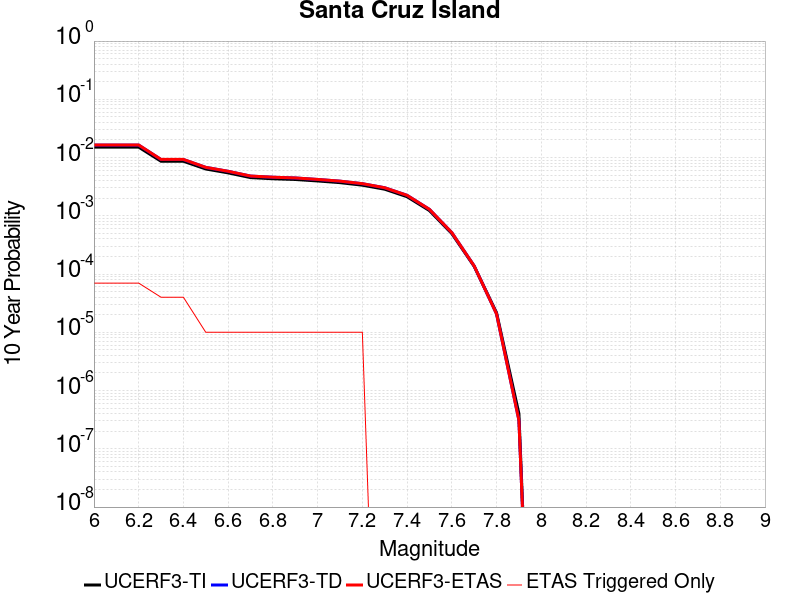 |

| Magnitude | 1 wk TI Prob | 1 wk TD Prob | 1 wk ETAS Prob | 1 wk ETAS/TD Gain | 1 wk ETAS Triggered Only | 1 mo TI Prob | 1 mo TD Prob | 1 mo ETAS Prob | 1 mo ETAS/TD Gain | 1 mo ETAS Triggered Only | 1 yr TI Prob | 1 yr TD Prob | 1 yr ETAS Prob | 1 yr ETAS/TD Gain | 1 yr ETAS Triggered Only | 10 yr TI Prob | 10 yr TD Prob | 10 yr ETAS Prob | 10 yr ETAS/TD Gain | 10 yr ETAS Triggered Only |
|-----|-----|-----|-----|-----|-----|-----|-----|-----|-----|-----|-----|-----|-----|-----|-----|-----|-----|-----|-----|-----|
| 6.0 | 2.9164563E-5 | 3.1599742E-5 | 4.159943E-5 | 1.3164482 | 1.0E-5 | 1.2498499E-4 | 1.3542121E-4 | 1.554185E-4 | 1.1476674 | 2.0E-5 | 0.0015206301 | 0.0016476426 | 0.0016875766 | 1.0242372 | 4.0E-5 | 0.015102667 | 0.016368 | 0.016436854 | 1.0042067 | 7.0E-5 |
| 6.1 | 2.9164563E-5 | 3.1599742E-5 | 4.159943E-5 | 1.3164482 | 1.0E-5 | 1.2498499E-4 | 1.3542121E-4 | 1.554185E-4 | 1.1476674 | 2.0E-5 | 0.0015206301 | 0.0016476426 | 0.0016875766 | 1.0242372 | 4.0E-5 | 0.015102667 | 0.016368 | 0.016436854 | 1.0042067 | 7.0E-5 |
| 6.2 | 2.9164563E-5 | 3.1599742E-5 | 4.159943E-5 | 1.3164482 | 1.0E-5 | 1.2498499E-4 | 1.3542121E-4 | 1.554185E-4 | 1.1476674 | 2.0E-5 | 0.0015206301 | 0.0016476426 | 0.0016875766 | 1.0242372 | 4.0E-5 | 0.015102667 | 0.016368 | 0.016436854 | 1.0042067 | 7.0E-5 |
| 6.3 | 1.6635553E-5 | 1.780436E-5 | 2.780418E-5 | 1.5616502 | 1.0E-5 | 7.1293274E-5 | 7.630227E-5 | 8.63015E-5 | 1.1310477 | 1.0E-5 | 8.6765E-4 | 9.286024E-4 | 9.385931E-4 | 1.0107589 | 1.0E-5 | 0.008642701 | 0.009249094 | 0.009288724 | 1.0042847 | 4.0E-5 |
| 6.4 | 1.6635553E-5 | 1.780436E-5 | 2.780418E-5 | 1.5616502 | 1.0E-5 | 7.1293274E-5 | 7.630227E-5 | 8.63015E-5 | 1.1310477 | 1.0E-5 | 8.6765E-4 | 9.286024E-4 | 9.385931E-4 | 1.0107589 | 1.0E-5 | 0.008642701 | 0.009249094 | 0.009288724 | 1.0042847 | 4.0E-5 |
| 6.5 | 1.2238748E-5 | 1.3042996E-5 | 1.3042996E-5 | 1.0 | 0.0 | 5.2450723E-5 | 5.5897377E-5 | 5.5897377E-5 | 1.0 | 0.0 | 6.3840044E-4 | 6.8034173E-4 | 6.8034173E-4 | 1.0 | 0.0 | 0.0063656955 | 0.006782988 | 0.00679292 | 1.0014642 | 1.0E-5 |
| 6.6 | 1.0489767E-5 | 1.1156636E-5 | 1.1156636E-5 | 1.0 | 0.0 | 4.495537E-5 | 4.781329E-5 | 4.781329E-5 | 1.0 | 0.0 | 5.4719415E-4 | 5.819736E-4 | 5.819736E-4 | 1.0 | 0.0 | 0.005458487 | 0.005804736 | 0.005814678 | 1.0017127 | 1.0E-5 |
| 6.7 | 8.699222E-6 | 9.236783E-6 | 9.236783E-6 | 1.0 | 0.0 | 3.7281847E-5 | 3.958561E-5 | 3.958561E-5 | 1.0 | 0.0 | 4.5381195E-4 | 4.818488E-4 | 4.818488E-4 | 1.0 | 0.0 | 0.0045288634 | 0.004808108 | 0.00481806 | 1.0020698 | 1.0E-5 |
| 6.8 | 8.307732E-6 | 8.8169045E-6 | 8.8169045E-6 | 1.0 | 0.0 | 3.560408E-5 | 3.7786187E-5 | 3.7786187E-5 | 1.0 | 0.0 | 4.3339343E-4 | 4.5995016E-4 | 4.5995016E-4 | 1.0 | 0.0 | 0.004325492 | 0.0045900354 | 0.0045999894 | 1.0021687 | 1.0E-5 |
| 6.9 | 8.073121E-6 | 8.564939E-6 | 8.564939E-6 | 1.0 | 0.0 | 3.459863E-5 | 3.670637E-5 | 3.670637E-5 | 1.0 | 0.0 | 4.2115687E-4 | 4.4680882E-4 | 4.4680882E-4 | 1.0 | 0.0 | 0.004203596 | 0.004459156 | 0.0044691116 | 1.0022326 | 1.0E-5 |
| 7.0 | 7.617019E-6 | 8.074665E-6 | 8.074665E-6 | 1.0 | 0.0 | 3.264396E-5 | 3.4605247E-5 | 3.4605247E-5 | 1.0 | 0.0 | 3.9736772E-4 | 4.2123784E-4 | 4.2123784E-4 | 1.0 | 0.0 | 0.003966579 | 0.0042044413 | 0.0042143995 | 1.0023685 | 1.0E-5 |
| 7.1 | 7.1224836E-6 | 7.5457883E-6 | 7.5457883E-6 | 1.0 | 0.0 | 3.052457E-5 | 3.2338692E-5 | 3.2338692E-5 | 1.0 | 0.0 | 3.715733E-4 | 3.9365282E-4 | 3.9365282E-4 | 1.0 | 0.0 | 0.003709526 | 0.0039295983 | 0.0039395588 | 1.0025347 | 1.0E-5 |
| 7.2 | 6.441115E-6 | 6.8273835E-6 | 6.8273835E-6 | 1.0 | 0.0 | 2.7604487E-5 | 2.9259889E-5 | 2.9259889E-5 | 1.0 | 0.0 | 3.360328E-4 | 3.5618115E-4 | 3.5618115E-4 | 1.0 | 0.0 | 0.0033552512 | 0.0035561312 | 0.0035660956 | 1.002802 | 1.0E-5 |
| 7.3 | 5.494274E-6 | 5.8199944E-6 | 5.8199944E-6 | 1.0 | 0.0 | 2.3546674E-5 | 2.4942596E-5 | 2.4942596E-5 | 1.0 | 0.0 | 2.8664304E-4 | 3.03634E-4 | 3.03634E-4 | 1.0 | 0.0 | 0.002862736 | 0.0030322145 | 0.0030322145 | 1.0 | 0.0 |
| 7.4 | 4.0802624E-6 | 4.3122564E-6 | 4.3122564E-6 | 1.0 | 0.0 | 1.7486722E-5 | 1.8480969E-5 | 1.8480969E-5 | 1.0 | 0.0 | 2.1288003E-4 | 2.2498264E-4 | 2.2498264E-4 | 1.0 | 0.0 | 0.0021267622 | 0.0022475577 | 0.0022475577 | 1.0 | 0.0 |
| 7.5 | 2.3584746E-6 | 2.4753099E-6 | 2.4753099E-6 | 1.0 | 0.0 | 1.0107709E-5 | 1.0608428E-5 | 1.0608428E-5 | 1.0 | 0.0 | 1.2305441E-4 | 1.2915001E-4 | 1.2915001E-4 | 1.0 | 0.0 | 0.0012298629 | 0.0012907545 | 0.0012907545 | 1.0 | 0.0 |
| 7.6 | 9.4981914E-7 | 9.860934E-7 | 9.860934E-7 | 1.0 | 0.0 | 4.0706473E-6 | 4.2261076E-6 | 4.2261076E-6 | 1.0 | 0.0 | 4.9559E-5 | 5.1451658E-5 | 5.1451658E-5 | 1.0 | 0.0 | 4.954795E-4 | 5.1439874E-4 | 5.1439874E-4 | 1.0 | 0.0 |
| 7.7 | 2.6013532E-7 | 2.6416632E-7 | 2.6416632E-7 | 1.0 | 0.0 | 1.1148652E-6 | 1.1321408E-6 | 1.1321408E-6 | 1.0 | 0.0 | 1.3573399E-5 | 1.3783729E-5 | 1.3783729E-5 | 1.0 | 0.0 | 1.357257E-4 | 1.378288E-4 | 1.378288E-4 | 1.0 | 0.0 |
| 7.8 | 4.1522263E-8 | 3.965698E-8 | 3.965698E-8 | 1.0 | 0.0 | 1.7795254E-7 | 1.6995848E-7 | 1.6995848E-7 | 1.0 | 0.0 | 2.16657E-6 | 2.0692428E-6 | 2.0692428E-6 | 1.0 | 0.0 | 2.1665488E-5 | 2.0692256E-5 | 2.0692256E-5 | 1.0 | 0.0 |
| 7.9 | 7.7242046E-10 | 5.9475225E-10 | 5.9475225E-10 | 1.0 | 0.0 | 3.3103735E-9 | 2.5489382E-9 | 2.5489382E-9 | 1.0 | 0.0 | 4.0303796E-8 | 3.1033323E-8 | 3.1033323E-8 | 1.0 | 0.0 | 4.030379E-7 | 3.103332E-7 | 3.103332E-7 | 1.0 | 0.0 |

## Deep Springs
*[(top)](#table-of-contents)*

| 1 Week | 1 Month | 1 Year | 10 Year |
|-----|-----|-----|-----|
|  |  |  |  |

| Magnitude | 1 wk TI Prob | 1 wk TD Prob | 1 wk ETAS Prob | 1 wk ETAS/TD Gain | 1 wk ETAS Triggered Only | 1 mo TI Prob | 1 mo TD Prob | 1 mo ETAS Prob | 1 mo ETAS/TD Gain | 1 mo ETAS Triggered Only | 1 yr TI Prob | 1 yr TD Prob | 1 yr ETAS Prob | 1 yr ETAS/TD Gain | 1 yr ETAS Triggered Only | 10 yr TI Prob | 10 yr TD Prob | 10 yr ETAS Prob | 10 yr ETAS/TD Gain | 10 yr ETAS Triggered Only |
|-----|-----|-----|-----|-----|-----|-----|-----|-----|-----|-----|-----|-----|-----|-----|-----|-----|-----|-----|-----|-----|
| 6.0 | 1.9810619E-5 | 2.311252E-5 | 5.3111828E-5 | 2.297968 | 3.0E-5 | 8.489989E-5 | 9.9052755E-5 | 1.490478E-4 | 1.5047315 | 5.0E-5 | 0.001033166 | 0.0012058078 | 0.0012557475 | 1.0414159 | 5.0E-5 | 0.010283757 | 0.01204243 | 0.012131346 | 1.0073836 | 9.0E-5 |
| 6.1 | 1.9810619E-5 | 2.311252E-5 | 5.3111828E-5 | 2.297968 | 3.0E-5 | 8.489989E-5 | 9.9052755E-5 | 1.490478E-4 | 1.5047315 | 5.0E-5 | 0.001033166 | 0.0012058078 | 0.0012557475 | 1.0414159 | 5.0E-5 | 0.010283757 | 0.01204243 | 0.012131346 | 1.0073836 | 9.0E-5 |
| 6.2 | 1.9810619E-5 | 2.311252E-5 | 5.3111828E-5 | 2.297968 | 3.0E-5 | 8.489989E-5 | 9.9052755E-5 | 1.490478E-4 | 1.5047315 | 5.0E-5 | 0.001033166 | 0.0012058078 | 0.0012557475 | 1.0414159 | 5.0E-5 | 0.010283757 | 0.01204243 | 0.012131346 | 1.0073836 | 9.0E-5 |
| 6.3 | 1.9810619E-5 | 2.311252E-5 | 5.3111828E-5 | 2.297968 | 3.0E-5 | 8.489989E-5 | 9.9052755E-5 | 1.490478E-4 | 1.5047315 | 5.0E-5 | 0.001033166 | 0.0012058078 | 0.0012557475 | 1.0414159 | 5.0E-5 | 0.010283757 | 0.01204243 | 0.012131346 | 1.0073836 | 9.0E-5 |
| 6.4 | 1.9810619E-5 | 2.311252E-5 | 5.3111828E-5 | 2.297968 | 3.0E-5 | 8.489989E-5 | 9.9052755E-5 | 1.490478E-4 | 1.5047315 | 5.0E-5 | 0.001033166 | 0.0012058078 | 0.0012557475 | 1.0414159 | 5.0E-5 | 0.010283757 | 0.01204243 | 0.012131346 | 1.0073836 | 9.0E-5 |
| 6.5 | 1.7190405E-5 | 2.0050558E-5 | 4.0050156E-5 | 1.9974585 | 2.0E-5 | 7.367108E-5 | 8.593096E-5 | 1.2592753E-4 | 1.4654499 | 4.0E-5 | 8.9657627E-4 | 0.0010462092 | 0.0010861674 | 1.0381932 | 4.0E-5 | 0.008929676 | 0.010462061 | 0.010541224 | 1.0075667 | 8.0E-5 |
| 6.6 | 1.7190405E-5 | 2.0050558E-5 | 4.0050156E-5 | 1.9974585 | 2.0E-5 | 7.367108E-5 | 8.593096E-5 | 1.2592753E-4 | 1.4654499 | 4.0E-5 | 8.9657627E-4 | 0.0010462092 | 0.0010861674 | 1.0381932 | 4.0E-5 | 0.008929676 | 0.010462061 | 0.010541224 | 1.0075667 | 8.0E-5 |

## Whittier alt 1
*[(top)](#table-of-contents)*

| 1 Week | 1 Month | 1 Year | 10 Year |
|-----|-----|-----|-----|
|  |  |  | 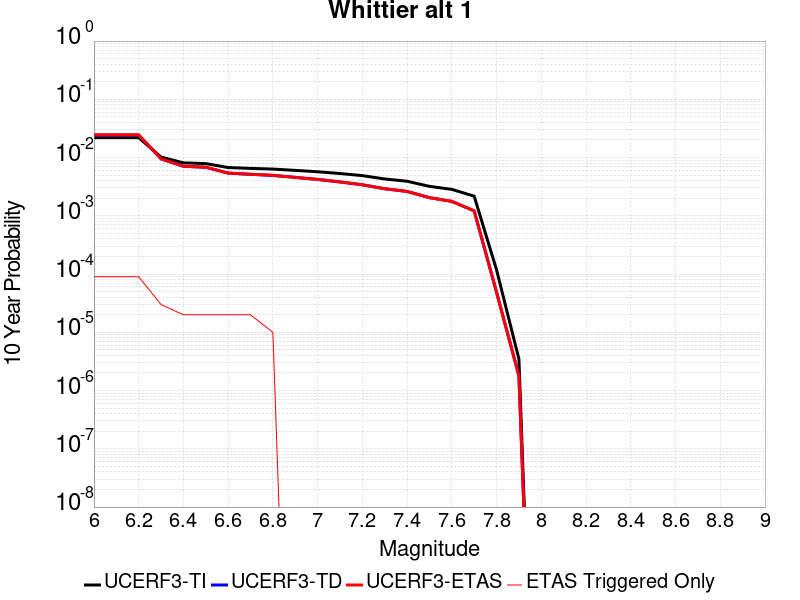 |

| Magnitude | 1 wk TI Prob | 1 wk TD Prob | 1 wk ETAS Prob | 1 wk ETAS/TD Gain | 1 wk ETAS Triggered Only | 1 mo TI Prob | 1 mo TD Prob | 1 mo ETAS Prob | 1 mo ETAS/TD Gain | 1 mo ETAS Triggered Only | 1 yr TI Prob | 1 yr TD Prob | 1 yr ETAS Prob | 1 yr ETAS/TD Gain | 1 yr ETAS Triggered Only | 10 yr TI Prob | 10 yr TD Prob | 10 yr ETAS Prob | 10 yr ETAS/TD Gain | 10 yr ETAS Triggered Only |
|-----|-----|-----|-----|-----|-----|-----|-----|-----|-----|-----|-----|-----|-----|-----|-----|-----|-----|-----|-----|-----|
| 6.0 | 4.2554693E-5 | 4.7252182E-5 | 7.725076E-5 | 1.6348614 | 3.0E-5 | 1.8236451E-4 | 2.0249544E-4 | 2.4248734E-4 | 1.1974953 | 4.0E-5 | 0.002218027 | 0.0024629163 | 0.002532744 | 1.0283515 | 7.0E-5 | 0.02196019 | 0.024390263 | 0.024478069 | 1.0036 | 9.0E-5 |
| 6.1 | 4.2554693E-5 | 4.7252182E-5 | 7.725076E-5 | 1.6348614 | 3.0E-5 | 1.8236451E-4 | 2.0249544E-4 | 2.4248734E-4 | 1.1974953 | 4.0E-5 | 0.002218027 | 0.0024629163 | 0.002532744 | 1.0283515 | 7.0E-5 | 0.02196019 | 0.024390263 | 0.024478069 | 1.0036 | 9.0E-5 |
| 6.2 | 4.2554693E-5 | 4.7252182E-5 | 7.725076E-5 | 1.6348614 | 3.0E-5 | 1.8236451E-4 | 2.0249544E-4 | 2.4248734E-4 | 1.1974953 | 4.0E-5 | 0.002218027 | 0.0024629163 | 0.002532744 | 1.0283515 | 7.0E-5 | 0.02196019 | 0.024390263 | 0.024478069 | 1.0036 | 9.0E-5 |
| 6.3 | 1.9617712E-5 | 1.826841E-5 | 2.8268229E-5 | 1.547383 | 1.0E-5 | 8.40732E-5 | 7.829095E-5 | 8.829016E-5 | 1.1277187 | 1.0E-5 | 0.0010231105 | 9.527944E-4 | 9.827658E-4 | 1.0314564 | 3.0E-5 | 0.01018413 | 0.0094904 | 0.009520114 | 1.003131 | 3.0E-5 |
| 6.4 | 1.5611336E-5 | 1.3604089E-5 | 2.3603954E-5 | 1.7350631 | 1.0E-5 | 6.690401E-5 | 5.8301972E-5 | 6.8301386E-5 | 1.1715108 | 1.0E-5 | 8.142519E-4 | 7.096013E-4 | 7.295871E-4 | 1.0281649 | 2.0E-5 | 0.008112748 | 0.0070753377 | 0.0070951963 | 1.0028067 | 2.0E-5 |
| 6.5 | 1.5150166E-5 | 1.3100744E-5 | 2.3100612E-5 | 1.7633054 | 1.0E-5 | 6.492767E-5 | 5.614487E-5 | 6.6144305E-5 | 1.1781007 | 1.0E-5 | 7.9020765E-4 | 6.8335526E-4 | 7.033416E-4 | 1.0292474 | 2.0E-5 | 0.007874036 | 0.006814508 | 0.0068343715 | 1.0029149 | 2.0E-5 |
| 6.6 | 1.295588E-5 | 1.0380544E-5 | 2.0380441E-5 | 1.9633306 | 1.0E-5 | 5.552402E-5 | 4.44873E-5 | 5.4486853E-5 | 1.2247733 | 1.0E-5 | 6.7579525E-4 | 5.415002E-4 | 5.614894E-4 | 1.0369145 | 2.0E-5 | 0.006737438 | 0.005403343 | 0.0054232352 | 1.0036814 | 2.0E-5 |
| 6.7 | 1.2542085E-5 | 9.899189E-6 | 1.989909E-5 | 2.0101738 | 1.0E-5 | 5.3750682E-5 | 4.2424414E-5 | 5.242399E-5 | 1.2357033 | 1.0E-5 | 6.542181E-4 | 5.163967E-4 | 5.363864E-4 | 1.0387099 | 2.0E-5 | 0.006522954 | 0.005153464 | 0.0051733614 | 1.0038608 | 2.0E-5 |
| 6.8 | 1.2195878E-5 | 9.49523E-6 | 9.49523E-6 | 1.0 | 0.0 | 5.2267E-5 | 4.069322E-5 | 4.069322E-5 | 1.0 | 0.0 | 6.36165E-4 | 4.9532915E-4 | 5.053242E-4 | 1.0201786 | 1.0E-5 | 0.0063434686 | 0.0049436963 | 0.004953647 | 1.0020127 | 1.0E-5 |
| 6.9 | 1.1580298E-5 | 8.772739E-6 | 8.772739E-6 | 1.0 | 0.0 | 4.9628903E-5 | 3.759692E-5 | 3.759692E-5 | 1.0 | 0.0 | 6.040644E-4 | 4.5764804E-4 | 4.5764804E-4 | 1.0 | 0.0 | 0.00602425 | 0.0045684646 | 0.0045684646 | 1.0 | 0.0 |
| 7.0 | 1.0964795E-5 | 8.083794E-6 | 8.083794E-6 | 1.0 | 0.0 | 4.6991136E-5 | 3.4644378E-5 | 3.4644378E-5 | 1.0 | 0.0 | 5.7196687E-4 | 4.217152E-4 | 4.217152E-4 | 1.0 | 0.0 | 0.0057049696 | 0.004210459 | 0.004210459 | 1.0 | 0.0 |
| 7.1 | 1.0230601E-5 | 7.32646E-6 | 7.32646E-6 | 1.0 | 0.0 | 4.3844695E-5 | 3.1398744E-5 | 3.1398744E-5 | 1.0 | 0.0 | 5.336784E-4 | 3.8221394E-4 | 3.8221394E-4 | 1.0 | 0.0 | 0.005323986 | 0.0038167592 | 0.0038167592 | 1.0 | 0.0 |
| 7.2 | 9.40865E-6 | 6.5430822E-6 | 6.5430822E-6 | 1.0 | 0.0 | 4.032216E-5 | 2.8041486E-5 | 2.8041486E-5 | 1.0 | 0.0 | 4.908117E-4 | 3.4135283E-4 | 3.4135283E-4 | 1.0 | 0.0 | 0.0048972913 | 0.0034094024 | 0.0034094024 | 1.0 | 0.0 |
| 7.3 | 8.237384E-6 | 5.5975433E-6 | 5.5975433E-6 | 1.0 | 0.0 | 3.5302593E-5 | 2.3989258E-5 | 2.3989258E-5 | 1.0 | 0.0 | 4.2972428E-4 | 2.920311E-4 | 2.920311E-4 | 1.0 | 0.0 | 0.0042889426 | 0.0029167992 | 0.0029167992 | 1.0 | 0.0 |
| 7.4 | 7.5316966E-6 | 5.0276153E-6 | 5.0276153E-6 | 1.0 | 0.0 | 3.2278298E-5 | 2.154675E-5 | 2.154675E-5 | 1.0 | 0.0 | 3.9291743E-4 | 2.623011E-4 | 2.623011E-4 | 1.0 | 0.0 | 0.0039222343 | 0.0026200267 | 0.0026200267 | 1.0 | 0.0 |
| 7.5 | 6.149649E-6 | 3.9336355E-6 | 3.9336355E-6 | 1.0 | 0.0 | 2.6355372E-5 | 1.6858336E-5 | 1.6858336E-5 | 1.0 | 0.0 | 3.208294E-4 | 2.052318E-4 | 2.052318E-4 | 1.0 | 0.0 | 0.003203666 | 0.0020505118 | 0.0020505118 | 1.0 | 0.0 |
| 7.6 | 5.457711E-6 | 3.3951796E-6 | 3.3951796E-6 | 1.0 | 0.0 | 2.338998E-5 | 1.4550694E-5 | 1.4550694E-5 | 1.0 | 0.0 | 2.8473578E-4 | 1.771411E-4 | 1.771411E-4 | 1.0 | 0.0 | 0.0028437122 | 0.0017700798 | 0.0017700798 | 1.0 | 0.0 |
| 7.7 | 4.1676276E-6 | 2.3329922E-6 | 2.3329922E-6 | 1.0 | 0.0 | 1.7861139E-5 | 9.998504E-6 | 9.998504E-6 | 1.0 | 0.0 | 2.1743766E-4 | 1.2172572E-4 | 1.2172572E-4 | 1.0 | 0.0 | 0.0021722503 | 0.0012166635 | 0.0012166635 | 1.0 | 0.0 |
| 7.8 | 2.2692414E-7 | 9.384417E-8 | 9.384417E-8 | 1.0 | 0.0 | 9.725317E-7 | 4.0218927E-7 | 4.0218927E-7 | 1.0 | 0.0 | 1.1840509E-5 | 4.8966467E-6 | 4.8966467E-6 | 1.0 | 0.0 | 1.1839878E-4 | 4.8965718E-5 | 4.8965718E-5 | 1.0 | 0.0 |
| 7.9 | 6.676829E-9 | 3.4397174E-9 | 3.4397174E-9 | 1.0 | 0.0 | 2.861498E-8 | 1.4741646E-8 | 1.4741646E-8 | 1.0 | 0.0 | 3.4838732E-7 | 1.7947953E-7 | 1.7947953E-7 | 1.0 | 0.0 | 3.4838679E-6 | 1.794794E-6 | 1.794794E-6 | 1.0 | 0.0 |

## Kern Canyon (South Kern) 2011
*[(top)](#table-of-contents)*

| 1 Week | 1 Month | 1 Year | 10 Year |
|-----|-----|-----|-----|
|  |  | 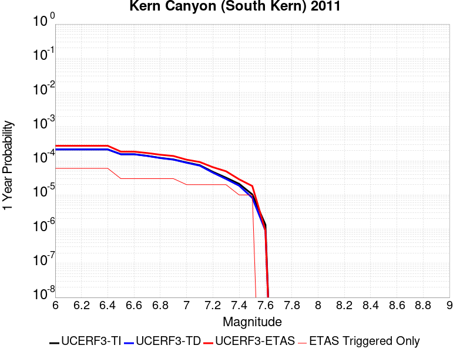 |  |

| Magnitude | 1 wk TI Prob | 1 wk TD Prob | 1 wk ETAS Prob | 1 wk ETAS/TD Gain | 1 wk ETAS Triggered Only | 1 mo TI Prob | 1 mo TD Prob | 1 mo ETAS Prob | 1 mo ETAS/TD Gain | 1 mo ETAS Triggered Only | 1 yr TI Prob | 1 yr TD Prob | 1 yr ETAS Prob | 1 yr ETAS/TD Gain | 1 yr ETAS Triggered Only | 10 yr TI Prob | 10 yr TD Prob | 10 yr ETAS Prob | 10 yr ETAS/TD Gain | 10 yr ETAS Triggered Only |
|-----|-----|-----|-----|-----|-----|-----|-----|-----|-----|-----|-----|-----|-----|-----|-----|-----|-----|-----|-----|-----|
| 6.0 | 4.105075E-6 | 4.113726E-6 | 3.4113604E-5 | 8.292629 | 3.0E-5 | 1.7593058E-5 | 1.7630138E-5 | 6.7629255E-5 | 3.8360026 | 5.0E-5 | 2.1417443E-4 | 2.1462643E-4 | 2.7461356E-4 | 1.2794955 | 6.0E-5 | 0.0021396813 | 0.0021442554 | 0.0022240838 | 1.037229 | 8.0E-5 |
| 6.1 | 4.105075E-6 | 4.113726E-6 | 3.4113604E-5 | 8.292629 | 3.0E-5 | 1.7593058E-5 | 1.7630138E-5 | 6.7629255E-5 | 3.8360026 | 5.0E-5 | 2.1417443E-4 | 2.1462643E-4 | 2.7461356E-4 | 1.2794955 | 6.0E-5 | 0.0021396813 | 0.0021442554 | 0.0022240838 | 1.037229 | 8.0E-5 |
| 6.2 | 4.105075E-6 | 4.113726E-6 | 3.4113604E-5 | 8.292629 | 3.0E-5 | 1.7593058E-5 | 1.7630138E-5 | 6.7629255E-5 | 3.8360026 | 5.0E-5 | 2.1417443E-4 | 2.1462643E-4 | 2.7461356E-4 | 1.2794955 | 6.0E-5 | 0.0021396813 | 0.0021442554 | 0.0022240838 | 1.037229 | 8.0E-5 |
| 6.3 | 4.105075E-6 | 4.113726E-6 | 3.4113604E-5 | 8.292629 | 3.0E-5 | 1.7593058E-5 | 1.7630138E-5 | 6.7629255E-5 | 3.8360026 | 5.0E-5 | 2.1417443E-4 | 2.1462643E-4 | 2.7461356E-4 | 1.2794955 | 6.0E-5 | 0.0021396813 | 0.0021442554 | 0.0022240838 | 1.037229 | 8.0E-5 |
| 6.4 | 4.105075E-6 | 4.113726E-6 | 3.4113604E-5 | 8.292629 | 3.0E-5 | 1.7593058E-5 | 1.7630138E-5 | 6.7629255E-5 | 3.8360026 | 5.0E-5 | 2.1417443E-4 | 2.1462643E-4 | 2.7461356E-4 | 1.2794955 | 6.0E-5 | 0.0021396813 | 0.0021442554 | 0.0022240838 | 1.037229 | 8.0E-5 |
| 6.5 | 2.9849807E-6 | 2.973154E-6 | 2.2973094E-5 | 7.726843 | 2.0E-5 | 1.2792712E-5 | 1.2742028E-5 | 4.2741645E-5 | 3.3543832 | 3.0E-5 | 1.5574014E-4 | 1.551233E-4 | 1.8511864E-4 | 1.1933645 | 3.0E-5 | 0.0015563103 | 0.0015501654 | 0.0016000879 | 1.0322046 | 5.0E-5 |
| 6.6 | 2.9849807E-6 | 2.973154E-6 | 2.2973094E-5 | 7.726843 | 2.0E-5 | 1.2792712E-5 | 1.2742028E-5 | 4.2741645E-5 | 3.3543832 | 3.0E-5 | 1.5574014E-4 | 1.551233E-4 | 1.8511864E-4 | 1.1933645 | 3.0E-5 | 0.0015563103 | 0.0015501654 | 0.0016000879 | 1.0322046 | 5.0E-5 |
| 6.7 | 2.6756725E-6 | 2.6582202E-6 | 2.2658167E-5 | 8.523811 | 2.0E-5 | 1.1467117E-5 | 1.1392323E-5 | 4.139198E-5 | 3.6333222 | 3.0E-5 | 1.396032E-4 | 1.386928E-4 | 1.6868865E-4 | 1.2162753 | 3.0E-5 | 0.0013951553 | 0.0013860734 | 0.0014360042 | 1.0360231 | 5.0E-5 |
| 6.8 | 2.3283721E-6 | 2.3047783E-6 | 2.2304732E-5 | 9.677605 | 2.0E-5 | 9.9787E-6 | 9.877584E-6 | 3.9877286E-5 | 4.03715 | 3.0E-5 | 1.214839E-4 | 1.2025302E-4 | 1.5024941E-4 | 1.249444 | 3.0E-5 | 0.001214175 | 0.001201887 | 0.0012518269 | 1.0415512 | 5.0E-5 |
| 6.9 | 2.0972677E-6 | 2.0696405E-6 | 2.2069598E-5 | 10.663494 | 2.0E-5 | 8.988259E-6 | 8.869858E-6 | 3.886959E-5 | 4.382211 | 3.0E-5 | 1.0942656E-4 | 1.0798523E-4 | 1.3798199E-4 | 1.2777858 | 3.0E-5 | 0.0010937268 | 0.0010793334 | 0.0011292794 | 1.0462749 | 5.0E-5 |
| 7.0 | 1.7132242E-6 | 1.6787029E-6 | 2.167867E-5 | 12.91394 | 2.0E-5 | 7.3423685E-6 | 7.1944214E-6 | 2.7194277E-5 | 3.7799115 | 2.0E-5 | 8.938967E-5 | 8.75886E-5 | 1.0758685E-4 | 1.2283202 | 2.0E-5 | 8.935372E-4 | 8.755446E-4 | 9.0551836E-4 | 1.0342344 | 3.0E-5 |
| 7.1 | 1.4215541E-6 | 1.3815746E-6 | 2.1381547E-5 | 15.476216 | 2.0E-5 | 6.0923603E-6 | 5.9210206E-6 | 2.5920903E-5 | 4.377776 | 2.0E-5 | 7.417196E-5 | 7.208607E-5 | 9.208463E-5 | 1.2774261 | 2.0E-5 | 7.414721E-4 | 7.206296E-4 | 7.406151E-4 | 1.0277336 | 2.0E-5 |
| 7.2 | 9.097853E-7 | 8.60377E-7 | 2.086036E-5 | 24.245605 | 2.0E-5 | 3.899074E-6 | 3.6873246E-6 | 2.3687251E-5 | 6.423967 | 2.0E-5 | 4.7470192E-5 | 4.4892266E-5 | 6.489136E-5 | 1.4454911 | 2.0E-5 | 4.7460053E-4 | 4.4883305E-4 | 4.6882406E-4 | 1.04454 | 2.0E-5 |
| 7.3 | 6.144169E-7 | 5.628199E-7 | 2.056281E-5 | 36.535328 | 2.0E-5 | 2.6332125E-6 | 2.4120832E-6 | 2.2412034E-5 | 9.291569 | 2.0E-5 | 3.205889E-5 | 2.9366722E-5 | 4.9366132E-5 | 1.681023 | 2.0E-5 | 3.2054266E-4 | 2.9362892E-4 | 3.1362305E-4 | 1.0680932 | 2.0E-5 |
| 7.4 | 4.049844E-7 | 3.5728252E-7 | 1.0357279E-5 | 28.989046 | 1.0E-5 | 1.7356463E-6 | 1.5312098E-6 | 1.1531194E-5 | 7.5307736 | 1.0E-5 | 2.1131287E-5 | 1.8642324E-5 | 2.8642136E-5 | 1.5364038 | 1.0E-5 | 2.1129279E-4 | 1.8640784E-4 | 1.9640598E-4 | 1.0536358 | 1.0E-5 |
| 7.5 | 1.9871162E-7 | 1.5830383E-7 | 1.0158302E-5 | 64.169655 | 1.0E-5 | 8.5162094E-7 | 6.784448E-7 | 1.0678438E-5 | 15.739583 | 1.0E-5 | 1.0368436E-5 | 8.260035E-6 | 1.8259952E-5 | 2.2106385 | 1.0E-5 | 1.0367952E-4 | 8.259736E-5 | 9.2596536E-5 | 1.1210592 | 1.0E-5 |
| 7.6 | 2.572245E-8 | 1.735264E-8 | 1.735264E-8 | 1.0 | 0.0 | 1.10239064E-7 | 7.436845E-8 | 7.436845E-8 | 1.0 | 0.0 | 1.3421597E-6 | 9.0543557E-7 | 9.0543557E-7 | 1.0 | 0.0 | 1.3421517E-5 | 9.054324E-6 | 9.054324E-6 | 1.0 | 0.0 |

## Big Pine (Central)
*[(top)](#table-of-contents)*

| 1 Week | 1 Month | 1 Year | 10 Year |
|-----|-----|-----|-----|
|  |  |  |  |

| Magnitude | 1 wk TI Prob | 1 wk TD Prob | 1 wk ETAS Prob | 1 wk ETAS/TD Gain | 1 wk ETAS Triggered Only | 1 mo TI Prob | 1 mo TD Prob | 1 mo ETAS Prob | 1 mo ETAS/TD Gain | 1 mo ETAS Triggered Only | 1 yr TI Prob | 1 yr TD Prob | 1 yr ETAS Prob | 1 yr ETAS/TD Gain | 1 yr ETAS Triggered Only | 10 yr TI Prob | 10 yr TD Prob | 10 yr ETAS Prob | 10 yr ETAS/TD Gain | 10 yr ETAS Triggered Only |
|-----|-----|-----|-----|-----|-----|-----|-----|-----|-----|-----|-----|-----|-----|-----|-----|-----|-----|-----|-----|-----|
| 6.0 | 1.2706755E-5 | 1.4250602E-5 | 3.425032E-5 | 2.4034295 | 2.0E-5 | 5.4456385E-5 | 6.107279E-5 | 9.107096E-5 | 1.4911871 | 3.0E-5 | 6.628048E-4 | 7.433441E-4 | 7.8331435E-4 | 1.0537709 | 4.0E-5 | 0.006608314 | 0.007413639 | 0.007493046 | 1.010711 | 8.0E-5 |
| 6.1 | 8.342579E-6 | 9.510835E-6 | 2.9510646E-5 | 3.1028447 | 2.0E-5 | 3.5753423E-5 | 4.076021E-5 | 7.0758986E-5 | 1.735982 | 3.0E-5 | 4.3521097E-4 | 4.9616426E-4 | 5.261494E-4 | 1.0604339 | 3.0E-5 | 0.0043435963 | 0.004954155 | 0.004993957 | 1.008034 | 4.0E-5 |
| 6.2 | 6.923899E-6 | 7.967221E-6 | 2.7967062E-5 | 3.5102656 | 2.0E-5 | 2.9673516E-5 | 3.4144894E-5 | 6.4143875E-5 | 1.8785787 | 3.0E-5 | 3.6121515E-4 | 4.1565404E-4 | 4.4564158E-4 | 1.0721455 | 3.0E-5 | 0.003606286 | 0.0041521094 | 0.0041919434 | 1.0095936 | 4.0E-5 |
| 6.3 | 2.728396E-6 | 3.4243646E-6 | 1.342433E-5 | 3.9202397 | 1.0E-5 | 1.1693074E-5 | 1.4675771E-5 | 2.4675624E-5 | 1.6813852 | 1.0E-5 | 1.4235388E-4 | 1.7866373E-4 | 1.8866194E-4 | 1.055961 | 1.0E-5 | 0.0014226272 | 0.0017867433 | 0.0018067076 | 1.0111736 | 2.0E-5 |
| 6.4 | 2.7136944E-6 | 3.4086581E-6 | 1.3408624E-5 | 3.9336958 | 1.0E-5 | 1.1630066E-5 | 1.4608458E-5 | 2.4608311E-5 | 1.6845249 | 1.0E-5 | 1.4158686E-4 | 1.7784433E-4 | 1.8784255E-4 | 1.056219 | 1.0E-5 | 0.0014149669 | 0.0017785623 | 0.0017985267 | 1.011225 | 2.0E-5 |
| 6.5 | 2.6971882E-6 | 3.3910032E-6 | 1.3390969E-5 | 3.9489698 | 1.0E-5 | 1.1559327E-5 | 1.4532795E-5 | 2.453265E-5 | 1.6880889 | 1.0E-5 | 1.4072572E-4 | 1.7692328E-4 | 1.869215E-4 | 1.0565116 | 1.0E-5 | 0.0014063664 | 0.0017693666 | 0.0017893312 | 1.0112835 | 2.0E-5 |
| 6.6 | 2.669092E-6 | 3.3610236E-6 | 1.336099E-5 | 3.975274 | 1.0E-5 | 1.1438916E-5 | 1.4404312E-5 | 2.4404168E-5 | 1.6942265 | 1.0E-5 | 1.3925991E-4 | 1.7535927E-4 | 1.8535751E-4 | 1.0570158 | 1.0E-5 | 0.0013917267 | 0.0017537511 | 0.0017737161 | 1.0113841 | 2.0E-5 |
| 6.7 | 2.6408059E-6 | 3.3310494E-6 | 1.3331016E-5 | 4.002047 | 1.0E-5 | 1.1317691E-5 | 1.4275853E-5 | 2.4275709E-5 | 1.7004735 | 1.0E-5 | 1.3778417E-4 | 1.737955E-4 | 1.8379377E-4 | 1.0575289 | 1.0E-5 | 0.0013769877 | 0.0017381381 | 0.0017581034 | 1.0114865 | 2.0E-5 |
| 6.8 | 2.1786943E-6 | 2.8545066E-6 | 2.8545066E-6 | 1.0 | 0.0 | 9.337228E-6 | 1.2233547E-5 | 1.2233547E-5 | 1.0 | 0.0 | 1.1367482E-4 | 1.4893398E-4 | 1.4893398E-4 | 1.0 | 0.0 | 0.0011361669 | 0.0014898704 | 0.0014998555 | 1.006702 | 1.0E-5 |
| 6.9 | 1.4411696E-6 | 2.0685677E-6 | 2.0685677E-6 | 1.0 | 0.0 | 6.1764263E-6 | 8.865261E-6 | 8.865261E-6 | 1.0 | 0.0 | 7.51954E-5 | 1.0792949E-4 | 1.0792949E-4 | 1.0 | 0.0 | 7.5169955E-4 | 0.0010802548 | 0.001090244 | 1.0092471 | 1.0E-5 |
| 7.0 | 1.0073411E-6 | 1.5543274E-6 | 1.5543274E-6 | 1.0 | 0.0 | 4.317169E-6 | 6.661387E-6 | 6.661387E-6 | 1.0 | 0.0 | 5.2560266E-5 | 8.109952E-5 | 8.109952E-5 | 1.0 | 0.0 | 5.2547833E-4 | 8.1217213E-4 | 8.1217213E-4 | 1.0 | 0.0 |
| 7.1 | 8.947104E-7 | 1.430316E-6 | 1.430316E-6 | 1.0 | 0.0 | 3.834468E-6 | 6.1299124E-6 | 6.1299124E-6 | 1.0 | 0.0 | 4.6683643E-5 | 7.462928E-5 | 7.462928E-5 | 1.0 | 0.0 | 4.6673836E-4 | 7.4751483E-4 | 7.4751483E-4 | 1.0 | 0.0 |
| 7.2 | 5.215166E-7 | 1.0112277E-6 | 1.0112277E-6 | 1.0 | 0.0 | 2.2350691E-6 | 4.333826E-6 | 4.333826E-6 | 1.0 | 0.0 | 2.7211627E-5 | 5.27631E-5 | 5.27631E-5 | 1.0 | 0.0 | 2.7208295E-4 | 5.289683E-4 | 5.289683E-4 | 1.0 | 0.0 |
| 7.3 | 4.4024807E-7 | 9.220183E-7 | 9.220183E-7 | 1.0 | 0.0 | 1.8867761E-6 | 3.951501E-6 | 3.951501E-6 | 1.0 | 0.0 | 2.2971257E-5 | 4.8108504E-5 | 4.8108504E-5 | 1.0 | 0.0 | 2.2968883E-4 | 4.824433E-4 | 4.824433E-4 | 1.0 | 0.0 |
| 7.4 | 3.6130905E-7 | 8.359109E-7 | 8.359109E-7 | 1.0 | 0.0 | 1.5484665E-6 | 3.5824705E-6 | 3.5824705E-6 | 1.0 | 0.0 | 1.8852415E-5 | 4.3615746E-5 | 4.3615746E-5 | 1.0 | 0.0 | 1.8850817E-4 | 4.3752496E-4 | 4.3752496E-4 | 1.0 | 0.0 |
| 7.5 | 3.408184E-7 | 8.1087245E-7 | 8.1087245E-7 | 1.0 | 0.0 | 1.4606494E-6 | 3.475163E-6 | 3.475163E-6 | 1.0 | 0.0 | 1.7783263E-5 | 4.230933E-5 | 4.230933E-5 | 1.0 | 0.0 | 1.778184E-4 | 4.2444657E-4 | 4.2444657E-4 | 1.0 | 0.0 |
| 7.6 | 3.1428627E-7 | 7.732167E-7 | 7.732167E-7 | 1.0 | 0.0 | 1.3469405E-6 | 3.313782E-6 | 3.313782E-6 | 1.0 | 0.0 | 1.6398877E-5 | 4.0344585E-5 | 4.0344585E-5 | 1.0 | 0.0 | 1.6397667E-4 | 4.0477706E-4 | 4.0477706E-4 | 1.0 | 0.0 |
| 7.7 | 1.7972785E-7 | 5.0782415E-7 | 5.0782415E-7 | 1.0 | 0.0 | 7.70262E-7 | 2.1763874E-6 | 2.1763874E-6 | 1.0 | 0.0 | 9.377899E-6 | 2.6497206E-5 | 2.6497206E-5 | 1.0 | 0.0 | 9.377503E-5 | 2.6633305E-4 | 2.6633305E-4 | 1.0 | 0.0 |
| 7.8 | 4.9230927E-8 | 1.1981747E-7 | 1.1981747E-7 | 1.0 | 0.0 | 2.1098968E-7 | 5.135033E-7 | 5.135033E-7 | 1.0 | 0.0 | 2.5687964E-6 | 6.2518866E-6 | 6.2518866E-6 | 1.0 | 0.0 | 2.5687666E-5 | 6.2971965E-5 | 6.2971965E-5 | 1.0 | 0.0 |
| 7.9 | 3.6805972E-9 | 4.1051638E-9 | 4.1051638E-9 | 1.0 | 0.0 | 1.5773987E-8 | 1.7593557E-8 | 1.7593557E-8 | 1.0 | 0.0 | 1.9204828E-7 | 2.1420155E-7 | 2.1420155E-7 | 1.0 | 0.0 | 1.920481E-6 | 2.1898923E-6 | 2.1898923E-6 | 1.0 | 0.0 |

## Ventura-Pitas Point
*[(top)](#table-of-contents)*

| 1 Week | 1 Month | 1 Year | 10 Year |
|-----|-----|-----|-----|
|  |  |  |  |

| Magnitude | 1 wk TI Prob | 1 wk TD Prob | 1 wk ETAS Prob | 1 wk ETAS/TD Gain | 1 wk ETAS Triggered Only | 1 mo TI Prob | 1 mo TD Prob | 1 mo ETAS Prob | 1 mo ETAS/TD Gain | 1 mo ETAS Triggered Only | 1 yr TI Prob | 1 yr TD Prob | 1 yr ETAS Prob | 1 yr ETAS/TD Gain | 1 yr ETAS Triggered Only | 10 yr TI Prob | 10 yr TD Prob | 10 yr ETAS Prob | 10 yr ETAS/TD Gain | 10 yr ETAS Triggered Only |
|-----|-----|-----|-----|-----|-----|-----|-----|-----|-----|-----|-----|-----|-----|-----|-----|-----|-----|-----|-----|-----|
| 6.0 | 3.3179622E-5 | 3.373519E-5 | 5.373451E-5 | 1.5928328 | 2.0E-5 | 1.4219063E-4 | 1.4457281E-4 | 1.7456847E-4 | 1.2074779 | 3.0E-5 | 0.0017297962 | 0.0017590097 | 0.0018189042 | 1.0340501 | 6.0E-5 | 0.017163932 | 0.017476497 | 0.017545274 | 1.0039353 | 7.0E-5 |
| 6.1 | 3.3179622E-5 | 3.373519E-5 | 5.373451E-5 | 1.5928328 | 2.0E-5 | 1.4219063E-4 | 1.4457281E-4 | 1.7456847E-4 | 1.2074779 | 3.0E-5 | 0.0017297962 | 0.0017590097 | 0.0018189042 | 1.0340501 | 6.0E-5 | 0.017163932 | 0.017476497 | 0.017545274 | 1.0039353 | 7.0E-5 |
| 6.2 | 3.3179622E-5 | 3.373519E-5 | 5.373451E-5 | 1.5928328 | 2.0E-5 | 1.4219063E-4 | 1.4457281E-4 | 1.7456847E-4 | 1.2074779 | 3.0E-5 | 0.0017297962 | 0.0017590097 | 0.0018189042 | 1.0340501 | 6.0E-5 | 0.017163932 | 0.017476497 | 0.017545274 | 1.0039353 | 7.0E-5 |
| 6.3 | 3.3179622E-5 | 3.373519E-5 | 5.373451E-5 | 1.5928328 | 2.0E-5 | 1.4219063E-4 | 1.4457281E-4 | 1.7456847E-4 | 1.2074779 | 3.0E-5 | 0.0017297962 | 0.0017590097 | 0.0018189042 | 1.0340501 | 6.0E-5 | 0.017163932 | 0.017476497 | 0.017545274 | 1.0039353 | 7.0E-5 |
| 6.4 | 1.8754668E-5 | 1.7019594E-5 | 2.7019423E-5 | 1.5875481 | 1.0E-5 | 8.037467E-5 | 7.2939205E-5 | 8.293848E-5 | 1.1370904 | 1.0E-5 | 9.781223E-4 | 8.8769617E-4 | 9.176695E-4 | 1.0337653 | 3.0E-5 | 0.009738282 | 0.008843943 | 0.008883589 | 1.0044829 | 4.0E-5 |
| 6.5 | 1.8754668E-5 | 1.7019594E-5 | 2.7019423E-5 | 1.5875481 | 1.0E-5 | 8.037467E-5 | 7.2939205E-5 | 8.293848E-5 | 1.1370904 | 1.0E-5 | 9.781223E-4 | 8.8769617E-4 | 9.176695E-4 | 1.0337653 | 3.0E-5 | 0.009738282 | 0.008843943 | 0.008883589 | 1.0044829 | 4.0E-5 |
| 6.6 | 1.4361558E-5 | 1.2122258E-5 | 2.2122136E-5 | 1.8249189 | 1.0E-5 | 6.154808E-5 | 5.1951512E-5 | 6.1950996E-5 | 1.1924772 | 1.0E-5 | 7.490902E-4 | 6.323284E-4 | 6.5231574E-4 | 1.0316092 | 2.0E-5 | 0.0074657016 | 0.006305652 | 0.006325526 | 1.0031518 | 2.0E-5 |
| 6.7 | 1.4361558E-5 | 1.2122258E-5 | 2.2122136E-5 | 1.8249189 | 1.0E-5 | 6.154808E-5 | 5.1951512E-5 | 6.1950996E-5 | 1.1924772 | 1.0E-5 | 7.490902E-4 | 6.323284E-4 | 6.5231574E-4 | 1.0316092 | 2.0E-5 | 0.0074657016 | 0.006305652 | 0.006325526 | 1.0031518 | 2.0E-5 |
| 6.8 | 1.3663846E-5 | 1.1344401E-5 | 2.1344287E-5 | 1.8814821 | 1.0E-5 | 5.8558027E-5 | 4.8617967E-5 | 5.861748E-5 | 1.2056752 | 1.0E-5 | 7.127108E-4 | 5.917649E-4 | 6.117531E-4 | 1.0337772 | 2.0E-5 | 0.007104293 | 0.0059022107 | 0.005922093 | 1.0033686 | 2.0E-5 |
| 6.9 | 1.3644157E-5 | 1.1322501E-5 | 2.1322388E-5 | 1.883187 | 1.0E-5 | 5.8473648E-5 | 4.8524114E-5 | 5.852363E-5 | 1.206073 | 1.0E-5 | 7.116841E-4 | 5.906229E-4 | 6.106111E-4 | 1.0338426 | 2.0E-5 | 0.007094092 | 0.0058908514 | 0.0059107337 | 1.003375 | 2.0E-5 |
| 7.0 | 1.3568845E-5 | 1.12420685E-5 | 2.1241956E-5 | 1.889506 | 1.0E-5 | 5.8150898E-5 | 4.8179416E-5 | 5.817893E-5 | 1.2075475 | 1.0E-5 | 7.077572E-4 | 5.8642845E-4 | 6.064167E-4 | 1.0340848 | 2.0E-5 | 0.007055073 | 0.005849128 | 0.0058690114 | 1.0033994 | 2.0E-5 |
| 7.1 | 1.306572E-5 | 1.0720521E-5 | 2.0720414E-5 | 1.9327805 | 1.0E-5 | 5.599474E-5 | 4.594429E-5 | 5.594383E-5 | 1.2176449 | 1.0E-5 | 6.815227E-4 | 5.5923004E-4 | 5.7921885E-4 | 1.0357435 | 2.0E-5 | 0.0067943637 | 0.005578536 | 0.0055984245 | 1.0035652 | 2.0E-5 |
| 7.2 | 1.232604E-5 | 9.995121E-6 | 1.9995021E-5 | 2.000478 | 1.0E-5 | 5.2824813E-5 | 4.283554E-5 | 5.2835112E-5 | 1.233441 | 1.0E-5 | 6.429523E-4 | 5.2139966E-4 | 5.413893E-4 | 1.0383383 | 2.0E-5 | 0.0064109527 | 0.005202059 | 0.005221955 | 1.0038246 | 2.0E-5 |
| 7.3 | 1.0917261E-5 | 8.843812E-6 | 1.8843724E-5 | 2.1307242 | 1.0E-5 | 4.678742E-5 | 3.7901507E-5 | 4.790113E-5 | 1.2638317 | 1.0E-5 | 5.69488E-4 | 4.6135474E-4 | 4.813455E-4 | 1.0433306 | 2.0E-5 | 0.0056803077 | 0.004604239 | 0.004624147 | 1.0043238 | 2.0E-5 |
| 7.4 | 1.039959E-5 | 8.42354E-6 | 1.8423456E-5 | 2.1871393 | 1.0E-5 | 4.456891E-5 | 3.6100395E-5 | 4.6100035E-5 | 1.2769953 | 1.0E-5 | 5.424914E-4 | 4.394352E-4 | 4.5942643E-4 | 1.045493 | 2.0E-5 | 0.0054116896 | 0.0043859277 | 0.0044058403 | 1.0045401 | 2.0E-5 |
| 7.5 | 9.015877E-6 | 7.29752E-6 | 1.7297447E-5 | 2.3703187 | 1.0E-5 | 3.86389E-5 | 3.1274718E-5 | 4.1274405E-5 | 1.3197371 | 1.0E-5 | 4.7032707E-4 | 3.8070456E-4 | 4.0069697E-4 | 1.0525142 | 2.0E-5 | 0.004693329 | 0.003800772 | 0.003820696 | 1.0052421 | 2.0E-5 |
| 7.6 | 4.900162E-6 | 3.874119E-6 | 3.874119E-6 | 1.0 | 0.0 | 2.1000526E-5 | 1.6603262E-5 | 1.6603262E-5 | 1.0 | 0.0 | 2.556514E-4 | 2.0212609E-4 | 2.1212407E-4 | 1.0494641 | 1.0E-5 | 0.0025535747 | 0.002019436 | 0.002029416 | 1.0049418 | 1.0E-5 |
| 7.7 | 3.8850626E-6 | 3.12676E-6 | 3.12676E-6 | 1.0 | 0.0 | 1.6650163E-5 | 1.3400332E-5 | 1.3400332E-5 | 1.0 | 0.0 | 2.0269687E-4 | 1.6313691E-4 | 1.7313528E-4 | 1.0612882 | 1.0E-5 | 0.002025121 | 0.0016301809 | 0.0016401645 | 1.0061243 | 1.0E-5 |
| 7.8 | 2.4654719E-6 | 2.029902E-6 | 2.029902E-6 | 1.0 | 0.0 | 1.0566265E-5 | 8.699551E-6 | 8.699551E-6 | 1.0 | 0.0 | 1.2863669E-4 | 1.0591193E-4 | 1.0591193E-4 | 1.0 | 0.0 | 0.0012856225 | 0.0010586192 | 0.0010586192 | 1.0 | 0.0 |
| 7.9 | 4.095894E-7 | 3.2765078E-7 | 3.2765078E-7 | 1.0 | 0.0 | 1.7553821E-6 | 1.4042168E-6 | 1.4042168E-6 | 1.0 | 0.0 | 2.1371567E-5 | 1.709621E-5 | 1.709621E-5 | 1.0 | 0.0 | 2.1369511E-4 | 1.7094925E-4 | 1.7094925E-4 | 1.0 | 0.0 |
| 8.0 | 7.791402E-9 | 5.6836056E-9 | 5.6836056E-9 | 1.0 | 0.0 | 3.3391725E-8 | 2.4358311E-8 | 2.4358311E-8 | 1.0 | 0.0 | 4.0654416E-7 | 2.965624E-7 | 2.965624E-7 | 1.0 | 0.0 | 4.065434E-6 | 2.9656223E-6 | 2.9656223E-6 | 1.0 | 0.0 |

## San Jacinto (San Bernardino)
*[(top)](#table-of-contents)*

| 1 Week | 1 Month | 1 Year | 10 Year |
|-----|-----|-----|-----|
|  |  |  |  |

| Magnitude | 1 wk TI Prob | 1 wk TD Prob | 1 wk ETAS Prob | 1 wk ETAS/TD Gain | 1 wk ETAS Triggered Only | 1 mo TI Prob | 1 mo TD Prob | 1 mo ETAS Prob | 1 mo ETAS/TD Gain | 1 mo ETAS Triggered Only | 1 yr TI Prob | 1 yr TD Prob | 1 yr ETAS Prob | 1 yr ETAS/TD Gain | 1 yr ETAS Triggered Only | 10 yr TI Prob | 10 yr TD Prob | 10 yr ETAS Prob | 10 yr ETAS/TD Gain | 10 yr ETAS Triggered Only |
|-----|-----|-----|-----|-----|-----|-----|-----|-----|-----|-----|-----|-----|-----|-----|-----|-----|-----|-----|-----|-----|
| 6.0 | 3.409352E-5 | 3.598562E-5 | 5.59849E-5 | 1.5557575 | 2.0E-5 | 1.461069E-4 | 1.5421498E-4 | 1.9420881E-4 | 1.2593381 | 4.0E-5 | 0.0017774 | 0.0018759521 | 0.0019358395 | 1.0319238 | 6.0E-5 | 0.01763251 | 0.019349992 | 0.019428443 | 1.0040544 | 8.0E-5 |
| 6.1 | 3.409352E-5 | 3.598562E-5 | 5.59849E-5 | 1.5557575 | 2.0E-5 | 1.461069E-4 | 1.5421498E-4 | 1.9420881E-4 | 1.2593381 | 4.0E-5 | 0.0017774 | 0.0018759521 | 0.0019358395 | 1.0319238 | 6.0E-5 | 0.01763251 | 0.019349992 | 0.019428443 | 1.0040544 | 8.0E-5 |
| 6.2 | 3.409352E-5 | 3.598562E-5 | 5.59849E-5 | 1.5557575 | 2.0E-5 | 1.461069E-4 | 1.5421498E-4 | 1.9420881E-4 | 1.2593381 | 4.0E-5 | 0.0017774 | 0.0018759521 | 0.0019358395 | 1.0319238 | 6.0E-5 | 0.01763251 | 0.019349992 | 0.019428443 | 1.0040544 | 8.0E-5 |
| 6.3 | 3.409352E-5 | 3.598562E-5 | 5.59849E-5 | 1.5557575 | 2.0E-5 | 1.461069E-4 | 1.5421498E-4 | 1.9420881E-4 | 1.2593381 | 4.0E-5 | 0.0017774 | 0.0018759521 | 0.0019358395 | 1.0319238 | 6.0E-5 | 0.01763251 | 0.019349992 | 0.019428443 | 1.0040544 | 8.0E-5 |
| 6.4 | 3.400795E-5 | 3.5878285E-5 | 5.587757E-5 | 1.5574203 | 2.0E-5 | 1.4574021E-4 | 1.5375503E-4 | 1.9374887E-4 | 1.2601141 | 4.0E-5 | 0.0017729428 | 0.0018703619 | 0.0019302496 | 1.0320194 | 6.0E-5 | 0.017588645 | 0.019295072 | 0.019373529 | 1.0040661 | 8.0E-5 |
| 6.5 | 3.341482E-5 | 3.5138914E-5 | 5.513821E-5 | 1.5691495 | 2.0E-5 | 1.4319851E-4 | 1.5058667E-4 | 1.9058064E-4 | 1.2655878 | 4.0E-5 | 0.0017420477 | 0.0018318522 | 0.0018817607 | 1.0272448 | 5.0E-5 | 0.017284546 | 0.018916614 | 0.01897548 | 1.0031118 | 6.0E-5 |
| 6.6 | 3.3364955E-5 | 3.5076133E-5 | 5.507543E-5 | 1.5701683 | 2.0E-5 | 1.4298483E-4 | 1.5031763E-4 | 1.9031162E-4 | 1.2660632 | 4.0E-5 | 0.0017394501 | 0.0018285823 | 0.0018784909 | 1.0272936 | 5.0E-5 | 0.017258976 | 0.018884478 | 0.018943345 | 1.0031172 | 6.0E-5 |
| 6.7 | 3.335922E-5 | 3.5065907E-5 | 5.5065204E-5 | 1.5703346 | 2.0E-5 | 1.4296026E-4 | 1.5027382E-4 | 1.902678E-4 | 1.2661408 | 4.0E-5 | 0.0017391514 | 0.0018280497 | 0.0018779583 | 1.0273015 | 5.0E-5 | 0.017256035 | 0.01887927 | 0.018938137 | 1.003118 | 6.0E-5 |
| 6.8 | 3.327683E-5 | 3.4959972E-5 | 5.4959273E-5 | 1.5720628 | 2.0E-5 | 1.4260718E-4 | 1.4981985E-4 | 1.8981386E-4 | 1.2669473 | 4.0E-5 | 0.0017348597 | 0.001822532 | 0.0018724409 | 1.0273844 | 5.0E-5 | 0.017213784 | 0.018825043 | 0.018883914 | 1.0031272 | 6.0E-5 |
| 6.9 | 3.3235785E-5 | 3.4900928E-5 | 5.490023E-5 | 1.5730307 | 2.0E-5 | 1.4243131E-4 | 1.4956683E-4 | 1.8956084E-4 | 1.267399 | 4.0E-5 | 0.0017327217 | 0.0018194567 | 0.0018693657 | 1.0274308 | 5.0E-5 | 0.017192734 | 0.01879491 | 0.018853782 | 1.0031323 | 6.0E-5 |
| 7.0 | 3.3197095E-5 | 3.4840854E-5 | 5.484016E-5 | 1.5740187 | 2.0E-5 | 1.422655E-4 | 1.4930942E-4 | 1.8930344E-4 | 1.26786 | 4.0E-5 | 0.0017307063 | 0.0018163278 | 0.001866237 | 1.0274781 | 5.0E-5 | 0.017172894 | 0.018764287 | 0.018823162 | 1.0031376 | 6.0E-5 |
| 7.1 | 3.3129716E-5 | 3.4721066E-5 | 5.472037E-5 | 1.5759993 | 2.0E-5 | 1.4197677E-4 | 1.4879608E-4 | 1.8879013E-4 | 1.2687843 | 4.0E-5 | 0.0017271966 | 0.0018100884 | 0.001859998 | 1.027573 | 5.0E-5 | 0.017138338 | 0.018703364 | 0.018762242 | 1.003148 | 6.0E-5 |
| 7.2 | 3.3034008E-5 | 3.4588513E-5 | 5.458782E-5 | 1.5782067 | 2.0E-5 | 1.4156665E-4 | 1.4822806E-4 | 1.8822213E-4 | 1.2698145 | 4.0E-5 | 0.0017222111 | 0.0018031843 | 0.0018530941 | 1.0276787 | 5.0E-5 | 0.017089253 | 0.018635748 | 0.01869463 | 1.0031596 | 6.0E-5 |
| 7.3 | 3.2956614E-5 | 3.4456265E-5 | 5.4455577E-5 | 1.580426 | 2.0E-5 | 1.4123498E-4 | 1.4766137E-4 | 1.8765546E-4 | 1.2708501 | 4.0E-5 | 0.0017181796 | 0.0017962961 | 0.0018462063 | 1.0277851 | 5.0E-5 | 0.017049557 | 0.018568495 | 0.018627381 | 1.0031713 | 6.0E-5 |
| 7.4 | 3.2915937E-5 | 3.4377957E-5 | 4.4377615E-5 | 1.290874 | 1.0E-5 | 1.4106068E-4 | 1.473258E-4 | 1.7732137E-4 | 1.2036003 | 3.0E-5 | 0.0017160608 | 0.0017922173 | 0.0018321456 | 1.0222787 | 4.0E-5 | 0.017028693 | 0.018528767 | 0.01857784 | 1.0026485 | 5.0E-5 |
| 7.5 | 3.281791E-5 | 3.424287E-5 | 4.4242526E-5 | 1.2920216 | 1.0E-5 | 1.406406E-4 | 1.4674691E-4 | 1.7674251E-4 | 1.2044036 | 3.0E-5 | 0.0017109542 | 0.0017851809 | 0.0018251095 | 1.0223666 | 4.0E-5 | 0.016978411 | 0.018459652 | 0.018508729 | 1.0026586 | 5.0E-5 |
| 7.6 | 3.2521442E-5 | 3.396782E-5 | 4.396748E-5 | 1.2943863 | 1.0E-5 | 1.3937015E-4 | 1.4556825E-4 | 1.7556388E-4 | 1.2060589 | 3.0E-5 | 0.0016955109 | 0.0017708542 | 0.0018107834 | 1.022548 | 4.0E-5 | 0.016826328 | 0.018317293 | 0.018366378 | 1.0026797 | 5.0E-5 |
| 7.7 | 3.0287873E-5 | 3.245191E-5 | 4.2451586E-5 | 1.3081383 | 1.0E-5 | 1.297987E-4 | 1.3907222E-4 | 1.6906804E-4 | 1.2156852 | 3.0E-5 | 0.0015791537 | 0.0016918903 | 0.0017318226 | 1.0236022 | 4.0E-5 | 0.01567979 | 0.017528197 | 0.017577322 | 1.0028025 | 5.0E-5 |
| 7.8 | 2.6316151E-5 | 2.9662837E-5 | 3.966254E-5 | 1.3371122 | 1.0E-5 | 1.1277862E-4 | 1.2712025E-4 | 1.5711643E-4 | 1.235967 | 3.0E-5 | 0.0013722149 | 0.0015465913 | 0.0015865294 | 1.0258234 | 4.0E-5 | 0.013637724 | 0.016069876 | 0.016119072 | 1.0030614 | 5.0E-5 |
| 7.9 | 2.0761147E-5 | 2.3417291E-5 | 3.3417058E-5 | 1.4270248 | 1.0E-5 | 8.897331E-5 | 1.0035596E-4 | 1.3035296E-4 | 1.2989058 | 3.0E-5 | 0.0010827117 | 0.0012211498 | 0.001261101 | 1.032716 | 4.0E-5 | 0.010774517 | 0.01279327 | 0.01284263 | 1.0038583 | 5.0E-5 |
| 8.0 | 1.5738568E-5 | 1.6032505E-5 | 2.6032345E-5 | 1.6237228 | 1.0E-5 | 6.744926E-5 | 6.8708934E-5 | 8.870756E-5 | 1.291063 | 2.0E-5 | 8.2088535E-4 | 8.3621085E-4 | 8.561941E-4 | 1.0238974 | 2.0E-5 | 0.008178596 | 0.008865741 | 0.008885563 | 1.0022359 | 2.0E-5 |
| 8.1 | 1.0105832E-5 | 8.329479E-6 | 8.329479E-6 | 1.0 | 0.0 | 4.3309992E-5 | 3.569728E-5 | 3.569728E-5 | 1.0 | 0.0 | 5.2717153E-4 | 4.3452822E-4 | 4.3452822E-4 | 1.0 | 0.0 | 0.005259227 | 0.0046768794 | 0.0046768794 | 1.0 | 0.0 |
| 8.2 | 4.189207E-6 | 1.577699E-6 | 1.577699E-6 | 1.0 | 0.0 | 1.7953622E-5 | 6.7615497E-6 | 6.7615497E-6 | 1.0 | 0.0 | 2.1856341E-4 | 8.231879E-5 | 8.231879E-5 | 1.0 | 0.0 | 0.0021834858 | 9.562628E-4 | 9.562628E-4 | 1.0 | 0.0 |
| 8.3 | 1.2758221E-6 | 3.612677E-7 | 3.612677E-7 | 1.0 | 0.0 | 5.4677976E-6 | 1.5482892E-6 | 1.5482892E-6 | 1.0 | 0.0 | 6.65684E-5 | 1.8850264E-5 | 1.8850264E-5 | 1.0 | 0.0 | 6.6548464E-4 | 2.2739546E-4 | 2.2739546E-4 | 1.0 | 0.0 |

## Imperial
*[(top)](#table-of-contents)*

| 1 Week | 1 Month | 1 Year | 10 Year |
|-----|-----|-----|-----|
|  |  |  |  |

| Magnitude | 1 wk TI Prob | 1 wk TD Prob | 1 wk ETAS Prob | 1 wk ETAS/TD Gain | 1 wk ETAS Triggered Only | 1 mo TI Prob | 1 mo TD Prob | 1 mo ETAS Prob | 1 mo ETAS/TD Gain | 1 mo ETAS Triggered Only | 1 yr TI Prob | 1 yr TD Prob | 1 yr ETAS Prob | 1 yr ETAS/TD Gain | 1 yr ETAS Triggered Only | 10 yr TI Prob | 10 yr TD Prob | 10 yr ETAS Prob | 10 yr ETAS/TD Gain | 10 yr ETAS Triggered Only |
|-----|-----|-----|-----|-----|-----|-----|-----|-----|-----|-----|-----|-----|-----|-----|-----|-----|-----|-----|-----|-----|
| 6.0 | 2.7496446E-4 | 5.055345E-4 | 5.155295E-4 | 1.0197711 | 1.0E-5 | 0.0011778869 | 0.002164817 | 0.0021847738 | 1.0092187 | 2.0E-5 | 0.0142467655 | 0.026048409 | 0.026106847 | 1.0022434 | 6.0E-5 | 0.13367249 | 0.22807029 | 0.22813204 | 1.0002707 | 8.0E-5 |
| 6.1 | 2.5356023E-4 | 4.8657708E-4 | 4.9657223E-4 | 1.0205418 | 1.0E-5 | 0.001086234 | 0.002083702 | 0.0021036605 | 1.0095783 | 2.0E-5 | 0.013144928 | 0.02507094 | 0.025129434 | 1.0023332 | 6.0E-5 | 0.123940155 | 0.21949561 | 0.21955806 | 1.0002844 | 8.0E-5 |
| 6.2 | 2.4820742E-4 | 4.775311E-4 | 4.8752633E-4 | 1.020931 | 1.0E-5 | 0.0010633124 | 0.0020449946 | 0.0020649538 | 1.00976 | 2.0E-5 | 0.01286919 | 0.024610676 | 0.024669198 | 1.002378 | 6.0E-5 | 0.12148927 | 0.21600136 | 0.2160641 | 1.0002904 | 8.0E-5 |
| 6.3 | 2.3205351E-4 | 4.5892023E-4 | 4.6891565E-4 | 1.0217803 | 1.0E-5 | 9.94136E-4 | 0.0019653554 | 0.0019853162 | 1.0101563 | 2.0E-5 | 0.012036599 | 0.023661187 | 0.023719767 | 1.0024759 | 6.0E-5 | 0.11405133 | 0.20793827 | 0.20800163 | 1.0003047 | 8.0E-5 |
| 6.4 | 2.0304754E-4 | 3.9878016E-4 | 4.0877616E-4 | 1.0250665 | 1.0E-5 | 8.6991355E-4 | 0.0017079529 | 0.0017279189 | 1.0116899 | 2.0E-5 | 0.010539869 | 0.020595418 | 0.020654183 | 1.0028533 | 6.0E-5 | 0.100537635 | 0.18507113 | 0.18513632 | 1.0003523 | 8.0E-5 |
| 6.5 | 1.854992E-4 | 3.6990462E-4 | 3.7990094E-4 | 1.027024 | 1.0E-5 | 7.9475436E-4 | 0.0015843548 | 0.001604323 | 1.0126034 | 2.0E-5 | 0.009633281 | 0.01911443 | 0.019173281 | 1.0030789 | 6.0E-5 | 0.0922623 | 0.17330389 | 0.17337003 | 1.0003816 | 8.0E-5 |
| 6.6 | 1.6586106E-4 | 3.4036173E-4 | 3.5035834E-4 | 1.0293705 | 1.0E-5 | 7.106394E-4 | 0.0014578878 | 0.0014678733 | 1.0068493 | 1.0E-5 | 0.008617763 | 0.017607626 | 0.01764692 | 1.0022317 | 4.0E-5 | 0.08291132 | 0.16078055 | 0.1608309 | 1.0003132 | 6.0E-5 |
| 6.7 | 1.4224656E-4 | 3.076812E-4 | 3.1767812E-4 | 1.0324912 | 1.0E-5 | 6.094856E-4 | 0.0013179756 | 0.0013279624 | 1.0075774 | 1.0E-5 | 0.0073952693 | 0.015928522 | 0.015958043 | 1.0018535 | 3.0E-5 | 0.07153955 | 0.14648798 | 0.14653066 | 1.0002913 | 5.0E-5 |
| 6.8 | 1.2317259E-4 | 2.779231E-4 | 2.8792032E-4 | 1.0359712 | 1.0E-5 | 5.2777573E-4 | 0.0011905615 | 0.0012005495 | 1.0083894 | 1.0E-5 | 0.0064067547 | 0.014400131 | 0.014429699 | 1.0020533 | 3.0E-5 | 0.06225166 | 0.13294087 | 0.13298424 | 1.0003262 | 5.0E-5 |
| 6.9 | 9.859898E-5 | 2.5015484E-4 | 2.6015233E-4 | 1.0399653 | 1.0E-5 | 4.2249862E-4 | 0.0010716559 | 0.0010816451 | 1.0093213 | 1.0E-5 | 0.0051317946 | 0.012970319 | 0.0129999295 | 1.002283 | 3.0E-5 | 0.05014893 | 0.119408876 | 0.1194529 | 1.0003687 | 5.0E-5 |
| 7.0 | 7.3191884E-5 | 2.1267848E-4 | 2.2267636E-4 | 1.0470093 | 1.0E-5 | 3.136418E-4 | 9.11164E-4 | 9.2115486E-4 | 1.010965 | 1.0E-5 | 0.003811904 | 0.011037681 | 0.01106735 | 1.0026879 | 3.0E-5 | 0.037471764 | 0.10206756 | 0.10211246 | 1.0004399 | 5.0E-5 |
| 7.1 | 7.1760296E-5 | 2.0969207E-4 | 2.1968997E-4 | 1.047679 | 1.0E-5 | 3.0750787E-4 | 8.9837395E-4 | 9.0836495E-4 | 1.0111213 | 1.0E-5 | 0.003737482 | 0.010883528 | 0.010913202 | 1.0027264 | 3.0E-5 | 0.03675245 | 0.10070406 | 0.10074902 | 1.0004466 | 5.0E-5 |
| 7.2 | 6.46614E-5 | 1.9137723E-4 | 2.0137531E-4 | 1.0522429 | 1.0E-5 | 2.7709085E-4 | 8.199333E-4 | 8.299251E-4 | 1.0121862 | 1.0E-5 | 0.0033683628 | 0.009937617 | 0.00996732 | 1.0029888 | 3.0E-5 | 0.033177625 | 0.092511006 | 0.092547305 | 1.0003924 | 4.0E-5 |
| 7.3 | 6.088115E-5 | 1.780939E-4 | 1.8809212E-4 | 1.0561402 | 1.0E-5 | 2.6089314E-4 | 7.6303916E-4 | 7.7303156E-4 | 1.0130955 | 1.0E-5 | 0.0031717476 | 0.009251006 | 0.009280728 | 1.0032129 | 3.0E-5 | 0.031268585 | 0.08656135 | 0.08659789 | 1.0004221 | 4.0E-5 |
| 7.4 | 4.199346E-5 | 1.1511097E-4 | 1.2510981E-4 | 1.0868627 | 1.0E-5 | 1.7995955E-4 | 4.932403E-4 | 5.032354E-4 | 1.0202641 | 1.0E-5 | 0.0021888057 | 0.005988835 | 0.0060186554 | 1.0049794 | 3.0E-5 | 0.02167372 | 0.05744024 | 0.05747794 | 1.0006564 | 4.0E-5 |
| 7.5 | 3.130448E-5 | 8.333871E-5 | 9.3337876E-5 | 1.1199822 | 1.0E-5 | 1.3415517E-4 | 3.5711733E-4 | 3.6711377E-4 | 1.027992 | 1.0E-5 | 0.0016321153 | 0.0043392954 | 0.004369165 | 1.0068836 | 3.0E-5 | 0.016201803 | 0.042133506 | 0.04217182 | 1.0009093 | 4.0E-5 |
| 7.6 | 2.3074248E-5 | 6.0849357E-5 | 7.084875E-5 | 1.1643302 | 1.0E-5 | 9.888588E-5 | 2.6075702E-4 | 2.7075442E-4 | 1.0383399 | 1.0E-5 | 0.0012032706 | 0.0031701182 | 0.0032000232 | 1.0094334 | 3.0E-5 | 0.011967761 | 0.03102816 | 0.031066919 | 1.0012492 | 4.0E-5 |
| 7.7 | 1.45864815E-5 | 4.0128452E-5 | 5.0128052E-5 | 1.2491897 | 1.0E-5 | 6.2511994E-5 | 1.7196777E-4 | 1.8196605E-4 | 1.0581404 | 1.0E-5 | 7.608177E-4 | 0.0020917025 | 0.00212164 | 1.0143124 | 3.0E-5 | 0.007582182 | 0.02062909 | 0.020668263 | 1.001899 | 4.0E-5 |
| 7.8 | 1.0352979E-5 | 3.096395E-5 | 4.096364E-5 | 1.3229462 | 1.0E-5 | 4.4369157E-5 | 1.326959E-4 | 1.4269458E-4 | 1.0753503 | 1.0E-5 | 5.400606E-4 | 0.0016143778 | 0.0016443294 | 1.018553 | 3.0E-5 | 0.0053875 | 0.016017891 | 0.016057251 | 1.0024573 | 4.0E-5 |
| 7.9 | 8.137906E-6 | 2.2151205E-5 | 2.2151205E-5 | 1.0 | 0.0 | 3.4876273E-5 | 9.493029E-5 | 9.493029E-5 | 1.0 | 0.0 | 4.2453592E-4 | 0.0011551644 | 0.0011751413 | 1.0172936 | 2.0E-5 | 0.004237258 | 0.011618841 | 0.011648493 | 1.002552 | 3.0E-5 |
| 8.0 | 6.93792E-6 | 1.8010365E-5 | 1.8010365E-5 | 1.0 | 0.0 | 2.9733603E-5 | 7.7185E-5 | 7.7185E-5 | 1.0 | 0.0 | 3.6194647E-4 | 9.3932304E-4 | 9.593042E-4 | 1.021272 | 2.0E-5 | 0.0036135751 | 0.009502414 | 0.009532129 | 1.0031271 | 3.0E-5 |
| 8.1 | 3.4286315E-6 | 6.380179E-6 | 6.380179E-6 | 1.0 | 0.0 | 1.4694053E-5 | 2.734334E-5 | 2.734334E-5 | 1.0 | 0.0 | 1.7888541E-4 | 3.3285443E-4 | 3.428511E-4 | 1.0300331 | 1.0E-5 | 0.0017874148 | 0.0034863674 | 0.0035062977 | 1.0057167 | 2.0E-5 |
| 8.2 | 1.4906886E-6 | 1.936633E-6 | 1.936633E-6 | 1.0 | 0.0 | 6.3886496E-6 | 8.2998295E-6 | 8.2998295E-6 | 1.0 | 0.0 | 7.7779034E-5 | 1.0104576E-4 | 1.11044756E-4 | 1.098955 | 1.0E-5 | 7.775182E-4 | 0.0011075423 | 0.0011175312 | 1.009019 | 1.0E-5 |
| 8.3 | 2.5758007E-8 | 1.4495866E-8 | 1.4495866E-8 | 1.0 | 0.0 | 1.10391454E-7 | 6.212514E-8 | 6.212514E-8 | 1.0 | 0.0 | 1.3440151E-6 | 7.563736E-7 | 7.563736E-7 | 1.0 | 0.0 | 1.344007E-5 | 7.884359E-6 | 7.884359E-6 | 1.0 | 0.0 |

## Santa Ynez River
*[(top)](#table-of-contents)*

| 1 Week | 1 Month | 1 Year | 10 Year |
|-----|-----|-----|-----|
|  |  |  |  |

| Magnitude | 1 wk TI Prob | 1 wk TD Prob | 1 wk ETAS Prob | 1 wk ETAS/TD Gain | 1 wk ETAS Triggered Only | 1 mo TI Prob | 1 mo TD Prob | 1 mo ETAS Prob | 1 mo ETAS/TD Gain | 1 mo ETAS Triggered Only | 1 yr TI Prob | 1 yr TD Prob | 1 yr ETAS Prob | 1 yr ETAS/TD Gain | 1 yr ETAS Triggered Only | 10 yr TI Prob | 10 yr TD Prob | 10 yr ETAS Prob | 10 yr ETAS/TD Gain | 10 yr ETAS Triggered Only |
|-----|-----|-----|-----|-----|-----|-----|-----|-----|-----|-----|-----|-----|-----|-----|-----|-----|-----|-----|-----|-----|
| 6.0 | 1.6396456E-5 | 1.7209444E-5 | 1.7209444E-5 | 1.0 | 0.0 | 7.026863E-5 | 7.3752875E-5 | 7.3752875E-5 | 1.0 | 0.0 | 8.551848E-4 | 8.976069E-4 | 9.0759795E-4 | 1.0111307 | 1.0E-5 | 0.0085190125 | 0.008943363 | 0.008992916 | 1.0055407 | 5.0E-5 |
| 6.1 | 1.6396456E-5 | 1.7209444E-5 | 1.7209444E-5 | 1.0 | 0.0 | 7.026863E-5 | 7.3752875E-5 | 7.3752875E-5 | 1.0 | 0.0 | 8.551848E-4 | 8.976069E-4 | 9.0759795E-4 | 1.0111307 | 1.0E-5 | 0.0085190125 | 0.008943363 | 0.008992916 | 1.0055407 | 5.0E-5 |
| 6.2 | 1.6396456E-5 | 1.7209444E-5 | 1.7209444E-5 | 1.0 | 0.0 | 7.026863E-5 | 7.3752875E-5 | 7.3752875E-5 | 1.0 | 0.0 | 8.551848E-4 | 8.976069E-4 | 9.0759795E-4 | 1.0111307 | 1.0E-5 | 0.0085190125 | 0.008943363 | 0.008992916 | 1.0055407 | 5.0E-5 |
| 6.3 | 9.736976E-6 | 1.01223395E-5 | 1.01223395E-5 | 1.0 | 0.0 | 4.172923E-5 | 4.338076E-5 | 4.338076E-5 | 1.0 | 0.0 | 5.0793495E-4 | 5.280378E-4 | 5.380325E-4 | 1.018928 | 1.0E-5 | 0.005067755 | 0.0052683367 | 0.0052981786 | 1.0056643 | 3.0E-5 |
| 6.4 | 9.736976E-6 | 1.01223395E-5 | 1.01223395E-5 | 1.0 | 0.0 | 4.172923E-5 | 4.338076E-5 | 4.338076E-5 | 1.0 | 0.0 | 5.0793495E-4 | 5.280378E-4 | 5.380325E-4 | 1.018928 | 1.0E-5 | 0.005067755 | 0.0052683367 | 0.0052981786 | 1.0056643 | 3.0E-5 |
| 6.5 | 7.081964E-6 | 7.329905E-6 | 7.329905E-6 | 1.0 | 0.0 | 3.035092E-5 | 3.141351E-5 | 3.141351E-5 | 1.0 | 0.0 | 3.694598E-4 | 3.8239395E-4 | 3.9239012E-4 | 1.026141 | 1.0E-5 | 0.0036884616 | 0.0038175215 | 0.003847407 | 1.0078285 | 3.0E-5 |
| 6.6 | 5.873247E-6 | 6.0597517E-6 | 6.0597517E-6 | 1.0 | 0.0 | 2.5170815E-5 | 2.5970112E-5 | 2.5970112E-5 | 1.0 | 0.0 | 3.064116E-4 | 3.161411E-4 | 3.2613793E-4 | 1.0316215 | 1.0E-5 | 0.0030598943 | 0.003157001 | 0.0031769378 | 1.0063151 | 2.0E-5 |
| 6.7 | 4.973277E-6 | 5.11591E-6 | 5.11591E-6 | 1.0 | 0.0 | 2.1313872E-5 | 2.1925147E-5 | 2.1925147E-5 | 1.0 | 0.0 | 2.5946548E-4 | 2.6690646E-4 | 2.7690377E-4 | 1.0374563 | 1.0E-5 | 0.0025916274 | 0.0026659078 | 0.0026758811 | 1.003741 | 1.0E-5 |
| 6.8 | 4.396492E-6 | 4.510987E-6 | 4.510987E-6 | 1.0 | 0.0 | 1.884197E-5 | 1.933266E-5 | 1.933266E-5 | 1.0 | 0.0 | 2.2937685E-4 | 2.3535005E-4 | 2.4534768E-4 | 1.0424799 | 1.0E-5 | 0.0022914023 | 0.0023510433 | 0.0023610198 | 1.0042434 | 1.0E-5 |
| 6.9 | 3.5255632E-6 | 3.6013423E-6 | 3.6013423E-6 | 1.0 | 0.0 | 1.5109469E-5 | 1.5434234E-5 | 1.5434234E-5 | 1.0 | 0.0 | 1.8394225E-4 | 1.8789574E-4 | 1.9789387E-4 | 1.053211 | 1.0E-5 | 0.0018379007 | 0.001877385 | 0.0018873662 | 1.0053166 | 1.0E-5 |
| 7.0 | 3.211603E-6 | 3.273663E-6 | 3.273663E-6 | 1.0 | 0.0 | 1.376394E-5 | 1.402991E-5 | 1.402991E-5 | 1.0 | 0.0 | 1.6756308E-4 | 1.708009E-4 | 1.807992E-4 | 1.0585377 | 1.0E-5 | 0.0016743679 | 0.0017067104 | 0.0017166934 | 1.0058492 | 1.0E-5 |
| 7.1 | 2.5094619E-6 | 2.5409295E-6 | 2.5409295E-6 | 1.0 | 0.0 | 1.0754793E-5 | 1.0889652E-5 | 1.0889652E-5 | 1.0 | 0.0 | 1.3093173E-4 | 1.325735E-4 | 1.4257219E-4 | 1.0754199 | 1.0E-5 | 0.0013085462 | 0.0013249503 | 0.0013349369 | 1.0075375 | 1.0E-5 |
| 7.2 | 2.0515774E-6 | 2.0619466E-6 | 2.0619466E-6 | 1.0 | 0.0 | 8.792445E-6 | 8.836884E-6 | 8.836884E-6 | 1.0 | 0.0 | 1.0704277E-4 | 1.0758379E-4 | 1.1758271E-4 | 1.0929408 | 1.0E-5 | 0.0010699122 | 0.0010753215 | 0.0010853106 | 1.0092895 | 1.0E-5 |
| 7.3 | 1.6845745E-6 | 1.6773996E-6 | 1.6773996E-6 | 1.0 | 0.0 | 7.219585E-6 | 7.1888358E-6 | 7.1888358E-6 | 1.0 | 0.0 | 8.78949E-5 | 8.752059E-5 | 9.751971E-5 | 1.1142489 | 1.0E-5 | 8.7860145E-4 | 8.7486405E-4 | 8.8485534E-4 | 1.0114204 | 1.0E-5 |
| 7.4 | 1.3600285E-6 | 1.3333447E-6 | 1.3333447E-6 | 1.0 | 0.0 | 5.82868E-6 | 5.714322E-6 | 5.714322E-6 | 1.0 | 0.0 | 7.096187E-5 | 6.956967E-5 | 7.956898E-5 | 1.1437308 | 1.0E-5 | 7.0939213E-4 | 6.9548114E-4 | 7.054742E-4 | 1.0143685 | 1.0E-5 |
| 7.5 | 9.735342E-7 | 9.2901894E-7 | 9.2901894E-7 | 1.0 | 0.0 | 4.172283E-6 | 3.9815036E-6 | 3.9815036E-6 | 1.0 | 0.0 | 5.079636E-5 | 4.8473747E-5 | 5.8473262E-5 | 1.2062873 | 1.0E-5 | 5.0784746E-4 | 4.8463346E-4 | 4.946286E-4 | 1.0206242 | 1.0E-5 |
| 7.6 | 5.067187E-7 | 4.778609E-7 | 4.778609E-7 | 1.0 | 0.0 | 2.1716498E-6 | 2.0479738E-6 | 2.0479738E-6 | 1.0 | 0.0 | 2.6439517E-5 | 2.4933803E-5 | 3.4933553E-5 | 1.401052 | 1.0E-5 | 2.643637E-4 | 2.493108E-4 | 2.5930832E-4 | 1.0401006 | 1.0E-5 |
| 7.7 | 2.769089E-7 | 2.5759346E-7 | 2.5759346E-7 | 1.0 | 0.0 | 1.1867519E-6 | 1.1039714E-6 | 1.1039714E-6 | 1.0 | 0.0 | 1.4448608E-5 | 1.344077E-5 | 1.344077E-5 | 1.0 | 0.0 | 1.444767E-4 | 1.343996E-4 | 1.343996E-4 | 1.0 | 0.0 |
| 7.8 | 1.7044663E-7 | 1.5449208E-7 | 1.5449208E-7 | 1.0 | 0.0 | 7.3048534E-7 | 6.6210873E-7 | 6.6210873E-7 | 1.0 | 0.0 | 8.893623E-6 | 8.061144E-6 | 8.061144E-6 | 1.0 | 0.0 | 8.893267E-5 | 8.060854E-5 | 8.060854E-5 | 1.0 | 0.0 |
| 7.9 | 4.8344287E-8 | 4.0911143E-8 | 4.0911143E-8 | 1.0 | 0.0 | 2.0718979E-7 | 1.7533345E-7 | 1.7533345E-7 | 1.0 | 0.0 | 2.5225327E-6 | 2.1346827E-6 | 2.1346827E-6 | 1.0 | 0.0 | 2.5225041E-5 | 2.1346626E-5 | 2.1346626E-5 | 1.0 | 0.0 |

## Channel Islands Thrust
*[(top)](#table-of-contents)*

| 1 Week | 1 Month | 1 Year | 10 Year |
|-----|-----|-----|-----|
|  |  |  |  |

| Magnitude | 1 wk TI Prob | 1 wk TD Prob | 1 wk ETAS Prob | 1 wk ETAS/TD Gain | 1 wk ETAS Triggered Only | 1 mo TI Prob | 1 mo TD Prob | 1 mo ETAS Prob | 1 mo ETAS/TD Gain | 1 mo ETAS Triggered Only | 1 yr TI Prob | 1 yr TD Prob | 1 yr ETAS Prob | 1 yr ETAS/TD Gain | 1 yr ETAS Triggered Only | 10 yr TI Prob | 10 yr TD Prob | 10 yr ETAS Prob | 10 yr ETAS/TD Gain | 10 yr ETAS Triggered Only |
|-----|-----|-----|-----|-----|-----|-----|-----|-----|-----|-----|-----|-----|-----|-----|-----|-----|-----|-----|-----|-----|
| 6.0 | 2.2156251E-5 | 2.4092022E-5 | 5.40913E-5 | 2.2451954 | 3.0E-5 | 9.495191E-5 | 1.03248036E-4 | 1.432439E-4 | 1.3873765 | 4.0E-5 | 0.0011554264 | 0.0012564266 | 0.0013263385 | 1.0556436 | 7.0E-5 | 0.011494373 | 0.0125038205 | 0.012572945 | 1.0055283 | 7.0E-5 |
| 6.1 | 2.2156251E-5 | 2.4092022E-5 | 5.40913E-5 | 2.2451954 | 3.0E-5 | 9.495191E-5 | 1.03248036E-4 | 1.432439E-4 | 1.3873765 | 4.0E-5 | 0.0011554264 | 0.0012564266 | 0.0013263385 | 1.0556436 | 7.0E-5 | 0.011494373 | 0.0125038205 | 0.012572945 | 1.0055283 | 7.0E-5 |
| 6.2 | 2.2156251E-5 | 2.4092022E-5 | 5.40913E-5 | 2.2451954 | 3.0E-5 | 9.495191E-5 | 1.03248036E-4 | 1.432439E-4 | 1.3873765 | 4.0E-5 | 0.0011554264 | 0.0012564266 | 0.0013263385 | 1.0556436 | 7.0E-5 | 0.011494373 | 0.0125038205 | 0.012572945 | 1.0055283 | 7.0E-5 |
| 6.3 | 2.2156251E-5 | 2.4092022E-5 | 5.40913E-5 | 2.2451954 | 3.0E-5 | 9.495191E-5 | 1.03248036E-4 | 1.432439E-4 | 1.3873765 | 4.0E-5 | 0.0011554264 | 0.0012564266 | 0.0013263385 | 1.0556436 | 7.0E-5 | 0.011494373 | 0.0125038205 | 0.012572945 | 1.0055283 | 7.0E-5 |
| 6.4 | 2.2156251E-5 | 2.4092022E-5 | 5.40913E-5 | 2.2451954 | 3.0E-5 | 9.495191E-5 | 1.03248036E-4 | 1.432439E-4 | 1.3873765 | 4.0E-5 | 0.0011554264 | 0.0012564266 | 0.0013263385 | 1.0556436 | 7.0E-5 | 0.011494373 | 0.0125038205 | 0.012572945 | 1.0055283 | 7.0E-5 |
| 6.5 | 2.2156251E-5 | 2.4092022E-5 | 5.40913E-5 | 2.2451954 | 3.0E-5 | 9.495191E-5 | 1.03248036E-4 | 1.432439E-4 | 1.3873765 | 4.0E-5 | 0.0011554264 | 0.0012564266 | 0.0013263385 | 1.0556436 | 7.0E-5 | 0.011494373 | 0.0125038205 | 0.012572945 | 1.0055283 | 7.0E-5 |
| 6.6 | 2.2156251E-5 | 2.4092022E-5 | 5.40913E-5 | 2.2451954 | 3.0E-5 | 9.495191E-5 | 1.03248036E-4 | 1.432439E-4 | 1.3873765 | 4.0E-5 | 0.0011554264 | 0.0012564266 | 0.0013263385 | 1.0556436 | 7.0E-5 | 0.011494373 | 0.0125038205 | 0.012572945 | 1.0055283 | 7.0E-5 |
| 6.7 | 1.0601296E-5 | 1.1379544E-5 | 3.1379317E-5 | 2.7575197 | 2.0E-5 | 4.5433335E-5 | 4.876859E-5 | 6.8767615E-5 | 1.4100801 | 2.0E-5 | 5.5301044E-4 | 5.936007E-4 | 6.1358884E-4 | 1.0336727 | 2.0E-5 | 0.005516363 | 0.005920653 | 0.005940535 | 1.003358 | 2.0E-5 |
| 6.8 | 1.0246747E-5 | 1.0996669E-5 | 3.099645E-5 | 2.8187125 | 2.0E-5 | 4.391389E-5 | 4.7127756E-5 | 6.712681E-5 | 1.4243584 | 2.0E-5 | 5.345204E-4 | 5.7363417E-4 | 5.936227E-4 | 1.0348455 | 2.0E-5 | 0.0053323656 | 0.005722025 | 0.0057419105 | 1.0034753 | 2.0E-5 |
| 6.9 | 9.049551E-6 | 9.699645E-6 | 2.9699451E-5 | 3.0619113 | 2.0E-5 | 3.878322E-5 | 4.1569267E-5 | 6.156843E-5 | 1.4811047 | 2.0E-5 | 4.7208337E-4 | 5.059924E-4 | 5.259823E-4 | 1.0395063 | 2.0E-5 | 0.0047108172 | 0.0050488203 | 0.0050687194 | 1.0039413 | 2.0E-5 |
| 7.0 | 8.6542195E-6 | 9.274603E-6 | 2.9274417E-5 | 3.1564064 | 2.0E-5 | 3.7088983E-5 | 3.9747716E-5 | 5.9746922E-5 | 1.5031536 | 2.0E-5 | 4.5146482E-4 | 4.8382508E-4 | 5.038154E-4 | 1.0413172 | 2.0E-5 | 0.004505487 | 0.0048281294 | 0.0048480327 | 1.0041224 | 2.0E-5 |
| 7.1 | 8.391028E-6 | 8.992925E-6 | 2.8992745E-5 | 3.2239504 | 2.0E-5 | 3.5961057E-5 | 3.8540562E-5 | 5.853979E-5 | 1.5189139 | 2.0E-5 | 4.3773788E-4 | 4.6913436E-4 | 4.8912497E-4 | 1.0426117 | 2.0E-5 | 0.004368766 | 0.0046818503 | 0.004701757 | 1.0042518 | 2.0E-5 |
| 7.2 | 5.965188E-6 | 6.3716957E-6 | 1.6371632E-5 | 2.569431 | 1.0E-5 | 2.556484E-5 | 2.7306984E-5 | 3.7306712E-5 | 1.3661966 | 1.0E-5 | 3.1120746E-4 | 3.3241237E-4 | 3.4240904E-4 | 1.0300732 | 1.0E-5 | 0.00310772 | 0.0033192094 | 0.0033291762 | 1.0030028 | 1.0E-5 |
| 7.3 | 4.877518E-6 | 5.206007E-6 | 1.5205955E-5 | 2.9208481 | 1.0E-5 | 2.0903482E-5 | 2.231127E-5 | 3.2311047E-5 | 1.448194 | 1.0E-5 | 2.5447016E-4 | 2.716063E-4 | 2.8160357E-4 | 1.036808 | 1.0E-5 | 0.0025417898 | 0.0027127897 | 0.0027227625 | 1.0036763 | 1.0E-5 |
| 7.4 | 3.8829853E-6 | 4.141863E-6 | 1.4141821E-5 | 3.4143624 | 1.0E-5 | 1.664126E-5 | 1.7750723E-5 | 2.7750546E-5 | 1.5633473 | 1.0E-5 | 2.0258849E-4 | 2.1609403E-4 | 2.2609187E-4 | 1.0462662 | 1.0E-5 | 0.002024039 | 0.002158881 | 0.0021688591 | 1.004622 | 1.0E-5 |
| 7.5 | 1.3489616E-6 | 1.4277905E-6 | 1.4277905E-6 | 1.0 | 0.0 | 5.7812517E-6 | 6.119088E-6 | 6.119088E-6 | 1.0 | 0.0 | 7.038446E-5 | 7.449739E-5 | 7.449739E-5 | 1.0 | 0.0 | 7.036218E-4 | 7.4472814E-4 | 7.4472814E-4 | 1.0 | 0.0 |
| 7.6 | 6.058192E-7 | 6.35378E-7 | 6.35378E-7 | 1.0 | 0.0 | 2.5963652E-6 | 2.7230458E-6 | 2.7230458E-6 | 1.0 | 0.0 | 3.161029E-5 | 3.3152595E-5 | 3.3152595E-5 | 1.0 | 0.0 | 3.1605794E-4 | 3.314781E-4 | 3.314781E-4 | 1.0 | 0.0 |
| 7.7 | 2.2170494E-7 | 2.2607924E-7 | 2.2607924E-7 | 1.0 | 0.0 | 9.5016367E-7 | 9.689107E-7 | 9.689107E-7 | 1.0 | 0.0 | 1.1568181E-5 | 1.17964355E-5 | 1.17964355E-5 | 1.0 | 0.0 | 1.1567579E-4 | 1.179592E-4 | 1.179592E-4 | 1.0 | 0.0 |
| 7.8 | 2.1613102E-8 | 1.5466837E-8 | 1.5466837E-8 | 1.0 | 0.0 | 9.262757E-8 | 6.628645E-8 | 6.628645E-8 | 1.0 | 0.0 | 1.1277401E-6 | 8.070372E-7 | 8.070372E-7 | 1.0 | 0.0 | 1.1277344E-5 | 8.07035E-6 | 8.07035E-6 | 1.0 | 0.0 |

## San Clemente
*[(top)](#table-of-contents)*

| 1 Week | 1 Month | 1 Year | 10 Year |
|-----|-----|-----|-----|
|  |  |  |  |

| Magnitude | 1 wk TI Prob | 1 wk TD Prob | 1 wk ETAS Prob | 1 wk ETAS/TD Gain | 1 wk ETAS Triggered Only | 1 mo TI Prob | 1 mo TD Prob | 1 mo ETAS Prob | 1 mo ETAS/TD Gain | 1 mo ETAS Triggered Only | 1 yr TI Prob | 1 yr TD Prob | 1 yr ETAS Prob | 1 yr ETAS/TD Gain | 1 yr ETAS Triggered Only | 10 yr TI Prob | 10 yr TD Prob | 10 yr ETAS Prob | 10 yr ETAS/TD Gain | 10 yr ETAS Triggered Only |
|-----|-----|-----|-----|-----|-----|-----|-----|-----|-----|-----|-----|-----|-----|-----|-----|-----|-----|-----|-----|-----|
| 6.0 | 6.681379E-5 | 8.163834E-5 | 1.2163507E-4 | 1.4899259 | 4.0E-5 | 2.8631336E-4 | 3.4983488E-4 | 3.998174E-4 | 1.1428746 | 5.0E-5 | 0.003480294 | 0.00425141 | 0.0043211123 | 1.0163951 | 7.0E-5 | 0.03426291 | 0.04175603 | 0.041823108 | 1.0016063 | 7.0E-5 |
| 6.1 | 6.681379E-5 | 8.163834E-5 | 9.163752E-5 | 1.1224815 | 1.0E-5 | 2.8631336E-4 | 3.4983488E-4 | 3.698279E-4 | 1.0571498 | 2.0E-5 | 0.003480294 | 0.00425141 | 0.0042812824 | 1.0070264 | 3.0E-5 | 0.03426291 | 0.04175603 | 0.04178478 | 1.0006884 | 3.0E-5 |
| 6.2 | 3.9400576E-5 | 4.6452373E-5 | 4.6452373E-5 | 1.0 | 0.0 | 1.6884868E-4 | 1.9906677E-4 | 1.9906677E-4 | 1.0 | 0.0 | 0.0020537945 | 0.0024209984 | 0.0024309743 | 1.0041205 | 1.0E-5 | 0.020349167 | 0.023952903 | 0.023962663 | 1.0004075 | 1.0E-5 |
| 6.3 | 3.2590255E-5 | 3.792912E-5 | 3.792912E-5 | 1.0 | 0.0 | 1.3966505E-4 | 1.6254342E-4 | 1.6254342E-4 | 1.0 | 0.0 | 0.0016990956 | 0.0019772002 | 0.0019871802 | 1.0050477 | 1.0E-5 | 0.01686163 | 0.019599883 | 0.019609686 | 1.0005002 | 1.0E-5 |
| 6.4 | 2.9454652E-5 | 3.4097764E-5 | 3.4097764E-5 | 1.0 | 0.0 | 1.2622811E-4 | 1.4612524E-4 | 1.4612524E-4 | 1.0 | 0.0 | 0.0015357438 | 0.0017776493 | 0.0017876315 | 1.0056154 | 1.0E-5 | 0.015251739 | 0.01763747 | 0.017647294 | 1.000557 | 1.0E-5 |
| 6.5 | 2.790836E-5 | 3.2247463E-5 | 3.2247463E-5 | 1.0 | 0.0 | 1.1960178E-4 | 1.3819624E-4 | 1.3819624E-4 | 1.0 | 0.0 | 0.001455179 | 0.0016812662 | 0.0016912494 | 1.0059379 | 1.0E-5 | 0.014456868 | 0.016688485 | 0.016698318 | 1.0005893 | 1.0E-5 |
| 6.6 | 2.2492153E-5 | 2.5762702E-5 | 2.5762702E-5 | 1.0 | 0.0 | 9.639138E-5 | 1.1040699E-4 | 1.1040699E-4 | 1.0 | 0.0 | 0.0011729331 | 0.0013433909 | 0.0013533775 | 1.0074339 | 1.0E-5 | 0.011667615 | 0.013354417 | 0.013364283 | 1.0007389 | 1.0E-5 |
| 6.7 | 1.9862755E-5 | 2.2666423E-5 | 2.2666423E-5 | 1.0 | 0.0 | 8.512331E-5 | 9.713826E-5 | 9.713826E-5 | 1.0 | 0.0 | 0.0010358836 | 0.0011820279 | 0.0011920161 | 1.00845 | 1.0E-5 | 0.010310682 | 0.011758701 | 0.011768583 | 1.0008404 | 1.0E-5 |
| 6.8 | 1.6697575E-5 | 1.897771E-5 | 1.897771E-5 | 1.0 | 0.0 | 7.155907E-5 | 8.133056E-5 | 8.133056E-5 | 1.0 | 0.0 | 8.7088346E-4 | 9.897591E-4 | 9.997492E-4 | 1.0100935 | 1.0E-5 | 0.008674784 | 0.0098545365 | 0.009864438 | 1.0010048 | 1.0E-5 |
| 6.9 | 1.5218415E-5 | 1.72694E-5 | 1.72694E-5 | 1.0 | 0.0 | 6.522015E-5 | 7.4009666E-5 | 7.4009666E-5 | 1.0 | 0.0 | 7.93766E-4 | 9.00704E-4 | 9.00704E-4 | 1.0 | 0.0 | 0.007909367 | 0.008971481 | 0.008971481 | 1.0 | 0.0 |
| 7.0 | 1.2392958E-5 | 1.4033016E-5 | 1.4033016E-5 | 1.0 | 0.0 | 5.3111595E-5 | 6.014015E-5 | 6.014015E-5 | 1.0 | 0.0 | 6.4644177E-4 | 7.319679E-4 | 7.319679E-4 | 1.0 | 0.0 | 0.0064456454 | 0.0072963564 | 0.0072963564 | 1.0 | 0.0 |
| 7.1 | 1.0934128E-5 | 1.2375138E-5 | 1.2375138E-5 | 1.0 | 0.0 | 4.6859706E-5 | 5.303527E-5 | 5.303527E-5 | 1.0 | 0.0 | 5.7036756E-4 | 6.455204E-4 | 6.455204E-4 | 1.0 | 0.0 | 0.0056890585 | 0.0064371997 | 0.0064371997 | 1.0 | 0.0 |
| 7.2 | 9.5798805E-6 | 1.0844935E-5 | 1.0844935E-5 | 1.0 | 0.0 | 4.1055984E-5 | 4.6477508E-5 | 4.6477508E-5 | 1.0 | 0.0 | 4.9974193E-4 | 5.657239E-4 | 5.657239E-4 | 1.0 | 0.0 | 0.0049861963 | 0.0056435615 | 0.0056435615 | 1.0 | 0.0 |
| 7.3 | 8.0167365E-6 | 9.083918E-6 | 9.083918E-6 | 1.0 | 0.0 | 3.4356988E-5 | 3.8930535E-5 | 3.8930535E-5 | 1.0 | 0.0 | 4.1821605E-4 | 4.7388324E-4 | 4.7388324E-4 | 1.0 | 0.0 | 0.0041742986 | 0.0047294297 | 0.0047294297 | 1.0 | 0.0 |
| 7.4 | 2.9581017E-6 | 3.3623792E-6 | 3.3623792E-6 | 1.0 | 0.0 | 1.2677518E-5 | 1.4410146E-5 | 1.4410146E-5 | 1.0 | 0.0 | 1.5433785E-4 | 1.7543444E-4 | 1.7543444E-4 | 1.0 | 0.0 | 0.001542307 | 0.0017534546 | 0.0017534546 | 1.0 | 0.0 |

## Santa Cruz Catalina Ridge alt1
*[(top)](#table-of-contents)*

| 1 Week | 1 Month | 1 Year | 10 Year |
|-----|-----|-----|-----|
|  |  |  |  |

| Magnitude | 1 wk TI Prob | 1 wk TD Prob | 1 wk ETAS Prob | 1 wk ETAS/TD Gain | 1 wk ETAS Triggered Only | 1 mo TI Prob | 1 mo TD Prob | 1 mo ETAS Prob | 1 mo ETAS/TD Gain | 1 mo ETAS Triggered Only | 1 yr TI Prob | 1 yr TD Prob | 1 yr ETAS Prob | 1 yr ETAS/TD Gain | 1 yr ETAS Triggered Only | 10 yr TI Prob | 10 yr TD Prob | 10 yr ETAS Prob | 10 yr ETAS/TD Gain | 10 yr ETAS Triggered Only |
|-----|-----|-----|-----|-----|-----|-----|-----|-----|-----|-----|-----|-----|-----|-----|-----|-----|-----|-----|-----|-----|
| 6.0 | 3.2833184E-5 | 3.6558402E-5 | 7.6556935E-5 | 2.0940998 | 4.0E-5 | 1.4070606E-4 | 1.5667039E-4 | 1.9666411E-4 | 1.2552731 | 4.0E-5 | 0.00171175 | 0.0019059594 | 0.0019458832 | 1.0209469 | 4.0E-5 | 0.016986247 | 0.018913032 | 0.018981708 | 1.0036311 | 7.0E-5 |
| 6.1 | 1.9835548E-5 | 2.1659505E-5 | 3.165929E-5 | 1.461681 | 1.0E-5 | 8.500672E-5 | 9.282326E-5 | 1.02822334E-4 | 1.1077216 | 1.0E-5 | 0.0010344655 | 0.0011295575 | 0.0011395462 | 1.0088431 | 1.0E-5 | 0.010296632 | 0.011240296 | 0.011269959 | 1.0026389 | 3.0E-5 |
| 6.2 | 1.9835548E-5 | 2.1659505E-5 | 3.165929E-5 | 1.461681 | 1.0E-5 | 8.500672E-5 | 9.282326E-5 | 1.02822334E-4 | 1.1077216 | 1.0E-5 | 0.0010344655 | 0.0011295575 | 0.0011395462 | 1.0088431 | 1.0E-5 | 0.010296632 | 0.011240296 | 0.011269959 | 1.0026389 | 3.0E-5 |
| 6.3 | 1.5728183E-5 | 1.703395E-5 | 2.7033779E-5 | 1.587053 | 1.0E-5 | 6.7404755E-5 | 7.300063E-5 | 8.29999E-5 | 1.1369752 | 1.0E-5 | 8.2034385E-4 | 8.884264E-4 | 8.984175E-4 | 1.0112458 | 1.0E-5 | 0.008173222 | 0.008849427 | 0.008879161 | 1.00336 | 3.0E-5 |
| 6.4 | 1.5728183E-5 | 1.703395E-5 | 2.7033779E-5 | 1.587053 | 1.0E-5 | 6.7404755E-5 | 7.300063E-5 | 8.29999E-5 | 1.1369752 | 1.0E-5 | 8.2034385E-4 | 8.884264E-4 | 8.984175E-4 | 1.0112458 | 1.0E-5 | 0.008173222 | 0.008849427 | 0.008879161 | 1.00336 | 3.0E-5 |
| 6.5 | 1.3707734E-5 | 1.4794522E-5 | 2.4794374E-5 | 1.6759158 | 1.0E-5 | 5.8746107E-5 | 6.3403575E-5 | 7.340294E-5 | 1.1577098 | 1.0E-5 | 7.1499916E-4 | 7.716686E-4 | 7.816609E-4 | 1.012949 | 1.0E-5 | 0.0071270303 | 0.0076902895 | 0.007720059 | 1.003871 | 3.0E-5 |
| 6.6 | 1.2539813E-5 | 1.3510219E-5 | 2.3510085E-5 | 1.7401705 | 1.0E-5 | 5.3740947E-5 | 5.789967E-5 | 6.789909E-5 | 1.1727026 | 1.0E-5 | 6.540996E-4 | 7.0470315E-4 | 7.146961E-4 | 1.0141804 | 1.0E-5 | 0.0065217763 | 0.0070249885 | 0.007044848 | 1.0028269 | 2.0E-5 |
| 6.7 | 1.1504083E-5 | 1.2377375E-5 | 2.2377251E-5 | 1.8079158 | 1.0E-5 | 4.930228E-5 | 5.3044827E-5 | 6.3044296E-5 | 1.1885098 | 1.0E-5 | 6.0008996E-4 | 6.456314E-4 | 6.5562496E-4 | 1.0154787 | 1.0E-5 | 0.005984721 | 0.006437786 | 0.006457657 | 1.0030867 | 2.0E-5 |
| 6.8 | 1.012739E-5 | 1.0877071E-5 | 2.0876963E-5 | 1.9193552 | 1.0E-5 | 4.340238E-5 | 4.6615194E-5 | 5.661473E-5 | 1.2145123 | 1.0E-5 | 5.282958E-4 | 5.673937E-4 | 5.7738804E-4 | 1.0176145 | 1.0E-5 | 0.0052704164 | 0.0056596193 | 0.0056795063 | 1.0035138 | 2.0E-5 |
| 6.9 | 8.9607865E-6 | 9.609117E-6 | 1.960902E-5 | 2.0406682 | 1.0E-5 | 3.8402806E-5 | 4.1181287E-5 | 5.1180876E-5 | 1.2428187 | 1.0E-5 | 4.6745385E-4 | 5.012679E-4 | 5.1126286E-4 | 1.0199394 | 1.0E-5 | 0.0046647177 | 0.005001492 | 0.005021392 | 1.0039788 | 2.0E-5 |
| 7.0 | 8.046829E-6 | 8.619746E-6 | 1.861966E-5 | 2.160117 | 1.0E-5 | 3.4485955E-5 | 3.694125E-5 | 4.694088E-5 | 1.2706901 | 1.0E-5 | 4.1978562E-4 | 4.496677E-4 | 4.5966322E-4 | 1.0222286 | 1.0E-5 | 0.004189935 | 0.0044876686 | 0.004507579 | 1.0044366 | 2.0E-5 |
| 7.1 | 7.136131E-6 | 7.637656E-6 | 1.763758E-5 | 2.3092923 | 1.0E-5 | 3.0583058E-5 | 3.2732405E-5 | 4.2732077E-5 | 1.3054976 | 1.0E-5 | 3.7228514E-4 | 3.9844486E-4 | 4.084409E-4 | 1.0250876 | 1.0E-5 | 0.0037166206 | 0.003977381 | 0.0039973017 | 1.0050085 | 2.0E-5 |
| 7.2 | 6.362014E-6 | 6.8049585E-6 | 1.680489E-5 | 2.4695067 | 1.0E-5 | 2.726549E-5 | 2.9163786E-5 | 3.9163493E-5 | 1.342881 | 1.0E-5 | 3.3190678E-4 | 3.550119E-4 | 3.6500834E-4 | 1.0281581 | 1.0E-5 | 0.0033141149 | 0.003544516 | 0.003564445 | 1.0056225 | 2.0E-5 |
| 7.3 | 5.004101E-6 | 5.351715E-6 | 1.5351661E-5 | 2.8685498 | 1.0E-5 | 2.1445969E-5 | 2.2935723E-5 | 3.293549E-5 | 1.435991 | 1.0E-5 | 2.6107338E-4 | 2.792072E-4 | 2.8920438E-4 | 1.0358057 | 1.0E-5 | 0.002607669 | 0.0027886187 | 0.0027985908 | 1.003576 | 1.0E-5 |
| 7.4 | 3.4901443E-6 | 3.7320526E-6 | 1.3732015E-5 | 3.6794808 | 1.0E-5 | 1.4957676E-5 | 1.5994416E-5 | 2.5994255E-5 | 1.6252083 | 1.0E-5 | 1.8209449E-4 | 1.9471499E-4 | 2.0471304E-4 | 1.0513471 | 1.0E-5 | 0.0018194534 | 0.0019454823 | 0.0019554629 | 1.0051302 | 1.0E-5 |
| 7.5 | 1.1215045E-6 | 1.189387E-6 | 1.189387E-6 | 1.0 | 0.0 | 4.806439E-6 | 5.097363E-6 | 5.097363E-6 | 1.0 | 0.0 | 5.851682E-5 | 6.205866E-5 | 6.205866E-5 | 1.0 | 0.0 | 5.850142E-4 | 6.2041637E-4 | 6.2041637E-4 | 1.0 | 0.0 |
| 7.6 | 2.8599047E-7 | 2.9951994E-7 | 2.9951994E-7 | 1.0 | 0.0 | 1.2256729E-6 | 1.2836562E-6 | 1.2836562E-6 | 1.0 | 0.0 | 1.4922465E-5 | 1.5628404E-5 | 1.5628404E-5 | 1.0 | 0.0 | 1.4921463E-4 | 1.5627318E-4 | 1.5627318E-4 | 1.0 | 0.0 |
| 7.7 | 2.0781519E-7 | 2.1744323E-7 | 2.1744323E-7 | 1.0 | 0.0 | 8.906362E-7 | 9.3189925E-7 | 9.3189925E-7 | 1.0 | 0.0 | 1.08434415E-5 | 1.13458145E-5 | 1.13458145E-5 | 1.0 | 0.0 | 1.0842913E-4 | 1.1345245E-4 | 1.1345245E-4 | 1.0 | 0.0 |
| 7.8 | 3.614776E-8 | 3.764102E-8 | 3.764102E-8 | 1.0 | 0.0 | 1.5491896E-7 | 1.6131864E-7 | 1.6131864E-7 | 1.0 | 0.0 | 1.8861368E-6 | 1.9640527E-6 | 1.9640527E-6 | 1.0 | 0.0 | 1.8861208E-5 | 1.9640367E-5 | 1.9640367E-5 | 1.0 | 0.0 |

## Tin Mountain
*[(top)](#table-of-contents)*

| 1 Week | 1 Month | 1 Year | 10 Year |
|-----|-----|-----|-----|
|  |  |  |  |

| Magnitude | 1 wk TI Prob | 1 wk TD Prob | 1 wk ETAS Prob | 1 wk ETAS/TD Gain | 1 wk ETAS Triggered Only | 1 mo TI Prob | 1 mo TD Prob | 1 mo ETAS Prob | 1 mo ETAS/TD Gain | 1 mo ETAS Triggered Only | 1 yr TI Prob | 1 yr TD Prob | 1 yr ETAS Prob | 1 yr ETAS/TD Gain | 1 yr ETAS Triggered Only | 10 yr TI Prob | 10 yr TD Prob | 10 yr ETAS Prob | 10 yr ETAS/TD Gain | 10 yr ETAS Triggered Only |
|-----|-----|-----|-----|-----|-----|-----|-----|-----|-----|-----|-----|-----|-----|-----|-----|-----|-----|-----|-----|-----|
| 6.0 | 4.083776E-6 | 4.1815365E-6 | 4.4181368E-5 | 10.565822 | 4.0E-5 | 1.750178E-5 | 1.792077E-5 | 5.7920053E-5 | 3.232007 | 4.0E-5 | 2.1306332E-4 | 2.1816725E-4 | 2.581585E-4 | 1.1833056 | 4.0E-5 | 0.0021285915 | 0.0021798965 | 0.0022397656 | 1.0274643 | 6.0E-5 |
| 6.1 | 4.083776E-6 | 4.1815365E-6 | 4.4181368E-5 | 10.565822 | 4.0E-5 | 1.750178E-5 | 1.792077E-5 | 5.7920053E-5 | 3.232007 | 4.0E-5 | 2.1306332E-4 | 2.1816725E-4 | 2.581585E-4 | 1.1833056 | 4.0E-5 | 0.0021285915 | 0.0021798965 | 0.0022397656 | 1.0274643 | 6.0E-5 |
| 6.2 | 4.083776E-6 | 4.1815365E-6 | 4.4181368E-5 | 10.565822 | 4.0E-5 | 1.750178E-5 | 1.792077E-5 | 5.7920053E-5 | 3.232007 | 4.0E-5 | 2.1306332E-4 | 2.1816725E-4 | 2.581585E-4 | 1.1833056 | 4.0E-5 | 0.0021285915 | 0.0021798965 | 0.0022397656 | 1.0274643 | 6.0E-5 |
| 6.3 | 4.083776E-6 | 4.1815365E-6 | 4.4181368E-5 | 10.565822 | 4.0E-5 | 1.750178E-5 | 1.792077E-5 | 5.7920053E-5 | 3.232007 | 4.0E-5 | 2.1306332E-4 | 2.1816725E-4 | 2.581585E-4 | 1.1833056 | 4.0E-5 | 0.0021285915 | 0.0021798965 | 0.0022397656 | 1.0274643 | 6.0E-5 |
| 6.4 | 4.083776E-6 | 4.1815365E-6 | 4.4181368E-5 | 10.565822 | 4.0E-5 | 1.750178E-5 | 1.792077E-5 | 5.7920053E-5 | 3.232007 | 4.0E-5 | 2.1306332E-4 | 2.1816725E-4 | 2.581585E-4 | 1.1833056 | 4.0E-5 | 0.0021285915 | 0.0021798965 | 0.0022397656 | 1.0274643 | 6.0E-5 |
| 6.5 | 2.3143427E-6 | 2.3731573E-6 | 3.2373086E-5 | 13.641357 | 3.0E-5 | 9.9185745E-6 | 1.0170638E-5 | 4.0170333E-5 | 3.9496374 | 3.0E-5 | 1.2075195E-4 | 1.2382126E-4 | 1.5381754E-4 | 1.2422547 | 3.0E-5 | 0.0012068636 | 0.0012375986 | 0.0012775491 | 1.0322807 | 4.0E-5 |
| 6.6 | 2.3143427E-6 | 2.3731573E-6 | 3.2373086E-5 | 13.641357 | 3.0E-5 | 9.9185745E-6 | 1.0170638E-5 | 4.0170333E-5 | 3.9496374 | 3.0E-5 | 1.2075195E-4 | 1.2382126E-4 | 1.5381754E-4 | 1.2422547 | 3.0E-5 | 0.0012068636 | 0.0012375986 | 0.0012775491 | 1.0322807 | 4.0E-5 |
| 6.7 | 1.7029532E-6 | 1.7497915E-6 | 2.1749756E-5 | 12.4299135 | 2.0E-5 | 7.2983503E-6 | 7.499088E-6 | 2.7498938E-5 | 3.666971 | 2.0E-5 | 8.885379E-5 | 9.1298105E-5 | 1.1129628E-4 | 1.2190425 | 2.0E-5 | 8.881827E-4 | 9.1265864E-4 | 9.426312E-4 | 1.032841 | 3.0E-5 |
| 6.8 | 1.2914646E-6 | 1.3299378E-6 | 2.1329912E-5 | 16.038277 | 2.0E-5 | 5.534837E-6 | 5.6997237E-6 | 2.569961E-5 | 4.508922 | 2.0E-5 | 6.738455E-5 | 6.939237E-5 | 8.939098E-5 | 1.2881961 | 2.0E-5 | 6.736412E-4 | 6.9375033E-4 | 7.1373646E-4 | 1.0288088 | 2.0E-5 |
| 6.9 | 5.8708974E-7 | 6.1169936E-7 | 2.0611687E-5 | 33.695778 | 2.0E-5 | 2.5160964E-6 | 2.6215664E-6 | 2.2621514E-5 | 8.629007 | 2.0E-5 | 3.0633044E-5 | 3.1917145E-5 | 5.1916504E-5 | 1.6266025 | 2.0E-5 | 3.0628822E-4 | 3.191297E-4 | 3.3912333E-4 | 1.0626504 | 2.0E-5 |
| 7.0 | 4.6248786E-7 | 4.832015E-7 | 1.0483197E-5 | 21.69529 | 1.0E-5 | 1.9820893E-6 | 2.0708624E-6 | 1.2070842E-5 | 5.8288965 | 1.0E-5 | 2.413167E-5 | 2.5212494E-5 | 3.521224E-5 | 1.3966187 | 1.0E-5 | 2.412905E-4 | 2.5210003E-4 | 2.620975E-4 | 1.0396568 | 1.0E-5 |
| 7.1 | 3.804606E-7 | 3.987147E-7 | 3.987147E-7 | 1.0 | 0.0 | 1.6305444E-6 | 1.7087764E-6 | 1.7087764E-6 | 1.0 | 0.0 | 1.9851697E-5 | 2.0804187E-5 | 2.0804187E-5 | 1.0 | 0.0 | 1.9849923E-4 | 2.0802575E-4 | 2.0802575E-4 | 1.0 | 0.0 |
| 7.2 | 3.5864858E-7 | 3.7616863E-7 | 3.7616863E-7 | 1.0 | 0.0 | 1.5370645E-6 | 1.6121504E-6 | 1.6121504E-6 | 1.0 | 0.0 | 1.87136E-5 | 1.9627789E-5 | 1.9627789E-5 | 1.0 | 0.0 | 1.8712023E-4 | 1.9626386E-4 | 1.9626386E-4 | 1.0 | 0.0 |
| 7.3 | 3.342063E-7 | 3.506347E-7 | 3.506347E-7 | 1.0 | 0.0 | 1.4323119E-6 | 1.5027196E-6 | 1.5027196E-6 | 1.0 | 0.0 | 1.7438259E-5 | 1.829549E-5 | 1.829549E-5 | 1.0 | 0.0 | 1.743689E-4 | 1.8294314E-4 | 1.8294314E-4 | 1.0 | 0.0 |
| 7.4 | 2.971242E-7 | 3.1165817E-7 | 3.1165817E-7 | 1.0 | 0.0 | 1.2733886E-6 | 1.3356774E-6 | 1.3356774E-6 | 1.0 | 0.0 | 1.5503398E-5 | 1.6261785E-5 | 1.6261785E-5 | 1.0 | 0.0 | 1.5502315E-4 | 1.6260923E-4 | 1.6260923E-4 | 1.0 | 0.0 |
| 7.5 | 1.4326713E-7 | 1.5012525E-7 | 1.5012525E-7 | 1.0 | 0.0 | 6.140018E-7 | 6.433939E-7 | 6.433939E-7 | 1.0 | 0.0 | 7.4754466E-6 | 7.8333205E-6 | 7.8333205E-6 | 1.0 | 0.0 | 7.475195E-5 | 7.833321E-5 | 7.833321E-5 | 1.0 | 0.0 |

## Mono Lake 2011 CFM
*[(top)](#table-of-contents)*

| 1 Week | 1 Month | 1 Year | 10 Year |
|-----|-----|-----|-----|
|  |  | 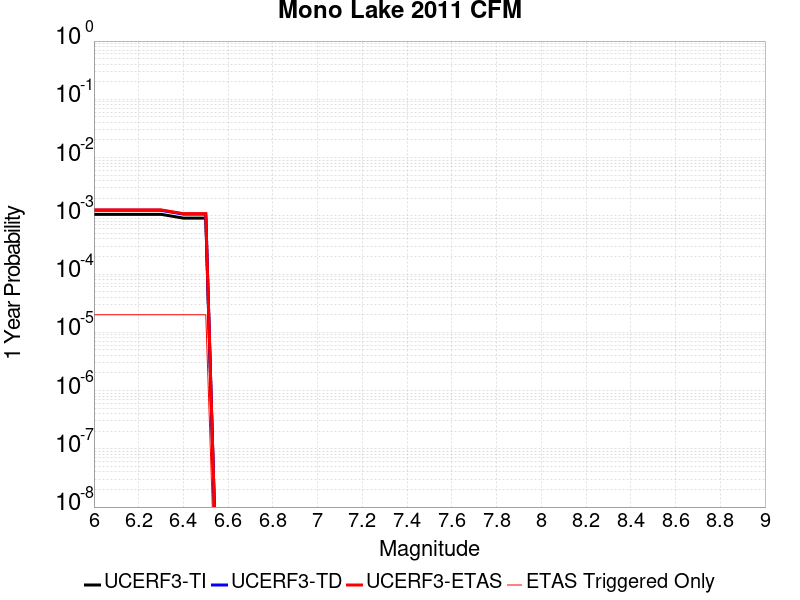 |  |

| Magnitude | 1 wk TI Prob | 1 wk TD Prob | 1 wk ETAS Prob | 1 wk ETAS/TD Gain | 1 wk ETAS Triggered Only | 1 mo TI Prob | 1 mo TD Prob | 1 mo ETAS Prob | 1 mo ETAS/TD Gain | 1 mo ETAS Triggered Only | 1 yr TI Prob | 1 yr TD Prob | 1 yr ETAS Prob | 1 yr ETAS/TD Gain | 1 yr ETAS Triggered Only | 10 yr TI Prob | 10 yr TD Prob | 10 yr ETAS Prob | 10 yr ETAS/TD Gain | 10 yr ETAS Triggered Only |
|-----|-----|-----|-----|-----|-----|-----|-----|-----|-----|-----|-----|-----|-----|-----|-----|-----|-----|-----|-----|-----|
| 6.0 | 2.0341662E-5 | 2.3828192E-5 | 3.3827953E-5 | 1.4196609 | 1.0E-5 | 8.717564E-5 | 1.0211982E-4 | 1.12118796E-4 | 1.0979142 | 1.0E-5 | 0.0010608466 | 0.0012431308 | 0.0012631059 | 1.0160685 | 2.0E-5 | 0.010557966 | 0.012413842 | 0.012473096 | 1.0047733 | 6.0E-5 |
| 6.1 | 2.0341662E-5 | 2.3828192E-5 | 3.3827953E-5 | 1.4196609 | 1.0E-5 | 8.717564E-5 | 1.0211982E-4 | 1.12118796E-4 | 1.0979142 | 1.0E-5 | 0.0010608466 | 0.0012431308 | 0.0012631059 | 1.0160685 | 2.0E-5 | 0.010557966 | 0.012413842 | 0.012473096 | 1.0047733 | 6.0E-5 |
| 6.2 | 2.0341662E-5 | 2.3828192E-5 | 3.3827953E-5 | 1.4196609 | 1.0E-5 | 8.717564E-5 | 1.0211982E-4 | 1.12118796E-4 | 1.0979142 | 1.0E-5 | 0.0010608466 | 0.0012431308 | 0.0012631059 | 1.0160685 | 2.0E-5 | 0.010557966 | 0.012413842 | 0.012473096 | 1.0047733 | 6.0E-5 |
| 6.3 | 2.0341662E-5 | 2.3828192E-5 | 3.3827953E-5 | 1.4196609 | 1.0E-5 | 8.717564E-5 | 1.0211982E-4 | 1.12118796E-4 | 1.0979142 | 1.0E-5 | 0.0010608466 | 0.0012431308 | 0.0012631059 | 1.0160685 | 2.0E-5 | 0.010557966 | 0.012413842 | 0.012473096 | 1.0047733 | 6.0E-5 |
| 6.4 | 1.749821E-5 | 2.049101E-5 | 3.0490804E-5 | 1.4880089 | 1.0E-5 | 7.499018E-5 | 8.781861E-5 | 9.7817734E-5 | 1.1138611 | 1.0E-5 | 9.1262296E-4 | 0.0010691914 | 0.00108917 | 1.0186857 | 2.0E-5 | 0.009088841 | 0.01069187 | 0.010751229 | 1.0055517 | 6.0E-5 |
| 6.5 | 1.749821E-5 | 2.049101E-5 | 3.0490804E-5 | 1.4880089 | 1.0E-5 | 7.499018E-5 | 8.781861E-5 | 9.7817734E-5 | 1.1138611 | 1.0E-5 | 9.1262296E-4 | 0.0010691914 | 0.00108917 | 1.0186857 | 2.0E-5 | 0.009088841 | 0.01069187 | 0.010751229 | 1.0055517 | 6.0E-5 |

## Independence rev 2011
*[(top)](#table-of-contents)*

| 1 Week | 1 Month | 1 Year | 10 Year |
|-----|-----|-----|-----|
|  |  |  |  |

| Magnitude | 1 wk TI Prob | 1 wk TD Prob | 1 wk ETAS Prob | 1 wk ETAS/TD Gain | 1 wk ETAS Triggered Only | 1 mo TI Prob | 1 mo TD Prob | 1 mo ETAS Prob | 1 mo ETAS/TD Gain | 1 mo ETAS Triggered Only | 1 yr TI Prob | 1 yr TD Prob | 1 yr ETAS Prob | 1 yr ETAS/TD Gain | 1 yr ETAS Triggered Only | 10 yr TI Prob | 10 yr TD Prob | 10 yr ETAS Prob | 10 yr ETAS/TD Gain | 10 yr ETAS Triggered Only |
|-----|-----|-----|-----|-----|-----|-----|-----|-----|-----|-----|-----|-----|-----|-----|-----|-----|-----|-----|-----|-----|
| 6.0 | 4.422171E-6 | 4.3262253E-6 | 1.4326182E-5 | 3.3114738 | 1.0E-5 | 1.8952025E-5 | 1.8540852E-5 | 2.8540666E-5 | 1.5393395 | 1.0E-5 | 2.3071647E-4 | 2.2571447E-4 | 2.5570768E-4 | 1.1328813 | 3.0E-5 | 0.0023047708 | 0.0022551457 | 0.0023150104 | 1.0265458 | 6.0E-5 |
| 6.1 | 4.422171E-6 | 4.3262253E-6 | 1.4326182E-5 | 3.3114738 | 1.0E-5 | 1.8952025E-5 | 1.8540852E-5 | 2.8540666E-5 | 1.5393395 | 1.0E-5 | 2.3071647E-4 | 2.2571447E-4 | 2.5570768E-4 | 1.1328813 | 3.0E-5 | 0.0023047708 | 0.0022551457 | 0.0023150104 | 1.0265458 | 6.0E-5 |
| 6.2 | 4.422171E-6 | 4.3262253E-6 | 1.4326182E-5 | 3.3114738 | 1.0E-5 | 1.8952025E-5 | 1.8540852E-5 | 2.8540666E-5 | 1.5393395 | 1.0E-5 | 2.3071647E-4 | 2.2571447E-4 | 2.5570768E-4 | 1.1328813 | 3.0E-5 | 0.0023047708 | 0.0022551457 | 0.0023150104 | 1.0265458 | 6.0E-5 |
| 6.3 | 4.422171E-6 | 4.3262253E-6 | 1.4326182E-5 | 3.3114738 | 1.0E-5 | 1.8952025E-5 | 1.8540852E-5 | 2.8540666E-5 | 1.5393395 | 1.0E-5 | 2.3071647E-4 | 2.2571447E-4 | 2.5570768E-4 | 1.1328813 | 3.0E-5 | 0.0023047708 | 0.0022551457 | 0.0023150104 | 1.0265458 | 6.0E-5 |
| 6.4 | 4.422171E-6 | 4.3262253E-6 | 1.4326182E-5 | 3.3114738 | 1.0E-5 | 1.8952025E-5 | 1.8540852E-5 | 2.8540666E-5 | 1.5393395 | 1.0E-5 | 2.3071647E-4 | 2.2571447E-4 | 2.5570768E-4 | 1.1328813 | 3.0E-5 | 0.0023047708 | 0.0022551457 | 0.0023150104 | 1.0265458 | 6.0E-5 |
| 6.5 | 4.422171E-6 | 4.3262253E-6 | 1.4326182E-5 | 3.3114738 | 1.0E-5 | 1.8952025E-5 | 1.8540852E-5 | 2.8540666E-5 | 1.5393395 | 1.0E-5 | 2.3071647E-4 | 2.2571447E-4 | 2.5570768E-4 | 1.1328813 | 3.0E-5 | 0.0023047708 | 0.0022551457 | 0.0023150104 | 1.0265458 | 6.0E-5 |
| 6.6 | 2.663744E-6 | 2.5319846E-6 | 1.2531959E-5 | 4.949461 | 1.0E-5 | 1.1415996E-5 | 1.08513195E-5 | 2.0851212E-5 | 1.9215369 | 1.0E-5 | 1.3898089E-4 | 1.321073E-4 | 1.5210467E-4 | 1.1513721 | 2.0E-5 | 0.0013889399 | 0.0013203359 | 0.0013702699 | 1.0378191 | 5.0E-5 |
| 6.7 | 2.663744E-6 | 2.5319846E-6 | 1.2531959E-5 | 4.949461 | 1.0E-5 | 1.1415996E-5 | 1.08513195E-5 | 2.0851212E-5 | 1.9215369 | 1.0E-5 | 1.3898089E-4 | 1.321073E-4 | 1.5210467E-4 | 1.1513721 | 2.0E-5 | 0.0013889399 | 0.0013203359 | 0.0013702699 | 1.0378191 | 5.0E-5 |
| 6.8 | 1.9716529E-6 | 1.8322567E-6 | 1.1832239E-5 | 6.457741 | 1.0E-5 | 8.449913E-6 | 7.852505E-6 | 1.7852426E-5 | 2.273469 | 1.0E-5 | 1.0287284E-4 | 9.560019E-5 | 1.15598275E-4 | 1.2091846 | 2.0E-5 | 0.0010282523 | 9.5560355E-4 | 0.0010055557 | 1.0522729 | 5.0E-5 |
| 6.9 | 1.8788617E-6 | 1.7429976E-6 | 1.174298E-5 | 6.7372327 | 1.0E-5 | 8.0522395E-6 | 7.4699688E-6 | 1.7469894E-5 | 2.3386836 | 1.0E-5 | 9.80316E-5 | 9.09432E-5 | 1.1094138E-4 | 1.2198975 | 2.0E-5 | 9.798837E-4 | 9.090718E-4 | 9.590264E-4 | 1.0549512 | 5.0E-5 |
| 7.0 | 1.5045488E-6 | 1.3849498E-6 | 1.13849355E-5 | 8.2204685 | 1.0E-5 | 6.44805E-6 | 5.9354857E-6 | 1.5935426E-5 | 2.684772 | 1.0E-5 | 7.8502184E-5 | 7.226219E-5 | 9.226075E-5 | 1.2767498 | 2.0E-5 | 7.8474457E-4 | 7.223921E-4 | 7.72356E-4 | 1.0691645 | 5.0E-5 |
| 7.1 | 1.272341E-6 | 1.1625089E-6 | 1.1162498E-5 | 9.602075 | 1.0E-5 | 5.4528787E-6 | 4.9821715E-6 | 1.4982122E-5 | 3.0071468 | 1.0E-5 | 6.6386776E-5 | 6.0656283E-5 | 7.0655675E-5 | 1.1648533 | 1.0E-5 | 6.636695E-4 | 6.064005E-4 | 6.3638226E-4 | 1.0494423 | 3.0E-5 |
| 7.2 | 1.0416892E-6 | 9.409871E-7 | 1.09409775E-5 | 11.627129 | 1.0E-5 | 4.464375E-6 | 4.032796E-6 | 1.4032756E-5 | 3.4796593 | 1.0E-5 | 5.4352407E-5 | 4.9098202E-5 | 5.909771E-5 | 1.2036635 | 1.0E-5 | 5.4339116E-4 | 4.908754E-4 | 5.2086066E-4 | 1.0610853 | 3.0E-5 |
| 7.3 | 7.9450155E-7 | 7.2350036E-7 | 1.0723493E-5 | 14.821683 | 1.0E-5 | 3.4050022E-6 | 3.1007123E-6 | 1.3100681E-5 | 4.2250557 | 1.0E-5 | 4.1455114E-5 | 3.7750528E-5 | 4.7750153E-5 | 1.264887 | 1.0E-5 | 4.144738E-4 | 3.7744228E-4 | 4.0743095E-4 | 1.0794524 | 3.0E-5 |
| 7.4 | 5.3893444E-7 | 5.0195166E-7 | 1.0501946E-5 | 20.922228 | 1.0E-5 | 2.309717E-6 | 2.1512196E-6 | 1.21511985E-5 | 5.6485157 | 1.0E-5 | 2.8120441E-5 | 2.6190788E-5 | 3.6190526E-5 | 1.3818036 | 1.0E-5 | 2.8116882E-4 | 2.6187746E-4 | 2.9186963E-4 | 1.1145273 | 3.0E-5 |
| 7.5 | 3.8852085E-7 | 3.6825622E-7 | 1.0368252E-5 | 28.154995 | 1.0E-5 | 1.6650882E-6 | 1.57824E-6 | 1.1578224E-5 | 7.3361616 | 1.0E-5 | 2.027226E-5 | 1.9214905E-5 | 2.9214712E-5 | 1.5204194 | 1.0E-5 | 2.0270412E-4 | 1.9213265E-4 | 2.221269E-4 | 1.1561121 | 3.0E-5 |
| 7.6 | 2.414929E-7 | 2.3457605E-7 | 1.0234574E-5 | 43.63009 | 1.0E-5 | 1.0349692E-6 | 1.0053255E-6 | 1.1005315E-5 | 10.947017 | 1.0E-5 | 1.2600677E-5 | 1.2239771E-5 | 2.2239648E-5 | 1.8169987 | 1.0E-5 | 1.2599962E-4 | 1.223911E-4 | 1.3238986E-4 | 1.0816953 | 1.0E-5 |
| 7.7 | 6.8298014E-8 | 6.8589785E-8 | 1.0068589E-5 | 146.7943 | 1.0E-5 | 2.9270575E-7 | 2.939562E-7 | 1.0293953E-5 | 35.018665 | 1.0E-5 | 3.5636867E-6 | 3.5789112E-6 | 1.3578875E-5 | 3.7941358 | 1.0E-5 | 3.5636294E-5 | 3.5788584E-5 | 4.5788227E-5 | 1.2794087 | 1.0E-5 |

## Santa Rosa Island
*[(top)](#table-of-contents)*

| 1 Week | 1 Month | 1 Year | 10 Year |
|-----|-----|-----|-----|
|  |  |  |  |

| Magnitude | 1 wk TI Prob | 1 wk TD Prob | 1 wk ETAS Prob | 1 wk ETAS/TD Gain | 1 wk ETAS Triggered Only | 1 mo TI Prob | 1 mo TD Prob | 1 mo ETAS Prob | 1 mo ETAS/TD Gain | 1 mo ETAS Triggered Only | 1 yr TI Prob | 1 yr TD Prob | 1 yr ETAS Prob | 1 yr ETAS/TD Gain | 1 yr ETAS Triggered Only | 10 yr TI Prob | 10 yr TD Prob | 10 yr ETAS Prob | 10 yr ETAS/TD Gain | 10 yr ETAS Triggered Only |
|-----|-----|-----|-----|-----|-----|-----|-----|-----|-----|-----|-----|-----|-----|-----|-----|-----|-----|-----|-----|-----|
| 6.0 | 4.1143165E-5 | 4.709113E-5 | 4.709113E-5 | 1.0 | 0.0 | 1.7631594E-4 | 2.0180462E-4 | 2.0180462E-4 | 1.0 | 0.0 | 0.002144533 | 0.0024543991 | 0.002494301 | 1.0162573 | 4.0E-5 | 0.021239553 | 0.024293557 | 0.0243521 | 1.0024098 | 6.0E-5 |
| 6.1 | 2.1061249E-5 | 2.3864959E-5 | 2.3864959E-5 | 1.0 | 0.0 | 9.0259375E-5 | 1.0227455E-4 | 1.0227455E-4 | 1.0 | 0.0 | 0.0010983539 | 0.0012445103 | 0.0012445103 | 1.0 | 0.0 | 0.01092941 | 0.01237845 | 0.012398202 | 1.0015957 | 2.0E-5 |
| 6.2 | 2.1061249E-5 | 2.3864959E-5 | 2.3864959E-5 | 1.0 | 0.0 | 9.0259375E-5 | 1.0227455E-4 | 1.0227455E-4 | 1.0 | 0.0 | 0.0010983539 | 0.0012445103 | 0.0012445103 | 1.0 | 0.0 | 0.01092941 | 0.01237845 | 0.012398202 | 1.0015957 | 2.0E-5 |
| 6.3 | 1.5158236E-5 | 1.7074419E-5 | 1.7074419E-5 | 1.0 | 0.0 | 6.496225E-5 | 7.3174095E-5 | 7.3174095E-5 | 1.0 | 0.0 | 7.906284E-4 | 8.9054246E-4 | 8.9054246E-4 | 1.0 | 0.0 | 0.007878214 | 0.00887099 | 0.008890812 | 1.0022346 | 2.0E-5 |
| 6.4 | 1.2341918E-5 | 1.3852917E-5 | 1.3852917E-5 | 1.0 | 0.0 | 5.2892858E-5 | 5.9368336E-5 | 5.9368336E-5 | 1.0 | 0.0 | 6.437803E-4 | 7.225779E-4 | 7.225779E-4 | 1.0 | 0.0 | 0.006419184 | 0.0072031217 | 0.0072229775 | 1.0027566 | 2.0E-5 |
| 6.5 | 9.061158E-6 | 1.0117032E-5 | 1.0117032E-5 | 1.0 | 0.0 | 3.883296E-5 | 4.3358017E-5 | 4.3358017E-5 | 1.0 | 0.0 | 4.726887E-4 | 5.277613E-4 | 5.277613E-4 | 1.0 | 0.0 | 0.004716845 | 0.0052656177 | 0.005285512 | 1.0037782 | 2.0E-5 |
| 6.6 | 7.5461685E-6 | 8.400734E-6 | 8.400734E-6 | 1.0 | 0.0 | 3.2340322E-5 | 3.600267E-5 | 3.600267E-5 | 1.0 | 0.0 | 3.936723E-4 | 4.3824868E-4 | 4.3824868E-4 | 1.0 | 0.0 | 0.003929756 | 0.0043742736 | 0.004394186 | 1.0045522 | 2.0E-5 |
| 6.7 | 5.5023775E-6 | 6.087381E-6 | 6.087381E-6 | 1.0 | 0.0 | 2.3581404E-5 | 2.6088532E-5 | 2.6088532E-5 | 1.0 | 0.0 | 2.8706578E-4 | 3.1758484E-4 | 3.1758484E-4 | 1.0 | 0.0 | 0.0028669522 | 0.0031716316 | 0.0031915682 | 1.0062859 | 2.0E-5 |
| 6.8 | 3.7351679E-6 | 4.0831405E-6 | 4.0831405E-6 | 1.0 | 0.0 | 1.6007763E-5 | 1.7499071E-5 | 1.7499071E-5 | 1.0 | 0.0 | 1.948771E-4 | 2.1303285E-4 | 2.1303285E-4 | 1.0 | 0.0 | 0.0019470629 | 0.0021285315 | 0.00213851 | 1.004688 | 1.0E-5 |
| 6.9 | 2.456366E-6 | 2.6292707E-6 | 2.6292707E-6 | 1.0 | 0.0 | 1.0527241E-5 | 1.1268255E-5 | 1.1268255E-5 | 1.0 | 0.0 | 1.2816161E-4 | 1.3718239E-4 | 1.3718239E-4 | 1.0 | 0.0 | 0.0012808773 | 0.0013709799 | 0.0013809663 | 1.007284 | 1.0E-5 |
| 7.0 | 2.3245157E-6 | 2.4827784E-6 | 2.4827784E-6 | 1.0 | 0.0 | 9.962172E-6 | 1.0640436E-5 | 1.0640436E-5 | 1.0 | 0.0 | 1.2128269E-4 | 1.2953962E-4 | 1.2953962E-4 | 1.0 | 0.0 | 0.0012121652 | 0.0012946434 | 0.0013046304 | 1.0077142 | 1.0E-5 |
| 7.1 | 2.2248344E-6 | 2.37325E-6 | 2.37325E-6 | 1.0 | 0.0 | 9.53497E-6 | 1.0171032E-5 | 1.0171032E-5 | 1.0 | 0.0 | 1.1608207E-4 | 1.238253E-4 | 1.238253E-4 | 1.0 | 0.0 | 0.0011602144 | 0.0012375651 | 0.0012475527 | 1.0080703 | 1.0E-5 |
| 7.2 | 2.1350402E-6 | 2.2761542E-6 | 2.2761542E-6 | 1.0 | 0.0 | 9.150141E-6 | 9.75491E-6 | 9.75491E-6 | 1.0 | 0.0 | 1.1139726E-4 | 1.1875957E-4 | 1.1875957E-4 | 1.0 | 0.0 | 0.0011134144 | 0.0011869629 | 0.0011969511 | 1.0084149 | 1.0E-5 |
| 7.3 | 1.9793572E-6 | 2.1087192E-6 | 2.1087192E-6 | 1.0 | 0.0 | 8.482932E-6 | 9.037337E-6 | 9.037337E-6 | 1.0 | 0.0 | 1.032748E-4 | 1.1002403E-4 | 1.1002403E-4 | 1.0 | 0.0 | 0.0010322682 | 0.0010996974 | 0.0010996974 | 1.0 | 0.0 |
| 7.4 | 1.6951194E-6 | 1.8045735E-6 | 1.8045735E-6 | 1.0 | 0.0 | 7.264777E-6 | 7.733864E-6 | 7.733864E-6 | 1.0 | 0.0 | 8.844508E-5 | 9.415574E-5 | 9.415574E-5 | 1.0 | 0.0 | 8.840988E-4 | 9.411601E-4 | 9.411601E-4 | 1.0 | 0.0 |
| 7.5 | 8.987207E-7 | 9.512216E-7 | 9.512216E-7 | 1.0 | 0.0 | 3.8516546E-6 | 4.0766577E-6 | 4.0766577E-6 | 1.0 | 0.0 | 4.6892885E-5 | 4.9632188E-5 | 4.9632188E-5 | 1.0 | 0.0 | 4.688299E-4 | 4.962122E-4 | 4.962122E-4 | 1.0 | 0.0 |
| 7.6 | 3.8783037E-7 | 4.0529335E-7 | 4.0529335E-7 | 1.0 | 0.0 | 1.6621291E-6 | 1.7369704E-6 | 1.7369704E-6 | 1.0 | 0.0 | 2.0236233E-5 | 2.1147416E-5 | 2.1147416E-5 | 1.0 | 0.0 | 2.023439E-4 | 2.114547E-4 | 2.114547E-4 | 1.0 | 0.0 |
| 7.7 | 6.181804E-8 | 6.339047E-8 | 6.339047E-8 | 1.0 | 0.0 | 2.6493444E-7 | 2.7167343E-7 | 2.7167343E-7 | 1.0 | 0.0 | 3.225572E-6 | 3.307619E-6 | 3.307619E-6 | 1.0 | 0.0 | 3.225525E-5 | 3.3075703E-5 | 3.3075703E-5 | 1.0 | 0.0 |
| 7.8 | 1.3704449E-9 | 1.3964153E-9 | 1.3964153E-9 | 1.0 | 0.0 | 5.873335E-9 | 5.984637E-9 | 5.984637E-9 | 1.0 | 0.0 | 7.1507856E-8 | 7.286295E-8 | 7.286295E-8 | 1.0 | 0.0 | 7.1507833E-7 | 7.286294E-7 | 7.286294E-7 | 1.0 | 0.0 |

## Hosgri
*[(top)](#table-of-contents)*

| 1 Week | 1 Month | 1 Year | 10 Year |
|-----|-----|-----|-----|
|  |  |  |  |

| Magnitude | 1 wk TI Prob | 1 wk TD Prob | 1 wk ETAS Prob | 1 wk ETAS/TD Gain | 1 wk ETAS Triggered Only | 1 mo TI Prob | 1 mo TD Prob | 1 mo ETAS Prob | 1 mo ETAS/TD Gain | 1 mo ETAS Triggered Only | 1 yr TI Prob | 1 yr TD Prob | 1 yr ETAS Prob | 1 yr ETAS/TD Gain | 1 yr ETAS Triggered Only | 10 yr TI Prob | 10 yr TD Prob | 10 yr ETAS Prob | 10 yr ETAS/TD Gain | 10 yr ETAS Triggered Only |
|-----|-----|-----|-----|-----|-----|-----|-----|-----|-----|-----|-----|-----|-----|-----|-----|-----|-----|-----|-----|-----|
| 6.0 | 2.883978E-5 | 2.9128403E-5 | 3.912811E-5 | 1.3432975 | 1.0E-5 | 1.235932E-4 | 1.248302E-4 | 1.448277E-4 | 1.1601976 | 2.0E-5 | 0.0015037085 | 0.0015187752 | 0.0015387449 | 1.0131485 | 2.0E-5 | 0.01493574 | 0.01508773 | 0.015136976 | 1.003264 | 5.0E-5 |
| 6.1 | 2.883978E-5 | 2.9128403E-5 | 3.912811E-5 | 1.3432975 | 1.0E-5 | 1.235932E-4 | 1.248302E-4 | 1.448277E-4 | 1.1601976 | 2.0E-5 | 0.0015037085 | 0.0015187752 | 0.0015387449 | 1.0131485 | 2.0E-5 | 0.01493574 | 0.01508773 | 0.015136976 | 1.003264 | 5.0E-5 |
| 6.2 | 2.883978E-5 | 2.9128403E-5 | 3.912811E-5 | 1.3432975 | 1.0E-5 | 1.235932E-4 | 1.248302E-4 | 1.448277E-4 | 1.1601976 | 2.0E-5 | 0.0015037085 | 0.0015187752 | 0.0015387449 | 1.0131485 | 2.0E-5 | 0.01493574 | 0.01508773 | 0.015136976 | 1.003264 | 5.0E-5 |
| 6.3 | 2.2914428E-5 | 2.2641956E-5 | 2.2641956E-5 | 1.0 | 0.0 | 9.8200995E-5 | 9.703337E-5 | 9.703337E-5 | 1.0 | 0.0 | 0.0011949413 | 0.001180746 | 0.001180746 | 1.0 | 0.0 | 0.011885363 | 0.011746123 | 0.01177577 | 1.002524 | 3.0E-5 |
| 6.4 | 2.0195741E-5 | 1.9696547E-5 | 1.9696547E-5 | 1.0 | 0.0 | 8.65503E-5 | 8.4411055E-5 | 8.4411055E-5 | 1.0 | 0.0 | 0.0010532405 | 0.001027222 | 0.001027222 | 1.0 | 0.0 | 0.010482626 | 0.010225783 | 0.010245578 | 1.0019358 | 2.0E-5 |
| 6.5 | 1.9924333E-5 | 1.9408968E-5 | 1.9408968E-5 | 1.0 | 0.0 | 8.53872E-5 | 8.317865E-5 | 8.317865E-5 | 1.0 | 0.0 | 0.0010390934 | 0.0010122315 | 0.0010122315 | 1.0 | 0.0 | 0.010342481 | 0.010077244 | 0.010097042 | 1.0019647 | 2.0E-5 |
| 6.6 | 1.809694E-5 | 1.7458287E-5 | 1.7458287E-5 | 1.0 | 0.0 | 7.7556004E-5 | 7.4819094E-5 | 7.4819094E-5 | 1.0 | 0.0 | 9.438353E-4 | 9.105431E-4 | 9.105431E-4 | 1.0 | 0.0 | 0.009398366 | 0.009069063 | 0.009078972 | 1.0010927 | 1.0E-5 |
| 6.7 | 1.675989E-5 | 1.6042752E-5 | 1.6042752E-5 | 1.0 | 0.0 | 7.182612E-5 | 6.8752845E-5 | 6.8752845E-5 | 1.0 | 0.0 | 8.7413215E-4 | 8.3674554E-4 | 8.3674554E-4 | 1.0 | 0.0 | 0.008707017 | 0.008336853 | 0.00834677 | 1.0011895 | 1.0E-5 |
| 6.8 | 1.5401129E-5 | 1.4614069E-5 | 1.4614069E-5 | 1.0 | 0.0 | 6.6003166E-5 | 6.263023E-5 | 6.263023E-5 | 1.0 | 0.0 | 8.032922E-4 | 7.6225714E-4 | 7.6225714E-4 | 1.0 | 0.0 | 0.008003947 | 0.0075972863 | 0.0076072104 | 1.0013063 | 1.0E-5 |
| 6.9 | 1.356559E-5 | 1.2689955E-5 | 1.2689955E-5 | 1.0 | 0.0 | 5.8136946E-5 | 5.438439E-5 | 5.438439E-5 | 1.0 | 0.0 | 7.0758746E-4 | 6.6192925E-4 | 6.6192925E-4 | 1.0 | 0.0 | 0.007053386 | 0.006600378 | 0.006610312 | 1.001505 | 1.0E-5 |
| 7.0 | 1.2030819E-5 | 1.1095949E-5 | 1.1095949E-5 | 1.0 | 0.0 | 5.155963E-5 | 4.75532E-5 | 4.75532E-5 | 1.0 | 0.0 | 6.275577E-4 | 5.788065E-4 | 5.788065E-4 | 1.0 | 0.0 | 0.006257884 | 0.0057737473 | 0.0057836897 | 1.001722 | 1.0E-5 |
| 7.1 | 1.0972698E-5 | 1.0022167E-5 | 1.0022167E-5 | 1.0 | 0.0 | 4.7025E-5 | 4.2951437E-5 | 4.2951437E-5 | 1.0 | 0.0 | 5.72379E-4 | 5.2280835E-4 | 5.2280835E-4 | 1.0 | 0.0 | 0.0057090693 | 0.005216533 | 0.005226481 | 1.001907 | 1.0E-5 |
| 7.2 | 9.961926E-6 | 9.034732E-6 | 9.034732E-6 | 1.0 | 0.0 | 4.2693267E-5 | 3.8719707E-5 | 3.8719707E-5 | 1.0 | 0.0 | 5.1966653E-4 | 4.7131052E-4 | 4.7131052E-4 | 1.0 | 0.0 | 0.00518453 | 0.0047038523 | 0.0047138054 | 1.002116 | 1.0E-5 |
| 7.3 | 8.700929E-6 | 7.828089E-6 | 7.828089E-6 | 1.0 | 0.0 | 3.7289166E-5 | 3.354852E-5 | 3.354852E-5 | 1.0 | 0.0 | 4.53901E-4 | 4.083767E-4 | 4.083767E-4 | 1.0 | 0.0 | 0.00452975 | 0.004076999 | 0.0040869582 | 1.0024428 | 1.0E-5 |
| 7.4 | 7.866285E-6 | 6.9987263E-6 | 6.9987263E-6 | 1.0 | 0.0 | 3.3712215E-5 | 2.9994197E-5 | 2.9994197E-5 | 1.0 | 0.0 | 4.103689E-4 | 3.6511818E-4 | 3.6511818E-4 | 1.0 | 0.0 | 0.004096119 | 0.0036459167 | 0.0036558805 | 1.0027328 | 1.0E-5 |
| 7.5 | 6.8381305E-6 | 5.9596814E-6 | 5.9596814E-6 | 1.0 | 0.0 | 2.9305946E-5 | 2.5541241E-5 | 2.5541241E-5 | 1.0 | 0.0 | 3.5674145E-4 | 3.1092027E-4 | 3.1092027E-4 | 1.0 | 0.0 | 0.0035616932 | 0.003105584 | 0.0031155532 | 1.00321 | 1.0E-5 |
| 7.6 | 5.503376E-6 | 4.595227E-6 | 4.595227E-6 | 1.0 | 0.0 | 2.3585684E-5 | 1.9693682E-5 | 1.9693682E-5 | 1.0 | 0.0 | 2.8711787E-4 | 2.397442E-4 | 2.397442E-4 | 1.0 | 0.0 | 0.002867472 | 0.0023955852 | 0.0023955852 | 1.0 | 0.0 |
| 7.7 | 3.6144982E-6 | 2.6521896E-6 | 2.6521896E-6 | 1.0 | 0.0 | 1.5490614E-5 | 1.1366477E-5 | 1.1366477E-5 | 1.0 | 0.0 | 1.8858191E-4 | 1.3837808E-4 | 1.3837808E-4 | 1.0 | 0.0 | 0.0018842196 | 0.001383647 | 0.001383647 | 1.0 | 0.0 |
| 7.8 | 1.9853494E-6 | 1.1360784E-6 | 1.1360784E-6 | 1.0 | 0.0 | 8.508612E-6 | 4.8688985E-6 | 4.8688985E-6 | 1.0 | 0.0 | 1.0358743E-4 | 5.9277223E-5 | 5.9277223E-5 | 1.0 | 0.0 | 0.0010353916 | 5.933389E-4 | 5.933389E-4 | 1.0 | 0.0 |
| 7.9 | 1.1818757E-6 | 5.29477E-7 | 5.29477E-7 | 1.0 | 0.0 | 5.0651715E-6 | 2.269185E-6 | 2.269185E-6 | 1.0 | 0.0 | 6.1666724E-5 | 2.7626977E-5 | 2.7626977E-5 | 1.0 | 0.0 | 6.1649614E-4 | 2.7691363E-4 | 2.7691363E-4 | 1.0 | 0.0 |
| 8.0 | 6.962958E-7 | 2.71365E-7 | 2.71365E-7 | 1.0 | 0.0 | 2.9841215E-6 | 1.1629924E-6 | 1.1629924E-6 | 1.0 | 0.0 | 3.6331072E-5 | 1.415934E-5 | 1.415934E-5 | 1.0 | 0.0 | 3.6325134E-4 | 1.4215276E-4 | 1.4215276E-4 | 1.0 | 0.0 |
| 8.1 | 1.5033264E-7 | 6.52693E-8 | 6.52693E-8 | 1.0 | 0.0 | 6.442826E-7 | 2.7972553E-7 | 2.7972553E-7 | 1.0 | 0.0 | 7.844113E-6 | 3.4056532E-6 | 3.4056532E-6 | 1.0 | 0.0 | 7.843835E-5 | 3.4072833E-5 | 3.4072833E-5 | 1.0 | 0.0 |

## Elysian Park (Upper)
*[(top)](#table-of-contents)*

| 1 Week | 1 Month | 1 Year | 10 Year |
|-----|-----|-----|-----|
|  |  |  |  |

| Magnitude | 1 wk TI Prob | 1 wk TD Prob | 1 wk ETAS Prob | 1 wk ETAS/TD Gain | 1 wk ETAS Triggered Only | 1 mo TI Prob | 1 mo TD Prob | 1 mo ETAS Prob | 1 mo ETAS/TD Gain | 1 mo ETAS Triggered Only | 1 yr TI Prob | 1 yr TD Prob | 1 yr ETAS Prob | 1 yr ETAS/TD Gain | 1 yr ETAS Triggered Only | 10 yr TI Prob | 10 yr TD Prob | 10 yr ETAS Prob | 10 yr ETAS/TD Gain | 10 yr ETAS Triggered Only |
|-----|-----|-----|-----|-----|-----|-----|-----|-----|-----|-----|-----|-----|-----|-----|-----|-----|-----|-----|-----|-----|
| 6.0 | 3.1876025E-5 | 3.7035275E-5 | 3.7035275E-5 | 1.0 | 0.0 | 1.3660437E-4 | 1.5871569E-4 | 1.5871569E-4 | 1.0 | 0.0 | 0.0016618895 | 0.001931122 | 0.0019810256 | 1.0258417 | 5.0E-5 | 0.016495159 | 0.019189863 | 0.019248711 | 1.0030667 | 6.0E-5 |
| 6.1 | 3.1876025E-5 | 3.7035275E-5 | 3.7035275E-5 | 1.0 | 0.0 | 1.3660437E-4 | 1.5871569E-4 | 1.5871569E-4 | 1.0 | 0.0 | 0.0016618895 | 0.001931122 | 0.0019810256 | 1.0258417 | 5.0E-5 | 0.016495159 | 0.019189863 | 0.019248711 | 1.0030667 | 6.0E-5 |
| 6.2 | 3.1876025E-5 | 3.7035275E-5 | 3.7035275E-5 | 1.0 | 0.0 | 1.3660437E-4 | 1.5871569E-4 | 1.5871569E-4 | 1.0 | 0.0 | 0.0016618895 | 0.001931122 | 0.0019810256 | 1.0258417 | 5.0E-5 | 0.016495159 | 0.019189863 | 0.019248711 | 1.0030667 | 6.0E-5 |
| 6.3 | 3.1876025E-5 | 3.7035275E-5 | 3.7035275E-5 | 1.0 | 0.0 | 1.3660437E-4 | 1.5871569E-4 | 1.5871569E-4 | 1.0 | 0.0 | 0.0016618895 | 0.001931122 | 0.0019810256 | 1.0258417 | 5.0E-5 | 0.016495159 | 0.019189863 | 0.019248711 | 1.0030667 | 6.0E-5 |
| 6.4 | 1.9273462E-5 | 2.120244E-5 | 2.120244E-5 | 1.0 | 0.0 | 8.259794E-5 | 9.086542E-5 | 9.086542E-5 | 1.0 | 0.0 | 0.001005166 | 0.0011058967 | 0.0011158857 | 1.0090325 | 1.0E-5 | 0.010006315 | 0.011020744 | 0.011040524 | 1.0017948 | 2.0E-5 |
| 6.5 | 1.9273462E-5 | 2.120244E-5 | 2.120244E-5 | 1.0 | 0.0 | 8.259794E-5 | 9.086542E-5 | 9.086542E-5 | 1.0 | 0.0 | 0.001005166 | 0.0011058967 | 0.0011158857 | 1.0090325 | 1.0E-5 | 0.010006315 | 0.011020744 | 0.011040524 | 1.0017948 | 2.0E-5 |
| 6.6 | 9.813258E-6 | 9.665589E-6 | 9.665589E-6 | 1.0 | 0.0 | 4.205614E-5 | 4.1423333E-5 | 4.1423333E-5 | 1.0 | 0.0 | 5.119132E-4 | 5.042196E-4 | 5.042196E-4 | 1.0 | 0.0 | 0.005107356 | 0.0050314795 | 0.0050314795 | 1.0 | 0.0 |
| 6.7 | 9.801478E-6 | 9.653158E-6 | 9.653158E-6 | 1.0 | 0.0 | 4.2005657E-5 | 4.137006E-5 | 4.137006E-5 | 1.0 | 0.0 | 5.112989E-4 | 5.0357135E-4 | 5.0357135E-4 | 1.0 | 0.0 | 0.0051012407 | 0.005025026 | 0.005025026 | 1.0 | 0.0 |
| 6.8 | 8.102489E-6 | 7.772994E-6 | 7.772994E-6 | 1.0 | 0.0 | 3.4724493E-5 | 3.3312434E-5 | 3.3312434E-5 | 1.0 | 0.0 | 4.2268867E-4 | 4.0550836E-4 | 4.0550836E-4 | 1.0 | 0.0 | 0.004218856 | 0.0040481784 | 0.0040481784 | 1.0 | 0.0 |
| 6.9 | 6.08275E-6 | 5.481441E-6 | 5.481441E-6 | 1.0 | 0.0 | 2.6068668E-5 | 2.3491682E-5 | 2.3491682E-5 | 1.0 | 0.0 | 3.173398E-4 | 2.8597447E-4 | 2.8597447E-4 | 1.0 | 0.0 | 0.0031688702 | 0.0028561424 | 0.0028561424 | 1.0 | 0.0 |
| 7.0 | 5.5995934E-6 | 4.9827686E-6 | 4.9827686E-6 | 1.0 | 0.0 | 2.3998036E-5 | 2.1354552E-5 | 2.1354552E-5 | 1.0 | 0.0 | 2.9213692E-4 | 2.5996132E-4 | 2.5996132E-4 | 1.0 | 0.0 | 0.0029175316 | 0.0025966396 | 0.0025966396 | 1.0 | 0.0 |
| 7.1 | 4.709881E-6 | 4.0873906E-6 | 4.0873906E-6 | 1.0 | 0.0 | 2.0185047E-5 | 1.7517272E-5 | 1.7517272E-5 | 1.0 | 0.0 | 2.4572524E-4 | 2.1325232E-4 | 2.1325232E-4 | 1.0 | 0.0 | 0.002454537 | 0.0021305184 | 0.0021305184 | 1.0 | 0.0 |
| 7.2 | 3.6063436E-6 | 2.9779412E-6 | 2.9779412E-6 | 1.0 | 0.0 | 1.5455667E-5 | 1.27625435E-5 | 1.27625435E-5 | 1.0 | 0.0 | 1.881565E-4 | 1.55373E-4 | 1.55373E-4 | 1.0 | 0.0 | 0.0018799726 | 0.0015526549 | 0.0015526549 | 1.0 | 0.0 |
| 7.3 | 2.471135E-6 | 2.0954562E-6 | 2.0954562E-6 | 1.0 | 0.0 | 1.0590536E-5 | 8.980496E-6 | 8.980496E-6 | 1.0 | 0.0 | 1.2893214E-4 | 1.0933213E-4 | 1.0933213E-4 | 1.0 | 0.0 | 0.0012885736 | 0.0010927906 | 0.0010927906 | 1.0 | 0.0 |
| 7.4 | 1.163943E-6 | 1.0275061E-6 | 1.0275061E-6 | 1.0 | 0.0 | 4.988318E-6 | 4.40359E-6 | 4.40359E-6 | 1.0 | 0.0 | 6.0731076E-5 | 5.361242E-5 | 5.361242E-5 | 1.0 | 0.0 | 6.071448E-4 | 5.3599785E-4 | 5.3599785E-4 | 1.0 | 0.0 |
| 7.5 | 4.99459E-7 | 4.917601E-7 | 4.917601E-7 | 1.0 | 0.0 | 2.140537E-6 | 2.1075416E-6 | 2.1075416E-6 | 1.0 | 0.0 | 2.6060725E-5 | 2.5659032E-5 | 2.5659032E-5 | 1.0 | 0.0 | 2.605767E-4 | 2.5656226E-4 | 2.5656226E-4 | 1.0 | 0.0 |
| 7.6 | 2.4667852E-7 | 2.4778313E-7 | 2.4778313E-7 | 1.0 | 0.0 | 1.0571932E-6 | 1.0619274E-6 | 1.0619274E-6 | 1.0 | 0.0 | 1.2871251E-5 | 1.2928893E-5 | 1.2928893E-5 | 1.0 | 0.0 | 1.2870505E-4 | 1.2928178E-4 | 1.2928178E-4 | 1.0 | 0.0 |
| 7.7 | 8.2312795E-8 | 7.3864214E-8 | 7.3864214E-8 | 1.0 | 0.0 | 3.527691E-7 | 3.165609E-7 | 3.165609E-7 | 1.0 | 0.0 | 4.294955E-6 | 3.854123E-6 | 3.854123E-6 | 1.0 | 0.0 | 4.2948723E-5 | 3.854068E-5 | 3.854068E-5 | 1.0 | 0.0 |
| 7.8 | 2.7819295E-8 | 1.7565618E-8 | 1.7565618E-8 | 1.0 | 0.0 | 1.1922555E-7 | 7.528122E-8 | 7.528122E-8 | 1.0 | 0.0 | 1.45157E-6 | 9.1654863E-7 | 9.1654863E-7 | 1.0 | 0.0 | 1.45156055E-5 | 9.165463E-6 | 9.165463E-6 | 1.0 | 0.0 |

## Mission Creek
*[(top)](#table-of-contents)*

| 1 Week | 1 Month | 1 Year | 10 Year |
|-----|-----|-----|-----|
|  |  |  |  |

| Magnitude | 1 wk TI Prob | 1 wk TD Prob | 1 wk ETAS Prob | 1 wk ETAS/TD Gain | 1 wk ETAS Triggered Only | 1 mo TI Prob | 1 mo TD Prob | 1 mo ETAS Prob | 1 mo ETAS/TD Gain | 1 mo ETAS Triggered Only | 1 yr TI Prob | 1 yr TD Prob | 1 yr ETAS Prob | 1 yr ETAS/TD Gain | 1 yr ETAS Triggered Only | 10 yr TI Prob | 10 yr TD Prob | 10 yr ETAS Prob | 10 yr ETAS/TD Gain | 10 yr ETAS Triggered Only |
|-----|-----|-----|-----|-----|-----|-----|-----|-----|-----|-----|-----|-----|-----|-----|-----|-----|-----|-----|-----|-----|
| 6.0 | 1.1549387E-5 | 1.6322783E-5 | 3.6322457E-5 | 2.2252612 | 2.0E-5 | 4.9496433E-5 | 6.995299E-5 | 9.995089E-5 | 1.4288294 | 3.0E-5 | 6.0245243E-4 | 8.5135986E-4 | 8.913258E-4 | 1.0469437 | 4.0E-5 | 0.006008218 | 0.008510157 | 0.008569646 | 1.0069904 | 6.0E-5 |
| 6.1 | 1.1549387E-5 | 1.6322783E-5 | 3.6322457E-5 | 2.2252612 | 2.0E-5 | 4.9496433E-5 | 6.995299E-5 | 9.995089E-5 | 1.4288294 | 3.0E-5 | 6.0245243E-4 | 8.5135986E-4 | 8.913258E-4 | 1.0469437 | 4.0E-5 | 0.006008218 | 0.008510157 | 0.008569646 | 1.0069904 | 6.0E-5 |
| 6.2 | 1.1549387E-5 | 1.6322783E-5 | 3.6322457E-5 | 2.2252612 | 2.0E-5 | 4.9496433E-5 | 6.995299E-5 | 9.995089E-5 | 1.4288294 | 3.0E-5 | 6.0245243E-4 | 8.5135986E-4 | 8.913258E-4 | 1.0469437 | 4.0E-5 | 0.006008218 | 0.008510157 | 0.008569646 | 1.0069904 | 6.0E-5 |
| 6.3 | 1.1549387E-5 | 1.6322783E-5 | 3.6322457E-5 | 2.2252612 | 2.0E-5 | 4.9496433E-5 | 6.995299E-5 | 9.995089E-5 | 1.4288294 | 3.0E-5 | 6.0245243E-4 | 8.5135986E-4 | 8.913258E-4 | 1.0469437 | 4.0E-5 | 0.006008218 | 0.008510157 | 0.008569646 | 1.0069904 | 6.0E-5 |
| 6.4 | 1.1549387E-5 | 1.6322783E-5 | 3.6322457E-5 | 2.2252612 | 2.0E-5 | 4.9496433E-5 | 6.995299E-5 | 9.995089E-5 | 1.4288294 | 3.0E-5 | 6.0245243E-4 | 8.5135986E-4 | 8.913258E-4 | 1.0469437 | 4.0E-5 | 0.006008218 | 0.008510157 | 0.008569646 | 1.0069904 | 6.0E-5 |
| 6.5 | 1.1549387E-5 | 1.6322783E-5 | 3.6322457E-5 | 2.2252612 | 2.0E-5 | 4.9496433E-5 | 6.995299E-5 | 9.995089E-5 | 1.4288294 | 3.0E-5 | 6.0245243E-4 | 8.5135986E-4 | 8.913258E-4 | 1.0469437 | 4.0E-5 | 0.006008218 | 0.008510157 | 0.008569646 | 1.0069904 | 6.0E-5 |
| 6.6 | 9.202681E-6 | 1.3846059E-5 | 3.3845783E-5 | 2.4444344 | 2.0E-5 | 3.9439463E-5 | 5.9338956E-5 | 8.9337176E-5 | 1.5055401 | 3.0E-5 | 4.800697E-4 | 7.2222133E-4 | 7.621924E-4 | 1.0553447 | 4.0E-5 | 0.004790339 | 0.0072273402 | 0.0072869067 | 1.0082418 | 6.0E-5 |
| 6.7 | 9.019164E-6 | 1.3651728E-5 | 3.3651457E-5 | 2.4649959 | 2.0E-5 | 3.8652986E-5 | 5.8506146E-5 | 8.850439E-5 | 1.5127367 | 3.0E-5 | 4.7049852E-4 | 7.1208854E-4 | 7.5206003E-4 | 1.0561328 | 4.0E-5 | 0.004695036 | 0.0071266647 | 0.007186237 | 1.0083591 | 6.0E-5 |
| 6.8 | 8.673558E-6 | 1.3273839E-5 | 3.3273573E-5 | 2.5067031 | 2.0E-5 | 3.717186E-5 | 5.688669E-5 | 8.688498E-5 | 1.5273341 | 3.0E-5 | 4.524734E-4 | 6.923842E-4 | 7.323565E-4 | 1.0577314 | 4.0E-5 | 0.0045155324 | 0.0069308523 | 0.0069904365 | 1.0085969 | 6.0E-5 |
| 6.9 | 7.002255E-6 | 1.1478069E-5 | 3.1477837E-5 | 2.7424335 | 2.0E-5 | 3.000932E-5 | 4.9190832E-5 | 7.9189354E-5 | 1.6098398 | 3.0E-5 | 3.653022E-4 | 5.9874065E-4 | 6.287227E-4 | 1.0500752 | 3.0E-5 | 0.0036470229 | 0.005999676 | 0.006049376 | 1.0082837 | 5.0E-5 |
| 7.0 | 5.84644E-6 | 9.675359E-6 | 2.9675166E-5 | 3.0670867 | 2.0E-5 | 2.5055931E-5 | 4.146519E-5 | 7.146395E-5 | 1.7234684 | 3.0E-5 | 3.0501327E-4 | 5.047263E-4 | 5.347112E-4 | 1.0594082 | 3.0E-5 | 0.0030459496 | 0.005063994 | 0.005113741 | 1.0098237 | 5.0E-5 |
| 7.1 | 5.54703E-6 | 9.329834E-6 | 2.9329647E-5 | 3.1436408 | 2.0E-5 | 2.377277E-5 | 3.9984414E-5 | 6.9983216E-5 | 1.7502624 | 3.0E-5 | 2.8939504E-4 | 4.8670598E-4 | 5.1669136E-4 | 1.0616089 | 3.0E-5 | 0.0028901845 | 0.0048845876 | 0.004934343 | 1.0101863 | 5.0E-5 |
| 7.2 | 4.384709E-6 | 7.681918E-6 | 1.7681841E-5 | 2.3017483 | 1.0E-5 | 1.8791474E-5 | 3.292211E-5 | 5.2921452E-5 | 1.6074744 | 2.0E-5 | 2.2876218E-4 | 4.0075663E-4 | 4.207486E-4 | 1.0498856 | 2.0E-5 | 0.0022852682 | 0.004028542 | 0.0040683807 | 1.0098891 | 4.0E-5 |
| 7.3 | 3.7888456E-6 | 6.915788E-6 | 1.691572E-5 | 2.4459567 | 1.0E-5 | 1.623781E-5 | 2.9638775E-5 | 4.9638184E-5 | 1.6747718 | 2.0E-5 | 1.9767738E-4 | 3.6079568E-4 | 3.8078846E-4 | 1.055413 | 2.0E-5 | 0.0019750162 | 0.00363027 | 0.0036701248 | 1.0109785 | 4.0E-5 |
| 7.4 | 2.1982462E-6 | 5.0241033E-6 | 1.5024053E-5 | 2.990395 | 1.0E-5 | 9.421021E-6 | 2.1531694E-5 | 4.1531264E-5 | 1.9288433 | 2.0E-5 | 1.1469489E-4 | 2.6211704E-4 | 2.8211178E-4 | 1.0762818 | 2.0E-5 | 0.0011463572 | 0.0026460327 | 0.0026859269 | 1.015077 | 4.0E-5 |
| 7.5 | 2.051923E-6 | 4.6153277E-6 | 1.46152815E-5 | 3.1666834 | 1.0E-5 | 8.793926E-6 | 1.9779825E-5 | 3.9779432E-5 | 2.0111113 | 2.0E-5 | 1.0706078E-4 | 2.4079291E-4 | 2.607881E-4 | 1.0830389 | 2.0E-5 | 0.0010700922 | 0.0024335932 | 0.0024734957 | 1.0163966 | 4.0E-5 |
| 7.6 | 1.8733427E-6 | 4.1236603E-6 | 1.412362E-5 | 3.42502 | 1.0E-5 | 8.028587E-6 | 1.7672712E-5 | 3.767236E-5 | 2.1316683 | 2.0E-5 | 9.774366E-5 | 2.151441E-4 | 2.351398E-4 | 1.0929409 | 2.0E-5 | 9.770069E-4 | 0.0021782513 | 0.002218164 | 1.0183233 | 4.0E-5 |
| 7.7 | 1.8411953E-6 | 4.0433315E-6 | 1.4043291E-5 | 3.473198 | 1.0E-5 | 7.890813E-6 | 1.732845E-5 | 3.7328104E-5 | 2.1541514 | 2.0E-5 | 9.606641E-5 | 2.1095353E-4 | 2.3094931E-4 | 1.0947876 | 2.0E-5 | 9.6024893E-4 | 0.0021365292 | 0.0021764436 | 1.018682 | 4.0E-5 |
| 7.8 | 1.7194251E-6 | 3.71068E-6 | 1.3710643E-5 | 3.6949139 | 1.0E-5 | 7.368944E-6 | 1.5902819E-5 | 3.59025E-5 | 2.2576187 | 2.0E-5 | 8.97132E-5 | 1.9359968E-4 | 2.135958E-4 | 1.1032859 | 2.0E-5 | 8.967699E-4 | 0.0019624757 | 0.002002397 | 1.0203425 | 4.0E-5 |
| 7.9 | 1.4035052E-6 | 2.9502596E-6 | 1.29502305E-5 | 4.389522 | 1.0E-5 | 6.0150082E-6 | 1.2643909E-5 | 3.2643657E-5 | 2.5817692 | 2.0E-5 | 7.3230265E-5 | 1.5392878E-4 | 1.739257E-4 | 1.1299102 | 2.0E-5 | 7.3206134E-4 | 0.0015631174 | 0.0016030548 | 1.0255499 | 4.0E-5 |
| 8.0 | 3.9318823E-7 | 5.528477E-7 | 1.05528425E-5 | 19.088152 | 1.0E-5 | 1.6850913E-6 | 2.3693453E-6 | 2.2369299E-5 | 9.44113 | 2.0E-5 | 2.0515794E-5 | 2.8846403E-5 | 4.8845828E-5 | 1.6933073 | 2.0E-5 | 2.0513899E-4 | 2.990952E-4 | 3.1908925E-4 | 1.0668484 | 2.0E-5 |
| 8.1 | 1.596793E-7 | 1.13775044E-7 | 1.13775044E-7 | 1.0 | 0.0 | 6.8433974E-7 | 4.876072E-7 | 4.876072E-7 | 1.0 | 0.0 | 8.331805E-6 | 5.936602E-6 | 5.936602E-6 | 1.0 | 0.0 | 8.331492E-5 | 6.5494125E-5 | 6.5494125E-5 | 1.0 | 0.0 |
| 8.2 | 4.9003038E-8 | 2.5435753E-8 | 2.5435753E-8 | 1.0 | 0.0 | 2.10013E-7 | 1.09010365E-7 | 1.09010365E-7 | 1.0 | 0.0 | 2.5569052E-6 | 1.3272004E-6 | 1.3272004E-6 | 1.0 | 0.0 | 2.556876E-5 | 1.4952613E-5 | 1.4952613E-5 | 1.0 | 0.0 |

## Great Valley 09 (Laguna Seca)
*[(top)](#table-of-contents)*

| 1 Week | 1 Month | 1 Year | 10 Year |
|-----|-----|-----|-----|
|  |  |  |  |

| Magnitude | 1 wk TI Prob | 1 wk TD Prob | 1 wk ETAS Prob | 1 wk ETAS/TD Gain | 1 wk ETAS Triggered Only | 1 mo TI Prob | 1 mo TD Prob | 1 mo ETAS Prob | 1 mo ETAS/TD Gain | 1 mo ETAS Triggered Only | 1 yr TI Prob | 1 yr TD Prob | 1 yr ETAS Prob | 1 yr ETAS/TD Gain | 1 yr ETAS Triggered Only | 10 yr TI Prob | 10 yr TD Prob | 10 yr ETAS Prob | 10 yr ETAS/TD Gain | 10 yr ETAS Triggered Only |
|-----|-----|-----|-----|-----|-----|-----|-----|-----|-----|-----|-----|-----|-----|-----|-----|-----|-----|-----|-----|-----|
| 6.0 | 5.4353277E-5 | 7.050019E-5 | 9.0498776E-5 | 1.2836672 | 2.0E-5 | 2.3292181E-4 | 3.0211007E-4 | 3.3210102E-4 | 1.0992715 | 3.0E-5 | 0.0028321352 | 0.0036720056 | 0.0037118588 | 1.0108532 | 4.0E-5 | 0.02796312 | 0.036115844 | 0.036164038 | 1.0013344 | 5.0E-5 |
| 6.1 | 4.5578287E-5 | 5.822054E-5 | 6.821996E-5 | 1.1717507 | 1.0E-5 | 1.953209E-4 | 2.4949352E-4 | 2.5949103E-4 | 1.0400712 | 1.0E-5 | 0.0023754383 | 0.0030333549 | 0.0030433247 | 1.0032867 | 1.0E-5 | 0.023502063 | 0.029919893 | 0.029939294 | 1.0006485 | 2.0E-5 |
| 6.2 | 2.8536782E-5 | 3.4736422E-5 | 4.4736073E-5 | 1.2878723 | 1.0E-5 | 1.2229476E-4 | 1.4886161E-4 | 1.5886012E-4 | 1.0671664 | 1.0E-5 | 0.0014879217 | 0.0018108576 | 0.0018208395 | 1.0055122 | 1.0E-5 | 0.014779986 | 0.017958276 | 0.017977918 | 1.0010937 | 2.0E-5 |
| 6.3 | 2.3698774E-5 | 2.8213344E-5 | 3.8213064E-5 | 1.3544322 | 1.0E-5 | 1.01562226E-4 | 1.2090833E-4 | 1.3090711E-4 | 1.0826973 | 1.0E-5 | 0.0012358186 | 0.001471051 | 0.0014810363 | 1.0067879 | 1.0E-5 | 0.012289686 | 0.014611455 | 0.014621308 | 1.0006744 | 1.0E-5 |
| 6.4 | 1.9191197E-5 | 2.212289E-5 | 3.212267E-5 | 1.4520105 | 1.0E-5 | 8.2245395E-5 | 9.4808805E-5 | 1.04807856E-4 | 1.1054654 | 1.0E-5 | 0.0010008777 | 0.0011536906 | 0.0011636791 | 1.0086578 | 1.0E-5 | 0.009963818 | 0.011477022 | 0.0114869075 | 1.0008613 | 1.0E-5 |
| 6.5 | 1.5203241E-5 | 1.6801298E-5 | 2.680113E-5 | 1.5951821 | 1.0E-5 | 6.5155116E-5 | 7.200338E-5 | 8.200266E-5 | 1.1388724 | 1.0E-5 | 7.9297484E-4 | 8.76301E-4 | 8.8629226E-4 | 1.0114017 | 1.0E-5 | 0.007901512 | 0.008729581 | 0.008739494 | 1.0011356 | 1.0E-5 |
| 6.6 | 1.0984925E-5 | 1.12425605E-5 | 1.12425605E-5 | 1.0 | 0.0 | 4.70774E-5 | 4.8181533E-5 | 4.8181533E-5 | 1.0 | 0.0 | 5.730166E-4 | 5.8645604E-4 | 5.8645604E-4 | 1.0 | 0.0 | 0.005715413 | 0.0058494755 | 0.0058494755 | 1.0 | 0.0 |
| 6.7 | 9.134616E-6 | 9.019868E-6 | 9.019868E-6 | 1.0 | 0.0 | 3.9147766E-5 | 3.865602E-5 | 3.865602E-5 | 1.0 | 0.0 | 4.7651984E-4 | 4.7053778E-4 | 4.7053778E-4 | 1.0 | 0.0 | 0.004754993 | 0.00469566 | 0.00469566 | 1.0 | 0.0 |
| 6.8 | 7.785589E-6 | 7.4519185E-6 | 7.4519185E-6 | 1.0 | 0.0 | 3.3366385E-5 | 3.1936415E-5 | 3.1936415E-5 | 1.0 | 0.0 | 4.0616E-4 | 3.887585E-4 | 3.887585E-4 | 1.0 | 0.0 | 0.0040541845 | 0.003880988 | 0.003880988 | 1.0 | 0.0 |
| 6.9 | 5.579095E-6 | 4.8984666E-6 | 4.8984666E-6 | 1.0 | 0.0 | 2.3910188E-5 | 2.0993268E-5 | 2.0993268E-5 | 1.0 | 0.0 | 2.9106764E-4 | 2.5556443E-4 | 2.5556443E-4 | 1.0 | 0.0 | 0.002906867 | 0.0025528427 | 0.0025528427 | 1.0 | 0.0 |
| 7.0 | 2.6816688E-6 | 1.521587E-6 | 1.521587E-6 | 1.0 | 0.0 | 1.1492816E-5 | 6.521071E-6 | 6.521071E-6 | 1.0 | 0.0 | 1.3991605E-4 | 7.939124E-5 | 7.939124E-5 | 1.0 | 0.0 | 0.0013982799 | 7.936375E-4 | 7.936375E-4 | 1.0 | 0.0 |
| 7.1 | 1.9951021E-6 | 7.45357E-7 | 7.45357E-7 | 1.0 | 0.0 | 8.55041E-6 | 3.1943835E-6 | 3.1943835E-6 | 1.0 | 0.0 | 1.0409627E-4 | 3.889097E-5 | 3.889097E-5 | 1.0 | 0.0 | 0.0010404752 | 3.8884574E-4 | 3.8884574E-4 | 1.0 | 0.0 |
| 7.2 | 1.9951021E-6 | 7.45357E-7 | 7.45357E-7 | 1.0 | 0.0 | 8.55041E-6 | 3.1943835E-6 | 3.1943835E-6 | 1.0 | 0.0 | 1.0409627E-4 | 3.889097E-5 | 3.889097E-5 | 1.0 | 0.0 | 0.0010404752 | 3.8884574E-4 | 3.8884574E-4 | 1.0 | 0.0 |
| 7.3 | 1.7087556E-6 | 6.578663E-7 | 6.578663E-7 | 1.0 | 0.0 | 7.3232177E-6 | 2.819424E-6 | 2.819424E-6 | 1.0 | 0.0 | 8.915652E-5 | 3.432599E-5 | 3.432599E-5 | 1.0 | 0.0 | 8.9120766E-4 | 3.432109E-4 | 3.432109E-4 | 1.0 | 0.0 |
| 7.4 | 1.3804846E-6 | 6.0737113E-7 | 6.0737113E-7 | 1.0 | 0.0 | 5.916349E-6 | 2.6030168E-6 | 2.6030168E-6 | 1.0 | 0.0 | 7.2029165E-5 | 3.169131E-5 | 3.169131E-5 | 1.0 | 0.0 | 7.200583E-4 | 3.168719E-4 | 3.168719E-4 | 1.0 | 0.0 |
| 7.5 | 1.3804846E-6 | 6.0737113E-7 | 6.0737113E-7 | 1.0 | 0.0 | 5.916349E-6 | 2.6030168E-6 | 2.6030168E-6 | 1.0 | 0.0 | 7.2029165E-5 | 3.169131E-5 | 3.169131E-5 | 1.0 | 0.0 | 7.200583E-4 | 3.168719E-4 | 3.168719E-4 | 1.0 | 0.0 |

## San Diego Trough north alt1
*[(top)](#table-of-contents)*

| 1 Week | 1 Month | 1 Year | 10 Year |
|-----|-----|-----|-----|
|  |  |  |  |

| Magnitude | 1 wk TI Prob | 1 wk TD Prob | 1 wk ETAS Prob | 1 wk ETAS/TD Gain | 1 wk ETAS Triggered Only | 1 mo TI Prob | 1 mo TD Prob | 1 mo ETAS Prob | 1 mo ETAS/TD Gain | 1 mo ETAS Triggered Only | 1 yr TI Prob | 1 yr TD Prob | 1 yr ETAS Prob | 1 yr ETAS/TD Gain | 1 yr ETAS Triggered Only | 10 yr TI Prob | 10 yr TD Prob | 10 yr ETAS Prob | 10 yr ETAS/TD Gain | 10 yr ETAS Triggered Only |
|-----|-----|-----|-----|-----|-----|-----|-----|-----|-----|-----|-----|-----|-----|-----|-----|-----|-----|-----|-----|-----|
| 6.0 | 7.329252E-5 | 8.821269E-5 | 9.8211814E-5 | 1.1133524 | 1.0E-5 | 3.14073E-4 | 3.7800326E-4 | 3.979957E-4 | 1.0528896 | 2.0E-5 | 0.0038171355 | 0.0045930487 | 0.0046229106 | 1.0065016 | 3.0E-5 | 0.03752231 | 0.045045137 | 0.045092884 | 1.00106 | 5.0E-5 |
| 6.1 | 3.7940346E-5 | 4.4884906E-5 | 5.488446E-5 | 1.222782 | 1.0E-5 | 1.6259136E-4 | 1.9235026E-4 | 2.0234832E-4 | 1.0519785 | 1.0E-5 | 0.0019777524 | 0.002339431 | 0.0023593842 | 1.0085291 | 2.0E-5 | 0.019602431 | 0.023156732 | 0.02317627 | 1.0008436 | 2.0E-5 |
| 6.2 | 2.8645263E-5 | 3.329672E-5 | 3.329672E-5 | 1.0 | 0.0 | 1.2275964E-4 | 1.4269259E-4 | 1.4269259E-4 | 1.0 | 0.0 | 0.0014935739 | 0.0017359206 | 0.0017359206 | 1.0 | 0.0 | 0.0148357535 | 0.017226268 | 0.017226268 | 1.0 | 0.0 |
| 6.3 | 2.8645263E-5 | 3.329672E-5 | 3.329672E-5 | 1.0 | 0.0 | 1.2275964E-4 | 1.4269259E-4 | 1.4269259E-4 | 1.0 | 0.0 | 0.0014935739 | 0.0017359206 | 0.0017359206 | 1.0 | 0.0 | 0.0148357535 | 0.017226268 | 0.017226268 | 1.0 | 0.0 |
| 6.4 | 2.2204576E-5 | 2.544832E-5 | 2.544832E-5 | 1.0 | 0.0 | 9.5159E-5 | 1.0905972E-4 | 1.0905972E-4 | 1.0 | 0.0 | 0.001157945 | 0.0013270028 | 0.0013270028 | 1.0 | 0.0 | 0.011519298 | 0.013191959 | 0.013191959 | 1.0 | 0.0 |
| 6.5 | 2.1004838E-5 | 2.4024695E-5 | 2.4024695E-5 | 1.0 | 0.0 | 9.0017624E-5 | 1.0295897E-4 | 1.0295897E-4 | 1.0 | 0.0 | 0.0010954136 | 0.0012528135 | 0.0012528135 | 1.0 | 0.0 | 0.010900296 | 0.012458592 | 0.012458592 | 1.0 | 0.0 |
| 6.6 | 1.820557E-5 | 2.070479E-5 | 2.070479E-5 | 1.0 | 0.0 | 7.802154E-5 | 8.8731824E-5 | 8.8731824E-5 | 1.0 | 0.0 | 9.4949827E-4 | 0.0010797799 | 0.0010797799 | 1.0 | 0.0 | 0.009454516 | 0.010746005 | 0.010746005 | 1.0 | 0.0 |
| 6.7 | 1.5884485E-5 | 1.7983646E-5 | 1.7983646E-5 | 1.0 | 0.0 | 6.807459E-5 | 7.707051E-5 | 7.707051E-5 | 1.0 | 0.0 | 8.284929E-4 | 9.3793223E-4 | 9.3793223E-4 | 1.0 | 0.0 | 0.008254109 | 0.009340104 | 0.009340104 | 1.0 | 0.0 |
| 6.8 | 1.4331171E-5 | 1.6201066E-5 | 1.6201066E-5 | 1.0 | 0.0 | 6.141786E-5 | 6.94313E-5 | 6.94313E-5 | 1.0 | 0.0 | 7.4750587E-4 | 8.450002E-4 | 8.450002E-4 | 1.0 | 0.0 | 0.0074499645 | 0.008418139 | 0.008418139 | 1.0 | 0.0 |
| 6.9 | 1.2574203E-5 | 1.4205835E-5 | 1.4205835E-5 | 1.0 | 0.0 | 5.3888325E-5 | 6.0880735E-5 | 6.0880735E-5 | 1.0 | 0.0 | 6.558929E-4 | 7.409723E-4 | 7.409723E-4 | 1.0 | 0.0 | 0.0065396037 | 0.007385203 | 0.007385203 | 1.0 | 0.0 |
| 7.0 | 1.0883844E-5 | 1.2289262E-5 | 1.2289262E-5 | 1.0 | 0.0 | 4.664421E-5 | 5.2667205E-5 | 5.2667205E-5 | 1.0 | 0.0 | 5.677453E-4 | 6.4103556E-4 | 6.4103556E-4 | 1.0 | 0.0 | 0.00566297 | 0.006391993 | 0.006391993 | 1.0 | 0.0 |
| 7.1 | 9.393088E-6 | 1.060702E-5 | 1.060702E-5 | 1.0 | 0.0 | 4.025547E-5 | 4.545787E-5 | 4.545787E-5 | 1.0 | 0.0 | 4.900001E-4 | 5.533098E-4 | 5.533098E-4 | 1.0 | 0.0 | 0.0048892107 | 0.005519418 | 0.005519418 | 1.0 | 0.0 |
| 7.2 | 8.190791E-6 | 9.258625E-6 | 9.258625E-6 | 1.0 | 0.0 | 3.510292E-5 | 3.9679224E-5 | 3.9679224E-5 | 1.0 | 0.0 | 4.2729423E-4 | 4.8298817E-4 | 4.8298817E-4 | 1.0 | 0.0 | 0.0042647356 | 0.004819465 | 0.004819465 | 1.0 | 0.0 |
| 7.3 | 6.268162E-6 | 7.089716E-6 | 7.089716E-6 | 1.0 | 0.0 | 2.6863276E-5 | 3.0384144E-5 | 3.0384144E-5 | 1.0 | 0.0 | 3.2701128E-4 | 3.6986457E-4 | 3.6986457E-4 | 1.0 | 0.0 | 0.003265305 | 0.003692536 | 0.003692536 | 1.0 | 0.0 |
| 7.4 | 4.985186E-6 | 5.6426816E-6 | 5.6426816E-6 | 1.0 | 0.0 | 2.1364907E-5 | 2.4182698E-5 | 2.4182698E-5 | 1.0 | 0.0 | 2.600867E-4 | 2.9438498E-4 | 2.9438498E-4 | 1.0 | 0.0 | 0.002597825 | 0.0029399914 | 0.0029399914 | 1.0 | 0.0 |
| 7.5 | 1.7489613E-6 | 1.969678E-6 | 1.969678E-6 | 1.0 | 0.0 | 7.495527E-6 | 8.4414505E-6 | 8.4414505E-6 | 1.0 | 0.0 | 9.125422E-5 | 1.02770035E-4 | 1.02770035E-4 | 1.0 | 0.0 | 9.1216754E-4 | 0.0010272472 | 0.0010272472 | 1.0 | 0.0 |
| 7.6 | 1.6988751E-7 | 1.7533823E-7 | 1.7533823E-7 | 1.0 | 0.0 | 7.2808916E-7 | 7.5144936E-7 | 7.5144936E-7 | 1.0 | 0.0 | 8.864449E-6 | 9.14886E-6 | 9.14886E-6 | 1.0 | 0.0 | 8.8640954E-5 | 9.1485024E-5 | 9.1485024E-5 | 1.0 | 0.0 |

## San Cayetano
*[(top)](#table-of-contents)*

| 1 Week | 1 Month | 1 Year | 10 Year |
|-----|-----|-----|-----|
|  |  |  |  |

| Magnitude | 1 wk TI Prob | 1 wk TD Prob | 1 wk ETAS Prob | 1 wk ETAS/TD Gain | 1 wk ETAS Triggered Only | 1 mo TI Prob | 1 mo TD Prob | 1 mo ETAS Prob | 1 mo ETAS/TD Gain | 1 mo ETAS Triggered Only | 1 yr TI Prob | 1 yr TD Prob | 1 yr ETAS Prob | 1 yr ETAS/TD Gain | 1 yr ETAS Triggered Only | 10 yr TI Prob | 10 yr TD Prob | 10 yr ETAS Prob | 10 yr ETAS/TD Gain | 10 yr ETAS Triggered Only |
|-----|-----|-----|-----|-----|-----|-----|-----|-----|-----|-----|-----|-----|-----|-----|-----|-----|-----|-----|-----|-----|
| 6.0 | 2.3476267E-5 | 1.8169216E-5 | 2.8169034E-5 | 1.5503715 | 1.0E-5 | 1.0060869E-4 | 7.786576E-5 | 8.786499E-5 | 1.1284162 | 1.0E-5 | 0.0012242225 | 9.4760704E-4 | 9.875691E-4 | 1.0421716 | 4.0E-5 | 0.012175002 | 0.00943675 | 0.009486278 | 1.0052484 | 5.0E-5 |
| 6.1 | 2.3476267E-5 | 1.8169216E-5 | 2.8169034E-5 | 1.5503715 | 1.0E-5 | 1.0060869E-4 | 7.786576E-5 | 8.786499E-5 | 1.1284162 | 1.0E-5 | 0.0012242225 | 9.4760704E-4 | 9.875691E-4 | 1.0421716 | 4.0E-5 | 0.012175002 | 0.00943675 | 0.009486278 | 1.0052484 | 5.0E-5 |
| 6.2 | 2.3476267E-5 | 1.8169216E-5 | 2.8169034E-5 | 1.5503715 | 1.0E-5 | 1.0060869E-4 | 7.786576E-5 | 8.786499E-5 | 1.1284162 | 1.0E-5 | 0.0012242225 | 9.4760704E-4 | 9.875691E-4 | 1.0421716 | 4.0E-5 | 0.012175002 | 0.00943675 | 0.009486278 | 1.0052484 | 5.0E-5 |
| 6.3 | 2.3476267E-5 | 1.8169216E-5 | 2.8169034E-5 | 1.5503715 | 1.0E-5 | 1.0060869E-4 | 7.786576E-5 | 8.786499E-5 | 1.1284162 | 1.0E-5 | 0.0012242225 | 9.4760704E-4 | 9.875691E-4 | 1.0421716 | 4.0E-5 | 0.012175002 | 0.00943675 | 0.009486278 | 1.0052484 | 5.0E-5 |
| 6.4 | 2.3476267E-5 | 1.8169216E-5 | 2.8169034E-5 | 1.5503715 | 1.0E-5 | 1.0060869E-4 | 7.786576E-5 | 8.786499E-5 | 1.1284162 | 1.0E-5 | 0.0012242225 | 9.4760704E-4 | 9.875691E-4 | 1.0421716 | 4.0E-5 | 0.012175002 | 0.00943675 | 0.009486278 | 1.0052484 | 5.0E-5 |
| 6.5 | 2.3476267E-5 | 1.8169216E-5 | 2.8169034E-5 | 1.5503715 | 1.0E-5 | 1.0060869E-4 | 7.786576E-5 | 8.786499E-5 | 1.1284162 | 1.0E-5 | 0.0012242225 | 9.4760704E-4 | 9.875691E-4 | 1.0421716 | 4.0E-5 | 0.012175002 | 0.00943675 | 0.009486278 | 1.0052484 | 5.0E-5 |
| 6.6 | 2.3476267E-5 | 1.8169216E-5 | 2.8169034E-5 | 1.5503715 | 1.0E-5 | 1.0060869E-4 | 7.786576E-5 | 8.786499E-5 | 1.1284162 | 1.0E-5 | 0.0012242225 | 9.4760704E-4 | 9.875691E-4 | 1.0421716 | 4.0E-5 | 0.012175002 | 0.00943675 | 0.009486278 | 1.0052484 | 5.0E-5 |
| 6.7 | 2.3476267E-5 | 1.8169216E-5 | 2.8169034E-5 | 1.5503715 | 1.0E-5 | 1.0060869E-4 | 7.786576E-5 | 8.786499E-5 | 1.1284162 | 1.0E-5 | 0.0012242225 | 9.4760704E-4 | 9.875691E-4 | 1.0421716 | 4.0E-5 | 0.012175002 | 0.00943675 | 0.009486278 | 1.0052484 | 5.0E-5 |
| 6.8 | 2.3241924E-5 | 1.7936945E-5 | 2.7936767E-5 | 1.5574985 | 1.0E-5 | 9.960445E-5 | 7.687038E-5 | 8.6869615E-5 | 1.1300792 | 1.0E-5 | 0.0012120095 | 9.354987E-4 | 9.7546127E-4 | 1.0427179 | 4.0E-5 | 0.012054204 | 0.0093166195 | 0.009366154 | 1.0053167 | 5.0E-5 |
| 6.9 | 2.2761007E-5 | 1.7432383E-5 | 2.743221E-5 | 1.573635 | 1.0E-5 | 9.7543525E-5 | 7.47081E-5 | 8.470735E-5 | 1.1338443 | 1.0E-5 | 0.0011869454 | 9.09195E-4 | 9.491586E-4 | 1.043955 | 4.0E-5 | 0.011806256 | 0.009055741 | 0.009105288 | 1.0054713 | 5.0E-5 |
| 7.0 | 2.240283E-5 | 1.7066137E-5 | 2.7065966E-5 | 1.5859457 | 1.0E-5 | 9.600859E-5 | 7.313856E-5 | 8.313783E-5 | 1.1367168 | 1.0E-5 | 0.0011682777 | 8.9010154E-4 | 9.30066E-4 | 1.0448987 | 4.0E-5 | 0.011621549 | 0.008866336 | 0.008915893 | 1.0055894 | 5.0E-5 |
| 7.1 | 2.1871154E-5 | 1.658602E-5 | 2.6585854E-5 | 1.6029074 | 1.0E-5 | 9.373015E-5 | 7.108103E-5 | 8.108031E-5 | 1.1406745 | 1.0E-5 | 0.0011405671 | 8.6507126E-4 | 9.0503664E-4 | 1.046199 | 4.0E-5 | 0.011347309 | 0.008617996 | 0.008667566 | 1.0057518 | 5.0E-5 |
| 7.2 | 2.0714133E-5 | 1.5564563E-5 | 2.5564406E-5 | 1.6424751 | 1.0E-5 | 8.8771834E-5 | 6.670358E-5 | 7.670291E-5 | 1.149907 | 1.0E-5 | 0.0010802611 | 8.118168E-4 | 8.5178425E-4 | 1.0492322 | 4.0E-5 | 0.010750249 | 0.008089443 | 0.008139038 | 1.0061309 | 5.0E-5 |
| 7.3 | 1.8408395E-5 | 1.3996829E-5 | 2.3996688E-5 | 1.7144376 | 1.0E-5 | 7.8890735E-5 | 5.9985046E-5 | 6.9984446E-5 | 1.1666982 | 1.0E-5 | 9.600714E-4 | 7.300762E-4 | 7.70047E-4 | 1.0547488 | 4.0E-5 | 0.009559342 | 0.0072776447 | 0.007327281 | 1.0068203 | 5.0E-5 |
| 7.4 | 1.6856795E-5 | 1.285006E-5 | 2.284993E-5 | 1.7781966 | 1.0E-5 | 7.2241404E-5 | 5.5070537E-5 | 6.506999E-5 | 1.1815753 | 1.0E-5 | 8.7918417E-4 | 6.7028037E-4 | 7.1025355E-4 | 1.0596365 | 4.0E-5 | 0.00875714 | 0.0066834087 | 0.0067330743 | 1.0074313 | 5.0E-5 |
| 7.5 | 1.2822778E-5 | 9.577415E-6 | 1.957732E-5 | 2.0441132 | 1.0E-5 | 5.495361E-5 | 4.1045427E-5 | 5.1045015E-5 | 1.2436225 | 1.0E-5 | 6.688548E-4 | 4.9961504E-4 | 5.395951E-4 | 1.0800216 | 4.0E-5 | 0.006668452 | 0.0049851923 | 0.005034943 | 1.0099797 | 5.0E-5 |
| 7.6 | 5.6272684E-6 | 3.854899E-6 | 3.854899E-6 | 1.0 | 0.0 | 2.4116642E-5 | 1.6520893E-5 | 1.6520893E-5 | 1.0 | 0.0 | 2.9358055E-4 | 2.0112342E-4 | 2.111214E-4 | 1.0497108 | 1.0E-5 | 0.0029319301 | 0.0020094248 | 0.0020293845 | 1.0099331 | 2.0E-5 |
| 7.7 | 3.5261346E-6 | 2.3407094E-6 | 2.3407094E-6 | 1.0 | 0.0 | 1.5111918E-5 | 1.0031574E-5 | 1.0031574E-5 | 1.0 | 0.0 | 1.8397206E-4 | 1.2212765E-4 | 1.2212765E-4 | 1.0 | 0.0 | 0.0018381984 | 0.0012206127 | 0.0012206127 | 1.0 | 0.0 |
| 7.8 | 1.4826929E-6 | 1.0564395E-6 | 1.0564395E-6 | 1.0 | 0.0 | 6.354383E-6 | 4.52759E-6 | 4.52759E-6 | 1.0 | 0.0 | 7.736187E-5 | 5.5122033E-5 | 5.5122033E-5 | 1.0 | 0.0 | 7.733494E-4 | 5.510856E-4 | 5.510856E-4 | 1.0 | 0.0 |
| 7.9 | 2.7568166E-7 | 1.6977887E-7 | 1.6977887E-7 | 1.0 | 0.0 | 1.1814923E-6 | 7.276235E-7 | 7.276235E-7 | 1.0 | 0.0 | 1.4384574E-5 | 8.85878E-6 | 8.85878E-6 | 1.0 | 0.0 | 1.4383643E-4 | 8.858431E-5 | 8.858431E-5 | 1.0 | 0.0 |
| 8.0 | 5.407832E-8 | 2.688677E-8 | 2.688677E-8 | 1.0 | 0.0 | 2.3176422E-7 | 1.15229014E-7 | 1.15229014E-7 | 1.0 | 0.0 | 2.8217257E-6 | 1.4029123E-6 | 1.4029123E-6 | 1.0 | 0.0 | 2.8216898E-5 | 1.40290385E-5 | 1.40290385E-5 | 1.0 | 0.0 |

## Robinson Creek
*[(top)](#table-of-contents)*

| 1 Week | 1 Month | 1 Year | 10 Year |
|-----|-----|-----|-----|
|  |  |  |  |

| Magnitude | 1 wk TI Prob | 1 wk TD Prob | 1 wk ETAS Prob | 1 wk ETAS/TD Gain | 1 wk ETAS Triggered Only | 1 mo TI Prob | 1 mo TD Prob | 1 mo ETAS Prob | 1 mo ETAS/TD Gain | 1 mo ETAS Triggered Only | 1 yr TI Prob | 1 yr TD Prob | 1 yr ETAS Prob | 1 yr ETAS/TD Gain | 1 yr ETAS Triggered Only | 10 yr TI Prob | 10 yr TD Prob | 10 yr ETAS Prob | 10 yr ETAS/TD Gain | 10 yr ETAS Triggered Only |
|-----|-----|-----|-----|-----|-----|-----|-----|-----|-----|-----|-----|-----|-----|-----|-----|-----|-----|-----|-----|-----|
| 6.0 | 1.3705327E-5 | 1.5285013E-5 | 3.528471E-5 | 2.3084512 | 2.0E-5 | 5.8735794E-5 | 6.55072E-5 | 8.550589E-5 | 1.30529 | 2.0E-5 | 7.1487366E-4 | 7.9755014E-4 | 8.275262E-4 | 1.0375851 | 3.0E-5 | 0.0071257832 | 0.007975501 | 0.008025102 | 1.0062191 | 5.0E-5 |
| 6.1 | 1.3705327E-5 | 1.5285013E-5 | 3.528471E-5 | 2.3084512 | 2.0E-5 | 5.8735794E-5 | 6.55072E-5 | 8.550589E-5 | 1.30529 | 2.0E-5 | 7.1487366E-4 | 7.9755014E-4 | 8.275262E-4 | 1.0375851 | 3.0E-5 | 0.0071257832 | 0.007975501 | 0.008025102 | 1.0062191 | 5.0E-5 |
| 6.2 | 1.3705327E-5 | 1.5285013E-5 | 3.528471E-5 | 2.3084512 | 2.0E-5 | 5.8735794E-5 | 6.55072E-5 | 8.550589E-5 | 1.30529 | 2.0E-5 | 7.1487366E-4 | 7.9755014E-4 | 8.275262E-4 | 1.0375851 | 3.0E-5 | 0.0071257832 | 0.007975501 | 0.008025102 | 1.0062191 | 5.0E-5 |
| 6.3 | 1.3705327E-5 | 1.5285013E-5 | 3.528471E-5 | 2.3084512 | 2.0E-5 | 5.8735794E-5 | 6.55072E-5 | 8.550589E-5 | 1.30529 | 2.0E-5 | 7.1487366E-4 | 7.9755014E-4 | 8.275262E-4 | 1.0375851 | 3.0E-5 | 0.0071257832 | 0.007975501 | 0.008025102 | 1.0062191 | 5.0E-5 |
| 6.4 | 1.3705327E-5 | 1.5285013E-5 | 3.528471E-5 | 2.3084512 | 2.0E-5 | 5.8735794E-5 | 6.55072E-5 | 8.550589E-5 | 1.30529 | 2.0E-5 | 7.1487366E-4 | 7.9755014E-4 | 8.275262E-4 | 1.0375851 | 3.0E-5 | 0.0071257832 | 0.007975501 | 0.008025102 | 1.0062191 | 5.0E-5 |

## Sheephole
*[(top)](#table-of-contents)*

| 1 Week | 1 Month | 1 Year | 10 Year |
|-----|-----|-----|-----|
|  |  |  |  |

| Magnitude | 1 wk TI Prob | 1 wk TD Prob | 1 wk ETAS Prob | 1 wk ETAS/TD Gain | 1 wk ETAS Triggered Only | 1 mo TI Prob | 1 mo TD Prob | 1 mo ETAS Prob | 1 mo ETAS/TD Gain | 1 mo ETAS Triggered Only | 1 yr TI Prob | 1 yr TD Prob | 1 yr ETAS Prob | 1 yr ETAS/TD Gain | 1 yr ETAS Triggered Only | 10 yr TI Prob | 10 yr TD Prob | 10 yr ETAS Prob | 10 yr ETAS/TD Gain | 10 yr ETAS Triggered Only |
|-----|-----|-----|-----|-----|-----|-----|-----|-----|-----|-----|-----|-----|-----|-----|-----|-----|-----|-----|-----|-----|
| 6.0 | 4.5579695E-6 | 4.7412627E-6 | 1.4741215E-5 | 3.1091328 | 1.0E-5 | 1.9534009E-5 | 2.031957E-5 | 3.0319366E-5 | 1.4921265 | 1.0E-5 | 2.3780059E-4 | 2.473682E-4 | 2.6736327E-4 | 1.0808312 | 2.0E-5 | 0.0023754628 | 0.002471473 | 0.0025213496 | 1.0201808 | 5.0E-5 |
| 6.1 | 4.5579695E-6 | 4.7412627E-6 | 1.4741215E-5 | 3.1091328 | 1.0E-5 | 1.9534009E-5 | 2.031957E-5 | 3.0319366E-5 | 1.4921265 | 1.0E-5 | 2.3780059E-4 | 2.473682E-4 | 2.6736327E-4 | 1.0808312 | 2.0E-5 | 0.0023754628 | 0.002471473 | 0.0025213496 | 1.0201808 | 5.0E-5 |
| 6.2 | 2.6677674E-6 | 2.7873941E-6 | 1.2787366E-5 | 4.58757 | 1.0E-5 | 1.1433239E-5 | 1.1945926E-5 | 2.1945807E-5 | 1.8370954 | 1.0E-5 | 1.3919079E-4 | 1.4543302E-4 | 1.6543012E-4 | 1.1375003 | 2.0E-5 | 0.0013910364 | 0.0014534844 | 0.0015034117 | 1.03435 | 5.0E-5 |
| 6.3 | 2.6677674E-6 | 2.7873941E-6 | 1.2787366E-5 | 4.58757 | 1.0E-5 | 1.1433239E-5 | 1.1945926E-5 | 2.1945807E-5 | 1.8370954 | 1.0E-5 | 1.3919079E-4 | 1.4543302E-4 | 1.6543012E-4 | 1.1375003 | 2.0E-5 | 0.0013910364 | 0.0014534844 | 0.0015034117 | 1.03435 | 5.0E-5 |
| 6.4 | 2.2159759E-6 | 2.3228788E-6 | 1.2322856E-5 | 5.304993 | 1.0E-5 | 9.497005E-6 | 9.955161E-6 | 1.9955061E-5 | 2.0044942 | 1.0E-5 | 1.156199E-4 | 1.2119815E-4 | 1.4119573E-4 | 1.164999 | 2.0E-5 | 0.0011555976 | 0.0012113999 | 0.0012613393 | 1.0412246 | 5.0E-5 |
| 6.5 | 2.1986082E-6 | 2.304759E-6 | 1.2304736E-5 | 5.3388386 | 1.0E-5 | 9.4225725E-6 | 9.877506E-6 | 1.9877407E-5 | 2.0123913 | 1.0E-5 | 1.1471378E-4 | 1.2025281E-4 | 1.402504E-4 | 1.1662962 | 2.0E-5 | 0.0011465458 | 0.0012019566 | 0.0012518966 | 1.0415488 | 5.0E-5 |
| 6.6 | 1.5232331E-6 | 1.6018919E-6 | 1.16018755E-5 | 7.2426085 | 1.0E-5 | 6.5281256E-6 | 6.865234E-6 | 1.6865166E-5 | 2.4566047 | 1.0E-5 | 7.947703E-5 | 8.35812E-5 | 9.358037E-5 | 1.1196342 | 1.0E-5 | 7.9448614E-4 | 8.3551643E-4 | 8.75483E-4 | 1.0478346 | 4.0E-5 |
| 6.7 | 1.3137362E-6 | 1.382819E-6 | 1.13828055E-5 | 8.231594 | 1.0E-5 | 5.6302856E-6 | 5.926355E-6 | 1.5926295E-5 | 2.687368 | 1.0E-5 | 6.854657E-5 | 7.215112E-5 | 8.21504E-5 | 1.138588 | 1.0E-5 | 6.8525434E-4 | 7.212908E-4 | 7.61262E-4 | 1.0554161 | 4.0E-5 |
| 6.8 | 1.2275751E-6 | 1.2922847E-6 | 1.1292272E-5 | 8.738223 | 1.0E-5 | 5.2610258E-6 | 5.5383516E-6 | 1.5538297E-5 | 2.8055813 | 1.0E-5 | 6.4051106E-5 | 6.7427485E-5 | 7.7426805E-5 | 1.1482974 | 1.0E-5 | 6.4032647E-4 | 6.740836E-4 | 7.140566E-4 | 1.0592998 | 4.0E-5 |
| 6.9 | 1.1837088E-6 | 1.246102E-6 | 1.1246089E-5 | 9.025015 | 1.0E-5 | 5.0730278E-6 | 5.340427E-6 | 1.5340374E-5 | 2.8724995 | 1.0E-5 | 6.176237E-5 | 6.501789E-5 | 7.501724E-5 | 1.1537938 | 1.0E-5 | 6.17452E-4 | 6.5000186E-4 | 6.8997586E-4 | 1.0614983 | 4.0E-5 |
| 7.0 | 9.849371E-7 | 1.0366288E-6 | 1.0366288E-6 | 1.0 | 0.0 | 4.2211523E-6 | 4.442688E-6 | 4.442688E-6 | 1.0 | 0.0 | 5.1391315E-5 | 5.4088487E-5 | 5.4088487E-5 | 1.0 | 0.0 | 5.137943E-4 | 5.407633E-4 | 5.6075247E-4 | 1.0369648 | 2.0E-5 |
| 7.1 | 8.1643645E-7 | 8.591669E-7 | 8.591669E-7 | 1.0 | 0.0 | 3.4990085E-6 | 3.682139E-6 | 3.682139E-6 | 1.0 | 0.0 | 4.2599597E-5 | 4.482921E-5 | 4.482921E-5 | 1.0 | 0.0 | 4.259143E-4 | 4.4821028E-4 | 4.6820132E-4 | 1.0446019 | 2.0E-5 |
| 7.2 | 5.7295756E-7 | 6.029502E-7 | 6.029502E-7 | 1.0 | 0.0 | 2.45553E-6 | 2.58407E-6 | 2.58407E-6 | 1.0 | 0.0 | 2.9895667E-5 | 3.1460666E-5 | 3.1460666E-5 | 1.0 | 0.0 | 2.9891645E-4 | 3.145688E-4 | 3.3456253E-4 | 1.063559 | 2.0E-5 |

## Ortigalita (South)
*[(top)](#table-of-contents)*

| 1 Week | 1 Month | 1 Year | 10 Year |
|-----|-----|-----|-----|
|  |  |  |  |

| Magnitude | 1 wk TI Prob | 1 wk TD Prob | 1 wk ETAS Prob | 1 wk ETAS/TD Gain | 1 wk ETAS Triggered Only | 1 mo TI Prob | 1 mo TD Prob | 1 mo ETAS Prob | 1 mo ETAS/TD Gain | 1 mo ETAS Triggered Only | 1 yr TI Prob | 1 yr TD Prob | 1 yr ETAS Prob | 1 yr ETAS/TD Gain | 1 yr ETAS Triggered Only | 10 yr TI Prob | 10 yr TD Prob | 10 yr ETAS Prob | 10 yr ETAS/TD Gain | 10 yr ETAS Triggered Only |
|-----|-----|-----|-----|-----|-----|-----|-----|-----|-----|-----|-----|-----|-----|-----|-----|-----|-----|-----|-----|-----|
| 6.0 | 3.72394E-5 | 4.32556E-5 | 5.3255168E-5 | 1.231174 | 1.0E-5 | 1.5958765E-4 | 1.8536886E-4 | 1.95367E-4 | 1.0539365 | 1.0E-5 | 0.0019412481 | 0.0022546863 | 0.0022746413 | 1.0088505 | 2.0E-5 | 0.019243775 | 0.022334501 | 0.022373607 | 1.001751 | 4.0E-5 |
| 6.1 | 2.7299884E-5 | 3.1492036E-5 | 4.149172E-5 | 1.3175306 | 1.0E-5 | 1.16994255E-4 | 1.349592E-4 | 1.4495786E-4 | 1.0740864 | 1.0E-5 | 0.0014234743 | 0.0016419457 | 0.0016519293 | 1.0060804 | 1.0E-5 | 0.014143906 | 0.016304072 | 0.016333584 | 1.0018101 | 3.0E-5 |
| 6.2 | 2.7299884E-5 | 3.1492036E-5 | 4.149172E-5 | 1.3175306 | 1.0E-5 | 1.16994255E-4 | 1.349592E-4 | 1.4495786E-4 | 1.0740864 | 1.0E-5 | 0.0014234743 | 0.0016419457 | 0.0016519293 | 1.0060804 | 1.0E-5 | 0.014143906 | 0.016304072 | 0.016333584 | 1.0018101 | 3.0E-5 |
| 6.3 | 2.0546433E-5 | 2.3631454E-5 | 3.3631215E-5 | 1.4231548 | 1.0E-5 | 8.805317E-5 | 1.0127383E-4 | 1.1127282E-4 | 1.0987322 | 1.0E-5 | 0.00107152 | 0.0012323305 | 0.0012423181 | 1.0081047 | 1.0E-5 | 0.010663681 | 0.012257031 | 0.012286663 | 1.0024176 | 3.0E-5 |
| 6.4 | 2.0546433E-5 | 2.3631454E-5 | 3.3631215E-5 | 1.4231548 | 1.0E-5 | 8.805317E-5 | 1.0127383E-4 | 1.1127282E-4 | 1.0987322 | 1.0E-5 | 0.00107152 | 0.0012323305 | 0.0012423181 | 1.0081047 | 1.0E-5 | 0.010663681 | 0.012257031 | 0.012286663 | 1.0024176 | 3.0E-5 |
| 6.5 | 1.7779594E-5 | 2.0446974E-5 | 3.044677E-5 | 1.4890599 | 1.0E-5 | 7.619603E-5 | 8.762703E-5 | 9.762615E-5 | 1.11411 | 1.0E-5 | 9.272918E-4 | 0.0010663505 | 0.0010763399 | 1.0093678 | 1.0E-5 | 0.009234319 | 0.010613804 | 0.010643485 | 1.0027965 | 3.0E-5 |
| 6.6 | 1.6272212E-5 | 1.8714967E-5 | 2.871478E-5 | 1.5343217 | 1.0E-5 | 6.973618E-5 | 8.0204605E-5 | 9.020381E-5 | 1.1246711 | 1.0E-5 | 8.487073E-4 | 9.760659E-4 | 9.86056E-4 | 1.0102352 | 1.0E-5 | 0.008454733 | 0.009719091 | 0.009748799 | 1.0030568 | 3.0E-5 |
| 6.7 | 1.3051484E-5 | 1.5038758E-5 | 2.5038607E-5 | 1.6649386 | 1.0E-5 | 5.593373E-5 | 6.445028E-5 | 7.4449636E-5 | 1.1551484 | 1.0E-5 | 6.807804E-4 | 7.844092E-4 | 7.9440133E-4 | 1.0127385 | 1.0E-5 | 0.006786986 | 0.007817388 | 0.007847154 | 1.0038075 | 3.0E-5 |
| 6.8 | 1.04277415E-5 | 1.1987235E-5 | 1.1987235E-5 | 1.0 | 0.0 | 4.4689557E-5 | 5.1372896E-5 | 5.1372896E-5 | 1.0 | 0.0 | 5.439595E-4 | 6.2529295E-4 | 6.2529295E-4 | 1.0 | 0.0 | 0.0054262993 | 0.00623609 | 0.006255965 | 1.0031872 | 2.0E-5 |
| 6.9 | 7.639968E-6 | 8.791503E-6 | 8.791503E-6 | 1.0 | 0.0 | 3.274231E-5 | 3.767736E-5 | 3.767736E-5 | 1.0 | 0.0 | 3.9856473E-4 | 4.586312E-4 | 4.586312E-4 | 1.0 | 0.0 | 0.003978506 | 0.004577433 | 0.004587387 | 1.0021746 | 1.0E-5 |
| 7.0 | 3.919831E-6 | 4.5334014E-6 | 4.5334014E-6 | 1.0 | 0.0 | 1.679917E-5 | 1.942873E-5 | 1.942873E-5 | 1.0 | 0.0 | 2.045107E-4 | 2.3652123E-4 | 2.3652123E-4 | 1.0 | 0.0 | 0.0020432258 | 0.0023629034 | 0.0023728798 | 1.004222 | 1.0E-5 |
| 7.1 | 1.6017933E-6 | 1.8570418E-6 | 1.8570418E-6 | 1.0 | 0.0 | 6.8648105E-6 | 7.958732E-6 | 7.958732E-6 | 1.0 | 0.0 | 8.357586E-5 | 9.689432E-5 | 9.689432E-5 | 1.0 | 0.0 | 8.3544437E-4 | 9.686254E-4 | 9.686254E-4 | 1.0 | 0.0 |

## Raymond
*[(top)](#table-of-contents)*

| 1 Week | 1 Month | 1 Year | 10 Year |
|-----|-----|-----|-----|
|  |  |  |  |

| Magnitude | 1 wk TI Prob | 1 wk TD Prob | 1 wk ETAS Prob | 1 wk ETAS/TD Gain | 1 wk ETAS Triggered Only | 1 mo TI Prob | 1 mo TD Prob | 1 mo ETAS Prob | 1 mo ETAS/TD Gain | 1 mo ETAS Triggered Only | 1 yr TI Prob | 1 yr TD Prob | 1 yr ETAS Prob | 1 yr ETAS/TD Gain | 1 yr ETAS Triggered Only | 10 yr TI Prob | 10 yr TD Prob | 10 yr ETAS Prob | 10 yr ETAS/TD Gain | 10 yr ETAS Triggered Only |
|-----|-----|-----|-----|-----|-----|-----|-----|-----|-----|-----|-----|-----|-----|-----|-----|-----|-----|-----|-----|-----|
| 6.0 | 1.5157413E-5 | 1.5810125E-5 | 2.5809968E-5 | 1.632496 | 1.0E-5 | 6.4958724E-5 | 6.775606E-5 | 8.7754706E-5 | 1.2951566 | 2.0E-5 | 7.905855E-4 | 8.246429E-4 | 8.5461815E-4 | 1.0363494 | 3.0E-5 | 0.007877788 | 0.008218355 | 0.008258026 | 1.0048271 | 4.0E-5 |
| 6.1 | 1.5157413E-5 | 1.5810125E-5 | 2.5809968E-5 | 1.632496 | 1.0E-5 | 6.4958724E-5 | 6.775606E-5 | 8.7754706E-5 | 1.2951566 | 2.0E-5 | 7.905855E-4 | 8.246429E-4 | 8.5461815E-4 | 1.0363494 | 3.0E-5 | 0.007877788 | 0.008218355 | 0.008258026 | 1.0048271 | 4.0E-5 |
| 6.2 | 1.5157413E-5 | 1.5810125E-5 | 2.5809968E-5 | 1.632496 | 1.0E-5 | 6.4958724E-5 | 6.775606E-5 | 8.7754706E-5 | 1.2951566 | 2.0E-5 | 7.905855E-4 | 8.246429E-4 | 8.5461815E-4 | 1.0363494 | 3.0E-5 | 0.007877788 | 0.008218355 | 0.008258026 | 1.0048271 | 4.0E-5 |
| 6.3 | 1.5157413E-5 | 1.5810125E-5 | 2.5809968E-5 | 1.632496 | 1.0E-5 | 6.4958724E-5 | 6.775606E-5 | 8.7754706E-5 | 1.2951566 | 2.0E-5 | 7.905855E-4 | 8.246429E-4 | 8.5461815E-4 | 1.0363494 | 3.0E-5 | 0.007877788 | 0.008218355 | 0.008258026 | 1.0048271 | 4.0E-5 |
| 6.4 | 1.3941944E-5 | 1.4454688E-5 | 2.4454543E-5 | 1.691807 | 1.0E-5 | 5.9749822E-5 | 6.194732E-5 | 7.1946706E-5 | 1.1614175 | 1.0E-5 | 7.2721124E-4 | 7.53971E-4 | 7.7395595E-4 | 1.0265062 | 2.0E-5 | 0.007248361 | 0.007516471 | 0.0075462456 | 1.0039612 | 3.0E-5 |
| 6.5 | 1.3941944E-5 | 1.4454688E-5 | 2.4454543E-5 | 1.691807 | 1.0E-5 | 5.9749822E-5 | 6.194732E-5 | 7.1946706E-5 | 1.1614175 | 1.0E-5 | 7.2721124E-4 | 7.53971E-4 | 7.7395595E-4 | 1.0265062 | 2.0E-5 | 0.007248361 | 0.007516471 | 0.0075462456 | 1.0039612 | 3.0E-5 |
| 6.6 | 1.0542609E-5 | 1.067111E-5 | 1.067111E-5 | 1.0 | 0.0 | 4.5181827E-5 | 4.573256E-5 | 4.573256E-5 | 1.0 | 0.0 | 5.499499E-4 | 5.566571E-4 | 5.566571E-4 | 1.0 | 0.0 | 0.005485909 | 0.0055531966 | 0.0055531966 | 1.0 | 0.0 |
| 6.7 | 1.0542609E-5 | 1.067111E-5 | 1.067111E-5 | 1.0 | 0.0 | 4.5181827E-5 | 4.573256E-5 | 4.573256E-5 | 1.0 | 0.0 | 5.499499E-4 | 5.566571E-4 | 5.566571E-4 | 1.0 | 0.0 | 0.005485909 | 0.0055531966 | 0.0055531966 | 1.0 | 0.0 |
| 6.8 | 1.0079132E-5 | 1.0176644E-5 | 1.0176644E-5 | 1.0 | 0.0 | 4.3195567E-5 | 4.3613487E-5 | 4.3613487E-5 | 1.0 | 0.0 | 5.257791E-4 | 5.308702E-4 | 5.308702E-4 | 1.0 | 0.0 | 0.0052453685 | 0.0052965777 | 0.0052965777 | 1.0 | 0.0 |
| 6.9 | 7.721598E-6 | 7.548902E-6 | 7.548902E-6 | 1.0 | 0.0 | 3.3092143E-5 | 3.2352043E-5 | 3.2352043E-5 | 1.0 | 0.0 | 4.0282236E-4 | 3.9381615E-4 | 3.9381615E-4 | 1.0 | 0.0 | 0.0040209293 | 0.003931324 | 0.003931324 | 1.0 | 0.0 |
| 7.0 | 7.137566E-6 | 6.911303E-6 | 6.911303E-6 | 1.0 | 0.0 | 3.058921E-5 | 2.961954E-5 | 2.961954E-5 | 1.0 | 0.0 | 3.7236E-4 | 3.605593E-4 | 3.605593E-4 | 1.0 | 0.0 | 0.0037173668 | 0.003599869 | 0.003599869 | 1.0 | 0.0 |
| 7.1 | 5.654976E-6 | 5.299538E-6 | 5.299538E-6 | 1.0 | 0.0 | 2.4235387E-5 | 2.2712107E-5 | 2.2712107E-5 | 1.0 | 0.0 | 2.9502588E-4 | 2.7648505E-4 | 2.7648505E-4 | 1.0 | 0.0 | 0.0029463451 | 0.0027614492 | 0.0027614492 | 1.0 | 0.0 |
| 7.2 | 4.9358455E-6 | 4.526655E-6 | 4.526655E-6 | 1.0 | 0.0 | 2.1153453E-5 | 1.9399806E-5 | 1.9399806E-5 | 1.0 | 0.0 | 2.5751285E-4 | 2.3616718E-4 | 2.3616718E-4 | 1.0 | 0.0 | 0.0025721465 | 0.002359192 | 0.002359192 | 1.0 | 0.0 |
| 7.3 | 4.2368597E-6 | 3.8056128E-6 | 3.8056128E-6 | 1.0 | 0.0 | 1.8157843E-5 | 1.6309668E-5 | 1.6309668E-5 | 1.0 | 0.0 | 2.2104931E-4 | 1.9855222E-4 | 1.9855222E-4 | 1.0 | 0.0 | 0.0022082955 | 0.0019837746 | 0.0019837746 | 1.0 | 0.0 |
| 7.4 | 3.4999923E-6 | 3.0437407E-6 | 3.0437407E-6 | 1.0 | 0.0 | 1.49998805E-5 | 1.3044538E-5 | 1.3044538E-5 | 1.0 | 0.0 | 1.8260824E-4 | 1.5880575E-4 | 1.5880575E-4 | 1.0 | 0.0 | 0.0018245826 | 0.0015869461 | 0.0015869461 | 1.0 | 0.0 |
| 7.5 | 2.738017E-6 | 2.3020405E-6 | 2.3020405E-6 | 1.0 | 0.0 | 1.1734306E-5 | 9.865851E-6 | 9.865851E-6 | 1.0 | 0.0 | 1.428558E-4 | 1.20110184E-4 | 1.20110184E-4 | 1.0 | 0.0 | 0.0014276401 | 0.0012004747 | 0.0012004747 | 1.0 | 0.0 |
| 7.6 | 1.8186392E-6 | 1.442302E-6 | 1.442302E-6 | 1.0 | 0.0 | 7.794145E-6 | 6.1812802E-6 | 6.1812802E-6 | 1.0 | 0.0 | 9.488958E-5 | 7.5254524E-5 | 7.5254524E-5 | 1.0 | 0.0 | 9.4849075E-4 | 7.5230957E-4 | 7.5230957E-4 | 1.0 | 0.0 |
| 7.7 | 1.0660348E-6 | 7.6437E-7 | 7.6437E-7 | 1.0 | 0.0 | 4.5687125E-6 | 3.2758674E-6 | 3.2758674E-6 | 1.0 | 0.0 | 5.5622655E-5 | 3.988297E-5 | 3.988297E-5 | 1.0 | 0.0 | 5.5608735E-4 | 3.9877492E-4 | 3.9877492E-4 | 1.0 | 0.0 |
| 7.8 | 6.913602E-7 | 4.3202903E-7 | 4.3202903E-7 | 1.0 | 0.0 | 2.962969E-6 | 1.8515517E-6 | 1.8515517E-6 | 1.0 | 0.0 | 3.607355E-5 | 2.2542416E-5 | 2.2542416E-5 | 1.0 | 0.0 | 3.6067693E-4 | 2.2541684E-4 | 2.2541684E-4 | 1.0 | 0.0 |
| 7.9 | 7.425201E-8 | 5.322267E-8 | 5.322267E-8 | 1.0 | 0.0 | 3.1822285E-7 | 2.2809714E-7 | 2.2809714E-7 | 1.0 | 0.0 | 3.874356E-6 | 2.7770805E-6 | 2.7770805E-6 | 1.0 | 0.0 | 3.8742884E-5 | 2.7770588E-5 | 2.7770588E-5 | 1.0 | 0.0 |

## San Diego Trough south
*[(top)](#table-of-contents)*

| 1 Week | 1 Month | 1 Year | 10 Year |
|-----|-----|-----|-----|
|  |  |  |  |

| Magnitude | 1 wk TI Prob | 1 wk TD Prob | 1 wk ETAS Prob | 1 wk ETAS/TD Gain | 1 wk ETAS Triggered Only | 1 mo TI Prob | 1 mo TD Prob | 1 mo ETAS Prob | 1 mo ETAS/TD Gain | 1 mo ETAS Triggered Only | 1 yr TI Prob | 1 yr TD Prob | 1 yr ETAS Prob | 1 yr ETAS/TD Gain | 1 yr ETAS Triggered Only | 10 yr TI Prob | 10 yr TD Prob | 10 yr ETAS Prob | 10 yr ETAS/TD Gain | 10 yr ETAS Triggered Only |
|-----|-----|-----|-----|-----|-----|-----|-----|-----|-----|-----|-----|-----|-----|-----|-----|-----|-----|-----|-----|-----|
| 6.0 | 8.279495E-5 | 1.0425541E-4 | 1.1425436E-4 | 1.0959083 | 1.0E-5 | 3.5478722E-4 | 4.4673498E-4 | 4.6672602E-4 | 1.0447493 | 2.0E-5 | 0.004310982 | 0.0054259133 | 0.0054656966 | 1.0073321 | 4.0E-5 | 0.042283054 | 0.05299303 | 0.05303091 | 1.0007148 | 4.0E-5 |
| 6.1 | 4.6961468E-5 | 5.773024E-5 | 5.773024E-5 | 1.0 | 0.0 | 2.0124791E-4 | 2.473905E-4 | 2.473905E-4 | 1.0 | 0.0 | 0.00244744 | 0.003007886 | 0.003007886 | 1.0 | 0.0 | 0.024206603 | 0.029679636 | 0.029679636 | 1.0 | 0.0 |
| 6.2 | 3.5079658E-5 | 4.214258E-5 | 4.214258E-5 | 1.0 | 0.0 | 1.5033272E-4 | 1.8059829E-4 | 1.8059829E-4 | 1.0 | 0.0 | 0.0018287642 | 0.002196587 | 0.002196587 | 1.0 | 0.0 | 0.018137876 | 0.021751188 | 0.021751188 | 1.0 | 0.0 |
| 6.3 | 3.5079658E-5 | 4.214258E-5 | 4.214258E-5 | 1.0 | 0.0 | 1.5033272E-4 | 1.8059829E-4 | 1.8059829E-4 | 1.0 | 0.0 | 0.0018287642 | 0.002196587 | 0.002196587 | 1.0 | 0.0 | 0.018137876 | 0.021751188 | 0.021751188 | 1.0 | 0.0 |
| 6.4 | 2.7196904E-5 | 3.208715E-5 | 3.208715E-5 | 1.0 | 0.0 | 1.16552954E-4 | 1.3750911E-4 | 1.3750911E-4 | 1.0 | 0.0 | 0.0014181085 | 0.0016728995 | 0.0016728995 | 1.0 | 0.0 | 0.014090929 | 0.016604666 | 0.016604666 | 1.0 | 0.0 |
| 6.5 | 2.5584688E-5 | 3.0101632E-5 | 3.0101632E-5 | 1.0 | 0.0 | 1.0964406E-4 | 1.2900059E-4 | 1.2900059E-4 | 1.0 | 0.0 | 0.0013340989 | 0.0015694627 | 0.0015694627 | 1.0 | 0.0 | 0.013261181 | 0.015585332 | 0.015585332 | 1.0 | 0.0 |
| 6.6 | 2.2034688E-5 | 2.574271E-5 | 2.574271E-5 | 1.0 | 0.0 | 9.443096E-5 | 1.1032127E-4 | 1.1032127E-4 | 1.0 | 0.0 | 0.0011490905 | 0.0013423412 | 0.0013423412 | 1.0 | 0.0 | 0.011431668 | 0.013343325 | 0.013343325 | 1.0 | 0.0 |
| 6.7 | 1.9394853E-5 | 2.254176E-5 | 2.254176E-5 | 1.0 | 0.0 | 8.311815E-5 | 9.6604E-5 | 9.6604E-5 | 1.0 | 0.0 | 0.0010114936 | 0.0011755243 | 0.0011755243 | 1.0 | 0.0 | 0.01006902 | 0.011693766 | 0.011693766 | 1.0 | 0.0 |
| 6.8 | 1.7615313E-5 | 2.0403182E-5 | 2.0403182E-5 | 1.0 | 0.0 | 7.549201E-5 | 8.743931E-5 | 8.743931E-5 | 1.0 | 0.0 | 9.1872766E-4 | 0.0010640579 | 0.0010640579 | 1.0 | 0.0 | 0.009149387 | 0.010590198 | 0.010590198 | 1.0 | 0.0 |
| 6.9 | 1.5621423E-5 | 1.8026114E-5 | 1.8026114E-5 | 1.0 | 0.0 | 6.6947236E-5 | 7.725251E-5 | 7.725251E-5 | 1.0 | 0.0 | 8.147778E-4 | 9.40147E-4 | 9.40147E-4 | 1.0 | 0.0 | 0.008117969 | 0.009362142 | 0.009362142 | 1.0 | 0.0 |
| 7.0 | 1.3444376E-5 | 1.544809E-5 | 1.544809E-5 | 1.0 | 0.0 | 5.7617483E-5 | 6.620443E-5 | 6.620443E-5 | 1.0 | 0.0 | 7.0126704E-4 | 8.057436E-4 | 8.057436E-4 | 1.0 | 0.0 | 0.006990582 | 0.008028555 | 0.008028555 | 1.0 | 0.0 |
| 7.1 | 1.2268361E-5 | 1.407303E-5 | 1.407303E-5 | 1.0 | 0.0 | 5.2577634E-5 | 6.0311606E-5 | 6.0311606E-5 | 1.0 | 0.0 | 6.399447E-4 | 7.3404907E-4 | 7.3404907E-4 | 1.0 | 0.0 | 0.0063810493 | 0.0073165493 | 0.0073165493 | 1.0 | 0.0 |
| 7.2 | 1.0922655E-5 | 1.2513563E-5 | 1.2513563E-5 | 1.0 | 0.0 | 4.681054E-5 | 5.3628468E-5 | 5.3628468E-5 | 1.0 | 0.0 | 5.697693E-4 | 6.5273355E-4 | 6.5273355E-4 | 1.0 | 0.0 | 0.0056831064 | 0.0065084435 | 0.0065084435 | 1.0 | 0.0 |
| 7.3 | 6.1106753E-6 | 6.928925E-6 | 6.928925E-6 | 1.0 | 0.0 | 2.6188345E-5 | 2.9695057E-5 | 2.9695057E-5 | 1.0 | 0.0 | 3.1879646E-4 | 3.6147775E-4 | 3.6147775E-4 | 1.0 | 0.0 | 0.0031833951 | 0.003608943 | 0.003608943 | 1.0 | 0.0 |
| 7.4 | 4.933187E-6 | 5.5895525E-6 | 5.5895525E-6 | 1.0 | 0.0 | 2.114206E-5 | 2.3955008E-5 | 2.3955008E-5 | 1.0 | 0.0 | 2.5737417E-4 | 2.9161357E-4 | 2.9161357E-4 | 1.0 | 0.0 | 0.002570763 | 0.0029123505 | 0.0029123505 | 1.0 | 0.0 |
| 7.5 | 1.7489613E-6 | 1.969678E-6 | 1.969678E-6 | 1.0 | 0.0 | 7.495527E-6 | 8.4414505E-6 | 8.4414505E-6 | 1.0 | 0.0 | 9.125422E-5 | 1.02770035E-4 | 1.02770035E-4 | 1.0 | 0.0 | 9.1216754E-4 | 0.0010272472 | 0.0010272472 | 1.0 | 0.0 |
| 7.6 | 1.6988751E-7 | 1.7533823E-7 | 1.7533823E-7 | 1.0 | 0.0 | 7.2808916E-7 | 7.5144936E-7 | 7.5144936E-7 | 1.0 | 0.0 | 8.864449E-6 | 9.14886E-6 | 9.14886E-6 | 1.0 | 0.0 | 8.8640954E-5 | 9.1485024E-5 | 9.1485024E-5 | 1.0 | 0.0 |

## Great Valley 07 (Orestimba)
*[(top)](#table-of-contents)*

| 1 Week | 1 Month | 1 Year | 10 Year |
|-----|-----|-----|-----|
|  |  |  |  |

| Magnitude | 1 wk TI Prob | 1 wk TD Prob | 1 wk ETAS Prob | 1 wk ETAS/TD Gain | 1 wk ETAS Triggered Only | 1 mo TI Prob | 1 mo TD Prob | 1 mo ETAS Prob | 1 mo ETAS/TD Gain | 1 mo ETAS Triggered Only | 1 yr TI Prob | 1 yr TD Prob | 1 yr ETAS Prob | 1 yr ETAS/TD Gain | 1 yr ETAS Triggered Only | 10 yr TI Prob | 10 yr TD Prob | 10 yr ETAS Prob | 10 yr ETAS/TD Gain | 10 yr ETAS Triggered Only |
|-----|-----|-----|-----|-----|-----|-----|-----|-----|-----|-----|-----|-----|-----|-----|-----|-----|-----|-----|-----|-----|
| 6.0 | 2.9687902E-5 | 3.27575E-5 | 5.2756845E-5 | 1.6105273 | 2.0E-5 | 1.2722766E-4 | 1.4038214E-4 | 1.7037793E-4 | 1.2136724 | 3.0E-5 | 0.0015478961 | 0.0017078844 | 0.0017378331 | 1.0175356 | 3.0E-5 | 0.015371585 | 0.016955135 | 0.016994458 | 1.0023192 | 4.0E-5 |
| 6.1 | 2.9687902E-5 | 3.27575E-5 | 5.2756845E-5 | 1.6105273 | 2.0E-5 | 1.2722766E-4 | 1.4038214E-4 | 1.7037793E-4 | 1.2136724 | 3.0E-5 | 0.0015478961 | 0.0017078844 | 0.0017378331 | 1.0175356 | 3.0E-5 | 0.015371585 | 0.016955135 | 0.016984627 | 1.0017394 | 3.0E-5 |
| 6.2 | 1.9231524E-5 | 2.1159167E-5 | 4.1158743E-5 | 1.9451969 | 2.0E-5 | 8.2418206E-5 | 9.067912E-5 | 1.206764E-4 | 1.330807 | 3.0E-5 | 0.0010029797 | 0.0011034822 | 0.0011334491 | 1.0271567 | 3.0E-5 | 0.00998465 | 0.010982441 | 0.011012111 | 1.0027016 | 3.0E-5 |
| 6.3 | 1.324766E-5 | 1.4548534E-5 | 3.4548244E-5 | 2.374689 | 2.0E-5 | 5.6774446E-5 | 6.234942E-5 | 9.2347545E-5 | 1.4811293 | 3.0E-5 | 6.910097E-4 | 7.5884897E-4 | 7.888262E-4 | 1.0395036 | 3.0E-5 | 0.006888649 | 0.0075635235 | 0.007593297 | 1.0039364 | 3.0E-5 |
| 6.4 | 7.818645E-6 | 8.57284E-6 | 8.57284E-6 | 1.0 | 0.0 | 3.3508048E-5 | 3.6740246E-5 | 4.673988E-5 | 1.2721711 | 1.0E-5 | 4.078841E-4 | 4.4722404E-4 | 4.5721958E-4 | 1.0223502 | 1.0E-5 | 0.004071363 | 0.0044635804 | 0.004473536 | 1.0022304 | 1.0E-5 |
| 6.5 | 5.3076565E-6 | 5.8178007E-6 | 5.8178007E-6 | 1.0 | 0.0 | 2.27469E-5 | 2.4933206E-5 | 3.4932957E-5 | 1.4010615 | 1.0E-5 | 2.7690834E-4 | 3.035216E-4 | 3.1351857E-4 | 1.0329366 | 1.0E-5 | 0.0027656353 | 0.00303128 | 0.0030412497 | 1.003289 | 1.0E-5 |
| 6.6 | 3.6003578E-6 | 3.9484953E-6 | 3.9484953E-6 | 1.0 | 0.0 | 1.5430012E-5 | 1.6922022E-5 | 2.6921853E-5 | 1.590936 | 1.0E-5 | 1.8784421E-4 | 2.0600771E-4 | 2.1600565E-4 | 1.0485319 | 1.0E-5 | 0.0018768552 | 0.0020583214 | 0.0020683007 | 1.0048484 | 1.0E-5 |
| 6.7 | 2.5361826E-6 | 2.7834678E-6 | 2.7834678E-6 | 1.0 | 0.0 | 1.0869308E-5 | 1.1929101E-5 | 2.1928981E-5 | 1.8382761 | 1.0E-5 | 1.3232579E-4 | 1.4522845E-4 | 1.55227E-4 | 1.0688471 | 1.0E-5 | 0.0013224703 | 0.0014514653 | 0.0014614508 | 1.0068796 | 1.0E-5 |
| 6.8 | 1.2115831E-6 | 1.3313797E-6 | 1.3313797E-6 | 1.0 | 0.0 | 5.1924885E-6 | 5.7059065E-6 | 5.7059065E-6 | 1.0 | 0.0 | 6.3216714E-5 | 6.9468166E-5 | 6.9468166E-5 | 1.0 | 0.0 | 6.3198735E-4 | 6.945596E-4 | 6.945596E-4 | 1.0 | 0.0 |

## Cerro Prieto
*[(top)](#table-of-contents)*

| 1 Week | 1 Month | 1 Year | 10 Year |
|-----|-----|-----|-----|
|  |  |  |  |

| Magnitude | 1 wk TI Prob | 1 wk TD Prob | 1 wk ETAS Prob | 1 wk ETAS/TD Gain | 1 wk ETAS Triggered Only | 1 mo TI Prob | 1 mo TD Prob | 1 mo ETAS Prob | 1 mo ETAS/TD Gain | 1 mo ETAS Triggered Only | 1 yr TI Prob | 1 yr TD Prob | 1 yr ETAS Prob | 1 yr ETAS/TD Gain | 1 yr ETAS Triggered Only | 10 yr TI Prob | 10 yr TD Prob | 10 yr ETAS Prob | 10 yr ETAS/TD Gain | 10 yr ETAS Triggered Only |
|-----|-----|-----|-----|-----|-----|-----|-----|-----|-----|-----|-----|-----|-----|-----|-----|-----|-----|-----|-----|-----|
| 6.0 | 2.9101528E-4 | 5.9654453E-4 | 6.1653263E-4 | 1.0335064 | 2.0E-5 | 0.0012466122 | 0.0025543566 | 0.00258428 | 1.0117147 | 3.0E-5 | 0.015072231 | 0.030802928 | 0.030841695 | 1.0012586 | 4.0E-5 | 0.14089979 | 0.25386256 | 0.25389242 | 1.0001175 | 4.0E-5 |
| 6.1 | 2.9101528E-4 | 5.9654453E-4 | 6.1653263E-4 | 1.0335064 | 2.0E-5 | 0.0012466122 | 0.0025543566 | 0.00258428 | 1.0117147 | 3.0E-5 | 0.015072231 | 0.030802928 | 0.030841695 | 1.0012586 | 4.0E-5 | 0.14089979 | 0.25386256 | 0.25389242 | 1.0001175 | 4.0E-5 |
| 6.2 | 2.9101528E-4 | 5.9654453E-4 | 6.1653263E-4 | 1.0335064 | 2.0E-5 | 0.0012466122 | 0.0025543566 | 0.00258428 | 1.0117147 | 3.0E-5 | 0.015072231 | 0.030802928 | 0.030841695 | 1.0012586 | 4.0E-5 | 0.14089979 | 0.25386256 | 0.25389242 | 1.0001175 | 4.0E-5 |
| 6.3 | 2.9101528E-4 | 5.9654453E-4 | 6.1653263E-4 | 1.0335064 | 2.0E-5 | 0.0012466122 | 0.0025543566 | 0.00258428 | 1.0117147 | 3.0E-5 | 0.015072231 | 0.030802928 | 0.030841695 | 1.0012586 | 4.0E-5 | 0.14089979 | 0.25386256 | 0.25389242 | 1.0001175 | 4.0E-5 |
| 6.4 | 2.508648E-4 | 5.140412E-4 | 5.3403096E-4 | 1.0388874 | 2.0E-5 | 0.0010746918 | 0.0022013725 | 0.0022313064 | 1.0135978 | 3.0E-5 | 0.013006088 | 0.026629416 | 0.026668351 | 1.0014621 | 4.0E-5 | 0.12270685 | 0.2242222 | 0.22425322 | 1.0001384 | 4.0E-5 |
| 6.5 | 2.508648E-4 | 5.140412E-4 | 5.3403096E-4 | 1.0388874 | 2.0E-5 | 0.0010746918 | 0.0022013725 | 0.0022313064 | 1.0135978 | 3.0E-5 | 0.013006088 | 0.026629416 | 0.026668351 | 1.0014621 | 4.0E-5 | 0.12270685 | 0.2242222 | 0.22425322 | 1.0001384 | 4.0E-5 |
| 6.6 | 2.294914E-4 | 4.7123645E-4 | 4.91227E-4 | 1.0424216 | 2.0E-5 | 9.831638E-4 | 0.0020182093 | 0.0020481488 | 1.0148346 | 3.0E-5 | 0.011904482 | 0.024394194 | 0.024423461 | 1.0011998 | 3.0E-5 | 0.11286586 | 0.20837563 | 0.20839937 | 1.000114 | 3.0E-5 |
| 6.7 | 1.9621674E-4 | 4.0426268E-4 | 4.242546E-4 | 1.0494528 | 2.0E-5 | 8.4065786E-4 | 0.0017315624 | 0.0017615104 | 1.0172954 | 3.0E-5 | 0.010187071 | 0.020888962 | 0.020918336 | 1.0014062 | 3.0E-5 | 0.09732539 | 0.18264732 | 0.18267183 | 1.0001342 | 3.0E-5 |
| 6.8 | 1.5476145E-4 | 3.0572579E-4 | 3.1572272E-4 | 1.0326991 | 1.0E-5 | 6.6309475E-4 | 0.0013096977 | 0.0013296715 | 1.0152507 | 2.0E-5 | 0.008043335 | 0.015826825 | 0.01584651 | 1.0012437 | 2.0E-5 | 0.07758363 | 0.14310057 | 0.14311773 | 1.0001198 | 2.0E-5 |
| 6.9 | 1.20509176E-4 | 2.2588465E-4 | 2.358824E-4 | 1.0442604 | 1.0E-5 | 5.1636563E-4 | 9.6778123E-4 | 9.877619E-4 | 1.0206459 | 2.0E-5 | 0.006268645 | 0.011734025 | 0.01175379 | 1.0016844 | 2.0E-5 | 0.060947374 | 0.10917958 | 0.10919739 | 1.0001632 | 2.0E-5 |
| 7.0 | 9.3269155E-5 | 1.6721459E-4 | 1.6721459E-4 | 1.0 | 0.0 | 3.9966372E-4 | 7.1648025E-4 | 7.264731E-4 | 1.0139471 | 1.0E-5 | 0.0048550544 | 0.008695914 | 0.008705827 | 1.00114 | 1.0E-5 | 0.04750344 | 0.082943216 | 0.08295239 | 1.0001105 | 1.0E-5 |
| 7.1 | 5.029709E-5 | 8.174011E-5 | 8.174011E-5 | 1.0 | 0.0 | 2.1554115E-4 | 3.50287E-4 | 3.50287E-4 | 1.0 | 0.0 | 0.0026210553 | 0.004259821 | 0.004259821 | 1.0 | 0.0 | 0.025903556 | 0.04226813 | 0.04226813 | 1.0 | 0.0 |
| 7.2 | 6.5445185E-8 | 6.824737E-8 | 6.824737E-8 | 1.0 | 0.0 | 2.8047933E-7 | 2.9248872E-7 | 2.9248872E-7 | 1.0 | 0.0 | 3.4148304E-6 | 3.56105E-6 | 3.56105E-6 | 1.0 | 0.0 | 3.414778E-5 | 3.56105E-5 | 3.56105E-5 | 1.0 | 0.0 |

## Blue Cut
*[(top)](#table-of-contents)*

| 1 Week | 1 Month | 1 Year | 10 Year |
|-----|-----|-----|-----|
|  |  |  |  |

| Magnitude | 1 wk TI Prob | 1 wk TD Prob | 1 wk ETAS Prob | 1 wk ETAS/TD Gain | 1 wk ETAS Triggered Only | 1 mo TI Prob | 1 mo TD Prob | 1 mo ETAS Prob | 1 mo ETAS/TD Gain | 1 mo ETAS Triggered Only | 1 yr TI Prob | 1 yr TD Prob | 1 yr ETAS Prob | 1 yr ETAS/TD Gain | 1 yr ETAS Triggered Only | 10 yr TI Prob | 10 yr TD Prob | 10 yr ETAS Prob | 10 yr ETAS/TD Gain | 10 yr ETAS Triggered Only |
|-----|-----|-----|-----|-----|-----|-----|-----|-----|-----|-----|-----|-----|-----|-----|-----|-----|-----|-----|-----|-----|
| 6.0 | 2.1227985E-5 | 2.2719574E-5 | 4.271912E-5 | 1.8802782 | 2.0E-5 | 9.097391E-5 | 9.73663E-5 | 1.17364354E-4 | 1.2053899 | 2.0E-5 | 0.0011070445 | 0.0011848481 | 0.0012148125 | 1.0252897 | 3.0E-5 | 0.011015458 | 0.011791152 | 0.01183068 | 1.0033524 | 4.0E-5 |
| 6.1 | 2.1227985E-5 | 2.2719574E-5 | 4.271912E-5 | 1.8802782 | 2.0E-5 | 9.097391E-5 | 9.73663E-5 | 1.17364354E-4 | 1.2053899 | 2.0E-5 | 0.0011070445 | 0.0011848481 | 0.0012148125 | 1.0252897 | 3.0E-5 | 0.011015458 | 0.011791152 | 0.01183068 | 1.0033524 | 4.0E-5 |
| 6.2 | 2.1227985E-5 | 2.2719574E-5 | 4.271912E-5 | 1.8802782 | 2.0E-5 | 9.097391E-5 | 9.73663E-5 | 1.17364354E-4 | 1.2053899 | 2.0E-5 | 0.0011070445 | 0.0011848481 | 0.0012148125 | 1.0252897 | 3.0E-5 | 0.011015458 | 0.011791152 | 0.01183068 | 1.0033524 | 4.0E-5 |
| 6.3 | 1.1613981E-5 | 1.2353542E-5 | 2.2353419E-5 | 1.8094745 | 1.0E-5 | 4.9773254E-5 | 5.2942745E-5 | 6.2942214E-5 | 1.1888733 | 1.0E-5 | 6.0582085E-4 | 6.443998E-4 | 6.5439334E-4 | 1.0155083 | 1.0E-5 | 0.0060417196 | 0.0064265593 | 0.006446431 | 1.003092 | 2.0E-5 |
| 6.4 | 1.1613981E-5 | 1.2353542E-5 | 2.2353419E-5 | 1.8094745 | 1.0E-5 | 4.9773254E-5 | 5.2942745E-5 | 6.2942214E-5 | 1.1888733 | 1.0E-5 | 6.0582085E-4 | 6.443998E-4 | 6.5439334E-4 | 1.0155083 | 1.0E-5 | 0.0060417196 | 0.0064265593 | 0.006446431 | 1.003092 | 2.0E-5 |
| 6.5 | 8.931326E-6 | 9.4816E-6 | 1.9481506E-5 | 2.0546644 | 1.0E-5 | 3.8276554E-5 | 4.0634844E-5 | 5.063444E-5 | 1.2460842 | 1.0E-5 | 4.6591737E-4 | 4.946261E-4 | 5.0462113E-4 | 1.0202073 | 1.0E-5 | 0.0046494175 | 0.004936161 | 0.0049461117 | 1.0020158 | 1.0E-5 |
| 6.6 | 7.345353E-6 | 7.79028E-6 | 1.7790202E-5 | 2.283641 | 1.0E-5 | 3.1479703E-5 | 3.338653E-5 | 4.3386193E-5 | 1.299512 | 1.0E-5 | 3.83198E-4 | 4.064132E-4 | 4.164091E-4 | 1.0245955 | 1.0E-5 | 0.0038253788 | 0.0040574907 | 0.0040674503 | 1.0024545 | 1.0E-5 |
| 6.7 | 6.2775666E-6 | 6.655149E-6 | 1.6655082E-5 | 2.502586 | 1.0E-5 | 2.690358E-5 | 2.8521798E-5 | 3.8521513E-5 | 1.350599 | 1.0E-5 | 3.2750185E-4 | 3.472051E-4 | 3.572016E-4 | 1.0287914 | 1.0E-5 | 0.0032701963 | 0.003467367 | 0.0034773324 | 1.002874 | 1.0E-5 |
| 6.8 | 5.5234095E-6 | 5.8551113E-6 | 1.5855052E-5 | 2.7078996 | 1.0E-5 | 2.367154E-5 | 2.5093133E-5 | 3.5092882E-5 | 1.3985054 | 1.0E-5 | 2.8816288E-4 | 3.0547334E-4 | 3.154703E-4 | 1.032726 | 1.0E-5 | 0.002877895 | 0.0030512505 | 0.00306122 | 1.0032673 | 1.0E-5 |
| 6.9 | 4.7780054E-6 | 5.0654203E-6 | 1.506537E-5 | 2.9741597 | 1.0E-5 | 2.0477004E-5 | 2.1708804E-5 | 3.1708587E-5 | 1.4606326 | 1.0E-5 | 2.4927902E-4 | 2.642797E-4 | 2.7427703E-4 | 1.0378287 | 1.0E-5 | 0.0024899957 | 0.002640346 | 0.0026503198 | 1.0037774 | 1.0E-5 |
| 7.0 | 3.883171E-6 | 4.118487E-6 | 1.41184455E-5 | 3.428066 | 1.0E-5 | 1.6642054E-5 | 1.7650578E-5 | 2.7650402E-5 | 1.5665437 | 1.0E-5 | 2.0259817E-4 | 2.1488148E-4 | 2.2487935E-4 | 1.0465273 | 1.0E-5 | 0.0020241356 | 0.0021474129 | 0.0021573913 | 1.0046468 | 1.0E-5 |
| 7.1 | 2.8358215E-6 | 3.0097158E-6 | 1.3009686E-5 | 4.3225627 | 1.0E-5 | 1.2153464E-5 | 1.2898756E-5 | 2.2898626E-5 | 1.7752585 | 1.0E-5 | 1.4795837E-4 | 1.5703762E-4 | 1.6703604E-4 | 1.063669 | 1.0E-5 | 0.001478599 | 0.0015699116 | 0.001579896 | 1.0063598 | 1.0E-5 |

## Palos Verdes
*[(top)](#table-of-contents)*

| 1 Week | 1 Month | 1 Year | 10 Year |
|-----|-----|-----|-----|
|  |  |  |  |

| Magnitude | 1 wk TI Prob | 1 wk TD Prob | 1 wk ETAS Prob | 1 wk ETAS/TD Gain | 1 wk ETAS Triggered Only | 1 mo TI Prob | 1 mo TD Prob | 1 mo ETAS Prob | 1 mo ETAS/TD Gain | 1 mo ETAS Triggered Only | 1 yr TI Prob | 1 yr TD Prob | 1 yr ETAS Prob | 1 yr ETAS/TD Gain | 1 yr ETAS Triggered Only | 10 yr TI Prob | 10 yr TD Prob | 10 yr ETAS Prob | 10 yr ETAS/TD Gain | 10 yr ETAS Triggered Only |
|-----|-----|-----|-----|-----|-----|-----|-----|-----|-----|-----|-----|-----|-----|-----|-----|-----|-----|-----|-----|-----|
| 6.0 | 6.126063E-5 | 7.622572E-5 | 1.0622344E-4 | 1.3935379 | 3.0E-5 | 2.6251914E-4 | 3.266441E-4 | 3.5663432E-4 | 1.0918131 | 3.0E-5 | 0.0031914865 | 0.0039701737 | 0.004010015 | 1.0100352 | 4.0E-5 | 0.031460393 | 0.03904909 | 0.039087527 | 1.0009843 | 4.0E-5 |
| 6.1 | 6.126063E-5 | 7.622572E-5 | 1.0622344E-4 | 1.3935379 | 3.0E-5 | 2.6251914E-4 | 3.266441E-4 | 3.5663432E-4 | 1.0918131 | 3.0E-5 | 0.0031914865 | 0.0039701737 | 0.004010015 | 1.0100352 | 4.0E-5 | 0.031460393 | 0.03904909 | 0.039087527 | 1.0009843 | 4.0E-5 |
| 6.2 | 6.126063E-5 | 7.622572E-5 | 1.0622344E-4 | 1.3935379 | 3.0E-5 | 2.6251914E-4 | 3.266441E-4 | 3.5663432E-4 | 1.0918131 | 3.0E-5 | 0.0031914865 | 0.0039701737 | 0.004010015 | 1.0100352 | 4.0E-5 | 0.031460393 | 0.03904909 | 0.039087527 | 1.0009843 | 4.0E-5 |
| 6.3 | 4.0838047E-5 | 4.9749007E-5 | 7.9747515E-5 | 1.6029971 | 3.0E-5 | 1.7500846E-4 | 2.1319388E-4 | 2.4318747E-4 | 1.140687 | 3.0E-5 | 0.0021286458 | 0.002592754 | 0.0026326505 | 1.0153877 | 4.0E-5 | 0.021083709 | 0.025646746 | 0.02568572 | 1.0015197 | 4.0E-5 |
| 6.4 | 4.0838047E-5 | 4.9749007E-5 | 7.9747515E-5 | 1.6029971 | 3.0E-5 | 1.7500846E-4 | 2.1319388E-4 | 2.4318747E-4 | 1.140687 | 3.0E-5 | 0.0021286458 | 0.002592754 | 0.0026326505 | 1.0153877 | 4.0E-5 | 0.021083709 | 0.025646746 | 0.02568572 | 1.0015197 | 4.0E-5 |
| 6.5 | 3.0512005E-5 | 3.6561592E-5 | 4.656123E-5 | 1.273501 | 1.0E-5 | 1.3075917E-4 | 1.566838E-4 | 1.6668224E-4 | 1.0638129 | 1.0E-5 | 0.0015908304 | 0.001906072 | 0.0019260339 | 1.0104728 | 2.0E-5 | 0.015794903 | 0.018909173 | 0.018928794 | 1.0010377 | 2.0E-5 |
| 6.6 | 2.9255087E-5 | 3.5154393E-5 | 4.515404E-5 | 1.2844495 | 1.0E-5 | 1.2537291E-4 | 1.5065364E-4 | 1.6065213E-4 | 1.0663674 | 1.0E-5 | 0.0015253464 | 0.0018327782 | 0.0018527416 | 1.0108924 | 2.0E-5 | 0.015149189 | 0.018188244 | 0.01820788 | 1.0010796 | 2.0E-5 |
| 6.7 | 2.287198E-5 | 2.724828E-5 | 3.7248006E-5 | 1.3669857 | 1.0E-5 | 9.801909E-5 | 1.16773626E-4 | 1.2677246E-4 | 1.0856258 | 1.0E-5 | 0.001192729 | 0.0014208833 | 0.001440855 | 1.0140557 | 2.0E-5 | 0.011863477 | 0.014127217 | 0.014146935 | 1.0013957 | 2.0E-5 |
| 6.8 | 2.1325764E-5 | 2.5431878E-5 | 2.5431878E-5 | 1.0 | 0.0 | 9.139293E-5 | 1.0898972E-4 | 1.0898972E-4 | 1.0 | 0.0 | 0.001112141 | 0.0013262323 | 0.001336219 | 1.0075302 | 1.0E-5 | 0.011065915 | 0.013192211 | 0.01320208 | 1.000748 | 1.0E-5 |
| 6.9 | 1.9009392E-5 | 2.2613547E-5 | 2.2613547E-5 | 1.0 | 0.0 | 8.1466285E-5 | 9.6912096E-5 | 9.6912096E-5 | 1.0 | 0.0 | 9.914007E-4 | 0.0011793535 | 0.0011893417 | 1.0084692 | 1.0E-5 | 0.009869894 | 0.011739633 | 0.011749515 | 1.0008419 | 1.0E-5 |
| 7.0 | 1.7098473E-5 | 2.0319356E-5 | 2.0319356E-5 | 1.0 | 0.0 | 7.3277115E-5 | 8.708052E-5 | 8.708052E-5 | 1.0 | 0.0 | 8.917837E-4 | 0.001059775 | 0.0010697644 | 1.009426 | 1.0E-5 | 0.008882134 | 0.010555646 | 0.010565541 | 1.0009373 | 1.0E-5 |
| 7.1 | 1.5982785E-5 | 1.899476E-5 | 1.899476E-5 | 1.0 | 0.0 | 6.849585E-5 | 8.1404054E-5 | 8.1404054E-5 | 1.0 | 0.0 | 8.336179E-4 | 9.907284E-4 | 0.0010007184 | 1.0100836 | 1.0E-5 | 0.008304977 | 0.009871479 | 0.009881381 | 1.001003 | 1.0E-5 |
| 7.2 | 1.4468002E-5 | 1.7197237E-5 | 1.7197237E-5 | 1.0 | 0.0 | 6.200425E-5 | 7.370083E-5 | 7.370083E-5 | 1.0 | 0.0 | 7.546402E-4 | 8.970222E-4 | 9.0701325E-4 | 1.011138 | 1.0E-5 | 0.007520827 | 0.008942284 | 0.008952194 | 1.0011083 | 1.0E-5 |
| 7.3 | 5.288233E-6 | 6.2036747E-6 | 6.2036747E-6 | 1.0 | 0.0 | 2.2663658E-5 | 2.6587102E-5 | 2.6587102E-5 | 1.0 | 0.0 | 2.7589512E-4 | 3.236848E-4 | 3.3368156E-4 | 1.0308843 | 1.0E-5 | 0.0027555283 | 0.0032355562 | 0.003245524 | 1.0030806 | 1.0E-5 |
| 7.4 | 8.279556E-7 | 8.408347E-7 | 8.408347E-7 | 1.0 | 0.0 | 3.5483763E-6 | 3.6035726E-6 | 3.6035726E-6 | 1.0 | 0.0 | 4.3200624E-5 | 4.3872686E-5 | 4.3872686E-5 | 1.0 | 0.0 | 4.3192226E-4 | 4.3864746E-4 | 4.3864746E-4 | 1.0 | 0.0 |
| 7.5 | 6.559831E-7 | 6.667229E-7 | 6.667229E-7 | 1.0 | 0.0 | 2.8113532E-6 | 2.857381E-6 | 2.857381E-6 | 1.0 | 0.0 | 3.4227687E-5 | 3.4788125E-5 | 3.4788125E-5 | 1.0 | 0.0 | 3.4222414E-4 | 3.4783344E-4 | 3.4783344E-4 | 1.0 | 0.0 |
| 7.6 | 3.5018968E-7 | 3.5620027E-7 | 3.5620027E-7 | 1.0 | 0.0 | 1.500812E-6 | 1.526572E-6 | 1.526572E-6 | 1.0 | 0.0 | 1.8272232E-5 | 1.8585903E-5 | 1.8585903E-5 | 1.0 | 0.0 | 1.8270731E-4 | 1.8584808E-4 | 1.8584808E-4 | 1.0 | 0.0 |
| 7.7 | 1.1986104E-7 | 1.2198376E-7 | 1.2198376E-7 | 1.0 | 0.0 | 5.1369005E-7 | 5.2278745E-7 | 5.2278745E-7 | 1.0 | 0.0 | 6.2541585E-6 | 6.364919E-6 | 6.364919E-6 | 1.0 | 0.0 | 6.2539824E-5 | 6.364741E-5 | 6.364741E-5 | 1.0 | 0.0 |
| 7.8 | 3.0445005E-8 | 3.1027582E-8 | 3.1027582E-8 | 1.0 | 0.0 | 1.3047858E-7 | 1.3297536E-7 | 1.3297536E-7 | 1.0 | 0.0 | 1.5885756E-6 | 1.6189739E-6 | 1.6189739E-6 | 1.0 | 0.0 | 1.5885644E-5 | 1.6189642E-5 | 1.6189642E-5 | 1.0 | 0.0 |

## San Jacinto (Stepovers Combined)
*[(top)](#table-of-contents)*

| 1 Week | 1 Month | 1 Year | 10 Year |
|-----|-----|-----|-----|
|  |  |  |  |

| Magnitude | 1 wk TI Prob | 1 wk TD Prob | 1 wk ETAS Prob | 1 wk ETAS/TD Gain | 1 wk ETAS Triggered Only | 1 mo TI Prob | 1 mo TD Prob | 1 mo ETAS Prob | 1 mo ETAS/TD Gain | 1 mo ETAS Triggered Only | 1 yr TI Prob | 1 yr TD Prob | 1 yr ETAS Prob | 1 yr ETAS/TD Gain | 1 yr ETAS Triggered Only | 10 yr TI Prob | 10 yr TD Prob | 10 yr ETAS Prob | 10 yr ETAS/TD Gain | 10 yr ETAS Triggered Only |
|-----|-----|-----|-----|-----|-----|-----|-----|-----|-----|-----|-----|-----|-----|-----|-----|-----|-----|-----|-----|-----|
| 6.0 | 4.0667746E-5 | 3.5271103E-5 | 4.527075E-5 | 1.2835082 | 1.0E-5 | 1.742787E-4 | 1.5115313E-4 | 1.811486E-4 | 1.1984442 | 3.0E-5 | 0.0021197782 | 0.0018387372 | 0.0018686821 | 1.0162855 | 3.0E-5 | 0.020996714 | 0.018986493 | 0.019015923 | 1.0015501 | 3.0E-5 |
| 6.1 | 4.0667746E-5 | 3.5271103E-5 | 4.527075E-5 | 1.2835082 | 1.0E-5 | 1.742787E-4 | 1.5115313E-4 | 1.811486E-4 | 1.1984442 | 3.0E-5 | 0.0021197782 | 0.0018387372 | 0.0018686821 | 1.0162855 | 3.0E-5 | 0.020996714 | 0.018986493 | 0.019015923 | 1.0015501 | 3.0E-5 |
| 6.2 | 4.0667746E-5 | 3.5271103E-5 | 4.527075E-5 | 1.2835082 | 1.0E-5 | 1.742787E-4 | 1.5115313E-4 | 1.811486E-4 | 1.1984442 | 3.0E-5 | 0.0021197782 | 0.0018387372 | 0.0018686821 | 1.0162855 | 3.0E-5 | 0.020996714 | 0.018986493 | 0.019015923 | 1.0015501 | 3.0E-5 |
| 6.3 | 4.0667746E-5 | 3.5271103E-5 | 4.527075E-5 | 1.2835082 | 1.0E-5 | 1.742787E-4 | 1.5115313E-4 | 1.811486E-4 | 1.1984442 | 3.0E-5 | 0.0021197782 | 0.0018387372 | 0.0018686821 | 1.0162855 | 3.0E-5 | 0.020996714 | 0.018986493 | 0.019015923 | 1.0015501 | 3.0E-5 |
| 6.4 | 4.0577226E-5 | 3.5143014E-5 | 4.5142664E-5 | 1.2845416 | 1.0E-5 | 1.738908E-4 | 1.5060425E-4 | 1.8059973E-4 | 1.1991676 | 3.0E-5 | 0.0021150648 | 0.0018320669 | 0.001862012 | 1.0163449 | 3.0E-5 | 0.020950472 | 0.01892106 | 0.018950494 | 1.0015556 | 3.0E-5 |
| 6.5 | 4.0577226E-5 | 3.5143014E-5 | 4.5142664E-5 | 1.2845416 | 1.0E-5 | 1.738908E-4 | 1.5060425E-4 | 1.8059973E-4 | 1.1991676 | 3.0E-5 | 0.0021150648 | 0.0018320669 | 0.001862012 | 1.0163449 | 3.0E-5 | 0.020950472 | 0.01892106 | 0.018950494 | 1.0015556 | 3.0E-5 |
| 6.6 | 4.053861E-5 | 3.5088357E-5 | 4.5088007E-5 | 1.2849848 | 1.0E-5 | 1.7372532E-4 | 1.5037002E-4 | 1.8036552E-4 | 1.1994778 | 3.0E-5 | 0.0021130538 | 0.0018292206 | 0.0018591657 | 1.0163704 | 3.0E-5 | 0.020930743 | 0.01889314 | 0.018922571 | 1.0015578 | 3.0E-5 |
| 6.7 | 4.0516545E-5 | 3.505743E-5 | 4.505708E-5 | 1.2852362 | 1.0E-5 | 1.7363077E-4 | 1.502375E-4 | 1.80233E-4 | 1.1996539 | 3.0E-5 | 0.002111905 | 0.0018276101 | 0.0018575552 | 1.0163848 | 3.0E-5 | 0.020919468 | 0.018877335 | 0.018906768 | 1.0015593 | 3.0E-5 |
| 6.8 | 4.049434E-5 | 3.5028992E-5 | 4.5028642E-5 | 1.2854677 | 1.0E-5 | 1.7353562E-4 | 1.5011564E-4 | 1.8011114E-4 | 1.199816 | 3.0E-5 | 0.0021107488 | 0.0018261289 | 0.0018560741 | 1.0163982 | 3.0E-5 | 0.020908125 | 0.018862747 | 0.018892182 | 1.0015604 | 3.0E-5 |
| 6.9 | 4.046386E-5 | 3.4991554E-5 | 4.4991204E-5 | 1.2857733 | 1.0E-5 | 1.73405E-4 | 1.499552E-4 | 1.799507E-4 | 1.2000297 | 3.0E-5 | 0.0021091616 | 0.0018241788 | 0.0018541241 | 1.0164157 | 3.0E-5 | 0.020892553 | 0.01884352 | 0.018872956 | 1.0015621 | 3.0E-5 |
| 7.0 | 4.036382E-5 | 3.4872126E-5 | 4.4871776E-5 | 1.286752 | 1.0E-5 | 1.7297632E-4 | 1.4944343E-4 | 1.7943894E-4 | 1.2007148 | 3.0E-5 | 0.0021039525 | 0.0018179584 | 0.001847904 | 1.016472 | 3.0E-5 | 0.02084144 | 0.018782135 | 0.01881157 | 1.0015672 | 3.0E-5 |
| 7.1 | 4.0343282E-5 | 3.485059E-5 | 4.485024E-5 | 1.2869292 | 1.0E-5 | 1.7288832E-4 | 1.4935112E-4 | 1.7934665E-4 | 1.2008389 | 3.0E-5 | 0.002102883 | 0.0018168368 | 0.0018467822 | 1.0164822 | 3.0E-5 | 0.020830948 | 0.018771006 | 0.018800443 | 1.0015682 | 3.0E-5 |
| 7.2 | 4.0257353E-5 | 3.475509E-5 | 4.475474E-5 | 1.2877177 | 1.0E-5 | 1.725201E-4 | 1.489419E-4 | 1.7893742E-4 | 1.2013909 | 3.0E-5 | 0.0020984085 | 0.0018118626 | 0.0018418082 | 1.0165275 | 3.0E-5 | 0.020787042 | 0.018721744 | 0.018751184 | 1.0015724 | 3.0E-5 |
| 7.3 | 3.9940667E-5 | 3.458276E-5 | 4.4582415E-5 | 1.2891514 | 1.0E-5 | 1.7116306E-4 | 1.4820343E-4 | 1.7819898E-4 | 1.2023945 | 3.0E-5 | 0.0020819185 | 0.0018028866 | 0.0018328326 | 1.01661 | 3.0E-5 | 0.020625217 | 0.018630385 | 0.018659826 | 1.0015802 | 3.0E-5 |
| 7.4 | 3.9721202E-5 | 3.4468165E-5 | 4.4467823E-5 | 1.2901127 | 1.0E-5 | 1.7022261E-4 | 1.4771236E-4 | 1.7770793E-4 | 1.2030674 | 3.0E-5 | 0.0020704903 | 0.0017969179 | 0.001826864 | 1.0166652 | 3.0E-5 | 0.020513052 | 0.01856952 | 0.018598963 | 1.0015856 | 3.0E-5 |
| 7.5 | 3.7036873E-5 | 3.3535776E-5 | 4.3535438E-5 | 1.298179 | 1.0E-5 | 1.5871979E-4 | 1.4371685E-4 | 1.7371254E-4 | 1.2087138 | 3.0E-5 | 0.0019307006 | 0.0017483513 | 0.0017782989 | 1.0171291 | 3.0E-5 | 0.019140124 | 0.018071126 | 0.018100584 | 1.0016301 | 3.0E-5 |
| 7.6 | 3.2940967E-5 | 3.13167E-5 | 4.1316387E-5 | 1.3193084 | 1.0E-5 | 1.4116794E-4 | 1.3420754E-4 | 1.6420352E-4 | 1.2235044 | 3.0E-5 | 0.0017173645 | 0.0016327545 | 0.0016627054 | 1.0183438 | 3.0E-5 | 0.01704153 | 0.01690409 | 0.016933583 | 1.0017447 | 3.0E-5 |
| 7.7 | 2.8236149E-5 | 2.7882697E-5 | 3.788242E-5 | 1.3586353 | 1.0E-5 | 1.2100645E-4 | 1.1949181E-4 | 1.4948822E-4 | 1.2510332 | 3.0E-5 | 0.0014722579 | 0.0014538429 | 0.0014837993 | 1.020605 | 3.0E-5 | 0.014625421 | 0.01511491 | 0.015144457 | 1.0019548 | 3.0E-5 |
| 7.8 | 2.4329287E-5 | 2.5206451E-5 | 3.5206198E-5 | 1.3967139 | 1.0E-5 | 1.042642E-4 | 1.08023174E-4 | 1.3801994E-4 | 1.2776881 | 3.0E-5 | 0.0012686774 | 0.0013143895 | 0.0013443502 | 1.0227942 | 3.0E-5 | 0.012614589 | 0.013712339 | 0.013741927 | 1.0021578 | 3.0E-5 |
| 7.9 | 1.9370926E-5 | 2.0420413E-5 | 3.042021E-5 | 1.489696 | 1.0E-5 | 8.301561E-5 | 8.751312E-5 | 1.175105E-4 | 1.3427757 | 3.0E-5 | 0.0010102465 | 0.0010649522 | 0.0010949203 | 1.0281403 | 3.0E-5 | 0.0100566605 | 0.0111994 | 0.011229064 | 1.0026487 | 3.0E-5 |
| 8.0 | 1.5583017E-5 | 1.5885415E-5 | 2.5885256E-5 | 1.6294982 | 1.0E-5 | 6.6782646E-5 | 6.807858E-5 | 8.807721E-5 | 1.2937582 | 2.0E-5 | 8.127754E-4 | 8.2854216E-4 | 8.485256E-4 | 1.0241188 | 2.0E-5 | 0.008098091 | 0.008781636 | 0.00880146 | 1.0022575 | 2.0E-5 |
| 8.1 | 1.0024873E-5 | 8.291399E-6 | 8.291399E-6 | 1.0 | 0.0 | 4.2963035E-5 | 3.553409E-5 | 3.553409E-5 | 1.0 | 0.0 | 5.229494E-4 | 4.3254215E-4 | 4.3254215E-4 | 1.0 | 0.0 | 0.0052172043 | 0.0046530655 | 0.0046530655 | 1.0 | 0.0 |
| 8.2 | 4.142796E-6 | 1.5602761E-6 | 1.5602761E-6 | 1.0 | 0.0 | 1.775472E-5 | 6.6868806E-6 | 6.6868806E-6 | 1.0 | 0.0 | 2.1614227E-4 | 8.140976E-5 | 8.140976E-5 | 1.0 | 0.0 | 0.0021593217 | 9.4514614E-4 | 9.4514614E-4 | 1.0 | 0.0 |
| 8.3 | 1.2750878E-6 | 3.609817E-7 | 3.609817E-7 | 1.0 | 0.0 | 5.4646503E-6 | 1.5470634E-6 | 1.5470634E-6 | 1.0 | 0.0 | 6.653009E-5 | 1.8835339E-5 | 1.8835339E-5 | 1.0 | 0.0 | 6.6510175E-4 | 2.272251E-4 | 2.272251E-4 | 1.0 | 0.0 |

## San Jacinto (San Jacinto Valley) rev
*[(top)](#table-of-contents)*

| 1 Week | 1 Month | 1 Year | 10 Year |
|-----|-----|-----|-----|
|  |  |  |  |

| Magnitude | 1 wk TI Prob | 1 wk TD Prob | 1 wk ETAS Prob | 1 wk ETAS/TD Gain | 1 wk ETAS Triggered Only | 1 mo TI Prob | 1 mo TD Prob | 1 mo ETAS Prob | 1 mo ETAS/TD Gain | 1 mo ETAS Triggered Only | 1 yr TI Prob | 1 yr TD Prob | 1 yr ETAS Prob | 1 yr ETAS/TD Gain | 1 yr ETAS Triggered Only | 10 yr TI Prob | 10 yr TD Prob | 10 yr ETAS Prob | 10 yr ETAS/TD Gain | 10 yr ETAS Triggered Only |
|-----|-----|-----|-----|-----|-----|-----|-----|-----|-----|-----|-----|-----|-----|-----|-----|-----|-----|-----|-----|-----|
| 6.0 | 3.652694E-5 | 3.4401106E-5 | 4.440076E-5 | 1.2906784 | 1.0E-5 | 1.5653463E-4 | 1.4742499E-4 | 1.7742056E-4 | 1.2034633 | 3.0E-5 | 0.0019041431 | 0.0017934233 | 0.0018233695 | 1.0166978 | 3.0E-5 | 0.018879099 | 0.0185263 | 0.018555744 | 1.0015893 | 3.0E-5 |
| 6.1 | 3.652694E-5 | 3.4401106E-5 | 4.440076E-5 | 1.2906784 | 1.0E-5 | 1.5653463E-4 | 1.4742499E-4 | 1.7742056E-4 | 1.2034633 | 3.0E-5 | 0.0019041431 | 0.0017934233 | 0.0018233695 | 1.0166978 | 3.0E-5 | 0.018879099 | 0.0185263 | 0.018555744 | 1.0015893 | 3.0E-5 |
| 6.2 | 3.652694E-5 | 3.4401106E-5 | 4.440076E-5 | 1.2906784 | 1.0E-5 | 1.5653463E-4 | 1.4742499E-4 | 1.7742056E-4 | 1.2034633 | 3.0E-5 | 0.0019041431 | 0.0017934233 | 0.0018233695 | 1.0166978 | 3.0E-5 | 0.018879099 | 0.0185263 | 0.018555744 | 1.0015893 | 3.0E-5 |
| 6.3 | 3.652694E-5 | 3.4401106E-5 | 4.440076E-5 | 1.2906784 | 1.0E-5 | 1.5653463E-4 | 1.4742499E-4 | 1.7742056E-4 | 1.2034633 | 3.0E-5 | 0.0019041431 | 0.0017934233 | 0.0018233695 | 1.0166978 | 3.0E-5 | 0.018879099 | 0.0185263 | 0.018555744 | 1.0015893 | 3.0E-5 |
| 6.4 | 3.646941E-5 | 3.432268E-5 | 4.4322336E-5 | 1.2913425 | 1.0E-5 | 1.5628811E-4 | 1.4708891E-4 | 1.770845E-4 | 1.2039282 | 3.0E-5 | 0.0019011468 | 0.0017893389 | 0.0018192851 | 1.0167359 | 3.0E-5 | 0.018849645 | 0.018486181 | 0.018515626 | 1.0015929 | 3.0E-5 |
| 6.5 | 3.646941E-5 | 3.432268E-5 | 4.4322336E-5 | 1.2913425 | 1.0E-5 | 1.5628811E-4 | 1.4708891E-4 | 1.770845E-4 | 1.2039282 | 3.0E-5 | 0.0019011468 | 0.0017893389 | 0.0018192851 | 1.0167359 | 3.0E-5 | 0.018849645 | 0.018486181 | 0.018515626 | 1.0015929 | 3.0E-5 |
| 6.6 | 3.6442503E-5 | 3.4286066E-5 | 4.4285724E-5 | 1.2916536 | 1.0E-5 | 1.561728E-4 | 1.4693203E-4 | 1.7692761E-4 | 1.204146 | 3.0E-5 | 0.0018997455 | 0.001787432 | 0.0018173783 | 1.0167539 | 3.0E-5 | 0.018835869 | 0.018467449 | 0.018496895 | 1.0015944 | 3.0E-5 |
| 6.7 | 3.6432113E-5 | 3.427164E-5 | 4.42713E-5 | 1.2917764 | 1.0E-5 | 1.5612828E-4 | 1.4687021E-4 | 1.7686581E-4 | 1.204232 | 3.0E-5 | 0.0018992044 | 0.0017866807 | 0.0018166271 | 1.016761 | 3.0E-5 | 0.018830549 | 0.018460073 | 0.01848952 | 1.0015951 | 3.0E-5 |
| 6.8 | 3.6409598E-5 | 3.4240697E-5 | 4.4240354E-5 | 1.2920401 | 1.0E-5 | 1.560318E-4 | 1.4673761E-4 | 1.767332E-4 | 1.2044165 | 3.0E-5 | 0.0018980318 | 0.0017850689 | 0.0018150153 | 1.0167761 | 3.0E-5 | 0.018819023 | 0.018444227 | 0.018473674 | 1.0015966 | 3.0E-5 |
| 6.9 | 3.638078E-5 | 3.4201123E-5 | 4.420078E-5 | 1.2923781 | 1.0E-5 | 1.5590832E-4 | 1.4656801E-4 | 1.7656361E-4 | 1.2046531 | 3.0E-5 | 0.0018965311 | 0.0017830075 | 0.0018129541 | 1.0167955 | 3.0E-5 | 0.018804269 | 0.018423961 | 0.018453408 | 1.0015984 | 3.0E-5 |
| 7.0 | 3.6294874E-5 | 3.408314E-5 | 4.4082797E-5 | 1.2933902 | 1.0E-5 | 1.5554018E-4 | 1.4606243E-4 | 1.7605805E-4 | 1.2053616 | 3.0E-5 | 0.0018920569 | 0.0017768623 | 0.001806809 | 1.0168537 | 3.0E-5 | 0.018760284 | 0.018363543 | 0.018392991 | 1.0016037 | 3.0E-5 |
| 7.1 | 3.6260717E-5 | 3.403942E-5 | 4.4039083E-5 | 1.293767 | 1.0E-5 | 1.5539382E-4 | 1.4587509E-4 | 1.7587072E-4 | 1.2056254 | 3.0E-5 | 0.001890278 | 0.0017745851 | 0.0018045319 | 1.0168754 | 3.0E-5 | 0.018742796 | 0.018341137 | 0.018370587 | 1.0016056 | 3.0E-5 |
| 7.2 | 3.6210204E-5 | 3.397364E-5 | 4.39733E-5 | 1.2943358 | 1.0E-5 | 1.5517735E-4 | 1.455932E-4 | 1.7558884E-4 | 1.2060236 | 3.0E-5 | 0.001887647 | 0.0017711588 | 0.0018011057 | 1.016908 | 3.0E-5 | 0.01871693 | 0.018307406 | 0.018336857 | 1.0016087 | 3.0E-5 |
| 7.3 | 3.6119454E-5 | 3.386193E-5 | 4.386159E-5 | 1.2953069 | 1.0E-5 | 1.5478847E-4 | 1.4511449E-4 | 1.7511014E-4 | 1.2067033 | 3.0E-5 | 0.0018829206 | 0.0017653398 | 0.0017952869 | 1.0169638 | 3.0E-5 | 0.018670462 | 0.018249959 | 0.01827941 | 1.0016139 | 3.0E-5 |
| 7.4 | 3.607848E-5 | 3.380943E-5 | 4.380909E-5 | 1.2957655 | 1.0E-5 | 1.5461289E-4 | 1.4488952E-4 | 1.7488516E-4 | 1.2070243 | 3.0E-5 | 0.0018807866 | 0.0017626052 | 0.0017925523 | 1.0169903 | 3.0E-5 | 0.018649481 | 0.018222954 | 0.018252406 | 1.0016162 | 3.0E-5 |
| 7.5 | 3.5856774E-5 | 3.3619202E-5 | 4.3618867E-5 | 1.2974391 | 1.0E-5 | 1.5366284E-4 | 1.4407437E-4 | 1.7407004E-4 | 1.2081958 | 3.0E-5 | 0.0018692396 | 0.0017526967 | 0.0017826441 | 1.0170865 | 3.0E-5 | 0.018535944 | 0.018124055 | 0.018153511 | 1.0016253 | 3.0E-5 |
| 7.6 | 3.286655E-5 | 3.2142278E-5 | 4.2141957E-5 | 1.3111067 | 1.0E-5 | 1.4084904E-4 | 1.3774536E-4 | 1.6774122E-4 | 1.2177632 | 3.0E-5 | 0.001713488 | 0.0016757617 | 0.0017057114 | 1.0178723 | 3.0E-5 | 0.017003361 | 0.017343802 | 0.017373282 | 1.0016997 | 3.0E-5 |
| 7.7 | 2.8882527E-5 | 2.9235205E-5 | 3.9234914E-5 | 1.3420434 | 1.0E-5 | 1.237764E-4 | 1.2528773E-4 | 1.5528397E-4 | 1.2394189 | 3.0E-5 | 0.0015059357 | 0.0015243118 | 0.0015542661 | 1.019651 | 3.0E-5 | 0.014957713 | 0.015830336 | 0.01585986 | 1.0018651 | 3.0E-5 |
| 7.8 | 2.4950225E-5 | 2.6526219E-5 | 3.6525955E-5 | 1.3769755 | 1.0E-5 | 1.0692515E-4 | 1.1367885E-4 | 1.4367544E-4 | 1.2638713 | 3.0E-5 | 0.0013010362 | 0.0013831621 | 0.0014131207 | 1.0216594 | 3.0E-5 | 0.012934455 | 0.014411758 | 0.014441325 | 1.0020516 | 3.0E-5 |
| 7.9 | 1.9881603E-5 | 2.150649E-5 | 3.1506275E-5 | 1.4649659 | 1.0E-5 | 8.520408E-5 | 9.216742E-5 | 1.2216465E-4 | 1.3254646 | 3.0E-5 | 0.001036866 | 0.0011215615 | 0.0011515279 | 1.0267184 | 3.0E-5 | 0.010320415 | 0.011776997 | 0.011806643 | 1.0025173 | 3.0E-5 |
| 8.0 | 1.563292E-5 | 1.5936288E-5 | 2.5936128E-5 | 1.6274887 | 1.0E-5 | 6.6996516E-5 | 6.829659E-5 | 8.829522E-5 | 1.2928203 | 2.0E-5 | 8.153773E-4 | 8.3119445E-4 | 8.5117784E-4 | 1.0240418 | 2.0E-5 | 0.00812392 | 0.008810331 | 0.008830155 | 1.0022501 | 2.0E-5 |
| 8.1 | 1.0045313E-5 | 8.300794E-6 | 8.300794E-6 | 1.0 | 0.0 | 4.305063E-5 | 3.557435E-5 | 3.557435E-5 | 1.0 | 0.0 | 5.2401534E-4 | 4.3303217E-4 | 4.3303217E-4 | 1.0 | 0.0 | 0.0052278144 | 0.0046587666 | 0.0046587666 | 1.0 | 0.0 |
| 8.2 | 4.1554413E-6 | 1.5648296E-6 | 1.5648296E-6 | 1.0 | 0.0 | 1.7808914E-5 | 6.7063957E-6 | 6.7063957E-6 | 1.0 | 0.0 | 2.1680194E-4 | 8.164734E-5 | 8.164734E-5 | 1.0 | 0.0 | 0.0021659054 | 9.479703E-4 | 9.479703E-4 | 1.0 | 0.0 |
| 8.3 | 1.2758221E-6 | 3.612677E-7 | 3.612677E-7 | 1.0 | 0.0 | 5.4677976E-6 | 1.5482892E-6 | 1.5482892E-6 | 1.0 | 0.0 | 6.65684E-5 | 1.8850264E-5 | 1.8850264E-5 | 1.0 | 0.0 | 6.6548464E-4 | 2.2739546E-4 | 2.2739546E-4 | 1.0 | 0.0 |

## San Jacinto (Lytle Creek connector)
*[(top)](#table-of-contents)*

| 1 Week | 1 Month | 1 Year | 10 Year |
|-----|-----|-----|-----|
|  |  |  |  |

| Magnitude | 1 wk TI Prob | 1 wk TD Prob | 1 wk ETAS Prob | 1 wk ETAS/TD Gain | 1 wk ETAS Triggered Only | 1 mo TI Prob | 1 mo TD Prob | 1 mo ETAS Prob | 1 mo ETAS/TD Gain | 1 mo ETAS Triggered Only | 1 yr TI Prob | 1 yr TD Prob | 1 yr ETAS Prob | 1 yr ETAS/TD Gain | 1 yr ETAS Triggered Only | 10 yr TI Prob | 10 yr TD Prob | 10 yr ETAS Prob | 10 yr ETAS/TD Gain | 10 yr ETAS Triggered Only |
|-----|-----|-----|-----|-----|-----|-----|-----|-----|-----|-----|-----|-----|-----|-----|-----|-----|-----|-----|-----|-----|
| 6.0 | 6.693995E-6 | 6.660123E-6 | 2.6659989E-5 | 4.002928 | 2.0E-5 | 2.8688235E-5 | 2.8543072E-5 | 5.8542217E-5 | 2.0510132 | 3.0E-5 | 3.492233E-4 | 3.4745657E-4 | 3.7744615E-4 | 1.0863117 | 3.0E-5 | 0.00348675 | 0.0035491167 | 0.0035790103 | 1.0084229 | 3.0E-5 |
| 6.1 | 6.693995E-6 | 6.660123E-6 | 2.6659989E-5 | 4.002928 | 2.0E-5 | 2.8688235E-5 | 2.8543072E-5 | 5.8542217E-5 | 2.0510132 | 3.0E-5 | 3.492233E-4 | 3.4745657E-4 | 3.7744615E-4 | 1.0863117 | 3.0E-5 | 0.00348675 | 0.0035491167 | 0.0035790103 | 1.0084229 | 3.0E-5 |
| 6.2 | 6.693995E-6 | 6.660123E-6 | 2.6659989E-5 | 4.002928 | 2.0E-5 | 2.8688235E-5 | 2.8543072E-5 | 5.8542217E-5 | 2.0510132 | 3.0E-5 | 3.492233E-4 | 3.4745657E-4 | 3.7744615E-4 | 1.0863117 | 3.0E-5 | 0.00348675 | 0.0035491167 | 0.0035790103 | 1.0084229 | 3.0E-5 |
| 6.3 | 6.693995E-6 | 6.660123E-6 | 2.6659989E-5 | 4.002928 | 2.0E-5 | 2.8688235E-5 | 2.8543072E-5 | 5.8542217E-5 | 2.0510132 | 3.0E-5 | 3.492233E-4 | 3.4745657E-4 | 3.7744615E-4 | 1.0863117 | 3.0E-5 | 0.00348675 | 0.0035491167 | 0.0035790103 | 1.0084229 | 3.0E-5 |
| 6.4 | 6.693995E-6 | 6.660123E-6 | 2.6659989E-5 | 4.002928 | 2.0E-5 | 2.8688235E-5 | 2.8543072E-5 | 5.8542217E-5 | 2.0510132 | 3.0E-5 | 3.492233E-4 | 3.4745657E-4 | 3.7744615E-4 | 1.0863117 | 3.0E-5 | 0.00348675 | 0.0035491167 | 0.0035790103 | 1.0084229 | 3.0E-5 |
| 6.5 | 6.6561875E-6 | 6.620341E-6 | 2.6620208E-5 | 4.0209723 | 2.0E-5 | 2.8526205E-5 | 2.8372582E-5 | 5.837173E-5 | 2.057329 | 3.0E-5 | 3.472512E-4 | 3.453815E-4 | 3.7537114E-4 | 1.0868305 | 3.0E-5 | 0.0034670907 | 0.0035284322 | 0.0035583263 | 1.0084723 | 3.0E-5 |
| 6.6 | 6.6561875E-6 | 6.620341E-6 | 2.6620208E-5 | 4.0209723 | 2.0E-5 | 2.8526205E-5 | 2.8372582E-5 | 5.837173E-5 | 2.057329 | 3.0E-5 | 3.472512E-4 | 3.453815E-4 | 3.7537114E-4 | 1.0868305 | 3.0E-5 | 0.0034670907 | 0.0035284322 | 0.0035583263 | 1.0084723 | 3.0E-5 |
| 6.7 | 6.5802237E-6 | 6.539518E-6 | 2.6539386E-5 | 4.0583096 | 2.0E-5 | 2.8200653E-5 | 2.8026205E-5 | 5.802536E-5 | 2.070397 | 3.0E-5 | 3.4328885E-4 | 3.4116567E-4 | 3.7115545E-4 | 1.0879039 | 3.0E-5 | 0.0034275902 | 0.0034864065 | 0.003516302 | 1.0085748 | 3.0E-5 |
| 6.8 | 6.575632E-6 | 6.5340073E-6 | 2.6533877E-5 | 4.060889 | 2.0E-5 | 2.8180975E-5 | 2.8002589E-5 | 5.8001748E-5 | 2.0712996 | 3.0E-5 | 3.4304935E-4 | 3.4087826E-4 | 3.7086802E-4 | 1.087978 | 3.0E-5 | 0.0034252026 | 0.0034835413 | 0.0035134368 | 1.0085819 | 3.0E-5 |
| 6.9 | 6.570433E-6 | 6.525401E-6 | 2.6525271E-5 | 4.0649257 | 2.0E-5 | 2.8158694E-5 | 2.7965707E-5 | 5.7964866E-5 | 2.0727124 | 3.0E-5 | 3.4277816E-4 | 3.4042934E-4 | 3.7041915E-4 | 1.088094 | 3.0E-5 | 0.0034224992 | 0.0034790665 | 0.0035089622 | 1.008593 | 3.0E-5 |
| 7.0 | 6.5643826E-6 | 6.5155223E-6 | 2.6515392E-5 | 4.069573 | 2.0E-5 | 2.8132765E-5 | 2.7923368E-5 | 5.792253E-5 | 2.074339 | 3.0E-5 | 3.424626E-4 | 3.3991406E-4 | 3.6990386E-4 | 1.0882276 | 3.0E-5 | 0.0034193532 | 0.0034739296 | 0.0035038255 | 1.0086057 | 3.0E-5 |
| 7.1 | 6.557402E-6 | 6.504234E-6 | 2.6504104E-5 | 4.0749 | 2.0E-5 | 2.8102848E-5 | 2.7874992E-5 | 5.7874156E-5 | 2.0762036 | 3.0E-5 | 3.4209844E-4 | 3.3932526E-4 | 3.6931506E-4 | 1.0883807 | 3.0E-5 | 0.0034157229 | 0.0034680606 | 0.0034979566 | 1.0086204 | 3.0E-5 |
| 7.2 | 6.546394E-6 | 6.4862006E-6 | 2.648607E-5 | 4.0834494 | 2.0E-5 | 2.8055672E-5 | 2.7797707E-5 | 5.779687E-5 | 2.0791957 | 3.0E-5 | 3.4152428E-4 | 3.383846E-4 | 3.6837443E-4 | 1.0886265 | 3.0E-5 | 0.0034099987 | 0.0034586883 | 0.0034885844 | 1.0086439 | 3.0E-5 |
| 7.3 | 6.5364216E-6 | 6.4669857E-6 | 2.6466856E-5 | 4.092611 | 2.0E-5 | 2.8012933E-5 | 2.771536E-5 | 5.771453E-5 | 2.0824022 | 3.0E-5 | 3.4100408E-4 | 3.373823E-4 | 3.673722E-4 | 1.0888898 | 3.0E-5 | 0.003404813 | 0.0034487103 | 0.003478607 | 1.0086689 | 3.0E-5 |
| 7.4 | 6.5269523E-6 | 6.4480723E-6 | 2.6447944E-5 | 4.101682 | 2.0E-5 | 2.7972354E-5 | 2.7634303E-5 | 5.7633475E-5 | 2.0855772 | 3.0E-5 | 3.4051016E-4 | 3.3639578E-4 | 3.6638568E-4 | 1.0891507 | 3.0E-5 | 0.0033998888 | 0.0034388923 | 0.0034687892 | 1.0086937 | 3.0E-5 |
| 7.5 | 6.5111835E-6 | 6.424346E-6 | 2.6424217E-5 | 4.1131372 | 2.0E-5 | 2.7904773E-5 | 2.753262E-5 | 5.7531794E-5 | 2.0895865 | 3.0E-5 | 3.3968766E-4 | 3.3515817E-4 | 3.6514812E-4 | 1.0894799 | 3.0E-5 | 0.0033916887 | 0.0034265644 | 0.0034564615 | 1.0087252 | 3.0E-5 |
| 7.6 | 6.4768806E-6 | 6.383454E-6 | 2.6383326E-5 | 4.13308 | 2.0E-5 | 2.7757764E-5 | 2.7357375E-5 | 5.7356552E-5 | 2.0965664 | 3.0E-5 | 3.3789838E-4 | 3.330252E-4 | 3.6301522E-4 | 1.0900533 | 3.0E-5 | 0.0033738504 | 0.0034052972 | 0.003435195 | 1.0087798 | 3.0E-5 |
| 7.7 | 6.1655364E-6 | 6.1759456E-6 | 2.6175821E-5 | 4.2383504 | 2.0E-5 | 2.642346E-5 | 2.646807E-5 | 5.6467277E-5 | 2.1334112 | 3.0E-5 | 3.2165812E-4 | 3.2220117E-4 | 3.521915E-4 | 1.0930796 | 3.0E-5 | 0.0032119295 | 0.0032969362 | 0.0033268374 | 1.0090693 | 3.0E-5 |
| 7.8 | 5.5043524E-6 | 5.7370175E-6 | 2.5736903E-5 | 4.4861116 | 2.0E-5 | 2.3589868E-5 | 2.4586987E-5 | 5.458625E-5 | 2.2201276 | 3.0E-5 | 2.871688E-4 | 2.993055E-4 | 3.292965E-4 | 1.1002021 | 3.0E-5 | 0.0028679797 | 0.0030670585 | 0.0030969665 | 1.0097513 | 3.0E-5 |
| 7.9 | 3.889249E-6 | 4.0766436E-6 | 2.4076562E-5 | 5.905977 | 2.0E-5 | 1.6668104E-5 | 1.7471213E-5 | 4.747069E-5 | 2.7170804 | 3.0E-5 | 2.0291525E-4 | 2.126913E-4 | 2.4268492E-4 | 1.1410195 | 3.0E-5 | 0.0020273007 | 0.0021941073 | 0.0022240416 | 1.013643 | 3.0E-5 |
| 8.0 | 2.668535E-6 | 2.5313454E-6 | 1.253132E-5 | 4.9504585 | 1.0E-5 | 1.1436528E-5 | 1.0848577E-5 | 3.084836E-5 | 2.8435397 | 2.0E-5 | 1.3923083E-4 | 1.3207346E-4 | 1.5207082E-4 | 1.1514109 | 2.0E-5 | 0.0013914363 | 0.0013755665 | 0.001395539 | 1.0145195 | 2.0E-5 |
| 8.1 | 1.5911459E-6 | 1.2185134E-6 | 1.2185134E-6 | 1.0 | 0.0 | 6.8191785E-6 | 5.2221894E-6 | 5.2221894E-6 | 1.0 | 0.0 | 8.3020335E-5 | 6.357832E-5 | 6.357832E-5 | 1.0 | 0.0 | 8.298933E-4 | 6.6911156E-4 | 6.6911156E-4 | 1.0 | 0.0 |
| 8.2 | 6.1294963E-7 | 2.1802066E-7 | 2.1802066E-7 | 1.0 | 0.0 | 2.6269242E-6 | 9.3437393E-7 | 9.3437393E-7 | 1.0 | 0.0 | 3.1982334E-5 | 1.1375943E-5 | 1.1375943E-5 | 1.0 | 0.0 | 3.1977732E-4 | 1.2778955E-4 | 1.2778955E-4 | 1.0 | 0.0 |
| 8.3 | 1.762871E-7 | 4.7516316E-8 | 4.7516316E-8 | 1.0 | 0.0 | 7.5551594E-7 | 2.0364133E-7 | 2.0364133E-7 | 1.0 | 0.0 | 9.1983675E-6 | 2.4793305E-6 | 2.4793305E-6 | 1.0 | 0.0 | 9.197987E-5 | 2.8671833E-5 | 2.8671833E-5 | 1.0 | 0.0 |

## Point Reyes 2011 CFM
*[(top)](#table-of-contents)*

| 1 Week | 1 Month | 1 Year | 10 Year |
|-----|-----|-----|-----|
|  |  |  |  |

| Magnitude | 1 wk TI Prob | 1 wk TD Prob | 1 wk ETAS Prob | 1 wk ETAS/TD Gain | 1 wk ETAS Triggered Only | 1 mo TI Prob | 1 mo TD Prob | 1 mo ETAS Prob | 1 mo ETAS/TD Gain | 1 mo ETAS Triggered Only | 1 yr TI Prob | 1 yr TD Prob | 1 yr ETAS Prob | 1 yr ETAS/TD Gain | 1 yr ETAS Triggered Only | 10 yr TI Prob | 10 yr TD Prob | 10 yr ETAS Prob | 10 yr ETAS/TD Gain | 10 yr ETAS Triggered Only |
|-----|-----|-----|-----|-----|-----|-----|-----|-----|-----|-----|-----|-----|-----|-----|-----|-----|-----|-----|-----|-----|
| 6.0 | 8.8644965E-6 | 8.96716E-6 | 8.96716E-6 | 1.0 | 0.0 | 3.7990147E-5 | 3.8430157E-5 | 5.842939E-5 | 1.5204046 | 2.0E-5 | 4.624319E-4 | 4.67793E-4 | 4.9777894E-4 | 1.064101 | 3.0E-5 | 0.0046147075 | 0.004668711 | 0.0046985713 | 1.0063957 | 3.0E-5 |
| 6.1 | 4.526405E-6 | 4.5392153E-6 | 4.5392153E-6 | 1.0 | 0.0 | 1.9398734E-5 | 1.945364E-5 | 3.945325E-5 | 2.0280652 | 2.0E-5 | 2.36154E-4 | 2.3682338E-4 | 2.668163E-4 | 1.1266466 | 3.0E-5 | 0.002359032 | 0.0023658164 | 0.0023957454 | 1.0126506 | 3.0E-5 |
| 6.2 | 4.526405E-6 | 4.5392153E-6 | 4.5392153E-6 | 1.0 | 0.0 | 1.9398734E-5 | 1.945364E-5 | 3.945325E-5 | 2.0280652 | 2.0E-5 | 2.36154E-4 | 2.3682338E-4 | 2.668163E-4 | 1.1266466 | 3.0E-5 | 0.002359032 | 0.0023658164 | 0.0023957454 | 1.0126506 | 3.0E-5 |
| 6.3 | 2.6842322E-6 | 2.660673E-6 | 2.660673E-6 | 1.0 | 0.0 | 1.1503801E-5 | 1.1402836E-5 | 1.1402836E-5 | 1.0 | 0.0 | 1.4004979E-4 | 1.3882088E-4 | 1.4881948E-4 | 1.0720253 | 1.0E-5 | 0.0013996155 | 0.0013873635 | 0.0013973496 | 1.0071979 | 1.0E-5 |
| 6.4 | 2.6842322E-6 | 2.660673E-6 | 2.660673E-6 | 1.0 | 0.0 | 1.1503801E-5 | 1.1402836E-5 | 1.1402836E-5 | 1.0 | 0.0 | 1.4004979E-4 | 1.3882088E-4 | 1.4881948E-4 | 1.0720253 | 1.0E-5 | 0.0013996155 | 0.0013873635 | 0.0013973496 | 1.0071979 | 1.0E-5 |
| 6.5 | 1.9281833E-6 | 1.8906233E-6 | 1.8906233E-6 | 1.0 | 0.0 | 8.263617E-6 | 8.1026465E-6 | 8.1026465E-6 | 1.0 | 0.0 | 1.0060489E-4 | 9.864534E-5 | 1.0864435E-4 | 1.1013633 | 1.0E-5 | 0.0010055936 | 9.860265E-4 | 9.960165E-4 | 1.0101317 | 1.0E-5 |
| 6.6 | 1.4726726E-6 | 1.4269547E-6 | 1.4269547E-6 | 1.0 | 0.0 | 6.3114385E-6 | 6.115506E-6 | 6.115506E-6 | 1.0 | 0.0 | 7.683905E-5 | 7.445379E-5 | 8.4453044E-5 | 1.1343015 | 1.0E-5 | 7.6812494E-4 | 7.442957E-4 | 7.542883E-4 | 1.0134255 | 1.0E-5 |
| 6.7 | 8.572307E-7 | 8.007182E-7 | 8.007182E-7 | 1.0 | 0.0 | 3.6738406E-6 | 3.431645E-6 | 3.431645E-6 | 1.0 | 0.0 | 4.472809E-5 | 4.1779494E-5 | 4.1779494E-5 | 1.0 | 0.0 | 4.471909E-4 | 4.177204E-4 | 4.177204E-4 | 1.0 | 0.0 |
| 6.8 | 6.6745434E-7 | 6.07727E-7 | 6.07727E-7 | 1.0 | 0.0 | 2.8605155E-6 | 2.6045416E-6 | 2.6045416E-6 | 1.0 | 0.0 | 3.482622E-5 | 3.1709842E-5 | 3.1709842E-5 | 1.0 | 0.0 | 3.4820763E-4 | 3.170566E-4 | 3.170566E-4 | 1.0 | 0.0 |
| 6.9 | 4.291521E-7 | 3.6535639E-7 | 3.6535639E-7 | 1.0 | 0.0 | 1.839222E-6 | 1.5658121E-6 | 1.5658121E-6 | 1.0 | 0.0 | 2.2392298E-5 | 1.90636E-5 | 1.90636E-5 | 1.0 | 0.0 | 2.2390042E-4 | 1.906224E-4 | 1.906224E-4 | 1.0 | 0.0 |
| 7.0 | 2.6812808E-7 | 2.0187117E-7 | 2.0187117E-7 | 1.0 | 0.0 | 1.1491198E-6 | 8.6516184E-7 | 8.6516184E-7 | 1.0 | 0.0 | 1.3990444E-5 | 1.0533295E-5 | 1.0533295E-5 | 1.0 | 0.0 | 1.3989564E-4 | 1.05330415E-4 | 1.05330415E-4 | 1.0 | 0.0 |
| 7.1 | 1.9451231E-7 | 1.2725201E-7 | 1.2725201E-7 | 1.0 | 0.0 | 8.336239E-7 | 5.4536565E-7 | 5.4536565E-7 | 1.0 | 0.0 | 1.0149324E-5 | 6.639806E-6 | 6.639806E-6 | 1.0 | 0.0 | 1.014886E-4 | 6.639846E-5 | 6.639846E-5 | 1.0 | 0.0 |
| 7.2 | 1.6715143E-7 | 1.0042555E-7 | 1.0042555E-7 | 1.0 | 0.0 | 7.1636305E-7 | 4.3039515E-7 | 4.3039515E-7 | 1.0 | 0.0 | 8.721685E-6 | 5.2400483E-6 | 5.2400483E-6 | 1.0 | 0.0 | 8.721343E-5 | 5.240162E-5 | 5.240162E-5 | 1.0 | 0.0 |
| 7.3 | 1.5503173E-7 | 9.012816E-8 | 9.012816E-8 | 1.0 | 0.0 | 6.644215E-7 | 3.8626348E-7 | 3.8626348E-7 | 1.0 | 0.0 | 8.089301E-6 | 4.7027474E-6 | 4.7027474E-6 | 1.0 | 0.0 | 8.089007E-5 | 4.7028854E-5 | 4.7028854E-5 | 1.0 | 0.0 |
| 7.4 | 1.4251614E-7 | 8.097342E-8 | 8.097342E-8 | 1.0 | 0.0 | 6.1078333E-7 | 3.4702887E-7 | 3.4702887E-7 | 1.0 | 0.0 | 7.4362615E-6 | 4.225068E-6 | 4.225068E-6 | 1.0 | 0.0 | 7.436013E-5 | 4.2252257E-5 | 4.2252257E-5 | 1.0 | 0.0 |
| 7.5 | 1.2710186E-7 | 7.029377E-8 | 7.029377E-8 | 1.0 | 0.0 | 5.447221E-7 | 3.0125898E-7 | 3.0125898E-7 | 1.0 | 0.0 | 6.6319717E-6 | 3.6678218E-6 | 3.6678218E-6 | 1.0 | 0.0 | 6.6317734E-5 | 3.667999E-5 | 3.667999E-5 | 1.0 | 0.0 |
| 7.6 | 1.0144708E-7 | 5.494996E-8 | 5.494996E-8 | 1.0 | 0.0 | 4.347731E-7 | 2.354998E-7 | 2.354998E-7 | 1.0 | 0.0 | 5.2933497E-6 | 2.8672061E-6 | 2.8672061E-6 | 1.0 | 0.0 | 5.293224E-5 | 2.8674069E-5 | 2.8674069E-5 | 1.0 | 0.0 |
| 7.7 | 7.090527E-8 | 3.9821334E-8 | 3.9821334E-8 | 1.0 | 0.0 | 3.038797E-7 | 1.7066284E-7 | 1.7066284E-7 | 1.0 | 0.0 | 3.699729E-6 | 2.0778182E-6 | 2.0778182E-6 | 1.0 | 0.0 | 3.6996673E-5 | 2.0780362E-5 | 2.0780362E-5 | 1.0 | 0.0 |
| 7.8 | 3.8712045E-8 | 2.7438638E-8 | 2.7438638E-8 | 1.0 | 0.0 | 1.6590876E-7 | 1.1759416E-7 | 1.1759416E-7 | 1.0 | 0.0 | 2.0199373E-6 | 1.4317079E-6 | 1.4317079E-6 | 1.0 | 0.0 | 2.0199188E-5 | 1.4319363E-5 | 1.4319363E-5 | 1.0 | 0.0 |
| 7.9 | 1.7068782E-8 | 1.183186E-8 | 1.183186E-8 | 1.0 | 0.0 | 7.315192E-8 | 5.0707975E-8 | 5.0707975E-8 | 1.0 | 0.0 | 8.906242E-7 | 6.173694E-7 | 6.173694E-7 | 1.0 | 0.0 | 8.906207E-6 | 6.1760525E-6 | 6.1760525E-6 | 1.0 | 0.0 |
| 8.0 | 1.0172592E-8 | 7.0268076E-9 | 7.0268076E-9 | 1.0 | 0.0 | 4.359682E-8 | 3.011489E-8 | 3.011489E-8 | 1.0 | 0.0 | 5.3079117E-7 | 3.6664872E-7 | 3.6664872E-7 | 1.0 | 0.0 | 5.307899E-6 | 3.6688568E-6 | 3.6688568E-6 | 1.0 | 0.0 |
| 8.1 | 3.7861243E-9 | 3.5448604E-9 | 3.5448604E-9 | 1.0 | 0.0 | 1.6226247E-8 | 1.5192258E-8 | 1.5192258E-8 | 1.0 | 0.0 | 1.9755454E-7 | 1.8496571E-7 | 1.8496571E-7 | 1.0 | 0.0 | 1.9755437E-6 | 1.8514592E-6 | 1.8514592E-6 | 1.0 | 0.0 |

## Oak Ridge (Onshore)
*[(top)](#table-of-contents)*

| 1 Week | 1 Month | 1 Year | 10 Year |
|-----|-----|-----|-----|
|  |  |  |  |

| Magnitude | 1 wk TI Prob | 1 wk TD Prob | 1 wk ETAS Prob | 1 wk ETAS/TD Gain | 1 wk ETAS Triggered Only | 1 mo TI Prob | 1 mo TD Prob | 1 mo ETAS Prob | 1 mo ETAS/TD Gain | 1 mo ETAS Triggered Only | 1 yr TI Prob | 1 yr TD Prob | 1 yr ETAS Prob | 1 yr ETAS/TD Gain | 1 yr ETAS Triggered Only | 10 yr TI Prob | 10 yr TD Prob | 10 yr ETAS Prob | 10 yr ETAS/TD Gain | 10 yr ETAS Triggered Only |
|-----|-----|-----|-----|-----|-----|-----|-----|-----|-----|-----|-----|-----|-----|-----|-----|-----|-----|-----|-----|-----|
| 6.0 | 3.155064E-5 | 2.9526076E-5 | 3.952578E-5 | 1.3386737 | 1.0E-5 | 1.3521002E-4 | 1.265344E-4 | 1.3653314E-4 | 1.0790199 | 1.0E-5 | 0.001644939 | 0.0015395058 | 0.0015494904 | 1.0064856 | 1.0E-5 | 0.01632816 | 0.015293054 | 0.015322596 | 1.0019317 | 3.0E-5 |
| 6.1 | 3.155064E-5 | 2.9526076E-5 | 3.952578E-5 | 1.3386737 | 1.0E-5 | 1.3521002E-4 | 1.265344E-4 | 1.3653314E-4 | 1.0790199 | 1.0E-5 | 0.001644939 | 0.0015395058 | 0.0015494904 | 1.0064856 | 1.0E-5 | 0.01632816 | 0.015293054 | 0.015322596 | 1.0019317 | 3.0E-5 |
| 6.2 | 3.155064E-5 | 2.9526076E-5 | 3.952578E-5 | 1.3386737 | 1.0E-5 | 1.3521002E-4 | 1.265344E-4 | 1.3653314E-4 | 1.0790199 | 1.0E-5 | 0.001644939 | 0.0015395058 | 0.0015494904 | 1.0064856 | 1.0E-5 | 0.01632816 | 0.015293054 | 0.015322596 | 1.0019317 | 3.0E-5 |
| 6.3 | 3.155064E-5 | 2.9526076E-5 | 3.952578E-5 | 1.3386737 | 1.0E-5 | 1.3521002E-4 | 1.265344E-4 | 1.3653314E-4 | 1.0790199 | 1.0E-5 | 0.001644939 | 0.0015395058 | 0.0015494904 | 1.0064856 | 1.0E-5 | 0.01632816 | 0.015293054 | 0.015322596 | 1.0019317 | 3.0E-5 |
| 6.4 | 3.155064E-5 | 2.9526076E-5 | 3.952578E-5 | 1.3386737 | 1.0E-5 | 1.3521002E-4 | 1.265344E-4 | 1.3653314E-4 | 1.0790199 | 1.0E-5 | 0.001644939 | 0.0015395058 | 0.0015494904 | 1.0064856 | 1.0E-5 | 0.01632816 | 0.015293054 | 0.015322596 | 1.0019317 | 3.0E-5 |
| 6.5 | 3.155064E-5 | 2.9526076E-5 | 3.952578E-5 | 1.3386737 | 1.0E-5 | 1.3521002E-4 | 1.265344E-4 | 1.3653314E-4 | 1.0790199 | 1.0E-5 | 0.001644939 | 0.0015395058 | 0.0015494904 | 1.0064856 | 1.0E-5 | 0.01632816 | 0.015293054 | 0.015322596 | 1.0019317 | 3.0E-5 |
| 6.6 | 3.155064E-5 | 2.9526076E-5 | 3.952578E-5 | 1.3386737 | 1.0E-5 | 1.3521002E-4 | 1.265344E-4 | 1.3653314E-4 | 1.0790199 | 1.0E-5 | 0.001644939 | 0.0015395058 | 0.0015494904 | 1.0064856 | 1.0E-5 | 0.01632816 | 0.015293054 | 0.015322596 | 1.0019317 | 3.0E-5 |
| 6.7 | 3.098897E-5 | 2.8864279E-5 | 3.886399E-5 | 1.346439 | 1.0E-5 | 1.328031E-4 | 1.236984E-4 | 1.3369716E-4 | 1.0808318 | 1.0E-5 | 0.0016156785 | 0.0015050253 | 0.0015150103 | 1.0066344 | 1.0E-5 | 0.016039822 | 0.014952909 | 0.014982461 | 1.0019763 | 3.0E-5 |
| 6.8 | 3.0449872E-5 | 2.8239476E-5 | 3.8239195E-5 | 1.3541042 | 1.0E-5 | 1.3049292E-4 | 1.2102092E-4 | 1.3101971E-4 | 1.0826204 | 1.0E-5 | 0.0015875935 | 0.001472471 | 0.0014824563 | 1.0067813 | 1.0E-5 | 0.015762992 | 0.014631658 | 0.014661219 | 1.0020204 | 3.0E-5 |
| 6.9 | 2.697928E-5 | 2.4219877E-5 | 3.4219636E-5 | 1.412874 | 1.0E-5 | 1.15620365E-4 | 1.03795464E-4 | 1.1379443E-4 | 1.0963333 | 1.0E-5 | 0.0014067689 | 0.0012629988 | 0.0012729861 | 1.0079076 | 1.0E-5 | 0.0139789665 | 0.012561066 | 0.012580815 | 1.0015723 | 2.0E-5 |
| 7.0 | 2.4893961E-5 | 2.1862146E-5 | 3.1861928E-5 | 1.4574016 | 1.0E-5 | 1.0668404E-4 | 9.369165E-5 | 1.0369071E-4 | 1.1067231 | 1.0E-5 | 0.0012981043 | 0.0011401166 | 0.0011501053 | 1.008761 | 1.0E-5 | 0.012905477 | 0.011345102 | 0.011364875 | 1.0017428 | 2.0E-5 |
| 7.1 | 2.0945363E-5 | 1.7354592E-5 | 2.735442E-5 | 1.5762063 | 1.0E-5 | 8.976275E-5 | 7.437473E-5 | 8.437399E-5 | 1.1344442 | 1.0E-5 | 0.0010923136 | 9.0514094E-4 | 9.151319E-4 | 1.011038 | 1.0E-5 | 0.0108696 | 0.009015621 | 0.00903544 | 1.0021983 | 2.0E-5 |
| 7.2 | 2.0439404E-5 | 1.680953E-5 | 2.680936E-5 | 1.5948906 | 1.0E-5 | 8.7594504E-5 | 7.203888E-5 | 8.203816E-5 | 1.138804 | 1.0E-5 | 0.0010659413 | 8.767251E-4 | 8.8671636E-4 | 1.011396 | 1.0E-5 | 0.010608427 | 0.008733723 | 0.008753548 | 1.00227 | 2.0E-5 |
| 7.3 | 1.8463334E-5 | 1.5381947E-5 | 2.5381793E-5 | 1.6501027 | 1.0E-5 | 7.912617E-5 | 6.592098E-5 | 7.5920325E-5 | 1.1516868 | 1.0E-5 | 9.6293533E-4 | 8.0229685E-4 | 8.1228884E-4 | 1.0124543 | 1.0E-5 | 0.009587734 | 0.0079950085 | 0.008014848 | 1.0024816 | 2.0E-5 |
| 7.4 | 1.763139E-5 | 1.4516977E-5 | 2.4516832E-5 | 1.6888386 | 1.0E-5 | 7.556091E-5 | 6.221415E-5 | 7.221353E-5 | 1.1607251 | 1.0E-5 | 9.1956573E-4 | 7.57198E-4 | 7.671905E-4 | 1.0131966 | 1.0E-5 | 0.009157699 | 0.007547126 | 0.007566975 | 1.00263 | 2.0E-5 |
| 7.5 | 1.3594944E-5 | 1.1163363E-5 | 2.116325E-5 | 1.8957775 | 1.0E-5 | 5.8262744E-5 | 4.7842117E-5 | 5.784164E-5 | 1.2090108 | 1.0E-5 | 7.0911803E-4 | 5.8232463E-4 | 5.9231883E-4 | 1.0171626 | 1.0E-5 | 0.007068595 | 0.005808362 | 0.0058282455 | 1.0034233 | 2.0E-5 |
| 7.6 | 6.9889534E-6 | 5.6367194E-6 | 5.6367194E-6 | 1.0 | 0.0 | 2.9952313E-5 | 2.4157147E-5 | 2.4157147E-5 | 1.0 | 0.0 | 3.646084E-4 | 2.94074E-4 | 2.94074E-4 | 1.0 | 0.0 | 0.0036401073 | 0.0029368924 | 0.0029468632 | 1.003395 | 1.0E-5 |
| 7.7 | 4.0824193E-6 | 3.2832731E-6 | 3.2832731E-6 | 1.0 | 0.0 | 1.7495966E-5 | 1.4071096E-5 | 1.4071096E-5 | 1.0 | 0.0 | 2.1299256E-4 | 1.7130225E-4 | 1.7130225E-4 | 1.0 | 0.0 | 0.0021278851 | 0.0017117155 | 0.0017117155 | 1.0 | 0.0 |
| 7.8 | 1.7023609E-6 | 1.43706E-6 | 1.43706E-6 | 1.0 | 0.0 | 7.295812E-6 | 6.158814E-6 | 6.158814E-6 | 1.0 | 0.0 | 8.882289E-5 | 7.4981006E-5 | 7.4981006E-5 | 1.0 | 0.0 | 8.8787393E-4 | 7.4955984E-4 | 7.4955984E-4 | 1.0 | 0.0 |
| 7.9 | 2.721225E-7 | 2.261692E-7 | 2.261692E-7 | 1.0 | 0.0 | 1.1662388E-6 | 9.692963E-7 | 9.692963E-7 | 1.0 | 0.0 | 1.4198865E-5 | 1.1801121E-5 | 1.1801121E-5 | 1.0 | 0.0 | 1.4197957E-4 | 1.1800523E-4 | 1.1800523E-4 | 1.0 | 0.0 |
| 8.0 | 9.364255E-9 | 5.1204916E-9 | 5.1204916E-9 | 1.0 | 0.0 | 4.0132523E-8 | 2.1944963E-8 | 2.1944963E-8 | 1.0 | 0.0 | 4.8861335E-7 | 2.671799E-7 | 2.671799E-7 | 1.0 | 0.0 | 4.8861225E-6 | 2.6717962E-6 | 2.6717962E-6 | 1.0 | 0.0 |

## San Luis Range 2011 CFM
*[(top)](#table-of-contents)*

| 1 Week | 1 Month | 1 Year | 10 Year |
|-----|-----|-----|-----|
|  |  |  |  |

| Magnitude | 1 wk TI Prob | 1 wk TD Prob | 1 wk ETAS Prob | 1 wk ETAS/TD Gain | 1 wk ETAS Triggered Only | 1 mo TI Prob | 1 mo TD Prob | 1 mo ETAS Prob | 1 mo ETAS/TD Gain | 1 mo ETAS Triggered Only | 1 yr TI Prob | 1 yr TD Prob | 1 yr ETAS Prob | 1 yr ETAS/TD Gain | 1 yr ETAS Triggered Only | 10 yr TI Prob | 10 yr TD Prob | 10 yr ETAS Prob | 10 yr ETAS/TD Gain | 10 yr ETAS Triggered Only |
|-----|-----|-----|-----|-----|-----|-----|-----|-----|-----|-----|-----|-----|-----|-----|-----|-----|-----|-----|-----|-----|
| 6.0 | 8.8368415E-6 | 8.965455E-6 | 1.8965366E-5 | 2.1153824 | 1.0E-5 | 3.787163E-5 | 3.8422855E-5 | 4.8422473E-5 | 1.2602518 | 1.0E-5 | 4.609895E-4 | 4.6770574E-4 | 4.8769638E-4 | 1.0427419 | 2.0E-5 | 0.0046003438 | 0.004667997 | 0.004697857 | 1.0063968 | 3.0E-5 |
| 6.1 | 8.8368415E-6 | 8.965455E-6 | 1.8965366E-5 | 2.1153824 | 1.0E-5 | 3.787163E-5 | 3.8422855E-5 | 4.8422473E-5 | 1.2602518 | 1.0E-5 | 4.609895E-4 | 4.6770574E-4 | 4.8769638E-4 | 1.0427419 | 2.0E-5 | 0.0046003438 | 0.004667997 | 0.004697857 | 1.0063968 | 3.0E-5 |
| 6.2 | 8.8368415E-6 | 8.965455E-6 | 1.8965366E-5 | 2.1153824 | 1.0E-5 | 3.787163E-5 | 3.8422855E-5 | 4.8422473E-5 | 1.2602518 | 1.0E-5 | 4.609895E-4 | 4.6770574E-4 | 4.8769638E-4 | 1.0427419 | 2.0E-5 | 0.0046003438 | 0.004667997 | 0.004697857 | 1.0063968 | 3.0E-5 |
| 6.3 | 8.8368415E-6 | 8.965455E-6 | 1.8965366E-5 | 2.1153824 | 1.0E-5 | 3.787163E-5 | 3.8422855E-5 | 4.8422473E-5 | 1.2602518 | 1.0E-5 | 4.609895E-4 | 4.6770574E-4 | 4.8769638E-4 | 1.0427419 | 2.0E-5 | 0.0046003438 | 0.004667997 | 0.004697857 | 1.0063968 | 3.0E-5 |
| 6.4 | 3.9094193E-6 | 3.941204E-6 | 1.3941164E-5 | 3.5372858 | 1.0E-5 | 1.6754546E-5 | 1.6890766E-5 | 2.6890597E-5 | 1.5920295 | 1.0E-5 | 2.039675E-4 | 2.0562594E-4 | 2.1562389E-4 | 1.048622 | 1.0E-5 | 0.0020378039 | 0.0020543856 | 0.0020643652 | 1.0048577 | 1.0E-5 |
| 6.5 | 3.9094193E-6 | 3.941204E-6 | 1.3941164E-5 | 3.5372858 | 1.0E-5 | 1.6754546E-5 | 1.6890766E-5 | 2.6890597E-5 | 1.5920295 | 1.0E-5 | 2.039675E-4 | 2.0562594E-4 | 2.1562389E-4 | 1.048622 | 1.0E-5 | 0.0020378039 | 0.0020543856 | 0.0020643652 | 1.0048577 | 1.0E-5 |
| 6.6 | 3.0587726E-6 | 3.0753893E-6 | 1.3075359E-5 | 4.2516108 | 1.0E-5 | 1.3108959E-5 | 1.3180174E-5 | 2.3180042E-5 | 1.7587054 | 1.0E-5 | 1.595899E-4 | 1.6045693E-4 | 1.7045531E-4 | 1.062312 | 1.0E-5 | 0.0015947534 | 0.0016034227 | 0.0016134066 | 1.0062267 | 1.0E-5 |
| 6.7 | 2.6160574E-6 | 2.6251284E-6 | 1.26251025E-5 | 4.8093276 | 1.0E-5 | 1.1211626E-5 | 1.1250502E-5 | 2.125039E-5 | 1.8888392 | 1.0E-5 | 1.3649299E-4 | 1.3696631E-4 | 1.4696494E-4 | 1.0730007 | 1.0E-5 | 0.0013640919 | 0.0013688251 | 0.0013788114 | 1.0072955 | 1.0E-5 |
| 6.8 | 2.5110312E-6 | 2.5181412E-6 | 1.2518116E-5 | 4.9711733 | 1.0E-5 | 1.0761518E-5 | 1.079199E-5 | 2.0791882E-5 | 1.9266032 | 1.0E-5 | 1.310136E-4 | 1.313846E-4 | 1.413833E-4 | 1.0761024 | 1.0E-5 | 0.0013093639 | 0.0013130752 | 0.0013230621 | 1.0076057 | 1.0E-5 |
| 6.9 | 1.8564405E-6 | 1.852488E-6 | 1.18524695E-5 | 6.3981357 | 1.0E-5 | 7.95615E-6 | 7.93921E-6 | 1.7939132E-5 | 2.259561 | 1.0E-5 | 9.686181E-5 | 9.665562E-5 | 1.06654654E-4 | 1.1034501 | 1.0E-5 | 9.68196E-4 | 9.6613786E-4 | 9.7612815E-4 | 1.0103405 | 1.0E-5 |
| 7.0 | 1.546127E-6 | 1.5369549E-6 | 1.1536939E-5 | 7.506362 | 1.0E-5 | 6.626242E-6 | 6.5869326E-6 | 1.6586866E-5 | 2.5181472 | 1.0E-5 | 8.06715E-5 | 8.019296E-5 | 9.019216E-5 | 1.1246892 | 1.0E-5 | 8.0642226E-4 | 8.016409E-4 | 8.116329E-4 | 1.0124644 | 1.0E-5 |
| 7.1 | 1.3368208E-6 | 1.3235336E-6 | 1.3235336E-6 | 1.0 | 0.0 | 5.7292195E-6 | 5.6722747E-6 | 5.6722747E-6 | 1.0 | 0.0 | 6.975101E-5 | 6.905776E-5 | 6.905776E-5 | 1.0 | 0.0 | 6.972912E-4 | 6.903635E-4 | 6.903635E-4 | 1.0 | 0.0 |
| 7.2 | 1.0623363E-6 | 1.0454378E-6 | 1.0454378E-6 | 1.0 | 0.0 | 4.5528623E-6 | 4.4804397E-6 | 4.4804397E-6 | 1.0 | 0.0 | 5.5429686E-5 | 5.4547992E-5 | 5.4547992E-5 | 1.0 | 0.0 | 5.5415864E-4 | 5.453463E-4 | 5.453463E-4 | 1.0 | 0.0 |
| 7.3 | 7.831679E-7 | 7.727399E-7 | 7.727399E-7 | 1.0 | 0.0 | 3.3564295E-6 | 3.3117383E-6 | 3.3117383E-6 | 1.0 | 0.0 | 4.086376E-5 | 4.031967E-5 | 4.031967E-5 | 1.0 | 0.0 | 4.0856248E-4 | 4.0312367E-4 | 4.0312367E-4 | 1.0 | 0.0 |
| 7.4 | 5.9558846E-7 | 5.910646E-7 | 5.910646E-7 | 1.0 | 0.0 | 2.5525194E-6 | 2.5331315E-6 | 2.5331315E-6 | 1.0 | 0.0 | 3.107648E-5 | 3.084044E-5 | 3.084044E-5 | 1.0 | 0.0 | 3.1072134E-4 | 3.083617E-4 | 3.083617E-4 | 1.0 | 0.0 |
| 7.5 | 4.1616502E-7 | 4.1196404E-7 | 4.1196404E-7 | 1.0 | 0.0 | 1.7835631E-6 | 1.765559E-6 | 1.765559E-6 | 1.0 | 0.0 | 2.1714664E-5 | 2.1495469E-5 | 2.1495469E-5 | 1.0 | 0.0 | 2.1712543E-4 | 2.1493394E-4 | 2.1493394E-4 | 1.0 | 0.0 |
| 7.6 | 2.3816014E-7 | 2.3376614E-7 | 2.3376614E-7 | 1.0 | 0.0 | 1.0206859E-6 | 1.0018545E-6 | 1.0018545E-6 | 1.0 | 0.0 | 1.242678E-5 | 1.219751E-5 | 1.219751E-5 | 1.0 | 0.0 | 1.2426086E-4 | 1.2196843E-4 | 1.2196843E-4 | 1.0 | 0.0 |
| 7.7 | 9.918777E-8 | 9.3868096E-8 | 9.3868096E-8 | 1.0 | 0.0 | 4.2509038E-7 | 4.022918E-7 | 4.022918E-7 | 1.0 | 0.0 | 5.1754632E-6 | 4.8978914E-6 | 4.8978914E-6 | 1.0 | 0.0 | 5.1753424E-5 | 4.897784E-5 | 4.897784E-5 | 1.0 | 0.0 |
| 7.8 | 3.4982556E-8 | 2.968672E-8 | 2.968672E-8 | 1.0 | 0.0 | 1.4992524E-7 | 1.272288E-7 | 1.272288E-7 | 1.0 | 0.0 | 1.8253382E-6 | 1.5490094E-6 | 1.5490094E-6 | 1.0 | 0.0 | 1.8253233E-5 | 1.5489988E-5 | 1.5489988E-5 | 1.0 | 0.0 |
| 7.9 | 1.6624908E-8 | 1.1476994E-8 | 1.1476994E-8 | 1.0 | 0.0 | 7.12496E-8 | 4.9187115E-8 | 4.9187115E-8 | 1.0 | 0.0 | 8.6746354E-7 | 5.988529E-7 | 5.988529E-7 | 1.0 | 0.0 | 8.674601E-6 | 5.9885133E-6 | 5.9885133E-6 | 1.0 | 0.0 |
| 8.0 | 6.3352315E-9 | 3.0886564E-9 | 3.0886564E-9 | 1.0 | 0.0 | 2.715099E-8 | 1.32370985E-8 | 1.32370985E-8 | 1.0 | 0.0 | 3.3056327E-7 | 1.6116167E-7 | 1.6116167E-7 | 1.0 | 0.0 | 3.3056278E-6 | 1.6116155E-6 | 1.6116155E-6 | 1.0 | 0.0 |

## Pine Mtn
*[(top)](#table-of-contents)*

| 1 Week | 1 Month | 1 Year | 10 Year |
|-----|-----|-----|-----|
|  |  |  |  |

| Magnitude | 1 wk TI Prob | 1 wk TD Prob | 1 wk ETAS Prob | 1 wk ETAS/TD Gain | 1 wk ETAS Triggered Only | 1 mo TI Prob | 1 mo TD Prob | 1 mo ETAS Prob | 1 mo ETAS/TD Gain | 1 mo ETAS Triggered Only | 1 yr TI Prob | 1 yr TD Prob | 1 yr ETAS Prob | 1 yr ETAS/TD Gain | 1 yr ETAS Triggered Only | 10 yr TI Prob | 10 yr TD Prob | 10 yr ETAS Prob | 10 yr ETAS/TD Gain | 10 yr ETAS Triggered Only |
|-----|-----|-----|-----|-----|-----|-----|-----|-----|-----|-----|-----|-----|-----|-----|-----|-----|-----|-----|-----|-----|
| 6.0 | 6.894797E-6 | 7.2254716E-6 | 1.72254E-5 | 2.3839827 | 1.0E-5 | 2.9548795E-5 | 3.0965955E-5 | 4.0965646E-5 | 1.3229253 | 1.0E-5 | 3.596972E-4 | 3.7694827E-4 | 3.869445E-4 | 1.0265188 | 1.0E-5 | 0.0035911554 | 0.0037633865 | 0.0037932736 | 1.0079415 | 3.0E-5 |
| 6.1 | 6.894797E-6 | 7.2254716E-6 | 1.72254E-5 | 2.3839827 | 1.0E-5 | 2.9548795E-5 | 3.0965955E-5 | 4.0965646E-5 | 1.3229253 | 1.0E-5 | 3.596972E-4 | 3.7694827E-4 | 3.869445E-4 | 1.0265188 | 1.0E-5 | 0.0035911554 | 0.0037633865 | 0.0037932736 | 1.0079415 | 3.0E-5 |
| 6.2 | 6.894797E-6 | 7.2254716E-6 | 1.72254E-5 | 2.3839827 | 1.0E-5 | 2.9548795E-5 | 3.0965955E-5 | 4.0965646E-5 | 1.3229253 | 1.0E-5 | 3.596972E-4 | 3.7694827E-4 | 3.869445E-4 | 1.0265188 | 1.0E-5 | 0.0035911554 | 0.0037633865 | 0.0037932736 | 1.0079415 | 3.0E-5 |
| 6.3 | 6.894797E-6 | 7.2254716E-6 | 1.72254E-5 | 2.3839827 | 1.0E-5 | 2.9548795E-5 | 3.0965955E-5 | 4.0965646E-5 | 1.3229253 | 1.0E-5 | 3.596972E-4 | 3.7694827E-4 | 3.869445E-4 | 1.0265188 | 1.0E-5 | 0.0035911554 | 0.0037633865 | 0.0037932736 | 1.0079415 | 3.0E-5 |
| 6.4 | 6.894797E-6 | 7.2254716E-6 | 1.72254E-5 | 2.3839827 | 1.0E-5 | 2.9548795E-5 | 3.0965955E-5 | 4.0965646E-5 | 1.3229253 | 1.0E-5 | 3.596972E-4 | 3.7694827E-4 | 3.869445E-4 | 1.0265188 | 1.0E-5 | 0.0035911554 | 0.0037633865 | 0.0037932736 | 1.0079415 | 3.0E-5 |
| 6.5 | 6.894797E-6 | 7.2254716E-6 | 1.72254E-5 | 2.3839827 | 1.0E-5 | 2.9548795E-5 | 3.0965955E-5 | 4.0965646E-5 | 1.3229253 | 1.0E-5 | 3.596972E-4 | 3.7694827E-4 | 3.869445E-4 | 1.0265188 | 1.0E-5 | 0.0035911554 | 0.0037633865 | 0.0037932736 | 1.0079415 | 3.0E-5 |
| 6.6 | 6.894797E-6 | 7.2254716E-6 | 1.72254E-5 | 2.3839827 | 1.0E-5 | 2.9548795E-5 | 3.0965955E-5 | 4.0965646E-5 | 1.3229253 | 1.0E-5 | 3.596972E-4 | 3.7694827E-4 | 3.869445E-4 | 1.0265188 | 1.0E-5 | 0.0035911554 | 0.0037633865 | 0.0037932736 | 1.0079415 | 3.0E-5 |
| 6.7 | 6.0867933E-6 | 6.397124E-6 | 1.639706E-5 | 2.5631926 | 1.0E-5 | 2.6085996E-5 | 2.7415968E-5 | 3.7415695E-5 | 1.364741 | 1.0E-5 | 3.1755073E-4 | 3.337405E-4 | 3.4373713E-4 | 1.0299534 | 1.0E-5 | 0.0031709734 | 0.0033326119 | 0.003362512 | 1.0089719 | 3.0E-5 |
| 6.8 | 5.6530425E-6 | 5.950606E-6 | 5.950606E-6 | 1.0 | 0.0 | 2.42271E-5 | 2.5502359E-5 | 2.5502359E-5 | 1.0 | 0.0 | 2.94925E-4 | 3.1044905E-4 | 3.1044905E-4 | 1.0 | 0.0 | 0.002945339 | 0.0031003582 | 0.0031202962 | 1.0064309 | 2.0E-5 |
| 6.9 | 4.6015225E-6 | 4.8638444E-6 | 4.8638444E-6 | 1.0 | 0.0 | 1.9720663E-5 | 2.084489E-5 | 2.084489E-5 | 1.0 | 0.0 | 2.4007261E-4 | 2.5375842E-4 | 2.5375842E-4 | 1.0 | 0.0 | 0.0023981342 | 0.002534831 | 0.00255478 | 1.0078701 | 2.0E-5 |
| 7.0 | 4.4875965E-6 | 4.7474837E-6 | 4.7474837E-6 | 1.0 | 0.0 | 1.9232413E-5 | 2.0346208E-5 | 2.0346208E-5 | 1.0 | 0.0 | 2.3412947E-4 | 2.4768838E-4 | 2.4768838E-4 | 1.0 | 0.0 | 0.0023388295 | 0.0024742668 | 0.0024942174 | 1.0080632 | 2.0E-5 |
| 7.1 | 3.203907E-6 | 3.42942E-6 | 3.42942E-6 | 1.0 | 0.0 | 1.3730958E-5 | 1.4697435E-5 | 1.4697435E-5 | 1.0 | 0.0 | 1.6716159E-4 | 1.7892725E-4 | 1.7892725E-4 | 1.0 | 0.0 | 0.0016703589 | 0.001787898 | 0.001787898 | 1.0 | 0.0 |
| 7.2 | 2.2060601E-6 | 2.3784874E-6 | 2.3784874E-6 | 1.0 | 0.0 | 9.4545085E-6 | 1.019348E-5 | 1.019348E-5 | 1.0 | 0.0 | 1.15102564E-4 | 1.2409901E-4 | 1.2409901E-4 | 1.0 | 0.0 | 0.0011504296 | 0.0012403419 | 0.0012403419 | 1.0 | 0.0 |
| 7.3 | 1.3765207E-6 | 1.5216535E-6 | 1.5216535E-6 | 1.0 | 0.0 | 5.899361E-6 | 6.5213567E-6 | 6.5213567E-6 | 1.0 | 0.0 | 7.182235E-5 | 7.939472E-5 | 7.939472E-5 | 1.0 | 0.0 | 7.1799144E-4 | 7.9367263E-4 | 7.9367263E-4 | 1.0 | 0.0 |
| 7.4 | 1.1245983E-6 | 1.2587126E-6 | 1.2587126E-6 | 1.0 | 0.0 | 4.819698E-6 | 5.394472E-6 | 5.394472E-6 | 1.0 | 0.0 | 5.8678244E-5 | 6.56758E-5 | 6.56758E-5 | 1.0 | 0.0 | 5.866275E-4 | 6.565722E-4 | 6.565722E-4 | 1.0 | 0.0 |
| 7.5 | 8.031682E-7 | 9.276999E-7 | 9.276999E-7 | 1.0 | 0.0 | 3.4421448E-6 | 3.975851E-6 | 3.975851E-6 | 1.0 | 0.0 | 4.1907308E-5 | 4.840498E-5 | 4.840498E-5 | 1.0 | 0.0 | 4.1899405E-4 | 4.8395112E-4 | 4.8395112E-4 | 1.0 | 0.0 |
| 7.6 | 4.8953444E-7 | 6.0030544E-7 | 6.0030544E-7 | 1.0 | 0.0 | 2.098003E-6 | 2.5727354E-6 | 2.5727354E-6 | 1.0 | 0.0 | 2.5542888E-5 | 3.1322652E-5 | 3.1322652E-5 | 1.0 | 0.0 | 2.5539953E-4 | 3.1318725E-4 | 3.1318725E-4 | 1.0 | 0.0 |
| 7.7 | 6.634529E-8 | 6.788826E-8 | 6.788826E-8 | 1.0 | 0.0 | 2.843369E-7 | 2.9094966E-7 | 2.9094966E-7 | 1.0 | 0.0 | 3.4617963E-6 | 3.5423066E-6 | 3.5423066E-6 | 1.0 | 0.0 | 3.4617424E-5 | 3.542255E-5 | 3.542255E-5 | 1.0 | 0.0 |
| 7.8 | 9.235578E-9 | 9.488566E-9 | 9.488566E-9 | 1.0 | 0.0 | 3.9581046E-8 | 4.0665284E-8 | 4.0665284E-8 | 1.0 | 0.0 | 4.818991E-7 | 4.950997E-7 | 4.950997E-7 | 1.0 | 0.0 | 4.8189804E-6 | 4.950988E-6 | 4.950988E-6 | 1.0 | 0.0 |

## Rinconada 2011 CFM
*[(top)](#table-of-contents)*

| 1 Week | 1 Month | 1 Year | 10 Year |
|-----|-----|-----|-----|
|  |  |  |  |

| Magnitude | 1 wk TI Prob | 1 wk TD Prob | 1 wk ETAS Prob | 1 wk ETAS/TD Gain | 1 wk ETAS Triggered Only | 1 mo TI Prob | 1 mo TD Prob | 1 mo ETAS Prob | 1 mo ETAS/TD Gain | 1 mo ETAS Triggered Only | 1 yr TI Prob | 1 yr TD Prob | 1 yr ETAS Prob | 1 yr ETAS/TD Gain | 1 yr ETAS Triggered Only | 10 yr TI Prob | 10 yr TD Prob | 10 yr ETAS Prob | 10 yr ETAS/TD Gain | 10 yr ETAS Triggered Only |
|-----|-----|-----|-----|-----|-----|-----|-----|-----|-----|-----|-----|-----|-----|-----|-----|-----|-----|-----|-----|-----|
| 6.0 | 1.5752368E-5 | 1.6274716E-5 | 3.627439E-5 | 2.2288802 | 2.0E-5 | 6.75084E-5 | 6.974694E-5 | 8.974554E-5 | 1.286731 | 2.0E-5 | 8.2160486E-4 | 8.488413E-4 | 8.788158E-4 | 1.0353123 | 3.0E-5 | 0.008185739 | 0.00845637 | 0.008486116 | 1.0035176 | 3.0E-5 |
| 6.1 | 1.0966133E-5 | 1.1323029E-5 | 2.1322916E-5 | 1.8831459 | 1.0E-5 | 4.6996865E-5 | 4.852637E-5 | 5.8525886E-5 | 1.2060635 | 1.0E-5 | 5.720366E-4 | 5.9064914E-4 | 6.006432E-4 | 1.0169206 | 1.0E-5 | 0.0057056635 | 0.005890889 | 0.00590083 | 1.0016875 | 1.0E-5 |
| 6.2 | 1.0966133E-5 | 1.1323029E-5 | 2.1322916E-5 | 1.8831459 | 1.0E-5 | 4.6996865E-5 | 4.852637E-5 | 5.8525886E-5 | 1.2060635 | 1.0E-5 | 5.720366E-4 | 5.9064914E-4 | 6.006432E-4 | 1.0169206 | 1.0E-5 | 0.0057056635 | 0.005890889 | 0.00590083 | 1.0016875 | 1.0E-5 |
| 6.3 | 8.926149E-6 | 9.212772E-6 | 1.9212679E-5 | 2.0854397 | 1.0E-5 | 3.8254362E-5 | 3.948271E-5 | 4.9482318E-5 | 1.2532654 | 1.0E-5 | 4.6564735E-4 | 4.8059633E-4 | 4.905915E-4 | 1.0207975 | 1.0E-5 | 0.0046467283 | 0.0047956146 | 0.0048055667 | 1.0020752 | 1.0E-5 |
| 6.4 | 7.676955E-6 | 7.920191E-6 | 1.7920112E-5 | 2.2625859 | 1.0E-5 | 3.290082E-5 | 3.3943234E-5 | 4.3942895E-5 | 1.2945995 | 1.0E-5 | 4.0049385E-4 | 4.131807E-4 | 4.2317656E-4 | 1.0241925 | 1.0E-5 | 0.0039977287 | 0.004124151 | 0.00413411 | 1.0024147 | 1.0E-5 |
| 6.5 | 6.1671026E-6 | 6.358955E-6 | 1.6358892E-5 | 2.5725753 | 1.0E-5 | 2.6430173E-5 | 2.725238E-5 | 3.7252106E-5 | 1.3669305 | 1.0E-5 | 3.2173982E-4 | 3.317473E-4 | 3.4174396E-4 | 1.0301335 | 1.0E-5 | 0.003212744 | 0.0033125326 | 0.0033224996 | 1.0030088 | 1.0E-5 |
| 6.6 | 5.553456E-6 | 5.7248126E-6 | 1.5724756E-5 | 2.746772 | 1.0E-5 | 2.3800309E-5 | 2.4534682E-5 | 3.4534438E-5 | 1.4075763 | 1.0E-5 | 2.897302E-4 | 2.9866886E-4 | 3.0866588E-4 | 1.033472 | 1.0E-5 | 0.0028935277 | 0.0029826832 | 0.0029926535 | 1.0033426 | 1.0E-5 |
| 6.7 | 4.787857E-6 | 4.93331E-6 | 1.493326E-5 | 3.0270267 | 1.0E-5 | 2.0519226E-5 | 2.1142585E-5 | 3.1142372E-5 | 1.472969 | 1.0E-5 | 2.4979294E-4 | 2.573806E-4 | 2.6737803E-4 | 1.0388429 | 1.0E-5 | 0.0024951235 | 0.002570831 | 0.0025808052 | 1.0038798 | 1.0E-5 |
| 6.8 | 3.9955166E-6 | 4.1134763E-6 | 1.4113435E-5 | 3.4310238 | 1.0E-5 | 1.7123532E-5 | 1.7629065E-5 | 2.7628888E-5 | 1.567235 | 1.0E-5 | 2.0845905E-4 | 2.1461275E-4 | 2.2461062E-4 | 1.0465856 | 1.0E-5 | 0.002082636 | 0.0021440587 | 0.0021540371 | 1.004654 | 1.0E-5 |
| 6.9 | 3.4250072E-6 | 3.5224466E-6 | 1.3522412E-5 | 3.8389258 | 1.0E-5 | 1.46785205E-5 | 1.5096112E-5 | 2.5095962E-5 | 1.6624122 | 1.0E-5 | 1.7869633E-4 | 1.8377969E-4 | 1.9377784E-4 | 1.054403 | 1.0E-5 | 0.001785527 | 0.0018362795 | 0.0018462611 | 1.0054358 | 1.0E-5 |
| 7.0 | 2.7712713E-6 | 2.8467002E-6 | 1.2846672E-5 | 4.5128293 | 1.0E-5 | 1.1876823E-5 | 1.22000865E-5 | 2.2199965E-5 | 1.8196563 | 1.0E-5 | 1.4459073E-4 | 1.4852594E-4 | 1.5852446E-4 | 1.0673183 | 1.0E-5 | 0.0014449668 | 0.0014842683 | 0.0014942535 | 1.0067273 | 1.0E-5 |
| 7.1 | 2.227358E-6 | 2.2856987E-6 | 2.2856987E-6 | 1.0 | 0.0 | 9.545785E-6 | 9.795815E-6 | 9.795815E-6 | 1.0 | 0.0 | 1.16213734E-4 | 1.1925753E-4 | 1.1925753E-4 | 1.0 | 0.0 | 0.0011615298 | 0.0011919363 | 0.0011919363 | 1.0 | 0.0 |
| 7.2 | 1.581796E-6 | 1.6209015E-6 | 1.6209015E-6 | 1.0 | 0.0 | 6.779108E-6 | 6.946702E-6 | 6.946702E-6 | 1.0 | 0.0 | 8.253252E-5 | 8.4572814E-5 | 8.4572814E-5 | 1.0 | 0.0 | 8.250187E-4 | 8.4540684E-4 | 8.4540684E-4 | 1.0 | 0.0 |
| 7.3 | 1.0306567E-6 | 1.054648E-6 | 1.054648E-6 | 1.0 | 0.0 | 4.4170924E-6 | 4.519912E-6 | 4.519912E-6 | 1.0 | 0.0 | 5.3776774E-5 | 5.502854E-5 | 5.502854E-5 | 1.0 | 0.0 | 5.376376E-4 | 5.501494E-4 | 5.501494E-4 | 1.0 | 0.0 |
| 7.4 | 6.535541E-7 | 6.682744E-7 | 6.682744E-7 | 1.0 | 0.0 | 2.800943E-6 | 2.8640302E-6 | 2.8640302E-6 | 1.0 | 0.0 | 3.4100947E-5 | 3.4869012E-5 | 3.4869012E-5 | 1.0 | 0.0 | 3.4095717E-4 | 3.486355E-4 | 3.486355E-4 | 1.0 | 0.0 |
| 7.5 | 3.2656962E-7 | 3.3316712E-7 | 3.3316712E-7 | 1.0 | 0.0 | 1.3995833E-6 | 1.4278584E-6 | 1.4278584E-6 | 1.0 | 0.0 | 1.7039794E-5 | 1.7384036E-5 | 1.7384036E-5 | 1.0 | 0.0 | 1.7038487E-4 | 1.738268E-4 | 1.738268E-4 | 1.0 | 0.0 |
| 7.6 | 9.754343E-8 | 9.821017E-8 | 9.821017E-8 | 1.0 | 0.0 | 4.180432E-7 | 4.2090065E-7 | 4.2090065E-7 | 1.0 | 0.0 | 5.089664E-6 | 5.1244533E-6 | 5.1244533E-6 | 1.0 | 0.0 | 5.0895473E-5 | 5.124336E-5 | 5.124336E-5 | 1.0 | 0.0 |
| 7.7 | 6.0001453E-9 | 5.8491207E-9 | 5.8491207E-9 | 1.0 | 0.0 | 2.5714908E-8 | 2.506766E-8 | 2.506766E-8 | 1.0 | 0.0 | 3.1307894E-7 | 3.051987E-7 | 3.051987E-7 | 1.0 | 0.0 | 3.1307852E-6 | 3.0519832E-6 | 3.0519832E-6 | 1.0 | 0.0 |
| 7.8 | 7.400003E-11 | 7.4654505E-11 | 7.4654505E-11 | 1.0 | 0.0 | 3.171432E-10 | 3.1994773E-10 | 3.1994773E-10 | 1.0 | 0.0 | 3.861218E-9 | 3.895363E-9 | 3.895363E-9 | 1.0 | 0.0 | 3.861218E-8 | 3.895363E-8 | 3.895363E-8 | 1.0 | 0.0 |

## Pitas Point (Lower West)
*[(top)](#table-of-contents)*

| 1 Week | 1 Month | 1 Year | 10 Year |
|-----|-----|-----|-----|
|  |  |  |  |

| Magnitude | 1 wk TI Prob | 1 wk TD Prob | 1 wk ETAS Prob | 1 wk ETAS/TD Gain | 1 wk ETAS Triggered Only | 1 mo TI Prob | 1 mo TD Prob | 1 mo ETAS Prob | 1 mo ETAS/TD Gain | 1 mo ETAS Triggered Only | 1 yr TI Prob | 1 yr TD Prob | 1 yr ETAS Prob | 1 yr ETAS/TD Gain | 1 yr ETAS Triggered Only | 10 yr TI Prob | 10 yr TD Prob | 10 yr ETAS Prob | 10 yr ETAS/TD Gain | 10 yr ETAS Triggered Only |
|-----|-----|-----|-----|-----|-----|-----|-----|-----|-----|-----|-----|-----|-----|-----|-----|-----|-----|-----|-----|-----|
| 6.0 | 8.151497E-6 | 7.855796E-6 | 7.855796E-6 | 1.0 | 0.0 | 3.493452E-5 | 3.3667267E-5 | 3.3667267E-5 | 1.0 | 0.0 | 4.252448E-4 | 4.0982262E-4 | 4.2981442E-4 | 1.0487816 | 2.0E-5 | 0.0042443196 | 0.004090749 | 0.0041206265 | 1.0073036 | 3.0E-5 |
| 6.1 | 8.151497E-6 | 7.855796E-6 | 7.855796E-6 | 1.0 | 0.0 | 3.493452E-5 | 3.3667267E-5 | 3.3667267E-5 | 1.0 | 0.0 | 4.252448E-4 | 4.0982262E-4 | 4.2981442E-4 | 1.0487816 | 2.0E-5 | 0.0042443196 | 0.004090749 | 0.0041206265 | 1.0073036 | 3.0E-5 |
| 6.2 | 8.151497E-6 | 7.855796E-6 | 7.855796E-6 | 1.0 | 0.0 | 3.493452E-5 | 3.3667267E-5 | 3.3667267E-5 | 1.0 | 0.0 | 4.252448E-4 | 4.0982262E-4 | 4.2981442E-4 | 1.0487816 | 2.0E-5 | 0.0042443196 | 0.004090749 | 0.0041206265 | 1.0073036 | 3.0E-5 |
| 6.3 | 8.151497E-6 | 7.855796E-6 | 7.855796E-6 | 1.0 | 0.0 | 3.493452E-5 | 3.3667267E-5 | 3.3667267E-5 | 1.0 | 0.0 | 4.252448E-4 | 4.0982262E-4 | 4.2981442E-4 | 1.0487816 | 2.0E-5 | 0.0042443196 | 0.004090749 | 0.0041206265 | 1.0073036 | 3.0E-5 |
| 6.4 | 8.151497E-6 | 7.855796E-6 | 7.855796E-6 | 1.0 | 0.0 | 3.493452E-5 | 3.3667267E-5 | 3.3667267E-5 | 1.0 | 0.0 | 4.252448E-4 | 4.0982262E-4 | 4.2981442E-4 | 1.0487816 | 2.0E-5 | 0.0042443196 | 0.004090749 | 0.0041206265 | 1.0073036 | 3.0E-5 |
| 6.5 | 8.151497E-6 | 7.855796E-6 | 7.855796E-6 | 1.0 | 0.0 | 3.493452E-5 | 3.3667267E-5 | 3.3667267E-5 | 1.0 | 0.0 | 4.252448E-4 | 4.0982262E-4 | 4.2981442E-4 | 1.0487816 | 2.0E-5 | 0.0042443196 | 0.004090749 | 0.0041206265 | 1.0073036 | 3.0E-5 |
| 6.6 | 8.151497E-6 | 7.855796E-6 | 7.855796E-6 | 1.0 | 0.0 | 3.493452E-5 | 3.3667267E-5 | 3.3667267E-5 | 1.0 | 0.0 | 4.252448E-4 | 4.0982262E-4 | 4.2981442E-4 | 1.0487816 | 2.0E-5 | 0.0042443196 | 0.004090749 | 0.0041206265 | 1.0073036 | 3.0E-5 |
| 6.7 | 8.151497E-6 | 7.855796E-6 | 7.855796E-6 | 1.0 | 0.0 | 3.493452E-5 | 3.3667267E-5 | 3.3667267E-5 | 1.0 | 0.0 | 4.252448E-4 | 4.0982262E-4 | 4.2981442E-4 | 1.0487816 | 2.0E-5 | 0.0042443196 | 0.004090749 | 0.0041206265 | 1.0073036 | 3.0E-5 |
| 6.8 | 8.151497E-6 | 7.855796E-6 | 7.855796E-6 | 1.0 | 0.0 | 3.493452E-5 | 3.3667267E-5 | 3.3667267E-5 | 1.0 | 0.0 | 4.252448E-4 | 4.0982262E-4 | 4.2981442E-4 | 1.0487816 | 2.0E-5 | 0.0042443196 | 0.004090749 | 0.0041206265 | 1.0073036 | 3.0E-5 |
| 6.9 | 8.151497E-6 | 7.855796E-6 | 7.855796E-6 | 1.0 | 0.0 | 3.493452E-5 | 3.3667267E-5 | 3.3667267E-5 | 1.0 | 0.0 | 4.252448E-4 | 4.0982262E-4 | 4.2981442E-4 | 1.0487816 | 2.0E-5 | 0.0042443196 | 0.004090749 | 0.0041206265 | 1.0073036 | 3.0E-5 |
| 7.0 | 8.103535E-6 | 7.805226E-6 | 7.805226E-6 | 1.0 | 0.0 | 3.4728975E-5 | 3.3450542E-5 | 3.3450542E-5 | 1.0 | 0.0 | 4.2274324E-4 | 4.07185E-4 | 4.2717686E-4 | 1.0490978 | 2.0E-5 | 0.0042193993 | 0.0040644696 | 0.004094348 | 1.007351 | 3.0E-5 |
| 7.1 | 7.853298E-6 | 7.540917E-6 | 7.540917E-6 | 1.0 | 0.0 | 3.3656554E-5 | 3.2317817E-5 | 3.2317817E-5 | 1.0 | 0.0 | 4.096915E-4 | 3.9339912E-4 | 4.1339124E-4 | 1.0508189 | 2.0E-5 | 0.00408937 | 0.0039271032 | 0.003956985 | 1.0076092 | 3.0E-5 |
| 7.2 | 7.771102E-6 | 7.453199E-6 | 7.453199E-6 | 1.0 | 0.0 | 3.33043E-5 | 3.1941894E-5 | 3.1941894E-5 | 1.0 | 0.0 | 4.0540437E-4 | 3.8882386E-4 | 4.088161E-4 | 1.0514172 | 2.0E-5 | 0.0040466557 | 0.003881511 | 0.0039113946 | 1.0076989 | 3.0E-5 |
| 7.3 | 7.3945344E-6 | 7.0493033E-6 | 7.0493033E-6 | 1.0 | 0.0 | 3.1690477E-5 | 3.0210955E-5 | 3.0210955E-5 | 1.0 | 0.0 | 3.8576324E-4 | 3.677569E-4 | 3.8774955E-4 | 1.0543637 | 2.0E-5 | 0.0038509427 | 0.003671551 | 0.0037014408 | 1.0081409 | 3.0E-5 |
| 7.4 | 6.964645E-6 | 6.5901527E-6 | 6.5901527E-6 | 1.0 | 0.0 | 2.9848137E-5 | 2.8243208E-5 | 2.8243208E-5 | 1.0 | 0.0 | 3.6334046E-4 | 3.438073E-4 | 3.5380386E-4 | 1.0290761 | 1.0E-5 | 0.0036274698 | 0.0034328073 | 0.0034527385 | 1.0058061 | 2.0E-5 |
| 7.5 | 6.6525035E-6 | 6.259191E-6 | 6.259191E-6 | 1.0 | 0.0 | 2.851042E-5 | 2.6824831E-5 | 2.6824831E-5 | 1.0 | 0.0 | 3.4705905E-4 | 3.2654387E-4 | 3.365406E-4 | 1.0306138 | 1.0E-5 | 0.0034651754 | 0.0032606919 | 0.0032806266 | 1.0061136 | 2.0E-5 |
| 7.6 | 5.613338E-6 | 5.15142E-6 | 5.15142E-6 | 1.0 | 0.0 | 2.405694E-5 | 2.2077327E-5 | 2.2077327E-5 | 1.0 | 0.0 | 2.928539E-4 | 2.6875862E-4 | 2.7875594E-4 | 1.0371981 | 1.0E-5 | 0.0029246826 | 0.0026843674 | 0.0026943407 | 1.0037153 | 1.0E-5 |
| 7.7 | 4.494704E-6 | 3.996945E-6 | 3.996945E-6 | 1.0 | 0.0 | 1.9262876E-5 | 1.7129652E-5 | 1.7129652E-5 | 1.0 | 0.0 | 2.3450027E-4 | 2.0853379E-4 | 2.185317E-4 | 1.0479438 | 1.0E-5 | 0.0023425296 | 0.0020834052 | 0.0020933843 | 1.0047898 | 1.0E-5 |
| 7.8 | 2.6075882E-6 | 2.1836663E-6 | 2.1836663E-6 | 1.0 | 0.0 | 1.117533E-5 | 9.358537E-6 | 9.358537E-6 | 1.0 | 0.0 | 1.3605114E-4 | 1.1393427E-4 | 1.1393427E-4 | 1.0 | 0.0 | 0.0013596788 | 0.0011387634 | 0.0011387634 | 1.0 | 0.0 |
| 7.9 | 4.045984E-7 | 3.2424057E-7 | 3.2424057E-7 | 1.0 | 0.0 | 1.733992E-6 | 1.3896017E-6 | 1.3896017E-6 | 1.0 | 0.0 | 2.1111147E-5 | 1.6918271E-5 | 1.6918271E-5 | 1.0 | 0.0 | 2.1109142E-4 | 1.6917015E-4 | 1.6917015E-4 | 1.0 | 0.0 |
| 8.0 | 7.791402E-9 | 5.6836056E-9 | 5.6836056E-9 | 1.0 | 0.0 | 3.3391725E-8 | 2.4358311E-8 | 2.4358311E-8 | 1.0 | 0.0 | 4.0654416E-7 | 2.965624E-7 | 2.965624E-7 | 1.0 | 0.0 | 4.065434E-6 | 2.9656223E-6 | 2.9656223E-6 | 1.0 | 0.0 |

## Calaveras (So) - Paicines extension 2011 CFM
*[(top)](#table-of-contents)*

| 1 Week | 1 Month | 1 Year | 10 Year |
|-----|-----|-----|-----|
|  |  |  |  |

| Magnitude | 1 wk TI Prob | 1 wk TD Prob | 1 wk ETAS Prob | 1 wk ETAS/TD Gain | 1 wk ETAS Triggered Only | 1 mo TI Prob | 1 mo TD Prob | 1 mo ETAS Prob | 1 mo ETAS/TD Gain | 1 mo ETAS Triggered Only | 1 yr TI Prob | 1 yr TD Prob | 1 yr ETAS Prob | 1 yr ETAS/TD Gain | 1 yr ETAS Triggered Only | 10 yr TI Prob | 10 yr TD Prob | 10 yr ETAS Prob | 10 yr ETAS/TD Gain | 10 yr ETAS Triggered Only |
|-----|-----|-----|-----|-----|-----|-----|-----|-----|-----|-----|-----|-----|-----|-----|-----|-----|-----|-----|-----|-----|
| 6.0 | 1.5183659E-4 | 3.0520977E-4 | 3.0520977E-4 | 1.0 | 0.0 | 6.5056595E-4 | 0.0013068188 | 0.0013068188 | 1.0 | 0.0 | 0.007891912 | 0.015696203 | 0.015706047 | 1.000627 | 1.0E-5 | 0.076174594 | 0.13848905 | 0.13851489 | 1.0001867 | 3.0E-5 |
| 6.1 | 1.5024997E-4 | 3.021517E-4 | 3.021517E-4 | 1.0 | 0.0 | 6.437695E-4 | 0.0012937278 | 0.0012937278 | 1.0 | 0.0 | 0.0078097614 | 0.015539596 | 0.015549441 | 1.0006335 | 1.0E-5 | 0.075409345 | 0.13715863 | 0.13718452 | 1.0001887 | 3.0E-5 |
| 6.2 | 1.2743923E-4 | 2.5313982E-4 | 2.5313982E-4 | 1.0 | 0.0 | 5.460538E-4 | 0.0010839999 | 0.0010839999 | 1.0 | 0.0 | 0.0066279583 | 0.013046881 | 0.013056751 | 1.0007565 | 1.0E-5 | 0.064337276 | 0.117256075 | 0.117282555 | 1.0002259 | 3.0E-5 |
| 6.3 | 1.1525114E-4 | 2.2599236E-4 | 2.2599236E-4 | 1.0 | 0.0 | 4.9383997E-4 | 9.678718E-4 | 9.678718E-4 | 1.0 | 0.0 | 0.0059959386 | 0.011668079 | 0.011668079 | 1.0 | 0.0 | 0.058367174 | 0.106372125 | 0.10639 | 1.000168 | 2.0E-5 |
| 6.4 | 1.07200925E-4 | 2.0840544E-4 | 2.0840544E-4 | 1.0 | 0.0 | 4.5935164E-4 | 8.926123E-4 | 8.926123E-4 | 1.0 | 0.0 | 0.0055782744 | 0.010772959 | 0.010772959 | 1.0 | 0.0 | 0.0544031 | 0.099194765 | 0.09921278 | 1.0001817 | 2.0E-5 |
| 6.5 | 9.69631E-5 | 1.8734725E-4 | 1.8734725E-4 | 1.0 | 0.0 | 4.1548995E-4 | 8.024631E-4 | 8.024631E-4 | 1.0 | 0.0 | 0.0050468626 | 0.009694842 | 0.009694842 | 1.0 | 0.0 | 0.04933773 | 0.090086564 | 0.090104766 | 1.0002021 | 2.0E-5 |
| 6.6 | 8.0552316E-5 | 1.507068E-4 | 1.507068E-4 | 1.0 | 0.0 | 3.4517853E-4 | 6.4569083E-4 | 6.4569083E-4 | 1.0 | 0.0 | 0.0041944524 | 0.007826508 | 0.007826508 | 1.0 | 0.0 | 0.04116161 | 0.0748563 | 0.0748748 | 1.0002471 | 2.0E-5 |
| 6.7 | 7.815757E-5 | 1.4611272E-4 | 1.4611272E-4 | 1.0 | 0.0 | 3.34918E-4 | 6.26014E-4 | 6.26014E-4 | 1.0 | 0.0 | 0.004070005 | 0.007589312 | 0.007589312 | 1.0 | 0.0 | 0.039962657 | 0.07270582 | 0.072724365 | 1.0002551 | 2.0E-5 |
| 6.8 | 6.965264E-5 | 1.2722758E-4 | 1.2722758E-4 | 1.0 | 0.0 | 2.9847719E-4 | 5.4513285E-4 | 5.4513285E-4 | 1.0 | 0.0 | 0.0036279052 | 0.0066135945 | 0.0066135945 | 1.0 | 0.0 | 0.03569247 | 0.063801065 | 0.06381979 | 1.0002935 | 2.0E-5 |
| 6.9 | 5.8000453E-5 | 1.01439E-4 | 1.01439E-4 | 1.0 | 0.0 | 2.4854968E-4 | 4.346666E-4 | 4.346666E-4 | 1.0 | 0.0 | 0.0030218933 | 0.005279322 | 0.005279322 | 1.0 | 0.0 | 0.029811295 | 0.051502965 | 0.05151245 | 1.0001842 | 1.0E-5 |
| 7.0 | 4.9865852E-5 | 8.568029E-5 | 8.568029E-5 | 1.0 | 0.0 | 2.1369329E-4 | 3.6715003E-4 | 3.6715003E-4 | 1.0 | 0.0 | 0.0025986114 | 0.004460979 | 0.004460979 | 1.0 | 0.0 | 0.025684336 | 0.043782018 | 0.043791577 | 1.0002184 | 1.0E-5 |
| 7.1 | 4.283875E-5 | 7.1124625E-5 | 7.1124625E-5 | 1.0 | 0.0 | 1.8358172E-4 | 3.0478454E-4 | 3.0478454E-4 | 1.0 | 0.0 | 0.0022328163 | 0.003704494 | 0.003704494 | 1.0 | 0.0 | 0.022105146 | 0.03673582 | 0.036745455 | 1.0002623 | 1.0E-5 |
| 7.2 | 3.450115E-5 | 5.5778568E-5 | 5.5778568E-5 | 1.0 | 0.0 | 1.478537E-4 | 2.3902925E-4 | 2.3902925E-4 | 1.0 | 0.0 | 0.0017986323 | 0.0029063264 | 0.0029063264 | 1.0 | 0.0 | 0.017841442 | 0.029079042 | 0.029088752 | 1.0003339 | 1.0E-5 |
| 7.3 | 2.5709045E-5 | 4.059001E-5 | 4.059001E-5 | 1.0 | 0.0 | 1.1017697E-4 | 1.7394568E-4 | 1.7394568E-4 | 1.0 | 0.0 | 0.0013405791 | 0.0021157486 | 0.0021157486 | 1.0 | 0.0 | 0.013325208 | 0.02129686 | 0.021306649 | 1.0004596 | 1.0E-5 |
| 7.4 | 1.8003093E-5 | 2.8511378E-5 | 2.8511378E-5 | 1.0 | 0.0 | 7.715383E-5 | 1.2218591E-4 | 1.2218591E-4 | 1.0 | 0.0 | 9.3894306E-4 | 0.0014866006 | 0.0014866006 | 1.0 | 0.0 | 0.009349857 | 0.015051589 | 0.015061439 | 1.0006543 | 1.0E-5 |
| 7.5 | 1.5595824E-5 | 2.5823752E-5 | 2.5823752E-5 | 1.0 | 0.0 | 6.683753E-5 | 1.10668545E-4 | 1.10668545E-4 | 1.0 | 0.0 | 8.134431E-4 | 0.0013465589 | 0.0013465589 | 1.0 | 0.0 | 0.008104719 | 0.013651571 | 0.013661435 | 1.0007225 | 1.0E-5 |
| 7.6 | 1.1110309E-5 | 1.9223195E-5 | 1.9223195E-5 | 1.0 | 0.0 | 4.761474E-5 | 8.2382525E-5 | 8.2382525E-5 | 1.0 | 0.0 | 5.795553E-4 | 0.0010025471 | 0.0010025471 | 1.0 | 0.0 | 0.0057804612 | 0.01020344 | 0.010213338 | 1.00097 | 1.0E-5 |
| 7.7 | 6.2140443E-6 | 1.04376995E-5 | 1.04376995E-5 | 1.0 | 0.0 | 2.6631347E-5 | 4.4732235E-5 | 4.4732235E-5 | 1.0 | 0.0 | 3.241884E-4 | 5.4447894E-4 | 5.4447894E-4 | 1.0 | 0.0 | 0.0032371588 | 0.005620102 | 0.005630046 | 1.0017693 | 1.0E-5 |
| 7.8 | 5.305533E-6 | 9.433651E-6 | 9.433651E-6 | 1.0 | 0.0 | 2.27378E-5 | 4.0429306E-5 | 4.0429306E-5 | 1.0 | 0.0 | 2.7679754E-4 | 4.9211574E-4 | 4.9211574E-4 | 1.0 | 0.0 | 0.0027645302 | 0.005074622 | 0.0050845714 | 1.0019606 | 1.0E-5 |
| 7.9 | 3.363505E-6 | 7.3854467E-6 | 7.3854467E-6 | 1.0 | 0.0 | 1.4414942E-5 | 3.1651532E-5 | 3.1651532E-5 | 1.0 | 0.0 | 1.7548777E-4 | 3.8528934E-4 | 3.8528934E-4 | 1.0 | 0.0 | 0.0017534926 | 0.003948784 | 0.0039587445 | 1.0025225 | 1.0E-5 |
| 8.0 | 2.0271132E-6 | 4.4134235E-6 | 4.4134235E-6 | 1.0 | 0.0 | 8.687599E-6 | 1.8914534E-5 | 1.8914534E-5 | 1.0 | 0.0 | 1.05766376E-4 | 2.3026018E-4 | 2.3026018E-4 | 1.0 | 0.0 | 0.0010571606 | 0.002351194 | 0.002351194 | 1.0 | 0.0 |
| 8.1 | 1.2206116E-6 | 2.3752666E-6 | 2.3752666E-6 | 1.0 | 0.0 | 5.2311816E-6 | 1.0179674E-5 | 1.0179674E-5 | 1.0 | 0.0 | 6.3687774E-5 | 1.2393051E-4 | 1.2393051E-4 | 1.0 | 0.0 | 6.366953E-4 | 0.0012705618 | 0.0012705618 | 1.0 | 0.0 |

## Great Valley 03a Dunnigan Hills
*[(top)](#table-of-contents)*

| 1 Week | 1 Month | 1 Year | 10 Year |
|-----|-----|-----|-----|
|  |  |  |  |

| Magnitude | 1 wk TI Prob | 1 wk TD Prob | 1 wk ETAS Prob | 1 wk ETAS/TD Gain | 1 wk ETAS Triggered Only | 1 mo TI Prob | 1 mo TD Prob | 1 mo ETAS Prob | 1 mo ETAS/TD Gain | 1 mo ETAS Triggered Only | 1 yr TI Prob | 1 yr TD Prob | 1 yr ETAS Prob | 1 yr ETAS/TD Gain | 1 yr ETAS Triggered Only | 10 yr TI Prob | 10 yr TD Prob | 10 yr ETAS Prob | 10 yr ETAS/TD Gain | 10 yr ETAS Triggered Only |
|-----|-----|-----|-----|-----|-----|-----|-----|-----|-----|-----|-----|-----|-----|-----|-----|-----|-----|-----|-----|-----|
| 6.0 | 1.6591328E-5 | 1.8107954E-5 | 1.8107954E-5 | 1.0 | 0.0 | 7.110376E-5 | 7.7603596E-5 | 7.7603596E-5 | 1.0 | 0.0 | 8.6534437E-4 | 9.444834E-4 | 9.54474E-4 | 1.0105778 | 1.0E-5 | 0.008619824 | 0.009411525 | 0.009431337 | 1.002105 | 2.0E-5 |
| 6.1 | 8.041125E-6 | 8.769726E-6 | 8.769726E-6 | 1.0 | 0.0 | 3.4461507E-5 | 3.7584115E-5 | 3.7584115E-5 | 1.0 | 0.0 | 4.194881E-4 | 4.5751085E-4 | 4.6750627E-4 | 1.0218474 | 1.0E-5 | 0.004186971 | 0.004567687 | 0.004587596 | 1.0043585 | 2.0E-5 |
| 6.2 | 3.2807004E-6 | 3.5795688E-6 | 3.5795688E-6 | 1.0 | 0.0 | 1.4060069E-5 | 1.5340942E-5 | 1.5340942E-5 | 1.0 | 0.0 | 1.7116789E-4 | 1.8676413E-4 | 1.8676413E-4 | 1.0 | 0.0 | 0.0017103611 | 0.0018664796 | 0.001876461 | 1.0053477 | 1.0E-5 |
| 6.3 | 1.9339366E-6 | 2.1103806E-6 | 2.1103806E-6 | 1.0 | 0.0 | 8.288273E-6 | 9.044474E-6 | 9.044474E-6 | 1.0 | 0.0 | 1.00905054E-4 | 1.1011375E-4 | 1.1011375E-4 | 1.0 | 0.0 | 0.0010085925 | 0.0011008718 | 0.0011008718 | 1.0 | 0.0 |
| 6.4 | 1.3142635E-6 | 1.4339867E-6 | 1.4339867E-6 | 1.0 | 0.0 | 5.6325457E-6 | 6.145657E-6 | 6.145657E-6 | 1.0 | 0.0 | 6.857408E-5 | 7.482337E-5 | 7.482337E-5 | 1.0 | 0.0 | 6.8552926E-4 | 7.4823375E-4 | 7.4823375E-4 | 1.0 | 0.0 |

## Owens Valley Keough Hot Springs
*[(top)](#table-of-contents)*

| 1 Week | 1 Month | 1 Year | 10 Year |
|-----|-----|-----|-----|
|  |  |  | 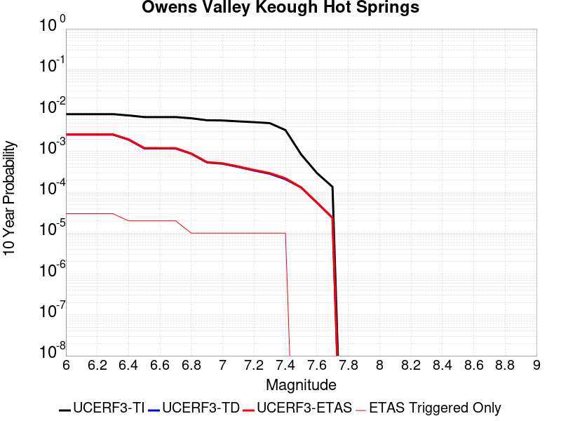 |

| Magnitude | 1 wk TI Prob | 1 wk TD Prob | 1 wk ETAS Prob | 1 wk ETAS/TD Gain | 1 wk ETAS Triggered Only | 1 mo TI Prob | 1 mo TD Prob | 1 mo ETAS Prob | 1 mo ETAS/TD Gain | 1 mo ETAS Triggered Only | 1 yr TI Prob | 1 yr TD Prob | 1 yr ETAS Prob | 1 yr ETAS/TD Gain | 1 yr ETAS Triggered Only | 10 yr TI Prob | 10 yr TD Prob | 10 yr ETAS Prob | 10 yr ETAS/TD Gain | 10 yr ETAS Triggered Only |
|-----|-----|-----|-----|-----|-----|-----|-----|-----|-----|-----|-----|-----|-----|-----|-----|-----|-----|-----|-----|-----|
| 6.0 | 1.5708529E-5 | 4.950463E-6 | 1.4950414E-5 | 3.020003 | 1.0E-5 | 6.7320536E-5 | 2.1216127E-5 | 4.1215702E-5 | 1.9426591 | 2.0E-5 | 8.193192E-4 | 2.5828084E-4 | 2.782757E-4 | 1.0774151 | 2.0E-5 | 0.008163051 | 0.0025804387 | 0.0026103612 | 1.011596 | 3.0E-5 |
| 6.1 | 1.5708529E-5 | 4.950463E-6 | 1.4950414E-5 | 3.020003 | 1.0E-5 | 6.7320536E-5 | 2.1216127E-5 | 4.1215702E-5 | 1.9426591 | 2.0E-5 | 8.193192E-4 | 2.5828084E-4 | 2.782757E-4 | 1.0774151 | 2.0E-5 | 0.008163051 | 0.0025804387 | 0.0026103612 | 1.011596 | 3.0E-5 |
| 6.2 | 1.5708529E-5 | 4.950463E-6 | 1.4950414E-5 | 3.020003 | 1.0E-5 | 6.7320536E-5 | 2.1216127E-5 | 4.1215702E-5 | 1.9426591 | 2.0E-5 | 8.193192E-4 | 2.5828084E-4 | 2.782757E-4 | 1.0774151 | 2.0E-5 | 0.008163051 | 0.0025804387 | 0.0026103612 | 1.011596 | 3.0E-5 |
| 6.3 | 1.5708529E-5 | 4.950463E-6 | 1.4950414E-5 | 3.020003 | 1.0E-5 | 6.7320536E-5 | 2.1216127E-5 | 4.1215702E-5 | 1.9426591 | 2.0E-5 | 8.193192E-4 | 2.5828084E-4 | 2.782757E-4 | 1.0774151 | 2.0E-5 | 0.008163051 | 0.0025804387 | 0.0026103612 | 1.011596 | 3.0E-5 |
| 6.4 | 1.4622509E-5 | 3.7263276E-6 | 1.37262905E-5 | 3.6835973 | 1.0E-5 | 6.266639E-5 | 1.5969896E-5 | 3.5969577E-5 | 2.2523363 | 2.0E-5 | 7.626962E-4 | 1.9441944E-4 | 2.1441556E-4 | 1.1028503 | 2.0E-5 | 0.007600839 | 0.0019429466 | 0.0019629078 | 1.0102737 | 2.0E-5 |
| 6.5 | 1.3335527E-5 | 2.2775241E-6 | 1.2277502E-5 | 5.3907228 | 1.0E-5 | 5.7151006E-5 | 9.760785E-6 | 2.976059E-5 | 3.0489955 | 2.0E-5 | 6.955913E-4 | 1.1883176E-4 | 1.3882939E-4 | 1.1682851 | 2.0E-5 | 0.0069341804 | 0.001187878 | 0.0012078542 | 1.0168167 | 2.0E-5 |
| 6.6 | 1.3332855E-5 | 2.2746733E-6 | 1.22746505E-5 | 5.3962255 | 1.0E-5 | 5.7139558E-5 | 9.748568E-6 | 2.9748373E-5 | 3.0515635 | 2.0E-5 | 6.9545204E-4 | 1.1868303E-4 | 1.3868065E-4 | 1.1684961 | 2.0E-5 | 0.0069327964 | 0.0011863923 | 0.0012063686 | 1.0168378 | 2.0E-5 |
| 6.7 | 1.3318214E-5 | 2.2639038E-6 | 1.2263881E-5 | 5.4171386 | 1.0E-5 | 5.707681E-5 | 9.702413E-6 | 2.9702218E-5 | 3.061323 | 2.0E-5 | 6.946886E-4 | 1.18121156E-4 | 1.3811879E-4 | 1.1692977 | 2.0E-5 | 0.0069252094 | 0.0011807795 | 0.0012007558 | 1.016918 | 2.0E-5 |
| 6.8 | 1.2441338E-5 | 1.677594E-6 | 1.677594E-6 | 1.0 | 0.0 | 5.331893E-5 | 7.1896707E-6 | 1.7189599E-5 | 2.3908744 | 1.0E-5 | 6.489646E-4 | 8.753102E-5 | 9.7530145E-5 | 1.1142352 | 1.0E-5 | 0.0064707273 | 8.751236E-4 | 8.8511483E-4 | 1.0114169 | 1.0E-5 |
| 6.9 | 1.1130476E-5 | 1.0302234E-6 | 1.0302234E-6 | 1.0 | 0.0 | 4.7701167E-5 | 4.4152357E-6 | 1.4415192E-5 | 3.2648747 | 1.0E-5 | 5.806069E-4 | 5.3754186E-5 | 6.375365E-5 | 1.186022 | 1.0E-5 | 0.0057909233 | 5.375404E-4 | 5.47535E-4 | 1.0185933 | 1.0E-5 |
| 7.0 | 1.0986073E-5 | 9.577824E-7 | 9.577824E-7 | 1.0 | 0.0 | 4.7082318E-5 | 4.1047756E-6 | 1.4104734E-5 | 3.4361768 | 1.0E-5 | 5.730765E-4 | 4.9974507E-5 | 5.997401E-5 | 1.2000921 | 1.0E-5 | 0.0057160086 | 4.997603E-4 | 5.0975534E-4 | 1.0199996 | 1.0E-5 |
| 7.1 | 1.0451338E-5 | 7.9988575E-7 | 7.9988575E-7 | 1.0 | 0.0 | 4.4790682E-5 | 3.4280772E-6 | 1.3428043E-5 | 3.917077 | 1.0E-5 | 5.451901E-4 | 4.1736046E-5 | 5.1735627E-5 | 1.239591 | 1.0E-5 | 0.005438545 | 4.1740583E-4 | 4.2740165E-4 | 1.0239475 | 1.0E-5 |
| 7.2 | 9.989061E-6 | 6.543693E-7 | 6.543693E-7 | 1.0 | 0.0 | 4.280956E-5 | 2.8044367E-6 | 1.28044085E-5 | 4.5657687 | 1.0E-5 | 5.2108173E-4 | 3.4143486E-5 | 4.4143144E-5 | 1.2928716 | 1.0E-5 | 0.0051986156 | 3.41488E-4 | 3.5148457E-4 | 1.0292736 | 1.0E-5 |
| 7.3 | 9.465365E-6 | 5.458855E-7 | 5.458855E-7 | 1.0 | 0.0 | 4.056522E-5 | 2.3395073E-6 | 1.2339484E-5 | 5.2743945 | 1.0E-5 | 4.937696E-4 | 2.8483131E-5 | 3.8482845E-5 | 1.351075 | 1.0E-5 | 0.0049267393 | 2.8489542E-4 | 2.9489255E-4 | 1.0350906 | 1.0E-5 |
| 7.4 | 6.3824805E-6 | 4.0153776E-7 | 4.0153776E-7 | 1.0 | 0.0 | 2.73532E-5 | 1.7208749E-6 | 1.1720857E-5 | 6.8109875 | 1.0E-5 | 3.3297433E-4 | 2.0951453E-5 | 3.0951243E-5 | 1.4772838 | 1.0E-5 | 0.0033247585 | 2.0955436E-4 | 2.1955227E-4 | 1.0477103 | 1.0E-5 |
| 7.5 | 1.6192645E-6 | 2.5156373E-7 | 2.5156373E-7 | 1.0 | 0.0 | 6.9396865E-6 | 1.0781299E-6 | 1.0781299E-6 | 1.0 | 0.0 | 8.448741E-5 | 1.3126153E-5 | 1.3126153E-5 | 1.0 | 0.0 | 8.4455294E-4 | 1.3125391E-4 | 1.3125391E-4 | 1.0 | 0.0 |
| 7.6 | 5.7062545E-7 | 1.0790214E-7 | 1.0790214E-7 | 1.0 | 0.0 | 2.4455355E-6 | 4.6243767E-7 | 4.6243767E-7 | 1.0 | 0.0 | 2.9773988E-5 | 5.630165E-6 | 5.630165E-6 | 1.0 | 0.0 | 2.977E-4 | 5.6300305E-5 | 5.6300305E-5 | 1.0 | 0.0 |
| 7.7 | 2.5988817E-7 | 4.5445965E-8 | 4.5445965E-8 | 1.0 | 0.0 | 1.113806E-6 | 1.9476842E-7 | 1.9476842E-7 | 1.0 | 0.0 | 1.3560503E-5 | 2.3713033E-6 | 2.3713033E-6 | 1.0 | 0.0 | 1.3559677E-4 | 2.3712824E-5 | 2.3712824E-5 | 1.0 | 0.0 |

## Hosgri (Extension)
*[(top)](#table-of-contents)*

| 1 Week | 1 Month | 1 Year | 10 Year |
|-----|-----|-----|-----|
|  |  |  |  |

| Magnitude | 1 wk TI Prob | 1 wk TD Prob | 1 wk ETAS Prob | 1 wk ETAS/TD Gain | 1 wk ETAS Triggered Only | 1 mo TI Prob | 1 mo TD Prob | 1 mo ETAS Prob | 1 mo ETAS/TD Gain | 1 mo ETAS Triggered Only | 1 yr TI Prob | 1 yr TD Prob | 1 yr ETAS Prob | 1 yr ETAS/TD Gain | 1 yr ETAS Triggered Only | 10 yr TI Prob | 10 yr TD Prob | 10 yr ETAS Prob | 10 yr ETAS/TD Gain | 10 yr ETAS Triggered Only |
|-----|-----|-----|-----|-----|-----|-----|-----|-----|-----|-----|-----|-----|-----|-----|-----|-----|-----|-----|-----|-----|
| 6.0 | 1.1369135E-5 | 1.2083073E-5 | 3.2082833E-5 | 2.655188 | 2.0E-5 | 4.8723956E-5 | 5.17837E-5 | 7.178266E-5 | 1.386202 | 2.0E-5 | 5.9305265E-4 | 6.303069E-4 | 6.502943E-4 | 1.0317106 | 2.0E-5 | 0.005914725 | 0.00628744 | 0.006317252 | 1.0047414 | 3.0E-5 |
| 6.1 | 6.934979E-6 | 7.324556E-6 | 1.7324483E-5 | 2.3652604 | 1.0E-5 | 2.9721E-5 | 3.13906E-5 | 4.1390285E-5 | 1.3185567 | 1.0E-5 | 3.617931E-4 | 3.821177E-4 | 3.9211387E-4 | 1.02616 | 1.0E-5 | 0.0036120464 | 0.003815019 | 0.0038349428 | 1.0052224 | 2.0E-5 |
| 6.2 | 6.934979E-6 | 7.324556E-6 | 1.7324483E-5 | 2.3652604 | 1.0E-5 | 2.9721E-5 | 3.13906E-5 | 4.1390285E-5 | 1.3185567 | 1.0E-5 | 3.617931E-4 | 3.821177E-4 | 3.9211387E-4 | 1.02616 | 1.0E-5 | 0.0036120464 | 0.003815019 | 0.0038349428 | 1.0052224 | 2.0E-5 |
| 6.3 | 4.5484676E-6 | 4.769331E-6 | 4.769331E-6 | 1.0 | 0.0 | 1.9493287E-5 | 2.0439833E-5 | 2.0439833E-5 | 1.0 | 0.0 | 2.3730492E-4 | 2.4882698E-4 | 2.4882698E-4 | 1.0 | 0.0 | 0.0023705168 | 0.0024855263 | 0.0024955014 | 1.0040133 | 1.0E-5 |
| 6.4 | 4.218095E-6 | 4.416863E-6 | 4.416863E-6 | 1.0 | 0.0 | 1.8077424E-5 | 1.8929275E-5 | 1.8929275E-5 | 1.0 | 0.0 | 2.2007042E-4 | 2.3043988E-4 | 2.3043988E-4 | 1.0 | 0.0 | 0.002198526 | 0.002302043 | 0.00231202 | 1.004334 | 1.0E-5 |
| 6.5 | 3.717374E-6 | 3.883879E-6 | 3.883879E-6 | 1.0 | 0.0 | 1.5931506E-5 | 1.664509E-5 | 1.664509E-5 | 1.0 | 0.0 | 1.9394881E-4 | 2.026353E-4 | 2.026353E-4 | 1.0 | 0.0 | 0.0019377962 | 0.0020245241 | 0.002034504 | 1.0049294 | 1.0E-5 |
| 6.6 | 3.4605036E-6 | 3.6083072E-6 | 3.6083072E-6 | 1.0 | 0.0 | 1.4830645E-5 | 1.5464082E-5 | 1.5464082E-5 | 1.0 | 0.0 | 1.8054814E-4 | 1.8825909E-4 | 1.8825909E-4 | 1.0 | 0.0 | 0.0018040152 | 0.0018810107 | 0.0018810107 | 1.0 | 0.0 |
| 6.7 | 3.123439E-6 | 3.2465698E-6 | 3.2465698E-6 | 1.0 | 0.0 | 1.33860985E-5 | 1.39137965E-5 | 1.39137965E-5 | 1.0 | 0.0 | 1.6296357E-4 | 1.6938741E-4 | 1.6938741E-4 | 1.0 | 0.0 | 0.001628441 | 0.001692594 | 0.001692594 | 1.0 | 0.0 |
| 6.8 | 2.8290783E-6 | 2.9305413E-6 | 2.9305413E-6 | 1.0 | 0.0 | 1.2124565E-5 | 1.2559403E-5 | 1.2559403E-5 | 1.0 | 0.0 | 1.4760658E-4 | 1.5290009E-4 | 1.5290009E-4 | 1.0 | 0.0 | 0.0014750857 | 0.0015279576 | 0.0015279576 | 1.0 | 0.0 |
| 6.9 | 2.454112E-6 | 2.5283207E-6 | 2.5283207E-6 | 1.0 | 0.0 | 1.0517581E-5 | 1.0835615E-5 | 1.0835615E-5 | 1.0 | 0.0 | 1.2804402E-4 | 1.3191569E-4 | 1.3191569E-4 | 1.0 | 0.0 | 0.0012797028 | 0.0013183799 | 0.0013183799 | 1.0 | 0.0 |
| 7.0 | 2.1008145E-6 | 2.1498715E-6 | 2.1498715E-6 | 1.0 | 0.0 | 9.003459E-6 | 9.2137025E-6 | 9.2137025E-6 | 1.0 | 0.0 | 1.096116E-4 | 1.1217109E-4 | 1.1217109E-4 | 1.0 | 0.0 | 0.0010955755 | 0.0011211485 | 0.0011211485 | 1.0 | 0.0 |
| 7.1 | 1.744384E-6 | 1.7686364E-6 | 1.7686364E-6 | 1.0 | 0.0 | 7.47591E-6 | 7.579848E-6 | 7.579848E-6 | 1.0 | 0.0 | 9.1015405E-5 | 9.228076E-5 | 9.228076E-5 | 1.0 | 0.0 | 9.097813E-4 | 9.224261E-4 | 9.224261E-4 | 1.0 | 0.0 |
| 7.2 | 1.5456587E-6 | 1.5562894E-6 | 1.5562894E-6 | 1.0 | 0.0 | 6.6242346E-6 | 6.6697944E-6 | 6.6697944E-6 | 1.0 | 0.0 | 8.064707E-5 | 8.120173E-5 | 8.120173E-5 | 1.0 | 0.0 | 8.0617814E-4 | 8.117219E-4 | 8.117219E-4 | 1.0 | 0.0 |
| 7.3 | 1.3775123E-6 | 1.3766092E-6 | 1.3766092E-6 | 1.0 | 0.0 | 5.9036106E-6 | 5.8997407E-6 | 5.8997407E-6 | 1.0 | 0.0 | 7.187409E-5 | 7.182699E-5 | 7.182699E-5 | 1.0 | 0.0 | 7.185085E-4 | 7.180387E-4 | 7.180387E-4 | 1.0 | 0.0 |
| 7.4 | 1.214491E-6 | 1.2023471E-6 | 1.2023471E-6 | 1.0 | 0.0 | 5.2049513E-6 | 5.152906E-6 | 5.152906E-6 | 1.0 | 0.0 | 6.336844E-5 | 6.2734835E-5 | 6.2734835E-5 | 1.0 | 0.0 | 6.335037E-4 | 6.2717206E-4 | 6.2717206E-4 | 1.0 | 0.0 |
| 7.5 | 1.0101123E-6 | 9.842256E-7 | 9.842256E-7 | 1.0 | 0.0 | 4.3290456E-6 | 4.218103E-6 | 4.218103E-6 | 1.0 | 0.0 | 5.2704854E-5 | 5.13542E-5 | 5.13542E-5 | 1.0 | 0.0 | 5.2692357E-4 | 5.1342393E-4 | 5.1342393E-4 | 1.0 | 0.0 |
| 7.6 | 8.1558215E-7 | 7.765977E-7 | 7.765977E-7 | 1.0 | 0.0 | 3.4953473E-6 | 3.3282718E-6 | 3.3282718E-6 | 1.0 | 0.0 | 4.255502E-5 | 4.0520958E-5 | 4.0520958E-5 | 1.0 | 0.0 | 4.2546875E-4 | 4.0513615E-4 | 4.0513615E-4 | 1.0 | 0.0 |
| 7.7 | 4.757816E-7 | 4.1308996E-7 | 4.1308996E-7 | 1.0 | 0.0 | 2.0390623E-6 | 1.7703843E-6 | 1.7703843E-6 | 1.0 | 0.0 | 2.4825302E-5 | 2.1554217E-5 | 2.1554217E-5 | 1.0 | 0.0 | 2.482253E-4 | 2.1552139E-4 | 2.1552139E-4 | 1.0 | 0.0 |
| 7.8 | 2.782787E-7 | 2.004783E-7 | 2.004783E-7 | 1.0 | 0.0 | 1.1926223E-6 | 8.591924E-7 | 8.591924E-7 | 1.0 | 0.0 | 1.452008E-5 | 1.0460618E-5 | 1.0460618E-5 | 1.0 | 0.0 | 1.4519131E-4 | 1.04601284E-4 | 1.04601284E-4 | 1.0 | 0.0 |
| 7.9 | 1.6948086E-7 | 9.243938E-8 | 9.243938E-8 | 1.0 | 0.0 | 7.2634634E-7 | 3.961687E-7 | 3.961687E-7 | 1.0 | 0.0 | 8.843231E-6 | 4.8233433E-6 | 4.8233433E-6 | 1.0 | 0.0 | 8.842879E-5 | 4.8232392E-5 | 4.8232392E-5 | 1.0 | 0.0 |
| 8.0 | 1.0225492E-7 | 4.473497E-8 | 4.473497E-8 | 1.0 | 0.0 | 4.382353E-7 | 1.917213E-7 | 1.917213E-7 | 1.0 | 0.0 | 5.335502E-6 | 2.3342043E-6 | 2.3342043E-6 | 1.0 | 0.0 | 5.335374E-5 | 2.33418E-5 | 2.33418E-5 | 1.0 | 0.0 |
| 8.1 | 1.43711345E-8 | 5.78716E-9 | 5.78716E-9 | 1.0 | 0.0 | 6.1590576E-8 | 2.4802116E-8 | 2.4802116E-8 | 1.0 | 0.0 | 7.4986497E-7 | 3.019657E-7 | 3.019657E-7 | 1.0 | 0.0 | 7.4986247E-6 | 3.0196536E-6 | 3.0196536E-6 | 1.0 | 0.0 |

## Channel Islands Western Deep Ramp
*[(top)](#table-of-contents)*

| 1 Week | 1 Month | 1 Year | 10 Year |
|-----|-----|-----|-----|
|  |  |  |  |

| Magnitude | 1 wk TI Prob | 1 wk TD Prob | 1 wk ETAS Prob | 1 wk ETAS/TD Gain | 1 wk ETAS Triggered Only | 1 mo TI Prob | 1 mo TD Prob | 1 mo ETAS Prob | 1 mo ETAS/TD Gain | 1 mo ETAS Triggered Only | 1 yr TI Prob | 1 yr TD Prob | 1 yr ETAS Prob | 1 yr ETAS/TD Gain | 1 yr ETAS Triggered Only | 10 yr TI Prob | 10 yr TD Prob | 10 yr ETAS Prob | 10 yr ETAS/TD Gain | 10 yr ETAS Triggered Only |
|-----|-----|-----|-----|-----|-----|-----|-----|-----|-----|-----|-----|-----|-----|-----|-----|-----|-----|-----|-----|-----|
| 6.0 | 6.0213506E-6 | 6.2548684E-6 | 2.6254744E-5 | 4.1974893 | 2.0E-5 | 2.5805533E-5 | 2.6806329E-5 | 4.680579E-5 | 1.7460725 | 2.0E-5 | 3.1413708E-4 | 3.2632265E-4 | 3.463161E-4 | 1.061269 | 2.0E-5 | 0.0031369338 | 0.0032588763 | 0.0032887785 | 1.0091757 | 3.0E-5 |
| 6.1 | 6.0213506E-6 | 6.2548684E-6 | 2.6254744E-5 | 4.1974893 | 2.0E-5 | 2.5805533E-5 | 2.6806329E-5 | 4.680579E-5 | 1.7460725 | 2.0E-5 | 3.1413708E-4 | 3.2632265E-4 | 3.463161E-4 | 1.061269 | 2.0E-5 | 0.0031369338 | 0.0032588763 | 0.0032887785 | 1.0091757 | 3.0E-5 |
| 6.2 | 6.0213506E-6 | 6.2548684E-6 | 2.6254744E-5 | 4.1974893 | 2.0E-5 | 2.5805533E-5 | 2.6806329E-5 | 4.680579E-5 | 1.7460725 | 2.0E-5 | 3.1413708E-4 | 3.2632265E-4 | 3.463161E-4 | 1.061269 | 2.0E-5 | 0.0031369338 | 0.0032588763 | 0.0032887785 | 1.0091757 | 3.0E-5 |
| 6.3 | 6.0213506E-6 | 6.2548684E-6 | 2.6254744E-5 | 4.1974893 | 2.0E-5 | 2.5805533E-5 | 2.6806329E-5 | 4.680579E-5 | 1.7460725 | 2.0E-5 | 3.1413708E-4 | 3.2632265E-4 | 3.463161E-4 | 1.061269 | 2.0E-5 | 0.0031369338 | 0.0032588763 | 0.0032887785 | 1.0091757 | 3.0E-5 |
| 6.4 | 6.0213506E-6 | 6.2548684E-6 | 2.6254744E-5 | 4.1974893 | 2.0E-5 | 2.5805533E-5 | 2.6806329E-5 | 4.680579E-5 | 1.7460725 | 2.0E-5 | 3.1413708E-4 | 3.2632265E-4 | 3.463161E-4 | 1.061269 | 2.0E-5 | 0.0031369338 | 0.0032588763 | 0.0032887785 | 1.0091757 | 3.0E-5 |
| 6.5 | 6.0213506E-6 | 6.2548684E-6 | 2.6254744E-5 | 4.1974893 | 2.0E-5 | 2.5805533E-5 | 2.6806329E-5 | 4.680579E-5 | 1.7460725 | 2.0E-5 | 3.1413708E-4 | 3.2632265E-4 | 3.463161E-4 | 1.061269 | 2.0E-5 | 0.0031369338 | 0.0032588763 | 0.0032887785 | 1.0091757 | 3.0E-5 |
| 6.6 | 6.0213506E-6 | 6.2548684E-6 | 2.6254744E-5 | 4.1974893 | 2.0E-5 | 2.5805533E-5 | 2.6806329E-5 | 4.680579E-5 | 1.7460725 | 2.0E-5 | 3.1413708E-4 | 3.2632265E-4 | 3.463161E-4 | 1.061269 | 2.0E-5 | 0.0031369338 | 0.0032588763 | 0.0032887785 | 1.0091757 | 3.0E-5 |
| 6.7 | 5.313309E-6 | 5.5252403E-6 | 1.5525186E-5 | 2.809866 | 1.0E-5 | 2.2771126E-5 | 2.367941E-5 | 3.3679175E-5 | 1.4222978 | 1.0E-5 | 2.772032E-4 | 2.8826276E-4 | 2.982599E-4 | 1.0346806 | 1.0E-5 | 0.0027685766 | 0.0028792918 | 0.0028992342 | 1.0069262 | 2.0E-5 |
| 6.8 | 5.313309E-6 | 5.5252403E-6 | 1.5525186E-5 | 2.809866 | 1.0E-5 | 2.2771126E-5 | 2.367941E-5 | 3.3679175E-5 | 1.4222978 | 1.0E-5 | 2.772032E-4 | 2.8826276E-4 | 2.982599E-4 | 1.0346806 | 1.0E-5 | 0.0027685766 | 0.0028792918 | 0.0028992342 | 1.0069262 | 2.0E-5 |
| 6.9 | 4.744377E-6 | 4.9394303E-6 | 4.9394303E-6 | 1.0 | 0.0 | 2.0332885E-5 | 2.1168837E-5 | 2.1168837E-5 | 1.0 | 0.0 | 2.4752476E-4 | 2.5770385E-4 | 2.5770385E-4 | 1.0 | 0.0 | 0.0024724922 | 0.0025744175 | 0.0025843917 | 1.0038744 | 1.0E-5 |
| 7.0 | 4.722209E-6 | 4.9164732E-6 | 4.9164732E-6 | 1.0 | 0.0 | 2.0237881E-5 | 2.107045E-5 | 2.107045E-5 | 1.0 | 0.0 | 2.4636835E-4 | 2.5650626E-4 | 2.5650626E-4 | 1.0 | 0.0 | 0.002460954 | 0.0025624693 | 0.0025724438 | 1.0038925 | 1.0E-5 |
| 7.1 | 4.611174E-6 | 4.801409E-6 | 4.801409E-6 | 1.0 | 0.0 | 1.9762025E-5 | 2.0577325E-5 | 2.0577325E-5 | 1.0 | 0.0 | 2.4057609E-4 | 2.5050386E-4 | 2.5050386E-4 | 1.0 | 0.0 | 0.002403158 | 0.002502582 | 0.002512557 | 1.0039859 | 1.0E-5 |
| 7.2 | 4.043994E-6 | 4.2120264E-6 | 4.2120264E-6 | 1.0 | 0.0 | 1.7331287E-5 | 1.8051438E-5 | 1.8051438E-5 | 1.0 | 0.0 | 2.10988E-4 | 2.1975765E-4 | 2.1975765E-4 | 1.0 | 0.0 | 0.002107878 | 0.0021957543 | 0.0022057323 | 1.0045443 | 1.0E-5 |
| 7.3 | 2.1233036E-6 | 2.2297875E-6 | 2.2297875E-6 | 1.0 | 0.0 | 9.099841E-6 | 9.556197E-6 | 9.556197E-6 | 1.0 | 0.0 | 1.1078493E-4 | 1.1634055E-4 | 1.1634055E-4 | 1.0 | 0.0 | 0.0011072971 | 0.001162802 | 0.001162802 | 1.0 | 0.0 |
| 7.4 | 1.9051884E-6 | 2.0014973E-6 | 2.0014973E-6 | 1.0 | 0.0 | 8.165067E-6 | 8.577817E-6 | 8.577817E-6 | 1.0 | 0.0 | 9.940516E-5 | 1.0442998E-4 | 1.0442998E-4 | 1.0 | 0.0 | 9.93607E-4 | 0.0010438144 | 0.0010438144 | 1.0 | 0.0 |
| 7.5 | 1.2408497E-6 | 1.3038839E-6 | 1.3038839E-6 | 1.0 | 0.0 | 5.317916E-6 | 5.588062E-6 | 5.588062E-6 | 1.0 | 0.0 | 6.4743705E-5 | 6.8032554E-5 | 6.8032554E-5 | 1.0 | 0.0 | 6.4724847E-4 | 6.8011944E-4 | 6.8011944E-4 | 1.0 | 0.0 |
| 7.6 | 6.5440025E-7 | 6.886718E-7 | 6.886718E-7 | 1.0 | 0.0 | 2.8045695E-6 | 2.9514472E-6 | 2.9514472E-6 | 1.0 | 0.0 | 3.4145098E-5 | 3.593329E-5 | 3.593329E-5 | 1.0 | 0.0 | 3.4139853E-4 | 3.5927625E-4 | 3.5927625E-4 | 1.0 | 0.0 |
| 7.7 | 3.985963E-7 | 4.1930787E-7 | 4.1930787E-7 | 1.0 | 0.0 | 1.7082689E-6 | 1.7970326E-6 | 1.7970326E-6 | 1.0 | 0.0 | 2.0797976E-5 | 2.1878664E-5 | 2.1878664E-5 | 1.0 | 0.0 | 2.0796029E-4 | 2.1876628E-4 | 2.1876628E-4 | 1.0 | 0.0 |
| 7.8 | 3.706329E-8 | 3.8591796E-8 | 3.8591796E-8 | 1.0 | 0.0 | 1.5884267E-7 | 1.653934E-7 | 1.653934E-7 | 1.0 | 0.0 | 1.9339077E-6 | 2.0136629E-6 | 2.0136629E-6 | 1.0 | 0.0 | 1.933891E-5 | 2.0136458E-5 | 2.0136458E-5 | 1.0 | 0.0 |

## Oceanside alt1
*[(top)](#table-of-contents)*

| 1 Week | 1 Month | 1 Year | 10 Year |
|-----|-----|-----|-----|
|  |  |  |  |

| Magnitude | 1 wk TI Prob | 1 wk TD Prob | 1 wk ETAS Prob | 1 wk ETAS/TD Gain | 1 wk ETAS Triggered Only | 1 mo TI Prob | 1 mo TD Prob | 1 mo ETAS Prob | 1 mo ETAS/TD Gain | 1 mo ETAS Triggered Only | 1 yr TI Prob | 1 yr TD Prob | 1 yr ETAS Prob | 1 yr ETAS/TD Gain | 1 yr ETAS Triggered Only | 10 yr TI Prob | 10 yr TD Prob | 10 yr ETAS Prob | 10 yr ETAS/TD Gain | 10 yr ETAS Triggered Only |
|-----|-----|-----|-----|-----|-----|-----|-----|-----|-----|-----|-----|-----|-----|-----|-----|-----|-----|-----|-----|-----|
| 6.0 | 1.1617542E-5 | 1.1423485E-5 | 2.1423371E-5 | 1.8753796 | 1.0E-5 | 4.9788516E-5 | 4.8956965E-5 | 6.895599E-5 | 1.4085021 | 2.0E-5 | 6.060066E-4 | 5.9590413E-4 | 6.2588626E-4 | 1.0503137 | 3.0E-5 | 0.0060435664 | 0.0059446604 | 0.0059744823 | 1.0050166 | 3.0E-5 |
| 6.1 | 1.1617542E-5 | 1.1423485E-5 | 2.1423371E-5 | 1.8753796 | 1.0E-5 | 4.9788516E-5 | 4.8956965E-5 | 6.895599E-5 | 1.4085021 | 2.0E-5 | 6.060066E-4 | 5.9590413E-4 | 6.2588626E-4 | 1.0503137 | 3.0E-5 | 0.0060435664 | 0.0059446604 | 0.0059744823 | 1.0050166 | 3.0E-5 |
| 6.2 | 1.1617542E-5 | 1.1423485E-5 | 2.1423371E-5 | 1.8753796 | 1.0E-5 | 4.9788516E-5 | 4.8956965E-5 | 6.895599E-5 | 1.4085021 | 2.0E-5 | 6.060066E-4 | 5.9590413E-4 | 6.2588626E-4 | 1.0503137 | 3.0E-5 | 0.0060435664 | 0.0059446604 | 0.0059744823 | 1.0050166 | 3.0E-5 |
| 6.3 | 1.1617542E-5 | 1.1423485E-5 | 2.1423371E-5 | 1.8753796 | 1.0E-5 | 4.9788516E-5 | 4.8956965E-5 | 6.895599E-5 | 1.4085021 | 2.0E-5 | 6.060066E-4 | 5.9590413E-4 | 6.2588626E-4 | 1.0503137 | 3.0E-5 | 0.0060435664 | 0.0059446604 | 0.0059744823 | 1.0050166 | 3.0E-5 |
| 6.4 | 1.1617542E-5 | 1.1423485E-5 | 2.1423371E-5 | 1.8753796 | 1.0E-5 | 4.9788516E-5 | 4.8956965E-5 | 6.895599E-5 | 1.4085021 | 2.0E-5 | 6.060066E-4 | 5.9590413E-4 | 6.2588626E-4 | 1.0503137 | 3.0E-5 | 0.0060435664 | 0.0059446604 | 0.0059744823 | 1.0050166 | 3.0E-5 |
| 6.5 | 1.1617542E-5 | 1.1423485E-5 | 2.1423371E-5 | 1.8753796 | 1.0E-5 | 4.9788516E-5 | 4.8956965E-5 | 6.895599E-5 | 1.4085021 | 2.0E-5 | 6.060066E-4 | 5.9590413E-4 | 6.2588626E-4 | 1.0503137 | 3.0E-5 | 0.0060435664 | 0.0059446604 | 0.0059744823 | 1.0050166 | 3.0E-5 |
| 6.6 | 7.561768E-6 | 7.1336085E-6 | 1.7133538E-5 | 2.4018052 | 1.0E-5 | 3.2407173E-5 | 3.0572253E-5 | 5.057164E-5 | 1.6541679 | 2.0E-5 | 3.9448592E-4 | 3.721547E-4 | 4.0214355E-4 | 1.0805817 | 3.0E-5 | 0.0039378637 | 0.0037154262 | 0.003745315 | 1.0080445 | 3.0E-5 |
| 6.7 | 7.1042605E-6 | 6.6556786E-6 | 1.6655611E-5 | 2.5024664 | 1.0E-5 | 3.0446476E-5 | 2.852403E-5 | 4.852346E-5 | 1.7011433 | 2.0E-5 | 3.706228E-4 | 3.4722552E-4 | 3.6721857E-4 | 1.0575794 | 2.0E-5 | 0.0037000529 | 0.0034669132 | 0.003486844 | 1.0057489 | 2.0E-5 |
| 6.8 | 6.285554E-6 | 5.7996986E-6 | 1.579964E-5 | 2.7242174 | 1.0E-5 | 2.693781E-5 | 2.4855617E-5 | 4.485512E-5 | 1.8046271 | 2.0E-5 | 3.2791847E-4 | 3.0257567E-4 | 3.2256963E-4 | 1.0660791 | 2.0E-5 | 0.0032743502 | 0.0030216945 | 0.003041634 | 1.0065988 | 2.0E-5 |
| 6.9 | 6.148883E-6 | 5.6565373E-6 | 1.565648E-5 | 2.7678561 | 1.0E-5 | 2.635209E-5 | 2.4242081E-5 | 4.4241595E-5 | 1.8249917 | 2.0E-5 | 3.2078946E-4 | 2.951079E-4 | 3.15102E-4 | 1.0677518 | 2.0E-5 | 0.003203268 | 0.002947217 | 0.002967158 | 1.0067661 | 2.0E-5 |
| 7.0 | 5.253857E-6 | 4.7223966E-6 | 1.4722349E-5 | 3.1175587 | 1.0E-5 | 2.2516335E-5 | 2.0238687E-5 | 4.0238283E-5 | 1.9881864 | 2.0E-5 | 2.7410188E-4 | 2.4637848E-4 | 2.6637354E-4 | 1.0811559 | 2.0E-5 | 0.0027376404 | 0.0024610846 | 0.0024810354 | 1.0081065 | 2.0E-5 |
| 7.1 | 4.730754E-6 | 4.1785024E-6 | 1.417846E-5 | 3.393192 | 1.0E-5 | 2.0274503E-5 | 1.7907745E-5 | 3.7907386E-5 | 2.116815 | 2.0E-5 | 2.468141E-4 | 2.1800524E-4 | 2.3800088E-4 | 1.0917209 | 2.0E-5 | 0.0024654015 | 0.0021779404 | 0.0021978968 | 1.009163 | 2.0E-5 |
| 7.2 | 3.7998386E-6 | 3.2140165E-6 | 1.3213984E-5 | 4.111362 | 1.0E-5 | 1.6284921E-5 | 1.37742845E-5 | 3.377401E-5 | 2.451961 | 2.0E-5 | 1.9825088E-4 | 1.6768913E-4 | 1.8768577E-4 | 1.1192483 | 2.0E-5 | 0.001980741 | 0.0016756381 | 0.0016956046 | 1.0119158 | 2.0E-5 |
| 7.3 | 3.2656465E-6 | 2.6983669E-6 | 2.6983669E-6 | 1.0 | 0.0 | 1.3995553E-5 | 1.1564379E-5 | 1.1564379E-5 | 1.0 | 0.0 | 1.7038253E-4 | 1.4078732E-4 | 1.4078732E-4 | 1.0 | 0.0 | 0.0017025196 | 0.0014069924 | 0.0014069924 | 1.0 | 0.0 |
| 7.4 | 2.593703E-6 | 2.0680227E-6 | 2.0680227E-6 | 1.0 | 0.0 | 1.1115822E-5 | 8.862925E-6 | 8.862925E-6 | 1.0 | 0.0 | 1.3532673E-4 | 1.0790086E-4 | 1.0790086E-4 | 1.0 | 0.0 | 0.0013524436 | 0.0010784935 | 0.0010784935 | 1.0 | 0.0 |
| 7.5 | 1.8715585E-6 | 1.4137277E-6 | 1.4137277E-6 | 1.0 | 0.0 | 8.020941E-6 | 6.058819E-6 | 6.058819E-6 | 1.0 | 0.0 | 9.7650576E-5 | 7.376369E-5 | 7.376369E-5 | 1.0 | 0.0 | 9.7607676E-4 | 7.373981E-4 | 7.373981E-4 | 1.0 | 0.0 |
| 7.6 | 1.2246786E-6 | 8.526946E-7 | 8.526946E-7 | 1.0 | 0.0 | 5.248612E-6 | 3.6544006E-6 | 3.6544006E-6 | 1.0 | 0.0 | 6.389998E-5 | 4.4491466E-5 | 4.4491466E-5 | 1.0 | 0.0 | 6.3881604E-4 | 4.4483008E-4 | 4.4483008E-4 | 1.0 | 0.0 |
| 7.7 | 5.140719E-7 | 2.7346528E-7 | 2.7346528E-7 | 1.0 | 0.0 | 2.2031636E-6 | 1.1719936E-6 | 1.1719936E-6 | 1.0 | 0.0 | 2.6823185E-5 | 1.4268943E-5 | 1.4268943E-5 | 1.0 | 0.0 | 2.6819948E-4 | 1.4268162E-4 | 1.4268162E-4 | 1.0 | 0.0 |
| 7.8 | 1.16056995E-8 | 9.782997E-9 | 9.782997E-9 | 1.0 | 0.0 | 4.9738713E-8 | 4.1927127E-8 | 4.1927127E-8 | 1.0 | 0.0 | 6.0556863E-7 | 5.1046277E-7 | 5.1046277E-7 | 1.0 | 0.0 | 6.05567E-6 | 5.1046277E-6 | 5.1046277E-6 | 1.0 | 0.0 |

## Great Valley 08 (Quinto)
*[(top)](#table-of-contents)*

| 1 Week | 1 Month | 1 Year | 10 Year |
|-----|-----|-----|-----|
|  |  |  |  |

| Magnitude | 1 wk TI Prob | 1 wk TD Prob | 1 wk ETAS Prob | 1 wk ETAS/TD Gain | 1 wk ETAS Triggered Only | 1 mo TI Prob | 1 mo TD Prob | 1 mo ETAS Prob | 1 mo ETAS/TD Gain | 1 mo ETAS Triggered Only | 1 yr TI Prob | 1 yr TD Prob | 1 yr ETAS Prob | 1 yr ETAS/TD Gain | 1 yr ETAS Triggered Only | 10 yr TI Prob | 10 yr TD Prob | 10 yr ETAS Prob | 10 yr ETAS/TD Gain | 10 yr ETAS Triggered Only |
|-----|-----|-----|-----|-----|-----|-----|-----|-----|-----|-----|-----|-----|-----|-----|-----|-----|-----|-----|-----|-----|
| 6.0 | 7.737697E-6 | 8.253038E-6 | 8.253038E-6 | 1.0 | 0.0 | 3.3161137E-5 | 3.536979E-5 | 4.5369437E-5 | 1.2827171 | 1.0E-5 | 4.0366207E-4 | 4.3056096E-4 | 4.4055664E-4 | 1.0232155 | 1.0E-5 | 0.004029296 | 0.0042991205 | 0.0043289918 | 1.0069481 | 3.0E-5 |
| 6.1 | 7.737697E-6 | 8.253038E-6 | 8.253038E-6 | 1.0 | 0.0 | 3.3161137E-5 | 3.536979E-5 | 4.5369437E-5 | 1.2827171 | 1.0E-5 | 4.0366207E-4 | 4.3056096E-4 | 4.4055664E-4 | 1.0232155 | 1.0E-5 | 0.004029296 | 0.0042991205 | 0.0043289918 | 1.0069481 | 3.0E-5 |
| 6.2 | 7.737697E-6 | 8.253038E-6 | 8.253038E-6 | 1.0 | 0.0 | 3.3161137E-5 | 3.536979E-5 | 4.5369437E-5 | 1.2827171 | 1.0E-5 | 4.0366207E-4 | 4.3056096E-4 | 4.4055664E-4 | 1.0232155 | 1.0E-5 | 0.004029296 | 0.0042991205 | 0.0043289918 | 1.0069481 | 3.0E-5 |
| 6.3 | 5.374012E-6 | 5.7505736E-6 | 5.7505736E-6 | 1.0 | 0.0 | 2.3031276E-5 | 2.4645145E-5 | 3.4644898E-5 | 1.4057494 | 1.0E-5 | 2.803697E-4 | 3.0002446E-4 | 3.1002148E-4 | 1.0333207 | 1.0E-5 | 0.0028001624 | 0.0029972875 | 0.0030271974 | 1.009979 | 3.0E-5 |
| 6.4 | 5.374012E-6 | 5.7505736E-6 | 5.7505736E-6 | 1.0 | 0.0 | 2.3031276E-5 | 2.4645145E-5 | 3.4644898E-5 | 1.4057494 | 1.0E-5 | 2.803697E-4 | 3.0002446E-4 | 3.1002148E-4 | 1.0333207 | 1.0E-5 | 0.0028001624 | 0.0029972875 | 0.0030271974 | 1.009979 | 3.0E-5 |
| 6.5 | 3.65427E-6 | 3.941324E-6 | 3.941324E-6 | 1.0 | 0.0 | 1.5661062E-5 | 1.689132E-5 | 2.689115E-5 | 1.5920101 | 1.0E-5 | 1.9065675E-4 | 2.0563944E-4 | 2.156374E-4 | 1.0486188 | 1.0E-5 | 0.0019049325 | 0.0020551833 | 0.0020651626 | 1.0048558 | 1.0E-5 |
| 6.6 | 3.6143538E-6 | 3.8985104E-6 | 3.8985104E-6 | 1.0 | 0.0 | 1.5489995E-5 | 1.6707834E-5 | 2.6707668E-5 | 1.5985116 | 1.0E-5 | 1.8857437E-4 | 2.0340596E-4 | 2.1340392E-4 | 1.0491527 | 1.0E-5 | 0.0018841444 | 0.0020328893 | 0.0020428689 | 1.0049092 | 1.0E-5 |
| 6.7 | 2.4821015E-6 | 2.6857067E-6 | 2.6857067E-6 | 1.0 | 0.0 | 1.0637535E-5 | 1.1510153E-5 | 1.1510153E-5 | 1.0 | 0.0 | 1.2950429E-4 | 1.4013276E-4 | 1.4013276E-4 | 1.0 | 0.0 | 0.0012942884 | 0.0014009989 | 0.0014009989 | 1.0 | 0.0 |
| 6.8 | 4.7110538E-7 | 5.193021E-7 | 5.193021E-7 | 1.0 | 0.0 | 2.0190216E-6 | 2.2255786E-6 | 2.2255786E-6 | 1.0 | 0.0 | 2.458131E-5 | 2.70961E-5 | 2.70961E-5 | 1.0 | 0.0 | 2.457859E-4 | 2.7092977E-4 | 2.7092977E-4 | 1.0 | 0.0 |
| 6.9 | 3.958685E-7 | 4.3703452E-7 | 4.3703452E-7 | 1.0 | 0.0 | 1.6965782E-6 | 1.8730038E-6 | 1.8730038E-6 | 1.0 | 0.0 | 2.0655643E-5 | 2.28036E-5 | 2.28036E-5 | 1.0 | 0.0 | 2.0653724E-4 | 2.2801422E-4 | 2.2801422E-4 | 1.0 | 0.0 |
| 7.0 | 2.70294E-7 | 2.9920008E-7 | 2.9920008E-7 | 1.0 | 0.0 | 1.1584025E-6 | 1.2822856E-6 | 1.2822856E-6 | 1.0 | 0.0 | 1.4103458E-5 | 1.5611728E-5 | 1.5611728E-5 | 1.0 | 0.0 | 1.4102564E-4 | 1.5610759E-4 | 1.5610759E-4 | 1.0 | 0.0 |
| 7.1 | 1.4828602E-7 | 1.6469107E-7 | 1.6469107E-7 | 1.0 | 0.0 | 6.3551136E-7 | 7.058187E-7 | 7.058187E-7 | 1.0 | 0.0 | 7.737323E-6 | 8.593317E-6 | 8.593317E-6 | 1.0 | 0.0 | 7.737054E-5 | 8.593065E-5 | 8.593065E-5 | 1.0 | 0.0 |

## Maacama 2011 CFM
*[(top)](#table-of-contents)*

| 1 Week | 1 Month | 1 Year | 10 Year |
|-----|-----|-----|-----|
|  |  |  | 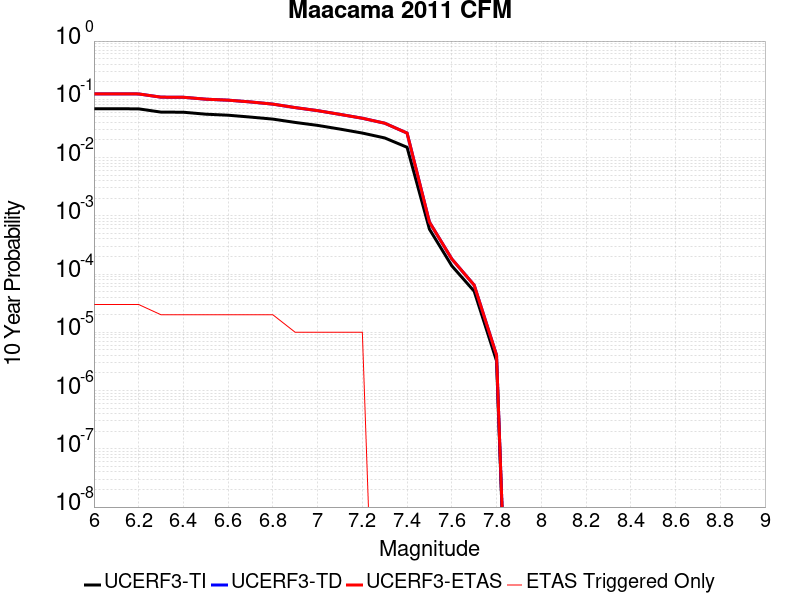 |

| Magnitude | 1 wk TI Prob | 1 wk TD Prob | 1 wk ETAS Prob | 1 wk ETAS/TD Gain | 1 wk ETAS Triggered Only | 1 mo TI Prob | 1 mo TD Prob | 1 mo ETAS Prob | 1 mo ETAS/TD Gain | 1 mo ETAS Triggered Only | 1 yr TI Prob | 1 yr TD Prob | 1 yr ETAS Prob | 1 yr ETAS/TD Gain | 1 yr ETAS Triggered Only | 10 yr TI Prob | 10 yr TD Prob | 10 yr ETAS Prob | 10 yr ETAS/TD Gain | 10 yr ETAS Triggered Only |
|-----|-----|-----|-----|-----|-----|-----|-----|-----|-----|-----|-----|-----|-----|-----|-----|-----|-----|-----|-----|-----|
| 6.0 | 1.368203E-4 | 2.579087E-4 | 2.679061E-4 | 1.0387634 | 1.0E-5 | 5.862409E-4 | 0.0011047592 | 0.0011147481 | 1.0090418 | 1.0E-5 | 0.0071141496 | 0.013350345 | 0.013360212 | 1.0007391 | 1.0E-5 | 0.06890667 | 0.1241916 | 0.124217875 | 1.0002116 | 3.0E-5 |
| 6.1 | 1.368203E-4 | 2.579087E-4 | 2.679061E-4 | 1.0387634 | 1.0E-5 | 5.862409E-4 | 0.0011047592 | 0.0011147481 | 1.0090418 | 1.0E-5 | 0.0071141496 | 0.013350345 | 0.013360212 | 1.0007391 | 1.0E-5 | 0.06890667 | 0.1241916 | 0.124217875 | 1.0002116 | 3.0E-5 |
| 6.2 | 1.360743E-4 | 2.566557E-4 | 2.6665317E-4 | 1.0389527 | 1.0E-5 | 5.8304524E-4 | 0.001099394 | 0.0011093831 | 1.0090859 | 1.0E-5 | 0.007075496 | 0.013285898 | 0.013295765 | 1.0007427 | 1.0E-5 | 0.06854413 | 0.123625994 | 0.12365229 | 1.0002127 | 3.0E-5 |
| 6.3 | 1.1917239E-4 | 2.236021E-4 | 2.3359986E-4 | 1.0447123 | 1.0E-5 | 5.1063887E-4 | 9.578717E-4 | 9.6786214E-4 | 1.0104299 | 1.0E-5 | 0.0061993203 | 0.0115873255 | 0.01159721 | 1.0008531 | 1.0E-5 | 0.060292065 | 0.108845875 | 0.1088637 | 1.0001638 | 2.0E-5 |
| 6.4 | 1.1859289E-4 | 2.2263796E-4 | 2.3263574E-4 | 1.044906 | 1.0E-5 | 5.0815626E-4 | 9.537432E-4 | 9.6373365E-4 | 1.010475 | 1.0E-5 | 0.006169266 | 0.011537647 | 0.011547531 | 1.0008568 | 1.0E-5 | 0.06000784 | 0.10840272 | 0.10842056 | 1.0001645 | 2.0E-5 |
| 6.5 | 1.09512424E-4 | 2.0517908E-4 | 2.1517703E-4 | 1.0487279 | 1.0E-5 | 4.6925453E-4 | 8.7897904E-4 | 8.889703E-4 | 1.0113668 | 1.0E-5 | 0.005698218 | 0.010639169 | 0.010649063 | 1.00093 | 1.0E-5 | 0.055543028 | 0.1004949 | 0.100512885 | 1.000179 | 2.0E-5 |
| 6.6 | 1.0502928E-4 | 1.9675294E-4 | 2.0675096E-4 | 1.0508151 | 1.0E-5 | 4.500478E-4 | 8.429031E-4 | 8.528946E-4 | 1.0118538 | 1.0E-5 | 0.0054655746 | 0.010205293 | 0.010215191 | 1.0009699 | 1.0E-5 | 0.053330887 | 0.0966474 | 0.096665464 | 1.0001869 | 2.0E-5 |
| 6.7 | 9.739358E-5 | 1.8259176E-4 | 1.9258993E-4 | 1.054757 | 1.0E-5 | 4.173343E-4 | 7.822563E-4 | 7.9224847E-4 | 1.0127735 | 1.0E-5 | 0.0050692135 | 0.009475343 | 0.009485248 | 1.0010453 | 1.0E-5 | 0.049551267 | 0.09012011 | 0.0901383 | 1.000202 | 2.0E-5 |
| 6.8 | 8.969524E-5 | 1.6658378E-4 | 1.765821E-4 | 1.0600199 | 1.0E-5 | 3.8435153E-4 | 7.1369443E-4 | 7.236873E-4 | 1.0140016 | 1.0E-5 | 0.0046694432 | 0.00864909 | 0.008659003 | 1.0011462 | 1.0E-5 | 0.045725387 | 0.08265246 | 0.08267081 | 1.000222 | 2.0E-5 |
| 6.9 | 7.838291E-5 | 1.4418772E-4 | 1.4418772E-4 | 1.0 | 0.0 | 3.358835E-4 | 6.1778206E-4 | 6.1778206E-4 | 1.0 | 0.0 | 0.0040817154 | 0.007491724 | 0.007491724 | 1.0 | 0.0 | 0.04007554 | 0.07205298 | 0.072062254 | 1.0001287 | 1.0E-5 |
| 7.0 | 6.961957E-5 | 1.2708071E-4 | 1.2708071E-4 | 1.0 | 0.0 | 2.9833548E-4 | 5.445059E-4 | 5.445059E-4 | 1.0 | 0.0 | 0.0036261857 | 0.006606692 | 0.006606692 | 1.0 | 0.0 | 0.035675827 | 0.063871816 | 0.063881174 | 1.0001465 | 1.0E-5 |
| 7.1 | 5.999398E-5 | 1.09053384E-4 | 1.09053384E-4 | 1.0 | 0.0 | 2.570917E-4 | 4.6728246E-4 | 4.6728246E-4 | 1.0 | 0.0 | 0.0031255994 | 0.00567284 | 0.00567284 | 1.0 | 0.0 | 0.030820016 | 0.055139277 | 0.055148724 | 1.0001713 | 1.0E-5 |
| 7.2 | 5.116532E-5 | 9.305489E-5 | 9.305489E-5 | 1.0 | 0.0 | 2.1926152E-4 | 3.9874107E-4 | 3.9874107E-4 | 1.0 | 0.0 | 0.002666241 | 0.00484315 | 0.00484315 | 1.0 | 0.0 | 0.026344774 | 0.047303654 | 0.04731318 | 1.0002013 | 1.0E-5 |
| 7.3 | 4.2087835E-5 | 7.617064E-5 | 7.617064E-5 | 1.0 | 0.0 | 1.8036396E-4 | 3.264016E-4 | 3.264016E-4 | 1.0 | 0.0 | 0.0021937196 | 0.0039662397 | 0.0039662397 | 1.0 | 0.0 | 0.0217219 | 0.038905017 | 0.038905017 | 1.0 | 0.0 |
| 7.4 | 2.8991652E-5 | 5.1163643E-5 | 5.1163643E-5 | 1.0 | 0.0 | 1.2424402E-4 | 2.1925455E-4 | 2.1925455E-4 | 1.0 | 0.0 | 0.0015116213 | 0.0026661097 | 0.0026661097 | 1.0 | 0.0 | 0.015013801 | 0.026332043 | 0.026332043 | 1.0 | 0.0 |
| 7.5 | 1.1292299E-6 | 1.4950216E-6 | 1.4950216E-6 | 1.0 | 0.0 | 4.8395473E-6 | 6.407227E-6 | 6.407227E-6 | 1.0 | 0.0 | 5.8919897E-5 | 7.8006444E-5 | 7.8006444E-5 | 1.0 | 0.0 | 5.890428E-4 | 7.805042E-4 | 7.805042E-4 | 1.0 | 0.0 |
| 7.6 | 2.6535366E-7 | 3.4720998E-7 | 3.4720998E-7 | 1.0 | 0.0 | 1.1372296E-6 | 1.4880419E-6 | 1.4880419E-6 | 1.0 | 0.0 | 1.3845682E-5 | 1.811676E-5 | 1.811676E-5 | 1.0 | 0.0 | 1.3844819E-4 | 1.817069E-4 | 1.817069E-4 | 1.0 | 0.0 |
| 7.7 | 9.727789E-8 | 1.2302418E-7 | 1.2302418E-7 | 1.0 | 0.0 | 4.1690518E-7 | 5.2724636E-7 | 5.2724636E-7 | 1.0 | 0.0 | 5.0758085E-6 | 6.419206E-6 | 6.419206E-6 | 1.0 | 0.0 | 5.0756928E-5 | 6.456404E-5 | 6.456404E-5 | 1.0 | 0.0 |
| 7.8 | 6.1939325E-9 | 7.711711E-9 | 7.711711E-9 | 1.0 | 0.0 | 2.6545425E-8 | 3.305019E-8 | 3.305019E-8 | 1.0 | 0.0 | 3.231905E-7 | 4.0238598E-7 | 4.0238598E-7 | 1.0 | 0.0 | 3.2319003E-6 | 4.0597915E-6 | 4.0597915E-6 | 1.0 | 0.0 |

## San Jose
*[(top)](#table-of-contents)*

| 1 Week | 1 Month | 1 Year | 10 Year |
|-----|-----|-----|-----|
|  |  |  |  |

| Magnitude | 1 wk TI Prob | 1 wk TD Prob | 1 wk ETAS Prob | 1 wk ETAS/TD Gain | 1 wk ETAS Triggered Only | 1 mo TI Prob | 1 mo TD Prob | 1 mo ETAS Prob | 1 mo ETAS/TD Gain | 1 mo ETAS Triggered Only | 1 yr TI Prob | 1 yr TD Prob | 1 yr ETAS Prob | 1 yr ETAS/TD Gain | 1 yr ETAS Triggered Only | 10 yr TI Prob | 10 yr TD Prob | 10 yr ETAS Prob | 10 yr ETAS/TD Gain | 10 yr ETAS Triggered Only |
|-----|-----|-----|-----|-----|-----|-----|-----|-----|-----|-----|-----|-----|-----|-----|-----|-----|-----|-----|-----|-----|
| 6.0 | 5.0851277E-6 | 4.125642E-6 | 4.125642E-6 | 1.0 | 0.0 | 2.1793223E-5 | 1.768122E-5 | 2.7681042E-5 | 1.5655619 | 1.0E-5 | 2.653002E-4 | 2.152502E-4 | 2.2524805E-4 | 1.0464475 | 1.0E-5 | 0.0026498367 | 0.0021507454 | 0.0021806809 | 1.0139186 | 3.0E-5 |
| 6.1 | 5.0851277E-6 | 4.125642E-6 | 4.125642E-6 | 1.0 | 0.0 | 2.1793223E-5 | 1.768122E-5 | 2.7681042E-5 | 1.5655619 | 1.0E-5 | 2.653002E-4 | 2.152502E-4 | 2.2524805E-4 | 1.0464475 | 1.0E-5 | 0.0026498367 | 0.0021507454 | 0.0021806809 | 1.0139186 | 3.0E-5 |
| 6.2 | 5.0851277E-6 | 4.125642E-6 | 4.125642E-6 | 1.0 | 0.0 | 2.1793223E-5 | 1.768122E-5 | 2.7681042E-5 | 1.5655619 | 1.0E-5 | 2.653002E-4 | 2.152502E-4 | 2.2524805E-4 | 1.0464475 | 1.0E-5 | 0.0026498367 | 0.0021507454 | 0.0021806809 | 1.0139186 | 3.0E-5 |
| 6.3 | 5.0851277E-6 | 4.125642E-6 | 4.125642E-6 | 1.0 | 0.0 | 2.1793223E-5 | 1.768122E-5 | 2.7681042E-5 | 1.5655619 | 1.0E-5 | 2.653002E-4 | 2.152502E-4 | 2.2524805E-4 | 1.0464475 | 1.0E-5 | 0.0026498367 | 0.0021507454 | 0.0021806809 | 1.0139186 | 3.0E-5 |
| 6.4 | 4.3115124E-6 | 3.3237525E-6 | 3.3237525E-6 | 1.0 | 0.0 | 1.8477778E-5 | 1.4244589E-5 | 1.4244589E-5 | 1.0 | 0.0 | 2.2494372E-4 | 1.7341628E-4 | 1.7341628E-4 | 1.0 | 0.0 | 0.0022471617 | 0.0017330965 | 0.0017530619 | 1.01152 | 2.0E-5 |
| 6.5 | 4.3115124E-6 | 3.3237525E-6 | 3.3237525E-6 | 1.0 | 0.0 | 1.8477778E-5 | 1.4244589E-5 | 1.4244589E-5 | 1.0 | 0.0 | 2.2494372E-4 | 1.7341628E-4 | 1.7341628E-4 | 1.0 | 0.0 | 0.0022471617 | 0.0017330965 | 0.0017530619 | 1.01152 | 2.0E-5 |
| 6.6 | 3.110396E-6 | 2.0799562E-6 | 2.0799562E-6 | 1.0 | 0.0 | 1.33302E-5 | 8.9140685E-6 | 8.9140685E-6 | 1.0 | 0.0 | 1.622831E-4 | 1.0852366E-4 | 1.0852366E-4 | 1.0 | 0.0 | 0.0016216465 | 0.001084804 | 0.001084804 | 1.0 | 0.0 |
| 6.7 | 3.110396E-6 | 2.0799562E-6 | 2.0799562E-6 | 1.0 | 0.0 | 1.33302E-5 | 8.9140685E-6 | 8.9140685E-6 | 1.0 | 0.0 | 1.622831E-4 | 1.0852366E-4 | 1.0852366E-4 | 1.0 | 0.0 | 0.0016216465 | 0.001084804 | 0.001084804 | 1.0 | 0.0 |
| 6.8 | 2.856651E-6 | 1.9024077E-6 | 1.9024077E-6 | 1.0 | 0.0 | 1.2242733E-5 | 8.153152E-6 | 8.153152E-6 | 1.0 | 0.0 | 1.4904508E-4 | 9.926035E-5 | 9.926035E-5 | 1.0 | 0.0 | 0.0014894515 | 9.922545E-4 | 9.922545E-4 | 1.0 | 0.0 |
| 6.9 | 2.1618725E-6 | 1.4186406E-6 | 1.4186406E-6 | 1.0 | 0.0 | 9.265135E-6 | 6.0798748E-6 | 6.0798748E-6 | 1.0 | 0.0 | 1.12797185E-4 | 7.402005E-5 | 7.402005E-5 | 1.0 | 0.0 | 0.0011273995 | 7.4003247E-4 | 7.4003247E-4 | 1.0 | 0.0 |
| 7.0 | 1.9684312E-6 | 1.3256082E-6 | 1.3256082E-6 | 1.0 | 0.0 | 8.436106E-6 | 5.681166E-6 | 5.681166E-6 | 1.0 | 0.0 | 1.02704755E-4 | 6.916608E-5 | 6.916608E-5 | 1.0 | 0.0 | 0.001026573 | 6.9152354E-4 | 6.9152354E-4 | 1.0 | 0.0 |
| 7.1 | 1.6070337E-6 | 1.1154867E-6 | 1.1154867E-6 | 1.0 | 0.0 | 6.887269E-6 | 4.7806493E-6 | 4.7806493E-6 | 1.0 | 0.0 | 8.384928E-5 | 5.8202913E-5 | 5.8202913E-5 | 1.0 | 0.0 | 8.3817646E-4 | 5.819527E-4 | 5.819527E-4 | 1.0 | 0.0 |
| 7.2 | 1.0631658E-6 | 6.403567E-7 | 6.403567E-7 | 1.0 | 0.0 | 4.556417E-6 | 2.744383E-6 | 2.744383E-6 | 1.0 | 0.0 | 5.5472963E-5 | 3.3412365E-5 | 3.3412365E-5 | 1.0 | 0.0 | 5.545912E-4 | 3.3414463E-4 | 3.3414463E-4 | 1.0 | 0.0 |
| 7.3 | 7.060711E-7 | 4.5823228E-7 | 4.5823228E-7 | 1.0 | 0.0 | 3.0260155E-6 | 1.9638512E-6 | 1.9638512E-6 | 1.0 | 0.0 | 3.6841117E-5 | 2.3909635E-5 | 2.3909635E-5 | 1.0 | 0.0 | 3.6835007E-4 | 2.3914136E-4 | 2.3914136E-4 | 1.0 | 0.0 |
| 7.4 | 3.3677085E-7 | 2.3231999E-7 | 2.3231999E-7 | 1.0 | 0.0 | 1.4433028E-6 | 9.956567E-7 | 9.956567E-7 | 1.0 | 0.0 | 1.757207E-5 | 1.2122056E-5 | 1.2122056E-5 | 1.0 | 0.0 | 1.7570681E-4 | 1.2128407E-4 | 1.2128407E-4 | 1.0 | 0.0 |
| 7.5 | 3.129161E-7 | 1.9529637E-7 | 1.9529637E-7 | 1.0 | 0.0 | 1.3410682E-6 | 8.3698416E-7 | 8.3698416E-7 | 1.0 | 0.0 | 1.6327383E-5 | 1.0190237E-5 | 1.0190237E-5 | 1.0 | 0.0 | 1.6326184E-4 | 1.0196777E-4 | 1.0196777E-4 | 1.0 | 0.0 |
| 7.6 | 2.8008668E-7 | 1.4240818E-7 | 1.4240818E-7 | 1.0 | 0.0 | 1.2003709E-6 | 6.103206E-7 | 6.103206E-7 | 1.0 | 0.0 | 1.46144175E-5 | 7.43063E-6 | 7.43063E-6 | 1.0 | 0.0 | 1.4613457E-4 | 7.43735E-5 | 7.43735E-5 | 1.0 | 0.0 |
| 7.7 | 2.7852005E-7 | 1.4015403E-7 | 1.4015403E-7 | 1.0 | 0.0 | 1.1936568E-6 | 6.0066003E-7 | 6.0066003E-7 | 1.0 | 0.0 | 1.4532674E-5 | 7.3130127E-6 | 7.3130127E-6 | 1.0 | 0.0 | 1.4531724E-4 | 7.31974E-5 | 7.31974E-5 | 1.0 | 0.0 |
| 7.8 | 1.1810797E-7 | 7.5187074E-8 | 7.5187074E-8 | 1.0 | 0.0 | 5.0617695E-7 | 3.2223028E-7 | 3.2223028E-7 | 1.0 | 0.0 | 6.1626865E-6 | 3.9231472E-6 | 3.9231472E-6 | 1.0 | 0.0 | 6.162516E-5 | 3.9271265E-5 | 3.9271265E-5 | 1.0 | 0.0 |

## Big Pine (East)
*[(top)](#table-of-contents)*

| 1 Week | 1 Month | 1 Year | 10 Year |
|-----|-----|-----|-----|
|  |  |  |  |

| Magnitude | 1 wk TI Prob | 1 wk TD Prob | 1 wk ETAS Prob | 1 wk ETAS/TD Gain | 1 wk ETAS Triggered Only | 1 mo TI Prob | 1 mo TD Prob | 1 mo ETAS Prob | 1 mo ETAS/TD Gain | 1 mo ETAS Triggered Only | 1 yr TI Prob | 1 yr TD Prob | 1 yr ETAS Prob | 1 yr ETAS/TD Gain | 1 yr ETAS Triggered Only | 10 yr TI Prob | 10 yr TD Prob | 10 yr ETAS Prob | 10 yr ETAS/TD Gain | 10 yr ETAS Triggered Only |
|-----|-----|-----|-----|-----|-----|-----|-----|-----|-----|-----|-----|-----|-----|-----|-----|-----|-----|-----|-----|-----|
| 6.0 | 9.916913E-6 | 1.28172705E-5 | 2.2817143E-5 | 1.7801872 | 1.0E-5 | 4.250036E-5 | 5.493013E-5 | 6.4929576E-5 | 1.1820395 | 1.0E-5 | 5.173191E-4 | 6.685912E-4 | 6.785845E-4 | 1.0149468 | 1.0E-5 | 0.0051611643 | 0.006670449 | 0.0067002485 | 1.0044675 | 3.0E-5 |
| 6.1 | 9.916913E-6 | 1.28172705E-5 | 2.2817143E-5 | 1.7801872 | 1.0E-5 | 4.250036E-5 | 5.493013E-5 | 6.4929576E-5 | 1.1820395 | 1.0E-5 | 5.173191E-4 | 6.685912E-4 | 6.785845E-4 | 1.0149468 | 1.0E-5 | 0.0051611643 | 0.006670449 | 0.0067002485 | 1.0044675 | 3.0E-5 |
| 6.2 | 9.916913E-6 | 1.28172705E-5 | 2.2817143E-5 | 1.7801872 | 1.0E-5 | 4.250036E-5 | 5.493013E-5 | 6.4929576E-5 | 1.1820395 | 1.0E-5 | 5.173191E-4 | 6.685912E-4 | 6.785845E-4 | 1.0149468 | 1.0E-5 | 0.0051611643 | 0.006670449 | 0.0067002485 | 1.0044675 | 3.0E-5 |
| 6.3 | 5.479711E-6 | 8.1132375E-6 | 1.8113156E-5 | 2.2325435 | 1.0E-5 | 2.3484265E-5 | 3.4770575E-5 | 4.4770226E-5 | 1.2875896 | 1.0E-5 | 2.858834E-4 | 4.232527E-4 | 4.3324847E-4 | 1.0236166 | 1.0E-5 | 0.0028551589 | 0.0042272513 | 0.0042571244 | 1.0070668 | 3.0E-5 |
| 6.4 | 5.465009E-6 | 8.0975315E-6 | 1.8097451E-5 | 2.2349343 | 1.0E-5 | 2.3421257E-5 | 3.4703262E-5 | 4.4702916E-5 | 1.2881473 | 1.0E-5 | 2.851165E-4 | 4.2243348E-4 | 4.3242925E-4 | 1.0236623 | 1.0E-5 | 0.0028475097 | 0.00421909 | 0.0042489637 | 1.0070806 | 3.0E-5 |
| 6.5 | 4.826767E-6 | 7.4225877E-6 | 7.4225877E-6 | 1.0 | 0.0 | 2.068598E-5 | 3.1810716E-5 | 3.1810716E-5 | 1.0 | 0.0 | 2.518227E-4 | 3.8722943E-4 | 3.8722943E-4 | 1.0 | 0.0 | 0.0025153751 | 0.0038682907 | 0.0038882133 | 1.0051502 | 2.0E-5 |
| 6.6 | 4.3146847E-6 | 6.8825234E-6 | 6.8825234E-6 | 1.0 | 0.0 | 1.8491375E-5 | 2.949621E-5 | 2.949621E-5 | 1.0 | 0.0 | 2.2510924E-4 | 3.5905963E-4 | 3.5905963E-4 | 1.0 | 0.0 | 0.0022488134 | 0.0035875062 | 0.0036074345 | 1.0055549 | 2.0E-5 |
| 6.7 | 3.6968106E-6 | 5.9957474E-6 | 5.9957474E-6 | 1.0 | 0.0 | 1.5843378E-5 | 2.5695816E-5 | 2.5695816E-5 | 1.0 | 0.0 | 1.9287605E-4 | 3.128032E-4 | 3.128032E-4 | 1.0 | 0.0 | 0.0019270873 | 0.0031262499 | 0.0031461874 | 1.0063775 | 2.0E-5 |
| 6.8 | 3.4671132E-6 | 5.7024477E-6 | 5.7024477E-6 | 1.0 | 0.0 | 1.4858972E-5 | 2.4438841E-5 | 2.4438841E-5 | 1.0 | 0.0 | 1.8089297E-4 | 2.9750372E-4 | 2.9750372E-4 | 1.0 | 0.0 | 0.0018074579 | 0.0029736666 | 0.0029936072 | 1.0067058 | 2.0E-5 |
| 6.9 | 2.7686972E-6 | 4.8254797E-6 | 4.8254797E-6 | 1.0 | 0.0 | 1.1865792E-5 | 2.0680467E-5 | 2.0680467E-5 | 1.0 | 0.0 | 1.4445644E-4 | 2.5175634E-4 | 2.5175634E-4 | 1.0 | 0.0 | 0.0014436257 | 0.002517256 | 0.0025272307 | 1.0039626 | 1.0E-5 |
| 7.0 | 2.1472624E-6 | 3.985277E-6 | 3.985277E-6 | 1.0 | 0.0 | 9.20252E-6 | 1.707965E-5 | 1.707965E-5 | 1.0 | 0.0 | 1.12034926E-4 | 2.0792543E-4 | 2.0792543E-4 | 1.0 | 0.0 | 0.0011197845 | 0.0020798238 | 0.0020798238 | 1.0 | 0.0 |
| 7.1 | 1.7018335E-6 | 3.3450835E-6 | 3.3450835E-6 | 1.0 | 0.0 | 7.293552E-6 | 1.4335996E-5 | 1.4335996E-5 | 1.0 | 0.0 | 8.879537E-5 | 1.7452713E-4 | 1.7452713E-4 | 1.0 | 0.0 | 8.87599E-4 | 0.0017463792 | 0.0017463792 | 1.0 | 0.0 |
| 7.2 | 1.25603E-6 | 2.794679E-6 | 2.794679E-6 | 1.0 | 0.0 | 5.3829745E-6 | 1.1977142E-5 | 1.1977142E-5 | 1.0 | 0.0 | 6.553574E-5 | 1.4581217E-4 | 1.4581217E-4 | 1.0 | 0.0 | 6.551642E-4 | 0.0014596173 | 0.0014596173 | 1.0 | 0.0 |
| 7.3 | 1.112297E-6 | 2.610519E-6 | 2.610519E-6 | 1.0 | 0.0 | 4.7669787E-6 | 1.1187892E-5 | 1.1187892E-5 | 1.0 | 0.0 | 5.803642E-5 | 1.3620428E-4 | 1.3620428E-4 | 1.0 | 0.0 | 5.802127E-4 | 0.001363502 | 0.001363502 | 1.0 | 0.0 |
| 7.4 | 1.0137181E-6 | 2.4836752E-6 | 2.4836752E-6 | 1.0 | 0.0 | 4.3444993E-6 | 1.064428E-5 | 1.064428E-5 | 1.0 | 0.0 | 5.2892992E-5 | 1.2958662E-4 | 1.2958662E-4 | 1.0 | 0.0 | 5.288041E-4 | 0.0012971918 | 0.0012971918 | 1.0 | 0.0 |
| 7.5 | 9.598608E-7 | 2.407328E-6 | 2.407328E-6 | 1.0 | 0.0 | 4.1136827E-6 | 1.03170805E-5 | 1.03170805E-5 | 1.0 | 0.0 | 5.0082934E-5 | 1.2560343E-4 | 1.2560343E-4 | 1.0 | 0.0 | 5.007165E-4 | 0.0012572132 | 0.0012572132 | 1.0 | 0.0 |
| 7.6 | 7.929459E-7 | 2.0450152E-6 | 2.0450152E-6 | 1.0 | 0.0 | 3.3983351E-6 | 8.764322E-6 | 8.764322E-6 | 1.0 | 0.0 | 4.1373947E-5 | 1.0670057E-4 | 1.0670057E-4 | 1.0 | 0.0 | 4.1366243E-4 | 0.0010685825 | 0.0010685825 | 1.0 | 0.0 |
| 7.7 | 4.155788E-7 | 1.1606729E-6 | 1.1606729E-6 | 1.0 | 0.0 | 1.7810507E-6 | 4.974303E-6 | 4.974303E-6 | 1.0 | 0.0 | 2.1684076E-5 | 6.05605E-5 | 6.05605E-5 | 1.0 | 0.0 | 2.1681961E-4 | 6.085995E-4 | 6.085995E-4 | 1.0 | 0.0 |
| 7.8 | 1.14666925E-7 | 2.592197E-7 | 2.592197E-7 | 1.0 | 0.0 | 4.914296E-7 | 1.1109411E-6 | 1.1109411E-6 | 1.0 | 0.0 | 5.9831386E-6 | 1.3525627E-5 | 1.3525627E-5 | 1.0 | 0.0 | 5.9829777E-5 | 1.3636416E-4 | 1.3636416E-4 | 1.0 | 0.0 |
| 7.9 | 2.9231824E-8 | 4.1462318E-8 | 4.1462318E-8 | 1.0 | 0.0 | 1.2527924E-7 | 1.7769564E-7 | 1.7769564E-7 | 1.0 | 0.0 | 1.5252737E-6 | 2.1634426E-6 | 2.1634426E-6 | 1.0 | 0.0 | 1.5252632E-5 | 2.197062E-5 | 2.197062E-5 | 1.0 | 0.0 |

## North Frontal  (East)
*[(top)](#table-of-contents)*

| 1 Week | 1 Month | 1 Year | 10 Year |
|-----|-----|-----|-----|
|  |  |  |  |

| Magnitude | 1 wk TI Prob | 1 wk TD Prob | 1 wk ETAS Prob | 1 wk ETAS/TD Gain | 1 wk ETAS Triggered Only | 1 mo TI Prob | 1 mo TD Prob | 1 mo ETAS Prob | 1 mo ETAS/TD Gain | 1 mo ETAS Triggered Only | 1 yr TI Prob | 1 yr TD Prob | 1 yr ETAS Prob | 1 yr ETAS/TD Gain | 1 yr ETAS Triggered Only | 10 yr TI Prob | 10 yr TD Prob | 10 yr ETAS Prob | 10 yr ETAS/TD Gain | 10 yr ETAS Triggered Only |
|-----|-----|-----|-----|-----|-----|-----|-----|-----|-----|-----|-----|-----|-----|-----|-----|-----|-----|-----|-----|-----|
| 6.0 | 7.135738E-6 | 7.4771765E-6 | 2.7477026E-5 | 3.6747863 | 2.0E-5 | 3.0581377E-5 | 3.204476E-5 | 5.204412E-5 | 1.624107 | 2.0E-5 | 3.7226462E-4 | 3.9009505E-4 | 4.1008726E-4 | 1.0512495 | 2.0E-5 | 0.0037164164 | 0.0038960609 | 0.0039259437 | 1.00767 | 3.0E-5 |
| 6.1 | 7.135738E-6 | 7.4771765E-6 | 2.7477026E-5 | 3.6747863 | 2.0E-5 | 3.0581377E-5 | 3.204476E-5 | 5.204412E-5 | 1.624107 | 2.0E-5 | 3.7226462E-4 | 3.9009505E-4 | 4.1008726E-4 | 1.0512495 | 2.0E-5 | 0.0037164164 | 0.0038960609 | 0.0039259437 | 1.00767 | 3.0E-5 |
| 6.2 | 7.135738E-6 | 7.4771765E-6 | 2.7477026E-5 | 3.6747863 | 2.0E-5 | 3.0581377E-5 | 3.204476E-5 | 5.204412E-5 | 1.624107 | 2.0E-5 | 3.7226462E-4 | 3.9009505E-4 | 4.1008726E-4 | 1.0512495 | 2.0E-5 | 0.0037164164 | 0.0038960609 | 0.0039259437 | 1.00767 | 3.0E-5 |
| 6.3 | 7.135738E-6 | 7.4771765E-6 | 2.7477026E-5 | 3.6747863 | 2.0E-5 | 3.0581377E-5 | 3.204476E-5 | 5.204412E-5 | 1.624107 | 2.0E-5 | 3.7226462E-4 | 3.9009505E-4 | 4.1008726E-4 | 1.0512495 | 2.0E-5 | 0.0037164164 | 0.0038960609 | 0.0039259437 | 1.00767 | 3.0E-5 |
| 6.4 | 7.135738E-6 | 7.4771765E-6 | 2.7477026E-5 | 3.6747863 | 2.0E-5 | 3.0581377E-5 | 3.204476E-5 | 5.204412E-5 | 1.624107 | 2.0E-5 | 3.7226462E-4 | 3.9009505E-4 | 4.1008726E-4 | 1.0512495 | 2.0E-5 | 0.0037164164 | 0.0038960609 | 0.0039259437 | 1.00767 | 3.0E-5 |
| 6.5 | 7.135738E-6 | 7.4771765E-6 | 2.7477026E-5 | 3.6747863 | 2.0E-5 | 3.0581377E-5 | 3.204476E-5 | 5.204412E-5 | 1.624107 | 2.0E-5 | 3.7226462E-4 | 3.9009505E-4 | 4.1008726E-4 | 1.0512495 | 2.0E-5 | 0.0037164164 | 0.0038960609 | 0.0039259437 | 1.00767 | 3.0E-5 |
| 6.6 | 7.135738E-6 | 7.4771765E-6 | 2.7477026E-5 | 3.6747863 | 2.0E-5 | 3.0581377E-5 | 3.204476E-5 | 5.204412E-5 | 1.624107 | 2.0E-5 | 3.7226462E-4 | 3.9009505E-4 | 4.1008726E-4 | 1.0512495 | 2.0E-5 | 0.0037164164 | 0.0038960609 | 0.0039259437 | 1.00767 | 3.0E-5 |
| 6.7 | 7.135738E-6 | 7.4771765E-6 | 2.7477026E-5 | 3.6747863 | 2.0E-5 | 3.0581377E-5 | 3.204476E-5 | 5.204412E-5 | 1.624107 | 2.0E-5 | 3.7226462E-4 | 3.9009505E-4 | 4.1008726E-4 | 1.0512495 | 2.0E-5 | 0.0037164164 | 0.0038960609 | 0.0039259437 | 1.00767 | 3.0E-5 |
| 6.8 | 5.959142E-6 | 6.236683E-6 | 2.6236557E-5 | 4.206813 | 2.0E-5 | 2.553893E-5 | 2.6728469E-5 | 4.6727935E-5 | 1.7482458 | 2.0E-5 | 3.108921E-4 | 3.253886E-4 | 3.4538208E-4 | 1.061445 | 2.0E-5 | 0.0031045752 | 0.0032508948 | 0.0032807973 | 1.0091982 | 3.0E-5 |
| 6.9 | 2.2946929E-6 | 2.3824605E-6 | 1.2382437E-5 | 5.1973314 | 1.0E-5 | 9.834361E-6 | 1.0210508E-5 | 2.0210406E-5 | 1.9793732 | 1.0E-5 | 1.1972676E-4 | 1.2430632E-4 | 1.3430507E-4 | 1.0804365 | 1.0E-5 | 0.0011966228 | 0.0012424142 | 0.0012524019 | 1.0080389 | 1.0E-5 |
| 7.0 | 2.2468673E-6 | 2.3321538E-6 | 1.2332131E-5 | 5.287872 | 1.0E-5 | 9.629396E-6 | 9.994909E-6 | 1.999481E-5 | 2.0004992 | 1.0E-5 | 1.1723159E-4 | 1.21681696E-4 | 1.3168047E-4 | 1.0821717 | 1.0E-5 | 0.0011716976 | 0.0012161969 | 0.0012261848 | 1.0082123 | 1.0E-5 |
| 7.1 | 1.9921076E-6 | 2.0646032E-6 | 1.2064583E-5 | 5.843536 | 1.0E-5 | 8.537577E-6 | 8.848272E-6 | 1.8848183E-5 | 2.1301541 | 1.0E-5 | 1.0394004E-4 | 1.0772282E-4 | 1.1772174E-4 | 1.0928209 | 1.0E-5 | 0.0010389143 | 0.0010767487 | 0.001086738 | 1.0092772 | 1.0E-5 |
| 7.2 | 1.4524545E-6 | 1.5045148E-6 | 1.5045148E-6 | 1.0 | 0.0 | 6.2247905E-6 | 6.447906E-6 | 6.447906E-6 | 1.0 | 0.0 | 7.5784184E-5 | 7.850068E-5 | 7.850068E-5 | 1.0 | 0.0 | 7.575835E-4 | 7.8475394E-4 | 7.8475394E-4 | 1.0 | 0.0 |
| 7.3 | 8.9802575E-7 | 9.3087283E-7 | 9.3087283E-7 | 1.0 | 0.0 | 3.848676E-6 | 3.9894494E-6 | 3.9894494E-6 | 1.0 | 0.0 | 4.685662E-5 | 4.857058E-5 | 4.857058E-5 | 1.0 | 0.0 | 4.6846745E-4 | 4.8561094E-4 | 4.8561094E-4 | 1.0 | 0.0 |
| 7.4 | 7.776139E-7 | 8.0604747E-7 | 8.0604747E-7 | 1.0 | 0.0 | 3.3326266E-6 | 3.4544853E-6 | 3.4544853E-6 | 1.0 | 0.0 | 4.0573974E-5 | 4.2057654E-5 | 4.2057654E-5 | 1.0 | 0.0 | 4.0566566E-4 | 4.205077E-4 | 4.205077E-4 | 1.0 | 0.0 |
| 7.5 | 5.244417E-7 | 5.441219E-7 | 5.441219E-7 | 1.0 | 0.0 | 2.2476054E-6 | 2.3319494E-6 | 2.3319494E-6 | 1.0 | 0.0 | 2.7364253E-5 | 2.839118E-5 | 2.839118E-5 | 1.0 | 0.0 | 2.7360884E-4 | 2.8388205E-4 | 2.8388205E-4 | 1.0 | 0.0 |
| 7.6 | 1.5489647E-7 | 1.6089504E-7 | 1.6089504E-7 | 1.0 | 0.0 | 6.6384183E-7 | 6.895501E-7 | 6.895501E-7 | 1.0 | 0.0 | 8.082245E-6 | 8.395261E-6 | 8.395261E-6 | 1.0 | 0.0 | 8.08195E-5 | 8.395143E-5 | 8.395143E-5 | 1.0 | 0.0 |

## Hartley Springs 2011 CFM
*[(top)](#table-of-contents)*

| 1 Week | 1 Month | 1 Year | 10 Year |
|-----|-----|-----|-----|
|  | 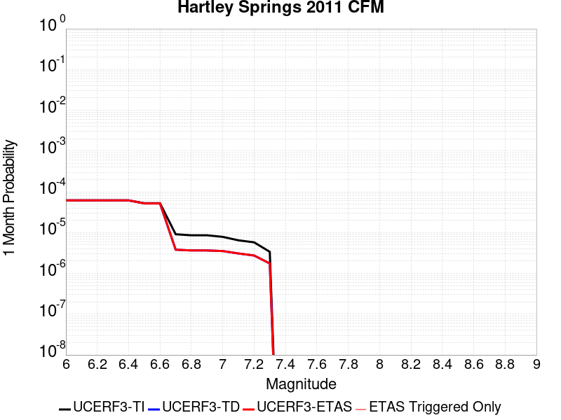 |  |  |

| Magnitude | 1 wk TI Prob | 1 wk TD Prob | 1 wk ETAS Prob | 1 wk ETAS/TD Gain | 1 wk ETAS Triggered Only | 1 mo TI Prob | 1 mo TD Prob | 1 mo ETAS Prob | 1 mo ETAS/TD Gain | 1 mo ETAS Triggered Only | 1 yr TI Prob | 1 yr TD Prob | 1 yr ETAS Prob | 1 yr ETAS/TD Gain | 1 yr ETAS Triggered Only | 10 yr TI Prob | 10 yr TD Prob | 10 yr ETAS Prob | 10 yr ETAS/TD Gain | 10 yr ETAS Triggered Only |
|-----|-----|-----|-----|-----|-----|-----|-----|-----|-----|-----|-----|-----|-----|-----|-----|-----|-----|-----|-----|-----|
| 6.0 | 1.4352418E-5 | 1.4434111E-5 | 1.4434111E-5 | 1.0 | 0.0 | 6.1508916E-5 | 6.185994E-5 | 6.185994E-5 | 1.0 | 0.0 | 7.486137E-4 | 7.5304887E-4 | 7.5304887E-4 | 1.0 | 0.0 | 0.007460968 | 0.007521092 | 0.0075409417 | 1.0026392 | 2.0E-5 |
| 6.1 | 1.4352418E-5 | 1.4434111E-5 | 1.4434111E-5 | 1.0 | 0.0 | 6.1508916E-5 | 6.185994E-5 | 6.185994E-5 | 1.0 | 0.0 | 7.486137E-4 | 7.5304887E-4 | 7.5304887E-4 | 1.0 | 0.0 | 0.007460968 | 0.007521092 | 0.0075409417 | 1.0026392 | 2.0E-5 |
| 6.2 | 1.4352418E-5 | 1.4434111E-5 | 1.4434111E-5 | 1.0 | 0.0 | 6.1508916E-5 | 6.185994E-5 | 6.185994E-5 | 1.0 | 0.0 | 7.486137E-4 | 7.5304887E-4 | 7.5304887E-4 | 1.0 | 0.0 | 0.007460968 | 0.007521092 | 0.0075409417 | 1.0026392 | 2.0E-5 |
| 6.3 | 1.4352418E-5 | 1.4434111E-5 | 1.4434111E-5 | 1.0 | 0.0 | 6.1508916E-5 | 6.185994E-5 | 6.185994E-5 | 1.0 | 0.0 | 7.486137E-4 | 7.5304887E-4 | 7.5304887E-4 | 1.0 | 0.0 | 0.007460968 | 0.007521092 | 0.0075409417 | 1.0026392 | 2.0E-5 |
| 6.4 | 1.4352418E-5 | 1.4434111E-5 | 1.4434111E-5 | 1.0 | 0.0 | 6.1508916E-5 | 6.185994E-5 | 6.185994E-5 | 1.0 | 0.0 | 7.486137E-4 | 7.5304887E-4 | 7.5304887E-4 | 1.0 | 0.0 | 0.007460968 | 0.007521092 | 0.0075409417 | 1.0026392 | 2.0E-5 |
| 6.5 | 1.2279858E-5 | 1.2133036E-5 | 1.2133036E-5 | 1.0 | 0.0 | 5.26269E-5 | 5.199858E-5 | 5.199858E-5 | 1.0 | 0.0 | 6.4054417E-4 | 6.33057E-4 | 6.33057E-4 | 1.0 | 0.0 | 0.0063870098 | 0.006328048 | 0.0063479217 | 1.0031406 | 2.0E-5 |
| 6.6 | 1.2279858E-5 | 1.2133036E-5 | 1.2133036E-5 | 1.0 | 0.0 | 5.26269E-5 | 5.199858E-5 | 5.199858E-5 | 1.0 | 0.0 | 6.4054417E-4 | 6.33057E-4 | 6.33057E-4 | 1.0 | 0.0 | 0.0063870098 | 0.006328048 | 0.0063479217 | 1.0031406 | 2.0E-5 |
| 6.7 | 2.1282601E-6 | 8.894127E-7 | 8.894127E-7 | 1.0 | 0.0 | 9.121083E-6 | 3.8117648E-6 | 3.8117648E-6 | 1.0 | 0.0 | 1.11043526E-4 | 4.6407506E-5 | 4.6407506E-5 | 1.0 | 0.0 | 0.0011098806 | 4.6400347E-4 | 4.6400347E-4 | 1.0 | 0.0 |
| 6.8 | 2.00516E-6 | 8.516916E-7 | 8.516916E-7 | 1.0 | 0.0 | 8.593515E-6 | 3.6501033E-6 | 3.6501033E-6 | 1.0 | 0.0 | 1.04621024E-4 | 4.443936E-5 | 4.443936E-5 | 1.0 | 0.0 | 0.0010457177 | 4.4432987E-4 | 4.4432987E-4 | 1.0 | 0.0 |
| 6.9 | 2.00516E-6 | 8.516916E-7 | 8.516916E-7 | 1.0 | 0.0 | 8.593515E-6 | 3.6501033E-6 | 3.6501033E-6 | 1.0 | 0.0 | 1.04621024E-4 | 4.443936E-5 | 4.443936E-5 | 1.0 | 0.0 | 0.0010457177 | 4.4432987E-4 | 4.4432987E-4 | 1.0 | 0.0 |
| 7.0 | 1.8366732E-6 | 8.2366813E-7 | 8.2366813E-7 | 1.0 | 0.0 | 7.871433E-6 | 3.5300031E-6 | 3.5300031E-6 | 1.0 | 0.0 | 9.583048E-5 | 4.2977194E-5 | 4.2977194E-5 | 1.0 | 0.0 | 9.5789164E-4 | 4.297139E-4 | 4.297139E-4 | 1.0 | 0.0 |
| 7.1 | 1.5097997E-6 | 7.1897E-7 | 7.1897E-7 | 1.0 | 0.0 | 6.470554E-6 | 3.0812978E-6 | 3.0812978E-6 | 1.0 | 0.0 | 7.877615E-5 | 3.7514397E-5 | 3.7514397E-5 | 1.0 | 0.0 | 7.874823E-4 | 3.7510434E-4 | 3.7510434E-4 | 1.0 | 0.0 |
| 7.2 | 1.3490993E-6 | 6.404769E-7 | 6.404769E-7 | 1.0 | 0.0 | 5.7818415E-6 | 2.7448996E-6 | 2.7448996E-6 | 1.0 | 0.0 | 7.0391645E-5 | 3.3418873E-5 | 3.3418873E-5 | 1.0 | 0.0 | 7.0369354E-4 | 3.3416142E-4 | 3.3416142E-4 | 1.0 | 0.0 |
| 7.3 | 7.900015E-7 | 4.0888176E-7 | 4.0888176E-7 | 1.0 | 0.0 | 3.3857161E-6 | 1.7523504E-6 | 1.7523504E-6 | 1.0 | 0.0 | 4.1220315E-5 | 2.1334865E-5 | 2.1334865E-5 | 1.0 | 0.0 | 4.121267E-4 | 2.1334866E-4 | 2.1334866E-4 | 1.0 | 0.0 |

## Greenville (No) 2011 CFM
*[(top)](#table-of-contents)*

| 1 Week | 1 Month | 1 Year | 10 Year |
|-----|-----|-----|-----|
|  |  |  |  |

| Magnitude | 1 wk TI Prob | 1 wk TD Prob | 1 wk ETAS Prob | 1 wk ETAS/TD Gain | 1 wk ETAS Triggered Only | 1 mo TI Prob | 1 mo TD Prob | 1 mo ETAS Prob | 1 mo ETAS/TD Gain | 1 mo ETAS Triggered Only | 1 yr TI Prob | 1 yr TD Prob | 1 yr ETAS Prob | 1 yr ETAS/TD Gain | 1 yr ETAS Triggered Only | 10 yr TI Prob | 10 yr TD Prob | 10 yr ETAS Prob | 10 yr ETAS/TD Gain | 10 yr ETAS Triggered Only |
|-----|-----|-----|-----|-----|-----|-----|-----|-----|-----|-----|-----|-----|-----|-----|-----|-----|-----|-----|-----|-----|
| 6.0 | 3.286654E-5 | 4.036671E-5 | 5.0366307E-5 | 1.2477189 | 1.0E-5 | 1.4084899E-4 | 1.7298892E-4 | 1.8298719E-4 | 1.0577972 | 1.0E-5 | 0.0017134876 | 0.0021041434 | 0.0021141223 | 1.0047425 | 1.0E-5 | 0.017003356 | 0.02084759 | 0.02085738 | 1.0004697 | 1.0E-5 |
| 6.1 | 3.286654E-5 | 4.036671E-5 | 5.0366307E-5 | 1.2477189 | 1.0E-5 | 1.4084899E-4 | 1.7298892E-4 | 1.8298719E-4 | 1.0577972 | 1.0E-5 | 0.0017134876 | 0.0021041434 | 0.0021141223 | 1.0047425 | 1.0E-5 | 0.017003356 | 0.02084759 | 0.02085738 | 1.0004697 | 1.0E-5 |
| 6.2 | 3.1697953E-5 | 3.8929615E-5 | 4.8929225E-5 | 1.2568638 | 1.0E-5 | 1.358413E-4 | 1.6683072E-4 | 1.7682907E-4 | 1.059931 | 1.0E-5 | 0.0016526132 | 0.0020293088 | 0.0020392886 | 1.0049177 | 1.0E-5 | 0.01640377 | 0.020112982 | 0.020122781 | 1.0004872 | 1.0E-5 |
| 6.3 | 3.1363317E-5 | 3.8518487E-5 | 4.8518104E-5 | 1.2596056 | 1.0E-5 | 1.344073E-4 | 1.6506898E-4 | 1.7506733E-4 | 1.0605707 | 1.0E-5 | 0.0016351803 | 0.0020078993 | 0.0020178794 | 1.0049703 | 1.0E-5 | 0.016232004 | 0.019902749 | 0.01991255 | 1.0004925 | 1.0E-5 |
| 6.4 | 3.0228604E-5 | 3.712561E-5 | 4.712524E-5 | 1.2693459 | 1.0E-5 | 1.2954473E-4 | 1.5910025E-4 | 1.6909865E-4 | 1.0628434 | 1.0E-5 | 0.0015760659 | 0.001935361 | 0.0019453416 | 1.005157 | 1.0E-5 | 0.015649348 | 0.01919009 | 0.019199898 | 1.000511 | 1.0E-5 |
| 6.5 | 2.9537814E-5 | 3.628106E-5 | 4.6280697E-5 | 1.2756159 | 1.0E-5 | 1.2658449E-4 | 1.5548118E-4 | 1.6547962E-4 | 1.0643065 | 1.0E-5 | 0.0015400766 | 0.0018913761 | 0.0019013572 | 1.0052772 | 1.0E-5 | 0.01529447 | 0.018757751 | 0.018767564 | 1.0005231 | 1.0E-5 |
| 6.6 | 2.7345395E-5 | 3.359038E-5 | 4.359004E-5 | 1.2976943 | 1.0E-5 | 1.1718928E-4 | 1.43951E-4 | 1.5394956E-4 | 1.0694581 | 1.0E-5 | 0.0014258457 | 0.0017512254 | 0.0017612079 | 1.0057002 | 1.0E-5 | 0.014167317 | 0.017378574 | 0.0173884 | 1.0005654 | 1.0E-5 |
| 6.7 | 2.5615784E-5 | 3.1567277E-5 | 4.1566964E-5 | 1.3167738 | 1.0E-5 | 1.09777306E-4 | 1.352815E-4 | 1.4528014E-4 | 1.07391 | 1.0E-5 | 0.0013357193 | 0.0016458384 | 0.0016558219 | 1.006066 | 1.0E-5 | 0.013277191 | 0.016340667 | 0.016350504 | 1.000602 | 1.0E-5 |
| 6.8 | 2.0059057E-5 | 2.4712264E-5 | 3.471202E-5 | 1.4046474 | 1.0E-5 | 8.596455E-5 | 1.059055E-4 | 1.1590444E-4 | 1.0944138 | 1.0E-5 | 0.0010461159 | 0.001288653 | 0.0012986402 | 1.00775 | 1.0E-5 | 0.0104120495 | 0.012814328 | 0.0128242 | 1.0007703 | 1.0E-5 |
| 6.9 | 1.6321746E-5 | 2.018486E-5 | 3.0184658E-5 | 1.4954108 | 1.0E-5 | 6.9948466E-5 | 8.6503744E-5 | 9.650288E-5 | 1.1155919 | 1.0E-5 | 8.5128983E-4 | 0.0010526866 | 0.0010626761 | 1.0094895 | 1.0E-5 | 0.008480361 | 0.010479037 | 0.010488932 | 1.0009443 | 1.0E-5 |
| 7.0 | 1.22527645E-5 | 1.5135808E-5 | 2.5135656E-5 | 1.6606749 | 1.0E-5 | 5.2510793E-5 | 6.486616E-5 | 7.486551E-5 | 1.1541536 | 1.0E-5 | 6.3913135E-4 | 7.894636E-4 | 7.994557E-4 | 1.0126568 | 1.0E-5 | 0.0063729626 | 0.007867573 | 0.007877494 | 1.001261 | 1.0E-5 |
| 7.1 | 8.996482E-6 | 1.1165116E-5 | 2.1165004E-5 | 1.8956367 | 1.0E-5 | 3.8555783E-5 | 4.784963E-5 | 5.784915E-5 | 1.208978 | 1.0E-5 | 4.6931554E-4 | 5.8241474E-4 | 5.924089E-4 | 1.0171599 | 1.0E-5 | 0.004683256 | 0.0058096354 | 0.0058195773 | 1.0017112 | 1.0E-5 |
| 7.2 | 6.0273087E-6 | 7.569621E-6 | 1.7569546E-5 | 2.32106 | 1.0E-5 | 2.5831067E-5 | 3.2440836E-5 | 4.244051E-5 | 1.3082435 | 1.0E-5 | 3.1444785E-4 | 3.9489628E-4 | 4.0489231E-4 | 1.0253131 | 1.0E-5 | 0.0031400328 | 0.003942419 | 0.00395238 | 1.0025265 | 1.0E-5 |
| 7.3 | 3.1209995E-6 | 3.9664565E-6 | 3.9664565E-6 | 1.0 | 0.0 | 1.3375643E-5 | 1.6998989E-5 | 1.6998989E-5 | 1.0 | 0.0 | 1.6283628E-4 | 2.069432E-4 | 2.069432E-4 | 1.0 | 0.0 | 0.0016271701 | 0.0020678395 | 0.0020678395 | 1.0 | 0.0 |
| 7.4 | 2.0254208E-6 | 2.6096657E-6 | 2.6096657E-6 | 1.0 | 0.0 | 8.680347E-6 | 1.1184234E-5 | 1.1184234E-5 | 1.0 | 0.0 | 1.0567809E-4 | 1.361596E-4 | 1.361596E-4 | 1.0 | 0.0 | 0.0010562785 | 0.0013611179 | 0.0013611179 | 1.0 | 0.0 |
| 7.5 | 1.6763418E-6 | 2.1734072E-6 | 2.1734072E-6 | 1.0 | 0.0 | 7.184302E-6 | 9.314569E-6 | 9.314569E-6 | 1.0 | 0.0 | 8.746537E-5 | 1.1339904E-4 | 1.1339904E-4 | 1.0 | 0.0 | 8.743095E-4 | 0.0011337536 | 0.0011337536 | 1.0 | 0.0 |
| 7.6 | 1.1935462E-6 | 1.5458915E-6 | 1.5458915E-6 | 1.0 | 0.0 | 5.115188E-6 | 6.625233E-6 | 6.625233E-6 | 1.0 | 0.0 | 6.2275634E-5 | 8.0659265E-5 | 8.0659265E-5 | 1.0 | 0.0 | 6.2258187E-4 | 8.0655375E-4 | 8.0655375E-4 | 1.0 | 0.0 |
| 7.7 | 3.0464201E-7 | 3.9848686E-7 | 3.9848686E-7 | 1.0 | 0.0 | 1.3056081E-6 | 1.7077997E-6 | 1.7077997E-6 | 1.0 | 0.0 | 1.589566E-5 | 2.0792268E-5 | 2.0792268E-5 | 1.0 | 0.0 | 1.5894524E-4 | 2.0793018E-4 | 2.0793018E-4 | 1.0 | 0.0 |

## Malibu Coast alt 1
*[(top)](#table-of-contents)*

| 1 Week | 1 Month | 1 Year | 10 Year |
|-----|-----|-----|-----|
|  |  |  |  |

| Magnitude | 1 wk TI Prob | 1 wk TD Prob | 1 wk ETAS Prob | 1 wk ETAS/TD Gain | 1 wk ETAS Triggered Only | 1 mo TI Prob | 1 mo TD Prob | 1 mo ETAS Prob | 1 mo ETAS/TD Gain | 1 mo ETAS Triggered Only | 1 yr TI Prob | 1 yr TD Prob | 1 yr ETAS Prob | 1 yr ETAS/TD Gain | 1 yr ETAS Triggered Only | 10 yr TI Prob | 10 yr TD Prob | 10 yr ETAS Prob | 10 yr ETAS/TD Gain | 10 yr ETAS Triggered Only |
|-----|-----|-----|-----|-----|-----|-----|-----|-----|-----|-----|-----|-----|-----|-----|-----|-----|-----|-----|-----|-----|
| 6.0 | 1.6572556E-5 | 1.759807E-5 | 1.759807E-5 | 1.0 | 0.0 | 7.102331E-5 | 7.5418226E-5 | 7.5418226E-5 | 1.0 | 0.0 | 8.6436566E-4 | 9.1784896E-4 | 9.278398E-4 | 1.010885 | 1.0E-5 | 0.0086101135 | 0.009142514 | 0.009162331 | 1.0021676 | 2.0E-5 |
| 6.1 | 1.6572556E-5 | 1.759807E-5 | 1.759807E-5 | 1.0 | 0.0 | 7.102331E-5 | 7.5418226E-5 | 7.5418226E-5 | 1.0 | 0.0 | 8.6436566E-4 | 9.1784896E-4 | 9.278398E-4 | 1.010885 | 1.0E-5 | 0.0086101135 | 0.009142514 | 0.009162331 | 1.0021676 | 2.0E-5 |
| 6.2 | 1.1085717E-5 | 1.155715E-5 | 1.155715E-5 | 1.0 | 0.0 | 4.750935E-5 | 4.9529724E-5 | 4.9529724E-5 | 1.0 | 0.0 | 5.782728E-4 | 6.0286105E-4 | 6.12855E-4 | 1.0165776 | 1.0E-5 | 0.0057677035 | 0.0060126274 | 0.0060225674 | 1.0016532 | 1.0E-5 |
| 6.3 | 1.0208568E-5 | 1.0592241E-5 | 1.0592241E-5 | 1.0 | 0.0 | 4.375027E-5 | 4.5394543E-5 | 4.5394543E-5 | 1.0 | 0.0 | 5.325294E-4 | 5.5254134E-4 | 5.6253583E-4 | 1.0180882 | 1.0E-5 | 0.0053125503 | 0.0055119833 | 0.005521928 | 1.0018042 | 1.0E-5 |
| 6.4 | 9.0682315E-6 | 9.342641E-6 | 9.342641E-6 | 1.0 | 0.0 | 3.8863272E-5 | 4.0039286E-5 | 4.0039286E-5 | 1.0 | 0.0 | 4.730576E-4 | 4.873713E-4 | 4.973664E-4 | 1.0205083 | 1.0E-5 | 0.0047205184 | 0.004863238 | 0.004873189 | 1.0020462 | 1.0E-5 |
| 6.5 | 7.605796E-6 | 7.74859E-6 | 7.74859E-6 | 1.0 | 0.0 | 3.259586E-5 | 3.320783E-5 | 3.320783E-5 | 1.0 | 0.0 | 3.9678233E-4 | 4.0423166E-4 | 4.0423166E-4 | 1.0 | 0.0 | 0.0039607463 | 0.0040351013 | 0.0040351013 | 1.0 | 0.0 |
| 6.6 | 5.889873E-6 | 5.8795417E-6 | 5.8795417E-6 | 1.0 | 0.0 | 2.5242069E-5 | 2.5197793E-5 | 2.5197793E-5 | 1.0 | 0.0 | 3.0727885E-4 | 3.0674002E-4 | 3.0674002E-4 | 1.0 | 0.0 | 0.003068543 | 0.0030631793 | 0.0030631793 | 1.0 | 0.0 |
| 6.7 | 5.66586E-6 | 5.6416443E-6 | 5.6416443E-6 | 1.0 | 0.0 | 2.428203E-5 | 2.4178253E-5 | 2.4178253E-5 | 1.0 | 0.0 | 2.955936E-4 | 2.9433056E-4 | 2.9433056E-4 | 1.0 | 0.0 | 0.0029520073 | 0.0029394194 | 0.0029394194 | 1.0 | 0.0 |
| 6.8 | 5.521556E-6 | 5.48943E-6 | 5.48943E-6 | 1.0 | 0.0 | 2.3663597E-5 | 2.3525918E-5 | 2.3525918E-5 | 1.0 | 0.0 | 2.880662E-4 | 2.8639048E-4 | 2.8639048E-4 | 1.0 | 0.0 | 0.0028769306 | 0.0028602257 | 0.0028602257 | 1.0 | 0.0 |
| 6.9 | 5.29752E-6 | 5.2499345E-6 | 5.2499345E-6 | 1.0 | 0.0 | 2.270346E-5 | 2.2499526E-5 | 2.2499526E-5 | 1.0 | 0.0 | 2.7637955E-4 | 2.7389737E-4 | 2.7389737E-4 | 1.0 | 0.0 | 0.0027603607 | 0.0027356083 | 0.0027356083 | 1.0 | 0.0 |
| 7.0 | 5.106743E-6 | 5.0476815E-6 | 5.0476815E-6 | 1.0 | 0.0 | 2.1885859E-5 | 2.1632743E-5 | 2.1632743E-5 | 1.0 | 0.0 | 2.6642776E-4 | 2.6334688E-4 | 2.6334688E-4 | 1.0 | 0.0 | 0.0026610855 | 0.0026303576 | 0.0026303576 | 1.0 | 0.0 |
| 7.1 | 4.8469647E-6 | 4.770376E-6 | 4.770376E-6 | 1.0 | 0.0 | 2.0772539E-5 | 2.044431E-5 | 2.044431E-5 | 1.0 | 0.0 | 2.528763E-4 | 2.488811E-4 | 2.488811E-4 | 1.0 | 0.0 | 0.0025258875 | 0.0024860317 | 0.0024860317 | 1.0 | 0.0 |
| 7.2 | 4.545514E-6 | 4.4481967E-6 | 4.4481967E-6 | 1.0 | 0.0 | 1.9480629E-5 | 1.906356E-5 | 1.906356E-5 | 1.0 | 0.0 | 2.3715083E-4 | 2.3207419E-4 | 2.3207419E-4 | 1.0 | 0.0 | 0.0023689792 | 0.002318326 | 0.002318326 | 1.0 | 0.0 |
| 7.3 | 3.794097E-6 | 3.6519373E-6 | 3.6519373E-6 | 1.0 | 0.0 | 1.6260314E-5 | 1.5651065E-5 | 1.5651065E-5 | 1.0 | 0.0 | 1.9795135E-4 | 1.9053511E-4 | 1.9053511E-4 | 1.0 | 0.0 | 0.001977751 | 0.0019037221 | 0.0019037221 | 1.0 | 0.0 |
| 7.4 | 2.808217E-6 | 2.7190777E-6 | 2.7190777E-6 | 1.0 | 0.0 | 1.203516E-5 | 1.1653137E-5 | 1.1653137E-5 | 1.0 | 0.0 | 1.4651821E-4 | 1.4186774E-4 | 1.4186774E-4 | 1.0 | 0.0 | 0.0014642165 | 0.0014177744 | 0.0014177744 | 1.0 | 0.0 |
| 7.5 | 1.83809E-6 | 1.8190703E-6 | 1.8190703E-6 | 1.0 | 0.0 | 7.877505E-6 | 7.795992E-6 | 7.795992E-6 | 1.0 | 0.0 | 9.59044E-5 | 9.4912095E-5 | 9.4912095E-5 | 1.0 | 0.0 | 9.5863023E-4 | 9.487176E-4 | 9.487176E-4 | 1.0 | 0.0 |
| 7.6 | 1.1292672E-6 | 1.1001456E-6 | 1.1001456E-6 | 1.0 | 0.0 | 4.839708E-6 | 4.7149015E-6 | 4.7149015E-6 | 1.0 | 0.0 | 5.8921847E-5 | 5.7402427E-5 | 5.7402427E-5 | 1.0 | 0.0 | 5.890623E-4 | 5.7387765E-4 | 5.7387765E-4 | 1.0 | 0.0 |
| 7.7 | 5.065272E-7 | 4.6091537E-7 | 4.6091537E-7 | 1.0 | 0.0 | 2.170829E-6 | 1.9753502E-6 | 1.9753502E-6 | 1.0 | 0.0 | 2.6429525E-5 | 2.4049634E-5 | 2.4049634E-5 | 1.0 | 0.0 | 2.642638E-4 | 2.4047145E-4 | 2.4047145E-4 | 1.0 | 0.0 |
| 7.8 | 8.952991E-8 | 6.707853E-8 | 6.707853E-8 | 1.0 | 0.0 | 3.8369956E-7 | 2.874794E-7 | 2.874794E-7 | 1.0 | 0.0 | 4.671532E-6 | 3.5000562E-6 | 3.5000562E-6 | 1.0 | 0.0 | 4.671434E-5 | 3.500003E-5 | 3.500003E-5 | 1.0 | 0.0 |
| 7.9 | 8.007447E-10 | 6.161581E-10 | 6.161581E-10 | 1.0 | 0.0 | 3.4317629E-9 | 2.640678E-9 | 2.640678E-9 | 1.0 | 0.0 | 4.1781714E-8 | 3.2150254E-8 | 3.2150254E-8 | 1.0 | 0.0 | 4.1781706E-7 | 3.2150248E-7 | 3.2150248E-7 | 1.0 | 0.0 |

## Cleghorn
*[(top)](#table-of-contents)*

| 1 Week | 1 Month | 1 Year | 10 Year |
|-----|-----|-----|-----|
|  |  | 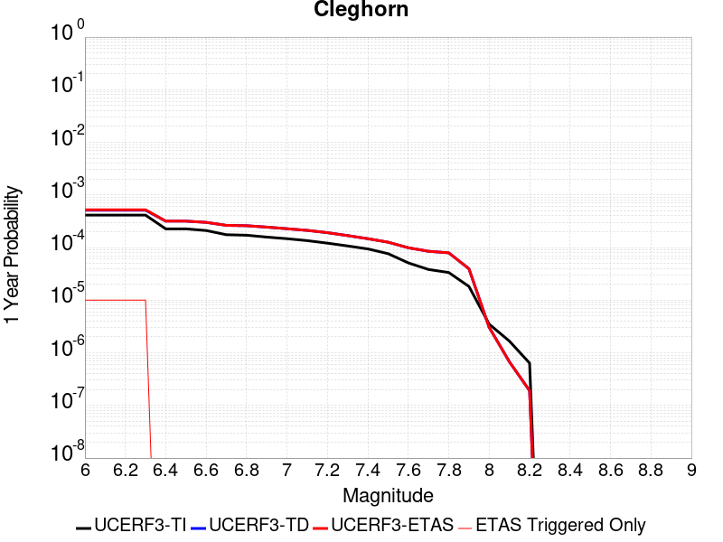 |  |

| Magnitude | 1 wk TI Prob | 1 wk TD Prob | 1 wk ETAS Prob | 1 wk ETAS/TD Gain | 1 wk ETAS Triggered Only | 1 mo TI Prob | 1 mo TD Prob | 1 mo ETAS Prob | 1 mo ETAS/TD Gain | 1 mo ETAS Triggered Only | 1 yr TI Prob | 1 yr TD Prob | 1 yr ETAS Prob | 1 yr ETAS/TD Gain | 1 yr ETAS Triggered Only | 10 yr TI Prob | 10 yr TD Prob | 10 yr ETAS Prob | 10 yr ETAS/TD Gain | 10 yr ETAS Triggered Only |
|-----|-----|-----|-----|-----|-----|-----|-----|-----|-----|-----|-----|-----|-----|-----|-----|-----|-----|-----|-----|-----|
| 6.0 | 7.9267165E-6 | 9.831764E-6 | 1.9831667E-5 | 2.0171015 | 1.0E-5 | 3.39712E-5 | 4.2135514E-5 | 5.2135092E-5 | 1.2373195 | 1.0E-5 | 4.1352084E-4 | 5.1288976E-4 | 5.228846E-4 | 1.0194874 | 1.0E-5 | 0.004127522 | 0.005132214 | 0.0051521114 | 1.0038769 | 2.0E-5 |
| 6.1 | 7.9267165E-6 | 9.831764E-6 | 1.9831667E-5 | 2.0171015 | 1.0E-5 | 3.39712E-5 | 4.2135514E-5 | 5.2135092E-5 | 1.2373195 | 1.0E-5 | 4.1352084E-4 | 5.1288976E-4 | 5.228846E-4 | 1.0194874 | 1.0E-5 | 0.004127522 | 0.005132214 | 0.0051521114 | 1.0038769 | 2.0E-5 |
| 6.2 | 7.9267165E-6 | 9.831764E-6 | 1.9831667E-5 | 2.0171015 | 1.0E-5 | 3.39712E-5 | 4.2135514E-5 | 5.2135092E-5 | 1.2373195 | 1.0E-5 | 4.1352084E-4 | 5.1288976E-4 | 5.228846E-4 | 1.0194874 | 1.0E-5 | 0.004127522 | 0.005132214 | 0.0051521114 | 1.0038769 | 2.0E-5 |
| 6.3 | 7.9267165E-6 | 9.831764E-6 | 1.9831667E-5 | 2.0171015 | 1.0E-5 | 3.39712E-5 | 4.2135514E-5 | 5.2135092E-5 | 1.2373195 | 1.0E-5 | 4.1352084E-4 | 5.1288976E-4 | 5.228846E-4 | 1.0194874 | 1.0E-5 | 0.004127522 | 0.005132214 | 0.0051521114 | 1.0038769 | 2.0E-5 |
| 6.4 | 4.3445207E-6 | 6.0916254E-6 | 6.0916254E-6 | 1.0 | 0.0 | 1.8619241E-5 | 2.6106709E-5 | 2.6106709E-5 | 1.0 | 0.0 | 2.2666567E-4 | 3.1780385E-4 | 3.1780385E-4 | 1.0 | 0.0 | 0.0022643462 | 0.0031877246 | 0.0031877246 | 1.0 | 0.0 |
| 6.5 | 4.3445207E-6 | 6.0916254E-6 | 6.0916254E-6 | 1.0 | 0.0 | 1.8619241E-5 | 2.6106709E-5 | 2.6106709E-5 | 1.0 | 0.0 | 2.2666567E-4 | 3.1780385E-4 | 3.1780385E-4 | 1.0 | 0.0 | 0.0022643462 | 0.0031877246 | 0.0031877246 | 1.0 | 0.0 |
| 6.6 | 4.040109E-6 | 5.774033E-6 | 5.774033E-6 | 1.0 | 0.0 | 1.7314638E-5 | 2.4745626E-5 | 2.4745626E-5 | 1.0 | 0.0 | 2.1078532E-4 | 3.0123728E-4 | 3.0123728E-4 | 1.0 | 0.0 | 0.002105855 | 0.0030225143 | 0.0030225143 | 1.0 | 0.0 |
| 6.7 | 3.3632055E-6 | 5.06753E-6 | 5.06753E-6 | 1.0 | 0.0 | 1.4413658E-5 | 2.1717806E-5 | 2.1717806E-5 | 1.0 | 0.0 | 1.7547216E-4 | 2.643825E-4 | 2.643825E-4 | 1.0 | 0.0 | 0.0017533366 | 0.0026548486 | 0.0026548486 | 1.0 | 0.0 |
| 6.8 | 3.2902772E-6 | 4.9894375E-6 | 4.9894375E-6 | 1.0 | 0.0 | 1.4101111E-5 | 2.138313E-5 | 2.138313E-5 | 1.0 | 0.0 | 1.716675E-4 | 2.6030882E-4 | 2.6030882E-4 | 1.0 | 0.0 | 0.0017153495 | 0.0026142076 | 0.0026142076 | 1.0 | 0.0 |
| 6.9 | 3.031547E-6 | 4.6911987E-6 | 4.6911987E-6 | 1.0 | 0.0 | 1.299228E-5 | 2.0104984E-5 | 2.0104984E-5 | 1.0 | 0.0 | 1.5816953E-4 | 2.4475096E-4 | 2.4475096E-4 | 1.0 | 0.0 | 0.00158057 | 0.0024589805 | 0.0024589805 | 1.0 | 0.0 |
| 7.0 | 2.8259715E-6 | 4.3707637E-6 | 4.3707637E-6 | 1.0 | 0.0 | 1.211125E-5 | 1.8731711E-5 | 1.8731711E-5 | 1.0 | 0.0 | 1.4744449E-4 | 2.2803496E-4 | 2.2803496E-4 | 1.0 | 0.0 | 0.001473467 | 0.0022921748 | 0.0022921748 | 1.0 | 0.0 |
| 7.1 | 2.5962665E-6 | 4.065983E-6 | 4.065983E-6 | 1.0 | 0.0 | 1.1126809E-5 | 1.7425526E-5 | 1.7425526E-5 | 1.0 | 0.0 | 1.3546048E-4 | 2.1213535E-4 | 2.1213535E-4 | 1.0 | 0.0 | 0.0013537793 | 0.0021334959 | 0.0021334959 | 1.0 | 0.0 |
| 7.2 | 2.3247253E-6 | 3.6765352E-6 | 3.6765352E-6 | 1.0 | 0.0 | 9.96307E-6 | 1.5756486E-5 | 1.5756486E-5 | 1.0 | 0.0 | 1.21293626E-4 | 1.9181852E-4 | 1.9181852E-4 | 1.0 | 0.0 | 0.0012122744 | 0.0019307166 | 0.0019307166 | 1.0 | 0.0 |
| 7.3 | 2.056928E-6 | 3.235253E-6 | 3.235253E-6 | 1.0 | 0.0 | 8.815376E-6 | 1.3865297E-5 | 1.3865297E-5 | 1.0 | 0.0 | 1.0732192E-4 | 1.6879707E-4 | 1.6879707E-4 | 1.0 | 0.0 | 0.001072701 | 0.0017009423 | 0.0017009423 | 1.0 | 0.0 |
| 7.4 | 1.8055999E-6 | 2.8256538E-6 | 2.8256538E-6 | 1.0 | 0.0 | 7.738263E-6 | 1.210989E-5 | 1.210989E-5 | 1.0 | 0.0 | 9.4209274E-5 | 1.4742807E-4 | 1.4742807E-4 | 1.0 | 0.0 | 9.4169343E-4 | 0.0014876705 | 0.0014876705 | 1.0 | 0.0 |
| 7.5 | 1.4683443E-6 | 2.4248943E-6 | 2.4248943E-6 | 1.0 | 0.0 | 6.292889E-6 | 1.0392363E-5 | 1.0392363E-5 | 1.0 | 0.0 | 7.661323E-5 | 1.2651978E-4 | 1.2651978E-4 | 1.0 | 0.0 | 7.658682E-4 | 0.0012788812 | 0.0012788812 | 1.0 | 0.0 |
| 7.6 | 9.804088E-7 | 1.9004091E-6 | 1.9004091E-6 | 1.0 | 0.0 | 4.201745E-6 | 8.144585E-6 | 8.144585E-6 | 1.0 | 0.0 | 5.1155046E-5 | 9.915586E-5 | 9.915586E-5 | 1.0 | 0.0 | 5.114327E-4 | 0.0010055583 | 0.0010055583 | 1.0 | 0.0 |
| 7.7 | 7.3434086E-7 | 1.6285549E-6 | 1.6285549E-6 | 1.0 | 0.0 | 3.1471714E-6 | 6.9795024E-6 | 6.9795024E-6 | 1.0 | 0.0 | 3.831614E-5 | 8.4972155E-5 | 8.4972155E-5 | 1.0 | 0.0 | 3.8309532E-4 | 8.6387293E-4 | 8.6387293E-4 | 1.0 | 0.0 |
| 7.8 | 6.434184E-7 | 1.5221389E-6 | 1.5221389E-6 | 1.0 | 0.0 | 2.7575045E-6 | 6.523436E-6 | 6.523436E-6 | 1.0 | 0.0 | 3.35721E-5 | 7.9419966E-5 | 7.9419966E-5 | 1.0 | 0.0 | 3.3567028E-4 | 8.080443E-4 | 8.080443E-4 | 1.0 | 0.0 |
| 7.9 | 3.4943926E-7 | 7.5750586E-7 | 7.5750586E-7 | 1.0 | 0.0 | 1.497596E-6 | 3.2464498E-6 | 3.2464498E-6 | 1.0 | 0.0 | 1.8233079E-5 | 3.9524817E-5 | 3.9524817E-5 | 1.0 | 0.0 | 1.8231584E-4 | 4.0401975E-4 | 4.0401975E-4 | 1.0 | 0.0 |
| 8.0 | 6.717524E-8 | 5.837515E-8 | 5.837515E-8 | 1.0 | 0.0 | 2.8789387E-7 | 2.501792E-7 | 2.501792E-7 | 1.0 | 0.0 | 3.505102E-6 | 3.0459275E-6 | 3.0459275E-6 | 1.0 | 0.0 | 3.5050467E-5 | 3.2751934E-5 | 3.2751934E-5 | 1.0 | 0.0 |
| 8.1 | 3.1984914E-8 | 1.2949885E-8 | 1.2949885E-8 | 1.0 | 0.0 | 1.370782E-7 | 5.549951E-8 | 5.549951E-8 | 1.0 | 0.0 | 1.6689258E-6 | 6.757063E-7 | 6.757063E-7 | 1.0 | 0.0 | 1.6689133E-5 | 7.741151E-6 | 7.741151E-6 | 1.0 | 0.0 |
| 8.2 | 1.21887656E-8 | 3.6471115E-9 | 3.6471115E-9 | 1.0 | 0.0 | 5.2237567E-8 | 1.563048E-8 | 1.563048E-8 | 1.0 | 0.0 | 6.359922E-7 | 1.9030107E-7 | 1.9030107E-7 | 1.0 | 0.0 | 6.3599036E-6 | 2.245849E-6 | 2.245849E-6 | 1.0 | 0.0 |

## San Jacinto (Anza) rev
*[(top)](#table-of-contents)*

| 1 Week | 1 Month | 1 Year | 10 Year |
|-----|-----|-----|-----|
|  |  |  |  |

| Magnitude | 1 wk TI Prob | 1 wk TD Prob | 1 wk ETAS Prob | 1 wk ETAS/TD Gain | 1 wk ETAS Triggered Only | 1 mo TI Prob | 1 mo TD Prob | 1 mo ETAS Prob | 1 mo ETAS/TD Gain | 1 mo ETAS Triggered Only | 1 yr TI Prob | 1 yr TD Prob | 1 yr ETAS Prob | 1 yr ETAS/TD Gain | 1 yr ETAS Triggered Only | 10 yr TI Prob | 10 yr TD Prob | 10 yr ETAS Prob | 10 yr ETAS/TD Gain | 10 yr ETAS Triggered Only |
|-----|-----|-----|-----|-----|-----|-----|-----|-----|-----|-----|-----|-----|-----|-----|-----|-----|-----|-----|-----|-----|
| 6.0 | 6.3015636E-5 | 4.3298347E-5 | 5.3297914E-5 | 1.2309457 | 1.0E-5 | 2.7003905E-4 | 1.8555121E-4 | 2.055475E-4 | 1.107767 | 2.0E-5 | 0.0032827691 | 0.0022567573 | 0.0022767123 | 1.0088422 | 2.0E-5 | 0.032346968 | 0.023293609 | 0.023313144 | 1.0008386 | 2.0E-5 |
| 6.1 | 6.3015636E-5 | 4.3298347E-5 | 5.3297914E-5 | 1.2309457 | 1.0E-5 | 2.7003905E-4 | 1.8555121E-4 | 2.055475E-4 | 1.107767 | 2.0E-5 | 0.0032827691 | 0.0022567573 | 0.0022767123 | 1.0088422 | 2.0E-5 | 0.032346968 | 0.023293609 | 0.023313144 | 1.0008386 | 2.0E-5 |
| 6.2 | 6.3015636E-5 | 4.3298347E-5 | 5.3297914E-5 | 1.2309457 | 1.0E-5 | 2.7003905E-4 | 1.8555121E-4 | 2.055475E-4 | 1.107767 | 2.0E-5 | 0.0032827691 | 0.0022567573 | 0.0022767123 | 1.0088422 | 2.0E-5 | 0.032346968 | 0.023293609 | 0.023313144 | 1.0008386 | 2.0E-5 |
| 6.3 | 6.3015636E-5 | 4.3298347E-5 | 5.3297914E-5 | 1.2309457 | 1.0E-5 | 2.7003905E-4 | 1.8555121E-4 | 2.055475E-4 | 1.107767 | 2.0E-5 | 0.0032827691 | 0.0022567573 | 0.0022767123 | 1.0088422 | 2.0E-5 | 0.032346968 | 0.023293609 | 0.023313144 | 1.0008386 | 2.0E-5 |
| 6.4 | 6.3015636E-5 | 4.3298347E-5 | 5.3297914E-5 | 1.2309457 | 1.0E-5 | 2.7003905E-4 | 1.8555121E-4 | 2.055475E-4 | 1.107767 | 2.0E-5 | 0.0032827691 | 0.0022567573 | 0.0022767123 | 1.0088422 | 2.0E-5 | 0.032346968 | 0.023293609 | 0.023313144 | 1.0008386 | 2.0E-5 |
| 6.5 | 5.811017E-5 | 4.0080286E-5 | 5.0079885E-5 | 1.2494892 | 1.0E-5 | 2.4901982E-4 | 1.7176138E-4 | 1.9175794E-4 | 1.1164206 | 2.0E-5 | 0.0030276014 | 0.0020891947 | 0.002109153 | 1.0095531 | 2.0E-5 | 0.02986684 | 0.021590833 | 0.0216104 | 1.0009063 | 2.0E-5 |
| 6.6 | 5.811017E-5 | 4.0080286E-5 | 5.0079885E-5 | 1.2494892 | 1.0E-5 | 2.4901982E-4 | 1.7176138E-4 | 1.9175794E-4 | 1.1164206 | 2.0E-5 | 0.0030276014 | 0.0020891947 | 0.002109153 | 1.0095531 | 2.0E-5 | 0.02986684 | 0.021590833 | 0.0216104 | 1.0009063 | 2.0E-5 |
| 6.7 | 5.712442E-5 | 3.950301E-5 | 4.9502618E-5 | 1.2531352 | 1.0E-5 | 2.4479596E-4 | 1.6928767E-4 | 1.8928428E-4 | 1.1181221 | 2.0E-5 | 0.0029763177 | 0.0020591344 | 0.0020790934 | 1.0096928 | 2.0E-5 | 0.029367693 | 0.021282917 | 0.021302491 | 1.0009197 | 2.0E-5 |
| 6.8 | 5.6967532E-5 | 3.93593E-5 | 4.9358907E-5 | 1.2540596 | 1.0E-5 | 2.4412372E-4 | 1.6867183E-4 | 1.8866846E-4 | 1.1185534 | 2.0E-5 | 0.0029681553 | 0.0020516508 | 0.00207161 | 1.0097282 | 2.0E-5 | 0.029288229 | 0.021208517 | 0.021228094 | 1.000923 | 2.0E-5 |
| 6.9 | 5.6211324E-5 | 3.9064216E-5 | 4.9063827E-5 | 1.2559787 | 1.0E-5 | 2.4088343E-4 | 1.6740736E-4 | 1.87404E-4 | 1.119449 | 2.0E-5 | 0.0029288116 | 0.0020362847 | 0.002056244 | 1.0098019 | 2.0E-5 | 0.028905109 | 0.021047527 | 0.021067105 | 1.0009302 | 2.0E-5 |
| 7.0 | 5.4383527E-5 | 3.7925012E-5 | 4.7924634E-5 | 1.2636682 | 1.0E-5 | 2.3305144E-4 | 1.6252567E-4 | 1.8252242E-4 | 1.1230375 | 2.0E-5 | 0.0028337094 | 0.001976959 | 0.0019969195 | 1.0100965 | 2.0E-5 | 0.027978465 | 0.02044095 | 0.020460539 | 1.0009584 | 2.0E-5 |
| 7.1 | 5.1393665E-5 | 3.638787E-5 | 4.6387508E-5 | 1.2748069 | 1.0E-5 | 2.2023996E-4 | 1.5593872E-4 | 1.759356E-4 | 1.1282355 | 2.0E-5 | 0.0026781242 | 0.0018969048 | 0.0019168669 | 1.0105234 | 2.0E-5 | 0.026460782 | 0.019616075 | 0.019635683 | 1.0009996 | 2.0E-5 |
| 7.2 | 4.785222E-5 | 3.4738845E-5 | 4.4738495E-5 | 1.2878522 | 1.0E-5 | 2.0506482E-4 | 1.4887229E-4 | 1.688693E-4 | 1.1343234 | 2.0E-5 | 0.0024938055 | 0.0018110167 | 0.0018309805 | 1.0110235 | 2.0E-5 | 0.024660049 | 0.018728781 | 0.018748406 | 1.0010478 | 2.0E-5 |
| 7.3 | 4.2143256E-5 | 3.3834414E-5 | 4.3834076E-5 | 1.2955471 | 1.0E-5 | 1.8060145E-4 | 1.449966E-4 | 1.6499369E-4 | 1.1379143 | 2.0E-5 | 0.002196605 | 0.0017639075 | 0.0017838721 | 1.0113184 | 2.0E-5 | 0.02175019 | 0.018236695 | 0.018256329 | 1.0010767 | 2.0E-5 |
| 7.4 | 4.0264713E-5 | 3.3472694E-5 | 4.347236E-5 | 1.298741 | 1.0E-5 | 1.7255165E-4 | 1.4344654E-4 | 1.6344366E-4 | 1.1394048 | 2.0E-5 | 0.002098792 | 0.0017450659 | 0.001765031 | 1.0114409 | 2.0E-5 | 0.020790804 | 0.018041387 | 0.018061027 | 1.0010886 | 2.0E-5 |
| 7.5 | 3.694492E-5 | 3.2186905E-5 | 4.2186584E-5 | 1.3106754 | 1.0E-5 | 1.5832575E-4 | 1.379366E-4 | 1.5793384E-4 | 1.1449741 | 2.0E-5 | 0.0019259118 | 0.0016780876 | 0.001698054 | 1.0118983 | 2.0E-5 | 0.01909306 | 0.017357886 | 0.017377539 | 1.0011322 | 2.0E-5 |
| 7.6 | 3.200565E-5 | 2.9502702E-5 | 3.9502407E-5 | 1.338942 | 1.0E-5 | 1.3715986E-4 | 1.2643404E-4 | 1.4643151E-4 | 1.1581652 | 2.0E-5 | 0.001668642 | 0.0015382497 | 0.001558219 | 1.0129818 | 2.0E-5 | 0.01656168 | 0.015946016 | 0.015965696 | 1.0012342 | 2.0E-5 |
| 7.7 | 2.731642E-5 | 2.6091477E-5 | 3.6091216E-5 | 1.3832569 | 1.0E-5 | 1.1706512E-4 | 1.11815825E-4 | 1.3181359E-4 | 1.1788455 | 2.0E-5 | 0.001424336 | 0.0013605085 | 0.0013804813 | 1.0146804 | 2.0E-5 | 0.014152412 | 0.014166798 | 0.0141865155 | 1.0013918 | 2.0E-5 |
| 7.8 | 2.3466424E-5 | 2.3503619E-5 | 3.3503384E-5 | 1.4254564 | 1.0E-5 | 1.0056651E-4 | 1.0072591E-4 | 1.207239E-4 | 1.1985387 | 2.0E-5 | 0.0012237094 | 0.0012256489 | 0.0012456244 | 1.0162979 | 2.0E-5 | 0.012169928 | 0.012808795 | 0.012828538 | 1.0015414 | 2.0E-5 |
| 7.9 | 1.8611925E-5 | 1.890698E-5 | 2.890679E-5 | 1.5288953 | 1.0E-5 | 7.9762955E-5 | 8.10274E-5 | 1.01025784E-4 | 1.2468101 | 2.0E-5 | 9.7068126E-4 | 9.860628E-4 | 0.0010060432 | 1.0202627 | 2.0E-5 | 0.0096645225 | 0.010393704 | 0.010413496 | 1.0019042 | 2.0E-5 |
| 8.0 | 1.5460775E-5 | 1.5739915E-5 | 2.5739759E-5 | 1.6353174 | 1.0E-5 | 6.6258784E-5 | 6.745504E-5 | 8.745369E-5 | 1.2964737 | 2.0E-5 | 8.0640207E-4 | 8.2095637E-4 | 8.4093993E-4 | 1.0243418 | 2.0E-5 | 0.008034821 | 0.008702706 | 0.008722532 | 1.0022781 | 2.0E-5 |
| 8.1 | 9.983884E-6 | 8.268954E-6 | 8.268954E-6 | 1.0 | 0.0 | 4.2787375E-5 | 3.5437897E-5 | 3.5437897E-5 | 1.0 | 0.0 | 5.2081177E-4 | 4.313715E-4 | 4.313715E-4 | 1.0 | 0.0 | 0.0051959283 | 0.00463968 | 0.00463968 | 1.0 | 0.0 |
| 8.2 | 4.1226E-6 | 1.5522551E-6 | 1.5522551E-6 | 1.0 | 0.0 | 1.7668166E-5 | 6.6525045E-6 | 6.6525045E-6 | 1.0 | 0.0 | 2.1508869E-4 | 8.099126E-5 | 8.099126E-5 | 1.0 | 0.0 | 0.0021488064 | 9.401847E-4 | 9.401847E-4 | 1.0 | 0.0 |
| 8.3 | 1.2750878E-6 | 3.609817E-7 | 3.609817E-7 | 1.0 | 0.0 | 5.4646503E-6 | 1.5470634E-6 | 1.5470634E-6 | 1.0 | 0.0 | 6.653009E-5 | 1.8835339E-5 | 1.8835339E-5 | 1.0 | 0.0 | 6.6510175E-4 | 2.272251E-4 | 2.272251E-4 | 1.0 | 0.0 |

## Santa Susana alt 1
*[(top)](#table-of-contents)*

| 1 Week | 1 Month | 1 Year | 10 Year |
|-----|-----|-----|-----|
|  |  |  |  |

| Magnitude | 1 wk TI Prob | 1 wk TD Prob | 1 wk ETAS Prob | 1 wk ETAS/TD Gain | 1 wk ETAS Triggered Only | 1 mo TI Prob | 1 mo TD Prob | 1 mo ETAS Prob | 1 mo ETAS/TD Gain | 1 mo ETAS Triggered Only | 1 yr TI Prob | 1 yr TD Prob | 1 yr ETAS Prob | 1 yr ETAS/TD Gain | 1 yr ETAS Triggered Only | 10 yr TI Prob | 10 yr TD Prob | 10 yr ETAS Prob | 10 yr ETAS/TD Gain | 10 yr ETAS Triggered Only |
|-----|-----|-----|-----|-----|-----|-----|-----|-----|-----|-----|-----|-----|-----|-----|-----|-----|-----|-----|-----|-----|
| 6.0 | 2.674877E-5 | 2.7198214E-5 | 3.719794E-5 | 1.3676612 | 1.0E-5 | 1.1463255E-4 | 1.16559204E-4 | 1.2655804E-4 | 1.0857834 | 1.0E-5 | 0.0013947578 | 0.0014182981 | 0.001428284 | 1.0070407 | 1.0E-5 | 0.013860362 | 0.014104388 | 0.014124106 | 1.001398 | 2.0E-5 |
| 6.1 | 2.674877E-5 | 2.7198214E-5 | 3.719794E-5 | 1.3676612 | 1.0E-5 | 1.1463255E-4 | 1.16559204E-4 | 1.2655804E-4 | 1.0857834 | 1.0E-5 | 0.0013947578 | 0.0014182981 | 0.001428284 | 1.0070407 | 1.0E-5 | 0.013860362 | 0.014104388 | 0.014124106 | 1.001398 | 2.0E-5 |
| 6.2 | 2.674877E-5 | 2.7198214E-5 | 3.719794E-5 | 1.3676612 | 1.0E-5 | 1.1463255E-4 | 1.16559204E-4 | 1.2655804E-4 | 1.0857834 | 1.0E-5 | 0.0013947578 | 0.0014182981 | 0.001428284 | 1.0070407 | 1.0E-5 | 0.013860362 | 0.014104388 | 0.014124106 | 1.001398 | 2.0E-5 |
| 6.3 | 2.674877E-5 | 2.7198214E-5 | 3.719794E-5 | 1.3676612 | 1.0E-5 | 1.1463255E-4 | 1.16559204E-4 | 1.2655804E-4 | 1.0857834 | 1.0E-5 | 0.0013947578 | 0.0014182981 | 0.001428284 | 1.0070407 | 1.0E-5 | 0.013860362 | 0.014104388 | 0.014124106 | 1.001398 | 2.0E-5 |
| 6.4 | 2.674877E-5 | 2.7198214E-5 | 3.719794E-5 | 1.3676612 | 1.0E-5 | 1.1463255E-4 | 1.16559204E-4 | 1.2655804E-4 | 1.0857834 | 1.0E-5 | 0.0013947578 | 0.0014182981 | 0.001428284 | 1.0070407 | 1.0E-5 | 0.013860362 | 0.014104388 | 0.014124106 | 1.001398 | 2.0E-5 |
| 6.5 | 2.674877E-5 | 2.7198214E-5 | 3.719794E-5 | 1.3676612 | 1.0E-5 | 1.1463255E-4 | 1.16559204E-4 | 1.2655804E-4 | 1.0857834 | 1.0E-5 | 0.0013947578 | 0.0014182981 | 0.001428284 | 1.0070407 | 1.0E-5 | 0.013860362 | 0.014104388 | 0.014124106 | 1.001398 | 2.0E-5 |
| 6.6 | 2.6647976E-5 | 2.7074553E-5 | 3.7074282E-5 | 1.3693405 | 1.0E-5 | 1.14200615E-4 | 1.16029274E-4 | 1.2602811E-4 | 1.0861752 | 1.0E-5 | 0.0013895056 | 0.0014118546 | 0.0014218405 | 1.0070729 | 1.0E-5 | 0.013808494 | 0.014040773 | 0.014060492 | 1.0014044 | 2.0E-5 |
| 6.7 | 2.6647976E-5 | 2.7074553E-5 | 3.7074282E-5 | 1.3693405 | 1.0E-5 | 1.14200615E-4 | 1.16029274E-4 | 1.2602811E-4 | 1.0861752 | 1.0E-5 | 0.0013895056 | 0.0014118546 | 0.0014218405 | 1.0070729 | 1.0E-5 | 0.013808494 | 0.014040773 | 0.014060492 | 1.0014044 | 2.0E-5 |
| 6.8 | 1.9073179E-5 | 1.7637467E-5 | 2.763729E-5 | 1.5669649 | 1.0E-5 | 8.1739636E-5 | 7.558706E-5 | 8.5586296E-5 | 1.1322877 | 1.0E-5 | 9.947256E-4 | 9.19902E-4 | 9.2989276E-4 | 1.0108607 | 1.0E-5 | 0.009902848 | 0.009163361 | 0.009183178 | 1.0021626 | 2.0E-5 |
| 6.9 | 1.9041876E-5 | 1.7619597E-5 | 2.7619422E-5 | 1.5675398 | 1.0E-5 | 8.160549E-5 | 7.551048E-5 | 8.5509724E-5 | 1.132422 | 1.0E-5 | 9.930939E-4 | 9.189705E-4 | 9.2896126E-4 | 1.0108718 | 1.0E-5 | 0.0098866755 | 0.009154123 | 0.00917394 | 1.0021648 | 2.0E-5 |
| 7.0 | 1.5917482E-5 | 1.3864049E-5 | 2.386391E-5 | 1.72128 | 1.0E-5 | 6.8215995E-5 | 5.9416023E-5 | 6.941543E-5 | 1.1682948 | 1.0E-5 | 8.302132E-4 | 7.2315463E-4 | 7.3314743E-4 | 1.0138183 | 1.0E-5 | 0.008271185 | 0.0072090672 | 0.007228923 | 1.0027543 | 2.0E-5 |
| 7.1 | 1.577788E-5 | 1.3744056E-5 | 2.3743918E-5 | 1.7275773 | 1.0E-5 | 6.761774E-5 | 5.890179E-5 | 6.89012E-5 | 1.1697642 | 1.0E-5 | 8.2293496E-4 | 7.16898E-4 | 7.2689087E-4 | 1.013939 | 1.0E-5 | 0.008198941 | 0.0071469042 | 0.0071667614 | 1.0027784 | 2.0E-5 |
| 7.2 | 1.5416446E-5 | 1.34701295E-5 | 2.3469995E-5 | 1.7423733 | 1.0E-5 | 6.606882E-5 | 5.7727877E-5 | 6.77273E-5 | 1.1732166 | 1.0E-5 | 8.0409093E-4 | 7.026149E-4 | 7.1260787E-4 | 1.0142225 | 1.0E-5 | 0.008011877 | 0.0070049763 | 0.0070248363 | 1.0028352 | 2.0E-5 |
| 7.3 | 1.4534083E-5 | 1.2718032E-5 | 2.2717904E-5 | 1.7862751 | 1.0E-5 | 6.228744E-5 | 5.4504737E-5 | 6.450419E-5 | 1.1834604 | 1.0E-5 | 7.580857E-4 | 6.633976E-4 | 6.733909E-4 | 1.0150639 | 1.0E-5 | 0.007555048 | 0.0066151717 | 0.006635039 | 1.0030034 | 2.0E-5 |
| 7.4 | 1.2858995E-5 | 1.1229814E-5 | 2.1229702E-5 | 1.8904767 | 1.0E-5 | 5.5108816E-5 | 4.812691E-5 | 5.812643E-5 | 1.2077739 | 1.0E-5 | 6.7074323E-4 | 5.8579154E-4 | 5.957857E-4 | 1.0170609 | 1.0E-5 | 0.0066872234 | 0.0058433902 | 0.0058632735 | 1.0034027 | 2.0E-5 |
| 7.5 | 8.827668E-6 | 7.805494E-6 | 1.7805416E-5 | 2.281139 | 1.0E-5 | 3.7832317E-5 | 3.3451703E-5 | 4.3451368E-5 | 1.2989285 | 1.0E-5 | 4.605111E-4 | 4.072008E-4 | 4.1719674E-4 | 1.0245479 | 1.0E-5 | 0.0045955796 | 0.0040648985 | 0.004084817 | 1.0049002 | 2.0E-5 |
| 7.6 | 3.2533426E-6 | 2.8720106E-6 | 2.8720106E-6 | 1.0 | 0.0 | 1.3942822E-5 | 1.230856E-5 | 1.230856E-5 | 1.0 | 0.0 | 1.6974064E-4 | 1.4984679E-4 | 1.4984679E-4 | 1.0 | 0.0 | 0.0016961104 | 0.0014974943 | 0.0015074793 | 1.0066679 | 1.0E-5 |
| 7.7 | 1.2751709E-6 | 1.1491339E-6 | 1.1491339E-6 | 1.0 | 0.0 | 5.4650063E-6 | 4.9248506E-6 | 4.9248506E-6 | 1.0 | 0.0 | 6.653442E-5 | 5.99585E-5 | 5.99585E-5 | 1.0 | 0.0 | 6.6514505E-4 | 5.9943215E-4 | 5.9943215E-4 | 1.0 | 0.0 |
| 7.8 | 3.067544E-7 | 3.240052E-7 | 3.240052E-7 | 1.0 | 0.0 | 1.3146611E-6 | 1.3885931E-6 | 1.3885931E-6 | 1.0 | 0.0 | 1.600588E-5 | 1.6906E-5 | 1.6906E-5 | 1.0 | 0.0 | 1.6004729E-4 | 1.6904817E-4 | 1.6904817E-4 | 1.0 | 0.0 |
| 7.9 | 7.622999E-8 | 8.0879715E-8 | 8.0879715E-8 | 1.0 | 0.0 | 3.2669993E-7 | 3.4662733E-7 | 3.4662733E-7 | 1.0 | 0.0 | 3.977564E-6 | 4.220182E-6 | 4.220182E-6 | 1.0 | 0.0 | 3.977493E-5 | 4.2201224E-5 | 4.2201224E-5 | 1.0 | 0.0 |

## Los Alamos 2011 CFM
*[(top)](#table-of-contents)*

| 1 Week | 1 Month | 1 Year | 10 Year |
|-----|-----|-----|-----|
|  |  |  |  |

| Magnitude | 1 wk TI Prob | 1 wk TD Prob | 1 wk ETAS Prob | 1 wk ETAS/TD Gain | 1 wk ETAS Triggered Only | 1 mo TI Prob | 1 mo TD Prob | 1 mo ETAS Prob | 1 mo ETAS/TD Gain | 1 mo ETAS Triggered Only | 1 yr TI Prob | 1 yr TD Prob | 1 yr ETAS Prob | 1 yr ETAS/TD Gain | 1 yr ETAS Triggered Only | 10 yr TI Prob | 10 yr TD Prob | 10 yr ETAS Prob | 10 yr ETAS/TD Gain | 10 yr ETAS Triggered Only |
|-----|-----|-----|-----|-----|-----|-----|-----|-----|-----|-----|-----|-----|-----|-----|-----|-----|-----|-----|-----|-----|
| 6.0 | 4.6284417E-6 | 4.7517333E-6 | 1.4751686E-5 | 3.1044853 | 1.0E-5 | 1.9836029E-5 | 2.0364423E-5 | 3.036422E-5 | 1.4910425 | 1.0E-5 | 2.4147688E-4 | 2.479104E-4 | 2.5790793E-4 | 1.0403272 | 1.0E-5 | 0.0024121467 | 0.0024765125 | 0.002496463 | 1.0080559 | 2.0E-5 |
| 6.1 | 4.6284417E-6 | 4.7517333E-6 | 1.4751686E-5 | 3.1044853 | 1.0E-5 | 1.9836029E-5 | 2.0364423E-5 | 3.036422E-5 | 1.4910425 | 1.0E-5 | 2.4147688E-4 | 2.479104E-4 | 2.5790793E-4 | 1.0403272 | 1.0E-5 | 0.0024121467 | 0.0024765125 | 0.002496463 | 1.0080559 | 2.0E-5 |
| 6.2 | 4.6284417E-6 | 4.7517333E-6 | 1.4751686E-5 | 3.1044853 | 1.0E-5 | 1.9836029E-5 | 2.0364423E-5 | 3.036422E-5 | 1.4910425 | 1.0E-5 | 2.4147688E-4 | 2.479104E-4 | 2.5790793E-4 | 1.0403272 | 1.0E-5 | 0.0024121467 | 0.0024765125 | 0.002496463 | 1.0080559 | 2.0E-5 |
| 6.3 | 4.6284417E-6 | 4.7517333E-6 | 1.4751686E-5 | 3.1044853 | 1.0E-5 | 1.9836029E-5 | 2.0364423E-5 | 3.036422E-5 | 1.4910425 | 1.0E-5 | 2.4147688E-4 | 2.479104E-4 | 2.5790793E-4 | 1.0403272 | 1.0E-5 | 0.0024121467 | 0.0024765125 | 0.002496463 | 1.0080559 | 2.0E-5 |
| 6.4 | 4.6284417E-6 | 4.7517333E-6 | 1.4751686E-5 | 3.1044853 | 1.0E-5 | 1.9836029E-5 | 2.0364423E-5 | 3.036422E-5 | 1.4910425 | 1.0E-5 | 2.4147688E-4 | 2.479104E-4 | 2.5790793E-4 | 1.0403272 | 1.0E-5 | 0.0024121467 | 0.0024765125 | 0.002496463 | 1.0080559 | 2.0E-5 |
| 6.5 | 4.6284417E-6 | 4.7517333E-6 | 1.4751686E-5 | 3.1044853 | 1.0E-5 | 1.9836029E-5 | 2.0364423E-5 | 3.036422E-5 | 1.4910425 | 1.0E-5 | 2.4147688E-4 | 2.479104E-4 | 2.5790793E-4 | 1.0403272 | 1.0E-5 | 0.0024121467 | 0.0024765125 | 0.002496463 | 1.0080559 | 2.0E-5 |
| 6.6 | 4.6284417E-6 | 4.7517333E-6 | 1.4751686E-5 | 3.1044853 | 1.0E-5 | 1.9836029E-5 | 2.0364423E-5 | 3.036422E-5 | 1.4910425 | 1.0E-5 | 2.4147688E-4 | 2.479104E-4 | 2.5790793E-4 | 1.0403272 | 1.0E-5 | 0.0024121467 | 0.0024765125 | 0.002496463 | 1.0080559 | 2.0E-5 |
| 6.7 | 4.062321E-6 | 4.166351E-6 | 4.166351E-6 | 1.0 | 0.0 | 1.7409831E-5 | 1.7855677E-5 | 1.7855677E-5 | 1.0 | 0.0 | 2.1194408E-4 | 2.1737268E-4 | 2.1737268E-4 | 1.0 | 0.0 | 0.0021174205 | 0.0021717504 | 0.0021817286 | 1.0045946 | 1.0E-5 |
| 6.8 | 4.062321E-6 | 4.166351E-6 | 4.166351E-6 | 1.0 | 0.0 | 1.7409831E-5 | 1.7855677E-5 | 1.7855677E-5 | 1.0 | 0.0 | 2.1194408E-4 | 2.1737268E-4 | 2.1737268E-4 | 1.0 | 0.0 | 0.0021174205 | 0.0021717504 | 0.0021817286 | 1.0045946 | 1.0E-5 |
| 6.9 | 3.2936077E-6 | 3.37296E-6 | 3.37296E-6 | 1.0 | 0.0 | 1.4115385E-5 | 1.4455468E-5 | 1.4455468E-5 | 1.0 | 0.0 | 1.7184127E-4 | 1.7598206E-4 | 1.7598206E-4 | 1.0 | 0.0 | 0.0017170844 | 0.0017585196 | 0.0017685019 | 1.0056766 | 1.0E-5 |
| 7.0 | 3.1687898E-6 | 3.2448177E-6 | 3.2448177E-6 | 1.0 | 0.0 | 1.3580457E-5 | 1.3906293E-5 | 1.3906293E-5 | 1.0 | 0.0 | 1.6532952E-4 | 1.692969E-4 | 1.692969E-4 | 1.0 | 0.0 | 0.0016520657 | 0.0016917707 | 0.0017017538 | 1.005901 | 1.0E-5 |
| 7.1 | 2.9379228E-6 | 3.007328E-6 | 3.007328E-6 | 1.0 | 0.0 | 1.25910365E-5 | 1.288849E-5 | 1.288849E-5 | 1.0 | 0.0 | 1.5328509E-4 | 1.5690697E-4 | 1.5690697E-4 | 1.0 | 0.0 | 0.001531794 | 0.001568051 | 0.0015780353 | 1.0063673 | 1.0E-5 |
| 7.2 | 2.0020686E-6 | 2.041632E-6 | 2.041632E-6 | 1.0 | 0.0 | 8.580266E-6 | 8.749822E-6 | 8.749822E-6 | 1.0 | 0.0 | 1.0445973E-4 | 1.0652392E-4 | 1.0652392E-4 | 1.0 | 0.0 | 0.0010441064 | 0.001064733 | 0.0010747224 | 1.009382 | 1.0E-5 |
| 7.3 | 1.7364243E-6 | 1.7678824E-6 | 1.7678824E-6 | 1.0 | 0.0 | 7.441797E-6 | 7.576617E-6 | 7.576617E-6 | 1.0 | 0.0 | 9.0600115E-5 | 9.224144E-5 | 9.224144E-5 | 1.0 | 0.0 | 9.0563187E-4 | 9.2203467E-4 | 9.3202543E-4 | 1.0108355 | 1.0E-5 |
| 7.4 | 1.5718434E-6 | 1.5983198E-6 | 1.5983198E-6 | 1.0 | 0.0 | 6.7364545E-6 | 6.8499244E-6 | 6.8499244E-6 | 1.0 | 0.0 | 8.201325E-5 | 8.339467E-5 | 8.339467E-5 | 1.0 | 0.0 | 8.198299E-4 | 8.3363673E-4 | 8.4362837E-4 | 1.0119857 | 1.0E-5 |
| 7.5 | 1.3841119E-6 | 1.4042814E-6 | 1.4042814E-6 | 1.0 | 0.0 | 5.9318945E-6 | 6.018335E-6 | 6.018335E-6 | 1.0 | 0.0 | 7.221842E-5 | 7.327079E-5 | 7.327079E-5 | 1.0 | 0.0 | 7.2194956E-4 | 7.3246926E-4 | 7.4246194E-4 | 1.0136424 | 1.0E-5 |
| 7.6 | 1.0843726E-6 | 1.0934443E-6 | 1.0934443E-6 | 1.0 | 0.0 | 4.647303E-6 | 4.6861815E-6 | 4.6861815E-6 | 1.0 | 0.0 | 5.6579443E-5 | 5.705279E-5 | 5.705279E-5 | 1.0 | 0.0 | 5.656504E-4 | 5.70384E-4 | 5.70384E-4 | 1.0 | 0.0 |
| 7.7 | 5.544814E-7 | 5.501884E-7 | 5.501884E-7 | 1.0 | 0.0 | 2.3763469E-6 | 2.3579482E-6 | 2.3579482E-6 | 1.0 | 0.0 | 2.8931638E-5 | 2.8707644E-5 | 2.8707644E-5 | 1.0 | 0.0 | 2.8927872E-4 | 2.870395E-4 | 2.870395E-4 | 1.0 | 0.0 |
| 7.8 | 2.0707465E-7 | 1.9778598E-7 | 1.9778598E-7 | 1.0 | 0.0 | 8.874625E-7 | 8.476539E-7 | 8.476539E-7 | 1.0 | 0.0 | 1.08048025E-5 | 1.0320137E-5 | 1.0320137E-5 | 1.0 | 0.0 | 1.0804277E-4 | 1.0319663E-4 | 1.0319663E-4 | 1.0 | 0.0 |
| 7.9 | 3.9821284E-8 | 3.4331528E-8 | 3.4331528E-8 | 1.0 | 0.0 | 1.7066264E-7 | 1.4713511E-7 | 1.4713511E-7 | 1.0 | 0.0 | 2.0778157E-6 | 1.7913685E-6 | 1.7913685E-6 | 1.0 | 0.0 | 2.0777963E-5 | 1.7913546E-5 | 1.7913546E-5 | 1.0 | 0.0 |
| 8.0 | 7.880441E-11 | 8.2353124E-11 | 8.2353124E-11 | 1.0 | 0.0 | 3.3773329E-10 | 3.52942E-10 | 3.52942E-10 | 1.0 | 0.0 | 4.1119033E-9 | 4.2970694E-9 | 4.2970694E-9 | 1.0 | 0.0 | 4.1119034E-8 | 4.2970694E-8 | 4.2970694E-8 | 1.0 | 0.0 |

## Hunting Creek - Berryessa 2011 CFM
*[(top)](#table-of-contents)*

| 1 Week | 1 Month | 1 Year | 10 Year |
|-----|-----|-----|-----|
|  |  |  |  |

| Magnitude | 1 wk TI Prob | 1 wk TD Prob | 1 wk ETAS Prob | 1 wk ETAS/TD Gain | 1 wk ETAS Triggered Only | 1 mo TI Prob | 1 mo TD Prob | 1 mo ETAS Prob | 1 mo ETAS/TD Gain | 1 mo ETAS Triggered Only | 1 yr TI Prob | 1 yr TD Prob | 1 yr ETAS Prob | 1 yr ETAS/TD Gain | 1 yr ETAS Triggered Only | 10 yr TI Prob | 10 yr TD Prob | 10 yr ETAS Prob | 10 yr ETAS/TD Gain | 10 yr ETAS Triggered Only |
|-----|-----|-----|-----|-----|-----|-----|-----|-----|-----|-----|-----|-----|-----|-----|-----|-----|-----|-----|-----|-----|
| 6.0 | 1.1270982E-4 | 2.0028367E-4 | 2.1028167E-4 | 1.0499191 | 1.0E-5 | 4.8295266E-4 | 8.579912E-4 | 8.779741E-4 | 1.0232903 | 2.0E-5 | 0.0058641075 | 0.010386173 | 0.010405965 | 1.0019057 | 2.0E-5 | 0.057117578 | 0.09804048 | 0.098058514 | 1.0001839 | 2.0E-5 |
| 6.1 | 1.1239393E-4 | 1.9976508E-4 | 2.097631E-4 | 1.0500488 | 1.0E-5 | 4.8159933E-4 | 8.557703E-4 | 8.757532E-4 | 1.0233507 | 2.0E-5 | 0.0058477195 | 0.010359417 | 0.010379209 | 1.0019106 | 2.0E-5 | 0.056962132 | 0.09779895 | 0.097817 | 1.0001845 | 2.0E-5 |
| 6.2 | 7.596265E-5 | 1.2933646E-4 | 1.2933646E-4 | 1.0 | 0.0 | 3.2551357E-4 | 5.5415573E-4 | 5.5415573E-4 | 1.0 | 0.0 | 0.0039559277 | 0.0067213587 | 0.0067213587 | 1.0 | 0.0 | 0.038862433 | 0.06459229 | 0.06459229 | 1.0 | 0.0 |
| 6.3 | 6.78794E-5 | 1.1448377E-4 | 1.1448377E-4 | 1.0 | 0.0 | 2.9087928E-4 | 4.9052597E-4 | 4.9052597E-4 | 1.0 | 0.0 | 0.003535705 | 0.005952661 | 0.005952661 | 1.0 | 0.0 | 0.034799766 | 0.057466213 | 0.057466213 | 1.0 | 0.0 |
| 6.4 | 6.2165134E-5 | 1.0434825E-4 | 1.0434825E-4 | 1.0 | 0.0 | 2.6639478E-4 | 4.4711027E-4 | 4.4711027E-4 | 1.0 | 0.0 | 0.0032385332 | 0.0054274183 | 0.0054274183 | 1.0 | 0.0 | 0.03191742 | 0.05255138 | 0.05255138 | 1.0 | 0.0 |
| 6.5 | 5.4368087E-5 | 9.070258E-5 | 9.070258E-5 | 1.0 | 0.0 | 2.3298527E-4 | 3.886537E-4 | 3.886537E-4 | 1.0 | 0.0 | 0.0028329059 | 0.0047197016 | 0.0047197016 | 1.0 | 0.0 | 0.027970633 | 0.045881182 | 0.045881182 | 1.0 | 0.0 |
| 6.6 | 4.729947E-5 | 7.847101E-5 | 7.847101E-5 | 1.0 | 0.0 | 2.0269625E-4 | 3.3624718E-4 | 3.3624718E-4 | 1.0 | 0.0 | 0.002465034 | 0.004084746 | 0.004084746 | 1.0 | 0.0 | 0.02437869 | 0.03985269 | 0.03985269 | 1.0 | 0.0 |
| 6.7 | 3.6875328E-5 | 6.0443555E-5 | 6.0443555E-5 | 1.0 | 0.0 | 1.5802756E-4 | 2.5900968E-4 | 2.5900968E-4 | 1.0 | 0.0 | 0.0019222875 | 0.0031482724 | 0.0031482724 | 1.0 | 0.0 | 0.019057442 | 0.03089371 | 0.03089371 | 1.0 | 0.0 |
| 6.8 | 2.0292036E-5 | 2.8976721E-5 | 2.8976721E-5 | 1.0 | 0.0 | 8.6962966E-5 | 1.2417998E-4 | 1.2417998E-4 | 1.0 | 0.0 | 0.0010582599 | 0.0015108302 | 0.0015108302 | 1.0 | 0.0 | 0.010532344 | 0.0149790775 | 0.0149790775 | 1.0 | 0.0 |
| 6.9 | 1.7871042E-5 | 2.4472653E-5 | 2.4472653E-5 | 1.0 | 0.0 | 7.658793E-5 | 1.04878585E-4 | 1.04878585E-4 | 1.0 | 0.0 | 9.320591E-4 | 0.0012761486 | 0.0012761486 | 1.0 | 0.0 | 0.009281595 | 0.012680395 | 0.012680395 | 1.0 | 0.0 |
| 7.0 | 1.6415532E-5 | 2.1906566E-5 | 2.1906566E-5 | 1.0 | 0.0 | 7.035038E-5 | 9.388191E-5 | 9.388191E-5 | 1.0 | 0.0 | 8.561793E-4 | 0.0011424144 | 0.0011424144 | 1.0 | 0.0 | 0.008528882 | 0.011365017 | 0.011365017 | 1.0 | 0.0 |
| 7.1 | 1.5409885E-5 | 2.0346588E-5 | 2.0346588E-5 | 1.0 | 0.0 | 6.6040695E-5 | 8.719676E-5 | 8.719676E-5 | 1.0 | 0.0 | 8.0374884E-4 | 0.0010611062 | 0.0010611062 | 1.0 | 0.0 | 0.00800848 | 0.010560924 | 0.010560924 | 1.0 | 0.0 |
| 7.2 | 1.4497423E-5 | 1.905519E-5 | 1.905519E-5 | 1.0 | 0.0 | 6.213033E-5 | 8.166256E-5 | 8.166256E-5 | 1.0 | 0.0 | 7.5617427E-4 | 9.937913E-4 | 9.937913E-4 | 1.0 | 0.0 | 0.0075360634 | 0.00989425 | 0.00989425 | 1.0 | 0.0 |
| 7.3 | 1.3615175E-5 | 1.7826347E-5 | 1.7826347E-5 | 1.0 | 0.0 | 5.8349444E-5 | 7.6396405E-5 | 7.6396405E-5 | 1.0 | 0.0 | 7.101729E-4 | 9.297323E-4 | 9.297323E-4 | 1.0 | 0.0 | 0.0070790765 | 0.009259124 | 0.009259124 | 1.0 | 0.0 |
| 7.4 | 1.2252825E-5 | 1.6026455E-5 | 1.6026455E-5 | 1.0 | 0.0 | 5.251105E-5 | 6.868302E-5 | 6.868302E-5 | 1.0 | 0.0 | 6.391345E-4 | 8.3589775E-4 | 8.3589775E-4 | 1.0 | 0.0 | 0.0063729943 | 0.008328172 | 0.008328172 | 1.0 | 0.0 |
| 7.5 | 1.0913301E-5 | 1.4241286E-5 | 1.4241286E-5 | 1.0 | 0.0 | 4.6770452E-5 | 6.103267E-5 | 6.103267E-5 | 1.0 | 0.0 | 5.6928146E-4 | 7.428222E-4 | 7.428222E-4 | 1.0 | 0.0 | 0.0056782532 | 0.0074039865 | 0.0074039865 | 1.0 | 0.0 |
| 7.6 | 8.623192E-6 | 1.12347825E-5 | 1.12347825E-5 | 1.0 | 0.0 | 3.6956015E-5 | 4.8148195E-5 | 4.8148195E-5 | 1.0 | 0.0 | 4.4984656E-4 | 5.8604917E-4 | 5.8604917E-4 | 1.0 | 0.0 | 0.00448937 | 0.005845504 | 0.005845504 | 1.0 | 0.0 |
| 7.7 | 2.0993634E-6 | 2.66264E-6 | 2.66264E-6 | 1.0 | 0.0 | 8.997241E-6 | 1.1411265E-5 | 1.1411265E-5 | 1.0 | 0.0 | 1.09535904E-4 | 1.3892337E-4 | 1.3892337E-4 | 1.0 | 0.0 | 0.0010948193 | 0.0013883994 | 0.0013883994 | 1.0 | 0.0 |
| 7.8 | 1.8428308E-7 | 2.1674624E-7 | 2.1674624E-7 | 1.0 | 0.0 | 7.897844E-7 | 9.289122E-7 | 9.289122E-7 | 1.0 | 0.0 | 9.615583E-6 | 1.130945E-5 | 1.130945E-5 | 1.0 | 0.0 | 9.615166E-5 | 1.1308173E-4 | 1.1308173E-4 | 1.0 | 0.0 |

## Newport-Inglewood (Offshore)
*[(top)](#table-of-contents)*

| 1 Week | 1 Month | 1 Year | 10 Year |
|-----|-----|-----|-----|
|  |  |  |  |

| Magnitude | 1 wk TI Prob | 1 wk TD Prob | 1 wk ETAS Prob | 1 wk ETAS/TD Gain | 1 wk ETAS Triggered Only | 1 mo TI Prob | 1 mo TD Prob | 1 mo ETAS Prob | 1 mo ETAS/TD Gain | 1 mo ETAS Triggered Only | 1 yr TI Prob | 1 yr TD Prob | 1 yr ETAS Prob | 1 yr ETAS/TD Gain | 1 yr ETAS Triggered Only | 10 yr TI Prob | 10 yr TD Prob | 10 yr ETAS Prob | 10 yr ETAS/TD Gain | 10 yr ETAS Triggered Only |
|-----|-----|-----|-----|-----|-----|-----|-----|-----|-----|-----|-----|-----|-----|-----|-----|-----|-----|-----|-----|-----|
| 6.0 | 1.9626508E-5 | 1.8965342E-5 | 2.8965153E-5 | 1.5272676 | 1.0E-5 | 8.411089E-5 | 8.1277576E-5 | 9.1276765E-5 | 1.1230252 | 1.0E-5 | 0.001023569 | 9.891179E-4 | 9.99108E-4 | 1.0101 | 1.0E-5 | 0.010188672 | 0.009848497 | 0.0098683 | 1.0020108 | 2.0E-5 |
| 6.1 | 1.331886E-5 | 1.2218078E-5 | 2.2217957E-5 | 1.8184493 | 1.0E-5 | 5.707958E-5 | 5.2362153E-5 | 6.236163E-5 | 1.1909677 | 1.0E-5 | 6.947222E-4 | 6.3732424E-4 | 6.4731785E-4 | 1.0156806 | 1.0E-5 | 0.006925544 | 0.006355142 | 0.0063650785 | 1.0015635 | 1.0E-5 |
| 6.2 | 1.2250852E-5 | 1.1076016E-5 | 2.1075904E-5 | 1.9028417 | 1.0E-5 | 5.2502597E-5 | 4.746778E-5 | 5.7467307E-5 | 1.2106593 | 1.0E-5 | 6.3903164E-4 | 5.7776796E-4 | 5.877622E-4 | 1.017298 | 1.0E-5 | 0.006371971 | 0.0057627796 | 0.005772722 | 1.0017253 | 1.0E-5 |
| 6.3 | 1.2106258E-5 | 1.0918878E-5 | 2.091877E-5 | 1.915835 | 1.0E-5 | 5.1882926E-5 | 4.6794354E-5 | 5.6793888E-5 | 1.213691 | 1.0E-5 | 6.3149154E-4 | 5.695733E-4 | 5.795676E-4 | 1.017547 | 1.0E-5 | 0.0062970007 | 0.005681252 | 0.0056911954 | 1.0017502 | 1.0E-5 |
| 6.4 | 1.1348758E-5 | 1.0109348E-5 | 2.0109248E-5 | 1.9891734 | 1.0E-5 | 4.8636626E-5 | 4.3325064E-5 | 5.332463E-5 | 1.2308033 | 1.0E-5 | 5.919901E-4 | 5.2735576E-4 | 5.3735054E-4 | 1.0189525 | 1.0E-5 | 0.005904155 | 0.0052611395 | 0.005271087 | 1.0018908 | 1.0E-5 |
| 6.5 | 1.100837E-5 | 9.743376E-6 | 1.9743278E-5 | 2.0263283 | 1.0E-5 | 4.7177873E-5 | 4.175666E-5 | 5.1756244E-5 | 1.2394727 | 1.0E-5 | 5.7423924E-4 | 5.082695E-4 | 5.182644E-4 | 1.0196646 | 1.0E-5 | 0.005727576 | 0.005071162 | 0.005081111 | 1.001962 | 1.0E-5 |
| 6.6 | 1.0634696E-5 | 9.34553E-6 | 1.9345436E-5 | 2.0700202 | 1.0E-5 | 4.557647E-5 | 4.0051662E-5 | 5.005126E-5 | 1.2496675 | 1.0E-5 | 5.5475225E-4 | 4.875206E-4 | 4.975157E-4 | 1.020502 | 1.0E-5 | 0.0055336943 | 0.0048645977 | 0.004874549 | 1.0020456 | 1.0E-5 |
| 6.7 | 9.9780855E-6 | 8.667898E-6 | 1.8667812E-5 | 2.1536722 | 1.0E-5 | 4.276252E-5 | 3.7147613E-5 | 4.714724E-5 | 1.2691863 | 1.0E-5 | 5.205093E-4 | 4.5217903E-4 | 4.621745E-4 | 1.0221051 | 1.0E-5 | 0.0051929182 | 0.0045126686 | 0.0045226235 | 1.002206 | 1.0E-5 |
| 6.8 | 9.59546E-6 | 8.272933E-6 | 1.827285E-5 | 2.2087512 | 1.0E-5 | 4.1122752E-5 | 3.545495E-5 | 4.545459E-5 | 1.2820381 | 1.0E-5 | 5.0055445E-4 | 4.3157916E-4 | 4.4157484E-4 | 1.0231607 | 1.0E-5 | 0.004994285 | 0.004307486 | 0.004317443 | 1.0023116 | 1.0E-5 |
| 6.9 | 9.000614E-6 | 7.706823E-6 | 1.7706747E-5 | 2.2975414 | 1.0E-5 | 3.857349E-5 | 3.3028828E-5 | 4.30285E-5 | 1.3027558 | 1.0E-5 | 4.6953102E-4 | 4.0205245E-4 | 4.1204842E-4 | 1.0248624 | 1.0E-5 | 0.004685402 | 0.0040133223 | 0.004023282 | 1.0024817 | 1.0E-5 |
| 7.0 | 7.4070194E-6 | 6.148865E-6 | 1.6148802E-5 | 2.6263065 | 1.0E-5 | 3.1743984E-5 | 2.6352012E-5 | 3.635175E-5 | 1.3794676 | 1.0E-5 | 3.8641447E-4 | 3.2078868E-4 | 3.3078546E-4 | 1.0311632 | 1.0E-5 | 0.0038574322 | 0.0032032758 | 0.0032132438 | 1.0031118 | 1.0E-5 |
| 7.1 | 6.299615E-6 | 5.0565613E-6 | 1.5056511E-5 | 2.9776185 | 1.0E-5 | 2.699807E-5 | 2.1670798E-5 | 3.167058E-5 | 1.4614404 | 1.0E-5 | 3.2865192E-4 | 2.6381016E-4 | 2.7380753E-4 | 1.037896 | 1.0E-5 | 0.003281663 | 0.0026349847 | 0.0026449582 | 1.0037851 | 1.0E-5 |
| 7.2 | 5.096653E-6 | 3.892733E-6 | 1.38926935E-5 | 3.5688794 | 1.0E-5 | 2.1842614E-5 | 1.6683034E-5 | 2.6682868E-5 | 1.5994014 | 1.0E-5 | 2.6590136E-4 | 2.0309711E-4 | 2.1309509E-4 | 1.0492275 | 1.0E-5 | 0.0026558342 | 0.0020291263 | 0.0020391059 | 1.0049182 | 1.0E-5 |
| 7.3 | 3.9753018E-6 | 2.9098787E-6 | 2.9098787E-6 | 1.0 | 0.0 | 1.7036897E-5 | 1.24708495E-5 | 1.24708495E-5 | 1.0 | 0.0 | 2.0740448E-4 | 1.518221E-4 | 1.518221E-4 | 1.0 | 0.0 | 0.00207211 | 0.0015171919 | 0.0015171919 | 1.0 | 0.0 |
| 7.4 | 3.0568392E-6 | 2.1449732E-6 | 2.1449732E-6 | 1.0 | 0.0 | 1.3100675E-5 | 9.19271E-6 | 9.19271E-6 | 1.0 | 0.0 | 1.5948903E-4 | 1.11915564E-4 | 1.11915564E-4 | 1.0 | 0.0 | 0.0015937461 | 0.0011185983 | 0.0011185983 | 1.0 | 0.0 |
| 7.5 | 1.7279019E-6 | 1.1469651E-6 | 1.1469651E-6 | 1.0 | 0.0 | 7.405273E-6 | 4.9155556E-6 | 4.9155556E-6 | 1.0 | 0.0 | 9.015547E-5 | 5.9845286E-5 | 5.9845286E-5 | 1.0 | 0.0 | 9.01189E-4 | 5.982956E-4 | 5.982956E-4 | 1.0 | 0.0 |
| 7.6 | 1.1156416E-6 | 7.222962E-7 | 7.222962E-7 | 1.0 | 0.0 | 4.7813123E-6 | 3.0955514E-6 | 3.0955514E-6 | 1.0 | 0.0 | 5.821092E-5 | 3.768771E-5 | 3.768771E-5 | 1.0 | 0.0 | 5.8195676E-4 | 3.7681553E-4 | 3.7681553E-4 | 1.0 | 0.0 |
| 7.7 | 9.117973E-8 | 6.7342256E-8 | 6.7342256E-8 | 1.0 | 0.0 | 3.907702E-7 | 2.8860964E-7 | 2.8860964E-7 | 1.0 | 0.0 | 4.757617E-6 | 3.5138169E-6 | 3.5138169E-6 | 1.0 | 0.0 | 4.7575148E-5 | 3.5137644E-5 | 3.5137644E-5 | 1.0 | 0.0 |

## San Pedro Basin
*[(top)](#table-of-contents)*

| 1 Week | 1 Month | 1 Year | 10 Year |
|-----|-----|-----|-----|
|  |  |  |  |

| Magnitude | 1 wk TI Prob | 1 wk TD Prob | 1 wk ETAS Prob | 1 wk ETAS/TD Gain | 1 wk ETAS Triggered Only | 1 mo TI Prob | 1 mo TD Prob | 1 mo ETAS Prob | 1 mo ETAS/TD Gain | 1 mo ETAS Triggered Only | 1 yr TI Prob | 1 yr TD Prob | 1 yr ETAS Prob | 1 yr ETAS/TD Gain | 1 yr ETAS Triggered Only | 10 yr TI Prob | 10 yr TD Prob | 10 yr ETAS Prob | 10 yr ETAS/TD Gain | 10 yr ETAS Triggered Only |
|-----|-----|-----|-----|-----|-----|-----|-----|-----|-----|-----|-----|-----|-----|-----|-----|-----|-----|-----|-----|-----|
| 6.0 | 5.3449043E-5 | 6.337018E-5 | 7.336955E-5 | 1.1577929 | 1.0E-5 | 2.2904722E-4 | 2.7156167E-4 | 2.8155895E-4 | 1.0368141 | 1.0E-5 | 0.0027850836 | 0.0033018515 | 0.0033118185 | 1.0030186 | 1.0E-5 | 0.027504366 | 0.03258948 | 0.03260883 | 1.0005937 | 2.0E-5 |
| 6.1 | 5.3449043E-5 | 6.337018E-5 | 7.336955E-5 | 1.1577929 | 1.0E-5 | 2.2904722E-4 | 2.7156167E-4 | 2.8155895E-4 | 1.0368141 | 1.0E-5 | 0.0027850836 | 0.0033018515 | 0.0033118185 | 1.0030186 | 1.0E-5 | 0.027504366 | 0.03258948 | 0.03260883 | 1.0005937 | 2.0E-5 |
| 6.2 | 2.3189454E-5 | 2.6642829E-5 | 2.6642829E-5 | 1.0 | 0.0 | 9.9379584E-5 | 1.1417881E-4 | 1.1417881E-4 | 1.0 | 0.0 | 0.0012092749 | 0.0013892875 | 0.0013892875 | 1.0 | 0.0 | 0.012027155 | 0.01381089 | 0.01381089 | 1.0 | 0.0 |
| 6.3 | 2.3189454E-5 | 2.6642829E-5 | 2.6642829E-5 | 1.0 | 0.0 | 9.9379584E-5 | 1.1417881E-4 | 1.1417881E-4 | 1.0 | 0.0 | 0.0012092749 | 0.0013892875 | 0.0013892875 | 1.0 | 0.0 | 0.012027155 | 0.01381089 | 0.01381089 | 1.0 | 0.0 |
| 6.4 | 1.966056E-5 | 2.246342E-5 | 2.246342E-5 | 1.0 | 0.0 | 8.425682E-5 | 9.626848E-5 | 9.626848E-5 | 1.0 | 0.0 | 0.001025344 | 0.0011714787 | 0.0011714787 | 1.0 | 0.0 | 0.010206259 | 0.011657119 | 0.011657119 | 1.0 | 0.0 |
| 6.5 | 1.7342953E-5 | 1.9745152E-5 | 1.9745152E-5 | 1.0 | 0.0 | 7.4324824E-5 | 8.461954E-5 | 8.461954E-5 | 1.0 | 0.0 | 9.04529E-4 | 0.0010297929 | 0.0010297929 | 1.0 | 0.0 | 0.009008561 | 0.010253932 | 0.010253932 | 1.0 | 0.0 |
| 6.6 | 1.439804E-5 | 1.6322716E-5 | 1.6322716E-5 | 1.0 | 0.0 | 6.170443E-5 | 6.99528E-5 | 6.99528E-5 | 1.0 | 0.0 | 7.509924E-4 | 8.513747E-4 | 8.513747E-4 | 1.0 | 0.0 | 0.0074845953 | 0.008484333 | 0.008484333 | 1.0 | 0.0 |
| 6.7 | 1.2634884E-5 | 1.4285298E-5 | 1.4285298E-5 | 1.0 | 0.0 | 5.414838E-5 | 6.122144E-5 | 6.122144E-5 | 1.0 | 0.0 | 6.590571E-4 | 7.451466E-4 | 7.451466E-4 | 1.0 | 0.0 | 0.006571059 | 0.007429502 | 0.007429502 | 1.0 | 0.0 |
| 6.8 | 1.146091E-5 | 1.2933193E-5 | 1.2933193E-5 | 1.0 | 0.0 | 4.911726E-5 | 5.542696E-5 | 5.542696E-5 | 1.0 | 0.0 | 5.9783855E-4 | 6.74644E-4 | 6.74644E-4 | 1.0 | 0.0 | 0.0059623276 | 0.0067288997 | 0.0067288997 | 1.0 | 0.0 |
| 6.9 | 9.109035E-6 | 1.0235013E-5 | 1.0235013E-5 | 1.0 | 0.0 | 3.9038136E-5 | 4.386376E-5 | 4.386376E-5 | 1.0 | 0.0 | 4.7518566E-4 | 5.339384E-4 | 5.339384E-4 | 1.0 | 0.0 | 0.0047417083 | 0.0053293095 | 0.0053293095 | 1.0 | 0.0 |
| 7.0 | 5.9351028E-6 | 6.583965E-6 | 6.583965E-6 | 1.0 | 0.0 | 2.5435906E-5 | 2.821682E-5 | 2.821682E-5 | 1.0 | 0.0 | 3.0963816E-4 | 3.4350925E-4 | 3.4350925E-4 | 1.0 | 0.0 | 0.0030920706 | 0.0034320997 | 0.0034320997 | 1.0 | 0.0 |
| 7.1 | 2.1557585E-6 | 2.2096492E-6 | 2.2096492E-6 | 1.0 | 0.0 | 9.238933E-6 | 9.469892E-6 | 9.469892E-6 | 1.0 | 0.0 | 1.1247819E-4 | 1.15289986E-4 | 1.15289986E-4 | 1.0 | 0.0 | 0.0011242128 | 0.0011523172 | 0.0011523172 | 1.0 | 0.0 |
| 7.2 | 2.1251979E-6 | 2.1779954E-6 | 2.1779954E-6 | 1.0 | 0.0 | 9.107958E-6 | 9.334234E-6 | 9.334234E-6 | 1.0 | 0.0 | 1.1088375E-4 | 1.13638525E-4 | 1.13638525E-4 | 1.0 | 0.0 | 0.0011082845 | 0.0011358195 | 0.0011358195 | 1.0 | 0.0 |
| 7.3 | 1.7145798E-6 | 1.7442885E-6 | 1.7442885E-6 | 1.0 | 0.0 | 7.3481783E-6 | 7.475501E-6 | 7.475501E-6 | 1.0 | 0.0 | 8.94604E-5 | 9.1010515E-5 | 9.1010515E-5 | 1.0 | 0.0 | 8.9424395E-4 | 9.0974156E-4 | 9.0974156E-4 | 1.0 | 0.0 |
| 7.4 | 1.4467993E-6 | 1.4641878E-6 | 1.4641878E-6 | 1.0 | 0.0 | 6.200554E-6 | 6.275076E-6 | 6.275076E-6 | 1.0 | 0.0 | 7.548913E-5 | 7.639644E-5 | 7.639644E-5 | 1.0 | 0.0 | 7.546349E-4 | 7.6370913E-4 | 7.6370913E-4 | 1.0 | 0.0 |
| 7.5 | 1.2803735E-6 | 1.2931506E-6 | 1.2931506E-6 | 1.0 | 0.0 | 5.487303E-6 | 5.5420624E-6 | 5.5420624E-6 | 1.0 | 0.0 | 6.680587E-5 | 6.747259E-5 | 6.747259E-5 | 1.0 | 0.0 | 6.678579E-4 | 6.745281E-4 | 6.745281E-4 | 1.0 | 0.0 |
| 7.6 | 6.755009E-7 | 6.76947E-7 | 6.76947E-7 | 1.0 | 0.0 | 2.8950008E-6 | 2.9011985E-6 | 2.9011985E-6 | 1.0 | 0.0 | 3.5246063E-5 | 3.532158E-5 | 3.532158E-5 | 1.0 | 0.0 | 3.5240475E-4 | 3.5316538E-4 | 3.5316538E-4 | 1.0 | 0.0 |
| 7.7 | 6.211885E-8 | 4.5699714E-8 | 4.5699714E-8 | 1.0 | 0.0 | 2.6622362E-7 | 1.9585592E-7 | 1.9585592E-7 | 1.0 | 0.0 | 3.2412677E-6 | 2.3845432E-6 | 2.3845432E-6 | 1.0 | 0.0 | 3.2412205E-5 | 2.3845198E-5 | 2.3845198E-5 | 1.0 | 0.0 |
| 7.8 | 2.6580573E-9 | 1.5138054E-9 | 1.5138054E-9 | 1.0 | 0.0 | 1.1391674E-8 | 6.4877375E-9 | 6.4877375E-9 | 1.0 | 0.0 | 1.3869362E-7 | 7.89882E-8 | 7.89882E-8 | 1.0 | 0.0 | 1.3869354E-6 | 7.89882E-7 | 7.89882E-7 | 1.0 | 0.0 |

## San Jacinto (Superstition Mtn)
*[(top)](#table-of-contents)*

| 1 Week | 1 Month | 1 Year | 10 Year |
|-----|-----|-----|-----|
|  |  |  |  |

| Magnitude | 1 wk TI Prob | 1 wk TD Prob | 1 wk ETAS Prob | 1 wk ETAS/TD Gain | 1 wk ETAS Triggered Only | 1 mo TI Prob | 1 mo TD Prob | 1 mo ETAS Prob | 1 mo ETAS/TD Gain | 1 mo ETAS Triggered Only | 1 yr TI Prob | 1 yr TD Prob | 1 yr ETAS Prob | 1 yr ETAS/TD Gain | 1 yr ETAS Triggered Only | 10 yr TI Prob | 10 yr TD Prob | 10 yr ETAS Prob | 10 yr ETAS/TD Gain | 10 yr ETAS Triggered Only |
|-----|-----|-----|-----|-----|-----|-----|-----|-----|-----|-----|-----|-----|-----|-----|-----|-----|-----|-----|-----|-----|
| 6.0 | 6.4193904E-5 | 9.599558E-5 | 9.599558E-5 | 1.0 | 0.0 | 2.7508775E-4 | 4.1135435E-4 | 4.1135435E-4 | 1.0 | 0.0 | 0.0033440501 | 0.0049981694 | 0.0049981694 | 1.0 | 0.0 | 0.03294174 | 0.048820045 | 0.048839066 | 1.0003897 | 2.0E-5 |
| 6.1 | 6.4193904E-5 | 9.599558E-5 | 9.599558E-5 | 1.0 | 0.0 | 2.7508775E-4 | 4.1135435E-4 | 4.1135435E-4 | 1.0 | 0.0 | 0.0033440501 | 0.0049981694 | 0.0049981694 | 1.0 | 0.0 | 0.03294174 | 0.048820045 | 0.048839066 | 1.0003897 | 2.0E-5 |
| 6.2 | 5.7023593E-5 | 8.3144616E-5 | 8.3144616E-5 | 1.0 | 0.0 | 2.4436394E-4 | 3.5629462E-4 | 3.5629462E-4 | 1.0 | 0.0 | 0.002971072 | 0.0043309047 | 0.0043309047 | 1.0 | 0.0 | 0.029316625 | 0.042502448 | 0.0425216 | 1.0004506 | 2.0E-5 |
| 6.3 | 5.6940098E-5 | 8.298998E-5 | 8.298998E-5 | 1.0 | 0.0 | 2.4400617E-4 | 3.5563204E-4 | 3.5563204E-4 | 1.0 | 0.0 | 0.002966728 | 0.00432287 | 0.00432287 | 1.0 | 0.0 | 0.029274331 | 0.04242582 | 0.04244497 | 1.0004514 | 2.0E-5 |
| 6.4 | 5.4171585E-5 | 7.748391E-5 | 7.748391E-5 | 1.0 | 0.0 | 2.3214328E-4 | 3.3204095E-4 | 3.3204095E-4 | 1.0 | 0.0 | 0.0028226813 | 0.0040367534 | 0.0040367534 | 1.0 | 0.0 | 0.02787096 | 0.039715026 | 0.03973423 | 1.0004836 | 2.0E-5 |
| 6.5 | 4.375144E-5 | 5.6421442E-5 | 5.6421442E-5 | 1.0 | 0.0 | 1.874927E-4 | 2.417904E-4 | 2.417904E-4 | 1.0 | 0.0 | 0.0022803338 | 0.002941 | 0.002941 | 1.0 | 0.0 | 0.022570757 | 0.02923559 | 0.029255006 | 1.0006641 | 2.0E-5 |
| 6.6 | 2.772192E-5 | 2.5488029E-5 | 2.5488029E-5 | 1.0 | 0.0 | 1.1880282E-4 | 1.0922994E-4 | 1.0922994E-4 | 1.0 | 0.0 | 0.0014454646 | 0.0013290826 | 0.0013290826 | 1.0 | 0.0 | 0.014360986 | 0.01354089 | 0.013550755 | 1.0007285 | 1.0E-5 |
| 6.7 | 2.7124124E-5 | 2.4699055E-5 | 2.4699055E-5 | 1.0 | 0.0 | 1.1624106E-4 | 1.0584891E-4 | 1.0584891E-4 | 1.0 | 0.0 | 0.0014143161 | 0.0012879678 | 0.0012879678 | 1.0 | 0.0 | 0.014053487 | 0.013134247 | 0.013144115 | 1.0007514 | 1.0E-5 |
| 6.8 | 2.5475807E-5 | 2.2164071E-5 | 2.2164071E-5 | 1.0 | 0.0 | 1.0917746E-4 | 9.498548E-5 | 9.498548E-5 | 1.0 | 0.0 | 0.001328425 | 0.0011558468 | 0.0011558468 | 1.0 | 0.0 | 0.0132051185 | 0.011821817 | 0.011821817 | 1.0 | 0.0 |
| 6.9 | 2.1162023E-5 | 1.762564E-5 | 1.762564E-5 | 1.0 | 0.0 | 9.069123E-5 | 7.553629E-5 | 7.553629E-5 | 1.0 | 0.0 | 0.0011036064 | 9.1927015E-4 | 9.1927015E-4 | 1.0 | 0.0 | 0.010981417 | 0.00944676 | 0.00944676 | 1.0 | 0.0 |
| 7.0 | 1.8754288E-5 | 1.616099E-5 | 1.616099E-5 | 1.0 | 0.0 | 8.037304E-5 | 6.9259564E-5 | 6.9259564E-5 | 1.0 | 0.0 | 9.781026E-4 | 8.429114E-4 | 8.429114E-4 | 1.0 | 0.0 | 0.009738087 | 0.008669993 | 0.008669993 | 1.0 | 0.0 |
| 7.1 | 1.8678527E-5 | 1.6086136E-5 | 1.6086136E-5 | 1.0 | 0.0 | 8.0048376E-5 | 6.8938774E-5 | 6.8938774E-5 | 1.0 | 0.0 | 9.7415317E-4 | 8.3900883E-4 | 8.3900883E-4 | 1.0 | 0.0 | 0.009698939 | 0.008631009 | 0.008631009 | 1.0 | 0.0 |
| 7.2 | 1.7804578E-5 | 1.5380709E-5 | 1.5380709E-5 | 1.0 | 0.0 | 7.6303106E-5 | 6.591567E-5 | 6.591567E-5 | 1.0 | 0.0 | 9.285943E-4 | 8.022301E-4 | 8.022301E-4 | 1.0 | 0.0 | 0.009247236 | 0.008262422 | 0.008262422 | 1.0 | 0.0 |
| 7.3 | 1.6583685E-5 | 1.4529837E-5 | 1.4529837E-5 | 1.0 | 0.0 | 7.1070994E-5 | 6.226926E-5 | 6.226926E-5 | 1.0 | 0.0 | 8.649459E-4 | 7.5786654E-4 | 7.5786654E-4 | 1.0 | 0.0 | 0.00861587 | 0.007817645 | 0.007817645 | 1.0 | 0.0 |
| 7.4 | 1.6387552E-5 | 1.4394727E-5 | 1.4394727E-5 | 1.0 | 0.0 | 7.023047E-5 | 6.169024E-5 | 6.169024E-5 | 1.0 | 0.0 | 8.5472054E-4 | 7.508219E-4 | 7.508219E-4 | 1.0 | 0.0 | 0.008514405 | 0.007747017 | 0.007747017 | 1.0 | 0.0 |
| 7.5 | 1.5790754E-5 | 1.40354305E-5 | 1.40354305E-5 | 1.0 | 0.0 | 6.767291E-5 | 6.015047E-5 | 6.015047E-5 | 1.0 | 0.0 | 8.236062E-4 | 7.320879E-4 | 7.320879E-4 | 1.0 | 0.0 | 0.008205604 | 0.00755758 | 0.00755758 | 1.0 | 0.0 |
| 7.6 | 1.4248672E-5 | 1.3054444E-5 | 1.3054444E-5 | 1.0 | 0.0 | 6.106431E-5 | 5.5946428E-5 | 5.5946428E-5 | 1.0 | 0.0 | 7.432043E-4 | 6.809366E-4 | 6.809366E-4 | 1.0 | 0.0 | 0.007407237 | 0.0070401737 | 0.0070401737 | 1.0 | 0.0 |
| 7.7 | 1.15449975E-5 | 1.0903222E-5 | 1.0903222E-5 | 1.0 | 0.0 | 4.947762E-5 | 4.672726E-5 | 4.672726E-5 | 1.0 | 0.0 | 6.022235E-4 | 5.6875666E-4 | 5.6875666E-4 | 1.0 | 0.0 | 0.006005941 | 0.0059102545 | 0.0059102545 | 1.0 | 0.0 |
| 7.8 | 9.1391985E-6 | 9.5139185E-6 | 9.5139185E-6 | 1.0 | 0.0 | 3.9167408E-5 | 4.0773306E-5 | 4.0773306E-5 | 1.0 | 0.0 | 4.767588E-4 | 4.963025E-4 | 4.963025E-4 | 1.0 | 0.0 | 0.0047573727 | 0.0051768078 | 0.0051768078 | 1.0 | 0.0 |
| 7.9 | 6.973017E-6 | 7.3817937E-6 | 7.3817937E-6 | 1.0 | 0.0 | 2.9884017E-5 | 3.163588E-5 | 3.163588E-5 | 1.0 | 0.0 | 3.6377716E-4 | 3.8509927E-4 | 3.8509927E-4 | 1.0 | 0.0 | 0.0036318225 | 0.0040519745 | 0.0040519745 | 1.0 | 0.0 |
| 8.0 | 5.7638235E-6 | 6.259641E-6 | 6.259641E-6 | 1.0 | 0.0 | 2.4701867E-5 | 2.682676E-5 | 2.682676E-5 | 1.0 | 0.0 | 3.0070372E-4 | 3.2656736E-4 | 3.2656736E-4 | 1.0 | 0.0 | 0.0030029714 | 0.0034535413 | 0.0034535413 | 1.0 | 0.0 |
| 8.1 | 5.1124434E-6 | 5.4953657E-6 | 5.4953657E-6 | 1.0 | 0.0 | 2.1910288E-5 | 2.3551356E-5 | 2.3551356E-5 | 1.0 | 0.0 | 2.6672508E-4 | 2.8670052E-4 | 2.8670052E-4 | 1.0 | 0.0 | 0.0026640517 | 0.0030403896 | 0.0030403896 | 1.0 | 0.0 |
| 8.2 | 1.1075938E-6 | 5.3348367E-7 | 5.3348367E-7 | 1.0 | 0.0 | 4.7468216E-6 | 2.2863567E-6 | 2.2863567E-6 | 1.0 | 0.0 | 5.779102E-5 | 2.7836059E-5 | 2.7836059E-5 | 1.0 | 0.0 | 5.777599E-4 | 3.133962E-4 | 3.133962E-4 | 1.0 | 0.0 |
| 8.3 | 1.3584393E-8 | 4.4718784E-9 | 4.4718784E-9 | 1.0 | 0.0 | 5.8218827E-8 | 1.9165192E-8 | 1.9165192E-8 | 1.0 | 0.0 | 7.0881396E-7 | 2.3333622E-7 | 2.3333622E-7 | 1.0 | 0.0 | 7.0881174E-6 | 2.6140672E-6 | 2.6140672E-6 | 1.0 | 0.0 |

## Elsinore (Coyote Mountains)
*[(top)](#table-of-contents)*

| 1 Week | 1 Month | 1 Year | 10 Year |
|-----|-----|-----|-----|
|  |  |  |  |

| Magnitude | 1 wk TI Prob | 1 wk TD Prob | 1 wk ETAS Prob | 1 wk ETAS/TD Gain | 1 wk ETAS Triggered Only | 1 mo TI Prob | 1 mo TD Prob | 1 mo ETAS Prob | 1 mo ETAS/TD Gain | 1 mo ETAS Triggered Only | 1 yr TI Prob | 1 yr TD Prob | 1 yr ETAS Prob | 1 yr ETAS/TD Gain | 1 yr ETAS Triggered Only | 10 yr TI Prob | 10 yr TD Prob | 10 yr ETAS Prob | 10 yr ETAS/TD Gain | 10 yr ETAS Triggered Only |
|-----|-----|-----|-----|-----|-----|-----|-----|-----|-----|-----|-----|-----|-----|-----|-----|-----|-----|-----|-----|-----|
| 6.0 | 4.20513E-5 | 4.8630944E-5 | 5.8630456E-5 | 1.2056204 | 1.0E-5 | 1.8020741E-4 | 2.0840492E-4 | 2.1840284E-4 | 1.0479735 | 1.0E-5 | 0.0021918174 | 0.0025349057 | 0.0025448804 | 1.0039349 | 1.0E-5 | 0.021703249 | 0.025111204 | 0.0251307 | 1.0007764 | 2.0E-5 |
| 6.1 | 4.20513E-5 | 4.8630944E-5 | 5.8630456E-5 | 1.2056204 | 1.0E-5 | 1.8020741E-4 | 2.0840492E-4 | 2.1840284E-4 | 1.0479735 | 1.0E-5 | 0.0021918174 | 0.0025349057 | 0.0025448804 | 1.0039349 | 1.0E-5 | 0.021703249 | 0.025111204 | 0.0251307 | 1.0007764 | 2.0E-5 |
| 6.2 | 2.3413893E-5 | 2.4695422E-5 | 2.4695422E-5 | 1.0 | 0.0 | 1.0034139E-4 | 1.0583377E-4 | 1.0583377E-4 | 1.0 | 0.0 | 0.0012209718 | 0.0012878523 | 0.0012878523 | 1.0 | 0.0 | 0.012142851 | 0.012812569 | 0.012812569 | 1.0 | 0.0 |
| 6.3 | 2.3413893E-5 | 2.4695422E-5 | 2.4695422E-5 | 1.0 | 0.0 | 1.0034139E-4 | 1.0583377E-4 | 1.0583377E-4 | 1.0 | 0.0 | 0.0012209718 | 0.0012878523 | 0.0012878523 | 1.0 | 0.0 | 0.012142851 | 0.012812569 | 0.012812569 | 1.0 | 0.0 |
| 6.4 | 1.6894814E-5 | 1.6568214E-5 | 1.6568214E-5 | 1.0 | 0.0 | 7.240433E-5 | 7.100491E-5 | 7.100491E-5 | 1.0 | 0.0 | 8.811662E-4 | 8.641788E-4 | 8.641788E-4 | 1.0 | 0.0 | 0.0087768035 | 0.008611842 | 0.008611842 | 1.0 | 0.0 |
| 6.5 | 1.6894814E-5 | 1.6568214E-5 | 1.6568214E-5 | 1.0 | 0.0 | 7.240433E-5 | 7.100491E-5 | 7.100491E-5 | 1.0 | 0.0 | 8.811662E-4 | 8.641788E-4 | 8.641788E-4 | 1.0 | 0.0 | 0.0087768035 | 0.008611842 | 0.008611842 | 1.0 | 0.0 |
| 6.6 | 1.1910969E-5 | 1.0530538E-5 | 1.0530538E-5 | 1.0 | 0.0 | 5.1046012E-5 | 4.513017E-5 | 4.513017E-5 | 1.0 | 0.0 | 6.21308E-4 | 5.493346E-4 | 5.493346E-4 | 1.0 | 0.0 | 0.0061957375 | 0.0054810685 | 0.0054810685 | 1.0 | 0.0 |
| 6.7 | 9.1486E-6 | 7.2026473E-6 | 7.2026473E-6 | 1.0 | 0.0 | 3.9207694E-5 | 3.0868145E-5 | 3.0868145E-5 | 1.0 | 0.0 | 4.7724912E-4 | 3.7575865E-4 | 3.7575865E-4 | 1.0 | 0.0 | 0.0047622547 | 0.0037516125 | 0.0037516125 | 1.0 | 0.0 |
| 6.8 | 7.90441E-6 | 5.7288153E-6 | 5.7288153E-6 | 1.0 | 0.0 | 3.3875604E-5 | 2.4551842E-5 | 2.4551842E-5 | 1.0 | 0.0 | 4.1235742E-4 | 2.9887896E-4 | 2.9887896E-4 | 1.0 | 0.0 | 0.0041159308 | 0.0029848986 | 0.0029848986 | 1.0 | 0.0 |
| 6.9 | 7.77015E-6 | 5.5827695E-6 | 5.5827695E-6 | 1.0 | 0.0 | 3.3300217E-5 | 2.3925944E-5 | 2.3925944E-5 | 1.0 | 0.0 | 4.0535472E-4 | 2.912607E-4 | 2.912607E-4 | 1.0 | 0.0 | 0.004046161 | 0.0029089167 | 0.0029089167 | 1.0 | 0.0 |
| 7.0 | 7.675798E-6 | 5.4796283E-6 | 5.4796283E-6 | 1.0 | 0.0 | 3.289586E-5 | 2.3483917E-5 | 2.3483917E-5 | 1.0 | 0.0 | 4.004335E-4 | 2.8588044E-4 | 2.8588044E-4 | 1.0 | 0.0 | 0.003997127 | 0.0028552532 | 0.0028552532 | 1.0 | 0.0 |
| 7.1 | 7.447814E-6 | 5.2385003E-6 | 5.2385003E-6 | 1.0 | 0.0 | 3.191881E-5 | 2.245053E-5 | 2.245053E-5 | 1.0 | 0.0 | 3.8854225E-4 | 2.7330214E-4 | 2.7330214E-4 | 1.0 | 0.0 | 0.003878636 | 0.0027297847 | 0.0027297847 | 1.0 | 0.0 |
| 7.2 | 7.128185E-6 | 4.905146E-6 | 4.905146E-6 | 1.0 | 0.0 | 3.0549007E-5 | 2.1021891E-5 | 2.1021891E-5 | 1.0 | 0.0 | 3.7187067E-4 | 2.5591266E-4 | 2.5591266E-4 | 1.0 | 0.0 | 0.00371249 | 0.002556298 | 0.002556298 | 1.0 | 0.0 |
| 7.3 | 7.0913875E-6 | 4.873821E-6 | 4.873821E-6 | 1.0 | 0.0 | 3.0391306E-5 | 2.0887644E-5 | 2.0887644E-5 | 1.0 | 0.0 | 3.6995133E-4 | 2.542786E-4 | 2.542786E-4 | 1.0 | 0.0 | 0.0036933604 | 0.0025399947 | 0.0025399947 | 1.0 | 0.0 |
| 7.4 | 7.051521E-6 | 4.837673E-6 | 4.837673E-6 | 1.0 | 0.0 | 3.0220453E-5 | 2.0732725E-5 | 2.0732725E-5 | 1.0 | 0.0 | 3.6787192E-4 | 2.5239287E-4 | 2.5239287E-4 | 1.0 | 0.0 | 0.0036726352 | 0.0025211805 | 0.0025211805 | 1.0 | 0.0 |
| 7.5 | 6.910666E-6 | 4.7332255E-6 | 4.7332255E-6 | 1.0 | 0.0 | 2.9616802E-5 | 2.02851E-5 | 2.02851E-5 | 1.0 | 0.0 | 3.605249E-4 | 2.4694428E-4 | 2.4694428E-4 | 1.0 | 0.0 | 0.0035994058 | 0.002466817 | 0.002466817 | 1.0 | 0.0 |
| 7.6 | 6.341753E-6 | 4.306345E-6 | 4.306345E-6 | 1.0 | 0.0 | 2.7178658E-5 | 1.8455641E-5 | 1.8455641E-5 | 1.0 | 0.0 | 3.3084993E-4 | 2.2467543E-4 | 2.2467543E-4 | 1.0 | 0.0 | 0.0033035777 | 0.002244598 | 0.002244598 | 1.0 | 0.0 |
| 7.7 | 3.9205916E-6 | 2.2437468E-6 | 2.2437468E-6 | 1.0 | 0.0 | 1.6802427E-5 | 9.616027E-6 | 9.616027E-6 | 1.0 | 0.0 | 2.0455034E-4 | 1.17069576E-4 | 1.17069576E-4 | 1.0 | 0.0 | 0.0020436216 | 0.001170152 | 0.001170152 | 1.0 | 0.0 |
| 7.8 | 2.0846227E-7 | 8.4853966E-8 | 8.4853966E-8 | 1.0 | 0.0 | 8.9340944E-7 | 3.6365984E-7 | 3.6365984E-7 | 1.0 | 0.0 | 1.0877206E-5 | 4.427553E-6 | 4.427553E-6 | 1.0 | 0.0 | 1.0876673E-4 | 4.4274973E-5 | 4.4274973E-5 | 1.0 | 0.0 |
| 7.9 | 4.4969806E-9 | 2.269088E-9 | 2.269088E-9 | 1.0 | 0.0 | 1.9272775E-8 | 9.724664E-9 | 9.724664E-9 | 1.0 | 0.0 | 2.3464601E-7 | 1.1839777E-7 | 1.1839777E-7 | 1.0 | 0.0 | 2.3464577E-6 | 1.1839772E-6 | 1.1839772E-6 | 1.0 | 0.0 |

## San Andreas (Santa Cruz Mts) 2011 CFM
*[(top)](#table-of-contents)*

| 1 Week | 1 Month | 1 Year | 10 Year |
|-----|-----|-----|-----|
|  |  |  |  |

| Magnitude | 1 wk TI Prob | 1 wk TD Prob | 1 wk ETAS Prob | 1 wk ETAS/TD Gain | 1 wk ETAS Triggered Only | 1 mo TI Prob | 1 mo TD Prob | 1 mo ETAS Prob | 1 mo ETAS/TD Gain | 1 mo ETAS Triggered Only | 1 yr TI Prob | 1 yr TD Prob | 1 yr ETAS Prob | 1 yr ETAS/TD Gain | 1 yr ETAS Triggered Only | 10 yr TI Prob | 10 yr TD Prob | 10 yr ETAS Prob | 10 yr ETAS/TD Gain | 10 yr ETAS Triggered Only |
|-----|-----|-----|-----|-----|-----|-----|-----|-----|-----|-----|-----|-----|-----|-----|-----|-----|-----|-----|-----|-----|
| 6.0 | 1.7221631E-4 | 1.3792426E-4 | 1.4792288E-4 | 1.0724936 | 1.0E-5 | 7.378611E-4 | 5.9097214E-4 | 6.009662E-4 | 1.0169113 | 1.0E-5 | 0.008946515 | 0.0071717235 | 0.0071915803 | 1.0027688 | 2.0E-5 | 0.08594794 | 0.07054796 | 0.07056655 | 1.0002635 | 2.0E-5 |
| 6.1 | 1.7221631E-4 | 1.3792426E-4 | 1.4792288E-4 | 1.0724936 | 1.0E-5 | 7.378611E-4 | 5.9097214E-4 | 6.009662E-4 | 1.0169113 | 1.0E-5 | 0.008946515 | 0.0071717235 | 0.0071915803 | 1.0027688 | 2.0E-5 | 0.08594794 | 0.07054796 | 0.07056655 | 1.0002635 | 2.0E-5 |
| 6.2 | 1.7221631E-4 | 1.3792426E-4 | 1.4792288E-4 | 1.0724936 | 1.0E-5 | 7.378611E-4 | 5.9097214E-4 | 6.009662E-4 | 1.0169113 | 1.0E-5 | 0.008946515 | 0.0071717235 | 0.0071915803 | 1.0027688 | 2.0E-5 | 0.08594794 | 0.07054796 | 0.07056655 | 1.0002635 | 2.0E-5 |
| 6.3 | 1.716926E-4 | 1.3711878E-4 | 1.4711742E-4 | 1.0729195 | 1.0E-5 | 7.3561794E-4 | 5.8752164E-4 | 5.975158E-4 | 1.0170107 | 1.0E-5 | 0.008919428 | 0.007129989 | 0.0071498468 | 1.0027851 | 2.0E-5 | 0.08569809 | 0.07015993 | 0.07017852 | 1.0002651 | 2.0E-5 |
| 6.4 | 1.6392978E-4 | 1.3587909E-4 | 1.4587774E-4 | 1.0735848 | 1.0E-5 | 7.02367E-4 | 5.82211E-4 | 5.922052E-4 | 1.0171659 | 1.0E-5 | 0.008517839 | 0.0070657525 | 0.007085611 | 1.0028106 | 2.0E-5 | 0.08198654 | 0.069394976 | 0.06941359 | 1.0002682 | 2.0E-5 |
| 6.5 | 1.5742714E-4 | 1.2647794E-4 | 1.3647668E-4 | 1.0790552 | 1.0E-5 | 6.745133E-4 | 5.419374E-4 | 5.51932E-4 | 1.0184423 | 1.0E-5 | 0.00818132 | 0.0065784375 | 0.006598306 | 1.0030203 | 2.0E-5 | 0.078865945 | 0.06486093 | 0.06487963 | 1.0002884 | 2.0E-5 |
| 6.6 | 1.3038084E-4 | 1.1587992E-4 | 1.2587877E-4 | 1.0862862 | 1.0E-5 | 5.5865536E-4 | 4.96535E-4 | 5.0653005E-4 | 1.0201296 | 1.0E-5 | 0.006780438 | 0.006028784 | 0.0060486635 | 1.0032974 | 2.0E-5 | 0.0657725 | 0.059330538 | 0.05934935 | 1.0003171 | 2.0E-5 |
| 6.7 | 1.2867592E-4 | 1.1314491E-4 | 1.2314378E-4 | 1.0883722 | 1.0E-5 | 5.5135164E-4 | 4.8481792E-4 | 4.948131E-4 | 1.0206163 | 1.0E-5 | 0.0066920654 | 0.005886907 | 0.0059067896 | 1.0033773 | 2.0E-5 | 0.06494093 | 0.058041416 | 0.058060255 | 1.0003246 | 2.0E-5 |
| 6.8 | 1.2801298E-4 | 1.12520516E-4 | 1.2251938E-4 | 1.0888627 | 1.0E-5 | 5.485117E-4 | 4.8214293E-4 | 4.921381E-4 | 1.0207307 | 1.0E-5 | 0.0066577005 | 0.0058545293 | 0.0058744126 | 1.0033962 | 2.0E-5 | 0.06461738 | 0.05775524 | 0.057774086 | 1.0003263 | 2.0E-5 |
| 6.9 | 1.269149E-4 | 1.1094256E-4 | 1.2094145E-4 | 1.0901268 | 1.0E-5 | 5.4380763E-4 | 4.7538272E-4 | 4.8537797E-4 | 1.0210257 | 1.0E-5 | 0.006600777 | 0.005772663 | 0.0057925475 | 1.0034446 | 2.0E-5 | 0.06408122 | 0.057027116 | 0.057045978 | 1.0003307 | 2.0E-5 |
| 7.0 | 1.2030331E-4 | 1.0824356E-4 | 1.1824248E-4 | 1.0923742 | 1.0E-5 | 5.154837E-4 | 4.638198E-4 | 4.7381516E-4 | 1.02155 | 1.0E-5 | 0.006257969 | 0.0056326203 | 0.0056525073 | 1.0035307 | 2.0E-5 | 0.06084648 | 0.055699922 | 0.05571881 | 1.000339 | 2.0E-5 |
| 7.1 | 8.049617E-5 | 5.392429E-5 | 6.392375E-5 | 1.1854352 | 1.0E-5 | 3.4493793E-4 | 2.3108382E-4 | 2.410815E-4 | 1.0432644 | 1.0E-5 | 0.0041915346 | 0.0028098505 | 0.0028297943 | 1.0070978 | 2.0E-5 | 0.041133516 | 0.029618833 | 0.02963824 | 1.0006553 | 2.0E-5 |
| 7.2 | 7.093979E-5 | 4.2935415E-5 | 5.2934985E-5 | 1.232898 | 1.0E-5 | 3.0399222E-4 | 1.8399608E-4 | 1.9399423E-4 | 1.0543389 | 1.0E-5 | 0.0036948253 | 0.0022378736 | 0.0022578288 | 1.0089171 | 2.0E-5 | 0.03633994 | 0.023941126 | 0.023960648 | 1.0008154 | 2.0E-5 |
| 7.3 | 6.193693E-5 | 2.8891074E-5 | 3.8890787E-5 | 1.3461176 | 1.0E-5 | 2.6541698E-4 | 1.2381302E-4 | 1.3381179E-4 | 1.0807569 | 1.0E-5 | 0.0032266637 | 0.001506383 | 0.0015263528 | 1.0132568 | 2.0E-5 | 0.031802133 | 0.016497677 | 0.016517347 | 1.0011923 | 2.0E-5 |
| 7.4 | 5.906492E-5 | 2.7020369E-5 | 3.7020098E-5 | 1.3700812 | 1.0E-5 | 2.5311083E-4 | 1.1579645E-4 | 1.2579528E-4 | 1.0863484 | 1.0E-5 | 0.0030772698 | 0.0014089114 | 0.0014288833 | 1.0141754 | 2.0E-5 | 0.030350044 | 0.0154695045 | 0.0154891955 | 1.0012729 | 2.0E-5 |
| 7.5 | 5.424296E-5 | 2.4675093E-5 | 3.4674846E-5 | 1.405257 | 1.0E-5 | 2.324491E-4 | 1.0574612E-4 | 1.1574506E-4 | 1.0945561 | 1.0E-5 | 0.002826395 | 0.0012866998 | 0.0013066741 | 1.0155237 | 2.0E-5 | 0.027907165 | 0.014161854 | 0.014181571 | 1.0013922 | 2.0E-5 |
| 7.6 | 4.43084E-5 | 1.990151E-5 | 2.9901312E-5 | 1.5024644 | 1.0E-5 | 1.8987931E-4 | 8.528939E-5 | 9.5288546E-5 | 1.1172379 | 1.0E-5 | 0.0023093296 | 0.001037904 | 0.0010578833 | 1.0192496 | 2.0E-5 | 0.022854783 | 0.011411123 | 0.011430895 | 1.0017327 | 2.0E-5 |
| 7.7 | 4.118098E-5 | 1.8933848E-5 | 2.8933659E-5 | 1.5281447 | 1.0E-5 | 1.7647797E-4 | 8.1142534E-5 | 9.114172E-5 | 1.12323 | 1.0E-5 | 0.002146502 | 9.874629E-4 | 0.0010074432 | 1.0202339 | 2.0E-5 | 0.021258866 | 0.010868995 | 0.010888778 | 1.0018201 | 2.0E-5 |
| 7.8 | 3.5408906E-5 | 1.856201E-5 | 2.8561824E-5 | 1.5387248 | 1.0E-5 | 1.5174363E-4 | 7.954905E-5 | 8.954825E-5 | 1.1256986 | 1.0E-5 | 0.0018459131 | 9.6807955E-4 | 9.880601E-4 | 1.0206394 | 2.0E-5 | 0.018306552 | 0.0106506655 | 0.010670452 | 1.0018578 | 2.0E-5 |
| 7.9 | 2.5860836E-5 | 1.7313954E-5 | 2.7313781E-5 | 1.5775588 | 1.0E-5 | 1.10827445E-4 | 7.420055E-5 | 8.419981E-5 | 1.1347599 | 1.0E-5 | 0.001348489 | 9.030175E-4 | 9.2299946E-4 | 1.022128 | 2.0E-5 | 0.013403354 | 0.009906601 | 0.009926403 | 1.0019989 | 2.0E-5 |
| 8.0 | 1.9777332E-5 | 1.4837888E-5 | 1.4837888E-5 | 1.0 | 0.0 | 8.4757245E-5 | 6.3589396E-5 | 6.3589396E-5 | 1.0 | 0.0 | 0.0010314309 | 7.739261E-4 | 7.8391837E-4 | 1.0129111 | 1.0E-5 | 0.010266567 | 0.008508087 | 0.008518002 | 1.0011654 | 1.0E-5 |
| 8.1 | 1.468494E-5 | 1.2105831E-5 | 1.2105831E-5 | 1.0 | 0.0 | 6.293394E-5 | 5.1881103E-5 | 5.1881103E-5 | 1.0 | 0.0 | 7.6595135E-4 | 6.3146953E-4 | 6.414632E-4 | 1.0158261 | 1.0E-5 | 0.0076331664 | 0.0069684954 | 0.006978426 | 1.001425 | 1.0E-5 |
| 8.2 | 8.63836E-6 | 5.4678667E-6 | 5.4678667E-6 | 1.0 | 0.0 | 3.7021015E-5 | 2.3433504E-5 | 2.3433504E-5 | 1.0 | 0.0 | 4.5063766E-4 | 2.8526565E-4 | 2.9526278E-4 | 1.035045 | 1.0E-5 | 0.004497249 | 0.003245162 | 0.0032551298 | 1.0030715 | 1.0E-5 |
| 8.3 | 1.983087E-6 | 7.6564595E-7 | 7.6564595E-7 | 1.0 | 0.0 | 8.498917E-6 | 3.281336E-6 | 3.281336E-6 | 1.0 | 0.0 | 1.034694E-4 | 3.9949547E-5 | 3.9949547E-5 | 1.0 | 0.0 | 0.0010342124 | 4.717979E-4 | 4.717979E-4 | 1.0 | 0.0 |

## North Frontal  (West)
*[(top)](#table-of-contents)*

| 1 Week | 1 Month | 1 Year | 10 Year |
|-----|-----|-----|-----|
|  |  |  |  |

| Magnitude | 1 wk TI Prob | 1 wk TD Prob | 1 wk ETAS Prob | 1 wk ETAS/TD Gain | 1 wk ETAS Triggered Only | 1 mo TI Prob | 1 mo TD Prob | 1 mo ETAS Prob | 1 mo ETAS/TD Gain | 1 mo ETAS Triggered Only | 1 yr TI Prob | 1 yr TD Prob | 1 yr ETAS Prob | 1 yr ETAS/TD Gain | 1 yr ETAS Triggered Only | 10 yr TI Prob | 10 yr TD Prob | 10 yr ETAS Prob | 10 yr ETAS/TD Gain | 10 yr ETAS Triggered Only |
|-----|-----|-----|-----|-----|-----|-----|-----|-----|-----|-----|-----|-----|-----|-----|-----|-----|-----|-----|-----|-----|
| 6.0 | 4.7316266E-6 | 4.852674E-6 | 1.4852625E-5 | 3.0607095 | 1.0E-5 | 2.0278241E-5 | 2.0797017E-5 | 3.0796808E-5 | 1.4808282 | 1.0E-5 | 2.4685962E-4 | 2.5317573E-4 | 2.631732E-4 | 1.0394883 | 1.0E-5 | 0.0024658558 | 0.002529019 | 0.0025489687 | 1.0078882 | 2.0E-5 |
| 6.1 | 4.7316266E-6 | 4.852674E-6 | 1.4852625E-5 | 3.0607095 | 1.0E-5 | 2.0278241E-5 | 2.0797017E-5 | 3.0796808E-5 | 1.4808282 | 1.0E-5 | 2.4685962E-4 | 2.5317573E-4 | 2.631732E-4 | 1.0394883 | 1.0E-5 | 0.0024658558 | 0.002529019 | 0.0025489687 | 1.0078882 | 2.0E-5 |
| 6.2 | 4.7316266E-6 | 4.852674E-6 | 1.4852625E-5 | 3.0607095 | 1.0E-5 | 2.0278241E-5 | 2.0797017E-5 | 3.0796808E-5 | 1.4808282 | 1.0E-5 | 2.4685962E-4 | 2.5317573E-4 | 2.631732E-4 | 1.0394883 | 1.0E-5 | 0.0024658558 | 0.002529019 | 0.0025489687 | 1.0078882 | 2.0E-5 |
| 6.3 | 4.7316266E-6 | 4.852674E-6 | 1.4852625E-5 | 3.0607095 | 1.0E-5 | 2.0278241E-5 | 2.0797017E-5 | 3.0796808E-5 | 1.4808282 | 1.0E-5 | 2.4685962E-4 | 2.5317573E-4 | 2.631732E-4 | 1.0394883 | 1.0E-5 | 0.0024658558 | 0.002529019 | 0.0025489687 | 1.0078882 | 2.0E-5 |
| 6.4 | 4.7316266E-6 | 4.852674E-6 | 1.4852625E-5 | 3.0607095 | 1.0E-5 | 2.0278241E-5 | 2.0797017E-5 | 3.0796808E-5 | 1.4808282 | 1.0E-5 | 2.4685962E-4 | 2.5317573E-4 | 2.631732E-4 | 1.0394883 | 1.0E-5 | 0.0024658558 | 0.002529019 | 0.0025489687 | 1.0078882 | 2.0E-5 |
| 6.5 | 4.7316266E-6 | 4.852674E-6 | 1.4852625E-5 | 3.0607095 | 1.0E-5 | 2.0278241E-5 | 2.0797017E-5 | 3.0796808E-5 | 1.4808282 | 1.0E-5 | 2.4685962E-4 | 2.5317573E-4 | 2.631732E-4 | 1.0394883 | 1.0E-5 | 0.0024658558 | 0.002529019 | 0.0025489687 | 1.0078882 | 2.0E-5 |
| 6.6 | 4.7316266E-6 | 4.852674E-6 | 1.4852625E-5 | 3.0607095 | 1.0E-5 | 2.0278241E-5 | 2.0797017E-5 | 3.0796808E-5 | 1.4808282 | 1.0E-5 | 2.4685962E-4 | 2.5317573E-4 | 2.631732E-4 | 1.0394883 | 1.0E-5 | 0.0024658558 | 0.002529019 | 0.0025489687 | 1.0078882 | 2.0E-5 |
| 6.7 | 3.5382777E-6 | 3.6308872E-6 | 1.3630851E-5 | 3.7541378 | 1.0E-5 | 1.516396E-5 | 1.5560858E-5 | 2.5560701E-5 | 1.6426281 | 1.0E-5 | 1.8460557E-4 | 1.8943775E-4 | 1.9943585E-4 | 1.0527778 | 1.0E-5 | 0.0018445229 | 0.0018928396 | 0.0019128018 | 1.0105461 | 2.0E-5 |
| 6.8 | 3.5382777E-6 | 3.6308872E-6 | 1.3630851E-5 | 3.7541378 | 1.0E-5 | 1.516396E-5 | 1.5560858E-5 | 2.5560701E-5 | 1.6426281 | 1.0E-5 | 1.8460557E-4 | 1.8943775E-4 | 1.9943585E-4 | 1.0527778 | 1.0E-5 | 0.0018445229 | 0.0018928396 | 0.0019128018 | 1.0105461 | 2.0E-5 |
| 6.9 | 3.0428037E-6 | 3.1227619E-6 | 1.3122731E-5 | 4.2022834 | 1.0E-5 | 1.30405215E-5 | 1.3383201E-5 | 2.3383067E-5 | 1.7471954 | 1.0E-5 | 1.5875678E-4 | 1.6292896E-4 | 1.7292734E-4 | 1.0613664 | 1.0E-5 | 0.0015864341 | 0.0016281622 | 0.0016481297 | 1.0122638 | 2.0E-5 |
| 7.0 | 2.538778E-6 | 2.6060916E-6 | 1.2606066E-5 | 4.8371534 | 1.0E-5 | 1.0880432E-5 | 1.116892E-5 | 2.1168808E-5 | 1.8953317 | 1.0E-5 | 1.324612E-4 | 1.3597358E-4 | 1.4597223E-4 | 1.0735337 | 1.0E-5 | 0.0013238228 | 0.0013589506 | 0.001368937 | 1.0073487 | 1.0E-5 |
| 7.1 | 2.2418935E-6 | 2.3012087E-6 | 1.2301186E-5 | 5.3455324 | 1.0E-5 | 9.60808E-6 | 9.862288E-6 | 1.986219E-5 | 2.0139534 | 1.0E-5 | 1.1697209E-4 | 1.2006718E-4 | 1.3006598E-4 | 1.0832767 | 1.0E-5 | 0.0011691054 | 0.0012000671 | 0.0012100551 | 1.0083228 | 1.0E-5 |
| 7.2 | 1.6526745E-6 | 1.6924864E-6 | 1.6924864E-6 | 1.0 | 0.0 | 7.082872E-6 | 7.2534945E-6 | 7.2534945E-6 | 1.0 | 0.0 | 8.623055E-5 | 8.830797E-5 | 8.830797E-5 | 1.0 | 0.0 | 8.61971E-4 | 8.8275387E-4 | 8.8275387E-4 | 1.0 | 0.0 |
| 7.3 | 1.0246019E-6 | 1.0442274E-6 | 1.0442274E-6 | 1.0 | 0.0 | 4.391144E-6 | 4.4752533E-6 | 4.4752533E-6 | 1.0 | 0.0 | 5.3460866E-5 | 5.4484964E-5 | 5.4484964E-5 | 1.0 | 0.0 | 5.344801E-4 | 5.4472755E-4 | 5.4472755E-4 | 1.0 | 0.0 |
| 7.4 | 8.9045164E-7 | 9.056572E-7 | 9.056572E-7 | 1.0 | 0.0 | 3.8162157E-6 | 3.881383E-6 | 3.881383E-6 | 1.0 | 0.0 | 4.646144E-5 | 4.725492E-5 | 4.725492E-5 | 1.0 | 0.0 | 4.6451724E-4 | 4.7245962E-4 | 4.7245962E-4 | 1.0 | 0.0 |
| 7.5 | 6.3357E-7 | 6.4027137E-7 | 6.4027137E-7 | 1.0 | 0.0 | 2.7152971E-6 | 2.7440176E-6 | 2.7440176E-6 | 1.0 | 0.0 | 3.305824E-5 | 3.340797E-5 | 3.340797E-5 | 1.0 | 0.0 | 3.3053322E-4 | 3.3403604E-4 | 3.3403604E-4 | 1.0 | 0.0 |
| 7.6 | 2.5087024E-7 | 2.436123E-7 | 2.436123E-7 | 1.0 | 0.0 | 1.0751578E-6 | 1.0440525E-6 | 1.0440525E-6 | 1.0 | 0.0 | 1.3089967E-5 | 1.2711286E-5 | 1.2711286E-5 | 1.0 | 0.0 | 1.3089196E-4 | 1.2710765E-4 | 1.2710765E-4 | 1.0 | 0.0 |
| 7.7 | 3.282987E-8 | 2.2875435E-8 | 2.2875435E-8 | 1.0 | 0.0 | 1.4069944E-7 | 9.8037575E-8 | 9.8037575E-8 | 1.0 | 0.0 | 1.7130144E-6 | 1.193607E-6 | 1.193607E-6 | 1.0 | 0.0 | 1.7130013E-5 | 1.1936014E-5 | 1.1936014E-5 | 1.0 | 0.0 |
| 7.8 | 8.77499E-9 | 5.6817466E-9 | 5.6817466E-9 | 1.0 | 0.0 | 3.7607098E-8 | 2.4350342E-8 | 2.4350342E-8 | 1.0 | 0.0 | 4.578663E-7 | 2.964654E-7 | 2.964654E-7 | 1.0 | 0.0 | 4.5786537E-6 | 2.9646512E-6 | 2.9646512E-6 | 1.0 | 0.0 |

## Carlsbad
*[(top)](#table-of-contents)*

| 1 Week | 1 Month | 1 Year | 10 Year |
|-----|-----|-----|-----|
|  |  |  |  |

| Magnitude | 1 wk TI Prob | 1 wk TD Prob | 1 wk ETAS Prob | 1 wk ETAS/TD Gain | 1 wk ETAS Triggered Only | 1 mo TI Prob | 1 mo TD Prob | 1 mo ETAS Prob | 1 mo ETAS/TD Gain | 1 mo ETAS Triggered Only | 1 yr TI Prob | 1 yr TD Prob | 1 yr ETAS Prob | 1 yr ETAS/TD Gain | 1 yr ETAS Triggered Only | 10 yr TI Prob | 10 yr TD Prob | 10 yr ETAS Prob | 10 yr ETAS/TD Gain | 10 yr ETAS Triggered Only |
|-----|-----|-----|-----|-----|-----|-----|-----|-----|-----|-----|-----|-----|-----|-----|-----|-----|-----|-----|-----|-----|
| 6.0 | 4.9038536E-6 | 4.9872688E-6 | 4.9872688E-6 | 1.0 | 0.0 | 2.1016345E-5 | 2.1373837E-5 | 3.1373624E-5 | 1.4678518 | 1.0E-5 | 2.5584397E-4 | 2.6019584E-4 | 2.8019064E-4 | 1.0768452 | 2.0E-5 | 0.002555496 | 0.002598959 | 0.002618907 | 1.0076754 | 2.0E-5 |
| 6.1 | 4.9038536E-6 | 4.9872688E-6 | 4.9872688E-6 | 1.0 | 0.0 | 2.1016345E-5 | 2.1373837E-5 | 3.1373624E-5 | 1.4678518 | 1.0E-5 | 2.5584397E-4 | 2.6019584E-4 | 2.8019064E-4 | 1.0768452 | 2.0E-5 | 0.002555496 | 0.002598959 | 0.002618907 | 1.0076754 | 2.0E-5 |
| 6.2 | 4.3820614E-6 | 4.4547814E-6 | 4.4547814E-6 | 1.0 | 0.0 | 1.8780129E-5 | 1.9091782E-5 | 2.909159E-5 | 1.5237756 | 1.0E-5 | 2.2862408E-4 | 2.3241801E-4 | 2.5241336E-4 | 1.0860318 | 2.0E-5 | 0.00228389 | 0.002321785 | 0.0023417387 | 1.008594 | 2.0E-5 |
| 6.3 | 4.302872E-6 | 4.373019E-6 | 4.373019E-6 | 1.0 | 0.0 | 1.8440749E-5 | 1.8741377E-5 | 2.874119E-5 | 1.5335687 | 1.0E-5 | 2.24493E-4 | 2.2815271E-4 | 2.4814816E-4 | 1.0876406 | 2.0E-5 | 0.0022426634 | 0.0022792201 | 0.0022991744 | 1.008755 | 2.0E-5 |
| 6.4 | 4.0835243E-6 | 4.147667E-6 | 4.147667E-6 | 1.0 | 0.0 | 1.75007E-5 | 1.7775597E-5 | 2.7775419E-5 | 1.562559 | 1.0E-5 | 2.1305021E-4 | 2.1639673E-4 | 2.363924E-4 | 1.0924028 | 2.0E-5 | 0.0021284607 | 0.0021618942 | 0.002181851 | 1.0092311 | 2.0E-5 |
| 6.5 | 3.987806E-6 | 4.048899E-6 | 4.048899E-6 | 1.0 | 0.0 | 1.7090486E-5 | 1.7352311E-5 | 2.7352138E-5 | 1.5762821 | 1.0E-5 | 2.080568E-4 | 2.1124425E-4 | 2.3124002E-4 | 1.0946572 | 2.0E-5 | 0.002078621 | 0.0021104682 | 0.002130426 | 1.0094565 | 2.0E-5 |
| 6.6 | 3.8707576E-6 | 3.927501E-6 | 3.927501E-6 | 1.0 | 0.0 | 1.6588854E-5 | 1.683204E-5 | 2.683187E-5 | 1.5940951 | 1.0E-5 | 2.0195059E-4 | 2.0491115E-4 | 2.2490705E-4 | 1.0975833 | 2.0E-5 | 0.0020176715 | 0.0020472556 | 0.0020672146 | 1.0097492 | 2.0E-5 |
| 6.7 | 3.3093434E-6 | 3.3424044E-6 | 3.3424044E-6 | 1.0 | 0.0 | 1.4182823E-5 | 1.4324512E-5 | 2.4324368E-5 | 1.698094 | 1.0E-5 | 1.7266218E-4 | 1.7438704E-4 | 1.843853E-4 | 1.0573337 | 1.0E-5 | 0.001725281 | 0.001742508 | 0.0017524905 | 1.0057288 | 1.0E-5 |
| 6.8 | 3.136983E-6 | 3.1664663E-6 | 3.1664663E-6 | 1.0 | 0.0 | 1.3444143E-5 | 1.35704995E-5 | 2.3570365E-5 | 1.7368826 | 1.0E-5 | 1.6367015E-4 | 1.6520836E-4 | 1.752067E-4 | 1.0605196 | 1.0E-5 | 0.0016354966 | 0.0016508611 | 0.0016608447 | 1.0060475 | 1.0E-5 |
| 6.9 | 2.9056644E-6 | 2.9267715E-6 | 2.9267715E-6 | 1.0 | 0.0 | 1.2452788E-5 | 1.2543246E-5 | 2.2543121E-5 | 1.7972318 | 1.0E-5 | 1.5160214E-4 | 1.5270336E-4 | 1.6270184E-4 | 1.0654764 | 1.0E-5 | 0.0015149876 | 0.0015259896 | 0.0015359744 | 1.0065432 | 1.0E-5 |
| 7.0 | 2.5071035E-6 | 2.51141E-6 | 2.51141E-6 | 1.0 | 0.0 | 1.0744685E-5 | 1.0763142E-5 | 2.0763035E-5 | 1.9290868 | 1.0E-5 | 1.308087E-4 | 1.310334E-4 | 1.4103208E-4 | 1.0763065 | 1.0E-5 | 0.0013073172 | 0.0013095647 | 0.0013195515 | 1.0076262 | 1.0E-5 |
| 7.1 | 2.1786877E-6 | 2.1678952E-6 | 2.1678952E-6 | 1.0 | 0.0 | 9.3372E-6 | 9.290947E-6 | 1.9290854E-5 | 2.0763066 | 1.0E-5 | 1.13674476E-4 | 1.13111426E-4 | 1.231103E-4 | 1.0883983 | 1.0E-5 | 0.0011361635 | 0.0011305414 | 0.0011405301 | 1.0088353 | 1.0E-5 |
| 7.2 | 1.6628418E-6 | 1.6213987E-6 | 1.6213987E-6 | 1.0 | 0.0 | 7.1264453E-6 | 6.9488333E-6 | 1.6948763E-5 | 2.4390805 | 1.0E-5 | 8.676102E-5 | 8.459878E-5 | 9.4597934E-5 | 1.118195 | 1.0E-5 | 8.672715E-4 | 8.4566796E-4 | 8.556595E-4 | 1.011815 | 1.0E-5 |
| 7.3 | 1.0595926E-6 | 9.816912E-7 | 9.816912E-7 | 1.0 | 0.0 | 4.541103E-6 | 4.207241E-6 | 4.207241E-6 | 1.0 | 0.0 | 5.5286528E-5 | 5.1221967E-5 | 5.1221967E-5 | 1.0 | 0.0 | 5.527277E-4 | 5.121025E-4 | 5.121025E-4 | 1.0 | 0.0 |
| 7.4 | 7.956623E-7 | 7.173889E-7 | 7.173889E-7 | 1.0 | 0.0 | 3.4099767E-6 | 3.0745202E-6 | 3.0745202E-6 | 1.0 | 0.0 | 4.1515676E-5 | 3.7431648E-5 | 3.7431648E-5 | 1.0 | 0.0 | 4.150792E-4 | 3.7425413E-4 | 3.7425413E-4 | 1.0 | 0.0 |
| 7.5 | 5.1043804E-7 | 4.448447E-7 | 4.448447E-7 | 1.0 | 0.0 | 2.1875896E-6 | 1.9064759E-6 | 1.9064759E-6 | 1.0 | 0.0 | 2.663358E-5 | 2.3211102E-5 | 2.3211102E-5 | 1.0 | 0.0 | 2.6630386E-4 | 2.3208735E-4 | 2.3208735E-4 | 1.0 | 0.0 |
| 7.6 | 2.3723294E-7 | 1.9896439E-7 | 1.9896439E-7 | 1.0 | 0.0 | 1.0167122E-6 | 8.527042E-7 | 8.527042E-7 | 1.0 | 0.0 | 1.2378401E-5 | 1.0381627E-5 | 1.0381627E-5 | 1.0 | 0.0 | 1.237771E-4 | 1.038117E-4 | 1.038117E-4 | 1.0 | 0.0 |
| 7.7 | 1.9992152E-8 | 9.860285E-9 | 9.860285E-9 | 1.0 | 0.0 | 8.568065E-8 | 4.2258364E-8 | 4.2258364E-8 | 1.0 | 0.0 | 1.0431614E-6 | 5.144956E-7 | 5.144956E-7 | 1.0 | 0.0 | 1.0431565E-5 | 5.144956E-6 | 5.144956E-6 | 1.0 | 0.0 |

## White Wolf
*[(top)](#table-of-contents)*

| 1 Week | 1 Month | 1 Year | 10 Year |
|-----|-----|-----|-----|
|  |  |  |  |

| Magnitude | 1 wk TI Prob | 1 wk TD Prob | 1 wk ETAS Prob | 1 wk ETAS/TD Gain | 1 wk ETAS Triggered Only | 1 mo TI Prob | 1 mo TD Prob | 1 mo ETAS Prob | 1 mo ETAS/TD Gain | 1 mo ETAS Triggered Only | 1 yr TI Prob | 1 yr TD Prob | 1 yr ETAS Prob | 1 yr ETAS/TD Gain | 1 yr ETAS Triggered Only | 10 yr TI Prob | 10 yr TD Prob | 10 yr ETAS Prob | 10 yr ETAS/TD Gain | 10 yr ETAS Triggered Only |
|-----|-----|-----|-----|-----|-----|-----|-----|-----|-----|-----|-----|-----|-----|-----|-----|-----|-----|-----|-----|-----|
| 6.0 | 2.0037822E-5 | 1.0468583E-6 | 1.1046848E-5 | 10.5523815 | 1.0E-5 | 8.587355E-5 | 4.4865283E-6 | 1.4486483E-5 | 3.228885 | 1.0E-5 | 0.001045009 | 5.4622164E-5 | 7.462107E-5 | 1.3661318 | 2.0E-5 | 0.010401085 | 5.4609246E-4 | 5.660815E-4 | 1.0366038 | 2.0E-5 |
| 6.1 | 2.0037822E-5 | 1.0468583E-6 | 1.1046848E-5 | 10.5523815 | 1.0E-5 | 8.587355E-5 | 4.4865283E-6 | 1.4486483E-5 | 3.228885 | 1.0E-5 | 0.001045009 | 5.4622164E-5 | 7.462107E-5 | 1.3661318 | 2.0E-5 | 0.010401085 | 5.4609246E-4 | 5.660815E-4 | 1.0366038 | 2.0E-5 |
| 6.2 | 2.0037822E-5 | 1.0468583E-6 | 1.1046848E-5 | 10.5523815 | 1.0E-5 | 8.587355E-5 | 4.4865283E-6 | 1.4486483E-5 | 3.228885 | 1.0E-5 | 0.001045009 | 5.4622164E-5 | 7.462107E-5 | 1.3661318 | 2.0E-5 | 0.010401085 | 5.4609246E-4 | 5.660815E-4 | 1.0366038 | 2.0E-5 |
| 6.3 | 2.0037822E-5 | 1.0468583E-6 | 1.1046848E-5 | 10.5523815 | 1.0E-5 | 8.587355E-5 | 4.4865283E-6 | 1.4486483E-5 | 3.228885 | 1.0E-5 | 0.001045009 | 5.4622164E-5 | 7.462107E-5 | 1.3661318 | 2.0E-5 | 0.010401085 | 5.4609246E-4 | 5.660815E-4 | 1.0366038 | 2.0E-5 |
| 6.4 | 1.132487E-5 | 1.0468583E-6 | 1.1046848E-5 | 10.5523815 | 1.0E-5 | 4.8534253E-5 | 4.4865283E-6 | 1.4486483E-5 | 3.228885 | 1.0E-5 | 5.907443E-4 | 5.4622164E-5 | 7.462107E-5 | 1.3661318 | 2.0E-5 | 0.005891764 | 5.4609246E-4 | 5.660815E-4 | 1.0366038 | 2.0E-5 |
| 6.5 | 1.132487E-5 | 1.0468583E-6 | 1.1046848E-5 | 10.5523815 | 1.0E-5 | 4.8534253E-5 | 4.4865283E-6 | 1.4486483E-5 | 3.228885 | 1.0E-5 | 5.907443E-4 | 5.4622164E-5 | 7.462107E-5 | 1.3661318 | 2.0E-5 | 0.005891764 | 5.4609246E-4 | 5.660815E-4 | 1.0366038 | 2.0E-5 |
| 6.6 | 9.347473E-6 | 1.0468583E-6 | 1.1046848E-5 | 10.5523815 | 1.0E-5 | 4.0059982E-5 | 4.4865283E-6 | 1.4486483E-5 | 3.228885 | 1.0E-5 | 4.8762115E-4 | 5.4622164E-5 | 7.462107E-5 | 1.3661318 | 2.0E-5 | 0.0048655253 | 5.4609246E-4 | 5.660815E-4 | 1.0366038 | 2.0E-5 |
| 6.7 | 7.842647E-6 | 1.0047773E-6 | 1.1004768E-5 | 10.952444 | 1.0E-5 | 3.361091E-5 | 4.306182E-6 | 1.4306139E-5 | 3.322233 | 1.0E-5 | 4.0913603E-4 | 5.2426552E-5 | 7.24255E-5 | 1.381466 | 2.0E-5 | 0.004083836 | 5.241468E-4 | 5.4413633E-4 | 1.0381372 | 2.0E-5 |
| 6.8 | 6.26597E-6 | 9.734289E-7 | 1.0973419E-5 | 11.272955 | 1.0E-5 | 2.685388E-5 | 4.1718313E-6 | 1.417179E-5 | 3.3970187 | 1.0E-5 | 3.2689696E-4 | 5.0790914E-5 | 7.07899E-5 | 1.3937513 | 2.0E-5 | 0.003264165 | 5.07798E-4 | 5.2778784E-4 | 1.0393658 | 2.0E-5 |
| 6.9 | 5.258436E-6 | 9.1827343E-7 | 1.0918264E-5 | 11.889993 | 1.0E-5 | 2.2535958E-5 | 3.935452E-6 | 1.3935412E-5 | 3.5409942 | 1.0E-5 | 2.7434074E-4 | 4.7913123E-5 | 6.7912166E-5 | 1.4174021 | 2.0E-5 | 0.0027400232 | 4.7903272E-4 | 4.990231E-4 | 1.0417308 | 2.0E-5 |
| 7.0 | 4.675028E-6 | 8.660704E-7 | 1.08660615E-5 | 12.546395 | 1.0E-5 | 2.003568E-5 | 3.7117254E-6 | 1.3711689E-5 | 3.694155 | 1.0E-5 | 2.4390711E-4 | 4.518937E-5 | 6.518846E-5 | 1.442562 | 2.0E-5 | 0.0024363957 | 4.518065E-4 | 4.7179745E-4 | 1.0442468 | 2.0E-5 |
| 7.1 | 2.8270078E-6 | 6.8737717E-7 | 1.068737E-5 | 15.548044 | 1.0E-5 | 1.2115692E-5 | 2.945899E-6 | 1.29458695E-5 | 4.3945394 | 1.0E-5 | 1.4749856E-4 | 3.586577E-5 | 5.5865054E-5 | 1.5576147 | 2.0E-5 | 0.001474007 | 3.5860392E-4 | 3.7859674E-4 | 1.0557518 | 2.0E-5 |
| 7.2 | 1.6881406E-6 | 2.2703432E-7 | 2.2703432E-7 | 1.0 | 0.0 | 7.2348685E-6 | 9.730038E-7 | 9.730038E-7 | 1.0 | 0.0 | 8.808096E-5 | 1.1846259E-5 | 1.1846259E-5 | 1.0 | 0.0 | 8.8046055E-4 | 1.1845643E-4 | 1.1845643E-4 | 1.0 | 0.0 |
| 7.3 | 9.086107E-7 | 1.5264496E-7 | 1.5264496E-7 | 1.0 | 0.0 | 3.8940398E-6 | 6.5419255E-7 | 6.5419255E-7 | 1.0 | 0.0 | 4.7408903E-5 | 7.964766E-6 | 7.964766E-6 | 1.0 | 0.0 | 4.739879E-4 | 7.964489E-5 | 7.964489E-5 | 1.0 | 0.0 |
| 7.4 | 1.9717383E-7 | 9.003399E-8 | 9.003399E-8 | 1.0 | 0.0 | 8.450304E-7 | 3.8585992E-7 | 3.8585992E-7 | 1.0 | 0.0 | 1.0288197E-5 | 4.697835E-6 | 4.697835E-6 | 1.0 | 0.0 | 1.028772E-4 | 4.6977384E-5 | 4.6977384E-5 | 1.0 | 0.0 |
| 7.5 | 1.086975E-7 | 6.659662E-8 | 6.659662E-8 | 1.0 | 0.0 | 4.6584634E-7 | 2.8541407E-7 | 2.8541407E-7 | 1.0 | 0.0 | 5.6716644E-6 | 3.474911E-6 | 3.474911E-6 | 1.0 | 0.0 | 5.6715195E-5 | 3.474859E-5 | 3.474859E-5 | 1.0 | 0.0 |
| 7.6 | 2.4217808E-8 | 1.5820849E-8 | 1.5820849E-8 | 1.0 | 0.0 | 1.03790605E-7 | 6.780364E-8 | 6.780364E-8 | 1.0 | 0.0 | 1.2636499E-6 | 8.25509E-7 | 8.25509E-7 | 1.0 | 0.0 | 1.2636427E-5 | 8.255064E-6 | 8.255064E-6 | 1.0 | 0.0 |

## Earthquake Valley
*[(top)](#table-of-contents)*

| 1 Week | 1 Month | 1 Year | 10 Year |
|-----|-----|-----|-----|
|  |  |  |  |

| Magnitude | 1 wk TI Prob | 1 wk TD Prob | 1 wk ETAS Prob | 1 wk ETAS/TD Gain | 1 wk ETAS Triggered Only | 1 mo TI Prob | 1 mo TD Prob | 1 mo ETAS Prob | 1 mo ETAS/TD Gain | 1 mo ETAS Triggered Only | 1 yr TI Prob | 1 yr TD Prob | 1 yr ETAS Prob | 1 yr ETAS/TD Gain | 1 yr ETAS Triggered Only | 10 yr TI Prob | 10 yr TD Prob | 10 yr ETAS Prob | 10 yr ETAS/TD Gain | 10 yr ETAS Triggered Only |
|-----|-----|-----|-----|-----|-----|-----|-----|-----|-----|-----|-----|-----|-----|-----|-----|-----|-----|-----|-----|-----|
| 6.0 | 1.9416384E-5 | 2.258411E-5 | 3.2583885E-5 | 1.4427792 | 1.0E-5 | 8.321042E-5 | 9.6786134E-5 | 1.0678516E-4 | 1.1033106 | 1.0E-5 | 0.001012616 | 0.001177854 | 0.0011978305 | 1.01696 | 2.0E-5 | 0.010080142 | 0.011727945 | 0.01174771 | 1.0016854 | 2.0E-5 |
| 6.1 | 1.9416384E-5 | 2.258411E-5 | 3.2583885E-5 | 1.4427792 | 1.0E-5 | 8.321042E-5 | 9.6786134E-5 | 1.0678516E-4 | 1.1033106 | 1.0E-5 | 0.001012616 | 0.001177854 | 0.0011978305 | 1.01696 | 2.0E-5 | 0.010080142 | 0.011727945 | 0.01174771 | 1.0016854 | 2.0E-5 |
| 6.2 | 1.9416384E-5 | 2.258411E-5 | 3.2583885E-5 | 1.4427792 | 1.0E-5 | 8.321042E-5 | 9.6786134E-5 | 1.0678516E-4 | 1.1033106 | 1.0E-5 | 0.001012616 | 0.001177854 | 0.0011978305 | 1.01696 | 2.0E-5 | 0.010080142 | 0.011727945 | 0.01174771 | 1.0016854 | 2.0E-5 |
| 6.3 | 1.9416384E-5 | 2.258411E-5 | 3.2583885E-5 | 1.4427792 | 1.0E-5 | 8.321042E-5 | 9.6786134E-5 | 1.0678516E-4 | 1.1033106 | 1.0E-5 | 0.001012616 | 0.001177854 | 0.0011978305 | 1.01696 | 2.0E-5 | 0.010080142 | 0.011727945 | 0.01174771 | 1.0016854 | 2.0E-5 |
| 6.4 | 1.9416384E-5 | 2.258411E-5 | 3.2583885E-5 | 1.4427792 | 1.0E-5 | 8.321042E-5 | 9.6786134E-5 | 1.0678516E-4 | 1.1033106 | 1.0E-5 | 0.001012616 | 0.001177854 | 0.0011978305 | 1.01696 | 2.0E-5 | 0.010080142 | 0.011727945 | 0.01174771 | 1.0016854 | 2.0E-5 |
| 6.5 | 1.9389157E-5 | 2.25527E-5 | 3.2552474E-5 | 1.4433959 | 1.0E-5 | 8.309374E-5 | 9.665152E-5 | 1.0665056E-4 | 1.1034545 | 1.0E-5 | 0.0010111968 | 0.001176217 | 0.0011961934 | 1.0169836 | 2.0E-5 | 0.010066078 | 0.011711747 | 0.011731513 | 1.0016876 | 2.0E-5 |
| 6.6 | 1.9389157E-5 | 2.25527E-5 | 3.2552474E-5 | 1.4433959 | 1.0E-5 | 8.309374E-5 | 9.665152E-5 | 1.0665056E-4 | 1.1034545 | 1.0E-5 | 0.0010111968 | 0.001176217 | 0.0011961934 | 1.0169836 | 2.0E-5 | 0.010066078 | 0.011711747 | 0.011731513 | 1.0016876 | 2.0E-5 |
| 6.7 | 1.4925434E-5 | 1.720822E-5 | 2.7208049E-5 | 1.5811076 | 1.0E-5 | 6.396457E-5 | 7.374791E-5 | 8.3747174E-5 | 1.1355871 | 1.0E-5 | 7.7849044E-4 | 8.97596E-4 | 9.07587E-4 | 1.0111309 | 1.0E-5 | 0.007757689 | 0.008948081 | 0.008957992 | 1.0011076 | 1.0E-5 |
| 6.8 | 1.3570335E-5 | 1.5616837E-5 | 2.561668E-5 | 1.6403246 | 1.0E-5 | 5.8157282E-5 | 6.692804E-5 | 7.6927376E-5 | 1.1494042 | 1.0E-5 | 7.0783484E-4 | 8.146264E-4 | 8.2461827E-4 | 1.0122656 | 1.0E-5 | 0.0070558446 | 0.008124473 | 0.008134392 | 1.0012208 | 1.0E-5 |
| 6.9 | 1.3570335E-5 | 1.5616837E-5 | 2.561668E-5 | 1.6403246 | 1.0E-5 | 5.8157282E-5 | 6.692804E-5 | 7.6927376E-5 | 1.1494042 | 1.0E-5 | 7.0783484E-4 | 8.146264E-4 | 8.2461827E-4 | 1.0122656 | 1.0E-5 | 0.0070558446 | 0.008124473 | 0.008134392 | 1.0012208 | 1.0E-5 |
| 7.0 | 1.3433392E-5 | 1.546038E-5 | 2.5460226E-5 | 1.6468046 | 1.0E-5 | 5.757041E-5 | 6.6257555E-5 | 7.625689E-5 | 1.1509162 | 1.0E-5 | 7.0069433E-4 | 8.064692E-4 | 8.164611E-4 | 1.0123898 | 1.0E-5 | 0.006984891 | 0.008043493 | 0.008053413 | 1.0012332 | 1.0E-5 |
| 7.1 | 8.181609E-6 | 9.4168445E-6 | 9.4168445E-6 | 1.0 | 0.0 | 3.5063567E-5 | 4.0357656E-5 | 4.0357656E-5 | 1.0 | 0.0 | 4.268153E-4 | 4.913108E-4 | 4.913108E-4 | 1.0 | 0.0 | 0.0042599645 | 0.004908822 | 0.004908822 | 1.0 | 0.0 |
| 7.2 | 2.0663983E-7 | 1.7262263E-7 | 1.7262263E-7 | 1.0 | 0.0 | 8.855989E-7 | 7.398111E-7 | 7.398111E-7 | 1.0 | 0.0 | 1.0782113E-5 | 9.007167E-6 | 9.007167E-6 | 1.0 | 0.0 | 1.07815904E-4 | 9.006837E-5 | 9.006837E-5 | 1.0 | 0.0 |
| 7.3 | 2.0462376E-7 | 1.7077758E-7 | 1.7077758E-7 | 1.0 | 0.0 | 8.7695867E-7 | 7.319037E-7 | 7.319037E-7 | 1.0 | 0.0 | 1.0676919E-5 | 8.910895E-6 | 8.910895E-6 | 1.0 | 0.0 | 1.0676406E-4 | 8.9105735E-5 | 8.9105735E-5 | 1.0 | 0.0 |
| 7.4 | 2.0171088E-7 | 1.6860244E-7 | 1.6860244E-7 | 1.0 | 0.0 | 8.644749E-7 | 7.2258166E-7 | 7.2258166E-7 | 1.0 | 0.0 | 1.0524931E-5 | 8.7974E-6 | 8.7974E-6 | 1.0 | 0.0 | 1.05244326E-4 | 8.7970875E-5 | 8.7970875E-5 | 1.0 | 0.0 |
| 7.5 | 1.4847944E-7 | 1.2558573E-7 | 1.2558573E-7 | 1.0 | 0.0 | 6.363403E-7 | 5.382244E-7 | 5.382244E-7 | 1.0 | 0.0 | 7.747416E-6 | 6.5528648E-6 | 6.5528648E-6 | 1.0 | 0.0 | 7.747146E-5 | 6.552693E-5 | 6.552693E-5 | 1.0 | 0.0 |
| 7.6 | 1.3185847E-7 | 1.1122516E-7 | 1.1122516E-7 | 1.0 | 0.0 | 5.6510765E-7 | 4.766792E-7 | 4.766792E-7 | 1.0 | 0.0 | 6.8801637E-6 | 5.803556E-6 | 5.803556E-6 | 1.0 | 0.0 | 6.8799505E-5 | 5.8034257E-5 | 5.8034257E-5 | 1.0 | 0.0 |
| 7.7 | 2.8609954E-8 | 1.4170218E-8 | 1.4170218E-8 | 1.0 | 0.0 | 1.2261408E-7 | 6.0729505E-8 | 6.0729505E-8 | 1.0 | 0.0 | 1.4928254E-6 | 7.393815E-7 | 7.393815E-7 | 1.0 | 0.0 | 1.4928154E-5 | 7.393796E-6 | 7.393796E-6 | 1.0 | 0.0 |
| 7.8 | 6.527266E-9 | 2.9232412E-9 | 2.9232412E-9 | 1.0 | 0.0 | 2.7973995E-8 | 1.2528178E-8 | 1.2528178E-8 | 1.0 | 0.0 | 3.4058334E-7 | 1.5253055E-7 | 1.5253055E-7 | 1.0 | 0.0 | 3.4058282E-6 | 1.5253047E-6 | 1.5253047E-6 | 1.0 | 0.0 |
| 7.9 | 1.2898267E-9 | 7.127704E-10 | 7.127704E-10 | 1.0 | 0.0 | 5.527829E-9 | 3.0547302E-9 | 3.0547302E-9 | 1.0 | 0.0 | 6.7301315E-8 | 3.719134E-8 | 3.719134E-8 | 1.0 | 0.0 | 6.7301295E-7 | 3.7191342E-7 | 3.7191342E-7 | 1.0 | 0.0 |

## Santa Susana East (connector)
*[(top)](#table-of-contents)*

| 1 Week | 1 Month | 1 Year | 10 Year |
|-----|-----|-----|-----|
|  |  |  |  |

| Magnitude | 1 wk TI Prob | 1 wk TD Prob | 1 wk ETAS Prob | 1 wk ETAS/TD Gain | 1 wk ETAS Triggered Only | 1 mo TI Prob | 1 mo TD Prob | 1 mo ETAS Prob | 1 mo ETAS/TD Gain | 1 mo ETAS Triggered Only | 1 yr TI Prob | 1 yr TD Prob | 1 yr ETAS Prob | 1 yr ETAS/TD Gain | 1 yr ETAS Triggered Only | 10 yr TI Prob | 10 yr TD Prob | 10 yr ETAS Prob | 10 yr ETAS/TD Gain | 10 yr ETAS Triggered Only |
|-----|-----|-----|-----|-----|-----|-----|-----|-----|-----|-----|-----|-----|-----|-----|-----|-----|-----|-----|-----|-----|
| 6.0 | 2.858397E-5 | 3.2021693E-5 | 5.2021052E-5 | 1.6245567 | 2.0E-5 | 1.2249697E-4 | 1.3723019E-4 | 1.5722745E-4 | 1.1457205 | 2.0E-5 | 0.0014903803 | 0.00166977 | 0.0016897366 | 1.0119576 | 2.0E-5 | 0.014804244 | 0.016599316 | 0.016618984 | 1.0011848 | 2.0E-5 |
| 6.1 | 2.858397E-5 | 3.2021693E-5 | 5.2021052E-5 | 1.6245567 | 2.0E-5 | 1.2249697E-4 | 1.3723019E-4 | 1.5722745E-4 | 1.1457205 | 2.0E-5 | 0.0014903803 | 0.00166977 | 0.0016897366 | 1.0119576 | 2.0E-5 | 0.014804244 | 0.016599316 | 0.016618984 | 1.0011848 | 2.0E-5 |
| 6.2 | 2.858397E-5 | 3.2021693E-5 | 5.2021052E-5 | 1.6245567 | 2.0E-5 | 1.2249697E-4 | 1.3723019E-4 | 1.5722745E-4 | 1.1457205 | 2.0E-5 | 0.0014903803 | 0.00166977 | 0.0016897366 | 1.0119576 | 2.0E-5 | 0.014804244 | 0.016599316 | 0.016618984 | 1.0011848 | 2.0E-5 |
| 6.3 | 1.943582E-5 | 2.0367343E-5 | 3.0367139E-5 | 1.490972 | 1.0E-5 | 8.329371E-5 | 8.7286324E-5 | 9.7285454E-5 | 1.1145555 | 1.0E-5 | 0.001013629 | 0.001062305 | 0.0010722943 | 1.0094035 | 1.0E-5 | 0.010090181 | 0.010583852 | 0.010593747 | 1.0009348 | 1.0E-5 |
| 6.4 | 1.943582E-5 | 2.0367343E-5 | 3.0367139E-5 | 1.490972 | 1.0E-5 | 8.329371E-5 | 8.7286324E-5 | 9.7285454E-5 | 1.1145555 | 1.0E-5 | 0.001013629 | 0.001062305 | 0.0010722943 | 1.0094035 | 1.0E-5 | 0.010090181 | 0.010583852 | 0.010593747 | 1.0009348 | 1.0E-5 |
| 6.5 | 1.943582E-5 | 2.0367343E-5 | 3.0367139E-5 | 1.490972 | 1.0E-5 | 8.329371E-5 | 8.7286324E-5 | 9.7285454E-5 | 1.1145555 | 1.0E-5 | 0.001013629 | 0.001062305 | 0.0010722943 | 1.0094035 | 1.0E-5 | 0.010090181 | 0.010583852 | 0.010593747 | 1.0009348 | 1.0E-5 |
| 6.6 | 1.943582E-5 | 2.0367343E-5 | 3.0367139E-5 | 1.490972 | 1.0E-5 | 8.329371E-5 | 8.7286324E-5 | 9.7285454E-5 | 1.1145555 | 1.0E-5 | 0.001013629 | 0.001062305 | 0.0010722943 | 1.0094035 | 1.0E-5 | 0.010090181 | 0.010583852 | 0.010593747 | 1.0009348 | 1.0E-5 |
| 6.7 | 1.9404439E-5 | 2.0354766E-5 | 3.0354562E-5 | 1.4912754 | 1.0E-5 | 8.3159226E-5 | 8.723242E-5 | 9.7231554E-5 | 1.1146263 | 1.0E-5 | 0.0010119933 | 0.0010616493 | 0.0010716388 | 1.0094093 | 1.0E-5 | 0.010073971 | 0.010577358 | 0.010587253 | 1.0009354 | 1.0E-5 |
| 6.8 | 1.2217526E-5 | 1.1593157E-5 | 2.1593041E-5 | 1.8625678 | 1.0E-5 | 5.2359774E-5 | 4.9684106E-5 | 5.968361E-5 | 1.2012616 | 1.0E-5 | 6.372938E-4 | 6.047529E-4 | 6.147469E-4 | 1.0165256 | 1.0E-5 | 0.0063546924 | 0.006033274 | 0.006043214 | 1.0016475 | 1.0E-5 |
| 6.9 | 1.2217526E-5 | 1.1593157E-5 | 2.1593041E-5 | 1.8625678 | 1.0E-5 | 5.2359774E-5 | 4.9684106E-5 | 5.968361E-5 | 1.2012616 | 1.0E-5 | 6.372938E-4 | 6.047529E-4 | 6.147469E-4 | 1.0165256 | 1.0E-5 | 0.0063546924 | 0.006033274 | 0.006043214 | 1.0016475 | 1.0E-5 |
| 7.0 | 9.276017E-6 | 8.059273E-6 | 1.8059192E-5 | 2.2407968 | 1.0E-5 | 3.9753755E-5 | 3.4539302E-5 | 4.453896E-5 | 1.2895153 | 1.0E-5 | 4.8389446E-4 | 4.2043833E-4 | 4.3043413E-4 | 1.0237747 | 1.0E-5 | 0.0048284214 | 0.0041973097 | 0.004207268 | 1.0023725 | 1.0E-5 |
| 7.1 | 9.130355E-6 | 7.942446E-6 | 1.7942368E-5 | 2.259048 | 1.0E-5 | 3.9129503E-5 | 3.4038632E-5 | 4.403829E-5 | 1.2937739 | 1.0E-5 | 4.7629757E-4 | 4.1434498E-4 | 4.2434083E-4 | 1.0241245 | 1.0E-5 | 0.00475278 | 0.0041366047 | 0.0041465634 | 1.0024074 | 1.0E-5 |
| 7.2 | 8.851015E-6 | 7.741608E-6 | 1.7741531E-5 | 2.2917113 | 1.0E-5 | 3.7932372E-5 | 3.317792E-5 | 4.3177588E-5 | 1.3013953 | 1.0E-5 | 4.6172875E-4 | 4.038697E-4 | 4.1386567E-4 | 1.0247505 | 1.0E-5 | 0.0046077054 | 0.0040322347 | 0.004042194 | 1.00247 | 1.0E-5 |
| 7.3 | 8.573006E-6 | 7.5503312E-6 | 1.7550256E-5 | 2.3244352 | 1.0E-5 | 3.6740938E-5 | 3.235818E-5 | 4.2357857E-5 | 1.3090309 | 1.0E-5 | 4.472291E-4 | 3.9389305E-4 | 4.038891E-4 | 1.0253776 | 1.0E-5 | 0.004463301 | 0.003932817 | 0.0039427774 | 1.0025327 | 1.0E-5 |
| 7.4 | 7.852282E-6 | 6.8178556E-6 | 1.6817787E-5 | 2.4667268 | 1.0E-5 | 3.36522E-5 | 2.921907E-5 | 3.921878E-5 | 1.3422322 | 1.0E-5 | 4.096385E-4 | 3.5568717E-4 | 3.656836E-4 | 1.0281045 | 1.0E-5 | 0.0040888423 | 0.0035519868 | 0.0035619512 | 1.0028054 | 1.0E-5 |
| 7.5 | 4.8869324E-6 | 4.2790975E-6 | 1.4279055E-5 | 3.3369315 | 1.0E-5 | 2.0943828E-5 | 1.833887E-5 | 2.8338687E-5 | 1.5452799 | 1.0E-5 | 2.5496128E-4 | 2.2325452E-4 | 2.3325229E-4 | 1.0447819 | 1.0E-5 | 0.0025466895 | 0.00223057 | 0.0022405477 | 1.0044732 | 1.0E-5 |
| 7.6 | 1.3894544E-6 | 1.1568394E-6 | 1.1568394E-6 | 1.0 | 0.0 | 5.954791E-6 | 4.957875E-6 | 4.957875E-6 | 1.0 | 0.0 | 7.249717E-5 | 6.036068E-5 | 6.036068E-5 | 1.0 | 0.0 | 7.247352E-4 | 6.0346466E-4 | 6.0346466E-4 | 1.0 | 0.0 |
| 7.7 | 2.9924632E-7 | 2.3719332E-7 | 2.3719332E-7 | 1.0 | 0.0 | 1.2824837E-6 | 1.0165425E-6 | 1.0165425E-6 | 1.0 | 0.0 | 1.5614127E-5 | 1.2376341E-5 | 1.2376341E-5 | 1.0 | 0.0 | 1.5613029E-4 | 1.2375724E-4 | 1.2375724E-4 | 1.0 | 0.0 |
| 7.8 | 4.8188564E-8 | 2.6321862E-8 | 2.6321862E-8 | 1.0 | 0.0 | 2.065224E-7 | 1.12807975E-7 | 1.12807975E-7 | 1.0 | 0.0 | 2.5144072E-6 | 1.3734362E-6 | 1.3734362E-6 | 1.0 | 0.0 | 2.5143789E-5 | 1.3734286E-5 | 1.3734286E-5 | 1.0 | 0.0 |
| 7.9 | 2.6127251E-9 | 2.7681102E-9 | 2.7681102E-9 | 1.0 | 0.0 | 1.1197393E-8 | 1.186333E-8 | 1.186333E-8 | 1.0 | 0.0 | 1.3632825E-7 | 1.4443603E-7 | 1.4443603E-7 | 1.0 | 0.0 | 1.3632817E-6 | 1.4443604E-6 | 1.4443604E-6 | 1.0 | 0.0 |

## Mount Diablo Thrust South
*[(top)](#table-of-contents)*

| 1 Week | 1 Month | 1 Year | 10 Year |
|-----|-----|-----|-----|
|  |  |  |  |

| Magnitude | 1 wk TI Prob | 1 wk TD Prob | 1 wk ETAS Prob | 1 wk ETAS/TD Gain | 1 wk ETAS Triggered Only | 1 mo TI Prob | 1 mo TD Prob | 1 mo ETAS Prob | 1 mo ETAS/TD Gain | 1 mo ETAS Triggered Only | 1 yr TI Prob | 1 yr TD Prob | 1 yr ETAS Prob | 1 yr ETAS/TD Gain | 1 yr ETAS Triggered Only | 10 yr TI Prob | 10 yr TD Prob | 10 yr ETAS Prob | 10 yr ETAS/TD Gain | 10 yr ETAS Triggered Only |
|-----|-----|-----|-----|-----|-----|-----|-----|-----|-----|-----|-----|-----|-----|-----|-----|-----|-----|-----|-----|-----|
| 6.0 | 2.2377444E-5 | 2.6956272E-5 | 3.6956E-5 | 1.3709612 | 1.0E-5 | 9.5899806E-5 | 1.1552288E-4 | 1.2552172E-4 | 1.086553 | 1.0E-5 | 0.0011669548 | 0.0014057814 | 0.0014157672 | 1.0071034 | 1.0E-5 | 0.011608457 | 0.013988668 | 0.013998529 | 1.0007049 | 1.0E-5 |
| 6.1 | 2.2377444E-5 | 2.6956272E-5 | 3.6956E-5 | 1.3709612 | 1.0E-5 | 9.5899806E-5 | 1.1552288E-4 | 1.2552172E-4 | 1.086553 | 1.0E-5 | 0.0011669548 | 0.0014057814 | 0.0014157672 | 1.0071034 | 1.0E-5 | 0.011608457 | 0.013988668 | 0.013998529 | 1.0007049 | 1.0E-5 |
| 6.2 | 2.2377444E-5 | 2.6956272E-5 | 3.6956E-5 | 1.3709612 | 1.0E-5 | 9.5899806E-5 | 1.1552288E-4 | 1.2552172E-4 | 1.086553 | 1.0E-5 | 0.0011669548 | 0.0014057814 | 0.0014157672 | 1.0071034 | 1.0E-5 | 0.011608457 | 0.013988668 | 0.013998529 | 1.0007049 | 1.0E-5 |
| 6.3 | 2.2377444E-5 | 2.6956272E-5 | 3.6956E-5 | 1.3709612 | 1.0E-5 | 9.5899806E-5 | 1.1552288E-4 | 1.2552172E-4 | 1.086553 | 1.0E-5 | 0.0011669548 | 0.0014057814 | 0.0014157672 | 1.0071034 | 1.0E-5 | 0.011608457 | 0.013988668 | 0.013998529 | 1.0007049 | 1.0E-5 |
| 6.4 | 1.2228463E-5 | 1.4747731E-5 | 2.4747584E-5 | 1.6780604 | 1.0E-5 | 5.2406645E-5 | 6.320311E-5 | 7.320247E-5 | 1.15821 | 1.0E-5 | 6.378641E-4 | 7.69239E-4 | 7.792313E-4 | 1.0129899 | 1.0E-5 | 0.0063603627 | 0.007667325 | 0.007677248 | 1.0012943 | 1.0E-5 |
| 6.5 | 1.2228463E-5 | 1.4747731E-5 | 2.4747584E-5 | 1.6780604 | 1.0E-5 | 5.2406645E-5 | 6.320311E-5 | 7.320247E-5 | 1.15821 | 1.0E-5 | 6.378641E-4 | 7.69239E-4 | 7.792313E-4 | 1.0129899 | 1.0E-5 | 0.0063603627 | 0.007667325 | 0.007677248 | 1.0012943 | 1.0E-5 |
| 6.6 | 1.2068118E-5 | 1.455253E-5 | 2.4552384E-5 | 1.6871557 | 1.0E-5 | 5.1719482E-5 | 6.236657E-5 | 7.236594E-5 | 1.1603323 | 1.0E-5 | 6.2950276E-4 | 7.5906125E-4 | 7.6905364E-4 | 1.0131642 | 1.0E-5 | 0.006277225 | 0.0075662453 | 0.0075761694 | 1.0013117 | 1.0E-5 |
| 6.7 | 1.1499428E-5 | 1.3875192E-5 | 2.3875053E-5 | 1.7207007 | 1.0E-5 | 4.9282335E-5 | 5.9463826E-5 | 6.946323E-5 | 1.1681595 | 1.0E-5 | 5.9984723E-4 | 7.2374434E-4 | 7.337371E-4 | 1.013807 | 1.0E-5 | 0.0059823063 | 0.007215418 | 0.007225346 | 1.0013759 | 1.0E-5 |
| 6.8 | 8.82118E-6 | 1.0830484E-5 | 2.0830375E-5 | 1.9233098 | 1.0E-5 | 3.780451E-5 | 4.6415564E-5 | 5.64151E-5 | 1.2154349 | 1.0E-5 | 4.601727E-4 | 5.6496856E-4 | 5.7496293E-4 | 1.0176901 | 1.0E-5 | 0.0045922096 | 0.00563615 | 0.0056460937 | 1.0017643 | 1.0E-5 |
| 6.9 | 8.047112E-6 | 9.939452E-6 | 1.9939353E-5 | 2.0060816 | 1.0E-5 | 3.4487166E-5 | 4.2596985E-5 | 5.259656E-5 | 1.2347484 | 1.0E-5 | 4.1980037E-4 | 5.1850016E-4 | 5.28495E-4 | 1.0192764 | 1.0E-5 | 0.004190082 | 0.005173695 | 0.005183643 | 1.0019228 | 1.0E-5 |
| 7.0 | 6.2574763E-6 | 7.748516E-6 | 1.7748438E-5 | 2.2905598 | 1.0E-5 | 2.681748E-5 | 3.320752E-5 | 4.320719E-5 | 1.3011266 | 1.0E-5 | 3.264539E-4 | 4.0423026E-4 | 4.1422623E-4 | 1.0247284 | 1.0E-5 | 0.0032597475 | 0.004035568 | 0.0040455274 | 1.002468 | 1.0E-5 |
| 7.1 | 3.6485903E-6 | 4.5129427E-6 | 1.4512898E-5 | 3.215839 | 1.0E-5 | 1.5636722E-5 | 1.9341043E-5 | 2.9340848E-5 | 1.5170252 | 1.0E-5 | 1.9036046E-4 | 2.3545216E-4 | 2.454498E-4 | 1.0424615 | 1.0E-5 | 0.0019019748 | 0.0023519797 | 0.0023619563 | 1.0042417 | 1.0E-5 |
| 7.2 | 2.3034274E-6 | 2.905533E-6 | 1.2905504E-5 | 4.4416995 | 1.0E-5 | 9.871795E-6 | 1.2452226E-5 | 2.24521E-5 | 1.8030592 | 1.0E-5 | 1.2018247E-4 | 1.5159555E-4 | 1.6159403E-4 | 1.065955 | 1.0E-5 | 0.0012011749 | 0.0015148793 | 0.0015248641 | 1.0065912 | 1.0E-5 |
| 7.3 | 1.224035E-6 | 1.5679833E-6 | 1.5679833E-6 | 1.0 | 0.0 | 5.245854E-6 | 6.7199117E-6 | 6.7199117E-6 | 1.0 | 0.0 | 6.38664E-5 | 8.1811966E-5 | 8.1811966E-5 | 1.0 | 0.0 | 6.384805E-4 | 8.1778906E-4 | 8.1778906E-4 | 1.0 | 0.0 |
| 7.4 | 5.1601154E-7 | 6.723377E-7 | 6.723377E-7 | 1.0 | 0.0 | 2.2114762E-6 | 2.8814443E-6 | 2.8814443E-6 | 1.0 | 0.0 | 2.6924388E-5 | 3.5081033E-5 | 3.5081033E-5 | 1.0 | 0.0 | 2.6921128E-4 | 3.5073838E-4 | 3.5073838E-4 | 1.0 | 0.0 |
| 7.5 | 3.552894E-7 | 4.6653233E-7 | 4.6653233E-7 | 1.0 | 0.0 | 1.5226678E-6 | 1.999423E-6 | 1.999423E-6 | 1.0 | 0.0 | 1.8538323E-5 | 2.4342717E-5 | 2.4342717E-5 | 1.0 | 0.0 | 1.8536777E-4 | 2.4340842E-4 | 2.4340842E-4 | 1.0 | 0.0 |
| 7.6 | 1.3124082E-7 | 1.719204E-7 | 1.719204E-7 | 1.0 | 0.0 | 5.6246057E-7 | 7.368016E-7 | 7.368016E-7 | 1.0 | 0.0 | 6.8479358E-6 | 8.970531E-6 | 8.970531E-6 | 1.0 | 0.0 | 6.8477246E-5 | 8.967385E-5 | 8.967385E-5 | 1.0 | 0.0 |
| 7.7 | 3.6193022E-8 | 4.7334765E-8 | 4.7334765E-8 | 1.0 | 0.0 | 1.5511293E-7 | 2.0286328E-7 | 2.0286328E-7 | 1.0 | 0.0 | 1.8884983E-6 | 2.4698586E-6 | 2.4698586E-6 | 1.0 | 0.0 | 1.8884823E-5 | 2.469954E-5 | 2.469954E-5 | 1.0 | 0.0 |

## Gillem - Big Crack 2011 CFM
*[(top)](#table-of-contents)*

| 1 Week | 1 Month | 1 Year | 10 Year |
|-----|-----|-----|-----|
|  |  |  |  |

| Magnitude | 1 wk TI Prob | 1 wk TD Prob | 1 wk ETAS Prob | 1 wk ETAS/TD Gain | 1 wk ETAS Triggered Only | 1 mo TI Prob | 1 mo TD Prob | 1 mo ETAS Prob | 1 mo ETAS/TD Gain | 1 mo ETAS Triggered Only | 1 yr TI Prob | 1 yr TD Prob | 1 yr ETAS Prob | 1 yr ETAS/TD Gain | 1 yr ETAS Triggered Only | 10 yr TI Prob | 10 yr TD Prob | 10 yr ETAS Prob | 10 yr ETAS/TD Gain | 10 yr ETAS Triggered Only |
|-----|-----|-----|-----|-----|-----|-----|-----|-----|-----|-----|-----|-----|-----|-----|-----|-----|-----|-----|-----|-----|
| 6.0 | 2.196852E-5 | 2.3604485E-5 | 3.360425E-5 | 1.4236383 | 1.0E-5 | 9.4147406E-5 | 1.01158665E-4 | 1.1115765E-4 | 1.0988446 | 1.0E-5 | 0.0011456419 | 0.0012309998 | 0.0012409874 | 1.0081135 | 1.0E-5 | 0.011397537 | 0.012250669 | 0.012260547 | 1.0008063 | 1.0E-5 |
| 6.1 | 9.992795E-6 | 1.071189E-5 | 1.071189E-5 | 1.0 | 0.0 | 4.2825563E-5 | 4.5907396E-5 | 4.5907396E-5 | 1.0 | 0.0 | 5.2127644E-4 | 5.587975E-4 | 5.587975E-4 | 1.0 | 0.0 | 0.0052005537 | 0.0055757347 | 0.0055757347 | 1.0 | 0.0 |
| 6.2 | 9.992795E-6 | 1.071189E-5 | 1.071189E-5 | 1.0 | 0.0 | 4.2825563E-5 | 4.5907396E-5 | 4.5907396E-5 | 1.0 | 0.0 | 5.2127644E-4 | 5.587975E-4 | 5.587975E-4 | 1.0 | 0.0 | 0.0052005537 | 0.0055757347 | 0.0055757347 | 1.0 | 0.0 |
| 6.3 | 4.6127884E-6 | 4.942657E-6 | 4.942657E-6 | 1.0 | 0.0 | 1.9768944E-5 | 2.1182668E-5 | 2.1182668E-5 | 1.0 | 0.0 | 2.406603E-4 | 2.5787292E-4 | 2.5787292E-4 | 1.0 | 0.0 | 0.0024039985 | 0.0025761751 | 0.0025761751 | 1.0 | 0.0 |
| 6.4 | 4.6127884E-6 | 4.942657E-6 | 4.942657E-6 | 1.0 | 0.0 | 1.9768944E-5 | 2.1182668E-5 | 2.1182668E-5 | 1.0 | 0.0 | 2.406603E-4 | 2.5787292E-4 | 2.5787292E-4 | 1.0 | 0.0 | 0.0024039985 | 0.0025761751 | 0.0025761751 | 1.0 | 0.0 |
| 6.5 | 2.716712E-6 | 2.9111113E-6 | 2.9111113E-6 | 1.0 | 0.0 | 1.1643E-5 | 1.24761455E-5 | 1.24761455E-5 | 1.0 | 0.0 | 1.417443E-4 | 1.5188892E-4 | 1.5188892E-4 | 1.0 | 0.0 | 0.0014165393 | 0.001518089 | 0.001518089 | 1.0 | 0.0 |
| 6.6 | 1.3818255E-6 | 1.4820689E-6 | 1.4820689E-6 | 1.0 | 0.0 | 5.922096E-6 | 6.3517155E-6 | 6.3517155E-6 | 1.0 | 0.0 | 7.209913E-5 | 7.7330624E-5 | 7.7330624E-5 | 1.0 | 0.0 | 7.2075747E-4 | 7.7315804E-4 | 7.7315804E-4 | 1.0 | 0.0 |

## Garberville - Briceland 2011 CFM
*[(top)](#table-of-contents)*

| 1 Week | 1 Month | 1 Year | 10 Year |
|-----|-----|-----|-----|
|  |  |  |  |

| Magnitude | 1 wk TI Prob | 1 wk TD Prob | 1 wk ETAS Prob | 1 wk ETAS/TD Gain | 1 wk ETAS Triggered Only | 1 mo TI Prob | 1 mo TD Prob | 1 mo ETAS Prob | 1 mo ETAS/TD Gain | 1 mo ETAS Triggered Only | 1 yr TI Prob | 1 yr TD Prob | 1 yr ETAS Prob | 1 yr ETAS/TD Gain | 1 yr ETAS Triggered Only | 10 yr TI Prob | 10 yr TD Prob | 10 yr ETAS Prob | 10 yr ETAS/TD Gain | 10 yr ETAS Triggered Only |
|-----|-----|-----|-----|-----|-----|-----|-----|-----|-----|-----|-----|-----|-----|-----|-----|-----|-----|-----|-----|-----|
| 6.0 | 4.8399295E-5 | 6.4527754E-5 | 7.452711E-5 | 1.1549621 | 1.0E-5 | 2.0740906E-4 | 2.765224E-4 | 2.8651961E-4 | 1.0361534 | 1.0E-5 | 0.002522281 | 0.0033621131 | 0.0033720795 | 1.0029644 | 1.0E-5 | 0.024938442 | 0.03317879 | 0.03318846 | 1.0002913 | 1.0E-5 |
| 6.1 | 4.8399295E-5 | 6.4527754E-5 | 7.452711E-5 | 1.1549621 | 1.0E-5 | 2.0740906E-4 | 2.765224E-4 | 2.8651961E-4 | 1.0361534 | 1.0E-5 | 0.002522281 | 0.0033621131 | 0.0033720795 | 1.0029644 | 1.0E-5 | 0.024938442 | 0.03317879 | 0.03318846 | 1.0002913 | 1.0E-5 |
| 6.2 | 4.8399295E-5 | 6.4527754E-5 | 7.452711E-5 | 1.1549621 | 1.0E-5 | 2.0740906E-4 | 2.765224E-4 | 2.8651961E-4 | 1.0361534 | 1.0E-5 | 0.002522281 | 0.0033621131 | 0.0033720795 | 1.0029644 | 1.0E-5 | 0.024938442 | 0.03317879 | 0.03318846 | 1.0002913 | 1.0E-5 |
| 6.3 | 4.8399295E-5 | 6.4527754E-5 | 7.452711E-5 | 1.1549621 | 1.0E-5 | 2.0740906E-4 | 2.765224E-4 | 2.8651961E-4 | 1.0361534 | 1.0E-5 | 0.002522281 | 0.0033621131 | 0.0033720795 | 1.0029644 | 1.0E-5 | 0.024938442 | 0.03317879 | 0.03318846 | 1.0002913 | 1.0E-5 |
| 6.4 | 4.8399295E-5 | 6.4527754E-5 | 7.452711E-5 | 1.1549621 | 1.0E-5 | 2.0740906E-4 | 2.765224E-4 | 2.8651961E-4 | 1.0361534 | 1.0E-5 | 0.002522281 | 0.0033621131 | 0.0033720795 | 1.0029644 | 1.0E-5 | 0.024938442 | 0.03317879 | 0.03318846 | 1.0002913 | 1.0E-5 |
| 6.5 | 4.8399295E-5 | 6.4527754E-5 | 7.452711E-5 | 1.1549621 | 1.0E-5 | 2.0740906E-4 | 2.765224E-4 | 2.8651961E-4 | 1.0361534 | 1.0E-5 | 0.002522281 | 0.0033621131 | 0.0033720795 | 1.0029644 | 1.0E-5 | 0.024938442 | 0.03317879 | 0.03318846 | 1.0002913 | 1.0E-5 |
| 6.6 | 4.8399295E-5 | 6.4527754E-5 | 7.452711E-5 | 1.1549621 | 1.0E-5 | 2.0740906E-4 | 2.765224E-4 | 2.8651961E-4 | 1.0361534 | 1.0E-5 | 0.002522281 | 0.0033621131 | 0.0033720795 | 1.0029644 | 1.0E-5 | 0.024938442 | 0.03317879 | 0.03318846 | 1.0002913 | 1.0E-5 |
| 6.7 | 3.495179E-5 | 4.630908E-5 | 5.6308618E-5 | 1.2159303 | 1.0E-5 | 1.4978478E-4 | 1.9845538E-4 | 2.0845339E-4 | 1.0503792 | 1.0E-5 | 0.0018221042 | 0.0024140473 | 0.002424023 | 1.0041324 | 1.0E-5 | 0.018072363 | 0.023930654 | 0.023940416 | 1.0004078 | 1.0E-5 |
| 6.8 | 2.7517597E-5 | 3.62417E-5 | 3.62417E-5 | 1.0 | 0.0 | 1.1792722E-4 | 1.5531495E-4 | 1.5531495E-4 | 1.0 | 0.0 | 0.0014348183 | 0.0018897917 | 0.0018897917 | 1.0 | 0.0 | 0.014255894 | 0.01878354 | 0.01878354 | 1.0 | 0.0 |
| 6.9 | 2.74461E-5 | 3.6159425E-5 | 3.6159425E-5 | 1.0 | 0.0 | 1.1762084E-4 | 1.5496238E-4 | 1.5496238E-4 | 1.0 | 0.0 | 0.001431093 | 0.0018855067 | 0.0018855067 | 1.0 | 0.0 | 0.014219119 | 0.018741412 | 0.018741412 | 1.0 | 0.0 |
| 7.0 | 1.9023773E-5 | 2.4707771E-5 | 2.4707771E-5 | 1.0 | 0.0 | 8.152791E-5 | 1.0588833E-4 | 1.0588833E-4 | 1.0 | 0.0 | 9.921503E-4 | 0.0012888273 | 0.0012888273 | 1.0 | 0.0 | 0.009877323 | 0.012852578 | 0.012852578 | 1.0 | 0.0 |
| 7.1 | 5.566844E-6 | 6.512147E-6 | 6.512147E-6 | 1.0 | 0.0 | 2.3857683E-5 | 2.7908927E-5 | 2.7908927E-5 | 1.0 | 0.0 | 2.9042858E-4 | 3.3974246E-4 | 3.3974246E-4 | 1.0 | 0.0 | 0.002900493 | 0.0033926512 | 0.0033926512 | 1.0 | 0.0 |
| 7.2 | 4.011353E-6 | 4.6746213E-6 | 4.6746213E-6 | 1.0 | 0.0 | 1.7191402E-5 | 2.0033956E-5 | 2.0033956E-5 | 1.0 | 0.0 | 2.0928521E-4 | 2.4388955E-4 | 2.4388955E-4 | 1.0 | 0.0 | 0.0020908823 | 0.0024365564 | 0.0024365564 | 1.0 | 0.0 |
| 7.3 | 2.0974871E-6 | 2.4395908E-6 | 2.4395908E-6 | 1.0 | 0.0 | 8.989199E-6 | 1.0455362E-5 | 1.0455362E-5 | 1.0 | 0.0 | 1.09438006E-4 | 1.272891E-4 | 1.272891E-4 | 1.0 | 0.0 | 0.0010938413 | 0.0012724071 | 0.0012724071 | 1.0 | 0.0 |

## Redondo Canyon alt 1
*[(top)](#table-of-contents)*

| 1 Week | 1 Month | 1 Year | 10 Year |
|-----|-----|-----|-----|
|  |  |  |  |

| Magnitude | 1 wk TI Prob | 1 wk TD Prob | 1 wk ETAS Prob | 1 wk ETAS/TD Gain | 1 wk ETAS Triggered Only | 1 mo TI Prob | 1 mo TD Prob | 1 mo ETAS Prob | 1 mo ETAS/TD Gain | 1 mo ETAS Triggered Only | 1 yr TI Prob | 1 yr TD Prob | 1 yr ETAS Prob | 1 yr ETAS/TD Gain | 1 yr ETAS Triggered Only | 10 yr TI Prob | 10 yr TD Prob | 10 yr ETAS Prob | 10 yr ETAS/TD Gain | 10 yr ETAS Triggered Only |
|-----|-----|-----|-----|-----|-----|-----|-----|-----|-----|-----|-----|-----|-----|-----|-----|-----|-----|-----|-----|-----|
| 6.0 | 1.0346246E-5 | 1.0981325E-5 | 1.0981325E-5 | 1.0 | 0.0 | 4.43403E-5 | 4.7062418E-5 | 4.7062418E-5 | 1.0 | 0.0 | 5.3970946E-4 | 5.729132E-4 | 5.729132E-4 | 1.0 | 0.0 | 0.0053840056 | 0.0057221013 | 0.005732044 | 1.0017376 | 1.0E-5 |
| 6.1 | 1.0346246E-5 | 1.0981325E-5 | 1.0981325E-5 | 1.0 | 0.0 | 4.43403E-5 | 4.7062418E-5 | 4.7062418E-5 | 1.0 | 0.0 | 5.3970946E-4 | 5.729132E-4 | 5.729132E-4 | 1.0 | 0.0 | 0.0053840056 | 0.0057221013 | 0.005732044 | 1.0017376 | 1.0E-5 |
| 6.2 | 1.0346246E-5 | 1.0981325E-5 | 1.0981325E-5 | 1.0 | 0.0 | 4.43403E-5 | 4.7062418E-5 | 4.7062418E-5 | 1.0 | 0.0 | 5.3970946E-4 | 5.729132E-4 | 5.729132E-4 | 1.0 | 0.0 | 0.0053840056 | 0.0057221013 | 0.005732044 | 1.0017376 | 1.0E-5 |
| 6.3 | 3.2052794E-6 | 3.2360983E-6 | 3.2360983E-6 | 1.0 | 0.0 | 1.373684E-5 | 1.3868941E-5 | 1.3868941E-5 | 1.0 | 0.0 | 1.6723319E-4 | 1.6884525E-4 | 1.6884525E-4 | 1.0 | 0.0 | 0.001671074 | 0.0016875593 | 0.0016875593 | 1.0 | 0.0 |
| 6.4 | 3.2052794E-6 | 3.2360983E-6 | 3.2360983E-6 | 1.0 | 0.0 | 1.373684E-5 | 1.3868941E-5 | 1.3868941E-5 | 1.0 | 0.0 | 1.6723319E-4 | 1.6884525E-4 | 1.6884525E-4 | 1.0 | 0.0 | 0.001671074 | 0.0016875593 | 0.0016875593 | 1.0 | 0.0 |
| 6.5 | 3.2052794E-6 | 3.2360983E-6 | 3.2360983E-6 | 1.0 | 0.0 | 1.373684E-5 | 1.3868941E-5 | 1.3868941E-5 | 1.0 | 0.0 | 1.6723319E-4 | 1.6884525E-4 | 1.6884525E-4 | 1.0 | 0.0 | 0.001671074 | 0.0016875593 | 0.0016875593 | 1.0 | 0.0 |
| 6.6 | 1.948328E-6 | 1.8288489E-6 | 1.8288489E-6 | 1.0 | 0.0 | 8.349951E-6 | 7.837909E-6 | 7.837909E-6 | 1.0 | 0.0 | 1.016559E-4 | 9.5423864E-5 | 9.5423864E-5 | 1.0 | 0.0 | 0.0010160941 | 9.5397583E-4 | 9.5397583E-4 | 1.0 | 0.0 |
| 6.7 | 1.948328E-6 | 1.8288489E-6 | 1.8288489E-6 | 1.0 | 0.0 | 8.349951E-6 | 7.837909E-6 | 7.837909E-6 | 1.0 | 0.0 | 1.016559E-4 | 9.5423864E-5 | 9.5423864E-5 | 1.0 | 0.0 | 0.0010160941 | 9.5397583E-4 | 9.5397583E-4 | 1.0 | 0.0 |
| 6.8 | 1.1278219E-6 | 9.032885E-7 | 9.032885E-7 | 1.0 | 0.0 | 4.8335132E-6 | 3.871233E-6 | 3.871233E-6 | 1.0 | 0.0 | 5.8846435E-5 | 4.713167E-5 | 4.713167E-5 | 1.0 | 0.0 | 5.8830855E-4 | 4.7125877E-4 | 4.7125877E-4 | 1.0 | 0.0 |
| 6.9 | 1.1278219E-6 | 9.032885E-7 | 9.032885E-7 | 1.0 | 0.0 | 4.8335132E-6 | 3.871233E-6 | 3.871233E-6 | 1.0 | 0.0 | 5.8846435E-5 | 4.713167E-5 | 4.713167E-5 | 1.0 | 0.0 | 5.8830855E-4 | 4.7125877E-4 | 4.7125877E-4 | 1.0 | 0.0 |
| 7.0 | 1.1278219E-6 | 9.032885E-7 | 9.032885E-7 | 1.0 | 0.0 | 4.8335132E-6 | 3.871233E-6 | 3.871233E-6 | 1.0 | 0.0 | 5.8846435E-5 | 4.713167E-5 | 4.713167E-5 | 1.0 | 0.0 | 5.8830855E-4 | 4.7125877E-4 | 4.7125877E-4 | 1.0 | 0.0 |
| 7.1 | 1.0545139E-6 | 8.5690925E-7 | 8.5690925E-7 | 1.0 | 0.0 | 4.5193374E-6 | 3.6724655E-6 | 3.6724655E-6 | 1.0 | 0.0 | 5.5021545E-5 | 4.4711775E-5 | 4.4711775E-5 | 1.0 | 0.0 | 5.500792E-4 | 4.4706953E-4 | 4.4706953E-4 | 1.0 | 0.0 |
| 7.2 | 1.0545139E-6 | 8.5690925E-7 | 8.5690925E-7 | 1.0 | 0.0 | 4.5193374E-6 | 3.6724655E-6 | 3.6724655E-6 | 1.0 | 0.0 | 5.5021545E-5 | 4.4711775E-5 | 4.4711775E-5 | 1.0 | 0.0 | 5.500792E-4 | 4.4706953E-4 | 4.4706953E-4 | 1.0 | 0.0 |
| 7.3 | 9.505161E-8 | 5.8955752E-8 | 5.8955752E-8 | 1.0 | 0.0 | 4.0736398E-7 | 2.526675E-7 | 2.526675E-7 | 1.0 | 0.0 | 4.959645E-6 | 3.0762235E-6 | 3.0762235E-6 | 1.0 | 0.0 | 4.9595343E-5 | 3.076193E-5 | 3.076193E-5 | 1.0 | 0.0 |
| 7.4 | 3.9520785E-8 | 2.6987088E-8 | 2.6987088E-8 | 1.0 | 0.0 | 1.6937479E-7 | 1.1565894E-7 | 1.1565894E-7 | 1.0 | 0.0 | 2.062136E-6 | 1.408147E-6 | 1.408147E-6 | 1.0 | 0.0 | 2.062117E-5 | 1.4081407E-5 | 1.4081407E-5 | 1.0 | 0.0 |
| 7.5 | 5.6133214E-9 | 3.7367687E-9 | 3.7367687E-9 | 1.0 | 0.0 | 2.4057092E-8 | 1.6014722E-8 | 1.6014722E-8 | 1.0 | 0.0 | 2.9289507E-7 | 1.9497922E-7 | 1.9497922E-7 | 1.0 | 0.0 | 2.9289467E-6 | 1.9497909E-6 | 1.9497909E-6 | 1.0 | 0.0 |
| 7.6 | 4.1064334E-9 | 2.5957205E-9 | 2.5957205E-9 | 1.0 | 0.0 | 1.7599E-8 | 1.1124517E-8 | 1.1124517E-8 | 1.0 | 0.0 | 2.142678E-7 | 1.3544098E-7 | 1.3544098E-7 | 1.0 | 0.0 | 2.1426758E-6 | 1.3544093E-6 | 1.3544093E-6 | 1.0 | 0.0 |
| 7.7 | 1.361975E-9 | 6.360521E-10 | 6.360521E-10 | 1.0 | 0.0 | 5.8370353E-9 | 2.7259377E-9 | 2.7259377E-9 | 1.0 | 0.0 | 7.1065905E-8 | 3.318829E-8 | 3.318829E-8 | 1.0 | 0.0 | 7.106588E-7 | 3.3188286E-7 | 3.3188286E-7 | 1.0 | 0.0 |
| 7.8 | 1.361975E-9 | 6.360521E-10 | 6.360521E-10 | 1.0 | 0.0 | 5.8370353E-9 | 2.7259377E-9 | 2.7259377E-9 | 1.0 | 0.0 | 7.1065905E-8 | 3.318829E-8 | 3.318829E-8 | 1.0 | 0.0 | 7.106588E-7 | 3.3188286E-7 | 3.3188286E-7 | 1.0 | 0.0 |

## Earthquake Valley (No  Extension)
*[(top)](#table-of-contents)*

| 1 Week | 1 Month | 1 Year | 10 Year |
|-----|-----|-----|-----|
|  |  |  |  |

| Magnitude | 1 wk TI Prob | 1 wk TD Prob | 1 wk ETAS Prob | 1 wk ETAS/TD Gain | 1 wk ETAS Triggered Only | 1 mo TI Prob | 1 mo TD Prob | 1 mo ETAS Prob | 1 mo ETAS/TD Gain | 1 mo ETAS Triggered Only | 1 yr TI Prob | 1 yr TD Prob | 1 yr ETAS Prob | 1 yr ETAS/TD Gain | 1 yr ETAS Triggered Only | 10 yr TI Prob | 10 yr TD Prob | 10 yr ETAS Prob | 10 yr ETAS/TD Gain | 10 yr ETAS Triggered Only |
|-----|-----|-----|-----|-----|-----|-----|-----|-----|-----|-----|-----|-----|-----|-----|-----|-----|-----|-----|-----|-----|
| 6.0 | 2.1859703E-5 | 2.5198351E-5 | 3.51981E-5 | 1.3968414 | 1.0E-5 | 9.3681076E-5 | 1.0798928E-4 | 1.179882E-4 | 1.0925918 | 1.0E-5 | 0.0011399703 | 0.0013141216 | 0.0013241085 | 1.0075996 | 1.0E-5 | 0.011341401 | 0.013077869 | 0.013087738 | 1.0007546 | 1.0E-5 |
| 6.1 | 2.1859703E-5 | 2.5198351E-5 | 3.51981E-5 | 1.3968414 | 1.0E-5 | 9.3681076E-5 | 1.0798928E-4 | 1.179882E-4 | 1.0925918 | 1.0E-5 | 0.0011399703 | 0.0013141216 | 0.0013241085 | 1.0075996 | 1.0E-5 | 0.011341401 | 0.013077869 | 0.013087738 | 1.0007546 | 1.0E-5 |
| 6.2 | 2.1859703E-5 | 2.5198351E-5 | 3.51981E-5 | 1.3968414 | 1.0E-5 | 9.3681076E-5 | 1.0798928E-4 | 1.179882E-4 | 1.0925918 | 1.0E-5 | 0.0011399703 | 0.0013141216 | 0.0013241085 | 1.0075996 | 1.0E-5 | 0.011341401 | 0.013077869 | 0.013087738 | 1.0007546 | 1.0E-5 |
| 6.3 | 2.1859703E-5 | 2.5198351E-5 | 3.51981E-5 | 1.3968414 | 1.0E-5 | 9.3681076E-5 | 1.0798928E-4 | 1.179882E-4 | 1.0925918 | 1.0E-5 | 0.0011399703 | 0.0013141216 | 0.0013241085 | 1.0075996 | 1.0E-5 | 0.011341401 | 0.013077869 | 0.013087738 | 1.0007546 | 1.0E-5 |
| 6.4 | 2.1859703E-5 | 2.5198351E-5 | 3.51981E-5 | 1.3968414 | 1.0E-5 | 9.3681076E-5 | 1.0798928E-4 | 1.179882E-4 | 1.0925918 | 1.0E-5 | 0.0011399703 | 0.0013141216 | 0.0013241085 | 1.0075996 | 1.0E-5 | 0.011341401 | 0.013077869 | 0.013087738 | 1.0007546 | 1.0E-5 |
| 6.5 | 2.1859703E-5 | 2.5198351E-5 | 3.51981E-5 | 1.3968414 | 1.0E-5 | 9.3681076E-5 | 1.0798928E-4 | 1.179882E-4 | 1.0925918 | 1.0E-5 | 0.0011399703 | 0.0013141216 | 0.0013241085 | 1.0075996 | 1.0E-5 | 0.011341401 | 0.013077869 | 0.013087738 | 1.0007546 | 1.0E-5 |
| 6.6 | 1.597E-5 | 1.835627E-5 | 2.8356086E-5 | 1.544763 | 1.0E-5 | 6.8441055E-5 | 7.866784E-5 | 8.866706E-5 | 1.1271068 | 1.0E-5 | 8.329513E-4 | 9.5744745E-4 | 9.6743787E-4 | 1.0104344 | 1.0E-5 | 0.008298361 | 0.009541833 | 0.009551737 | 1.0010381 | 1.0E-5 |
| 6.7 | 1.597E-5 | 1.835627E-5 | 2.8356086E-5 | 1.544763 | 1.0E-5 | 6.8441055E-5 | 7.866784E-5 | 8.866706E-5 | 1.1271068 | 1.0E-5 | 8.329513E-4 | 9.5744745E-4 | 9.6743787E-4 | 1.0104344 | 1.0E-5 | 0.008298361 | 0.009541833 | 0.009551737 | 1.0010381 | 1.0E-5 |
| 6.8 | 1.5315149E-5 | 1.7602086E-5 | 2.760191E-5 | 1.5681045 | 1.0E-5 | 6.5634704E-5 | 7.543582E-5 | 8.543506E-5 | 1.132553 | 1.0E-5 | 7.988095E-4 | 9.1813074E-4 | 9.2812156E-4 | 1.0108817 | 1.0E-5 | 0.007959441 | 0.009151915 | 0.009161824 | 1.0010827 | 1.0E-5 |
| 6.9 | 1.3634728E-5 | 1.5675814E-5 | 2.5675658E-5 | 1.6379154 | 1.0E-5 | 5.8433237E-5 | 6.7180794E-5 | 7.718013E-5 | 1.1488421 | 1.0E-5 | 7.1119244E-4 | 8.1770134E-4 | 8.2769315E-4 | 1.0122194 | 1.0E-5 | 0.007089207 | 0.008154998 | 0.008164915 | 1.0012163 | 1.0E-5 |
| 7.0 | 1.3496271E-5 | 1.5517848E-5 | 2.5517691E-5 | 1.6444093 | 1.0E-5 | 5.783988E-5 | 6.6503824E-5 | 7.650316E-5 | 1.1503572 | 1.0E-5 | 7.03973E-4 | 8.0946536E-4 | 8.194573E-4 | 1.0123439 | 1.0E-5 | 0.007017471 | 0.008073238 | 0.008083156 | 1.0012287 | 1.0E-5 |
| 7.1 | 8.242798E-6 | 9.472594E-6 | 9.472594E-6 | 1.0 | 0.0 | 3.53258E-5 | 4.0596577E-5 | 4.0596577E-5 | 1.0 | 0.0 | 4.300067E-4 | 4.9421826E-4 | 4.9421826E-4 | 1.0 | 0.0 | 0.004291756 | 0.0049377684 | 0.0049377684 | 1.0 | 0.0 |
| 7.2 | 2.6506527E-7 | 2.2559628E-7 | 2.2559628E-7 | 1.0 | 0.0 | 1.1359936E-6 | 9.668408E-7 | 9.668408E-7 | 1.0 | 0.0 | 1.3830633E-5 | 1.1771229E-5 | 1.1771229E-5 | 1.0 | 0.0 | 1.3829772E-4 | 1.1770646E-4 | 1.1770646E-4 | 1.0 | 0.0 |
| 7.3 | 2.5810488E-7 | 2.1954757E-7 | 2.1954757E-7 | 1.0 | 0.0 | 1.1061633E-6 | 9.4091786E-7 | 9.4091786E-7 | 1.0 | 0.0 | 1.3467455E-5 | 1.1455619E-5 | 1.1455619E-5 | 1.0 | 0.0 | 1.3466639E-4 | 1.145507E-4 | 1.145507E-4 | 1.0 | 0.0 |
| 7.4 | 2.2676066E-7 | 1.9109943E-7 | 1.9109943E-7 | 1.0 | 0.0 | 9.71831E-7 | 8.189973E-7 | 8.189973E-7 | 1.0 | 0.0 | 1.1831979E-5 | 9.971251E-6 | 9.971251E-6 | 1.0 | 0.0 | 1.1831349E-4 | 9.970842E-5 | 9.970842E-5 | 1.0 | 0.0 |
| 7.5 | 1.5553917E-7 | 1.311138E-7 | 1.311138E-7 | 1.0 | 0.0 | 6.6659624E-7 | 5.619162E-7 | 5.619162E-7 | 1.0 | 0.0 | 8.115779E-6 | 6.84131E-6 | 6.84131E-6 | 1.0 | 0.0 | 8.115482E-5 | 6.841121E-5 | 6.841121E-5 | 1.0 | 0.0 |
| 7.6 | 1.3448629E-7 | 1.1287708E-7 | 1.1287708E-7 | 1.0 | 0.0 | 5.7636964E-7 | 4.8375887E-7 | 4.8375887E-7 | 1.0 | 0.0 | 7.017278E-6 | 5.8897504E-6 | 5.8897504E-6 | 1.0 | 0.0 | 7.0170565E-5 | 5.8896156E-5 | 5.8896156E-5 | 1.0 | 0.0 |
| 7.7 | 2.9719402E-8 | 1.4581234E-8 | 1.4581234E-8 | 1.0 | 0.0 | 1.2736886E-7 | 6.2491004E-8 | 6.2491004E-8 | 1.0 | 0.0 | 1.5507147E-6 | 7.6082773E-7 | 7.6082773E-7 | 1.0 | 0.0 | 1.550704E-5 | 7.608257E-6 | 7.608257E-6 | 1.0 | 0.0 |
| 7.8 | 7.4390196E-9 | 3.249962E-9 | 3.249962E-9 | 1.0 | 0.0 | 3.1881513E-8 | 1.39284095E-8 | 1.39284095E-8 | 1.0 | 0.0 | 3.8815733E-7 | 1.6957837E-7 | 1.6957837E-7 | 1.0 | 0.0 | 3.8815665E-6 | 1.6957828E-6 | 1.6957828E-6 | 1.0 | 0.0 |
| 7.9 | 1.5373532E-9 | 8.4400953E-10 | 8.4400953E-10 | 1.0 | 0.0 | 6.5886567E-9 | 3.6171839E-9 | 3.6171839E-9 | 1.0 | 0.0 | 8.021689E-8 | 4.403921E-8 | 4.403921E-8 | 1.0 | 0.0 | 8.0216864E-7 | 4.403921E-7 | 4.403921E-7 | 1.0 | 0.0 |

## Fontana (Seismicity)
*[(top)](#table-of-contents)*

| 1 Week | 1 Month | 1 Year | 10 Year |
|-----|-----|-----|-----|
|  |  |  |  |

| Magnitude | 1 wk TI Prob | 1 wk TD Prob | 1 wk ETAS Prob | 1 wk ETAS/TD Gain | 1 wk ETAS Triggered Only | 1 mo TI Prob | 1 mo TD Prob | 1 mo ETAS Prob | 1 mo ETAS/TD Gain | 1 mo ETAS Triggered Only | 1 yr TI Prob | 1 yr TD Prob | 1 yr ETAS Prob | 1 yr ETAS/TD Gain | 1 yr ETAS Triggered Only | 10 yr TI Prob | 10 yr TD Prob | 10 yr ETAS Prob | 10 yr ETAS/TD Gain | 10 yr ETAS Triggered Only |
|-----|-----|-----|-----|-----|-----|-----|-----|-----|-----|-----|-----|-----|-----|-----|-----|-----|-----|-----|-----|-----|
| 6.0 | 7.1789214E-6 | 7.5520006E-6 | 7.5520006E-6 | 1.0 | 0.0 | 3.076644E-5 | 3.2365548E-5 | 3.2365548E-5 | 1.0 | 0.0 | 3.7451705E-4 | 3.9402005E-4 | 4.0401611E-4 | 1.0253694 | 1.0E-5 | 0.003738865 | 0.003937214 | 0.0039471746 | 1.0025299 | 1.0E-5 |
| 6.1 | 7.1789214E-6 | 7.5520006E-6 | 7.5520006E-6 | 1.0 | 0.0 | 3.076644E-5 | 3.2365548E-5 | 3.2365548E-5 | 1.0 | 0.0 | 3.7451705E-4 | 3.9402005E-4 | 4.0401611E-4 | 1.0253694 | 1.0E-5 | 0.003738865 | 0.003937214 | 0.0039471746 | 1.0025299 | 1.0E-5 |
| 6.2 | 7.1789214E-6 | 7.5520006E-6 | 7.5520006E-6 | 1.0 | 0.0 | 3.076644E-5 | 3.2365548E-5 | 3.2365548E-5 | 1.0 | 0.0 | 3.7451705E-4 | 3.9402005E-4 | 4.0401611E-4 | 1.0253694 | 1.0E-5 | 0.003738865 | 0.003937214 | 0.0039471746 | 1.0025299 | 1.0E-5 |
| 6.3 | 7.1789214E-6 | 7.5520006E-6 | 7.5520006E-6 | 1.0 | 0.0 | 3.076644E-5 | 3.2365548E-5 | 3.2365548E-5 | 1.0 | 0.0 | 3.7451705E-4 | 3.9402005E-4 | 4.0401611E-4 | 1.0253694 | 1.0E-5 | 0.003738865 | 0.003937214 | 0.0039471746 | 1.0025299 | 1.0E-5 |
| 6.4 | 7.1789214E-6 | 7.5520006E-6 | 7.5520006E-6 | 1.0 | 0.0 | 3.076644E-5 | 3.2365548E-5 | 3.2365548E-5 | 1.0 | 0.0 | 3.7451705E-4 | 3.9402005E-4 | 4.0401611E-4 | 1.0253694 | 1.0E-5 | 0.003738865 | 0.003937214 | 0.0039471746 | 1.0025299 | 1.0E-5 |
| 6.5 | 5.2611317E-6 | 5.532726E-6 | 5.532726E-6 | 1.0 | 0.0 | 2.2547512E-5 | 2.3711682E-5 | 2.3711682E-5 | 1.0 | 0.0 | 2.744814E-4 | 2.8868974E-4 | 2.8868974E-4 | 1.0 | 0.0 | 0.002741426 | 0.0028868972 | 0.0028868972 | 1.0 | 0.0 |
| 6.6 | 5.2611317E-6 | 5.532726E-6 | 5.532726E-6 | 1.0 | 0.0 | 2.2547512E-5 | 2.3711682E-5 | 2.3711682E-5 | 1.0 | 0.0 | 2.744814E-4 | 2.8868974E-4 | 2.8868974E-4 | 1.0 | 0.0 | 0.002741426 | 0.0028868972 | 0.0028868972 | 1.0 | 0.0 |

## Puente Hills
*[(top)](#table-of-contents)*

| 1 Week | 1 Month | 1 Year | 10 Year |
|-----|-----|-----|-----|
|  |  |  |  |

| Magnitude | 1 wk TI Prob | 1 wk TD Prob | 1 wk ETAS Prob | 1 wk ETAS/TD Gain | 1 wk ETAS Triggered Only | 1 mo TI Prob | 1 mo TD Prob | 1 mo ETAS Prob | 1 mo ETAS/TD Gain | 1 mo ETAS Triggered Only | 1 yr TI Prob | 1 yr TD Prob | 1 yr ETAS Prob | 1 yr ETAS/TD Gain | 1 yr ETAS Triggered Only | 10 yr TI Prob | 10 yr TD Prob | 10 yr ETAS Prob | 10 yr ETAS/TD Gain | 10 yr ETAS Triggered Only |
|-----|-----|-----|-----|-----|-----|-----|-----|-----|-----|-----|-----|-----|-----|-----|-----|-----|-----|-----|-----|-----|
| 6.0 | 1.2101656E-5 | 8.098448E-6 | 8.098448E-6 | 1.0 | 0.0 | 5.1863204E-5 | 3.4707205E-5 | 3.4707205E-5 | 1.0 | 0.0 | 6.312516E-4 | 4.2248392E-4 | 4.324797E-4 | 1.0236596 | 1.0E-5 | 0.0062946146 | 0.0042173676 | 0.0042273253 | 1.0023612 | 1.0E-5 |
| 6.1 | 1.2101656E-5 | 8.098448E-6 | 8.098448E-6 | 1.0 | 0.0 | 5.1863204E-5 | 3.4707205E-5 | 3.4707205E-5 | 1.0 | 0.0 | 6.312516E-4 | 4.2248392E-4 | 4.324797E-4 | 1.0236596 | 1.0E-5 | 0.0062946146 | 0.0042173676 | 0.0042273253 | 1.0023612 | 1.0E-5 |
| 6.2 | 1.2101656E-5 | 8.098448E-6 | 8.098448E-6 | 1.0 | 0.0 | 5.1863204E-5 | 3.4707205E-5 | 3.4707205E-5 | 1.0 | 0.0 | 6.312516E-4 | 4.2248392E-4 | 4.324797E-4 | 1.0236596 | 1.0E-5 | 0.0062946146 | 0.0042173676 | 0.0042273253 | 1.0023612 | 1.0E-5 |
| 6.3 | 1.2101656E-5 | 8.098448E-6 | 8.098448E-6 | 1.0 | 0.0 | 5.1863204E-5 | 3.4707205E-5 | 3.4707205E-5 | 1.0 | 0.0 | 6.312516E-4 | 4.2248392E-4 | 4.324797E-4 | 1.0236596 | 1.0E-5 | 0.0062946146 | 0.0042173676 | 0.0042273253 | 1.0023612 | 1.0E-5 |
| 6.4 | 1.2101656E-5 | 8.098448E-6 | 8.098448E-6 | 1.0 | 0.0 | 5.1863204E-5 | 3.4707205E-5 | 3.4707205E-5 | 1.0 | 0.0 | 6.312516E-4 | 4.2248392E-4 | 4.324797E-4 | 1.0236596 | 1.0E-5 | 0.0062946146 | 0.0042173676 | 0.0042273253 | 1.0023612 | 1.0E-5 |
| 6.5 | 1.2101656E-5 | 8.098448E-6 | 8.098448E-6 | 1.0 | 0.0 | 5.1863204E-5 | 3.4707205E-5 | 3.4707205E-5 | 1.0 | 0.0 | 6.312516E-4 | 4.2248392E-4 | 4.324797E-4 | 1.0236596 | 1.0E-5 | 0.0062946146 | 0.0042173676 | 0.0042273253 | 1.0023612 | 1.0E-5 |
| 6.6 | 1.0222488E-5 | 6.399079E-6 | 6.399079E-6 | 1.0 | 0.0 | 4.3809923E-5 | 2.742435E-5 | 2.742435E-5 | 1.0 | 0.0 | 5.332553E-4 | 3.3384276E-4 | 3.3384276E-4 | 1.0 | 0.0 | 0.0053197746 | 0.0033336577 | 0.0033336577 | 1.0 | 0.0 |
| 6.7 | 1.0222488E-5 | 6.399079E-6 | 6.399079E-6 | 1.0 | 0.0 | 4.3809923E-5 | 2.742435E-5 | 2.742435E-5 | 1.0 | 0.0 | 5.332553E-4 | 3.3384276E-4 | 3.3384276E-4 | 1.0 | 0.0 | 0.0053197746 | 0.0033336577 | 0.0033336577 | 1.0 | 0.0 |
| 6.8 | 8.6367845E-6 | 5.028129E-6 | 5.028129E-6 | 1.0 | 0.0 | 3.7014266E-5 | 2.1548949E-5 | 2.1548949E-5 | 1.0 | 0.0 | 4.505555E-4 | 2.6232743E-4 | 2.6232743E-4 | 1.0 | 0.0 | 0.004496431 | 0.002620234 | 0.002620234 | 1.0 | 0.0 |
| 6.9 | 8.066481E-6 | 4.8360116E-6 | 4.8360116E-6 | 1.0 | 0.0 | 3.4570177E-5 | 2.0725602E-5 | 2.0725602E-5 | 1.0 | 0.0 | 4.2081063E-4 | 2.523055E-4 | 2.523055E-4 | 1.0 | 0.0 | 0.0042001465 | 0.0025202443 | 0.0025202443 | 1.0 | 0.0 |
| 7.0 | 7.393828E-6 | 4.4172275E-6 | 4.4172275E-6 | 1.0 | 0.0 | 3.168745E-5 | 1.8930841E-5 | 1.8930841E-5 | 1.0 | 0.0 | 3.857264E-4 | 2.3045906E-4 | 2.3045906E-4 | 1.0 | 0.0 | 0.0038505755 | 0.0023022462 | 0.0023022462 | 1.0 | 0.0 |
| 7.1 | 6.4660953E-6 | 3.8043859E-6 | 3.8043859E-6 | 1.0 | 0.0 | 2.7711543E-5 | 1.630441E-5 | 1.630441E-5 | 1.0 | 0.0 | 3.373358E-4 | 1.9848847E-4 | 1.9848847E-4 | 1.0 | 0.0 | 0.0033682417 | 0.0019831478 | 0.0019831478 | 1.0 | 0.0 |
| 7.2 | 5.143232E-6 | 2.7864896E-6 | 2.7864896E-6 | 1.0 | 0.0 | 2.2042237E-5 | 1.1942045E-5 | 1.1942045E-5 | 1.0 | 0.0 | 2.6833118E-4 | 1.453848E-4 | 1.453848E-4 | 1.0 | 0.0 | 0.002680074 | 0.0014529065 | 0.0014529065 | 1.0 | 0.0 |
| 7.3 | 3.928255E-6 | 2.091338E-6 | 2.091338E-6 | 1.0 | 0.0 | 1.683527E-5 | 8.962847E-6 | 8.962847E-6 | 1.0 | 0.0 | 2.0495013E-4 | 1.0911726E-4 | 1.0911726E-4 | 1.0 | 0.0 | 0.002047612 | 0.0010906435 | 0.0010906435 | 1.0 | 0.0 |
| 7.4 | 2.7894434E-6 | 1.3546429E-6 | 1.3546429E-6 | 1.0 | 0.0 | 1.1954703E-5 | 5.8056E-6 | 5.8056E-6 | 1.0 | 0.0 | 1.4553878E-4 | 7.068093E-5 | 7.068093E-5 | 1.0 | 0.0 | 0.001454435 | 7.0658885E-4 | 7.0658885E-4 | 1.0 | 0.0 |
| 7.5 | 2.041735E-6 | 8.786996E-7 | 8.786996E-7 | 1.0 | 0.0 | 8.750263E-6 | 3.7658504E-6 | 3.7658504E-6 | 1.0 | 0.0 | 1.06529245E-4 | 4.5848297E-5 | 4.5848297E-5 | 1.0 | 0.0 | 0.0010647819 | 4.5839173E-4 | 4.5839173E-4 | 1.0 | 0.0 |
| 7.6 | 1.6959062E-6 | 6.698339E-7 | 6.698339E-7 | 1.0 | 0.0 | 7.268149E-6 | 2.8707138E-6 | 2.8707138E-6 | 1.0 | 0.0 | 8.848612E-5 | 3.4950408E-5 | 3.4950408E-5 | 1.0 | 0.0 | 8.84509E-4 | 3.4945202E-4 | 3.4945202E-4 | 1.0 | 0.0 |
| 7.7 | 1.4767965E-6 | 5.407146E-7 | 5.407146E-7 | 1.0 | 0.0 | 6.3291122E-6 | 2.3173466E-6 | 2.3173466E-6 | 1.0 | 0.0 | 7.705422E-5 | 2.8213353E-5 | 2.8213353E-5 | 1.0 | 0.0 | 7.702751E-4 | 2.8210029E-4 | 2.8210029E-4 | 1.0 | 0.0 |
| 7.8 | 1.8432911E-7 | 7.2811105E-8 | 7.2811105E-8 | 1.0 | 0.0 | 7.8998164E-7 | 3.1204758E-7 | 3.1204758E-7 | 1.0 | 0.0 | 9.617985E-6 | 3.799176E-6 | 3.799176E-6 | 1.0 | 0.0 | 9.617568E-5 | 3.7991435E-5 | 3.7991435E-5 | 1.0 | 0.0 |

## Elsinore (Stepovers Combined)
*[(top)](#table-of-contents)*

| 1 Week | 1 Month | 1 Year | 10 Year |
|-----|-----|-----|-----|
|  |  |  |  |

| Magnitude | 1 wk TI Prob | 1 wk TD Prob | 1 wk ETAS Prob | 1 wk ETAS/TD Gain | 1 wk ETAS Triggered Only | 1 mo TI Prob | 1 mo TD Prob | 1 mo ETAS Prob | 1 mo ETAS/TD Gain | 1 mo ETAS Triggered Only | 1 yr TI Prob | 1 yr TD Prob | 1 yr ETAS Prob | 1 yr ETAS/TD Gain | 1 yr ETAS Triggered Only | 10 yr TI Prob | 10 yr TD Prob | 10 yr ETAS Prob | 10 yr ETAS/TD Gain | 10 yr ETAS Triggered Only |
|-----|-----|-----|-----|-----|-----|-----|-----|-----|-----|-----|-----|-----|-----|-----|-----|-----|-----|-----|-----|-----|
| 6.0 | 2.144392E-5 | 1.976007E-5 | 1.976007E-5 | 1.0 | 0.0 | 9.189928E-5 | 8.468338E-5 | 8.468338E-5 | 1.0 | 0.0 | 0.0011182994 | 0.0010305515 | 0.0010305515 | 1.0 | 0.0 | 0.011126885 | 0.010264617 | 0.010274515 | 1.0009642 | 1.0E-5 |
| 6.1 | 2.144392E-5 | 1.976007E-5 | 1.976007E-5 | 1.0 | 0.0 | 9.189928E-5 | 8.468338E-5 | 8.468338E-5 | 1.0 | 0.0 | 0.0011182994 | 0.0010305515 | 0.0010305515 | 1.0 | 0.0 | 0.011126885 | 0.010264617 | 0.010274515 | 1.0009642 | 1.0E-5 |
| 6.2 | 2.144392E-5 | 1.976007E-5 | 1.976007E-5 | 1.0 | 0.0 | 9.189928E-5 | 8.468338E-5 | 8.468338E-5 | 1.0 | 0.0 | 0.0011182994 | 0.0010305515 | 0.0010305515 | 1.0 | 0.0 | 0.011126885 | 0.010264617 | 0.010274515 | 1.0009642 | 1.0E-5 |
| 6.3 | 1.9751555E-5 | 1.7741326E-5 | 1.7741326E-5 | 1.0 | 0.0 | 8.4646774E-5 | 7.603211E-5 | 7.603211E-5 | 1.0 | 0.0 | 0.0010300872 | 9.25312E-4 | 9.25312E-4 | 1.0 | 0.0 | 0.010253254 | 0.0092209745 | 0.009230883 | 1.0010744 | 1.0E-5 |
| 6.4 | 1.9751555E-5 | 1.7741326E-5 | 1.7741326E-5 | 1.0 | 0.0 | 8.4646774E-5 | 7.603211E-5 | 7.603211E-5 | 1.0 | 0.0 | 0.0010300872 | 9.25312E-4 | 9.25312E-4 | 1.0 | 0.0 | 0.010253254 | 0.0092209745 | 0.009230883 | 1.0010744 | 1.0E-5 |
| 6.5 | 1.9751555E-5 | 1.7741326E-5 | 1.7741326E-5 | 1.0 | 0.0 | 8.4646774E-5 | 7.603211E-5 | 7.603211E-5 | 1.0 | 0.0 | 0.0010300872 | 9.25312E-4 | 9.25312E-4 | 1.0 | 0.0 | 0.010253254 | 0.0092209745 | 0.009230883 | 1.0010744 | 1.0E-5 |
| 6.6 | 1.9188685E-5 | 1.7003247E-5 | 1.7003247E-5 | 1.0 | 0.0 | 8.2234634E-5 | 7.2869116E-5 | 7.2869116E-5 | 1.0 | 0.0 | 0.0010007467 | 8.8683655E-4 | 8.8683655E-4 | 1.0 | 0.0 | 0.00996252 | 0.008839546 | 0.008849458 | 1.0011213 | 1.0E-5 |
| 6.7 | 1.7608272E-5 | 1.4732402E-5 | 1.4732402E-5 | 1.0 | 0.0 | 7.546184E-5 | 6.313739E-5 | 6.313739E-5 | 1.0 | 0.0 | 9.183606E-4 | 7.684364E-4 | 7.684364E-4 | 1.0 | 0.0 | 0.009145746 | 0.007664441 | 0.0076743644 | 1.0012947 | 1.0E-5 |
| 6.8 | 1.697165E-5 | 1.3783126E-5 | 1.3783126E-5 | 1.0 | 0.0 | 7.273361E-5 | 5.906925E-5 | 5.906925E-5 | 1.0 | 0.0 | 8.8517193E-4 | 7.189395E-4 | 7.189395E-4 | 1.0 | 0.0 | 0.008816543 | 0.0071722106 | 0.007182139 | 1.0013843 | 1.0E-5 |
| 6.9 | 1.600365E-5 | 1.2846429E-5 | 1.2846429E-5 | 1.0 | 0.0 | 6.858527E-5 | 5.5055007E-5 | 5.5055007E-5 | 1.0 | 0.0 | 8.347058E-4 | 6.700963E-4 | 6.700963E-4 | 1.0 | 0.0 | 0.008315775 | 0.006686422 | 0.006696355 | 1.0014856 | 1.0E-5 |
| 7.0 | 1.3314581E-5 | 1.044738E-5 | 1.044738E-5 | 1.0 | 0.0 | 5.7061243E-5 | 4.4773733E-5 | 4.4773733E-5 | 1.0 | 0.0 | 6.944992E-4 | 5.449866E-4 | 5.449866E-4 | 1.0 | 0.0 | 0.006923327 | 0.005440055 | 0.005440055 | 1.0 | 0.0 |
| 7.1 | 1.2865345E-5 | 9.937339E-6 | 9.937339E-6 | 1.0 | 0.0 | 5.5136024E-5 | 4.258792E-5 | 4.258792E-5 | 1.0 | 0.0 | 6.710743E-4 | 5.1838707E-4 | 5.1838707E-4 | 1.0 | 0.0 | 0.0066905143 | 0.005175021 | 0.005175021 | 1.0 | 0.0 |
| 7.2 | 1.1650051E-5 | 8.633585E-6 | 8.633585E-6 | 1.0 | 0.0 | 4.9927836E-5 | 3.7000562E-5 | 3.7000562E-5 | 1.0 | 0.0 | 6.0770183E-4 | 4.503905E-4 | 4.503905E-4 | 1.0 | 0.0 | 0.0060604266 | 0.00449624 | 0.00449624 | 1.0 | 0.0 |
| 7.3 | 1.0008533E-5 | 7.2008215E-6 | 7.2008215E-6 | 1.0 | 0.0 | 4.2893007E-5 | 3.0860305E-5 | 3.0860305E-5 | 1.0 | 0.0 | 5.220972E-4 | 3.756609E-4 | 3.756609E-4 | 1.0 | 0.0 | 0.005208723 | 0.0037506663 | 0.0037506663 | 1.0 | 0.0 |
| 7.4 | 9.116759E-6 | 6.409854E-6 | 6.409854E-6 | 1.0 | 0.0 | 3.907124E-5 | 2.7470522E-5 | 2.7470522E-5 | 1.0 | 0.0 | 4.7558855E-4 | 3.3440365E-4 | 3.3440365E-4 | 1.0 | 0.0 | 0.00474572 | 0.0033391542 | 0.0033391542 | 1.0 | 0.0 |
| 7.5 | 7.870524E-6 | 5.382316E-6 | 5.382316E-6 | 1.0 | 0.0 | 3.3730383E-5 | 2.306687E-5 | 2.306687E-5 | 1.0 | 0.0 | 4.1059E-4 | 2.8080423E-4 | 2.8080423E-4 | 1.0 | 0.0 | 0.0040983222 | 0.0028046207 | 0.0028046207 | 1.0 | 0.0 |
| 7.6 | 6.9774537E-6 | 4.677398E-6 | 4.677398E-6 | 1.0 | 0.0 | 2.990303E-5 | 2.0045845E-5 | 2.0045845E-5 | 1.0 | 0.0 | 3.640086E-4 | 2.44032E-4 | 2.44032E-4 | 1.0 | 0.0 | 0.003634129 | 0.0024377564 | 0.0024377564 | 1.0 | 0.0 |
| 7.7 | 4.1616954E-6 | 2.3281368E-6 | 2.3281368E-6 | 1.0 | 0.0 | 1.7835715E-5 | 9.977695E-6 | 9.977695E-6 | 1.0 | 0.0 | 2.171282E-4 | 1.2147242E-4 | 1.2147242E-4 | 1.0 | 0.0 | 0.0021691616 | 0.0012141332 | 0.0012141332 | 1.0 | 0.0 |
| 7.8 | 2.2692414E-7 | 9.384417E-8 | 9.384417E-8 | 1.0 | 0.0 | 9.725317E-7 | 4.0218927E-7 | 4.0218927E-7 | 1.0 | 0.0 | 1.1840509E-5 | 4.8966467E-6 | 4.8966467E-6 | 1.0 | 0.0 | 1.1839878E-4 | 4.8965718E-5 | 4.8965718E-5 | 1.0 | 0.0 |
| 7.9 | 6.676829E-9 | 3.4397174E-9 | 3.4397174E-9 | 1.0 | 0.0 | 2.861498E-8 | 1.4741646E-8 | 1.4741646E-8 | 1.0 | 0.0 | 3.4838732E-7 | 1.7947953E-7 | 1.7947953E-7 | 1.0 | 0.0 | 3.4838679E-6 | 1.794794E-6 | 1.794794E-6 | 1.0 | 0.0 |

## Homestead Valley 2011
*[(top)](#table-of-contents)*

| 1 Week | 1 Month | 1 Year | 10 Year |
|-----|-----|-----|-----|
|  |  |  |  |

| Magnitude | 1 wk TI Prob | 1 wk TD Prob | 1 wk ETAS Prob | 1 wk ETAS/TD Gain | 1 wk ETAS Triggered Only | 1 mo TI Prob | 1 mo TD Prob | 1 mo ETAS Prob | 1 mo ETAS/TD Gain | 1 mo ETAS Triggered Only | 1 yr TI Prob | 1 yr TD Prob | 1 yr ETAS Prob | 1 yr ETAS/TD Gain | 1 yr ETAS Triggered Only | 10 yr TI Prob | 10 yr TD Prob | 10 yr ETAS Prob | 10 yr ETAS/TD Gain | 10 yr ETAS Triggered Only |
|-----|-----|-----|-----|-----|-----|-----|-----|-----|-----|-----|-----|-----|-----|-----|-----|-----|-----|-----|-----|-----|
| 6.0 | 1.539795E-5 | 6.286469E-6 | 6.286469E-6 | 1.0 | 0.0 | 6.5989545E-5 | 2.6941849E-5 | 2.6941849E-5 | 1.0 | 0.0 | 8.0312655E-4 | 3.2798824E-4 | 3.3798497E-4 | 1.030479 | 1.0E-5 | 0.008002302 | 0.0032770627 | 0.00328703 | 1.0030415 | 1.0E-5 |
| 6.1 | 1.539795E-5 | 6.286469E-6 | 6.286469E-6 | 1.0 | 0.0 | 6.5989545E-5 | 2.6941849E-5 | 2.6941849E-5 | 1.0 | 0.0 | 8.0312655E-4 | 3.2798824E-4 | 3.3798497E-4 | 1.030479 | 1.0E-5 | 0.008002302 | 0.0032770627 | 0.00328703 | 1.0030415 | 1.0E-5 |
| 6.2 | 1.539795E-5 | 6.286469E-6 | 6.286469E-6 | 1.0 | 0.0 | 6.5989545E-5 | 2.6941849E-5 | 2.6941849E-5 | 1.0 | 0.0 | 8.0312655E-4 | 3.2798824E-4 | 3.3798497E-4 | 1.030479 | 1.0E-5 | 0.008002302 | 0.0032770627 | 0.00328703 | 1.0030415 | 1.0E-5 |
| 6.3 | 1.539795E-5 | 6.286469E-6 | 6.286469E-6 | 1.0 | 0.0 | 6.5989545E-5 | 2.6941849E-5 | 2.6941849E-5 | 1.0 | 0.0 | 8.0312655E-4 | 3.2798824E-4 | 3.3798497E-4 | 1.030479 | 1.0E-5 | 0.008002302 | 0.0032770627 | 0.00328703 | 1.0030415 | 1.0E-5 |
| 6.4 | 1.539795E-5 | 6.286469E-6 | 6.286469E-6 | 1.0 | 0.0 | 6.5989545E-5 | 2.6941849E-5 | 2.6941849E-5 | 1.0 | 0.0 | 8.0312655E-4 | 3.2798824E-4 | 3.3798497E-4 | 1.030479 | 1.0E-5 | 0.008002302 | 0.0032770627 | 0.00328703 | 1.0030415 | 1.0E-5 |
| 6.5 | 1.0265258E-5 | 2.8786876E-6 | 2.8786876E-6 | 1.0 | 0.0 | 4.3993223E-5 | 1.2337214E-5 | 1.2337214E-5 | 1.0 | 0.0 | 5.3548586E-4 | 1.5020218E-4 | 1.6020068E-4 | 1.066567 | 1.0E-5 | 0.005341973 | 0.0015016886 | 0.0015116736 | 1.0066491 | 1.0E-5 |
| 6.6 | 6.664671E-6 | 5.343859E-7 | 5.343859E-7 | 1.0 | 0.0 | 2.8562565E-5 | 2.2902238E-6 | 2.2902238E-6 | 1.0 | 0.0 | 3.476937E-4 | 2.7883236E-5 | 2.7883236E-5 | 1.0 | 0.0 | 0.003471502 | 2.78809E-4 | 2.78809E-4 | 1.0 | 0.0 |
| 6.7 | 6.5954046E-6 | 5.343859E-7 | 5.343859E-7 | 1.0 | 0.0 | 2.8265715E-5 | 2.2902238E-6 | 2.2902238E-6 | 1.0 | 0.0 | 3.4408073E-4 | 2.7883236E-5 | 2.7883236E-5 | 1.0 | 0.0 | 0.0034354846 | 2.78809E-4 | 2.78809E-4 | 1.0 | 0.0 |
| 6.8 | 4.648189E-6 | 2.3257238E-7 | 2.3257238E-7 | 1.0 | 0.0 | 1.9920659E-5 | 9.967384E-7 | 9.967384E-7 | 1.0 | 0.0 | 2.4250703E-4 | 1.2135227E-5 | 1.2135227E-5 | 1.0 | 0.0 | 0.0024224254 | 1.2134612E-4 | 1.2134612E-4 | 1.0 | 0.0 |
| 6.9 | 4.1428534E-6 | 1.9342777E-7 | 1.9342777E-7 | 1.0 | 0.0 | 1.7754966E-5 | 8.289759E-7 | 8.289759E-7 | 1.0 | 0.0 | 2.1614527E-4 | 1.0092737E-5 | 1.0092737E-5 | 1.0 | 0.0 | 0.0021593515 | 1.0092309E-4 | 1.0092309E-4 | 1.0 | 0.0 |
| 7.0 | 3.0673707E-6 | 1.5364343E-7 | 1.5364343E-7 | 1.0 | 0.0 | 1.3145808E-5 | 6.5847166E-7 | 6.5847166E-7 | 1.0 | 0.0 | 1.6003846E-4 | 8.016864E-6 | 8.016864E-6 | 1.0 | 0.0 | 0.0015992324 | 8.016585E-5 | 8.016585E-5 | 1.0 | 0.0 |
| 7.1 | 2.340854E-6 | 1.4684727E-7 | 1.4684727E-7 | 1.0 | 0.0 | 1.0032193E-5 | 6.293453E-7 | 6.293453E-7 | 1.0 | 0.0 | 1.221351E-4 | 7.662254E-6 | 7.662254E-6 | 1.0 | 0.0 | 0.00122068 | 7.661999E-5 | 7.661999E-5 | 1.0 | 0.0 |
| 7.2 | 1.3754182E-6 | 1.3920152E-7 | 1.3920152E-7 | 1.0 | 0.0 | 5.8946357E-6 | 5.965778E-7 | 5.965778E-7 | 1.0 | 0.0 | 7.176483E-5 | 7.2633115E-6 | 7.2633115E-6 | 1.0 | 0.0 | 7.174166E-4 | 7.2630835E-5 | 7.2630835E-5 | 1.0 | 0.0 |
| 7.3 | 1.2573237E-6 | 1.3824703E-7 | 1.3824703E-7 | 1.0 | 0.0 | 5.388519E-6 | 5.9248714E-7 | 5.9248714E-7 | 1.0 | 0.0 | 6.560324E-5 | 7.213508E-6 | 7.213508E-6 | 1.0 | 0.0 | 6.558388E-4 | 7.213283E-5 | 7.213283E-5 | 1.0 | 0.0 |
| 7.4 | 1.0994207E-6 | 1.3103899E-7 | 1.3103899E-7 | 1.0 | 0.0 | 4.7117946E-6 | 5.615955E-7 | 5.615955E-7 | 1.0 | 0.0 | 5.736459E-5 | 6.837405E-6 | 6.837405E-6 | 1.0 | 0.0 | 5.734978E-4 | 6.837204E-5 | 6.837204E-5 | 1.0 | 0.0 |
| 7.5 | 5.5569126E-7 | 6.7717565E-8 | 6.7717565E-8 | 1.0 | 0.0 | 2.3815317E-6 | 2.902181E-7 | 2.902181E-7 | 1.0 | 0.0 | 2.8994764E-5 | 3.5334003E-6 | 3.5334003E-6 | 1.0 | 0.0 | 2.899098E-4 | 3.5333505E-5 | 3.5333505E-5 | 1.0 | 0.0 |

## Lions Head 2011 CFM
*[(top)](#table-of-contents)*

| 1 Week | 1 Month | 1 Year | 10 Year |
|-----|-----|-----|-----|
|  |  |  |  |

| Magnitude | 1 wk TI Prob | 1 wk TD Prob | 1 wk ETAS Prob | 1 wk ETAS/TD Gain | 1 wk ETAS Triggered Only | 1 mo TI Prob | 1 mo TD Prob | 1 mo ETAS Prob | 1 mo ETAS/TD Gain | 1 mo ETAS Triggered Only | 1 yr TI Prob | 1 yr TD Prob | 1 yr ETAS Prob | 1 yr ETAS/TD Gain | 1 yr ETAS Triggered Only | 10 yr TI Prob | 10 yr TD Prob | 10 yr ETAS Prob | 10 yr ETAS/TD Gain | 10 yr ETAS Triggered Only |
|-----|-----|-----|-----|-----|-----|-----|-----|-----|-----|-----|-----|-----|-----|-----|-----|-----|-----|-----|-----|-----|
| 6.0 | 8.889363E-7 | 8.891427E-7 | 8.891427E-7 | 1.0 | 0.0 | 3.8097214E-6 | 3.8106066E-6 | 3.8106066E-6 | 1.0 | 0.0 | 4.638237E-5 | 4.639321E-5 | 4.639321E-5 | 1.0 | 0.0 | 4.637269E-4 | 4.6384154E-4 | 4.738369E-4 | 1.0215491 | 1.0E-5 |
| 6.1 | 8.889363E-7 | 8.891427E-7 | 8.891427E-7 | 1.0 | 0.0 | 3.8097214E-6 | 3.8106066E-6 | 3.8106066E-6 | 1.0 | 0.0 | 4.638237E-5 | 4.639321E-5 | 4.639321E-5 | 1.0 | 0.0 | 4.637269E-4 | 4.6384154E-4 | 4.738369E-4 | 1.0215491 | 1.0E-5 |
| 6.2 | 5.7435483E-7 | 5.736074E-7 | 5.736074E-7 | 1.0 | 0.0 | 2.4615185E-6 | 2.458315E-6 | 2.458315E-6 | 1.0 | 0.0 | 2.9968574E-5 | 2.992959E-5 | 2.992959E-5 | 1.0 | 0.0 | 2.9964533E-4 | 2.9925702E-4 | 2.9925702E-4 | 1.0 | 0.0 |
| 6.3 | 5.7435483E-7 | 5.736074E-7 | 5.736074E-7 | 1.0 | 0.0 | 2.4615185E-6 | 2.458315E-6 | 2.458315E-6 | 1.0 | 0.0 | 2.9968574E-5 | 2.992959E-5 | 2.992959E-5 | 1.0 | 0.0 | 2.9964533E-4 | 2.9925702E-4 | 2.9925702E-4 | 1.0 | 0.0 |
| 6.4 | 4.1835764E-7 | 4.1715435E-7 | 4.1715435E-7 | 1.0 | 0.0 | 1.7929601E-6 | 1.7878032E-6 | 1.7878032E-6 | 1.0 | 0.0 | 2.1829072E-5 | 2.1766287E-5 | 2.1766287E-5 | 1.0 | 0.0 | 2.1826927E-4 | 2.176418E-4 | 2.176418E-4 | 1.0 | 0.0 |
| 6.5 | 4.1835764E-7 | 4.1715435E-7 | 4.1715435E-7 | 1.0 | 0.0 | 1.7929601E-6 | 1.7878032E-6 | 1.7878032E-6 | 1.0 | 0.0 | 2.1829072E-5 | 2.1766287E-5 | 2.1766287E-5 | 1.0 | 0.0 | 2.1826927E-4 | 2.176418E-4 | 2.176418E-4 | 1.0 | 0.0 |
| 6.6 | 3.6896213E-7 | 3.676191E-7 | 3.676191E-7 | 1.0 | 0.0 | 1.5812653E-6 | 1.5755095E-6 | 1.5755095E-6 | 1.0 | 0.0 | 1.9251736E-5 | 1.918166E-5 | 1.918166E-5 | 1.0 | 0.0 | 1.9250068E-4 | 1.9180018E-4 | 1.9180018E-4 | 1.0 | 0.0 |
| 6.7 | 3.3283942E-7 | 3.313985E-7 | 3.313985E-7 | 1.0 | 0.0 | 1.4264539E-6 | 1.4202784E-6 | 1.4202784E-6 | 1.0 | 0.0 | 1.7366938E-5 | 1.7291753E-5 | 1.7291753E-5 | 1.0 | 0.0 | 1.736558E-4 | 1.7290414E-4 | 1.7290414E-4 | 1.0 | 0.0 |
| 6.8 | 2.9684807E-7 | 2.9531475E-7 | 2.9531475E-7 | 1.0 | 0.0 | 1.2722054E-6 | 1.265634E-6 | 1.265634E-6 | 1.0 | 0.0 | 1.5488991E-5 | 1.5408985E-5 | 1.5408985E-5 | 1.0 | 0.0 | 1.5487912E-4 | 1.540792E-4 | 1.540792E-4 | 1.0 | 0.0 |
| 6.9 | 2.8254823E-7 | 2.8096676E-7 | 2.8096676E-7 | 1.0 | 0.0 | 1.2109203E-6 | 1.2041426E-6 | 1.2041426E-6 | 1.0 | 0.0 | 1.4742856E-5 | 1.4660338E-5 | 1.4660338E-5 | 1.0 | 0.0 | 1.4741877E-4 | 1.4659374E-4 | 1.4659374E-4 | 1.0 | 0.0 |
| 7.0 | 2.5794475E-7 | 2.5627173E-7 | 2.5627173E-7 | 1.0 | 0.0 | 1.105477E-6 | 1.0983069E-6 | 1.0983069E-6 | 1.0 | 0.0 | 1.34591E-5 | 1.3371806E-5 | 1.3371806E-5 | 1.0 | 0.0 | 1.3458285E-4 | 1.3371003E-4 | 1.3371003E-4 | 1.0 | 0.0 |
| 7.1 | 2.2678832E-7 | 2.2496157E-7 | 2.2496157E-7 | 1.0 | 0.0 | 9.719496E-7 | 9.641207E-7 | 9.641207E-7 | 1.0 | 0.0 | 1.1833421E-5 | 1.1738105E-5 | 1.1738105E-5 | 1.0 | 0.0 | 1.1832791E-4 | 1.1737487E-4 | 1.1737487E-4 | 1.0 | 0.0 |
| 7.2 | 1.968546E-7 | 1.9487963E-7 | 1.9487963E-7 | 1.0 | 0.0 | 8.436623E-7 | 8.3519814E-7 | 8.3519814E-7 | 1.0 | 0.0 | 1.027154E-5 | 1.016849E-5 | 1.016849E-5 | 1.0 | 0.0 | 1.0271065E-4 | 1.01680256E-4 | 1.01680256E-4 | 1.0 | 0.0 |
| 7.3 | 1.6101195E-7 | 1.5880485E-7 | 1.5880485E-7 | 1.0 | 0.0 | 6.90051E-7 | 6.80592E-7 | 6.80592E-7 | 1.0 | 0.0 | 8.401339E-6 | 8.286176E-6 | 8.286176E-6 | 1.0 | 0.0 | 8.4010215E-5 | 8.285868E-5 | 8.285868E-5 | 1.0 | 0.0 |
| 7.4 | 1.304744E-7 | 1.2803415E-7 | 1.2803415E-7 | 1.0 | 0.0 | 5.591759E-7 | 5.4871765E-7 | 5.4871765E-7 | 1.0 | 0.0 | 6.807945E-6 | 6.6806165E-6 | 6.6806165E-6 | 1.0 | 0.0 | 6.807737E-5 | 6.680416E-5 | 6.680416E-5 | 1.0 | 0.0 |
| 7.5 | 9.410614E-8 | 9.132625E-8 | 9.132625E-8 | 1.0 | 0.0 | 4.0331196E-7 | 3.9139815E-7 | 3.9139815E-7 | 1.0 | 0.0 | 4.910312E-6 | 4.765262E-6 | 4.765262E-6 | 1.0 | 0.0 | 4.9102036E-5 | 4.76516E-5 | 4.76516E-5 | 1.0 | 0.0 |
| 7.6 | 6.6360826E-8 | 6.327081E-8 | 6.327081E-8 | 1.0 | 0.0 | 2.844035E-7 | 2.711606E-7 | 2.711606E-7 | 1.0 | 0.0 | 3.462607E-6 | 3.301375E-6 | 3.301375E-6 | 1.0 | 0.0 | 3.4625533E-5 | 3.301326E-5 | 3.301326E-5 | 1.0 | 0.0 |
| 7.7 | 3.9100893E-8 | 3.5618154E-8 | 3.5618154E-8 | 1.0 | 0.0 | 1.6757524E-7 | 1.5264922E-7 | 1.5264922E-7 | 1.0 | 0.0 | 2.0402267E-6 | 1.8585027E-6 | 1.8585027E-6 | 1.0 | 0.0 | 2.040208E-5 | 1.8584873E-5 | 1.8584873E-5 | 1.0 | 0.0 |
| 7.8 | 1.9858547E-8 | 1.6059335E-8 | 1.6059335E-8 | 1.0 | 0.0 | 8.5108056E-8 | 6.882573E-8 | 6.882573E-8 | 1.0 | 0.0 | 1.0361902E-6 | 8.379529E-7 | 8.379529E-7 | 1.0 | 0.0 | 1.0361853E-5 | 8.379498E-6 | 8.379498E-6 | 1.0 | 0.0 |
| 7.9 | 9.717722E-9 | 6.444841E-9 | 6.444841E-9 | 1.0 | 0.0 | 4.1647375E-8 | 2.762075E-8 | 2.762075E-8 | 1.0 | 0.0 | 5.070567E-7 | 3.3628257E-7 | 3.3628257E-7 | 1.0 | 0.0 | 5.0705553E-6 | 3.3628207E-6 | 3.3628207E-6 | 1.0 | 0.0 |
| 8.0 | 3.8397716E-9 | 1.908825E-9 | 1.908825E-9 | 1.0 | 0.0 | 1.6456164E-8 | 8.180682E-9 | 8.180682E-9 | 1.0 | 0.0 | 2.0035378E-7 | 9.959979E-8 | 9.959979E-8 | 1.0 | 0.0 | 2.0035359E-6 | 9.959974E-7 | 9.959974E-7 | 1.0 | 0.0 |

## Earthquake Valley (So Extension)
*[(top)](#table-of-contents)*

| 1 Week | 1 Month | 1 Year | 10 Year |
|-----|-----|-----|-----|
|  |  |  |  |

| Magnitude | 1 wk TI Prob | 1 wk TD Prob | 1 wk ETAS Prob | 1 wk ETAS/TD Gain | 1 wk ETAS Triggered Only | 1 mo TI Prob | 1 mo TD Prob | 1 mo ETAS Prob | 1 mo ETAS/TD Gain | 1 mo ETAS Triggered Only | 1 yr TI Prob | 1 yr TD Prob | 1 yr ETAS Prob | 1 yr ETAS/TD Gain | 1 yr ETAS Triggered Only | 10 yr TI Prob | 10 yr TD Prob | 10 yr ETAS Prob | 10 yr ETAS/TD Gain | 10 yr ETAS Triggered Only |
|-----|-----|-----|-----|-----|-----|-----|-----|-----|-----|-----|-----|-----|-----|-----|-----|-----|-----|-----|-----|-----|
| 6.0 | 3.0194888E-5 | 3.707208E-5 | 3.707208E-5 | 1.0 | 0.0 | 1.2940024E-4 | 1.5887374E-4 | 1.5887374E-4 | 1.0 | 0.0 | 0.0015743093 | 0.0019330877 | 0.0019430685 | 1.0051631 | 1.0E-5 | 0.01563203 | 0.0192131 | 0.01922291 | 1.0005105 | 1.0E-5 |
| 6.1 | 3.0194888E-5 | 3.707208E-5 | 3.707208E-5 | 1.0 | 0.0 | 1.2940024E-4 | 1.5887374E-4 | 1.5887374E-4 | 1.0 | 0.0 | 0.0015743093 | 0.0019330877 | 0.0019430685 | 1.0051631 | 1.0E-5 | 0.01563203 | 0.0192131 | 0.01922291 | 1.0005105 | 1.0E-5 |
| 6.2 | 3.0194888E-5 | 3.707208E-5 | 3.707208E-5 | 1.0 | 0.0 | 1.2940024E-4 | 1.5887374E-4 | 1.5887374E-4 | 1.0 | 0.0 | 0.0015743093 | 0.0019330877 | 0.0019430685 | 1.0051631 | 1.0E-5 | 0.01563203 | 0.0192131 | 0.01922291 | 1.0005105 | 1.0E-5 |
| 6.3 | 1.5795305E-5 | 1.8446612E-5 | 1.8446612E-5 | 1.0 | 0.0 | 6.769241E-5 | 7.905514E-5 | 7.905514E-5 | 1.0 | 0.0 | 8.238434E-4 | 9.621823E-4 | 9.721727E-4 | 1.010383 | 1.0E-5 | 0.008207959 | 0.0095910635 | 0.009600967 | 1.0010326 | 1.0E-5 |
| 6.4 | 1.5795305E-5 | 1.8446612E-5 | 1.8446612E-5 | 1.0 | 0.0 | 6.769241E-5 | 7.905514E-5 | 7.905514E-5 | 1.0 | 0.0 | 8.238434E-4 | 9.621823E-4 | 9.721727E-4 | 1.010383 | 1.0E-5 | 0.008207959 | 0.0095910635 | 0.009600967 | 1.0010326 | 1.0E-5 |
| 6.5 | 1.5795305E-5 | 1.8446612E-5 | 1.8446612E-5 | 1.0 | 0.0 | 6.769241E-5 | 7.905514E-5 | 7.905514E-5 | 1.0 | 0.0 | 8.238434E-4 | 9.621823E-4 | 9.721727E-4 | 1.010383 | 1.0E-5 | 0.008207959 | 0.0095910635 | 0.009600967 | 1.0010326 | 1.0E-5 |
| 6.6 | 1.5795305E-5 | 1.8446612E-5 | 1.8446612E-5 | 1.0 | 0.0 | 6.769241E-5 | 7.905514E-5 | 7.905514E-5 | 1.0 | 0.0 | 8.238434E-4 | 9.621823E-4 | 9.721727E-4 | 1.010383 | 1.0E-5 | 0.008207959 | 0.0095910635 | 0.009600967 | 1.0010326 | 1.0E-5 |
| 6.7 | 1.1363076E-5 | 1.3138288E-5 | 1.3138288E-5 | 1.0 | 0.0 | 4.8697988E-5 | 5.6306162E-5 | 5.6306162E-5 | 1.0 | 0.0 | 5.927367E-4 | 6.8538805E-4 | 6.8538805E-4 | 1.0 | 0.0 | 0.0059115817 | 0.006840215 | 0.006840215 | 1.0 | 0.0 |
| 6.8 | 1.0049611E-5 | 1.1594328E-5 | 1.1594328E-5 | 1.0 | 0.0 | 4.306905E-5 | 4.968944E-5 | 4.968944E-5 | 1.0 | 0.0 | 5.242395E-4 | 6.0487416E-4 | 6.0487416E-4 | 1.0 | 0.0 | 0.0052300454 | 0.0060394546 | 0.0060394546 | 1.0 | 0.0 |
| 6.9 | 1.0049611E-5 | 1.1594328E-5 | 1.1594328E-5 | 1.0 | 0.0 | 4.306905E-5 | 4.968944E-5 | 4.968944E-5 | 1.0 | 0.0 | 5.242395E-4 | 6.0487416E-4 | 6.0487416E-4 | 1.0 | 0.0 | 0.0052300454 | 0.0060394546 | 0.0060394546 | 1.0 | 0.0 |
| 7.0 | 1.0049611E-5 | 1.1594328E-5 | 1.1594328E-5 | 1.0 | 0.0 | 4.306905E-5 | 4.968944E-5 | 4.968944E-5 | 1.0 | 0.0 | 5.242395E-4 | 6.0487416E-4 | 6.0487416E-4 | 1.0 | 0.0 | 0.0052300454 | 0.0060394546 | 0.0060394546 | 1.0 | 0.0 |
| 7.1 | 8.140254E-6 | 9.3834515E-6 | 9.3834515E-6 | 1.0 | 0.0 | 3.4886336E-5 | 4.021455E-5 | 4.021455E-5 | 1.0 | 0.0 | 4.2465836E-4 | 4.895692E-4 | 4.895692E-4 | 1.0 | 0.0 | 0.0042384774 | 0.004891483 | 0.004891483 | 1.0 | 0.0 |
| 7.2 | 1.673835E-7 | 1.4153493E-7 | 1.4153493E-7 | 1.0 | 0.0 | 7.173577E-7 | 6.065781E-7 | 6.065781E-7 | 1.0 | 0.0 | 8.733795E-6 | 7.3850674E-6 | 7.3850674E-6 | 1.0 | 0.0 | 8.733451E-5 | 7.3848576E-5 | 7.3848576E-5 | 1.0 | 0.0 |
| 7.3 | 1.6632116E-7 | 1.4051723E-7 | 1.4051723E-7 | 1.0 | 0.0 | 7.1280476E-7 | 6.022166E-7 | 6.022166E-7 | 1.0 | 0.0 | 8.678364E-6 | 7.331966E-6 | 7.331966E-6 | 1.0 | 0.0 | 8.6780245E-5 | 7.33176E-5 | 7.33176E-5 | 1.0 | 0.0 |
| 7.4 | 1.6569169E-7 | 1.3996352E-7 | 1.3996352E-7 | 1.0 | 0.0 | 7.1010703E-7 | 5.9984353E-7 | 5.9984353E-7 | 1.0 | 0.0 | 8.645519E-6 | 7.303074E-6 | 7.303074E-6 | 1.0 | 0.0 | 8.645182E-5 | 7.30287E-5 | 7.30287E-5 | 1.0 | 0.0 |
| 7.5 | 1.1764555E-7 | 1.0095245E-7 | 1.0095245E-7 | 1.0 | 0.0 | 5.041951E-7 | 4.3265328E-7 | 4.3265328E-7 | 1.0 | 0.0 | 6.138558E-6 | 5.267543E-6 | 5.267543E-6 | 1.0 | 0.0 | 6.1383886E-5 | 5.2674397E-5 | 5.2674397E-5 | 1.0 | 0.0 |
| 7.6 | 1.07927605E-7 | 9.2600665E-8 | 9.2600665E-8 | 1.0 | 0.0 | 4.6254678E-7 | 3.9685995E-7 | 3.9685995E-7 | 1.0 | 0.0 | 5.6314925E-6 | 4.8317615E-6 | 4.8317615E-6 | 1.0 | 0.0 | 5.63135E-5 | 4.831677E-5 | 4.831677E-5 | 1.0 | 0.0 |
| 7.7 | 2.1826905E-8 | 1.1179958E-8 | 1.1179958E-8 | 1.0 | 0.0 | 9.3543875E-8 | 4.791411E-8 | 4.791411E-8 | 1.0 | 0.0 | 1.1388961E-6 | 5.8335416E-7 | 5.8335416E-7 | 1.0 | 0.0 | 1.1388902E-5 | 5.8335318E-6 | 5.8335318E-6 | 1.0 | 0.0 |
| 7.8 | 2.6169649E-9 | 1.1968753E-9 | 1.1968753E-9 | 1.0 | 0.0 | 1.1215564E-8 | 5.1294657E-9 | 5.1294657E-9 | 1.0 | 0.0 | 1.3654947E-7 | 6.245124E-8 | 6.245124E-8 | 1.0 | 0.0 | 1.365494E-6 | 6.2451244E-7 | 6.2451244E-7 | 1.0 | 0.0 |

## Green Valley 2011 CFM
*[(top)](#table-of-contents)*

| 1 Week | 1 Month | 1 Year | 10 Year |
|-----|-----|-----|-----|
|  |  |  |  |

| Magnitude | 1 wk TI Prob | 1 wk TD Prob | 1 wk ETAS Prob | 1 wk ETAS/TD Gain | 1 wk ETAS Triggered Only | 1 mo TI Prob | 1 mo TD Prob | 1 mo ETAS Prob | 1 mo ETAS/TD Gain | 1 mo ETAS Triggered Only | 1 yr TI Prob | 1 yr TD Prob | 1 yr ETAS Prob | 1 yr ETAS/TD Gain | 1 yr ETAS Triggered Only | 10 yr TI Prob | 10 yr TD Prob | 10 yr ETAS Prob | 10 yr ETAS/TD Gain | 10 yr ETAS Triggered Only |
|-----|-----|-----|-----|-----|-----|-----|-----|-----|-----|-----|-----|-----|-----|-----|-----|-----|-----|-----|-----|-----|
| 6.0 | 9.9629346E-5 | 1.7302863E-4 | 1.8302689E-4 | 1.057784 | 1.0E-5 | 4.2691303E-4 | 7.41326E-4 | 7.513186E-4 | 1.0134794 | 1.0E-5 | 0.0051852856 | 0.00898692 | 0.008996829 | 1.0011027 | 1.0E-5 | 0.050659515 | 0.08553951 | 0.085548654 | 1.0001069 | 1.0E-5 |
| 6.1 | 9.88615E-5 | 1.7150163E-4 | 1.8149991E-4 | 1.0582985 | 1.0E-5 | 4.2362334E-4 | 7.347854E-4 | 7.447781E-4 | 1.0135994 | 1.0E-5 | 0.0051454236 | 0.008907947 | 0.008917858 | 1.0011126 | 1.0E-5 | 0.050279044 | 0.08482712 | 0.08483627 | 1.0001079 | 1.0E-5 |
| 6.2 | 9.696895E-5 | 1.6789208E-4 | 1.7789041E-4 | 1.0595521 | 1.0E-5 | 4.15515E-4 | 7.1932544E-4 | 7.2931824E-4 | 1.0138919 | 1.0E-5 | 0.0050471667 | 0.00872133 | 0.008731242 | 1.0011367 | 1.0E-5 | 0.04934063 | 0.08313578 | 0.083144955 | 1.0001103 | 1.0E-5 |
| 6.3 | 9.275224E-5 | 1.5968543E-4 | 1.6968383E-4 | 1.0626131 | 1.0E-5 | 3.9744904E-4 | 6.841728E-4 | 6.9416594E-4 | 1.0146062 | 1.0E-5 | 0.0048282105 | 0.008296652 | 0.0083065685 | 1.0011953 | 1.0E-5 | 0.047246475 | 0.07927481 | 0.07928401 | 1.0001161 | 1.0E-5 |
| 6.4 | 8.391499E-5 | 1.4365884E-4 | 1.536574E-4 | 1.0695994 | 1.0E-5 | 3.595861E-4 | 6.155238E-4 | 6.255176E-4 | 1.0162363 | 1.0E-5 | 0.004369175 | 0.007467181 | 0.007477106 | 1.0013292 | 1.0E-5 | 0.04284265 | 0.07164672 | 0.071656 | 1.0001296 | 1.0E-5 |
| 6.5 | 5.9519385E-5 | 9.932622E-5 | 1.0932523E-4 | 1.1006683 | 1.0E-5 | 2.5505814E-4 | 4.2560388E-4 | 4.3559962E-4 | 1.023486 | 1.0E-5 | 0.0031009112 | 0.005168341 | 0.0051782895 | 1.0019249 | 1.0E-5 | 0.030579966 | 0.05014692 | 0.05015642 | 1.0001894 | 1.0E-5 |
| 6.6 | 4.5361558E-5 | 7.4019794E-5 | 8.4019055E-5 | 1.135089 | 1.0E-5 | 1.9439218E-4 | 3.1717744E-4 | 3.2717426E-4 | 1.0315181 | 1.0E-5 | 0.0023641558 | 0.0038538678 | 0.0038638292 | 1.0025848 | 1.0E-5 | 0.023391623 | 0.03766727 | 0.037676893 | 1.0002555 | 1.0E-5 |
| 6.7 | 3.8808106E-5 | 6.264382E-5 | 7.264319E-5 | 1.1596227 | 1.0E-5 | 1.6630985E-4 | 2.6843755E-4 | 2.7843486E-4 | 1.0372427 | 1.0E-5 | 0.0020229418 | 0.0032627317 | 0.003272699 | 1.0030549 | 1.0E-5 | 0.020046256 | 0.032007415 | 0.032017097 | 1.0003024 | 1.0E-5 |
| 6.8 | 2.2284667E-5 | 3.128574E-5 | 4.1285428E-5 | 1.3196244 | 1.0E-5 | 9.550222E-5 | 1.3407487E-4 | 1.4407352E-4 | 1.0745752 | 1.0E-5 | 0.0011621192 | 0.0016311383 | 0.0016411219 | 1.0061207 | 1.0E-5 | 0.011560607 | 0.01616672 | 0.016176559 | 1.0006086 | 1.0E-5 |
| 6.9 | 1.8050168E-5 | 2.4448536E-5 | 3.444829E-5 | 1.4090124 | 1.0E-5 | 7.735557E-5 | 1.0477527E-4 | 1.14774215E-4 | 1.0954324 | 1.0E-5 | 9.4139716E-4 | 0.0012748954 | 0.0012848827 | 1.0078338 | 1.0E-5 | 0.009374191 | 0.012669067 | 0.01267894 | 1.0007793 | 1.0E-5 |
| 7.0 | 1.4763166E-5 | 1.9583236E-5 | 2.9583041E-5 | 1.5106308 | 1.0E-5 | 6.326917E-5 | 8.3925464E-5 | 9.3924624E-5 | 1.1191434 | 1.0E-5 | 7.7002996E-4 | 0.001021315 | 0.0010313048 | 1.0097812 | 1.0E-5 | 0.007673672 | 0.01016625 | 0.010176148 | 1.0009737 | 1.0E-5 |
| 7.1 | 1.2399713E-5 | 1.6304042E-5 | 2.6303878E-5 | 1.6133349 | 1.0E-5 | 5.3140546E-5 | 6.987261E-5 | 7.9871905E-5 | 1.1431077 | 1.0E-5 | 6.467941E-4 | 8.5036893E-4 | 8.603604E-4 | 1.0117496 | 1.0E-5 | 0.006449148 | 0.008471781 | 0.008481696 | 1.0011704 | 1.0E-5 |
| 7.2 | 1.0584195E-5 | 1.39220465E-5 | 2.3921908E-5 | 1.7182752 | 1.0E-5 | 4.5360044E-5 | 5.966456E-5 | 6.966396E-5 | 1.1675937 | 1.0E-5 | 5.521186E-4 | 7.2617555E-4 | 7.3616824E-4 | 1.0137608 | 1.0E-5 | 0.0055074887 | 0.0072386027 | 0.00724853 | 1.0013715 | 1.0E-5 |
| 7.3 | 7.998173E-6 | 1.0544255E-5 | 1.0544255E-5 | 1.0 | 0.0 | 3.4277433E-5 | 4.5188888E-5 | 4.5188888E-5 | 1.0 | 0.0 | 4.1724785E-4 | 5.500369E-4 | 5.500369E-4 | 1.0 | 0.0 | 0.004164653 | 0.005487135 | 0.005487135 | 1.0 | 0.0 |
| 7.4 | 6.7571127E-6 | 8.932903E-6 | 8.932903E-6 | 1.0 | 0.0 | 2.8958733E-5 | 3.8283313E-5 | 3.8283313E-5 | 1.0 | 0.0 | 3.5251552E-4 | 4.660006E-4 | 4.660006E-4 | 1.0 | 0.0 | 0.0035195686 | 0.004650633 | 0.004650633 | 1.0 | 0.0 |
| 7.5 | 5.69878E-6 | 7.516483E-6 | 7.516483E-6 | 1.0 | 0.0 | 2.4423114E-5 | 3.2213105E-5 | 3.2213105E-5 | 1.0 | 0.0 | 2.9731085E-4 | 3.9212484E-4 | 3.9212484E-4 | 1.0 | 0.0 | 0.002969134 | 0.0039147018 | 0.0039147018 | 1.0 | 0.0 |
| 7.6 | 4.503664E-6 | 5.9358217E-6 | 5.9358217E-6 | 1.0 | 0.0 | 1.9301275E-5 | 2.5438992E-5 | 2.5438992E-5 | 1.0 | 0.0 | 2.3496768E-4 | 3.0967654E-4 | 3.0967654E-4 | 1.0 | 0.0 | 0.002347194 | 0.0030927279 | 0.0030927279 | 1.0 | 0.0 |
| 7.7 | 1.0873546E-6 | 1.410754E-6 | 1.410754E-6 | 1.0 | 0.0 | 4.6600826E-6 | 6.0460743E-6 | 6.0460743E-6 | 1.0 | 0.0 | 5.6735033E-5 | 7.36085E-5 | 7.36085E-5 | 1.0 | 0.0 | 5.672055E-4 | 7.3587085E-4 | 7.3587085E-4 | 1.0 | 0.0 |
| 7.8 | 4.9373917E-8 | 6.177967E-8 | 6.177967E-8 | 1.0 | 0.0 | 2.1160248E-7 | 2.6477002E-7 | 2.6477002E-7 | 1.0 | 0.0 | 2.5762572E-6 | 3.2235714E-6 | 3.2235714E-6 | 1.0 | 0.0 | 2.5762274E-5 | 3.2228E-5 | 3.2228E-5 | 1.0 | 0.0 |

## Mount Diablo Thrust North CFM
*[(top)](#table-of-contents)*

| 1 Week | 1 Month | 1 Year | 10 Year |
|-----|-----|-----|-----|
|  |  |  |  |

| Magnitude | 1 wk TI Prob | 1 wk TD Prob | 1 wk ETAS Prob | 1 wk ETAS/TD Gain | 1 wk ETAS Triggered Only | 1 mo TI Prob | 1 mo TD Prob | 1 mo ETAS Prob | 1 mo ETAS/TD Gain | 1 mo ETAS Triggered Only | 1 yr TI Prob | 1 yr TD Prob | 1 yr ETAS Prob | 1 yr ETAS/TD Gain | 1 yr ETAS Triggered Only | 10 yr TI Prob | 10 yr TD Prob | 10 yr ETAS Prob | 10 yr ETAS/TD Gain | 10 yr ETAS Triggered Only |
|-----|-----|-----|-----|-----|-----|-----|-----|-----|-----|-----|-----|-----|-----|-----|-----|-----|-----|-----|-----|-----|
| 6.0 | 1.479628E-5 | 1.8769993E-5 | 2.8769806E-5 | 1.5327553 | 1.0E-5 | 6.341109E-5 | 8.0440404E-5 | 9.04396E-5 | 1.1243056 | 1.0E-5 | 7.717565E-4 | 9.789314E-4 | 9.889216E-4 | 1.0102053 | 1.0E-5 | 0.007690818 | 0.009747856 | 0.009757758 | 1.0010159 | 1.0E-5 |
| 6.1 | 1.479628E-5 | 1.8769993E-5 | 2.8769806E-5 | 1.5327553 | 1.0E-5 | 6.341109E-5 | 8.0440404E-5 | 9.04396E-5 | 1.1243056 | 1.0E-5 | 7.717565E-4 | 9.789314E-4 | 9.889216E-4 | 1.0102053 | 1.0E-5 | 0.007690818 | 0.009747856 | 0.009757758 | 1.0010159 | 1.0E-5 |
| 6.2 | 1.479628E-5 | 1.8769993E-5 | 2.8769806E-5 | 1.5327553 | 1.0E-5 | 6.341109E-5 | 8.0440404E-5 | 9.04396E-5 | 1.1243056 | 1.0E-5 | 7.717565E-4 | 9.789314E-4 | 9.889216E-4 | 1.0102053 | 1.0E-5 | 0.007690818 | 0.009747856 | 0.009757758 | 1.0010159 | 1.0E-5 |
| 6.3 | 1.479628E-5 | 1.8769993E-5 | 2.8769806E-5 | 1.5327553 | 1.0E-5 | 6.341109E-5 | 8.0440404E-5 | 9.04396E-5 | 1.1243056 | 1.0E-5 | 7.717565E-4 | 9.789314E-4 | 9.889216E-4 | 1.0102053 | 1.0E-5 | 0.007690818 | 0.009747856 | 0.009757758 | 1.0010159 | 1.0E-5 |
| 6.4 | 1.479628E-5 | 1.8769993E-5 | 2.8769806E-5 | 1.5327553 | 1.0E-5 | 6.341109E-5 | 8.0440404E-5 | 9.04396E-5 | 1.1243056 | 1.0E-5 | 7.717565E-4 | 9.789314E-4 | 9.889216E-4 | 1.0102053 | 1.0E-5 | 0.007690818 | 0.009747856 | 0.009757758 | 1.0010159 | 1.0E-5 |
| 6.5 | 1.479628E-5 | 1.8769993E-5 | 2.8769806E-5 | 1.5327553 | 1.0E-5 | 6.341109E-5 | 8.0440404E-5 | 9.04396E-5 | 1.1243056 | 1.0E-5 | 7.717565E-4 | 9.789314E-4 | 9.889216E-4 | 1.0102053 | 1.0E-5 | 0.007690818 | 0.009747856 | 0.009757758 | 1.0010159 | 1.0E-5 |
| 6.6 | 1.479016E-5 | 1.8763105E-5 | 2.8762917E-5 | 1.5329509 | 1.0E-5 | 6.338486E-5 | 8.0410886E-5 | 9.041008E-5 | 1.1243513 | 1.0E-5 | 7.714374E-4 | 9.785723E-4 | 9.885626E-4 | 1.010209 | 1.0E-5 | 0.007687649 | 0.009744297 | 0.0097542 | 1.0010163 | 1.0E-5 |
| 6.7 | 1.479016E-5 | 1.8763105E-5 | 2.8762917E-5 | 1.5329509 | 1.0E-5 | 6.338486E-5 | 8.0410886E-5 | 9.041008E-5 | 1.1243513 | 1.0E-5 | 7.714374E-4 | 9.785723E-4 | 9.885626E-4 | 1.010209 | 1.0E-5 | 0.007687649 | 0.009744297 | 0.0097542 | 1.0010163 | 1.0E-5 |
| 6.8 | 1.4771667E-5 | 1.8741875E-5 | 2.8741688E-5 | 1.5335546 | 1.0E-5 | 6.330561E-5 | 8.031991E-5 | 9.03191E-5 | 1.1244922 | 1.0E-5 | 7.704732E-4 | 9.774657E-4 | 9.87456E-4 | 1.0102205 | 1.0E-5 | 0.007678074 | 0.009733327 | 0.0097432295 | 1.0010175 | 1.0E-5 |
| 6.9 | 1.2548234E-5 | 1.5822226E-5 | 2.5822068E-5 | 1.6320122 | 1.0E-5 | 5.3777036E-5 | 6.78078E-5 | 7.7807126E-5 | 1.1474657 | 1.0E-5 | 6.545387E-4 | 8.2525087E-4 | 8.352426E-4 | 1.0121075 | 1.0E-5 | 0.006526142 | 0.008223341 | 0.0082332585 | 1.001206 | 1.0E-5 |
| 7.0 | 1.01754185E-5 | 1.2809161E-5 | 2.2809032E-5 | 1.7806813 | 1.0E-5 | 4.360821E-5 | 5.4895256E-5 | 6.489471E-5 | 1.1821551 | 1.0E-5 | 5.308006E-4 | 6.681465E-4 | 6.7813974E-4 | 1.0149568 | 1.0E-5 | 0.005295345 | 0.006662407 | 0.0066723404 | 1.001491 | 1.0E-5 |
| 7.1 | 8.398341E-6 | 1.0554875E-5 | 2.055477E-5 | 1.9474195 | 1.0E-5 | 3.5992394E-5 | 4.52344E-5 | 5.5233948E-5 | 1.2210606 | 1.0E-5 | 4.3811928E-4 | 5.5059075E-4 | 5.6058523E-4 | 1.0181524 | 1.0E-5 | 0.0043725655 | 0.0054929866 | 0.005502932 | 1.0018106 | 1.0E-5 |
| 7.2 | 6.024759E-6 | 7.648535E-6 | 1.7648457E-5 | 2.30743 | 1.0E-5 | 2.582014E-5 | 3.2779026E-5 | 4.2778698E-5 | 1.3050631 | 1.0E-5 | 3.1431485E-4 | 3.9901226E-4 | 4.0900827E-4 | 1.0250518 | 1.0E-5 | 0.0031387066 | 0.003983419 | 0.0039933794 | 1.0025004 | 1.0E-5 |
| 7.3 | 3.2099704E-6 | 4.135676E-6 | 4.135676E-6 | 1.0 | 0.0 | 1.3756943E-5 | 1.7724205E-5 | 1.7724205E-5 | 1.0 | 0.0 | 1.674779E-4 | 2.1577101E-4 | 2.1577101E-4 | 1.0 | 0.0 | 0.0016735174 | 0.0021559391 | 0.0021559391 | 1.0 | 0.0 |
| 7.4 | 2.2041513E-6 | 2.873495E-6 | 2.873495E-6 | 1.0 | 0.0 | 9.4463285E-6 | 1.2314921E-5 | 1.2314921E-5 | 1.0 | 0.0 | 1.1500298E-4 | 1.4992392E-4 | 1.4992392E-4 | 1.0 | 0.0 | 0.0011494348 | 0.0014985732 | 0.0014985732 | 1.0 | 0.0 |
| 7.5 | 1.8869501E-6 | 2.4697174E-6 | 2.4697174E-6 | 1.0 | 0.0 | 8.086904E-6 | 1.058446E-5 | 1.058446E-5 | 1.0 | 0.0 | 9.845361E-5 | 1.2885826E-4 | 1.2885826E-4 | 1.0 | 0.0 | 9.841E-4 | 0.0012881672 | 0.0012881672 | 1.0 | 0.0 |
| 7.6 | 1.3012458E-6 | 1.7005538E-6 | 1.7005538E-6 | 1.0 | 0.0 | 5.576756E-6 | 7.2880675E-6 | 7.2880675E-6 | 1.0 | 0.0 | 6.7894885E-5 | 8.872866E-5 | 8.872866E-5 | 1.0 | 0.0 | 6.787415E-4 | 8.8716054E-4 | 8.8716054E-4 | 1.0 | 0.0 |
| 7.7 | 3.603383E-7 | 4.7166864E-7 | 4.7166864E-7 | 1.0 | 0.0 | 1.5443061E-6 | 2.0214356E-6 | 2.0214356E-6 | 1.0 | 0.0 | 1.8801764E-5 | 2.4610707E-5 | 2.4610707E-5 | 1.0 | 0.0 | 1.8800174E-4 | 2.4611194E-4 | 2.4611194E-4 | 1.0 | 0.0 |

## Clayton
*[(top)](#table-of-contents)*

| 1 Week | 1 Month | 1 Year | 10 Year |
|-----|-----|-----|-----|
|  |  |  |  |

| Magnitude | 1 wk TI Prob | 1 wk TD Prob | 1 wk ETAS Prob | 1 wk ETAS/TD Gain | 1 wk ETAS Triggered Only | 1 mo TI Prob | 1 mo TD Prob | 1 mo ETAS Prob | 1 mo ETAS/TD Gain | 1 mo ETAS Triggered Only | 1 yr TI Prob | 1 yr TD Prob | 1 yr ETAS Prob | 1 yr ETAS/TD Gain | 1 yr ETAS Triggered Only | 10 yr TI Prob | 10 yr TD Prob | 10 yr ETAS Prob | 10 yr ETAS/TD Gain | 10 yr ETAS Triggered Only |
|-----|-----|-----|-----|-----|-----|-----|-----|-----|-----|-----|-----|-----|-----|-----|-----|-----|-----|-----|-----|-----|
| 6.0 | 1.1413061E-5 | 1.2667071E-5 | 2.2666945E-5 | 1.7894385 | 1.0E-5 | 4.89122E-5 | 5.4286444E-5 | 6.42859E-5 | 1.184198 | 1.0E-5 | 5.953433E-4 | 6.607592E-4 | 6.7075266E-4 | 1.0151241 | 1.0E-5 | 0.005937509 | 0.006590149 | 0.006600083 | 1.0015074 | 1.0E-5 |
| 6.1 | 1.1413061E-5 | 1.2667071E-5 | 2.2666945E-5 | 1.7894385 | 1.0E-5 | 4.89122E-5 | 5.4286444E-5 | 6.42859E-5 | 1.184198 | 1.0E-5 | 5.953433E-4 | 6.607592E-4 | 6.7075266E-4 | 1.0151241 | 1.0E-5 | 0.005937509 | 0.006590149 | 0.006600083 | 1.0015074 | 1.0E-5 |
| 6.2 | 1.1413061E-5 | 1.2667071E-5 | 2.2666945E-5 | 1.7894385 | 1.0E-5 | 4.89122E-5 | 5.4286444E-5 | 6.42859E-5 | 1.184198 | 1.0E-5 | 5.953433E-4 | 6.607592E-4 | 6.7075266E-4 | 1.0151241 | 1.0E-5 | 0.005937509 | 0.006590149 | 0.006600083 | 1.0015074 | 1.0E-5 |
| 6.3 | 8.538689E-6 | 9.532765E-6 | 1.953267E-5 | 2.0490036 | 1.0E-5 | 3.659387E-5 | 4.085413E-5 | 5.085372E-5 | 1.2447633 | 1.0E-5 | 4.4543925E-4 | 4.972963E-4 | 5.072913E-4 | 1.0200987 | 1.0E-5 | 0.0044454746 | 0.0049629 | 0.0049728504 | 1.002005 | 1.0E-5 |
| 6.4 | 8.538689E-6 | 9.532765E-6 | 1.953267E-5 | 2.0490036 | 1.0E-5 | 3.659387E-5 | 4.085413E-5 | 5.085372E-5 | 1.2447633 | 1.0E-5 | 4.4543925E-4 | 4.972963E-4 | 5.072913E-4 | 1.0200987 | 1.0E-5 | 0.0044454746 | 0.0049629 | 0.0049728504 | 1.002005 | 1.0E-5 |
| 6.5 | 7.197462E-6 | 8.080964E-6 | 1.8080884E-5 | 2.237466 | 1.0E-5 | 3.08459E-5 | 3.463229E-5 | 4.4631943E-5 | 1.2887379 | 1.0E-5 | 3.7548412E-4 | 4.2157478E-4 | 4.3157054E-4 | 1.0237106 | 1.0E-5 | 0.003748503 | 0.0042085624 | 0.00421852 | 1.0023661 | 1.0E-5 |
| 6.6 | 7.1760483E-6 | 8.05698E-6 | 1.80569E-5 | 2.24115 | 1.0E-5 | 3.075413E-5 | 3.4529505E-5 | 4.452916E-5 | 1.2895974 | 1.0E-5 | 3.743672E-4 | 4.2032383E-4 | 4.3031963E-4 | 1.0237812 | 1.0E-5 | 0.0037373714 | 0.0041961004 | 0.004206058 | 1.0023732 | 1.0E-5 |
| 6.7 | 6.202582E-6 | 6.9767057E-6 | 6.9767057E-6 | 1.0 | 0.0 | 2.6582224E-5 | 2.9899868E-5 | 2.9899868E-5 | 1.0 | 0.0 | 3.235905E-4 | 3.6397774E-4 | 3.6397774E-4 | 1.0 | 0.0 | 0.0032311971 | 0.003634572 | 0.003634572 | 1.0 | 0.0 |
| 6.8 | 3.6417277E-6 | 4.121308E-6 | 4.121308E-6 | 1.0 | 0.0 | 1.5607311E-5 | 1.7662633E-5 | 1.7662633E-5 | 1.0 | 0.0 | 1.9000245E-4 | 2.150221E-4 | 2.150221E-4 | 1.0 | 0.0 | 0.0018984007 | 0.0021482168 | 0.0021482168 | 1.0 | 0.0 |
| 6.9 | 2.6498485E-6 | 2.9995322E-6 | 2.9995322E-6 | 1.0 | 0.0 | 1.1356444E-5 | 1.2855077E-5 | 1.2855077E-5 | 1.0 | 0.0 | 1.3825593E-4 | 1.5649972E-4 | 1.5649972E-4 | 1.0 | 0.0 | 0.0013816995 | 0.0015639347 | 0.0015639347 | 1.0 | 0.0 |
| 7.0 | 2.070442E-6 | 2.3407345E-6 | 2.3407345E-6 | 1.0 | 0.0 | 8.873292E-6 | 1.0031682E-5 | 1.0031682E-5 | 1.0 | 0.0 | 1.0802698E-4 | 1.2212919E-4 | 1.2212919E-4 | 1.0 | 0.0 | 0.0010797448 | 0.0012206505 | 0.0012206505 | 1.0 | 0.0 |
| 7.1 | 1.2111691E-6 | 1.3588814E-6 | 1.3588814E-6 | 1.0 | 0.0 | 5.190714E-6 | 5.823765E-6 | 5.823765E-6 | 1.0 | 0.0 | 6.319511E-5 | 7.09022E-5 | 7.09022E-5 | 1.0 | 0.0 | 6.3177146E-4 | 7.0881215E-4 | 7.0881215E-4 | 1.0 | 0.0 |
| 7.2 | 3.9541607E-7 | 4.2228464E-7 | 4.2228464E-7 | 1.0 | 0.0 | 1.6946392E-6 | 1.8097901E-6 | 1.8097901E-6 | 1.0 | 0.0 | 2.0632036E-5 | 2.2033973E-5 | 2.2033973E-5 | 1.0 | 0.0 | 2.063012E-4 | 2.2031803E-4 | 2.2031803E-4 | 1.0 | 0.0 |
| 7.3 | 2.5685637E-7 | 2.7457227E-7 | 2.7457227E-7 | 1.0 | 0.0 | 1.1008126E-6 | 1.1767378E-6 | 1.1767378E-6 | 1.0 | 0.0 | 1.3402311E-5 | 1.432669E-5 | 1.432669E-5 | 1.0 | 0.0 | 1.3401502E-4 | 1.4325773E-4 | 1.4325773E-4 | 1.0 | 0.0 |
| 7.4 | 1.482299E-7 | 1.5808227E-7 | 1.5808227E-7 | 1.0 | 0.0 | 6.3527085E-7 | 6.774953E-7 | 6.774953E-7 | 1.0 | 0.0 | 7.734395E-6 | 8.248474E-6 | 8.248474E-6 | 1.0 | 0.0 | 7.734126E-5 | 8.248171E-5 | 8.248171E-5 | 1.0 | 0.0 |
| 7.5 | 9.7969505E-8 | 1.0438379E-7 | 1.0438379E-7 | 1.0 | 0.0 | 4.1986925E-7 | 4.47359E-7 | 4.47359E-7 | 1.0 | 0.0 | 5.111896E-6 | 5.4465827E-6 | 5.4465827E-6 | 1.0 | 0.0 | 5.1117782E-5 | 5.4464508E-5 | 5.4464508E-5 | 1.0 | 0.0 |
| 7.6 | 6.125415E-8 | 6.5232356E-8 | 6.5232356E-8 | 1.0 | 0.0 | 2.6251774E-7 | 2.7956722E-7 | 2.7956722E-7 | 1.0 | 0.0 | 3.196149E-6 | 3.4037257E-6 | 3.4037257E-6 | 1.0 | 0.0 | 3.196103E-5 | 3.4036748E-5 | 3.4036748E-5 | 1.0 | 0.0 |

## Davis Creek
*[(top)](#table-of-contents)*

| 1 Week | 1 Month | 1 Year | 10 Year |
|-----|-----|-----|-----|
|  |  |  |  |

| Magnitude | 1 wk TI Prob | 1 wk TD Prob | 1 wk ETAS Prob | 1 wk ETAS/TD Gain | 1 wk ETAS Triggered Only | 1 mo TI Prob | 1 mo TD Prob | 1 mo ETAS Prob | 1 mo ETAS/TD Gain | 1 mo ETAS Triggered Only | 1 yr TI Prob | 1 yr TD Prob | 1 yr ETAS Prob | 1 yr ETAS/TD Gain | 1 yr ETAS Triggered Only | 10 yr TI Prob | 10 yr TD Prob | 10 yr ETAS Prob | 10 yr ETAS/TD Gain | 10 yr ETAS Triggered Only |
|-----|-----|-----|-----|-----|-----|-----|-----|-----|-----|-----|-----|-----|-----|-----|-----|-----|-----|-----|-----|-----|
| 6.0 | 2.331472E-5 | 2.5417214E-5 | 3.541696E-5 | 1.3934242 | 1.0E-5 | 9.99164E-5 | 1.0892704E-4 | 1.1892595E-4 | 1.0917946 | 1.0E-5 | 0.0012158032 | 0.0013254983 | 0.0013354851 | 1.0075344 | 1.0E-5 | 0.01209173 | 0.013187704 | 0.013197572 | 1.0007483 | 1.0E-5 |
| 6.1 | 1.0407654E-5 | 1.1316986E-5 | 2.1316873E-5 | 1.8836174 | 1.0E-5 | 4.4603472E-5 | 4.8500624E-5 | 5.8500136E-5 | 1.206173 | 1.0E-5 | 5.4291193E-4 | 5.9036224E-4 | 6.003563E-4 | 1.0169288 | 1.0E-5 | 0.0054158745 | 0.005890611 | 0.005900552 | 1.0016876 | 1.0E-5 |
| 6.2 | 1.0407654E-5 | 1.1316986E-5 | 2.1316873E-5 | 1.8836174 | 1.0E-5 | 4.4603472E-5 | 4.8500624E-5 | 5.8500136E-5 | 1.206173 | 1.0E-5 | 5.4291193E-4 | 5.9036224E-4 | 6.003563E-4 | 1.0169288 | 1.0E-5 | 0.0054158745 | 0.005890611 | 0.005900552 | 1.0016876 | 1.0E-5 |
| 6.3 | 5.1323277E-6 | 5.568556E-6 | 5.568556E-6 | 1.0 | 0.0 | 2.1995505E-5 | 2.386507E-5 | 2.386507E-5 | 1.0 | 0.0 | 2.6776237E-4 | 2.905271E-4 | 2.905271E-4 | 1.0 | 0.0 | 0.0026743996 | 0.0029023192 | 0.0029023192 | 1.0 | 0.0 |
| 6.4 | 2.4985154E-6 | 2.704538E-6 | 2.704538E-6 | 1.0 | 0.0 | 1.07078795E-5 | 1.1590847E-5 | 1.1590847E-5 | 1.0 | 0.0 | 1.3036063E-4 | 1.4111304E-4 | 1.4111304E-4 | 1.0 | 0.0 | 0.0013028418 | 0.001410589 | 0.001410589 | 1.0 | 0.0 |
| 6.5 | 2.4846438E-6 | 2.6904722E-6 | 2.6904722E-6 | 1.0 | 0.0 | 1.064843E-5 | 1.1530565E-5 | 1.1530565E-5 | 1.0 | 0.0 | 1.2963692E-4 | 1.403792E-4 | 1.403792E-4 | 1.0 | 0.0 | 0.0012956132 | 0.0014032599 | 0.0014032599 | 1.0 | 0.0 |
| 6.6 | 2.072566E-7 | 2.1018087E-7 | 2.1018087E-7 | 1.0 | 0.0 | 8.882423E-7 | 9.0077486E-7 | 9.0077486E-7 | 1.0 | 0.0 | 1.0814296E-5 | 1.0966881E-5 | 1.0966881E-5 | 1.0 | 0.0 | 1.081377E-4 | 1.09663575E-4 | 1.09663575E-4 | 1.0 | 0.0 |
| 6.7 | 1.7544528E-7 | 1.7790826E-7 | 1.7790826E-7 | 1.0 | 0.0 | 7.5190815E-7 | 7.6246374E-7 | 7.6246374E-7 | 1.0 | 0.0 | 9.154443E-6 | 9.282958E-6 | 9.282958E-6 | 1.0 | 0.0 | 9.1540656E-5 | 9.282586E-5 | 9.282586E-5 | 1.0 | 0.0 |
| 6.8 | 1.2320395E-7 | 1.2481138E-7 | 1.2481138E-7 | 1.0 | 0.0 | 5.280168E-7 | 5.349058E-7 | 5.349058E-7 | 1.0 | 0.0 | 6.428586E-6 | 6.5124595E-6 | 6.5124595E-6 | 1.0 | 0.0 | 6.4284E-5 | 6.5122804E-5 | 6.5122804E-5 | 1.0 | 0.0 |
| 6.9 | 6.399997E-8 | 6.486058E-8 | 6.486058E-8 | 1.0 | 0.0 | 2.7428555E-7 | 2.7797387E-7 | 2.7797387E-7 | 1.0 | 0.0 | 3.3394215E-6 | 3.3843273E-6 | 3.3843273E-6 | 1.0 | 0.0 | 3.3393713E-5 | 3.384282E-5 | 3.384282E-5 | 1.0 | 0.0 |
| 7.0 | 6.4455685E-9 | 6.535264E-9 | 6.535264E-9 | 1.0 | 0.0 | 2.7623864E-8 | 2.8008275E-8 | 2.8008275E-8 | 1.0 | 0.0 | 3.3632048E-7 | 3.4100074E-7 | 3.4100074E-7 | 1.0 | 0.0 | 3.3631998E-6 | 3.4100074E-6 | 3.4100074E-6 | 1.0 | 0.0 |

## San Jacinto (Borrego)
*[(top)](#table-of-contents)*

| 1 Week | 1 Month | 1 Year | 10 Year |
|-----|-----|-----|-----|
|  |  |  |  |

| Magnitude | 1 wk TI Prob | 1 wk TD Prob | 1 wk ETAS Prob | 1 wk ETAS/TD Gain | 1 wk ETAS Triggered Only | 1 mo TI Prob | 1 mo TD Prob | 1 mo ETAS Prob | 1 mo ETAS/TD Gain | 1 mo ETAS Triggered Only | 1 yr TI Prob | 1 yr TD Prob | 1 yr ETAS Prob | 1 yr ETAS/TD Gain | 1 yr ETAS Triggered Only | 10 yr TI Prob | 10 yr TD Prob | 10 yr ETAS Prob | 10 yr ETAS/TD Gain | 10 yr ETAS Triggered Only |
|-----|-----|-----|-----|-----|-----|-----|-----|-----|-----|-----|-----|-----|-----|-----|-----|-----|-----|-----|-----|-----|
| 6.0 | 3.543992E-5 | 2.7925962E-5 | 3.792568E-5 | 1.3580797 | 1.0E-5 | 1.5187653E-4 | 1.1967727E-4 | 1.2967607E-4 | 1.0835481 | 1.0E-5 | 0.0018475284 | 0.0014561092 | 0.0014660946 | 1.0068576 | 1.0E-5 | 0.018322436 | 0.0148681495 | 0.014878001 | 1.0006626 | 1.0E-5 |
| 6.1 | 3.542281E-5 | 2.7925962E-5 | 3.792568E-5 | 1.3580797 | 1.0E-5 | 1.5180321E-4 | 1.1967727E-4 | 1.2967607E-4 | 1.0835481 | 1.0E-5 | 0.0018466372 | 0.0014561092 | 0.0014660946 | 1.0068576 | 1.0E-5 | 0.018313672 | 0.0148681495 | 0.014878001 | 1.0006626 | 1.0E-5 |
| 6.2 | 3.4688688E-5 | 2.7925962E-5 | 3.792568E-5 | 1.3580797 | 1.0E-5 | 1.4865733E-4 | 1.1967727E-4 | 1.2967607E-4 | 1.0835481 | 1.0E-5 | 0.0018084005 | 0.0014561091 | 0.0014660946 | 1.0068576 | 1.0E-5 | 0.017937548 | 0.014868149 | 0.014878 | 1.0006626 | 1.0E-5 |
| 6.3 | 3.2087122E-5 | 2.7771312E-5 | 3.7771035E-5 | 1.3600738 | 1.0E-5 | 1.3750899E-4 | 1.1901455E-4 | 1.2901335E-4 | 1.0840133 | 1.0E-5 | 0.0016728862 | 0.0014480512 | 0.0014580367 | 1.0068958 | 1.0E-5 | 0.016603488 | 0.014789307 | 0.014799159 | 1.0006661 | 1.0E-5 |
| 6.4 | 3.1828724E-5 | 2.773829E-5 | 3.7738013E-5 | 1.3605025 | 1.0E-5 | 1.364017E-4 | 1.1887303E-4 | 1.2887185E-4 | 1.0841134 | 1.0E-5 | 0.0016594254 | 0.0014463306 | 0.0014563161 | 1.006904 | 1.0E-5 | 0.016470885 | 0.0147725 | 0.014782352 | 1.000667 | 1.0E-5 |
| 6.5 | 3.1563577E-5 | 2.7477974E-5 | 3.7477697E-5 | 1.3639178 | 1.0E-5 | 1.3526545E-4 | 1.17757496E-4 | 1.2775631E-4 | 1.0849103 | 1.0E-5 | 0.0016456128 | 0.0014327668 | 0.0014427525 | 1.0069695 | 1.0E-5 | 0.0163348 | 0.014639908 | 0.014649762 | 1.000673 | 1.0E-5 |
| 6.6 | 3.1467625E-5 | 2.7322194E-5 | 3.7321923E-5 | 1.3659928 | 1.0E-5 | 1.3485427E-4 | 1.17089934E-4 | 1.2708876E-4 | 1.0853944 | 1.0E-5 | 0.0016406142 | 0.0014246498 | 0.0014346356 | 1.0070093 | 1.0E-5 | 0.016285548 | 0.014560226 | 0.014570081 | 1.0006768 | 1.0E-5 |
| 6.7 | 3.1223695E-5 | 2.6940217E-5 | 3.693995E-5 | 1.3711822 | 1.0E-5 | 1.3380898E-4 | 1.1545303E-4 | 1.2545189E-4 | 1.0866053 | 1.0E-5 | 0.0016279068 | 0.0014047464 | 0.0014147324 | 1.0071087 | 1.0E-5 | 0.01616033 | 0.014364508 | 0.014374364 | 1.0006862 | 1.0E-5 |
| 6.8 | 3.1015585E-5 | 2.6761221E-5 | 3.6760954E-5 | 1.373665 | 1.0E-5 | 1.3291716E-4 | 1.1468597E-4 | 1.2468483E-4 | 1.0871847 | 1.0E-5 | 0.001617065 | 0.0013954195 | 0.0014054056 | 1.0071563 | 1.0E-5 | 0.016053487 | 0.01427177 | 0.014281628 | 1.0006907 | 1.0E-5 |
| 6.9 | 2.6641965E-5 | 2.2183434E-5 | 3.2183212E-5 | 1.4507768 | 1.0E-5 | 1.1417485E-4 | 9.506842E-5 | 1.0506747E-4 | 1.1051774 | 1.0E-5 | 0.0013891924 | 0.0011568473 | 0.0011668358 | 1.0086342 | 1.0E-5 | 0.0138054015 | 0.01188219 | 0.01189207 | 1.0008316 | 1.0E-5 |
| 7.0 | 2.3854353E-5 | 2.047825E-5 | 3.0478046E-5 | 1.488313 | 1.0E-5 | 1.02228936E-4 | 8.776099E-5 | 9.7760116E-5 | 1.1139358 | 1.0E-5 | 0.0012439266 | 0.0010679689 | 0.0010779583 | 1.0093535 | 1.0E-5 | 0.012369866 | 0.010982619 | 0.010992508 | 1.0009005 | 1.0E-5 |
| 7.1 | 2.3672901E-5 | 2.0314741E-5 | 3.0314537E-5 | 1.4922434 | 1.0E-5 | 1.0145135E-4 | 8.706028E-5 | 9.705941E-5 | 1.1148529 | 1.0E-5 | 0.0012344702 | 0.0010594461 | 0.0010694355 | 1.0094289 | 1.0E-5 | 0.0122763505 | 0.010897857 | 0.010907748 | 1.0009077 | 1.0E-5 |
| 7.2 | 2.2717244E-5 | 1.9542116E-5 | 2.9541921E-5 | 1.5117053 | 1.0E-5 | 9.735599E-5 | 8.3749255E-5 | 9.3748415E-5 | 1.1193941 | 1.0E-5 | 0.0011846646 | 0.0010191725 | 0.0010291623 | 1.0098019 | 1.0E-5 | 0.01178369 | 0.01049532 | 0.010505215 | 1.0009428 | 1.0E-5 |
| 7.3 | 2.1016205E-5 | 1.8383771E-5 | 2.8383587E-5 | 1.543948 | 1.0E-5 | 9.006634E-5 | 7.878522E-5 | 8.8784436E-5 | 1.1269174 | 1.0E-5 | 0.001096006 | 9.5879E-4 | 9.687804E-4 | 1.0104198 | 1.0E-5 | 0.010906163 | 0.009890899 | 0.009900801 | 1.001001 | 1.0E-5 |
| 7.4 | 2.0683625E-5 | 1.8186302E-5 | 2.818612E-5 | 1.5498544 | 1.0E-5 | 8.86411E-5 | 7.7938974E-5 | 8.79382E-5 | 1.1282955 | 1.0E-5 | 0.001078671 | 9.48496E-4 | 9.584865E-4 | 1.010533 | 1.0E-5 | 0.010734501 | 0.009787627 | 0.009797528 | 1.0010117 | 1.0E-5 |
| 7.5 | 1.9993966E-5 | 1.7781347E-5 | 2.7781169E-5 | 1.5623771 | 1.0E-5 | 8.568561E-5 | 7.6203556E-5 | 8.6202796E-5 | 1.1312175 | 1.0E-5 | 0.001042723 | 9.2738547E-4 | 9.373762E-4 | 1.010773 | 1.0E-5 | 0.010378438 | 0.009574547 | 0.009584451 | 1.0010344 | 1.0E-5 |
| 7.6 | 1.788966E-5 | 1.6434618E-5 | 2.6434454E-5 | 1.6084617 | 1.0E-5 | 7.666772E-5 | 7.043219E-5 | 8.0431484E-5 | 1.1419705 | 1.0E-5 | 9.3302975E-4 | 8.5717626E-4 | 8.6716766E-4 | 1.0116562 | 1.0E-5 | 0.00929122 | 0.0088664135 | 0.008876326 | 1.0011178 | 1.0E-5 |
| 7.7 | 1.5125781E-5 | 1.4236738E-5 | 2.4236595E-5 | 1.7023981 | 1.0E-5 | 6.4823165E-5 | 6.101317E-5 | 7.101256E-5 | 1.163889 | 1.0E-5 | 7.889362E-4 | 7.4258295E-4 | 7.525755E-4 | 1.0134565 | 1.0E-5 | 0.007861412 | 0.00771416 | 0.0077240826 | 1.0012863 | 1.0E-5 |
| 7.8 | 1.250089E-5 | 1.262994E-5 | 2.2629814E-5 | 1.7917594 | 1.0E-5 | 5.3574146E-5 | 5.4127195E-5 | 6.412665E-5 | 1.1847401 | 1.0E-5 | 6.5207E-4 | 6.588E-4 | 6.687934E-4 | 1.0151691 | 1.0E-5 | 0.006501599 | 0.0068677575 | 0.0068776887 | 1.0014461 | 1.0E-5 |
| 7.9 | 9.561E-6 | 9.754065E-6 | 1.9753967E-5 | 2.0252037 | 1.0E-5 | 4.0975072E-5 | 4.180247E-5 | 5.180205E-5 | 1.2392104 | 1.0E-5 | 4.987573E-4 | 5.0882675E-4 | 5.188217E-4 | 1.0196431 | 1.0E-5 | 0.0049763937 | 0.005352359 | 0.0053623053 | 1.0018584 | 1.0E-5 |
| 8.0 | 8.01699E-6 | 8.292994E-6 | 1.829291E-5 | 2.2058272 | 1.0E-5 | 3.4358076E-5 | 3.554092E-5 | 4.5540564E-5 | 1.2813559 | 1.0E-5 | 4.1822926E-4 | 4.3262533E-4 | 4.4262098E-4 | 1.0231047 | 1.0E-5 | 0.0041744304 | 0.0045733186 | 0.004583273 | 1.0021766 | 1.0E-5 |
| 8.1 | 6.541947E-6 | 6.461784E-6 | 6.461784E-6 | 1.0 | 0.0 | 2.8036617E-5 | 2.7693068E-5 | 2.7693068E-5 | 1.0 | 0.0 | 3.4129233E-4 | 3.3711144E-4 | 3.3711144E-4 | 1.0 | 0.0 | 0.0034076865 | 0.0035805756 | 0.0035805756 | 1.0 | 0.0 |
| 8.2 | 1.7968189E-6 | 7.9684827E-7 | 7.9684827E-7 | 1.0 | 0.0 | 7.70063E-6 | 3.4150596E-6 | 3.4150596E-6 | 1.0 | 0.0 | 9.3751136E-5 | 4.157758E-5 | 4.157758E-5 | 1.0 | 0.0 | 9.371159E-4 | 4.7107413E-4 | 4.7107413E-4 | 1.0 | 0.0 |
| 8.3 | 1.5167889E-7 | 4.8951257E-8 | 4.8951257E-8 | 1.0 | 0.0 | 6.500522E-7 | 2.0979108E-7 | 2.0979108E-7 | 1.0 | 0.0 | 7.9143565E-6 | 2.5542038E-6 | 2.5542038E-6 | 1.0 | 0.0 | 7.914075E-5 | 2.9679897E-5 | 2.9679897E-5 | 1.0 | 0.0 |

## San Andreas (North Coast) 2011 CFM
*[(top)](#table-of-contents)*

| 1 Week | 1 Month | 1 Year | 10 Year |
|-----|-----|-----|-----|
|  |  |  |  |

| Magnitude | 1 wk TI Prob | 1 wk TD Prob | 1 wk ETAS Prob | 1 wk ETAS/TD Gain | 1 wk ETAS Triggered Only | 1 mo TI Prob | 1 mo TD Prob | 1 mo ETAS Prob | 1 mo ETAS/TD Gain | 1 mo ETAS Triggered Only | 1 yr TI Prob | 1 yr TD Prob | 1 yr ETAS Prob | 1 yr ETAS/TD Gain | 1 yr ETAS Triggered Only | 10 yr TI Prob | 10 yr TD Prob | 10 yr ETAS Prob | 10 yr ETAS/TD Gain | 10 yr ETAS Triggered Only |
|-----|-----|-----|-----|-----|-----|-----|-----|-----|-----|-----|-----|-----|-----|-----|-----|-----|-----|-----|-----|-----|
| 6.0 | 1.5333705E-4 | 7.109695E-5 | 7.109695E-5 | 1.0 | 0.0 | 6.5699324E-4 | 3.046658E-4 | 3.046658E-4 | 1.0 | 0.0 | 0.007969595 | 0.0037030308 | 0.0037129938 | 1.0026904 | 1.0E-5 | 0.0768977 | 0.039364267 | 0.039373875 | 1.000244 | 1.0E-5 |
| 6.1 | 1.5333705E-4 | 7.109695E-5 | 7.109695E-5 | 1.0 | 0.0 | 6.5699324E-4 | 3.046658E-4 | 3.046658E-4 | 1.0 | 0.0 | 0.007969595 | 0.0037030308 | 0.0037129938 | 1.0026904 | 1.0E-5 | 0.0768977 | 0.039364267 | 0.039373875 | 1.000244 | 1.0E-5 |
| 6.2 | 1.3912938E-4 | 6.049243E-5 | 6.049243E-5 | 1.0 | 0.0 | 5.961325E-4 | 2.5922767E-4 | 2.5922767E-4 | 1.0 | 0.0 | 0.007233787 | 0.0031515562 | 0.0031615247 | 1.003163 | 1.0E-5 | 0.07002798 | 0.03369792 | 0.033707585 | 1.0002867 | 1.0E-5 |
| 6.3 | 1.3912938E-4 | 6.049243E-5 | 6.049243E-5 | 1.0 | 0.0 | 5.961325E-4 | 2.5922767E-4 | 2.5922767E-4 | 1.0 | 0.0 | 0.007233787 | 0.0031515562 | 0.0031615247 | 1.003163 | 1.0E-5 | 0.07002798 | 0.03369792 | 0.033707585 | 1.0002867 | 1.0E-5 |
| 6.4 | 1.2623647E-4 | 5.0433562E-5 | 5.0433562E-5 | 1.0 | 0.0 | 5.4090127E-4 | 2.1612605E-4 | 2.1612605E-4 | 1.0 | 0.0 | 0.0065656058 | 0.0026281793 | 0.002638153 | 1.0037949 | 1.0E-5 | 0.06374981 | 0.02830552 | 0.028315235 | 1.0003433 | 1.0E-5 |
| 6.5 | 1.1736096E-4 | 4.3516375E-5 | 4.3516375E-5 | 1.0 | 0.0 | 5.028786E-4 | 1.8648551E-4 | 1.8648551E-4 | 1.0 | 0.0 | 0.006105373 | 0.0022681132 | 0.0022780905 | 1.004399 | 1.0E-5 | 0.05940335 | 0.024576947 | 0.024586702 | 1.0003968 | 1.0E-5 |
| 6.6 | 1.1586959E-4 | 4.2416294E-5 | 4.2416294E-5 | 1.0 | 0.0 | 4.964894E-4 | 1.8177154E-4 | 1.8177154E-4 | 1.0 | 0.0 | 0.006028018 | 0.0022108385 | 0.0022208162 | 1.0045131 | 1.0E-5 | 0.058671024 | 0.023982164 | 0.023991924 | 1.000407 | 1.0E-5 |
| 6.7 | 1.13693764E-4 | 4.0728228E-5 | 4.0728228E-5 | 1.0 | 0.0 | 4.87168E-4 | 1.7453796E-4 | 1.7453796E-4 | 1.0 | 0.0 | 0.005915152 | 0.0021229447 | 0.0021329233 | 1.0047004 | 1.0E-5 | 0.057601593 | 0.023075242 | 0.023085011 | 1.0004233 | 1.0E-5 |
| 6.8 | 1.1204889E-4 | 3.9945848E-5 | 3.9945848E-5 | 1.0 | 0.0 | 4.8012115E-4 | 1.7118535E-4 | 1.7118535E-4 | 1.0 | 0.0 | 0.005829819 | 0.0020822054 | 0.0020921845 | 1.0047926 | 1.0E-5 | 0.05679232 | 0.022635331 | 0.022645107 | 1.0004318 | 1.0E-5 |
| 6.9 | 1.1005794E-4 | 3.9001738E-5 | 3.9001738E-5 | 1.0 | 0.0 | 4.7159163E-4 | 1.6713967E-4 | 1.6713967E-4 | 1.0 | 0.0 | 0.0057265228 | 0.0020330423 | 0.0020430218 | 1.0049087 | 1.0E-5 | 0.055811852 | 0.02210134 | 0.02211112 | 1.0004425 | 1.0E-5 |
| 7.0 | 1.0647948E-4 | 3.7159174E-5 | 3.7159174E-5 | 1.0 | 0.0 | 4.562608E-4 | 1.5924397E-4 | 1.5924397E-4 | 1.0 | 0.0 | 0.0055408357 | 0.0019370868 | 0.0019470674 | 1.0051523 | 1.0E-5 | 0.054047033 | 0.02105931 | 0.0210691 | 1.0004648 | 1.0E-5 |
| 7.1 | 1.04795035E-4 | 3.620866E-5 | 3.620866E-5 | 1.0 | 0.0 | 4.4904428E-4 | 1.5517084E-4 | 1.5517084E-4 | 1.0 | 0.0 | 0.0054534175 | 0.0018875834 | 0.0018975645 | 1.0052878 | 1.0E-5 | 0.053215165 | 0.02052821 | 0.020538004 | 1.0004771 | 1.0E-5 |
| 7.2 | 1.02724036E-4 | 3.5117457E-5 | 3.5117457E-5 | 1.0 | 0.0 | 4.401716E-4 | 1.5049479E-4 | 1.5049479E-4 | 1.0 | 0.0 | 0.0053459285 | 0.0018307496 | 0.0018407312 | 1.0054523 | 1.0E-5 | 0.052191395 | 0.01991573 | 0.019925531 | 1.0004921 | 1.0E-5 |
| 7.3 | 1.00650694E-4 | 3.45853E-5 | 3.45853E-5 | 1.0 | 0.0 | 4.312888E-4 | 1.4821437E-4 | 1.4821437E-4 | 1.0 | 0.0 | 0.005238306 | 0.0018030318 | 0.0018130138 | 1.0055362 | 1.0E-5 | 0.051165357 | 0.01959264 | 0.019602444 | 1.0005004 | 1.0E-5 |
| 7.4 | 9.672919E-5 | 3.3374814E-5 | 3.3374814E-5 | 1.0 | 0.0 | 4.144878E-4 | 1.4302715E-4 | 1.4302715E-4 | 1.0 | 0.0 | 0.005034718 | 0.00173998 | 0.0017499626 | 1.0057372 | 1.0E-5 | 0.049221683 | 0.01886682 | 0.01887663 | 1.00052 | 1.0E-5 |
| 7.5 | 8.7600405E-5 | 2.2694192E-5 | 2.2694192E-5 | 1.0 | 0.0 | 3.753763E-4 | 9.725721E-5 | 9.725721E-5 | 1.0 | 0.0 | 0.0045606326 | 0.0011834651 | 0.0011934533 | 1.0084398 | 1.0E-5 | 0.04468165 | 0.013127938 | 0.013137806 | 1.0007517 | 1.0E-5 |
| 7.6 | 7.9562284E-5 | 1.922004E-5 | 1.922004E-5 | 1.0 | 0.0 | 3.4093665E-4 | 8.236901E-5 | 8.236901E-5 | 1.0 | 0.0 | 0.0041430052 | 0.0010023828 | 0.0010123728 | 1.0099663 | 1.0E-5 | 0.040666126 | 0.0112194 | 0.011229288 | 1.0008813 | 1.0E-5 |
| 7.7 | 6.3866544E-5 | 1.1936281E-5 | 1.1936281E-5 | 1.0 | 0.0 | 2.7368503E-4 | 5.115449E-5 | 5.115449E-5 | 1.0 | 0.0 | 0.0033270244 | 6.226282E-4 | 6.3262193E-4 | 1.0160509 | 1.0E-5 | 0.032776527 | 0.0072073294 | 0.0072172573 | 1.0013775 | 1.0E-5 |
| 7.8 | 4.2543215E-5 | 9.0726735E-6 | 9.0726735E-6 | 1.0 | 0.0 | 1.8231533E-4 | 3.888231E-5 | 3.888231E-5 | 1.0 | 0.0 | 0.0022174292 | 4.7328937E-4 | 4.8328465E-4 | 1.0211188 | 1.0E-5 | 0.021954332 | 0.0054884683 | 0.0054984135 | 1.001812 | 1.0E-5 |
| 7.9 | 2.2636612E-5 | 7.811842E-6 | 7.811842E-6 | 1.0 | 0.0 | 9.7010445E-5 | 3.3478893E-5 | 3.3478893E-5 | 1.0 | 0.0 | 0.0011804621 | 4.0752938E-4 | 4.1752533E-4 | 1.0245281 | 1.0E-5 | 0.011742111 | 0.0046821116 | 0.004692065 | 1.0021257 | 1.0E-5 |
| 8.0 | 1.5167874E-5 | 7.0475517E-6 | 7.0475517E-6 | 1.0 | 0.0 | 6.500356E-5 | 3.0203442E-5 | 3.0203442E-5 | 1.0 | 0.0 | 7.9113094E-4 | 3.6766496E-4 | 3.776613E-4 | 1.0271887 | 1.0E-5 | 0.007883203 | 0.004214701 | 0.004224659 | 1.0023626 | 1.0E-5 |
| 8.1 | 1.0681047E-5 | 6.3854363E-6 | 6.3854363E-6 | 1.0 | 0.0 | 4.5775112E-5 | 2.7365868E-5 | 2.7365868E-5 | 1.0 | 0.0 | 5.5716943E-4 | 3.331286E-4 | 3.4312526E-4 | 1.0300084 | 1.0E-5 | 0.0055577457 | 0.003816698 | 0.0038266599 | 1.0026101 | 1.0E-5 |
| 8.2 | 8.226114E-6 | 5.1139064E-6 | 5.1139064E-6 | 1.0 | 0.0 | 3.52543E-5 | 2.1916558E-5 | 2.1916558E-5 | 1.0 | 0.0 | 4.2913653E-4 | 2.6680148E-4 | 2.7679882E-4 | 1.037471 | 1.0E-5 | 0.004283088 | 0.0030445685 | 0.003054538 | 1.0032746 | 1.0E-5 |
| 8.3 | 1.983087E-6 | 7.6564595E-7 | 7.6564595E-7 | 1.0 | 0.0 | 8.498917E-6 | 3.281336E-6 | 3.281336E-6 | 1.0 | 0.0 | 1.034694E-4 | 3.9949547E-5 | 3.9949547E-5 | 1.0 | 0.0 | 0.0010342124 | 4.717979E-4 | 4.717979E-4 | 1.0 | 0.0 |

## Calaveras (Central) 2011 CFM
*[(top)](#table-of-contents)*

| 1 Week | 1 Month | 1 Year | 10 Year |
|-----|-----|-----|-----|
|  |  |  |  |

| Magnitude | 1 wk TI Prob | 1 wk TD Prob | 1 wk ETAS Prob | 1 wk ETAS/TD Gain | 1 wk ETAS Triggered Only | 1 mo TI Prob | 1 mo TD Prob | 1 mo ETAS Prob | 1 mo ETAS/TD Gain | 1 mo ETAS Triggered Only | 1 yr TI Prob | 1 yr TD Prob | 1 yr ETAS Prob | 1 yr ETAS/TD Gain | 1 yr ETAS Triggered Only | 10 yr TI Prob | 10 yr TD Prob | 10 yr ETAS Prob | 10 yr ETAS/TD Gain | 10 yr ETAS Triggered Only |
|-----|-----|-----|-----|-----|-----|-----|-----|-----|-----|-----|-----|-----|-----|-----|-----|-----|-----|-----|-----|-----|
| 6.0 | 1.5010907E-4 | 2.4804124E-4 | 2.4804124E-4 | 1.0 | 0.0 | 6.4316596E-4 | 0.001062498 | 0.001062498 | 1.0 | 0.0 | 0.0078024664 | 0.012850443 | 0.012850443 | 1.0 | 0.0 | 0.07534136 | 0.120411225 | 0.12042002 | 1.0000731 | 1.0E-5 |
| 6.1 | 1.4521465E-4 | 2.3965565E-4 | 2.3965565E-4 | 1.0 | 0.0 | 6.222001E-4 | 0.0010265942 | 0.0010265942 | 1.0 | 0.0 | 0.0075490056 | 0.012419763 | 0.012419763 | 1.0 | 0.0 | 0.07297657 | 0.11668273 | 0.11669156 | 1.0000757 | 1.0E-5 |
| 6.2 | 1.429998E-4 | 2.3896809E-4 | 2.3896809E-4 | 1.0 | 0.0 | 6.127123E-4 | 0.0010236499 | 0.0010236499 | 1.0 | 0.0 | 0.007434286 | 0.012384372 | 0.012384372 | 1.0 | 0.0 | 0.07190444 | 0.11633677 | 0.11634561 | 1.0000759 | 1.0E-5 |
| 6.3 | 1.3536277E-4 | 2.3227946E-4 | 2.3227946E-4 | 1.0 | 0.0 | 5.799972E-4 | 9.950127E-4 | 9.950127E-4 | 1.0 | 0.0 | 0.0070386264 | 0.012040534 | 0.012040534 | 1.0 | 0.0 | 0.0681982 | 0.113249525 | 0.11325839 | 1.0000783 | 1.0E-5 |
| 6.4 | 1.2993296E-4 | 2.2651516E-4 | 2.2651516E-4 | 1.0 | 0.0 | 5.5673666E-4 | 9.703276E-4 | 9.703276E-4 | 1.0 | 0.0 | 0.006757223 | 0.011743338 | 0.011743338 | 1.0 | 0.0 | 0.06555412 | 0.11052752 | 0.11053642 | 1.0000805 | 1.0E-5 |
| 6.5 | 1.0498927E-4 | 1.7981966E-4 | 1.7981966E-4 | 1.0 | 0.0 | 4.498764E-4 | 7.7042676E-4 | 7.7042676E-4 | 1.0 | 0.0 | 0.005463498 | 0.00933952 | 0.00933952 | 1.0 | 0.0 | 0.053311124 | 0.08920739 | 0.08921649 | 1.000102 | 1.0E-5 |
| 6.6 | 1.0157505E-4 | 1.7469494E-4 | 1.7469494E-4 | 1.0 | 0.0 | 4.35249E-4 | 7.4847665E-4 | 7.4847665E-4 | 1.0 | 0.0 | 0.0052862884 | 0.009074567 | 0.009074567 | 1.0 | 0.0 | 0.05162293 | 0.08678487 | 0.086794004 | 1.0001053 | 1.0E-5 |
| 6.7 | 9.660386E-5 | 1.6728783E-4 | 1.6728783E-4 | 1.0 | 0.0 | 4.1395082E-4 | 7.167497E-4 | 7.167497E-4 | 1.0 | 0.0 | 0.0050282106 | 0.008691474 | 0.008691474 | 1.0 | 0.0 | 0.049159497 | 0.08327401 | 0.08328317 | 1.00011 | 1.0E-5 |
| 6.8 | 9.089927E-5 | 1.5643238E-4 | 1.5643238E-4 | 1.0 | 0.0 | 3.8951015E-4 | 6.702511E-4 | 6.702511E-4 | 1.0 | 0.0 | 0.0047319788 | 0.008129742 | 0.008129742 | 1.0 | 0.0 | 0.046324775 | 0.078163 | 0.07817222 | 1.0001179 | 1.0E-5 |
| 6.9 | 7.353187E-5 | 1.2295779E-4 | 1.2295779E-4 | 1.0 | 0.0 | 3.150985E-4 | 5.2685605E-4 | 5.2685605E-4 | 1.0 | 0.0 | 0.0038295772 | 0.006395728 | 0.006395728 | 1.0 | 0.0 | 0.037642512 | 0.06218928 | 0.06218928 | 1.0 | 0.0 |
| 7.0 | 5.746064E-5 | 9.3890936E-5 | 9.3890936E-5 | 1.0 | 0.0 | 2.4623662E-4 | 4.0232803E-4 | 4.0232803E-4 | 1.0 | 0.0 | 0.0029938098 | 0.0048874132 | 0.0048874132 | 1.0 | 0.0 | 0.02953797 | 0.04798713 | 0.04798713 | 1.0 | 0.0 |
| 7.1 | 4.9557195E-5 | 8.052768E-5 | 8.052768E-5 | 1.0 | 0.0 | 2.123707E-4 | 3.4507332E-4 | 3.4507332E-4 | 1.0 | 0.0 | 0.0025825473 | 0.004193237 | 0.004193237 | 1.0 | 0.0 | 0.0255274 | 0.041373473 | 0.041373473 | 1.0 | 0.0 |
| 7.2 | 3.687595E-5 | 5.952694E-5 | 5.952694E-5 | 1.0 | 0.0 | 1.5803022E-4 | 2.5509068E-4 | 2.5509068E-4 | 1.0 | 0.0 | 0.0019223199 | 0.003101335 | 0.003101335 | 1.0 | 0.0 | 0.01905776 | 0.030883823 | 0.030883823 | 1.0 | 0.0 |
| 7.3 | 2.5846984E-5 | 4.2473923E-5 | 4.2473923E-5 | 1.0 | 0.0 | 1.1076809E-4 | 1.820185E-4 | 1.820185E-4 | 1.0 | 0.0 | 0.0013477671 | 0.0022138404 | 0.0022138404 | 1.0 | 0.0 | 0.013396223 | 0.022175217 | 0.022175217 | 1.0 | 0.0 |
| 7.4 | 1.7747854E-5 | 2.993759E-5 | 2.993759E-5 | 1.0 | 0.0 | 7.6060016E-5 | 1.2829766E-4 | 1.2829766E-4 | 1.0 | 0.0 | 9.2563726E-4 | 0.0015609078 | 0.0015609078 | 1.0 | 0.0 | 0.009217911 | 0.015708687 | 0.015708687 | 1.0 | 0.0 |
| 7.5 | 1.4883479E-5 | 2.6244672E-5 | 2.6244672E-5 | 1.0 | 0.0 | 6.378478E-5 | 1.12472335E-4 | 1.12472335E-4 | 1.0 | 0.0 | 7.76303E-4 | 0.0013684932 | 0.0013684932 | 1.0 | 0.0 | 0.0077359667 | 0.013801667 | 0.013801667 | 1.0 | 0.0 |
| 7.6 | 8.166975E-6 | 1.4964299E-5 | 1.4964299E-5 | 1.0 | 0.0 | 3.5000852E-5 | 6.413114E-5 | 6.413114E-5 | 1.0 | 0.0 | 4.2605202E-4 | 7.805183E-4 | 7.805183E-4 | 1.0 | 0.0 | 0.004252361 | 0.007939203 | 0.007939203 | 1.0 | 0.0 |
| 7.7 | 3.3858064E-6 | 6.254251E-6 | 6.254251E-6 | 1.0 | 0.0 | 1.4510518E-5 | 2.6803657E-5 | 2.6803657E-5 | 1.0 | 0.0 | 1.7665124E-4 | 3.2628572E-4 | 3.2628572E-4 | 1.0 | 0.0 | 0.0017651088 | 0.003388363 | 0.003388363 | 1.0 | 0.0 |
| 7.8 | 2.7721615E-6 | 5.366695E-6 | 5.366695E-6 | 1.0 | 0.0 | 1.1880637E-5 | 2.2999919E-5 | 2.2999919E-5 | 1.0 | 0.0 | 1.4463716E-4 | 2.7998807E-4 | 2.7998807E-4 | 1.0 | 0.0 | 0.0014454306 | 0.002907615 | 0.002907615 | 1.0 | 0.0 |
| 7.9 | 1.9736292E-6 | 4.128705E-6 | 4.128705E-6 | 1.0 | 0.0 | 8.4583835E-6 | 1.769433E-5 | 1.769433E-5 | 1.0 | 0.0 | 1.0297595E-4 | 2.1540721E-4 | 2.1540721E-4 | 1.0 | 0.0 | 0.0010292825 | 0.0022237299 | 0.0022237299 | 1.0 | 0.0 |
| 8.0 | 1.1767289E-6 | 2.5546633E-6 | 2.5546633E-6 | 1.0 | 0.0 | 5.0431145E-6 | 1.0948511E-5 | 1.0948511E-5 | 1.0 | 0.0 | 6.139818E-5 | 1.3329E-4 | 1.3329E-4 | 1.0 | 0.0 | 6.1381224E-4 | 0.001366126 | 0.001366126 | 1.0 | 0.0 |
| 8.1 | 7.5112825E-7 | 1.541076E-6 | 1.541076E-6 | 1.0 | 0.0 | 3.2191172E-6 | 6.604595E-6 | 6.604595E-6 | 1.0 | 0.0 | 3.9192048E-5 | 8.0408E-5 | 8.0408E-5 | 1.0 | 0.0 | 3.9185135E-4 | 8.2356273E-4 | 8.2356273E-4 | 1.0 | 0.0 |

## Las Positas
*[(top)](#table-of-contents)*

| 1 Week | 1 Month | 1 Year | 10 Year |
|-----|-----|-----|-----|
|  |  |  |  |

| Magnitude | 1 wk TI Prob | 1 wk TD Prob | 1 wk ETAS Prob | 1 wk ETAS/TD Gain | 1 wk ETAS Triggered Only | 1 mo TI Prob | 1 mo TD Prob | 1 mo ETAS Prob | 1 mo ETAS/TD Gain | 1 mo ETAS Triggered Only | 1 yr TI Prob | 1 yr TD Prob | 1 yr ETAS Prob | 1 yr ETAS/TD Gain | 1 yr ETAS Triggered Only | 10 yr TI Prob | 10 yr TD Prob | 10 yr ETAS Prob | 10 yr ETAS/TD Gain | 10 yr ETAS Triggered Only |
|-----|-----|-----|-----|-----|-----|-----|-----|-----|-----|-----|-----|-----|-----|-----|-----|-----|-----|-----|-----|-----|
| 6.0 | 1.0659424E-5 | 1.15911225E-5 | 2.1591006E-5 | 1.8627192 | 1.0E-5 | 4.568245E-5 | 4.9676237E-5 | 5.967574E-5 | 1.2012935 | 1.0E-5 | 5.560419E-4 | 6.048082E-4 | 6.148022E-4 | 1.0165242 | 1.0E-5 | 0.005546526 | 0.006048082 | 0.0060580214 | 1.0016434 | 1.0E-5 |
| 6.1 | 1.0659424E-5 | 1.15911225E-5 | 2.1591006E-5 | 1.8627192 | 1.0E-5 | 4.568245E-5 | 4.9676237E-5 | 5.967574E-5 | 1.2012935 | 1.0E-5 | 5.560419E-4 | 6.048082E-4 | 6.148022E-4 | 1.0165242 | 1.0E-5 | 0.005546526 | 0.006048082 | 0.0060580214 | 1.0016434 | 1.0E-5 |
| 6.2 | 1.0659424E-5 | 1.15911225E-5 | 2.1591006E-5 | 1.8627192 | 1.0E-5 | 4.568245E-5 | 4.9676237E-5 | 5.967574E-5 | 1.2012935 | 1.0E-5 | 5.560419E-4 | 6.048082E-4 | 6.148022E-4 | 1.0165242 | 1.0E-5 | 0.005546526 | 0.006048082 | 0.0060580214 | 1.0016434 | 1.0E-5 |
| 6.3 | 1.0659424E-5 | 1.15911225E-5 | 2.1591006E-5 | 1.8627192 | 1.0E-5 | 4.568245E-5 | 4.9676237E-5 | 5.967574E-5 | 1.2012935 | 1.0E-5 | 5.560419E-4 | 6.048082E-4 | 6.148022E-4 | 1.0165242 | 1.0E-5 | 0.005546526 | 0.006048082 | 0.0060580214 | 1.0016434 | 1.0E-5 |

## Great Valley 04b Gordon Valley
*[(top)](#table-of-contents)*

| 1 Week | 1 Month | 1 Year | 10 Year |
|-----|-----|-----|-----|
|  |  |  |  |

| Magnitude | 1 wk TI Prob | 1 wk TD Prob | 1 wk ETAS Prob | 1 wk ETAS/TD Gain | 1 wk ETAS Triggered Only | 1 mo TI Prob | 1 mo TD Prob | 1 mo ETAS Prob | 1 mo ETAS/TD Gain | 1 mo ETAS Triggered Only | 1 yr TI Prob | 1 yr TD Prob | 1 yr ETAS Prob | 1 yr ETAS/TD Gain | 1 yr ETAS Triggered Only | 10 yr TI Prob | 10 yr TD Prob | 10 yr ETAS Prob | 10 yr ETAS/TD Gain | 10 yr ETAS Triggered Only |
|-----|-----|-----|-----|-----|-----|-----|-----|-----|-----|-----|-----|-----|-----|-----|-----|-----|-----|-----|-----|-----|
| 6.0 | 2.1181217E-5 | 2.3981951E-5 | 3.3981712E-5 | 1.4169703 | 1.0E-5 | 9.077348E-5 | 1.02776685E-4 | 1.12775655E-4 | 1.0972884 | 1.0E-5 | 0.0011046068 | 0.0012507545 | 0.001260742 | 1.0079851 | 1.0E-5 | 0.010991322 | 0.0124536 | 0.012463476 | 1.000793 | 1.0E-5 |
| 6.1 | 2.1181217E-5 | 2.3981951E-5 | 3.3981712E-5 | 1.4169703 | 1.0E-5 | 9.077348E-5 | 1.02776685E-4 | 1.12775655E-4 | 1.0972884 | 1.0E-5 | 0.0011046068 | 0.0012507545 | 0.001260742 | 1.0079851 | 1.0E-5 | 0.010991322 | 0.0124536 | 0.012463476 | 1.000793 | 1.0E-5 |
| 6.2 | 2.1181217E-5 | 2.3981951E-5 | 3.3981712E-5 | 1.4169703 | 1.0E-5 | 9.077348E-5 | 1.02776685E-4 | 1.12775655E-4 | 1.0972884 | 1.0E-5 | 0.0011046068 | 0.0012507545 | 0.001260742 | 1.0079851 | 1.0E-5 | 0.010991322 | 0.0124536 | 0.012463476 | 1.000793 | 1.0E-5 |
| 6.3 | 2.1181217E-5 | 2.3981951E-5 | 3.3981712E-5 | 1.4169703 | 1.0E-5 | 9.077348E-5 | 1.02776685E-4 | 1.12775655E-4 | 1.0972884 | 1.0E-5 | 0.0011046068 | 0.0012507545 | 0.001260742 | 1.0079851 | 1.0E-5 | 0.010991322 | 0.0124536 | 0.012463476 | 1.000793 | 1.0E-5 |
| 6.4 | 1.0988268E-5 | 1.2254498E-5 | 1.2254498E-5 | 1.0 | 0.0 | 4.7091726E-5 | 5.2518313E-5 | 5.2518313E-5 | 1.0 | 0.0 | 5.731909E-4 | 6.392388E-4 | 6.392388E-4 | 1.0 | 0.0 | 0.005717147 | 0.0063755875 | 0.0063755875 | 1.0 | 0.0 |
| 6.5 | 1.0988268E-5 | 1.2254498E-5 | 1.2254498E-5 | 1.0 | 0.0 | 4.7091726E-5 | 5.2518313E-5 | 5.2518313E-5 | 1.0 | 0.0 | 5.731909E-4 | 6.392388E-4 | 6.392388E-4 | 1.0 | 0.0 | 0.005717147 | 0.0063755875 | 0.0063755875 | 1.0 | 0.0 |
| 6.6 | 1.0517822E-5 | 1.1724062E-5 | 1.1724062E-5 | 1.0 | 0.0 | 4.5075605E-5 | 5.02451E-5 | 5.02451E-5 | 1.0 | 0.0 | 5.4865726E-4 | 6.11578E-4 | 6.11578E-4 | 1.0 | 0.0 | 0.0054730466 | 0.0061005033 | 0.0061005033 | 1.0 | 0.0 |
| 6.7 | 7.789219E-6 | 8.6776445E-6 | 8.6776445E-6 | 1.0 | 0.0 | 3.3381937E-5 | 3.7189402E-5 | 3.7189402E-5 | 1.0 | 0.0 | 4.063493E-4 | 4.526921E-4 | 4.526921E-4 | 1.0 | 0.0 | 0.004056071 | 0.0045182165 | 0.0045182165 | 1.0 | 0.0 |
| 6.8 | 7.5850853E-6 | 8.452389E-6 | 8.452389E-6 | 1.0 | 0.0 | 3.2507105E-5 | 3.622405E-5 | 3.622405E-5 | 1.0 | 0.0 | 3.957021E-4 | 4.409437E-4 | 4.409437E-4 | 1.0 | 0.0 | 0.0039499826 | 0.0044012 | 0.0044012 | 1.0 | 0.0 |
| 6.9 | 6.604105E-6 | 7.3585493E-6 | 7.3585493E-6 | 1.0 | 0.0 | 2.8303E-5 | 3.153628E-5 | 3.153628E-5 | 1.0 | 0.0 | 3.4453452E-4 | 3.8389044E-4 | 3.8389044E-4 | 1.0 | 0.0 | 0.0034400085 | 0.0038326595 | 0.0038326595 | 1.0 | 0.0 |
| 7.0 | 5.3701115E-6 | 5.9884183E-6 | 5.9884183E-6 | 1.0 | 0.0 | 2.301456E-5 | 2.5664414E-5 | 2.5664414E-5 | 1.0 | 0.0 | 2.8016625E-4 | 3.1242234E-4 | 3.1242234E-4 | 1.0 | 0.0 | 0.0027981328 | 0.00312012 | 0.00312012 | 1.0 | 0.0 |
| 7.1 | 4.4685607E-6 | 4.986478E-6 | 4.986478E-6 | 1.0 | 0.0 | 1.9150835E-5 | 2.1370459E-5 | 2.1370459E-5 | 1.0 | 0.0 | 2.3313647E-4 | 2.6015675E-4 | 2.6015675E-4 | 1.0 | 0.0 | 0.0023289204 | 0.0025987667 | 0.0025987667 | 1.0 | 0.0 |
| 7.2 | 2.833378E-6 | 3.164419E-6 | 3.164419E-6 | 1.0 | 0.0 | 1.2142991E-5 | 1.3561736E-5 | 1.3561736E-5 | 1.0 | 0.0 | 1.4783088E-4 | 1.6510337E-4 | 1.6510337E-4 | 1.0 | 0.0 | 0.0014773258 | 0.0016499789 | 0.0016499789 | 1.0 | 0.0 |
| 7.3 | 7.0087293E-7 | 7.7728157E-7 | 7.7728157E-7 | 1.0 | 0.0 | 3.0037377E-6 | 3.3312049E-6 | 3.3312049E-6 | 1.0 | 0.0 | 3.656989E-5 | 4.0557123E-5 | 4.0557123E-5 | 1.0 | 0.0 | 3.6563876E-4 | 4.055422E-4 | 4.055422E-4 | 1.0 | 0.0 |
| 7.4 | 3.112171E-8 | 3.2068368E-8 | 3.2068368E-8 | 1.0 | 0.0 | 1.3337875E-7 | 1.3743585E-7 | 1.3743585E-7 | 1.0 | 0.0 | 1.6238852E-6 | 1.6732803E-6 | 1.6732803E-6 | 1.0 | 0.0 | 1.6238733E-5 | 1.6732685E-5 | 1.6732685E-5 | 1.0 | 0.0 |

## Mission Hills 2011
*[(top)](#table-of-contents)*

| 1 Week | 1 Month | 1 Year | 10 Year |
|-----|-----|-----|-----|
|  |  |  |  |

| Magnitude | 1 wk TI Prob | 1 wk TD Prob | 1 wk ETAS Prob | 1 wk ETAS/TD Gain | 1 wk ETAS Triggered Only | 1 mo TI Prob | 1 mo TD Prob | 1 mo ETAS Prob | 1 mo ETAS/TD Gain | 1 mo ETAS Triggered Only | 1 yr TI Prob | 1 yr TD Prob | 1 yr ETAS Prob | 1 yr ETAS/TD Gain | 1 yr ETAS Triggered Only | 10 yr TI Prob | 10 yr TD Prob | 10 yr ETAS Prob | 10 yr ETAS/TD Gain | 10 yr ETAS Triggered Only |
|-----|-----|-----|-----|-----|-----|-----|-----|-----|-----|-----|-----|-----|-----|-----|-----|-----|-----|-----|-----|-----|
| 6.0 | 1.8765717E-5 | 1.9054629E-5 | 1.9054629E-5 | 1.0 | 0.0 | 8.0422025E-5 | 8.1662074E-5 | 8.1662074E-5 | 1.0 | 0.0 | 9.786983E-4 | 9.941256E-4 | 9.941256E-4 | 1.0 | 0.0 | 0.009743992 | 0.00993045 | 0.00994035 | 1.000997 | 1.0E-5 |
| 6.1 | 1.8765717E-5 | 1.9054629E-5 | 1.9054629E-5 | 1.0 | 0.0 | 8.0422025E-5 | 8.1662074E-5 | 8.1662074E-5 | 1.0 | 0.0 | 9.786983E-4 | 9.941256E-4 | 9.941256E-4 | 1.0 | 0.0 | 0.009743992 | 0.00993045 | 0.00994035 | 1.000997 | 1.0E-5 |
| 6.2 | 1.8765717E-5 | 1.9054629E-5 | 1.9054629E-5 | 1.0 | 0.0 | 8.0422025E-5 | 8.1662074E-5 | 8.1662074E-5 | 1.0 | 0.0 | 9.786983E-4 | 9.941256E-4 | 9.941256E-4 | 1.0 | 0.0 | 0.009743992 | 0.00993045 | 0.00994035 | 1.000997 | 1.0E-5 |
| 6.3 | 1.8765717E-5 | 1.9054629E-5 | 1.9054629E-5 | 1.0 | 0.0 | 8.0422025E-5 | 8.1662074E-5 | 8.1662074E-5 | 1.0 | 0.0 | 9.786983E-4 | 9.941256E-4 | 9.941256E-4 | 1.0 | 0.0 | 0.009743992 | 0.00993045 | 0.00994035 | 1.000997 | 1.0E-5 |
| 6.4 | 4.566357E-6 | 2.5148213E-6 | 2.5148213E-6 | 1.0 | 0.0 | 1.9569954E-5 | 1.0777771E-5 | 1.0777771E-5 | 1.0 | 0.0 | 2.3823815E-4 | 1.3121328E-4 | 1.3121328E-4 | 1.0 | 0.0 | 0.002379829 | 0.0013115364 | 0.0013115364 | 1.0 | 0.0 |
| 6.5 | 4.566357E-6 | 2.5148213E-6 | 2.5148213E-6 | 1.0 | 0.0 | 1.9569954E-5 | 1.0777771E-5 | 1.0777771E-5 | 1.0 | 0.0 | 2.3823815E-4 | 1.3121328E-4 | 1.3121328E-4 | 1.0 | 0.0 | 0.002379829 | 0.0013115364 | 0.0013115364 | 1.0 | 0.0 |
| 6.6 | 4.566357E-6 | 2.5148213E-6 | 2.5148213E-6 | 1.0 | 0.0 | 1.9569954E-5 | 1.0777771E-5 | 1.0777771E-5 | 1.0 | 0.0 | 2.3823815E-4 | 1.3121328E-4 | 1.3121328E-4 | 1.0 | 0.0 | 0.002379829 | 0.0013115364 | 0.0013115364 | 1.0 | 0.0 |
| 6.7 | 2.3266773E-6 | 1.3296132E-6 | 1.3296132E-6 | 1.0 | 0.0 | 9.971435E-6 | 5.69833E-6 | 5.69833E-6 | 1.0 | 0.0 | 1.2139547E-4 | 6.937502E-5 | 6.937502E-5 | 1.0 | 0.0 | 0.0012132917 | 6.935397E-4 | 6.935397E-4 | 1.0 | 0.0 |
| 6.8 | 2.032735E-6 | 1.1894101E-6 | 1.1894101E-6 | 1.0 | 0.0 | 8.711692E-6 | 5.0974622E-6 | 5.0974622E-6 | 1.0 | 0.0 | 1.06059684E-4 | 6.205988E-5 | 6.205988E-5 | 1.0 | 0.0 | 0.0010600908 | 6.204304E-4 | 6.204304E-4 | 1.0 | 0.0 |
| 6.9 | 1.3186259E-6 | 1.0561989E-6 | 1.0561989E-6 | 1.0 | 0.0 | 5.6512413E-6 | 4.526559E-6 | 4.526559E-6 | 1.0 | 0.0 | 6.8801695E-5 | 5.5109493E-5 | 5.5109493E-5 | 1.0 | 0.0 | 6.8780396E-4 | 5.5096124E-4 | 5.5096124E-4 | 1.0 | 0.0 |
| 7.0 | 1.2726016E-6 | 1.0159295E-6 | 1.0159295E-6 | 1.0 | 0.0 | 5.4539955E-6 | 4.3539762E-6 | 4.3539762E-6 | 1.0 | 0.0 | 6.6400375E-5 | 5.30084E-5 | 5.30084E-5 | 1.0 | 0.0 | 6.6380535E-4 | 5.299604E-4 | 5.299604E-4 | 1.0 | 0.0 |
| 7.1 | 1.2063913E-6 | 9.570282E-7 | 9.570282E-7 | 1.0 | 0.0 | 5.170238E-6 | 4.101543E-6 | 4.101543E-6 | 1.0 | 0.0 | 6.294583E-5 | 4.9935166E-5 | 4.9935166E-5 | 1.0 | 0.0 | 6.2928005E-4 | 4.9924204E-4 | 4.9924204E-4 | 1.0 | 0.0 |
| 7.2 | 9.105806E-7 | 7.3767757E-7 | 7.3767757E-7 | 1.0 | 0.0 | 3.9024826E-6 | 3.1614716E-6 | 3.1614716E-6 | 1.0 | 0.0 | 4.7511687E-5 | 3.8490252E-5 | 3.8490252E-5 | 1.0 | 0.0 | 4.7501532E-4 | 3.8483742E-4 | 3.8483742E-4 | 1.0 | 0.0 |
| 7.3 | 7.020432E-7 | 5.7103375E-7 | 5.7103375E-7 | 1.0 | 0.0 | 3.0087533E-6 | 2.4472852E-6 | 2.4472852E-6 | 1.0 | 0.0 | 3.6630954E-5 | 2.9795303E-5 | 2.9795303E-5 | 1.0 | 0.0 | 3.6624918E-4 | 2.979144E-4 | 2.979144E-4 | 1.0 | 0.0 |
| 7.4 | 5.3900635E-7 | 4.4483278E-7 | 4.4483278E-7 | 1.0 | 0.0 | 2.3100251E-6 | 1.9064248E-6 | 1.9064248E-6 | 1.0 | 0.0 | 2.8124194E-5 | 2.3210489E-5 | 2.3210489E-5 | 1.0 | 0.0 | 2.8120633E-4 | 2.3208185E-4 | 2.3208185E-4 | 1.0 | 0.0 |
| 7.5 | 2.907075E-7 | 2.2875324E-7 | 2.2875324E-7 | 1.0 | 0.0 | 1.2458887E-6 | 9.803706E-7 | 9.803706E-7 | 1.0 | 0.0 | 1.5168589E-5 | 1.1935949E-5 | 1.1935949E-5 | 1.0 | 0.0 | 1.5167553E-4 | 1.1935326E-4 | 1.1935326E-4 | 1.0 | 0.0 |
| 7.6 | 1.6903675E-7 | 1.2353401E-7 | 1.2353401E-7 | 1.0 | 0.0 | 7.2444305E-7 | 5.2943136E-7 | 5.2943136E-7 | 1.0 | 0.0 | 8.820059E-6 | 6.4458086E-6 | 6.4458086E-6 | 1.0 | 0.0 | 8.8197085E-5 | 6.445634E-5 | 6.445634E-5 | 1.0 | 0.0 |
| 7.7 | 7.168073E-8 | 3.9134374E-8 | 3.9134374E-8 | 1.0 | 0.0 | 3.072031E-7 | 1.6771872E-7 | 1.6771872E-7 | 1.0 | 0.0 | 3.7401915E-6 | 2.0419736E-6 | 2.0419736E-6 | 1.0 | 0.0 | 3.7401285E-5 | 2.041956E-5 | 2.041956E-5 | 1.0 | 0.0 |
| 7.8 | 6.564101E-8 | 3.3834656E-8 | 3.3834656E-8 | 1.0 | 0.0 | 2.813186E-7 | 1.4500566E-7 | 1.4500566E-7 | 1.0 | 0.0 | 3.4250486E-6 | 1.7654426E-6 | 1.7654426E-6 | 1.0 | 0.0 | 3.424996E-5 | 1.7654296E-5 | 1.7654296E-5 | 1.0 | 0.0 |
| 7.9 | 1.0029074E-8 | 3.728858E-9 | 3.728858E-9 | 1.0 | 0.0 | 4.2981743E-8 | 1.598082E-8 | 1.598082E-8 | 1.0 | 0.0 | 5.2330256E-7 | 1.945665E-7 | 1.945665E-7 | 1.0 | 0.0 | 5.2330133E-6 | 1.9456643E-6 | 1.9456643E-6 | 1.0 | 0.0 |

## Yorba Linda
*[(top)](#table-of-contents)*

| 1 Week | 1 Month | 1 Year | 10 Year |
|-----|-----|-----|-----|
|  |  |  |  |

| Magnitude | 1 wk TI Prob | 1 wk TD Prob | 1 wk ETAS Prob | 1 wk ETAS/TD Gain | 1 wk ETAS Triggered Only | 1 mo TI Prob | 1 mo TD Prob | 1 mo ETAS Prob | 1 mo ETAS/TD Gain | 1 mo ETAS Triggered Only | 1 yr TI Prob | 1 yr TD Prob | 1 yr ETAS Prob | 1 yr ETAS/TD Gain | 1 yr ETAS Triggered Only | 10 yr TI Prob | 10 yr TD Prob | 10 yr ETAS Prob | 10 yr ETAS/TD Gain | 10 yr ETAS Triggered Only |
|-----|-----|-----|-----|-----|-----|-----|-----|-----|-----|-----|-----|-----|-----|-----|-----|-----|-----|-----|-----|-----|
| 6.0 | 1.9346849E-6 | 1.6909112E-6 | 1.6909112E-6 | 1.0 | 0.0 | 8.29148E-6 | 7.2467474E-6 | 7.2467474E-6 | 1.0 | 0.0 | 1.009441E-4 | 8.822652E-5 | 8.822652E-5 | 1.0 | 0.0 | 0.0010089825 | 8.8200805E-4 | 8.919992E-4 | 1.0113277 | 1.0E-5 |
| 6.1 | 1.9346849E-6 | 1.6909112E-6 | 1.6909112E-6 | 1.0 | 0.0 | 8.29148E-6 | 7.2467474E-6 | 7.2467474E-6 | 1.0 | 0.0 | 1.009441E-4 | 8.822652E-5 | 8.822652E-5 | 1.0 | 0.0 | 0.0010089825 | 8.8200805E-4 | 8.919992E-4 | 1.0113277 | 1.0E-5 |
| 6.2 | 1.9346849E-6 | 1.6909112E-6 | 1.6909112E-6 | 1.0 | 0.0 | 8.29148E-6 | 7.2467474E-6 | 7.2467474E-6 | 1.0 | 0.0 | 1.009441E-4 | 8.822652E-5 | 8.822652E-5 | 1.0 | 0.0 | 0.0010089825 | 8.8200805E-4 | 8.919992E-4 | 1.0113277 | 1.0E-5 |
| 6.3 | 1.1028608E-6 | 8.481863E-7 | 8.481863E-7 | 1.0 | 0.0 | 4.7265376E-6 | 3.6350793E-6 | 3.6350793E-6 | 1.0 | 0.0 | 5.754407E-5 | 4.425626E-5 | 4.425626E-5 | 1.0 | 0.0 | 5.7529175E-4 | 4.42481E-4 | 4.42481E-4 | 1.0 | 0.0 |
| 6.4 | 1.1028608E-6 | 8.481863E-7 | 8.481863E-7 | 1.0 | 0.0 | 4.7265376E-6 | 3.6350793E-6 | 3.6350793E-6 | 1.0 | 0.0 | 5.754407E-5 | 4.425626E-5 | 4.425626E-5 | 1.0 | 0.0 | 5.7529175E-4 | 4.42481E-4 | 4.42481E-4 | 1.0 | 0.0 |
| 6.5 | 8.4451364E-7 | 5.869109E-7 | 5.869109E-7 | 1.0 | 0.0 | 3.619339E-6 | 2.5153304E-6 | 2.5153304E-6 | 1.0 | 0.0 | 4.406456E-5 | 3.0623738E-5 | 3.0623738E-5 | 1.0 | 0.0 | 4.4055824E-4 | 3.0619733E-4 | 3.0619733E-4 | 1.0 | 0.0 |
| 6.6 | 8.422957E-7 | 5.844643E-7 | 5.844643E-7 | 1.0 | 0.0 | 3.6098338E-6 | 2.5048448E-6 | 2.5048448E-6 | 1.0 | 0.0 | 4.3948843E-5 | 3.049608E-5 | 3.049608E-5 | 1.0 | 0.0 | 4.394015E-4 | 3.049211E-4 | 3.049211E-4 | 1.0 | 0.0 |
| 6.7 | 8.4119705E-7 | 5.832485E-7 | 5.832485E-7 | 1.0 | 0.0 | 3.6051254E-6 | 2.499634E-6 | 2.499634E-6 | 1.0 | 0.0 | 4.3891516E-5 | 3.0432642E-5 | 3.0432642E-5 | 1.0 | 0.0 | 4.388285E-4 | 3.042869E-4 | 3.042869E-4 | 1.0 | 0.0 |
| 6.8 | 7.5919155E-7 | 4.9949944E-7 | 4.9949944E-7 | 1.0 | 0.0 | 3.253674E-6 | 2.1407102E-6 | 2.1407102E-6 | 1.0 | 0.0 | 3.961276E-5 | 2.6062853E-5 | 2.6062853E-5 | 1.0 | 0.0 | 3.9605703E-4 | 2.6059969E-4 | 2.6059969E-4 | 1.0 | 0.0 |
| 6.9 | 7.5804564E-7 | 4.981178E-7 | 4.981178E-7 | 1.0 | 0.0 | 3.248763E-6 | 2.134789E-6 | 2.134789E-6 | 1.0 | 0.0 | 3.955297E-5 | 2.5990763E-5 | 2.5990763E-5 | 1.0 | 0.0 | 3.9545933E-4 | 2.5987893E-4 | 2.5987893E-4 | 1.0 | 0.0 |
| 7.0 | 7.539293E-7 | 4.943313E-7 | 4.943313E-7 | 1.0 | 0.0 | 3.2311218E-6 | 2.118561E-6 | 2.118561E-6 | 1.0 | 0.0 | 3.9338196E-5 | 2.5793192E-5 | 2.5793192E-5 | 1.0 | 0.0 | 3.9331234E-4 | 2.579037E-4 | 2.579037E-4 | 1.0 | 0.0 |
| 7.1 | 6.0900885E-7 | 3.7817128E-7 | 3.7817128E-7 | 1.0 | 0.0 | 2.6100352E-6 | 1.6207331E-6 | 1.6207331E-6 | 1.0 | 0.0 | 3.1776715E-5 | 1.973225E-5 | 1.973225E-5 | 1.0 | 0.0 | 3.1772171E-4 | 1.9730533E-4 | 1.9730533E-4 | 1.0 | 0.0 |
| 7.2 | 5.849925E-7 | 3.5878818E-7 | 3.5878818E-7 | 1.0 | 0.0 | 2.5071083E-6 | 1.5376628E-6 | 1.5376628E-6 | 1.0 | 0.0 | 3.0523614E-5 | 1.8720886E-5 | 1.8720886E-5 | 1.0 | 0.0 | 3.0519423E-4 | 1.8719342E-4 | 1.8719342E-4 | 1.0 | 0.0 |
| 7.3 | 4.89808E-7 | 3.0379488E-7 | 3.0379488E-7 | 1.0 | 0.0 | 2.0991754E-6 | 1.3019775E-6 | 1.3019775E-6 | 1.0 | 0.0 | 2.5557161E-5 | 1.5851463E-5 | 1.5851463E-5 | 1.0 | 0.0 | 2.5554223E-4 | 1.5850355E-4 | 1.5850355E-4 | 1.0 | 0.0 |
| 7.4 | 3.8700415E-7 | 2.4722343E-7 | 2.4722343E-7 | 1.0 | 0.0 | 1.6585881E-6 | 1.0595286E-6 | 1.0595286E-6 | 1.0 | 0.0 | 2.0193123E-5 | 1.2899685E-5 | 1.2899685E-5 | 1.0 | 0.0 | 2.0191289E-4 | 1.2898949E-4 | 1.2898949E-4 | 1.0 | 0.0 |
| 7.5 | 2.900565E-7 | 1.8637462E-7 | 1.8637462E-7 | 1.0 | 0.0 | 1.2430987E-6 | 7.9874815E-7 | 7.9874815E-7 | 1.0 | 0.0 | 1.5134622E-5 | 9.724716E-6 | 9.724716E-6 | 1.0 | 0.0 | 1.5133592E-4 | 9.7242984E-5 | 9.7242984E-5 | 1.0 | 0.0 |
| 7.6 | 2.2770318E-7 | 1.4814276E-7 | 1.4814276E-7 | 1.0 | 0.0 | 9.758704E-7 | 6.348974E-7 | 6.348974E-7 | 1.0 | 0.0 | 1.1881158E-5 | 7.729848E-6 | 7.729848E-6 | 1.0 | 0.0 | 1.1880523E-4 | 7.729585E-5 | 7.729585E-5 | 1.0 | 0.0 |
| 7.7 | 1.5017194E-7 | 8.7355275E-8 | 8.7355275E-8 | 1.0 | 0.0 | 6.4359386E-7 | 3.7437968E-7 | 3.7437968E-7 | 1.0 | 0.0 | 7.835727E-6 | 4.5580637E-6 | 4.5580637E-6 | 1.0 | 0.0 | 7.835451E-5 | 4.5579727E-5 | 4.5579727E-5 | 1.0 | 0.0 |
| 7.8 | 3.895753E-8 | 1.8532088E-8 | 1.8532088E-8 | 1.0 | 0.0 | 1.6696083E-7 | 7.942323E-8 | 7.942323E-8 | 1.0 | 0.0 | 2.0327461E-6 | 9.669774E-7 | 9.669774E-7 | 1.0 | 0.0 | 2.0327276E-5 | 9.669734E-6 | 9.669734E-6 | 1.0 | 0.0 |
| 7.9 | 6.648505E-9 | 3.4183114E-9 | 3.4183114E-9 | 1.0 | 0.0 | 2.8493591E-8 | 1.4649906E-8 | 1.4649906E-8 | 1.0 | 0.0 | 3.4690942E-7 | 1.783626E-7 | 1.783626E-7 | 1.0 | 0.0 | 3.4690888E-6 | 1.7836247E-6 | 1.7836247E-6 | 1.0 | 0.0 |

## San Andreas (Peninsula) 2011 CFM
*[(top)](#table-of-contents)*

| 1 Week | 1 Month | 1 Year | 10 Year |
|-----|-----|-----|-----|
|  |  |  |  |

| Magnitude | 1 wk TI Prob | 1 wk TD Prob | 1 wk ETAS Prob | 1 wk ETAS/TD Gain | 1 wk ETAS Triggered Only | 1 mo TI Prob | 1 mo TD Prob | 1 mo ETAS Prob | 1 mo ETAS/TD Gain | 1 mo ETAS Triggered Only | 1 yr TI Prob | 1 yr TD Prob | 1 yr ETAS Prob | 1 yr ETAS/TD Gain | 1 yr ETAS Triggered Only | 10 yr TI Prob | 10 yr TD Prob | 10 yr ETAS Prob | 10 yr ETAS/TD Gain | 10 yr ETAS Triggered Only |
|-----|-----|-----|-----|-----|-----|-----|-----|-----|-----|-----|-----|-----|-----|-----|-----|-----|-----|-----|-----|-----|
| 6.0 | 8.6200685E-5 | 2.5207937E-5 | 2.5207937E-5 | 1.0 | 0.0 | 3.6937918E-4 | 1.0802955E-4 | 1.0802955E-4 | 1.0 | 0.0 | 0.0044879215 | 0.0013144679 | 0.0013244547 | 1.0075977 | 1.0E-5 | 0.043983612 | 0.01477218 | 0.014782031 | 1.000667 | 1.0E-5 |
| 6.1 | 8.6200685E-5 | 2.5207937E-5 | 2.5207937E-5 | 1.0 | 0.0 | 3.6937918E-4 | 1.0802955E-4 | 1.0802955E-4 | 1.0 | 0.0 | 0.0044879215 | 0.0013144679 | 0.0013244547 | 1.0075977 | 1.0E-5 | 0.043983612 | 0.01477218 | 0.014782031 | 1.000667 | 1.0E-5 |
| 6.2 | 8.6200685E-5 | 2.5207937E-5 | 2.5207937E-5 | 1.0 | 0.0 | 3.6937918E-4 | 1.0802955E-4 | 1.0802955E-4 | 1.0 | 0.0 | 0.0044879215 | 0.0013144679 | 0.0013244547 | 1.0075977 | 1.0E-5 | 0.043983612 | 0.01477218 | 0.014782031 | 1.000667 | 1.0E-5 |
| 6.3 | 8.551163E-5 | 2.4899866E-5 | 2.4899866E-5 | 1.0 | 0.0 | 3.6642692E-4 | 1.06709354E-4 | 1.06709354E-4 | 1.0 | 0.0 | 0.004452125 | 0.0012984137 | 0.0013084006 | 1.0076917 | 1.0E-5 | 0.043639794 | 0.01459892 | 0.014608774 | 1.000675 | 1.0E-5 |
| 6.4 | 8.551163E-5 | 2.4899866E-5 | 2.4899866E-5 | 1.0 | 0.0 | 3.6642692E-4 | 1.06709354E-4 | 1.06709354E-4 | 1.0 | 0.0 | 0.004452125 | 0.0012984137 | 0.0013084006 | 1.0076917 | 1.0E-5 | 0.043639794 | 0.01459892 | 0.014608774 | 1.000675 | 1.0E-5 |
| 6.5 | 8.511146E-5 | 2.4721267E-5 | 2.4721267E-5 | 1.0 | 0.0 | 3.647124E-4 | 1.0594399E-4 | 1.0594399E-4 | 1.0 | 0.0 | 0.004431336 | 0.0012891064 | 0.0012990936 | 1.0077473 | 1.0E-5 | 0.04344007 | 0.014498963 | 0.014508818 | 1.0006797 | 1.0E-5 |
| 6.6 | 8.4985084E-5 | 2.4651948E-5 | 2.4651948E-5 | 1.0 | 0.0 | 3.6417096E-4 | 1.0564694E-4 | 1.0564694E-4 | 1.0 | 0.0 | 0.0044247704 | 0.0012854942 | 0.0012954812 | 1.0077691 | 1.0E-5 | 0.043376986 | 0.0144609315 | 0.014470788 | 1.0006815 | 1.0E-5 |
| 6.7 | 8.462618E-5 | 2.4480485E-5 | 2.4480485E-5 | 1.0 | 0.0 | 3.6263323E-4 | 1.0491216E-4 | 1.0491216E-4 | 1.0 | 0.0 | 0.004406125 | 0.0012765586 | 0.0012865459 | 1.0078236 | 1.0E-5 | 0.043197807 | 0.014365727 | 0.014375583 | 1.000686 | 1.0E-5 |
| 6.8 | 8.42337E-5 | 2.4376272E-5 | 2.4376272E-5 | 1.0 | 0.0 | 3.6095164E-4 | 1.04465566E-4 | 1.04465566E-4 | 1.0 | 0.0 | 0.004385734 | 0.0012711277 | 0.001281115 | 1.0078571 | 1.0E-5 | 0.043001823 | 0.014306363 | 0.01431622 | 1.000689 | 1.0E-5 |
| 6.9 | 8.365989E-5 | 2.4180892E-5 | 2.4180892E-5 | 1.0 | 0.0 | 3.5849313E-4 | 1.0362829E-4 | 1.0362829E-4 | 1.0 | 0.0 | 0.004355922 | 0.0012609458 | 0.0012709332 | 1.0079205 | 1.0E-5 | 0.04271523 | 0.014198911 | 0.014208769 | 1.0006943 | 1.0E-5 |
| 7.0 | 8.30936E-5 | 2.3942457E-5 | 2.3942457E-5 | 1.0 | 0.0 | 3.560668E-4 | 1.026065E-4 | 1.026065E-4 | 1.0 | 0.0 | 0.004326499 | 0.0012485199 | 0.0012585074 | 1.0079995 | 1.0E-5 | 0.042432297 | 0.014069902 | 0.014079762 | 1.0007007 | 1.0E-5 |
| 7.1 | 8.041264E-5 | 2.3628894E-5 | 2.3628894E-5 | 1.0 | 0.0 | 3.4458007E-4 | 1.0126277E-4 | 1.0126277E-4 | 1.0 | 0.0 | 0.0041871946 | 0.0012321785 | 0.0012421663 | 1.0081058 | 1.0E-5 | 0.041091725 | 0.013892905 | 0.013902767 | 1.0007098 | 1.0E-5 |
| 7.2 | 7.8427016E-5 | 2.3052688E-5 | 2.3052688E-5 | 1.0 | 0.0 | 3.3607247E-4 | 9.87935E-5 | 9.87935E-5 | 1.0 | 0.0 | 0.004084008 | 0.0012021487 | 0.0012121367 | 1.0083084 | 1.0E-5 | 0.040097635 | 0.013576745 | 0.01358661 | 1.0007266 | 1.0E-5 |
| 7.3 | 7.721087E-5 | 2.2837554E-5 | 2.2837554E-5 | 1.0 | 0.0 | 3.3086175E-4 | 9.787157E-5 | 9.787157E-5 | 1.0 | 0.0 | 0.004020803 | 0.0011909365 | 0.0012009246 | 1.0083867 | 1.0E-5 | 0.03948827 | 0.013460464 | 0.013470329 | 1.0007329 | 1.0E-5 |
| 7.4 | 7.3536525E-5 | 2.095521E-5 | 2.095521E-5 | 1.0 | 0.0 | 3.1511846E-4 | 8.980496E-5 | 8.980496E-5 | 1.0 | 0.0 | 0.0038298194 | 0.0010928282 | 0.0011028174 | 1.0091406 | 1.0E-5 | 0.037644852 | 0.0124172745 | 0.01242715 | 1.0007954 | 1.0E-5 |
| 7.5 | 6.806207E-5 | 1.876151E-5 | 1.876151E-5 | 1.0 | 0.0 | 2.9166197E-4 | 8.0404E-5 | 8.0404E-5 | 1.0 | 0.0 | 0.0035452035 | 9.784801E-4 | 9.884704E-4 | 1.0102099 | 1.0E-5 | 0.034891766 | 0.011170478 | 0.011180365 | 1.0008852 | 1.0E-5 |
| 7.6 | 5.6731416E-5 | 1.4173155E-5 | 1.4173155E-5 | 1.0 | 0.0 | 2.43112E-4 | 6.074068E-5 | 6.074068E-5 | 1.0 | 0.0 | 0.0029558712 | 7.3926704E-4 | 7.492596E-4 | 1.0135169 | 1.0E-5 | 0.02916862 | 0.00848332 | 0.008493234 | 1.0011687 | 1.0E-5 |
| 7.7 | 4.946994E-5 | 1.3242368E-5 | 1.3242368E-5 | 1.0 | 0.0 | 2.1199681E-4 | 5.675177E-5 | 5.675177E-5 | 1.0 | 0.0 | 0.002578006 | 6.907339E-4 | 7.00727E-4 | 1.0144674 | 1.0E-5 | 0.02548303 | 0.007905742 | 0.007915663 | 1.0012549 | 1.0E-5 |
| 7.8 | 3.9718198E-5 | 1.2979126E-5 | 1.2979126E-5 | 1.0 | 0.0 | 1.7020974E-4 | 5.562364E-5 | 5.562364E-5 | 1.0 | 0.0 | 0.0020703338 | 6.7700754E-4 | 6.8700075E-4 | 1.0147609 | 1.0E-5 | 0.020511515 | 0.007716547 | 0.00772647 | 1.0012859 | 1.0E-5 |
| 7.9 | 2.4115114E-5 | 1.2183215E-5 | 1.2183215E-5 | 1.0 | 0.0 | 1.0334639E-4 | 5.2212738E-5 | 5.2212738E-5 | 1.0 | 0.0 | 0.001257516 | 6.355048E-4 | 6.4549845E-4 | 1.0157255 | 1.0E-5 | 0.012504238 | 0.0071578487 | 0.007167777 | 1.0013871 | 1.0E-5 |
| 8.0 | 1.7756569E-5 | 1.1408184E-5 | 1.1408184E-5 | 1.0 | 0.0 | 7.6097356E-5 | 4.8891303E-5 | 4.8891303E-5 | 1.0 | 0.0 | 9.260915E-4 | 5.9508916E-4 | 6.0508325E-4 | 1.0167942 | 1.0E-5 | 0.009222416 | 0.006658535 | 0.006668468 | 1.0014918 | 1.0E-5 |
| 8.1 | 1.3159258E-5 | 9.744603E-6 | 9.744603E-6 | 1.0 | 0.0 | 5.6395602E-5 | 4.1761916E-5 | 4.1761916E-5 | 1.0 | 0.0 | 6.864001E-4 | 5.083328E-4 | 5.1832775E-4 | 1.0196621 | 1.0E-5 | 0.0068428386 | 0.005688865 | 0.0056988085 | 1.0017478 | 1.0E-5 |
| 8.2 | 8.635426E-6 | 5.465718E-6 | 5.465718E-6 | 1.0 | 0.0 | 3.700844E-5 | 2.3424296E-5 | 2.3424296E-5 | 1.0 | 0.0 | 4.5048463E-4 | 2.8515357E-4 | 2.951507E-4 | 1.0350589 | 1.0E-5 | 0.004495725 | 0.0032439749 | 0.0032539424 | 1.0030726 | 1.0E-5 |
| 8.3 | 1.983087E-6 | 7.6564595E-7 | 7.6564595E-7 | 1.0 | 0.0 | 8.498917E-6 | 3.281336E-6 | 3.281336E-6 | 1.0 | 0.0 | 1.034694E-4 | 3.9949547E-5 | 3.9949547E-5 | 1.0 | 0.0 | 0.0010342124 | 4.717979E-4 | 4.717979E-4 | 1.0 | 0.0 |

## San Jacinto (Coyote Creek)
*[(top)](#table-of-contents)*

| 1 Week | 1 Month | 1 Year | 10 Year |
|-----|-----|-----|-----|
|  |  |  |  |

| Magnitude | 1 wk TI Prob | 1 wk TD Prob | 1 wk ETAS Prob | 1 wk ETAS/TD Gain | 1 wk ETAS Triggered Only | 1 mo TI Prob | 1 mo TD Prob | 1 mo ETAS Prob | 1 mo ETAS/TD Gain | 1 mo ETAS Triggered Only | 1 yr TI Prob | 1 yr TD Prob | 1 yr ETAS Prob | 1 yr ETAS/TD Gain | 1 yr ETAS Triggered Only | 10 yr TI Prob | 10 yr TD Prob | 10 yr ETAS Prob | 10 yr ETAS/TD Gain | 10 yr ETAS Triggered Only |
|-----|-----|-----|-----|-----|-----|-----|-----|-----|-----|-----|-----|-----|-----|-----|-----|-----|-----|-----|-----|-----|
| 6.0 | 2.7374346E-5 | 2.41444E-5 | 3.4144156E-5 | 1.4141648 | 1.0E-5 | 1.1731335E-4 | 1.034719E-4 | 1.1347087E-4 | 1.0966346 | 1.0E-5 | 0.0014273542 | 0.001259045 | 0.0012690324 | 1.0079325 | 1.0E-5 | 0.01418221 | 0.012928193 | 0.012938064 | 1.0007635 | 1.0E-5 |
| 6.1 | 2.7374346E-5 | 2.41444E-5 | 3.4144156E-5 | 1.4141648 | 1.0E-5 | 1.1731335E-4 | 1.034719E-4 | 1.1347087E-4 | 1.0966346 | 1.0E-5 | 0.0014273542 | 0.001259045 | 0.0012690324 | 1.0079325 | 1.0E-5 | 0.01418221 | 0.012928193 | 0.012938064 | 1.0007635 | 1.0E-5 |
| 6.2 | 2.7374346E-5 | 2.41444E-5 | 3.4144156E-5 | 1.4141648 | 1.0E-5 | 1.1731335E-4 | 1.034719E-4 | 1.1347087E-4 | 1.0966346 | 1.0E-5 | 0.0014273542 | 0.001259045 | 0.0012690324 | 1.0079325 | 1.0E-5 | 0.01418221 | 0.012928193 | 0.012938064 | 1.0007635 | 1.0E-5 |
| 6.3 | 2.7374346E-5 | 2.41444E-5 | 3.4144156E-5 | 1.4141648 | 1.0E-5 | 1.1731335E-4 | 1.034719E-4 | 1.1347087E-4 | 1.0966346 | 1.0E-5 | 0.0014273542 | 0.001259045 | 0.0012690324 | 1.0079325 | 1.0E-5 | 0.01418221 | 0.012928193 | 0.012938064 | 1.0007635 | 1.0E-5 |
| 6.4 | 2.7374346E-5 | 2.41444E-5 | 3.4144156E-5 | 1.4141648 | 1.0E-5 | 1.1731335E-4 | 1.034719E-4 | 1.1347087E-4 | 1.0966346 | 1.0E-5 | 0.0014273542 | 0.001259045 | 0.0012690324 | 1.0079325 | 1.0E-5 | 0.01418221 | 0.012928193 | 0.012938064 | 1.0007635 | 1.0E-5 |
| 6.5 | 2.7282445E-5 | 2.4030476E-5 | 3.4030236E-5 | 1.4161283 | 1.0E-5 | 1.16919524E-4 | 1.0298371E-4 | 1.1298268E-4 | 1.0970927 | 1.0E-5 | 0.0014225657 | 0.001253108 | 0.0012630955 | 1.0079702 | 1.0E-5 | 0.014134934 | 0.012869521 | 0.012879392 | 1.000767 | 1.0E-5 |
| 6.6 | 2.7282445E-5 | 2.4030476E-5 | 3.4030236E-5 | 1.4161283 | 1.0E-5 | 1.16919524E-4 | 1.0298371E-4 | 1.1298268E-4 | 1.0970927 | 1.0E-5 | 0.0014225657 | 0.001253108 | 0.0012630955 | 1.0079702 | 1.0E-5 | 0.014134934 | 0.012869521 | 0.012879392 | 1.000767 | 1.0E-5 |
| 6.7 | 2.7216198E-5 | 2.3955597E-5 | 3.395536E-5 | 1.417429 | 1.0E-5 | 1.1663563E-4 | 1.02662816E-4 | 1.1266179E-4 | 1.0973963 | 1.0E-5 | 0.0014191137 | 0.0012492058 | 0.0012591933 | 1.0079951 | 1.0E-5 | 0.014100855 | 0.012830933 | 0.012840804 | 1.0007694 | 1.0E-5 |
| 6.8 | 2.7078617E-5 | 2.3872815E-5 | 3.3872577E-5 | 1.4188765 | 1.0E-5 | 1.1604605E-4 | 1.0230807E-4 | 1.1230705E-4 | 1.097734 | 1.0E-5 | 0.001411945 | 0.0012448917 | 0.0012548792 | 1.0080228 | 1.0E-5 | 0.014030075 | 0.012788081 | 0.012797953 | 1.000772 | 1.0E-5 |
| 6.9 | 2.6982952E-5 | 2.3792329E-5 | 3.379209E-5 | 1.4202936 | 1.0E-5 | 1.15636096E-4 | 1.0196315E-4 | 1.1196214E-4 | 1.0980647 | 1.0E-5 | 0.0014069602 | 0.0012406971 | 0.0012506847 | 1.00805 | 1.0E-5 | 0.013980856 | 0.012746377 | 0.012756249 | 1.0007745 | 1.0E-5 |
| 7.0 | 2.6449972E-5 | 2.3369357E-5 | 3.3369124E-5 | 1.4279008 | 1.0E-5 | 1.1335209E-4 | 1.0015055E-4 | 1.1014955E-4 | 1.0998397 | 1.0E-5 | 0.001379188 | 0.0012186535 | 0.0012286414 | 1.0081958 | 1.0E-5 | 0.0137065975 | 0.012527731 | 0.012537606 | 1.0007882 | 1.0E-5 |
| 7.1 | 2.6257849E-5 | 2.3195396E-5 | 3.3195163E-5 | 1.43111 | 1.0E-5 | 1.1252879E-4 | 9.940507E-5 | 1.0940407E-4 | 1.1005884 | 1.0E-5 | 0.0013691769 | 0.0012095873 | 0.0012195753 | 1.0082573 | 1.0E-5 | 0.013607717 | 0.012437659 | 0.012447535 | 1.000794 | 1.0E-5 |
| 7.2 | 2.5270041E-5 | 2.2390155E-5 | 3.2389933E-5 | 1.4466149 | 1.0E-5 | 1.0829568E-4 | 9.5954296E-5 | 1.0595333E-4 | 1.1042063 | 1.0E-5 | 0.0013177024 | 0.0011676198 | 0.0011776082 | 1.0085545 | 1.0E-5 | 0.013099162 | 0.012018789 | 0.012028669 | 1.0008221 | 1.0E-5 |
| 7.3 | 2.339701E-5 | 2.1122027E-5 | 3.1121817E-5 | 1.4734294 | 1.0E-5 | 1.0026905E-4 | 9.051985E-5 | 1.0051894E-4 | 1.110463 | 1.0E-5 | 0.001220092 | 0.001101524 | 0.001111513 | 1.0090684 | 1.0E-5 | 0.012134149 | 0.011357641 | 0.011367527 | 1.0008705 | 1.0E-5 |
| 7.4 | 2.296333E-5 | 2.0852396E-5 | 3.085219E-5 | 1.4795512 | 1.0E-5 | 9.841056E-5 | 8.936436E-5 | 9.936347E-5 | 1.1118914 | 1.0E-5 | 0.0011974899 | 0.0010874701 | 0.0010974592 | 1.0091857 | 1.0E-5 | 0.011910575 | 0.011216752 | 0.01122664 | 1.0008816 | 1.0E-5 |
| 7.5 | 2.2188895E-5 | 2.037534E-5 | 3.0375139E-5 | 1.4907793 | 1.0E-5 | 9.50918E-5 | 8.731998E-5 | 9.7319105E-5 | 1.1145114 | 1.0E-5 | 0.0011571277 | 0.0010626042 | 0.0010725936 | 1.0094008 | 1.0E-5 | 0.011511209 | 0.010966368 | 0.010976258 | 1.0009019 | 1.0E-5 |
| 7.6 | 2.0013189E-5 | 1.8961666E-5 | 2.8961476E-5 | 1.5273699 | 1.0E-5 | 8.5767984E-5 | 8.126176E-5 | 9.126095E-5 | 1.1230491 | 1.0E-5 | 0.001043725 | 9.889146E-4 | 9.989047E-4 | 1.0101022 | 1.0E-5 | 0.010388365 | 0.01022437 | 0.010234267 | 1.0009681 | 1.0E-5 |
| 7.7 | 1.7230794E-5 | 1.6743043E-5 | 2.6742875E-5 | 1.597253 | 1.0E-5 | 7.384417E-5 | 7.175393E-5 | 8.175321E-5 | 1.1393552 | 1.0E-5 | 8.986819E-4 | 8.732547E-4 | 8.83246E-4 | 1.0114415 | 1.0E-5 | 0.008950562 | 0.009062919 | 0.009072828 | 1.0010934 | 1.0E-5 |
| 7.8 | 1.4478809E-5 | 1.499039E-5 | 2.499024E-5 | 1.6670841 | 1.0E-5 | 6.205057E-5 | 6.424295E-5 | 7.424231E-5 | 1.1556491 | 1.0E-5 | 7.552038E-4 | 7.8187784E-4 | 7.9187006E-4 | 1.0127797 | 1.0E-5 | 0.0075264242 | 0.008141387 | 0.008151306 | 1.0012183 | 1.0E-5 |
| 7.9 | 1.1114467E-5 | 1.1644517E-5 | 2.16444E-5 | 1.8587633 | 1.0E-5 | 4.7632562E-5 | 4.990412E-5 | 5.990362E-5 | 1.2003742 | 1.0E-5 | 5.797721E-4 | 6.074139E-4 | 6.174078E-4 | 1.0164533 | 1.0E-5 | 0.0057826187 | 0.006380353 | 0.0063902894 | 1.0015574 | 1.0E-5 |
| 8.0 | 9.327402E-6 | 9.8986575E-6 | 1.9898558E-5 | 2.010228 | 1.0E-5 | 3.9973966E-5 | 4.2422133E-5 | 5.2421707E-5 | 1.235716 | 1.0E-5 | 4.8657437E-4 | 5.163676E-4 | 5.2636245E-4 | 1.019356 | 1.0E-5 | 0.0048551033 | 0.00544994 | 0.0054598856 | 1.0018249 | 1.0E-5 |
| 8.1 | 7.0235833E-6 | 6.826985E-6 | 6.826985E-6 | 1.0 | 0.0 | 3.0100724E-5 | 2.9258183E-5 | 2.9258183E-5 | 1.0 | 0.0 | 3.664147E-4 | 3.5616063E-4 | 3.5616063E-4 | 1.0 | 0.0 | 0.003658111 | 0.0037874572 | 0.0037874572 | 1.0 | 0.0 |
| 8.2 | 2.0358202E-6 | 8.9912584E-7 | 8.9912584E-7 | 1.0 | 0.0 | 8.724915E-6 | 3.853391E-6 | 3.853391E-6 | 1.0 | 0.0 | 1.06220665E-4 | 4.6914047E-5 | 4.6914047E-5 | 1.0 | 0.0 | 0.001061699 | 5.3239096E-4 | 5.3239096E-4 | 1.0 | 0.0 |
| 8.3 | 2.0051264E-7 | 6.61379E-8 | 6.61379E-8 | 1.0 | 0.0 | 8.5933965E-7 | 2.8344812E-7 | 2.8344812E-7 | 1.0 | 0.0 | 1.046241E-5 | 3.450976E-6 | 3.450976E-6 | 1.0 | 0.0 | 1.0461917E-4 | 4.0120205E-5 | 4.0120205E-5 | 1.0 | 0.0 |

## Superstition Hills
*[(top)](#table-of-contents)*

| 1 Week | 1 Month | 1 Year | 10 Year |
|-----|-----|-----|-----|
|  |  |  |  |

| Magnitude | 1 wk TI Prob | 1 wk TD Prob | 1 wk ETAS Prob | 1 wk ETAS/TD Gain | 1 wk ETAS Triggered Only | 1 mo TI Prob | 1 mo TD Prob | 1 mo ETAS Prob | 1 mo ETAS/TD Gain | 1 mo ETAS Triggered Only | 1 yr TI Prob | 1 yr TD Prob | 1 yr ETAS Prob | 1 yr ETAS/TD Gain | 1 yr ETAS Triggered Only | 10 yr TI Prob | 10 yr TD Prob | 10 yr ETAS Prob | 10 yr ETAS/TD Gain | 10 yr ETAS Triggered Only |
|-----|-----|-----|-----|-----|-----|-----|-----|-----|-----|-----|-----|-----|-----|-----|-----|-----|-----|-----|-----|-----|
| 6.0 | 6.6865185E-5 | 1.4137668E-5 | 1.4137668E-5 | 1.0 | 0.0 | 2.8653358E-4 | 6.058869E-5 | 6.058869E-5 | 1.0 | 0.0 | 0.0034829667 | 7.374338E-4 | 7.374338E-4 | 1.0 | 0.0 | 0.03428881 | 0.007520696 | 0.007530621 | 1.0013196 | 1.0E-5 |
| 6.1 | 6.544851E-5 | 1.4137668E-5 | 1.4137668E-5 | 1.0 | 0.0 | 2.8046346E-4 | 6.058869E-5 | 6.058869E-5 | 1.0 | 0.0 | 0.0034092965 | 7.374338E-4 | 7.374338E-4 | 1.0 | 0.0 | 0.033574644 | 0.0075206957 | 0.0075306203 | 1.0013196 | 1.0E-5 |
| 6.2 | 6.544851E-5 | 1.4137668E-5 | 1.4137668E-5 | 1.0 | 0.0 | 2.8046346E-4 | 6.058869E-5 | 6.058869E-5 | 1.0 | 0.0 | 0.0034092965 | 7.374338E-4 | 7.374338E-4 | 1.0 | 0.0 | 0.033574644 | 0.0075206957 | 0.0075306203 | 1.0013196 | 1.0E-5 |
| 6.3 | 5.2402065E-5 | 1.4137667E-5 | 1.4137667E-5 | 1.0 | 0.0 | 2.2456095E-4 | 6.0588685E-5 | 6.0588685E-5 | 1.0 | 0.0 | 0.0027306017 | 7.374338E-4 | 7.374338E-4 | 1.0 | 0.0 | 0.02697292 | 0.0075206906 | 0.007530615 | 1.0013196 | 1.0E-5 |
| 6.4 | 4.542238E-5 | 1.4137666E-5 | 1.4137666E-5 | 1.0 | 0.0 | 1.9465282E-4 | 6.058868E-5 | 6.058868E-5 | 1.0 | 0.0 | 0.0023673223 | 7.3743373E-4 | 7.3743373E-4 | 1.0 | 0.0 | 0.023422617 | 0.007520688 | 0.007530613 | 1.0013196 | 1.0E-5 |
| 6.5 | 2.9672969E-5 | 1.4137665E-5 | 1.4137665E-5 | 1.0 | 0.0 | 1.2716366E-4 | 6.0588678E-5 | 6.0588678E-5 | 1.0 | 0.0 | 0.0015471181 | 7.374337E-4 | 7.374337E-4 | 1.0 | 0.0 | 0.015363912 | 0.0075206826 | 0.0075306077 | 1.0013196 | 1.0E-5 |
| 6.6 | 2.6056105E-5 | 1.3803436E-5 | 1.3803436E-5 | 1.0 | 0.0 | 1.1166424E-4 | 5.915633E-5 | 5.915633E-5 | 1.0 | 0.0 | 0.0013586642 | 7.200064E-4 | 7.200064E-4 | 1.0 | 0.0 | 0.013503874 | 0.0073450673 | 0.007354994 | 1.0013515 | 1.0E-5 |
| 6.7 | 1.4611248E-5 | 1.338333E-5 | 1.338333E-5 | 1.0 | 0.0 | 6.261813E-5 | 5.7355956E-5 | 5.7355956E-5 | 1.0 | 0.0 | 7.6210906E-4 | 6.9810095E-4 | 6.9810095E-4 | 1.0 | 0.0 | 0.0075950073 | 0.0071262526 | 0.0071361815 | 1.0013933 | 1.0E-5 |
| 6.8 | 1.30607E-5 | 1.09787115E-5 | 1.09787115E-5 | 1.0 | 0.0 | 5.597323E-5 | 4.705082E-5 | 4.705082E-5 | 1.0 | 0.0 | 6.8126095E-4 | 5.727019E-4 | 5.727019E-4 | 1.0 | 0.0 | 0.006791762 | 0.005873964 | 0.005873964 | 1.0 | 0.0 |
| 6.9 | 1.0443096E-5 | 8.19507E-6 | 8.19507E-6 | 1.0 | 0.0 | 4.4755358E-5 | 3.512127E-5 | 3.512127E-5 | 1.0 | 0.0 | 5.447602E-4 | 4.2751993E-4 | 4.2751993E-4 | 1.0 | 0.0 | 0.005434267 | 0.004409497 | 0.004409497 | 1.0 | 0.0 |
| 7.0 | 8.045912E-6 | 6.739447E-6 | 6.739447E-6 | 1.0 | 0.0 | 3.4482026E-5 | 2.888303E-5 | 2.888303E-5 | 1.0 | 0.0 | 4.197378E-4 | 3.5159517E-4 | 3.5159517E-4 | 1.0 | 0.0 | 0.0041894587 | 0.0036335257 | 0.0036335257 | 1.0 | 0.0 |
| 7.1 | 8.045912E-6 | 6.739447E-6 | 6.739447E-6 | 1.0 | 0.0 | 3.4482026E-5 | 2.888303E-5 | 2.888303E-5 | 1.0 | 0.0 | 4.197378E-4 | 3.5159517E-4 | 3.5159517E-4 | 1.0 | 0.0 | 0.0041894587 | 0.0036335257 | 0.0036335257 | 1.0 | 0.0 |
| 7.2 | 7.375506E-6 | 6.2463805E-6 | 6.2463805E-6 | 1.0 | 0.0 | 3.1608928E-5 | 2.6769932E-5 | 2.6769932E-5 | 1.0 | 0.0 | 3.8477074E-4 | 3.2587603E-4 | 3.2587603E-4 | 1.0 | 0.0 | 0.003841052 | 0.0033741172 | 0.0033741172 | 1.0 | 0.0 |
| 7.3 | 6.6063913E-6 | 5.798824E-6 | 5.798824E-6 | 1.0 | 0.0 | 2.8312797E-5 | 2.4851872E-5 | 2.4851872E-5 | 1.0 | 0.0 | 3.446538E-4 | 3.0253024E-4 | 3.0253024E-4 | 1.0 | 0.0 | 0.0034411973 | 0.0031383524 | 0.0031383524 | 1.0 | 0.0 |
| 7.4 | 6.4313126E-6 | 5.6802523E-6 | 5.6802523E-6 | 1.0 | 0.0 | 2.7562477E-5 | 2.4343715E-5 | 2.4343715E-5 | 1.0 | 0.0 | 3.355215E-4 | 2.963451E-4 | 2.963451E-4 | 1.0 | 0.0 | 0.0033501536 | 0.003076105 | 0.003076105 | 1.0 | 0.0 |
| 7.5 | 6.0742927E-6 | 5.476088E-6 | 5.476088E-6 | 1.0 | 0.0 | 2.6032423E-5 | 2.3468741E-5 | 2.3468741E-5 | 1.0 | 0.0 | 3.1689866E-4 | 2.8569513E-4 | 2.8569513E-4 | 1.0 | 0.0 | 0.0031644711 | 0.0029679502 | 0.0029679502 | 1.0 | 0.0 |
| 7.6 | 5.6987187E-6 | 5.2943155E-6 | 5.2943155E-6 | 1.0 | 0.0 | 2.4422852E-5 | 2.268973E-5 | 2.268973E-5 | 1.0 | 0.0 | 2.9730765E-4 | 2.762131E-4 | 2.762131E-4 | 1.0 | 0.0 | 0.002969102 | 0.0028712032 | 0.0028712032 | 1.0 | 0.0 |
| 7.7 | 5.1658035E-6 | 4.925336E-6 | 4.925336E-6 | 1.0 | 0.0 | 2.2138971E-5 | 2.1108413E-5 | 2.1108413E-5 | 1.0 | 0.0 | 2.6950863E-4 | 2.5696523E-4 | 2.5696523E-4 | 1.0 | 0.0 | 0.00269182 | 0.0026763005 | 0.0026763005 | 1.0 | 0.0 |
| 7.8 | 3.6864697E-6 | 4.1963563E-6 | 4.1963563E-6 | 1.0 | 0.0 | 1.579906E-5 | 1.7984263E-5 | 1.7984263E-5 | 1.0 | 0.0 | 1.9233658E-4 | 2.1893687E-4 | 2.1893687E-4 | 1.0 | 0.0 | 0.0019217018 | 0.0022895595 | 0.0022895595 | 1.0 | 0.0 |
| 7.9 | 3.0265903E-6 | 3.5636078E-6 | 3.5636078E-6 | 1.0 | 0.0 | 1.2971037E-5 | 1.5272519E-5 | 1.5272519E-5 | 1.0 | 0.0 | 1.5791094E-4 | 1.8592748E-4 | 1.8592748E-4 | 1.0 | 0.0 | 0.0015779877 | 0.0019537222 | 0.0019537222 | 1.0 | 0.0 |
| 8.0 | 2.5271493E-6 | 3.0866524E-6 | 3.0866524E-6 | 1.0 | 0.0 | 1.0830595E-5 | 1.3228446E-5 | 1.3228446E-5 | 1.0 | 0.0 | 1.3185451E-4 | 1.6104484E-4 | 1.6104484E-4 | 1.0 | 0.0 | 0.0013177631 | 0.0016975543 | 0.0016975543 | 1.0 | 0.0 |
| 8.1 | 2.3749135E-6 | 2.9172957E-6 | 2.9172957E-6 | 1.0 | 0.0 | 1.0178161E-5 | 1.2502638E-5 | 1.2502638E-5 | 1.0 | 0.0 | 1.2391206E-4 | 1.522094E-4 | 1.522094E-4 | 1.0 | 0.0 | 0.0012384299 | 0.0016051348 | 0.0016051348 | 1.0 | 0.0 |
| 8.2 | 1.7186406E-9 | 1.1438838E-9 | 1.1438838E-9 | 1.0 | 0.0 | 7.3656024E-9 | 4.902359E-9 | 4.902359E-9 | 1.0 | 0.0 | 8.9676206E-8 | 5.968622E-8 | 5.968622E-8 | 1.0 | 0.0 | 8.9676166E-7 | 6.386644E-7 | 6.386644E-7 | 1.0 | 0.0 |

## Shoreline
*[(top)](#table-of-contents)*

| 1 Week | 1 Month | 1 Year | 10 Year |
|-----|-----|-----|-----|
|  |  |  |  |

| Magnitude | 1 wk TI Prob | 1 wk TD Prob | 1 wk ETAS Prob | 1 wk ETAS/TD Gain | 1 wk ETAS Triggered Only | 1 mo TI Prob | 1 mo TD Prob | 1 mo ETAS Prob | 1 mo ETAS/TD Gain | 1 mo ETAS Triggered Only | 1 yr TI Prob | 1 yr TD Prob | 1 yr ETAS Prob | 1 yr ETAS/TD Gain | 1 yr ETAS Triggered Only | 10 yr TI Prob | 10 yr TD Prob | 10 yr ETAS Prob | 10 yr ETAS/TD Gain | 10 yr ETAS Triggered Only |
|-----|-----|-----|-----|-----|-----|-----|-----|-----|-----|-----|-----|-----|-----|-----|-----|-----|-----|-----|-----|-----|
| 6.0 | 3.9888673E-6 | 4.0479285E-6 | 1.4047888E-5 | 3.4703894 | 1.0E-5 | 1.7095033E-5 | 1.7348182E-5 | 2.7348007E-5 | 1.5764194 | 1.0E-5 | 2.0811215E-4 | 2.1119922E-4 | 2.2119712E-4 | 1.0473386 | 1.0E-5 | 0.0020791737 | 0.0021105339 | 0.0021205128 | 1.0047281 | 1.0E-5 |
| 6.1 | 3.9888673E-6 | 4.0479285E-6 | 1.4047888E-5 | 3.4703894 | 1.0E-5 | 1.7095033E-5 | 1.7348182E-5 | 2.7348007E-5 | 1.5764194 | 1.0E-5 | 2.0811215E-4 | 2.1119922E-4 | 2.2119712E-4 | 1.0473386 | 1.0E-5 | 0.0020791737 | 0.0021105339 | 0.0021205128 | 1.0047281 | 1.0E-5 |
| 6.2 | 1.4039653E-6 | 1.4100885E-6 | 1.4100885E-6 | 1.0 | 0.0 | 6.0169805E-6 | 6.043223E-6 | 6.043223E-6 | 1.0 | 0.0 | 7.325427E-5 | 7.357382E-5 | 7.357382E-5 | 1.0 | 0.0 | 7.3230127E-4 | 7.355006E-4 | 7.355006E-4 | 1.0 | 0.0 |
| 6.3 | 1.4039653E-6 | 1.4100885E-6 | 1.4100885E-6 | 1.0 | 0.0 | 6.0169805E-6 | 6.043223E-6 | 6.043223E-6 | 1.0 | 0.0 | 7.325427E-5 | 7.357382E-5 | 7.357382E-5 | 1.0 | 0.0 | 7.3230127E-4 | 7.355006E-4 | 7.355006E-4 | 1.0 | 0.0 |
| 6.4 | 1.3314152E-6 | 1.33616E-6 | 1.33616E-6 | 1.0 | 0.0 | 5.7060524E-6 | 5.726388E-6 | 5.726388E-6 | 1.0 | 0.0 | 6.946897E-5 | 6.9716596E-5 | 6.9716596E-5 | 1.0 | 0.0 | 6.9447263E-4 | 6.9695263E-4 | 6.9695263E-4 | 1.0 | 0.0 |
| 6.5 | 1.1187026E-6 | 1.1203634E-6 | 1.1203634E-6 | 1.0 | 0.0 | 4.794431E-6 | 4.801549E-6 | 4.801549E-6 | 1.0 | 0.0 | 5.8370628E-5 | 5.8457317E-5 | 5.8457317E-5 | 1.0 | 0.0 | 5.83553E-4 | 5.844219E-4 | 5.844219E-4 | 1.0 | 0.0 |
| 6.6 | 9.793089E-7 | 9.784915E-7 | 9.784915E-7 | 1.0 | 0.0 | 4.1970316E-6 | 4.193528E-6 | 4.193528E-6 | 1.0 | 0.0 | 5.1097657E-5 | 5.1055024E-5 | 5.1055024E-5 | 1.0 | 0.0 | 5.108591E-4 | 5.104342E-4 | 5.104342E-4 | 1.0 | 0.0 |
| 6.7 | 8.995986E-7 | 8.972795E-7 | 8.972795E-7 | 1.0 | 0.0 | 3.8554167E-6 | 3.8454777E-6 | 3.8454777E-6 | 1.0 | 0.0 | 4.693869E-5 | 4.68177E-5 | 4.68177E-5 | 1.0 | 0.0 | 4.6928777E-4 | 4.680793E-4 | 4.680793E-4 | 1.0 | 0.0 |
| 6.8 | 7.931612E-7 | 7.8803976E-7 | 7.8803976E-7 | 1.0 | 0.0 | 3.3992578E-6 | 3.377309E-6 | 3.377309E-6 | 1.0 | 0.0 | 4.1385178E-5 | 4.1117964E-5 | 4.1117964E-5 | 1.0 | 0.0 | 4.1377472E-4 | 4.1110412E-4 | 4.1110412E-4 | 1.0 | 0.0 |
| 6.9 | 7.1465956E-7 | 7.078001E-7 | 7.078001E-7 | 1.0 | 0.0 | 3.062823E-6 | 3.0334254E-6 | 3.0334254E-6 | 1.0 | 0.0 | 3.7289232E-5 | 3.693133E-5 | 3.693133E-5 | 1.0 | 0.0 | 3.7282976E-4 | 3.6925232E-4 | 3.6925232E-4 | 1.0 | 0.0 |
| 7.0 | 6.389046E-7 | 6.299453E-7 | 6.299453E-7 | 1.0 | 0.0 | 2.7381598E-6 | 2.699763E-6 | 2.699763E-6 | 1.0 | 0.0 | 3.3336586E-5 | 3.286912E-5 | 3.286912E-5 | 1.0 | 0.0 | 3.3331584E-4 | 3.286428E-4 | 3.286428E-4 | 1.0 | 0.0 |
| 7.1 | 5.4300875E-7 | 5.311126E-7 | 5.311126E-7 | 1.0 | 0.0 | 2.3271782E-6 | 2.276195E-6 | 2.276195E-6 | 1.0 | 0.0 | 2.8333026E-5 | 2.7712322E-5 | 2.7712322E-5 | 1.0 | 0.0 | 2.8329415E-4 | 2.7708875E-4 | 2.7708875E-4 | 1.0 | 0.0 |
| 7.2 | 4.6768855E-7 | 4.5348904E-7 | 4.5348904E-7 | 1.0 | 0.0 | 2.0043778E-6 | 1.9435229E-6 | 1.9435229E-6 | 1.0 | 0.0 | 2.4403027E-5 | 2.3662134E-5 | 2.3662134E-5 | 1.0 | 0.0 | 2.4400349E-4 | 2.3659621E-4 | 2.3659621E-4 | 1.0 | 0.0 |
| 7.3 | 4.0966103E-7 | 3.9385614E-7 | 3.9385614E-7 | 1.0 | 0.0 | 1.7556889E-6 | 1.6879537E-6 | 1.6879537E-6 | 1.0 | 0.0 | 2.1375303E-5 | 2.0550642E-5 | 2.0550642E-5 | 1.0 | 0.0 | 2.1373246E-4 | 2.0548746E-4 | 2.0548746E-4 | 1.0 | 0.0 |
| 7.4 | 3.5105785E-7 | 3.3363924E-7 | 3.3363924E-7 | 1.0 | 0.0 | 1.5045327E-6 | 1.4298816E-6 | 1.4298816E-6 | 1.0 | 0.0 | 1.8317533E-5 | 1.7408669E-5 | 1.7408669E-5 | 1.0 | 0.0 | 1.8316023E-4 | 1.740731E-4 | 1.740731E-4 | 1.0 | 0.0 |
| 7.5 | 2.8737534E-7 | 2.681999E-7 | 2.681999E-7 | 1.0 | 0.0 | 1.2316079E-6 | 1.1494276E-6 | 1.1494276E-6 | 1.0 | 0.0 | 1.4994724E-5 | 1.399419E-5 | 1.399419E-5 | 1.0 | 0.0 | 1.4993713E-4 | 1.3993312E-4 | 1.3993312E-4 | 1.0 | 0.0 |
| 7.6 | 2.0924051E-7 | 1.8778938E-7 | 1.8778938E-7 | 1.0 | 0.0 | 8.967448E-7 | 8.0481135E-7 | 8.0481135E-7 | 1.0 | 0.0 | 1.0917813E-5 | 9.798534E-6 | 9.798534E-6 | 1.0 | 0.0 | 1.0917276E-4 | 9.798103E-5 | 9.798103E-5 | 1.0 | 0.0 |
| 7.7 | 1.392265E-7 | 1.1543341E-7 | 1.1543341E-7 | 1.0 | 0.0 | 5.9668486E-7 | 4.9471447E-7 | 4.9471447E-7 | 1.0 | 0.0 | 7.2646135E-6 | 6.0231323E-6 | 6.0231323E-6 | 1.0 | 0.0 | 7.2643765E-5 | 6.0229693E-5 | 6.0229693E-5 | 1.0 | 0.0 |
| 7.8 | 8.1080074E-8 | 5.5866355E-8 | 5.5866355E-8 | 1.0 | 0.0 | 3.4748598E-7 | 2.394272E-7 | 2.394272E-7 | 1.0 | 0.0 | 4.2306337E-6 | 2.9150222E-6 | 2.9150222E-6 | 1.0 | 0.0 | 4.230553E-5 | 2.9149842E-5 | 2.9149842E-5 | 1.0 | 0.0 |
| 7.9 | 5.0859036E-8 | 2.7243395E-8 | 2.7243395E-8 | 1.0 | 0.0 | 2.1796728E-7 | 1.16757406E-7 | 1.16757406E-7 | 1.0 | 0.0 | 2.6537484E-6 | 1.4215204E-6 | 1.4215204E-6 | 1.0 | 0.0 | 2.6537167E-5 | 1.4215115E-5 | 1.4215115E-5 | 1.0 | 0.0 |
| 8.0 | 3.1760536E-8 | 1.3575991E-8 | 1.3575991E-8 | 1.0 | 0.0 | 1.3611657E-7 | 5.8182817E-8 | 5.8182817E-8 | 1.0 | 0.0 | 1.6572179E-6 | 7.083755E-7 | 7.083755E-7 | 1.0 | 0.0 | 1.6572056E-5 | 7.083733E-6 | 7.083733E-6 | 1.0 | 0.0 |
| 8.1 | 1.2947896E-8 | 5.6625185E-9 | 5.6625185E-9 | 1.0 | 0.0 | 5.5490982E-8 | 2.4267937E-8 | 2.4267937E-8 | 1.0 | 0.0 | 6.756025E-7 | 2.954621E-7 | 2.954621E-7 | 1.0 | 0.0 | 6.7560045E-6 | 2.9546172E-6 | 2.9546172E-6 | 1.0 | 0.0 |

## Concord 2011 CFM
*[(top)](#table-of-contents)*

| 1 Week | 1 Month | 1 Year | 10 Year |
|-----|-----|-----|-----|
|  |  |  |  |

| Magnitude | 1 wk TI Prob | 1 wk TD Prob | 1 wk ETAS Prob | 1 wk ETAS/TD Gain | 1 wk ETAS Triggered Only | 1 mo TI Prob | 1 mo TD Prob | 1 mo ETAS Prob | 1 mo ETAS/TD Gain | 1 mo ETAS Triggered Only | 1 yr TI Prob | 1 yr TD Prob | 1 yr ETAS Prob | 1 yr ETAS/TD Gain | 1 yr ETAS Triggered Only | 10 yr TI Prob | 10 yr TD Prob | 10 yr ETAS Prob | 10 yr ETAS/TD Gain | 10 yr ETAS Triggered Only |
|-----|-----|-----|-----|-----|-----|-----|-----|-----|-----|-----|-----|-----|-----|-----|-----|-----|-----|-----|-----|-----|
| 6.0 | 5.7865112E-5 | 9.7585355E-5 | 1.0758438E-4 | 1.1024644 | 1.0E-5 | 2.4796976E-4 | 4.181607E-4 | 4.281565E-4 | 1.0239042 | 1.0E-5 | 0.0030148525 | 0.005079743 | 0.0050896923 | 1.0019586 | 1.0E-5 | 0.029742775 | 0.049266078 | 0.049275585 | 1.000193 | 1.0E-5 |
| 6.1 | 5.7865112E-5 | 9.7585355E-5 | 1.0758438E-4 | 1.1024644 | 1.0E-5 | 2.4796976E-4 | 4.181607E-4 | 4.281565E-4 | 1.0239042 | 1.0E-5 | 0.0030148525 | 0.005079743 | 0.0050896923 | 1.0019586 | 1.0E-5 | 0.029742775 | 0.049266078 | 0.049275585 | 1.000193 | 1.0E-5 |
| 6.2 | 5.6789337E-5 | 9.578793E-5 | 1.0578697E-4 | 1.1043873 | 1.0E-5 | 2.4336016E-4 | 4.1045985E-4 | 4.2045576E-4 | 1.0243529 | 1.0E-5 | 0.0029588845 | 0.0049864696 | 0.0049964194 | 1.0019954 | 1.0E-5 | 0.029197963 | 0.04838257 | 0.048392083 | 1.0001967 | 1.0E-5 |
| 6.3 | 5.203322E-5 | 8.803241E-5 | 9.803152E-5 | 1.1135845 | 1.0E-5 | 2.2298045E-4 | 3.772316E-4 | 3.872278E-4 | 1.0264989 | 1.0E-5 | 0.0027114071 | 0.0045839064 | 0.0045938604 | 1.0021715 | 1.0E-5 | 0.026785625 | 0.04455397 | 0.044563524 | 1.0002145 | 1.0E-5 |
| 6.4 | 4.7120942E-5 | 7.897583E-5 | 8.897504E-5 | 1.126611 | 1.0E-5 | 2.0193127E-4 | 3.3842813E-4 | 3.4842474E-4 | 1.0295384 | 1.0E-5 | 0.0024557412 | 0.004113323 | 0.0041232817 | 1.0024211 | 1.0E-5 | 0.024287801 | 0.040080756 | 0.040090356 | 1.0002395 | 1.0E-5 |
| 6.5 | 2.9598437E-5 | 4.6675777E-5 | 5.6675308E-5 | 1.2142339 | 1.0E-5 | 1.2684427E-4 | 2.000249E-4 | 2.1002289E-4 | 1.0499837 | 1.0E-5 | 0.001543235 | 0.0024327936 | 0.0024427692 | 1.0041004 | 1.0E-5 | 0.015325619 | 0.023909668 | 0.02391943 | 1.0004083 | 1.0E-5 |
| 6.6 | 2.0443718E-5 | 2.9984873E-5 | 3.9984574E-5 | 1.3334914 | 1.0E-5 | 8.7613E-5 | 1.2850047E-4 | 1.3849919E-4 | 1.0778108 | 1.0E-5 | 0.0010661662 | 0.0015634067 | 0.001573391 | 1.0063863 | 1.0E-5 | 0.010610655 | 0.0154669015 | 0.015476747 | 1.0006366 | 1.0E-5 |
| 6.7 | 1.798539E-5 | 2.5557883E-5 | 3.5557627E-5 | 1.3912587 | 1.0E-5 | 7.7077966E-5 | 1.0952931E-4 | 1.1952822E-4 | 1.0912898 | 1.0E-5 | 9.380202E-4 | 0.0013327252 | 0.0013427117 | 1.0074934 | 1.0E-5 | 0.009340706 | 0.013217516 | 0.013227384 | 1.0007466 | 1.0E-5 |
| 6.8 | 1.613555E-5 | 2.1959608E-5 | 3.195939E-5 | 1.4553715 | 1.0E-5 | 6.915052E-5 | 9.4109295E-5 | 1.0410835E-4 | 1.1062495 | 1.0E-5 | 8.4158237E-4 | 0.0011451923 | 0.0011551809 | 1.0087222 | 1.0E-5 | 0.008384023 | 0.011378321 | 0.011388207 | 1.0008689 | 1.0E-5 |
| 6.9 | 1.2916435E-5 | 1.708134E-5 | 2.7081169E-5 | 1.5854242 | 1.0E-5 | 5.5354973E-5 | 7.320372E-5 | 8.320299E-5 | 1.1365951 | 1.0E-5 | 6.7373837E-4 | 8.908967E-4 | 9.0088777E-4 | 1.0112146 | 1.0E-5 | 0.006716994 | 0.008867833 | 0.008877745 | 1.0011177 | 1.0E-5 |
| 7.0 | 9.81129E-6 | 1.2631038E-5 | 2.2630911E-5 | 1.7916906 | 1.0E-5 | 4.2047708E-5 | 5.4131906E-5 | 6.413137E-5 | 1.184724 | 1.0E-5 | 5.118106E-4 | 6.588583E-4 | 6.688517E-4 | 1.0151677 | 1.0E-5 | 0.005106334 | 0.0065697595 | 0.006579694 | 1.0015122 | 1.0E-5 |
| 7.1 | 8.0889195E-6 | 1.04184555E-5 | 2.041835E-5 | 1.9598252 | 1.0E-5 | 3.4666336E-5 | 4.4649765E-5 | 5.4649317E-5 | 1.2239554 | 1.0E-5 | 4.219809E-4 | 5.434764E-4 | 5.534709E-4 | 1.01839 | 1.0E-5 | 0.004211805 | 0.0054219896 | 0.005431935 | 1.0018344 | 1.0E-5 |
| 7.2 | 6.267438E-6 | 8.115879E-6 | 1.8115798E-5 | 2.2321424 | 1.0E-5 | 2.6860173E-5 | 3.478188E-5 | 4.4781533E-5 | 1.287496 | 1.0E-5 | 3.2697353E-4 | 4.2338783E-4 | 4.333836E-4 | 1.023609 | 1.0E-5 | 0.0032649285 | 0.004226169 | 0.004236127 | 1.0023562 | 1.0E-5 |
| 7.3 | 3.6761196E-6 | 4.840281E-6 | 4.840281E-6 | 1.0 | 0.0 | 1.5754704E-5 | 2.0743897E-5 | 2.0743897E-5 | 1.0 | 0.0 | 1.9179663E-4 | 2.5252788E-4 | 2.5252788E-4 | 1.0 | 0.0 | 0.0019163118 | 0.0025226264 | 0.0025226264 | 1.0 | 0.0 |
| 7.4 | 2.8044356E-6 | 3.7096993E-6 | 3.7096993E-6 | 1.0 | 0.0 | 1.2018954E-5 | 1.5898615E-5 | 1.5898615E-5 | 1.0 | 0.0 | 1.4632095E-4 | 1.9354856E-4 | 1.9354856E-4 | 1.0 | 0.0 | 0.0014622464 | 0.0019340349 | 0.0019340349 | 1.0 | 0.0 |
| 7.5 | 2.4578699E-6 | 3.2448306E-6 | 3.2448306E-6 | 1.0 | 0.0 | 1.0533685E-5 | 1.3906343E-5 | 1.3906343E-5 | 1.0 | 0.0 | 1.2824008E-4 | 1.6929668E-4 | 1.6929668E-4 | 1.0 | 0.0 | 0.0012816609 | 0.0016918926 | 0.0016918926 | 1.0 | 0.0 |
| 7.6 | 1.7713267E-6 | 2.335189E-6 | 2.335189E-6 | 1.0 | 0.0 | 7.591378E-6 | 1.0007916E-5 | 1.0007916E-5 | 1.0 | 0.0 | 9.2421105E-5 | 1.2183965E-4 | 1.2183965E-4 | 1.0 | 0.0 | 9.2382677E-4 | 0.0012178655 | 0.0012178655 | 1.0 | 0.0 |
| 7.7 | 5.1912366E-7 | 6.829346E-7 | 6.829346E-7 | 1.0 | 0.0 | 2.2248137E-6 | 2.9268595E-6 | 2.9268595E-6 | 1.0 | 0.0 | 2.708677E-5 | 3.5633944E-5 | 3.5633944E-5 | 1.0 | 0.0 | 2.708347E-4 | 3.5630353E-4 | 3.5630353E-4 | 1.0 | 0.0 |

## East Huasna 2011 CFM
*[(top)](#table-of-contents)*

| 1 Week | 1 Month | 1 Year | 10 Year |
|-----|-----|-----|-----|
|  |  |  |  |

| Magnitude | 1 wk TI Prob | 1 wk TD Prob | 1 wk ETAS Prob | 1 wk ETAS/TD Gain | 1 wk ETAS Triggered Only | 1 mo TI Prob | 1 mo TD Prob | 1 mo ETAS Prob | 1 mo ETAS/TD Gain | 1 mo ETAS Triggered Only | 1 yr TI Prob | 1 yr TD Prob | 1 yr ETAS Prob | 1 yr ETAS/TD Gain | 1 yr ETAS Triggered Only | 10 yr TI Prob | 10 yr TD Prob | 10 yr ETAS Prob | 10 yr ETAS/TD Gain | 10 yr ETAS Triggered Only |
|-----|-----|-----|-----|-----|-----|-----|-----|-----|-----|-----|-----|-----|-----|-----|-----|-----|-----|-----|-----|-----|
| 6.0 | 1.4658423E-6 | 1.471566E-6 | 1.1471551E-5 | 7.795472 | 1.0E-5 | 6.282166E-6 | 6.3066964E-6 | 1.6306634E-5 | 2.585606 | 1.0E-5 | 7.6482684E-5 | 7.67814E-5 | 8.678063E-5 | 1.1302298 | 1.0E-5 | 7.645637E-4 | 7.6755567E-4 | 7.77548E-4 | 1.0130184 | 1.0E-5 |
| 6.1 | 1.4658423E-6 | 1.471566E-6 | 1.1471551E-5 | 7.795472 | 1.0E-5 | 6.282166E-6 | 6.3066964E-6 | 1.6306634E-5 | 2.585606 | 1.0E-5 | 7.6482684E-5 | 7.67814E-5 | 8.678063E-5 | 1.1302298 | 1.0E-5 | 7.645637E-4 | 7.6755567E-4 | 7.77548E-4 | 1.0130184 | 1.0E-5 |
| 6.2 | 1.4658423E-6 | 1.471566E-6 | 1.1471551E-5 | 7.795472 | 1.0E-5 | 6.282166E-6 | 6.3066964E-6 | 1.6306634E-5 | 2.585606 | 1.0E-5 | 7.6482684E-5 | 7.67814E-5 | 8.678063E-5 | 1.1302298 | 1.0E-5 | 7.645637E-4 | 7.6755567E-4 | 7.77548E-4 | 1.0130184 | 1.0E-5 |
| 6.3 | 1.4658423E-6 | 1.471566E-6 | 1.1471551E-5 | 7.795472 | 1.0E-5 | 6.282166E-6 | 6.3066964E-6 | 1.6306634E-5 | 2.585606 | 1.0E-5 | 7.6482684E-5 | 7.67814E-5 | 8.678063E-5 | 1.1302298 | 1.0E-5 | 7.645637E-4 | 7.6755567E-4 | 7.77548E-4 | 1.0130184 | 1.0E-5 |
| 6.4 | 1.0488257E-6 | 1.0527515E-6 | 1.1052741E-5 | 10.498908 | 1.0E-5 | 4.4949593E-6 | 4.5117845E-6 | 1.4511739E-5 | 3.216408 | 1.0E-5 | 5.472476E-5 | 5.492961E-5 | 6.492906E-5 | 1.1820412 | 1.0E-5 | 5.4711284E-4 | 5.491622E-4 | 5.591567E-4 | 1.0181996 | 1.0E-5 |
| 6.5 | 1.0488257E-6 | 1.0527515E-6 | 1.1052741E-5 | 10.498908 | 1.0E-5 | 4.4949593E-6 | 4.5117845E-6 | 1.4511739E-5 | 3.216408 | 1.0E-5 | 5.472476E-5 | 5.492961E-5 | 6.492906E-5 | 1.1820412 | 1.0E-5 | 5.4711284E-4 | 5.491622E-4 | 5.591567E-4 | 1.0181996 | 1.0E-5 |
| 6.6 | 8.463064E-7 | 8.4936323E-7 | 1.0849355E-5 | 12.773516 | 1.0E-5 | 3.6270226E-6 | 3.6401232E-6 | 1.3640087E-5 | 3.74715 | 1.0E-5 | 4.4158103E-5 | 4.4317607E-5 | 5.4317163E-5 | 1.225634 | 1.0E-5 | 4.414933E-4 | 4.4308856E-4 | 4.5308413E-4 | 1.0225588 | 1.0E-5 |
| 6.7 | 7.876149E-7 | 7.902533E-7 | 1.0790245E-5 | 13.6541605 | 1.0E-5 | 3.375488E-6 | 3.3867955E-6 | 1.3386762E-5 | 3.9526336 | 1.0E-5 | 4.109579E-5 | 4.1233463E-5 | 5.1233048E-5 | 1.2425115 | 1.0E-5 | 4.108819E-4 | 4.1225873E-4 | 4.222546E-4 | 1.0242466 | 1.0E-5 |
| 6.8 | 6.9940785E-7 | 7.0165777E-7 | 1.070165E-5 | 15.251952 | 1.0E-5 | 2.9974588E-6 | 3.0071012E-6 | 1.3007071E-5 | 4.325452 | 1.0E-5 | 3.649345E-5 | 3.6610847E-5 | 4.661048E-5 | 1.273133 | 1.0E-5 | 3.6487455E-4 | 3.6604863E-4 | 3.7604498E-4 | 1.0273088 | 1.0E-5 |
| 6.9 | 5.899658E-7 | 5.9155997E-7 | 1.0591554E-5 | 17.904448 | 1.0E-5 | 2.5284223E-6 | 2.5352545E-6 | 1.2535229E-5 | 4.9443674 | 1.0E-5 | 3.0783107E-5 | 3.086629E-5 | 4.086598E-5 | 1.323968 | 1.0E-5 | 3.0778843E-4 | 3.086203E-4 | 3.186172E-4 | 1.0323923 | 1.0E-5 |
| 7.0 | 4.793814E-7 | 4.803273E-7 | 1.0480322E-5 | 21.819128 | 1.0E-5 | 2.05449E-6 | 2.058544E-6 | 1.2058524E-5 | 5.8577924 | 1.0E-5 | 2.501313E-5 | 2.5062485E-5 | 3.5062236E-5 | 1.3989928 | 1.0E-5 | 2.5010316E-4 | 2.505968E-4 | 2.6059427E-4 | 1.0398947 | 1.0E-5 |
| 7.1 | 4.1256908E-7 | 4.129941E-7 | 4.129941E-7 | 1.0 | 0.0 | 1.768152E-6 | 1.7699736E-6 | 1.7699736E-6 | 1.0 | 0.0 | 2.1527037E-5 | 2.1549216E-5 | 2.1549216E-5 | 1.0 | 0.0 | 2.1524953E-4 | 2.1547142E-4 | 2.1547142E-4 | 1.0 | 0.0 |
| 7.2 | 2.822599E-7 | 2.8161418E-7 | 2.8161418E-7 | 1.0 | 0.0 | 1.2096847E-6 | 1.2069174E-6 | 1.2069174E-6 | 1.0 | 0.0 | 1.47278115E-5 | 1.4694121E-5 | 1.4694121E-5 | 1.0 | 0.0 | 1.4726835E-4 | 1.4693156E-4 | 1.4693156E-4 | 1.0 | 0.0 |
| 7.3 | 1.5261652E-7 | 1.5075021E-7 | 1.5075021E-7 | 1.0 | 0.0 | 6.540707E-7 | 6.460722E-7 | 6.460722E-7 | 1.0 | 0.0 | 7.963281E-6 | 7.8659E-6 | 7.8659E-6 | 1.0 | 0.0 | 7.962996E-5 | 7.865624E-5 | 7.865624E-5 | 1.0 | 0.0 |
| 7.4 | 7.976414E-8 | 8.057865E-8 | 8.057865E-8 | 1.0 | 0.0 | 3.418463E-7 | 3.45337E-7 | 3.45337E-7 | 1.0 | 0.0 | 4.1619705E-6 | 4.2044703E-6 | 4.2044703E-6 | 1.0 | 0.0 | 4.161893E-5 | 4.2043914E-5 | 4.2043914E-5 | 1.0 | 0.0 |
| 7.5 | 4.2715055E-8 | 4.3202512E-8 | 4.3202512E-8 | 1.0 | 0.0 | 1.830645E-7 | 1.8515361E-7 | 1.8515361E-7 | 1.0 | 0.0 | 2.228808E-6 | 2.2542429E-6 | 2.2542429E-6 | 1.0 | 0.0 | 2.2287857E-5 | 2.2542203E-5 | 2.2542203E-5 | 1.0 | 0.0 |
| 7.6 | 2.1807532E-8 | 2.2057476E-8 | 2.2057476E-8 | 1.0 | 0.0 | 9.346085E-8 | 9.4532034E-8 | 9.4532034E-8 | 1.0 | 0.0 | 1.1378852E-6 | 1.1509269E-6 | 1.1509269E-6 | 1.0 | 0.0 | 1.1378794E-5 | 1.1509211E-5 | 1.1509211E-5 | 1.0 | 0.0 |
| 7.7 | 4.7196043E-9 | 4.767283E-9 | 4.767283E-9 | 1.0 | 0.0 | 2.0226874E-8 | 2.0431212E-8 | 2.0431212E-8 | 1.0 | 0.0 | 2.4626218E-7 | 2.4874998E-7 | 2.4874998E-7 | 1.0 | 0.0 | 2.462619E-6 | 2.487497E-6 | 2.487497E-6 | 1.0 | 0.0 |
| 7.8 | 7.400003E-11 | 7.4654505E-11 | 7.4654505E-11 | 1.0 | 0.0 | 3.171432E-10 | 3.1994773E-10 | 3.1994773E-10 | 1.0 | 0.0 | 3.861218E-9 | 3.895363E-9 | 3.895363E-9 | 1.0 | 0.0 | 3.861218E-8 | 3.895363E-8 | 3.895363E-8 | 1.0 | 0.0 |

## Anaheim
*[(top)](#table-of-contents)*

| 1 Week | 1 Month | 1 Year | 10 Year |
|-----|-----|-----|-----|
|  |  |  |  |

| Magnitude | 1 wk TI Prob | 1 wk TD Prob | 1 wk ETAS Prob | 1 wk ETAS/TD Gain | 1 wk ETAS Triggered Only | 1 mo TI Prob | 1 mo TD Prob | 1 mo ETAS Prob | 1 mo ETAS/TD Gain | 1 mo ETAS Triggered Only | 1 yr TI Prob | 1 yr TD Prob | 1 yr ETAS Prob | 1 yr ETAS/TD Gain | 1 yr ETAS Triggered Only | 10 yr TI Prob | 10 yr TD Prob | 10 yr ETAS Prob | 10 yr ETAS/TD Gain | 10 yr ETAS Triggered Only |
|-----|-----|-----|-----|-----|-----|-----|-----|-----|-----|-----|-----|-----|-----|-----|-----|-----|-----|-----|-----|-----|
| 6.0 | 2.9254998E-6 | 2.5122672E-6 | 2.5122672E-6 | 1.0 | 0.0 | 1.25377965E-5 | 1.0766828E-5 | 1.0766828E-5 | 1.0 | 0.0 | 1.5263697E-4 | 1.310806E-4 | 1.4107929E-4 | 1.0762789 | 1.0E-5 | 0.0015253217 | 0.001310263 | 0.0013202499 | 1.007622 | 1.0E-5 |
| 6.1 | 1.6729715E-6 | 1.2337158E-6 | 1.2337158E-6 | 1.0 | 0.0 | 7.1698582E-6 | 5.287345E-6 | 5.287345E-6 | 1.0 | 0.0 | 8.7289525E-5 | 6.437194E-5 | 7.4371295E-5 | 1.1553372 | 1.0E-5 | 8.7255245E-4 | 6.435739E-4 | 6.5356743E-4 | 1.0155282 | 1.0E-5 |
| 6.2 | 1.6729715E-6 | 1.2337158E-6 | 1.2337158E-6 | 1.0 | 0.0 | 7.1698582E-6 | 5.287345E-6 | 5.287345E-6 | 1.0 | 0.0 | 8.7289525E-5 | 6.437194E-5 | 7.4371295E-5 | 1.1553372 | 1.0E-5 | 8.7255245E-4 | 6.435739E-4 | 6.5356743E-4 | 1.0155282 | 1.0E-5 |
| 6.3 | 1.1444064E-6 | 6.9594773E-7 | 6.9594773E-7 | 1.0 | 0.0 | 4.9045893E-6 | 2.9826301E-6 | 2.9826301E-6 | 1.0 | 0.0 | 5.971174E-5 | 3.6312973E-5 | 3.6312973E-5 | 1.0 | 0.0 | 5.96957E-4 | 3.6307587E-4 | 3.6307587E-4 | 1.0 | 0.0 |
| 6.4 | 1.1444064E-6 | 6.9594773E-7 | 6.9594773E-7 | 1.0 | 0.0 | 4.9045893E-6 | 2.9826301E-6 | 2.9826301E-6 | 1.0 | 0.0 | 5.971174E-5 | 3.6312973E-5 | 3.6312973E-5 | 1.0 | 0.0 | 5.96957E-4 | 3.6307587E-4 | 3.6307587E-4 | 1.0 | 0.0 |
| 6.5 | 1.1385318E-6 | 6.9001607E-7 | 6.9001607E-7 | 1.0 | 0.0 | 4.879413E-6 | 2.9572088E-6 | 2.9572088E-6 | 1.0 | 0.0 | 5.9405233E-5 | 3.600348E-5 | 3.600348E-5 | 1.0 | 0.0 | 5.938936E-4 | 3.5998193E-4 | 3.5998193E-4 | 1.0 | 0.0 |
| 6.6 | 1.1165511E-6 | 6.678032E-7 | 6.678032E-7 | 1.0 | 0.0 | 4.78521E-6 | 2.862011E-6 | 2.862011E-6 | 1.0 | 0.0 | 5.8258374E-5 | 3.484448E-5 | 3.484448E-5 | 1.0 | 0.0 | 5.8243104E-4 | 3.483956E-4 | 3.483956E-4 | 1.0 | 0.0 |
| 6.7 | 1.1098243E-6 | 6.610226E-7 | 6.610226E-7 | 1.0 | 0.0 | 4.7563813E-6 | 2.8329514E-6 | 2.8329514E-6 | 1.0 | 0.0 | 5.7907404E-5 | 3.449069E-5 | 3.449069E-5 | 1.0 | 0.0 | 5.7892315E-4 | 3.4485882E-4 | 3.4485882E-4 | 1.0 | 0.0 |
| 6.8 | 1.1077587E-6 | 6.5894295E-7 | 6.5894295E-7 | 1.0 | 0.0 | 4.7475287E-6 | 2.8240383E-6 | 2.8240383E-6 | 1.0 | 0.0 | 5.779963E-5 | 3.438218E-5 | 3.438218E-5 | 1.0 | 0.0 | 5.77846E-4 | 3.4377404E-4 | 3.4377404E-4 | 1.0 | 0.0 |
| 6.9 | 1.1024468E-6 | 6.5360064E-7 | 6.5360064E-7 | 1.0 | 0.0 | 4.7247636E-6 | 2.801143E-6 | 2.801143E-6 | 1.0 | 0.0 | 5.752248E-5 | 3.4103436E-5 | 3.4103436E-5 | 1.0 | 0.0 | 5.750759E-4 | 3.4098746E-4 | 3.4098746E-4 | 1.0 | 0.0 |
| 7.0 | 1.0993066E-6 | 6.5101136E-7 | 6.5101136E-7 | 1.0 | 0.0 | 4.7113053E-6 | 2.790046E-6 | 2.790046E-6 | 1.0 | 0.0 | 5.7358633E-5 | 3.3968336E-5 | 3.3968336E-5 | 1.0 | 0.0 | 5.734383E-4 | 3.3963687E-4 | 3.3963687E-4 | 1.0 | 0.0 |
| 7.1 | 8.334877E-7 | 4.4046894E-7 | 4.4046894E-7 | 1.0 | 0.0 | 3.5720855E-6 | 1.8877229E-6 | 1.8877229E-6 | 1.0 | 0.0 | 4.348927E-5 | 2.2982806E-5 | 2.2982806E-5 | 1.0 | 0.0 | 4.3480762E-4 | 2.2980652E-4 | 2.2980652E-4 | 1.0 | 0.0 |
| 7.2 | 7.794411E-7 | 3.997425E-7 | 3.997425E-7 | 1.0 | 0.0 | 3.3404576E-6 | 1.7131812E-6 | 1.7131812E-6 | 1.0 | 0.0 | 4.0669314E-5 | 2.0857802E-5 | 2.0857802E-5 | 1.0 | 0.0 | 4.066187E-4 | 2.085605E-4 | 2.085605E-4 | 1.0 | 0.0 |
| 7.3 | 5.01704E-7 | 2.5571964E-7 | 2.5571964E-7 | 1.0 | 0.0 | 2.150158E-6 | 1.095941E-6 | 1.095941E-6 | 1.0 | 0.0 | 2.617786E-5 | 1.3343012E-5 | 1.3343012E-5 | 1.0 | 0.0 | 2.6174777E-4 | 1.3342335E-4 | 1.3342335E-4 | 1.0 | 0.0 |
| 7.4 | 2.4008182E-7 | 1.2367195E-7 | 1.2367195E-7 | 1.0 | 0.0 | 1.0289217E-6 | 5.300226E-7 | 5.300226E-7 | 1.0 | 0.0 | 1.252705E-5 | 6.4530136E-6 | 6.4530136E-6 | 1.0 | 0.0 | 1.2526344E-4 | 6.452902E-5 | 6.452902E-5 | 1.0 | 0.0 |
| 7.5 | 2.0263876E-8 | 1.6121012E-8 | 1.6121012E-8 | 1.0 | 0.0 | 8.684518E-8 | 6.909005E-8 | 6.909005E-8 | 1.0 | 0.0 | 1.0573395E-6 | 8.4117113E-7 | 8.4117113E-7 | 1.0 | 0.0 | 1.0573345E-5 | 8.411688E-6 | 8.411688E-6 | 1.0 | 0.0 |
| 7.6 | 1.4871431E-9 | 1.508418E-9 | 1.508418E-9 | 1.0 | 0.0 | 6.37347E-9 | 6.4646484E-9 | 6.4646484E-9 | 1.0 | 0.0 | 7.7596994E-8 | 7.870709E-8 | 7.870709E-8 | 1.0 | 0.0 | 7.759697E-7 | 7.8707063E-7 | 7.8707063E-7 | 1.0 | 0.0 |
| 7.7 | 1.5093293E-10 | 1.5333512E-10 | 1.5333512E-10 | 1.0 | 0.0 | 6.4685546E-10 | 6.571509E-10 | 6.571509E-10 | 1.0 | 0.0 | 7.875465E-9 | 8.0008125E-9 | 8.0008125E-9 | 1.0 | 0.0 | 7.8754645E-8 | 8.000812E-8 | 8.000812E-8 | 1.0 | 0.0 |

## Great Valley 05 Pittsburg - Kirby Hills alt1
*[(top)](#table-of-contents)*

| 1 Week | 1 Month | 1 Year | 10 Year |
|-----|-----|-----|-----|
|  |  |  |  |

| Magnitude | 1 wk TI Prob | 1 wk TD Prob | 1 wk ETAS Prob | 1 wk ETAS/TD Gain | 1 wk ETAS Triggered Only | 1 mo TI Prob | 1 mo TD Prob | 1 mo ETAS Prob | 1 mo ETAS/TD Gain | 1 mo ETAS Triggered Only | 1 yr TI Prob | 1 yr TD Prob | 1 yr ETAS Prob | 1 yr ETAS/TD Gain | 1 yr ETAS Triggered Only | 10 yr TI Prob | 10 yr TD Prob | 10 yr ETAS Prob | 10 yr ETAS/TD Gain | 10 yr ETAS Triggered Only |
|-----|-----|-----|-----|-----|-----|-----|-----|-----|-----|-----|-----|-----|-----|-----|-----|-----|-----|-----|-----|-----|
| 6.0 | 4.187212E-5 | 5.344289E-5 | 6.3442356E-5 | 1.1871057 | 1.0E-5 | 1.794396E-4 | 2.2902661E-4 | 2.3902432E-4 | 1.043653 | 1.0E-5 | 0.002182488 | 0.0027857998 | 0.002795772 | 1.0035796 | 1.0E-5 | 0.021611776 | 0.027603218 | 0.027612941 | 1.0003523 | 1.0E-5 |
| 6.1 | 4.187212E-5 | 5.344289E-5 | 6.3442356E-5 | 1.1871057 | 1.0E-5 | 1.794396E-4 | 2.2902661E-4 | 2.3902432E-4 | 1.043653 | 1.0E-5 | 0.002182488 | 0.0027857998 | 0.002795772 | 1.0035796 | 1.0E-5 | 0.021611776 | 0.027603218 | 0.027612941 | 1.0003523 | 1.0E-5 |
| 6.2 | 1.7353306E-5 | 2.2154672E-5 | 2.2154672E-5 | 1.0 | 0.0 | 7.436919E-5 | 9.4947456E-5 | 9.4947456E-5 | 1.0 | 0.0 | 9.050688E-4 | 0.0011557573 | 0.0011557573 | 1.0 | 0.0 | 0.009013915 | 0.0115352 | 0.0115352 | 1.0 | 0.0 |
| 6.3 | 1.7353306E-5 | 2.2154672E-5 | 2.2154672E-5 | 1.0 | 0.0 | 7.436919E-5 | 9.4947456E-5 | 9.4947456E-5 | 1.0 | 0.0 | 9.050688E-4 | 0.0011557573 | 0.0011557573 | 1.0 | 0.0 | 0.009013915 | 0.0115352 | 0.0115352 | 1.0 | 0.0 |
| 6.4 | 1.4028824E-5 | 1.7901062E-5 | 1.7901062E-5 | 1.0 | 0.0 | 6.0122147E-5 | 7.671883E-5 | 7.671883E-5 | 1.0 | 0.0 | 7.3174125E-4 | 9.340303E-4 | 9.340303E-4 | 1.0 | 0.0 | 0.0072933645 | 0.009338211 | 0.009338211 | 1.0 | 0.0 |

## Hilton Creek 2011 CFM
*[(top)](#table-of-contents)*

| 1 Week | 1 Month | 1 Year | 10 Year |
|-----|-----|-----|-----|
|  |  |  |  |

| Magnitude | 1 wk TI Prob | 1 wk TD Prob | 1 wk ETAS Prob | 1 wk ETAS/TD Gain | 1 wk ETAS Triggered Only | 1 mo TI Prob | 1 mo TD Prob | 1 mo ETAS Prob | 1 mo ETAS/TD Gain | 1 mo ETAS Triggered Only | 1 yr TI Prob | 1 yr TD Prob | 1 yr ETAS Prob | 1 yr ETAS/TD Gain | 1 yr ETAS Triggered Only | 10 yr TI Prob | 10 yr TD Prob | 10 yr ETAS Prob | 10 yr ETAS/TD Gain | 10 yr ETAS Triggered Only |
|-----|-----|-----|-----|-----|-----|-----|-----|-----|-----|-----|-----|-----|-----|-----|-----|-----|-----|-----|-----|-----|
| 6.0 | 2.4923684E-5 | 4.4573785E-6 | 1.4457334E-5 | 3.2434611 | 1.0E-5 | 1.06811414E-4 | 1.910292E-5 | 2.9102728E-5 | 1.5234702 | 1.0E-5 | 0.0012996531 | 2.3255486E-4 | 2.4255253E-4 | 1.0429906 | 1.0E-5 | 0.012920785 | 0.002326208 | 0.0023361845 | 1.0042888 | 1.0E-5 |
| 6.1 | 2.4923684E-5 | 4.4573785E-6 | 1.4457334E-5 | 3.2434611 | 1.0E-5 | 1.06811414E-4 | 1.910292E-5 | 2.9102728E-5 | 1.5234702 | 1.0E-5 | 0.0012996531 | 2.3255486E-4 | 2.4255253E-4 | 1.0429906 | 1.0E-5 | 0.012920785 | 0.002326208 | 0.0023361845 | 1.0042888 | 1.0E-5 |
| 6.2 | 2.4923684E-5 | 4.4573785E-6 | 1.4457334E-5 | 3.2434611 | 1.0E-5 | 1.06811414E-4 | 1.910292E-5 | 2.9102728E-5 | 1.5234702 | 1.0E-5 | 0.0012996531 | 2.3255486E-4 | 2.4255253E-4 | 1.0429906 | 1.0E-5 | 0.012920785 | 0.002326208 | 0.0023361845 | 1.0042888 | 1.0E-5 |
| 6.3 | 2.4923684E-5 | 4.4573785E-6 | 1.4457334E-5 | 3.2434611 | 1.0E-5 | 1.06811414E-4 | 1.910292E-5 | 2.9102728E-5 | 1.5234702 | 1.0E-5 | 0.0012996531 | 2.3255486E-4 | 2.4255253E-4 | 1.0429906 | 1.0E-5 | 0.012920785 | 0.002326208 | 0.0023361845 | 1.0042888 | 1.0E-5 |
| 6.4 | 2.4923684E-5 | 4.4573785E-6 | 1.4457334E-5 | 3.2434611 | 1.0E-5 | 1.06811414E-4 | 1.910292E-5 | 2.9102728E-5 | 1.5234702 | 1.0E-5 | 0.0012996531 | 2.3255486E-4 | 2.4255253E-4 | 1.0429906 | 1.0E-5 | 0.012920785 | 0.002326208 | 0.0023361845 | 1.0042888 | 1.0E-5 |
| 6.5 | 2.1963904E-5 | 4.1448234E-6 | 1.4144782E-5 | 3.4126382 | 1.0E-5 | 9.412762E-5 | 1.7763416E-5 | 2.7763237E-5 | 1.5629448 | 1.0E-5 | 0.0011454013 | 2.1624962E-4 | 2.2624746E-4 | 1.0462328 | 1.0E-5 | 0.011395155 | 0.0021653275 | 0.0021753057 | 1.0046083 | 1.0E-5 |
| 6.6 | 2.1963904E-5 | 4.1448234E-6 | 1.4144782E-5 | 3.4126382 | 1.0E-5 | 9.412762E-5 | 1.7763416E-5 | 2.7763237E-5 | 1.5629448 | 1.0E-5 | 0.0011454013 | 2.1624962E-4 | 2.2624746E-4 | 1.0462328 | 1.0E-5 | 0.011395155 | 0.0021653275 | 0.0021753057 | 1.0046083 | 1.0E-5 |
| 6.7 | 1.9397496E-5 | 4.0148757E-6 | 1.4014836E-5 | 3.4907272 | 1.0E-5 | 8.3129475E-5 | 1.7206505E-5 | 2.7206332E-5 | 1.5811656 | 1.0E-5 | 0.0010116313 | 2.0947054E-4 | 2.1946845E-4 | 1.0477294 | 1.0E-5 | 0.0100703845 | 0.0020972565 | 0.0021072354 | 1.0047581 | 1.0E-5 |
| 6.8 | 1.917303E-5 | 3.9078163E-6 | 1.3907777E-5 | 3.5589638 | 1.0E-5 | 8.216754E-5 | 1.6747686E-5 | 2.6747519E-5 | 1.5970874 | 1.0E-5 | 9.999307E-4 | 2.0388547E-4 | 2.1388344E-4 | 1.0490371 | 1.0E-5 | 0.009954433 | 0.0020415091 | 0.0020514887 | 1.0048883 | 1.0E-5 |
| 6.9 | 6.480681E-6 | 3.2315154E-6 | 1.3231483E-5 | 4.0945134 | 1.0E-5 | 2.7774051E-5 | 1.3849284E-5 | 2.3849147E-5 | 1.722049 | 1.0E-5 | 3.380966E-4 | 1.6860312E-4 | 1.7860143E-4 | 1.0593009 | 1.0E-5 | 0.0033758266 | 0.0016848631 | 0.0016948463 | 1.0059252 | 1.0E-5 |
| 7.0 | 5.388316E-6 | 2.7881847E-6 | 1.2788157E-5 | 4.586553 | 1.0E-5 | 2.3092578E-5 | 1.1949314E-5 | 2.1949194E-5 | 1.8368582 | 1.0E-5 | 2.8111585E-4 | 1.4547423E-4 | 1.5547278E-4 | 1.0687307 | 1.0E-5 | 0.002807605 | 0.0014538927 | 0.0014638782 | 1.0068681 | 1.0E-5 |
| 7.1 | 4.41728E-6 | 2.3573243E-6 | 1.2357301E-5 | 5.242088 | 1.0E-5 | 1.8931061E-5 | 1.01027845E-5 | 2.0102683E-5 | 1.9898161 | 1.0E-5 | 2.304613E-4 | 1.2299545E-4 | 1.3299422E-4 | 1.0812938 | 1.0E-5 | 0.0023022245 | 0.0012293702 | 0.001239358 | 1.0081242 | 1.0E-5 |
| 7.2 | 2.535495E-6 | 1.120784E-6 | 1.120784E-6 | 1.0 | 0.0 | 1.0866362E-5 | 4.803354E-6 | 4.803354E-6 | 1.0 | 0.0 | 1.3228992E-4 | 5.8479785E-5 | 5.8479785E-5 | 1.0 | 0.0 | 0.0013221119 | 5.846952E-4 | 5.846952E-4 | 1.0 | 0.0 |
| 7.3 | 7.900015E-7 | 4.0888176E-7 | 4.0888176E-7 | 1.0 | 0.0 | 3.3857161E-6 | 1.7523504E-6 | 1.7523504E-6 | 1.0 | 0.0 | 4.1220315E-5 | 2.1334865E-5 | 2.1334865E-5 | 1.0 | 0.0 | 4.121267E-4 | 2.1334866E-4 | 2.1334866E-4 | 1.0 | 0.0 |

## San Juan
*[(top)](#table-of-contents)*

| 1 Week | 1 Month | 1 Year | 10 Year |
|-----|-----|-----|-----|
|  |  |  |  |

| Magnitude | 1 wk TI Prob | 1 wk TD Prob | 1 wk ETAS Prob | 1 wk ETAS/TD Gain | 1 wk ETAS Triggered Only | 1 mo TI Prob | 1 mo TD Prob | 1 mo ETAS Prob | 1 mo ETAS/TD Gain | 1 mo ETAS Triggered Only | 1 yr TI Prob | 1 yr TD Prob | 1 yr ETAS Prob | 1 yr ETAS/TD Gain | 1 yr ETAS Triggered Only | 10 yr TI Prob | 10 yr TD Prob | 10 yr ETAS Prob | 10 yr ETAS/TD Gain | 10 yr ETAS Triggered Only |
|-----|-----|-----|-----|-----|-----|-----|-----|-----|-----|-----|-----|-----|-----|-----|-----|-----|-----|-----|-----|-----|
| 6.0 | 8.682808E-6 | 8.74917E-6 | 8.74917E-6 | 1.0 | 0.0 | 3.72115E-5 | 3.749593E-5 | 3.749593E-5 | 1.0 | 0.0 | 4.5295584E-4 | 4.5642213E-4 | 4.6641758E-4 | 1.0218996 | 1.0E-5 | 0.004520337 | 0.004555389 | 0.0045653433 | 1.0021852 | 1.0E-5 |
| 6.1 | 8.682808E-6 | 8.74917E-6 | 8.74917E-6 | 1.0 | 0.0 | 3.72115E-5 | 3.749593E-5 | 3.749593E-5 | 1.0 | 0.0 | 4.5295584E-4 | 4.5642213E-4 | 4.6641758E-4 | 1.0218996 | 1.0E-5 | 0.004520337 | 0.004555389 | 0.0045653433 | 1.0021852 | 1.0E-5 |
| 6.2 | 8.682808E-6 | 8.74917E-6 | 8.74917E-6 | 1.0 | 0.0 | 3.72115E-5 | 3.749593E-5 | 3.749593E-5 | 1.0 | 0.0 | 4.5295584E-4 | 4.5642213E-4 | 4.6641758E-4 | 1.0218996 | 1.0E-5 | 0.004520337 | 0.004555389 | 0.0045653433 | 1.0021852 | 1.0E-5 |
| 6.3 | 6.3054235E-6 | 6.282591E-6 | 6.282591E-6 | 1.0 | 0.0 | 2.7022963E-5 | 2.692512E-5 | 2.692512E-5 | 1.0 | 0.0 | 3.2895492E-4 | 3.2776545E-4 | 3.3776215E-4 | 1.0304996 | 1.0E-5 | 0.003284684 | 0.0032730205 | 0.0032829877 | 1.0030453 | 1.0E-5 |
| 6.4 | 6.1490473E-6 | 6.1144706E-6 | 6.1144706E-6 | 1.0 | 0.0 | 2.6352795E-5 | 2.6204618E-5 | 2.6204618E-5 | 1.0 | 0.0 | 3.2079802E-4 | 3.189959E-4 | 3.289927E-4 | 1.0313383 | 1.0E-5 | 0.0032033534 | 0.0031855768 | 0.003195545 | 1.0031291 | 1.0E-5 |
| 6.5 | 5.204848E-6 | 5.137238E-6 | 5.137238E-6 | 1.0 | 0.0 | 2.23063E-5 | 2.2016555E-5 | 2.2016555E-5 | 1.0 | 0.0 | 2.7154534E-4 | 2.6801953E-4 | 2.7801684E-4 | 1.0373007 | 1.0E-5 | 0.0027121378 | 0.0026771172 | 0.0026870905 | 1.0037254 | 1.0E-5 |
| 6.6 | 4.5179986E-6 | 4.415036E-6 | 4.415036E-6 | 1.0 | 0.0 | 1.9362706E-5 | 1.892145E-5 | 1.892145E-5 | 1.0 | 0.0 | 2.3571544E-4 | 2.303451E-4 | 2.403428E-4 | 1.0434031 | 1.0E-5 | 0.0023546559 | 0.0023012008 | 0.0023111778 | 1.0043355 | 1.0E-5 |
| 6.7 | 3.9442616E-6 | 3.8198336E-6 | 3.8198336E-6 | 1.0 | 0.0 | 1.6903869E-5 | 1.6370615E-5 | 1.6370615E-5 | 1.0 | 0.0 | 2.0578515E-4 | 1.9929469E-4 | 2.092927E-4 | 1.050167 | 1.0E-5 | 0.002055947 | 0.001991285 | 0.002001265 | 1.0050119 | 1.0E-5 |
| 6.8 | 3.4536245E-6 | 3.3163408E-6 | 3.3163408E-6 | 1.0 | 0.0 | 1.4801163E-5 | 1.4212815E-5 | 1.4212815E-5 | 1.0 | 0.0 | 1.8018926E-4 | 1.7302789E-4 | 1.7302789E-4 | 1.0 | 0.0 | 0.0018004322 | 0.001729051 | 0.001729051 | 1.0 | 0.0 |
| 6.9 | 3.059865E-6 | 2.9120363E-6 | 2.9120363E-6 | 1.0 | 0.0 | 1.3113641E-5 | 1.2480099E-5 | 1.2480099E-5 | 1.0 | 0.0 | 1.596469E-4 | 1.5193518E-4 | 1.5193518E-4 | 1.0 | 0.0 | 0.0015953224 | 0.0015184281 | 0.0015184281 | 1.0 | 0.0 |
| 7.0 | 2.6504351E-6 | 2.492005E-6 | 2.492005E-6 | 1.0 | 0.0 | 1.1358958E-5 | 1.0679981E-5 | 1.0679981E-5 | 1.0 | 0.0 | 1.3828653E-4 | 1.3002155E-4 | 1.3002155E-4 | 1.0 | 0.0 | 0.0013820052 | 0.001299567 | 0.001299567 | 1.0 | 0.0 |
| 7.1 | 2.2039317E-6 | 2.0338366E-6 | 2.0338366E-6 | 1.0 | 0.0 | 9.445387E-6 | 8.716416E-6 | 8.716416E-6 | 1.0 | 0.0 | 1.1499152E-4 | 1.0611773E-4 | 1.0611773E-4 | 1.0 | 0.0 | 0.0011493203 | 0.0010607811 | 0.0010607811 | 1.0 | 0.0 |
| 7.2 | 1.0786707E-6 | 8.770239E-7 | 8.770239E-7 | 1.0 | 0.0 | 4.622866E-6 | 3.7586685E-6 | 3.7586685E-6 | 1.0 | 0.0 | 5.628194E-5 | 4.576084E-5 | 4.576084E-5 | 1.0 | 0.0 | 5.6267687E-4 | 4.5757365E-4 | 4.5757365E-4 | 1.0 | 0.0 |
| 7.3 | 6.846433E-7 | 4.868812E-7 | 4.868812E-7 | 1.0 | 0.0 | 2.9341822E-6 | 2.086632E-6 | 2.086632E-6 | 1.0 | 0.0 | 3.5723086E-5 | 2.5404452E-5 | 2.5404452E-5 | 1.0 | 0.0 | 3.571734E-4 | 2.5405022E-4 | 2.5405022E-4 | 1.0 | 0.0 |
| 7.4 | 5.23043E-7 | 3.2627884E-7 | 3.2627884E-7 | 1.0 | 0.0 | 2.2416111E-6 | 1.3983371E-6 | 1.3983371E-6 | 1.0 | 0.0 | 2.7291273E-5 | 1.7024622E-5 | 1.7024622E-5 | 1.0 | 0.0 | 2.7287923E-4 | 1.7026608E-4 | 1.7026608E-4 | 1.0 | 0.0 |
| 7.5 | 4.648444E-7 | 2.723464E-7 | 2.723464E-7 | 1.0 | 0.0 | 1.9921886E-6 | 1.1671983E-6 | 1.1671983E-6 | 1.0 | 0.0 | 2.4254627E-5 | 1.4210547E-5 | 1.4210547E-5 | 1.0 | 0.0 | 2.425198E-4 | 1.4212691E-4 | 1.4212691E-4 | 1.0 | 0.0 |
| 7.6 | 3.9906567E-7 | 2.2083036E-7 | 2.2083036E-7 | 1.0 | 0.0 | 1.7102802E-6 | 9.4641547E-7 | 9.4641547E-7 | 1.0 | 0.0 | 2.0822463E-5 | 1.1522548E-5 | 1.1522548E-5 | 1.0 | 0.0 | 2.0820512E-4 | 1.15244526E-4 | 1.15244526E-4 | 1.0 | 0.0 |
| 7.7 | 1.8784601E-7 | 5.366277E-8 | 5.366277E-8 | 1.0 | 0.0 | 8.0505407E-7 | 2.2998329E-7 | 2.2998329E-7 | 1.0 | 0.0 | 9.80149E-6 | 2.800043E-6 | 2.800043E-6 | 1.0 | 0.0 | 9.801057E-5 | 2.8008939E-5 | 2.8008939E-5 | 1.0 | 0.0 |
| 7.8 | 1.00154914E-7 | 1.2412917E-8 | 1.2412917E-8 | 1.0 | 0.0 | 4.2923529E-7 | 5.3198217E-8 | 5.3198217E-8 | 1.0 | 0.0 | 5.225927E-6 | 6.476881E-7 | 6.476881E-7 | 1.0 | 0.0 | 5.225804E-5 | 6.4827886E-6 | 6.4827886E-6 | 1.0 | 0.0 |
| 7.9 | 6.171429E-8 | 4.2946513E-9 | 4.2946513E-9 | 1.0 | 0.0 | 2.6448978E-7 | 1.8405647E-8 | 1.8405647E-8 | 1.0 | 0.0 | 3.2201583E-6 | 2.2408874E-7 | 2.2408874E-7 | 1.0 | 0.0 | 3.2201115E-5 | 2.2462114E-6 | 2.2462114E-6 | 1.0 | 0.0 |
| 8.0 | 1.3974572E-8 | 3.3737857E-10 | 3.3737857E-10 | 1.0 | 0.0 | 5.989102E-8 | 1.4459075E-9 | 1.4459075E-9 | 1.0 | 0.0 | 7.2917294E-7 | 1.760392E-8 | 1.760392E-8 | 1.0 | 0.0 | 7.2917055E-6 | 1.8038004E-7 | 1.8038004E-7 | 1.0 | 0.0 |
| 8.1 | 1.8403477E-9 | 1.1291601E-10 | 1.1291601E-10 | 1.0 | 0.0 | 7.887204E-9 | 4.839261E-10 | 4.839261E-10 | 1.0 | 0.0 | 9.602671E-8 | 5.8917977E-9 | 5.8917977E-9 | 1.0 | 0.0 | 9.602667E-7 | 6.0206084E-8 | 6.0206084E-8 | 1.0 | 0.0 |

## Honey Lake 2011 CFM
*[(top)](#table-of-contents)*

| 1 Week | 1 Month | 1 Year | 10 Year |
|-----|-----|-----|-----|
|  |  |  |  |

| Magnitude | 1 wk TI Prob | 1 wk TD Prob | 1 wk ETAS Prob | 1 wk ETAS/TD Gain | 1 wk ETAS Triggered Only | 1 mo TI Prob | 1 mo TD Prob | 1 mo ETAS Prob | 1 mo ETAS/TD Gain | 1 mo ETAS Triggered Only | 1 yr TI Prob | 1 yr TD Prob | 1 yr ETAS Prob | 1 yr ETAS/TD Gain | 1 yr ETAS Triggered Only | 10 yr TI Prob | 10 yr TD Prob | 10 yr ETAS Prob | 10 yr ETAS/TD Gain | 10 yr ETAS Triggered Only |
|-----|-----|-----|-----|-----|-----|-----|-----|-----|-----|-----|-----|-----|-----|-----|-----|-----|-----|-----|-----|-----|
| 6.0 | 6.155506E-5 | 7.954708E-5 | 7.954708E-5 | 1.0 | 0.0 | 2.6378073E-4 | 3.4087323E-4 | 3.4087323E-4 | 1.0 | 0.0 | 0.0032068014 | 0.0041426765 | 0.0041426765 | 1.0 | 0.0 | 0.03160919 | 0.040703055 | 0.040712647 | 1.0002357 | 1.0E-5 |
| 6.1 | 6.155506E-5 | 7.954708E-5 | 7.954708E-5 | 1.0 | 0.0 | 2.6378073E-4 | 3.4087323E-4 | 3.4087323E-4 | 1.0 | 0.0 | 0.0032068014 | 0.0041426765 | 0.0041426765 | 1.0 | 0.0 | 0.03160919 | 0.040703055 | 0.040703055 | 1.0 | 0.0 |
| 6.2 | 4.1335024E-5 | 5.257652E-5 | 5.257652E-5 | 1.0 | 0.0 | 1.7713808E-4 | 2.2530954E-4 | 2.2530954E-4 | 1.0 | 0.0 | 0.0021545228 | 0.0027398444 | 0.0027398444 | 1.0 | 0.0 | 0.021337535 | 0.027076809 | 0.027076809 | 1.0 | 0.0 |
| 6.3 | 4.1335024E-5 | 5.257652E-5 | 5.257652E-5 | 1.0 | 0.0 | 1.7713808E-4 | 2.2530954E-4 | 2.2530954E-4 | 1.0 | 0.0 | 0.0021545228 | 0.0027398444 | 0.0027398444 | 1.0 | 0.0 | 0.021337535 | 0.027076809 | 0.027076809 | 1.0 | 0.0 |
| 6.4 | 3.2393702E-5 | 4.0887273E-5 | 4.0887273E-5 | 1.0 | 0.0 | 1.3882275E-4 | 1.7522006E-4 | 1.7522006E-4 | 1.0 | 0.0 | 0.0016888566 | 0.0021313233 | 0.0021313233 | 1.0 | 0.0 | 0.016760793 | 0.021119867 | 0.021119867 | 1.0 | 0.0 |
| 6.5 | 2.7205504E-5 | 3.4211767E-5 | 3.4211767E-5 | 1.0 | 0.0 | 1.1658981E-4 | 1.4661417E-4 | 1.4661417E-4 | 1.0 | 0.0 | 0.0014185566 | 0.0017836596 | 0.0017836596 | 1.0 | 0.0 | 0.014095354 | 0.017702963 | 0.017702963 | 1.0 | 0.0 |
| 6.6 | 2.069265E-5 | 2.5955416E-5 | 2.5955416E-5 | 1.0 | 0.0 | 8.867977E-5 | 1.1123324E-4 | 1.1123324E-4 | 1.0 | 0.0 | 0.0010791414 | 0.0013535074 | 0.0013535074 | 1.0 | 0.0 | 0.010739161 | 0.0134610105 | 0.0134610105 | 1.0 | 0.0 |
| 6.7 | 1.8060919E-5 | 2.265683E-5 | 2.265683E-5 | 1.0 | 0.0 | 7.7401644E-5 | 9.7097545E-5 | 9.7097545E-5 | 1.0 | 0.0 | 9.419576E-4 | 0.0011816025 | 0.0011816025 | 1.0 | 0.0 | 0.009379748 | 0.0117612425 | 0.0117612425 | 1.0 | 0.0 |
| 6.8 | 1.4474663E-5 | 1.8181274E-5 | 1.8181274E-5 | 1.0 | 0.0 | 6.203279E-5 | 7.791785E-5 | 7.791785E-5 | 1.0 | 0.0 | 7.5498753E-4 | 9.4831345E-4 | 9.4831345E-4 | 1.0 | 0.0 | 0.007524277 | 0.009450195 | 0.009450195 | 1.0 | 0.0 |
| 6.9 | 8.564552E-6 | 1.0802311E-5 | 1.0802311E-5 | 1.0 | 0.0 | 3.6704707E-5 | 4.6295176E-5 | 4.6295176E-5 | 1.0 | 0.0 | 4.4678818E-4 | 5.635644E-4 | 5.635644E-4 | 1.0 | 0.0 | 0.0044589094 | 0.0056278505 | 0.0056278505 | 1.0 | 0.0 |

## Peralta Hills
*[(top)](#table-of-contents)*

| 1 Week | 1 Month | 1 Year | 10 Year |
|-----|-----|-----|-----|
|  |  |  |  |

| Magnitude | 1 wk TI Prob | 1 wk TD Prob | 1 wk ETAS Prob | 1 wk ETAS/TD Gain | 1 wk ETAS Triggered Only | 1 mo TI Prob | 1 mo TD Prob | 1 mo ETAS Prob | 1 mo ETAS/TD Gain | 1 mo ETAS Triggered Only | 1 yr TI Prob | 1 yr TD Prob | 1 yr ETAS Prob | 1 yr ETAS/TD Gain | 1 yr ETAS Triggered Only | 10 yr TI Prob | 10 yr TD Prob | 10 yr ETAS Prob | 10 yr ETAS/TD Gain | 10 yr ETAS Triggered Only |
|-----|-----|-----|-----|-----|-----|-----|-----|-----|-----|-----|-----|-----|-----|-----|-----|-----|-----|-----|-----|-----|
| 6.0 | 3.8850067E-6 | 3.8395046E-6 | 3.8395046E-6 | 1.0 | 0.0 | 1.6649923E-5 | 1.6454958E-5 | 1.6454958E-5 | 1.0 | 0.0 | 2.0269395E-4 | 2.0032811E-4 | 2.1032612E-4 | 1.0499082 | 1.0E-5 | 0.0020250916 | 0.002002203 | 0.002012183 | 1.0049845 | 1.0E-5 |
| 6.1 | 3.8850067E-6 | 3.8395046E-6 | 3.8395046E-6 | 1.0 | 0.0 | 1.6649923E-5 | 1.6454958E-5 | 1.6454958E-5 | 1.0 | 0.0 | 2.0269395E-4 | 2.0032811E-4 | 2.1032612E-4 | 1.0499082 | 1.0E-5 | 0.0020250916 | 0.002002203 | 0.002012183 | 1.0049845 | 1.0E-5 |
| 6.2 | 3.8850067E-6 | 3.8395046E-6 | 3.8395046E-6 | 1.0 | 0.0 | 1.6649923E-5 | 1.6454958E-5 | 1.6454958E-5 | 1.0 | 0.0 | 2.0269395E-4 | 2.0032811E-4 | 2.1032612E-4 | 1.0499082 | 1.0E-5 | 0.0020250916 | 0.002002203 | 0.002012183 | 1.0049845 | 1.0E-5 |
| 6.3 | 3.8850067E-6 | 3.8395046E-6 | 3.8395046E-6 | 1.0 | 0.0 | 1.6649923E-5 | 1.6454958E-5 | 1.6454958E-5 | 1.0 | 0.0 | 2.0269395E-4 | 2.0032811E-4 | 2.1032612E-4 | 1.0499082 | 1.0E-5 | 0.0020250916 | 0.002002203 | 0.002012183 | 1.0049845 | 1.0E-5 |
| 6.4 | 3.8850067E-6 | 3.8395046E-6 | 3.8395046E-6 | 1.0 | 0.0 | 1.6649923E-5 | 1.6454958E-5 | 1.6454958E-5 | 1.0 | 0.0 | 2.0269395E-4 | 2.0032811E-4 | 2.1032612E-4 | 1.0499082 | 1.0E-5 | 0.0020250916 | 0.002002203 | 0.002012183 | 1.0049845 | 1.0E-5 |
| 6.5 | 1.5587785E-6 | 1.4430725E-6 | 1.4430725E-6 | 1.0 | 0.0 | 6.6804623E-6 | 6.184583E-6 | 6.184583E-6 | 1.0 | 0.0 | 8.133159E-5 | 7.529494E-5 | 7.529494E-5 | 1.0 | 0.0 | 8.1301836E-4 | 7.527183E-4 | 7.527183E-4 | 1.0 | 0.0 |
| 6.6 | 1.5587785E-6 | 1.4430725E-6 | 1.4430725E-6 | 1.0 | 0.0 | 6.6804623E-6 | 6.184583E-6 | 6.184583E-6 | 1.0 | 0.0 | 8.133159E-5 | 7.529494E-5 | 7.529494E-5 | 1.0 | 0.0 | 8.1301836E-4 | 7.527183E-4 | 7.527183E-4 | 1.0 | 0.0 |
| 6.7 | 1.5018579E-6 | 1.3836951E-6 | 1.3836951E-6 | 1.0 | 0.0 | 6.436518E-6 | 5.9301096E-6 | 5.9301096E-6 | 1.0 | 0.0 | 7.836179E-5 | 7.219693E-5 | 7.219693E-5 | 1.0 | 0.0 | 7.833416E-4 | 7.2175835E-4 | 7.2175835E-4 | 1.0 | 0.0 |
| 6.8 | 1.4584314E-6 | 1.3381272E-6 | 1.3381272E-6 | 1.0 | 0.0 | 6.250405E-6 | 5.7348193E-6 | 5.7348193E-6 | 1.0 | 0.0 | 7.6096025E-5 | 6.981943E-5 | 6.981943E-5 | 1.0 | 0.0 | 7.6069974E-4 | 6.9799833E-4 | 6.9799833E-4 | 1.0 | 0.0 |
| 6.9 | 1.1382393E-6 | 9.862176E-7 | 9.862176E-7 | 1.0 | 0.0 | 4.8781594E-6 | 4.2266406E-6 | 4.2266406E-6 | 1.0 | 0.0 | 5.9389975E-5 | 5.145822E-5 | 5.145822E-5 | 1.0 | 0.0 | 5.93741E-4 | 5.1447126E-4 | 5.1447126E-4 | 1.0 | 0.0 |
| 7.0 | 9.970413E-7 | 8.3095136E-7 | 8.3095136E-7 | 1.0 | 0.0 | 4.273027E-6 | 3.5612156E-6 | 3.5612156E-6 | 1.0 | 0.0 | 5.2022864E-5 | 4.3357006E-5 | 4.3357006E-5 | 1.0 | 0.0 | 5.2010687E-4 | 4.3349227E-4 | 4.3349227E-4 | 1.0 | 0.0 |
| 7.1 | 9.684443E-7 | 7.993957E-7 | 7.993957E-7 | 1.0 | 0.0 | 4.150469E-6 | 3.4259774E-6 | 3.4259774E-6 | 1.0 | 0.0 | 5.053079E-5 | 4.1710548E-5 | 4.1710548E-5 | 1.0 | 0.0 | 5.05193E-4 | 4.170339E-4 | 4.170339E-4 | 1.0 | 0.0 |
| 7.2 | 9.240811E-7 | 7.503015E-7 | 7.503015E-7 | 1.0 | 0.0 | 3.960342E-6 | 3.2155742E-6 | 3.2155742E-6 | 1.0 | 0.0 | 4.8216094E-5 | 3.914898E-5 | 3.914898E-5 | 1.0 | 0.0 | 4.8205635E-4 | 3.9142737E-4 | 3.9142737E-4 | 1.0 | 0.0 |
| 7.3 | 8.158643E-7 | 6.34986E-7 | 6.34986E-7 | 1.0 | 0.0 | 3.4965567E-6 | 2.7213662E-6 | 2.7213662E-6 | 1.0 | 0.0 | 4.2569747E-5 | 3.3132193E-5 | 3.3132193E-5 | 1.0 | 0.0 | 4.2561593E-4 | 3.3127866E-4 | 3.3127866E-4 | 1.0 | 0.0 |
| 7.4 | 6.3822824E-7 | 4.79557E-7 | 4.79557E-7 | 1.0 | 0.0 | 2.7352612E-6 | 2.0552432E-6 | 2.0552432E-6 | 1.0 | 0.0 | 3.3301294E-5 | 2.502235E-5 | 2.502235E-5 | 1.0 | 0.0 | 3.3296304E-4 | 2.5020045E-4 | 2.5020045E-4 | 1.0 | 0.0 |
| 7.5 | 4.0292628E-7 | 2.7844956E-7 | 2.7844956E-7 | 1.0 | 0.0 | 1.7268258E-6 | 1.1933548E-6 | 1.1933548E-6 | 1.0 | 0.0 | 2.1023901E-5 | 1.4529027E-5 | 1.4529027E-5 | 1.0 | 0.0 | 2.1021912E-4 | 1.4528356E-4 | 1.4528356E-4 | 1.0 | 0.0 |
| 7.6 | 3.672993E-7 | 2.4854202E-7 | 2.4854202E-7 | 1.0 | 0.0 | 1.5741389E-6 | 1.0651798E-6 | 1.0651798E-6 | 1.0 | 0.0 | 1.9164972E-5 | 1.2968516E-5 | 1.2968516E-5 | 1.0 | 0.0 | 1.916332E-4 | 1.2968031E-4 | 1.2968031E-4 | 1.0 | 0.0 |
| 7.7 | 2.8466823E-7 | 1.7858805E-7 | 1.7858805E-7 | 1.0 | 0.0 | 1.2200061E-6 | 7.653773E-7 | 7.653773E-7 | 1.0 | 0.0 | 1.4853474E-5 | 9.318455E-6 | 9.318455E-6 | 1.0 | 0.0 | 1.485248E-4 | 9.318324E-5 | 9.318324E-5 | 1.0 | 0.0 |

## Calaveras (So) 2011 CFM
*[(top)](#table-of-contents)*

| 1 Week | 1 Month | 1 Year | 10 Year |
|-----|-----|-----|-----|
|  |  |  |  |

| Magnitude | 1 wk TI Prob | 1 wk TD Prob | 1 wk ETAS Prob | 1 wk ETAS/TD Gain | 1 wk ETAS Triggered Only | 1 mo TI Prob | 1 mo TD Prob | 1 mo ETAS Prob | 1 mo ETAS/TD Gain | 1 mo ETAS Triggered Only | 1 yr TI Prob | 1 yr TD Prob | 1 yr ETAS Prob | 1 yr ETAS/TD Gain | 1 yr ETAS Triggered Only | 10 yr TI Prob | 10 yr TD Prob | 10 yr ETAS Prob | 10 yr ETAS/TD Gain | 10 yr ETAS Triggered Only |
|-----|-----|-----|-----|-----|-----|-----|-----|-----|-----|-----|-----|-----|-----|-----|-----|-----|-----|-----|-----|-----|
| 6.0 | 1.5950744E-4 | 3.0713255E-4 | 3.0713255E-4 | 1.0 | 0.0 | 6.834242E-4 | 0.001315409 | 0.001315409 | 1.0 | 0.0 | 0.00828899 | 0.015858326 | 0.015858326 | 1.0 | 0.0 | 0.079865426 | 0.14440185 | 0.1444104 | 1.0000592 | 1.0E-5 |
| 6.1 | 1.3584697E-4 | 2.603514E-4 | 2.603514E-4 | 1.0 | 0.0 | 5.8207137E-4 | 0.0011151754 | 0.0011151754 | 1.0 | 0.0 | 0.007063716 | 0.013461385 | 0.013461385 | 1.0 | 0.0 | 0.06843361 | 0.124029994 | 0.124038756 | 1.0000706 | 1.0E-5 |
| 6.2 | 1.14676266E-4 | 2.1714384E-4 | 2.1714384E-4 | 1.0 | 0.0 | 4.9137714E-4 | 9.30223E-4 | 9.30223E-4 | 1.0 | 0.0 | 0.0059661185 | 0.011245058 | 0.011245058 | 1.0 | 0.0 | 0.058084648 | 0.10502057 | 0.105029516 | 1.0000852 | 1.0E-5 |
| 6.3 | 8.691518E-5 | 1.5987935E-4 | 1.5987935E-4 | 1.0 | 0.0 | 3.7244044E-4 | 6.849807E-4 | 6.849807E-4 | 1.0 | 0.0 | 0.004525038 | 0.008301122 | 0.008301122 | 1.0 | 0.0 | 0.044339992 | 0.0793365 | 0.0793457 | 1.000116 | 1.0E-5 |
| 6.4 | 8.50982E-5 | 1.5694331E-4 | 1.5694331E-4 | 1.0 | 0.0 | 3.646556E-4 | 6.724042E-4 | 6.724042E-4 | 1.0 | 0.0 | 0.0044306475 | 0.008149155 | 0.008149155 | 1.0 | 0.0 | 0.04343345 | 0.07794268 | 0.07795189 | 1.0001183 | 1.0E-5 |
| 6.5 | 8.4062965E-5 | 1.5518743E-4 | 1.5518743E-4 | 1.0 | 0.0 | 3.602201E-4 | 6.6488347E-4 | 6.6488347E-4 | 1.0 | 0.0 | 0.004376863 | 0.008058365 | 0.008058365 | 1.0 | 0.0 | 0.042916555 | 0.07711388 | 0.07712311 | 1.0001197 | 1.0E-5 |
| 6.6 | 8.194716E-5 | 1.5154552E-4 | 1.5154552E-4 | 1.0 | 0.0 | 3.5115483E-4 | 6.492843E-4 | 6.492843E-4 | 1.0 | 0.0 | 0.0042669317 | 0.007870209 | 0.007870209 | 1.0 | 0.0 | 0.04185927 | 0.07539919 | 0.07540844 | 1.0001227 | 1.0E-5 |
| 6.7 | 8.012326E-5 | 1.4822475E-4 | 1.4822475E-4 | 1.0 | 0.0 | 3.433402E-4 | 6.350612E-4 | 6.350612E-4 | 1.0 | 0.0 | 0.004172157 | 0.007698701 | 0.007698701 | 1.0 | 0.0 | 0.040946912 | 0.07384132 | 0.07385058 | 1.0001254 | 1.0E-5 |
| 6.8 | 7.119773E-5 | 1.2881879E-4 | 1.2881879E-4 | 1.0 | 0.0 | 3.0509746E-4 | 5.519493E-4 | 5.519493E-4 | 1.0 | 0.0 | 0.0037082357 | 0.006696066 | 0.006696066 | 1.0 | 0.0 | 0.036469642 | 0.06468575 | 0.0646951 | 1.0001446 | 1.0E-5 |
| 6.9 | 5.7343088E-5 | 9.919277E-5 | 9.919277E-5 | 1.0 | 0.0 | 2.4573295E-4 | 4.25043E-4 | 4.25043E-4 | 1.0 | 0.0 | 0.0029876942 | 0.005162694 | 0.005162694 | 1.0 | 0.0 | 0.02947844 | 0.05051036 | 0.05051036 | 1.0 | 0.0 |
| 7.0 | 4.8746577E-5 | 8.2850725E-5 | 8.2850725E-5 | 1.0 | 0.0 | 2.0889717E-4 | 3.5502657E-4 | 3.5502657E-4 | 1.0 | 0.0 | 0.0025403565 | 0.004313948 | 0.004313948 | 1.0 | 0.0 | 0.025115121 | 0.042485245 | 0.042485245 | 1.0 | 0.0 |
| 7.1 | 4.2998014E-5 | 7.265203E-5 | 7.265203E-5 | 1.0 | 0.0 | 1.8426418E-4 | 3.1132903E-4 | 3.1132903E-4 | 1.0 | 0.0 | 0.002241108 | 0.003783903 | 0.003783903 | 1.0 | 0.0 | 0.022186412 | 0.037423562 | 0.037423562 | 1.0 | 0.0 |
| 7.2 | 3.221292E-5 | 5.390791E-5 | 5.390791E-5 | 1.0 | 0.0 | 1.3804805E-4 | 2.3101359E-4 | 2.3101359E-4 | 1.0 | 0.0 | 0.0016794393 | 0.0028089907 | 0.0028089907 | 1.0 | 0.0 | 0.016668037 | 0.02803602 | 0.02803602 | 1.0 | 0.0 |
| 7.3 | 2.3756531E-5 | 3.9473416E-5 | 3.9473416E-5 | 1.0 | 0.0 | 1.0180973E-4 | 1.6916092E-4 | 1.6916092E-4 | 1.0 | 0.0 | 0.0012388286 | 0.0020576057 | 0.0020576057 | 1.0 | 0.0 | 0.012319452 | 0.020643145 | 0.020643145 | 1.0 | 0.0 |
| 7.4 | 1.5997684E-5 | 2.7342163E-5 | 2.7342163E-5 | 1.0 | 0.0 | 6.8559704E-5 | 1.1717545E-4 | 1.1717545E-4 | 1.0 | 0.0 | 8.343947E-4 | 0.00142568 | 0.00142568 | 1.0 | 0.0 | 0.008312687 | 0.014376011 | 0.014376011 | 1.0 | 0.0 |
| 7.5 | 1.3814293E-5 | 2.4783874E-5 | 2.4783874E-5 | 1.0 | 0.0 | 5.9202768E-5 | 1.062123E-4 | 1.062123E-4 | 1.0 | 0.0 | 7.205553E-4 | 0.00129237 | 0.00129237 | 1.0 | 0.0 | 0.007182234 | 0.013055085 | 0.013055085 | 1.0 | 0.0 |
| 7.6 | 8.817309E-6 | 1.6430757E-5 | 1.6430757E-5 | 1.0 | 0.0 | 3.7787922E-5 | 7.0415634E-5 | 7.0415634E-5 | 1.0 | 0.0 | 4.5997082E-4 | 8.569745E-4 | 8.569745E-4 | 1.0 | 0.0 | 0.004590199 | 0.008719284 | 0.008719284 | 1.0 | 0.0 |
| 7.7 | 4.0352206E-6 | 7.707318E-6 | 7.707318E-6 | 1.0 | 0.0 | 1.7293689E-5 | 3.3030945E-5 | 3.3030945E-5 | 1.0 | 0.0 | 2.1053031E-4 | 4.0207763E-4 | 4.0207763E-4 | 1.0 | 0.0 | 0.0021033096 | 0.004165172 | 0.004165172 | 1.0 | 0.0 |
| 7.8 | 3.413169E-6 | 6.787282E-6 | 6.787282E-6 | 1.0 | 0.0 | 1.4627784E-5 | 2.9088029E-5 | 2.9088029E-5 | 1.0 | 0.0 | 1.7807873E-4 | 3.5408925E-4 | 3.5408925E-4 | 1.0 | 0.0 | 0.0017793609 | 0.0036665166 | 0.0036665166 | 1.0 | 0.0 |
| 7.9 | 2.4740732E-6 | 5.2791843E-6 | 5.2791843E-6 | 1.0 | 0.0 | 1.06031275E-5 | 2.262488E-5 | 2.262488E-5 | 1.0 | 0.0 | 1.2908543E-4 | 2.7542314E-4 | 2.7542314E-4 | 1.0 | 0.0 | 0.0012901047 | 0.0028347955 | 0.0028347955 | 1.0 | 0.0 |
| 8.0 | 1.5231818E-6 | 3.2889548E-6 | 3.2889548E-6 | 1.0 | 0.0 | 6.527906E-6 | 1.40954435E-5 | 1.40954435E-5 | 1.0 | 0.0 | 7.9474354E-5 | 1.7159856E-4 | 1.7159856E-4 | 1.0 | 0.0 | 7.944594E-4 | 0.0017564303 | 0.0017564303 | 1.0 | 0.0 |
| 8.1 | 1.0104524E-6 | 2.045782E-6 | 2.045782E-6 | 1.0 | 0.0 | 4.330503E-6 | 8.767608E-6 | 8.767608E-6 | 1.0 | 0.0 | 5.2722597E-5 | 1.0674043E-4 | 1.0674043E-4 | 1.0 | 0.0 | 5.271009E-4 | 0.001092934 | 0.001092934 | 1.0 | 0.0 |

## Eureka Peak
*[(top)](#table-of-contents)*

| 1 Week | 1 Month | 1 Year | 10 Year |
|-----|-----|-----|-----|
|  |  |  |  |

| Magnitude | 1 wk TI Prob | 1 wk TD Prob | 1 wk ETAS Prob | 1 wk ETAS/TD Gain | 1 wk ETAS Triggered Only | 1 mo TI Prob | 1 mo TD Prob | 1 mo ETAS Prob | 1 mo ETAS/TD Gain | 1 mo ETAS Triggered Only | 1 yr TI Prob | 1 yr TD Prob | 1 yr ETAS Prob | 1 yr ETAS/TD Gain | 1 yr ETAS Triggered Only | 10 yr TI Prob | 10 yr TD Prob | 10 yr ETAS Prob | 10 yr ETAS/TD Gain | 10 yr ETAS Triggered Only |
|-----|-----|-----|-----|-----|-----|-----|-----|-----|-----|-----|-----|-----|-----|-----|-----|-----|-----|-----|-----|-----|
| 6.0 | 3.1949054E-5 | 9.310979E-6 | 1.9310886E-5 | 2.0739908 | 1.0E-5 | 1.3691733E-4 | 3.9904025E-5 | 4.9903625E-5 | 1.2505913 | 1.0E-5 | 0.0016656938 | 4.858013E-4 | 4.9579644E-4 | 1.0205746 | 1.0E-5 | 0.016532637 | 0.004921293 | 0.0049312436 | 1.002022 | 1.0E-5 |
| 6.1 | 3.1949054E-5 | 9.310979E-6 | 1.9310886E-5 | 2.0739908 | 1.0E-5 | 1.3691733E-4 | 3.9904025E-5 | 4.9903625E-5 | 1.2505913 | 1.0E-5 | 0.0016656938 | 4.858013E-4 | 4.9579644E-4 | 1.0205746 | 1.0E-5 | 0.016532637 | 0.004921293 | 0.0049312436 | 1.002022 | 1.0E-5 |
| 6.2 | 3.1949054E-5 | 9.310979E-6 | 1.9310886E-5 | 2.0739908 | 1.0E-5 | 1.3691733E-4 | 3.9904025E-5 | 4.9903625E-5 | 1.2505913 | 1.0E-5 | 0.0016656938 | 4.858013E-4 | 4.9579644E-4 | 1.0205746 | 1.0E-5 | 0.016532637 | 0.004921293 | 0.0049312436 | 1.002022 | 1.0E-5 |
| 6.3 | 2.7339745E-5 | 7.980821E-6 | 1.7980741E-5 | 2.252994 | 1.0E-5 | 1.1716507E-4 | 3.4203495E-5 | 4.4203152E-5 | 1.2923578 | 1.0E-5 | 0.0014255513 | 4.164239E-4 | 4.2641972E-4 | 1.024004 | 1.0E-5 | 0.0141644105 | 0.0042259954 | 0.004235953 | 1.0023563 | 1.0E-5 |
| 6.4 | 2.7339745E-5 | 7.980821E-6 | 1.7980741E-5 | 2.252994 | 1.0E-5 | 1.1716507E-4 | 3.4203495E-5 | 4.4203152E-5 | 1.2923578 | 1.0E-5 | 0.0014255513 | 4.164239E-4 | 4.2641972E-4 | 1.024004 | 1.0E-5 | 0.0141644105 | 0.0042259954 | 0.004235953 | 1.0023563 | 1.0E-5 |
| 6.5 | 9.738388E-8 | 1.8620014E-7 | 1.8620014E-7 | 1.0 | 0.0 | 4.1735944E-7 | 7.980003E-7 | 7.980003E-7 | 1.0 | 0.0 | 5.081339E-6 | 9.715612E-6 | 9.715612E-6 | 1.0 | 0.0 | 5.0812232E-5 | 9.715195E-5 | 9.715195E-5 | 1.0 | 0.0 |
| 6.6 | 9.3495956E-8 | 1.8328839E-7 | 1.8328839E-7 | 1.0 | 0.0 | 4.0069688E-7 | 7.855215E-7 | 7.855215E-7 | 1.0 | 0.0 | 4.8784736E-6 | 9.563682E-6 | 9.563682E-6 | 1.0 | 0.0 | 4.8783666E-5 | 9.563279E-5 | 9.563279E-5 | 1.0 | 0.0 |
| 6.7 | 9.3495956E-8 | 1.8328839E-7 | 1.8328839E-7 | 1.0 | 0.0 | 4.0069688E-7 | 7.855215E-7 | 7.855215E-7 | 1.0 | 0.0 | 4.8784736E-6 | 9.563682E-6 | 9.563682E-6 | 1.0 | 0.0 | 4.8783666E-5 | 9.563279E-5 | 9.563279E-5 | 1.0 | 0.0 |
| 6.8 | 8.591428E-8 | 1.8021817E-7 | 1.8021817E-7 | 1.0 | 0.0 | 3.68204E-7 | 7.7236336E-7 | 7.7236336E-7 | 1.0 | 0.0 | 4.4828744E-6 | 9.403484E-6 | 9.403484E-6 | 1.0 | 0.0 | 4.482784E-5 | 9.403094E-5 | 9.403094E-5 | 1.0 | 0.0 |
| 6.9 | 7.749723E-8 | 1.7439834E-7 | 1.7439834E-7 | 1.0 | 0.0 | 3.3213098E-7 | 7.4742127E-7 | 7.4742127E-7 | 1.0 | 0.0 | 4.043687E-6 | 9.099816E-6 | 9.099816E-6 | 1.0 | 0.0 | 4.0436134E-5 | 9.0994516E-5 | 9.0994516E-5 | 1.0 | 0.0 |
| 7.0 | 6.897872E-8 | 1.6416043E-7 | 1.6416043E-7 | 1.0 | 0.0 | 2.9562307E-7 | 7.035445E-7 | 7.035445E-7 | 1.0 | 0.0 | 3.5992048E-6 | 8.565621E-6 | 8.565621E-6 | 1.0 | 0.0 | 3.5991467E-5 | 8.565299E-5 | 8.565299E-5 | 1.0 | 0.0 |
| 7.1 | 5.859318E-8 | 1.4787899E-7 | 1.4787899E-7 | 1.0 | 0.0 | 2.5111362E-7 | 6.33767E-7 | 6.33767E-7 | 1.0 | 0.0 | 3.057304E-6 | 7.716087E-6 | 7.716087E-6 | 1.0 | 0.0 | 3.0572617E-5 | 7.715825E-5 | 7.715825E-5 | 1.0 | 0.0 |
| 7.2 | 5.1375338E-8 | 1.3421746E-7 | 1.3421746E-7 | 1.0 | 0.0 | 2.2018E-7 | 5.7521754E-7 | 5.7521754E-7 | 1.0 | 0.0 | 2.680688E-6 | 7.003252E-6 | 7.003252E-6 | 1.0 | 0.0 | 2.6806558E-5 | 7.003037E-5 | 7.003037E-5 | 1.0 | 0.0 |
| 7.3 | 4.5441396E-8 | 1.1636931E-7 | 1.1636931E-7 | 1.0 | 0.0 | 1.9474882E-7 | 4.987255E-7 | 4.987255E-7 | 1.0 | 0.0 | 2.3710643E-6 | 6.0719667E-6 | 6.0719667E-6 | 1.0 | 0.0 | 2.371039E-5 | 6.0718063E-5 | 6.0718063E-5 | 1.0 | 0.0 |
| 7.4 | 2.981918E-8 | 6.911723E-8 | 6.911723E-8 | 1.0 | 0.0 | 1.2779647E-7 | 2.9621668E-7 | 2.9621668E-7 | 1.0 | 0.0 | 1.5559209E-6 | 3.6064325E-6 | 3.6064325E-6 | 1.0 | 0.0 | 1.55591E-5 | 3.6063782E-5 | 3.6063782E-5 | 1.0 | 0.0 |
| 7.5 | 4.24214E-9 | 8.34289E-9 | 8.34289E-9 | 1.0 | 0.0 | 1.81806E-8 | 3.5755242E-8 | 3.5755242E-8 | 1.0 | 0.0 | 2.213488E-7 | 4.3532006E-7 | 4.3532006E-7 | 1.0 | 0.0 | 2.2134857E-6 | 4.3531986E-6 | 4.3531986E-6 | 1.0 | 0.0 |

## Sargent 2011 CFM
*[(top)](#table-of-contents)*

| 1 Week | 1 Month | 1 Year | 10 Year |
|-----|-----|-----|-----|
|  |  |  |  |

| Magnitude | 1 wk TI Prob | 1 wk TD Prob | 1 wk ETAS Prob | 1 wk ETAS/TD Gain | 1 wk ETAS Triggered Only | 1 mo TI Prob | 1 mo TD Prob | 1 mo ETAS Prob | 1 mo ETAS/TD Gain | 1 mo ETAS Triggered Only | 1 yr TI Prob | 1 yr TD Prob | 1 yr ETAS Prob | 1 yr ETAS/TD Gain | 1 yr ETAS Triggered Only | 10 yr TI Prob | 10 yr TD Prob | 10 yr ETAS Prob | 10 yr ETAS/TD Gain | 10 yr ETAS Triggered Only |
|-----|-----|-----|-----|-----|-----|-----|-----|-----|-----|-----|-----|-----|-----|-----|-----|-----|-----|-----|-----|-----|
| 6.0 | 3.7327867E-5 | 3.665065E-5 | 3.665065E-5 | 1.0 | 0.0 | 1.5996677E-4 | 1.5706717E-4 | 1.5706717E-4 | 1.0 | 0.0 | 0.0019458556 | 0.0019110267 | 0.0019210076 | 1.0052228 | 1.0E-5 | 0.01928905 | 0.019017996 | 0.019027807 | 1.0005158 | 1.0E-5 |
| 6.1 | 2.3771476E-5 | 1.8478724E-5 | 1.8478724E-5 | 1.0 | 0.0 | 1.01873775E-4 | 7.919262E-5 | 7.919262E-5 | 1.0 | 0.0 | 0.0012396075 | 9.638239E-4 | 9.638239E-4 | 1.0 | 0.0 | 0.012327154 | 0.009635902 | 0.009635902 | 1.0 | 0.0 |
| 6.2 | 2.3112721E-5 | 1.7710081E-5 | 1.7710081E-5 | 1.0 | 0.0 | 9.9050754E-5 | 7.5898635E-5 | 7.5898635E-5 | 1.0 | 0.0 | 0.0012052758 | 9.2375383E-4 | 9.2375383E-4 | 1.0 | 0.0 | 0.011987597 | 0.009238554 | 0.009238554 | 1.0 | 0.0 |
| 6.3 | 1.728509E-5 | 1.0458513E-5 | 1.0458513E-5 | 1.0 | 0.0 | 7.407686E-5 | 4.4821696E-5 | 4.4821696E-5 | 1.0 | 0.0 | 9.015125E-4 | 5.456136E-4 | 5.456136E-4 | 1.0 | 0.0 | 0.008978641 | 0.0054789106 | 0.0054789106 | 1.0 | 0.0 |
| 6.4 | 1.48395575E-5 | 7.4555796E-6 | 7.4555796E-6 | 1.0 | 0.0 | 6.3596555E-5 | 3.195231E-5 | 3.195231E-5 | 1.0 | 0.0 | 7.7401294E-4 | 3.889874E-4 | 3.889874E-4 | 1.0 | 0.0 | 0.0077132257 | 0.00391845 | 0.00391845 | 1.0 | 0.0 |
| 6.5 | 1.4358964E-5 | 6.894356E-6 | 6.894356E-6 | 1.0 | 0.0 | 6.1536964E-5 | 2.9547118E-5 | 2.9547118E-5 | 1.0 | 0.0 | 7.48955E-4 | 3.5971415E-4 | 3.5971415E-4 | 1.0 | 0.0 | 0.0074643586 | 0.0036266989 | 0.0036266989 | 1.0 | 0.0 |
| 6.6 | 9.772591E-6 | 1.3732375E-6 | 1.3732375E-6 | 1.0 | 0.0 | 4.188186E-5 | 5.8852906E-6 | 5.8852906E-6 | 1.0 | 0.0 | 5.097923E-4 | 7.165109E-5 | 7.165109E-5 | 1.0 | 0.0 | 0.005086244 | 7.480871E-4 | 7.480871E-4 | 1.0 | 0.0 |
| 6.7 | 9.752745E-6 | 1.3519289E-6 | 1.3519289E-6 | 1.0 | 0.0 | 4.179681E-5 | 5.7939683E-6 | 5.7939683E-6 | 1.0 | 0.0 | 5.0875737E-4 | 7.053931E-5 | 7.053931E-5 | 1.0 | 0.0 | 0.005075942 | 7.369768E-4 | 7.369768E-4 | 1.0 | 0.0 |
| 6.8 | 9.608213E-6 | 1.235796E-6 | 1.235796E-6 | 1.0 | 0.0 | 4.1177405E-5 | 5.296258E-6 | 5.296258E-6 | 1.0 | 0.0 | 5.012196E-4 | 6.448006E-5 | 6.448006E-5 | 1.0 | 0.0 | 0.005000906 | 6.7611714E-4 | 6.7611714E-4 | 1.0 | 0.0 |
| 6.9 | 9.427164E-6 | 1.1205796E-6 | 1.1205796E-6 | 1.0 | 0.0 | 4.04015E-5 | 4.8024754E-6 | 4.8024754E-6 | 1.0 | 0.0 | 4.9177726E-4 | 5.8468588E-5 | 5.8468588E-5 | 1.0 | 0.0 | 0.004906904 | 6.1537215E-4 | 6.1537215E-4 | 1.0 | 0.0 |
| 7.0 | 9.247601E-6 | 9.87042E-7 | 9.87042E-7 | 1.0 | 0.0 | 3.9631974E-5 | 4.2301726E-6 | 4.2301726E-6 | 1.0 | 0.0 | 4.8241246E-4 | 5.1501152E-5 | 5.1501152E-5 | 1.0 | 0.0 | 0.0048136655 | 5.452185E-4 | 5.452185E-4 | 1.0 | 0.0 |
| 7.1 | 8.995454E-6 | 8.267614E-7 | 8.267614E-7 | 1.0 | 0.0 | 3.8551374E-5 | 3.5432583E-6 | 3.5432583E-6 | 1.0 | 0.0 | 4.6926187E-4 | 4.313833E-5 | 4.313833E-5 | 1.0 | 0.0 | 0.004682722 | 4.6070307E-4 | 4.6070307E-4 | 1.0 | 0.0 |
| 7.2 | 8.520861E-6 | 5.27322E-7 | 5.27322E-7 | 1.0 | 0.0 | 3.6517464E-5 | 2.2599497E-6 | 2.2599497E-6 | 1.0 | 0.0 | 4.445094E-4 | 2.7514547E-5 | 2.7514547E-5 | 1.0 | 0.0 | 0.004436213 | 3.0276953E-4 | 3.0276953E-4 | 1.0 | 0.0 |
| 7.3 | 8.043592E-6 | 3.453237E-7 | 3.453237E-7 | 1.0 | 0.0 | 3.4472083E-5 | 1.4799579E-6 | 1.4799579E-6 | 1.0 | 0.0 | 4.196168E-4 | 1.801834E-5 | 1.801834E-5 | 1.0 | 0.0 | 0.004188253 | 2.0650218E-4 | 2.0650218E-4 | 1.0 | 0.0 |
| 7.4 | 7.662316E-6 | 2.9259107E-7 | 2.9259107E-7 | 1.0 | 0.0 | 3.2838085E-5 | 1.2539612E-6 | 1.2539612E-6 | 1.0 | 0.0 | 3.9973034E-4 | 1.526687E-5 | 1.526687E-5 | 1.0 | 0.0 | 0.0039901207 | 1.7718194E-4 | 1.7718194E-4 | 1.0 | 0.0 |
| 7.5 | 6.961638E-6 | 2.3549052E-7 | 2.3549052E-7 | 1.0 | 0.0 | 2.9835252E-5 | 1.0092447E-6 | 1.0092447E-6 | 1.0 | 0.0 | 3.6318362E-4 | 1.2287485E-5 | 1.2287485E-5 | 1.0 | 0.0 | 0.0036259065 | 1.4393168E-4 | 1.4393168E-4 | 1.0 | 0.0 |
| 7.6 | 6.282332E-6 | 1.6871925E-7 | 1.6871925E-7 | 1.0 | 0.0 | 2.6924003E-5 | 7.230823E-7 | 7.230823E-7 | 1.0 | 0.0 | 3.2775043E-4 | 8.803492E-6 | 8.803492E-6 | 1.0 | 0.0 | 0.0032726745 | 1.0492336E-4 | 1.0492336E-4 | 1.0 | 0.0 |
| 7.7 | 4.934408E-6 | 4.9918345E-8 | 4.9918345E-8 | 1.0 | 0.0 | 2.114729E-5 | 2.1393575E-7 | 2.1393575E-7 | 1.0 | 0.0 | 2.5743784E-4 | 2.6046646E-6 | 2.6046646E-6 | 1.0 | 0.0 | 0.0025713982 | 3.2479504E-5 | 3.2479504E-5 | 1.0 | 0.0 |
| 7.8 | 2.373212E-6 | 3.5100808E-8 | 3.5100808E-8 | 1.0 | 0.0 | 1.0170869E-5 | 1.5043203E-7 | 1.5043203E-7 | 1.0 | 0.0 | 1.238233E-4 | 1.8315084E-6 | 1.8315084E-6 | 1.0 | 0.0 | 0.0012375432 | 2.4073881E-5 | 2.4073881E-5 | 1.0 | 0.0 |
| 7.9 | 1.8227792E-6 | 3.055616E-8 | 3.055616E-8 | 1.0 | 0.0 | 7.811887E-6 | 1.3095496E-7 | 1.3095496E-7 | 1.0 | 0.0 | 9.510558E-5 | 1.5943755E-6 | 1.5943755E-6 | 1.0 | 0.0 | 9.5064886E-4 | 2.1365537E-5 | 2.1365537E-5 | 1.0 | 0.0 |
| 8.0 | 1.9095137E-7 | 1.3250629E-8 | 1.3250629E-8 | 1.0 | 0.0 | 8.1836276E-7 | 5.678841E-8 | 5.678841E-8 | 1.0 | 0.0 | 9.963521E-6 | 6.9139867E-7 | 6.9139867E-7 | 1.0 | 0.0 | 9.963074E-5 | 8.455456E-6 | 8.455456E-6 | 1.0 | 0.0 |

## Morales (East)
*[(top)](#table-of-contents)*

| 1 Week | 1 Month | 1 Year | 10 Year |
|-----|-----|-----|-----|
|  |  |  |  |

| Magnitude | 1 wk TI Prob | 1 wk TD Prob | 1 wk ETAS Prob | 1 wk ETAS/TD Gain | 1 wk ETAS Triggered Only | 1 mo TI Prob | 1 mo TD Prob | 1 mo ETAS Prob | 1 mo ETAS/TD Gain | 1 mo ETAS Triggered Only | 1 yr TI Prob | 1 yr TD Prob | 1 yr ETAS Prob | 1 yr ETAS/TD Gain | 1 yr ETAS Triggered Only | 10 yr TI Prob | 10 yr TD Prob | 10 yr ETAS Prob | 10 yr ETAS/TD Gain | 10 yr ETAS Triggered Only |
|-----|-----|-----|-----|-----|-----|-----|-----|-----|-----|-----|-----|-----|-----|-----|-----|-----|-----|-----|-----|-----|
| 6.0 | 1.4942771E-6 | 2.123544E-6 | 2.123544E-6 | 1.0 | 0.0 | 6.404029E-6 | 9.100874E-6 | 9.100874E-6 | 1.0 | 0.0 | 7.7966266E-5 | 1.1079809E-4 | 1.2079698E-4 | 1.0902443 | 1.0E-5 | 7.793892E-4 | 0.0011074883 | 0.0011174772 | 1.0090195 | 1.0E-5 |
| 6.1 | 1.4942771E-6 | 2.123544E-6 | 2.123544E-6 | 1.0 | 0.0 | 6.404029E-6 | 9.100874E-6 | 9.100874E-6 | 1.0 | 0.0 | 7.7966266E-5 | 1.1079809E-4 | 1.2079698E-4 | 1.0902443 | 1.0E-5 | 7.793892E-4 | 0.0011074883 | 0.0011174772 | 1.0090195 | 1.0E-5 |
| 6.2 | 1.4942771E-6 | 2.123544E-6 | 2.123544E-6 | 1.0 | 0.0 | 6.404029E-6 | 9.100874E-6 | 9.100874E-6 | 1.0 | 0.0 | 7.7966266E-5 | 1.1079809E-4 | 1.2079698E-4 | 1.0902443 | 1.0E-5 | 7.793892E-4 | 0.0011074883 | 0.0011174772 | 1.0090195 | 1.0E-5 |
| 6.3 | 1.4942771E-6 | 2.123544E-6 | 2.123544E-6 | 1.0 | 0.0 | 6.404029E-6 | 9.100874E-6 | 9.100874E-6 | 1.0 | 0.0 | 7.7966266E-5 | 1.1079809E-4 | 1.2079698E-4 | 1.0902443 | 1.0E-5 | 7.793892E-4 | 0.0011074883 | 0.0011174772 | 1.0090195 | 1.0E-5 |
| 6.4 | 8.798845E-7 | 1.5023381E-6 | 1.5023381E-6 | 1.0 | 0.0 | 3.7709283E-6 | 6.4385767E-6 | 6.4385767E-6 | 1.0 | 0.0 | 4.5910085E-5 | 7.838696E-5 | 7.838696E-5 | 1.0 | 0.0 | 4.59006E-4 | 7.836066E-4 | 7.836066E-4 | 1.0 | 0.0 |
| 6.5 | 7.1751725E-7 | 1.3384879E-6 | 1.3384879E-6 | 1.0 | 0.0 | 3.0750705E-6 | 5.7363645E-6 | 5.7363645E-6 | 1.0 | 0.0 | 3.7438338E-5 | 6.9838075E-5 | 6.9838075E-5 | 1.0 | 0.0 | 3.743203E-4 | 6.981715E-4 | 6.981715E-4 | 1.0 | 0.0 |
| 6.6 | 7.1751725E-7 | 1.3384879E-6 | 1.3384879E-6 | 1.0 | 0.0 | 3.0750705E-6 | 5.7363645E-6 | 5.7363645E-6 | 1.0 | 0.0 | 3.7438338E-5 | 6.9838075E-5 | 6.9838075E-5 | 1.0 | 0.0 | 3.743203E-4 | 6.981715E-4 | 6.981715E-4 | 1.0 | 0.0 |
| 6.7 | 7.159057E-7 | 1.3359539E-6 | 1.3359539E-6 | 1.0 | 0.0 | 3.0681638E-6 | 5.7255043E-6 | 5.7255043E-6 | 1.0 | 0.0 | 3.7354253E-5 | 6.9705864E-5 | 6.9705864E-5 | 1.0 | 0.0 | 3.7347974E-4 | 6.968502E-4 | 6.968502E-4 | 1.0 | 0.0 |
| 6.8 | 7.032203E-7 | 1.3175089E-6 | 1.3175089E-6 | 1.0 | 0.0 | 3.0137978E-6 | 5.646455E-6 | 5.646455E-6 | 1.0 | 0.0 | 3.669237E-5 | 6.87435E-5 | 6.87435E-5 | 1.0 | 0.0 | 3.6686313E-4 | 6.872325E-4 | 6.872325E-4 | 1.0 | 0.0 |
| 6.9 | 6.941549E-7 | 1.3025701E-6 | 1.3025701E-6 | 1.0 | 0.0 | 2.974946E-6 | 5.5824316E-6 | 5.5824316E-6 | 1.0 | 0.0 | 3.6219368E-5 | 6.7964065E-5 | 6.7964065E-5 | 1.0 | 0.0 | 3.6213463E-4 | 6.794429E-4 | 6.794429E-4 | 1.0 | 0.0 |
| 7.0 | 6.2932247E-7 | 1.1877994E-6 | 1.1877994E-6 | 1.0 | 0.0 | 2.6970936E-6 | 5.090559E-6 | 5.090559E-6 | 1.0 | 0.0 | 3.283662E-5 | 6.197586E-5 | 6.197586E-5 | 1.0 | 0.0 | 3.283177E-4 | 6.1959465E-4 | 6.1959465E-4 | 1.0 | 0.0 |
| 7.1 | 5.6200963E-7 | 1.064093E-6 | 1.064093E-6 | 1.0 | 0.0 | 2.4086105E-6 | 4.560391E-6 | 4.560391E-6 | 1.0 | 0.0 | 2.9324437E-5 | 5.5521392E-5 | 5.5521392E-5 | 1.0 | 0.0 | 2.9320567E-4 | 5.5508246E-4 | 5.5508246E-4 | 1.0 | 0.0 |
| 7.2 | 4.91044E-7 | 9.2862194E-7 | 9.2862194E-7 | 1.0 | 0.0 | 2.1044725E-6 | 3.9798024E-6 | 3.9798024E-6 | 1.0 | 0.0 | 2.5621652E-5 | 4.8453054E-5 | 4.8453054E-5 | 1.0 | 0.0 | 2.56187E-4 | 4.8443122E-4 | 4.8443122E-4 | 1.0 | 0.0 |
| 7.3 | 4.2978448E-7 | 7.974413E-7 | 7.974413E-7 | 1.0 | 0.0 | 1.8419321E-6 | 3.4176012E-6 | 3.4176012E-6 | 1.0 | 0.0 | 2.2425293E-5 | 4.160853E-5 | 4.160853E-5 | 1.0 | 0.0 | 2.242303E-4 | 4.1601306E-4 | 4.1601306E-4 | 1.0 | 0.0 |
| 7.4 | 3.774317E-7 | 6.807105E-7 | 6.807105E-7 | 1.0 | 0.0 | 1.6175634E-6 | 2.9173275E-6 | 2.9173275E-6 | 1.0 | 0.0 | 1.9693656E-5 | 3.551791E-5 | 3.551791E-5 | 1.0 | 0.0 | 1.969191E-4 | 3.5512767E-4 | 3.5512767E-4 | 1.0 | 0.0 |
| 7.5 | 1.0603232E-7 | 9.8406424E-8 | 9.8406424E-8 | 1.0 | 0.0 | 4.5442414E-7 | 4.2174173E-7 | 4.2174173E-7 | 1.0 | 0.0 | 5.5326E-6 | 5.1346938E-6 | 5.1346938E-6 | 1.0 | 0.0 | 5.532462E-5 | 5.1348336E-5 | 5.1348336E-5 | 1.0 | 0.0 |
| 7.6 | 9.960384E-8 | 8.755028E-8 | 8.755028E-8 | 1.0 | 0.0 | 4.2687353E-7 | 3.7521542E-7 | 3.7521542E-7 | 1.0 | 0.0 | 5.197173E-6 | 4.568238E-6 | 4.568238E-6 | 1.0 | 0.0 | 5.1970514E-5 | 4.5684028E-5 | 4.5684028E-5 | 1.0 | 0.0 |
| 7.7 | 6.499468E-8 | 4.103351E-8 | 4.103351E-8 | 1.0 | 0.0 | 2.785486E-7 | 1.7585788E-7 | 1.7585788E-7 | 1.0 | 0.0 | 3.3913238E-6 | 2.1410676E-6 | 2.1410676E-6 | 1.0 | 0.0 | 3.3912722E-5 | 2.1413045E-5 | 2.1413045E-5 | 1.0 | 0.0 |
| 7.8 | 2.2517119E-8 | 7.1293824E-9 | 7.1293824E-9 | 1.0 | 0.0 | 9.6501935E-8 | 3.0554492E-8 | 3.0554492E-8 | 1.0 | 0.0 | 1.1749105E-6 | 3.7200087E-7 | 3.7200087E-7 | 1.0 | 0.0 | 1.1749043E-5 | 3.7225666E-6 | 3.7225666E-6 | 1.0 | 0.0 |
| 7.9 | 8.493023E-9 | 9.962773E-10 | 9.962773E-10 | 1.0 | 0.0 | 3.639867E-8 | 4.2697565E-9 | 4.2697565E-9 | 1.0 | 0.0 | 4.4315374E-7 | 5.198429E-8 | 5.198429E-8 | 1.0 | 0.0 | 4.4315284E-6 | 5.2196503E-7 | 5.2196503E-7 | 1.0 | 0.0 |
| 8.0 | 1.4971842E-9 | 5.5340066E-11 | 5.5340066E-11 | 1.0 | 0.0 | 6.4165038E-9 | 2.3717095E-10 | 2.3717095E-10 | 1.0 | 0.0 | 7.812093E-8 | 2.887559E-9 | 2.887559E-9 | 1.0 | 0.0 | 7.81209E-7 | 3.0142882E-8 | 3.0142882E-8 | 1.0 | 0.0 |

## Round Valley
*[(top)](#table-of-contents)*

| 1 Week | 1 Month | 1 Year | 10 Year |
|-----|-----|-----|-----|
|  |  |  |  |

| Magnitude | 1 wk TI Prob | 1 wk TD Prob | 1 wk ETAS Prob | 1 wk ETAS/TD Gain | 1 wk ETAS Triggered Only | 1 mo TI Prob | 1 mo TD Prob | 1 mo ETAS Prob | 1 mo ETAS/TD Gain | 1 mo ETAS Triggered Only | 1 yr TI Prob | 1 yr TD Prob | 1 yr ETAS Prob | 1 yr ETAS/TD Gain | 1 yr ETAS Triggered Only | 10 yr TI Prob | 10 yr TD Prob | 10 yr ETAS Prob | 10 yr ETAS/TD Gain | 10 yr ETAS Triggered Only |
|-----|-----|-----|-----|-----|-----|-----|-----|-----|-----|-----|-----|-----|-----|-----|-----|-----|-----|-----|-----|-----|
| 6.0 | 1.588152E-5 | 1.3670525E-5 | 2.3670389E-5 | 1.7314909 | 1.0E-5 | 6.806188E-5 | 5.8586873E-5 | 6.858628E-5 | 1.1706767 | 1.0E-5 | 8.283384E-4 | 7.131011E-4 | 7.23094E-4 | 1.0140133 | 1.0E-5 | 0.008252576 | 0.0071120164 | 0.0071219453 | 1.0013961 | 1.0E-5 |
| 6.1 | 1.588152E-5 | 1.3670525E-5 | 2.3670389E-5 | 1.7314909 | 1.0E-5 | 6.806188E-5 | 5.8586873E-5 | 6.858628E-5 | 1.1706767 | 1.0E-5 | 8.283384E-4 | 7.131011E-4 | 7.23094E-4 | 1.0140133 | 1.0E-5 | 0.008252576 | 0.0071120164 | 0.0071219453 | 1.0013961 | 1.0E-5 |
| 6.2 | 1.588152E-5 | 1.3670525E-5 | 2.3670389E-5 | 1.7314909 | 1.0E-5 | 6.806188E-5 | 5.8586873E-5 | 6.858628E-5 | 1.1706767 | 1.0E-5 | 8.283384E-4 | 7.131011E-4 | 7.23094E-4 | 1.0140133 | 1.0E-5 | 0.008252576 | 0.0071120164 | 0.0071219453 | 1.0013961 | 1.0E-5 |
| 6.3 | 1.588152E-5 | 1.3670525E-5 | 2.3670389E-5 | 1.7314909 | 1.0E-5 | 6.806188E-5 | 5.8586873E-5 | 6.858628E-5 | 1.1706767 | 1.0E-5 | 8.283384E-4 | 7.131011E-4 | 7.23094E-4 | 1.0140133 | 1.0E-5 | 0.008252576 | 0.0071120164 | 0.0071219453 | 1.0013961 | 1.0E-5 |
| 6.4 | 1.588152E-5 | 1.3670525E-5 | 2.3670389E-5 | 1.7314909 | 1.0E-5 | 6.806188E-5 | 5.8586873E-5 | 6.858628E-5 | 1.1706767 | 1.0E-5 | 8.283384E-4 | 7.131011E-4 | 7.23094E-4 | 1.0140133 | 1.0E-5 | 0.008252576 | 0.0071120164 | 0.0071219453 | 1.0013961 | 1.0E-5 |
| 6.5 | 1.0646776E-5 | 7.952847E-6 | 1.7952767E-5 | 2.2574012 | 1.0E-5 | 4.5628243E-5 | 3.4083234E-5 | 4.408289E-5 | 1.2933894 | 1.0E-5 | 5.553823E-4 | 4.1489274E-4 | 4.248886E-4 | 1.0240927 | 1.0E-5 | 0.005539963 | 0.00414201 | 0.0041519688 | 1.0024043 | 1.0E-5 |
| 6.6 | 8.632956E-6 | 5.768552E-6 | 1.5768494E-5 | 2.7335274 | 1.0E-5 | 3.6997862E-5 | 2.4722152E-5 | 3.4721907E-5 | 1.4044856 | 1.0E-5 | 4.5035584E-4 | 3.0095447E-4 | 3.1095147E-4 | 1.0332177 | 1.0E-5 | 0.0044944426 | 0.0030058469 | 0.003015817 | 1.0033169 | 1.0E-5 |
| 6.7 | 8.632956E-6 | 5.768552E-6 | 1.5768494E-5 | 2.7335274 | 1.0E-5 | 3.6997862E-5 | 2.4722152E-5 | 3.4721907E-5 | 1.4044856 | 1.0E-5 | 4.5035584E-4 | 3.0095447E-4 | 3.1095147E-4 | 1.0332177 | 1.0E-5 | 0.0044944426 | 0.0030058469 | 0.003015817 | 1.0033169 | 1.0E-5 |
| 6.8 | 7.143895E-6 | 4.201644E-6 | 1.42016015E-5 | 3.3800108 | 1.0E-5 | 3.0616335E-5 | 1.8006931E-5 | 2.800675E-5 | 1.5553317 | 1.0E-5 | 3.726901E-4 | 2.19214E-4 | 2.292118E-4 | 1.0456076 | 1.0E-5 | 0.0037206567 | 0.0021901424 | 0.0022001204 | 1.004556 | 1.0E-5 |
| 6.9 | 6.5120694E-6 | 3.6642807E-6 | 1.3664244E-5 | 3.7290385 | 1.0E-5 | 2.790857E-5 | 1.5703974E-5 | 2.5703817E-5 | 1.6367714 | 1.0E-5 | 3.3973387E-4 | 1.9118062E-4 | 2.0117871E-4 | 1.0522965 | 1.0E-5 | 0.0033921495 | 0.0019103106 | 0.0019202915 | 1.0052247 | 1.0E-5 |
| 7.0 | 5.0614435E-6 | 2.6834869E-6 | 1.268346E-5 | 4.7264853 | 1.0E-5 | 2.169172E-5 | 1.1500612E-5 | 2.1500498E-5 | 1.8695089 | 1.0E-5 | 2.6406467E-4 | 1.40012E-4 | 1.5001059E-4 | 1.0714124 | 1.0E-5 | 0.0026375111 | 0.0013993392 | 0.0014093252 | 1.0071362 | 1.0E-5 |
| 7.1 | 4.41728E-6 | 2.3573243E-6 | 1.2357301E-5 | 5.242088 | 1.0E-5 | 1.8931061E-5 | 1.01027845E-5 | 2.0102683E-5 | 1.9898161 | 1.0E-5 | 2.304613E-4 | 1.2299545E-4 | 1.3299422E-4 | 1.0812938 | 1.0E-5 | 0.0023022245 | 0.0012293702 | 0.001239358 | 1.0081242 | 1.0E-5 |
| 7.2 | 2.535495E-6 | 1.120784E-6 | 1.120784E-6 | 1.0 | 0.0 | 1.0866362E-5 | 4.803354E-6 | 4.803354E-6 | 1.0 | 0.0 | 1.3228992E-4 | 5.8479785E-5 | 5.8479785E-5 | 1.0 | 0.0 | 0.0013221119 | 5.846952E-4 | 5.846952E-4 | 1.0 | 0.0 |
| 7.3 | 7.900015E-7 | 4.0888176E-7 | 4.0888176E-7 | 1.0 | 0.0 | 3.3857161E-6 | 1.7523504E-6 | 1.7523504E-6 | 1.0 | 0.0 | 4.1220315E-5 | 2.1334865E-5 | 2.1334865E-5 | 1.0 | 0.0 | 4.121267E-4 | 2.1334866E-4 | 2.1334866E-4 | 1.0 | 0.0 |

## Collayami 2011 CFM
*[(top)](#table-of-contents)*

| 1 Week | 1 Month | 1 Year | 10 Year |
|-----|-----|-----|-----|
|  |  |  |  |

| Magnitude | 1 wk TI Prob | 1 wk TD Prob | 1 wk ETAS Prob | 1 wk ETAS/TD Gain | 1 wk ETAS Triggered Only | 1 mo TI Prob | 1 mo TD Prob | 1 mo ETAS Prob | 1 mo ETAS/TD Gain | 1 mo ETAS Triggered Only | 1 yr TI Prob | 1 yr TD Prob | 1 yr ETAS Prob | 1 yr ETAS/TD Gain | 1 yr ETAS Triggered Only | 10 yr TI Prob | 10 yr TD Prob | 10 yr ETAS Prob | 10 yr ETAS/TD Gain | 10 yr ETAS Triggered Only |
|-----|-----|-----|-----|-----|-----|-----|-----|-----|-----|-----|-----|-----|-----|-----|-----|-----|-----|-----|-----|-----|
| 6.0 | 3.112429E-5 | 3.493857E-5 | 3.493857E-5 | 1.0 | 0.0 | 1.33383E-4 | 1.4972912E-4 | 1.4972912E-4 | 1.0 | 0.0 | 0.0016227282 | 0.0018216016 | 0.0018216016 | 1.0 | 0.0 | 0.016109297 | 0.018084232 | 0.018094052 | 1.000543 | 1.0E-5 |
| 6.1 | 1.7119446E-5 | 1.9156618E-5 | 1.9156618E-5 | 1.0 | 0.0 | 7.336699E-5 | 8.209754E-5 | 8.209754E-5 | 1.0 | 0.0 | 8.92877E-4 | 9.991383E-4 | 9.991383E-4 | 1.0 | 0.0 | 0.00889298 | 0.009952341 | 0.009962242 | 1.0009948 | 1.0E-5 |
| 6.2 | 1.7119446E-5 | 1.9156618E-5 | 1.9156618E-5 | 1.0 | 0.0 | 7.336699E-5 | 8.209754E-5 | 8.209754E-5 | 1.0 | 0.0 | 8.92877E-4 | 9.991383E-4 | 9.991383E-4 | 1.0 | 0.0 | 0.00889298 | 0.009952341 | 0.009962242 | 1.0009948 | 1.0E-5 |
| 6.3 | 9.041288E-6 | 1.0106096E-5 | 1.0106096E-5 | 1.0 | 0.0 | 3.87478E-5 | 4.3311244E-5 | 4.3311244E-5 | 1.0 | 0.0 | 4.7165234E-4 | 5.2720873E-4 | 5.2720873E-4 | 1.0 | 0.0 | 0.0047065257 | 0.005261738 | 0.0052716853 | 1.0018905 | 1.0E-5 |
| 6.4 | 5.5972064E-6 | 6.2580466E-6 | 6.2580466E-6 | 1.0 | 0.0 | 2.3987806E-5 | 2.6820002E-5 | 2.6820002E-5 | 1.0 | 0.0 | 2.920124E-4 | 3.2649818E-4 | 3.2649818E-4 | 1.0 | 0.0 | 0.0029162897 | 0.0032615191 | 0.0032615191 | 1.0 | 0.0 |
| 6.5 | 3.530659E-6 | 3.9520487E-6 | 3.9520487E-6 | 1.0 | 0.0 | 1.5131307E-5 | 1.69373E-5 | 1.69373E-5 | 1.0 | 0.0 | 1.842081E-4 | 2.062025E-4 | 2.062025E-4 | 1.0 | 0.0 | 0.0018405546 | 0.0020611305 | 0.0020611305 | 1.0 | 0.0 |
| 6.6 | 2.4625563E-6 | 2.7572657E-6 | 2.7572657E-6 | 1.0 | 0.0 | 1.0553769E-5 | 1.1816854E-5 | 1.1816854E-5 | 1.0 | 0.0 | 1.2848456E-4 | 1.4387019E-4 | 1.4387019E-4 | 1.0 | 0.0 | 0.001284103 | 0.0014387019 | 0.0014387019 | 1.0 | 0.0 |

## Likely 2011 CFM
*[(top)](#table-of-contents)*

| 1 Week | 1 Month | 1 Year | 10 Year |
|-----|-----|-----|-----|
|  |  |  |  |

| Magnitude | 1 wk TI Prob | 1 wk TD Prob | 1 wk ETAS Prob | 1 wk ETAS/TD Gain | 1 wk ETAS Triggered Only | 1 mo TI Prob | 1 mo TD Prob | 1 mo ETAS Prob | 1 mo ETAS/TD Gain | 1 mo ETAS Triggered Only | 1 yr TI Prob | 1 yr TD Prob | 1 yr ETAS Prob | 1 yr ETAS/TD Gain | 1 yr ETAS Triggered Only | 10 yr TI Prob | 10 yr TD Prob | 10 yr ETAS Prob | 10 yr ETAS/TD Gain | 10 yr ETAS Triggered Only |
|-----|-----|-----|-----|-----|-----|-----|-----|-----|-----|-----|-----|-----|-----|-----|-----|-----|-----|-----|-----|-----|
| 6.0 | 2.5315949E-5 | 2.7104748E-5 | 2.7104748E-5 | 1.0 | 0.0 | 1.0849241E-4 | 1.16158284E-4 | 1.16158284E-4 | 1.0 | 0.0 | 0.0013200947 | 0.0014133542 | 0.0014133542 | 1.0 | 0.0 | 0.013122803 | 0.01404831 | 0.01405817 | 1.0007018 | 1.0E-5 |
| 6.1 | 2.5315949E-5 | 2.7104748E-5 | 2.7104748E-5 | 1.0 | 0.0 | 1.0849241E-4 | 1.16158284E-4 | 1.16158284E-4 | 1.0 | 0.0 | 0.0013200947 | 0.0014133542 | 0.0014133542 | 1.0 | 0.0 | 0.013122803 | 0.01404831 | 0.01405817 | 1.0007018 | 1.0E-5 |
| 6.2 | 1.6375941E-5 | 1.7465842E-5 | 1.7465842E-5 | 1.0 | 0.0 | 7.0180715E-5 | 7.485153E-5 | 7.485153E-5 | 1.0 | 0.0 | 8.5411523E-4 | 9.109487E-4 | 9.109487E-4 | 1.0 | 0.0 | 0.008508399 | 0.009073433 | 0.009083342 | 1.0010921 | 1.0E-5 |
| 6.3 | 1.1945543E-5 | 1.2712587E-5 | 1.2712587E-5 | 1.0 | 0.0 | 5.119418E-5 | 5.4481407E-5 | 5.4481407E-5 | 1.0 | 0.0 | 6.2311086E-4 | 6.631146E-4 | 6.631146E-4 | 1.0 | 0.0 | 0.0062136655 | 0.0066119144 | 0.0066218483 | 1.0015024 | 1.0E-5 |
| 6.4 | 9.192729E-6 | 9.768488E-6 | 9.768488E-6 | 1.0 | 0.0 | 3.939681E-5 | 4.1864292E-5 | 4.1864292E-5 | 1.0 | 0.0 | 4.7955062E-4 | 5.0958124E-4 | 5.0958124E-4 | 1.0 | 0.0 | 0.004785171 | 0.0050844094 | 0.0050844094 | 1.0 | 0.0 |
| 6.5 | 7.67906E-6 | 8.152622E-6 | 8.152622E-6 | 1.0 | 0.0 | 3.2909844E-5 | 3.4939352E-5 | 3.4939352E-5 | 1.0 | 0.0 | 4.006037E-4 | 4.2530545E-4 | 4.2530545E-4 | 1.0 | 0.0 | 0.0039988225 | 0.004245108 | 0.004245108 | 1.0 | 0.0 |
| 6.6 | 6.4884057E-6 | 6.8847507E-6 | 6.8847507E-6 | 1.0 | 0.0 | 2.7807157E-5 | 2.9505749E-5 | 2.9505749E-5 | 1.0 | 0.0 | 3.3849955E-4 | 3.591747E-4 | 3.591747E-4 | 1.0 | 0.0 | 0.003379844 | 0.0035860867 | 0.0035860867 | 1.0 | 0.0 |
| 6.7 | 4.6060636E-6 | 4.884041E-6 | 4.884041E-6 | 1.0 | 0.0 | 1.9740122E-5 | 2.0931442E-5 | 2.0931442E-5 | 1.0 | 0.0 | 2.403095E-4 | 2.5481134E-4 | 2.5481134E-4 | 1.0 | 0.0 | 0.002400498 | 0.0025452746 | 0.0025452746 | 1.0 | 0.0 |
| 6.8 | 3.2795615E-6 | 3.4773732E-6 | 3.4773732E-6 | 1.0 | 0.0 | 1.4055187E-5 | 1.4902946E-5 | 1.4902946E-5 | 1.0 | 0.0 | 1.7110848E-4 | 1.8142881E-4 | 1.8142881E-4 | 1.0 | 0.0 | 0.0017097679 | 0.0018128622 | 0.0018128622 | 1.0 | 0.0 |
| 6.9 | 2.3289967E-6 | 2.4705569E-6 | 2.4705569E-6 | 1.0 | 0.0 | 9.981376E-6 | 1.058806E-5 | 1.058806E-5 | 1.0 | 0.0 | 1.2151648E-4 | 1.2890245E-4 | 1.2890245E-4 | 1.0 | 0.0 | 0.0012145005 | 0.0012883197 | 0.0012883197 | 1.0 | 0.0 |
| 7.0 | 1.211292E-6 | 1.2863958E-6 | 1.2863958E-6 | 1.0 | 0.0 | 5.1912407E-6 | 5.5131145E-6 | 5.5131145E-6 | 1.0 | 0.0 | 6.320152E-5 | 6.712041E-5 | 6.712041E-5 | 1.0 | 0.0 | 6.3183554E-4 | 6.710312E-4 | 6.710312E-4 | 1.0 | 0.0 |

## Pitas Point (Lower)-Montalvo
*[(top)](#table-of-contents)*

| 1 Week | 1 Month | 1 Year | 10 Year |
|-----|-----|-----|-----|
|  |  |  |  |

| Magnitude | 1 wk TI Prob | 1 wk TD Prob | 1 wk ETAS Prob | 1 wk ETAS/TD Gain | 1 wk ETAS Triggered Only | 1 mo TI Prob | 1 mo TD Prob | 1 mo ETAS Prob | 1 mo ETAS/TD Gain | 1 mo ETAS Triggered Only | 1 yr TI Prob | 1 yr TD Prob | 1 yr ETAS Prob | 1 yr ETAS/TD Gain | 1 yr ETAS Triggered Only | 10 yr TI Prob | 10 yr TD Prob | 10 yr ETAS Prob | 10 yr ETAS/TD Gain | 10 yr ETAS Triggered Only |
|-----|-----|-----|-----|-----|-----|-----|-----|-----|-----|-----|-----|-----|-----|-----|-----|-----|-----|-----|-----|-----|
| 6.0 | 5.2543637E-6 | 4.8379025E-6 | 4.8379025E-6 | 1.0 | 0.0 | 2.2518509E-5 | 2.0733705E-5 | 2.0733705E-5 | 1.0 | 0.0 | 2.7412834E-4 | 2.5240393E-4 | 2.6240142E-4 | 1.0396091 | 1.0E-5 | 0.0027379042 | 0.0025212052 | 0.00253118 | 1.0039563 | 1.0E-5 |
| 6.1 | 5.2543637E-6 | 4.8379025E-6 | 4.8379025E-6 | 1.0 | 0.0 | 2.2518509E-5 | 2.0733705E-5 | 2.0733705E-5 | 1.0 | 0.0 | 2.7412834E-4 | 2.5240393E-4 | 2.6240142E-4 | 1.0396091 | 1.0E-5 | 0.0027379042 | 0.0025212052 | 0.00253118 | 1.0039563 | 1.0E-5 |
| 6.2 | 5.2543637E-6 | 4.8379025E-6 | 4.8379025E-6 | 1.0 | 0.0 | 2.2518509E-5 | 2.0733705E-5 | 2.0733705E-5 | 1.0 | 0.0 | 2.7412834E-4 | 2.5240393E-4 | 2.6240142E-4 | 1.0396091 | 1.0E-5 | 0.0027379042 | 0.0025212052 | 0.00253118 | 1.0039563 | 1.0E-5 |
| 6.3 | 5.2543637E-6 | 4.8379025E-6 | 4.8379025E-6 | 1.0 | 0.0 | 2.2518509E-5 | 2.0733705E-5 | 2.0733705E-5 | 1.0 | 0.0 | 2.7412834E-4 | 2.5240393E-4 | 2.6240142E-4 | 1.0396091 | 1.0E-5 | 0.0027379042 | 0.0025212052 | 0.00253118 | 1.0039563 | 1.0E-5 |
| 6.4 | 5.2543637E-6 | 4.8379025E-6 | 4.8379025E-6 | 1.0 | 0.0 | 2.2518509E-5 | 2.0733705E-5 | 2.0733705E-5 | 1.0 | 0.0 | 2.7412834E-4 | 2.5240393E-4 | 2.6240142E-4 | 1.0396091 | 1.0E-5 | 0.0027379042 | 0.0025212052 | 0.00253118 | 1.0039563 | 1.0E-5 |
| 6.5 | 5.2543637E-6 | 4.8379025E-6 | 4.8379025E-6 | 1.0 | 0.0 | 2.2518509E-5 | 2.0733705E-5 | 2.0733705E-5 | 1.0 | 0.0 | 2.7412834E-4 | 2.5240393E-4 | 2.6240142E-4 | 1.0396091 | 1.0E-5 | 0.0027379042 | 0.0025212052 | 0.00253118 | 1.0039563 | 1.0E-5 |
| 6.6 | 5.2543637E-6 | 4.8379025E-6 | 4.8379025E-6 | 1.0 | 0.0 | 2.2518509E-5 | 2.0733705E-5 | 2.0733705E-5 | 1.0 | 0.0 | 2.7412834E-4 | 2.5240393E-4 | 2.6240142E-4 | 1.0396091 | 1.0E-5 | 0.0027379042 | 0.0025212052 | 0.00253118 | 1.0039563 | 1.0E-5 |
| 6.7 | 5.2543637E-6 | 4.8379025E-6 | 4.8379025E-6 | 1.0 | 0.0 | 2.2518509E-5 | 2.0733705E-5 | 2.0733705E-5 | 1.0 | 0.0 | 2.7412834E-4 | 2.5240393E-4 | 2.6240142E-4 | 1.0396091 | 1.0E-5 | 0.0027379042 | 0.0025212052 | 0.00253118 | 1.0039563 | 1.0E-5 |
| 6.8 | 5.2543637E-6 | 4.8379025E-6 | 4.8379025E-6 | 1.0 | 0.0 | 2.2518509E-5 | 2.0733705E-5 | 2.0733705E-5 | 1.0 | 0.0 | 2.7412834E-4 | 2.5240393E-4 | 2.6240142E-4 | 1.0396091 | 1.0E-5 | 0.0027379042 | 0.0025212052 | 0.00253118 | 1.0039563 | 1.0E-5 |
| 6.9 | 5.2543637E-6 | 4.8379025E-6 | 4.8379025E-6 | 1.0 | 0.0 | 2.2518509E-5 | 2.0733705E-5 | 2.0733705E-5 | 1.0 | 0.0 | 2.7412834E-4 | 2.5240393E-4 | 2.6240142E-4 | 1.0396091 | 1.0E-5 | 0.0027379042 | 0.0025212052 | 0.00253118 | 1.0039563 | 1.0E-5 |
| 7.0 | 5.2543637E-6 | 4.8379025E-6 | 4.8379025E-6 | 1.0 | 0.0 | 2.2518509E-5 | 2.0733705E-5 | 2.0733705E-5 | 1.0 | 0.0 | 2.7412834E-4 | 2.5240393E-4 | 2.6240142E-4 | 1.0396091 | 1.0E-5 | 0.0027379042 | 0.0025212052 | 0.00253118 | 1.0039563 | 1.0E-5 |
| 7.1 | 5.2543637E-6 | 4.8379025E-6 | 4.8379025E-6 | 1.0 | 0.0 | 2.2518509E-5 | 2.0733705E-5 | 2.0733705E-5 | 1.0 | 0.0 | 2.7412834E-4 | 2.5240393E-4 | 2.6240142E-4 | 1.0396091 | 1.0E-5 | 0.0027379042 | 0.0025212052 | 0.00253118 | 1.0039563 | 1.0E-5 |
| 7.2 | 5.2458695E-6 | 4.8290563E-6 | 4.8290563E-6 | 1.0 | 0.0 | 2.2482105E-5 | 2.0695794E-5 | 2.0695794E-5 | 1.0 | 0.0 | 2.7368523E-4 | 2.5194246E-4 | 2.6193995E-4 | 1.0396816 | 1.0E-5 | 0.0027334841 | 0.002516601 | 0.0025265757 | 1.0039636 | 1.0E-5 |
| 7.3 | 5.22665E-6 | 4.8089737E-6 | 4.8089737E-6 | 1.0 | 0.0 | 2.2399736E-5 | 2.0609727E-5 | 2.0609727E-5 | 1.0 | 0.0 | 2.7268266E-4 | 2.5089484E-4 | 2.6089232E-4 | 1.0398474 | 1.0E-5 | 0.002723483 | 0.0025061483 | 0.0025161232 | 1.0039802 | 1.0E-5 |
| 7.4 | 5.210642E-6 | 4.7921862E-6 | 4.7921862E-6 | 1.0 | 0.0 | 2.233113E-5 | 2.053778E-5 | 2.053778E-5 | 1.0 | 0.0 | 2.718476E-4 | 2.500191E-4 | 2.600166E-4 | 1.039987 | 1.0E-5 | 0.002715153 | 0.0024974106 | 0.0025073856 | 1.0039941 | 1.0E-5 |
| 7.5 | 5.1226016E-6 | 4.7000726E-6 | 4.7000726E-6 | 1.0 | 0.0 | 2.1953823E-5 | 2.0143016E-5 | 2.0143016E-5 | 1.0 | 0.0 | 2.67255E-4 | 2.4521392E-4 | 2.5521146E-4 | 1.0407708 | 1.0E-5 | 0.0026693381 | 0.002449465 | 0.0024594406 | 1.0040725 | 1.0E-5 |
| 7.6 | 4.8796987E-6 | 4.4449725E-6 | 4.4449725E-6 | 1.0 | 0.0 | 2.0912828E-5 | 1.9049745E-5 | 1.9049745E-5 | 1.0 | 0.0 | 2.5458392E-4 | 2.3190626E-4 | 2.4190394E-4 | 1.0431108 | 1.0E-5 | 0.0025429246 | 0.0023166733 | 0.00232665 | 1.0043066 | 1.0E-5 |
| 7.7 | 4.0834398E-6 | 3.6091444E-6 | 3.6091444E-6 | 1.0 | 0.0 | 1.7500339E-5 | 1.546767E-5 | 1.546767E-5 | 1.0 | 0.0 | 2.1304579E-4 | 1.8830286E-4 | 1.9830097E-4 | 1.0530959 | 1.0E-5 | 0.0021284167 | 0.0018814567 | 0.0018914379 | 1.005305 | 1.0E-5 |
| 7.8 | 2.5445438E-6 | 2.1212566E-6 | 2.1212566E-6 | 1.0 | 0.0 | 1.0905142E-5 | 9.091068E-6 | 9.091068E-6 | 1.0 | 0.0 | 1.3276201E-4 | 1.1067818E-4 | 1.1067818E-4 | 1.0 | 0.0 | 0.0013268272 | 0.0011062352 | 0.0011062352 | 1.0 | 0.0 |
| 7.9 | 4.1677114E-7 | 3.3294015E-7 | 3.3294015E-7 | 1.0 | 0.0 | 1.7861609E-6 | 1.4268857E-6 | 1.4268857E-6 | 1.0 | 0.0 | 2.1746291E-5 | 1.7372196E-5 | 1.7372196E-5 | 1.0 | 0.0 | 2.1744163E-4 | 1.737087E-4 | 1.737087E-4 | 1.0 | 0.0 |
| 8.0 | 7.791402E-9 | 5.6836056E-9 | 5.6836056E-9 | 1.0 | 0.0 | 3.3391725E-8 | 2.4358311E-8 | 2.4358311E-8 | 1.0 | 0.0 | 4.0654416E-7 | 2.965624E-7 | 2.965624E-7 | 1.0 | 0.0 | 4.065434E-6 | 2.9656223E-6 | 2.9656223E-6 | 1.0 | 0.0 |

## Jess Valley
*[(top)](#table-of-contents)*

| 1 Week | 1 Month | 1 Year | 10 Year |
|-----|-----|-----|-----|
|  |  |  |  |

| Magnitude | 1 wk TI Prob | 1 wk TD Prob | 1 wk ETAS Prob | 1 wk ETAS/TD Gain | 1 wk ETAS Triggered Only | 1 mo TI Prob | 1 mo TD Prob | 1 mo ETAS Prob | 1 mo ETAS/TD Gain | 1 mo ETAS Triggered Only | 1 yr TI Prob | 1 yr TD Prob | 1 yr ETAS Prob | 1 yr ETAS/TD Gain | 1 yr ETAS Triggered Only | 10 yr TI Prob | 10 yr TD Prob | 10 yr ETAS Prob | 10 yr ETAS/TD Gain | 10 yr ETAS Triggered Only |
|-----|-----|-----|-----|-----|-----|-----|-----|-----|-----|-----|-----|-----|-----|-----|-----|-----|-----|-----|-----|-----|
| 6.0 | 3.3861274E-6 | 3.4340592E-6 | 1.3434025E-5 | 3.9119956 | 1.0E-5 | 1.4511894E-5 | 1.471733E-5 | 2.4717183E-5 | 1.6794611 | 1.0E-5 | 1.7666799E-4 | 1.7917156E-4 | 1.8916978E-4 | 1.0558025 | 1.0E-5 | 0.001765276 | 0.0017905476 | 0.0018005297 | 1.005575 | 1.0E-5 |
| 6.1 | 3.3861274E-6 | 3.4340592E-6 | 1.3434025E-5 | 3.9119956 | 1.0E-5 | 1.4511894E-5 | 1.471733E-5 | 2.4717183E-5 | 1.6794611 | 1.0E-5 | 1.7666799E-4 | 1.7917156E-4 | 1.8916978E-4 | 1.0558025 | 1.0E-5 | 0.001765276 | 0.0017905476 | 0.0018005297 | 1.005575 | 1.0E-5 |
| 6.2 | 3.3861274E-6 | 3.4340592E-6 | 1.3434025E-5 | 3.9119956 | 1.0E-5 | 1.4511894E-5 | 1.471733E-5 | 2.4717183E-5 | 1.6794611 | 1.0E-5 | 1.7666799E-4 | 1.7917156E-4 | 1.8916978E-4 | 1.0558025 | 1.0E-5 | 0.001765276 | 0.0017905476 | 0.0018005297 | 1.005575 | 1.0E-5 |
| 6.3 | 3.3861274E-6 | 3.4340592E-6 | 1.3434025E-5 | 3.9119956 | 1.0E-5 | 1.4511894E-5 | 1.471733E-5 | 2.4717183E-5 | 1.6794611 | 1.0E-5 | 1.7666799E-4 | 1.7917156E-4 | 1.8916978E-4 | 1.0558025 | 1.0E-5 | 0.001765276 | 0.0017905476 | 0.0018005297 | 1.005575 | 1.0E-5 |
| 6.4 | 1.5291708E-6 | 1.5502784E-6 | 1.5502784E-6 | 1.0 | 0.0 | 6.553573E-6 | 6.644038E-6 | 6.644038E-6 | 1.0 | 0.0 | 7.978683E-5 | 8.088895E-5 | 8.088895E-5 | 1.0 | 0.0 | 7.975819E-4 | 8.086733E-4 | 8.086733E-4 | 1.0 | 0.0 |
| 6.5 | 1.5291708E-6 | 1.5502784E-6 | 1.5502784E-6 | 1.0 | 0.0 | 6.553573E-6 | 6.644038E-6 | 6.644038E-6 | 1.0 | 0.0 | 7.978683E-5 | 8.088895E-5 | 8.088895E-5 | 1.0 | 0.0 | 7.975819E-4 | 8.086733E-4 | 8.086733E-4 | 1.0 | 0.0 |
| 6.6 | 5.396423E-7 | 5.4719953E-7 | 5.4719953E-7 | 1.0 | 0.0 | 2.312751E-6 | 2.3451398E-6 | 2.3451398E-6 | 1.0 | 0.0 | 2.8157378E-5 | 2.855189E-5 | 2.855189E-5 | 1.0 | 0.0 | 2.8153812E-4 | 2.8550063E-4 | 2.8550063E-4 | 1.0 | 0.0 |
| 6.7 | 5.396423E-7 | 5.4719953E-7 | 5.4719953E-7 | 1.0 | 0.0 | 2.312751E-6 | 2.3451398E-6 | 2.3451398E-6 | 1.0 | 0.0 | 2.8157378E-5 | 2.855189E-5 | 2.855189E-5 | 1.0 | 0.0 | 2.8153812E-4 | 2.8550063E-4 | 2.8550063E-4 | 1.0 | 0.0 |
| 6.8 | 3.6058395E-7 | 3.6563068E-7 | 3.6563068E-7 | 1.0 | 0.0 | 1.5453588E-6 | 1.5669885E-6 | 1.5669885E-6 | 1.0 | 0.0 | 1.8814582E-5 | 1.9078087E-5 | 1.9078087E-5 | 1.0 | 0.0 | 1.8812988E-4 | 1.9078086E-4 | 1.9078086E-4 | 1.0 | 0.0 |

## Hat Creek-McArthur-Mayfield
*[(top)](#table-of-contents)*

| 1 Week | 1 Month | 1 Year | 10 Year |
|-----|-----|-----|-----|
|  |  |  |  |

| Magnitude | 1 wk TI Prob | 1 wk TD Prob | 1 wk ETAS Prob | 1 wk ETAS/TD Gain | 1 wk ETAS Triggered Only | 1 mo TI Prob | 1 mo TD Prob | 1 mo ETAS Prob | 1 mo ETAS/TD Gain | 1 mo ETAS Triggered Only | 1 yr TI Prob | 1 yr TD Prob | 1 yr ETAS Prob | 1 yr ETAS/TD Gain | 1 yr ETAS Triggered Only | 10 yr TI Prob | 10 yr TD Prob | 10 yr ETAS Prob | 10 yr ETAS/TD Gain | 10 yr ETAS Triggered Only |
|-----|-----|-----|-----|-----|-----|-----|-----|-----|-----|-----|-----|-----|-----|-----|-----|-----|-----|-----|-----|-----|
| 6.0 | 3.967457E-5 | 4.315831E-5 | 4.315831E-5 | 1.0 | 0.0 | 1.7002279E-4 | 1.8495171E-4 | 1.8495171E-4 | 1.0 | 0.0 | 0.002068062 | 0.002249576 | 0.0022595534 | 1.0044353 | 1.0E-5 | 0.02048922 | 0.022280399 | 0.022290176 | 1.0004388 | 1.0E-5 |
| 6.1 | 2.5044013E-5 | 2.7071164E-5 | 2.7071164E-5 | 1.0 | 0.0 | 1.0732707E-4 | 1.1601429E-4 | 1.1601429E-4 | 1.0 | 0.0 | 0.0013059238 | 0.0014115906 | 0.0014215765 | 1.0070742 | 1.0E-5 | 0.01298276 | 0.01402966 | 0.01403952 | 1.0007027 | 1.0E-5 |
| 6.2 | 2.5044013E-5 | 2.7071164E-5 | 2.7071164E-5 | 1.0 | 0.0 | 1.0732707E-4 | 1.1601429E-4 | 1.1601429E-4 | 1.0 | 0.0 | 0.0013059238 | 0.0014115906 | 0.0014215765 | 1.0070742 | 1.0E-5 | 0.01298276 | 0.01402966 | 0.01403952 | 1.0007027 | 1.0E-5 |
| 6.3 | 1.6624012E-5 | 1.7891072E-5 | 1.7891072E-5 | 1.0 | 0.0 | 7.124382E-5 | 7.6673816E-5 | 7.6673816E-5 | 1.0 | 0.0 | 8.670483E-4 | 9.331125E-4 | 9.4310316E-4 | 1.0107068 | 1.0E-5 | 0.008636732 | 0.009292879 | 0.009302787 | 1.0010661 | 1.0E-5 |
| 6.4 | 1.6624012E-5 | 1.7891072E-5 | 1.7891072E-5 | 1.0 | 0.0 | 7.124382E-5 | 7.6673816E-5 | 7.6673816E-5 | 1.0 | 0.0 | 8.670483E-4 | 9.331125E-4 | 9.4310316E-4 | 1.0107068 | 1.0E-5 | 0.008636732 | 0.009292879 | 0.009302787 | 1.0010661 | 1.0E-5 |
| 6.5 | 1.3394842E-5 | 1.4392137E-5 | 1.4392137E-5 | 1.0 | 0.0 | 5.7405203E-5 | 6.167916E-5 | 6.167916E-5 | 1.0 | 0.0 | 6.986842E-4 | 7.506906E-4 | 7.606831E-4 | 1.013311 | 1.0E-5 | 0.006964916 | 0.0074821403 | 0.007492066 | 1.0013266 | 1.0E-5 |
| 6.6 | 1.1137514E-5 | 1.1954546E-5 | 1.1954546E-5 | 1.0 | 0.0 | 4.7731326E-5 | 5.1232782E-5 | 5.1232782E-5 | 1.0 | 0.0 | 5.809739E-4 | 6.2358467E-4 | 6.335784E-4 | 1.0160263 | 1.0E-5 | 0.005794574 | 0.00621877 | 0.0062287077 | 1.001598 | 1.0E-5 |
| 6.7 | 7.0200663E-6 | 7.5242897E-6 | 7.5242897E-6 | 1.0 | 0.0 | 3.008565E-5 | 3.2246568E-5 | 3.2246568E-5 | 1.0 | 0.0 | 3.6623122E-4 | 3.925328E-4 | 4.0252888E-4 | 1.0254656 | 1.0E-5 | 0.0036562826 | 0.0039185574 | 0.003928518 | 1.002542 | 1.0E-5 |
| 6.8 | 5.940172E-6 | 6.3654766E-6 | 6.3654766E-6 | 1.0 | 0.0 | 2.545763E-5 | 2.7280335E-5 | 2.7280335E-5 | 1.0 | 0.0 | 3.0990256E-4 | 3.3208873E-4 | 3.420854E-4 | 1.0301025 | 1.0E-5 | 0.0030947074 | 0.0033160534 | 0.0033260202 | 1.0030056 | 1.0E-5 |
| 6.9 | 4.129831E-6 | 4.423547E-6 | 4.423547E-6 | 1.0 | 0.0 | 1.7699154E-5 | 1.8957926E-5 | 1.8957926E-5 | 1.0 | 0.0 | 2.154659E-4 | 2.3078908E-4 | 2.4078677E-4 | 1.0433196 | 1.0E-5 | 0.002152571 | 0.0023055724 | 0.0023155494 | 1.0043273 | 1.0E-5 |
| 7.0 | 2.6512955E-6 | 2.8374002E-6 | 2.8374002E-6 | 1.0 | 0.0 | 1.1362646E-5 | 1.2160232E-5 | 1.2160232E-5 | 1.0 | 0.0 | 1.3833142E-4 | 1.480412E-4 | 1.5803972E-4 | 1.0675387 | 1.0E-5 | 0.0013824535 | 0.0014794683 | 0.0014894535 | 1.0067492 | 1.0E-5 |
| 7.1 | 1.2992575E-6 | 1.3909317E-6 | 1.3909317E-6 | 1.0 | 0.0 | 5.568235E-6 | 5.961124E-6 | 5.961124E-6 | 1.0 | 0.0 | 6.779115E-5 | 7.257448E-5 | 7.257448E-5 | 1.0 | 0.0 | 6.7770475E-4 | 7.2552945E-4 | 7.2552945E-4 | 1.0 | 0.0 |
| 7.2 | 4.968191E-7 | 5.3271475E-7 | 5.3271475E-7 | 1.0 | 0.0 | 2.1292228E-6 | 2.283062E-6 | 2.283062E-6 | 1.0 | 0.0 | 2.592298E-5 | 2.7796052E-5 | 2.7796052E-5 | 1.0 | 0.0 | 2.5919956E-4 | 2.7793812E-4 | 2.7793812E-4 | 1.0 | 0.0 |

## Burnt Mtn
*[(top)](#table-of-contents)*

| 1 Week | 1 Month | 1 Year | 10 Year |
|-----|-----|-----|-----|
|  |  |  |  |

| Magnitude | 1 wk TI Prob | 1 wk TD Prob | 1 wk ETAS Prob | 1 wk ETAS/TD Gain | 1 wk ETAS Triggered Only | 1 mo TI Prob | 1 mo TD Prob | 1 mo ETAS Prob | 1 mo ETAS/TD Gain | 1 mo ETAS Triggered Only | 1 yr TI Prob | 1 yr TD Prob | 1 yr ETAS Prob | 1 yr ETAS/TD Gain | 1 yr ETAS Triggered Only | 10 yr TI Prob | 10 yr TD Prob | 10 yr ETAS Prob | 10 yr ETAS/TD Gain | 10 yr ETAS Triggered Only |
|-----|-----|-----|-----|-----|-----|-----|-----|-----|-----|-----|-----|-----|-----|-----|-----|-----|-----|-----|-----|-----|
| 6.0 | 1.5673151E-5 | 1.1749247E-5 | 1.1749247E-5 | 1.0 | 0.0 | 6.716892E-5 | 5.0353672E-5 | 5.0353672E-5 | 1.0 | 0.0 | 8.1747473E-4 | 6.130124E-4 | 6.2300626E-4 | 1.016303 | 1.0E-5 | 0.008144741 | 0.006125855 | 0.0061357934 | 1.0016224 | 1.0E-5 |
| 6.1 | 1.5673151E-5 | 1.1749247E-5 | 1.1749247E-5 | 1.0 | 0.0 | 6.716892E-5 | 5.0353672E-5 | 5.0353672E-5 | 1.0 | 0.0 | 8.1747473E-4 | 6.130124E-4 | 6.2300626E-4 | 1.016303 | 1.0E-5 | 0.008144741 | 0.006125855 | 0.0061357934 | 1.0016224 | 1.0E-5 |
| 6.2 | 1.5673151E-5 | 1.1749247E-5 | 1.1749247E-5 | 1.0 | 0.0 | 6.716892E-5 | 5.0353672E-5 | 5.0353672E-5 | 1.0 | 0.0 | 8.1747473E-4 | 6.130124E-4 | 6.2300626E-4 | 1.016303 | 1.0E-5 | 0.008144741 | 0.006125855 | 0.0061357934 | 1.0016224 | 1.0E-5 |
| 6.3 | 1.5673151E-5 | 1.1749247E-5 | 1.1749247E-5 | 1.0 | 0.0 | 6.716892E-5 | 5.0353672E-5 | 5.0353672E-5 | 1.0 | 0.0 | 8.1747473E-4 | 6.130124E-4 | 6.2300626E-4 | 1.016303 | 1.0E-5 | 0.008144741 | 0.006125855 | 0.0061357934 | 1.0016224 | 1.0E-5 |
| 6.4 | 1.5673151E-5 | 1.1749247E-5 | 1.1749247E-5 | 1.0 | 0.0 | 6.716892E-5 | 5.0353672E-5 | 5.0353672E-5 | 1.0 | 0.0 | 8.1747473E-4 | 6.130124E-4 | 6.2300626E-4 | 1.016303 | 1.0E-5 | 0.008144741 | 0.006125855 | 0.0061357934 | 1.0016224 | 1.0E-5 |
| 6.5 | 1.36191375E-5 | 1.007816E-5 | 1.007816E-5 | 1.0 | 0.0 | 5.8366426E-5 | 4.319211E-5 | 4.319211E-5 | 1.0 | 0.0 | 7.103795E-4 | 5.2586396E-4 | 5.358587E-4 | 1.0190064 | 1.0E-5 | 0.0070811296 | 0.00525864 | 0.0052685873 | 1.0018916 | 1.0E-5 |

## Monte Vista - Shannon 2011 CFM
*[(top)](#table-of-contents)*

| 1 Week | 1 Month | 1 Year | 10 Year |
|-----|-----|-----|-----|
|  |  |  |  |

| Magnitude | 1 wk TI Prob | 1 wk TD Prob | 1 wk ETAS Prob | 1 wk ETAS/TD Gain | 1 wk ETAS Triggered Only | 1 mo TI Prob | 1 mo TD Prob | 1 mo ETAS Prob | 1 mo ETAS/TD Gain | 1 mo ETAS Triggered Only | 1 yr TI Prob | 1 yr TD Prob | 1 yr ETAS Prob | 1 yr ETAS/TD Gain | 1 yr ETAS Triggered Only | 10 yr TI Prob | 10 yr TD Prob | 10 yr ETAS Prob | 10 yr ETAS/TD Gain | 10 yr ETAS Triggered Only |
|-----|-----|-----|-----|-----|-----|-----|-----|-----|-----|-----|-----|-----|-----|-----|-----|-----|-----|-----|-----|-----|
| 6.0 | 2.7907707E-5 | 2.7584067E-5 | 2.7584067E-5 | 1.0 | 0.0 | 1.19598975E-4 | 1.1821277E-4 | 1.1821277E-4 | 1.0 | 0.0 | 0.0014551448 | 0.001438414 | 0.0014483996 | 1.0069422 | 1.0E-5 | 0.014456532 | 0.014320111 | 0.014329968 | 1.0006883 | 1.0E-5 |
| 6.1 | 2.7907707E-5 | 2.7584067E-5 | 2.7584067E-5 | 1.0 | 0.0 | 1.19598975E-4 | 1.1821277E-4 | 1.1821277E-4 | 1.0 | 0.0 | 0.0014551448 | 0.001438414 | 0.0014483996 | 1.0069422 | 1.0E-5 | 0.014456532 | 0.014320111 | 0.014329968 | 1.0006883 | 1.0E-5 |
| 6.2 | 2.7907707E-5 | 2.7584067E-5 | 2.7584067E-5 | 1.0 | 0.0 | 1.19598975E-4 | 1.1821277E-4 | 1.1821277E-4 | 1.0 | 0.0 | 0.0014551448 | 0.001438414 | 0.0014483996 | 1.0069422 | 1.0E-5 | 0.014456532 | 0.014320111 | 0.014329968 | 1.0006883 | 1.0E-5 |
| 6.3 | 2.7907707E-5 | 2.7584067E-5 | 2.7584067E-5 | 1.0 | 0.0 | 1.19598975E-4 | 1.1821277E-4 | 1.1821277E-4 | 1.0 | 0.0 | 0.0014551448 | 0.001438414 | 0.0014483996 | 1.0069422 | 1.0E-5 | 0.014456532 | 0.014320111 | 0.014329968 | 1.0006883 | 1.0E-5 |
| 6.4 | 2.7907707E-5 | 2.7584067E-5 | 2.7584067E-5 | 1.0 | 0.0 | 1.19598975E-4 | 1.1821277E-4 | 1.1821277E-4 | 1.0 | 0.0 | 0.0014551448 | 0.001438414 | 0.0014483996 | 1.0069422 | 1.0E-5 | 0.014456532 | 0.014320111 | 0.014329968 | 1.0006883 | 1.0E-5 |
| 6.5 | 1.7990213E-5 | 1.6639742E-5 | 1.6639742E-5 | 1.0 | 0.0 | 7.709863E-5 | 7.13116E-5 | 7.13116E-5 | 1.0 | 0.0 | 9.382716E-4 | 8.679393E-4 | 8.779306E-4 | 1.0115116 | 1.0E-5 | 0.0093431985 | 0.008668857 | 0.008678771 | 1.0011436 | 1.0E-5 |
| 6.6 | 9.650407E-6 | 7.457001E-6 | 7.457001E-6 | 1.0 | 0.0 | 4.135823E-5 | 3.195823E-5 | 3.195823E-5 | 1.0 | 0.0 | 5.0342013E-4 | 3.890298E-4 | 3.990259E-4 | 1.025695 | 1.0E-5 | 0.005022812 | 0.0039011573 | 0.003911118 | 1.0025533 | 1.0E-5 |
| 6.7 | 9.62828E-6 | 7.434916E-6 | 7.434916E-6 | 1.0 | 0.0 | 4.1263404E-5 | 3.186358E-5 | 3.186358E-5 | 1.0 | 0.0 | 5.022661E-4 | 3.8787787E-4 | 3.9787398E-4 | 1.0257713 | 1.0E-5 | 0.0050113243 | 0.003889678 | 0.0038996392 | 1.0025609 | 1.0E-5 |
| 6.8 | 6.887523E-6 | 4.461425E-6 | 4.461425E-6 | 1.0 | 0.0 | 2.9517621E-5 | 1.9120265E-5 | 1.9120265E-5 | 1.0 | 0.0 | 3.5931775E-4 | 2.3276659E-4 | 2.3276659E-4 | 1.0 | 0.0 | 0.0035873733 | 0.0023423703 | 0.0023423703 | 1.0 | 0.0 |
| 6.9 | 6.2722347E-6 | 3.8032956E-6 | 3.8032956E-6 | 1.0 | 0.0 | 2.6880729E-5 | 1.6299748E-5 | 1.6299748E-5 | 1.0 | 0.0 | 3.2722374E-4 | 1.9843338E-4 | 1.9843338E-4 | 1.0 | 0.0 | 0.003267423 | 0.0019996904 | 0.0019996904 | 1.0 | 0.0 |
| 7.0 | 5.5320347E-6 | 3.0304461E-6 | 3.0304461E-6 | 1.0 | 0.0 | 2.3708504E-5 | 1.2987572E-5 | 1.2987572E-5 | 1.0 | 0.0 | 2.8861282E-4 | 1.5811404E-4 | 1.5811404E-4 | 1.0 | 0.0 | 0.0028823826 | 0.0015971304 | 0.0015971304 | 1.0 | 0.0 |
| 7.1 | 3.8794055E-6 | 1.283645E-6 | 1.283645E-6 | 1.0 | 0.0 | 1.6625918E-5 | 5.5013243E-6 | 5.5013243E-6 | 1.0 | 0.0 | 2.0240174E-4 | 6.697658E-5 | 6.697658E-5 | 1.0 | 0.0 | 0.002022175 | 6.86504E-4 | 6.86504E-4 | 1.0 | 0.0 |
| 7.2 | 3.4813652E-6 | 9.669686E-7 | 9.669686E-7 | 1.0 | 0.0 | 1.49200505E-5 | 4.144145E-6 | 4.144145E-6 | 1.0 | 0.0 | 1.8163648E-4 | 5.0453804E-5 | 5.0453804E-5 | 1.0 | 0.0 | 0.0018148809 | 5.213506E-4 | 5.213506E-4 | 1.0 | 0.0 |
| 7.3 | 3.1682148E-6 | 7.7177793E-7 | 7.7177793E-7 | 1.0 | 0.0 | 1.3577992E-5 | 3.3076153E-6 | 3.3076153E-6 | 1.0 | 0.0 | 1.6529951E-4 | 4.0269475E-5 | 4.0269475E-5 | 1.0 | 0.0 | 0.0016517661 | 4.195245E-4 | 4.195245E-4 | 1.0 | 0.0 |
| 7.4 | 2.9707667E-6 | 7.344474E-7 | 7.344474E-7 | 1.0 | 0.0 | 1.2731795E-5 | 3.147628E-6 | 3.147628E-6 | 1.0 | 0.0 | 1.5499859E-4 | 3.8321698E-5 | 3.8321698E-5 | 1.0 | 0.0 | 0.0015489052 | 3.998471E-4 | 3.998471E-4 | 1.0 | 0.0 |
| 7.5 | 2.3462758E-6 | 6.0069135E-7 | 6.0069135E-7 | 1.0 | 0.0 | 1.0055429E-5 | 2.5743889E-6 | 2.5743889E-6 | 1.0 | 0.0 | 1.2241797E-4 | 3.1342737E-5 | 3.1342737E-5 | 1.0 | 0.0 | 0.0012235056 | 3.2833643E-4 | 3.2833643E-4 | 1.0 | 0.0 |
| 7.6 | 2.112783E-6 | 5.250731E-7 | 5.250731E-7 | 1.0 | 0.0 | 9.054753E-6 | 2.2503114E-6 | 2.2503114E-6 | 1.0 | 0.0 | 1.1023604E-4 | 2.7397198E-5 | 2.7397198E-5 | 1.0 | 0.0 | 0.0011018137 | 2.8845918E-4 | 2.8845918E-4 | 1.0 | 0.0 |
| 7.7 | 1.7022471E-6 | 4.23102E-7 | 4.23102E-7 | 1.0 | 0.0 | 7.2953244E-6 | 1.8132929E-6 | 1.8132929E-6 | 1.0 | 0.0 | 8.881695E-5 | 2.207662E-5 | 2.207662E-5 | 1.0 | 0.0 | 8.878146E-4 | 2.3394964E-4 | 2.3394964E-4 | 1.0 | 0.0 |
| 7.8 | 7.230914E-7 | 3.728293E-7 | 3.728293E-7 | 1.0 | 0.0 | 3.0989595E-6 | 1.597839E-6 | 1.597839E-6 | 1.0 | 0.0 | 3.772918E-5 | 1.9453517E-5 | 1.9453517E-5 | 1.0 | 0.0 | 3.7722773E-4 | 2.072548E-4 | 2.072548E-4 | 1.0 | 0.0 |
| 7.9 | 4.3588446E-7 | 3.4304335E-7 | 3.4304335E-7 | 1.0 | 0.0 | 1.868075E-6 | 1.4701849E-6 | 1.4701849E-6 | 1.0 | 0.0 | 2.2743576E-5 | 1.7899356E-5 | 1.7899356E-5 | 1.0 | 0.0 | 2.2741247E-4 | 1.899464E-4 | 1.899464E-4 | 1.0 | 0.0 |
| 8.0 | 2.3317523E-7 | 3.1513432E-7 | 3.1513432E-7 | 1.0 | 0.0 | 9.99322E-7 | 1.350575E-6 | 1.350575E-6 | 1.0 | 0.0 | 1.2166677E-5 | 1.6443128E-5 | 1.6443128E-5 | 1.0 | 0.0 | 1.21660116E-4 | 1.7399403E-4 | 1.7399403E-4 | 1.0 | 0.0 |
| 8.1 | 1.4662456E-7 | 2.03077E-7 | 2.03077E-7 | 1.0 | 0.0 | 6.283908E-7 | 8.703297E-7 | 8.703297E-7 | 1.0 | 0.0 | 7.650631E-6 | 1.05962135E-5 | 1.05962135E-5 | 1.0 | 0.0 | 7.650368E-5 | 1.1132272E-4 | 1.1132272E-4 | 1.0 | 0.0 |
| 8.2 | 5.4931775E-9 | 5.0752176E-9 | 5.0752176E-9 | 1.0 | 0.0 | 2.3542189E-8 | 2.1750932E-8 | 2.1750932E-8 | 1.0 | 0.0 | 2.8662612E-7 | 2.6481757E-7 | 2.6481757E-7 | 1.0 | 0.0 | 2.8662573E-6 | 2.754138E-6 | 2.754138E-6 | 1.0 | 0.0 |

## Surprise Valley 2011 CFM
*[(top)](#table-of-contents)*

| 1 Week | 1 Month | 1 Year | 10 Year |
|-----|-----|-----|-----|
|  |  |  |  |

| Magnitude | 1 wk TI Prob | 1 wk TD Prob | 1 wk ETAS Prob | 1 wk ETAS/TD Gain | 1 wk ETAS Triggered Only | 1 mo TI Prob | 1 mo TD Prob | 1 mo ETAS Prob | 1 mo ETAS/TD Gain | 1 mo ETAS Triggered Only | 1 yr TI Prob | 1 yr TD Prob | 1 yr ETAS Prob | 1 yr ETAS/TD Gain | 1 yr ETAS Triggered Only | 10 yr TI Prob | 10 yr TD Prob | 10 yr ETAS Prob | 10 yr ETAS/TD Gain | 10 yr ETAS Triggered Only |
|-----|-----|-----|-----|-----|-----|-----|-----|-----|-----|-----|-----|-----|-----|-----|-----|-----|-----|-----|-----|-----|
| 6.0 | 4.0396248E-5 | 4.485131E-5 | 4.485131E-5 | 1.0 | 0.0 | 1.7311527E-4 | 1.9220692E-4 | 2.02205E-4 | 1.0520172 | 1.0E-5 | 0.002105641 | 0.0023378176 | 0.0023477941 | 1.0042675 | 1.0E-5 | 0.020858008 | 0.023153966 | 0.023163736 | 1.0004219 | 1.0E-5 |
| 6.1 | 4.0396248E-5 | 4.485131E-5 | 4.485131E-5 | 1.0 | 0.0 | 1.7311527E-4 | 1.9220692E-4 | 2.02205E-4 | 1.0520172 | 1.0E-5 | 0.002105641 | 0.0023378176 | 0.0023477941 | 1.0042675 | 1.0E-5 | 0.020858008 | 0.023153966 | 0.023163736 | 1.0004219 | 1.0E-5 |
| 6.2 | 2.2295266E-5 | 2.440125E-5 | 2.440125E-5 | 1.0 | 0.0 | 9.554764E-5 | 1.0457276E-4 | 1.1457172E-4 | 1.0956172 | 1.0E-5 | 0.0011626717 | 0.0012724606 | 0.0012824478 | 1.0078487 | 1.0E-5 | 0.011566074 | 0.012654981 | 0.0126648545 | 1.0007802 | 1.0E-5 |
| 6.3 | 1.572643E-5 | 1.7096807E-5 | 1.7096807E-5 | 1.0 | 0.0 | 6.7397246E-5 | 7.327003E-5 | 7.327003E-5 | 1.0 | 0.0 | 8.202525E-4 | 8.91708E-4 | 8.91708E-4 | 1.0 | 0.0 | 0.008172315 | 0.008882407 | 0.008882407 | 1.0 | 0.0 |
| 6.4 | 1.5714395E-5 | 1.7084629E-5 | 1.7084629E-5 | 1.0 | 0.0 | 6.734567E-5 | 7.3217845E-5 | 7.3217845E-5 | 1.0 | 0.0 | 8.1962504E-4 | 8.9107314E-4 | 8.9107314E-4 | 1.0 | 0.0 | 0.008166086 | 0.008876109 | 0.008876109 | 1.0 | 0.0 |
| 6.5 | 1.2733495E-5 | 1.38016E-5 | 1.38016E-5 | 1.0 | 0.0 | 5.457098E-5 | 5.9148413E-5 | 5.9148413E-5 | 1.0 | 0.0 | 6.641992E-4 | 7.1990065E-4 | 7.1990065E-4 | 1.0 | 0.0 | 0.0066221743 | 0.0071763797 | 0.0071763797 | 1.0 | 0.0 |
| 6.6 | 1.0983784E-5 | 1.1886554E-5 | 1.1886554E-5 | 1.0 | 0.0 | 4.7072506E-5 | 5.094141E-5 | 5.094141E-5 | 1.0 | 0.0 | 5.7295704E-4 | 6.200405E-4 | 6.200405E-4 | 1.0 | 0.0 | 0.0057148207 | 0.0061836545 | 0.0061836545 | 1.0 | 0.0 |
| 6.7 | 9.104806E-6 | 9.839491E-6 | 9.839491E-6 | 1.0 | 0.0 | 3.902001E-5 | 4.2168587E-5 | 4.2168587E-5 | 1.0 | 0.0 | 4.7496508E-4 | 5.132855E-4 | 5.132855E-4 | 1.0 | 0.0 | 0.004739512 | 0.005121397 | 0.005121397 | 1.0 | 0.0 |
| 6.8 | 6.2162403E-6 | 6.7041337E-6 | 6.7041337E-6 | 1.0 | 0.0 | 2.6640759E-5 | 2.8731698E-5 | 2.8731698E-5 | 1.0 | 0.0 | 3.2430296E-4 | 3.497545E-4 | 3.497545E-4 | 1.0 | 0.0 | 0.003238301 | 0.0034922638 | 0.0034922638 | 1.0 | 0.0 |
| 6.9 | 4.1792696E-6 | 4.50323E-6 | 4.50323E-6 | 1.0 | 0.0 | 1.7911032E-5 | 1.9299423E-5 | 1.9299423E-5 | 1.0 | 0.0 | 2.1804498E-4 | 2.3494668E-4 | 2.3494668E-4 | 1.0 | 0.0 | 0.0021783116 | 0.0023471361 | 0.0023471361 | 1.0 | 0.0 |
| 7.0 | 2.7478413E-6 | 2.9622424E-6 | 2.9622424E-6 | 1.0 | 0.0 | 1.177641E-5 | 1.269527E-5 | 1.269527E-5 | 1.0 | 0.0 | 1.4336836E-4 | 1.545552E-4 | 1.545552E-4 | 1.0 | 0.0 | 0.001432759 | 0.0015445995 | 0.0015445995 | 1.0 | 0.0 |
| 7.1 | 8.128648E-7 | 8.724922E-7 | 8.724922E-7 | 1.0 | 0.0 | 3.4837017E-6 | 3.7392501E-6 | 3.7392501E-6 | 1.0 | 0.0 | 4.2413245E-5 | 4.552502E-5 | 4.552502E-5 | 1.0 | 0.0 | 4.2405148E-4 | 4.5521575E-4 | 4.5521575E-4 | 1.0 | 0.0 |
| 7.2 | 4.8641045E-8 | 4.9402068E-8 | 4.9402068E-8 | 1.0 | 0.0 | 2.084616E-7 | 2.1172312E-7 | 2.1172312E-7 | 1.0 | 0.0 | 2.538017E-6 | 2.577726E-6 | 2.577726E-6 | 1.0 | 0.0 | 2.537988E-5 | 2.5776973E-5 | 2.5776973E-5 | 1.0 | 0.0 |
| 7.3 | 5.3911844E-9 | 5.4758145E-9 | 5.4758145E-9 | 1.0 | 0.0 | 2.3105075E-8 | 2.3467775E-8 | 2.3467775E-8 | 1.0 | 0.0 | 2.8130427E-7 | 2.8572015E-7 | 2.8572015E-7 | 1.0 | 0.0 | 2.8130391E-6 | 2.8571992E-6 | 2.8571992E-6 | 1.0 | 0.0 |

## Trinidad (alt1)
*[(top)](#table-of-contents)*

| 1 Week | 1 Month | 1 Year | 10 Year |
|-----|-----|-----|-----|
|  |  |  |  |

| Magnitude | 1 wk TI Prob | 1 wk TD Prob | 1 wk ETAS Prob | 1 wk ETAS/TD Gain | 1 wk ETAS Triggered Only | 1 mo TI Prob | 1 mo TD Prob | 1 mo ETAS Prob | 1 mo ETAS/TD Gain | 1 mo ETAS Triggered Only | 1 yr TI Prob | 1 yr TD Prob | 1 yr ETAS Prob | 1 yr ETAS/TD Gain | 1 yr ETAS Triggered Only | 10 yr TI Prob | 10 yr TD Prob | 10 yr ETAS Prob | 10 yr ETAS/TD Gain | 10 yr ETAS Triggered Only |
|-----|-----|-----|-----|-----|-----|-----|-----|-----|-----|-----|-----|-----|-----|-----|-----|-----|-----|-----|-----|-----|
| 6.0 | 3.0167168E-5 | 3.4033183E-5 | 3.4033183E-5 | 1.0 | 0.0 | 1.2928146E-4 | 1.4584929E-4 | 1.5584784E-4 | 1.0685539 | 1.0E-5 | 0.0015728653 | 0.0017744373 | 0.0017844195 | 1.0056256 | 1.0E-5 | 0.0156177925 | 0.017619645 | 0.017629469 | 1.0005575 | 1.0E-5 |
| 6.1 | 3.0167168E-5 | 3.4033183E-5 | 3.4033183E-5 | 1.0 | 0.0 | 1.2928146E-4 | 1.4584929E-4 | 1.5584784E-4 | 1.0685539 | 1.0E-5 | 0.0015728653 | 0.0017744373 | 0.0017844195 | 1.0056256 | 1.0E-5 | 0.0156177925 | 0.017619645 | 0.017629469 | 1.0005575 | 1.0E-5 |
| 6.2 | 3.0167168E-5 | 3.4033183E-5 | 3.4033183E-5 | 1.0 | 0.0 | 1.2928146E-4 | 1.4584929E-4 | 1.5584784E-4 | 1.0685539 | 1.0E-5 | 0.0015728653 | 0.0017744373 | 0.0017844195 | 1.0056256 | 1.0E-5 | 0.0156177925 | 0.017619645 | 0.017629469 | 1.0005575 | 1.0E-5 |
| 6.3 | 3.0167168E-5 | 3.4033183E-5 | 3.4033183E-5 | 1.0 | 0.0 | 1.2928146E-4 | 1.4584929E-4 | 1.5584784E-4 | 1.0685539 | 1.0E-5 | 0.0015728653 | 0.0017744373 | 0.0017844195 | 1.0056256 | 1.0E-5 | 0.0156177925 | 0.017619645 | 0.017629469 | 1.0005575 | 1.0E-5 |
| 6.4 | 3.0167168E-5 | 3.4033183E-5 | 3.4033183E-5 | 1.0 | 0.0 | 1.2928146E-4 | 1.4584929E-4 | 1.5584784E-4 | 1.0685539 | 1.0E-5 | 0.0015728653 | 0.0017744373 | 0.0017844195 | 1.0056256 | 1.0E-5 | 0.0156177925 | 0.017619645 | 0.017629469 | 1.0005575 | 1.0E-5 |
| 6.5 | 3.0167168E-5 | 3.4033183E-5 | 3.4033183E-5 | 1.0 | 0.0 | 1.2928146E-4 | 1.4584929E-4 | 1.5584784E-4 | 1.0685539 | 1.0E-5 | 0.0015728653 | 0.0017744373 | 0.0017844195 | 1.0056256 | 1.0E-5 | 0.0156177925 | 0.017619645 | 0.017629469 | 1.0005575 | 1.0E-5 |
| 6.6 | 3.0167168E-5 | 3.4033183E-5 | 3.4033183E-5 | 1.0 | 0.0 | 1.2928146E-4 | 1.4584929E-4 | 1.5584784E-4 | 1.0685539 | 1.0E-5 | 0.0015728653 | 0.0017744373 | 0.0017844195 | 1.0056256 | 1.0E-5 | 0.0156177925 | 0.017619645 | 0.017629469 | 1.0005575 | 1.0E-5 |
| 6.7 | 3.0167168E-5 | 3.4033183E-5 | 3.4033183E-5 | 1.0 | 0.0 | 1.2928146E-4 | 1.4584929E-4 | 1.5584784E-4 | 1.0685539 | 1.0E-5 | 0.0015728653 | 0.0017744373 | 0.0017844195 | 1.0056256 | 1.0E-5 | 0.0156177925 | 0.017619645 | 0.017629469 | 1.0005575 | 1.0E-5 |
| 6.8 | 1.717077E-5 | 1.9195684E-5 | 1.9195684E-5 | 1.0 | 0.0 | 7.358694E-5 | 8.226487E-5 | 8.226487E-5 | 1.0 | 0.0 | 8.9555274E-4 | 0.0010011591 | 0.0010011591 | 1.0 | 0.0 | 0.008919522 | 0.009970939 | 0.009970939 | 1.0 | 0.0 |
| 6.9 | 1.717077E-5 | 1.9195684E-5 | 1.9195684E-5 | 1.0 | 0.0 | 7.358694E-5 | 8.226487E-5 | 8.226487E-5 | 1.0 | 0.0 | 8.9555274E-4 | 0.0010011591 | 0.0010011591 | 1.0 | 0.0 | 0.008919522 | 0.009970939 | 0.009970939 | 1.0 | 0.0 |
| 7.0 | 1.2858572E-5 | 1.433737E-5 | 1.433737E-5 | 1.0 | 0.0 | 5.5107E-5 | 6.14446E-5 | 6.14446E-5 | 1.0 | 0.0 | 6.707212E-4 | 7.478634E-4 | 7.478634E-4 | 1.0 | 0.0 | 0.006687004 | 0.0074566454 | 0.0074566454 | 1.0 | 0.0 |
| 7.1 | 1.0588431E-5 | 1.1801269E-5 | 1.1801269E-5 | 1.0 | 0.0 | 4.53782E-5 | 5.057605E-5 | 5.057605E-5 | 1.0 | 0.0 | 5.5233954E-4 | 6.156183E-4 | 6.156183E-4 | 1.0 | 0.0 | 0.005509687 | 0.006141979 | 0.006141979 | 1.0 | 0.0 |
| 7.2 | 8.138061E-6 | 9.067213E-6 | 9.067213E-6 | 1.0 | 0.0 | 3.487694E-5 | 3.8859045E-5 | 3.8859045E-5 | 1.0 | 0.0 | 4.2454398E-4 | 4.7303102E-4 | 4.7303102E-4 | 1.0 | 0.0 | 0.0042373384 | 0.0047226823 | 0.0047226823 | 1.0 | 0.0 |
| 7.3 | 5.787542E-6 | 6.46032E-6 | 6.46032E-6 | 1.0 | 0.0 | 2.4803514E-5 | 2.7686914E-5 | 2.7686914E-5 | 1.0 | 0.0 | 3.0194095E-4 | 3.3705754E-4 | 3.3705754E-4 | 1.0 | 0.0 | 0.00301531 | 0.0033675742 | 0.0033675742 | 1.0 | 0.0 |
| 7.4 | 4.303563E-6 | 4.800851E-6 | 4.800851E-6 | 1.0 | 0.0 | 1.844371E-5 | 2.0575026E-5 | 2.0575026E-5 | 1.0 | 0.0 | 2.2452902E-4 | 2.504919E-4 | 2.504919E-4 | 1.0 | 0.0 | 0.0022430231 | 0.0025040337 | 0.0025040337 | 1.0 | 0.0 |
| 7.5 | 5.6063425E-7 | 6.142982E-7 | 6.142982E-7 | 1.0 | 0.0 | 2.402716E-6 | 2.632704E-6 | 2.632704E-6 | 1.0 | 0.0 | 2.9252675E-5 | 3.2052718E-5 | 3.2052718E-5 | 1.0 | 0.0 | 2.9248823E-4 | 3.2048248E-4 | 3.2048248E-4 | 1.0 | 0.0 |
| 7.6 | 4.6699128E-7 | 5.1257996E-7 | 5.1257996E-7 | 1.0 | 0.0 | 2.0013897E-6 | 2.1967694E-6 | 2.1967694E-6 | 1.0 | 0.0 | 2.4366647E-5 | 2.6745354E-5 | 2.6745354E-5 | 1.0 | 0.0 | 2.4363975E-4 | 2.6742276E-4 | 2.6742276E-4 | 1.0 | 0.0 |
| 7.7 | 2.2080937E-7 | 2.4346897E-7 | 2.4346897E-7 | 1.0 | 0.0 | 9.4632554E-7 | 1.043438E-6 | 1.043438E-6 | 1.0 | 0.0 | 1.15214525E-5 | 1.270379E-5 | 1.270379E-5 | 1.0 | 0.0 | 1.1520855E-4 | 1.2703124E-4 | 1.2703124E-4 | 1.0 | 0.0 |
| 7.8 | 1.1438307E-8 | 1.2682963E-8 | 1.2682963E-8 | 1.0 | 0.0 | 4.9021317E-8 | 5.4355557E-8 | 5.4355557E-8 | 1.0 | 0.0 | 5.9683435E-7 | 6.6177887E-7 | 6.6177887E-7 | 1.0 | 0.0 | 5.9683275E-6 | 6.617789E-6 | 6.617789E-6 | 1.0 | 0.0 |

## Los Alamos extension
*[(top)](#table-of-contents)*

| 1 Week | 1 Month | 1 Year | 10 Year |
|-----|-----|-----|-----|
|  |  |  |  |

| Magnitude | 1 wk TI Prob | 1 wk TD Prob | 1 wk ETAS Prob | 1 wk ETAS/TD Gain | 1 wk ETAS Triggered Only | 1 mo TI Prob | 1 mo TD Prob | 1 mo ETAS Prob | 1 mo ETAS/TD Gain | 1 mo ETAS Triggered Only | 1 yr TI Prob | 1 yr TD Prob | 1 yr ETAS Prob | 1 yr ETAS/TD Gain | 1 yr ETAS Triggered Only | 10 yr TI Prob | 10 yr TD Prob | 10 yr ETAS Prob | 10 yr ETAS/TD Gain | 10 yr ETAS Triggered Only |
|-----|-----|-----|-----|-----|-----|-----|-----|-----|-----|-----|-----|-----|-----|-----|-----|-----|-----|-----|-----|-----|
| 6.0 | 4.0146506E-6 | 4.086164E-6 | 4.086164E-6 | 1.0 | 0.0 | 1.7205533E-5 | 1.7512022E-5 | 1.7512022E-5 | 1.0 | 0.0 | 2.0945723E-4 | 2.1318911E-4 | 2.1318911E-4 | 1.0 | 0.0 | 0.0020925992 | 0.002129955 | 0.0021399339 | 1.0046849 | 1.0E-5 |
| 6.1 | 4.0146506E-6 | 4.086164E-6 | 4.086164E-6 | 1.0 | 0.0 | 1.7205533E-5 | 1.7512022E-5 | 1.7512022E-5 | 1.0 | 0.0 | 2.0945723E-4 | 2.1318911E-4 | 2.1318911E-4 | 1.0 | 0.0 | 0.0020925992 | 0.002129955 | 0.0021399339 | 1.0046849 | 1.0E-5 |
| 6.2 | 4.0146506E-6 | 4.086164E-6 | 4.086164E-6 | 1.0 | 0.0 | 1.7205533E-5 | 1.7512022E-5 | 1.7512022E-5 | 1.0 | 0.0 | 2.0945723E-4 | 2.1318911E-4 | 2.1318911E-4 | 1.0 | 0.0 | 0.0020925992 | 0.002129955 | 0.0021399339 | 1.0046849 | 1.0E-5 |
| 6.3 | 4.0146506E-6 | 4.086164E-6 | 4.086164E-6 | 1.0 | 0.0 | 1.7205533E-5 | 1.7512022E-5 | 1.7512022E-5 | 1.0 | 0.0 | 2.0945723E-4 | 2.1318911E-4 | 2.1318911E-4 | 1.0 | 0.0 | 0.0020925992 | 0.002129955 | 0.0021399339 | 1.0046849 | 1.0E-5 |
| 6.4 | 4.0146506E-6 | 4.086164E-6 | 4.086164E-6 | 1.0 | 0.0 | 1.7205533E-5 | 1.7512022E-5 | 1.7512022E-5 | 1.0 | 0.0 | 2.0945723E-4 | 2.1318911E-4 | 2.1318911E-4 | 1.0 | 0.0 | 0.0020925992 | 0.002129955 | 0.0021399339 | 1.0046849 | 1.0E-5 |
| 6.5 | 4.0146506E-6 | 4.086164E-6 | 4.086164E-6 | 1.0 | 0.0 | 1.7205533E-5 | 1.7512022E-5 | 1.7512022E-5 | 1.0 | 0.0 | 2.0945723E-4 | 2.1318911E-4 | 2.1318911E-4 | 1.0 | 0.0 | 0.0020925992 | 0.002129955 | 0.0021399339 | 1.0046849 | 1.0E-5 |
| 6.6 | 4.0146506E-6 | 4.086164E-6 | 4.086164E-6 | 1.0 | 0.0 | 1.7205533E-5 | 1.7512022E-5 | 1.7512022E-5 | 1.0 | 0.0 | 2.0945723E-4 | 2.1318911E-4 | 2.1318911E-4 | 1.0 | 0.0 | 0.0020925992 | 0.002129955 | 0.0021399339 | 1.0046849 | 1.0E-5 |
| 6.7 | 4.0146506E-6 | 4.086164E-6 | 4.086164E-6 | 1.0 | 0.0 | 1.7205533E-5 | 1.7512022E-5 | 1.7512022E-5 | 1.0 | 0.0 | 2.0945723E-4 | 2.1318911E-4 | 2.1318911E-4 | 1.0 | 0.0 | 0.0020925992 | 0.002129955 | 0.0021399339 | 1.0046849 | 1.0E-5 |
| 6.8 | 3.6584688E-6 | 3.7188636E-6 | 3.7188636E-6 | 1.0 | 0.0 | 1.5679057E-5 | 1.5937894E-5 | 1.5937894E-5 | 1.0 | 0.0 | 1.9087581E-4 | 1.9402753E-4 | 1.9402753E-4 | 1.0 | 0.0 | 0.0019071194 | 0.0019386737 | 0.0019486542 | 1.0051482 | 1.0E-5 |
| 6.9 | 3.644631E-6 | 3.7045736E-6 | 3.7045736E-6 | 1.0 | 0.0 | 1.5619753E-5 | 1.5876652E-5 | 1.5876652E-5 | 1.0 | 0.0 | 1.901539E-4 | 1.9328203E-4 | 1.9328203E-4 | 1.0 | 0.0 | 0.0018999127 | 0.0019312317 | 0.0019412123 | 1.0051681 | 1.0E-5 |
| 7.0 | 3.6318522E-6 | 3.691334E-6 | 3.691334E-6 | 1.0 | 0.0 | 1.5564989E-5 | 1.5819913E-5 | 1.5819913E-5 | 1.0 | 0.0 | 1.8948725E-4 | 1.9259135E-4 | 1.9259135E-4 | 1.0 | 0.0 | 0.0018932576 | 0.0019243368 | 0.0019343175 | 1.0051866 | 1.0E-5 |
| 7.1 | 3.5001724E-6 | 3.5554046E-6 | 3.5554046E-6 | 1.0 | 0.0 | 1.5000653E-5 | 1.5237365E-5 | 1.5237365E-5 | 1.0 | 0.0 | 1.8261763E-4 | 1.8550004E-4 | 1.8550004E-4 | 1.0 | 0.0 | 0.0018246764 | 0.0018535426 | 0.0018635241 | 1.005385 | 1.0E-5 |
| 7.2 | 2.5204702E-6 | 2.5436989E-6 | 2.5436989E-6 | 1.0 | 0.0 | 1.080197E-5 | 1.0901522E-5 | 1.0901522E-5 | 1.0 | 0.0 | 1.3150605E-4 | 1.3271799E-4 | 1.3271799E-4 | 1.0 | 0.0 | 0.0013142825 | 0.001326393 | 0.0013363797 | 1.0075293 | 1.0E-5 |
| 7.3 | 2.1399692E-6 | 2.1501362E-6 | 2.1501362E-6 | 1.0 | 0.0 | 9.1712645E-6 | 9.2148375E-6 | 9.2148375E-6 | 1.0 | 0.0 | 1.1165442E-4 | 1.121849E-4 | 1.121849E-4 | 1.0 | 0.0 | 0.0011159834 | 0.001121286 | 0.0011312747 | 1.0089084 | 1.0E-5 |
| 7.4 | 1.9660122E-6 | 1.970241E-6 | 1.970241E-6 | 1.0 | 0.0 | 8.42574E-6 | 8.4438625E-6 | 8.4438625E-6 | 1.0 | 0.0 | 1.0257855E-4 | 1.0279921E-4 | 1.0279921E-4 | 1.0 | 0.0 | 0.0010253121 | 0.0010275197 | 0.0010375094 | 1.0097222 | 1.0E-5 |
| 7.5 | 1.7204633E-6 | 1.7151029E-6 | 1.7151029E-6 | 1.0 | 0.0 | 7.373393E-6 | 7.3504207E-6 | 7.3504207E-6 | 1.0 | 0.0 | 8.976737E-5 | 8.948772E-5 | 8.948772E-5 | 1.0 | 0.0 | 8.9731114E-4 | 8.945199E-4 | 9.0451096E-4 | 1.0111692 | 1.0E-5 |
| 7.6 | 1.3717638E-6 | 1.3535872E-6 | 1.3535872E-6 | 1.0 | 0.0 | 5.878974E-6 | 5.801075E-6 | 5.801075E-6 | 1.0 | 0.0 | 7.157416E-5 | 7.062583E-5 | 7.062583E-5 | 1.0 | 0.0 | 7.1551115E-4 | 7.0603646E-4 | 7.0603646E-4 | 1.0 | 0.0 |
| 7.7 | 8.272564E-7 | 7.9576733E-7 | 7.9576733E-7 | 1.0 | 0.0 | 3.5453797E-6 | 3.4104269E-6 | 3.4104269E-6 | 1.0 | 0.0 | 4.3164142E-5 | 4.1521158E-5 | 4.1521158E-5 | 1.0 | 0.0 | 4.315576E-4 | 4.151342E-4 | 4.151342E-4 | 1.0 | 0.0 |
| 7.8 | 3.9708277E-7 | 3.671937E-7 | 3.671937E-7 | 1.0 | 0.0 | 1.7017821E-6 | 1.5736864E-6 | 1.5736864E-6 | 1.0 | 0.0 | 2.0719E-5 | 1.9159465E-5 | 1.9159465E-5 | 1.0 | 0.0 | 2.071707E-4 | 1.9157819E-4 | 1.9157819E-4 | 1.0 | 0.0 |
| 7.9 | 9.292528E-8 | 7.889168E-8 | 7.889168E-8 | 1.0 | 0.0 | 3.9825116E-7 | 3.3810713E-7 | 3.3810713E-7 | 1.0 | 0.0 | 4.848697E-6 | 4.1164467E-6 | 4.1164467E-6 | 1.0 | 0.0 | 4.8485912E-5 | 4.1163716E-5 | 4.1163716E-5 | 1.0 | 0.0 |
| 8.0 | 7.880441E-11 | 8.2353124E-11 | 8.2353124E-11 | 1.0 | 0.0 | 3.3773329E-10 | 3.52942E-10 | 3.52942E-10 | 1.0 | 0.0 | 4.1119033E-9 | 4.2970694E-9 | 4.2970694E-9 | 1.0 | 0.0 | 4.1119034E-8 | 4.2970694E-8 | 4.2970694E-8 | 1.0 | 0.0 |

## Elsinore (Temecula) rev
*[(top)](#table-of-contents)*

| 1 Week | 1 Month | 1 Year | 10 Year |
|-----|-----|-----|-----|
|  |  |  |  |

| Magnitude | 1 wk TI Prob | 1 wk TD Prob | 1 wk ETAS Prob | 1 wk ETAS/TD Gain | 1 wk ETAS Triggered Only | 1 mo TI Prob | 1 mo TD Prob | 1 mo ETAS Prob | 1 mo ETAS/TD Gain | 1 mo ETAS Triggered Only | 1 yr TI Prob | 1 yr TD Prob | 1 yr ETAS Prob | 1 yr ETAS/TD Gain | 1 yr ETAS Triggered Only | 10 yr TI Prob | 10 yr TD Prob | 10 yr ETAS Prob | 10 yr ETAS/TD Gain | 10 yr ETAS Triggered Only |
|-----|-----|-----|-----|-----|-----|-----|-----|-----|-----|-----|-----|-----|-----|-----|-----|-----|-----|-----|-----|-----|
| 6.0 | 2.9514995E-5 | 2.251887E-5 | 3.2518645E-5 | 1.444062 | 1.0E-5 | 1.264867E-4 | 9.6505995E-5 | 1.0650503E-4 | 1.1036105 | 1.0E-5 | 0.0015388876 | 0.0011743492 | 0.0011843374 | 1.0085053 | 1.0E-5 | 0.015282745 | 0.011688135 | 0.011698018 | 1.0008456 | 1.0E-5 |
| 6.1 | 2.9514995E-5 | 2.251887E-5 | 3.2518645E-5 | 1.444062 | 1.0E-5 | 1.264867E-4 | 9.6505995E-5 | 1.0650503E-4 | 1.1036105 | 1.0E-5 | 0.0015388876 | 0.0011743492 | 0.0011843374 | 1.0085053 | 1.0E-5 | 0.015282745 | 0.011688135 | 0.011698018 | 1.0008456 | 1.0E-5 |
| 6.2 | 2.9514995E-5 | 2.251887E-5 | 3.2518645E-5 | 1.444062 | 1.0E-5 | 1.264867E-4 | 9.6505995E-5 | 1.0650503E-4 | 1.1036105 | 1.0E-5 | 0.0015388876 | 0.0011743492 | 0.0011843374 | 1.0085053 | 1.0E-5 | 0.015282745 | 0.011688135 | 0.011698018 | 1.0008456 | 1.0E-5 |
| 6.3 | 2.3223649E-5 | 1.840822E-5 | 1.840822E-5 | 1.0 | 0.0 | 9.952613E-5 | 7.889008E-5 | 7.889008E-5 | 1.0 | 0.0 | 0.001211057 | 9.600807E-4 | 9.600807E-4 | 1.0 | 0.0 | 0.012044783 | 0.009551284 | 0.009551284 | 1.0 | 0.0 |
| 6.4 | 2.3223649E-5 | 1.840822E-5 | 1.840822E-5 | 1.0 | 0.0 | 9.952613E-5 | 7.889008E-5 | 7.889008E-5 | 1.0 | 0.0 | 0.001211057 | 9.600807E-4 | 9.600807E-4 | 1.0 | 0.0 | 0.012044783 | 0.009551284 | 0.009551284 | 1.0 | 0.0 |
| 6.5 | 1.8338875E-5 | 1.4750074E-5 | 1.4750074E-5 | 1.0 | 0.0 | 7.8592806E-5 | 6.321312E-5 | 6.321312E-5 | 1.0 | 0.0 | 9.5644733E-4 | 7.6935673E-4 | 7.6935673E-4 | 1.0 | 0.0 | 0.009523412 | 0.0076699676 | 0.0076699676 | 1.0 | 0.0 |
| 6.6 | 1.8223333E-5 | 1.461263E-5 | 1.461263E-5 | 1.0 | 0.0 | 7.809766E-5 | 6.26241E-5 | 6.26241E-5 | 1.0 | 0.0 | 9.504242E-4 | 7.621905E-4 | 7.621905E-4 | 1.0 | 0.0 | 0.009463696 | 0.007598796 | 0.007598796 | 1.0 | 0.0 |
| 6.7 | 1.7512752E-5 | 1.4026963E-5 | 1.4026963E-5 | 1.0 | 0.0 | 7.505249E-5 | 6.0114216E-5 | 6.0114216E-5 | 1.0 | 0.0 | 9.13381E-4 | 7.316534E-4 | 7.316534E-4 | 1.0 | 0.0 | 0.00909636 | 0.0072983317 | 0.0072983317 | 1.0 | 0.0 |
| 6.8 | 1.7417142E-5 | 1.395093E-5 | 1.395093E-5 | 1.0 | 0.0 | 7.4642754E-5 | 5.978838E-5 | 5.978838E-5 | 1.0 | 0.0 | 9.083966E-4 | 7.27689E-4 | 7.27689E-4 | 1.0 | 0.0 | 0.009046922 | 0.007259359 | 0.007259359 | 1.0 | 0.0 |
| 6.9 | 1.6402591E-5 | 1.29883665E-5 | 1.29883665E-5 | 1.0 | 0.0 | 7.0294926E-5 | 5.5663284E-5 | 5.5663284E-5 | 1.0 | 0.0 | 8.5550465E-4 | 6.774974E-4 | 6.774974E-4 | 1.0 | 0.0 | 0.008522186 | 0.0067598647 | 0.0067598647 | 1.0 | 0.0 |
| 7.0 | 1.3912486E-5 | 1.0878067E-5 | 1.0878067E-5 | 1.0 | 0.0 | 5.9623577E-5 | 4.661947E-5 | 4.661947E-5 | 1.0 | 0.0 | 7.2567526E-4 | 5.674469E-4 | 5.674469E-4 | 1.0 | 0.0 | 0.0072331014 | 0.0056635314 | 0.0056635314 | 1.0 | 0.0 |
| 7.1 | 1.3405147E-5 | 1.0327192E-5 | 1.0327192E-5 | 1.0 | 0.0 | 5.7449364E-5 | 4.4258657E-5 | 4.4258657E-5 | 1.0 | 0.0 | 6.9922156E-4 | 5.3871854E-4 | 5.3871854E-4 | 1.0 | 0.0 | 0.0069702556 | 0.005377366 | 0.005377366 | 1.0 | 0.0 |
| 7.2 | 1.21402E-5 | 8.996479E-6 | 8.996479E-6 | 1.0 | 0.0 | 5.202839E-5 | 3.8555776E-5 | 3.8555776E-5 | 1.0 | 0.0 | 6.332616E-4 | 4.6931725E-4 | 4.6931725E-4 | 1.0 | 0.0 | 0.0063146 | 0.0046847262 | 0.0046847262 | 1.0 | 0.0 |
| 7.3 | 1.05047775E-5 | 7.571515E-6 | 7.571515E-6 | 1.0 | 0.0 | 4.5019697E-5 | 3.2448956E-5 | 3.2448956E-5 | 1.0 | 0.0 | 5.4797693E-4 | 3.9499588E-4 | 3.9499588E-4 | 1.0 | 0.0 | 0.005466277 | 0.003943348 | 0.003943348 | 1.0 | 0.0 |
| 7.4 | 9.624483E-6 | 6.786621E-6 | 6.786621E-6 | 1.0 | 0.0 | 4.124713E-5 | 2.90852E-5 | 2.90852E-5 | 1.0 | 0.0 | 5.0206814E-4 | 3.5405616E-4 | 3.5405616E-4 | 1.0 | 0.0 | 0.005009353 | 0.0035350726 | 0.0035350726 | 1.0 | 0.0 |
| 7.5 | 8.215151E-6 | 5.6353133E-6 | 5.6353133E-6 | 1.0 | 0.0 | 3.5207315E-5 | 2.4151126E-5 | 2.4151126E-5 | 1.0 | 0.0 | 4.2856473E-4 | 2.9400157E-4 | 2.9400157E-4 | 1.0 | 0.0 | 0.004277392 | 0.002936254 | 0.002936254 | 1.0 | 0.0 |
| 7.6 | 6.975058E-6 | 4.675836E-6 | 4.675836E-6 | 1.0 | 0.0 | 2.9892764E-5 | 2.003915E-5 | 2.003915E-5 | 1.0 | 0.0 | 3.6388362E-4 | 2.439505E-4 | 2.439505E-4 | 1.0 | 0.0 | 0.0036328835 | 0.0024369434 | 0.0024369434 | 1.0 | 0.0 |
| 7.7 | 4.159604E-6 | 2.326789E-6 | 2.326789E-6 | 1.0 | 0.0 | 1.7826753E-5 | 9.971919E-6 | 9.971919E-6 | 1.0 | 0.0 | 2.1701909E-4 | 1.2140209E-4 | 1.2140209E-4 | 1.0 | 0.0 | 0.0021680726 | 0.0012134308 | 0.0012134308 | 1.0 | 0.0 |
| 7.8 | 2.2692414E-7 | 9.384417E-8 | 9.384417E-8 | 1.0 | 0.0 | 9.725317E-7 | 4.0218927E-7 | 4.0218927E-7 | 1.0 | 0.0 | 1.1840509E-5 | 4.8966467E-6 | 4.8966467E-6 | 1.0 | 0.0 | 1.1839878E-4 | 4.8965718E-5 | 4.8965718E-5 | 1.0 | 0.0 |
| 7.9 | 6.676829E-9 | 3.4397174E-9 | 3.4397174E-9 | 1.0 | 0.0 | 2.861498E-8 | 1.4741646E-8 | 1.4741646E-8 | 1.0 | 0.0 | 3.4838732E-7 | 1.7947953E-7 | 1.7947953E-7 | 1.0 | 0.0 | 3.4838679E-6 | 1.794794E-6 | 1.794794E-6 | 1.0 | 0.0 |

## Mohawk Valley 2011 CFM
*[(top)](#table-of-contents)*

| 1 Week | 1 Month | 1 Year | 10 Year |
|-----|-----|-----|-----|
|  |  |  |  |

| Magnitude | 1 wk TI Prob | 1 wk TD Prob | 1 wk ETAS Prob | 1 wk ETAS/TD Gain | 1 wk ETAS Triggered Only | 1 mo TI Prob | 1 mo TD Prob | 1 mo ETAS Prob | 1 mo ETAS/TD Gain | 1 mo ETAS Triggered Only | 1 yr TI Prob | 1 yr TD Prob | 1 yr ETAS Prob | 1 yr ETAS/TD Gain | 1 yr ETAS Triggered Only | 10 yr TI Prob | 10 yr TD Prob | 10 yr ETAS Prob | 10 yr ETAS/TD Gain | 10 yr ETAS Triggered Only |
|-----|-----|-----|-----|-----|-----|-----|-----|-----|-----|-----|-----|-----|-----|-----|-----|-----|-----|-----|-----|-----|
| 6.0 | 2.5425423E-5 | 2.7644777E-5 | 3.7644502E-5 | 1.361722 | 1.0E-5 | 1.0896155E-4 | 1.18472846E-4 | 1.2847167E-4 | 1.0843976 | 1.0E-5 | 0.0013257994 | 0.001441561 | 0.0014515467 | 1.0069269 | 1.0E-5 | 0.013179175 | 0.01433298 | 0.014342836 | 1.0006877 | 1.0E-5 |
| 6.1 | 2.5425423E-5 | 2.7644777E-5 | 3.7644502E-5 | 1.361722 | 1.0E-5 | 1.0896155E-4 | 1.18472846E-4 | 1.2847167E-4 | 1.0843976 | 1.0E-5 | 0.0013257994 | 0.001441561 | 0.0014515467 | 1.0069269 | 1.0E-5 | 0.013179175 | 0.01433298 | 0.014342836 | 1.0006877 | 1.0E-5 |
| 6.2 | 2.5425423E-5 | 2.7644777E-5 | 3.7644502E-5 | 1.361722 | 1.0E-5 | 1.0896155E-4 | 1.18472846E-4 | 1.2847167E-4 | 1.0843976 | 1.0E-5 | 0.0013257994 | 0.001441561 | 0.0014515467 | 1.0069269 | 1.0E-5 | 0.013179175 | 0.01433298 | 0.014342836 | 1.0006877 | 1.0E-5 |
| 6.3 | 2.5425423E-5 | 2.7644777E-5 | 3.7644502E-5 | 1.361722 | 1.0E-5 | 1.0896155E-4 | 1.18472846E-4 | 1.2847167E-4 | 1.0843976 | 1.0E-5 | 0.0013257994 | 0.001441561 | 0.0014515467 | 1.0069269 | 1.0E-5 | 0.013179175 | 0.01433298 | 0.014342836 | 1.0006877 | 1.0E-5 |
| 6.4 | 1.1812642E-5 | 1.2763586E-5 | 2.2763457E-5 | 1.7834688 | 1.0E-5 | 5.0624625E-5 | 5.470002E-5 | 6.4699474E-5 | 1.1828053 | 1.0E-5 | 6.161805E-4 | 6.6578394E-4 | 6.757773E-4 | 1.0150099 | 1.0E-5 | 0.0061447476 | 0.0066393665 | 0.0066493 | 1.0014962 | 1.0E-5 |
| 6.5 | 1.1812642E-5 | 1.2763586E-5 | 2.2763457E-5 | 1.7834688 | 1.0E-5 | 5.0624625E-5 | 5.470002E-5 | 6.4699474E-5 | 1.1828053 | 1.0E-5 | 6.161805E-4 | 6.6578394E-4 | 6.757773E-4 | 1.0150099 | 1.0E-5 | 0.0061447476 | 0.0066393665 | 0.0066493 | 1.0014962 | 1.0E-5 |
| 6.6 | 9.34204E-6 | 1.0085189E-5 | 2.0085088E-5 | 1.9915429 | 1.0E-5 | 4.0036703E-5 | 4.3221593E-5 | 5.322116E-5 | 1.2313558 | 1.0E-5 | 4.873378E-4 | 5.261076E-4 | 5.3610234E-4 | 1.0189976 | 1.0E-5 | 0.0048627043 | 0.0052497895 | 0.005259737 | 1.0018948 | 1.0E-5 |
| 6.7 | 7.0661854E-6 | 7.6242004E-6 | 1.7624125E-5 | 2.311603 | 1.0E-5 | 3.02833E-5 | 3.2674787E-5 | 4.267446E-5 | 1.3060364 | 1.0E-5 | 3.686368E-4 | 3.9775198E-4 | 4.07748E-4 | 1.0251313 | 1.0E-5 | 0.0036802588 | 0.0039712964 | 0.0039812564 | 1.002508 | 1.0E-5 |
| 6.8 | 4.806676E-6 | 5.187216E-6 | 1.51871645E-5 | 2.9278064 | 1.0E-5 | 2.0599877E-5 | 2.2230774E-5 | 3.223055E-5 | 1.449817 | 1.0E-5 | 2.507746E-4 | 2.7063242E-4 | 2.8062973E-4 | 1.0369405 | 1.0E-5 | 0.0025049183 | 0.0027036548 | 0.0027136279 | 1.0036887 | 1.0E-5 |
| 6.9 | 3.4163209E-6 | 3.6888976E-6 | 3.6888976E-6 | 1.0 | 0.0 | 1.4641293E-5 | 1.5809495E-5 | 1.5809495E-5 | 1.0 | 0.0 | 1.7824316E-4 | 1.9246903E-4 | 1.9246903E-4 | 1.0 | 0.0 | 0.0017810026 | 0.0019235554 | 0.0019235554 | 1.0 | 0.0 |
| 7.0 | 2.5271734E-6 | 2.7310127E-6 | 2.7310127E-6 | 1.0 | 0.0 | 1.0830699E-5 | 1.17043155E-5 | 1.17043155E-5 | 1.0 | 0.0 | 1.3185578E-4 | 1.4249566E-4 | 1.4249566E-4 | 1.0 | 0.0 | 0.0013177756 | 0.0014245264 | 0.0014245264 | 1.0 | 0.0 |

## Elmore Ranch
*[(top)](#table-of-contents)*

| 1 Week | 1 Month | 1 Year | 10 Year |
|-----|-----|-----|-----|
|  |  |  |  |

| Magnitude | 1 wk TI Prob | 1 wk TD Prob | 1 wk ETAS Prob | 1 wk ETAS/TD Gain | 1 wk ETAS Triggered Only | 1 mo TI Prob | 1 mo TD Prob | 1 mo ETAS Prob | 1 mo ETAS/TD Gain | 1 mo ETAS Triggered Only | 1 yr TI Prob | 1 yr TD Prob | 1 yr ETAS Prob | 1 yr ETAS/TD Gain | 1 yr ETAS Triggered Only | 10 yr TI Prob | 10 yr TD Prob | 10 yr ETAS Prob | 10 yr ETAS/TD Gain | 10 yr ETAS Triggered Only |
|-----|-----|-----|-----|-----|-----|-----|-----|-----|-----|-----|-----|-----|-----|-----|-----|-----|-----|-----|-----|-----|
| 6.0 | 9.102099E-5 | 8.953848E-5 | 8.953848E-5 | 1.0 | 0.0 | 3.9003167E-4 | 3.836898E-4 | 3.836898E-4 | 1.0 | 0.0 | 0.0047383 | 0.004662132 | 0.004662132 | 1.0 | 0.0 | 0.046385348 | 0.04583787 | 0.045847416 | 1.0002081 | 1.0E-5 |
| 6.1 | 3.8306698E-5 | 4.14921E-5 | 4.14921E-5 | 1.0 | 0.0 | 1.6416123E-4 | 1.7781362E-4 | 1.7781362E-4 | 1.0 | 0.0 | 0.0019968306 | 0.0021632186 | 0.0021632186 | 1.0 | 0.0 | 0.019789828 | 0.021595007 | 0.021604791 | 1.0004531 | 1.0E-5 |
| 6.2 | 3.8306698E-5 | 4.14921E-5 | 4.14921E-5 | 1.0 | 0.0 | 1.6416123E-4 | 1.7781362E-4 | 1.7781362E-4 | 1.0 | 0.0 | 0.0019968306 | 0.0021632186 | 0.0021632186 | 1.0 | 0.0 | 0.019789828 | 0.021595007 | 0.021604791 | 1.0004531 | 1.0E-5 |
| 6.3 | 3.3197924E-5 | 3.6550366E-5 | 3.6550366E-5 | 1.0 | 0.0 | 1.4226905E-4 | 1.56639E-4 | 1.56639E-4 | 1.0 | 0.0 | 0.0017307495 | 0.0019059771 | 0.0019059771 | 1.0 | 0.0 | 0.017173318 | 0.019057386 | 0.019067194 | 1.0005147 | 1.0E-5 |
| 6.4 | 2.5148964E-5 | 2.7420736E-5 | 2.7420736E-5 | 1.0 | 0.0 | 1.0777682E-4 | 1.17515796E-4 | 1.17515796E-4 | 1.0 | 0.0 | 0.0013113929 | 0.0014304637 | 0.0014304637 | 1.0 | 0.0 | 0.01303681 | 0.014365338 | 0.014365338 | 1.0 | 0.0 |
| 6.5 | 2.5148964E-5 | 2.7420736E-5 | 2.7420736E-5 | 1.0 | 0.0 | 1.0777682E-4 | 1.17515796E-4 | 1.17515796E-4 | 1.0 | 0.0 | 0.0013113929 | 0.0014304637 | 0.0014304637 | 1.0 | 0.0 | 0.01303681 | 0.014365338 | 0.014365338 | 1.0 | 0.0 |

## Emerson-Copper Mtn 2011
*[(top)](#table-of-contents)*

| 1 Week | 1 Month | 1 Year | 10 Year |
|-----|-----|-----|-----|
|  |  |  |  |

| Magnitude | 1 wk TI Prob | 1 wk TD Prob | 1 wk ETAS Prob | 1 wk ETAS/TD Gain | 1 wk ETAS Triggered Only | 1 mo TI Prob | 1 mo TD Prob | 1 mo ETAS Prob | 1 mo ETAS/TD Gain | 1 mo ETAS Triggered Only | 1 yr TI Prob | 1 yr TD Prob | 1 yr ETAS Prob | 1 yr ETAS/TD Gain | 1 yr ETAS Triggered Only | 10 yr TI Prob | 10 yr TD Prob | 10 yr ETAS Prob | 10 yr ETAS/TD Gain | 10 yr ETAS Triggered Only |
|-----|-----|-----|-----|-----|-----|-----|-----|-----|-----|-----|-----|-----|-----|-----|-----|-----|-----|-----|-----|-----|
| 6.0 | 2.1364202E-5 | 9.967999E-6 | 9.967999E-6 | 1.0 | 0.0 | 9.1557646E-5 | 4.2719344E-5 | 4.2719344E-5 | 1.0 | 0.0 | 0.0011141442 | 5.1999267E-4 | 5.2998745E-4 | 1.0192211 | 1.0E-5 | 0.011085749 | 0.0051886286 | 0.005198577 | 1.0019172 | 1.0E-5 |
| 6.1 | 2.1364202E-5 | 9.967999E-6 | 9.967999E-6 | 1.0 | 0.0 | 9.1557646E-5 | 4.2719344E-5 | 4.2719344E-5 | 1.0 | 0.0 | 0.0011141442 | 5.1999267E-4 | 5.2998745E-4 | 1.0192211 | 1.0E-5 | 0.011085749 | 0.0051886286 | 0.005198577 | 1.0019172 | 1.0E-5 |
| 6.2 | 2.1364202E-5 | 9.967999E-6 | 9.967999E-6 | 1.0 | 0.0 | 9.1557646E-5 | 4.2719344E-5 | 4.2719344E-5 | 1.0 | 0.0 | 0.0011141442 | 5.1999267E-4 | 5.2998745E-4 | 1.0192211 | 1.0E-5 | 0.011085749 | 0.0051886286 | 0.005198577 | 1.0019172 | 1.0E-5 |
| 6.3 | 1.7751237E-5 | 8.089109E-6 | 8.089109E-6 | 1.0 | 0.0 | 7.607452E-5 | 3.4667184E-5 | 3.4667184E-5 | 1.0 | 0.0 | 9.258136E-4 | 4.2199748E-4 | 4.3199325E-4 | 1.0236868 | 1.0E-5 | 0.00921966 | 0.004212584 | 0.0042225416 | 1.0023638 | 1.0E-5 |
| 6.4 | 1.7751237E-5 | 8.089109E-6 | 8.089109E-6 | 1.0 | 0.0 | 7.607452E-5 | 3.4667184E-5 | 3.4667184E-5 | 1.0 | 0.0 | 9.258136E-4 | 4.2199748E-4 | 4.3199325E-4 | 1.0236868 | 1.0E-5 | 0.00921966 | 0.004212584 | 0.0042225416 | 1.0023638 | 1.0E-5 |
| 6.5 | 1.5886664E-5 | 6.6037437E-6 | 6.6037437E-6 | 1.0 | 0.0 | 6.808392E-5 | 2.830148E-5 | 2.830148E-5 | 1.0 | 0.0 | 8.286065E-4 | 3.4452073E-4 | 3.5451728E-4 | 1.0290158 | 1.0E-5 | 0.008255237 | 0.0034403303 | 0.003450296 | 1.0028967 | 1.0E-5 |
| 6.6 | 1.5886664E-5 | 6.6037437E-6 | 6.6037437E-6 | 1.0 | 0.0 | 6.808392E-5 | 2.830148E-5 | 2.830148E-5 | 1.0 | 0.0 | 8.286065E-4 | 3.4452073E-4 | 3.5451728E-4 | 1.0290158 | 1.0E-5 | 0.008255237 | 0.0034403303 | 0.003450296 | 1.0028967 | 1.0E-5 |
| 6.7 | 1.428471E-5 | 5.4703055E-6 | 5.4703055E-6 | 1.0 | 0.0 | 6.121875E-5 | 2.3443978E-5 | 2.3443978E-5 | 1.0 | 0.0 | 7.450834E-4 | 2.8539696E-4 | 2.9539413E-4 | 1.0350289 | 1.0E-5 | 0.007425902 | 0.0028506925 | 0.002860664 | 1.003498 | 1.0E-5 |
| 6.8 | 1.3490684E-5 | 5.0735894E-6 | 5.0735894E-6 | 1.0 | 0.0 | 5.7815934E-5 | 2.1743796E-5 | 2.1743796E-5 | 1.0 | 0.0 | 7.0368167E-4 | 2.6470242E-4 | 2.7469976E-4 | 1.0377682 | 1.0E-5 | 0.007014576 | 0.002644252 | 0.0026542256 | 1.0037718 | 1.0E-5 |
| 6.9 | 1.2235421E-5 | 4.289545E-6 | 4.289545E-6 | 1.0 | 0.0 | 5.2436466E-5 | 1.8383655E-5 | 1.8383655E-5 | 1.0 | 0.0 | 6.38227E-4 | 2.238016E-4 | 2.3379936E-4 | 1.0446725 | 1.0E-5 | 0.0063639707 | 0.0022361164 | 0.0022460942 | 1.004462 | 1.0E-5 |
| 7.0 | 1.1009851E-5 | 3.7188345E-6 | 3.7188345E-6 | 1.0 | 0.0 | 4.7184225E-5 | 1.5937783E-5 | 1.5937783E-5 | 1.0 | 0.0 | 5.743165E-4 | 1.9402867E-4 | 2.0402674E-4 | 1.0515288 | 1.0E-5 | 0.005728345 | 0.0019389305 | 0.0019489111 | 1.0051475 | 1.0E-5 |
| 7.1 | 9.726373E-6 | 3.2115693E-6 | 3.2115693E-6 | 1.0 | 0.0 | 4.168379E-5 | 1.3763814E-5 | 1.3763814E-5 | 1.0 | 0.0 | 5.07382E-4 | 1.6756494E-4 | 1.7756326E-4 | 1.0596683 | 1.0E-5 | 0.0050622504 | 0.0016747171 | 0.0016847003 | 1.0059612 | 1.0E-5 |
| 7.2 | 3.9335127E-6 | 1.1524114E-6 | 1.1524114E-6 | 1.0 | 0.0 | 1.6857803E-5 | 4.9388973E-6 | 4.9388973E-6 | 1.0 | 0.0 | 2.0522442E-4 | 6.0129474E-5 | 6.0129474E-5 | 1.0 | 0.0 | 0.00205035 | 6.01138E-4 | 6.01138E-4 | 1.0 | 0.0 |
| 7.3 | 2.661632E-6 | 6.91098E-7 | 6.91098E-7 | 1.0 | 0.0 | 1.14069435E-5 | 2.9618452E-6 | 2.9618452E-6 | 1.0 | 0.0 | 1.3887069E-4 | 3.605988E-5 | 3.605988E-5 | 1.0 | 0.0 | 0.0013878393 | 3.6054134E-4 | 3.6054134E-4 | 1.0 | 0.0 |
| 7.4 | 2.0893426E-6 | 5.4614605E-7 | 5.4614605E-7 | 1.0 | 0.0 | 8.954295E-6 | 2.340624E-6 | 2.340624E-6 | 1.0 | 0.0 | 1.0901308E-4 | 2.8496728E-5 | 2.8496728E-5 | 1.0 | 0.0 | 0.0010895962 | 2.849313E-4 | 2.849313E-4 | 1.0 | 0.0 |
| 7.5 | 1.1681728E-6 | 3.6028484E-7 | 3.6028484E-7 | 1.0 | 0.0 | 5.0064455E-6 | 1.544077E-6 | 1.544077E-6 | 1.0 | 0.0 | 6.0951766E-5 | 1.879898E-5 | 1.879898E-5 | 1.0 | 0.0 | 6.093505E-4 | 1.8797436E-4 | 1.8797436E-4 | 1.0 | 0.0 |
| 7.6 | 1.3154387E-7 | 7.1196716E-8 | 7.1196716E-8 | 1.0 | 0.0 | 5.6375933E-7 | 3.0512876E-7 | 3.0512876E-7 | 1.0 | 0.0 | 6.863748E-6 | 3.714938E-6 | 3.714938E-6 | 1.0 | 0.0 | 6.863536E-5 | 3.7148915E-5 | 3.7148915E-5 | 1.0 | 0.0 |

## Compton
*[(top)](#table-of-contents)*

| 1 Week | 1 Month | 1 Year | 10 Year |
|-----|-----|-----|-----|
|  |  |  |  |

| Magnitude | 1 wk TI Prob | 1 wk TD Prob | 1 wk ETAS Prob | 1 wk ETAS/TD Gain | 1 wk ETAS Triggered Only | 1 mo TI Prob | 1 mo TD Prob | 1 mo ETAS Prob | 1 mo ETAS/TD Gain | 1 mo ETAS Triggered Only | 1 yr TI Prob | 1 yr TD Prob | 1 yr ETAS Prob | 1 yr ETAS/TD Gain | 1 yr ETAS Triggered Only | 10 yr TI Prob | 10 yr TD Prob | 10 yr ETAS Prob | 10 yr ETAS/TD Gain | 10 yr ETAS Triggered Only |
|-----|-----|-----|-----|-----|-----|-----|-----|-----|-----|-----|-----|-----|-----|-----|-----|-----|-----|-----|-----|-----|
| 6.0 | 1.06050875E-5 | 6.35892E-6 | 6.35892E-6 | 1.0 | 0.0 | 4.5449582E-5 | 2.7252245E-5 | 2.7252245E-5 | 1.0 | 0.0 | 5.5320817E-4 | 3.3174842E-4 | 3.4174512E-4 | 1.0301334 | 1.0E-5 | 0.0055183303 | 0.003312816 | 0.0033227827 | 1.0030086 | 1.0E-5 |
| 6.1 | 1.06050875E-5 | 6.35892E-6 | 6.35892E-6 | 1.0 | 0.0 | 4.5449582E-5 | 2.7252245E-5 | 2.7252245E-5 | 1.0 | 0.0 | 5.5320817E-4 | 3.3174842E-4 | 3.4174512E-4 | 1.0301334 | 1.0E-5 | 0.0055183303 | 0.003312816 | 0.0033227827 | 1.0030086 | 1.0E-5 |
| 6.2 | 1.06050875E-5 | 6.35892E-6 | 6.35892E-6 | 1.0 | 0.0 | 4.5449582E-5 | 2.7252245E-5 | 2.7252245E-5 | 1.0 | 0.0 | 5.5320817E-4 | 3.3174842E-4 | 3.4174512E-4 | 1.0301334 | 1.0E-5 | 0.0055183303 | 0.003312816 | 0.0033227827 | 1.0030086 | 1.0E-5 |
| 6.3 | 1.06050875E-5 | 6.35892E-6 | 6.35892E-6 | 1.0 | 0.0 | 4.5449582E-5 | 2.7252245E-5 | 2.7252245E-5 | 1.0 | 0.0 | 5.5320817E-4 | 3.3174842E-4 | 3.4174512E-4 | 1.0301334 | 1.0E-5 | 0.0055183303 | 0.003312816 | 0.0033227827 | 1.0030086 | 1.0E-5 |
| 6.4 | 1.06050875E-5 | 6.35892E-6 | 6.35892E-6 | 1.0 | 0.0 | 4.5449582E-5 | 2.7252245E-5 | 2.7252245E-5 | 1.0 | 0.0 | 5.5320817E-4 | 3.3174842E-4 | 3.4174512E-4 | 1.0301334 | 1.0E-5 | 0.0055183303 | 0.003312816 | 0.0033227827 | 1.0030086 | 1.0E-5 |
| 6.5 | 1.06050875E-5 | 6.35892E-6 | 6.35892E-6 | 1.0 | 0.0 | 4.5449582E-5 | 2.7252245E-5 | 2.7252245E-5 | 1.0 | 0.0 | 5.5320817E-4 | 3.3174842E-4 | 3.4174512E-4 | 1.0301334 | 1.0E-5 | 0.0055183303 | 0.003312816 | 0.0033227827 | 1.0030086 | 1.0E-5 |
| 6.6 | 1.06050875E-5 | 6.35892E-6 | 6.35892E-6 | 1.0 | 0.0 | 4.5449582E-5 | 2.7252245E-5 | 2.7252245E-5 | 1.0 | 0.0 | 5.5320817E-4 | 3.3174842E-4 | 3.4174512E-4 | 1.0301334 | 1.0E-5 | 0.0055183303 | 0.003312816 | 0.0033227827 | 1.0030086 | 1.0E-5 |
| 6.7 | 1.06050875E-5 | 6.35892E-6 | 6.35892E-6 | 1.0 | 0.0 | 4.5449582E-5 | 2.7252245E-5 | 2.7252245E-5 | 1.0 | 0.0 | 5.5320817E-4 | 3.3174842E-4 | 3.4174512E-4 | 1.0301334 | 1.0E-5 | 0.0055183303 | 0.003312816 | 0.0033227827 | 1.0030086 | 1.0E-5 |
| 6.8 | 1.06050875E-5 | 6.35892E-6 | 6.35892E-6 | 1.0 | 0.0 | 4.5449582E-5 | 2.7252245E-5 | 2.7252245E-5 | 1.0 | 0.0 | 5.5320817E-4 | 3.3174842E-4 | 3.4174512E-4 | 1.0301334 | 1.0E-5 | 0.0055183303 | 0.003312816 | 0.0033227827 | 1.0030086 | 1.0E-5 |
| 6.9 | 1.06050875E-5 | 6.35892E-6 | 6.35892E-6 | 1.0 | 0.0 | 4.5449582E-5 | 2.7252245E-5 | 2.7252245E-5 | 1.0 | 0.0 | 5.5320817E-4 | 3.3174842E-4 | 3.4174512E-4 | 1.0301334 | 1.0E-5 | 0.0055183303 | 0.003312816 | 0.0033227827 | 1.0030086 | 1.0E-5 |
| 7.0 | 7.672486E-6 | 4.272077E-6 | 4.272077E-6 | 1.0 | 0.0 | 3.288167E-5 | 1.8308778E-5 | 1.8308778E-5 | 1.0 | 0.0 | 4.0026082E-4 | 2.2288719E-4 | 2.2288719E-4 | 1.0 | 0.0 | 0.0039954064 | 0.0022266984 | 0.0022266984 | 1.0 | 0.0 |
| 7.1 | 7.163992E-6 | 3.883783E-6 | 3.883783E-6 | 1.0 | 0.0 | 3.0702464E-5 | 1.664468E-5 | 1.664468E-5 | 1.0 | 0.0 | 3.7373835E-4 | 2.0263072E-4 | 2.0263072E-4 | 1.0 | 0.0 | 0.0037311043 | 0.0020245167 | 0.0020245167 | 1.0 | 0.0 |
| 7.2 | 6.3689185E-6 | 3.3101053E-6 | 3.3101053E-6 | 1.0 | 0.0 | 2.729508E-5 | 1.4186091E-5 | 1.4186091E-5 | 1.0 | 0.0 | 3.322669E-4 | 1.7270239E-4 | 1.7270239E-4 | 1.0 | 0.0 | 0.0033177056 | 0.0017257235 | 0.0017257235 | 1.0 | 0.0 |
| 7.3 | 4.4987873E-6 | 2.4480198E-6 | 2.4480198E-6 | 1.0 | 0.0 | 1.9280375E-5 | 1.0491473E-5 | 1.0491473E-5 | 1.0 | 0.0 | 2.3471327E-4 | 1.2772651E-4 | 1.2772651E-4 | 1.0 | 0.0 | 0.002344655 | 0.0012765612 | 0.0012765612 | 1.0 | 0.0 |
| 7.4 | 2.987296E-6 | 1.7394043E-6 | 1.7394043E-6 | 1.0 | 0.0 | 1.2802635E-5 | 7.4545687E-6 | 7.4545687E-6 | 1.0 | 0.0 | 1.5586092E-4 | 9.075565E-5 | 9.075565E-5 | 1.0 | 0.0 | 0.0015575165 | 9.071917E-4 | 9.071917E-4 | 1.0 | 0.0 |
| 7.5 | 2.4111696E-6 | 1.4471991E-6 | 1.4471991E-6 | 1.0 | 0.0 | 1.0333543E-5 | 6.2022677E-6 | 6.2022677E-6 | 1.0 | 0.0 | 1.2580362E-4 | 7.551004E-5 | 7.551004E-5 | 1.0 | 0.0 | 0.0012573242 | 7.548485E-4 | 7.548485E-4 | 1.0 | 0.0 |
| 7.6 | 1.8783096E-6 | 1.1360306E-6 | 1.1360306E-6 | 1.0 | 0.0 | 8.049874E-6 | 4.868694E-6 | 4.868694E-6 | 1.0 | 0.0 | 9.8002805E-5 | 5.9274775E-5 | 5.9274775E-5 | 1.0 | 0.0 | 9.795959E-4 | 5.925936E-4 | 5.925936E-4 | 1.0 | 0.0 |
| 7.7 | 6.6646817E-7 | 3.5601457E-7 | 3.5601457E-7 | 1.0 | 0.0 | 2.856289E-6 | 1.5257759E-6 | 1.5257759E-6 | 1.0 | 0.0 | 3.4774763E-5 | 1.8576176E-5 | 1.8576176E-5 | 1.0 | 0.0 | 3.4769322E-4 | 1.8574759E-4 | 1.8574759E-4 | 1.0 | 0.0 |
| 7.8 | 7.054689E-8 | 4.1342012E-8 | 4.1342012E-8 | 1.0 | 0.0 | 3.0234378E-7 | 1.7718004E-7 | 1.7718004E-7 | 1.0 | 0.0 | 3.6810293E-6 | 2.157165E-6 | 2.157165E-6 | 1.0 | 0.0 | 3.6809684E-5 | 2.157145E-5 | 2.157145E-5 | 1.0 | 0.0 |
| 7.9 | 7.420925E-9 | 4.0130637E-9 | 4.0130637E-9 | 1.0 | 0.0 | 3.1803964E-8 | 1.7198845E-8 | 1.7198845E-8 | 1.0 | 0.0 | 3.872132E-7 | 2.0939592E-7 | 2.0939592E-7 | 1.0 | 0.0 | 3.872125E-6 | 2.0939574E-6 | 2.0939574E-6 | 1.0 | 0.0 |

## Swain Ravine - Spenceville
*[(top)](#table-of-contents)*

| 1 Week | 1 Month | 1 Year | 10 Year |
|-----|-----|-----|-----|
|  | 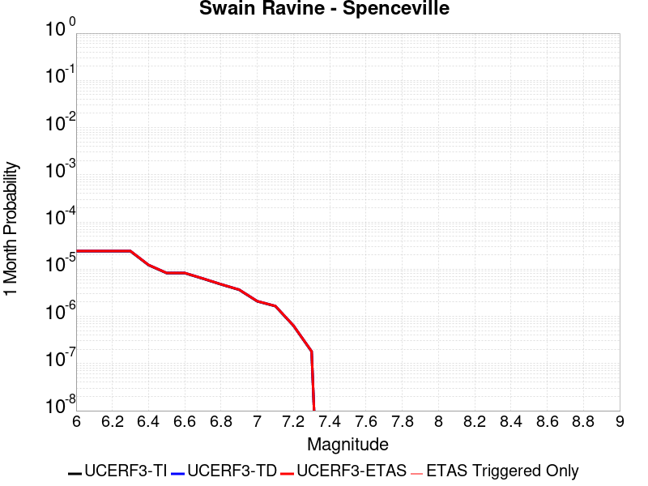 |  |  |

| Magnitude | 1 wk TI Prob | 1 wk TD Prob | 1 wk ETAS Prob | 1 wk ETAS/TD Gain | 1 wk ETAS Triggered Only | 1 mo TI Prob | 1 mo TD Prob | 1 mo ETAS Prob | 1 mo ETAS/TD Gain | 1 mo ETAS Triggered Only | 1 yr TI Prob | 1 yr TD Prob | 1 yr ETAS Prob | 1 yr ETAS/TD Gain | 1 yr ETAS Triggered Only | 10 yr TI Prob | 10 yr TD Prob | 10 yr ETAS Prob | 10 yr ETAS/TD Gain | 10 yr ETAS Triggered Only |
|-----|-----|-----|-----|-----|-----|-----|-----|-----|-----|-----|-----|-----|-----|-----|-----|-----|-----|-----|-----|-----|
| 6.0 | 5.596169E-6 | 5.663794E-6 | 5.663794E-6 | 1.0 | 0.0 | 2.398336E-5 | 2.4273193E-5 | 2.4273193E-5 | 1.0 | 0.0 | 2.9195828E-4 | 2.9548878E-4 | 3.0548582E-4 | 1.0338322 | 1.0E-5 | 0.00291575 | 0.002951228 | 0.0029611986 | 1.0033784 | 1.0E-5 |
| 6.1 | 5.596169E-6 | 5.663794E-6 | 5.663794E-6 | 1.0 | 0.0 | 2.398336E-5 | 2.4273193E-5 | 2.4273193E-5 | 1.0 | 0.0 | 2.9195828E-4 | 2.9548878E-4 | 3.0548582E-4 | 1.0338322 | 1.0E-5 | 0.00291575 | 0.002951228 | 0.0029611986 | 1.0033784 | 1.0E-5 |
| 6.2 | 5.596169E-6 | 5.663794E-6 | 5.663794E-6 | 1.0 | 0.0 | 2.398336E-5 | 2.4273193E-5 | 2.4273193E-5 | 1.0 | 0.0 | 2.9195828E-4 | 2.9548878E-4 | 3.0548582E-4 | 1.0338322 | 1.0E-5 | 0.00291575 | 0.002951228 | 0.0029611986 | 1.0033784 | 1.0E-5 |
| 6.3 | 5.596169E-6 | 5.663794E-6 | 5.663794E-6 | 1.0 | 0.0 | 2.398336E-5 | 2.4273193E-5 | 2.4273193E-5 | 1.0 | 0.0 | 2.9195828E-4 | 2.9548878E-4 | 3.0548582E-4 | 1.0338322 | 1.0E-5 | 0.00291575 | 0.002951228 | 0.0029611986 | 1.0033784 | 1.0E-5 |
| 6.4 | 2.8426775E-6 | 2.874144E-6 | 2.874144E-6 | 1.0 | 0.0 | 1.2182847E-5 | 1.2317704E-5 | 1.2317704E-5 | 1.0 | 0.0 | 1.4831607E-4 | 1.4995811E-4 | 1.5995662E-4 | 1.0666753 | 1.0E-5 | 0.0014821711 | 0.0014986077 | 0.0015085926 | 1.0066628 | 1.0E-5 |
| 6.5 | 1.9210793E-6 | 1.9414147E-6 | 1.9414147E-6 | 1.0 | 0.0 | 8.233172E-6 | 8.320323E-6 | 8.320323E-6 | 1.0 | 0.0 | 1.0023425E-4 | 1.0129536E-4 | 1.0129536E-4 | 1.0 | 0.0 | 0.0010018905 | 0.0010125053 | 0.0010125053 | 1.0 | 0.0 |
| 6.6 | 1.9210793E-6 | 1.9414147E-6 | 1.9414147E-6 | 1.0 | 0.0 | 8.233172E-6 | 8.320323E-6 | 8.320323E-6 | 1.0 | 0.0 | 1.0023425E-4 | 1.0129536E-4 | 1.0129536E-4 | 1.0 | 0.0 | 0.0010018905 | 0.0010125053 | 0.0010125053 | 1.0 | 0.0 |
| 6.7 | 1.4667394E-6 | 1.4818934E-6 | 1.4818934E-6 | 1.0 | 0.0 | 6.286011E-6 | 6.3509565E-6 | 6.3509565E-6 | 1.0 | 0.0 | 7.65295E-5 | 7.732023E-5 | 7.732023E-5 | 1.0 | 0.0 | 7.6503144E-4 | 7.72941E-4 | 7.72941E-4 | 1.0 | 0.0 |
| 6.8 | 1.1076943E-6 | 1.1189535E-6 | 1.1189535E-6 | 1.0 | 0.0 | 4.747252E-6 | 4.7955064E-6 | 4.7955064E-6 | 1.0 | 0.0 | 5.7796264E-5 | 5.838377E-5 | 5.838377E-5 | 1.0 | 0.0 | 5.778124E-4 | 5.836887E-4 | 5.836887E-4 | 1.0 | 0.0 |
| 6.9 | 8.514296E-7 | 8.600095E-7 | 8.600095E-7 | 1.0 | 0.0 | 3.648979E-6 | 3.6857498E-6 | 3.6857498E-6 | 1.0 | 0.0 | 4.442541E-5 | 4.4873108E-5 | 4.4873108E-5 | 1.0 | 0.0 | 4.441653E-4 | 4.4864335E-4 | 4.4864335E-4 | 1.0 | 0.0 |
| 7.0 | 4.8544706E-7 | 4.9033E-7 | 4.9033E-7 | 1.0 | 0.0 | 2.0804857E-6 | 2.1014127E-6 | 2.1014127E-6 | 1.0 | 0.0 | 2.532962E-5 | 2.5584413E-5 | 2.5584413E-5 | 1.0 | 0.0 | 2.5326732E-4 | 2.5581598E-4 | 2.5581598E-4 | 1.0 | 0.0 |
| 7.1 | 3.829186E-7 | 3.8678783E-7 | 3.8678783E-7 | 1.0 | 0.0 | 1.6410787E-6 | 1.6576612E-6 | 1.6576612E-6 | 1.0 | 0.0 | 1.997995E-5 | 2.0181848E-5 | 2.0181848E-5 | 1.0 | 0.0 | 1.9978154E-4 | 2.0180122E-4 | 2.0180122E-4 | 1.0 | 0.0 |
| 7.2 | 1.4726595E-7 | 1.4879437E-7 | 1.4879437E-7 | 1.0 | 0.0 | 6.3113964E-7 | 6.3769005E-7 | 6.3769005E-7 | 1.0 | 0.0 | 7.684098E-6 | 7.763854E-6 | 7.763854E-6 | 1.0 | 0.0 | 7.6838325E-5 | 7.763636E-5 | 7.763636E-5 | 1.0 | 0.0 |
| 7.3 | 4.1880604E-8 | 4.2324306E-8 | 4.2324306E-8 | 1.0 | 0.0 | 1.7948828E-7 | 1.8138988E-7 | 1.8138988E-7 | 1.0 | 0.0 | 2.1852677E-6 | 2.2084218E-6 | 2.2084218E-6 | 1.0 | 0.0 | 2.1852462E-5 | 2.2084218E-5 | 2.2084218E-5 | 1.0 | 0.0 |

## Casmalia 2011 CFM
*[(top)](#table-of-contents)*

| 1 Week | 1 Month | 1 Year | 10 Year |
|-----|-----|-----|-----|
|  |  |  |  |

| Magnitude | 1 wk TI Prob | 1 wk TD Prob | 1 wk ETAS Prob | 1 wk ETAS/TD Gain | 1 wk ETAS Triggered Only | 1 mo TI Prob | 1 mo TD Prob | 1 mo ETAS Prob | 1 mo ETAS/TD Gain | 1 mo ETAS Triggered Only | 1 yr TI Prob | 1 yr TD Prob | 1 yr ETAS Prob | 1 yr ETAS/TD Gain | 1 yr ETAS Triggered Only | 10 yr TI Prob | 10 yr TD Prob | 10 yr ETAS Prob | 10 yr ETAS/TD Gain | 10 yr ETAS Triggered Only |
|-----|-----|-----|-----|-----|-----|-----|-----|-----|-----|-----|-----|-----|-----|-----|-----|-----|-----|-----|-----|-----|
| 6.0 | 4.1704893E-6 | 4.2624843E-6 | 4.2624843E-6 | 1.0 | 0.0 | 1.7873403E-5 | 1.8267663E-5 | 1.8267663E-5 | 1.0 | 0.0 | 2.1758694E-4 | 2.223863E-4 | 2.223863E-4 | 1.0 | 0.0 | 0.0021737402 | 0.0022216584 | 0.0022316363 | 1.0044911 | 1.0E-5 |
| 6.1 | 4.1704893E-6 | 4.2624843E-6 | 4.2624843E-6 | 1.0 | 0.0 | 1.7873403E-5 | 1.8267663E-5 | 1.8267663E-5 | 1.0 | 0.0 | 2.1758694E-4 | 2.223863E-4 | 2.223863E-4 | 1.0 | 0.0 | 0.0021737402 | 0.0022216584 | 0.0022316363 | 1.0044911 | 1.0E-5 |
| 6.2 | 3.457312E-6 | 3.537023E-6 | 3.537023E-6 | 1.0 | 0.0 | 1.4816967E-5 | 1.5158583E-5 | 1.5158583E-5 | 1.0 | 0.0 | 1.8038164E-4 | 1.845402E-4 | 1.845402E-4 | 1.0 | 0.0 | 0.001802353 | 0.0018438791 | 0.0018538607 | 1.0054133 | 1.0E-5 |
| 6.3 | 3.457312E-6 | 3.537023E-6 | 3.537023E-6 | 1.0 | 0.0 | 1.4816967E-5 | 1.5158583E-5 | 1.5158583E-5 | 1.0 | 0.0 | 1.8038164E-4 | 1.845402E-4 | 1.845402E-4 | 1.0 | 0.0 | 0.001802353 | 0.0018438791 | 0.0018538607 | 1.0054133 | 1.0E-5 |
| 6.4 | 3.0957337E-6 | 3.169227E-6 | 3.169227E-6 | 1.0 | 0.0 | 1.3267363E-5 | 1.3582331E-5 | 1.3582331E-5 | 1.0 | 0.0 | 1.6151817E-4 | 1.653524E-4 | 1.653524E-4 | 1.0 | 0.0 | 0.0016140083 | 0.0016522998 | 0.0016622832 | 1.0060421 | 1.0E-5 |
| 6.5 | 3.0957337E-6 | 3.169227E-6 | 3.169227E-6 | 1.0 | 0.0 | 1.3267363E-5 | 1.3582331E-5 | 1.3582331E-5 | 1.0 | 0.0 | 1.6151817E-4 | 1.653524E-4 | 1.653524E-4 | 1.0 | 0.0 | 0.0016140083 | 0.0016522998 | 0.0016622832 | 1.0060421 | 1.0E-5 |
| 6.6 | 2.9459152E-6 | 3.0165766E-6 | 3.0165766E-6 | 1.0 | 0.0 | 1.262529E-5 | 1.2928121E-5 | 1.2928121E-5 | 1.0 | 0.0 | 1.5370206E-4 | 1.5738855E-4 | 1.5738855E-4 | 1.0 | 0.0 | 0.0015359579 | 0.0015727765 | 0.0015827608 | 1.0063481 | 1.0E-5 |
| 6.7 | 2.8634809E-6 | 2.932474E-6 | 2.932474E-6 | 1.0 | 0.0 | 1.2272003E-5 | 1.2567685E-5 | 1.2567685E-5 | 1.0 | 0.0 | 1.4940138E-4 | 1.5300087E-4 | 1.5300087E-4 | 1.0 | 0.0 | 0.0014930099 | 0.0015289608 | 0.0015389455 | 1.0065304 | 1.0E-5 |
| 6.8 | 2.7999822E-6 | 2.867598E-6 | 2.867598E-6 | 1.0 | 0.0 | 1.1999869E-5 | 1.2289648E-5 | 1.2289648E-5 | 1.0 | 0.0 | 1.460886E-4 | 1.4961624E-4 | 1.4961624E-4 | 1.0 | 0.0 | 0.001459926 | 0.0014951604 | 0.0015051455 | 1.0066782 | 1.0E-5 |
| 6.9 | 2.551052E-6 | 2.6119662E-6 | 2.6119662E-6 | 1.0 | 0.0 | 1.0933034E-5 | 1.1194093E-5 | 1.1194093E-5 | 1.0 | 0.0 | 1.3310155E-4 | 1.3627959E-4 | 1.3627959E-4 | 1.0 | 0.0 | 0.0013302186 | 0.0013619643 | 0.0013719506 | 1.0073323 | 1.0E-5 |
| 7.0 | 2.3081875E-6 | 2.3624102E-6 | 2.3624102E-6 | 1.0 | 0.0 | 9.892195E-6 | 1.0124576E-5 | 1.0124576E-5 | 1.0 | 0.0 | 1.20430814E-4 | 1.2325977E-4 | 1.2325977E-4 | 1.0 | 0.0 | 0.0012036557 | 0.0012319168 | 0.0012419046 | 1.0081074 | 1.0E-5 |
| 7.1 | 2.093245E-6 | 2.1417256E-6 | 2.1417256E-6 | 1.0 | 0.0 | 8.971019E-6 | 9.1787915E-6 | 9.1787915E-6 | 1.0 | 0.0 | 1.09216686E-4 | 1.1174608E-4 | 1.1174608E-4 | 1.0 | 0.0 | 0.0010916302 | 0.0011169009 | 0.0011268897 | 1.0089433 | 1.0E-5 |
| 7.2 | 1.9714576E-6 | 2.0165105E-6 | 2.0165105E-6 | 1.0 | 0.0 | 8.449076E-6 | 8.642159E-6 | 8.642159E-6 | 1.0 | 0.0 | 1.0286264E-4 | 1.0521322E-4 | 1.0521322E-4 | 1.0 | 0.0 | 0.0010281504 | 0.001051636 | 0.0010616254 | 1.009499 | 1.0E-5 |
| 7.3 | 1.6689512E-6 | 1.7047145E-6 | 1.7047145E-6 | 1.0 | 0.0 | 7.1526288E-6 | 7.3058986E-6 | 7.3058986E-6 | 1.0 | 0.0 | 8.7079774E-5 | 8.894569E-5 | 8.894569E-5 | 1.0 | 0.0 | 8.7045657E-4 | 8.891017E-4 | 8.990928E-4 | 1.0112373 | 1.0E-5 |
| 7.4 | 1.4490954E-6 | 1.4778922E-6 | 1.4778922E-6 | 1.0 | 0.0 | 6.210394E-6 | 6.333808E-6 | 6.333808E-6 | 1.0 | 0.0 | 7.560892E-5 | 7.711139E-5 | 7.711139E-5 | 1.0 | 0.0 | 7.55832E-4 | 7.7084696E-4 | 7.8083924E-4 | 1.0129627 | 1.0E-5 |
| 7.5 | 1.226873E-6 | 1.2481714E-6 | 1.2481714E-6 | 1.0 | 0.0 | 5.2580162E-6 | 5.3492954E-6 | 5.3492954E-6 | 1.0 | 0.0 | 6.401447E-5 | 6.512573E-5 | 6.512573E-5 | 1.0 | 0.0 | 6.399603E-4 | 6.5106695E-4 | 6.6106045E-4 | 1.0153494 | 1.0E-5 |
| 7.6 | 9.2561345E-7 | 9.3619366E-7 | 9.3619366E-7 | 1.0 | 0.0 | 3.966909E-6 | 4.0122522E-6 | 4.0122522E-6 | 1.0 | 0.0 | 4.8296046E-5 | 4.884808E-5 | 4.884808E-5 | 1.0 | 0.0 | 4.828555E-4 | 4.8837386E-4 | 4.8837386E-4 | 1.0 | 0.0 |
| 7.7 | 5.4367933E-7 | 5.3929017E-7 | 5.3929017E-7 | 1.0 | 0.0 | 2.3300522E-6 | 2.3112416E-6 | 2.3112416E-6 | 1.0 | 0.0 | 2.8368017E-5 | 2.8139004E-5 | 2.8139004E-5 | 1.0 | 0.0 | 2.8364395E-4 | 2.8135453E-4 | 2.8135453E-4 | 1.0 | 0.0 |
| 7.8 | 1.8825742E-7 | 1.7342425E-7 | 1.7342425E-7 | 1.0 | 0.0 | 8.068173E-7 | 7.432466E-7 | 7.432466E-7 | 1.0 | 0.0 | 9.822956E-6 | 9.048989E-6 | 9.048989E-6 | 1.0 | 0.0 | 9.822522E-5 | 9.048623E-5 | 9.048623E-5 | 1.0 | 0.0 |
| 7.9 | 6.342771E-8 | 4.679002E-8 | 4.679002E-8 | 1.0 | 0.0 | 2.7183304E-7 | 2.0052863E-7 | 2.0052863E-7 | 1.0 | 0.0 | 3.3095623E-6 | 2.4414335E-6 | 2.4414335E-6 | 1.0 | 0.0 | 3.309513E-5 | 2.441407E-5 | 2.441407E-5 | 1.0 | 0.0 |
| 8.0 | 1.2574819E-8 | 6.4727095E-9 | 6.4727095E-9 | 1.0 | 0.0 | 5.3892084E-8 | 2.7740182E-8 | 2.7740182E-8 | 1.0 | 0.0 | 6.561359E-7 | 3.3773665E-7 | 3.3773665E-7 | 1.0 | 0.0 | 6.56134E-6 | 3.3773617E-6 | 3.3773617E-6 | 1.0 | 0.0 |

## Rocky Ledge 2011 CFM
*[(top)](#table-of-contents)*

| 1 Week | 1 Month | 1 Year | 10 Year |
|-----|-----|-----|-----|
|  |  |  |  |

| Magnitude | 1 wk TI Prob | 1 wk TD Prob | 1 wk ETAS Prob | 1 wk ETAS/TD Gain | 1 wk ETAS Triggered Only | 1 mo TI Prob | 1 mo TD Prob | 1 mo ETAS Prob | 1 mo ETAS/TD Gain | 1 mo ETAS Triggered Only | 1 yr TI Prob | 1 yr TD Prob | 1 yr ETAS Prob | 1 yr ETAS/TD Gain | 1 yr ETAS Triggered Only | 10 yr TI Prob | 10 yr TD Prob | 10 yr ETAS Prob | 10 yr ETAS/TD Gain | 10 yr ETAS Triggered Only |
|-----|-----|-----|-----|-----|-----|-----|-----|-----|-----|-----|-----|-----|-----|-----|-----|-----|-----|-----|-----|-----|
| 6.0 | 8.7550525E-6 | 9.486605E-6 | 9.486605E-6 | 1.0 | 0.0 | 3.7521113E-5 | 4.0656712E-5 | 5.0656305E-5 | 1.2459519 | 1.0E-5 | 4.567238E-4 | 4.949655E-4 | 5.049606E-4 | 1.0201935 | 1.0E-5 | 0.0045578624 | 0.0049467194 | 0.0049566696 | 1.0020115 | 1.0E-5 |
| 6.1 | 8.7550525E-6 | 9.486605E-6 | 9.486605E-6 | 1.0 | 0.0 | 3.7521113E-5 | 4.0656712E-5 | 4.0656712E-5 | 1.0 | 0.0 | 4.567238E-4 | 4.949655E-4 | 4.949655E-4 | 1.0 | 0.0 | 0.0045578624 | 0.0049467194 | 0.0049467194 | 1.0 | 0.0 |
| 6.2 | 7.442295E-6 | 8.06304E-6 | 8.06304E-6 | 1.0 | 0.0 | 3.189516E-5 | 3.4555887E-5 | 3.4555887E-5 | 1.0 | 0.0 | 3.8825438E-4 | 4.2071793E-4 | 4.2071793E-4 | 1.0 | 0.0 | 0.0038757676 | 0.004207179 | 0.004207179 | 1.0 | 0.0 |

