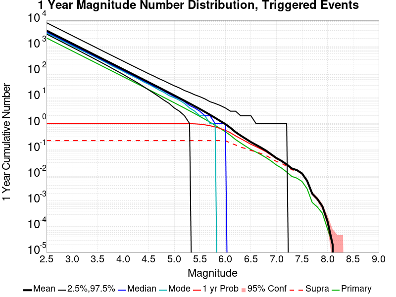
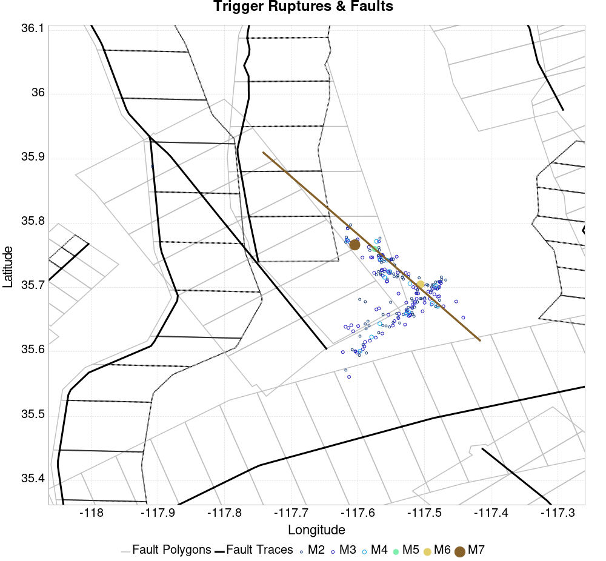

# Searless Valley Sequence Finite Fault Results

|   | Searless Valley Sequence Finite Fault |
|-----|-----|
| Num Simulations | 100000 |
| Start Time | 2019/07/06 03:19:53 UTC |
| Start Time Epoch Milliseconds | 1562383193000 |
| Duration | 10 Years |
| Includes Spontaneous? | false |
| Trigger Ruptures | 217 Trigger Ruptures |
|   | First: M3.98 at 2019/07/04 17:02:55 UTC |
|   | Last: M7.1 at 2019/07/06 03:19:52 UTC |
|   | Largest: M7.1 at 2019/07/06 03:19:52 UTC |
| Historical Ruptures | *(none)* |

## Table Of Contents

* [Magnitude Number Distribution](#magnitude-number-distribution)
  * [10 Year Magnitude Number Distribution](#10-year-magnitude-number-distribution)
  * [1 Year Magnitude Number Distribution](#1-year-magnitude-number-distribution)
  * [1 Month Magnitude Number Distribution](#1-month-magnitude-number-distribution)
  * [1 Week Magnitude Number Distribution](#1-week-magnitude-number-distribution)
  * [1 Day Magnitude Number Distribution](#1-day-magnitude-number-distribution)
  * [1 Hour Magnitude Number Distribution](#1-hour-magnitude-number-distribution)
* [Hazard Change Over Time](#hazard-change-over-time)
  * [M&ge;5.0 Hazard Change Over Time](#mge50-hazard-change-over-time)
  * [M&ge;6.0 Hazard Change Over Time](#mge60-hazard-change-over-time)
  * [M&ge;7.0 Hazard Change Over Time](#mge70-hazard-change-over-time)
  * [M&ge;8.0 Hazard Change Over Time](#mge80-hazard-change-over-time)
* [Trigger Rupture Fault Map](#trigger-rupture-fault-map)
* [Fault Distances To Triggers](#fault-distances-to-triggers)
* [Section Participation](#section-participation)
  * [Section Participation Plots](#section-participation-plots)
  * [Supra-Seismogenic Parent Sections Table](#supra-seismogenic-parent-sections-table)
  * [M≥6.5 Parent Sections Table](#m65-parent-sections-table)
  * [M≥7 Parent Sections Table](#m7-parent-sections-table)
  * [M≥7.5 Parent Sections Table](#m75-parent-sections-table)
  * [M≥8 Parent Sections Table](#m8-parent-sections-table)
* [Gridded Nucleation](#gridded-nucleation)
* [JSON Input File](#json-input-file)

## Magnitude Number Distribution
*[(top)](#table-of-contents)*

### 10 Year Magnitude Number Distribution
*[(top)](#table-of-contents)*

**Legend**
* **Mean** (thick black line): mean expected number across all 100000 catalogs
* **2.5%,97.5%** (thin black lines): expected number percentiles across all 100000 catalogs
* **Median** (thin blue line): median expected number across all 100000 catalogs
* **Mode** (thin cyan line): modal expected number across all 100000 catalogs
* **10 yr Probability** (thin red line): 10 year probability calculated as the fraction of catalogs with at least 1 occurrence
* **95% Conf** (light red shaded region): binomial 95% confidence bounds on probability
* **Primary** (thin green line): mean expected number from primary triggered aftershocks only (no secondary, tertiary, etc...) across all 100000 catalogs


| Mag | Mean | 2.5 %ile | 97.5 %ile | Median | Mode | 10 yr Probability | Primary Aftershocks Mean |
|-----|-----|-----|-----|-----|-----|-----|-----|
| **M&ge;2.5** | 5248.048 | 3641.000 | 11960.000 | 4564.000 | 4154.000 | 1.000 | 2381.891 |
| **M&ge;2.6** | 4168.501 | 2886.000 | 9504.000 | 3626.000 | 3244.000 | 1.000 | 1891.879 |
| **M&ge;2.7** | 3311.067 | 2288.000 | 7564.000 | 2881.000 | 2642.000 | 1.000 | 1502.766 |
| **M&ge;2.8** | 2629.994 | 1812.000 | 6005.000 | 2288.000 | 2183.000 | 1.000 | 1193.638 |
| **M&ge;2.9** | 2089.018 | 1436.000 | 4772.000 | 1819.000 | 1653.000 | 1.000 | 948.108 |
| **M&ge;3** | 1659.284 | 1136.000 | 3785.000 | 1446.000 | 1354.000 | 1.000 | 752.967 |
| **M&ge;3.1** | 1317.865 | 898.000 | 3015.000 | 1148.000 | 1092.000 | 1.000 | 598.022 |
| **M&ge;3.2** | 1046.777 | 709.000 | 2393.000 | 913.000 | 827.000 | 1.000 | 474.973 |
| **M&ge;3.3** | 831.351 | 560.000 | 1899.000 | 725.000 | 688.000 | 1.000 | 377.209 |
| **M&ge;3.4** | 660.181 | 441.000 | 1511.000 | 577.000 | 545.000 | 1.000 | 299.560 |
| **M&ge;3.5** | 524.321 | 347.000 | 1202.000 | 458.000 | 441.000 | 1.000 | 237.919 |
| **M&ge;3.6** | 416.399 | 272.000 | 957.000 | 365.000 | 347.000 | 1.000 | 188.935 |
| **M&ge;3.7** | 330.653 | 213.000 | 761.000 | 290.000 | 267.000 | 1.000 | 150.018 |
| **M&ge;3.8** | 262.584 | 167.000 | 605.000 | 230.000 | 214.000 | 1.000 | 119.119 |
| **M&ge;3.9** | 208.501 | 130.000 | 481.000 | 183.000 | 167.000 | 1.000 | 94.576 |
| **M&ge;4** | 165.526 | 101.000 | 384.000 | 146.000 | 132.000 | 1.000 | 75.082 |
| **M&ge;4.1** | 131.424 | 78.000 | 306.000 | 116.000 | 107.000 | 1.000 | 59.610 |
| **M&ge;4.2** | 104.325 | 60.000 | 244.000 | 92.000 | 83.000 | 1.000 | 47.310 |
| **M&ge;4.3** | 82.780 | 46.000 | 195.000 | 73.000 | 67.000 | 1.000 | 37.541 |
| **M&ge;4.4** | 65.650 | 35.000 | 154.000 | 58.000 | 51.000 | 1.000 | 29.781 |
| **M&ge;4.5** | 52.068 | 27.000 | 123.000 | 46.000 | 41.000 | 1.000 | 23.626 |
| **M&ge;4.6** | 41.266 | 20.000 | 98.000 | 37.000 | 33.000 | 1.000 | 18.732 |
| **M&ge;4.7** | 32.672 | 15.000 | 79.000 | 29.000 | 25.000 | 1.000 | 14.822 |
| **M&ge;4.8** | 25.865 | 11.000 | 63.000 | 23.000 | 21.000 | 1.000 | 11.733 |
| **M&ge;4.9** | 20.446 | 8.000 | 50.000 | 18.000 | 16.000 | 1.000 | 9.274 |
| **M&ge;5** | 16.143 | 5.000 | 40.000 | 14.000 | 12.000 | 1.000 | 7.322 |
| **M&ge;5.1** | 12.726 | 4.000 | 32.000 | 11.000 | 10.000 | 1.000 | 5.770 |
| **M&ge;5.2** | 10.013 | 2.000 | 26.000 | 9.000 | 8.000 | 0.999 | 4.536 |
| **M&ge;5.3** | 7.855 | 2.000 | 21.000 | 7.000 | 5.000 | 0.995 | 3.557 |
| **M&ge;5.4** | 6.151 | 1.000 | 17.000 | 5.000 | 4.000 | 0.986 | 2.785 |
| **M&ge;5.5** | 4.790 | 0.000 | 14.000 | 4.000 | 3.000 | 0.968 | 2.165 |
| **M&ge;5.6** | 3.712 | 0.000 | 11.000 | 3.000 | 2.000 | 0.933 | 1.674 |
| **M&ge;5.7** | 2.855 | 0.000 | 9.000 | 2.000 | 2.000 | 0.880 | 1.284 |
| **M&ge;5.8** | 2.175 | 0.000 | 7.000 | 2.000 | 1.000 | 0.808 | 0.976 |
| **M&ge;5.9** | 1.640 | 0.000 | 6.000 | 1.000 | 1.000 | 0.720 | 0.732 |
| **M&ge;6** | 1.252 | 0.000 | 5.000 | 1.000 | 0.000 | 0.627 | 0.551 |
| **M&ge;6.1** | 0.891 | 0.000 | 4.000 | 1.000 | 0.000 | 0.514 | 0.398 |
| **M&ge;6.2** | 0.608 | 0.000 | 3.000 | 0.000 | 0.000 | 0.399 | 0.272 |
| **M&ge;6.3** | 0.446 | 0.000 | 3.000 | 0.000 | 0.000 | 0.316 | 0.201 |
| **M&ge;6.4** | 0.335 | 0.000 | 2.000 | 0.000 | 0.000 | 0.250 | 0.149 |
| **M&ge;6.5** | 0.251 | 0.000 | 2.000 | 0.000 | 0.000 | 0.195 | 0.112 |
| **M&ge;6.6** | 0.195 | 0.000 | 2.000 | 0.000 | 0.000 | 0.160 | 0.089 |
| **M&ge;6.7** | 0.151 | 0.000 | 1.000 | 0.000 | 0.000 | 0.128 | 0.070 |
| **M&ge;6.8** | 0.114 | 0.000 | 1.000 | 0.000 | 0.000 | 0.101 | 0.054 |
| **M&ge;6.9** | 0.082 | 0.000 | 1.000 | 0.000 | 0.000 | 0.075 | 0.039 |
| **M&ge;7** | 0.059 | 0.000 | 1.000 | 0.000 | 0.000 | 0.055 | 0.028 |
| **M&ge;7.1** | 0.046 | 0.000 | 1.000 | 0.000 | 0.000 | 0.043 | 0.021 |
| **M&ge;7.2** | 0.033 | 0.000 | 1.000 | 0.000 | 0.000 | 0.032 | 0.015 |
| **M&ge;7.3** | 0.023 | 0.000 | 0.000 | 0.000 | 0.000 | 0.023 | 9.96E-3 |
| **M&ge;7.4** | 0.020 | 0.000 | 0.000 | 0.000 | 0.000 | 0.019 | 8.51E-3 |
| **M&ge;7.5** | 0.015 | 0.000 | 0.000 | 0.000 | 0.000 | 0.015 | 6.25E-3 |
| **M&ge;7.6** | 7.68E-3 | 0.000 | 0.000 | 0.000 | 0.000 | 7.55E-3 | 3.21E-3 |
| **M&ge;7.7** | 2.54E-3 | 0.000 | 0.000 | 0.000 | 0.000 | 2.52E-3 | 9.30E-4 |
| **M&ge;7.8** | 1.55E-3 | 0.000 | 0.000 | 0.000 | 0.000 | 1.54E-3 | 6.20E-4 |
| **M&ge;7.9** | 7.80E-4 | 0.000 | 0.000 | 0.000 | 0.000 | 7.80E-4 | 3.50E-4 |
| **M&ge;8** | 2.30E-4 | 0.000 | 0.000 | 0.000 | 0.000 | 2.30E-4 | 9.00E-5 |
| **M&ge;8.1** | 3.00E-5 | 0.000 | 0.000 | 0.000 | 0.000 | 3.00E-5 | 2.00E-5 |
| **M&ge;8.2** | 0.000 | 0.000 | 0.000 | 0.000 | 0.000 | 0.000 | 0.000 |
| **M&ge;8.3** | 0.000 | 0.000 | 0.000 | 0.000 | 0.000 | 0.000 | 0.000 |
| **M&ge;8.4** | 0.000 | 0.000 | 0.000 | 0.000 | 0.000 | 0.000 | 0.000 |
| **M&ge;8.5** | 0.000 | 0.000 | 0.000 | 0.000 | 0.000 | 0.000 | 0.000 |
| **M&ge;8.6** | 0.000 | 0.000 | 0.000 | 0.000 | 0.000 | 0.000 | 0.000 |
| **M&ge;8.7** | 0.000 | 0.000 | 0.000 | 0.000 | 0.000 | 0.000 | 0.000 |
| **M&ge;8.8** | 0.000 | 0.000 | 0.000 | 0.000 | 0.000 | 0.000 | 0.000 |
| **M&ge;8.9** | 0.000 | 0.000 | 0.000 | 0.000 | 0.000 | 0.000 | 0.000 |
| **M&ge;9** | 0.000 | 0.000 | 0.000 | 0.000 | 0.000 | 0.000 | 0.000 |

### 1 Year Magnitude Number Distribution
*[(top)](#table-of-contents)*

**Legend**
* **Mean** (thick black line): mean expected number across all 100000 catalogs
* **2.5%,97.5%** (thin black lines): expected number percentiles across all 100000 catalogs
* **Median** (thin blue line): median expected number across all 100000 catalogs
* **Mode** (thin cyan line): modal expected number across all 100000 catalogs
* **1 yr Probability** (thin red line): 1 year probability calculated as the fraction of catalogs with at least 1 occurrence
* **95% Conf** (light red shaded region): binomial 95% confidence bounds on probability
* **Primary** (thin green line): mean expected number from primary triggered aftershocks only (no secondary, tertiary, etc...) across all 100000 catalogs



| Mag | Mean | 2.5 %ile | 97.5 %ile | Median | Mode | 1 yr Probability | Primary Aftershocks Mean |
|-----|-----|-----|-----|-----|-----|-----|-----|
| **M&ge;2.5** | 4004.922 | 2939.000 | 8111.000 | 3561.000 | 3233.000 | 1.000 | 2076.278 |
| **M&ge;2.6** | 3181.111 | 2329.000 | 6434.000 | 2829.000 | 2575.000 | 1.000 | 1649.143 |
| **M&ge;2.7** | 2526.736 | 1845.000 | 5120.000 | 2248.000 | 2120.000 | 1.000 | 1309.965 |
| **M&ge;2.8** | 2007.050 | 1460.000 | 4075.000 | 1786.000 | 1632.000 | 1.000 | 1040.492 |
| **M&ge;2.9** | 1594.202 | 1155.000 | 3234.000 | 1419.000 | 1322.000 | 1.000 | 826.455 |
| **M&ge;3** | 1266.191 | 914.000 | 2572.000 | 1128.000 | 1038.000 | 1.000 | 656.335 |
| **M&ge;3.1** | 1005.678 | 721.000 | 2043.000 | 897.000 | 823.000 | 1.000 | 521.275 |
| **M&ge;3.2** | 798.830 | 569.000 | 1625.000 | 713.000 | 661.000 | 1.000 | 414.017 |
| **M&ge;3.3** | 634.417 | 448.000 | 1295.000 | 566.000 | 529.000 | 1.000 | 328.798 |
| **M&ge;3.4** | 503.811 | 353.000 | 1031.000 | 450.000 | 428.000 | 1.000 | 261.112 |
| **M&ge;3.5** | 400.154 | 277.000 | 819.000 | 358.000 | 337.000 | 1.000 | 207.400 |
| **M&ge;3.6** | 317.807 | 217.000 | 652.000 | 285.000 | 268.000 | 1.000 | 164.706 |
| **M&ge;3.7** | 252.358 | 170.000 | 519.000 | 226.000 | 211.000 | 1.000 | 130.785 |
| **M&ge;3.8** | 200.403 | 132.000 | 413.000 | 180.000 | 165.000 | 1.000 | 103.837 |
| **M&ge;3.9** | 159.129 | 103.000 | 330.000 | 143.000 | 133.000 | 1.000 | 82.445 |
| **M&ge;4** | 126.328 | 80.000 | 263.000 | 114.000 | 105.000 | 1.000 | 65.459 |
| **M&ge;4.1** | 100.291 | 61.000 | 209.000 | 90.000 | 83.000 | 1.000 | 51.968 |
| **M&ge;4.2** | 79.595 | 47.000 | 167.000 | 72.000 | 67.000 | 1.000 | 41.241 |
| **M&ge;4.3** | 63.156 | 36.000 | 133.000 | 57.000 | 53.000 | 1.000 | 32.722 |
| **M&ge;4.4** | 50.092 | 27.000 | 107.000 | 45.000 | 41.000 | 1.000 | 25.962 |
| **M&ge;4.5** | 39.732 | 20.000 | 85.000 | 36.000 | 33.000 | 1.000 | 20.595 |
| **M&ge;4.6** | 31.489 | 15.000 | 69.000 | 28.000 | 26.000 | 1.000 | 16.327 |
| **M&ge;4.7** | 24.929 | 11.000 | 55.000 | 23.000 | 20.000 | 1.000 | 12.918 |
| **M&ge;4.8** | 19.734 | 8.000 | 45.000 | 18.000 | 16.000 | 1.000 | 10.227 |
| **M&ge;4.9** | 15.598 | 6.000 | 36.000 | 14.000 | 12.000 | 1.000 | 8.083 |
| **M&ge;5** | 12.317 | 4.000 | 29.000 | 11.000 | 10.000 | 1.000 | 6.382 |
| **M&ge;5.1** | 9.707 | 3.000 | 24.000 | 9.000 | 8.000 | 0.999 | 5.029 |
| **M&ge;5.2** | 7.635 | 2.000 | 19.000 | 7.000 | 6.000 | 0.996 | 3.953 |
| **M&ge;5.3** | 5.993 | 1.000 | 16.000 | 5.000 | 4.000 | 0.988 | 3.101 |
| **M&ge;5.4** | 4.691 | 0.000 | 13.000 | 4.000 | 3.000 | 0.971 | 2.428 |
| **M&ge;5.5** | 3.657 | 0.000 | 11.000 | 3.000 | 2.000 | 0.939 | 1.889 |
| **M&ge;5.6** | 2.833 | 0.000 | 9.000 | 2.000 | 2.000 | 0.888 | 1.461 |
| **M&ge;5.7** | 2.176 | 0.000 | 7.000 | 2.000 | 1.000 | 0.820 | 1.121 |
| **M&ge;5.8** | 1.658 | 0.000 | 6.000 | 1.000 | 1.000 | 0.736 | 0.852 |
| **M&ge;5.9** | 1.251 | 0.000 | 5.000 | 1.000 | 0.000 | 0.641 | 0.639 |
| **M&ge;6** | 0.953 | 0.000 | 4.000 | 1.000 | 0.000 | 0.545 | 0.481 |
| **M&ge;6.1** | 0.679 | 0.000 | 3.000 | 0.000 | 0.000 | 0.437 | 0.347 |
| **M&ge;6.2** | 0.464 | 0.000 | 3.000 | 0.000 | 0.000 | 0.332 | 0.238 |
| **M&ge;6.3** | 0.340 | 0.000 | 2.000 | 0.000 | 0.000 | 0.259 | 0.176 |
| **M&ge;6.4** | 0.255 | 0.000 | 2.000 | 0.000 | 0.000 | 0.202 | 0.131 |
| **M&ge;6.5** | 0.191 | 0.000 | 2.000 | 0.000 | 0.000 | 0.156 | 0.098 |
| **M&ge;6.6** | 0.149 | 0.000 | 1.000 | 0.000 | 0.000 | 0.127 | 0.079 |
| **M&ge;6.7** | 0.116 | 0.000 | 1.000 | 0.000 | 0.000 | 0.101 | 0.061 |
| **M&ge;6.8** | 0.088 | 0.000 | 1.000 | 0.000 | 0.000 | 0.080 | 0.047 |
| **M&ge;6.9** | 0.063 | 0.000 | 1.000 | 0.000 | 0.000 | 0.059 | 0.035 |
| **M&ge;7** | 0.046 | 0.000 | 1.000 | 0.000 | 0.000 | 0.043 | 0.024 |
| **M&ge;7.1** | 0.035 | 0.000 | 1.000 | 0.000 | 0.000 | 0.034 | 0.019 |
| **M&ge;7.2** | 0.026 | 0.000 | 1.000 | 0.000 | 0.000 | 0.025 | 0.013 |
| **M&ge;7.3** | 0.018 | 0.000 | 0.000 | 0.000 | 0.000 | 0.018 | 8.91E-3 |
| **M&ge;7.4** | 0.016 | 0.000 | 0.000 | 0.000 | 0.000 | 0.015 | 7.61E-3 |
| **M&ge;7.5** | 0.012 | 0.000 | 0.000 | 0.000 | 0.000 | 0.011 | 5.68E-3 |
| **M&ge;7.6** | 6.03E-3 | 0.000 | 0.000 | 0.000 | 0.000 | 5.96E-3 | 2.96E-3 |
| **M&ge;7.7** | 1.91E-3 | 0.000 | 0.000 | 0.000 | 0.000 | 1.89E-3 | 8.70E-4 |
| **M&ge;7.8** | 1.19E-3 | 0.000 | 0.000 | 0.000 | 0.000 | 1.18E-3 | 5.80E-4 |
| **M&ge;7.9** | 6.10E-4 | 0.000 | 0.000 | 0.000 | 0.000 | 6.10E-4 | 3.30E-4 |
| **M&ge;8** | 1.60E-4 | 0.000 | 0.000 | 0.000 | 0.000 | 1.60E-4 | 8.00E-5 |
| **M&ge;8.1** | 2.00E-5 | 0.000 | 0.000 | 0.000 | 0.000 | 2.00E-5 | 2.00E-5 |
| **M&ge;8.2** | 0.000 | 0.000 | 0.000 | 0.000 | 0.000 | 0.000 | 0.000 |
| **M&ge;8.3** | 0.000 | 0.000 | 0.000 | 0.000 | 0.000 | 0.000 | 0.000 |
| **M&ge;8.4** | 0.000 | 0.000 | 0.000 | 0.000 | 0.000 | 0.000 | 0.000 |
| **M&ge;8.5** | 0.000 | 0.000 | 0.000 | 0.000 | 0.000 | 0.000 | 0.000 |
| **M&ge;8.6** | 0.000 | 0.000 | 0.000 | 0.000 | 0.000 | 0.000 | 0.000 |
| **M&ge;8.7** | 0.000 | 0.000 | 0.000 | 0.000 | 0.000 | 0.000 | 0.000 |
| **M&ge;8.8** | 0.000 | 0.000 | 0.000 | 0.000 | 0.000 | 0.000 | 0.000 |
| **M&ge;8.9** | 0.000 | 0.000 | 0.000 | 0.000 | 0.000 | 0.000 | 0.000 |
| **M&ge;9** | 0.000 | 0.000 | 0.000 | 0.000 | 0.000 | 0.000 | 0.000 |

### 1 Month Magnitude Number Distribution
*[(top)](#table-of-contents)*

**Legend**
* **Mean** (thick black line): mean expected number across all 100000 catalogs
* **2.5%,97.5%** (thin black lines): expected number percentiles across all 100000 catalogs
* **Median** (thin blue line): median expected number across all 100000 catalogs
* **Mode** (thin cyan line): modal expected number across all 100000 catalogs
* **1 mo Probability** (thin red line): 1 month probability calculated as the fraction of catalogs with at least 1 occurrence
* **95% Conf** (light red shaded region): binomial 95% confidence bounds on probability
* **Primary** (thin green line): mean expected number from primary triggered aftershocks only (no secondary, tertiary, etc...) across all 100000 catalogs


| Mag | Mean | 2.5 %ile | 97.5 %ile | Median | Mode | 1 mo Probability | Primary Aftershocks Mean |
|-----|-----|-----|-----|-----|-----|-----|-----|
| **M&ge;2.5** | 2794.060 | 2180.000 | 5072.000 | 2549.000 | 2373.000 | 1.000 | 1685.042 |
| **M&ge;2.6** | 2219.278 | 1726.000 | 4027.000 | 2025.000 | 1912.000 | 1.000 | 1338.405 |
| **M&ge;2.7** | 1762.824 | 1366.000 | 3199.000 | 1610.000 | 1495.000 | 1.000 | 1063.148 |
| **M&ge;2.8** | 1400.237 | 1080.000 | 2543.000 | 1279.000 | 1219.000 | 1.000 | 844.459 |
| **M&ge;2.9** | 1112.218 | 853.000 | 2022.000 | 1017.000 | 939.000 | 1.000 | 670.763 |
| **M&ge;3** | 883.362 | 674.000 | 1606.000 | 808.000 | 758.000 | 1.000 | 532.697 |
| **M&ge;3.1** | 701.647 | 531.000 | 1277.000 | 642.000 | 605.000 | 1.000 | 423.101 |
| **M&ge;3.2** | 557.351 | 418.000 | 1015.000 | 511.000 | 494.000 | 1.000 | 336.053 |
| **M&ge;3.3** | 442.634 | 328.000 | 805.000 | 406.000 | 385.000 | 1.000 | 266.884 |
| **M&ge;3.4** | 351.504 | 258.000 | 640.000 | 323.000 | 303.000 | 1.000 | 211.937 |
| **M&ge;3.5** | 279.175 | 202.000 | 510.000 | 257.000 | 243.000 | 1.000 | 168.331 |
| **M&ge;3.6** | 221.734 | 158.000 | 406.000 | 204.000 | 196.000 | 1.000 | 133.691 |
| **M&ge;3.7** | 176.074 | 123.000 | 323.000 | 162.000 | 155.000 | 1.000 | 106.166 |
| **M&ge;3.8** | 139.823 | 95.000 | 258.000 | 129.000 | 123.000 | 1.000 | 84.300 |
| **M&ge;3.9** | 111.023 | 74.000 | 205.000 | 103.000 | 96.000 | 1.000 | 66.928 |
| **M&ge;4** | 88.141 | 57.000 | 163.000 | 81.000 | 76.000 | 1.000 | 53.132 |
| **M&ge;4.1** | 69.966 | 43.000 | 131.000 | 65.000 | 63.000 | 1.000 | 42.175 |
| **M&ge;4.2** | 55.532 | 33.000 | 105.000 | 51.000 | 48.000 | 1.000 | 33.472 |
| **M&ge;4.3** | 44.054 | 25.000 | 84.000 | 41.000 | 39.000 | 1.000 | 26.557 |
| **M&ge;4.4** | 34.945 | 19.000 | 67.000 | 32.000 | 31.000 | 1.000 | 21.074 |
| **M&ge;4.5** | 27.719 | 14.000 | 54.000 | 26.000 | 23.000 | 1.000 | 16.717 |
| **M&ge;4.6** | 21.974 | 10.000 | 44.000 | 20.000 | 19.000 | 1.000 | 13.255 |
| **M&ge;4.7** | 17.396 | 7.000 | 36.000 | 16.000 | 14.000 | 1.000 | 10.489 |
| **M&ge;4.8** | 13.768 | 5.000 | 29.000 | 13.000 | 11.000 | 1.000 | 8.302 |
| **M&ge;4.9** | 10.880 | 4.000 | 24.000 | 10.000 | 9.000 | 1.000 | 6.562 |
| **M&ge;5** | 8.590 | 2.000 | 20.000 | 8.000 | 7.000 | 0.999 | 5.182 |
| **M&ge;5.1** | 6.767 | 1.000 | 16.000 | 6.000 | 5.000 | 0.995 | 4.082 |
| **M&ge;5.2** | 5.324 | 1.000 | 13.000 | 5.000 | 4.000 | 0.984 | 3.209 |
| **M&ge;5.3** | 4.178 | 0.000 | 11.000 | 4.000 | 3.000 | 0.965 | 2.517 |
| **M&ge;5.4** | 3.269 | 0.000 | 9.000 | 3.000 | 2.000 | 0.929 | 1.970 |
| **M&ge;5.5** | 2.546 | 0.000 | 8.000 | 2.000 | 2.000 | 0.875 | 1.533 |
| **M&ge;5.6** | 1.973 | 0.000 | 6.000 | 2.000 | 1.000 | 0.805 | 1.186 |
| **M&ge;5.7** | 1.516 | 0.000 | 5.000 | 1.000 | 1.000 | 0.720 | 0.910 |
| **M&ge;5.8** | 1.154 | 0.000 | 4.000 | 1.000 | 0.000 | 0.626 | 0.692 |
| **M&ge;5.9** | 0.868 | 0.000 | 4.000 | 1.000 | 0.000 | 0.528 | 0.519 |
| **M&ge;6** | 0.660 | 0.000 | 3.000 | 0.000 | 0.000 | 0.437 | 0.391 |
| **M&ge;6.1** | 0.471 | 0.000 | 3.000 | 0.000 | 0.000 | 0.341 | 0.281 |
| **M&ge;6.2** | 0.321 | 0.000 | 2.000 | 0.000 | 0.000 | 0.251 | 0.192 |
| **M&ge;6.3** | 0.235 | 0.000 | 2.000 | 0.000 | 0.000 | 0.193 | 0.142 |
| **M&ge;6.4** | 0.176 | 0.000 | 1.000 | 0.000 | 0.000 | 0.148 | 0.106 |
| **M&ge;6.5** | 0.131 | 0.000 | 1.000 | 0.000 | 0.000 | 0.114 | 0.079 |
| **M&ge;6.6** | 0.103 | 0.000 | 1.000 | 0.000 | 0.000 | 0.092 | 0.064 |
| **M&ge;6.7** | 0.081 | 0.000 | 1.000 | 0.000 | 0.000 | 0.073 | 0.050 |
| **M&ge;6.8** | 0.061 | 0.000 | 1.000 | 0.000 | 0.000 | 0.057 | 0.038 |
| **M&ge;6.9** | 0.044 | 0.000 | 1.000 | 0.000 | 0.000 | 0.042 | 0.028 |
| **M&ge;7** | 0.032 | 0.000 | 1.000 | 0.000 | 0.000 | 0.031 | 0.020 |
| **M&ge;7.1** | 0.025 | 0.000 | 0.000 | 0.000 | 0.000 | 0.024 | 0.015 |
| **M&ge;7.2** | 0.018 | 0.000 | 0.000 | 0.000 | 0.000 | 0.018 | 0.011 |
| **M&ge;7.3** | 0.012 | 0.000 | 0.000 | 0.000 | 0.000 | 0.012 | 7.34E-3 |
| **M&ge;7.4** | 0.011 | 0.000 | 0.000 | 0.000 | 0.000 | 0.011 | 6.33E-3 |
| **M&ge;7.5** | 8.15E-3 | 0.000 | 0.000 | 0.000 | 0.000 | 8.05E-3 | 4.75E-3 |
| **M&ge;7.6** | 4.19E-3 | 0.000 | 0.000 | 0.000 | 0.000 | 4.16E-3 | 2.44E-3 |
| **M&ge;7.7** | 1.28E-3 | 0.000 | 0.000 | 0.000 | 0.000 | 1.26E-3 | 6.80E-4 |
| **M&ge;7.8** | 7.90E-4 | 0.000 | 0.000 | 0.000 | 0.000 | 7.80E-4 | 4.50E-4 |
| **M&ge;7.9** | 4.20E-4 | 0.000 | 0.000 | 0.000 | 0.000 | 4.20E-4 | 2.80E-4 |
| **M&ge;8** | 1.10E-4 | 0.000 | 0.000 | 0.000 | 0.000 | 1.10E-4 | 6.00E-5 |
| **M&ge;8.1** | 1.00E-5 | 0.000 | 0.000 | 0.000 | 0.000 | 1.00E-5 | 1.00E-5 |
| **M&ge;8.2** | 0.000 | 0.000 | 0.000 | 0.000 | 0.000 | 0.000 | 0.000 |
| **M&ge;8.3** | 0.000 | 0.000 | 0.000 | 0.000 | 0.000 | 0.000 | 0.000 |
| **M&ge;8.4** | 0.000 | 0.000 | 0.000 | 0.000 | 0.000 | 0.000 | 0.000 |
| **M&ge;8.5** | 0.000 | 0.000 | 0.000 | 0.000 | 0.000 | 0.000 | 0.000 |
| **M&ge;8.6** | 0.000 | 0.000 | 0.000 | 0.000 | 0.000 | 0.000 | 0.000 |
| **M&ge;8.7** | 0.000 | 0.000 | 0.000 | 0.000 | 0.000 | 0.000 | 0.000 |
| **M&ge;8.8** | 0.000 | 0.000 | 0.000 | 0.000 | 0.000 | 0.000 | 0.000 |
| **M&ge;8.9** | 0.000 | 0.000 | 0.000 | 0.000 | 0.000 | 0.000 | 0.000 |
| **M&ge;9** | 0.000 | 0.000 | 0.000 | 0.000 | 0.000 | 0.000 | 0.000 |

### 1 Week Magnitude Number Distribution
*[(top)](#table-of-contents)*

**Legend**
* **Mean** (thick black line): mean expected number across all 100000 catalogs
* **2.5%,97.5%** (thin black lines): expected number percentiles across all 100000 catalogs
* **Median** (thin blue line): median expected number across all 100000 catalogs
* **Mode** (thin cyan line): modal expected number across all 100000 catalogs
* **1 wk Probability** (thin red line): 1 week probability calculated as the fraction of catalogs with at least 1 occurrence
* **95% Conf** (light red shaded region): binomial 95% confidence bounds on probability
* **Primary** (thin green line): mean expected number from primary triggered aftershocks only (no secondary, tertiary, etc...) across all 100000 catalogs


| Mag | Mean | 2.5 %ile | 97.5 %ile | Median | Mode | 1 wk Probability | Primary Aftershocks Mean |
|-----|-----|-----|-----|-----|-----|-----|-----|
| **M&ge;2.5** | 2164.054 | 1748.000 | 3645.000 | 2002.000 | 1959.000 | 1.000 | 1428.062 |
| **M&ge;2.6** | 1718.942 | 1383.000 | 2900.000 | 1591.000 | 1535.000 | 1.000 | 1134.312 |
| **M&ge;2.7** | 1365.402 | 1093.000 | 2302.000 | 1265.000 | 1193.000 | 1.000 | 901.033 |
| **M&ge;2.8** | 1084.573 | 864.000 | 1833.000 | 1005.000 | 958.000 | 1.000 | 715.713 |
| **M&ge;2.9** | 861.475 | 682.000 | 1455.000 | 799.000 | 757.000 | 1.000 | 568.483 |
| **M&ge;3** | 684.222 | 537.000 | 1157.000 | 635.000 | 606.000 | 1.000 | 451.479 |
| **M&ge;3.1** | 543.478 | 423.000 | 920.000 | 505.000 | 490.000 | 1.000 | 358.603 |
| **M&ge;3.2** | 431.709 | 332.000 | 731.000 | 402.000 | 387.000 | 1.000 | 284.819 |
| **M&ge;3.3** | 342.865 | 261.000 | 581.000 | 319.000 | 304.000 | 1.000 | 226.212 |
| **M&ge;3.4** | 272.268 | 204.000 | 462.000 | 254.000 | 248.000 | 1.000 | 179.636 |
| **M&ge;3.5** | 216.236 | 159.000 | 369.000 | 202.000 | 191.000 | 1.000 | 142.677 |
| **M&ge;3.6** | 171.756 | 124.000 | 293.000 | 160.000 | 153.000 | 1.000 | 113.322 |
| **M&ge;3.7** | 136.387 | 97.000 | 233.000 | 128.000 | 121.000 | 1.000 | 89.991 |
| **M&ge;3.8** | 108.303 | 75.000 | 187.000 | 101.000 | 97.000 | 1.000 | 71.457 |
| **M&ge;3.9** | 85.990 | 58.000 | 149.000 | 81.000 | 78.000 | 1.000 | 56.732 |
| **M&ge;4** | 68.262 | 44.000 | 119.000 | 64.000 | 61.000 | 1.000 | 45.032 |
| **M&ge;4.1** | 54.192 | 34.000 | 95.000 | 51.000 | 48.000 | 1.000 | 35.751 |
| **M&ge;4.2** | 43.013 | 25.000 | 76.000 | 40.000 | 38.000 | 1.000 | 28.373 |
| **M&ge;4.3** | 34.122 | 19.000 | 62.000 | 32.000 | 31.000 | 1.000 | 22.510 |
| **M&ge;4.4** | 27.068 | 14.000 | 50.000 | 25.000 | 24.000 | 1.000 | 17.862 |
| **M&ge;4.5** | 21.471 | 10.000 | 40.000 | 20.000 | 19.000 | 1.000 | 14.168 |
| **M&ge;4.6** | 17.017 | 8.000 | 33.000 | 16.000 | 15.000 | 1.000 | 11.230 |
| **M&ge;4.7** | 13.468 | 5.000 | 27.000 | 13.000 | 12.000 | 1.000 | 8.885 |
| **M&ge;4.8** | 10.660 | 4.000 | 22.000 | 10.000 | 9.000 | 1.000 | 7.035 |
| **M&ge;4.9** | 8.422 | 2.000 | 18.000 | 8.000 | 7.000 | 0.999 | 5.562 |
| **M&ge;5** | 6.650 | 1.000 | 15.000 | 6.000 | 5.000 | 0.996 | 4.392 |
| **M&ge;5.1** | 5.239 | 1.000 | 12.000 | 5.000 | 4.000 | 0.986 | 3.460 |
| **M&ge;5.2** | 4.118 | 0.000 | 10.000 | 4.000 | 3.000 | 0.967 | 2.720 |
| **M&ge;5.3** | 3.231 | 0.000 | 9.000 | 3.000 | 2.000 | 0.933 | 2.132 |
| **M&ge;5.4** | 2.527 | 0.000 | 7.000 | 2.000 | 2.000 | 0.882 | 1.668 |
| **M&ge;5.5** | 1.967 | 0.000 | 6.000 | 2.000 | 1.000 | 0.814 | 1.298 |
| **M&ge;5.6** | 1.523 | 0.000 | 5.000 | 1.000 | 1.000 | 0.732 | 1.004 |
| **M&ge;5.7** | 1.169 | 0.000 | 4.000 | 1.000 | 0.000 | 0.640 | 0.770 |
| **M&ge;5.8** | 0.890 | 0.000 | 4.000 | 1.000 | 0.000 | 0.544 | 0.584 |
| **M&ge;5.9** | 0.669 | 0.000 | 3.000 | 0.000 | 0.000 | 0.451 | 0.438 |
| **M&ge;6** | 0.508 | 0.000 | 3.000 | 0.000 | 0.000 | 0.366 | 0.331 |
| **M&ge;6.1** | 0.363 | 0.000 | 2.000 | 0.000 | 0.000 | 0.281 | 0.238 |
| **M&ge;6.2** | 0.246 | 0.000 | 2.000 | 0.000 | 0.000 | 0.203 | 0.163 |
| **M&ge;6.3** | 0.182 | 0.000 | 1.000 | 0.000 | 0.000 | 0.155 | 0.121 |
| **M&ge;6.4** | 0.136 | 0.000 | 1.000 | 0.000 | 0.000 | 0.119 | 0.090 |
| **M&ge;6.5** | 0.102 | 0.000 | 1.000 | 0.000 | 0.000 | 0.091 | 0.068 |
| **M&ge;6.6** | 0.080 | 0.000 | 1.000 | 0.000 | 0.000 | 0.073 | 0.054 |
| **M&ge;6.7** | 0.063 | 0.000 | 1.000 | 0.000 | 0.000 | 0.058 | 0.042 |
| **M&ge;6.8** | 0.048 | 0.000 | 1.000 | 0.000 | 0.000 | 0.045 | 0.032 |
| **M&ge;6.9** | 0.035 | 0.000 | 1.000 | 0.000 | 0.000 | 0.033 | 0.024 |
| **M&ge;7** | 0.025 | 0.000 | 0.000 | 0.000 | 0.000 | 0.024 | 0.017 |
| **M&ge;7.1** | 0.020 | 0.000 | 0.000 | 0.000 | 0.000 | 0.019 | 0.013 |
| **M&ge;7.2** | 0.014 | 0.000 | 0.000 | 0.000 | 0.000 | 0.014 | 9.29E-3 |
| **M&ge;7.3** | 9.76E-3 | 0.000 | 0.000 | 0.000 | 0.000 | 9.63E-3 | 6.31E-3 |
| **M&ge;7.4** | 8.54E-3 | 0.000 | 0.000 | 0.000 | 0.000 | 8.43E-3 | 5.49E-3 |
| **M&ge;7.5** | 6.40E-3 | 0.000 | 0.000 | 0.000 | 0.000 | 6.33E-3 | 4.12E-3 |
| **M&ge;7.6** | 3.30E-3 | 0.000 | 0.000 | 0.000 | 0.000 | 3.29E-3 | 2.05E-3 |
| **M&ge;7.7** | 9.50E-4 | 0.000 | 0.000 | 0.000 | 0.000 | 9.50E-4 | 5.50E-4 |
| **M&ge;7.8** | 5.60E-4 | 0.000 | 0.000 | 0.000 | 0.000 | 5.60E-4 | 3.30E-4 |
| **M&ge;7.9** | 3.00E-4 | 0.000 | 0.000 | 0.000 | 0.000 | 3.00E-4 | 2.00E-4 |
| **M&ge;8** | 9.00E-5 | 0.000 | 0.000 | 0.000 | 0.000 | 9.00E-5 | 4.00E-5 |
| **M&ge;8.1** | 1.00E-5 | 0.000 | 0.000 | 0.000 | 0.000 | 1.00E-5 | 1.00E-5 |
| **M&ge;8.2** | 0.000 | 0.000 | 0.000 | 0.000 | 0.000 | 0.000 | 0.000 |
| **M&ge;8.3** | 0.000 | 0.000 | 0.000 | 0.000 | 0.000 | 0.000 | 0.000 |
| **M&ge;8.4** | 0.000 | 0.000 | 0.000 | 0.000 | 0.000 | 0.000 | 0.000 |
| **M&ge;8.5** | 0.000 | 0.000 | 0.000 | 0.000 | 0.000 | 0.000 | 0.000 |
| **M&ge;8.6** | 0.000 | 0.000 | 0.000 | 0.000 | 0.000 | 0.000 | 0.000 |
| **M&ge;8.7** | 0.000 | 0.000 | 0.000 | 0.000 | 0.000 | 0.000 | 0.000 |
| **M&ge;8.8** | 0.000 | 0.000 | 0.000 | 0.000 | 0.000 | 0.000 | 0.000 |
| **M&ge;8.9** | 0.000 | 0.000 | 0.000 | 0.000 | 0.000 | 0.000 | 0.000 |
| **M&ge;9** | 0.000 | 0.000 | 0.000 | 0.000 | 0.000 | 0.000 | 0.000 |

### 1 Day Magnitude Number Distribution
*[(top)](#table-of-contents)*

**Legend**
* **Mean** (thick black line): mean expected number across all 100000 catalogs
* **2.5%,97.5%** (thin black lines): expected number percentiles across all 100000 catalogs
* **Median** (thin blue line): median expected number across all 100000 catalogs
* **Mode** (thin cyan line): modal expected number across all 100000 catalogs
* **1 d Probability** (thin red line): 1 day probability calculated as the fraction of catalogs with at least 1 occurrence
* **95% Conf** (light red shaded region): binomial 95% confidence bounds on probability
* **Primary** (thin green line): mean expected number from primary triggered aftershocks only (no secondary, tertiary, etc...) across all 100000 catalogs


| Mag | Mean | 2.5 %ile | 97.5 %ile | Median | Mode | 1 d Probability | Primary Aftershocks Mean |
|-----|-----|-----|-----|-----|-----|-----|-----|
| **M&ge;2.5** | 1425.588 | 1201.000 | 2140.000 | 1348.000 | 1312.000 | 1.000 | 1063.773 |
| **M&ge;2.6** | 1132.280 | 949.000 | 1700.000 | 1071.000 | 1043.000 | 1.000 | 844.897 |
| **M&ge;2.7** | 899.388 | 749.000 | 1351.000 | 851.000 | 829.000 | 1.000 | 671.135 |
| **M&ge;2.8** | 714.381 | 590.000 | 1074.000 | 677.000 | 663.000 | 1.000 | 533.094 |
| **M&ge;2.9** | 567.464 | 465.000 | 855.000 | 538.000 | 526.000 | 1.000 | 423.439 |
| **M&ge;3** | 450.707 | 365.000 | 681.000 | 428.000 | 411.000 | 1.000 | 336.289 |
| **M&ge;3.1** | 358.015 | 287.000 | 541.000 | 340.000 | 327.000 | 1.000 | 267.118 |
| **M&ge;3.2** | 284.368 | 225.000 | 432.000 | 271.000 | 261.000 | 1.000 | 212.148 |
| **M&ge;3.3** | 225.835 | 176.000 | 343.000 | 215.000 | 209.000 | 1.000 | 168.483 |
| **M&ge;3.4** | 179.326 | 137.000 | 272.000 | 171.000 | 168.000 | 1.000 | 133.783 |
| **M&ge;3.5** | 142.432 | 107.000 | 218.000 | 136.000 | 133.000 | 1.000 | 106.267 |
| **M&ge;3.6** | 113.145 | 82.000 | 174.000 | 108.000 | 104.000 | 1.000 | 84.415 |
| **M&ge;3.7** | 89.841 | 64.000 | 139.000 | 86.000 | 84.000 | 1.000 | 67.031 |
| **M&ge;3.8** | 71.327 | 49.000 | 111.000 | 68.000 | 66.000 | 1.000 | 53.218 |
| **M&ge;3.9** | 56.630 | 37.000 | 90.000 | 54.000 | 52.000 | 1.000 | 42.250 |
| **M&ge;4** | 44.960 | 28.000 | 72.000 | 43.000 | 42.000 | 1.000 | 33.536 |
| **M&ge;4.1** | 35.695 | 21.000 | 58.000 | 34.000 | 33.000 | 1.000 | 26.622 |
| **M&ge;4.2** | 28.331 | 16.000 | 47.000 | 27.000 | 26.000 | 1.000 | 21.130 |
| **M&ge;4.3** | 22.481 | 12.000 | 38.000 | 21.000 | 21.000 | 1.000 | 16.766 |
| **M&ge;4.4** | 17.835 | 9.000 | 31.000 | 17.000 | 16.000 | 1.000 | 13.305 |
| **M&ge;4.5** | 14.139 | 6.000 | 26.000 | 13.000 | 13.000 | 1.000 | 10.550 |
| **M&ge;4.6** | 11.208 | 4.000 | 21.000 | 11.000 | 10.000 | 1.000 | 8.363 |
| **M&ge;4.7** | 8.871 | 3.000 | 18.000 | 8.000 | 8.000 | 0.999 | 6.615 |
| **M&ge;4.8** | 7.023 | 2.000 | 15.000 | 7.000 | 6.000 | 0.998 | 5.238 |
| **M&ge;4.9** | 5.550 | 1.000 | 12.000 | 5.000 | 5.000 | 0.992 | 4.140 |
| **M&ge;5** | 4.381 | 1.000 | 10.000 | 4.000 | 3.000 | 0.978 | 3.269 |
| **M&ge;5.1** | 3.450 | 0.000 | 9.000 | 3.000 | 3.000 | 0.951 | 2.573 |
| **M&ge;5.2** | 2.708 | 0.000 | 7.000 | 2.000 | 2.000 | 0.908 | 2.021 |
| **M&ge;5.3** | 2.127 | 0.000 | 6.000 | 2.000 | 1.000 | 0.849 | 1.585 |
| **M&ge;5.4** | 1.662 | 0.000 | 5.000 | 1.000 | 1.000 | 0.775 | 1.240 |
| **M&ge;5.5** | 1.295 | 0.000 | 4.000 | 1.000 | 1.000 | 0.689 | 0.966 |
| **M&ge;5.6** | 1.002 | 0.000 | 4.000 | 1.000 | 0.000 | 0.598 | 0.748 |
| **M&ge;5.7** | 0.770 | 0.000 | 3.000 | 1.000 | 0.000 | 0.506 | 0.573 |
| **M&ge;5.8** | 0.585 | 0.000 | 3.000 | 0.000 | 0.000 | 0.417 | 0.435 |
| **M&ge;5.9** | 0.439 | 0.000 | 2.000 | 0.000 | 0.000 | 0.336 | 0.326 |
| **M&ge;6** | 0.333 | 0.000 | 2.000 | 0.000 | 0.000 | 0.266 | 0.245 |
| **M&ge;6.1** | 0.238 | 0.000 | 2.000 | 0.000 | 0.000 | 0.201 | 0.177 |
| **M&ge;6.2** | 0.161 | 0.000 | 1.000 | 0.000 | 0.000 | 0.142 | 0.120 |
| **M&ge;6.3** | 0.118 | 0.000 | 1.000 | 0.000 | 0.000 | 0.107 | 0.089 |
| **M&ge;6.4** | 0.089 | 0.000 | 1.000 | 0.000 | 0.000 | 0.081 | 0.066 |
| **M&ge;6.5** | 0.067 | 0.000 | 1.000 | 0.000 | 0.000 | 0.062 | 0.050 |
| **M&ge;6.6** | 0.053 | 0.000 | 1.000 | 0.000 | 0.000 | 0.050 | 0.040 |
| **M&ge;6.7** | 0.041 | 0.000 | 1.000 | 0.000 | 0.000 | 0.039 | 0.031 |
| **M&ge;6.8** | 0.031 | 0.000 | 1.000 | 0.000 | 0.000 | 0.030 | 0.024 |
| **M&ge;6.9** | 0.023 | 0.000 | 0.000 | 0.000 | 0.000 | 0.022 | 0.018 |
| **M&ge;7** | 0.017 | 0.000 | 0.000 | 0.000 | 0.000 | 0.016 | 0.013 |
| **M&ge;7.1** | 0.013 | 0.000 | 0.000 | 0.000 | 0.000 | 0.013 | 9.82E-3 |
| **M&ge;7.2** | 9.14E-3 | 0.000 | 0.000 | 0.000 | 0.000 | 9.03E-3 | 6.80E-3 |
| **M&ge;7.3** | 6.15E-3 | 0.000 | 0.000 | 0.000 | 0.000 | 6.10E-3 | 4.57E-3 |
| **M&ge;7.4** | 5.39E-3 | 0.000 | 0.000 | 0.000 | 0.000 | 5.34E-3 | 4.01E-3 |
| **M&ge;7.5** | 4.04E-3 | 0.000 | 0.000 | 0.000 | 0.000 | 4.01E-3 | 3.07E-3 |
| **M&ge;7.6** | 2.12E-3 | 0.000 | 0.000 | 0.000 | 0.000 | 2.12E-3 | 1.52E-3 |
| **M&ge;7.7** | 6.60E-4 | 0.000 | 0.000 | 0.000 | 0.000 | 6.60E-4 | 4.20E-4 |
| **M&ge;7.8** | 4.10E-4 | 0.000 | 0.000 | 0.000 | 0.000 | 4.10E-4 | 2.60E-4 |
| **M&ge;7.9** | 2.20E-4 | 0.000 | 0.000 | 0.000 | 0.000 | 2.20E-4 | 1.60E-4 |
| **M&ge;8** | 4.00E-5 | 0.000 | 0.000 | 0.000 | 0.000 | 4.00E-5 | 2.00E-5 |
| **M&ge;8.1** | 1.00E-5 | 0.000 | 0.000 | 0.000 | 0.000 | 1.00E-5 | 1.00E-5 |
| **M&ge;8.2** | 0.000 | 0.000 | 0.000 | 0.000 | 0.000 | 0.000 | 0.000 |
| **M&ge;8.3** | 0.000 | 0.000 | 0.000 | 0.000 | 0.000 | 0.000 | 0.000 |
| **M&ge;8.4** | 0.000 | 0.000 | 0.000 | 0.000 | 0.000 | 0.000 | 0.000 |
| **M&ge;8.5** | 0.000 | 0.000 | 0.000 | 0.000 | 0.000 | 0.000 | 0.000 |
| **M&ge;8.6** | 0.000 | 0.000 | 0.000 | 0.000 | 0.000 | 0.000 | 0.000 |
| **M&ge;8.7** | 0.000 | 0.000 | 0.000 | 0.000 | 0.000 | 0.000 | 0.000 |
| **M&ge;8.8** | 0.000 | 0.000 | 0.000 | 0.000 | 0.000 | 0.000 | 0.000 |
| **M&ge;8.9** | 0.000 | 0.000 | 0.000 | 0.000 | 0.000 | 0.000 | 0.000 |
| **M&ge;9** | 0.000 | 0.000 | 0.000 | 0.000 | 0.000 | 0.000 | 0.000 |

### 1 Hour Magnitude Number Distribution
*[(top)](#table-of-contents)*

**Legend**
* **Mean** (thick black line): mean expected number across all 100000 catalogs
* **2.5%,97.5%** (thin black lines): expected number percentiles across all 100000 catalogs
* **Median** (thin blue line): median expected number across all 100000 catalogs
* **Mode** (thin cyan line): modal expected number across all 100000 catalogs
* **1 hr Probability** (thin red line): 1 hour probability calculated as the fraction of catalogs with at least 1 occurrence
* **95% Conf** (light red shaded region): binomial 95% confidence bounds on probability
* **Primary** (thin green line): mean expected number from primary triggered aftershocks only (no secondary, tertiary, etc...) across all 100000 catalogs


| Mag | Mean | 2.5 %ile | 97.5 %ile | Median | Mode | 1 hr Probability | Primary Aftershocks Mean |
|-----|-----|-----|-----|-----|-----|-----|-----|
| **M&ge;2.5** | 504.879 | 444.000 | 602.000 | 496.000 | 492.000 | 1.000 | 457.773 |
| **M&ge;2.6** | 400.992 | 349.000 | 481.000 | 394.000 | 392.000 | 1.000 | 363.577 |
| **M&ge;2.7** | 318.500 | 274.000 | 384.000 | 313.000 | 312.000 | 1.000 | 288.787 |
| **M&ge;2.8** | 252.981 | 214.000 | 307.000 | 249.000 | 247.000 | 1.000 | 229.380 |
| **M&ge;2.9** | 200.970 | 167.000 | 246.000 | 198.000 | 196.000 | 1.000 | 182.210 |
| **M&ge;3** | 159.590 | 130.000 | 198.000 | 157.000 | 157.000 | 1.000 | 144.690 |
| **M&ge;3.1** | 126.772 | 101.000 | 160.000 | 125.000 | 122.000 | 1.000 | 114.942 |
| **M&ge;3.2** | 100.702 | 78.000 | 129.000 | 99.000 | 98.000 | 1.000 | 91.294 |
| **M&ge;3.3** | 79.968 | 60.000 | 104.000 | 79.000 | 79.000 | 1.000 | 72.496 |
| **M&ge;3.4** | 63.496 | 46.000 | 84.000 | 62.000 | 60.000 | 1.000 | 57.564 |
| **M&ge;3.5** | 50.458 | 35.000 | 69.000 | 50.000 | 48.000 | 1.000 | 45.745 |
| **M&ge;3.6** | 40.082 | 27.000 | 56.000 | 39.000 | 39.000 | 1.000 | 36.338 |
| **M&ge;3.7** | 31.826 | 20.000 | 46.000 | 31.000 | 30.000 | 1.000 | 28.849 |
| **M&ge;3.8** | 25.269 | 15.000 | 38.000 | 25.000 | 24.000 | 1.000 | 22.904 |
| **M&ge;3.9** | 20.064 | 11.000 | 31.000 | 20.000 | 19.000 | 1.000 | 18.187 |
| **M&ge;4** | 15.926 | 8.000 | 26.000 | 16.000 | 15.000 | 1.000 | 14.436 |
| **M&ge;4.1** | 12.641 | 6.000 | 21.000 | 12.000 | 12.000 | 1.000 | 11.459 |
| **M&ge;4.2** | 10.031 | 4.000 | 18.000 | 10.000 | 9.000 | 1.000 | 9.094 |
| **M&ge;4.3** | 7.961 | 3.000 | 15.000 | 8.000 | 7.000 | 0.999 | 7.217 |
| **M&ge;4.4** | 6.316 | 2.000 | 12.000 | 6.000 | 6.000 | 0.997 | 5.726 |
| **M&ge;4.5** | 5.010 | 1.000 | 10.000 | 5.000 | 4.000 | 0.991 | 4.542 |
| **M&ge;4.6** | 3.972 | 1.000 | 9.000 | 4.000 | 3.000 | 0.976 | 3.600 |
| **M&ge;4.7** | 3.142 | 0.000 | 7.000 | 3.000 | 3.000 | 0.949 | 2.847 |
| **M&ge;4.8** | 2.487 | 0.000 | 6.000 | 2.000 | 2.000 | 0.906 | 2.253 |
| **M&ge;4.9** | 1.966 | 0.000 | 5.000 | 2.000 | 1.000 | 0.846 | 1.781 |
| **M&ge;5** | 1.555 | 0.000 | 5.000 | 1.000 | 1.000 | 0.773 | 1.410 |
| **M&ge;5.1** | 1.224 | 0.000 | 4.000 | 1.000 | 1.000 | 0.690 | 1.109 |
| **M&ge;5.2** | 0.959 | 0.000 | 3.000 | 1.000 | 0.000 | 0.602 | 0.870 |
| **M&ge;5.3** | 0.753 | 0.000 | 3.000 | 1.000 | 0.000 | 0.515 | 0.682 |
| **M&ge;5.4** | 0.587 | 0.000 | 3.000 | 0.000 | 0.000 | 0.432 | 0.532 |
| **M&ge;5.5** | 0.457 | 0.000 | 2.000 | 0.000 | 0.000 | 0.357 | 0.414 |
| **M&ge;5.6** | 0.353 | 0.000 | 2.000 | 0.000 | 0.000 | 0.290 | 0.320 |
| **M&ge;5.7** | 0.271 | 0.000 | 2.000 | 0.000 | 0.000 | 0.231 | 0.245 |
| **M&ge;5.8** | 0.206 | 0.000 | 1.000 | 0.000 | 0.000 | 0.182 | 0.186 |
| **M&ge;5.9** | 0.154 | 0.000 | 1.000 | 0.000 | 0.000 | 0.140 | 0.139 |
| **M&ge;6** | 0.116 | 0.000 | 1.000 | 0.000 | 0.000 | 0.108 | 0.105 |
| **M&ge;6.1** | 0.084 | 0.000 | 1.000 | 0.000 | 0.000 | 0.079 | 0.076 |
| **M&ge;6.2** | 0.057 | 0.000 | 1.000 | 0.000 | 0.000 | 0.054 | 0.051 |
| **M&ge;6.3** | 0.042 | 0.000 | 1.000 | 0.000 | 0.000 | 0.040 | 0.038 |
| **M&ge;6.4** | 0.031 | 0.000 | 1.000 | 0.000 | 0.000 | 0.030 | 0.028 |
| **M&ge;6.5** | 0.024 | 0.000 | 0.000 | 0.000 | 0.000 | 0.023 | 0.021 |
| **M&ge;6.6** | 0.019 | 0.000 | 0.000 | 0.000 | 0.000 | 0.018 | 0.017 |
| **M&ge;6.7** | 0.015 | 0.000 | 0.000 | 0.000 | 0.000 | 0.015 | 0.013 |
| **M&ge;6.8** | 0.011 | 0.000 | 0.000 | 0.000 | 0.000 | 0.011 | 0.010 |
| **M&ge;6.9** | 8.11E-3 | 0.000 | 0.000 | 0.000 | 0.000 | 8.05E-3 | 7.37E-3 |
| **M&ge;7** | 5.91E-3 | 0.000 | 0.000 | 0.000 | 0.000 | 5.86E-3 | 5.44E-3 |
| **M&ge;7.1** | 4.68E-3 | 0.000 | 0.000 | 0.000 | 0.000 | 4.67E-3 | 4.31E-3 |
| **M&ge;7.2** | 3.29E-3 | 0.000 | 0.000 | 0.000 | 0.000 | 3.29E-3 | 3.01E-3 |
| **M&ge;7.3** | 2.11E-3 | 0.000 | 0.000 | 0.000 | 0.000 | 2.11E-3 | 1.89E-3 |
| **M&ge;7.4** | 1.89E-3 | 0.000 | 0.000 | 0.000 | 0.000 | 1.89E-3 | 1.71E-3 |
| **M&ge;7.5** | 1.53E-3 | 0.000 | 0.000 | 0.000 | 0.000 | 1.53E-3 | 1.37E-3 |
| **M&ge;7.6** | 7.60E-4 | 0.000 | 0.000 | 0.000 | 0.000 | 7.60E-4 | 6.40E-4 |
| **M&ge;7.7** | 2.40E-4 | 0.000 | 0.000 | 0.000 | 0.000 | 2.40E-4 | 1.70E-4 |
| **M&ge;7.8** | 1.10E-4 | 0.000 | 0.000 | 0.000 | 0.000 | 1.10E-4 | 7.00E-5 |
| **M&ge;7.9** | 8.00E-5 | 0.000 | 0.000 | 0.000 | 0.000 | 8.00E-5 | 6.00E-5 |
| **M&ge;8** | 1.00E-5 | 0.000 | 0.000 | 0.000 | 0.000 | 1.00E-5 | 0.000 |
| **M&ge;8.1** | 0.000 | 0.000 | 0.000 | 0.000 | 0.000 | 0.000 | 0.000 |
| **M&ge;8.2** | 0.000 | 0.000 | 0.000 | 0.000 | 0.000 | 0.000 | 0.000 |
| **M&ge;8.3** | 0.000 | 0.000 | 0.000 | 0.000 | 0.000 | 0.000 | 0.000 |
| **M&ge;8.4** | 0.000 | 0.000 | 0.000 | 0.000 | 0.000 | 0.000 | 0.000 |
| **M&ge;8.5** | 0.000 | 0.000 | 0.000 | 0.000 | 0.000 | 0.000 | 0.000 |
| **M&ge;8.6** | 0.000 | 0.000 | 0.000 | 0.000 | 0.000 | 0.000 | 0.000 |
| **M&ge;8.7** | 0.000 | 0.000 | 0.000 | 0.000 | 0.000 | 0.000 | 0.000 |
| **M&ge;8.8** | 0.000 | 0.000 | 0.000 | 0.000 | 0.000 | 0.000 | 0.000 |
| **M&ge;8.9** | 0.000 | 0.000 | 0.000 | 0.000 | 0.000 | 0.000 | 0.000 |
| **M&ge;9** | 0.000 | 0.000 | 0.000 | 0.000 | 0.000 | 0.000 | 0.000 |

## Hazard Change Over Time
*[(top)](#table-of-contents)*

These plots show how the probability of ruptures of various magnitudes within 100km of any scenario rupture changes over time

### M&ge;5.0 Hazard Change Over Time
*[(top)](#table-of-contents)*


| Forecast Duration | UCERF3-ETAS [95% Conf] | UCERF3-ETAS Triggered Only | UCERF3-TD | UCERF3-ETAS/TD Gain | UCERF3-TI |
|-----|-----|-----|-----|-----|-----|
| 1 Hour | 0.771 [0.769 - 0.774] | 0.771 | 7.05E-5 | 10936.8 | 7.00E-5 |
| 1 Day | 0.977 [0.976 - 0.978] | 0.977 | 1.69E-3 | 577.84 | 1.68E-3 |
| 1 Week | 0.996 [0.995 - 0.996] | 0.996 | 0.012 | 84.52 | 0.012 |
| 1 Month | 0.999 [0.998 - 0.999] | 0.999 | 0.050 | 20.17 | 0.049 |
| 1 Year | 1.000 [1.000 - 1.000] | 1.000 | 0.461 | 2.17 | 0.459 |
| 10 Years | 1.000 [1.000 - 1.000] | 1.000 | 0.998 | 1 | 0.998 |
| 30 Years | 1.000 [1.000 - 1.000] \* | \* | 1.000 | 1 \* | 1.000 |
| 100 Years | 1.000 [1.000 - 1.000] \* | \* | 1.000 | 1 \* | 1.000 |

\* *forecast duration is longer than simulation length, only ETAS ruptures from the first 10 years are included*
### M&ge;6.0 Hazard Change Over Time
*[(top)](#table-of-contents)*


| Forecast Duration | UCERF3-ETAS [95% Conf] | UCERF3-ETAS Triggered Only | UCERF3-TD | UCERF3-ETAS/TD Gain | UCERF3-TI |
|-----|-----|-----|-----|-----|-----|
| 1 Hour | 0.107 [0.105 - 0.109] | 0.107 | 7.71E-6 | 13855.29 | 7.22E-6 |
| 1 Day | 0.264 [0.261 - 0.267] | 0.264 | 1.85E-4 | 1427.17 | 1.73E-4 |
| 1 Week | 0.363 [0.360 - 0.366] | 0.362 | 1.29E-3 | 280.54 | 1.21E-3 |
| 1 Month | 0.436 [0.433 - 0.440] | 0.433 | 5.54E-3 | 78.83 | 5.19E-3 |
| 1 Year | 0.571 [0.568 - 0.574] | 0.541 | 0.065 | 8.73 | 0.061 |
| 10 Years | 0.808 [0.806 - 0.810] | 0.622 | 0.492 | 1.64 | 0.469 |
| 30 Years | 0.951 [0.950 - 0.951] \* | \* | 0.869 | 1.09 \* | 0.850 |
| 100 Years | 1.000 [1.000 - 1.000] \* | \* | 0.999 | 1 \* | 0.998 |

\* *forecast duration is longer than simulation length, only ETAS ruptures from the first 10 years are included*
### M&ge;7.0 Hazard Change Over Time
*[(top)](#table-of-contents)*


| Forecast Duration | UCERF3-ETAS [95% Conf] | UCERF3-ETAS Triggered Only | UCERF3-TD | UCERF3-ETAS/TD Gain | UCERF3-TI |
|-----|-----|-----|-----|-----|-----|
| 1 Hour | 5.85E-3 [5.39E-3 - 6.35E-3] | 5.85E-3 | 7.11E-7 | 8228.02 | 6.43E-7 |
| 1 Day | 0.016 [0.015 - 0.017] | 0.016 | 1.71E-5 | 935.03 | 1.54E-5 |
| 1 Week | 0.024 [0.023 - 0.025] | 0.024 | 1.19E-4 | 200.72 | 1.08E-4 |
| 1 Month | 0.031 [0.030 - 0.032] | 0.030 | 5.12E-4 | 59.84 | 4.63E-4 |
| 1 Year | 0.048 [0.047 - 0.050] | 0.042 | 6.21E-3 | 7.78 | 5.62E-3 |
| 10 Years | 0.111 [0.110 - 0.113] | 0.054 | 0.061 | 1.84 | 0.055 |
| 30 Years | 0.217 [0.216 - 0.219] \* | \* | 0.173 | 1.26 \* | 0.156 |
| 100 Years | 0.510 [0.510 - 0.511] \* | \* | 0.482 | 1.06 \* | 0.431 |

\* *forecast duration is longer than simulation length, only ETAS ruptures from the first 10 years are included*
### M&ge;8.0 Hazard Change Over Time
*[(top)](#table-of-contents)*


| Forecast Duration | UCERF3-ETAS [95% Conf] | UCERF3-ETAS Triggered Only | UCERF3-TD | UCERF3-ETAS/TD Gain | UCERF3-TI |
|-----|-----|-----|-----|-----|-----|
| 1 Hour | 1.00E-5 [5.34E-7 - 6.50E-5] | 1.00E-5 | 1.24E-8 | 809.66 | 1.06E-8 |
| 1 Day | 4.03E-5 [1.31E-5 - 1.10E-4] | 4.00E-5 | 2.97E-7 | 135.78 | 2.54E-7 |
| 1 Week | 8.21E-5 [3.93E-5 - 1.67E-4] | 8.00E-5 | 2.08E-6 | 39.51 | 1.78E-6 |
| 1 Month | 1.09E-4 [5.97E-5 - 1.99E-4] | 1.00E-4 | 8.90E-6 | 12.23 | 7.63E-6 |
| 1 Year | 2.48E-4 [1.88E-4 - 3.50E-4] | 1.40E-4 | 1.08E-4 | 2.29 | 9.29E-5 |
| 10 Years | 1.31E-3 [1.23E-3 - 1.42E-3] | 2.10E-4 | 1.10E-3 | 1.19 | 9.29E-4 |
| 30 Years | 3.71E-3 [3.64E-3 - 3.83E-3] \* | \* | 3.50E-3 | 1.06 \* | 2.78E-3 |
| 100 Years | 0.014 [0.014 - 0.014] \* | \* | 0.014 | 1.02 \* | 9.25E-3 |

\* *forecast duration is longer than simulation length, only ETAS ruptures from the first 10 years are included*
## Trigger Rupture Fault Map
*[(top)](#table-of-contents)*


## Fault Distances To Triggers
*[(top)](#table-of-contents)*

| Section Name | # Hypos In Poly | Max Mag w/ Hypo In Poly | # Surfs In Poly | Max Mag w/ Surf In Poly | Min Dist To Any (km) | Min Poly Dist To Any (km) | Min Dist To Largest (km) | Min Poly Dist To Largest (km) |
|-----|-----|-----|-----|-----|-----|-----|-----|-----|
| Airport Lake | 86 | 7.1 | 86 | 7.1 | 0.14153296 | 0.0 | 0.14153296 | 0.0 |
| Little Lake | 16 | 3.85 | 17 | 7.1 | 2.321056 | 0.0 | 10.964237 | 0.0 |
| Garlock (Central) | 2 | 3.21 | 3 | 7.1 | 10.486996 | 0.0 | 11.372285 | 0.0 |
| So Sierra Nevada | 1 | 2.75 | 1 | 2.75 | 1.4100099 | 0.0 | 4.0507846 | 3.7194228 |
| Tank Canyon | 0 |  | 0 |  | 8.828208 | 8.822291 | 8.828208 | 8.822291 |
| Scodie Lineament | 0 |  | 0 |  | 16.721989 | 15.780787 | 28.436811 | 27.469934 |
| Blackwater | 0 |  | 0 |  | 18.75098 | 15.1334505 | 18.75098 | 15.1334505 |
## Section Participation
*[(top)](#table-of-contents)*

### Section Participation Plots
*[(top)](#table-of-contents)*

| Min Mag | Triggered Ruptures (no spontaneous) | Triggered Ruptures (primary aftershocks only) |
|-----|-----|-----|
| **All Supra. Seis.** |  |  |
| **M&ge;6.5** |  |  |
| **M&ge;7** |  |  |
| **M&ge;7.5** |  |  |
| **M&ge;8** |  |  |

### Supra-Seismogenic Parent Sections Table
*[(top)](#table-of-contents)*

*First 10 of 198 with matching ruptures shown*

| Parent Name | Triggered Mean Count | Triggered 10 Year Prob | Triggered Primary Mean Count |
|-----|-----|-----|-----|
| Tank Canyon | 0.135 | 0.11398 | 0.03483 |
| Garlock (Central) | 0.07995 | 0.07682 | 0.03845 |
| Little Lake | 0.06361 | 0.06147 | 0.03629 |
| Airport Lake | 0.04906 | 0.04883 | 0.0324 |
| Owl Lake | 0.03004 | 0.02628 | 0.0068 |
| Panamint Valley | 0.02602 | 0.02519 | 0.00794 |
| Garlock (East) | 0.01914 | 0.01736 | 0.00454 |
| Ash Hill | 0.01234 | 0.01167 | 0.00228 |
| Blackwater | 0.01055 | 0.00998 | 0.00263 |
| Hunter Mountain-Saline Valley | 0.01019 | 0.00991 | 0.00399 |

### M≥6.5 Parent Sections Table
*[(top)](#table-of-contents)*

*First 10 of 174 with matching ruptures shown*

| Parent Name | Triggered Mean Count | Triggered 10 Year Prob | Triggered Primary Mean Count |
|-----|-----|-----|-----|
| Little Lake | 0.03907 | 0.03832 | 0.02333 |
| Airport Lake | 0.03616 | 0.03611 | 0.02388 |
| Garlock (Central) | 0.03542 | 0.03469 | 0.0164 |
| Panamint Valley | 0.02364 | 0.02295 | 0.0077 |
| Owl Lake | 0.01546 | 0.01532 | 0.00545 |
| Tank Canyon | 0.01481 | 0.01474 | 0.00395 |
| Garlock (East) | 0.01227 | 0.01159 | 0.00409 |
| Hunter Mountain-Saline Valley | 0.00987 | 0.00971 | 0.00393 |
| Garlock (West) | 0.00551 | 0.00551 | 0.00249 |
| So Sierra Nevada | 0.00424 | 0.00418 | 9.1E-4 |

### M≥7 Parent Sections Table
*[(top)](#table-of-contents)*

*First 10 of 116 with matching ruptures shown*

| Parent Name | Triggered Mean Count | Triggered 10 Year Prob | Triggered Primary Mean Count |
|-----|-----|-----|-----|
| Garlock (Central) | 0.03142 | 0.03091 | 0.01461 |
| Panamint Valley | 0.01385 | 0.01376 | 0.00571 |
| Owl Lake | 0.01077 | 0.01077 | 0.00508 |
| Hunter Mountain-Saline Valley | 0.00944 | 0.00941 | 0.00389 |
| Garlock (East) | 0.00832 | 0.00828 | 0.0038 |
| Little Lake | 0.00768 | 0.00768 | 0.00513 |
| Airport Lake | 0.00719 | 0.00719 | 0.00482 |
| Garlock (West) | 0.00537 | 0.00537 | 0.00245 |
| San Andreas (Mojave N) | 0.00243 | 0.00239 | 9.3E-4 |
| San Andreas (Mojave S) | 0.00202 | 0.00201 | 8.1E-4 |

### M≥7.5 Parent Sections Table
*[(top)](#table-of-contents)*

*First 10 of 66 with matching ruptures shown*

| Parent Name | Triggered Mean Count | Triggered 10 Year Prob | Triggered Primary Mean Count |
|-----|-----|-----|-----|
| Garlock (Central) | 0.01277 | 0.01272 | 0.00582 |
| Panamint Valley | 0.00893 | 0.00893 | 0.00381 |
| Hunter Mountain-Saline Valley | 0.00892 | 0.00892 | 0.00381 |
| Garlock (West) | 0.00477 | 0.00477 | 0.00221 |
| Garlock (East) | 0.00288 | 0.00288 | 0.00136 |
| San Andreas (Mojave N) | 0.00241 | 0.00238 | 9.3E-4 |
| San Andreas (Mojave S) | 0.00188 | 0.00187 | 7.6E-4 |
| Owl Lake | 0.00109 | 0.00109 | 4.4E-4 |
| San Andreas (San Bernardino N) | 0.00101 | 0.001 | 4.2E-4 |
| San Andreas (San Bernardino S) | 4.6E-4 | 4.6E-4 | 2.0E-4 |

### M≥8 Parent Sections Table
*[(top)](#table-of-contents)*

*First 10 of 26 with matching ruptures shown*

| Parent Name | Triggered Mean Count | Triggered 10 Year Prob | Triggered Primary Mean Count |
|-----|-----|-----|-----|
| San Andreas (Mojave N) | 2.3E-4 | 2.3E-4 | 9.0E-5 |
| San Andreas (Mojave S) | 2.3E-4 | 2.3E-4 | 9.0E-5 |
| San Andreas (San Bernardino N) | 2.3E-4 | 2.3E-4 | 9.0E-5 |
| Garlock (Central) | 2.1E-4 | 2.1E-4 | 8.0E-5 |
| Garlock (West) | 2.1E-4 | 2.1E-4 | 8.0E-5 |
| Garlock (East) | 1.8E-4 | 1.8E-4 | 8.0E-5 |
| San Andreas (San Bernardino S) | 1.5E-4 | 1.5E-4 | 6.0E-5 |
| San Andreas (San Gorgonio Pass-Garnet HIll) | 1.5E-4 | 1.5E-4 | 6.0E-5 |
| San Andreas (Coachella) rev | 1.4E-4 | 1.4E-4 | 7.0E-5 |
| San Andreas (North Branch Mill Creek) | 5.0E-5 | 5.0E-5 | 1.0E-5 |
## Gridded Nucleation
*[(top)](#table-of-contents)*

| Min Mag | Triggered Ruptures (no spontaneous) | Triggered Ruptures (primary aftershocks only) |
|-----|-----|-----|
| **M&ge;2.5** |  |  |
| **M&ge;5** |  |  |
| **M&ge;6** |  |  |
| **M&ge;7** |  |  |

## JSON Input File
*[(top)](#table-of-contents)*

```
{
  "numSimulations": 100000,
  "duration": 10.0,
  "startTimeMillis": 1562383193000,
  "includeSpontaneous": false,
  "randomSeed": 123456789,
  "binaryOutput": true,
  "binaryOutputFilters": [
    {
      "prefix": "results_complete",
      "descendantsOnly": false
    },
    {
      "prefix": "results_m5_preserve_chain",
      "minMag": 5.0,
      "preserveChainBelowMag": true,
      "descendantsOnly": false
    }
  ],
  "forceRecalc": false,
  "reuseERFs": true,
  "simulationName": "Searless Valley Sequence Finite Fault",
  "numRetries": 3,
  "outputDir": "${ETAS_SIM_DIR}/2019_07_06-SearlessValleySequenceFiniteFault-noSpont-full_td-10yr-following-M7.1",
  "triggerRuptures": [
    {
      "occurrenceTimeMillis": 1562383192630,
      "mag": 7.1,
      "latitude": 35.7664986,
      "longitude": -117.6047974,
      "depth": 17.0,
      "ruptureSurfaces": [
        {
          "dip": 90.0,
          "upperDepth": 0.0,
          "lowerDepth": 12.0,
          "trace": [
            {
              "latitude": 35.91,
              "longitude": -117.742,
              "depth": 0.0
            },
            {
              "latitude": 35.618,
              "longitude": -117.41699999999999,
              "depth": 0.0
            }
          ]
        }
      ]
    },
    {
      "occurrenceTimeMillis": 1562382992310,
      "mag": 4.97,
      "latitude": 35.7253342,
      "longitude": -117.55300139999999,
      "depth": 0.0
    },
    {
      "occurrenceTimeMillis": 1562381713060,
      "mag": 2.81,
      "latitude": 35.7715,
      "longitude": -117.6006667,
      "depth": 2.2
    },
    {
      "occurrenceTimeMillis": 1562380934090,
      "mag": 2.63,
      "latitude": 35.5985,
      "longitude": -117.5873333,
      "depth": 4.32
    },
    {
      "occurrenceTimeMillis": 1562379072280,
      "mag": 2.53,
      "latitude": 35.6246667,
      "longitude": -117.59700000000001,
      "depth": 7.04
    },
    {
      "occurrenceTimeMillis": 1562378010760,
      "mag": 2.8,
      "latitude": 35.716,
      "longitude": -117.53350000000002,
      "depth": 4.66
    },
    {
      "occurrenceTimeMillis": 1562374313780,
      "mag": 3.01,
      "latitude": 35.68650050000001,
      "longitude": -117.4781647,
      "depth": 6.98
    },
    {
      "occurrenceTimeMillis": 1562374285720,
      "mag": 3.63,
      "latitude": 35.7471657,
      "longitude": -117.58049770000001,
      "depth": 4.9
    },
    {
      "occurrenceTimeMillis": 1562372410300,
      "mag": 2.75,
      "latitude": 35.88850000000001,
      "longitude": -117.9086667,
      "depth": 1.93
    },
    {
      "occurrenceTimeMillis": 1562372337740,
      "mag": 2.68,
      "latitude": 35.7708333,
      "longitude": -117.6183333,
      "depth": 2.46
    },
    {
      "occurrenceTimeMillis": 1562372139190,
      "mag": 2.97,
      "latitude": 35.7733345,
      "longitude": -117.60250090000001,
      "depth": 2.91
    },
    {
      "occurrenceTimeMillis": 1562372081700,
      "mag": 2.8,
      "latitude": 35.771,
      "longitude": -117.60016669999999,
      "depth": 2.52
    },
    {
      "occurrenceTimeMillis": 1562372032500,
      "mag": 2.78,
      "latitude": 35.7443333,
      "longitude": -117.5468333,
      "depth": 10.57
    },
    {
      "occurrenceTimeMillis": 1562371982560,
      "mag": 3.46,
      "latitude": 35.7248344,
      "longitude": -117.55516819999998,
      "depth": 2.11
    },
    {
      "occurrenceTimeMillis": 1562371859260,
      "mag": 2.58,
      "latitude": 35.7625,
      "longitude": -117.5686667,
      "depth": 4.19
    },
    {
      "occurrenceTimeMillis": 1562368051440,
      "mag": 2.63,
      "latitude": 35.7975,
      "longitude": -117.611,
      "depth": 4.21
    },
    {
      "occurrenceTimeMillis": 1562367667890,
      "mag": 2.51,
      "latitude": 35.683,
      "longitude": -117.50616670000001,
      "depth": 0.73
    },
    {
      "occurrenceTimeMillis": 1562366303380,
      "mag": 3.03,
      "latitude": 35.7750015,
      "longitude": -117.6006699,
      "depth": 2.38
    },
    {
      "occurrenceTimeMillis": 1562364622690,
      "mag": 2.57,
      "latitude": 35.7351667,
      "longitude": -117.5451667,
      "depth": 4.51
    },
    {
      "occurrenceTimeMillis": 1562364448340,
      "mag": 2.8,
      "latitude": 35.6841667,
      "longitude": -117.49983330000002,
      "depth": 6.8
    },
    {
      "occurrenceTimeMillis": 1562364310410,
      "mag": 2.83,
      "latitude": 35.6968333,
      "longitude": -117.51066670000002,
      "depth": 2.59
    },
    {
      "occurrenceTimeMillis": 1562362226100,
      "mag": 2.77,
      "latitude": 35.6113333,
      "longitude": -117.59233330000002,
      "depth": 7.55
    },
    {
      "occurrenceTimeMillis": 1562361451180,
      "mag": 2.83,
      "latitude": 35.717,
      "longitude": -117.52466670000001,
      "depth": 4.96
    },
    {
      "occurrenceTimeMillis": 1562361217630,
      "mag": 2.82,
      "latitude": 35.7436667,
      "longitude": -117.551,
      "depth": 6.78
    },
    {
      "occurrenceTimeMillis": 1562359898360,
      "mag": 2.64,
      "latitude": 35.6696667,
      "longitude": -117.51499999999999,
      "depth": 2.7
    },
    {
      "occurrenceTimeMillis": 1562359878730,
      "mag": 2.74,
      "latitude": 35.6678333,
      "longitude": -117.51833329999998,
      "depth": 4.44
    },
    {
      "occurrenceTimeMillis": 1562356776960,
      "mag": 2.74,
      "latitude": 35.7391667,
      "longitude": -117.5648333,
      "depth": 2.68
    },
    {
      "occurrenceTimeMillis": 1562352030950,
      "mag": 2.6,
      "latitude": 35.7251667,
      "longitude": -117.56066670000001,
      "depth": 2.79
    },
    {
      "occurrenceTimeMillis": 1562350192590,
      "mag": 2.71,
      "latitude": 35.6693333,
      "longitude": -117.5243333,
      "depth": 2.25
    },
    {
      "occurrenceTimeMillis": 1562349596220,
      "mag": 3.42,
      "latitude": 35.7924995,
      "longitude": -117.6153336,
      "depth": 3.33
    },
    {
      "occurrenceTimeMillis": 1562349432530,
      "mag": 2.51,
      "latitude": 35.7163333,
      "longitude": -117.47483329999999,
      "depth": 1.51
    },
    {
      "occurrenceTimeMillis": 1562346156530,
      "mag": 3.84,
      "latitude": 35.6175003,
      "longitude": -117.5821686,
      "depth": 9.91
    },
    {
      "occurrenceTimeMillis": 1562341563870,
      "mag": 2.98,
      "latitude": 35.6993332,
      "longitude": -117.48300170000002,
      "depth": 1.21
    },
    {
      "occurrenceTimeMillis": 1562339943630,
      "mag": 2.55,
      "latitude": 35.7223333,
      "longitude": -117.551,
      "depth": 0.33
    },
    {
      "occurrenceTimeMillis": 1562339537840,
      "mag": 2.57,
      "latitude": 35.7438316,
      "longitude": -117.5596695,
      "depth": 1.17
    },
    {
      "occurrenceTimeMillis": 1562339017620,
      "mag": 2.76,
      "latitude": 35.663000000000004,
      "longitude": -117.5275,
      "depth": 2.81
    },
    {
      "occurrenceTimeMillis": 1562338809210,
      "mag": 2.78,
      "latitude": 35.6818333,
      "longitude": -117.59733329999999,
      "depth": 0.27
    },
    {
      "occurrenceTimeMillis": 1562337629890,
      "mag": 3.21,
      "latitude": 35.5613327,
      "longitude": -117.6133347,
      "depth": 3.28
    },
    {
      "occurrenceTimeMillis": 1562337573410,
      "mag": 3.94,
      "latitude": 35.7428322,
      "longitude": -117.56749730000001,
      "depth": 2.33
    },
    {
      "occurrenceTimeMillis": 1562335307420,
      "mag": 2.53,
      "latitude": 35.7918333,
      "longitude": -117.61550000000001,
      "depth": 1.03
    },
    {
      "occurrenceTimeMillis": 1562334941070,
      "mag": 2.63,
      "latitude": 35.7153333,
      "longitude": -117.5081667,
      "depth": 9.68
    },
    {
      "occurrenceTimeMillis": 1562334453490,
      "mag": 2.61,
      "latitude": 35.7465,
      "longitude": -117.5656667,
      "depth": 3.19
    },
    {
      "occurrenceTimeMillis": 1562334063040,
      "mag": 2.75,
      "latitude": 35.7051667,
      "longitude": -117.5111667,
      "depth": 6.82
    },
    {
      "occurrenceTimeMillis": 1562332343380,
      "mag": 2.75,
      "latitude": 35.7586667,
      "longitude": -117.5676667,
      "depth": 5.07
    },
    {
      "occurrenceTimeMillis": 1562331304830,
      "mag": 3.65,
      "latitude": 35.7508316,
      "longitude": -117.5633316,
      "depth": 6.9
    },
    {
      "occurrenceTimeMillis": 1562331000450,
      "mag": 2.65,
      "latitude": 35.758,
      "longitude": -117.57366670000002,
      "depth": 6.92
    },
    {
      "occurrenceTimeMillis": 1562330310070,
      "mag": 4.09,
      "latitude": 35.7719994,
      "longitude": -117.5721664,
      "depth": 7.05
    },
    {
      "occurrenceTimeMillis": 1562329437990,
      "mag": 3.26,
      "latitude": 35.7228317,
      "longitude": -117.52850340000002,
      "depth": 3.14
    },
    {
      "occurrenceTimeMillis": 1562327929210,
      "mag": 2.88,
      "latitude": 35.648,
      "longitude": -117.585,
      "depth": 6.77
    },
    {
      "occurrenceTimeMillis": 1562327510810,
      "mag": 2.72,
      "latitude": 35.6008333,
      "longitude": -117.60383329999999,
      "depth": 4.64
    },
    {
      "occurrenceTimeMillis": 1562326563920,
      "mag": 3.19,
      "latitude": 35.7631667,
      "longitude": -117.5838333,
      "depth": 7.91
    },
    {
      "occurrenceTimeMillis": 1562326291390,
      "mag": 2.52,
      "latitude": 35.758,
      "longitude": -117.58216670000002,
      "depth": 7.12
    },
    {
      "occurrenceTimeMillis": 1562326154790,
      "mag": 3.05,
      "latitude": 35.7718315,
      "longitude": -117.5686646,
      "depth": 3.75
    },
    {
      "occurrenceTimeMillis": 1562325908730,
      "mag": 2.6,
      "latitude": 35.6436667,
      "longitude": -117.5891667,
      "depth": 8.26
    },
    {
      "occurrenceTimeMillis": 1562325624920,
      "mag": 2.56,
      "latitude": 35.7588333,
      "longitude": -117.57466670000001,
      "depth": 7.08
    },
    {
      "occurrenceTimeMillis": 1562325439580,
      "mag": 2.55,
      "latitude": 35.777,
      "longitude": -117.56699999999998,
      "depth": 4.93
    },
    {
      "occurrenceTimeMillis": 1562325139080,
      "mag": 2.93,
      "latitude": 35.7505,
      "longitude": -117.5688333,
      "depth": 3.62
    },
    {
      "occurrenceTimeMillis": 1562325091820,
      "mag": 2.96,
      "latitude": 35.7498333,
      "longitude": -117.56949999999999,
      "depth": 4.28
    },
    {
      "occurrenceTimeMillis": 1562325009580,
      "mag": 3.44,
      "latitude": 35.746666,
      "longitude": -117.59333039999999,
      "depth": 6.49
    },
    {
      "occurrenceTimeMillis": 1562324873040,
      "mag": 5.36,
      "latitude": 35.7603333,
      "longitude": -117.57500000000002,
      "depth": 6.95
    },
    {
      "occurrenceTimeMillis": 1562324378860,
      "mag": 3.54,
      "latitude": 35.6041679,
      "longitude": -117.5926666,
      "depth": 1.97
    },
    {
      "occurrenceTimeMillis": 1562324246570,
      "mag": 2.89,
      "latitude": 35.7433333,
      "longitude": -117.54933329999999,
      "depth": 10.81
    },
    {
      "occurrenceTimeMillis": 1562322796080,
      "mag": 2.75,
      "latitude": 35.68050000000001,
      "longitude": -117.4775,
      "depth": 0.83
    },
    {
      "occurrenceTimeMillis": 1562322437720,
      "mag": 2.53,
      "latitude": 35.7246667,
      "longitude": -117.5358333,
      "depth": 6.6
    },
    {
      "occurrenceTimeMillis": 1562321794490,
      "mag": 3.1,
      "latitude": 35.663166,
      "longitude": -117.50299840000001,
      "depth": 6.09
    },
    {
      "occurrenceTimeMillis": 1562319989260,
      "mag": 3.51,
      "latitude": 35.6479988,
      "longitude": -117.54533390000002,
      "depth": 3.76
    },
    {
      "occurrenceTimeMillis": 1562317880610,
      "mag": 2.9,
      "latitude": 35.6663333,
      "longitude": -117.52766670000001,
      "depth": 6.61
    },
    {
      "occurrenceTimeMillis": 1562316842500,
      "mag": 3.55,
      "latitude": 35.7039986,
      "longitude": -117.50250240000001,
      "depth": 7.27
    },
    {
      "occurrenceTimeMillis": 1562316409740,
      "mag": 3.09,
      "latitude": 35.6926651,
      "longitude": -117.49099730000002,
      "depth": 7.04
    },
    {
      "occurrenceTimeMillis": 1562314864840,
      "mag": 3.46,
      "latitude": 35.6011658,
      "longitude": -117.6039963,
      "depth": 4.2
    },
    {
      "occurrenceTimeMillis": 1562313643330,
      "mag": 2.9,
      "latitude": 35.7501667,
      "longitude": -117.56216670000002,
      "depth": 7.07
    },
    {
      "occurrenceTimeMillis": 1562312353540,
      "mag": 3.46,
      "latitude": 35.68600080000001,
      "longitude": -117.4801636,
      "depth": 9.49
    },
    {
      "occurrenceTimeMillis": 1562311657020,
      "mag": 3.72,
      "latitude": 35.75,
      "longitude": -117.56416320000001,
      "depth": 3.38
    },
    {
      "occurrenceTimeMillis": 1562310142290,
      "mag": 3.17,
      "latitude": 35.7268333,
      "longitude": -117.56416320000001,
      "depth": 1.54
    },
    {
      "occurrenceTimeMillis": 1562309973610,
      "mag": 2.58,
      "latitude": 35.6706667,
      "longitude": -117.4831667,
      "depth": 6.7
    },
    {
      "occurrenceTimeMillis": 1562309940440,
      "mag": 2.64,
      "latitude": 35.7166667,
      "longitude": -117.54133330000002,
      "depth": 0.35
    },
    {
      "occurrenceTimeMillis": 1562308842510,
      "mag": 3.2,
      "latitude": 35.7036667,
      "longitude": -117.50849909999998,
      "depth": 2.33
    },
    {
      "occurrenceTimeMillis": 1562306963130,
      "mag": 3.65,
      "latitude": 35.6223335,
      "longitude": -117.57333369999999,
      "depth": 6.19
    },
    {
      "occurrenceTimeMillis": 1562305958100,
      "mag": 2.5,
      "latitude": 35.70283330000001,
      "longitude": -117.4845,
      "depth": 0.25
    },
    {
      "occurrenceTimeMillis": 1562305212140,
      "mag": 2.82,
      "latitude": 35.6776667,
      "longitude": -117.51066670000002,
      "depth": 2.02
    },
    {
      "occurrenceTimeMillis": 1562304556070,
      "mag": 2.64,
      "latitude": 35.636,
      "longitude": -117.58783330000001,
      "depth": 6.71
    },
    {
      "occurrenceTimeMillis": 1562303905370,
      "mag": 3.45,
      "latitude": 35.7700005,
      "longitude": -117.61250310000001,
      "depth": 2.34
    },
    {
      "occurrenceTimeMillis": 1562303437620,
      "mag": 3.19,
      "latitude": 35.7073326,
      "longitude": -117.47533420000002,
      "depth": 6.11
    },
    {
      "occurrenceTimeMillis": 1562302899770,
      "mag": 2.61,
      "latitude": 35.5718333,
      "longitude": -117.6181667,
      "depth": 4.86
    },
    {
      "occurrenceTimeMillis": 1562302565260,
      "mag": 2.52,
      "latitude": 35.6596667,
      "longitude": -117.54183330000001,
      "depth": 7.89
    },
    {
      "occurrenceTimeMillis": 1562301184910,
      "mag": 2.54,
      "latitude": 35.6588333,
      "longitude": -117.51783330000002,
      "depth": 2.08
    },
    {
      "occurrenceTimeMillis": 1562300085340,
      "mag": 3.48,
      "latitude": 35.6983337,
      "longitude": -117.481163,
      "depth": 1.26
    },
    {
      "occurrenceTimeMillis": 1562299981170,
      "mag": 2.62,
      "latitude": 35.6773333,
      "longitude": -117.551,
      "depth": 7.07
    },
    {
      "occurrenceTimeMillis": 1562299898470,
      "mag": 3.53,
      "latitude": 35.7226677,
      "longitude": -117.55300139999999,
      "depth": 1.02
    },
    {
      "occurrenceTimeMillis": 1562298613940,
      "mag": 2.52,
      "latitude": 35.7093333,
      "longitude": -117.4758333,
      "depth": 0.41
    },
    {
      "occurrenceTimeMillis": 1562298414390,
      "mag": 3.07,
      "latitude": 35.6823349,
      "longitude": -117.5,
      "depth": 0.59
    },
    {
      "occurrenceTimeMillis": 1562298372730,
      "mag": 2.56,
      "latitude": 35.698,
      "longitude": -117.48033330000001,
      "depth": 1.34
    },
    {
      "occurrenceTimeMillis": 1562297120610,
      "mag": 2.54,
      "latitude": 35.6911667,
      "longitude": -117.5123333,
      "depth": 4.17
    },
    {
      "occurrenceTimeMillis": 1562296893030,
      "mag": 2.53,
      "latitude": 35.7783333,
      "longitude": -117.6173333,
      "depth": 1.76
    },
    {
      "occurrenceTimeMillis": 1562296793710,
      "mag": 3.32,
      "latitude": 35.6426659,
      "longitude": -117.529335,
      "depth": 0.61
    },
    {
      "occurrenceTimeMillis": 1562296518720,
      "mag": 3.27,
      "latitude": 35.6286659,
      "longitude": -117.5633316,
      "depth": 3.95
    },
    {
      "occurrenceTimeMillis": 1562295673270,
      "mag": 2.72,
      "latitude": 35.744,
      "longitude": -117.5648333,
      "depth": 5.49
    },
    {
      "occurrenceTimeMillis": 1562295589610,
      "mag": 2.81,
      "latitude": 35.661,
      "longitude": -117.519,
      "depth": 0.21
    },
    {
      "occurrenceTimeMillis": 1562293435650,
      "mag": 2.8,
      "latitude": 35.7128333,
      "longitude": -117.4743333,
      "depth": 0.81
    },
    {
      "occurrenceTimeMillis": 1562293181860,
      "mag": 3.25,
      "latitude": 35.7746658,
      "longitude": -117.6169968,
      "depth": 2.35
    },
    {
      "occurrenceTimeMillis": 1562292831940,
      "mag": 2.65,
      "latitude": 35.6405,
      "longitude": -117.55783329999998,
      "depth": 10.3
    },
    {
      "occurrenceTimeMillis": 1562292319160,
      "mag": 3.34,
      "latitude": 35.6558342,
      "longitude": -117.5234985,
      "depth": 1.57
    },
    {
      "occurrenceTimeMillis": 1562292119120,
      "mag": 3.98,
      "latitude": 35.6409988,
      "longitude": -117.5476685,
      "depth": 10.56
    },
    {
      "occurrenceTimeMillis": 1562292100910,
      "mag": 3.21,
      "latitude": 35.7734985,
      "longitude": -117.6149979,
      "depth": 0.22
    },
    {
      "occurrenceTimeMillis": 1562291887280,
      "mag": 2.68,
      "latitude": 35.7118333,
      "longitude": -117.46816670000001,
      "depth": 0.68
    },
    {
      "occurrenceTimeMillis": 1562291154030,
      "mag": 2.55,
      "latitude": 35.5946655,
      "longitude": -117.5978317,
      "depth": 4.1
    },
    {
      "occurrenceTimeMillis": 1562289493410,
      "mag": 3.12,
      "latitude": 35.6580009,
      "longitude": -117.52216339999998,
      "depth": 1.38
    },
    {
      "occurrenceTimeMillis": 1562288933460,
      "mag": 2.99,
      "latitude": 35.7254982,
      "longitude": -117.55117030000001,
      "depth": 1.29
    },
    {
      "occurrenceTimeMillis": 1562287780920,
      "mag": 2.52,
      "latitude": 35.7096667,
      "longitude": -117.47866669999999,
      "depth": 1.91
    },
    {
      "occurrenceTimeMillis": 1562287539420,
      "mag": 3.95,
      "latitude": 35.6910019,
      "longitude": -117.50966640000001,
      "depth": 3.68
    },
    {
      "occurrenceTimeMillis": 1562286799610,
      "mag": 2.66,
      "latitude": 35.7436676,
      "longitude": -117.55566409999999,
      "depth": 5.42
    },
    {
      "occurrenceTimeMillis": 1562286726570,
      "mag": 4.02,
      "latitude": 35.7028351,
      "longitude": -117.4833298,
      "depth": 0.0
    },
    {
      "occurrenceTimeMillis": 1562286529030,
      "mag": 2.8,
      "latitude": 35.7215,
      "longitude": -117.5465,
      "depth": 7.03
    },
    {
      "occurrenceTimeMillis": 1562285881340,
      "mag": 4.04,
      "latitude": 35.7731667,
      "longitude": -117.6159973,
      "depth": 1.65
    },
    {
      "occurrenceTimeMillis": 1562285645640,
      "mag": 2.76,
      "latitude": 35.6458333,
      "longitude": -117.54716670000002,
      "depth": 0.29
    },
    {
      "occurrenceTimeMillis": 1562284476440,
      "mag": 3.33,
      "latitude": 35.6571655,
      "longitude": -117.52183530000002,
      "depth": 1.67
    },
    {
      "occurrenceTimeMillis": 1562283753710,
      "mag": 3.72,
      "latitude": 35.7470016,
      "longitude": -117.5681686,
      "depth": 2.42
    },
    {
      "occurrenceTimeMillis": 1562283240850,
      "mag": 4.04,
      "latitude": 35.6588326,
      "longitude": -117.52749630000001,
      "depth": 5.04
    },
    {
      "occurrenceTimeMillis": 1562281984910,
      "mag": 3.06,
      "latitude": 35.7470016,
      "longitude": -117.5784988,
      "depth": 2.13
    },
    {
      "occurrenceTimeMillis": 1562281960410,
      "mag": 3.49,
      "latitude": 35.6711655,
      "longitude": -117.47166440000001,
      "depth": 7.11
    },
    {
      "occurrenceTimeMillis": 1562281630780,
      "mag": 2.59,
      "latitude": 35.7041667,
      "longitude": -117.4886667,
      "depth": 1.92
    },
    {
      "occurrenceTimeMillis": 1562280141650,
      "mag": 3.2,
      "latitude": 35.7211685,
      "longitude": -117.52400210000002,
      "depth": 2.21
    },
    {
      "occurrenceTimeMillis": 1562279407880,
      "mag": 2.62,
      "latitude": 35.7008333,
      "longitude": -117.4893333,
      "depth": 1.85
    },
    {
      "occurrenceTimeMillis": 1562279346560,
      "mag": 2.51,
      "latitude": 35.7038333,
      "longitude": -117.49499999999999,
      "depth": 9.8
    },
    {
      "occurrenceTimeMillis": 1562278328280,
      "mag": 4.47,
      "latitude": 35.7443333,
      "longitude": -117.56633329999998,
      "depth": 1.97
    },
    {
      "occurrenceTimeMillis": 1562277922570,
      "mag": 3.3,
      "latitude": 35.6534,
      "longitude": -117.442,
      "depth": 8.97
    },
    {
      "occurrenceTimeMillis": 1562277755090,
      "mag": 3.35,
      "latitude": 35.6775017,
      "longitude": -117.5148315,
      "depth": 2.85
    },
    {
      "occurrenceTimeMillis": 1562276824410,
      "mag": 3.25,
      "latitude": 35.6321678,
      "longitude": -117.60717010000002,
      "depth": 9.0
    },
    {
      "occurrenceTimeMillis": 1562276794030,
      "mag": 2.5,
      "latitude": 35.7011667,
      "longitude": -117.47866669999999,
      "depth": 0.93
    },
    {
      "occurrenceTimeMillis": 1562276519830,
      "mag": 2.74,
      "latitude": 35.7193333,
      "longitude": -117.53216670000002,
      "depth": 2.19
    },
    {
      "occurrenceTimeMillis": 1562276433450,
      "mag": 3.42,
      "latitude": 35.6691666,
      "longitude": -117.518837,
      "depth": 2.04
    },
    {
      "occurrenceTimeMillis": 1562276014350,
      "mag": 3.08,
      "latitude": 35.6155014,
      "longitude": -117.5893326,
      "depth": 5.43
    },
    {
      "occurrenceTimeMillis": 1562275966060,
      "mag": 2.62,
      "latitude": 35.725,
      "longitude": -117.56916670000001,
      "depth": 2.03
    },
    {
      "occurrenceTimeMillis": 1562275595090,
      "mag": 3.0,
      "latitude": 35.67666630000001,
      "longitude": -117.52749630000001,
      "depth": 7.39
    },
    {
      "occurrenceTimeMillis": 1562275395050,
      "mag": 2.8,
      "latitude": 35.6951667,
      "longitude": -117.4893333,
      "depth": 1.65
    },
    {
      "occurrenceTimeMillis": 1562274428600,
      "mag": 2.52,
      "latitude": 35.5995,
      "longitude": -117.59783330000002,
      "depth": 4.74
    },
    {
      "occurrenceTimeMillis": 1562274175860,
      "mag": 3.56,
      "latitude": 35.689666700000004,
      "longitude": -117.4853363,
      "depth": 7.08
    },
    {
      "occurrenceTimeMillis": 1562273832360,
      "mag": 2.54,
      "latitude": 35.6585,
      "longitude": -117.53199999999998,
      "depth": 8.73
    },
    {
      "occurrenceTimeMillis": 1562273724820,
      "mag": 3.37,
      "latitude": 35.7088318,
      "longitude": -117.4771652,
      "depth": 0.2
    },
    {
      "occurrenceTimeMillis": 1562273126620,
      "mag": 3.09,
      "latitude": 35.7008324,
      "longitude": -117.47766879999999,
      "depth": 0.04
    },
    {
      "occurrenceTimeMillis": 1562272472100,
      "mag": 2.61,
      "latitude": 35.640667,
      "longitude": -117.5833359,
      "depth": 8.68
    },
    {
      "occurrenceTimeMillis": 1562271838650,
      "mag": 2.53,
      "latitude": 35.6583333,
      "longitude": -117.56233329999999,
      "depth": 4.39
    },
    {
      "occurrenceTimeMillis": 1562271789990,
      "mag": 3.4,
      "latitude": 35.6403351,
      "longitude": -117.5996704,
      "depth": 9.92
    },
    {
      "occurrenceTimeMillis": 1562271456830,
      "mag": 3.06,
      "latitude": 35.699501,
      "longitude": -117.4838333,
      "depth": 1.03
    },
    {
      "occurrenceTimeMillis": 1562271290140,
      "mag": 3.98,
      "latitude": 35.6991653,
      "longitude": -117.51300050000002,
      "depth": 2.0
    },
    {
      "occurrenceTimeMillis": 1562271091460,
      "mag": 2.61,
      "latitude": 35.683,
      "longitude": -117.50483330000002,
      "depth": 1.69
    },
    {
      "occurrenceTimeMillis": 1562270768270,
      "mag": 3.38,
      "latitude": 35.6980019,
      "longitude": -117.4881668,
      "depth": 8.77
    },
    {
      "occurrenceTimeMillis": 1562270655500,
      "mag": 2.56,
      "latitude": 35.7048333,
      "longitude": -117.48683330000001,
      "depth": 1.23
    },
    {
      "occurrenceTimeMillis": 1562270492930,
      "mag": 2.5,
      "latitude": 35.678,
      "longitude": -117.589,
      "depth": 7.89
    },
    {
      "occurrenceTimeMillis": 1562270280220,
      "mag": 2.65,
      "latitude": 35.7131667,
      "longitude": -117.5561667,
      "depth": 0.16
    },
    {
      "occurrenceTimeMillis": 1562270160500,
      "mag": 4.16,
      "latitude": 35.6623333,
      "longitude": -117.524,
      "depth": 1.49
    },
    {
      "occurrenceTimeMillis": 1562269933070,
      "mag": 3.02,
      "latitude": 35.6086655,
      "longitude": -117.590332,
      "depth": 4.83
    },
    {
      "occurrenceTimeMillis": 1562269876850,
      "mag": 3.34,
      "latitude": 35.7094994,
      "longitude": -117.55666349999998,
      "depth": 0.34
    },
    {
      "occurrenceTimeMillis": 1562269744960,
      "mag": 3.18,
      "latitude": 35.6828346,
      "longitude": -117.49183650000002,
      "depth": 0.0
    },
    {
      "occurrenceTimeMillis": 1562269229180,
      "mag": 2.65,
      "latitude": 35.6556667,
      "longitude": -117.5158333,
      "depth": 1.76
    },
    {
      "occurrenceTimeMillis": 1562269189760,
      "mag": 2.63,
      "latitude": 35.683,
      "longitude": -117.5195,
      "depth": 5.84
    },
    {
      "occurrenceTimeMillis": 1562268438340,
      "mag": 2.81,
      "latitude": 35.6696667,
      "longitude": -117.47999999999999,
      "depth": 6.24
    },
    {
      "occurrenceTimeMillis": 1562268380340,
      "mag": 2.69,
      "latitude": 35.7086667,
      "longitude": -117.48333330000001,
      "depth": 1.39
    },
    {
      "occurrenceTimeMillis": 1562268092040,
      "mag": 4.5,
      "latitude": 35.6713333,
      "longitude": -117.4803314,
      "depth": 3.01
    },
    {
      "occurrenceTimeMillis": 1562268051750,
      "mag": 2.8,
      "latitude": 35.6389999,
      "longitude": -117.5526657,
      "depth": 1.11
    },
    {
      "occurrenceTimeMillis": 1562267871400,
      "mag": 3.23,
      "latitude": 35.6911659,
      "longitude": -117.51216889999999,
      "depth": 1.03
    },
    {
      "occurrenceTimeMillis": 1562267766200,
      "mag": 2.5,
      "latitude": 35.721,
      "longitude": -117.56650000000002,
      "depth": 0.12
    },
    {
      "occurrenceTimeMillis": 1562267699490,
      "mag": 3.0,
      "latitude": 35.652668,
      "longitude": -117.5393295,
      "depth": 1.65
    },
    {
      "occurrenceTimeMillis": 1562267419790,
      "mag": 3.26,
      "latitude": 35.6938324,
      "longitude": -117.49449920000002,
      "depth": 0.97
    },
    {
      "occurrenceTimeMillis": 1562266944640,
      "mag": 2.56,
      "latitude": 35.645,
      "longitude": -117.5373333,
      "depth": 0.01
    },
    {
      "occurrenceTimeMillis": 1562266809510,
      "mag": 3.21,
      "latitude": 35.7099991,
      "longitude": -117.55616759999998,
      "depth": 0.1
    },
    {
      "occurrenceTimeMillis": 1562266687790,
      "mag": 2.85,
      "latitude": 35.7266667,
      "longitude": -117.56516670000002,
      "depth": 0.09
    },
    {
      "occurrenceTimeMillis": 1562266566420,
      "mag": 4.58,
      "latitude": 35.716,
      "longitude": -117.56000000000002,
      "depth": 1.92
    },
    {
      "occurrenceTimeMillis": 1562266527790,
      "mag": 3.07,
      "latitude": 35.6738333,
      "longitude": -117.4893333,
      "depth": 9.23
    },
    {
      "occurrenceTimeMillis": 1562266453880,
      "mag": 3.92,
      "latitude": 35.598999,
      "longitude": -117.60166929999998,
      "depth": 2.32
    },
    {
      "occurrenceTimeMillis": 1562266407460,
      "mag": 3.34,
      "latitude": 35.7276649,
      "longitude": -117.56416320000001,
      "depth": 1.62
    },
    {
      "occurrenceTimeMillis": 1562266376130,
      "mag": 2.93,
      "latitude": 35.741,
      "longitude": -117.561,
      "depth": 0.23
    },
    {
      "occurrenceTimeMillis": 1562266333530,
      "mag": 2.78,
      "latitude": 35.6543333,
      "longitude": -117.53983330000001,
      "depth": 0.88
    },
    {
      "occurrenceTimeMillis": 1562266216010,
      "mag": 3.55,
      "latitude": 35.6764984,
      "longitude": -117.5,
      "depth": 0.91
    },
    {
      "occurrenceTimeMillis": 1562266207160,
      "mag": 2.73,
      "latitude": 35.641,
      "longitude": -117.56266670000001,
      "depth": 8.95
    },
    {
      "occurrenceTimeMillis": 1562266026600,
      "mag": 4.34,
      "latitude": 35.675499,
      "longitude": -117.4885025,
      "depth": 7.04
    },
    {
      "occurrenceTimeMillis": 1562265864830,
      "mag": 3.01,
      "latitude": 35.7186661,
      "longitude": -117.56266780000001,
      "depth": 0.0
    },
    {
      "occurrenceTimeMillis": 1562265674300,
      "mag": 3.24,
      "latitude": 35.6751671,
      "longitude": -117.5148315,
      "depth": 1.73
    },
    {
      "occurrenceTimeMillis": 1562265584440,
      "mag": 4.59,
      "latitude": 35.6013333,
      "longitude": -117.59700000000001,
      "depth": 2.81
    },
    {
      "occurrenceTimeMillis": 1562265525650,
      "mag": 2.69,
      "latitude": 35.7046661,
      "longitude": -117.49666600000002,
      "depth": 3.96
    },
    {
      "occurrenceTimeMillis": 1562265451500,
      "mag": 2.64,
      "latitude": 35.72,
      "longitude": -117.5723333,
      "depth": 1.34
    },
    {
      "occurrenceTimeMillis": 1562265344040,
      "mag": 2.5,
      "latitude": 35.7215,
      "longitude": -117.56550000000001,
      "depth": 0.16
    },
    {
      "occurrenceTimeMillis": 1562264923610,
      "mag": 3.85,
      "latitude": 35.6661667,
      "longitude": -117.5723333,
      "depth": 4.05
    },
    {
      "occurrenceTimeMillis": 1562264879190,
      "mag": 4.14,
      "latitude": 35.7426667,
      "longitude": -117.5565,
      "depth": 1.45
    },
    {
      "occurrenceTimeMillis": 1562264846710,
      "mag": 3.29,
      "latitude": 35.6738319,
      "longitude": -117.51750180000002,
      "depth": 1.57
    },
    {
      "occurrenceTimeMillis": 1562264763680,
      "mag": 3.12,
      "latitude": 35.6646652,
      "longitude": -117.5261688,
      "depth": 1.2
    },
    {
      "occurrenceTimeMillis": 1562264485340,
      "mag": 2.61,
      "latitude": 35.6793333,
      "longitude": -117.5173333,
      "depth": 1.99
    },
    {
      "occurrenceTimeMillis": 1562264325740,
      "mag": 3.28,
      "latitude": 35.6375008,
      "longitude": -117.6143341,
      "depth": 5.97
    },
    {
      "occurrenceTimeMillis": 1562264235140,
      "mag": 2.85,
      "latitude": 35.7171667,
      "longitude": -117.54566669999998,
      "depth": 1.43
    },
    {
      "occurrenceTimeMillis": 1562264193510,
      "mag": 3.04,
      "latitude": 35.7233315,
      "longitude": -117.5403366,
      "depth": 1.22
    },
    {
      "occurrenceTimeMillis": 1562263971990,
      "mag": 3.36,
      "latitude": 35.6676674,
      "longitude": -117.56849670000001,
      "depth": 2.6
    },
    {
      "occurrenceTimeMillis": 1562263882750,
      "mag": 2.79,
      "latitude": 35.603666700000005,
      "longitude": -117.60866670000001,
      "depth": 2.04
    },
    {
      "occurrenceTimeMillis": 1562263832740,
      "mag": 3.46,
      "latitude": 35.6593323,
      "longitude": -117.53816990000001,
      "depth": 8.47
    },
    {
      "occurrenceTimeMillis": 1562263629180,
      "mag": 3.5,
      "latitude": 35.5998344,
      "longitude": -117.6226654,
      "depth": 0.0
    },
    {
      "occurrenceTimeMillis": 1562263576110,
      "mag": 3.78,
      "latitude": 35.6599998,
      "longitude": -117.52783199999999,
      "depth": 1.18
    },
    {
      "occurrenceTimeMillis": 1562263541530,
      "mag": 2.75,
      "latitude": 35.7135,
      "longitude": -117.5318333,
      "depth": 0.33
    },
    {
      "occurrenceTimeMillis": 1562263398440,
      "mag": 3.02,
      "latitude": 35.7481651,
      "longitude": -117.54183200000001,
      "depth": 2.26
    },
    {
      "occurrenceTimeMillis": 1562263374030,
      "mag": 2.67,
      "latitude": 35.611,
      "longitude": -117.5921667,
      "depth": 1.33
    },
    {
      "occurrenceTimeMillis": 1562263240220,
      "mag": 2.67,
      "latitude": 35.63,
      "longitude": -117.5688333,
      "depth": 1.0
    },
    {
      "occurrenceTimeMillis": 1562263082620,
      "mag": 3.29,
      "latitude": 35.7008324,
      "longitude": -117.5169983,
      "depth": 2.77
    },
    {
      "occurrenceTimeMillis": 1562263051430,
      "mag": 2.91,
      "latitude": 35.661,
      "longitude": -117.52500000000002,
      "depth": 1.44
    },
    {
      "occurrenceTimeMillis": 1562262761530,
      "mag": 2.94,
      "latitude": 35.7188333,
      "longitude": -117.5401667,
      "depth": 1.44
    },
    {
      "occurrenceTimeMillis": 1562262706450,
      "mag": 3.39,
      "latitude": 35.690834,
      "longitude": -117.53916930000001,
      "depth": 0.16
    },
    {
      "occurrenceTimeMillis": 1562262437570,
      "mag": 3.59,
      "latitude": 35.7443352,
      "longitude": -117.54966740000002,
      "depth": 1.49
    },
    {
      "occurrenceTimeMillis": 1562262410080,
      "mag": 3.38,
      "latitude": 35.63916780000001,
      "longitude": -117.6186676,
      "depth": 7.61
    },
    {
      "occurrenceTimeMillis": 1562262363730,
      "mag": 3.39,
      "latitude": 35.6414986,
      "longitude": -117.6100006,
      "depth": 10.16
    },
    {
      "occurrenceTimeMillis": 1562262272880,
      "mag": 3.85,
      "latitude": 35.6828346,
      "longitude": -117.51183320000001,
      "depth": 1.0
    },
    {
      "occurrenceTimeMillis": 1562262209450,
      "mag": 3.56,
      "latitude": 35.6578331,
      "longitude": -117.5543365,
      "depth": 1.27
    },
    {
      "occurrenceTimeMillis": 1562262173890,
      "mag": 3.31,
      "latitude": 35.7285004,
      "longitude": -117.55982969999998,
      "depth": 1.83
    },
    {
      "occurrenceTimeMillis": 1562262018530,
      "mag": 4.13,
      "latitude": 35.7063333,
      "longitude": -117.52200000000002,
      "depth": 2.65
    },
    {
      "occurrenceTimeMillis": 1562262002200,
      "mag": 3.75,
      "latitude": 35.7231674,
      "longitude": -117.5756683,
      "depth": 3.1
    },
    {
      "occurrenceTimeMillis": 1562261975120,
      "mag": 4.0,
      "latitude": 35.6233,
      "longitude": -117.5795,
      "depth": 12.18
    },
    {
      "occurrenceTimeMillis": 1562261875590,
      "mag": 3.91,
      "latitude": 35.7421667,
      "longitude": -117.5531667,
      "depth": 4.15
    },
    {
      "occurrenceTimeMillis": 1562261845670,
      "mag": 3.0,
      "latitude": 35.6785,
      "longitude": -117.45250000000001,
      "depth": 15.76
    },
    {
      "occurrenceTimeMillis": 1562261701660,
      "mag": 4.49,
      "latitude": 35.644,
      "longitude": -117.56716670000002,
      "depth": 4.64
    },
    {
      "occurrenceTimeMillis": 1562261629040,
      "mag": 6.4,
      "latitude": 35.7051667,
      "longitude": -117.506,
      "depth": 10.71
    },
    {
      "occurrenceTimeMillis": 1562259775360,
      "mag": 3.98,
      "latitude": 35.707,
      "longitude": -117.50583329999999,
      "depth": 10.28
    }
  ],
  "cacheDir": "${ETAS_LAUNCHER}/inputs/cache_fm3p1_ba",
  "fssFile": "${ETAS_LAUNCHER}/inputs/2013_05_10-ucerf3p3-production-10runs_COMPOUND_SOL_FM3_1_SpatSeisU3_MEAN_BRANCH_AVG_SOL.zip",
  "probModel": "FULL_TD",
  "applySubSeisForSupraNucl": true,
  "totRateScaleFactor": 1.14,
  "gridSeisCorr": true,
  "timeIndependentERF": false,
  "griddedOnly": false,
  "imposeGR": false,
  "includeIndirectTriggering": true,
  "gridSeisDiscr": 0.1,
  "catalogCompletenessModel": "RELAXED"
}
```

