# Parent Section Magnitude-Probability Distributions

Only fault sections with at least one triggered aftershock are plotted. Sections are sorted by total supraseismogenic trigger rate (decreasing)

## Table Of Contents

* [Tank Canyon](#tank-canyon)
* [Garlock (Central)](#garlock-central)
* [Little Lake](#little-lake)
* [Airport Lake](#airport-lake)
* [Owl Lake](#owl-lake)
* [Panamint Valley](#panamint-valley)
* [Garlock (East)](#garlock-east)
* [Ash Hill](#ash-hill)
* [Blackwater](#blackwater)
* [Hunter Mountain-Saline Valley](#hunter-mountain-saline-valley)
* [Gravel Hills-Harper Lk](#gravel-hills-harper-lk)
* [McLean Lake](#mclean-lake)
* [Garlock (West)](#garlock-west)
* [Goldstone Lake](#goldstone-lake)
* [So Sierra Nevada](#so-sierra-nevada)
* [Coyote Canyon](#coyote-canyon)
* [San Andreas (Mojave S)](#san-andreas-mojave-s)
* [Death Valley (So)](#death-valley-so)
* [Lenwood-Lockhart-Old Woman Springs](#lenwood-lockhart-old-woman-springs)
* [Nelson Lake](#nelson-lake)
* [San Andreas (Mojave N)](#san-andreas-mojave-n)
* [Towne Pass](#towne-pass)
* [Paradise](#paradise)
* [Bicycle Lake](#bicycle-lake)
* [Garlic Springs](#garlic-springs)
* [San Andreas (San Bernardino N)](#san-andreas-san-bernardino-n)
* [Death Valley (Black Mtns Frontal)](#death-valley-black-mtns-frontal)
* [Helendale-So Lockhart](#helendale-so-lockhart)
* [Coyote Lake](#coyote-lake)
* [San Andreas (San Bernardino S)](#san-andreas-san-bernardino-s)
* [San Andreas (Parkfield)](#san-andreas-parkfield)
* [Death Valley (No)](#death-valley-no)
* [San Andreas (Big Bend)](#san-andreas-big-bend)
* [Cady](#cady)
* [San Andreas (San Gorgonio Pass-Garnet HIll)](#san-andreas-san-gorgonio-pass-garnet-hill)
* [Sierra Nevada  (No Extension)](#sierra-nevada--no-extension)
* [Scodie Lineament](#scodie-lineament)
* [Death Valley (Fish Lake Valley)](#death-valley-fish-lake-valley)
* [Elsinore (Glen Ivy) rev](#elsinore-glen-ivy-rev)
* [San Andreas (Carrizo) rev](#san-andreas-carrizo-rev)
* [San Andreas (Cholame) rev](#san-andreas-cholame-rev)
* [Lake Isabella (Seismicity)](#lake-isabella-seismicity)
* [Manix-Afton Hills](#manix-afton-hills)
* [Baker](#baker)
* [White Wolf (Extension)](#white-wolf-extension)
* [San Andreas (Coachella) rev](#san-andreas-coachella-rev)
* [Red Pass](#red-pass)
* [Ludlow](#ludlow)
* [Calico-Hidalgo](#calico-hidalgo)
* [San Andreas (Creeping Section) 2011 CFM](#san-andreas-creeping-section-2011-cfm)
* [Pinto Mtn](#pinto-mtn)
* [Cleghorn Pass](#cleghorn-pass)
* [Santa Ynez (West)](#santa-ynez-west)
* [Kern Canyon (North Kern) 2011](#kern-canyon-north-kern-2011)
* [Owens Valley](#owens-valley)
* [San Andreas (North Branch Mill Creek)](#san-andreas-north-branch-mill-creek)
* [Lost Hills](#lost-hills)
* [Santa Ynez (East)](#santa-ynez-east)
* [Cleghorn Lake](#cleghorn-lake)
* [Rose Canyon](#rose-canyon)
* [Santa Rosa Island](#santa-rosa-island)
* [Brawley (Seismic Zone) alt 1](#brawley-seismic-zone-alt-1)
* [San Clemente](#san-clemente)
* [Mission Ridge-Arroyo Parida-Santa Ana](#mission-ridge-arroyo-parida-santa-ana)
* [Imperial](#imperial)
* [Oceanic - West Huasna](#oceanic---west-huasna)
* [Great Valley 09 (Laguna Seca)](#great-valley-09-laguna-seca)
* [Whittier alt 1](#whittier-alt-1)
* [White Mountains](#white-mountains)
* [Deep Springs](#deep-springs)
* [Santa Cruz Island](#santa-cruz-island)
* [Chino alt 1](#chino-alt-1)
* [Red Mountain](#red-mountain)
* [Tin Mountain](#tin-mountain)
* [Blue Cut](#blue-cut)
* [Pisgah-Bullion Mtn-Mesquite Lk](#pisgah-bullion-mtn-mesquite-lk)
* [San Jacinto (San Bernardino)](#san-jacinto-san-bernardino)
* [Santa Cruz Catalina Ridge alt1](#santa-cruz-catalina-ridge-alt1)
* [San Diego Trough north alt1](#san-diego-trough-north-alt1)
* [Coronado Bank alt1](#coronado-bank-alt1)
* [Ortigalita (North)](#ortigalita-north)
* [Big Pine (Central)](#big-pine-central)
* [Ventura-Pitas Point](#ventura-pitas-point)
* [Dry Mountain](#dry-mountain)
* [Elysian Park (Upper)](#elysian-park-upper)
* [Kern Canyon (South Kern) 2011](#kern-canyon-south-kern-2011)
* [Camp Rock 2011](#camp-rock-2011)
* [Independence rev 2011](#independence-rev-2011)
* [Sheephole](#sheephole)
* [Palos Verdes](#palos-verdes)
* [San Pedro Basin](#san-pedro-basin)
* [Mission Creek](#mission-creek)
* [San Diego Trough south](#san-diego-trough-south)
* [Kern Canyon (Lake Isabella) 2011](#kern-canyon-lake-isabella-2011)
* [Ortigalita (South)](#ortigalita-south)
* [San Jacinto (Anza) rev](#san-jacinto-anza-rev)
* [San Jacinto (Lytle Creek connector)](#san-jacinto-lytle-creek-connector)
* [Santa Ynez River](#santa-ynez-river)
* [Hayward (So) 2011 CFM](#hayward-so-2011-cfm)
* [Pine Mtn](#pine-mtn)
* [Big Pine (East)](#big-pine-east)
* [Bullion Mountains](#bullion-mountains)
* [Rinconada 2011 CFM](#rinconada-2011-cfm)
* [Hosgri (Extension)](#hosgri-extension)
* [San Jacinto (San Jacinto Valley) rev](#san-jacinto-san-jacinto-valley-rev)
* [San Jacinto (Stepovers Combined)](#san-jacinto-stepovers-combined)
* [Calaveras (So) - Paicines extension 2011 CFM](#calaveras-so---paicines-extension-2011-cfm)
* [Hosgri](#hosgri)
* [Great Valley 10 (Panoche)](#great-valley-10-panoche)
* [Channel Islands Western Deep Ramp](#channel-islands-western-deep-ramp)
* [Earthquake Valley (No  Extension)](#earthquake-valley-no--extension)
* [Pleito](#pleito)
* [Malibu Coast alt 1](#malibu-coast-alt-1)
* [Channel Islands Thrust](#channel-islands-thrust)
* [Calaveras (So) 2011 CFM](#calaveras-so-2011-cfm)
* [Mono Lake 2011 CFM](#mono-lake-2011-cfm)
* [Johnson Valley (No) 2011 rev](#johnson-valley-no-2011-rev)
* [Great Valley 07 (Orestimba)](#great-valley-07-orestimba)
* [Hunting Creek - Berryessa 2011 CFM](#hunting-creek---berryessa-2011-cfm)
* [Robinson Creek](#robinson-creek)
* [Los Alamos 2011 CFM](#los-alamos-2011-cfm)
* [Newport-Inglewood alt 1](#newport-inglewood-alt-1)
* [Davis Creek](#davis-creek)
* [Calaveras (Central) 2011 CFM](#calaveras-central-2011-cfm)
* [Santa Monica alt 1](#santa-monica-alt-1)
* [San Gorgonio Pass](#san-gorgonio-pass)
* [Los Osos 2011](#los-osos-2011)
* [Malibu Coast (Extension) alt 1](#malibu-coast-extension-alt-1)
* [San Gabriel](#san-gabriel)
* [Raymond](#raymond)
* [Hollywood](#hollywood)
* [Cleghorn](#cleghorn)
* [Emerson-Copper Mtn 2011](#emerson-copper-mtn-2011)
* [Newport-Inglewood (Offshore)](#newport-inglewood-offshore)
* [San Gregorio (North) 2011 CFM](#san-gregorio-north-2011-cfm)
* [San Jacinto (Clark) rev](#san-jacinto-clark-rev)
* [Monterey Bay-Tularcitos](#monterey-bay-tularcitos)
* [Cedar Mtn-Mahogany Mtn](#cedar-mtn-mahogany-mtn)
* [Hayward (No) 2011 CFM](#hayward-no-2011-cfm)
* [Green Valley 2011 CFM](#green-valley-2011-cfm)
* [Goose Lake 2011 CFM](#goose-lake-2011-cfm)
* [Elsinore (Stepovers Combined)](#elsinore-stepovers-combined)
* [Redondo Canyon alt 1](#redondo-canyon-alt-1)
* [Santa Susana East (connector)](#santa-susana-east-connector)
* [Great Valley 08 (Quinto)](#great-valley-08-quinto)
* [San Jacinto (Borrego)](#san-jacinto-borrego)
* [West Napa 2011 CFM](#west-napa-2011-cfm)
* [Great Valley 11](#great-valley-11)
* [Puente Hills](#puente-hills)
* [San Jacinto (Coyote Creek)](#san-jacinto-coyote-creek)
* [Elmore Ranch](#elmore-ranch)
* [Elysian Park (Lower CFM)](#elysian-park-lower-cfm)
* [San Cayetano](#san-cayetano)
* [Maacama 2011 CFM](#maacama-2011-cfm)
* [San Luis Range 2011 CFM](#san-luis-range-2011-cfm)
* [Pitas Point (Lower West)](#pitas-point-lower-west)
* [White Wolf](#white-wolf)
* [Great Valley 12](#great-valley-12)
* [Laguna Salada](#laguna-salada)
* [La Panza 2011](#la-panza-2011)
* [Big Lagoon - Bald Mtn 2011 CFM](#big-lagoon---bald-mtn-2011-cfm)
* [Great Valley 05 Pittsburg - Kirby Hills alt1](#great-valley-05-pittsburg---kirby-hills-alt1)
* [Point Reyes 2011 CFM](#point-reyes-2011-cfm)
* [Verdugo](#verdugo)
* [San Joaquin Hills](#san-joaquin-hills)
* [Sierra Madre](#sierra-madre)
* [West Tahoe](#west-tahoe)
* [Earthquake Valley (So Extension)](#earthquake-valley-so-extension)
* [Fontana (Seismicity)](#fontana-seismicity)
* [Los Alamos extension](#los-alamos-extension)
* [South Klamath Lake West](#south-klamath-lake-west)
* [Calaveras (No) 2011 CFM](#calaveras-no-2011-cfm)
* [Owens Valley Keough Hot Springs](#owens-valley-keough-hot-springs)
* [Cerro Prieto](#cerro-prieto)
* [North Frontal  (West)](#north-frontal--west)
* [Garberville - Briceland 2011 CFM](#garberville---briceland-2011-cfm)
* [Superstition Hills](#superstition-hills)
* [Mendocino](#mendocino)
* [Pitas Point (Lower)-Montalvo](#pitas-point-lower-montalvo)
* [Elsinore (Temecula) rev](#elsinore-temecula-rev)
* [San Gabriel (Extension)](#san-gabriel-extension)
* [San Gregorio (South) 2011 CFM](#san-gregorio-south-2011-cfm)
* [Greenville (No) 2011 CFM](#greenville-no-2011-cfm)
* [Hayward (So) extension 2011 CFM](#hayward-so-extension-2011-cfm)
* [Honey Lake 2011 CFM](#honey-lake-2011-cfm)
* [North Frontal  (East)](#north-frontal--east)
* [Hartley Springs 2011 CFM](#hartley-springs-2011-cfm)
* [San Vicente](#san-vicente)
* [Oceanside alt1](#oceanside-alt1)
* [Mission Hills 2011](#mission-hills-2011)
* [Mount Diablo Thrust South](#mount-diablo-thrust-south)
* [Pittville 2011 CFM](#pittville-2011-cfm)
* [Greenville (So) 2011 CFM](#greenville-so-2011-cfm)
* [Earthquake Valley](#earthquake-valley)
* [Hunting Creek - Bartlett Springs connector 2011](#hunting-creek---bartlett-springs-connector-2011)
* [San Jacinto (Superstition Mtn)](#san-jacinto-superstition-mtn)
* [Las Positas](#las-positas)
* [Fitzhugh Creek](#fitzhugh-creek)

## Tank Canyon
*[(top)](#table-of-contents)*

| 1 Year | 10 Year |
|-----|-----|
|  | 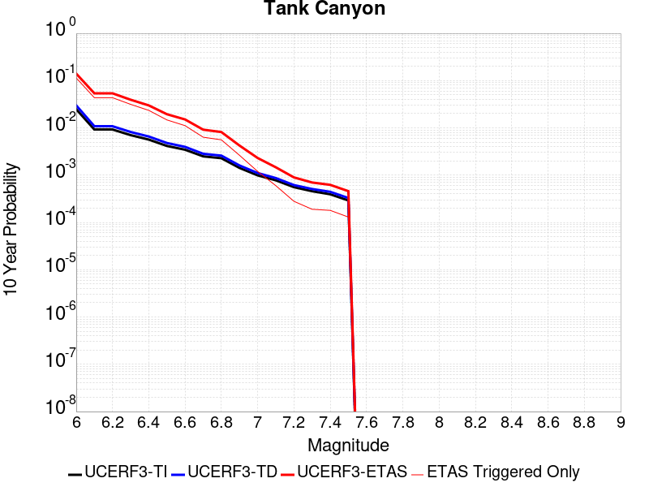 |

| Magnitude | 1 yr TI Prob | TD Prob | ETAS Prob | ETAS/TD Gain | ETAS Triggered Only | 10 yr TI Prob | TD Prob | ETAS Prob | ETAS/TD Gain | ETAS Triggered Only |
|-----|-----|-----|-----|-----|-----|-----|-----|-----|-----|-----|
| 6.0 | 0.0025163088 | 0.0030207601 | 0.08563046 | 28.347322 | 0.08286 | 0.02488006 | 0.029863637 | 0.14043978 | 4.702702 | 0.11398 |
| 6.1 | 9.281647E-4 | 0.0010885983 | 0.03196495 | 29.363403 | 0.03091 | 0.009242975 | 0.010836744 | 0.053875238 | 4.971534 | 0.04351 |
| 6.2 | 9.281647E-4 | 0.0010885983 | 0.03196495 | 29.363403 | 0.03091 | 0.009242975 | 0.010836744 | 0.053875238 | 4.971534 | 0.04351 |
| 6.3 | 7.049971E-4 | 8.2200574E-4 | 0.022953799 | 27.924133 | 0.02215 | 0.007027647 | 0.0081922645 | 0.039414372 | 4.811169 | 0.03148 |
| 6.4 | 5.67031E-4 | 6.581969E-4 | 0.017147336 | 26.051985 | 0.0165 | 0.005655863 | 0.0065644905 | 0.029880421 | 4.5518265 | 0.02347 |
| 6.5 | 4.1550855E-4 | 4.7973756E-4 | 0.010814777 | 22.543112 | 0.01034 | 0.0041473247 | 0.004788321 | 0.01945774 | 4.0635834 | 0.01474 |
| 6.6 | 3.4597394E-4 | 3.9713128E-4 | 0.00825401 | 20.784084 | 0.00786 | 0.0034543579 | 0.003965368 | 0.015071155 | 3.800695 | 0.01115 |
| 6.7 | 2.500958E-4 | 2.8333595E-4 | 0.0048220498 | 17.018843 | 0.00454 | 0.0024981452 | 0.0028304397 | 0.009162466 | 3.2371178 | 0.00635 |
| 6.8 | 2.286638E-4 | 2.5926033E-4 | 0.0042182337 | 16.270264 | 0.00396 | 0.0022842865 | 0.002590253 | 0.008165773 | 3.1525004 | 0.00559 |
| 6.9 | 1.4241673E-4 | 1.6036171E-4 | 0.0020100651 | 12.53457 | 0.00185 | 0.001423255 | 0.0016026258 | 0.004228411 | 2.6384268 | 0.00263 |
| 7.0 | 9.90685E-5 | 1.1097535E-4 | 9.3088433E-4 | 8.388208 | 8.2E-4 | 9.902435E-4 | 0.0011092679 | 0.0023079368 | 2.0805945 | 0.0012 |
| 7.1 | 7.789434E-5 | 8.682871E-5 | 4.5679658E-4 | 5.2608933 | 3.7E-4 | 7.786704E-4 | 8.6800574E-4 | 0.001467485 | 1.6906396 | 6.0E-4 |
| 7.2 | 5.5781646E-5 | 6.171851E-5 | 2.5170678E-4 | 4.0783033 | 1.9E-4 | 5.576765E-4 | 6.170659E-4 | 8.968931E-4 | 1.4534802 | 2.8E-4 |
| 7.3 | 4.579376E-5 | 5.097777E-5 | 1.8097114E-4 | 3.5500011 | 1.3E-4 | 4.5784327E-4 | 5.097118E-4 | 6.9961493E-4 | 1.3725697 | 1.9E-4 |
| 7.4 | 3.9431678E-5 | 4.4404827E-5 | 1.6439949E-4 | 3.7022889 | 1.2E-4 | 3.942468E-4 | 4.440104E-4 | 6.239305E-4 | 1.4052159 | 1.8E-4 |
| 7.5 | 2.915522E-5 | 3.290182E-5 | 1.2289885E-4 | 3.735321 | 9.0E-5 | 2.9151395E-4 | 3.290182E-4 | 4.589754E-4 | 1.394985 | 1.3E-4 |

## Garlock (Central)
*[(top)](#table-of-contents)*

| 1 Year | 10 Year |
|-----|-----|
|  |  |

| Magnitude | 1 yr TI Prob | TD Prob | ETAS Prob | ETAS/TD Gain | ETAS Triggered Only | 10 yr TI Prob | TD Prob | ETAS Prob | ETAS/TD Gain | ETAS Triggered Only |
|-----|-----|-----|-----|-----|-----|-----|-----|-----|-----|-----|
| 6.0 | 0.0028726095 | 0.0036588663 | 0.06421648 | 17.550922 | 0.06078 | 0.028357591 | 0.036079824 | 0.11012817 | 3.0523477 | 0.07682 |
| 6.1 | 0.0028726095 | 0.0036588663 | 0.06421648 | 17.550922 | 0.06078 | 0.028357591 | 0.036079824 | 0.11012817 | 3.0523477 | 0.07682 |
| 6.2 | 0.0021976046 | 0.0026920962 | 0.041098423 | 15.266328 | 0.03851 | 0.021759989 | 0.026689773 | 0.07440144 | 2.7876384 | 0.04902 |
| 6.3 | 0.0021976046 | 0.0026920962 | 0.041098423 | 15.266328 | 0.03851 | 0.021759989 | 0.026689773 | 0.07440144 | 2.7876384 | 0.04902 |
| 6.4 | 0.0019213937 | 0.002299056 | 0.032100383 | 13.9624195 | 0.02987 | 0.019048655 | 0.02284894 | 0.06043017 | 2.6447692 | 0.03846 |
| 6.5 | 0.0017683565 | 0.002085973 | 0.029149402 | 13.974008 | 0.02712 | 0.017543508 | 0.020759864 | 0.054729704 | 2.636323 | 0.03469 |
| 6.6 | 0.0017502342 | 0.0020575512 | 0.029071853 | 14.129347 | 0.02707 | 0.017365133 | 0.020481179 | 0.054343145 | 2.653321 | 0.03457 |
| 6.7 | 0.0016985617 | 0.0019855013 | 0.027973799 | 14.089036 | 0.02604 | 0.016856372 | 0.019773813 | 0.052385937 | 2.6492581 | 0.03327 |
| 6.8 | 0.0016780337 | 0.001955672 | 0.027505606 | 14.064529 | 0.0256 | 0.016654192 | 0.019480614 | 0.051543597 | 2.645892 | 0.0327 |
| 6.9 | 0.0016503202 | 0.001914247 | 0.026886353 | 14.045393 | 0.02502 | 0.01638118 | 0.019073246 | 0.050394237 | 2.6421425 | 0.03193 |
| 7.0 | 0.0016112428 | 0.0018572307 | 0.026002305 | 14.000579 | 0.02419 | 0.015996104 | 0.018512413 | 0.048850194 | 2.6387804 | 0.03091 |
| 7.1 | 0.0015677959 | 0.0017929734 | 0.024981322 | 13.932902 | 0.02323 | 0.01556781 | 0.017880075 | 0.046891898 | 2.6225784 | 0.02954 |
| 7.2 | 0.0014577188 | 0.0016309366 | 0.021258872 | 13.034763 | 0.01966 | 0.014481937 | 0.016283695 | 0.040758558 | 2.5030289 | 0.02488 |
| 7.3 | 0.0012785783 | 0.001393003 | 0.015643125 | 11.229785 | 0.01427 | 0.012712469 | 0.013928054 | 0.03170693 | 2.2764797 | 0.01803 |
| 7.4 | 0.0012111551 | 0.0013140367 | 0.014376849 | 10.94098 | 0.01308 | 0.012045753 | 0.013145725 | 0.029379478 | 2.2349074 | 0.01645 |
| 7.5 | 0.0010939965 | 0.0011725046 | 0.011220709 | 9.569863 | 0.01006 | 0.010886264 | 0.011740365 | 0.024311028 | 2.0707216 | 0.01272 |
| 7.6 | 7.882459E-4 | 8.3407195E-4 | 0.006259543 | 7.5048 | 0.00543 | 0.007854558 | 0.008383559 | 0.015126551 | 1.8043114 | 0.0068 |
| 7.7 | 5.182138E-4 | 5.570524E-4 | 0.0021261778 | 3.8168364 | 0.00157 | 0.00517007 | 0.005627684 | 0.007626372 | 1.355153 | 0.00201 |
| 7.8 | 3.5247262E-4 | 4.3968976E-4 | 0.0014892281 | 3.3869975 | 0.00105 | 0.0035191406 | 0.004446654 | 0.005780696 | 1.3000102 | 0.00134 |
| 7.9 | 2.0741238E-4 | 2.8021427E-4 | 8.5005455E-4 | 3.0335877 | 5.7E-4 | 0.002072189 | 0.0028336283 | 0.0035515882 | 1.2533712 | 7.2E-4 |
| 8.0 | 8.7288594E-5 | 1.0839601E-4 | 2.4838082E-4 | 2.2914205 | 1.4E-4 | 8.7254314E-4 | 0.0010969337 | 0.0013067034 | 1.1912327 | 2.1E-4 |
| 8.1 | 1.9166706E-5 | 1.6430899E-5 | 3.643057E-5 | 2.2171988 | 2.0E-5 | 1.9165053E-4 | 1.6638759E-4 | 1.9638259E-4 | 1.1802719 | 3.0E-5 |

## Little Lake
*[(top)](#table-of-contents)*

| 1 Year | 10 Year |
|-----|-----|
|  |  |

| Magnitude | 1 yr TI Prob | TD Prob | ETAS Prob | ETAS/TD Gain | ETAS Triggered Only | 10 yr TI Prob | TD Prob | ETAS Prob | ETAS/TD Gain | ETAS Triggered Only |
|-----|-----|-----|-----|-----|-----|-----|-----|-----|-----|-----|
| 6.0 | 0.0014820677 | 0.0016271127 | 0.05160566 | 31.716093 | 0.05006 | 0.014722223 | 0.016165402 | 0.076641716 | 4.7410955 | 0.06147 |
| 6.1 | 0.0014820677 | 0.0016271127 | 0.05160566 | 31.716093 | 0.05006 | 0.014722223 | 0.016165402 | 0.076641716 | 4.7410955 | 0.06147 |
| 6.2 | 0.0014820677 | 0.0016271127 | 0.05160566 | 31.716093 | 0.05006 | 0.014722223 | 0.016165402 | 0.076641716 | 4.7410955 | 0.06147 |
| 6.3 | 7.7643775E-4 | 8.3878887E-4 | 0.035459723 | 42.27491 | 0.03465 | 0.007737305 | 0.008359048 | 0.050355043 | 6.0240164 | 0.04235 |
| 6.4 | 7.7643775E-4 | 8.3878887E-4 | 0.035459723 | 42.27491 | 0.03465 | 0.007737305 | 0.008359048 | 0.050355043 | 6.0240164 | 0.04235 |
| 6.5 | 6.675408E-4 | 7.18042E-4 | 0.032095496 | 44.69863 | 0.0314 | 0.006655392 | 0.00715977 | 0.045205407 | 6.313807 | 0.03832 |
| 6.6 | 5.040193E-4 | 5.367433E-4 | 0.026362874 | 49.116352 | 0.02584 | 0.005028777 | 0.0053560743 | 0.036647573 | 6.8422446 | 0.03146 |
| 6.7 | 4.0523586E-4 | 4.2777284E-4 | 0.022658259 | 52.967968 | 0.02224 | 0.004044977 | 0.004270846 | 0.031334765 | 7.336899 | 0.02718 |
| 6.8 | 3.35115E-4 | 3.5141467E-4 | 0.01777529 | 50.582092 | 0.01743 | 0.003346101 | 0.00350985 | 0.024585616 | 7.0047483 | 0.02115 |
| 6.9 | 1.6322079E-4 | 1.6237781E-4 | 0.010490701 | 64.606735 | 0.01033 | 0.0016310095 | 0.00162274 | 0.014142391 | 8.715131 | 0.01254 |
| 7.0 | 1.19513395E-4 | 1.162839E-4 | 0.0064755445 | 55.687366 | 0.00636 | 0.0011944914 | 0.0011623327 | 0.008833406 | 7.5997224 | 0.00768 |
| 7.1 | 6.750081E-5 | 6.14487E-5 | 0.0029312724 | 47.702755 | 0.00287 | 6.7480316E-4 | 6.143856E-4 | 0.0041022412 | 6.676982 | 0.00349 |
| 7.2 | 2.4606294E-5 | 1.6132375E-5 | 1.7612979E-4 | 10.917785 | 1.6E-4 | 2.460357E-4 | 1.6131258E-4 | 3.5128192E-4 | 2.1776476 | 1.9E-4 |
| 7.3 | 2.0574296E-5 | 1.2051869E-5 | 1.12050664E-4 | 9.297369 | 1.0E-4 | 2.0572392E-4 | 1.20512224E-4 | 2.4049776E-4 | 1.9956297 | 1.2E-4 |
| 7.4 | 1.8508214E-5 | 1.0268241E-5 | 8.026752E-5 | 7.8170667 | 7.0E-5 | 1.8506673E-4 | 1.02677724E-4 | 1.9266849E-4 | 1.876439 | 9.0E-5 |
| 7.5 | 1.3751187E-5 | 7.5257603E-6 | 6.752531E-5 | 8.972556 | 6.0E-5 | 1.3750336E-4 | 7.5255106E-5 | 1.4524984E-4 | 1.9300994 | 7.0E-5 |
| 7.6 | 6.6262032E-6 | 3.9512443E-6 | 3.3951124E-5 | 8.592515 | 3.0E-5 | 6.626006E-5 | 3.9511775E-5 | 6.951059E-5 | 1.7592373 | 3.0E-5 |

## Airport Lake
*[(top)](#table-of-contents)*

| 1 Year | 10 Year |
|-----|-----|
|  |  |

| Magnitude | 1 yr TI Prob | TD Prob | ETAS Prob | ETAS/TD Gain | ETAS Triggered Only | 10 yr TI Prob | TD Prob | ETAS Prob | ETAS/TD Gain | ETAS Triggered Only |
|-----|-----|-----|-----|-----|-----|-----|-----|-----|-----|-----|
| 6.0 | 6.461343E-4 | 6.8350515E-4 | 0.04095596 | 59.920483 | 0.0403 | 0.0064425888 | 0.0068168393 | 0.055313975 | 8.114314 | 0.04883 |
| 6.1 | 6.461343E-4 | 6.8350515E-4 | 0.04095596 | 59.920483 | 0.0403 | 0.0064425888 | 0.0068168393 | 0.055313975 | 8.114314 | 0.04883 |
| 6.2 | 6.461343E-4 | 6.8350515E-4 | 0.04095596 | 59.920483 | 0.0403 | 0.0064425888 | 0.0068168393 | 0.055313975 | 8.114314 | 0.04883 |
| 6.3 | 6.461343E-4 | 6.8350515E-4 | 0.04095596 | 59.920483 | 0.0403 | 0.0064425888 | 0.0068168393 | 0.055313975 | 8.114314 | 0.04883 |
| 6.4 | 6.461343E-4 | 6.8350515E-4 | 0.04095596 | 59.920483 | 0.0403 | 0.0064425888 | 0.0068168393 | 0.055313975 | 8.114314 | 0.04883 |
| 6.5 | 3.6478083E-4 | 3.8526783E-4 | 0.030123806 | 78.189255 | 0.02975 | 0.003641826 | 0.0038465366 | 0.03981764 | 10.351556 | 0.03611 |
| 6.6 | 3.6478083E-4 | 3.8526783E-4 | 0.030123806 | 78.189255 | 0.02975 | 0.003641826 | 0.0038465366 | 0.03981764 | 10.351556 | 0.03611 |
| 6.7 | 2.8575645E-4 | 3.0186825E-4 | 0.02556424 | 84.686745 | 0.02527 | 0.0028538927 | 0.003014966 | 0.033562586 | 11.131996 | 0.03064 |
| 6.8 | 2.0843433E-4 | 2.2012512E-4 | 0.019105967 | 86.795944 | 0.01889 | 0.0020823893 | 0.0021993418 | 0.024919262 | 11.330328 | 0.02277 |
| 6.9 | 1.5427776E-4 | 1.6294434E-4 | 0.013510769 | 82.916466 | 0.01335 | 0.001541707 | 0.0016284712 | 0.01783204 | 10.950173 | 0.01623 |
| 7.0 | 7.597293E-5 | 8.039528E-5 | 0.0060599144 | 75.376495 | 0.00598 | 7.594696E-4 | 8.0376083E-4 | 0.007987982 | 9.938257 | 0.00719 |
| 7.1 | 3.649926E-5 | 3.865897E-5 | 0.0026585576 | 68.76949 | 0.00262 | 3.6493264E-4 | 3.865897E-4 | 0.0035853526 | 9.27431 | 0.0032 |

## Owl Lake
*[(top)](#table-of-contents)*

| 1 Year | 10 Year |
|-----|-----|
| 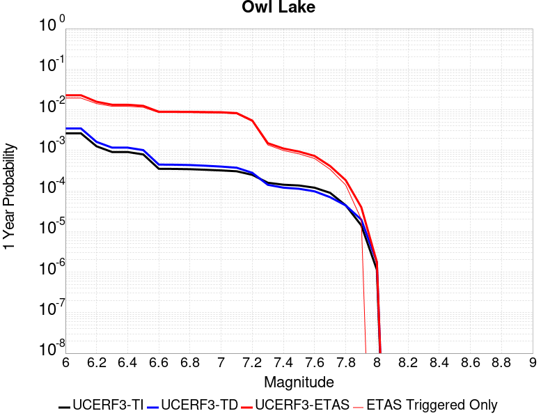 |  |

| Magnitude | 1 yr TI Prob | TD Prob | ETAS Prob | ETAS/TD Gain | ETAS Triggered Only | 10 yr TI Prob | TD Prob | ETAS Prob | ETAS/TD Gain | ETAS Triggered Only |
|-----|-----|-----|-----|-----|-----|-----|-----|-----|-----|-----|
| 6.0 | 0.0026222812 | 0.0034577388 | 0.02279066 | 6.591203 | 0.0194 | 0.02591553 | 0.034140717 | 0.0595235 | 1.7434753 | 0.02628 |
| 6.1 | 0.0026222812 | 0.0034577388 | 0.02279066 | 6.591203 | 0.0194 | 0.02591553 | 0.034140717 | 0.0595235 | 1.7434753 | 0.02628 |
| 6.2 | 0.0012580766 | 0.001615439 | 0.015782516 | 9.7698 | 0.01419 | 0.012509781 | 0.016070465 | 0.03487336 | 2.170028 | 0.01911 |
| 6.3 | 9.0924866E-4 | 0.0011659743 | 0.013311796 | 11.416886 | 0.01216 | 0.009055373 | 0.011628896 | 0.02767016 | 2.3794312 | 0.01623 |
| 6.4 | 9.0924866E-4 | 0.0011659743 | 0.013311796 | 11.416886 | 0.01216 | 0.009055373 | 0.011628896 | 0.02767016 | 2.3794312 | 0.01623 |
| 6.5 | 7.919061E-4 | 0.0010134429 | 0.012491798 | 12.3261 | 0.01149 | 0.0078909 | 0.010118429 | 0.025283415 | 2.498749 | 0.01532 |
| 6.6 | 3.5095305E-4 | 4.458976E-4 | 0.008952103 | 20.07659 | 0.00851 | 0.0035039932 | 0.004467813 | 0.015458488 | 3.4599679 | 0.01104 |
| 6.7 | 3.4864116E-4 | 4.4237426E-4 | 0.008938614 | 20.206 | 0.0085 | 0.003480947 | 0.0044327388 | 0.015383978 | 3.4705358 | 0.011 |
| 6.8 | 3.4314668E-4 | 4.343669E-4 | 0.008900688 | 20.491175 | 0.00847 | 0.0034261728 | 0.004352885 | 0.015255221 | 3.5046232 | 0.01095 |
| 6.9 | 3.3198006E-4 | 4.1732067E-4 | 0.008793823 | 21.072102 | 0.00838 | 0.0033148455 | 0.0041828766 | 0.014987492 | 3.5830586 | 0.01085 |
| 7.0 | 3.2002592E-4 | 3.9813702E-4 | 0.008704828 | 21.863901 | 0.00831 | 0.0031956544 | 0.003991571 | 0.014718581 | 3.687416 | 0.01077 |
| 7.1 | 3.0482994E-4 | 3.7260808E-4 | 0.008279661 | 22.22083 | 0.00791 | 0.0030441214 | 0.0037370329 | 0.013928803 | 3.7272358 | 0.01023 |
| 7.2 | 2.4895166E-4 | 2.79564E-4 | 0.005428124 | 19.416391 | 0.00515 | 0.0024867293 | 0.002808645 | 0.00940008 | 3.346838 | 0.00661 |
| 7.3 | 1.5910587E-4 | 1.4141845E-4 | 0.0015012261 | 10.61549 | 0.00136 | 0.0015899199 | 0.0014232415 | 0.0032206795 | 2.2629187 | 0.0018 |
| 7.4 | 1.4224913E-4 | 1.20299905E-4 | 0.0011101809 | 9.228443 | 9.9E-4 | 0.0014215811 | 0.0012112238 | 0.002519637 | 2.0802407 | 0.00131 |
| 7.5 | 1.3612706E-4 | 1.1299244E-4 | 9.3289977E-4 | 8.256302 | 8.2E-4 | 0.001360437 | 0.0011379806 | 0.0022267401 | 1.956747 | 0.00109 |
| 7.6 | 1.20049335E-4 | 9.7715085E-5 | 7.276535E-4 | 7.446686 | 6.3E-4 | 0.001199845 | 9.849932E-4 | 0.0018241658 | 1.8519578 | 8.4E-4 |
| 7.7 | 8.966153E-5 | 7.0016955E-5 | 4.0999314E-4 | 5.8556266 | 3.4E-4 | 8.962536E-4 | 7.078345E-4 | 0.0011974877 | 1.6917622 | 4.9E-4 |
| 7.8 | 4.4148852E-5 | 4.3859643E-5 | 1.8385351E-4 | 4.19186 | 1.4E-4 | 4.414008E-4 | 4.4398365E-4 | 6.5389037E-4 | 1.4727805 | 2.1E-4 |
| 7.9 | 1.4175452E-5 | 1.966126E-5 | 3.9660867E-5 | 2.0172088 | 2.0E-5 | 1.4174548E-4 | 1.9836679E-4 | 2.2836083E-4 | 1.151205 | 3.0E-5 |
| 8.0 | 1.1476893E-6 | 1.7661803E-6 | 1.7661803E-6 | 1.0 | 0.0 | 1.14768345E-5 | 1.7963059E-5 | 1.7963059E-5 | 1.0 | 0.0 |

## Panamint Valley
*[(top)](#table-of-contents)*

| 1 Year | 10 Year |
|-----|-----|
|  | 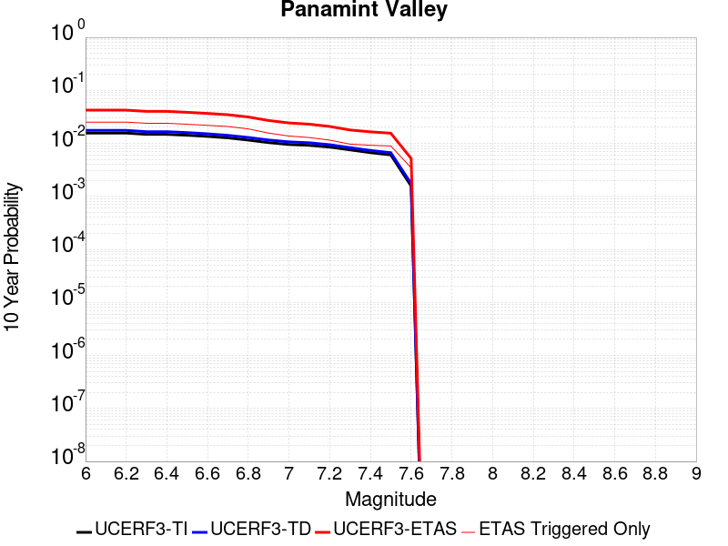 |

| Magnitude | 1 yr TI Prob | TD Prob | ETAS Prob | ETAS/TD Gain | ETAS Triggered Only | 10 yr TI Prob | TD Prob | ETAS Prob | ETAS/TD Gain | ETAS Triggered Only |
|-----|-----|-----|-----|-----|-----|-----|-----|-----|-----|-----|
| 6.0 | 0.0015751923 | 0.0017717537 | 0.020388711 | 11.507644 | 0.01865 | 0.015640736 | 0.017583137 | 0.042330217 | 2.4074326 | 0.02519 |
| 6.1 | 0.0015751923 | 0.0017717537 | 0.020388711 | 11.507644 | 0.01865 | 0.015640736 | 0.017583137 | 0.042330217 | 2.4074326 | 0.02519 |
| 6.2 | 0.0015751923 | 0.0017717537 | 0.020388711 | 11.507644 | 0.01865 | 0.015640736 | 0.017583137 | 0.042330217 | 2.4074326 | 0.02519 |
| 6.3 | 0.001489857 | 0.0016737265 | 0.019443935 | 11.617151 | 0.0178 | 0.01479908 | 0.016617801 | 0.04017964 | 2.4178674 | 0.02396 |
| 6.4 | 0.001489857 | 0.0016737265 | 0.019443935 | 11.617151 | 0.0178 | 0.01479908 | 0.016617801 | 0.04017964 | 2.4178674 | 0.02396 |
| 6.5 | 0.0014322745 | 0.0016073446 | 0.018699827 | 11.633987 | 0.01712 | 0.014230782 | 0.015963677 | 0.03854731 | 2.4146888 | 0.02295 |
| 6.6 | 0.0013628257 | 0.0015252391 | 0.017900225 | 11.736013 | 0.0164 | 0.013544982 | 0.015154043 | 0.036732018 | 2.4239087 | 0.02191 |
| 6.7 | 0.0012775084 | 0.0014256609 | 0.016953493 | 11.891671 | 0.01555 | 0.012701893 | 0.014171274 | 0.03468637 | 2.4476535 | 0.02081 |
| 6.8 | 0.0011600169 | 0.0013002884 | 0.015391941 | 11.83733 | 0.01411 | 0.011539802 | 0.0129325185 | 0.031459775 | 2.43261 | 0.01877 |
| 6.9 | 0.0010379635 | 0.0011624309 | 0.013038609 | 11.216675 | 0.01189 | 0.010331288 | 0.011568608 | 0.027007906 | 2.3345857 | 0.01562 |
| 7.0 | 9.5722964E-4 | 0.0010725686 | 0.011591274 | 10.807024 | 0.01053 | 0.009531168 | 0.010678849 | 0.024291908 | 2.2747684 | 0.01376 |
| 7.1 | 9.2145515E-4 | 0.0010312037 | 0.010861057 | 10.532407 | 0.00984 | 0.009176437 | 0.010269073 | 0.023016807 | 2.2413716 | 0.01288 |
| 7.2 | 8.544101E-4 | 9.4704994E-4 | 0.009798659 | 10.346507 | 0.00886 | 0.008511325 | 0.009434792 | 0.020846102 | 2.2094927 | 0.01152 |
| 7.3 | 7.57377E-4 | 8.327849E-4 | 0.008296564 | 9.962433 | 0.00747 | 0.0075480095 | 0.00829975 | 0.017889492 | 2.1554253 | 0.00967 |
| 7.4 | 6.7039346E-4 | 7.378371E-4 | 0.007882562 | 10.683335 | 0.00715 | 0.0066837464 | 0.0073567946 | 0.016508965 | 2.2440434 | 0.00922 |
| 7.5 | 6.070656E-4 | 6.6960254E-4 | 0.007614949 | 11.372341 | 0.00695 | 0.006054099 | 0.0066787465 | 0.015549106 | 2.3281472 | 0.00893 |
| 7.6 | 1.5687906E-4 | 1.7390578E-4 | 0.0029634205 | 17.04038 | 0.00279 | 0.0015676835 | 0.0017391363 | 0.005193119 | 2.9860332 | 0.00346 |

## Garlock (East)
*[(top)](#table-of-contents)*

| 1 Year | 10 Year |
|-----|-----|
| 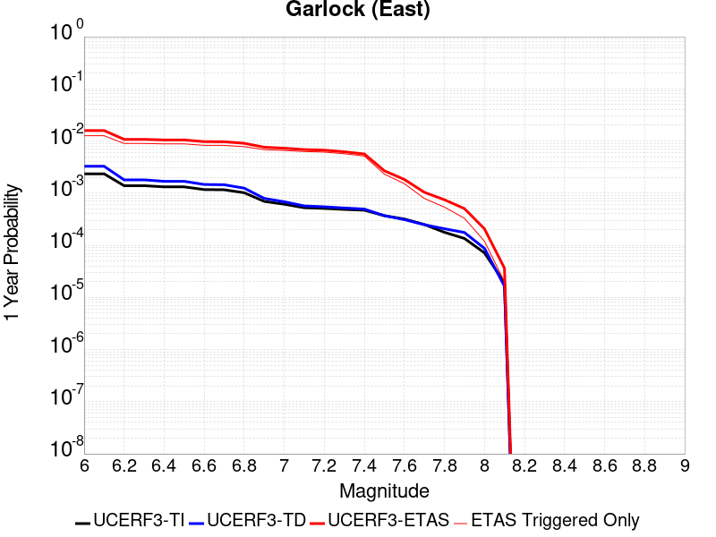 |  |

| Magnitude | 1 yr TI Prob | TD Prob | ETAS Prob | ETAS/TD Gain | ETAS Triggered Only | 10 yr TI Prob | TD Prob | ETAS Prob | ETAS/TD Gain | ETAS Triggered Only |
|-----|-----|-----|-----|-----|-----|-----|-----|-----|-----|-----|
| 6.0 | 0.0023501497 | 0.0032774 | 0.015866006 | 4.8410344 | 0.01263 | 0.023254504 | 0.032351844 | 0.049150217 | 1.51924 | 0.01736 |
| 6.1 | 0.0023501497 | 0.0032774 | 0.015866006 | 4.8410344 | 0.01263 | 0.023254504 | 0.032351844 | 0.049150217 | 1.51924 | 0.01736 |
| 6.2 | 0.0013908884 | 0.0017991117 | 0.010762956 | 5.982372 | 0.00898 | 0.01382215 | 0.017890299 | 0.029469373 | 1.6472263 | 0.01179 |
| 6.3 | 0.0013908884 | 0.0017991117 | 0.010762956 | 5.982372 | 0.00898 | 0.01382215 | 0.017890299 | 0.029469373 | 1.6472263 | 0.01179 |
| 6.4 | 0.0013199237 | 0.0016860351 | 0.010481181 | 6.216467 | 0.00881 | 0.013121112 | 0.016778335 | 0.028173875 | 1.6791817 | 0.01159 |
| 6.5 | 0.0013199237 | 0.0016860351 | 0.010481181 | 6.216467 | 0.00881 | 0.013121112 | 0.016778335 | 0.028173875 | 1.6791817 | 0.01159 |
| 6.6 | 0.0011715472 | 0.0014669491 | 0.009724817 | 6.6292806 | 0.00827 | 0.011653901 | 0.01461866 | 0.025329756 | 1.7327002 | 0.01087 |
| 6.7 | 0.0011598538 | 0.0014497414 | 0.009687781 | 6.6824203 | 0.00825 | 0.011538187 | 0.014448853 | 0.025142083 | 1.7400746 | 0.01085 |
| 6.8 | 0.0010184698 | 0.0012462323 | 0.009036511 | 7.2510653 | 0.0078 | 0.010138147 | 0.012436427 | 0.022450322 | 1.8052067 | 0.01014 |
| 6.9 | 6.9470983E-4 | 7.927538E-4 | 0.0076073473 | 9.596103 | 0.00682 | 0.0069254204 | 0.007939888 | 0.016471604 | 2.0745387 | 0.0086 |
| 7.0 | 6.134799E-4 | 6.8372174E-4 | 0.0072692162 | 10.631834 | 0.00659 | 0.0061178906 | 0.00685652 | 0.015079748 | 2.1993296 | 0.00828 |
| 7.1 | 5.2502943E-4 | 5.687444E-4 | 0.006855167 | 12.05316 | 0.00629 | 0.005237907 | 0.0057129986 | 0.013518152 | 2.3662095 | 0.00785 |
| 7.2 | 5.095951E-4 | 5.4766936E-4 | 0.006674312 | 12.186755 | 0.00613 | 0.0050842804 | 0.0055032647 | 0.01306144 | 2.3733985 | 0.0076 |
| 7.3 | 4.8746695E-4 | 5.1875977E-4 | 0.006215803 | 11.982044 | 0.0057 | 0.0048639905 | 0.0052149445 | 0.012238127 | 2.3467414 | 0.00706 |
| 7.4 | 4.7072413E-4 | 4.950925E-4 | 0.0056425426 | 11.396947 | 0.00515 | 0.004697283 | 0.0049783974 | 0.011286834 | 2.267162 | 0.00634 |
| 7.5 | 3.6942272E-4 | 3.6975832E-4 | 0.0026889006 | 7.2720485 | 0.00232 | 0.003688092 | 0.0037243143 | 0.0065935883 | 1.7704167 | 0.00288 |
| 7.6 | 3.1909486E-4 | 3.1089774E-4 | 0.0018304252 | 5.8875475 | 0.00152 | 0.0031863707 | 0.0031357552 | 0.00500986 | 1.5976566 | 0.00188 |
| 7.7 | 2.5027743E-4 | 2.4819805E-4 | 0.001038002 | 4.182152 | 7.9E-4 | 0.0024999576 | 0.0025093474 | 0.0034968632 | 1.3935349 | 9.9E-4 |
| 7.8 | 1.775424E-4 | 2.0756939E-4 | 7.474573E-4 | 3.6009996 | 5.4E-4 | 0.0017740062 | 0.0021012232 | 0.0027698153 | 1.3181919 | 6.7E-4 |
| 7.9 | 1.3528178E-4 | 1.7595445E-4 | 5.058964E-4 | 2.8751554 | 3.3E-4 | 0.0013519945 | 0.0017812408 | 0.0022104748 | 1.2409748 | 4.3E-4 |
| 8.0 | 7.1709874E-5 | 8.731581E-5 | 2.0730533E-4 | 2.3742015 | 1.2E-4 | 7.1686733E-4 | 8.837234E-4 | 0.0010635643 | 1.2035036 | 1.8E-4 |
| 8.1 | 1.9166706E-5 | 1.6430899E-5 | 3.643057E-5 | 2.2171988 | 2.0E-5 | 1.9165053E-4 | 1.6638759E-4 | 1.9638259E-4 | 1.1802719 | 3.0E-5 |

## Ash Hill
*[(top)](#table-of-contents)*

| 1 Year | 10 Year |
|-----|-----|
|  |  |

| Magnitude | 1 yr TI Prob | TD Prob | ETAS Prob | ETAS/TD Gain | ETAS Triggered Only | 10 yr TI Prob | TD Prob | ETAS Prob | ETAS/TD Gain | ETAS Triggered Only |
|-----|-----|-----|-----|-----|-----|-----|-----|-----|-----|-----|
| 6.0 | 0.0011236023 | 0.0012096206 | 0.009159992 | 7.572616 | 0.00796 | 0.011179381 | 0.012038348 | 0.023567861 | 1.9577321 | 0.01167 |
| 6.1 | 0.0011236023 | 0.0012096206 | 0.009159992 | 7.572616 | 0.00796 | 0.011179381 | 0.012038348 | 0.023567861 | 1.9577321 | 0.01167 |
| 6.2 | 0.0011236023 | 0.0012096206 | 0.009159992 | 7.572616 | 0.00796 | 0.011179381 | 0.012038348 | 0.023567861 | 1.9577321 | 0.01167 |
| 6.3 | 5.229836E-4 | 5.6061964E-4 | 0.0038987473 | 6.9543533 | 0.00334 | 0.005217545 | 0.0055933665 | 0.010426182 | 1.8640264 | 0.00486 |
| 6.4 | 5.229836E-4 | 5.6061964E-4 | 0.0038987473 | 6.9543533 | 0.00334 | 0.005217545 | 0.0055933665 | 0.010426182 | 1.8640264 | 0.00486 |
| 6.5 | 3.6318856E-4 | 3.8901155E-4 | 0.00280807 | 7.218475 | 0.00242 | 0.0036259557 | 0.0038841602 | 0.0073606046 | 1.8950311 | 0.00349 |
| 6.6 | 2.60441E-4 | 2.7895154E-4 | 0.0019884745 | 7.1283865 | 0.00171 | 0.0026013597 | 0.0027866727 | 0.0053295665 | 1.9125198 | 0.00255 |
| 6.7 | 1.9111596E-4 | 2.0476682E-4 | 0.0014745068 | 7.2009068 | 0.00127 | 0.0019095168 | 0.0020463446 | 0.003972395 | 1.9412152 | 0.00193 |
| 6.8 | 1.3356637E-4 | 1.4322149E-4 | 0.001033094 | 7.213261 | 8.9E-4 | 0.0013348613 | 0.0014317769 | 0.0028098011 | 1.9624573 | 0.00138 |
| 6.9 | 9.2273134E-5 | 9.8976E-5 | 6.5892056E-4 | 6.6573772 | 5.6E-4 | 9.223483E-4 | 9.8976E-4 | 0.0018389188 | 1.857944 | 8.5E-4 |

## Blackwater
*[(top)](#table-of-contents)*

| 1 Year | 10 Year |
|-----|-----|
|  |  |

| Magnitude | 1 yr TI Prob | TD Prob | ETAS Prob | ETAS/TD Gain | ETAS Triggered Only | 10 yr TI Prob | TD Prob | ETAS Prob | ETAS/TD Gain | ETAS Triggered Only |
|-----|-----|-----|-----|-----|-----|-----|-----|-----|-----|-----|
| 6.0 | 0.0016010714 | 0.0017255784 | 0.008813327 | 5.1074624 | 0.0071 | 0.015895851 | 0.017135633 | 0.026944619 | 1.572432 | 0.00998 |
| 6.1 | 0.0016010714 | 0.0017255784 | 0.008813327 | 5.1074624 | 0.0071 | 0.015895851 | 0.017135633 | 0.026944619 | 1.572432 | 0.00998 |
| 6.2 | 6.107122E-4 | 6.5438676E-4 | 0.0033026526 | 5.046943 | 0.00265 | 0.006090366 | 0.0065255696 | 0.010072273 | 1.5435086 | 0.00357 |
| 6.3 | 6.107122E-4 | 6.5438676E-4 | 0.0033026526 | 5.046943 | 0.00265 | 0.006090366 | 0.0065255696 | 0.010072273 | 1.5435086 | 0.00357 |
| 6.4 | 4.136527E-4 | 4.423877E-4 | 0.0021516313 | 4.8636775 | 0.00171 | 0.0041288356 | 0.0044154758 | 0.0067053204 | 1.5185951 | 0.0023 |
| 6.5 | 3.0693135E-4 | 3.27944E-4 | 0.0016075242 | 4.9018254 | 0.00128 | 0.0030650778 | 0.0032748538 | 0.0049493522 | 1.51132 | 0.00168 |
| 6.6 | 3.0693135E-4 | 3.27944E-4 | 0.0016075242 | 4.9018254 | 0.00128 | 0.0030650778 | 0.0032748538 | 0.0049493522 | 1.51132 | 0.00168 |
| 6.7 | 1.6025416E-4 | 1.7120909E-4 | 7.511098E-4 | 4.3870907 | 5.8E-4 | 0.0016013865 | 0.0017108864 | 0.0025095176 | 1.4667939 | 8.0E-4 |
| 6.8 | 1.1855473E-4 | 1.26722E-4 | 5.3667004E-4 | 4.2350187 | 4.1E-4 | 0.001184915 | 0.0012665876 | 0.0018558403 | 1.4652286 | 5.9E-4 |
| 6.9 | 5.1928873E-5 | 5.5587418E-5 | 2.6557574E-4 | 4.777623 | 2.1E-4 | 5.191674E-4 | 5.557858E-4 | 8.356301E-4 | 1.5035113 | 2.8E-4 |
| 7.0 | 2.4724779E-5 | 2.6483543E-5 | 1.264809E-4 | 4.77583 | 1.0E-4 | 2.4722028E-4 | 2.6483543E-4 | 4.2479308E-4 | 1.6039888 | 1.6E-4 |

## Hunter Mountain-Saline Valley
*[(top)](#table-of-contents)*

| 1 Year | 10 Year |
|-----|-----|
|  |  |

| Magnitude | 1 yr TI Prob | TD Prob | ETAS Prob | ETAS/TD Gain | ETAS Triggered Only | 10 yr TI Prob | TD Prob | ETAS Prob | ETAS/TD Gain | ETAS Triggered Only |
|-----|-----|-----|-----|-----|-----|-----|-----|-----|-----|-----|
| 6.0 | 0.002350731 | 0.0028435152 | 0.0104617905 | 3.6791751 | 0.00764 | 0.023260195 | 0.028091887 | 0.037723497 | 1.3428609 | 0.00991 |
| 6.1 | 0.002350731 | 0.0028435152 | 0.0104617905 | 3.6791751 | 0.00764 | 0.023260195 | 0.028091887 | 0.037723497 | 1.3428609 | 0.00991 |
| 6.2 | 0.002051862 | 0.0024528175 | 0.009984299 | 4.070543 | 0.00755 | 0.020330196 | 0.024273481 | 0.033845358 | 1.3943348 | 0.00981 |
| 6.3 | 0.002051862 | 0.0024528175 | 0.009984299 | 4.070543 | 0.00755 | 0.020330196 | 0.024273481 | 0.033845358 | 1.3943348 | 0.00981 |
| 6.4 | 0.0016845843 | 0.0019783843 | 0.009453567 | 4.7784276 | 0.00749 | 0.016718714 | 0.019616475 | 0.029135998 | 1.4852821 | 0.00971 |
| 6.5 | 0.0016845843 | 0.0019783843 | 0.009453567 | 4.7784276 | 0.00749 | 0.016718714 | 0.019616475 | 0.029135998 | 1.4852821 | 0.00971 |
| 6.6 | 0.0015279909 | 0.001782067 | 0.009198827 | 5.1618857 | 0.00743 | 0.015175272 | 0.01768569 | 0.027145378 | 1.534878 | 0.00963 |
| 6.7 | 0.0014509142 | 0.0016863465 | 0.009093834 | 5.392625 | 0.00742 | 0.014414776 | 0.016743187 | 0.026192285 | 1.5643548 | 0.00961 |
| 6.8 | 0.00121972 | 0.001400954 | 0.008770615 | 6.260459 | 0.00738 | 0.01213047 | 0.013927434 | 0.023324706 | 1.674731 | 0.00953 |
| 6.9 | 0.0010791123 | 0.0012291478 | 0.008560126 | 6.9642773 | 0.00734 | 0.010738871 | 0.012228523 | 0.021602474 | 1.7665645 | 0.00949 |
| 7.0 | 9.1075303E-4 | 0.0010239601 | 0.008296506 | 8.102372 | 0.00728 | 0.009070295 | 0.0101960525 | 0.019510107 | 1.9134961 | 0.00941 |
| 7.1 | 7.723524E-4 | 8.575638E-4 | 0.008041398 | 9.377026 | 0.00719 | 0.007696735 | 0.008545532 | 0.017756144 | 2.077828 | 0.00929 |
| 7.2 | 7.396263E-4 | 8.188051E-4 | 0.007992926 | 9.761695 | 0.00718 | 0.0073716943 | 0.008160833 | 0.017355183 | 2.1266434 | 0.00927 |
| 7.3 | 7.161811E-4 | 7.9136714E-4 | 0.007965685 | 10.065726 | 0.00718 | 0.007138774 | 0.007888422 | 0.017085297 | 2.16587 | 0.00927 |
| 7.4 | 6.681934E-4 | 7.359531E-4 | 0.007870698 | 10.694566 | 0.00714 | 0.006661878 | 0.007338053 | 0.01648047 | 2.2458913 | 0.00921 |
| 7.5 | 6.0486543E-4 | 6.6771836E-4 | 0.007603084 | 11.386663 | 0.00694 | 0.006032217 | 0.0066599925 | 0.015520585 | 2.330421 | 0.00892 |
| 7.6 | 1.564034E-4 | 1.73495E-4 | 0.002963011 | 17.078363 | 0.00279 | 0.0015629337 | 0.001735031 | 0.0051890276 | 2.9907405 | 0.00346 |

## Gravel Hills-Harper Lk
*[(top)](#table-of-contents)*

| 1 Year | 10 Year |
|-----|-----|
| 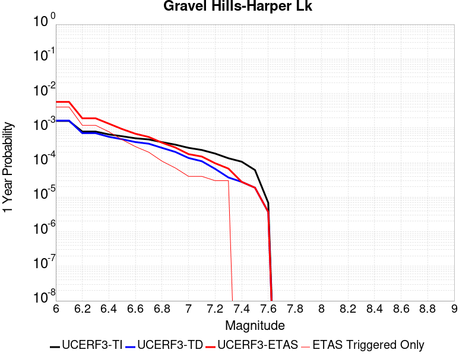 |  |

| Magnitude | 1 yr TI Prob | TD Prob | ETAS Prob | ETAS/TD Gain | ETAS Triggered Only | 10 yr TI Prob | TD Prob | ETAS Prob | ETAS/TD Gain | ETAS Triggered Only |
|-----|-----|-----|-----|-----|-----|-----|-----|-----|-----|-----|
| 6.0 | 0.0015995599 | 0.0016406906 | 0.0056940294 | 3.4705076 | 0.00406 | 0.015880952 | 0.01630734 | 0.021953734 | 1.3462487 | 0.00574 |
| 6.1 | 0.0015995599 | 0.0016406906 | 0.0056940294 | 3.4705076 | 0.00406 | 0.015880952 | 0.01630734 | 0.021953734 | 1.3462487 | 0.00574 |
| 6.2 | 7.8995706E-4 | 7.1123015E-4 | 0.0019103767 | 2.6860175 | 0.0012 | 0.007871548 | 0.0070907404 | 0.008738969 | 1.2324481 | 0.00166 |
| 6.3 | 7.8995706E-4 | 7.1123015E-4 | 0.0019103767 | 2.6860175 | 0.0012 | 0.007871548 | 0.0070907404 | 0.008738969 | 1.2324481 | 0.00166 |
| 6.4 | 6.537194E-4 | 5.576265E-4 | 0.0013371916 | 2.3980057 | 7.8E-4 | 0.0065179965 | 0.005562863 | 0.0065970775 | 1.185914 | 0.00104 |
| 6.5 | 5.787078E-4 | 4.7386673E-4 | 9.336488E-4 | 1.9702771 | 4.6E-4 | 0.0057720304 | 0.0047289706 | 0.005385849 | 1.1389053 | 6.6E-4 |
| 6.6 | 5.053978E-4 | 3.9292008E-4 | 6.8280613E-4 | 1.7377735 | 2.9E-4 | 0.0050424994 | 0.0039225104 | 0.0043707453 | 1.1142725 | 4.5E-4 |
| 6.7 | 4.6818596E-4 | 3.5211627E-4 | 5.520458E-4 | 1.5677942 | 2.0E-4 | 0.004672008 | 0.0035158044 | 0.003804785 | 1.0821947 | 2.9E-4 |
| 6.8 | 3.9011694E-4 | 2.669222E-4 | 3.7689283E-4 | 1.411995 | 1.1E-4 | 0.0038943281 | 0.0026661542 | 0.0028157542 | 1.0561109 | 1.5E-4 |
| 6.9 | 3.3080703E-4 | 2.0386827E-4 | 2.73854E-4 | 1.343289 | 7.0E-5 | 0.0033031502 | 0.0020369107 | 0.0021167477 | 1.0391952 | 8.0E-5 |
| 7.0 | 2.6732447E-4 | 1.3596108E-4 | 1.7595563E-4 | 1.2941618 | 4.0E-5 | 0.0026700313 | 0.0013588042 | 0.0014087362 | 1.0367471 | 5.0E-5 |
| 7.1 | 2.315891E-4 | 1.0948967E-4 | 1.4948529E-4 | 1.3652912 | 4.0E-5 | 0.002313479 | 0.0010943791 | 0.0011443244 | 1.045638 | 5.0E-5 |
| 7.2 | 1.8280011E-4 | 6.582497E-5 | 9.5822994E-5 | 1.4557241 | 3.0E-5 | 0.0018264982 | 6.580629E-4 | 6.880432E-4 | 1.0455583 | 3.0E-5 |
| 7.3 | 1.3365384E-4 | 3.71461E-5 | 6.714498E-5 | 1.8075918 | 3.0E-5 | 0.0013357349 | 3.7140088E-4 | 4.0138973E-4 | 1.0807452 | 3.0E-5 |
| 7.4 | 1.06276275E-4 | 2.7679513E-5 | 2.7679513E-5 | 1.0 | 0.0 | 0.0010622547 | 2.767612E-4 | 2.767612E-4 | 1.0 | 0.0 |
| 7.5 | 6.0951766E-5 | 1.8800076E-5 | 1.8800076E-5 | 1.0 | 0.0 | 6.093505E-4 | 1.8798532E-4 | 1.8798532E-4 | 1.0 | 0.0 |
| 7.6 | 6.863748E-6 | 3.7149728E-6 | 3.7149728E-6 | 1.0 | 0.0 | 6.863536E-5 | 3.7149264E-5 | 3.7149264E-5 | 1.0 | 0.0 |

## McLean Lake
*[(top)](#table-of-contents)*

| 1 Year | 10 Year |
|-----|-----|
| 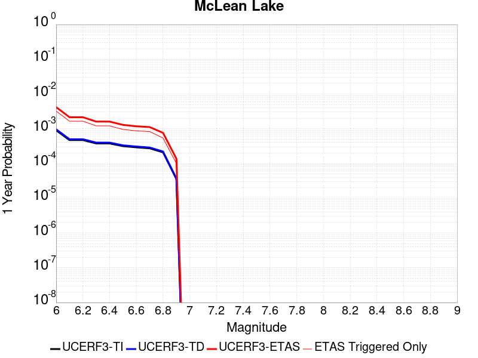 |  |

| Magnitude | 1 yr TI Prob | TD Prob | ETAS Prob | ETAS/TD Gain | ETAS Triggered Only | 10 yr TI Prob | TD Prob | ETAS Prob | ETAS/TD Gain | ETAS Triggered Only |
|-----|-----|-----|-----|-----|-----|-----|-----|-----|-----|-----|
| 6.0 | 9.0542925E-4 | 9.6498354E-4 | 0.0041918666 | 4.3439775 | 0.00323 | 0.009017491 | 0.0096127745 | 0.014950962 | 1.5553222 | 0.00539 |
| 6.1 | 4.727685E-4 | 5.003936E-4 | 0.002149568 | 4.295754 | 0.00165 | 0.0047176396 | 0.004993552 | 0.0077099195 | 1.5439751 | 0.00273 |
| 6.2 | 4.727685E-4 | 5.003936E-4 | 0.002149568 | 4.295754 | 0.00165 | 0.0047176396 | 0.004993552 | 0.0077099195 | 1.5439751 | 0.00273 |
| 6.3 | 3.786182E-4 | 4.0001926E-4 | 0.0016095352 | 4.0236444 | 0.00121 | 0.0037797375 | 0.0039936965 | 0.00608531 | 1.5237286 | 0.0021 |
| 6.4 | 3.786182E-4 | 4.0001926E-4 | 0.0016095352 | 4.0236444 | 0.00121 | 0.0037797375 | 0.0039936965 | 0.00608531 | 1.5237286 | 0.0021 |
| 6.5 | 3.164567E-4 | 3.3409733E-4 | 0.0012937766 | 3.8724542 | 9.6E-4 | 0.0031600643 | 0.0033365893 | 0.00505085 | 1.5137765 | 0.00172 |
| 6.6 | 2.9209262E-4 | 3.0834923E-4 | 0.001178081 | 3.820606 | 8.7E-4 | 0.0029170897 | 0.003079843 | 0.0046051308 | 1.4952486 | 0.00153 |
| 6.7 | 2.73744E-4 | 2.8899137E-4 | 0.0011187515 | 3.871228 | 8.3E-4 | 0.0027340704 | 0.0028867796 | 0.0043325936 | 1.5008398 | 0.00145 |
| 6.8 | 2.099053E-4 | 2.2157968E-4 | 7.6146005E-4 | 3.4365065 | 5.4E-4 | 0.0020970714 | 0.002214172 | 0.0032418913 | 1.4641552 | 0.00103 |
| 6.9 | 3.56685E-5 | 3.7254784E-5 | 1.3725106E-4 | 3.684119 | 1.0E-4 | 3.5662777E-4 | 3.7251666E-4 | 5.424533E-4 | 1.4561855 | 1.7E-4 |

## Garlock (West)
*[(top)](#table-of-contents)*

| 1 Year | 10 Year |
|-----|-----|
| 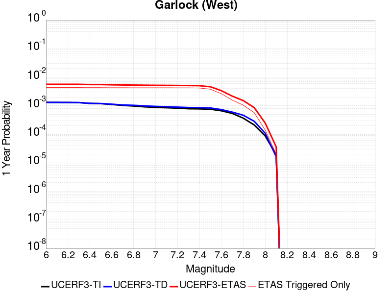 |  |

| Magnitude | 1 yr TI Prob | TD Prob | ETAS Prob | ETAS/TD Gain | ETAS Triggered Only | 10 yr TI Prob | TD Prob | ETAS Prob | ETAS/TD Gain | ETAS Triggered Only |
|-----|-----|-----|-----|-----|-----|-----|-----|-----|-----|-----|
| 6.0 | 0.0013131002 | 0.0013139155 | 0.0056582 | 4.306365 | 0.00435 | 0.013053683 | 0.013141977 | 0.018619038 | 1.4167609 | 0.00555 |
| 6.1 | 0.001307681 | 0.0013087603 | 0.005653067 | 4.3194065 | 0.00435 | 0.013000126 | 0.013091032 | 0.018568378 | 1.4184043 | 0.00555 |
| 6.2 | 0.0013008224 | 0.0013025942 | 0.0056469277 | 4.3351398 | 0.00435 | 0.012932341 | 0.013030097 | 0.01850778 | 1.420387 | 0.00555 |
| 6.3 | 0.0012897556 | 0.0012931811 | 0.005637556 | 4.359448 | 0.00435 | 0.012822957 | 0.012937066 | 0.018405395 | 1.4226869 | 0.00554 |
| 6.4 | 0.0012117702 | 0.001208719 | 0.0055234972 | 4.5697117 | 0.00432 | 0.012051838 | 0.012101916 | 0.017545234 | 1.4497898 | 0.00551 |
| 6.5 | 0.0011854442 | 0.0011990548 | 0.005513875 | 4.598518 | 0.00432 | 0.011791403 | 0.012006322 | 0.017450167 | 1.4534149 | 0.00551 |
| 6.6 | 0.001111811 | 0.0011354799 | 0.00541062 | 4.7650514 | 0.00428 | 0.011062649 | 0.011377227 | 0.01676522 | 1.4735771 | 0.00545 |
| 6.7 | 0.001027818 | 0.001063545 | 0.005338993 | 5.019997 | 0.00428 | 0.010230771 | 0.010664964 | 0.01605684 | 1.5055691 | 0.00545 |
| 6.8 | 9.775903E-4 | 0.0010378812 | 0.0053034495 | 5.109881 | 0.00427 | 0.009733009 | 0.01041075 | 0.015794117 | 1.5170968 | 0.00544 |
| 6.9 | 9.158276E-4 | 9.884841E-4 | 0.0052542635 | 5.3154755 | 0.00427 | 0.0091206245 | 0.009921231 | 0.015287458 | 1.5408832 | 0.00542 |
| 7.0 | 8.759337E-4 | 9.5005584E-4 | 0.0052060084 | 5.479687 | 0.00426 | 0.008724891 | 0.009540141 | 0.01485891 | 1.5575148 | 0.00537 |
| 7.1 | 8.521265E-4 | 9.240326E-4 | 0.0051800963 | 5.605967 | 0.00426 | 0.008488664 | 0.009281996 | 0.014592244 | 1.572102 | 0.00536 |
| 7.2 | 8.2304585E-4 | 8.9528906E-4 | 0.005141484 | 5.7428203 | 0.00425 | 0.008200042 | 0.008996838 | 0.014278885 | 1.5871004 | 0.00533 |
| 7.3 | 7.854473E-4 | 8.667759E-4 | 0.0051031006 | 5.887451 | 0.00424 | 0.00782677 | 0.008713539 | 0.013987183 | 1.6052241 | 0.00532 |
| 7.4 | 7.7653467E-4 | 8.582243E-4 | 0.0050346367 | 5.8663416 | 0.00418 | 0.0077382675 | 0.008628399 | 0.013823186 | 1.6020569 | 0.00524 |
| 7.5 | 7.567935E-4 | 8.36954E-4 | 0.004623782 | 5.5245357 | 0.00379 | 0.0075422134 | 0.008416704 | 0.013146557 | 1.5619601 | 0.00477 |
| 7.6 | 6.6541E-4 | 7.328904E-4 | 0.0033709556 | 4.599536 | 0.00264 | 0.006634211 | 0.0073816874 | 0.010697032 | 1.449131 | 0.00334 |
| 7.7 | 5.388092E-4 | 5.978206E-4 | 0.002166882 | 3.624636 | 0.00157 | 0.0053750467 | 0.006038511 | 0.008036374 | 1.3308535 | 0.00201 |
| 7.8 | 3.667837E-4 | 4.642629E-4 | 0.0015137754 | 3.2605996 | 0.00105 | 0.003661789 | 0.0046952725 | 0.006028981 | 1.2840534 | 0.00134 |
| 7.9 | 2.11856E-4 | 2.851367E-4 | 8.5497415E-4 | 2.9984713 | 5.7E-4 | 0.0021165414 | 0.002884201 | 0.0036021245 | 1.2489159 | 7.2E-4 |
| 8.0 | 8.7288594E-5 | 1.0839601E-4 | 2.4838082E-4 | 2.2914205 | 1.4E-4 | 8.7254314E-4 | 0.0010969337 | 0.0013067034 | 1.1912327 | 2.1E-4 |
| 8.1 | 1.9166706E-5 | 1.6430899E-5 | 3.643057E-5 | 2.2171988 | 2.0E-5 | 1.9165053E-4 | 1.6638759E-4 | 1.9638259E-4 | 1.1802719 | 3.0E-5 |

## Goldstone Lake
*[(top)](#table-of-contents)*

| 1 Year | 10 Year |
|-----|-----|
|  |  |

| Magnitude | 1 yr TI Prob | TD Prob | ETAS Prob | ETAS/TD Gain | ETAS Triggered Only | 10 yr TI Prob | TD Prob | ETAS Prob | ETAS/TD Gain | ETAS Triggered Only |
|-----|-----|-----|-----|-----|-----|-----|-----|-----|-----|-----|
| 6.0 | 0.001392921 | 0.0015839594 | 0.004778891 | 3.0170538 | 0.0032 | 0.013842222 | 0.015746197 | 0.020775734 | 1.3194128 | 0.00511 |
| 6.1 | 0.001392921 | 0.0015839594 | 0.004778891 | 3.0170538 | 0.0032 | 0.013842222 | 0.015746197 | 0.020775734 | 1.3194128 | 0.00511 |
| 6.2 | 7.4051257E-4 | 8.3963864E-4 | 0.0025382112 | 3.0229807 | 0.0017 | 0.007380498 | 0.0083743585 | 0.011022 | 1.3161603 | 0.00267 |
| 6.3 | 7.4051257E-4 | 8.3963864E-4 | 0.0025382112 | 3.0229807 | 0.0017 | 0.007380498 | 0.0083743585 | 0.011022 | 1.3161603 | 0.00267 |
| 6.4 | 6.9055456E-4 | 7.82924E-4 | 0.0023916636 | 3.0547836 | 0.00161 | 0.006884126 | 0.0078112837 | 0.010311599 | 1.3200903 | 0.00252 |
| 6.5 | 6.9055456E-4 | 7.82924E-4 | 0.0023916636 | 3.0547836 | 0.00161 | 0.006884126 | 0.0078112837 | 0.010311599 | 1.3200903 | 0.00252 |
| 6.6 | 5.90922E-4 | 6.7064585E-4 | 0.001899821 | 2.832823 | 0.00123 | 0.0058935313 | 0.0066956086 | 0.0087219495 | 1.3026373 | 0.00204 |
| 6.7 | 4.5130608E-4 | 5.1259965E-4 | 0.0014621126 | 2.8523483 | 9.5E-4 | 0.0045039062 | 0.005123051 | 0.006675059 | 1.3029461 | 0.00156 |
| 6.8 | 5.3300988E-5 | 6.1332634E-5 | 1.0133018E-4 | 1.6521413 | 4.0E-5 | 5.3288206E-4 | 6.1316835E-4 | 7.0311315E-4 | 1.1466886 | 9.0E-5 |
| 6.9 | 4.1408475E-5 | 4.843836E-5 | 4.843836E-5 | 1.0 | 0.0 | 4.140076E-4 | 4.8428503E-4 | 5.142705E-4 | 1.061917 | 3.0E-5 |
| 7.0 | 3.8811122E-5 | 4.564136E-5 | 4.564136E-5 | 1.0 | 0.0 | 3.8804344E-4 | 4.5632652E-4 | 4.863128E-4 | 1.0657125 | 3.0E-5 |
| 7.1 | 3.376394E-5 | 4.0235733E-5 | 4.0235733E-5 | 1.0 | 0.0 | 3.375881E-4 | 4.0229043E-4 | 4.3227835E-4 | 1.074543 | 3.0E-5 |
| 7.2 | 3.3167835E-5 | 3.959427E-5 | 3.959427E-5 | 1.0 | 0.0 | 3.3162883E-4 | 3.958781E-4 | 4.2586622E-4 | 1.075751 | 3.0E-5 |
| 7.3 | 3.0104358E-5 | 3.5984718E-5 | 3.5984718E-5 | 1.0 | 0.0 | 3.0100282E-4 | 3.5979465E-4 | 3.8978385E-4 | 1.0833509 | 3.0E-5 |
| 7.4 | 2.718283E-5 | 3.2316417E-5 | 3.2316417E-5 | 1.0 | 0.0 | 2.7179506E-4 | 3.2312275E-4 | 3.5311305E-4 | 1.092814 | 3.0E-5 |
| 7.5 | 2.3547682E-5 | 2.7909393E-5 | 2.7909393E-5 | 1.0 | 0.0 | 2.3545188E-4 | 2.7906417E-4 | 3.0905582E-4 | 1.1074722 | 3.0E-5 |
| 7.6 | 1.1540374E-5 | 1.3587036E-5 | 1.3587036E-5 | 1.0 | 0.0 | 1.1539775E-4 | 1.3586486E-4 | 1.5586214E-4 | 1.1471851 | 2.0E-5 |

## So Sierra Nevada
*[(top)](#table-of-contents)*

| 1 Year | 10 Year |
|-----|-----|
|  |  |

| Magnitude | 1 yr TI Prob | TD Prob | ETAS Prob | ETAS/TD Gain | ETAS Triggered Only | 10 yr TI Prob | TD Prob | ETAS Prob | ETAS/TD Gain | ETAS Triggered Only |
|-----|-----|-----|-----|-----|-----|-----|-----|-----|-----|-----|
| 6.0 | 6.024253E-4 | 5.7796965E-4 | 0.0035662416 | 6.170292 | 0.00299 | 0.006007948 | 0.005765934 | 0.009921832 | 1.7207676 | 0.00418 |
| 6.1 | 6.024253E-4 | 5.7796965E-4 | 0.0035662416 | 6.170292 | 0.00299 | 0.006007948 | 0.005765934 | 0.009921832 | 1.7207676 | 0.00418 |
| 6.2 | 6.024253E-4 | 5.7796965E-4 | 0.0035662416 | 6.170292 | 0.00299 | 0.006007948 | 0.005765934 | 0.009921832 | 1.7207676 | 0.00418 |
| 6.3 | 6.024253E-4 | 5.7796965E-4 | 0.0035662416 | 6.170292 | 0.00299 | 0.006007948 | 0.005765934 | 0.009921832 | 1.7207676 | 0.00418 |
| 6.4 | 6.024253E-4 | 5.7796965E-4 | 0.0035662416 | 6.170292 | 0.00299 | 0.006007948 | 0.005765934 | 0.009921832 | 1.7207676 | 0.00418 |
| 6.5 | 6.024253E-4 | 5.7796965E-4 | 0.0035662416 | 6.170292 | 0.00299 | 0.006007948 | 0.005765934 | 0.009921832 | 1.7207676 | 0.00418 |
| 6.6 | 3.9580427E-4 | 3.6183043E-4 | 0.0020512189 | 5.669006 | 0.00169 | 0.003951 | 0.0036127048 | 0.006033926 | 1.6701962 | 0.00243 |
| 6.7 | 3.9580427E-4 | 3.6183043E-4 | 0.0020512189 | 5.669006 | 0.00169 | 0.003951 | 0.0036127048 | 0.006033926 | 1.6701962 | 0.00243 |
| 6.8 | 3.0794772E-4 | 2.7021873E-4 | 0.0014998864 | 5.5506377 | 0.00123 | 0.0030752132 | 0.002699018 | 0.0044343215 | 1.642939 | 0.00174 |
| 6.9 | 2.614798E-4 | 2.2186211E-4 | 0.0011916469 | 5.3711147 | 9.7E-4 | 0.0026117235 | 0.0022164788 | 0.0036133756 | 1.6302325 | 0.0014 |
| 7.0 | 2.3438422E-4 | 1.9376918E-4 | 0.0010536026 | 5.4374104 | 8.6E-4 | 0.0023413717 | 0.0019360651 | 0.003133742 | 1.6186138 | 0.0012 |
| 7.1 | 2.0409399E-4 | 1.6236622E-4 | 8.6225255E-4 | 5.3105416 | 7.0E-4 | 0.0020390663 | 0.001622532 | 0.0025510231 | 1.5722482 | 9.3E-4 |
| 7.2 | 1.7843937E-4 | 1.3594035E-4 | 6.7586696E-4 | 4.9717903 | 5.4E-4 | 0.0017829615 | 0.0013586218 | 0.0020876299 | 1.5365793 | 7.3E-4 |
| 7.3 | 1.3875226E-4 | 9.540021E-5 | 3.8537255E-4 | 4.0395355 | 2.9E-4 | 0.0013866565 | 9.5362146E-4 | 0.001333259 | 1.398101 | 3.8E-4 |
| 7.4 | 1.1780193E-4 | 7.49488E-5 | 2.7493382E-4 | 3.6682882 | 2.0E-4 | 0.001177395 | 7.492603E-4 | 9.890805E-4 | 1.3200759 | 2.4E-4 |
| 7.5 | 7.770758E-5 | 3.8371072E-5 | 1.7836569E-4 | 4.6484423 | 1.4E-4 | 7.7680405E-4 | 3.836449E-4 | 5.3358736E-4 | 1.3908366 | 1.5E-4 |
| 7.6 | 5.5726876E-5 | 2.4313129E-5 | 1.1431094E-4 | 4.701614 | 9.0E-5 | 5.5712904E-4 | 2.4310495E-4 | 3.3308307E-4 | 1.3701205 | 9.0E-5 |
| 7.7 | 2.8745531E-5 | 8.129644E-6 | 8.129644E-6 | 1.0 | 0.0 | 2.8741814E-4 | 8.1293576E-5 | 8.1293576E-5 | 1.0 | 0.0 |

## Coyote Canyon
*[(top)](#table-of-contents)*

| 1 Year | 10 Year |
|-----|-----|
| 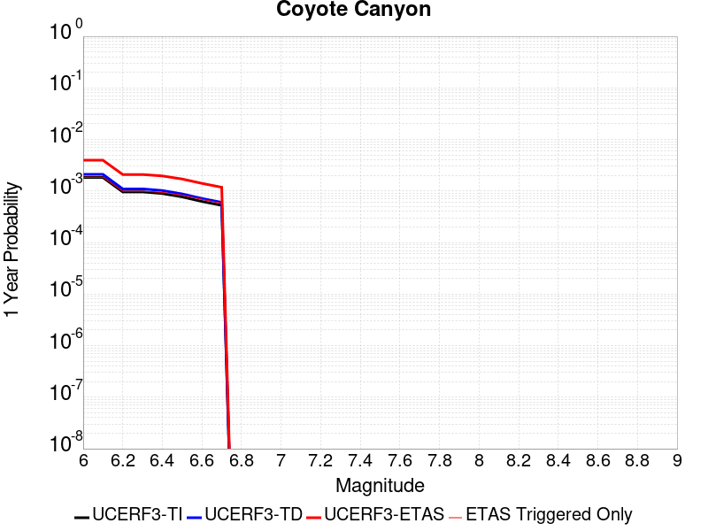 |  |

| Magnitude | 1 yr TI Prob | TD Prob | ETAS Prob | ETAS/TD Gain | ETAS Triggered Only | 10 yr TI Prob | TD Prob | ETAS Prob | ETAS/TD Gain | ETAS Triggered Only |
|-----|-----|-----|-----|-----|-----|-----|-----|-----|-----|-----|
| 6.0 | 0.0018293047 | 0.0021042528 | 0.0039503598 | 1.877322 | 0.00185 | 0.018143194 | 0.020869201 | 0.023943672 | 1.147321 | 0.00314 |
| 6.1 | 0.0018293047 | 0.0021042528 | 0.0039503598 | 1.877322 | 0.00185 | 0.018143194 | 0.020869201 | 0.023943672 | 1.147321 | 0.00314 |
| 6.2 | 9.606133E-4 | 0.001098387 | 0.0020872995 | 1.9003317 | 9.9E-4 | 0.0095647145 | 0.010939667 | 0.012591397 | 1.1509855 | 0.00167 |
| 6.3 | 9.606133E-4 | 0.001098387 | 0.0020872995 | 1.9003317 | 9.9E-4 | 0.0095647145 | 0.010939667 | 0.012591397 | 1.1509855 | 0.00167 |
| 6.4 | 8.930107E-4 | 0.0010204813 | 0.001959522 | 1.9201939 | 9.4E-4 | 0.008894307 | 0.010167871 | 0.011731805 | 1.1538115 | 0.00158 |
| 6.5 | 7.6907943E-4 | 8.7825063E-4 | 0.0017075217 | 1.9442306 | 8.3E-4 | 0.007664232 | 0.008756994 | 0.010154647 | 1.1596042 | 0.00141 |
| 6.6 | 6.268809E-4 | 7.159466E-4 | 0.0014054526 | 1.9630691 | 6.9E-4 | 0.0062511545 | 0.0071450938 | 0.008316662 | 1.1639683 | 0.00118 |
| 6.7 | 5.266384E-4 | 6.017178E-4 | 0.0011813688 | 1.963327 | 5.8E-4 | 0.005253921 | 0.0060094125 | 0.0070034033 | 1.1654056 | 0.001 |

## San Andreas (Mojave S)
*[(top)](#table-of-contents)*

| 1 Year | 10 Year |
|-----|-----|
|  |  |

| Magnitude | 1 yr TI Prob | TD Prob | ETAS Prob | ETAS/TD Gain | ETAS Triggered Only | 10 yr TI Prob | TD Prob | ETAS Prob | ETAS/TD Gain | ETAS Triggered Only |
|-----|-----|-----|-----|-----|-----|-----|-----|-----|-----|-----|
| 6.0 | 0.016080605 | 0.03462235 | 0.036755834 | 1.0616215 | 0.00221 | 0.1496549 | 0.28660452 | 0.28874472 | 1.0074674 | 0.003 |
| 6.1 | 0.016080605 | 0.03462235 | 0.036755834 | 1.0616215 | 0.00221 | 0.1496549 | 0.28660452 | 0.28874472 | 1.0074674 | 0.003 |
| 6.2 | 0.016080605 | 0.03462235 | 0.036755834 | 1.0616215 | 0.00221 | 0.1496549 | 0.28660452 | 0.28874472 | 1.0074674 | 0.003 |
| 6.3 | 0.016080605 | 0.03462235 | 0.036755834 | 1.0616215 | 0.00221 | 0.1496549 | 0.28660452 | 0.28874472 | 1.0074674 | 0.003 |
| 6.4 | 0.010316478 | 0.02228844 | 0.024155868 | 1.0837847 | 0.00191 | 0.098504856 | 0.19699748 | 0.19905317 | 1.0104351 | 0.00256 |
| 6.5 | 0.006714592 | 0.0148934 | 0.016499123 | 1.1078144 | 0.00163 | 0.065152965 | 0.13803436 | 0.13993931 | 1.0138005 | 0.00221 |
| 6.6 | 0.006714592 | 0.0148934 | 0.016499123 | 1.1078144 | 0.00163 | 0.065152965 | 0.13803436 | 0.13993931 | 1.0138005 | 0.00221 |
| 6.7 | 0.0056198016 | 0.012618446 | 0.014139013 | 1.1205035 | 0.00154 | 0.054797906 | 0.119176775 | 0.12100008 | 1.0152992 | 0.00207 |
| 6.8 | 0.0055285925 | 0.012369843 | 0.013880918 | 1.1221579 | 0.00153 | 0.053930566 | 0.11712591 | 0.11892698 | 1.0153772 | 0.00204 |
| 6.9 | 0.0054089287 | 0.012045221 | 0.013556792 | 1.1254914 | 0.00153 | 0.05279156 | 0.11442335 | 0.11622107 | 1.0157112 | 0.00203 |
| 7.0 | 0.005285311 | 0.0117200995 | 0.013222286 | 1.1281717 | 0.00152 | 0.05161361 | 0.111683756 | 0.113469265 | 1.0159873 | 0.00201 |
| 7.1 | 0.0051451353 | 0.011352993 | 0.012835964 | 1.1306237 | 0.0015 | 0.05027629 | 0.1085682 | 0.110333234 | 1.0162574 | 0.00198 |
| 7.2 | 0.005018219 | 0.011024255 | 0.012497829 | 1.1336665 | 0.00149 | 0.049064007 | 0.105758004 | 0.107510716 | 1.0165728 | 0.00196 |
| 7.3 | 0.004746591 | 0.01010939 | 0.0115546305 | 1.1429602 | 0.00146 | 0.046464786 | 0.09795115 | 0.09968308 | 1.0176816 | 0.00192 |
| 7.4 | 0.0046267817 | 0.00972114 | 0.011137239 | 1.1456721 | 0.00143 | 0.045316286 | 0.09458615 | 0.09627927 | 1.0179003 | 0.00187 |
| 7.5 | 0.004516484 | 0.009375632 | 0.010792225 | 1.151093 | 0.00143 | 0.04425787 | 0.091549896 | 0.093248695 | 1.018556 | 0.00187 |
| 7.6 | 0.0044011753 | 0.009058985 | 0.01047603 | 1.1564243 | 0.00143 | 0.04315024 | 0.08870898 | 0.09040398 | 1.0191075 | 0.00186 |
| 7.7 | 0.004300386 | 0.008811831 | 0.010229229 | 1.1608518 | 0.00143 | 0.042181134 | 0.08645982 | 0.088149875 | 1.0195472 | 0.00185 |
| 7.8 | 0.0038772223 | 0.007943616 | 0.009094401 | 1.1448692 | 0.00116 | 0.03810269 | 0.078290746 | 0.07968253 | 1.0177771 | 0.00151 |
| 7.9 | 0.0027402006 | 0.005207864 | 0.005814687 | 1.1165205 | 6.1E-4 | 0.027066574 | 0.052200034 | 0.052939318 | 1.0141625 | 7.8E-4 |
| 8.0 | 0.0017620471 | 0.002817614 | 0.0029771633 | 1.0566256 | 1.6E-4 | 0.017481409 | 0.028834904 | 0.02905827 | 1.0077465 | 2.3E-4 |
| 8.1 | 9.736188E-4 | 0.0010070398 | 0.0010270197 | 1.0198402 | 2.0E-5 | 0.009693642 | 0.010798888 | 0.010828564 | 1.002748 | 3.0E-5 |
| 8.2 | 4.455896E-4 | 2.84898E-4 | 2.84898E-4 | 1.0 | 0.0 | 0.0044469717 | 0.0032408056 | 0.0032408056 | 1.0 | 0.0 |
| 8.3 | 1.034694E-4 | 3.9967534E-5 | 3.9967534E-5 | 1.0 | 0.0 | 0.0010342124 | 4.719687E-4 | 4.719687E-4 | 1.0 | 0.0 |

## Death Valley (So)
*[(top)](#table-of-contents)*

| 1 Year | 10 Year |
|-----|-----|
|  |  |

| Magnitude | 1 yr TI Prob | TD Prob | ETAS Prob | ETAS/TD Gain | ETAS Triggered Only | 10 yr TI Prob | TD Prob | ETAS Prob | ETAS/TD Gain | ETAS Triggered Only |
|-----|-----|-----|-----|-----|-----|-----|-----|-----|-----|-----|
| 6.0 | 0.0010787029 | 0.0013358411 | 0.003512929 | 2.6297505 | 0.00218 | 0.010734817 | 0.013281397 | 0.016419161 | 1.2362527 | 0.00318 |
| 6.1 | 0.0010787029 | 0.0013358411 | 0.003512929 | 2.6297505 | 0.00218 | 0.010734817 | 0.013281397 | 0.016419161 | 1.2362527 | 0.00318 |
| 6.2 | 0.0010787029 | 0.0013358411 | 0.003512929 | 2.6297505 | 0.00218 | 0.010734817 | 0.013281397 | 0.016419161 | 1.2362527 | 0.00318 |
| 6.3 | 0.0010555626 | 0.00130979 | 0.0033770788 | 2.578336 | 0.00207 | 0.010505628 | 0.013023956 | 0.016024364 | 1.230376 | 0.00304 |
| 6.4 | 0.0010555626 | 0.00130979 | 0.0033770788 | 2.578336 | 0.00207 | 0.010505628 | 0.013023956 | 0.016024364 | 1.230376 | 0.00304 |
| 6.5 | 0.0010410968 | 0.0012935963 | 0.0033109833 | 2.559518 | 0.00202 | 0.010362327 | 0.012863902 | 0.015805569 | 1.228676 | 0.00298 |
| 6.6 | 9.876423E-4 | 0.0012156231 | 0.003013435 | 2.4789221 | 0.0018 | 0.009832645 | 0.012092789 | 0.0146811055 | 1.214038 | 0.00262 |
| 6.7 | 9.711593E-4 | 0.0011948098 | 0.002972683 | 2.4879968 | 0.00178 | 0.009669261 | 0.011886904 | 0.014455998 | 1.2161281 | 0.0026 |
| 6.8 | 9.29938E-4 | 0.00113717 | 0.002805271 | 2.466888 | 0.00167 | 0.009260561 | 0.011316354 | 0.0137287425 | 1.2131771 | 0.00244 |
| 6.9 | 6.8514474E-4 | 7.982312E-4 | 0.0019273292 | 2.4145 | 0.00113 | 0.006830362 | 0.007954649 | 0.009532001 | 1.1982931 | 0.00159 |
| 7.0 | 6.002687E-4 | 6.8614254E-4 | 0.0015555456 | 2.2670882 | 8.7E-4 | 0.0059864987 | 0.0068409415 | 0.008042664 | 1.1756662 | 0.00121 |
| 7.1 | 5.068359E-4 | 5.667817E-4 | 0.00111647 | 1.9698414 | 5.5E-4 | 0.0050568148 | 0.0056538144 | 0.006419461 | 1.1354213 | 7.7E-4 |
| 7.2 | 4.81665E-4 | 5.3658825E-4 | 9.4636827E-4 | 1.7636768 | 4.1E-4 | 0.0048062233 | 0.0053533576 | 0.0059203063 | 1.1059052 | 5.7E-4 |
| 7.3 | 4.592835E-4 | 5.1165203E-4 | 8.514781E-4 | 1.6641741 | 3.4E-4 | 0.0045833546 | 0.005105167 | 0.0055528698 | 1.087696 | 4.5E-4 |
| 7.4 | 4.5430884E-4 | 5.0638523E-4 | 8.162282E-4 | 1.6118722 | 3.1E-4 | 0.004533812 | 0.0050527398 | 0.0054706177 | 1.0827032 | 4.2E-4 |
| 7.5 | 4.492982E-4 | 5.01047E-4 | 7.9090166E-4 | 1.578498 | 2.9E-4 | 0.004483909 | 0.0049995985 | 0.005387649 | 1.0776162 | 3.9E-4 |
| 7.6 | 4.3398244E-4 | 4.8431093E-4 | 7.341898E-4 | 1.5159473 | 2.5E-4 | 0.0043313587 | 0.0048329784 | 0.0051713353 | 1.07001 | 3.4E-4 |
| 7.7 | 3.8979502E-4 | 4.353504E-4 | 5.952807E-4 | 1.36736 | 1.6E-4 | 0.00389112 | 0.0043453807 | 0.0045942944 | 1.0572823 | 2.5E-4 |
| 7.8 | 1.80467E-5 | 1.9035933E-5 | 3.9035553E-5 | 2.0506246 | 2.0E-5 | 1.8045233E-4 | 1.9034347E-4 | 2.1033967E-4 | 1.1050532 | 2.0E-5 |
| 7.9 | 1.335311E-7 | 1.3929966E-7 | 1.3929966E-7 | 1.0 | 0.0 | 1.3353102E-6 | 1.3929966E-6 | 1.3929966E-6 | 1.0 | 0.0 |

## Lenwood-Lockhart-Old Woman Springs
*[(top)](#table-of-contents)*

| 1 Year | 10 Year |
|-----|-----|
|  |  |

| Magnitude | 1 yr TI Prob | TD Prob | ETAS Prob | ETAS/TD Gain | ETAS Triggered Only | 10 yr TI Prob | TD Prob | ETAS Prob | ETAS/TD Gain | ETAS Triggered Only |
|-----|-----|-----|-----|-----|-----|-----|-----|-----|-----|-----|
| 6.0 | 0.0019519776 | 0.0022915069 | 0.0045563052 | 1.9883446 | 0.00227 | 0.019349206 | 0.022696787 | 0.02560915 | 1.1283162 | 0.00298 |
| 6.1 | 0.0019519776 | 0.0022915069 | 0.0045563052 | 1.9883446 | 0.00227 | 0.019349206 | 0.022696787 | 0.02560915 | 1.1283162 | 0.00298 |
| 6.2 | 0.0019519776 | 0.0022915069 | 0.0045563052 | 1.9883446 | 0.00227 | 0.019349206 | 0.022696787 | 0.02560915 | 1.1283162 | 0.00298 |
| 6.3 | 0.0010993304 | 0.0013220694 | 0.0020610911 | 1.5589886 | 7.4E-4 | 0.010939079 | 0.0131442575 | 0.01421993 | 1.081836 | 0.00109 |
| 6.4 | 0.0010993304 | 0.0013220694 | 0.0020610911 | 1.5589886 | 7.4E-4 | 0.010939079 | 0.0131442575 | 0.01421993 | 1.081836 | 0.00109 |
| 6.5 | 9.073613E-4 | 0.0010775778 | 0.0016969097 | 1.5747445 | 6.2E-4 | 0.009036654 | 0.010724821 | 0.011634954 | 1.0848624 | 9.2E-4 |
| 6.6 | 7.9306826E-4 | 9.220924E-4 | 0.0014915668 | 1.6175894 | 5.7E-4 | 0.007902439 | 0.009183526 | 0.009976179 | 1.0863125 | 8.0E-4 |
| 6.7 | 6.950544E-4 | 7.961491E-4 | 0.0012957511 | 1.6275231 | 5.0E-4 | 0.006928845 | 0.007933599 | 0.0085883625 | 1.0825305 | 6.6E-4 |
| 6.8 | 6.011979E-4 | 6.797157E-4 | 0.0010494642 | 1.5439752 | 3.7E-4 | 0.00599574 | 0.006776819 | 0.0072634984 | 1.0718153 | 4.9E-4 |
| 6.9 | 5.3489394E-4 | 6.0063385E-4 | 8.8046567E-4 | 1.4658942 | 2.8E-4 | 0.0053360825 | 0.0059904843 | 0.006378148 | 1.0647132 | 3.9E-4 |
| 7.0 | 4.2279682E-4 | 4.6904673E-4 | 6.6895294E-4 | 1.4261967 | 2.0E-4 | 0.0042199334 | 0.0046808156 | 0.004959505 | 1.0595386 | 2.8E-4 |
| 7.1 | 3.5468035E-4 | 3.920914E-4 | 5.1204435E-4 | 1.3059311 | 1.2E-4 | 0.003541148 | 0.003914213 | 0.0040835473 | 1.0432614 | 1.7E-4 |
| 7.2 | 2.9681803E-4 | 3.2763163E-4 | 4.2759886E-4 | 1.3051208 | 1.0E-4 | 0.002964219 | 0.0032716845 | 0.003421194 | 1.0456979 | 1.5E-4 |
| 7.3 | 2.2190946E-4 | 2.4557224E-4 | 3.255526E-4 | 1.3256897 | 8.0E-5 | 0.00221688 | 0.0024531898 | 0.0025629199 | 1.0447296 | 1.1E-4 |
| 7.4 | 1.3277601E-4 | 1.4880655E-4 | 1.987991E-4 | 1.3359567 | 5.0E-5 | 0.001326967 | 0.0014872311 | 0.0015471419 | 1.0402834 | 6.0E-5 |
| 7.5 | 2.2805577E-6 | 2.3808586E-6 | 1.2380835E-5 | 5.2001553 | 1.0E-5 | 2.2805343E-5 | 2.3808387E-5 | 3.3808148E-5 | 1.4200101 | 1.0E-5 |

## Nelson Lake
*[(top)](#table-of-contents)*

| 1 Year | 10 Year |
|-----|-----|
|  |  |

| Magnitude | 1 yr TI Prob | TD Prob | ETAS Prob | ETAS/TD Gain | ETAS Triggered Only | 10 yr TI Prob | TD Prob | ETAS Prob | ETAS/TD Gain | ETAS Triggered Only |
|-----|-----|-----|-----|-----|-----|-----|-----|-----|-----|-----|
| 6.0 | 5.1713863E-4 | 5.316897E-4 | 0.0019909134 | 3.7445025 | 0.00146 | 0.0051593683 | 0.005305204 | 0.0076626306 | 1.4443612 | 0.00237 |
| 6.1 | 5.1713863E-4 | 5.316897E-4 | 0.0019909134 | 3.7445025 | 0.00146 | 0.0051593683 | 0.005305204 | 0.0076626306 | 1.4443612 | 0.00237 |
| 6.2 | 2.3788778E-4 | 2.4501883E-4 | 8.648669E-4 | 3.5297978 | 6.2E-4 | 0.0023763329 | 0.0024476128 | 0.0034850673 | 1.4238638 | 0.00104 |
| 6.3 | 2.3788778E-4 | 2.4501883E-4 | 8.648669E-4 | 3.5297978 | 6.2E-4 | 0.0023763329 | 0.0024476128 | 0.0034850673 | 1.4238638 | 0.00104 |
| 6.4 | 1.7752586E-4 | 1.8312587E-4 | 6.9303246E-4 | 3.7844596 | 5.1E-4 | 0.001773841 | 0.0018298327 | 0.0025684787 | 1.4036685 | 7.4E-4 |
| 6.5 | 1.479309E-4 | 1.5276071E-4 | 5.526996E-4 | 3.6180744 | 4.0E-4 | 0.0014783246 | 0.0015266308 | 0.002155669 | 1.4120435 | 6.3E-4 |
| 6.6 | 1.1747423E-4 | 1.2152085E-4 | 4.2148438E-4 | 3.4684122 | 3.0E-4 | 0.0011741214 | 0.0012146058 | 0.0017040105 | 1.4029331 | 4.9E-4 |
| 6.7 | 9.867457E-5 | 1.0222061E-4 | 3.82192E-4 | 3.7388935 | 2.8E-4 | 9.863076E-4 | 0.0010217935 | 0.0014613438 | 1.4301754 | 4.4E-4 |
| 6.8 | 7.76117E-5 | 8.055224E-5 | 2.9053533E-4 | 3.6067936 | 2.1E-4 | 7.75846E-4 | 8.0528157E-4 | 0.0011549997 | 1.4342806 | 3.5E-4 |
| 6.9 | 3.56685E-5 | 3.7254784E-5 | 1.3725106E-4 | 3.684119 | 1.0E-4 | 3.5662777E-4 | 3.7251666E-4 | 5.424533E-4 | 1.4561855 | 1.7E-4 |

## San Andreas (Mojave N)
*[(top)](#table-of-contents)*

| 1 Year | 10 Year |
|-----|-----|
|  |  |

| Magnitude | 1 yr TI Prob | TD Prob | ETAS Prob | ETAS/TD Gain | ETAS Triggered Only | 10 yr TI Prob | TD Prob | ETAS Prob | ETAS/TD Gain | ETAS Triggered Only |
|-----|-----|-----|-----|-----|-----|-----|-----|-----|-----|-----|
| 6.0 | 0.0051410277 | 0.010072956 | 0.011864724 | 1.1778791 | 0.00181 | 0.05023708 | 0.09831428 | 0.10047832 | 1.0220115 | 0.0024 |
| 6.1 | 0.0051410277 | 0.010072956 | 0.011864724 | 1.1778791 | 0.00181 | 0.05023708 | 0.09831428 | 0.10047832 | 1.0220115 | 0.0024 |
| 6.2 | 0.0051410277 | 0.010072956 | 0.011864724 | 1.1778791 | 0.00181 | 0.05023708 | 0.09831428 | 0.10047832 | 1.0220115 | 0.0024 |
| 6.3 | 0.0051410277 | 0.010072956 | 0.011864724 | 1.1778791 | 0.00181 | 0.05023708 | 0.09831428 | 0.10047832 | 1.0220115 | 0.0024 |
| 6.4 | 0.0051410277 | 0.010072956 | 0.011864724 | 1.1778791 | 0.00181 | 0.05023708 | 0.09831428 | 0.10047832 | 1.0220115 | 0.0024 |
| 6.5 | 0.0051326132 | 0.010059402 | 0.011851195 | 1.1781212 | 0.00181 | 0.050156746 | 0.098192066 | 0.10034739 | 1.02195 | 0.00239 |
| 6.6 | 0.0051326132 | 0.010059402 | 0.011851195 | 1.1781212 | 0.00181 | 0.050156746 | 0.098192066 | 0.10034739 | 1.02195 | 0.00239 |
| 6.7 | 0.0051293927 | 0.010054212 | 0.011846014 | 1.1782141 | 0.00181 | 0.050125998 | 0.098145254 | 0.10030069 | 1.0219617 | 0.00239 |
| 6.8 | 0.0051248376 | 0.010046546 | 0.011838363 | 1.1783514 | 0.00181 | 0.05008251 | 0.09807528 | 0.10023088 | 1.0219791 | 0.00239 |
| 6.9 | 0.0051141046 | 0.010030019 | 0.011821865 | 1.1786482 | 0.00181 | 0.049980022 | 0.09792438 | 0.10008034 | 1.0220166 | 0.00239 |
| 7.0 | 0.005091073 | 0.009994558 | 0.011786468 | 1.1792885 | 0.00181 | 0.04976007 | 0.09760077 | 0.09975751 | 1.0220975 | 0.00239 |
| 7.1 | 0.005055068 | 0.009943774 | 0.011735776 | 1.1802135 | 0.00181 | 0.04941613 | 0.09713728 | 0.099295124 | 1.0222143 | 0.00239 |
| 7.2 | 0.0050299936 | 0.00990801 | 0.011700077 | 1.1808704 | 0.00181 | 0.049176537 | 0.09681055 | 0.09896917 | 1.0222974 | 0.00239 |
| 7.3 | 0.0050112694 | 0.009883473 | 0.011675584 | 1.181324 | 0.00181 | 0.04899759 | 0.09658401 | 0.09874317 | 1.0223553 | 0.00239 |
| 7.4 | 0.0049933824 | 0.009852355 | 0.011634621 | 1.1808975 | 0.0018 | 0.04882661 | 0.09630218 | 0.098452985 | 1.0223339 | 0.00238 |
| 7.5 | 0.0049769743 | 0.009824493 | 0.011606809 | 1.1814156 | 0.0018 | 0.048669744 | 0.09604836 | 0.09819977 | 1.0223992 | 0.00238 |
| 7.6 | 0.004902454 | 0.009644784 | 0.011427424 | 1.1848294 | 0.0018 | 0.047957025 | 0.094430685 | 0.096585944 | 1.0228237 | 0.00238 |
| 7.7 | 0.00427079 | 0.008325525 | 0.009981621 | 1.198918 | 0.00167 | 0.04189639 | 0.08223219 | 0.084242105 | 1.024442 | 0.00219 |
| 7.8 | 0.003794643 | 0.0075464295 | 0.008687751 | 1.15124 | 0.00115 | 0.037304975 | 0.07472468 | 0.07611259 | 1.0185736 | 0.0015 |
| 7.9 | 0.0028072202 | 0.0052282433 | 0.005835054 | 1.116064 | 6.1E-4 | 0.02772022 | 0.05242443 | 0.05316354 | 1.0140985 | 7.8E-4 |
| 8.0 | 0.0018082283 | 0.002827298 | 0.0029868456 | 1.0564312 | 1.6E-4 | 0.017935853 | 0.028947512 | 0.029170854 | 1.0077155 | 2.3E-4 |
| 8.1 | 9.988535E-4 | 0.0010118998 | 0.0010318796 | 1.0197448 | 2.0E-5 | 0.009943757 | 0.01085625 | 0.010885924 | 1.0027333 | 3.0E-5 |
| 8.2 | 4.5092785E-4 | 2.8563058E-4 | 2.8563058E-4 | 1.0 | 0.0 | 0.0045001395 | 0.0032487072 | 0.0032487072 | 1.0 | 0.0 |
| 8.3 | 1.034694E-4 | 3.9967534E-5 | 3.9967534E-5 | 1.0 | 0.0 | 0.0010342124 | 4.719687E-4 | 4.719687E-4 | 1.0 | 0.0 |

## Towne Pass
*[(top)](#table-of-contents)*

| 1 Year | 10 Year |
|-----|-----|
|  |  |

| Magnitude | 1 yr TI Prob | TD Prob | ETAS Prob | ETAS/TD Gain | ETAS Triggered Only | 10 yr TI Prob | TD Prob | ETAS Prob | ETAS/TD Gain | ETAS Triggered Only |
|-----|-----|-----|-----|-----|-----|-----|-----|-----|-----|-----|
| 6.0 | 2.0085352E-4 | 2.0319603E-4 | 0.0016628994 | 8.18372 | 0.00146 | 0.0020067208 | 0.0020305314 | 0.0042160847 | 2.0763454 | 0.00219 |
| 6.1 | 2.0085352E-4 | 2.0319603E-4 | 0.0016628994 | 8.18372 | 0.00146 | 0.0020067208 | 0.0020305314 | 0.0042160847 | 2.0763454 | 0.00219 |
| 6.2 | 2.0085352E-4 | 2.0319603E-4 | 0.0016628994 | 8.18372 | 0.00146 | 0.0020067208 | 0.0020305314 | 0.0042160847 | 2.0763454 | 0.00219 |
| 6.3 | 2.0085352E-4 | 2.0319603E-4 | 0.0016628994 | 8.18372 | 0.00146 | 0.0020067208 | 0.0020305314 | 0.0042160847 | 2.0763454 | 0.00219 |
| 6.4 | 2.0085352E-4 | 2.0319603E-4 | 0.0016628994 | 8.18372 | 0.00146 | 0.0020067208 | 0.0020305314 | 0.0042160847 | 2.0763454 | 0.00219 |
| 6.5 | 6.236998E-5 | 6.277173E-5 | 2.927573E-4 | 4.66384 | 2.3E-4 | 6.235248E-4 | 6.275517E-4 | 9.373572E-4 | 1.4936732 | 3.1E-4 |
| 6.6 | 6.236998E-5 | 6.277173E-5 | 2.927573E-4 | 4.66384 | 2.3E-4 | 6.235248E-4 | 6.275517E-4 | 9.373572E-4 | 1.4936732 | 3.1E-4 |
| 6.7 | 4.370358E-5 | 4.3884793E-5 | 2.1387733E-4 | 4.873609 | 1.7E-4 | 4.3694986E-4 | 4.38767E-4 | 6.3867925E-4 | 1.4556228 | 2.0E-4 |
| 6.8 | 3.3291526E-5 | 3.3352855E-5 | 1.5334885E-4 | 4.597773 | 1.2E-4 | 3.3286537E-4 | 3.334823E-4 | 4.7343562E-4 | 1.4196724 | 1.4E-4 |
| 6.9 | 2.789431E-5 | 2.789084E-5 | 8.7889166E-5 | 3.151184 | 6.0E-5 | 2.789081E-4 | 2.7887672E-4 | 3.588544E-4 | 1.2867851 | 8.0E-5 |
| 7.0 | 1.8563835E-5 | 1.843152E-5 | 5.843078E-5 | 3.1701555 | 4.0E-5 | 1.8562283E-4 | 1.8430075E-4 | 2.3429152E-4 | 1.2712457 | 5.0E-5 |
| 7.1 | 1.5851423E-5 | 1.5654618E-5 | 5.565399E-5 | 3.555117 | 4.0E-5 | 1.5850292E-4 | 1.5653588E-4 | 2.0652806E-4 | 1.3193656 | 5.0E-5 |
| 7.2 | 1.0857389E-5 | 1.0549252E-5 | 2.0549147E-5 | 1.9479245 | 1.0E-5 | 1.0856859E-4 | 1.0548797E-4 | 1.2548587E-4 | 1.1895751 | 2.0E-5 |
| 7.3 | 5.8241935E-6 | 5.550166E-6 | 1.5550111E-5 | 2.8017378 | 1.0E-5 | 5.8240406E-5 | 5.5500474E-5 | 7.549937E-5 | 1.3603373 | 2.0E-5 |

## Paradise
*[(top)](#table-of-contents)*

| 1 Year | 10 Year |
|-----|-----|
|  |  |

| Magnitude | 1 yr TI Prob | TD Prob | ETAS Prob | ETAS/TD Gain | ETAS Triggered Only | 10 yr TI Prob | TD Prob | ETAS Prob | ETAS/TD Gain | ETAS Triggered Only |
|-----|-----|-----|-----|-----|-----|-----|-----|-----|-----|-----|
| 6.0 | 7.7462377E-4 | 8.707584E-4 | 0.0020297484 | 2.331012 | 0.00116 | 0.0077192914 | 0.008675844 | 0.010450315 | 1.20453 | 0.00179 |
| 6.1 | 7.7462377E-4 | 8.707584E-4 | 0.0020297484 | 2.331012 | 0.00116 | 0.0077192914 | 0.008675844 | 0.010450315 | 1.20453 | 0.00179 |
| 6.2 | 7.7462377E-4 | 8.707584E-4 | 0.0020297484 | 2.331012 | 0.00116 | 0.0077192914 | 0.008675844 | 0.010450315 | 1.20453 | 0.00179 |
| 6.3 | 5.43912E-4 | 6.201489E-4 | 0.0011198388 | 1.805758 | 5.0E-4 | 0.0054258266 | 0.0061847917 | 0.007009658 | 1.1333702 | 8.3E-4 |
| 6.4 | 5.43912E-4 | 6.201489E-4 | 0.0011198388 | 1.805758 | 5.0E-4 | 0.0054258266 | 0.0061847917 | 0.007009658 | 1.1333702 | 8.3E-4 |
| 6.5 | 4.8255164E-4 | 5.53989E-4 | 9.4377296E-4 | 1.703595 | 3.9E-4 | 0.0048150513 | 0.0055265795 | 0.0061630425 | 1.115164 | 6.4E-4 |
| 6.6 | 4.1235037E-4 | 4.7782314E-4 | 6.7772757E-4 | 1.4183649 | 2.0E-4 | 0.0041158604 | 0.0047683544 | 0.0051166853 | 1.0730506 | 3.5E-4 |
| 6.7 | 3.7593965E-4 | 4.3858777E-4 | 5.5853516E-4 | 1.2734854 | 1.2E-4 | 0.003753043 | 0.004377591 | 0.004606584 | 1.0523103 | 2.3E-4 |
| 6.8 | 3.4926904E-4 | 4.0911473E-4 | 5.0907384E-4 | 1.2443302 | 1.0E-4 | 0.003487206 | 0.0040839734 | 0.004273197 | 1.0463333 | 1.9E-4 |
| 6.9 | 3.1521954E-4 | 3.7200135E-4 | 4.2198275E-4 | 1.1343582 | 5.0E-5 | 0.0031477278 | 0.0037141247 | 0.003833679 | 1.0321891 | 1.2E-4 |
| 7.0 | 2.1568815E-4 | 2.6505045E-4 | 2.8504516E-4 | 1.0754373 | 2.0E-5 | 0.0021547892 | 0.0026474963 | 0.0027073375 | 1.0226029 | 6.0E-5 |
| 7.1 | 1.9656324E-4 | 2.4165731E-4 | 2.616525E-4 | 1.0827419 | 2.0E-5 | 0.0019638946 | 0.002414096 | 0.002473951 | 1.024794 | 6.0E-5 |
| 7.2 | 1.777326E-4 | 2.1687041E-4 | 2.3686608E-4 | 1.092201 | 2.0E-5 | 0.0017759053 | 0.002166736 | 0.0022166276 | 1.0230262 | 5.0E-5 |
| 7.3 | 1.5618425E-4 | 1.8935655E-4 | 1.9935466E-4 | 1.0528004 | 1.0E-5 | 0.0015607453 | 0.0018920974 | 0.0019320217 | 1.0211005 | 4.0E-5 |
| 7.4 | 1.2548068E-4 | 1.5073347E-4 | 1.6073196E-4 | 1.0663322 | 1.0E-5 | 0.0012540985 | 0.0015064536 | 0.0015463934 | 1.0265124 | 4.0E-5 |
| 7.5 | 6.631728E-5 | 7.8968886E-5 | 7.8968886E-5 | 1.0 | 0.0 | 6.6297496E-4 | 7.8953087E-4 | 8.195072E-4 | 1.0379672 | 3.0E-5 |
| 7.6 | 1.1540374E-5 | 1.3587036E-5 | 1.3587036E-5 | 1.0 | 0.0 | 1.1539775E-4 | 1.3586486E-4 | 1.5586214E-4 | 1.1471851 | 2.0E-5 |

## Bicycle Lake
*[(top)](#table-of-contents)*

| 1 Year | 10 Year |
|-----|-----|
|  |  |

| Magnitude | 1 yr TI Prob | TD Prob | ETAS Prob | ETAS/TD Gain | ETAS Triggered Only | 10 yr TI Prob | TD Prob | ETAS Prob | ETAS/TD Gain | ETAS Triggered Only |
|-----|-----|-----|-----|-----|-----|-----|-----|-----|-----|-----|
| 6.0 | 0.0010233327 | 0.0011524865 | 0.0021213687 | 1.8406885 | 9.7E-4 | 0.01018633 | 0.011478408 | 0.012971075 | 1.1300414 | 0.00151 |
| 6.1 | 0.0010233327 | 0.0011524865 | 0.0021213687 | 1.8406885 | 9.7E-4 | 0.01018633 | 0.011478408 | 0.012971075 | 1.1300414 | 0.00151 |
| 6.2 | 5.2150246E-4 | 5.871896E-4 | 0.001166849 | 1.9871758 | 5.8E-4 | 0.0052028033 | 0.005861487 | 0.0067860354 | 1.1577328 | 9.3E-4 |
| 6.3 | 5.002399E-4 | 5.6334207E-4 | 0.0011230266 | 1.9935075 | 5.6E-4 | 0.0049911533 | 0.0056242296 | 0.0065191677 | 1.1591219 | 9.0E-4 |
| 6.4 | 5.002399E-4 | 5.6334207E-4 | 0.0011230266 | 1.9935075 | 5.6E-4 | 0.0049911533 | 0.0056242296 | 0.0065191677 | 1.1591219 | 9.0E-4 |
| 6.5 | 2.8995197E-4 | 3.2794967E-4 | 7.1782176E-4 | 2.1888168 | 3.9E-4 | 0.0028957394 | 0.0032772934 | 0.0038653598 | 1.1794366 | 5.9E-4 |
| 6.6 | 2.54302E-4 | 2.87663E-4 | 5.975738E-4 | 2.07734 | 3.1E-4 | 0.002540112 | 0.0028754752 | 0.003354095 | 1.166449 | 4.8E-4 |
| 6.7 | 2.0822904E-4 | 2.3563375E-4 | 4.8557483E-4 | 2.0607185 | 2.5E-4 | 0.0020803404 | 0.0023563374 | 0.002735442 | 1.1608872 | 3.8E-4 |

## Garlic Springs
*[(top)](#table-of-contents)*

| 1 Year | 10 Year |
|-----|-----|
|  |  |

| Magnitude | 1 yr TI Prob | TD Prob | ETAS Prob | ETAS/TD Gain | ETAS Triggered Only | 10 yr TI Prob | TD Prob | ETAS Prob | ETAS/TD Gain | ETAS Triggered Only |
|-----|-----|-----|-----|-----|-----|-----|-----|-----|-----|-----|
| 6.0 | 8.7413884E-4 | 9.794032E-4 | 0.0017586392 | 1.7956234 | 7.8E-4 | 0.008707083 | 0.009762413 | 0.011128941 | 1.1399785 | 0.00138 |
| 6.1 | 5.139737E-4 | 5.7250116E-4 | 0.001002255 | 1.7506602 | 4.3E-4 | 0.005127866 | 0.005717221 | 0.0064529907 | 1.1286935 | 7.4E-4 |
| 6.2 | 5.139737E-4 | 5.7250116E-4 | 0.001002255 | 1.7506602 | 4.3E-4 | 0.005127866 | 0.005717221 | 0.0064529907 | 1.1286935 | 7.4E-4 |
| 6.3 | 2.2521814E-4 | 2.4930484E-4 | 4.5925248E-4 | 1.8421322 | 2.1E-4 | 0.0022499003 | 0.00249251 | 0.0028117124 | 1.1280646 | 3.2E-4 |
| 6.4 | 2.2521814E-4 | 2.4930484E-4 | 4.5925248E-4 | 1.8421322 | 2.1E-4 | 0.0022499003 | 0.00249251 | 0.0028117124 | 1.1280646 | 3.2E-4 |
| 6.5 | 2.2521814E-4 | 2.4930484E-4 | 4.5925248E-4 | 1.8421322 | 2.1E-4 | 0.0022499003 | 0.00249251 | 0.0028117124 | 1.1280646 | 3.2E-4 |
| 6.6 | 2.2441156E-4 | 2.4841115E-4 | 4.58359E-4 | 1.8451626 | 2.1E-4 | 0.0022418506 | 0.002483593 | 0.0028027983 | 1.1285256 | 3.2E-4 |
| 6.7 | 2.0138794E-4 | 2.228578E-4 | 4.32811E-4 | 1.9420949 | 2.1E-4 | 0.0020120554 | 0.002228578 | 0.0025478648 | 1.1432693 | 3.2E-4 |

## San Andreas (San Bernardino N)
*[(top)](#table-of-contents)*

| 1 Year | 10 Year |
|-----|-----|
| 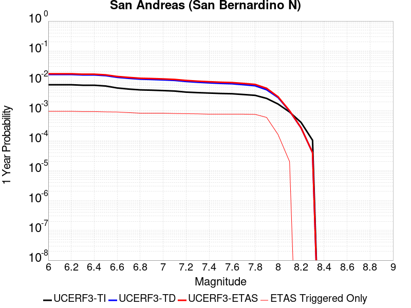 |  |

| Magnitude | 1 yr TI Prob | TD Prob | ETAS Prob | ETAS/TD Gain | ETAS Triggered Only | 10 yr TI Prob | TD Prob | ETAS Prob | ETAS/TD Gain | ETAS Triggered Only |
|-----|-----|-----|-----|-----|-----|-----|-----|-----|-----|-----|
| 6.0 | 0.0074207084 | 0.016360244 | 0.017304538 | 1.0577189 | 9.6E-4 | 0.07177748 | 0.15026689 | 0.15138003 | 1.0074078 | 0.00131 |
| 6.1 | 0.0074207084 | 0.016360244 | 0.017304538 | 1.0577189 | 9.6E-4 | 0.07177748 | 0.15026689 | 0.15138003 | 1.0074078 | 0.00131 |
| 6.2 | 0.0074207084 | 0.016360244 | 0.017304538 | 1.0577189 | 9.6E-4 | 0.07177748 | 0.15026689 | 0.15138003 | 1.0074078 | 0.00131 |
| 6.3 | 0.0071393442 | 0.015797772 | 0.016722923 | 1.058562 | 9.4E-4 | 0.06914291 | 0.14556676 | 0.14666899 | 1.0075719 | 0.00129 |
| 6.4 | 0.0071393442 | 0.015797772 | 0.016722923 | 1.058562 | 9.4E-4 | 0.06914291 | 0.14556676 | 0.14666899 | 1.0075719 | 0.00129 |
| 6.5 | 0.0067310524 | 0.01498286 | 0.015889077 | 1.0604835 | 9.2E-4 | 0.06530788 | 0.13870941 | 0.13980326 | 1.0078858 | 0.00127 |
| 6.6 | 0.005788839 | 0.013149847 | 0.014047881 | 1.0682924 | 9.1E-4 | 0.056403454 | 0.122999296 | 0.12410431 | 1.008984 | 0.00126 |
| 6.7 | 0.0053192247 | 0.012188629 | 0.013048026 | 1.070508 | 8.7E-4 | 0.051936906 | 0.114790924 | 0.115853176 | 1.0092537 | 0.0012 |
| 6.8 | 0.0050023515 | 0.011428202 | 0.012248716 | 1.0717974 | 8.3E-4 | 0.048912346 | 0.1081929 | 0.10920064 | 1.0093143 | 0.00113 |
| 6.9 | 0.0048866454 | 0.011147255 | 0.011968004 | 1.0736278 | 8.3E-4 | 0.04780577 | 0.10578323 | 0.10678475 | 1.0094677 | 0.00112 |
| 7.0 | 0.0047382377 | 0.010799837 | 0.011620874 | 1.076023 | 8.3E-4 | 0.046384744 | 0.102753714 | 0.10374966 | 1.0096925 | 0.00111 |
| 7.1 | 0.0045664064 | 0.0103736 | 0.011175197 | 1.0772728 | 8.1E-4 | 0.044737056 | 0.09906527 | 0.100038275 | 1.0098219 | 0.00108 |
| 7.2 | 0.0042088944 | 0.009549725 | 0.010342085 | 1.082972 | 8.0E-4 | 0.041300658 | 0.09179615 | 0.09274977 | 1.0103884 | 0.00105 |
| 7.3 | 0.0040445733 | 0.009003494 | 0.009786381 | 1.0869538 | 7.9E-4 | 0.03971748 | 0.08706327 | 0.08801272 | 1.0109054 | 0.00104 |
| 7.4 | 0.0039163795 | 0.008600081 | 0.009363459 | 1.0887641 | 7.7E-4 | 0.038480744 | 0.08351955 | 0.08443603 | 1.0109732 | 0.001 |
| 7.5 | 0.003788775 | 0.008231463 | 0.008995124 | 1.0927736 | 7.7E-4 | 0.03724827 | 0.08023631 | 0.081156075 | 1.0114632 | 0.001 |
| 7.6 | 0.0037076178 | 0.008008812 | 0.008772644 | 1.0953741 | 7.7E-4 | 0.036463667 | 0.07822598 | 0.07913853 | 1.0116657 | 9.9E-4 |
| 7.7 | 0.003495157 | 0.0074437927 | 0.008208061 | 1.1026719 | 7.7E-4 | 0.034406938 | 0.07305469 | 0.0739631 | 1.0124346 | 9.8E-4 |
| 7.8 | 0.0032823787 | 0.006865616 | 0.007620398 | 1.1099366 | 7.6E-4 | 0.032343175 | 0.06771354 | 0.06861786 | 1.013355 | 9.7E-4 |
| 7.9 | 0.0025967648 | 0.0050609782 | 0.0056579416 | 1.1179541 | 6.0E-4 | 0.025666296 | 0.05064886 | 0.05137986 | 1.0144327 | 7.7E-4 |
| 8.0 | 0.0016793669 | 0.0027775685 | 0.0029371243 | 1.0574443 | 1.6E-4 | 0.016667323 | 0.028361378 | 0.028584855 | 1.0078796 | 2.3E-4 |
| 8.1 | 9.0926304E-4 | 9.817594E-4 | 0.0010017398 | 1.0203516 | 2.0E-5 | 0.009055517 | 0.010484105 | 0.010513791 | 1.0028315 | 3.0E-5 |
| 8.2 | 4.0856065E-4 | 2.6895068E-4 | 2.6895068E-4 | 1.0 | 0.0 | 0.004078103 | 0.0030418145 | 0.0030418145 | 1.0 | 0.0 |
| 8.3 | 1.034694E-4 | 3.9967534E-5 | 3.9967534E-5 | 1.0 | 0.0 | 0.0010342124 | 4.719687E-4 | 4.719687E-4 | 1.0 | 0.0 |

## Death Valley (Black Mtns Frontal)
*[(top)](#table-of-contents)*

| 1 Year | 10 Year |
|-----|-----|
|  |  |

| Magnitude | 1 yr TI Prob | TD Prob | ETAS Prob | ETAS/TD Gain | ETAS Triggered Only | 10 yr TI Prob | TD Prob | ETAS Prob | ETAS/TD Gain | ETAS Triggered Only |
|-----|-----|-----|-----|-----|-----|-----|-----|-----|-----|-----|
| 6.0 | 8.71386E-4 | 9.737309E-4 | 0.0017230005 | 1.7694833 | 7.5E-4 | 0.00867977 | 0.009695496 | 0.010695704 | 1.103162 | 0.00101 |
| 6.1 | 8.71386E-4 | 9.737309E-4 | 0.0017230005 | 1.7694833 | 7.5E-4 | 0.00867977 | 0.009695496 | 0.010695704 | 1.103162 | 0.00101 |
| 6.2 | 8.71386E-4 | 9.737309E-4 | 0.0017230005 | 1.7694833 | 7.5E-4 | 0.00867977 | 0.009695496 | 0.010695704 | 1.103162 | 0.00101 |
| 6.3 | 8.71386E-4 | 9.737309E-4 | 0.0017230005 | 1.7694833 | 7.5E-4 | 0.00867977 | 0.009695496 | 0.010695704 | 1.103162 | 0.00101 |
| 6.4 | 8.0926094E-4 | 9.042885E-4 | 0.0015836735 | 1.7512925 | 6.8E-4 | 0.008063202 | 0.009006773 | 0.009918487 | 1.1012254 | 9.2E-4 |
| 6.5 | 8.0926094E-4 | 9.042885E-4 | 0.0015836735 | 1.7512925 | 6.8E-4 | 0.008063202 | 0.009006773 | 0.009918487 | 1.1012254 | 9.2E-4 |
| 6.6 | 7.8455906E-4 | 8.767063E-4 | 0.001506154 | 1.7179687 | 6.3E-4 | 0.00781795 | 0.008733132 | 0.009585622 | 1.0976156 | 8.6E-4 |
| 6.7 | 7.6334673E-4 | 8.5308263E-4 | 0.0014525708 | 1.7027316 | 6.0E-4 | 0.007607299 | 0.008498715 | 0.009291917 | 1.0933318 | 8.0E-4 |
| 6.8 | 7.4114406E-4 | 8.2837185E-4 | 0.0013779163 | 1.663403 | 5.5E-4 | 0.007386771 | 0.008253456 | 0.008977431 | 1.0877178 | 7.3E-4 |
| 6.9 | 7.1877235E-4 | 8.0347876E-4 | 0.001313069 | 1.6342299 | 5.1E-4 | 0.0071645193 | 0.008006332 | 0.008690808 | 1.0854918 | 6.9E-4 |
| 7.0 | 7.086029E-4 | 7.9219416E-4 | 0.001281806 | 1.6180452 | 4.9E-4 | 0.007063476 | 0.007894293 | 0.008559004 | 1.0842015 | 6.7E-4 |
| 7.1 | 6.9888023E-4 | 7.8141113E-4 | 0.0012410517 | 1.5882186 | 4.6E-4 | 0.0069668638 | 0.007787224 | 0.008422241 | 1.081546 | 6.4E-4 |
| 7.2 | 6.846822E-4 | 7.6567667E-4 | 0.0011653705 | 1.5220137 | 4.0E-4 | 0.006825765 | 0.00763097 | 0.008186697 | 1.0728252 | 5.6E-4 |
| 7.3 | 6.74051E-4 | 7.53905E-4 | 0.0011336185 | 1.5036623 | 3.8E-4 | 0.006720101 | 0.007514055 | 0.008020222 | 1.0673628 | 5.1E-4 |
| 7.4 | 6.660441E-4 | 7.4504025E-4 | 0.0010947795 | 1.4694233 | 3.5E-4 | 0.0066405144 | 0.0074260035 | 0.007902439 | 1.0641577 | 4.8E-4 |
| 7.5 | 6.531671E-4 | 7.3087064E-4 | 0.0010506368 | 1.437514 | 3.2E-4 | 0.006512506 | 0.0072852457 | 0.00772204 | 1.0599561 | 4.4E-4 |
| 7.6 | 5.895042E-4 | 6.5975444E-4 | 9.2957634E-4 | 1.4089731 | 2.7E-4 | 0.0058794282 | 0.00657851 | 0.0069560106 | 1.0573839 | 3.8E-4 |
| 7.7 | 4.7936183E-4 | 5.3643517E-4 | 7.0634397E-4 | 1.3167369 | 1.7E-4 | 0.004783291 | 0.005351914 | 0.005620469 | 1.0501792 | 2.7E-4 |
| 7.8 | 1.80467E-5 | 1.9035933E-5 | 3.9035553E-5 | 2.0506246 | 2.0E-5 | 1.8045233E-4 | 1.9034347E-4 | 2.1033967E-4 | 1.1050532 | 2.0E-5 |
| 7.9 | 1.335311E-7 | 1.3929966E-7 | 1.3929966E-7 | 1.0 | 0.0 | 1.3353102E-6 | 1.3929966E-6 | 1.3929966E-6 | 1.0 | 0.0 |

## Helendale-So Lockhart
*[(top)](#table-of-contents)*

| 1 Year | 10 Year |
|-----|-----|
|  |  |

| Magnitude | 1 yr TI Prob | TD Prob | ETAS Prob | ETAS/TD Gain | ETAS Triggered Only | 10 yr TI Prob | TD Prob | ETAS Prob | ETAS/TD Gain | ETAS Triggered Only |
|-----|-----|-----|-----|-----|-----|-----|-----|-----|-----|-----|
| 6.0 | 9.0208417E-4 | 9.4421144E-4 | 0.0014936922 | 1.5819466 | 5.5E-4 | 0.008984311 | 0.009404116 | 0.010186687 | 1.0832157 | 7.9E-4 |
| 6.1 | 9.0208417E-4 | 9.4421144E-4 | 0.0014936922 | 1.5819466 | 5.5E-4 | 0.008984311 | 0.009404116 | 0.010186687 | 1.0832157 | 7.9E-4 |
| 6.2 | 9.0208417E-4 | 9.4421144E-4 | 0.0014936922 | 1.5819466 | 5.5E-4 | 0.008984311 | 0.009404116 | 0.010186687 | 1.0832157 | 7.9E-4 |
| 6.3 | 5.5654737E-4 | 5.80868E-4 | 9.7064144E-4 | 1.671019 | 3.9E-4 | 0.0055515557 | 0.0057937936 | 0.006340607 | 1.0943792 | 5.5E-4 |
| 6.4 | 5.5654737E-4 | 5.80868E-4 | 9.7064144E-4 | 1.671019 | 3.9E-4 | 0.0055515557 | 0.0057937936 | 0.006340607 | 1.0943792 | 5.5E-4 |
| 6.5 | 4.585485E-4 | 4.7837716E-4 | 7.882289E-4 | 1.6477143 | 3.1E-4 | 0.0045760344 | 0.004773638 | 0.0052015856 | 1.089648 | 4.3E-4 |
| 6.6 | 3.858892E-4 | 4.025073E-4 | 6.6240266E-4 | 1.645691 | 2.6E-4 | 0.003852198 | 0.00401789 | 0.004396363 | 1.094197 | 3.8E-4 |
| 6.7 | 3.3701936E-4 | 3.5152107E-4 | 5.814402E-4 | 1.6540693 | 2.3E-4 | 0.0033650869 | 0.003509732 | 0.003828609 | 1.090855 | 3.2E-4 |
| 6.8 | 2.9216358E-4 | 3.044698E-4 | 5.044089E-4 | 1.6566796 | 2.0E-4 | 0.0029177975 | 0.003040588 | 0.0033197368 | 1.0918075 | 2.8E-4 |
| 6.9 | 2.5246723E-4 | 2.6292098E-4 | 4.1288155E-4 | 1.5703636 | 1.5E-4 | 0.002521806 | 0.002626147 | 0.002845569 | 1.083553 | 2.2E-4 |
| 7.0 | 1.9271708E-4 | 2.0061806E-4 | 3.10596E-4 | 1.5481956 | 1.1E-4 | 0.0019255003 | 0.002004401 | 0.0021840401 | 1.0896224 | 1.8E-4 |
| 7.1 | 1.4535317E-4 | 1.511949E-4 | 2.311828E-4 | 1.5290384 | 8.0E-5 | 0.0014525814 | 0.0015109418 | 0.0016507303 | 1.0925175 | 1.4E-4 |
| 7.2 | 1.1307546E-4 | 1.1760458E-4 | 1.8759635E-4 | 1.5951449 | 7.0E-5 | 0.0011301794 | 0.0011754417 | 0.0012953005 | 1.1019692 | 1.2E-4 |
| 7.3 | 7.734395E-5 | 8.046731E-5 | 1.3046329E-4 | 1.6213204 | 5.0E-5 | 7.731704E-4 | 8.0439687E-4 | 8.843325E-4 | 1.0993733 | 8.0E-5 |
| 7.4 | 2.2082493E-5 | 2.3015113E-5 | 3.3014883E-5 | 1.4344871 | 1.0E-5 | 2.2080299E-4 | 2.3013182E-4 | 2.5012722E-4 | 1.0868868 | 2.0E-5 |
| 7.5 | 2.9711643E-6 | 3.1002196E-6 | 1.3100189E-5 | 4.225568 | 1.0E-5 | 2.9711247E-5 | 3.1001844E-5 | 4.100153E-5 | 1.3225515 | 1.0E-5 |

## Coyote Lake
*[(top)](#table-of-contents)*

| 1 Year | 10 Year |
|-----|-----|
|  |  |

| Magnitude | 1 yr TI Prob | TD Prob | ETAS Prob | ETAS/TD Gain | ETAS Triggered Only | 10 yr TI Prob | TD Prob | ETAS Prob | ETAS/TD Gain | ETAS Triggered Only |
|-----|-----|-----|-----|-----|-----|-----|-----|-----|-----|-----|
| 6.0 | 0.0010327959 | 0.0011320751 | 0.0015915543 | 1.4058735 | 4.6E-4 | 0.010280091 | 0.011270258 | 0.011972256 | 1.0622877 | 7.1E-4 |
| 6.1 | 0.0010327959 | 0.0011320751 | 0.0015915543 | 1.4058735 | 4.6E-4 | 0.010280091 | 0.011270258 | 0.011972256 | 1.0622877 | 7.1E-4 |
| 6.2 | 0.0010327959 | 0.0011320751 | 0.0015915543 | 1.4058735 | 4.6E-4 | 0.010280091 | 0.011270258 | 0.011972256 | 1.0622877 | 7.1E-4 |
| 6.3 | 8.003548E-4 | 8.773662E-4 | 0.0012470416 | 1.4213467 | 3.7E-4 | 0.007974784 | 0.00874507 | 0.009290259 | 1.0623425 | 5.5E-4 |
| 6.4 | 8.003548E-4 | 8.773662E-4 | 0.0012470416 | 1.4213467 | 3.7E-4 | 0.007974784 | 0.00874507 | 0.009290259 | 1.0623425 | 5.5E-4 |
| 6.5 | 7.401293E-4 | 8.115349E-4 | 0.0011812346 | 1.4555562 | 3.7E-4 | 0.0073766913 | 0.008091656 | 0.008617368 | 1.0649695 | 5.3E-4 |
| 6.6 | 7.025667E-4 | 7.7053264E-4 | 0.0011302553 | 1.4668493 | 3.6E-4 | 0.0070034964 | 0.0076845144 | 0.008200518 | 1.0671486 | 5.2E-4 |
| 6.7 | 6.7955407E-4 | 7.4499263E-4 | 0.0011047245 | 1.4828663 | 3.6E-4 | 0.006774798 | 0.0074308286 | 0.007946964 | 1.0694587 | 5.2E-4 |
| 6.8 | 2.971363E-4 | 3.2476155E-4 | 4.447226E-4 | 1.3693819 | 1.2E-4 | 0.0029673933 | 0.0032458105 | 0.0033953236 | 1.0460634 | 1.5E-4 |
| 6.9 | 2.2881327E-4 | 2.5009477E-4 | 3.2007726E-4 | 1.2798239 | 7.0E-5 | 0.002285778 | 0.0025009478 | 0.0025907226 | 1.0358963 | 9.0E-5 |

## San Andreas (San Bernardino S)
*[(top)](#table-of-contents)*

| 1 Year | 10 Year |
|-----|-----|
|  | 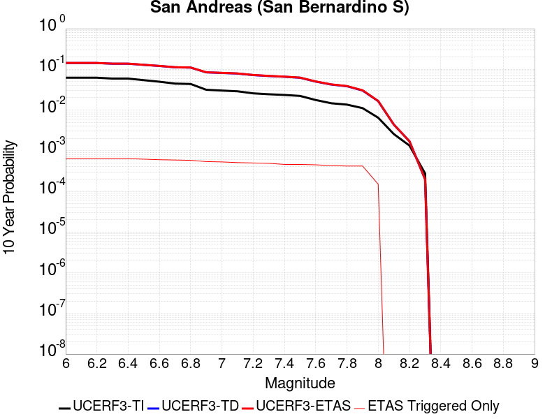 |

| Magnitude | 1 yr TI Prob | TD Prob | ETAS Prob | ETAS/TD Gain | ETAS Triggered Only | 10 yr TI Prob | TD Prob | ETAS Prob | ETAS/TD Gain | ETAS Triggered Only |
|-----|-----|-----|-----|-----|-----|-----|-----|-----|-----|-----|
| 6.0 | 0.006416472 | 0.015540994 | 0.015974157 | 1.0278722 | 4.4E-4 | 0.06234337 | 0.14283717 | 0.14338575 | 1.0038407 | 6.4E-4 |
| 6.1 | 0.006416472 | 0.015540994 | 0.015974157 | 1.0278722 | 4.4E-4 | 0.06234337 | 0.14283717 | 0.14338575 | 1.0038407 | 6.4E-4 |
| 6.2 | 0.006416472 | 0.015540994 | 0.015974157 | 1.0278722 | 4.4E-4 | 0.06234337 | 0.14283717 | 0.14338575 | 1.0038407 | 6.4E-4 |
| 6.3 | 0.006093008 | 0.014918125 | 0.015351561 | 1.0290543 | 4.4E-4 | 0.059286322 | 0.13754563 | 0.1380976 | 1.004013 | 6.4E-4 |
| 6.4 | 0.006093008 | 0.014918125 | 0.015351561 | 1.0290543 | 4.4E-4 | 0.059286322 | 0.13754563 | 0.1380976 | 1.004013 | 6.4E-4 |
| 6.5 | 0.0055621783 | 0.01389575 | 0.014319776 | 1.0305147 | 4.3E-4 | 0.05425003 | 0.12879294 | 0.1293331 | 1.0041939 | 6.2E-4 |
| 6.6 | 0.005082469 | 0.012991785 | 0.013406329 | 1.0319082 | 4.2E-4 | 0.049677886 | 0.12095292 | 0.121480346 | 1.0043606 | 6.0E-4 |
| 6.7 | 0.00455906 | 0.011997245 | 0.012402326 | 1.0337645 | 4.1E-4 | 0.04466656 | 0.11226123 | 0.112785 | 1.0046656 | 5.9E-4 |
| 6.8 | 0.004458263 | 0.011770263 | 0.012175438 | 1.0344236 | 4.1E-4 | 0.043698758 | 0.11027153 | 0.11078757 | 1.0046798 | 5.8E-4 |
| 6.9 | 0.0031904527 | 0.008866051 | 0.009252593 | 1.043598 | 3.9E-4 | 0.031450346 | 0.08418263 | 0.08467717 | 1.0058746 | 5.4E-4 |
| 7.0 | 0.0030530186 | 0.008570663 | 0.008957321 | 1.045114 | 3.9E-4 | 0.03011414 | 0.081500374 | 0.08198717 | 1.005973 | 5.3E-4 |
| 7.1 | 0.0029250039 | 0.008269769 | 0.008636709 | 1.0443712 | 3.7E-4 | 0.028868021 | 0.07879931 | 0.07926912 | 1.0059621 | 5.1E-4 |
| 7.2 | 0.002601025 | 0.007548217 | 0.007915424 | 1.0486482 | 3.7E-4 | 0.025707912 | 0.07225321 | 0.072717085 | 1.0064201 | 5.0E-4 |
| 7.3 | 0.0024707897 | 0.0071307817 | 0.0074882144 | 1.0501254 | 3.6E-4 | 0.024434982 | 0.06853558 | 0.068992 | 1.0066596 | 4.9E-4 |
| 7.4 | 0.002374317 | 0.0068239477 | 0.007171559 | 1.0509399 | 3.5E-4 | 0.023491086 | 0.065788016 | 0.06621775 | 1.0065322 | 4.6E-4 |
| 7.5 | 0.0022456115 | 0.0064275465 | 0.006775297 | 1.0541031 | 3.5E-4 | 0.022230545 | 0.062188786 | 0.06262018 | 1.0069368 | 4.6E-4 |
| 7.6 | 0.0017770125 | 0.0051191594 | 0.0054673674 | 1.0680206 | 3.5E-4 | 0.017628696 | 0.050020292 | 0.050447784 | 1.0085464 | 4.5E-4 |
| 7.7 | 0.0014764034 | 0.0042949775 | 0.004633517 | 1.0788223 | 3.4E-4 | 0.01466633 | 0.0422714 | 0.042683225 | 1.0097424 | 4.3E-4 |
| 7.8 | 0.0013673597 | 0.0038867102 | 0.0042154277 | 1.0845747 | 3.3E-4 | 0.013589768 | 0.03843674 | 0.0388406 | 1.010507 | 4.2E-4 |
| 7.9 | 0.0011196428 | 0.0030155594 | 0.0033445642 | 1.1091025 | 3.3E-4 | 0.011140184 | 0.030152109 | 0.030559445 | 1.0135094 | 4.2E-4 |
| 8.0 | 6.478649E-4 | 0.0016328706 | 0.001742691 | 1.067256 | 1.1E-4 | 0.0064597935 | 0.016522504 | 0.016670026 | 1.0089285 | 1.5E-4 |
| 8.1 | 2.566744E-4 | 4.0807744E-4 | 4.0807744E-4 | 1.0 | 0.0 | 0.002563781 | 0.0043843705 | 0.0043843705 | 1.0 | 0.0 |
| 8.2 | 1.3374983E-4 | 1.5165724E-4 | 1.5165724E-4 | 1.0 | 0.0 | 0.0013366934 | 0.0017049741 | 0.0017049741 | 1.0 | 0.0 |
| 8.3 | 2.7576245E-5 | 1.6743334E-5 | 1.6743334E-5 | 1.0 | 0.0 | 2.7572823E-4 | 1.9870348E-4 | 1.9870348E-4 | 1.0 | 0.0 |

## San Andreas (Parkfield)
*[(top)](#table-of-contents)*

| 1 Year | 10 Year |
|-----|-----|
|  |  |

| Magnitude | 1 yr TI Prob | TD Prob | ETAS Prob | ETAS/TD Gain | ETAS Triggered Only | 10 yr TI Prob | TD Prob | ETAS Prob | ETAS/TD Gain | ETAS Triggered Only |
|-----|-----|-----|-----|-----|-----|-----|-----|-----|-----|-----|
| 6.0 | 0.028586963 | 0.040191233 | 0.040498372 | 1.0076419 | 3.2E-4 | 0.25176284 | 0.33716413 | 0.3374757 | 1.000924 | 4.7E-4 |
| 6.1 | 0.0099994885 | 0.015778083 | 0.015974928 | 1.0124758 | 2.0E-4 | 0.095613256 | 0.1497237 | 0.14996177 | 1.0015901 | 2.8E-4 |
| 6.2 | 0.0049089384 | 0.009474681 | 0.0096430695 | 1.0177726 | 1.7E-4 | 0.048019063 | 0.09185409 | 0.09207204 | 1.0023729 | 2.4E-4 |
| 6.3 | 0.0048322747 | 0.009317789 | 0.009486205 | 1.0180746 | 1.7E-4 | 0.047285385 | 0.09050704 | 0.09072531 | 1.0024117 | 2.4E-4 |
| 6.4 | 0.0047573745 | 0.00919484 | 0.009363277 | 1.0183187 | 1.7E-4 | 0.046568092 | 0.08940927 | 0.08962782 | 1.0024443 | 2.4E-4 |
| 6.5 | 0.0046854047 | 0.009069731 | 0.00923819 | 1.0185736 | 1.7E-4 | 0.045878403 | 0.088295065 | 0.08851387 | 1.0024781 | 2.4E-4 |
| 6.6 | 0.0045870654 | 0.008904854 | 0.00907334 | 1.0189207 | 1.7E-4 | 0.04493529 | 0.0868267 | 0.087045856 | 1.0025241 | 2.4E-4 |
| 6.7 | 0.0045492216 | 0.008836143 | 0.009004641 | 1.0190692 | 1.7E-4 | 0.04457213 | 0.08622707 | 0.08644637 | 1.0025433 | 2.4E-4 |
| 6.8 | 0.0045347405 | 0.008807961 | 0.008976463 | 1.0191307 | 1.7E-4 | 0.04443313 | 0.08597467 | 0.08619404 | 1.0025516 | 2.4E-4 |
| 6.9 | 0.0045191357 | 0.008777418 | 0.008945926 | 1.019198 | 1.7E-4 | 0.044283327 | 0.085700735 | 0.08592016 | 1.0025605 | 2.4E-4 |
| 7.0 | 0.004455241 | 0.008649553 | 0.008818083 | 1.0194842 | 1.7E-4 | 0.043669727 | 0.08454914 | 0.08476885 | 1.0025986 | 2.4E-4 |
| 7.1 | 0.0040752706 | 0.007863306 | 0.0080220485 | 1.0201876 | 1.6E-4 | 0.040013418 | 0.07746111 | 0.07767329 | 1.0027392 | 2.3E-4 |
| 7.2 | 0.004005129 | 0.007727258 | 0.007886021 | 1.020546 | 1.6E-4 | 0.0393371 | 0.07623427 | 0.07644674 | 1.002787 | 2.3E-4 |
| 7.3 | 0.003934157 | 0.007570127 | 0.007728916 | 1.0209757 | 1.6E-4 | 0.038652334 | 0.074797355 | 0.07501015 | 1.0028449 | 2.3E-4 |
| 7.4 | 0.003865065 | 0.00741525 | 0.0075740633 | 1.0214171 | 1.6E-4 | 0.03798529 | 0.07337123 | 0.073584355 | 1.0029048 | 2.3E-4 |
| 7.5 | 0.0032037178 | 0.0058224914 | 0.005931851 | 1.0187823 | 1.1E-4 | 0.03157923 | 0.058557566 | 0.058708195 | 1.0025723 | 1.6E-4 |
| 7.6 | 0.0031593828 | 0.0057335934 | 0.0058330204 | 1.017341 | 1.0E-4 | 0.031148417 | 0.057718582 | 0.057859924 | 1.0024488 | 1.5E-4 |
| 7.7 | 0.002691582 | 0.0047760103 | 0.0048655802 | 1.0187541 | 9.0E-5 | 0.026592141 | 0.04853623 | 0.04866943 | 1.0027444 | 1.4E-4 |
| 7.8 | 0.0025062072 | 0.0044565317 | 0.0045361756 | 1.0178711 | 8.0E-5 | 0.024781305 | 0.04530245 | 0.045417015 | 1.0025289 | 1.2E-4 |
| 7.9 | 0.002069531 | 0.0035162016 | 0.0035460962 | 1.0085019 | 3.0E-5 | 0.020503636 | 0.035881363 | 0.035919927 | 1.0010748 | 4.0E-5 |
| 8.0 | 0.0015111357 | 0.0021213528 | 0.0021413104 | 1.009408 | 2.0E-5 | 0.015009012 | 0.022010697 | 0.022030257 | 1.0008887 | 2.0E-5 |
| 8.1 | 9.823717E-4 | 9.742898E-4 | 9.742898E-4 | 1.0 | 0.0 | 0.009780403 | 0.010488115 | 0.010488115 | 1.0 | 0.0 |
| 8.2 | 4.5092785E-4 | 2.8563058E-4 | 2.8563058E-4 | 1.0 | 0.0 | 0.0045001395 | 0.0032487072 | 0.0032487072 | 1.0 | 0.0 |
| 8.3 | 1.034694E-4 | 3.9967534E-5 | 3.9967534E-5 | 1.0 | 0.0 | 0.0010342124 | 4.719687E-4 | 4.719687E-4 | 1.0 | 0.0 |

## Death Valley (No)
*[(top)](#table-of-contents)*

| 1 Year | 10 Year |
|-----|-----|
|  | 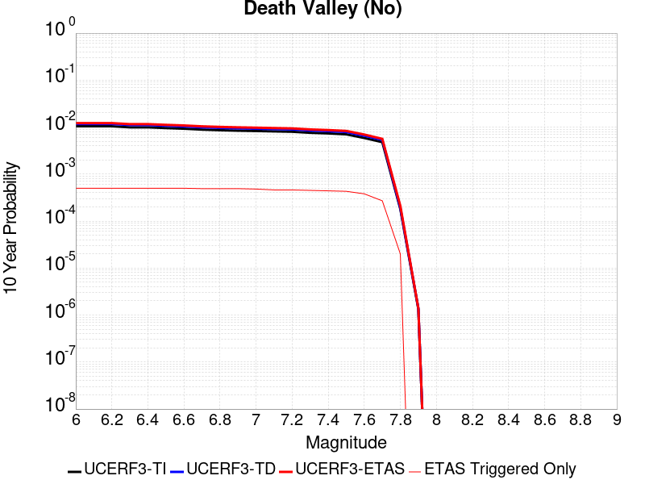 |

| Magnitude | 1 yr TI Prob | TD Prob | ETAS Prob | ETAS/TD Gain | ETAS Triggered Only | 10 yr TI Prob | TD Prob | ETAS Prob | ETAS/TD Gain | ETAS Triggered Only |
|-----|-----|-----|-----|-----|-----|-----|-----|-----|-----|-----|
| 6.0 | 0.001046937 | 0.0011733545 | 0.0015429204 | 1.3149652 | 3.7E-4 | 0.010420183 | 0.011672506 | 0.0121666705 | 1.0423357 | 5.0E-4 |
| 6.1 | 0.001046937 | 0.0011733545 | 0.0015429204 | 1.3149652 | 3.7E-4 | 0.010420183 | 0.011672506 | 0.0121666705 | 1.0423357 | 5.0E-4 |
| 6.2 | 0.001046937 | 0.0011733545 | 0.0015429204 | 1.3149652 | 3.7E-4 | 0.010420183 | 0.011672506 | 0.0121666705 | 1.0423357 | 5.0E-4 |
| 6.3 | 9.935491E-4 | 0.001112731 | 0.0014823193 | 1.3321452 | 3.7E-4 | 0.009891188 | 0.011072419 | 0.011566883 | 1.0446572 | 5.0E-4 |
| 6.4 | 9.935491E-4 | 0.001112731 | 0.0014823193 | 1.3321452 | 3.7E-4 | 0.009891188 | 0.011072419 | 0.011566883 | 1.0446572 | 5.0E-4 |
| 6.5 | 9.5791375E-4 | 0.0010722869 | 0.00144189 | 1.344687 | 3.7E-4 | 0.009537951 | 0.0106719155 | 0.011166579 | 1.0463519 | 5.0E-4 |
| 6.6 | 9.280632E-4 | 0.0010384015 | 0.0014080172 | 1.3559469 | 3.7E-4 | 0.009241969 | 0.010336253 | 0.010831084 | 1.0478734 | 5.0E-4 |
| 6.7 | 8.87976E-4 | 9.931813E-4 | 0.0013528238 | 1.3621116 | 3.6E-4 | 0.008844362 | 0.009888145 | 0.0103733 | 1.0490643 | 4.9E-4 |
| 6.8 | 8.629347E-4 | 9.655073E-4 | 0.0013251597 | 1.372501 | 3.6E-4 | 0.008595915 | 0.009613829 | 0.010099118 | 1.0504782 | 4.9E-4 |
| 6.9 | 8.4258494E-4 | 9.433546E-4 | 0.001303015 | 1.3812568 | 3.6E-4 | 0.008393973 | 0.009394196 | 0.009879593 | 1.0516698 | 4.9E-4 |
| 7.0 | 8.2900526E-4 | 9.286515E-4 | 0.0012883171 | 1.3872988 | 3.6E-4 | 0.008259195 | 0.009248397 | 0.009723959 | 1.0514209 | 4.8E-4 |
| 7.1 | 8.137789E-4 | 9.118627E-4 | 0.0012615436 | 1.3834797 | 3.5E-4 | 0.008108052 | 0.009081894 | 0.009537716 | 1.0501902 | 4.6E-4 |
| 7.2 | 7.99262E-4 | 8.9555193E-4 | 0.0012452385 | 1.3904705 | 3.5E-4 | 0.007963934 | 0.008920107 | 0.009376003 | 1.0511088 | 4.6E-4 |
| 7.3 | 7.592395E-4 | 8.5029035E-4 | 0.0011900013 | 1.3995234 | 3.4E-4 | 0.0075665074 | 0.008471014 | 0.008917202 | 1.0526724 | 4.5E-4 |
| 7.4 | 7.363519E-4 | 8.245094E-4 | 0.0011542373 | 1.399908 | 3.3E-4 | 0.0073391674 | 0.008215138 | 0.008651524 | 1.0531197 | 4.4E-4 |
| 7.5 | 7.043401E-4 | 7.8896893E-4 | 0.0011087165 | 1.4052726 | 3.2E-4 | 0.007021119 | 0.007862304 | 0.008288924 | 1.0542613 | 4.3E-4 |
| 7.6 | 5.88396E-4 | 6.5861654E-4 | 9.2843873E-4 | 1.4096802 | 2.7E-4 | 0.005868405 | 0.006567199 | 0.006944703 | 1.0574833 | 3.8E-4 |
| 7.7 | 4.7936183E-4 | 5.3643517E-4 | 7.0634397E-4 | 1.3167369 | 1.7E-4 | 0.004783291 | 0.005351914 | 0.005620469 | 1.0501792 | 2.7E-4 |
| 7.8 | 1.80467E-5 | 1.9035933E-5 | 3.9035553E-5 | 2.0506246 | 2.0E-5 | 1.8045233E-4 | 1.9034347E-4 | 2.1033967E-4 | 1.1050532 | 2.0E-5 |
| 7.9 | 1.335311E-7 | 1.3929966E-7 | 1.3929966E-7 | 1.0 | 0.0 | 1.3353102E-6 | 1.3929966E-6 | 1.3929966E-6 | 1.0 | 0.0 |

## San Andreas (Big Bend)
*[(top)](#table-of-contents)*

| 1 Year | 10 Year |
|-----|-----|
| 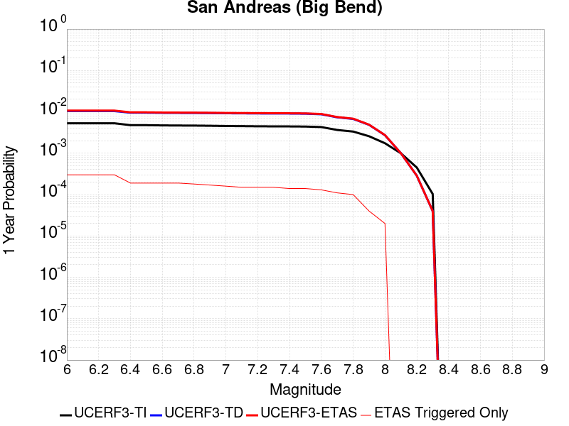 |  |

| Magnitude | 1 yr TI Prob | TD Prob | ETAS Prob | ETAS/TD Gain | ETAS Triggered Only | 10 yr TI Prob | TD Prob | ETAS Prob | ETAS/TD Gain | ETAS Triggered Only |
|-----|-----|-----|-----|-----|-----|-----|-----|-----|-----|-----|
| 6.0 | 0.0052979486 | 0.010419998 | 0.010716873 | 1.0284908 | 3.0E-4 | 0.051734097 | 0.10144902 | 0.1018354 | 1.0038086 | 4.3E-4 |
| 6.1 | 0.0052979486 | 0.010419998 | 0.010716873 | 1.0284908 | 3.0E-4 | 0.051734097 | 0.10144902 | 0.1018354 | 1.0038086 | 4.3E-4 |
| 6.2 | 0.0052979486 | 0.010419998 | 0.010716873 | 1.0284908 | 3.0E-4 | 0.051734097 | 0.10144902 | 0.1018354 | 1.0038086 | 4.3E-4 |
| 6.3 | 0.0052979486 | 0.010419998 | 0.010716873 | 1.0284908 | 3.0E-4 | 0.051734097 | 0.10144902 | 0.1018354 | 1.0038086 | 4.3E-4 |
| 6.4 | 0.0047704205 | 0.009571102 | 0.009759284 | 1.0196614 | 1.9E-4 | 0.046693064 | 0.09377527 | 0.09403808 | 1.0028025 | 2.9E-4 |
| 6.5 | 0.0047704205 | 0.009571102 | 0.009759284 | 1.0196614 | 1.9E-4 | 0.046693064 | 0.09377527 | 0.09403808 | 1.0028025 | 2.9E-4 |
| 6.6 | 0.0047074095 | 0.009471365 | 0.009659566 | 1.0198705 | 1.9E-4 | 0.046089325 | 0.092869274 | 0.09312327 | 1.002735 | 2.8E-4 |
| 6.7 | 0.00467679 | 0.00942708 | 0.009615289 | 1.0199647 | 1.9E-4 | 0.045795817 | 0.09246355 | 0.09271766 | 1.0027483 | 2.8E-4 |
| 6.8 | 0.004657841 | 0.009399569 | 0.009577877 | 1.0189698 | 1.8E-4 | 0.04561414 | 0.092210755 | 0.092455864 | 1.0026581 | 2.7E-4 |
| 6.9 | 0.004611638 | 0.009338548 | 0.009506961 | 1.0180341 | 1.7E-4 | 0.04517103 | 0.09165087 | 0.09188704 | 1.0025768 | 2.6E-4 |
| 7.0 | 0.004551957 | 0.009255203 | 0.009413722 | 1.0171275 | 1.6E-4 | 0.044598386 | 0.09088532 | 0.09111259 | 1.0025008 | 2.5E-4 |
| 7.1 | 0.0045216335 | 0.009209678 | 0.009358296 | 1.0161372 | 1.5E-4 | 0.04430731 | 0.09046686 | 0.09068515 | 1.0024129 | 2.4E-4 |
| 7.2 | 0.0044808835 | 0.0091531165 | 0.0093017435 | 1.0162379 | 1.5E-4 | 0.043916024 | 0.089947365 | 0.09016578 | 1.0024282 | 2.4E-4 |
| 7.3 | 0.0044610105 | 0.009123127 | 0.009271759 | 1.0162917 | 1.5E-4 | 0.043725148 | 0.08966853 | 0.08988701 | 1.0024365 | 2.4E-4 |
| 7.4 | 0.004447999 | 0.009103781 | 0.009242506 | 1.0152383 | 1.4E-4 | 0.043600157 | 0.08948871 | 0.08969813 | 1.0023402 | 2.3E-4 |
| 7.5 | 0.0044147377 | 0.009036204 | 0.009174939 | 1.0153532 | 1.4E-4 | 0.043280575 | 0.088866346 | 0.08907591 | 1.0023582 | 2.3E-4 |
| 7.6 | 0.0042910352 | 0.008749358 | 0.008878221 | 1.0147282 | 1.3E-4 | 0.042091176 | 0.086243294 | 0.08644432 | 1.0023309 | 2.2E-4 |
| 7.7 | 0.0036482112 | 0.0073848404 | 0.007494028 | 1.0147854 | 1.1E-4 | 0.035888977 | 0.07351733 | 0.07369336 | 1.0023944 | 1.9E-4 |
| 7.8 | 0.0033419547 | 0.0067446055 | 0.006843931 | 1.0147266 | 1.0E-4 | 0.03292141 | 0.06725231 | 0.06740154 | 1.0022191 | 1.6E-4 |
| 7.9 | 0.0025743195 | 0.004862453 | 0.004902258 | 1.0081863 | 4.0E-5 | 0.025447013 | 0.048914436 | 0.048971504 | 1.0011666 | 6.0E-5 |
| 8.0 | 0.0017438711 | 0.0027214854 | 0.0027414311 | 1.007329 | 2.0E-5 | 0.017302496 | 0.027922187 | 0.02794163 | 1.0006963 | 2.0E-5 |
| 8.1 | 9.963791E-4 | 9.999331E-4 | 9.999331E-4 | 1.0 | 0.0 | 0.009919235 | 0.010749801 | 0.010749801 | 1.0 | 0.0 |
| 8.2 | 4.5092785E-4 | 2.8563058E-4 | 2.8563058E-4 | 1.0 | 0.0 | 0.0045001395 | 0.0032487072 | 0.0032487072 | 1.0 | 0.0 |
| 8.3 | 1.034694E-4 | 3.9967534E-5 | 3.9967534E-5 | 1.0 | 0.0 | 0.0010342124 | 4.719687E-4 | 4.719687E-4 | 1.0 | 0.0 |

## Cady
*[(top)](#table-of-contents)*

| 1 Year | 10 Year |
|-----|-----|
|  |  |

| Magnitude | 1 yr TI Prob | TD Prob | ETAS Prob | ETAS/TD Gain | ETAS Triggered Only | 10 yr TI Prob | TD Prob | ETAS Prob | ETAS/TD Gain | ETAS Triggered Only |
|-----|-----|-----|-----|-----|-----|-----|-----|-----|-----|-----|
| 6.0 | 0.0010374374 | 0.0011400167 | 0.0014296861 | 1.2540922 | 2.9E-4 | 0.010326075 | 0.011350701 | 0.0117857065 | 1.0383241 | 4.4E-4 |
| 6.1 | 0.0010374374 | 0.0011400167 | 0.0014296861 | 1.2540922 | 2.9E-4 | 0.010326075 | 0.011350701 | 0.0117857065 | 1.0383241 | 4.4E-4 |
| 6.2 | 0.0010374374 | 0.0011400167 | 0.0014296861 | 1.2540922 | 2.9E-4 | 0.010326075 | 0.011350701 | 0.0117857065 | 1.0383241 | 4.4E-4 |
| 6.3 | 5.7992124E-4 | 6.351925E-4 | 7.751036E-4 | 1.2202656 | 1.4E-4 | 0.0057841022 | 0.0063368753 | 0.0065455446 | 1.0329293 | 2.1E-4 |
| 6.4 | 5.7992124E-4 | 6.351925E-4 | 7.751036E-4 | 1.2202656 | 1.4E-4 | 0.0057841022 | 0.0063368753 | 0.0065455446 | 1.0329293 | 2.1E-4 |
| 6.5 | 3.1840094E-4 | 3.480905E-4 | 4.3805919E-4 | 1.2584635 | 9.0E-5 | 0.0031794512 | 0.0034766865 | 0.0036062347 | 1.037262 | 1.3E-4 |
| 6.6 | 3.034899E-4 | 3.3211018E-4 | 4.2208028E-4 | 1.2709044 | 9.0E-5 | 0.0030307577 | 0.0033173605 | 0.0034469294 | 1.0390577 | 1.3E-4 |
| 6.7 | 2.5484123E-4 | 2.7863772E-4 | 3.4861822E-4 | 1.2511523 | 7.0E-5 | 0.0025454918 | 0.0027840391 | 0.0028837607 | 1.035819 | 1.0E-4 |
| 6.8 | 9.281505E-5 | 1.01218284E-4 | 1.3121525E-4 | 1.2963592 | 3.0E-5 | 9.2776294E-4 | 0.0010118765 | 0.0010418461 | 1.0296179 | 3.0E-5 |
| 6.9 | 3.937079E-5 | 4.3292483E-5 | 5.329205E-5 | 1.2309769 | 1.0E-5 | 3.9363815E-4 | 4.3287344E-4 | 4.428691E-4 | 1.0230914 | 1.0E-5 |
| 7.0 | 3.578281E-5 | 3.9351715E-5 | 4.9351318E-5 | 1.2541085 | 1.0E-5 | 3.577705E-4 | 3.9347992E-4 | 4.0347598E-4 | 1.0254042 | 1.0E-5 |

## San Andreas (San Gorgonio Pass-Garnet HIll)
*[(top)](#table-of-contents)*

| 1 Year | 10 Year |
|-----|-----|
|  |  |

| Magnitude | 1 yr TI Prob | TD Prob | ETAS Prob | ETAS/TD Gain | ETAS Triggered Only | 10 yr TI Prob | TD Prob | ETAS Prob | ETAS/TD Gain | ETAS Triggered Only |
|-----|-----|-----|-----|-----|-----|-----|-----|-----|-----|-----|
| 6.0 | 0.004329778 | 0.012127888 | 0.012453887 | 1.02688 | 3.3E-4 | 0.042463828 | 0.11257892 | 0.11296938 | 1.0034684 | 4.4E-4 |
| 6.1 | 0.004329778 | 0.012127888 | 0.012453887 | 1.02688 | 3.3E-4 | 0.042463828 | 0.11257892 | 0.11296938 | 1.0034684 | 4.4E-4 |
| 6.2 | 0.004329778 | 0.012127888 | 0.012453887 | 1.02688 | 3.3E-4 | 0.042463828 | 0.11257892 | 0.11296938 | 1.0034684 | 4.4E-4 |
| 6.3 | 0.004329778 | 0.012127888 | 0.012453887 | 1.02688 | 3.3E-4 | 0.042463828 | 0.11257892 | 0.11296938 | 1.0034684 | 4.4E-4 |
| 6.4 | 0.0041964394 | 0.011900152 | 0.012226225 | 1.0274007 | 3.3E-4 | 0.041180745 | 0.11056015 | 0.1109515 | 1.0035397 | 4.4E-4 |
| 6.5 | 0.0041964394 | 0.011900152 | 0.012226225 | 1.0274007 | 3.3E-4 | 0.041180745 | 0.11056015 | 0.1109515 | 1.0035397 | 4.4E-4 |
| 6.6 | 0.0039678677 | 0.01151087 | 0.011817302 | 1.0266211 | 3.1E-4 | 0.03897764 | 0.10709683 | 0.10746292 | 1.0034183 | 4.1E-4 |
| 6.7 | 0.0038750346 | 0.011343609 | 0.011650092 | 1.0270182 | 3.1E-4 | 0.038081564 | 0.105605274 | 0.10597198 | 1.0034723 | 4.1E-4 |
| 6.8 | 0.0038401815 | 0.011264749 | 0.011571256 | 1.0272095 | 3.1E-4 | 0.03774495 | 0.10490683 | 0.10527381 | 1.0034982 | 4.1E-4 |
| 6.9 | 0.003789323 | 0.011145527 | 0.011452071 | 1.0275038 | 3.1E-4 | 0.037253562 | 0.103854746 | 0.10422216 | 1.0035378 | 4.1E-4 |
| 7.0 | 0.003699303 | 0.010930831 | 0.0112374425 | 1.0280502 | 3.1E-4 | 0.03638325 | 0.10195695 | 0.10232514 | 1.0036113 | 4.1E-4 |
| 7.1 | 0.0036607897 | 0.010845989 | 0.011142735 | 1.02736 | 3.0E-4 | 0.036010686 | 0.101199985 | 0.101559505 | 1.0035526 | 4.0E-4 |
| 7.2 | 0.003567883 | 0.010643536 | 0.010940343 | 1.0278862 | 3.0E-4 | 0.035111405 | 0.09939202 | 0.09975226 | 1.0036244 | 4.0E-4 |
| 7.3 | 0.0034497243 | 0.0102444785 | 0.010531508 | 1.0280179 | 2.9E-4 | 0.033966612 | 0.095888525 | 0.09624113 | 1.0036772 | 3.9E-4 |
| 7.4 | 0.002660276 | 0.0076359594 | 0.007903898 | 1.035089 | 2.7E-4 | 0.02628654 | 0.07286301 | 0.07319678 | 1.0045807 | 3.6E-4 |
| 7.5 | 0.0020487092 | 0.005790949 | 0.006039501 | 1.0429208 | 2.5E-4 | 0.020299247 | 0.05600951 | 0.05633047 | 1.0057304 | 3.4E-4 |
| 7.6 | 0.0015564259 | 0.0044229585 | 0.0046718526 | 1.0562732 | 2.5E-4 | 0.0154556995 | 0.04319374 | 0.043509483 | 1.00731 | 3.3E-4 |
| 7.7 | 0.0011022091 | 0.0033094748 | 0.0035387136 | 1.0692674 | 2.3E-4 | 0.010967582 | 0.032582592 | 0.032863144 | 1.0086105 | 2.9E-4 |
| 7.8 | 9.822468E-4 | 0.0028991038 | 0.0031184661 | 1.0756655 | 2.2E-4 | 0.0097791655 | 0.028695205 | 0.028967172 | 1.0094777 | 2.8E-4 |
| 7.9 | 7.9052144E-4 | 0.0021713632 | 0.0023809073 | 1.0965035 | 2.1E-4 | 0.007877152 | 0.021759422 | 0.022023547 | 1.0121384 | 2.7E-4 |
| 8.0 | 5.9497025E-4 | 0.0015628147 | 0.0016726428 | 1.0702758 | 1.1E-4 | 0.005933798 | 0.015772851 | 0.015920484 | 1.00936 | 1.5E-4 |
| 8.1 | 2.2701119E-4 | 3.8444297E-4 | 3.8444297E-4 | 1.0 | 0.0 | 0.0022677942 | 0.0041163345 | 0.0041163345 | 1.0 | 0.0 |
| 8.2 | 1.2022553E-4 | 1.4259106E-4 | 1.4259106E-4 | 1.0 | 0.0 | 0.0012016051 | 0.0015979785 | 0.0015979785 | 1.0 | 0.0 |
| 8.3 | 2.714798E-5 | 1.6487444E-5 | 1.6487444E-5 | 1.0 | 0.0 | 2.7144665E-4 | 1.9563142E-4 | 1.9563142E-4 | 1.0 | 0.0 |

## Sierra Nevada  (No Extension)
*[(top)](#table-of-contents)*

| 1 Year | 10 Year |
|-----|-----|
| 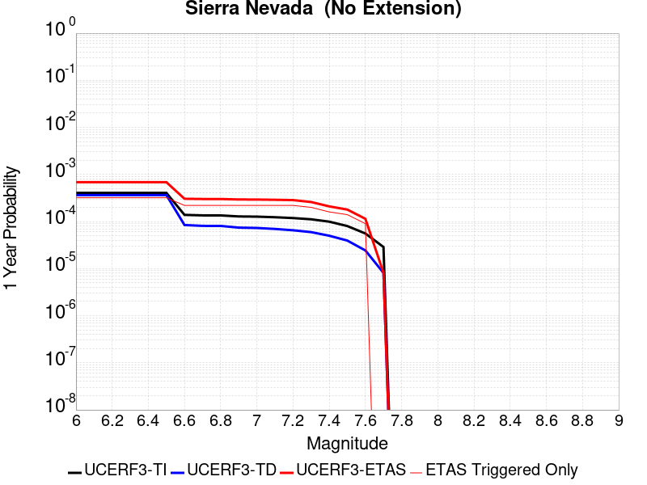 | 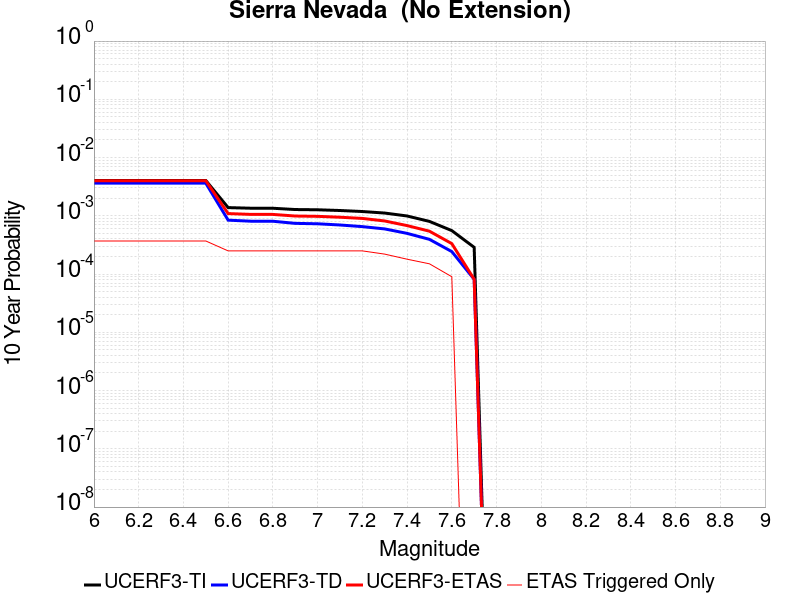 |

| Magnitude | 1 yr TI Prob | TD Prob | ETAS Prob | ETAS/TD Gain | ETAS Triggered Only | 10 yr TI Prob | TD Prob | ETAS Prob | ETAS/TD Gain | ETAS Triggered Only |
|-----|-----|-----|-----|-----|-----|-----|-----|-----|-----|-----|
| 6.0 | 4.0529718E-4 | 3.6398784E-4 | 6.838714E-4 | 1.8788302 | 3.2E-4 | 0.004045588 | 0.0036374326 | 0.004006087 | 1.1013501 | 3.7E-4 |
| 6.1 | 4.0529718E-4 | 3.6398784E-4 | 6.838714E-4 | 1.8788302 | 3.2E-4 | 0.004045588 | 0.0036374326 | 0.004006087 | 1.1013501 | 3.7E-4 |
| 6.2 | 4.0529718E-4 | 3.6398784E-4 | 6.838714E-4 | 1.8788302 | 3.2E-4 | 0.004045588 | 0.0036374326 | 0.004006087 | 1.1013501 | 3.7E-4 |
| 6.3 | 4.0529718E-4 | 3.6398784E-4 | 6.838714E-4 | 1.8788302 | 3.2E-4 | 0.004045588 | 0.0036374326 | 0.004006087 | 1.1013501 | 3.7E-4 |
| 6.4 | 4.0529718E-4 | 3.6398784E-4 | 6.838714E-4 | 1.8788302 | 3.2E-4 | 0.004045588 | 0.0036374326 | 0.004006087 | 1.1013501 | 3.7E-4 |
| 6.5 | 4.0529718E-4 | 3.6398784E-4 | 6.838714E-4 | 1.8788302 | 3.2E-4 | 0.004045588 | 0.0036374326 | 0.004006087 | 1.1013501 | 3.7E-4 |
| 6.6 | 1.3842035E-4 | 8.425733E-5 | 3.0423878E-4 | 3.6108289 | 2.2E-4 | 0.0013833415 | 8.422573E-4 | 0.0010920467 | 1.2965714 | 2.5E-4 |
| 6.7 | 1.351464E-4 | 8.0883394E-5 | 3.008656E-4 | 3.719745 | 2.2E-4 | 0.0013506424 | 8.0854254E-4 | 0.0010583404 | 1.3089483 | 2.5E-4 |
| 6.8 | 1.34893E-4 | 8.071645E-5 | 3.0069868E-4 | 3.7253706 | 2.2E-4 | 0.0013481114 | 8.068743E-4 | 0.0010566725 | 1.3095876 | 2.5E-4 |
| 6.9 | 1.2826028E-4 | 7.4198484E-5 | 2.9418216E-4 | 3.9648001 | 2.2E-4 | 0.0012818627 | 7.4173906E-4 | 9.915537E-4 | 1.3367958 | 2.5E-4 |
| 7.0 | 1.270024E-4 | 7.2996576E-5 | 2.9298052E-4 | 4.01362 | 2.2E-4 | 0.0012692984 | 7.297279E-4 | 9.795455E-4 | 1.3423434 | 2.5E-4 |
| 7.1 | 1.2340778E-4 | 6.9602575E-5 | 2.8958727E-4 | 4.1605825 | 2.2E-4 | 0.0012333926 | 6.9580943E-4 | 9.456355E-4 | 1.3590437 | 2.5E-4 |
| 7.2 | 1.1855107E-4 | 6.5235865E-5 | 2.8522153E-4 | 4.372158 | 2.2E-4 | 0.0011848784 | 6.5216864E-4 | 9.020056E-4 | 1.3830864 | 2.5E-4 |
| 7.3 | 1.1156279E-4 | 5.958465E-5 | 2.5957273E-4 | 4.356369 | 2.0E-4 | 0.001115068 | 5.956879E-4 | 8.1555685E-4 | 1.3691009 | 2.2E-4 |
| 7.4 | 9.9385186E-5 | 4.996103E-5 | 2.0995304E-4 | 4.202336 | 1.6E-4 | 9.934074E-4 | 4.994987E-4 | 6.794088E-4 | 1.3601813 | 1.8E-4 |
| 7.5 | 8.021306E-5 | 3.9446462E-5 | 1.7944095E-4 | 4.548974 | 1.4E-4 | 8.0184115E-4 | 3.943951E-4 | 5.443359E-4 | 1.3801793 | 1.5E-4 |
| 7.6 | 5.5726876E-5 | 2.4313129E-5 | 1.1431094E-4 | 4.701614 | 9.0E-5 | 5.5712904E-4 | 2.4310495E-4 | 3.3308307E-4 | 1.3701205 | 9.0E-5 |
| 7.7 | 2.8745531E-5 | 8.129644E-6 | 8.129644E-6 | 1.0 | 0.0 | 2.8741814E-4 | 8.1293576E-5 | 8.1293576E-5 | 1.0 | 0.0 |

## Scodie Lineament
*[(top)](#table-of-contents)*

| 1 Year | 10 Year |
|-----|-----|
| 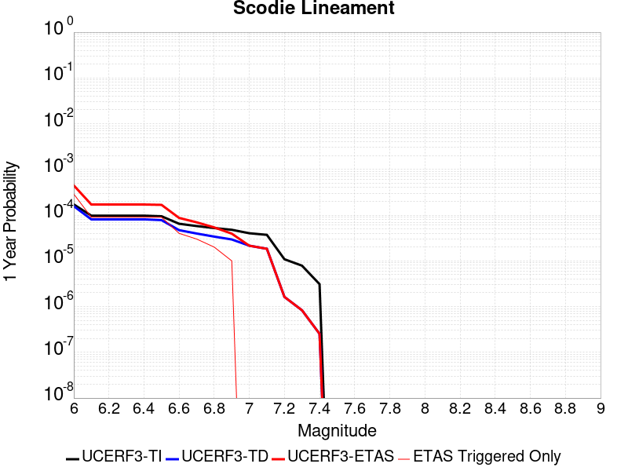 | 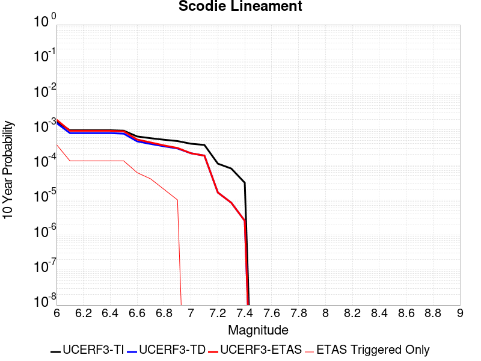 |

| Magnitude | 1 yr TI Prob | TD Prob | ETAS Prob | ETAS/TD Gain | ETAS Triggered Only | 10 yr TI Prob | TD Prob | ETAS Prob | ETAS/TD Gain | ETAS Triggered Only |
|-----|-----|-----|-----|-----|-----|-----|-----|-----|-----|-----|
| 6.0 | 1.7175387E-4 | 1.5722317E-4 | 4.4717756E-4 | 2.8442218 | 2.9E-4 | 0.0017162118 | 0.0015714309 | 0.0019508337 | 1.2414378 | 3.8E-4 |
| 6.1 | 9.738045E-5 | 8.082454E-5 | 1.7081726E-4 | 2.1134331 | 9.0E-5 | 9.7337784E-4 | 8.080003E-4 | 9.378952E-4 | 1.160761 | 1.3E-4 |
| 6.2 | 9.738045E-5 | 8.082454E-5 | 1.7081726E-4 | 2.1134331 | 9.0E-5 | 9.7337784E-4 | 8.080003E-4 | 9.378952E-4 | 1.160761 | 1.3E-4 |
| 6.3 | 9.738045E-5 | 8.082454E-5 | 1.7081726E-4 | 2.1134331 | 9.0E-5 | 9.7337784E-4 | 8.080003E-4 | 9.378952E-4 | 1.160761 | 1.3E-4 |
| 6.4 | 9.738045E-5 | 8.082454E-5 | 1.7081726E-4 | 2.1134331 | 9.0E-5 | 9.7337784E-4 | 8.080003E-4 | 9.378952E-4 | 1.160761 | 1.3E-4 |
| 6.5 | 9.447177E-5 | 7.7794975E-5 | 1.6778798E-4 | 2.1567972 | 9.0E-5 | 9.4431615E-4 | 7.7772606E-4 | 9.0762496E-4 | 1.167024 | 1.3E-4 |
| 6.6 | 6.477596E-5 | 4.6946985E-5 | 8.69451E-5 | 1.851985 | 4.0E-5 | 6.475708E-4 | 4.693793E-4 | 5.293512E-4 | 1.1277684 | 6.0E-5 |
| 6.7 | 5.7719422E-5 | 3.9625334E-5 | 6.962415E-5 | 1.7570614 | 3.0E-5 | 5.770443E-4 | 3.961897E-4 | 4.3617384E-4 | 1.1009218 | 4.0E-5 |
| 6.8 | 5.221238E-5 | 3.3917644E-5 | 5.3916967E-5 | 1.5896436 | 2.0E-5 | 5.220012E-4 | 3.3913075E-4 | 3.5912395E-4 | 1.0589544 | 2.0E-5 |
| 6.9 | 4.7832873E-5 | 2.9384651E-5 | 3.938436E-5 | 1.3403037 | 1.0E-5 | 4.782258E-4 | 2.9381333E-4 | 3.038104E-4 | 1.0340252 | 1.0E-5 |
| 7.0 | 4.0170275E-5 | 2.1462862E-5 | 2.1462862E-5 | 1.0 | 0.0 | 4.0163012E-4 | 2.1461173E-4 | 2.1461173E-4 | 1.0 | 0.0 |
| 7.1 | 3.706632E-5 | 1.8372726E-5 | 1.8372726E-5 | 1.0 | 0.0 | 3.7060137E-4 | 1.8371557E-4 | 1.8371557E-4 | 1.0 | 0.0 |
| 7.2 | 1.0852878E-5 | 1.6272843E-6 | 1.6272843E-6 | 1.0 | 0.0 | 1.08523476E-4 | 1.627273E-5 | 1.627273E-5 | 1.0 | 0.0 |
| 7.3 | 7.851896E-6 | 8.320234E-7 | 8.320234E-7 | 1.0 | 0.0 | 7.851618E-5 | 8.320206E-6 | 8.320206E-6 | 1.0 | 0.0 |
| 7.4 | 3.095994E-6 | 2.5402372E-7 | 2.5402372E-7 | 1.0 | 0.0 | 3.095951E-5 | 2.5402353E-6 | 2.5402353E-6 | 1.0 | 0.0 |

## Death Valley (Fish Lake Valley)
*[(top)](#table-of-contents)*

| 1 Year | 10 Year |
|-----|-----|
|  |  |

| Magnitude | 1 yr TI Prob | TD Prob | ETAS Prob | ETAS/TD Gain | ETAS Triggered Only | 10 yr TI Prob | TD Prob | ETAS Prob | ETAS/TD Gain | ETAS Triggered Only |
|-----|-----|-----|-----|-----|-----|-----|-----|-----|-----|-----|
| 6.0 | 0.0020185246 | 0.002463534 | 0.0027129182 | 1.1012303 | 2.5E-4 | 0.02000288 | 0.024388181 | 0.024729645 | 1.0140013 | 3.5E-4 |
| 6.1 | 0.0020185246 | 0.002463534 | 0.0027129182 | 1.1012303 | 2.5E-4 | 0.02000288 | 0.024388181 | 0.024729645 | 1.0140013 | 3.5E-4 |
| 6.2 | 0.0020185246 | 0.002463534 | 0.0027129182 | 1.1012303 | 2.5E-4 | 0.02000288 | 0.024388181 | 0.024729645 | 1.0140013 | 3.5E-4 |
| 6.3 | 0.0014785219 | 0.0017522911 | 0.0019918706 | 1.1367235 | 2.4E-4 | 0.014687235 | 0.017391782 | 0.01772587 | 1.0192095 | 3.4E-4 |
| 6.4 | 0.0014785219 | 0.0017522911 | 0.0019918706 | 1.1367235 | 2.4E-4 | 0.014687235 | 0.017391782 | 0.01772587 | 1.0192095 | 3.4E-4 |
| 6.5 | 0.0012748998 | 0.0014916632 | 0.0017313052 | 1.1606542 | 2.4E-4 | 0.012676105 | 0.014821377 | 0.015156337 | 1.0225998 | 3.4E-4 |
| 6.6 | 0.0011107022 | 0.0012859525 | 0.0015256439 | 1.1863921 | 2.4E-4 | 0.011051672 | 0.012788526 | 0.013124177 | 1.0262463 | 3.4E-4 |
| 6.7 | 9.888117E-4 | 0.001135897 | 0.0013756243 | 1.2110468 | 2.4E-4 | 0.009844234 | 0.01130357 | 0.011639726 | 1.029739 | 3.4E-4 |
| 6.8 | 8.7057345E-4 | 9.918857E-4 | 0.0012216575 | 1.2316515 | 2.3E-4 | 0.008671708 | 0.009876343 | 0.010203084 | 1.0330832 | 3.3E-4 |
| 6.9 | 7.5657194E-4 | 8.5483363E-4 | 0.001084637 | 1.2688282 | 2.3E-4 | 0.007540013 | 0.008516385 | 0.008843576 | 1.0384189 | 3.3E-4 |
| 7.0 | 6.750118E-4 | 7.5829466E-4 | 9.881203E-4 | 1.3030821 | 2.3E-4 | 0.006729651 | 0.0075576897 | 0.007885196 | 1.0433341 | 3.3E-4 |
| 7.1 | 6.5435225E-4 | 7.343222E-4 | 9.5416064E-4 | 1.299376 | 2.2E-4 | 0.006524288 | 0.007319551 | 0.007637209 | 1.0433985 | 3.2E-4 |
| 7.2 | 6.514716E-4 | 7.310616E-4 | 9.509008E-4 | 1.3007122 | 2.2E-4 | 0.006495651 | 0.0072871596 | 0.0076048276 | 1.0435928 | 3.2E-4 |
| 7.3 | 6.451563E-4 | 7.2397763E-4 | 9.4381836E-4 | 1.3036568 | 2.2E-4 | 0.0064328653 | 0.007216782 | 0.0075344723 | 1.0440211 | 3.2E-4 |
| 7.4 | 6.3438306E-4 | 7.118836E-4 | 9.31727E-4 | 1.3088193 | 2.2E-4 | 0.006325751 | 0.0070966207 | 0.00741435 | 1.0447719 | 3.2E-4 |
| 7.5 | 6.10721E-4 | 6.856895E-4 | 9.055386E-4 | 1.320625 | 2.2E-4 | 0.0060904534 | 0.006836321 | 0.0071541336 | 1.0464888 | 3.2E-4 |
| 7.6 | 5.383166E-4 | 6.040347E-4 | 8.0391386E-4 | 1.3309069 | 2.0E-4 | 0.0053701443 | 0.0060244603 | 0.006322653 | 1.049497 | 3.0E-4 |
| 7.7 | 4.6625308E-4 | 5.228456E-4 | 6.927567E-4 | 1.3249738 | 1.7E-4 | 0.0046527605 | 0.005216664 | 0.005475308 | 1.0495803 | 2.6E-4 |
| 7.8 | 1.6217007E-5 | 1.7138715E-5 | 3.7138372E-5 | 2.1669285 | 2.0E-5 | 1.6215823E-4 | 1.7137431E-4 | 1.9137088E-4 | 1.1166836 | 2.0E-5 |
| 7.9 | 1.335311E-7 | 1.3929966E-7 | 1.3929966E-7 | 1.0 | 0.0 | 1.3353102E-6 | 1.3929966E-6 | 1.3929966E-6 | 1.0 | 0.0 |

## Elsinore (Glen Ivy) rev
*[(top)](#table-of-contents)*

| 1 Year | 10 Year |
|-----|-----|
|  |  |

| Magnitude | 1 yr TI Prob | TD Prob | ETAS Prob | ETAS/TD Gain | ETAS Triggered Only | 10 yr TI Prob | TD Prob | ETAS Prob | ETAS/TD Gain | ETAS Triggered Only |
|-----|-----|-----|-----|-----|-----|-----|-----|-----|-----|-----|
| 6.0 | 0.008420097 | 0.015234485 | 0.015451133 | 1.014221 | 2.2E-4 | 0.081081145 | 0.13969168 | 0.13993256 | 1.0017244 | 2.8E-4 |
| 6.1 | 0.008420097 | 0.015234485 | 0.015451133 | 1.014221 | 2.2E-4 | 0.081081145 | 0.13969168 | 0.13993256 | 1.0017244 | 2.8E-4 |
| 6.2 | 0.008420097 | 0.015234485 | 0.015451133 | 1.014221 | 2.2E-4 | 0.081081145 | 0.13969168 | 0.13993256 | 1.0017244 | 2.8E-4 |
| 6.3 | 0.005262531 | 0.009217682 | 0.009396023 | 1.0193477 | 1.8E-4 | 0.0513964 | 0.0870191 | 0.087238215 | 1.002518 | 2.4E-4 |
| 6.4 | 0.005262531 | 0.009217682 | 0.009396023 | 1.0193477 | 1.8E-4 | 0.0513964 | 0.0870191 | 0.087238215 | 1.002518 | 2.4E-4 |
| 6.5 | 0.001909235 | 0.0024181372 | 0.0024480645 | 1.0123762 | 3.0E-5 | 0.01892915 | 0.023739954 | 0.023788767 | 1.0020561 | 5.0E-5 |
| 6.6 | 0.0013063047 | 0.0013634858 | 0.001393445 | 1.0219724 | 3.0E-5 | 0.012986525 | 0.013564618 | 0.013604076 | 1.0029088 | 4.0E-5 |
| 6.7 | 0.0011571734 | 0.0011511183 | 0.0011810838 | 1.0260316 | 3.0E-5 | 0.011511663 | 0.011465415 | 0.0115049565 | 1.0034487 | 4.0E-5 |
| 6.8 | 8.686314E-4 | 7.530661E-4 | 7.530661E-4 | 1.0 | 0.0 | 0.008652439 | 0.00751048 | 0.00751048 | 1.0 | 0.0 |
| 6.9 | 7.8461546E-4 | 6.4326765E-4 | 6.4326765E-4 | 1.0 | 0.0 | 0.007818509 | 0.00641828 | 0.00641828 | 1.0 | 0.0 |
| 7.0 | 7.490812E-4 | 5.973418E-4 | 5.973418E-4 | 1.0 | 0.0 | 0.007465612 | 0.0059613534 | 0.0059613534 | 1.0 | 0.0 |
| 7.1 | 6.919436E-4 | 5.344282E-4 | 5.344282E-4 | 1.0 | 0.0 | 0.006897931 | 0.0053347866 | 0.0053347866 | 1.0 | 0.0 |
| 7.2 | 6.049042E-4 | 4.436875E-4 | 4.436875E-4 | 1.0 | 0.0 | 0.006032603 | 0.0044294316 | 0.0044294316 | 1.0 | 0.0 |
| 7.3 | 5.2951806E-4 | 3.7763975E-4 | 3.7763975E-4 | 1.0 | 0.0 | 0.005282581 | 0.0037703665 | 0.0037703665 | 1.0 | 0.0 |
| 7.4 | 4.7370812E-4 | 3.3141294E-4 | 3.3141294E-4 | 1.0 | 0.0 | 0.004726996 | 0.0033093381 | 0.0033093381 | 1.0 | 0.0 |
| 7.5 | 4.0021708E-4 | 2.7263095E-4 | 2.7263095E-4 | 1.0 | 0.0 | 0.0039949706 | 0.00272309 | 0.00272309 | 1.0 | 0.0 |
| 7.6 | 3.6466747E-4 | 2.445613E-4 | 2.445613E-4 | 1.0 | 0.0 | 0.0036406964 | 0.002443038 | 0.002443038 | 1.0 | 0.0 |
| 7.7 | 2.172226E-4 | 1.21545316E-4 | 1.21545316E-4 | 1.0 | 0.0 | 0.0021701038 | 0.0012148614 | 0.0012148614 | 1.0 | 0.0 |
| 7.8 | 1.1840509E-5 | 4.8971956E-6 | 4.8971956E-6 | 1.0 | 0.0 | 1.1839878E-4 | 4.8971204E-5 | 4.8971204E-5 | 1.0 | 0.0 |
| 7.9 | 3.4838732E-7 | 1.7948659E-7 | 1.7948659E-7 | 1.0 | 0.0 | 3.4838679E-6 | 1.7948646E-6 | 1.7948646E-6 | 1.0 | 0.0 |

## San Andreas (Carrizo) rev
*[(top)](#table-of-contents)*

| 1 Year | 10 Year |
|-----|-----|
|  | 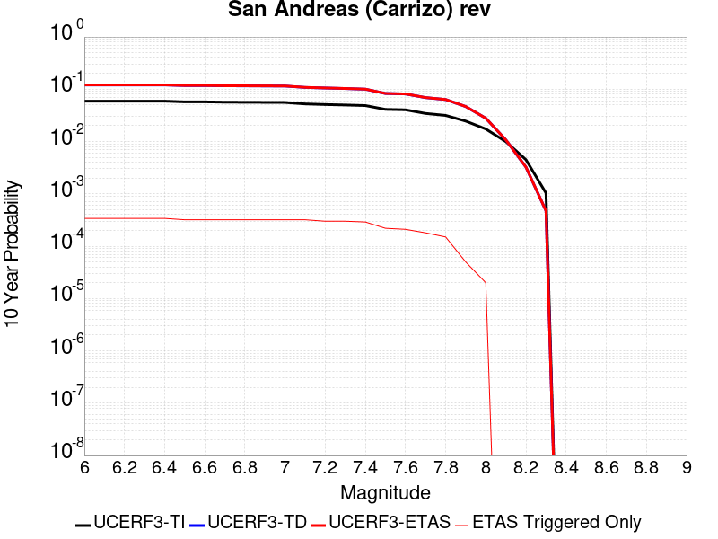 |

| Magnitude | 1 yr TI Prob | TD Prob | ETAS Prob | ETAS/TD Gain | ETAS Triggered Only | 10 yr TI Prob | TD Prob | ETAS Prob | ETAS/TD Gain | ETAS Triggered Only |
|-----|-----|-----|-----|-----|-----|-----|-----|-----|-----|-----|
| 6.0 | 0.006073493 | 0.012613042 | 0.012820394 | 1.0164394 | 2.1E-4 | 0.0591016 | 0.12061418 | 0.12091317 | 1.002479 | 3.4E-4 |
| 6.1 | 0.006073493 | 0.012613042 | 0.012820394 | 1.0164394 | 2.1E-4 | 0.0591016 | 0.12061418 | 0.12091317 | 1.002479 | 3.4E-4 |
| 6.2 | 0.006073493 | 0.012613042 | 0.012820394 | 1.0164394 | 2.1E-4 | 0.0591016 | 0.12061418 | 0.12091317 | 1.002479 | 3.4E-4 |
| 6.3 | 0.006073493 | 0.012613042 | 0.012820394 | 1.0164394 | 2.1E-4 | 0.0591016 | 0.12061418 | 0.12091317 | 1.002479 | 3.4E-4 |
| 6.4 | 0.006073493 | 0.012613042 | 0.012820394 | 1.0164394 | 2.1E-4 | 0.0591016 | 0.12061418 | 0.12091317 | 1.002479 | 3.4E-4 |
| 6.5 | 0.0058862255 | 0.012262545 | 0.012460092 | 1.0161098 | 2.0E-4 | 0.057327334 | 0.117585555 | 0.117867924 | 1.0024015 | 3.2E-4 |
| 6.6 | 0.0058862255 | 0.012262545 | 0.012460092 | 1.0161098 | 2.0E-4 | 0.057327334 | 0.117585555 | 0.117867924 | 1.0024015 | 3.2E-4 |
| 6.7 | 0.0058011734 | 0.012103349 | 0.012300928 | 1.0163244 | 2.0E-4 | 0.05652051 | 0.1162071 | 0.11648992 | 1.0024337 | 3.2E-4 |
| 6.8 | 0.005777263 | 0.012052901 | 0.0122504905 | 1.0163935 | 2.0E-4 | 0.056293584 | 0.1157674 | 0.116050355 | 1.0024441 | 3.2E-4 |
| 6.9 | 0.0057511497 | 0.01199741 | 0.012195011 | 1.0164703 | 2.0E-4 | 0.05604569 | 0.11528359 | 0.1155667 | 1.0024557 | 3.2E-4 |
| 7.0 | 0.0057263062 | 0.011946279 | 0.012143889 | 1.0165416 | 2.0E-4 | 0.055809796 | 0.11483591 | 0.11511916 | 1.0024666 | 3.2E-4 |
| 7.1 | 0.0053644776 | 0.011177397 | 0.011375163 | 1.0176933 | 2.0E-4 | 0.052368138 | 0.108092256 | 0.108377665 | 1.0026405 | 3.2E-4 |
| 7.2 | 0.0052187922 | 0.010871782 | 0.011059716 | 1.0172864 | 1.9E-4 | 0.050979212 | 0.10539625 | 0.105664626 | 1.0025464 | 3.0E-4 |
| 7.3 | 0.005109493 | 0.010600842 | 0.010788827 | 1.0177331 | 1.9E-4 | 0.049935985 | 0.102979995 | 0.1032491 | 1.0026132 | 3.0E-4 |
| 7.4 | 0.0049778637 | 0.010275229 | 0.010463277 | 1.0183011 | 1.9E-4 | 0.048678253 | 0.10006632 | 0.1003273 | 1.0026081 | 2.9E-4 |
| 7.5 | 0.0041929903 | 0.008372796 | 0.008511623 | 1.0165808 | 1.4E-4 | 0.04114753 | 0.08281049 | 0.083012275 | 1.0024366 | 2.2E-4 |
| 7.6 | 0.0041122385 | 0.008193332 | 0.008322267 | 1.0157366 | 1.3E-4 | 0.040369697 | 0.08115171 | 0.081344664 | 1.0023777 | 2.1E-4 |
| 7.7 | 0.003493839 | 0.00690381 | 0.0070130504 | 1.0158232 | 1.1E-4 | 0.034394164 | 0.069048055 | 0.069215626 | 1.0024269 | 1.8E-4 |
| 7.8 | 0.0032027436 | 0.006344659 | 0.0064440244 | 1.0156612 | 1.0E-4 | 0.031569764 | 0.06351457 | 0.06365503 | 1.0022117 | 1.5E-4 |
| 7.9 | 0.0024825884 | 0.0046228287 | 0.0046626437 | 1.0086128 | 4.0E-5 | 0.024550365 | 0.046628095 | 0.04667576 | 1.0010223 | 5.0E-5 |
| 8.0 | 0.0017493097 | 0.002716805 | 0.0027367508 | 1.0073416 | 2.0E-5 | 0.017356034 | 0.027880952 | 0.027900394 | 1.0006974 | 2.0E-5 |
| 8.1 | 0.0010000558 | 0.0010005541 | 0.0010005541 | 1.0 | 0.0 | 0.009955673 | 0.0107580265 | 0.0107580265 | 1.0 | 0.0 |
| 8.2 | 4.5092785E-4 | 2.8563058E-4 | 2.8563058E-4 | 1.0 | 0.0 | 0.0045001395 | 0.0032487072 | 0.0032487072 | 1.0 | 0.0 |
| 8.3 | 1.034694E-4 | 3.9967534E-5 | 3.9967534E-5 | 1.0 | 0.0 | 0.0010342124 | 4.719687E-4 | 4.719687E-4 | 1.0 | 0.0 |

## San Andreas (Cholame) rev
*[(top)](#table-of-contents)*

| 1 Year | 10 Year |
|-----|-----|
|  | 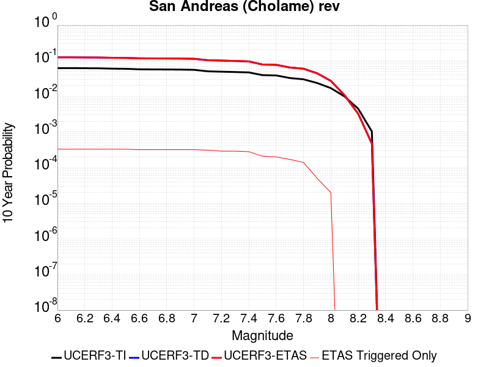 |

| Magnitude | 1 yr TI Prob | TD Prob | ETAS Prob | ETAS/TD Gain | ETAS Triggered Only | 10 yr TI Prob | TD Prob | ETAS Prob | ETAS/TD Gain | ETAS Triggered Only |
|-----|-----|-----|-----|-----|-----|-----|-----|-----|-----|-----|
| 6.0 | 0.0063991086 | 0.0130670825 | 0.013274338 | 1.0158609 | 2.1E-4 | 0.06217949 | 0.12439073 | 0.12467968 | 1.0023229 | 3.3E-4 |
| 6.1 | 0.0063991086 | 0.0130670825 | 0.013274338 | 1.0158609 | 2.1E-4 | 0.06217949 | 0.12439073 | 0.12467968 | 1.0023229 | 3.3E-4 |
| 6.2 | 0.006347804 | 0.01297271 | 0.013179986 | 1.0159779 | 2.1E-4 | 0.061695136 | 0.12357691 | 0.123866126 | 1.0023404 | 3.3E-4 |
| 6.3 | 0.006316212 | 0.012913967 | 0.013121255 | 1.0160514 | 2.1E-4 | 0.06139677 | 0.12307103 | 0.12336042 | 1.0023514 | 3.3E-4 |
| 6.4 | 0.006172335 | 0.012659196 | 0.012866538 | 1.0163788 | 2.1E-4 | 0.060036868 | 0.1208638 | 0.12115392 | 1.0024004 | 3.3E-4 |
| 6.5 | 0.006109677 | 0.012552682 | 0.012760046 | 1.0165195 | 2.1E-4 | 0.059444077 | 0.11993805 | 0.12022848 | 1.0024214 | 3.3E-4 |
| 6.6 | 0.0059092017 | 0.012196515 | 0.012394075 | 1.0161982 | 2.0E-4 | 0.057545185 | 0.11685214 | 0.11713475 | 1.0024185 | 3.2E-4 |
| 6.7 | 0.005864331 | 0.012116249 | 0.012313825 | 1.0163068 | 2.0E-4 | 0.057119697 | 0.116155714 | 0.116438545 | 1.002435 | 3.2E-4 |
| 6.8 | 0.005836608 | 0.012058721 | 0.012256309 | 1.0163856 | 2.0E-4 | 0.056856725 | 0.11565396 | 0.11593696 | 1.0024469 | 3.2E-4 |
| 6.9 | 0.0057996577 | 0.011980731 | 0.012178335 | 1.0164934 | 2.0E-4 | 0.056506127 | 0.11497439 | 0.1152576 | 1.0024632 | 3.2E-4 |
| 7.0 | 0.005705768 | 0.011786487 | 0.011984129 | 1.0167686 | 2.0E-4 | 0.055614736 | 0.11327597 | 0.113559715 | 1.002505 | 3.2E-4 |
| 7.1 | 0.0051671406 | 0.010660981 | 0.010848955 | 1.017632 | 1.9E-4 | 0.05048634 | 0.1033706 | 0.10364855 | 1.0026889 | 3.1E-4 |
| 7.2 | 0.00504711 | 0.010404981 | 0.010583107 | 1.0171194 | 1.8E-4 | 0.04934009 | 0.1011086 | 0.10136928 | 1.0025783 | 2.9E-4 |
| 7.3 | 0.0049308087 | 0.010110183 | 0.010288362 | 1.0176238 | 1.8E-4 | 0.048228268 | 0.09847952 | 0.09874096 | 1.0026548 | 2.9E-4 |
| 7.4 | 0.004799717 | 0.009784967 | 0.009963205 | 1.0182155 | 1.8E-4 | 0.046973653 | 0.095557496 | 0.09581074 | 1.0026501 | 2.8E-4 |
| 7.5 | 0.0040183207 | 0.007889002 | 0.008017976 | 1.0163486 | 1.3E-4 | 0.03946433 | 0.07828531 | 0.078478865 | 1.0024725 | 2.1E-4 |
| 7.6 | 0.0039388672 | 0.0077126776 | 0.007831752 | 1.0154388 | 1.2E-4 | 0.038697794 | 0.07664872 | 0.07683339 | 1.0024093 | 2.0E-4 |
| 7.7 | 0.0033226798 | 0.0064282627 | 0.00652762 | 1.0154563 | 1.0E-4 | 0.032734364 | 0.06454029 | 0.06469932 | 1.002464 | 1.7E-4 |
| 7.8 | 0.003054864 | 0.0059394026 | 0.0060288683 | 1.015063 | 9.0E-5 | 0.030132094 | 0.059659187 | 0.059790835 | 1.0022067 | 1.4E-4 |
| 7.9 | 0.0023949358 | 0.0043872762 | 0.0044271005 | 1.0090773 | 4.0E-5 | 0.023692891 | 0.044362005 | 0.04440979 | 1.001077 | 5.0E-5 |
| 8.0 | 0.0017178444 | 0.0026458222 | 0.0026657695 | 1.007539 | 2.0E-5 | 0.017046256 | 0.027180137 | 0.027199594 | 1.0007159 | 2.0E-5 |
| 8.1 | 0.0010001622 | 0.0010005629 | 0.0010005629 | 1.0 | 0.0 | 0.009956728 | 0.010758142 | 0.010758142 | 1.0 | 0.0 |
| 8.2 | 4.5092785E-4 | 2.8563058E-4 | 2.8563058E-4 | 1.0 | 0.0 | 0.0045001395 | 0.0032487072 | 0.0032487072 | 1.0 | 0.0 |
| 8.3 | 1.034694E-4 | 3.9967534E-5 | 3.9967534E-5 | 1.0 | 0.0 | 0.0010342124 | 4.719687E-4 | 4.719687E-4 | 1.0 | 0.0 |

## Lake Isabella (Seismicity)
*[(top)](#table-of-contents)*

| 1 Year | 10 Year |
|-----|-----|
|  |  |

| Magnitude | 1 yr TI Prob | TD Prob | ETAS Prob | ETAS/TD Gain | ETAS Triggered Only | 10 yr TI Prob | TD Prob | ETAS Prob | ETAS/TD Gain | ETAS Triggered Only |
|-----|-----|-----|-----|-----|-----|-----|-----|-----|-----|-----|
| 6.0 | 4.920106E-4 | 5.0819275E-4 | 7.18086E-4 | 1.4130191 | 2.1E-4 | 0.004909227 | 0.005071599 | 0.005389976 | 1.0627764 | 3.2E-4 |
| 6.1 | 4.920106E-4 | 5.0819275E-4 | 7.18086E-4 | 1.4130191 | 2.1E-4 | 0.004909227 | 0.005071599 | 0.005389976 | 1.0627764 | 3.2E-4 |
| 6.2 | 4.920106E-4 | 5.0819275E-4 | 7.18086E-4 | 1.4130191 | 2.1E-4 | 0.004909227 | 0.005071599 | 0.005389976 | 1.0627764 | 3.2E-4 |
| 6.3 | 4.920106E-4 | 5.0819275E-4 | 7.18086E-4 | 1.4130191 | 2.1E-4 | 0.004909227 | 0.005071599 | 0.005389976 | 1.0627764 | 3.2E-4 |
| 6.4 | 2.6837454E-4 | 2.765166E-4 | 3.964834E-4 | 1.4338503 | 1.2E-4 | 0.0026805066 | 0.0027620657 | 0.0029116513 | 1.0541571 | 1.5E-4 |
| 6.5 | 2.6837454E-4 | 2.765166E-4 | 3.964834E-4 | 1.4338503 | 1.2E-4 | 0.0026805066 | 0.0027620657 | 0.0029116513 | 1.0541571 | 1.5E-4 |
| 6.6 | 1.7744285E-4 | 1.8254704E-4 | 2.6253244E-4 | 1.4381633 | 8.0E-5 | 0.0017730123 | 0.0018241286 | 0.0019139644 | 1.0492486 | 9.0E-5 |
| 6.7 | 1.767679E-4 | 1.8186188E-4 | 2.6184734E-4 | 1.4398143 | 8.0E-5 | 0.0017662736 | 0.0018172882 | 0.0019071246 | 1.0494343 | 9.0E-5 |
| 6.8 | 1.3869164E-4 | 1.4263204E-4 | 2.0262347E-4 | 1.4206029 | 6.0E-5 | 0.0013860512 | 0.0014255369 | 0.0014954371 | 1.0490344 | 7.0E-5 |
| 6.9 | 1.2553448E-4 | 1.2910018E-4 | 1.8909243E-4 | 1.4646953 | 6.0E-5 | 0.0012546359 | 0.0012903814 | 0.0013602911 | 1.0541775 | 7.0E-5 |
| 7.0 | 8.8455E-5 | 9.094104E-5 | 1.3093739E-4 | 1.4398054 | 4.0E-5 | 8.84198E-4 | 9.09141E-4 | 9.491046E-4 | 1.0439576 | 4.0E-5 |
| 7.1 | 1.826955E-5 | 1.8635317E-5 | 2.8635131E-5 | 1.5366055 | 1.0E-5 | 1.8268047E-4 | 1.863378E-4 | 1.9633592E-4 | 1.053656 | 1.0E-5 |
| 7.2 | 1.1646762E-5 | 1.1870856E-5 | 2.1870737E-5 | 1.8423892 | 1.0E-5 | 1.1646151E-4 | 1.1870232E-4 | 1.2870114E-4 | 1.0842344 | 1.0E-5 |
| 7.3 | 8.223522E-6 | 8.380326E-6 | 8.380326E-6 | 1.0 | 0.0 | 8.2232174E-5 | 8.3800165E-5 | 8.3800165E-5 | 1.0 | 0.0 |
| 7.4 | 5.852591E-6 | 5.964884E-6 | 5.964884E-6 | 1.0 | 0.0 | 5.8524372E-5 | 5.9647282E-5 | 5.9647282E-5 | 1.0 | 0.0 |
| 7.5 | 2.5490165E-6 | 2.59785E-6 | 2.59785E-6 | 1.0 | 0.0 | 2.5489873E-5 | 2.5978214E-5 | 2.5978214E-5 | 1.0 | 0.0 |
| 7.6 | 7.851001E-8 | 7.992663E-8 | 7.992663E-8 | 1.0 | 0.0 | 7.8509987E-7 | 7.992663E-7 | 7.992663E-7 | 1.0 | 0.0 |

## Manix-Afton Hills
*[(top)](#table-of-contents)*

| 1 Year | 10 Year |
|-----|-----|
|  |  |

| Magnitude | 1 yr TI Prob | TD Prob | ETAS Prob | ETAS/TD Gain | ETAS Triggered Only | 10 yr TI Prob | TD Prob | ETAS Prob | ETAS/TD Gain | ETAS Triggered Only |
|-----|-----|-----|-----|-----|-----|-----|-----|-----|-----|-----|
| 6.0 | 7.189342E-4 | 7.6733343E-4 | 9.571877E-4 | 1.2474208 | 1.9E-4 | 0.0071661277 | 0.007648596 | 0.007946301 | 1.0389229 | 3.0E-4 |
| 6.1 | 7.189342E-4 | 7.6733343E-4 | 9.571877E-4 | 1.2474208 | 1.9E-4 | 0.0071661277 | 0.007648596 | 0.007946301 | 1.0389229 | 3.0E-4 |
| 6.2 | 7.189342E-4 | 7.6733343E-4 | 9.571877E-4 | 1.2474208 | 1.9E-4 | 0.0071661277 | 0.007648596 | 0.007946301 | 1.0389229 | 3.0E-4 |
| 6.3 | 5.763835E-4 | 6.151744E-4 | 7.2510674E-4 | 1.178701 | 1.1E-4 | 0.005748908 | 0.0061357557 | 0.006314651 | 1.0291562 | 1.8E-4 |
| 6.4 | 5.763835E-4 | 6.151744E-4 | 7.2510674E-4 | 1.178701 | 1.1E-4 | 0.005748908 | 0.0061357557 | 0.006314651 | 1.0291562 | 1.8E-4 |
| 6.5 | 5.1064545E-4 | 5.453555E-4 | 6.2531186E-4 | 1.1466134 | 8.0E-5 | 0.0050947363 | 0.0054410985 | 0.005580337 | 1.0255901 | 1.4E-4 |
| 6.6 | 4.5958988E-4 | 4.9108086E-4 | 5.610465E-4 | 1.1424727 | 7.0E-5 | 0.0045864056 | 0.004900839 | 0.005030202 | 1.026396 | 1.3E-4 |
| 6.7 | 4.591348E-4 | 4.9058435E-4 | 5.6055E-4 | 1.142617 | 7.0E-5 | 0.004581874 | 0.0048958957 | 0.005025259 | 1.0264229 | 1.3E-4 |
| 6.8 | 3.5994186E-4 | 3.8501783E-4 | 4.4499474E-4 | 1.155777 | 6.0E-5 | 0.003593594 | 0.0038443129 | 0.0039638514 | 1.0310949 | 1.2E-4 |
| 6.9 | 2.5735417E-4 | 2.7500073E-4 | 3.1498974E-4 | 1.1454141 | 4.0E-5 | 0.0025705635 | 0.0027472095 | 0.0028369622 | 1.0326705 | 9.0E-5 |
| 7.0 | 1.746775E-4 | 1.8730981E-4 | 2.0730606E-4 | 1.106755 | 2.0E-5 | 0.0017454025 | 0.0018719219 | 0.001911847 | 1.0213284 | 4.0E-5 |
| 7.1 | 6.29962E-5 | 6.749156E-5 | 6.749156E-5 | 1.0 | 0.0 | 6.297835E-4 | 6.7487074E-4 | 6.7487074E-4 | 1.0 | 0.0 |

## Baker
*[(top)](#table-of-contents)*

| 1 Year | 10 Year |
|-----|-----|
|  |  |

| Magnitude | 1 yr TI Prob | TD Prob | ETAS Prob | ETAS/TD Gain | ETAS Triggered Only | 10 yr TI Prob | TD Prob | ETAS Prob | ETAS/TD Gain | ETAS Triggered Only |
|-----|-----|-----|-----|-----|-----|-----|-----|-----|-----|-----|
| 6.0 | 2.9714106E-4 | 3.044123E-4 | 5.243453E-4 | 1.722484 | 2.2E-4 | 0.0029674405 | 0.0030403486 | 0.0033494062 | 1.101652 | 3.1E-4 |
| 6.1 | 2.9714106E-4 | 3.044123E-4 | 5.243453E-4 | 1.722484 | 2.2E-4 | 0.0029674405 | 0.0030403486 | 0.0033494062 | 1.101652 | 3.1E-4 |
| 6.2 | 2.9714106E-4 | 3.044123E-4 | 5.243453E-4 | 1.722484 | 2.2E-4 | 0.0029674405 | 0.0030403486 | 0.0033494062 | 1.101652 | 3.1E-4 |
| 6.3 | 1.7215237E-4 | 1.7654014E-4 | 3.2651366E-4 | 1.8495152 | 1.5E-4 | 0.0017201907 | 0.001764046 | 0.0019736756 | 1.1188345 | 2.1E-4 |
| 6.4 | 1.7215237E-4 | 1.7654014E-4 | 3.2651366E-4 | 1.8495152 | 1.5E-4 | 0.0017201907 | 0.001764046 | 0.0019736756 | 1.1188345 | 2.1E-4 |
| 6.5 | 1.4516099E-4 | 1.4900314E-4 | 2.6898526E-4 | 1.8052322 | 1.2E-4 | 0.001450662 | 0.0014890651 | 0.001668797 | 1.1207012 | 1.8E-4 |
| 6.6 | 1.20856166E-4 | 1.2422565E-4 | 2.1421447E-4 | 1.724398 | 9.0E-5 | 0.0012079047 | 0.0012415823 | 0.0013814085 | 1.1126193 | 1.4E-4 |
| 6.7 | 1.0628513E-4 | 1.093867E-4 | 1.8937796E-4 | 1.7312703 | 8.0E-5 | 0.0010623431 | 0.0010933448 | 0.0012132135 | 1.109635 | 1.2E-4 |
| 6.8 | 9.577837E-5 | 9.869264E-5 | 1.7868474E-4 | 1.8105174 | 8.0E-5 | 9.57371E-4 | 9.86502E-4 | 0.0011063836 | 1.121522 | 1.2E-4 |
| 6.9 | 8.510255E-5 | 8.782368E-5 | 1.6781666E-4 | 1.910836 | 8.0E-5 | 8.5069967E-4 | 8.7790104E-4 | 9.878045E-4 | 1.1251888 | 1.1E-4 |
| 7.0 | 6.291517E-5 | 6.5266366E-5 | 1.2526245E-4 | 1.9192497 | 6.0E-5 | 6.289736E-4 | 6.524743E-4 | 7.4241555E-4 | 1.1378465 | 9.0E-5 |
| 7.1 | 5.491031E-5 | 5.7142337E-5 | 1.0713948E-4 | 1.8749579 | 5.0E-5 | 5.4896745E-4 | 5.7127734E-4 | 6.512316E-4 | 1.1399571 | 8.0E-5 |
| 7.2 | 5.252918E-5 | 5.4721917E-5 | 1.0471918E-4 | 1.9136606 | 5.0E-5 | 5.251676E-4 | 5.470853E-4 | 6.270415E-4 | 1.1461495 | 8.0E-5 |
| 7.3 | 4.8836053E-5 | 5.096532E-5 | 1.00962774E-4 | 1.9810092 | 5.0E-5 | 4.8825322E-4 | 5.095371E-4 | 5.8949634E-4 | 1.1569252 | 8.0E-5 |
| 7.4 | 4.5977362E-5 | 4.8043148E-5 | 9.804075E-5 | 2.0406811 | 5.0E-5 | 4.596785E-4 | 4.8032837E-4 | 5.6028995E-4 | 1.1664727 | 8.0E-5 |
| 7.5 | 4.326757E-5 | 4.5261804E-5 | 7.526045E-5 | 1.6627805 | 3.0E-5 | 4.3259145E-4 | 4.5252658E-4 | 5.0250394E-4 | 1.1104407 | 5.0E-5 |
| 7.6 | 3.9414106E-5 | 4.129575E-5 | 6.129492E-5 | 1.4842913 | 2.0E-5 | 3.9407116E-4 | 4.1288146E-4 | 4.4286906E-4 | 1.07263 | 3.0E-5 |
| 7.7 | 3.40644E-5 | 3.5756293E-5 | 5.575558E-5 | 1.5593221 | 2.0E-5 | 3.405918E-4 | 3.5750607E-4 | 3.8749535E-4 | 1.0838847 | 3.0E-5 |
| 7.8 | 1.80467E-5 | 1.9035933E-5 | 3.9035553E-5 | 2.0506246 | 2.0E-5 | 1.8045233E-4 | 1.9034347E-4 | 2.1033967E-4 | 1.1050532 | 2.0E-5 |
| 7.9 | 1.335311E-7 | 1.3929966E-7 | 1.3929966E-7 | 1.0 | 0.0 | 1.3353102E-6 | 1.3929966E-6 | 1.3929966E-6 | 1.0 | 0.0 |

## White Wolf (Extension)
*[(top)](#table-of-contents)*

| 1 Year | 10 Year |
|-----|-----|
|  |  |

| Magnitude | 1 yr TI Prob | TD Prob | ETAS Prob | ETAS/TD Gain | ETAS Triggered Only | 10 yr TI Prob | TD Prob | ETAS Prob | ETAS/TD Gain | ETAS Triggered Only |
|-----|-----|-----|-----|-----|-----|-----|-----|-----|-----|-----|
| 6.0 | 4.289509E-4 | 3.1650788E-4 | 5.3643825E-4 | 1.6948653 | 2.2E-4 | 0.0042812387 | 0.003161223 | 0.0034602745 | 1.0946 | 3.0E-4 |
| 6.1 | 4.289509E-4 | 3.1650788E-4 | 5.3643825E-4 | 1.6948653 | 2.2E-4 | 0.0042812387 | 0.003161223 | 0.0034602745 | 1.0946 | 3.0E-4 |
| 6.2 | 4.289509E-4 | 3.1650788E-4 | 5.3643825E-4 | 1.6948653 | 2.2E-4 | 0.0042812387 | 0.003161223 | 0.0034602745 | 1.0946 | 3.0E-4 |
| 6.3 | 4.289509E-4 | 3.1650788E-4 | 5.3643825E-4 | 1.6948653 | 2.2E-4 | 0.0042812387 | 0.003161223 | 0.0034602745 | 1.0946 | 3.0E-4 |
| 6.4 | 3.0372653E-4 | 1.8559267E-4 | 3.4556296E-4 | 1.861943 | 1.6E-4 | 0.0030331176 | 0.001854485 | 0.002074077 | 1.1184113 | 2.2E-4 |
| 6.5 | 3.0081844E-4 | 1.8256342E-4 | 3.4253421E-4 | 1.8762478 | 1.6E-4 | 0.0030041158 | 0.0018242426 | 0.0020438412 | 1.120378 | 2.2E-4 |
| 6.6 | 2.4226638E-4 | 1.2170619E-4 | 2.0169646E-4 | 1.6572407 | 8.0E-5 | 0.0024200242 | 0.0012164378 | 0.0013163161 | 1.0821073 | 1.0E-4 |
| 6.7 | 2.0623671E-4 | 8.6005006E-5 | 1.360007E-4 | 1.5813115 | 5.0E-5 | 0.002060454 | 8.597357E-4 | 9.196841E-4 | 1.0697289 | 6.0E-5 |
| 6.8 | 1.7936122E-4 | 6.3891996E-5 | 1.0388944E-4 | 1.6260165 | 4.0E-5 | 0.0017921652 | 6.387454E-4 | 6.787198E-4 | 1.0625827 | 4.0E-5 |
| 6.9 | 1.63657E-4 | 5.235359E-5 | 7.235254E-5 | 1.3819977 | 2.0E-5 | 0.0016353652 | 5.2342017E-4 | 5.434097E-4 | 1.0381902 | 2.0E-5 |
| 7.0 | 1.47645E-4 | 3.8761027E-5 | 4.876064E-5 | 1.2579811 | 1.0E-5 | 0.0014754693 | 3.8754768E-4 | 3.975438E-4 | 1.0257933 | 1.0E-5 |
| 7.1 | 1.2569598E-4 | 2.8294799E-5 | 2.8294799E-5 | 1.0 | 0.0 | 0.001256249 | 2.8291598E-4 | 2.8291598E-4 | 1.0 | 0.0 |
| 7.2 | 7.23979E-5 | 5.6055624E-6 | 5.6055624E-6 | 1.0 | 0.0 | 7.2374323E-4 | 5.6054323E-5 | 5.6054323E-5 | 1.0 | 0.0 |
| 7.3 | 3.681694E-5 | 2.609987E-6 | 2.609987E-6 | 1.0 | 0.0 | 3.681084E-4 | 2.609961E-5 | 2.609961E-5 | 1.0 | 0.0 |
| 7.4 | 3.095994E-6 | 2.5402372E-7 | 2.5402372E-7 | 1.0 | 0.0 | 3.095951E-5 | 2.5402353E-6 | 2.5402353E-6 | 1.0 | 0.0 |

## San Andreas (Coachella) rev
*[(top)](#table-of-contents)*

| 1 Year | 10 Year |
|-----|-----|
|  |  |

| Magnitude | 1 yr TI Prob | TD Prob | ETAS Prob | ETAS/TD Gain | ETAS Triggered Only | 10 yr TI Prob | TD Prob | ETAS Prob | ETAS/TD Gain | ETAS Triggered Only |
|-----|-----|-----|-----|-----|-----|-----|-----|-----|-----|-----|
| 6.0 | 0.0062038354 | 0.016936364 | 0.017132977 | 1.011609 | 2.0E-4 | 0.060334753 | 0.15265316 | 0.15289888 | 1.0016097 | 2.9E-4 |
| 6.1 | 0.0062038354 | 0.016936364 | 0.017132977 | 1.011609 | 2.0E-4 | 0.060334753 | 0.15265316 | 0.15289888 | 1.0016097 | 2.9E-4 |
| 6.2 | 0.005590286 | 0.015653009 | 0.015840035 | 1.0119482 | 1.9E-4 | 0.05451731 | 0.14182423 | 0.14205594 | 1.0016338 | 2.7E-4 |
| 6.3 | 0.005577586 | 0.015624908 | 0.015811939 | 1.01197 | 1.9E-4 | 0.054396555 | 0.14159249 | 0.14182426 | 1.0016369 | 2.7E-4 |
| 6.4 | 0.0053892885 | 0.015217941 | 0.0154050505 | 1.0122952 | 1.9E-4 | 0.052604496 | 0.13815255 | 0.13838525 | 1.0016843 | 2.7E-4 |
| 6.5 | 0.0053228354 | 0.01507372 | 0.015260857 | 1.0124147 | 1.9E-4 | 0.051971316 | 0.13693172 | 0.13716476 | 1.0017018 | 2.7E-4 |
| 6.6 | 0.0052651367 | 0.01495329 | 0.015130599 | 1.0118575 | 1.8E-4 | 0.051421247 | 0.1359099 | 0.13612592 | 1.0015894 | 2.5E-4 |
| 6.7 | 0.005230834 | 0.014880571 | 0.015057892 | 1.0119163 | 1.8E-4 | 0.051094085 | 0.13529462 | 0.1355108 | 1.0015978 | 2.5E-4 |
| 6.8 | 0.0051924936 | 0.0147796115 | 0.014956951 | 1.0119989 | 1.8E-4 | 0.050728295 | 0.13444631 | 0.1346627 | 1.0016094 | 2.5E-4 |
| 6.9 | 0.0050888555 | 0.014520878 | 0.014698264 | 1.012216 | 1.8E-4 | 0.049738888 | 0.1322748 | 0.13249174 | 1.00164 | 2.5E-4 |
| 7.0 | 0.0044259406 | 0.012839786 | 0.013017475 | 1.0138389 | 1.8E-4 | 0.04338823 | 0.11813272 | 0.11835319 | 1.0018662 | 2.5E-4 |
| 7.1 | 0.004331963 | 0.012635092 | 0.012812818 | 1.014066 | 1.8E-4 | 0.042484846 | 0.116353 | 0.116573915 | 1.0018986 | 2.5E-4 |
| 7.2 | 0.0039391145 | 0.011628893 | 0.0118068 | 1.0152987 | 1.8E-4 | 0.03870018 | 0.10775925 | 0.10798231 | 1.00207 | 2.5E-4 |
| 7.3 | 0.0036891096 | 0.010759917 | 0.010928088 | 1.0156294 | 1.7E-4 | 0.03628465 | 0.100282 | 0.10049793 | 1.0021533 | 2.4E-4 |
| 7.4 | 0.0026816884 | 0.0074208933 | 0.007579706 | 1.0214007 | 1.6E-4 | 0.02649557 | 0.070849575 | 0.07106328 | 1.0030164 | 2.3E-4 |
| 7.5 | 0.002099857 | 0.0056932783 | 0.005832481 | 1.0244504 | 1.4E-4 | 0.020801254 | 0.055011146 | 0.055209596 | 1.0036074 | 2.1E-4 |
| 7.6 | 0.0016250437 | 0.0043938323 | 0.0045332173 | 1.0317229 | 1.4E-4 | 0.016132116 | 0.04281005 | 0.043011058 | 1.0046954 | 2.1E-4 |
| 7.7 | 0.001152546 | 0.0032501083 | 0.0033697183 | 1.0368018 | 1.2E-4 | 0.011465867 | 0.0319002 | 0.032064777 | 1.0051591 | 1.7E-4 |
| 7.8 | 9.1192697E-4 | 0.0026990508 | 0.0028087539 | 1.0406451 | 1.1E-4 | 0.009081938 | 0.026640115 | 0.026795853 | 1.005846 | 1.6E-4 |
| 7.9 | 7.2853256E-4 | 0.00199245 | 0.0020922509 | 1.0500895 | 1.0E-4 | 0.0072614877 | 0.019909438 | 0.02005645 | 1.0073841 | 1.5E-4 |
| 8.0 | 6.200787E-4 | 0.0016196516 | 0.0017194896 | 1.0616417 | 1.0E-4 | 0.006183513 | 0.016279267 | 0.01641699 | 1.0084599 | 1.4E-4 |
| 8.1 | 2.6612106E-4 | 4.6811273E-4 | 4.6811273E-4 | 1.0 | 0.0 | 0.002658026 | 0.0049177306 | 0.0049177306 | 1.0 | 0.0 |
| 8.2 | 1.2002704E-4 | 1.4538258E-4 | 1.4538258E-4 | 1.0 | 0.0 | 0.0011996223 | 0.0015973912 | 0.0015973912 | 1.0 | 0.0 |
| 8.3 | 5.439312E-6 | 3.03478E-6 | 3.03478E-6 | 1.0 | 0.0 | 5.4391792E-5 | 3.190716E-5 | 3.190716E-5 | 1.0 | 0.0 |

## Red Pass
*[(top)](#table-of-contents)*

| 1 Year | 10 Year |
|-----|-----|
|  |  |

| Magnitude | 1 yr TI Prob | TD Prob | ETAS Prob | ETAS/TD Gain | ETAS Triggered Only | 10 yr TI Prob | TD Prob | ETAS Prob | ETAS/TD Gain | ETAS Triggered Only |
|-----|-----|-----|-----|-----|-----|-----|-----|-----|-----|-----|
| 6.0 | 4.308141E-4 | 4.4611428E-4 | 6.060429E-4 | 1.3584925 | 1.6E-4 | 0.0042997985 | 0.004453945 | 0.004712787 | 1.0581152 | 2.6E-4 |
| 6.1 | 1.9043336E-4 | 1.9697666E-4 | 2.9695698E-4 | 1.5075743 | 1.0E-4 | 0.0019027026 | 0.001968488 | 0.0021181928 | 1.0760506 | 1.5E-4 |
| 6.2 | 1.9043336E-4 | 1.9697666E-4 | 2.9695698E-4 | 1.5075743 | 1.0E-4 | 0.0019027026 | 0.001968488 | 0.0021181928 | 1.0760506 | 1.5E-4 |
| 6.3 | 7.265574E-5 | 7.519415E-5 | 1.2519039E-4 | 1.6648954 | 5.0E-5 | 7.263199E-4 | 7.518258E-4 | 8.3176565E-4 | 1.1063277 | 8.0E-5 |
| 6.4 | 7.265574E-5 | 7.519415E-5 | 1.2519039E-4 | 1.6648954 | 5.0E-5 | 7.263199E-4 | 7.518258E-4 | 8.3176565E-4 | 1.1063277 | 8.0E-5 |
| 6.5 | 5.153449E-5 | 5.3336476E-5 | 9.333435E-5 | 1.7499158 | 4.0E-5 | 5.1522546E-4 | 5.333648E-4 | 5.833381E-4 | 1.0936944 | 5.0E-5 |

## Ludlow
*[(top)](#table-of-contents)*

| 1 Year | 10 Year |
|-----|-----|
|  | 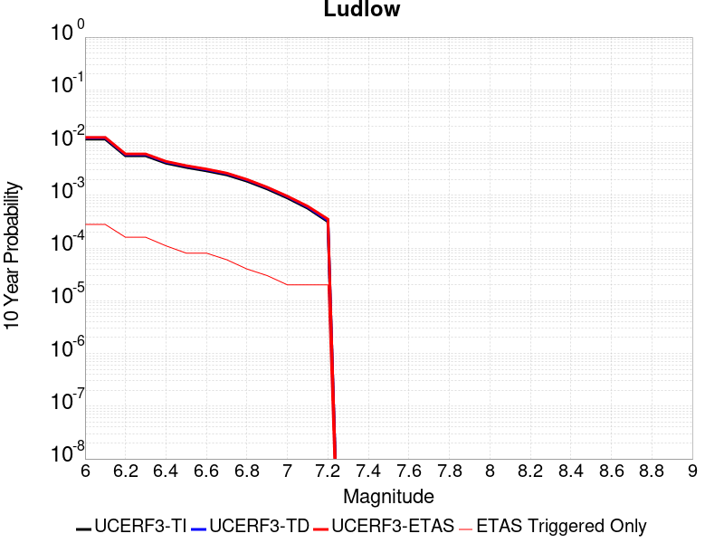 |

| Magnitude | 1 yr TI Prob | TD Prob | ETAS Prob | ETAS/TD Gain | ETAS Triggered Only | 10 yr TI Prob | TD Prob | ETAS Prob | ETAS/TD Gain | ETAS Triggered Only |
|-----|-----|-----|-----|-----|-----|-----|-----|-----|-----|-----|
| 6.0 | 0.0011685267 | 0.001233702 | 0.0014434429 | 1.1700094 | 2.1E-4 | 0.011624013 | 0.012273042 | 0.012549605 | 1.0225343 | 2.8E-4 |
| 6.1 | 0.0011685267 | 0.001233702 | 0.0014434429 | 1.1700094 | 2.1E-4 | 0.011624013 | 0.012273042 | 0.012549605 | 1.0225343 | 2.8E-4 |
| 6.2 | 5.623952E-4 | 5.9287593E-4 | 6.928167E-4 | 1.1685693 | 1.0E-4 | 0.00560974 | 0.0059133614 | 0.006072415 | 1.0268973 | 1.6E-4 |
| 6.3 | 5.623952E-4 | 5.9287593E-4 | 6.928167E-4 | 1.1685693 | 1.0E-4 | 0.00560974 | 0.0059133614 | 0.006072415 | 1.0268973 | 1.6E-4 |
| 6.4 | 4.0766477E-4 | 4.2974384E-4 | 5.0970947E-4 | 1.1860774 | 8.0E-5 | 0.0040691774 | 0.0042892746 | 0.0043988028 | 1.0255353 | 1.1E-4 |
| 6.5 | 3.390332E-4 | 3.5740953E-4 | 4.0739166E-4 | 1.1398455 | 5.0E-5 | 0.003385164 | 0.0035684432 | 0.0036481577 | 1.0223387 | 8.0E-5 |
| 6.6 | 2.9122844E-4 | 3.0707786E-4 | 3.5706253E-4 | 1.1627752 | 5.0E-5 | 0.0029084706 | 0.003066609 | 0.0031463634 | 1.0260074 | 8.0E-5 |
| 6.7 | 2.4447302E-4 | 2.5775246E-4 | 2.877447E-4 | 1.1163608 | 3.0E-5 | 0.0024420423 | 0.0025745912 | 0.0026344368 | 1.0232446 | 6.0E-5 |
| 6.8 | 1.8566006E-4 | 1.957566E-4 | 2.1575269E-4 | 1.1021477 | 2.0E-5 | 0.0018550502 | 0.0019558826 | 0.0019958045 | 1.0204111 | 4.0E-5 |
| 6.9 | 1.3215111E-4 | 1.3935992E-4 | 1.4935853E-4 | 1.0717466 | 1.0E-5 | 0.0013207254 | 0.0013927529 | 0.0014227111 | 1.0215101 | 3.0E-5 |
| 7.0 | 8.913424E-5 | 9.40187E-5 | 1.0401776E-4 | 1.1063519 | 1.0E-5 | 8.9098496E-4 | 9.3980576E-4 | 9.5978694E-4 | 1.021261 | 2.0E-5 |
| 7.1 | 5.6901354E-5 | 5.999128E-5 | 6.999068E-5 | 1.1666809 | 1.0E-5 | 5.6886784E-4 | 5.997606E-4 | 6.197486E-4 | 1.0333266 | 2.0E-5 |
| 7.2 | 3.1654577E-5 | 3.3327433E-5 | 4.3327098E-5 | 1.3000431 | 1.0E-5 | 3.1650066E-4 | 3.3323118E-4 | 3.5322452E-4 | 1.0599984 | 2.0E-5 |

## Calico-Hidalgo
*[(top)](#table-of-contents)*

| 1 Year | 10 Year |
|-----|-----|
|  |  |

| Magnitude | 1 yr TI Prob | TD Prob | ETAS Prob | ETAS/TD Gain | ETAS Triggered Only | 10 yr TI Prob | TD Prob | ETAS Prob | ETAS/TD Gain | ETAS Triggered Only |
|-----|-----|-----|-----|-----|-----|-----|-----|-----|-----|-----|
| 6.0 | 0.0021322158 | 0.002642648 | 0.0027523574 | 1.0415149 | 1.1E-4 | 0.02111873 | 0.026152607 | 0.026376592 | 1.0085646 | 2.3E-4 |
| 6.1 | 0.0021322158 | 0.002642648 | 0.0027523574 | 1.0415149 | 1.1E-4 | 0.02111873 | 0.026152607 | 0.026376592 | 1.0085646 | 2.3E-4 |
| 6.2 | 0.0021322158 | 0.002642648 | 0.0027523574 | 1.0415149 | 1.1E-4 | 0.02111873 | 0.026152607 | 0.026376592 | 1.0085646 | 2.3E-4 |
| 6.3 | 0.0012641704 | 0.0015689151 | 0.0016188367 | 1.0318191 | 5.0E-5 | 0.01257003 | 0.01558206 | 0.015739568 | 1.0101082 | 1.6E-4 |
| 6.4 | 0.0012641704 | 0.0015689151 | 0.0016188367 | 1.0318191 | 5.0E-5 | 0.01257003 | 0.01558206 | 0.015739568 | 1.0101082 | 1.6E-4 |
| 6.5 | 0.0010579949 | 0.001320102 | 0.0013600492 | 1.0302607 | 4.0E-5 | 0.010529719 | 0.013124538 | 0.0132627 | 1.010527 | 1.4E-4 |
| 6.6 | 0.0010570707 | 0.0013191093 | 0.0013590566 | 1.0302835 | 4.0E-5 | 0.010520565 | 0.013114728 | 0.013252892 | 1.010535 | 1.4E-4 |
| 6.7 | 9.3870464E-4 | 0.0011754738 | 0.0012154268 | 1.0339888 | 4.0E-5 | 0.009347493 | 0.011694173 | 0.011832536 | 1.0118318 | 1.4E-4 |
| 6.8 | 9.10568E-4 | 0.0011390693 | 0.0011790238 | 1.0350764 | 4.0E-5 | 0.009068459 | 0.011333893 | 0.01146242 | 1.01134 | 1.3E-4 |
| 6.9 | 8.04737E-4 | 9.922766E-4 | 0.001032237 | 1.0402713 | 4.0E-5 | 0.008018291 | 0.009879857 | 0.009998672 | 1.012026 | 1.2E-4 |
| 7.0 | 7.658257E-4 | 9.4039086E-4 | 9.803532E-4 | 1.0424955 | 4.0E-5 | 0.0076319184 | 0.009365481 | 0.009464544 | 1.0105776 | 1.0E-4 |
| 7.1 | 6.853584E-4 | 8.4500515E-4 | 8.8497135E-4 | 1.047297 | 4.0E-5 | 0.0068324856 | 0.0084192185 | 0.008518376 | 1.0117776 | 1.0E-4 |
| 7.2 | 5.8044674E-4 | 7.232942E-4 | 7.632653E-4 | 1.0552626 | 4.0E-5 | 0.0057893298 | 0.0072105085 | 0.0072998595 | 1.0123918 | 9.0E-5 |
| 7.3 | 5.11647E-4 | 6.3515105E-4 | 6.65132E-4 | 1.0472028 | 3.0E-5 | 0.0051047057 | 0.006334433 | 0.0064139264 | 1.0125494 | 8.0E-5 |
| 7.4 | 4.1434157E-4 | 5.1082217E-4 | 5.4080685E-4 | 1.0586989 | 3.0E-5 | 0.0041356985 | 0.005097421 | 0.005177013 | 1.0156142 | 8.0E-5 |
| 7.5 | 2.4584212E-4 | 3.0118204E-4 | 3.1117903E-4 | 1.0331925 | 1.0E-5 | 0.0024557032 | 0.0030084911 | 0.0030683107 | 1.0198835 | 6.0E-5 |
| 7.6 | 1.1540374E-5 | 1.3587036E-5 | 1.3587036E-5 | 1.0 | 0.0 | 1.1539775E-4 | 1.3586486E-4 | 1.5586214E-4 | 1.1471851 | 2.0E-5 |

## San Andreas (Creeping Section) 2011 CFM
*[(top)](#table-of-contents)*

| 1 Year | 10 Year |
|-----|-----|
|  |  |

| Magnitude | 1 yr TI Prob | TD Prob | ETAS Prob | ETAS/TD Gain | ETAS Triggered Only | 10 yr TI Prob | TD Prob | ETAS Prob | ETAS/TD Gain | ETAS Triggered Only |
|-----|-----|-----|-----|-----|-----|-----|-----|-----|-----|-----|
| 6.0 | 0.030762846 | 0.061203245 | 0.061334677 | 1.0021474 | 1.4E-4 | 0.26835477 | 0.425928 | 0.4260543 | 1.0002965 | 2.2E-4 |
| 6.1 | 0.025839351 | 0.051246606 | 0.051360458 | 1.0022216 | 1.2E-4 | 0.23032776 | 0.37284943 | 0.37297487 | 1.0003364 | 2.0E-4 |
| 6.2 | 0.021034058 | 0.04093177 | 0.041046858 | 1.0028117 | 1.2E-4 | 0.19150782 | 0.31302592 | 0.31315643 | 1.000417 | 1.9E-4 |
| 6.3 | 0.017915873 | 0.034187846 | 0.034303743 | 1.0033901 | 1.2E-4 | 0.16538359 | 0.27130842 | 0.27144685 | 1.0005103 | 1.9E-4 |
| 6.4 | 0.015200248 | 0.02826279 | 0.028369682 | 1.003782 | 1.1E-4 | 0.14201577 | 0.23297668 | 0.23311473 | 1.0005926 | 1.8E-4 |
| 6.5 | 0.012141965 | 0.021586355 | 0.02169398 | 1.0049858 | 1.1E-4 | 0.11499573 | 0.1868149 | 0.18695316 | 1.0007399 | 1.7E-4 |
| 6.6 | 0.0082328 | 0.012995283 | 0.013103854 | 1.0083547 | 1.1E-4 | 0.07934396 | 0.12313759 | 0.123277895 | 1.0011394 | 1.6E-4 |
| 6.7 | 0.0081159435 | 0.012757154 | 0.012865751 | 1.0085126 | 1.1E-4 | 0.0782586 | 0.12116472 | 0.12130533 | 1.0011605 | 1.6E-4 |
| 6.8 | 0.008075596 | 0.012666538 | 0.012775145 | 1.0085742 | 1.1E-4 | 0.07788358 | 0.12039561 | 0.12053634 | 1.001169 | 1.6E-4 |
| 6.9 | 0.007876333 | 0.012208726 | 0.012317384 | 1.0088999 | 1.1E-4 | 0.07602952 | 0.11646574 | 0.11660711 | 1.0012138 | 1.6E-4 |
| 7.0 | 0.0075839474 | 0.011619428 | 0.01172815 | 1.0093569 | 1.1E-4 | 0.073302895 | 0.11131206 | 0.111454256 | 1.0012774 | 1.6E-4 |
| 7.1 | 0.006016669 | 0.008460228 | 0.008559382 | 1.0117201 | 1.0E-4 | 0.058563538 | 0.08366478 | 0.08380224 | 1.0016428 | 1.5E-4 |
| 7.2 | 0.005408933 | 0.0075977976 | 0.007697038 | 1.0130618 | 1.0E-4 | 0.052791595 | 0.07561503 | 0.075753696 | 1.0018337 | 1.5E-4 |
| 7.3 | 0.0048581534 | 0.0066470946 | 0.00674643 | 1.0149442 | 1.0E-4 | 0.047533102 | 0.06647954 | 0.06661957 | 1.0021063 | 1.5E-4 |
| 7.4 | 0.004513991 | 0.0060883067 | 0.006187698 | 1.0163249 | 1.0E-4 | 0.044233937 | 0.061148684 | 0.06128951 | 1.002303 | 1.5E-4 |
| 7.5 | 0.0038038217 | 0.0046882504 | 0.004757922 | 1.014861 | 7.0E-5 | 0.03739367 | 0.047875606 | 0.04797082 | 1.0019888 | 1.0E-4 |
| 7.6 | 0.0033306254 | 0.00431137 | 0.0043711113 | 1.0138566 | 6.0E-5 | 0.032811474 | 0.043990135 | 0.044076174 | 1.0019559 | 9.0E-5 |
| 7.7 | 0.0028683927 | 0.0034700802 | 0.0035298718 | 1.0172306 | 6.0E-5 | 0.0283165 | 0.03579509 | 0.035881866 | 1.0024244 | 9.0E-5 |
| 7.8 | 0.0026197135 | 0.003210584 | 0.0032703914 | 1.0186282 | 6.0E-5 | 0.025890453 | 0.03312572 | 0.03321274 | 1.0026269 | 9.0E-5 |
| 7.9 | 0.0019429359 | 0.0026172737 | 0.0026471952 | 1.0114323 | 3.0E-5 | 0.019260362 | 0.027066687 | 0.027105605 | 1.0014378 | 4.0E-5 |
| 8.0 | 0.0014240141 | 0.0016385721 | 0.0016585393 | 1.0121857 | 2.0E-5 | 0.014149235 | 0.01721387 | 0.017233524 | 1.0011419 | 2.0E-5 |
| 8.1 | 9.3568244E-4 | 9.075451E-4 | 9.075451E-4 | 1.0 | 0.0 | 0.009317525 | 0.009799073 | 0.009799073 | 1.0 | 0.0 |
| 8.2 | 4.5092785E-4 | 2.8563058E-4 | 2.8563058E-4 | 1.0 | 0.0 | 0.0045001395 | 0.0032487072 | 0.0032487072 | 1.0 | 0.0 |
| 8.3 | 1.034694E-4 | 3.9967534E-5 | 3.9967534E-5 | 1.0 | 0.0 | 0.0010342124 | 4.719687E-4 | 4.719687E-4 | 1.0 | 0.0 |

## Pinto Mtn
*[(top)](#table-of-contents)*

| 1 Year | 10 Year |
|-----|-----|
|  |  |

| Magnitude | 1 yr TI Prob | TD Prob | ETAS Prob | ETAS/TD Gain | ETAS Triggered Only | 10 yr TI Prob | TD Prob | ETAS Prob | ETAS/TD Gain | ETAS Triggered Only |
|-----|-----|-----|-----|-----|-----|-----|-----|-----|-----|-----|
| 6.0 | 0.0023034236 | 0.0024940541 | 0.0026037798 | 1.0439949 | 1.1E-4 | 0.022796938 | 0.024678145 | 0.024892716 | 1.0086948 | 2.2E-4 |
| 6.1 | 0.0023034236 | 0.0024940541 | 0.0026037798 | 1.0439949 | 1.1E-4 | 0.022796938 | 0.024678145 | 0.024892716 | 1.0086948 | 2.2E-4 |
| 6.2 | 0.0023034236 | 0.0024940541 | 0.0026037798 | 1.0439949 | 1.1E-4 | 0.022796938 | 0.024678145 | 0.024892716 | 1.0086948 | 2.2E-4 |
| 6.3 | 0.0023034236 | 0.0024940541 | 0.0026037798 | 1.0439949 | 1.1E-4 | 0.022796938 | 0.024678145 | 0.024892716 | 1.0086948 | 2.2E-4 |
| 6.4 | 0.0019443673 | 0.002064445 | 0.0021243212 | 1.0290035 | 6.0E-5 | 0.019274427 | 0.02046269 | 0.020619417 | 1.0076591 | 1.6E-4 |
| 6.5 | 0.0019443673 | 0.002064445 | 0.0021243212 | 1.0290035 | 6.0E-5 | 0.019274427 | 0.02046269 | 0.020619417 | 1.0076591 | 1.6E-4 |
| 6.6 | 0.0015748127 | 0.0016269855 | 0.0016569366 | 1.018409 | 3.0E-5 | 0.015636992 | 0.01615461 | 0.016252993 | 1.0060902 | 1.0E-4 |
| 6.7 | 0.0015567453 | 0.001606636 | 0.0016365878 | 1.0186425 | 3.0E-5 | 0.015458848 | 0.01595405 | 0.016052453 | 1.006168 | 1.0E-4 |
| 6.8 | 0.0012942362 | 0.0013041412 | 0.0013341021 | 1.0229737 | 3.0E-5 | 0.012867244 | 0.0129672475 | 0.01305608 | 1.0068506 | 9.0E-5 |
| 6.9 | 0.001215622 | 0.0012170197 | 0.0012469832 | 1.0246204 | 3.0E-5 | 0.012089936 | 0.012105742 | 0.012184773 | 1.0065284 | 8.0E-5 |
| 7.0 | 0.0011378246 | 0.0011348352 | 0.0011648012 | 1.0264056 | 3.0E-5 | 0.011320163 | 0.011292503 | 0.0113716 | 1.0070044 | 8.0E-5 |
| 7.1 | 0.0010774818 | 0.0010712275 | 0.0011011953 | 1.0279752 | 3.0E-5 | 0.010722724 | 0.010662688 | 0.010741835 | 1.0074228 | 8.0E-5 |
| 7.2 | 9.904018E-4 | 9.937311E-4 | 0.0010237013 | 1.0301592 | 3.0E-5 | 0.009859995 | 0.009894874 | 0.009974082 | 1.008005 | 8.0E-5 |
| 7.3 | 6.956093E-4 | 7.775102E-4 | 7.9749466E-4 | 1.0257032 | 2.0E-5 | 0.006934359 | 0.0077491994 | 0.007818657 | 1.0089632 | 7.0E-5 |
| 7.4 | 4.910942E-4 | 6.1869196E-4 | 6.386796E-4 | 1.0323063 | 2.0E-5 | 0.0049001034 | 0.006170644 | 0.006240212 | 1.011274 | 7.0E-5 |
| 7.5 | 3.7614413E-4 | 4.7774217E-4 | 4.8773742E-4 | 1.0209218 | 1.0E-5 | 0.0037550807 | 0.004767927 | 0.004827641 | 1.0125241 | 6.0E-5 |
| 7.6 | 1.7198564E-4 | 2.3714209E-4 | 2.3714209E-4 | 1.0 | 0.0 | 0.0017185259 | 0.0023690276 | 0.0023889802 | 1.0084223 | 2.0E-5 |
| 7.7 | 1.3430449E-4 | 1.8700535E-4 | 1.8700535E-4 | 1.0 | 0.0 | 0.0013422335 | 0.0018686098 | 0.0018686098 | 1.0 | 0.0 |

## Cleghorn Pass
*[(top)](#table-of-contents)*

| 1 Year | 10 Year |
|-----|-----|
| 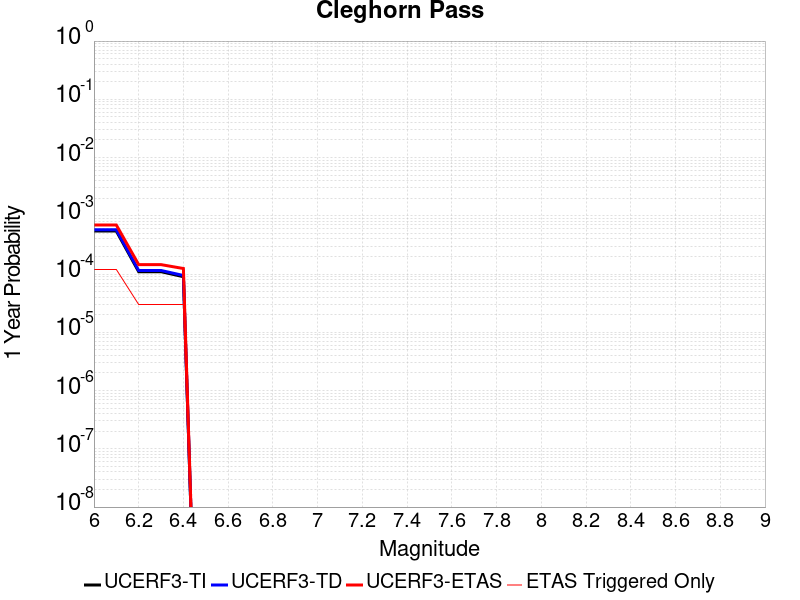 | 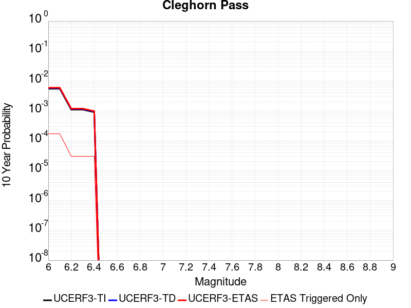 |

| Magnitude | 1 yr TI Prob | TD Prob | ETAS Prob | ETAS/TD Gain | ETAS Triggered Only | 10 yr TI Prob | TD Prob | ETAS Prob | ETAS/TD Gain | ETAS Triggered Only |
|-----|-----|-----|-----|-----|-----|-----|-----|-----|-----|-----|
| 6.0 | 5.4891926E-4 | 5.759784E-4 | 6.959093E-4 | 1.2082211 | 1.2E-4 | 0.0054756533 | 0.005750022 | 0.0059190444 | 1.0293951 | 1.7E-4 |
| 6.1 | 5.4891926E-4 | 5.759784E-4 | 6.959093E-4 | 1.2082211 | 1.2E-4 | 0.0054756533 | 0.005750022 | 0.0059190444 | 1.0293951 | 1.7E-4 |
| 6.2 | 1.098083E-4 | 1.1521882E-4 | 1.4521537E-4 | 1.2603441 | 3.0E-5 | 0.0010975406 | 0.0011520023 | 0.0011819677 | 1.0260116 | 3.0E-5 |
| 6.3 | 1.098083E-4 | 1.1521882E-4 | 1.4521537E-4 | 1.2603441 | 3.0E-5 | 0.0010975406 | 0.0011520023 | 0.0011819677 | 1.0260116 | 3.0E-5 |
| 6.4 | 9.005586E-5 | 9.4488976E-5 | 1.2448615E-4 | 1.3174673 | 3.0E-5 | 9.001937E-4 | 9.448898E-4 | 9.7486144E-4 | 1.0317197 | 3.0E-5 |

## Santa Ynez (West)
*[(top)](#table-of-contents)*

| 1 Year | 10 Year |
|-----|-----|
|  |  |

| Magnitude | 1 yr TI Prob | TD Prob | ETAS Prob | ETAS/TD Gain | ETAS Triggered Only | 10 yr TI Prob | TD Prob | ETAS Prob | ETAS/TD Gain | ETAS Triggered Only |
|-----|-----|-----|-----|-----|-----|-----|-----|-----|-----|-----|
| 6.0 | 0.0024678076 | 0.0028645284 | 0.002994156 | 1.0452527 | 1.3E-4 | 0.024405818 | 0.028304417 | 0.028469605 | 1.0058361 | 1.7E-4 |
| 6.1 | 0.0024678076 | 0.0028645284 | 0.002964242 | 1.0348097 | 1.0E-4 | 0.024405818 | 0.028304417 | 0.028440455 | 1.0048063 | 1.4E-4 |
| 6.2 | 0.0015858212 | 0.0017686661 | 0.0018285599 | 1.0338639 | 6.0E-5 | 0.015745522 | 0.017549807 | 0.017648052 | 1.0055981 | 1.0E-4 |
| 6.3 | 0.0015858212 | 0.0017686661 | 0.0018285599 | 1.0338639 | 6.0E-5 | 0.015745522 | 0.017549807 | 0.017648052 | 1.0055981 | 1.0E-4 |
| 6.4 | 0.0013271887 | 0.0014554089 | 0.001505336 | 1.0343046 | 5.0E-5 | 0.013192902 | 0.014460951 | 0.014539794 | 1.0054522 | 8.0E-5 |
| 6.5 | 0.0012068948 | 0.0013103267 | 0.0013402874 | 1.022865 | 3.0E-5 | 0.012003611 | 0.01302768 | 0.013086898 | 1.0045456 | 6.0E-5 |
| 6.6 | 9.97089E-4 | 0.001061516 | 0.0010914841 | 1.0282315 | 3.0E-5 | 0.00992627 | 0.010565365 | 0.010624731 | 1.0056189 | 6.0E-5 |
| 6.7 | 8.985399E-4 | 9.464169E-4 | 9.763885E-4 | 1.0316685 | 3.0E-5 | 0.008949154 | 0.0094245095 | 0.009474039 | 1.0052553 | 5.0E-5 |
| 6.8 | 7.98925E-4 | 8.306873E-4 | 8.606623E-4 | 1.0360847 | 3.0E-5 | 0.007960589 | 0.00827631 | 0.008325896 | 1.0059913 | 5.0E-5 |
| 6.9 | 6.8180985E-4 | 6.9528597E-4 | 7.252651E-4 | 1.0431178 | 3.0E-5 | 0.0067972173 | 0.006931367 | 0.0069810203 | 1.0071635 | 5.0E-5 |
| 7.0 | 6.1745E-4 | 6.2244723E-4 | 6.5242854E-4 | 1.0481669 | 3.0E-5 | 0.006157372 | 0.006207231 | 0.0062569208 | 1.0080051 | 5.0E-5 |
| 7.1 | 5.5279525E-4 | 5.4992986E-4 | 5.799133E-4 | 1.0545224 | 3.0E-5 | 0.0055142213 | 0.005485821 | 0.0055256016 | 1.0072515 | 4.0E-5 |
| 7.2 | 5.0032866E-4 | 4.934463E-4 | 5.234315E-4 | 1.0607669 | 3.0E-5 | 0.004992037 | 0.0049236254 | 0.0049634282 | 1.008084 | 4.0E-5 |
| 7.3 | 4.4791115E-4 | 4.3714207E-4 | 4.571333E-4 | 1.0457317 | 2.0E-5 | 0.004470094 | 0.004362933 | 0.0043928022 | 1.0068461 | 3.0E-5 |
| 7.4 | 3.78866E-4 | 3.626581E-4 | 3.7265447E-4 | 1.0275642 | 1.0E-5 | 0.0037822074 | 0.0036207628 | 0.0036307266 | 1.0027518 | 1.0E-5 |
| 7.5 | 2.9358198E-4 | 2.739843E-4 | 2.8398156E-4 | 1.0364884 | 1.0E-5 | 0.0029319443 | 0.002736537 | 0.0027465096 | 1.0036442 | 1.0E-5 |
| 7.6 | 1.18190335E-4 | 1.0752728E-4 | 1.0752728E-4 | 1.0 | 0.0 | 0.001181275 | 0.0010747612 | 0.0010747612 | 1.0 | 0.0 |
| 7.7 | 6.8350986E-5 | 5.7479636E-5 | 5.7479636E-5 | 1.0 | 0.0 | 6.832996E-4 | 5.7465007E-4 | 5.7465007E-4 | 1.0 | 0.0 |
| 7.8 | 4.1240855E-5 | 3.167787E-5 | 3.167787E-5 | 1.0 | 0.0 | 4.12332E-4 | 3.167349E-4 | 3.167349E-4 | 1.0 | 0.0 |
| 7.9 | 3.6918053E-7 | 2.6558615E-7 | 2.6558615E-7 | 1.0 | 0.0 | 3.691799E-6 | 2.6558594E-6 | 2.6558594E-6 | 1.0 | 0.0 |

## Kern Canyon (North Kern) 2011
*[(top)](#table-of-contents)*

| 1 Year | 10 Year |
|-----|-----|
|  | 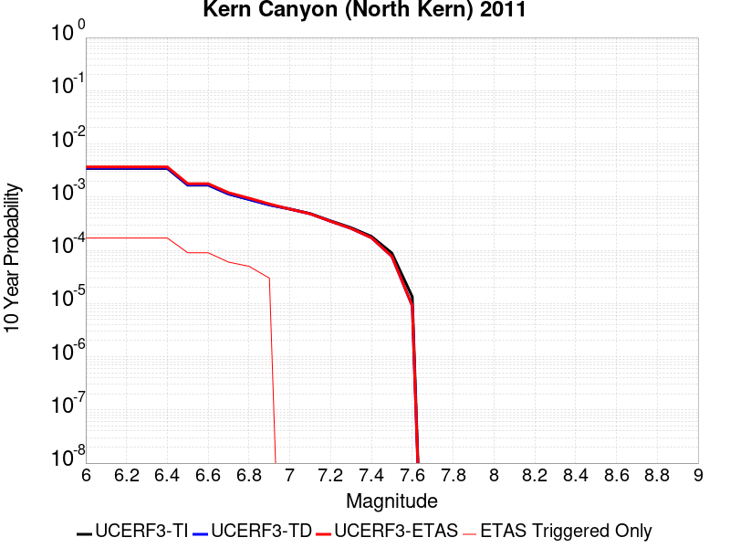 |

| Magnitude | 1 yr TI Prob | TD Prob | ETAS Prob | ETAS/TD Gain | ETAS Triggered Only | 10 yr TI Prob | TD Prob | ETAS Prob | ETAS/TD Gain | ETAS Triggered Only |
|-----|-----|-----|-----|-----|-----|-----|-----|-----|-----|-----|
| 6.0 | 3.4570007E-4 | 3.5253543E-4 | 4.6249665E-4 | 1.3119154 | 1.1E-4 | 0.0034516277 | 0.0035205502 | 0.0036899517 | 1.0481179 | 1.7E-4 |
| 6.1 | 3.4570007E-4 | 3.5253543E-4 | 4.6249665E-4 | 1.3119154 | 1.1E-4 | 0.0034516277 | 0.0035205502 | 0.0036899517 | 1.0481179 | 1.7E-4 |
| 6.2 | 3.4570007E-4 | 3.5253543E-4 | 4.6249665E-4 | 1.3119154 | 1.1E-4 | 0.0034516277 | 0.0035205502 | 0.0036899517 | 1.0481179 | 1.7E-4 |
| 6.3 | 3.4570007E-4 | 3.5253543E-4 | 4.6249665E-4 | 1.3119154 | 1.1E-4 | 0.0034516277 | 0.0035205502 | 0.0036899517 | 1.0481179 | 1.7E-4 |
| 6.4 | 3.4570007E-4 | 3.5253543E-4 | 4.6249665E-4 | 1.3119154 | 1.1E-4 | 0.0034516277 | 0.0035205502 | 0.0036899517 | 1.0481179 | 1.7E-4 |
| 6.5 | 1.6780409E-4 | 1.6993708E-4 | 2.1992858E-4 | 1.2941766 | 5.0E-5 | 0.0016767744 | 0.001698151 | 0.0017879981 | 1.0529088 | 9.0E-5 |
| 6.6 | 1.6780409E-4 | 1.6993708E-4 | 2.1992858E-4 | 1.2941766 | 5.0E-5 | 0.0016767744 | 0.001698151 | 0.0017879981 | 1.0529088 | 9.0E-5 |
| 6.7 | 1.1430779E-4 | 1.1515819E-4 | 1.5515358E-4 | 1.3473083 | 4.0E-5 | 0.0011424901 | 0.0011510046 | 0.0012109354 | 1.0520684 | 6.0E-5 |
| 6.8 | 9.028525E-5 | 9.0606925E-5 | 1.3060331E-4 | 1.4414274 | 4.0E-5 | 9.024858E-4 | 9.057096E-4 | 9.556643E-4 | 1.0551553 | 5.0E-5 |
| 6.9 | 7.148377E-5 | 7.142282E-5 | 1.0142068E-4 | 1.4200038 | 3.0E-5 | 7.146078E-4 | 7.140032E-4 | 7.439818E-4 | 1.0419866 | 3.0E-5 |
| 7.0 | 5.983557E-5 | 5.9553895E-5 | 5.9553895E-5 | 1.0 | 0.0 | 5.981946E-4 | 5.953825E-4 | 5.953825E-4 | 1.0 | 0.0 |
| 7.1 | 4.9021666E-5 | 4.8538972E-5 | 4.8538972E-5 | 1.0 | 0.0 | 4.901085E-4 | 4.8528548E-4 | 4.8528548E-4 | 1.0 | 0.0 |
| 7.2 | 3.5783723E-5 | 3.5059755E-5 | 3.5059755E-5 | 1.0 | 0.0 | 3.5777962E-4 | 3.5054312E-4 | 3.5054312E-4 | 1.0 | 0.0 |
| 7.3 | 2.6663936E-5 | 2.5772239E-5 | 2.5772239E-5 | 1.0 | 0.0 | 2.6660739E-4 | 2.57693E-4 | 2.57693E-4 | 1.0 | 0.0 |
| 7.4 | 1.8262032E-5 | 1.721665E-5 | 1.721665E-5 | 1.0 | 0.0 | 1.826053E-4 | 1.7215339E-4 | 1.7215339E-4 | 1.0 | 0.0 |
| 7.5 | 8.881548E-6 | 7.696334E-6 | 7.696334E-6 | 1.0 | 0.0 | 8.8811925E-5 | 7.696076E-5 | 7.696076E-5 | 1.0 | 0.0 |
| 7.6 | 1.3421597E-6 | 9.054312E-7 | 9.054312E-7 | 1.0 | 0.0 | 1.3421517E-5 | 9.05428E-6 | 9.05428E-6 | 1.0 | 0.0 |

## Owens Valley
*[(top)](#table-of-contents)*

| 1 Year | 10 Year |
|-----|-----|
| 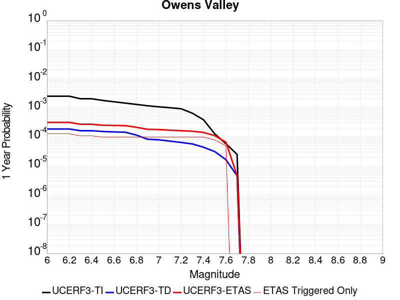 |  |

| Magnitude | 1 yr TI Prob | TD Prob | ETAS Prob | ETAS/TD Gain | ETAS Triggered Only | 10 yr TI Prob | TD Prob | ETAS Prob | ETAS/TD Gain | ETAS Triggered Only |
|-----|-----|-----|-----|-----|-----|-----|-----|-----|-----|-----|
| 6.0 | 0.002521386 | 1.8921259E-4 | 3.19188E-4 | 1.6869279 | 1.3E-4 | 0.024929691 | 0.001925011 | 0.002084703 | 1.0829564 | 1.6E-4 |
| 6.1 | 0.002521386 | 1.8921259E-4 | 3.19188E-4 | 1.6869279 | 1.3E-4 | 0.024929691 | 0.001925011 | 0.002084703 | 1.0829564 | 1.6E-4 |
| 6.2 | 0.002521386 | 1.8921259E-4 | 3.19188E-4 | 1.6869279 | 1.3E-4 | 0.024929691 | 0.001925011 | 0.002084703 | 1.0829564 | 1.6E-4 |
| 6.3 | 0.002060538 | 1.6463149E-4 | 2.7461338E-4 | 1.668049 | 1.1E-4 | 0.020415364 | 0.0016592 | 0.0017889842 | 1.078221 | 1.3E-4 |
| 6.4 | 0.002060538 | 1.6463149E-4 | 2.7461338E-4 | 1.668049 | 1.1E-4 | 0.020415364 | 0.0016592 | 0.0017889842 | 1.078221 | 1.3E-4 |
| 6.5 | 0.0018023965 | 1.550426E-4 | 2.550271E-4 | 1.644884 | 1.0E-4 | 0.017878477 | 0.001555719 | 0.0016755323 | 1.0770148 | 1.2E-4 |
| 6.6 | 0.0016229092 | 1.4997667E-4 | 2.4996165E-4 | 1.6666704 | 1.0E-4 | 0.016111081 | 0.0015012559 | 0.0016210757 | 1.0798131 | 1.2E-4 |
| 6.7 | 0.001463541 | 1.4663354E-4 | 2.4661887E-4 | 1.6818722 | 1.0E-4 | 0.014539397 | 0.0014657511 | 0.0015855752 | 1.0817493 | 1.2E-4 |
| 6.8 | 0.0013164099 | 1.16632E-4 | 2.1662033E-4 | 1.8572977 | 1.0E-4 | 0.01308639 | 0.0011659812 | 0.0012758529 | 1.0942311 | 1.1E-4 |
| 6.9 | 0.0011840039 | 8.390849E-5 | 1.8390009E-4 | 2.1916745 | 1.0E-4 | 0.011777153 | 8.3897985E-4 | 9.4888755E-4 | 1.1310016 | 1.1E-4 |
| 7.0 | 0.0010884746 | 8.032813E-5 | 1.803201E-4 | 2.244794 | 1.0E-4 | 0.010831586 | 8.0316263E-4 | 9.1307424E-4 | 1.1368486 | 1.1E-4 |
| 7.1 | 0.0010143308 | 7.233874E-5 | 1.723315E-4 | 2.382285 | 1.0E-4 | 0.010097133 | 7.2330976E-4 | 8.332302E-4 | 1.1519687 | 1.1E-4 |
| 7.2 | 9.3233347E-4 | 6.516448E-5 | 1.6515797E-4 | 2.5344784 | 1.0E-4 | 0.009284316 | 6.5159105E-4 | 7.6151936E-4 | 1.1687075 | 1.1E-4 |
| 7.3 | 6.582117E-4 | 5.799593E-5 | 1.5799013E-4 | 2.724159 | 1.0E-4 | 0.0065626553 | 5.7994033E-4 | 6.8987656E-4 | 1.1895647 | 1.1E-4 |
| 7.4 | 3.906093E-4 | 4.4604632E-5 | 1.4460017E-4 | 3.2418196 | 1.0E-4 | 0.003899234 | 4.4604883E-4 | 5.5599975E-4 | 1.2464998 | 1.1E-4 |
| 7.5 | 1.2905113E-4 | 3.166468E-5 | 1.1166215E-4 | 3.5263941 | 8.0E-5 | 0.0012897621 | 3.1660203E-4 | 3.965767E-4 | 1.2526032 | 8.0E-5 |
| 7.6 | 5.9110564E-5 | 1.6678909E-5 | 6.6678076E-5 | 3.9977481 | 5.0E-5 | 5.9094845E-4 | 1.6677675E-4 | 2.1676841E-4 | 1.299752 | 5.0E-5 |
| 7.7 | 2.536535E-5 | 4.6776368E-6 | 4.6776368E-6 | 1.0 | 0.0 | 2.5362454E-4 | 4.677545E-5 | 4.677545E-5 | 1.0 | 0.0 |

## San Andreas (North Branch Mill Creek)
*[(top)](#table-of-contents)*

| 1 Year | 10 Year |
|-----|-----|
|  |  |

| Magnitude | 1 yr TI Prob | TD Prob | ETAS Prob | ETAS/TD Gain | ETAS Triggered Only | 10 yr TI Prob | TD Prob | ETAS Prob | ETAS/TD Gain | ETAS Triggered Only |
|-----|-----|-----|-----|-----|-----|-----|-----|-----|-----|-----|
| 6.0 | 7.02142E-4 | 0.0012254574 | 0.0013552981 | 1.1059529 | 1.3E-4 | 0.0069992766 | 0.01222957 | 0.012387613 | 1.012923 | 1.6E-4 |
| 6.1 | 7.02142E-4 | 0.0012254574 | 0.0013552981 | 1.1059529 | 1.3E-4 | 0.0069992766 | 0.01222957 | 0.012387613 | 1.012923 | 1.6E-4 |
| 6.2 | 7.02142E-4 | 0.0012254574 | 0.0013552981 | 1.1059529 | 1.3E-4 | 0.0069992766 | 0.01222957 | 0.012387613 | 1.012923 | 1.6E-4 |
| 6.3 | 7.02142E-4 | 0.0012254574 | 0.0013552981 | 1.1059529 | 1.3E-4 | 0.0069992766 | 0.01222957 | 0.012387613 | 1.012923 | 1.6E-4 |
| 6.4 | 7.02142E-4 | 0.0012254574 | 0.0013552981 | 1.1059529 | 1.3E-4 | 0.0069992766 | 0.01222957 | 0.012387613 | 1.012923 | 1.6E-4 |
| 6.5 | 7.0159714E-4 | 0.001224882 | 0.0013547228 | 1.1060027 | 1.3E-4 | 0.006993862 | 0.01222388 | 0.012381923 | 1.0129291 | 1.6E-4 |
| 6.6 | 6.8198174E-4 | 0.0012047797 | 0.0013346231 | 1.1077735 | 1.3E-4 | 0.006798926 | 0.012025044 | 0.0121831205 | 1.0131456 | 1.6E-4 |
| 6.7 | 6.8071426E-4 | 0.0012034923 | 0.0013333358 | 1.1078889 | 1.3E-4 | 0.0067863287 | 0.012012309 | 0.012170387 | 1.0131596 | 1.6E-4 |
| 6.8 | 6.73139E-4 | 0.0011955918 | 0.0013254363 | 1.1086028 | 1.3E-4 | 0.0067110364 | 0.011934154 | 0.012092245 | 1.0132469 | 1.6E-4 |
| 6.9 | 6.711799E-4 | 0.0011934759 | 0.0013233208 | 1.1087955 | 1.3E-4 | 0.006691564 | 0.011913223 | 0.012071317 | 1.0132705 | 1.6E-4 |
| 7.0 | 6.518148E-4 | 0.0011622087 | 0.0012920577 | 1.1117259 | 1.3E-4 | 0.0064990623 | 0.0116038285 | 0.011761972 | 1.0136286 | 1.6E-4 |
| 7.1 | 6.4952404E-4 | 0.0011593461 | 0.0012891953 | 1.1120021 | 1.3E-4 | 0.0064762887 | 0.0115755 | 0.011733647 | 1.0136623 | 1.6E-4 |
| 7.2 | 6.2609545E-4 | 0.0011269567 | 0.0012568102 | 1.115225 | 1.3E-4 | 0.006243344 | 0.011254923 | 0.0114131225 | 1.014056 | 1.6E-4 |
| 7.3 | 6.219575E-4 | 0.001120172 | 0.0012500264 | 1.1159236 | 1.3E-4 | 0.0062021962 | 0.011187789 | 0.011345998 | 1.0141413 | 1.6E-4 |
| 7.4 | 6.0564023E-4 | 0.0010875424 | 0.001217401 | 1.1194056 | 1.3E-4 | 0.006039923 | 0.010865397 | 0.011023658 | 1.0145657 | 1.6E-4 |
| 7.5 | 5.757461E-4 | 0.0010197869 | 0.0011496544 | 1.1273476 | 1.3E-4 | 0.005742567 | 0.010194898 | 0.010353266 | 1.0155342 | 1.6E-4 |
| 7.6 | 5.592486E-4 | 9.906954E-4 | 0.0011205666 | 1.131091 | 1.3E-4 | 0.005578433 | 0.009906623 | 0.010065037 | 1.0159909 | 1.6E-4 |
| 7.7 | 4.839081E-4 | 8.575427E-4 | 9.774398E-4 | 1.1398147 | 1.2E-4 | 0.0048285574 | 0.008586041 | 0.008734753 | 1.0173203 | 1.5E-4 |
| 7.8 | 3.043997E-4 | 5.818867E-4 | 7.0181687E-4 | 1.2061057 | 1.2E-4 | 0.0030398308 | 0.0058469265 | 0.0059960494 | 1.0255045 | 1.5E-4 |
| 7.9 | 2.4469878E-4 | 4.4389578E-4 | 5.238603E-4 | 1.1801425 | 8.0E-5 | 0.002444295 | 0.0044707474 | 0.0045802556 | 1.0244944 | 1.1E-4 |
| 8.0 | 1.5428272E-4 | 2.5287544E-4 | 2.8286784E-4 | 1.1186055 | 3.0E-5 | 0.0015417566 | 0.002549644 | 0.0025995167 | 1.0195606 | 5.0E-5 |
| 8.1 | 8.544835E-5 | 1.14624294E-4 | 1.14624294E-4 | 1.0 | 0.0 | 8.54155E-4 | 0.0011606582 | 0.0011606582 | 1.0 | 0.0 |
| 8.2 | 3.63321E-5 | 2.3668037E-5 | 2.3668037E-5 | 1.0 | 0.0 | 3.6326164E-4 | 2.451564E-4 | 2.451564E-4 | 1.0 | 0.0 |
| 8.3 | 9.32747E-6 | 4.3623154E-6 | 4.3623154E-6 | 1.0 | 0.0 | 9.3270784E-5 | 4.5817014E-5 | 4.5817014E-5 | 1.0 | 0.0 |

## Lost Hills
*[(top)](#table-of-contents)*

| 1 Year | 10 Year |
|-----|-----|
| 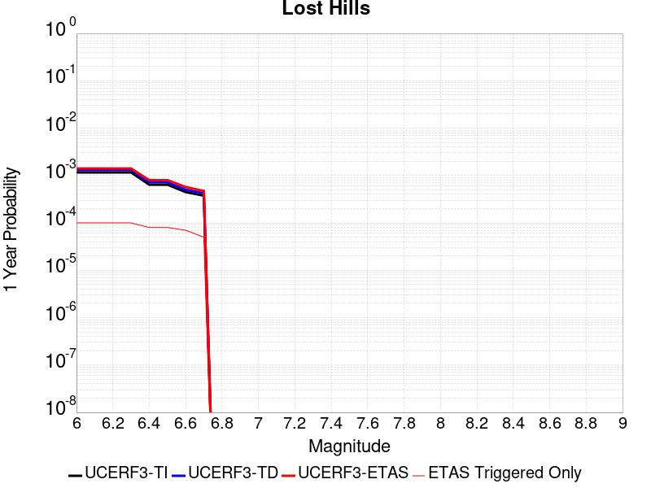 |  |

| Magnitude | 1 yr TI Prob | TD Prob | ETAS Prob | ETAS/TD Gain | ETAS Triggered Only | 10 yr TI Prob | TD Prob | ETAS Prob | ETAS/TD Gain | ETAS Triggered Only |
|-----|-----|-----|-----|-----|-----|-----|-----|-----|-----|-----|
| 6.0 | 0.0011647546 | 0.001309364 | 0.0014092331 | 1.076273 | 1.0E-4 | 0.011586686 | 0.013033091 | 0.013181136 | 1.0113592 | 1.5E-4 |
| 6.1 | 0.0011647546 | 0.001309364 | 0.0014092331 | 1.076273 | 1.0E-4 | 0.011586686 | 0.013033091 | 0.013181136 | 1.0113592 | 1.5E-4 |
| 6.2 | 0.0011647546 | 0.001309364 | 0.0014092331 | 1.076273 | 1.0E-4 | 0.011586686 | 0.013033091 | 0.013181136 | 1.0113592 | 1.5E-4 |
| 6.3 | 0.0011647546 | 0.001309364 | 0.0014092331 | 1.076273 | 1.0E-4 | 0.011586686 | 0.013033091 | 0.013181136 | 1.0113592 | 1.5E-4 |
| 6.4 | 6.409735E-4 | 7.189252E-4 | 7.988677E-4 | 1.1111972 | 8.0E-5 | 0.006391279 | 0.0071752006 | 0.0072744833 | 1.0138369 | 1.0E-4 |
| 6.5 | 6.409735E-4 | 7.189252E-4 | 7.988677E-4 | 1.1111972 | 8.0E-5 | 0.006391279 | 0.0071752006 | 0.0072744833 | 1.0138369 | 1.0E-4 |
| 6.6 | 4.4774043E-4 | 5.026414E-4 | 5.726062E-4 | 1.1391943 | 7.0E-5 | 0.0044683935 | 0.005023205 | 0.0051028035 | 1.0158461 | 8.0E-5 |
| 6.7 | 3.7591302E-4 | 4.2203604E-4 | 4.7201492E-4 | 1.1184233 | 5.0E-5 | 0.0037527776 | 0.0042203604 | 0.004280107 | 1.0141568 | 6.0E-5 |

## Santa Ynez (East)
*[(top)](#table-of-contents)*

| 1 Year | 10 Year |
|-----|-----|
|  | 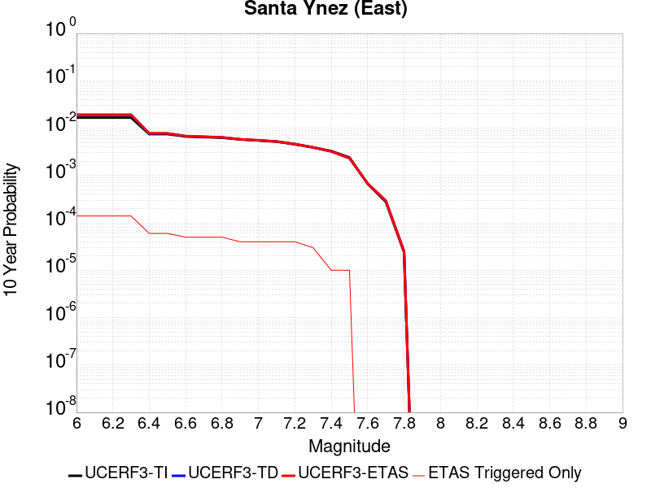 |

| Magnitude | 1 yr TI Prob | TD Prob | ETAS Prob | ETAS/TD Gain | ETAS Triggered Only | 10 yr TI Prob | TD Prob | ETAS Prob | ETAS/TD Gain | ETAS Triggered Only |
|-----|-----|-----|-----|-----|-----|-----|-----|-----|-----|-----|
| 6.0 | 0.0016823979 | 0.0019164166 | 0.0020361866 | 1.0624969 | 1.2E-4 | 0.016697178 | 0.019056441 | 0.019193774 | 1.0072066 | 1.4E-4 |
| 6.1 | 0.0016823979 | 0.0019164166 | 0.0020361866 | 1.0624969 | 1.2E-4 | 0.016697178 | 0.019056441 | 0.019193774 | 1.0072066 | 1.4E-4 |
| 6.2 | 0.0016823979 | 0.0019164166 | 0.0020361866 | 1.0624969 | 1.2E-4 | 0.016697178 | 0.019056441 | 0.019193774 | 1.0072066 | 1.4E-4 |
| 6.3 | 0.0016823979 | 0.0019164166 | 0.0020361866 | 1.0624969 | 1.2E-4 | 0.016697178 | 0.019056441 | 0.019193774 | 1.0072066 | 1.4E-4 |
| 6.4 | 7.513438E-4 | 7.745306E-4 | 8.2449184E-4 | 1.0645052 | 5.0E-5 | 0.0074880854 | 0.007718862 | 0.0077783987 | 1.0077132 | 6.0E-5 |
| 6.5 | 7.513438E-4 | 7.745306E-4 | 8.2449184E-4 | 1.0645052 | 5.0E-5 | 0.0074880854 | 0.007718862 | 0.0077783987 | 1.0077132 | 6.0E-5 |
| 6.6 | 6.6777546E-4 | 6.787207E-4 | 7.1869354E-4 | 1.0588944 | 4.0E-5 | 0.006657724 | 0.0067666885 | 0.0068163504 | 1.0073391 | 5.0E-5 |
| 6.7 | 6.497827E-4 | 6.587243E-4 | 6.986979E-4 | 1.0606835 | 4.0E-5 | 0.00647886 | 0.006567915 | 0.0066175866 | 1.0075628 | 5.0E-5 |
| 6.8 | 6.309115E-4 | 6.379937E-4 | 6.7796814E-4 | 1.0626565 | 4.0E-5 | 0.0062912325 | 0.006361809 | 0.006411491 | 1.0078094 | 5.0E-5 |
| 6.9 | 5.7922816E-4 | 5.820096E-4 | 6.1199215E-4 | 1.0515156 | 3.0E-5 | 0.005777207 | 0.0058049993 | 0.0058447667 | 1.0068506 | 4.0E-5 |
| 7.0 | 5.5176654E-4 | 5.519888E-4 | 5.8197224E-4 | 1.0543189 | 3.0E-5 | 0.0055039856 | 0.0055063153 | 0.0055460953 | 1.0072244 | 4.0E-5 |
| 7.1 | 5.2278786E-4 | 5.2066194E-4 | 5.5064633E-4 | 1.0575889 | 3.0E-5 | 0.0052155964 | 0.0051945536 | 0.005234346 | 1.0076604 | 4.0E-5 |
| 7.2 | 4.629332E-4 | 4.5639853E-4 | 4.8638484E-4 | 1.0657021 | 3.0E-5 | 0.0046197 | 0.0045547304 | 0.004594548 | 1.0087421 | 4.0E-5 |
| 7.3 | 3.9389438E-4 | 3.915322E-4 | 4.1152438E-4 | 1.0510614 | 2.0E-5 | 0.0039319694 | 0.003908531 | 0.0039384137 | 1.0076455 | 3.0E-5 |
| 7.4 | 3.2916202E-4 | 3.225782E-4 | 3.3257497E-4 | 1.0309902 | 1.0E-5 | 0.003286749 | 0.003221197 | 0.0032311648 | 1.0030944 | 1.0E-5 |
| 7.5 | 2.4053088E-4 | 2.3169373E-4 | 2.416914E-4 | 1.0431504 | 1.0E-5 | 0.002402707 | 0.002314591 | 0.002324568 | 1.0043104 | 1.0E-5 |
| 7.6 | 6.7092435E-5 | 6.78726E-5 | 6.78726E-5 | 1.0 | 0.0 | 6.707218E-4 | 6.785256E-4 | 6.785256E-4 | 1.0 | 0.0 |
| 7.7 | 2.7812002E-5 | 2.9282954E-5 | 2.9282954E-5 | 1.0 | 0.0 | 2.7808524E-4 | 2.9279452E-4 | 2.9279452E-4 | 1.0 | 0.0 |
| 7.8 | 2.4074816E-6 | 2.5061388E-6 | 2.5061388E-6 | 1.0 | 0.0 | 2.4074554E-5 | 2.5061116E-5 | 2.5061116E-5 | 1.0 | 0.0 |

## Cleghorn Lake
*[(top)](#table-of-contents)*

| 1 Year | 10 Year |
|-----|-----|
|  |  |

| Magnitude | 1 yr TI Prob | TD Prob | ETAS Prob | ETAS/TD Gain | ETAS Triggered Only | 10 yr TI Prob | TD Prob | ETAS Prob | ETAS/TD Gain | ETAS Triggered Only |
|-----|-----|-----|-----|-----|-----|-----|-----|-----|-----|-----|
| 6.0 | 8.067362E-4 | 8.759797E-4 | 9.758921E-4 | 1.1140579 | 1.0E-4 | 0.008038137 | 0.008730696 | 0.008859561 | 1.01476 | 1.3E-4 |
| 6.1 | 8.067362E-4 | 8.759797E-4 | 9.758921E-4 | 1.1140579 | 1.0E-4 | 0.008038137 | 0.008730696 | 0.008859561 | 1.01476 | 1.3E-4 |
| 6.2 | 6.585225E-4 | 7.1368564E-4 | 8.136142E-4 | 1.1400177 | 1.0E-4 | 0.0065657445 | 0.0071187317 | 0.0072378777 | 1.016737 | 1.2E-4 |
| 6.3 | 6.585225E-4 | 7.1368564E-4 | 8.136142E-4 | 1.1400177 | 1.0E-4 | 0.0065657445 | 0.0071187317 | 0.0072378777 | 1.016737 | 1.2E-4 |
| 6.4 | 4.912829E-4 | 5.3056807E-4 | 6.105256E-4 | 1.1507018 | 8.0E-5 | 0.004901982 | 0.005297049 | 0.0053865723 | 1.0169005 | 9.0E-5 |
| 6.5 | 4.8870314E-4 | 5.2782625E-4 | 6.07784E-4 | 1.151485 | 8.0E-5 | 0.004876298 | 0.0052697617 | 0.0053592874 | 1.0169885 | 9.0E-5 |
| 6.6 | 4.0710976E-4 | 4.4043022E-4 | 5.004038E-4 | 1.1361704 | 6.0E-5 | 0.0040636472 | 0.0043994905 | 0.0044691823 | 1.0158409 | 7.0E-5 |
| 6.7 | 1.205706E-4 | 1.2750797E-4 | 1.375067E-4 | 1.0784165 | 1.0E-5 | 0.001205052 | 0.0012743667 | 0.0012943413 | 1.0156741 | 2.0E-5 |
| 6.8 | 1.08957785E-4 | 1.1511434E-4 | 1.2511319E-4 | 1.0868602 | 1.0E-5 | 0.0010890438 | 0.0011505639 | 0.0011705409 | 1.0173628 | 2.0E-5 |
| 6.9 | 9.7931086E-5 | 1.03363345E-4 | 1.1336231E-4 | 1.0967361 | 1.0E-5 | 9.788794E-4 | 0.0010331686 | 0.001053148 | 1.0193379 | 2.0E-5 |
| 7.0 | 8.01304E-5 | 8.454057E-5 | 9.453972E-5 | 1.1182764 | 1.0E-5 | 8.010151E-4 | 8.450965E-4 | 8.650796E-4 | 1.0236459 | 2.0E-5 |
| 7.1 | 5.6901354E-5 | 5.999128E-5 | 6.999068E-5 | 1.1666809 | 1.0E-5 | 5.6886784E-4 | 5.997606E-4 | 6.197486E-4 | 1.0333266 | 2.0E-5 |
| 7.2 | 3.1654577E-5 | 3.3327433E-5 | 4.3327098E-5 | 1.3000431 | 1.0E-5 | 3.1650066E-4 | 3.3323118E-4 | 3.5322452E-4 | 1.0599984 | 2.0E-5 |

## Rose Canyon
*[(top)](#table-of-contents)*

| 1 Year | 10 Year |
|-----|-----|
|  | 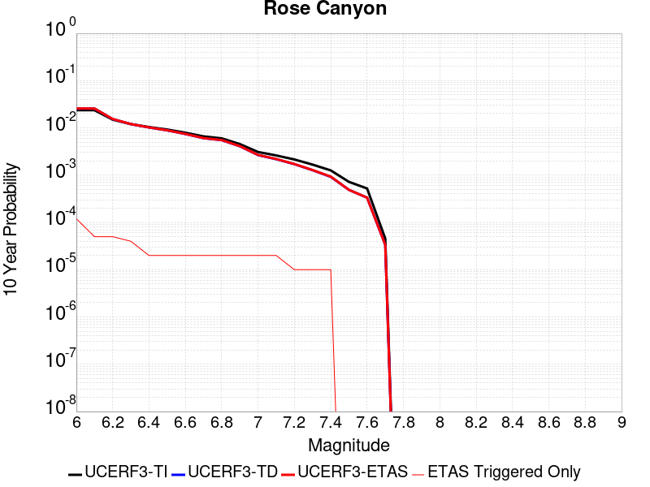 |

| Magnitude | 1 yr TI Prob | TD Prob | ETAS Prob | ETAS/TD Gain | ETAS Triggered Only | 10 yr TI Prob | TD Prob | ETAS Prob | ETAS/TD Gain | ETAS Triggered Only |
|-----|-----|-----|-----|-----|-----|-----|-----|-----|-----|-----|
| 6.0 | 0.0023933933 | 0.0025909345 | 0.0026906754 | 1.0384961 | 1.0E-4 | 0.023677798 | 0.02563999 | 0.025756914 | 1.0045602 | 1.2E-4 |
| 6.1 | 0.0023933933 | 0.0025909345 | 0.002640805 | 1.019248 | 5.0E-5 | 0.023677798 | 0.02563999 | 0.025688708 | 1.0019001 | 5.0E-5 |
| 6.2 | 0.0015039665 | 0.0015468939 | 0.0015968166 | 1.0322728 | 5.0E-5 | 0.0149382865 | 0.015374276 | 0.015423507 | 1.0032022 | 5.0E-5 |
| 6.3 | 0.0012083431 | 0.0012078186 | 0.0012477703 | 1.0330776 | 4.0E-5 | 0.012017938 | 0.012022437 | 0.012061955 | 1.0032871 | 4.0E-5 |
| 6.4 | 0.0010465092 | 0.0010256917 | 0.0010456712 | 1.019479 | 2.0E-5 | 0.010415946 | 0.010217559 | 0.010237354 | 1.0019374 | 2.0E-5 |
| 6.5 | 9.267859E-4 | 8.925905E-4 | 9.1257266E-4 | 1.0223867 | 2.0E-5 | 0.009229303 | 0.008896211 | 0.0089160325 | 1.0022281 | 2.0E-5 |
| 6.6 | 7.942326E-4 | 7.479332E-4 | 7.6791825E-4 | 1.0267204 | 2.0E-5 | 0.007914 | 0.007458359 | 0.00747821 | 1.0026616 | 2.0E-5 |
| 6.7 | 6.626558E-4 | 6.089174E-4 | 6.289052E-4 | 1.0328252 | 2.0E-5 | 0.006606833 | 0.0060750856 | 0.006094964 | 1.0032722 | 2.0E-5 |
| 6.8 | 6.0274085E-4 | 5.5343413E-4 | 5.7342305E-4 | 1.036118 | 2.0E-5 | 0.0060110865 | 0.0055225673 | 0.005542457 | 1.0036016 | 2.0E-5 |
| 6.9 | 4.5552556E-4 | 4.111582E-4 | 4.3114997E-4 | 1.0486231 | 2.0E-5 | 0.0045459294 | 0.0041048084 | 0.004124726 | 1.0048523 | 2.0E-5 |
| 7.0 | 3.0956755E-4 | 2.664666E-4 | 2.864613E-4 | 1.0750363 | 2.0E-5 | 0.0030913667 | 0.0026614866 | 0.0026814335 | 1.0074946 | 2.0E-5 |
| 7.1 | 2.6155898E-4 | 2.179467E-4 | 2.3794234E-4 | 1.0917455 | 2.0E-5 | 0.0026125133 | 0.0021773411 | 0.0021972978 | 1.0091655 | 2.0E-5 |
| 7.2 | 2.1499286E-4 | 1.7124301E-4 | 1.812413E-4 | 1.0583866 | 1.0E-5 | 0.0021478499 | 0.00171112 | 0.0017211029 | 1.0058341 | 1.0E-5 |
| 7.3 | 1.6738157E-4 | 1.2733586E-4 | 1.373346E-4 | 1.0785224 | 1.0E-5 | 0.0016725556 | 0.001272636 | 0.0012826233 | 1.0078477 | 1.0E-5 |
| 7.4 | 1.2623696E-4 | 9.2250906E-5 | 1.02249986E-4 | 1.10839 | 1.0E-5 | 0.0012616527 | 9.2213147E-4 | 9.3212223E-4 | 1.0108345 | 1.0E-5 |
| 7.5 | 7.222766E-5 | 4.8935202E-5 | 4.8935202E-5 | 1.0 | 0.0 | 7.220419E-4 | 4.892478E-4 | 4.892478E-4 | 1.0 | 0.0 |
| 7.6 | 5.2289808E-5 | 3.3453573E-5 | 3.3453573E-5 | 1.0 | 0.0 | 5.2277505E-4 | 3.344875E-4 | 3.344875E-4 | 1.0 | 0.0 |
| 7.7 | 4.5718825E-6 | 3.3651165E-6 | 3.3651165E-6 | 1.0 | 0.0 | 4.5717883E-5 | 3.3650686E-5 | 3.3650686E-5 | 1.0 | 0.0 |

## Santa Rosa Island
*[(top)](#table-of-contents)*

| 1 Year | 10 Year |
|-----|-----|
|  |  |

| Magnitude | 1 yr TI Prob | TD Prob | ETAS Prob | ETAS/TD Gain | ETAS Triggered Only | 10 yr TI Prob | TD Prob | ETAS Prob | ETAS/TD Gain | ETAS Triggered Only |
|-----|-----|-----|-----|-----|-----|-----|-----|-----|-----|-----|
| 6.0 | 0.002144533 | 0.0024544 | 0.002544179 | 1.0365789 | 9.0E-5 | 0.021239553 | 0.024293551 | 0.02443015 | 1.0056229 | 1.4E-4 |
| 6.1 | 0.0010983539 | 0.0012445104 | 0.0012644854 | 1.0160506 | 2.0E-5 | 0.01092941 | 0.012378449 | 0.012417953 | 1.0031915 | 4.0E-5 |
| 6.2 | 0.0010983539 | 0.0012445104 | 0.0012644854 | 1.0160506 | 2.0E-5 | 0.01092941 | 0.012378449 | 0.012417953 | 1.0031915 | 4.0E-5 |
| 6.3 | 7.906284E-4 | 8.905424E-4 | 9.105246E-4 | 1.0224382 | 2.0E-5 | 0.007878214 | 0.008870989 | 0.008890812 | 1.0022346 | 2.0E-5 |
| 6.4 | 6.437803E-4 | 7.225779E-4 | 7.4256345E-4 | 1.0276587 | 2.0E-5 | 0.006419184 | 0.007203121 | 0.007222977 | 1.0027566 | 2.0E-5 |
| 6.5 | 4.726887E-4 | 5.277613E-4 | 5.4775074E-4 | 1.0378759 | 2.0E-5 | 0.004716845 | 0.0052656173 | 0.005285512 | 1.0037782 | 2.0E-5 |
| 6.6 | 3.936723E-4 | 4.3824865E-4 | 4.4824427E-4 | 1.0228081 | 1.0E-5 | 0.003929756 | 0.0043742736 | 0.00438423 | 1.0022761 | 1.0E-5 |
| 6.7 | 2.8706578E-4 | 3.1758484E-4 | 3.1758484E-4 | 1.0 | 0.0 | 0.0028669522 | 0.0031716314 | 0.0031716314 | 1.0 | 0.0 |
| 6.8 | 1.948771E-4 | 2.1303284E-4 | 2.1303284E-4 | 1.0 | 0.0 | 0.0019470629 | 0.0021285315 | 0.0021285315 | 1.0 | 0.0 |
| 6.9 | 1.2816161E-4 | 1.3718237E-4 | 1.3718237E-4 | 1.0 | 0.0 | 0.0012808773 | 0.0013709799 | 0.0013709799 | 1.0 | 0.0 |
| 7.0 | 1.2128269E-4 | 1.2953962E-4 | 1.2953962E-4 | 1.0 | 0.0 | 0.0012121652 | 0.0012946434 | 0.0012946434 | 1.0 | 0.0 |
| 7.1 | 1.1608207E-4 | 1.2382529E-4 | 1.2382529E-4 | 1.0 | 0.0 | 0.0011602144 | 0.001237565 | 0.001237565 | 1.0 | 0.0 |
| 7.2 | 1.1139726E-4 | 1.1875956E-4 | 1.1875956E-4 | 1.0 | 0.0 | 0.0011134144 | 0.0011869629 | 0.0011869629 | 1.0 | 0.0 |
| 7.3 | 1.032748E-4 | 1.10024026E-4 | 1.10024026E-4 | 1.0 | 0.0 | 0.0010322682 | 0.0010996973 | 0.0010996973 | 1.0 | 0.0 |
| 7.4 | 8.844508E-5 | 9.415573E-5 | 9.415573E-5 | 1.0 | 0.0 | 8.840988E-4 | 9.4116E-4 | 9.4116E-4 | 1.0 | 0.0 |
| 7.5 | 4.6892885E-5 | 4.963218E-5 | 4.963218E-5 | 1.0 | 0.0 | 4.688299E-4 | 4.9621216E-4 | 4.9621216E-4 | 1.0 | 0.0 |
| 7.6 | 2.0236233E-5 | 2.1147409E-5 | 2.1147409E-5 | 1.0 | 0.0 | 2.023439E-4 | 2.1145462E-4 | 2.1145462E-4 | 1.0 | 0.0 |
| 7.7 | 3.225572E-6 | 3.3076128E-6 | 3.3076128E-6 | 1.0 | 0.0 | 3.225525E-5 | 3.307564E-5 | 3.307564E-5 | 1.0 | 0.0 |
| 7.8 | 7.1507856E-8 | 7.286295E-8 | 7.286295E-8 | 1.0 | 0.0 | 7.1507833E-7 | 7.286294E-7 | 7.286294E-7 | 1.0 | 0.0 |

## Brawley (Seismic Zone) alt 1
*[(top)](#table-of-contents)*

| 1 Year | 10 Year |
|-----|-----|
|  |  |

| Magnitude | 1 yr TI Prob | TD Prob | ETAS Prob | ETAS/TD Gain | ETAS Triggered Only | 10 yr TI Prob | TD Prob | ETAS Prob | ETAS/TD Gain | ETAS Triggered Only |
|-----|-----|-----|-----|-----|-----|-----|-----|-----|-----|-----|
| 6.0 | 0.011683988 | 0.024546238 | 0.024643783 | 1.003974 | 1.0E-4 | 0.11088423 | 0.21350002 | 0.21360226 | 1.0004789 | 1.3E-4 |
| 6.1 | 0.011683988 | 0.024546238 | 0.024643783 | 1.003974 | 1.0E-4 | 0.11088423 | 0.21350002 | 0.21360226 | 1.0004789 | 1.3E-4 |
| 6.2 | 0.011405343 | 0.024080504 | 0.024178095 | 1.0040528 | 1.0E-4 | 0.10837428 | 0.20993657 | 0.21003927 | 1.0004892 | 1.3E-4 |
| 6.3 | 0.011262234 | 0.02379366 | 0.023891281 | 1.0041028 | 1.0E-4 | 0.107082725 | 0.20782755 | 0.20793054 | 1.0004956 | 1.3E-4 |
| 6.4 | 0.00974259 | 0.020680401 | 0.02076854 | 1.004262 | 9.0E-5 | 0.093263686 | 0.18457815 | 0.184676 | 1.0005301 | 1.2E-4 |
| 6.5 | 0.009034078 | 0.019368723 | 0.019447174 | 1.0040504 | 8.0E-5 | 0.086755216 | 0.17440031 | 0.17449114 | 1.0005207 | 1.1E-4 |
| 6.6 | 0.008271996 | 0.018045569 | 0.018124126 | 1.0043532 | 8.0E-5 | 0.07970774 | 0.16380852 | 0.16390051 | 1.0005615 | 1.1E-4 |
| 6.7 | 0.007417723 | 0.016592601 | 0.016671274 | 1.0047414 | 8.0E-5 | 0.07174956 | 0.15193306 | 0.15202636 | 1.000614 | 1.1E-4 |
| 6.8 | 0.0064481674 | 0.015048777 | 0.015127573 | 1.005236 | 8.0E-5 | 0.06264243 | 0.13837762 | 0.13847241 | 1.000685 | 1.1E-4 |
| 6.9 | 0.005298089 | 0.0136083355 | 0.013687247 | 1.0057987 | 8.0E-5 | 0.05173543 | 0.124961674 | 0.12505792 | 1.0007702 | 1.1E-4 |
| 7.0 | 0.0039900932 | 0.011621496 | 0.011700566 | 1.0068038 | 8.0E-5 | 0.039192066 | 0.107266866 | 0.107365064 | 1.0009155 | 1.1E-4 |
| 7.1 | 0.0039125155 | 0.011458045 | 0.011537128 | 1.006902 | 8.0E-5 | 0.038443442 | 0.10583085 | 0.10592921 | 1.0009294 | 1.1E-4 |
| 7.2 | 0.0035360386 | 0.0104916105 | 0.010570771 | 1.0075451 | 8.0E-5 | 0.034803 | 0.09750131 | 0.09760059 | 1.0010182 | 1.1E-4 |
| 7.3 | 0.0033337586 | 0.009784332 | 0.009863548 | 1.0080963 | 8.0E-5 | 0.03284188 | 0.09139617 | 0.09149611 | 1.0010935 | 1.1E-4 |
| 7.4 | 0.0023488526 | 0.0065168133 | 0.006586357 | 1.0106715 | 7.0E-5 | 0.023241805 | 0.062363707 | 0.06245747 | 1.0015035 | 1.0E-4 |
| 7.5 | 0.0017896603 | 0.0048595266 | 0.0049092835 | 1.0102391 | 5.0E-5 | 0.01775316 | 0.04705519 | 0.047131427 | 1.0016202 | 8.0E-5 |
| 7.6 | 0.001354725 | 0.003673598 | 0.0037234141 | 1.0135607 | 5.0E-5 | 0.013464959 | 0.035840835 | 0.035917968 | 1.0021521 | 8.0E-5 |
| 7.7 | 9.018782E-4 | 0.0025747516 | 0.0026046743 | 1.0116216 | 3.0E-5 | 0.008982267 | 0.025290398 | 0.025329387 | 1.0015416 | 4.0E-5 |
| 7.8 | 6.743139E-4 | 0.0020690386 | 0.0020889973 | 1.0096463 | 2.0E-5 | 0.0067227143 | 0.020431727 | 0.020461114 | 1.0014383 | 3.0E-5 |
| 7.9 | 5.321229E-4 | 0.0014988075 | 0.0015187776 | 1.0133239 | 2.0E-5 | 0.005308505 | 0.014991644 | 0.015021194 | 1.0019711 | 3.0E-5 |
| 8.0 | 4.5126543E-4 | 0.0012138576 | 0.0012338333 | 1.0164564 | 2.0E-5 | 0.0045035016 | 0.012211097 | 0.012230853 | 1.0016179 | 2.0E-5 |
| 8.1 | 2.0539707E-4 | 3.8229208E-4 | 3.8229208E-4 | 1.0 | 0.0 | 0.0020520731 | 0.004001185 | 0.004001185 | 1.0 | 0.0 |
| 8.2 | 8.922769E-5 | 1.1571907E-4 | 1.1571907E-4 | 1.0 | 0.0 | 8.9191867E-4 | 0.0012666774 | 0.0012666774 | 1.0 | 0.0 |
| 8.3 | 1.5834444E-6 | 8.9829894E-7 | 8.9829894E-7 | 1.0 | 0.0 | 1.5834332E-5 | 9.367729E-6 | 9.367729E-6 | 1.0 | 0.0 |

## San Clemente
*[(top)](#table-of-contents)*

| 1 Year | 10 Year |
|-----|-----|
|  | 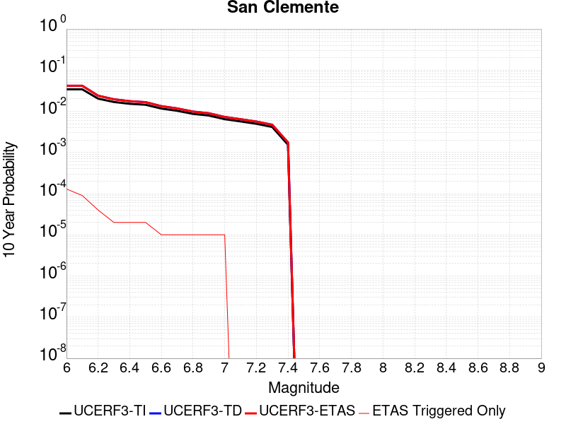 |

| Magnitude | 1 yr TI Prob | TD Prob | ETAS Prob | ETAS/TD Gain | ETAS Triggered Only | 10 yr TI Prob | TD Prob | ETAS Prob | ETAS/TD Gain | ETAS Triggered Only |
|-----|-----|-----|-----|-----|-----|-----|-----|-----|-----|-----|
| 6.0 | 0.003480294 | 0.0042512873 | 0.0043608197 | 1.0257645 | 1.1E-4 | 0.03426291 | 0.041755714 | 0.041880284 | 1.0029833 | 1.3E-4 |
| 6.1 | 0.003480294 | 0.0042512873 | 0.0043409048 | 1.02108 | 9.0E-5 | 0.03426291 | 0.041755714 | 0.041841954 | 1.0020654 | 9.0E-5 |
| 6.2 | 0.0020537945 | 0.002420985 | 0.002460888 | 1.0164822 | 4.0E-5 | 0.020349167 | 0.02395286 | 0.023991901 | 1.00163 | 4.0E-5 |
| 6.3 | 0.0016990956 | 0.0019771983 | 0.0019971589 | 1.0100954 | 2.0E-5 | 0.01686163 | 0.019599866 | 0.019619474 | 1.0010004 | 2.0E-5 |
| 6.4 | 0.0015357438 | 0.0017776482 | 0.0017976126 | 1.0112308 | 2.0E-5 | 0.015251739 | 0.017637458 | 0.017657105 | 1.0011139 | 2.0E-5 |
| 6.5 | 0.001455179 | 0.0016812651 | 0.0017012315 | 1.0118757 | 2.0E-5 | 0.014456868 | 0.016688475 | 0.016708141 | 1.0011784 | 2.0E-5 |
| 6.6 | 0.0011729331 | 0.0013433908 | 0.0013533774 | 1.0074339 | 1.0E-5 | 0.011667615 | 0.013354415 | 0.0133642815 | 1.0007389 | 1.0E-5 |
| 6.7 | 0.0010358836 | 0.0011820279 | 0.0011920161 | 1.00845 | 1.0E-5 | 0.010310682 | 0.011758701 | 0.011768583 | 1.0008404 | 1.0E-5 |
| 6.8 | 8.7088346E-4 | 9.897591E-4 | 9.997492E-4 | 1.0100935 | 1.0E-5 | 0.008674784 | 0.0098545365 | 0.009864438 | 1.0010048 | 1.0E-5 |
| 6.9 | 7.93766E-4 | 9.00704E-4 | 9.10695E-4 | 1.0110924 | 1.0E-5 | 0.007909367 | 0.008971481 | 0.008981391 | 1.0011046 | 1.0E-5 |
| 7.0 | 6.4644177E-4 | 7.319679E-4 | 7.419606E-4 | 1.0136518 | 1.0E-5 | 0.0064456454 | 0.0072963564 | 0.007306284 | 1.0013605 | 1.0E-5 |
| 7.1 | 5.7036756E-4 | 6.455204E-4 | 6.455204E-4 | 1.0 | 0.0 | 0.0056890585 | 0.0064371997 | 0.0064371997 | 1.0 | 0.0 |
| 7.2 | 4.9974193E-4 | 5.657239E-4 | 5.657239E-4 | 1.0 | 0.0 | 0.0049861963 | 0.0056435615 | 0.0056435615 | 1.0 | 0.0 |
| 7.3 | 4.1821605E-4 | 4.7388324E-4 | 4.7388324E-4 | 1.0 | 0.0 | 0.0041742986 | 0.0047294297 | 0.0047294297 | 1.0 | 0.0 |
| 7.4 | 1.5433785E-4 | 1.7543444E-4 | 1.7543444E-4 | 1.0 | 0.0 | 0.001542307 | 0.0017534546 | 0.0017534546 | 1.0 | 0.0 |

## Mission Ridge-Arroyo Parida-Santa Ana
*[(top)](#table-of-contents)*

| 1 Year | 10 Year |
|-----|-----|
|  |  |

| Magnitude | 1 yr TI Prob | TD Prob | ETAS Prob | ETAS/TD Gain | ETAS Triggered Only | 10 yr TI Prob | TD Prob | ETAS Prob | ETAS/TD Gain | ETAS Triggered Only |
|-----|-----|-----|-----|-----|-----|-----|-----|-----|-----|-----|
| 6.0 | 0.0021730233 | 0.00245745 | 0.002527278 | 1.0284148 | 7.0E-5 | 0.021518968 | 0.024384614 | 0.024482176 | 1.0040009 | 1.0E-4 |
| 6.1 | 9.065282E-4 | 8.790618E-4 | 8.990442E-4 | 1.0227315 | 2.0E-5 | 0.009028391 | 0.008756988 | 0.008796638 | 1.0045278 | 4.0E-5 |
| 6.2 | 7.6267915E-4 | 7.132073E-4 | 7.132073E-4 | 1.0 | 0.0 | 0.007600669 | 0.007109627 | 0.0071195564 | 1.0013965 | 1.0E-5 |
| 6.3 | 7.069015E-4 | 6.510988E-4 | 6.510988E-4 | 1.0 | 0.0 | 0.00704657 | 0.006492275 | 0.00650221 | 1.0015303 | 1.0E-5 |
| 6.4 | 6.831918E-4 | 6.248669E-4 | 6.248669E-4 | 1.0 | 0.0 | 0.006810953 | 0.0062314444 | 0.006241382 | 1.0015948 | 1.0E-5 |
| 6.5 | 6.3909404E-4 | 5.7635066E-4 | 5.7635066E-4 | 1.0 | 0.0 | 0.006372592 | 0.005748869 | 0.005748869 | 1.0 | 0.0 |
| 6.6 | 5.921717E-4 | 5.2496797E-4 | 5.2496797E-4 | 1.0 | 0.0 | 0.0059059616 | 0.0052375244 | 0.0052375244 | 1.0 | 0.0 |
| 6.7 | 5.667165E-4 | 4.964661E-4 | 4.964661E-4 | 1.0 | 0.0 | 0.005652734 | 0.004953804 | 0.004953804 | 1.0 | 0.0 |
| 6.8 | 5.564038E-4 | 4.8513585E-4 | 4.8513585E-4 | 1.0 | 0.0 | 0.005550127 | 0.0048410003 | 0.0048410003 | 1.0 | 0.0 |
| 6.9 | 5.236687E-4 | 4.4822405E-4 | 4.4822405E-4 | 1.0 | 0.0 | 0.005224364 | 0.004473411 | 0.004473411 | 1.0 | 0.0 |
| 7.0 | 4.975576E-4 | 4.1865272E-4 | 4.1865272E-4 | 1.0 | 0.0 | 0.00496445 | 0.0041788397 | 0.0041788397 | 1.0 | 0.0 |
| 7.1 | 4.803152E-4 | 3.9921363E-4 | 3.9921363E-4 | 1.0 | 0.0 | 0.004792784 | 0.003985161 | 0.003985161 | 1.0 | 0.0 |
| 7.2 | 3.984668E-4 | 3.0943064E-4 | 3.0943064E-4 | 1.0 | 0.0 | 0.0039775306 | 0.0030900547 | 0.0030900547 | 1.0 | 0.0 |
| 7.3 | 3.7822526E-4 | 2.9195778E-4 | 2.9195778E-4 | 1.0 | 0.0 | 0.0037758215 | 0.0029157975 | 0.0029157975 | 1.0 | 0.0 |
| 7.4 | 3.3336508E-4 | 2.5660804E-4 | 2.5660804E-4 | 1.0 | 0.0 | 0.0033286542 | 0.0025631618 | 0.0025631618 | 1.0 | 0.0 |
| 7.5 | 2.806312E-4 | 2.1306744E-4 | 2.1306744E-4 | 1.0 | 0.0 | 0.0028027708 | 0.002128643 | 0.002128643 | 1.0 | 0.0 |
| 7.6 | 2.1532185E-4 | 1.6113273E-4 | 1.6113273E-4 | 1.0 | 0.0 | 0.0021511333 | 0.001610167 | 0.001610167 | 1.0 | 0.0 |
| 7.7 | 1.3256045E-4 | 9.538854E-5 | 9.538854E-5 | 1.0 | 0.0 | 0.0013248142 | 9.534821E-4 | 9.534821E-4 | 1.0 | 0.0 |
| 7.8 | 2.5362791E-5 | 1.8313924E-5 | 1.8313924E-5 | 1.0 | 0.0 | 2.5359896E-4 | 1.8312426E-4 | 1.8312426E-4 | 1.0 | 0.0 |
| 7.9 | 1.068226E-6 | 6.6208236E-7 | 6.6208236E-7 | 1.0 | 0.0 | 1.0682209E-5 | 6.620805E-6 | 6.620805E-6 | 1.0 | 0.0 |
| 8.0 | 2.3185973E-7 | 1.0603316E-7 | 1.0603316E-7 | 1.0 | 0.0 | 2.3185949E-6 | 1.0603312E-6 | 1.0603312E-6 | 1.0 | 0.0 |

## Imperial
*[(top)](#table-of-contents)*

| 1 Year | 10 Year |
|-----|-----|
|  |  |

| Magnitude | 1 yr TI Prob | TD Prob | ETAS Prob | ETAS/TD Gain | ETAS Triggered Only | 10 yr TI Prob | TD Prob | ETAS Prob | ETAS/TD Gain | ETAS Triggered Only |
|-----|-----|-----|-----|-----|-----|-----|-----|-----|-----|-----|
| 6.0 | 0.0142467655 | 0.026038699 | 0.026136095 | 1.0037404 | 1.0E-4 | 0.13367249 | 0.2280438 | 0.22814414 | 1.0004401 | 1.3E-4 |
| 6.1 | 0.013144928 | 0.025071215 | 0.025168708 | 1.0038886 | 1.0E-4 | 0.123940155 | 0.21947981 | 0.21958128 | 1.0004623 | 1.3E-4 |
| 6.2 | 0.01286919 | 0.024611235 | 0.024708774 | 1.0039632 | 1.0E-4 | 0.12148927 | 0.21598552 | 0.21608745 | 1.000472 | 1.3E-4 |
| 6.3 | 0.012036599 | 0.02366133 | 0.023758965 | 1.0041263 | 1.0E-4 | 0.11405133 | 0.20793462 | 0.20803759 | 1.0004952 | 1.3E-4 |
| 6.4 | 0.010539869 | 0.020595672 | 0.020683818 | 1.0042799 | 9.0E-5 | 0.100537635 | 0.1850669 | 0.18516469 | 1.0005285 | 1.2E-4 |
| 6.5 | 0.009633281 | 0.01911948 | 0.019197952 | 1.0041043 | 8.0E-5 | 0.0922623 | 0.173298 | 0.17338894 | 1.0005248 | 1.1E-4 |
| 6.6 | 0.008617763 | 0.01760642 | 0.017685011 | 1.0044638 | 8.0E-5 | 0.08291132 | 0.16077545 | 0.16086777 | 1.0005742 | 1.1E-4 |
| 6.7 | 0.0073952693 | 0.015929576 | 0.016008303 | 1.004942 | 8.0E-5 | 0.07153955 | 0.14648417 | 0.14657804 | 1.000641 | 1.1E-4 |
| 6.8 | 0.0064067547 | 0.0143995695 | 0.014478418 | 1.0054758 | 8.0E-5 | 0.06225166 | 0.13293684 | 0.1330322 | 1.0007174 | 1.1E-4 |
| 6.9 | 0.0051317946 | 0.012969712 | 0.013048674 | 1.0060883 | 8.0E-5 | 0.05014893 | 0.11940631 | 0.11950318 | 1.0008112 | 1.1E-4 |
| 7.0 | 0.003811904 | 0.011037128 | 0.011116245 | 1.0071683 | 8.0E-5 | 0.037471764 | 0.10206493 | 0.1021637 | 1.0009677 | 1.1E-4 |
| 7.1 | 0.003737482 | 0.010882978 | 0.010962107 | 1.0072709 | 8.0E-5 | 0.03675245 | 0.10070146 | 0.10080038 | 1.0009823 | 1.1E-4 |
| 7.2 | 0.0033683628 | 0.0099370815 | 0.010016287 | 1.0079707 | 8.0E-5 | 0.033177625 | 0.09250898 | 0.0926088 | 1.0010791 | 1.1E-4 |
| 7.3 | 0.0031717476 | 0.009250494 | 0.009329754 | 1.0085682 | 8.0E-5 | 0.031268585 | 0.08655989 | 0.08666037 | 1.0011607 | 1.1E-4 |
| 7.4 | 0.0021888057 | 0.0059884563 | 0.006058037 | 1.0116192 | 7.0E-5 | 0.02167372 | 0.057439793 | 0.05753405 | 1.0016409 | 1.0E-4 |
| 7.5 | 0.0016321153 | 0.004338988 | 0.004388771 | 1.0114734 | 5.0E-5 | 0.016201803 | 0.04213201 | 0.042208638 | 1.0018188 | 8.0E-5 |
| 7.6 | 0.0012032706 | 0.0031698733 | 0.0032197149 | 1.0157235 | 5.0E-5 | 0.011967761 | 0.031026395 | 0.031103913 | 1.0024985 | 8.0E-5 |
| 7.7 | 7.608177E-4 | 0.0020915072 | 0.0021214443 | 1.0143137 | 3.0E-5 | 0.007582182 | 0.020627763 | 0.020666938 | 1.0018991 | 4.0E-5 |
| 7.8 | 5.400606E-4 | 0.0016142189 | 0.0016341867 | 1.0123699 | 2.0E-5 | 0.0053875 | 0.016016833 | 0.016046353 | 1.001843 | 3.0E-5 |
| 7.9 | 4.2453592E-4 | 0.0011550548 | 0.0011750316 | 1.0172952 | 2.0E-5 | 0.004237258 | 0.011617903 | 0.011647554 | 1.0025523 | 3.0E-5 |
| 8.0 | 3.6194647E-4 | 9.3923963E-4 | 9.592208E-4 | 1.0212739 | 2.0E-5 | 0.0036135751 | 0.00950155 | 0.0095213605 | 1.002085 | 2.0E-5 |
| 8.1 | 1.7888541E-4 | 3.328384E-4 | 3.328384E-4 | 1.0 | 0.0 | 0.0017874148 | 0.0034860307 | 0.0034860307 | 1.0 | 0.0 |
| 8.2 | 7.7779034E-5 | 1.0104742E-4 | 1.0104742E-4 | 1.0 | 0.0 | 7.775182E-4 | 0.0011075331 | 0.0011075331 | 1.0 | 0.0 |
| 8.3 | 1.3440151E-6 | 7.565946E-7 | 7.565946E-7 | 1.0 | 0.0 | 1.344007E-5 | 7.887763E-6 | 7.887763E-6 | 1.0 | 0.0 |

## Oceanic - West Huasna
*[(top)](#table-of-contents)*

| 1 Year | 10 Year |
|-----|-----|
|  | 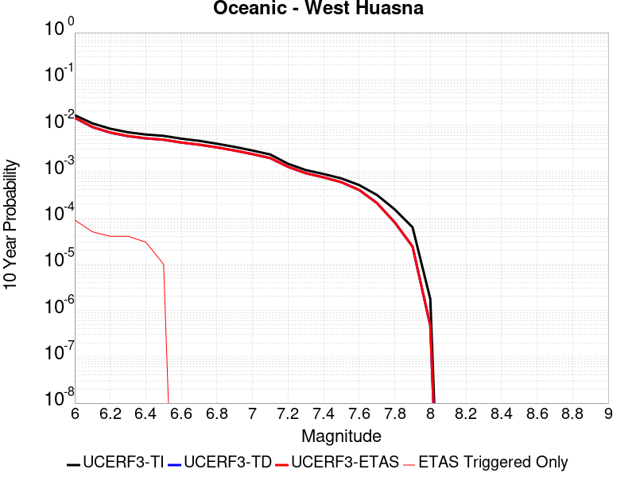 |

| Magnitude | 1 yr TI Prob | TD Prob | ETAS Prob | ETAS/TD Gain | ETAS Triggered Only | 10 yr TI Prob | TD Prob | ETAS Prob | ETAS/TD Gain | ETAS Triggered Only |
|-----|-----|-----|-----|-----|-----|-----|-----|-----|-----|-----|
| 6.0 | 0.0016660384 | 0.0014561893 | 0.0015260874 | 1.0480007 | 7.0E-5 | 0.016536033 | 0.014471028 | 0.014559725 | 1.0061293 | 9.0E-5 |
| 6.1 | 0.0011033333 | 9.165572E-4 | 9.5652055E-4 | 1.0436016 | 4.0E-5 | 0.010978713 | 0.009128777 | 0.009178321 | 1.0054272 | 5.0E-5 |
| 6.2 | 8.44688E-4 | 6.9515745E-4 | 7.251366E-4 | 1.0431257 | 3.0E-5 | 0.008414844 | 0.006930123 | 0.006969846 | 1.0057319 | 4.0E-5 |
| 6.3 | 7.072618E-4 | 5.831459E-4 | 6.131284E-4 | 1.0514151 | 3.0E-5 | 0.0070501505 | 0.0058162753 | 0.0058560427 | 1.0068372 | 4.0E-5 |
| 6.4 | 6.322405E-4 | 5.2170374E-4 | 5.416933E-4 | 1.0383159 | 2.0E-5 | 0.006304447 | 0.0052048573 | 0.005234701 | 1.0057338 | 3.0E-5 |
| 6.5 | 5.9211696E-4 | 4.886647E-4 | 4.886647E-4 | 1.0 | 0.0 | 0.0059054173 | 0.0048759608 | 0.004885912 | 1.0020409 | 1.0E-5 |
| 6.6 | 5.1386096E-4 | 4.2440637E-4 | 4.2440637E-4 | 1.0 | 0.0 | 0.0051267436 | 0.004235991 | 0.004235991 | 1.0 | 0.0 |
| 6.7 | 4.6198163E-4 | 3.8179406E-4 | 3.8179406E-4 | 1.0 | 0.0 | 0.004610224 | 0.0038114067 | 0.0038114067 | 1.0 | 0.0 |
| 6.8 | 4.0020206E-4 | 3.3345833E-4 | 3.3345833E-4 | 1.0 | 0.0 | 0.003994821 | 0.0033296007 | 0.0033296007 | 1.0 | 0.0 |
| 6.9 | 3.4090536E-4 | 2.847682E-4 | 2.847682E-4 | 1.0 | 0.0 | 0.0034038287 | 0.0028440498 | 0.0028440498 | 1.0 | 0.0 |
| 7.0 | 2.8488258E-4 | 2.3842578E-4 | 2.3842578E-4 | 1.0 | 0.0 | 0.0028451765 | 0.0023817138 | 0.0023817138 | 1.0 | 0.0 |
| 7.1 | 2.3386406E-4 | 1.9577841E-4 | 1.9577841E-4 | 1.0 | 0.0 | 0.002336181 | 0.0019560715 | 0.0019560715 | 1.0 | 0.0 |
| 7.2 | 1.4722206E-4 | 1.2652173E-4 | 1.2652173E-4 | 1.0 | 0.0 | 0.0014712457 | 0.0012644994 | 0.0012644994 | 1.0 | 0.0 |
| 7.3 | 1.0771569E-4 | 9.228622E-5 | 9.228622E-5 | 1.0 | 0.0 | 0.001076635 | 9.2248066E-4 | 9.2248066E-4 | 1.0 | 0.0 |
| 7.4 | 8.8597284E-5 | 7.5029464E-5 | 7.5029464E-5 | 1.0 | 0.0 | 8.8561967E-4 | 7.500429E-4 | 7.500429E-4 | 1.0 | 0.0 |
| 7.5 | 7.1156996E-5 | 5.897383E-5 | 5.897383E-5 | 1.0 | 0.0 | 7.1134215E-4 | 5.895833E-4 | 5.895833E-4 | 1.0 | 0.0 |
| 7.6 | 5.1149345E-5 | 4.0057992E-5 | 4.0057992E-5 | 1.0 | 0.0 | 5.113757E-4 | 4.0050913E-4 | 4.0050913E-4 | 1.0 | 0.0 |
| 7.7 | 3.1234613E-5 | 2.089759E-5 | 2.089759E-5 | 1.0 | 0.0 | 3.123022E-4 | 2.089576E-4 | 2.089576E-4 | 1.0 | 0.0 |
| 7.8 | 1.5230714E-5 | 7.9758765E-6 | 7.9758765E-6 | 1.0 | 0.0 | 1.522967E-4 | 7.9757214E-5 | 7.9757214E-5 | 1.0 | 0.0 |
| 7.9 | 6.2915915E-6 | 2.4112983E-6 | 2.4112983E-6 | 1.0 | 0.0 | 6.2914136E-5 | 2.4114026E-5 | 2.4114026E-5 | 1.0 | 0.0 |
| 8.0 | 1.7639688E-7 | 4.702016E-8 | 4.702016E-8 | 1.0 | 0.0 | 1.7639674E-6 | 4.7129527E-7 | 4.7129527E-7 | 1.0 | 0.0 |

## Great Valley 09 (Laguna Seca)
*[(top)](#table-of-contents)*

| 1 Year | 10 Year |
|-----|-----|
|  |  |

| Magnitude | 1 yr TI Prob | TD Prob | ETAS Prob | ETAS/TD Gain | ETAS Triggered Only | 10 yr TI Prob | TD Prob | ETAS Prob | ETAS/TD Gain | ETAS Triggered Only |
|-----|-----|-----|-----|-----|-----|-----|-----|-----|-----|-----|
| 6.0 | 0.0028321352 | 0.0036721937 | 0.0037419368 | 1.0189922 | 7.0E-5 | 0.02796312 | 0.03611547 | 0.03621186 | 1.0026689 | 1.0E-4 |
| 6.1 | 0.0023754383 | 0.003033432 | 0.0030733107 | 1.0131464 | 4.0E-5 | 0.023502063 | 0.029919548 | 0.029987453 | 1.0022696 | 7.0E-5 |
| 6.2 | 0.0014879217 | 0.001810813 | 0.0018307768 | 1.0110247 | 2.0E-5 | 0.014779986 | 0.017958116 | 0.017997399 | 1.0021874 | 4.0E-5 |
| 6.3 | 0.0012358186 | 0.0014710218 | 0.0014909924 | 1.013576 | 2.0E-5 | 0.012289686 | 0.014611342 | 0.014650757 | 1.0026976 | 4.0E-5 |
| 6.4 | 0.0010008777 | 0.0011536429 | 0.0011736198 | 1.0173163 | 2.0E-5 | 0.009963818 | 0.011476948 | 0.011516489 | 1.0034453 | 4.0E-5 |
| 6.5 | 7.9297484E-4 | 8.7626575E-4 | 8.8625704E-4 | 1.011402 | 1.0E-5 | 0.007901512 | 0.0087295165 | 0.008759255 | 1.0034066 | 3.0E-5 |
| 6.6 | 5.730166E-4 | 5.8645656E-4 | 5.9645064E-4 | 1.0170416 | 1.0E-5 | 0.005715413 | 0.0058494853 | 0.00587931 | 1.0050987 | 3.0E-5 |
| 6.7 | 4.7651984E-4 | 4.7053912E-4 | 4.8053442E-4 | 1.0212423 | 1.0E-5 | 0.004754993 | 0.0046956735 | 0.0047056265 | 1.0021197 | 1.0E-5 |
| 6.8 | 4.0616E-4 | 3.8875983E-4 | 3.9875595E-4 | 1.0257128 | 1.0E-5 | 0.0040541845 | 0.0038810016 | 0.0038909628 | 1.0025667 | 1.0E-5 |
| 6.9 | 2.9106764E-4 | 2.5556577E-4 | 2.6556323E-4 | 1.0391189 | 1.0E-5 | 0.002906867 | 0.002552856 | 0.0025628305 | 1.0039072 | 1.0E-5 |
| 7.0 | 1.3991605E-4 | 7.939258E-5 | 7.939258E-5 | 1.0 | 0.0 | 0.0013982799 | 7.9365086E-4 | 7.9365086E-4 | 1.0 | 0.0 |
| 7.1 | 1.0409627E-4 | 3.8892307E-5 | 3.8892307E-5 | 1.0 | 0.0 | 0.0010404752 | 3.8885913E-4 | 3.8885913E-4 | 1.0 | 0.0 |
| 7.2 | 1.0409627E-4 | 3.8892307E-5 | 3.8892307E-5 | 1.0 | 0.0 | 0.0010404752 | 3.8885913E-4 | 3.8885913E-4 | 1.0 | 0.0 |
| 7.3 | 8.915652E-5 | 3.4327128E-5 | 3.4327128E-5 | 1.0 | 0.0 | 8.9120766E-4 | 3.432223E-4 | 3.432223E-4 | 1.0 | 0.0 |
| 7.4 | 7.2029165E-5 | 3.169204E-5 | 3.169204E-5 | 1.0 | 0.0 | 7.200583E-4 | 3.1687922E-4 | 3.1687922E-4 | 1.0 | 0.0 |
| 7.5 | 7.2029165E-5 | 3.169204E-5 | 3.169204E-5 | 1.0 | 0.0 | 7.200583E-4 | 3.1687922E-4 | 3.1687922E-4 | 1.0 | 0.0 |

## Whittier alt 1
*[(top)](#table-of-contents)*

| 1 Year | 10 Year |
|-----|-----|
| 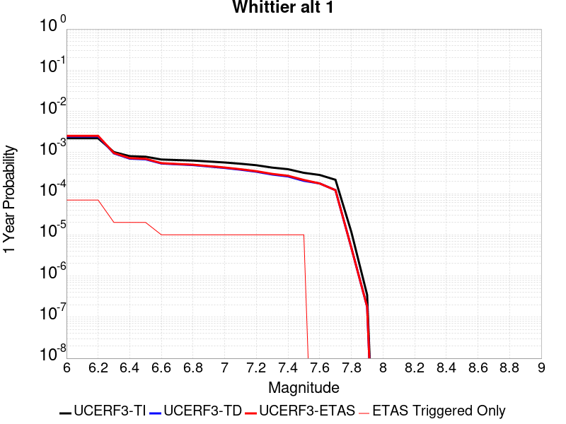 |  |

| Magnitude | 1 yr TI Prob | TD Prob | ETAS Prob | ETAS/TD Gain | ETAS Triggered Only | 10 yr TI Prob | TD Prob | ETAS Prob | ETAS/TD Gain | ETAS Triggered Only |
|-----|-----|-----|-----|-----|-----|-----|-----|-----|-----|-----|
| 6.0 | 0.002218027 | 0.0024629154 | 0.002532743 | 1.0283515 | 7.0E-5 | 0.02196019 | 0.024390234 | 0.024487795 | 1.004 | 1.0E-4 |
| 6.1 | 0.002218027 | 0.0024629154 | 0.002532743 | 1.0283515 | 7.0E-5 | 0.02196019 | 0.024390234 | 0.024487795 | 1.004 | 1.0E-4 |
| 6.2 | 0.002218027 | 0.0024629154 | 0.002532743 | 1.0283515 | 7.0E-5 | 0.02196019 | 0.024390234 | 0.024487795 | 1.004 | 1.0E-4 |
| 6.3 | 0.0010231105 | 9.52804E-4 | 9.7278494E-4 | 1.0209707 | 2.0E-5 | 0.01018413 | 0.009490474 | 0.009510284 | 1.0020874 | 2.0E-5 |
| 6.4 | 8.142519E-4 | 7.0961076E-4 | 7.295966E-4 | 1.0281645 | 2.0E-5 | 0.008112748 | 0.0070754145 | 0.007095273 | 1.0028067 | 2.0E-5 |
| 6.5 | 7.9020765E-4 | 6.8336475E-4 | 7.0335105E-4 | 1.0292469 | 2.0E-5 | 0.007874036 | 0.0068145846 | 0.0068344483 | 1.0029149 | 2.0E-5 |
| 6.6 | 6.7579525E-4 | 5.4150965E-4 | 5.5150426E-4 | 1.0184569 | 1.0E-5 | 0.006737438 | 0.0054033357 | 0.0054132817 | 1.0018407 | 1.0E-5 |
| 6.7 | 6.542181E-4 | 5.164061E-4 | 5.264009E-4 | 1.0193546 | 1.0E-5 | 0.006522954 | 0.0051534795 | 0.005163428 | 1.0019305 | 1.0E-5 |
| 6.8 | 6.36165E-4 | 4.9533875E-4 | 5.053338E-4 | 1.0201782 | 1.0E-5 | 0.0063434686 | 0.004943688 | 0.0049536387 | 1.0020127 | 1.0E-5 |
| 6.9 | 6.040644E-4 | 4.5765814E-4 | 4.676536E-4 | 1.0218403 | 1.0E-5 | 0.00602425 | 0.0045684157 | 0.00457837 | 1.0021789 | 1.0E-5 |
| 7.0 | 5.7196687E-4 | 4.2172565E-4 | 4.3172142E-4 | 1.0237021 | 1.0E-5 | 0.0057049696 | 0.004210462 | 0.0042204196 | 1.002365 | 1.0E-5 |
| 7.1 | 5.336784E-4 | 3.8222488E-4 | 3.9222106E-4 | 1.0261526 | 1.0E-5 | 0.005323986 | 0.0038168381 | 0.0038268 | 1.00261 | 1.0E-5 |
| 7.2 | 4.908117E-4 | 3.4136363E-4 | 3.513602E-4 | 1.0292842 | 1.0E-5 | 0.0048972913 | 0.003409485 | 0.0034194512 | 1.002923 | 1.0E-5 |
| 7.3 | 4.2972428E-4 | 2.92042E-4 | 3.020391E-4 | 1.0342317 | 1.0E-5 | 0.0042889426 | 0.002916903 | 0.002926874 | 1.0034183 | 1.0E-5 |
| 7.4 | 3.9291743E-4 | 2.6231175E-4 | 2.7230915E-4 | 1.0381125 | 1.0E-5 | 0.0039222343 | 0.0026201333 | 0.002630107 | 1.0038066 | 1.0E-5 |
| 7.5 | 3.208294E-4 | 2.052425E-4 | 2.1524045E-4 | 1.0487128 | 1.0E-5 | 0.003203666 | 0.0020506186 | 0.0020605982 | 1.0048666 | 1.0E-5 |
| 7.6 | 2.8473578E-4 | 1.771515E-4 | 1.771515E-4 | 1.0 | 0.0 | 0.0028437122 | 0.0017701836 | 0.0017701836 | 1.0 | 0.0 |
| 7.7 | 2.1743766E-4 | 1.2173632E-4 | 1.2173632E-4 | 1.0 | 0.0 | 0.0021722503 | 0.0012167693 | 0.0012167693 | 1.0 | 0.0 |
| 7.8 | 1.1840509E-5 | 4.8971956E-6 | 4.8971956E-6 | 1.0 | 0.0 | 1.1839878E-4 | 4.8971204E-5 | 4.8971204E-5 | 1.0 | 0.0 |
| 7.9 | 3.4838732E-7 | 1.7948659E-7 | 1.7948659E-7 | 1.0 | 0.0 | 3.4838679E-6 | 1.7948646E-6 | 1.7948646E-6 | 1.0 | 0.0 |

## White Mountains
*[(top)](#table-of-contents)*

| 1 Year | 10 Year |
|-----|-----|
|  | 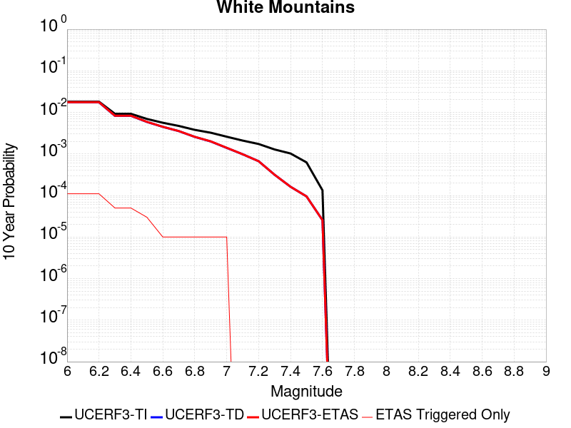 |

| Magnitude | 1 yr TI Prob | TD Prob | ETAS Prob | ETAS/TD Gain | ETAS Triggered Only | 10 yr TI Prob | TD Prob | ETAS Prob | ETAS/TD Gain | ETAS Triggered Only |
|-----|-----|-----|-----|-----|-----|-----|-----|-----|-----|-----|
| 6.0 | 0.0018264796 | 0.0017614096 | 0.0018412686 | 1.0453382 | 8.0E-5 | 0.018115403 | 0.017486818 | 0.017594894 | 1.0061804 | 1.1E-4 |
| 6.1 | 0.0018264796 | 0.0017614096 | 0.0018412686 | 1.0453382 | 8.0E-5 | 0.018115403 | 0.017486818 | 0.017594894 | 1.0061804 | 1.1E-4 |
| 6.2 | 0.0018264796 | 0.0017614096 | 0.0018412686 | 1.0453382 | 8.0E-5 | 0.018115403 | 0.017486818 | 0.017594894 | 1.0061804 | 1.1E-4 |
| 6.3 | 9.293162E-4 | 8.301551E-4 | 8.6013024E-4 | 1.0361078 | 3.0E-5 | 0.009254395 | 0.008271999 | 0.008321585 | 1.0059944 | 5.0E-5 |
| 6.4 | 9.293162E-4 | 8.301551E-4 | 8.6013024E-4 | 1.0361078 | 3.0E-5 | 0.009254395 | 0.008271999 | 0.008321585 | 1.0059944 | 5.0E-5 |
| 6.5 | 6.988258E-4 | 5.913462E-4 | 6.0134026E-4 | 1.0169005 | 1.0E-5 | 0.006966323 | 0.005898432 | 0.005928255 | 1.0050561 | 3.0E-5 |
| 6.6 | 5.6434784E-4 | 4.4996463E-4 | 4.4996463E-4 | 1.0 | 0.0 | 0.005629168 | 0.004490972 | 0.004500927 | 1.0022167 | 1.0E-5 |
| 6.7 | 4.7304068E-4 | 3.5488335E-4 | 3.5488335E-4 | 1.0 | 0.0 | 0.00472035 | 0.0035434833 | 0.003553448 | 1.002812 | 1.0E-5 |
| 6.8 | 3.8062103E-4 | 2.575425E-4 | 2.575425E-4 | 1.0 | 0.0 | 0.0037996976 | 0.0025725532 | 0.0025825277 | 1.0038772 | 1.0E-5 |
| 6.9 | 3.2472567E-4 | 1.9994036E-4 | 1.9994036E-4 | 1.0 | 0.0 | 0.0032425157 | 0.0019976576 | 0.0020076376 | 1.0049958 | 1.0E-5 |
| 7.0 | 2.602252E-4 | 1.3980496E-4 | 1.3980496E-4 | 1.0 | 0.0 | 0.002599207 | 0.0013971963 | 0.0014071823 | 1.0071472 | 1.0E-5 |
| 7.1 | 2.1001195E-4 | 9.8391516E-5 | 9.8391516E-5 | 1.0 | 0.0 | 0.0020981359 | 9.834924E-4 | 9.834924E-4 | 1.0 | 0.0 |
| 7.2 | 1.736567E-4 | 6.688897E-5 | 6.688897E-5 | 1.0 | 0.0 | 0.0017352107 | 6.6869846E-4 | 6.6869846E-4 | 1.0 | 0.0 |
| 7.3 | 1.2825865E-4 | 3.1605257E-5 | 3.1605257E-5 | 1.0 | 0.0 | 0.0012818464 | 3.160114E-4 | 3.160114E-4 | 1.0 | 0.0 |
| 7.4 | 1.0257547E-4 | 1.6221828E-5 | 1.6221828E-5 | 1.0 | 0.0 | 0.0010252813 | 1.6220656E-4 | 1.6220656E-4 | 1.0 | 0.0 |
| 7.5 | 6.2686406E-5 | 9.519547E-6 | 9.519547E-6 | 1.0 | 0.0 | 6.266873E-4 | 9.519148E-5 | 9.519148E-5 | 1.0 | 0.0 |
| 7.6 | 1.3363979E-5 | 2.5539543E-6 | 2.5539543E-6 | 1.0 | 0.0 | 1.3363175E-4 | 2.5539286E-5 | 2.5539286E-5 | 1.0 | 0.0 |

## Deep Springs
*[(top)](#table-of-contents)*

| 1 Year | 10 Year |
|-----|-----|
|  |  |

| Magnitude | 1 yr TI Prob | TD Prob | ETAS Prob | ETAS/TD Gain | ETAS Triggered Only | 10 yr TI Prob | TD Prob | ETAS Prob | ETAS/TD Gain | ETAS Triggered Only |
|-----|-----|-----|-----|-----|-----|-----|-----|-----|-----|-----|
| 6.0 | 0.001033166 | 0.0012058079 | 0.0012857114 | 1.0662656 | 8.0E-5 | 0.010283757 | 0.012042425 | 0.0121511 | 1.0090244 | 1.1E-4 |
| 6.1 | 0.001033166 | 0.0012058079 | 0.0012857114 | 1.0662656 | 8.0E-5 | 0.010283757 | 0.012042425 | 0.0121511 | 1.0090244 | 1.1E-4 |
| 6.2 | 0.001033166 | 0.0012058079 | 0.0012857114 | 1.0662656 | 8.0E-5 | 0.010283757 | 0.012042425 | 0.0121511 | 1.0090244 | 1.1E-4 |
| 6.3 | 0.001033166 | 0.0012058079 | 0.0012857114 | 1.0662656 | 8.0E-5 | 0.010283757 | 0.012042425 | 0.0121511 | 1.0090244 | 1.1E-4 |
| 6.4 | 0.001033166 | 0.0012058079 | 0.0012857114 | 1.0662656 | 8.0E-5 | 0.010283757 | 0.012042425 | 0.0121511 | 1.0090244 | 1.1E-4 |
| 6.5 | 8.9657627E-4 | 0.0010462094 | 0.0011261257 | 1.0763866 | 8.0E-5 | 0.008929676 | 0.010462056 | 0.010570905 | 1.0104042 | 1.1E-4 |
| 6.6 | 8.9657627E-4 | 0.0010462094 | 0.0011261257 | 1.0763866 | 8.0E-5 | 0.008929676 | 0.010462056 | 0.010570905 | 1.0104042 | 1.1E-4 |

## Santa Cruz Island
*[(top)](#table-of-contents)*

| 1 Year | 10 Year |
|-----|-----|
|  | 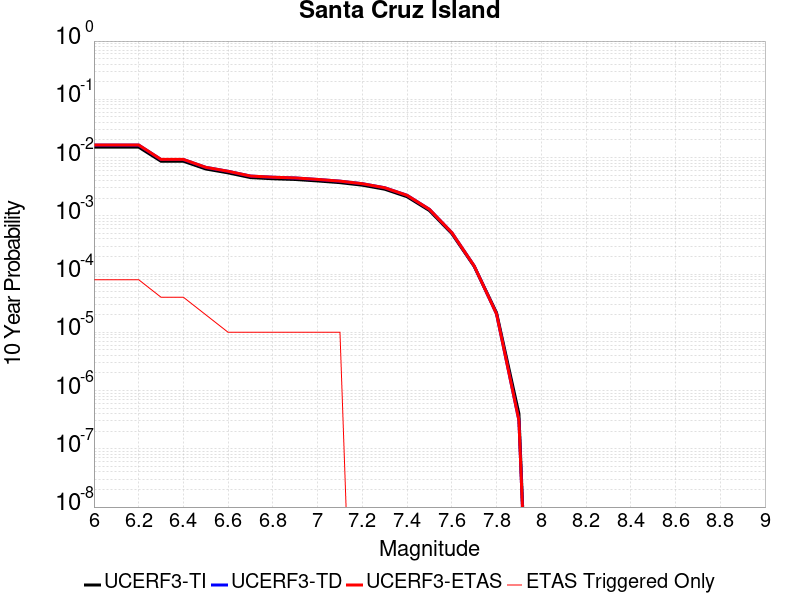 |

| Magnitude | 1 yr TI Prob | TD Prob | ETAS Prob | ETAS/TD Gain | ETAS Triggered Only | 10 yr TI Prob | TD Prob | ETAS Prob | ETAS/TD Gain | ETAS Triggered Only |
|-----|-----|-----|-----|-----|-----|-----|-----|-----|-----|-----|
| 6.0 | 0.0015206301 | 0.0016476426 | 0.0017075436 | 1.0363556 | 6.0E-5 | 0.015102667 | 0.016368 | 0.01644669 | 1.0048076 | 8.0E-5 |
| 6.1 | 0.0015206301 | 0.0016476426 | 0.0017075436 | 1.0363556 | 6.0E-5 | 0.015102667 | 0.016368 | 0.01644669 | 1.0048076 | 8.0E-5 |
| 6.2 | 0.0015206301 | 0.0016476426 | 0.0017075436 | 1.0363556 | 6.0E-5 | 0.015102667 | 0.016368 | 0.01644669 | 1.0048076 | 8.0E-5 |
| 6.3 | 8.6765E-4 | 9.2860236E-4 | 9.485838E-4 | 1.0215178 | 2.0E-5 | 0.008642701 | 0.009249094 | 0.009288724 | 1.0042847 | 4.0E-5 |
| 6.4 | 8.6765E-4 | 9.2860236E-4 | 9.485838E-4 | 1.0215178 | 2.0E-5 | 0.008642701 | 0.009249094 | 0.009288724 | 1.0042847 | 4.0E-5 |
| 6.5 | 6.3840044E-4 | 6.8034173E-4 | 6.9033494E-4 | 1.0146885 | 1.0E-5 | 0.0063656955 | 0.0067829876 | 0.0068028523 | 1.0029285 | 2.0E-5 |
| 6.6 | 5.4719415E-4 | 5.819735E-4 | 5.919677E-4 | 1.0171729 | 1.0E-5 | 0.005458487 | 0.0058047357 | 0.0058146776 | 1.0017127 | 1.0E-5 |
| 6.7 | 4.5381195E-4 | 4.8184878E-4 | 4.9184397E-4 | 1.0207434 | 1.0E-5 | 0.0045288634 | 0.004808108 | 0.00481806 | 1.0020698 | 1.0E-5 |
| 6.8 | 4.3339343E-4 | 4.5995016E-4 | 4.6994555E-4 | 1.0217315 | 1.0E-5 | 0.004325492 | 0.0045900354 | 0.0045999894 | 1.0021687 | 1.0E-5 |
| 6.9 | 4.2115687E-4 | 4.468088E-4 | 4.5680432E-4 | 1.0223709 | 1.0E-5 | 0.004203596 | 0.004459156 | 0.0044691116 | 1.0022326 | 1.0E-5 |
| 7.0 | 3.9736772E-4 | 4.212378E-4 | 4.312336E-4 | 1.0237296 | 1.0E-5 | 0.003966579 | 0.0042044413 | 0.004214399 | 1.0023685 | 1.0E-5 |
| 7.1 | 3.715733E-4 | 3.936528E-4 | 4.0364885E-4 | 1.0253931 | 1.0E-5 | 0.003709526 | 0.003929598 | 0.0039395588 | 1.0025347 | 1.0E-5 |
| 7.2 | 3.360328E-4 | 3.5618112E-4 | 3.5618112E-4 | 1.0 | 0.0 | 0.0033552512 | 0.003556131 | 0.003556131 | 1.0 | 0.0 |
| 7.3 | 2.8664304E-4 | 3.0363398E-4 | 3.0363398E-4 | 1.0 | 0.0 | 0.002862736 | 0.0030322142 | 0.0030322142 | 1.0 | 0.0 |
| 7.4 | 2.1288003E-4 | 2.2498262E-4 | 2.2498262E-4 | 1.0 | 0.0 | 0.0021267622 | 0.0022475575 | 0.0022475575 | 1.0 | 0.0 |
| 7.5 | 1.2305441E-4 | 1.2915E-4 | 1.2915E-4 | 1.0 | 0.0 | 0.0012298629 | 0.0012907543 | 0.0012907543 | 1.0 | 0.0 |
| 7.6 | 4.9559E-5 | 5.145164E-5 | 5.145164E-5 | 1.0 | 0.0 | 4.954795E-4 | 5.1439856E-4 | 5.1439856E-4 | 1.0 | 0.0 |
| 7.7 | 1.3573399E-5 | 1.3783714E-5 | 1.3783714E-5 | 1.0 | 0.0 | 1.357257E-4 | 1.3782867E-4 | 1.3782867E-4 | 1.0 | 0.0 |
| 7.8 | 2.16657E-6 | 2.0692328E-6 | 2.0692328E-6 | 1.0 | 0.0 | 2.1665488E-5 | 2.0692156E-5 | 2.0692156E-5 | 1.0 | 0.0 |
| 7.9 | 4.0303796E-8 | 3.1029646E-8 | 3.1029646E-8 | 1.0 | 0.0 | 4.030379E-7 | 3.1029643E-7 | 3.1029643E-7 | 1.0 | 0.0 |

## Chino alt 1
*[(top)](#table-of-contents)*

| 1 Year | 10 Year |
|-----|-----|
|  |  |

| Magnitude | 1 yr TI Prob | TD Prob | ETAS Prob | ETAS/TD Gain | ETAS Triggered Only | 10 yr TI Prob | TD Prob | ETAS Prob | ETAS/TD Gain | ETAS Triggered Only |
|-----|-----|-----|-----|-----|-----|-----|-----|-----|-----|-----|
| 6.0 | 0.0020537362 | 0.0025513945 | 0.002641165 | 1.0351849 | 9.0E-5 | 0.020348595 | 0.025277847 | 0.025385067 | 1.0042416 | 1.1E-4 |
| 6.1 | 0.0011215154 | 0.001401664 | 0.001441608 | 1.0284975 | 4.0E-5 | 0.011158722 | 0.013945141 | 0.013994444 | 1.0035355 | 5.0E-5 |
| 6.2 | 0.0011215154 | 0.001401664 | 0.001441608 | 1.0284975 | 4.0E-5 | 0.011158722 | 0.013945141 | 0.013994444 | 1.0035355 | 5.0E-5 |
| 6.3 | 7.454001E-4 | 9.4743853E-4 | 9.774101E-4 | 1.0316343 | 3.0E-5 | 0.007429048 | 0.0094444575 | 0.00948408 | 1.0041953 | 4.0E-5 |
| 6.4 | 7.454001E-4 | 9.4743853E-4 | 9.774101E-4 | 1.0316343 | 3.0E-5 | 0.007429048 | 0.0094444575 | 0.00948408 | 1.0041953 | 4.0E-5 |
| 6.5 | 6.790315E-4 | 8.685589E-4 | 8.985328E-4 | 1.03451 | 3.0E-5 | 0.0067696036 | 0.008661949 | 0.008701603 | 1.0045779 | 4.0E-5 |
| 6.6 | 4.940122E-4 | 6.280428E-4 | 6.580239E-4 | 1.0477375 | 3.0E-5 | 0.004929154 | 0.0062718987 | 0.006311648 | 1.0063376 | 4.0E-5 |
| 6.7 | 4.3372845E-4 | 5.429507E-4 | 5.729344E-4 | 1.0552236 | 3.0E-5 | 0.004328829 | 0.005425775 | 0.0054655583 | 1.0073322 | 4.0E-5 |
| 6.8 | 1.8185932E-4 | 1.9895904E-4 | 1.9895904E-4 | 1.0 | 0.0 | 0.0018171056 | 0.0019894864 | 0.0019894864 | 1.0 | 0.0 |
| 6.9 | 1.18156495E-4 | 1.123294E-4 | 1.123294E-4 | 1.0 | 0.0 | 0.0011809369 | 0.0011233423 | 0.0011233423 | 1.0 | 0.0 |
| 7.0 | 9.3207556E-5 | 8.051251E-5 | 8.051251E-5 | 1.0 | 0.0 | 9.316847E-4 | 8.0528046E-4 | 8.0528046E-4 | 1.0 | 0.0 |
| 7.1 | 9.034557E-5 | 7.6874516E-5 | 7.6874516E-5 | 1.0 | 0.0 | 9.0308854E-4 | 7.6891703E-4 | 7.6891703E-4 | 1.0 | 0.0 |
| 7.2 | 8.352579E-5 | 7.082591E-5 | 7.082591E-5 | 1.0 | 0.0 | 8.34944E-4 | 7.0845755E-4 | 7.0845755E-4 | 1.0 | 0.0 |
| 7.3 | 6.9504385E-5 | 5.8531357E-5 | 5.8531357E-5 | 1.0 | 0.0 | 6.9482654E-4 | 5.8530393E-4 | 5.8530393E-4 | 1.0 | 0.0 |
| 7.4 | 5.8140613E-5 | 4.8196827E-5 | 4.8196827E-5 | 1.0 | 0.0 | 5.81254E-4 | 4.8188053E-4 | 4.8188053E-4 | 1.0 | 0.0 |
| 7.5 | 4.8807087E-5 | 3.9777242E-5 | 3.9777242E-5 | 1.0 | 0.0 | 4.879637E-4 | 3.977046E-4 | 3.977046E-4 | 1.0 | 0.0 |
| 7.6 | 4.4464414E-5 | 3.5901965E-5 | 3.5901965E-5 | 1.0 | 0.0 | 4.4455516E-4 | 3.589648E-4 | 3.589648E-4 | 1.0 | 0.0 |
| 7.7 | 1.1376757E-5 | 7.4022914E-6 | 7.4022914E-6 | 1.0 | 0.0 | 1.13761744E-4 | 7.402141E-5 | 7.402141E-5 | 1.0 | 0.0 |

## Red Mountain
*[(top)](#table-of-contents)*

| 1 Year | 10 Year |
|-----|-----|
|  | 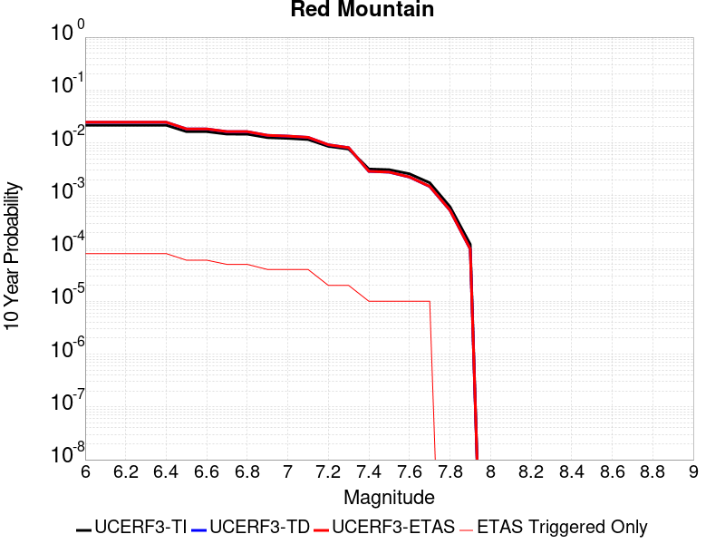 |

| Magnitude | 1 yr TI Prob | TD Prob | ETAS Prob | ETAS/TD Gain | ETAS Triggered Only | 10 yr TI Prob | TD Prob | ETAS Prob | ETAS/TD Gain | ETAS Triggered Only |
|-----|-----|-----|-----|-----|-----|-----|-----|-----|-----|-----|
| 6.0 | 0.0021792934 | 0.0024803306 | 0.0025401819 | 1.0241303 | 6.0E-5 | 0.021580452 | 0.024544092 | 0.024622127 | 1.0031794 | 8.0E-5 |
| 6.1 | 0.0021792934 | 0.0024803306 | 0.0025401819 | 1.0241303 | 6.0E-5 | 0.021580452 | 0.024544092 | 0.024622127 | 1.0031794 | 8.0E-5 |
| 6.2 | 0.0021792934 | 0.0024803306 | 0.0025401819 | 1.0241303 | 6.0E-5 | 0.021580452 | 0.024544092 | 0.024622127 | 1.0031794 | 8.0E-5 |
| 6.3 | 0.0021792934 | 0.0024803306 | 0.0025401819 | 1.0241303 | 6.0E-5 | 0.021580452 | 0.024544092 | 0.024622127 | 1.0031794 | 8.0E-5 |
| 6.4 | 0.0021792934 | 0.0024803306 | 0.0025401819 | 1.0241303 | 6.0E-5 | 0.021580452 | 0.024544092 | 0.024622127 | 1.0031794 | 8.0E-5 |
| 6.5 | 0.0016446467 | 0.0018434501 | 0.0018833764 | 1.0216584 | 4.0E-5 | 0.01632528 | 0.018291233 | 0.018350136 | 1.0032202 | 6.0E-5 |
| 6.6 | 0.0016441676 | 0.001842897 | 0.0018828234 | 1.021665 | 4.0E-5 | 0.01632056 | 0.018285794 | 0.018344698 | 1.0032213 | 6.0E-5 |
| 6.7 | 0.0014738824 | 0.0016407946 | 0.0016707453 | 1.0182538 | 3.0E-5 | 0.014641452 | 0.016295563 | 0.016344748 | 1.0030184 | 5.0E-5 |
| 6.8 | 0.0014710457 | 0.0016375587 | 0.0016675096 | 1.0182899 | 3.0E-5 | 0.014613459 | 0.01626368 | 0.016312866 | 1.0030243 | 5.0E-5 |
| 6.9 | 0.0012633923 | 0.0013926612 | 0.0014226194 | 1.0215114 | 3.0E-5 | 0.012562336 | 0.013847026 | 0.013886472 | 1.0028487 | 4.0E-5 |
| 7.0 | 0.0012246901 | 0.0013472632 | 0.0013772228 | 1.0222374 | 3.0E-5 | 0.012179627 | 0.01339859 | 0.013438053 | 1.0029454 | 4.0E-5 |
| 7.1 | 0.0011635252 | 0.0012757168 | 0.0013056785 | 1.0234861 | 3.0E-5 | 0.01157452 | 0.012691451 | 0.012730944 | 1.0031117 | 4.0E-5 |
| 7.2 | 8.623549E-4 | 9.216645E-4 | 9.4164605E-4 | 1.0216799 | 2.0E-5 | 0.008590161 | 0.009184699 | 0.009204515 | 1.0021576 | 2.0E-5 |
| 7.3 | 7.668978E-4 | 8.1161625E-4 | 8.3160005E-4 | 1.0246222 | 2.0E-5 | 0.0076425658 | 0.008092596 | 0.008112434 | 1.0024514 | 2.0E-5 |
| 7.4 | 3.199713E-4 | 2.8844838E-4 | 2.984455E-4 | 1.0346582 | 1.0E-5 | 0.0031951098 | 0.0028807942 | 0.0028907654 | 1.0034612 | 1.0E-5 |
| 7.5 | 3.1066386E-4 | 2.785179E-4 | 2.8851512E-4 | 1.0358944 | 1.0E-5 | 0.003102299 | 0.0027817423 | 0.0027917144 | 1.0035849 | 1.0E-5 |
| 7.6 | 2.5943352E-4 | 2.2514143E-4 | 2.3513917E-4 | 1.0444065 | 1.0E-5 | 0.0025913084 | 0.002249168 | 0.0022591455 | 1.0044361 | 1.0E-5 |
| 7.7 | 1.7537741E-4 | 1.4883737E-4 | 1.5883589E-4 | 1.0671774 | 1.0E-5 | 0.0017523908 | 0.0014874031 | 0.0014973882 | 1.0067132 | 1.0E-5 |
| 7.8 | 6.171996E-5 | 5.281776E-5 | 5.281776E-5 | 1.0 | 0.0 | 6.170282E-4 | 5.2805495E-4 | 5.2805495E-4 | 1.0 | 0.0 |
| 7.9 | 1.19839215E-5 | 9.7150605E-6 | 9.7150605E-6 | 1.0 | 0.0 | 1.1983275E-4 | 9.714664E-5 | 9.714664E-5 | 1.0 | 0.0 |

## Tin Mountain
*[(top)](#table-of-contents)*

| 1 Year | 10 Year |
|-----|-----|
|  |  |

| Magnitude | 1 yr TI Prob | TD Prob | ETAS Prob | ETAS/TD Gain | ETAS Triggered Only | 10 yr TI Prob | TD Prob | ETAS Prob | ETAS/TD Gain | ETAS Triggered Only |
|-----|-----|-----|-----|-----|-----|-----|-----|-----|-----|-----|
| 6.0 | 2.1306332E-4 | 2.1816725E-4 | 2.981498E-4 | 1.3666111 | 8.0E-5 | 0.0021285915 | 0.0021798965 | 0.0022796784 | 1.0457737 | 1.0E-4 |
| 6.1 | 2.1306332E-4 | 2.1816725E-4 | 2.981498E-4 | 1.3666111 | 8.0E-5 | 0.0021285915 | 0.0021798965 | 0.0022796784 | 1.0457737 | 1.0E-4 |
| 6.2 | 2.1306332E-4 | 2.1816725E-4 | 2.981498E-4 | 1.3666111 | 8.0E-5 | 0.0021285915 | 0.0021798965 | 0.0022796784 | 1.0457737 | 1.0E-4 |
| 6.3 | 2.1306332E-4 | 2.1816725E-4 | 2.981498E-4 | 1.3666111 | 8.0E-5 | 0.0021285915 | 0.0021798965 | 0.0022796784 | 1.0457737 | 1.0E-4 |
| 6.4 | 2.1306332E-4 | 2.1816725E-4 | 2.981498E-4 | 1.3666111 | 8.0E-5 | 0.0021285915 | 0.0021798965 | 0.0022796784 | 1.0457737 | 1.0E-4 |
| 6.5 | 1.2075195E-4 | 1.2382126E-4 | 1.4381878E-4 | 1.1615032 | 2.0E-5 | 0.0012068636 | 0.0012375986 | 0.0012675615 | 1.0242105 | 3.0E-5 |
| 6.6 | 1.2075195E-4 | 1.2382126E-4 | 1.4381878E-4 | 1.1615032 | 2.0E-5 | 0.0012068636 | 0.0012375986 | 0.0012675615 | 1.0242105 | 3.0E-5 |
| 6.7 | 8.885379E-5 | 9.1298105E-5 | 9.1298105E-5 | 1.0 | 0.0 | 8.881827E-4 | 9.1265864E-4 | 9.226495E-4 | 1.010947 | 1.0E-5 |
| 6.8 | 6.738455E-5 | 6.939237E-5 | 6.939237E-5 | 1.0 | 0.0 | 6.736412E-4 | 6.9375033E-4 | 7.037434E-4 | 1.0144044 | 1.0E-5 |
| 6.9 | 3.0633044E-5 | 3.1917145E-5 | 3.1917145E-5 | 1.0 | 0.0 | 3.0628822E-4 | 3.191297E-4 | 3.2912652E-4 | 1.0313252 | 1.0E-5 |
| 7.0 | 2.413167E-5 | 2.5212494E-5 | 2.5212494E-5 | 1.0 | 0.0 | 2.412905E-4 | 2.5210003E-4 | 2.5210003E-4 | 1.0 | 0.0 |
| 7.1 | 1.9851697E-5 | 2.0804187E-5 | 2.0804187E-5 | 1.0 | 0.0 | 1.9849923E-4 | 2.0802575E-4 | 2.0802575E-4 | 1.0 | 0.0 |
| 7.2 | 1.87136E-5 | 1.9627789E-5 | 1.9627789E-5 | 1.0 | 0.0 | 1.8712023E-4 | 1.9626386E-4 | 1.9626386E-4 | 1.0 | 0.0 |
| 7.3 | 1.7438259E-5 | 1.829549E-5 | 1.829549E-5 | 1.0 | 0.0 | 1.743689E-4 | 1.8294314E-4 | 1.8294314E-4 | 1.0 | 0.0 |
| 7.4 | 1.5503398E-5 | 1.6261785E-5 | 1.6261785E-5 | 1.0 | 0.0 | 1.5502315E-4 | 1.6260923E-4 | 1.6260923E-4 | 1.0 | 0.0 |
| 7.5 | 7.4754466E-6 | 7.8333205E-6 | 7.8333205E-6 | 1.0 | 0.0 | 7.475195E-5 | 7.833321E-5 | 7.833321E-5 | 1.0 | 0.0 |

## Blue Cut
*[(top)](#table-of-contents)*

| 1 Year | 10 Year |
|-----|-----|
|  |  |

| Magnitude | 1 yr TI Prob | TD Prob | ETAS Prob | ETAS/TD Gain | ETAS Triggered Only | 10 yr TI Prob | TD Prob | ETAS Prob | ETAS/TD Gain | ETAS Triggered Only |
|-----|-----|-----|-----|-----|-----|-----|-----|-----|-----|-----|
| 6.0 | 0.0011070445 | 0.0011848481 | 0.0012647533 | 1.0674392 | 8.0E-5 | 0.011015458 | 0.011791152 | 0.011889973 | 1.0083809 | 1.0E-4 |
| 6.1 | 0.0011070445 | 0.0011848481 | 0.0012647533 | 1.0674392 | 8.0E-5 | 0.011015458 | 0.011791152 | 0.011889973 | 1.0083809 | 1.0E-4 |
| 6.2 | 0.0011070445 | 0.0011848481 | 0.0012647533 | 1.0674392 | 8.0E-5 | 0.011015458 | 0.011791152 | 0.011889973 | 1.0083809 | 1.0E-4 |
| 6.3 | 6.0582085E-4 | 6.443998E-4 | 6.84374E-4 | 1.0620333 | 4.0E-5 | 0.0060417196 | 0.0064265593 | 0.006466302 | 1.0061842 | 4.0E-5 |
| 6.4 | 6.0582085E-4 | 6.443998E-4 | 6.84374E-4 | 1.0620333 | 4.0E-5 | 0.0060417196 | 0.0064265593 | 0.006466302 | 1.0061842 | 4.0E-5 |
| 6.5 | 4.6591737E-4 | 4.946261E-4 | 5.2461127E-4 | 1.0606219 | 3.0E-5 | 0.0046494175 | 0.004936161 | 0.004966013 | 1.0060476 | 3.0E-5 |
| 6.6 | 3.83198E-4 | 4.064132E-4 | 4.2640505E-4 | 1.049191 | 2.0E-5 | 0.0038253788 | 0.0040574907 | 0.00407741 | 1.0049092 | 2.0E-5 |
| 6.7 | 3.2750185E-4 | 3.472051E-4 | 3.6719814E-4 | 1.0575829 | 2.0E-5 | 0.0032701963 | 0.003467367 | 0.0034872978 | 1.005748 | 2.0E-5 |
| 6.8 | 2.8816288E-4 | 3.0547334E-4 | 3.154703E-4 | 1.032726 | 1.0E-5 | 0.002877895 | 0.0030512505 | 0.00306122 | 1.0032673 | 1.0E-5 |
| 6.9 | 2.4927902E-4 | 2.642797E-4 | 2.7427703E-4 | 1.0378287 | 1.0E-5 | 0.0024899957 | 0.002640346 | 0.0026503198 | 1.0037774 | 1.0E-5 |
| 7.0 | 2.0259817E-4 | 2.1488148E-4 | 2.2487935E-4 | 1.0465273 | 1.0E-5 | 0.0020241356 | 0.0021474129 | 0.0021573913 | 1.0046468 | 1.0E-5 |
| 7.1 | 1.4795837E-4 | 1.5703762E-4 | 1.5703762E-4 | 1.0 | 0.0 | 0.001478599 | 0.0015699116 | 0.0015699116 | 1.0 | 0.0 |

## Pisgah-Bullion Mtn-Mesquite Lk
*[(top)](#table-of-contents)*

| 1 Year | 10 Year |
|-----|-----|
|  | 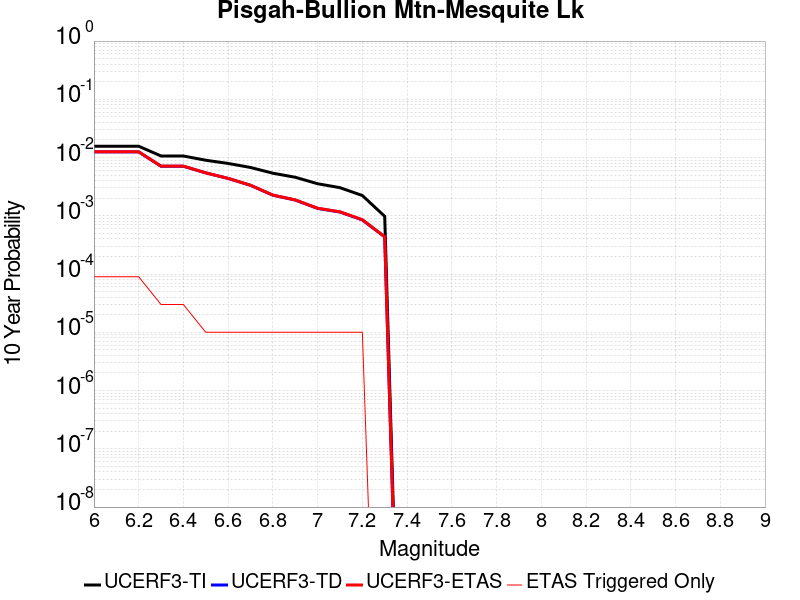 |

| Magnitude | 1 yr TI Prob | TD Prob | ETAS Prob | ETAS/TD Gain | ETAS Triggered Only | 10 yr TI Prob | TD Prob | ETAS Prob | ETAS/TD Gain | ETAS Triggered Only |
|-----|-----|-----|-----|-----|-----|-----|-----|-----|-----|-----|
| 6.0 | 0.0015767008 | 0.0012563728 | 0.0013262848 | 1.055646 | 7.0E-5 | 0.015655609 | 0.012502721 | 0.012591596 | 1.0071084 | 9.0E-5 |
| 6.1 | 0.0015767008 | 0.0012563728 | 0.0013262848 | 1.055646 | 7.0E-5 | 0.015655609 | 0.012502721 | 0.012591596 | 1.0071084 | 9.0E-5 |
| 6.2 | 0.0015767008 | 0.0012563728 | 0.0013262848 | 1.055646 | 7.0E-5 | 0.015655609 | 0.012502721 | 0.012591596 | 1.0071084 | 9.0E-5 |
| 6.3 | 0.0010690069 | 7.1138405E-4 | 7.3136983E-4 | 1.0280942 | 2.0E-5 | 0.01063879 | 0.0070926943 | 0.0071224817 | 1.0041997 | 3.0E-5 |
| 6.4 | 0.0010690069 | 7.1138405E-4 | 7.3136983E-4 | 1.0280942 | 2.0E-5 | 0.01063879 | 0.0070926943 | 0.0071224817 | 1.0041997 | 3.0E-5 |
| 6.5 | 9.0313336E-4 | 5.465413E-4 | 5.565358E-4 | 1.0182868 | 1.0E-5 | 0.008994718 | 0.0054529672 | 0.0054629124 | 1.0018239 | 1.0E-5 |
| 6.6 | 7.9546886E-4 | 4.3895794E-4 | 4.4895356E-4 | 1.0227712 | 1.0E-5 | 0.007926274 | 0.0043816264 | 0.0043915827 | 1.0022722 | 1.0E-5 |
| 6.7 | 6.7796157E-4 | 3.3449283E-4 | 3.4448947E-4 | 1.029886 | 1.0E-5 | 0.0067589693 | 0.0033403537 | 0.0033503203 | 1.0029837 | 1.0E-5 |
| 6.8 | 5.401065E-4 | 2.2607706E-4 | 2.360748E-4 | 1.0442227 | 1.0E-5 | 0.0053879567 | 0.0022585576 | 0.0022685349 | 1.0044177 | 1.0E-5 |
| 6.9 | 4.5991567E-4 | 1.8681608E-4 | 1.968142E-4 | 1.0535185 | 1.0E-5 | 0.00458965 | 0.0018666488 | 0.0018766301 | 1.0053473 | 1.0E-5 |
| 7.0 | 3.5596377E-4 | 1.3396442E-4 | 1.4396307E-4 | 1.0746367 | 1.0E-5 | 0.0035539411 | 0.0013388677 | 0.0013488543 | 1.007459 | 1.0E-5 |
| 7.1 | 3.045215E-4 | 1.16215204E-4 | 1.2621404E-4 | 1.0860373 | 1.0E-5 | 0.0030410455 | 0.0011615733 | 0.0011715617 | 1.008599 | 1.0E-5 |
| 7.2 | 2.231982E-4 | 8.492105E-5 | 9.49202E-5 | 1.1177465 | 1.0E-5 | 0.0022297418 | 8.489092E-4 | 8.589007E-4 | 1.0117698 | 1.0E-5 |
| 7.3 | 9.811026E-5 | 4.354186E-5 | 4.354186E-5 | 1.0 | 0.0 | 9.806695E-4 | 4.3534773E-4 | 4.3534773E-4 | 1.0 | 0.0 |

## San Jacinto (San Bernardino)
*[(top)](#table-of-contents)*

| 1 Year | 10 Year |
|-----|-----|
|  |  |

| Magnitude | 1 yr TI Prob | TD Prob | ETAS Prob | ETAS/TD Gain | ETAS Triggered Only | 10 yr TI Prob | TD Prob | ETAS Prob | ETAS/TD Gain | ETAS Triggered Only |
|-----|-----|-----|-----|-----|-----|-----|-----|-----|-----|-----|
| 6.0 | 0.0017774 | 0.0018759987 | 0.0019358861 | 1.0319229 | 6.0E-5 | 0.01763251 | 0.019349935 | 0.019438194 | 1.0045612 | 9.0E-5 |
| 6.1 | 0.0017774 | 0.0018759987 | 0.0019358861 | 1.0319229 | 6.0E-5 | 0.01763251 | 0.019349935 | 0.019438194 | 1.0045612 | 9.0E-5 |
| 6.2 | 0.0017774 | 0.0018759987 | 0.0019358861 | 1.0319229 | 6.0E-5 | 0.01763251 | 0.019349935 | 0.019438194 | 1.0045612 | 9.0E-5 |
| 6.3 | 0.0017774 | 0.0018759987 | 0.0019358861 | 1.0319229 | 6.0E-5 | 0.01763251 | 0.019349935 | 0.019438194 | 1.0045612 | 9.0E-5 |
| 6.4 | 0.0017729428 | 0.0018704084 | 0.0019302962 | 1.0320185 | 6.0E-5 | 0.017588645 | 0.019295016 | 0.01938328 | 1.0045744 | 9.0E-5 |
| 6.5 | 0.0017420477 | 0.0018318989 | 0.001891789 | 1.0326929 | 6.0E-5 | 0.017284546 | 0.018916558 | 0.018995045 | 1.0041491 | 8.0E-5 |
| 6.6 | 0.0017394501 | 0.001828629 | 0.0018885193 | 1.0327514 | 6.0E-5 | 0.017258976 | 0.018884424 | 0.018962912 | 1.0041564 | 8.0E-5 |
| 6.7 | 0.0017391514 | 0.0018280965 | 0.0018879868 | 1.032761 | 6.0E-5 | 0.017256035 | 0.018879214 | 0.018957704 | 1.0041574 | 8.0E-5 |
| 6.8 | 0.0017348597 | 0.0018225788 | 0.0018824695 | 1.0328604 | 6.0E-5 | 0.017213784 | 0.018824987 | 0.01890348 | 1.0041697 | 8.0E-5 |
| 6.9 | 0.0017327217 | 0.0018195034 | 0.0018793943 | 1.0329161 | 6.0E-5 | 0.017192734 | 0.018794855 | 0.018873353 | 1.0041765 | 8.0E-5 |
| 7.0 | 0.0017307063 | 0.0018163746 | 0.0018762656 | 1.0329728 | 6.0E-5 | 0.017172894 | 0.018764233 | 0.018842733 | 1.0041834 | 8.0E-5 |
| 7.1 | 0.0017271966 | 0.0018101353 | 0.0018700267 | 1.0330867 | 6.0E-5 | 0.017138338 | 0.018703312 | 0.018781817 | 1.0041974 | 8.0E-5 |
| 7.2 | 0.0017222111 | 0.0018032312 | 0.001863123 | 1.0332136 | 6.0E-5 | 0.017089253 | 0.018635705 | 0.018714214 | 1.0042129 | 8.0E-5 |
| 7.3 | 0.0017181796 | 0.0017963431 | 0.0018562353 | 1.0333412 | 6.0E-5 | 0.017049557 | 0.018568452 | 0.018646967 | 1.0042284 | 8.0E-5 |
| 7.4 | 0.0017160608 | 0.0017922645 | 0.001852157 | 1.0334172 | 6.0E-5 | 0.017028693 | 0.018528719 | 0.018607236 | 1.0042377 | 8.0E-5 |
| 7.5 | 0.0017109542 | 0.0017852283 | 0.0018451212 | 1.0335492 | 6.0E-5 | 0.016978411 | 0.018459605 | 0.018538129 | 1.0042537 | 8.0E-5 |
| 7.6 | 0.0016955109 | 0.0017709016 | 0.0018307954 | 1.033821 | 6.0E-5 | 0.016826328 | 0.018317232 | 0.018395767 | 1.0042875 | 8.0E-5 |
| 7.7 | 0.0015791537 | 0.0016919347 | 0.0017518331 | 1.0354024 | 6.0E-5 | 0.01567979 | 0.01752809 | 0.017606689 | 1.004484 | 8.0E-5 |
| 7.8 | 0.0013722149 | 0.0015466306 | 0.0016065378 | 1.038734 | 6.0E-5 | 0.013637724 | 0.016069634 | 0.01614835 | 1.0048983 | 8.0E-5 |
| 7.9 | 0.0010827117 | 0.0012211921 | 0.0012811188 | 1.0490723 | 6.0E-5 | 0.010774517 | 0.012793174 | 0.012872151 | 1.0061734 | 8.0E-5 |
| 8.0 | 8.2088535E-4 | 8.3626667E-4 | 8.5624994E-4 | 1.0238959 | 2.0E-5 | 0.008178596 | 0.008865921 | 0.008895654 | 1.0033537 | 3.0E-5 |
| 8.1 | 5.2717153E-4 | 4.345814E-4 | 4.545727E-4 | 1.0460013 | 2.0E-5 | 0.005259227 | 0.004677232 | 0.0047070915 | 1.006384 | 3.0E-5 |
| 8.2 | 2.1856341E-4 | 8.235722E-5 | 8.235722E-5 | 1.0 | 0.0 | 0.0021834858 | 9.565867E-4 | 9.565867E-4 | 1.0 | 0.0 |
| 8.3 | 6.65684E-5 | 1.8862354E-5 | 1.8862354E-5 | 1.0 | 0.0 | 6.6548464E-4 | 2.2751294E-4 | 2.2751294E-4 | 1.0 | 0.0 |

## Santa Cruz Catalina Ridge alt1
*[(top)](#table-of-contents)*

| 1 Year | 10 Year |
|-----|-----|
|  |  |

| Magnitude | 1 yr TI Prob | TD Prob | ETAS Prob | ETAS/TD Gain | ETAS Triggered Only | 10 yr TI Prob | TD Prob | ETAS Prob | ETAS/TD Gain | ETAS Triggered Only |
|-----|-----|-----|-----|-----|-----|-----|-----|-----|-----|-----|
| 6.0 | 0.00171175 | 0.0019059596 | 0.0019558643 | 1.0261835 | 5.0E-5 | 0.016986247 | 0.018913029 | 0.019001327 | 1.0046686 | 9.0E-5 |
| 6.1 | 0.0010344655 | 0.0011295575 | 0.0011495348 | 1.017686 | 2.0E-5 | 0.010296632 | 0.011240295 | 0.011269959 | 1.0026389 | 3.0E-5 |
| 6.2 | 0.0010344655 | 0.0011295575 | 0.0011495348 | 1.017686 | 2.0E-5 | 0.010296632 | 0.011240295 | 0.011269959 | 1.0026389 | 3.0E-5 |
| 6.3 | 8.2034385E-4 | 8.884264E-4 | 9.084086E-4 | 1.0224917 | 2.0E-5 | 0.008173222 | 0.008849427 | 0.008879161 | 1.00336 | 3.0E-5 |
| 6.4 | 8.2034385E-4 | 8.884264E-4 | 9.084086E-4 | 1.0224917 | 2.0E-5 | 0.008173222 | 0.008849427 | 0.008879161 | 1.00336 | 3.0E-5 |
| 6.5 | 7.1499916E-4 | 7.716686E-4 | 7.816609E-4 | 1.012949 | 1.0E-5 | 0.0071270303 | 0.0076902895 | 0.007710136 | 1.0025806 | 2.0E-5 |
| 6.6 | 6.540996E-4 | 7.0470315E-4 | 7.146961E-4 | 1.0141804 | 1.0E-5 | 0.0065217763 | 0.0070249885 | 0.007044848 | 1.0028269 | 2.0E-5 |
| 6.7 | 6.0008996E-4 | 6.456314E-4 | 6.5562496E-4 | 1.0154787 | 1.0E-5 | 0.005984721 | 0.006437786 | 0.0064477217 | 1.0015433 | 1.0E-5 |
| 6.8 | 5.282958E-4 | 5.673937E-4 | 5.7738804E-4 | 1.0176145 | 1.0E-5 | 0.0052704164 | 0.0056596193 | 0.005669563 | 1.0017569 | 1.0E-5 |
| 6.9 | 4.6745385E-4 | 5.012679E-4 | 5.1126286E-4 | 1.0199394 | 1.0E-5 | 0.0046647177 | 0.005001492 | 0.0050114417 | 1.0019894 | 1.0E-5 |
| 7.0 | 4.1978562E-4 | 4.496677E-4 | 4.5966322E-4 | 1.0222286 | 1.0E-5 | 0.004189935 | 0.0044876686 | 0.004497624 | 1.0022184 | 1.0E-5 |
| 7.1 | 3.7228514E-4 | 3.9844486E-4 | 4.084409E-4 | 1.0250876 | 1.0E-5 | 0.0037166206 | 0.003977381 | 0.0039873417 | 1.0025042 | 1.0E-5 |
| 7.2 | 3.3190678E-4 | 3.550119E-4 | 3.6500834E-4 | 1.0281581 | 1.0E-5 | 0.0033141149 | 0.003544516 | 0.0035544806 | 1.0028113 | 1.0E-5 |
| 7.3 | 2.6107338E-4 | 2.792072E-4 | 2.8920438E-4 | 1.0358057 | 1.0E-5 | 0.002607669 | 0.0027886187 | 0.0027985908 | 1.003576 | 1.0E-5 |
| 7.4 | 1.8209449E-4 | 1.9471499E-4 | 1.9471499E-4 | 1.0 | 0.0 | 0.0018194534 | 0.0019454823 | 0.0019454823 | 1.0 | 0.0 |
| 7.5 | 5.851682E-5 | 6.205866E-5 | 6.205866E-5 | 1.0 | 0.0 | 5.850142E-4 | 6.2041637E-4 | 6.2041637E-4 | 1.0 | 0.0 |
| 7.6 | 1.4922465E-5 | 1.5628404E-5 | 1.5628404E-5 | 1.0 | 0.0 | 1.4921463E-4 | 1.5627318E-4 | 1.5627318E-4 | 1.0 | 0.0 |
| 7.7 | 1.08434415E-5 | 1.13458145E-5 | 1.13458145E-5 | 1.0 | 0.0 | 1.0842913E-4 | 1.1345245E-4 | 1.1345245E-4 | 1.0 | 0.0 |
| 7.8 | 1.8861368E-6 | 1.9640527E-6 | 1.9640527E-6 | 1.0 | 0.0 | 1.8861208E-5 | 1.9640367E-5 | 1.9640367E-5 | 1.0 | 0.0 |

## San Diego Trough north alt1
*[(top)](#table-of-contents)*

| 1 Year | 10 Year |
|-----|-----|
|  |  |

| Magnitude | 1 yr TI Prob | TD Prob | ETAS Prob | ETAS/TD Gain | ETAS Triggered Only | 10 yr TI Prob | TD Prob | ETAS Prob | ETAS/TD Gain | ETAS Triggered Only |
|-----|-----|-----|-----|-----|-----|-----|-----|-----|-----|-----|
| 6.0 | 0.0038171355 | 0.004593027 | 0.0046527516 | 1.0130032 | 6.0E-5 | 0.03752231 | 0.045044992 | 0.04513094 | 1.001908 | 9.0E-5 |
| 6.1 | 0.0019777524 | 0.0023394432 | 0.002369373 | 1.0127935 | 3.0E-5 | 0.019602431 | 0.023156688 | 0.02319576 | 1.0016874 | 4.0E-5 |
| 6.2 | 0.0014935739 | 0.0017359189 | 0.0017558842 | 1.0115013 | 2.0E-5 | 0.0148357535 | 0.017226247 | 0.01725573 | 1.0017115 | 3.0E-5 |
| 6.3 | 0.0014935739 | 0.0017359189 | 0.0017558842 | 1.0115013 | 2.0E-5 | 0.0148357535 | 0.017226247 | 0.01725573 | 1.0017115 | 3.0E-5 |
| 6.4 | 0.001157945 | 0.0013270034 | 0.0013469768 | 1.0150516 | 2.0E-5 | 0.011519298 | 0.013191955 | 0.013221559 | 1.0022441 | 3.0E-5 |
| 6.5 | 0.0010954136 | 0.0012528138 | 0.0012727889 | 1.015944 | 2.0E-5 | 0.010900296 | 0.012458589 | 0.012488215 | 1.002378 | 3.0E-5 |
| 6.6 | 9.4949827E-4 | 0.0010797799 | 0.0010997583 | 1.0185022 | 2.0E-5 | 0.009454516 | 0.010746004 | 0.010775682 | 1.0027617 | 3.0E-5 |
| 6.7 | 8.284929E-4 | 9.3793223E-4 | 9.5791346E-4 | 1.0213035 | 2.0E-5 | 0.008254109 | 0.009340104 | 0.009369823 | 1.0031819 | 3.0E-5 |
| 6.8 | 7.4750587E-4 | 8.450002E-4 | 8.549917E-4 | 1.0118244 | 1.0E-5 | 0.0074499645 | 0.008418139 | 0.008437971 | 1.0023558 | 2.0E-5 |
| 6.9 | 6.558929E-4 | 7.409723E-4 | 7.5096486E-4 | 1.0134858 | 1.0E-5 | 0.0065396037 | 0.007385203 | 0.0074050557 | 1.0026882 | 2.0E-5 |
| 7.0 | 5.677453E-4 | 6.4103556E-4 | 6.510292E-4 | 1.0155897 | 1.0E-5 | 0.00566297 | 0.006391993 | 0.006411865 | 1.0031089 | 2.0E-5 |
| 7.1 | 4.900001E-4 | 5.533098E-4 | 5.6330423E-4 | 1.0180631 | 1.0E-5 | 0.0048892107 | 0.005519418 | 0.0055393074 | 1.0036036 | 2.0E-5 |
| 7.2 | 4.2729423E-4 | 4.8298817E-4 | 4.8298817E-4 | 1.0 | 0.0 | 0.0042647356 | 0.004819465 | 0.0048294165 | 1.002065 | 1.0E-5 |
| 7.3 | 3.2701128E-4 | 3.6986457E-4 | 3.6986457E-4 | 1.0 | 0.0 | 0.003265305 | 0.003692536 | 0.003702499 | 1.0026982 | 1.0E-5 |
| 7.4 | 2.600867E-4 | 2.9438498E-4 | 2.9438498E-4 | 1.0 | 0.0 | 0.002597825 | 0.0029399914 | 0.002949962 | 1.0033914 | 1.0E-5 |
| 7.5 | 9.125422E-5 | 1.02770035E-4 | 1.02770035E-4 | 1.0 | 0.0 | 9.1216754E-4 | 0.0010272472 | 0.0010372369 | 1.0097247 | 1.0E-5 |
| 7.6 | 8.864449E-6 | 9.14886E-6 | 9.14886E-6 | 1.0 | 0.0 | 8.8640954E-5 | 9.1485024E-5 | 9.1485024E-5 | 1.0 | 0.0 |

## Coronado Bank alt1
*[(top)](#table-of-contents)*

| 1 Year | 10 Year |
|-----|-----|
| 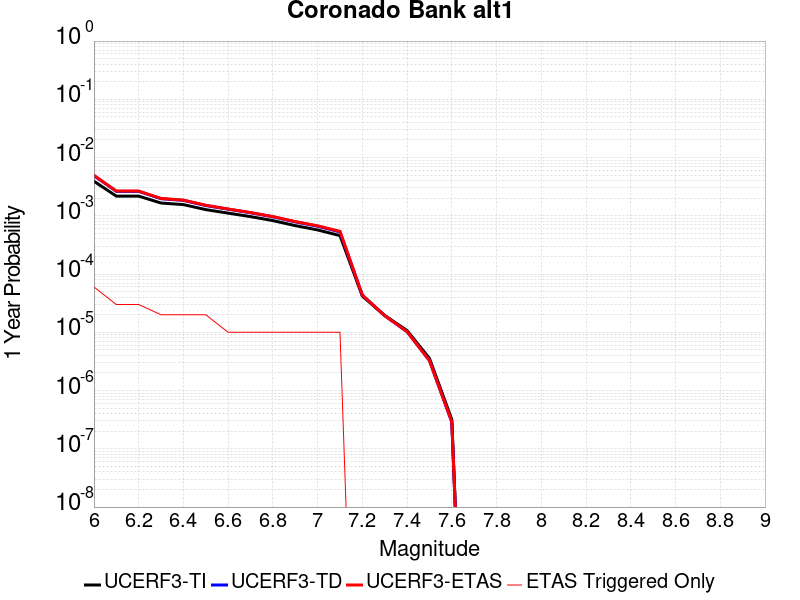 |  |

| Magnitude | 1 yr TI Prob | TD Prob | ETAS Prob | ETAS/TD Gain | ETAS Triggered Only | 10 yr TI Prob | TD Prob | ETAS Prob | ETAS/TD Gain | ETAS Triggered Only |
|-----|-----|-----|-----|-----|-----|-----|-----|-----|-----|-----|
| 6.0 | 0.0039233007 | 0.0048909658 | 0.004950672 | 1.0122075 | 6.0E-5 | 0.03854755 | 0.04790356 | 0.04798925 | 1.0017887 | 9.0E-5 |
| 6.1 | 0.0021791123 | 0.0026313474 | 0.0026612685 | 1.011371 | 3.0E-5 | 0.021578677 | 0.026011046 | 0.026050007 | 1.0014979 | 4.0E-5 |
| 6.2 | 0.0021791123 | 0.0026313474 | 0.0026612685 | 1.011371 | 3.0E-5 | 0.021578677 | 0.026011046 | 0.026050007 | 1.0014979 | 4.0E-5 |
| 6.3 | 0.0016575698 | 0.001965848 | 0.0019858086 | 1.0101538 | 2.0E-5 | 0.016452603 | 0.019488465 | 0.01951788 | 1.0015094 | 3.0E-5 |
| 6.4 | 0.0015578003 | 0.0018421387 | 0.0018621018 | 1.010837 | 2.0E-5 | 0.015469253 | 0.01827244 | 0.018301893 | 1.0016118 | 3.0E-5 |
| 6.5 | 0.0012782287 | 0.0014997921 | 0.0015197621 | 1.0133152 | 2.0E-5 | 0.012709012 | 0.014899683 | 0.014929236 | 1.0019835 | 3.0E-5 |
| 6.6 | 0.0011117056 | 0.0012987906 | 0.0013087775 | 1.0076895 | 1.0E-5 | 0.011061605 | 0.012914404 | 0.012934146 | 1.0015286 | 2.0E-5 |
| 6.7 | 9.6931186E-4 | 0.0011282742 | 0.001138263 | 1.0088531 | 1.0E-5 | 0.0096509475 | 0.011227623 | 0.011247397 | 1.0017613 | 2.0E-5 |
| 6.8 | 8.273665E-4 | 9.6066965E-4 | 9.7066E-4 | 1.0103995 | 1.0E-5 | 0.008242928 | 0.00956715 | 0.009586958 | 1.0020705 | 2.0E-5 |
| 6.9 | 6.792174E-4 | 7.8736455E-4 | 7.9735665E-4 | 1.0126905 | 1.0E-5 | 0.006771452 | 0.007847573 | 0.007857494 | 1.0012643 | 1.0E-5 |
| 7.0 | 5.7246623E-4 | 6.6351966E-4 | 6.73513E-4 | 1.0150611 | 1.0E-5 | 0.0057099373 | 0.006617135 | 0.0066270684 | 1.0015012 | 1.0E-5 |
| 7.1 | 4.573063E-4 | 5.3021475E-4 | 5.402094E-4 | 1.0188503 | 1.0E-5 | 0.0045636636 | 0.0052911965 | 0.0053011435 | 1.0018799 | 1.0E-5 |
| 7.2 | 4.1877785E-5 | 4.3473043E-5 | 4.3473043E-5 | 1.0 | 0.0 | 4.1869894E-4 | 4.3464647E-4 | 4.3464647E-4 | 1.0 | 0.0 |
| 7.3 | 1.9458828E-5 | 1.9306386E-5 | 1.9306386E-5 | 1.0 | 0.0 | 1.9457124E-4 | 1.9304715E-4 | 1.9304715E-4 | 1.0 | 0.0 |
| 7.4 | 1.0726311E-5 | 1.026575E-5 | 1.026575E-5 | 1.0 | 0.0 | 1.0725793E-4 | 1.0265279E-4 | 1.0265279E-4 | 1.0 | 0.0 |
| 7.5 | 3.5718497E-6 | 3.2764797E-6 | 3.2764797E-6 | 1.0 | 0.0 | 3.5717923E-5 | 3.2764325E-5 | 3.2764325E-5 | 1.0 | 0.0 |
| 7.6 | 3.1815955E-7 | 2.88644E-7 | 2.88644E-7 | 1.0 | 0.0 | 3.181591E-6 | 2.8864374E-6 | 2.8864374E-6 | 1.0 | 0.0 |

## Ortigalita (North)
*[(top)](#table-of-contents)*

| 1 Year | 10 Year |
|-----|-----|
|  |  |

| Magnitude | 1 yr TI Prob | TD Prob | ETAS Prob | ETAS/TD Gain | ETAS Triggered Only | 10 yr TI Prob | TD Prob | ETAS Prob | ETAS/TD Gain | ETAS Triggered Only |
|-----|-----|-----|-----|-----|-----|-----|-----|-----|-----|-----|
| 6.0 | 0.004016016 | 0.0054681194 | 0.005507901 | 1.0072751 | 4.0E-5 | 0.039442103 | 0.053454787 | 0.05353051 | 1.0014166 | 8.0E-5 |
| 6.1 | 0.0024014818 | 0.0031387596 | 0.003158697 | 1.006352 | 2.0E-5 | 0.023756953 | 0.030975068 | 0.03102352 | 1.0015641 | 5.0E-5 |
| 6.2 | 0.0024014818 | 0.0031387596 | 0.003158697 | 1.006352 | 2.0E-5 | 0.023756953 | 0.030975068 | 0.03102352 | 1.0015641 | 5.0E-5 |
| 6.3 | 0.0017347244 | 0.002214197 | 0.0022341528 | 1.0090126 | 2.0E-5 | 0.017212452 | 0.021945644 | 0.021974986 | 1.001337 | 3.0E-5 |
| 6.4 | 0.001446016 | 0.0018248095 | 0.0018447731 | 1.0109401 | 2.0E-5 | 0.014366428 | 0.018121224 | 0.018140862 | 1.0010837 | 2.0E-5 |
| 6.5 | 0.0014437864 | 0.0018221956 | 0.0018421591 | 1.0109558 | 2.0E-5 | 0.014344421 | 0.01809551 | 0.018115148 | 1.0010853 | 2.0E-5 |
| 6.6 | 0.0011981975 | 0.0014976363 | 0.0015176064 | 1.0133344 | 2.0E-5 | 0.011917574 | 0.014898697 | 0.014918399 | 1.0013224 | 2.0E-5 |
| 6.7 | 0.0010363415 | 0.0012989145 | 0.0013188886 | 1.0153775 | 2.0E-5 | 0.010315218 | 0.012936919 | 0.01295666 | 1.001526 | 2.0E-5 |
| 6.8 | 3.424451E-4 | 3.9676955E-4 | 4.167616E-4 | 1.0503871 | 2.0E-5 | 0.0034191788 | 0.003960899 | 0.0039808196 | 1.0050293 | 2.0E-5 |
| 6.9 | 2.933041E-4 | 3.3920293E-4 | 3.5919613E-4 | 1.0589417 | 2.0E-5 | 0.0029291727 | 0.003387109 | 0.003407041 | 1.0058848 | 2.0E-5 |
| 7.0 | 2.0220275E-4 | 2.339835E-4 | 2.4398117E-4 | 1.0427281 | 1.0E-5 | 0.0020201886 | 0.0023375798 | 0.0023475564 | 1.0042679 | 1.0E-5 |
| 7.1 | 8.357586E-5 | 9.689432E-5 | 9.689432E-5 | 1.0 | 0.0 | 8.3544437E-4 | 9.686254E-4 | 9.686254E-4 | 1.0 | 0.0 |

## Big Pine (Central)
*[(top)](#table-of-contents)*

| 1 Year | 10 Year |
|-----|-----|
|  |  |

| Magnitude | 1 yr TI Prob | TD Prob | ETAS Prob | ETAS/TD Gain | ETAS Triggered Only | 10 yr TI Prob | TD Prob | ETAS Prob | ETAS/TD Gain | ETAS Triggered Only |
|-----|-----|-----|-----|-----|-----|-----|-----|-----|-----|-----|
| 6.0 | 6.628048E-4 | 7.433402E-4 | 8.1328815E-4 | 1.0940995 | 7.0E-5 | 0.006608314 | 0.0074135666 | 0.0074929735 | 1.0107111 | 8.0E-5 |
| 6.1 | 4.3521097E-4 | 4.961604E-4 | 5.261455E-4 | 1.0604343 | 3.0E-5 | 0.0043435963 | 0.0049540824 | 0.0049938844 | 1.0080341 | 4.0E-5 |
| 6.2 | 3.6121515E-4 | 4.156502E-4 | 4.456377E-4 | 1.072146 | 3.0E-5 | 0.003606286 | 0.0041520367 | 0.004191871 | 1.0095938 | 4.0E-5 |
| 6.3 | 1.4235388E-4 | 1.7865987E-4 | 1.986563E-4 | 1.1119245 | 2.0E-5 | 0.0014226272 | 0.0017866704 | 0.0018166169 | 1.0167611 | 3.0E-5 |
| 6.4 | 1.4158686E-4 | 1.7784047E-4 | 1.9783691E-4 | 1.1124403 | 2.0E-5 | 0.0014149669 | 0.0017784894 | 0.0018084361 | 1.0168382 | 3.0E-5 |
| 6.5 | 1.4072572E-4 | 1.7691942E-4 | 1.9691588E-4 | 1.1130258 | 2.0E-5 | 0.0014063664 | 0.0017692937 | 0.0017992406 | 1.0169259 | 3.0E-5 |
| 6.6 | 1.3925991E-4 | 1.753554E-4 | 1.953519E-4 | 1.114034 | 2.0E-5 | 0.0013917267 | 0.0017536782 | 0.0017836256 | 1.0170768 | 3.0E-5 |
| 6.7 | 1.3778417E-4 | 1.7379165E-4 | 1.9378818E-4 | 1.1150603 | 2.0E-5 | 0.0013769877 | 0.0017380653 | 0.0017680131 | 1.0172306 | 3.0E-5 |
| 6.8 | 1.1367482E-4 | 1.4893012E-4 | 1.5892863E-4 | 1.0671356 | 1.0E-5 | 0.0011361669 | 0.0014897975 | 0.0014997825 | 1.0067023 | 1.0E-5 |
| 6.9 | 7.51954E-5 | 1.079259E-4 | 1.1792482E-4 | 1.0926461 | 1.0E-5 | 7.5169955E-4 | 0.0010801847 | 0.0010901738 | 1.0092477 | 1.0E-5 |
| 7.0 | 5.2560266E-5 | 8.1096056E-5 | 8.1096056E-5 | 1.0 | 0.0 | 5.2547833E-4 | 8.1210316E-4 | 8.1210316E-4 | 1.0 | 0.0 |
| 7.1 | 4.6683643E-5 | 7.46258E-5 | 7.46258E-5 | 1.0 | 0.0 | 4.6673836E-4 | 7.474457E-4 | 7.474457E-4 | 1.0 | 0.0 |
| 7.2 | 2.7211627E-5 | 5.2759973E-5 | 5.2759973E-5 | 1.0 | 0.0 | 2.7208295E-4 | 5.2890263E-4 | 5.2890263E-4 | 1.0 | 0.0 |
| 7.3 | 2.2971257E-5 | 4.810541E-5 | 4.810541E-5 | 1.0 | 0.0 | 2.2968883E-4 | 4.8237795E-4 | 4.8237795E-4 | 1.0 | 0.0 |
| 7.4 | 1.8852415E-5 | 4.3612687E-5 | 4.3612687E-5 | 1.0 | 0.0 | 1.8850817E-4 | 4.374597E-4 | 4.374597E-4 | 1.0 | 0.0 |
| 7.5 | 1.7783263E-5 | 4.2306317E-5 | 4.2306317E-5 | 1.0 | 0.0 | 1.778184E-4 | 4.2437963E-4 | 4.2437963E-4 | 1.0 | 0.0 |
| 7.6 | 1.6398877E-5 | 4.0341627E-5 | 4.0341627E-5 | 1.0 | 0.0 | 1.6397667E-4 | 4.0471106E-4 | 4.0471106E-4 | 1.0 | 0.0 |
| 7.7 | 9.377899E-6 | 2.6494654E-5 | 2.6494654E-5 | 1.0 | 0.0 | 9.377503E-5 | 2.662899E-4 | 2.662899E-4 | 1.0 | 0.0 |
| 7.8 | 2.5687964E-6 | 6.2513873E-6 | 6.2513873E-6 | 1.0 | 0.0 | 2.5687666E-5 | 6.295415E-5 | 6.295415E-5 | 1.0 | 0.0 |
| 7.9 | 1.9204828E-7 | 2.1420831E-7 | 2.1420831E-7 | 1.0 | 0.0 | 1.920481E-6 | 2.1900614E-6 | 2.1900614E-6 | 1.0 | 0.0 |

## Ventura-Pitas Point
*[(top)](#table-of-contents)*

| 1 Year | 10 Year |
|-----|-----|
|  |  |

| Magnitude | 1 yr TI Prob | TD Prob | ETAS Prob | ETAS/TD Gain | ETAS Triggered Only | 10 yr TI Prob | TD Prob | ETAS Prob | ETAS/TD Gain | ETAS Triggered Only |
|-----|-----|-----|-----|-----|-----|-----|-----|-----|-----|-----|
| 6.0 | 0.0017297962 | 0.0017590096 | 0.0017889568 | 1.017025 | 3.0E-5 | 0.017163932 | 0.0174764 | 0.017555002 | 1.0044976 | 8.0E-5 |
| 6.1 | 0.0017297962 | 0.0017590096 | 0.0017889568 | 1.017025 | 3.0E-5 | 0.017163932 | 0.0174764 | 0.017555002 | 1.0044976 | 8.0E-5 |
| 6.2 | 0.0017297962 | 0.0017590096 | 0.0017889568 | 1.017025 | 3.0E-5 | 0.017163932 | 0.0174764 | 0.017555002 | 1.0044976 | 8.0E-5 |
| 6.3 | 0.0017297962 | 0.0017590096 | 0.0017889568 | 1.017025 | 3.0E-5 | 0.017163932 | 0.0174764 | 0.017555002 | 1.0044976 | 8.0E-5 |
| 6.4 | 9.781223E-4 | 8.8769704E-4 | 8.9768815E-4 | 1.0112551 | 1.0E-5 | 0.009738282 | 0.008843848 | 0.008863671 | 1.0022415 | 2.0E-5 |
| 6.5 | 9.781223E-4 | 8.8769704E-4 | 8.9768815E-4 | 1.0112551 | 1.0E-5 | 0.009738282 | 0.008843848 | 0.008863671 | 1.0022415 | 2.0E-5 |
| 6.6 | 7.490902E-4 | 6.3232926E-4 | 6.3232926E-4 | 1.0 | 0.0 | 0.0074657016 | 0.0063055577 | 0.0063055577 | 1.0 | 0.0 |
| 6.7 | 7.490902E-4 | 6.3232926E-4 | 6.3232926E-4 | 1.0 | 0.0 | 0.0074657016 | 0.0063055577 | 0.0063055577 | 1.0 | 0.0 |
| 6.8 | 7.127108E-4 | 5.917658E-4 | 5.917658E-4 | 1.0 | 0.0 | 0.007104293 | 0.005902116 | 0.005902116 | 1.0 | 0.0 |
| 6.9 | 7.116841E-4 | 5.9062376E-4 | 5.9062376E-4 | 1.0 | 0.0 | 0.007094092 | 0.0058907564 | 0.0058907564 | 1.0 | 0.0 |
| 7.0 | 7.077572E-4 | 5.864293E-4 | 5.864293E-4 | 1.0 | 0.0 | 0.007055073 | 0.0058490336 | 0.0058490336 | 1.0 | 0.0 |
| 7.1 | 6.815227E-4 | 5.5923103E-4 | 5.5923103E-4 | 1.0 | 0.0 | 0.0067943637 | 0.0055784425 | 0.0055784425 | 1.0 | 0.0 |
| 7.2 | 6.429523E-4 | 5.214008E-4 | 5.214008E-4 | 1.0 | 0.0 | 0.0064109527 | 0.005201967 | 0.005201967 | 1.0 | 0.0 |
| 7.3 | 5.69488E-4 | 4.6135622E-4 | 4.6135622E-4 | 1.0 | 0.0 | 0.0056803077 | 0.00460415 | 0.00460415 | 1.0 | 0.0 |
| 7.4 | 5.424914E-4 | 4.3943635E-4 | 4.3943635E-4 | 1.0 | 0.0 | 0.0054116896 | 0.004385836 | 0.004385836 | 1.0 | 0.0 |
| 7.5 | 4.7032707E-4 | 3.8070587E-4 | 3.8070587E-4 | 1.0 | 0.0 | 0.004693329 | 0.0038006818 | 0.0038006818 | 1.0 | 0.0 |
| 7.6 | 2.556514E-4 | 2.0212591E-4 | 2.0212591E-4 | 1.0 | 0.0 | 0.0025535747 | 0.0020194345 | 0.0020194345 | 1.0 | 0.0 |
| 7.7 | 2.0269687E-4 | 1.6313537E-4 | 1.6313537E-4 | 1.0 | 0.0 | 0.002025121 | 0.0016301654 | 0.0016301654 | 1.0 | 0.0 |
| 7.8 | 1.2863669E-4 | 1.0591053E-4 | 1.0591053E-4 | 1.0 | 0.0 | 0.0012856225 | 0.0010586053 | 0.0010586053 | 1.0 | 0.0 |
| 7.9 | 2.1371567E-5 | 1.7096047E-5 | 1.7096047E-5 | 1.0 | 0.0 | 2.1369511E-4 | 1.7094762E-4 | 1.7094762E-4 | 1.0 | 0.0 |
| 8.0 | 4.0654416E-7 | 2.9655675E-7 | 2.9655675E-7 | 1.0 | 0.0 | 4.065434E-6 | 2.9655655E-6 | 2.9655655E-6 | 1.0 | 0.0 |

## Dry Mountain
*[(top)](#table-of-contents)*

| 1 Year | 10 Year |
|-----|-----|
|  |  |

| Magnitude | 1 yr TI Prob | TD Prob | ETAS Prob | ETAS/TD Gain | ETAS Triggered Only | 10 yr TI Prob | TD Prob | ETAS Prob | ETAS/TD Gain | ETAS Triggered Only |
|-----|-----|-----|-----|-----|-----|-----|-----|-----|-----|-----|
| 6.0 | 3.2464517E-4 | 3.3595937E-4 | 3.659493E-4 | 1.0892665 | 3.0E-5 | 0.0032417132 | 0.0033560768 | 0.0034358085 | 1.0237573 | 8.0E-5 |
| 6.1 | 3.2464517E-4 | 3.3595937E-4 | 3.659493E-4 | 1.0892665 | 3.0E-5 | 0.0032417132 | 0.0033560768 | 0.0034358085 | 1.0237573 | 8.0E-5 |
| 6.2 | 3.2464517E-4 | 3.3595937E-4 | 3.659493E-4 | 1.0892665 | 3.0E-5 | 0.0032417132 | 0.0033560768 | 0.0034358085 | 1.0237573 | 8.0E-5 |
| 6.3 | 3.2464517E-4 | 3.3595937E-4 | 3.659493E-4 | 1.0892665 | 3.0E-5 | 0.0032417132 | 0.0033560768 | 0.0034358085 | 1.0237573 | 8.0E-5 |
| 6.4 | 3.2464517E-4 | 3.3595937E-4 | 3.659493E-4 | 1.0892665 | 3.0E-5 | 0.0032417132 | 0.0033560768 | 0.0034358085 | 1.0237573 | 8.0E-5 |
| 6.5 | 1.4884741E-4 | 1.540376E-4 | 1.8403298E-4 | 1.1947277 | 3.0E-5 | 0.0014874774 | 0.0015401616 | 0.0016000692 | 1.0388969 | 6.0E-5 |
| 6.6 | 1.4884741E-4 | 1.540376E-4 | 1.8403298E-4 | 1.1947277 | 3.0E-5 | 0.0014874774 | 0.0015401616 | 0.0016000692 | 1.0388969 | 6.0E-5 |
| 6.7 | 1.3257713E-4 | 1.3719614E-4 | 1.6719202E-4 | 1.2186351 | 3.0E-5 | 0.0013249806 | 0.0013719613 | 0.001431879 | 1.043673 | 6.0E-5 |

## Elysian Park (Upper)
*[(top)](#table-of-contents)*

| 1 Year | 10 Year |
|-----|-----|
| 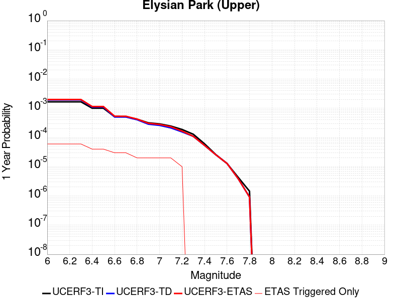 |  |

| Magnitude | 1 yr TI Prob | TD Prob | ETAS Prob | ETAS/TD Gain | ETAS Triggered Only | 10 yr TI Prob | TD Prob | ETAS Prob | ETAS/TD Gain | ETAS Triggered Only |
|-----|-----|-----|-----|-----|-----|-----|-----|-----|-----|-----|
| 6.0 | 0.0016618895 | 0.0019311075 | 0.0019909916 | 1.0310103 | 6.0E-5 | 0.016495159 | 0.019189782 | 0.01925844 | 1.0035778 | 7.0E-5 |
| 6.1 | 0.0016618895 | 0.0019311075 | 0.0019909916 | 1.0310103 | 6.0E-5 | 0.016495159 | 0.019189782 | 0.01925844 | 1.0035778 | 7.0E-5 |
| 6.2 | 0.0016618895 | 0.0019311075 | 0.0019909916 | 1.0310103 | 6.0E-5 | 0.016495159 | 0.019189782 | 0.01925844 | 1.0035778 | 7.0E-5 |
| 6.3 | 0.0016618895 | 0.0019311075 | 0.0019909916 | 1.0310103 | 6.0E-5 | 0.016495159 | 0.019189782 | 0.01925844 | 1.0035778 | 7.0E-5 |
| 6.4 | 0.001005166 | 0.0011058892 | 0.001145845 | 1.03613 | 4.0E-5 | 0.010006315 | 0.011020724 | 0.011060283 | 1.0035895 | 4.0E-5 |
| 6.5 | 0.001005166 | 0.0011058892 | 0.001145845 | 1.03613 | 4.0E-5 | 0.010006315 | 0.011020724 | 0.011060283 | 1.0035895 | 4.0E-5 |
| 6.6 | 5.119132E-4 | 5.0422014E-4 | 5.34205E-4 | 1.0594678 | 3.0E-5 | 0.005107356 | 0.0050314846 | 0.005061334 | 1.0059325 | 3.0E-5 |
| 6.7 | 5.112989E-4 | 5.035719E-4 | 5.3355674E-4 | 1.0595444 | 3.0E-5 | 0.0051012407 | 0.0050250315 | 0.0050548804 | 1.0059401 | 3.0E-5 |
| 6.8 | 4.2268867E-4 | 4.055089E-4 | 4.255008E-4 | 1.0493008 | 2.0E-5 | 0.004218856 | 0.0040481836 | 0.0040681027 | 1.0049205 | 2.0E-5 |
| 6.9 | 3.173398E-4 | 2.85975E-4 | 3.059693E-4 | 1.0699161 | 2.0E-5 | 0.0031688702 | 0.0028561477 | 0.0028760906 | 1.0069824 | 2.0E-5 |
| 7.0 | 2.9213692E-4 | 2.599619E-4 | 2.799567E-4 | 1.0769143 | 2.0E-5 | 0.0029175316 | 0.0025966454 | 0.0026165934 | 1.0076822 | 2.0E-5 |
| 7.1 | 2.4572524E-4 | 2.132529E-4 | 2.3324863E-4 | 1.0937654 | 2.0E-5 | 0.002454537 | 0.002130524 | 0.0021504813 | 1.0093673 | 2.0E-5 |
| 7.2 | 1.881565E-4 | 1.5537368E-4 | 1.6537213E-4 | 1.064351 | 1.0E-5 | 0.0018799726 | 0.0015526618 | 0.0015626462 | 1.0064305 | 1.0E-5 |
| 7.3 | 1.2893214E-4 | 1.093324E-4 | 1.093324E-4 | 1.0 | 0.0 | 0.0012885736 | 0.0010927934 | 0.0010927934 | 1.0 | 0.0 |
| 7.4 | 6.0731076E-5 | 5.3612584E-5 | 5.3612584E-5 | 1.0 | 0.0 | 6.071448E-4 | 5.359995E-4 | 5.359995E-4 | 1.0 | 0.0 |
| 7.5 | 2.6060725E-5 | 2.5659048E-5 | 2.5659048E-5 | 1.0 | 0.0 | 2.605767E-4 | 2.5656243E-4 | 2.5656243E-4 | 1.0 | 0.0 |
| 7.6 | 1.2871251E-5 | 1.2928905E-5 | 1.2928905E-5 | 1.0 | 0.0 | 1.2870505E-4 | 1.2928189E-4 | 1.2928189E-4 | 1.0 | 0.0 |
| 7.7 | 4.294955E-6 | 3.8541357E-6 | 3.8541357E-6 | 1.0 | 0.0 | 4.2948723E-5 | 3.8540802E-5 | 3.8540802E-5 | 1.0 | 0.0 |
| 7.8 | 1.45157E-6 | 9.165697E-7 | 9.165697E-7 | 1.0 | 0.0 | 1.45156055E-5 | 9.165675E-6 | 9.165675E-6 | 1.0 | 0.0 |

## Kern Canyon (South Kern) 2011
*[(top)](#table-of-contents)*

| 1 Year | 10 Year |
|-----|-----|
|  |  |

| Magnitude | 1 yr TI Prob | TD Prob | ETAS Prob | ETAS/TD Gain | ETAS Triggered Only | 10 yr TI Prob | TD Prob | ETAS Prob | ETAS/TD Gain | ETAS Triggered Only |
|-----|-----|-----|-----|-----|-----|-----|-----|-----|-----|-----|
| 6.0 | 2.1417443E-4 | 2.1462646E-4 | 2.8461145E-4 | 1.326078 | 7.0E-5 | 0.0021396813 | 0.0021442557 | 0.0022240842 | 1.037229 | 8.0E-5 |
| 6.1 | 2.1417443E-4 | 2.1462646E-4 | 2.8461145E-4 | 1.326078 | 7.0E-5 | 0.0021396813 | 0.0021442557 | 0.0022240842 | 1.037229 | 8.0E-5 |
| 6.2 | 2.1417443E-4 | 2.1462646E-4 | 2.8461145E-4 | 1.326078 | 7.0E-5 | 0.0021396813 | 0.0021442557 | 0.0022240842 | 1.037229 | 8.0E-5 |
| 6.3 | 2.1417443E-4 | 2.1462646E-4 | 2.8461145E-4 | 1.326078 | 7.0E-5 | 0.0021396813 | 0.0021442557 | 0.0022240842 | 1.037229 | 8.0E-5 |
| 6.4 | 2.1417443E-4 | 2.1462646E-4 | 2.8461145E-4 | 1.326078 | 7.0E-5 | 0.0021396813 | 0.0021442557 | 0.0022240842 | 1.037229 | 8.0E-5 |
| 6.5 | 1.5574014E-4 | 1.5512333E-4 | 1.8511867E-4 | 1.1933645 | 3.0E-5 | 0.0015563103 | 0.0015501656 | 0.0015901036 | 1.0257638 | 4.0E-5 |
| 6.6 | 1.5574014E-4 | 1.5512333E-4 | 1.8511867E-4 | 1.1933645 | 3.0E-5 | 0.0015563103 | 0.0015501656 | 0.0015901036 | 1.0257638 | 4.0E-5 |
| 6.7 | 1.396032E-4 | 1.3869285E-4 | 1.6868868E-4 | 1.2162753 | 3.0E-5 | 0.0013951553 | 0.0013860738 | 0.0014260183 | 1.0288185 | 4.0E-5 |
| 6.8 | 1.214839E-4 | 1.20253055E-4 | 1.5024944E-4 | 1.2494439 | 3.0E-5 | 0.001214175 | 0.0012018873 | 0.0012418393 | 1.033241 | 4.0E-5 |
| 6.9 | 1.0942656E-4 | 1.0798526E-4 | 1.3798202E-4 | 1.2777857 | 3.0E-5 | 0.0010937268 | 0.0010793337 | 0.0011192906 | 1.0370198 | 4.0E-5 |
| 7.0 | 8.938967E-5 | 8.758863E-5 | 1.0758688E-4 | 1.2283201 | 2.0E-5 | 8.935372E-4 | 8.7554497E-4 | 8.955274E-4 | 1.0228229 | 2.0E-5 |
| 7.1 | 7.417196E-5 | 7.20861E-5 | 9.208466E-5 | 1.277426 | 2.0E-5 | 7.414721E-4 | 7.206299E-4 | 7.406155E-4 | 1.0277334 | 2.0E-5 |
| 7.2 | 4.7470192E-5 | 4.4892295E-5 | 5.4891847E-5 | 1.2227454 | 1.0E-5 | 4.7460053E-4 | 4.4883334E-4 | 4.5882884E-4 | 1.02227 | 1.0E-5 |
| 7.3 | 3.205889E-5 | 2.9366758E-5 | 2.9366758E-5 | 1.0 | 0.0 | 3.2054266E-4 | 2.936293E-4 | 2.936293E-4 | 1.0 | 0.0 |
| 7.4 | 2.1131287E-5 | 1.8642357E-5 | 1.8642357E-5 | 1.0 | 0.0 | 2.1129279E-4 | 1.8640817E-4 | 1.8640817E-4 | 1.0 | 0.0 |
| 7.5 | 1.0368436E-5 | 8.260065E-6 | 8.260065E-6 | 1.0 | 0.0 | 1.0367952E-4 | 8.259767E-5 | 8.259767E-5 | 1.0 | 0.0 |
| 7.6 | 1.3421597E-6 | 9.054312E-7 | 9.054312E-7 | 1.0 | 0.0 | 1.3421517E-5 | 9.05428E-6 | 9.05428E-6 | 1.0 | 0.0 |

## Camp Rock 2011
*[(top)](#table-of-contents)*

| 1 Year | 10 Year |
|-----|-----|
|  | 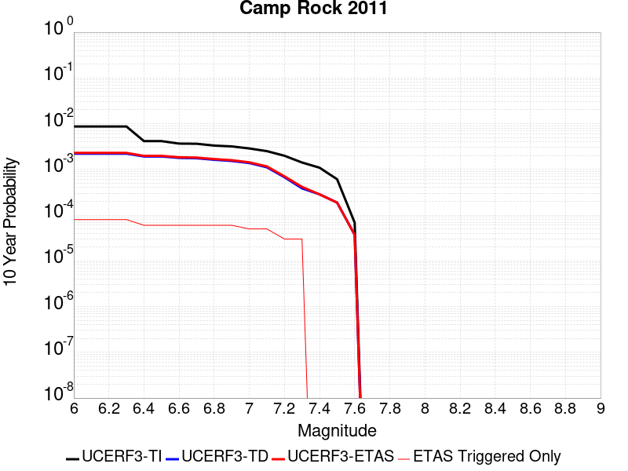 |

| Magnitude | 1 yr TI Prob | TD Prob | ETAS Prob | ETAS/TD Gain | ETAS Triggered Only | 10 yr TI Prob | TD Prob | ETAS Prob | ETAS/TD Gain | ETAS Triggered Only |
|-----|-----|-----|-----|-----|-----|-----|-----|-----|-----|-----|
| 6.0 | 8.7157206E-4 | 2.2174895E-4 | 2.9173342E-4 | 1.3156023 | 7.0E-5 | 0.008681616 | 0.0022153298 | 0.0022951525 | 1.036032 | 8.0E-5 |
| 6.1 | 8.7157206E-4 | 2.2174895E-4 | 2.9173342E-4 | 1.3156023 | 7.0E-5 | 0.008681616 | 0.0022153298 | 0.0022951525 | 1.036032 | 8.0E-5 |
| 6.2 | 8.7157206E-4 | 2.2174895E-4 | 2.9173342E-4 | 1.3156023 | 7.0E-5 | 0.008681616 | 0.0022153298 | 0.0022951525 | 1.036032 | 8.0E-5 |
| 6.3 | 8.7157206E-4 | 2.2174895E-4 | 2.9173342E-4 | 1.3156023 | 7.0E-5 | 0.008681616 | 0.0022153298 | 0.0022951525 | 1.036032 | 8.0E-5 |
| 6.4 | 4.1644843E-4 | 1.9210839E-4 | 2.4209879E-4 | 1.2602197 | 5.0E-5 | 0.0041566887 | 0.001919458 | 0.001979343 | 1.0311989 | 6.0E-5 |
| 6.5 | 4.1644843E-4 | 1.9210839E-4 | 2.4209879E-4 | 1.2602197 | 5.0E-5 | 0.0041566887 | 0.001919458 | 0.001979343 | 1.0311989 | 6.0E-5 |
| 6.6 | 3.677336E-4 | 1.7866275E-4 | 2.2865382E-4 | 1.2798069 | 5.0E-5 | 0.0036712566 | 0.0017852228 | 0.0018451157 | 1.0335493 | 6.0E-5 |
| 6.7 | 3.6452254E-4 | 1.7542706E-4 | 2.2541829E-4 | 1.2849687 | 5.0E-5 | 0.0036392517 | 0.001752917 | 0.0018128118 | 1.0341687 | 6.0E-5 |
| 6.8 | 3.3251947E-4 | 1.626753E-4 | 2.1266716E-4 | 1.3073107 | 5.0E-5 | 0.0033202237 | 0.0016255907 | 0.0016854932 | 1.0368496 | 6.0E-5 |
| 6.9 | 3.1887658E-4 | 1.5303459E-4 | 2.0302694E-4 | 1.3266735 | 5.0E-5 | 0.003184194 | 0.0015293199 | 0.001589228 | 1.0391731 | 6.0E-5 |
| 7.0 | 2.8767265E-4 | 1.3784273E-4 | 1.7783721E-4 | 1.2901458 | 4.0E-5 | 0.0028730053 | 0.0013775975 | 0.0014275286 | 1.0362451 | 5.0E-5 |
| 7.1 | 2.5121463E-4 | 1.1135734E-4 | 1.5135288E-4 | 1.359164 | 4.0E-5 | 0.0025093083 | 0.0011130372 | 0.0011629816 | 1.0448722 | 5.0E-5 |
| 7.2 | 1.9921579E-4 | 6.750349E-5 | 9.750146E-5 | 1.4443915 | 3.0E-5 | 0.0019903728 | 6.748381E-4 | 7.048178E-4 | 1.0444251 | 3.0E-5 |
| 7.3 | 1.4174209E-4 | 3.8525748E-5 | 6.852459E-5 | 1.7786701 | 3.0E-5 | 0.0014165172 | 3.851927E-4 | 4.1518113E-4 | 1.0778531 | 3.0E-5 |
| 7.4 | 1.0901308E-4 | 2.84987E-5 | 2.84987E-5 | 1.0 | 0.0 | 0.0010895962 | 2.84951E-4 | 2.84951E-4 | 1.0 | 0.0 |
| 7.5 | 6.0951766E-5 | 1.8800076E-5 | 1.8800076E-5 | 1.0 | 0.0 | 6.093505E-4 | 1.8798532E-4 | 1.8798532E-4 | 1.0 | 0.0 |
| 7.6 | 6.863748E-6 | 3.7149728E-6 | 3.7149728E-6 | 1.0 | 0.0 | 6.863536E-5 | 3.7149264E-5 | 3.7149264E-5 | 1.0 | 0.0 |

## Independence rev 2011
*[(top)](#table-of-contents)*

| 1 Year | 10 Year |
|-----|-----|
|  |  |

| Magnitude | 1 yr TI Prob | TD Prob | ETAS Prob | ETAS/TD Gain | ETAS Triggered Only | 10 yr TI Prob | TD Prob | ETAS Prob | ETAS/TD Gain | ETAS Triggered Only |
|-----|-----|-----|-----|-----|-----|-----|-----|-----|-----|-----|
| 6.0 | 2.3071647E-4 | 2.2571455E-4 | 2.9569876E-4 | 1.3100562 | 7.0E-5 | 0.0023047708 | 0.0022551466 | 0.002334966 | 1.0353944 | 8.0E-5 |
| 6.1 | 2.3071647E-4 | 2.2571455E-4 | 2.9569876E-4 | 1.3100562 | 7.0E-5 | 0.0023047708 | 0.0022551466 | 0.002334966 | 1.0353944 | 8.0E-5 |
| 6.2 | 2.3071647E-4 | 2.2571455E-4 | 2.9569876E-4 | 1.3100562 | 7.0E-5 | 0.0023047708 | 0.0022551466 | 0.002334966 | 1.0353944 | 8.0E-5 |
| 6.3 | 2.3071647E-4 | 2.2571455E-4 | 2.9569876E-4 | 1.3100562 | 7.0E-5 | 0.0023047708 | 0.0022551466 | 0.002334966 | 1.0353944 | 8.0E-5 |
| 6.4 | 2.3071647E-4 | 2.2571455E-4 | 2.9569876E-4 | 1.3100562 | 7.0E-5 | 0.0023047708 | 0.0022551466 | 0.002334966 | 1.0353944 | 8.0E-5 |
| 6.5 | 2.3071647E-4 | 2.2571455E-4 | 2.9569876E-4 | 1.3100562 | 7.0E-5 | 0.0023047708 | 0.0022551466 | 0.002334966 | 1.0353944 | 8.0E-5 |
| 6.6 | 1.3898089E-4 | 1.3210738E-4 | 2.0209813E-4 | 1.529802 | 7.0E-5 | 0.0013889399 | 0.0013203367 | 0.0014002312 | 1.0605106 | 8.0E-5 |
| 6.7 | 1.3898089E-4 | 1.3210738E-4 | 2.0209813E-4 | 1.529802 | 7.0E-5 | 0.0013889399 | 0.0013203367 | 0.0014002312 | 1.0605106 | 8.0E-5 |
| 6.8 | 1.0287284E-4 | 9.5600284E-5 | 1.6559359E-4 | 1.7321454 | 7.0E-5 | 0.0010282523 | 9.556045E-4 | 0.001035528 | 1.0836366 | 8.0E-5 |
| 6.9 | 9.80316E-5 | 9.0943286E-5 | 1.6093692E-4 | 1.7696404 | 7.0E-5 | 9.798837E-4 | 9.0907275E-4 | 9.89E-4 | 1.0879217 | 8.0E-5 |
| 7.0 | 7.8502184E-5 | 7.226223E-5 | 1.4225717E-4 | 1.9686242 | 7.0E-5 | 7.8474457E-4 | 7.2239246E-4 | 8.0233463E-4 | 1.1106632 | 8.0E-5 |
| 7.1 | 6.6386776E-5 | 6.0656326E-5 | 1.3065209E-4 | 2.1539729 | 7.0E-5 | 6.636695E-4 | 6.064009E-4 | 6.863524E-4 | 1.131846 | 8.0E-5 |
| 7.2 | 5.4352407E-5 | 4.909825E-5 | 1.1909481E-4 | 2.4256427 | 7.0E-5 | 5.4339116E-4 | 4.9087586E-4 | 5.708366E-4 | 1.162894 | 8.0E-5 |
| 7.3 | 4.1455114E-5 | 3.775052E-5 | 1.07747874E-4 | 2.8542092 | 7.0E-5 | 4.144738E-4 | 3.7744216E-4 | 4.5741198E-4 | 1.211873 | 8.0E-5 |
| 7.4 | 2.8120441E-5 | 2.6190766E-5 | 8.61892E-5 | 3.2908237 | 6.0E-5 | 2.8116882E-4 | 2.6187726E-4 | 3.3185893E-4 | 1.2672307 | 7.0E-5 |
| 7.5 | 2.027226E-5 | 1.9214862E-5 | 6.92139E-5 | 3.6021025 | 5.0E-5 | 2.0270412E-4 | 1.9213221E-4 | 2.521207E-4 | 1.312225 | 6.0E-5 |
| 7.6 | 1.2600677E-5 | 1.2239742E-5 | 5.223925E-5 | 4.2680025 | 4.0E-5 | 1.2599962E-4 | 1.223908E-4 | 1.6238591E-4 | 1.326782 | 4.0E-5 |
| 7.7 | 3.5636867E-6 | 3.5789067E-6 | 3.5789067E-6 | 1.0 | 0.0 | 3.5636294E-5 | 3.5788536E-5 | 3.5788536E-5 | 1.0 | 0.0 |

## Sheephole
*[(top)](#table-of-contents)*

| 1 Year | 10 Year |
|-----|-----|
| 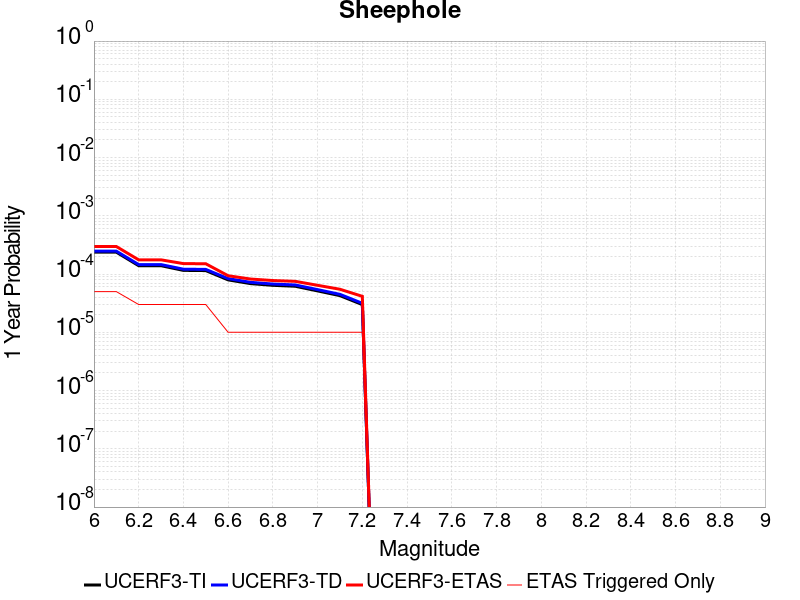 |  |

| Magnitude | 1 yr TI Prob | TD Prob | ETAS Prob | ETAS/TD Gain | ETAS Triggered Only | 10 yr TI Prob | TD Prob | ETAS Prob | ETAS/TD Gain | ETAS Triggered Only |
|-----|-----|-----|-----|-----|-----|-----|-----|-----|-----|-----|
| 6.0 | 2.3780059E-4 | 2.473682E-4 | 2.9735584E-4 | 1.2020779 | 5.0E-5 | 0.0023754628 | 0.002471473 | 0.0025413001 | 1.0282532 | 7.0E-5 |
| 6.1 | 2.3780059E-4 | 2.473682E-4 | 2.9735584E-4 | 1.2020779 | 5.0E-5 | 0.0023754628 | 0.002471473 | 0.0025413001 | 1.0282532 | 7.0E-5 |
| 6.2 | 1.3919079E-4 | 1.4543302E-4 | 1.7542866E-4 | 1.2062505 | 3.0E-5 | 0.0013910364 | 0.0014534844 | 0.0015034117 | 1.03435 | 5.0E-5 |
| 6.3 | 1.3919079E-4 | 1.4543302E-4 | 1.7542866E-4 | 1.2062505 | 3.0E-5 | 0.0013910364 | 0.0014534844 | 0.0015034117 | 1.03435 | 5.0E-5 |
| 6.4 | 1.156199E-4 | 1.2119815E-4 | 1.5119452E-4 | 1.2474985 | 3.0E-5 | 0.0011555976 | 0.0012113999 | 0.0012513514 | 1.0329796 | 4.0E-5 |
| 6.5 | 1.1471378E-4 | 1.2025281E-4 | 1.502492E-4 | 1.2494445 | 3.0E-5 | 0.0011465458 | 0.0012019566 | 0.0012419085 | 1.0332391 | 4.0E-5 |
| 6.6 | 7.947703E-5 | 8.35812E-5 | 9.358037E-5 | 1.1196342 | 1.0E-5 | 7.9448614E-4 | 8.3551643E-4 | 8.554997E-4 | 1.0239173 | 2.0E-5 |
| 6.7 | 6.854657E-5 | 7.215112E-5 | 8.21504E-5 | 1.138588 | 1.0E-5 | 6.8525434E-4 | 7.212908E-4 | 7.412764E-4 | 1.027708 | 2.0E-5 |
| 6.8 | 6.4051106E-5 | 6.7427485E-5 | 7.7426805E-5 | 1.1482974 | 1.0E-5 | 6.4032647E-4 | 6.740836E-4 | 6.940701E-4 | 1.0296499 | 2.0E-5 |
| 6.9 | 6.176237E-5 | 6.501789E-5 | 7.501724E-5 | 1.1537938 | 1.0E-5 | 6.17452E-4 | 6.5000186E-4 | 6.6998886E-4 | 1.0307492 | 2.0E-5 |
| 7.0 | 5.1391315E-5 | 5.4088487E-5 | 6.4087944E-5 | 1.1848723 | 1.0E-5 | 5.137943E-4 | 5.407633E-4 | 5.6075247E-4 | 1.0369648 | 2.0E-5 |
| 7.1 | 4.2599597E-5 | 4.482921E-5 | 5.482876E-5 | 1.2230588 | 1.0E-5 | 4.259143E-4 | 4.4821028E-4 | 4.6820132E-4 | 1.0446019 | 2.0E-5 |
| 7.2 | 2.9895667E-5 | 3.1460666E-5 | 4.1460353E-5 | 1.3178473 | 1.0E-5 | 2.9891645E-4 | 3.145688E-4 | 3.3456253E-4 | 1.063559 | 2.0E-5 |

## Palos Verdes
*[(top)](#table-of-contents)*

| 1 Year | 10 Year |
|-----|-----|
| 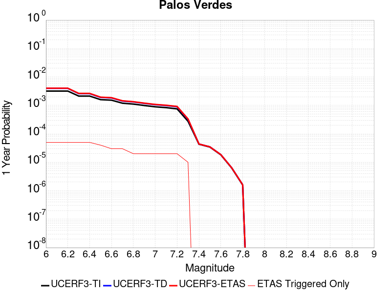 |  |

| Magnitude | 1 yr TI Prob | TD Prob | ETAS Prob | ETAS/TD Gain | ETAS Triggered Only | 10 yr TI Prob | TD Prob | ETAS Prob | ETAS/TD Gain | ETAS Triggered Only |
|-----|-----|-----|-----|-----|-----|-----|-----|-----|-----|-----|
| 6.0 | 0.0031914865 | 0.003970174 | 0.0040199757 | 1.0125439 | 5.0E-5 | 0.031460393 | 0.039048895 | 0.039106555 | 1.0014765 | 6.0E-5 |
| 6.1 | 0.0031914865 | 0.003970174 | 0.0040199757 | 1.0125439 | 5.0E-5 | 0.031460393 | 0.039048895 | 0.039106555 | 1.0014765 | 6.0E-5 |
| 6.2 | 0.0031914865 | 0.003970174 | 0.0040199757 | 1.0125439 | 5.0E-5 | 0.031460393 | 0.039048895 | 0.039106555 | 1.0014765 | 6.0E-5 |
| 6.3 | 0.0021286458 | 0.0025927818 | 0.0026426523 | 1.0192343 | 5.0E-5 | 0.021083709 | 0.025646681 | 0.025705142 | 1.0022795 | 6.0E-5 |
| 6.4 | 0.0021286458 | 0.0025927818 | 0.0026426523 | 1.0192343 | 5.0E-5 | 0.021083709 | 0.025646681 | 0.025705142 | 1.0022795 | 6.0E-5 |
| 6.5 | 0.0015908304 | 0.0019060767 | 0.0019460004 | 1.0209455 | 4.0E-5 | 0.015794903 | 0.018909154 | 0.018948397 | 1.0020754 | 4.0E-5 |
| 6.6 | 0.0015253464 | 0.0018327828 | 0.0018627278 | 1.0163386 | 3.0E-5 | 0.015149189 | 0.018188225 | 0.01821768 | 1.0016195 | 3.0E-5 |
| 6.7 | 0.001192729 | 0.0014208833 | 0.0014508407 | 1.0210836 | 3.0E-5 | 0.011863477 | 0.014127217 | 0.014156793 | 1.0020936 | 3.0E-5 |
| 6.8 | 0.001112141 | 0.0013262323 | 0.0013462057 | 1.0150603 | 2.0E-5 | 0.011065915 | 0.013192211 | 0.013211947 | 1.0014961 | 2.0E-5 |
| 6.9 | 9.914007E-4 | 0.0011793535 | 0.0011993299 | 1.0169384 | 2.0E-5 | 0.009869894 | 0.011739632 | 0.011759398 | 1.0016836 | 2.0E-5 |
| 7.0 | 8.917837E-4 | 0.001059775 | 0.0010797537 | 1.0188519 | 2.0E-5 | 0.008882134 | 0.010555646 | 0.010575435 | 1.0018747 | 2.0E-5 |
| 7.1 | 8.336179E-4 | 9.907284E-4 | 0.0010107086 | 1.0201671 | 2.0E-5 | 0.008304977 | 0.009871479 | 0.009891282 | 1.002006 | 2.0E-5 |
| 7.2 | 7.546402E-4 | 8.970222E-4 | 9.1700425E-4 | 1.022276 | 2.0E-5 | 0.007520827 | 0.008942284 | 0.008962105 | 1.0022166 | 2.0E-5 |
| 7.3 | 2.7589512E-4 | 3.236848E-4 | 3.3368156E-4 | 1.0308843 | 1.0E-5 | 0.0027555283 | 0.0032355562 | 0.003245524 | 1.0030806 | 1.0E-5 |
| 7.4 | 4.3200624E-5 | 4.3872686E-5 | 4.3872686E-5 | 1.0 | 0.0 | 4.3192226E-4 | 4.3864746E-4 | 4.3864746E-4 | 1.0 | 0.0 |
| 7.5 | 3.4227687E-5 | 3.4788125E-5 | 3.4788125E-5 | 1.0 | 0.0 | 3.4222414E-4 | 3.4783344E-4 | 3.4783344E-4 | 1.0 | 0.0 |
| 7.6 | 1.8272232E-5 | 1.8585903E-5 | 1.8585903E-5 | 1.0 | 0.0 | 1.8270731E-4 | 1.8584808E-4 | 1.8584808E-4 | 1.0 | 0.0 |
| 7.7 | 6.2541585E-6 | 6.364919E-6 | 6.364919E-6 | 1.0 | 0.0 | 6.2539824E-5 | 6.364741E-5 | 6.364741E-5 | 1.0 | 0.0 |
| 7.8 | 1.5885756E-6 | 1.6189739E-6 | 1.6189739E-6 | 1.0 | 0.0 | 1.5885644E-5 | 1.6189642E-5 | 1.6189642E-5 | 1.0 | 0.0 |

## San Pedro Basin
*[(top)](#table-of-contents)*

| 1 Year | 10 Year |
|-----|-----|
|  |  |

| Magnitude | 1 yr TI Prob | TD Prob | ETAS Prob | ETAS/TD Gain | ETAS Triggered Only | 10 yr TI Prob | TD Prob | ETAS Prob | ETAS/TD Gain | ETAS Triggered Only |
|-----|-----|-----|-----|-----|-----|-----|-----|-----|-----|-----|
| 6.0 | 0.0027850836 | 0.0033018254 | 0.0033317262 | 1.0090559 | 3.0E-5 | 0.027504366 | 0.03258945 | 0.032647494 | 1.0017811 | 6.0E-5 |
| 6.1 | 0.0027850836 | 0.0033018254 | 0.0033317262 | 1.0090559 | 3.0E-5 | 0.027504366 | 0.03258945 | 0.032647494 | 1.0017811 | 6.0E-5 |
| 6.2 | 0.0012092749 | 0.0013892864 | 0.0014092586 | 1.0143759 | 2.0E-5 | 0.012027155 | 0.013810883 | 0.013830608 | 1.0014281 | 2.0E-5 |
| 6.3 | 0.0012092749 | 0.0013892864 | 0.0014092586 | 1.0143759 | 2.0E-5 | 0.012027155 | 0.013810883 | 0.013830608 | 1.0014281 | 2.0E-5 |
| 6.4 | 0.001025344 | 0.0011714783 | 0.0011814666 | 1.0085262 | 1.0E-5 | 0.010206259 | 0.011657117 | 0.011667 | 1.0008478 | 1.0E-5 |
| 6.5 | 9.04529E-4 | 0.0010297928 | 0.0010397824 | 1.0097007 | 1.0E-5 | 0.009008561 | 0.010253931 | 0.010263829 | 1.0009652 | 1.0E-5 |
| 6.6 | 7.509924E-4 | 8.513747E-4 | 8.6136616E-4 | 1.0117357 | 1.0E-5 | 0.0074845953 | 0.008484332 | 0.008494248 | 1.0011686 | 1.0E-5 |
| 6.7 | 6.590571E-4 | 7.4514654E-4 | 7.551391E-4 | 1.0134102 | 1.0E-5 | 0.006571059 | 0.007429501 | 0.007439427 | 1.001336 | 1.0E-5 |
| 6.8 | 5.9783855E-4 | 6.7464396E-4 | 6.846372E-4 | 1.0148126 | 1.0E-5 | 0.0059623276 | 0.006728899 | 0.0067388318 | 1.0014762 | 1.0E-5 |
| 6.9 | 4.7518566E-4 | 5.3393835E-4 | 5.43933E-4 | 1.0187187 | 1.0E-5 | 0.0047417083 | 0.005329309 | 0.0053392556 | 1.0018665 | 1.0E-5 |
| 7.0 | 3.0963816E-4 | 3.435092E-4 | 3.5350578E-4 | 1.0291013 | 1.0E-5 | 0.0030920706 | 0.0034320992 | 0.0034420649 | 1.0029037 | 1.0E-5 |
| 7.1 | 1.1247819E-4 | 1.1528993E-4 | 1.1528993E-4 | 1.0 | 0.0 | 0.0011242128 | 0.0011523166 | 0.0011523166 | 1.0 | 0.0 |
| 7.2 | 1.1088375E-4 | 1.1363847E-4 | 1.1363847E-4 | 1.0 | 0.0 | 0.0011082845 | 0.0011358189 | 0.0011358189 | 1.0 | 0.0 |
| 7.3 | 8.94604E-5 | 9.1010465E-5 | 9.1010465E-5 | 1.0 | 0.0 | 8.9424395E-4 | 9.0974104E-4 | 9.0974104E-4 | 1.0 | 0.0 |
| 7.4 | 7.548913E-5 | 7.639639E-5 | 7.639639E-5 | 1.0 | 0.0 | 7.546349E-4 | 7.6370855E-4 | 7.6370855E-4 | 1.0 | 0.0 |
| 7.5 | 6.680587E-5 | 6.7472545E-5 | 6.7472545E-5 | 1.0 | 0.0 | 6.678579E-4 | 6.7452766E-4 | 6.7452766E-4 | 1.0 | 0.0 |
| 7.6 | 3.5246063E-5 | 3.5321555E-5 | 3.5321555E-5 | 1.0 | 0.0 | 3.5240475E-4 | 3.5316512E-4 | 3.5316512E-4 | 1.0 | 0.0 |
| 7.7 | 3.2412677E-6 | 2.3845337E-6 | 2.3845337E-6 | 1.0 | 0.0 | 3.2412205E-5 | 2.3845101E-5 | 2.3845101E-5 | 1.0 | 0.0 |
| 7.8 | 1.3869362E-7 | 7.898877E-8 | 7.898877E-8 | 1.0 | 0.0 | 1.3869354E-6 | 7.898877E-7 | 7.898877E-7 | 1.0 | 0.0 |

## Mission Creek
*[(top)](#table-of-contents)*

| 1 Year | 10 Year |
|-----|-----|
|  |  |

| Magnitude | 1 yr TI Prob | TD Prob | ETAS Prob | ETAS/TD Gain | ETAS Triggered Only | 10 yr TI Prob | TD Prob | ETAS Prob | ETAS/TD Gain | ETAS Triggered Only |
|-----|-----|-----|-----|-----|-----|-----|-----|-----|-----|-----|
| 6.0 | 6.0245243E-4 | 8.513384E-4 | 8.9130434E-4 | 1.0469449 | 4.0E-5 | 0.006008218 | 0.008509998 | 0.008569487 | 1.0069906 | 6.0E-5 |
| 6.1 | 6.0245243E-4 | 8.513384E-4 | 8.9130434E-4 | 1.0469449 | 4.0E-5 | 0.006008218 | 0.008509998 | 0.008569487 | 1.0069906 | 6.0E-5 |
| 6.2 | 6.0245243E-4 | 8.513384E-4 | 8.9130434E-4 | 1.0469449 | 4.0E-5 | 0.006008218 | 0.008509998 | 0.008569487 | 1.0069906 | 6.0E-5 |
| 6.3 | 6.0245243E-4 | 8.513384E-4 | 8.9130434E-4 | 1.0469449 | 4.0E-5 | 0.006008218 | 0.008509998 | 0.008569487 | 1.0069906 | 6.0E-5 |
| 6.4 | 6.0245243E-4 | 8.513384E-4 | 8.9130434E-4 | 1.0469449 | 4.0E-5 | 0.006008218 | 0.008509998 | 0.008569487 | 1.0069906 | 6.0E-5 |
| 6.5 | 6.0245243E-4 | 8.513384E-4 | 8.9130434E-4 | 1.0469449 | 4.0E-5 | 0.006008218 | 0.008509998 | 0.008569487 | 1.0069906 | 6.0E-5 |
| 6.6 | 4.800697E-4 | 7.221998E-4 | 7.6217094E-4 | 1.0553464 | 4.0E-5 | 0.004790339 | 0.0072271815 | 0.007286748 | 1.008242 | 6.0E-5 |
| 6.7 | 4.7049852E-4 | 7.12067E-4 | 7.5203856E-4 | 1.0561345 | 4.0E-5 | 0.004695036 | 0.007126506 | 0.0071860785 | 1.0083593 | 6.0E-5 |
| 6.8 | 4.524734E-4 | 6.923627E-4 | 7.3233503E-4 | 1.0577332 | 4.0E-5 | 0.0045155324 | 0.006930694 | 0.006990278 | 1.0085971 | 6.0E-5 |
| 6.9 | 3.653022E-4 | 5.9871917E-4 | 6.3869526E-4 | 1.0667692 | 4.0E-5 | 0.0036470229 | 0.005999517 | 0.006049217 | 1.008284 | 5.0E-5 |
| 7.0 | 3.0501327E-4 | 5.047066E-4 | 5.4468634E-4 | 1.079214 | 4.0E-5 | 0.0030459496 | 0.0050638523 | 0.005113599 | 1.0098239 | 5.0E-5 |
| 7.1 | 2.8939504E-4 | 4.8668624E-4 | 5.266668E-4 | 1.0821484 | 4.0E-5 | 0.0028901845 | 0.004884446 | 0.004934202 | 1.0101866 | 5.0E-5 |
| 7.2 | 2.2876218E-4 | 4.0073853E-4 | 4.4072248E-4 | 1.0997757 | 4.0E-5 | 0.0022852682 | 0.004028366 | 0.0040682047 | 1.0098896 | 4.0E-5 |
| 7.3 | 1.9767738E-4 | 3.6077813E-4 | 4.007637E-4 | 1.1108315 | 4.0E-5 | 0.0019750162 | 0.0036301152 | 0.00366997 | 1.0109789 | 4.0E-5 |
| 7.4 | 1.1469489E-4 | 2.621E-4 | 3.020895E-4 | 1.1525735 | 4.0E-5 | 0.0011463572 | 0.0026458844 | 0.0026857785 | 1.0150778 | 4.0E-5 |
| 7.5 | 1.0706078E-4 | 2.4077666E-4 | 2.8076704E-4 | 1.166089 | 4.0E-5 | 0.0010700922 | 0.0024335422 | 0.0024734447 | 1.016397 | 4.0E-5 |
| 7.6 | 9.774366E-5 | 2.151292E-4 | 2.551206E-4 | 1.1858947 | 4.0E-5 | 9.770069E-4 | 0.0021780801 | 0.0022179931 | 1.0183249 | 4.0E-5 |
| 7.7 | 9.606641E-5 | 2.1093882E-4 | 2.5093037E-4 | 1.1895884 | 4.0E-5 | 9.6024893E-4 | 0.0021363653 | 0.00217628 | 1.0186834 | 4.0E-5 |
| 7.8 | 8.97132E-5 | 1.9358651E-4 | 2.3357877E-4 | 1.206586 | 4.0E-5 | 8.967699E-4 | 0.0019623525 | 0.002002274 | 1.0203437 | 4.0E-5 |
| 7.9 | 7.3230265E-5 | 1.5391852E-4 | 1.9391236E-4 | 1.2598377 | 4.0E-5 | 7.3206134E-4 | 0.0015631086 | 0.0016030462 | 1.02555 | 4.0E-5 |
| 8.0 | 2.0515794E-5 | 2.8846638E-5 | 2.8846638E-5 | 1.0 | 0.0 | 2.0513899E-4 | 2.9899E-4 | 2.9899E-4 | 1.0 | 0.0 |
| 8.1 | 8.331805E-6 | 5.937906E-6 | 5.937906E-6 | 1.0 | 0.0 | 8.331492E-5 | 6.549966E-5 | 6.549966E-5 | 1.0 | 0.0 |
| 8.2 | 2.5569052E-6 | 1.327679E-6 | 1.327679E-6 | 1.0 | 0.0 | 2.556876E-5 | 1.495635E-5 | 1.495635E-5 | 1.0 | 0.0 |

## San Diego Trough south
*[(top)](#table-of-contents)*

| 1 Year | 10 Year |
|-----|-----|
|  |  |

| Magnitude | 1 yr TI Prob | TD Prob | ETAS Prob | ETAS/TD Gain | ETAS Triggered Only | 10 yr TI Prob | TD Prob | ETAS Prob | ETAS/TD Gain | ETAS Triggered Only |
|-----|-----|-----|-----|-----|-----|-----|-----|-----|-----|-----|
| 6.0 | 0.004310982 | 0.0054256152 | 0.0054653985 | 1.0073324 | 4.0E-5 | 0.042283054 | 0.05299221 | 0.05303956 | 1.0008936 | 5.0E-5 |
| 6.1 | 0.00244744 | 0.0030079768 | 0.0030378865 | 1.0099435 | 3.0E-5 | 0.024206603 | 0.029679462 | 0.029718274 | 1.0013077 | 4.0E-5 |
| 6.2 | 0.0018287642 | 0.0021965632 | 0.0022264973 | 1.0136276 | 3.0E-5 | 0.018137876 | 0.021751117 | 0.021790247 | 1.001799 | 4.0E-5 |
| 6.3 | 0.0018287642 | 0.0021965632 | 0.0022264973 | 1.0136276 | 3.0E-5 | 0.018137876 | 0.021751117 | 0.021790247 | 1.001799 | 4.0E-5 |
| 6.4 | 0.0014181085 | 0.0016729041 | 0.001702854 | 1.0179029 | 3.0E-5 | 0.014090929 | 0.016604643 | 0.016643979 | 1.0023689 | 4.0E-5 |
| 6.5 | 0.0013340989 | 0.0015694655 | 0.0015994185 | 1.0190848 | 3.0E-5 | 0.013261181 | 0.015585314 | 0.015624691 | 1.0025265 | 4.0E-5 |
| 6.6 | 0.0011490905 | 0.0013423424 | 0.0013723021 | 1.022319 | 3.0E-5 | 0.011431668 | 0.013343317 | 0.013382784 | 1.0029577 | 4.0E-5 |
| 6.7 | 0.0010114936 | 0.0011755243 | 0.001205489 | 1.0254905 | 3.0E-5 | 0.01006902 | 0.011693766 | 0.011733298 | 1.0033807 | 4.0E-5 |
| 6.8 | 9.1872766E-4 | 0.0010640579 | 0.0010840367 | 1.0187759 | 2.0E-5 | 0.009149387 | 0.010590198 | 0.010619881 | 1.0028028 | 3.0E-5 |
| 6.9 | 8.147778E-4 | 9.40147E-4 | 9.601282E-4 | 1.0212532 | 2.0E-5 | 0.008117969 | 0.009362142 | 0.009391861 | 1.0031744 | 3.0E-5 |
| 7.0 | 7.0126704E-4 | 8.057436E-4 | 8.2572753E-4 | 1.0248019 | 2.0E-5 | 0.006990582 | 0.008028555 | 0.008058314 | 1.0037067 | 3.0E-5 |
| 7.1 | 6.399447E-4 | 7.3404907E-4 | 7.540344E-4 | 1.0272261 | 2.0E-5 | 0.0063810493 | 0.0073165493 | 0.0073463297 | 1.0040703 | 3.0E-5 |
| 7.2 | 5.697693E-4 | 6.5273355E-4 | 6.62727E-4 | 1.0153102 | 1.0E-5 | 0.0056831064 | 0.0065084435 | 0.0065283137 | 1.003053 | 2.0E-5 |
| 7.3 | 3.1879646E-4 | 3.6147775E-4 | 3.6147775E-4 | 1.0 | 0.0 | 0.0031833951 | 0.003608943 | 0.003618907 | 1.0027609 | 1.0E-5 |
| 7.4 | 2.5737417E-4 | 2.9161357E-4 | 2.9161357E-4 | 1.0 | 0.0 | 0.002570763 | 0.0029123505 | 0.0029223212 | 1.0034237 | 1.0E-5 |
| 7.5 | 9.125422E-5 | 1.02770035E-4 | 1.02770035E-4 | 1.0 | 0.0 | 9.1216754E-4 | 0.0010272472 | 0.0010372369 | 1.0097247 | 1.0E-5 |
| 7.6 | 8.864449E-6 | 9.14886E-6 | 9.14886E-6 | 1.0 | 0.0 | 8.8640954E-5 | 9.1485024E-5 | 9.1485024E-5 | 1.0 | 0.0 |

## Kern Canyon (Lake Isabella) 2011
*[(top)](#table-of-contents)*

| 1 Year | 10 Year |
|-----|-----|
|  |  |

| Magnitude | 1 yr TI Prob | TD Prob | ETAS Prob | ETAS/TD Gain | ETAS Triggered Only | 10 yr TI Prob | TD Prob | ETAS Prob | ETAS/TD Gain | ETAS Triggered Only |
|-----|-----|-----|-----|-----|-----|-----|-----|-----|-----|-----|
| 6.0 | 2.2114732E-4 | 2.087804E-4 | 2.5876996E-4 | 1.239436 | 5.0E-5 | 0.0022092736 | 0.0020860266 | 0.0021459013 | 1.0287029 | 6.0E-5 |
| 6.1 | 2.2114732E-4 | 2.087804E-4 | 2.5876996E-4 | 1.239436 | 5.0E-5 | 0.0022092736 | 0.0020860266 | 0.0021459013 | 1.0287029 | 6.0E-5 |
| 6.2 | 2.2114732E-4 | 2.087804E-4 | 2.5876996E-4 | 1.239436 | 5.0E-5 | 0.0022092736 | 0.0020860266 | 0.0021459013 | 1.0287029 | 6.0E-5 |
| 6.3 | 2.2114732E-4 | 2.087804E-4 | 2.5876996E-4 | 1.239436 | 5.0E-5 | 0.0022092736 | 0.0020860266 | 0.0021459013 | 1.0287029 | 6.0E-5 |
| 6.4 | 2.2114732E-4 | 2.087804E-4 | 2.5876996E-4 | 1.239436 | 5.0E-5 | 0.0022092736 | 0.0020860266 | 0.0021459013 | 1.0287029 | 6.0E-5 |
| 6.5 | 1.4534626E-4 | 1.3137059E-4 | 1.6136665E-4 | 1.2283316 | 3.0E-5 | 0.0014525123 | 0.001312962 | 0.0013529095 | 1.0304254 | 4.0E-5 |
| 6.6 | 1.1600384E-4 | 1.01436635E-4 | 1.1143562E-4 | 1.0985737 | 1.0E-5 | 0.001159433 | 0.001013912 | 0.0010239019 | 1.0098528 | 1.0E-5 |
| 6.7 | 1.1288274E-4 | 9.827388E-5 | 1.0827289E-4 | 1.1017464 | 1.0E-5 | 0.0011282542 | 9.823124E-4 | 9.923026E-4 | 1.0101701 | 1.0E-5 |
| 6.8 | 9.74947E-5 | 8.260282E-5 | 9.260199E-5 | 1.1210512 | 1.0E-5 | 9.745194E-4 | 8.2572614E-4 | 8.3571783E-4 | 1.0121006 | 1.0E-5 |
| 6.9 | 8.251744E-5 | 6.816868E-5 | 7.8168E-5 | 1.1466849 | 1.0E-5 | 8.248681E-4 | 6.8148033E-4 | 6.9147354E-4 | 1.0146639 | 1.0E-5 |
| 7.0 | 7.186073E-5 | 5.8494268E-5 | 6.849368E-5 | 1.170947 | 1.0E-5 | 7.18375E-4 | 5.847908E-4 | 5.947849E-4 | 1.0170901 | 1.0E-5 |
| 7.1 | 5.6961744E-5 | 4.5727127E-5 | 5.572667E-5 | 1.2186786 | 1.0E-5 | 5.6947145E-4 | 4.571785E-4 | 4.6717393E-4 | 1.0218633 | 1.0E-5 |
| 7.2 | 3.9799485E-5 | 3.0792486E-5 | 3.0792486E-5 | 1.0 | 0.0 | 3.9792358E-4 | 3.0788282E-4 | 3.0788282E-4 | 1.0 | 0.0 |
| 7.3 | 2.7793016E-5 | 2.2866701E-5 | 2.2866701E-5 | 1.0 | 0.0 | 2.778954E-4 | 2.2864387E-4 | 2.2864387E-4 | 1.0 | 0.0 |
| 7.4 | 1.8234163E-5 | 1.568774E-5 | 1.568774E-5 | 1.0 | 0.0 | 1.8232666E-4 | 1.5686655E-4 | 1.5686655E-4 | 1.0 | 0.0 |
| 7.5 | 9.557518E-6 | 7.432713E-6 | 7.432713E-6 | 1.0 | 0.0 | 9.5571064E-5 | 7.432472E-5 | 7.432472E-5 | 1.0 | 0.0 |
| 7.6 | 1.3421597E-6 | 9.054312E-7 | 9.054312E-7 | 1.0 | 0.0 | 1.3421517E-5 | 9.05428E-6 | 9.05428E-6 | 1.0 | 0.0 |

## Ortigalita (South)
*[(top)](#table-of-contents)*

| 1 Year | 10 Year |
|-----|-----|
|  |  |

| Magnitude | 1 yr TI Prob | TD Prob | ETAS Prob | ETAS/TD Gain | ETAS Triggered Only | 10 yr TI Prob | TD Prob | ETAS Prob | ETAS/TD Gain | ETAS Triggered Only |
|-----|-----|-----|-----|-----|-----|-----|-----|-----|-----|-----|
| 6.0 | 0.0019412481 | 0.0022546875 | 0.0023045747 | 1.0221261 | 5.0E-5 | 0.019243775 | 0.022334497 | 0.02238338 | 1.0021887 | 5.0E-5 |
| 6.1 | 0.0014234743 | 0.0016419457 | 0.00168188 | 1.0243213 | 4.0E-5 | 0.014143906 | 0.01630407 | 0.016343419 | 1.0024134 | 4.0E-5 |
| 6.2 | 0.0014234743 | 0.0016419457 | 0.00168188 | 1.0243213 | 4.0E-5 | 0.014143906 | 0.01630407 | 0.016343419 | 1.0024134 | 4.0E-5 |
| 6.3 | 0.00107152 | 0.0012323303 | 0.0012622933 | 1.0243142 | 3.0E-5 | 0.010663681 | 0.01225703 | 0.012286662 | 1.0024176 | 3.0E-5 |
| 6.4 | 0.00107152 | 0.0012323303 | 0.0012622933 | 1.0243142 | 3.0E-5 | 0.010663681 | 0.01225703 | 0.012286662 | 1.0024176 | 3.0E-5 |
| 6.5 | 9.272918E-4 | 0.0010663504 | 0.0010963185 | 1.0281034 | 3.0E-5 | 0.009234319 | 0.010613803 | 0.010643485 | 1.0027965 | 3.0E-5 |
| 6.6 | 8.487073E-4 | 9.760658E-4 | 0.0010060365 | 1.0307057 | 3.0E-5 | 0.008454733 | 0.009719091 | 0.009748799 | 1.0030568 | 3.0E-5 |
| 6.7 | 6.807804E-4 | 7.844092E-4 | 8.043935E-4 | 1.0254769 | 2.0E-5 | 0.006786986 | 0.007817388 | 0.007837231 | 1.0025384 | 2.0E-5 |
| 6.8 | 5.439595E-4 | 6.2529295E-4 | 6.452804E-4 | 1.031965 | 2.0E-5 | 0.0054262993 | 0.00623609 | 0.006255965 | 1.0031872 | 2.0E-5 |
| 6.9 | 3.9856473E-4 | 4.586312E-4 | 4.78622E-4 | 1.043588 | 2.0E-5 | 0.003978506 | 0.004577433 | 0.0045973416 | 1.0043492 | 2.0E-5 |
| 7.0 | 2.045107E-4 | 2.3652123E-4 | 2.4651887E-4 | 1.0422695 | 1.0E-5 | 0.0020432258 | 0.0023629034 | 0.0023728798 | 1.004222 | 1.0E-5 |
| 7.1 | 8.357586E-5 | 9.689432E-5 | 9.689432E-5 | 1.0 | 0.0 | 8.3544437E-4 | 9.686254E-4 | 9.686254E-4 | 1.0 | 0.0 |

## San Jacinto (Anza) rev
*[(top)](#table-of-contents)*

| 1 Year | 10 Year |
|-----|-----|
|  | 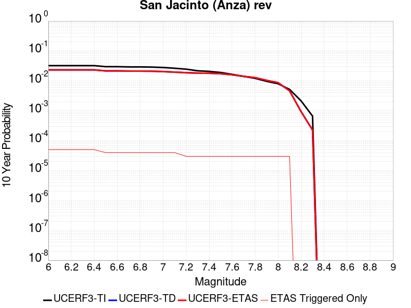 |

| Magnitude | 1 yr TI Prob | TD Prob | ETAS Prob | ETAS/TD Gain | ETAS Triggered Only | 10 yr TI Prob | TD Prob | ETAS Prob | ETAS/TD Gain | ETAS Triggered Only |
|-----|-----|-----|-----|-----|-----|-----|-----|-----|-----|-----|
| 6.0 | 0.0032827691 | 0.0022569813 | 0.0022869136 | 1.013262 | 3.0E-5 | 0.032346968 | 0.023296192 | 0.023345027 | 1.0020963 | 5.0E-5 |
| 6.1 | 0.0032827691 | 0.0022569813 | 0.0022869136 | 1.013262 | 3.0E-5 | 0.032346968 | 0.023296192 | 0.023345027 | 1.0020963 | 5.0E-5 |
| 6.2 | 0.0032827691 | 0.0022569813 | 0.0022869136 | 1.013262 | 3.0E-5 | 0.032346968 | 0.023296192 | 0.023345027 | 1.0020963 | 5.0E-5 |
| 6.3 | 0.0032827691 | 0.0022569813 | 0.0022869136 | 1.013262 | 3.0E-5 | 0.032346968 | 0.023296192 | 0.023345027 | 1.0020963 | 5.0E-5 |
| 6.4 | 0.0032827691 | 0.0022569813 | 0.0022869136 | 1.013262 | 3.0E-5 | 0.032346968 | 0.023296192 | 0.023345027 | 1.0020963 | 5.0E-5 |
| 6.5 | 0.0030276014 | 0.0020893107 | 0.002109269 | 1.0095525 | 2.0E-5 | 0.02986684 | 0.021593736 | 0.021632874 | 1.0018123 | 4.0E-5 |
| 6.6 | 0.0030276014 | 0.0020893107 | 0.002109269 | 1.0095525 | 2.0E-5 | 0.02986684 | 0.021593736 | 0.021632874 | 1.0018123 | 4.0E-5 |
| 6.7 | 0.0029763177 | 0.0020592497 | 0.0020792084 | 1.0096923 | 2.0E-5 | 0.029367693 | 0.021285562 | 0.02132471 | 1.0018392 | 4.0E-5 |
| 6.8 | 0.0029681553 | 0.002051773 | 0.002071732 | 1.0097277 | 2.0E-5 | 0.029288229 | 0.021210281 | 0.021249432 | 1.0018458 | 4.0E-5 |
| 6.9 | 0.0029288116 | 0.0020364004 | 0.0020563595 | 1.0098013 | 2.0E-5 | 0.028905109 | 0.021049714 | 0.021088872 | 1.0018603 | 4.0E-5 |
| 7.0 | 0.0028337094 | 0.001977061 | 0.0019970215 | 1.0100961 | 2.0E-5 | 0.027978465 | 0.020440677 | 0.02047986 | 1.0019169 | 4.0E-5 |
| 7.1 | 0.0026781242 | 0.0018970112 | 0.0019169733 | 1.0105228 | 2.0E-5 | 0.026460782 | 0.019614287 | 0.019653501 | 1.0019994 | 4.0E-5 |
| 7.2 | 0.0024938055 | 0.0018111705 | 0.0018311343 | 1.0110226 | 2.0E-5 | 0.024660049 | 0.018728992 | 0.01875843 | 1.0015718 | 3.0E-5 |
| 7.3 | 0.002196605 | 0.0017640047 | 0.0017839693 | 1.0113178 | 2.0E-5 | 0.02175019 | 0.01823724 | 0.018266695 | 1.0016149 | 3.0E-5 |
| 7.4 | 0.002098792 | 0.0017451581 | 0.0017651232 | 1.0114403 | 2.0E-5 | 0.020790804 | 0.018041821 | 0.018071279 | 1.0016328 | 3.0E-5 |
| 7.5 | 0.0019259118 | 0.001678169 | 0.0016981354 | 1.0118978 | 2.0E-5 | 0.01909306 | 0.01735827 | 0.01738775 | 1.0016983 | 3.0E-5 |
| 7.6 | 0.001668642 | 0.0015383229 | 0.0015582921 | 1.0129812 | 2.0E-5 | 0.01656168 | 0.0159463 | 0.015975822 | 1.0018513 | 3.0E-5 |
| 7.7 | 0.001424336 | 0.0013605768 | 0.0013805496 | 1.0146797 | 2.0E-5 | 0.014152412 | 0.014167004 | 0.014196579 | 1.0020876 | 3.0E-5 |
| 7.8 | 0.0012237094 | 0.0012257113 | 0.0012456868 | 1.0162971 | 2.0E-5 | 0.012169928 | 0.012808893 | 0.012838509 | 1.0023121 | 3.0E-5 |
| 7.9 | 9.7068126E-4 | 9.861222E-4 | 0.0010061024 | 1.0202614 | 2.0E-5 | 0.0096645225 | 0.010393824 | 0.010423512 | 1.0028564 | 3.0E-5 |
| 8.0 | 8.0640207E-4 | 8.21011E-4 | 8.4099465E-4 | 1.0243402 | 2.0E-5 | 0.008034821 | 0.0087028835 | 0.0087326225 | 1.0034171 | 3.0E-5 |
| 8.1 | 5.2081177E-4 | 4.314235E-4 | 4.5141487E-4 | 1.0463382 | 2.0E-5 | 0.0051959283 | 0.004640022 | 0.004669883 | 1.0064355 | 3.0E-5 |
| 8.2 | 2.1508869E-4 | 8.102902E-5 | 8.102902E-5 | 1.0 | 0.0 | 0.0021488064 | 9.4050163E-4 | 9.4050163E-4 | 1.0 | 0.0 |
| 8.3 | 6.653009E-5 | 1.8847424E-5 | 1.8847424E-5 | 1.0 | 0.0 | 6.6510175E-4 | 2.2734253E-4 | 2.2734253E-4 | 1.0 | 0.0 |

## San Jacinto (Lytle Creek connector)
*[(top)](#table-of-contents)*

| 1 Year | 10 Year |
|-----|-----|
|  |  |

| Magnitude | 1 yr TI Prob | TD Prob | ETAS Prob | ETAS/TD Gain | ETAS Triggered Only | 10 yr TI Prob | TD Prob | ETAS Prob | ETAS/TD Gain | ETAS Triggered Only |
|-----|-----|-----|-----|-----|-----|-----|-----|-----|-----|-----|
| 6.0 | 3.492233E-4 | 3.4746144E-4 | 3.8744754E-4 | 1.1150807 | 4.0E-5 | 0.00348675 | 0.0035493854 | 0.0035992078 | 1.0140369 | 5.0E-5 |
| 6.1 | 3.492233E-4 | 3.4746144E-4 | 3.8744754E-4 | 1.1150807 | 4.0E-5 | 0.00348675 | 0.0035493854 | 0.0035992078 | 1.0140369 | 5.0E-5 |
| 6.2 | 3.492233E-4 | 3.4746144E-4 | 3.8744754E-4 | 1.1150807 | 4.0E-5 | 0.00348675 | 0.0035493854 | 0.0035992078 | 1.0140369 | 5.0E-5 |
| 6.3 | 3.492233E-4 | 3.4746144E-4 | 3.8744754E-4 | 1.1150807 | 4.0E-5 | 0.00348675 | 0.0035493854 | 0.0035992078 | 1.0140369 | 5.0E-5 |
| 6.4 | 3.492233E-4 | 3.4746144E-4 | 3.8744754E-4 | 1.1150807 | 4.0E-5 | 0.00348675 | 0.0035493854 | 0.0035992078 | 1.0140369 | 5.0E-5 |
| 6.5 | 3.472512E-4 | 3.4538636E-4 | 3.8537255E-4 | 1.1157724 | 4.0E-5 | 0.0034670907 | 0.003528701 | 0.0035785243 | 1.0141195 | 5.0E-5 |
| 6.6 | 3.472512E-4 | 3.4538636E-4 | 3.8537255E-4 | 1.1157724 | 4.0E-5 | 0.0034670907 | 0.003528701 | 0.0035785243 | 1.0141195 | 5.0E-5 |
| 6.7 | 3.4328885E-4 | 3.4117055E-4 | 3.811569E-4 | 1.1172035 | 4.0E-5 | 0.0034275902 | 0.0034866752 | 0.003536501 | 1.0142903 | 5.0E-5 |
| 6.8 | 3.4304935E-4 | 3.4088313E-4 | 3.808695E-4 | 1.1173023 | 4.0E-5 | 0.0034252026 | 0.00348381 | 0.0035336358 | 1.0143021 | 5.0E-5 |
| 6.9 | 3.4277816E-4 | 3.4043423E-4 | 3.8042062E-4 | 1.117457 | 4.0E-5 | 0.0034224992 | 0.0034793352 | 0.0035291612 | 1.0143206 | 5.0E-5 |
| 7.0 | 3.424626E-4 | 3.3991894E-4 | 3.7990534E-4 | 1.1176351 | 4.0E-5 | 0.0034193532 | 0.0034741985 | 0.0035240247 | 1.0143418 | 5.0E-5 |
| 7.1 | 3.4209844E-4 | 3.3933012E-4 | 3.7931657E-4 | 1.1178393 | 4.0E-5 | 0.0034157229 | 0.0034683298 | 0.0035181565 | 1.0143661 | 5.0E-5 |
| 7.2 | 3.4152428E-4 | 3.3838948E-4 | 3.7837596E-4 | 1.1181669 | 4.0E-5 | 0.0034099987 | 0.0034589572 | 0.003508784 | 1.0144053 | 5.0E-5 |
| 7.3 | 3.4100408E-4 | 3.3738726E-4 | 3.7737377E-4 | 1.1185181 | 4.0E-5 | 0.003404813 | 0.0034489788 | 0.0034988064 | 1.0144471 | 5.0E-5 |
| 7.4 | 3.4051016E-4 | 3.3640073E-4 | 3.763873E-4 | 1.1188658 | 4.0E-5 | 0.0033998888 | 0.003439161 | 0.0034889888 | 1.0144885 | 5.0E-5 |
| 7.5 | 3.3968766E-4 | 3.3516317E-4 | 3.7514977E-4 | 1.1193049 | 4.0E-5 | 0.0033916887 | 0.003426834 | 0.0034766628 | 1.0145407 | 5.0E-5 |
| 7.6 | 3.3789838E-4 | 3.3303024E-4 | 3.7301693E-4 | 1.1200693 | 4.0E-5 | 0.0033738504 | 0.003405566 | 0.003455396 | 1.0146319 | 5.0E-5 |
| 7.7 | 3.2165812E-4 | 3.2220592E-4 | 3.62193E-4 | 1.1241043 | 4.0E-5 | 0.0032119295 | 0.0032971818 | 0.0033470169 | 1.0151144 | 5.0E-5 |
| 7.8 | 2.871688E-4 | 2.9930964E-4 | 3.3929767E-4 | 1.1336008 | 4.0E-5 | 0.0028679797 | 0.0030672832 | 0.00311713 | 1.0162511 | 5.0E-5 |
| 7.9 | 2.0291525E-4 | 2.1269741E-4 | 2.5268891E-4 | 1.1880206 | 4.0E-5 | 0.0020273007 | 0.0021943315 | 0.0022442217 | 1.022736 | 5.0E-5 |
| 8.0 | 1.3923083E-4 | 1.3208234E-4 | 1.4208101E-4 | 1.0757004 | 1.0E-5 | 0.0013914363 | 0.0013757964 | 0.0013957688 | 1.0145171 | 2.0E-5 |
| 8.1 | 8.3020335E-5 | 6.3586034E-5 | 7.35854E-5 | 1.1572572 | 1.0E-5 | 8.298933E-4 | 6.6932244E-4 | 6.8930903E-4 | 1.029861 | 2.0E-5 |
| 8.2 | 3.1982334E-5 | 1.138127E-5 | 1.138127E-5 | 1.0 | 0.0 | 3.1977732E-4 | 1.2784546E-4 | 1.2784546E-4 | 1.0 | 0.0 |
| 8.3 | 9.1983675E-6 | 2.480923E-6 | 2.480923E-6 | 1.0 | 0.0 | 9.197987E-5 | 2.868753E-5 | 2.868753E-5 | 1.0 | 0.0 |

## Santa Ynez River
*[(top)](#table-of-contents)*

| 1 Year | 10 Year |
|-----|-----|
| 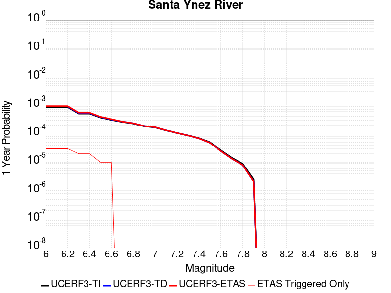 | 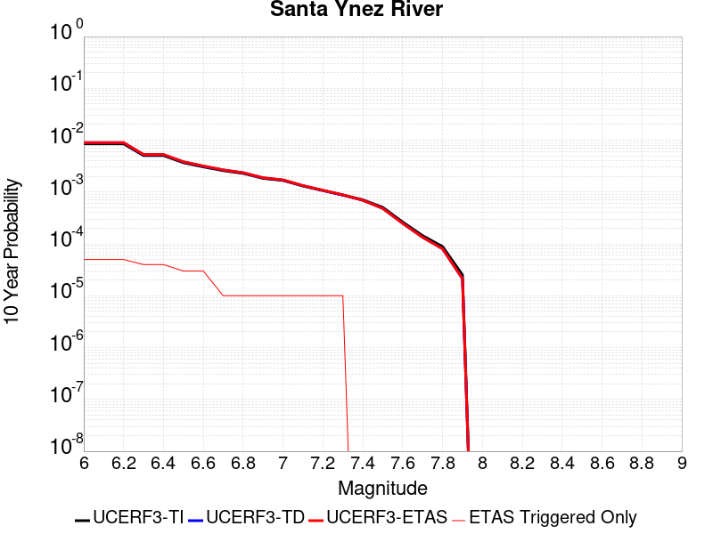 |

| Magnitude | 1 yr TI Prob | TD Prob | ETAS Prob | ETAS/TD Gain | ETAS Triggered Only | 10 yr TI Prob | TD Prob | ETAS Prob | ETAS/TD Gain | ETAS Triggered Only |
|-----|-----|-----|-----|-----|-----|-----|-----|-----|-----|-----|
| 6.0 | 8.551848E-4 | 8.976064E-4 | 9.2757953E-4 | 1.0333922 | 3.0E-5 | 0.0085190125 | 0.008943358 | 0.008992911 | 1.0055407 | 5.0E-5 |
| 6.1 | 8.551848E-4 | 8.976064E-4 | 9.2757953E-4 | 1.0333922 | 3.0E-5 | 0.0085190125 | 0.008943358 | 0.008992911 | 1.0055407 | 5.0E-5 |
| 6.2 | 8.551848E-4 | 8.976064E-4 | 9.2757953E-4 | 1.0333922 | 3.0E-5 | 0.0085190125 | 0.008943358 | 0.008992911 | 1.0055407 | 5.0E-5 |
| 6.3 | 5.0793495E-4 | 5.280373E-4 | 5.4802676E-4 | 1.0378561 | 2.0E-5 | 0.005067755 | 0.005268332 | 0.0053081214 | 1.0075525 | 4.0E-5 |
| 6.4 | 5.0793495E-4 | 5.280373E-4 | 5.4802676E-4 | 1.0378561 | 2.0E-5 | 0.005067755 | 0.005268332 | 0.0053081214 | 1.0075525 | 4.0E-5 |
| 6.5 | 3.694598E-4 | 3.8239348E-4 | 3.9238966E-4 | 1.026141 | 1.0E-5 | 0.0036884616 | 0.0038175168 | 0.0038474023 | 1.0078285 | 3.0E-5 |
| 6.6 | 3.064116E-4 | 3.1614062E-4 | 3.2613747E-4 | 1.0316215 | 1.0E-5 | 0.0030598943 | 0.0031569963 | 0.0031869016 | 1.0094727 | 3.0E-5 |
| 6.7 | 2.5946548E-4 | 2.66906E-4 | 2.66906E-4 | 1.0 | 0.0 | 0.0025916274 | 0.0026659032 | 0.0026758765 | 1.003741 | 1.0E-5 |
| 6.8 | 2.2937685E-4 | 2.3534958E-4 | 2.3534958E-4 | 1.0 | 0.0 | 0.0022914023 | 0.0023510386 | 0.0023610152 | 1.0042435 | 1.0E-5 |
| 6.9 | 1.8394225E-4 | 1.8789528E-4 | 1.8789528E-4 | 1.0 | 0.0 | 0.0018379007 | 0.0018773803 | 0.0018873615 | 1.0053166 | 1.0E-5 |
| 7.0 | 1.6756308E-4 | 1.7080043E-4 | 1.7080043E-4 | 1.0 | 0.0 | 0.0016743679 | 0.0017067058 | 0.0017166887 | 1.0058492 | 1.0E-5 |
| 7.1 | 1.3093173E-4 | 1.3257304E-4 | 1.3257304E-4 | 1.0 | 0.0 | 0.0013085462 | 0.0013249456 | 0.0013349323 | 1.0075375 | 1.0E-5 |
| 7.2 | 1.0704277E-4 | 1.0758333E-4 | 1.0758333E-4 | 1.0 | 0.0 | 0.0010699122 | 0.0010753168 | 0.001085306 | 1.0092896 | 1.0E-5 |
| 7.3 | 8.78949E-5 | 8.752012E-5 | 8.752012E-5 | 1.0 | 0.0 | 8.7860145E-4 | 8.7485946E-4 | 8.848507E-4 | 1.0114204 | 1.0E-5 |
| 7.4 | 7.096187E-5 | 6.956921E-5 | 6.956921E-5 | 1.0 | 0.0 | 7.0939213E-4 | 6.954765E-4 | 6.954765E-4 | 1.0 | 0.0 |
| 7.5 | 5.079636E-5 | 4.8473295E-5 | 4.8473295E-5 | 1.0 | 0.0 | 5.0784746E-4 | 4.8462892E-4 | 4.8462892E-4 | 1.0 | 0.0 |
| 7.6 | 2.6439517E-5 | 2.4933597E-5 | 2.4933597E-5 | 1.0 | 0.0 | 2.643637E-4 | 2.4930874E-4 | 2.4930874E-4 | 1.0 | 0.0 |
| 7.7 | 1.4448608E-5 | 1.34406555E-5 | 1.34406555E-5 | 1.0 | 0.0 | 1.444767E-4 | 1.3439846E-4 | 1.3439846E-4 | 1.0 | 0.0 |
| 7.8 | 8.893623E-6 | 8.061043E-6 | 8.061043E-6 | 1.0 | 0.0 | 8.893267E-5 | 8.060753E-5 | 8.060753E-5 | 1.0 | 0.0 |
| 7.9 | 2.5225327E-6 | 2.1346711E-6 | 2.1346711E-6 | 1.0 | 0.0 | 2.5225041E-5 | 2.1346512E-5 | 2.1346512E-5 | 1.0 | 0.0 |

## Hayward (So) 2011 CFM
*[(top)](#table-of-contents)*

| 1 Year | 10 Year |
|-----|-----|
| 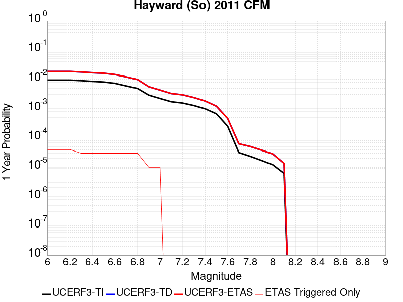 |  |

| Magnitude | 1 yr TI Prob | TD Prob | ETAS Prob | ETAS/TD Gain | ETAS Triggered Only | 10 yr TI Prob | TD Prob | ETAS Prob | ETAS/TD Gain | ETAS Triggered Only |
|-----|-----|-----|-----|-----|-----|-----|-----|-----|-----|-----|
| 6.0 | 0.00939654 | 0.018463207 | 0.01850247 | 1.0021265 | 4.0E-5 | 0.090090066 | 0.16673161 | 0.16677327 | 1.0002499 | 5.0E-5 |
| 6.1 | 0.00939654 | 0.018463207 | 0.01850247 | 1.0021265 | 4.0E-5 | 0.090090066 | 0.16673161 | 0.16677327 | 1.0002499 | 5.0E-5 |
| 6.2 | 0.00939654 | 0.018463207 | 0.01850247 | 1.0021265 | 4.0E-5 | 0.090090066 | 0.16673161 | 0.16677327 | 1.0002499 | 5.0E-5 |
| 6.3 | 0.0089988755 | 0.017723544 | 0.017753012 | 1.0016626 | 3.0E-5 | 0.08643075 | 0.16066726 | 0.16070083 | 1.000209 | 4.0E-5 |
| 6.4 | 0.008487372 | 0.016739385 | 0.016768884 | 1.0017622 | 3.0E-5 | 0.081704415 | 0.15255594 | 0.15258984 | 1.0002222 | 4.0E-5 |
| 6.5 | 0.008107598 | 0.016058935 | 0.016088452 | 1.0018381 | 3.0E-5 | 0.078181036 | 0.14683272 | 0.14686684 | 1.0002325 | 4.0E-5 |
| 6.6 | 0.0073027555 | 0.014524006 | 0.01455357 | 1.0020355 | 3.0E-5 | 0.07067384 | 0.13391982 | 0.13395447 | 1.0002587 | 4.0E-5 |
| 6.7 | 0.0059671924 | 0.012071652 | 0.012101291 | 1.0024551 | 3.0E-5 | 0.058094822 | 0.11274672 | 0.11278222 | 1.0003148 | 4.0E-5 |
| 6.8 | 0.0048864787 | 0.009794984 | 0.00982469 | 1.0030328 | 3.0E-5 | 0.047804173 | 0.09259856 | 0.09263486 | 1.000392 | 4.0E-5 |
| 6.9 | 0.0028927654 | 0.0055832625 | 0.0055932067 | 1.0017811 | 1.0E-5 | 0.028553981 | 0.054245494 | 0.05425495 | 1.0001744 | 1.0E-5 |
| 7.0 | 0.0022236328 | 0.0042938837 | 0.004303841 | 1.0023189 | 1.0E-5 | 0.022015138 | 0.042064495 | 0.042074073 | 1.0002277 | 1.0E-5 |
| 7.1 | 0.0017235056 | 0.0032829668 | 0.0032829668 | 1.0 | 0.0 | 0.017101998 | 0.032452874 | 0.032452874 | 1.0 | 0.0 |
| 7.2 | 0.0015567001 | 0.0029705726 | 0.0029705726 | 1.0 | 0.0 | 0.015458403 | 0.029453589 | 0.029453589 | 1.0 | 0.0 |
| 7.3 | 0.0012806869 | 0.0023969305 | 0.0023969305 | 1.0 | 0.0 | 0.012733313 | 0.023857482 | 0.023857482 | 1.0 | 0.0 |
| 7.4 | 9.910273E-4 | 0.0018271938 | 0.0018271938 | 1.0 | 0.0 | 0.009866194 | 0.018258283 | 0.018258283 | 1.0 | 0.0 |
| 7.5 | 6.667979E-4 | 0.0012166094 | 0.0012166094 | 1.0 | 0.0 | 0.006648007 | 0.012209582 | 0.012209582 | 1.0 | 0.0 |
| 7.6 | 2.5120692E-4 | 4.636352E-4 | 4.636352E-4 | 1.0 | 0.0 | 0.0025092314 | 0.0046812436 | 0.0046812436 | 1.0 | 0.0 |
| 7.7 | 3.174402E-5 | 6.290816E-5 | 6.290816E-5 | 1.0 | 0.0 | 3.1739488E-4 | 6.5293367E-4 | 6.5293367E-4 | 1.0 | 0.0 |
| 7.8 | 2.376331E-5 | 5.1092928E-5 | 5.1092928E-5 | 1.0 | 0.0 | 2.3760769E-4 | 5.321372E-4 | 5.321372E-4 | 1.0 | 0.0 |
| 7.9 | 1.7227521E-5 | 3.8540114E-5 | 3.8540114E-5 | 1.0 | 0.0 | 1.7226185E-4 | 3.9930744E-4 | 3.9930744E-4 | 1.0 | 0.0 |
| 8.0 | 1.2246436E-5 | 2.8549053E-5 | 2.8549053E-5 | 1.0 | 0.0 | 1.2245761E-4 | 2.9355253E-4 | 2.9355253E-4 | 1.0 | 0.0 |
| 8.1 | 6.1999854E-6 | 1.359711E-5 | 1.359711E-5 | 1.0 | 0.0 | 6.199812E-5 | 1.3917852E-4 | 1.3917852E-4 | 1.0 | 0.0 |

## Pine Mtn
*[(top)](#table-of-contents)*

| 1 Year | 10 Year |
|-----|-----|
| 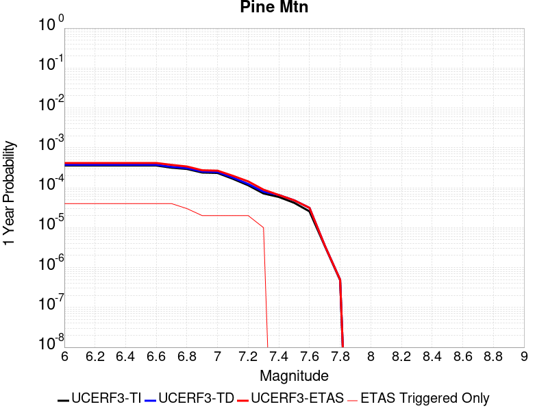 |  |

| Magnitude | 1 yr TI Prob | TD Prob | ETAS Prob | ETAS/TD Gain | ETAS Triggered Only | 10 yr TI Prob | TD Prob | ETAS Prob | ETAS/TD Gain | ETAS Triggered Only |
|-----|-----|-----|-----|-----|-----|-----|-----|-----|-----|-----|
| 6.0 | 3.596972E-4 | 3.7694772E-4 | 4.1693266E-4 | 1.1060755 | 4.0E-5 | 0.0035911554 | 0.003763381 | 0.0038131927 | 1.0132359 | 5.0E-5 |
| 6.1 | 3.596972E-4 | 3.7694772E-4 | 4.1693266E-4 | 1.1060755 | 4.0E-5 | 0.0035911554 | 0.003763381 | 0.0038131927 | 1.0132359 | 5.0E-5 |
| 6.2 | 3.596972E-4 | 3.7694772E-4 | 4.1693266E-4 | 1.1060755 | 4.0E-5 | 0.0035911554 | 0.003763381 | 0.0038131927 | 1.0132359 | 5.0E-5 |
| 6.3 | 3.596972E-4 | 3.7694772E-4 | 4.1693266E-4 | 1.1060755 | 4.0E-5 | 0.0035911554 | 0.003763381 | 0.0038131927 | 1.0132359 | 5.0E-5 |
| 6.4 | 3.596972E-4 | 3.7694772E-4 | 4.1693266E-4 | 1.1060755 | 4.0E-5 | 0.0035911554 | 0.003763381 | 0.0038131927 | 1.0132359 | 5.0E-5 |
| 6.5 | 3.596972E-4 | 3.7694772E-4 | 4.1693266E-4 | 1.1060755 | 4.0E-5 | 0.0035911554 | 0.003763381 | 0.0038131927 | 1.0132359 | 5.0E-5 |
| 6.6 | 3.596972E-4 | 3.7694772E-4 | 4.1693266E-4 | 1.1060755 | 4.0E-5 | 0.0035911554 | 0.003763381 | 0.0038131927 | 1.0132359 | 5.0E-5 |
| 6.7 | 3.1755073E-4 | 3.3373994E-4 | 3.737266E-4 | 1.1198138 | 4.0E-5 | 0.0031709734 | 0.0033326065 | 0.0033824397 | 1.0149533 | 5.0E-5 |
| 6.8 | 2.94925E-4 | 3.104485E-4 | 3.4043918E-4 | 1.0966043 | 3.0E-5 | 0.002945339 | 0.0031003528 | 0.00313026 | 1.0096463 | 3.0E-5 |
| 6.9 | 2.4007261E-4 | 2.5375787E-4 | 2.737528E-4 | 1.0787953 | 2.0E-5 | 0.0023981342 | 0.0025348254 | 0.0025547748 | 1.0078701 | 2.0E-5 |
| 7.0 | 2.3412947E-4 | 2.4768783E-4 | 2.6768286E-4 | 1.0807269 | 2.0E-5 | 0.0023388295 | 0.0024742614 | 0.002494212 | 1.0080632 | 2.0E-5 |
| 7.1 | 1.6716159E-4 | 1.789267E-4 | 1.9892312E-4 | 1.1117576 | 2.0E-5 | 0.0016703589 | 0.0017878925 | 0.0018078568 | 1.0111663 | 2.0E-5 |
| 7.2 | 1.15102564E-4 | 1.240987E-4 | 1.4409622E-4 | 1.161142 | 2.0E-5 | 0.0011504296 | 0.0012403389 | 0.001260314 | 1.0161046 | 2.0E-5 |
| 7.3 | 7.182235E-5 | 7.939443E-5 | 8.939364E-5 | 1.1259434 | 1.0E-5 | 7.1799144E-4 | 7.936697E-4 | 8.036618E-4 | 1.0125897 | 1.0E-5 |
| 7.4 | 5.8678244E-5 | 6.567554E-5 | 6.567554E-5 | 1.0 | 0.0 | 5.866275E-4 | 6.5656955E-4 | 6.5656955E-4 | 1.0 | 0.0 |
| 7.5 | 4.1907308E-5 | 4.840473E-5 | 4.840473E-5 | 1.0 | 0.0 | 4.1899405E-4 | 4.8394862E-4 | 4.8394862E-4 | 1.0 | 0.0 |
| 7.6 | 2.5542888E-5 | 3.1322415E-5 | 3.1322415E-5 | 1.0 | 0.0 | 2.5539953E-4 | 3.1318486E-4 | 3.1318486E-4 | 1.0 | 0.0 |
| 7.7 | 3.4617963E-6 | 3.5423066E-6 | 3.5423066E-6 | 1.0 | 0.0 | 3.4617424E-5 | 3.542255E-5 | 3.542255E-5 | 1.0 | 0.0 |
| 7.8 | 4.818991E-7 | 4.950997E-7 | 4.950997E-7 | 1.0 | 0.0 | 4.8189804E-6 | 4.950988E-6 | 4.950988E-6 | 1.0 | 0.0 |

## Big Pine (East)
*[(top)](#table-of-contents)*

| 1 Year | 10 Year |
|-----|-----|
|  |  |

| Magnitude | 1 yr TI Prob | TD Prob | ETAS Prob | ETAS/TD Gain | ETAS Triggered Only | 10 yr TI Prob | TD Prob | ETAS Prob | ETAS/TD Gain | ETAS Triggered Only |
|-----|-----|-----|-----|-----|-----|-----|-----|-----|-----|-----|
| 6.0 | 5.173191E-4 | 6.685763E-4 | 7.085495E-4 | 1.0597886 | 4.0E-5 | 0.0051611643 | 0.006670441 | 0.0067201075 | 1.0074458 | 5.0E-5 |
| 6.1 | 5.173191E-4 | 6.685763E-4 | 7.085495E-4 | 1.0597886 | 4.0E-5 | 0.0051611643 | 0.006670441 | 0.0067201075 | 1.0074458 | 5.0E-5 |
| 6.2 | 5.173191E-4 | 6.685763E-4 | 7.085495E-4 | 1.0597886 | 4.0E-5 | 0.0051611643 | 0.006670441 | 0.0067201075 | 1.0074458 | 5.0E-5 |
| 6.3 | 2.858834E-4 | 4.2323777E-4 | 4.6322084E-4 | 1.0944695 | 4.0E-5 | 0.0028551589 | 0.004227244 | 0.0042770323 | 1.011778 | 5.0E-5 |
| 6.4 | 2.851165E-4 | 4.2241855E-4 | 4.6240166E-4 | 1.0946528 | 4.0E-5 | 0.0028475097 | 0.0042190826 | 0.0042688716 | 1.0118009 | 5.0E-5 |
| 6.5 | 2.518227E-4 | 3.872145E-4 | 4.27199E-4 | 1.103262 | 4.0E-5 | 0.0025153751 | 0.003868283 | 0.0039180894 | 1.0128757 | 5.0E-5 |
| 6.6 | 2.2510924E-4 | 3.590447E-4 | 3.9903034E-4 | 1.1113667 | 4.0E-5 | 0.0022488134 | 0.0035874986 | 0.0036373192 | 1.0138873 | 5.0E-5 |
| 6.7 | 1.9287605E-4 | 3.1278885E-4 | 3.5277635E-4 | 1.1278418 | 4.0E-5 | 0.0019270873 | 0.0031262483 | 0.003176092 | 1.0159436 | 5.0E-5 |
| 6.8 | 1.8089297E-4 | 2.974896E-4 | 3.374777E-4 | 1.1344185 | 4.0E-5 | 0.0018074579 | 0.002973667 | 0.0030235185 | 1.0167643 | 5.0E-5 |
| 6.9 | 1.4445644E-4 | 2.5174298E-4 | 2.817354E-4 | 1.1191392 | 3.0E-5 | 0.0014436257 | 0.0025172636 | 0.0025571631 | 1.0158503 | 4.0E-5 |
| 7.0 | 1.12034926E-4 | 2.079131E-4 | 2.2790894E-4 | 1.096174 | 2.0E-5 | 0.0011197845 | 0.0020798394 | 0.002109777 | 1.0143942 | 3.0E-5 |
| 7.1 | 8.879537E-5 | 1.7451629E-4 | 1.8451455E-4 | 1.0572913 | 1.0E-5 | 8.87599E-4 | 0.0017464145 | 0.0017663795 | 1.011432 | 2.0E-5 |
| 7.2 | 6.553574E-5 | 1.4580201E-4 | 1.5580055E-4 | 1.0685762 | 1.0E-5 | 6.551642E-4 | 0.001459661 | 0.0014796319 | 1.0136818 | 2.0E-5 |
| 7.3 | 5.803642E-5 | 1.3619453E-4 | 1.4619317E-4 | 1.0734144 | 1.0E-5 | 5.802127E-4 | 0.0013635408 | 0.0013835136 | 1.0146477 | 2.0E-5 |
| 7.4 | 5.2892992E-5 | 1.2957705E-4 | 1.2957705E-4 | 1.0 | 0.0 | 5.288041E-4 | 0.0012972289 | 0.0013072159 | 1.0076988 | 1.0E-5 |
| 7.5 | 5.0082934E-5 | 1.2559404E-4 | 1.2559404E-4 | 1.0 | 0.0 | 5.007165E-4 | 0.0012572526 | 0.00126724 | 1.0079439 | 1.0E-5 |
| 7.6 | 4.1373947E-5 | 1.06692416E-4 | 1.06692416E-4 | 1.0 | 0.0 | 4.1366243E-4 | 0.0010685222 | 0.0010785116 | 1.0093488 | 1.0E-5 |
| 7.7 | 2.1684076E-5 | 6.0554554E-5 | 6.0554554E-5 | 1.0 | 0.0 | 2.1681961E-4 | 6.0857297E-4 | 6.0857297E-4 | 1.0 | 0.0 |
| 7.8 | 5.9831386E-6 | 1.3524678E-5 | 1.3524678E-5 | 1.0 | 0.0 | 5.9829777E-5 | 1.3634123E-4 | 1.3634123E-4 | 1.0 | 0.0 |
| 7.9 | 1.5252737E-6 | 2.1635283E-6 | 2.1635283E-6 | 1.0 | 0.0 | 1.5252632E-5 | 2.1967755E-5 | 2.1967755E-5 | 1.0 | 0.0 |

## Bullion Mountains
*[(top)](#table-of-contents)*

| 1 Year | 10 Year |
|-----|-----|
|  |  |

| Magnitude | 1 yr TI Prob | TD Prob | ETAS Prob | ETAS/TD Gain | ETAS Triggered Only | 10 yr TI Prob | TD Prob | ETAS Prob | ETAS/TD Gain | ETAS Triggered Only |
|-----|-----|-----|-----|-----|-----|-----|-----|-----|-----|-----|
| 6.0 | 8.5643446E-4 | 7.663651E-4 | 7.8634976E-4 | 1.0260773 | 2.0E-5 | 0.008531413 | 0.007641016 | 0.007690634 | 1.0064937 | 5.0E-5 |
| 6.1 | 8.5643446E-4 | 7.663651E-4 | 7.8634976E-4 | 1.0260773 | 2.0E-5 | 0.008531413 | 0.007641016 | 0.007690634 | 1.0064937 | 5.0E-5 |
| 6.2 | 8.5643446E-4 | 7.663651E-4 | 7.8634976E-4 | 1.0260773 | 2.0E-5 | 0.008531413 | 0.007641016 | 0.007690634 | 1.0064937 | 5.0E-5 |
| 6.3 | 6.283899E-4 | 5.144975E-4 | 5.344872E-4 | 1.0388529 | 2.0E-5 | 0.0062661595 | 0.005135345 | 0.0051751393 | 1.0077492 | 4.0E-5 |
| 6.4 | 6.283899E-4 | 5.144975E-4 | 5.344872E-4 | 1.0388529 | 2.0E-5 | 0.0062661595 | 0.005135345 | 0.0051751393 | 1.0077492 | 4.0E-5 |
| 6.5 | 5.343951E-4 | 4.110781E-4 | 4.3106987E-4 | 1.0486325 | 2.0E-5 | 0.005331118 | 0.004105208 | 0.004135085 | 1.0072778 | 3.0E-5 |
| 6.6 | 5.010733E-4 | 3.744645E-4 | 3.94457E-4 | 1.0533895 | 2.0E-5 | 0.00499945 | 0.003740332 | 0.0037702199 | 1.0079907 | 3.0E-5 |
| 6.7 | 4.48855E-4 | 3.1951256E-4 | 3.2950938E-4 | 1.0312877 | 1.0E-5 | 0.004479495 | 0.0031924439 | 0.00321238 | 1.0062448 | 2.0E-5 |
| 6.8 | 2.7066618E-4 | 1.3373788E-4 | 1.3373788E-4 | 1.0 | 0.0 | 0.0027033675 | 0.0013369655 | 0.0013369655 | 1.0 | 0.0 |
| 6.9 | 2.3635388E-4 | 1.2232E-4 | 1.2232E-4 | 1.0 | 0.0 | 0.0023610266 | 0.0012229157 | 0.0012229157 | 1.0 | 0.0 |
| 7.0 | 1.7904381E-4 | 8.808996E-5 | 8.808996E-5 | 1.0 | 0.0 | 0.0017889962 | 8.808996E-4 | 8.808996E-4 | 1.0 | 0.0 |

## Rinconada 2011 CFM
*[(top)](#table-of-contents)*

| 1 Year | 10 Year |
|-----|-----|
|  |  |

| Magnitude | 1 yr TI Prob | TD Prob | ETAS Prob | ETAS/TD Gain | ETAS Triggered Only | 10 yr TI Prob | TD Prob | ETAS Prob | ETAS/TD Gain | ETAS Triggered Only |
|-----|-----|-----|-----|-----|-----|-----|-----|-----|-----|-----|
| 6.0 | 8.2160486E-4 | 8.488412E-4 | 8.5883273E-4 | 1.0117707 | 1.0E-5 | 0.008185739 | 0.00845637 | 0.008505947 | 1.0058627 | 5.0E-5 |
| 6.1 | 5.720366E-4 | 5.906491E-4 | 6.006432E-4 | 1.0169206 | 1.0E-5 | 0.0057056635 | 0.0058908886 | 0.005910771 | 1.003375 | 2.0E-5 |
| 6.2 | 5.720366E-4 | 5.906491E-4 | 6.006432E-4 | 1.0169206 | 1.0E-5 | 0.0057056635 | 0.0058908886 | 0.005910771 | 1.003375 | 2.0E-5 |
| 6.3 | 4.6564735E-4 | 4.805963E-4 | 4.905915E-4 | 1.0207975 | 1.0E-5 | 0.0046467283 | 0.0047956146 | 0.0048055663 | 1.0020752 | 1.0E-5 |
| 6.4 | 4.0049385E-4 | 4.1318068E-4 | 4.2317656E-4 | 1.0241925 | 1.0E-5 | 0.0039977287 | 0.004124151 | 0.0041341097 | 1.0024147 | 1.0E-5 |
| 6.5 | 3.2173982E-4 | 3.317473E-4 | 3.317473E-4 | 1.0 | 0.0 | 0.003212744 | 0.0033125326 | 0.0033125326 | 1.0 | 0.0 |
| 6.6 | 2.897302E-4 | 2.9866883E-4 | 2.9866883E-4 | 1.0 | 0.0 | 0.0028935277 | 0.002982683 | 0.002982683 | 1.0 | 0.0 |
| 6.7 | 2.4979294E-4 | 2.573806E-4 | 2.573806E-4 | 1.0 | 0.0 | 0.0024951235 | 0.0025708308 | 0.0025708308 | 1.0 | 0.0 |
| 6.8 | 2.0845905E-4 | 2.1461274E-4 | 2.1461274E-4 | 1.0 | 0.0 | 0.002082636 | 0.0021440585 | 0.0021440585 | 1.0 | 0.0 |
| 6.9 | 1.7869633E-4 | 1.8377967E-4 | 1.8377967E-4 | 1.0 | 0.0 | 0.001785527 | 0.0018362794 | 0.0018362794 | 1.0 | 0.0 |
| 7.0 | 1.4459073E-4 | 1.4852593E-4 | 1.4852593E-4 | 1.0 | 0.0 | 0.0014449668 | 0.0014842682 | 0.0014842682 | 1.0 | 0.0 |
| 7.1 | 1.16213734E-4 | 1.19257515E-4 | 1.19257515E-4 | 1.0 | 0.0 | 0.0011615298 | 0.0011919362 | 0.0011919362 | 1.0 | 0.0 |
| 7.2 | 8.253252E-5 | 8.457281E-5 | 8.457281E-5 | 1.0 | 0.0 | 8.250187E-4 | 8.454067E-4 | 8.454067E-4 | 1.0 | 0.0 |
| 7.3 | 5.3776774E-5 | 5.5028526E-5 | 5.5028526E-5 | 1.0 | 0.0 | 5.376376E-4 | 5.5014924E-4 | 5.5014924E-4 | 1.0 | 0.0 |
| 7.4 | 3.4100947E-5 | 3.4868997E-5 | 3.4868997E-5 | 1.0 | 0.0 | 3.4095717E-4 | 3.4863537E-4 | 3.4863537E-4 | 1.0 | 0.0 |
| 7.5 | 1.7039794E-5 | 1.7384024E-5 | 1.7384024E-5 | 1.0 | 0.0 | 1.7038487E-4 | 1.7382667E-4 | 1.7382667E-4 | 1.0 | 0.0 |
| 7.6 | 5.089664E-6 | 5.1244397E-6 | 5.1244397E-6 | 1.0 | 0.0 | 5.0895473E-5 | 5.1243223E-5 | 5.1243223E-5 | 1.0 | 0.0 |
| 7.7 | 3.1307894E-7 | 3.051947E-7 | 3.051947E-7 | 1.0 | 0.0 | 3.1307852E-6 | 3.051943E-6 | 3.051943E-6 | 1.0 | 0.0 |
| 7.8 | 3.861218E-9 | 3.895363E-9 | 3.895363E-9 | 1.0 | 0.0 | 3.861218E-8 | 3.895363E-8 | 3.895363E-8 | 1.0 | 0.0 |

## Hosgri (Extension)
*[(top)](#table-of-contents)*

| 1 Year | 10 Year |
|-----|-----|
| 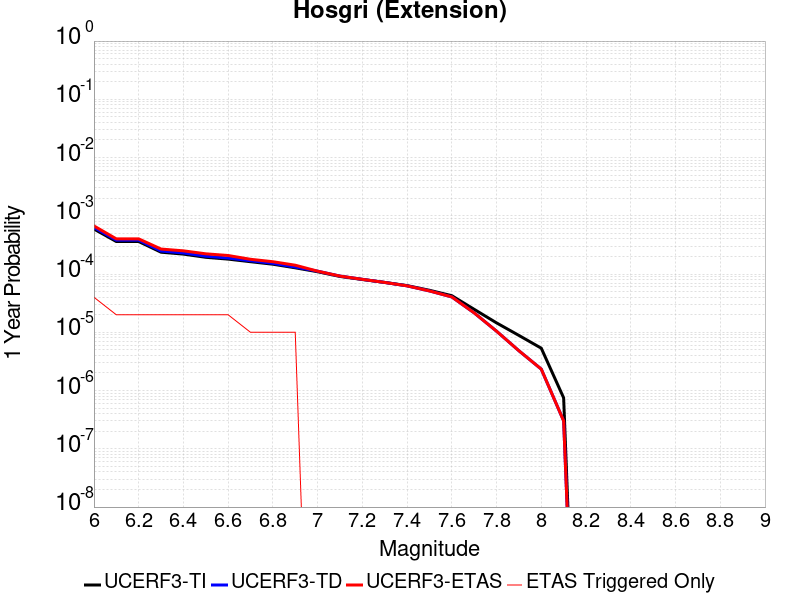 |  |

| Magnitude | 1 yr TI Prob | TD Prob | ETAS Prob | ETAS/TD Gain | ETAS Triggered Only | 10 yr TI Prob | TD Prob | ETAS Prob | ETAS/TD Gain | ETAS Triggered Only |
|-----|-----|-----|-----|-----|-----|-----|-----|-----|-----|-----|
| 6.0 | 5.9305265E-4 | 6.3030684E-4 | 6.702816E-4 | 1.0634211 | 4.0E-5 | 0.005914725 | 0.0062874397 | 0.0063371253 | 1.0079024 | 5.0E-5 |
| 6.1 | 3.617931E-4 | 3.8211764E-4 | 4.0211E-4 | 1.0523199 | 2.0E-5 | 0.0036120464 | 0.0038150186 | 0.003844904 | 1.0078336 | 3.0E-5 |
| 6.2 | 3.617931E-4 | 3.8211764E-4 | 4.0211E-4 | 1.0523199 | 2.0E-5 | 0.0036120464 | 0.0038150186 | 0.003844904 | 1.0078336 | 3.0E-5 |
| 6.3 | 2.3730492E-4 | 2.4882692E-4 | 2.6882192E-4 | 1.0803572 | 2.0E-5 | 0.0023705168 | 0.0024855258 | 0.002515451 | 1.0120399 | 3.0E-5 |
| 6.4 | 2.2007042E-4 | 2.3043984E-4 | 2.5043523E-4 | 1.0867705 | 2.0E-5 | 0.002198526 | 0.0023020422 | 0.0023319733 | 1.0130019 | 3.0E-5 |
| 6.5 | 1.9394881E-4 | 2.0263524E-4 | 2.2263119E-4 | 1.0986795 | 2.0E-5 | 0.0019377962 | 0.0020245234 | 0.002044483 | 1.0098588 | 2.0E-5 |
| 6.6 | 1.8054814E-4 | 1.8825903E-4 | 2.0825525E-4 | 1.1062165 | 2.0E-5 | 0.0018040152 | 0.0018810101 | 0.0019009726 | 1.0106126 | 2.0E-5 |
| 6.7 | 1.6296357E-4 | 1.6938736E-4 | 1.7938566E-4 | 1.0590262 | 1.0E-5 | 0.001628441 | 0.0016925934 | 0.0017025765 | 1.0058981 | 1.0E-5 |
| 6.8 | 1.4760658E-4 | 1.5290003E-4 | 1.628985E-4 | 1.0653923 | 1.0E-5 | 0.0014750857 | 0.001527957 | 0.0015379417 | 1.0065347 | 1.0E-5 |
| 6.9 | 1.2804402E-4 | 1.3191563E-4 | 1.4191431E-4 | 1.075796 | 1.0E-5 | 0.0012797028 | 0.0013183793 | 0.0013283662 | 1.007575 | 1.0E-5 |
| 7.0 | 1.096116E-4 | 1.1217103E-4 | 1.1217103E-4 | 1.0 | 0.0 | 0.0010955755 | 0.0011211479 | 0.0011211479 | 1.0 | 0.0 |
| 7.1 | 9.1015405E-5 | 9.22807E-5 | 9.22807E-5 | 1.0 | 0.0 | 9.097813E-4 | 9.2242553E-4 | 9.2242553E-4 | 1.0 | 0.0 |
| 7.2 | 8.064707E-5 | 8.120168E-5 | 8.120168E-5 | 1.0 | 0.0 | 8.0617814E-4 | 8.117213E-4 | 8.117213E-4 | 1.0 | 0.0 |
| 7.3 | 7.187409E-5 | 7.182693E-5 | 7.182693E-5 | 1.0 | 0.0 | 7.185085E-4 | 7.180382E-4 | 7.180382E-4 | 1.0 | 0.0 |
| 7.4 | 6.336844E-5 | 6.2734776E-5 | 6.2734776E-5 | 1.0 | 0.0 | 6.335037E-4 | 6.271715E-4 | 6.271715E-4 | 1.0 | 0.0 |
| 7.5 | 5.2704854E-5 | 5.1354145E-5 | 5.1354145E-5 | 1.0 | 0.0 | 5.2692357E-4 | 5.1342335E-4 | 5.1342335E-4 | 1.0 | 0.0 |
| 7.6 | 4.255502E-5 | 4.0520903E-5 | 4.0520903E-5 | 1.0 | 0.0 | 4.2546875E-4 | 4.0513556E-4 | 4.0513556E-4 | 1.0 | 0.0 |
| 7.7 | 2.4825302E-5 | 2.155416E-5 | 2.155416E-5 | 1.0 | 0.0 | 2.482253E-4 | 2.1552083E-4 | 2.1552083E-4 | 1.0 | 0.0 |
| 7.8 | 1.452008E-5 | 1.04605615E-5 | 1.04605615E-5 | 1.0 | 0.0 | 1.4519131E-4 | 1.04600724E-4 | 1.04600724E-4 | 1.0 | 0.0 |
| 7.9 | 8.843231E-6 | 4.8234942E-6 | 4.8234942E-6 | 1.0 | 0.0 | 8.842879E-5 | 4.8233902E-5 | 4.8233902E-5 | 1.0 | 0.0 |
| 8.0 | 5.335502E-6 | 2.3344028E-6 | 2.3344028E-6 | 1.0 | 0.0 | 5.335374E-5 | 2.3343786E-5 | 2.3343786E-5 | 1.0 | 0.0 |
| 8.1 | 7.4986497E-7 | 3.0199428E-7 | 3.0199428E-7 | 1.0 | 0.0 | 7.4986247E-6 | 3.0199392E-6 | 3.0199392E-6 | 1.0 | 0.0 |

## San Jacinto (San Jacinto Valley) rev
*[(top)](#table-of-contents)*

| 1 Year | 10 Year |
|-----|-----|
| 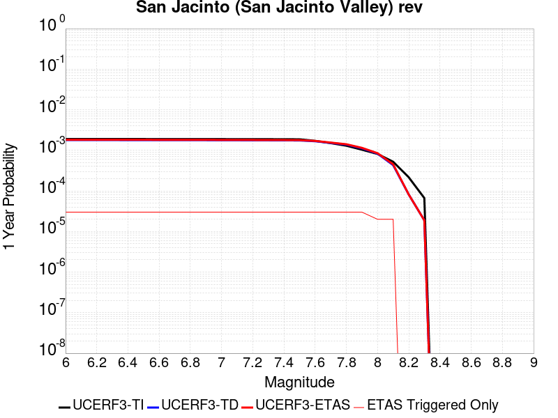 |  |

| Magnitude | 1 yr TI Prob | TD Prob | ETAS Prob | ETAS/TD Gain | ETAS Triggered Only | 10 yr TI Prob | TD Prob | ETAS Prob | ETAS/TD Gain | ETAS Triggered Only |
|-----|-----|-----|-----|-----|-----|-----|-----|-----|-----|-----|
| 6.0 | 0.0019041431 | 0.00179349 | 0.0018234362 | 1.0166972 | 3.0E-5 | 0.018879099 | 0.018526595 | 0.018575668 | 1.0026488 | 5.0E-5 |
| 6.1 | 0.0019041431 | 0.00179349 | 0.0018234362 | 1.0166972 | 3.0E-5 | 0.018879099 | 0.018526595 | 0.018575668 | 1.0026488 | 5.0E-5 |
| 6.2 | 0.0019041431 | 0.00179349 | 0.0018234362 | 1.0166972 | 3.0E-5 | 0.018879099 | 0.018526595 | 0.018575668 | 1.0026488 | 5.0E-5 |
| 6.3 | 0.0019041431 | 0.00179349 | 0.0018234362 | 1.0166972 | 3.0E-5 | 0.018879099 | 0.018526595 | 0.018575668 | 1.0026488 | 5.0E-5 |
| 6.4 | 0.0019011468 | 0.0017894056 | 0.0018193519 | 1.0167353 | 3.0E-5 | 0.018849645 | 0.018486476 | 0.018535553 | 1.0026547 | 5.0E-5 |
| 6.5 | 0.0019011468 | 0.0017894056 | 0.0018193519 | 1.0167353 | 3.0E-5 | 0.018849645 | 0.018486476 | 0.018535553 | 1.0026547 | 5.0E-5 |
| 6.6 | 0.0018997455 | 0.0017874985 | 0.0018174448 | 1.0167532 | 3.0E-5 | 0.018835869 | 0.018467745 | 0.018516822 | 1.0026574 | 5.0E-5 |
| 6.7 | 0.0018992044 | 0.0017867472 | 0.0018166937 | 1.0167602 | 3.0E-5 | 0.018830549 | 0.018460369 | 0.018509446 | 1.0026585 | 5.0E-5 |
| 6.8 | 0.0018980318 | 0.0017851355 | 0.0018150819 | 1.0167755 | 3.0E-5 | 0.018819023 | 0.018444523 | 0.0184936 | 1.0026609 | 5.0E-5 |
| 6.9 | 0.0018965311 | 0.001783074 | 0.0018130206 | 1.0167949 | 3.0E-5 | 0.018804269 | 0.018424258 | 0.018473336 | 1.0026639 | 5.0E-5 |
| 7.0 | 0.0018920569 | 0.001776929 | 0.0018068757 | 1.0168531 | 3.0E-5 | 0.018760284 | 0.018363839 | 0.018412922 | 1.0026728 | 5.0E-5 |
| 7.1 | 0.001890278 | 0.0017746518 | 0.0018045986 | 1.0168747 | 3.0E-5 | 0.018742796 | 0.018341439 | 0.018390523 | 1.002676 | 5.0E-5 |
| 7.2 | 0.001887647 | 0.0017712255 | 0.0018011723 | 1.0169075 | 3.0E-5 | 0.01871693 | 0.01830772 | 0.018356804 | 1.0026811 | 5.0E-5 |
| 7.3 | 0.0018829206 | 0.0017654065 | 0.0017953535 | 1.0169632 | 3.0E-5 | 0.018670462 | 0.018250274 | 0.01829936 | 1.0026897 | 5.0E-5 |
| 7.4 | 0.0018807866 | 0.0017626719 | 0.001792619 | 1.0169896 | 3.0E-5 | 0.018649481 | 0.018223269 | 0.018272357 | 1.0026938 | 5.0E-5 |
| 7.5 | 0.0018692396 | 0.0017527633 | 0.0017827107 | 1.0170858 | 3.0E-5 | 0.018535944 | 0.018124366 | 0.01817346 | 1.0027087 | 5.0E-5 |
| 7.6 | 0.001713488 | 0.0016758227 | 0.0017057724 | 1.0178716 | 3.0E-5 | 0.017003361 | 0.017344031 | 0.017393164 | 1.0028329 | 5.0E-5 |
| 7.7 | 0.0015059357 | 0.0015243685 | 0.0015543228 | 1.0196502 | 3.0E-5 | 0.014957713 | 0.015830461 | 0.015879668 | 1.0031085 | 5.0E-5 |
| 7.8 | 0.0013010362 | 0.0013832134 | 0.0014131719 | 1.0216587 | 3.0E-5 | 0.012934455 | 0.014411755 | 0.014461034 | 1.0034194 | 5.0E-5 |
| 7.9 | 0.001036866 | 0.0011216112 | 0.0011515776 | 1.0267172 | 3.0E-5 | 0.010320415 | 0.011777027 | 0.011826438 | 1.0041956 | 5.0E-5 |
| 8.0 | 8.153773E-4 | 8.3124964E-4 | 8.51233E-4 | 1.0240401 | 2.0E-5 | 0.00812392 | 0.008810506 | 0.0088402415 | 1.003375 | 3.0E-5 |
| 8.1 | 5.2401534E-4 | 4.3308473E-4 | 4.530761E-4 | 1.0461603 | 2.0E-5 | 0.0052278144 | 0.0046591135 | 0.004688974 | 1.006409 | 3.0E-5 |
| 8.2 | 2.1680194E-4 | 8.168544E-5 | 8.168544E-5 | 1.0 | 0.0 | 0.0021659054 | 9.482903E-4 | 9.482903E-4 | 1.0 | 0.0 |
| 8.3 | 6.65684E-5 | 1.8862354E-5 | 1.8862354E-5 | 1.0 | 0.0 | 6.6548464E-4 | 2.2751294E-4 | 2.2751294E-4 | 1.0 | 0.0 |

## San Jacinto (Stepovers Combined)
*[(top)](#table-of-contents)*

| 1 Year | 10 Year |
|-----|-----|
|  |  |

| Magnitude | 1 yr TI Prob | TD Prob | ETAS Prob | ETAS/TD Gain | ETAS Triggered Only | 10 yr TI Prob | TD Prob | ETAS Prob | ETAS/TD Gain | ETAS Triggered Only |
|-----|-----|-----|-----|-----|-----|-----|-----|-----|-----|-----|
| 6.0 | 0.0021197782 | 0.0018388226 | 0.0018687674 | 1.0162848 | 3.0E-5 | 0.020996714 | 0.018986892 | 0.019035943 | 1.0025834 | 5.0E-5 |
| 6.1 | 0.0021197782 | 0.0018388226 | 0.0018687674 | 1.0162848 | 3.0E-5 | 0.020996714 | 0.018986892 | 0.019035943 | 1.0025834 | 5.0E-5 |
| 6.2 | 0.0021197782 | 0.0018388226 | 0.0018687674 | 1.0162848 | 3.0E-5 | 0.020996714 | 0.018986892 | 0.019035943 | 1.0025834 | 5.0E-5 |
| 6.3 | 0.0021197782 | 0.0018388226 | 0.0018687674 | 1.0162848 | 3.0E-5 | 0.020996714 | 0.018986892 | 0.019035943 | 1.0025834 | 5.0E-5 |
| 6.4 | 0.0021150648 | 0.0018321523 | 0.0018620973 | 1.0163442 | 3.0E-5 | 0.020950472 | 0.018921461 | 0.018970514 | 1.0025924 | 5.0E-5 |
| 6.5 | 0.0021150648 | 0.0018321523 | 0.0018620973 | 1.0163442 | 3.0E-5 | 0.020950472 | 0.018921461 | 0.018970514 | 1.0025924 | 5.0E-5 |
| 6.6 | 0.0021130538 | 0.0018293057 | 0.0018592507 | 1.0163697 | 3.0E-5 | 0.020930743 | 0.018893538 | 0.018942595 | 1.0025964 | 5.0E-5 |
| 6.7 | 0.002111905 | 0.001827695 | 0.0018576402 | 1.0163841 | 3.0E-5 | 0.020919468 | 0.018877735 | 0.018926792 | 1.0025986 | 5.0E-5 |
| 6.8 | 0.0021107488 | 0.0018262138 | 0.0018561591 | 1.0163975 | 3.0E-5 | 0.020908125 | 0.018863149 | 0.018912205 | 1.0026007 | 5.0E-5 |
| 6.9 | 0.0021091616 | 0.0018242638 | 0.0018542091 | 1.016415 | 3.0E-5 | 0.020892553 | 0.01884392 | 0.01889298 | 1.0026034 | 5.0E-5 |
| 7.0 | 0.0021039525 | 0.0018180435 | 0.001847989 | 1.0164713 | 3.0E-5 | 0.02084144 | 0.018782536 | 0.018831596 | 1.002612 | 5.0E-5 |
| 7.1 | 0.002102883 | 0.0018169218 | 0.0018468673 | 1.0164814 | 3.0E-5 | 0.020830948 | 0.018771412 | 0.018820474 | 1.0026137 | 5.0E-5 |
| 7.2 | 0.0020984085 | 0.0018119477 | 0.0018418933 | 1.0165268 | 3.0E-5 | 0.020787042 | 0.018722152 | 0.018771216 | 1.0026206 | 5.0E-5 |
| 7.3 | 0.0020819185 | 0.0018029709 | 0.0018329169 | 1.0166092 | 3.0E-5 | 0.020625217 | 0.018630784 | 0.018679852 | 1.0026337 | 5.0E-5 |
| 7.4 | 0.0020704903 | 0.0017970012 | 0.0018269473 | 1.0166645 | 3.0E-5 | 0.020513052 | 0.018569905 | 0.018618977 | 1.0026425 | 5.0E-5 |
| 7.5 | 0.0019307006 | 0.0017484248 | 0.0017783723 | 1.0171283 | 3.0E-5 | 0.019140124 | 0.018071463 | 0.01812056 | 1.0027168 | 5.0E-5 |
| 7.6 | 0.0017173645 | 0.0016328214 | 0.0016627724 | 1.0183431 | 3.0E-5 | 0.01704153 | 0.016904354 | 0.016953507 | 1.0029079 | 5.0E-5 |
| 7.7 | 0.0014722579 | 0.001453905 | 0.0014838615 | 1.0206041 | 3.0E-5 | 0.014625421 | 0.015115095 | 0.01516434 | 1.003258 | 5.0E-5 |
| 7.8 | 0.0012686774 | 0.0013144462 | 0.0013444067 | 1.0227933 | 3.0E-5 | 0.012614589 | 0.013712396 | 0.01376171 | 1.0035963 | 5.0E-5 |
| 7.9 | 0.0010102465 | 0.0010650064 | 0.0010949745 | 1.0281389 | 3.0E-5 | 0.0100566605 | 0.011199482 | 0.011248922 | 1.0044144 | 5.0E-5 |
| 8.0 | 8.127754E-4 | 8.285971E-4 | 8.485805E-4 | 1.0241172 | 2.0E-5 | 0.008098091 | 0.008781809 | 0.0088115465 | 1.0033861 | 3.0E-5 |
| 8.1 | 5.229494E-4 | 4.3259456E-4 | 4.525859E-4 | 1.0462127 | 2.0E-5 | 0.0052172043 | 0.0046534105 | 0.004683271 | 1.0064169 | 3.0E-5 |
| 8.2 | 2.1614227E-4 | 8.144774E-5 | 8.144774E-5 | 1.0 | 0.0 | 0.0021593217 | 9.454649E-4 | 9.454649E-4 | 1.0 | 0.0 |
| 8.3 | 6.653009E-5 | 1.8847424E-5 | 1.8847424E-5 | 1.0 | 0.0 | 6.6510175E-4 | 2.2734253E-4 | 2.2734253E-4 | 1.0 | 0.0 |

## Calaveras (So) - Paicines extension 2011 CFM
*[(top)](#table-of-contents)*

| 1 Year | 10 Year |
|-----|-----|
|  | 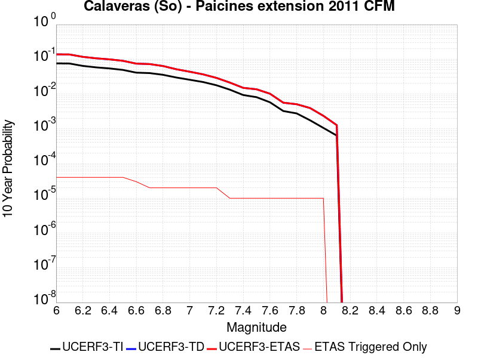 |

| Magnitude | 1 yr TI Prob | TD Prob | ETAS Prob | ETAS/TD Gain | ETAS Triggered Only | 10 yr TI Prob | TD Prob | ETAS Prob | ETAS/TD Gain | ETAS Triggered Only |
|-----|-----|-----|-----|-----|-----|-----|-----|-----|-----|-----|
| 6.0 | 0.007891912 | 0.01569571 | 0.015715396 | 1.0012542 | 2.0E-5 | 0.076174594 | 0.13848671 | 0.13852118 | 1.0002488 | 4.0E-5 |
| 6.1 | 0.0078097614 | 0.015539104 | 0.015558793 | 1.0012671 | 2.0E-5 | 0.075409345 | 0.13715632 | 0.13719083 | 1.0002517 | 4.0E-5 |
| 6.2 | 0.0066279583 | 0.013046704 | 0.013066443 | 1.001513 | 2.0E-5 | 0.064337276 | 0.11725405 | 0.11728936 | 1.0003011 | 4.0E-5 |
| 6.3 | 0.0059959386 | 0.011667927 | 0.011687693 | 1.0016941 | 2.0E-5 | 0.058367174 | 0.10637007 | 0.10640582 | 1.000336 | 4.0E-5 |
| 6.4 | 0.0055782744 | 0.010772766 | 0.01079255 | 1.0018365 | 2.0E-5 | 0.0544031 | 0.09919256 | 0.09922859 | 1.0003632 | 4.0E-5 |
| 6.5 | 0.0050468626 | 0.009694662 | 0.009714468 | 1.002043 | 2.0E-5 | 0.04933773 | 0.090084255 | 0.09012065 | 1.000404 | 4.0E-5 |
| 6.6 | 0.0041944524 | 0.007826256 | 0.007846099 | 1.0025355 | 2.0E-5 | 0.04116161 | 0.074854024 | 0.07488178 | 1.0003707 | 3.0E-5 |
| 6.7 | 0.004070005 | 0.0075890915 | 0.0075990157 | 1.0013077 | 1.0E-5 | 0.039962657 | 0.072703585 | 0.07272213 | 1.0002551 | 2.0E-5 |
| 6.8 | 0.0036279052 | 0.00661342 | 0.0066233533 | 1.001502 | 1.0E-5 | 0.03569247 | 0.06379891 | 0.063817635 | 1.0002935 | 2.0E-5 |
| 6.9 | 0.0030218933 | 0.0052791284 | 0.005289076 | 1.0018842 | 1.0E-5 | 0.029811295 | 0.051501602 | 0.05152057 | 1.0003684 | 2.0E-5 |
| 7.0 | 0.0025986114 | 0.0044608037 | 0.004470759 | 1.0022317 | 1.0E-5 | 0.025684336 | 0.043781694 | 0.043800816 | 1.0004368 | 2.0E-5 |
| 7.1 | 0.0022328163 | 0.003704336 | 0.003714299 | 1.0026895 | 1.0E-5 | 0.022105146 | 0.03673583 | 0.036755096 | 1.0005244 | 2.0E-5 |
| 7.2 | 0.0017986323 | 0.0029061958 | 0.0029161668 | 1.003431 | 1.0E-5 | 0.017841442 | 0.029079199 | 0.029098617 | 1.0006678 | 2.0E-5 |
| 7.3 | 0.0013405791 | 0.002115652 | 0.0021256309 | 1.0047166 | 1.0E-5 | 0.013325208 | 0.021297242 | 0.021307029 | 1.0004596 | 1.0E-5 |
| 7.4 | 9.3894306E-4 | 0.0014865254 | 0.0014965106 | 1.0067171 | 1.0E-5 | 0.009349857 | 0.015052196 | 0.015062045 | 1.0006543 | 1.0E-5 |
| 7.5 | 8.134431E-4 | 0.0013464936 | 0.0013564801 | 1.0074167 | 1.0E-5 | 0.008104719 | 0.01365213 | 0.013661994 | 1.0007225 | 1.0E-5 |
| 7.6 | 5.795553E-4 | 0.0010024898 | 0.0010124799 | 1.0099652 | 1.0E-5 | 0.0057804612 | 0.010203943 | 0.010213841 | 1.00097 | 1.0E-5 |
| 7.7 | 3.241884E-4 | 5.444464E-4 | 5.5444095E-4 | 1.0183573 | 1.0E-5 | 0.0032371588 | 0.005619835 | 0.005629779 | 1.0017694 | 1.0E-5 |
| 7.8 | 2.7679754E-4 | 4.920837E-4 | 5.020788E-4 | 1.0203117 | 1.0E-5 | 0.0027645302 | 0.005074324 | 0.0050842734 | 1.0019608 | 1.0E-5 |
| 7.9 | 1.7548777E-4 | 3.8526047E-4 | 3.9525662E-4 | 1.0259465 | 1.0E-5 | 0.0017534926 | 0.003948527 | 0.0039584874 | 1.0025226 | 1.0E-5 |
| 8.0 | 1.05766376E-4 | 2.302435E-4 | 2.4024119E-4 | 1.0434222 | 1.0E-5 | 0.0010571606 | 0.002351099 | 0.0023610755 | 1.0042434 | 1.0E-5 |
| 8.1 | 6.3687774E-5 | 1.2392356E-4 | 1.2392356E-4 | 1.0 | 0.0 | 6.366953E-4 | 0.0012705477 | 0.0012705477 | 1.0 | 0.0 |

## Hosgri
*[(top)](#table-of-contents)*

| 1 Year | 10 Year |
|-----|-----|
|  | 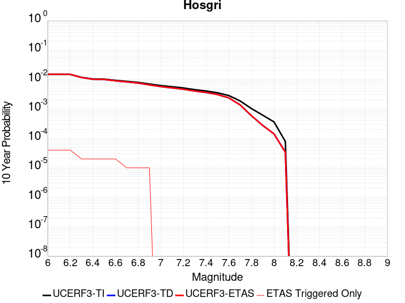 |

| Magnitude | 1 yr TI Prob | TD Prob | ETAS Prob | ETAS/TD Gain | ETAS Triggered Only | 10 yr TI Prob | TD Prob | ETAS Prob | ETAS/TD Gain | ETAS Triggered Only |
|-----|-----|-----|-----|-----|-----|-----|-----|-----|-----|-----|
| 6.0 | 0.0015037085 | 0.001518776 | 0.0015487304 | 1.0197227 | 3.0E-5 | 0.01493574 | 0.01508774 | 0.015127136 | 1.0026112 | 4.0E-5 |
| 6.1 | 0.0015037085 | 0.001518776 | 0.0015487304 | 1.0197227 | 3.0E-5 | 0.01493574 | 0.01508774 | 0.015127136 | 1.0026112 | 4.0E-5 |
| 6.2 | 0.0015037085 | 0.001518776 | 0.0015487304 | 1.0197227 | 3.0E-5 | 0.01493574 | 0.01508774 | 0.015127136 | 1.0026112 | 4.0E-5 |
| 6.3 | 0.0011949413 | 0.0011807467 | 0.0012007231 | 1.0169184 | 2.0E-5 | 0.011885363 | 0.011746133 | 0.011765898 | 1.0016826 | 2.0E-5 |
| 6.4 | 0.0010532405 | 0.0010272227 | 0.0010472022 | 1.01945 | 2.0E-5 | 0.010482626 | 0.010225792 | 0.010245589 | 1.0019358 | 2.0E-5 |
| 6.5 | 0.0010390934 | 0.0010122322 | 0.0010322119 | 1.0197383 | 2.0E-5 | 0.010342481 | 0.010077253 | 0.010097052 | 1.0019647 | 2.0E-5 |
| 6.6 | 9.438353E-4 | 9.105437E-4 | 9.3052554E-4 | 1.0219449 | 2.0E-5 | 0.009398366 | 0.009069073 | 0.009088892 | 1.0021853 | 2.0E-5 |
| 6.7 | 8.7413215E-4 | 8.3674624E-4 | 8.467379E-4 | 1.0119411 | 1.0E-5 | 0.008707017 | 0.0083368635 | 0.00834678 | 1.0011895 | 1.0E-5 |
| 6.8 | 8.032922E-4 | 7.622578E-4 | 7.722502E-4 | 1.013109 | 1.0E-5 | 0.008003947 | 0.007597296 | 0.00760722 | 1.0013063 | 1.0E-5 |
| 6.9 | 7.0758746E-4 | 6.619299E-4 | 6.719233E-4 | 1.0150974 | 1.0E-5 | 0.007053386 | 0.006600388 | 0.006610322 | 1.001505 | 1.0E-5 |
| 7.0 | 6.275577E-4 | 5.7880714E-4 | 5.7880714E-4 | 1.0 | 0.0 | 0.006257884 | 0.005773757 | 0.005773757 | 1.0 | 0.0 |
| 7.1 | 5.72379E-4 | 5.22809E-4 | 5.22809E-4 | 1.0 | 0.0 | 0.0057090693 | 0.005216542 | 0.005216542 | 1.0 | 0.0 |
| 7.2 | 5.1966653E-4 | 4.713112E-4 | 4.713112E-4 | 1.0 | 0.0 | 0.00518453 | 0.0047038626 | 0.0047038626 | 1.0 | 0.0 |
| 7.3 | 4.53901E-4 | 4.0837732E-4 | 4.0837732E-4 | 1.0 | 0.0 | 0.00452975 | 0.004077008 | 0.004077008 | 1.0 | 0.0 |
| 7.4 | 4.103689E-4 | 3.6511885E-4 | 3.6511885E-4 | 1.0 | 0.0 | 0.004096119 | 0.0036459267 | 0.0036459267 | 1.0 | 0.0 |
| 7.5 | 3.5674145E-4 | 3.10921E-4 | 3.10921E-4 | 1.0 | 0.0 | 0.0035616932 | 0.0031055948 | 0.0031055948 | 1.0 | 0.0 |
| 7.6 | 2.8711787E-4 | 2.397451E-4 | 2.397451E-4 | 1.0 | 0.0 | 0.002867472 | 0.0023955975 | 0.0023955975 | 1.0 | 0.0 |
| 7.7 | 1.8858191E-4 | 1.383792E-4 | 1.383792E-4 | 1.0 | 0.0 | 0.0018842196 | 0.0013836613 | 0.0013836613 | 1.0 | 0.0 |
| 7.8 | 1.0358743E-4 | 5.9279027E-5 | 5.9279027E-5 | 1.0 | 0.0 | 0.0010353916 | 5.9336185E-4 | 5.9336185E-4 | 1.0 | 0.0 |
| 7.9 | 6.1666724E-5 | 2.7629147E-5 | 2.7629147E-5 | 1.0 | 0.0 | 6.1649614E-4 | 2.7694515E-4 | 2.7694515E-4 | 1.0 | 0.0 |
| 8.0 | 3.6331072E-5 | 1.4161053E-5 | 1.4161053E-5 | 1.0 | 0.0 | 3.6325134E-4 | 1.4217179E-4 | 1.4217179E-4 | 1.0 | 0.0 |
| 8.1 | 7.844113E-6 | 3.4060151E-6 | 3.4060151E-6 | 1.0 | 0.0 | 7.843835E-5 | 3.407693E-5 | 3.407693E-5 | 1.0 | 0.0 |

## Great Valley 10 (Panoche)
*[(top)](#table-of-contents)*

| 1 Year | 10 Year |
|-----|-----|
|  |  |

| Magnitude | 1 yr TI Prob | TD Prob | ETAS Prob | ETAS/TD Gain | ETAS Triggered Only | 10 yr TI Prob | TD Prob | ETAS Prob | ETAS/TD Gain | ETAS Triggered Only |
|-----|-----|-----|-----|-----|-----|-----|-----|-----|-----|-----|
| 6.0 | 8.35278E-4 | 8.645185E-4 | 8.845012E-4 | 1.0231143 | 2.0E-5 | 0.008321454 | 0.008612172 | 0.008651827 | 1.0046046 | 4.0E-5 |
| 6.1 | 8.35278E-4 | 8.645185E-4 | 8.845012E-4 | 1.0231143 | 2.0E-5 | 0.008321454 | 0.008612172 | 0.008651827 | 1.0046046 | 4.0E-5 |
| 6.2 | 8.17738E-4 | 8.4486604E-4 | 8.6484913E-4 | 1.0236524 | 2.0E-5 | 0.008147354 | 0.008417147 | 0.00845681 | 1.0047122 | 4.0E-5 |
| 6.3 | 7.961082E-4 | 8.201049E-4 | 8.400885E-4 | 1.0243671 | 2.0E-5 | 0.007932622 | 0.008171377 | 0.00821105 | 1.0048552 | 4.0E-5 |
| 6.4 | 7.67817E-4 | 7.8756385E-4 | 8.0754806E-4 | 1.0253748 | 2.0E-5 | 0.007651695 | 0.007848303 | 0.007887989 | 1.0050566 | 4.0E-5 |
| 6.5 | 7.3454727E-4 | 7.488031E-4 | 7.587956E-4 | 1.0133446 | 1.0E-5 | 0.0073212404 | 0.0074633555 | 0.007493132 | 1.0039897 | 3.0E-5 |
| 6.6 | 6.8837265E-4 | 6.9488434E-4 | 7.0487737E-4 | 1.0143809 | 1.0E-5 | 0.006862442 | 0.0069276537 | 0.0069574458 | 1.0043005 | 3.0E-5 |
| 6.7 | 5.30822E-4 | 5.0837593E-4 | 5.183708E-4 | 1.0196605 | 1.0E-5 | 0.0052955584 | 0.005072382 | 0.005082331 | 1.0019615 | 1.0E-5 |
| 6.8 | 4.4644187E-4 | 4.1070607E-4 | 4.2070195E-4 | 1.0243384 | 1.0E-5 | 0.0044554602 | 0.004099677 | 0.004109636 | 1.0024292 | 1.0E-5 |
| 6.9 | 3.2067244E-4 | 2.6566387E-4 | 2.7566124E-4 | 1.0376315 | 1.0E-5 | 0.003202101 | 0.002653601 | 0.0026635746 | 1.0037584 | 1.0E-5 |
| 7.0 | 1.6857806E-4 | 8.8445304E-5 | 8.8445304E-5 | 1.0 | 0.0 | 0.0016845023 | 8.841104E-4 | 8.841104E-4 | 1.0 | 0.0 |
| 7.1 | 1.327593E-4 | 4.79454E-5 | 4.79454E-5 | 1.0 | 0.0 | 0.0013268003 | 4.793553E-4 | 4.793553E-4 | 1.0 | 0.0 |
| 7.2 | 1.2772017E-4 | 4.6131667E-5 | 4.6131667E-5 | 1.0 | 0.0 | 0.0012764678 | 4.6122566E-4 | 4.6122566E-4 | 1.0 | 0.0 |
| 7.3 | 1.072713E-4 | 4.1182655E-5 | 4.1182655E-5 | 1.0 | 0.0 | 0.0010721954 | 4.1175485E-4 | 4.1175485E-4 | 1.0 | 0.0 |
| 7.4 | 9.0144255E-5 | 3.8547583E-5 | 3.8547583E-5 | 1.0 | 0.0 | 9.0107694E-4 | 3.854136E-4 | 3.854136E-4 | 1.0 | 0.0 |
| 7.5 | 7.827883E-5 | 3.4156317E-5 | 3.4156317E-5 | 1.0 | 0.0 | 7.825126E-4 | 3.4151482E-4 | 3.4151482E-4 | 1.0 | 0.0 |

## Channel Islands Western Deep Ramp
*[(top)](#table-of-contents)*

| 1 Year | 10 Year |
|-----|-----|
|  |  |

| Magnitude | 1 yr TI Prob | TD Prob | ETAS Prob | ETAS/TD Gain | ETAS Triggered Only | 10 yr TI Prob | TD Prob | ETAS Prob | ETAS/TD Gain | ETAS Triggered Only |
|-----|-----|-----|-----|-----|-----|-----|-----|-----|-----|-----|
| 6.0 | 3.1413708E-4 | 3.2632265E-4 | 3.5631284E-4 | 1.0919036 | 3.0E-5 | 0.0031369338 | 0.0032588763 | 0.003298746 | 1.0122342 | 4.0E-5 |
| 6.1 | 3.1413708E-4 | 3.2632265E-4 | 3.5631284E-4 | 1.0919036 | 3.0E-5 | 0.0031369338 | 0.0032588763 | 0.003298746 | 1.0122342 | 4.0E-5 |
| 6.2 | 3.1413708E-4 | 3.2632265E-4 | 3.5631284E-4 | 1.0919036 | 3.0E-5 | 0.0031369338 | 0.0032588763 | 0.003298746 | 1.0122342 | 4.0E-5 |
| 6.3 | 3.1413708E-4 | 3.2632265E-4 | 3.5631284E-4 | 1.0919036 | 3.0E-5 | 0.0031369338 | 0.0032588763 | 0.003298746 | 1.0122342 | 4.0E-5 |
| 6.4 | 3.1413708E-4 | 3.2632265E-4 | 3.5631284E-4 | 1.0919036 | 3.0E-5 | 0.0031369338 | 0.0032588763 | 0.003298746 | 1.0122342 | 4.0E-5 |
| 6.5 | 3.1413708E-4 | 3.2632265E-4 | 3.5631284E-4 | 1.0919036 | 3.0E-5 | 0.0031369338 | 0.0032588763 | 0.003298746 | 1.0122342 | 4.0E-5 |
| 6.6 | 3.1413708E-4 | 3.2632265E-4 | 3.5631284E-4 | 1.0919036 | 3.0E-5 | 0.0031369338 | 0.0032588763 | 0.003298746 | 1.0122342 | 4.0E-5 |
| 6.7 | 2.772032E-4 | 2.8826276E-4 | 3.08257E-4 | 1.0693611 | 2.0E-5 | 0.0027685766 | 0.0028792918 | 0.0029092054 | 1.0103892 | 3.0E-5 |
| 6.8 | 2.772032E-4 | 2.8826276E-4 | 3.08257E-4 | 1.0693611 | 2.0E-5 | 0.0027685766 | 0.0028792918 | 0.0029092054 | 1.0103892 | 3.0E-5 |
| 6.9 | 2.4752476E-4 | 2.5770385E-4 | 2.7769868E-4 | 1.0775884 | 2.0E-5 | 0.0024724922 | 0.0025744175 | 0.0026043402 | 1.0116231 | 3.0E-5 |
| 7.0 | 2.4636835E-4 | 2.5650626E-4 | 2.7650114E-4 | 1.0779508 | 2.0E-5 | 0.002460954 | 0.0025624693 | 0.0025923925 | 1.0116775 | 3.0E-5 |
| 7.1 | 2.4057609E-4 | 2.5050386E-4 | 2.7049886E-4 | 1.0798191 | 2.0E-5 | 0.002403158 | 0.002502582 | 0.0025325068 | 1.0119576 | 3.0E-5 |
| 7.2 | 2.10988E-4 | 2.1975765E-4 | 2.3975327E-4 | 1.0909894 | 2.0E-5 | 0.002107878 | 0.0021957543 | 0.0022256884 | 1.0136328 | 3.0E-5 |
| 7.3 | 1.1078493E-4 | 1.1634055E-4 | 1.1634055E-4 | 1.0 | 0.0 | 0.0011072971 | 0.001162802 | 0.001162802 | 1.0 | 0.0 |
| 7.4 | 9.940516E-5 | 1.0442998E-4 | 1.0442998E-4 | 1.0 | 0.0 | 9.93607E-4 | 0.0010438144 | 0.0010438144 | 1.0 | 0.0 |
| 7.5 | 6.4743705E-5 | 6.8032554E-5 | 6.8032554E-5 | 1.0 | 0.0 | 6.4724847E-4 | 6.8011944E-4 | 6.8011944E-4 | 1.0 | 0.0 |
| 7.6 | 3.4145098E-5 | 3.593329E-5 | 3.593329E-5 | 1.0 | 0.0 | 3.4139853E-4 | 3.5927625E-4 | 3.5927625E-4 | 1.0 | 0.0 |
| 7.7 | 2.0797976E-5 | 2.1878664E-5 | 2.1878664E-5 | 1.0 | 0.0 | 2.0796029E-4 | 2.1876628E-4 | 2.1876628E-4 | 1.0 | 0.0 |
| 7.8 | 1.9339077E-6 | 2.0136629E-6 | 2.0136629E-6 | 1.0 | 0.0 | 1.933891E-5 | 2.0136458E-5 | 2.0136458E-5 | 1.0 | 0.0 |

## Earthquake Valley (No  Extension)
*[(top)](#table-of-contents)*

| 1 Year | 10 Year |
|-----|-----|
|  |  |

| Magnitude | 1 yr TI Prob | TD Prob | ETAS Prob | ETAS/TD Gain | ETAS Triggered Only | 10 yr TI Prob | TD Prob | ETAS Prob | ETAS/TD Gain | ETAS Triggered Only |
|-----|-----|-----|-----|-----|-----|-----|-----|-----|-----|-----|
| 6.0 | 0.0011399703 | 0.001314122 | 0.0013440826 | 1.0227989 | 3.0E-5 | 0.011341401 | 0.013077871 | 0.013117348 | 1.0030186 | 4.0E-5 |
| 6.1 | 0.0011399703 | 0.001314122 | 0.0013440826 | 1.0227989 | 3.0E-5 | 0.011341401 | 0.013077871 | 0.013117348 | 1.0030186 | 4.0E-5 |
| 6.2 | 0.0011399703 | 0.001314122 | 0.0013440826 | 1.0227989 | 3.0E-5 | 0.011341401 | 0.013077871 | 0.013117348 | 1.0030186 | 4.0E-5 |
| 6.3 | 0.0011399703 | 0.001314122 | 0.0013440826 | 1.0227989 | 3.0E-5 | 0.011341401 | 0.013077871 | 0.013117348 | 1.0030186 | 4.0E-5 |
| 6.4 | 0.0011399703 | 0.001314122 | 0.0013440826 | 1.0227989 | 3.0E-5 | 0.011341401 | 0.013077871 | 0.013117348 | 1.0030186 | 4.0E-5 |
| 6.5 | 0.0011399703 | 0.001314122 | 0.0013440826 | 1.0227989 | 3.0E-5 | 0.011341401 | 0.013077871 | 0.013117348 | 1.0030186 | 4.0E-5 |
| 6.6 | 8.329513E-4 | 9.574478E-4 | 9.774286E-4 | 1.0208689 | 2.0E-5 | 0.008298361 | 0.009541836 | 0.009561645 | 1.002076 | 2.0E-5 |
| 6.7 | 8.329513E-4 | 9.574478E-4 | 9.774286E-4 | 1.0208689 | 2.0E-5 | 0.008298361 | 0.009541836 | 0.009561645 | 1.002076 | 2.0E-5 |
| 6.8 | 7.988095E-4 | 9.181311E-4 | 9.3811273E-4 | 1.0217633 | 2.0E-5 | 0.007959441 | 0.009151919 | 0.0091717355 | 1.0021653 | 2.0E-5 |
| 6.9 | 7.1119244E-4 | 8.177017E-4 | 8.276935E-4 | 1.0122194 | 1.0E-5 | 0.007089207 | 0.008155 | 0.008164919 | 1.0012163 | 1.0E-5 |
| 7.0 | 7.03973E-4 | 8.094657E-4 | 8.1945764E-4 | 1.0123439 | 1.0E-5 | 0.007017471 | 0.0080732405 | 0.00808316 | 1.0012287 | 1.0E-5 |
| 7.1 | 4.300067E-4 | 4.9421866E-4 | 4.9421866E-4 | 1.0 | 0.0 | 0.004291756 | 0.0049377717 | 0.0049377717 | 1.0 | 0.0 |
| 7.2 | 1.3830633E-5 | 1.17715845E-5 | 1.17715845E-5 | 1.0 | 0.0 | 1.3829772E-4 | 1.1771003E-4 | 1.1771003E-4 | 1.0 | 0.0 |
| 7.3 | 1.3467455E-5 | 1.1455976E-5 | 1.1455976E-5 | 1.0 | 0.0 | 1.3466639E-4 | 1.1455427E-4 | 1.1455427E-4 | 1.0 | 0.0 |
| 7.4 | 1.1831979E-5 | 9.9715935E-6 | 9.9715935E-6 | 1.0 | 0.0 | 1.1831349E-4 | 9.9711855E-5 | 9.9711855E-5 | 1.0 | 0.0 |
| 7.5 | 8.115779E-6 | 6.8416834E-6 | 6.8416834E-6 | 1.0 | 0.0 | 8.115482E-5 | 6.841495E-5 | 6.841495E-5 | 1.0 | 0.0 |
| 7.6 | 7.017278E-6 | 5.890121E-6 | 5.890121E-6 | 1.0 | 0.0 | 7.0170565E-5 | 5.889986E-5 | 5.889986E-5 | 1.0 | 0.0 |
| 7.7 | 1.5507147E-6 | 7.608708E-7 | 7.608708E-7 | 1.0 | 0.0 | 1.550704E-5 | 7.6086876E-6 | 7.6086876E-6 | 1.0 | 0.0 |
| 7.8 | 3.8815733E-7 | 1.6959156E-7 | 1.6959156E-7 | 1.0 | 0.0 | 3.8815665E-6 | 1.6959145E-6 | 1.6959145E-6 | 1.0 | 0.0 |
| 7.9 | 8.021689E-8 | 4.4039556E-8 | 4.4039556E-8 | 1.0 | 0.0 | 8.0216864E-7 | 4.4039552E-7 | 4.4039552E-7 | 1.0 | 0.0 |

## Pleito
*[(top)](#table-of-contents)*

| 1 Year | 10 Year |
|-----|-----|
|  |  |

| Magnitude | 1 yr TI Prob | TD Prob | ETAS Prob | ETAS/TD Gain | ETAS Triggered Only | 10 yr TI Prob | TD Prob | ETAS Prob | ETAS/TD Gain | ETAS Triggered Only |
|-----|-----|-----|-----|-----|-----|-----|-----|-----|-----|-----|
| 6.0 | 8.742947E-4 | 0.0012914003 | 0.0013213615 | 1.0232006 | 3.0E-5 | 0.00870863 | 0.0129538905 | 0.012993372 | 1.0030478 | 4.0E-5 |
| 6.1 | 8.742947E-4 | 0.0012914003 | 0.0013213615 | 1.0232006 | 3.0E-5 | 0.00870863 | 0.0129538905 | 0.012993372 | 1.0030478 | 4.0E-5 |
| 6.2 | 8.742947E-4 | 0.0012914003 | 0.0013213615 | 1.0232006 | 3.0E-5 | 0.00870863 | 0.0129538905 | 0.012993372 | 1.0030478 | 4.0E-5 |
| 6.3 | 8.742947E-4 | 0.0012914003 | 0.0013213615 | 1.0232006 | 3.0E-5 | 0.00870863 | 0.0129538905 | 0.012993372 | 1.0030478 | 4.0E-5 |
| 6.4 | 8.742947E-4 | 0.0012914003 | 0.0013213615 | 1.0232006 | 3.0E-5 | 0.00870863 | 0.0129538905 | 0.012993372 | 1.0030478 | 4.0E-5 |
| 6.5 | 8.742947E-4 | 0.0012914003 | 0.0013213615 | 1.0232006 | 3.0E-5 | 0.00870863 | 0.0129538905 | 0.012993372 | 1.0030478 | 4.0E-5 |
| 6.6 | 5.169696E-4 | 8.978429E-4 | 9.078339E-4 | 1.0111278 | 1.0E-5 | 0.0051576863 | 0.009050702 | 0.009060612 | 1.0010949 | 1.0E-5 |
| 6.7 | 5.169696E-4 | 8.978429E-4 | 9.078339E-4 | 1.0111278 | 1.0E-5 | 0.0051576863 | 0.009050702 | 0.009060612 | 1.0010949 | 1.0E-5 |
| 6.8 | 4.3299864E-4 | 8.071053E-4 | 8.170972E-4 | 1.01238 | 1.0E-5 | 0.004321559 | 0.008150139 | 0.0081600575 | 1.001217 | 1.0E-5 |
| 6.9 | 4.2689382E-4 | 8.003907E-4 | 8.103827E-4 | 1.012484 | 1.0E-5 | 0.0042607468 | 0.008083483 | 0.008093403 | 1.0012271 | 1.0E-5 |
| 7.0 | 3.743064E-4 | 7.371445E-4 | 7.371445E-4 | 1.0 | 0.0 | 0.0037367654 | 0.007454939 | 0.007454939 | 1.0 | 0.0 |
| 7.1 | 3.7390468E-4 | 7.366424E-4 | 7.366424E-4 | 1.0 | 0.0 | 0.0037327618 | 0.0074499524 | 0.0074499524 | 1.0 | 0.0 |
| 7.2 | 3.6857324E-4 | 7.2868E-4 | 7.2868E-4 | 1.0 | 0.0 | 0.0036796255 | 0.0073707094 | 0.0073707094 | 1.0 | 0.0 |
| 7.3 | 3.6627054E-4 | 7.2573166E-4 | 7.2573166E-4 | 1.0 | 0.0 | 0.0036566744 | 0.007341209 | 0.007341209 | 1.0 | 0.0 |
| 7.4 | 3.6451413E-4 | 7.2362315E-4 | 7.2362315E-4 | 1.0 | 0.0 | 0.0036391679 | 0.007320144 | 0.007320144 | 1.0 | 0.0 |
| 7.5 | 3.625482E-4 | 7.2137616E-4 | 7.2137616E-4 | 1.0 | 0.0 | 0.0036195726 | 0.0072977724 | 0.0072977724 | 1.0 | 0.0 |
| 7.6 | 3.6137376E-4 | 7.1924424E-4 | 7.1924424E-4 | 1.0 | 0.0 | 0.0036078666 | 0.0072765257 | 0.0072765257 | 1.0 | 0.0 |
| 7.7 | 3.336726E-4 | 6.6079566E-4 | 6.6079566E-4 | 1.0 | 0.0 | 0.0033317201 | 0.0066951844 | 0.0066951844 | 1.0 | 0.0 |
| 7.8 | 3.060561E-4 | 6.017473E-4 | 6.017473E-4 | 1.0 | 0.0 | 0.0030563495 | 0.0061006667 | 0.0061006667 | 1.0 | 0.0 |
| 7.9 | 1.9391612E-4 | 3.7113542E-4 | 3.7113542E-4 | 1.0 | 0.0 | 0.0019374699 | 0.0037674906 | 0.0037674906 | 1.0 | 0.0 |
| 8.0 | 5.68931E-5 | 6.720063E-5 | 6.720063E-5 | 1.0 | 0.0 | 5.6878536E-4 | 6.941948E-4 | 6.941948E-4 | 1.0 | 0.0 |
| 8.1 | 1.4033113E-5 | 5.7711113E-6 | 5.7711113E-6 | 1.0 | 0.0 | 1.4032227E-4 | 6.456908E-5 | 6.456908E-5 | 1.0 | 0.0 |
| 8.2 | 2.7637427E-7 | 1.2824569E-7 | 1.2824569E-7 | 1.0 | 0.0 | 2.7637393E-6 | 1.4592787E-6 | 1.4592787E-6 | 1.0 | 0.0 |

## Malibu Coast alt 1
*[(top)](#table-of-contents)*

| 1 Year | 10 Year |
|-----|-----|
|  |  |

| Magnitude | 1 yr TI Prob | TD Prob | ETAS Prob | ETAS/TD Gain | ETAS Triggered Only | 10 yr TI Prob | TD Prob | ETAS Prob | ETAS/TD Gain | ETAS Triggered Only |
|-----|-----|-----|-----|-----|-----|-----|-----|-----|-----|-----|
| 6.0 | 8.6436566E-4 | 9.178488E-4 | 9.4782125E-4 | 1.0326551 | 3.0E-5 | 0.0086101135 | 0.009142512 | 0.009182147 | 1.0043352 | 4.0E-5 |
| 6.1 | 8.6436566E-4 | 9.178488E-4 | 9.4782125E-4 | 1.0326551 | 3.0E-5 | 0.0086101135 | 0.009142512 | 0.009182147 | 1.0043352 | 4.0E-5 |
| 6.2 | 5.782728E-4 | 6.028609E-4 | 6.328428E-4 | 1.0497327 | 3.0E-5 | 0.0057677035 | 0.0060126255 | 0.0060424455 | 1.0049595 | 3.0E-5 |
| 6.3 | 5.325294E-4 | 5.5254117E-4 | 5.8252463E-4 | 1.0542645 | 3.0E-5 | 0.0053125503 | 0.0055119814 | 0.0055418164 | 1.0054127 | 3.0E-5 |
| 6.4 | 4.730576E-4 | 4.8737114E-4 | 5.173565E-4 | 1.0615247 | 3.0E-5 | 0.0047205184 | 0.004863236 | 0.0048930906 | 1.0061387 | 3.0E-5 |
| 6.5 | 3.9678233E-4 | 4.0423148E-4 | 4.3421937E-4 | 1.0741849 | 3.0E-5 | 0.0039607463 | 0.0040351 | 0.0040649786 | 1.0074048 | 3.0E-5 |
| 6.6 | 3.0727885E-4 | 3.0673988E-4 | 3.3673068E-4 | 1.0977727 | 3.0E-5 | 0.003068543 | 0.0030631777 | 0.003093086 | 1.0097637 | 3.0E-5 |
| 6.7 | 2.955936E-4 | 2.9433038E-4 | 3.2432156E-4 | 1.1018963 | 3.0E-5 | 0.0029520073 | 0.0029394177 | 0.0029693295 | 1.0101761 | 3.0E-5 |
| 6.8 | 2.880662E-4 | 2.8639034E-4 | 3.1638175E-4 | 1.1047221 | 3.0E-5 | 0.0028769306 | 0.002860224 | 0.0028901384 | 1.0104587 | 3.0E-5 |
| 6.9 | 2.7637955E-4 | 2.7389723E-4 | 3.03889E-4 | 1.1095002 | 3.0E-5 | 0.0027603607 | 0.0027356069 | 0.0027655247 | 1.0109365 | 3.0E-5 |
| 7.0 | 2.6642776E-4 | 2.6334674E-4 | 2.9333882E-4 | 1.1138883 | 3.0E-5 | 0.0026610855 | 0.0026303562 | 0.0026602773 | 1.0113753 | 3.0E-5 |
| 7.1 | 2.528763E-4 | 2.4888094E-4 | 2.7887346E-4 | 1.1205096 | 3.0E-5 | 0.0025258875 | 0.00248603 | 0.0025159556 | 1.0120374 | 3.0E-5 |
| 7.2 | 2.3715083E-4 | 2.3207403E-4 | 2.5206938E-4 | 1.0861593 | 2.0E-5 | 0.0023689792 | 0.0023183243 | 0.0023382779 | 1.0086069 | 2.0E-5 |
| 7.3 | 1.9795135E-4 | 1.9053498E-4 | 2.0053308E-4 | 1.0524738 | 1.0E-5 | 0.001977751 | 0.0019037209 | 0.0019137019 | 1.0052428 | 1.0E-5 |
| 7.4 | 1.4651821E-4 | 1.418677E-4 | 1.5186628E-4 | 1.0704782 | 1.0E-5 | 0.0014642165 | 0.001417774 | 0.0014277599 | 1.0070434 | 1.0E-5 |
| 7.5 | 9.59044E-5 | 9.491203E-5 | 1.0491108E-4 | 1.1053507 | 1.0E-5 | 9.5863023E-4 | 9.48717E-4 | 9.587075E-4 | 1.0105306 | 1.0E-5 |
| 7.6 | 5.8921847E-5 | 5.7402376E-5 | 5.7402376E-5 | 1.0 | 0.0 | 5.890623E-4 | 5.738771E-4 | 5.738771E-4 | 1.0 | 0.0 |
| 7.7 | 2.6429525E-5 | 2.404962E-5 | 2.404962E-5 | 1.0 | 0.0 | 2.642638E-4 | 2.4047129E-4 | 2.4047129E-4 | 1.0 | 0.0 |
| 7.8 | 4.671532E-6 | 3.5000667E-6 | 3.5000667E-6 | 1.0 | 0.0 | 4.671434E-5 | 3.5000136E-5 | 3.5000136E-5 | 1.0 | 0.0 |
| 7.9 | 4.1781714E-8 | 3.2146584E-8 | 3.2146584E-8 | 1.0 | 0.0 | 4.1781706E-7 | 3.214658E-7 | 3.214658E-7 | 1.0 | 0.0 |

## Channel Islands Thrust
*[(top)](#table-of-contents)*

| 1 Year | 10 Year |
|-----|-----|
|  |  |

| Magnitude | 1 yr TI Prob | TD Prob | ETAS Prob | ETAS/TD Gain | ETAS Triggered Only | 10 yr TI Prob | TD Prob | ETAS Prob | ETAS/TD Gain | ETAS Triggered Only |
|-----|-----|-----|-----|-----|-----|-----|-----|-----|-----|-----|
| 6.0 | 0.0011554264 | 0.0012564264 | 0.0012863888 | 1.0238472 | 3.0E-5 | 0.011494373 | 0.0125038205 | 0.012543321 | 1.003159 | 4.0E-5 |
| 6.1 | 0.0011554264 | 0.0012564264 | 0.0012863888 | 1.0238472 | 3.0E-5 | 0.011494373 | 0.0125038205 | 0.012543321 | 1.003159 | 4.0E-5 |
| 6.2 | 0.0011554264 | 0.0012564264 | 0.0012863888 | 1.0238472 | 3.0E-5 | 0.011494373 | 0.0125038205 | 0.012543321 | 1.003159 | 4.0E-5 |
| 6.3 | 0.0011554264 | 0.0012564264 | 0.0012863888 | 1.0238472 | 3.0E-5 | 0.011494373 | 0.0125038205 | 0.012543321 | 1.003159 | 4.0E-5 |
| 6.4 | 0.0011554264 | 0.0012564264 | 0.0012863888 | 1.0238472 | 3.0E-5 | 0.011494373 | 0.0125038205 | 0.012543321 | 1.003159 | 4.0E-5 |
| 6.5 | 0.0011554264 | 0.0012564264 | 0.0012863888 | 1.0238472 | 3.0E-5 | 0.011494373 | 0.0125038205 | 0.012543321 | 1.003159 | 4.0E-5 |
| 6.6 | 0.0011554264 | 0.0012564264 | 0.0012863888 | 1.0238472 | 3.0E-5 | 0.011494373 | 0.0125038205 | 0.012543321 | 1.003159 | 4.0E-5 |
| 6.7 | 5.5301044E-4 | 5.936007E-4 | 6.2358286E-4 | 1.050509 | 3.0E-5 | 0.005516363 | 0.005920653 | 0.0059604165 | 1.006716 | 4.0E-5 |
| 6.8 | 5.345204E-4 | 5.7363417E-4 | 6.0361694E-4 | 1.0522681 | 3.0E-5 | 0.0053323656 | 0.005722025 | 0.005761796 | 1.0069505 | 4.0E-5 |
| 6.9 | 4.7208337E-4 | 5.059924E-4 | 5.359772E-4 | 1.0592594 | 3.0E-5 | 0.0047108172 | 0.0050488203 | 0.0050886185 | 1.0078826 | 4.0E-5 |
| 7.0 | 4.5146482E-4 | 4.8382508E-4 | 5.1381055E-4 | 1.0619758 | 3.0E-5 | 0.004505487 | 0.004828129 | 0.004867936 | 1.0082448 | 4.0E-5 |
| 7.1 | 4.3773788E-4 | 4.6913436E-4 | 4.991203E-4 | 1.0639175 | 3.0E-5 | 0.004368766 | 0.0046818503 | 0.004721663 | 1.0085037 | 4.0E-5 |
| 7.2 | 3.1120746E-4 | 3.3241234E-4 | 3.5240568E-4 | 1.0601462 | 2.0E-5 | 0.00310772 | 0.0033192092 | 0.0033391428 | 1.0060055 | 2.0E-5 |
| 7.3 | 2.5447016E-4 | 2.716063E-4 | 2.9160085E-4 | 1.073616 | 2.0E-5 | 0.0025417898 | 0.0027127895 | 0.0027327354 | 1.0073525 | 2.0E-5 |
| 7.4 | 2.0258849E-4 | 2.1609402E-4 | 2.2609186E-4 | 1.0462662 | 1.0E-5 | 0.002024039 | 0.0021588807 | 0.0021688591 | 1.004622 | 1.0E-5 |
| 7.5 | 7.038446E-5 | 7.449738E-5 | 8.4496634E-5 | 1.1342229 | 1.0E-5 | 7.036218E-4 | 7.44728E-4 | 7.547206E-4 | 1.0134177 | 1.0E-5 |
| 7.6 | 3.161029E-5 | 3.3152584E-5 | 3.3152584E-5 | 1.0 | 0.0 | 3.1605794E-4 | 3.31478E-4 | 3.31478E-4 | 1.0 | 0.0 |
| 7.7 | 1.1568181E-5 | 1.1796425E-5 | 1.1796425E-5 | 1.0 | 0.0 | 1.1567579E-4 | 1.1795909E-4 | 1.1795909E-4 | 1.0 | 0.0 |
| 7.8 | 1.1277401E-6 | 8.070291E-7 | 8.070291E-7 | 1.0 | 0.0 | 1.1277344E-5 | 8.070269E-6 | 8.070269E-6 | 1.0 | 0.0 |

## Calaveras (So) 2011 CFM
*[(top)](#table-of-contents)*

| 1 Year | 10 Year |
|-----|-----|
|  |  |

| Magnitude | 1 yr TI Prob | TD Prob | ETAS Prob | ETAS/TD Gain | ETAS Triggered Only | 10 yr TI Prob | TD Prob | ETAS Prob | ETAS/TD Gain | ETAS Triggered Only |
|-----|-----|-----|-----|-----|-----|-----|-----|-----|-----|-----|
| 6.0 | 0.00828899 | 0.01585904 | 0.015878722 | 1.0012411 | 2.0E-5 | 0.079865426 | 0.14440064 | 0.14443487 | 1.000237 | 4.0E-5 |
| 6.1 | 0.007063716 | 0.013462106 | 0.013471971 | 1.0007328 | 1.0E-5 | 0.06843361 | 0.12402854 | 0.124046065 | 1.0001413 | 2.0E-5 |
| 6.2 | 0.0059661185 | 0.011245592 | 0.011255479 | 1.0008793 | 1.0E-5 | 0.058084648 | 0.105019294 | 0.10503719 | 1.0001705 | 2.0E-5 |
| 6.3 | 0.004525038 | 0.008300893 | 0.008310811 | 1.0011947 | 1.0E-5 | 0.044339992 | 0.0793347 | 0.07935312 | 1.0002321 | 2.0E-5 |
| 6.4 | 0.0044306475 | 0.008148931 | 0.008158849 | 1.0012171 | 1.0E-5 | 0.04343345 | 0.077940844 | 0.077959284 | 1.0002366 | 2.0E-5 |
| 6.5 | 0.004376863 | 0.008058134 | 0.008068052 | 1.001231 | 1.0E-5 | 0.042916555 | 0.077112116 | 0.07713057 | 1.0002394 | 2.0E-5 |
| 6.6 | 0.0042669317 | 0.007869979 | 0.007879901 | 1.0012606 | 1.0E-5 | 0.04185927 | 0.07539739 | 0.07541588 | 1.0002452 | 2.0E-5 |
| 6.7 | 0.004172157 | 0.007698474 | 0.007698474 | 1.0 | 0.0 | 0.040946912 | 0.073839515 | 0.07384878 | 1.0001254 | 1.0E-5 |
| 6.8 | 0.0037082357 | 0.0066958875 | 0.0066958875 | 1.0 | 0.0 | 0.036469642 | 0.06468402 | 0.06469337 | 1.0001446 | 1.0E-5 |
| 6.9 | 0.0029876942 | 0.0051625078 | 0.0051625078 | 1.0 | 0.0 | 0.02947844 | 0.050509132 | 0.05051863 | 1.000188 | 1.0E-5 |
| 7.0 | 0.0025403565 | 0.004313781 | 0.004313781 | 1.0 | 0.0 | 0.025115121 | 0.04248505 | 0.042494625 | 1.0002254 | 1.0E-5 |
| 7.1 | 0.002241108 | 0.0037837527 | 0.0037837527 | 1.0 | 0.0 | 0.022186412 | 0.037423246 | 0.037432868 | 1.0002573 | 1.0E-5 |
| 7.2 | 0.0016794393 | 0.0028088738 | 0.0028088738 | 1.0 | 0.0 | 0.016668037 | 0.028035998 | 0.028045718 | 1.0003467 | 1.0E-5 |
| 7.3 | 0.0012388286 | 0.0020575167 | 0.0020575167 | 1.0 | 0.0 | 0.012319452 | 0.02064345 | 0.02064345 | 1.0 | 0.0 |
| 7.4 | 8.343947E-4 | 0.0014256114 | 0.0014256114 | 1.0 | 0.0 | 0.008312687 | 0.014376549 | 0.014376549 | 1.0 | 0.0 |
| 7.5 | 7.205553E-4 | 0.0012923037 | 0.0012923037 | 1.0 | 0.0 | 0.007182234 | 0.013055766 | 0.013055766 | 1.0 | 0.0 |
| 7.6 | 4.5997082E-4 | 8.5692614E-4 | 8.5692614E-4 | 1.0 | 0.0 | 0.004590199 | 0.008719863 | 0.008719863 | 1.0 | 0.0 |
| 7.7 | 2.1053031E-4 | 4.020546E-4 | 4.020546E-4 | 1.0 | 0.0 | 0.0021033096 | 0.0041649863 | 0.0041649863 | 1.0 | 0.0 |
| 7.8 | 1.7807873E-4 | 3.5406748E-4 | 3.5406748E-4 | 1.0 | 0.0 | 0.0017793609 | 0.0036663096 | 0.0036663096 | 1.0 | 0.0 |
| 7.9 | 1.2908543E-4 | 2.7540355E-4 | 2.7540355E-4 | 1.0 | 0.0 | 0.0012901047 | 0.002834638 | 0.002834638 | 1.0 | 0.0 |
| 8.0 | 7.9474354E-5 | 1.7158597E-4 | 1.7158597E-4 | 1.0 | 0.0 | 7.944594E-4 | 0.0017563739 | 0.0017563739 | 1.0 | 0.0 |
| 8.1 | 5.2722597E-5 | 1.06733794E-4 | 1.06733794E-4 | 1.0 | 0.0 | 5.271009E-4 | 0.0010929212 | 0.0010929212 | 1.0 | 0.0 |

## Mono Lake 2011 CFM
*[(top)](#table-of-contents)*

| 1 Year | 10 Year |
|-----|-----|
|  |  |

| Magnitude | 1 yr TI Prob | TD Prob | ETAS Prob | ETAS/TD Gain | ETAS Triggered Only | 10 yr TI Prob | TD Prob | ETAS Prob | ETAS/TD Gain | ETAS Triggered Only |
|-----|-----|-----|-----|-----|-----|-----|-----|-----|-----|-----|
| 6.0 | 0.0010608466 | 0.0012431298 | 0.0012730926 | 1.0241027 | 3.0E-5 | 0.010557966 | 0.012413835 | 0.012453338 | 1.0031822 | 4.0E-5 |
| 6.1 | 0.0010608466 | 0.0012431298 | 0.0012730926 | 1.0241027 | 3.0E-5 | 0.010557966 | 0.012413835 | 0.012453338 | 1.0031822 | 4.0E-5 |
| 6.2 | 0.0010608466 | 0.0012431298 | 0.0012730926 | 1.0241027 | 3.0E-5 | 0.010557966 | 0.012413835 | 0.012453338 | 1.0031822 | 4.0E-5 |
| 6.3 | 0.0010608466 | 0.0012431298 | 0.0012730926 | 1.0241027 | 3.0E-5 | 0.010557966 | 0.012413835 | 0.012453338 | 1.0031822 | 4.0E-5 |
| 6.4 | 9.1262296E-4 | 0.0010691903 | 0.0010991583 | 1.0280286 | 3.0E-5 | 0.009088841 | 0.010691865 | 0.010731437 | 1.0037012 | 4.0E-5 |
| 6.5 | 9.1262296E-4 | 0.0010691903 | 0.0010991583 | 1.0280286 | 3.0E-5 | 0.009088841 | 0.010691865 | 0.010731437 | 1.0037012 | 4.0E-5 |

## Johnson Valley (No) 2011 rev
*[(top)](#table-of-contents)*

| 1 Year | 10 Year |
|-----|-----|
|  |  |

| Magnitude | 1 yr TI Prob | TD Prob | ETAS Prob | ETAS/TD Gain | ETAS Triggered Only | 10 yr TI Prob | TD Prob | ETAS Prob | ETAS/TD Gain | ETAS Triggered Only |
|-----|-----|-----|-----|-----|-----|-----|-----|-----|-----|-----|
| 6.0 | 0.0013441239 | 6.7297276E-4 | 6.929593E-4 | 1.0296988 | 2.0E-5 | 0.013360229 | 0.006713257 | 0.0067529883 | 1.0059184 | 4.0E-5 |
| 6.1 | 0.0013441239 | 6.7297276E-4 | 6.929593E-4 | 1.0296988 | 2.0E-5 | 0.013360229 | 0.006713257 | 0.0067529883 | 1.0059184 | 4.0E-5 |
| 6.2 | 0.0013441239 | 6.7297276E-4 | 6.929593E-4 | 1.0296988 | 2.0E-5 | 0.013360229 | 0.006713257 | 0.0067529883 | 1.0059184 | 4.0E-5 |
| 6.3 | 0.0013441239 | 6.7297276E-4 | 6.929593E-4 | 1.0296988 | 2.0E-5 | 0.013360229 | 0.006713257 | 0.0067529883 | 1.0059184 | 4.0E-5 |
| 6.4 | 7.97842E-4 | 3.9320064E-4 | 3.9320064E-4 | 1.0 | 0.0 | 0.007949836 | 0.0039268904 | 0.0039368514 | 1.0025365 | 1.0E-5 |
| 6.5 | 7.97842E-4 | 3.9320064E-4 | 3.9320064E-4 | 1.0 | 0.0 | 0.007949836 | 0.0039268904 | 0.0039368514 | 1.0025365 | 1.0E-5 |
| 6.6 | 6.9318525E-4 | 3.1261015E-4 | 3.1261015E-4 | 1.0 | 0.0 | 0.0069102696 | 0.0031233684 | 0.003133337 | 1.0031917 | 1.0E-5 |
| 6.7 | 6.9318525E-4 | 3.1261015E-4 | 3.1261015E-4 | 1.0 | 0.0 | 0.0069102696 | 0.0031233684 | 0.003133337 | 1.0031917 | 1.0E-5 |
| 6.8 | 4.34596E-4 | 1.5241816E-4 | 1.5241816E-4 | 1.0 | 0.0 | 0.0043374705 | 0.0015236961 | 0.0015236961 | 1.0 | 0.0 |
| 6.9 | 3.7748902E-4 | 1.2007845E-4 | 1.2007845E-4 | 1.0 | 0.0 | 0.0037684843 | 0.0012006586 | 0.0012006586 | 1.0 | 0.0 |
| 7.0 | 3.398865E-4 | 1.0897385E-4 | 1.0897385E-4 | 1.0 | 0.0 | 0.003393671 | 0.0010897239 | 0.0010897239 | 1.0 | 0.0 |
| 7.1 | 6.0850052E-5 | 1.5028476E-6 | 1.5028476E-6 | 1.0 | 0.0 | 6.083339E-4 | 1.50283895E-5 | 1.50283895E-5 | 1.0 | 0.0 |
| 7.2 | 2.8248465E-5 | 1.5028476E-6 | 1.5028476E-6 | 1.0 | 0.0 | 2.8244875E-4 | 1.50283895E-5 | 1.50283895E-5 | 1.0 | 0.0 |
| 7.3 | 2.648978E-5 | 1.5028475E-6 | 1.5028475E-6 | 1.0 | 0.0 | 2.6486625E-4 | 1.50283895E-5 | 1.50283895E-5 | 1.0 | 0.0 |
| 7.4 | 2.482036E-5 | 1.5019043E-6 | 1.5019043E-6 | 1.0 | 0.0 | 2.4817587E-4 | 1.5018958E-5 | 1.5018958E-5 | 1.0 | 0.0 |
| 7.5 | 1.7926448E-5 | 1.3231268E-6 | 1.3231268E-6 | 1.0 | 0.0 | 1.7925001E-4 | 1.3231205E-5 | 1.3231205E-5 | 1.0 | 0.0 |

## Great Valley 07 (Orestimba)
*[(top)](#table-of-contents)*

| 1 Year | 10 Year |
|-----|-----|
|  |  |

| Magnitude | 1 yr TI Prob | TD Prob | ETAS Prob | ETAS/TD Gain | ETAS Triggered Only | 10 yr TI Prob | TD Prob | ETAS Prob | ETAS/TD Gain | ETAS Triggered Only |
|-----|-----|-----|-----|-----|-----|-----|-----|-----|-----|-----|
| 6.0 | 0.0015478961 | 0.0017078844 | 0.0017478161 | 1.0233808 | 4.0E-5 | 0.015371585 | 0.016955135 | 0.016994458 | 1.0023192 | 4.0E-5 |
| 6.1 | 0.0015478961 | 0.0017078844 | 0.0017378331 | 1.0175356 | 3.0E-5 | 0.015371585 | 0.016955135 | 0.016984627 | 1.0017394 | 3.0E-5 |
| 6.2 | 0.0010029797 | 0.0011034822 | 0.0011234601 | 1.0181044 | 2.0E-5 | 0.00998465 | 0.01098244 | 0.01100222 | 1.0018011 | 2.0E-5 |
| 6.3 | 6.910097E-4 | 7.5884897E-4 | 7.7883375E-4 | 1.0263357 | 2.0E-5 | 0.006888649 | 0.0075635235 | 0.0075833723 | 1.0026243 | 2.0E-5 |
| 6.4 | 4.078841E-4 | 4.4722404E-4 | 4.6721508E-4 | 1.0447003 | 2.0E-5 | 0.004071363 | 0.0044635804 | 0.004483491 | 1.0044607 | 2.0E-5 |
| 6.5 | 2.7690834E-4 | 3.035216E-4 | 3.1351857E-4 | 1.0329366 | 1.0E-5 | 0.0027656353 | 0.00303128 | 0.0030412497 | 1.003289 | 1.0E-5 |
| 6.6 | 1.8784421E-4 | 2.0600771E-4 | 2.0600771E-4 | 1.0 | 0.0 | 0.0018768552 | 0.0020583214 | 0.0020583214 | 1.0 | 0.0 |
| 6.7 | 1.3232579E-4 | 1.4522845E-4 | 1.4522845E-4 | 1.0 | 0.0 | 0.0013224703 | 0.0014514653 | 0.0014514653 | 1.0 | 0.0 |
| 6.8 | 6.3216714E-5 | 6.9468166E-5 | 6.9468166E-5 | 1.0 | 0.0 | 6.3198735E-4 | 6.945596E-4 | 6.945596E-4 | 1.0 | 0.0 |

## Hunting Creek - Berryessa 2011 CFM
*[(top)](#table-of-contents)*

| 1 Year | 10 Year |
|-----|-----|
|  |  |

| Magnitude | 1 yr TI Prob | TD Prob | ETAS Prob | ETAS/TD Gain | ETAS Triggered Only | 10 yr TI Prob | TD Prob | ETAS Prob | ETAS/TD Gain | ETAS Triggered Only |
|-----|-----|-----|-----|-----|-----|-----|-----|-----|-----|-----|
| 6.0 | 0.0058641075 | 0.010386313 | 0.010406105 | 1.0019056 | 2.0E-5 | 0.057117578 | 0.09803703 | 0.09806408 | 1.000276 | 3.0E-5 |
| 6.1 | 0.0058477195 | 0.010359551 | 0.010379344 | 1.0019106 | 2.0E-5 | 0.056962132 | 0.09779551 | 0.09781355 | 1.0001845 | 2.0E-5 |
| 6.2 | 0.0039559277 | 0.0067210156 | 0.0067309486 | 1.0014778 | 1.0E-5 | 0.038862433 | 0.0645915 | 0.064600855 | 1.0001448 | 1.0E-5 |
| 6.3 | 0.003535705 | 0.005952679 | 0.0059626196 | 1.0016699 | 1.0E-5 | 0.034799766 | 0.057465393 | 0.057474818 | 1.000164 | 1.0E-5 |
| 6.4 | 0.0032385332 | 0.005427573 | 0.005427573 | 1.0 | 0.0 | 0.03191742 | 0.052550517 | 0.052550517 | 1.0 | 0.0 |
| 6.5 | 0.0028329059 | 0.0047198683 | 0.0047198683 | 1.0 | 0.0 | 0.027970633 | 0.045880128 | 0.045880128 | 1.0 | 0.0 |
| 6.6 | 0.002465034 | 0.0040849647 | 0.0040849647 | 1.0 | 0.0 | 0.02437869 | 0.03985155 | 0.03985155 | 1.0 | 0.0 |
| 6.7 | 0.0019222875 | 0.0031482063 | 0.0031482063 | 1.0 | 0.0 | 0.019057442 | 0.03089237 | 0.03089237 | 1.0 | 0.0 |
| 6.8 | 0.0010582599 | 0.0015108072 | 0.0015108072 | 1.0 | 0.0 | 0.010532344 | 0.014978523 | 0.014978523 | 1.0 | 0.0 |
| 6.9 | 9.320591E-4 | 0.0012761299 | 0.0012761299 | 1.0 | 0.0 | 0.009281595 | 0.012679775 | 0.012679775 | 1.0 | 0.0 |
| 7.0 | 8.561793E-4 | 0.0011424015 | 0.0011424015 | 1.0 | 0.0 | 0.008528882 | 0.01136452 | 0.01136452 | 1.0 | 0.0 |
| 7.1 | 8.0374884E-4 | 0.0010610938 | 0.0010610938 | 1.0 | 0.0 | 0.00800848 | 0.010560595 | 0.010560595 | 1.0 | 0.0 |
| 7.2 | 7.5617427E-4 | 9.937795E-4 | 9.937795E-4 | 1.0 | 0.0 | 0.0075360634 | 0.009893929 | 0.009893929 | 1.0 | 0.0 |
| 7.3 | 7.101729E-4 | 9.297209E-4 | 9.297209E-4 | 1.0 | 0.0 | 0.0070790765 | 0.009258823 | 0.009258823 | 1.0 | 0.0 |
| 7.4 | 6.391345E-4 | 8.35887E-4 | 8.35887E-4 | 1.0 | 0.0 | 0.0063729943 | 0.008327872 | 0.008327872 | 1.0 | 0.0 |
| 7.5 | 5.6928146E-4 | 7.4281334E-4 | 7.4281334E-4 | 1.0 | 0.0 | 0.0056782532 | 0.0074036797 | 0.0074036797 | 1.0 | 0.0 |
| 7.6 | 4.4984656E-4 | 5.8604183E-4 | 5.8604183E-4 | 1.0 | 0.0 | 0.00448937 | 0.0058452785 | 0.0058452785 | 1.0 | 0.0 |
| 7.7 | 1.09535904E-4 | 1.3892044E-4 | 1.3892044E-4 | 1.0 | 0.0 | 0.0010948193 | 0.0013883426 | 0.0013883426 | 1.0 | 0.0 |
| 7.8 | 9.615583E-6 | 1.1309318E-5 | 1.1309318E-5 | 1.0 | 0.0 | 9.615166E-5 | 1.13086026E-4 | 1.13086026E-4 | 1.0 | 0.0 |

## Robinson Creek
*[(top)](#table-of-contents)*

| 1 Year | 10 Year |
|-----|-----|
|  |  |

| Magnitude | 1 yr TI Prob | TD Prob | ETAS Prob | ETAS/TD Gain | ETAS Triggered Only | 10 yr TI Prob | TD Prob | ETAS Prob | ETAS/TD Gain | ETAS Triggered Only |
|-----|-----|-----|-----|-----|-----|-----|-----|-----|-----|-----|
| 6.0 | 7.1487366E-4 | 7.9755014E-4 | 8.275262E-4 | 1.0375851 | 3.0E-5 | 0.0071257832 | 0.007975501 | 0.008005262 | 1.0037315 | 3.0E-5 |
| 6.1 | 7.1487366E-4 | 7.9755014E-4 | 8.275262E-4 | 1.0375851 | 3.0E-5 | 0.0071257832 | 0.007975501 | 0.008005262 | 1.0037315 | 3.0E-5 |
| 6.2 | 7.1487366E-4 | 7.9755014E-4 | 8.275262E-4 | 1.0375851 | 3.0E-5 | 0.0071257832 | 0.007975501 | 0.008005262 | 1.0037315 | 3.0E-5 |
| 6.3 | 7.1487366E-4 | 7.9755014E-4 | 8.275262E-4 | 1.0375851 | 3.0E-5 | 0.0071257832 | 0.007975501 | 0.008005262 | 1.0037315 | 3.0E-5 |
| 6.4 | 7.1487366E-4 | 7.9755014E-4 | 8.275262E-4 | 1.0375851 | 3.0E-5 | 0.0071257832 | 0.007975501 | 0.008005262 | 1.0037315 | 3.0E-5 |

## Los Alamos 2011 CFM
*[(top)](#table-of-contents)*

| 1 Year | 10 Year |
|-----|-----|
|  |  |

| Magnitude | 1 yr TI Prob | TD Prob | ETAS Prob | ETAS/TD Gain | ETAS Triggered Only | 10 yr TI Prob | TD Prob | ETAS Prob | ETAS/TD Gain | ETAS Triggered Only |
|-----|-----|-----|-----|-----|-----|-----|-----|-----|-----|-----|
| 6.0 | 2.4147688E-4 | 2.4791027E-4 | 2.4791027E-4 | 1.0 | 0.0 | 0.0024121467 | 0.0024765113 | 0.002506437 | 1.0120838 | 3.0E-5 |
| 6.1 | 2.4147688E-4 | 2.4791027E-4 | 2.4791027E-4 | 1.0 | 0.0 | 0.0024121467 | 0.0024765113 | 0.002506437 | 1.0120838 | 3.0E-5 |
| 6.2 | 2.4147688E-4 | 2.4791027E-4 | 2.4791027E-4 | 1.0 | 0.0 | 0.0024121467 | 0.0024765113 | 0.002506437 | 1.0120838 | 3.0E-5 |
| 6.3 | 2.4147688E-4 | 2.4791027E-4 | 2.4791027E-4 | 1.0 | 0.0 | 0.0024121467 | 0.0024765113 | 0.002506437 | 1.0120838 | 3.0E-5 |
| 6.4 | 2.4147688E-4 | 2.4791027E-4 | 2.4791027E-4 | 1.0 | 0.0 | 0.0024121467 | 0.0024765113 | 0.002506437 | 1.0120838 | 3.0E-5 |
| 6.5 | 2.4147688E-4 | 2.4791027E-4 | 2.4791027E-4 | 1.0 | 0.0 | 0.0024121467 | 0.0024765113 | 0.002506437 | 1.0120838 | 3.0E-5 |
| 6.6 | 2.4147688E-4 | 2.4791027E-4 | 2.4791027E-4 | 1.0 | 0.0 | 0.0024121467 | 0.0024765113 | 0.002506437 | 1.0120838 | 3.0E-5 |
| 6.7 | 2.1194408E-4 | 2.1737257E-4 | 2.1737257E-4 | 1.0 | 0.0 | 0.0021174205 | 0.0021717492 | 0.0021917056 | 1.0091891 | 2.0E-5 |
| 6.8 | 2.1194408E-4 | 2.1737257E-4 | 2.1737257E-4 | 1.0 | 0.0 | 0.0021174205 | 0.0021717492 | 0.0021917056 | 1.0091891 | 2.0E-5 |
| 6.9 | 1.7184127E-4 | 1.7598194E-4 | 1.7598194E-4 | 1.0 | 0.0 | 0.0017170844 | 0.0017585184 | 0.0017685008 | 1.0056766 | 1.0E-5 |
| 7.0 | 1.6532952E-4 | 1.6929678E-4 | 1.6929678E-4 | 1.0 | 0.0 | 0.0016520657 | 0.0016917696 | 0.0017017527 | 1.005901 | 1.0E-5 |
| 7.1 | 1.5328509E-4 | 1.5690686E-4 | 1.5690686E-4 | 1.0 | 0.0 | 0.001531794 | 0.0015680499 | 0.0015780343 | 1.0063673 | 1.0E-5 |
| 7.2 | 1.0445973E-4 | 1.0652381E-4 | 1.0652381E-4 | 1.0 | 0.0 | 0.0010441064 | 0.001064732 | 0.001064732 | 1.0 | 0.0 |
| 7.3 | 9.0600115E-5 | 9.2241324E-5 | 9.2241324E-5 | 1.0 | 0.0 | 9.0563187E-4 | 9.2203356E-4 | 9.2203356E-4 | 1.0 | 0.0 |
| 7.4 | 8.201325E-5 | 8.339455E-5 | 8.339455E-5 | 1.0 | 0.0 | 8.198299E-4 | 8.3363557E-4 | 8.3363557E-4 | 1.0 | 0.0 |
| 7.5 | 7.221842E-5 | 7.327068E-5 | 7.327068E-5 | 1.0 | 0.0 | 7.2194956E-4 | 7.324681E-4 | 7.324681E-4 | 1.0 | 0.0 |
| 7.6 | 5.6579443E-5 | 5.705268E-5 | 5.705268E-5 | 1.0 | 0.0 | 5.656504E-4 | 5.703829E-4 | 5.703829E-4 | 1.0 | 0.0 |
| 7.7 | 2.8931638E-5 | 2.8707573E-5 | 2.8707573E-5 | 1.0 | 0.0 | 2.8927872E-4 | 2.870388E-4 | 2.870388E-4 | 1.0 | 0.0 |
| 7.8 | 1.08048025E-5 | 1.0320066E-5 | 1.0320066E-5 | 1.0 | 0.0 | 1.0804277E-4 | 1.0319592E-4 | 1.0319592E-4 | 1.0 | 0.0 |
| 7.9 | 2.0778157E-6 | 1.7913457E-6 | 1.7913457E-6 | 1.0 | 0.0 | 2.0777963E-5 | 1.7913319E-5 | 1.7913319E-5 | 1.0 | 0.0 |
| 8.0 | 4.1119033E-9 | 4.2970694E-9 | 4.2970694E-9 | 1.0 | 0.0 | 4.1119034E-8 | 4.2970694E-8 | 4.2970694E-8 | 1.0 | 0.0 |

## Newport-Inglewood alt 1
*[(top)](#table-of-contents)*

| 1 Year | 10 Year |
|-----|-----|
|  |  |

| Magnitude | 1 yr TI Prob | TD Prob | ETAS Prob | ETAS/TD Gain | ETAS Triggered Only | 10 yr TI Prob | TD Prob | ETAS Prob | ETAS/TD Gain | ETAS Triggered Only |
|-----|-----|-----|-----|-----|-----|-----|-----|-----|-----|-----|
| 6.0 | 0.0015469068 | 0.0015857625 | 0.0016057307 | 1.0125922 | 2.0E-5 | 0.015361829 | 0.015792042 | 0.015821569 | 1.0018697 | 3.0E-5 |
| 6.1 | 0.0015469068 | 0.0015857625 | 0.0016057307 | 1.0125922 | 2.0E-5 | 0.015361829 | 0.015792042 | 0.015821569 | 1.0018697 | 3.0E-5 |
| 6.2 | 0.0015469068 | 0.0015857625 | 0.0016057307 | 1.0125922 | 2.0E-5 | 0.015361829 | 0.015792042 | 0.015821569 | 1.0018697 | 3.0E-5 |
| 6.3 | 0.0015469068 | 0.0015857625 | 0.0016057307 | 1.0125922 | 2.0E-5 | 0.015361829 | 0.015792042 | 0.015821569 | 1.0018697 | 3.0E-5 |
| 6.4 | 6.65551E-4 | 5.358681E-4 | 5.558574E-4 | 1.0373026 | 2.0E-5 | 0.0066356123 | 0.005346184 | 0.005366077 | 1.003721 | 2.0E-5 |
| 6.5 | 6.65551E-4 | 5.358681E-4 | 5.558574E-4 | 1.0373026 | 2.0E-5 | 0.0066356123 | 0.005346184 | 0.005366077 | 1.003721 | 2.0E-5 |
| 6.6 | 5.871194E-4 | 4.518664E-4 | 4.7185735E-4 | 1.0442408 | 2.0E-5 | 0.005855706 | 0.004509653 | 0.004529563 | 1.0044149 | 2.0E-5 |
| 6.7 | 5.4797524E-4 | 4.1211807E-4 | 4.321098E-4 | 1.0485098 | 2.0E-5 | 0.0054662596 | 0.004113668 | 0.004133586 | 1.0048418 | 2.0E-5 |
| 6.8 | 5.464766E-4 | 4.1114696E-4 | 4.3113873E-4 | 1.0486244 | 2.0E-5 | 0.005451347 | 0.0041039926 | 0.004123911 | 1.0048532 | 2.0E-5 |
| 6.9 | 4.7350433E-4 | 3.385638E-4 | 3.5855704E-4 | 1.0590531 | 2.0E-5 | 0.004724967 | 0.0033805177 | 0.00340045 | 1.0058962 | 2.0E-5 |
| 7.0 | 4.5583185E-4 | 3.2408274E-4 | 3.4407625E-4 | 1.0616926 | 2.0E-5 | 0.0045489795 | 0.0032361327 | 0.0032560679 | 1.0061603 | 2.0E-5 |
| 7.1 | 4.37752E-4 | 3.1071753E-4 | 3.3071134E-4 | 1.0643471 | 2.0E-5 | 0.004368907 | 0.0031028606 | 0.0031227984 | 1.0064256 | 2.0E-5 |
| 7.2 | 4.06749E-4 | 2.867612E-4 | 2.9675834E-4 | 1.0348623 | 1.0E-5 | 0.0040600533 | 0.0028639357 | 0.002873907 | 1.0034817 | 1.0E-5 |
| 7.3 | 3.3774204E-4 | 2.4248775E-4 | 2.524853E-4 | 1.0412292 | 1.0E-5 | 0.0033722918 | 0.0024222482 | 0.0024322239 | 1.0041184 | 1.0E-5 |
| 7.4 | 2.8079396E-4 | 2.0273338E-4 | 2.1273135E-4 | 1.0493158 | 1.0E-5 | 0.0028043943 | 0.0020254988 | 0.0020354786 | 1.004927 | 1.0E-5 |
| 7.5 | 1.9034238E-4 | 1.3428765E-4 | 1.3428765E-4 | 1.0 | 0.0 | 0.0019017943 | 0.0013420755 | 0.0013420755 | 1.0 | 0.0 |
| 7.6 | 1.1951787E-4 | 8.076848E-5 | 8.076848E-5 | 1.0 | 0.0 | 0.0011945361 | 8.07398E-4 | 8.07398E-4 | 1.0 | 0.0 |
| 7.7 | 3.1557047E-5 | 1.7727592E-5 | 1.7727592E-5 | 1.0 | 0.0 | 3.1552566E-4 | 1.7726317E-4 | 1.7726317E-4 | 1.0 | 0.0 |
| 7.8 | 6.0556863E-7 | 5.1043025E-7 | 5.1043025E-7 | 1.0 | 0.0 | 6.05567E-6 | 5.1043025E-6 | 5.1043025E-6 | 1.0 | 0.0 |

## Davis Creek
*[(top)](#table-of-contents)*

| 1 Year | 10 Year |
|-----|-----|
|  |  |

| Magnitude | 1 yr TI Prob | TD Prob | ETAS Prob | ETAS/TD Gain | ETAS Triggered Only | 10 yr TI Prob | TD Prob | ETAS Prob | ETAS/TD Gain | ETAS Triggered Only |
|-----|-----|-----|-----|-----|-----|-----|-----|-----|-----|-----|
| 6.0 | 0.0012158032 | 0.0013254983 | 0.0013454718 | 1.0150687 | 2.0E-5 | 0.01209173 | 0.013187704 | 0.01320744 | 1.0014966 | 2.0E-5 |
| 6.1 | 5.4291193E-4 | 5.9036224E-4 | 6.003563E-4 | 1.0169288 | 1.0E-5 | 0.0054158745 | 0.005890611 | 0.005900552 | 1.0016876 | 1.0E-5 |
| 6.2 | 5.4291193E-4 | 5.9036224E-4 | 6.003563E-4 | 1.0169288 | 1.0E-5 | 0.0054158745 | 0.005890611 | 0.005900552 | 1.0016876 | 1.0E-5 |
| 6.3 | 2.6776237E-4 | 2.905271E-4 | 3.005242E-4 | 1.0344102 | 1.0E-5 | 0.0026743996 | 0.0029023192 | 0.0029122902 | 1.0034355 | 1.0E-5 |
| 6.4 | 1.3036063E-4 | 1.4111304E-4 | 1.5111163E-4 | 1.0708551 | 1.0E-5 | 0.0013028418 | 0.001410589 | 0.001420575 | 1.0070792 | 1.0E-5 |
| 6.5 | 1.2963692E-4 | 1.403792E-4 | 1.503778E-4 | 1.0712256 | 1.0E-5 | 0.0012956132 | 0.0014032599 | 0.0014132459 | 1.0071163 | 1.0E-5 |
| 6.6 | 1.0814296E-5 | 1.0966881E-5 | 2.096677E-5 | 1.9118264 | 1.0E-5 | 1.081377E-4 | 1.09663575E-4 | 1.1966248E-4 | 1.0911779 | 1.0E-5 |
| 6.7 | 9.154443E-6 | 9.282958E-6 | 1.9282865E-5 | 2.0772328 | 1.0E-5 | 9.1540656E-5 | 9.282586E-5 | 1.0282493E-4 | 1.1077186 | 1.0E-5 |
| 6.8 | 6.428586E-6 | 6.5124595E-6 | 1.6512395E-5 | 2.5355082 | 1.0E-5 | 6.4284E-5 | 6.5122804E-5 | 7.512215E-5 | 1.1535461 | 1.0E-5 |
| 6.9 | 3.3394215E-6 | 3.3843273E-6 | 1.3384293E-5 | 3.9547868 | 1.0E-5 | 3.3393713E-5 | 3.384282E-5 | 4.3842483E-5 | 1.2954736 | 1.0E-5 |
| 7.0 | 3.3632048E-7 | 3.4100074E-7 | 3.4100074E-7 | 1.0 | 0.0 | 3.3631998E-6 | 3.4100074E-6 | 3.4100074E-6 | 1.0 | 0.0 |

## Calaveras (Central) 2011 CFM
*[(top)](#table-of-contents)*

| 1 Year | 10 Year |
|-----|-----|
|  |  |

| Magnitude | 1 yr TI Prob | TD Prob | ETAS Prob | ETAS/TD Gain | ETAS Triggered Only | 10 yr TI Prob | TD Prob | ETAS Prob | ETAS/TD Gain | ETAS Triggered Only |
|-----|-----|-----|-----|-----|-----|-----|-----|-----|-----|-----|
| 6.0 | 0.0078024664 | 0.012850073 | 0.012859945 | 1.0007682 | 1.0E-5 | 0.07534136 | 0.120401435 | 0.120419025 | 1.0001462 | 2.0E-5 |
| 6.1 | 0.0075490056 | 0.012419341 | 0.012429217 | 1.0007952 | 1.0E-5 | 0.07297657 | 0.11667323 | 0.1166909 | 1.0001514 | 2.0E-5 |
| 6.2 | 0.007434286 | 0.01238394 | 0.012393816 | 1.0007975 | 1.0E-5 | 0.07190444 | 0.1163272 | 0.11634487 | 1.0001519 | 2.0E-5 |
| 6.3 | 0.0070386264 | 0.012040132 | 0.012050011 | 1.0008205 | 1.0E-5 | 0.0681982 | 0.11323977 | 0.11325751 | 1.0001566 | 2.0E-5 |
| 6.4 | 0.006757223 | 0.011742937 | 0.01175282 | 1.0008416 | 1.0E-5 | 0.06555412 | 0.11051771 | 0.1105355 | 1.0001609 | 2.0E-5 |
| 6.5 | 0.005463498 | 0.00933924 | 0.009349148 | 1.0010607 | 1.0E-5 | 0.053311124 | 0.089199215 | 0.08921743 | 1.0002042 | 2.0E-5 |
| 6.6 | 0.0052862884 | 0.009074297 | 0.009084206 | 1.001092 | 1.0E-5 | 0.05162293 | 0.08677671 | 0.08679497 | 1.0002105 | 2.0E-5 |
| 6.7 | 0.0050282106 | 0.008691208 | 0.008701121 | 1.0011406 | 1.0E-5 | 0.049159497 | 0.083266065 | 0.0832844 | 1.0002202 | 2.0E-5 |
| 6.8 | 0.0047319788 | 0.008129478 | 0.008139397 | 1.0012201 | 1.0E-5 | 0.046324775 | 0.078159414 | 0.078177854 | 1.0002359 | 2.0E-5 |
| 6.9 | 0.0038295772 | 0.006395508 | 0.006395508 | 1.0 | 0.0 | 0.037642512 | 0.062187865 | 0.062197242 | 1.0001508 | 1.0E-5 |
| 7.0 | 0.0029938098 | 0.004887232 | 0.004887232 | 1.0 | 0.0 | 0.02953797 | 0.04798685 | 0.047996372 | 1.0001984 | 1.0E-5 |
| 7.1 | 0.0025825473 | 0.0041930773 | 0.0041930773 | 1.0 | 0.0 | 0.0255274 | 0.041373078 | 0.041382667 | 1.0002317 | 1.0E-5 |
| 7.2 | 0.0019223199 | 0.0031012094 | 0.0031012094 | 1.0 | 0.0 | 0.01905776 | 0.030883716 | 0.030893408 | 1.0003138 | 1.0E-5 |
| 7.3 | 0.0013477671 | 0.002213747 | 0.002213747 | 1.0 | 0.0 | 0.013396223 | 0.02217554 | 0.02217554 | 1.0 | 0.0 |
| 7.4 | 9.2563726E-4 | 0.0015608355 | 0.0015608355 | 1.0 | 0.0 | 0.009217911 | 0.015709236 | 0.015709236 | 1.0 | 0.0 |
| 7.5 | 7.76303E-4 | 0.0013684258 | 0.0013684258 | 1.0 | 0.0 | 0.0077359667 | 0.013802425 | 0.013802425 | 1.0 | 0.0 |
| 7.6 | 4.2605202E-4 | 7.804755E-4 | 7.804755E-4 | 1.0 | 0.0 | 0.004252361 | 0.00793984 | 0.00793984 | 1.0 | 0.0 |
| 7.7 | 1.7665124E-4 | 3.2626814E-4 | 3.2626814E-4 | 1.0 | 0.0 | 0.0017651088 | 0.0033882293 | 0.0033882293 | 1.0 | 0.0 |
| 7.8 | 1.4463716E-4 | 2.799717E-4 | 2.799717E-4 | 1.0 | 0.0 | 0.0014454306 | 0.0029074624 | 0.0029074624 | 1.0 | 0.0 |
| 7.9 | 1.0297595E-4 | 2.1539231E-4 | 2.1539231E-4 | 1.0 | 0.0 | 0.0010292825 | 0.0022236116 | 0.0022236116 | 1.0 | 0.0 |
| 8.0 | 6.139818E-5 | 1.3328013E-4 | 1.3328013E-4 | 1.0 | 0.0 | 6.1381224E-4 | 0.0013660848 | 0.0013660848 | 1.0 | 0.0 |
| 8.1 | 3.9192048E-5 | 8.0402955E-5 | 8.0402955E-5 | 1.0 | 0.0 | 3.9185135E-4 | 8.235564E-4 | 8.235564E-4 | 1.0 | 0.0 |

## Santa Monica alt 1
*[(top)](#table-of-contents)*

| 1 Year | 10 Year |
|-----|-----|
|  |  |

| Magnitude | 1 yr TI Prob | TD Prob | ETAS Prob | ETAS/TD Gain | ETAS Triggered Only | 10 yr TI Prob | TD Prob | ETAS Prob | ETAS/TD Gain | ETAS Triggered Only |
|-----|-----|-----|-----|-----|-----|-----|-----|-----|-----|-----|
| 6.0 | 5.7724497E-4 | 5.9886515E-4 | 6.2884716E-4 | 1.0500648 | 3.0E-5 | 0.005757478 | 0.0059739 | 0.0060037207 | 1.0049919 | 3.0E-5 |
| 6.1 | 5.7724497E-4 | 5.9886515E-4 | 6.2884716E-4 | 1.0500648 | 3.0E-5 | 0.005757478 | 0.0059739 | 0.0060037207 | 1.0049919 | 3.0E-5 |
| 6.2 | 5.7724497E-4 | 5.9886515E-4 | 6.2884716E-4 | 1.0500648 | 3.0E-5 | 0.005757478 | 0.0059739 | 0.0060037207 | 1.0049919 | 3.0E-5 |
| 6.3 | 5.7724497E-4 | 5.9886515E-4 | 6.2884716E-4 | 1.0500648 | 3.0E-5 | 0.005757478 | 0.0059739 | 0.0060037207 | 1.0049919 | 3.0E-5 |
| 6.4 | 5.7724497E-4 | 5.9886515E-4 | 6.2884716E-4 | 1.0500648 | 3.0E-5 | 0.005757478 | 0.0059739 | 0.0060037207 | 1.0049919 | 3.0E-5 |
| 6.5 | 4.2691626E-4 | 4.3483984E-4 | 4.648268E-4 | 1.0689609 | 3.0E-5 | 0.0042609703 | 0.0043400554 | 0.0043699252 | 1.0068823 | 3.0E-5 |
| 6.6 | 4.2539247E-4 | 4.3318202E-4 | 4.6316904E-4 | 1.069225 | 3.0E-5 | 0.0042457907 | 0.004323542 | 0.004353412 | 1.0069088 | 3.0E-5 |
| 6.7 | 4.231262E-4 | 4.3075136E-4 | 4.6073843E-4 | 1.0696157 | 3.0E-5 | 0.0042232145 | 0.0042993296 | 0.0043292004 | 1.0069479 | 3.0E-5 |
| 6.8 | 3.9877684E-4 | 4.0436056E-4 | 4.3434845E-4 | 1.0741612 | 3.0E-5 | 0.00398062 | 0.0040363944 | 0.004066273 | 1.0074024 | 3.0E-5 |
| 6.9 | 3.8447464E-4 | 3.8895605E-4 | 4.1894437E-4 | 1.0770996 | 3.0E-5 | 0.0038381014 | 0.0038828964 | 0.00391278 | 1.0076962 | 3.0E-5 |
| 7.0 | 3.7613141E-4 | 3.8008415E-4 | 4.1007277E-4 | 1.0788999 | 3.0E-5 | 0.0037549543 | 0.0037944836 | 0.0038243697 | 1.0078762 | 3.0E-5 |
| 7.1 | 2.923384E-4 | 2.881885E-4 | 3.1817984E-4 | 1.1040685 | 3.0E-5 | 0.0029195412 | 0.0028781896 | 0.0029081032 | 1.0103933 | 3.0E-5 |
| 7.2 | 2.4773262E-4 | 2.3953074E-4 | 2.5952596E-4 | 1.0834765 | 2.0E-5 | 0.0024745662 | 0.0023927398 | 0.002412692 | 1.0083386 | 2.0E-5 |
| 7.3 | 1.9977297E-4 | 1.8961114E-4 | 1.9960925E-4 | 1.0527295 | 1.0E-5 | 0.0019959346 | 0.0018945024 | 0.0019044835 | 1.0052685 | 1.0E-5 |
| 7.4 | 1.3621636E-4 | 1.3041578E-4 | 1.4041447E-4 | 1.0766678 | 1.0E-5 | 0.001361329 | 0.0013033969 | 0.0013133838 | 1.0076623 | 1.0E-5 |
| 7.5 | 9.3507326E-5 | 9.1747665E-5 | 1.0174675E-4 | 1.1089846 | 1.0E-5 | 9.3467993E-4 | 9.1710105E-4 | 9.2709187E-4 | 1.010894 | 1.0E-5 |
| 7.6 | 5.986281E-5 | 5.7546935E-5 | 5.7546935E-5 | 1.0 | 0.0 | 5.984669E-4 | 5.7532196E-4 | 5.7532196E-4 | 1.0 | 0.0 |
| 7.7 | 2.7815593E-5 | 2.4759778E-5 | 2.4759778E-5 | 1.0 | 0.0 | 2.7812112E-4 | 2.4757133E-4 | 2.4757133E-4 | 1.0 | 0.0 |
| 7.8 | 6.0884768E-6 | 4.32905E-6 | 4.32905E-6 | 1.0 | 0.0 | 6.08831E-5 | 4.3289692E-5 | 4.3289692E-5 | 1.0 | 0.0 |
| 7.9 | 4.1781714E-8 | 3.2146584E-8 | 3.2146584E-8 | 1.0 | 0.0 | 4.1781706E-7 | 3.214658E-7 | 3.214658E-7 | 1.0 | 0.0 |

## San Gorgonio Pass
*[(top)](#table-of-contents)*

| 1 Year | 10 Year |
|-----|-----|
|  |  |

| Magnitude | 1 yr TI Prob | TD Prob | ETAS Prob | ETAS/TD Gain | ETAS Triggered Only | 10 yr TI Prob | TD Prob | ETAS Prob | ETAS/TD Gain | ETAS Triggered Only |
|-----|-----|-----|-----|-----|-----|-----|-----|-----|-----|-----|
| 6.0 | 3.987921E-4 | 6.944901E-4 | 7.144762E-4 | 1.0287781 | 2.0E-5 | 0.003980772 | 0.0069299806 | 0.0069597727 | 1.004299 | 3.0E-5 |
| 6.1 | 3.987921E-4 | 6.944901E-4 | 7.144762E-4 | 1.0287781 | 2.0E-5 | 0.003980772 | 0.0069299806 | 0.0069597727 | 1.004299 | 3.0E-5 |
| 6.2 | 3.987921E-4 | 6.944901E-4 | 7.144762E-4 | 1.0287781 | 2.0E-5 | 0.003980772 | 0.0069299806 | 0.0069597727 | 1.004299 | 3.0E-5 |
| 6.3 | 3.987921E-4 | 6.944901E-4 | 7.144762E-4 | 1.0287781 | 2.0E-5 | 0.003980772 | 0.0069299806 | 0.0069597727 | 1.004299 | 3.0E-5 |
| 6.4 | 3.987921E-4 | 6.944901E-4 | 7.144762E-4 | 1.0287781 | 2.0E-5 | 0.003980772 | 0.0069299806 | 0.0069597727 | 1.004299 | 3.0E-5 |
| 6.5 | 3.987921E-4 | 6.944901E-4 | 7.144762E-4 | 1.0287781 | 2.0E-5 | 0.003980772 | 0.0069299806 | 0.0069597727 | 1.004299 | 3.0E-5 |
| 6.6 | 3.987921E-4 | 6.944901E-4 | 7.144762E-4 | 1.0287781 | 2.0E-5 | 0.003980772 | 0.0069299806 | 0.0069597727 | 1.004299 | 3.0E-5 |
| 6.7 | 3.645371E-4 | 6.582117E-4 | 6.781985E-4 | 1.0303653 | 2.0E-5 | 0.0036393967 | 0.0065693567 | 0.0065991594 | 1.0045366 | 3.0E-5 |
| 6.8 | 3.645371E-4 | 6.582117E-4 | 6.781985E-4 | 1.0303653 | 2.0E-5 | 0.0036393967 | 0.0065693567 | 0.0065991594 | 1.0045366 | 3.0E-5 |
| 6.9 | 2.8718702E-4 | 5.7638274E-4 | 5.963712E-4 | 1.0346792 | 2.0E-5 | 0.0028681618 | 0.005755309 | 0.0057851365 | 1.0051826 | 3.0E-5 |
| 7.0 | 2.8603288E-4 | 5.751489E-4 | 5.951374E-4 | 1.0347536 | 2.0E-5 | 0.00285665 | 0.005743035 | 0.0057728626 | 1.0051937 | 3.0E-5 |
| 7.1 | 2.8533922E-4 | 5.744037E-4 | 5.943922E-4 | 1.0347987 | 2.0E-5 | 0.0028497311 | 0.0057356213 | 0.0057654493 | 1.0052005 | 3.0E-5 |
| 7.2 | 2.8452452E-4 | 5.7351857E-4 | 5.935071E-4 | 1.0348525 | 2.0E-5 | 0.002841605 | 0.0057268157 | 0.0057566436 | 1.0052085 | 3.0E-5 |
| 7.3 | 2.8392827E-4 | 5.728366E-4 | 5.928251E-4 | 1.034894 | 2.0E-5 | 0.0028356577 | 0.005720031 | 0.0057498594 | 1.0052147 | 3.0E-5 |
| 7.4 | 2.8165206E-4 | 5.700917E-4 | 5.9008034E-4 | 1.0350621 | 2.0E-5 | 0.0028129534 | 0.005692723 | 0.0057225525 | 1.0052398 | 3.0E-5 |
| 7.5 | 2.7952815E-4 | 5.662612E-4 | 5.8624987E-4 | 1.0352994 | 2.0E-5 | 0.002791768 | 0.0056546377 | 0.005684468 | 1.0052754 | 3.0E-5 |
| 7.6 | 2.5090357E-4 | 5.0098833E-4 | 5.209783E-4 | 1.0399011 | 2.0E-5 | 0.0025062046 | 0.0050053033 | 0.005035153 | 1.0059637 | 3.0E-5 |
| 7.7 | 8.343615E-5 | 1.7493303E-4 | 1.8493128E-4 | 1.0571548 | 1.0E-5 | 8.340483E-4 | 0.0017534072 | 0.0017633897 | 1.0056932 | 1.0E-5 |
| 7.8 | 4.8307855E-5 | 1.073776E-4 | 1.1737653E-4 | 1.0931193 | 1.0E-5 | 4.8297356E-4 | 0.001078687 | 0.0010886762 | 1.0092605 | 1.0E-5 |
| 7.9 | 3.117922E-5 | 6.4134816E-5 | 6.4134816E-5 | 1.0 | 0.0 | 3.1174847E-4 | 6.463092E-4 | 6.463092E-4 | 1.0 | 0.0 |
| 8.0 | 1.7956432E-5 | 3.503653E-5 | 3.503653E-5 | 1.0 | 0.0 | 1.7954981E-4 | 3.5373896E-4 | 3.5373896E-4 | 1.0 | 0.0 |
| 8.1 | 6.1506677E-7 | 5.027083E-7 | 5.027083E-7 | 1.0 | 0.0 | 6.1506507E-6 | 5.2424944E-6 | 5.2424944E-6 | 1.0 | 0.0 |

## Los Osos 2011
*[(top)](#table-of-contents)*

| 1 Year | 10 Year |
|-----|-----|
|  | 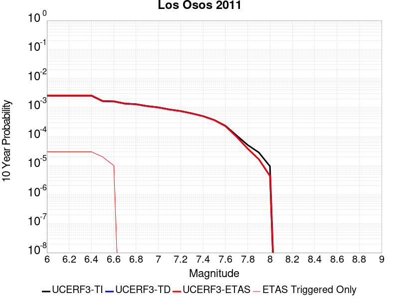 |

| Magnitude | 1 yr TI Prob | TD Prob | ETAS Prob | ETAS/TD Gain | ETAS Triggered Only | 10 yr TI Prob | TD Prob | ETAS Prob | ETAS/TD Gain | ETAS Triggered Only |
|-----|-----|-----|-----|-----|-----|-----|-----|-----|-----|-----|
| 6.0 | 2.5497406E-4 | 2.5989654E-4 | 2.7989133E-4 | 1.0769337 | 2.0E-5 | 0.002546817 | 0.0025962002 | 0.0026261224 | 1.0115254 | 3.0E-5 |
| 6.1 | 2.5497406E-4 | 2.5989654E-4 | 2.7989133E-4 | 1.0769337 | 2.0E-5 | 0.002546817 | 0.0025962002 | 0.0026261224 | 1.0115254 | 3.0E-5 |
| 6.2 | 2.5497406E-4 | 2.5989654E-4 | 2.7989133E-4 | 1.0769337 | 2.0E-5 | 0.002546817 | 0.0025962002 | 0.0026261224 | 1.0115254 | 3.0E-5 |
| 6.3 | 2.5497406E-4 | 2.5989654E-4 | 2.7989133E-4 | 1.0769337 | 2.0E-5 | 0.002546817 | 0.0025962002 | 0.0026261224 | 1.0115254 | 3.0E-5 |
| 6.4 | 2.5497406E-4 | 2.5989654E-4 | 2.7989133E-4 | 1.0769337 | 2.0E-5 | 0.002546817 | 0.0025962002 | 0.0026261224 | 1.0115254 | 3.0E-5 |
| 6.5 | 1.6551818E-4 | 1.681784E-4 | 1.7817674E-4 | 1.0594506 | 1.0E-5 | 0.0016539496 | 0.0016805249 | 0.0017004913 | 1.011881 | 2.0E-5 |
| 6.6 | 1.618586E-4 | 1.64407E-4 | 1.7440536E-4 | 1.0608146 | 1.0E-5 | 0.0016174077 | 0.0016428665 | 0.0016528501 | 1.0060769 | 1.0E-5 |
| 6.7 | 1.3625617E-4 | 1.3822126E-4 | 1.3822126E-4 | 1.0 | 0.0 | 0.0013617266 | 0.0013813575 | 0.0013813575 | 1.0 | 0.0 |
| 6.8 | 1.2929492E-4 | 1.3107249E-4 | 1.3107249E-4 | 1.0 | 0.0 | 0.0012921972 | 0.001309956 | 0.001309956 | 1.0 | 0.0 |
| 6.9 | 1.1153249E-4 | 1.128824E-4 | 1.128824E-4 | 1.0 | 0.0 | 0.0011147653 | 0.0011282525 | 0.0011282525 | 1.0 | 0.0 |
| 7.0 | 1.0061036E-4 | 1.017149E-4 | 1.017149E-4 | 1.0 | 0.0 | 0.0010056482 | 0.0010166848 | 0.0010166848 | 1.0 | 0.0 |
| 7.1 | 8.532523E-5 | 8.609685E-5 | 8.609685E-5 | 1.0 | 0.0 | 8.529247E-4 | 8.6063566E-4 | 8.6063566E-4 | 1.0 | 0.0 |
| 7.2 | 7.537582E-5 | 7.593443E-5 | 7.593443E-5 | 1.0 | 0.0 | 7.535026E-4 | 7.590854E-4 | 7.590854E-4 | 1.0 | 0.0 |
| 7.3 | 6.268844E-5 | 6.297276E-5 | 6.297276E-5 | 1.0 | 0.0 | 6.267076E-4 | 6.295495E-4 | 6.295495E-4 | 1.0 | 0.0 |
| 7.4 | 5.0652303E-5 | 5.066295E-5 | 5.066295E-5 | 1.0 | 0.0 | 5.064076E-4 | 5.065143E-4 | 5.065143E-4 | 1.0 | 0.0 |
| 7.5 | 3.743696E-5 | 3.712393E-5 | 3.712393E-5 | 1.0 | 0.0 | 3.7430652E-4 | 3.7117745E-4 | 3.7117745E-4 | 1.0 | 0.0 |
| 7.6 | 2.3759641E-5 | 2.3066801E-5 | 2.3066801E-5 | 1.0 | 0.0 | 2.37571E-4 | 2.3064416E-4 | 2.3064416E-4 | 1.0 | 0.0 |
| 7.7 | 1.1047998E-5 | 9.945603E-6 | 9.945603E-6 | 1.0 | 0.0 | 1.1047449E-4 | 9.945161E-5 | 9.945161E-5 | 1.0 | 0.0 |
| 7.8 | 5.1518946E-6 | 3.8442836E-6 | 3.8442836E-6 | 1.0 | 0.0 | 5.1517753E-5 | 3.8442176E-5 | 3.8442176E-5 | 1.0 | 0.0 |
| 7.9 | 2.8384638E-6 | 1.6634596E-6 | 1.6634596E-6 | 1.0 | 0.0 | 2.8384275E-5 | 1.6634473E-5 | 1.6634473E-5 | 1.0 | 0.0 |
| 8.0 | 9.481901E-7 | 4.393814E-7 | 4.393814E-7 | 1.0 | 0.0 | 9.481861E-6 | 4.3938057E-6 | 4.3938057E-6 | 1.0 | 0.0 |

## Malibu Coast (Extension) alt 1
*[(top)](#table-of-contents)*

| 1 Year | 10 Year |
|-----|-----|
|  | 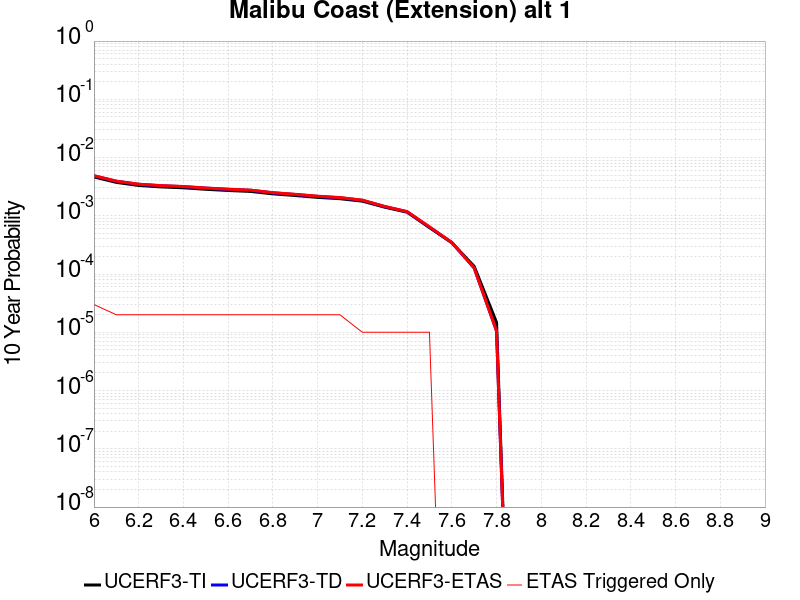 |

| Magnitude | 1 yr TI Prob | TD Prob | ETAS Prob | ETAS/TD Gain | ETAS Triggered Only | 10 yr TI Prob | TD Prob | ETAS Prob | ETAS/TD Gain | ETAS Triggered Only |
|-----|-----|-----|-----|-----|-----|-----|-----|-----|-----|-----|
| 6.0 | 4.6588664E-4 | 4.8667393E-4 | 5.1665935E-4 | 1.061613 | 3.0E-5 | 0.0046491115 | 0.004856264 | 0.004886118 | 1.0061476 | 3.0E-5 |
| 6.1 | 3.75614E-4 | 3.9284505E-4 | 4.128372E-4 | 1.0508907 | 2.0E-5 | 0.0037497976 | 0.003921572 | 0.003941494 | 1.00508 | 2.0E-5 |
| 6.2 | 3.3243504E-4 | 3.4780471E-4 | 3.6779774E-4 | 1.0574836 | 2.0E-5 | 0.0033193815 | 0.0034726437 | 0.0034925742 | 1.0057393 | 2.0E-5 |
| 6.3 | 3.1387596E-4 | 3.2841982E-4 | 3.4841325E-4 | 1.0608777 | 2.0E-5 | 0.00313433 | 0.0032793807 | 0.0032993152 | 1.0060787 | 2.0E-5 |
| 6.4 | 3.031379E-4 | 3.1717293E-4 | 3.371666E-4 | 1.063037 | 2.0E-5 | 0.0030272473 | 0.0031672374 | 0.003187174 | 1.0062946 | 2.0E-5 |
| 6.5 | 2.8573806E-4 | 2.9880996E-4 | 3.18804E-4 | 1.0669122 | 2.0E-5 | 0.0028537093 | 0.002984114 | 0.0030040543 | 1.0066822 | 2.0E-5 |
| 6.6 | 2.7246025E-4 | 2.8478142E-4 | 3.0477572E-4 | 1.0702093 | 2.0E-5 | 0.0027212645 | 0.0028441956 | 0.0028641387 | 1.0070119 | 2.0E-5 |
| 6.7 | 2.6261783E-4 | 2.7437587E-4 | 2.9437037E-4 | 1.0728728 | 2.0E-5 | 0.002623077 | 0.002740401 | 0.0027603463 | 1.0072782 | 2.0E-5 |
| 6.8 | 2.3830103E-4 | 2.48273E-4 | 2.6826802E-4 | 1.0805365 | 2.0E-5 | 0.0023804565 | 0.002479976 | 0.0024999264 | 1.0080446 | 2.0E-5 |
| 6.9 | 2.2331243E-4 | 2.3227377E-4 | 2.5226912E-4 | 1.0860853 | 2.0E-5 | 0.0022308815 | 0.0023203269 | 0.0023402805 | 1.0085995 | 2.0E-5 |
| 7.0 | 2.0761859E-4 | 2.1548003E-4 | 2.3547572E-4 | 1.092796 | 2.0E-5 | 0.0020742472 | 0.0021527244 | 0.0021726815 | 1.0092705 | 2.0E-5 |
| 7.1 | 1.9685295E-4 | 2.0406142E-4 | 2.2405734E-4 | 1.0979897 | 2.0E-5 | 0.0019667868 | 0.0020387534 | 0.0020587125 | 1.00979 | 2.0E-5 |
| 7.2 | 1.7869516E-4 | 1.8476529E-4 | 1.9476344E-4 | 1.0541127 | 1.0E-5 | 0.0017855153 | 0.0018461287 | 0.0018561103 | 1.0054067 | 1.0E-5 |
| 7.3 | 1.4069698E-4 | 1.4398464E-4 | 1.539832E-4 | 1.0694418 | 1.0E-5 | 0.0014060794 | 0.0014389176 | 0.0014489032 | 1.0069396 | 1.0E-5 |
| 7.4 | 1.1561892E-4 | 1.17362615E-4 | 1.2736145E-4 | 1.085196 | 1.0E-5 | 0.0011555878 | 0.0011730101 | 0.0011829983 | 1.0085151 | 1.0E-5 |
| 7.5 | 6.2822204E-5 | 6.375537E-5 | 7.375473E-5 | 1.1568395 | 1.0E-5 | 6.280445E-4 | 6.3737266E-4 | 6.473663E-4 | 1.0156794 | 1.0E-5 |
| 7.6 | 3.4519428E-5 | 3.484936E-5 | 3.484936E-5 | 1.0 | 0.0 | 3.4514067E-4 | 3.4844046E-4 | 3.4844046E-4 | 1.0 | 0.0 |
| 7.7 | 1.3572758E-5 | 1.2709375E-5 | 1.2709375E-5 | 1.0 | 0.0 | 1.3571928E-4 | 1.2708755E-4 | 1.2708755E-4 | 1.0 | 0.0 |
| 7.8 | 1.4778595E-6 | 1.0574844E-6 | 1.0574844E-6 | 1.0 | 0.0 | 1.4778497E-5 | 1.0574801E-5 | 1.0574801E-5 | 1.0 | 0.0 |

## San Gabriel
*[(top)](#table-of-contents)*

| 1 Year | 10 Year |
|-----|-----|
| 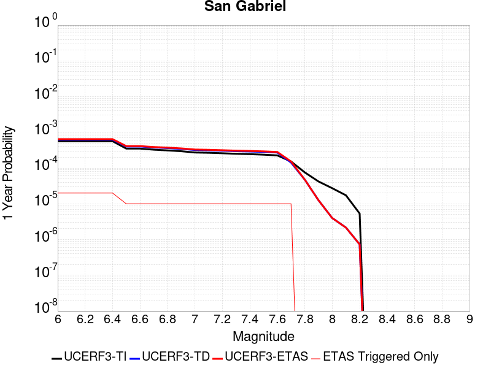 | 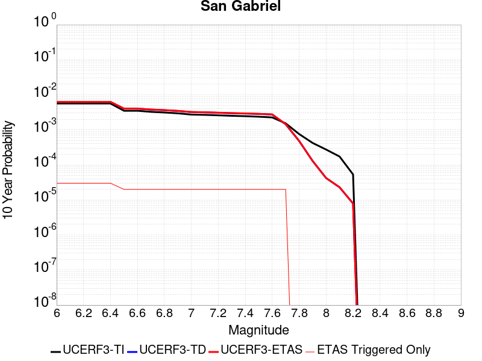 |

| Magnitude | 1 yr TI Prob | TD Prob | ETAS Prob | ETAS/TD Gain | ETAS Triggered Only | 10 yr TI Prob | TD Prob | ETAS Prob | ETAS/TD Gain | ETAS Triggered Only |
|-----|-----|-----|-----|-----|-----|-----|-----|-----|-----|-----|
| 6.0 | 5.653415E-4 | 6.251903E-4 | 6.451778E-4 | 1.0319703 | 2.0E-5 | 0.0056390543 | 0.006246409 | 0.0062762215 | 1.0047728 | 3.0E-5 |
| 6.1 | 5.653415E-4 | 6.251903E-4 | 6.451778E-4 | 1.0319703 | 2.0E-5 | 0.0056390543 | 0.006246409 | 0.0062762215 | 1.0047728 | 3.0E-5 |
| 6.2 | 5.653415E-4 | 6.251903E-4 | 6.451778E-4 | 1.0319703 | 2.0E-5 | 0.0056390543 | 0.006246409 | 0.0062762215 | 1.0047728 | 3.0E-5 |
| 6.3 | 5.653415E-4 | 6.251903E-4 | 6.451778E-4 | 1.0319703 | 2.0E-5 | 0.0056390543 | 0.006246409 | 0.0062762215 | 1.0047728 | 3.0E-5 |
| 6.4 | 5.653415E-4 | 6.251903E-4 | 6.451778E-4 | 1.0319703 | 2.0E-5 | 0.0056390543 | 0.006246409 | 0.0062762215 | 1.0047728 | 3.0E-5 |
| 6.5 | 3.511943E-4 | 4.0258077E-4 | 4.1257674E-4 | 1.0248297 | 1.0E-5 | 0.003506398 | 0.0040296097 | 0.004049529 | 1.0049433 | 2.0E-5 |
| 6.6 | 3.511943E-4 | 4.0258077E-4 | 4.1257674E-4 | 1.0248297 | 1.0E-5 | 0.003506398 | 0.0040296097 | 0.004049529 | 1.0049433 | 2.0E-5 |
| 6.7 | 3.2736175E-4 | 3.780098E-4 | 3.8800604E-4 | 1.0264443 | 1.0E-5 | 0.0032687993 | 0.0037847564 | 0.0038046807 | 1.0052644 | 2.0E-5 |
| 6.8 | 3.128256E-4 | 3.6302538E-4 | 3.7302176E-4 | 1.0275363 | 1.0E-5 | 0.003123856 | 0.0036354093 | 0.0036553366 | 1.0054815 | 2.0E-5 |
| 6.9 | 2.9666146E-4 | 3.4555403E-4 | 3.5555058E-4 | 1.028929 | 1.0E-5 | 0.0029626573 | 0.0034612515 | 0.0034811823 | 1.0057583 | 2.0E-5 |
| 7.0 | 2.7301308E-4 | 3.2071886E-4 | 3.3071564E-4 | 1.03117 | 1.0E-5 | 0.002726779 | 0.0032136322 | 0.0032335678 | 1.0062035 | 2.0E-5 |
| 7.1 | 2.6793676E-4 | 3.1498758E-4 | 3.2498443E-4 | 1.0317373 | 1.0E-5 | 0.0026761394 | 0.0031564834 | 0.0031764202 | 1.0063162 | 2.0E-5 |
| 7.2 | 2.6028889E-4 | 3.0629625E-4 | 3.1629318E-4 | 1.0326381 | 1.0E-5 | 0.0025998424 | 0.003069813 | 0.0030897513 | 1.006495 | 2.0E-5 |
| 7.3 | 2.5157086E-4 | 2.9750957E-4 | 3.075066E-4 | 1.0336024 | 1.0E-5 | 0.0025128627 | 0.0029821852 | 0.0030021255 | 1.0066864 | 2.0E-5 |
| 7.4 | 2.4582737E-4 | 2.916964E-4 | 3.0169348E-4 | 1.0342722 | 1.0E-5 | 0.002455556 | 0.0029242067 | 0.0029441481 | 1.0068195 | 2.0E-5 |
| 7.5 | 2.37419E-4 | 2.8363022E-4 | 2.9362738E-4 | 1.0352472 | 1.0E-5 | 0.002371655 | 0.002843753 | 0.002863696 | 1.007013 | 2.0E-5 |
| 7.6 | 2.2661954E-4 | 2.7282597E-4 | 2.8282322E-4 | 1.0366434 | 1.0E-5 | 0.0022638857 | 0.0027359722 | 0.0027559176 | 1.00729 | 2.0E-5 |
| 7.7 | 1.5319703E-4 | 1.4317037E-4 | 1.5316893E-4 | 1.0698369 | 1.0E-5 | 0.0015309147 | 0.0014380751 | 0.0014580463 | 1.0138875 | 2.0E-5 |
| 7.8 | 7.587337E-5 | 4.7605077E-5 | 4.7605077E-5 | 1.0 | 0.0 | 7.584747E-4 | 4.8085177E-4 | 4.8085177E-4 | 1.0 | 0.0 |
| 7.9 | 4.225833E-5 | 1.2614248E-5 | 1.2614248E-5 | 1.0 | 0.0 | 4.2250296E-4 | 1.2921814E-4 | 1.2921814E-4 | 1.0 | 0.0 |
| 8.0 | 2.7379416E-5 | 4.0068917E-6 | 4.0068917E-6 | 1.0 | 0.0 | 2.7376044E-4 | 4.21918E-5 | 4.21918E-5 | 1.0 | 0.0 |
| 8.1 | 1.7303513E-5 | 2.1652063E-6 | 2.1652063E-6 | 1.0 | 0.0 | 1.7302166E-4 | 2.2965523E-5 | 2.2965523E-5 | 1.0 | 0.0 |
| 8.2 | 5.340643E-6 | 7.327681E-7 | 7.327681E-7 | 1.0 | 0.0 | 5.3405143E-5 | 7.9273705E-6 | 7.9273705E-6 | 1.0 | 0.0 |

## Raymond
*[(top)](#table-of-contents)*

| 1 Year | 10 Year |
|-----|-----|
|  |  |

| Magnitude | 1 yr TI Prob | TD Prob | ETAS Prob | ETAS/TD Gain | ETAS Triggered Only | 10 yr TI Prob | TD Prob | ETAS Prob | ETAS/TD Gain | ETAS Triggered Only |
|-----|-----|-----|-----|-----|-----|-----|-----|-----|-----|-----|
| 6.0 | 7.905855E-4 | 8.2464307E-4 | 8.546183E-4 | 1.0363494 | 3.0E-5 | 0.007877788 | 0.008218348 | 0.008248102 | 1.0036204 | 3.0E-5 |
| 6.1 | 7.905855E-4 | 8.2464307E-4 | 8.546183E-4 | 1.0363494 | 3.0E-5 | 0.007877788 | 0.008218348 | 0.008248102 | 1.0036204 | 3.0E-5 |
| 6.2 | 7.905855E-4 | 8.2464307E-4 | 8.546183E-4 | 1.0363494 | 3.0E-5 | 0.007877788 | 0.008218348 | 0.008248102 | 1.0036204 | 3.0E-5 |
| 6.3 | 7.905855E-4 | 8.2464307E-4 | 8.546183E-4 | 1.0363494 | 3.0E-5 | 0.007877788 | 0.008218348 | 0.008248102 | 1.0036204 | 3.0E-5 |
| 6.4 | 7.2721124E-4 | 7.5397117E-4 | 7.839485E-4 | 1.0397593 | 3.0E-5 | 0.007248361 | 0.0075164647 | 0.007546239 | 1.0039612 | 3.0E-5 |
| 6.5 | 7.2721124E-4 | 7.5397117E-4 | 7.839485E-4 | 1.0397593 | 3.0E-5 | 0.007248361 | 0.0075164647 | 0.007546239 | 1.0039612 | 3.0E-5 |
| 6.6 | 5.499499E-4 | 5.5665727E-4 | 5.766461E-4 | 1.0359087 | 2.0E-5 | 0.005485909 | 0.00555319 | 0.005573079 | 1.0035815 | 2.0E-5 |
| 6.7 | 5.499499E-4 | 5.5665727E-4 | 5.766461E-4 | 1.0359087 | 2.0E-5 | 0.005485909 | 0.00555319 | 0.005573079 | 1.0035815 | 2.0E-5 |
| 6.8 | 5.257791E-4 | 5.3087034E-4 | 5.508597E-4 | 1.037654 | 2.0E-5 | 0.0052453685 | 0.005296571 | 0.005316465 | 1.003756 | 2.0E-5 |
| 6.9 | 4.0282236E-4 | 3.9381627E-4 | 4.1380842E-4 | 1.0507652 | 2.0E-5 | 0.0040209293 | 0.0039313175 | 0.003951239 | 1.0050673 | 2.0E-5 |
| 7.0 | 3.7236E-4 | 3.6055944E-4 | 3.8055223E-4 | 1.0554494 | 2.0E-5 | 0.0037173668 | 0.0035998628 | 0.0036197908 | 1.0055357 | 2.0E-5 |
| 7.1 | 2.9502588E-4 | 2.7648517E-4 | 2.9647964E-4 | 1.0723166 | 2.0E-5 | 0.0029463451 | 0.002761443 | 0.0027813877 | 1.0072225 | 2.0E-5 |
| 7.2 | 2.5751285E-4 | 2.3616731E-4 | 2.3616731E-4 | 1.0 | 0.0 | 0.0025721465 | 0.0023591854 | 0.0023591854 | 1.0 | 0.0 |
| 7.3 | 2.2104931E-4 | 1.9855241E-4 | 1.9855241E-4 | 1.0 | 0.0 | 0.0022082955 | 0.0019837688 | 0.0019837688 | 1.0 | 0.0 |
| 7.4 | 1.8260824E-4 | 1.5880594E-4 | 1.5880594E-4 | 1.0 | 0.0 | 0.0018245826 | 0.0015869403 | 0.0015869403 | 1.0 | 0.0 |
| 7.5 | 1.428558E-4 | 1.2011051E-4 | 1.2011051E-4 | 1.0 | 0.0 | 0.0014276401 | 0.0012004703 | 0.0012004703 | 1.0 | 0.0 |
| 7.6 | 9.488958E-5 | 7.5255055E-5 | 7.5255055E-5 | 1.0 | 0.0 | 9.4849075E-4 | 7.523072E-4 | 7.523072E-4 | 1.0 | 0.0 |
| 7.7 | 5.5622655E-5 | 3.9883522E-5 | 3.9883522E-5 | 1.0 | 0.0 | 5.5608735E-4 | 3.9877277E-4 | 3.9877277E-4 | 1.0 | 0.0 |
| 7.8 | 3.607355E-5 | 2.2543056E-5 | 2.2543056E-5 | 1.0 | 0.0 | 3.6067693E-4 | 2.2541556E-4 | 2.2541556E-4 | 1.0 | 0.0 |
| 7.9 | 3.874356E-6 | 2.7770516E-6 | 2.7770516E-6 | 1.0 | 0.0 | 3.8742884E-5 | 2.7770298E-5 | 2.7770298E-5 | 1.0 | 0.0 |

## Hollywood
*[(top)](#table-of-contents)*

| 1 Year | 10 Year |
|-----|-----|
|  |  |

| Magnitude | 1 yr TI Prob | TD Prob | ETAS Prob | ETAS/TD Gain | ETAS Triggered Only | 10 yr TI Prob | TD Prob | ETAS Prob | ETAS/TD Gain | ETAS Triggered Only |
|-----|-----|-----|-----|-----|-----|-----|-----|-----|-----|-----|
| 6.0 | 6.4935174E-4 | 6.568898E-4 | 6.8687013E-4 | 1.0456398 | 3.0E-5 | 0.0064745755 | 0.006549969 | 0.0065797726 | 1.0045502 | 3.0E-5 |
| 6.1 | 6.4935174E-4 | 6.568898E-4 | 6.8687013E-4 | 1.0456398 | 3.0E-5 | 0.0064745755 | 0.006549969 | 0.0065797726 | 1.0045502 | 3.0E-5 |
| 6.2 | 6.4935174E-4 | 6.568898E-4 | 6.8687013E-4 | 1.0456398 | 3.0E-5 | 0.0064745755 | 0.006549969 | 0.0065797726 | 1.0045502 | 3.0E-5 |
| 6.3 | 6.4935174E-4 | 6.568898E-4 | 6.8687013E-4 | 1.0456398 | 3.0E-5 | 0.0064745755 | 0.006549969 | 0.0065797726 | 1.0045502 | 3.0E-5 |
| 6.4 | 6.4842677E-4 | 6.558789E-4 | 6.8585924E-4 | 1.0457102 | 3.0E-5 | 0.0064653796 | 0.0065399194 | 0.006569723 | 1.0045573 | 3.0E-5 |
| 6.5 | 5.864344E-4 | 5.9037853E-4 | 6.2036084E-4 | 1.0507848 | 3.0E-5 | 0.0058488925 | 0.005888388 | 0.0059182113 | 1.0050647 | 3.0E-5 |
| 6.6 | 5.86009E-4 | 5.8991514E-4 | 6.1989744E-4 | 1.0508248 | 3.0E-5 | 0.005844661 | 0.0058837784 | 0.005913602 | 1.0050688 | 3.0E-5 |
| 6.7 | 5.857657E-4 | 5.89641E-4 | 6.1962334E-4 | 1.0508484 | 3.0E-5 | 0.0058422405 | 0.005881052 | 0.0059108753 | 1.0050712 | 3.0E-5 |
| 6.8 | 5.3483713E-4 | 5.330467E-4 | 5.5303605E-4 | 1.0375001 | 2.0E-5 | 0.005335517 | 0.005317908 | 0.0053378013 | 1.0037409 | 2.0E-5 |
| 6.9 | 4.8265693E-4 | 4.752537E-4 | 4.952442E-4 | 1.0420628 | 2.0E-5 | 0.0048161 | 0.004742547 | 0.004762452 | 1.0041971 | 2.0E-5 |
| 7.0 | 4.4209688E-4 | 4.3081454E-4 | 4.5080594E-4 | 1.0464036 | 2.0E-5 | 0.004412184 | 0.004299944 | 0.004319858 | 1.0046313 | 2.0E-5 |
| 7.1 | 3.4659685E-4 | 3.2702246E-4 | 3.470159E-4 | 1.0611379 | 2.0E-5 | 0.0034605677 | 0.0032654584 | 0.0032853931 | 1.0061047 | 2.0E-5 |
| 7.2 | 2.8949787E-4 | 2.6653046E-4 | 2.7652777E-4 | 1.0375092 | 1.0E-5 | 0.0028912104 | 0.0026621243 | 0.0026720979 | 1.0037464 | 1.0E-5 |
| 7.3 | 2.2465475E-4 | 2.066005E-4 | 2.066005E-4 | 1.0 | 0.0 | 0.0022442779 | 0.0020640944 | 0.0020640944 | 1.0 | 0.0 |
| 7.4 | 1.4896276E-4 | 1.409401E-4 | 1.409401E-4 | 1.0 | 0.0 | 0.0014886294 | 0.0014085122 | 0.0014085122 | 1.0 | 0.0 |
| 7.5 | 1.0397117E-4 | 9.90112E-5 | 9.90112E-5 | 1.0 | 0.0 | 0.0010392254 | 9.896745E-4 | 9.896745E-4 | 1.0 | 0.0 |
| 7.6 | 7.018215E-5 | 6.3739404E-5 | 6.3739404E-5 | 1.0 | 0.0 | 7.0159987E-4 | 6.3721323E-4 | 6.3721323E-4 | 1.0 | 0.0 |
| 7.7 | 4.00907E-5 | 3.2755615E-5 | 3.2755615E-5 | 1.0 | 0.0 | 4.0083472E-4 | 3.2750933E-4 | 3.2750933E-4 | 1.0 | 0.0 |
| 7.8 | 1.9077417E-5 | 1.2801827E-5 | 1.2801827E-5 | 1.0 | 0.0 | 1.907578E-4 | 1.2801126E-4 | 1.2801126E-4 | 1.0 | 0.0 |
| 7.9 | 3.91466E-6 | 2.808081E-6 | 2.808081E-6 | 1.0 | 0.0 | 3.9145907E-5 | 2.8080585E-5 | 2.8080585E-5 | 1.0 | 0.0 |

## Cleghorn
*[(top)](#table-of-contents)*

| 1 Year | 10 Year |
|-----|-----|
|  | 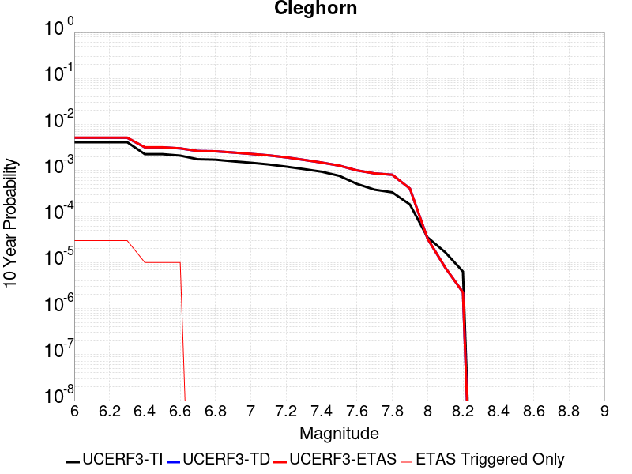 |

| Magnitude | 1 yr TI Prob | TD Prob | ETAS Prob | ETAS/TD Gain | ETAS Triggered Only | 10 yr TI Prob | TD Prob | ETAS Prob | ETAS/TD Gain | ETAS Triggered Only |
|-----|-----|-----|-----|-----|-----|-----|-----|-----|-----|-----|
| 6.0 | 4.1352084E-4 | 5.128803E-4 | 5.3287E-4 | 1.0389755 | 2.0E-5 | 0.004127522 | 0.0051320773 | 0.0051619234 | 1.0058156 | 3.0E-5 |
| 6.1 | 4.1352084E-4 | 5.128803E-4 | 5.3287E-4 | 1.0389755 | 2.0E-5 | 0.004127522 | 0.0051320773 | 0.0051619234 | 1.0058156 | 3.0E-5 |
| 6.2 | 4.1352084E-4 | 5.128803E-4 | 5.3287E-4 | 1.0389755 | 2.0E-5 | 0.004127522 | 0.0051320773 | 0.0051619234 | 1.0058156 | 3.0E-5 |
| 6.3 | 4.1352084E-4 | 5.128803E-4 | 5.3287E-4 | 1.0389755 | 2.0E-5 | 0.004127522 | 0.0051320773 | 0.0051619234 | 1.0058156 | 3.0E-5 |
| 6.4 | 2.2666567E-4 | 3.1779436E-4 | 3.2779117E-4 | 1.031457 | 1.0E-5 | 0.0022643462 | 0.0031875873 | 0.0031975554 | 1.0031272 | 1.0E-5 |
| 6.5 | 2.2666567E-4 | 3.1779436E-4 | 3.2779117E-4 | 1.031457 | 1.0E-5 | 0.0022643462 | 0.0031875873 | 0.0031975554 | 1.0031272 | 1.0E-5 |
| 6.6 | 2.1078532E-4 | 3.012278E-4 | 3.1122478E-4 | 1.0331875 | 1.0E-5 | 0.002105855 | 0.003022377 | 0.0030323467 | 1.0032986 | 1.0E-5 |
| 6.7 | 1.7547216E-4 | 2.6437303E-4 | 2.6437303E-4 | 1.0 | 0.0 | 0.0017533366 | 0.0026547113 | 0.0026547113 | 1.0 | 0.0 |
| 6.8 | 1.716675E-4 | 2.6029933E-4 | 2.6029933E-4 | 1.0 | 0.0 | 0.0017153495 | 0.0026140702 | 0.0026140702 | 1.0 | 0.0 |
| 6.9 | 1.5816953E-4 | 2.4474156E-4 | 2.4474156E-4 | 1.0 | 0.0 | 0.00158057 | 0.0024588439 | 0.0024588439 | 1.0 | 0.0 |
| 7.0 | 1.4744449E-4 | 2.2802586E-4 | 2.2802586E-4 | 1.0 | 0.0 | 0.001473467 | 0.0022920412 | 0.0022920412 | 1.0 | 0.0 |
| 7.1 | 1.3546048E-4 | 2.1212637E-4 | 2.1212637E-4 | 1.0 | 0.0 | 0.0013537793 | 0.002133366 | 0.002133366 | 1.0 | 0.0 |
| 7.2 | 1.21293626E-4 | 1.9180974E-4 | 1.9180974E-4 | 1.0 | 0.0 | 0.0012122744 | 0.0019305905 | 0.0019305905 | 1.0 | 0.0 |
| 7.3 | 1.0732192E-4 | 1.6878877E-4 | 1.6878877E-4 | 1.0 | 0.0 | 0.001072701 | 0.0017008206 | 0.0017008206 | 1.0 | 0.0 |
| 7.4 | 9.4209274E-5 | 1.4742027E-4 | 1.4742027E-4 | 1.0 | 0.0 | 9.4169343E-4 | 0.0014875771 | 0.0014875771 | 1.0 | 0.0 |
| 7.5 | 7.661323E-5 | 1.2651215E-4 | 1.2651215E-4 | 1.0 | 0.0 | 7.658682E-4 | 0.0012787961 | 0.0012787961 | 1.0 | 0.0 |
| 7.6 | 5.1155046E-5 | 9.91484E-5 | 9.91484E-5 | 1.0 | 0.0 | 5.114327E-4 | 0.001005471 | 0.001005471 | 1.0 | 0.0 |
| 7.7 | 3.831614E-5 | 8.4964835E-5 | 8.4964835E-5 | 1.0 | 0.0 | 3.8309532E-4 | 8.637868E-4 | 8.637868E-4 | 1.0 | 0.0 |
| 7.8 | 3.35721E-5 | 7.941297E-5 | 7.941297E-5 | 1.0 | 0.0 | 3.3567028E-4 | 8.079678E-4 | 8.079678E-4 | 1.0 | 0.0 |
| 7.9 | 1.8233079E-5 | 3.952169E-5 | 3.952169E-5 | 1.0 | 0.0 | 1.8231584E-4 | 4.040099E-4 | 4.040099E-4 | 1.0 | 0.0 |
| 8.0 | 3.505102E-6 | 3.0466126E-6 | 3.0466126E-6 | 1.0 | 0.0 | 3.5050467E-5 | 3.273506E-5 | 3.273506E-5 | 1.0 | 0.0 |
| 8.1 | 1.6689258E-6 | 6.760302E-7 | 6.760302E-7 | 1.0 | 0.0 | 1.6689133E-5 | 7.74454E-6 | 7.74454E-6 | 1.0 | 0.0 |
| 8.2 | 6.359922E-7 | 1.9042727E-7 | 1.9042727E-7 | 1.0 | 0.0 | 6.3599036E-6 | 2.2470974E-6 | 2.2470974E-6 | 1.0 | 0.0 |

## Emerson-Copper Mtn 2011
*[(top)](#table-of-contents)*

| 1 Year | 10 Year |
|-----|-----|
|  |  |

| Magnitude | 1 yr TI Prob | TD Prob | ETAS Prob | ETAS/TD Gain | ETAS Triggered Only | 10 yr TI Prob | TD Prob | ETAS Prob | ETAS/TD Gain | ETAS Triggered Only |
|-----|-----|-----|-----|-----|-----|-----|-----|-----|-----|-----|
| 6.0 | 0.0011141442 | 5.199986E-4 | 5.299934E-4 | 1.0192208 | 1.0E-5 | 0.011085749 | 0.005188688 | 0.0052085845 | 1.0038345 | 2.0E-5 |
| 6.1 | 0.0011141442 | 5.199986E-4 | 5.299934E-4 | 1.0192208 | 1.0E-5 | 0.011085749 | 0.005188688 | 0.0052085845 | 1.0038345 | 2.0E-5 |
| 6.2 | 0.0011141442 | 5.199986E-4 | 5.299934E-4 | 1.0192208 | 1.0E-5 | 0.011085749 | 0.005188688 | 0.0052085845 | 1.0038345 | 2.0E-5 |
| 6.3 | 9.258136E-4 | 4.2200365E-4 | 4.3199942E-4 | 1.0236865 | 1.0E-5 | 0.00921966 | 0.0042126453 | 0.004232561 | 1.0047276 | 2.0E-5 |
| 6.4 | 9.258136E-4 | 4.2200365E-4 | 4.3199942E-4 | 1.0236865 | 1.0E-5 | 0.00921966 | 0.0042126453 | 0.004232561 | 1.0047276 | 2.0E-5 |
| 6.5 | 8.286065E-4 | 3.4452465E-4 | 3.545212E-4 | 1.0290155 | 1.0E-5 | 0.008255237 | 0.0034403696 | 0.0034603006 | 1.0057933 | 2.0E-5 |
| 6.6 | 8.286065E-4 | 3.4452465E-4 | 3.545212E-4 | 1.0290155 | 1.0E-5 | 0.008255237 | 0.0034403696 | 0.0034603006 | 1.0057933 | 2.0E-5 |
| 6.7 | 7.450834E-4 | 2.8540206E-4 | 2.953992E-4 | 1.0350283 | 1.0E-5 | 0.007425902 | 0.0028507432 | 0.0028706861 | 1.0069957 | 2.0E-5 |
| 6.8 | 7.0368167E-4 | 2.6470813E-4 | 2.7470547E-4 | 1.0377674 | 1.0E-5 | 0.007014576 | 0.002644309 | 0.0026542826 | 1.0037717 | 1.0E-5 |
| 6.9 | 6.38227E-4 | 2.238085E-4 | 2.3380626E-4 | 1.044671 | 1.0E-5 | 0.0063639707 | 0.0022361854 | 0.002246163 | 1.0044619 | 1.0E-5 |
| 7.0 | 5.743165E-4 | 1.9403672E-4 | 2.0403478E-4 | 1.0515267 | 1.0E-5 | 0.005728345 | 0.0019390108 | 0.0019489914 | 1.0051472 | 1.0E-5 |
| 7.1 | 5.07382E-4 | 1.6757673E-4 | 1.7757504E-4 | 1.0596641 | 1.0E-5 | 0.0050622504 | 0.0016748349 | 0.0016848181 | 1.0059607 | 1.0E-5 |
| 7.2 | 2.0522442E-4 | 6.0133007E-5 | 7.01324E-5 | 1.166288 | 1.0E-5 | 0.00205035 | 6.011733E-4 | 6.111673E-4 | 1.0166241 | 1.0E-5 |
| 7.3 | 1.3887069E-4 | 3.6062618E-5 | 4.6062258E-5 | 1.2772855 | 1.0E-5 | 0.0013878393 | 3.605687E-4 | 3.705651E-4 | 1.0277239 | 1.0E-5 |
| 7.4 | 1.0901308E-4 | 2.84987E-5 | 2.84987E-5 | 1.0 | 0.0 | 0.0010895962 | 2.84951E-4 | 2.84951E-4 | 1.0 | 0.0 |
| 7.5 | 6.0951766E-5 | 1.8800076E-5 | 1.8800076E-5 | 1.0 | 0.0 | 6.093505E-4 | 1.8798532E-4 | 1.8798532E-4 | 1.0 | 0.0 |
| 7.6 | 6.863748E-6 | 3.7149728E-6 | 3.7149728E-6 | 1.0 | 0.0 | 6.863536E-5 | 3.7149264E-5 | 3.7149264E-5 | 1.0 | 0.0 |

## Newport-Inglewood (Offshore)
*[(top)](#table-of-contents)*

| 1 Year | 10 Year |
|-----|-----|
| 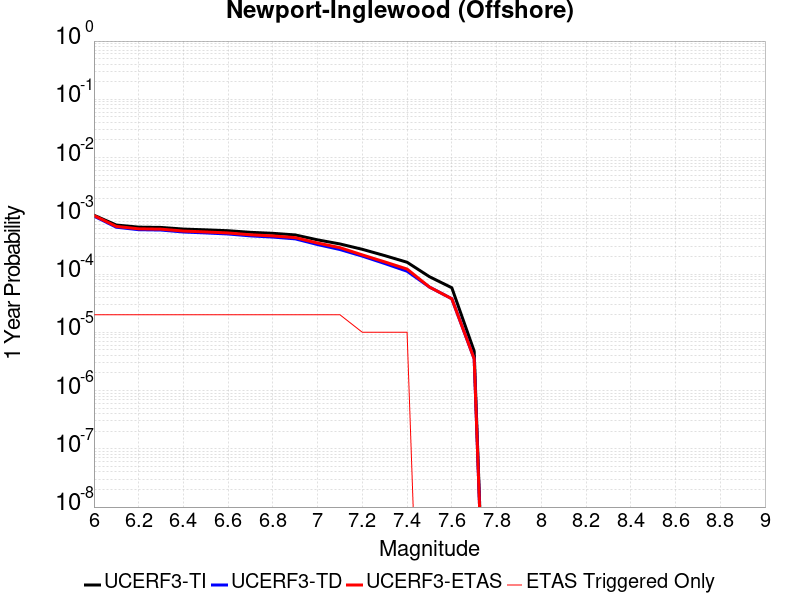 |  |

| Magnitude | 1 yr TI Prob | TD Prob | ETAS Prob | ETAS/TD Gain | ETAS Triggered Only | 10 yr TI Prob | TD Prob | ETAS Prob | ETAS/TD Gain | ETAS Triggered Only |
|-----|-----|-----|-----|-----|-----|-----|-----|-----|-----|-----|
| 6.0 | 0.001023569 | 9.891186E-4 | 0.0010090988 | 1.0202 | 2.0E-5 | 0.010188672 | 0.009848503 | 0.009868307 | 1.0020108 | 2.0E-5 |
| 6.1 | 6.947222E-4 | 6.3732493E-4 | 6.5731216E-4 | 1.0313612 | 2.0E-5 | 0.006925544 | 0.006355149 | 0.0063750218 | 1.0031271 | 2.0E-5 |
| 6.2 | 6.3903164E-4 | 5.777687E-4 | 5.977571E-4 | 1.034596 | 2.0E-5 | 0.006371971 | 0.0057627866 | 0.0057826713 | 1.0034505 | 2.0E-5 |
| 6.3 | 6.3149154E-4 | 5.69574E-4 | 5.8956264E-4 | 1.0350939 | 2.0E-5 | 0.0062970007 | 0.005681259 | 0.0057011456 | 1.0035003 | 2.0E-5 |
| 6.4 | 5.919901E-4 | 5.273565E-4 | 5.4734596E-4 | 1.037905 | 2.0E-5 | 0.005904155 | 0.0052611465 | 0.0052810414 | 1.0037814 | 2.0E-5 |
| 6.5 | 5.7423924E-4 | 5.082702E-4 | 5.282601E-4 | 1.0393292 | 2.0E-5 | 0.005727576 | 0.0050711688 | 0.0050910674 | 1.0039239 | 2.0E-5 |
| 6.6 | 5.5475225E-4 | 4.8752132E-4 | 5.0751155E-4 | 1.0410038 | 2.0E-5 | 0.0055336943 | 0.0048646047 | 0.0048845075 | 1.0040914 | 2.0E-5 |
| 6.7 | 5.205093E-4 | 4.5217964E-4 | 4.721706E-4 | 1.0442102 | 2.0E-5 | 0.0051929182 | 0.004512675 | 0.0045325845 | 1.0044119 | 2.0E-5 |
| 6.8 | 5.0055445E-4 | 4.315801E-4 | 4.5157145E-4 | 1.0463214 | 2.0E-5 | 0.004994285 | 0.004307495 | 0.004327409 | 1.004623 | 2.0E-5 |
| 6.9 | 4.6953102E-4 | 4.0205332E-4 | 4.2204527E-4 | 1.0497247 | 2.0E-5 | 0.004685402 | 0.0040133307 | 0.0040332507 | 1.0049634 | 2.0E-5 |
| 7.0 | 3.8641447E-4 | 3.207907E-4 | 3.4078432E-4 | 1.062326 | 2.0E-5 | 0.0038574322 | 0.0032032963 | 0.0032232322 | 1.0062236 | 2.0E-5 |
| 7.1 | 3.2865192E-4 | 2.638118E-4 | 2.8380653E-4 | 1.0757916 | 2.0E-5 | 0.003281663 | 0.002635001 | 0.0026549483 | 1.0075701 | 2.0E-5 |
| 7.2 | 2.6590136E-4 | 2.0309901E-4 | 2.1309698E-4 | 1.0492271 | 1.0E-5 | 0.0026558342 | 0.0020291451 | 0.0020391247 | 1.0049182 | 1.0E-5 |
| 7.3 | 2.0740448E-4 | 1.5182374E-4 | 1.6182222E-4 | 1.0658559 | 1.0E-5 | 0.00207211 | 0.0015172083 | 0.0015271931 | 1.0065811 | 1.0E-5 |
| 7.4 | 1.5948903E-4 | 1.1191672E-4 | 1.21915604E-4 | 1.0893421 | 1.0E-5 | 0.0015937461 | 0.0011186098 | 0.0011285987 | 1.0089296 | 1.0E-5 |
| 7.5 | 9.015547E-5 | 5.9846494E-5 | 5.9846494E-5 | 1.0 | 0.0 | 9.01189E-4 | 5.9830764E-4 | 5.9830764E-4 | 1.0 | 0.0 |
| 7.6 | 5.821092E-5 | 3.7687976E-5 | 3.7687976E-5 | 1.0 | 0.0 | 5.8195676E-4 | 3.7681818E-4 | 3.7681818E-4 | 1.0 | 0.0 |
| 7.7 | 4.757617E-6 | 3.513775E-6 | 3.513775E-6 | 1.0 | 0.0 | 4.7575148E-5 | 3.5137225E-5 | 3.5137225E-5 | 1.0 | 0.0 |

## San Gregorio (North) 2011 CFM
*[(top)](#table-of-contents)*

| 1 Year | 10 Year |
|-----|-----|
| 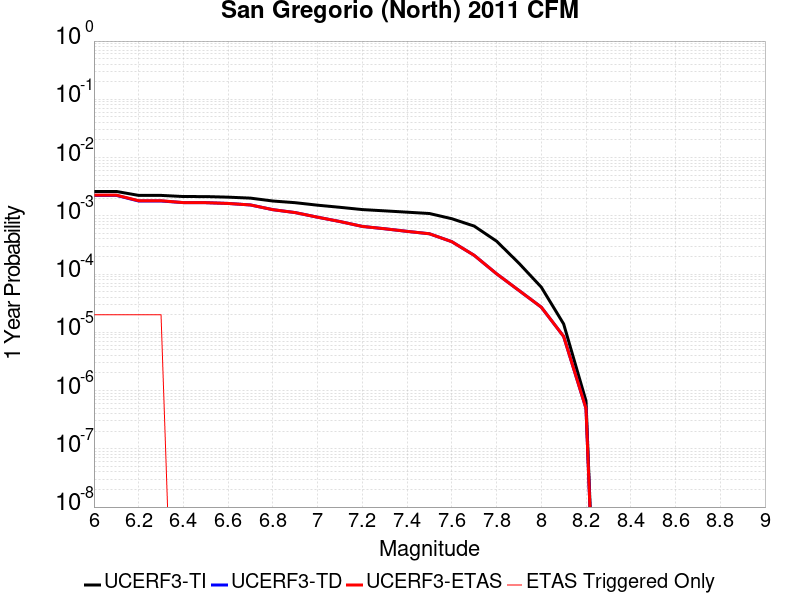 | 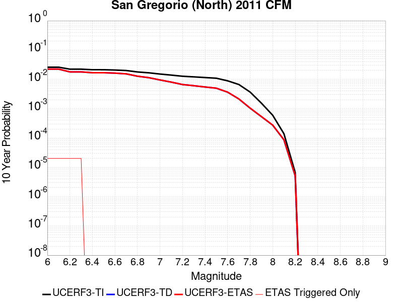 |

| Magnitude | 1 yr TI Prob | TD Prob | ETAS Prob | ETAS/TD Gain | ETAS Triggered Only | 10 yr TI Prob | TD Prob | ETAS Prob | ETAS/TD Gain | ETAS Triggered Only |
|-----|-----|-----|-----|-----|-----|-----|-----|-----|-----|-----|
| 6.0 | 0.0026203706 | 0.002244237 | 0.002264192 | 1.0088917 | 2.0E-5 | 0.02589687 | 0.022293162 | 0.022312716 | 1.0008771 | 2.0E-5 |
| 6.1 | 0.0026203706 | 0.002244237 | 0.002264192 | 1.0088917 | 2.0E-5 | 0.02589687 | 0.022293162 | 0.022312716 | 1.0008771 | 2.0E-5 |
| 6.2 | 0.0022411412 | 0.00179554 | 0.001815504 | 1.0111188 | 2.0E-5 | 0.022186736 | 0.017886506 | 0.017906148 | 1.0010982 | 2.0E-5 |
| 6.3 | 0.0022411412 | 0.00179554 | 0.001815504 | 1.0111188 | 2.0E-5 | 0.022186736 | 0.017886506 | 0.017906148 | 1.0010982 | 2.0E-5 |
| 6.4 | 0.0021423528 | 0.0016853869 | 0.0016853869 | 1.0 | 0.0 | 0.02121817 | 0.016801886 | 0.016801886 | 1.0 | 0.0 |
| 6.5 | 0.0021387753 | 0.0016811171 | 0.0016811171 | 1.0 | 0.0 | 0.021183075 | 0.016759839 | 0.016759839 | 1.0 | 0.0 |
| 6.6 | 0.0020910634 | 0.0016301516 | 0.0016301516 | 1.0 | 0.0 | 0.020714961 | 0.01625741 | 0.01625741 | 1.0 | 0.0 |
| 6.7 | 0.0020112682 | 0.0015357039 | 0.0015357039 | 1.0 | 0.0 | 0.019931622 | 0.015325955 | 0.015325955 | 1.0 | 0.0 |
| 6.8 | 0.0017951399 | 0.0012750238 | 0.0012750238 | 1.0 | 0.0 | 0.017807078 | 0.012751131 | 0.012751131 | 1.0 | 0.0 |
| 6.9 | 0.0016793909 | 0.0011357224 | 0.0011357224 | 1.0 | 0.0 | 0.01666756 | 0.011372583 | 0.011372583 | 1.0 | 0.0 |
| 7.0 | 0.0015217843 | 9.464431E-4 | 9.464431E-4 | 1.0 | 0.0 | 0.015114053 | 0.009496798 | 0.009496798 | 1.0 | 0.0 |
| 7.1 | 0.0013995186 | 7.9721404E-4 | 7.9721404E-4 | 1.0 | 0.0 | 0.013907375 | 0.008015723 | 0.008015723 | 1.0 | 0.0 |
| 7.2 | 0.0012791384 | 6.575866E-4 | 6.575866E-4 | 1.0 | 0.0 | 0.012718005 | 0.00662763 | 0.00662763 | 1.0 | 0.0 |
| 7.3 | 0.0012166376 | 5.9928704E-4 | 5.9928704E-4 | 1.0 | 0.0 | 0.012099981 | 0.006046564 | 0.006046564 | 1.0 | 0.0 |
| 7.4 | 0.0011543952 | 5.4089533E-4 | 5.4089533E-4 | 1.0 | 0.0 | 0.011484168 | 0.005464249 | 0.005464249 | 1.0 | 0.0 |
| 7.5 | 0.0010948994 | 4.9178035E-4 | 4.9178035E-4 | 1.0 | 0.0 | 0.010895205 | 0.004973358 | 0.004973358 | 1.0 | 0.0 |
| 7.6 | 8.9143694E-4 | 3.596435E-4 | 3.596435E-4 | 1.0 | 0.0 | 0.008878695 | 0.0036482841 | 0.0036482841 | 1.0 | 0.0 |
| 7.7 | 6.6621625E-4 | 2.0978172E-4 | 2.0978172E-4 | 1.0 | 0.0 | 0.006642225 | 0.002136922 | 0.002136922 | 1.0 | 0.0 |
| 7.8 | 3.6737128E-4 | 1.0125406E-4 | 1.0125406E-4 | 1.0 | 0.0 | 0.0036676454 | 0.0010379003 | 0.0010379003 | 1.0 | 0.0 |
| 7.9 | 1.5374656E-4 | 5.235229E-5 | 5.235229E-5 | 1.0 | 0.0 | 0.0015364023 | 5.3400313E-4 | 5.3400313E-4 | 1.0 | 0.0 |
| 8.0 | 5.965597E-5 | 2.703576E-5 | 2.703576E-5 | 1.0 | 0.0 | 5.963996E-4 | 2.7398416E-4 | 2.7398416E-4 | 1.0 | 0.0 |
| 8.1 | 1.3918692E-5 | 8.499802E-6 | 8.499802E-6 | 1.0 | 0.0 | 1.391782E-4 | 8.63795E-5 | 8.63795E-5 | 1.0 | 0.0 |
| 8.2 | 6.629061E-7 | 4.9211656E-7 | 4.9211656E-7 | 1.0 | 0.0 | 6.629041E-6 | 5.1121438E-6 | 5.1121438E-6 | 1.0 | 0.0 |

## San Jacinto (Clark) rev
*[(top)](#table-of-contents)*

| 1 Year | 10 Year |
|-----|-----|
|  | 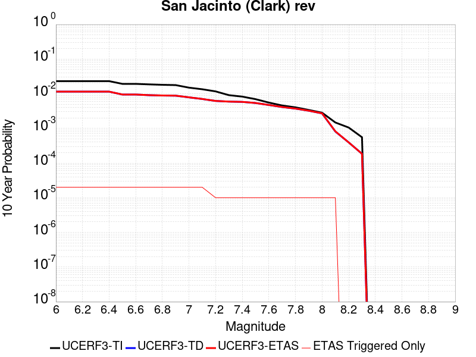 |

| Magnitude | 1 yr TI Prob | TD Prob | ETAS Prob | ETAS/TD Gain | ETAS Triggered Only | 10 yr TI Prob | TD Prob | ETAS Prob | ETAS/TD Gain | ETAS Triggered Only |
|-----|-----|-----|-----|-----|-----|-----|-----|-----|-----|-----|
| 6.0 | 0.0023362834 | 0.0011032083 | 0.0011032083 | 1.0 | 0.0 | 0.02311874 | 0.011503847 | 0.0115236165 | 1.0017185 | 2.0E-5 |
| 6.1 | 0.0023362834 | 0.0011032083 | 0.0011032083 | 1.0 | 0.0 | 0.02311874 | 0.011503847 | 0.0115236165 | 1.0017185 | 2.0E-5 |
| 6.2 | 0.0023362834 | 0.0011032083 | 0.0011032083 | 1.0 | 0.0 | 0.02311874 | 0.011503847 | 0.0115236165 | 1.0017185 | 2.0E-5 |
| 6.3 | 0.0023362834 | 0.0011032083 | 0.0011032083 | 1.0 | 0.0 | 0.02311874 | 0.011503847 | 0.0115236165 | 1.0017185 | 2.0E-5 |
| 6.4 | 0.0023362834 | 0.0011032083 | 0.0011032083 | 1.0 | 0.0 | 0.02311874 | 0.011503847 | 0.0115236165 | 1.0017185 | 2.0E-5 |
| 6.5 | 0.0019441366 | 9.052186E-4 | 9.052186E-4 | 1.0 | 0.0 | 0.01927216 | 0.0094941035 | 0.009513914 | 1.0020865 | 2.0E-5 |
| 6.6 | 0.0019441366 | 9.052186E-4 | 9.052186E-4 | 1.0 | 0.0 | 0.01927216 | 0.0094941035 | 0.009513914 | 1.0020865 | 2.0E-5 |
| 6.7 | 0.0018787434 | 8.6602574E-4 | 8.6602574E-4 | 1.0 | 0.0 | 0.01862939 | 0.009096047 | 0.0091158645 | 1.0021788 | 2.0E-5 |
| 6.8 | 0.0018262739 | 8.4666436E-4 | 8.4666436E-4 | 1.0 | 0.0 | 0.01811338 | 0.008895969 | 0.008915791 | 1.0022283 | 2.0E-5 |
| 6.9 | 0.0017908178 | 8.3781447E-4 | 8.3781447E-4 | 1.0 | 0.0 | 0.017764548 | 0.008804181 | 0.008824004 | 1.0022516 | 2.0E-5 |
| 7.0 | 0.0015099603 | 7.477995E-4 | 7.477995E-4 | 1.0 | 0.0 | 0.014997416 | 0.007868037 | 0.007887879 | 1.0025219 | 2.0E-5 |
| 7.1 | 0.0013558907 | 6.691816E-4 | 6.691816E-4 | 1.0 | 0.0 | 0.013476475 | 0.0070465137 | 0.007066373 | 1.0028182 | 2.0E-5 |
| 7.2 | 0.001175679 | 5.874956E-4 | 5.874956E-4 | 1.0 | 0.0 | 0.011694785 | 0.0061927503 | 0.006202688 | 1.0016048 | 1.0E-5 |
| 7.3 | 9.144575E-4 | 5.6398526E-4 | 5.6398526E-4 | 1.0 | 0.0 | 0.009107036 | 0.0059337732 | 0.005943714 | 1.0016752 | 1.0E-5 |
| 7.4 | 8.305819E-4 | 5.535449E-4 | 5.535449E-4 | 1.0 | 0.0 | 0.008274844 | 0.0058210334 | 0.0058309752 | 1.0017079 | 1.0E-5 |
| 7.5 | 7.004617E-4 | 5.1392964E-4 | 5.1392964E-4 | 1.0 | 0.0 | 0.006982579 | 0.0054066023 | 0.0054165483 | 1.0018396 | 1.0E-5 |
| 7.6 | 5.5757316E-4 | 4.4941145E-4 | 4.4941145E-4 | 1.0 | 0.0 | 0.005561762 | 0.0047416524 | 0.004751605 | 1.0020989 | 1.0E-5 |
| 7.7 | 4.597127E-4 | 3.8959677E-4 | 3.8959677E-4 | 1.0 | 0.0 | 0.0045876284 | 0.0041346536 | 0.0041446122 | 1.0024086 | 1.0E-5 |
| 7.8 | 4.0589093E-4 | 3.4935825E-4 | 3.4935825E-4 | 1.0 | 0.0 | 0.0040515037 | 0.0037227906 | 0.0037327535 | 1.0026761 | 1.0E-5 |
| 7.9 | 3.4138895E-4 | 3.0156763E-4 | 3.0156763E-4 | 1.0 | 0.0 | 0.0034086495 | 0.0032344845 | 0.0032444522 | 1.0030817 | 1.0E-5 |
| 8.0 | 2.8427184E-4 | 2.5112246E-4 | 2.5112246E-4 | 1.0 | 0.0 | 0.0028390845 | 0.002710839 | 0.0027208119 | 1.0036789 | 1.0E-5 |
| 8.1 | 1.4816198E-4 | 7.132765E-5 | 7.132765E-5 | 1.0 | 0.0 | 0.0014806325 | 8.1153814E-4 | 8.2153006E-4 | 1.0123123 | 1.0E-5 |
| 8.2 | 1.05929736E-4 | 3.2970976E-5 | 3.2970976E-5 | 1.0 | 0.0 | 0.0010587925 | 3.9486602E-4 | 3.9486602E-4 | 1.0 | 0.0 |
| 8.3 | 5.5619817E-5 | 1.5262167E-5 | 1.5262167E-5 | 1.0 | 0.0 | 5.5605895E-4 | 1.8566217E-4 | 1.8566217E-4 | 1.0 | 0.0 |

## Monterey Bay-Tularcitos
*[(top)](#table-of-contents)*

| 1 Year | 10 Year |
|-----|-----|
|  |  |

| Magnitude | 1 yr TI Prob | TD Prob | ETAS Prob | ETAS/TD Gain | ETAS Triggered Only | 10 yr TI Prob | TD Prob | ETAS Prob | ETAS/TD Gain | ETAS Triggered Only |
|-----|-----|-----|-----|-----|-----|-----|-----|-----|-----|-----|
| 6.0 | 0.001571 | 0.0017100703 | 0.0017200531 | 1.0058377 | 1.0E-5 | 0.015599402 | 0.016979916 | 0.016999578 | 1.0011579 | 2.0E-5 |
| 6.1 | 0.001571 | 0.0017100703 | 0.0017200531 | 1.0058377 | 1.0E-5 | 0.015599402 | 0.016979916 | 0.016999578 | 1.0011579 | 2.0E-5 |
| 6.2 | 0.001571 | 0.0017100703 | 0.0017200531 | 1.0058377 | 1.0E-5 | 0.015599402 | 0.016979916 | 0.016999578 | 1.0011579 | 2.0E-5 |
| 6.3 | 8.865586E-4 | 9.5604634E-4 | 9.6603675E-4 | 1.0104498 | 1.0E-5 | 0.0088303005 | 0.009521258 | 0.009531163 | 1.0010403 | 1.0E-5 |
| 6.4 | 8.865586E-4 | 9.5604634E-4 | 9.6603675E-4 | 1.0104498 | 1.0E-5 | 0.0088303005 | 0.009521258 | 0.009531163 | 1.0010403 | 1.0E-5 |
| 6.5 | 6.649074E-4 | 7.1425823E-4 | 7.242511E-4 | 1.0139905 | 1.0E-5 | 0.0066292146 | 0.007120678 | 0.007130607 | 1.0013944 | 1.0E-5 |
| 6.6 | 6.645082E-4 | 7.1384566E-4 | 7.238385E-4 | 1.0139986 | 1.0E-5 | 0.0066252467 | 0.007116579 | 0.007126508 | 1.0013952 | 1.0E-5 |
| 6.7 | 5.300022E-4 | 5.6785246E-4 | 5.6785246E-4 | 1.0 | 0.0 | 0.005287399 | 0.0056647263 | 0.0056647263 | 1.0 | 0.0 |
| 6.8 | 4.3559066E-4 | 4.6598914E-4 | 4.6598914E-4 | 1.0 | 0.0 | 0.004347378 | 0.004650685 | 0.004650685 | 1.0 | 0.0 |
| 6.9 | 2.7096065E-4 | 2.8884556E-4 | 2.8884556E-4 | 1.0 | 0.0 | 0.0027063051 | 0.0028850222 | 0.0028850222 | 1.0 | 0.0 |
| 7.0 | 2.274409E-4 | 2.422586E-4 | 2.422586E-4 | 1.0 | 0.0 | 0.0022720827 | 0.002420238 | 0.002420238 | 1.0 | 0.0 |
| 7.1 | 1.5860285E-4 | 1.6858005E-4 | 1.6858005E-4 | 1.0 | 0.0 | 0.001584897 | 0.0016847793 | 0.0016847793 | 1.0 | 0.0 |
| 7.2 | 8.569109E-5 | 9.044012E-5 | 9.044012E-5 | 1.0 | 0.0 | 8.5658056E-4 | 9.042358E-4 | 9.042358E-4 | 1.0 | 0.0 |
| 7.3 | 1.7515373E-5 | 1.7193941E-5 | 1.7193941E-5 | 1.0 | 0.0 | 1.7513991E-4 | 1.719262E-4 | 1.719262E-4 | 1.0 | 0.0 |
| 7.4 | 1.1465385E-5 | 1.0960787E-5 | 1.0960787E-5 | 1.0 | 0.0 | 1.1464794E-4 | 1.096025E-4 | 1.096025E-4 | 1.0 | 0.0 |
| 7.5 | 6.23226E-6 | 5.581027E-6 | 5.581027E-6 | 1.0 | 0.0 | 6.2320854E-5 | 5.5808883E-5 | 5.5808883E-5 | 1.0 | 0.0 |
| 7.6 | 2.419026E-6 | 1.7409308E-6 | 1.7409308E-6 | 1.0 | 0.0 | 2.4189996E-5 | 1.7409173E-5 | 1.7409173E-5 | 1.0 | 0.0 |
| 7.7 | 9.699246E-7 | 4.1762385E-7 | 4.1762385E-7 | 1.0 | 0.0 | 9.699204E-6 | 4.176231E-6 | 4.176231E-6 | 1.0 | 0.0 |
| 7.8 | 1.4589209E-7 | 3.9707597E-8 | 3.9707597E-8 | 1.0 | 0.0 | 1.4589199E-6 | 3.9707595E-7 | 3.9707595E-7 | 1.0 | 0.0 |

## Cedar Mtn-Mahogany Mtn
*[(top)](#table-of-contents)*

| 1 Year | 10 Year |
|-----|-----|
|  |  |

| Magnitude | 1 yr TI Prob | TD Prob | ETAS Prob | ETAS/TD Gain | ETAS Triggered Only | 10 yr TI Prob | TD Prob | ETAS Prob | ETAS/TD Gain | ETAS Triggered Only |
|-----|-----|-----|-----|-----|-----|-----|-----|-----|-----|-----|
| 6.0 | 0.0014476506 | 0.0015428112 | 0.0015627804 | 1.0129434 | 2.0E-5 | 0.0143825635 | 0.015328225 | 0.0153479185 | 1.0012848 | 2.0E-5 |
| 6.1 | 8.4298453E-4 | 8.941221E-4 | 9.0411317E-4 | 1.0111742 | 1.0E-5 | 0.008397939 | 0.008907059 | 0.008916969 | 1.0011127 | 1.0E-5 |
| 6.2 | 8.4298453E-4 | 8.941221E-4 | 9.0411317E-4 | 1.0111742 | 1.0E-5 | 0.008397939 | 0.008907059 | 0.008916969 | 1.0011127 | 1.0E-5 |
| 6.3 | 5.0840835E-4 | 5.3746643E-4 | 5.3746643E-4 | 1.0 | 0.0 | 0.0050724675 | 0.005362084 | 0.005362084 | 1.0 | 0.0 |
| 6.4 | 5.0840835E-4 | 5.3746643E-4 | 5.3746643E-4 | 1.0 | 0.0 | 0.0050724675 | 0.005362084 | 0.005362084 | 1.0 | 0.0 |
| 6.5 | 3.8031515E-4 | 4.014543E-4 | 4.014543E-4 | 1.0 | 0.0 | 0.0037966494 | 0.004007511 | 0.004007511 | 1.0 | 0.0 |
| 6.6 | 2.962827E-4 | 3.12459E-4 | 3.12459E-4 | 1.0 | 0.0 | 0.0029588798 | 0.003120333 | 0.003120333 | 1.0 | 0.0 |
| 6.7 | 1.8184677E-4 | 1.916153E-4 | 1.916153E-4 | 1.0 | 0.0 | 0.0018169804 | 0.0019145629 | 0.0019145629 | 1.0 | 0.0 |
| 6.8 | 1.4366445E-4 | 1.5138938E-4 | 1.5138938E-4 | 1.0 | 0.0 | 0.0014357162 | 0.0015129098 | 0.0015129098 | 1.0 | 0.0 |
| 6.9 | 8.6582E-5 | 9.129302E-5 | 9.129302E-5 | 1.0 | 0.0 | 8.654827E-4 | 9.125856E-4 | 9.125856E-4 | 1.0 | 0.0 |
| 7.0 | 2.6621943E-5 | 2.8120105E-5 | 2.8120105E-5 | 1.0 | 0.0 | 2.6618753E-4 | 2.81178E-4 | 2.81178E-4 | 1.0 | 0.0 |

## Hayward (No) 2011 CFM
*[(top)](#table-of-contents)*

| 1 Year | 10 Year |
|-----|-----|
|  |  |

| Magnitude | 1 yr TI Prob | TD Prob | ETAS Prob | ETAS/TD Gain | ETAS Triggered Only | 10 yr TI Prob | TD Prob | ETAS Prob | ETAS/TD Gain | ETAS Triggered Only |
|-----|-----|-----|-----|-----|-----|-----|-----|-----|-----|-----|
| 6.0 | 0.0048446343 | 0.009036438 | 0.009056257 | 1.0021932 | 2.0E-5 | 0.047403704 | 0.08637534 | 0.08639361 | 1.0002116 | 2.0E-5 |
| 6.1 | 0.0047140904 | 0.008804537 | 0.0088243615 | 1.0022515 | 2.0E-5 | 0.046153355 | 0.08426854 | 0.08428685 | 1.0002173 | 2.0E-5 |
| 6.2 | 0.0046887742 | 0.008763513 | 0.008783338 | 1.0022622 | 2.0E-5 | 0.0459107 | 0.083892785 | 0.083911106 | 1.0002184 | 2.0E-5 |
| 6.3 | 0.004598882 | 0.008597788 | 0.008617616 | 1.0023062 | 2.0E-5 | 0.04504866 | 0.08238599 | 0.082404345 | 1.0002228 | 2.0E-5 |
| 6.4 | 0.0044391346 | 0.008301278 | 0.008321112 | 1.0023893 | 2.0E-5 | 0.043514993 | 0.079682834 | 0.079701245 | 1.000231 | 2.0E-5 |
| 6.5 | 0.0042449418 | 0.007955698 | 0.007975539 | 1.002494 | 2.0E-5 | 0.04164765 | 0.07651369 | 0.07653216 | 1.0002414 | 2.0E-5 |
| 6.6 | 0.0041592065 | 0.0078025614 | 0.007822406 | 1.0025432 | 2.0E-5 | 0.04082218 | 0.07510622 | 0.07512471 | 1.0002463 | 2.0E-5 |
| 6.7 | 0.004050208 | 0.00761576 | 0.0076356074 | 1.0026062 | 2.0E-5 | 0.039771806 | 0.073382616 | 0.073401146 | 1.0002525 | 2.0E-5 |
| 6.8 | 0.0038166929 | 0.0071757827 | 0.0071956394 | 1.0027672 | 2.0E-5 | 0.037518036 | 0.06929621 | 0.06931482 | 1.0002686 | 2.0E-5 |
| 6.9 | 0.0033642664 | 0.0063104923 | 0.0063204295 | 1.0015746 | 1.0E-5 | 0.033137884 | 0.061225023 | 0.06123441 | 1.0001533 | 1.0E-5 |
| 7.0 | 0.0028061352 | 0.0052175885 | 0.005227536 | 1.0019066 | 1.0E-5 | 0.027709642 | 0.0509578 | 0.05096729 | 1.0001862 | 1.0E-5 |
| 7.1 | 0.0023093442 | 0.0042544557 | 0.0042544557 | 1.0 | 0.0 | 0.022854926 | 0.04182473 | 0.04182473 | 1.0 | 0.0 |
| 7.2 | 0.0017183421 | 0.0031660495 | 0.0031660495 | 1.0 | 0.0 | 0.017051157 | 0.031369876 | 0.031369876 | 1.0 | 0.0 |
| 7.3 | 0.0012787496 | 0.0023547374 | 0.0023547374 | 1.0 | 0.0 | 0.0127141625 | 0.02344111 | 0.02344111 | 1.0 | 0.0 |
| 7.4 | 9.820475E-4 | 0.0018039243 | 0.0018039243 | 1.0 | 0.0 | 0.009777189 | 0.0180195 | 0.0180195 | 1.0 | 0.0 |
| 7.5 | 6.5918895E-4 | 0.0011952962 | 0.0011952962 | 1.0 | 0.0 | 0.00657237 | 0.011988836 | 0.011988836 | 1.0 | 0.0 |
| 7.6 | 2.4345852E-4 | 4.4233602E-4 | 4.4233602E-4 | 1.0 | 0.0 | 0.0024319198 | 0.0044591012 | 0.0044591012 | 1.0 | 0.0 |
| 7.7 | 2.003602E-5 | 3.722282E-5 | 3.722282E-5 | 1.0 | 0.0 | 2.0034213E-4 | 3.8614936E-4 | 3.8614936E-4 | 1.0 | 0.0 |
| 7.8 | 1.3377297E-5 | 2.7999782E-5 | 2.7999782E-5 | 1.0 | 0.0 | 1.3376492E-4 | 2.9244382E-4 | 2.9244382E-4 | 1.0 | 0.0 |
| 7.9 | 8.944017E-6 | 1.9457504E-5 | 1.9457504E-5 | 1.0 | 0.0 | 8.943657E-5 | 2.0245428E-4 | 2.0245428E-4 | 1.0 | 0.0 |
| 8.0 | 6.161694E-6 | 1.43541E-5 | 1.43541E-5 | 1.0 | 0.0 | 6.161523E-5 | 1.4816441E-4 | 1.4816441E-4 | 1.0 | 0.0 |
| 8.1 | 2.6812106E-6 | 5.8595674E-6 | 5.8595674E-6 | 1.0 | 0.0 | 2.6811784E-5 | 6.0158476E-5 | 6.0158476E-5 | 1.0 | 0.0 |

## Green Valley 2011 CFM
*[(top)](#table-of-contents)*

| 1 Year | 10 Year |
|-----|-----|
|  |  |

| Magnitude | 1 yr TI Prob | TD Prob | ETAS Prob | ETAS/TD Gain | ETAS Triggered Only | 10 yr TI Prob | TD Prob | ETAS Prob | ETAS/TD Gain | ETAS Triggered Only |
|-----|-----|-----|-----|-----|-----|-----|-----|-----|-----|-----|
| 6.0 | 0.0051852856 | 0.008986705 | 0.009006525 | 1.0022055 | 2.0E-5 | 0.050659515 | 0.085522056 | 0.08554035 | 1.0002139 | 2.0E-5 |
| 6.1 | 0.0051454236 | 0.0089077335 | 0.008927555 | 1.0022253 | 2.0E-5 | 0.050279044 | 0.084809676 | 0.08482798 | 1.0002158 | 2.0E-5 |
| 6.2 | 0.0050471667 | 0.008721114 | 0.008740939 | 1.0022733 | 2.0E-5 | 0.04934063 | 0.0831186 | 0.083136946 | 1.0002207 | 2.0E-5 |
| 6.3 | 0.0048282105 | 0.008296439 | 0.008306356 | 1.0011953 | 1.0E-5 | 0.047246475 | 0.07925707 | 0.07926627 | 1.0001162 | 1.0E-5 |
| 6.4 | 0.004369175 | 0.0074670846 | 0.0074670846 | 1.0 | 0.0 | 0.04284265 | 0.071630865 | 0.071630865 | 1.0 | 0.0 |
| 6.5 | 0.0031009112 | 0.005168295 | 0.005168295 | 1.0 | 0.0 | 0.030579966 | 0.050145864 | 0.050145864 | 1.0 | 0.0 |
| 6.6 | 0.0023641558 | 0.0038539418 | 0.0038539418 | 1.0 | 0.0 | 0.023391623 | 0.037665963 | 0.037665963 | 1.0 | 0.0 |
| 6.7 | 0.0020229418 | 0.0032626586 | 0.0032626586 | 1.0 | 0.0 | 0.020046256 | 0.032005914 | 0.032005914 | 1.0 | 0.0 |
| 6.8 | 0.0011621192 | 0.0016311078 | 0.0016311078 | 1.0 | 0.0 | 0.011560607 | 0.016165998 | 0.016165998 | 1.0 | 0.0 |
| 6.9 | 9.4139716E-4 | 0.0012748708 | 0.0012748708 | 1.0 | 0.0 | 0.009374191 | 0.012667833 | 0.012667833 | 1.0 | 0.0 |
| 7.0 | 7.7002996E-4 | 0.0010212966 | 0.0010212966 | 1.0 | 0.0 | 0.007673672 | 0.010165343 | 0.010165343 | 1.0 | 0.0 |
| 7.1 | 6.467941E-4 | 8.503518E-4 | 8.503518E-4 | 1.0 | 0.0 | 0.006449148 | 0.008471259 | 0.008471259 | 1.0 | 0.0 |
| 7.2 | 5.521186E-4 | 7.261596E-4 | 7.261596E-4 | 1.0 | 0.0 | 0.0055074887 | 0.007238285 | 0.007238285 | 1.0 | 0.0 |
| 7.3 | 4.1724785E-4 | 5.500247E-4 | 5.500247E-4 | 1.0 | 0.0 | 0.004164653 | 0.0054868995 | 0.0054868995 | 1.0 | 0.0 |
| 7.4 | 3.5251552E-4 | 4.6598984E-4 | 4.6598984E-4 | 1.0 | 0.0 | 0.0035195686 | 0.0046503306 | 0.0046503306 | 1.0 | 0.0 |
| 7.5 | 2.9731085E-4 | 3.9211605E-4 | 3.9211605E-4 | 1.0 | 0.0 | 0.002969134 | 0.0039143935 | 0.0039143935 | 1.0 | 0.0 |
| 7.6 | 2.3496768E-4 | 3.096692E-4 | 3.096692E-4 | 1.0 | 0.0 | 0.002347194 | 0.003092502 | 0.003092502 | 1.0 | 0.0 |
| 7.7 | 5.6735033E-5 | 7.360557E-5 | 7.360557E-5 | 1.0 | 0.0 | 5.672055E-4 | 7.35814E-4 | 7.35814E-4 | 1.0 | 0.0 |
| 7.8 | 2.5762572E-6 | 3.223439E-6 | 3.223439E-6 | 1.0 | 0.0 | 2.5762274E-5 | 3.2232296E-5 | 3.2232296E-5 | 1.0 | 0.0 |

## Goose Lake 2011 CFM
*[(top)](#table-of-contents)*

| 1 Year | 10 Year |
|-----|-----|
|  | 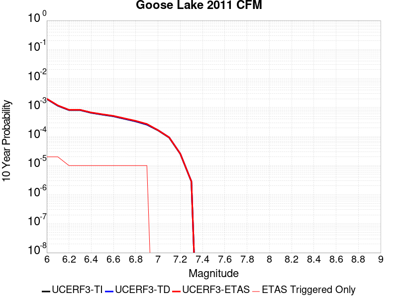 |

| Magnitude | 1 yr TI Prob | TD Prob | ETAS Prob | ETAS/TD Gain | ETAS Triggered Only | 10 yr TI Prob | TD Prob | ETAS Prob | ETAS/TD Gain | ETAS Triggered Only |
|-----|-----|-----|-----|-----|-----|-----|-----|-----|-----|-----|
| 6.0 | 1.9726643E-4 | 1.994615E-4 | 2.194575E-4 | 1.10025 | 2.0E-5 | 0.001970914 | 0.001992933 | 0.002012893 | 1.0100155 | 2.0E-5 |
| 6.1 | 1.1496965E-4 | 1.163414E-4 | 1.3633908E-4 | 1.1718879 | 2.0E-5 | 0.0011491019 | 0.0011628233 | 0.0011828 | 1.0171795 | 2.0E-5 |
| 6.2 | 8.152414E-5 | 8.2579325E-5 | 9.25785E-5 | 1.1210856 | 1.0E-5 | 8.1494235E-4 | 8.2549086E-4 | 8.354826E-4 | 1.012104 | 1.0E-5 |
| 6.3 | 8.152414E-5 | 8.2579325E-5 | 9.25785E-5 | 1.1210856 | 1.0E-5 | 8.1494235E-4 | 8.2549086E-4 | 8.354826E-4 | 1.012104 | 1.0E-5 |
| 6.4 | 6.5558386E-5 | 6.646655E-5 | 7.646588E-5 | 1.1504416 | 1.0E-5 | 6.553905E-4 | 6.644687E-4 | 6.7446206E-4 | 1.0150396 | 1.0E-5 |
| 6.5 | 5.692999E-5 | 5.7756948E-5 | 6.775637E-5 | 1.1731293 | 1.0E-5 | 5.6915404E-4 | 5.7742064E-4 | 5.8741483E-4 | 1.0173084 | 1.0E-5 |
| 6.6 | 4.9811584E-5 | 5.056629E-5 | 6.0565784E-5 | 1.1977502 | 1.0E-5 | 4.980042E-4 | 5.055487E-4 | 5.155437E-4 | 1.0197705 | 1.0E-5 |
| 6.7 | 4.0647945E-5 | 4.1303538E-5 | 5.1303123E-5 | 1.2421 | 1.0E-5 | 4.0640513E-4 | 4.129592E-4 | 4.2295505E-4 | 1.0242054 | 1.0E-5 |
| 6.8 | 3.3244716E-5 | 3.3804583E-5 | 4.3804244E-5 | 1.2958078 | 1.0E-5 | 3.323974E-4 | 3.379949E-4 | 3.479915E-4 | 1.0295763 | 1.0E-5 |
| 6.9 | 2.5702111E-5 | 2.616156E-5 | 3.61613E-5 | 1.3822302 | 1.0E-5 | 2.569914E-4 | 2.6158517E-4 | 2.7158257E-4 | 1.0382185 | 1.0E-5 |
| 7.0 | 1.6333039E-5 | 1.6646678E-5 | 1.6646678E-5 | 1.0 | 0.0 | 1.6331839E-4 | 1.6645451E-4 | 1.6645451E-4 | 1.0 | 0.0 |
| 7.1 | 9.225173E-6 | 9.404583E-6 | 9.404583E-6 | 1.0 | 0.0 | 9.22479E-5 | 9.4041956E-5 | 9.4041956E-5 | 1.0 | 0.0 |
| 7.2 | 2.538017E-6 | 2.577726E-6 | 2.577726E-6 | 1.0 | 0.0 | 2.537988E-5 | 2.5776973E-5 | 2.5776973E-5 | 1.0 | 0.0 |
| 7.3 | 2.8130427E-7 | 2.8572015E-7 | 2.8572015E-7 | 1.0 | 0.0 | 2.8130391E-6 | 2.8571992E-6 | 2.8571992E-6 | 1.0 | 0.0 |

## Elsinore (Stepovers Combined)
*[(top)](#table-of-contents)*

| 1 Year | 10 Year |
|-----|-----|
|  |  |

| Magnitude | 1 yr TI Prob | TD Prob | ETAS Prob | ETAS/TD Gain | ETAS Triggered Only | 10 yr TI Prob | TD Prob | ETAS Prob | ETAS/TD Gain | ETAS Triggered Only |
|-----|-----|-----|-----|-----|-----|-----|-----|-----|-----|-----|
| 6.0 | 0.0011182994 | 0.0010305607 | 0.0010405504 | 1.0096935 | 1.0E-5 | 0.011126885 | 0.010264917 | 0.010284713 | 1.0019283 | 2.0E-5 |
| 6.1 | 0.0011182994 | 0.0010305607 | 0.0010405504 | 1.0096935 | 1.0E-5 | 0.011126885 | 0.010264917 | 0.010284713 | 1.0019283 | 2.0E-5 |
| 6.2 | 0.0011182994 | 0.0010305607 | 0.0010405504 | 1.0096935 | 1.0E-5 | 0.011126885 | 0.010264917 | 0.010284713 | 1.0019283 | 2.0E-5 |
| 6.3 | 0.0010300872 | 9.253213E-4 | 9.253213E-4 | 1.0 | 0.0 | 0.010253254 | 0.009221276 | 0.009231185 | 1.0010744 | 1.0E-5 |
| 6.4 | 0.0010300872 | 9.253213E-4 | 9.253213E-4 | 1.0 | 0.0 | 0.010253254 | 0.009221276 | 0.009231185 | 1.0010744 | 1.0E-5 |
| 6.5 | 0.0010300872 | 9.253213E-4 | 9.253213E-4 | 1.0 | 0.0 | 0.010253254 | 0.009221276 | 0.009231185 | 1.0010744 | 1.0E-5 |
| 6.6 | 0.0010007467 | 8.868442E-4 | 8.868442E-4 | 1.0 | 0.0 | 0.00996252 | 0.0088398475 | 0.008849759 | 1.0011213 | 1.0E-5 |
| 6.7 | 9.183606E-4 | 7.684476E-4 | 7.684476E-4 | 1.0 | 0.0 | 0.009145746 | 0.00766491 | 0.0076748333 | 1.0012946 | 1.0E-5 |
| 6.8 | 8.8517193E-4 | 7.18952E-4 | 7.18952E-4 | 1.0 | 0.0 | 0.008816543 | 0.007172675 | 0.0071826032 | 1.0013841 | 1.0E-5 |
| 6.9 | 8.347058E-4 | 6.7010894E-4 | 6.7010894E-4 | 1.0 | 0.0 | 0.008315775 | 0.0066867657 | 0.006696699 | 1.0014855 | 1.0E-5 |
| 7.0 | 6.944992E-4 | 5.449953E-4 | 5.449953E-4 | 1.0 | 0.0 | 0.006923327 | 0.0054405155 | 0.0054405155 | 1.0 | 0.0 |
| 7.1 | 6.710743E-4 | 5.183973E-4 | 5.183973E-4 | 1.0 | 0.0 | 0.0066905143 | 0.0051752133 | 0.0051752133 | 1.0 | 0.0 |
| 7.2 | 6.0770183E-4 | 4.504022E-4 | 4.504022E-4 | 1.0 | 0.0 | 0.0060604266 | 0.0044963174 | 0.0044963174 | 1.0 | 0.0 |
| 7.3 | 5.220972E-4 | 3.7567242E-4 | 3.7567242E-4 | 1.0 | 0.0 | 0.005208723 | 0.003750761 | 0.003750761 | 1.0 | 0.0 |
| 7.4 | 4.7558855E-4 | 3.3441483E-4 | 3.3441483E-4 | 1.0 | 0.0 | 0.00474572 | 0.0033392678 | 0.0033392678 | 1.0 | 0.0 |
| 7.5 | 4.1059E-4 | 2.8081573E-4 | 2.8081573E-4 | 1.0 | 0.0 | 0.0040983222 | 0.0028047354 | 0.0028047354 | 1.0 | 0.0 |
| 7.6 | 3.640086E-4 | 2.4404288E-4 | 2.4404288E-4 | 1.0 | 0.0 | 0.003634129 | 0.0024378651 | 0.0024378651 | 1.0 | 0.0 |
| 7.7 | 2.171282E-4 | 1.2148302E-4 | 1.2148302E-4 | 1.0 | 0.0 | 0.0021691616 | 0.0012142392 | 0.0012142392 | 1.0 | 0.0 |
| 7.8 | 1.1840509E-5 | 4.8971956E-6 | 4.8971956E-6 | 1.0 | 0.0 | 1.1839878E-4 | 4.8971204E-5 | 4.8971204E-5 | 1.0 | 0.0 |
| 7.9 | 3.4838732E-7 | 1.7948659E-7 | 1.7948659E-7 | 1.0 | 0.0 | 3.4838679E-6 | 1.7948646E-6 | 1.7948646E-6 | 1.0 | 0.0 |

## Redondo Canyon alt 1
*[(top)](#table-of-contents)*

| 1 Year | 10 Year |
|-----|-----|
|  | 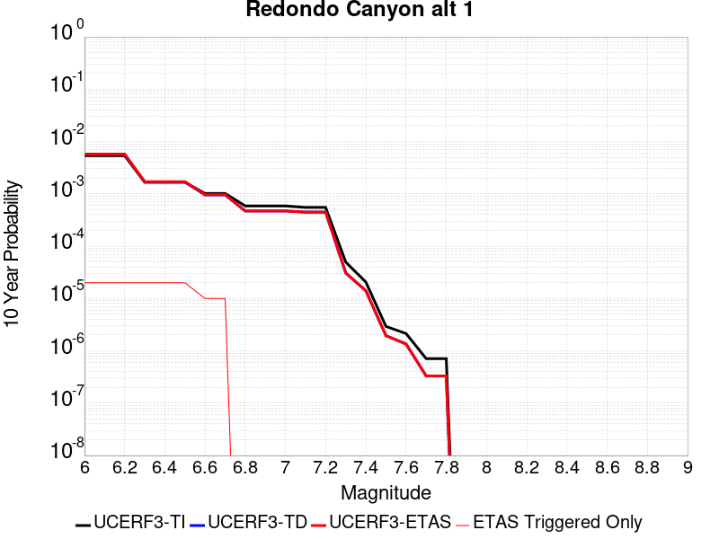 |

| Magnitude | 1 yr TI Prob | TD Prob | ETAS Prob | ETAS/TD Gain | ETAS Triggered Only | 10 yr TI Prob | TD Prob | ETAS Prob | ETAS/TD Gain | ETAS Triggered Only |
|-----|-----|-----|-----|-----|-----|-----|-----|-----|-----|-----|
| 6.0 | 5.3970946E-4 | 5.729142E-4 | 5.9290277E-4 | 1.0348892 | 2.0E-5 | 0.0053840056 | 0.005722111 | 0.0057419967 | 1.0034752 | 2.0E-5 |
| 6.1 | 5.3970946E-4 | 5.729142E-4 | 5.9290277E-4 | 1.0348892 | 2.0E-5 | 0.0053840056 | 0.005722111 | 0.0057419967 | 1.0034752 | 2.0E-5 |
| 6.2 | 5.3970946E-4 | 5.729142E-4 | 5.9290277E-4 | 1.0348892 | 2.0E-5 | 0.0053840056 | 0.005722111 | 0.0057419967 | 1.0034752 | 2.0E-5 |
| 6.3 | 1.6723319E-4 | 1.6884625E-4 | 1.8884287E-4 | 1.118431 | 2.0E-5 | 0.001671074 | 0.0016875692 | 0.0017075355 | 1.0118314 | 2.0E-5 |
| 6.4 | 1.6723319E-4 | 1.6884625E-4 | 1.8884287E-4 | 1.118431 | 2.0E-5 | 0.001671074 | 0.0016875692 | 0.0017075355 | 1.0118314 | 2.0E-5 |
| 6.5 | 1.6723319E-4 | 1.6884625E-4 | 1.8884287E-4 | 1.118431 | 2.0E-5 | 0.001671074 | 0.0016875692 | 0.0017075355 | 1.0118314 | 2.0E-5 |
| 6.6 | 1.016559E-4 | 9.542486E-5 | 1.05423904E-4 | 1.1047845 | 1.0E-5 | 0.0010160941 | 9.539858E-4 | 9.6397626E-4 | 1.0104723 | 1.0E-5 |
| 6.7 | 1.016559E-4 | 9.542486E-5 | 1.05423904E-4 | 1.1047845 | 1.0E-5 | 0.0010160941 | 9.539858E-4 | 9.6397626E-4 | 1.0104723 | 1.0E-5 |
| 6.8 | 5.8846435E-5 | 4.7132668E-5 | 4.7132668E-5 | 1.0 | 0.0 | 5.8830855E-4 | 4.7126875E-4 | 4.7126875E-4 | 1.0 | 0.0 |
| 6.9 | 5.8846435E-5 | 4.7132668E-5 | 4.7132668E-5 | 1.0 | 0.0 | 5.8830855E-4 | 4.7126875E-4 | 4.7126875E-4 | 1.0 | 0.0 |
| 7.0 | 5.8846435E-5 | 4.7132668E-5 | 4.7132668E-5 | 1.0 | 0.0 | 5.8830855E-4 | 4.7126875E-4 | 4.7126875E-4 | 1.0 | 0.0 |
| 7.1 | 5.5021545E-5 | 4.471271E-5 | 4.471271E-5 | 1.0 | 0.0 | 5.500792E-4 | 4.470789E-4 | 4.470789E-4 | 1.0 | 0.0 |
| 7.2 | 5.5021545E-5 | 4.471271E-5 | 4.471271E-5 | 1.0 | 0.0 | 5.500792E-4 | 4.470789E-4 | 4.470789E-4 | 1.0 | 0.0 |
| 7.3 | 4.959645E-6 | 3.0763204E-6 | 3.0763204E-6 | 1.0 | 0.0 | 4.9595343E-5 | 3.0762894E-5 | 3.0762894E-5 | 1.0 | 0.0 |
| 7.4 | 2.062136E-6 | 1.4081523E-6 | 1.4081523E-6 | 1.0 | 0.0 | 2.062117E-5 | 1.4081461E-5 | 1.4081461E-5 | 1.0 | 0.0 |
| 7.5 | 2.9289507E-7 | 1.9498201E-7 | 1.9498201E-7 | 1.0 | 0.0 | 2.9289467E-6 | 1.9498186E-6 | 1.9498186E-6 | 1.0 | 0.0 |
| 7.6 | 2.142678E-7 | 1.3544322E-7 | 1.3544322E-7 | 1.0 | 0.0 | 2.1426758E-6 | 1.3544316E-6 | 1.3544316E-6 | 1.0 | 0.0 |
| 7.7 | 7.1065905E-8 | 3.318987E-8 | 3.318987E-8 | 1.0 | 0.0 | 7.106588E-7 | 3.318987E-7 | 3.318987E-7 | 1.0 | 0.0 |
| 7.8 | 7.1065905E-8 | 3.318987E-8 | 3.318987E-8 | 1.0 | 0.0 | 7.106588E-7 | 3.318987E-7 | 3.318987E-7 | 1.0 | 0.0 |

## Santa Susana East (connector)
*[(top)](#table-of-contents)*

| 1 Year | 10 Year |
|-----|-----|
|  |  |

| Magnitude | 1 yr TI Prob | TD Prob | ETAS Prob | ETAS/TD Gain | ETAS Triggered Only | 10 yr TI Prob | TD Prob | ETAS Prob | ETAS/TD Gain | ETAS Triggered Only |
|-----|-----|-----|-----|-----|-----|-----|-----|-----|-----|-----|
| 6.0 | 0.0014903803 | 0.0016697381 | 0.0016897047 | 1.0119579 | 2.0E-5 | 0.014804244 | 0.016599052 | 0.01661872 | 1.0011849 | 2.0E-5 |
| 6.1 | 0.0014903803 | 0.0016697381 | 0.0016897047 | 1.0119579 | 2.0E-5 | 0.014804244 | 0.016599052 | 0.01661872 | 1.0011849 | 2.0E-5 |
| 6.2 | 0.0014903803 | 0.0016697381 | 0.0016897047 | 1.0119579 | 2.0E-5 | 0.014804244 | 0.016599052 | 0.01661872 | 1.0011849 | 2.0E-5 |
| 6.3 | 0.001013629 | 0.0010622967 | 0.0010622967 | 1.0 | 0.0 | 0.010090181 | 0.010583619 | 0.010583619 | 1.0 | 0.0 |
| 6.4 | 0.001013629 | 0.0010622967 | 0.0010622967 | 1.0 | 0.0 | 0.010090181 | 0.010583619 | 0.010583619 | 1.0 | 0.0 |
| 6.5 | 0.001013629 | 0.0010622967 | 0.0010622967 | 1.0 | 0.0 | 0.010090181 | 0.010583619 | 0.010583619 | 1.0 | 0.0 |
| 6.6 | 0.001013629 | 0.0010622967 | 0.0010622967 | 1.0 | 0.0 | 0.010090181 | 0.010583619 | 0.010583619 | 1.0 | 0.0 |
| 6.7 | 0.0010119933 | 0.0010616409 | 0.0010616409 | 1.0 | 0.0 | 0.010073971 | 0.010577125 | 0.010577125 | 1.0 | 0.0 |
| 6.8 | 6.372938E-4 | 6.0474465E-4 | 6.0474465E-4 | 1.0 | 0.0 | 0.0063546924 | 0.006033037 | 0.006033037 | 1.0 | 0.0 |
| 6.9 | 6.372938E-4 | 6.0474465E-4 | 6.0474465E-4 | 1.0 | 0.0 | 0.0063546924 | 0.006033037 | 0.006033037 | 1.0 | 0.0 |
| 7.0 | 4.8389446E-4 | 4.2042998E-4 | 4.2042998E-4 | 1.0 | 0.0 | 0.0048284214 | 0.0041970722 | 0.0041970722 | 1.0 | 0.0 |
| 7.1 | 4.7629757E-4 | 4.1433662E-4 | 4.1433662E-4 | 1.0 | 0.0 | 0.00475278 | 0.004136367 | 0.004136367 | 1.0 | 0.0 |
| 7.2 | 4.6172875E-4 | 4.038612E-4 | 4.038612E-4 | 1.0 | 0.0 | 0.0046077054 | 0.0040319953 | 0.0040319953 | 1.0 | 0.0 |
| 7.3 | 4.472291E-4 | 3.9388443E-4 | 3.9388443E-4 | 1.0 | 0.0 | 0.004463301 | 0.0039325804 | 0.0039325804 | 1.0 | 0.0 |
| 7.4 | 4.096385E-4 | 3.5567835E-4 | 3.5567835E-4 | 1.0 | 0.0 | 0.0040888423 | 0.0035517553 | 0.0035517553 | 1.0 | 0.0 |
| 7.5 | 2.5496128E-4 | 2.232523E-4 | 2.232523E-4 | 1.0 | 0.0 | 0.0025466895 | 0.0022304445 | 0.0022304445 | 1.0 | 0.0 |
| 7.6 | 7.249717E-5 | 6.0359558E-5 | 6.0359558E-5 | 1.0 | 0.0 | 7.247352E-4 | 6.0345343E-4 | 6.0345343E-4 | 1.0 | 0.0 |
| 7.7 | 1.5614127E-5 | 1.2376314E-5 | 1.2376314E-5 | 1.0 | 0.0 | 1.5613029E-4 | 1.2375697E-4 | 1.2375697E-4 | 1.0 | 0.0 |
| 7.8 | 2.5144072E-6 | 1.3734989E-6 | 1.3734989E-6 | 1.0 | 0.0 | 2.5143789E-5 | 1.3734912E-5 | 1.3734912E-5 | 1.0 | 0.0 |
| 7.9 | 1.3632825E-7 | 1.4443603E-7 | 1.4443603E-7 | 1.0 | 0.0 | 1.3632817E-6 | 1.4443604E-6 | 1.4443604E-6 | 1.0 | 0.0 |

## Great Valley 08 (Quinto)
*[(top)](#table-of-contents)*

| 1 Year | 10 Year |
|-----|-----|
|  | 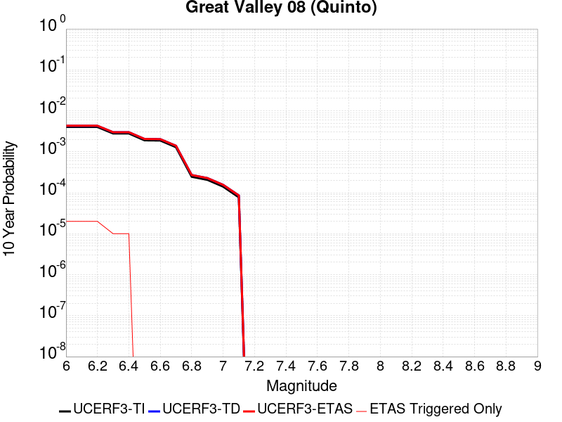 |

| Magnitude | 1 yr TI Prob | TD Prob | ETAS Prob | ETAS/TD Gain | ETAS Triggered Only | 10 yr TI Prob | TD Prob | ETAS Prob | ETAS/TD Gain | ETAS Triggered Only |
|-----|-----|-----|-----|-----|-----|-----|-----|-----|-----|-----|
| 6.0 | 4.0366207E-4 | 4.3056096E-4 | 4.3056096E-4 | 1.0 | 0.0 | 0.004029296 | 0.0042991205 | 0.0043190345 | 1.0046321 | 2.0E-5 |
| 6.1 | 4.0366207E-4 | 4.3056096E-4 | 4.3056096E-4 | 1.0 | 0.0 | 0.004029296 | 0.0042991205 | 0.0043190345 | 1.0046321 | 2.0E-5 |
| 6.2 | 4.0366207E-4 | 4.3056096E-4 | 4.3056096E-4 | 1.0 | 0.0 | 0.004029296 | 0.0042991205 | 0.0043190345 | 1.0046321 | 2.0E-5 |
| 6.3 | 2.803697E-4 | 3.0002446E-4 | 3.0002446E-4 | 1.0 | 0.0 | 0.0028001624 | 0.0029972875 | 0.0030072576 | 1.0033263 | 1.0E-5 |
| 6.4 | 2.803697E-4 | 3.0002446E-4 | 3.0002446E-4 | 1.0 | 0.0 | 0.0028001624 | 0.0029972875 | 0.0030072576 | 1.0033263 | 1.0E-5 |
| 6.5 | 1.9065675E-4 | 2.0563944E-4 | 2.0563944E-4 | 1.0 | 0.0 | 0.0019049325 | 0.0020551833 | 0.0020551833 | 1.0 | 0.0 |
| 6.6 | 1.8857437E-4 | 2.0340596E-4 | 2.0340596E-4 | 1.0 | 0.0 | 0.0018841444 | 0.0020328893 | 0.0020328893 | 1.0 | 0.0 |
| 6.7 | 1.2950429E-4 | 1.4013276E-4 | 1.4013276E-4 | 1.0 | 0.0 | 0.0012942884 | 0.0014009989 | 0.0014009989 | 1.0 | 0.0 |
| 6.8 | 2.458131E-5 | 2.70961E-5 | 2.70961E-5 | 1.0 | 0.0 | 2.457859E-4 | 2.7092977E-4 | 2.7092977E-4 | 1.0 | 0.0 |
| 6.9 | 2.0655643E-5 | 2.28036E-5 | 2.28036E-5 | 1.0 | 0.0 | 2.0653724E-4 | 2.2801422E-4 | 2.2801422E-4 | 1.0 | 0.0 |
| 7.0 | 1.4103458E-5 | 1.5611728E-5 | 1.5611728E-5 | 1.0 | 0.0 | 1.4102564E-4 | 1.5610759E-4 | 1.5610759E-4 | 1.0 | 0.0 |
| 7.1 | 7.737323E-6 | 8.593317E-6 | 8.593317E-6 | 1.0 | 0.0 | 7.737054E-5 | 8.593065E-5 | 8.593065E-5 | 1.0 | 0.0 |

## San Jacinto (Borrego)
*[(top)](#table-of-contents)*

| 1 Year | 10 Year |
|-----|-----|
|  |  |

| Magnitude | 1 yr TI Prob | TD Prob | ETAS Prob | ETAS/TD Gain | ETAS Triggered Only | 10 yr TI Prob | TD Prob | ETAS Prob | ETAS/TD Gain | ETAS Triggered Only |
|-----|-----|-----|-----|-----|-----|-----|-----|-----|-----|-----|
| 6.0 | 0.0018475284 | 0.0014561379 | 0.0014761087 | 1.0137149 | 2.0E-5 | 0.018322436 | 0.014869647 | 0.01488935 | 1.001325 | 2.0E-5 |
| 6.1 | 0.0018466372 | 0.0014561379 | 0.0014761087 | 1.0137149 | 2.0E-5 | 0.018313672 | 0.014869647 | 0.01488935 | 1.001325 | 2.0E-5 |
| 6.2 | 0.0018084005 | 0.0014561379 | 0.0014761087 | 1.0137149 | 2.0E-5 | 0.017937548 | 0.014869647 | 0.014889349 | 1.001325 | 2.0E-5 |
| 6.3 | 0.0016728862 | 0.00144808 | 0.001468051 | 1.0137914 | 2.0E-5 | 0.016603488 | 0.014790683 | 0.014810387 | 1.0013322 | 2.0E-5 |
| 6.4 | 0.0016594254 | 0.0014463598 | 0.001466331 | 1.0138078 | 2.0E-5 | 0.016470885 | 0.014773762 | 0.014793466 | 1.0013337 | 2.0E-5 |
| 6.5 | 0.0016456128 | 0.0014327979 | 0.0014527693 | 1.0139387 | 2.0E-5 | 0.0163348 | 0.014640348 | 0.014660055 | 1.0013461 | 2.0E-5 |
| 6.6 | 0.0016406142 | 0.0014246812 | 0.0014446527 | 1.0140182 | 2.0E-5 | 0.016285548 | 0.014560594 | 0.014580303 | 1.0013536 | 2.0E-5 |
| 6.7 | 0.0016279068 | 0.0014047775 | 0.0014247495 | 1.0142171 | 2.0E-5 | 0.01616033 | 0.014364966 | 0.014384679 | 1.0013722 | 2.0E-5 |
| 6.8 | 0.001617065 | 0.0013954508 | 0.0014154229 | 1.0143123 | 2.0E-5 | 0.016053487 | 0.014272246 | 0.014291961 | 1.0013813 | 2.0E-5 |
| 6.9 | 0.0013891924 | 0.0011568897 | 0.0011768665 | 1.0172677 | 2.0E-5 | 0.0138054015 | 0.011882438 | 0.011902201 | 1.0016632 | 2.0E-5 |
| 7.0 | 0.0012439266 | 0.0010680092 | 0.0010879878 | 1.0187064 | 2.0E-5 | 0.012369866 | 0.0109828 | 0.011002581 | 1.001801 | 2.0E-5 |
| 7.1 | 0.0012344702 | 0.0010594862 | 0.001079465 | 1.0188571 | 2.0E-5 | 0.0122763505 | 0.010897976 | 0.010917759 | 1.0018152 | 2.0E-5 |
| 7.2 | 0.0011846646 | 0.001019213 | 0.0010391925 | 1.019603 | 2.0E-5 | 0.01178369 | 0.010495341 | 0.010515132 | 1.0018857 | 2.0E-5 |
| 7.3 | 0.001096006 | 9.5882936E-4 | 9.788101E-4 | 1.0208387 | 2.0E-5 | 0.010906163 | 0.009890967 | 0.009910769 | 1.002002 | 2.0E-5 |
| 7.4 | 0.001078671 | 9.485348E-4 | 9.685159E-4 | 1.0210651 | 2.0E-5 | 0.010734501 | 0.009787692 | 0.009807496 | 1.0020233 | 2.0E-5 |
| 7.5 | 0.001042723 | 9.2742336E-4 | 9.4740477E-4 | 1.0215452 | 2.0E-5 | 0.010378438 | 0.009574614 | 0.009594423 | 1.0020689 | 2.0E-5 |
| 7.6 | 9.3302975E-4 | 8.572113E-4 | 8.7719416E-4 | 1.0233115 | 2.0E-5 | 0.00929122 | 0.008866487 | 0.008886309 | 1.0022357 | 2.0E-5 |
| 7.7 | 7.889362E-4 | 7.426163E-4 | 7.6260144E-4 | 1.0269119 | 2.0E-5 | 0.007861412 | 0.0077142045 | 0.00773405 | 1.0025727 | 2.0E-5 |
| 7.8 | 6.5207E-4 | 6.588291E-4 | 6.7881594E-4 | 1.0303369 | 2.0E-5 | 0.006501599 | 0.0068677636 | 0.0068876264 | 1.0028921 | 2.0E-5 |
| 7.9 | 4.987573E-4 | 5.088555E-4 | 5.2884535E-4 | 1.0392839 | 2.0E-5 | 0.0049763937 | 0.0053523467 | 0.0053722393 | 1.0037167 | 2.0E-5 |
| 8.0 | 4.1822926E-4 | 4.3265108E-4 | 4.5264242E-4 | 1.0462066 | 2.0E-5 | 0.0041744304 | 0.004573375 | 0.0045932834 | 1.0043532 | 2.0E-5 |
| 8.1 | 3.4129233E-4 | 3.37135E-4 | 3.5712824E-4 | 1.0593034 | 2.0E-5 | 0.0034076865 | 0.0035806994 | 0.0036006279 | 1.0055655 | 2.0E-5 |
| 8.2 | 9.3751136E-5 | 4.159253E-5 | 4.159253E-5 | 1.0 | 0.0 | 9.371159E-4 | 4.712058E-4 | 4.712058E-4 | 1.0 | 0.0 |
| 8.3 | 7.9143565E-6 | 2.5555544E-6 | 2.5555544E-6 | 1.0 | 0.0 | 7.914075E-5 | 2.969505E-5 | 2.969505E-5 | 1.0 | 0.0 |

## West Napa 2011 CFM
*[(top)](#table-of-contents)*

| 1 Year | 10 Year |
|-----|-----|
| 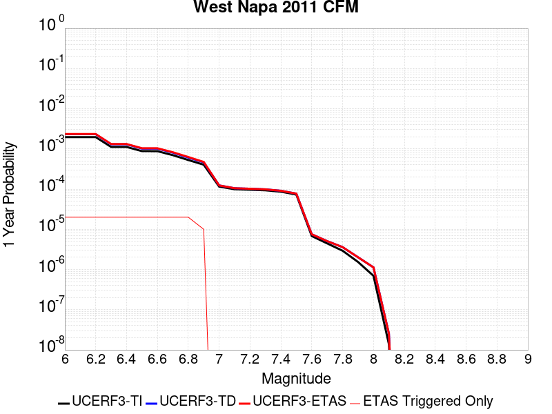 |  |

| Magnitude | 1 yr TI Prob | TD Prob | ETAS Prob | ETAS/TD Gain | ETAS Triggered Only | 10 yr TI Prob | TD Prob | ETAS Prob | ETAS/TD Gain | ETAS Triggered Only |
|-----|-----|-----|-----|-----|-----|-----|-----|-----|-----|-----|
| 6.0 | 0.001966852 | 0.0023211248 | 0.0023410784 | 1.0085965 | 2.0E-5 | 0.019495348 | 0.023002245 | 0.023021786 | 1.0008495 | 2.0E-5 |
| 6.1 | 0.001966852 | 0.0023211248 | 0.0023410784 | 1.0085965 | 2.0E-5 | 0.019495348 | 0.023002245 | 0.023021786 | 1.0008495 | 2.0E-5 |
| 6.2 | 0.001966852 | 0.0023211248 | 0.0023410784 | 1.0085965 | 2.0E-5 | 0.019495348 | 0.023002245 | 0.023021786 | 1.0008495 | 2.0E-5 |
| 6.3 | 0.001120161 | 0.0013030528 | 0.0013230267 | 1.0153285 | 2.0E-5 | 0.011145315 | 0.0129647385 | 0.012984479 | 1.0015227 | 2.0E-5 |
| 6.4 | 0.001120161 | 0.0013030528 | 0.0013230267 | 1.0153285 | 2.0E-5 | 0.011145315 | 0.0129647385 | 0.012984479 | 1.0015227 | 2.0E-5 |
| 6.5 | 8.804988E-4 | 0.0010195201 | 0.0010394998 | 1.019597 | 2.0E-5 | 0.008770182 | 0.010157098 | 0.010176895 | 1.0019491 | 2.0E-5 |
| 6.6 | 8.7864127E-4 | 0.001017419 | 0.0010373987 | 1.0196376 | 2.0E-5 | 0.008751754 | 0.010136279 | 0.010156076 | 1.0019531 | 2.0E-5 |
| 6.7 | 6.9877075E-4 | 8.0682867E-4 | 8.268125E-4 | 1.0247684 | 2.0E-5 | 0.0069657755 | 0.008046719 | 0.008066558 | 1.0024655 | 2.0E-5 |
| 6.8 | 5.289043E-4 | 6.0891354E-4 | 6.2890135E-4 | 1.0328254 | 2.0E-5 | 0.005276473 | 0.006079373 | 0.006099251 | 1.0032698 | 2.0E-5 |
| 6.9 | 4.0489217E-4 | 4.6385307E-4 | 4.7384843E-4 | 1.0215485 | 1.0E-5 | 0.0040415525 | 0.004635363 | 0.0046453164 | 1.0021473 | 1.0E-5 |
| 7.0 | 1.1535613E-4 | 1.2347854E-4 | 1.2347854E-4 | 1.0 | 0.0 | 0.0011529627 | 0.0012355851 | 0.0012355851 | 1.0 | 0.0 |
| 7.1 | 9.918104E-5 | 1.05045285E-4 | 1.05045285E-4 | 1.0 | 0.0 | 9.913679E-4 | 0.001051437 | 0.001051437 | 1.0 | 0.0 |
| 7.2 | 9.650462E-5 | 1.0206133E-4 | 1.0206133E-4 | 1.0 | 0.0 | 9.6462725E-4 | 0.0010216252 | 0.0010216252 | 1.0 | 0.0 |
| 7.3 | 9.330765E-5 | 9.8511584E-5 | 9.8511584E-5 | 1.0 | 0.0 | 9.3268487E-4 | 9.861597E-4 | 9.861597E-4 | 1.0 | 0.0 |
| 7.4 | 8.6198335E-5 | 9.086413E-5 | 9.086413E-5 | 1.0 | 0.0 | 8.616491E-4 | 9.0974604E-4 | 9.0974604E-4 | 1.0 | 0.0 |
| 7.5 | 7.325788E-5 | 7.7221775E-5 | 7.7221775E-5 | 1.0 | 0.0 | 7.3233736E-4 | 7.7339396E-4 | 7.7339396E-4 | 1.0 | 0.0 |
| 7.6 | 6.790414E-6 | 7.5220014E-6 | 7.5220014E-6 | 1.0 | 0.0 | 6.790207E-5 | 7.614869E-5 | 7.614869E-5 | 1.0 | 0.0 |
| 7.7 | 4.456829E-6 | 5.0698222E-6 | 5.0698222E-6 | 1.0 | 0.0 | 4.4567398E-5 | 5.160297E-5 | 5.160297E-5 | 1.0 | 0.0 |
| 7.8 | 2.9258983E-6 | 3.5978833E-6 | 3.5978833E-6 | 1.0 | 0.0 | 2.9258597E-5 | 3.681433E-5 | 3.681433E-5 | 1.0 | 0.0 |
| 7.9 | 1.538006E-6 | 2.0123193E-6 | 2.0123193E-6 | 1.0 | 0.0 | 1.5379954E-5 | 2.066589E-5 | 2.066589E-5 | 1.0 | 0.0 |
| 8.0 | 6.959117E-7 | 1.1286867E-6 | 1.1286867E-6 | 1.0 | 0.0 | 6.959095E-6 | 1.1645628E-5 | 1.1645628E-5 | 1.0 | 0.0 |
| 8.1 | 1.3874274E-8 | 2.536686E-8 | 2.536686E-8 | 1.0 | 0.0 | 1.3874273E-7 | 2.6035906E-7 | 2.6035906E-7 | 1.0 | 0.0 |

## Great Valley 11
*[(top)](#table-of-contents)*

| 1 Year | 10 Year |
|-----|-----|
|  |  |

| Magnitude | 1 yr TI Prob | TD Prob | ETAS Prob | ETAS/TD Gain | ETAS Triggered Only | 10 yr TI Prob | TD Prob | ETAS Prob | ETAS/TD Gain | ETAS Triggered Only |
|-----|-----|-----|-----|-----|-----|-----|-----|-----|-----|-----|
| 6.0 | 0.0014651422 | 0.0015554909 | 0.0015754598 | 1.0128376 | 2.0E-5 | 0.0145552 | 0.01545356 | 0.015473251 | 1.0012742 | 2.0E-5 |
| 6.1 | 0.0012948721 | 0.0013509706 | 0.0013709435 | 1.0147842 | 2.0E-5 | 0.012873529 | 0.013433994 | 0.013453725 | 1.0014688 | 2.0E-5 |
| 6.2 | 0.0012948721 | 0.0013509706 | 0.0013709435 | 1.0147842 | 2.0E-5 | 0.012873529 | 0.013433994 | 0.013453725 | 1.0014688 | 2.0E-5 |
| 6.3 | 0.0010564806 | 0.0010638756 | 0.0010838542 | 1.0187792 | 2.0E-5 | 0.01051472 | 0.010592012 | 0.0106118 | 1.0018682 | 2.0E-5 |
| 6.4 | 9.416436E-4 | 9.2739856E-4 | 9.4738003E-4 | 1.0215456 | 2.0E-5 | 0.009376635 | 0.009239036 | 0.0092588505 | 1.0021447 | 2.0E-5 |
| 6.5 | 7.031501E-4 | 6.4269686E-4 | 6.62684E-4 | 1.0310988 | 2.0E-5 | 0.007009294 | 0.0064088185 | 0.00642869 | 1.0031008 | 2.0E-5 |
| 6.6 | 6.754276E-4 | 6.1199587E-4 | 6.219898E-4 | 1.01633 | 1.0E-5 | 0.006733784 | 0.0061035305 | 0.0061134696 | 1.0016284 | 1.0E-5 |
| 6.7 | 5.879996E-4 | 5.118446E-4 | 5.218395E-4 | 1.0195272 | 1.0E-5 | 0.005864462 | 0.0051069413 | 0.00511689 | 1.0019481 | 1.0E-5 |
| 6.8 | 5.1298196E-4 | 4.2745177E-4 | 4.374475E-4 | 1.0233845 | 1.0E-5 | 0.005117994 | 0.0042665056 | 0.0042764633 | 1.0023339 | 1.0E-5 |
| 6.9 | 3.872209E-4 | 2.8241202E-4 | 2.924092E-4 | 1.0353992 | 1.0E-5 | 0.0038654688 | 0.0028206722 | 0.002830644 | 1.0035353 | 1.0E-5 |
| 7.0 | 2.3284076E-4 | 1.04929975E-4 | 1.04929975E-4 | 1.0 | 0.0 | 0.0023259693 | 0.0010488159 | 0.0010488159 | 1.0 | 0.0 |
| 7.1 | 1.8545982E-4 | 6.186026E-5 | 6.186026E-5 | 1.0 | 0.0 | 0.0018530512 | 6.1843713E-4 | 6.1843713E-4 | 1.0 | 0.0 |
| 7.2 | 1.671661E-4 | 5.8720816E-5 | 5.8720816E-5 | 1.0 | 0.0 | 0.0016704041 | 5.870597E-4 | 5.870597E-4 | 1.0 | 0.0 |
| 7.3 | 1.4671806E-4 | 5.3771862E-5 | 5.3771862E-5 | 1.0 | 0.0 | 0.0014662122 | 5.3759513E-4 | 5.3759513E-4 | 1.0 | 0.0 |
| 7.4 | 1.2959167E-4 | 5.1136827E-5 | 5.1136827E-5 | 1.0 | 0.0 | 0.0012951613 | 5.112572E-4 | 5.112572E-4 | 1.0 | 0.0 |
| 7.5 | 7.827883E-5 | 3.4156317E-5 | 3.4156317E-5 | 1.0 | 0.0 | 7.825126E-4 | 3.4151482E-4 | 3.4151482E-4 | 1.0 | 0.0 |

## Puente Hills
*[(top)](#table-of-contents)*

| 1 Year | 10 Year |
|-----|-----|
| 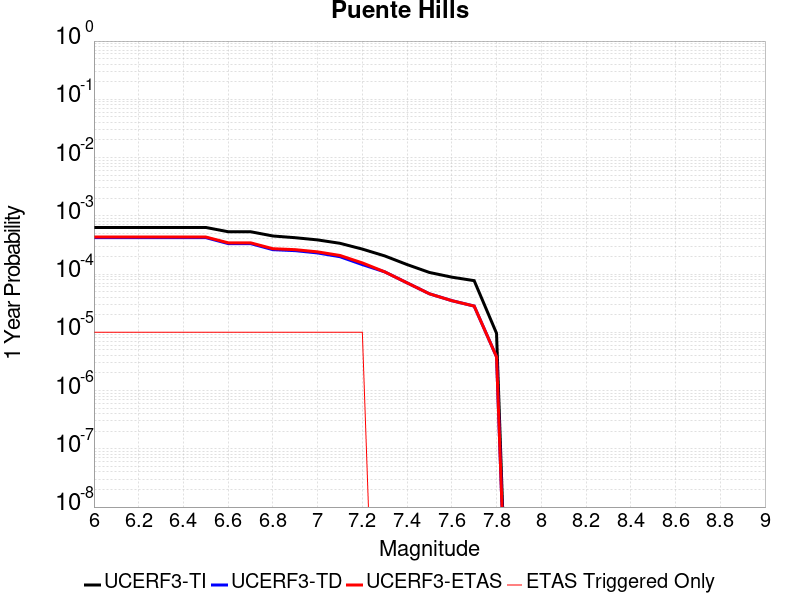 |  |

| Magnitude | 1 yr TI Prob | TD Prob | ETAS Prob | ETAS/TD Gain | ETAS Triggered Only | 10 yr TI Prob | TD Prob | ETAS Prob | ETAS/TD Gain | ETAS Triggered Only |
|-----|-----|-----|-----|-----|-----|-----|-----|-----|-----|-----|
| 6.0 | 6.312516E-4 | 4.2249315E-4 | 4.3248892E-4 | 1.023659 | 1.0E-5 | 0.0062946146 | 0.0042174594 | 0.004237375 | 1.0047222 | 2.0E-5 |
| 6.1 | 6.312516E-4 | 4.2249315E-4 | 4.3248892E-4 | 1.023659 | 1.0E-5 | 0.0062946146 | 0.0042174594 | 0.004237375 | 1.0047222 | 2.0E-5 |
| 6.2 | 6.312516E-4 | 4.2249315E-4 | 4.3248892E-4 | 1.023659 | 1.0E-5 | 0.0062946146 | 0.0042174594 | 0.004237375 | 1.0047222 | 2.0E-5 |
| 6.3 | 6.312516E-4 | 4.2249315E-4 | 4.3248892E-4 | 1.023659 | 1.0E-5 | 0.0062946146 | 0.0042174594 | 0.004237375 | 1.0047222 | 2.0E-5 |
| 6.4 | 6.312516E-4 | 4.2249315E-4 | 4.3248892E-4 | 1.023659 | 1.0E-5 | 0.0062946146 | 0.0042174594 | 0.004237375 | 1.0047222 | 2.0E-5 |
| 6.5 | 6.312516E-4 | 4.2249315E-4 | 4.3248892E-4 | 1.023659 | 1.0E-5 | 0.0062946146 | 0.0042174594 | 0.004237375 | 1.0047222 | 2.0E-5 |
| 6.6 | 5.332553E-4 | 3.3384826E-4 | 3.4384493E-4 | 1.0299437 | 1.0E-5 | 0.0053197746 | 0.0033337125 | 0.0033536458 | 1.0059793 | 2.0E-5 |
| 6.7 | 5.332553E-4 | 3.3384826E-4 | 3.4384493E-4 | 1.0299437 | 1.0E-5 | 0.0053197746 | 0.0033337125 | 0.0033536458 | 1.0059793 | 2.0E-5 |
| 6.8 | 4.505555E-4 | 2.623339E-4 | 2.723313E-4 | 1.0381093 | 1.0E-5 | 0.004496431 | 0.0026202986 | 0.0026402462 | 1.0076127 | 2.0E-5 |
| 6.9 | 4.2081063E-4 | 2.52311E-4 | 2.623085E-4 | 1.0396236 | 1.0E-5 | 0.0042001465 | 0.0025202993 | 0.002530274 | 1.0039577 | 1.0E-5 |
| 7.0 | 3.857264E-4 | 2.3046264E-4 | 2.4046033E-4 | 1.043381 | 1.0E-5 | 0.0038505755 | 0.0023022818 | 0.0023122588 | 1.0043335 | 1.0E-5 |
| 7.1 | 3.373358E-4 | 1.984918E-4 | 2.0848982E-4 | 1.0503699 | 1.0E-5 | 0.0033682417 | 0.001983181 | 0.0019931612 | 1.0050324 | 1.0E-5 |
| 7.2 | 2.6833118E-4 | 1.453877E-4 | 1.5538624E-4 | 1.0687716 | 1.0E-5 | 0.002680074 | 0.0014529356 | 0.001462921 | 1.0068727 | 1.0E-5 |
| 7.3 | 2.0495013E-4 | 1.0911931E-4 | 1.0911931E-4 | 1.0 | 0.0 | 0.002047612 | 0.001090664 | 0.001090664 | 1.0 | 0.0 |
| 7.4 | 1.4553878E-4 | 7.068262E-5 | 7.068262E-5 | 1.0 | 0.0 | 0.001454435 | 7.066058E-4 | 7.066058E-4 | 1.0 | 0.0 |
| 7.5 | 1.06529245E-4 | 4.5849905E-5 | 4.5849905E-5 | 1.0 | 0.0 | 0.0010647819 | 4.5840783E-4 | 4.5840783E-4 | 1.0 | 0.0 |
| 7.6 | 8.848612E-5 | 3.4951907E-5 | 3.4951907E-5 | 1.0 | 0.0 | 8.84509E-4 | 3.4946698E-4 | 3.4946698E-4 | 1.0 | 0.0 |
| 7.7 | 7.705422E-5 | 2.8215758E-5 | 2.8215758E-5 | 1.0 | 0.0 | 7.702751E-4 | 2.8212433E-4 | 2.8212433E-4 | 1.0 | 0.0 |
| 7.8 | 9.617985E-6 | 3.7996451E-6 | 3.7996451E-6 | 1.0 | 0.0 | 9.617568E-5 | 3.7996128E-5 | 3.7996128E-5 | 1.0 | 0.0 |

## San Jacinto (Coyote Creek)
*[(top)](#table-of-contents)*

| 1 Year | 10 Year |
|-----|-----|
|  |  |

| Magnitude | 1 yr TI Prob | TD Prob | ETAS Prob | ETAS/TD Gain | ETAS Triggered Only | 10 yr TI Prob | TD Prob | ETAS Prob | ETAS/TD Gain | ETAS Triggered Only |
|-----|-----|-----|-----|-----|-----|-----|-----|-----|-----|-----|
| 6.0 | 0.0014273542 | 0.0012590875 | 0.0012790622 | 1.0158645 | 2.0E-5 | 0.01418221 | 0.012928318 | 0.0129480595 | 1.001527 | 2.0E-5 |
| 6.1 | 0.0014273542 | 0.0012590875 | 0.0012790622 | 1.0158645 | 2.0E-5 | 0.01418221 | 0.012928318 | 0.0129480595 | 1.001527 | 2.0E-5 |
| 6.2 | 0.0014273542 | 0.0012590875 | 0.0012790622 | 1.0158645 | 2.0E-5 | 0.01418221 | 0.012928318 | 0.0129480595 | 1.001527 | 2.0E-5 |
| 6.3 | 0.0014273542 | 0.0012590875 | 0.0012790622 | 1.0158645 | 2.0E-5 | 0.01418221 | 0.012928318 | 0.0129480595 | 1.001527 | 2.0E-5 |
| 6.4 | 0.0014273542 | 0.0012590875 | 0.0012790622 | 1.0158645 | 2.0E-5 | 0.01418221 | 0.012928318 | 0.0129480595 | 1.001527 | 2.0E-5 |
| 6.5 | 0.0014225657 | 0.0012531505 | 0.0012731255 | 1.0159398 | 2.0E-5 | 0.014134934 | 0.012869646 | 0.012889388 | 1.001534 | 2.0E-5 |
| 6.6 | 0.0014225657 | 0.0012531505 | 0.0012731255 | 1.0159398 | 2.0E-5 | 0.014134934 | 0.012869646 | 0.012889388 | 1.001534 | 2.0E-5 |
| 6.7 | 0.0014191137 | 0.0012492483 | 0.0012692233 | 1.0159897 | 2.0E-5 | 0.014100855 | 0.0128310565 | 0.0128508005 | 1.0015388 | 2.0E-5 |
| 6.8 | 0.001411945 | 0.0012449342 | 0.0012649092 | 1.0160451 | 2.0E-5 | 0.014030075 | 0.012788199 | 0.012807943 | 1.001544 | 2.0E-5 |
| 6.9 | 0.0014069602 | 0.0012407395 | 0.0012607146 | 1.0160995 | 2.0E-5 | 0.013980856 | 0.012746515 | 0.01276626 | 1.001549 | 2.0E-5 |
| 7.0 | 0.001379188 | 0.0012186957 | 0.0012386712 | 1.016391 | 2.0E-5 | 0.0137065975 | 0.0125278765 | 0.012547626 | 1.0015764 | 2.0E-5 |
| 7.1 | 0.0013691769 | 0.0012096294 | 0.0012296052 | 1.016514 | 2.0E-5 | 0.013607717 | 0.012437741 | 0.012457493 | 1.001588 | 2.0E-5 |
| 7.2 | 0.0013177024 | 0.0011676621 | 0.0011876387 | 1.0171082 | 2.0E-5 | 0.013099162 | 0.012018777 | 0.012038537 | 1.001644 | 2.0E-5 |
| 7.3 | 0.001220092 | 0.0011015651 | 0.001121543 | 1.018136 | 2.0E-5 | 0.012134149 | 0.011357696 | 0.011377469 | 1.0017409 | 2.0E-5 |
| 7.4 | 0.0011974899 | 0.0010875105 | 0.0011074888 | 1.0183706 | 2.0E-5 | 0.011910575 | 0.01121681 | 0.011236585 | 1.001763 | 2.0E-5 |
| 7.5 | 0.0011571277 | 0.0010626436 | 0.0010826223 | 1.018801 | 2.0E-5 | 0.011511209 | 0.010966429 | 0.010986209 | 1.0018038 | 2.0E-5 |
| 7.6 | 0.001043725 | 9.889511E-4 | 0.0010089313 | 1.0202035 | 2.0E-5 | 0.010388365 | 0.010224434 | 0.010244229 | 1.0019361 | 2.0E-5 |
| 7.7 | 8.986819E-4 | 8.7328954E-4 | 8.9327205E-4 | 1.0228819 | 2.0E-5 | 0.008950562 | 0.009062956 | 0.009082775 | 1.0021868 | 2.0E-5 |
| 7.8 | 7.552038E-4 | 7.819085E-4 | 8.018929E-4 | 1.0255585 | 2.0E-5 | 0.0075264242 | 0.008141387 | 0.008161224 | 1.0024366 | 2.0E-5 |
| 7.9 | 5.797721E-4 | 6.074444E-4 | 6.2743225E-4 | 1.0329049 | 2.0E-5 | 0.0057826187 | 0.0063803247 | 0.0064001973 | 1.0031146 | 2.0E-5 |
| 8.0 | 4.8657437E-4 | 5.1639514E-4 | 5.363848E-4 | 1.03871 | 2.0E-5 | 0.0048551033 | 0.0054499684 | 0.0054698596 | 1.0036497 | 2.0E-5 |
| 8.1 | 3.664147E-4 | 3.5618723E-4 | 3.761801E-4 | 1.0561303 | 2.0E-5 | 0.003658111 | 0.0037876023 | 0.0038075265 | 1.0052603 | 2.0E-5 |
| 8.2 | 1.06220665E-4 | 4.69311E-5 | 4.69311E-5 | 1.0 | 0.0 | 0.001061699 | 5.3254166E-4 | 5.3254166E-4 | 1.0 | 0.0 |
| 8.3 | 1.046241E-5 | 3.4527925E-6 | 3.4527925E-6 | 1.0 | 0.0 | 1.0461917E-4 | 4.01389E-5 | 4.01389E-5 | 1.0 | 0.0 |

## Elmore Ranch
*[(top)](#table-of-contents)*

| 1 Year | 10 Year |
|-----|-----|
|  |  |

| Magnitude | 1 yr TI Prob | TD Prob | ETAS Prob | ETAS/TD Gain | ETAS Triggered Only | 10 yr TI Prob | TD Prob | ETAS Prob | ETAS/TD Gain | ETAS Triggered Only |
|-----|-----|-----|-----|-----|-----|-----|-----|-----|-----|-----|
| 6.0 | 0.0047383 | 0.004662009 | 0.0046719625 | 1.002135 | 1.0E-5 | 0.046385348 | 0.045870975 | 0.045890056 | 1.000416 | 2.0E-5 |
| 6.1 | 0.0019968306 | 0.0021631396 | 0.002173118 | 1.0046129 | 1.0E-5 | 0.019789828 | 0.021628205 | 0.021637987 | 1.0004524 | 1.0E-5 |
| 6.2 | 0.0019968306 | 0.0021631396 | 0.002173118 | 1.0046129 | 1.0E-5 | 0.019789828 | 0.021628205 | 0.021637987 | 1.0004524 | 1.0E-5 |
| 6.3 | 0.0017307495 | 0.001905917 | 0.0019158979 | 1.0052369 | 1.0E-5 | 0.017173318 | 0.01908996 | 0.019099768 | 1.0005138 | 1.0E-5 |
| 6.4 | 0.0013113929 | 0.0014304507 | 0.0014404365 | 1.0069808 | 1.0E-5 | 0.01303681 | 0.014387194 | 0.01439705 | 1.0006851 | 1.0E-5 |
| 6.5 | 0.0013113929 | 0.0014304507 | 0.0014404365 | 1.0069808 | 1.0E-5 | 0.01303681 | 0.014387194 | 0.01439705 | 1.0006851 | 1.0E-5 |

## Elysian Park (Lower CFM)
*[(top)](#table-of-contents)*

| 1 Year | 10 Year |
|-----|-----|
|  |  |

| Magnitude | 1 yr TI Prob | TD Prob | ETAS Prob | ETAS/TD Gain | ETAS Triggered Only | 10 yr TI Prob | TD Prob | ETAS Prob | ETAS/TD Gain | ETAS Triggered Only |
|-----|-----|-----|-----|-----|-----|-----|-----|-----|-----|-----|
| 6.0 | 1.1356815E-4 | 1.09768385E-4 | 1.1976729E-4 | 1.0910909 | 1.0E-5 | 0.0011351013 | 0.0010972836 | 0.0011072726 | 1.0091034 | 1.0E-5 |
| 6.1 | 1.1356815E-4 | 1.09768385E-4 | 1.1976729E-4 | 1.0910909 | 1.0E-5 | 0.0011351013 | 0.0010972836 | 0.0011072726 | 1.0091034 | 1.0E-5 |
| 6.2 | 5.2339932E-5 | 4.793135E-5 | 5.793087E-5 | 1.2086217 | 1.0E-5 | 5.2327604E-4 | 4.7921992E-4 | 4.8921513E-4 | 1.0208572 | 1.0E-5 |
| 6.3 | 5.2339932E-5 | 4.793135E-5 | 5.793087E-5 | 1.2086217 | 1.0E-5 | 5.2327604E-4 | 4.7921992E-4 | 4.8921513E-4 | 1.0208572 | 1.0E-5 |
| 6.4 | 3.6318896E-5 | 3.178641E-5 | 4.1786094E-5 | 1.3145899 | 1.0E-5 | 3.6312963E-4 | 3.178189E-4 | 3.278157E-4 | 1.0314544 | 1.0E-5 |
| 6.5 | 3.6012385E-5 | 3.1476917E-5 | 4.14766E-5 | 1.3176831 | 1.0E-5 | 3.600655E-4 | 3.147248E-4 | 3.2472168E-4 | 1.0317638 | 1.0E-5 |
| 6.6 | 3.3497337E-5 | 2.8941022E-5 | 3.8940732E-5 | 1.3455203 | 1.0E-5 | 3.349229E-4 | 2.893727E-4 | 2.993698E-4 | 1.0345476 | 1.0E-5 |
| 6.7 | 3.203053E-5 | 2.7463404E-5 | 3.7463127E-5 | 1.364111 | 1.0E-5 | 3.2025913E-4 | 2.7460023E-4 | 2.8459748E-4 | 1.0364066 | 1.0E-5 |
| 6.8 | 3.0512423E-5 | 2.6104291E-5 | 3.610403E-5 | 1.3830688 | 1.0E-5 | 3.0508233E-4 | 2.6101235E-4 | 2.7100975E-4 | 1.0383023 | 1.0E-5 |
| 6.9 | 2.7773152E-5 | 2.3897908E-5 | 3.389767E-5 | 1.4184366 | 1.0E-5 | 2.7769682E-4 | 2.389535E-4 | 2.489511E-4 | 1.0418391 | 1.0E-5 |
| 7.0 | 2.5122214E-5 | 2.145775E-5 | 3.1457534E-5 | 1.4660221 | 1.0E-5 | 2.5119373E-4 | 2.1455686E-4 | 2.2455472E-4 | 1.0465977 | 1.0E-5 |
| 7.1 | 2.1879783E-5 | 1.8500115E-5 | 2.8499931E-5 | 1.5405271 | 1.0E-5 | 2.1877629E-4 | 1.8498581E-4 | 1.9498396E-4 | 1.0540482 | 1.0E-5 |
| 7.2 | 1.7876488E-5 | 1.4510925E-5 | 2.451078E-5 | 1.6891259 | 1.0E-5 | 1.787505E-4 | 1.4509981E-4 | 1.5509836E-4 | 1.0689081 | 1.0E-5 |
| 7.3 | 1.4490744E-5 | 1.1529593E-5 | 2.1529479E-5 | 1.8673233 | 1.0E-5 | 1.4489799E-4 | 1.1528997E-4 | 1.2528882E-4 | 1.0867279 | 1.0E-5 |
| 7.4 | 1.1873944E-5 | 9.308518E-6 | 1.9308425E-5 | 2.0742748 | 1.0E-5 | 1.18733085E-4 | 9.30813E-5 | 1.0308037E-4 | 1.107423 | 1.0E-5 |
| 7.5 | 9.326646E-6 | 7.0663777E-6 | 1.7066306E-5 | 2.4151423 | 1.0E-5 | 9.326255E-5 | 7.066155E-5 | 8.066084E-5 | 1.1415097 | 1.0E-5 |
| 7.6 | 6.8481786E-6 | 4.826952E-6 | 4.826952E-6 | 1.0 | 0.0 | 6.8479676E-5 | 4.8268485E-5 | 4.8268485E-5 | 1.0 | 0.0 |
| 7.7 | 4.403858E-6 | 2.6558973E-6 | 2.6558973E-6 | 1.0 | 0.0 | 4.4037708E-5 | 2.655867E-5 | 2.655867E-5 | 1.0 | 0.0 |
| 7.8 | 6.570014E-7 | 3.7712732E-7 | 3.7712732E-7 | 1.0 | 0.0 | 6.5699946E-6 | 3.771267E-6 | 3.771267E-6 | 1.0 | 0.0 |
| 7.9 | 1.4779177E-9 | 1.1169362E-9 | 1.1169362E-9 | 1.0 | 0.0 | 1.4779177E-8 | 1.1169361E-8 | 1.1169361E-8 | 1.0 | 0.0 |

## San Cayetano
*[(top)](#table-of-contents)*

| 1 Year | 10 Year |
|-----|-----|
|  | 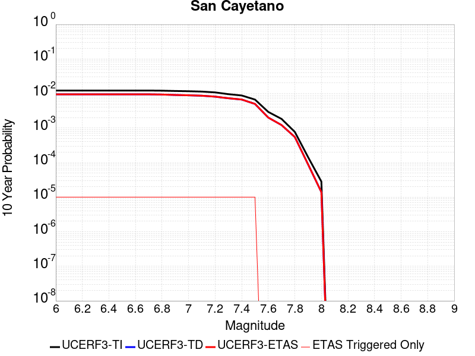 |

| Magnitude | 1 yr TI Prob | TD Prob | ETAS Prob | ETAS/TD Gain | ETAS Triggered Only | 10 yr TI Prob | TD Prob | ETAS Prob | ETAS/TD Gain | ETAS Triggered Only |
|-----|-----|-----|-----|-----|-----|-----|-----|-----|-----|-----|
| 6.0 | 0.0012242225 | 9.476103E-4 | 9.5760083E-4 | 1.0105429 | 1.0E-5 | 0.012175002 | 0.009436584 | 0.00944649 | 1.0010498 | 1.0E-5 |
| 6.1 | 0.0012242225 | 9.476103E-4 | 9.5760083E-4 | 1.0105429 | 1.0E-5 | 0.012175002 | 0.009436584 | 0.00944649 | 1.0010498 | 1.0E-5 |
| 6.2 | 0.0012242225 | 9.476103E-4 | 9.5760083E-4 | 1.0105429 | 1.0E-5 | 0.012175002 | 0.009436584 | 0.00944649 | 1.0010498 | 1.0E-5 |
| 6.3 | 0.0012242225 | 9.476103E-4 | 9.5760083E-4 | 1.0105429 | 1.0E-5 | 0.012175002 | 0.009436584 | 0.00944649 | 1.0010498 | 1.0E-5 |
| 6.4 | 0.0012242225 | 9.476103E-4 | 9.5760083E-4 | 1.0105429 | 1.0E-5 | 0.012175002 | 0.009436584 | 0.00944649 | 1.0010498 | 1.0E-5 |
| 6.5 | 0.0012242225 | 9.476103E-4 | 9.5760083E-4 | 1.0105429 | 1.0E-5 | 0.012175002 | 0.009436584 | 0.00944649 | 1.0010498 | 1.0E-5 |
| 6.6 | 0.0012242225 | 9.476103E-4 | 9.5760083E-4 | 1.0105429 | 1.0E-5 | 0.012175002 | 0.009436584 | 0.00944649 | 1.0010498 | 1.0E-5 |
| 6.7 | 0.0012242225 | 9.476103E-4 | 9.5760083E-4 | 1.0105429 | 1.0E-5 | 0.012175002 | 0.009436584 | 0.00944649 | 1.0010498 | 1.0E-5 |
| 6.8 | 0.0012120095 | 9.3550084E-4 | 9.454915E-4 | 1.0106795 | 1.0E-5 | 0.012054204 | 0.009316482 | 0.009326389 | 1.0010633 | 1.0E-5 |
| 6.9 | 0.0011869454 | 9.09197E-4 | 9.191879E-4 | 1.0109887 | 1.0E-5 | 0.011806256 | 0.009055603 | 0.009065513 | 1.0010943 | 1.0E-5 |
| 7.0 | 0.0011682777 | 8.9010317E-4 | 9.000943E-4 | 1.0112246 | 1.0E-5 | 0.011621549 | 0.008866196 | 0.008876107 | 1.0011178 | 1.0E-5 |
| 7.1 | 0.0011405671 | 8.6507114E-4 | 8.750625E-4 | 1.0115497 | 1.0E-5 | 0.011347309 | 0.008617838 | 0.008627752 | 1.0011504 | 1.0E-5 |
| 7.2 | 0.0010802611 | 8.1181666E-4 | 8.218085E-4 | 1.012308 | 1.0E-5 | 0.010750249 | 0.008089285 | 0.008099205 | 1.0012262 | 1.0E-5 |
| 7.3 | 9.600714E-4 | 7.300781E-4 | 7.4007077E-4 | 1.0136871 | 1.0E-5 | 0.009559342 | 0.0072775153 | 0.0072874427 | 1.0013641 | 1.0E-5 |
| 7.4 | 8.7918417E-4 | 6.7028153E-4 | 6.802748E-4 | 1.0149091 | 1.0E-5 | 0.00875714 | 0.0066832784 | 0.006693212 | 1.0014863 | 1.0E-5 |
| 7.5 | 6.688548E-4 | 4.996217E-4 | 5.096167E-4 | 1.0200051 | 1.0E-5 | 0.006668452 | 0.0049851555 | 0.004995106 | 1.0019959 | 1.0E-5 |
| 7.6 | 2.9358055E-4 | 2.0112359E-4 | 2.0112359E-4 | 1.0 | 0.0 | 0.0029319301 | 0.0020094267 | 0.0020094267 | 1.0 | 0.0 |
| 7.7 | 1.8397206E-4 | 1.2212721E-4 | 1.2212721E-4 | 1.0 | 0.0 | 0.0018381984 | 0.0012206084 | 0.0012206084 | 1.0 | 0.0 |
| 7.8 | 7.736187E-5 | 5.5121433E-5 | 5.5121433E-5 | 1.0 | 0.0 | 7.733494E-4 | 5.5107963E-4 | 5.5107963E-4 | 1.0 | 0.0 |
| 7.9 | 1.4384574E-5 | 8.858967E-6 | 8.858967E-6 | 1.0 | 0.0 | 1.4383643E-4 | 8.8586174E-5 | 8.8586174E-5 | 1.0 | 0.0 |
| 8.0 | 2.8217257E-6 | 1.4029607E-6 | 1.4029607E-6 | 1.0 | 0.0 | 2.8216898E-5 | 1.4029522E-5 | 1.4029522E-5 | 1.0 | 0.0 |

## Maacama 2011 CFM
*[(top)](#table-of-contents)*

| 1 Year | 10 Year |
|-----|-----|
|  |  |

| Magnitude | 1 yr TI Prob | TD Prob | ETAS Prob | ETAS/TD Gain | ETAS Triggered Only | 10 yr TI Prob | TD Prob | ETAS Prob | ETAS/TD Gain | ETAS Triggered Only |
|-----|-----|-----|-----|-----|-----|-----|-----|-----|-----|-----|
| 6.0 | 0.0071141496 | 0.013350483 | 0.013360349 | 1.000739 | 1.0E-5 | 0.06890667 | 0.124189645 | 0.1241984 | 1.0000706 | 1.0E-5 |
| 6.1 | 0.0071141496 | 0.013350483 | 0.013360349 | 1.000739 | 1.0E-5 | 0.06890667 | 0.124189645 | 0.1241984 | 1.0000706 | 1.0E-5 |
| 6.2 | 0.007075496 | 0.013286048 | 0.013295914 | 1.0007427 | 1.0E-5 | 0.06854413 | 0.12362404 | 0.12363281 | 1.0000709 | 1.0E-5 |
| 6.3 | 0.0061993203 | 0.011587509 | 0.011597393 | 1.000853 | 1.0E-5 | 0.060292065 | 0.10884413 | 0.10885304 | 1.0000819 | 1.0E-5 |
| 6.4 | 0.006169266 | 0.0115378285 | 0.011547714 | 1.0008568 | 1.0E-5 | 0.06000784 | 0.108401 | 0.10840992 | 1.0000823 | 1.0E-5 |
| 6.5 | 0.005698218 | 0.01063927 | 0.010649163 | 1.00093 | 1.0E-5 | 0.055543028 | 0.100493506 | 0.1005025 | 1.0000895 | 1.0E-5 |
| 6.6 | 0.0054655746 | 0.01020536 | 0.010215258 | 1.0009699 | 1.0E-5 | 0.053330887 | 0.096646085 | 0.09665512 | 1.0000935 | 1.0E-5 |
| 6.7 | 0.0050692135 | 0.009475501 | 0.009485407 | 1.0010453 | 1.0E-5 | 0.049551267 | 0.090118766 | 0.09012787 | 1.000101 | 1.0E-5 |
| 6.8 | 0.0046694432 | 0.008649083 | 0.008658996 | 1.0011462 | 1.0E-5 | 0.045725387 | 0.082651116 | 0.08266029 | 1.000111 | 1.0E-5 |
| 6.9 | 0.0040817154 | 0.007491799 | 0.007501724 | 1.0013248 | 1.0E-5 | 0.04007554 | 0.07205178 | 0.072061054 | 1.0001287 | 1.0E-5 |
| 7.0 | 0.0036261857 | 0.006606736 | 0.00661667 | 1.0015036 | 1.0E-5 | 0.035675827 | 0.063870616 | 0.063879974 | 1.0001465 | 1.0E-5 |
| 7.1 | 0.0031255994 | 0.0056728474 | 0.0056827907 | 1.0017527 | 1.0E-5 | 0.030820016 | 0.055138282 | 0.055147734 | 1.0001713 | 1.0E-5 |
| 7.2 | 0.002666241 | 0.004843103 | 0.0048530544 | 1.0020548 | 1.0E-5 | 0.026344774 | 0.04730284 | 0.047312364 | 1.0002013 | 1.0E-5 |
| 7.3 | 0.0021937196 | 0.0039661685 | 0.003976129 | 1.0025114 | 1.0E-5 | 0.0217219 | 0.038904376 | 0.038913988 | 1.000247 | 1.0E-5 |
| 7.4 | 0.0015116213 | 0.0026660617 | 0.002676035 | 1.0037409 | 1.0E-5 | 0.015013801 | 0.026331667 | 0.026341403 | 1.0003698 | 1.0E-5 |
| 7.5 | 5.8919897E-5 | 7.800615E-5 | 7.800615E-5 | 1.0 | 0.0 | 5.890428E-4 | 7.8048074E-4 | 7.8048074E-4 | 1.0 | 0.0 |
| 7.6 | 1.3845682E-5 | 1.8116552E-5 | 1.8116552E-5 | 1.0 | 0.0 | 1.3844819E-4 | 1.816747E-4 | 1.816747E-4 | 1.0 | 0.0 |
| 7.7 | 5.0758085E-6 | 6.419076E-6 | 6.419076E-6 | 1.0 | 0.0 | 5.0756928E-5 | 6.45712E-5 | 6.45712E-5 | 1.0 | 0.0 |
| 7.8 | 3.231905E-7 | 4.0237617E-7 | 4.0237617E-7 | 1.0 | 0.0 | 3.2319003E-6 | 4.0598557E-6 | 4.0598557E-6 | 1.0 | 0.0 |

## San Luis Range 2011 CFM
*[(top)](#table-of-contents)*

| 1 Year | 10 Year |
|-----|-----|
|  |  |

| Magnitude | 1 yr TI Prob | TD Prob | ETAS Prob | ETAS/TD Gain | ETAS Triggered Only | 10 yr TI Prob | TD Prob | ETAS Prob | ETAS/TD Gain | ETAS Triggered Only |
|-----|-----|-----|-----|-----|-----|-----|-----|-----|-----|-----|
| 6.0 | 4.609895E-4 | 4.677057E-4 | 4.677057E-4 | 1.0 | 0.0 | 0.0046003438 | 0.0046679964 | 0.0046779495 | 1.0021323 | 1.0E-5 |
| 6.1 | 4.609895E-4 | 4.677057E-4 | 4.677057E-4 | 1.0 | 0.0 | 0.0046003438 | 0.0046679964 | 0.0046779495 | 1.0021323 | 1.0E-5 |
| 6.2 | 4.609895E-4 | 4.677057E-4 | 4.677057E-4 | 1.0 | 0.0 | 0.0046003438 | 0.0046679964 | 0.0046779495 | 1.0021323 | 1.0E-5 |
| 6.3 | 4.609895E-4 | 4.677057E-4 | 4.677057E-4 | 1.0 | 0.0 | 0.0046003438 | 0.0046679964 | 0.0046779495 | 1.0021323 | 1.0E-5 |
| 6.4 | 2.039675E-4 | 2.056259E-4 | 2.056259E-4 | 1.0 | 0.0 | 0.0020378039 | 0.0020543851 | 0.0020543851 | 1.0 | 0.0 |
| 6.5 | 2.039675E-4 | 2.056259E-4 | 2.056259E-4 | 1.0 | 0.0 | 0.0020378039 | 0.0020543851 | 0.0020543851 | 1.0 | 0.0 |
| 6.6 | 1.595899E-4 | 1.6045687E-4 | 1.6045687E-4 | 1.0 | 0.0 | 0.0015947534 | 0.0016034221 | 0.0016034221 | 1.0 | 0.0 |
| 6.7 | 1.3649299E-4 | 1.3696625E-4 | 1.3696625E-4 | 1.0 | 0.0 | 0.0013640919 | 0.0013688246 | 0.0013688246 | 1.0 | 0.0 |
| 6.8 | 1.310136E-4 | 1.3138456E-4 | 1.3138456E-4 | 1.0 | 0.0 | 0.0013093639 | 0.0013130746 | 0.0013130746 | 1.0 | 0.0 |
| 6.9 | 9.686181E-5 | 9.665557E-5 | 9.665557E-5 | 1.0 | 0.0 | 9.68196E-4 | 9.661373E-4 | 9.661373E-4 | 1.0 | 0.0 |
| 7.0 | 8.06715E-5 | 8.0192905E-5 | 8.0192905E-5 | 1.0 | 0.0 | 8.0642226E-4 | 8.016404E-4 | 8.016404E-4 | 1.0 | 0.0 |
| 7.1 | 6.975101E-5 | 6.905771E-5 | 6.905771E-5 | 1.0 | 0.0 | 6.972912E-4 | 6.9036294E-4 | 6.9036294E-4 | 1.0 | 0.0 |
| 7.2 | 5.5429686E-5 | 5.4547938E-5 | 5.4547938E-5 | 1.0 | 0.0 | 5.5415864E-4 | 5.4534577E-4 | 5.4534577E-4 | 1.0 | 0.0 |
| 7.3 | 4.086376E-5 | 4.0319625E-5 | 4.0319625E-5 | 1.0 | 0.0 | 4.0856248E-4 | 4.031232E-4 | 4.031232E-4 | 1.0 | 0.0 |
| 7.4 | 3.107648E-5 | 3.084039E-5 | 3.084039E-5 | 1.0 | 0.0 | 3.1072134E-4 | 3.083612E-4 | 3.083612E-4 | 1.0 | 0.0 |
| 7.5 | 2.1714664E-5 | 2.149542E-5 | 2.149542E-5 | 1.0 | 0.0 | 2.1712543E-4 | 2.1493346E-4 | 2.1493346E-4 | 1.0 | 0.0 |
| 7.6 | 1.242678E-5 | 1.2197475E-5 | 1.2197475E-5 | 1.0 | 0.0 | 1.2426086E-4 | 1.2196808E-4 | 1.2196808E-4 | 1.0 | 0.0 |
| 7.7 | 5.1754632E-6 | 4.8978645E-6 | 4.8978645E-6 | 1.0 | 0.0 | 5.1753424E-5 | 4.897757E-5 | 4.897757E-5 | 1.0 | 0.0 |
| 7.8 | 1.8253382E-6 | 1.5490006E-6 | 1.5490006E-6 | 1.0 | 0.0 | 1.8253233E-5 | 1.5489897E-5 | 1.5489897E-5 | 1.0 | 0.0 |
| 7.9 | 8.6746354E-7 | 5.988552E-7 | 5.988552E-7 | 1.0 | 0.0 | 8.674601E-6 | 5.988536E-6 | 5.988536E-6 | 1.0 | 0.0 |
| 8.0 | 3.3056327E-7 | 1.6117131E-7 | 1.6117131E-7 | 1.0 | 0.0 | 3.3056278E-6 | 1.611712E-6 | 1.611712E-6 | 1.0 | 0.0 |

## Pitas Point (Lower West)
*[(top)](#table-of-contents)*

| 1 Year | 10 Year |
|-----|-----|
|  |  |

| Magnitude | 1 yr TI Prob | TD Prob | ETAS Prob | ETAS/TD Gain | ETAS Triggered Only | 10 yr TI Prob | TD Prob | ETAS Prob | ETAS/TD Gain | ETAS Triggered Only |
|-----|-----|-----|-----|-----|-----|-----|-----|-----|-----|-----|
| 6.0 | 4.252448E-4 | 4.0982084E-4 | 4.1981676E-4 | 1.0243909 | 1.0E-5 | 0.0042443196 | 0.0040907315 | 0.0041006906 | 1.0024345 | 1.0E-5 |
| 6.1 | 4.252448E-4 | 4.0982084E-4 | 4.1981676E-4 | 1.0243909 | 1.0E-5 | 0.0042443196 | 0.0040907315 | 0.0041006906 | 1.0024345 | 1.0E-5 |
| 6.2 | 4.252448E-4 | 4.0982084E-4 | 4.1981676E-4 | 1.0243909 | 1.0E-5 | 0.0042443196 | 0.0040907315 | 0.0041006906 | 1.0024345 | 1.0E-5 |
| 6.3 | 4.252448E-4 | 4.0982084E-4 | 4.1981676E-4 | 1.0243909 | 1.0E-5 | 0.0042443196 | 0.0040907315 | 0.0041006906 | 1.0024345 | 1.0E-5 |
| 6.4 | 4.252448E-4 | 4.0982084E-4 | 4.1981676E-4 | 1.0243909 | 1.0E-5 | 0.0042443196 | 0.0040907315 | 0.0041006906 | 1.0024345 | 1.0E-5 |
| 6.5 | 4.252448E-4 | 4.0982084E-4 | 4.1981676E-4 | 1.0243909 | 1.0E-5 | 0.0042443196 | 0.0040907315 | 0.0041006906 | 1.0024345 | 1.0E-5 |
| 6.6 | 4.252448E-4 | 4.0982084E-4 | 4.1981676E-4 | 1.0243909 | 1.0E-5 | 0.0042443196 | 0.0040907315 | 0.0041006906 | 1.0024345 | 1.0E-5 |
| 6.7 | 4.252448E-4 | 4.0982084E-4 | 4.1981676E-4 | 1.0243909 | 1.0E-5 | 0.0042443196 | 0.0040907315 | 0.0041006906 | 1.0024345 | 1.0E-5 |
| 6.8 | 4.252448E-4 | 4.0982084E-4 | 4.1981676E-4 | 1.0243909 | 1.0E-5 | 0.0042443196 | 0.0040907315 | 0.0041006906 | 1.0024345 | 1.0E-5 |
| 6.9 | 4.252448E-4 | 4.0982084E-4 | 4.1981676E-4 | 1.0243909 | 1.0E-5 | 0.0042443196 | 0.0040907315 | 0.0041006906 | 1.0024345 | 1.0E-5 |
| 7.0 | 4.2274324E-4 | 4.0718322E-4 | 4.1717917E-4 | 1.024549 | 1.0E-5 | 0.0042193993 | 0.004064452 | 0.0040744115 | 1.0024503 | 1.0E-5 |
| 7.1 | 4.096915E-4 | 3.9339735E-4 | 4.033934E-4 | 1.0254096 | 1.0E-5 | 0.00408937 | 0.0039270855 | 0.003937046 | 1.0025364 | 1.0E-5 |
| 7.2 | 4.0540437E-4 | 3.8882208E-4 | 3.988182E-4 | 1.0257087 | 1.0E-5 | 0.0040466557 | 0.0038814936 | 0.0038914548 | 1.0025663 | 1.0E-5 |
| 7.3 | 3.8576324E-4 | 3.6775516E-4 | 3.7775148E-4 | 1.027182 | 1.0E-5 | 0.0038509427 | 0.0036715334 | 0.0036814967 | 1.0027137 | 1.0E-5 |
| 7.4 | 3.6334046E-4 | 3.4380553E-4 | 3.5380208E-4 | 1.0290762 | 1.0E-5 | 0.0036274698 | 0.0034327896 | 0.0034427552 | 1.0029031 | 1.0E-5 |
| 7.5 | 3.4705905E-4 | 3.265421E-4 | 3.3653883E-4 | 1.0306139 | 1.0E-5 | 0.0034651754 | 0.0032606742 | 0.0032706417 | 1.0030569 | 1.0E-5 |
| 7.6 | 2.928539E-4 | 2.6875688E-4 | 2.787542E-4 | 1.0371983 | 1.0E-5 | 0.0029246826 | 0.0026843501 | 0.0026943232 | 1.0037153 | 1.0E-5 |
| 7.7 | 2.3450027E-4 | 2.0853203E-4 | 2.1852994E-4 | 1.0479443 | 1.0E-5 | 0.0023425296 | 0.0020833875 | 0.0020933668 | 1.0047898 | 1.0E-5 |
| 7.8 | 1.3605114E-4 | 1.1393277E-4 | 1.1393277E-4 | 1.0 | 0.0 | 0.0013596788 | 0.0011387484 | 0.0011387484 | 1.0 | 0.0 |
| 7.9 | 2.1111147E-5 | 1.6918111E-5 | 1.6918111E-5 | 1.0 | 0.0 | 2.1109142E-4 | 1.6916855E-4 | 1.6916855E-4 | 1.0 | 0.0 |
| 8.0 | 4.0654416E-7 | 2.9655675E-7 | 2.9655675E-7 | 1.0 | 0.0 | 4.065434E-6 | 2.9655655E-6 | 2.9655655E-6 | 1.0 | 0.0 |

## White Wolf
*[(top)](#table-of-contents)*

| 1 Year | 10 Year |
|-----|-----|
| 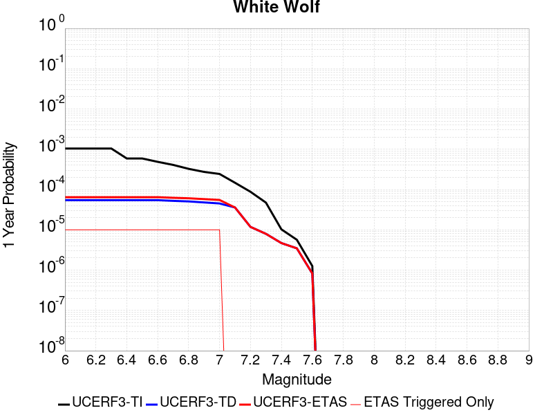 |  |

| Magnitude | 1 yr TI Prob | TD Prob | ETAS Prob | ETAS/TD Gain | ETAS Triggered Only | 10 yr TI Prob | TD Prob | ETAS Prob | ETAS/TD Gain | ETAS Triggered Only |
|-----|-----|-----|-----|-----|-----|-----|-----|-----|-----|-----|
| 6.0 | 0.001045009 | 5.4625183E-5 | 6.462463E-5 | 1.1830558 | 1.0E-5 | 0.010401085 | 5.461226E-4 | 5.5611716E-4 | 1.0183009 | 1.0E-5 |
| 6.1 | 0.001045009 | 5.4625183E-5 | 6.462463E-5 | 1.1830558 | 1.0E-5 | 0.010401085 | 5.461226E-4 | 5.5611716E-4 | 1.0183009 | 1.0E-5 |
| 6.2 | 0.001045009 | 5.4625183E-5 | 6.462463E-5 | 1.1830558 | 1.0E-5 | 0.010401085 | 5.461226E-4 | 5.5611716E-4 | 1.0183009 | 1.0E-5 |
| 6.3 | 0.001045009 | 5.4625183E-5 | 6.462463E-5 | 1.1830558 | 1.0E-5 | 0.010401085 | 5.461226E-4 | 5.5611716E-4 | 1.0183009 | 1.0E-5 |
| 6.4 | 5.907443E-4 | 5.4625183E-5 | 6.462463E-5 | 1.1830558 | 1.0E-5 | 0.005891764 | 5.461226E-4 | 5.5611716E-4 | 1.0183009 | 1.0E-5 |
| 6.5 | 5.907443E-4 | 5.4625183E-5 | 6.462463E-5 | 1.1830558 | 1.0E-5 | 0.005891764 | 5.461226E-4 | 5.5611716E-4 | 1.0183009 | 1.0E-5 |
| 6.6 | 4.8762115E-4 | 5.4625183E-5 | 6.462463E-5 | 1.1830558 | 1.0E-5 | 0.0048655253 | 5.461226E-4 | 5.5611716E-4 | 1.0183009 | 1.0E-5 |
| 6.7 | 4.0913603E-4 | 5.2429517E-5 | 6.2429E-5 | 1.1907222 | 1.0E-5 | 0.004083836 | 5.2417646E-4 | 5.341712E-4 | 1.0190675 | 1.0E-5 |
| 6.8 | 3.2689696E-4 | 5.0793697E-5 | 6.079319E-5 | 1.1968648 | 1.0E-5 | 0.003264165 | 5.078258E-4 | 5.178207E-4 | 1.0196818 | 1.0E-5 |
| 6.9 | 2.7434074E-4 | 4.7915833E-5 | 5.7915353E-5 | 1.2086893 | 1.0E-5 | 0.0027400232 | 4.790598E-4 | 4.89055E-4 | 1.0208642 | 1.0E-5 |
| 7.0 | 2.4390711E-4 | 4.5191846E-5 | 5.5191394E-5 | 1.2212689 | 1.0E-5 | 0.0024363957 | 4.518313E-4 | 4.6182677E-4 | 1.0221221 | 1.0E-5 |
| 7.1 | 1.4749856E-4 | 3.5867848E-5 | 3.5867848E-5 | 1.0 | 0.0 | 0.001474007 | 3.586247E-4 | 3.586247E-4 | 1.0 | 0.0 |
| 7.2 | 8.808096E-5 | 1.1847799E-5 | 1.1847799E-5 | 1.0 | 0.0 | 8.8046055E-4 | 1.1847183E-4 | 1.1847183E-4 | 1.0 | 0.0 |
| 7.3 | 4.7408903E-5 | 7.965752E-6 | 7.965752E-6 | 1.0 | 0.0 | 4.739879E-4 | 7.965475E-5 | 7.965475E-5 | 1.0 | 0.0 |
| 7.4 | 1.0288197E-5 | 4.6981027E-6 | 4.6981027E-6 | 1.0 | 0.0 | 1.028772E-4 | 4.6980065E-5 | 4.6980065E-5 | 1.0 | 0.0 |
| 7.5 | 5.6716644E-6 | 3.474941E-6 | 3.474941E-6 | 1.0 | 0.0 | 5.6715195E-5 | 3.474889E-5 | 3.474889E-5 | 1.0 | 0.0 |
| 7.6 | 1.2636499E-6 | 8.255046E-7 | 8.255046E-7 | 1.0 | 0.0 | 1.2636427E-5 | 8.2550205E-6 | 8.2550205E-6 | 1.0 | 0.0 |

## Great Valley 12
*[(top)](#table-of-contents)*

| 1 Year | 10 Year |
|-----|-----|
| 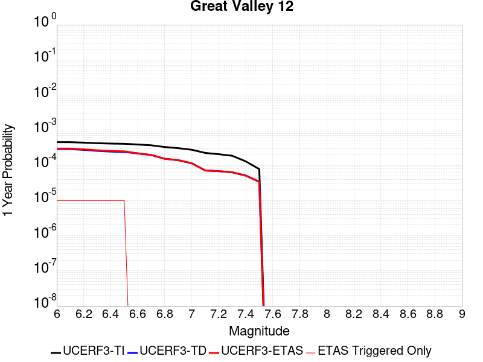 |  |

| Magnitude | 1 yr TI Prob | TD Prob | ETAS Prob | ETAS/TD Gain | ETAS Triggered Only | 10 yr TI Prob | TD Prob | ETAS Prob | ETAS/TD Gain | ETAS Triggered Only |
|-----|-----|-----|-----|-----|-----|-----|-----|-----|-----|-----|
| 6.0 | 4.5683357E-4 | 2.8981516E-4 | 2.9981227E-4 | 1.0344948 | 1.0E-5 | 0.004558956 | 0.002894493 | 0.002904464 | 1.0034448 | 1.0E-5 |
| 6.1 | 4.5683357E-4 | 2.8981516E-4 | 2.9981227E-4 | 1.0344948 | 1.0E-5 | 0.004558956 | 0.002894493 | 0.002904464 | 1.0034448 | 1.0E-5 |
| 6.2 | 4.4337637E-4 | 2.7550483E-4 | 2.8550206E-4 | 1.036287 | 1.0E-5 | 0.0044249278 | 0.0027517474 | 0.0027617197 | 1.0036241 | 1.0E-5 |
| 6.3 | 4.270904E-4 | 2.581935E-4 | 2.6819092E-4 | 1.0387206 | 1.0E-5 | 0.004262705 | 0.002579036 | 0.0025890102 | 1.0038674 | 1.0E-5 |
| 6.4 | 4.1629362E-4 | 2.4629984E-4 | 2.5629738E-4 | 1.0405909 | 1.0E-5 | 0.0041551464 | 0.0024603626 | 0.002470338 | 1.0040544 | 1.0E-5 |
| 6.5 | 4.1061494E-4 | 2.4003859E-4 | 2.500362E-4 | 1.0416499 | 1.0E-5 | 0.0040985704 | 0.002397886 | 0.002407862 | 1.0041603 | 1.0E-5 |
| 6.6 | 3.91693E-4 | 2.1934835E-4 | 2.1934835E-4 | 1.0 | 0.0 | 0.003910033 | 0.0021914048 | 0.0021914048 | 1.0 | 0.0 |
| 6.7 | 3.7195446E-4 | 1.973189E-4 | 1.973189E-4 | 1.0 | 0.0 | 0.0037133251 | 0.001971516 | 0.001971516 | 1.0 | 0.0 |
| 6.8 | 3.326666E-4 | 1.5383872E-4 | 1.5383872E-4 | 1.0 | 0.0 | 0.0033216903 | 0.0015373388 | 0.0015373388 | 1.0 | 0.0 |
| 6.9 | 3.0830267E-4 | 1.4017333E-4 | 1.4017333E-4 | 1.0 | 0.0 | 0.003078753 | 0.0014008647 | 0.0014008647 | 1.0 | 0.0 |
| 7.0 | 2.7776015E-4 | 1.14615876E-4 | 1.14615876E-4 | 1.0 | 0.0 | 0.0027741324 | 0.001145581 | 0.001145581 | 1.0 | 0.0 |
| 7.1 | 2.2586368E-4 | 7.152411E-5 | 7.152411E-5 | 1.0 | 0.0 | 0.0022563424 | 7.150196E-4 | 7.150196E-4 | 1.0 | 0.0 |
| 7.2 | 2.075707E-4 | 6.83847E-5 | 6.83847E-5 | 1.0 | 0.0 | 0.0020737692 | 6.8364514E-4 | 6.8364514E-4 | 1.0 | 0.0 |
| 7.3 | 1.8712347E-4 | 6.343579E-5 | 6.343579E-5 | 1.0 | 0.0 | 0.0018696598 | 6.341854E-4 | 6.341854E-4 | 1.0 | 0.0 |
| 7.4 | 1.2959167E-4 | 5.1136827E-5 | 5.1136827E-5 | 1.0 | 0.0 | 0.0012951613 | 5.112572E-4 | 5.112572E-4 | 1.0 | 0.0 |
| 7.5 | 7.827883E-5 | 3.4156317E-5 | 3.4156317E-5 | 1.0 | 0.0 | 7.825126E-4 | 3.4151482E-4 | 3.4151482E-4 | 1.0 | 0.0 |

## Laguna Salada
*[(top)](#table-of-contents)*

| 1 Year | 10 Year |
|-----|-----|
|  |  |

| Magnitude | 1 yr TI Prob | TD Prob | ETAS Prob | ETAS/TD Gain | ETAS Triggered Only | 10 yr TI Prob | TD Prob | ETAS Prob | ETAS/TD Gain | ETAS Triggered Only |
|-----|-----|-----|-----|-----|-----|-----|-----|-----|-----|-----|
| 6.0 | 0.0024216278 | 0.002415429 | 0.002425405 | 1.00413 | 1.0E-5 | 0.02395408 | 0.023975259 | 0.023985019 | 1.0004071 | 1.0E-5 |
| 6.1 | 0.0020757897 | 0.0019417295 | 0.0019517101 | 1.0051401 | 1.0E-5 | 0.020565065 | 0.019331863 | 0.01934167 | 1.0005072 | 1.0E-5 |
| 6.2 | 0.0018802295 | 0.0016998611 | 0.0017098442 | 1.0058728 | 1.0E-5 | 0.018644003 | 0.016949628 | 0.016959459 | 1.00058 | 1.0E-5 |
| 6.3 | 0.0017131006 | 0.0015043203 | 0.0015143052 | 1.0066376 | 1.0E-5 | 0.016999546 | 0.015018767 | 0.015028617 | 1.0006559 | 1.0E-5 |
| 6.4 | 0.0015189396 | 0.001296065 | 0.0013060521 | 1.0077057 | 1.0E-5 | 0.015085992 | 0.012956262 | 0.012966133 | 1.0007619 | 1.0E-5 |
| 6.5 | 0.0014117584 | 0.0011904186 | 0.0012004067 | 1.0083904 | 1.0E-5 | 0.014028233 | 0.011907749 | 0.01191763 | 1.0008298 | 1.0E-5 |
| 6.6 | 0.0011664346 | 9.6876756E-4 | 9.787579E-4 | 1.0103124 | 1.0E-5 | 0.011603311 | 0.009702191 | 0.0097120935 | 1.0010207 | 1.0E-5 |
| 6.7 | 0.001014788 | 8.3013024E-4 | 8.4012194E-4 | 1.0120363 | 1.0E-5 | 0.010101665 | 0.0083209425 | 0.008330859 | 1.0011917 | 1.0E-5 |
| 6.8 | 5.6169706E-4 | 4.7918706E-4 | 4.7918706E-4 | 1.0 | 0.0 | 0.0056027942 | 0.0048096925 | 0.0048096925 | 1.0 | 0.0 |
| 6.9 | 1.1157654E-4 | 9.346713E-5 | 9.346713E-5 | 1.0 | 0.0 | 0.0011152053 | 9.343165E-4 | 9.343165E-4 | 1.0 | 0.0 |
| 7.0 | 1.0932361E-4 | 9.1272545E-5 | 9.1272545E-5 | 1.0 | 0.0 | 0.0010926984 | 9.123888E-4 | 9.123888E-4 | 1.0 | 0.0 |
| 7.1 | 9.333054E-5 | 7.565777E-5 | 7.565777E-5 | 1.0 | 0.0 | 9.329135E-4 | 7.563506E-4 | 7.563506E-4 | 1.0 | 0.0 |
| 7.2 | 5.073253E-5 | 3.7232137E-5 | 3.7232137E-5 | 1.0 | 0.0 | 5.072095E-4 | 3.7227524E-4 | 3.7227524E-4 | 1.0 | 0.0 |

## La Panza 2011
*[(top)](#table-of-contents)*

| 1 Year | 10 Year |
|-----|-----|
|  |  |

| Magnitude | 1 yr TI Prob | TD Prob | ETAS Prob | ETAS/TD Gain | ETAS Triggered Only | 10 yr TI Prob | TD Prob | ETAS Prob | ETAS/TD Gain | ETAS Triggered Only |
|-----|-----|-----|-----|-----|-----|-----|-----|-----|-----|-----|
| 6.0 | 2.4392935E-4 | 2.4612935E-4 | 2.561269E-4 | 1.040619 | 1.0E-5 | 0.0024366176 | 0.002458762 | 0.0024687373 | 1.004057 | 1.0E-5 |
| 6.1 | 2.4392935E-4 | 2.4612935E-4 | 2.561269E-4 | 1.040619 | 1.0E-5 | 0.0024366176 | 0.002458762 | 0.0024687373 | 1.004057 | 1.0E-5 |
| 6.2 | 2.4392935E-4 | 2.4612935E-4 | 2.561269E-4 | 1.040619 | 1.0E-5 | 0.0024366176 | 0.002458762 | 0.0024687373 | 1.004057 | 1.0E-5 |
| 6.3 | 2.4392935E-4 | 2.4612935E-4 | 2.561269E-4 | 1.040619 | 1.0E-5 | 0.0024366176 | 0.002458762 | 0.0024687373 | 1.004057 | 1.0E-5 |
| 6.4 | 2.4392935E-4 | 2.4612935E-4 | 2.561269E-4 | 1.040619 | 1.0E-5 | 0.0024366176 | 0.002458762 | 0.0024687373 | 1.004057 | 1.0E-5 |
| 6.5 | 1.296734E-4 | 1.3046975E-4 | 1.4046844E-4 | 1.0766361 | 1.0E-5 | 0.0012959775 | 0.0013039699 | 0.0013139568 | 1.0076588 | 1.0E-5 |
| 6.6 | 1.296734E-4 | 1.3046975E-4 | 1.4046844E-4 | 1.0766361 | 1.0E-5 | 0.0012959775 | 0.0013039699 | 0.0013139568 | 1.0076588 | 1.0E-5 |
| 6.7 | 7.8830984E-5 | 7.902867E-5 | 8.902788E-5 | 1.1265264 | 1.0E-5 | 7.880303E-4 | 7.900165E-4 | 8.000086E-4 | 1.012648 | 1.0E-5 |
| 6.8 | 7.234739E-5 | 7.244801E-5 | 8.244728E-5 | 1.13802 | 1.0E-5 | 7.232384E-4 | 7.242537E-4 | 7.3424645E-4 | 1.0137973 | 1.0E-5 |
| 6.9 | 5.1272415E-5 | 5.11144E-5 | 6.111389E-5 | 1.1956296 | 1.0E-5 | 5.126059E-4 | 5.110318E-4 | 5.2102667E-4 | 1.0195583 | 1.0E-5 |
| 7.0 | 3.537523E-5 | 3.5012374E-5 | 3.5012374E-5 | 1.0 | 0.0 | 3.5369597E-4 | 3.5007167E-4 | 3.5007167E-4 | 1.0 | 0.0 |
| 7.1 | 1.825181E-5 | 1.7674765E-5 | 1.7674765E-5 | 1.0 | 0.0 | 1.825031E-4 | 1.7673477E-4 | 1.7673477E-4 | 1.0 | 0.0 |
| 7.2 | 1.3090649E-5 | 1.2435077E-5 | 1.2435077E-5 | 1.0 | 0.0 | 1.3089878E-4 | 1.2434467E-4 | 1.2434467E-4 | 1.0 | 0.0 |
| 7.3 | 5.300852E-6 | 4.5106294E-6 | 4.5106294E-6 | 1.0 | 0.0 | 5.3007258E-5 | 4.5105422E-5 | 4.5105422E-5 | 1.0 | 0.0 |
| 7.4 | 1.8265745E-6 | 1.0124895E-6 | 1.0124895E-6 | 1.0 | 0.0 | 1.8265595E-5 | 1.01248515E-5 | 1.01248515E-5 | 1.0 | 0.0 |
| 7.5 | 1.3526106E-6 | 5.342612E-7 | 5.342612E-7 | 1.0 | 0.0 | 1.3526024E-5 | 5.3425997E-6 | 5.3425997E-6 | 1.0 | 0.0 |
| 7.6 | 9.922647E-7 | 2.736662E-7 | 2.736662E-7 | 1.0 | 0.0 | 9.922603E-6 | 2.7366589E-6 | 2.7366589E-6 | 1.0 | 0.0 |
| 7.7 | 6.1434247E-7 | 6.469138E-8 | 6.469138E-8 | 1.0 | 0.0 | 6.143408E-6 | 6.469136E-7 | 6.469136E-7 | 1.0 | 0.0 |
| 7.8 | 2.8641225E-7 | 1.04940305E-8 | 1.04940305E-8 | 1.0 | 0.0 | 2.8641189E-6 | 1.04940305E-7 | 1.04940305E-7 | 1.0 | 0.0 |
| 7.9 | 1.3086932E-7 | 3.487552E-9 | 3.487552E-9 | 1.0 | 0.0 | 1.3086925E-6 | 3.487552E-8 | 3.487552E-8 | 1.0 | 0.0 |

## Big Lagoon - Bald Mtn 2011 CFM
*[(top)](#table-of-contents)*

| 1 Year | 10 Year |
|-----|-----|
|  |  |

| Magnitude | 1 yr TI Prob | TD Prob | ETAS Prob | ETAS/TD Gain | ETAS Triggered Only | 10 yr TI Prob | TD Prob | ETAS Prob | ETAS/TD Gain | ETAS Triggered Only |
|-----|-----|-----|-----|-----|-----|-----|-----|-----|-----|-----|
| 6.0 | 9.752587E-4 | 0.0010352687 | 0.0010452583 | 1.0096493 | 1.0E-5 | 0.009709897 | 0.010308274 | 0.010318171 | 1.0009601 | 1.0E-5 |
| 6.1 | 9.752587E-4 | 0.0010352687 | 0.0010452583 | 1.0096493 | 1.0E-5 | 0.009709897 | 0.010308274 | 0.010318171 | 1.0009601 | 1.0E-5 |
| 6.2 | 9.752587E-4 | 0.0010352687 | 0.0010452583 | 1.0096493 | 1.0E-5 | 0.009709897 | 0.010308274 | 0.010318171 | 1.0009601 | 1.0E-5 |
| 6.3 | 9.752587E-4 | 0.0010352687 | 0.0010452583 | 1.0096493 | 1.0E-5 | 0.009709897 | 0.010308274 | 0.010318171 | 1.0009601 | 1.0E-5 |
| 6.4 | 9.752587E-4 | 0.0010352687 | 0.0010452583 | 1.0096493 | 1.0E-5 | 0.009709897 | 0.010308274 | 0.010318171 | 1.0009601 | 1.0E-5 |
| 6.5 | 9.752587E-4 | 0.0010352687 | 0.0010452583 | 1.0096493 | 1.0E-5 | 0.009709897 | 0.010308274 | 0.010318171 | 1.0009601 | 1.0E-5 |
| 6.6 | 9.752587E-4 | 0.0010352687 | 0.0010452583 | 1.0096493 | 1.0E-5 | 0.009709897 | 0.010308274 | 0.010318171 | 1.0009601 | 1.0E-5 |
| 6.7 | 9.752587E-4 | 0.0010352687 | 0.0010452583 | 1.0096493 | 1.0E-5 | 0.009709897 | 0.010308274 | 0.010318171 | 1.0009601 | 1.0E-5 |
| 6.8 | 6.181552E-4 | 6.520185E-4 | 6.520185E-4 | 1.0 | 0.0 | 0.006164385 | 0.0065015587 | 0.0065015587 | 1.0 | 0.0 |
| 6.9 | 6.181552E-4 | 6.520185E-4 | 6.520185E-4 | 1.0 | 0.0 | 0.006164385 | 0.0065015587 | 0.0065015587 | 1.0 | 0.0 |
| 7.0 | 5.0703844E-4 | 5.3393573E-4 | 5.3393573E-4 | 1.0 | 0.0 | 0.005058831 | 0.0053267754 | 0.0053267754 | 1.0 | 0.0 |
| 7.1 | 4.4464276E-4 | 4.6790804E-4 | 4.6790804E-4 | 1.0 | 0.0 | 0.0044375416 | 0.004669392 | 0.004669392 | 1.0 | 0.0 |
| 7.2 | 3.8494746E-4 | 4.048843E-4 | 4.048843E-4 | 1.0 | 0.0 | 0.0038428132 | 0.0040415623 | 0.0040415623 | 1.0 | 0.0 |
| 7.3 | 3.3722803E-4 | 3.5435913E-4 | 3.5435913E-4 | 1.0 | 0.0 | 0.0033671674 | 0.0035380109 | 0.0035380109 | 1.0 | 0.0 |
| 7.4 | 3.1280998E-4 | 3.2861007E-4 | 3.2861007E-4 | 1.0 | 0.0 | 0.0031237002 | 0.0032813034 | 0.0032813034 | 1.0 | 0.0 |
| 7.5 | 2.5716957E-4 | 2.700616E-4 | 2.700616E-4 | 1.0 | 0.0 | 0.0025687215 | 0.002697375 | 0.002697375 | 1.0 | 0.0 |
| 7.6 | 2.0338432E-4 | 2.1333233E-4 | 2.1333233E-4 | 1.0 | 0.0 | 0.0020319829 | 0.002131303 | 0.002131303 | 1.0 | 0.0 |
| 7.7 | 1.4718344E-4 | 1.5429159E-4 | 1.5429159E-4 | 1.0 | 0.0 | 0.00147086 | 0.0015418624 | 0.0015418624 | 1.0 | 0.0 |
| 7.8 | 1.0077508E-4 | 1.0570941E-4 | 1.0570941E-4 | 1.0 | 0.0 | 0.0010072939 | 0.0010566041 | 0.0010566041 | 1.0 | 0.0 |
| 7.9 | 2.5873042E-5 | 2.7231245E-5 | 2.7231245E-5 | 1.0 | 0.0 | 2.5870028E-4 | 2.7228118E-4 | 2.7228118E-4 | 1.0 | 0.0 |

## Great Valley 05 Pittsburg - Kirby Hills alt1
*[(top)](#table-of-contents)*

| 1 Year | 10 Year |
|-----|-----|
|  | 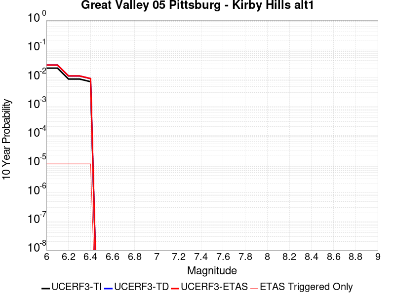 |

| Magnitude | 1 yr TI Prob | TD Prob | ETAS Prob | ETAS/TD Gain | ETAS Triggered Only | 10 yr TI Prob | TD Prob | ETAS Prob | ETAS/TD Gain | ETAS Triggered Only |
|-----|-----|-----|-----|-----|-----|-----|-----|-----|-----|-----|
| 6.0 | 0.002182488 | 0.0027857882 | 0.0027957603 | 1.0035796 | 1.0E-5 | 0.021611776 | 0.02760304 | 0.027612763 | 1.0003523 | 1.0E-5 |
| 6.1 | 0.002182488 | 0.0027857882 | 0.0027957603 | 1.0035796 | 1.0E-5 | 0.021611776 | 0.02760304 | 0.027612763 | 1.0003523 | 1.0E-5 |
| 6.2 | 9.050688E-4 | 0.0011557543 | 0.0011657428 | 1.0086423 | 1.0E-5 | 0.009013915 | 0.011535114 | 0.011544998 | 1.0008569 | 1.0E-5 |
| 6.3 | 9.050688E-4 | 0.0011557543 | 0.0011657428 | 1.0086423 | 1.0E-5 | 0.009013915 | 0.011535114 | 0.011544998 | 1.0008569 | 1.0E-5 |
| 6.4 | 7.3174125E-4 | 9.340275E-4 | 9.440182E-4 | 1.0106963 | 1.0E-5 | 0.0072933645 | 0.009338138 | 0.009348044 | 1.0010608 | 1.0E-5 |

## Point Reyes 2011 CFM
*[(top)](#table-of-contents)*

| 1 Year | 10 Year |
|-----|-----|
|  |  |

| Magnitude | 1 yr TI Prob | TD Prob | ETAS Prob | ETAS/TD Gain | ETAS Triggered Only | 10 yr TI Prob | TD Prob | ETAS Prob | ETAS/TD Gain | ETAS Triggered Only |
|-----|-----|-----|-----|-----|-----|-----|-----|-----|-----|-----|
| 6.0 | 4.624319E-4 | 4.6779314E-4 | 4.6779314E-4 | 1.0 | 0.0 | 0.0046147075 | 0.004668713 | 0.004678666 | 1.0021319 | 1.0E-5 |
| 6.1 | 2.36154E-4 | 2.3682354E-4 | 2.3682354E-4 | 1.0 | 0.0 | 0.002359032 | 0.0023658178 | 0.0023658178 | 1.0 | 0.0 |
| 6.2 | 2.36154E-4 | 2.3682354E-4 | 2.3682354E-4 | 1.0 | 0.0 | 0.002359032 | 0.0023658178 | 0.0023658178 | 1.0 | 0.0 |
| 6.3 | 1.4004979E-4 | 1.3882104E-4 | 1.3882104E-4 | 1.0 | 0.0 | 0.0013996155 | 0.0013873649 | 0.0013873649 | 1.0 | 0.0 |
| 6.4 | 1.4004979E-4 | 1.3882104E-4 | 1.3882104E-4 | 1.0 | 0.0 | 0.0013996155 | 0.0013873649 | 0.0013873649 | 1.0 | 0.0 |
| 6.5 | 1.0060489E-4 | 9.86455E-5 | 9.86455E-5 | 1.0 | 0.0 | 0.0010055936 | 9.860279E-4 | 9.860279E-4 | 1.0 | 0.0 |
| 6.6 | 7.683905E-5 | 7.445395E-5 | 7.445395E-5 | 1.0 | 0.0 | 7.6812494E-4 | 7.4429717E-4 | 7.4429717E-4 | 1.0 | 0.0 |
| 6.7 | 4.472809E-5 | 4.1779647E-5 | 4.1779647E-5 | 1.0 | 0.0 | 4.471909E-4 | 4.1772184E-4 | 4.1772184E-4 | 1.0 | 0.0 |
| 6.8 | 3.482622E-5 | 3.171E-5 | 3.171E-5 | 1.0 | 0.0 | 3.4820763E-4 | 3.1705803E-4 | 3.1705803E-4 | 1.0 | 0.0 |
| 6.9 | 2.2392298E-5 | 1.9063755E-5 | 1.9063755E-5 | 1.0 | 0.0 | 2.2390042E-4 | 1.9062385E-4 | 1.9062385E-4 | 1.0 | 0.0 |
| 7.0 | 1.3990444E-5 | 1.0533451E-5 | 1.0533451E-5 | 1.0 | 0.0 | 1.3989564E-4 | 1.0533186E-4 | 1.0533186E-4 | 1.0 | 0.0 |
| 7.1 | 1.0149324E-5 | 6.6399616E-6 | 6.6399616E-6 | 1.0 | 0.0 | 1.014886E-4 | 6.639991E-5 | 6.639991E-5 | 1.0 | 0.0 |
| 7.2 | 8.721685E-6 | 5.2401965E-6 | 5.2401965E-6 | 1.0 | 0.0 | 8.721343E-5 | 5.2402997E-5 | 5.2402997E-5 | 1.0 | 0.0 |
| 7.3 | 8.089301E-6 | 4.702897E-6 | 4.702897E-6 | 1.0 | 0.0 | 8.089007E-5 | 4.7030244E-5 | 4.7030244E-5 | 1.0 | 0.0 |
| 7.4 | 7.4362615E-6 | 4.225216E-6 | 4.225216E-6 | 1.0 | 0.0 | 7.436013E-5 | 4.2253625E-5 | 4.2253625E-5 | 1.0 | 0.0 |
| 7.5 | 6.6319717E-6 | 3.667959E-6 | 3.667959E-6 | 1.0 | 0.0 | 6.6317734E-5 | 3.6681253E-5 | 3.6681253E-5 | 1.0 | 0.0 |
| 7.6 | 5.2933497E-6 | 2.8673273E-6 | 2.8673273E-6 | 1.0 | 0.0 | 5.293224E-5 | 2.8675171E-5 | 2.8675171E-5 | 1.0 | 0.0 |
| 7.7 | 3.699729E-6 | 2.0779103E-6 | 2.0779103E-6 | 1.0 | 0.0 | 3.6996673E-5 | 2.0781177E-5 | 2.0781177E-5 | 1.0 | 0.0 |
| 7.8 | 2.0199373E-6 | 1.4317802E-6 | 1.4317802E-6 | 1.0 | 0.0 | 2.0199188E-5 | 1.4319979E-5 | 1.4319979E-5 | 1.0 | 0.0 |
| 7.9 | 8.906242E-7 | 6.174472E-7 | 6.174472E-7 | 1.0 | 0.0 | 8.906207E-6 | 6.1767228E-6 | 6.1767228E-6 | 1.0 | 0.0 |
| 8.0 | 5.3079117E-7 | 3.6671526E-7 | 3.6671526E-7 | 1.0 | 0.0 | 5.307899E-6 | 3.6694144E-6 | 3.6694144E-6 | 1.0 | 0.0 |
| 8.1 | 1.9755454E-7 | 1.8498575E-7 | 1.8498575E-7 | 1.0 | 0.0 | 1.9755437E-6 | 1.8518531E-6 | 1.8518531E-6 | 1.0 | 0.0 |

## Verdugo
*[(top)](#table-of-contents)*

| 1 Year | 10 Year |
|-----|-----|
|  |  |

| Magnitude | 1 yr TI Prob | TD Prob | ETAS Prob | ETAS/TD Gain | ETAS Triggered Only | 10 yr TI Prob | TD Prob | ETAS Prob | ETAS/TD Gain | ETAS Triggered Only |
|-----|-----|-----|-----|-----|-----|-----|-----|-----|-----|-----|
| 6.0 | 2.8135953E-4 | 2.1998861E-4 | 2.2998641E-4 | 1.0454469 | 1.0E-5 | 0.0028100356 | 0.0021977562 | 0.0022077342 | 1.0045401 | 1.0E-5 |
| 6.1 | 2.8135953E-4 | 2.1998861E-4 | 2.2998641E-4 | 1.0454469 | 1.0E-5 | 0.0028100356 | 0.0021977562 | 0.0022077342 | 1.0045401 | 1.0E-5 |
| 6.2 | 2.8135953E-4 | 2.1998861E-4 | 2.2998641E-4 | 1.0454469 | 1.0E-5 | 0.0028100356 | 0.0021977562 | 0.0022077342 | 1.0045401 | 1.0E-5 |
| 6.3 | 2.8135953E-4 | 2.1998861E-4 | 2.2998641E-4 | 1.0454469 | 1.0E-5 | 0.0028100356 | 0.0021977562 | 0.0022077342 | 1.0045401 | 1.0E-5 |
| 6.4 | 2.8135953E-4 | 2.1998861E-4 | 2.2998641E-4 | 1.0454469 | 1.0E-5 | 0.0028100356 | 0.0021977562 | 0.0022077342 | 1.0045401 | 1.0E-5 |
| 6.5 | 2.5645064E-4 | 1.9421462E-4 | 1.9421462E-4 | 1.0 | 0.0 | 0.002561549 | 0.0019404698 | 0.0019404698 | 1.0 | 0.0 |
| 6.6 | 2.5645064E-4 | 1.9421462E-4 | 1.9421462E-4 | 1.0 | 0.0 | 0.002561549 | 0.0019404698 | 0.0019404698 | 1.0 | 0.0 |
| 6.7 | 2.513135E-4 | 1.8890314E-4 | 1.8890314E-4 | 1.0 | 0.0 | 0.0025102948 | 0.0018874453 | 0.0018874453 | 1.0 | 0.0 |
| 6.8 | 2.3516294E-4 | 1.7254551E-4 | 1.7254551E-4 | 1.0 | 0.0 | 0.0023491425 | 0.0017241298 | 0.0017241298 | 1.0 | 0.0 |
| 6.9 | 2.2733262E-4 | 1.6492383E-4 | 1.6492383E-4 | 1.0 | 0.0 | 0.0022710022 | 0.0016480266 | 0.0016480266 | 1.0 | 0.0 |
| 7.0 | 2.1764109E-4 | 1.5567189E-4 | 1.5567189E-4 | 1.0 | 0.0 | 0.0021742806 | 0.0015556397 | 0.0015556397 | 1.0 | 0.0 |
| 7.1 | 2.1080824E-4 | 1.503813E-4 | 1.503813E-4 | 1.0 | 0.0 | 0.0021060838 | 0.0015028063 | 0.0015028063 | 1.0 | 0.0 |
| 7.2 | 1.9985568E-4 | 1.4096878E-4 | 1.4096878E-4 | 1.0 | 0.0 | 0.0019967605 | 0.0014088044 | 0.0014088044 | 1.0 | 0.0 |
| 7.3 | 1.8652623E-4 | 1.3107344E-4 | 1.3107344E-4 | 1.0 | 0.0 | 0.0018636974 | 0.0013099718 | 0.0013099718 | 1.0 | 0.0 |
| 7.4 | 1.7483562E-4 | 1.2213545E-4 | 1.2213545E-4 | 1.0 | 0.0 | 0.0017469813 | 0.0012206937 | 0.0012206937 | 1.0 | 0.0 |
| 7.5 | 1.538258E-4 | 1.0639253E-4 | 1.0639253E-4 | 1.0 | 0.0 | 0.0015371935 | 0.0010634261 | 0.0010634261 | 1.0 | 0.0 |
| 7.6 | 1.05052604E-4 | 7.550629E-5 | 7.550629E-5 | 1.0 | 0.0 | 0.0010500296 | 7.548152E-4 | 7.548152E-4 | 1.0 | 0.0 |
| 7.7 | 2.9879287E-5 | 2.1107335E-5 | 2.1107335E-5 | 1.0 | 0.0 | 2.987527E-4 | 2.1105584E-4 | 2.1105584E-4 | 1.0 | 0.0 |
| 7.8 | 8.478045E-6 | 5.5766723E-6 | 5.5766723E-6 | 1.0 | 0.0 | 8.477722E-5 | 5.5765355E-5 | 5.5765355E-5 | 1.0 | 0.0 |
| 7.9 | 2.320678E-6 | 1.5849514E-6 | 1.5849514E-6 | 1.0 | 0.0 | 2.3206538E-5 | 1.5849415E-5 | 1.5849415E-5 | 1.0 | 0.0 |

## San Joaquin Hills
*[(top)](#table-of-contents)*

| 1 Year | 10 Year |
|-----|-----|
|  |  |

| Magnitude | 1 yr TI Prob | TD Prob | ETAS Prob | ETAS/TD Gain | ETAS Triggered Only | 10 yr TI Prob | TD Prob | ETAS Prob | ETAS/TD Gain | ETAS Triggered Only |
|-----|-----|-----|-----|-----|-----|-----|-----|-----|-----|-----|
| 6.0 | 1.8013427E-4 | 1.4681912E-4 | 1.5681765E-4 | 1.068101 | 1.0E-5 | 0.0017998833 | 0.0014672345 | 0.0014772197 | 1.0068055 | 1.0E-5 |
| 6.1 | 1.8013427E-4 | 1.4681912E-4 | 1.5681765E-4 | 1.068101 | 1.0E-5 | 0.0017998833 | 0.0014672345 | 0.0014772197 | 1.0068055 | 1.0E-5 |
| 6.2 | 1.8013427E-4 | 1.4681912E-4 | 1.5681765E-4 | 1.068101 | 1.0E-5 | 0.0017998833 | 0.0014672345 | 0.0014772197 | 1.0068055 | 1.0E-5 |
| 6.3 | 1.8013427E-4 | 1.4681912E-4 | 1.5681765E-4 | 1.068101 | 1.0E-5 | 0.0017998833 | 0.0014672345 | 0.0014772197 | 1.0068055 | 1.0E-5 |
| 6.4 | 1.8013427E-4 | 1.4681912E-4 | 1.5681765E-4 | 1.068101 | 1.0E-5 | 0.0017998833 | 0.0014672345 | 0.0014772197 | 1.0068055 | 1.0E-5 |
| 6.5 | 1.8013427E-4 | 1.4681912E-4 | 1.5681765E-4 | 1.068101 | 1.0E-5 | 0.0017998833 | 0.0014672345 | 0.0014772197 | 1.0068055 | 1.0E-5 |
| 6.6 | 1.8013427E-4 | 1.4681912E-4 | 1.5681765E-4 | 1.068101 | 1.0E-5 | 0.0017998833 | 0.0014672345 | 0.0014772197 | 1.0068055 | 1.0E-5 |
| 6.7 | 1.8013427E-4 | 1.4681912E-4 | 1.5681765E-4 | 1.068101 | 1.0E-5 | 0.0017998833 | 0.0014672345 | 0.0014772197 | 1.0068055 | 1.0E-5 |
| 6.8 | 1.767998E-4 | 1.4339869E-4 | 1.5339725E-4 | 1.0697256 | 1.0E-5 | 0.001766592 | 0.0014330745 | 0.0014430601 | 1.006968 | 1.0E-5 |
| 6.9 | 1.7058018E-4 | 1.3713364E-4 | 1.4713226E-4 | 1.0729116 | 1.0E-5 | 0.0017044931 | 0.0013705015 | 0.0013804878 | 1.0072865 | 1.0E-5 |
| 7.0 | 1.6940516E-4 | 1.3602014E-4 | 1.4601878E-4 | 1.0735085 | 1.0E-5 | 0.0016927607 | 0.0013593802 | 0.0013693665 | 1.0073463 | 1.0E-5 |
| 7.1 | 1.6625308E-4 | 1.3316782E-4 | 1.4316649E-4 | 1.0750833 | 1.0E-5 | 0.0016612876 | 0.0013308912 | 0.0013408778 | 1.0075037 | 1.0E-5 |
| 7.2 | 1.576748E-4 | 1.2517757E-4 | 1.2517757E-4 | 1.0 | 0.0 | 0.0015756298 | 0.0012510809 | 0.0012510809 | 1.0 | 0.0 |
| 7.3 | 1.454436E-4 | 1.1569356E-4 | 1.1569356E-4 | 1.0 | 0.0 | 0.0014534845 | 0.0011563431 | 0.0011563431 | 1.0 | 0.0 |
| 7.4 | 1.2831882E-4 | 1.0031529E-4 | 1.0031529E-4 | 1.0 | 0.0 | 0.0012824474 | 0.0010027088 | 0.0010027088 | 1.0 | 0.0 |
| 7.5 | 1.00530844E-4 | 7.504586E-5 | 7.504586E-5 | 1.0 | 0.0 | 0.0010048538 | 7.502115E-4 | 7.502115E-4 | 1.0 | 0.0 |
| 7.6 | 6.0574173E-5 | 4.2501633E-5 | 4.2501633E-5 | 1.0 | 0.0 | 6.055767E-4 | 4.249394E-4 | 4.249394E-4 | 1.0 | 0.0 |
| 7.7 | 2.669866E-5 | 1.41694845E-5 | 1.41694845E-5 | 1.0 | 0.0 | 2.6695454E-4 | 1.4168715E-4 | 1.4168715E-4 | 1.0 | 0.0 |
| 7.8 | 6.0556863E-7 | 5.1043025E-7 | 5.1043025E-7 | 1.0 | 0.0 | 6.05567E-6 | 5.1043025E-6 | 5.1043025E-6 | 1.0 | 0.0 |

## Sierra Madre
*[(top)](#table-of-contents)*

| 1 Year | 10 Year |
|-----|-----|
|  |  |

| Magnitude | 1 yr TI Prob | TD Prob | ETAS Prob | ETAS/TD Gain | ETAS Triggered Only | 10 yr TI Prob | TD Prob | ETAS Prob | ETAS/TD Gain | ETAS Triggered Only |
|-----|-----|-----|-----|-----|-----|-----|-----|-----|-----|-----|
| 6.0 | 6.978776E-4 | 5.738429E-4 | 5.8383716E-4 | 1.0174164 | 1.0E-5 | 0.0069569005 | 0.0057239756 | 0.0057339184 | 1.001737 | 1.0E-5 |
| 6.1 | 6.978776E-4 | 5.738429E-4 | 5.8383716E-4 | 1.0174164 | 1.0E-5 | 0.0069569005 | 0.0057239756 | 0.0057339184 | 1.001737 | 1.0E-5 |
| 6.2 | 6.978776E-4 | 5.738429E-4 | 5.8383716E-4 | 1.0174164 | 1.0E-5 | 0.0069569005 | 0.0057239756 | 0.0057339184 | 1.001737 | 1.0E-5 |
| 6.3 | 6.978776E-4 | 5.738429E-4 | 5.8383716E-4 | 1.0174164 | 1.0E-5 | 0.0069569005 | 0.0057239756 | 0.0057339184 | 1.001737 | 1.0E-5 |
| 6.4 | 6.978776E-4 | 5.738429E-4 | 5.8383716E-4 | 1.0174164 | 1.0E-5 | 0.0069569005 | 0.0057239756 | 0.0057339184 | 1.001737 | 1.0E-5 |
| 6.5 | 6.601751E-4 | 5.336584E-4 | 5.436531E-4 | 1.0187286 | 1.0E-5 | 0.006582173 | 0.0053240913 | 0.005334038 | 1.0018682 | 1.0E-5 |
| 6.6 | 6.601751E-4 | 5.336584E-4 | 5.436531E-4 | 1.0187286 | 1.0E-5 | 0.006582173 | 0.0053240913 | 0.005334038 | 1.0018682 | 1.0E-5 |
| 6.7 | 6.521526E-4 | 5.251131E-4 | 5.3510786E-4 | 1.0190336 | 1.0E-5 | 0.0065024206 | 0.0052390425 | 0.00524899 | 1.0018988 | 1.0E-5 |
| 6.8 | 6.4967526E-4 | 5.226247E-4 | 5.326195E-4 | 1.0191242 | 1.0E-5 | 0.006477792 | 0.0052142753 | 0.0052242232 | 1.0019078 | 1.0E-5 |
| 6.9 | 6.3771347E-4 | 5.108371E-4 | 5.20832E-4 | 1.0195657 | 1.0E-5 | 0.006358865 | 0.0050969445 | 0.005106894 | 1.0019519 | 1.0E-5 |
| 7.0 | 6.1705755E-4 | 4.9031706E-4 | 5.0031213E-4 | 1.0203849 | 1.0E-5 | 0.006153469 | 0.004892664 | 0.004902615 | 1.0020338 | 1.0E-5 |
| 7.1 | 5.9658696E-4 | 4.687782E-4 | 4.787735E-4 | 1.021322 | 1.0E-5 | 0.005949879 | 0.004678199 | 0.0046881526 | 1.0021275 | 1.0E-5 |
| 7.2 | 5.652721E-4 | 4.3818366E-4 | 4.3818366E-4 | 1.0 | 0.0 | 0.0056383642 | 0.004373494 | 0.004373494 | 1.0 | 0.0 |
| 7.3 | 5.426921E-4 | 4.1843E-4 | 4.1843E-4 | 1.0 | 0.0 | 0.005413687 | 0.004176717 | 0.004176717 | 1.0 | 0.0 |
| 7.4 | 5.09598E-4 | 3.868029E-4 | 3.868029E-4 | 1.0 | 0.0 | 0.0050843097 | 0.0038615882 | 0.0038615882 | 1.0 | 0.0 |
| 7.5 | 4.5317915E-4 | 3.3650533E-4 | 3.3650533E-4 | 1.0 | 0.0 | 0.004522561 | 0.0033602451 | 0.0033602451 | 1.0 | 0.0 |
| 7.6 | 3.3131172E-4 | 2.3114192E-4 | 2.3114192E-4 | 1.0 | 0.0 | 0.003308182 | 0.0023092402 | 0.0023092402 | 1.0 | 0.0 |
| 7.7 | 2.4115283E-4 | 1.5302657E-4 | 1.5302657E-4 | 1.0 | 0.0 | 0.0024089129 | 0.001529413 | 0.001529413 | 1.0 | 0.0 |
| 7.8 | 1.6771426E-4 | 1.0171358E-4 | 1.0171358E-4 | 1.0 | 0.0 | 0.0016758774 | 0.0010168145 | 0.0010168145 | 1.0 | 0.0 |
| 7.9 | 5.4221324E-5 | 2.9233326E-5 | 2.9233326E-5 | 1.0 | 0.0 | 5.4208096E-4 | 2.9229524E-4 | 2.9229524E-4 | 1.0 | 0.0 |
| 8.0 | 6.3187167E-6 | 3.4509917E-6 | 3.4509917E-6 | 1.0 | 0.0 | 6.318537E-5 | 3.45094E-5 | 3.45094E-5 | 1.0 | 0.0 |

## West Tahoe
*[(top)](#table-of-contents)*

| 1 Year | 10 Year |
|-----|-----|
|  |  |

| Magnitude | 1 yr TI Prob | TD Prob | ETAS Prob | ETAS/TD Gain | ETAS Triggered Only | 10 yr TI Prob | TD Prob | ETAS Prob | ETAS/TD Gain | ETAS Triggered Only |
|-----|-----|-----|-----|-----|-----|-----|-----|-----|-----|-----|
| 6.0 | 0.0010182485 | 0.0011047672 | 0.0011147561 | 1.0090417 | 1.0E-5 | 0.010135954 | 0.010998235 | 0.011008126 | 1.0008992 | 1.0E-5 |
| 6.1 | 0.0010182485 | 0.0011047672 | 0.0011147561 | 1.0090417 | 1.0E-5 | 0.010135954 | 0.010998235 | 0.011008126 | 1.0008992 | 1.0E-5 |
| 6.2 | 0.0010182485 | 0.0011047672 | 0.0011147561 | 1.0090417 | 1.0E-5 | 0.010135954 | 0.010998235 | 0.011008126 | 1.0008992 | 1.0E-5 |
| 6.3 | 0.0010182485 | 0.0011047672 | 0.0011147561 | 1.0090417 | 1.0E-5 | 0.010135954 | 0.010998235 | 0.011008126 | 1.0008992 | 1.0E-5 |
| 6.4 | 0.0010182485 | 0.0011047672 | 0.0011147561 | 1.0090417 | 1.0E-5 | 0.010135954 | 0.010998235 | 0.011008126 | 1.0008992 | 1.0E-5 |
| 6.5 | 6.616845E-4 | 7.141248E-4 | 7.241177E-4 | 1.0139931 | 1.0E-5 | 0.0065971776 | 0.00711995 | 0.0071298787 | 1.0013945 | 1.0E-5 |
| 6.6 | 6.616845E-4 | 7.141248E-4 | 7.241177E-4 | 1.0139931 | 1.0E-5 | 0.0065971776 | 0.00711995 | 0.0071298787 | 1.0013945 | 1.0E-5 |
| 6.7 | 4.756473E-4 | 5.11743E-4 | 5.11743E-4 | 1.0 | 0.0 | 0.0047463053 | 0.0051063634 | 0.0051063634 | 1.0 | 0.0 |
| 6.8 | 4.5838108E-4 | 4.933859E-4 | 4.933859E-4 | 1.0 | 0.0 | 0.0045743673 | 0.0049236063 | 0.0049236063 | 1.0 | 0.0 |
| 6.9 | 3.5246857E-4 | 3.789498E-4 | 3.789498E-4 | 1.0 | 0.0 | 0.0035191004 | 0.0037835082 | 0.0037835082 | 1.0 | 0.0 |
| 7.0 | 2.702119E-4 | 2.9045844E-4 | 2.9045844E-4 | 1.0 | 0.0 | 0.0026988357 | 0.0029011632 | 0.0029011632 | 1.0 | 0.0 |
| 7.1 | 2.134279E-4 | 2.2942905E-4 | 2.2942905E-4 | 1.0 | 0.0 | 0.0021322304 | 0.0022922563 | 0.0022922563 | 1.0 | 0.0 |
| 7.2 | 1.1664769E-4 | 1.2534647E-4 | 1.2534647E-4 | 1.0 | 0.0 | 0.0011658648 | 0.0012529434 | 0.0012529434 | 1.0 | 0.0 |

## Earthquake Valley (So Extension)
*[(top)](#table-of-contents)*

| 1 Year | 10 Year |
|-----|-----|
|  |  |

| Magnitude | 1 yr TI Prob | TD Prob | ETAS Prob | ETAS/TD Gain | ETAS Triggered Only | 10 yr TI Prob | TD Prob | ETAS Prob | ETAS/TD Gain | ETAS Triggered Only |
|-----|-----|-----|-----|-----|-----|-----|-----|-----|-----|-----|
| 6.0 | 0.0015743093 | 0.0019331174 | 0.001943098 | 1.005163 | 1.0E-5 | 0.01563203 | 0.019213019 | 0.019222826 | 1.0005105 | 1.0E-5 |
| 6.1 | 0.0015743093 | 0.0019331174 | 0.001943098 | 1.005163 | 1.0E-5 | 0.01563203 | 0.019213019 | 0.019222826 | 1.0005105 | 1.0E-5 |
| 6.2 | 0.0015743093 | 0.0019331174 | 0.001943098 | 1.005163 | 1.0E-5 | 0.01563203 | 0.019213019 | 0.019222826 | 1.0005105 | 1.0E-5 |
| 6.3 | 8.238434E-4 | 9.6218096E-4 | 9.6218096E-4 | 1.0 | 0.0 | 0.008207959 | 0.009591061 | 0.009591061 | 1.0 | 0.0 |
| 6.4 | 8.238434E-4 | 9.6218096E-4 | 9.6218096E-4 | 1.0 | 0.0 | 0.008207959 | 0.009591061 | 0.009591061 | 1.0 | 0.0 |
| 6.5 | 8.238434E-4 | 9.6218096E-4 | 9.6218096E-4 | 1.0 | 0.0 | 0.008207959 | 0.009591061 | 0.009591061 | 1.0 | 0.0 |
| 6.6 | 8.238434E-4 | 9.6218096E-4 | 9.6218096E-4 | 1.0 | 0.0 | 0.008207959 | 0.009591061 | 0.009591061 | 1.0 | 0.0 |
| 6.7 | 5.927367E-4 | 6.8538834E-4 | 6.8538834E-4 | 1.0 | 0.0 | 0.0059115817 | 0.0068402183 | 0.0068402183 | 1.0 | 0.0 |
| 6.8 | 5.242395E-4 | 6.048745E-4 | 6.048745E-4 | 1.0 | 0.0 | 0.0052300454 | 0.006039458 | 0.006039458 | 1.0 | 0.0 |
| 6.9 | 5.242395E-4 | 6.048745E-4 | 6.048745E-4 | 1.0 | 0.0 | 0.0052300454 | 0.006039458 | 0.006039458 | 1.0 | 0.0 |
| 7.0 | 5.242395E-4 | 6.048745E-4 | 6.048745E-4 | 1.0 | 0.0 | 0.0052300454 | 0.006039458 | 0.006039458 | 1.0 | 0.0 |
| 7.1 | 4.2465836E-4 | 4.8956956E-4 | 4.8956956E-4 | 1.0 | 0.0 | 0.0042384774 | 0.0048914864 | 0.0048914864 | 1.0 | 0.0 |
| 7.2 | 8.733795E-6 | 7.385397E-6 | 7.385397E-6 | 1.0 | 0.0 | 8.733451E-5 | 7.385187E-5 | 7.385187E-5 | 1.0 | 0.0 |
| 7.3 | 8.678364E-6 | 7.332295E-6 | 7.332295E-6 | 1.0 | 0.0 | 8.6780245E-5 | 7.332089E-5 | 7.332089E-5 | 1.0 | 0.0 |
| 7.4 | 8.645519E-6 | 7.303403E-6 | 7.303403E-6 | 1.0 | 0.0 | 8.645182E-5 | 7.303199E-5 | 7.303199E-5 | 1.0 | 0.0 |
| 7.5 | 6.138558E-6 | 5.267894E-6 | 5.267894E-6 | 1.0 | 0.0 | 6.1383886E-5 | 5.2677904E-5 | 5.2677904E-5 | 1.0 | 0.0 |
| 7.6 | 5.6314925E-6 | 4.832111E-6 | 4.832111E-6 | 1.0 | 0.0 | 5.63135E-5 | 4.8320264E-5 | 4.8320264E-5 | 1.0 | 0.0 |
| 7.7 | 1.1388961E-6 | 5.833832E-7 | 5.833832E-7 | 1.0 | 0.0 | 1.1388902E-5 | 5.8338223E-6 | 5.8338223E-6 | 1.0 | 0.0 |
| 7.8 | 1.3654947E-7 | 6.2454994E-8 | 6.2454994E-8 | 1.0 | 0.0 | 1.365494E-6 | 6.245499E-7 | 6.245499E-7 | 1.0 | 0.0 |

## Fontana (Seismicity)
*[(top)](#table-of-contents)*

| 1 Year | 10 Year |
|-----|-----|
|  |  |

| Magnitude | 1 yr TI Prob | TD Prob | ETAS Prob | ETAS/TD Gain | ETAS Triggered Only | 10 yr TI Prob | TD Prob | ETAS Prob | ETAS/TD Gain | ETAS Triggered Only |
|-----|-----|-----|-----|-----|-----|-----|-----|-----|-----|-----|
| 6.0 | 3.7451705E-4 | 3.9402005E-4 | 4.0401611E-4 | 1.0253694 | 1.0E-5 | 0.003738865 | 0.003937214 | 0.0039471746 | 1.0025299 | 1.0E-5 |
| 6.1 | 3.7451705E-4 | 3.9402005E-4 | 4.0401611E-4 | 1.0253694 | 1.0E-5 | 0.003738865 | 0.003937214 | 0.0039471746 | 1.0025299 | 1.0E-5 |
| 6.2 | 3.7451705E-4 | 3.9402005E-4 | 4.0401611E-4 | 1.0253694 | 1.0E-5 | 0.003738865 | 0.003937214 | 0.0039471746 | 1.0025299 | 1.0E-5 |
| 6.3 | 3.7451705E-4 | 3.9402005E-4 | 4.0401611E-4 | 1.0253694 | 1.0E-5 | 0.003738865 | 0.003937214 | 0.0039471746 | 1.0025299 | 1.0E-5 |
| 6.4 | 3.7451705E-4 | 3.9402005E-4 | 4.0401611E-4 | 1.0253694 | 1.0E-5 | 0.003738865 | 0.003937214 | 0.0039471746 | 1.0025299 | 1.0E-5 |
| 6.5 | 2.744814E-4 | 2.8868974E-4 | 2.8868974E-4 | 1.0 | 0.0 | 0.002741426 | 0.0028868972 | 0.0028868972 | 1.0 | 0.0 |
| 6.6 | 2.744814E-4 | 2.8868974E-4 | 2.8868974E-4 | 1.0 | 0.0 | 0.002741426 | 0.0028868972 | 0.0028868972 | 1.0 | 0.0 |

## Los Alamos extension
*[(top)](#table-of-contents)*

| 1 Year | 10 Year |
|-----|-----|
|  |  |

| Magnitude | 1 yr TI Prob | TD Prob | ETAS Prob | ETAS/TD Gain | ETAS Triggered Only | 10 yr TI Prob | TD Prob | ETAS Prob | ETAS/TD Gain | ETAS Triggered Only |
|-----|-----|-----|-----|-----|-----|-----|-----|-----|-----|-----|
| 6.0 | 2.0945723E-4 | 2.1318886E-4 | 2.1318886E-4 | 1.0 | 0.0 | 0.0020925992 | 0.0021299527 | 0.0021399313 | 1.0046849 | 1.0E-5 |
| 6.1 | 2.0945723E-4 | 2.1318886E-4 | 2.1318886E-4 | 1.0 | 0.0 | 0.0020925992 | 0.0021299527 | 0.0021399313 | 1.0046849 | 1.0E-5 |
| 6.2 | 2.0945723E-4 | 2.1318886E-4 | 2.1318886E-4 | 1.0 | 0.0 | 0.0020925992 | 0.0021299527 | 0.0021399313 | 1.0046849 | 1.0E-5 |
| 6.3 | 2.0945723E-4 | 2.1318886E-4 | 2.1318886E-4 | 1.0 | 0.0 | 0.0020925992 | 0.0021299527 | 0.0021399313 | 1.0046849 | 1.0E-5 |
| 6.4 | 2.0945723E-4 | 2.1318886E-4 | 2.1318886E-4 | 1.0 | 0.0 | 0.0020925992 | 0.0021299527 | 0.0021399313 | 1.0046849 | 1.0E-5 |
| 6.5 | 2.0945723E-4 | 2.1318886E-4 | 2.1318886E-4 | 1.0 | 0.0 | 0.0020925992 | 0.0021299527 | 0.0021399313 | 1.0046849 | 1.0E-5 |
| 6.6 | 2.0945723E-4 | 2.1318886E-4 | 2.1318886E-4 | 1.0 | 0.0 | 0.0020925992 | 0.0021299527 | 0.0021399313 | 1.0046849 | 1.0E-5 |
| 6.7 | 2.0945723E-4 | 2.1318886E-4 | 2.1318886E-4 | 1.0 | 0.0 | 0.0020925992 | 0.0021299527 | 0.0021399313 | 1.0046849 | 1.0E-5 |
| 6.8 | 1.9087581E-4 | 1.9402728E-4 | 1.9402728E-4 | 1.0 | 0.0 | 0.0019071194 | 0.0019386712 | 0.0019486519 | 1.0051482 | 1.0E-5 |
| 6.9 | 1.901539E-4 | 1.9328178E-4 | 1.9328178E-4 | 1.0 | 0.0 | 0.0018999127 | 0.0019312293 | 0.0019412099 | 1.0051681 | 1.0E-5 |
| 7.0 | 1.8948725E-4 | 1.925911E-4 | 1.925911E-4 | 1.0 | 0.0 | 0.0018932576 | 0.0019243343 | 0.0019343151 | 1.0051866 | 1.0E-5 |
| 7.1 | 1.8261763E-4 | 1.854998E-4 | 1.854998E-4 | 1.0 | 0.0 | 0.0018246764 | 0.0018535402 | 0.0018635218 | 1.005385 | 1.0E-5 |
| 7.2 | 1.3150605E-4 | 1.3271775E-4 | 1.3271775E-4 | 1.0 | 0.0 | 0.0013142825 | 0.0013263905 | 0.0013263905 | 1.0 | 0.0 |
| 7.3 | 1.1165442E-4 | 1.1218466E-4 | 1.1218466E-4 | 1.0 | 0.0 | 0.0011159834 | 0.0011212835 | 0.0011212835 | 1.0 | 0.0 |
| 7.4 | 1.0257855E-4 | 1.0279897E-4 | 1.0279897E-4 | 1.0 | 0.0 | 0.0010253121 | 0.0010275173 | 0.0010275173 | 1.0 | 0.0 |
| 7.5 | 8.976737E-5 | 8.948748E-5 | 8.948748E-5 | 1.0 | 0.0 | 8.9731114E-4 | 8.9451746E-4 | 8.9451746E-4 | 1.0 | 0.0 |
| 7.6 | 7.157416E-5 | 7.062559E-5 | 7.062559E-5 | 1.0 | 0.0 | 7.1551115E-4 | 7.060341E-4 | 7.060341E-4 | 1.0 | 0.0 |
| 7.7 | 4.3164142E-5 | 4.1520965E-5 | 4.1520965E-5 | 1.0 | 0.0 | 4.315576E-4 | 4.1513226E-4 | 4.1513226E-4 | 1.0 | 0.0 |
| 7.8 | 2.0719E-5 | 1.9159284E-5 | 1.9159284E-5 | 1.0 | 0.0 | 2.071707E-4 | 1.9157639E-4 | 1.9157639E-4 | 1.0 | 0.0 |
| 7.9 | 4.848697E-6 | 4.116405E-6 | 4.116405E-6 | 1.0 | 0.0 | 4.8485912E-5 | 4.1163294E-5 | 4.1163294E-5 | 1.0 | 0.0 |
| 8.0 | 4.1119033E-9 | 4.2970694E-9 | 4.2970694E-9 | 1.0 | 0.0 | 4.1119034E-8 | 4.2970694E-8 | 4.2970694E-8 | 1.0 | 0.0 |

## South Klamath Lake West
*[(top)](#table-of-contents)*

| 1 Year | 10 Year |
|-----|-----|
|  |  |

| Magnitude | 1 yr TI Prob | TD Prob | ETAS Prob | ETAS/TD Gain | ETAS Triggered Only | 10 yr TI Prob | TD Prob | ETAS Prob | ETAS/TD Gain | ETAS Triggered Only |
|-----|-----|-----|-----|-----|-----|-----|-----|-----|-----|-----|
| 6.0 | 0.0011337444 | 0.0012016617 | 0.0012116497 | 1.0083119 | 1.0E-5 | 0.011279777 | 0.0119582405 | 0.011968121 | 1.0008262 | 1.0E-5 |
| 6.1 | 0.0011337444 | 0.0012016617 | 0.0012116497 | 1.0083119 | 1.0E-5 | 0.011279777 | 0.0119582405 | 0.011968121 | 1.0008262 | 1.0E-5 |
| 6.2 | 5.1304343E-4 | 5.422012E-4 | 5.521958E-4 | 1.0184333 | 1.0E-5 | 0.0051186057 | 0.0054096854 | 0.0054196315 | 1.0018386 | 1.0E-5 |
| 6.3 | 5.1304343E-4 | 5.422012E-4 | 5.521958E-4 | 1.0184333 | 1.0E-5 | 0.0051186057 | 0.0054096854 | 0.0054196315 | 1.0018386 | 1.0E-5 |
| 6.4 | 3.1648282E-4 | 3.3391351E-4 | 3.4391016E-4 | 1.0299379 | 1.0E-5 | 0.0031603249 | 0.0033343881 | 0.0033443547 | 1.002989 | 1.0E-5 |
| 6.5 | 3.1648282E-4 | 3.3391351E-4 | 3.4391016E-4 | 1.0299379 | 1.0E-5 | 0.0031603249 | 0.0033343881 | 0.0033443547 | 1.002989 | 1.0E-5 |
| 6.6 | 2.208052E-4 | 2.3275832E-4 | 2.42756E-4 | 1.042953 | 1.0E-5 | 0.0022058594 | 0.0023252473 | 0.002335224 | 1.0042906 | 1.0E-5 |
| 6.7 | 1.6626107E-4 | 1.7532158E-4 | 1.8531982E-4 | 1.057028 | 1.0E-5 | 0.0016613674 | 0.0017518997 | 0.0017618822 | 1.0056981 | 1.0E-5 |
| 6.8 | 1.2418375E-4 | 1.3100762E-4 | 1.3100762E-4 | 1.0 | 0.0 | 0.0012411437 | 0.0013093497 | 0.0013093497 | 1.0 | 0.0 |
| 6.9 | 4.658546E-5 | 4.9204747E-5 | 4.9204747E-5 | 1.0 | 0.0 | 4.6575698E-4 | 4.9196015E-4 | 4.9196015E-4 | 1.0 | 0.0 |

## Calaveras (No) 2011 CFM
*[(top)](#table-of-contents)*

| 1 Year | 10 Year |
|-----|-----|
|  |  |

| Magnitude | 1 yr TI Prob | TD Prob | ETAS Prob | ETAS/TD Gain | ETAS Triggered Only | 10 yr TI Prob | TD Prob | ETAS Prob | ETAS/TD Gain | ETAS Triggered Only |
|-----|-----|-----|-----|-----|-----|-----|-----|-----|-----|-----|
| 6.0 | 0.0025376645 | 0.003514627 | 0.003514627 | 1.0 | 0.0 | 0.02508881 | 0.034771245 | 0.034780897 | 1.0002776 | 1.0E-5 |
| 6.1 | 0.0025376645 | 0.003514627 | 0.003514627 | 1.0 | 0.0 | 0.02508881 | 0.034771245 | 0.034780897 | 1.0002776 | 1.0E-5 |
| 6.2 | 0.0024776561 | 0.003427859 | 0.003427859 | 1.0 | 0.0 | 0.024502134 | 0.033932675 | 0.033942334 | 1.0002847 | 1.0E-5 |
| 6.3 | 0.0024347296 | 0.0033672103 | 0.0033672103 | 1.0 | 0.0 | 0.024082264 | 0.033345193 | 0.03335486 | 1.0002899 | 1.0E-5 |
| 6.4 | 0.0024117786 | 0.0033340224 | 0.0033340224 | 1.0 | 0.0 | 0.02385771 | 0.033024073 | 0.03303374 | 1.0002928 | 1.0E-5 |
| 6.5 | 0.002382867 | 0.0032924965 | 0.0032924965 | 1.0 | 0.0 | 0.023574775 | 0.032622032 | 0.032631706 | 1.0002966 | 1.0E-5 |
| 6.6 | 0.0023709119 | 0.0032744533 | 0.0032744533 | 1.0 | 0.0 | 0.023457756 | 0.032447387 | 0.032457065 | 1.0002981 | 1.0E-5 |
| 6.7 | 0.0019293258 | 0.002624346 | 0.002624346 | 1.0 | 0.0 | 0.019126613 | 0.026125323 | 0.026135063 | 1.0003728 | 1.0E-5 |
| 6.8 | 0.0018518851 | 0.0025192937 | 0.0025192937 | 1.0 | 0.0 | 0.018365284 | 0.025097553 | 0.025107302 | 1.0003885 | 1.0E-5 |
| 6.9 | 0.0017176344 | 0.0023278191 | 0.0023278191 | 1.0 | 0.0 | 0.017044188 | 0.023219598 | 0.023229366 | 1.0004207 | 1.0E-5 |
| 7.0 | 0.0014434044 | 0.0019299705 | 0.0019299705 | 1.0 | 0.0 | 0.01434065 | 0.01931092 | 0.019320726 | 1.0005078 | 1.0E-5 |
| 7.1 | 0.0012890215 | 0.0017354045 | 0.0017354045 | 1.0 | 0.0 | 0.0128157 | 0.017385952 | 0.017395778 | 1.0005652 | 1.0E-5 |
| 7.2 | 0.0010299052 | 0.0013961331 | 0.0013961331 | 1.0 | 0.0 | 0.01025145 | 0.014030739 | 0.014040599 | 1.0007027 | 1.0E-5 |
| 7.3 | 6.052865E-4 | 8.232611E-4 | 8.232611E-4 | 1.0 | 0.0 | 0.0060364045 | 0.008308666 | 0.008308666 | 1.0 | 0.0 |
| 7.4 | 2.5488032E-4 | 3.148485E-4 | 3.148485E-4 | 1.0 | 0.0 | 0.0025458818 | 0.0032010598 | 0.0032010598 | 1.0 | 0.0 |
| 7.5 | 1.5950401E-4 | 2.1679462E-4 | 2.1679462E-4 | 1.0 | 0.0 | 0.0015938957 | 0.002221121 | 0.002221121 | 1.0 | 0.0 |
| 7.6 | 9.208831E-5 | 1.4585744E-4 | 1.4585744E-4 | 1.0 | 0.0 | 9.205016E-4 | 0.0015123509 | 0.0015123509 | 1.0 | 0.0 |
| 7.7 | 6.873634E-5 | 1.0740245E-4 | 1.0740245E-4 | 1.0 | 0.0 | 6.8715087E-4 | 0.0011261401 | 0.0011261401 | 1.0 | 0.0 |
| 7.8 | 4.9270973E-5 | 8.081952E-5 | 8.081952E-5 | 1.0 | 0.0 | 4.926005E-4 | 8.5014524E-4 | 8.5014524E-4 | 1.0 | 0.0 |
| 7.9 | 3.3332344E-5 | 5.817093E-5 | 5.817093E-5 | 1.0 | 0.0 | 3.3327343E-4 | 6.0963054E-4 | 6.0963054E-4 | 1.0 | 0.0 |
| 8.0 | 1.6112543E-5 | 3.002504E-5 | 3.002504E-5 | 1.0 | 0.0 | 1.6111376E-4 | 3.110302E-4 | 3.110302E-4 | 1.0 | 0.0 |
| 8.1 | 8.7271665E-6 | 1.4302073E-5 | 1.4302073E-5 | 1.0 | 0.0 | 8.726824E-5 | 1.48486E-4 | 1.48486E-4 | 1.0 | 0.0 |

## Owens Valley Keough Hot Springs
*[(top)](#table-of-contents)*

| 1 Year | 10 Year |
|-----|-----|
|  |  |

| Magnitude | 1 yr TI Prob | TD Prob | ETAS Prob | ETAS/TD Gain | ETAS Triggered Only | 10 yr TI Prob | TD Prob | ETAS Prob | ETAS/TD Gain | ETAS Triggered Only |
|-----|-----|-----|-----|-----|-----|-----|-----|-----|-----|-----|
| 6.0 | 8.193192E-4 | 2.582909E-4 | 2.582909E-4 | 1.0 | 0.0 | 0.008163051 | 0.0025805652 | 0.0025905394 | 1.0038651 | 1.0E-5 |
| 6.1 | 8.193192E-4 | 2.582909E-4 | 2.582909E-4 | 1.0 | 0.0 | 0.008163051 | 0.0025805652 | 0.0025905394 | 1.0038651 | 1.0E-5 |
| 6.2 | 8.193192E-4 | 2.582909E-4 | 2.582909E-4 | 1.0 | 0.0 | 0.008163051 | 0.0025805652 | 0.0025905394 | 1.0038651 | 1.0E-5 |
| 6.3 | 8.193192E-4 | 2.582909E-4 | 2.582909E-4 | 1.0 | 0.0 | 0.008163051 | 0.0025805652 | 0.0025905394 | 1.0038651 | 1.0E-5 |
| 6.4 | 7.626962E-4 | 1.944295E-4 | 1.944295E-4 | 1.0 | 0.0 | 0.007600839 | 0.0019430731 | 0.0019530536 | 1.0051365 | 1.0E-5 |
| 6.5 | 6.955913E-4 | 1.18841825E-4 | 1.18841825E-4 | 1.0 | 0.0 | 0.0069341804 | 0.0011880046 | 0.0011979927 | 1.0084075 | 1.0E-5 |
| 6.6 | 6.9545204E-4 | 1.186931E-4 | 1.186931E-4 | 1.0 | 0.0 | 0.0069327964 | 0.0011865189 | 0.001196507 | 1.008418 | 1.0E-5 |
| 6.7 | 6.946886E-4 | 1.1813121E-4 | 1.1813121E-4 | 1.0 | 0.0 | 0.0069252094 | 0.001180906 | 0.0011908942 | 1.008458 | 1.0E-5 |
| 6.8 | 6.489646E-4 | 8.7541055E-5 | 8.7541055E-5 | 1.0 | 0.0 | 0.0064707273 | 8.752499E-4 | 8.752499E-4 | 1.0 | 0.0 |
| 6.9 | 5.806069E-4 | 5.3762706E-5 | 5.3762706E-5 | 1.0 | 0.0 | 0.0057909233 | 5.37651E-4 | 5.37651E-4 | 1.0 | 0.0 |
| 7.0 | 5.730765E-4 | 4.99828E-5 | 4.99828E-5 | 1.0 | 0.0 | 0.0057160086 | 4.9986853E-4 | 4.9986853E-4 | 1.0 | 0.0 |
| 7.1 | 5.451901E-4 | 4.1743395E-5 | 4.1743395E-5 | 1.0 | 0.0 | 0.005438545 | 4.1750458E-4 | 4.1750458E-4 | 1.0 | 0.0 |
| 7.2 | 5.2108173E-4 | 3.4150078E-5 | 3.4150078E-5 | 1.0 | 0.0 | 0.0051986156 | 3.415851E-4 | 3.415851E-4 | 1.0 | 0.0 |
| 7.3 | 4.937696E-4 | 2.8489352E-5 | 2.8489352E-5 | 1.0 | 0.0 | 0.0049267393 | 2.8498896E-4 | 2.8498896E-4 | 1.0 | 0.0 |
| 7.4 | 3.3297433E-4 | 2.095645E-5 | 2.095645E-5 | 1.0 | 0.0 | 0.0033247585 | 2.0963654E-4 | 2.0963654E-4 | 1.0 | 0.0 |
| 7.5 | 8.448741E-5 | 1.31286915E-5 | 1.31286915E-5 | 1.0 | 0.0 | 8.4455294E-4 | 1.3127929E-4 | 1.3127929E-4 | 1.0 | 0.0 |
| 7.6 | 2.9773988E-5 | 5.6313074E-6 | 5.6313074E-6 | 1.0 | 0.0 | 2.977E-4 | 5.6311732E-5 | 5.6311732E-5 | 1.0 | 0.0 |
| 7.7 | 1.3560503E-5 | 2.3719301E-6 | 2.3719301E-6 | 1.0 | 0.0 | 1.3559677E-4 | 2.371909E-5 | 2.371909E-5 | 1.0 | 0.0 |

## Cerro Prieto
*[(top)](#table-of-contents)*

| 1 Year | 10 Year |
|-----|-----|
|  | 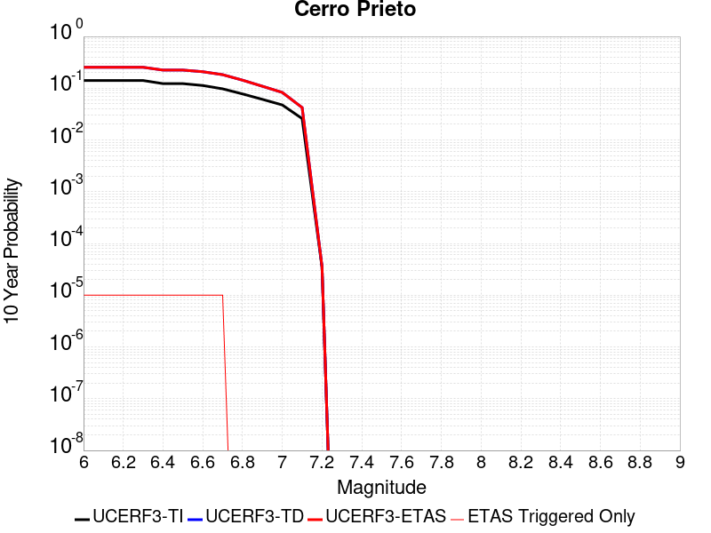 |

| Magnitude | 1 yr TI Prob | TD Prob | ETAS Prob | ETAS/TD Gain | ETAS Triggered Only | 10 yr TI Prob | TD Prob | ETAS Prob | ETAS/TD Gain | ETAS Triggered Only |
|-----|-----|-----|-----|-----|-----|-----|-----|-----|-----|-----|
| 6.0 | 0.015072231 | 0.03064807 | 0.03064807 | 1.0 | 0.0 | 0.14089979 | 0.25397858 | 0.25398603 | 1.0000293 | 1.0E-5 |
| 6.1 | 0.015072231 | 0.03064807 | 0.03064807 | 1.0 | 0.0 | 0.14089979 | 0.25397858 | 0.25398603 | 1.0000293 | 1.0E-5 |
| 6.2 | 0.015072231 | 0.03064807 | 0.03064807 | 1.0 | 0.0 | 0.14089979 | 0.25397858 | 0.25398603 | 1.0000293 | 1.0E-5 |
| 6.3 | 0.015072231 | 0.03064807 | 0.03064807 | 1.0 | 0.0 | 0.14089979 | 0.25397858 | 0.25398603 | 1.0000293 | 1.0E-5 |
| 6.4 | 0.013006088 | 0.026471792 | 0.026471792 | 1.0 | 0.0 | 0.12270685 | 0.22440416 | 0.2244119 | 1.0000346 | 1.0E-5 |
| 6.5 | 0.013006088 | 0.026471792 | 0.026471792 | 1.0 | 0.0 | 0.12270685 | 0.22440416 | 0.2244119 | 1.0000346 | 1.0E-5 |
| 6.6 | 0.011904482 | 0.02429866 | 0.02429866 | 1.0 | 0.0 | 0.11286586 | 0.20858558 | 0.20859349 | 1.0000379 | 1.0E-5 |
| 6.7 | 0.010187071 | 0.020884845 | 0.020884845 | 1.0 | 0.0 | 0.09732539 | 0.18290249 | 0.18291067 | 1.0000447 | 1.0E-5 |
| 6.8 | 0.008043335 | 0.015836509 | 0.015836509 | 1.0 | 0.0 | 0.07758363 | 0.14336355 | 0.14336355 | 1.0 | 0.0 |
| 6.9 | 0.006268645 | 0.011726342 | 0.011726342 | 1.0 | 0.0 | 0.060947374 | 0.109451205 | 0.109451205 | 1.0 | 0.0 |
| 7.0 | 0.0048550544 | 0.008693418 | 0.008693418 | 1.0 | 0.0 | 0.04750344 | 0.08315912 | 0.08315912 | 1.0 | 0.0 |
| 7.1 | 0.0026210553 | 0.0042587193 | 0.0042587193 | 1.0 | 0.0 | 0.025903556 | 0.042365108 | 0.042365108 | 1.0 | 0.0 |
| 7.2 | 3.4148304E-6 | 3.555919E-6 | 3.555919E-6 | 1.0 | 0.0 | 3.414778E-5 | 3.5559187E-5 | 3.5559187E-5 | 1.0 | 0.0 |

## North Frontal  (West)
*[(top)](#table-of-contents)*

| 1 Year | 10 Year |
|-----|-----|
|  |  |

| Magnitude | 1 yr TI Prob | TD Prob | ETAS Prob | ETAS/TD Gain | ETAS Triggered Only | 10 yr TI Prob | TD Prob | ETAS Prob | ETAS/TD Gain | ETAS Triggered Only |
|-----|-----|-----|-----|-----|-----|-----|-----|-----|-----|-----|
| 6.0 | 2.4685962E-4 | 2.5317568E-4 | 2.6317313E-4 | 1.0394883 | 1.0E-5 | 0.0024658558 | 0.0025290183 | 0.002538993 | 1.0039442 | 1.0E-5 |
| 6.1 | 2.4685962E-4 | 2.5317568E-4 | 2.6317313E-4 | 1.0394883 | 1.0E-5 | 0.0024658558 | 0.0025290183 | 0.002538993 | 1.0039442 | 1.0E-5 |
| 6.2 | 2.4685962E-4 | 2.5317568E-4 | 2.6317313E-4 | 1.0394883 | 1.0E-5 | 0.0024658558 | 0.0025290183 | 0.002538993 | 1.0039442 | 1.0E-5 |
| 6.3 | 2.4685962E-4 | 2.5317568E-4 | 2.6317313E-4 | 1.0394883 | 1.0E-5 | 0.0024658558 | 0.0025290183 | 0.002538993 | 1.0039442 | 1.0E-5 |
| 6.4 | 2.4685962E-4 | 2.5317568E-4 | 2.6317313E-4 | 1.0394883 | 1.0E-5 | 0.0024658558 | 0.0025290183 | 0.002538993 | 1.0039442 | 1.0E-5 |
| 6.5 | 2.4685962E-4 | 2.5317568E-4 | 2.6317313E-4 | 1.0394883 | 1.0E-5 | 0.0024658558 | 0.0025290183 | 0.002538993 | 1.0039442 | 1.0E-5 |
| 6.6 | 2.4685962E-4 | 2.5317568E-4 | 2.6317313E-4 | 1.0394883 | 1.0E-5 | 0.0024658558 | 0.0025290183 | 0.002538993 | 1.0039442 | 1.0E-5 |
| 6.7 | 1.8460557E-4 | 1.8943768E-4 | 1.9943577E-4 | 1.0527778 | 1.0E-5 | 0.0018445229 | 0.0018928389 | 0.00190282 | 1.0052731 | 1.0E-5 |
| 6.8 | 1.8460557E-4 | 1.8943768E-4 | 1.9943577E-4 | 1.0527778 | 1.0E-5 | 0.0018445229 | 0.0018928389 | 0.00190282 | 1.0052731 | 1.0E-5 |
| 6.9 | 1.5875678E-4 | 1.6292889E-4 | 1.6292889E-4 | 1.0 | 0.0 | 0.0015864341 | 0.0016281615 | 0.0016281615 | 1.0 | 0.0 |
| 7.0 | 1.324612E-4 | 1.3597352E-4 | 1.3597352E-4 | 1.0 | 0.0 | 0.0013238228 | 0.0013589499 | 0.0013589499 | 1.0 | 0.0 |
| 7.1 | 1.1697209E-4 | 1.2006712E-4 | 1.2006712E-4 | 1.0 | 0.0 | 0.0011691054 | 0.0012000664 | 0.0012000664 | 1.0 | 0.0 |
| 7.2 | 8.623055E-5 | 8.8307905E-5 | 8.8307905E-5 | 1.0 | 0.0 | 8.61971E-4 | 8.827532E-4 | 8.827532E-4 | 1.0 | 0.0 |
| 7.3 | 5.3460866E-5 | 5.448489E-5 | 5.448489E-5 | 1.0 | 0.0 | 5.344801E-4 | 5.4472685E-4 | 5.4472685E-4 | 1.0 | 0.0 |
| 7.4 | 4.646144E-5 | 4.7254853E-5 | 4.7254853E-5 | 1.0 | 0.0 | 4.6451724E-4 | 4.7245892E-4 | 4.7245892E-4 | 1.0 | 0.0 |
| 7.5 | 3.305824E-5 | 3.34079E-5 | 3.34079E-5 | 1.0 | 0.0 | 3.3053322E-4 | 3.3403534E-4 | 3.3403534E-4 | 1.0 | 0.0 |
| 7.6 | 1.3089967E-5 | 1.2711216E-5 | 1.2711216E-5 | 1.0 | 0.0 | 1.3089196E-4 | 1.2710695E-4 | 1.2710695E-4 | 1.0 | 0.0 |
| 7.7 | 1.7130144E-6 | 1.1935423E-6 | 1.1935423E-6 | 1.0 | 0.0 | 1.7130013E-5 | 1.1935367E-5 | 1.1935367E-5 | 1.0 | 0.0 |
| 7.8 | 4.578663E-7 | 2.9645753E-7 | 2.9645753E-7 | 1.0 | 0.0 | 4.5786537E-6 | 2.9645726E-6 | 2.9645726E-6 | 1.0 | 0.0 |

## Garberville - Briceland 2011 CFM
*[(top)](#table-of-contents)*

| 1 Year | 10 Year |
|-----|-----|
|  |  |

| Magnitude | 1 yr TI Prob | TD Prob | ETAS Prob | ETAS/TD Gain | ETAS Triggered Only | 10 yr TI Prob | TD Prob | ETAS Prob | ETAS/TD Gain | ETAS Triggered Only |
|-----|-----|-----|-----|-----|-----|-----|-----|-----|-----|-----|
| 6.0 | 0.002522281 | 0.003362017 | 0.0033719833 | 1.0029644 | 1.0E-5 | 0.024938442 | 0.03317861 | 0.03318828 | 1.0002913 | 1.0E-5 |
| 6.1 | 0.002522281 | 0.003362017 | 0.0033719833 | 1.0029644 | 1.0E-5 | 0.024938442 | 0.03317861 | 0.03318828 | 1.0002913 | 1.0E-5 |
| 6.2 | 0.002522281 | 0.003362017 | 0.0033719833 | 1.0029644 | 1.0E-5 | 0.024938442 | 0.03317861 | 0.03318828 | 1.0002913 | 1.0E-5 |
| 6.3 | 0.002522281 | 0.003362017 | 0.0033719833 | 1.0029644 | 1.0E-5 | 0.024938442 | 0.03317861 | 0.03318828 | 1.0002913 | 1.0E-5 |
| 6.4 | 0.002522281 | 0.003362017 | 0.0033719833 | 1.0029644 | 1.0E-5 | 0.024938442 | 0.03317861 | 0.03318828 | 1.0002913 | 1.0E-5 |
| 6.5 | 0.002522281 | 0.003362017 | 0.0033719833 | 1.0029644 | 1.0E-5 | 0.024938442 | 0.03317861 | 0.03318828 | 1.0002913 | 1.0E-5 |
| 6.6 | 0.002522281 | 0.003362017 | 0.0033719833 | 1.0029644 | 1.0E-5 | 0.024938442 | 0.03317861 | 0.03318828 | 1.0002913 | 1.0E-5 |
| 6.7 | 0.0018221042 | 0.002414053 | 0.002424029 | 1.0041324 | 1.0E-5 | 0.018072363 | 0.023930617 | 0.023940377 | 1.0004079 | 1.0E-5 |
| 6.8 | 0.0014348183 | 0.0018897996 | 0.0018997807 | 1.0052816 | 1.0E-5 | 0.014255894 | 0.018783508 | 0.01879332 | 1.0005224 | 1.0E-5 |
| 6.9 | 0.001431093 | 0.0018855145 | 0.0018954957 | 1.0052936 | 1.0E-5 | 0.014219119 | 0.018741382 | 0.018751195 | 1.0005236 | 1.0E-5 |
| 7.0 | 9.921503E-4 | 0.0012888284 | 0.0012888284 | 1.0 | 0.0 | 0.009877323 | 0.012852574 | 0.012852574 | 1.0 | 0.0 |
| 7.1 | 2.9042858E-4 | 3.3974246E-4 | 3.3974246E-4 | 1.0 | 0.0 | 0.002900493 | 0.0033926512 | 0.0033926512 | 1.0 | 0.0 |
| 7.2 | 2.0928521E-4 | 2.4388955E-4 | 2.4388955E-4 | 1.0 | 0.0 | 0.0020908823 | 0.0024365564 | 0.0024365564 | 1.0 | 0.0 |
| 7.3 | 1.09438006E-4 | 1.272891E-4 | 1.272891E-4 | 1.0 | 0.0 | 0.0010938413 | 0.0012724071 | 0.0012724071 | 1.0 | 0.0 |

## Superstition Hills
*[(top)](#table-of-contents)*

| 1 Year | 10 Year |
|-----|-----|
|  |  |

| Magnitude | 1 yr TI Prob | TD Prob | ETAS Prob | ETAS/TD Gain | ETAS Triggered Only | 10 yr TI Prob | TD Prob | ETAS Prob | ETAS/TD Gain | ETAS Triggered Only |
|-----|-----|-----|-----|-----|-----|-----|-----|-----|-----|-----|
| 6.0 | 0.0034829667 | 7.374355E-4 | 7.474281E-4 | 1.0135505 | 1.0E-5 | 0.03428881 | 0.0075204074 | 0.007530332 | 1.0013198 | 1.0E-5 |
| 6.1 | 0.0034092965 | 7.374355E-4 | 7.474281E-4 | 1.0135505 | 1.0E-5 | 0.033574644 | 0.007520407 | 0.0075303316 | 1.0013198 | 1.0E-5 |
| 6.2 | 0.0034092965 | 7.374355E-4 | 7.474281E-4 | 1.0135505 | 1.0E-5 | 0.033574644 | 0.007520407 | 0.0075303316 | 1.0013198 | 1.0E-5 |
| 6.3 | 0.0027306017 | 7.374354E-4 | 7.4742804E-4 | 1.0135505 | 1.0E-5 | 0.02697292 | 0.0075204014 | 0.0075303265 | 1.0013198 | 1.0E-5 |
| 6.4 | 0.0023673223 | 7.3743536E-4 | 7.47428E-4 | 1.0135505 | 1.0E-5 | 0.023422617 | 0.0075203986 | 0.007530323 | 1.0013198 | 1.0E-5 |
| 6.5 | 0.0015471181 | 7.374353E-4 | 7.474279E-4 | 1.0135505 | 1.0E-5 | 0.015363912 | 0.007520392 | 0.007530317 | 1.0013198 | 1.0E-5 |
| 6.6 | 0.0013586642 | 7.200076E-4 | 7.300004E-4 | 1.0138787 | 1.0E-5 | 0.013503874 | 0.0073448285 | 0.007354755 | 1.0013515 | 1.0E-5 |
| 6.7 | 7.6210906E-4 | 6.981025E-4 | 7.0809555E-4 | 1.0143145 | 1.0E-5 | 0.0075950073 | 0.00712602 | 0.0071359486 | 1.0013933 | 1.0E-5 |
| 6.8 | 6.8126095E-4 | 5.7270617E-4 | 5.7270617E-4 | 1.0 | 0.0 | 0.006791762 | 0.00587438 | 0.00587438 | 1.0 | 0.0 |
| 6.9 | 5.447602E-4 | 4.2753448E-4 | 4.2753448E-4 | 1.0 | 0.0 | 0.005434267 | 0.0044094524 | 0.0044094524 | 1.0 | 0.0 |
| 7.0 | 4.197378E-4 | 3.5160795E-4 | 3.5160795E-4 | 1.0 | 0.0 | 0.0041894587 | 0.0036334093 | 0.0036334093 | 1.0 | 0.0 |
| 7.1 | 4.197378E-4 | 3.5160795E-4 | 3.5160795E-4 | 1.0 | 0.0 | 0.0041894587 | 0.0036334093 | 0.0036334093 | 1.0 | 0.0 |
| 7.2 | 3.8477074E-4 | 3.2588904E-4 | 3.2588904E-4 | 1.0 | 0.0 | 0.003841052 | 0.003373887 | 0.003373887 | 1.0 | 0.0 |
| 7.3 | 3.446538E-4 | 3.025424E-4 | 3.025424E-4 | 1.0 | 0.0 | 0.0034411973 | 0.003138153 | 0.003138153 | 1.0 | 0.0 |
| 7.4 | 3.355215E-4 | 2.9635706E-4 | 2.9635706E-4 | 1.0 | 0.0 | 0.0033501536 | 0.0030759154 | 0.0030759154 | 1.0 | 0.0 |
| 7.5 | 3.1689866E-4 | 2.8570674E-4 | 2.8570674E-4 | 1.0 | 0.0 | 0.0031644711 | 0.002967756 | 0.002967756 | 1.0 | 0.0 |
| 7.6 | 2.9730765E-4 | 2.7622381E-4 | 2.7622381E-4 | 1.0 | 0.0 | 0.002969102 | 0.0028710118 | 0.0028710118 | 1.0 | 0.0 |
| 7.7 | 2.6950863E-4 | 2.5697565E-4 | 2.5697565E-4 | 1.0 | 0.0 | 0.00269182 | 0.0026760625 | 0.0026760625 | 1.0 | 0.0 |
| 7.8 | 1.9233658E-4 | 2.1894432E-4 | 2.1894432E-4 | 1.0 | 0.0 | 0.0019217018 | 0.0022892624 | 0.0022892624 | 1.0 | 0.0 |
| 7.9 | 1.5791094E-4 | 1.859338E-4 | 1.859338E-4 | 1.0 | 0.0 | 0.0015779877 | 0.0019534735 | 0.0019534735 | 1.0 | 0.0 |
| 8.0 | 1.3185451E-4 | 1.610492E-4 | 1.610492E-4 | 1.0 | 0.0 | 0.0013177631 | 0.0016973554 | 0.0016973554 | 1.0 | 0.0 |
| 8.1 | 1.2391206E-4 | 1.5221364E-4 | 1.5221364E-4 | 1.0 | 0.0 | 0.0012384299 | 0.001604949 | 0.001604949 | 1.0 | 0.0 |
| 8.2 | 8.9676206E-8 | 5.969538E-8 | 5.969538E-8 | 1.0 | 0.0 | 8.9676166E-7 | 6.389059E-7 | 6.389059E-7 | 1.0 | 0.0 |

## Mendocino
*[(top)](#table-of-contents)*

| 1 Year | 10 Year |
|-----|-----|
|  |  |

| Magnitude | 1 yr TI Prob | TD Prob | ETAS Prob | ETAS/TD Gain | ETAS Triggered Only | 10 yr TI Prob | TD Prob | ETAS Prob | ETAS/TD Gain | ETAS Triggered Only |
|-----|-----|-----|-----|-----|-----|-----|-----|-----|-----|-----|
| 6.0 | 0.028505474 | 0.05467285 | 0.054682303 | 1.0001729 | 1.0E-5 | 0.25113493 | 0.411882 | 0.41188788 | 1.0000143 | 1.0E-5 |
| 6.1 | 0.021944538 | 0.041749846 | 0.041759428 | 1.0002295 | 1.0E-5 | 0.19899574 | 0.32995537 | 0.32996207 | 1.0000203 | 1.0E-5 |
| 6.2 | 0.021944538 | 0.041749846 | 0.041759428 | 1.0002295 | 1.0E-5 | 0.19899574 | 0.32995537 | 0.32996207 | 1.0000203 | 1.0E-5 |
| 6.3 | 0.016958237 | 0.031592727 | 0.031602412 | 1.0003065 | 1.0E-5 | 0.1572094 | 0.26077813 | 0.26078552 | 1.0000284 | 1.0E-5 |
| 6.4 | 0.014205975 | 0.025837418 | 0.02584716 | 1.000377 | 1.0E-5 | 0.13331394 | 0.21947995 | 0.21948774 | 1.0000355 | 1.0E-5 |
| 6.5 | 0.012438473 | 0.022180691 | 0.022190468 | 1.0004408 | 1.0E-5 | 0.11764851 | 0.19203661 | 0.19204469 | 1.0000421 | 1.0E-5 |
| 6.6 | 0.010910975 | 0.018990388 | 0.019000199 | 1.0005165 | 1.0E-5 | 0.10390546 | 0.16749348 | 0.1675018 | 1.0000497 | 1.0E-5 |
| 6.7 | 0.006549705 | 0.009555929 | 0.009555929 | 1.0 | 0.0 | 0.063599944 | 0.09096867 | 0.09096867 | 1.0 | 0.0 |
| 6.8 | 0.0059135845 | 0.007999982 | 0.007999982 | 1.0 | 0.0 | 0.057586733 | 0.07739284 | 0.07739284 | 1.0 | 0.0 |
| 6.9 | 0.0051665753 | 0.006396752 | 0.006396752 | 1.0 | 0.0 | 0.050480947 | 0.06286036 | 0.06286036 | 1.0 | 0.0 |
| 7.0 | 0.004772591 | 0.0056109587 | 0.0056109587 | 1.0 | 0.0 | 0.04671385 | 0.055621758 | 0.055621758 | 1.0 | 0.0 |
| 7.1 | 0.004314056 | 0.0047398703 | 0.0047398703 | 1.0 | 0.0 | 0.042312626 | 0.047481373 | 0.047481373 | 1.0 | 0.0 |
| 7.2 | 0.0040750825 | 0.0043219337 | 0.0043219337 | 1.0 | 0.0 | 0.040011603 | 0.043525863 | 0.043525863 | 1.0 | 0.0 |
| 7.3 | 0.0035876823 | 0.0032606125 | 0.0032606125 | 1.0 | 0.0 | 0.035303112 | 0.033351965 | 0.033351965 | 1.0 | 0.0 |
| 7.4 | 0.0028605047 | 0.0019496274 | 0.0019496274 | 1.0 | 0.0 | 0.02823963 | 0.020410953 | 0.020410953 | 1.0 | 0.0 |
| 7.5 | 0.0020383475 | 5.8983336E-4 | 5.8983336E-4 | 1.0 | 0.0 | 0.020197518 | 0.00662414 | 0.00662414 | 1.0 | 0.0 |
| 7.6 | 0.0018980748 | 4.68681E-4 | 4.68681E-4 | 1.0 | 0.0 | 0.018819444 | 0.005348026 | 0.005348026 | 1.0 | 0.0 |
| 7.7 | 0.0016328598 | 2.3244887E-4 | 2.3244887E-4 | 1.0 | 0.0 | 0.016209139 | 0.0028659757 | 0.0028659757 | 1.0 | 0.0 |
| 7.8 | 0.001152099 | 1.3990776E-4 | 1.3990776E-4 | 1.0 | 0.0 | 0.011461443 | 0.0017378427 | 0.0017378427 | 1.0 | 0.0 |
| 7.9 | 6.593487E-4 | 1.0655898E-4 | 1.0655898E-4 | 1.0 | 0.0 | 0.006573958 | 0.0012980766 | 0.0012980766 | 1.0 | 0.0 |
| 8.0 | 3.4196748E-4 | 8.550293E-5 | 8.550293E-5 | 1.0 | 0.0 | 0.0034144172 | 0.0010310268 | 0.0010310268 | 1.0 | 0.0 |
| 8.1 | 1.6652321E-4 | 7.0871516E-5 | 7.0871516E-5 | 1.0 | 0.0 | 0.0016639848 | 8.627292E-4 | 8.627292E-4 | 1.0 | 0.0 |
| 8.2 | 1.1058014E-4 | 5.37485E-5 | 5.37485E-5 | 1.0 | 0.0 | 0.0011052513 | 6.5027695E-4 | 6.5027695E-4 | 1.0 | 0.0 |
| 8.3 | 3.9325594E-5 | 2.0492233E-5 | 2.0492233E-5 | 1.0 | 0.0 | 3.9318635E-4 | 2.4130501E-4 | 2.4130501E-4 | 1.0 | 0.0 |

## Pitas Point (Lower)-Montalvo
*[(top)](#table-of-contents)*

| 1 Year | 10 Year |
|-----|-----|
|  |  |

| Magnitude | 1 yr TI Prob | TD Prob | ETAS Prob | ETAS/TD Gain | ETAS Triggered Only | 10 yr TI Prob | TD Prob | ETAS Prob | ETAS/TD Gain | ETAS Triggered Only |
|-----|-----|-----|-----|-----|-----|-----|-----|-----|-----|-----|
| 6.0 | 2.7412834E-4 | 2.5240227E-4 | 2.6239973E-4 | 1.0396093 | 1.0E-5 | 0.0027379042 | 0.0025211885 | 0.0025311632 | 1.0039564 | 1.0E-5 |
| 6.1 | 2.7412834E-4 | 2.5240227E-4 | 2.6239973E-4 | 1.0396093 | 1.0E-5 | 0.0027379042 | 0.0025211885 | 0.0025311632 | 1.0039564 | 1.0E-5 |
| 6.2 | 2.7412834E-4 | 2.5240227E-4 | 2.6239973E-4 | 1.0396093 | 1.0E-5 | 0.0027379042 | 0.0025211885 | 0.0025311632 | 1.0039564 | 1.0E-5 |
| 6.3 | 2.7412834E-4 | 2.5240227E-4 | 2.6239973E-4 | 1.0396093 | 1.0E-5 | 0.0027379042 | 0.0025211885 | 0.0025311632 | 1.0039564 | 1.0E-5 |
| 6.4 | 2.7412834E-4 | 2.5240227E-4 | 2.6239973E-4 | 1.0396093 | 1.0E-5 | 0.0027379042 | 0.0025211885 | 0.0025311632 | 1.0039564 | 1.0E-5 |
| 6.5 | 2.7412834E-4 | 2.5240227E-4 | 2.6239973E-4 | 1.0396093 | 1.0E-5 | 0.0027379042 | 0.0025211885 | 0.0025311632 | 1.0039564 | 1.0E-5 |
| 6.6 | 2.7412834E-4 | 2.5240227E-4 | 2.6239973E-4 | 1.0396093 | 1.0E-5 | 0.0027379042 | 0.0025211885 | 0.0025311632 | 1.0039564 | 1.0E-5 |
| 6.7 | 2.7412834E-4 | 2.5240227E-4 | 2.6239973E-4 | 1.0396093 | 1.0E-5 | 0.0027379042 | 0.0025211885 | 0.0025311632 | 1.0039564 | 1.0E-5 |
| 6.8 | 2.7412834E-4 | 2.5240227E-4 | 2.6239973E-4 | 1.0396093 | 1.0E-5 | 0.0027379042 | 0.0025211885 | 0.0025311632 | 1.0039564 | 1.0E-5 |
| 6.9 | 2.7412834E-4 | 2.5240227E-4 | 2.6239973E-4 | 1.0396093 | 1.0E-5 | 0.0027379042 | 0.0025211885 | 0.0025311632 | 1.0039564 | 1.0E-5 |
| 7.0 | 2.7412834E-4 | 2.5240227E-4 | 2.6239973E-4 | 1.0396093 | 1.0E-5 | 0.0027379042 | 0.0025211885 | 0.0025311632 | 1.0039564 | 1.0E-5 |
| 7.1 | 2.7412834E-4 | 2.5240227E-4 | 2.6239973E-4 | 1.0396093 | 1.0E-5 | 0.0027379042 | 0.0025211885 | 0.0025311632 | 1.0039564 | 1.0E-5 |
| 7.2 | 2.7368523E-4 | 2.519408E-4 | 2.6193826E-4 | 1.0396819 | 1.0E-5 | 0.0027334841 | 0.0025165842 | 0.002526559 | 1.0039636 | 1.0E-5 |
| 7.3 | 2.7268266E-4 | 2.5089315E-4 | 2.6089067E-4 | 1.0398476 | 1.0E-5 | 0.002723483 | 0.0025061315 | 0.0025161065 | 1.0039802 | 1.0E-5 |
| 7.4 | 2.718476E-4 | 2.5001742E-4 | 2.6001493E-4 | 1.0399872 | 1.0E-5 | 0.002715153 | 0.0024973939 | 0.0025073688 | 1.0039942 | 1.0E-5 |
| 7.5 | 2.67255E-4 | 2.4521223E-4 | 2.5520977E-4 | 1.040771 | 1.0E-5 | 0.0026693381 | 0.0024494485 | 0.0024594238 | 1.0040725 | 1.0E-5 |
| 7.6 | 2.5458392E-4 | 2.3190459E-4 | 2.4190226E-4 | 1.0431112 | 1.0E-5 | 0.0025429246 | 0.0023166565 | 0.0023266333 | 1.0043066 | 1.0E-5 |
| 7.7 | 2.1304579E-4 | 1.8830119E-4 | 1.982993E-4 | 1.0530964 | 1.0E-5 | 0.0021284167 | 0.00188144 | 0.0018914213 | 1.005305 | 1.0E-5 |
| 7.8 | 1.3276201E-4 | 1.1067669E-4 | 1.1067669E-4 | 1.0 | 0.0 | 0.0013268272 | 0.0011062203 | 0.0011062203 | 1.0 | 0.0 |
| 7.9 | 2.1746291E-5 | 1.737203E-5 | 1.737203E-5 | 1.0 | 0.0 | 2.1744163E-4 | 1.7370703E-4 | 1.7370703E-4 | 1.0 | 0.0 |
| 8.0 | 4.0654416E-7 | 2.9655675E-7 | 2.9655675E-7 | 1.0 | 0.0 | 4.065434E-6 | 2.9655655E-6 | 2.9655655E-6 | 1.0 | 0.0 |

## Elsinore (Temecula) rev
*[(top)](#table-of-contents)*

| 1 Year | 10 Year |
|-----|-----|
|  |  |

| Magnitude | 1 yr TI Prob | TD Prob | ETAS Prob | ETAS/TD Gain | ETAS Triggered Only | 10 yr TI Prob | TD Prob | ETAS Prob | ETAS/TD Gain | ETAS Triggered Only |
|-----|-----|-----|-----|-----|-----|-----|-----|-----|-----|-----|
| 6.0 | 0.0015388876 | 0.0011742581 | 0.0011742581 | 1.0 | 0.0 | 0.015282745 | 0.011696897 | 0.011706781 | 1.000845 | 1.0E-5 |
| 6.1 | 0.0015388876 | 0.0011742581 | 0.0011742581 | 1.0 | 0.0 | 0.015282745 | 0.011696897 | 0.011706781 | 1.000845 | 1.0E-5 |
| 6.2 | 0.0015388876 | 0.0011742581 | 0.0011742581 | 1.0 | 0.0 | 0.015282745 | 0.011696897 | 0.011706781 | 1.000845 | 1.0E-5 |
| 6.3 | 0.001211057 | 9.599888E-4 | 9.599888E-4 | 1.0 | 0.0 | 0.012044783 | 0.009569948 | 0.009579852 | 1.001035 | 1.0E-5 |
| 6.4 | 0.001211057 | 9.599888E-4 | 9.599888E-4 | 1.0 | 0.0 | 0.012044783 | 0.009569948 | 0.009579852 | 1.001035 | 1.0E-5 |
| 6.5 | 9.5644733E-4 | 7.69359E-4 | 7.69359E-4 | 1.0 | 0.0 | 0.009523412 | 0.0076739118 | 0.007683835 | 1.0012931 | 1.0E-5 |
| 6.6 | 9.504242E-4 | 7.6219277E-4 | 7.6219277E-4 | 1.0 | 0.0 | 0.009463696 | 0.0076027405 | 0.0076126647 | 1.0013053 | 1.0E-5 |
| 6.7 | 9.13381E-4 | 7.3166634E-4 | 7.3166634E-4 | 1.0 | 0.0 | 0.00909636 | 0.00729892 | 0.007308847 | 1.00136 | 1.0E-5 |
| 6.8 | 9.083966E-4 | 7.277028E-4 | 7.277028E-4 | 1.0 | 0.0 | 0.009046922 | 0.0072594886 | 0.007269416 | 1.0013674 | 1.0E-5 |
| 6.9 | 8.5550465E-4 | 6.775103E-4 | 6.775103E-4 | 1.0 | 0.0 | 0.008522186 | 0.006760169 | 0.0067701014 | 1.0014693 | 1.0E-5 |
| 7.0 | 7.2567526E-4 | 5.674556E-4 | 5.674556E-4 | 1.0 | 0.0 | 0.0072331014 | 0.005663986 | 0.005663986 | 1.0 | 0.0 |
| 7.1 | 6.9922156E-4 | 5.3873047E-4 | 5.3873047E-4 | 1.0 | 0.0 | 0.0069702556 | 0.005377577 | 0.005377577 | 1.0 | 0.0 |
| 7.2 | 6.332616E-4 | 4.6933076E-4 | 4.6933076E-4 | 1.0 | 0.0 | 0.0063146 | 0.004684821 | 0.004684821 | 1.0 | 0.0 |
| 7.3 | 5.4797693E-4 | 3.950092E-4 | 3.950092E-4 | 1.0 | 0.0 | 0.005466277 | 0.00394346 | 0.00394346 | 1.0 | 0.0 |
| 7.4 | 5.0206814E-4 | 3.5406914E-4 | 3.5406914E-4 | 1.0 | 0.0 | 0.005009353 | 0.003535204 | 0.003535204 | 1.0 | 0.0 |
| 7.5 | 4.2856473E-4 | 2.9401327E-4 | 2.9401327E-4 | 1.0 | 0.0 | 0.004277392 | 0.002936371 | 0.002936371 | 1.0 | 0.0 |
| 7.6 | 3.6388362E-4 | 2.439614E-4 | 2.439614E-4 | 1.0 | 0.0 | 0.0036328835 | 0.002437052 | 0.002437052 | 1.0 | 0.0 |
| 7.7 | 2.1701909E-4 | 1.21412704E-4 | 1.21412704E-4 | 1.0 | 0.0 | 0.0021680726 | 0.0012135367 | 0.0012135367 | 1.0 | 0.0 |
| 7.8 | 1.1840509E-5 | 4.8971956E-6 | 4.8971956E-6 | 1.0 | 0.0 | 1.1839878E-4 | 4.8971204E-5 | 4.8971204E-5 | 1.0 | 0.0 |
| 7.9 | 3.4838732E-7 | 1.7948659E-7 | 1.7948659E-7 | 1.0 | 0.0 | 3.4838679E-6 | 1.7948646E-6 | 1.7948646E-6 | 1.0 | 0.0 |

## San Gabriel (Extension)
*[(top)](#table-of-contents)*

| 1 Year | 10 Year |
|-----|-----|
|  |  |

| Magnitude | 1 yr TI Prob | TD Prob | ETAS Prob | ETAS/TD Gain | ETAS Triggered Only | 10 yr TI Prob | TD Prob | ETAS Prob | ETAS/TD Gain | ETAS Triggered Only |
|-----|-----|-----|-----|-----|-----|-----|-----|-----|-----|-----|
| 6.0 | 2.9469383E-4 | 2.9825376E-4 | 3.0825078E-4 | 1.0335186 | 1.0E-5 | 0.0029430336 | 0.0029786653 | 0.0029886353 | 1.0033472 | 1.0E-5 |
| 6.1 | 2.9469383E-4 | 2.9825376E-4 | 3.0825078E-4 | 1.0335186 | 1.0E-5 | 0.0029430336 | 0.0029786653 | 0.0029886353 | 1.0033472 | 1.0E-5 |
| 6.2 | 2.9469383E-4 | 2.9825376E-4 | 3.0825078E-4 | 1.0335186 | 1.0E-5 | 0.0029430336 | 0.0029786653 | 0.0029886353 | 1.0033472 | 1.0E-5 |
| 6.3 | 2.9469383E-4 | 2.9825376E-4 | 3.0825078E-4 | 1.0335186 | 1.0E-5 | 0.0029430336 | 0.0029786653 | 0.0029886353 | 1.0033472 | 1.0E-5 |
| 6.4 | 2.9469383E-4 | 2.9825376E-4 | 3.0825078E-4 | 1.0335186 | 1.0E-5 | 0.0029430336 | 0.0029786653 | 0.0029886353 | 1.0033472 | 1.0E-5 |
| 6.5 | 2.459117E-4 | 2.4804095E-4 | 2.4804095E-4 | 1.0 | 0.0 | 0.0024563975 | 0.002477729 | 0.002477729 | 1.0 | 0.0 |
| 6.6 | 2.459117E-4 | 2.4804095E-4 | 2.4804095E-4 | 1.0 | 0.0 | 0.0024563975 | 0.002477729 | 0.002477729 | 1.0 | 0.0 |
| 6.7 | 2.2157225E-4 | 2.2299135E-4 | 2.2299135E-4 | 1.0 | 0.0 | 0.0022135144 | 0.0022277518 | 0.0022277518 | 1.0 | 0.0 |
| 6.8 | 2.1485193E-4 | 2.160734E-4 | 2.160734E-4 | 1.0 | 0.0 | 0.0021464431 | 0.0021587082 | 0.0021587082 | 1.0 | 0.0 |
| 6.9 | 2.0159081E-4 | 2.0242184E-4 | 2.0242184E-4 | 1.0 | 0.0 | 0.0020140803 | 0.002022446 | 0.002022446 | 1.0 | 0.0 |
| 7.0 | 1.9276788E-4 | 1.9333926E-4 | 1.9333926E-4 | 1.0 | 0.0 | 0.0019260074 | 0.0019317807 | 0.0019317807 | 1.0 | 0.0 |
| 7.1 | 1.861918E-4 | 1.8641229E-4 | 1.8641229E-4 | 1.0 | 0.0 | 0.0018603588 | 0.0018626289 | 0.0018626289 | 1.0 | 0.0 |
| 7.2 | 1.4621185E-4 | 1.4487868E-4 | 1.4487868E-4 | 1.0 | 0.0 | 0.001461157 | 0.0014478569 | 0.0014478569 | 1.0 | 0.0 |
| 7.3 | 1.3483623E-4 | 1.3283623E-4 | 1.3283623E-4 | 1.0 | 0.0 | 0.0013475444 | 0.0013275818 | 0.0013275818 | 1.0 | 0.0 |
| 7.4 | 1.276441E-4 | 1.25047E-4 | 1.25047E-4 | 1.0 | 0.0 | 0.0012757082 | 0.0012497796 | 0.0012497796 | 1.0 | 0.0 |
| 7.5 | 1.0654447E-4 | 9.8667166E-5 | 9.8667166E-5 | 1.0 | 0.0 | 0.001064934 | 9.862408E-4 | 9.862408E-4 | 1.0 | 0.0 |
| 7.6 | 9.562107E-5 | 8.5560634E-5 | 8.5560634E-5 | 1.0 | 0.0 | 9.5579936E-4 | 8.5528276E-4 | 8.5528276E-4 | 1.0 | 0.0 |
| 7.7 | 7.715353E-5 | 6.534551E-5 | 6.534551E-5 | 1.0 | 0.0 | 7.7126746E-4 | 6.532707E-4 | 6.532707E-4 | 1.0 | 0.0 |
| 7.8 | 4.0163945E-5 | 3.166871E-5 | 3.166871E-5 | 1.0 | 0.0 | 4.0156685E-4 | 3.1664805E-4 | 3.1664805E-4 | 1.0 | 0.0 |
| 7.9 | 9.207345E-6 | 4.807334E-6 | 4.807334E-6 | 1.0 | 0.0 | 9.206964E-5 | 4.807699E-5 | 4.807699E-5 | 1.0 | 0.0 |
| 8.0 | 5.45967E-6 | 1.3018183E-6 | 1.3018183E-6 | 1.0 | 0.0 | 5.459536E-5 | 1.3022789E-5 | 1.3022789E-5 | 1.0 | 0.0 |
| 8.1 | 4.109428E-6 | 7.235534E-7 | 7.235534E-7 | 1.0 | 0.0 | 4.109352E-5 | 7.2401926E-6 | 7.2401926E-6 | 1.0 | 0.0 |
| 8.2 | 6.9482525E-7 | 9.25329E-8 | 9.25329E-8 | 1.0 | 0.0 | 6.9482307E-6 | 9.272953E-7 | 9.272953E-7 | 1.0 | 0.0 |

## San Gregorio (South) 2011 CFM
*[(top)](#table-of-contents)*

| 1 Year | 10 Year |
|-----|-----|
|  |  |

| Magnitude | 1 yr TI Prob | TD Prob | ETAS Prob | ETAS/TD Gain | ETAS Triggered Only | 10 yr TI Prob | TD Prob | ETAS Prob | ETAS/TD Gain | ETAS Triggered Only |
|-----|-----|-----|-----|-----|-----|-----|-----|-----|-----|-----|
| 6.0 | 9.789435E-4 | 8.491044E-4 | 8.491044E-4 | 1.0 | 0.0 | 0.009746423 | 0.008471312 | 0.008481227 | 1.0011704 | 1.0E-5 |
| 6.1 | 9.789435E-4 | 8.491044E-4 | 8.491044E-4 | 1.0 | 0.0 | 0.009746423 | 0.008471312 | 0.008481227 | 1.0011704 | 1.0E-5 |
| 6.2 | 9.1316935E-4 | 7.7712885E-4 | 7.7712885E-4 | 1.0 | 0.0 | 0.00909426 | 0.00775674 | 0.007766662 | 1.0012792 | 1.0E-5 |
| 6.3 | 9.1316935E-4 | 7.7712885E-4 | 7.7712885E-4 | 1.0 | 0.0 | 0.00909426 | 0.00775674 | 0.007766662 | 1.0012792 | 1.0E-5 |
| 6.4 | 8.347548E-4 | 6.910856E-4 | 6.910856E-4 | 1.0 | 0.0 | 0.008316261 | 0.006901791 | 0.006911722 | 1.0014389 | 1.0E-5 |
| 6.5 | 8.347548E-4 | 6.910856E-4 | 6.910856E-4 | 1.0 | 0.0 | 0.008316261 | 0.006901791 | 0.006911722 | 1.0014389 | 1.0E-5 |
| 6.6 | 8.0543366E-4 | 6.5899757E-4 | 6.5899757E-4 | 1.0 | 0.0 | 0.008025207 | 0.006582842 | 0.0065927766 | 1.0015091 | 1.0E-5 |
| 6.7 | 7.7712315E-4 | 6.2815374E-4 | 6.2815374E-4 | 1.0 | 0.0 | 0.0077441116 | 0.006276176 | 0.006286113 | 1.0015833 | 1.0E-5 |
| 6.8 | 7.237741E-4 | 5.69693E-4 | 5.69693E-4 | 1.0 | 0.0 | 0.0072142133 | 0.0056946846 | 0.005704628 | 1.001746 | 1.0E-5 |
| 6.9 | 6.9854903E-4 | 5.4213166E-4 | 5.4213166E-4 | 1.0 | 0.0 | 0.0069635725 | 0.005420442 | 0.005420442 | 1.0 | 0.0 |
| 7.0 | 6.680489E-4 | 5.087525E-4 | 5.087525E-4 | 1.0 | 0.0 | 0.006660442 | 0.0050882204 | 0.0050882204 | 1.0 | 0.0 |
| 7.1 | 6.3593336E-4 | 4.727085E-4 | 4.727085E-4 | 1.0 | 0.0 | 0.0063411663 | 0.0047293645 | 0.0047293645 | 1.0 | 0.0 |
| 7.2 | 6.1392755E-4 | 4.4768423E-4 | 4.4768423E-4 | 1.0 | 0.0 | 0.0061223423 | 0.004480157 | 0.004480157 | 1.0 | 0.0 |
| 7.3 | 6.0007203E-4 | 4.3284212E-4 | 4.3284212E-4 | 1.0 | 0.0 | 0.0059845424 | 0.0043323063 | 0.0043323063 | 1.0 | 0.0 |
| 7.4 | 5.8691297E-4 | 4.1958084E-4 | 4.1958084E-4 | 1.0 | 0.0 | 0.005853653 | 0.0042001884 | 0.0042001884 | 1.0 | 0.0 |
| 7.5 | 5.5278436E-4 | 3.8569325E-4 | 3.8569325E-4 | 1.0 | 0.0 | 0.0055141128 | 0.0038624762 | 0.0038624762 | 1.0 | 0.0 |
| 7.6 | 4.7046866E-4 | 3.045189E-4 | 3.045189E-4 | 1.0 | 0.0 | 0.004694739 | 0.0030528754 | 0.0030528754 | 1.0 | 0.0 |
| 7.7 | 3.257243E-4 | 1.6902086E-4 | 1.6902086E-4 | 1.0 | 0.0 | 0.003252473 | 0.001699108 | 0.001699108 | 1.0 | 0.0 |
| 7.8 | 1.6665498E-4 | 7.2055984E-5 | 7.2055984E-5 | 1.0 | 0.0 | 0.0016653005 | 7.263174E-4 | 7.263174E-4 | 1.0 | 0.0 |
| 7.9 | 1.0486518E-4 | 3.608666E-5 | 3.608666E-5 | 1.0 | 0.0 | 0.0010481571 | 3.657225E-4 | 3.657225E-4 | 1.0 | 0.0 |
| 8.0 | 4.358445E-5 | 1.6500511E-5 | 1.6500511E-5 | 1.0 | 0.0 | 4.3575902E-4 | 1.6619264E-4 | 1.6619264E-4 | 1.0 | 0.0 |
| 8.1 | 7.844113E-6 | 3.4060151E-6 | 3.4060151E-6 | 1.0 | 0.0 | 7.843835E-5 | 3.407693E-5 | 3.407693E-5 | 1.0 | 0.0 |

## Greenville (No) 2011 CFM
*[(top)](#table-of-contents)*

| 1 Year | 10 Year |
|-----|-----|
| 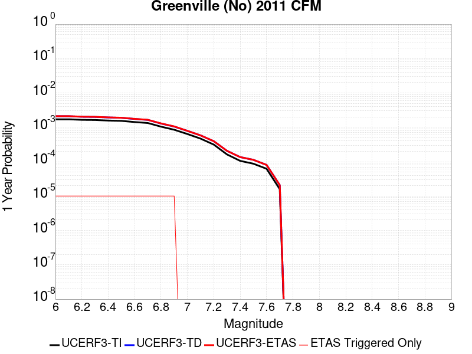 |  |

| Magnitude | 1 yr TI Prob | TD Prob | ETAS Prob | ETAS/TD Gain | ETAS Triggered Only | 10 yr TI Prob | TD Prob | ETAS Prob | ETAS/TD Gain | ETAS Triggered Only |
|-----|-----|-----|-----|-----|-----|-----|-----|-----|-----|-----|
| 6.0 | 0.0017134876 | 0.002104132 | 0.002114111 | 1.0047425 | 1.0E-5 | 0.017003356 | 0.020846982 | 0.020856773 | 1.0004697 | 1.0E-5 |
| 6.1 | 0.0017134876 | 0.002104132 | 0.002114111 | 1.0047425 | 1.0E-5 | 0.017003356 | 0.020846982 | 0.020856773 | 1.0004697 | 1.0E-5 |
| 6.2 | 0.0016526132 | 0.002029298 | 0.002039278 | 1.0049179 | 1.0E-5 | 0.01640377 | 0.020112377 | 0.020122174 | 1.0004872 | 1.0E-5 |
| 6.3 | 0.0016351803 | 0.0020078886 | 0.0020178687 | 1.0049703 | 1.0E-5 | 0.016232004 | 0.019902144 | 0.019911945 | 1.0004925 | 1.0E-5 |
| 6.4 | 0.0015760659 | 0.0019353506 | 0.0019453312 | 1.005157 | 1.0E-5 | 0.015649348 | 0.019189484 | 0.019199293 | 1.0005112 | 1.0E-5 |
| 6.5 | 0.0015400766 | 0.0018913659 | 0.001901347 | 1.0052772 | 1.0E-5 | 0.01529447 | 0.018757146 | 0.018766958 | 1.0005231 | 1.0E-5 |
| 6.6 | 0.0014258457 | 0.0017512152 | 0.0017611977 | 1.0057003 | 1.0E-5 | 0.014167317 | 0.01737797 | 0.017387796 | 1.0005654 | 1.0E-5 |
| 6.7 | 0.0013357193 | 0.0016458282 | 0.0016558118 | 1.006066 | 1.0E-5 | 0.013277191 | 0.016340064 | 0.0163499 | 1.000602 | 1.0E-5 |
| 6.8 | 0.0010461159 | 0.001288643 | 0.0012986301 | 1.0077502 | 1.0E-5 | 0.0104120495 | 0.012813724 | 0.012823596 | 1.0007704 | 1.0E-5 |
| 6.9 | 8.5128983E-4 | 0.0010526767 | 0.0010626662 | 1.0094895 | 1.0E-5 | 0.008480361 | 0.010478431 | 0.010488327 | 1.0009444 | 1.0E-5 |
| 7.0 | 6.3913135E-4 | 7.894544E-4 | 7.894544E-4 | 1.0 | 0.0 | 0.0063729626 | 0.007867137 | 0.007867137 | 1.0 | 0.0 |
| 7.1 | 4.6931554E-4 | 5.824063E-4 | 5.824063E-4 | 1.0 | 0.0 | 0.004683256 | 0.0058090906 | 0.0058090906 | 1.0 | 0.0 |
| 7.2 | 3.1444785E-4 | 3.9488857E-4 | 3.9488857E-4 | 1.0 | 0.0 | 0.0031400328 | 0.003942066 | 0.003942066 | 1.0 | 0.0 |
| 7.3 | 1.6283628E-4 | 2.0693893E-4 | 2.0693893E-4 | 1.0 | 0.0 | 0.0016271701 | 0.0020675526 | 0.0020675526 | 1.0 | 0.0 |
| 7.4 | 1.0567809E-4 | 1.361564E-4 | 1.361564E-4 | 1.0 | 0.0 | 0.0010562785 | 0.0013607866 | 0.0013607866 | 1.0 | 0.0 |
| 7.5 | 8.746537E-5 | 1.1339621E-4 | 1.1339621E-4 | 1.0 | 0.0 | 8.743095E-4 | 0.0011334305 | 0.0011334305 | 1.0 | 0.0 |
| 7.6 | 6.2275634E-5 | 8.065693E-5 | 8.065693E-5 | 1.0 | 0.0 | 6.2258187E-4 | 8.0630725E-4 | 8.0630725E-4 | 1.0 | 0.0 |
| 7.7 | 1.589566E-5 | 2.0791296E-5 | 2.0791296E-5 | 1.0 | 0.0 | 1.5894524E-4 | 2.0789822E-4 | 2.0789822E-4 | 1.0 | 0.0 |

## Hayward (So) extension 2011 CFM
*[(top)](#table-of-contents)*

| 1 Year | 10 Year |
|-----|-----|
|  |  |

| Magnitude | 1 yr TI Prob | TD Prob | ETAS Prob | ETAS/TD Gain | ETAS Triggered Only | 10 yr TI Prob | TD Prob | ETAS Prob | ETAS/TD Gain | ETAS Triggered Only |
|-----|-----|-----|-----|-----|-----|-----|-----|-----|-----|-----|
| 6.0 | 0.0060976758 | 0.012248711 | 0.012258588 | 1.0008065 | 1.0E-5 | 0.0593305 | 0.112843215 | 0.11285209 | 1.0000787 | 1.0E-5 |
| 6.1 | 0.0036416445 | 0.0071720886 | 0.0071720886 | 1.0 | 0.0 | 0.035825435 | 0.067803554 | 0.067803554 | 1.0 | 0.0 |
| 6.2 | 0.0036416445 | 0.0071720886 | 0.0071720886 | 1.0 | 0.0 | 0.035825435 | 0.067803554 | 0.067803554 | 1.0 | 0.0 |
| 6.3 | 0.0036308395 | 0.007155625 | 0.007155625 | 1.0 | 0.0 | 0.035720866 | 0.067652516 | 0.067652516 | 1.0 | 0.0 |
| 6.4 | 0.0036208609 | 0.0071385372 | 0.0071385372 | 1.0 | 0.0 | 0.03562429 | 0.06749655 | 0.06749655 | 1.0 | 0.0 |
| 6.5 | 0.0024943394 | 0.004901227 | 0.004901227 | 1.0 | 0.0 | 0.02466527 | 0.046901822 | 0.046901822 | 1.0 | 0.0 |
| 6.6 | 0.0023277493 | 0.0046242937 | 0.0046242937 | 1.0 | 0.0 | 0.02303517 | 0.044293344 | 0.044293344 | 1.0 | 0.0 |
| 6.7 | 0.002024885 | 0.0040959697 | 0.0040959697 | 1.0 | 0.0 | 0.020065336 | 0.039333146 | 0.039333146 | 1.0 | 0.0 |
| 6.8 | 0.0017840851 | 0.0035713627 | 0.0035713627 | 1.0 | 0.0 | 0.017698295 | 0.034421004 | 0.034421004 | 1.0 | 0.0 |
| 6.9 | 8.828813E-4 | 0.0015674243 | 0.0015674243 | 1.0 | 0.0 | 0.008793819 | 0.01546327 | 0.01546327 | 1.0 | 0.0 |
| 7.0 | 6.525269E-4 | 0.0011714385 | 0.0011714385 | 1.0 | 0.0 | 0.0065061417 | 0.01158231 | 0.01158231 | 1.0 | 0.0 |
| 7.1 | 4.5654282E-4 | 7.785079E-4 | 7.785079E-4 | 1.0 | 0.0 | 0.0045560603 | 0.007763496 | 0.007763496 | 1.0 | 0.0 |
| 7.2 | 3.3150852E-4 | 5.99811E-4 | 5.99811E-4 | 1.0 | 0.0 | 0.0033101442 | 0.0060003046 | 0.0060003046 | 1.0 | 0.0 |
| 7.3 | 2.4236954E-4 | 4.6002E-4 | 4.6002E-4 | 1.0 | 0.0 | 0.0024210536 | 0.004610708 | 0.004610708 | 1.0 | 0.0 |
| 7.4 | 2.2091944E-4 | 4.1695772E-4 | 4.1695772E-4 | 1.0 | 0.0 | 0.0022069993 | 0.004181972 | 0.004181972 | 1.0 | 0.0 |
| 7.5 | 1.157642E-4 | 2.0620368E-4 | 2.0620368E-4 | 1.0 | 0.0 | 0.0011570391 | 0.0020734754 | 0.0020734754 | 1.0 | 0.0 |
| 7.6 | 1.4585203E-6 | 2.0237592E-6 | 2.0237592E-6 | 1.0 | 0.0 | 1.4585107E-5 | 2.0328182E-5 | 2.0328182E-5 | 1.0 | 0.0 |
| 7.7 | 8.9709135E-7 | 1.2228833E-6 | 1.2228833E-6 | 1.0 | 0.0 | 8.970877E-6 | 1.2296933E-5 | 1.2296933E-5 | 1.0 | 0.0 |

## Honey Lake 2011 CFM
*[(top)](#table-of-contents)*

| 1 Year | 10 Year |
|-----|-----|
|  |  |

| Magnitude | 1 yr TI Prob | TD Prob | ETAS Prob | ETAS/TD Gain | ETAS Triggered Only | 10 yr TI Prob | TD Prob | ETAS Prob | ETAS/TD Gain | ETAS Triggered Only |
|-----|-----|-----|-----|-----|-----|-----|-----|-----|-----|-----|
| 6.0 | 0.0032068014 | 0.0041427943 | 0.004152753 | 1.0024039 | 1.0E-5 | 0.03160919 | 0.040702924 | 0.040712517 | 1.0002357 | 1.0E-5 |
| 6.1 | 0.0032068014 | 0.0041427943 | 0.004152753 | 1.0024039 | 1.0E-5 | 0.03160919 | 0.040702924 | 0.040712517 | 1.0002357 | 1.0E-5 |
| 6.2 | 0.0021545228 | 0.0027398595 | 0.002749832 | 1.0036398 | 1.0E-5 | 0.021337535 | 0.027076708 | 0.027086439 | 1.0003593 | 1.0E-5 |
| 6.3 | 0.0021545228 | 0.0027398595 | 0.002749832 | 1.0036398 | 1.0E-5 | 0.021337535 | 0.027076708 | 0.027086439 | 1.0003593 | 1.0E-5 |
| 6.4 | 0.0016888566 | 0.002131335 | 0.002131335 | 1.0 | 0.0 | 0.016760793 | 0.02111982 | 0.02111982 | 1.0 | 0.0 |
| 6.5 | 0.0014185566 | 0.0017836588 | 0.0017836588 | 1.0 | 0.0 | 0.014095354 | 0.017702932 | 0.017702932 | 1.0 | 0.0 |
| 6.6 | 0.0010791414 | 0.0013535038 | 0.0013535038 | 1.0 | 0.0 | 0.010739161 | 0.013461002 | 0.013461002 | 1.0 | 0.0 |
| 6.7 | 9.419576E-4 | 0.0011816026 | 0.0011816026 | 1.0 | 0.0 | 0.009379748 | 0.011761238 | 0.011761238 | 1.0 | 0.0 |
| 6.8 | 7.5498753E-4 | 9.483136E-4 | 9.483136E-4 | 1.0 | 0.0 | 0.007524277 | 0.009450192 | 0.009450192 | 1.0 | 0.0 |
| 6.9 | 4.4678818E-4 | 5.635644E-4 | 5.635644E-4 | 1.0 | 0.0 | 0.0044589094 | 0.0056278477 | 0.0056278477 | 1.0 | 0.0 |

## North Frontal  (East)
*[(top)](#table-of-contents)*

| 1 Year | 10 Year |
|-----|-----|
|  |  |

| Magnitude | 1 yr TI Prob | TD Prob | ETAS Prob | ETAS/TD Gain | ETAS Triggered Only | 10 yr TI Prob | TD Prob | ETAS Prob | ETAS/TD Gain | ETAS Triggered Only |
|-----|-----|-----|-----|-----|-----|-----|-----|-----|-----|-----|
| 6.0 | 3.7226462E-4 | 3.9009505E-4 | 4.0009117E-4 | 1.0256248 | 1.0E-5 | 0.0037164164 | 0.0038960609 | 0.0039060218 | 1.0025567 | 1.0E-5 |
| 6.1 | 3.7226462E-4 | 3.9009505E-4 | 4.0009117E-4 | 1.0256248 | 1.0E-5 | 0.0037164164 | 0.0038960609 | 0.0039060218 | 1.0025567 | 1.0E-5 |
| 6.2 | 3.7226462E-4 | 3.9009505E-4 | 4.0009117E-4 | 1.0256248 | 1.0E-5 | 0.0037164164 | 0.0038960609 | 0.0039060218 | 1.0025567 | 1.0E-5 |
| 6.3 | 3.7226462E-4 | 3.9009505E-4 | 4.0009117E-4 | 1.0256248 | 1.0E-5 | 0.0037164164 | 0.0038960609 | 0.0039060218 | 1.0025567 | 1.0E-5 |
| 6.4 | 3.7226462E-4 | 3.9009505E-4 | 4.0009117E-4 | 1.0256248 | 1.0E-5 | 0.0037164164 | 0.0038960609 | 0.0039060218 | 1.0025567 | 1.0E-5 |
| 6.5 | 3.7226462E-4 | 3.9009505E-4 | 4.0009117E-4 | 1.0256248 | 1.0E-5 | 0.0037164164 | 0.0038960609 | 0.0039060218 | 1.0025567 | 1.0E-5 |
| 6.6 | 3.7226462E-4 | 3.9009505E-4 | 4.0009117E-4 | 1.0256248 | 1.0E-5 | 0.0037164164 | 0.0038960609 | 0.0039060218 | 1.0025567 | 1.0E-5 |
| 6.7 | 3.7226462E-4 | 3.9009505E-4 | 4.0009117E-4 | 1.0256248 | 1.0E-5 | 0.0037164164 | 0.0038960609 | 0.0039060218 | 1.0025567 | 1.0E-5 |
| 6.8 | 3.108921E-4 | 3.253886E-4 | 3.3538532E-4 | 1.0307225 | 1.0E-5 | 0.0031045752 | 0.0032508948 | 0.0032608623 | 1.0030661 | 1.0E-5 |
| 6.9 | 1.1972676E-4 | 1.2430632E-4 | 1.3430507E-4 | 1.0804365 | 1.0E-5 | 0.0011966228 | 0.0012424142 | 0.0012524019 | 1.0080389 | 1.0E-5 |
| 7.0 | 1.1723159E-4 | 1.21681696E-4 | 1.3168047E-4 | 1.0821717 | 1.0E-5 | 0.0011716976 | 0.0012161969 | 0.0012261848 | 1.0082123 | 1.0E-5 |
| 7.1 | 1.0394004E-4 | 1.0772282E-4 | 1.1772174E-4 | 1.0928209 | 1.0E-5 | 0.0010389143 | 0.0010767487 | 0.001086738 | 1.0092772 | 1.0E-5 |
| 7.2 | 7.5784184E-5 | 7.850068E-5 | 8.849989E-5 | 1.1273774 | 1.0E-5 | 7.575835E-4 | 7.8475394E-4 | 7.947461E-4 | 1.0127329 | 1.0E-5 |
| 7.3 | 4.685662E-5 | 4.857058E-5 | 5.8570095E-5 | 1.205876 | 1.0E-5 | 4.6846745E-4 | 4.8561094E-4 | 4.956061E-4 | 1.0205827 | 1.0E-5 |
| 7.4 | 4.0573974E-5 | 4.2057654E-5 | 5.2057236E-5 | 1.2377589 | 1.0E-5 | 4.0566566E-4 | 4.205077E-4 | 4.305035E-4 | 1.0237708 | 1.0E-5 |
| 7.5 | 2.7364253E-5 | 2.839118E-5 | 3.8390895E-5 | 1.3522121 | 1.0E-5 | 2.7360884E-4 | 2.8388205E-4 | 2.9387922E-4 | 1.0352159 | 1.0E-5 |
| 7.6 | 8.082245E-6 | 8.395261E-6 | 8.395261E-6 | 1.0 | 0.0 | 8.08195E-5 | 8.395143E-5 | 8.395143E-5 | 1.0 | 0.0 |

## Hartley Springs 2011 CFM
*[(top)](#table-of-contents)*

| 1 Year | 10 Year |
|-----|-----|
|  |  |

| Magnitude | 1 yr TI Prob | TD Prob | ETAS Prob | ETAS/TD Gain | ETAS Triggered Only | 10 yr TI Prob | TD Prob | ETAS Prob | ETAS/TD Gain | ETAS Triggered Only |
|-----|-----|-----|-----|-----|-----|-----|-----|-----|-----|-----|
| 6.0 | 7.486137E-4 | 7.5305253E-4 | 7.63045E-4 | 1.0132693 | 1.0E-5 | 0.007460968 | 0.0075211283 | 0.0075310534 | 1.0013196 | 1.0E-5 |
| 6.1 | 7.486137E-4 | 7.5305253E-4 | 7.63045E-4 | 1.0132693 | 1.0E-5 | 0.007460968 | 0.0075211283 | 0.0075310534 | 1.0013196 | 1.0E-5 |
| 6.2 | 7.486137E-4 | 7.5305253E-4 | 7.63045E-4 | 1.0132693 | 1.0E-5 | 0.007460968 | 0.0075211283 | 0.0075310534 | 1.0013196 | 1.0E-5 |
| 6.3 | 7.486137E-4 | 7.5305253E-4 | 7.63045E-4 | 1.0132693 | 1.0E-5 | 0.007460968 | 0.0075211283 | 0.0075310534 | 1.0013196 | 1.0E-5 |
| 6.4 | 7.486137E-4 | 7.5305253E-4 | 7.63045E-4 | 1.0132693 | 1.0E-5 | 0.007460968 | 0.0075211283 | 0.0075310534 | 1.0013196 | 1.0E-5 |
| 6.5 | 6.4054417E-4 | 6.3306064E-4 | 6.430543E-4 | 1.0157863 | 1.0E-5 | 0.0063870098 | 0.006328085 | 0.0063380217 | 1.0015702 | 1.0E-5 |
| 6.6 | 6.4054417E-4 | 6.3306064E-4 | 6.430543E-4 | 1.0157863 | 1.0E-5 | 0.0063870098 | 0.006328085 | 0.0063380217 | 1.0015702 | 1.0E-5 |
| 6.7 | 1.11043526E-4 | 4.641118E-5 | 4.641118E-5 | 1.0 | 0.0 | 0.0011098806 | 4.6404017E-4 | 4.6404017E-4 | 1.0 | 0.0 |
| 6.8 | 1.04621024E-4 | 4.444291E-5 | 4.444291E-5 | 1.0 | 0.0 | 0.0010457177 | 4.4436535E-4 | 4.4436535E-4 | 1.0 | 0.0 |
| 6.9 | 1.04621024E-4 | 4.444291E-5 | 4.444291E-5 | 1.0 | 0.0 | 0.0010457177 | 4.4436535E-4 | 4.4436535E-4 | 1.0 | 0.0 |
| 7.0 | 9.583048E-5 | 4.298046E-5 | 4.298046E-5 | 1.0 | 0.0 | 9.5789164E-4 | 4.2974652E-4 | 4.2974652E-4 | 1.0 | 0.0 |
| 7.1 | 7.877615E-5 | 3.7517326E-5 | 3.7517326E-5 | 1.0 | 0.0 | 7.874823E-4 | 3.7513362E-4 | 3.7513362E-4 | 1.0 | 0.0 |
| 7.2 | 7.0391645E-5 | 3.3421402E-5 | 3.3421402E-5 | 1.0 | 0.0 | 7.0369354E-4 | 3.341867E-4 | 3.341867E-4 | 1.0 | 0.0 |
| 7.3 | 4.1220315E-5 | 2.1335554E-5 | 2.1335554E-5 | 1.0 | 0.0 | 4.121267E-4 | 2.1335555E-4 | 2.1335555E-4 | 1.0 | 0.0 |

## San Vicente
*[(top)](#table-of-contents)*

| 1 Year | 10 Year |
|-----|-----|
|  |  |

| Magnitude | 1 yr TI Prob | TD Prob | ETAS Prob | ETAS/TD Gain | ETAS Triggered Only | 10 yr TI Prob | TD Prob | ETAS Prob | ETAS/TD Gain | ETAS Triggered Only |
|-----|-----|-----|-----|-----|-----|-----|-----|-----|-----|-----|
| 6.0 | 2.1315385E-5 | 2.0174813E-5 | 3.0174613E-5 | 1.4956576 | 1.0E-5 | 2.1313342E-4 | 2.0173051E-4 | 2.1172849E-4 | 1.0495611 | 1.0E-5 |
| 6.1 | 2.1315385E-5 | 2.0174813E-5 | 3.0174613E-5 | 1.4956576 | 1.0E-5 | 2.1313342E-4 | 2.0173051E-4 | 2.1172849E-4 | 1.0495611 | 1.0E-5 |
| 6.2 | 2.0454258E-5 | 1.9311025E-5 | 2.9310831E-5 | 1.517829 | 1.0E-5 | 2.0452376E-4 | 1.930941E-4 | 2.0309218E-4 | 1.0517782 | 1.0E-5 |
| 6.3 | 2.0454258E-5 | 1.9311025E-5 | 2.9310831E-5 | 1.517829 | 1.0E-5 | 2.0452376E-4 | 1.930941E-4 | 2.0309218E-4 | 1.0517782 | 1.0E-5 |
| 6.4 | 1.684314E-5 | 1.5684654E-5 | 2.5684498E-5 | 1.6375558 | 1.0E-5 | 1.6841863E-4 | 1.5683554E-4 | 1.6683397E-4 | 1.0637511 | 1.0E-5 |
| 6.5 | 1.684314E-5 | 1.5684654E-5 | 2.5684498E-5 | 1.6375558 | 1.0E-5 | 1.6841863E-4 | 1.5683554E-4 | 1.6683397E-4 | 1.0637511 | 1.0E-5 |
| 6.6 | 1.6683147E-5 | 1.5524134E-5 | 2.5523977E-5 | 1.6441483 | 1.0E-5 | 1.6681894E-4 | 1.5523055E-4 | 1.65229E-4 | 1.0644103 | 1.0E-5 |
| 6.7 | 1.6092352E-5 | 1.492932E-5 | 2.492917E-5 | 1.6698129 | 1.0E-5 | 1.6091186E-4 | 1.4928321E-4 | 1.5928173E-4 | 1.0669768 | 1.0E-5 |
| 6.8 | 1.50440255E-5 | 1.387156E-5 | 2.3871422E-5 | 1.7208894 | 1.0E-5 | 1.5043007E-4 | 1.3870698E-4 | 1.487056E-4 | 1.0720844 | 1.0E-5 |
| 6.9 | 1.3914E-5 | 1.27301155E-5 | 2.2729988E-5 | 1.7855289 | 1.0E-5 | 1.3913128E-4 | 1.2729388E-4 | 1.372926E-4 | 1.0785483 | 1.0E-5 |
| 7.0 | 1.238375E-5 | 1.1192888E-5 | 2.1192776E-5 | 1.8934144 | 1.0E-5 | 1.238306E-4 | 1.1192326E-4 | 1.2192214E-4 | 1.089337 | 1.0E-5 |
| 7.1 | 1.1081046E-5 | 9.8859755E-6 | 1.9885876E-5 | 2.011524 | 1.0E-5 | 1.1080493E-4 | 9.885537E-5 | 1.0885438E-4 | 1.1011479 | 1.0E-5 |
| 7.2 | 9.519862E-6 | 8.3221E-6 | 1.8322016E-5 | 2.2016098 | 1.0E-5 | 9.519454E-5 | 8.321789E-5 | 9.321706E-5 | 1.1201565 | 1.0E-5 |
| 7.3 | 8.410817E-6 | 7.3079045E-6 | 1.7307832E-5 | 2.3683712 | 1.0E-5 | 8.410499E-5 | 7.307665E-5 | 8.3075916E-5 | 1.1368326 | 1.0E-5 |
| 7.4 | 7.3826773E-6 | 6.412876E-6 | 1.6412812E-5 | 2.5593529 | 1.0E-5 | 7.382432E-5 | 6.4126914E-5 | 7.412627E-5 | 1.1559308 | 1.0E-5 |
| 7.5 | 5.5879395E-6 | 4.815889E-6 | 1.4815841E-5 | 3.0764499 | 1.0E-5 | 5.5877994E-5 | 4.815785E-5 | 5.8157366E-5 | 1.2076405 | 1.0E-5 |
| 7.6 | 3.5203448E-6 | 2.862703E-6 | 2.862703E-6 | 1.0 | 0.0 | 3.520289E-5 | 2.8626662E-5 | 2.8626662E-5 | 1.0 | 0.0 |
| 7.7 | 1.5100605E-6 | 1.0050676E-6 | 1.0050676E-6 | 1.0 | 0.0 | 1.5100502E-5 | 1.0050631E-5 | 1.0050631E-5 | 1.0 | 0.0 |
| 7.8 | 5.296883E-7 | 3.3154265E-7 | 3.3154265E-7 | 1.0 | 0.0 | 5.2968703E-6 | 3.3154215E-6 | 3.3154215E-6 | 1.0 | 0.0 |
| 7.9 | 1.4779177E-9 | 1.1169362E-9 | 1.1169362E-9 | 1.0 | 0.0 | 1.4779177E-8 | 1.1169361E-8 | 1.1169361E-8 | 1.0 | 0.0 |

## Oceanside alt1
*[(top)](#table-of-contents)*

| 1 Year | 10 Year |
|-----|-----|
|  |  |

| Magnitude | 1 yr TI Prob | TD Prob | ETAS Prob | ETAS/TD Gain | ETAS Triggered Only | 10 yr TI Prob | TD Prob | ETAS Prob | ETAS/TD Gain | ETAS Triggered Only |
|-----|-----|-----|-----|-----|-----|-----|-----|-----|-----|-----|
| 6.0 | 6.060066E-4 | 5.9590454E-4 | 6.0589856E-4 | 1.0167712 | 1.0E-5 | 0.0060435664 | 0.005944664 | 0.0059546046 | 1.0016721 | 1.0E-5 |
| 6.1 | 6.060066E-4 | 5.9590454E-4 | 6.0589856E-4 | 1.0167712 | 1.0E-5 | 0.0060435664 | 0.005944664 | 0.0059546046 | 1.0016721 | 1.0E-5 |
| 6.2 | 6.060066E-4 | 5.9590454E-4 | 6.0589856E-4 | 1.0167712 | 1.0E-5 | 0.0060435664 | 0.005944664 | 0.0059546046 | 1.0016721 | 1.0E-5 |
| 6.3 | 6.060066E-4 | 5.9590454E-4 | 6.0589856E-4 | 1.0167712 | 1.0E-5 | 0.0060435664 | 0.005944664 | 0.0059546046 | 1.0016721 | 1.0E-5 |
| 6.4 | 6.060066E-4 | 5.9590454E-4 | 6.0589856E-4 | 1.0167712 | 1.0E-5 | 0.0060435664 | 0.005944664 | 0.0059546046 | 1.0016721 | 1.0E-5 |
| 6.5 | 6.060066E-4 | 5.9590454E-4 | 6.0589856E-4 | 1.0167712 | 1.0E-5 | 0.0060435664 | 0.005944664 | 0.0059546046 | 1.0016721 | 1.0E-5 |
| 6.6 | 3.9448592E-4 | 3.7215507E-4 | 3.8215137E-4 | 1.0268605 | 1.0E-5 | 0.0039378637 | 0.00371543 | 0.0037253927 | 1.0026815 | 1.0E-5 |
| 6.7 | 3.706228E-4 | 3.472259E-4 | 3.5722242E-4 | 1.0287896 | 1.0E-5 | 0.0037000529 | 0.003466917 | 0.0034768824 | 1.0028744 | 1.0E-5 |
| 6.8 | 3.2791847E-4 | 3.0257605E-4 | 3.12573E-4 | 1.0330396 | 1.0E-5 | 0.0032743502 | 0.0030216982 | 0.003031668 | 1.0032994 | 1.0E-5 |
| 6.9 | 3.2078946E-4 | 2.9510827E-4 | 3.0510532E-4 | 1.0338758 | 1.0E-5 | 0.003203268 | 0.0029472208 | 0.0029571913 | 1.003383 | 1.0E-5 |
| 7.0 | 2.7410188E-4 | 2.4637886E-4 | 2.5637637E-4 | 1.0405779 | 1.0E-5 | 0.0027376404 | 0.0024610884 | 0.0024710638 | 1.0040532 | 1.0E-5 |
| 7.1 | 2.468141E-4 | 2.1800565E-4 | 2.2800347E-4 | 1.0458604 | 1.0E-5 | 0.0024654015 | 0.0021779444 | 0.0021879226 | 1.0045815 | 1.0E-5 |
| 7.2 | 1.9825088E-4 | 1.6768962E-4 | 1.6768962E-4 | 1.0 | 0.0 | 0.001980741 | 0.001675643 | 0.001675643 | 1.0 | 0.0 |
| 7.3 | 1.7038253E-4 | 1.407878E-4 | 1.407878E-4 | 1.0 | 0.0 | 0.0017025196 | 0.0014069972 | 0.0014069972 | 1.0 | 0.0 |
| 7.4 | 1.3532673E-4 | 1.0790111E-4 | 1.0790111E-4 | 1.0 | 0.0 | 0.0013524436 | 0.0010784961 | 0.0010784961 | 1.0 | 0.0 |
| 7.5 | 9.7650576E-5 | 7.376316E-5 | 7.376316E-5 | 1.0 | 0.0 | 9.7607676E-4 | 7.3739287E-4 | 7.3739287E-4 | 1.0 | 0.0 |
| 7.6 | 6.389998E-5 | 4.4490793E-5 | 4.4490793E-5 | 1.0 | 0.0 | 6.3881604E-4 | 4.4482335E-4 | 4.4482335E-4 | 1.0 | 0.0 |
| 7.7 | 2.6823185E-5 | 1.4269205E-5 | 1.4269205E-5 | 1.0 | 0.0 | 2.6819948E-4 | 1.4268424E-4 | 1.4268424E-4 | 1.0 | 0.0 |
| 7.8 | 6.0556863E-7 | 5.1043025E-7 | 5.1043025E-7 | 1.0 | 0.0 | 6.05567E-6 | 5.1043025E-6 | 5.1043025E-6 | 1.0 | 0.0 |

## Mission Hills 2011
*[(top)](#table-of-contents)*

| 1 Year | 10 Year |
|-----|-----|
|  |  |

| Magnitude | 1 yr TI Prob | TD Prob | ETAS Prob | ETAS/TD Gain | ETAS Triggered Only | 10 yr TI Prob | TD Prob | ETAS Prob | ETAS/TD Gain | ETAS Triggered Only |
|-----|-----|-----|-----|-----|-----|-----|-----|-----|-----|-----|
| 6.0 | 9.786983E-4 | 9.941267E-4 | 9.941267E-4 | 1.0 | 0.0 | 0.009743992 | 0.009930461 | 0.009940362 | 1.000997 | 1.0E-5 |
| 6.1 | 9.786983E-4 | 9.941267E-4 | 9.941267E-4 | 1.0 | 0.0 | 0.009743992 | 0.009930461 | 0.009940362 | 1.000997 | 1.0E-5 |
| 6.2 | 9.786983E-4 | 9.941267E-4 | 9.941267E-4 | 1.0 | 0.0 | 0.009743992 | 0.009930461 | 0.009940362 | 1.000997 | 1.0E-5 |
| 6.3 | 9.786983E-4 | 9.941267E-4 | 9.941267E-4 | 1.0 | 0.0 | 0.009743992 | 0.009930461 | 0.009940362 | 1.000997 | 1.0E-5 |
| 6.4 | 2.3823815E-4 | 1.3121472E-4 | 1.3121472E-4 | 1.0 | 0.0 | 0.002379829 | 0.0013115506 | 0.0013115506 | 1.0 | 0.0 |
| 6.5 | 2.3823815E-4 | 1.3121472E-4 | 1.3121472E-4 | 1.0 | 0.0 | 0.002379829 | 0.0013115506 | 0.0013115506 | 1.0 | 0.0 |
| 6.6 | 2.3823815E-4 | 1.3121472E-4 | 1.3121472E-4 | 1.0 | 0.0 | 0.002379829 | 0.0013115506 | 0.0013115506 | 1.0 | 0.0 |
| 6.7 | 1.2139547E-4 | 6.937531E-5 | 6.937531E-5 | 1.0 | 0.0 | 0.0012132917 | 6.9354265E-4 | 6.9354265E-4 | 1.0 | 0.0 |
| 6.8 | 1.06059684E-4 | 6.205996E-5 | 6.205996E-5 | 1.0 | 0.0 | 0.0010600908 | 6.2043115E-4 | 6.2043115E-4 | 1.0 | 0.0 |
| 6.9 | 6.8801695E-5 | 5.5108394E-5 | 5.5108394E-5 | 1.0 | 0.0 | 6.8780396E-4 | 5.5095024E-4 | 5.5095024E-4 | 1.0 | 0.0 |
| 7.0 | 6.6400375E-5 | 5.300732E-5 | 5.300732E-5 | 1.0 | 0.0 | 6.6380535E-4 | 5.299496E-4 | 5.299496E-4 | 1.0 | 0.0 |
| 7.1 | 6.294583E-5 | 4.9934075E-5 | 4.9934075E-5 | 1.0 | 0.0 | 6.2928005E-4 | 4.992311E-4 | 4.992311E-4 | 1.0 | 0.0 |
| 7.2 | 4.7511687E-5 | 3.8489103E-5 | 3.8489103E-5 | 1.0 | 0.0 | 4.7501532E-4 | 3.8482592E-4 | 3.8482592E-4 | 1.0 | 0.0 |
| 7.3 | 3.6630954E-5 | 2.979401E-5 | 2.979401E-5 | 1.0 | 0.0 | 3.6624918E-4 | 2.9790145E-4 | 2.9790145E-4 | 1.0 | 0.0 |
| 7.4 | 2.8124194E-5 | 2.3209208E-5 | 2.3209208E-5 | 1.0 | 0.0 | 2.8120633E-4 | 2.3206905E-4 | 2.3206905E-4 | 1.0 | 0.0 |
| 7.5 | 1.5168589E-5 | 1.1935997E-5 | 1.1935997E-5 | 1.0 | 0.0 | 1.5167553E-4 | 1.1935373E-4 | 1.1935373E-4 | 1.0 | 0.0 |
| 7.6 | 8.820059E-6 | 6.4458095E-6 | 6.4458095E-6 | 1.0 | 0.0 | 8.8197085E-5 | 6.445635E-5 | 6.445635E-5 | 1.0 | 0.0 |
| 7.7 | 3.7401915E-6 | 2.0420127E-6 | 2.0420127E-6 | 1.0 | 0.0 | 3.7401285E-5 | 2.041995E-5 | 2.041995E-5 | 1.0 | 0.0 |
| 7.8 | 3.4250486E-6 | 1.7654792E-6 | 1.7654792E-6 | 1.0 | 0.0 | 3.424996E-5 | 1.7654662E-5 | 1.7654662E-5 | 1.0 | 0.0 |
| 7.9 | 5.2330256E-7 | 1.9458714E-7 | 1.9458714E-7 | 1.0 | 0.0 | 5.2330133E-6 | 1.945871E-6 | 1.945871E-6 | 1.0 | 0.0 |

## Mount Diablo Thrust South
*[(top)](#table-of-contents)*

| 1 Year | 10 Year |
|-----|-----|
|  |  |

| Magnitude | 1 yr TI Prob | TD Prob | ETAS Prob | ETAS/TD Gain | ETAS Triggered Only | 10 yr TI Prob | TD Prob | ETAS Prob | ETAS/TD Gain | ETAS Triggered Only |
|-----|-----|-----|-----|-----|-----|-----|-----|-----|-----|-----|
| 6.0 | 0.0011669548 | 0.0014057803 | 0.0014057803 | 1.0 | 0.0 | 0.011608457 | 0.013988447 | 0.013998307 | 1.0007049 | 1.0E-5 |
| 6.1 | 0.0011669548 | 0.0014057803 | 0.0014057803 | 1.0 | 0.0 | 0.011608457 | 0.013988447 | 0.013998307 | 1.0007049 | 1.0E-5 |
| 6.2 | 0.0011669548 | 0.0014057803 | 0.0014057803 | 1.0 | 0.0 | 0.011608457 | 0.013988447 | 0.013998307 | 1.0007049 | 1.0E-5 |
| 6.3 | 0.0011669548 | 0.0014057803 | 0.0014057803 | 1.0 | 0.0 | 0.011608457 | 0.013988447 | 0.013998307 | 1.0007049 | 1.0E-5 |
| 6.4 | 6.378641E-4 | 7.6923496E-4 | 7.6923496E-4 | 1.0 | 0.0 | 0.0063603627 | 0.0076671084 | 0.0076671084 | 1.0 | 0.0 |
| 6.5 | 6.378641E-4 | 7.6923496E-4 | 7.6923496E-4 | 1.0 | 0.0 | 0.0063603627 | 0.0076671084 | 0.0076671084 | 1.0 | 0.0 |
| 6.6 | 6.2950276E-4 | 7.590571E-4 | 7.590571E-4 | 1.0 | 0.0 | 0.006277225 | 0.0075660287 | 0.0075660287 | 1.0 | 0.0 |
| 6.7 | 5.9984723E-4 | 7.237403E-4 | 7.237403E-4 | 1.0 | 0.0 | 0.0059823063 | 0.0072152023 | 0.0072152023 | 1.0 | 0.0 |
| 6.8 | 4.601727E-4 | 5.6496455E-4 | 5.6496455E-4 | 1.0 | 0.0 | 0.0045922096 | 0.005635934 | 0.005635934 | 1.0 | 0.0 |
| 6.9 | 4.1980037E-4 | 5.1849615E-4 | 5.1849615E-4 | 1.0 | 0.0 | 0.004190082 | 0.0051734787 | 0.0051734787 | 1.0 | 0.0 |
| 7.0 | 3.264539E-4 | 4.0422694E-4 | 4.0422694E-4 | 1.0 | 0.0 | 0.0032597475 | 0.004035359 | 0.004035359 | 1.0 | 0.0 |
| 7.1 | 1.9036046E-4 | 2.3544904E-4 | 2.3544904E-4 | 1.0 | 0.0 | 0.0019019748 | 0.0023520947 | 0.0023520947 | 1.0 | 0.0 |
| 7.2 | 1.2018247E-4 | 1.5159303E-4 | 1.5159303E-4 | 1.0 | 0.0 | 0.0012011749 | 0.0015149695 | 0.0015149695 | 1.0 | 0.0 |
| 7.3 | 6.38664E-5 | 8.181038E-5 | 8.181038E-5 | 1.0 | 0.0 | 6.384805E-4 | 8.1784575E-4 | 8.1784575E-4 | 1.0 | 0.0 |
| 7.4 | 2.6924388E-5 | 3.508027E-5 | 3.508027E-5 | 1.0 | 0.0 | 2.6921128E-4 | 3.507647E-4 | 3.507647E-4 | 1.0 | 0.0 |
| 7.5 | 1.8538323E-5 | 2.434224E-5 | 2.434224E-5 | 1.0 | 0.0 | 1.8536777E-4 | 2.4340794E-4 | 2.4340794E-4 | 1.0 | 0.0 |
| 7.6 | 6.8479358E-6 | 8.970267E-6 | 8.970267E-6 | 1.0 | 0.0 | 6.8477246E-5 | 8.9703215E-5 | 8.9703215E-5 | 1.0 | 0.0 |
| 7.7 | 1.8884983E-6 | 2.4697524E-6 | 2.4697524E-6 | 1.0 | 0.0 | 1.8884823E-5 | 2.4697838E-5 | 2.4697838E-5 | 1.0 | 0.0 |

## Pittville 2011 CFM
*[(top)](#table-of-contents)*

| 1 Year | 10 Year |
|-----|-----|
|  |  |

| Magnitude | 1 yr TI Prob | TD Prob | ETAS Prob | ETAS/TD Gain | ETAS Triggered Only | 10 yr TI Prob | TD Prob | ETAS Prob | ETAS/TD Gain | ETAS Triggered Only |
|-----|-----|-----|-----|-----|-----|-----|-----|-----|-----|-----|
| 6.0 | 0.001305289 | 0.0014109211 | 0.0014109211 | 1.0 | 0.0 | 0.012976485 | 0.014029415 | 0.014039275 | 1.0007027 | 1.0E-5 |
| 6.1 | 6.541153E-4 | 7.048728E-4 | 7.048728E-4 | 1.0 | 0.0 | 0.0065219323 | 0.0070286044 | 0.0070286044 | 1.0 | 0.0 |
| 6.2 | 3.4448825E-4 | 3.7078248E-4 | 3.7078248E-4 | 1.0 | 0.0 | 0.0034395473 | 0.0037022792 | 0.0037022792 | 1.0 | 0.0 |
| 6.3 | 3.4448825E-4 | 3.7078248E-4 | 3.7078248E-4 | 1.0 | 0.0 | 0.0034395473 | 0.0037022792 | 0.0037022792 | 1.0 | 0.0 |
| 6.4 | 2.0550552E-4 | 2.2117342E-4 | 2.2117342E-4 | 1.0 | 0.0 | 0.0020531558 | 0.002209838 | 0.002209838 | 1.0 | 0.0 |
| 6.5 | 1.2800204E-4 | 1.3781038E-4 | 1.3781038E-4 | 1.0 | 0.0 | 0.0012792832 | 0.0013774394 | 0.0013774394 | 1.0 | 0.0 |
| 6.6 | 7.0346636E-5 | 7.58135E-5 | 7.58135E-5 | 1.0 | 0.0 | 7.032437E-4 | 7.5798744E-4 | 7.5798744E-4 | 1.0 | 0.0 |

## Greenville (So) 2011 CFM
*[(top)](#table-of-contents)*

| 1 Year | 10 Year |
|-----|-----|
|  |  |

| Magnitude | 1 yr TI Prob | TD Prob | ETAS Prob | ETAS/TD Gain | ETAS Triggered Only | 10 yr TI Prob | TD Prob | ETAS Prob | ETAS/TD Gain | ETAS Triggered Only |
|-----|-----|-----|-----|-----|-----|-----|-----|-----|-----|-----|
| 6.0 | 0.0022306389 | 0.0028682416 | 0.0028782128 | 1.0034765 | 1.0E-5 | 0.022083808 | 0.028338138 | 0.028347854 | 1.0003428 | 1.0E-5 |
| 6.1 | 0.0017744715 | 0.0022514379 | 0.0022614154 | 1.0044316 | 1.0E-5 | 0.01760369 | 0.022302566 | 0.022312343 | 1.0004383 | 1.0E-5 |
| 6.2 | 0.0017744715 | 0.0022514379 | 0.0022614154 | 1.0044316 | 1.0E-5 | 0.01760369 | 0.022302566 | 0.022312343 | 1.0004383 | 1.0E-5 |
| 6.3 | 0.0013534647 | 0.0016907708 | 0.0017007539 | 1.0059044 | 1.0E-5 | 0.013452509 | 0.016785882 | 0.016795715 | 1.0005858 | 1.0E-5 |
| 6.4 | 0.0011027219 | 0.0013660751 | 0.0013760615 | 1.0073103 | 1.0E-5 | 0.01097266 | 0.01358018 | 0.013590044 | 1.0007263 | 1.0E-5 |
| 6.5 | 0.0010446513 | 0.0012930221 | 0.0013030092 | 1.0077238 | 1.0E-5 | 0.010397541 | 0.012858339 | 0.01286821 | 1.0007677 | 1.0E-5 |
| 6.6 | 9.5939427E-4 | 0.0011866348 | 0.001196623 | 1.0084172 | 1.0E-5 | 0.009552629 | 0.011806041 | 0.011815923 | 1.000837 | 1.0E-5 |
| 6.7 | 9.3270757E-4 | 0.0011538545 | 0.001163843 | 1.0086566 | 1.0E-5 | 0.009288026 | 0.011481688 | 0.011491573 | 1.0008609 | 1.0E-5 |
| 6.8 | 6.975747E-4 | 8.609098E-4 | 8.709012E-4 | 1.0116056 | 1.0E-5 | 0.0069538904 | 0.008577357 | 0.008587271 | 1.0011559 | 1.0E-5 |
| 6.9 | 5.5655633E-4 | 6.86064E-4 | 6.9605716E-4 | 1.014566 | 1.0E-5 | 0.005551645 | 0.006840693 | 0.0068506245 | 1.0014518 | 1.0E-5 |
| 7.0 | 4.2555845E-4 | 5.2492286E-4 | 5.2492286E-4 | 1.0 | 0.0 | 0.004247444 | 0.0052373074 | 0.0052373074 | 1.0 | 0.0 |
| 7.1 | 3.206762E-4 | 3.9791173E-4 | 3.9791173E-4 | 1.0 | 0.0 | 0.0032021382 | 0.0039721807 | 0.0039721807 | 1.0 | 0.0 |
| 7.2 | 2.4591232E-4 | 3.0854615E-4 | 3.0854615E-4 | 1.0 | 0.0 | 0.0024564038 | 0.0030813308 | 0.0030813308 | 1.0 | 0.0 |
| 7.3 | 1.2139256E-4 | 1.5412449E-4 | 1.5412449E-4 | 1.0 | 0.0 | 0.0012132627 | 0.0015402455 | 0.0015402455 | 1.0 | 0.0 |
| 7.4 | 6.946818E-5 | 8.963614E-5 | 8.963614E-5 | 1.0 | 0.0 | 6.9446466E-4 | 8.9603866E-4 | 8.9603866E-4 | 1.0 | 0.0 |
| 7.5 | 5.407091E-5 | 7.027601E-5 | 7.027601E-5 | 1.0 | 0.0 | 5.405776E-4 | 7.025681E-4 | 7.025681E-4 | 1.0 | 0.0 |
| 7.6 | 4.0514726E-5 | 5.263952E-5 | 5.263952E-5 | 1.0 | 0.0 | 4.050734E-4 | 5.262919E-4 | 5.262919E-4 | 1.0 | 0.0 |
| 7.7 | 8.832627E-6 | 1.15518815E-5 | 1.15518815E-5 | 1.0 | 0.0 | 8.8322755E-5 | 1.15515526E-4 | 1.15515526E-4 | 1.0 | 0.0 |

## Earthquake Valley
*[(top)](#table-of-contents)*

| 1 Year | 10 Year |
|-----|-----|
|  |  |

| Magnitude | 1 yr TI Prob | TD Prob | ETAS Prob | ETAS/TD Gain | ETAS Triggered Only | 10 yr TI Prob | TD Prob | ETAS Prob | ETAS/TD Gain | ETAS Triggered Only |
|-----|-----|-----|-----|-----|-----|-----|-----|-----|-----|-----|
| 6.0 | 0.001012616 | 0.0011778527 | 0.001187841 | 1.0084801 | 1.0E-5 | 0.010080142 | 0.011727943 | 0.011737825 | 1.0008427 | 1.0E-5 |
| 6.1 | 0.001012616 | 0.0011778527 | 0.001187841 | 1.0084801 | 1.0E-5 | 0.010080142 | 0.011727943 | 0.011737825 | 1.0008427 | 1.0E-5 |
| 6.2 | 0.001012616 | 0.0011778527 | 0.001187841 | 1.0084801 | 1.0E-5 | 0.010080142 | 0.011727943 | 0.011737825 | 1.0008427 | 1.0E-5 |
| 6.3 | 0.001012616 | 0.0011778527 | 0.001187841 | 1.0084801 | 1.0E-5 | 0.010080142 | 0.011727943 | 0.011737825 | 1.0008427 | 1.0E-5 |
| 6.4 | 0.001012616 | 0.0011778527 | 0.001187841 | 1.0084801 | 1.0E-5 | 0.010080142 | 0.011727943 | 0.011737825 | 1.0008427 | 1.0E-5 |
| 6.5 | 0.0010111968 | 0.0011762156 | 0.0011862039 | 1.0084919 | 1.0E-5 | 0.010066078 | 0.011711745 | 0.011721628 | 1.0008439 | 1.0E-5 |
| 6.6 | 0.0010111968 | 0.0011762156 | 0.0011862039 | 1.0084919 | 1.0E-5 | 0.010066078 | 0.011711745 | 0.011721628 | 1.0008439 | 1.0E-5 |
| 6.7 | 7.7849044E-4 | 8.9759636E-4 | 9.0758735E-4 | 1.0111308 | 1.0E-5 | 0.007757689 | 0.008948085 | 0.008957995 | 1.0011076 | 1.0E-5 |
| 6.8 | 7.0783484E-4 | 8.1462675E-4 | 8.246186E-4 | 1.0122656 | 1.0E-5 | 0.0070558446 | 0.008124476 | 0.008134395 | 1.0012208 | 1.0E-5 |
| 6.9 | 7.0783484E-4 | 8.1462675E-4 | 8.246186E-4 | 1.0122656 | 1.0E-5 | 0.0070558446 | 0.008124476 | 0.008134395 | 1.0012208 | 1.0E-5 |
| 7.0 | 7.0069433E-4 | 8.064695E-4 | 8.1646146E-4 | 1.0123898 | 1.0E-5 | 0.006984891 | 0.008043497 | 0.008053416 | 1.0012332 | 1.0E-5 |
| 7.1 | 4.268153E-4 | 4.9131113E-4 | 4.9131113E-4 | 1.0 | 0.0 | 0.0042599645 | 0.0049088253 | 0.0049088253 | 1.0 | 0.0 |
| 7.2 | 1.0782113E-5 | 9.00752E-6 | 9.00752E-6 | 1.0 | 0.0 | 1.07815904E-4 | 9.00719E-5 | 9.00719E-5 | 1.0 | 0.0 |
| 7.3 | 1.0676919E-5 | 8.911247E-6 | 8.911247E-6 | 1.0 | 0.0 | 1.0676406E-4 | 8.910926E-5 | 8.910926E-5 | 1.0 | 0.0 |
| 7.4 | 1.0524931E-5 | 8.79775E-6 | 8.79775E-6 | 1.0 | 0.0 | 1.05244326E-4 | 8.7974375E-5 | 8.7974375E-5 | 1.0 | 0.0 |
| 7.5 | 7.747416E-6 | 6.5532317E-6 | 6.5532317E-6 | 1.0 | 0.0 | 7.747146E-5 | 6.55306E-5 | 6.55306E-5 | 1.0 | 0.0 |
| 7.6 | 6.8801637E-6 | 5.8039195E-6 | 5.8039195E-6 | 1.0 | 0.0 | 6.8799505E-5 | 5.803789E-5 | 5.803789E-5 | 1.0 | 0.0 |
| 7.7 | 1.4928254E-6 | 7.394201E-7 | 7.394201E-7 | 1.0 | 0.0 | 1.4928154E-5 | 7.394182E-6 | 7.394182E-6 | 1.0 | 0.0 |
| 7.8 | 3.4058334E-7 | 1.5253973E-7 | 1.5253973E-7 | 1.0 | 0.0 | 3.4058282E-6 | 1.5253964E-6 | 1.5253964E-6 | 1.0 | 0.0 |
| 7.9 | 6.7301315E-8 | 3.719124E-8 | 3.719124E-8 | 1.0 | 0.0 | 6.7301295E-7 | 3.719124E-7 | 3.719124E-7 | 1.0 | 0.0 |

## Hunting Creek - Bartlett Springs connector 2011
*[(top)](#table-of-contents)*

| 1 Year | 10 Year |
|-----|-----|
|  |  |

| Magnitude | 1 yr TI Prob | TD Prob | ETAS Prob | ETAS/TD Gain | ETAS Triggered Only | 10 yr TI Prob | TD Prob | ETAS Prob | ETAS/TD Gain | ETAS Triggered Only |
|-----|-----|-----|-----|-----|-----|-----|-----|-----|-----|-----|
| 6.0 | 0.002574374 | 0.003535177 | 0.003535177 | 1.0 | 0.0 | 0.025447546 | 0.034773834 | 0.034783486 | 1.0002775 | 1.0E-5 |
| 6.1 | 0.002574374 | 0.003535177 | 0.003535177 | 1.0 | 0.0 | 0.025447546 | 0.034773834 | 0.034783486 | 1.0002775 | 1.0E-5 |
| 6.2 | 0.0023310026 | 0.003178107 | 0.003178107 | 1.0 | 0.0 | 0.02306703 | 0.031316914 | 0.0313266 | 1.0003093 | 1.0E-5 |
| 6.3 | 0.0023310026 | 0.003178107 | 0.003178107 | 1.0 | 0.0 | 0.02306703 | 0.031316914 | 0.0313266 | 1.0003093 | 1.0E-5 |
| 6.4 | 0.0020850603 | 0.0028191248 | 0.0028191248 | 1.0 | 0.0 | 0.02065605 | 0.027828315 | 0.027838038 | 1.0003494 | 1.0E-5 |
| 6.5 | 0.0019825802 | 0.0026714746 | 0.0026714746 | 1.0 | 0.0 | 0.019649856 | 0.026390454 | 0.02640019 | 1.000369 | 1.0E-5 |
| 6.6 | 0.0019046954 | 0.0025602852 | 0.0025602852 | 1.0 | 0.0 | 0.018884527 | 0.025306415 | 0.02531616 | 1.0003852 | 1.0E-5 |
| 6.7 | 0.0017579567 | 0.002352639 | 0.002352639 | 1.0 | 0.0 | 0.017441148 | 0.023278099 | 0.023278099 | 1.0 | 0.0 |
| 6.8 | 0.0015459227 | 0.0020543463 | 0.0020543463 | 1.0 | 0.0 | 0.015352124 | 0.020351216 | 0.020351216 | 1.0 | 0.0 |
| 6.9 | 0.0014916194 | 0.001971107 | 0.001971107 | 1.0 | 0.0 | 0.014816469 | 0.01953584 | 0.01953584 | 1.0 | 0.0 |
| 7.0 | 0.0013920115 | 0.0018281302 | 0.0018281302 | 1.0 | 0.0 | 0.013833242 | 0.018131364 | 0.018131364 | 1.0 | 0.0 |
| 7.1 | 0.001280746 | 0.0016690396 | 0.0016690396 | 1.0 | 0.0 | 0.012733897 | 0.016566366 | 0.016566366 | 1.0 | 0.0 |
| 7.2 | 0.0011971919 | 0.001554941 | 0.001554941 | 1.0 | 0.0 | 0.011907627 | 0.015442089 | 0.015442089 | 1.0 | 0.0 |
| 7.3 | 0.0011085535 | 0.0014360948 | 0.0014360948 | 1.0 | 0.0 | 0.011030397 | 0.014269472 | 0.014269472 | 1.0 | 0.0 |
| 7.4 | 9.796688E-4 | 0.001267512 | 0.001267512 | 1.0 | 0.0 | 0.009753612 | 0.012603902 | 0.012603902 | 1.0 | 0.0 |
| 7.5 | 8.9959445E-4 | 0.0011613049 | 0.0011613049 | 1.0 | 0.0 | 0.008959615 | 0.01155334 | 0.01155334 | 1.0 | 0.0 |
| 7.6 | 5.557438E-4 | 7.157521E-4 | 7.157521E-4 | 1.0 | 0.0 | 0.0055435603 | 0.0071348166 | 0.0071348166 | 1.0 | 0.0 |
| 7.7 | 1.7146087E-4 | 2.1340612E-4 | 2.1340612E-4 | 1.0 | 0.0 | 0.0017132863 | 0.0021320276 | 0.0021320276 | 1.0 | 0.0 |
| 7.8 | 2.7056883E-5 | 3.116094E-5 | 3.116094E-5 | 1.0 | 0.0 | 2.705359E-4 | 3.1156495E-4 | 3.1156495E-4 | 1.0 | 0.0 |

## San Jacinto (Superstition Mtn)
*[(top)](#table-of-contents)*

| 1 Year | 10 Year |
|-----|-----|
|  |  |

| Magnitude | 1 yr TI Prob | TD Prob | ETAS Prob | ETAS/TD Gain | ETAS Triggered Only | 10 yr TI Prob | TD Prob | ETAS Prob | ETAS/TD Gain | ETAS Triggered Only |
|-----|-----|-----|-----|-----|-----|-----|-----|-----|-----|-----|
| 6.0 | 0.0033440501 | 0.0049980893 | 0.0050080395 | 1.0019908 | 1.0E-5 | 0.03294174 | 0.048823986 | 0.048833497 | 1.0001948 | 1.0E-5 |
| 6.1 | 0.0033440501 | 0.0049980893 | 0.0050080395 | 1.0019908 | 1.0E-5 | 0.03294174 | 0.048823986 | 0.048833497 | 1.0001948 | 1.0E-5 |
| 6.2 | 0.002971072 | 0.0043308944 | 0.004340851 | 1.002299 | 1.0E-5 | 0.029316625 | 0.04250403 | 0.042513605 | 1.0002253 | 1.0E-5 |
| 6.3 | 0.002966728 | 0.00432286 | 0.0043328167 | 1.0023032 | 1.0E-5 | 0.029274331 | 0.042427283 | 0.042436857 | 1.0002257 | 1.0E-5 |
| 6.4 | 0.0028226813 | 0.0040367353 | 0.004046695 | 1.0024673 | 1.0E-5 | 0.02787096 | 0.03971653 | 0.039726134 | 1.0002418 | 1.0E-5 |
| 6.5 | 0.0022803338 | 0.002940994 | 0.0029509645 | 1.0033902 | 1.0E-5 | 0.022570757 | 0.029236801 | 0.02924651 | 1.000332 | 1.0E-5 |
| 6.6 | 0.0014454646 | 0.0013290998 | 0.0013390864 | 1.0075139 | 1.0E-5 | 0.014360986 | 0.01354049 | 0.013550354 | 1.0007285 | 1.0E-5 |
| 6.7 | 0.0014143161 | 0.001287985 | 0.0012979722 | 1.0077541 | 1.0E-5 | 0.014053487 | 0.013133943 | 0.013143812 | 1.0007514 | 1.0E-5 |
| 6.8 | 0.001328425 | 0.001155867 | 0.001155867 | 1.0 | 0.0 | 0.0132051185 | 0.011822182 | 0.011822182 | 1.0 | 0.0 |
| 6.9 | 0.0011036064 | 9.193016E-4 | 9.193016E-4 | 1.0 | 0.0 | 0.010981417 | 0.00944688 | 0.00944688 | 1.0 | 0.0 |
| 7.0 | 9.781026E-4 | 8.4294105E-4 | 8.4294105E-4 | 1.0 | 0.0 | 0.009738087 | 0.008670042 | 0.008670042 | 1.0 | 0.0 |
| 7.1 | 9.7415317E-4 | 8.3903834E-4 | 8.3903834E-4 | 1.0 | 0.0 | 0.009698939 | 0.008630998 | 0.008630998 | 1.0 | 0.0 |
| 7.2 | 9.285943E-4 | 8.022599E-4 | 8.022599E-4 | 1.0 | 0.0 | 0.009247236 | 0.008262311 | 0.008262311 | 1.0 | 0.0 |
| 7.3 | 8.649459E-4 | 7.5789524E-4 | 7.5789524E-4 | 1.0 | 0.0 | 0.00861587 | 0.007817623 | 0.007817623 | 1.0 | 0.0 |
| 7.4 | 8.5472054E-4 | 7.5085036E-4 | 7.5085036E-4 | 1.0 | 0.0 | 0.008514405 | 0.0077470057 | 0.0077470057 | 1.0 | 0.0 |
| 7.5 | 8.236062E-4 | 7.321156E-4 | 7.321156E-4 | 1.0 | 0.0 | 0.008205604 | 0.007557569 | 0.007557569 | 1.0 | 0.0 |
| 7.6 | 7.432043E-4 | 6.8096205E-4 | 6.8096205E-4 | 1.0 | 0.0 | 0.007407237 | 0.0070401574 | 0.0070401574 | 1.0 | 0.0 |
| 7.7 | 6.022235E-4 | 5.687805E-4 | 5.687805E-4 | 1.0 | 0.0 | 0.006005941 | 0.0059101824 | 0.0059101824 | 1.0 | 0.0 |
| 7.8 | 4.767588E-4 | 4.963223E-4 | 4.963223E-4 | 1.0 | 0.0 | 0.0047573727 | 0.0051766867 | 0.0051766867 | 1.0 | 0.0 |
| 7.9 | 3.6377716E-4 | 3.8511935E-4 | 3.8511935E-4 | 1.0 | 0.0 | 0.0036318225 | 0.0040517943 | 0.0040517943 | 1.0 | 0.0 |
| 8.0 | 3.0070372E-4 | 3.2658462E-4 | 3.2658462E-4 | 1.0 | 0.0 | 0.0030029714 | 0.0034534496 | 0.0034534496 | 1.0 | 0.0 |
| 8.1 | 2.6672508E-4 | 2.867165E-4 | 2.867165E-4 | 1.0 | 0.0 | 0.0026640517 | 0.003040336 | 0.003040336 | 1.0 | 0.0 |
| 8.2 | 5.779102E-5 | 2.7845093E-5 | 2.7845093E-5 | 1.0 | 0.0 | 5.777599E-4 | 3.1346595E-4 | 3.1346595E-4 | 1.0 | 0.0 |
| 8.3 | 7.0881396E-7 | 2.3343837E-7 | 2.3343837E-7 | 1.0 | 0.0 | 7.0881174E-6 | 2.6163036E-6 | 2.6163036E-6 | 1.0 | 0.0 |

## Las Positas
*[(top)](#table-of-contents)*

| 1 Year | 10 Year |
|-----|-----|
|  |  |

| Magnitude | 1 yr TI Prob | TD Prob | ETAS Prob | ETAS/TD Gain | ETAS Triggered Only | 10 yr TI Prob | TD Prob | ETAS Prob | ETAS/TD Gain | ETAS Triggered Only |
|-----|-----|-----|-----|-----|-----|-----|-----|-----|-----|-----|
| 6.0 | 5.560419E-4 | 6.048082E-4 | 6.148022E-4 | 1.0165242 | 1.0E-5 | 0.005546526 | 0.006048082 | 0.0060580214 | 1.0016434 | 1.0E-5 |
| 6.1 | 5.560419E-4 | 6.048082E-4 | 6.148022E-4 | 1.0165242 | 1.0E-5 | 0.005546526 | 0.006048082 | 0.0060580214 | 1.0016434 | 1.0E-5 |
| 6.2 | 5.560419E-4 | 6.048082E-4 | 6.148022E-4 | 1.0165242 | 1.0E-5 | 0.005546526 | 0.006048082 | 0.0060580214 | 1.0016434 | 1.0E-5 |
| 6.3 | 5.560419E-4 | 6.048082E-4 | 6.148022E-4 | 1.0165242 | 1.0E-5 | 0.005546526 | 0.006048082 | 0.0060580214 | 1.0016434 | 1.0E-5 |

## Fitzhugh Creek
*[(top)](#table-of-contents)*

| 1 Year | 10 Year |
|-----|-----|
|  |  |

| Magnitude | 1 yr TI Prob | TD Prob | ETAS Prob | ETAS/TD Gain | ETAS Triggered Only | 10 yr TI Prob | TD Prob | ETAS Prob | ETAS/TD Gain | ETAS Triggered Only |
|-----|-----|-----|-----|-----|-----|-----|-----|-----|-----|-----|
| 6.0 | 3.1871133E-4 | 3.239904E-4 | 3.3398715E-4 | 1.0308551 | 1.0E-5 | 0.0031825465 | 0.0032356246 | 0.0032455921 | 1.0030806 | 1.0E-5 |
| 6.1 | 1.5517672E-4 | 1.576506E-4 | 1.576506E-4 | 1.0 | 0.0 | 0.001550684 | 0.0015754806 | 0.0015754806 | 1.0 | 0.0 |
| 6.2 | 1.5517672E-4 | 1.576506E-4 | 1.576506E-4 | 1.0 | 0.0 | 0.001550684 | 0.0015754806 | 0.0015754806 | 1.0 | 0.0 |
| 6.3 | 7.712326E-5 | 7.833137E-5 | 7.833137E-5 | 1.0 | 0.0 | 7.70965E-4 | 7.830576E-4 | 7.830576E-4 | 1.0 | 0.0 |
| 6.4 | 7.712326E-5 | 7.833137E-5 | 7.833137E-5 | 1.0 | 0.0 | 7.70965E-4 | 7.830576E-4 | 7.830576E-4 | 1.0 | 0.0 |
| 6.5 | 4.9660623E-5 | 5.0434985E-5 | 5.0434985E-5 | 1.0 | 0.0 | 4.964952E-4 | 5.042458E-4 | 5.042458E-4 | 1.0 | 0.0 |
| 6.6 | 3.2409942E-5 | 3.291684E-5 | 3.291684E-5 | 1.0 | 0.0 | 3.2405215E-4 | 3.2912623E-4 | 3.2912623E-4 | 1.0 | 0.0 |
| 6.7 | 1.1676434E-5 | 1.1862574E-5 | 1.1862574E-5 | 1.0 | 0.0 | 1.1675821E-4 | 1.1862254E-4 | 1.1862254E-4 | 1.0 | 0.0 |
| 6.8 | 7.714584E-6 | 7.838E-6 | 7.838E-6 | 1.0 | 0.0 | 7.714316E-5 | 7.838E-5 | 7.838E-5 | 1.0 | 0.0 |

