# Parent Section Magnitude-Probability Distributions

Only fault sections with at least one triggered aftershock are plotted. Sections are sorted by total supraseismogenic trigger rate (decreasing)

## Table Of Contents

* [Tank Canyon](#tank-canyon)
* [Garlock (Central)](#garlock-central)
* [Little Lake](#little-lake)
* [Airport Lake](#airport-lake)
* [Owl Lake](#owl-lake)
* [Panamint Valley](#panamint-valley)
* [Garlock (East)](#garlock-east)
* [Ash Hill](#ash-hill)
* [Blackwater](#blackwater)
* [Hunter Mountain-Saline Valley](#hunter-mountain-saline-valley)
* [Gravel Hills-Harper Lk](#gravel-hills-harper-lk)
* [McLean Lake](#mclean-lake)
* [Garlock (West)](#garlock-west)
* [Goldstone Lake](#goldstone-lake)
* [So Sierra Nevada](#so-sierra-nevada)
* [Coyote Canyon](#coyote-canyon)
* [San Andreas (Mojave S)](#san-andreas-mojave-s)
* [Death Valley (So)](#death-valley-so)
* [Lenwood-Lockhart-Old Woman Springs](#lenwood-lockhart-old-woman-springs)
* [Nelson Lake](#nelson-lake)
* [San Andreas (Mojave N)](#san-andreas-mojave-n)
* [Towne Pass](#towne-pass)
* [Paradise](#paradise)
* [Bicycle Lake](#bicycle-lake)
* [Garlic Springs](#garlic-springs)
* [San Andreas (San Bernardino N)](#san-andreas-san-bernardino-n)
* [Death Valley (Black Mtns Frontal)](#death-valley-black-mtns-frontal)
* [Helendale-So Lockhart](#helendale-so-lockhart)
* [Coyote Lake](#coyote-lake)
* [San Andreas (San Bernardino S)](#san-andreas-san-bernardino-s)
* [Death Valley (No)](#death-valley-no)
* [San Andreas (Parkfield)](#san-andreas-parkfield)
* [San Andreas (San Gorgonio Pass-Garnet HIll)](#san-andreas-san-gorgonio-pass-garnet-hill)
* [San Andreas (Big Bend)](#san-andreas-big-bend)
* [Cady](#cady)
* [Sierra Nevada  (No Extension)](#sierra-nevada--no-extension)
* [Scodie Lineament](#scodie-lineament)
* [Death Valley (Fish Lake Valley)](#death-valley-fish-lake-valley)
* [Elsinore (Glen Ivy) rev](#elsinore-glen-ivy-rev)
* [San Andreas (Cholame) rev](#san-andreas-cholame-rev)
* [San Andreas (Carrizo) rev](#san-andreas-carrizo-rev)
* [Lake Isabella (Seismicity)](#lake-isabella-seismicity)
* [Manix-Afton Hills](#manix-afton-hills)
* [Baker](#baker)
* [White Wolf (Extension)](#white-wolf-extension)
* [San Andreas (Coachella) rev](#san-andreas-coachella-rev)
* [Ludlow](#ludlow)
* [Red Pass](#red-pass)
* [Calico-Hidalgo](#calico-hidalgo)
* [Pinto Mtn](#pinto-mtn)
* [San Andreas (Creeping Section) 2011 CFM](#san-andreas-creeping-section-2011-cfm)
* [Cleghorn Pass](#cleghorn-pass)
* [Santa Ynez (West)](#santa-ynez-west)
* [Kern Canyon (North Kern) 2011](#kern-canyon-north-kern-2011)
* [Owens Valley](#owens-valley)
* [San Andreas (North Branch Mill Creek)](#san-andreas-north-branch-mill-creek)
* [Santa Ynez (East)](#santa-ynez-east)
* [Lost Hills](#lost-hills)
* [Rose Canyon](#rose-canyon)
* [Santa Rosa Island](#santa-rosa-island)
* [Cleghorn Lake](#cleghorn-lake)
* [San Clemente](#san-clemente)
* [Brawley (Seismic Zone) alt 1](#brawley-seismic-zone-alt-1)
* [Imperial](#imperial)
* [Mission Ridge-Arroyo Parida-Santa Ana](#mission-ridge-arroyo-parida-santa-ana)
* [Oceanic - West Huasna](#oceanic---west-huasna)
* [Whittier alt 1](#whittier-alt-1)
* [Chino alt 1](#chino-alt-1)
* [Santa Cruz Island](#santa-cruz-island)
* [Deep Springs](#deep-springs)
* [White Mountains](#white-mountains)
* [Great Valley 09 (Laguna Seca)](#great-valley-09-laguna-seca)
* [Red Mountain](#red-mountain)
* [Blue Cut](#blue-cut)
* [Pisgah-Bullion Mtn-Mesquite Lk](#pisgah-bullion-mtn-mesquite-lk)
* [Tin Mountain](#tin-mountain)
* [Santa Cruz Catalina Ridge alt1](#santa-cruz-catalina-ridge-alt1)
* [San Jacinto (San Bernardino)](#san-jacinto-san-bernardino)
* [San Diego Trough north alt1](#san-diego-trough-north-alt1)
* [Big Pine (Central)](#big-pine-central)
* [Coronado Bank alt1](#coronado-bank-alt1)
* [Ortigalita (North)](#ortigalita-north)
* [Kern Canyon (South Kern) 2011](#kern-canyon-south-kern-2011)
* [Camp Rock 2011](#camp-rock-2011)
* [Elysian Park (Upper)](#elysian-park-upper)
* [Dry Mountain](#dry-mountain)
* [Independence rev 2011](#independence-rev-2011)
* [Ventura-Pitas Point](#ventura-pitas-point)
* [Sheephole](#sheephole)
* [Palos Verdes](#palos-verdes)
* [San Diego Trough south](#san-diego-trough-south)
* [Mission Creek](#mission-creek)
* [Kern Canyon (Lake Isabella) 2011](#kern-canyon-lake-isabella-2011)
* [San Pedro Basin](#san-pedro-basin)
* [San Jacinto (Stepovers Combined)](#san-jacinto-stepovers-combined)
* [Pine Mtn](#pine-mtn)
* [Rinconada 2011 CFM](#rinconada-2011-cfm)
* [Hosgri (Extension)](#hosgri-extension)
* [San Jacinto (Lytle Creek connector)](#san-jacinto-lytle-creek-connector)
* [San Jacinto (Anza) rev](#san-jacinto-anza-rev)
* [Bullion Mountains](#bullion-mountains)
* [Big Pine (East)](#big-pine-east)
* [Santa Ynez River](#santa-ynez-river)
* [San Jacinto (San Jacinto Valley) rev](#san-jacinto-san-jacinto-valley-rev)
* [Hayward (So) 2011 CFM](#hayward-so-2011-cfm)
* [Ortigalita (South)](#ortigalita-south)
* [Hunting Creek - Berryessa 2011 CFM](#hunting-creek---berryessa-2011-cfm)
* [Channel Islands Thrust](#channel-islands-thrust)
* [Johnson Valley (No) 2011 rev](#johnson-valley-no-2011-rev)
* [Channel Islands Western Deep Ramp](#channel-islands-western-deep-ramp)
* [Malibu Coast alt 1](#malibu-coast-alt-1)
* [Calaveras (So) - Paicines extension 2011 CFM](#calaveras-so---paicines-extension-2011-cfm)
* [Mono Lake 2011 CFM](#mono-lake-2011-cfm)
* [Great Valley 07 (Orestimba)](#great-valley-07-orestimba)
* [Pleito](#pleito)
* [Calaveras (So) 2011 CFM](#calaveras-so-2011-cfm)
* [Earthquake Valley (No  Extension)](#earthquake-valley-no--extension)
* [Great Valley 10 (Panoche)](#great-valley-10-panoche)
* [Hosgri](#hosgri)
* [Los Osos 2011](#los-osos-2011)
* [San Gabriel](#san-gabriel)
* [Newport-Inglewood alt 1](#newport-inglewood-alt-1)
* [Santa Monica alt 1](#santa-monica-alt-1)
* [Davis Creek](#davis-creek)
* [Robinson Creek](#robinson-creek)
* [Hollywood](#hollywood)
* [Calaveras (Central) 2011 CFM](#calaveras-central-2011-cfm)
* [Los Alamos 2011 CFM](#los-alamos-2011-cfm)
* [Malibu Coast (Extension) alt 1](#malibu-coast-extension-alt-1)
* [Raymond](#raymond)
* [Cleghorn](#cleghorn)
* [San Gorgonio Pass](#san-gorgonio-pass)
* [Goose Lake 2011 CFM](#goose-lake-2011-cfm)
* [San Jacinto (Clark) rev](#san-jacinto-clark-rev)
* [Hayward (No) 2011 CFM](#hayward-no-2011-cfm)
* [San Jacinto (Borrego)](#san-jacinto-borrego)
* [Elsinore (Stepovers Combined)](#elsinore-stepovers-combined)
* [Elmore Ranch](#elmore-ranch)
* [Emerson-Copper Mtn 2011](#emerson-copper-mtn-2011)
* [Santa Susana East (connector)](#santa-susana-east-connector)
* [Newport-Inglewood (Offshore)](#newport-inglewood-offshore)
* [San Jacinto (Coyote Creek)](#san-jacinto-coyote-creek)
* [Redondo Canyon alt 1](#redondo-canyon-alt-1)
* [Great Valley 08 (Quinto)](#great-valley-08-quinto)
* [West Napa 2011 CFM](#west-napa-2011-cfm)
* [Great Valley 11](#great-valley-11)
* [Green Valley 2011 CFM](#green-valley-2011-cfm)
* [San Gregorio (North) 2011 CFM](#san-gregorio-north-2011-cfm)
* [Cedar Mtn-Mahogany Mtn](#cedar-mtn-mahogany-mtn)
* [Monterey Bay-Tularcitos](#monterey-bay-tularcitos)
* [Puente Hills](#puente-hills)
* [Cerro Prieto](#cerro-prieto)
* [Mount Diablo Thrust South](#mount-diablo-thrust-south)
* [Sierra Madre](#sierra-madre)
* [Laguna Salada](#laguna-salada)
* [San Vicente](#san-vicente)
* [San Joaquin Hills](#san-joaquin-hills)
* [San Gabriel (Extension)](#san-gabriel-extension)
* [Calaveras (No) 2011 CFM](#calaveras-no-2011-cfm)
* [Greenville (No) 2011 CFM](#greenville-no-2011-cfm)
* [Great Valley 05 Pittsburg - Kirby Hills alt1](#great-valley-05-pittsburg---kirby-hills-alt1)
* [Mendocino](#mendocino)
* [Oceanside alt1](#oceanside-alt1)
* [Point Reyes 2011 CFM](#point-reyes-2011-cfm)
* [San Gregorio (South) 2011 CFM](#san-gregorio-south-2011-cfm)
* [Fitzhugh Creek](#fitzhugh-creek)
* [Verdugo](#verdugo)
* [Earthquake Valley (So Extension)](#earthquake-valley-so-extension)
* [North Frontal  (East)](#north-frontal--east)
* [Earthquake Valley](#earthquake-valley)
* [Los Alamos extension](#los-alamos-extension)
* [Pittville 2011 CFM](#pittville-2011-cfm)
* [Maacama 2011 CFM](#maacama-2011-cfm)
* [Elysian Park (Lower CFM)](#elysian-park-lower-cfm)
* [Las Positas](#las-positas)
* [Elsinore (Temecula) rev](#elsinore-temecula-rev)
* [Honey Lake 2011 CFM](#honey-lake-2011-cfm)
* [Hartley Springs 2011 CFM](#hartley-springs-2011-cfm)
* [West Tahoe](#west-tahoe)
* [Garberville - Briceland 2011 CFM](#garberville---briceland-2011-cfm)
* [North Frontal  (West)](#north-frontal--west)
* [Big Lagoon - Bald Mtn 2011 CFM](#big-lagoon---bald-mtn-2011-cfm)
* [Pitas Point (Lower)-Montalvo](#pitas-point-lower-montalvo)
* [San Cayetano](#san-cayetano)
* [San Luis Range 2011 CFM](#san-luis-range-2011-cfm)
* [San Jacinto (Superstition Mtn)](#san-jacinto-superstition-mtn)
* [Pitas Point (Lower West)](#pitas-point-lower-west)
* [Hunting Creek - Bartlett Springs connector 2011](#hunting-creek---bartlett-springs-connector-2011)
* [Superstition Hills](#superstition-hills)
* [White Wolf](#white-wolf)
* [Greenville (So) 2011 CFM](#greenville-so-2011-cfm)
* [Owens Valley Keough Hot Springs](#owens-valley-keough-hot-springs)
* [La Panza 2011](#la-panza-2011)
* [Great Valley 12](#great-valley-12)
* [Hayward (So) extension 2011 CFM](#hayward-so-extension-2011-cfm)
* [Fontana (Seismicity)](#fontana-seismicity)
* [South Klamath Lake West](#south-klamath-lake-west)
* [Mission Hills 2011](#mission-hills-2011)

## Tank Canyon
*[(top)](#table-of-contents)*

| 1 Week | 1 Month | 1 Year | 10 Year |
|-----|-----|-----|-----|
|  |  |  |  |

| Magnitude | 1 wk TI Prob | 1 wk TD Prob | 1 wk ETAS Prob | 1 wk ETAS/TD Gain | 1 wk ETAS Triggered Only | 1 mo TI Prob | 1 mo TD Prob | 1 mo ETAS Prob | 1 mo ETAS/TD Gain | 1 mo ETAS Triggered Only | 1 yr TI Prob | 1 yr TD Prob | 1 yr ETAS Prob | 1 yr ETAS/TD Gain | 1 yr ETAS Triggered Only | 10 yr TI Prob | 10 yr TD Prob | 10 yr ETAS Prob | 10 yr ETAS/TD Gain | 10 yr ETAS Triggered Only |
|-----|-----|-----|-----|-----|-----|-----|-----|-----|-----|-----|-----|-----|-----|-----|-----|-----|-----|-----|-----|-----|
| 6.0 | 4.8284557E-5 | 5.796445E-5 | 0.03894571 | 671.8896 | 0.03889 | 2.0691741E-4 | 2.4839924E-4 | 0.053615138 | 215.84259 | 0.05338 | 0.0025163088 | 0.0030207336 | 0.08563044 | 28.347563 | 0.08286 | 0.02488006 | 0.029863616 | 0.14043976 | 4.7027044 | 0.11398 |
| 6.1 | 1.7796336E-5 | 2.0873378E-5 | 0.01356059 | 649.6596 | 0.01354 | 7.626778E-5 | 8.945448E-5 | 0.018977765 | 212.14996 | 0.01889 | 9.281647E-4 | 0.0010886024 | 0.031964954 | 29.363298 | 0.03091 | 0.009242975 | 0.010836642 | 0.05387514 | 4.9715714 | 0.04351 |
| 6.2 | 1.7796336E-5 | 2.0873378E-5 | 0.01356059 | 649.6596 | 0.01354 | 7.626778E-5 | 8.945448E-5 | 0.018977765 | 212.14996 | 0.01889 | 9.281647E-4 | 0.0010886024 | 0.031964954 | 29.363298 | 0.03091 | 0.009242975 | 0.010836642 | 0.05387514 | 4.9715714 | 0.04351 |
| 6.3 | 1.3515912E-5 | 1.5759651E-5 | 0.009605609 | 609.5064 | 0.00959 | 5.792405E-5 | 6.7539746E-5 | 0.01353663 | 200.42465 | 0.01347 | 7.049971E-4 | 8.2200987E-4 | 0.022953803 | 27.923998 | 0.02215 | 0.007027647 | 0.008192157 | 0.039414268 | 4.8112197 | 0.03148 |
| 6.4 | 1.0870146E-5 | 1.2618114E-5 | 0.0071125287 | 563.676 | 0.0071 | 4.658551E-5 | 5.4076605E-5 | 0.00996354 | 184.24863 | 0.00991 | 5.67031E-4 | 6.582015E-4 | 0.017147342 | 26.051811 | 0.0165 | 0.005655863 | 0.006564382 | 0.029880315 | 4.5518856 | 0.02347 |
| 6.5 | 7.964826E-6 | 9.196184E-6 | 0.004479155 | 487.06674 | 0.00447 | 3.4134522E-5 | 3.941168E-5 | 0.0063091647 | 160.08362 | 0.00627 | 4.1550855E-4 | 4.797421E-4 | 0.010814781 | 22.542906 | 0.01034 | 0.0041473247 | 0.004788209 | 0.01945763 | 4.0636554 | 0.01474 |
| 6.6 | 6.6317E-6 | 7.612378E-6 | 0.003457586 | 454.20578 | 0.00345 | 2.8421264E-5 | 3.262412E-5 | 0.004782469 | 146.59305 | 0.00475 | 3.4597394E-4 | 3.9713533E-4 | 0.008254014 | 20.783882 | 0.00786 | 0.0034543579 | 0.0039652516 | 0.015071039 | 3.8007777 | 0.01115 |
| 6.7 | 4.793663E-6 | 5.4308593E-6 | 0.00201542 | 371.10516 | 0.00201 | 2.0544108E-5 | 2.3274928E-5 | 0.0027832107 | 119.57978 | 0.00276 | 2.500958E-4 | 2.833398E-4 | 0.0048220535 | 17.018625 | 0.00454 | 0.0024981452 | 0.0028303189 | 0.009162347 | 3.2372134 | 0.00635 |
| 6.8 | 4.382823E-6 | 4.969325E-6 | 0.0017249607 | 347.12177 | 0.00172 | 1.8783392E-5 | 2.1296957E-5 | 0.0023812468 | 111.81159 | 0.00236 | 2.286638E-4 | 2.5926388E-4 | 0.004218237 | 16.270054 | 0.00396 | 0.0022842865 | 0.0025901233 | 0.0081656445 | 3.1526084 | 0.00559 |
| 6.9 | 2.729601E-6 | 3.0735862E-6 | 8.2307105E-4 | 267.7885 | 8.2E-4 | 1.1698237E-5 | 1.3172453E-5 | 0.0011331578 | 86.02481 | 0.00112 | 1.4241673E-4 | 1.6036403E-4 | 0.0020100675 | 12.534403 | 0.00185 | 0.001423255 | 0.0016024808 | 0.0042282664 | 2.6385753 | 0.00263 |
| 7.0 | 1.8987357E-6 | 2.126971E-6 | 4.4212604E-4 | 207.86652 | 4.4E-4 | 8.137413E-6 | 9.115562E-6 | 5.3911074E-4 | 59.1418 | 5.3E-4 | 9.90685E-5 | 1.1097702E-4 | 9.30886E-4 | 8.388098 | 8.2E-4 | 9.902435E-4 | 0.0011092846 | 0.0023079535 | 2.0805783 | 0.0012 |
| 7.1 | 1.4928986E-6 | 1.6641525E-6 | 2.116638E-4 | 127.19015 | 2.1E-4 | 6.398121E-6 | 7.132066E-6 | 2.5713028E-4 | 36.052708 | 2.5E-4 | 7.789434E-5 | 8.6830034E-5 | 4.5679792E-4 | 5.2608285 | 3.7E-4 | 7.786704E-4 | 8.6801895E-4 | 0.0014674981 | 1.6906291 | 6.0E-4 |
| 7.2 | 1.069082E-6 | 1.1828765E-6 | 1.2118273E-4 | 102.44749 | 1.2E-4 | 4.581772E-6 | 5.0694644E-6 | 1.3506881E-4 | 26.643606 | 1.3E-4 | 5.5781646E-5 | 6.171951E-5 | 2.517078E-4 | 4.0782533 | 1.9E-4 | 5.576765E-4 | 6.1707594E-4 | 8.9690316E-4 | 1.4534729 | 2.8E-4 |
| 7.3 | 8.776551E-7 | 9.770151E-7 | 8.097693E-5 | 82.881966 | 8.0E-5 | 3.7613736E-6 | 4.187204E-6 | 8.418687E-5 | 20.10575 | 8.0E-5 | 4.579376E-5 | 5.0978535E-5 | 1.8097191E-4 | 3.5499628 | 1.3E-4 | 4.5784327E-4 | 5.097194E-4 | 6.9962256E-4 | 1.3725641 | 1.9E-4 |
| 7.4 | 7.55721E-7 | 8.5103835E-7 | 7.0850976E-5 | 83.25239 | 7.0E-5 | 3.2388E-6 | 3.6473052E-6 | 7.364705E-5 | 20.192183 | 7.0E-5 | 3.9431678E-5 | 4.4405555E-5 | 1.6440022E-4 | 3.7022448 | 1.2E-4 | 3.942468E-4 | 4.4401767E-4 | 6.2393775E-4 | 1.4052093 | 1.8E-4 |
| 7.5 | 5.587665E-7 | 6.305732E-7 | 6.0630537E-5 | 96.15147 | 6.0E-5 | 2.3947114E-6 | 2.7024564E-6 | 6.27023E-5 | 23.201963 | 6.0E-5 | 2.915522E-5 | 3.2902408E-5 | 1.2289945E-4 | 3.7352722 | 9.0E-5 | 2.9151395E-4 | 3.2902407E-4 | 4.5898132E-4 | 1.3949778 | 1.3E-4 |

## Garlock (Central)
*[(top)](#table-of-contents)*

| 1 Week | 1 Month | 1 Year | 10 Year |
|-----|-----|-----|-----|
|  | 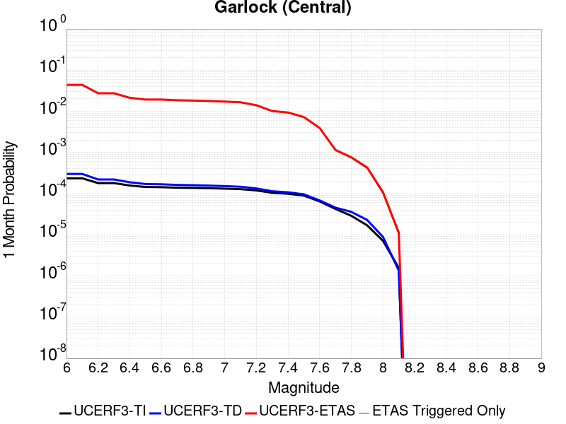 | 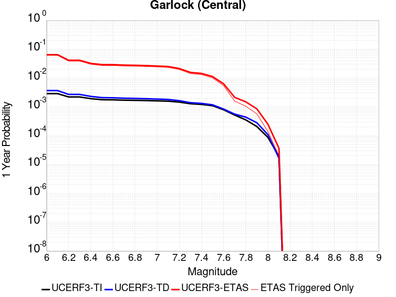 |  |

| Magnitude | 1 wk TI Prob | 1 wk TD Prob | 1 wk ETAS Prob | 1 wk ETAS/TD Gain | 1 wk ETAS Triggered Only | 1 mo TI Prob | 1 mo TD Prob | 1 mo ETAS Prob | 1 mo ETAS/TD Gain | 1 mo ETAS Triggered Only | 1 yr TI Prob | 1 yr TD Prob | 1 yr ETAS Prob | 1 yr ETAS/TD Gain | 1 yr ETAS Triggered Only | 10 yr TI Prob | 10 yr TD Prob | 10 yr ETAS Prob | 10 yr ETAS/TD Gain | 10 yr ETAS Triggered Only |
|-----|-----|-----|-----|-----|-----|-----|-----|-----|-----|-----|-----|-----|-----|-----|-----|-----|-----|-----|-----|-----|
| 6.0 | 5.5131142E-5 | 7.02476E-5 | 0.03477781 | 495.0747 | 0.03471 | 2.3625491E-4 | 3.0102677E-4 | 0.044017863 | 146.22574 | 0.04373 | 0.0028726095 | 0.003658906 | 0.06421652 | 17.550743 | 0.06078 | 0.028357591 | 0.036136653 | 0.11018064 | 3.0489993 | 0.07682 |
| 6.1 | 5.5131142E-5 | 7.02476E-5 | 0.03477781 | 495.0747 | 0.03471 | 2.3625491E-4 | 3.0102677E-4 | 0.044017863 | 146.22574 | 0.04373 | 0.0028726095 | 0.003658906 | 0.06421652 | 17.550743 | 0.06078 | 0.028357591 | 0.036136653 | 0.11018064 | 3.0489993 | 0.07682 |
| 6.2 | 4.216245E-5 | 5.1661802E-5 | 0.021710543 | 420.24362 | 0.02166 | 1.806837E-4 | 2.213891E-4 | 0.027515344 | 124.285 | 0.0273 | 0.0021976046 | 0.002692112 | 0.04109844 | 15.266244 | 0.03851 | 0.021759989 | 0.026701316 | 0.07441242 | 2.7868445 | 0.04902 |
| 6.3 | 4.216245E-5 | 5.1661802E-5 | 0.021710543 | 420.24362 | 0.02166 | 1.806837E-4 | 2.213891E-4 | 0.027515344 | 124.285 | 0.0273 | 0.0021976046 | 0.002692112 | 0.04109844 | 15.266244 | 0.03851 | 0.021759989 | 0.026701316 | 0.07441242 | 2.7868445 | 0.04902 |
| 6.4 | 3.6858168E-5 | 4.411026E-5 | 0.016753374 | 379.8067 | 0.01671 | 1.5795401E-4 | 1.8903041E-4 | 0.021325035 | 112.81271 | 0.02114 | 0.0019213937 | 0.0022990413 | 0.03210037 | 13.962502 | 0.02987 | 0.019048655 | 0.022866098 | 0.06044667 | 2.643506 | 0.03846 |
| 6.5 | 3.39199E-5 | 4.0018425E-5 | 0.015289408 | 382.0592 | 0.01525 | 1.453629E-4 | 1.7149639E-4 | 0.01932821 | 112.70331 | 0.01916 | 0.0017683565 | 0.0020859907 | 0.029149419 | 13.973896 | 0.02712 | 0.017543508 | 0.020758783 | 0.05472866 | 2.63641 | 0.03469 |
| 6.6 | 3.3571985E-5 | 3.947258E-5 | 0.015268872 | 386.82224 | 0.01523 | 1.4387199E-4 | 1.6915736E-4 | 0.019295922 | 114.07084 | 0.01913 | 0.0017502342 | 0.0020575672 | 0.02907187 | 14.129244 | 0.02707 | 0.017365133 | 0.02048004 | 0.054342046 | 2.653415 | 0.03457 |
| 6.7 | 3.2580007E-5 | 3.808902E-5 | 0.01469753 | 385.87317 | 0.01466 | 1.3962112E-4 | 1.6322857E-4 | 0.018570224 | 113.76822 | 0.01841 | 0.0016985617 | 0.0019855178 | 0.027973816 | 14.088926 | 0.02604 | 0.016856372 | 0.019770872 | 0.052383095 | 2.6495085 | 0.03327 |
| 6.8 | 3.2185937E-5 | 3.7516216E-5 | 0.014466975 | 385.61926 | 0.01443 | 1.3793244E-4 | 1.60774E-4 | 0.018267862 | 113.62449 | 0.01811 | 0.0016780337 | 0.0019556875 | 0.027505621 | 14.064426 | 0.0256 | 0.016654192 | 0.019477876 | 0.05154095 | 2.6461277 | 0.0327 |
| 6.9 | 3.165394E-5 | 3.672075E-5 | 0.014166201 | 385.78192 | 0.01413 | 1.3565269E-4 | 1.5736527E-4 | 0.01785458 | 113.459465 | 0.0177 | 0.0016503202 | 0.00191426 | 0.026886364 | 14.045305 | 0.02502 | 0.01638118 | 0.019071518 | 0.050392564 | 2.6422944 | 0.03193 |
| 7.0 | 3.0903822E-5 | 3.562591E-5 | 0.013775136 | 386.6606 | 0.01374 | 1.3243823E-4 | 1.5267366E-4 | 0.01727006 | 113.117485 | 0.01712 | 0.0016112428 | 0.0018572382 | 0.026002312 | 14.000525 | 0.02419 | 0.015996104 | 0.018513491 | 0.04885124 | 2.6386833 | 0.03091 |
| 7.1 | 3.0069863E-5 | 3.4392175E-5 | 0.013233938 | 384.79504 | 0.0132 | 1.2886449E-4 | 1.4738683E-4 | 0.01660496 | 112.66245 | 0.01646 | 0.0015677959 | 0.0017929787 | 0.024981327 | 13.932863 | 0.02323 | 0.01556781 | 0.017880987 | 0.046892785 | 2.622494 | 0.02954 |
| 7.2 | 2.7957109E-5 | 3.128141E-5 | 0.011160933 | 356.7912 | 0.01113 | 1.1981068E-4 | 1.3405642E-4 | 0.014072187 | 104.97213 | 0.01394 | 0.0014577188 | 0.0016309345 | 0.02125887 | 13.034779 | 0.01966 | 0.014481937 | 0.01628435 | 0.040759195 | 2.5029671 | 0.02488 |
| 7.3 | 2.4519275E-5 | 2.6714602E-5 | 0.0080565 | 301.57666 | 0.00803 | 1.0507837E-4 | 1.1448621E-4 | 0.010173335 | 88.86079 | 0.01006 | 0.0012785783 | 0.001392993 | 0.015643114 | 11.229858 | 0.01427 | 0.012712469 | 0.013928609 | 0.031707477 | 2.276428 | 0.01803 |
| 7.4 | 2.3225532E-5 | 2.5199166E-5 | 0.007465012 | 296.24042 | 0.00744 | 9.95342E-5 | 1.0799204E-4 | 0.009356993 | 86.64521 | 0.00925 | 0.0012111551 | 0.0013140244 | 0.014376837 | 10.941072 | 0.01308 | 0.012045753 | 0.013146195 | 0.02937994 | 2.2348626 | 0.01645 |
| 7.5 | 2.097765E-5 | 2.2483406E-5 | 0.005742355 | 255.40413 | 0.00572 | 8.9901114E-5 | 9.6353964E-5 | 0.00729566 | 75.71728 | 0.0072 | 0.0010939965 | 0.00117249 | 0.0112206945 | 9.56997 | 0.01006 | 0.010886264 | 0.011740657 | 0.024311315 | 2.0706947 | 0.01272 |
| 7.6 | 1.511254E-5 | 1.5990969E-5 | 0.003065942 | 191.72961 | 0.00305 | 6.476642E-5 | 6.8530964E-5 | 0.0039382656 | 57.46695 | 0.00387 | 7.882459E-4 | 8.34053E-4 | 0.0062595243 | 7.504948 | 0.00543 | 0.007854558 | 0.008383866 | 0.015126856 | 1.8042816 | 0.0068 |
| 7.7 | 9.934069E-6 | 1.0678523E-5 | 8.606694E-4 | 80.598175 | 8.5E-4 | 4.2573887E-5 | 4.5764296E-5 | 0.0011557135 | 25.253605 | 0.00111 | 5.182138E-4 | 5.570383E-4 | 0.0021261638 | 3.816908 | 0.00157 | 0.00517007 | 0.005627418 | 0.007626107 | 1.3551698 | 0.00201 |
| 7.8 | 6.7562896E-6 | 8.42837E-6 | 5.28424E-4 | 62.69587 | 5.2E-4 | 2.8955206E-5 | 3.6121084E-5 | 7.660947E-4 | 21.209072 | 7.3E-4 | 3.5247262E-4 | 4.3968562E-4 | 0.0014892239 | 3.3870199 | 0.00105 | 0.0035191406 | 0.004446415 | 0.005780457 | 1.3000264 | 0.00134 |
| 7.9 | 3.975453E-6 | 5.3710532E-6 | 2.953695E-4 | 54.992847 | 2.9E-4 | 1.7037546E-5 | 2.3018596E-5 | 4.3300915E-4 | 18.811275 | 4.1E-4 | 2.0741238E-4 | 2.8021546E-4 | 8.500557E-4 | 3.0335789 | 5.7E-4 | 0.002072189 | 0.0028335669 | 0.0035515267 | 1.2533767 | 7.2E-4 |
| 8.0 | 1.6729537E-6 | 2.0775192E-6 | 8.207736E-5 | 39.507385 | 8.0E-5 | 7.169782E-6 | 8.903624E-6 | 1.08902736E-4 | 12.231282 | 1.0E-4 | 8.7288594E-5 | 1.0839626E-4 | 2.4838108E-4 | 2.2914174 | 1.4E-4 | 8.7254314E-4 | 0.001096854 | 0.0013066237 | 1.1912466 | 2.1E-4 |
| 8.1 | 3.6733252E-7 | 3.1489736E-7 | 1.0314894E-5 | 32.756367 | 1.0E-5 | 1.5742813E-6 | 1.3495595E-6 | 1.1349546E-5 | 8.409815 | 1.0E-5 | 1.9166706E-5 | 1.643078E-5 | 3.643045E-5 | 2.2172077 | 2.0E-5 | 1.9165053E-4 | 1.662928E-4 | 1.962878E-4 | 1.1803747 | 3.0E-5 |

## Little Lake
*[(top)](#table-of-contents)*

| 1 Week | 1 Month | 1 Year | 10 Year |
|-----|-----|-----|-----|
| 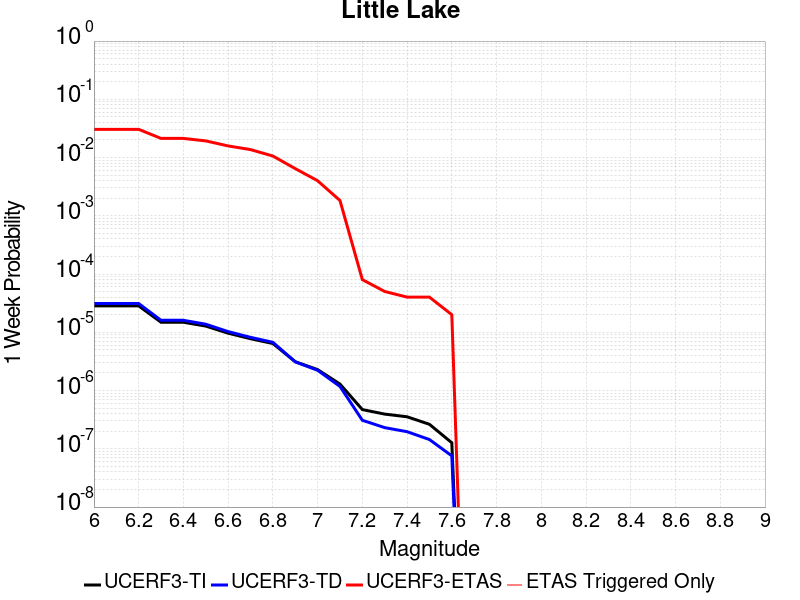 |  |  |  |

| Magnitude | 1 wk TI Prob | 1 wk TD Prob | 1 wk ETAS Prob | 1 wk ETAS/TD Gain | 1 wk ETAS Triggered Only | 1 mo TI Prob | 1 mo TD Prob | 1 mo ETAS Prob | 1 mo ETAS/TD Gain | 1 mo ETAS Triggered Only | 1 yr TI Prob | 1 yr TD Prob | 1 yr ETAS Prob | 1 yr ETAS/TD Gain | 1 yr ETAS Triggered Only | 10 yr TI Prob | 10 yr TD Prob | 10 yr ETAS Prob | 10 yr ETAS/TD Gain | 10 yr ETAS Triggered Only |
|-----|-----|-----|-----|-----|-----|-----|-----|-----|-----|-----|-----|-----|-----|-----|-----|-----|-----|-----|-----|-----|
| 6.0 | 2.8424427E-5 | 3.1205716E-5 | 0.030540254 | 978.675 | 0.03051 | 1.2181328E-4 | 1.3373268E-4 | 0.038028665 | 284.36328 | 0.0379 | 0.0014820677 | 0.0016271125 | 0.05160566 | 31.716099 | 0.05006 | 0.014722223 | 0.016165398 | 0.07664171 | 4.7410965 | 0.06147 |
| 6.1 | 2.8424427E-5 | 3.1205716E-5 | 0.030540254 | 978.675 | 0.03051 | 1.2181328E-4 | 1.3373268E-4 | 0.038028665 | 284.36328 | 0.0379 | 0.0014820677 | 0.0016271125 | 0.05160566 | 31.716099 | 0.05006 | 0.014722223 | 0.016165398 | 0.07664171 | 4.7410965 | 0.06147 |
| 6.2 | 2.8424427E-5 | 3.1205716E-5 | 0.030540254 | 978.675 | 0.03051 | 1.2181328E-4 | 1.3373268E-4 | 0.038028665 | 284.36328 | 0.0379 | 0.0014820677 | 0.0016271125 | 0.05160566 | 31.716099 | 0.05006 | 0.014722223 | 0.016165398 | 0.07664171 | 4.7410965 | 0.06147 |
| 6.3 | 1.48860645E-5 | 1.6081383E-5 | 0.02130574 | 1324.8698 | 0.02129 | 6.379586E-5 | 6.8918554E-5 | 0.026197117 | 380.11703 | 0.02613 | 7.7643775E-4 | 8.387886E-4 | 0.035459723 | 42.274925 | 0.03465 | 0.007737305 | 0.008359045 | 0.05035504 | 6.0240183 | 0.04235 |
| 6.4 | 1.48860645E-5 | 1.6081383E-5 | 0.02130574 | 1324.8698 | 0.02129 | 6.379586E-5 | 6.8918554E-5 | 0.026197117 | 380.11703 | 0.02613 | 7.7643775E-4 | 8.387886E-4 | 0.035459723 | 42.274925 | 0.03465 | 0.007737305 | 0.008359045 | 0.05035504 | 6.0240183 | 0.04235 |
| 6.5 | 1.2797581E-5 | 1.376556E-5 | 0.0193235 | 1403.757 | 0.01931 | 5.4845623E-5 | 5.8994065E-5 | 0.023817593 | 403.7286 | 0.02376 | 6.675408E-4 | 7.1804173E-4 | 0.032095496 | 44.698647 | 0.0314 | 0.006655392 | 0.007159767 | 0.045205407 | 6.3138094 | 0.03832 |
| 6.6 | 9.661896E-6 | 1.0289033E-5 | 0.015840126 | 1539.5156 | 0.01583 | 4.1407468E-5 | 4.40952E-5 | 0.019603232 | 444.56613 | 0.01956 | 5.040193E-4 | 5.36743E-4 | 0.026362874 | 49.116375 | 0.02584 | 0.005028777 | 0.0053560715 | 0.03664757 | 6.842248 | 0.03146 |
| 6.7 | 7.767871E-6 | 8.199681E-6 | 0.013698087 | 1670.5634 | 0.01369 | 3.329045E-5 | 3.5141096E-5 | 0.016954547 | 482.47064 | 0.01692 | 4.0523586E-4 | 4.2777258E-4 | 0.022658259 | 52.968002 | 0.02224 | 0.004044977 | 0.004270843 | 0.03133476 | 7.336903 | 0.02718 |
| 6.8 | 6.4235196E-6 | 6.735739E-6 | 0.010626664 | 1577.6538 | 0.01062 | 2.752908E-5 | 2.8867207E-5 | 0.013318484 | 461.3707 | 0.01329 | 3.35115E-4 | 3.5141438E-4 | 0.01777529 | 50.582134 | 0.01743 | 0.003346101 | 0.0035098472 | 0.024585614 | 7.004753 | 0.02115 |
| 6.9 | 3.1283696E-6 | 3.1121751E-6 | 0.0064630923 | 2076.7122 | 0.00646 | 1.3407229E-5 | 1.33378335E-5 | 0.007963232 | 597.0409 | 0.00795 | 1.6322079E-4 | 1.6237753E-4 | 0.010490701 | 64.60685 | 0.01033 | 0.0016310095 | 0.0016227372 | 0.0141423885 | 8.715144 | 0.01254 |
| 7.0 | 2.290603E-6 | 2.2286763E-6 | 0.0040022195 | 1795.7834 | 0.004 | 9.816834E-6 | 9.551441E-6 | 0.004989504 | 522.3824 | 0.00498 | 1.19513395E-4 | 1.1628362E-4 | 0.006475544 | 55.6875 | 0.00636 | 0.0011944914 | 0.0011623299 | 0.008833403 | 7.5997386 | 0.00768 |
| 7.1 | 1.293693E-6 | 1.1776774E-6 | 0.0018311755 | 1554.9042 | 0.00183 | 5.5443866E-6 | 5.047183E-6 | 0.0022550358 | 446.791 | 0.00225 | 6.750081E-5 | 6.1448416E-5 | 0.0029312721 | 47.70297 | 0.00287 | 6.7480316E-4 | 6.1438273E-4 | 0.0041022385 | 6.677008 | 0.00349 |
| 7.2 | 4.715842E-7 | 3.091732E-7 | 8.0309146E-5 | 259.75455 | 8.0E-5 | 2.0210737E-6 | 1.3250274E-6 | 1.3132485E-4 | 99.11105 | 1.3E-4 | 2.4606294E-5 | 1.6132095E-5 | 1.7612951E-4 | 10.917957 | 1.6E-4 | 2.460357E-4 | 1.6130977E-4 | 3.5127913E-4 | 2.1776679 | 1.9E-4 |
| 7.3 | 3.9430947E-7 | 2.3096938E-7 | 5.023096E-5 | 217.47885 | 5.0E-5 | 1.6898966E-6 | 9.898685E-7 | 8.098979E-5 | 81.81874 | 8.0E-5 | 2.0574296E-5 | 1.2051582E-5 | 1.1205038E-4 | 9.297565 | 1.0E-4 | 2.0572392E-4 | 1.2050936E-4 | 2.404949E-4 | 1.9956533 | 1.2E-4 |
| 7.4 | 3.547123E-7 | 1.9678579E-7 | 4.0196777E-5 | 204.26666 | 4.0E-5 | 1.5201948E-6 | 8.433674E-7 | 6.084332E-5 | 72.14331 | 6.0E-5 | 1.8508214E-5 | 1.02679505E-5 | 8.026723E-5 | 7.8172593 | 7.0E-5 | 1.8506673E-4 | 1.0267482E-4 | 1.9266558E-4 | 1.8764638 | 9.0E-5 |
| 7.5 | 2.6354266E-7 | 1.4422719E-7 | 4.0144223E-5 | 278.34018 | 4.0E-5 | 1.129468E-6 | 6.1811636E-7 | 5.0618084E-5 | 81.89087 | 5.0E-5 | 1.3751187E-5 | 7.525541E-6 | 6.752509E-5 | 8.972789 | 6.0E-5 | 1.3750336E-4 | 7.5252916E-5 | 1.4524764E-4 | 1.9301265 | 7.0E-5 |
| 7.6 | 1.269913E-7 | 7.572344E-8 | 2.0075722E-5 | 265.119 | 2.0E-5 | 5.4424834E-7 | 3.24529E-7 | 2.0324522E-5 | 62.627754 | 2.0E-5 | 6.6262032E-6 | 3.9511337E-6 | 3.3951015E-5 | 8.592728 | 3.0E-5 | 6.626006E-5 | 3.9510673E-5 | 6.9509486E-5 | 1.7592585 | 3.0E-5 |

## Airport Lake
*[(top)](#table-of-contents)*

| 1 Week | 1 Month | 1 Year | 10 Year |
|-----|-----|-----|-----|
| 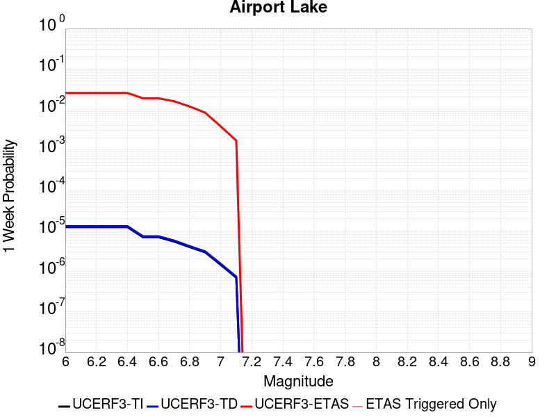 |  |  |  |

| Magnitude | 1 wk TI Prob | 1 wk TD Prob | 1 wk ETAS Prob | 1 wk ETAS/TD Gain | 1 wk ETAS Triggered Only | 1 mo TI Prob | 1 mo TD Prob | 1 mo ETAS Prob | 1 mo ETAS/TD Gain | 1 mo ETAS Triggered Only | 1 yr TI Prob | 1 yr TD Prob | 1 yr ETAS Prob | 1 yr ETAS/TD Gain | 1 yr ETAS Triggered Only | 10 yr TI Prob | 10 yr TD Prob | 10 yr ETAS Prob | 10 yr ETAS/TD Gain | 10 yr ETAS Triggered Only |
|-----|-----|-----|-----|-----|-----|-----|-----|-----|-----|-----|-----|-----|-----|-----|-----|-----|-----|-----|-----|-----|
| 6.0 | 1.2387061E-5 | 1.3103157E-5 | 0.025612768 | 1954.702 | 0.0256 | 5.3086325E-5 | 5.615534E-5 | 0.0313444 | 558.1731 | 0.03129 | 6.461343E-4 | 6.8350515E-4 | 0.04095596 | 59.920483 | 0.0403 | 0.0064425888 | 0.0068168393 | 0.055313975 | 8.114314 | 0.04883 |
| 6.1 | 1.2387061E-5 | 1.3103157E-5 | 0.025612768 | 1954.702 | 0.0256 | 5.3086325E-5 | 5.615534E-5 | 0.0313444 | 558.1731 | 0.03129 | 6.461343E-4 | 6.8350515E-4 | 0.04095596 | 59.920483 | 0.0403 | 0.0064425888 | 0.0068168393 | 0.055313975 | 8.114314 | 0.04883 |
| 6.2 | 1.2387061E-5 | 1.3103157E-5 | 0.025612768 | 1954.702 | 0.0256 | 5.3086325E-5 | 5.615534E-5 | 0.0313444 | 558.1731 | 0.03129 | 6.461343E-4 | 6.8350515E-4 | 0.04095596 | 59.920483 | 0.0403 | 0.0064425888 | 0.0068168393 | 0.055313975 | 8.114314 | 0.04883 |
| 6.3 | 1.2387061E-5 | 1.3103157E-5 | 0.025612768 | 1954.702 | 0.0256 | 5.3086325E-5 | 5.615534E-5 | 0.0313444 | 558.1731 | 0.03129 | 6.461343E-4 | 6.8350515E-4 | 0.04095596 | 59.920483 | 0.0403 | 0.0064425888 | 0.0068168393 | 0.055313975 | 8.114314 | 0.04883 |
| 6.4 | 1.2387061E-5 | 1.3103157E-5 | 0.025612768 | 1954.702 | 0.0256 | 5.3086325E-5 | 5.615534E-5 | 0.0313444 | 558.1731 | 0.03129 | 6.461343E-4 | 6.8350515E-4 | 0.04095596 | 59.920483 | 0.0403 | 0.0064425888 | 0.0068168393 | 0.055313975 | 8.114314 | 0.04883 |
| 6.5 | 6.9922594E-6 | 7.384925E-6 | 0.018927244 | 2562.957 | 0.01892 | 2.996648E-5 | 3.1649324E-5 | 0.022990923 | 726.42694 | 0.02296 | 3.6478083E-4 | 3.8526783E-4 | 0.030123806 | 78.189255 | 0.02975 | 0.003641826 | 0.0038465366 | 0.03981764 | 10.351556 | 0.03611 |
| 6.6 | 6.9922594E-6 | 7.384925E-6 | 0.018927244 | 2562.957 | 0.01892 | 2.996648E-5 | 3.1649324E-5 | 0.022990923 | 726.42694 | 0.02296 | 3.6478083E-4 | 3.8526783E-4 | 0.030123806 | 78.189255 | 0.02975 | 0.003641826 | 0.0038465366 | 0.03981764 | 10.351556 | 0.03611 |
| 6.7 | 5.477277E-6 | 5.7860684E-6 | 0.015985694 | 2762.7903 | 0.01598 | 2.3473833E-5 | 2.4797222E-5 | 0.019404316 | 782.5198 | 0.01938 | 2.8575645E-4 | 3.0186825E-4 | 0.02556424 | 84.686745 | 0.02527 | 0.0028538927 | 0.003014966 | 0.033562586 | 11.131996 | 0.03064 |
| 6.8 | 3.9950432E-6 | 4.2190873E-6 | 0.011894169 | 2819.1333 | 0.01189 | 1.7121502E-5 | 1.8081691E-5 | 0.014457821 | 799.5834 | 0.01444 | 2.0843433E-4 | 2.2012512E-4 | 0.019105967 | 86.795944 | 0.01889 | 0.0020823893 | 0.0021993418 | 0.024919262 | 11.330328 | 0.02277 |
| 6.9 | 2.95695E-6 | 3.1230243E-6 | 0.008333097 | 2668.278 | 0.00833 | 1.2672582E-5 | 1.3384334E-5 | 0.010203248 | 762.32764 | 0.01019 | 1.5427776E-4 | 1.6294434E-4 | 0.013510769 | 82.916466 | 0.01335 | 0.001541707 | 0.0016284712 | 0.01783204 | 10.950173 | 0.01623 |
| 7.0 | 1.456072E-6 | 1.540812E-6 | 0.003821535 | 2480.2085 | 0.00382 | 6.2402937E-6 | 6.603469E-6 | 0.0046765725 | 708.1994 | 0.00467 | 7.597293E-5 | 8.039528E-5 | 0.0060599144 | 75.376495 | 0.00598 | 7.594696E-4 | 8.0376083E-4 | 0.007987982 | 9.938257 | 0.00719 |
| 7.1 | 6.995192E-7 | 7.4089746E-7 | 0.0017007396 | 2295.513 | 0.0017 | 2.997936E-6 | 3.1752747E-6 | 0.0020531688 | 646.6114 | 0.00205 | 3.649926E-5 | 3.865897E-5 | 0.0026585576 | 68.76949 | 0.00262 | 3.6493264E-4 | 3.865897E-4 | 0.0035853526 | 9.27431 | 0.0032 |

## Owl Lake
*[(top)](#table-of-contents)*

| 1 Week | 1 Month | 1 Year | 10 Year |
|-----|-----|-----|-----|
| 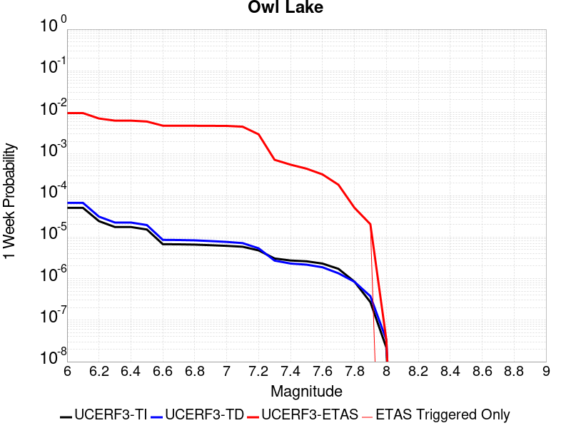 | 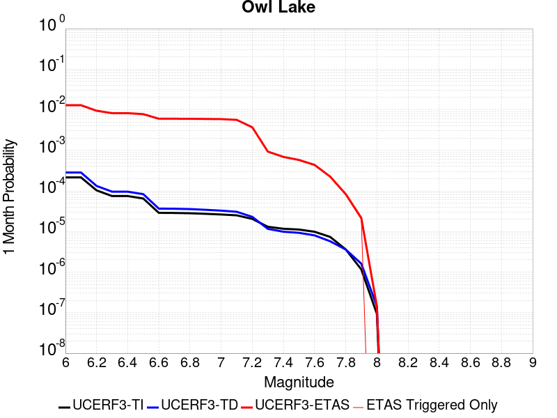 |  |  |

| Magnitude | 1 wk TI Prob | 1 wk TD Prob | 1 wk ETAS Prob | 1 wk ETAS/TD Gain | 1 wk ETAS Triggered Only | 1 mo TI Prob | 1 mo TD Prob | 1 mo ETAS Prob | 1 mo ETAS/TD Gain | 1 mo ETAS Triggered Only | 1 yr TI Prob | 1 yr TD Prob | 1 yr ETAS Prob | 1 yr ETAS/TD Gain | 1 yr ETAS Triggered Only | 10 yr TI Prob | 10 yr TD Prob | 10 yr ETAS Prob | 10 yr ETAS/TD Gain | 10 yr ETAS Triggered Only |
|-----|-----|-----|-----|-----|-----|-----|-----|-----|-----|-----|-----|-----|-----|-----|-----|-----|-----|-----|-----|-----|
| 6.0 | 5.0320643E-5 | 6.6358676E-5 | 0.009615725 | 144.90532 | 0.00955 | 2.1564208E-4 | 2.843643E-4 | 0.012940764 | 45.507694 | 0.01266 | 0.0026222812 | 0.003457547 | 0.022790471 | 6.591514 | 0.0194 | 0.02591553 | 0.034141295 | 0.059524063 | 1.7434623 | 0.02628 |
| 6.1 | 5.0320643E-5 | 6.6358676E-5 | 0.009615725 | 144.90532 | 0.00955 | 2.1564208E-4 | 2.843643E-4 | 0.012940764 | 45.507694 | 0.01266 | 0.0026222812 | 0.003457547 | 0.022790471 | 6.591514 | 0.0194 | 0.02591553 | 0.034141295 | 0.059524063 | 1.7434623 | 0.02628 |
| 6.2 | 2.4125871E-5 | 3.0980515E-5 | 0.0071307607 | 230.1692 | 0.0071 | 1.0339249E-4 | 1.3276804E-4 | 0.009471528 | 71.33891 | 0.00934 | 0.0012580766 | 0.0016154252 | 0.015782502 | 9.769875 | 0.01419 | 0.012509781 | 0.016070755 | 0.034873642 | 2.1700065 | 0.01911 |
| 6.3 | 1.7433485E-5 | 2.2355545E-5 | 0.0063322145 | 283.25027 | 0.00631 | 7.471279E-5 | 9.580685E-5 | 0.008245026 | 86.05884 | 0.00815 | 9.0924866E-4 | 0.001165962 | 0.013311784 | 11.416997 | 0.01216 | 0.009055373 | 0.0116291465 | 0.027670406 | 2.3794012 | 0.01623 |
| 6.4 | 1.7433485E-5 | 2.2355545E-5 | 0.0063322145 | 283.25027 | 0.00631 | 7.471279E-5 | 9.580685E-5 | 0.008245026 | 86.05884 | 0.00815 | 9.0924866E-4 | 0.001165962 | 0.013311784 | 11.416997 | 0.01216 | 0.009055373 | 0.0116291465 | 0.027670406 | 2.3794012 | 0.01623 |
| 6.5 | 1.5182742E-5 | 1.9429277E-5 | 0.0060293125 | 310.32098 | 0.00601 | 6.506727E-5 | 8.3266525E-5 | 0.007802624 | 93.70661 | 0.00772 | 7.919061E-4 | 0.0010134344 | 0.01249179 | 12.326196 | 0.01149 | 0.0078909 | 0.010118678 | 0.025283659 | 2.4987118 | 0.01532 |
| 6.6 | 6.7271576E-6 | 8.547518E-6 | 0.004788507 | 560.2219 | 0.00478 | 2.8830356E-5 | 3.6631736E-5 | 0.0060164127 | 164.24045 | 0.00598 | 3.5095305E-4 | 4.4590578E-4 | 0.008952111 | 20.076239 | 0.00851 | 0.0035039932 | 0.0044680187 | 0.015458692 | 3.459854 | 0.01104 |
| 6.7 | 6.682835E-6 | 8.479961E-6 | 0.0047884393 | 564.67706 | 0.00478 | 2.8640408E-5 | 3.6342215E-5 | 0.006016125 | 165.54095 | 0.00598 | 3.4864116E-4 | 4.423823E-4 | 0.008938622 | 20.20565 | 0.0085 | 0.003480947 | 0.0044329325 | 0.01538417 | 3.4704273 | 0.011 |
| 6.8 | 6.5774975E-6 | 8.326427E-6 | 0.004768287 | 572.669 | 0.00476 | 2.8188972E-5 | 3.5684232E-5 | 0.0059954715 | 168.01459 | 0.00596 | 3.4314668E-4 | 4.3437455E-4 | 0.0089006955 | 20.490831 | 0.00847 | 0.0034261728 | 0.0043531056 | 0.015255439 | 3.5044956 | 0.01095 |
| 6.9 | 6.363419E-6 | 7.999591E-6 | 0.0047479616 | 593.5256 | 0.00474 | 2.727151E-5 | 3.428354E-5 | 0.005944081 | 173.38002 | 0.00591 | 3.3198006E-4 | 4.1732774E-4 | 0.008793831 | 21.07176 | 0.00838 | 0.0033148455 | 0.0041830647 | 0.014987678 | 3.582942 | 0.01085 |
| 7.0 | 6.1342453E-6 | 7.631779E-6 | 0.004727596 | 619.4618 | 0.00472 | 2.6289357E-5 | 3.2707245E-5 | 0.0058925156 | 180.15933 | 0.00586 | 3.2002592E-4 | 3.9814346E-4 | 0.008704835 | 21.863564 | 0.00831 | 0.0031956544 | 0.003991739 | 0.014718748 | 3.687302 | 0.01077 |
| 7.1 | 5.842926E-6 | 7.142312E-6 | 0.00452711 | 633.84375 | 0.00452 | 2.504087E-5 | 3.060958E-5 | 0.005640438 | 184.27034 | 0.00561 | 3.0482994E-4 | 3.7261334E-4 | 0.008279666 | 22.220531 | 0.00791 | 0.0030441214 | 0.0037371595 | 0.013928928 | 3.727143 | 0.01023 |
| 7.2 | 4.77173E-6 | 5.358478E-6 | 0.0029653427 | 553.3927 | 0.00296 | 2.045011E-5 | 2.2964727E-5 | 0.00370288 | 161.24207 | 0.00368 | 2.4895166E-4 | 2.7956374E-4 | 0.005428124 | 19.416409 | 0.00515 | 0.0024867293 | 0.0028086212 | 0.009400057 | 3.346858 | 0.00661 |
| 7.3 | 3.0494948E-6 | 2.710356E-6 | 7.227084E-4 | 266.64703 | 7.2E-4 | 1.3069198E-5 | 1.1615762E-5 | 9.3160506E-4 | 80.20181 | 9.2E-4 | 1.5910587E-4 | 1.4141288E-4 | 0.0015012205 | 10.615869 | 0.00136 | 0.0015899199 | 0.0014231089 | 0.0032205472 | 2.2630365 | 0.0018 |
| 7.4 | 2.7263884E-6 | 2.3055634E-6 | 5.523043E-4 | 239.55287 | 5.5E-4 | 1.1684469E-5 | 9.880949E-6 | 6.898742E-4 | 69.81863 | 6.8E-4 | 1.4224913E-4 | 1.2029401E-4 | 0.0011101749 | 9.228846 | 9.9E-4 | 0.0014215811 | 0.0012110578 | 0.0025194713 | 2.080389 | 0.00131 |
| 7.5 | 2.6090431E-6 | 2.1655019E-6 | 4.4216454E-4 | 204.18571 | 4.4E-4 | 1.1181565E-5 | 9.2806895E-6 | 5.792754E-4 | 62.41728 | 5.7E-4 | 1.3612706E-4 | 1.1298663E-4 | 9.32894E-4 | 8.256676 | 8.2E-4 | 0.001360437 | 0.0011378126 | 0.0022265725 | 1.9568884 | 0.00109 |
| 7.6 | 2.3008756E-6 | 1.8726826E-6 | 3.218721E-4 | 171.87755 | 3.2E-4 | 9.860858E-6 | 8.025758E-6 | 4.380223E-4 | 54.577065 | 4.3E-4 | 1.20049335E-4 | 9.770931E-5 | 7.2764774E-4 | 7.4470673 | 6.3E-4 | 0.001199845 | 9.848307E-4 | 0.0018240034 | 1.8520986 | 8.4E-4 |
| 7.7 | 1.7184348E-6 | 1.341808E-6 | 1.8134157E-4 | 135.14717 | 1.8E-4 | 7.3646997E-6 | 5.750593E-6 | 2.2574933E-4 | 39.256702 | 2.2E-4 | 8.966153E-5 | 7.0011265E-5 | 4.0998746E-4 | 5.8560214 | 3.4E-4 | 8.962536E-4 | 7.0769014E-4 | 0.0011973433 | 1.6919034 | 4.9E-4 |
| 7.8 | 8.4612907E-7 | 8.4054994E-7 | 5.0840506E-5 | 60.484814 | 5.0E-5 | 3.6262625E-6 | 3.602352E-6 | 8.360206E-5 | 23.207632 | 8.0E-5 | 4.4148852E-5 | 4.3857777E-5 | 1.8385163E-4 | 4.191996 | 1.4E-4 | 4.414008E-4 | 4.4386165E-4 | 6.537684E-4 | 1.4729104 | 2.1E-4 |
| 7.9 | 2.716738E-7 | 3.7681625E-7 | 2.0376809E-5 | 54.07625 | 2.0E-5 | 1.1643157E-6 | 1.6149258E-6 | 2.1614893E-5 | 13.38445 | 2.0E-5 | 1.4175452E-5 | 1.9661555E-5 | 3.966116E-5 | 2.0171936 | 2.0E-5 | 1.4174548E-4 | 1.9829652E-4 | 2.2829056E-4 | 1.1512586 | 3.0E-5 |
| 8.0 | 2.1995428E-8 | 3.3853325E-8 | 3.3853325E-8 | 1.0 | 0.0 | 9.426611E-8 | 1.4508568E-7 | 1.4508568E-7 | 1.0 | 0.0 | 1.1476893E-6 | 1.7664173E-6 | 1.7664173E-6 | 1.0 | 0.0 | 1.14768345E-5 | 1.7869768E-5 | 1.7869768E-5 | 1.0 | 0.0 |

## Panamint Valley
*[(top)](#table-of-contents)*

| 1 Week | 1 Month | 1 Year | 10 Year |
|-----|-----|-----|-----|
|  |  |  |  |

| Magnitude | 1 wk TI Prob | 1 wk TD Prob | 1 wk ETAS Prob | 1 wk ETAS/TD Gain | 1 wk ETAS Triggered Only | 1 mo TI Prob | 1 mo TD Prob | 1 mo ETAS Prob | 1 mo ETAS/TD Gain | 1 mo ETAS Triggered Only | 1 yr TI Prob | 1 yr TD Prob | 1 yr ETAS Prob | 1 yr ETAS/TD Gain | 1 yr ETAS Triggered Only | 10 yr TI Prob | 10 yr TD Prob | 10 yr ETAS Prob | 10 yr ETAS/TD Gain | 10 yr ETAS Triggered Only |
|-----|-----|-----|-----|-----|-----|-----|-----|-----|-----|-----|-----|-----|-----|-----|-----|-----|-----|-----|-----|-----|
| 6.0 | 3.0211835E-5 | 3.3984263E-5 | 0.009003679 | 264.93674 | 0.00897 | 1.2947287E-4 | 1.4563887E-4 | 0.012173886 | 83.58955 | 0.01203 | 0.0015751923 | 0.0017717406 | 0.020388698 | 11.507722 | 0.01865 | 0.015640736 | 0.017583003 | 0.042330086 | 2.4074435 | 0.02519 |
| 6.1 | 3.0211835E-5 | 3.3984263E-5 | 0.009003679 | 264.93674 | 0.00897 | 1.2947287E-4 | 1.4563887E-4 | 0.012173886 | 83.58955 | 0.01203 | 0.0015751923 | 0.0017717406 | 0.020388698 | 11.507722 | 0.01865 | 0.015640736 | 0.017583003 | 0.042330086 | 2.4074435 | 0.02519 |
| 6.2 | 3.0211835E-5 | 3.3984263E-5 | 0.009003679 | 264.93674 | 0.00897 | 1.2947287E-4 | 1.4563887E-4 | 0.012173886 | 83.58955 | 0.01203 | 0.0015751923 | 0.0017717406 | 0.020388698 | 11.507722 | 0.01865 | 0.015640736 | 0.017583003 | 0.042330086 | 2.4074435 | 0.02519 |
| 6.3 | 2.8573924E-5 | 3.2102445E-5 | 0.008701824 | 271.06424 | 0.00867 | 1.2245393E-4 | 1.375748E-4 | 0.01165599 | 84.72475 | 0.01152 | 0.001489857 | 0.0016737141 | 0.019443922 | 11.617229 | 0.0178 | 0.01479908 | 0.016618038 | 0.040179867 | 2.417847 | 0.02396 |
| 6.4 | 2.8573924E-5 | 3.2102445E-5 | 0.008701824 | 271.06424 | 0.00867 | 1.2245393E-4 | 1.375748E-4 | 0.01165599 | 84.72475 | 0.01152 | 0.001489857 | 0.0016737141 | 0.019443922 | 11.617229 | 0.0178 | 0.01479908 | 0.016618038 | 0.040179867 | 2.417847 | 0.02396 |
| 6.5 | 2.7468774E-5 | 3.0828138E-5 | 0.008440569 | 273.7943 | 0.00841 | 1.1771801E-4 | 1.3211406E-4 | 0.011330634 | 85.76403 | 0.0112 | 0.0014322745 | 0.0016073292 | 0.018699812 | 11.6340885 | 0.01712 | 0.014230782 | 0.015963882 | 0.038547512 | 2.4146702 | 0.02295 |
| 6.6 | 2.6135967E-5 | 2.9252153E-5 | 0.008139015 | 278.23645 | 0.00811 | 1.1200648E-4 | 1.2536049E-4 | 0.010894011 | 86.90147 | 0.01077 | 0.0013628257 | 0.0015252219 | 0.017900208 | 11.736134 | 0.0164 | 0.013544982 | 0.015154343 | 0.036732312 | 2.42388 | 0.02191 |
| 6.7 | 2.4498746E-5 | 2.7341044E-5 | 0.0077971285 | 285.18036 | 0.00777 | 1.04990395E-4 | 1.17170785E-4 | 0.010385968 | 88.639565 | 0.01027 | 0.0012775084 | 0.0014256459 | 0.016953478 | 11.891788 | 0.01555 | 0.012701893 | 0.014171593 | 0.03468668 | 2.4476206 | 0.02081 |
| 6.8 | 2.2244329E-5 | 2.4935374E-5 | 0.007224756 | 289.73923 | 0.0072 | 9.532935E-5 | 1.0686163E-4 | 0.009525855 | 89.14195 | 0.00942 | 0.0011600169 | 0.0013002857 | 0.015391938 | 11.837351 | 0.01411 | 0.011539802 | 0.012932955 | 0.031460203 | 2.4325612 | 0.01877 |
| 6.9 | 1.9902658E-5 | 2.2290182E-5 | 0.0062521514 | 280.489 | 0.00623 | 8.529431E-5 | 9.552596E-5 | 0.00821475 | 85.99495 | 0.00812 | 0.0010379635 | 0.0011624265 | 0.013038605 | 11.216714 | 0.01189 | 0.010331288 | 0.011569021 | 0.027008314 | 2.3345375 | 0.01562 |
| 7.0 | 1.8353881E-5 | 2.056605E-5 | 0.0057304488 | 278.63632 | 0.00571 | 7.865712E-5 | 8.813734E-5 | 0.0074374895 | 84.38522 | 0.00735 | 9.5722964E-4 | 0.0010725616 | 0.011591268 | 10.807088 | 0.01053 | 0.009531168 | 0.01067939 | 0.024292441 | 2.274703 | 0.01376 |
| 7.1 | 1.7667631E-5 | 1.9772435E-5 | 0.0053796666 | 272.0791 | 0.00536 | 7.571623E-5 | 8.4736355E-5 | 0.006994151 | 82.540146 | 0.00691 | 9.2145515E-4 | 0.0010311945 | 0.010861048 | 10.532493 | 0.00984 | 0.009176437 | 0.0102695925 | 0.02301732 | 2.241308 | 0.01288 |
| 7.2 | 1.6381597E-5 | 1.8158042E-5 | 0.004778072 | 263.13803 | 0.00476 | 7.020495E-5 | 7.781795E-5 | 0.006257337 | 80.409935 | 0.00618 | 8.544101E-4 | 9.470391E-4 | 0.009798649 | 10.346615 | 0.00886 | 0.008511325 | 0.009435269 | 0.020846575 | 2.209431 | 0.01152 |
| 7.3 | 1.4520491E-5 | 1.596657E-5 | 0.0040959013 | 256.52982 | 0.00408 | 6.222919E-5 | 6.842646E-5 | 0.005308068 | 77.573326 | 0.00524 | 7.57377E-4 | 8.327899E-4 | 0.008296569 | 9.962379 | 0.00747 | 0.0075480095 | 0.008300399 | 0.017890135 | 2.1553342 | 0.00967 |
| 7.4 | 1.2852287E-5 | 1.41454875E-5 | 0.00394409 | 278.82318 | 0.00393 | 5.5080065E-5 | 6.06222E-5 | 0.005080318 | 83.80293 | 0.00502 | 6.7039346E-4 | 7.378411E-4 | 0.007882565 | 10.683283 | 0.00715 | 0.0066837464 | 0.007357429 | 0.016509594 | 2.243935 | 0.00922 |
| 7.5 | 1.1637851E-5 | 1.2836868E-5 | 0.0038827872 | 302.47153 | 0.00387 | 4.987555E-5 | 5.5014076E-5 | 0.0049647437 | 90.24497 | 0.00491 | 6.070656E-4 | 6.696062E-4 | 0.0076149525 | 11.372285 | 0.00695 | 0.006054099 | 0.0066793845 | 0.015549737 | 2.3280196 | 0.00893 |
| 7.6 | 3.0068115E-6 | 3.3330623E-6 | 0.0016033277 | 481.0374 | 0.0016 | 1.2886271E-5 | 1.4284516E-5 | 0.0020142558 | 141.00975 | 0.002 | 1.5687906E-4 | 1.7390738E-4 | 0.002963422 | 17.040232 | 0.00279 | 0.0015676835 | 0.0017397973 | 0.005193778 | 2.9852774 | 0.00346 |

## Garlock (East)
*[(top)](#table-of-contents)*

| 1 Week | 1 Month | 1 Year | 10 Year |
|-----|-----|-----|-----|
| 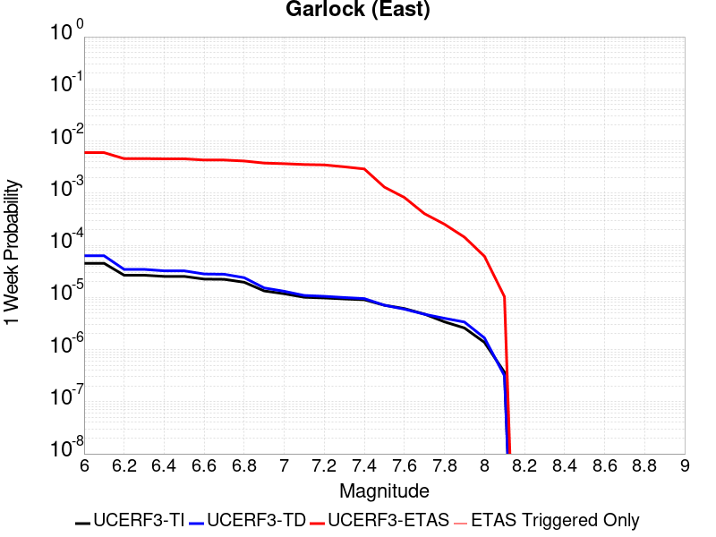 | 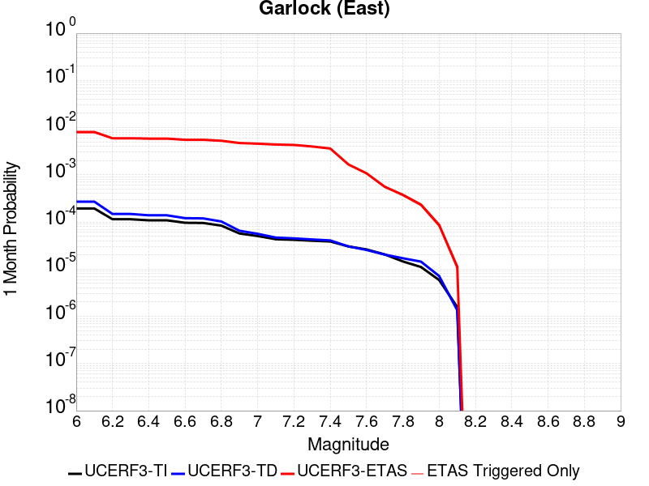 |  |  |

| Magnitude | 1 wk TI Prob | 1 wk TD Prob | 1 wk ETAS Prob | 1 wk ETAS/TD Gain | 1 wk ETAS Triggered Only | 1 mo TI Prob | 1 mo TD Prob | 1 mo ETAS Prob | 1 mo ETAS/TD Gain | 1 mo ETAS Triggered Only | 1 yr TI Prob | 1 yr TD Prob | 1 yr ETAS Prob | 1 yr ETAS/TD Gain | 1 yr ETAS Triggered Only | 10 yr TI Prob | 10 yr TD Prob | 10 yr ETAS Prob | 10 yr ETAS/TD Gain | 10 yr ETAS Triggered Only |
|-----|-----|-----|-----|-----|-----|-----|-----|-----|-----|-----|-----|-----|-----|-----|-----|-----|-----|-----|-----|-----|
| 6.0 | 4.5092507E-5 | 6.2904815E-5 | 0.0059825326 | 95.104515 | 0.00592 | 1.9323928E-4 | 2.6956675E-4 | 0.008077461 | 29.964607 | 0.00781 | 0.0023501497 | 0.003277482 | 0.015866088 | 4.840938 | 0.01263 | 0.023254504 | 0.03235377 | 0.04915211 | 1.5192081 | 0.01736 |
| 6.1 | 4.5092507E-5 | 6.2904815E-5 | 0.0059825326 | 95.104515 | 0.00592 | 1.9323928E-4 | 2.6956675E-4 | 0.008077461 | 29.964607 | 0.00781 | 0.0023501497 | 0.003277482 | 0.015866088 | 4.840938 | 0.01263 | 0.023254504 | 0.03235377 | 0.04915211 | 1.5192081 | 0.01736 |
| 6.2 | 2.6674514E-5 | 3.4511588E-5 | 0.0045943544 | 133.12497 | 0.00456 | 1.1431433E-4 | 1.4789861E-4 | 0.005947041 | 40.210255 | 0.0058 | 0.0013908884 | 0.0017992114 | 0.010763055 | 5.9820957 | 0.00898 | 0.01382215 | 0.017872788 | 0.029452069 | 1.6478721 | 0.01179 |
| 6.3 | 2.6674514E-5 | 3.4511588E-5 | 0.0045943544 | 133.12497 | 0.00456 | 1.1431433E-4 | 1.4789861E-4 | 0.005947041 | 40.210255 | 0.0058 | 0.0013908884 | 0.0017992114 | 0.010763055 | 5.9820957 | 0.00898 | 0.01382215 | 0.017872788 | 0.029452069 | 1.6478721 | 0.01179 |
| 6.4 | 2.5312667E-5 | 3.2340467E-5 | 0.0045521944 | 140.75845 | 0.00452 | 1.0847834E-4 | 1.3859481E-4 | 0.005857802 | 42.265667 | 0.00572 | 0.0013199237 | 0.0016861152 | 0.010481261 | 6.2162185 | 0.00881 | 0.013121112 | 0.016772287 | 0.028167896 | 1.6794308 | 0.01159 |
| 6.5 | 2.5312667E-5 | 3.2340467E-5 | 0.0045521944 | 140.75845 | 0.00452 | 1.0847834E-4 | 1.3859481E-4 | 0.005857802 | 42.265667 | 0.00572 | 0.0013199237 | 0.0016861152 | 0.010481261 | 6.2162185 | 0.00881 | 0.013121112 | 0.016772287 | 0.028167896 | 1.6794308 | 0.01159 |
| 6.6 | 2.246556E-5 | 2.8134691E-5 | 0.004318014 | 153.4765 | 0.00429 | 9.627742E-5 | 1.2057181E-4 | 0.0055199205 | 45.78119 | 0.0054 | 0.0011715472 | 0.0014669969 | 0.009724865 | 6.6290975 | 0.00827 | 0.011653901 | 0.014613169 | 0.025324324 | 1.7329797 | 0.01087 |
| 6.7 | 2.2241198E-5 | 2.7804432E-5 | 0.004317685 | 155.28766 | 0.00429 | 9.531594E-5 | 1.1915654E-4 | 0.0055185133 | 46.313137 | 0.0054 | 0.0011598538 | 0.0014497889 | 0.009687828 | 6.6822333 | 0.00825 | 0.011538187 | 0.014442829 | 0.025136124 | 1.7403878 | 0.01085 |
| 6.8 | 1.9528685E-5 | 2.3898969E-5 | 0.004133801 | 172.96985 | 0.00411 | 8.369167E-5 | 1.0242024E-4 | 0.0052718907 | 51.473133 | 0.00517 | 0.0010184698 | 0.0012462728 | 0.009036552 | 7.250862 | 0.0078 | 0.010138147 | 0.012436723 | 0.022450615 | 1.8051872 | 0.01014 |
| 6.9 | 1.3318621E-5 | 1.5198818E-5 | 0.0037751417 | 248.3839 | 0.00376 | 5.7078556E-5 | 6.51362E-5 | 0.004714833 | 72.384224 | 0.00465 | 6.9470983E-4 | 7.927504E-4 | 0.0076073436 | 9.59614 | 0.00682 | 0.0069254204 | 0.007940721 | 0.01647243 | 2.0744252 | 0.0086 |
| 7.0 | 1.1760853E-5 | 1.3107653E-5 | 0.0036730596 | 280.22253 | 0.00366 | 5.0402683E-5 | 5.6174475E-5 | 0.004565921 | 81.28107 | 0.00451 | 6.134799E-4 | 6.8371464E-4 | 0.007269209 | 10.631934 | 0.00659 | 0.0061178906 | 0.006857401 | 0.015080622 | 2.1991744 | 0.00828 |
| 7.1 | 1.0064758E-5 | 1.0902761E-5 | 0.0035408642 | 324.76767 | 0.00353 | 4.3133965E-5 | 4.67253E-5 | 0.0043865223 | 93.87896 | 0.00434 | 5.2502943E-4 | 5.6873553E-4 | 0.006855158 | 12.053331 | 0.00629 | 0.005237907 | 0.0057133473 | 0.013518497 | 2.3661256 | 0.00785 |
| 7.2 | 9.768808E-6 | 1.0498628E-5 | 0.0034804621 | 331.51587 | 0.00347 | 4.186565E-5 | 4.499337E-5 | 0.004294802 | 95.45412 | 0.00425 | 5.095951E-4 | 5.4766005E-4 | 0.0066743027 | 12.186945 | 0.00613 | 0.0050842804 | 0.005503584 | 0.013061757 | 2.3733184 | 0.0076 |
| 7.3 | 9.344516E-6 | 9.9442705E-6 | 0.0031999126 | 321.78455 | 0.00319 | 4.004731E-5 | 4.2617627E-5 | 0.00398245 | 93.44607 | 0.00394 | 4.8746695E-4 | 5.187495E-4 | 0.0062157926 | 11.982262 | 0.0057 | 0.0048639905 | 0.005215269 | 0.012238449 | 2.3466573 | 0.00706 |
| 7.4 | 9.023491E-6 | 9.490441E-6 | 0.002909463 | 306.56772 | 0.0029 | 3.867153E-5 | 4.0672705E-5 | 0.0036105276 | 88.77029 | 0.00357 | 4.7072413E-4 | 4.95081E-4 | 0.0056425314 | 11.397188 | 0.00515 | 0.004697283 | 0.0049787266 | 0.011287161 | 2.267078 | 0.00634 |
| 7.5 | 7.081253E-6 | 7.0873994E-6 | 0.0013070782 | 184.42282 | 0.0013 | 3.0347876E-5 | 3.0374218E-5 | 0.0016603247 | 54.6623 | 0.00163 | 3.6942272E-4 | 3.697441E-4 | 0.0026888864 | 7.2722898 | 0.00232 | 0.003688092 | 0.0037244745 | 0.006593748 | 1.7703835 | 0.00288 |
| 7.6 | 6.116396E-6 | 5.9589424E-6 | 8.259541E-4 | 138.60748 | 8.2E-4 | 2.6212863E-5 | 2.5538076E-5 | 0.0010755112 | 42.11403 | 0.00105 | 3.1909486E-4 | 3.1088197E-4 | 0.0018304094 | 5.8877954 | 0.00152 | 0.0031863707 | 0.0031359126 | 0.005010017 | 1.5976266 | 0.00188 |
| 7.7 | 4.797145E-6 | 4.7571157E-6 | 4.047552E-4 | 85.08417 | 4.0E-4 | 2.055903E-5 | 2.0387479E-5 | 5.6037644E-4 | 27.486305 | 5.4E-4 | 2.5027743E-4 | 2.481894E-4 | 0.0010379934 | 4.182263 | 7.9E-4 | 0.0024999576 | 0.0025094065 | 0.0034969223 | 1.3935256 | 9.9E-4 |
| 7.8 | 3.4028885E-6 | 3.978375E-6 | 2.5397737E-4 | 63.83948 | 2.5E-4 | 1.4583726E-5 | 1.7050066E-5 | 3.7704394E-4 | 22.113928 | 3.6E-4 | 1.775424E-4 | 2.0756487E-4 | 7.474528E-4 | 3.6010563 | 5.4E-4 | 0.0017740062 | 0.0021012141 | 0.0027698062 | 1.3181933 | 6.7E-4 |
| 7.9 | 2.5928412E-6 | 3.372436E-6 | 1.4337196E-4 | 42.51288 | 1.4E-4 | 1.1112129E-5 | 1.4453217E-5 | 2.3445004E-4 | 16.221304 | 2.2E-4 | 1.3528178E-4 | 1.7595377E-4 | 5.058957E-4 | 2.8751626 | 3.3E-4 | 0.0013519945 | 0.0017812426 | 0.0022104767 | 1.2409745 | 4.3E-4 |
| 8.0 | 1.3743648E-6 | 1.6734741E-6 | 6.1673374E-5 | 36.853497 | 6.0E-5 | 5.8901214E-6 | 7.1720124E-6 | 8.717144E-5 | 12.15439 | 8.0E-5 | 7.1709874E-5 | 8.731578E-5 | 2.073053E-4 | 2.374202 | 1.2E-4 | 7.1686733E-4 | 8.837377E-4 | 0.0010635786 | 1.2035004 | 1.8E-4 |
| 8.1 | 3.6733252E-7 | 3.1489736E-7 | 1.0314894E-5 | 32.756367 | 1.0E-5 | 1.5742813E-6 | 1.3495595E-6 | 1.1349546E-5 | 8.409815 | 1.0E-5 | 1.9166706E-5 | 1.643078E-5 | 3.643045E-5 | 2.2172077 | 2.0E-5 | 1.9165053E-4 | 1.662928E-4 | 1.962878E-4 | 1.1803747 | 3.0E-5 |

## Ash Hill
*[(top)](#table-of-contents)*

| 1 Week | 1 Month | 1 Year | 10 Year |
|-----|-----|-----|-----|
| 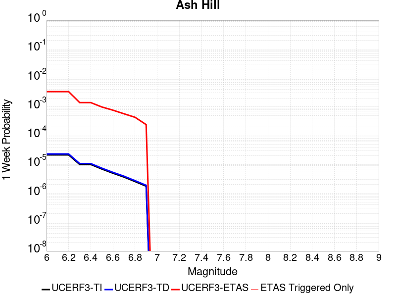 |  | 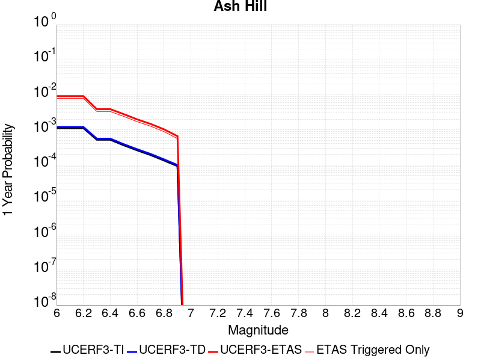 | 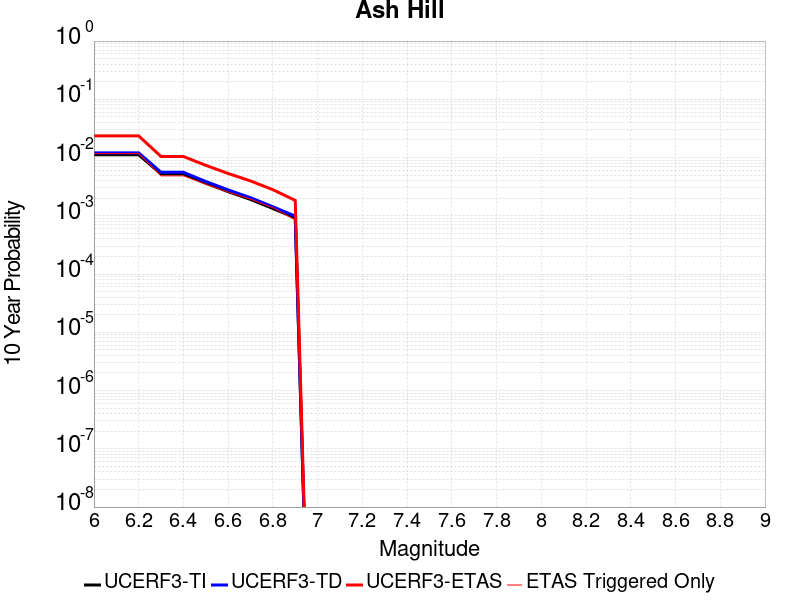 |

| Magnitude | 1 wk TI Prob | 1 wk TD Prob | 1 wk ETAS Prob | 1 wk ETAS/TD Gain | 1 wk ETAS Triggered Only | 1 mo TI Prob | 1 mo TD Prob | 1 mo ETAS Prob | 1 mo ETAS/TD Gain | 1 mo ETAS Triggered Only | 1 yr TI Prob | 1 yr TD Prob | 1 yr ETAS Prob | 1 yr ETAS/TD Gain | 1 yr ETAS Triggered Only | 10 yr TI Prob | 10 yr TD Prob | 10 yr ETAS Prob | 10 yr ETAS/TD Gain | 10 yr ETAS Triggered Only |
|-----|-----|-----|-----|-----|-----|-----|-----|-----|-----|-----|-----|-----|-----|-----|-----|-----|-----|-----|-----|-----|
| 6.0 | 2.1545662E-5 | 2.3194447E-5 | 0.0033631169 | 144.99664 | 0.00334 | 9.2335285E-5 | 9.940143E-5 | 0.0050189123 | 50.49135 | 0.00492 | 0.0011236023 | 0.0012096206 | 0.009159992 | 7.572616 | 0.00796 | 0.011179381 | 0.012038348 | 0.023567861 | 1.9577321 | 0.01167 |
| 6.1 | 2.1545662E-5 | 2.3194447E-5 | 0.0033631169 | 144.99664 | 0.00334 | 9.2335285E-5 | 9.940143E-5 | 0.0050189123 | 50.49135 | 0.00492 | 0.0011236023 | 0.0012096206 | 0.009159992 | 7.572616 | 0.00796 | 0.011179381 | 0.012038348 | 0.023567861 | 1.9577321 | 0.01167 |
| 6.2 | 2.1545662E-5 | 2.3194447E-5 | 0.0033631169 | 144.99664 | 0.00334 | 9.2335285E-5 | 9.940143E-5 | 0.0050189123 | 50.49135 | 0.00492 | 0.0011236023 | 0.0012096206 | 0.009159992 | 7.572616 | 0.00796 | 0.011179381 | 0.012038348 | 0.023567861 | 1.9577321 | 0.01167 |
| 6.3 | 1.0025529E-5 | 1.0746934E-5 | 0.001400732 | 130.33781 | 0.00139 | 4.2965847E-5 | 4.605755E-5 | 0.0021159623 | 45.9417 | 0.00207 | 5.229836E-4 | 5.6061964E-4 | 0.0038987473 | 6.9543533 | 0.00334 | 0.005217545 | 0.0055933665 | 0.010426182 | 1.8640264 | 0.00486 |
| 6.4 | 1.0025529E-5 | 1.0746934E-5 | 0.001400732 | 130.33781 | 0.00139 | 4.2965847E-5 | 4.605755E-5 | 0.0021159623 | 45.9417 | 0.00207 | 5.229836E-4 | 5.6061964E-4 | 0.0038987473 | 6.9543533 | 0.00334 | 0.005217545 | 0.0055933665 | 0.010426182 | 1.8640264 | 0.00486 |
| 6.5 | 6.9617327E-6 | 7.456634E-6 | 9.874493E-4 | 132.42561 | 9.8E-4 | 2.9835655E-5 | 3.195666E-5 | 0.0015619078 | 48.875813 | 0.00153 | 3.6318856E-4 | 3.8901155E-4 | 0.00280807 | 7.218475 | 0.00242 | 0.0036259557 | 0.0038841602 | 0.0073606046 | 1.8950311 | 0.00349 |
| 6.6 | 4.9919777E-6 | 5.3466883E-6 | 7.653426E-4 | 143.14331 | 7.6E-4 | 2.1394015E-5 | 2.2914215E-5 | 0.0011628881 | 50.749638 | 0.00114 | 2.60441E-4 | 2.7895154E-4 | 0.0019884745 | 7.1283865 | 0.00171 | 0.0026013597 | 0.0027866727 | 0.0053295665 | 1.9125198 | 0.00255 |
| 6.7 | 3.6630722E-6 | 3.924624E-6 | 5.739224E-4 | 146.23628 | 5.7E-4 | 1.5698786E-5 | 1.681974E-5 | 8.568056E-4 | 50.94048 | 8.4E-4 | 1.9111596E-4 | 2.0476682E-4 | 0.0014745068 | 7.2009068 | 0.00127 | 0.0019095168 | 0.0020463446 | 0.003972395 | 1.9412152 | 0.00193 |
| 6.8 | 2.5599613E-6 | 2.744925E-6 | 4.3274375E-4 | 157.6523 | 4.3E-4 | 1.0971216E-5 | 1.1763939E-5 | 6.217568E-4 | 52.852768 | 6.1E-4 | 1.3356637E-4 | 1.4322149E-4 | 0.001033094 | 7.213261 | 8.9E-4 | 0.0013348613 | 0.0014317769 | 0.0028098011 | 1.9624573 | 0.00138 |
| 6.9 | 1.7684905E-6 | 1.8968707E-6 | 2.4189641E-4 | 127.52393 | 2.4E-4 | 7.579223E-6 | 8.129446E-6 | 3.7812642E-4 | 46.513187 | 3.7E-4 | 9.2273134E-5 | 9.8976E-5 | 6.5892056E-4 | 6.6573772 | 5.6E-4 | 9.223483E-4 | 9.8976E-4 | 0.0018389188 | 1.857944 | 8.5E-4 |

## Blackwater
*[(top)](#table-of-contents)*

| 1 Week | 1 Month | 1 Year | 10 Year |
|-----|-----|-----|-----|
|  | 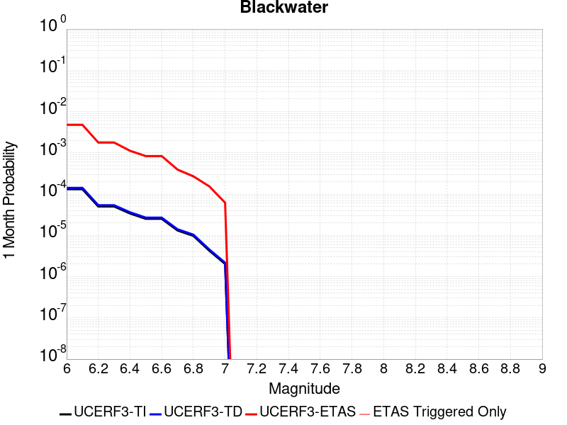 |  | 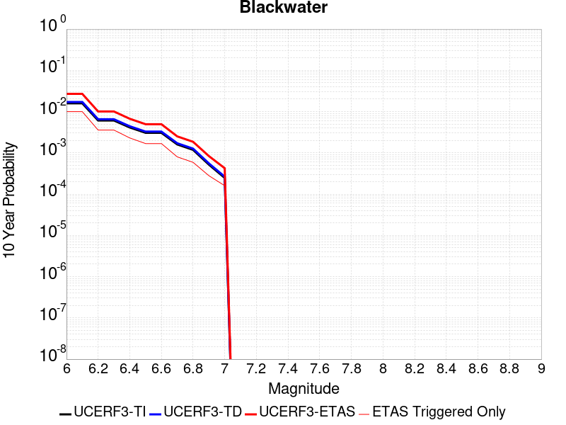 |

| Magnitude | 1 wk TI Prob | 1 wk TD Prob | 1 wk ETAS Prob | 1 wk ETAS/TD Gain | 1 wk ETAS Triggered Only | 1 mo TI Prob | 1 mo TD Prob | 1 mo ETAS Prob | 1 mo ETAS/TD Gain | 1 mo ETAS Triggered Only | 1 yr TI Prob | 1 yr TD Prob | 1 yr ETAS Prob | 1 yr ETAS/TD Gain | 1 yr ETAS Triggered Only | 10 yr TI Prob | 10 yr TD Prob | 10 yr ETAS Prob | 10 yr ETAS/TD Gain | 10 yr ETAS Triggered Only |
|-----|-----|-----|-----|-----|-----|-----|-----|-----|-----|-----|-----|-----|-----|-----|-----|-----|-----|-----|-----|-----|
| 6.0 | 3.0708583E-5 | 3.3095846E-5 | 0.0033929846 | 102.51995 | 0.00336 | 1.3160157E-4 | 1.4183241E-4 | 0.0047911727 | 33.78052 | 0.00465 | 0.0016010714 | 0.0017255784 | 0.008813327 | 5.1074624 | 0.0071 | 0.015895851 | 0.017135633 | 0.026944619 | 1.572432 | 0.00998 |
| 6.1 | 3.0708583E-5 | 3.3095846E-5 | 0.0033929846 | 102.51995 | 0.00336 | 1.3160157E-4 | 1.4183241E-4 | 0.0047911727 | 33.78052 | 0.00465 | 0.0016010714 | 0.0017255784 | 0.008813327 | 5.1074624 | 0.0071 | 0.015895851 | 0.017135633 | 0.026944619 | 1.572432 | 0.00998 |
| 6.2 | 1.1707779E-5 | 1.2545122E-5 | 0.0012225299 | 97.45062 | 0.00121 | 5.017523E-5 | 5.3763757E-5 | 0.0017836707 | 33.176083 | 0.00173 | 6.107122E-4 | 6.5438676E-4 | 0.0033026526 | 5.046943 | 0.00265 | 0.006090366 | 0.0065255696 | 0.010072273 | 1.5435086 | 0.00357 |
| 6.3 | 1.1707779E-5 | 1.2545122E-5 | 0.0012225299 | 97.45062 | 0.00121 | 5.017523E-5 | 5.3763757E-5 | 0.0017836707 | 33.176083 | 0.00173 | 6.107122E-4 | 6.5438676E-4 | 0.0033026526 | 5.046943 | 0.00265 | 0.006090366 | 0.0065255696 | 0.010072273 | 1.5435086 | 0.00357 |
| 6.4 | 7.929244E-6 | 8.480098E-6 | 7.5847376E-4 | 89.44163 | 7.5E-4 | 3.3982033E-5 | 3.6342793E-5 | 0.0011263032 | 30.9911 | 0.00109 | 4.136527E-4 | 4.423877E-4 | 0.0021516313 | 4.8636775 | 0.00171 | 0.0041288356 | 0.0044154758 | 0.0067053204 | 1.5185951 | 0.0023 |
| 6.5 | 5.8832115E-6 | 6.285991E-6 | 5.462826E-4 | 86.90477 | 5.4E-4 | 2.521352E-5 | 2.6939697E-5 | 8.369179E-4 | 31.066343 | 8.1E-4 | 3.0693135E-4 | 3.27944E-4 | 0.0016075242 | 4.9018254 | 0.00128 | 0.0030650778 | 0.0032748538 | 0.0049493522 | 1.51132 | 0.00168 |
| 6.6 | 5.8832115E-6 | 6.285991E-6 | 5.462826E-4 | 86.90477 | 5.4E-4 | 2.521352E-5 | 2.6939697E-5 | 8.369179E-4 | 31.066343 | 8.1E-4 | 3.0693135E-4 | 3.27944E-4 | 0.0016075242 | 4.9018254 | 0.00128 | 0.0030650778 | 0.0032748538 | 0.0049493522 | 1.51132 | 0.00168 |
| 6.7 | 3.0715053E-6 | 3.2814662E-6 | 2.8328053E-4 | 86.32743 | 2.8E-4 | 1.3163528E-5 | 1.4063357E-5 | 3.94058E-4 | 28.020195 | 3.8E-4 | 1.6025416E-4 | 1.7120909E-4 | 7.511098E-4 | 4.3870907 | 5.8E-4 | 0.0016013865 | 0.0017108864 | 0.0025095176 | 1.4667939 | 8.0E-4 |
| 6.8 | 2.2722281E-6 | 2.4287538E-6 | 1.924283E-4 | 79.22923 | 1.9E-4 | 9.738084E-6 | 1.0408908E-5 | 2.704062E-4 | 25.978346 | 2.6E-4 | 1.1855473E-4 | 1.26722E-4 | 5.3667004E-4 | 4.2350187 | 4.1E-4 | 0.001184915 | 0.0012665876 | 0.0018558403 | 1.4652286 | 5.9E-4 |
| 6.9 | 9.952399E-7 | 1.0653489E-6 | 1.2106522E-4 | 113.63904 | 1.2E-4 | 4.265307E-6 | 4.5657757E-6 | 1.5456509E-4 | 33.852974 | 1.5E-4 | 5.1928873E-5 | 5.5587418E-5 | 2.6557574E-4 | 4.777623 | 2.1E-4 | 5.191674E-4 | 5.557858E-4 | 8.356301E-4 | 1.5035113 | 2.8E-4 |
| 7.0 | 4.7385504E-7 | 5.0755597E-7 | 4.0507537E-5 | 79.809006 | 4.0E-5 | 2.0308057E-6 | 2.1752398E-6 | 6.217511E-5 | 28.583107 | 6.0E-5 | 2.4724779E-5 | 2.6483543E-5 | 1.264809E-4 | 4.77583 | 1.0E-4 | 2.4722028E-4 | 2.6483543E-4 | 4.2479308E-4 | 1.6039888 | 1.6E-4 |

## Hunter Mountain-Saline Valley
*[(top)](#table-of-contents)*

| 1 Week | 1 Month | 1 Year | 10 Year |
|-----|-----|-----|-----|
| 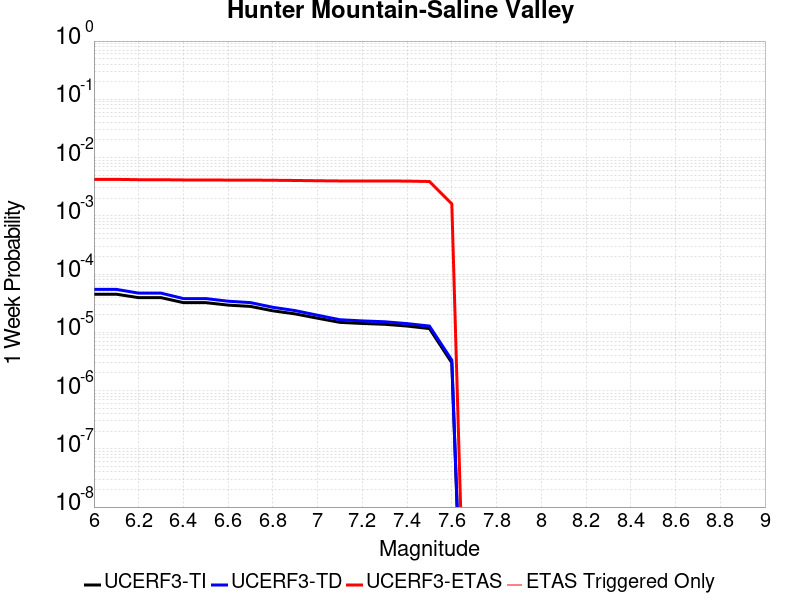 | 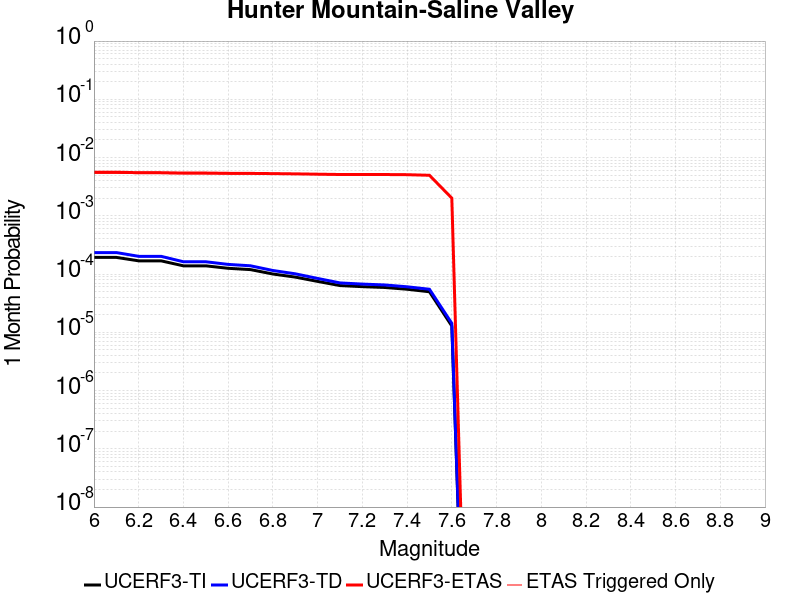 |  |  |

| Magnitude | 1 wk TI Prob | 1 wk TD Prob | 1 wk ETAS Prob | 1 wk ETAS/TD Gain | 1 wk ETAS Triggered Only | 1 mo TI Prob | 1 mo TD Prob | 1 mo ETAS Prob | 1 mo ETAS/TD Gain | 1 mo ETAS Triggered Only | 1 yr TI Prob | 1 yr TD Prob | 1 yr ETAS Prob | 1 yr ETAS/TD Gain | 1 yr ETAS Triggered Only | 10 yr TI Prob | 10 yr TD Prob | 10 yr ETAS Prob | 10 yr ETAS/TD Gain | 10 yr ETAS Triggered Only |
|-----|-----|-----|-----|-----|-----|-----|-----|-----|-----|-----|-----|-----|-----|-----|-----|-----|-----|-----|-----|-----|
| 6.0 | 4.5103672E-5 | 5.456906E-5 | 0.0042243414 | 77.41276 | 0.00417 | 1.9328714E-4 | 2.3384714E-4 | 0.005602591 | 23.95835 | 0.00537 | 0.002350731 | 0.0028435462 | 0.010461821 | 3.679146 | 0.00764 | 0.023260195 | 0.028092625 | 0.037724227 | 1.3428516 | 0.00991 |
| 6.1 | 4.5103672E-5 | 5.456906E-5 | 0.0042243414 | 77.41276 | 0.00417 | 1.9328714E-4 | 2.3384714E-4 | 0.005602591 | 23.95835 | 0.00537 | 0.002350731 | 0.0028435462 | 0.010461821 | 3.679146 | 0.00764 | 0.023260195 | 0.028092625 | 0.037724227 | 1.3428516 | 0.00991 |
| 6.2 | 3.9363465E-5 | 4.706271E-5 | 0.004166869 | 88.53865 | 0.00412 | 1.6868966E-4 | 2.016826E-4 | 0.0055006137 | 27.273615 | 0.0053 | 0.002051862 | 0.0024528534 | 0.009984334 | 4.070498 | 0.00755 | 0.020330196 | 0.024274187 | 0.033846058 | 1.394323 | 0.00981 |
| 6.3 | 3.9363465E-5 | 4.706271E-5 | 0.004166869 | 88.53865 | 0.00412 | 1.6868966E-4 | 2.016826E-4 | 0.0055006137 | 27.273615 | 0.0053 | 0.002051862 | 0.0024528534 | 0.009984334 | 4.070498 | 0.00755 | 0.020330196 | 0.024274187 | 0.033846058 | 1.394323 | 0.00981 |
| 6.4 | 3.2311684E-5 | 3.795112E-5 | 0.004127796 | 108.76612 | 0.00409 | 1.384713E-4 | 1.6263791E-4 | 0.0054217824 | 33.33652 | 0.00526 | 0.0016845843 | 0.001978387 | 0.009453569 | 4.7784224 | 0.00749 | 0.016718714 | 0.019617118 | 0.029136637 | 1.4852659 | 0.00971 |
| 6.5 | 3.2311684E-5 | 3.795112E-5 | 0.004127796 | 108.76612 | 0.00409 | 1.384713E-4 | 1.6263791E-4 | 0.0054217824 | 33.33652 | 0.00526 | 0.0016845843 | 0.001978387 | 0.009453569 | 4.7784224 | 0.00749 | 0.016718714 | 0.019617118 | 0.029136637 | 1.4852659 | 0.00971 |
| 6.6 | 2.9305844E-5 | 3.418196E-5 | 0.004104043 | 120.064575 | 0.00407 | 1.2559042E-4 | 1.4648624E-4 | 0.0053657214 | 36.629524 | 0.00522 | 0.0015279909 | 0.0017820727 | 0.009198831 | 5.1618724 | 0.00743 | 0.015175272 | 0.017686324 | 0.027146004 | 1.5348585 | 0.00963 |
| 6.7 | 2.7826512E-5 | 3.2344353E-5 | 0.004102213 | 126.82933 | 0.00407 | 1.19251024E-4 | 1.3861163E-4 | 0.0053478894 | 38.58182 | 0.00521 | 0.0014509142 | 0.0016863506 | 0.009093838 | 5.3926144 | 0.00742 | 0.014414776 | 0.016743818 | 0.026192911 | 1.5643332 | 0.00961 |
| 6.8 | 2.3389874E-5 | 2.6866792E-5 | 0.004076758 | 151.73967 | 0.00405 | 1.0023846E-4 | 1.1513857E-4 | 0.005304541 | 46.070927 | 0.00519 | 0.00121972 | 0.001400958 | 0.008770619 | 6.2604437 | 0.00738 | 0.01213047 | 0.013928067 | 0.023325332 | 1.6746999 | 0.00953 |
| 6.9 | 2.069209E-5 | 2.357011E-5 | 0.0040434753 | 171.55098 | 0.00402 | 8.867737E-5 | 1.0101105E-4 | 0.0052504907 | 51.979374 | 0.00515 | 0.0010791123 | 0.0012291519 | 0.008560129 | 6.9642577 | 0.00734 | 0.010738871 | 0.012229158 | 0.021603102 | 1.7665242 | 0.00949 |
| 7.0 | 1.7462342E-5 | 1.9633622E-5 | 0.0039995555 | 203.7095 | 0.00398 | 7.483646E-5 | 8.414151E-5 | 0.0051837126 | 61.607075 | 0.0051 | 9.1075303E-4 | 0.0010239641 | 0.008296509 | 8.1023445 | 0.00728 | 0.009070295 | 0.010196688 | 0.019510737 | 1.9134387 | 0.00941 |
| 7.1 | 1.4807709E-5 | 1.6441827E-5 | 0.0039663767 | 241.237 | 0.00395 | 6.3460066E-5 | 7.046316E-5 | 0.0051201074 | 72.663605 | 0.00505 | 7.723524E-4 | 8.575678E-4 | 0.008041402 | 9.3769865 | 0.00719 | 0.007696735 | 0.008546168 | 0.017756773 | 2.0777469 | 0.00929 |
| 7.2 | 1.4180048E-5 | 1.5698413E-5 | 0.0039656362 | 252.61383 | 0.00395 | 6.077022E-5 | 6.727727E-5 | 0.0051169377 | 76.05745 | 0.00505 | 7.396263E-4 | 8.1880915E-4 | 0.00799293 | 9.761652 | 0.00718 | 0.0073716943 | 0.008161469 | 0.017355813 | 2.126555 | 0.00927 |
| 7.3 | 1.3730402E-5 | 1.5172151E-5 | 0.0039651124 | 261.3415 | 0.00395 | 5.8843252E-5 | 6.502197E-5 | 0.0051146937 | 78.661 | 0.00505 | 7.161811E-4 | 7.9137104E-4 | 0.007965689 | 10.065681 | 0.00718 | 0.007138774 | 0.007889058 | 0.017085927 | 2.1657753 | 0.00927 |
| 7.4 | 1.2810095E-5 | 1.4109353E-5 | 0.003944054 | 279.5347 | 0.00393 | 5.489925E-5 | 6.0467344E-5 | 0.005080164 | 84.015 | 0.00502 | 6.681934E-4 | 7.3595706E-4 | 0.007870702 | 10.694513 | 0.00714 | 0.006661878 | 0.0073386896 | 0.0164811 | 2.2457824 | 0.00921 |
| 7.5 | 1.1595659E-5 | 1.2800734E-5 | 0.003882751 | 303.32254 | 0.00387 | 4.9694736E-5 | 5.485922E-5 | 0.00496459 | 90.4969 | 0.00491 | 6.0486543E-4 | 6.67722E-4 | 0.007603088 | 11.386607 | 0.00694 | 0.006032217 | 0.006660632 | 0.015521219 | 2.3302922 | 0.00892 |
| 7.6 | 2.997694E-6 | 3.3251877E-6 | 0.0016033199 | 482.17426 | 0.0016 | 1.28471975E-5 | 1.4250767E-5 | 0.0020142223 | 141.34132 | 0.002 | 1.564034E-4 | 1.7349655E-4 | 0.0029630126 | 17.07822 | 0.00279 | 0.0015629337 | 0.0017356955 | 0.00518969 | 2.9899771 | 0.00346 |

## Gravel Hills-Harper Lk
*[(top)](#table-of-contents)*

| 1 Week | 1 Month | 1 Year | 10 Year |
|-----|-----|-----|-----|
| 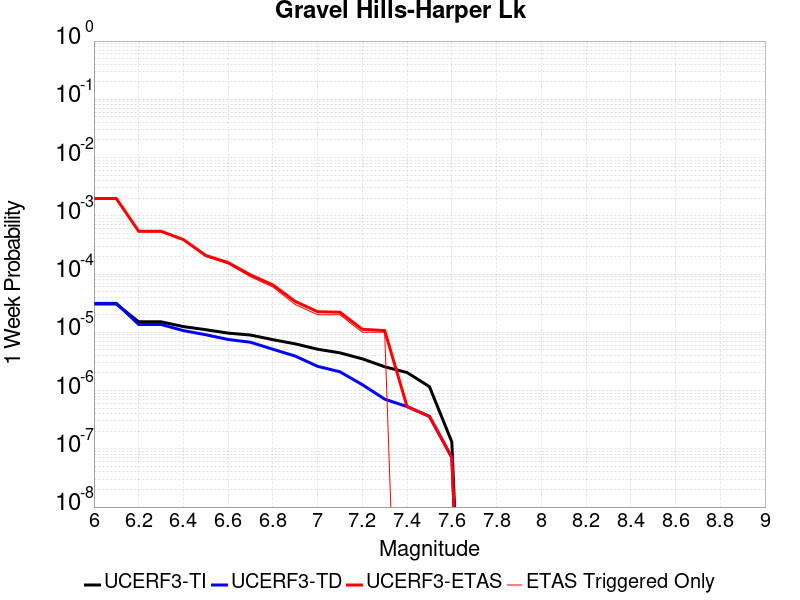 |  |  | 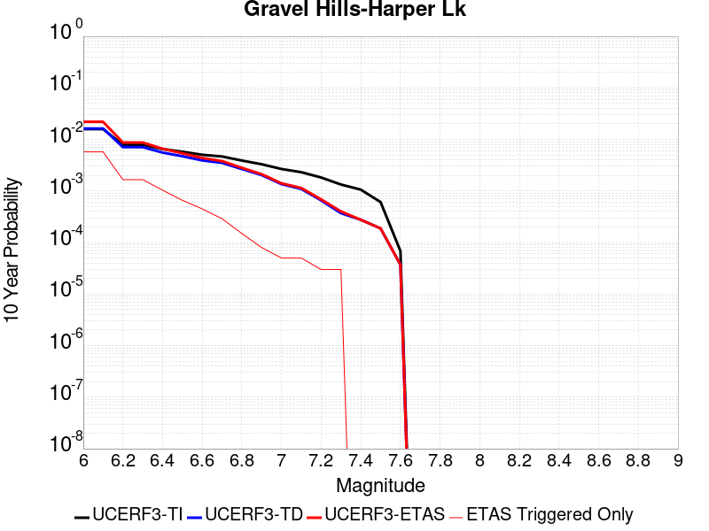 |

| Magnitude | 1 wk TI Prob | 1 wk TD Prob | 1 wk ETAS Prob | 1 wk ETAS/TD Gain | 1 wk ETAS Triggered Only | 1 mo TI Prob | 1 mo TD Prob | 1 mo ETAS Prob | 1 mo ETAS/TD Gain | 1 mo ETAS Triggered Only | 1 yr TI Prob | 1 yr TD Prob | 1 yr ETAS Prob | 1 yr ETAS/TD Gain | 1 yr ETAS Triggered Only | 10 yr TI Prob | 10 yr TD Prob | 10 yr ETAS Prob | 10 yr ETAS/TD Gain | 10 yr ETAS Triggered Only |
|-----|-----|-----|-----|-----|-----|-----|-----|-----|-----|-----|-----|-----|-----|-----|-----|-----|-----|-----|-----|-----|
| 6.0 | 3.0679566E-5 | 3.1464628E-5 | 0.0019814032 | 62.97241 | 0.00195 | 1.3147724E-4 | 1.3484266E-4 | 0.0027244934 | 20.204983 | 0.00259 | 0.0015995599 | 0.00164069 | 0.005694029 | 3.4705086 | 0.00406 | 0.015880952 | 0.016307337 | 0.021953734 | 1.3462487 | 0.00574 |
| 6.1 | 3.0679566E-5 | 3.1464628E-5 | 0.0019814032 | 62.97241 | 0.00195 | 1.3147724E-4 | 1.3484266E-4 | 0.0027244934 | 20.204983 | 0.00259 | 0.0015995599 | 0.00164069 | 0.005694029 | 3.4705086 | 0.00406 | 0.015880952 | 0.016307337 | 0.021953734 | 1.3462487 | 0.00574 |
| 6.2 | 1.514536E-5 | 1.36352E-5 | 5.4362795E-4 | 39.869453 | 5.3E-4 | 6.490707E-5 | 5.843533E-5 | 7.883927E-4 | 13.491713 | 7.3E-4 | 7.8995706E-4 | 7.112298E-4 | 0.0019103764 | 2.6860185 | 0.0012 | 0.007871548 | 0.007090737 | 0.008738967 | 1.2324482 | 0.00166 |
| 6.3 | 1.514536E-5 | 1.36352E-5 | 5.4362795E-4 | 39.869453 | 5.3E-4 | 6.490707E-5 | 5.843533E-5 | 7.883927E-4 | 13.491713 | 7.3E-4 | 7.8995706E-4 | 7.112298E-4 | 0.0019103764 | 2.6860185 | 0.0012 | 0.007871548 | 0.007090737 | 0.008738967 | 1.2324482 | 0.00166 |
| 6.4 | 1.2532521E-5 | 1.0689684E-5 | 3.9068563E-4 | 36.547913 | 3.8E-4 | 5.37097E-5 | 4.581216E-5 | 5.357897E-4 | 11.69536 | 4.9E-4 | 6.537194E-4 | 5.5762613E-4 | 0.0013371912 | 2.3980067 | 7.8E-4 | 0.0065179965 | 0.005562859 | 0.0065970737 | 1.1859142 | 0.00104 |
| 6.5 | 1.1094058E-5 | 9.083657E-6 | 2.0908185E-4 | 23.017365 | 2.0E-4 | 4.7545094E-5 | 3.89294E-5 | 3.189185E-4 | 8.192227 | 2.8E-4 | 5.787078E-4 | 4.7386638E-4 | 9.3364844E-4 | 1.9702778 | 4.6E-4 | 0.0057720304 | 0.004728967 | 0.005385846 | 1.1389054 | 6.6E-4 |
| 6.6 | 9.688328E-6 | 7.531688E-6 | 1.5753057E-4 | 20.915703 | 1.5E-4 | 4.1520743E-5 | 3.227828E-5 | 2.2227215E-4 | 6.8861213 | 1.9E-4 | 5.053978E-4 | 3.9291973E-4 | 6.828058E-4 | 1.7377743 | 2.9E-4 | 0.0050424994 | 0.0039225067 | 0.004370742 | 1.1142726 | 4.5E-4 |
| 6.7 | 8.974824E-6 | 6.749406E-6 | 9.67488E-5 | 14.334416 | 9.0E-5 | 3.8462964E-5 | 2.8925719E-5 | 1.4892225E-4 | 5.1484375 | 1.2E-4 | 4.6818596E-4 | 3.5211592E-4 | 5.520455E-4 | 1.5677948 | 2.0E-4 | 0.004672008 | 0.003515801 | 0.0038047812 | 1.0821948 | 2.9E-4 |
| 6.8 | 7.4780046E-6 | 5.1161865E-6 | 6.511588E-5 | 12.727426 | 6.0E-5 | 3.20482E-5 | 2.1926337E-5 | 8.192502E-5 | 3.7363753 | 6.0E-5 | 3.9011694E-4 | 2.6692182E-4 | 3.7689248E-4 | 1.4119956 | 1.1E-4 | 0.0038943281 | 0.0026661505 | 0.0028157507 | 1.0561109 | 1.5E-4 |
| 6.9 | 6.3409307E-6 | 3.907489E-6 | 3.390737E-5 | 8.677535 | 3.0E-5 | 2.7175134E-5 | 1.674628E-5 | 4.6745776E-5 | 2.7914126 | 3.0E-5 | 3.3080703E-4 | 2.0386786E-4 | 2.738536E-4 | 1.3432896 | 7.0E-5 | 0.0033031502 | 0.0020369065 | 0.0021167437 | 1.0391953 | 8.0E-5 |
| 7.0 | 5.1239335E-6 | 2.6058492E-6 | 2.2605796E-5 | 8.675021 | 2.0E-5 | 2.195953E-5 | 1.1167879E-5 | 3.1167656E-5 | 2.7908304 | 2.0E-5 | 2.6732447E-4 | 1.359607E-4 | 1.7595525E-4 | 1.2941626 | 4.0E-5 | 0.0026700313 | 0.0013588005 | 0.0014087325 | 1.0367472 | 5.0E-5 |
| 7.1 | 4.438899E-6 | 2.0984692E-6 | 2.2098428E-5 | 10.530737 | 2.0E-5 | 1.9023713E-5 | 8.99341E-6 | 2.899323E-5 | 3.2238305 | 2.0E-5 | 2.315891E-4 | 1.0948948E-4 | 1.494851E-4 | 1.3652918 | 4.0E-5 | 0.002313479 | 0.0010943774 | 0.0011443226 | 1.0456381 | 5.0E-5 |
| 7.2 | 3.50367E-6 | 1.2615715E-6 | 1.1261559E-5 | 8.926612 | 1.0E-5 | 1.5015643E-5 | 5.406724E-6 | 1.540667E-5 | 2.8495388 | 1.0E-5 | 1.8280011E-4 | 6.5824956E-5 | 9.582299E-5 | 1.4557241 | 3.0E-5 | 0.0018264982 | 6.580628E-4 | 6.880431E-4 | 1.0455583 | 3.0E-5 |
| 7.3 | 2.561638E-6 | 7.118686E-7 | 1.0711861E-5 | 15.047526 | 1.0E-5 | 1.0978401E-5 | 3.050862E-6 | 1.30508315E-5 | 4.2777524 | 1.0E-5 | 1.3365384E-4 | 3.7143633E-5 | 6.7142515E-5 | 1.8076454 | 3.0E-5 | 0.0013357349 | 3.7137623E-4 | 4.0136508E-4 | 1.0807506 | 3.0E-5 |
| 7.4 | 2.0368864E-6 | 5.304471E-7 | 5.304471E-7 | 1.0 | 0.0 | 8.729483E-6 | 2.2733427E-6 | 2.2733427E-6 | 1.0 | 0.0 | 1.06276275E-4 | 2.76776E-5 | 2.76776E-5 | 1.0 | 0.0 | 0.0010622547 | 2.767421E-4 | 2.767421E-4 | 1.0 | 0.0 |
| 7.5 | 1.1681728E-6 | 3.6028484E-7 | 3.6028484E-7 | 1.0 | 0.0 | 5.0064455E-6 | 1.544077E-6 | 1.544077E-6 | 1.0 | 0.0 | 6.0951766E-5 | 1.879898E-5 | 1.879898E-5 | 1.0 | 0.0 | 6.093505E-4 | 1.8797436E-4 | 1.8797436E-4 | 1.0 | 0.0 |
| 7.6 | 1.3154387E-7 | 7.1196716E-8 | 7.1196716E-8 | 1.0 | 0.0 | 5.6375933E-7 | 3.0512876E-7 | 3.0512876E-7 | 1.0 | 0.0 | 6.863748E-6 | 3.714938E-6 | 3.714938E-6 | 1.0 | 0.0 | 6.863536E-5 | 3.7148915E-5 | 3.7148915E-5 | 1.0 | 0.0 |

## McLean Lake
*[(top)](#table-of-contents)*

| 1 Week | 1 Month | 1 Year | 10 Year |
|-----|-----|-----|-----|
|  | 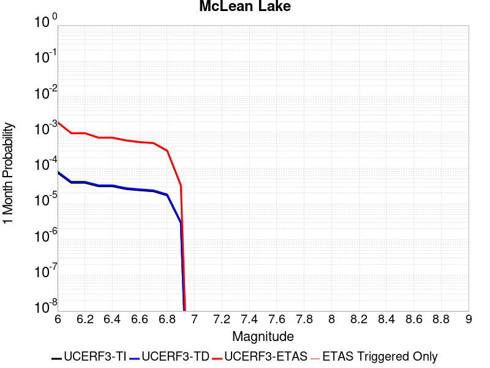 |  |  |

| Magnitude | 1 wk TI Prob | 1 wk TD Prob | 1 wk ETAS Prob | 1 wk ETAS/TD Gain | 1 wk ETAS Triggered Only | 1 mo TI Prob | 1 mo TD Prob | 1 mo ETAS Prob | 1 mo ETAS/TD Gain | 1 mo ETAS Triggered Only | 1 yr TI Prob | 1 yr TD Prob | 1 yr ETAS Prob | 1 yr ETAS/TD Gain | 1 yr ETAS Triggered Only | 10 yr TI Prob | 10 yr TD Prob | 10 yr ETAS Prob | 10 yr ETAS/TD Gain | 10 yr ETAS Triggered Only |
|-----|-----|-----|-----|-----|-----|-----|-----|-----|-----|-----|-----|-----|-----|-----|-----|-----|-----|-----|-----|-----|
| 6.0 | 1.7360222E-5 | 1.8501627E-5 | 0.0012884781 | 69.64134 | 0.00127 | 7.439883E-5 | 7.9290556E-5 | 0.0019191446 | 24.20395 | 0.00184 | 9.0542925E-4 | 9.6498354E-4 | 0.0041918666 | 4.3439775 | 0.00323 | 0.009017491 | 0.0096127745 | 0.014950962 | 1.5553222 | 0.00539 |
| 6.1 | 9.062689E-6 | 9.592193E-6 | 6.5958593E-4 | 68.76279 | 6.5E-4 | 3.8839516E-5 | 4.1108804E-5 | 9.510714E-4 | 23.135468 | 9.1E-4 | 4.727685E-4 | 5.003936E-4 | 0.002149568 | 4.295754 | 0.00165 | 0.0047176396 | 0.004993552 | 0.0077099195 | 1.5439751 | 0.00273 |
| 6.2 | 9.062689E-6 | 9.592193E-6 | 6.5958593E-4 | 68.76279 | 6.5E-4 | 3.8839516E-5 | 4.1108804E-5 | 9.510714E-4 | 23.135468 | 9.1E-4 | 4.727685E-4 | 5.003936E-4 | 0.002149568 | 4.295754 | 0.00165 | 0.0047176396 | 0.004993552 | 0.0077099195 | 1.5439751 | 0.00273 |
| 6.3 | 7.2575485E-6 | 7.66771E-6 | 5.076639E-4 | 66.20802 | 5.0E-4 | 3.110341E-5 | 3.2861237E-5 | 7.128389E-4 | 21.692394 | 6.8E-4 | 3.786182E-4 | 4.0001926E-4 | 0.0016095352 | 4.0236444 | 0.00121 | 0.0037797375 | 0.0039936965 | 0.00608531 | 1.5237286 | 0.0021 |
| 6.4 | 7.2575485E-6 | 7.66771E-6 | 5.076639E-4 | 66.20802 | 5.0E-4 | 3.110341E-5 | 3.2861237E-5 | 7.128389E-4 | 21.692394 | 6.8E-4 | 3.786182E-4 | 4.0001926E-4 | 0.0016095352 | 4.0236444 | 0.00121 | 0.0037797375 | 0.0039936965 | 0.00608531 | 1.5237286 | 0.0021 |
| 6.5 | 6.06582E-6 | 6.4038773E-6 | 4.2640118E-4 | 66.58485 | 4.2E-4 | 2.5996113E-5 | 2.7444936E-5 | 5.974293E-4 | 21.76829 | 5.7E-4 | 3.164567E-4 | 3.3409733E-4 | 0.0012937766 | 3.8724542 | 9.6E-4 | 0.0031600643 | 0.0033365893 | 0.00505085 | 1.5137765 | 0.00172 |
| 6.6 | 5.598744E-6 | 5.910262E-6 | 3.85908E-4 | 65.29457 | 3.8E-4 | 2.3994397E-5 | 2.5329486E-5 | 5.353166E-4 | 21.134127 | 5.1E-4 | 2.9209262E-4 | 3.0834923E-4 | 0.001178081 | 3.820606 | 8.7E-4 | 0.0029170897 | 0.003079843 | 0.0046051308 | 1.4952486 | 0.00153 |
| 6.7 | 5.246996E-6 | 5.539162E-6 | 3.6553715E-4 | 65.99142 | 3.6E-4 | 2.2486933E-5 | 2.3739085E-5 | 5.037277E-4 | 21.219337 | 4.8E-4 | 2.73744E-4 | 2.8899137E-4 | 0.0011187515 | 3.871228 | 8.3E-4 | 0.0027340704 | 0.0028867796 | 0.0043325936 | 1.5008398 | 0.00145 |
| 6.8 | 4.02324E-6 | 4.2469046E-6 | 1.942461E-4 | 45.738277 | 1.9E-4 | 1.7242342E-5 | 1.8200926E-5 | 3.0819565E-4 | 16.932966 | 2.9E-4 | 2.099053E-4 | 2.2157968E-4 | 7.6146005E-4 | 3.4365065 | 5.4E-4 | 0.0020970714 | 0.002214172 | 0.0032418913 | 1.4641552 | 0.00103 |
| 6.9 | 6.835972E-7 | 7.1399285E-7 | 3.071397E-5 | 43.0172 | 3.0E-5 | 2.9296991E-6 | 3.0599674E-6 | 3.3059874E-5 | 10.803996 | 3.0E-5 | 3.56685E-5 | 3.7254784E-5 | 1.3725106E-4 | 3.684119 | 1.0E-4 | 3.5662777E-4 | 3.7251666E-4 | 5.424533E-4 | 1.4561855 | 1.7E-4 |

## Garlock (West)
*[(top)](#table-of-contents)*

| 1 Week | 1 Month | 1 Year | 10 Year |
|-----|-----|-----|-----|
|  | 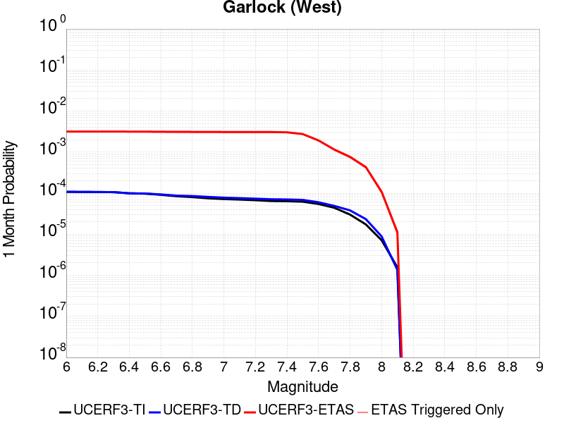 |  | 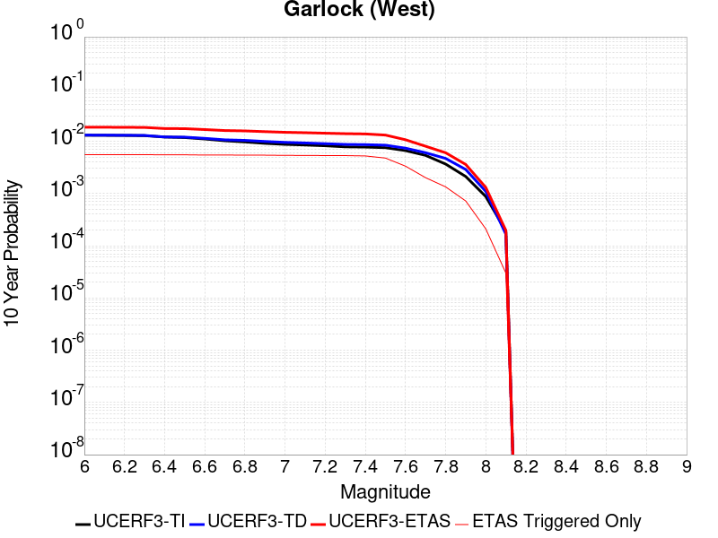 |

| Magnitude | 1 wk TI Prob | 1 wk TD Prob | 1 wk ETAS Prob | 1 wk ETAS/TD Gain | 1 wk ETAS Triggered Only | 1 mo TI Prob | 1 mo TD Prob | 1 mo ETAS Prob | 1 mo ETAS/TD Gain | 1 mo ETAS Triggered Only | 1 yr TI Prob | 1 yr TD Prob | 1 yr ETAS Prob | 1 yr ETAS/TD Gain | 1 yr ETAS Triggered Only | 10 yr TI Prob | 10 yr TD Prob | 10 yr ETAS Prob | 10 yr ETAS/TD Gain | 10 yr ETAS Triggered Only |
|-----|-----|-----|-----|-----|-----|-----|-----|-----|-----|-----|-----|-----|-----|-----|-----|-----|-----|-----|-----|-----|
| 6.0 | 2.5181727E-5 | 2.5197181E-5 | 0.0024751355 | 98.230644 | 0.00245 | 1.0791722E-4 | 1.0798347E-4 | 0.003177652 | 29.427208 | 0.00307 | 0.0013131002 | 0.0013139093 | 0.005658194 | 4.3063807 | 0.00435 | 0.013053683 | 0.013141793 | 0.018618857 | 1.4167668 | 0.00555 |
| 6.1 | 2.5077732E-5 | 2.5098223E-5 | 0.0024750368 | 98.61402 | 0.00245 | 1.0747157E-4 | 1.075594E-4 | 0.003177229 | 29.539299 | 0.00307 | 0.001307681 | 0.0013087525 | 0.0056530596 | 4.319426 | 0.00435 | 0.013000126 | 0.013090834 | 0.01856818 | 1.4184108 | 0.00555 |
| 6.2 | 2.494612E-5 | 2.4979914E-5 | 0.0024749187 | 99.07635 | 0.00245 | 1.0690756E-4 | 1.070524E-4 | 0.0031767238 | 29.674473 | 0.00307 | 0.0013008224 | 0.0013025872 | 0.0056469208 | 4.335158 | 0.00435 | 0.012932341 | 0.013029905 | 0.018507589 | 1.4203932 | 0.00555 |
| 6.3 | 2.4733758E-5 | 2.4799276E-5 | 0.0024747385 | 99.79076 | 0.00245 | 1.0599751E-4 | 1.06278305E-4 | 0.003175952 | 29.883352 | 0.00307 | 0.0012897556 | 0.0012931736 | 0.0056375484 | 4.3594675 | 0.00435 | 0.012822957 | 0.012936871 | 0.0184052 | 1.4226934 | 0.00554 |
| 6.4 | 2.3237335E-5 | 2.3178607E-5 | 0.0024631221 | 106.26704 | 0.00244 | 9.958477E-5 | 9.933313E-5 | 0.0031590292 | 31.802374 | 0.00306 | 0.0012117702 | 0.0012087126 | 0.005523491 | 4.5697308 | 0.00432 | 0.012051838 | 0.01210173 | 0.01754505 | 1.4497968 | 0.00551 |
| 6.5 | 2.2732203E-5 | 2.2992977E-5 | 0.0024629368 | 107.11692 | 0.00244 | 9.742009E-5 | 9.8537625E-5 | 0.0031582362 | 32.051067 | 0.00306 | 0.0011854442 | 0.0011990381 | 0.005513858 | 4.598568 | 0.00432 | 0.011791403 | 0.012006034 | 0.017449882 | 1.4534259 | 0.00551 |
| 6.6 | 2.1319436E-5 | 2.1773201E-5 | 0.0024517202 | 112.60265 | 0.00243 | 9.136581E-5 | 9.3310395E-5 | 0.0031330267 | 33.576393 | 0.00304 | 0.001111811 | 0.0011354643 | 0.0054106046 | 4.765103 | 0.00428 | 0.011062649 | 0.011376951 | 0.016764946 | 1.4735887 | 0.00545 |
| 6.7 | 1.970802E-5 | 2.0393094E-5 | 0.0024503435 | 120.15555 | 0.00243 | 8.446021E-5 | 8.739606E-5 | 0.0031271304 | 35.781136 | 0.00304 | 0.001027818 | 0.0010635294 | 0.0053389776 | 5.0200567 | 0.00428 | 0.010230771 | 0.010664687 | 0.016056564 | 1.5055823 | 0.00545 |
| 6.8 | 1.8744462E-5 | 1.9900775E-5 | 0.0024398526 | 122.60088 | 0.00242 | 8.033094E-5 | 8.528626E-5 | 0.003115028 | 36.524384 | 0.00303 | 9.775903E-4 | 0.0010378672 | 0.0053034355 | 5.109936 | 0.00427 | 0.009733009 | 0.010410494 | 0.01579386 | 1.5171096 | 0.00544 |
| 6.9 | 1.7559682E-5 | 1.8953151E-5 | 0.0024389073 | 128.68083 | 0.00242 | 7.5253614E-5 | 8.122527E-5 | 0.0031109792 | 38.300632 | 0.00303 | 9.158276E-4 | 9.884704E-4 | 0.0052542496 | 5.3155355 | 0.00427 | 0.0091206245 | 0.009921072 | 0.0152873 | 1.5408919 | 0.00542 |
| 7.0 | 1.6794445E-5 | 1.8215967E-5 | 0.002438172 | 133.84805 | 0.00242 | 7.197421E-5 | 7.806611E-5 | 0.0030978303 | 39.682144 | 0.00302 | 8.759337E-4 | 9.5004175E-4 | 0.0052059945 | 5.4797535 | 0.00426 | 0.008724891 | 0.009539957 | 0.014858727 | 1.5575256 | 0.00537 |
| 7.1 | 1.6337795E-5 | 1.771677E-5 | 0.002437674 | 137.59134 | 0.00242 | 7.0017246E-5 | 7.592681E-5 | 0.0030956976 | 40.77213 | 0.00302 | 8.521265E-4 | 9.2401815E-4 | 0.005180082 | 5.606039 | 0.00426 | 0.008488664 | 0.00928172 | 0.01459197 | 1.5721191 | 0.00536 |
| 7.2 | 1.5780008E-5 | 1.71654E-5 | 0.0024371238 | 141.97887 | 0.00242 | 6.762685E-5 | 7.3563926E-5 | 0.0030933418 | 42.04971 | 0.00302 | 8.2304585E-4 | 8.952741E-4 | 0.005141469 | 5.7428994 | 0.00425 | 0.008200042 | 0.008996558 | 0.0142786065 | 1.5871187 | 0.00533 |
| 7.3 | 1.5058865E-5 | 1.6618484E-5 | 0.0024365783 | 146.61858 | 0.00242 | 6.45364E-5 | 7.122013E-5 | 0.0030910051 | 43.400723 | 0.00302 | 7.854473E-4 | 8.667614E-4 | 0.005103086 | 5.887533 | 0.00424 | 0.00782677 | 0.008713262 | 0.013986908 | 1.6052436 | 0.00532 |
| 7.4 | 1.4887923E-5 | 1.6454453E-5 | 0.002406415 | 146.24706 | 0.00239 | 6.380382E-5 | 7.0517184E-5 | 0.0030403077 | 43.114426 | 0.00297 | 7.7653467E-4 | 8.5820974E-4 | 0.0050346223 | 5.8664246 | 0.00418 | 0.0077382675 | 0.0086281 | 0.013822889 | 1.602078 | 0.00524 |
| 7.5 | 1.4509299E-5 | 1.6046468E-5 | 0.0021460124 | 133.73735 | 0.00213 | 6.218123E-5 | 6.876877E-5 | 0.0027585838 | 40.113903 | 0.00269 | 7.567935E-4 | 8.369394E-4 | 0.0046237675 | 5.5246143 | 0.00379 | 0.0075422134 | 0.00841641 | 0.013146263 | 1.56198 | 0.00477 |
| 7.6 | 1.2756717E-5 | 1.4050529E-5 | 0.0014640301 | 104.19752 | 0.00145 | 5.4670498E-5 | 6.0215163E-5 | 0.0019301026 | 32.05343 | 0.00187 | 6.6541E-4 | 7.328737E-4 | 0.0033709388 | 4.599618 | 0.00264 | 0.006634211 | 0.007381373 | 0.010696719 | 1.4491503 | 0.00334 |
| 7.7 | 1.0328985E-5 | 1.146033E-5 | 8.6145056E-4 | 75.168045 | 8.5E-4 | 4.4266326E-5 | 4.9114777E-5 | 0.0011590603 | 23.599012 | 0.00111 | 5.388092E-4 | 5.9780874E-4 | 0.0021668703 | 3.624688 | 0.00157 | 0.0053750467 | 0.006038285 | 0.008036148 | 1.330866 | 0.00201 |
| 7.8 | 7.0306583E-6 | 8.899537E-6 | 5.288949E-4 | 59.42949 | 5.2E-4 | 3.0131043E-5 | 3.8140315E-5 | 7.681125E-4 | 20.139122 | 7.3E-4 | 3.667837E-4 | 4.6425956E-4 | 0.0015137721 | 3.2606158 | 0.00105 | 0.003661789 | 0.004695066 | 0.006028774 | 1.2840661 | 0.00134 |
| 7.9 | 4.060633E-6 | 5.465412E-6 | 2.9546383E-4 | 54.06067 | 2.9E-4 | 1.7402595E-5 | 2.3422985E-5 | 4.3341337E-4 | 18.503763 | 4.1E-4 | 2.11856E-4 | 2.8513762E-4 | 8.549751E-4 | 2.9984646 | 5.7E-4 | 0.0021165414 | 0.002884143 | 0.0036020665 | 1.2489209 | 7.2E-4 |
| 8.0 | 1.6729537E-6 | 2.0775192E-6 | 8.207736E-5 | 39.507385 | 8.0E-5 | 7.169782E-6 | 8.903624E-6 | 1.08902736E-4 | 12.231282 | 1.0E-4 | 8.7288594E-5 | 1.0839626E-4 | 2.4838108E-4 | 2.2914174 | 1.4E-4 | 8.7254314E-4 | 0.001096854 | 0.0013066237 | 1.1912466 | 2.1E-4 |
| 8.1 | 3.6733252E-7 | 3.1489736E-7 | 1.0314894E-5 | 32.756367 | 1.0E-5 | 1.5742813E-6 | 1.3495595E-6 | 1.1349546E-5 | 8.409815 | 1.0E-5 | 1.9166706E-5 | 1.643078E-5 | 3.643045E-5 | 2.2172077 | 2.0E-5 | 1.9165053E-4 | 1.662928E-4 | 1.962878E-4 | 1.1803747 | 3.0E-5 |

## Goldstone Lake
*[(top)](#table-of-contents)*

| 1 Week | 1 Month | 1 Year | 10 Year |
|-----|-----|-----|-----|
|  |  |  |  |

| Magnitude | 1 wk TI Prob | 1 wk TD Prob | 1 wk ETAS Prob | 1 wk ETAS/TD Gain | 1 wk ETAS Triggered Only | 1 mo TI Prob | 1 mo TD Prob | 1 mo ETAS Prob | 1 mo ETAS/TD Gain | 1 mo ETAS Triggered Only | 1 yr TI Prob | 1 yr TD Prob | 1 yr ETAS Prob | 1 yr ETAS/TD Gain | 1 yr ETAS Triggered Only | 10 yr TI Prob | 10 yr TD Prob | 10 yr ETAS Prob | 10 yr ETAS/TD Gain | 10 yr ETAS Triggered Only |
|-----|-----|-----|-----|-----|-----|-----|-----|-----|-----|-----|-----|-----|-----|-----|-----|-----|-----|-----|-----|-----|
| 6.0 | 2.671352E-5 | 3.0376103E-5 | 0.0013103372 | 43.137108 | 0.00128 | 1.1448149E-4 | 1.3017791E-4 | 0.001979937 | 15.209471 | 0.00185 | 0.001392921 | 0.0015839601 | 0.0047788913 | 3.017053 | 0.0032 | 0.013842222 | 0.015746202 | 0.02077574 | 1.3194127 | 0.00511 |
| 6.1 | 2.671352E-5 | 3.0376103E-5 | 0.0013103372 | 43.137108 | 0.00128 | 1.1448149E-4 | 1.3017791E-4 | 0.001979937 | 15.209471 | 0.00185 | 0.001392921 | 0.0015839601 | 0.0047788913 | 3.017053 | 0.0032 | 0.013842222 | 0.015746202 | 0.02077574 | 1.3194127 | 0.00511 |
| 6.2 | 1.4197047E-5 | 1.6096254E-5 | 7.060851E-4 | 43.866425 | 6.9E-4 | 6.0843064E-5 | 6.898268E-5 | 0.0010389157 | 15.060531 | 9.7E-4 | 7.4051257E-4 | 8.3963916E-4 | 0.0025382116 | 3.0229793 | 0.0017 | 0.007380498 | 0.008374364 | 0.011022004 | 1.3161602 | 0.00267 |
| 6.3 | 1.4197047E-5 | 1.6096254E-5 | 7.060851E-4 | 43.866425 | 6.9E-4 | 6.0843064E-5 | 6.898268E-5 | 0.0010389157 | 15.060531 | 9.7E-4 | 7.4051257E-4 | 8.3963916E-4 | 0.0025382116 | 3.0229793 | 0.0017 | 0.007380498 | 0.008374364 | 0.011022004 | 1.3161602 | 0.00267 |
| 6.4 | 1.3238931E-5 | 1.500847E-5 | 6.549989E-4 | 43.64195 | 6.4E-4 | 5.6737044E-5 | 6.432098E-5 | 9.742624E-4 | 15.146885 | 9.1E-4 | 6.9055456E-4 | 7.8292453E-4 | 0.002391664 | 3.0547824 | 0.00161 | 0.006884126 | 0.007811289 | 0.0103116045 | 1.32009 | 0.00252 |
| 6.5 | 1.3238931E-5 | 1.500847E-5 | 6.549989E-4 | 43.64195 | 6.4E-4 | 5.6737044E-5 | 6.432098E-5 | 9.742624E-4 | 15.146885 | 9.1E-4 | 6.9055456E-4 | 7.8292453E-4 | 0.002391664 | 3.0547824 | 0.00161 | 0.006884126 | 0.007811289 | 0.0103116045 | 1.32009 | 0.00252 |
| 6.6 | 1.1328278E-5 | 1.2855176E-5 | 4.7284926E-4 | 36.782795 | 4.6E-4 | 4.8548856E-5 | 5.5092984E-5 | 7.3505554E-4 | 13.34209 | 6.8E-4 | 5.90922E-4 | 6.706464E-4 | 0.0018998215 | 2.8328216 | 0.00123 | 0.0058935313 | 0.0066956137 | 0.008721954 | 1.3026371 | 0.00204 |
| 6.7 | 8.651175E-6 | 9.824575E-6 | 3.3982133E-4 | 34.588913 | 3.3E-4 | 3.707594E-5 | 4.2105148E-5 | 5.320845E-4 | 12.637041 | 4.9E-4 | 4.5130608E-4 | 5.126002E-4 | 0.0014621132 | 2.8523464 | 9.5E-4 | 0.0045039062 | 0.0051230565 | 0.006675064 | 1.3029457 | 0.00156 |
| 6.8 | 1.0215377E-6 | 1.1754802E-6 | 1.1175468E-5 | 9.507152 | 1.0E-5 | 4.378012E-6 | 5.037763E-6 | 2.5037662E-5 | 4.969996 | 2.0E-5 | 5.3300988E-5 | 6.133315E-5 | 1.013307E-4 | 1.6521358 | 4.0E-5 | 5.3288206E-4 | 6.131735E-4 | 7.0311833E-4 | 1.1466874 | 9.0E-5 |
| 6.9 | 7.9360774E-7 | 9.283496E-7 | 9.283496E-7 | 1.0 | 0.0 | 3.4011714E-6 | 3.9786355E-6 | 3.9786355E-6 | 1.0 | 0.0 | 4.1408475E-5 | 4.843888E-5 | 4.843888E-5 | 1.0 | 0.0 | 4.140076E-4 | 4.842902E-4 | 5.142757E-4 | 1.0619164 | 3.0E-5 |
| 7.0 | 7.4382757E-7 | 8.747428E-7 | 8.747428E-7 | 1.0 | 0.0 | 3.1878285E-6 | 3.7488926E-6 | 3.7488926E-6 | 1.0 | 0.0 | 3.8811122E-5 | 4.564188E-5 | 4.564188E-5 | 1.0 | 0.0 | 3.8804344E-4 | 4.563317E-4 | 4.8631802E-4 | 1.0657116 | 3.0E-5 |
| 7.1 | 6.4709513E-7 | 7.711399E-7 | 7.711399E-7 | 1.0 | 0.0 | 2.773262E-6 | 3.3048816E-6 | 3.3048816E-6 | 1.0 | 0.0 | 3.376394E-5 | 4.023625E-5 | 4.023625E-5 | 1.0 | 0.0 | 3.375881E-4 | 4.022956E-4 | 4.3228353E-4 | 1.074542 | 3.0E-5 |
| 7.2 | 6.356704E-7 | 7.588459E-7 | 7.588459E-7 | 1.0 | 0.0 | 2.7242988E-6 | 3.252193E-6 | 3.252193E-6 | 1.0 | 0.0 | 3.3167835E-5 | 3.959479E-5 | 3.959479E-5 | 1.0 | 0.0 | 3.3162883E-4 | 3.9588328E-4 | 4.258714E-4 | 1.0757499 | 3.0E-5 |
| 7.3 | 5.7695723E-7 | 6.896648E-7 | 6.896648E-7 | 1.0 | 0.0 | 2.4726714E-6 | 2.9557032E-6 | 2.9557032E-6 | 1.0 | 0.0 | 3.0104358E-5 | 3.598515E-5 | 3.598515E-5 | 1.0 | 0.0 | 3.0100282E-4 | 3.5979896E-4 | 3.8978818E-4 | 1.08335 | 3.0E-5 |
| 7.4 | 5.209647E-7 | 6.193583E-7 | 6.193583E-7 | 1.0 | 0.0 | 2.232704E-6 | 2.6543903E-6 | 2.6543903E-6 | 1.0 | 0.0 | 2.718283E-5 | 3.2316777E-5 | 3.2316777E-5 | 1.0 | 0.0 | 2.7179506E-4 | 3.2312635E-4 | 3.5311666E-4 | 1.0928129 | 3.0E-5 |
| 7.5 | 4.512955E-7 | 5.3489487E-7 | 5.3489487E-7 | 1.0 | 0.0 | 1.934122E-6 | 2.2924048E-6 | 2.2924048E-6 | 1.0 | 0.0 | 2.3547682E-5 | 2.7909726E-5 | 2.7909726E-5 | 1.0 | 0.0 | 2.3545188E-4 | 2.7906752E-4 | 3.0905916E-4 | 1.1074709 | 3.0E-5 |
| 7.6 | 2.21172E-7 | 2.6040198E-7 | 2.6040198E-7 | 1.0 | 0.0 | 9.478797E-7 | 1.1160082E-6 | 1.1160082E-6 | 1.0 | 0.0 | 1.1540374E-5 | 1.3587343E-5 | 1.3587343E-5 | 1.0 | 0.0 | 1.1539775E-4 | 1.3586794E-4 | 1.5586523E-4 | 1.1471817 | 2.0E-5 |

## So Sierra Nevada
*[(top)](#table-of-contents)*

| 1 Week | 1 Month | 1 Year | 10 Year |
|-----|-----|-----|-----|
| 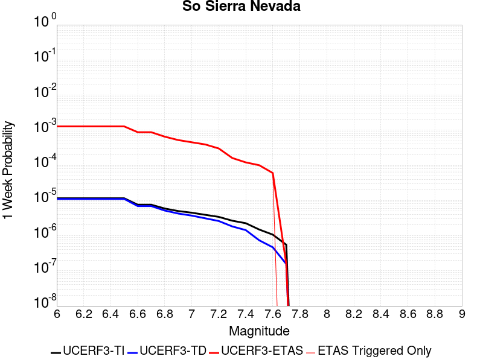 |  |  | 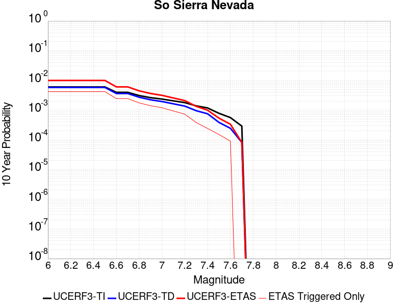 |

| Magnitude | 1 wk TI Prob | 1 wk TD Prob | 1 wk ETAS Prob | 1 wk ETAS/TD Gain | 1 wk ETAS Triggered Only | 1 mo TI Prob | 1 mo TD Prob | 1 mo ETAS Prob | 1 mo ETAS/TD Gain | 1 mo ETAS Triggered Only | 1 yr TI Prob | 1 yr TD Prob | 1 yr ETAS Prob | 1 yr ETAS/TD Gain | 1 yr ETAS Triggered Only | 10 yr TI Prob | 10 yr TD Prob | 10 yr ETAS Prob | 10 yr ETAS/TD Gain | 10 yr ETAS Triggered Only |
|-----|-----|-----|-----|-----|-----|-----|-----|-----|-----|-----|-----|-----|-----|-----|-----|-----|-----|-----|-----|-----|
| 6.0 | 1.15488665E-5 | 1.1079612E-5 | 0.0012810655 | 115.62369 | 0.00127 | 4.9494203E-5 | 4.7483256E-5 | 0.001927394 | 40.591022 | 0.00188 | 6.024253E-4 | 5.779681E-4 | 0.00356624 | 6.170306 | 0.00299 | 0.006007948 | 0.005765918 | 0.009921816 | 1.7207696 | 0.00418 |
| 6.1 | 1.15488665E-5 | 1.1079612E-5 | 0.0012810655 | 115.62369 | 0.00127 | 4.9494203E-5 | 4.7483256E-5 | 0.001927394 | 40.591022 | 0.00188 | 6.024253E-4 | 5.779681E-4 | 0.00356624 | 6.170306 | 0.00299 | 0.006007948 | 0.005765918 | 0.009921816 | 1.7207696 | 0.00418 |
| 6.2 | 1.15488665E-5 | 1.1079612E-5 | 0.0012810655 | 115.62369 | 0.00127 | 4.9494203E-5 | 4.7483256E-5 | 0.001927394 | 40.591022 | 0.00188 | 6.024253E-4 | 5.779681E-4 | 0.00356624 | 6.170306 | 0.00299 | 0.006007948 | 0.005765918 | 0.009921816 | 1.7207696 | 0.00418 |
| 6.3 | 1.15488665E-5 | 1.1079612E-5 | 0.0012810655 | 115.62369 | 0.00127 | 4.9494203E-5 | 4.7483256E-5 | 0.001927394 | 40.591022 | 0.00188 | 6.024253E-4 | 5.779681E-4 | 0.00356624 | 6.170306 | 0.00299 | 0.006007948 | 0.005765918 | 0.009921816 | 1.7207696 | 0.00418 |
| 6.4 | 1.15488665E-5 | 1.1079612E-5 | 0.0012810655 | 115.62369 | 0.00127 | 4.9494203E-5 | 4.7483256E-5 | 0.001927394 | 40.591022 | 0.00188 | 6.024253E-4 | 5.779681E-4 | 0.00356624 | 6.170306 | 0.00299 | 0.006007948 | 0.005765918 | 0.009921816 | 1.7207696 | 0.00418 |
| 6.5 | 1.15488665E-5 | 1.1079612E-5 | 0.0012810655 | 115.62369 | 0.00127 | 4.9494203E-5 | 4.7483256E-5 | 0.001927394 | 40.591022 | 0.00188 | 6.024253E-4 | 5.779681E-4 | 0.00356624 | 6.170306 | 0.00299 | 0.006007948 | 0.005765918 | 0.009921816 | 1.7207696 | 0.00418 |
| 6.6 | 7.587044E-6 | 6.9356042E-6 | 8.7692955E-4 | 126.43881 | 8.7E-4 | 3.2515498E-5 | 2.9723697E-5 | 0.0012196883 | 41.034206 | 0.00119 | 3.9580427E-4 | 3.6182883E-4 | 0.0020512172 | 5.669027 | 0.00169 | 0.003951 | 0.0036126887 | 0.00603391 | 1.6701992 | 0.00243 |
| 6.7 | 7.587044E-6 | 6.9356042E-6 | 8.7692955E-4 | 126.43881 | 8.7E-4 | 3.2515498E-5 | 2.9723697E-5 | 0.0012196883 | 41.034206 | 0.00119 | 3.9580427E-4 | 3.6182883E-4 | 0.0020512172 | 5.669027 | 0.00169 | 0.003951 | 0.0036126887 | 0.00603391 | 1.6701992 | 0.00243 |
| 6.8 | 5.9026956E-6 | 5.179362E-6 | 6.55176E-4 | 126.49744 | 6.5E-4 | 2.5297022E-5 | 2.2197082E-5 | 9.421767E-4 | 42.44597 | 9.2E-4 | 3.0794772E-4 | 2.7021713E-4 | 0.0014998848 | 5.550665 | 0.00123 | 0.0030752132 | 0.002699002 | 0.0044343057 | 1.6429428 | 0.00174 |
| 6.9 | 5.0118915E-6 | 4.2523943E-6 | 5.242502E-4 | 123.28352 | 5.2E-4 | 2.1479358E-5 | 1.8224424E-5 | 7.482111E-4 | 41.055405 | 7.3E-4 | 2.614798E-4 | 2.2186051E-4 | 0.0011916453 | 5.3711467 | 9.7E-4 | 0.0026117235 | 0.0022164627 | 0.0036133598 | 1.6302371 | 0.0014 |
| 7.0 | 4.4924795E-6 | 3.7138868E-6 | 4.5371221E-4 | 122.16641 | 4.5E-4 | 1.925334E-5 | 1.5916565E-5 | 6.6590623E-4 | 41.83731 | 6.5E-4 | 2.3438422E-4 | 1.9376757E-4 | 0.0010536009 | 5.437447 | 8.6E-4 | 0.0023413717 | 0.0019360491 | 0.0031337258 | 1.618619 | 0.0012 |
| 7.1 | 3.9118436E-6 | 3.1119469E-6 | 3.9311073E-4 | 126.32308 | 3.9E-4 | 1.6764936E-5 | 1.333685E-5 | 5.333299E-4 | 39.989197 | 5.2E-4 | 2.0409399E-4 | 1.6236462E-4 | 8.62251E-4 | 5.310584 | 7.0E-4 | 0.0020390663 | 0.0016225161 | 0.002551007 | 1.5722538 | 9.3E-4 |
| 7.2 | 3.4200818E-6 | 2.6054236E-6 | 3.0260463E-4 | 116.14412 | 3.0E-4 | 1.4657411E-5 | 1.11660565E-5 | 4.011617E-4 | 35.92689 | 3.9E-4 | 1.7843937E-4 | 1.3593875E-4 | 6.7586533E-4 | 4.971837 | 5.4E-4 | 0.0017829615 | 0.0013586058 | 0.002087614 | 1.5365856 | 7.3E-4 |
| 7.3 | 2.6593618E-6 | 1.8283897E-6 | 1.618281E-4 | 88.50854 | 1.6E-4 | 1.13972155E-5 | 7.8359335E-6 | 2.1783428E-4 | 27.799404 | 2.1E-4 | 1.3875226E-4 | 9.539862E-5 | 3.8537095E-4 | 4.0395865 | 2.9E-4 | 0.0013866565 | 9.536055E-4 | 0.0013332432 | 1.3981076 | 3.8E-4 |
| 7.4 | 2.2577992E-6 | 1.4364078E-6 | 1.21436235E-4 | 84.54162 | 1.2E-4 | 9.676246E-6 | 6.1560204E-6 | 1.561551E-4 | 25.366241 | 1.5E-4 | 1.1780193E-4 | 7.4947224E-5 | 2.7493224E-4 | 3.6683445 | 2.0E-4 | 0.001177395 | 7.4924453E-4 | 9.890647E-4 | 1.3200827 | 2.4E-4 |
| 7.5 | 1.489319E-6 | 7.353661E-7 | 1.0073529E-4 | 136.98659 | 1.0E-4 | 6.3827797E-6 | 3.1515651E-6 | 1.1315122E-4 | 35.903183 | 1.1E-4 | 7.770758E-5 | 3.8369635E-5 | 1.7836427E-4 | 4.6485786 | 1.4E-4 | 7.7680405E-4 | 3.8363054E-4 | 5.33573E-4 | 1.3908513 | 1.5E-4 |
| 7.6 | 1.0680322E-6 | 4.65941E-7 | 6.0465914E-5 | 129.7716 | 6.0E-5 | 4.577273E-6 | 1.9968884E-6 | 6.199677E-5 | 31.046686 | 6.0E-5 | 5.5726876E-5 | 2.4311848E-5 | 1.1430966E-4 | 4.7018085 | 9.0E-5 | 5.5712904E-4 | 2.4309216E-4 | 3.330703E-4 | 1.37014 | 9.0E-5 |
| 7.7 | 5.509146E-7 | 1.5578539E-7 | 1.5578539E-7 | 1.0 | 0.0 | 2.3610605E-6 | 6.676515E-7 | 6.676515E-7 | 1.0 | 0.0 | 2.8745531E-5 | 8.128628E-6 | 8.128628E-6 | 1.0 | 0.0 | 2.8741814E-4 | 8.128342E-5 | 8.128342E-5 | 1.0 | 0.0 |

## Coyote Canyon
*[(top)](#table-of-contents)*

| 1 Week | 1 Month | 1 Year | 10 Year |
|-----|-----|-----|-----|
| 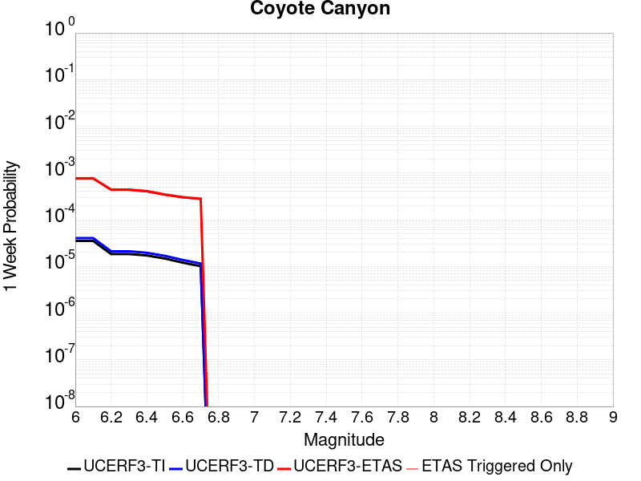 |  |  |  |

| Magnitude | 1 wk TI Prob | 1 wk TD Prob | 1 wk ETAS Prob | 1 wk ETAS/TD Gain | 1 wk ETAS Triggered Only | 1 mo TI Prob | 1 mo TD Prob | 1 mo ETAS Prob | 1 mo ETAS/TD Gain | 1 mo ETAS Triggered Only | 1 yr TI Prob | 1 yr TD Prob | 1 yr ETAS Prob | 1 yr ETAS/TD Gain | 1 yr ETAS Triggered Only | 10 yr TI Prob | 10 yr TD Prob | 10 yr ETAS Prob | 10 yr ETAS/TD Gain | 10 yr ETAS Triggered Only |
|-----|-----|-----|-----|-----|-----|-----|-----|-----|-----|-----|-----|-----|-----|-----|-----|-----|-----|-----|-----|-----|
| 6.0 | 3.5090034E-5 | 4.0364317E-5 | 7.7033485E-4 | 19.08455 | 7.3E-4 | 1.503772E-4 | 1.7297991E-4 | 0.0012427948 | 7.1846194 | 0.00107 | 0.0018293047 | 0.0021042533 | 0.0039503607 | 1.8773217 | 0.00185 | 0.018143194 | 0.020869205 | 0.023943676 | 1.147321 | 0.00314 |
| 6.1 | 3.5090034E-5 | 4.0364317E-5 | 7.7033485E-4 | 19.08455 | 7.3E-4 | 1.503772E-4 | 1.7297991E-4 | 0.0012427948 | 7.1846194 | 0.00107 | 0.0018293047 | 0.0021042533 | 0.0039503607 | 1.8773217 | 0.00185 | 0.018143194 | 0.020869205 | 0.023943676 | 1.147321 | 0.00314 |
| 6.2 | 1.841879E-5 | 2.1059794E-5 | 4.4105094E-4 | 20.942797 | 4.2E-4 | 7.8935285E-5 | 9.025371E-5 | 6.9019955E-4 | 7.6473265 | 6.0E-4 | 9.606133E-4 | 0.0010983871 | 0.0020872997 | 1.9003316 | 9.9E-4 | 0.0095647145 | 0.010939668 | 0.012591398 | 1.1509855 | 0.00167 |
| 6.3 | 1.841879E-5 | 2.1059794E-5 | 4.4105094E-4 | 20.942797 | 4.2E-4 | 7.8935285E-5 | 9.025371E-5 | 6.9019955E-4 | 7.6473265 | 6.0E-4 | 9.606133E-4 | 0.0010983871 | 0.0020872997 | 1.9003316 | 9.9E-4 | 0.0095647145 | 0.010939668 | 0.012591398 | 1.1509855 | 0.00167 |
| 6.4 | 1.712201E-5 | 1.9565212E-5 | 4.0955757E-4 | 20.93295 | 3.9E-4 | 7.337798E-5 | 8.3848776E-5 | 6.5380096E-4 | 7.7973824 | 5.7E-4 | 8.930107E-4 | 0.0010204813 | 0.001959522 | 1.9201939 | 9.4E-4 | 0.008894307 | 0.010167871 | 0.011731806 | 1.1538115 | 0.00158 |
| 6.5 | 1.4744935E-5 | 1.6836972E-5 | 3.4683142E-4 | 20.599394 | 3.3E-4 | 6.3191044E-5 | 7.215698E-5 | 5.621216E-4 | 7.79026 | 4.9E-4 | 7.6907943E-4 | 8.782507E-4 | 0.0017075217 | 1.9442304 | 8.3E-4 | 0.007664232 | 0.008756994 | 0.010154647 | 1.1596042 | 0.00141 |
| 6.6 | 1.2017839E-5 | 1.3724089E-5 | 3.037201E-4 | 22.130438 | 2.9E-4 | 5.150401E-5 | 5.88167E-5 | 4.987908E-4 | 8.480429 | 4.4E-4 | 6.268809E-4 | 7.159466E-4 | 0.0014054526 | 1.9630691 | 6.9E-4 | 0.0062511545 | 0.0071450938 | 0.008316662 | 1.1639683 | 0.00118 |
| 6.7 | 1.00956095E-5 | 1.1533517E-5 | 2.815304E-4 | 24.409763 | 2.7E-4 | 4.326618E-5 | 4.942891E-5 | 4.4940913E-4 | 9.092031 | 4.0E-4 | 5.266384E-4 | 6.017178E-4 | 0.0011813688 | 1.963327 | 5.8E-4 | 0.005253921 | 0.0060094125 | 0.0070034033 | 1.1654056 | 0.001 |

## San Andreas (Mojave S)
*[(top)](#table-of-contents)*

| 1 Week | 1 Month | 1 Year | 10 Year |
|-----|-----|-----|-----|
|  |  |  |  |

| Magnitude | 1 wk TI Prob | 1 wk TD Prob | 1 wk ETAS Prob | 1 wk ETAS/TD Gain | 1 wk ETAS Triggered Only | 1 mo TI Prob | 1 mo TD Prob | 1 mo ETAS Prob | 1 mo ETAS/TD Gain | 1 mo ETAS Triggered Only | 1 yr TI Prob | 1 yr TD Prob | 1 yr ETAS Prob | 1 yr ETAS/TD Gain | 1 yr ETAS Triggered Only | 10 yr TI Prob | 10 yr TD Prob | 10 yr ETAS Prob | 10 yr ETAS/TD Gain | 10 yr ETAS Triggered Only |
|-----|-----|-----|-----|-----|-----|-----|-----|-----|-----|-----|-----|-----|-----|-----|-----|-----|-----|-----|-----|-----|
| 6.0 | 3.1064058E-4 | 6.7462435E-4 | 0.001763889 | 2.614624 | 0.00109 | 0.0013306376 | 0.002888172 | 0.0043838397 | 1.5178597 | 0.0015 | 0.016080605 | 0.034565594 | 0.036699206 | 1.0617265 | 0.00221 | 0.1496549 | 0.28654557 | 0.28868595 | 1.0074695 | 0.003 |
| 6.1 | 3.1064058E-4 | 6.7462435E-4 | 0.001763889 | 2.614624 | 0.00109 | 0.0013306376 | 0.002888172 | 0.0043838397 | 1.5178597 | 0.0015 | 0.016080605 | 0.034565594 | 0.036699206 | 1.0617265 | 0.00221 | 0.1496549 | 0.28654557 | 0.28868595 | 1.0074695 | 0.003 |
| 6.2 | 3.1064058E-4 | 6.7462435E-4 | 0.001763889 | 2.614624 | 0.00109 | 0.0013306376 | 0.002888172 | 0.0043838397 | 1.5178597 | 0.0015 | 0.016080605 | 0.034565594 | 0.036699206 | 1.0617265 | 0.00221 | 0.1496549 | 0.28654557 | 0.28868595 | 1.0074695 | 0.003 |
| 6.3 | 3.1064058E-4 | 6.7462435E-4 | 0.001763889 | 2.614624 | 0.00109 | 0.0013306376 | 0.002888172 | 0.0043838397 | 1.5178597 | 0.0015 | 0.016080605 | 0.034565594 | 0.036699206 | 1.0617265 | 0.00221 | 0.1496549 | 0.28654557 | 0.28868595 | 1.0074695 | 0.003 |
| 6.4 | 1.9872203E-4 | 4.3181062E-4 | 0.0013814004 | 3.1990886 | 9.5E-4 | 8.5138786E-4 | 0.0018493326 | 0.003136947 | 1.6962589 | 0.00129 | 0.010316478 | 0.02228931 | 0.024156738 | 1.0837812 | 0.00191 | 0.098504856 | 0.19686839 | 0.1989244 | 1.0104436 | 0.00256 |
| 6.5 | 1.291105E-4 | 2.8754136E-4 | 0.0010673171 | 3.711873 | 7.8E-4 | 5.5321335E-4 | 0.0012317409 | 0.002300423 | 1.8676192 | 0.00107 | 0.006714592 | 0.014894155 | 0.016499877 | 1.107809 | 0.00163 | 0.065152965 | 0.13800792 | 0.13991293 | 1.0138036 | 0.00221 |
| 6.6 | 1.291105E-4 | 2.8754136E-4 | 0.0010673171 | 3.711873 | 7.8E-4 | 5.5321335E-4 | 0.0012317409 | 0.002300423 | 1.8676192 | 0.00107 | 0.006714592 | 0.014894155 | 0.016499877 | 1.107809 | 0.00163 | 0.065152965 | 0.13800792 | 0.13991293 | 1.0138036 | 0.00221 |
| 6.7 | 1.08001186E-4 | 2.4335351E-4 | 0.0010031685 | 4.1222687 | 7.6E-4 | 4.6278012E-4 | 0.0010425274 | 0.002061464 | 1.9773716 | 0.00102 | 0.0056198016 | 0.0126192 | 0.014139766 | 1.1204963 | 0.00154 | 0.054797906 | 0.1191843 | 0.12100759 | 1.015298 | 0.00207 |
| 6.8 | 1.0624356E-4 | 2.3853009E-4 | 9.983488E-4 | 4.185421 | 7.6E-4 | 4.5525006E-4 | 0.0010218718 | 0.0020408295 | 1.9971483 | 0.00102 | 0.0055285925 | 0.012370593 | 0.013881666 | 1.1221504 | 0.00153 | 0.053930566 | 0.11713307 | 0.118934125 | 1.0153761 | 0.00204 |
| 6.9 | 1.0393785E-4 | 2.3223337E-4 | 9.920569E-4 | 4.27181 | 7.6E-4 | 4.4537184E-4 | 9.949068E-4 | 0.002013892 | 2.0242016 | 0.00102 | 0.0054089287 | 0.012045963 | 0.013557533 | 1.1254835 | 0.00153 | 0.05279156 | 0.114433445 | 0.11623114 | 1.0157095 | 0.00203 |
| 7.0 | 1.0155622E-4 | 2.2592908E-4 | 9.857573E-4 | 4.3631277 | 7.6E-4 | 4.3516833E-4 | 9.6790853E-4 | 0.001976931 | 2.0424771 | 0.00101 | 0.005285311 | 0.011720838 | 0.013223022 | 1.1281636 | 0.00152 | 0.05161361 | 0.11169745 | 0.11348294 | 1.015985 | 0.00201 |
| 7.1 | 9.885595E-5 | 2.188132E-4 | 9.786469E-4 | 4.4725223 | 7.6E-4 | 4.2359953E-4 | 9.374342E-4 | 0.0019265062 | 2.0550842 | 9.9E-4 | 0.0051451353 | 0.011353733 | 0.012836702 | 1.1306151 | 0.0015 | 0.05027629 | 0.10857606 | 0.11034108 | 1.0162561 | 0.00198 |
| 7.2 | 9.6411415E-5 | 2.1244297E-4 | 9.6228364E-4 | 4.529609 | 7.5E-4 | 4.1312634E-4 | 9.101525E-4 | 0.0018892606 | 2.0757627 | 9.8E-4 | 0.005018219 | 0.011024987 | 0.012498559 | 1.1336576 | 0.00149 | 0.049064007 | 0.1057697 | 0.10752239 | 1.0165708 | 0.00196 |
| 7.3 | 9.1180635E-5 | 1.9472656E-4 | 9.3458244E-4 | 4.7994604 | 7.4E-4 | 3.907156E-4 | 8.342756E-4 | 0.0018034664 | 2.1617153 | 9.7E-4 | 0.004746591 | 0.010110112 | 0.011555351 | 1.1429498 | 0.00146 | 0.046464786 | 0.09796175 | 0.09969367 | 1.0176795 | 0.00192 |
| 7.4 | 8.887388E-5 | 1.872126E-4 | 9.070778E-4 | 4.845175 | 7.2E-4 | 3.8083247E-4 | 8.020931E-4 | 0.0017513311 | 2.1834512 | 9.5E-4 | 0.0046267817 | 0.009721855 | 0.011137952 | 1.1456612 | 0.00143 | 0.045316286 | 0.09459384 | 0.09628695 | 1.0178987 | 0.00187 |
| 7.5 | 8.6750515E-5 | 1.80528E-4 | 9.00398E-4 | 4.987581 | 7.2E-4 | 3.7173493E-4 | 7.734621E-4 | 0.0017227273 | 2.2272937 | 9.5E-4 | 0.004516484 | 0.009376327 | 0.0107929185 | 1.1510818 | 0.00143 | 0.04425787 | 0.09155605 | 0.09325484 | 1.0185547 | 0.00187 |
| 7.6 | 8.453092E-5 | 1.7440386E-4 | 8.942783E-4 | 5.127629 | 7.2E-4 | 3.6222505E-4 | 7.4723107E-4 | 0.0016965212 | 2.2704103 | 9.5E-4 | 0.0044011753 | 0.009059664 | 0.010476708 | 1.1564125 | 0.00143 | 0.04315024 | 0.08871447 | 0.090409465 | 1.0191061 | 0.00186 |
| 7.7 | 8.259102E-5 | 1.6962511E-4 | 8.89503E-4 | 5.2439346 | 7.2E-4 | 3.539135E-4 | 7.267622E-4 | 0.0016760718 | 2.3062174 | 9.5E-4 | 0.004300386 | 0.0088125 | 0.010229899 | 1.1608394 | 0.00143 | 0.042181134 | 0.086465426 | 0.08815546 | 1.0195458 | 0.00185 |
| 7.8 | 7.444844E-5 | 1.528469E-4 | 6.9276436E-4 | 4.532407 | 5.4E-4 | 3.1902574E-4 | 6.5489375E-4 | 0.001414396 | 2.1597335 | 7.6E-4 | 0.0038772223 | 0.007944231 | 0.009095016 | 1.1448579 | 0.00116 | 0.03810269 | 0.07829387 | 0.07968564 | 1.0177764 | 0.00151 |
| 7.9 | 5.2586525E-5 | 1.0007023E-4 | 4.000402E-4 | 3.9975946 | 3.0E-4 | 2.2535135E-4 | 4.2880196E-4 | 8.486218E-4 | 1.9790531 | 4.2E-4 | 0.0027402006 | 0.005208178 | 0.0058150007 | 1.1165135 | 6.1E-4 | 0.027066574 | 0.052201588 | 0.05294087 | 1.0141621 | 7.8E-4 |
| 8.0 | 3.379877E-5 | 5.4075565E-5 | 1.440707E-4 | 2.6642478 | 9.0E-5 | 1.4484383E-4 | 2.3173184E-4 | 3.4170636E-4 | 1.4745766 | 1.1E-4 | 0.0017620471 | 0.0028176866 | 0.002977236 | 1.0566242 | 1.6E-4 | 0.017481409 | 0.028835915 | 0.029059283 | 1.0077462 | 2.3E-4 |
| 8.1 | 1.8668277E-5 | 1.9308145E-5 | 2.9307952E-5 | 1.5179062 | 1.0E-5 | 8.000444E-5 | 8.274657E-5 | 9.2745744E-5 | 1.1208409 | 1.0E-5 | 9.736188E-4 | 0.0010069745 | 0.0010269544 | 1.0198414 | 2.0E-5 | 0.009693642 | 0.010798624 | 0.010828299 | 1.0027481 | 3.0E-5 |
| 8.2 | 8.541571E-6 | 5.4596358E-6 | 5.4596358E-6 | 1.0 | 0.0 | 3.660622E-5 | 2.339823E-5 | 2.339823E-5 | 1.0 | 0.0 | 4.455896E-4 | 2.848363E-4 | 2.848363E-4 | 1.0 | 0.0 | 0.0044469717 | 0.003240283 | 0.003240283 | 1.0 | 0.0 |
| 8.3 | 1.983087E-6 | 7.6564595E-7 | 7.6564595E-7 | 1.0 | 0.0 | 8.498917E-6 | 3.281336E-6 | 3.281336E-6 | 1.0 | 0.0 | 1.034694E-4 | 3.9949547E-5 | 3.9949547E-5 | 1.0 | 0.0 | 0.0010342124 | 4.717979E-4 | 4.717979E-4 | 1.0 | 0.0 |

## Death Valley (So)
*[(top)](#table-of-contents)*

| 1 Week | 1 Month | 1 Year | 10 Year |
|-----|-----|-----|-----|
|  |  |  |  |

| Magnitude | 1 wk TI Prob | 1 wk TD Prob | 1 wk ETAS Prob | 1 wk ETAS/TD Gain | 1 wk ETAS Triggered Only | 1 mo TI Prob | 1 mo TD Prob | 1 mo ETAS Prob | 1 mo ETAS/TD Gain | 1 mo ETAS Triggered Only | 1 yr TI Prob | 1 yr TD Prob | 1 yr ETAS Prob | 1 yr ETAS/TD Gain | 1 yr ETAS Triggered Only | 10 yr TI Prob | 10 yr TD Prob | 10 yr ETAS Prob | 10 yr ETAS/TD Gain | 10 yr ETAS Triggered Only |
|-----|-----|-----|-----|-----|-----|-----|-----|-----|-----|-----|-----|-----|-----|-----|-----|-----|-----|-----|-----|-----|
| 6.0 | 2.0684236E-5 | 2.5618314E-5 | 8.55597E-4 | 33.397865 | 8.3E-4 | 8.864371E-5 | 1.0978825E-4 | 0.0012996576 | 11.837857 | 0.00119 | 0.0010787029 | 0.0013358692 | 0.0035129571 | 2.6297162 | 0.00218 | 0.010734817 | 0.013279985 | 0.016417755 | 1.236278 | 0.00318 |
| 6.1 | 2.0684236E-5 | 2.5618314E-5 | 8.55597E-4 | 33.397865 | 8.3E-4 | 8.864371E-5 | 1.0978825E-4 | 0.0012996576 | 11.837857 | 0.00119 | 0.0010787029 | 0.0013358692 | 0.0035129571 | 2.6297162 | 0.00218 | 0.010734817 | 0.013279985 | 0.016417755 | 1.236278 | 0.00318 |
| 6.2 | 2.0684236E-5 | 2.5618314E-5 | 8.55597E-4 | 33.397865 | 8.3E-4 | 8.864371E-5 | 1.0978825E-4 | 0.0012996576 | 11.837857 | 0.00119 | 0.0010787029 | 0.0013358692 | 0.0035129571 | 2.6297162 | 0.00218 | 0.010734817 | 0.013279985 | 0.016417755 | 1.236278 | 0.00318 |
| 6.3 | 2.0240292E-5 | 2.51184E-5 | 8.250983E-4 | 32.848366 | 8.0E-4 | 8.6741224E-5 | 1.0764593E-4 | 0.0011975286 | 11.124699 | 0.00109 | 0.0010555626 | 0.001309818 | 0.0033771067 | 2.5783021 | 0.00207 | 0.010505628 | 0.013022543 | 0.016022954 | 1.2304014 | 0.00304 |
| 6.4 | 2.0240292E-5 | 2.51184E-5 | 8.250983E-4 | 32.848366 | 8.0E-4 | 8.6741224E-5 | 1.0764593E-4 | 0.0011975286 | 11.124699 | 0.00109 | 0.0010555626 | 0.001309818 | 0.0033771067 | 2.5783021 | 0.00207 | 0.010505628 | 0.013022543 | 0.016022954 | 1.2304014 | 0.00304 |
| 6.5 | 1.9962767E-5 | 2.4807652E-5 | 7.9478853E-4 | 32.03804 | 7.7E-4 | 8.55519E-5 | 1.0631427E-4 | 0.0011562026 | 10.875329 | 0.00105 | 0.0010410968 | 0.0012936244 | 0.0033110112 | 2.5594842 | 0.00202 | 0.010362327 | 0.01286249 | 0.015804159 | 1.2287015 | 0.00298 |
| 6.6 | 1.8937297E-5 | 2.3311462E-5 | 7.0329563E-4 | 30.16952 | 6.8E-4 | 8.115732E-5 | 9.990252E-5 | 0.0010098116 | 10.107969 | 9.1E-4 | 9.876423E-4 | 0.0012156491 | 0.003013461 | 2.4788904 | 0.0018 | 0.009832645 | 0.0120915035 | 0.014679824 | 1.214061 | 0.00262 |
| 6.7 | 1.8621096E-5 | 2.2912098E-5 | 6.928967E-4 | 30.241524 | 6.7E-4 | 7.980225E-5 | 9.8191085E-5 | 9.981027E-4 | 10.164901 | 9.0E-4 | 9.711593E-4 | 0.0011948354 | 0.0029727085 | 2.4879649 | 0.00178 | 0.009669261 | 0.011885625 | 0.014454722 | 1.2161516 | 0.0026 |
| 6.8 | 1.7830353E-5 | 2.1806083E-5 | 6.3179276E-4 | 28.973234 | 6.1E-4 | 7.641356E-5 | 9.3451374E-5 | 9.333729E-4 | 9.987792 | 8.4E-4 | 9.29938E-4 | 0.0011371907 | 0.0028052917 | 2.4668612 | 0.00167 | 0.009260561 | 0.01131609 | 0.013728478 | 1.2131822 | 0.00244 |
| 6.9 | 1.3135183E-5 | 1.5304031E-5 | 4.7529698E-4 | 31.056982 | 4.6E-4 | 5.6292425E-5 | 6.558709E-5 | 6.9554575E-4 | 10.604919 | 6.3E-4 | 6.8514474E-4 | 7.982367E-4 | 0.0019273347 | 2.4144902 | 0.00113 | 0.006830362 | 0.007955158 | 0.009532509 | 1.1982803 | 0.00159 |
| 7.0 | 1.1507512E-5 | 1.3154237E-5 | 3.5314978E-4 | 26.846844 | 3.4E-4 | 4.9316975E-5 | 5.637412E-5 | 5.3634704E-4 | 9.514066 | 4.8E-4 | 6.002687E-4 | 6.861445E-4 | 0.0015555476 | 2.2670844 | 8.7E-4 | 0.0059864987 | 0.0068414924 | 0.008043215 | 1.175652 | 0.00121 |
| 7.1 | 9.715903E-6 | 1.0865287E-5 | 2.1086312E-4 | 19.407045 | 2.0E-4 | 4.1638916E-5 | 4.6564706E-5 | 3.5655027E-4 | 7.6570926 | 3.1E-4 | 5.068359E-4 | 5.667821E-4 | 0.0011164703 | 1.9698405 | 5.5E-4 | 0.0050568148 | 0.005653834 | 0.0064194803 | 1.1354208 | 7.7E-4 |
| 7.2 | 9.233269E-6 | 1.0286314E-5 | 1.7028466E-4 | 16.55449 | 1.6E-4 | 3.9570554E-5 | 4.408348E-5 | 2.840729E-4 | 6.4439764 | 2.4E-4 | 4.81665E-4 | 5.365884E-4 | 9.4636844E-4 | 1.7636765 | 4.1E-4 | 0.0048062233 | 0.0053533595 | 0.005920308 | 1.1059052 | 5.7E-4 |
| 7.3 | 8.8041315E-6 | 9.808164E-6 | 1.4980679E-4 | 15.273684 | 1.4E-4 | 3.7731446E-5 | 4.2034335E-5 | 2.3202634E-4 | 5.519924 | 1.9E-4 | 4.592835E-4 | 5.1165203E-4 | 8.514781E-4 | 1.6641741 | 3.4E-4 | 0.0045833546 | 0.005105167 | 0.0055528698 | 1.087696 | 4.5E-4 |
| 7.4 | 8.708749E-6 | 9.707175E-6 | 1.4970581E-4 | 15.422182 | 1.4E-4 | 3.7322676E-5 | 4.160154E-5 | 2.1159447E-4 | 5.0862174 | 1.7E-4 | 4.5430884E-4 | 5.0638523E-4 | 8.162282E-4 | 1.6118722 | 3.1E-4 | 0.004533812 | 0.0050527398 | 0.0054706177 | 1.0827032 | 4.2E-4 |
| 7.5 | 8.612678E-6 | 9.604817E-6 | 1.3960357E-4 | 14.534745 | 1.3E-4 | 3.6910955E-5 | 4.1162875E-5 | 2.0115629E-4 | 4.8868375 | 1.6E-4 | 4.492982E-4 | 5.01047E-4 | 7.9090166E-4 | 1.578498 | 2.9E-4 | 0.004483909 | 0.0049995985 | 0.005387649 | 1.0776162 | 3.9E-4 |
| 7.6 | 8.319024E-6 | 9.283916E-6 | 9.928308E-5 | 10.694095 | 9.0E-5 | 3.5652476E-5 | 3.978763E-5 | 1.5978285E-4 | 4.015893 | 1.2E-4 | 4.3398244E-4 | 4.8431093E-4 | 7.341898E-4 | 1.5159473 | 2.5E-4 | 0.0043313587 | 0.0048329784 | 0.0051713353 | 1.07001 | 3.4E-4 |
| 7.7 | 7.4718328E-6 | 8.34517E-6 | 5.834475E-5 | 6.99144 | 5.0E-5 | 3.2021748E-5 | 3.5764548E-5 | 1.15761686E-4 | 3.236772 | 8.0E-5 | 3.8979502E-4 | 4.353504E-4 | 5.952807E-4 | 1.36736 | 1.6E-4 | 0.00389112 | 0.0043453807 | 0.0045942944 | 1.0572823 | 2.5E-4 |
| 7.8 | 3.4586725E-7 | 3.6482615E-7 | 1.0364823E-5 | 28.410307 | 1.0E-5 | 1.4822873E-6 | 1.5635396E-6 | 2.1563508E-5 | 13.791469 | 2.0E-5 | 1.80467E-5 | 1.9035933E-5 | 3.9035553E-5 | 2.0506246 | 2.0E-5 | 1.8045233E-4 | 1.9034347E-4 | 2.1033967E-4 | 1.1050532 | 2.0E-5 |
| 7.9 | 2.5591178E-9 | 2.6696718E-9 | 2.6696718E-9 | 1.0 | 0.0 | 1.0967647E-8 | 1.14414505E-8 | 1.14414505E-8 | 1.0 | 0.0 | 1.335311E-7 | 1.3929966E-7 | 1.3929966E-7 | 1.0 | 0.0 | 1.3353102E-6 | 1.3929966E-6 | 1.3929966E-6 | 1.0 | 0.0 |

## Lenwood-Lockhart-Old Woman Springs
*[(top)](#table-of-contents)*

| 1 Week | 1 Month | 1 Year | 10 Year |
|-----|-----|-----|-----|
| 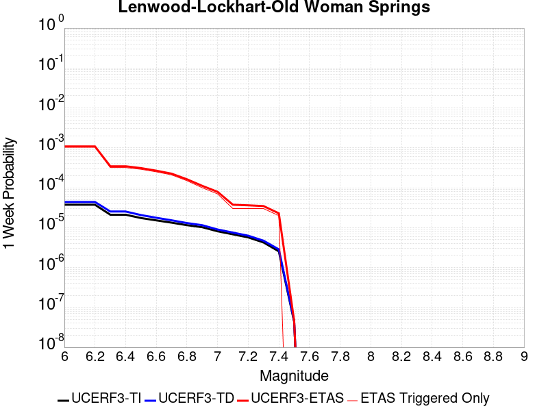 | 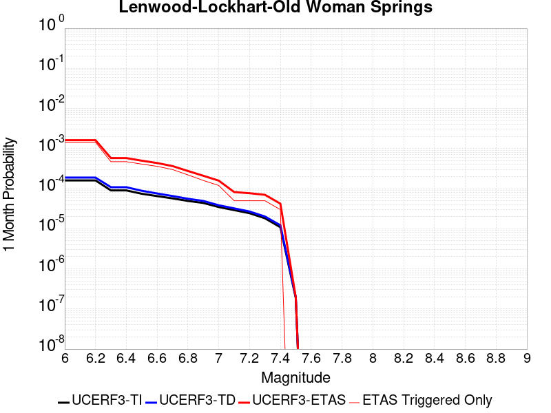 | 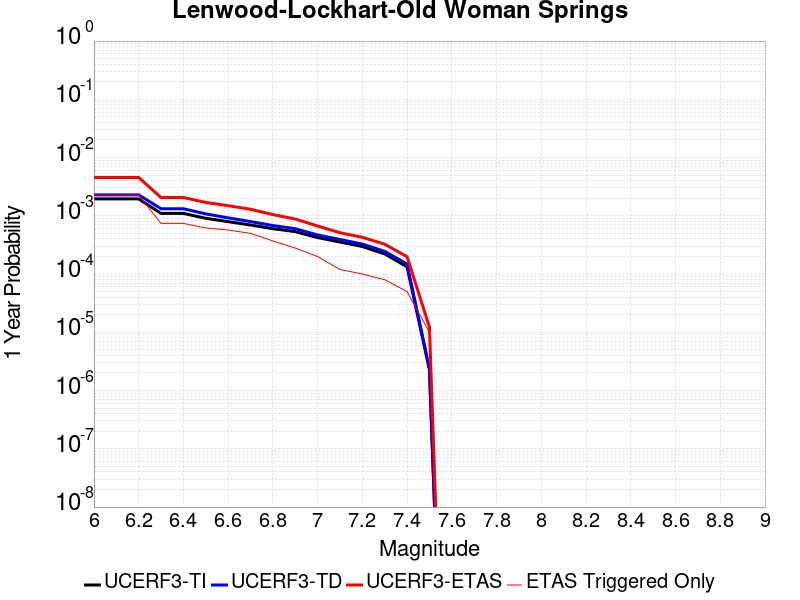 |  |

| Magnitude | 1 wk TI Prob | 1 wk TD Prob | 1 wk ETAS Prob | 1 wk ETAS/TD Gain | 1 wk ETAS Triggered Only | 1 mo TI Prob | 1 mo TD Prob | 1 mo ETAS Prob | 1 mo ETAS/TD Gain | 1 mo ETAS Triggered Only | 1 yr TI Prob | 1 yr TD Prob | 1 yr ETAS Prob | 1 yr ETAS/TD Gain | 1 yr ETAS Triggered Only | 10 yr TI Prob | 10 yr TD Prob | 10 yr ETAS Prob | 10 yr ETAS/TD Gain | 10 yr ETAS Triggered Only |
|-----|-----|-----|-----|-----|-----|-----|-----|-----|-----|-----|-----|-----|-----|-----|-----|-----|-----|-----|-----|-----|
| 6.0 | 3.744542E-5 | 4.396349E-5 | 0.0010839178 | 24.654953 | 0.00104 | 1.604705E-4 | 1.8840231E-4 | 0.0016181329 | 8.588711 | 0.00143 | 0.0019519776 | 0.0022915571 | 0.0045563555 | 1.9883227 | 0.00227 | 0.019349206 | 0.022697281 | 0.025609644 | 1.1283133 | 0.00298 |
| 6.1 | 3.744542E-5 | 4.396349E-5 | 0.0010839178 | 24.654953 | 0.00104 | 1.604705E-4 | 1.8840231E-4 | 0.0016181329 | 8.588711 | 0.00143 | 0.0019519776 | 0.0022915571 | 0.0045563555 | 1.9883227 | 0.00227 | 0.019349206 | 0.022697281 | 0.025609644 | 1.1283133 | 0.00298 |
| 6.2 | 3.744542E-5 | 4.396349E-5 | 0.0010839178 | 24.654953 | 0.00104 | 1.604705E-4 | 1.8840231E-4 | 0.0016181329 | 8.588711 | 0.00143 | 0.0019519776 | 0.0022915571 | 0.0045563555 | 1.9883227 | 0.00227 | 0.019349206 | 0.022697281 | 0.025609644 | 1.1283133 | 0.00298 |
| 6.3 | 2.1079984E-5 | 2.5354384E-5 | 3.4534629E-4 | 13.620771 | 3.2E-4 | 9.0339665E-5 | 1.0865723E-4 | 5.7860615E-4 | 5.325059 | 4.7E-4 | 0.0010993304 | 0.0013221189 | 0.0020611405 | 1.5589676 | 7.4E-4 | 0.010939079 | 0.013144747 | 0.014220419 | 1.0818329 | 0.00109 |
| 6.4 | 2.1079984E-5 | 2.5354384E-5 | 3.4534629E-4 | 13.620771 | 3.2E-4 | 9.0339665E-5 | 1.0865723E-4 | 5.7860615E-4 | 5.325059 | 4.7E-4 | 0.0010993304 | 0.0013221189 | 0.0020611405 | 1.5589676 | 7.4E-4 | 0.010939079 | 0.013144747 | 0.014220419 | 1.0818329 | 0.00109 |
| 6.5 | 1.7397282E-5 | 2.0663285E-5 | 3.1065728E-4 | 15.034265 | 2.9E-4 | 7.455765E-5 | 8.8554E-5 | 4.985177E-4 | 5.6295333 | 4.1E-4 | 9.073613E-4 | 0.0010776235 | 0.0016969553 | 1.5747201 | 6.2E-4 | 0.009036654 | 0.010725273 | 0.011635406 | 1.0848587 | 9.2E-4 |
| 6.6 | 1.52050325E-5 | 1.7680086E-5 | 2.6767567E-4 | 15.139954 | 2.5E-4 | 6.51628E-5 | 7.576964E-5 | 4.3574235E-4 | 5.7508836 | 3.6E-4 | 7.9306826E-4 | 9.221128E-4 | 0.0014915871 | 1.6175756 | 5.7E-4 | 0.007902439 | 0.009183729 | 0.009976381 | 1.0863106 | 8.0E-4 |
| 6.7 | 1.332523E-5 | 1.5264379E-5 | 2.2526117E-4 | 14.75731 | 2.1E-4 | 5.7106878E-5 | 6.541716E-5 | 3.6539754E-4 | 5.5856524 | 3.0E-4 | 6.950544E-4 | 7.9616875E-4 | 0.0012957706 | 1.6275076 | 5.0E-4 | 0.006928845 | 0.0079337945 | 0.008588558 | 1.0825285 | 6.6E-4 |
| 6.8 | 1.1525329E-5 | 1.3031365E-5 | 1.6302941E-4 | 12.51054 | 1.5E-4 | 4.9393333E-5 | 5.5847537E-5 | 2.7583525E-4 | 4.9390764 | 2.2E-4 | 6.011979E-4 | 6.7973585E-4 | 0.0010494844 | 1.5439591 | 3.7E-4 | 0.00599574 | 0.0067770192 | 0.0072636986 | 1.0718132 | 4.9E-4 |
| 6.9 | 1.0253909E-5 | 1.1514835E-5 | 1.11513684E-4 | 9.68435 | 1.0E-4 | 4.3944583E-5 | 4.934838E-5 | 2.0934048E-4 | 4.2420945 | 1.6E-4 | 5.3489394E-4 | 6.006545E-4 | 8.8048633E-4 | 1.4658781 | 2.8E-4 | 0.0053360825 | 0.0059906896 | 0.006378353 | 1.064711 | 3.9E-4 |
| 7.0 | 8.104563E-6 | 8.99143E-6 | 7.89908E-5 | 8.785121 | 7.0E-5 | 3.4733377E-5 | 3.853415E-5 | 1.5852952E-4 | 4.1140013 | 1.2E-4 | 4.2279682E-4 | 4.6905465E-4 | 6.6896086E-4 | 1.4261895 | 2.0E-4 | 0.0042199334 | 0.0046808943 | 0.0049595837 | 1.0595376 | 2.8E-4 |
| 7.1 | 6.7986157E-6 | 7.5159796E-6 | 3.7515754E-5 | 4.9914656 | 3.0E-5 | 2.91366E-5 | 3.2210955E-5 | 8.220934E-5 | 2.5522168 | 5.0E-5 | 3.5468035E-4 | 3.9209996E-4 | 5.120529E-4 | 1.3059244 | 1.2E-4 | 0.003541148 | 0.003914298 | 0.0040836325 | 1.0432606 | 1.7E-4 |
| 7.2 | 5.6893327E-6 | 6.280132E-6 | 3.6279944E-5 | 5.77694 | 3.0E-5 | 2.4382627E-5 | 2.6914584E-5 | 7.691324E-5 | 2.857679 | 5.0E-5 | 2.9681803E-4 | 3.276378E-4 | 4.2760503E-4 | 1.3051151 | 1.0E-4 | 0.002964219 | 0.003271746 | 0.0034212554 | 1.0456971 | 1.5E-4 |
| 7.3 | 4.253348E-6 | 4.707075E-6 | 3.4706933E-5 | 7.3733554 | 3.0E-5 | 1.8228506E-5 | 2.017303E-5 | 7.017202E-5 | 3.4785066 | 5.0E-5 | 2.2190946E-4 | 2.455808E-4 | 3.2556115E-4 | 1.3256783 | 8.0E-5 | 0.00221688 | 0.0024532753 | 0.0025630053 | 1.044728 | 1.1E-4 |
| 7.4 | 2.5448119E-6 | 2.8520594E-6 | 2.2852002E-5 | 8.012457 | 2.0E-5 | 1.0906291E-5 | 1.2223064E-5 | 4.22227E-5 | 3.4543464 | 3.0E-5 | 1.3277601E-4 | 1.4880729E-4 | 1.9879985E-4 | 1.335955 | 5.0E-5 | 0.001326967 | 0.0014872387 | 0.0015471495 | 1.0402832 | 6.0E-5 |
| 7.5 | 4.3706837E-8 | 4.562909E-8 | 4.562909E-8 | 1.0 | 0.0 | 1.8731501E-7 | 1.9555324E-7 | 1.9555324E-7 | 1.0 | 0.0 | 2.2805577E-6 | 2.3808586E-6 | 1.2380835E-5 | 5.2001553 | 1.0E-5 | 2.2805343E-5 | 2.3808387E-5 | 3.3808148E-5 | 1.4200101 | 1.0E-5 |

## Nelson Lake
*[(top)](#table-of-contents)*

| 1 Week | 1 Month | 1 Year | 10 Year |
|-----|-----|-----|-----|
| 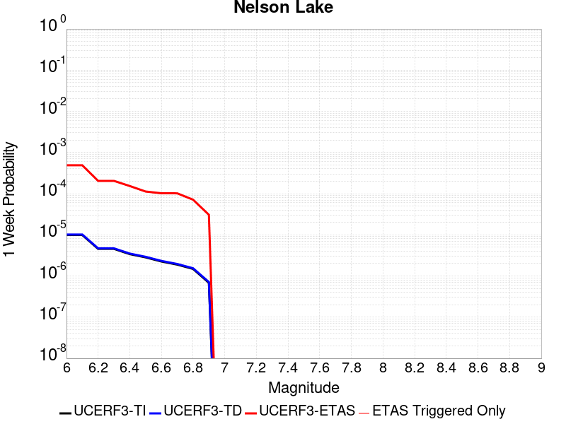 |  |  |  |

| Magnitude | 1 wk TI Prob | 1 wk TD Prob | 1 wk ETAS Prob | 1 wk ETAS/TD Gain | 1 wk ETAS Triggered Only | 1 mo TI Prob | 1 mo TD Prob | 1 mo ETAS Prob | 1 mo ETAS/TD Gain | 1 mo ETAS Triggered Only | 1 yr TI Prob | 1 yr TD Prob | 1 yr ETAS Prob | 1 yr ETAS/TD Gain | 1 yr ETAS Triggered Only | 10 yr TI Prob | 10 yr TD Prob | 10 yr ETAS Prob | 10 yr ETAS/TD Gain | 10 yr ETAS Triggered Only |
|-----|-----|-----|-----|-----|-----|-----|-----|-----|-----|-----|-----|-----|-----|-----|-----|-----|-----|-----|-----|-----|
| 6.0 | 9.913453E-6 | 1.0192255E-5 | 4.901874E-4 | 48.0941 | 4.8E-4 | 4.2485535E-5 | 4.3680422E-5 | 8.236464E-4 | 18.85619 | 7.8E-4 | 5.1713863E-4 | 5.316897E-4 | 0.0019909134 | 3.7445025 | 0.00146 | 0.0051593683 | 0.005305204 | 0.0076626306 | 1.4443612 | 0.00237 |
| 6.1 | 9.913453E-6 | 1.0192255E-5 | 4.901874E-4 | 48.0941 | 4.8E-4 | 4.2485535E-5 | 4.3680422E-5 | 8.236464E-4 | 18.85619 | 7.8E-4 | 5.1713863E-4 | 5.316897E-4 | 0.0019909134 | 3.7445025 | 0.00146 | 0.0051593683 | 0.005305204 | 0.0076626306 | 1.4443612 | 0.00237 |
| 6.2 | 4.5596407E-6 | 4.696313E-6 | 2.0469537E-4 | 43.5864 | 2.0E-4 | 1.954117E-5 | 2.0126909E-5 | 3.2012086E-4 | 15.905119 | 3.0E-4 | 2.3788778E-4 | 2.4501883E-4 | 8.648669E-4 | 3.5297978 | 6.2E-4 | 0.0023763329 | 0.0024476128 | 0.0034850673 | 1.4238638 | 0.00104 |
| 6.3 | 4.5596407E-6 | 4.696313E-6 | 2.0469537E-4 | 43.5864 | 2.0E-4 | 1.954117E-5 | 2.0126909E-5 | 3.2012086E-4 | 15.905119 | 3.0E-4 | 2.3788778E-4 | 2.4501883E-4 | 8.648669E-4 | 3.5297978 | 6.2E-4 | 0.0023763329 | 0.0024476128 | 0.0034850673 | 1.4238638 | 0.00104 |
| 6.4 | 3.4025713E-6 | 3.5098972E-6 | 1.5350938E-4 | 43.736145 | 1.5E-4 | 1.4582367E-5 | 1.5042335E-5 | 2.5503873E-4 | 16.95473 | 2.4E-4 | 1.7752586E-4 | 1.8312587E-4 | 6.9303246E-4 | 3.7844596 | 5.1E-4 | 0.001773841 | 0.0018298327 | 0.0025684787 | 1.4036685 | 7.4E-4 |
| 6.5 | 2.8352947E-6 | 2.927856E-6 | 1.1292753E-4 | 38.57004 | 1.1E-4 | 1.2151207E-5 | 1.2547898E-5 | 1.7254589E-4 | 13.750979 | 1.6E-4 | 1.479309E-4 | 1.5276071E-4 | 5.526996E-4 | 3.6180744 | 4.0E-4 | 0.0014783246 | 0.0015266308 | 0.002155669 | 1.4120435 | 6.3E-4 |
| 6.6 | 2.251518E-6 | 2.3290677E-6 | 1.02328835E-4 | 43.935535 | 1.0E-4 | 9.649328E-6 | 9.981683E-6 | 1.4998029E-4 | 15.02555 | 1.4E-4 | 1.1747423E-4 | 1.2152085E-4 | 4.2148438E-4 | 3.4684122 | 3.0E-4 | 0.0011741214 | 0.0012146058 | 0.0017040105 | 1.4029331 | 4.9E-4 |
| 6.7 | 1.8911853E-6 | 1.9591396E-6 | 1.0195895E-4 | 52.042713 | 1.0E-4 | 8.105055E-6 | 8.39629E-6 | 1.383952E-4 | 16.4829 | 1.3E-4 | 9.867457E-5 | 1.0222061E-4 | 3.82192E-4 | 3.7388935 | 2.8E-4 | 9.863076E-4 | 0.0010217935 | 0.0014613438 | 1.4301754 | 4.4E-4 |
| 6.8 | 1.4874814E-6 | 1.5438305E-6 | 7.154372E-5 | 46.341694 | 7.0E-5 | 6.374905E-6 | 6.6164025E-6 | 1.0661574E-4 | 16.113853 | 1.0E-4 | 7.76117E-5 | 8.055224E-5 | 2.9053533E-4 | 3.6067936 | 2.1E-4 | 7.75846E-4 | 8.0528157E-4 | 0.0011549997 | 1.4342806 | 3.5E-4 |
| 6.9 | 6.835972E-7 | 7.1399285E-7 | 3.071397E-5 | 43.0172 | 3.0E-5 | 2.9296991E-6 | 3.0599674E-6 | 3.3059874E-5 | 10.803996 | 3.0E-5 | 3.56685E-5 | 3.7254784E-5 | 1.3725106E-4 | 3.684119 | 1.0E-4 | 3.5662777E-4 | 3.7251666E-4 | 5.424533E-4 | 1.4561855 | 1.7E-4 |

## San Andreas (Mojave N)
*[(top)](#table-of-contents)*

| 1 Week | 1 Month | 1 Year | 10 Year |
|-----|-----|-----|-----|
| 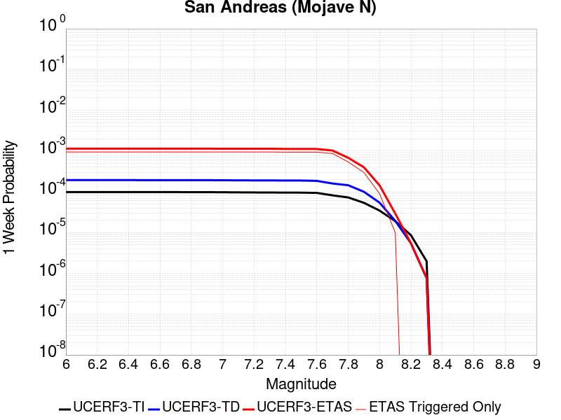 | 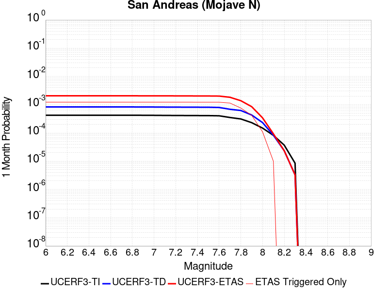 |  |  |

| Magnitude | 1 wk TI Prob | 1 wk TD Prob | 1 wk ETAS Prob | 1 wk ETAS/TD Gain | 1 wk ETAS Triggered Only | 1 mo TI Prob | 1 mo TD Prob | 1 mo ETAS Prob | 1 mo ETAS/TD Gain | 1 mo ETAS Triggered Only | 1 yr TI Prob | 1 yr TD Prob | 1 yr ETAS Prob | 1 yr ETAS/TD Gain | 1 yr ETAS Triggered Only | 10 yr TI Prob | 10 yr TD Prob | 10 yr ETAS Prob | 10 yr ETAS/TD Gain | 10 yr ETAS Triggered Only |
|-----|-----|-----|-----|-----|-----|-----|-----|-----|-----|-----|-----|-----|-----|-----|-----|-----|-----|-----|-----|-----|
| 6.0 | 9.877682E-5 | 1.9402112E-4 | 0.0011438368 | 5.8954244 | 9.5E-4 | 4.2326056E-4 | 8.312543E-4 | 0.0020602318 | 2.4784617 | 0.00123 | 0.0051410277 | 0.010073684 | 0.011865451 | 1.1778661 | 0.00181 | 0.05023708 | 0.09832245 | 0.10048647 | 1.0220095 | 0.0024 |
| 6.1 | 9.877682E-5 | 1.9402112E-4 | 0.0011438368 | 5.8954244 | 9.5E-4 | 4.2326056E-4 | 8.312543E-4 | 0.0020602318 | 2.4784617 | 0.00123 | 0.0051410277 | 0.010073684 | 0.011865451 | 1.1778661 | 0.00181 | 0.05023708 | 0.09832245 | 0.10048647 | 1.0220095 | 0.0024 |
| 6.2 | 9.877682E-5 | 1.9402112E-4 | 0.0011438368 | 5.8954244 | 9.5E-4 | 4.2326056E-4 | 8.312543E-4 | 0.0020602318 | 2.4784617 | 0.00123 | 0.0051410277 | 0.010073684 | 0.011865451 | 1.1778661 | 0.00181 | 0.05023708 | 0.09832245 | 0.10048647 | 1.0220095 | 0.0024 |
| 6.3 | 9.877682E-5 | 1.9402112E-4 | 0.0011438368 | 5.8954244 | 9.5E-4 | 4.2326056E-4 | 8.312543E-4 | 0.0020602318 | 2.4784617 | 0.00123 | 0.0051410277 | 0.010073684 | 0.011865451 | 1.1778661 | 0.00181 | 0.05023708 | 0.09832245 | 0.10048647 | 1.0220095 | 0.0024 |
| 6.4 | 9.877682E-5 | 1.9402112E-4 | 0.0011438368 | 5.8954244 | 9.5E-4 | 4.2326056E-4 | 8.312543E-4 | 0.0020602318 | 2.4784617 | 0.00123 | 0.0051410277 | 0.010073684 | 0.011865451 | 1.1778661 | 0.00181 | 0.05023708 | 0.09832245 | 0.10048647 | 1.0220095 | 0.0024 |
| 6.5 | 9.861474E-5 | 1.937588E-4 | 0.0011435747 | 5.902053 | 9.5E-4 | 4.2256617E-4 | 8.3013077E-4 | 0.0020591097 | 2.4804642 | 0.00123 | 0.0051326132 | 0.0100601325 | 0.011851924 | 1.1781081 | 0.00181 | 0.050156746 | 0.09820034 | 0.10035565 | 1.021948 | 0.00239 |
| 6.6 | 9.861474E-5 | 1.937588E-4 | 0.0011435747 | 5.902053 | 9.5E-4 | 4.2256617E-4 | 8.3013077E-4 | 0.0020591097 | 2.4804642 | 0.00123 | 0.0051326132 | 0.0100601325 | 0.011851924 | 1.1781081 | 0.00181 | 0.050156746 | 0.09820034 | 0.10035565 | 1.021948 | 0.00239 |
| 6.7 | 9.8552715E-5 | 1.9365833E-4 | 0.0011434744 | 5.904597 | 9.5E-4 | 4.223004E-4 | 8.2970044E-4 | 0.00205868 | 2.4812326 | 0.00123 | 0.0051293927 | 0.010054941 | 0.011846742 | 1.178201 | 0.00181 | 0.050125998 | 0.098153554 | 0.10030897 | 1.0219595 | 0.00239 |
| 6.8 | 9.8464974E-5 | 1.9350994E-4 | 0.001143326 | 5.9083586 | 9.5E-4 | 4.219245E-4 | 8.290649E-4 | 0.0020580452 | 2.4823692 | 0.00123 | 0.0051248376 | 0.010047276 | 0.01183909 | 1.1783383 | 0.00181 | 0.05008251 | 0.09808378 | 0.10023936 | 1.021977 | 0.00239 |
| 6.9 | 9.825824E-5 | 1.9319002E-4 | 0.0011430065 | 5.916488 | 9.5E-4 | 4.2103877E-4 | 8.276947E-4 | 0.0020566767 | 2.4848251 | 0.00123 | 0.0051141046 | 0.010030746 | 0.011822591 | 1.1786352 | 0.00181 | 0.049980022 | 0.09793296 | 0.1000889 | 1.0220145 | 0.00239 |
| 7.0 | 9.781462E-5 | 1.9250368E-4 | 0.0011423208 | 5.9340205 | 9.5E-4 | 4.1913814E-4 | 8.247551E-4 | 0.0020537407 | 2.4901218 | 0.00123 | 0.005091073 | 0.009995285 | 0.011787194 | 1.1792754 | 0.00181 | 0.04976007 | 0.09760912 | 0.09976583 | 1.0220954 | 0.00239 |
| 7.1 | 9.7121134E-5 | 1.9152075E-4 | 0.0011413388 | 5.959348 | 9.5E-4 | 4.1616702E-4 | 8.205452E-4 | 0.002049536 | 2.4977734 | 0.00123 | 0.005055068 | 0.0099444995 | 0.0117365 | 1.1802002 | 0.00181 | 0.04941613 | 0.09714571 | 0.09930352 | 1.0222123 | 0.00239 |
| 7.2 | 9.663819E-5 | 1.9082859E-4 | 0.0011406473 | 5.9773397 | 9.5E-4 | 4.1409794E-4 | 8.175807E-4 | 0.002046575 | 2.5032086 | 0.00123 | 0.0050299936 | 0.009908735 | 0.011700801 | 1.1808571 | 0.00181 | 0.049176537 | 0.09681882 | 0.098977424 | 1.0222952 | 0.00239 |
| 7.3 | 9.6277574E-5 | 1.9035369E-4 | 0.0011401728 | 5.98976 | 9.5E-4 | 4.125529E-4 | 8.1554666E-4 | 0.0020445436 | 2.5069609 | 0.00123 | 0.0050112694 | 0.009884195 | 0.011676305 | 1.1813107 | 0.00181 | 0.04899759 | 0.09659227 | 0.09875142 | 1.0223532 | 0.00239 |
| 7.4 | 9.593308E-5 | 1.8975153E-4 | 0.0011295732 | 5.9529066 | 9.4E-4 | 4.1107697E-4 | 8.129676E-4 | 0.002031976 | 2.4994547 | 0.00122 | 0.0049933824 | 0.009853081 | 0.0116353445 | 1.180884 | 0.0018 | 0.04882661 | 0.096309856 | 0.09846064 | 1.022332 | 0.00238 |
| 7.5 | 9.561707E-5 | 1.8921228E-4 | 0.0011290344 | 5.9670253 | 9.4E-4 | 4.0972308E-4 | 8.106579E-4 | 0.002029669 | 2.5037303 | 0.00122 | 0.0049769743 | 0.009825215 | 0.011607529 | 1.1814021 | 0.0018 | 0.048669744 | 0.09605624 | 0.09820763 | 1.0223972 | 0.00238 |
| 7.6 | 9.418194E-5 | 1.8573487E-4 | 0.0011255603 | 6.060037 | 9.4E-4 | 4.0357444E-4 | 7.95764E-4 | 0.0020147932 | 2.531898 | 0.00122 | 0.004902454 | 0.009645499 | 0.011428137 | 1.1848155 | 0.0018 | 0.047957025 | 0.09443746 | 0.0965927 | 1.0228219 | 0.00238 |
| 7.7 | 8.202141E-5 | 1.6022482E-4 | 0.0010300854 | 6.4290004 | 8.7E-4 | 3.51473E-4 | 6.8649714E-4 | 0.0018257145 | 2.6594641 | 0.00114 | 0.00427079 | 0.008326128 | 0.009982224 | 1.1989034 | 0.00167 | 0.04189639 | 0.08223791 | 0.08424781 | 1.02444 | 0.00219 |
| 7.8 | 7.2859846E-5 | 1.4517571E-4 | 6.850973E-4 | 4.7190905 | 5.4E-4 | 3.1221908E-4 | 6.2203326E-4 | 0.0013815606 | 2.2210395 | 7.6E-4 | 0.003794643 | 0.0075469986 | 0.0086883195 | 1.1512284 | 0.00115 | 0.037304975 | 0.07472766 | 0.07611556 | 1.0185729 | 0.0015 |
| 7.9 | 5.3874453E-5 | 1.00462625E-4 | 4.004325E-4 | 3.9858851 | 3.0E-4 | 2.3087008E-4 | 4.3048308E-4 | 8.503023E-4 | 1.9752281 | 4.2E-4 | 0.0028072202 | 0.0052285474 | 0.005835358 | 1.1160572 | 6.1E-4 | 0.02772022 | 0.05242588 | 0.05316499 | 1.0140982 | 7.8E-4 |
| 8.0 | 3.468538E-5 | 5.4261534E-5 | 1.4425666E-4 | 2.6585436 | 9.0E-5 | 1.4864317E-4 | 2.3252872E-4 | 3.4250313E-4 | 1.4729499 | 1.1E-4 | 0.0018082283 | 0.0028273636 | 0.0029869112 | 1.0564299 | 1.6E-4 | 0.017935853 | 0.028948462 | 0.029171802 | 1.0077151 | 2.3E-4 |
| 8.1 | 1.9152367E-5 | 1.9401303E-5 | 2.9401108E-5 | 1.5154194 | 1.0E-5 | 8.207899E-5 | 8.3145795E-5 | 9.314496E-5 | 1.1202607 | 1.0E-5 | 9.988535E-4 | 0.0010118305 | 0.0010318103 | 1.0197462 | 2.0E-5 | 0.009943757 | 0.01085595 | 0.010885625 | 1.0027335 | 3.0E-5 |
| 8.2 | 8.643924E-6 | 5.473668E-6 | 5.473668E-6 | 1.0 | 0.0 | 3.704486E-5 | 2.3458366E-5 | 2.3458366E-5 | 1.0 | 0.0 | 4.5092785E-4 | 2.8556827E-4 | 2.8556827E-4 | 1.0 | 0.0 | 0.0045001395 | 0.0032481793 | 0.0032481793 | 1.0 | 0.0 |
| 8.3 | 1.983087E-6 | 7.6564595E-7 | 7.6564595E-7 | 1.0 | 0.0 | 8.498917E-6 | 3.281336E-6 | 3.281336E-6 | 1.0 | 0.0 | 1.034694E-4 | 3.9949547E-5 | 3.9949547E-5 | 1.0 | 0.0 | 0.0010342124 | 4.717979E-4 | 4.717979E-4 | 1.0 | 0.0 |

## Towne Pass
*[(top)](#table-of-contents)*

| 1 Week | 1 Month | 1 Year | 10 Year |
|-----|-----|-----|-----|
|  | 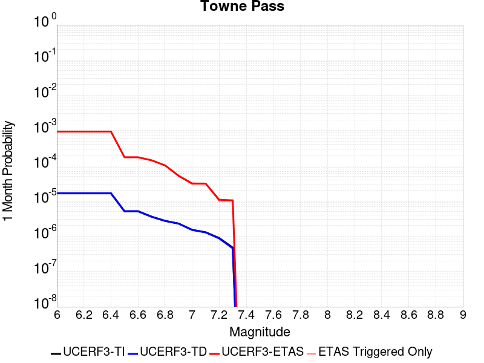 |  |  |

| Magnitude | 1 wk TI Prob | 1 wk TD Prob | 1 wk ETAS Prob | 1 wk ETAS/TD Gain | 1 wk ETAS Triggered Only | 1 mo TI Prob | 1 mo TD Prob | 1 mo ETAS Prob | 1 mo ETAS/TD Gain | 1 mo ETAS Triggered Only | 1 yr TI Prob | 1 yr TD Prob | 1 yr ETAS Prob | 1 yr ETAS/TD Gain | 1 yr ETAS Triggered Only | 10 yr TI Prob | 10 yr TD Prob | 10 yr ETAS Prob | 10 yr ETAS/TD Gain | 10 yr ETAS Triggered Only |
|-----|-----|-----|-----|-----|-----|-----|-----|-----|-----|-----|-----|-----|-----|-----|-----|-----|-----|-----|-----|-----|
| 6.0 | 3.849728E-6 | 3.894542E-6 | 6.038922E-4 | 155.06116 | 6.0E-4 | 1.649873E-5 | 1.6690812E-5 | 9.3667547E-4 | 56.11923 | 9.2E-4 | 2.0085352E-4 | 2.0319606E-4 | 0.0016628994 | 8.183719 | 0.00146 | 0.0020067208 | 0.0020305319 | 0.0042160847 | 2.0763452 | 0.00219 |
| 6.1 | 3.849728E-6 | 3.894542E-6 | 6.038922E-4 | 155.06116 | 6.0E-4 | 1.649873E-5 | 1.6690812E-5 | 9.3667547E-4 | 56.11923 | 9.2E-4 | 2.0085352E-4 | 2.0319606E-4 | 0.0016628994 | 8.183719 | 0.00146 | 0.0020067208 | 0.0020305319 | 0.0042160847 | 2.0763452 | 0.00219 |
| 6.2 | 3.849728E-6 | 3.894542E-6 | 6.038922E-4 | 155.06116 | 6.0E-4 | 1.649873E-5 | 1.6690812E-5 | 9.3667547E-4 | 56.11923 | 9.2E-4 | 2.0085352E-4 | 2.0319606E-4 | 0.0016628994 | 8.183719 | 0.00146 | 0.0020067208 | 0.0020305319 | 0.0042160847 | 2.0763452 | 0.00219 |
| 6.3 | 3.849728E-6 | 3.894542E-6 | 6.038922E-4 | 155.06116 | 6.0E-4 | 1.649873E-5 | 1.6690812E-5 | 9.3667547E-4 | 56.11923 | 9.2E-4 | 2.0085352E-4 | 2.0319606E-4 | 0.0016628994 | 8.183719 | 0.00146 | 0.0020067208 | 0.0020305319 | 0.0042160847 | 2.0763452 | 0.00219 |
| 6.4 | 3.849728E-6 | 3.894542E-6 | 6.038922E-4 | 155.06116 | 6.0E-4 | 1.649873E-5 | 1.6690812E-5 | 9.3667547E-4 | 56.11923 | 9.2E-4 | 2.0085352E-4 | 2.0319606E-4 | 0.0016628994 | 8.183719 | 0.00146 | 0.0020067208 | 0.0020305319 | 0.0042160847 | 2.0763452 | 0.00219 |
| 6.5 | 1.1953545E-6 | 1.2030526E-6 | 1.4120288E-4 | 117.3705 | 1.4E-4 | 5.1229376E-6 | 5.15593E-6 | 1.7515506E-4 | 33.971573 | 1.7E-4 | 6.236998E-5 | 6.277176E-5 | 2.9275732E-4 | 4.663838 | 2.3E-4 | 6.235248E-4 | 6.2755204E-4 | 9.373575E-4 | 1.493673 | 3.1E-4 |
| 6.6 | 1.1953545E-6 | 1.2030526E-6 | 1.4120288E-4 | 117.3705 | 1.4E-4 | 5.1229376E-6 | 5.15593E-6 | 1.7515506E-4 | 33.971573 | 1.7E-4 | 6.236998E-5 | 6.277176E-5 | 2.9275732E-4 | 4.663838 | 2.3E-4 | 6.235248E-4 | 6.2755204E-4 | 9.373575E-4 | 1.493673 | 3.1E-4 |
| 6.7 | 8.375951E-7 | 8.410676E-7 | 1.1084098E-4 | 131.78604 | 1.1E-4 | 3.5896885E-6 | 3.6045708E-6 | 1.4360406E-4 | 39.839436 | 1.4E-4 | 4.370358E-5 | 4.3884826E-5 | 2.1387737E-4 | 4.8736067 | 1.7E-4 | 4.3694986E-4 | 4.3876728E-4 | 6.3867954E-4 | 1.4556224 | 2.0E-4 |
| 6.8 | 6.38041E-7 | 6.3921624E-7 | 8.063916E-5 | 126.15319 | 8.0E-5 | 2.7344586E-6 | 2.7394954E-6 | 1.0273922E-4 | 37.50297 | 1.0E-4 | 3.3291526E-5 | 3.3352884E-5 | 1.5334888E-4 | 4.5977697 | 1.2E-4 | 3.3286537E-4 | 3.334826E-4 | 4.734359E-4 | 1.419672 | 1.4E-4 |
| 6.9 | 5.3460053E-7 | 5.345339E-7 | 4.0534513E-5 | 75.83151 | 4.0E-5 | 2.2911431E-6 | 2.2908578E-6 | 5.2290743E-5 | 22.825836 | 5.0E-5 | 2.789431E-5 | 2.7890868E-5 | 8.7889195E-5 | 3.1511817 | 6.0E-5 | 2.789081E-4 | 2.78877E-4 | 3.588547E-4 | 1.2867848 | 8.0E-5 |
| 7.0 | 3.557783E-7 | 3.5324283E-7 | 3.0353232E-5 | 85.92738 | 3.0E-5 | 1.5247632E-6 | 1.513897E-6 | 3.1513853E-5 | 20.816378 | 3.0E-5 | 1.8563835E-5 | 1.8431549E-5 | 5.843081E-5 | 3.170152 | 4.0E-5 | 1.8562283E-4 | 1.8430105E-4 | 2.3429183E-4 | 1.2712452 | 5.0E-5 |
| 7.1 | 3.037942E-7 | 3.0002275E-7 | 3.0300014E-5 | 100.992386 | 3.0E-5 | 1.3019744E-6 | 1.2858112E-6 | 3.1285774E-5 | 24.331545 | 3.0E-5 | 1.5851423E-5 | 1.5654647E-5 | 5.565402E-5 | 3.555112 | 4.0E-5 | 1.5850292E-4 | 1.5653619E-4 | 2.0652836E-4 | 1.3193649 | 5.0E-5 |
| 7.2 | 2.0808248E-7 | 2.0217735E-7 | 1.0202175E-5 | 50.461517 | 1.0E-5 | 8.917818E-7 | 8.6647407E-7 | 1.0866465E-5 | 12.541017 | 1.0E-5 | 1.0857389E-5 | 1.0549275E-5 | 2.054917E-5 | 1.9479225 | 1.0E-5 | 1.0856859E-4 | 1.0548821E-4 | 1.254861E-4 | 1.1895746 | 2.0E-5 |
| 7.3 | 1.1162073E-7 | 1.0636902E-7 | 1.0106368E-5 | 95.01232 | 1.0E-5 | 4.7837443E-7 | 4.5586717E-7 | 1.0455863E-5 | 22.936205 | 1.0E-5 | 5.8241935E-6 | 5.5501705E-6 | 1.5550115E-5 | 2.8017364 | 1.0E-5 | 5.8240406E-5 | 5.550052E-5 | 7.549941E-5 | 1.360337 | 2.0E-5 |

## Paradise
*[(top)](#table-of-contents)*

| 1 Week | 1 Month | 1 Year | 10 Year |
|-----|-----|-----|-----|
| 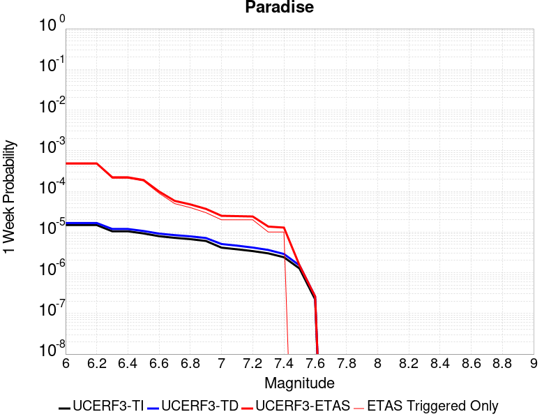 |  |  |  |

| Magnitude | 1 wk TI Prob | 1 wk TD Prob | 1 wk ETAS Prob | 1 wk ETAS/TD Gain | 1 wk ETAS Triggered Only | 1 mo TI Prob | 1 mo TD Prob | 1 mo ETAS Prob | 1 mo ETAS/TD Gain | 1 mo ETAS Triggered Only | 1 yr TI Prob | 1 yr TD Prob | 1 yr ETAS Prob | 1 yr ETAS/TD Gain | 1 yr ETAS Triggered Only | 10 yr TI Prob | 10 yr TD Prob | 10 yr ETAS Prob | 10 yr ETAS/TD Gain | 10 yr ETAS Triggered Only |
|-----|-----|-----|-----|-----|-----|-----|-----|-----|-----|-----|-----|-----|-----|-----|-----|-----|-----|-----|-----|-----|
| 6.0 | 1.4851273E-5 | 1.6694768E-5 | 4.866869E-4 | 29.152061 | 4.7E-4 | 6.364676E-5 | 7.154718E-5 | 7.2150066E-4 | 10.084264 | 6.5E-4 | 7.7462377E-4 | 8.707624E-4 | 0.0020297524 | 2.3310058 | 0.00116 | 0.0077192914 | 0.008675884 | 0.010450355 | 1.204529 | 0.00179 |
| 6.1 | 1.4851273E-5 | 1.6694768E-5 | 4.866869E-4 | 29.152061 | 4.7E-4 | 6.364676E-5 | 7.154718E-5 | 7.2150066E-4 | 10.084264 | 6.5E-4 | 7.7462377E-4 | 8.707624E-4 | 0.0020297524 | 2.3310058 | 0.00116 | 0.0077192914 | 0.008675884 | 0.010450355 | 1.204529 | 0.00179 |
| 6.2 | 1.4851273E-5 | 1.6694768E-5 | 4.866869E-4 | 29.152061 | 4.7E-4 | 6.364676E-5 | 7.154718E-5 | 7.2150066E-4 | 10.084264 | 6.5E-4 | 7.7462377E-4 | 8.707624E-4 | 0.0020297524 | 2.3310058 | 0.00116 | 0.0077192914 | 0.008675884 | 0.010450355 | 1.204529 | 0.00179 |
| 6.3 | 1.0426831E-5 | 1.1888697E-5 | 2.218862E-4 | 18.663626 | 2.1E-4 | 4.4685654E-5 | 5.09506E-5 | 2.9093836E-4 | 5.710205 | 2.4E-4 | 5.43912E-4 | 6.201529E-4 | 0.0011198429 | 1.8057528 | 5.0E-4 | 0.0054258266 | 0.0061848317 | 0.0070096985 | 1.1333693 | 8.3E-4 |
| 6.4 | 1.0426831E-5 | 1.1888697E-5 | 2.218862E-4 | 18.663626 | 2.1E-4 | 4.4685654E-5 | 5.09506E-5 | 2.9093836E-4 | 5.710205 | 2.4E-4 | 5.43912E-4 | 6.201529E-4 | 0.0011198429 | 1.8057528 | 5.0E-4 | 0.0054258266 | 0.0061848317 | 0.0070096985 | 1.1333693 | 8.3E-4 |
| 6.5 | 9.25027E-6 | 1.0620037E-5 | 1.9061813E-4 | 17.948914 | 1.8E-4 | 3.964341E-5 | 4.551368E-5 | 2.4550458E-4 | 5.3940835 | 2.0E-4 | 4.8255164E-4 | 5.5399304E-4 | 9.43777E-4 | 1.7035899 | 3.9E-4 | 0.0048150513 | 0.0055266195 | 0.0061630826 | 1.1151632 | 6.4E-4 |
| 6.6 | 7.904275E-6 | 9.159602E-6 | 9.915878E-5 | 10.825664 | 9.0E-5 | 3.3875025E-5 | 3.925487E-5 | 1.4925055E-4 | 3.80209 | 1.1E-4 | 4.1235037E-4 | 4.7782718E-4 | 6.777316E-4 | 1.4183614 | 2.0E-4 | 0.0041158604 | 0.004768395 | 0.005116726 | 1.07305 | 3.5E-4 |
| 6.7 | 7.2061953E-6 | 8.407326E-6 | 5.8406906E-5 | 6.947144 | 5.0E-5 | 3.088333E-5 | 3.603092E-5 | 1.060284E-4 | 2.9427059 | 7.0E-5 | 3.7593965E-4 | 4.3859181E-4 | 5.585392E-4 | 1.2734829 | 1.2E-4 | 0.003753043 | 0.004377631 | 0.004606624 | 1.0523099 | 2.3E-4 |
| 6.8 | 6.6948724E-6 | 7.842242E-6 | 4.7841928E-5 | 6.100542 | 4.0E-5 | 2.8691995E-5 | 3.3609194E-5 | 9.360718E-5 | 2.7851658 | 6.0E-5 | 3.4926904E-4 | 4.091187E-4 | 5.090778E-4 | 1.2443279 | 1.0E-4 | 0.003487206 | 0.0040840125 | 0.0042732367 | 1.0463328 | 1.9E-4 |
| 6.9 | 6.0421025E-6 | 7.1306963E-6 | 3.713048E-5 | 5.207133 | 3.0E-5 | 2.5894467E-5 | 3.0559786E-5 | 7.055856E-5 | 2.3088696 | 4.0E-5 | 3.1521954E-4 | 3.7200528E-4 | 4.2198668E-4 | 1.1343567 | 5.0E-5 | 0.0031477278 | 0.0037141638 | 0.0038337181 | 1.0321888 | 1.2E-4 |
| 7.0 | 4.134091E-6 | 5.0803824E-6 | 2.508028E-5 | 4.9366913 | 2.0E-5 | 1.7717413E-5 | 2.1772896E-5 | 4.177246E-5 | 1.9185534 | 2.0E-5 | 2.1568815E-4 | 2.650543E-4 | 2.85049E-4 | 1.0754362 | 2.0E-5 | 0.0021547892 | 0.0026475347 | 0.002707376 | 1.0226026 | 6.0E-5 |
| 7.1 | 3.7674888E-6 | 4.631936E-6 | 2.4631843E-5 | 5.317829 | 2.0E-5 | 1.6146281E-5 | 1.9851012E-5 | 3.9850616E-5 | 2.0074854 | 2.0E-5 | 1.9656324E-4 | 2.4166079E-4 | 2.6165595E-4 | 1.0827407 | 2.0E-5 | 0.0019638946 | 0.0024141306 | 0.0024739858 | 1.0247936 | 6.0E-5 |
| 7.2 | 3.4065345E-6 | 4.156782E-6 | 2.41567E-5 | 5.811394 | 2.0E-5 | 1.4599351E-5 | 1.7814667E-5 | 3.7814312E-5 | 2.1226504 | 2.0E-5 | 1.777326E-4 | 2.168735E-4 | 2.3686915E-4 | 1.0921997 | 2.0E-5 | 0.0017759053 | 0.0021667667 | 0.0022166583 | 1.0230259 | 5.0E-5 |
| 7.3 | 2.9934936E-6 | 3.6293673E-6 | 1.3629331E-5 | 3.7552912 | 1.0E-5 | 1.2829195E-5 | 1.5554348E-5 | 2.555419E-5 | 1.6428971 | 1.0E-5 | 1.5618425E-4 | 1.8935918E-4 | 1.993573E-4 | 1.0527997 | 1.0E-5 | 0.0015607453 | 0.0018921237 | 0.001932048 | 1.0211003 | 4.0E-5 |
| 7.4 | 2.4049796E-6 | 2.8890186E-6 | 1.288899E-5 | 4.4613733 | 1.0E-5 | 1.0307015E-5 | 1.2381457E-5 | 2.2381333E-5 | 1.8076494 | 1.0E-5 | 1.2548068E-4 | 1.5073526E-4 | 1.6073375E-4 | 1.0663315 | 1.0E-5 | 0.0012540985 | 0.0015064715 | 0.0015464113 | 1.0265121 | 4.0E-5 |
| 7.5 | 1.2710091E-6 | 1.5134859E-6 | 1.5134859E-6 | 1.0 | 0.0 | 5.44717E-6 | 6.4863593E-6 | 6.4863593E-6 | 1.0 | 0.0 | 6.631728E-5 | 7.896981E-5 | 7.896981E-5 | 1.0 | 0.0 | 6.6297496E-4 | 7.895401E-4 | 8.195164E-4 | 1.0379668 | 3.0E-5 |
| 7.6 | 2.21172E-7 | 2.6040198E-7 | 2.6040198E-7 | 1.0 | 0.0 | 9.478797E-7 | 1.1160082E-6 | 1.1160082E-6 | 1.0 | 0.0 | 1.1540374E-5 | 1.3587343E-5 | 1.3587343E-5 | 1.0 | 0.0 | 1.1539775E-4 | 1.3586794E-4 | 1.5586523E-4 | 1.1471817 | 2.0E-5 |

## Bicycle Lake
*[(top)](#table-of-contents)*

| 1 Week | 1 Month | 1 Year | 10 Year |
|-----|-----|-----|-----|
| 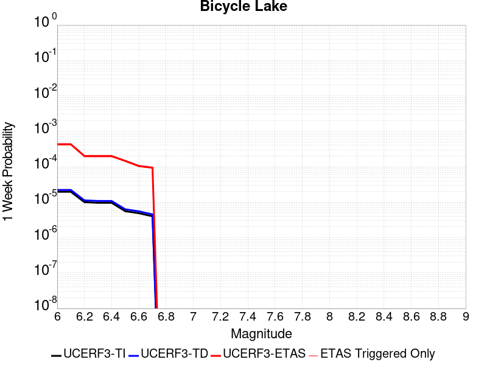 |  | 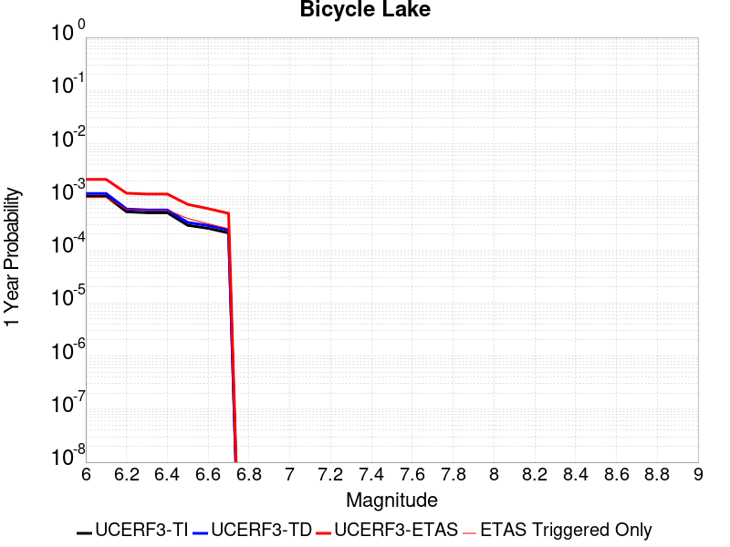 | 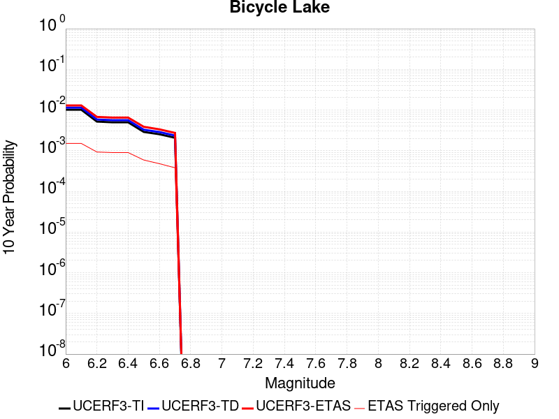 |

| Magnitude | 1 wk TI Prob | 1 wk TD Prob | 1 wk ETAS Prob | 1 wk ETAS/TD Gain | 1 wk ETAS Triggered Only | 1 mo TI Prob | 1 mo TD Prob | 1 mo ETAS Prob | 1 mo ETAS/TD Gain | 1 mo ETAS Triggered Only | 1 yr TI Prob | 1 yr TD Prob | 1 yr ETAS Prob | 1 yr ETAS/TD Gain | 1 yr ETAS Triggered Only | 10 yr TI Prob | 10 yr TD Prob | 10 yr ETAS Prob | 10 yr ETAS/TD Gain | 10 yr ETAS Triggered Only |
|-----|-----|-----|-----|-----|-----|-----|-----|-----|-----|-----|-----|-----|-----|-----|-----|-----|-----|-----|-----|-----|
| 6.0 | 1.9621975E-5 | 2.2097078E-5 | 4.32088E-4 | 19.55408 | 4.1E-4 | 8.4091465E-5 | 9.4699084E-5 | 6.546461E-4 | 6.9129076 | 5.6E-4 | 0.0010233327 | 0.0011524865 | 0.0021213687 | 1.8406885 | 9.7E-4 | 0.01018633 | 0.011478408 | 0.012971076 | 1.1300414 | 0.00151 |
| 6.1 | 1.9621975E-5 | 2.2097078E-5 | 4.32088E-4 | 19.55408 | 4.1E-4 | 8.4091465E-5 | 9.4699084E-5 | 6.546461E-4 | 6.9129076 | 5.6E-4 | 0.0010233327 | 0.0011524865 | 0.0021213687 | 1.8406885 | 9.7E-4 | 0.01018633 | 0.011478408 | 0.012971076 | 1.1300414 | 0.00151 |
| 6.2 | 9.9971285E-6 | 1.125564E-5 | 2.012535E-4 | 17.880238 | 1.9E-4 | 4.2844134E-5 | 4.8237856E-5 | 3.4822337E-4 | 7.2188816 | 3.0E-4 | 5.2150246E-4 | 5.871897E-4 | 0.001166849 | 1.9871758 | 5.8E-4 | 0.0052028033 | 0.005861487 | 0.0067860354 | 1.1577328 | 9.3E-4 |
| 6.3 | 9.589428E-6 | 1.0798346E-5 | 2.0079629E-4 | 18.595097 | 1.9E-4 | 4.10969E-5 | 4.62781E-5 | 3.3626467E-4 | 7.2661734 | 2.9E-4 | 5.002399E-4 | 5.6334207E-4 | 0.0011230266 | 1.9935075 | 5.6E-4 | 0.0049911533 | 0.0056242296 | 0.0065191677 | 1.1591219 | 9.0E-4 |
| 6.4 | 9.589428E-6 | 1.0798346E-5 | 2.0079629E-4 | 18.595097 | 1.9E-4 | 4.10969E-5 | 4.62781E-5 | 3.3626467E-4 | 7.2661734 | 2.9E-4 | 5.002399E-4 | 5.6334207E-4 | 0.0011230266 | 1.9935075 | 5.6E-4 | 0.0049911533 | 0.0056242296 | 0.0065191677 | 1.1591219 | 9.0E-4 |
| 6.5 | 5.557707E-6 | 6.2856016E-6 | 1.4628473E-4 | 23.272987 | 1.4E-4 | 2.3818526E-5 | 2.6938165E-5 | 2.4693224E-4 | 9.166632 | 2.2E-4 | 2.8995197E-4 | 3.279497E-4 | 7.1782176E-4 | 2.1888168 | 3.9E-4 | 0.0028957394 | 0.0032772934 | 0.0038653598 | 1.1794366 | 5.9E-4 |
| 6.6 | 4.8742945E-6 | 5.5132896E-6 | 1.05512736E-4 | 19.137892 | 1.0E-4 | 2.0889667E-5 | 2.3628318E-5 | 2.0362406E-4 | 8.617798 | 1.8E-4 | 2.54302E-4 | 2.87663E-4 | 5.975738E-4 | 2.07734 | 3.1E-4 | 0.002540112 | 0.0028754752 | 0.003354095 | 1.166449 | 4.8E-4 |
| 6.7 | 3.991108E-6 | 4.5159104E-6 | 9.4515504E-5 | 20.929447 | 9.0E-5 | 1.7104636E-5 | 1.9353902E-5 | 1.69351E-4 | 8.750225 | 1.5E-4 | 2.0822904E-4 | 2.3563375E-4 | 4.8557483E-4 | 2.0607185 | 2.5E-4 | 0.0020803404 | 0.0023563374 | 0.002735442 | 1.1608872 | 3.8E-4 |

## Garlic Springs
*[(top)](#table-of-contents)*

| 1 Week | 1 Month | 1 Year | 10 Year |
|-----|-----|-----|-----|
|  |  |  | 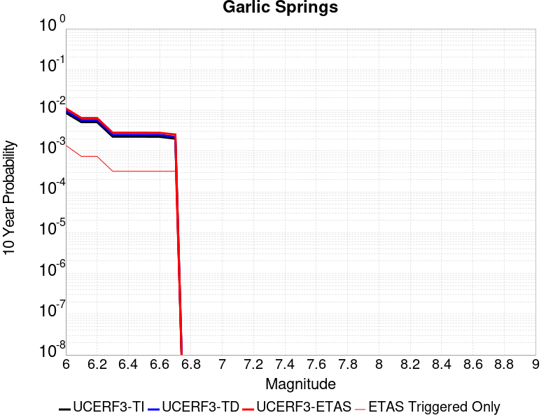 |

| Magnitude | 1 wk TI Prob | 1 wk TD Prob | 1 wk ETAS Prob | 1 wk ETAS/TD Gain | 1 wk ETAS Triggered Only | 1 mo TI Prob | 1 mo TD Prob | 1 mo ETAS Prob | 1 mo ETAS/TD Gain | 1 mo ETAS Triggered Only | 1 yr TI Prob | 1 yr TD Prob | 1 yr ETAS Prob | 1 yr ETAS/TD Gain | 1 yr ETAS Triggered Only | 10 yr TI Prob | 10 yr TD Prob | 10 yr ETAS Prob | 10 yr ETAS/TD Gain | 10 yr ETAS Triggered Only |
|-----|-----|-----|-----|-----|-----|-----|-----|-----|-----|-----|-----|-----|-----|-----|-----|-----|-----|-----|-----|-----|
| 6.0 | 1.6760017E-5 | 1.8776833E-5 | 3.187712E-4 | 16.976835 | 3.0E-4 | 7.182667E-5 | 8.0470316E-5 | 5.204349E-4 | 6.4674144 | 4.4E-4 | 8.7413884E-4 | 9.794032E-4 | 0.0017586392 | 1.7956234 | 7.8E-4 | 0.008707083 | 0.009762413 | 0.011128941 | 1.1399785 | 0.00138 |
| 6.1 | 9.852767E-6 | 1.0973587E-5 | 1.8097172E-4 | 16.491573 | 1.7E-4 | 4.222546E-5 | 4.702921E-5 | 3.0701698E-4 | 6.5282187 | 2.6E-4 | 5.139737E-4 | 5.7250116E-4 | 0.001002255 | 1.7506602 | 4.3E-4 | 0.005127866 | 0.005717221 | 0.0064529907 | 1.1286935 | 7.4E-4 |
| 6.2 | 9.852767E-6 | 1.0973587E-5 | 1.8097172E-4 | 16.491573 | 1.7E-4 | 4.222546E-5 | 4.702921E-5 | 3.0701698E-4 | 6.5282187 | 2.6E-4 | 5.139737E-4 | 5.7250116E-4 | 0.001002255 | 1.7506602 | 4.3E-4 | 0.005127866 | 0.005717221 | 0.0064529907 | 1.1286935 | 7.4E-4 |
| 6.3 | 4.3167724E-6 | 4.7780286E-6 | 7.4777694E-5 | 15.650324 | 7.0E-5 | 1.8500323E-5 | 2.0477235E-5 | 1.5047457E-4 | 7.3483834 | 1.3E-4 | 2.2521814E-4 | 2.4930484E-4 | 4.5925248E-4 | 1.8421322 | 2.1E-4 | 0.0022499003 | 0.00249251 | 0.0028117124 | 1.1280646 | 3.2E-4 |
| 6.4 | 4.3167724E-6 | 4.7780286E-6 | 7.4777694E-5 | 15.650324 | 7.0E-5 | 1.8500323E-5 | 2.0477235E-5 | 1.5047457E-4 | 7.3483834 | 1.3E-4 | 2.2521814E-4 | 2.4930484E-4 | 4.5925248E-4 | 1.8421322 | 2.1E-4 | 0.0022499003 | 0.00249251 | 0.0028117124 | 1.1280646 | 3.2E-4 |
| 6.5 | 4.3167724E-6 | 4.7780286E-6 | 7.4777694E-5 | 15.650324 | 7.0E-5 | 1.8500323E-5 | 2.0477235E-5 | 1.5047457E-4 | 7.3483834 | 1.3E-4 | 2.2521814E-4 | 2.4930484E-4 | 4.5925248E-4 | 1.8421322 | 2.1E-4 | 0.0022499003 | 0.00249251 | 0.0028117124 | 1.1280646 | 3.2E-4 |
| 6.6 | 4.301311E-6 | 4.760897E-6 | 7.4760566E-5 | 15.703041 | 7.0E-5 | 1.8434059E-5 | 2.0403815E-5 | 1.5040116E-4 | 7.3712277 | 1.3E-4 | 2.2441156E-4 | 2.4841115E-4 | 4.58359E-4 | 1.8451626 | 2.1E-4 | 0.0022418506 | 0.002483593 | 0.0028027983 | 1.1285256 | 3.2E-4 |
| 6.7 | 3.8599724E-6 | 4.27106E-6 | 7.427076E-5 | 17.389305 | 7.0E-5 | 1.6542634E-5 | 1.8304541E-5 | 1.4830216E-4 | 8.101933 | 1.3E-4 | 2.0138794E-4 | 2.228578E-4 | 4.32811E-4 | 1.9420949 | 2.1E-4 | 0.0020120554 | 0.002228578 | 0.0025478648 | 1.1432693 | 3.2E-4 |

## San Andreas (San Bernardino N)
*[(top)](#table-of-contents)*

| 1 Week | 1 Month | 1 Year | 10 Year |
|-----|-----|-----|-----|
|  | 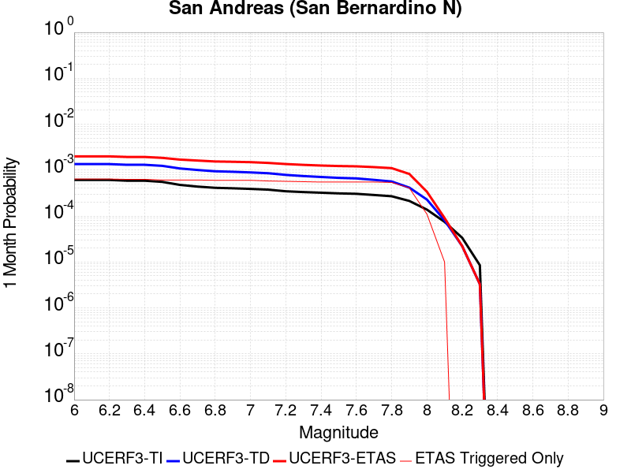 |  |  |

| Magnitude | 1 wk TI Prob | 1 wk TD Prob | 1 wk ETAS Prob | 1 wk ETAS/TD Gain | 1 wk ETAS Triggered Only | 1 mo TI Prob | 1 mo TD Prob | 1 mo ETAS Prob | 1 mo ETAS/TD Gain | 1 mo ETAS Triggered Only | 1 yr TI Prob | 1 yr TD Prob | 1 yr ETAS Prob | 1 yr ETAS/TD Gain | 1 yr ETAS Triggered Only | 10 yr TI Prob | 10 yr TD Prob | 10 yr ETAS Prob | 10 yr ETAS/TD Gain | 10 yr ETAS Triggered Only |
|-----|-----|-----|-----|-----|-----|-----|-----|-----|-----|-----|-----|-----|-----|-----|-----|-----|-----|-----|-----|-----|
| 6.0 | 1.4273766E-4 | 3.160784E-4 | 7.6593616E-4 | 2.4232473 | 4.5E-4 | 6.115894E-4 | 0.0013539245 | 0.001993058 | 1.47206 | 6.4E-4 | 0.0074207084 | 0.016360939 | 0.017305233 | 1.0577164 | 9.6E-4 | 0.07177748 | 0.15021162 | 0.15132484 | 1.007411 | 0.00131 |
| 6.1 | 1.4273766E-4 | 3.160784E-4 | 7.6593616E-4 | 2.4232473 | 4.5E-4 | 6.115894E-4 | 0.0013539245 | 0.001993058 | 1.47206 | 6.4E-4 | 0.0074207084 | 0.016360939 | 0.017305233 | 1.0577164 | 9.6E-4 | 0.07177748 | 0.15021162 | 0.15132484 | 1.007411 | 0.00131 |
| 6.2 | 1.4273766E-4 | 3.160784E-4 | 7.6593616E-4 | 2.4232473 | 4.5E-4 | 6.115894E-4 | 0.0013539245 | 0.001993058 | 1.47206 | 6.4E-4 | 0.0074207084 | 0.016360939 | 0.017305233 | 1.0577164 | 9.6E-4 | 0.07177748 | 0.15021162 | 0.15132484 | 1.007411 | 0.00131 |
| 6.3 | 1.3730655E-4 | 3.0512668E-4 | 7.449924E-4 | 2.441584 | 4.4E-4 | 5.883239E-4 | 0.001307036 | 0.0019362126 | 1.4813766 | 6.3E-4 | 0.0071393442 | 0.015798455 | 0.016723605 | 1.0585595 | 9.4E-4 | 0.06914291 | 0.1455135 | 0.14661579 | 1.0075752 | 0.00129 |
| 6.4 | 1.3730655E-4 | 3.0512668E-4 | 7.449924E-4 | 2.441584 | 4.4E-4 | 5.883239E-4 | 0.001307036 | 0.0019362126 | 1.4813766 | 6.3E-4 | 0.0071393442 | 0.015798455 | 0.016723605 | 1.0585595 | 9.4E-4 | 0.06914291 | 0.1455135 | 0.14661579 | 1.0075752 | 0.00129 |
| 6.5 | 1.2942807E-4 | 2.8927144E-4 | 7.091499E-4 | 2.4515035 | 4.2E-4 | 5.545738E-4 | 0.0012391509 | 0.001848395 | 1.4916626 | 6.1E-4 | 0.0067310524 | 0.014983548 | 0.015889762 | 1.0604807 | 9.2E-4 | 0.06530788 | 0.13865088 | 0.13974479 | 1.0078897 | 0.00127 |
| 6.6 | 1.1125901E-4 | 2.5365927E-4 | 6.7355274E-4 | 2.6553445 | 4.2E-4 | 4.767372E-4 | 0.0010866605 | 0.0016959977 | 1.5607429 | 6.1E-4 | 0.005788839 | 0.0131504685 | 0.014048501 | 1.068289 | 9.1E-4 | 0.056403454 | 0.12300495 | 0.12410997 | 1.0089835 | 0.00126 |
| 6.7 | 1.02209575E-4 | 2.3500937E-4 | 6.549107E-4 | 2.7867427 | 4.2E-4 | 4.3796748E-4 | 0.0010067957 | 0.0016161816 | 1.6052727 | 6.1E-4 | 0.0053192247 | 0.012189267 | 0.013048662 | 1.0705043 | 8.7E-4 | 0.051936906 | 0.114792764 | 0.11585501 | 1.0092536 | 0.0012 |
| 6.8 | 9.610582E-5 | 2.2026796E-4 | 6.301777E-4 | 2.8609593 | 4.1E-4 | 4.1181705E-4 | 9.436647E-4 | 0.0015430985 | 1.6352191 | 6.0E-4 | 0.0050023515 | 0.011428859 | 0.012249373 | 1.0717932 | 8.3E-4 | 0.048912346 | 0.108204685 | 0.10921241 | 1.0093132 | 0.00113 |
| 6.9 | 9.3877505E-5 | 2.1482339E-4 | 6.247353E-4 | 2.9081345 | 4.1E-4 | 4.0227012E-4 | 9.203475E-4 | 0.0015197953 | 1.6513276 | 6.0E-4 | 0.0048866454 | 0.011147907 | 0.011968655 | 1.0736234 | 8.3E-4 | 0.04780577 | 0.10579827 | 0.106799774 | 1.0094662 | 0.00112 |
| 7.0 | 9.1019785E-5 | 2.0809306E-4 | 6.1800773E-4 | 2.9698625 | 4.1E-4 | 3.900265E-4 | 8.915232E-4 | 0.0014909883 | 1.6724055 | 6.0E-4 | 0.0047382377 | 0.0108004995 | 0.011621535 | 1.0760183 | 8.3E-4 | 0.046384744 | 0.102768146 | 0.10376408 | 1.009691 | 0.00111 |
| 7.1 | 8.771155E-5 | 1.9983841E-4 | 6.0975645E-4 | 3.0512476 | 4.1E-4 | 3.758525E-4 | 8.5616973E-4 | 0.0014356732 | 1.6768558 | 5.8E-4 | 0.0045664064 | 0.010374243 | 0.01117584 | 1.077268 | 8.1E-4 | 0.044737056 | 0.099076435 | 0.100049436 | 1.0098207 | 0.00108 |
| 7.2 | 8.0830236E-5 | 1.8389444E-4 | 5.8382086E-4 | 3.174761 | 4.0E-4 | 3.4636928E-4 | 7.8788114E-4 | 0.001357432 | 1.7228894 | 5.7E-4 | 0.0042088944 | 0.009550368 | 0.010342728 | 1.0829664 | 8.0E-4 | 0.041300658 | 0.09180518 | 0.09275878 | 1.0103873 | 0.00105 |
| 7.3 | 7.7668235E-5 | 1.7333007E-4 | 5.632625E-4 | 3.2496524 | 3.9E-4 | 3.328214E-4 | 7.426318E-4 | 0.001302216 | 1.7535149 | 5.6E-4 | 0.0040445733 | 0.009004138 | 0.009787025 | 1.0869474 | 7.9E-4 | 0.03971748 | 0.08706761 | 0.08801706 | 1.0109048 | 0.00104 |
| 7.4 | 7.520177E-5 | 1.655312E-4 | 5.454683E-4 | 3.29526 | 3.8E-4 | 3.2225347E-4 | 7.092266E-4 | 0.0012588365 | 1.7749426 | 5.5E-4 | 0.0039163795 | 0.008600714 | 0.009364091 | 1.0887575 | 7.7E-4 | 0.038480744 | 0.08352156 | 0.08443804 | 1.010973 | 0.001 |
| 7.5 | 7.274697E-5 | 1.584075E-4 | 5.383473E-4 | 3.3984962 | 3.8E-4 | 3.1173544E-4 | 6.7871273E-4 | 0.0012283394 | 1.8098075 | 5.5E-4 | 0.003788775 | 0.008232076 | 0.008995737 | 1.0927665 | 7.7E-4 | 0.03724827 | 0.08023653 | 0.0811563 | 1.0114632 | 0.001 |
| 7.6 | 7.1185845E-5 | 1.5410586E-4 | 5.340473E-4 | 3.4654574 | 3.8E-4 | 3.0504653E-4 | 6.602866E-4 | 0.0012099234 | 1.8324217 | 5.5E-4 | 0.0037076178 | 0.0080094095 | 0.008773242 | 1.095367 | 7.7E-4 | 0.036463667 | 0.07822661 | 0.079139166 | 1.0116656 | 9.9E-4 |
| 7.7 | 6.709961E-5 | 1.4319421E-4 | 5.231398E-4 | 3.6533585 | 3.8E-4 | 2.8753807E-4 | 6.135452E-4 | 0.0011632077 | 1.8958795 | 5.5E-4 | 0.003495157 | 0.0074443663 | 0.008208634 | 1.1026639 | 7.7E-4 | 0.034406938 | 0.07305557 | 0.073963985 | 1.0124345 | 9.8E-4 |
| 7.8 | 6.300812E-5 | 1.320343E-4 | 5.019854E-4 | 3.801932 | 3.7E-4 | 2.7000686E-4 | 5.657386E-4 | 0.0011054331 | 1.9539645 | 5.4E-4 | 0.0032823787 | 0.006866143 | 0.007620925 | 1.109928 | 7.6E-4 | 0.032343175 | 0.06771384 | 0.068618156 | 1.013355 | 9.7E-4 |
| 7.9 | 4.983037E-5 | 9.7241085E-5 | 3.8721287E-4 | 3.9819887 | 2.9E-4 | 2.1354125E-4 | 4.1668097E-4 | 8.2651014E-4 | 1.9835563 | 4.1E-4 | 0.0025967648 | 0.0050613005 | 0.0056582633 | 1.1179466 | 6.0E-4 | 0.025666296 | 0.050650507 | 0.051381506 | 1.0144322 | 7.7E-4 |
| 8.0 | 3.2211527E-5 | 5.3306234E-5 | 1.4330144E-4 | 2.688268 | 9.0E-5 | 1.380421E-4 | 2.2843528E-4 | 3.3841014E-4 | 1.4814268 | 1.1E-4 | 0.0016793669 | 0.0027776542 | 0.0029372098 | 1.0574425 | 1.6E-4 | 0.016667323 | 0.028362568 | 0.028586045 | 1.0078793 | 2.3E-4 |
| 8.1 | 1.743376E-5 | 1.8823403E-5 | 2.8823213E-5 | 1.5312436 | 1.0E-5 | 7.471398E-5 | 8.066923E-5 | 9.066842E-5 | 1.123953 | 1.0E-5 | 9.0926304E-4 | 9.81706E-4 | 0.0010016863 | 1.0203527 | 2.0E-5 | 0.009055517 | 0.010483979 | 0.010513665 | 1.0028315 | 3.0E-5 |
| 8.2 | 7.831616E-6 | 5.1540533E-6 | 5.1540533E-6 | 1.0 | 0.0 | 3.3563636E-5 | 2.2088612E-5 | 2.2088612E-5 | 1.0 | 0.0 | 4.0856065E-4 | 2.6889573E-4 | 2.6889573E-4 | 1.0 | 0.0 | 0.004078103 | 0.0030413668 | 0.0030413668 | 1.0 | 0.0 |
| 8.3 | 1.983087E-6 | 7.6564595E-7 | 7.6564595E-7 | 1.0 | 0.0 | 8.498917E-6 | 3.281336E-6 | 3.281336E-6 | 1.0 | 0.0 | 1.034694E-4 | 3.9949547E-5 | 3.9949547E-5 | 1.0 | 0.0 | 0.0010342124 | 4.717979E-4 | 4.717979E-4 | 1.0 | 0.0 |

## Death Valley (Black Mtns Frontal)
*[(top)](#table-of-contents)*

| 1 Week | 1 Month | 1 Year | 10 Year |
|-----|-----|-----|-----|
|  | 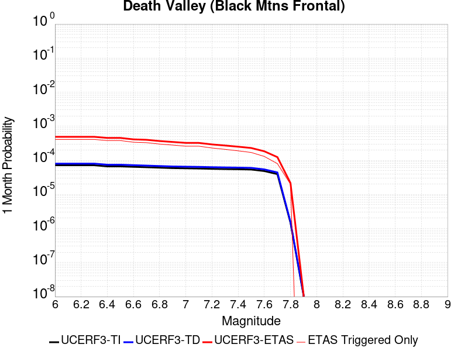 |  |  |

| Magnitude | 1 wk TI Prob | 1 wk TD Prob | 1 wk ETAS Prob | 1 wk ETAS/TD Gain | 1 wk ETAS Triggered Only | 1 mo TI Prob | 1 mo TD Prob | 1 mo ETAS Prob | 1 mo ETAS/TD Gain | 1 mo ETAS Triggered Only | 1 yr TI Prob | 1 yr TD Prob | 1 yr ETAS Prob | 1 yr ETAS/TD Gain | 1 yr ETAS Triggered Only | 10 yr TI Prob | 10 yr TD Prob | 10 yr ETAS Prob | 10 yr ETAS/TD Gain | 10 yr ETAS Triggered Only |
|-----|-----|-----|-----|-----|-----|-----|-----|-----|-----|-----|-----|-----|-----|-----|-----|-----|-----|-----|-----|-----|
| 6.0 | 1.6707214E-5 | 1.867027E-5 | 3.1866468E-4 | 17.068027 | 3.0E-4 | 7.160038E-5 | 8.001303E-5 | 4.899802E-4 | 6.1237555 | 4.1E-4 | 8.71386E-4 | 9.737309E-4 | 0.0017230005 | 1.7694833 | 7.5E-4 | 0.00867977 | 0.009695496 | 0.010695704 | 1.103162 | 0.00101 |
| 6.1 | 1.6707214E-5 | 1.867027E-5 | 3.1866468E-4 | 17.068027 | 3.0E-4 | 7.160038E-5 | 8.001303E-5 | 4.899802E-4 | 6.1237555 | 4.1E-4 | 8.71386E-4 | 9.737309E-4 | 0.0017230005 | 1.7694833 | 7.5E-4 | 0.00867977 | 0.009695496 | 0.010695704 | 1.103162 | 0.00101 |
| 6.2 | 1.6707214E-5 | 1.867027E-5 | 3.1866468E-4 | 17.068027 | 3.0E-4 | 7.160038E-5 | 8.001303E-5 | 4.899802E-4 | 6.1237555 | 4.1E-4 | 8.71386E-4 | 9.737309E-4 | 0.0017230005 | 1.7694833 | 7.5E-4 | 0.00867977 | 0.009695496 | 0.010695704 | 1.103162 | 0.00101 |
| 6.3 | 1.6707214E-5 | 1.867027E-5 | 3.1866468E-4 | 17.068027 | 3.0E-4 | 7.160038E-5 | 8.001303E-5 | 4.899802E-4 | 6.1237555 | 4.1E-4 | 8.71386E-4 | 9.737309E-4 | 0.0017230005 | 1.7694833 | 7.5E-4 | 0.00867977 | 0.009695496 | 0.010695704 | 1.103162 | 0.00101 |
| 6.4 | 1.5515609E-5 | 1.7338214E-5 | 2.9733335E-4 | 17.14902 | 2.8E-4 | 6.649377E-5 | 7.4304546E-5 | 4.542763E-4 | 6.113708 | 3.8E-4 | 8.0926094E-4 | 9.042885E-4 | 0.0015836735 | 1.7512925 | 6.8E-4 | 0.008063202 | 0.009006773 | 0.009918487 | 1.1012254 | 9.2E-4 |
| 6.5 | 1.5515609E-5 | 1.7338214E-5 | 2.9733335E-4 | 17.14902 | 2.8E-4 | 6.649377E-5 | 7.4304546E-5 | 4.542763E-4 | 6.113708 | 3.8E-4 | 8.0926094E-4 | 9.042885E-4 | 0.0015836735 | 1.7512925 | 6.8E-4 | 0.008063202 | 0.009006773 | 0.009918487 | 1.1012254 | 9.2E-4 |
| 6.6 | 1.5041828E-5 | 1.6809145E-5 | 2.6680494E-4 | 15.872606 | 2.5E-4 | 6.4463384E-5 | 7.203723E-5 | 4.1201274E-4 | 5.7194414 | 3.4E-4 | 7.8455906E-4 | 8.767063E-4 | 0.001506154 | 1.7179687 | 6.3E-4 | 0.00781795 | 0.008733132 | 0.009585622 | 1.0976156 | 8.6E-4 |
| 6.7 | 1.4634985E-5 | 1.6356016E-5 | 2.563521E-4 | 15.67326 | 2.4E-4 | 6.271985E-5 | 7.009536E-5 | 4.0007223E-4 | 5.707542 | 3.3E-4 | 7.6334673E-4 | 8.5308263E-4 | 0.0014525708 | 1.7027316 | 6.0E-4 | 0.007607299 | 0.008498715 | 0.009291917 | 1.0933318 | 8.0E-4 |
| 6.8 | 1.4209158E-5 | 1.5882048E-5 | 2.3587856E-4 | 14.851898 | 2.2E-4 | 6.089497E-5 | 6.8064175E-5 | 3.6804375E-4 | 5.4073052 | 3.0E-4 | 7.4114406E-4 | 8.2837185E-4 | 0.0013779163 | 1.663403 | 5.5E-4 | 0.007386771 | 0.008253456 | 0.008977431 | 1.0877178 | 7.3E-4 |
| 6.9 | 1.3780098E-5 | 1.5404594E-5 | 2.1540151E-4 | 13.982941 | 2.0E-4 | 5.9056227E-5 | 6.6018045E-5 | 3.4599955E-4 | 5.240985 | 2.8E-4 | 7.1877235E-4 | 8.0347876E-4 | 0.001313069 | 1.6342299 | 5.1E-4 | 0.0071645193 | 0.008006332 | 0.008690808 | 1.0854918 | 6.9E-4 |
| 7.0 | 1.3585064E-5 | 1.5188155E-5 | 1.9518542E-4 | 12.85116 | 1.8E-4 | 5.8220405E-5 | 6.50905E-5 | 3.2507358E-4 | 4.9941783 | 2.6E-4 | 7.086029E-4 | 7.9219416E-4 | 0.001281806 | 1.6180452 | 4.9E-4 | 0.007063476 | 0.007894293 | 0.008559004 | 1.0842015 | 6.7E-4 |
| 7.1 | 1.3398601E-5 | 1.49813395E-5 | 1.9497864E-4 | 13.014767 | 1.8E-4 | 5.742131E-5 | 6.420419E-5 | 3.241875E-4 | 5.0493197 | 2.6E-4 | 6.9888023E-4 | 7.8141113E-4 | 0.0012410517 | 1.5882186 | 4.6E-4 | 0.0069668638 | 0.007787224 | 0.008422241 | 1.081546 | 6.4E-4 |
| 7.2 | 1.3126312E-5 | 1.4679561E-5 | 1.7467722E-4 | 11.899348 | 1.6E-4 | 5.6254412E-5 | 6.291092E-5 | 2.9289644E-4 | 4.655733 | 2.3E-4 | 6.846822E-4 | 7.6567667E-4 | 0.0011653705 | 1.5220137 | 4.0E-4 | 0.006825765 | 0.00763097 | 0.008186697 | 1.0728252 | 5.6E-4 |
| 7.3 | 1.2922429E-5 | 1.4453788E-5 | 1.7445147E-4 | 12.069602 | 1.6E-4 | 5.5380664E-5 | 6.194336E-5 | 2.7193036E-4 | 4.3899837 | 2.1E-4 | 6.74051E-4 | 7.53905E-4 | 0.0011336185 | 1.5036623 | 3.8E-4 | 0.006720101 | 0.007514055 | 0.008020222 | 1.0673628 | 5.1E-4 |
| 7.4 | 1.2768878E-5 | 1.4283772E-5 | 1.742815E-4 | 12.201364 | 1.6E-4 | 5.4722615E-5 | 6.1214756E-5 | 2.5120314E-4 | 4.1036367 | 1.9E-4 | 6.660441E-4 | 7.4504025E-4 | 0.0010947795 | 1.4694233 | 3.5E-4 | 0.0066405144 | 0.0074260035 | 0.007902439 | 1.0641577 | 4.8E-4 |
| 7.5 | 1.2521929E-5 | 1.40120155E-5 | 1.5401005E-4 | 10.991285 | 1.4E-4 | 5.366431E-5 | 6.005014E-5 | 2.3003994E-4 | 3.8307974 | 1.7E-4 | 6.531671E-4 | 7.3087064E-4 | 0.0010506368 | 1.437514 | 3.2E-4 | 0.006512506 | 0.0072852457 | 0.00772204 | 1.0599561 | 4.4E-4 |
| 7.6 | 1.1301089E-5 | 1.2648149E-5 | 1.12646885E-4 | 8.906196 | 1.0E-4 | 4.8432343E-5 | 5.4205255E-5 | 1.8419822E-4 | 3.3981614 | 1.3E-4 | 5.895042E-4 | 6.5975444E-4 | 9.2957634E-4 | 1.4089731 | 2.7E-4 | 0.0058794282 | 0.00657851 | 0.0069560106 | 1.0573839 | 3.8E-4 |
| 7.7 | 9.189108E-6 | 1.0283358E-5 | 6.0282844E-5 | 5.862175 | 5.0E-5 | 3.93813E-5 | 4.407082E-5 | 1.240673E-4 | 2.81518 | 8.0E-5 | 4.7936183E-4 | 5.3643517E-4 | 7.0634397E-4 | 1.3167369 | 1.7E-4 | 0.004783291 | 0.005351914 | 0.005620469 | 1.0501792 | 2.7E-4 |
| 7.8 | 3.4586725E-7 | 3.6482615E-7 | 1.0364823E-5 | 28.410307 | 1.0E-5 | 1.4822873E-6 | 1.5635396E-6 | 2.1563508E-5 | 13.791469 | 2.0E-5 | 1.80467E-5 | 1.9035933E-5 | 3.9035553E-5 | 2.0506246 | 2.0E-5 | 1.8045233E-4 | 1.9034347E-4 | 2.1033967E-4 | 1.1050532 | 2.0E-5 |
| 7.9 | 2.5591178E-9 | 2.6696718E-9 | 2.6696718E-9 | 1.0 | 0.0 | 1.0967647E-8 | 1.14414505E-8 | 1.14414505E-8 | 1.0 | 0.0 | 1.335311E-7 | 1.3929966E-7 | 1.3929966E-7 | 1.0 | 0.0 | 1.3353102E-6 | 1.3929966E-6 | 1.3929966E-6 | 1.0 | 0.0 |

## Helendale-So Lockhart
*[(top)](#table-of-contents)*

| 1 Week | 1 Month | 1 Year | 10 Year |
|-----|-----|-----|-----|
| 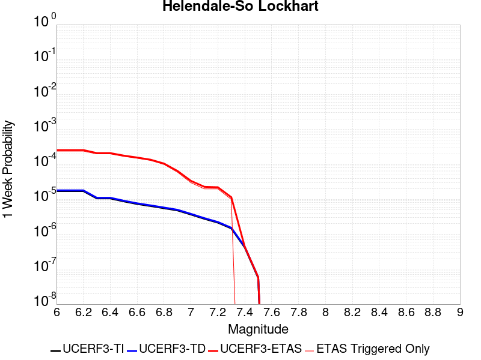 | 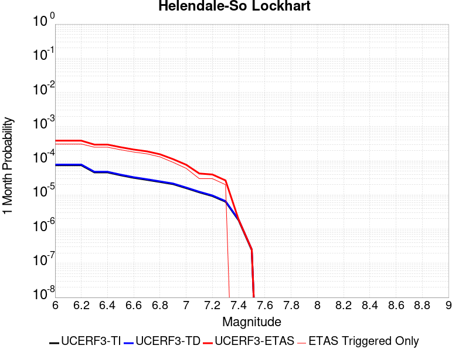 |  |  |

| Magnitude | 1 wk TI Prob | 1 wk TD Prob | 1 wk ETAS Prob | 1 wk ETAS/TD Gain | 1 wk ETAS Triggered Only | 1 mo TI Prob | 1 mo TD Prob | 1 mo ETAS Prob | 1 mo ETAS/TD Gain | 1 mo ETAS Triggered Only | 1 yr TI Prob | 1 yr TD Prob | 1 yr ETAS Prob | 1 yr ETAS/TD Gain | 1 yr ETAS Triggered Only | 10 yr TI Prob | 10 yr TD Prob | 10 yr ETAS Prob | 10 yr ETAS/TD Gain | 10 yr ETAS Triggered Only |
|-----|-----|-----|-----|-----|-----|-----|-----|-----|-----|-----|-----|-----|-----|-----|-----|-----|-----|-----|-----|-----|
| 6.0 | 1.7296055E-5 | 1.8103729E-5 | 2.5809938E-4 | 14.256697 | 2.4E-4 | 7.412385E-5 | 7.7585224E-5 | 3.8756116E-4 | 4.9952965 | 3.1E-4 | 9.0208417E-4 | 9.4421144E-4 | 0.0014936922 | 1.5819466 | 5.5E-4 | 0.008984311 | 0.009404116 | 0.010186687 | 1.0832157 | 7.9E-4 |
| 6.1 | 1.7296055E-5 | 1.8103729E-5 | 2.5809938E-4 | 14.256697 | 2.4E-4 | 7.412385E-5 | 7.7585224E-5 | 3.8756116E-4 | 4.9952965 | 3.1E-4 | 9.0208417E-4 | 9.4421144E-4 | 0.0014936922 | 1.5819466 | 5.5E-4 | 0.008984311 | 0.009404116 | 0.010186687 | 1.0832157 | 7.9E-4 |
| 6.2 | 1.7296055E-5 | 1.8103729E-5 | 2.5809938E-4 | 14.256697 | 2.4E-4 | 7.412385E-5 | 7.7585224E-5 | 3.8756116E-4 | 4.9952965 | 3.1E-4 | 9.0208417E-4 | 9.4421144E-4 | 0.0014936922 | 1.5819466 | 5.5E-4 | 0.008984311 | 0.009404116 | 0.010186687 | 1.0832157 | 7.9E-4 |
| 6.3 | 1.0669118E-5 | 1.1135425E-5 | 2.111332E-4 | 18.960499 | 2.0E-4 | 4.5723988E-5 | 4.772239E-5 | 2.9771047E-4 | 6.238381 | 2.5E-4 | 5.5654737E-4 | 5.80868E-4 | 9.7064144E-4 | 1.671019 | 3.9E-4 | 0.0055515557 | 0.0057937936 | 0.006340607 | 1.0943792 | 5.5E-4 |
| 6.4 | 1.0669118E-5 | 1.1135425E-5 | 2.111332E-4 | 18.960499 | 2.0E-4 | 4.5723988E-5 | 4.772239E-5 | 2.9771047E-4 | 6.238381 | 2.5E-4 | 5.5654737E-4 | 5.80868E-4 | 9.7064144E-4 | 1.671019 | 3.9E-4 | 0.0055515557 | 0.0057937936 | 0.006340607 | 1.0943792 | 5.5E-4 |
| 6.5 | 8.790038E-6 | 9.170197E-6 | 1.7916864E-4 | 19.538145 | 1.7E-4 | 3.767105E-5 | 3.930026E-5 | 2.49292E-4 | 6.343266 | 2.1E-4 | 4.585485E-4 | 4.7837716E-4 | 7.882289E-4 | 1.6477143 | 3.1E-4 | 0.0045760344 | 0.004773638 | 0.0052015856 | 1.089648 | 4.3E-4 |
| 6.6 | 7.396949E-6 | 7.715537E-6 | 1.5771438E-4 | 20.441141 | 1.5E-4 | 3.1700827E-5 | 3.3066175E-5 | 2.1306022E-4 | 6.4434495 | 1.8E-4 | 3.858892E-4 | 4.025073E-4 | 6.6240266E-4 | 1.645691 | 2.6E-4 | 0.003852198 | 0.00401789 | 0.004396363 | 1.094197 | 3.8E-4 |
| 6.7 | 6.4600285E-6 | 6.738031E-6 | 1.3673716E-4 | 20.29334 | 1.3E-4 | 2.7685543E-5 | 2.887696E-5 | 1.8887233E-4 | 6.5405893 | 1.6E-4 | 3.3701936E-4 | 3.5152107E-4 | 5.814402E-4 | 1.6540693 | 2.3E-4 | 0.0033650869 | 0.003509732 | 0.003828609 | 1.090855 | 3.2E-4 |
| 6.8 | 5.600104E-6 | 5.836009E-6 | 1.05835425E-4 | 18.134897 | 1.0E-4 | 2.4000226E-5 | 2.5011232E-5 | 1.5500798E-4 | 6.1975346 | 1.3E-4 | 2.9216358E-4 | 3.044698E-4 | 5.044089E-4 | 1.6566796 | 2.0E-4 | 0.0029177975 | 0.003040588 | 0.0033197368 | 1.0918075 | 2.8E-4 |
| 6.9 | 4.839122E-6 | 5.0395092E-6 | 6.503921E-5 | 12.905861 | 6.0E-5 | 2.0738931E-5 | 2.159772E-5 | 1.1159578E-4 | 5.1670165 | 9.0E-5 | 2.5246723E-4 | 2.6292098E-4 | 4.1288155E-4 | 1.5703636 | 1.5E-4 | 0.002521806 | 0.002626147 | 0.002845569 | 1.083553 | 2.2E-4 |
| 7.0 | 3.6937633E-6 | 3.845208E-6 | 3.3845092E-5 | 8.801888 | 3.0E-5 | 1.5830317E-5 | 1.647936E-5 | 7.647837E-5 | 4.640858 | 6.0E-5 | 1.9271708E-4 | 2.0061806E-4 | 3.10596E-4 | 1.5481956 | 1.1E-4 | 0.0019255003 | 0.002004401 | 0.0021840401 | 1.0896224 | 1.8E-4 |
| 7.1 | 2.7858857E-6 | 2.8978538E-6 | 2.2897795E-5 | 7.9016395 | 2.0E-5 | 1.1939455E-5 | 1.2419316E-5 | 4.2418942E-5 | 3.4155622 | 3.0E-5 | 1.4535317E-4 | 1.511949E-4 | 2.311828E-4 | 1.5290384 | 8.0E-5 | 0.0014525814 | 0.0015109418 | 0.0016507303 | 1.0925175 | 1.4E-4 |
| 7.2 | 2.1672065E-6 | 2.2540128E-6 | 2.2253967E-5 | 9.873044 | 2.0E-5 | 9.2879945E-6 | 9.66002E-6 | 3.965973E-5 | 4.1055536 | 3.0E-5 | 1.1307546E-4 | 1.1760458E-4 | 1.8759635E-4 | 1.5951449 | 7.0E-5 | 0.0011301794 | 0.0011754417 | 0.0012953005 | 1.1019692 | 1.2E-4 |
| 7.3 | 1.4823496E-6 | 1.5422102E-6 | 1.1542194E-5 | 7.4841905 | 1.0E-5 | 6.3529114E-6 | 6.6094562E-6 | 2.6609325E-5 | 4.0259476 | 2.0E-5 | 7.734395E-5 | 8.046731E-5 | 1.3046329E-4 | 1.6213204 | 5.0E-5 | 7.731704E-4 | 8.0439687E-4 | 8.843325E-4 | 1.0993733 | 8.0E-5 |
| 7.4 | 4.2321457E-7 | 4.4108765E-7 | 4.4108765E-7 | 1.0 | 0.0 | 1.8137755E-6 | 1.8903745E-6 | 1.8903745E-6 | 1.0 | 0.0 | 2.2082493E-5 | 2.3015113E-5 | 3.3014883E-5 | 1.4344871 | 1.0E-5 | 2.2080299E-4 | 2.3013182E-4 | 2.5012722E-4 | 1.0868868 | 2.0E-5 |
| 7.5 | 5.6942316E-8 | 5.9415648E-8 | 5.9415648E-8 | 1.0 | 0.0 | 2.440385E-7 | 2.5463845E-7 | 2.5463845E-7 | 1.0 | 0.0 | 2.9711643E-6 | 3.1002196E-6 | 1.3100189E-5 | 4.225568 | 1.0E-5 | 2.9711247E-5 | 3.1001844E-5 | 4.100153E-5 | 1.3225515 | 1.0E-5 |

## Coyote Lake
*[(top)](#table-of-contents)*

| 1 Week | 1 Month | 1 Year | 10 Year |
|-----|-----|-----|-----|
| 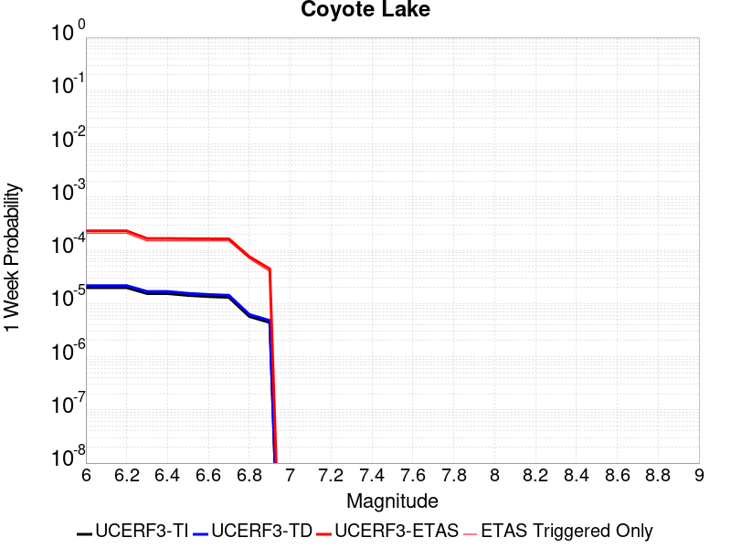 |  | 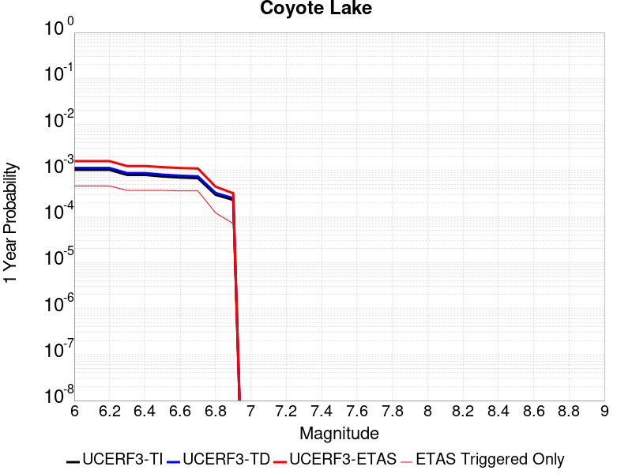 |  |

| Magnitude | 1 wk TI Prob | 1 wk TD Prob | 1 wk ETAS Prob | 1 wk ETAS/TD Gain | 1 wk ETAS Triggered Only | 1 mo TI Prob | 1 mo TD Prob | 1 mo ETAS Prob | 1 mo ETAS/TD Gain | 1 mo ETAS Triggered Only | 1 yr TI Prob | 1 yr TD Prob | 1 yr ETAS Prob | 1 yr ETAS/TD Gain | 1 yr ETAS Triggered Only | 10 yr TI Prob | 10 yr TD Prob | 10 yr ETAS Prob | 10 yr ETAS/TD Gain | 10 yr ETAS Triggered Only |
|-----|-----|-----|-----|-----|-----|-----|-----|-----|-----|-----|-----|-----|-----|-----|-----|-----|-----|-----|-----|-----|
| 6.0 | 1.980352E-5 | 2.1706745E-5 | 2.3170219E-4 | 10.674202 | 2.1E-4 | 8.486947E-5 | 9.302599E-5 | 4.1299622E-4 | 4.4395785 | 3.2E-4 | 0.0010327959 | 0.0011320751 | 0.0015915543 | 1.4058735 | 4.6E-4 | 0.010280091 | 0.011270258 | 0.011972256 | 1.0622877 | 7.1E-4 |
| 6.1 | 1.980352E-5 | 2.1706745E-5 | 2.3170219E-4 | 10.674202 | 2.1E-4 | 8.486947E-5 | 9.302599E-5 | 4.1299622E-4 | 4.4395785 | 3.2E-4 | 0.0010327959 | 0.0011320751 | 0.0015915543 | 1.4058735 | 4.6E-4 | 0.010280091 | 0.011270258 | 0.011972256 | 1.0622877 | 7.1E-4 |
| 6.2 | 1.980352E-5 | 2.1706745E-5 | 2.3170219E-4 | 10.674202 | 2.1E-4 | 8.486947E-5 | 9.302599E-5 | 4.1299622E-4 | 4.4395785 | 3.2E-4 | 0.0010327959 | 0.0011320751 | 0.0015915543 | 1.4058735 | 4.6E-4 | 0.010280091 | 0.011270258 | 0.011972256 | 1.0622877 | 7.1E-4 |
| 6.3 | 1.5344787E-5 | 1.682067E-5 | 1.6681815E-4 | 9.91745 | 1.5E-4 | 6.576172E-5 | 7.2086936E-5 | 3.2206893E-4 | 4.467785 | 2.5E-4 | 8.003548E-4 | 8.773662E-4 | 0.0012470416 | 1.4213467 | 3.7E-4 | 0.007974784 | 0.00874507 | 0.009290259 | 1.0623425 | 5.5E-4 |
| 6.4 | 1.5344787E-5 | 1.682067E-5 | 1.6681815E-4 | 9.91745 | 1.5E-4 | 6.576172E-5 | 7.2086936E-5 | 3.2206893E-4 | 4.467785 | 2.5E-4 | 8.003548E-4 | 8.773662E-4 | 0.0012470416 | 1.4213467 | 3.7E-4 | 0.007974784 | 0.00874507 | 0.009290259 | 1.0623425 | 5.5E-4 |
| 6.5 | 1.4189697E-5 | 1.5557987E-5 | 1.6555566E-4 | 10.6412 | 1.5E-4 | 6.081157E-5 | 6.6675726E-5 | 3.1665905E-4 | 4.749241 | 2.5E-4 | 7.401293E-4 | 8.115349E-4 | 0.0011812346 | 1.4555562 | 3.7E-4 | 0.0073766913 | 0.008091656 | 0.008617368 | 1.0649695 | 5.3E-4 |
| 6.6 | 1.3469301E-5 | 1.4771577E-5 | 1.6476936E-4 | 11.154487 | 1.5E-4 | 5.7724297E-5 | 6.330556E-5 | 3.1328973E-4 | 4.94885 | 2.5E-4 | 7.025667E-4 | 7.7053264E-4 | 0.0011302553 | 1.4668493 | 3.6E-4 | 0.0070034964 | 0.0076845144 | 0.008200518 | 1.0671486 | 5.2E-4 |
| 6.7 | 1.3027966E-5 | 1.4281745E-5 | 1.642796E-4 | 11.5027685 | 1.5E-4 | 5.5832945E-5 | 6.120638E-5 | 3.1119108E-4 | 5.0842915 | 2.5E-4 | 6.7955407E-4 | 7.4499263E-4 | 0.0011047245 | 1.4828663 | 3.6E-4 | 0.006774798 | 0.0074308286 | 0.007946964 | 1.0694587 | 5.2E-4 |
| 6.8 | 5.695434E-6 | 6.2244176E-6 | 7.622398E-5 | 12.245962 | 7.0E-5 | 2.4408775E-5 | 2.6675973E-5 | 1.16673575E-4 | 4.3737326 | 9.0E-5 | 2.971363E-4 | 3.2476155E-4 | 4.447226E-4 | 1.3693819 | 1.2E-4 | 0.0029673933 | 0.0032458105 | 0.0033953236 | 1.0460634 | 1.5E-4 |
| 6.9 | 4.385688E-6 | 4.7930553E-6 | 4.4792865E-5 | 9.345367 | 4.0E-5 | 1.879567E-5 | 2.0541665E-5 | 7.054064E-5 | 3.4340272 | 5.0E-5 | 2.2881327E-4 | 2.5009477E-4 | 3.2007726E-4 | 1.2798239 | 7.0E-5 | 0.002285778 | 0.0025009478 | 0.0025907226 | 1.0358963 | 9.0E-5 |

## San Andreas (San Bernardino S)
*[(top)](#table-of-contents)*

| 1 Week | 1 Month | 1 Year | 10 Year |
|-----|-----|-----|-----|
| 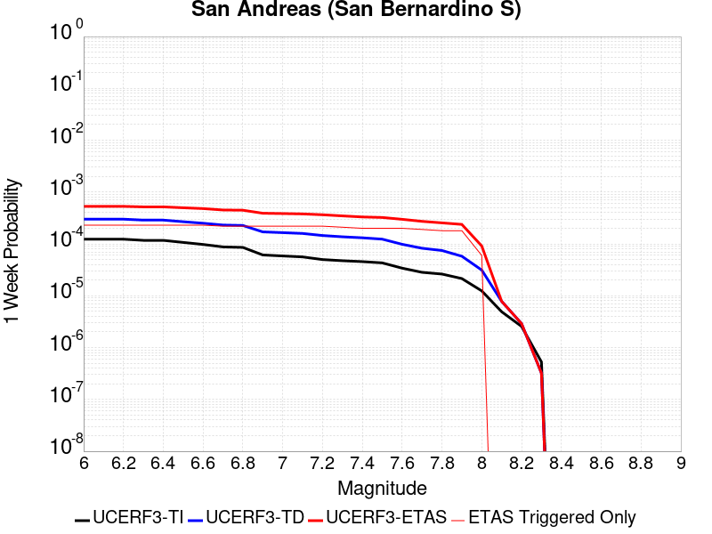 | 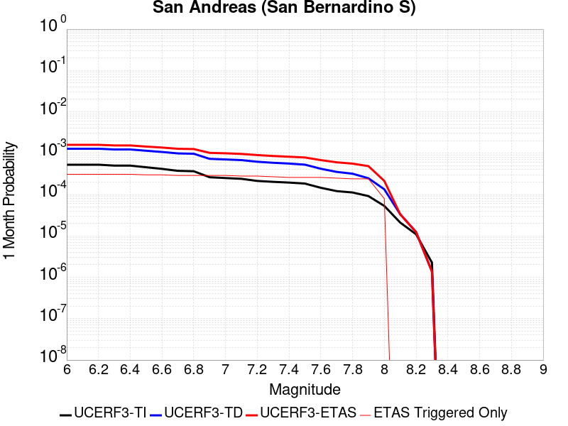 | 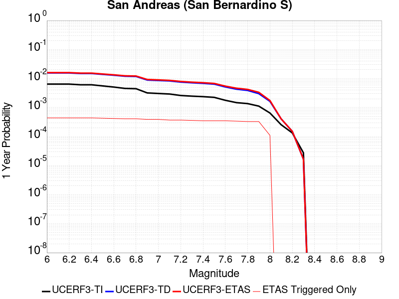 |  |

| Magnitude | 1 wk TI Prob | 1 wk TD Prob | 1 wk ETAS Prob | 1 wk ETAS/TD Gain | 1 wk ETAS Triggered Only | 1 mo TI Prob | 1 mo TD Prob | 1 mo ETAS Prob | 1 mo ETAS/TD Gain | 1 mo ETAS Triggered Only | 1 yr TI Prob | 1 yr TD Prob | 1 yr ETAS Prob | 1 yr ETAS/TD Gain | 1 yr ETAS Triggered Only | 10 yr TI Prob | 10 yr TD Prob | 10 yr ETAS Prob | 10 yr ETAS/TD Gain | 10 yr ETAS Triggered Only |
|-----|-----|-----|-----|-----|-----|-----|-----|-----|-----|-----|-----|-----|-----|-----|-----|-----|-----|-----|-----|-----|
| 6.0 | 1.2336002E-4 | 3.0005194E-4 | 5.299829E-4 | 1.766304 | 2.3E-4 | 5.2857865E-4 | 0.0012853292 | 0.0015949308 | 1.2408733 | 3.1E-4 | 0.006416472 | 0.015541554 | 0.015974717 | 1.0278713 | 4.4E-4 | 0.06234337 | 0.14294699 | 0.14349551 | 1.0038372 | 6.4E-4 |
| 6.1 | 1.2336002E-4 | 3.0005194E-4 | 5.299829E-4 | 1.766304 | 2.3E-4 | 5.2857865E-4 | 0.0012853292 | 0.0015949308 | 1.2408733 | 3.1E-4 | 0.006416472 | 0.015541554 | 0.015974717 | 1.0278713 | 4.4E-4 | 0.06234337 | 0.14294699 | 0.14349551 | 1.0038372 | 6.4E-4 |
| 6.2 | 1.2336002E-4 | 3.0005194E-4 | 5.299829E-4 | 1.766304 | 2.3E-4 | 5.2857865E-4 | 0.0012853292 | 0.0015949308 | 1.2408733 | 3.1E-4 | 0.006416472 | 0.015541554 | 0.015974717 | 1.0278713 | 4.4E-4 | 0.06234337 | 0.14294699 | 0.14349551 | 1.0038372 | 6.4E-4 |
| 6.3 | 1.1712257E-4 | 2.8793467E-4 | 5.1786844E-4 | 1.7985623 | 2.3E-4 | 5.018573E-4 | 0.0012334478 | 0.0015430654 | 1.251018 | 3.1E-4 | 0.006093008 | 0.014918666 | 0.015352102 | 1.0290532 | 4.4E-4 | 0.059286322 | 0.13765779 | 0.13820969 | 1.0040092 | 6.4E-4 |
| 6.4 | 1.1712257E-4 | 2.8793467E-4 | 5.1786844E-4 | 1.7985623 | 2.3E-4 | 5.018573E-4 | 0.0012334478 | 0.0015430654 | 1.251018 | 3.1E-4 | 0.006093008 | 0.014918666 | 0.015352102 | 1.0290532 | 4.4E-4 | 0.059286322 | 0.13765779 | 0.13820969 | 1.0040092 | 6.4E-4 |
| 6.5 | 1.0689076E-4 | 2.6806415E-4 | 4.980025E-4 | 1.8577735 | 2.3E-4 | 4.5802278E-4 | 0.0011483653 | 0.0014480208 | 1.2609409 | 3.0E-4 | 0.0055621783 | 0.013896335 | 0.01432036 | 1.0305134 | 4.3E-4 | 0.05425003 | 0.1288989 | 0.12943898 | 1.00419 | 6.2E-4 |
| 6.6 | 9.7648895E-5 | 2.505129E-4 | 4.804553E-4 | 1.9178864 | 2.3E-4 | 4.1842813E-4 | 0.0010732086 | 0.0013728867 | 1.2792356 | 3.0E-4 | 0.005082469 | 0.012992399 | 0.013406942 | 1.0319066 | 4.2E-4 | 0.049677886 | 0.121077746 | 0.1216051 | 1.0043555 | 6.0E-4 |
| 6.7 | 8.757013E-5 | 2.3122175E-4 | 4.511709E-4 | 1.9512476 | 2.2E-4 | 3.7524657E-4 | 9.905964E-4 | 0.001280309 | 1.292463 | 2.9E-4 | 0.00455906 | 0.011997902 | 0.012402982 | 1.0337627 | 4.1E-4 | 0.04466656 | 0.112373024 | 0.112896726 | 1.0046604 | 5.9E-4 |
| 6.8 | 8.562978E-5 | 2.2682057E-4 | 4.4677066E-4 | 1.9697096 | 2.2E-4 | 3.6693315E-4 | 9.7174826E-4 | 0.0012614664 | 1.2981412 | 2.9E-4 | 0.004458263 | 0.011770921 | 0.0121760955 | 1.0344216 | 4.1E-4 | 0.043698758 | 0.11037863 | 0.11089461 | 1.0046747 | 5.8E-4 |
| 6.9 | 6.124075E-5 | 1.7066885E-4 | 3.906313E-4 | 2.288826 | 2.2E-4 | 2.6243398E-4 | 7.312337E-4 | 0.0010210216 | 1.3963001 | 2.9E-4 | 0.0031904527 | 0.008866636 | 0.009253179 | 1.0435951 | 3.9E-4 | 0.031450346 | 0.08420262 | 0.08469715 | 1.0058731 | 5.4E-4 |
| 7.0 | 5.8598747E-5 | 1.6495936E-4 | 3.8492307E-4 | 2.333442 | 2.2E-4 | 2.5111332E-4 | 7.067779E-4 | 9.965729E-4 | 1.4100227 | 2.9E-4 | 0.0030530186 | 0.008571265 | 0.008957922 | 1.0451108 | 3.9E-4 | 0.03011414 | 0.08151562 | 0.08200241 | 1.0059718 | 5.3E-4 |
| 7.1 | 5.613814E-5 | 1.5914452E-4 | 3.791095E-4 | 2.3821714 | 2.2E-4 | 2.4056983E-4 | 6.818704E-4 | 9.616795E-4 | 1.4103552 | 2.8E-4 | 0.0029250039 | 0.008270353 | 0.008637293 | 1.0443681 | 3.7E-4 | 0.028868021 | 0.07881268 | 0.079282485 | 1.0059611 | 5.1E-4 |
| 7.2 | 4.991222E-5 | 1.4520933E-4 | 3.6517737E-4 | 2.5148342 | 2.2E-4 | 2.1389198E-4 | 6.221777E-4 | 9.0200343E-4 | 1.4497522 | 2.8E-4 | 0.002601025 | 0.0075488063 | 0.007916013 | 1.0486444 | 3.7E-4 | 0.025707912 | 0.07226191 | 0.07272577 | 1.0064193 | 5.0E-4 |
| 7.3 | 4.7410045E-5 | 1.371513E-4 | 3.4712252E-4 | 2.5309455 | 2.1E-4 | 2.0317009E-4 | 5.8765925E-4 | 8.575006E-4 | 1.4591799 | 2.7E-4 | 0.0024707897 | 0.0071313656 | 0.0074887984 | 1.0501212 | 3.6E-4 | 0.024434982 | 0.068541944 | 0.06899836 | 1.0066589 | 4.9E-4 |
| 7.4 | 4.5556746E-5 | 1.3123035E-4 | 3.312041E-4 | 2.5238378 | 2.0E-4 | 1.952286E-4 | 5.6229485E-4 | 8.2214864E-4 | 1.4621309 | 2.6E-4 | 0.002374317 | 0.0068245293 | 0.0071721408 | 1.0509356 | 3.5E-4 | 0.023491086 | 0.06579143 | 0.06622116 | 1.0065318 | 4.6E-4 |
| 7.5 | 4.3084514E-5 | 1.2358342E-4 | 3.235587E-4 | 2.61814 | 2.0E-4 | 1.8463485E-4 | 5.2953605E-4 | 7.893983E-4 | 1.4907359 | 2.6E-4 | 0.0022456115 | 0.0064281146 | 0.006775865 | 1.0540984 | 3.5E-4 | 0.022230545 | 0.062190283 | 0.062621675 | 1.0069367 | 4.6E-4 |
| 7.6 | 3.408608E-5 | 9.836477E-5 | 2.9834508E-4 | 3.0330484 | 2.0E-4 | 1.4607502E-4 | 4.214953E-4 | 6.813857E-4 | 1.6165915 | 2.6E-4 | 0.0017770125 | 0.005119656 | 0.005467864 | 1.068014 | 3.5E-4 | 0.017628696 | 0.05002244 | 0.050449926 | 1.008546 | 4.5E-4 |
| 7.7 | 2.8315713E-5 | 8.2495724E-5 | 2.7248004E-4 | 3.3029597 | 1.9E-4 | 1.2134742E-4 | 3.5350522E-4 | 6.034169E-4 | 1.7069532 | 2.5E-4 | 0.0014764034 | 0.004295442 | 0.0046339813 | 1.0788137 | 3.4E-4 | 0.01466633 | 0.042272415 | 0.04268424 | 1.0097421 | 4.3E-4 |
| 7.8 | 2.6222975E-5 | 7.463898E-5 | 2.5462554E-4 | 3.4114287 | 1.8E-4 | 1.1237934E-4 | 3.1984213E-4 | 5.597654E-4 | 1.7501302 | 2.4E-4 | 0.0013673597 | 0.003887131 | 0.004215848 | 1.0845655 | 3.3E-4 | 0.013589768 | 0.038437475 | 0.03884133 | 1.0105069 | 4.2E-4 |
| 7.9 | 2.1469694E-5 | 5.7884805E-5 | 2.3787438E-4 | 4.109444 | 1.8E-4 | 9.200973E-5 | 2.4805416E-4 | 4.8799464E-4 | 1.9672906 | 2.4E-4 | 0.0011196428 | 0.00301588 | 0.0033448848 | 1.1090908 | 3.3E-4 | 0.011140184 | 0.030153265 | 0.030560602 | 1.0135088 | 4.2E-4 |
| 8.0 | 1.2420249E-5 | 3.1321662E-5 | 9.131979E-5 | 2.9155471 | 6.0E-5 | 5.322855E-5 | 1.342288E-4 | 2.1421806E-4 | 1.5959173 | 8.0E-5 | 6.478649E-4 | 0.0016330116 | 0.0017428319 | 1.0672503 | 1.1E-4 | 0.0064597935 | 0.01652369 | 0.016671212 | 1.0089278 | 1.5E-4 |
| 8.1 | 4.9197724E-6 | 7.822525E-6 | 7.822525E-6 | 1.0 | 0.0 | 2.1084568E-5 | 3.3524673E-5 | 3.3524673E-5 | 1.0 | 0.0 | 2.566744E-4 | 4.080866E-4 | 4.080866E-4 | 1.0 | 0.0 | 0.002563781 | 0.004384557 | 0.004384557 | 1.0 | 0.0 |
| 8.2 | 2.5634774E-6 | 2.9065757E-6 | 2.9065757E-6 | 1.0 | 0.0 | 1.0986286E-5 | 1.2456694E-5 | 1.2456694E-5 | 1.0 | 0.0 | 1.3374983E-4 | 1.5164974E-4 | 1.5164974E-4 | 1.0 | 0.0 | 0.0013366934 | 0.001704941 | 0.001704941 | 1.0 | 0.0 |
| 8.3 | 5.2850464E-7 | 3.2080476E-7 | 3.2080476E-7 | 1.0 | 0.0 | 2.2650179E-6 | 1.3748769E-6 | 1.3748769E-6 | 1.0 | 0.0 | 2.7576245E-5 | 1.673901E-5 | 1.673901E-5 | 1.0 | 0.0 | 2.7572823E-4 | 1.986671E-4 | 1.986671E-4 | 1.0 | 0.0 |

## Death Valley (No)
*[(top)](#table-of-contents)*

| 1 Week | 1 Month | 1 Year | 10 Year |
|-----|-----|-----|-----|
| 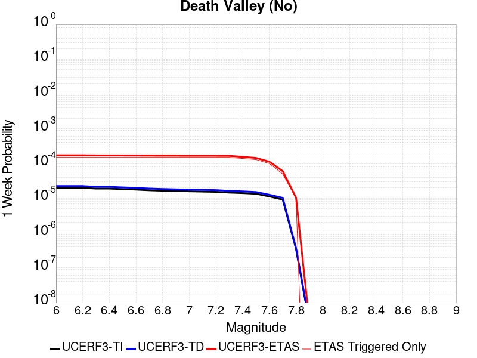 |  |  |  |

| Magnitude | 1 wk TI Prob | 1 wk TD Prob | 1 wk ETAS Prob | 1 wk ETAS/TD Gain | 1 wk ETAS Triggered Only | 1 mo TI Prob | 1 mo TD Prob | 1 mo ETAS Prob | 1 mo ETAS/TD Gain | 1 mo ETAS Triggered Only | 1 yr TI Prob | 1 yr TD Prob | 1 yr ETAS Prob | 1 yr ETAS/TD Gain | 1 yr ETAS Triggered Only | 10 yr TI Prob | 10 yr TD Prob | 10 yr ETAS Prob | 10 yr ETAS/TD Gain | 10 yr ETAS Triggered Only |
|-----|-----|-----|-----|-----|-----|-----|-----|-----|-----|-----|-----|-----|-----|-----|-----|-----|-----|-----|-----|-----|
| 6.0 | 2.0074807E-5 | 2.2500084E-5 | 1.7249672E-4 | 7.666492 | 1.5E-4 | 8.603206E-5 | 9.642541E-5 | 2.864071E-4 | 2.9702451 | 1.9E-4 | 0.001046937 | 0.0011733545 | 0.0015429204 | 1.3149652 | 3.7E-4 | 0.010420183 | 0.011672506 | 0.0121666705 | 1.0423357 | 5.0E-4 |
| 6.1 | 2.0074807E-5 | 2.2500084E-5 | 1.7249672E-4 | 7.666492 | 1.5E-4 | 8.603206E-5 | 9.642541E-5 | 2.864071E-4 | 2.9702451 | 1.9E-4 | 0.001046937 | 0.0011733545 | 0.0015429204 | 1.3149652 | 3.7E-4 | 0.010420183 | 0.011672506 | 0.0121666705 | 1.0423357 | 5.0E-4 |
| 6.2 | 2.0074807E-5 | 2.2500084E-5 | 1.7249672E-4 | 7.666492 | 1.5E-4 | 8.603206E-5 | 9.642541E-5 | 2.864071E-4 | 2.9702451 | 1.9E-4 | 0.001046937 | 0.0011733545 | 0.0015429204 | 1.3149652 | 3.7E-4 | 0.010420183 | 0.011672506 | 0.0121666705 | 1.0423357 | 5.0E-4 |
| 6.3 | 1.9050609E-5 | 2.1336948E-5 | 1.7133374E-4 | 8.029909 | 1.5E-4 | 8.164292E-5 | 9.1440896E-5 | 2.814235E-4 | 3.077655 | 1.9E-4 | 9.935491E-4 | 0.001112731 | 0.0014823193 | 1.3321452 | 3.7E-4 | 0.009891188 | 0.011072419 | 0.011566883 | 1.0446572 | 5.0E-4 |
| 6.4 | 1.9050609E-5 | 2.1336948E-5 | 1.7133374E-4 | 8.029909 | 1.5E-4 | 8.164292E-5 | 9.1440896E-5 | 2.814235E-4 | 3.077655 | 1.9E-4 | 9.935491E-4 | 0.001112731 | 0.0014823193 | 1.3321452 | 3.7E-4 | 0.009891188 | 0.011072419 | 0.011566883 | 1.0446572 | 5.0E-4 |
| 6.5 | 1.8367004E-5 | 2.0561009E-5 | 1.7055792E-4 | 8.295212 | 1.5E-4 | 7.8713354E-5 | 8.811567E-5 | 2.7809892E-4 | 3.1560667 | 1.9E-4 | 9.5791375E-4 | 0.0010722869 | 0.00144189 | 1.344687 | 3.7E-4 | 0.009537951 | 0.0106719155 | 0.01116658 | 1.0463519 | 5.0E-4 |
| 6.6 | 1.779439E-5 | 1.9910927E-5 | 1.6990794E-4 | 8.5334015 | 1.5E-4 | 7.625944E-5 | 8.53298E-5 | 2.753136E-4 | 3.2264647 | 1.9E-4 | 9.280632E-4 | 0.0010384015 | 0.0014080172 | 1.3559469 | 3.7E-4 | 0.009241969 | 0.010336253 | 0.010831084 | 1.0478734 | 5.0E-4 |
| 6.7 | 1.7025437E-5 | 1.9043426E-5 | 1.6904056E-4 | 8.876584 | 1.5E-4 | 7.296412E-5 | 8.161216E-5 | 2.7159665E-4 | 3.3278944 | 1.9E-4 | 8.87976E-4 | 9.931813E-4 | 0.0013528238 | 1.3621116 | 3.6E-4 | 0.008844362 | 0.009888145 | 0.0103733 | 1.0490643 | 4.9E-4 |
| 6.8 | 1.6545107E-5 | 1.8512545E-5 | 1.6850977E-4 | 9.102464 | 1.5E-4 | 7.090568E-5 | 7.93371E-5 | 2.6932202E-4 | 3.3946543 | 1.9E-4 | 8.629347E-4 | 9.655073E-4 | 0.0013251597 | 1.372501 | 3.6E-4 | 0.008595915 | 0.009613829 | 0.010099118 | 1.0504782 | 4.9E-4 |
| 6.9 | 1.615478E-5 | 1.8087594E-5 | 1.6808488E-4 | 9.292827 | 1.5E-4 | 6.9232934E-5 | 7.751599E-5 | 2.6750125E-4 | 3.4509172 | 1.9E-4 | 8.4258494E-4 | 9.433546E-4 | 0.001303015 | 1.3812568 | 3.6E-4 | 0.008393973 | 0.009394196 | 0.009879593 | 1.0516698 | 4.9E-4 |
| 7.0 | 1.5894311E-5 | 1.780555E-5 | 1.6780288E-4 | 9.42419 | 1.5E-4 | 6.81167E-5 | 7.6307304E-5 | 2.662928E-4 | 3.489742 | 1.9E-4 | 8.2900526E-4 | 9.286515E-4 | 0.0012883171 | 1.3872988 | 3.6E-4 | 0.008259195 | 0.009248397 | 0.009723959 | 1.0514209 | 4.8E-4 |
| 7.1 | 1.5602263E-5 | 1.7483504E-5 | 1.6748087E-4 | 9.579367 | 1.5E-4 | 6.6865134E-5 | 7.492718E-5 | 2.6491293E-4 | 3.5356054 | 1.9E-4 | 8.137789E-4 | 9.118627E-4 | 0.0012615436 | 1.3834797 | 3.5E-4 | 0.008108052 | 0.009081894 | 0.009537716 | 1.0501902 | 4.6E-4 |
| 7.2 | 1.5323829E-5 | 1.717063E-5 | 1.6716805E-4 | 9.735697 | 1.5E-4 | 6.56719E-5 | 7.358637E-5 | 2.6357238E-4 | 3.5818098 | 1.9E-4 | 7.99262E-4 | 8.9555193E-4 | 0.0012452385 | 1.3904705 | 3.5E-4 | 0.007963934 | 0.008920107 | 0.009376003 | 1.0511088 | 4.6E-4 |
| 7.3 | 1.4556212E-5 | 1.6302456E-5 | 1.6630001E-4 | 10.200918 | 1.5E-4 | 6.238227E-5 | 6.9865826E-5 | 2.5985256E-4 | 3.7193084 | 1.9E-4 | 7.592395E-4 | 8.5029035E-4 | 0.0011900013 | 1.3995234 | 3.4E-4 | 0.0075665074 | 0.008471014 | 0.008917202 | 1.0526724 | 4.5E-4 |
| 7.4 | 1.411725E-5 | 1.580796E-5 | 1.5580574E-4 | 9.856157 | 1.4E-4 | 6.0501097E-5 | 6.7746674E-5 | 2.4773448E-4 | 3.6567771 | 1.8E-4 | 7.363519E-4 | 8.245094E-4 | 0.0011542373 | 1.399908 | 3.3E-4 | 0.0073391674 | 0.008215138 | 0.008651524 | 1.0531197 | 4.4E-4 |
| 7.5 | 1.3503312E-5 | 1.5126289E-5 | 1.4512433E-4 | 9.594179 | 1.3E-4 | 5.7870053E-5 | 6.482538E-5 | 2.3481436E-4 | 3.6222599 | 1.7E-4 | 7.043401E-4 | 7.8896893E-4 | 0.0011087165 | 1.4052726 | 3.2E-4 | 0.007021119 | 0.007862304 | 0.008288924 | 1.0542613 | 4.3E-4 |
| 7.6 | 1.1279839E-5 | 1.2626327E-5 | 1.12625065E-4 | 8.91986 | 1.0E-4 | 4.834127E-5 | 5.4111737E-5 | 1.841047E-4 | 3.4023063 | 1.3E-4 | 5.88396E-4 | 6.5861654E-4 | 9.2843873E-4 | 1.4096802 | 2.7E-4 | 0.005868405 | 0.006567199 | 0.006944703 | 1.0574833 | 3.8E-4 |
| 7.7 | 9.189108E-6 | 1.0283358E-5 | 6.0282844E-5 | 5.862175 | 5.0E-5 | 3.93813E-5 | 4.407082E-5 | 1.240673E-4 | 2.81518 | 8.0E-5 | 4.7936183E-4 | 5.3643517E-4 | 7.0634397E-4 | 1.3167369 | 1.7E-4 | 0.004783291 | 0.005351914 | 0.005620469 | 1.0501792 | 2.7E-4 |
| 7.8 | 3.4586725E-7 | 3.6482615E-7 | 1.0364823E-5 | 28.410307 | 1.0E-5 | 1.4822873E-6 | 1.5635396E-6 | 2.1563508E-5 | 13.791469 | 2.0E-5 | 1.80467E-5 | 1.9035933E-5 | 3.9035553E-5 | 2.0506246 | 2.0E-5 | 1.8045233E-4 | 1.9034347E-4 | 2.1033967E-4 | 1.1050532 | 2.0E-5 |
| 7.9 | 2.5591178E-9 | 2.6696718E-9 | 2.6696718E-9 | 1.0 | 0.0 | 1.0967647E-8 | 1.14414505E-8 | 1.14414505E-8 | 1.0 | 0.0 | 1.335311E-7 | 1.3929966E-7 | 1.3929966E-7 | 1.0 | 0.0 | 1.3353102E-6 | 1.3929966E-6 | 1.3929966E-6 | 1.0 | 0.0 |

## San Andreas (Parkfield)
*[(top)](#table-of-contents)*

| 1 Week | 1 Month | 1 Year | 10 Year |
|-----|-----|-----|-----|
| 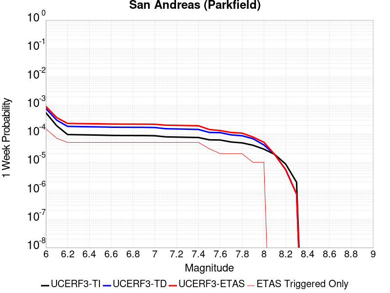 |  |  |  |

| Magnitude | 1 wk TI Prob | 1 wk TD Prob | 1 wk ETAS Prob | 1 wk ETAS/TD Gain | 1 wk ETAS Triggered Only | 1 mo TI Prob | 1 mo TD Prob | 1 mo ETAS Prob | 1 mo ETAS/TD Gain | 1 mo ETAS Triggered Only | 1 yr TI Prob | 1 yr TD Prob | 1 yr ETAS Prob | 1 yr ETAS/TD Gain | 1 yr ETAS Triggered Only | 10 yr TI Prob | 10 yr TD Prob | 10 yr ETAS Prob | 10 yr ETAS/TD Gain | 10 yr ETAS Triggered Only |
|-----|-----|-----|-----|-----|-----|-----|-----|-----|-----|-----|-----|-----|-----|-----|-----|-----|-----|-----|-----|-----|
| 6.0 | 5.556969E-4 | 7.778562E-4 | 9.2773954E-4 | 1.1926877 | 1.5E-4 | 0.0023793848 | 0.0033299583 | 0.0035292923 | 1.0598608 | 2.0E-4 | 0.028586963 | 0.040235043 | 0.040542167 | 1.0076332 | 3.2E-4 | 0.25176284 | 0.3371973 | 0.3375088 | 1.0009239 | 4.7E-4 |
| 6.1 | 1.925858E-4 | 3.0278185E-4 | 3.7276064E-4 | 1.2311195 | 7.0E-5 | 8.2510663E-4 | 0.001297085 | 0.0014069423 | 1.0846956 | 1.1E-4 | 0.0099994885 | 0.01577393 | 0.015970776 | 1.0124792 | 2.0E-4 | 0.095613256 | 0.14975825 | 0.14999631 | 1.0015897 | 2.8E-4 |
| 6.2 | 9.4306815E-5 | 1.8243887E-4 | 2.3242975E-4 | 1.2740144 | 5.0E-5 | 4.0410945E-4 | 7.8164786E-4 | 8.615853E-4 | 1.1022679 | 8.0E-5 | 0.0049089384 | 0.009475246 | 0.009643636 | 1.0177715 | 1.7E-4 | 0.048019063 | 0.0918565 | 0.09207446 | 1.0023727 | 2.4E-4 |
| 6.3 | 9.283051E-5 | 1.794041E-4 | 2.2939514E-4 | 1.2786504 | 5.0E-5 | 3.9778434E-4 | 7.686494E-4 | 8.485879E-4 | 1.1039987 | 8.0E-5 | 0.0048322747 | 0.009318355 | 0.00948677 | 1.0180736 | 1.7E-4 | 0.047285385 | 0.090509474 | 0.09072775 | 1.0024116 | 2.4E-4 |
| 6.4 | 9.138826E-5 | 1.7702584E-4 | 2.2701698E-4 | 1.2823946 | 5.0E-5 | 3.916052E-4 | 7.5846276E-4 | 8.384021E-4 | 1.1053965 | 8.0E-5 | 0.0047573745 | 0.009195387 | 0.0093638245 | 1.0183176 | 1.7E-4 | 0.046568092 | 0.0894136 | 0.08963214 | 1.0024441 | 2.4E-4 |
| 6.5 | 9.000255E-5 | 1.746064E-4 | 2.2459766E-4 | 1.2863084 | 5.0E-5 | 3.8566816E-4 | 7.4809964E-4 | 8.2803983E-4 | 1.1068577 | 8.0E-5 | 0.0046854047 | 0.009070284 | 0.009238742 | 1.0185726 | 1.7E-4 | 0.045878403 | 0.08829608 | 0.08851489 | 1.0024781 | 2.4E-4 |
| 6.6 | 8.8109264E-5 | 1.7141816E-4 | 2.2140959E-4 | 1.2916344 | 5.0E-5 | 3.7755648E-4 | 7.3444354E-4 | 8.143848E-4 | 1.108846 | 8.0E-5 | 0.0045870654 | 0.008905404 | 0.009073891 | 1.0189196 | 1.7E-4 | 0.04493529 | 0.08682707 | 0.087046236 | 1.0025241 | 2.4E-4 |
| 6.7 | 8.738073E-5 | 1.7008898E-4 | 2.2008049E-4 | 1.2939137 | 5.0E-5 | 3.7443507E-4 | 7.287503E-4 | 8.08692E-4 | 1.109697 | 8.0E-5 | 0.0045492216 | 0.008836695 | 0.009005193 | 1.019068 | 1.7E-4 | 0.04457213 | 0.0862268 | 0.08644611 | 1.0025433 | 2.4E-4 |
| 6.8 | 8.710195E-5 | 1.6954402E-4 | 2.1953553E-4 | 1.2948587 | 5.0E-5 | 3.7324068E-4 | 7.26416E-4 | 8.063579E-4 | 1.1100497 | 8.0E-5 | 0.0045347405 | 0.008808513 | 0.0089770155 | 1.0191295 | 1.7E-4 | 0.04443313 | 0.08597436 | 0.086193725 | 1.0025516 | 2.4E-4 |
| 6.9 | 8.6801556E-5 | 1.6895356E-4 | 2.189451E-4 | 1.2958893 | 5.0E-5 | 3.7195362E-4 | 7.238869E-4 | 8.03829E-4 | 1.1104345 | 8.0E-5 | 0.0045191357 | 0.0087779695 | 0.008946477 | 1.0191966 | 1.7E-4 | 0.044283327 | 0.08570042 | 0.08591985 | 1.0025605 | 2.4E-4 |
| 7.0 | 8.5571606E-5 | 1.664819E-4 | 2.1647358E-4 | 1.300283 | 5.0E-5 | 3.6668387E-4 | 7.132999E-4 | 7.932428E-4 | 1.1120747 | 8.0E-5 | 0.004455241 | 0.008650103 | 0.008818632 | 1.019483 | 1.7E-4 | 0.043669727 | 0.08454836 | 0.08476807 | 1.0025986 | 2.4E-4 |
| 7.1 | 7.82589E-5 | 1.5128969E-4 | 2.0128212E-4 | 1.3304418 | 5.0E-5 | 3.3535215E-4 | 6.4822397E-4 | 7.281721E-4 | 1.1233342 | 8.0E-5 | 0.0040752706 | 0.007863738 | 0.00802248 | 1.0201865 | 1.6E-4 | 0.040013418 | 0.077460445 | 0.07767263 | 1.0027393 | 2.3E-4 |
| 7.2 | 7.690929E-5 | 1.4866212E-4 | 1.9865468E-4 | 1.3362832 | 5.0E-5 | 3.2956956E-4 | 6.369685E-4 | 7.1691757E-4 | 1.1255149 | 8.0E-5 | 0.004005129 | 0.0077276826 | 0.007886446 | 1.0205448 | 1.6E-4 | 0.0393371 | 0.07623341 | 0.07644588 | 1.002787 | 2.3E-4 |
| 7.3 | 7.5543794E-5 | 1.4562748E-4 | 1.9562019E-4 | 1.3432918 | 5.0E-5 | 3.2371894E-4 | 6.239692E-4 | 7.039193E-4 | 1.1281315 | 8.0E-5 | 0.003934157 | 0.0075705256 | 0.0077293147 | 1.0209746 | 1.6E-4 | 0.038652334 | 0.07479777 | 0.07501057 | 1.0028449 | 2.3E-4 |
| 7.4 | 7.4214564E-5 | 1.4263717E-4 | 1.9263005E-4 | 1.3504897 | 5.0E-5 | 3.1802364E-4 | 6.1115966E-4 | 6.911108E-4 | 1.1308187 | 8.0E-5 | 0.003865065 | 0.0074156416 | 0.007574455 | 1.0214161 | 1.6E-4 | 0.03798529 | 0.07337152 | 0.07358465 | 1.0029048 | 2.3E-4 |
| 7.5 | 6.149578E-5 | 1.1191443E-4 | 1.4191108E-4 | 1.268032 | 3.0E-5 | 2.6352672E-4 | 4.795452E-4 | 5.19526E-4 | 1.0833724 | 4.0E-5 | 0.0032037178 | 0.005822865 | 0.0059322244 | 1.0187811 | 1.1E-4 | 0.03157923 | 0.058559462 | 0.058710095 | 1.0025723 | 1.6E-4 |
| 7.6 | 6.0643448E-5 | 1.102009E-4 | 1.3019869E-4 | 1.1814667 | 2.0E-5 | 2.598746E-4 | 4.7220418E-4 | 5.0219E-4 | 1.0635018 | 3.0E-5 | 0.0031593828 | 0.005733962 | 0.005833389 | 1.01734 | 1.0E-4 | 0.031148417 | 0.05772042 | 0.05786176 | 1.0024487 | 1.5E-4 |
| 7.7 | 5.1652263E-5 | 9.175265E-5 | 1.11750815E-4 | 1.2179574 | 2.0E-5 | 2.2134806E-4 | 3.9316638E-4 | 4.231546E-4 | 1.0762736 | 3.0E-5 | 0.002691582 | 0.0047763046 | 0.0048658745 | 1.018753 | 9.0E-5 | 0.026592141 | 0.04853641 | 0.048669614 | 1.0027444 | 1.4E-4 |
| 7.8 | 4.8090482E-5 | 8.560165E-5 | 1.0559994E-4 | 1.2336204 | 2.0E-5 | 2.060858E-4 | 3.6681266E-4 | 3.8680533E-4 | 1.0545038 | 2.0E-5 | 0.0025062072 | 0.004456807 | 0.0045364504 | 1.0178701 | 8.0E-5 | 0.024781305 | 0.045302264 | 0.04541683 | 1.0025289 | 1.2E-4 |
| 7.9 | 3.970278E-5 | 6.7507375E-5 | 7.75067E-5 | 1.148122 | 1.0E-5 | 1.7014367E-4 | 2.8928524E-4 | 2.9928234E-4 | 1.0345579 | 1.0E-5 | 0.002069531 | 0.0035163634 | 0.003546258 | 1.0085015 | 3.0E-5 | 0.020503636 | 0.03588176 | 0.035920326 | 1.0010748 | 4.0E-5 |
| 8.0 | 2.8982335E-5 | 4.0698153E-5 | 5.069775E-5 | 1.2457014 | 1.0E-5 | 1.2420409E-4 | 1.7440901E-4 | 1.8440725E-4 | 1.0573264 | 1.0E-5 | 0.0015111357 | 0.0021213628 | 0.0021413204 | 1.0094079 | 2.0E-5 | 0.015009012 | 0.02201118 | 0.02203074 | 1.0008886 | 2.0E-5 |
| 8.1 | 1.8836186E-5 | 1.867974E-5 | 1.867974E-5 | 1.0 | 0.0 | 8.0724014E-5 | 8.005358E-5 | 8.005358E-5 | 1.0 | 0.0 | 9.823717E-4 | 9.742171E-4 | 9.742171E-4 | 1.0 | 0.0 | 0.009780403 | 0.010487711 | 0.010487711 | 1.0 | 0.0 |
| 8.2 | 8.643924E-6 | 5.473668E-6 | 5.473668E-6 | 1.0 | 0.0 | 3.704486E-5 | 2.3458366E-5 | 2.3458366E-5 | 1.0 | 0.0 | 4.5092785E-4 | 2.8556827E-4 | 2.8556827E-4 | 1.0 | 0.0 | 0.0045001395 | 0.0032481793 | 0.0032481793 | 1.0 | 0.0 |
| 8.3 | 1.983087E-6 | 7.6564595E-7 | 7.6564595E-7 | 1.0 | 0.0 | 8.498917E-6 | 3.281336E-6 | 3.281336E-6 | 1.0 | 0.0 | 1.034694E-4 | 3.9949547E-5 | 3.9949547E-5 | 1.0 | 0.0 | 0.0010342124 | 4.717979E-4 | 4.717979E-4 | 1.0 | 0.0 |

## San Andreas (San Gorgonio Pass-Garnet HIll)
*[(top)](#table-of-contents)*

| 1 Week | 1 Month | 1 Year | 10 Year |
|-----|-----|-----|-----|
| 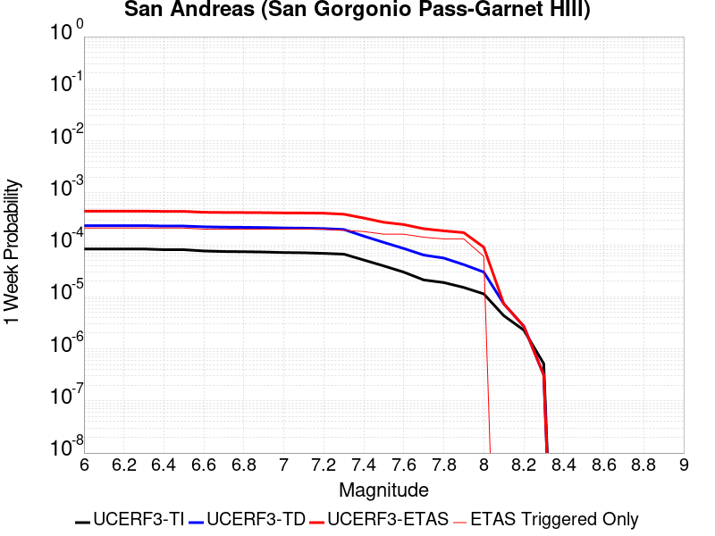 | 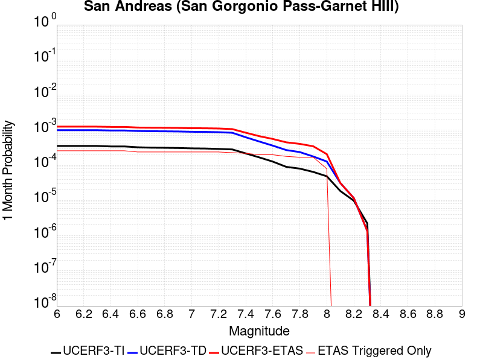 | 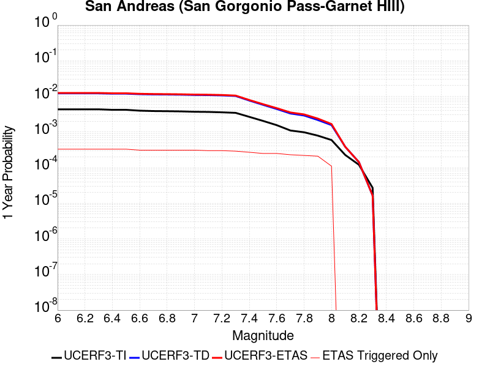 |  |

| Magnitude | 1 wk TI Prob | 1 wk TD Prob | 1 wk ETAS Prob | 1 wk ETAS/TD Gain | 1 wk ETAS Triggered Only | 1 mo TI Prob | 1 mo TD Prob | 1 mo ETAS Prob | 1 mo ETAS/TD Gain | 1 mo ETAS Triggered Only | 1 yr TI Prob | 1 yr TD Prob | 1 yr ETAS Prob | 1 yr ETAS/TD Gain | 1 yr ETAS Triggered Only | 10 yr TI Prob | 10 yr TD Prob | 10 yr ETAS Prob | 10 yr ETAS/TD Gain | 10 yr ETAS Triggered Only |
|-----|-----|-----|-----|-----|-----|-----|-----|-----|-----|-----|-----|-----|-----|-----|-----|-----|-----|-----|-----|-----|
| 6.0 | 8.31567E-5 | 2.3384395E-4 | 4.4379485E-4 | 1.8978248 | 2.1E-4 | 3.5633717E-4 | 0.0010018025 | 0.0012615421 | 1.2592722 | 2.6E-4 | 0.004329778 | 0.012128622 | 0.01245462 | 1.0268784 | 3.3E-4 | 0.042463828 | 0.11258187 | 0.112972334 | 1.0034683 | 4.4E-4 |
| 6.1 | 8.31567E-5 | 2.3384395E-4 | 4.4379485E-4 | 1.8978248 | 2.1E-4 | 3.5633717E-4 | 0.0010018025 | 0.0012615421 | 1.2592722 | 2.6E-4 | 0.004329778 | 0.012128622 | 0.01245462 | 1.0268784 | 3.3E-4 | 0.042463828 | 0.11258187 | 0.112972334 | 1.0034683 | 4.4E-4 |
| 6.2 | 8.31567E-5 | 2.3384395E-4 | 4.4379485E-4 | 1.8978248 | 2.1E-4 | 3.5633717E-4 | 0.0010018025 | 0.0012615421 | 1.2592722 | 2.6E-4 | 0.004329778 | 0.012128622 | 0.01245462 | 1.0268784 | 3.3E-4 | 0.042463828 | 0.11258187 | 0.112972334 | 1.0034683 | 4.4E-4 |
| 6.3 | 8.31567E-5 | 2.3384395E-4 | 4.4379485E-4 | 1.8978248 | 2.1E-4 | 3.5633717E-4 | 0.0010018025 | 0.0012615421 | 1.2592722 | 2.6E-4 | 0.004329778 | 0.012128622 | 0.01245462 | 1.0268784 | 3.3E-4 | 0.042463828 | 0.11258187 | 0.112972334 | 1.0034683 | 4.4E-4 |
| 6.4 | 8.059055E-5 | 2.2941893E-4 | 4.3937075E-4 | 1.915146 | 2.1E-4 | 3.4534236E-4 | 9.828559E-4 | 0.0012426004 | 1.2642752 | 2.6E-4 | 0.0041964394 | 0.011900819 | 0.012226892 | 1.0273992 | 3.3E-4 | 0.041180745 | 0.110562965 | 0.110954314 | 1.0035397 | 4.4E-4 |
| 6.5 | 8.059055E-5 | 2.2941893E-4 | 4.3937075E-4 | 1.915146 | 2.1E-4 | 3.4534236E-4 | 9.828559E-4 | 0.0012426004 | 1.2642752 | 2.6E-4 | 0.0041964394 | 0.011900819 | 0.012226892 | 1.0273992 | 3.3E-4 | 0.041180745 | 0.110562965 | 0.110954314 | 1.0035397 | 4.4E-4 |
| 6.6 | 7.619237E-5 | 2.2186468E-4 | 4.218203E-4 | 1.9012504 | 2.0E-4 | 3.2649786E-4 | 9.5050444E-4 | 0.0011902764 | 1.2522575 | 2.4E-4 | 0.0039678677 | 0.0115115335 | 0.011817966 | 1.0266196 | 3.1E-4 | 0.03897764 | 0.10709954 | 0.10746563 | 1.0034182 | 4.1E-4 |
| 6.7 | 7.440636E-5 | 2.1862281E-4 | 4.185791E-4 | 1.9146177 | 2.0E-4 | 3.188454E-4 | 9.3662075E-4 | 0.0011763959 | 1.2560003 | 2.4E-4 | 0.0038750346 | 0.011344268 | 0.011650751 | 1.0270165 | 3.1E-4 | 0.038081564 | 0.1056081 | 0.1059748 | 1.0034723 | 4.1E-4 |
| 6.8 | 7.3735864E-5 | 2.1709445E-4 | 4.1705102E-4 | 1.921058 | 2.0E-4 | 3.1597257E-4 | 9.300753E-4 | 0.0011698521 | 1.2578037 | 2.4E-4 | 0.0038401815 | 0.011265406 | 0.011571914 | 1.0272079 | 3.1E-4 | 0.03774495 | 0.104909696 | 0.10527668 | 1.0034981 | 4.1E-4 |
| 6.9 | 7.27575E-5 | 2.1478413E-4 | 4.1474117E-4 | 1.9309675 | 2.0E-4 | 3.117806E-4 | 9.20181E-4 | 0.0011599602 | 1.2605783 | 2.4E-4 | 0.003789323 | 0.011146182 | 0.011452727 | 1.0275022 | 3.1E-4 | 0.037253562 | 0.10385753 | 0.10422495 | 1.0035378 | 4.1E-4 |
| 7.0 | 7.102591E-5 | 2.1062451E-4 | 4.1058238E-4 | 1.9493572 | 2.0E-4 | 3.0436125E-4 | 9.023664E-4 | 0.0011421499 | 1.2657273 | 2.4E-4 | 0.003699303 | 0.010931484 | 0.011238095 | 1.0280484 | 3.1E-4 | 0.03638325 | 0.101959534 | 0.102327734 | 1.0036112 | 4.1E-4 |
| 7.1 | 7.028513E-5 | 2.0898094E-4 | 4.0893914E-4 | 1.9568251 | 2.0E-4 | 3.0118722E-4 | 8.953274E-4 | 0.0011351125 | 1.2678183 | 2.4E-4 | 0.0036607897 | 0.010846641 | 0.011143387 | 1.0273583 | 3.0E-4 | 0.036010686 | 0.10120243 | 0.10156195 | 1.0035524 | 4.0E-4 |
| 7.2 | 6.8498244E-5 | 2.050596E-4 | 4.050186E-4 | 1.9751261 | 2.0E-4 | 2.9353087E-4 | 8.7853306E-4 | 0.0011183223 | 1.2729427 | 2.4E-4 | 0.003567883 | 0.0106441835 | 0.01094099 | 1.0278844 | 3.0E-4 | 0.035111405 | 0.09939449 | 0.099754736 | 1.0036243 | 4.0E-4 |
| 7.3 | 6.622592E-5 | 1.9733235E-4 | 3.8729486E-4 | 1.9626526 | 1.9E-4 | 2.8379448E-4 | 8.4543816E-4 | 0.0010752437 | 1.2718183 | 2.3E-4 | 0.0034497243 | 0.010245111 | 0.01053214 | 1.0280162 | 2.9E-4 | 0.033966612 | 0.095891245 | 0.09624385 | 1.0036771 | 3.9E-4 |
| 7.4 | 5.1050705E-5 | 1.4690042E-4 | 3.2687397E-4 | 2.2251399 | 1.8E-4 | 2.1877038E-4 | 6.294222E-4 | 8.4928377E-4 | 1.349307 | 2.2E-4 | 0.002660276 | 0.007636482 | 0.007904421 | 1.0350866 | 2.7E-4 | 0.02628654 | 0.07286554 | 0.0731993 | 1.0045806 | 3.6E-4 |
| 7.5 | 3.9302922E-5 | 1.11307076E-4 | 2.7128926E-4 | 2.4373047 | 1.6E-4 | 1.6843023E-4 | 4.7694342E-4 | 6.7684805E-4 | 1.419137 | 2.0E-4 | 0.0020487092 | 0.0057913954 | 0.0060399473 | 1.0429175 | 2.5E-4 | 0.020299247 | 0.05601151 | 0.056332465 | 1.0057302 | 3.4E-4 |
| 7.6 | 2.9851626E-5 | 8.4956984E-5 | 2.449434E-4 | 2.883146 | 1.6E-4 | 1.2792926E-4 | 3.6405068E-4 | 5.6397787E-4 | 1.5491741 | 2.0E-4 | 0.0015564259 | 0.0044233347 | 0.004672229 | 1.0562685 | 2.5E-4 | 0.0154556995 | 0.043196145 | 0.043511894 | 1.0073096 | 3.3E-4 |
| 7.7 | 2.1135214E-5 | 6.353527E-5 | 2.0352638E-4 | 3.2033606 | 1.4E-4 | 9.0576345E-5 | 2.722656E-4 | 4.522166E-4 | 1.6609391 | 1.8E-4 | 0.0011022091 | 0.0033098008 | 0.0035390395 | 1.0692606 | 2.3E-4 | 0.010967582 | 0.03258456 | 0.03286511 | 1.0086099 | 2.9E-4 |
| 7.8 | 1.883379E-5 | 5.564576E-5 | 1.8563852E-4 | 3.3360767 | 1.3E-4 | 8.0713755E-5 | 2.3846005E-4 | 4.0841952E-4 | 1.7127377 | 1.7E-4 | 9.822468E-4 | 0.002899389 | 0.003118751 | 1.0756581 | 2.2E-4 | 0.0097791655 | 0.028696978 | 0.028968943 | 1.0094771 | 2.8E-4 |
| 7.9 | 1.5156185E-5 | 4.1662403E-5 | 1.7165698E-4 | 4.120189 | 1.3E-4 | 6.495346E-5 | 1.7854095E-4 | 3.485106E-4 | 1.9519925 | 1.7E-4 | 7.9052144E-4 | 0.0021715704 | 0.0023811143 | 1.0964942 | 2.1E-4 | 0.007877152 | 0.021760946 | 0.02202507 | 1.0121375 | 2.7E-4 |
| 8.0 | 1.1405907E-5 | 2.9976925E-5 | 8.9975125E-5 | 3.0014794 | 6.0E-5 | 4.8881542E-5 | 1.2846621E-4 | 2.0845594E-4 | 1.6226518 | 8.0E-5 | 5.9497025E-4 | 0.0015629551 | 0.0016727832 | 1.0702695 | 1.1E-4 | 0.005933798 | 0.015774013 | 0.015921647 | 1.0093594 | 1.5E-4 |
| 8.1 | 4.3511436E-6 | 7.369465E-6 | 7.369465E-6 | 1.0 | 0.0 | 1.8647626E-5 | 3.158304E-5 | 3.158304E-5 | 1.0 | 0.0 | 2.2701119E-4 | 3.844558E-4 | 3.844558E-4 | 1.0 | 0.0 | 0.0022677942 | 0.0041165445 | 0.0041165445 | 1.0 | 0.0 |
| 8.2 | 2.3042528E-6 | 2.7328301E-6 | 2.7328301E-6 | 1.0 | 0.0 | 9.875332E-6 | 1.1712076E-5 | 1.1712076E-5 | 1.0 | 0.0 | 1.2022553E-4 | 1.4258524E-4 | 1.4258524E-4 | 1.0 | 0.0 | 0.0012016051 | 0.0015979637 | 0.0015979637 | 1.0 | 0.0 |
| 8.3 | 5.202968E-7 | 3.1590292E-7 | 3.1590292E-7 | 1.0 | 0.0 | 2.2298414E-6 | 1.353869E-6 | 1.353869E-6 | 1.0 | 0.0 | 2.714798E-5 | 1.6483244E-5 | 1.6483244E-5 | 1.0 | 0.0 | 2.7144665E-4 | 1.955901E-4 | 1.955901E-4 | 1.0 | 0.0 |

## San Andreas (Big Bend)
*[(top)](#table-of-contents)*

| 1 Week | 1 Month | 1 Year | 10 Year |
|-----|-----|-----|-----|
|  |  |  |  |

| Magnitude | 1 wk TI Prob | 1 wk TD Prob | 1 wk ETAS Prob | 1 wk ETAS/TD Gain | 1 wk ETAS Triggered Only | 1 mo TI Prob | 1 mo TD Prob | 1 mo ETAS Prob | 1 mo ETAS/TD Gain | 1 mo ETAS Triggered Only | 1 yr TI Prob | 1 yr TD Prob | 1 yr ETAS Prob | 1 yr ETAS/TD Gain | 1 yr ETAS Triggered Only | 10 yr TI Prob | 10 yr TD Prob | 10 yr ETAS Prob | 10 yr ETAS/TD Gain | 10 yr ETAS Triggered Only |
|-----|-----|-----|-----|-----|-----|-----|-----|-----|-----|-----|-----|-----|-----|-----|-----|-----|-----|-----|-----|-----|
| 6.0 | 1.0179969E-4 | 2.0073925E-4 | 2.707252E-4 | 1.348641 | 7.0E-5 | 4.362114E-4 | 8.6002843E-4 | 9.5994247E-4 | 1.1161752 | 1.0E-4 | 0.0052979486 | 0.010420859 | 0.010717733 | 1.0284884 | 3.0E-4 | 0.051734097 | 0.101455905 | 0.10184228 | 1.0038083 | 4.3E-4 |
| 6.1 | 1.0179969E-4 | 2.0073925E-4 | 2.707252E-4 | 1.348641 | 7.0E-5 | 4.362114E-4 | 8.6002843E-4 | 9.5994247E-4 | 1.1161752 | 1.0E-4 | 0.0052979486 | 0.010420859 | 0.010717733 | 1.0284884 | 3.0E-4 | 0.051734097 | 0.101455905 | 0.10184228 | 1.0038083 | 4.3E-4 |
| 6.2 | 1.0179969E-4 | 2.0073925E-4 | 2.707252E-4 | 1.348641 | 7.0E-5 | 4.362114E-4 | 8.6002843E-4 | 9.5994247E-4 | 1.1161752 | 1.0E-4 | 0.0052979486 | 0.010420859 | 0.010717733 | 1.0284884 | 3.0E-4 | 0.051734097 | 0.101455905 | 0.10184228 | 1.0038083 | 4.3E-4 |
| 6.3 | 1.0179969E-4 | 2.0073925E-4 | 2.707252E-4 | 1.348641 | 7.0E-5 | 4.362114E-4 | 8.6002843E-4 | 9.5994247E-4 | 1.1161752 | 1.0E-4 | 0.0052979486 | 0.010420859 | 0.010717733 | 1.0284884 | 3.0E-4 | 0.051734097 | 0.101455905 | 0.10184228 | 1.0038083 | 4.3E-4 |
| 6.4 | 9.1639464E-5 | 1.8430917E-4 | 2.3429995E-4 | 1.2712333 | 5.0E-5 | 3.9268145E-4 | 7.896575E-4 | 8.695944E-4 | 1.1012298 | 8.0E-5 | 0.0047704205 | 0.009571818 | 0.00976 | 1.01966 | 1.9E-4 | 0.046693064 | 0.09378695 | 0.09404975 | 1.0028021 | 2.9E-4 |
| 6.5 | 9.1639464E-5 | 1.8430917E-4 | 2.3429995E-4 | 1.2712333 | 5.0E-5 | 3.9268145E-4 | 7.896575E-4 | 8.695944E-4 | 1.1012298 | 8.0E-5 | 0.0047704205 | 0.009571818 | 0.00976 | 1.01966 | 1.9E-4 | 0.046693064 | 0.09378695 | 0.09404975 | 1.0028021 | 2.9E-4 |
| 6.6 | 9.042622E-5 | 1.8238011E-4 | 2.3237099E-4 | 1.2741027 | 5.0E-5 | 3.8748336E-4 | 7.813951E-4 | 8.6133264E-4 | 1.102301 | 8.0E-5 | 0.0047074095 | 0.0094721 | 0.0096603 | 1.0198689 | 1.9E-4 | 0.046089325 | 0.09287721 | 0.09313121 | 1.0027348 | 2.8E-4 |
| 6.7 | 8.9836685E-5 | 1.8152347E-4 | 2.315144E-4 | 1.2753965 | 5.0E-5 | 3.8495753E-4 | 7.7772595E-4 | 8.5766375E-4 | 1.102784 | 8.0E-5 | 0.00467679 | 0.009427815 | 0.009616023 | 1.0199631 | 1.9E-4 | 0.045795817 | 0.09247148 | 0.09272559 | 1.002748 | 2.8E-4 |
| 6.8 | 8.9471854E-5 | 1.8099119E-4 | 2.3098214E-4 | 1.2762065 | 5.0E-5 | 3.8339442E-4 | 7.754462E-4 | 8.453919E-4 | 1.0902007 | 7.0E-5 | 0.004657841 | 0.009400298 | 0.009578606 | 1.0189683 | 1.8E-4 | 0.04561414 | 0.0922192 | 0.092464305 | 1.0026578 | 2.7E-4 |
| 6.9 | 8.858234E-5 | 1.7981093E-4 | 2.2980194E-4 | 1.2780199 | 5.0E-5 | 3.7958333E-4 | 7.7039085E-4 | 8.403369E-4 | 1.090793 | 7.0E-5 | 0.004611638 | 0.009339278 | 0.009507691 | 1.0180327 | 1.7E-4 | 0.04517103 | 0.0916591 | 0.09189527 | 1.0025766 | 2.6E-4 |
| 7.0 | 8.7433385E-5 | 1.7819891E-4 | 2.2819E-4 | 1.2805353 | 5.0E-5 | 3.746607E-4 | 7.6348626E-4 | 8.3343283E-4 | 1.0916147 | 7.0E-5 | 0.004551957 | 0.009255932 | 0.009414451 | 1.0171262 | 1.6E-4 | 0.044598386 | 0.090893224 | 0.091120504 | 1.0025005 | 2.5E-4 |
| 7.1 | 8.684964E-5 | 1.7731842E-4 | 2.1731132E-4 | 1.2255429 | 4.0E-5 | 3.7215967E-4 | 7.597149E-4 | 8.1966934E-4 | 1.078917 | 6.0E-5 | 0.0045216335 | 0.009210405 | 0.0093590235 | 1.0161359 | 1.5E-4 | 0.04430731 | 0.09047475 | 0.090693034 | 1.0024127 | 2.4E-4 |
| 7.2 | 8.606521E-5 | 1.7622454E-4 | 2.1621748E-4 | 1.2269431 | 4.0E-5 | 3.6879873E-4 | 7.550296E-4 | 8.1498426E-4 | 1.0794071 | 6.0E-5 | 0.0044808835 | 0.009153842 | 0.009302469 | 1.0162365 | 1.5E-4 | 0.043916024 | 0.08995517 | 0.09017359 | 1.002428 | 2.4E-4 |
| 7.3 | 8.568266E-5 | 1.7564454E-4 | 2.1563751E-4 | 1.2276926 | 4.0E-5 | 3.6715972E-4 | 7.5254537E-4 | 8.125002E-4 | 1.0796694 | 6.0E-5 | 0.0044610105 | 0.00912385 | 0.009272481 | 1.0162904 | 1.5E-4 | 0.043725148 | 0.08967623 | 0.08989471 | 1.0024363 | 2.4E-4 |
| 7.4 | 8.5432206E-5 | 1.752704E-4 | 2.0526514E-4 | 1.1711341 | 3.0E-5 | 3.6608664E-4 | 7.509428E-4 | 8.009052E-4 | 1.066533 | 5.0E-5 | 0.004447999 | 0.009104501 | 0.009243228 | 1.015237 | 1.4E-4 | 0.043600157 | 0.08949642 | 0.08970583 | 1.00234 | 2.3E-4 |
| 7.5 | 8.4791965E-5 | 1.7396381E-4 | 2.039586E-4 | 1.1724197 | 3.0E-5 | 3.633435E-4 | 7.4534636E-4 | 7.953091E-4 | 1.0670329 | 5.0E-5 | 0.0044147377 | 0.009036932 | 0.009175668 | 1.015352 | 1.4E-4 | 0.043280575 | 0.08887209 | 0.089081645 | 1.002358 | 2.3E-4 |
| 7.6 | 8.241105E-5 | 1.6841735E-4 | 1.8841398E-4 | 1.1187326 | 2.0E-5 | 3.531424E-4 | 7.2158914E-4 | 7.615603E-4 | 1.0553932 | 4.0E-5 | 0.0042910352 | 0.008750047 | 0.008878909 | 1.0147271 | 1.3E-4 | 0.042091176 | 0.08625032 | 0.086451344 | 1.0023307 | 2.2E-4 |
| 7.7 | 7.00432E-5 | 1.4205615E-4 | 1.620533E-4 | 1.1407694 | 2.0E-5 | 3.001506E-4 | 6.0867006E-4 | 6.486457E-4 | 1.065677 | 4.0E-5 | 0.0036482112 | 0.0073854174 | 0.007494605 | 1.0147842 | 1.1E-4 | 0.035888977 | 0.073522985 | 0.07369902 | 1.0023942 | 1.9E-4 |
| 7.8 | 6.415362E-5 | 1.2969968E-4 | 1.4969708E-4 | 1.1541824 | 2.0E-5 | 2.749151E-4 | 5.557374E-4 | 5.857207E-4 | 1.0539523 | 3.0E-5 | 0.0033419547 | 0.0067451415 | 0.006844467 | 1.0147254 | 1.0E-4 | 0.03292141 | 0.06725514 | 0.067404374 | 1.002219 | 1.6E-4 |
| 7.9 | 4.939911E-5 | 9.341721E-5 | 1.03416285E-4 | 1.1070366 | 1.0E-5 | 2.116933E-4 | 4.0029807E-4 | 4.1029407E-4 | 1.0249714 | 1.0E-5 | 0.0025743195 | 0.004862747 | 0.004902553 | 1.0081857 | 4.0E-5 | 0.025447013 | 0.0489158 | 0.048972867 | 1.0011666 | 6.0E-5 |
| 8.0 | 3.344983E-5 | 5.2228E-5 | 6.2227475E-5 | 1.1914582 | 1.0E-5 | 1.4334853E-4 | 2.2381509E-4 | 2.3381285E-4 | 1.0446697 | 1.0E-5 | 0.0017438711 | 0.0027215453 | 0.002741491 | 1.0073287 | 2.0E-5 | 0.017302496 | 0.027923161 | 0.027942603 | 1.0006963 | 2.0E-5 |
| 8.1 | 1.9104898E-5 | 1.9171663E-5 | 1.9171663E-5 | 1.0 | 0.0 | 8.1875565E-5 | 8.2161685E-5 | 8.2161685E-5 | 1.0 | 0.0 | 9.963791E-4 | 9.9986E-4 | 9.9986E-4 | 1.0 | 0.0 | 0.009919235 | 0.010749552 | 0.010749552 | 1.0 | 0.0 |
| 8.2 | 8.643924E-6 | 5.473668E-6 | 5.473668E-6 | 1.0 | 0.0 | 3.704486E-5 | 2.3458366E-5 | 2.3458366E-5 | 1.0 | 0.0 | 4.5092785E-4 | 2.8556827E-4 | 2.8556827E-4 | 1.0 | 0.0 | 0.0045001395 | 0.0032481793 | 0.0032481793 | 1.0 | 0.0 |
| 8.3 | 1.983087E-6 | 7.6564595E-7 | 7.6564595E-7 | 1.0 | 0.0 | 8.498917E-6 | 3.281336E-6 | 3.281336E-6 | 1.0 | 0.0 | 1.034694E-4 | 3.9949547E-5 | 3.9949547E-5 | 1.0 | 0.0 | 0.0010342124 | 4.717979E-4 | 4.717979E-4 | 1.0 | 0.0 |

## Cady
*[(top)](#table-of-contents)*

| 1 Week | 1 Month | 1 Year | 10 Year |
|-----|-----|-----|-----|
| 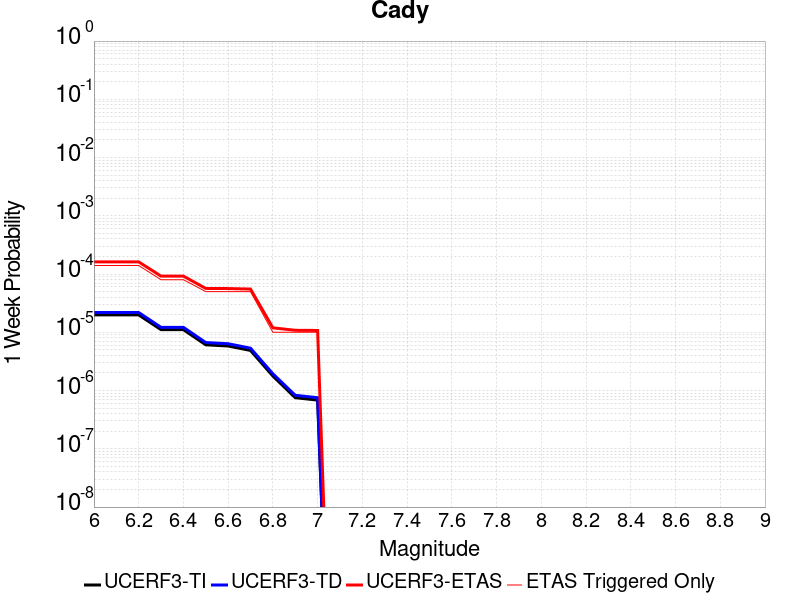 |  |  |  |

| Magnitude | 1 wk TI Prob | 1 wk TD Prob | 1 wk ETAS Prob | 1 wk ETAS/TD Gain | 1 wk ETAS Triggered Only | 1 mo TI Prob | 1 mo TD Prob | 1 mo ETAS Prob | 1 mo ETAS/TD Gain | 1 mo ETAS Triggered Only | 1 yr TI Prob | 1 yr TD Prob | 1 yr ETAS Prob | 1 yr ETAS/TD Gain | 1 yr ETAS Triggered Only | 10 yr TI Prob | 10 yr TD Prob | 10 yr ETAS Prob | 10 yr ETAS/TD Gain | 10 yr ETAS Triggered Only |
|-----|-----|-----|-----|-----|-----|-----|-----|-----|-----|-----|-----|-----|-----|-----|-----|-----|-----|-----|-----|-----|
| 6.0 | 1.9892565E-5 | 2.1858728E-5 | 1.6185567E-4 | 7.404624 | 1.4E-4 | 8.525106E-5 | 9.3677416E-5 | 2.836596E-4 | 3.028047 | 1.9E-4 | 0.0010374374 | 0.0011400167 | 0.0014296861 | 1.2540922 | 2.9E-4 | 0.010326075 | 0.011350701 | 0.0117857065 | 1.0383241 | 4.4E-4 |
| 6.1 | 1.9892565E-5 | 2.1858728E-5 | 1.6185567E-4 | 7.404624 | 1.4E-4 | 8.525106E-5 | 9.3677416E-5 | 2.836596E-4 | 3.028047 | 1.9E-4 | 0.0010374374 | 0.0011400167 | 0.0014296861 | 1.2540922 | 2.9E-4 | 0.010326075 | 0.011350701 | 0.0117857065 | 1.0383241 | 4.4E-4 |
| 6.2 | 1.9892565E-5 | 2.1858728E-5 | 1.6185567E-4 | 7.404624 | 1.4E-4 | 8.525106E-5 | 9.3677416E-5 | 2.836596E-4 | 3.028047 | 1.9E-4 | 0.0010374374 | 0.0011400167 | 0.0014296861 | 1.2540922 | 2.9E-4 | 0.010326075 | 0.011350701 | 0.0117857065 | 1.0383241 | 4.4E-4 |
| 6.3 | 1.1117327E-5 | 1.2176583E-5 | 9.217561E-5 | 7.569907 | 8.0E-5 | 4.764482E-5 | 5.2184492E-5 | 1.421798E-4 | 2.7245603 | 9.0E-5 | 5.7992124E-4 | 6.351925E-4 | 7.751036E-4 | 1.2202656 | 1.4E-4 | 0.0057841022 | 0.0063368753 | 0.0065455446 | 1.0329293 | 2.1E-4 |
| 6.4 | 1.1117327E-5 | 1.2176583E-5 | 9.217561E-5 | 7.569907 | 8.0E-5 | 4.764482E-5 | 5.2184492E-5 | 1.421798E-4 | 2.7245603 | 9.0E-5 | 5.7992124E-4 | 6.351925E-4 | 7.751036E-4 | 1.2202656 | 1.4E-4 | 0.0057841022 | 0.0063368753 | 0.0065455446 | 1.0329293 | 2.1E-4 |
| 6.5 | 6.103093E-6 | 6.672021E-6 | 5.6671688E-5 | 8.493932 | 5.0E-5 | 2.615585E-5 | 2.8594131E-5 | 8.859242E-5 | 3.0982726 | 6.0E-5 | 3.1840094E-4 | 3.480905E-4 | 4.3805919E-4 | 1.2584635 | 9.0E-5 | 0.0031794512 | 0.0034766865 | 0.0036062347 | 1.037262 | 1.3E-4 |
| 6.6 | 5.817237E-6 | 6.3656585E-6 | 5.636534E-5 | 8.854597 | 5.0E-5 | 2.4930776E-5 | 2.728118E-5 | 8.727954E-5 | 3.1992586 | 6.0E-5 | 3.034899E-4 | 3.3211018E-4 | 4.2208028E-4 | 1.2709044 | 9.0E-5 | 0.0030307577 | 0.0033173605 | 0.0034469294 | 1.0390577 | 1.3E-4 |
| 6.7 | 4.8846314E-6 | 5.3405684E-6 | 5.53403E-5 | 10.362249 | 5.0E-5 | 2.0933967E-5 | 2.2888014E-5 | 7.288687E-5 | 3.1844995 | 5.0E-5 | 2.5484123E-4 | 2.7863772E-4 | 3.4861822E-4 | 1.2511523 | 7.0E-5 | 0.0025454918 | 0.0027840391 | 0.0028837607 | 1.035819 | 1.0E-4 |
| 6.8 | 1.7788773E-6 | 1.9399079E-6 | 1.1939888E-5 | 6.154874 | 1.0E-5 | 7.6237375E-6 | 8.313874E-6 | 1.831379E-5 | 2.2027988 | 1.0E-5 | 9.281505E-5 | 1.01218284E-4 | 1.3121525E-4 | 1.2963592 | 3.0E-5 | 9.2776294E-4 | 0.0010118765 | 0.0010418461 | 1.0296179 | 3.0E-5 |
| 6.9 | 7.5455404E-7 | 8.297092E-7 | 1.0829701E-5 | 13.052405 | 1.0E-5 | 3.233799E-6 | 3.5558937E-6 | 1.35558585E-5 | 3.8122225 | 1.0E-5 | 3.937079E-5 | 4.3292483E-5 | 5.329205E-5 | 1.2309769 | 1.0E-5 | 3.9363815E-4 | 4.3287344E-4 | 4.428691E-4 | 1.0230914 | 1.0E-5 |
| 7.0 | 6.8578805E-7 | 7.541816E-7 | 1.0754174E-5 | 14.259396 | 1.0E-5 | 2.9390883E-6 | 3.2322048E-6 | 1.3232172E-5 | 4.0938535 | 1.0E-5 | 3.578281E-5 | 3.9351715E-5 | 4.9351318E-5 | 1.2541085 | 1.0E-5 | 3.577705E-4 | 3.9347992E-4 | 4.0347598E-4 | 1.0254042 | 1.0E-5 |

## Sierra Nevada  (No Extension)
*[(top)](#table-of-contents)*

| 1 Week | 1 Month | 1 Year | 10 Year |
|-----|-----|-----|-----|
|  | 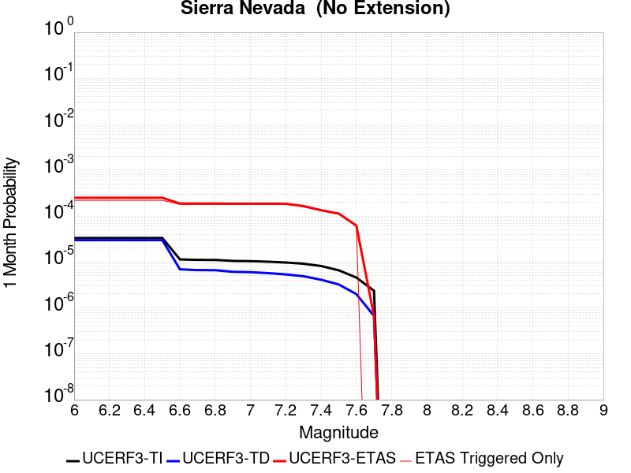 |  |  |

| Magnitude | 1 wk TI Prob | 1 wk TD Prob | 1 wk ETAS Prob | 1 wk ETAS/TD Gain | 1 wk ETAS Triggered Only | 1 mo TI Prob | 1 mo TD Prob | 1 mo ETAS Prob | 1 mo ETAS/TD Gain | 1 mo ETAS Triggered Only | 1 yr TI Prob | 1 yr TD Prob | 1 yr ETAS Prob | 1 yr ETAS/TD Gain | 1 yr ETAS Triggered Only | 10 yr TI Prob | 10 yr TD Prob | 10 yr ETAS Prob | 10 yr ETAS/TD Gain | 10 yr ETAS Triggered Only |
|-----|-----|-----|-----|-----|-----|-----|-----|-----|-----|-----|-----|-----|-----|-----|-----|-----|-----|-----|-----|-----|
| 6.0 | 7.7690465E-6 | 6.9762887E-6 | 1.769751E-4 | 25.368088 | 1.7E-4 | 3.329549E-5 | 2.989824E-5 | 2.4989166E-4 | 8.358073 | 2.2E-4 | 4.0529718E-4 | 3.6398612E-4 | 6.8386964E-4 | 1.8788345 | 3.2E-4 | 0.004045588 | 0.0036374154 | 0.0040060696 | 1.1013505 | 3.7E-4 |
| 6.1 | 7.7690465E-6 | 6.9762887E-6 | 1.769751E-4 | 25.368088 | 1.7E-4 | 3.329549E-5 | 2.989824E-5 | 2.4989166E-4 | 8.358073 | 2.2E-4 | 4.0529718E-4 | 3.6398612E-4 | 6.8386964E-4 | 1.8788345 | 3.2E-4 | 0.004045588 | 0.0036374154 | 0.0040060696 | 1.1013505 | 3.7E-4 |
| 6.2 | 7.7690465E-6 | 6.9762887E-6 | 1.769751E-4 | 25.368088 | 1.7E-4 | 3.329549E-5 | 2.989824E-5 | 2.4989166E-4 | 8.358073 | 2.2E-4 | 4.0529718E-4 | 3.6398612E-4 | 6.8386964E-4 | 1.8788345 | 3.2E-4 | 0.004045588 | 0.0036374154 | 0.0040060696 | 1.1013505 | 3.7E-4 |
| 6.3 | 7.7690465E-6 | 6.9762887E-6 | 1.769751E-4 | 25.368088 | 1.7E-4 | 3.329549E-5 | 2.989824E-5 | 2.4989166E-4 | 8.358073 | 2.2E-4 | 4.0529718E-4 | 3.6398612E-4 | 6.8386964E-4 | 1.8788345 | 3.2E-4 | 0.004045588 | 0.0036374154 | 0.0040060696 | 1.1013505 | 3.7E-4 |
| 6.4 | 7.7690465E-6 | 6.9762887E-6 | 1.769751E-4 | 25.368088 | 1.7E-4 | 3.329549E-5 | 2.989824E-5 | 2.4989166E-4 | 8.358073 | 2.2E-4 | 4.0529718E-4 | 3.6398612E-4 | 6.8386964E-4 | 1.8788345 | 3.2E-4 | 0.004045588 | 0.0036374154 | 0.0040060696 | 1.1013505 | 3.7E-4 |
| 6.5 | 7.7690465E-6 | 6.9762887E-6 | 1.769751E-4 | 25.368088 | 1.7E-4 | 3.329549E-5 | 2.989824E-5 | 2.4989166E-4 | 8.358073 | 2.2E-4 | 4.0529718E-4 | 3.6398612E-4 | 6.8386964E-4 | 1.8788345 | 3.2E-4 | 0.004045588 | 0.0036374154 | 0.0040060696 | 1.1013505 | 3.7E-4 |
| 6.6 | 2.653E-6 | 1.6148208E-6 | 1.416146E-4 | 87.696785 | 1.4E-4 | 1.136995E-5 | 6.9206426E-6 | 1.869194E-4 | 27.008965 | 1.8E-4 | 1.3842035E-4 | 8.42556E-5 | 3.0423707E-4 | 3.6108825 | 2.2E-4 | 0.0013833415 | 8.4224E-4 | 0.0010920294 | 1.2965775 | 2.5E-4 |
| 6.7 | 2.5902466E-6 | 1.5501544E-6 | 1.4154994E-4 | 91.313446 | 1.4E-4 | 1.11010095E-5 | 6.643502E-6 | 1.8664231E-4 | 28.093964 | 1.8E-4 | 1.351464E-4 | 8.088166E-5 | 3.0086387E-4 | 3.719803 | 2.2E-4 | 0.0013506424 | 8.0852525E-4 | 0.0010583231 | 1.308955 | 2.5E-4 |
| 6.8 | 2.5853892E-6 | 1.5469546E-6 | 1.4154674E-4 | 91.50025 | 1.4E-4 | 1.1080193E-5 | 6.629789E-6 | 1.8662859E-4 | 28.150005 | 1.8E-4 | 1.34893E-4 | 8.071472E-5 | 3.0069696E-4 | 3.725429 | 2.2E-4 | 0.0013481114 | 8.06857E-4 | 0.0010566553 | 1.3095943 | 2.5E-4 |
| 6.9 | 2.458257E-6 | 1.422029E-6 | 1.4142183E-4 | 99.450745 | 1.4E-4 | 1.0535345E-5 | 6.0943958E-6 | 1.860933E-4 | 30.535152 | 1.8E-4 | 1.2826028E-4 | 7.419676E-5 | 2.9418044E-4 | 3.964869 | 2.2E-4 | 0.0012818627 | 7.4172183E-4 | 9.915364E-4 | 1.3368036 | 2.5E-4 |
| 7.0 | 2.4341468E-6 | 1.3989927E-6 | 1.4139879E-4 | 101.07186 | 1.4E-4 | 1.0432016E-5 | 5.9956697E-6 | 1.8599459E-4 | 31.021488 | 1.8E-4 | 1.270024E-4 | 7.299485E-5 | 2.929788E-4 | 4.0136914 | 2.2E-4 | 0.0012692984 | 7.297107E-4 | 9.795282E-4 | 1.3423516 | 2.5E-4 |
| 7.1 | 2.3652476E-6 | 1.3339427E-6 | 1.4133376E-4 | 105.9519 | 1.4E-4 | 1.0136736E-5 | 5.716885E-6 | 1.8571585E-4 | 32.4855 | 1.8E-4 | 1.2340778E-4 | 6.9600865E-5 | 2.8958556E-4 | 4.1606603 | 2.2E-4 | 0.0012333926 | 6.957924E-4 | 9.4561843E-4 | 1.3590525 | 2.5E-4 |
| 7.2 | 2.272158E-6 | 1.2502497E-6 | 1.4125007E-4 | 112.97749 | 1.4E-4 | 9.737784E-6 | 5.358202E-6 | 1.8535723E-4 | 34.593178 | 1.8E-4 | 1.1855107E-4 | 6.523417E-5 | 2.852198E-4 | 4.372246 | 2.2E-4 | 0.0011848784 | 6.5215176E-4 | 9.019887E-4 | 1.3830963 | 2.5E-4 |
| 7.3 | 2.1382127E-6 | 1.1419382E-6 | 1.3114179E-4 | 114.8414 | 1.3E-4 | 9.163737E-6 | 4.894012E-6 | 1.6489322E-4 | 33.692856 | 1.6E-4 | 1.1156279E-4 | 5.9582977E-5 | 2.5957107E-4 | 4.3564634 | 2.0E-4 | 0.001115068 | 5.956712E-4 | 8.1554014E-4 | 1.3691113 | 2.2E-4 |
| 7.4 | 1.9048055E-6 | 9.574928E-7 | 1.10957386E-4 | 115.883255 | 1.1E-4 | 8.163426E-6 | 4.103534E-6 | 1.34103E-4 | 32.67988 | 1.3E-4 | 9.9385186E-5 | 4.995939E-5 | 2.099514E-4 | 4.202441 | 1.6E-4 | 9.934074E-4 | 4.9948227E-4 | 6.7939237E-4 | 1.3601931 | 1.8E-4 |
| 7.5 | 1.5373403E-6 | 7.559763E-7 | 1.00755904E-4 | 133.27917 | 1.0E-4 | 6.5885843E-6 | 3.2398946E-6 | 1.1323954E-4 | 34.951614 | 1.1E-4 | 8.021306E-5 | 3.9445007E-5 | 1.7943948E-4 | 4.549105 | 1.4E-4 | 8.0184115E-4 | 3.9438053E-4 | 5.443214E-4 | 1.3801934 | 1.5E-4 |
| 7.6 | 1.0680322E-6 | 4.65941E-7 | 6.0465914E-5 | 129.7716 | 6.0E-5 | 4.577273E-6 | 1.9968884E-6 | 6.199677E-5 | 31.046686 | 6.0E-5 | 5.5726876E-5 | 2.4311848E-5 | 1.1430966E-4 | 4.7018085 | 9.0E-5 | 5.5712904E-4 | 2.4309216E-4 | 3.330703E-4 | 1.37014 | 9.0E-5 |
| 7.7 | 5.509146E-7 | 1.5578539E-7 | 1.5578539E-7 | 1.0 | 0.0 | 2.3610605E-6 | 6.676515E-7 | 6.676515E-7 | 1.0 | 0.0 | 2.8745531E-5 | 8.128628E-6 | 8.128628E-6 | 1.0 | 0.0 | 2.8741814E-4 | 8.128342E-5 | 8.128342E-5 | 1.0 | 0.0 |

## Scodie Lineament
*[(top)](#table-of-contents)*

| 1 Week | 1 Month | 1 Year | 10 Year |
|-----|-----|-----|-----|
|  |  |  |  |

| Magnitude | 1 wk TI Prob | 1 wk TD Prob | 1 wk ETAS Prob | 1 wk ETAS/TD Gain | 1 wk ETAS Triggered Only | 1 mo TI Prob | 1 mo TD Prob | 1 mo ETAS Prob | 1 mo ETAS/TD Gain | 1 mo ETAS Triggered Only | 1 yr TI Prob | 1 yr TD Prob | 1 yr ETAS Prob | 1 yr ETAS/TD Gain | 1 yr ETAS Triggered Only | 10 yr TI Prob | 10 yr TD Prob | 10 yr ETAS Prob | 10 yr ETAS/TD Gain | 10 yr ETAS Triggered Only |
|-----|-----|-----|-----|-----|-----|-----|-----|-----|-----|-----|-----|-----|-----|-----|-----|-----|-----|-----|-----|-----|
| 6.0 | 3.2919327E-6 | 3.0133303E-6 | 1.5301288E-4 | 50.77866 | 1.5E-4 | 1.4108206E-5 | 1.2914227E-5 | 2.0291177E-4 | 15.712266 | 1.9E-4 | 1.7175387E-4 | 1.5722254E-4 | 4.4717695E-4 | 2.8442292 | 2.9E-4 | 0.0017162118 | 0.0015714248 | 0.0019508277 | 1.2414387 | 3.8E-4 |
| 6.1 | 1.8663811E-6 | 1.5490382E-6 | 5.154896E-5 | 33.278046 | 5.0E-5 | 7.998751E-6 | 6.6387206E-6 | 5.663839E-5 | 8.531522 | 5.0E-5 | 9.738045E-5 | 8.082393E-5 | 1.7081665E-4 | 2.1134417 | 9.0E-5 | 9.7337784E-4 | 8.079941E-4 | 9.378891E-4 | 1.1607623 | 1.3E-4 |
| 6.2 | 1.8663811E-6 | 1.5490382E-6 | 5.154896E-5 | 33.278046 | 5.0E-5 | 7.998751E-6 | 6.6387206E-6 | 5.663839E-5 | 8.531522 | 5.0E-5 | 9.738045E-5 | 8.082393E-5 | 1.7081665E-4 | 2.1134417 | 9.0E-5 | 9.7337784E-4 | 8.079941E-4 | 9.378891E-4 | 1.1607623 | 1.3E-4 |
| 6.3 | 1.8663811E-6 | 1.5490382E-6 | 5.154896E-5 | 33.278046 | 5.0E-5 | 7.998751E-6 | 6.6387206E-6 | 5.663839E-5 | 8.531522 | 5.0E-5 | 9.738045E-5 | 8.082393E-5 | 1.7081665E-4 | 2.1134417 | 9.0E-5 | 9.7337784E-4 | 8.079941E-4 | 9.378891E-4 | 1.1607623 | 1.3E-4 |
| 6.4 | 1.8663811E-6 | 1.5490382E-6 | 5.154896E-5 | 33.278046 | 5.0E-5 | 7.998751E-6 | 6.6387206E-6 | 5.663839E-5 | 8.531522 | 5.0E-5 | 9.738045E-5 | 8.082393E-5 | 1.7081665E-4 | 2.1134417 | 9.0E-5 | 9.7337784E-4 | 8.079941E-4 | 9.378891E-4 | 1.1607623 | 1.3E-4 |
| 6.5 | 1.8106311E-6 | 1.4909722E-6 | 5.1490897E-5 | 34.53512 | 5.0E-5 | 7.759824E-6 | 6.389868E-6 | 5.638955E-5 | 8.824838 | 5.0E-5 | 9.447177E-5 | 7.779436E-5 | 1.6778735E-4 | 2.1568062 | 9.0E-5 | 9.4431615E-4 | 7.7771995E-4 | 9.0761884E-4 | 1.1670253 | 1.3E-4 |
| 6.6 | 1.2414679E-6 | 8.9974395E-7 | 3.089972E-5 | 34.34279 | 3.0E-5 | 5.320566E-6 | 3.85604E-6 | 3.3855926E-5 | 8.779971 | 3.0E-5 | 6.477596E-5 | 4.6946367E-5 | 8.694449E-5 | 1.8519961 | 4.0E-5 | 6.475708E-4 | 4.6937316E-4 | 5.29345E-4 | 1.1277701 | 6.0E-5 |
| 6.7 | 1.1062215E-6 | 7.594193E-7 | 3.07594E-5 | 40.503838 | 3.0E-5 | 4.7409408E-6 | 3.2546504E-6 | 3.3254553E-5 | 10.217549 | 3.0E-5 | 5.7719422E-5 | 3.962472E-5 | 6.962353E-5 | 1.7570732 | 3.0E-5 | 5.770443E-4 | 3.9618355E-4 | 4.361677E-4 | 1.1009233 | 4.0E-5 |
| 6.8 | 1.0006736E-6 | 6.5002786E-7 | 2.0650015E-5 | 31.76789 | 2.0E-5 | 4.288594E-6 | 2.7858312E-6 | 2.2785776E-5 | 8.179166 | 2.0E-5 | 5.221238E-5 | 3.391703E-5 | 5.391635E-5 | 1.5896543 | 2.0E-5 | 5.220012E-4 | 3.3912458E-4 | 3.591178E-4 | 1.0589554 | 2.0E-5 |
| 6.9 | 9.167364E-7 | 5.6315065E-7 | 1.0563145E-5 | 18.757227 | 1.0E-5 | 3.9288643E-6 | 2.413501E-6 | 1.2413477E-5 | 5.1433487 | 1.0E-5 | 4.7832873E-5 | 2.9384037E-5 | 3.9383744E-5 | 1.3403108 | 1.0E-5 | 4.782258E-4 | 2.9380718E-4 | 3.0380423E-4 | 1.0340259 | 1.0E-5 |
| 7.0 | 7.6987664E-7 | 4.113265E-7 | 4.113265E-7 | 1.0 | 0.0 | 3.2994672E-6 | 1.7628269E-6 | 1.7628269E-6 | 1.0 | 0.0 | 4.0170275E-5 | 2.1462245E-5 | 2.1462245E-5 | 1.0 | 0.0 | 4.0163012E-4 | 2.1460558E-4 | 2.1460558E-4 | 1.0 | 0.0 |
| 7.1 | 7.1038727E-7 | 3.5210306E-7 | 3.5210306E-7 | 1.0 | 0.0 | 3.0445133E-6 | 1.5090123E-6 | 1.5090123E-6 | 1.0 | 0.0 | 3.706632E-5 | 1.8372106E-5 | 1.8372106E-5 | 1.0 | 0.0 | 3.7060137E-4 | 1.8370937E-4 | 1.8370937E-4 | 1.0 | 0.0 |
| 7.2 | 2.0799602E-7 | 3.1178534E-8 | 3.1178534E-8 | 1.0 | 0.0 | 8.914113E-7 | 1.3362228E-7 | 1.3362228E-7 | 1.0 | 0.0 | 1.0852878E-5 | 1.6268501E-6 | 1.6268501E-6 | 1.0 | 0.0 | 1.08523476E-4 | 1.626839E-5 | 1.626839E-5 | 1.0 | 0.0 |
| 7.3 | 1.5048182E-7 | 1.5939106E-8 | 1.5939106E-8 | 1.0 | 0.0 | 6.449219E-7 | 6.8310456E-8 | 6.8310456E-8 | 1.0 | 0.0 | 7.851896E-6 | 8.316795E-7 | 8.316795E-7 | 1.0 | 0.0 | 7.851618E-5 | 8.316767E-6 | 8.316767E-6 | 1.0 | 0.0 |
| 7.4 | 5.9334678E-8 | 4.8638475E-9 | 4.8638475E-9 | 1.0 | 0.0 | 2.5429145E-7 | 2.084506E-8 | 2.084506E-8 | 1.0 | 0.0 | 3.095994E-6 | 2.5378858E-7 | 2.5378858E-7 | 1.0 | 0.0 | 3.095951E-5 | 2.5378843E-6 | 2.5378843E-6 | 1.0 | 0.0 |

## Death Valley (Fish Lake Valley)
*[(top)](#table-of-contents)*

| 1 Week | 1 Month | 1 Year | 10 Year |
|-----|-----|-----|-----|
|  |  | 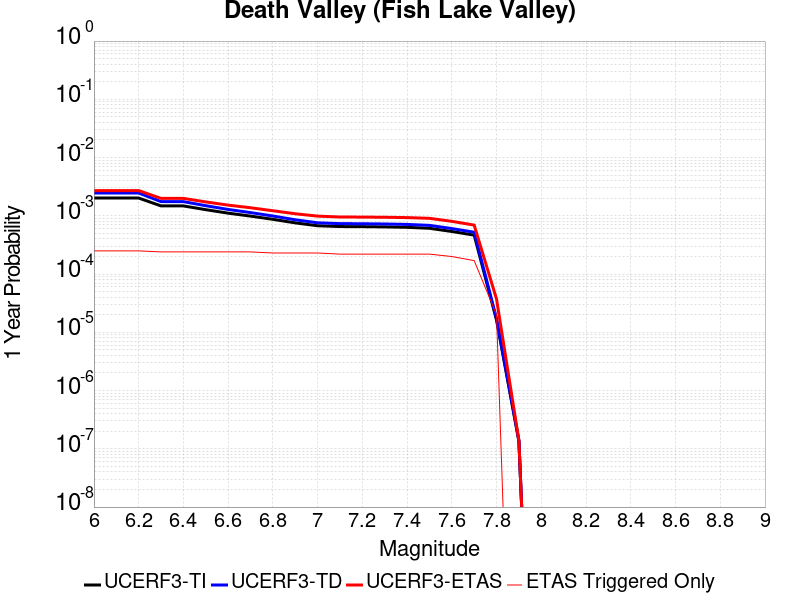 |  |

| Magnitude | 1 wk TI Prob | 1 wk TD Prob | 1 wk ETAS Prob | 1 wk ETAS/TD Gain | 1 wk ETAS Triggered Only | 1 mo TI Prob | 1 mo TD Prob | 1 mo ETAS Prob | 1 mo ETAS/TD Gain | 1 mo ETAS Triggered Only | 1 yr TI Prob | 1 yr TD Prob | 1 yr ETAS Prob | 1 yr ETAS/TD Gain | 1 yr ETAS Triggered Only | 10 yr TI Prob | 10 yr TD Prob | 10 yr ETAS Prob | 10 yr ETAS/TD Gain | 10 yr ETAS Triggered Only |
|-----|-----|-----|-----|-----|-----|-----|-----|-----|-----|-----|-----|-----|-----|-----|-----|-----|-----|-----|-----|-----|
| 6.0 | 3.872328E-5 | 4.7265705E-5 | 1.2726193E-4 | 2.6924791 | 8.0E-5 | 1.6594635E-4 | 2.0255324E-4 | 3.2252894E-4 | 1.5923169 | 1.2E-4 | 0.0020185246 | 0.0024635606 | 0.0027129448 | 1.1012292 | 2.5E-4 | 0.02000288 | 0.024388338 | 0.024729801 | 1.0140011 | 3.5E-4 |
| 6.1 | 3.872328E-5 | 4.7265705E-5 | 1.2726193E-4 | 2.6924791 | 8.0E-5 | 1.6594635E-4 | 2.0255324E-4 | 3.2252894E-4 | 1.5923169 | 1.2E-4 | 0.0020185246 | 0.0024635606 | 0.0027129448 | 1.1012292 | 2.5E-4 | 0.02000288 | 0.024388338 | 0.024729801 | 1.0140011 | 3.5E-4 |
| 6.2 | 3.872328E-5 | 4.7265705E-5 | 1.2726193E-4 | 2.6924791 | 8.0E-5 | 1.6594635E-4 | 2.0255324E-4 | 3.2252894E-4 | 1.5923169 | 1.2E-4 | 0.0020185246 | 0.0024635606 | 0.0027129448 | 1.1012292 | 2.5E-4 | 0.02000288 | 0.024388338 | 0.024729801 | 1.0140011 | 3.5E-4 |
| 6.3 | 2.8356371E-5 | 3.360979E-5 | 1.136071E-4 | 3.380179 | 8.0E-5 | 1.2152165E-4 | 1.4403443E-4 | 2.6401714E-4 | 1.8330141 | 1.2E-4 | 0.0014785219 | 0.0017522788 | 0.0019918582 | 1.1367245 | 2.4E-4 | 0.014687235 | 0.017391816 | 0.017725904 | 1.0192094 | 3.4E-4 |
| 6.4 | 2.8356371E-5 | 3.360979E-5 | 1.136071E-4 | 3.380179 | 8.0E-5 | 1.2152165E-4 | 1.4403443E-4 | 2.6401714E-4 | 1.8330141 | 1.2E-4 | 0.0014785219 | 0.0017522788 | 0.0019918582 | 1.1367245 | 2.4E-4 | 0.014687235 | 0.017391816 | 0.017725904 | 1.0192094 | 3.4E-4 |
| 6.5 | 2.4448687E-5 | 2.8607585E-5 | 1.08605294E-4 | 3.7963812 | 8.0E-5 | 1.0477588E-4 | 1.2259845E-4 | 2.4258373E-4 | 1.9786853 | 1.2E-4 | 0.0012748998 | 0.0014916616 | 0.0017313036 | 1.1606544 | 2.4E-4 | 0.012676105 | 0.014821392 | 0.015156352 | 1.0225998 | 3.4E-4 |
| 6.6 | 2.1298161E-5 | 2.4660083E-5 | 1.0465811E-4 | 4.244029 | 8.0E-5 | 9.127464E-5 | 1.0568197E-4 | 2.2566928E-4 | 2.1353624 | 1.2E-4 | 0.0011107022 | 0.0012859512 | 0.0015256426 | 1.1863923 | 2.4E-4 | 0.011051672 | 0.01278853 | 0.013124182 | 1.0262463 | 3.4E-4 |
| 6.7 | 1.8959729E-5 | 2.1781027E-5 | 1.0177928E-4 | 4.6728415 | 8.0E-5 | 8.125345E-5 | 9.334406E-5 | 2.1333285E-4 | 2.2854466 | 1.2E-4 | 9.888117E-4 | 0.001135897 | 0.0013756243 | 1.2110468 | 2.4E-4 | 0.009844234 | 0.01130357 | 0.011639727 | 1.029739 | 3.4E-4 |
| 6.8 | 1.6691629E-5 | 1.9018351E-5 | 8.901702E-5 | 4.6805854 | 7.0E-5 | 7.153359E-5 | 8.150477E-5 | 1.9149581E-4 | 2.3495042 | 1.1E-4 | 8.7057345E-4 | 9.918857E-4 | 0.0012216576 | 1.2316515 | 2.3E-4 | 0.008671708 | 0.009876343 | 0.010203084 | 1.0330832 | 3.3E-4 |
| 6.9 | 1.450505E-5 | 1.638954E-5 | 8.638839E-5 | 5.270947 | 7.0E-5 | 6.216302E-5 | 7.0239046E-5 | 1.8023132E-4 | 2.5659707 | 1.1E-4 | 7.5657194E-4 | 8.5483363E-4 | 0.001084637 | 1.2688282 | 2.3E-4 | 0.007540013 | 0.008516385 | 0.008843576 | 1.0384189 | 3.3E-4 |
| 7.0 | 1.2940855E-5 | 1.4537972E-5 | 8.453696E-5 | 5.814907 | 7.0E-5 | 5.545963E-5 | 6.230414E-5 | 1.7229728E-4 | 2.7654228 | 1.1E-4 | 6.750118E-4 | 7.5829466E-4 | 9.881203E-4 | 1.3030821 | 2.3E-4 | 0.006729651 | 0.0075576897 | 0.007885196 | 1.0433341 | 3.3E-4 |
| 7.1 | 1.2544658E-5 | 1.4078208E-5 | 8.407722E-5 | 5.9721537 | 7.0E-5 | 5.3761712E-5 | 6.0333812E-5 | 1.7032717E-4 | 2.82308 | 1.1E-4 | 6.5435225E-4 | 7.343222E-4 | 9.5416064E-4 | 1.299376 | 2.2E-4 | 0.006524288 | 0.007319551 | 0.007637209 | 1.0433985 | 3.2E-4 |
| 7.2 | 1.2489416E-5 | 1.4015674E-5 | 8.40147E-5 | 5.9943385 | 7.0E-5 | 5.3524967E-5 | 6.0065824E-5 | 1.7005921E-4 | 2.8312142 | 1.1E-4 | 6.514716E-4 | 7.310616E-4 | 9.509008E-4 | 1.3007122 | 2.2E-4 | 0.006495651 | 0.0072871596 | 0.0076048276 | 1.0435928 | 3.2E-4 |
| 7.3 | 1.2368307E-5 | 1.3879812E-5 | 8.387884E-5 | 6.043226 | 7.0E-5 | 5.3005948E-5 | 5.9483587E-5 | 1.6947705E-4 | 2.8491397 | 1.1E-4 | 6.451563E-4 | 7.2397763E-4 | 9.4381836E-4 | 1.3036568 | 2.2E-4 | 0.0064328653 | 0.007216782 | 0.0075344723 | 1.0440211 | 3.2E-4 |
| 7.4 | 1.2161707E-5 | 1.36478675E-5 | 8.364691E-5 | 6.1289363 | 7.0E-5 | 5.212056E-5 | 5.8489582E-5 | 1.6848315E-4 | 2.8805668 | 1.1E-4 | 6.3438306E-4 | 7.118836E-4 | 9.31727E-4 | 1.3088193 | 2.2E-4 | 0.006325751 | 0.0070966207 | 0.00741435 | 1.0447719 | 3.2E-4 |
| 7.5 | 1.1707948E-5 | 1.3145515E-5 | 8.3144594E-5 | 6.32494 | 7.0E-5 | 5.0175953E-5 | 5.6336736E-5 | 1.6633054E-4 | 2.9524348 | 1.1E-4 | 6.10721E-4 | 6.856895E-4 | 9.055386E-4 | 1.320625 | 2.2E-4 | 0.0060904534 | 0.006836321 | 0.0071541336 | 1.0464888 | 3.2E-4 |
| 7.6 | 1.0319538E-5 | 1.1579622E-5 | 8.1578815E-5 | 7.045032 | 7.0E-5 | 4.4225842E-5 | 4.9626036E-5 | 1.4962108E-4 | 3.0149713 | 1.0E-4 | 5.383166E-4 | 6.040347E-4 | 8.0391386E-4 | 1.3309069 | 2.0E-4 | 0.0053701443 | 0.0060244603 | 0.006322653 | 1.049497 | 3.0E-4 |
| 7.7 | 8.937764E-6 | 1.0022779E-5 | 6.0022277E-5 | 5.9885864 | 5.0E-5 | 3.830414E-5 | 4.295409E-5 | 1.2295066E-4 | 2.8623736 | 8.0E-5 | 4.6625308E-4 | 5.228456E-4 | 6.927567E-4 | 1.3249738 | 1.7E-4 | 0.0046527605 | 0.005216664 | 0.005475308 | 1.0495803 | 2.6E-4 |
| 7.8 | 3.108007E-7 | 3.284654E-7 | 1.0328462E-5 | 31.444597 | 1.0E-5 | 1.3320023E-6 | 1.407708E-6 | 2.140768E-5 | 15.207471 | 2.0E-5 | 1.6217007E-5 | 1.7138715E-5 | 3.7138372E-5 | 2.1669285 | 2.0E-5 | 1.6215823E-4 | 1.7137431E-4 | 1.9137088E-4 | 1.1166836 | 2.0E-5 |
| 7.9 | 2.5591178E-9 | 2.6696718E-9 | 2.6696718E-9 | 1.0 | 0.0 | 1.0967647E-8 | 1.14414505E-8 | 1.14414505E-8 | 1.0 | 0.0 | 1.335311E-7 | 1.3929966E-7 | 1.3929966E-7 | 1.0 | 0.0 | 1.3353102E-6 | 1.3929966E-6 | 1.3929966E-6 | 1.0 | 0.0 |

## Elsinore (Glen Ivy) rev
*[(top)](#table-of-contents)*

| 1 Week | 1 Month | 1 Year | 10 Year |
|-----|-----|-----|-----|
| 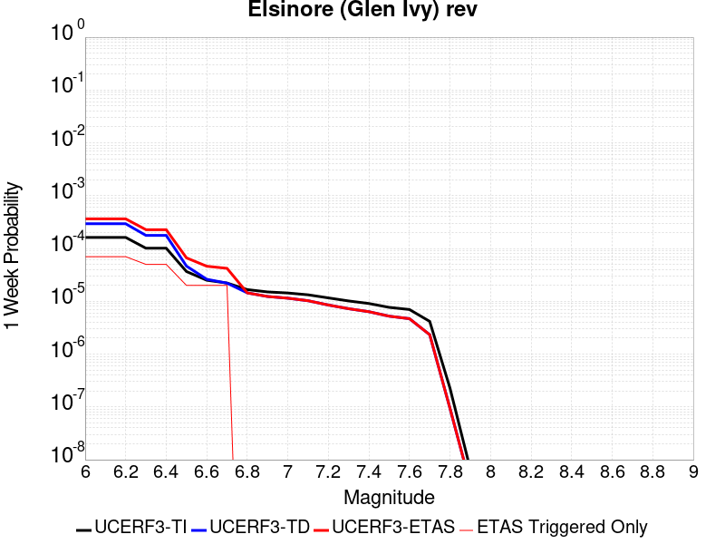 |  |  |  |

| Magnitude | 1 wk TI Prob | 1 wk TD Prob | 1 wk ETAS Prob | 1 wk ETAS/TD Gain | 1 wk ETAS Triggered Only | 1 mo TI Prob | 1 mo TD Prob | 1 mo ETAS Prob | 1 mo ETAS/TD Gain | 1 mo ETAS Triggered Only | 1 yr TI Prob | 1 yr TD Prob | 1 yr ETAS Prob | 1 yr ETAS/TD Gain | 1 yr ETAS Triggered Only | 10 yr TI Prob | 10 yr TD Prob | 10 yr ETAS Prob | 10 yr ETAS/TD Gain | 10 yr ETAS Triggered Only |
|-----|-----|-----|-----|-----|-----|-----|-----|-----|-----|-----|-----|-----|-----|-----|-----|-----|-----|-----|-----|-----|
| 6.0 | 1.6204086E-4 | 2.937271E-4 | 3.6370652E-4 | 1.2382464 | 7.0E-5 | 6.94276E-4 | 0.0012583778 | 0.0013782268 | 1.0952408 | 1.2E-4 | 0.008420097 | 0.0152346175 | 0.015451266 | 1.0142208 | 2.2E-4 | 0.081081145 | 0.13962454 | 0.13986544 | 1.0017254 | 2.8E-4 |
| 6.1 | 1.6204086E-4 | 2.937271E-4 | 3.6370652E-4 | 1.2382464 | 7.0E-5 | 6.94276E-4 | 0.0012583778 | 0.0013782268 | 1.0952408 | 1.2E-4 | 0.008420097 | 0.0152346175 | 0.015451266 | 1.0142208 | 2.2E-4 | 0.081081145 | 0.13962454 | 0.13986544 | 1.0017254 | 2.8E-4 |
| 6.2 | 1.6204086E-4 | 2.937271E-4 | 3.6370652E-4 | 1.2382464 | 7.0E-5 | 6.94276E-4 | 0.0012583778 | 0.0013782268 | 1.0952408 | 1.2E-4 | 0.008420097 | 0.0152346175 | 0.015451266 | 1.0142208 | 2.2E-4 | 0.081081145 | 0.13962454 | 0.13986544 | 1.0017254 | 2.8E-4 |
| 6.3 | 1.0111737E-4 | 1.7703463E-4 | 2.2702577E-4 | 1.2823806 | 5.0E-5 | 4.332882E-4 | 7.5861585E-4 | 8.485476E-4 | 1.1185471 | 9.0E-5 | 0.005262531 | 0.0092177205 | 0.009396061 | 1.0193475 | 1.8E-4 | 0.0513964 | 0.08707393 | 0.08729304 | 1.0025163 | 2.4E-4 |
| 6.4 | 1.0111737E-4 | 1.7703463E-4 | 2.2702577E-4 | 1.2823806 | 5.0E-5 | 4.332882E-4 | 7.5861585E-4 | 8.485476E-4 | 1.1185471 | 9.0E-5 | 0.005262531 | 0.0092177205 | 0.009396061 | 1.0193475 | 1.8E-4 | 0.0513964 | 0.08707393 | 0.08729304 | 1.0025163 | 2.4E-4 |
| 6.5 | 3.6624708E-5 | 4.6391986E-5 | 6.6391054E-5 | 1.4310889 | 2.0E-5 | 1.569536E-4 | 1.9880968E-4 | 2.188057E-4 | 1.1005788 | 2.0E-5 | 0.001909235 | 0.0024181814 | 0.0024481087 | 1.0123761 | 3.0E-5 | 0.01892915 | 0.023697061 | 0.023745878 | 1.0020599 | 5.0E-5 |
| 6.6 | 2.5051324E-5 | 2.6147465E-5 | 4.6146943E-5 | 1.7648726 | 2.0E-5 | 1.073584E-4 | 1.12056E-4 | 1.3205376E-4 | 1.1784621 | 2.0E-5 | 0.0013063047 | 0.0013634725 | 0.0013934316 | 1.0219727 | 3.0E-5 | 0.012986525 | 0.013565759 | 0.0136052165 | 1.0029086 | 4.0E-5 |
| 6.7 | 2.2189772E-5 | 2.2072489E-5 | 4.207205E-5 | 1.9060853 | 2.0E-5 | 9.509556E-5 | 9.459316E-5 | 1.1459127E-4 | 1.2114118 | 2.0E-5 | 0.0011571734 | 0.0011510996 | 0.0011810651 | 1.0260321 | 3.0E-5 | 0.011511663 | 0.0114663225 | 0.011505865 | 1.0034485 | 4.0E-5 |
| 6.8 | 1.6654378E-5 | 1.44376E-5 | 1.44376E-5 | 1.0 | 0.0 | 7.137396E-5 | 6.187399E-5 | 6.187399E-5 | 1.0 | 0.0 | 8.686314E-4 | 7.5306057E-4 | 7.5306057E-4 | 1.0 | 0.0 | 0.008652439 | 0.0075100763 | 0.0075100763 | 1.0 | 0.0 |
| 6.9 | 1.5042909E-5 | 1.2331886E-5 | 1.2331886E-5 | 1.0 | 0.0 | 6.446802E-5 | 5.2849886E-5 | 5.2849886E-5 | 1.0 | 0.0 | 7.8461546E-4 | 6.4326054E-4 | 6.4326054E-4 | 1.0 | 0.0 | 0.007818509 | 0.006417925 | 0.006417925 | 1.0 | 0.0 |
| 7.0 | 1.4361385E-5 | 1.1451172E-5 | 1.1451172E-5 | 1.0 | 0.0 | 6.154734E-5 | 4.9075545E-5 | 4.9075545E-5 | 1.0 | 0.0 | 7.490812E-4 | 5.973339E-4 | 5.973339E-4 | 1.0 | 0.0 | 0.007465612 | 0.005960982 | 0.005960982 | 1.0 | 0.0 |
| 7.1 | 1.3265571E-5 | 1.0244736E-5 | 1.0244736E-5 | 1.0 | 0.0 | 5.6851208E-5 | 4.3905282E-5 | 4.3905282E-5 | 1.0 | 0.0 | 6.919436E-4 | 5.344183E-4 | 5.344183E-4 | 1.0 | 0.0 | 0.006897931 | 0.0053346003 | 0.0053346003 | 1.0 | 0.0 |
| 7.2 | 1.1596403E-5 | 8.504847E-6 | 8.504847E-6 | 1.0 | 0.0 | 4.9697923E-5 | 3.6448844E-5 | 3.6448844E-5 | 1.0 | 0.0 | 6.049042E-4 | 4.4367602E-4 | 4.4367602E-4 | 1.0 | 0.0 | 0.006032603 | 0.004429357 | 0.004429357 | 1.0 | 0.0 |
| 7.3 | 1.0150827E-5 | 7.238537E-6 | 7.238537E-6 | 1.0 | 0.0 | 4.3502816E-5 | 3.102194E-5 | 3.102194E-5 | 1.0 | 0.0 | 5.2951806E-4 | 3.776281E-4 | 3.776281E-4 | 1.0 | 0.0 | 0.005282581 | 0.003770271 | 0.003770271 | 1.0 | 0.0 |
| 7.4 | 9.080705E-6 | 6.352307E-6 | 6.352307E-6 | 1.0 | 0.0 | 3.8916725E-5 | 2.7223898E-5 | 2.7223898E-5 | 1.0 | 0.0 | 4.7370812E-4 | 3.314019E-4 | 3.314019E-4 | 1.0 | 0.0 | 0.004726996 | 0.0033092257 | 0.0033092257 | 1.0 | 0.0 |
| 7.5 | 7.671649E-6 | 5.225419E-6 | 5.225419E-6 | 1.0 | 0.0 | 3.287808E-5 | 2.2394468E-5 | 2.2394468E-5 | 1.0 | 0.0 | 4.0021708E-4 | 2.7261977E-4 | 2.7261977E-4 | 1.0 | 0.0 | 0.0039949706 | 0.0027229784 | 0.0027229784 | 1.0 | 0.0 |
| 7.6 | 6.990086E-6 | 4.687336E-6 | 4.687336E-6 | 1.0 | 0.0 | 2.9957167E-5 | 2.0088435E-5 | 2.0088435E-5 | 1.0 | 0.0 | 3.6466747E-4 | 2.445504E-4 | 2.445504E-4 | 1.0 | 0.0 | 0.0036406964 | 0.0024429292 | 0.0024429292 | 1.0 | 0.0 |
| 7.7 | 4.163505E-6 | 2.329331E-6 | 2.329331E-6 | 1.0 | 0.0 | 1.7843471E-5 | 9.982813E-6 | 9.982813E-6 | 1.0 | 0.0 | 2.172226E-4 | 1.2153471E-4 | 1.2153471E-4 | 1.0 | 0.0 | 0.0021701038 | 0.0012147555 | 0.0012147555 | 1.0 | 0.0 |
| 7.8 | 2.2692414E-7 | 9.384417E-8 | 9.384417E-8 | 1.0 | 0.0 | 9.725317E-7 | 4.0218927E-7 | 4.0218927E-7 | 1.0 | 0.0 | 1.1840509E-5 | 4.8966467E-6 | 4.8966467E-6 | 1.0 | 0.0 | 1.1839878E-4 | 4.8965718E-5 | 4.8965718E-5 | 1.0 | 0.0 |
| 7.9 | 6.676829E-9 | 3.4397174E-9 | 3.4397174E-9 | 1.0 | 0.0 | 2.861498E-8 | 1.4741646E-8 | 1.4741646E-8 | 1.0 | 0.0 | 3.4838732E-7 | 1.7947953E-7 | 1.7947953E-7 | 1.0 | 0.0 | 3.4838679E-6 | 1.794794E-6 | 1.794794E-6 | 1.0 | 0.0 |

## San Andreas (Cholame) rev
*[(top)](#table-of-contents)*

| 1 Week | 1 Month | 1 Year | 10 Year |
|-----|-----|-----|-----|
| 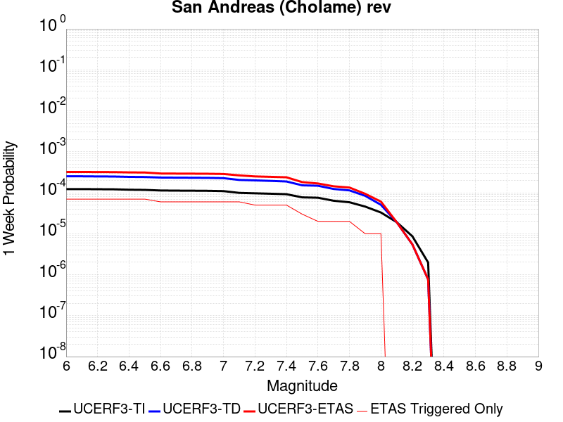 |  |  |  |

| Magnitude | 1 wk TI Prob | 1 wk TD Prob | 1 wk ETAS Prob | 1 wk ETAS/TD Gain | 1 wk ETAS Triggered Only | 1 mo TI Prob | 1 mo TD Prob | 1 mo ETAS Prob | 1 mo ETAS/TD Gain | 1 mo ETAS Triggered Only | 1 yr TI Prob | 1 yr TD Prob | 1 yr ETAS Prob | 1 yr ETAS/TD Gain | 1 yr ETAS Triggered Only | 10 yr TI Prob | 10 yr TD Prob | 10 yr ETAS Prob | 10 yr ETAS/TD Gain | 10 yr ETAS Triggered Only |
|-----|-----|-----|-----|-----|-----|-----|-----|-----|-----|-----|-----|-----|-----|-----|-----|-----|-----|-----|-----|-----|
| 6.0 | 1.2302514E-4 | 2.5205986E-4 | 3.220422E-4 | 1.2776418 | 7.0E-5 | 5.27144E-4 | 0.0010798109 | 0.0011797029 | 1.0925088 | 1.0E-4 | 0.0063991086 | 0.013067958 | 0.013275214 | 1.0158598 | 2.1E-4 | 0.06217949 | 0.12438412 | 0.12467307 | 1.002323 | 3.3E-4 |
| 6.1 | 1.2302514E-4 | 2.5205986E-4 | 3.220422E-4 | 1.2776418 | 7.0E-5 | 5.27144E-4 | 0.0010798109 | 0.0011797029 | 1.0925088 | 1.0E-4 | 0.0063991086 | 0.013067958 | 0.013275214 | 1.0158598 | 2.1E-4 | 0.06217949 | 0.12438412 | 0.12467307 | 1.002323 | 3.3E-4 |
| 6.2 | 1.2203569E-4 | 2.502277E-4 | 3.2021018E-4 | 1.2796752 | 7.0E-5 | 5.2290526E-4 | 0.0010719653 | 0.001171858 | 1.0931866 | 1.0E-4 | 0.006347804 | 0.012973578 | 0.013180854 | 1.0159768 | 2.1E-4 | 0.061695136 | 0.12357131 | 0.12386053 | 1.0023406 | 3.3E-4 |
| 6.3 | 1.2142645E-4 | 2.4908737E-4 | 3.1906995E-4 | 1.2809559 | 7.0E-5 | 5.202953E-4 | 0.0010670823 | 0.0011669755 | 1.0936135 | 1.0E-4 | 0.006316212 | 0.012914834 | 0.013122121 | 1.0160503 | 2.1E-4 | 0.06139677 | 0.123065315 | 0.12335471 | 1.0023515 | 3.3E-4 |
| 6.4 | 1.1865206E-4 | 2.4414246E-4 | 3.1412535E-4 | 1.2866478 | 7.0E-5 | 5.0840975E-4 | 0.0010459068 | 0.0011458022 | 1.0955108 | 1.0E-4 | 0.006172335 | 0.012660044 | 0.0128673855 | 1.0163776 | 2.1E-4 | 0.060036868 | 0.12085904 | 0.12114916 | 1.0024004 | 3.3E-4 |
| 6.5 | 1.17443946E-4 | 2.4207575E-4 | 3.120588E-4 | 1.2890956 | 7.0E-5 | 5.032341E-4 | 0.0010370566 | 0.0011369529 | 1.0963267 | 1.0E-4 | 0.006109677 | 0.012553536 | 0.0127609 | 1.0165184 | 2.1E-4 | 0.059444077 | 0.11993008 | 0.120220505 | 1.0024216 | 3.3E-4 |
| 6.6 | 1.13579066E-4 | 2.3516564E-4 | 2.9515152E-4 | 1.2550793 | 6.0E-5 | 4.866766E-4 | 0.001007465 | 0.0010973742 | 1.0892432 | 9.0E-5 | 0.0059092017 | 0.012197345 | 0.012394905 | 1.016197 | 2.0E-4 | 0.057545185 | 0.1168492 | 0.11713181 | 1.0024185 | 3.2E-4 |
| 6.7 | 1.1271412E-4 | 2.336088E-4 | 2.9359479E-4 | 1.2567797 | 6.0E-5 | 4.829711E-4 | 0.001000798 | 0.0010907078 | 1.0898383 | 9.0E-5 | 0.005864331 | 0.012117079 | 0.012314656 | 1.0163057 | 2.0E-4 | 0.057119697 | 0.11615275 | 0.11643558 | 1.002435 | 3.2E-4 |
| 6.8 | 1.1217975E-4 | 2.3249313E-4 | 2.9247918E-4 | 1.2580122 | 6.0E-5 | 4.8068175E-4 | 9.960202E-4 | 0.0010859305 | 1.0902696 | 9.0E-5 | 0.005836608 | 0.012059555 | 0.012257143 | 1.0163844 | 2.0E-4 | 0.056856725 | 0.11565061 | 0.1159336 | 1.002447 | 3.2E-4 |
| 6.9 | 1.1146753E-4 | 2.3098059E-4 | 2.9096674E-4 | 1.2597021 | 6.0E-5 | 4.7763053E-4 | 9.895428E-4 | 0.0010794537 | 1.0908611 | 9.0E-5 | 0.0057996577 | 0.011981564 | 0.012179167 | 1.0164924 | 2.0E-4 | 0.056506127 | 0.11497027 | 0.11525347 | 1.0024633 | 3.2E-4 |
| 7.0 | 1.0965793E-4 | 2.2721413E-4 | 2.872005E-4 | 1.264008 | 6.0E-5 | 4.698779E-4 | 9.734129E-4 | 0.0010633253 | 1.0923682 | 9.0E-5 | 0.005705768 | 0.011787324 | 0.011984967 | 1.0167674 | 2.0E-4 | 0.055614736 | 0.11327011 | 0.11355387 | 1.0025051 | 3.2E-4 |
| 7.1 | 9.927982E-5 | 2.0540332E-4 | 2.65391E-4 | 1.2920482 | 6.0E-5 | 4.2541555E-4 | 8.8000396E-4 | 9.699248E-4 | 1.1021823 | 9.0E-5 | 0.0051671406 | 0.010661708 | 0.010849683 | 1.0176308 | 1.9E-4 | 0.05048634 | 0.10336573 | 0.103643686 | 1.002689 | 3.1E-4 |
| 7.2 | 9.696786E-5 | 2.0044584E-4 | 2.504358E-4 | 1.2493939 | 5.0E-5 | 4.1551032E-4 | 8.587718E-4 | 9.387031E-4 | 1.0930763 | 8.0E-5 | 0.00504711 | 0.010405703 | 0.01058383 | 1.0171182 | 1.8E-4 | 0.04934009 | 0.10110233 | 0.10136301 | 1.0025784 | 2.9E-4 |
| 7.3 | 9.4727984E-5 | 1.9473763E-4 | 2.4472788E-4 | 1.2567058 | 5.0E-5 | 4.0591392E-4 | 8.343239E-4 | 9.1425714E-4 | 1.095806 | 8.0E-5 | 0.0049308087 | 0.010110851 | 0.010289031 | 1.0176227 | 1.8E-4 | 0.048228268 | 0.09847412 | 0.09873556 | 1.0026549 | 2.9E-4 |
| 7.4 | 9.220358E-5 | 1.8844259E-4 | 2.3843316E-4 | 1.2652829 | 5.0E-5 | 3.9509835E-4 | 8.07362E-4 | 8.8729744E-4 | 1.0990081 | 8.0E-5 | 0.004799717 | 0.009785578 | 0.009963816 | 1.0182145 | 1.8E-4 | 0.046973653 | 0.09555831 | 0.095811546 | 1.0026501 | 2.8E-4 |
| 7.5 | 7.71631E-5 | 1.5179155E-4 | 1.8178699E-4 | 1.1976094 | 3.0E-5 | 3.306571E-4 | 6.5037323E-4 | 6.9034717E-4 | 1.0614631 | 4.0E-5 | 0.0040183207 | 0.007889617 | 0.008018591 | 1.0163474 | 1.3E-4 | 0.03946433 | 0.078289196 | 0.078482755 | 1.0024724 | 2.1E-4 |
| 7.6 | 7.5634416E-5 | 1.4838556E-4 | 1.683826E-4 | 1.134764 | 2.0E-5 | 3.241072E-4 | 6.357833E-4 | 6.657642E-4 | 1.0471559 | 3.0E-5 | 0.0039388672 | 0.007713256 | 0.007832331 | 1.0154376 | 1.2E-4 | 0.038697794 | 0.076654874 | 0.076839544 | 1.0024091 | 2.0E-4 |
| 7.7 | 6.3783E-5 | 1.2359623E-4 | 1.4359376E-4 | 1.1617973 | 2.0E-5 | 2.7332708E-4 | 5.2959064E-4 | 5.5957475E-4 | 1.0566175 | 3.0E-5 | 0.0033226798 | 0.0064287307 | 0.0065280874 | 1.0154551 | 1.0E-4 | 0.032734364 | 0.06454488 | 0.064703904 | 1.0024638 | 1.7E-4 |
| 7.8 | 5.863422E-5 | 1.14169685E-4 | 1.341674E-4 | 1.1751579 | 2.0E-5 | 2.512653E-4 | 4.892069E-4 | 5.091972E-4 | 1.0408624 | 2.0E-5 | 0.003054864 | 0.0059398497 | 0.006029315 | 1.0150619 | 9.0E-5 | 0.030132094 | 0.05966162 | 0.059793264 | 1.0022066 | 1.4E-4 |
| 7.9 | 4.595283E-5 | 8.426815E-5 | 9.426731E-5 | 1.1186588 | 1.0E-5 | 1.9692584E-4 | 3.6109926E-4 | 3.7109564E-4 | 1.0276833 | 1.0E-5 | 0.0023949358 | 0.0043875277 | 0.004427352 | 1.0090767 | 4.0E-5 | 0.023692891 | 0.044363137 | 0.04441092 | 1.001077 | 5.0E-5 |
| 8.0 | 3.2950178E-5 | 5.077396E-5 | 6.0773455E-5 | 1.1969414 | 1.0E-5 | 1.412074E-4 | 2.1758456E-4 | 2.2758238E-4 | 1.0459491 | 1.0E-5 | 0.0017178444 | 0.0026458753 | 0.0026658224 | 1.0075389 | 2.0E-5 | 0.017046256 | 0.027181072 | 0.02720053 | 1.0007159 | 2.0E-5 |
| 8.1 | 1.9177472E-5 | 1.9183733E-5 | 1.9183733E-5 | 1.0 | 0.0 | 8.218658E-5 | 8.221342E-5 | 8.221342E-5 | 1.0 | 0.0 | 0.0010001622 | 0.0010004893 | 0.0010004893 | 1.0 | 0.0 | 0.009956728 | 0.010757887 | 0.010757887 | 1.0 | 0.0 |
| 8.2 | 8.643924E-6 | 5.473668E-6 | 5.473668E-6 | 1.0 | 0.0 | 3.704486E-5 | 2.3458366E-5 | 2.3458366E-5 | 1.0 | 0.0 | 4.5092785E-4 | 2.8556827E-4 | 2.8556827E-4 | 1.0 | 0.0 | 0.0045001395 | 0.0032481793 | 0.0032481793 | 1.0 | 0.0 |
| 8.3 | 1.983087E-6 | 7.6564595E-7 | 7.6564595E-7 | 1.0 | 0.0 | 8.498917E-6 | 3.281336E-6 | 3.281336E-6 | 1.0 | 0.0 | 1.034694E-4 | 3.9949547E-5 | 3.9949547E-5 | 1.0 | 0.0 | 0.0010342124 | 4.717979E-4 | 4.717979E-4 | 1.0 | 0.0 |

## San Andreas (Carrizo) rev
*[(top)](#table-of-contents)*

| 1 Week | 1 Month | 1 Year | 10 Year |
|-----|-----|-----|-----|
| 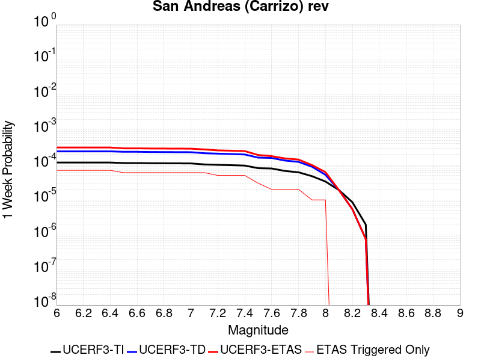 | 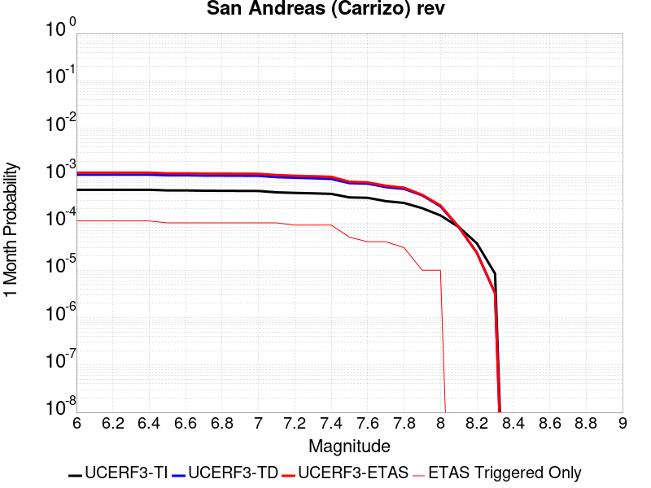 | 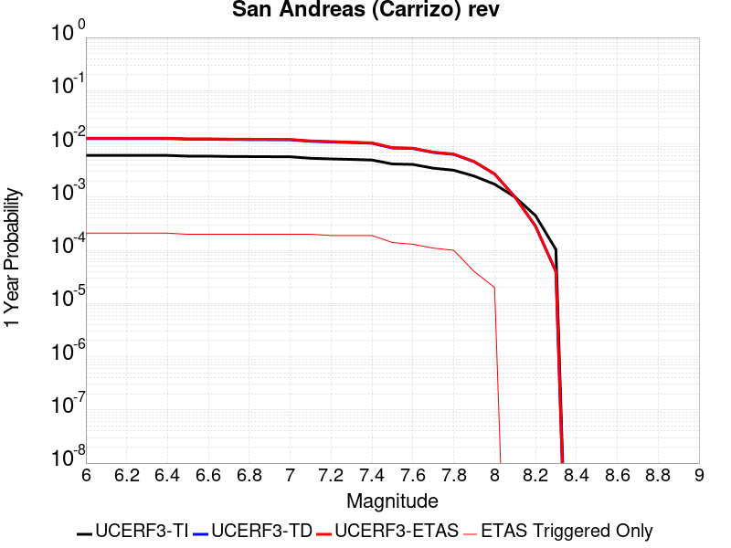 |  |

| Magnitude | 1 wk TI Prob | 1 wk TD Prob | 1 wk ETAS Prob | 1 wk ETAS/TD Gain | 1 wk ETAS Triggered Only | 1 mo TI Prob | 1 mo TD Prob | 1 mo ETAS Prob | 1 mo ETAS/TD Gain | 1 mo ETAS Triggered Only | 1 yr TI Prob | 1 yr TD Prob | 1 yr ETAS Prob | 1 yr ETAS/TD Gain | 1 yr ETAS Triggered Only | 10 yr TI Prob | 10 yr TD Prob | 10 yr ETAS Prob | 10 yr ETAS/TD Gain | 10 yr ETAS Triggered Only |
|-----|-----|-----|-----|-----|-----|-----|-----|-----|-----|-----|-----|-----|-----|-----|-----|-----|-----|-----|-----|-----|
| 6.0 | 1.1674632E-4 | 2.4324407E-4 | 3.1322704E-4 | 1.2877069 | 7.0E-5 | 5.002454E-4 | 0.0010420597 | 0.0011519451 | 1.1054502 | 1.1E-4 | 0.006073493 | 0.012613757 | 0.012821108 | 1.0164385 | 2.1E-4 | 0.0591016 | 0.120640226 | 0.1209392 | 1.0024782 | 3.4E-4 |
| 6.1 | 1.1674632E-4 | 2.4324407E-4 | 3.1322704E-4 | 1.2877069 | 7.0E-5 | 5.002454E-4 | 0.0010420597 | 0.0011519451 | 1.1054502 | 1.1E-4 | 0.006073493 | 0.012613757 | 0.012821108 | 1.0164385 | 2.1E-4 | 0.0591016 | 0.120640226 | 0.1209392 | 1.0024782 | 3.4E-4 |
| 6.2 | 1.1674632E-4 | 2.4324407E-4 | 3.1322704E-4 | 1.2877069 | 7.0E-5 | 5.002454E-4 | 0.0010420597 | 0.0011519451 | 1.1054502 | 1.1E-4 | 0.006073493 | 0.012613757 | 0.012821108 | 1.0164385 | 2.1E-4 | 0.0591016 | 0.120640226 | 0.1209392 | 1.0024782 | 3.4E-4 |
| 6.3 | 1.1674632E-4 | 2.4324407E-4 | 3.1322704E-4 | 1.2877069 | 7.0E-5 | 5.002454E-4 | 0.0010420597 | 0.0011519451 | 1.1054502 | 1.1E-4 | 0.006073493 | 0.012613757 | 0.012821108 | 1.0164385 | 2.1E-4 | 0.0591016 | 0.120640226 | 0.1209392 | 1.0024782 | 3.4E-4 |
| 6.4 | 1.1674632E-4 | 2.4324407E-4 | 3.1322704E-4 | 1.2877069 | 7.0E-5 | 5.002454E-4 | 0.0010420597 | 0.0011519451 | 1.1054502 | 1.1E-4 | 0.006073493 | 0.012613757 | 0.012821108 | 1.0164385 | 2.1E-4 | 0.0591016 | 0.120640226 | 0.1209392 | 1.0024782 | 3.4E-4 |
| 6.5 | 1.13136164E-4 | 2.3644442E-4 | 2.9643023E-4 | 1.2536994 | 6.0E-5 | 4.847792E-4 | 0.0010129412 | 0.0011128399 | 1.0986224 | 1.0E-4 | 0.0058862255 | 0.012263271 | 0.0124608185 | 1.0161089 | 2.0E-4 | 0.057327334 | 0.11761008 | 0.117892444 | 1.0024009 | 3.2E-4 |
| 6.6 | 1.13136164E-4 | 2.3644442E-4 | 2.9643023E-4 | 1.2536994 | 6.0E-5 | 4.847792E-4 | 0.0010129412 | 0.0011128399 | 1.0986224 | 1.0E-4 | 0.0058862255 | 0.012263271 | 0.0124608185 | 1.0161089 | 2.0E-4 | 0.057327334 | 0.11761008 | 0.117892444 | 1.0024009 | 3.2E-4 |
| 6.7 | 1.1149675E-4 | 2.3335687E-4 | 2.9334286E-4 | 1.257057 | 6.0E-5 | 4.777557E-4 | 9.997191E-4 | 0.0010996191 | 1.0999281 | 1.0E-4 | 0.0058011734 | 0.012104088 | 0.012301668 | 1.0163233 | 2.0E-4 | 0.05652051 | 0.1162291 | 0.11651191 | 1.0024332 | 3.2E-4 |
| 6.8 | 1.1103589E-4 | 2.3237852E-4 | 2.9236457E-4 | 1.2581395 | 6.0E-5 | 4.7578133E-4 | 9.955293E-4 | 0.0010954298 | 1.1003491 | 1.0E-4 | 0.005777263 | 0.012053643 | 0.012251233 | 1.0163925 | 2.0E-4 | 0.056293584 | 0.11578894 | 0.11607189 | 1.0024437 | 3.2E-4 |
| 6.9 | 1.1053259E-4 | 2.3130233E-4 | 2.9128845E-4 | 1.2593408 | 6.0E-5 | 4.7362508E-4 | 9.909206E-4 | 0.0010908216 | 1.1008162 | 1.0E-4 | 0.0057511497 | 0.011998152 | 0.012195752 | 1.0164692 | 2.0E-4 | 0.05604569 | 0.11530445 | 0.11558755 | 1.0024552 | 3.2E-4 |
| 7.0 | 1.1005377E-4 | 2.3031076E-4 | 2.9029694E-4 | 1.2604575 | 6.0E-5 | 4.7157376E-4 | 9.866742E-4 | 0.0010865756 | 1.1012505 | 1.0E-4 | 0.0057263062 | 0.011947021 | 0.012144632 | 1.0165405 | 2.0E-4 | 0.055809796 | 0.11485658 | 0.11513983 | 1.0024661 | 3.2E-4 |
| 7.1 | 1.0308142E-4 | 2.1540876E-4 | 2.7539584E-4 | 1.2784802 | 6.0E-5 | 4.417027E-4 | 9.228548E-4 | 0.0010227625 | 1.1082594 | 1.0E-4 | 0.0053644776 | 0.011178188 | 0.0113759525 | 1.017692 | 2.0E-4 | 0.052368138 | 0.10809042 | 0.10837583 | 1.0026405 | 3.2E-4 |
| 7.2 | 1.0027479E-4 | 2.094876E-4 | 2.5947712E-4 | 1.2386277 | 5.0E-5 | 4.296783E-4 | 8.9749607E-4 | 9.874153E-4 | 1.100189 | 9.0E-5 | 0.0052187922 | 0.010872566 | 0.0110605005 | 1.0172852 | 1.9E-4 | 0.050979212 | 0.10539086 | 0.10565924 | 1.0025465 | 3.0E-4 |
| 7.3 | 9.816942E-5 | 2.0423878E-4 | 2.5422857E-4 | 1.2447615 | 5.0E-5 | 4.2065824E-4 | 8.7501644E-4 | 9.649377E-4 | 1.1027652 | 9.0E-5 | 0.005109493 | 0.010601572 | 0.010789557 | 1.0177319 | 1.9E-4 | 0.049935985 | 0.10297545 | 0.10324456 | 1.0026133 | 3.0E-4 |
| 7.4 | 9.5634205E-5 | 1.9793298E-4 | 2.479231E-4 | 1.2525607 | 5.0E-5 | 4.0979648E-4 | 8.4800937E-4 | 9.3793304E-4 | 1.106041 | 9.0E-5 | 0.0049778637 | 0.010275901 | 0.010463949 | 1.0182998 | 1.9E-4 | 0.048678253 | 0.100067884 | 0.10032886 | 1.0026081 | 2.9E-4 |
| 7.5 | 8.052417E-5 | 1.6113915E-4 | 1.9113431E-4 | 1.1861445 | 3.0E-5 | 3.4505792E-4 | 6.9041376E-4 | 7.4037927E-4 | 1.0723703 | 5.0E-5 | 0.0041929903 | 0.008373471 | 0.0085122995 | 1.0165795 | 1.4E-4 | 0.04114753 | 0.082815245 | 0.08301702 | 1.0024365 | 2.2E-4 |
| 7.6 | 7.897024E-5 | 1.5767086E-4 | 1.7766771E-4 | 1.1268265 | 2.0E-5 | 3.384E-4 | 6.755574E-4 | 7.155304E-4 | 1.0591704 | 4.0E-5 | 0.0041122385 | 0.00819397 | 0.008322905 | 1.0157353 | 1.3E-4 | 0.040369697 | 0.08115866 | 0.081351615 | 1.0023775 | 2.1E-4 |
| 7.7 | 6.707427E-5 | 1.3277122E-4 | 1.5276857E-4 | 1.1506151 | 2.0E-5 | 2.8742946E-4 | 5.688955E-4 | 6.0887274E-4 | 1.0702717 | 4.0E-5 | 0.003493839 | 0.0069043385 | 0.007013579 | 1.015822 | 1.1E-4 | 0.034394164 | 0.06905339 | 0.06922096 | 1.0024266 | 1.8E-4 |
| 7.8 | 6.147705E-5 | 1.2198445E-4 | 1.4198202E-4 | 1.1639353 | 2.0E-5 | 2.6344648E-4 | 5.226858E-4 | 5.526701E-4 | 1.0573659 | 3.0E-5 | 0.0032027436 | 0.006345156 | 0.0064445217 | 1.01566 | 1.0E-4 | 0.031569764 | 0.0635172 | 0.063657664 | 1.0022116 | 1.5E-4 |
| 7.9 | 4.7636717E-5 | 8.8802946E-5 | 9.880206E-5 | 1.1125989 | 1.0E-5 | 2.0414138E-4 | 3.8052857E-4 | 3.9052477E-4 | 1.0262692 | 1.0E-5 | 0.0024825884 | 0.004623101 | 0.0046629165 | 1.0086122 | 4.0E-5 | 0.024550365 | 0.046629366 | 0.046677034 | 1.0010223 | 5.0E-5 |
| 8.0 | 3.3554235E-5 | 5.2138024E-5 | 6.213751E-5 | 1.1917886 | 1.0E-5 | 1.4379594E-4 | 2.2342955E-4 | 2.3342732E-4 | 1.0447469 | 1.0E-5 | 0.0017493097 | 0.002716863 | 0.0027368087 | 1.0073414 | 2.0E-5 | 0.017356034 | 0.027881905 | 0.027901348 | 1.0006973 | 2.0E-5 |
| 8.1 | 1.9175432E-5 | 1.9183564E-5 | 1.9183564E-5 | 1.0 | 0.0 | 8.217783E-5 | 8.221269E-5 | 8.221269E-5 | 1.0 | 0.0 | 0.0010000558 | 0.0010004805 | 0.0010004805 | 1.0 | 0.0 | 0.009955673 | 0.010757771 | 0.010757771 | 1.0 | 0.0 |
| 8.2 | 8.643924E-6 | 5.473668E-6 | 5.473668E-6 | 1.0 | 0.0 | 3.704486E-5 | 2.3458366E-5 | 2.3458366E-5 | 1.0 | 0.0 | 4.5092785E-4 | 2.8556827E-4 | 2.8556827E-4 | 1.0 | 0.0 | 0.0045001395 | 0.0032481793 | 0.0032481793 | 1.0 | 0.0 |
| 8.3 | 1.983087E-6 | 7.6564595E-7 | 7.6564595E-7 | 1.0 | 0.0 | 8.498917E-6 | 3.281336E-6 | 3.281336E-6 | 1.0 | 0.0 | 1.034694E-4 | 3.9949547E-5 | 3.9949547E-5 | 1.0 | 0.0 | 0.0010342124 | 4.717979E-4 | 4.717979E-4 | 1.0 | 0.0 |

## Lake Isabella (Seismicity)
*[(top)](#table-of-contents)*

| 1 Week | 1 Month | 1 Year | 10 Year |
|-----|-----|-----|-----|
|  | 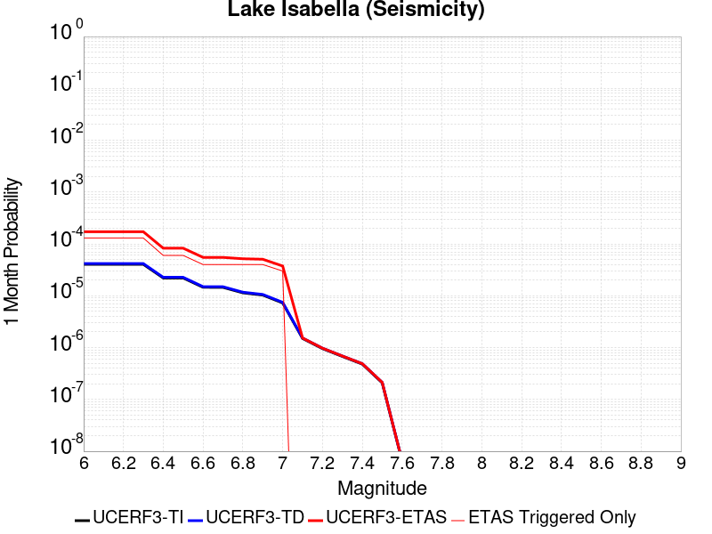 |  | 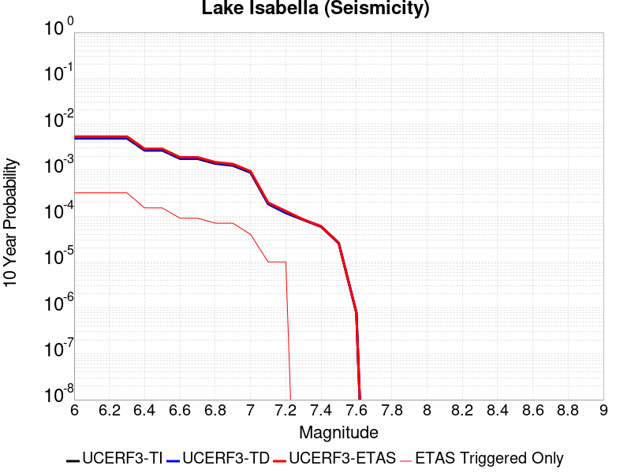 |

| Magnitude | 1 wk TI Prob | 1 wk TD Prob | 1 wk ETAS Prob | 1 wk ETAS/TD Gain | 1 wk ETAS Triggered Only | 1 mo TI Prob | 1 mo TD Prob | 1 mo ETAS Prob | 1 mo ETAS/TD Gain | 1 mo ETAS Triggered Only | 1 yr TI Prob | 1 yr TD Prob | 1 yr ETAS Prob | 1 yr ETAS/TD Gain | 1 yr ETAS Triggered Only | 10 yr TI Prob | 10 yr TD Prob | 10 yr ETAS Prob | 10 yr ETAS/TD Gain | 10 yr ETAS Triggered Only |
|-----|-----|-----|-----|-----|-----|-----|-----|-----|-----|-----|-----|-----|-----|-----|-----|-----|-----|-----|-----|-----|
| 6.0 | 9.431637E-6 | 9.741651E-6 | 6.9741065E-5 | 7.15906 | 6.0E-5 | 4.0420677E-5 | 4.1749343E-5 | 1.7174392E-4 | 4.113692 | 1.3E-4 | 4.920106E-4 | 5.0819275E-4 | 7.18086E-4 | 1.4130191 | 2.1E-4 | 0.004909227 | 0.005071599 | 0.005389976 | 1.0627764 | 3.2E-4 |
| 6.1 | 9.431637E-6 | 9.741651E-6 | 6.9741065E-5 | 7.15906 | 6.0E-5 | 4.0420677E-5 | 4.1749343E-5 | 1.7174392E-4 | 4.113692 | 1.3E-4 | 4.920106E-4 | 5.0819275E-4 | 7.18086E-4 | 1.4130191 | 2.1E-4 | 0.004909227 | 0.005071599 | 0.005389976 | 1.0627764 | 3.2E-4 |
| 6.2 | 9.431637E-6 | 9.741651E-6 | 6.9741065E-5 | 7.15906 | 6.0E-5 | 4.0420677E-5 | 4.1749343E-5 | 1.7174392E-4 | 4.113692 | 1.3E-4 | 4.920106E-4 | 5.0819275E-4 | 7.18086E-4 | 1.4130191 | 2.1E-4 | 0.004909227 | 0.005071599 | 0.005389976 | 1.0627764 | 3.2E-4 |
| 6.3 | 9.431637E-6 | 9.741651E-6 | 6.9741065E-5 | 7.15906 | 6.0E-5 | 4.0420677E-5 | 4.1749343E-5 | 1.7174392E-4 | 4.113692 | 1.3E-4 | 4.920106E-4 | 5.0819275E-4 | 7.18086E-4 | 1.4130191 | 2.1E-4 | 0.004909227 | 0.005071599 | 0.005389976 | 1.0627764 | 3.2E-4 |
| 6.4 | 5.144063E-6 | 5.3000763E-6 | 3.5299916E-5 | 6.660266 | 3.0E-5 | 2.2045799E-5 | 2.2714434E-5 | 8.271307E-5 | 3.6414323 | 6.0E-5 | 2.6837454E-4 | 2.765166E-4 | 3.964834E-4 | 1.4338503 | 1.2E-4 | 0.0026805066 | 0.0027620657 | 0.0029116513 | 1.0541571 | 1.5E-4 |
| 6.5 | 5.144063E-6 | 5.3000763E-6 | 3.5299916E-5 | 6.660266 | 3.0E-5 | 2.2045799E-5 | 2.2714434E-5 | 8.271307E-5 | 3.6414323 | 6.0E-5 | 2.6837454E-4 | 2.765166E-4 | 3.964834E-4 | 1.4338503 | 1.2E-4 | 0.0026805066 | 0.0027620657 | 0.0029116513 | 1.0541571 | 1.5E-4 |
| 6.6 | 3.4009804E-6 | 3.498786E-6 | 2.3498716E-5 | 6.716248 | 2.0E-5 | 1.4575549E-5 | 1.4994721E-5 | 5.499412E-5 | 3.6675656 | 4.0E-5 | 1.7744285E-4 | 1.8254704E-4 | 2.6253244E-4 | 1.4381633 | 8.0E-5 | 0.0017730123 | 0.0018241286 | 0.0019139644 | 1.0492486 | 9.0E-5 |
| 6.7 | 3.3880428E-6 | 3.4856528E-6 | 2.3485583E-5 | 6.7377863 | 2.0E-5 | 1.4520103E-5 | 1.4938435E-5 | 5.493784E-5 | 3.6776166 | 4.0E-5 | 1.767679E-4 | 1.8186188E-4 | 2.6184734E-4 | 1.4398143 | 8.0E-5 | 0.0017662736 | 0.0018172882 | 0.0019071246 | 1.0494343 | 9.0E-5 |
| 6.8 | 2.6582E-6 | 2.7337003E-6 | 2.2733646E-5 | 8.3160715 | 2.0E-5 | 1.1392236E-5 | 1.1715813E-5 | 5.1715346E-5 | 4.414149 | 4.0E-5 | 1.3869164E-4 | 1.4263204E-4 | 2.0262347E-4 | 1.4206029 | 6.0E-5 | 0.0013860512 | 0.0014255369 | 0.0014954371 | 1.0490344 | 7.0E-5 |
| 6.9 | 2.406011E-6 | 2.4743288E-6 | 2.247428E-5 | 9.08298 | 2.0E-5 | 1.0311434E-5 | 1.0604231E-5 | 5.0603805E-5 | 4.7720394 | 4.0E-5 | 1.2553448E-4 | 1.2910018E-4 | 1.8909243E-4 | 1.4646953 | 6.0E-5 | 0.0012546359 | 0.0012903814 | 0.0013602911 | 1.0541775 | 7.0E-5 |
| 7.0 | 1.6953097E-6 | 1.7429371E-6 | 1.174292E-5 | 6.7374315 | 1.0E-5 | 7.265593E-6 | 7.469715E-6 | 3.746949E-5 | 5.016187 | 3.0E-5 | 8.8455E-5 | 9.094104E-5 | 1.3093739E-4 | 1.4398054 | 4.0E-5 | 8.84198E-4 | 9.09141E-4 | 9.491046E-4 | 1.0439576 | 4.0E-5 |
| 7.1 | 3.5013824E-7 | 3.5714822E-7 | 3.5714822E-7 | 1.0 | 0.0 | 1.5005916E-6 | 1.5306344E-6 | 1.5306344E-6 | 1.0 | 0.0 | 1.826955E-5 | 1.8635317E-5 | 2.8635131E-5 | 1.5366055 | 1.0E-5 | 1.8268047E-4 | 1.863378E-4 | 1.9633592E-4 | 1.053656 | 1.0E-5 |
| 7.2 | 2.2321095E-7 | 2.2750574E-7 | 2.2750574E-7 | 1.0 | 0.0 | 9.56618E-7 | 9.750242E-7 | 9.750242E-7 | 1.0 | 0.0 | 1.1646762E-5 | 1.1870856E-5 | 2.1870737E-5 | 1.8423892 | 1.0E-5 | 1.1646151E-4 | 1.1870232E-4 | 1.2870114E-4 | 1.0842344 | 1.0E-5 |
| 7.3 | 1.5760406E-7 | 1.6060922E-7 | 1.6060922E-7 | 1.0 | 0.0 | 6.7544585E-7 | 6.8832503E-7 | 6.8832503E-7 | 1.0 | 0.0 | 8.223522E-6 | 8.380326E-6 | 8.380326E-6 | 1.0 | 0.0 | 8.2232174E-5 | 8.3800165E-5 | 8.3800165E-5 | 1.0 | 0.0 |
| 7.4 | 1.1216497E-7 | 1.1431706E-7 | 1.1431706E-7 | 1.0 | 0.0 | 4.8070694E-7 | 4.899302E-7 | 4.899302E-7 | 1.0 | 0.0 | 5.852591E-6 | 5.964884E-6 | 5.964884E-6 | 1.0 | 0.0 | 5.8524372E-5 | 5.9647282E-5 | 5.9647282E-5 | 1.0 | 0.0 |
| 7.5 | 4.885185E-8 | 4.9787737E-8 | 4.9787737E-8 | 1.0 | 0.0 | 2.0936506E-7 | 2.13376E-7 | 2.13376E-7 | 1.0 | 0.0 | 2.5490165E-6 | 2.59785E-6 | 2.59785E-6 | 1.0 | 0.0 | 2.5489873E-5 | 2.5978214E-5 | 2.5978214E-5 | 1.0 | 0.0 |
| 7.6 | 1.504641E-9 | 1.5317903E-9 | 1.5317903E-9 | 1.0 | 0.0 | 6.4484613E-9 | 6.5648154E-9 | 6.5648154E-9 | 1.0 | 0.0 | 7.851001E-8 | 7.992663E-8 | 7.992663E-8 | 1.0 | 0.0 | 7.8509987E-7 | 7.992663E-7 | 7.992663E-7 | 1.0 | 0.0 |

## Manix-Afton Hills
*[(top)](#table-of-contents)*

| 1 Week | 1 Month | 1 Year | 10 Year |
|-----|-----|-----|-----|
| 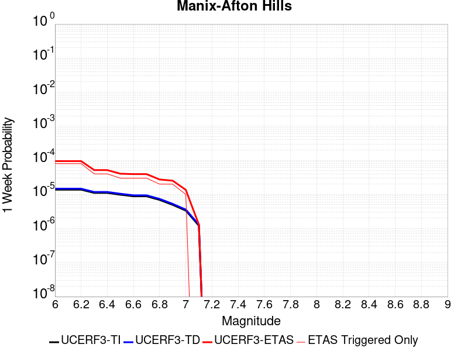 | 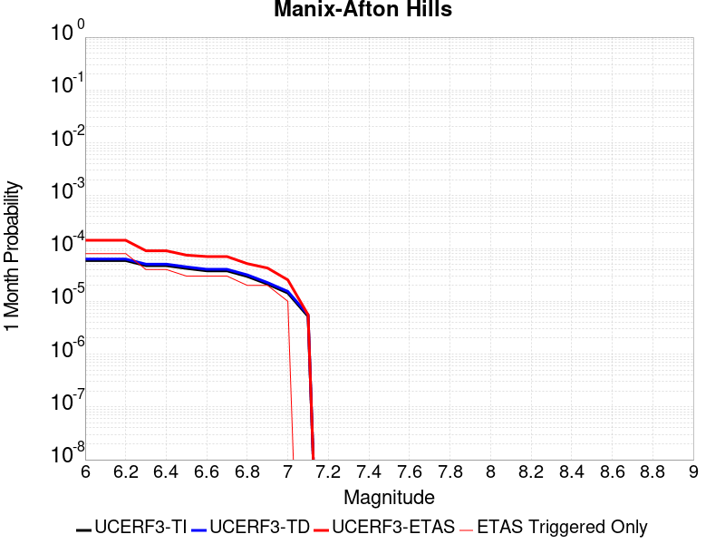 |  |  |

| Magnitude | 1 wk TI Prob | 1 wk TD Prob | 1 wk ETAS Prob | 1 wk ETAS/TD Gain | 1 wk ETAS Triggered Only | 1 mo TI Prob | 1 mo TD Prob | 1 mo ETAS Prob | 1 mo ETAS/TD Gain | 1 mo ETAS Triggered Only | 1 yr TI Prob | 1 yr TD Prob | 1 yr ETAS Prob | 1 yr ETAS/TD Gain | 1 yr ETAS Triggered Only | 10 yr TI Prob | 10 yr TD Prob | 10 yr ETAS Prob | 10 yr ETAS/TD Gain | 10 yr ETAS Triggered Only |
|-----|-----|-----|-----|-----|-----|-----|-----|-----|-----|-----|-----|-----|-----|-----|-----|-----|-----|-----|-----|-----|
| 6.0 | 1.3783202E-5 | 1.47110895E-5 | 9.470991E-5 | 6.4379945 | 8.0E-5 | 5.906953E-5 | 6.30461E-5 | 1.4304106E-4 | 2.2688327 | 8.0E-5 | 7.189342E-4 | 7.6733343E-4 | 9.571877E-4 | 1.2474208 | 1.9E-4 | 0.0071661277 | 0.007648596 | 0.007946301 | 1.0389229 | 3.0E-4 |
| 6.1 | 1.3783202E-5 | 1.47110895E-5 | 9.470991E-5 | 6.4379945 | 8.0E-5 | 5.906953E-5 | 6.30461E-5 | 1.4304106E-4 | 2.2688327 | 8.0E-5 | 7.189342E-4 | 7.6733343E-4 | 9.571877E-4 | 1.2474208 | 1.9E-4 | 0.0071661277 | 0.007648596 | 0.007946301 | 1.0389229 | 3.0E-4 |
| 6.2 | 1.3783202E-5 | 1.47110895E-5 | 9.470991E-5 | 6.4379945 | 8.0E-5 | 5.906953E-5 | 6.30461E-5 | 1.4304106E-4 | 2.2688327 | 8.0E-5 | 7.189342E-4 | 7.6733343E-4 | 9.571877E-4 | 1.2474208 | 1.9E-4 | 0.0071661277 | 0.007648596 | 0.007946301 | 1.0389229 | 3.0E-4 |
| 6.3 | 1.10494875E-5 | 1.1793136E-5 | 5.1792664E-5 | 4.3917637 | 4.0E-5 | 4.7354086E-5 | 5.054109E-5 | 9.053907E-5 | 1.7913953 | 4.0E-5 | 5.763835E-4 | 6.151744E-4 | 7.2510674E-4 | 1.178701 | 1.1E-4 | 0.005748908 | 0.0061357557 | 0.006314651 | 1.0291562 | 1.8E-4 |
| 6.4 | 1.10494875E-5 | 1.1793136E-5 | 5.1792664E-5 | 4.3917637 | 4.0E-5 | 4.7354086E-5 | 5.054109E-5 | 9.053907E-5 | 1.7913953 | 4.0E-5 | 5.763835E-4 | 6.151744E-4 | 7.2510674E-4 | 1.178701 | 1.1E-4 | 0.005748908 | 0.0061357557 | 0.006314651 | 1.0291562 | 1.8E-4 |
| 6.5 | 9.788949E-6 | 1.045432E-5 | 4.0454004E-5 | 3.8695972 | 3.0E-5 | 4.1951964E-5 | 4.480351E-5 | 7.480216E-5 | 1.6695604 | 3.0E-5 | 5.1064545E-4 | 5.453555E-4 | 6.2531186E-4 | 1.1466134 | 8.0E-5 | 0.0050947363 | 0.0054410985 | 0.005580337 | 1.0255901 | 1.4E-4 |
| 6.6 | 8.810006E-6 | 9.4136285E-6 | 3.9413346E-5 | 4.186839 | 3.0E-5 | 3.775662E-5 | 4.0343548E-5 | 7.0342336E-5 | 1.7435833 | 3.0E-5 | 4.5958988E-4 | 4.9108086E-4 | 5.610465E-4 | 1.1424727 | 7.0E-5 | 0.0045864056 | 0.004900839 | 0.005030202 | 1.026396 | 1.3E-4 |
| 6.7 | 8.80128E-6 | 9.404108E-6 | 3.9403825E-5 | 4.1900654 | 3.0E-5 | 3.7719226E-5 | 4.0302748E-5 | 7.030154E-5 | 1.7443361 | 3.0E-5 | 4.591348E-4 | 4.9058435E-4 | 5.6055E-4 | 1.142617 | 7.0E-5 | 0.004581874 | 0.0048958957 | 0.005025259 | 1.0264229 | 1.3E-4 |
| 6.8 | 6.8994877E-6 | 7.380076E-6 | 2.7379929E-5 | 3.7099793 | 2.0E-5 | 2.9568899E-5 | 3.162856E-5 | 5.162793E-5 | 1.6323199 | 2.0E-5 | 3.5994186E-4 | 3.8501783E-4 | 4.4499474E-4 | 1.155777 | 6.0E-5 | 0.003593594 | 0.0038443129 | 0.0039638514 | 1.0310949 | 1.2E-4 |
| 6.9 | 4.9328037E-6 | 5.2709615E-6 | 2.5270856E-5 | 4.794354 | 2.0E-5 | 2.1140417E-5 | 2.2589675E-5 | 4.258922E-5 | 1.8853403 | 2.0E-5 | 2.5735417E-4 | 2.7500073E-4 | 3.1498974E-4 | 1.1454141 | 4.0E-5 | 0.0025705635 | 0.0027472095 | 0.0028369622 | 1.0326705 | 9.0E-5 |
| 7.0 | 3.347973E-6 | 3.59003E-6 | 1.35899945E-5 | 3.7854822 | 1.0E-5 | 1.4348378E-5 | 1.5385775E-5 | 2.5385621E-5 | 1.649941 | 1.0E-5 | 1.746775E-4 | 1.8730981E-4 | 2.0730606E-4 | 1.106755 | 2.0E-5 | 0.0017454025 | 0.0018719219 | 0.001911847 | 1.0213284 | 4.0E-5 |
| 7.1 | 1.2073567E-6 | 1.293482E-6 | 1.293482E-6 | 1.0 | 0.0 | 5.1743755E-6 | 5.543492E-6 | 5.543492E-6 | 1.0 | 0.0 | 6.29962E-5 | 6.749156E-5 | 6.749156E-5 | 1.0 | 0.0 | 6.297835E-4 | 6.7487074E-4 | 6.7487074E-4 | 1.0 | 0.0 |

## Baker
*[(top)](#table-of-contents)*

| 1 Week | 1 Month | 1 Year | 10 Year |
|-----|-----|-----|-----|
|  |  | 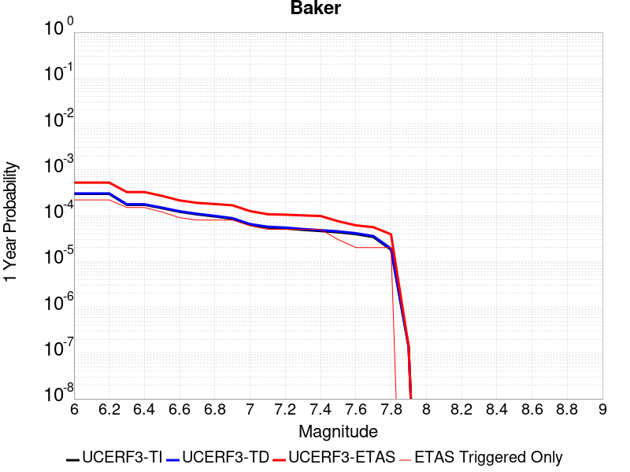 | 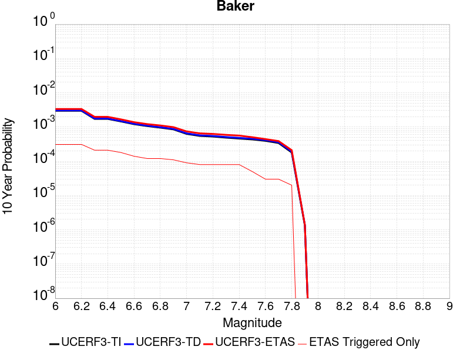 |

| Magnitude | 1 wk TI Prob | 1 wk TD Prob | 1 wk ETAS Prob | 1 wk ETAS/TD Gain | 1 wk ETAS Triggered Only | 1 mo TI Prob | 1 mo TD Prob | 1 mo ETAS Prob | 1 mo ETAS/TD Gain | 1 mo ETAS Triggered Only | 1 yr TI Prob | 1 yr TD Prob | 1 yr ETAS Prob | 1 yr ETAS/TD Gain | 1 yr ETAS Triggered Only | 10 yr TI Prob | 10 yr TD Prob | 10 yr ETAS Prob | 10 yr ETAS/TD Gain | 10 yr ETAS Triggered Only |
|-----|-----|-----|-----|-----|-----|-----|-----|-----|-----|-----|-----|-----|-----|-----|-----|-----|-----|-----|-----|-----|
| 6.0 | 5.695525E-6 | 5.8348373E-6 | 1.0583425E-4 | 18.138338 | 1.0E-4 | 2.4409164E-5 | 2.5006228E-5 | 1.5500297E-4 | 6.198575 | 1.3E-4 | 2.9714106E-4 | 3.044123E-4 | 5.243453E-4 | 1.722484 | 2.2E-4 | 0.0029674405 | 0.0030403486 | 0.0033494062 | 1.101652 | 3.1E-4 |
| 6.1 | 5.695525E-6 | 5.8348373E-6 | 1.0583425E-4 | 18.138338 | 1.0E-4 | 2.4409164E-5 | 2.5006228E-5 | 1.5500297E-4 | 6.198575 | 1.3E-4 | 2.9714106E-4 | 3.044123E-4 | 5.243453E-4 | 1.722484 | 2.2E-4 | 0.0029674405 | 0.0030403486 | 0.0033494062 | 1.101652 | 3.1E-4 |
| 6.2 | 5.695525E-6 | 5.8348373E-6 | 1.0583425E-4 | 18.138338 | 1.0E-4 | 2.4409164E-5 | 2.5006228E-5 | 1.5500297E-4 | 6.198575 | 1.3E-4 | 2.9714106E-4 | 3.044123E-4 | 5.243453E-4 | 1.722484 | 2.2E-4 | 0.0029674405 | 0.0030403486 | 0.0033494062 | 1.101652 | 3.1E-4 |
| 6.3 | 3.2995713E-6 | 3.383667E-6 | 8.33834E-5 | 24.642908 | 8.0E-5 | 1.4140943E-5 | 1.4501353E-5 | 1.14499904E-4 | 7.8958087 | 1.0E-4 | 1.7215237E-4 | 1.7654014E-4 | 3.2651366E-4 | 1.8495152 | 1.5E-4 | 0.0017201907 | 0.001764046 | 0.0019736756 | 1.1188345 | 2.1E-4 |
| 6.4 | 3.2995713E-6 | 3.383667E-6 | 8.33834E-5 | 24.642908 | 8.0E-5 | 1.4140943E-5 | 1.4501353E-5 | 1.14499904E-4 | 7.8958087 | 1.0E-4 | 1.7215237E-4 | 1.7654014E-4 | 3.2651366E-4 | 1.8495152 | 1.5E-4 | 0.0017201907 | 0.001764046 | 0.0019736756 | 1.1188345 | 2.1E-4 |
| 6.5 | 2.782202E-6 | 2.8558404E-6 | 7.285564E-5 | 25.511103 | 7.0E-5 | 1.1923668E-5 | 1.223926E-5 | 1.0223816E-4 | 8.353295 | 9.0E-5 | 1.4516099E-4 | 1.4900314E-4 | 2.6898526E-4 | 1.8052322 | 1.2E-4 | 0.001450662 | 0.0014890651 | 0.001668797 | 1.1207012 | 1.8E-4 |
| 6.6 | 2.3163404E-6 | 2.38092E-6 | 4.2380823E-5 | 17.800188 | 4.0E-5 | 9.927136E-6 | 1.0203904E-5 | 7.020329E-5 | 6.8800426 | 6.0E-5 | 1.20856166E-4 | 1.2422565E-4 | 2.1421447E-4 | 1.724398 | 9.0E-5 | 0.0012079047 | 0.0012415823 | 0.0013814085 | 1.1126193 | 1.4E-4 |
| 6.7 | 2.037056E-6 | 2.0965003E-6 | 3.209644E-5 | 15.30953 | 3.0E-5 | 8.7302105E-6 | 8.984972E-6 | 5.8984522E-5 | 6.564798 | 5.0E-5 | 1.0628513E-4 | 1.093867E-4 | 1.8937796E-4 | 1.7312703 | 8.0E-5 | 0.0010623431 | 0.0010933448 | 0.0012132135 | 1.109635 | 1.2E-4 |
| 6.8 | 1.8356744E-6 | 1.8915287E-6 | 3.189147E-5 | 16.860157 | 3.0E-5 | 7.867153E-6 | 8.106527E-6 | 5.810612E-5 | 7.1678195 | 5.0E-5 | 9.577837E-5 | 9.869264E-5 | 1.7868474E-4 | 1.8105174 | 8.0E-5 | 9.57371E-4 | 9.86502E-4 | 0.0011063836 | 1.121522 | 1.2E-4 |
| 6.9 | 1.6310546E-6 | 1.6832072E-6 | 3.1683157E-5 | 18.823088 | 3.0E-5 | 6.9902153E-6 | 7.213726E-6 | 5.7213365E-5 | 7.931181 | 5.0E-5 | 8.510255E-5 | 8.782368E-5 | 1.6781666E-4 | 1.910836 | 8.0E-5 | 8.5069967E-4 | 8.7790104E-4 | 9.878045E-4 | 1.1251888 | 1.1E-4 |
| 7.0 | 1.2058036E-6 | 1.2508665E-6 | 3.1250827E-5 | 24.983343 | 3.0E-5 | 5.1677193E-6 | 5.3608455E-6 | 4.536063E-5 | 8.46147 | 4.0E-5 | 6.291517E-5 | 6.5266366E-5 | 1.2526245E-4 | 1.9192497 | 6.0E-5 | 6.289736E-4 | 6.524743E-4 | 7.4241555E-4 | 1.1378465 | 9.0E-5 |
| 7.1 | 1.052382E-6 | 1.0951609E-6 | 3.109513E-5 | 28.393206 | 3.0E-5 | 4.5102006E-6 | 4.693538E-6 | 4.469335E-5 | 9.522315 | 4.0E-5 | 5.491031E-5 | 5.7142337E-5 | 1.0713948E-4 | 1.8749579 | 5.0E-5 | 5.4896745E-4 | 5.7127734E-4 | 6.512316E-4 | 1.1399571 | 8.0E-5 |
| 7.2 | 1.0067454E-6 | 1.0487711E-6 | 3.104874E-5 | 29.604877 | 3.0E-5 | 4.3146156E-6 | 4.4947255E-6 | 4.4494547E-5 | 9.89928 | 4.0E-5 | 5.252918E-5 | 5.4721917E-5 | 1.0471918E-4 | 1.9136606 | 5.0E-5 | 5.251676E-4 | 5.470853E-4 | 6.270415E-4 | 1.1461495 | 8.0E-5 |
| 7.3 | 9.3596316E-7 | 9.767723E-7 | 3.0976742E-5 | 31.713371 | 3.0E-5 | 4.0112645E-6 | 4.1861604E-6 | 4.4185992E-5 | 10.555255 | 4.0E-5 | 4.8836053E-5 | 5.096532E-5 | 1.00962774E-4 | 1.9810092 | 5.0E-5 | 4.8825322E-4 | 5.095371E-4 | 5.8949634E-4 | 1.1569252 | 8.0E-5 |
| 7.4 | 8.8117395E-7 | 9.2076635E-7 | 3.092074E-5 | 33.581528 | 3.0E-5 | 3.7764542E-6 | 3.9461356E-6 | 4.3945976E-5 | 11.136459 | 4.0E-5 | 4.5977362E-5 | 4.8043148E-5 | 9.804075E-5 | 2.0406811 | 5.0E-5 | 4.596785E-4 | 4.8032837E-4 | 5.6028995E-4 | 1.1664727 | 8.0E-5 |
| 7.5 | 8.292386E-7 | 8.6745956E-7 | 2.0867443E-5 | 24.055809 | 2.0E-5 | 3.5538749E-6 | 3.7176785E-6 | 3.3717566E-5 | 9.069522 | 3.0E-5 | 4.326757E-5 | 4.5261804E-5 | 7.526045E-5 | 1.6627805 | 3.0E-5 | 4.3259145E-4 | 4.5252658E-4 | 5.0250394E-4 | 1.1104407 | 5.0E-5 |
| 7.6 | 7.553842E-7 | 7.9144706E-7 | 1.0791439E-5 | 13.635074 | 1.0E-5 | 3.2373566E-6 | 3.3919116E-6 | 2.3391844E-5 | 6.89636 | 2.0E-5 | 3.9414106E-5 | 4.129575E-5 | 6.129492E-5 | 1.4842913 | 2.0E-5 | 3.9407116E-4 | 4.1288146E-4 | 4.4286906E-4 | 1.07263 | 3.0E-5 |
| 7.7 | 6.5285366E-7 | 6.852797E-7 | 1.0685273E-5 | 15.592572 | 1.0E-5 | 2.797941E-6 | 2.9369096E-6 | 2.293685E-5 | 7.8098593 | 2.0E-5 | 3.40644E-5 | 3.5756293E-5 | 5.575558E-5 | 1.5593221 | 2.0E-5 | 3.405918E-4 | 3.5750607E-4 | 3.8749535E-4 | 1.0838847 | 3.0E-5 |
| 7.8 | 3.4586725E-7 | 3.6482615E-7 | 1.0364823E-5 | 28.410307 | 1.0E-5 | 1.4822873E-6 | 1.5635396E-6 | 2.1563508E-5 | 13.791469 | 2.0E-5 | 1.80467E-5 | 1.9035933E-5 | 3.9035553E-5 | 2.0506246 | 2.0E-5 | 1.8045233E-4 | 1.9034347E-4 | 2.1033967E-4 | 1.1050532 | 2.0E-5 |
| 7.9 | 2.5591178E-9 | 2.6696718E-9 | 2.6696718E-9 | 1.0 | 0.0 | 1.0967647E-8 | 1.14414505E-8 | 1.14414505E-8 | 1.0 | 0.0 | 1.335311E-7 | 1.3929966E-7 | 1.3929966E-7 | 1.0 | 0.0 | 1.3353102E-6 | 1.3929966E-6 | 1.3929966E-6 | 1.0 | 0.0 |

## White Wolf (Extension)
*[(top)](#table-of-contents)*

| 1 Week | 1 Month | 1 Year | 10 Year |
|-----|-----|-----|-----|
| 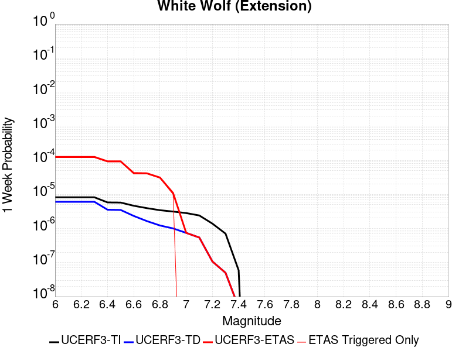 | 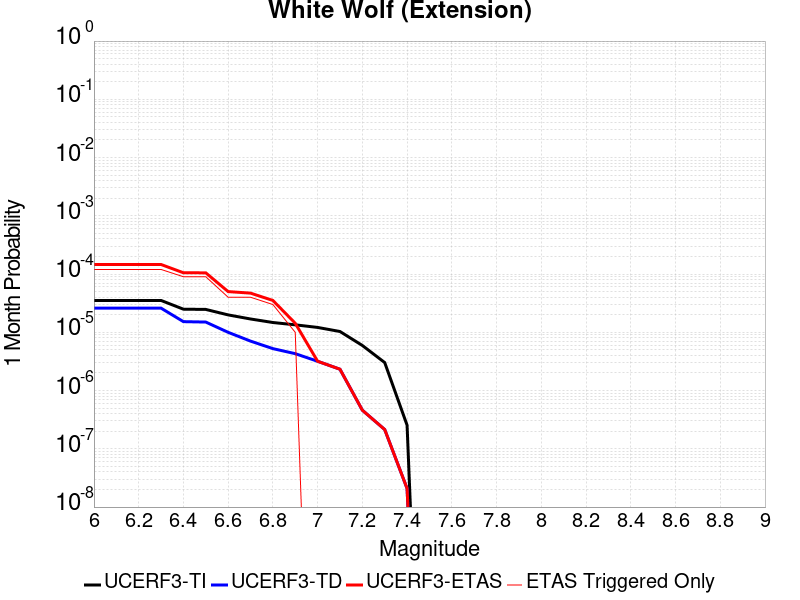 |  |  |

| Magnitude | 1 wk TI Prob | 1 wk TD Prob | 1 wk ETAS Prob | 1 wk ETAS/TD Gain | 1 wk ETAS Triggered Only | 1 mo TI Prob | 1 mo TD Prob | 1 mo ETAS Prob | 1 mo ETAS/TD Gain | 1 mo ETAS Triggered Only | 1 yr TI Prob | 1 yr TD Prob | 1 yr ETAS Prob | 1 yr ETAS/TD Gain | 1 yr ETAS Triggered Only | 10 yr TI Prob | 10 yr TD Prob | 10 yr ETAS Prob | 10 yr ETAS/TD Gain | 10 yr ETAS Triggered Only |
|-----|-----|-----|-----|-----|-----|-----|-----|-----|-----|-----|-----|-----|-----|-----|-----|-----|-----|-----|-----|-----|
| 6.0 | 8.222555E-6 | 6.066615E-6 | 1.2606589E-4 | 20.78027 | 1.2E-4 | 3.5239045E-5 | 2.5999556E-5 | 1.4599644E-4 | 5.6153436 | 1.2E-4 | 4.289509E-4 | 3.1650523E-4 | 5.3643563E-4 | 1.6948712 | 2.2E-4 | 0.0042812387 | 0.0031611966 | 0.0034602482 | 1.0946008 | 3.0E-4 |
| 6.1 | 8.222555E-6 | 6.066615E-6 | 1.2606589E-4 | 20.78027 | 1.2E-4 | 3.5239045E-5 | 2.5999556E-5 | 1.4599644E-4 | 5.6153436 | 1.2E-4 | 4.289509E-4 | 3.1650523E-4 | 5.3643563E-4 | 1.6948712 | 2.2E-4 | 0.0042812387 | 0.0031611966 | 0.0034602482 | 1.0946008 | 3.0E-4 |
| 6.2 | 8.222555E-6 | 6.066615E-6 | 1.2606589E-4 | 20.78027 | 1.2E-4 | 3.5239045E-5 | 2.5999556E-5 | 1.4599644E-4 | 5.6153436 | 1.2E-4 | 4.289509E-4 | 3.1650523E-4 | 5.3643563E-4 | 1.6948712 | 2.2E-4 | 0.0042812387 | 0.0031611966 | 0.0034602482 | 1.0946008 | 3.0E-4 |
| 6.3 | 8.222555E-6 | 6.066615E-6 | 1.2606589E-4 | 20.78027 | 1.2E-4 | 3.5239045E-5 | 2.5999556E-5 | 1.4599644E-4 | 5.6153436 | 1.2E-4 | 4.289509E-4 | 3.1650523E-4 | 5.3643563E-4 | 1.6948712 | 2.2E-4 | 0.0042812387 | 0.0031611966 | 0.0034602482 | 1.0946008 | 3.0E-4 |
| 6.4 | 5.821773E-6 | 3.5571256E-6 | 9.35568E-5 | 26.301237 | 9.0E-5 | 2.4950215E-5 | 1.5244741E-5 | 1.0524337E-4 | 6.903585 | 9.0E-5 | 3.0372653E-4 | 1.8559002E-4 | 3.4556031E-4 | 1.8619553 | 1.6E-4 | 0.0030331176 | 0.0018544586 | 0.0020740507 | 1.118413 | 2.2E-4 |
| 6.5 | 5.766023E-6 | 3.4990599E-6 | 9.349875E-5 | 26.721106 | 9.0E-5 | 2.4711293E-5 | 1.49958905E-5 | 1.0499454E-4 | 7.0015545 | 9.0E-5 | 3.0081844E-4 | 1.8256076E-4 | 3.4253157E-4 | 1.8762605 | 1.6E-4 | 0.0030041158 | 0.0018242161 | 0.0020438149 | 1.1203797 | 2.2E-4 |
| 6.6 | 4.643576E-6 | 2.3325733E-6 | 4.233248E-5 | 18.148403 | 4.0E-5 | 1.9900888E-5 | 9.9967065E-6 | 4.9996306E-5 | 5.001278 | 4.0E-5 | 2.4226638E-4 | 1.2170354E-4 | 2.016938E-4 | 1.657255 | 8.0E-5 | 0.0024200242 | 0.0012164112 | 0.0013162897 | 1.0821091 | 1.0E-4 |
| 6.7 | 3.9529173E-6 | 1.6482975E-6 | 4.1648233E-5 | 25.267424 | 4.0E-5 | 1.6940963E-5 | 7.064114E-6 | 4.7063833E-5 | 6.6623826 | 4.0E-5 | 2.0623671E-4 | 8.600239E-5 | 1.3599808E-4 | 1.5813292 | 5.0E-5 | 0.002060454 | 8.597095E-4 | 9.1965793E-4 | 1.069731 | 6.0E-5 |
| 6.8 | 3.4377522E-6 | 1.2244764E-6 | 3.122444E-5 | 25.500238 | 3.0E-5 | 1.473314E-5 | 5.247746E-6 | 3.5247587E-5 | 6.7167106 | 3.0E-5 | 1.7936122E-4 | 6.388952E-5 | 1.0388697E-4 | 1.6260407 | 4.0E-5 | 0.0017921652 | 6.3872064E-4 | 6.786951E-4 | 1.0625852 | 4.0E-5 |
| 6.9 | 3.1367306E-6 | 1.0033316E-6 | 1.1003322E-5 | 10.966785 | 1.0E-5 | 1.3443062E-5 | 4.299986E-6 | 1.4299942E-5 | 3.3255792 | 1.0E-5 | 1.63657E-4 | 5.2351144E-5 | 7.23501E-5 | 1.3820156 | 2.0E-5 | 0.0016353652 | 5.233958E-4 | 5.433853E-4 | 1.038192 | 2.0E-5 |
| 7.0 | 2.8298145E-6 | 7.4282326E-7 | 7.4282326E-7 | 1.0 | 0.0 | 1.2127721E-5 | 3.1835248E-6 | 3.1835248E-6 | 1.0 | 0.0 | 1.47645E-4 | 3.8758775E-5 | 4.8758386E-5 | 1.2579961 | 1.0E-5 | 0.0014754693 | 3.8752513E-4 | 3.9752127E-4 | 1.0257947 | 1.0E-5 |
| 7.1 | 2.4091064E-6 | 5.4223835E-7 | 5.4223835E-7 | 1.0 | 0.0 | 1.03247E-5 | 2.3238767E-6 | 2.3238767E-6 | 1.0 | 0.0 | 1.2569598E-4 | 2.8292874E-5 | 2.8292874E-5 | 1.0 | 0.0 | 0.001256249 | 2.8289677E-4 | 2.8289677E-4 | 1.0 | 0.0 |
| 7.2 | 1.3875518E-6 | 1.0740268E-7 | 1.0740268E-7 | 1.0 | 0.0 | 5.9466374E-6 | 4.6029712E-7 | 4.6029712E-7 | 1.0 | 0.0 | 7.23979E-5 | 5.604104E-6 | 5.604104E-6 | 1.0 | 0.0 | 7.2374323E-4 | 5.6039742E-5 | 5.6039742E-5 | 1.0 | 0.0 |
| 7.3 | 7.056077E-7 | 5.0002956E-8 | 5.0002956E-8 | 1.0 | 0.0 | 3.0240296E-6 | 2.1429837E-7 | 2.1429837E-7 | 1.0 | 0.0 | 3.681694E-5 | 2.60908E-6 | 2.60908E-6 | 1.0 | 0.0 | 3.681084E-4 | 2.609054E-5 | 2.609054E-5 | 1.0 | 0.0 |
| 7.4 | 5.9334678E-8 | 4.8638475E-9 | 4.8638475E-9 | 1.0 | 0.0 | 2.5429145E-7 | 2.084506E-8 | 2.084506E-8 | 1.0 | 0.0 | 3.095994E-6 | 2.5378858E-7 | 2.5378858E-7 | 1.0 | 0.0 | 3.095951E-5 | 2.5378843E-6 | 2.5378843E-6 | 1.0 | 0.0 |

## San Andreas (Coachella) rev
*[(top)](#table-of-contents)*

| 1 Week | 1 Month | 1 Year | 10 Year |
|-----|-----|-----|-----|
|  | 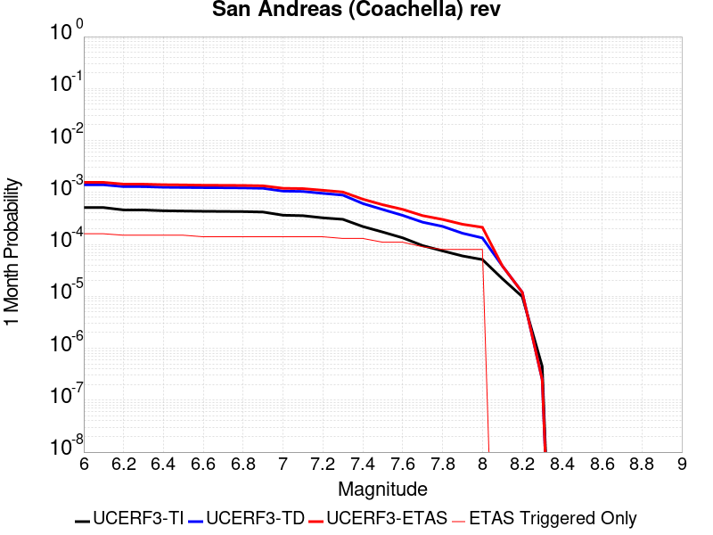 |  |  |

| Magnitude | 1 wk TI Prob | 1 wk TD Prob | 1 wk ETAS Prob | 1 wk ETAS/TD Gain | 1 wk ETAS Triggered Only | 1 mo TI Prob | 1 mo TD Prob | 1 mo ETAS Prob | 1 mo ETAS/TD Gain | 1 mo ETAS Triggered Only | 1 yr TI Prob | 1 yr TD Prob | 1 yr ETAS Prob | 1 yr ETAS/TD Gain | 1 yr ETAS Triggered Only | 10 yr TI Prob | 10 yr TD Prob | 10 yr ETAS Prob | 10 yr ETAS/TD Gain | 10 yr ETAS Triggered Only |
|-----|-----|-----|-----|-----|-----|-----|-----|-----|-----|-----|-----|-----|-----|-----|-----|-----|-----|-----|-----|-----|
| 6.0 | 1.1925945E-4 | 3.273077E-4 | 4.6726188E-4 | 1.427592 | 1.4E-4 | 5.110118E-4 | 0.001401998 | 0.0015617736 | 1.1139629 | 1.6E-4 | 0.0062038354 | 0.016937068 | 0.01713368 | 1.0116084 | 2.0E-4 | 0.060334753 | 0.15267672 | 0.15292244 | 1.0016094 | 2.9E-4 |
| 6.1 | 1.1925945E-4 | 3.273077E-4 | 4.6726188E-4 | 1.427592 | 1.4E-4 | 5.110118E-4 | 0.001401998 | 0.0015617736 | 1.1139629 | 1.6E-4 | 0.0062038354 | 0.016937068 | 0.01713368 | 1.0116084 | 2.0E-4 | 0.060334753 | 0.15267672 | 0.15292244 | 1.0016094 | 2.9E-4 |
| 6.2 | 1.07432395E-4 | 3.0231563E-4 | 4.322763E-4 | 1.4298842 | 1.3E-4 | 4.603433E-4 | 0.001294999 | 0.0014448048 | 1.1156802 | 1.5E-4 | 0.005590286 | 0.015653731 | 0.015840756 | 1.0119476 | 1.9E-4 | 0.05451731 | 0.14182784 | 0.14205953 | 1.0016338 | 2.7E-4 |
| 6.3 | 1.0718766E-4 | 3.0176868E-4 | 4.3172945E-4 | 1.4306636 | 1.3E-4 | 4.592948E-4 | 0.0012926573 | 0.0014424634 | 1.11589 | 1.5E-4 | 0.005577586 | 0.01562563 | 0.015812661 | 1.0119696 | 1.9E-4 | 0.054396555 | 0.14159605 | 0.14182782 | 1.0016369 | 2.7E-4 |
| 6.4 | 1.0355944E-4 | 2.9384956E-4 | 4.2381135E-4 | 1.4422733 | 1.3E-4 | 4.4375064E-4 | 0.0012587514 | 0.0014085625 | 1.1190157 | 1.5E-4 | 0.0053892885 | 0.015218662 | 0.01540577 | 1.0122947 | 1.9E-4 | 0.052604496 | 0.13815795 | 0.13839065 | 1.0016843 | 2.7E-4 |
| 6.5 | 1.0227914E-4 | 2.9104383E-4 | 4.21006E-4 | 1.4465381 | 1.3E-4 | 4.382655E-4 | 0.0012467385 | 0.0013965515 | 1.1201639 | 1.5E-4 | 0.0053228354 | 0.015074439 | 0.015261575 | 1.0124141 | 1.9E-4 | 0.051971316 | 0.13694239 | 0.13717541 | 1.0017016 | 2.7E-4 |
| 6.6 | 1.0116757E-4 | 2.8870135E-4 | 4.086667E-4 | 1.4155345 | 1.2E-4 | 4.3350324E-4 | 0.0012367087 | 0.0013765356 | 1.1130637 | 1.4E-4 | 0.0052651367 | 0.014954008 | 0.015131317 | 1.0118569 | 1.8E-4 | 0.051421247 | 0.13591973 | 0.13613576 | 1.0015893 | 2.5E-4 |
| 6.7 | 1.0050676E-4 | 2.8728697E-4 | 4.072525E-4 | 1.4175808 | 1.2E-4 | 4.3067214E-4 | 0.0012306528 | 0.0013704805 | 1.1136208 | 1.4E-4 | 0.005230834 | 0.014881288 | 0.01505861 | 1.0119157 | 1.8E-4 | 0.051094085 | 0.13530464 | 0.13552083 | 1.0015976 | 2.5E-4 |
| 6.8 | 9.976819E-5 | 2.8532353E-4 | 4.052893E-4 | 1.4204552 | 1.2E-4 | 4.2750788E-4 | 0.001222246 | 0.0013620749 | 1.1144032 | 1.4E-4 | 0.0051924936 | 0.014780328 | 0.014957667 | 1.0119983 | 1.8E-4 | 0.050728295 | 0.13445628 | 0.13467266 | 1.0016093 | 2.5E-4 |
| 6.9 | 9.77719E-5 | 2.802926E-4 | 4.0025896E-4 | 1.428004 | 1.2E-4 | 4.1895514E-4 | 0.0012007048 | 0.0013405367 | 1.1164582 | 1.4E-4 | 0.0050888555 | 0.0145215895 | 0.014698976 | 1.0122154 | 1.8E-4 | 0.049738888 | 0.13228476 | 0.13250169 | 1.0016398 | 2.5E-4 |
| 7.0 | 8.500761E-5 | 2.4763815E-4 | 3.6760842E-4 | 1.484458 | 1.2E-4 | 3.6426744E-4 | 0.0010608779 | 0.0012007294 | 1.1318262 | 1.4E-4 | 0.0044259406 | 0.01284047 | 0.013018159 | 1.0138382 | 1.8E-4 | 0.04338823 | 0.11813615 | 0.11835662 | 1.0018662 | 2.5E-4 |
| 7.1 | 8.319876E-5 | 2.4366553E-4 | 3.636363E-4 | 1.4923583 | 1.2E-4 | 3.5651738E-4 | 0.0010438662 | 0.00118372 | 1.1339768 | 1.4E-4 | 0.004331963 | 0.012635773 | 0.012813498 | 1.0140653 | 1.8E-4 | 0.042484846 | 0.11635632 | 0.11657723 | 1.0018985 | 2.5E-4 |
| 7.2 | 7.563917E-5 | 2.2414974E-4 | 3.4412285E-4 | 1.5352364 | 1.2E-4 | 3.2412758E-4 | 9.602912E-4 | 0.0011001567 | 1.1456491 | 1.4E-4 | 0.0039391145 | 0.011629559 | 0.011807466 | 1.0152978 | 1.8E-4 | 0.03870018 | 0.10776202 | 0.10798507 | 1.00207 | 2.5E-4 |
| 7.3 | 7.082985E-5 | 2.07311E-4 | 3.1728818E-4 | 1.5304937 | 1.1E-4 | 3.0352117E-4 | 8.881761E-4 | 0.0010180606 | 1.1462374 | 1.3E-4 | 0.0036891096 | 0.010760553 | 0.010928724 | 1.0156285 | 1.7E-4 | 0.03628465 | 0.10028403 | 0.100499965 | 1.0021532 | 2.4E-4 |
| 7.4 | 5.146215E-5 | 1.4274761E-4 | 2.527319E-4 | 1.7704809 | 1.1E-4 | 2.2053342E-4 | 6.1163295E-4 | 7.4155343E-4 | 1.2124158 | 1.3E-4 | 0.0026816884 | 0.0074213943 | 0.0075802067 | 1.0213993 | 1.6E-4 | 0.02649557 | 0.07085049 | 0.0710642 | 1.0030162 | 2.3E-4 |
| 7.5 | 4.0285166E-5 | 1.0942422E-4 | 1.9941437E-4 | 1.822397 | 9.0E-5 | 1.7263928E-4 | 4.6887697E-4 | 5.7882536E-4 | 1.2344931 | 1.1E-4 | 0.002099857 | 0.0056937044 | 0.0058329073 | 1.0244485 | 1.4E-4 | 0.020801254 | 0.055013083 | 0.05521153 | 1.0036073 | 2.1E-4 |
| 7.6 | 3.1168736E-5 | 8.439599E-5 | 1.743884E-4 | 2.0663114 | 9.0E-5 | 1.3357346E-4 | 3.616471E-4 | 4.7160732E-4 | 1.3040539 | 1.1E-4 | 0.0016250437 | 0.004394191 | 0.004533576 | 1.0317203 | 1.4E-4 | 0.016132116 | 0.042812474 | 0.043013487 | 1.004695 | 2.1E-4 |
| 7.7 | 2.2100989E-5 | 6.239345E-5 | 1.3238908E-4 | 2.1218426 | 7.0E-5 | 9.4715084E-5 | 2.6737314E-4 | 3.5734905E-4 | 1.3365183 | 9.0E-5 | 0.001152546 | 0.0032504152 | 0.003370025 | 1.0367984 | 1.2E-4 | 0.011465867 | 0.031902168 | 0.032066748 | 1.0051588 | 1.7E-4 |
| 7.8 | 1.7484861E-5 | 5.180078E-5 | 1.1179767E-4 | 2.1582236 | 6.0E-5 | 7.493296E-5 | 2.2198448E-4 | 3.019667E-4 | 1.3603055 | 8.0E-5 | 9.1192697E-4 | 0.0026993142 | 0.0028090172 | 1.0406411 | 1.1E-4 | 0.009081938 | 0.026641786 | 0.026797524 | 1.0058455 | 1.6E-4 |
| 7.9 | 1.3967285E-5 | 3.8226146E-5 | 9.8223856E-5 | 2.5695462 | 6.0E-5 | 5.985842E-5 | 1.6381606E-4 | 2.4380296E-4 | 1.4882725 | 8.0E-5 | 7.2853256E-4 | 0.0019926373 | 0.002092438 | 1.0500847 | 1.0E-4 | 0.0072614877 | 0.019911002 | 0.020058015 | 1.0073835 | 1.5E-4 |
| 8.0 | 1.1887396E-5 | 3.106798E-5 | 9.106612E-5 | 2.9311888 | 6.0E-5 | 5.094499E-5 | 1.331417E-4 | 2.1313105E-4 | 1.6007836 | 8.0E-5 | 6.200787E-4 | 0.0016197958 | 0.0017196338 | 1.0616362 | 1.0E-4 | 0.006183513 | 0.016280565 | 0.016418288 | 1.0084592 | 1.4E-4 |
| 8.1 | 5.100864E-6 | 8.973766E-6 | 8.973766E-6 | 1.0 | 0.0 | 2.1860664E-5 | 3.845843E-5 | 3.845843E-5 | 1.0 | 0.0 | 2.6612106E-4 | 4.6813092E-4 | 4.6813092E-4 | 1.0 | 0.0 | 0.002658026 | 0.004918092 | 0.004918092 | 1.0 | 0.0 |
| 8.2 | 2.3004484E-6 | 2.7863473E-6 | 2.7863473E-6 | 1.0 | 0.0 | 9.859027E-6 | 1.19414335E-5 | 1.19414335E-5 | 1.0 | 0.0 | 1.2002704E-4 | 1.4537729E-4 | 1.4537729E-4 | 1.0 | 0.0 | 0.0011996223 | 0.0015973782 | 0.0015973782 | 1.0 | 0.0 |
| 8.3 | 1.0424446E-7 | 5.814421E-8 | 5.814421E-8 | 1.0 | 0.0 | 4.4676187E-7 | 2.4918944E-7 | 2.4918944E-7 | 1.0 | 0.0 | 5.439312E-6 | 3.0338776E-6 | 3.0338776E-6 | 1.0 | 0.0 | 5.4391792E-5 | 3.189592E-5 | 3.189592E-5 | 1.0 | 0.0 |

## Ludlow
*[(top)](#table-of-contents)*

| 1 Week | 1 Month | 1 Year | 10 Year |
|-----|-----|-----|-----|
|  | 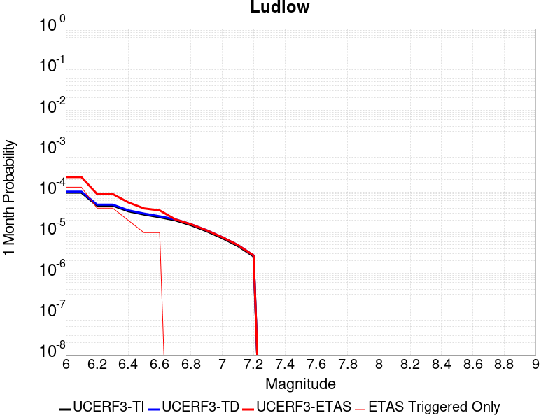 |  |  |

| Magnitude | 1 wk TI Prob | 1 wk TD Prob | 1 wk ETAS Prob | 1 wk ETAS/TD Gain | 1 wk ETAS Triggered Only | 1 mo TI Prob | 1 mo TD Prob | 1 mo ETAS Prob | 1 mo ETAS/TD Gain | 1 mo ETAS Triggered Only | 1 yr TI Prob | 1 yr TD Prob | 1 yr ETAS Prob | 1 yr ETAS/TD Gain | 1 yr ETAS Triggered Only | 10 yr TI Prob | 10 yr TD Prob | 10 yr ETAS Prob | 10 yr ETAS/TD Gain | 10 yr ETAS Triggered Only |
|-----|-----|-----|-----|-----|-----|-----|-----|-----|-----|-----|-----|-----|-----|-----|-----|-----|-----|-----|-----|-----|
| 6.0 | 2.2407607E-5 | 2.3657254E-5 | 1.3365466E-4 | 5.6496267 | 1.1E-4 | 9.602906E-5 | 1.0138454E-4 | 2.3137136E-4 | 2.282117 | 1.3E-4 | 0.0011685267 | 0.001233702 | 0.0014434429 | 1.1700094 | 2.1E-4 | 0.011624013 | 0.012273042 | 0.012549605 | 1.0225343 | 2.8E-4 |
| 6.1 | 2.2407607E-5 | 2.3657254E-5 | 1.3365466E-4 | 5.6496267 | 1.1E-4 | 9.602906E-5 | 1.0138454E-4 | 2.3137136E-4 | 2.282117 | 1.3E-4 | 0.0011685267 | 0.001233702 | 0.0014434429 | 1.1700094 | 2.1E-4 | 0.011624013 | 0.012273042 | 0.012549605 | 1.0225343 | 2.8E-4 |
| 6.2 | 1.0781252E-5 | 1.1365663E-5 | 5.136521E-5 | 4.519332 | 4.0E-5 | 4.620455E-5 | 4.8709102E-5 | 8.870715E-5 | 1.8211617 | 4.0E-5 | 5.623952E-4 | 5.9287593E-4 | 6.928167E-4 | 1.1685693 | 1.0E-4 | 0.00560974 | 0.0059133614 | 0.006072415 | 1.0268973 | 1.6E-4 |
| 6.3 | 1.0781252E-5 | 1.1365663E-5 | 5.136521E-5 | 4.519332 | 4.0E-5 | 4.620455E-5 | 4.8709102E-5 | 8.870715E-5 | 1.8211617 | 4.0E-5 | 5.623952E-4 | 5.9287593E-4 | 6.928167E-4 | 1.1685693 | 1.0E-4 | 0.00560974 | 0.0059133614 | 0.006072415 | 1.0268973 | 1.6E-4 |
| 6.4 | 7.814439E-6 | 8.237729E-6 | 2.8237564E-5 | 3.4278336 | 2.0E-5 | 3.3490025E-5 | 3.530408E-5 | 5.5303375E-5 | 1.5664867 | 2.0E-5 | 4.0766477E-4 | 4.2974384E-4 | 5.0970947E-4 | 1.1860774 | 8.0E-5 | 0.0040691774 | 0.0042892746 | 0.0043988028 | 1.0255353 | 1.1E-4 |
| 6.5 | 6.4986366E-6 | 6.85092E-6 | 1.685085E-5 | 2.4596481 | 1.0E-5 | 2.7851002E-5 | 2.9360759E-5 | 3.9360464E-5 | 1.3405807 | 1.0E-5 | 3.390332E-4 | 3.5740953E-4 | 4.0739166E-4 | 1.1398455 | 5.0E-5 | 0.003385164 | 0.0035684432 | 0.0036481577 | 1.0223387 | 8.0E-5 |
| 6.6 | 5.582177E-6 | 5.8860055E-6 | 1.5885948E-5 | 2.698935 | 1.0E-5 | 2.3923398E-5 | 2.5225498E-5 | 3.5225246E-5 | 1.3964143 | 1.0E-5 | 2.9122844E-4 | 3.0707786E-4 | 3.5706253E-4 | 1.1627752 | 5.0E-5 | 0.0029084706 | 0.003066609 | 0.0031463634 | 1.0260074 | 8.0E-5 |
| 6.7 | 4.6858763E-6 | 4.940427E-6 | 4.940427E-6 | 1.0 | 0.0 | 2.0082172E-5 | 2.1173091E-5 | 2.1173091E-5 | 1.0 | 0.0 | 2.4447302E-4 | 2.5775246E-4 | 2.877447E-4 | 1.1163608 | 3.0E-5 | 0.0024420423 | 0.0025745912 | 0.0026344368 | 1.0232446 | 6.0E-5 |
| 6.8 | 3.5584908E-6 | 3.7520183E-6 | 3.7520183E-6 | 1.0 | 0.0 | 1.5250586E-5 | 1.6079981E-5 | 1.6079981E-5 | 1.0 | 0.0 | 1.8566006E-4 | 1.957566E-4 | 2.1575269E-4 | 1.1021477 | 2.0E-5 | 0.0018550502 | 0.0019558826 | 0.0019958045 | 1.0204111 | 4.0E-5 |
| 6.9 | 2.532834E-6 | 2.6710034E-6 | 2.6710034E-6 | 1.0 | 0.0 | 1.0854958E-5 | 1.1447109E-5 | 1.1447109E-5 | 1.0 | 0.0 | 1.3215111E-4 | 1.3935992E-4 | 1.4935853E-4 | 1.0717466 | 1.0E-5 | 0.0013207254 | 0.0013927529 | 0.0014227111 | 1.0215101 | 3.0E-5 |
| 7.0 | 1.7083285E-6 | 1.8019439E-6 | 1.8019439E-6 | 1.0 | 0.0 | 7.3213873E-6 | 7.722595E-6 | 7.722595E-6 | 1.0 | 0.0 | 8.913424E-5 | 9.40187E-5 | 1.0401776E-4 | 1.1063519 | 1.0E-5 | 8.9098496E-4 | 9.3980576E-4 | 9.5978694E-4 | 1.021261 | 2.0E-5 |
| 7.1 | 1.0905424E-6 | 1.1497619E-6 | 1.1497619E-6 | 1.0 | 0.0 | 4.6737446E-6 | 4.9275427E-6 | 4.9275427E-6 | 1.0 | 0.0 | 5.6901354E-5 | 5.999128E-5 | 6.999068E-5 | 1.1666809 | 1.0E-5 | 5.6886784E-4 | 5.997606E-4 | 6.197486E-4 | 1.0333266 | 2.0E-5 |
| 7.2 | 6.06668E-7 | 6.387277E-7 | 6.387277E-7 | 1.0 | 0.0 | 2.600003E-6 | 2.7374022E-6 | 2.7374022E-6 | 1.0 | 0.0 | 3.1654577E-5 | 3.3327433E-5 | 4.3327098E-5 | 1.3000431 | 1.0E-5 | 3.1650066E-4 | 3.3323118E-4 | 3.5322452E-4 | 1.0599984 | 2.0E-5 |

## Red Pass
*[(top)](#table-of-contents)*

| 1 Week | 1 Month | 1 Year | 10 Year |
|-----|-----|-----|-----|
| 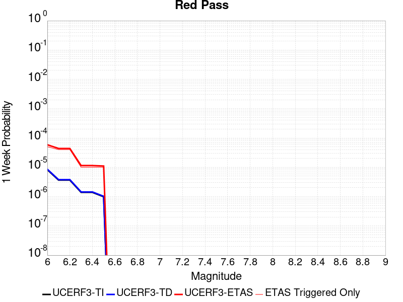 |  |  | 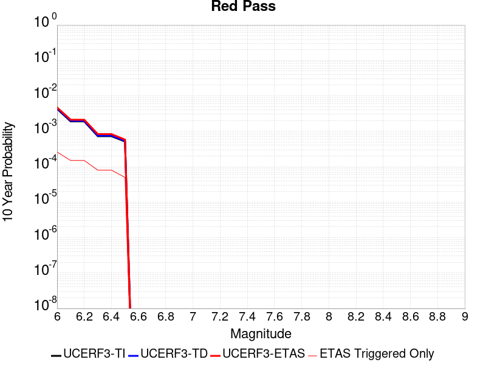 |

| Magnitude | 1 wk TI Prob | 1 wk TD Prob | 1 wk ETAS Prob | 1 wk ETAS/TD Gain | 1 wk ETAS Triggered Only | 1 mo TI Prob | 1 mo TD Prob | 1 mo ETAS Prob | 1 mo ETAS/TD Gain | 1 mo ETAS Triggered Only | 1 yr TI Prob | 1 yr TD Prob | 1 yr ETAS Prob | 1 yr ETAS/TD Gain | 1 yr ETAS Triggered Only | 10 yr TI Prob | 10 yr TD Prob | 10 yr ETAS Prob | 10 yr ETAS/TD Gain | 10 yr ETAS Triggered Only |
|-----|-----|-----|-----|-----|-----|-----|-----|-----|-----|-----|-----|-----|-----|-----|-----|-----|-----|-----|-----|-----|
| 6.0 | 8.258278E-6 | 8.551265E-6 | 5.855084E-5 | 6.8470383 | 5.0E-5 | 3.539214E-5 | 3.6647863E-5 | 1.1664493E-4 | 3.1828575 | 8.0E-5 | 4.308141E-4 | 4.4611428E-4 | 6.060429E-4 | 1.3584925 | 1.6E-4 | 0.0042997985 | 0.004453945 | 0.004712787 | 1.0581152 | 2.6E-4 |
| 6.1 | 3.649988E-6 | 3.7753161E-6 | 4.3775166E-5 | 11.595099 | 4.0E-5 | 1.5642712E-5 | 1.6179853E-5 | 6.617904E-5 | 4.090213 | 5.0E-5 | 1.9043336E-4 | 1.9697666E-4 | 2.9695698E-4 | 1.5075743 | 1.0E-4 | 0.0019027026 | 0.001968488 | 0.0021181928 | 1.0760506 | 1.5E-4 |
| 6.2 | 3.649988E-6 | 3.7753161E-6 | 4.3775166E-5 | 11.595099 | 4.0E-5 | 1.5642712E-5 | 1.6179853E-5 | 6.617904E-5 | 4.090213 | 5.0E-5 | 1.9043336E-4 | 1.9697666E-4 | 2.9695698E-4 | 1.5075743 | 1.0E-4 | 0.0019027026 | 0.001968488 | 0.0021181928 | 1.0760506 | 1.5E-4 |
| 6.3 | 1.3924937E-6 | 1.4411166E-6 | 1.1441102E-5 | 7.9390535 | 1.0E-5 | 5.9678164E-6 | 6.1762075E-6 | 1.6176145E-5 | 2.6191065 | 1.0E-5 | 7.265574E-5 | 7.519415E-5 | 1.2519039E-4 | 1.6648954 | 5.0E-5 | 7.263199E-4 | 7.518258E-4 | 8.3176565E-4 | 1.1063277 | 8.0E-5 |
| 6.4 | 1.3924937E-6 | 1.4411166E-6 | 1.1441102E-5 | 7.9390535 | 1.0E-5 | 5.9678164E-6 | 6.1762075E-6 | 1.6176145E-5 | 2.6191065 | 1.0E-5 | 7.265574E-5 | 7.519415E-5 | 1.2519039E-4 | 1.6648954 | 5.0E-5 | 7.263199E-4 | 7.518258E-4 | 8.3176565E-4 | 1.1063277 | 8.0E-5 |
| 6.5 | 9.876812E-7 | 1.0221912E-6 | 1.1022181E-5 | 10.782895 | 1.0E-5 | 4.2329125E-6 | 4.3808195E-6 | 1.4380776E-5 | 3.2826679 | 1.0E-5 | 5.153449E-5 | 5.3336476E-5 | 9.333435E-5 | 1.7499158 | 4.0E-5 | 5.1522546E-4 | 5.333648E-4 | 5.833381E-4 | 1.0936944 | 5.0E-5 |

## Calico-Hidalgo
*[(top)](#table-of-contents)*

| 1 Week | 1 Month | 1 Year | 10 Year |
|-----|-----|-----|-----|
| 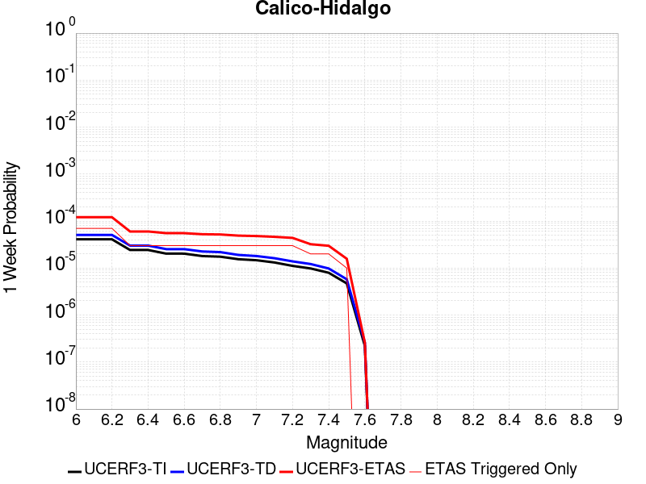 | 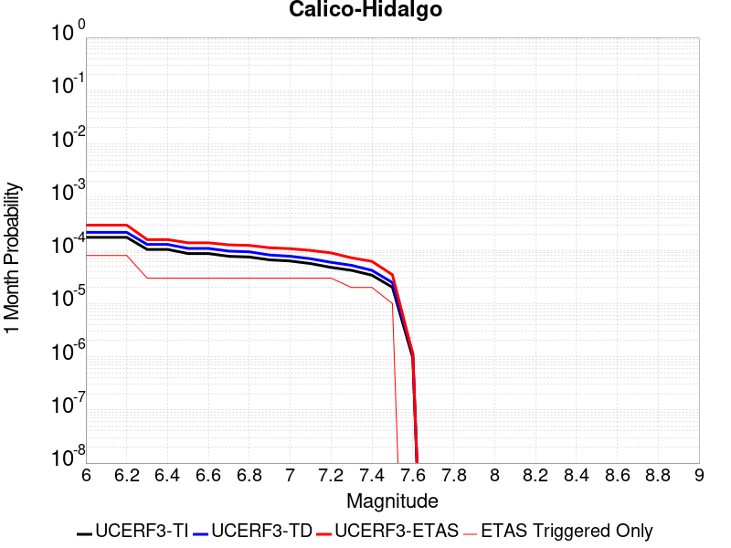 |  |  |

| Magnitude | 1 wk TI Prob | 1 wk TD Prob | 1 wk ETAS Prob | 1 wk ETAS/TD Gain | 1 wk ETAS Triggered Only | 1 mo TI Prob | 1 mo TD Prob | 1 mo ETAS Prob | 1 mo ETAS/TD Gain | 1 mo ETAS Triggered Only | 1 yr TI Prob | 1 yr TD Prob | 1 yr ETAS Prob | 1 yr ETAS/TD Gain | 1 yr ETAS Triggered Only | 10 yr TI Prob | 10 yr TD Prob | 10 yr ETAS Prob | 10 yr ETAS/TD Gain | 10 yr ETAS Triggered Only |
|-----|-----|-----|-----|-----|-----|-----|-----|-----|-----|-----|-----|-----|-----|-----|-----|-----|-----|-----|-----|-----|
| 6.0 | 4.0906612E-5 | 5.0704355E-5 | 1.2070081E-4 | 2.380482 | 7.0E-5 | 1.7530227E-4 | 2.1728857E-4 | 2.9727118E-4 | 1.368094 | 8.0E-5 | 0.0021322158 | 0.002642678 | 0.0027523874 | 1.0415144 | 1.1E-4 | 0.02111873 | 0.026152814 | 0.026376799 | 1.0085645 | 2.3E-4 |
| 6.1 | 4.0906612E-5 | 5.0704355E-5 | 1.2070081E-4 | 2.380482 | 7.0E-5 | 1.7530227E-4 | 2.1728857E-4 | 2.9727118E-4 | 1.368094 | 8.0E-5 | 0.0021322158 | 0.002642678 | 0.0027523874 | 1.0415144 | 1.1E-4 | 0.02111873 | 0.026152814 | 0.026376799 | 1.0085645 | 2.3E-4 |
| 6.2 | 4.0906612E-5 | 5.0704355E-5 | 1.2070081E-4 | 2.380482 | 7.0E-5 | 1.7530227E-4 | 2.1728857E-4 | 2.9727118E-4 | 1.368094 | 8.0E-5 | 0.0021322158 | 0.002642678 | 0.0027523874 | 1.0415144 | 1.1E-4 | 0.02111873 | 0.026152814 | 0.026376799 | 1.0085645 | 2.3E-4 |
| 6.3 | 2.4242801E-5 | 3.0090967E-5 | 6.0090064E-5 | 1.9969469 | 3.0E-5 | 1.0389358E-4 | 1.289551E-4 | 1.5895124E-4 | 1.2326092 | 3.0E-5 | 0.0012641704 | 0.0015689312 | 0.0016188527 | 1.0318189 | 5.0E-5 | 0.01257003 | 0.015582229 | 0.015739735 | 1.0101081 | 1.6E-4 |
| 6.4 | 2.4242801E-5 | 3.0090967E-5 | 6.0090064E-5 | 1.9969469 | 3.0E-5 | 1.0389358E-4 | 1.289551E-4 | 1.5895124E-4 | 1.2326092 | 3.0E-5 | 0.0012641704 | 0.0015689312 | 0.0016188527 | 1.0318189 | 5.0E-5 | 0.01257003 | 0.015582229 | 0.015739735 | 1.0101081 | 1.6E-4 |
| 6.5 | 2.0286952E-5 | 2.5316054E-5 | 5.5315297E-5 | 2.1849887 | 3.0E-5 | 8.694118E-5 | 1.0849296E-4 | 1.384897E-4 | 1.2764857 | 3.0E-5 | 0.0010579949 | 0.0013201186 | 0.0013600657 | 1.0302603 | 4.0E-5 | 0.010529719 | 0.013124701 | 0.013262863 | 1.0105269 | 1.4E-4 |
| 6.6 | 2.0269223E-5 | 2.5297004E-5 | 5.5296245E-5 | 2.1858811 | 3.0E-5 | 8.6865206E-5 | 1.08411325E-4 | 1.3840807E-4 | 1.2766938 | 3.0E-5 | 0.0010570707 | 0.0013191258 | 0.001359073 | 1.0302831 | 4.0E-5 | 0.010520565 | 0.01311489 | 0.013253055 | 1.0105349 | 1.4E-4 |
| 6.7 | 1.799852E-5 | 2.2540933E-5 | 5.2540257E-5 | 2.330882 | 3.0E-5 | 7.713423E-5 | 9.660051E-5 | 1.265976E-4 | 1.3105273 | 3.0E-5 | 9.3870464E-4 | 0.0011754911 | 0.0012154442 | 1.0339884 | 4.0E-5 | 0.009347493 | 0.011694346 | 0.0118327085 | 1.0118316 | 1.4E-4 |
| 6.8 | 1.7458793E-5 | 2.184258E-5 | 5.1841926E-5 | 2.373434 | 3.0E-5 | 7.4821255E-5 | 9.360778E-5 | 1.2360497E-4 | 1.3204561 | 3.0E-5 | 9.10568E-4 | 0.0011390933 | 0.0011790477 | 1.0350757 | 4.0E-5 | 0.009068459 | 0.011334131 | 0.011462657 | 1.0113398 | 1.3E-4 |
| 6.9 | 1.542884E-5 | 1.9026285E-5 | 4.9025715E-5 | 2.576736 | 3.0E-5 | 6.612192E-5 | 8.153875E-5 | 1.11536305E-4 | 1.3678932 | 3.0E-5 | 8.04737E-4 | 9.922953E-4 | 0.0010322556 | 1.0402706 | 4.0E-5 | 0.008018291 | 0.009880043 | 0.009998857 | 1.0120257 | 1.2E-4 |
| 7.0 | 1.468253E-5 | 1.803109E-5 | 4.803055E-5 | 2.6637628 | 3.0E-5 | 6.292361E-5 | 7.727389E-5 | 1.07271575E-4 | 1.3881994 | 3.0E-5 | 7.658257E-4 | 9.4041653E-4 | 9.80379E-4 | 1.0424943 | 4.0E-5 | 0.0076319184 | 0.009365736 | 0.009464799 | 1.0105772 | 1.0E-4 |
| 7.1 | 1.3139281E-5 | 1.620139E-5 | 4.6200905E-5 | 2.851663 | 3.0E-5 | 5.6309986E-5 | 6.943275E-5 | 9.943067E-5 | 1.4320427 | 3.0E-5 | 6.853584E-4 | 8.4502844E-4 | 8.8499463E-4 | 1.0472957 | 4.0E-5 | 0.0068324856 | 0.008419449 | 0.008518607 | 1.0117773 | 1.0E-4 |
| 7.2 | 1.1127404E-5 | 1.3867038E-5 | 4.386662E-5 | 3.1633735 | 3.0E-5 | 4.7688E-5 | 5.9428872E-5 | 8.942709E-5 | 1.5047752 | 3.0E-5 | 5.8044674E-4 | 7.233172E-4 | 7.632883E-4 | 1.0552608 | 4.0E-5 | 0.0057893298 | 0.007210737 | 0.007300088 | 1.0123913 | 9.0E-5 |
| 7.3 | 9.808154E-6 | 1.2176586E-5 | 3.2176344E-5 | 2.6424766 | 2.0E-5 | 4.2034266E-5 | 5.2184383E-5 | 7.218334E-5 | 1.3832364 | 2.0E-5 | 5.11647E-4 | 6.351704E-4 | 6.6515134E-4 | 1.0472014 | 3.0E-5 | 0.0051047057 | 0.006334625 | 0.0064141187 | 1.012549 | 8.0E-5 |
| 7.4 | 7.942452E-6 | 9.792348E-6 | 2.9792152E-5 | 3.042391 | 2.0E-5 | 3.4038632E-5 | 4.1966585E-5 | 6.1965744E-5 | 1.4765496 | 2.0E-5 | 4.1434157E-4 | 5.108328E-4 | 5.408175E-4 | 1.0586976 | 3.0E-5 | 0.0041356985 | 0.005097527 | 0.0051771193 | 1.0156139 | 8.0E-5 |
| 7.5 | 4.7121216E-6 | 5.7729717E-6 | 1.5772914E-5 | 2.7322001 | 1.0E-5 | 2.019465E-5 | 2.4741115E-5 | 3.4740868E-5 | 1.4041755 | 1.0E-5 | 2.4584212E-4 | 3.011891E-4 | 3.111861E-4 | 1.0331917 | 1.0E-5 | 0.0024557032 | 0.0030085614 | 0.003068381 | 1.019883 | 6.0E-5 |
| 7.6 | 2.21172E-7 | 2.6040198E-7 | 2.6040198E-7 | 1.0 | 0.0 | 9.478797E-7 | 1.1160082E-6 | 1.1160082E-6 | 1.0 | 0.0 | 1.1540374E-5 | 1.3587343E-5 | 1.3587343E-5 | 1.0 | 0.0 | 1.1539775E-4 | 1.3586794E-4 | 1.5586523E-4 | 1.1471817 | 2.0E-5 |

## Pinto Mtn
*[(top)](#table-of-contents)*

| 1 Week | 1 Month | 1 Year | 10 Year |
|-----|-----|-----|-----|
|  | 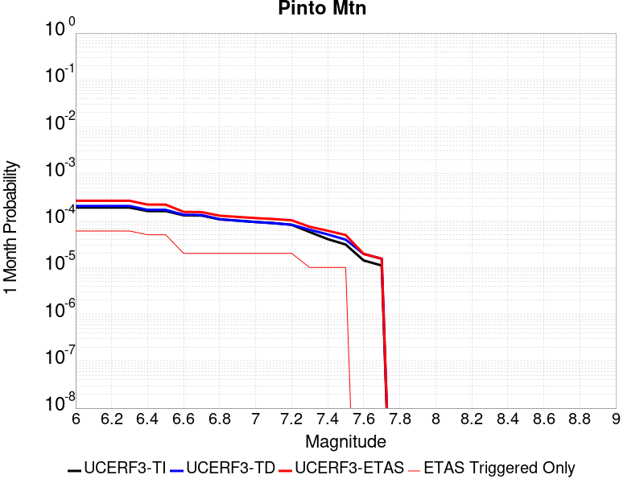 | 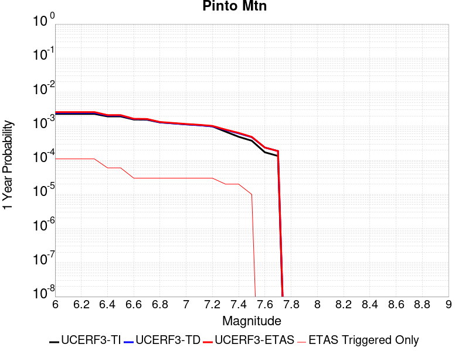 |  |

| Magnitude | 1 wk TI Prob | 1 wk TD Prob | 1 wk ETAS Prob | 1 wk ETAS/TD Gain | 1 wk ETAS Triggered Only | 1 mo TI Prob | 1 mo TD Prob | 1 mo ETAS Prob | 1 mo ETAS/TD Gain | 1 mo ETAS Triggered Only | 1 yr TI Prob | 1 yr TD Prob | 1 yr ETAS Prob | 1 yr ETAS/TD Gain | 1 yr ETAS Triggered Only | 10 yr TI Prob | 10 yr TD Prob | 10 yr ETAS Prob | 10 yr ETAS/TD Gain | 10 yr ETAS Triggered Only |
|-----|-----|-----|-----|-----|-----|-----|-----|-----|-----|-----|-----|-----|-----|-----|-----|-----|-----|-----|-----|-----|
| 6.0 | 4.4194956E-5 | 4.7853926E-5 | 6.785297E-5 | 1.4179186 | 2.0E-5 | 1.893932E-4 | 2.0507304E-4 | 2.6506075E-4 | 1.2925187 | 6.0E-5 | 0.0023034236 | 0.0024940688 | 0.0026037944 | 1.0439947 | 1.1E-4 | 0.022796938 | 0.024678305 | 0.024892876 | 1.0086948 | 2.2E-4 |
| 6.1 | 4.4194956E-5 | 4.7853926E-5 | 6.785297E-5 | 1.4179186 | 2.0E-5 | 1.893932E-4 | 2.0507304E-4 | 2.6506075E-4 | 1.2925187 | 6.0E-5 | 0.0023034236 | 0.0024940688 | 0.0026037944 | 1.0439947 | 1.1E-4 | 0.022796938 | 0.024678305 | 0.024892876 | 1.0086948 | 2.2E-4 |
| 6.2 | 4.4194956E-5 | 4.7853926E-5 | 6.785297E-5 | 1.4179186 | 2.0E-5 | 1.893932E-4 | 2.0507304E-4 | 2.6506075E-4 | 1.2925187 | 6.0E-5 | 0.0023034236 | 0.0024940688 | 0.0026037944 | 1.0439947 | 1.1E-4 | 0.022796938 | 0.024678305 | 0.024892876 | 1.0086948 | 2.2E-4 |
| 6.3 | 4.4194956E-5 | 4.7853926E-5 | 6.785297E-5 | 1.4179186 | 2.0E-5 | 1.893932E-4 | 2.0507304E-4 | 2.6506075E-4 | 1.2925187 | 6.0E-5 | 0.0023034236 | 0.0024940688 | 0.0026037944 | 1.0439947 | 1.1E-4 | 0.022796938 | 0.024678305 | 0.024892876 | 1.0086948 | 2.2E-4 |
| 6.4 | 3.729929E-5 | 3.960349E-5 | 5.96027E-5 | 1.504986 | 2.0E-5 | 1.5984432E-4 | 1.6971873E-4 | 2.1971024E-4 | 1.2945551 | 5.0E-5 | 0.0019443673 | 0.0020644604 | 0.0021243365 | 1.0290033 | 6.0E-5 | 0.019274427 | 0.020462848 | 0.020619575 | 1.0076591 | 1.6E-4 |
| 6.5 | 3.729929E-5 | 3.960349E-5 | 5.96027E-5 | 1.504986 | 2.0E-5 | 1.5984432E-4 | 1.6971873E-4 | 2.1971024E-4 | 1.2945551 | 5.0E-5 | 0.0019443673 | 0.0020644604 | 0.0021243365 | 1.0290033 | 6.0E-5 | 0.019274427 | 0.020462848 | 0.020619575 | 1.0076591 | 1.6E-4 |
| 6.6 | 3.0204548E-5 | 3.12056E-5 | 4.1205287E-5 | 1.3204453 | 1.0E-5 | 1.2944164E-4 | 1.3373162E-4 | 1.5372895E-4 | 1.1495333 | 2.0E-5 | 0.0015748127 | 0.0016270012 | 0.0016569524 | 1.0184088 | 3.0E-5 | 0.015636992 | 0.016154764 | 0.01625315 | 1.0060902 | 1.0E-4 |
| 6.7 | 2.9857754E-5 | 3.0814987E-5 | 4.0814677E-5 | 1.3245075 | 1.0E-5 | 1.2795553E-4 | 1.3205773E-4 | 1.5205509E-4 | 1.1514289 | 2.0E-5 | 0.0015567453 | 0.0016066517 | 0.0016366035 | 1.0186424 | 3.0E-5 | 0.015458848 | 0.015954204 | 0.01605261 | 1.0061679 | 1.0E-4 |
| 6.8 | 2.4819734E-5 | 2.5009665E-5 | 3.5009416E-5 | 1.3998355 | 1.0E-5 | 1.0636595E-4 | 1.0718E-4 | 1.2717786E-4 | 1.186582 | 2.0E-5 | 0.0012942362 | 0.001304157 | 0.0013341178 | 1.0229734 | 3.0E-5 | 0.012867244 | 0.012967403 | 0.013056236 | 1.0068505 | 9.0E-5 |
| 6.9 | 2.331124E-5 | 2.3337945E-5 | 3.333771E-5 | 1.4284767 | 1.0E-5 | 9.990149E-5 | 1.0001605E-4 | 1.2001405E-4 | 1.199948 | 2.0E-5 | 0.001215622 | 0.0012170355 | 0.001246999 | 1.02462 | 3.0E-5 | 0.012089936 | 0.012105897 | 0.012184929 | 1.0065284 | 8.0E-5 |
| 7.0 | 2.1818534E-5 | 2.1761074E-5 | 3.1760857E-5 | 1.4595262 | 1.0E-5 | 9.3504656E-5 | 9.3258524E-5 | 1.13256654E-4 | 1.2144376 | 2.0E-5 | 0.0011378246 | 0.0011348509 | 0.0011648169 | 1.0264052 | 3.0E-5 | 0.011320163 | 0.01129266 | 0.011371756 | 1.0070043 | 8.0E-5 |
| 7.1 | 2.066081E-5 | 2.0540718E-5 | 3.0540512E-5 | 1.4868279 | 1.0E-5 | 8.854332E-5 | 8.8028784E-5 | 1.0802703E-4 | 1.2271785 | 2.0E-5 | 0.0010774818 | 0.0010712431 | 0.001101211 | 1.0279748 | 3.0E-5 | 0.010722724 | 0.0106628435 | 0.01074199 | 1.0074227 | 8.0E-5 |
| 7.2 | 1.8990233E-5 | 1.9054001E-5 | 2.9053812E-5 | 1.5248141 | 1.0E-5 | 8.138417E-5 | 8.165756E-5 | 1.01655925E-4 | 1.2449052 | 2.0E-5 | 9.904018E-4 | 9.937467E-4 | 0.0010237169 | 1.0301588 | 3.0E-5 | 0.009859995 | 0.009895029 | 0.0099742375 | 1.0080049 | 8.0E-5 |
| 7.3 | 1.3335872E-5 | 1.4906713E-5 | 2.4906563E-5 | 1.6708287 | 1.0E-5 | 5.7152483E-5 | 6.388442E-5 | 7.388378E-5 | 1.1565228 | 1.0E-5 | 6.956093E-4 | 7.77528E-4 | 7.975124E-4 | 1.0257026 | 2.0E-5 | 0.006934359 | 0.007749376 | 0.007818833 | 1.008963 | 7.0E-5 |
| 7.4 | 9.414066E-6 | 1.186096E-5 | 2.1860842E-5 | 1.8430921 | 1.0E-5 | 4.0345374E-5 | 5.083175E-5 | 6.083124E-5 | 1.1967175 | 1.0E-5 | 4.910942E-4 | 6.1871024E-4 | 6.386979E-4 | 1.0323054 | 2.0E-5 | 0.0049001034 | 0.0061708256 | 0.0062403935 | 1.0112737 | 7.0E-5 |
| 7.5 | 7.2101157E-6 | 9.158192E-6 | 1.91581E-5 | 2.0919085 | 1.0E-5 | 3.090013E-5 | 3.9248847E-5 | 4.9248454E-5 | 1.2547746 | 1.0E-5 | 3.7614413E-4 | 4.7775774E-4 | 4.87753E-4 | 1.0209211 | 1.0E-5 | 0.0037550807 | 0.004768082 | 0.004827796 | 1.0125237 | 6.0E-5 |
| 7.6 | 3.296375E-6 | 4.5455017E-6 | 4.5455017E-6 | 1.0 | 0.0 | 1.4127245E-5 | 1.9480583E-5 | 1.9480583E-5 | 1.0 | 0.0 | 1.7198564E-4 | 2.3715167E-4 | 2.3715167E-4 | 1.0 | 0.0 | 0.0017185259 | 0.0023691233 | 0.002389076 | 1.0084219 | 2.0E-5 |
| 7.7 | 2.5741092E-6 | 3.5844084E-6 | 3.5844084E-6 | 1.0 | 0.0 | 1.103185E-5 | 1.5361667E-5 | 1.5361667E-5 | 1.0 | 0.0 | 1.3430449E-4 | 1.8701357E-4 | 1.8701357E-4 | 1.0 | 0.0 | 0.0013422335 | 0.0018686918 | 0.0018686918 | 1.0 | 0.0 |

## San Andreas (Creeping Section) 2011 CFM
*[(top)](#table-of-contents)*

| 1 Week | 1 Month | 1 Year | 10 Year |
|-----|-----|-----|-----|
|  |  | 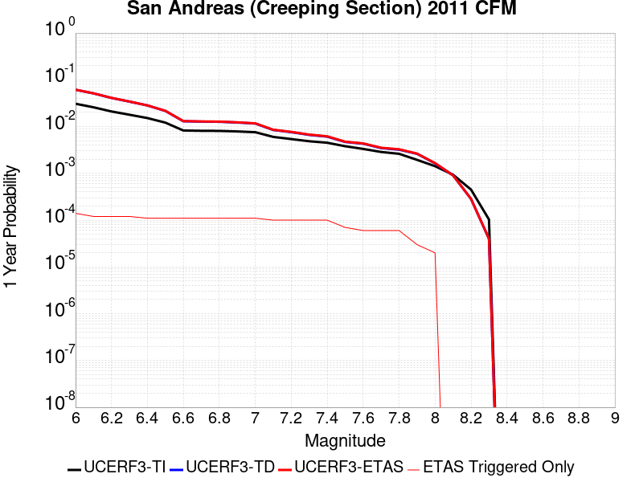 |  |

| Magnitude | 1 wk TI Prob | 1 wk TD Prob | 1 wk ETAS Prob | 1 wk ETAS/TD Gain | 1 wk ETAS Triggered Only | 1 mo TI Prob | 1 mo TD Prob | 1 mo ETAS Prob | 1 mo ETAS/TD Gain | 1 mo ETAS Triggered Only | 1 yr TI Prob | 1 yr TD Prob | 1 yr ETAS Prob | 1 yr ETAS/TD Gain | 1 yr ETAS Triggered Only | 10 yr TI Prob | 10 yr TD Prob | 10 yr ETAS Prob | 10 yr ETAS/TD Gain | 10 yr ETAS Triggered Only |
|-----|-----|-----|-----|-----|-----|-----|-----|-----|-----|-----|-----|-----|-----|-----|-----|-----|-----|-----|-----|-----|
| 6.0 | 5.986481E-4 | 0.0012275929 | 0.0012875192 | 1.0488161 | 6.0E-5 | 0.0025631124 | 0.005245547 | 0.005305232 | 1.0113783 | 6.0E-5 | 0.030762846 | 0.06120491 | 0.061336342 | 1.0021474 | 1.4E-4 | 0.26835477 | 0.42593494 | 0.4260612 | 1.0002965 | 2.2E-4 |
| 6.1 | 5.015945E-4 | 0.0010217986 | 0.0010717475 | 1.0488833 | 5.0E-5 | 0.00214792 | 0.0043678596 | 0.004417641 | 1.0113972 | 5.0E-5 | 0.025839351 | 0.05124837 | 0.05136222 | 1.0022216 | 1.2E-4 | 0.23032776 | 0.37285668 | 0.3729821 | 1.0003364 | 2.0E-4 |
| 6.2 | 4.073338E-4 | 8.1073755E-4 | 8.60697E-4 | 1.0616223 | 5.0E-5 | 0.0017445484 | 0.0034671477 | 0.0035169744 | 1.014371 | 5.0E-5 | 0.021034058 | 0.04093317 | 0.041048255 | 1.0028116 | 1.2E-4 | 0.19150782 | 0.31303346 | 0.313164 | 1.000417 | 1.9E-4 |
| 6.3 | 3.464099E-4 | 6.7391695E-4 | 7.238833E-4 | 1.0741432 | 5.0E-5 | 0.0014837692 | 0.0028829593 | 0.002932815 | 1.0172933 | 5.0E-5 | 0.017915873 | 0.034189582 | 0.03430548 | 1.0033898 | 1.2E-4 | 0.16538359 | 0.2713166 | 0.27145502 | 1.0005103 | 1.9E-4 |
| 6.4 | 2.935057E-4 | 5.5442745E-4 | 5.944053E-4 | 1.0721065 | 4.0E-5 | 0.0012572751 | 0.0023725363 | 0.0024124414 | 1.0168196 | 4.0E-5 | 0.015200248 | 0.02826451 | 0.028371401 | 1.0037818 | 1.1E-4 | 0.14201577 | 0.23298529 | 0.23312335 | 1.0005926 | 1.8E-4 |
| 6.5 | 2.3409708E-4 | 4.2093755E-4 | 4.609207E-4 | 1.094986 | 4.0E-5 | 0.0010028875 | 0.0018019684 | 0.0018418964 | 1.0221579 | 4.0E-5 | 0.012141965 | 0.021587461 | 0.021695087 | 1.0049856 | 1.1E-4 | 0.11499573 | 0.18682368 | 0.18696192 | 1.0007399 | 1.7E-4 |
| 6.6 | 1.5842178E-4 | 2.506933E-4 | 2.9068327E-4 | 1.1595175 | 4.0E-5 | 6.7877385E-4 | 0.0010739497 | 0.0011139067 | 1.0372057 | 4.0E-5 | 0.0082328 | 0.012995575 | 0.013104145 | 1.0083544 | 1.1E-4 | 0.07934396 | 0.12314638 | 0.12328667 | 1.0011393 | 1.6E-4 |
| 6.7 | 1.5616413E-4 | 2.4605883E-4 | 2.8604898E-4 | 1.1625228 | 4.0E-5 | 6.691031E-4 | 0.0010541069 | 0.0010940647 | 1.0379068 | 4.0E-5 | 0.0081159435 | 0.01275744 | 0.012866037 | 1.0085124 | 1.1E-4 | 0.0782586 | 0.12117351 | 0.12131412 | 1.0011604 | 1.6E-4 |
| 6.8 | 1.5538467E-4 | 2.4429744E-4 | 2.8428767E-4 | 1.1636949 | 4.0E-5 | 6.6576427E-4 | 0.0010465645 | 0.0010865227 | 1.0381802 | 4.0E-5 | 0.008075596 | 0.012666838 | 0.012775445 | 1.0085741 | 1.1E-4 | 0.07788358 | 0.120404355 | 0.12054509 | 1.0011688 | 1.6E-4 |
| 6.9 | 1.5153569E-4 | 2.3539034E-4 | 2.753809E-4 | 1.1698905 | 4.0E-5 | 6.49277E-4 | 0.0010084276 | 0.0010483873 | 1.0396258 | 4.0E-5 | 0.007876333 | 0.01220901 | 0.012317668 | 1.0088997 | 1.1E-4 | 0.07602952 | 0.11647445 | 0.11661581 | 1.0012137 | 1.6E-4 |
| 7.0 | 1.4588932E-4 | 2.2396253E-4 | 2.6395358E-4 | 1.1785613 | 4.0E-5 | 6.250901E-4 | 9.5948833E-4 | 9.9945E-4 | 1.0416489 | 4.0E-5 | 0.0075839474 | 0.011619697 | 0.011728419 | 1.0093567 | 1.1E-4 | 0.073302895 | 0.11132046 | 0.111462645 | 1.0012773 | 1.6E-4 |
| 7.1 | 1.1565079E-4 | 1.6281738E-4 | 2.0281087E-4 | 1.245634 | 4.0E-5 | 4.955521E-4 | 6.9760304E-4 | 7.375751E-4 | 1.0572993 | 4.0E-5 | 0.006016669 | 0.0084604435 | 0.008559597 | 1.0117197 | 1.0E-4 | 0.058563538 | 0.08367046 | 0.08380791 | 1.0016427 | 1.5E-4 |
| 7.2 | 1.0393792E-4 | 1.4615769E-4 | 1.8615184E-4 | 1.273637 | 4.0E-5 | 4.4537216E-4 | 6.2624045E-4 | 6.6621543E-4 | 1.0638332 | 4.0E-5 | 0.005408933 | 0.0075979927 | 0.007697233 | 1.0130614 | 1.0E-4 | 0.052791595 | 0.07561969 | 0.075758345 | 1.0018336 | 1.5E-4 |
| 7.3 | 9.332884E-5 | 1.2780898E-4 | 1.6780387E-4 | 1.312927 | 4.0E-5 | 3.999194E-4 | 5.4763845E-4 | 5.876165E-4 | 1.0730009 | 4.0E-5 | 0.0048581534 | 0.006647249 | 0.006746584 | 1.0149438 | 1.0E-4 | 0.047533102 | 0.06648326 | 0.066623285 | 1.0021062 | 1.5E-4 |
| 7.4 | 8.670252E-5 | 1.17032345E-4 | 1.5702767E-4 | 1.3417459 | 4.0E-5 | 3.715293E-4 | 5.0147134E-4 | 5.414513E-4 | 1.0797253 | 4.0E-5 | 0.004513991 | 0.006088443 | 0.0061878343 | 1.0163245 | 1.0E-4 | 0.044233937 | 0.061151642 | 0.06129247 | 1.0023029 | 1.5E-4 |
| 7.5 | 7.3036405E-5 | 9.005856E-5 | 1.1005676E-4 | 1.2220577 | 2.0E-5 | 3.129756E-4 | 3.8590826E-4 | 4.0590053E-4 | 1.0518057 | 2.0E-5 | 0.0038038217 | 0.0046883323 | 0.004758004 | 1.0148606 | 7.0E-5 | 0.03739367 | 0.047877792 | 0.047973003 | 1.0019886 | 1.0E-4 |
| 7.6 | 6.3935775E-5 | 8.280385E-5 | 9.280301E-5 | 1.1207573 | 1.0E-5 | 2.7398168E-4 | 3.5482543E-4 | 3.648219E-4 | 1.0281729 | 1.0E-5 | 0.0033306254 | 0.004311461 | 0.0043712026 | 1.0138564 | 6.0E-5 | 0.032811474 | 0.04399201 | 0.04407805 | 1.0019559 | 9.0E-5 |
| 7.7 | 5.5050095E-5 | 6.6618326E-5 | 7.661766E-5 | 1.1500988 | 1.0E-5 | 2.3590765E-4 | 2.854759E-4 | 2.9547303E-4 | 1.0350193 | 1.0E-5 | 0.0028683927 | 0.003470134 | 0.0035299256 | 1.0172304 | 6.0E-5 | 0.0283165 | 0.035796214 | 0.03588299 | 1.0024242 | 9.0E-5 |
| 7.8 | 5.027131E-5 | 6.162871E-5 | 7.162809E-5 | 1.1622521 | 1.0E-5 | 2.1543067E-4 | 2.640963E-4 | 2.7409365E-4 | 1.037855 | 1.0E-5 | 0.0026197135 | 0.003210635 | 0.0032704424 | 1.0186279 | 6.0E-5 | 0.025890453 | 0.03312666 | 0.03321368 | 1.0026269 | 9.0E-5 |
| 7.9 | 3.7271806E-5 | 5.022507E-5 | 6.0224567E-5 | 1.1990938 | 1.0E-5 | 1.5972654E-4 | 2.1523255E-4 | 2.252304E-4 | 1.0464513 | 1.0E-5 | 0.0019429359 | 0.002617309 | 0.0026472306 | 1.0114322 | 3.0E-5 | 0.019260362 | 0.027067466 | 0.027106382 | 1.0014378 | 4.0E-5 |
| 8.0 | 2.7310243E-5 | 3.1427757E-5 | 4.1427444E-5 | 1.3181801 | 1.0E-5 | 1.17038646E-4 | 1.3468343E-4 | 1.446821E-4 | 1.0742382 | 1.0E-5 | 0.0014240141 | 0.0016385383 | 0.0016585055 | 1.012186 | 2.0E-5 | 0.014149235 | 0.01721386 | 0.017233515 | 1.0011419 | 2.0E-5 |
| 8.1 | 1.7940547E-5 | 1.7399378E-5 | 1.7399378E-5 | 1.0 | 0.0 | 7.688579E-5 | 7.456663E-5 | 7.456663E-5 | 1.0 | 0.0 | 9.3568244E-4 | 9.074711E-4 | 9.074711E-4 | 1.0 | 0.0 | 0.009317525 | 0.009798636 | 0.009798636 | 1.0 | 0.0 |
| 8.2 | 8.643924E-6 | 5.473668E-6 | 5.473668E-6 | 1.0 | 0.0 | 3.704486E-5 | 2.3458366E-5 | 2.3458366E-5 | 1.0 | 0.0 | 4.5092785E-4 | 2.8556827E-4 | 2.8556827E-4 | 1.0 | 0.0 | 0.0045001395 | 0.0032481793 | 0.0032481793 | 1.0 | 0.0 |
| 8.3 | 1.983087E-6 | 7.6564595E-7 | 7.6564595E-7 | 1.0 | 0.0 | 8.498917E-6 | 3.281336E-6 | 3.281336E-6 | 1.0 | 0.0 | 1.034694E-4 | 3.9949547E-5 | 3.9949547E-5 | 1.0 | 0.0 | 0.0010342124 | 4.717979E-4 | 4.717979E-4 | 1.0 | 0.0 |

## Cleghorn Pass
*[(top)](#table-of-contents)*

| 1 Week | 1 Month | 1 Year | 10 Year |
|-----|-----|-----|-----|
|  |  |  |  |

| Magnitude | 1 wk TI Prob | 1 wk TD Prob | 1 wk ETAS Prob | 1 wk ETAS/TD Gain | 1 wk ETAS Triggered Only | 1 mo TI Prob | 1 mo TD Prob | 1 mo ETAS Prob | 1 mo ETAS/TD Gain | 1 mo ETAS Triggered Only | 1 yr TI Prob | 1 yr TD Prob | 1 yr ETAS Prob | 1 yr ETAS/TD Gain | 1 yr ETAS Triggered Only | 10 yr TI Prob | 10 yr TD Prob | 10 yr ETAS Prob | 10 yr ETAS/TD Gain | 10 yr ETAS Triggered Only |
|-----|-----|-----|-----|-----|-----|-----|-----|-----|-----|-----|-----|-----|-----|-----|-----|-----|-----|-----|-----|-----|
| 6.0 | 1.0522846E-5 | 1.1040642E-5 | 3.104042E-5 | 2.8114688 | 2.0E-5 | 4.509713E-5 | 4.7316473E-5 | 1.2731268E-4 | 2.690663 | 8.0E-5 | 5.4891926E-4 | 5.759784E-4 | 6.959093E-4 | 1.2082211 | 1.2E-4 | 0.0054756533 | 0.005750022 | 0.0059190444 | 1.0293951 | 1.7E-4 |
| 6.1 | 1.0522846E-5 | 1.1040642E-5 | 3.104042E-5 | 2.8114688 | 2.0E-5 | 4.509713E-5 | 4.7316473E-5 | 1.2731268E-4 | 2.690663 | 8.0E-5 | 5.4891926E-4 | 5.759784E-4 | 6.959093E-4 | 1.2082211 | 1.2E-4 | 0.0054756533 | 0.005750022 | 0.0059190444 | 1.0293951 | 1.7E-4 |
| 6.2 | 2.1045846E-6 | 2.2082024E-6 | 1.220818E-5 | 5.52856 | 1.0E-5 | 9.019617E-6 | 9.463714E-6 | 1.946362E-5 | 2.0566576 | 1.0E-5 | 1.098083E-4 | 1.1521882E-4 | 1.4521537E-4 | 1.2603441 | 3.0E-5 | 0.0010975406 | 0.0011520023 | 0.0011819677 | 1.0260116 | 3.0E-5 |
| 6.3 | 2.1045846E-6 | 2.2082024E-6 | 1.220818E-5 | 5.52856 | 1.0E-5 | 9.019617E-6 | 9.463714E-6 | 1.946362E-5 | 2.0566576 | 1.0E-5 | 1.098083E-4 | 1.1521882E-4 | 1.4521537E-4 | 1.2603441 | 3.0E-5 | 0.0010975406 | 0.0011520023 | 0.0011819677 | 1.0260116 | 3.0E-5 |
| 6.4 | 1.7259927E-6 | 1.810877E-6 | 1.1810859E-5 | 6.522176 | 1.0E-5 | 7.3970905E-6 | 7.760902E-6 | 1.7760824E-5 | 2.2885 | 1.0E-5 | 9.005586E-5 | 9.4488976E-5 | 1.2448615E-4 | 1.3174673 | 3.0E-5 | 9.001937E-4 | 9.448898E-4 | 9.7486144E-4 | 1.0317197 | 3.0E-5 |

## Santa Ynez (West)
*[(top)](#table-of-contents)*

| 1 Week | 1 Month | 1 Year | 10 Year |
|-----|-----|-----|-----|
|  |  |  |  |

| Magnitude | 1 wk TI Prob | 1 wk TD Prob | 1 wk ETAS Prob | 1 wk ETAS/TD Gain | 1 wk ETAS Triggered Only | 1 mo TI Prob | 1 mo TD Prob | 1 mo ETAS Prob | 1 mo ETAS/TD Gain | 1 mo ETAS Triggered Only | 1 yr TI Prob | 1 yr TD Prob | 1 yr ETAS Prob | 1 yr ETAS/TD Gain | 1 yr ETAS Triggered Only | 10 yr TI Prob | 10 yr TD Prob | 10 yr ETAS Prob | 10 yr ETAS/TD Gain | 10 yr ETAS Triggered Only |
|-----|-----|-----|-----|-----|-----|-----|-----|-----|-----|-----|-----|-----|-----|-----|-----|-----|-----|-----|-----|-----|
| 6.0 | 4.7352758E-5 | 5.497084E-5 | 8.496919E-5 | 1.5457139 | 3.0E-5 | 2.0292461E-4 | 2.3556968E-4 | 2.855579E-4 | 1.2122015 | 5.0E-5 | 0.0024678076 | 0.002864558 | 0.0029941855 | 1.0452522 | 1.3E-4 | 0.024405818 | 0.028304456 | 0.028469644 | 1.0058361 | 1.7E-4 |
| 6.1 | 4.7352758E-5 | 5.497084E-5 | 8.496919E-5 | 1.5457139 | 3.0E-5 | 2.0292461E-4 | 2.3556968E-4 | 2.6556262E-4 | 1.1273209 | 3.0E-5 | 0.0024678076 | 0.002864558 | 0.0029642715 | 1.0348094 | 1.0E-4 | 0.024405818 | 0.028304456 | 0.028440492 | 1.0048062 | 1.4E-4 |
| 6.2 | 3.0415853E-5 | 3.3925004E-5 | 5.3924323E-5 | 1.5895157 | 2.0E-5 | 1.3034715E-4 | 1.4538495E-4 | 1.6538205E-4 | 1.1375458 | 2.0E-5 | 0.0015858212 | 0.0017686592 | 0.001828553 | 1.033864 | 6.0E-5 | 0.015745522 | 0.01754978 | 0.017648024 | 1.0055981 | 1.0E-4 |
| 6.3 | 3.0415853E-5 | 3.3925004E-5 | 5.3924323E-5 | 1.5895157 | 2.0E-5 | 1.3034715E-4 | 1.4538495E-4 | 1.6538205E-4 | 1.1375458 | 2.0E-5 | 0.0015858212 | 0.0017686592 | 0.001828553 | 1.033864 | 6.0E-5 | 0.015745522 | 0.01754978 | 0.017648024 | 1.0055981 | 1.0E-4 |
| 6.4 | 2.5452082E-5 | 2.7912318E-5 | 4.791176E-5 | 1.7165095 | 2.0E-5 | 1.09075794E-4 | 1.1961885E-4 | 1.3961646E-4 | 1.1671777 | 2.0E-5 | 0.0013271887 | 0.0014554056 | 0.0015053328 | 1.0343047 | 5.0E-5 | 0.013192902 | 0.01446091 | 0.014539753 | 1.0054522 | 8.0E-5 |
| 6.5 | 2.3143784E-5 | 2.5128133E-5 | 4.512763E-5 | 1.7959007 | 2.0E-5 | 9.9183875E-5 | 1.07687636E-4 | 1.2768549E-4 | 1.1857023 | 2.0E-5 | 0.0012068948 | 0.001310323 | 0.0013402837 | 1.0228652 | 3.0E-5 | 0.012003611 | 0.013027638 | 0.013086856 | 1.0045456 | 6.0E-5 |
| 6.6 | 1.9118515E-5 | 2.0354244E-5 | 4.0353836E-5 | 1.982576 | 2.0E-5 | 8.193392E-5 | 8.722961E-5 | 1.0722786E-4 | 1.22926 | 2.0E-5 | 9.97089E-4 | 0.001061511 | 0.0010914791 | 1.0282316 | 3.0E-5 | 0.00992627 | 0.010565317 | 0.0106246825 | 1.0056189 | 6.0E-5 |
| 6.7 | 1.722807E-5 | 1.8146253E-5 | 3.814589E-5 | 2.102136 | 2.0E-5 | 7.3832496E-5 | 7.776737E-5 | 9.776581E-5 | 1.2571573 | 2.0E-5 | 8.985399E-4 | 9.4641204E-4 | 9.763836E-4 | 1.0316687 | 3.0E-5 | 0.008949154 | 0.009424461 | 0.00947399 | 1.0052553 | 5.0E-5 |
| 6.8 | 1.5317364E-5 | 1.5926391E-5 | 3.5926074E-5 | 2.2557573 | 2.0E-5 | 6.56442E-5 | 6.82542E-5 | 8.825283E-5 | 1.2930022 | 2.0E-5 | 7.98925E-4 | 8.3068234E-4 | 8.606574E-4 | 1.0360849 | 3.0E-5 | 0.007960589 | 0.008276261 | 0.008325847 | 1.0059913 | 5.0E-5 |
| 6.9 | 1.3071226E-5 | 1.332953E-5 | 3.3329263E-5 | 2.500408 | 2.0E-5 | 5.6018336E-5 | 5.712532E-5 | 7.7124176E-5 | 1.3500874 | 2.0E-5 | 6.8180985E-4 | 6.952811E-4 | 7.2526024E-4 | 1.043118 | 3.0E-5 | 0.0067972173 | 0.0069313184 | 0.006980972 | 1.0071636 | 5.0E-5 |
| 7.0 | 1.1836986E-5 | 1.1932688E-5 | 3.193245E-5 | 2.6760483 | 2.0E-5 | 5.0728955E-5 | 5.1139097E-5 | 7.113807E-5 | 1.3910702 | 2.0E-5 | 6.1745E-4 | 6.2244234E-4 | 6.5242365E-4 | 1.0481672 | 3.0E-5 | 0.006157372 | 0.0062071825 | 0.006256872 | 1.0080051 | 5.0E-5 |
| 7.1 | 1.0597169E-5 | 1.0542107E-5 | 3.0541898E-5 | 2.8971338 | 2.0E-5 | 4.541565E-5 | 4.5179684E-5 | 6.517878E-5 | 1.4426569 | 2.0E-5 | 5.5279525E-4 | 5.4992497E-4 | 5.7990843E-4 | 1.0545229 | 3.0E-5 | 0.0055142213 | 0.005485772 | 0.0055255527 | 1.0072516 | 4.0E-5 |
| 7.2 | 9.59113E-6 | 9.45905E-6 | 2.945886E-5 | 3.1143572 | 2.0E-5 | 4.11042E-5 | 4.053816E-5 | 6.053735E-5 | 1.4933423 | 2.0E-5 | 5.0032866E-4 | 4.934414E-4 | 5.234266E-4 | 1.0607675 | 3.0E-5 | 0.004992037 | 0.0049235765 | 0.0049633794 | 1.0080842 | 4.0E-5 |
| 7.3 | 8.586084E-6 | 8.379489E-6 | 1.8379405E-5 | 2.19338 | 1.0E-5 | 3.679698E-5 | 3.591161E-5 | 4.591125E-5 | 1.2784514 | 1.0E-5 | 4.4791115E-4 | 4.3713715E-4 | 4.5712842E-4 | 1.0457323 | 2.0E-5 | 0.004470094 | 0.004362884 | 0.0043927534 | 1.0068462 | 3.0E-5 |
| 7.4 | 7.2622997E-6 | 6.9514485E-6 | 1.6951379E-5 | 2.438539 | 1.0E-5 | 3.112377E-5 | 2.9791589E-5 | 3.9791288E-5 | 1.3356552 | 1.0E-5 | 3.78866E-4 | 3.6265317E-4 | 3.7264955E-4 | 1.0275645 | 1.0E-5 | 0.0037822074 | 0.003620714 | 0.0036306777 | 1.0027518 | 1.0E-5 |
| 7.5 | 5.627296E-6 | 5.2514984E-6 | 1.5251446E-5 | 2.9042084 | 1.0E-5 | 2.411676E-5 | 2.2506232E-5 | 3.2506006E-5 | 1.4443114 | 1.0E-5 | 2.9358198E-4 | 2.7397962E-4 | 2.839769E-4 | 1.036489 | 1.0E-5 | 0.0029319443 | 0.0027364905 | 0.002746463 | 1.0036443 | 1.0E-5 |
| 7.6 | 2.265244E-6 | 2.0608632E-6 | 2.0608632E-6 | 1.0 | 0.0 | 9.708152E-6 | 8.832241E-6 | 8.832241E-6 | 1.0 | 0.0 | 1.18190335E-4 | 1.0752732E-4 | 1.0752732E-4 | 1.0 | 0.0 | 0.001181275 | 0.0010747615 | 0.0010747615 | 1.0 | 0.0 |
| 7.7 | 1.3099874E-6 | 1.1016228E-6 | 1.1016228E-6 | 1.0 | 0.0 | 5.61422E-6 | 4.7212325E-6 | 4.7212325E-6 | 1.0 | 0.0 | 6.8350986E-5 | 5.7479516E-5 | 5.7479516E-5 | 1.0 | 0.0 | 6.832996E-4 | 5.7464885E-4 | 5.7464885E-4 | 1.0 | 0.0 |
| 7.8 | 7.903951E-7 | 6.0710704E-7 | 6.0710704E-7 | 1.0 | 0.0 | 3.3874032E-6 | 2.601885E-6 | 2.601885E-6 | 1.0 | 0.0 | 4.1240855E-5 | 3.16775E-5 | 3.16775E-5 | 1.0 | 0.0 | 4.12332E-4 | 3.167312E-4 | 3.167312E-4 | 1.0 | 0.0 |
| 7.9 | 7.0753297E-9 | 5.090092E-9 | 5.090092E-9 | 1.0 | 0.0 | 3.032284E-8 | 2.181468E-8 | 2.181468E-8 | 1.0 | 0.0 | 3.6918053E-7 | 2.655937E-7 | 2.655937E-7 | 1.0 | 0.0 | 3.691799E-6 | 2.6559348E-6 | 2.6559348E-6 | 1.0 | 0.0 |

## Kern Canyon (North Kern) 2011
*[(top)](#table-of-contents)*

| 1 Week | 1 Month | 1 Year | 10 Year |
|-----|-----|-----|-----|
| 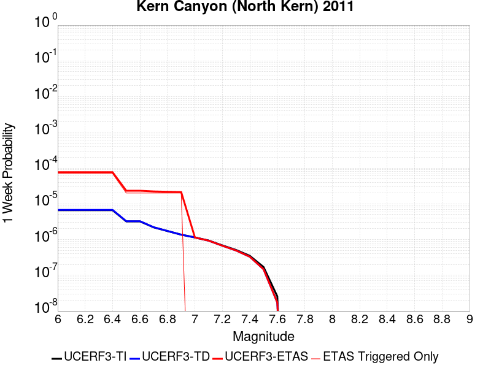 |  |  |  |

| Magnitude | 1 wk TI Prob | 1 wk TD Prob | 1 wk ETAS Prob | 1 wk ETAS/TD Gain | 1 wk ETAS Triggered Only | 1 mo TI Prob | 1 mo TD Prob | 1 mo ETAS Prob | 1 mo ETAS/TD Gain | 1 mo ETAS Triggered Only | 1 yr TI Prob | 1 yr TD Prob | 1 yr ETAS Prob | 1 yr ETAS/TD Gain | 1 yr ETAS Triggered Only | 10 yr TI Prob | 10 yr TD Prob | 10 yr ETAS Prob | 10 yr ETAS/TD Gain | 10 yr ETAS Triggered Only |
|-----|-----|-----|-----|-----|-----|-----|-----|-----|-----|-----|-----|-----|-----|-----|-----|-----|-----|-----|-----|-----|
| 6.0 | 6.6264497E-6 | 6.75733E-6 | 7.6756856E-5 | 11.359051 | 7.0E-5 | 2.8398761E-5 | 2.895971E-5 | 9.895768E-5 | 3.4170814 | 7.0E-5 | 3.4570007E-4 | 3.5253543E-4 | 4.6249665E-4 | 1.3119154 | 1.1E-4 | 0.0034516277 | 0.0035205502 | 0.0036899517 | 1.0481179 | 1.7E-4 |
| 6.1 | 6.6264497E-6 | 6.75733E-6 | 7.6756856E-5 | 11.359051 | 7.0E-5 | 2.8398761E-5 | 2.895971E-5 | 9.895768E-5 | 3.4170814 | 7.0E-5 | 3.4570007E-4 | 3.5253543E-4 | 4.6249665E-4 | 1.3119154 | 1.1E-4 | 0.0034516277 | 0.0035205502 | 0.0036899517 | 1.0481179 | 1.7E-4 |
| 6.2 | 6.6264497E-6 | 6.75733E-6 | 7.6756856E-5 | 11.359051 | 7.0E-5 | 2.8398761E-5 | 2.895971E-5 | 9.895768E-5 | 3.4170814 | 7.0E-5 | 3.4570007E-4 | 3.5253543E-4 | 4.6249665E-4 | 1.3119154 | 1.1E-4 | 0.0034516277 | 0.0035205502 | 0.0036899517 | 1.0481179 | 1.7E-4 |
| 6.3 | 6.6264497E-6 | 6.75733E-6 | 7.6756856E-5 | 11.359051 | 7.0E-5 | 2.8398761E-5 | 2.895971E-5 | 9.895768E-5 | 3.4170814 | 7.0E-5 | 3.4570007E-4 | 3.5253543E-4 | 4.6249665E-4 | 1.3119154 | 1.1E-4 | 0.0034516277 | 0.0035205502 | 0.0036899517 | 1.0481179 | 1.7E-4 |
| 6.4 | 6.6264497E-6 | 6.75733E-6 | 7.6756856E-5 | 11.359051 | 7.0E-5 | 2.8398761E-5 | 2.895971E-5 | 9.895768E-5 | 3.4170814 | 7.0E-5 | 3.4570007E-4 | 3.5253543E-4 | 4.6249665E-4 | 1.3119154 | 1.1E-4 | 0.0034516277 | 0.0035205502 | 0.0036899517 | 1.0481179 | 1.7E-4 |
| 6.5 | 3.2162225E-6 | 3.2570915E-6 | 2.3257026E-5 | 7.1404276 | 2.0E-5 | 1.3783738E-5 | 1.3958894E-5 | 3.3958615E-5 | 2.4327583 | 2.0E-5 | 1.6780409E-4 | 1.6993708E-4 | 2.1992858E-4 | 1.2941766 | 5.0E-5 | 0.0016767744 | 0.001698151 | 0.0017879982 | 1.0529088 | 9.0E-5 |
| 6.6 | 3.2162225E-6 | 3.2570915E-6 | 2.3257026E-5 | 7.1404276 | 2.0E-5 | 1.3783738E-5 | 1.3958894E-5 | 3.3958615E-5 | 2.4327583 | 2.0E-5 | 1.6780409E-4 | 1.6993708E-4 | 2.1992858E-4 | 1.2941766 | 5.0E-5 | 0.0016767744 | 0.001698151 | 0.0017879982 | 1.0529088 | 9.0E-5 |
| 6.7 | 2.1908265E-6 | 2.2071222E-6 | 2.2207078E-5 | 10.061553 | 2.0E-5 | 9.389223E-6 | 9.459062E-6 | 2.9458874E-5 | 3.1143546 | 2.0E-5 | 1.1430779E-4 | 1.1515819E-4 | 1.5515358E-4 | 1.3473083 | 4.0E-5 | 0.0011424901 | 0.0011510046 | 0.0012109355 | 1.0520684 | 6.0E-5 |
| 6.8 | 1.7303895E-6 | 1.736553E-6 | 2.1736518E-5 | 12.517049 | 2.0E-5 | 7.415934E-6 | 7.442349E-6 | 2.74422E-5 | 3.6873035 | 2.0E-5 | 9.028525E-5 | 9.060693E-5 | 1.3060331E-4 | 1.4414274 | 4.0E-5 | 9.024858E-4 | 9.0570963E-4 | 9.556644E-4 | 1.0551553 | 5.0E-5 |
| 6.9 | 1.3700314E-6 | 1.3688623E-6 | 2.1368834E-5 | 15.610653 | 2.0E-5 | 5.87155E-6 | 5.86654E-6 | 2.5866422E-5 | 4.4091444 | 2.0E-5 | 7.148377E-5 | 7.142283E-5 | 1.0142069E-4 | 1.4200038 | 3.0E-5 | 7.146078E-4 | 7.140033E-4 | 7.4398186E-4 | 1.0419866 | 3.0E-5 |
| 7.0 | 1.1467797E-6 | 1.1413805E-6 | 1.1413805E-6 | 1.0 | 0.0 | 4.9147607E-6 | 4.8916218E-6 | 4.8916218E-6 | 1.0 | 0.0 | 5.983557E-5 | 5.95539E-5 | 5.95539E-5 | 1.0 | 0.0 | 5.981946E-4 | 5.9538253E-4 | 5.9538253E-4 | 1.0 | 0.0 |
| 7.1 | 9.3952065E-7 | 9.3026915E-7 | 9.3026915E-7 | 1.0 | 0.0 | 4.026511E-6 | 3.986862E-6 | 3.986862E-6 | 1.0 | 0.0 | 4.9021666E-5 | 4.853898E-5 | 4.853898E-5 | 1.0 | 0.0 | 4.901085E-4 | 4.8528553E-4 | 4.8528553E-4 | 1.0 | 0.0 |
| 7.2 | 6.858055E-7 | 6.7193014E-7 | 6.7193014E-7 | 1.0 | 0.0 | 2.939163E-6 | 2.8796974E-6 | 2.8796974E-6 | 1.0 | 0.0 | 3.5783723E-5 | 3.5059762E-5 | 3.5059762E-5 | 1.0 | 0.0 | 3.5777962E-4 | 3.5054318E-4 | 3.5054318E-4 | 1.0 | 0.0 |
| 7.3 | 5.1101983E-7 | 4.939301E-7 | 4.939301E-7 | 1.0 | 0.0 | 2.1900833E-6 | 2.1168414E-6 | 2.1168414E-6 | 1.0 | 0.0 | 2.6663936E-5 | 2.5772246E-5 | 2.5772246E-5 | 1.0 | 0.0 | 2.6660739E-4 | 2.5769303E-4 | 2.5769303E-4 | 1.0 | 0.0 |
| 7.4 | 3.4999414E-7 | 3.2995916E-7 | 3.2995916E-7 | 1.0 | 0.0 | 1.499974E-6 | 1.4141099E-6 | 1.4141099E-6 | 1.0 | 0.0 | 1.8262032E-5 | 1.7216655E-5 | 1.7216655E-5 | 1.0 | 0.0 | 1.826053E-4 | 1.7215345E-4 | 1.7215345E-4 | 1.0 | 0.0 |
| 7.5 | 1.7021522E-7 | 1.4750053E-7 | 1.4750053E-7 | 1.0 | 0.0 | 7.2949354E-7 | 6.32145E-7 | 6.32145E-7 | 1.0 | 0.0 | 8.881548E-6 | 7.696339E-6 | 7.696339E-6 | 1.0 | 0.0 | 8.8811925E-5 | 7.696081E-5 | 7.696081E-5 | 1.0 | 0.0 |
| 7.6 | 2.572245E-8 | 1.735264E-8 | 1.735264E-8 | 1.0 | 0.0 | 1.10239064E-7 | 7.436845E-8 | 7.436845E-8 | 1.0 | 0.0 | 1.3421597E-6 | 9.0543557E-7 | 9.0543557E-7 | 1.0 | 0.0 | 1.3421517E-5 | 9.054324E-6 | 9.054324E-6 | 1.0 | 0.0 |

## Owens Valley
*[(top)](#table-of-contents)*

| 1 Week | 1 Month | 1 Year | 10 Year |
|-----|-----|-----|-----|
| 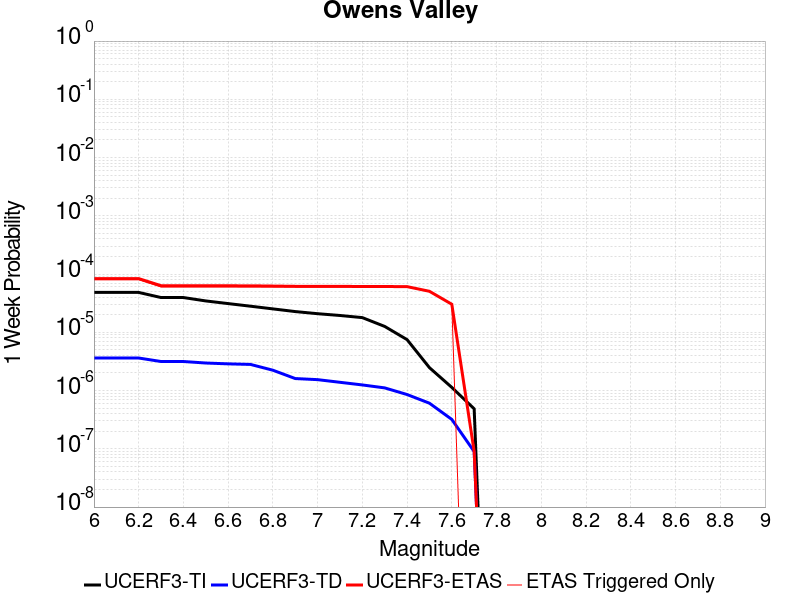 | 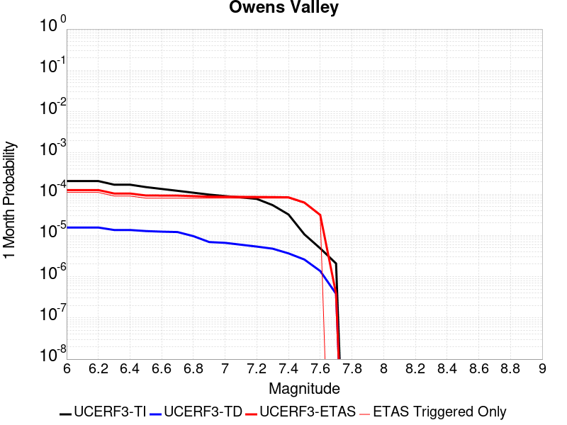 |  |  |

| Magnitude | 1 wk TI Prob | 1 wk TD Prob | 1 wk ETAS Prob | 1 wk ETAS/TD Gain | 1 wk ETAS Triggered Only | 1 mo TI Prob | 1 mo TD Prob | 1 mo ETAS Prob | 1 mo ETAS/TD Gain | 1 mo ETAS Triggered Only | 1 yr TI Prob | 1 yr TD Prob | 1 yr ETAS Prob | 1 yr ETAS/TD Gain | 1 yr ETAS Triggered Only | 10 yr TI Prob | 10 yr TD Prob | 10 yr ETAS Prob | 10 yr ETAS/TD Gain | 10 yr ETAS Triggered Only |
|-----|-----|-----|-----|-----|-----|-----|-----|-----|-----|-----|-----|-----|-----|-----|-----|-----|-----|-----|-----|-----|
| 6.0 | 4.83821E-5 | 3.6210524E-6 | 8.362076E-5 | 23.092945 | 8.0E-5 | 2.0733538E-4 | 1.551871E-5 | 1.25517E-4 | 8.088108 | 1.1E-4 | 0.002521386 | 1.889249E-4 | 3.1890033E-4 | 1.6879741 | 1.3E-4 | 0.024929691 | 0.0019297141 | 0.0020894054 | 1.0827538 | 1.6E-4 |
| 6.1 | 4.83821E-5 | 3.6210524E-6 | 8.362076E-5 | 23.092945 | 8.0E-5 | 2.0733538E-4 | 1.551871E-5 | 1.25517E-4 | 8.088108 | 1.1E-4 | 0.002521386 | 1.889249E-4 | 3.1890033E-4 | 1.6879741 | 1.3E-4 | 0.024929691 | 0.0019297141 | 0.0020894054 | 1.0827538 | 1.6E-4 |
| 6.2 | 4.83821E-5 | 3.6210524E-6 | 8.362076E-5 | 23.092945 | 8.0E-5 | 2.0733538E-4 | 1.551871E-5 | 1.25517E-4 | 8.088108 | 1.1E-4 | 0.002521386 | 1.889249E-4 | 3.1890033E-4 | 1.6879741 | 1.3E-4 | 0.024929691 | 0.0019297141 | 0.0020894054 | 1.0827538 | 1.6E-4 |
| 6.3 | 3.953008E-5 | 3.1530958E-6 | 6.3152904E-5 | 20.028856 | 6.0E-5 | 1.6940363E-4 | 1.3513202E-5 | 1.03511986E-4 | 7.6600633 | 9.0E-5 | 0.002060538 | 1.6451156E-4 | 2.7449345E-4 | 1.6685361 | 1.1E-4 | 0.020415364 | 0.0016621627 | 0.0017919467 | 1.0780814 | 1.3E-4 |
| 6.4 | 3.953008E-5 | 3.1530958E-6 | 6.3152904E-5 | 20.028856 | 6.0E-5 | 1.6940363E-4 | 1.3513202E-5 | 1.03511986E-4 | 7.6600633 | 9.0E-5 | 0.002060538 | 1.6451156E-4 | 2.7449345E-4 | 1.6685361 | 1.1E-4 | 0.020415364 | 0.0016621627 | 0.0017919467 | 1.0780814 | 1.3E-4 |
| 6.5 | 3.457342E-5 | 2.9707387E-6 | 6.297056E-5 | 21.196936 | 6.0E-5 | 1.4816338E-4 | 1.273168E-5 | 9.273066E-5 | 7.2834587 | 8.0E-5 | 0.0018023965 | 1.5499788E-4 | 2.5498238E-4 | 1.6450702 | 1.0E-4 | 0.017878477 | 0.0015563119 | 0.0016761251 | 1.0769854 | 1.2E-4 |
| 6.6 | 3.1127765E-5 | 2.8737306E-6 | 6.287356E-5 | 21.878723 | 6.0E-5 | 1.3339789E-4 | 1.2315934E-5 | 9.231495E-5 | 7.49557 | 8.0E-5 | 0.0016229092 | 1.4993687E-4 | 2.4992187E-4 | 1.6668473 | 1.0E-4 | 0.016111081 | 0.0015013438 | 0.0016211636 | 1.0798084 | 1.2E-4 |
| 6.7 | 2.806885E-5 | 2.8101606E-6 | 6.2809995E-5 | 22.351034 | 6.0E-5 | 1.2028952E-4 | 1.2043493E-5 | 9.204253E-5 | 7.642511 | 8.0E-5 | 0.001463541 | 1.4662035E-4 | 2.466057E-4 | 1.6819335 | 1.0E-4 | 0.014539397 | 0.0014656087 | 0.0015854328 | 1.0817572 | 1.2E-4 |
| 6.8 | 2.524524E-5 | 2.2351392E-6 | 6.2235005E-5 | 27.843906 | 6.0E-5 | 1.0818939E-4 | 9.579134E-6 | 8.957837E-5 | 9.351405 | 8.0E-5 | 0.0013164099 | 1.16620016E-4 | 2.1660836E-4 | 1.8573858 | 1.0E-4 | 0.01308639 | 0.001165827 | 0.0012756989 | 1.0942436 | 1.1E-4 |
| 6.9 | 2.2704568E-5 | 1.6079711E-6 | 6.1607876E-5 | 38.314045 | 6.0E-5 | 9.730166E-5 | 6.8912864E-6 | 8.689074E-5 | 12.608783 | 8.0E-5 | 0.0011840039 | 8.38982E-5 | 1.838898E-4 | 2.1918206 | 1.0E-4 | 0.011777153 | 8.38853E-4 | 9.487608E-4 | 1.1310214 | 1.1E-4 |
| 7.0 | 2.0871712E-5 | 1.5393621E-6 | 6.153927E-5 | 39.977123 | 6.0E-5 | 8.944713E-5 | 6.5972495E-6 | 8.659672E-5 | 13.126185 | 8.0E-5 | 0.0010884746 | 8.031857E-5 | 1.8031054E-4 | 2.2449422 | 1.0E-4 | 0.010831586 | 8.030395E-4 | 9.129512E-4 | 1.1368695 | 1.1E-4 |
| 7.1 | 1.944928E-5 | 1.3862556E-6 | 6.138617E-5 | 44.282 | 6.0E-5 | 8.335139E-5 | 5.941082E-6 | 8.594061E-5 | 14.465481 | 8.0E-5 | 0.0010143308 | 7.233028E-5 | 1.7232305E-4 | 2.3824468 | 1.0E-4 | 0.010097133 | 7.2319806E-4 | 8.331185E-4 | 1.1519922 | 1.1E-4 |
| 7.2 | 1.7876306E-5 | 1.2487686E-6 | 6.124869E-5 | 49.04727 | 6.0E-5 | 7.6610486E-5 | 5.3518543E-6 | 8.535143E-5 | 15.9480095 | 8.0E-5 | 9.3233347E-4 | 6.515689E-5 | 1.6515037E-4 | 2.5346572 | 1.0E-4 | 0.009284316 | 6.5148395E-4 | 7.6141226E-4 | 1.1687353 | 1.1E-4 |
| 7.3 | 1.2618672E-5 | 1.1113839E-6 | 6.1111314E-5 | 54.986687 | 6.0E-5 | 5.40789E-5 | 4.763065E-6 | 8.476269E-5 | 17.795826 | 8.0E-5 | 6.582117E-4 | 5.7988782E-5 | 1.5798298E-4 | 2.7243714 | 1.0E-4 | 0.0065626553 | 5.7983754E-4 | 6.8977376E-4 | 1.1895983 | 1.1E-4 |
| 7.4 | 7.4874442E-6 | 8.547518E-7 | 6.08547E-5 | 71.195755 | 6.0E-5 | 3.208865E-5 | 3.6632168E-6 | 8.3662926E-5 | 22.83865 | 8.0E-5 | 3.906093E-4 | 4.4598757E-5 | 1.4459429E-4 | 3.242115 | 1.0E-4 | 0.003899234 | 4.459579E-4 | 5.5590883E-4 | 1.2465501 | 1.1E-4 |
| 7.5 | 2.4734156E-6 | 6.0679935E-7 | 5.060677E-5 | 83.399506 | 5.0E-5 | 1.060031E-5 | 2.6005662E-6 | 6.260041E-5 | 24.071838 | 6.0E-5 | 1.2905113E-4 | 3.1661435E-5 | 1.11658905E-4 | 3.526653 | 8.0E-5 | 0.0012897621 | 3.1656958E-4 | 3.9654426E-4 | 1.252629 | 8.0E-5 |
| 7.6 | 1.1328841E-6 | 3.1961991E-7 | 3.031961E-5 | 94.86145 | 3.0E-5 | 4.8552088E-6 | 1.369799E-6 | 3.1369756E-5 | 22.900993 | 3.0E-5 | 5.9110564E-5 | 1.6677177E-5 | 6.6676344E-5 | 3.9980593 | 5.0E-5 | 5.9094845E-4 | 1.6675945E-4 | 2.167511E-4 | 1.2997831 | 5.0E-5 |
| 7.7 | 4.8613185E-7 | 8.962742E-8 | 8.962742E-8 | 1.0 | 0.0 | 2.0834207E-6 | 3.8411747E-7 | 3.8411747E-7 | 1.0 | 0.0 | 2.536535E-5 | 4.676621E-6 | 4.676621E-6 | 1.0 | 0.0 | 2.5362454E-4 | 4.676529E-5 | 4.676529E-5 | 1.0 | 0.0 |

## San Andreas (North Branch Mill Creek)
*[(top)](#table-of-contents)*

| 1 Week | 1 Month | 1 Year | 10 Year |
|-----|-----|-----|-----|
| 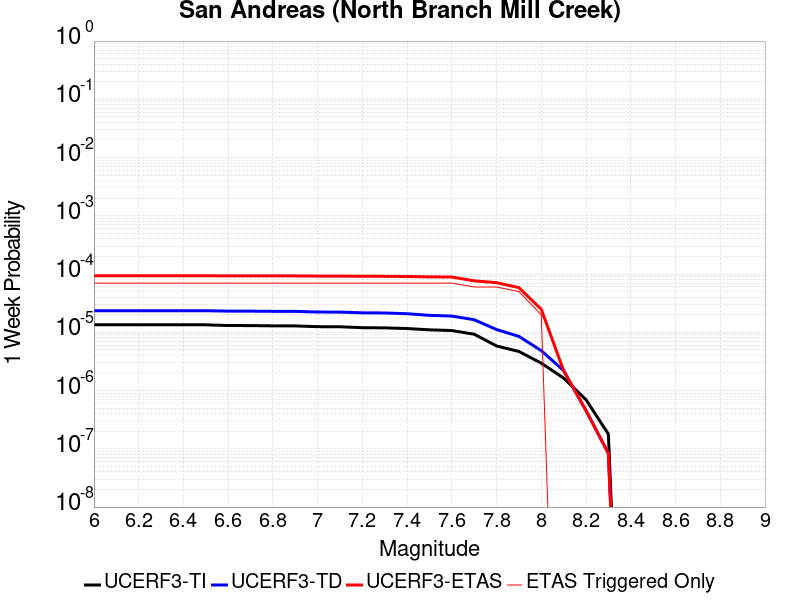 | 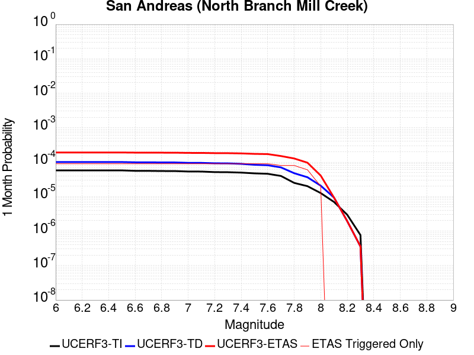 |  |  |

| Magnitude | 1 wk TI Prob | 1 wk TD Prob | 1 wk ETAS Prob | 1 wk ETAS/TD Gain | 1 wk ETAS Triggered Only | 1 mo TI Prob | 1 mo TD Prob | 1 mo ETAS Prob | 1 mo ETAS/TD Gain | 1 mo ETAS Triggered Only | 1 yr TI Prob | 1 yr TD Prob | 1 yr ETAS Prob | 1 yr ETAS/TD Gain | 1 yr ETAS Triggered Only | 10 yr TI Prob | 10 yr TD Prob | 10 yr ETAS Prob | 10 yr ETAS/TD Gain | 10 yr ETAS Triggered Only |
|-----|-----|-----|-----|-----|-----|-----|-----|-----|-----|-----|-----|-----|-----|-----|-----|-----|-----|-----|-----|-----|
| 6.0 | 1.3461156E-5 | 2.3500992E-5 | 9.3499344E-5 | 3.9785278 | 7.0E-5 | 5.7689394E-5 | 1.00714664E-4 | 1.907056E-4 | 1.8935237 | 9.0E-5 | 7.02142E-4 | 0.0012255146 | 0.0013553553 | 1.1059479 | 1.3E-4 | 0.0069992766 | 0.012228743 | 0.012386787 | 1.012924 | 1.6E-4 |
| 6.1 | 1.3461156E-5 | 2.3500992E-5 | 9.3499344E-5 | 3.9785278 | 7.0E-5 | 5.7689394E-5 | 1.00714664E-4 | 1.907056E-4 | 1.8935237 | 9.0E-5 | 7.02142E-4 | 0.0012255146 | 0.0013553553 | 1.1059479 | 1.3E-4 | 0.0069992766 | 0.012228743 | 0.012386787 | 1.012924 | 1.6E-4 |
| 6.2 | 1.3461156E-5 | 2.3500992E-5 | 9.3499344E-5 | 3.9785278 | 7.0E-5 | 5.7689394E-5 | 1.00714664E-4 | 1.907056E-4 | 1.8935237 | 9.0E-5 | 7.02142E-4 | 0.0012255146 | 0.0013553553 | 1.1059479 | 1.3E-4 | 0.0069992766 | 0.012228743 | 0.012386787 | 1.012924 | 1.6E-4 |
| 6.3 | 1.3461156E-5 | 2.3500992E-5 | 9.3499344E-5 | 3.9785278 | 7.0E-5 | 5.7689394E-5 | 1.00714664E-4 | 1.907056E-4 | 1.8935237 | 9.0E-5 | 7.02142E-4 | 0.0012255146 | 0.0013553553 | 1.1059479 | 1.3E-4 | 0.0069992766 | 0.012228743 | 0.012386787 | 1.012924 | 1.6E-4 |
| 6.4 | 1.3461156E-5 | 2.3500992E-5 | 9.3499344E-5 | 3.9785278 | 7.0E-5 | 5.7689394E-5 | 1.00714664E-4 | 1.907056E-4 | 1.8935237 | 9.0E-5 | 7.02142E-4 | 0.0012255146 | 0.0013553553 | 1.1059479 | 1.3E-4 | 0.0069992766 | 0.012228743 | 0.012386787 | 1.012924 | 1.6E-4 |
| 6.5 | 1.3450706E-5 | 2.348995E-5 | 9.348831E-5 | 3.9799275 | 7.0E-5 | 5.764461E-5 | 1.00667356E-4 | 1.9065829E-4 | 1.8939437 | 9.0E-5 | 7.0159714E-4 | 0.0012249392 | 0.00135478 | 1.1059977 | 1.3E-4 | 0.006993862 | 0.012223053 | 0.012381097 | 1.01293 | 1.6E-4 |
| 6.6 | 1.3074523E-5 | 2.3104236E-5 | 9.3102615E-5 | 4.0296774 | 7.0E-5 | 5.6032466E-5 | 9.901441E-5 | 1.890055E-4 | 1.9088686 | 9.0E-5 | 6.8198174E-4 | 0.001204837 | 0.0013346804 | 1.1077684 | 1.3E-4 | 0.006798926 | 0.012024218 | 0.012182294 | 1.0131465 | 1.6E-4 |
| 6.7 | 1.3050216E-5 | 2.3079532E-5 | 9.307791E-5 | 4.0329204 | 7.0E-5 | 5.59283E-5 | 9.890855E-5 | 1.8889965E-4 | 1.9098414 | 9.0E-5 | 6.8071426E-4 | 0.0012035496 | 0.0013333932 | 1.1078838 | 1.3E-4 | 0.0067863287 | 0.012011483 | 0.012169561 | 1.0131606 | 1.6E-4 |
| 6.8 | 1.29049395E-5 | 2.2927941E-5 | 9.292633E-5 | 4.0529737 | 7.0E-5 | 5.530571E-5 | 9.825892E-5 | 1.8825008E-4 | 1.9158574 | 9.0E-5 | 6.73139E-4 | 0.001195649 | 0.0013254936 | 1.1085975 | 1.3E-4 | 0.0067110364 | 0.011933328 | 0.012091419 | 1.0132478 | 1.6E-4 |
| 6.9 | 1.2867369E-5 | 2.2887343E-5 | 9.288574E-5 | 4.058389 | 7.0E-5 | 5.51447E-5 | 9.808494E-5 | 1.8807611E-4 | 1.917482 | 9.0E-5 | 6.711799E-4 | 0.0011935332 | 0.0013233781 | 1.1087903 | 1.3E-4 | 0.006691564 | 0.011912397 | 0.012070491 | 1.0132713 | 1.6E-4 |
| 7.0 | 1.2495996E-5 | 2.2287419E-5 | 9.228586E-5 | 4.140715 | 7.0E-5 | 5.3553173E-5 | 9.551403E-5 | 1.8550543E-4 | 1.9421799 | 9.0E-5 | 6.518148E-4 | 0.0011622658 | 0.0012921147 | 1.1117204 | 1.3E-4 | 0.0064990623 | 0.011603 | 0.011761143 | 1.0136296 | 1.6E-4 |
| 7.1 | 1.2452067E-5 | 2.2232492E-5 | 9.2230934E-5 | 4.148475 | 7.0E-5 | 5.3364907E-5 | 9.527864E-5 | 1.8527007E-4 | 1.9445078 | 9.0E-5 | 6.4952404E-4 | 0.001159403 | 0.0012892523 | 1.1119967 | 1.3E-4 | 0.0064762887 | 0.01157467 | 0.011732819 | 1.0136633 | 1.6E-4 |
| 7.2 | 1.2002777E-5 | 2.1611015E-5 | 9.16095E-5 | 4.239019 | 7.0E-5 | 5.143946E-5 | 9.261536E-5 | 1.8260702E-4 | 1.9716711 | 9.0E-5 | 6.2609545E-4 | 0.0011270114 | 0.0012568649 | 1.1152194 | 1.3E-4 | 0.006243344 | 0.011254057 | 0.011412256 | 1.014057 | 1.6E-4 |
| 7.3 | 1.1923425E-5 | 2.1480853E-5 | 9.147935E-5 | 4.258646 | 7.0E-5 | 5.109939E-5 | 9.205757E-5 | 1.8204929E-4 | 1.9775591 | 9.0E-5 | 6.219575E-4 | 0.0011202273 | 0.0012500817 | 1.1159179 | 1.3E-4 | 0.0062021962 | 0.011186944 | 0.011345155 | 1.0141424 | 1.6E-4 |
| 7.4 | 1.16105175E-5 | 2.0854808E-5 | 9.085335E-5 | 4.35647 | 7.0E-5 | 4.975841E-5 | 8.93747E-5 | 1.7936666E-4 | 2.0069065 | 9.0E-5 | 6.0564023E-4 | 0.0010875963 | 0.0012174549 | 1.1193997 | 1.3E-4 | 0.006039923 | 0.010864409 | 0.01102267 | 1.014567 | 1.6E-4 |
| 7.5 | 1.1037265E-5 | 1.9554842E-5 | 8.9553476E-5 | 4.579606 | 7.0E-5 | 4.7301706E-5 | 8.380379E-5 | 1.7379624E-4 | 2.073847 | 9.0E-5 | 5.757461E-4 | 0.0010198357 | 0.0011497032 | 1.1273415 | 1.3E-4 | 0.005742567 | 0.010195527 | 0.010353896 | 1.0155332 | 1.6E-4 |
| 7.6 | 1.0720915E-5 | 1.8996727E-5 | 8.8995395E-5 | 4.6847754 | 7.0E-5 | 4.5945973E-5 | 8.141202E-5 | 1.714047E-4 | 2.105398 | 9.0E-5 | 5.592486E-4 | 9.907428E-4 | 0.001120614 | 1.1310847 | 1.3E-4 | 0.005578433 | 0.009907238 | 0.010065652 | 1.0159898 | 1.6E-4 |
| 7.7 | 9.276279E-6 | 1.6442464E-5 | 7.644148E-5 | 4.6490283 | 6.0E-5 | 3.9754876E-5 | 7.046581E-5 | 1.5046017E-4 | 2.1352224 | 8.0E-5 | 4.839081E-4 | 8.5758517E-4 | 9.774823E-4 | 1.1398078 | 1.2E-4 | 0.0048285574 | 0.008586575 | 0.008735287 | 1.0173191 | 1.5E-4 |
| 7.8 | 5.8346777E-6 | 1.11555855E-5 | 7.1154915E-5 | 6.378412 | 6.0E-5 | 2.5005522E-5 | 4.7808775E-5 | 1.2780495E-4 | 2.673253 | 8.0E-5 | 3.043997E-4 | 5.819165E-4 | 7.018467E-4 | 1.2060951 | 1.2E-4 | 0.0030398308 | 0.0058473325 | 0.0059964554 | 1.0255027 | 1.5E-4 |
| 7.9 | 4.690204E-6 | 8.509473E-6 | 5.850905E-5 | 6.875754 | 5.0E-5 | 2.0100719E-5 | 3.6468664E-5 | 9.646647E-5 | 2.645188 | 6.0E-5 | 2.4469878E-4 | 4.439156E-4 | 5.238801E-4 | 1.1801344 | 8.0E-5 | 0.002444295 | 0.004471164 | 0.0045806724 | 1.0244921 | 1.1E-4 |
| 8.0 | 2.9570454E-6 | 4.8470656E-6 | 2.484697E-5 | 5.126188 | 2.0E-5 | 1.267299E-5 | 2.0772974E-5 | 4.0772557E-5 | 1.9627695 | 2.0E-5 | 1.5428272E-4 | 2.5288164E-4 | 2.8287404E-4 | 1.1186026 | 3.0E-5 | 0.0015417566 | 0.0025499314 | 0.002599804 | 1.0195584 | 5.0E-5 |
| 8.1 | 1.6376824E-6 | 2.1968672E-6 | 2.1968672E-6 | 1.0 | 0.0 | 7.01862E-6 | 9.415111E-6 | 9.415111E-6 | 1.0 | 0.0 | 8.544835E-5 | 1.1462297E-4 | 1.1462297E-4 | 1.0 | 0.0 | 8.54155E-4 | 0.0011607445 | 0.0011607445 | 1.0 | 0.0 |
| 8.2 | 6.9631557E-7 | 4.535001E-7 | 4.535001E-7 | 1.0 | 0.0 | 2.984206E-6 | 1.9435704E-6 | 1.9435704E-6 | 1.0 | 0.0 | 3.63321E-5 | 2.3662713E-5 | 2.3662713E-5 | 1.0 | 0.0 | 3.6326164E-4 | 2.4510184E-4 | 2.4510184E-4 | 1.0 | 0.0 |
| 8.3 | 1.7876137E-7 | 8.357368E-8 | 8.357368E-8 | 1.0 | 0.0 | 7.661199E-7 | 3.5817288E-7 | 3.5817288E-7 | 1.0 | 0.0 | 9.32747E-6 | 4.3607465E-6 | 4.3607465E-6 | 1.0 | 0.0 | 9.3270784E-5 | 4.5800018E-5 | 4.5800018E-5 | 1.0 | 0.0 |

## Santa Ynez (East)
*[(top)](#table-of-contents)*

| 1 Week | 1 Month | 1 Year | 10 Year |
|-----|-----|-----|-----|
| 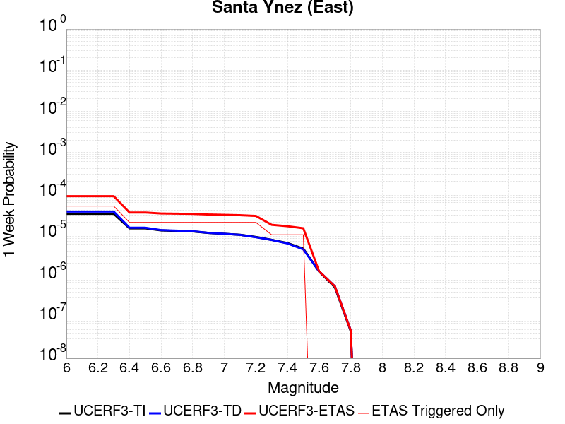 | 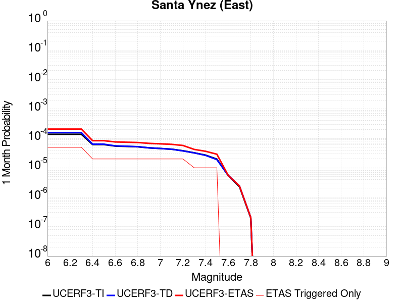 |  |  |

| Magnitude | 1 wk TI Prob | 1 wk TD Prob | 1 wk ETAS Prob | 1 wk ETAS/TD Gain | 1 wk ETAS Triggered Only | 1 mo TI Prob | 1 mo TD Prob | 1 mo ETAS Prob | 1 mo ETAS/TD Gain | 1 mo ETAS Triggered Only | 1 yr TI Prob | 1 yr TD Prob | 1 yr ETAS Prob | 1 yr ETAS/TD Gain | 1 yr ETAS Triggered Only | 10 yr TI Prob | 10 yr TD Prob | 10 yr ETAS Prob | 10 yr ETAS/TD Gain | 10 yr ETAS Triggered Only |
|-----|-----|-----|-----|-----|-----|-----|-----|-----|-----|-----|-----|-----|-----|-----|-----|-----|-----|-----|-----|-----|
| 6.0 | 3.2269712E-5 | 3.6750775E-5 | 8.6748936E-5 | 2.3604655 | 5.0E-5 | 1.3829143E-4 | 1.5749714E-4 | 2.0748925E-4 | 1.3174161 | 5.0E-5 | 0.0016823979 | 0.0019164253 | 0.0020361952 | 1.0624965 | 1.2E-4 | 0.016697178 | 0.019056438 | 0.01919377 | 1.0072066 | 1.4E-4 |
| 6.1 | 3.2269712E-5 | 3.6750775E-5 | 8.6748936E-5 | 2.3604655 | 5.0E-5 | 1.3829143E-4 | 1.5749714E-4 | 2.0748925E-4 | 1.3174161 | 5.0E-5 | 0.0016823979 | 0.0019164253 | 0.0020361952 | 1.0624965 | 1.2E-4 | 0.016697178 | 0.019056438 | 0.01919377 | 1.0072066 | 1.4E-4 |
| 6.2 | 3.2269712E-5 | 3.6750775E-5 | 8.6748936E-5 | 2.3604655 | 5.0E-5 | 1.3829143E-4 | 1.5749714E-4 | 2.0748925E-4 | 1.3174161 | 5.0E-5 | 0.0016823979 | 0.0019164253 | 0.0020361952 | 1.0624965 | 1.2E-4 | 0.016697178 | 0.019056438 | 0.01919377 | 1.0072066 | 1.4E-4 |
| 6.3 | 3.2269712E-5 | 3.6750775E-5 | 8.6748936E-5 | 2.3604655 | 5.0E-5 | 1.3829143E-4 | 1.5749714E-4 | 2.0748925E-4 | 1.3174161 | 5.0E-5 | 0.0016823979 | 0.0019164253 | 0.0020361952 | 1.0624965 | 1.2E-4 | 0.016697178 | 0.019056438 | 0.01919377 | 1.0072066 | 1.4E-4 |
| 6.4 | 1.4404779E-5 | 1.48492945E-5 | 3.4848996E-5 | 2.3468454 | 2.0E-5 | 6.1733306E-5 | 6.363831E-5 | 8.363704E-5 | 1.3142561 | 2.0E-5 | 7.513438E-4 | 7.7452604E-4 | 8.2448736E-4 | 1.0645056 | 5.0E-5 | 0.0074880854 | 0.007718817 | 0.0077783535 | 1.0077132 | 6.0E-5 |
| 6.5 | 1.4404779E-5 | 1.48492945E-5 | 3.4848996E-5 | 2.3468454 | 2.0E-5 | 6.1733306E-5 | 6.363831E-5 | 8.363704E-5 | 1.3142561 | 2.0E-5 | 7.513438E-4 | 7.7452604E-4 | 8.2448736E-4 | 1.0645056 | 5.0E-5 | 0.0074880854 | 0.007718817 | 0.0077783535 | 1.0077132 | 6.0E-5 |
| 6.6 | 1.280208E-5 | 1.301186E-5 | 3.3011598E-5 | 2.5370393 | 2.0E-5 | 5.4864904E-5 | 5.5763932E-5 | 7.5762815E-5 | 1.3586348 | 2.0E-5 | 6.6777546E-4 | 6.7871617E-4 | 7.18689E-4 | 1.0588948 | 4.0E-5 | 0.006657724 | 0.0067666434 | 0.0068163048 | 1.0073392 | 5.0E-5 |
| 6.7 | 1.2457027E-5 | 1.262838E-5 | 3.2628126E-5 | 2.5837145 | 2.0E-5 | 5.3386164E-5 | 5.4120515E-5 | 7.411943E-5 | 1.3695257 | 2.0E-5 | 6.497827E-4 | 6.5871974E-4 | 6.986934E-4 | 1.0606838 | 4.0E-5 | 0.00647886 | 0.00656787 | 0.0066175414 | 1.0075629 | 5.0E-5 |
| 6.8 | 1.2095134E-5 | 1.2230827E-5 | 3.2230582E-5 | 2.6351924 | 2.0E-5 | 5.1835254E-5 | 5.2416784E-5 | 7.2415736E-5 | 1.3815372 | 2.0E-5 | 6.309115E-4 | 6.3798914E-4 | 6.779636E-4 | 1.062657 | 4.0E-5 | 0.0062912325 | 0.006361764 | 0.006411446 | 1.0078094 | 5.0E-5 |
| 6.9 | 1.1104036E-5 | 1.115726E-5 | 3.1157037E-5 | 2.7925348 | 2.0E-5 | 4.758786E-5 | 4.781596E-5 | 6.7815E-5 | 1.4182504 | 2.0E-5 | 5.7922816E-4 | 5.82005E-4 | 6.119876E-4 | 1.0515159 | 3.0E-5 | 0.005777207 | 0.0058049536 | 0.0058447216 | 1.0068507 | 4.0E-5 |
| 7.0 | 1.0577444E-5 | 1.05815925E-5 | 3.058138E-5 | 2.8900547 | 2.0E-5 | 4.5331115E-5 | 4.53489E-5 | 6.5347995E-5 | 1.441005 | 2.0E-5 | 5.5176654E-4 | 5.5198424E-4 | 5.8196764E-4 | 1.0543194 | 3.0E-5 | 0.0055039856 | 0.00550627 | 0.0055460497 | 1.0072244 | 4.0E-5 |
| 7.1 | 1.0021775E-5 | 9.9809E-6 | 2.99807E-5 | 3.0038073 | 2.0E-5 | 4.294976E-5 | 4.277459E-5 | 6.277374E-5 | 1.4675473 | 2.0E-5 | 5.2278786E-4 | 5.206574E-4 | 5.506418E-4 | 1.0575894 | 3.0E-5 | 0.0052155964 | 0.005194508 | 0.0052343006 | 1.0076604 | 4.0E-5 |
| 7.2 | 8.874109E-6 | 8.748706E-6 | 2.874853E-5 | 3.2860322 | 2.0E-5 | 3.8031343E-5 | 3.7493923E-5 | 5.7493173E-5 | 1.5333998 | 2.0E-5 | 4.629332E-4 | 4.56394E-4 | 4.863803E-4 | 1.0657027 | 3.0E-5 | 0.0046197 | 0.0045546847 | 0.004594503 | 1.0087422 | 4.0E-5 |
| 7.3 | 7.5504267E-6 | 7.5050243E-6 | 1.750495E-5 | 2.3324308 | 1.0E-5 | 3.235857E-5 | 3.2164E-5 | 4.2163676E-5 | 1.3108966 | 1.0E-5 | 3.9389438E-4 | 3.9152734E-4 | 4.1151952E-4 | 1.051062 | 2.0E-5 | 0.0039319694 | 0.0039084824 | 0.0039383653 | 1.0076456 | 3.0E-5 |
| 7.4 | 6.309394E-6 | 6.183062E-6 | 1.6183E-5 | 2.6173117 | 1.0E-5 | 2.703998E-5 | 2.6498574E-5 | 3.649831E-5 | 1.3773688 | 1.0E-5 | 3.2916202E-4 | 3.2257332E-4 | 3.325701E-4 | 1.0309907 | 1.0E-5 | 0.003286749 | 0.0032211484 | 0.003231116 | 1.0030944 | 1.0E-5 |
| 7.5 | 4.6103073E-6 | 4.4408016E-6 | 1.4440757E-5 | 3.2518356 | 1.0E-5 | 1.975831E-5 | 1.9031871E-5 | 2.9031682E-5 | 1.5254244 | 1.0E-5 | 2.4053088E-4 | 2.316891E-4 | 2.4168678E-4 | 1.0431513 | 1.0E-5 | 0.002402707 | 0.002314545 | 0.0023245218 | 1.0043105 | 1.0E-5 |
| 7.6 | 1.2858658E-6 | 1.3008196E-6 | 1.3008196E-6 | 1.0 | 0.0 | 5.5108417E-6 | 5.574929E-6 | 5.574929E-6 | 1.0 | 0.0 | 6.7092435E-5 | 6.787272E-5 | 6.787272E-5 | 1.0 | 0.0 | 6.707218E-4 | 6.7852676E-4 | 6.7852676E-4 | 1.0 | 0.0 |
| 7.7 | 5.3302307E-7 | 5.612138E-7 | 5.612138E-7 | 1.0 | 0.0 | 2.2843826E-6 | 2.4052001E-6 | 2.4052001E-6 | 1.0 | 0.0 | 2.7812002E-5 | 2.9282955E-5 | 2.9282955E-5 | 1.0 | 0.0 | 2.7808524E-4 | 2.9279455E-4 | 2.9279455E-4 | 1.0 | 0.0 |
| 7.8 | 4.613933E-8 | 4.80301E-8 | 4.80301E-8 | 1.0 | 0.0 | 1.9773998E-7 | 2.0584326E-7 | 2.0584326E-7 | 1.0 | 0.0 | 2.4074816E-6 | 2.5061388E-6 | 2.5061388E-6 | 1.0 | 0.0 | 2.4074554E-5 | 2.5061116E-5 | 2.5061116E-5 | 1.0 | 0.0 |

## Lost Hills
*[(top)](#table-of-contents)*

| 1 Week | 1 Month | 1 Year | 10 Year |
|-----|-----|-----|-----|
|  |  |  | 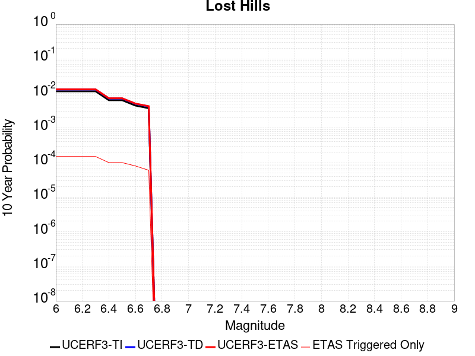 |

| Magnitude | 1 wk TI Prob | 1 wk TD Prob | 1 wk ETAS Prob | 1 wk ETAS/TD Gain | 1 wk ETAS Triggered Only | 1 mo TI Prob | 1 mo TD Prob | 1 mo ETAS Prob | 1 mo ETAS/TD Gain | 1 mo ETAS Triggered Only | 1 yr TI Prob | 1 yr TD Prob | 1 yr ETAS Prob | 1 yr ETAS/TD Gain | 1 yr ETAS Triggered Only | 10 yr TI Prob | 10 yr TD Prob | 10 yr ETAS Prob | 10 yr ETAS/TD Gain | 10 yr ETAS Triggered Only |
|-----|-----|-----|-----|-----|-----|-----|-----|-----|-----|-----|-----|-----|-----|-----|-----|-----|-----|-----|-----|-----|
| 6.0 | 2.233523E-5 | 2.5106583E-5 | 7.510533E-5 | 2.9914596 | 5.0E-5 | 9.571891E-5 | 1.0759615E-4 | 1.8758755E-4 | 1.743441 | 8.0E-5 | 0.0011647546 | 0.001309364 | 0.0014092331 | 1.076273 | 1.0E-4 | 0.011586686 | 0.013033091 | 0.013181136 | 1.0113592 | 1.5E-4 |
| 6.1 | 2.233523E-5 | 2.5106583E-5 | 7.510533E-5 | 2.9914596 | 5.0E-5 | 9.571891E-5 | 1.0759615E-4 | 1.8758755E-4 | 1.743441 | 8.0E-5 | 0.0011647546 | 0.001309364 | 0.0014092331 | 1.076273 | 1.0E-4 | 0.011586686 | 0.013033091 | 0.013181136 | 1.0113592 | 1.5E-4 |
| 6.2 | 2.233523E-5 | 2.5106583E-5 | 7.510533E-5 | 2.9914596 | 5.0E-5 | 9.571891E-5 | 1.0759615E-4 | 1.8758755E-4 | 1.743441 | 8.0E-5 | 0.0011647546 | 0.001309364 | 0.0014092331 | 1.076273 | 1.0E-4 | 0.011586686 | 0.013033091 | 0.013181136 | 1.0113592 | 1.5E-4 |
| 6.3 | 2.233523E-5 | 2.5106583E-5 | 7.510533E-5 | 2.9914596 | 5.0E-5 | 9.571891E-5 | 1.0759615E-4 | 1.8758755E-4 | 1.743441 | 8.0E-5 | 0.0011647546 | 0.001309364 | 0.0014092331 | 1.076273 | 1.0E-4 | 0.011586686 | 0.013033091 | 0.013181136 | 1.0113592 | 1.5E-4 |
| 6.4 | 1.2288092E-5 | 1.3781108E-5 | 4.3780696E-5 | 3.1768632 | 3.0E-5 | 5.2662188E-5 | 5.906108E-5 | 1.19057535E-4 | 2.0158374 | 6.0E-5 | 6.409735E-4 | 7.189252E-4 | 7.988677E-4 | 1.1111972 | 8.0E-5 | 0.006391279 | 0.0071752006 | 0.0072744833 | 1.0138369 | 1.0E-4 |
| 6.5 | 1.2288092E-5 | 1.3781108E-5 | 4.3780696E-5 | 3.1768632 | 3.0E-5 | 5.2662188E-5 | 5.906108E-5 | 1.19057535E-4 | 2.0158374 | 6.0E-5 | 6.409735E-4 | 7.189252E-4 | 7.988677E-4 | 1.1111972 | 8.0E-5 | 0.006391279 | 0.0071752006 | 0.0072744833 | 1.0138369 | 1.0E-4 |
| 6.6 | 8.58281E-6 | 9.63377E-6 | 3.963348E-5 | 4.1140156 | 3.0E-5 | 3.6782953E-5 | 4.12874E-5 | 9.1285336E-5 | 2.2109733 | 5.0E-5 | 4.4774043E-4 | 5.026414E-4 | 5.726062E-4 | 1.1391943 | 7.0E-5 | 0.0044683935 | 0.005023205 | 0.0051028035 | 1.0158461 | 8.0E-5 |
| 6.7 | 7.205685E-6 | 8.088302E-6 | 2.808814E-5 | 3.472687 | 2.0E-5 | 3.088114E-5 | 3.466415E-5 | 6.466311E-5 | 1.8654175 | 3.0E-5 | 3.7591302E-4 | 4.2203604E-4 | 4.7201492E-4 | 1.1184233 | 5.0E-5 | 0.0037527776 | 0.0042203604 | 0.004280107 | 1.0141568 | 6.0E-5 |

## Rose Canyon
*[(top)](#table-of-contents)*

| 1 Week | 1 Month | 1 Year | 10 Year |
|-----|-----|-----|-----|
|  |  |  |  |

| Magnitude | 1 wk TI Prob | 1 wk TD Prob | 1 wk ETAS Prob | 1 wk ETAS/TD Gain | 1 wk ETAS Triggered Only | 1 mo TI Prob | 1 mo TD Prob | 1 mo ETAS Prob | 1 mo ETAS/TD Gain | 1 mo ETAS Triggered Only | 1 yr TI Prob | 1 yr TD Prob | 1 yr ETAS Prob | 1 yr ETAS/TD Gain | 1 yr ETAS Triggered Only | 10 yr TI Prob | 10 yr TD Prob | 10 yr ETAS Prob | 10 yr ETAS/TD Gain | 10 yr ETAS Triggered Only |
|-----|-----|-----|-----|-----|-----|-----|-----|-----|-----|-----|-----|-----|-----|-----|-----|-----|-----|-----|-----|-----|
| 6.0 | 4.5923203E-5 | 4.9714607E-5 | 7.9713114E-5 | 1.6034144 | 3.0E-5 | 1.9679888E-4 | 2.1304654E-4 | 2.7303377E-4 | 1.2815686 | 6.0E-5 | 0.0023933933 | 0.0025909478 | 0.0026906887 | 1.0384959 | 1.0E-4 | 0.023677798 | 0.025618518 | 0.025735443 | 1.0045642 | 1.2E-4 |
| 6.1 | 4.5923203E-5 | 4.9714607E-5 | 5.9714108E-5 | 1.2011381 | 1.0E-5 | 1.9679888E-4 | 2.1304654E-4 | 2.3304229E-4 | 1.0938562 | 2.0E-5 | 0.0023933933 | 0.0025909478 | 0.0026408182 | 1.019248 | 5.0E-5 | 0.023677798 | 0.025618518 | 0.025667237 | 1.0019017 | 5.0E-5 |
| 6.2 | 2.8844734E-5 | 2.9669678E-5 | 3.9669383E-5 | 1.3370345 | 1.0E-5 | 1.2361443E-4 | 1.2714976E-4 | 1.4714722E-4 | 1.1572748 | 2.0E-5 | 0.0015039665 | 0.001546976 | 0.0015968988 | 1.0322711 | 5.0E-5 | 0.0149382865 | 0.015364873 | 0.015414105 | 1.0032042 | 5.0E-5 |
| 6.3 | 2.3171577E-5 | 2.3162425E-5 | 3.3162192E-5 | 1.4317237 | 1.0E-5 | 9.9302975E-5 | 9.926383E-5 | 1.19261844E-4 | 1.2014632 | 2.0E-5 | 0.0012083431 | 0.0012078804 | 0.0012478321 | 1.0330758 | 4.0E-5 | 0.012017938 | 0.012012152 | 0.012051672 | 1.0032899 | 4.0E-5 |
| 6.4 | 2.0066604E-5 | 1.9668067E-5 | 2.966787E-5 | 1.5084283 | 1.0E-5 | 8.599689E-5 | 8.428905E-5 | 1.0428736E-4 | 1.2372588 | 2.0E-5 | 0.0010465092 | 0.001025746 | 0.0010457255 | 1.019478 | 2.0E-5 | 0.010415946 | 0.010211479 | 0.010231274 | 1.0019386 | 2.0E-5 |
| 6.5 | 1.776989E-5 | 1.7115402E-5 | 2.7115231E-5 | 1.584259 | 1.0E-5 | 7.615444E-5 | 7.33497E-5 | 9.334823E-5 | 1.2726464 | 2.0E-5 | 9.267859E-4 | 8.926737E-4 | 9.126558E-4 | 1.0223846 | 2.0E-5 | 0.009229303 | 0.008874663 | 0.008894485 | 1.0022336 | 2.0E-5 |
| 6.6 | 1.5227364E-5 | 1.4340872E-5 | 2.4340728E-5 | 1.6972976 | 1.0E-5 | 6.52585E-5 | 6.145947E-5 | 8.145824E-5 | 1.3253977 | 2.0E-5 | 7.942326E-4 | 7.480173E-4 | 7.6800236E-4 | 1.0267173 | 2.0E-5 | 0.007914 | 0.0074410336 | 0.0074608847 | 1.0026678 | 2.0E-5 |
| 6.7 | 1.2703898E-5 | 1.1674277E-5 | 2.1674161E-5 | 1.856574 | 1.0E-5 | 5.4444143E-5 | 5.0031682E-5 | 7.003068E-5 | 1.3997267 | 2.0E-5 | 6.626558E-4 | 6.089697E-4 | 6.289575E-4 | 1.0328224 | 2.0E-5 | 0.006606833 | 0.0060623093 | 0.006082188 | 1.0032791 | 2.0E-5 |
| 6.8 | 1.1554917E-5 | 1.0610384E-5 | 2.0610278E-5 | 1.9424629 | 1.0E-5 | 4.9520135E-5 | 4.547231E-5 | 6.5471395E-5 | 1.4398081 | 2.0E-5 | 6.0274085E-4 | 5.5348873E-4 | 5.734777E-4 | 1.0361145 | 2.0E-5 | 0.0060110865 | 0.005504414 | 0.0055243038 | 1.0036135 | 2.0E-5 |
| 6.9 | 8.732078E-6 | 7.882285E-6 | 1.7882207E-5 | 2.2686577 | 1.0E-5 | 3.7422655E-5 | 3.37808E-5 | 5.3780128E-5 | 1.5920322 | 2.0E-5 | 4.5552556E-4 | 4.112066E-4 | 4.3119836E-4 | 1.0486174 | 2.0E-5 | 0.0045459294 | 0.004089515 | 0.0041094334 | 1.0048705 | 2.0E-5 |
| 7.0 | 5.9337494E-6 | 5.107436E-6 | 1.51073855E-5 | 2.9579196 | 1.0E-5 | 2.5430107E-5 | 2.1888829E-5 | 4.188839E-5 | 1.9136881 | 2.0E-5 | 3.0956755E-4 | 2.6646405E-4 | 2.8645873E-4 | 1.075037 | 2.0E-5 | 0.0030913667 | 0.002661461 | 0.0026814078 | 1.0074947 | 2.0E-5 |
| 7.1 | 5.013409E-6 | 4.17734E-6 | 1.4177298E-5 | 3.393858 | 1.0E-5 | 2.1485863E-5 | 1.7902763E-5 | 3.7902406E-5 | 2.117126 | 2.0E-5 | 2.6155898E-4 | 2.1794444E-4 | 2.3794008E-4 | 1.0917464 | 2.0E-5 | 0.0026125133 | 0.0021773188 | 0.0021972752 | 1.0091656 | 2.0E-5 |
| 7.2 | 4.120763E-6 | 3.2820917E-6 | 3.2820917E-6 | 1.0 | 0.0 | 1.7660293E-5 | 1.4066032E-5 | 2.4065892E-5 | 1.7109226 | 1.0E-5 | 2.1499286E-4 | 1.7124058E-4 | 1.8123887E-4 | 1.0583874 | 1.0E-5 | 0.0021478499 | 0.0017110958 | 0.0017210786 | 1.0058342 | 1.0E-5 |
| 7.3 | 3.2081239E-6 | 2.4404965E-6 | 2.4404965E-6 | 1.0 | 0.0 | 1.374903E-5 | 1.0459229E-5 | 2.0459123E-5 | 1.9560834 | 1.0E-5 | 1.6738157E-4 | 1.2733374E-4 | 1.3733246E-4 | 1.0785238 | 1.0E-5 | 0.0016725556 | 0.0012726148 | 0.0012826021 | 1.0078478 | 1.0E-5 |
| 7.4 | 2.4194755E-6 | 1.7680321E-6 | 1.7680321E-6 | 1.0 | 0.0 | 1.0369139E-5 | 7.5772587E-6 | 1.7577182E-5 | 2.3197286 | 1.0E-5 | 1.2623696E-4 | 9.224927E-5 | 1.0224835E-4 | 1.1083919 | 1.0E-5 | 0.0012616527 | 9.221151E-4 | 9.3210593E-4 | 1.0108346 | 1.0E-5 |
| 7.5 | 1.3842889E-6 | 9.3782967E-7 | 9.3782967E-7 | 1.0 | 0.0 | 5.9326535E-6 | 4.019264E-6 | 4.019264E-6 | 1.0 | 0.0 | 7.222766E-5 | 4.8933474E-5 | 4.8933474E-5 | 1.0 | 0.0 | 7.220419E-4 | 4.8923056E-4 | 4.8923056E-4 | 1.0 | 0.0 |
| 7.6 | 1.0021575E-6 | 6.4113493E-7 | 6.4113493E-7 | 1.0 | 0.0 | 4.2949537E-6 | 2.7477186E-6 | 2.7477186E-6 | 1.0 | 0.0 | 5.2289808E-5 | 3.345298E-5 | 3.345298E-5 | 1.0 | 0.0 | 5.2277505E-4 | 3.344816E-4 | 3.344816E-4 | 1.0 | 0.0 |
| 7.7 | 8.7620116E-8 | 6.449304E-8 | 6.449304E-8 | 1.0 | 0.0 | 3.7551473E-7 | 2.763987E-7 | 2.763987E-7 | 1.0 | 0.0 | 4.5718825E-6 | 3.3651493E-6 | 3.3651493E-6 | 1.0 | 0.0 | 4.5717883E-5 | 3.3651013E-5 | 3.3651013E-5 | 1.0 | 0.0 |

## Santa Rosa Island
*[(top)](#table-of-contents)*

| 1 Week | 1 Month | 1 Year | 10 Year |
|-----|-----|-----|-----|
| 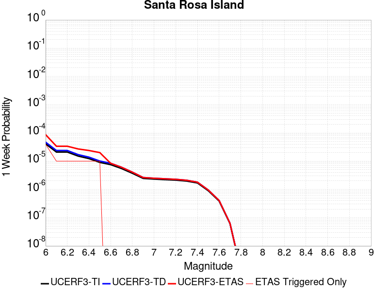 |  |  |  |

| Magnitude | 1 wk TI Prob | 1 wk TD Prob | 1 wk ETAS Prob | 1 wk ETAS/TD Gain | 1 wk ETAS Triggered Only | 1 mo TI Prob | 1 mo TD Prob | 1 mo ETAS Prob | 1 mo ETAS/TD Gain | 1 mo ETAS Triggered Only | 1 yr TI Prob | 1 yr TD Prob | 1 yr ETAS Prob | 1 yr ETAS/TD Gain | 1 yr ETAS Triggered Only | 10 yr TI Prob | 10 yr TD Prob | 10 yr ETAS Prob | 10 yr ETAS/TD Gain | 10 yr ETAS Triggered Only |
|-----|-----|-----|-----|-----|-----|-----|-----|-----|-----|-----|-----|-----|-----|-----|-----|-----|-----|-----|-----|-----|
| 6.0 | 4.1143165E-5 | 4.709113E-5 | 8.708925E-5 | 1.8493769 | 4.0E-5 | 1.7631594E-4 | 2.0180462E-4 | 2.617925E-4 | 1.2972573 | 6.0E-5 | 0.002144533 | 0.0024543991 | 0.0025441782 | 1.0365789 | 9.0E-5 | 0.021239553 | 0.024293557 | 0.024430156 | 1.0056229 | 1.4E-4 |
| 6.1 | 2.1061249E-5 | 2.3864959E-5 | 3.3864722E-5 | 1.4190143 | 1.0E-5 | 9.0259375E-5 | 1.0227455E-4 | 1.2227251E-4 | 1.1955321 | 2.0E-5 | 0.0010983539 | 0.0012445103 | 0.0012644854 | 1.0160506 | 2.0E-5 | 0.01092941 | 0.01237845 | 0.012417954 | 1.0031915 | 4.0E-5 |
| 6.2 | 2.1061249E-5 | 2.3864959E-5 | 3.3864722E-5 | 1.4190143 | 1.0E-5 | 9.0259375E-5 | 1.0227455E-4 | 1.2227251E-4 | 1.1955321 | 2.0E-5 | 0.0010983539 | 0.0012445103 | 0.0012644854 | 1.0160506 | 2.0E-5 | 0.01092941 | 0.01237845 | 0.012417954 | 1.0031915 | 4.0E-5 |
| 6.3 | 1.5158236E-5 | 1.7074419E-5 | 2.7074248E-5 | 1.5856615 | 1.0E-5 | 6.496225E-5 | 7.3174095E-5 | 9.317263E-5 | 1.2733008 | 2.0E-5 | 7.906284E-4 | 8.9054246E-4 | 9.105246E-4 | 1.0224382 | 2.0E-5 | 0.007878214 | 0.00887099 | 0.008890812 | 1.0022346 | 2.0E-5 |
| 6.4 | 1.2341918E-5 | 1.3852917E-5 | 2.3852777E-5 | 1.7218597 | 1.0E-5 | 5.2892858E-5 | 5.9368336E-5 | 7.936715E-5 | 1.33686 | 2.0E-5 | 6.437803E-4 | 7.225779E-4 | 7.4256345E-4 | 1.0276587 | 2.0E-5 | 0.006419184 | 0.0072031217 | 0.0072229775 | 1.0027566 | 2.0E-5 |
| 6.5 | 9.061158E-6 | 1.0117032E-5 | 2.011693E-5 | 1.9884223 | 1.0E-5 | 3.883296E-5 | 4.3358017E-5 | 6.335715E-5 | 1.4612557 | 2.0E-5 | 4.726887E-4 | 5.277613E-4 | 5.4775074E-4 | 1.0378759 | 2.0E-5 | 0.004716845 | 0.0052656177 | 0.005285512 | 1.0037782 | 2.0E-5 |
| 6.6 | 7.5461685E-6 | 8.400734E-6 | 8.400734E-6 | 1.0 | 0.0 | 3.2340322E-5 | 3.600267E-5 | 4.600231E-5 | 1.2777472 | 1.0E-5 | 3.936723E-4 | 4.3824868E-4 | 4.4824427E-4 | 1.0228081 | 1.0E-5 | 0.003929756 | 0.0043742736 | 0.00438423 | 1.0022761 | 1.0E-5 |
| 6.7 | 5.5023775E-6 | 6.087381E-6 | 6.087381E-6 | 1.0 | 0.0 | 2.3581404E-5 | 2.6088532E-5 | 2.6088532E-5 | 1.0 | 0.0 | 2.8706578E-4 | 3.1758484E-4 | 3.1758484E-4 | 1.0 | 0.0 | 0.0028669522 | 0.0031716316 | 0.0031716316 | 1.0 | 0.0 |
| 6.8 | 3.7351679E-6 | 4.0831405E-6 | 4.0831405E-6 | 1.0 | 0.0 | 1.6007763E-5 | 1.7499071E-5 | 1.7499071E-5 | 1.0 | 0.0 | 1.948771E-4 | 2.1303285E-4 | 2.1303285E-4 | 1.0 | 0.0 | 0.0019470629 | 0.0021285315 | 0.0021285315 | 1.0 | 0.0 |
| 6.9 | 2.456366E-6 | 2.6292707E-6 | 2.6292707E-6 | 1.0 | 0.0 | 1.0527241E-5 | 1.1268255E-5 | 1.1268255E-5 | 1.0 | 0.0 | 1.2816161E-4 | 1.3718239E-4 | 1.3718239E-4 | 1.0 | 0.0 | 0.0012808773 | 0.0013709799 | 0.0013709799 | 1.0 | 0.0 |
| 7.0 | 2.3245157E-6 | 2.4827784E-6 | 2.4827784E-6 | 1.0 | 0.0 | 9.962172E-6 | 1.0640436E-5 | 1.0640436E-5 | 1.0 | 0.0 | 1.2128269E-4 | 1.2953962E-4 | 1.2953962E-4 | 1.0 | 0.0 | 0.0012121652 | 0.0012946434 | 0.0012946434 | 1.0 | 0.0 |
| 7.1 | 2.2248344E-6 | 2.37325E-6 | 2.37325E-6 | 1.0 | 0.0 | 9.53497E-6 | 1.0171032E-5 | 1.0171032E-5 | 1.0 | 0.0 | 1.1608207E-4 | 1.238253E-4 | 1.238253E-4 | 1.0 | 0.0 | 0.0011602144 | 0.0012375651 | 0.0012375651 | 1.0 | 0.0 |
| 7.2 | 2.1350402E-6 | 2.2761542E-6 | 2.2761542E-6 | 1.0 | 0.0 | 9.150141E-6 | 9.75491E-6 | 9.75491E-6 | 1.0 | 0.0 | 1.1139726E-4 | 1.1875957E-4 | 1.1875957E-4 | 1.0 | 0.0 | 0.0011134144 | 0.0011869629 | 0.0011869629 | 1.0 | 0.0 |
| 7.3 | 1.9793572E-6 | 2.1087192E-6 | 2.1087192E-6 | 1.0 | 0.0 | 8.482932E-6 | 9.037337E-6 | 9.037337E-6 | 1.0 | 0.0 | 1.032748E-4 | 1.1002403E-4 | 1.1002403E-4 | 1.0 | 0.0 | 0.0010322682 | 0.0010996974 | 0.0010996974 | 1.0 | 0.0 |
| 7.4 | 1.6951194E-6 | 1.8045735E-6 | 1.8045735E-6 | 1.0 | 0.0 | 7.264777E-6 | 7.733864E-6 | 7.733864E-6 | 1.0 | 0.0 | 8.844508E-5 | 9.415574E-5 | 9.415574E-5 | 1.0 | 0.0 | 8.840988E-4 | 9.411601E-4 | 9.411601E-4 | 1.0 | 0.0 |
| 7.5 | 8.987207E-7 | 9.512216E-7 | 9.512216E-7 | 1.0 | 0.0 | 3.8516546E-6 | 4.0766577E-6 | 4.0766577E-6 | 1.0 | 0.0 | 4.6892885E-5 | 4.9632188E-5 | 4.9632188E-5 | 1.0 | 0.0 | 4.688299E-4 | 4.962122E-4 | 4.962122E-4 | 1.0 | 0.0 |
| 7.6 | 3.8783037E-7 | 4.0529335E-7 | 4.0529335E-7 | 1.0 | 0.0 | 1.6621291E-6 | 1.7369704E-6 | 1.7369704E-6 | 1.0 | 0.0 | 2.0236233E-5 | 2.1147416E-5 | 2.1147416E-5 | 1.0 | 0.0 | 2.023439E-4 | 2.114547E-4 | 2.114547E-4 | 1.0 | 0.0 |
| 7.7 | 6.181804E-8 | 6.339047E-8 | 6.339047E-8 | 1.0 | 0.0 | 2.6493444E-7 | 2.7167343E-7 | 2.7167343E-7 | 1.0 | 0.0 | 3.225572E-6 | 3.307619E-6 | 3.307619E-6 | 1.0 | 0.0 | 3.225525E-5 | 3.3075703E-5 | 3.3075703E-5 | 1.0 | 0.0 |
| 7.8 | 1.3704449E-9 | 1.3964153E-9 | 1.3964153E-9 | 1.0 | 0.0 | 5.873335E-9 | 5.984637E-9 | 5.984637E-9 | 1.0 | 0.0 | 7.1507856E-8 | 7.286295E-8 | 7.286295E-8 | 1.0 | 0.0 | 7.1507833E-7 | 7.286294E-7 | 7.286294E-7 | 1.0 | 0.0 |

## Cleghorn Lake
*[(top)](#table-of-contents)*

| 1 Week | 1 Month | 1 Year | 10 Year |
|-----|-----|-----|-----|
|  | 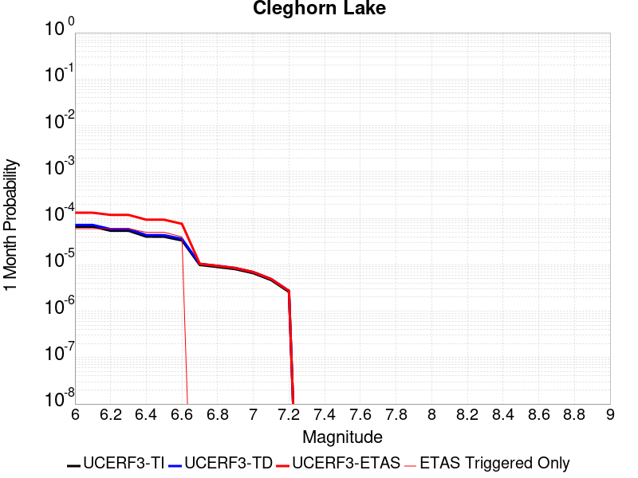 |  | 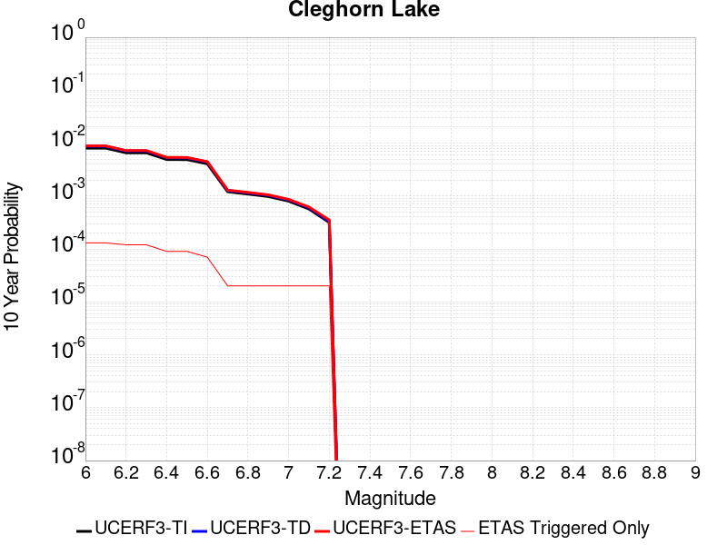 |

| Magnitude | 1 wk TI Prob | 1 wk TD Prob | 1 wk ETAS Prob | 1 wk ETAS/TD Gain | 1 wk ETAS Triggered Only | 1 mo TI Prob | 1 mo TD Prob | 1 mo ETAS Prob | 1 mo ETAS/TD Gain | 1 mo ETAS Triggered Only | 1 yr TI Prob | 1 yr TD Prob | 1 yr ETAS Prob | 1 yr ETAS/TD Gain | 1 yr ETAS Triggered Only | 10 yr TI Prob | 10 yr TD Prob | 10 yr ETAS Prob | 10 yr ETAS/TD Gain | 10 yr ETAS Triggered Only |
|-----|-----|-----|-----|-----|-----|-----|-----|-----|-----|-----|-----|-----|-----|-----|-----|-----|-----|-----|-----|-----|
| 6.0 | 1.5467183E-5 | 1.6794203E-5 | 5.679353E-5 | 3.3817341 | 4.0E-5 | 6.6286244E-5 | 7.197348E-5 | 1.3196917E-4 | 1.8335804 | 6.0E-5 | 8.067362E-4 | 8.759797E-4 | 9.758921E-4 | 1.1140579 | 1.0E-4 | 0.008038137 | 0.008730696 | 0.008859561 | 1.01476 | 1.3E-4 |
| 6.1 | 1.5467183E-5 | 1.6794203E-5 | 5.679353E-5 | 3.3817341 | 4.0E-5 | 6.6286244E-5 | 7.197348E-5 | 1.3196917E-4 | 1.8335804 | 6.0E-5 | 8.067362E-4 | 8.759797E-4 | 9.758921E-4 | 1.1140579 | 1.0E-4 | 0.008038137 | 0.008730696 | 0.008859561 | 1.01476 | 1.3E-4 |
| 6.2 | 1.2624631E-5 | 1.3681544E-5 | 5.3680997E-5 | 3.9236064 | 4.0E-5 | 5.410444E-5 | 5.863415E-5 | 1.1863063E-4 | 2.0232346 | 6.0E-5 | 6.585225E-4 | 7.1368564E-4 | 8.136142E-4 | 1.1400177 | 1.0E-4 | 0.0065657445 | 0.0071187317 | 0.0072378777 | 1.016737 | 1.2E-4 |
| 6.3 | 1.2624631E-5 | 1.3681544E-5 | 5.3680997E-5 | 3.9236064 | 4.0E-5 | 5.410444E-5 | 5.863415E-5 | 1.1863063E-4 | 2.0232346 | 6.0E-5 | 6.585225E-4 | 7.1368564E-4 | 8.136142E-4 | 1.1400177 | 1.0E-4 | 0.0065657445 | 0.0071187317 | 0.0072378777 | 1.016737 | 1.2E-4 |
| 6.4 | 9.417684E-6 | 1.0170118E-5 | 4.0169813E-5 | 3.9497883 | 3.0E-5 | 4.036088E-5 | 4.3585722E-5 | 9.358354E-5 | 2.1471148 | 5.0E-5 | 4.912829E-4 | 5.3056807E-4 | 6.105256E-4 | 1.1507018 | 8.0E-5 | 0.004901982 | 0.005297049 | 0.0053865723 | 1.0169005 | 9.0E-5 |
| 6.5 | 9.368219E-6 | 1.0117545E-5 | 4.011724E-5 | 3.9651165 | 3.0E-5 | 4.014889E-5 | 4.3360415E-5 | 9.335825E-5 | 2.1530755 | 5.0E-5 | 4.8870314E-4 | 5.2782625E-4 | 6.07784E-4 | 1.151485 | 8.0E-5 | 0.004876298 | 0.0052697617 | 0.0053592874 | 1.0169885 | 9.0E-5 |
| 6.6 | 7.803798E-6 | 8.441831E-6 | 2.8441662E-5 | 3.3691342 | 2.0E-5 | 3.3444423E-5 | 3.6179E-5 | 7.617755E-5 | 2.105574 | 4.0E-5 | 4.0710976E-4 | 4.4043022E-4 | 5.004038E-4 | 1.1361704 | 6.0E-5 | 0.0040636472 | 0.0043994905 | 0.0044691823 | 1.0158409 | 7.0E-5 |
| 6.7 | 2.3108669E-6 | 2.4438336E-6 | 2.4438336E-6 | 1.0 | 0.0 | 9.903678E-6 | 1.0473532E-5 | 1.0473532E-5 | 1.0 | 0.0 | 1.205706E-4 | 1.2750797E-4 | 1.375067E-4 | 1.0784165 | 1.0E-5 | 0.001205052 | 0.0012743667 | 0.0012943413 | 1.0156741 | 2.0E-5 |
| 6.8 | 2.0882828E-6 | 2.2062823E-6 | 2.2062823E-6 | 1.0 | 0.0 | 8.949753E-6 | 9.455462E-6 | 9.455462E-6 | 1.0 | 0.0 | 1.08957785E-4 | 1.1511434E-4 | 1.2511319E-4 | 1.0868602 | 1.0E-5 | 0.0010890438 | 0.0011505639 | 0.0011705409 | 1.0173628 | 2.0E-5 |
| 6.9 | 1.876935E-6 | 1.981051E-6 | 1.981051E-6 | 1.0 | 0.0 | 8.043982E-6 | 8.490192E-6 | 8.490192E-6 | 1.0 | 0.0 | 9.7931086E-5 | 1.03363345E-4 | 1.1336231E-4 | 1.0967361 | 1.0E-5 | 9.788794E-4 | 0.0010331686 | 0.001053148 | 1.0193379 | 2.0E-5 |
| 7.0 | 1.5357559E-6 | 1.6202807E-6 | 1.6202807E-6 | 1.0 | 0.0 | 6.5817944E-6 | 6.9440425E-6 | 6.9440425E-6 | 1.0 | 0.0 | 8.01304E-5 | 8.454057E-5 | 9.453972E-5 | 1.1182764 | 1.0E-5 | 8.010151E-4 | 8.450965E-4 | 8.650796E-4 | 1.0236459 | 2.0E-5 |
| 7.1 | 1.0905424E-6 | 1.1497619E-6 | 1.1497619E-6 | 1.0 | 0.0 | 4.6737446E-6 | 4.9275427E-6 | 4.9275427E-6 | 1.0 | 0.0 | 5.6901354E-5 | 5.999128E-5 | 6.999068E-5 | 1.1666809 | 1.0E-5 | 5.6886784E-4 | 5.997606E-4 | 6.197486E-4 | 1.0333266 | 2.0E-5 |
| 7.2 | 6.06668E-7 | 6.387277E-7 | 6.387277E-7 | 1.0 | 0.0 | 2.600003E-6 | 2.7374022E-6 | 2.7374022E-6 | 1.0 | 0.0 | 3.1654577E-5 | 3.3327433E-5 | 4.3327098E-5 | 1.3000431 | 1.0E-5 | 3.1650066E-4 | 3.3323118E-4 | 3.5322452E-4 | 1.0599984 | 2.0E-5 |

## San Clemente
*[(top)](#table-of-contents)*

| 1 Week | 1 Month | 1 Year | 10 Year |
|-----|-----|-----|-----|
|  |  |  |  |

| Magnitude | 1 wk TI Prob | 1 wk TD Prob | 1 wk ETAS Prob | 1 wk ETAS/TD Gain | 1 wk ETAS Triggered Only | 1 mo TI Prob | 1 mo TD Prob | 1 mo ETAS Prob | 1 mo ETAS/TD Gain | 1 mo ETAS Triggered Only | 1 yr TI Prob | 1 yr TD Prob | 1 yr ETAS Prob | 1 yr ETAS/TD Gain | 1 yr ETAS Triggered Only | 10 yr TI Prob | 10 yr TD Prob | 10 yr ETAS Prob | 10 yr ETAS/TD Gain | 10 yr ETAS Triggered Only |
|-----|-----|-----|-----|-----|-----|-----|-----|-----|-----|-----|-----|-----|-----|-----|-----|-----|-----|-----|-----|-----|
| 6.0 | 6.681379E-5 | 8.163834E-5 | 1.3163425E-4 | 1.6124073 | 5.0E-5 | 2.8631336E-4 | 3.4983488E-4 | 4.198104E-4 | 1.2000244 | 7.0E-5 | 0.003480294 | 0.00425141 | 0.004360942 | 1.0257638 | 1.1E-4 | 0.03426291 | 0.04175603 | 0.0418806 | 1.0029833 | 1.3E-4 |
| 6.1 | 6.681379E-5 | 8.163834E-5 | 1.2163507E-4 | 1.4899259 | 4.0E-5 | 2.8631336E-4 | 3.4983488E-4 | 4.0981392E-4 | 1.1714494 | 6.0E-5 | 0.003480294 | 0.00425141 | 0.0043410272 | 1.0210794 | 9.0E-5 | 0.03426291 | 0.04175603 | 0.04184227 | 1.0020654 | 9.0E-5 |
| 6.2 | 3.9400576E-5 | 4.6452373E-5 | 7.645098E-5 | 1.6457927 | 3.0E-5 | 1.6884868E-4 | 1.9906677E-4 | 2.390588E-4 | 1.2008976 | 4.0E-5 | 0.0020537945 | 0.0024209984 | 0.0024609016 | 1.0164821 | 4.0E-5 | 0.020349167 | 0.023952903 | 0.023991946 | 1.00163 | 4.0E-5 |
| 6.3 | 3.2590255E-5 | 3.792912E-5 | 4.7928737E-5 | 1.2636397 | 1.0E-5 | 1.3966505E-4 | 1.6254342E-4 | 1.8254017E-4 | 1.1230241 | 2.0E-5 | 0.0016990956 | 0.0019772002 | 0.0019971605 | 1.0100954 | 2.0E-5 | 0.01686163 | 0.019599883 | 0.019619491 | 1.0010004 | 2.0E-5 |
| 6.4 | 2.9454652E-5 | 3.4097764E-5 | 4.409742E-5 | 1.2932644 | 1.0E-5 | 1.2622811E-4 | 1.4612524E-4 | 1.661223E-4 | 1.1368489 | 2.0E-5 | 0.0015357438 | 0.0017776493 | 0.0017976137 | 1.0112308 | 2.0E-5 | 0.015251739 | 0.01763747 | 0.017657118 | 1.0011139 | 2.0E-5 |
| 6.5 | 2.790836E-5 | 3.2247463E-5 | 4.224714E-5 | 1.310092 | 1.0E-5 | 1.1960178E-4 | 1.3819624E-4 | 1.5819346E-4 | 1.1447017 | 2.0E-5 | 0.001455179 | 0.0016812662 | 0.0017012326 | 1.0118757 | 2.0E-5 | 0.014456868 | 0.016688485 | 0.01670815 | 1.0011784 | 2.0E-5 |
| 6.6 | 2.2492153E-5 | 2.5762702E-5 | 2.5762702E-5 | 1.0 | 0.0 | 9.639138E-5 | 1.1040699E-4 | 1.20405886E-4 | 1.090564 | 1.0E-5 | 0.0011729331 | 0.0013433909 | 0.0013533775 | 1.0074339 | 1.0E-5 | 0.011667615 | 0.013354417 | 0.013364283 | 1.0007389 | 1.0E-5 |
| 6.7 | 1.9862755E-5 | 2.2666423E-5 | 2.2666423E-5 | 1.0 | 0.0 | 8.512331E-5 | 9.713826E-5 | 1.0713729E-4 | 1.102936 | 1.0E-5 | 0.0010358836 | 0.0011820279 | 0.0011920161 | 1.00845 | 1.0E-5 | 0.010310682 | 0.011758701 | 0.011768583 | 1.0008404 | 1.0E-5 |
| 6.8 | 1.6697575E-5 | 1.897771E-5 | 1.897771E-5 | 1.0 | 0.0 | 7.155907E-5 | 8.133056E-5 | 9.132974E-5 | 1.1229451 | 1.0E-5 | 8.7088346E-4 | 9.897591E-4 | 9.997492E-4 | 1.0100935 | 1.0E-5 | 0.008674784 | 0.0098545365 | 0.009864438 | 1.0010048 | 1.0E-5 |
| 6.9 | 1.5218415E-5 | 1.72694E-5 | 1.72694E-5 | 1.0 | 0.0 | 6.522015E-5 | 7.4009666E-5 | 8.400893E-5 | 1.1351075 | 1.0E-5 | 7.93766E-4 | 9.00704E-4 | 9.10695E-4 | 1.0110924 | 1.0E-5 | 0.007909367 | 0.008971481 | 0.008981391 | 1.0011046 | 1.0E-5 |
| 7.0 | 1.2392958E-5 | 1.4033016E-5 | 1.4033016E-5 | 1.0 | 0.0 | 5.3111595E-5 | 6.014015E-5 | 7.013955E-5 | 1.1662682 | 1.0E-5 | 6.4644177E-4 | 7.319679E-4 | 7.419606E-4 | 1.0136518 | 1.0E-5 | 0.0064456454 | 0.0072963564 | 0.007306284 | 1.0013605 | 1.0E-5 |
| 7.1 | 1.0934128E-5 | 1.2375138E-5 | 1.2375138E-5 | 1.0 | 0.0 | 4.6859706E-5 | 5.303527E-5 | 5.303527E-5 | 1.0 | 0.0 | 5.7036756E-4 | 6.455204E-4 | 6.455204E-4 | 1.0 | 0.0 | 0.0056890585 | 0.0064371997 | 0.0064371997 | 1.0 | 0.0 |
| 7.2 | 9.5798805E-6 | 1.0844935E-5 | 1.0844935E-5 | 1.0 | 0.0 | 4.1055984E-5 | 4.6477508E-5 | 4.6477508E-5 | 1.0 | 0.0 | 4.9974193E-4 | 5.657239E-4 | 5.657239E-4 | 1.0 | 0.0 | 0.0049861963 | 0.0056435615 | 0.0056435615 | 1.0 | 0.0 |
| 7.3 | 8.0167365E-6 | 9.083918E-6 | 9.083918E-6 | 1.0 | 0.0 | 3.4356988E-5 | 3.8930535E-5 | 3.8930535E-5 | 1.0 | 0.0 | 4.1821605E-4 | 4.7388324E-4 | 4.7388324E-4 | 1.0 | 0.0 | 0.0041742986 | 0.0047294297 | 0.0047294297 | 1.0 | 0.0 |
| 7.4 | 2.9581017E-6 | 3.3623792E-6 | 3.3623792E-6 | 1.0 | 0.0 | 1.2677518E-5 | 1.4410146E-5 | 1.4410146E-5 | 1.0 | 0.0 | 1.5433785E-4 | 1.7543444E-4 | 1.7543444E-4 | 1.0 | 0.0 | 0.001542307 | 0.0017534546 | 0.0017534546 | 1.0 | 0.0 |

## Brawley (Seismic Zone) alt 1
*[(top)](#table-of-contents)*

| 1 Week | 1 Month | 1 Year | 10 Year |
|-----|-----|-----|-----|
| 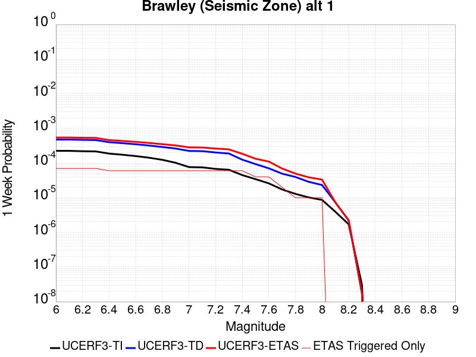 |  |  |  |

| Magnitude | 1 wk TI Prob | 1 wk TD Prob | 1 wk ETAS Prob | 1 wk ETAS/TD Gain | 1 wk ETAS Triggered Only | 1 mo TI Prob | 1 mo TD Prob | 1 mo ETAS Prob | 1 mo ETAS/TD Gain | 1 mo ETAS Triggered Only | 1 yr TI Prob | 1 yr TD Prob | 1 yr ETAS Prob | 1 yr ETAS/TD Gain | 1 yr ETAS Triggered Only | 10 yr TI Prob | 10 yr TD Prob | 10 yr ETAS Prob | 10 yr ETAS/TD Gain | 10 yr ETAS Triggered Only |
|-----|-----|-----|-----|-----|-----|-----|-----|-----|-----|-----|-----|-----|-----|-----|-----|-----|-----|-----|-----|-----|
| 6.0 | 2.2521618E-4 | 4.763429E-4 | 5.463095E-4 | 1.146883 | 7.0E-5 | 9.6485513E-4 | 0.0020399094 | 0.0021197463 | 1.0391375 | 8.0E-5 | 0.011683988 | 0.024544531 | 0.024642076 | 1.0039742 | 1.0E-4 | 0.11088423 | 0.21349923 | 0.21360147 | 1.0004789 | 1.3E-4 |
| 6.1 | 2.2521618E-4 | 4.763429E-4 | 5.463095E-4 | 1.146883 | 7.0E-5 | 9.6485513E-4 | 0.0020399094 | 0.0021197463 | 1.0391375 | 8.0E-5 | 0.011683988 | 0.024544531 | 0.024642076 | 1.0039742 | 1.0E-4 | 0.11088423 | 0.21349923 | 0.21360147 | 1.0004789 | 1.3E-4 |
| 6.2 | 2.198148E-4 | 4.6718874E-4 | 5.37156E-4 | 1.1497624 | 7.0E-5 | 9.417233E-4 | 0.0020007377 | 0.0020805777 | 1.0399053 | 8.0E-5 | 0.011405343 | 0.024078513 | 0.024176106 | 1.0040531 | 1.0E-4 | 0.10837428 | 0.20993572 | 0.21003844 | 1.0004892 | 1.3E-4 |
| 6.3 | 2.1704129E-4 | 4.615455E-4 | 5.315132E-4 | 1.1515944 | 7.0E-5 | 9.298453E-4 | 0.0019765892 | 0.0020564313 | 1.0403937 | 8.0E-5 | 0.011262234 | 0.023792034 | 0.023889655 | 1.0041031 | 1.0E-4 | 0.107082725 | 0.20782684 | 0.20792982 | 1.0004956 | 1.3E-4 |
| 6.4 | 1.876142E-4 | 4.004663E-4 | 4.6044227E-4 | 1.1497654 | 6.0E-5 | 8.038131E-4 | 0.0017151695 | 0.0017850494 | 1.0407423 | 7.0E-5 | 0.00974259 | 0.020678662 | 0.0207668 | 1.0042623 | 9.0E-5 | 0.093263686 | 0.18457787 | 0.18467572 | 1.0005301 | 1.2E-4 |
| 6.5 | 1.7390939E-4 | 3.7478763E-4 | 4.3476516E-4 | 1.1600306 | 6.0E-5 | 7.45113E-4 | 0.0016052561 | 0.0016651598 | 1.0373172 | 6.0E-5 | 0.009034078 | 0.019367293 | 0.019445743 | 1.0040507 | 8.0E-5 | 0.086755216 | 0.17440015 | 0.17449096 | 1.0005207 | 1.1E-4 |
| 6.6 | 1.591791E-4 | 3.4893592E-4 | 4.08915E-4 | 1.1718913 | 6.0E-5 | 6.8201777E-4 | 0.0014945926 | 0.001554503 | 1.0400847 | 6.0E-5 | 0.008271996 | 0.018045008 | 0.018123565 | 1.0043534 | 8.0E-5 | 0.07970774 | 0.16380787 | 0.16389985 | 1.0005615 | 1.1E-4 |
| 6.7 | 1.4268003E-4 | 3.2059717E-4 | 3.8057796E-4 | 1.1870908 | 6.0E-5 | 6.1134255E-4 | 0.0013732726 | 0.0014331902 | 1.0436312 | 6.0E-5 | 0.007417723 | 0.01659171 | 0.016670382 | 1.0047417 | 8.0E-5 | 0.07174956 | 0.15193592 | 0.15202922 | 1.000614 | 1.1E-4 |
| 6.8 | 1.239713E-4 | 2.9055026E-4 | 3.5053285E-4 | 1.2064447 | 6.0E-5 | 5.3119735E-4 | 0.0012446274 | 0.0013045527 | 1.0481472 | 6.0E-5 | 0.0064481674 | 0.015049482 | 0.015128278 | 1.0052358 | 8.0E-5 | 0.06264243 | 0.1383805 | 0.13847528 | 1.0006849 | 1.1E-4 |
| 6.9 | 1.0180238E-4 | 2.6255674E-4 | 3.22541E-4 | 1.228462 | 6.0E-5 | 4.3622297E-4 | 0.0011247622 | 0.0011846948 | 1.0532846 | 6.0E-5 | 0.005298089 | 0.013608998 | 0.013687909 | 1.0057985 | 8.0E-5 | 0.05173543 | 0.12496472 | 0.12506098 | 1.0007702 | 1.1E-4 |
| 7.0 | 7.6619996E-5 | 2.2400476E-4 | 2.8399134E-4 | 1.2677914 | 6.0E-5 | 3.283301E-4 | 9.596704E-4 | 0.0010196128 | 1.0624615 | 6.0E-5 | 0.0039900932 | 0.011622103 | 0.011701173 | 1.0068034 | 8.0E-5 | 0.039192066 | 0.10726982 | 0.10736802 | 1.0009154 | 1.1E-4 |
| 7.1 | 7.5127435E-5 | 2.2083633E-4 | 2.808231E-4 | 1.2716345 | 6.0E-5 | 3.2193496E-4 | 9.461013E-4 | 0.0010060446 | 1.0633582 | 6.0E-5 | 0.0039125155 | 0.011458648 | 0.011537732 | 1.0069016 | 8.0E-5 | 0.038443442 | 0.10583378 | 0.10593214 | 1.0009294 | 1.1E-4 |
| 7.2 | 6.788582E-5 | 2.0211334E-4 | 2.621012E-4 | 1.2968031 | 6.0E-5 | 2.9090676E-4 | 8.6591556E-4 | 9.2586357E-4 | 1.0692308 | 6.0E-5 | 0.0035360386 | 0.0104922 | 0.010571361 | 1.0075448 | 8.0E-5 | 0.034803 | 0.097503684 | 0.097602956 | 1.0010182 | 1.1E-4 |
| 7.3 | 6.399602E-5 | 1.8842232E-4 | 2.48411E-4 | 1.3183737 | 6.0E-5 | 2.7423984E-4 | 8.0727716E-4 | 8.672287E-4 | 1.0742639 | 6.0E-5 | 0.0033337586 | 0.009784897 | 0.009864113 | 1.0080959 | 8.0E-5 | 0.03284188 | 0.091397986 | 0.09149793 | 1.0010935 | 1.1E-4 |
| 7.4 | 4.506759E-5 | 1.2530042E-4 | 1.852929E-4 | 1.4787892 | 6.0E-5 | 1.9313251E-4 | 5.3689216E-4 | 5.968599E-4 | 1.1116943 | 6.0E-5 | 0.0023488526 | 0.006517245 | 0.0065867887 | 1.0106708 | 7.0E-5 | 0.023241805 | 0.062364522 | 0.062458284 | 1.0015035 | 1.0E-4 |
| 7.5 | 3.43289E-5 | 9.336103E-5 | 1.333573E-4 | 1.4284043 | 4.0E-5 | 1.4711556E-4 | 4.0005764E-4 | 4.4004165E-4 | 1.0999455 | 4.0E-5 | 0.0017896603 | 0.004859886 | 0.0049096434 | 1.0102383 | 5.0E-5 | 0.01775316 | 0.047057066 | 0.0471333 | 1.00162 | 8.0E-5 |
| 7.6 | 2.5980507E-5 | 7.053672E-5 | 1.105339E-4 | 1.5670404 | 4.0E-5 | 1.1134028E-4 | 3.0226534E-4 | 3.4225325E-4 | 1.132294 | 4.0E-5 | 0.001354725 | 0.0036738948 | 0.0037237112 | 1.0135596 | 5.0E-5 | 0.013464959 | 0.03584298 | 0.035920113 | 1.002152 | 8.0E-5 |
| 7.7 | 1.7292105E-5 | 4.9412036E-5 | 6.941105E-5 | 1.4047396 | 2.0E-5 | 7.4106916E-5 | 2.1174872E-4 | 2.3174449E-4 | 1.0944315 | 2.0E-5 | 9.018782E-4 | 0.0025749984 | 0.002604921 | 1.0116205 | 3.0E-5 | 0.008982267 | 0.025292095 | 0.025331084 | 1.0015415 | 4.0E-5 |
| 7.8 | 1.2927471E-5 | 3.9697254E-5 | 4.9696857E-5 | 1.2518966 | 1.0E-5 | 5.5402274E-5 | 1.7012001E-4 | 1.8011831E-4 | 1.0587721 | 1.0E-5 | 6.743139E-4 | 0.0020692463 | 0.0020892047 | 1.0096453 | 2.0E-5 | 0.0067227143 | 0.020433143 | 0.02046253 | 1.0014383 | 3.0E-5 |
| 7.9 | 1.0200774E-5 | 2.8748475E-5 | 3.874819E-5 | 1.3478346 | 1.0E-5 | 4.371687E-5 | 1.2320194E-4 | 1.3320071E-4 | 1.0811576 | 1.0E-5 | 5.321229E-4 | 0.0014989526 | 0.0015189226 | 1.0133226 | 2.0E-5 | 0.005308505 | 0.014992894 | 0.015022444 | 1.001971 | 3.0E-5 |
| 8.0 | 8.650396E-6 | 2.3279512E-5 | 3.3279277E-5 | 1.4295523 | 1.0E-5 | 3.70726E-5 | 9.976552E-5 | 1.0976452E-4 | 1.100225 | 1.0E-5 | 4.5126543E-4 | 0.0012139693 | 0.001233945 | 1.0164549 | 2.0E-5 | 0.0045035016 | 0.012212163 | 0.012231919 | 1.0016177 | 2.0E-5 |
| 8.1 | 3.9368224E-6 | 7.3283345E-6 | 7.3283345E-6 | 1.0 | 0.0 | 1.6871985E-5 | 3.1406773E-5 | 3.1406773E-5 | 1.0 | 0.0 | 2.0539707E-4 | 3.8231048E-4 | 3.8231048E-4 | 1.0 | 0.0 | 0.0020520731 | 0.0040015313 | 0.0040015313 | 1.0 | 0.0 |
| 8.2 | 1.7101195E-6 | 2.2178374E-6 | 2.2178374E-6 | 1.0 | 0.0 | 7.329063E-6 | 9.504983E-6 | 9.504983E-6 | 1.0 | 0.0 | 8.922769E-5 | 1.15717055E-4 | 1.15717055E-4 | 1.0 | 0.0 | 8.9191867E-4 | 0.00126669 | 0.00126669 | 1.0 | 0.0 |
| 8.3 | 3.0346666E-8 | 1.721086E-8 | 1.721086E-8 | 1.0 | 0.0 | 1.3005713E-7 | 7.376083E-8 | 7.376083E-8 | 1.0 | 0.0 | 1.5834444E-6 | 8.98038E-7 | 8.98038E-7 | 1.0 | 0.0 | 1.5834332E-5 | 9.36379E-6 | 9.36379E-6 | 1.0 | 0.0 |

## Imperial
*[(top)](#table-of-contents)*

| 1 Week | 1 Month | 1 Year | 10 Year |
|-----|-----|-----|-----|
| 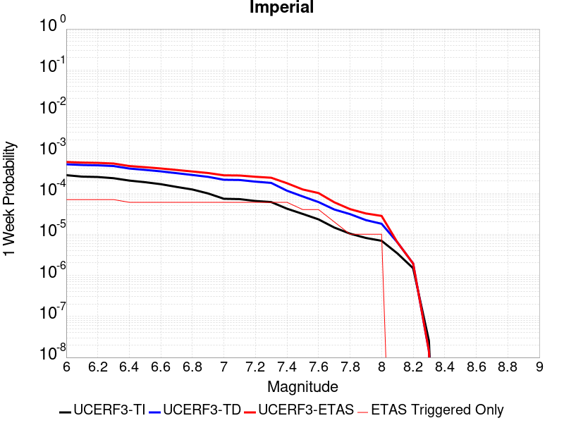 | 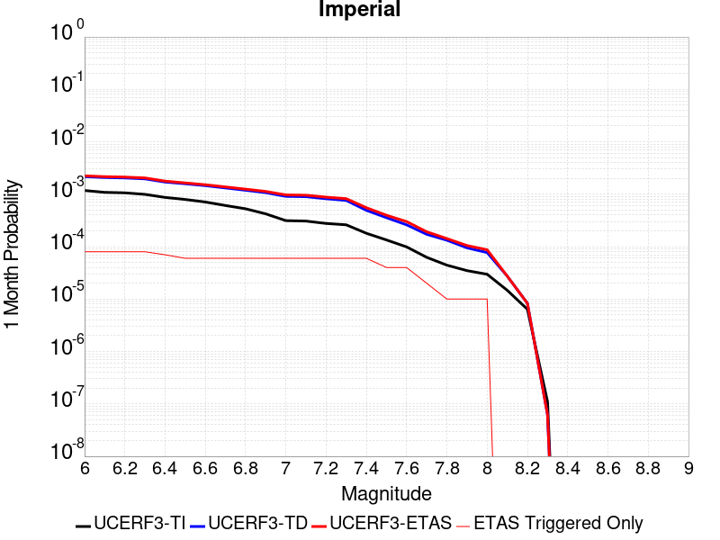 | 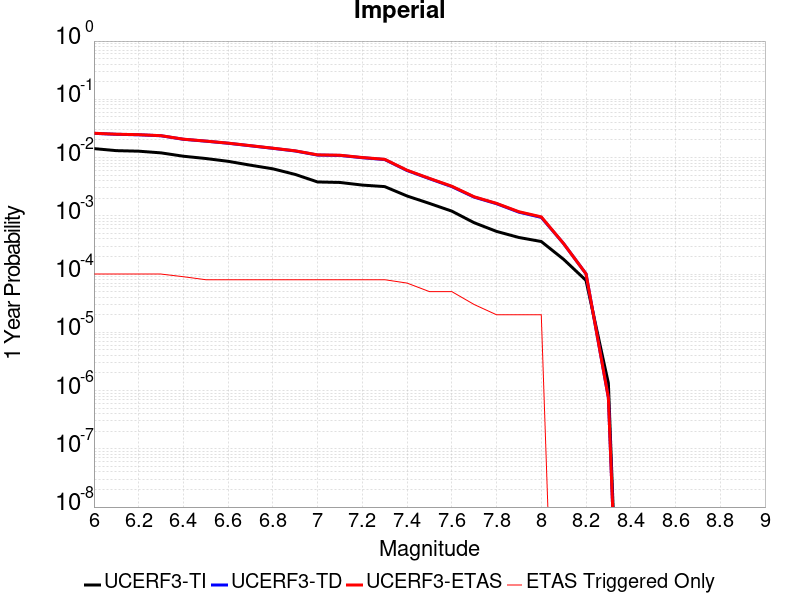 |  |

| Magnitude | 1 wk TI Prob | 1 wk TD Prob | 1 wk ETAS Prob | 1 wk ETAS/TD Gain | 1 wk ETAS Triggered Only | 1 mo TI Prob | 1 mo TD Prob | 1 mo ETAS Prob | 1 mo ETAS/TD Gain | 1 mo ETAS Triggered Only | 1 yr TI Prob | 1 yr TD Prob | 1 yr ETAS Prob | 1 yr ETAS/TD Gain | 1 yr ETAS Triggered Only | 10 yr TI Prob | 10 yr TD Prob | 10 yr ETAS Prob | 10 yr ETAS/TD Gain | 10 yr ETAS Triggered Only |
|-----|-----|-----|-----|-----|-----|-----|-----|-----|-----|-----|-----|-----|-----|-----|-----|-----|-----|-----|-----|-----|
| 6.0 | 2.7496446E-4 | 5.055345E-4 | 5.7549914E-4 | 1.1383973 | 7.0E-5 | 0.0011778869 | 0.002164817 | 0.0022446439 | 1.0368747 | 8.0E-5 | 0.0142467655 | 0.026048409 | 0.026145805 | 1.003739 | 1.0E-4 | 0.13367249 | 0.22807029 | 0.22817063 | 1.00044 | 1.3E-4 |
| 6.1 | 2.5356023E-4 | 4.8657708E-4 | 5.56543E-4 | 1.1437922 | 7.0E-5 | 0.001086234 | 0.002083702 | 0.0021635354 | 1.0383132 | 8.0E-5 | 0.013144928 | 0.02507094 | 0.025168432 | 1.0038887 | 1.0E-4 | 0.123940155 | 0.21949561 | 0.21959709 | 1.0004623 | 1.3E-4 |
| 6.2 | 2.4820742E-4 | 4.775311E-4 | 5.474977E-4 | 1.1465173 | 7.0E-5 | 0.0010633124 | 0.0020449946 | 0.002124831 | 1.0390399 | 8.0E-5 | 0.01286919 | 0.024610676 | 0.024708215 | 1.0039632 | 1.0E-4 | 0.12148927 | 0.21600136 | 0.21610329 | 1.0004718 | 1.3E-4 |
| 6.3 | 2.3205351E-4 | 4.5892023E-4 | 5.2888814E-4 | 1.152462 | 7.0E-5 | 9.94136E-4 | 0.0019653554 | 0.002045198 | 1.0406251 | 8.0E-5 | 0.012036599 | 0.023661187 | 0.02375882 | 1.0041263 | 1.0E-4 | 0.11405133 | 0.20793827 | 0.20804124 | 1.0004952 | 1.3E-4 |
| 6.4 | 2.0304754E-4 | 3.9878016E-4 | 4.5875623E-4 | 1.1503989 | 6.0E-5 | 8.6991355E-4 | 0.0017079529 | 0.0017778334 | 1.0409148 | 7.0E-5 | 0.010539869 | 0.020595418 | 0.020683564 | 1.0042799 | 9.0E-5 | 0.100537635 | 0.18507113 | 0.1851689 | 1.0005285 | 1.2E-4 |
| 6.5 | 1.854992E-4 | 3.6990462E-4 | 4.2988244E-4 | 1.162144 | 6.0E-5 | 7.9475436E-4 | 0.0015843548 | 0.0016442597 | 1.0378103 | 6.0E-5 | 0.009633281 | 0.01911443 | 0.019192899 | 1.0041053 | 8.0E-5 | 0.0922623 | 0.17330389 | 0.17339483 | 1.0005248 | 1.1E-4 |
| 6.6 | 1.6586106E-4 | 3.4036173E-4 | 4.0034132E-4 | 1.176223 | 6.0E-5 | 7.106394E-4 | 0.0014578878 | 0.0015178004 | 1.0410954 | 6.0E-5 | 0.008617763 | 0.017607626 | 0.017686216 | 1.0044634 | 8.0E-5 | 0.08291132 | 0.16078055 | 0.16087286 | 1.0005741 | 1.1E-4 |
| 6.7 | 1.4224656E-4 | 3.076812E-4 | 3.6766275E-4 | 1.194947 | 6.0E-5 | 6.094856E-4 | 0.0013179756 | 0.0013778964 | 1.0454644 | 6.0E-5 | 0.0073952693 | 0.015928522 | 0.016007246 | 1.0049424 | 8.0E-5 | 0.07153955 | 0.14648798 | 0.14658187 | 1.0006409 | 1.1E-4 |
| 6.8 | 1.2317259E-4 | 2.779231E-4 | 3.3790641E-4 | 1.2158271 | 6.0E-5 | 5.2777573E-4 | 0.0011905615 | 0.00125049 | 1.0503364 | 6.0E-5 | 0.0064067547 | 0.014400131 | 0.014478979 | 1.0054755 | 8.0E-5 | 0.06225166 | 0.13294087 | 0.13303626 | 1.0007174 | 1.1E-4 |
| 6.9 | 9.859898E-5 | 2.5015484E-4 | 3.1013982E-4 | 1.2397915 | 6.0E-5 | 4.2249862E-4 | 0.0010716559 | 0.0011315916 | 1.0559281 | 6.0E-5 | 0.0051317946 | 0.012970319 | 0.013049281 | 1.0060879 | 8.0E-5 | 0.05014893 | 0.119408876 | 0.11950574 | 1.0008112 | 1.1E-4 |
| 7.0 | 7.3191884E-5 | 2.1267848E-4 | 2.7266573E-4 | 1.282056 | 6.0E-5 | 3.136418E-4 | 9.11164E-4 | 9.711093E-4 | 1.0657898 | 6.0E-5 | 0.003811904 | 0.011037681 | 0.011116798 | 1.0071679 | 8.0E-5 | 0.037471764 | 0.10206756 | 0.10216633 | 1.0009677 | 1.1E-4 |
| 7.1 | 7.1760296E-5 | 2.0969207E-4 | 2.696795E-4 | 1.2860738 | 6.0E-5 | 3.0750787E-4 | 8.9837395E-4 | 9.5832004E-4 | 1.0667273 | 6.0E-5 | 0.003737482 | 0.010883528 | 0.010962658 | 1.0072706 | 8.0E-5 | 0.03675245 | 0.10070406 | 0.10080298 | 1.0009823 | 1.1E-4 |
| 7.2 | 6.46614E-5 | 1.9137723E-4 | 2.5136574E-4 | 1.3134569 | 6.0E-5 | 2.7709085E-4 | 8.199333E-4 | 8.798841E-4 | 1.0731167 | 6.0E-5 | 0.0033683628 | 0.009937617 | 0.010016822 | 1.0079702 | 8.0E-5 | 0.033177625 | 0.092511006 | 0.09261083 | 1.0010791 | 1.1E-4 |
| 7.3 | 6.088115E-5 | 1.780939E-4 | 2.3808322E-4 | 1.3368409 | 6.0E-5 | 2.6089314E-4 | 7.6303916E-4 | 8.229934E-4 | 1.0785729 | 6.0E-5 | 0.0031717476 | 0.009251006 | 0.009330266 | 1.0085677 | 8.0E-5 | 0.031268585 | 0.08656135 | 0.08666183 | 1.0011607 | 1.1E-4 |
| 7.4 | 4.199346E-5 | 1.1511097E-4 | 1.7510405E-4 | 1.5211762 | 6.0E-5 | 1.7995955E-4 | 4.932403E-4 | 5.5321073E-4 | 1.1215845 | 6.0E-5 | 0.0021888057 | 0.005988835 | 0.006058416 | 1.0116184 | 7.0E-5 | 0.02167372 | 0.05744024 | 0.057534494 | 1.0016409 | 1.0E-4 |
| 7.5 | 3.130448E-5 | 8.333871E-5 | 1.2333538E-4 | 1.479929 | 4.0E-5 | 1.3415517E-4 | 3.5711733E-4 | 3.9710305E-4 | 1.111968 | 4.0E-5 | 0.0016321153 | 0.0043392954 | 0.0043890784 | 1.0114726 | 5.0E-5 | 0.016201803 | 0.042133506 | 0.042210136 | 1.0018188 | 8.0E-5 |
| 7.6 | 2.3074248E-5 | 6.0849357E-5 | 1.00846926E-4 | 1.6573211 | 4.0E-5 | 9.888588E-5 | 2.6075702E-4 | 3.007466E-4 | 1.1533595 | 4.0E-5 | 0.0012032706 | 0.0031701182 | 0.0032199598 | 1.0157223 | 5.0E-5 | 0.011967761 | 0.03102816 | 0.031105679 | 1.0024983 | 8.0E-5 |
| 7.7 | 1.45864815E-5 | 4.0128452E-5 | 6.0127648E-5 | 1.4983795 | 2.0E-5 | 6.2511994E-5 | 1.7196777E-4 | 1.9196433E-4 | 1.1162809 | 2.0E-5 | 7.608177E-4 | 0.0020917025 | 0.00212164 | 1.0143124 | 3.0E-5 | 0.007582182 | 0.02062909 | 0.020668263 | 1.001899 | 4.0E-5 |
| 7.8 | 1.0352979E-5 | 3.096395E-5 | 4.096364E-5 | 1.3229462 | 1.0E-5 | 4.4369157E-5 | 1.326959E-4 | 1.4269458E-4 | 1.0753503 | 1.0E-5 | 5.400606E-4 | 0.0016143778 | 0.0016343455 | 1.0123687 | 2.0E-5 | 0.0053875 | 0.016017891 | 0.01604741 | 1.0018429 | 3.0E-5 |
| 7.9 | 8.137906E-6 | 2.2151205E-5 | 3.2150983E-5 | 1.4514327 | 1.0E-5 | 3.4876273E-5 | 9.493029E-5 | 1.0492934E-4 | 1.1053305 | 1.0E-5 | 4.2453592E-4 | 0.0011551644 | 0.0011751413 | 1.0172936 | 2.0E-5 | 0.004237258 | 0.011618841 | 0.011648493 | 1.002552 | 3.0E-5 |
| 8.0 | 6.93792E-6 | 1.8010365E-5 | 2.8010185E-5 | 1.5552258 | 1.0E-5 | 2.9733603E-5 | 7.7185E-5 | 8.718423E-5 | 1.1295488 | 1.0E-5 | 3.6194647E-4 | 9.3932304E-4 | 9.593042E-4 | 1.021272 | 2.0E-5 | 0.0036135751 | 0.009502414 | 0.009522224 | 1.0020847 | 2.0E-5 |
| 8.1 | 3.4286315E-6 | 6.380179E-6 | 6.380179E-6 | 1.0 | 0.0 | 1.4694053E-5 | 2.734334E-5 | 2.734334E-5 | 1.0 | 0.0 | 1.7888541E-4 | 3.3285443E-4 | 3.3285443E-4 | 1.0 | 0.0 | 0.0017874148 | 0.0034863674 | 0.0034863674 | 1.0 | 0.0 |
| 8.2 | 1.4906886E-6 | 1.936633E-6 | 1.936633E-6 | 1.0 | 0.0 | 6.3886496E-6 | 8.2998295E-6 | 8.2998295E-6 | 1.0 | 0.0 | 7.7779034E-5 | 1.0104576E-4 | 1.0104576E-4 | 1.0 | 0.0 | 7.775182E-4 | 0.0011075423 | 0.0011075423 | 1.0 | 0.0 |
| 8.3 | 2.5758007E-8 | 1.4495866E-8 | 1.4495866E-8 | 1.0 | 0.0 | 1.10391454E-7 | 6.212514E-8 | 6.212514E-8 | 1.0 | 0.0 | 1.3440151E-6 | 7.563736E-7 | 7.563736E-7 | 1.0 | 0.0 | 1.344007E-5 | 7.884359E-6 | 7.884359E-6 | 1.0 | 0.0 |

## Mission Ridge-Arroyo Parida-Santa Ana
*[(top)](#table-of-contents)*

| 1 Week | 1 Month | 1 Year | 10 Year |
|-----|-----|-----|-----|
|  |  | 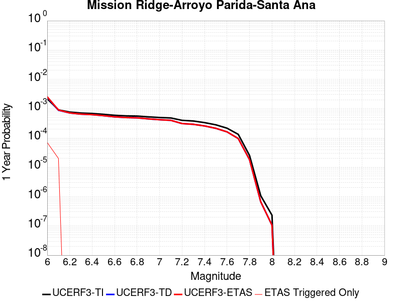 |  |

| Magnitude | 1 wk TI Prob | 1 wk TD Prob | 1 wk ETAS Prob | 1 wk ETAS/TD Gain | 1 wk ETAS Triggered Only | 1 mo TI Prob | 1 mo TD Prob | 1 mo ETAS Prob | 1 mo ETAS/TD Gain | 1 mo ETAS Triggered Only | 1 yr TI Prob | 1 yr TD Prob | 1 yr ETAS Prob | 1 yr ETAS/TD Gain | 1 yr ETAS Triggered Only | 10 yr TI Prob | 10 yr TD Prob | 10 yr ETAS Prob | 10 yr ETAS/TD Gain | 10 yr ETAS Triggered Only |
|-----|-----|-----|-----|-----|-----|-----|-----|-----|-----|-----|-----|-----|-----|-----|-----|-----|-----|-----|-----|-----|
| 6.0 | 4.169034E-5 | 4.7137048E-5 | 6.7136105E-5 | 1.4242747 | 2.0E-5 | 1.7866064E-4 | 2.0200513E-4 | 2.3199907E-4 | 1.1484811 | 3.0E-5 | 0.0021730233 | 0.0024574657 | 0.0025272937 | 1.0284146 | 7.0E-5 | 0.021518968 | 0.02438483 | 0.024482392 | 1.0040009 | 1.0E-4 |
| 6.1 | 1.73813E-5 | 1.6854203E-5 | 1.6854203E-5 | 1.0 | 0.0 | 7.4489166E-5 | 7.223036E-5 | 8.2229635E-5 | 1.138436 | 1.0E-5 | 9.065282E-4 | 8.790605E-4 | 8.9904293E-4 | 1.0227315 | 2.0E-5 | 0.009028391 | 0.008757128 | 0.0087967785 | 1.0045277 | 4.0E-5 |
| 6.2 | 1.4622182E-5 | 1.3673262E-5 | 1.3673262E-5 | 1.0 | 0.0 | 6.2664985E-5 | 5.85984E-5 | 5.85984E-5 | 1.0 | 0.0 | 7.6267915E-4 | 7.132059E-4 | 7.132059E-4 | 1.0 | 0.0 | 0.007600669 | 0.007109767 | 0.007119696 | 1.0013965 | 1.0E-5 |
| 6.3 | 1.3552434E-5 | 1.2482174E-5 | 1.2482174E-5 | 1.0 | 0.0 | 5.8080568E-5 | 5.349395E-5 | 5.349395E-5 | 1.0 | 0.0 | 7.069015E-4 | 6.510974E-4 | 6.510974E-4 | 1.0 | 0.0 | 0.00704657 | 0.006492415 | 0.00650235 | 1.0015303 | 1.0E-5 |
| 6.4 | 1.30977305E-5 | 1.1979128E-5 | 1.1979128E-5 | 1.0 | 0.0 | 5.613192E-5 | 5.133813E-5 | 5.133813E-5 | 1.0 | 0.0 | 6.831918E-4 | 6.2486547E-4 | 6.2486547E-4 | 1.0 | 0.0 | 0.006810953 | 0.006231584 | 0.006241522 | 1.0015948 | 1.0E-5 |
| 6.5 | 1.225205E-5 | 1.1048776E-5 | 1.1048776E-5 | 1.0 | 0.0 | 5.2507727E-5 | 4.735105E-5 | 4.735105E-5 | 1.0 | 0.0 | 6.3909404E-4 | 5.7634927E-4 | 5.7634927E-4 | 1.0 | 0.0 | 0.006372592 | 0.005749009 | 0.005749009 | 1.0 | 0.0 |
| 6.6 | 1.1352241E-5 | 1.0063508E-5 | 1.0063508E-5 | 1.0 | 0.0 | 4.8651553E-5 | 4.3128617E-5 | 4.3128617E-5 | 1.0 | 0.0 | 5.921717E-4 | 5.249665E-4 | 5.249665E-4 | 1.0 | 0.0 | 0.0059059616 | 0.0052376646 | 0.0052376646 | 1.0 | 0.0 |
| 6.7 | 1.0864116E-5 | 9.517E-6 | 9.517E-6 | 1.0 | 0.0 | 4.6559664E-5 | 4.0786515E-5 | 4.0786515E-5 | 1.0 | 0.0 | 5.667165E-4 | 4.964647E-4 | 4.964647E-4 | 1.0 | 0.0 | 0.005652734 | 0.0049539437 | 0.0049539437 | 1.0 | 0.0 |
| 6.8 | 1.0666365E-5 | 9.299752E-6 | 9.299752E-6 | 1.0 | 0.0 | 4.571219E-5 | 3.985548E-5 | 3.985548E-5 | 1.0 | 0.0 | 5.564038E-4 | 4.8513446E-4 | 4.8513446E-4 | 1.0 | 0.0 | 0.005550127 | 0.00484114 | 0.00484114 | 1.0 | 0.0 |
| 6.9 | 1.0038665E-5 | 8.592018E-6 | 8.592018E-6 | 1.0 | 0.0 | 4.302214E-5 | 3.682243E-5 | 3.682243E-5 | 1.0 | 0.0 | 5.236687E-4 | 4.4822265E-4 | 4.4822265E-4 | 1.0 | 0.0 | 0.005224364 | 0.0044735507 | 0.0044735507 | 1.0 | 0.0 |
| 7.0 | 9.5379955E-6 | 8.025047E-6 | 8.025047E-6 | 1.0 | 0.0 | 4.0876483E-5 | 3.439261E-5 | 3.439261E-5 | 1.0 | 0.0 | 4.975576E-4 | 4.1865133E-4 | 4.1865133E-4 | 1.0 | 0.0 | 0.00496445 | 0.00417898 | 0.00417898 | 1.0 | 0.0 |
| 7.1 | 9.207389E-6 | 7.652347E-6 | 7.652347E-6 | 1.0 | 0.0 | 3.945964E-5 | 3.2795375E-5 | 3.2795375E-5 | 1.0 | 0.0 | 4.803152E-4 | 3.992122E-4 | 3.992122E-4 | 1.0 | 0.0 | 0.004792784 | 0.003985301 | 0.003985301 | 1.0 | 0.0 |
| 7.2 | 7.638091E-6 | 5.9310923E-6 | 5.9310923E-6 | 1.0 | 0.0 | 3.2734264E-5 | 2.5418722E-5 | 2.5418722E-5 | 1.0 | 0.0 | 3.984668E-4 | 3.094293E-4 | 3.094293E-4 | 1.0 | 0.0 | 0.0039775306 | 0.0030901956 | 0.0030901956 | 1.0 | 0.0 |
| 7.3 | 7.2500147E-6 | 5.596131E-6 | 5.596131E-6 | 1.0 | 0.0 | 3.1071122E-5 | 2.3983199E-5 | 2.3983199E-5 | 1.0 | 0.0 | 3.7822526E-4 | 2.9195662E-4 | 2.9195662E-4 | 1.0 | 0.0 | 0.0037758215 | 0.0029159402 | 0.0029159402 | 1.0 | 0.0 |
| 7.4 | 6.3899715E-6 | 4.9184864E-6 | 4.9184864E-6 | 1.0 | 0.0 | 2.7385306E-5 | 2.1079059E-5 | 2.1079059E-5 | 1.0 | 0.0 | 3.3336508E-4 | 2.566075E-4 | 2.566075E-4 | 1.0 | 0.0 | 0.0033286542 | 0.002563311 | 0.002563311 | 1.0 | 0.0 |
| 7.5 | 5.379025E-6 | 4.0838477E-6 | 4.0838477E-6 | 1.0 | 0.0 | 2.305276E-5 | 1.7502087E-5 | 1.7502087E-5 | 1.0 | 0.0 | 2.806312E-4 | 2.1306718E-4 | 2.1306718E-4 | 1.0 | 0.0 | 0.0028027708 | 0.0021286402 | 0.0021286402 | 1.0 | 0.0 |
| 7.6 | 4.1270696E-6 | 3.0883373E-6 | 3.0883373E-6 | 1.0 | 0.0 | 1.768732E-5 | 1.32356645E-5 | 1.32356645E-5 | 1.0 | 0.0 | 2.1532185E-4 | 1.6113237E-4 | 1.6113237E-4 | 1.0 | 0.0 | 0.0021511333 | 0.0016101635 | 0.0016101635 | 1.0 | 0.0 |
| 7.7 | 2.5406805E-6 | 1.8282044E-6 | 1.8282044E-6 | 1.0 | 0.0 | 1.0888585E-5 | 7.835139E-6 | 7.835139E-6 | 1.0 | 0.0 | 1.3256045E-4 | 9.53887E-5 | 9.53887E-5 | 1.0 | 0.0 | 0.0013248142 | 9.534837E-4 | 9.534837E-4 | 1.0 | 0.0 |
| 7.8 | 4.8608285E-7 | 3.509864E-7 | 3.509864E-7 | 1.0 | 0.0 | 2.0832106E-6 | 1.5042266E-6 | 1.5042266E-6 | 1.0 | 0.0 | 2.5362791E-5 | 1.8313805E-5 | 1.8313805E-5 | 1.0 | 0.0 | 2.5359896E-4 | 1.8312308E-4 | 1.8312308E-4 | 1.0 | 0.0 |
| 7.9 | 2.0472514E-8 | 1.2688718E-8 | 1.2688718E-8 | 1.0 | 0.0 | 8.7739345E-8 | 5.438022E-8 | 5.438022E-8 | 1.0 | 0.0 | 1.068226E-6 | 6.6207895E-7 | 6.6207895E-7 | 1.0 | 0.0 | 1.0682209E-5 | 6.620771E-6 | 6.620771E-6 | 1.0 | 0.0 |
| 8.0 | 4.443582E-9 | 2.032067E-9 | 2.032067E-9 | 1.0 | 0.0 | 1.9043922E-8 | 8.7088585E-9 | 8.7088585E-9 | 1.0 | 0.0 | 2.3185973E-7 | 1.0603035E-7 | 1.0603035E-7 | 1.0 | 0.0 | 2.3185949E-6 | 1.0603031E-6 | 1.0603031E-6 | 1.0 | 0.0 |

## Oceanic - West Huasna
*[(top)](#table-of-contents)*

| 1 Week | 1 Month | 1 Year | 10 Year |
|-----|-----|-----|-----|
|  |  | 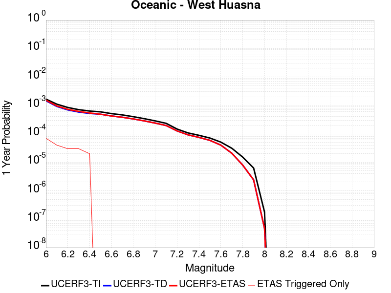 |  |

| Magnitude | 1 wk TI Prob | 1 wk TD Prob | 1 wk ETAS Prob | 1 wk ETAS/TD Gain | 1 wk ETAS Triggered Only | 1 mo TI Prob | 1 mo TD Prob | 1 mo ETAS Prob | 1 mo ETAS/TD Gain | 1 mo ETAS Triggered Only | 1 yr TI Prob | 1 yr TD Prob | 1 yr ETAS Prob | 1 yr ETAS/TD Gain | 1 yr ETAS Triggered Only | 10 yr TI Prob | 10 yr TD Prob | 10 yr ETAS Prob | 10 yr ETAS/TD Gain | 10 yr ETAS Triggered Only |
|-----|-----|-----|-----|-----|-----|-----|-----|-----|-----|-----|-----|-----|-----|-----|-----|-----|-----|-----|-----|-----|
| 6.0 | 3.195567E-5 | 2.7926368E-5 | 5.792553E-5 | 2.0742235 | 3.0E-5 | 1.3694567E-4 | 1.19679185E-4 | 1.596744E-4 | 1.3341869 | 4.0E-5 | 0.0016660384 | 0.0014561634 | 0.0015260613 | 1.0480015 | 7.0E-5 | 0.016536033 | 0.01447077 | 0.014559468 | 1.0061294 | 9.0E-5 |
| 6.1 | 2.1156782E-5 | 1.7573117E-5 | 4.757259E-5 | 2.707123 | 3.0E-5 | 9.066878E-5 | 7.531123E-5 | 1.1530823E-4 | 1.5310892 | 4.0E-5 | 0.0011033333 | 9.1653795E-4 | 9.565013E-4 | 1.0436025 | 4.0E-5 | 0.010978713 | 0.009128587 | 0.009178131 | 1.0054272 | 5.0E-5 |
| 6.2 | 1.6195117E-5 | 1.3327227E-5 | 4.332683E-5 | 3.251001 | 3.0E-5 | 6.9405796E-5 | 5.7115452E-5 | 8.711374E-5 | 1.525222 | 3.0E-5 | 8.44688E-4 | 6.9516135E-4 | 7.251405E-4 | 1.0431254 | 3.0E-5 | 0.008414844 | 0.0069301617 | 0.0069698845 | 1.0057318 | 4.0E-5 |
| 6.3 | 1.3559345E-5 | 1.1179013E-5 | 4.117868E-5 | 3.68357 | 3.0E-5 | 5.811018E-5 | 4.7909183E-5 | 7.7907745E-5 | 1.6261548 | 3.0E-5 | 7.072618E-4 | 5.8313913E-4 | 6.1312167E-4 | 1.0514157 | 3.0E-5 | 0.0070501505 | 0.005816208 | 0.005855975 | 1.0068374 | 4.0E-5 |
| 6.4 | 1.2120619E-5 | 1.0000874E-5 | 3.0000674E-5 | 2.9998052 | 2.0E-5 | 5.1944477E-5 | 4.2860185E-5 | 6.2859326E-5 | 1.4666135 | 2.0E-5 | 6.322405E-4 | 5.216983E-4 | 5.416879E-4 | 1.0383164 | 2.0E-5 | 0.006304447 | 0.005204804 | 0.0052346475 | 1.0057338 | 3.0E-5 |
| 6.5 | 1.13511915E-5 | 9.367378E-6 | 9.367378E-6 | 1.0 | 0.0 | 4.8647056E-5 | 4.0145293E-5 | 4.0145293E-5 | 1.0 | 0.0 | 5.9211696E-4 | 4.886598E-4 | 4.886598E-4 | 1.0 | 0.0 | 0.0059054173 | 0.0048759114 | 0.0048858626 | 1.0020409 | 1.0E-5 |
| 6.6 | 9.850605E-6 | 8.1353155E-6 | 8.1353155E-6 | 1.0 | 0.0 | 4.2216197E-5 | 3.4865174E-5 | 3.4865174E-5 | 1.0 | 0.0 | 5.1386096E-4 | 4.2440102E-4 | 4.2440102E-4 | 1.0 | 0.0 | 0.0051267436 | 0.0042359377 | 0.0042359377 | 1.0 | 0.0 |
| 6.7 | 8.8558645E-6 | 7.318341E-6 | 7.318341E-6 | 1.0 | 0.0 | 3.7953152E-5 | 3.1363943E-5 | 3.1363943E-5 | 1.0 | 0.0 | 4.6198163E-4 | 3.8178926E-4 | 3.8178926E-4 | 1.0 | 0.0 | 0.004610224 | 0.0038113592 | 0.0038113592 | 1.0 | 0.0 |
| 6.8 | 7.67136E-6 | 6.39169E-6 | 6.39169E-6 | 1.0 | 0.0 | 3.2876844E-5 | 2.739267E-5 | 2.739267E-5 | 1.0 | 0.0 | 4.0020206E-4 | 3.3345487E-4 | 3.3345487E-4 | 1.0 | 0.0 | 0.003994821 | 0.0033295664 | 0.0033295664 | 1.0 | 0.0 |
| 6.9 | 6.534529E-6 | 5.458261E-6 | 5.458261E-6 | 1.0 | 0.0 | 2.8004823E-5 | 2.3392338E-5 | 2.3392338E-5 | 1.0 | 0.0 | 3.4090536E-4 | 2.8476462E-4 | 2.8476462E-4 | 1.0 | 0.0 | 0.0034038287 | 0.002844014 | 0.002844014 | 1.0 | 0.0 |
| 7.0 | 5.460525E-6 | 4.5699203E-6 | 4.5699203E-6 | 1.0 | 0.0 | 2.3402039E-5 | 1.9585226E-5 | 1.9585226E-5 | 1.0 | 0.0 | 2.8488258E-4 | 2.3842414E-4 | 2.3842414E-4 | 1.0 | 0.0 | 0.0028451765 | 0.0023816973 | 0.0023816973 | 1.0 | 0.0 |
| 7.1 | 4.4825083E-6 | 3.7524153E-6 | 3.7524153E-6 | 1.0 | 0.0 | 1.9210609E-5 | 1.6081682E-5 | 1.6081682E-5 | 1.0 | 0.0 | 2.3386406E-4 | 1.9577699E-4 | 1.9577699E-4 | 1.0 | 0.0 | 0.002336181 | 0.001956057 | 0.001956057 | 1.0 | 0.0 |
| 7.2 | 2.821708E-6 | 2.424941E-6 | 2.424941E-6 | 1.0 | 0.0 | 1.2092979E-5 | 1.0392562E-5 | 1.0392562E-5 | 1.0 | 0.0 | 1.4722206E-4 | 1.265221E-4 | 1.265221E-4 | 1.0 | 0.0 | 0.0014712457 | 0.0012645032 | 0.0012645032 | 1.0 | 0.0 |
| 7.3 | 2.0644757E-6 | 1.7687502E-6 | 1.7687502E-6 | 1.0 | 0.0 | 8.847723E-6 | 7.580336E-6 | 7.580336E-6 | 1.0 | 0.0 | 1.0771569E-4 | 9.228668E-5 | 9.228668E-5 | 1.0 | 0.0 | 0.001076635 | 9.224854E-4 | 9.224854E-4 | 1.0 | 0.0 |
| 7.4 | 1.6980367E-6 | 1.4379966E-6 | 1.4379966E-6 | 1.0 | 0.0 | 7.27728E-6 | 6.1628284E-6 | 6.1628284E-6 | 1.0 | 0.0 | 8.8597284E-5 | 7.502986E-5 | 7.502986E-5 | 1.0 | 0.0 | 8.8561967E-4 | 7.5004686E-4 | 7.5004686E-4 | 1.0 | 0.0 |
| 7.5 | 1.3637683E-6 | 1.1302697E-6 | 1.1302697E-6 | 1.0 | 0.0 | 5.844708E-6 | 4.844004E-6 | 4.844004E-6 | 1.0 | 0.0 | 7.1156996E-5 | 5.897415E-5 | 5.897415E-5 | 1.0 | 0.0 | 7.1134215E-4 | 5.8958656E-4 | 5.8958656E-4 | 1.0 | 0.0 |
| 7.6 | 9.802994E-7 | 7.6772847E-7 | 7.6772847E-7 | 1.0 | 0.0 | 4.2012766E-6 | 3.2902608E-6 | 3.2902608E-6 | 1.0 | 0.0 | 5.1149345E-5 | 4.005819E-5 | 4.005819E-5 | 1.0 | 0.0 | 5.113757E-4 | 4.0051117E-4 | 4.0051117E-4 | 1.0 | 0.0 |
| 7.7 | 5.986191E-7 | 4.0050708E-7 | 4.0050708E-7 | 1.0 | 0.0 | 2.5655079E-6 | 1.7164577E-6 | 1.7164577E-6 | 1.0 | 0.0 | 3.1234613E-5 | 2.0897673E-5 | 2.0897673E-5 | 1.0 | 0.0 | 3.123022E-4 | 2.0895849E-4 | 2.0895849E-4 | 1.0 | 0.0 |
| 7.8 | 2.9189815E-7 | 1.5285202E-7 | 1.5285202E-7 | 1.0 | 0.0 | 1.2509914E-6 | 6.5507993E-7 | 6.5507993E-7 | 1.0 | 0.0 | 1.5230714E-5 | 7.975569E-6 | 7.975569E-6 | 1.0 | 0.0 | 1.522967E-4 | 7.97542E-5 | 7.97542E-5 | 1.0 | 0.0 |
| 7.9 | 1.2057845E-7 | 4.6208047E-8 | 4.6208047E-8 | 1.0 | 0.0 | 5.1676466E-7 | 1.9803447E-7 | 1.9803447E-7 | 1.0 | 0.0 | 6.2915915E-6 | 2.411067E-6 | 2.411067E-6 | 1.0 | 0.0 | 6.2914136E-5 | 2.4111772E-5 | 2.4111772E-5 | 1.0 | 0.0 |
| 8.0 | 3.3806387E-9 | 9.0093144E-10 | 9.0093144E-10 | 1.0 | 0.0 | 1.4488451E-8 | 3.8611354E-9 | 3.8611354E-9 | 1.0 | 0.0 | 1.7639688E-7 | 4.7009323E-8 | 4.7009323E-8 | 1.0 | 0.0 | 1.7639674E-6 | 4.712806E-7 | 4.712806E-7 | 1.0 | 0.0 |

## Whittier alt 1
*[(top)](#table-of-contents)*

| 1 Week | 1 Month | 1 Year | 10 Year |
|-----|-----|-----|-----|
| 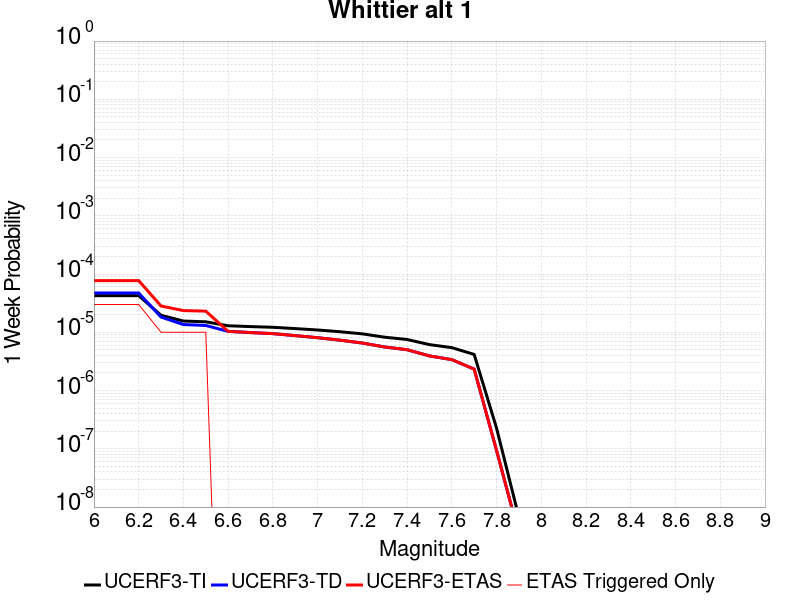 |  |  | 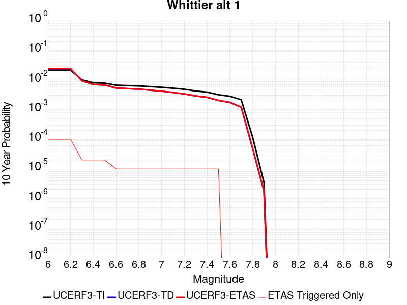 |

| Magnitude | 1 wk TI Prob | 1 wk TD Prob | 1 wk ETAS Prob | 1 wk ETAS/TD Gain | 1 wk ETAS Triggered Only | 1 mo TI Prob | 1 mo TD Prob | 1 mo ETAS Prob | 1 mo ETAS/TD Gain | 1 mo ETAS Triggered Only | 1 yr TI Prob | 1 yr TD Prob | 1 yr ETAS Prob | 1 yr ETAS/TD Gain | 1 yr ETAS Triggered Only | 10 yr TI Prob | 10 yr TD Prob | 10 yr ETAS Prob | 10 yr ETAS/TD Gain | 10 yr ETAS Triggered Only |
|-----|-----|-----|-----|-----|-----|-----|-----|-----|-----|-----|-----|-----|-----|-----|-----|-----|-----|-----|-----|-----|
| 6.0 | 4.2554693E-5 | 4.7252182E-5 | 7.725076E-5 | 1.6348614 | 3.0E-5 | 1.8236451E-4 | 2.0249544E-4 | 2.4248734E-4 | 1.1974953 | 4.0E-5 | 0.002218027 | 0.0024629163 | 0.002532744 | 1.0283515 | 7.0E-5 | 0.02196019 | 0.024390263 | 0.024487825 | 1.004 | 1.0E-4 |
| 6.1 | 4.2554693E-5 | 4.7252182E-5 | 7.725076E-5 | 1.6348614 | 3.0E-5 | 1.8236451E-4 | 2.0249544E-4 | 2.4248734E-4 | 1.1974953 | 4.0E-5 | 0.002218027 | 0.0024629163 | 0.002532744 | 1.0283515 | 7.0E-5 | 0.02196019 | 0.024390263 | 0.024487825 | 1.004 | 1.0E-4 |
| 6.2 | 4.2554693E-5 | 4.7252182E-5 | 7.725076E-5 | 1.6348614 | 3.0E-5 | 1.8236451E-4 | 2.0249544E-4 | 2.4248734E-4 | 1.1974953 | 4.0E-5 | 0.002218027 | 0.0024629163 | 0.002532744 | 1.0283515 | 7.0E-5 | 0.02196019 | 0.024390263 | 0.024487825 | 1.004 | 1.0E-4 |
| 6.3 | 1.9617712E-5 | 1.826841E-5 | 2.8268229E-5 | 1.547383 | 1.0E-5 | 8.40732E-5 | 7.829095E-5 | 9.8289376E-5 | 1.2554374 | 2.0E-5 | 0.0010231105 | 9.527944E-4 | 9.7277533E-4 | 1.020971 | 2.0E-5 | 0.01018413 | 0.0094904 | 0.00951021 | 1.0020874 | 2.0E-5 |
| 6.4 | 1.5611336E-5 | 1.3604089E-5 | 2.3603954E-5 | 1.7350631 | 1.0E-5 | 6.690401E-5 | 5.8301972E-5 | 7.830081E-5 | 1.3430216 | 2.0E-5 | 8.142519E-4 | 7.096013E-4 | 7.295871E-4 | 1.0281649 | 2.0E-5 | 0.008112748 | 0.0070753377 | 0.0070951963 | 1.0028067 | 2.0E-5 |
| 6.5 | 1.5150166E-5 | 1.3100744E-5 | 2.3100612E-5 | 1.7633054 | 1.0E-5 | 6.492767E-5 | 5.614487E-5 | 7.614375E-5 | 1.3562013 | 2.0E-5 | 7.9020765E-4 | 6.8335526E-4 | 7.033416E-4 | 1.0292474 | 2.0E-5 | 0.007874036 | 0.006814508 | 0.0068343715 | 1.0029149 | 2.0E-5 |
| 6.6 | 1.295588E-5 | 1.0380544E-5 | 1.0380544E-5 | 1.0 | 0.0 | 5.552402E-5 | 4.44873E-5 | 5.4486853E-5 | 1.2247733 | 1.0E-5 | 6.7579525E-4 | 5.415002E-4 | 5.5149477E-4 | 1.0184572 | 1.0E-5 | 0.006737438 | 0.005403343 | 0.005413289 | 1.0018407 | 1.0E-5 |
| 6.7 | 1.2542085E-5 | 9.899189E-6 | 9.899189E-6 | 1.0 | 0.0 | 5.3750682E-5 | 4.2424414E-5 | 5.242399E-5 | 1.2357033 | 1.0E-5 | 6.542181E-4 | 5.163967E-4 | 5.2639155E-4 | 1.0193549 | 1.0E-5 | 0.006522954 | 0.005153464 | 0.0051634125 | 1.0019305 | 1.0E-5 |
| 6.8 | 1.2195878E-5 | 9.49523E-6 | 9.49523E-6 | 1.0 | 0.0 | 5.2267E-5 | 4.069322E-5 | 5.069281E-5 | 1.2457312 | 1.0E-5 | 6.36165E-4 | 4.9532915E-4 | 5.053242E-4 | 1.0201786 | 1.0E-5 | 0.0063434686 | 0.0049436963 | 0.004953647 | 1.0020127 | 1.0E-5 |
| 6.9 | 1.1580298E-5 | 8.772739E-6 | 8.772739E-6 | 1.0 | 0.0 | 4.9628903E-5 | 3.759692E-5 | 4.7596546E-5 | 1.2659692 | 1.0E-5 | 6.040644E-4 | 4.5764804E-4 | 4.6764346E-4 | 1.0218408 | 1.0E-5 | 0.00602425 | 0.0045684646 | 0.0045784186 | 1.0021789 | 1.0E-5 |
| 7.0 | 1.0964795E-5 | 8.083794E-6 | 8.083794E-6 | 1.0 | 0.0 | 4.6991136E-5 | 3.4644378E-5 | 4.464403E-5 | 1.2886372 | 1.0E-5 | 5.7196687E-4 | 4.217152E-4 | 4.3171097E-4 | 1.0237027 | 1.0E-5 | 0.0057049696 | 0.004210459 | 0.004220417 | 1.002365 | 1.0E-5 |
| 7.1 | 1.0230601E-5 | 7.32646E-6 | 7.32646E-6 | 1.0 | 0.0 | 4.3844695E-5 | 3.1398744E-5 | 4.139843E-5 | 1.318474 | 1.0E-5 | 5.336784E-4 | 3.8221394E-4 | 3.9221012E-4 | 1.0261533 | 1.0E-5 | 0.005323986 | 0.0038167592 | 0.003826721 | 1.00261 | 1.0E-5 |
| 7.2 | 9.40865E-6 | 6.5430822E-6 | 6.5430822E-6 | 1.0 | 0.0 | 4.032216E-5 | 2.8041486E-5 | 3.8041206E-5 | 1.3566045 | 1.0E-5 | 4.908117E-4 | 3.4135283E-4 | 3.5134942E-4 | 1.0292852 | 1.0E-5 | 0.0048972913 | 0.0034094024 | 0.0034193683 | 1.002923 | 1.0E-5 |
| 7.3 | 8.237384E-6 | 5.5975433E-6 | 5.5975433E-6 | 1.0 | 0.0 | 3.5302593E-5 | 2.3989258E-5 | 3.3989018E-5 | 1.4168433 | 1.0E-5 | 4.2972428E-4 | 2.920311E-4 | 3.020282E-4 | 1.034233 | 1.0E-5 | 0.0042889426 | 0.0029167992 | 0.0029267701 | 1.0034184 | 1.0E-5 |
| 7.4 | 7.5316966E-6 | 5.0276153E-6 | 5.0276153E-6 | 1.0 | 0.0 | 3.2278298E-5 | 2.154675E-5 | 3.1546533E-5 | 1.4640971 | 1.0E-5 | 3.9291743E-4 | 2.623011E-4 | 2.722985E-4 | 1.0381141 | 1.0E-5 | 0.0039222343 | 0.0026200267 | 0.0026300005 | 1.0038067 | 1.0E-5 |
| 7.5 | 6.149649E-6 | 3.9336355E-6 | 3.9336355E-6 | 1.0 | 0.0 | 2.6355372E-5 | 1.6858336E-5 | 2.6858166E-5 | 1.5931684 | 1.0E-5 | 3.208294E-4 | 2.052318E-4 | 2.1522974E-4 | 1.0487154 | 1.0E-5 | 0.003203666 | 0.0020505118 | 0.0020604914 | 1.0048668 | 1.0E-5 |
| 7.6 | 5.457711E-6 | 3.3951796E-6 | 3.3951796E-6 | 1.0 | 0.0 | 2.338998E-5 | 1.4550694E-5 | 1.4550694E-5 | 1.0 | 0.0 | 2.8473578E-4 | 1.771411E-4 | 1.771411E-4 | 1.0 | 0.0 | 0.0028437122 | 0.0017700798 | 0.0017700798 | 1.0 | 0.0 |
| 7.7 | 4.1676276E-6 | 2.3329922E-6 | 2.3329922E-6 | 1.0 | 0.0 | 1.7861139E-5 | 9.998504E-6 | 9.998504E-6 | 1.0 | 0.0 | 2.1743766E-4 | 1.2172572E-4 | 1.2172572E-4 | 1.0 | 0.0 | 0.0021722503 | 0.0012166635 | 0.0012166635 | 1.0 | 0.0 |
| 7.8 | 2.2692414E-7 | 9.384417E-8 | 9.384417E-8 | 1.0 | 0.0 | 9.725317E-7 | 4.0218927E-7 | 4.0218927E-7 | 1.0 | 0.0 | 1.1840509E-5 | 4.8966467E-6 | 4.8966467E-6 | 1.0 | 0.0 | 1.1839878E-4 | 4.8965718E-5 | 4.8965718E-5 | 1.0 | 0.0 |
| 7.9 | 6.676829E-9 | 3.4397174E-9 | 3.4397174E-9 | 1.0 | 0.0 | 2.861498E-8 | 1.4741646E-8 | 1.4741646E-8 | 1.0 | 0.0 | 3.4838732E-7 | 1.7947953E-7 | 1.7947953E-7 | 1.0 | 0.0 | 3.4838679E-6 | 1.794794E-6 | 1.794794E-6 | 1.0 | 0.0 |

## Chino alt 1
*[(top)](#table-of-contents)*

| 1 Week | 1 Month | 1 Year | 10 Year |
|-----|-----|-----|-----|
|  |  |  |  |

| Magnitude | 1 wk TI Prob | 1 wk TD Prob | 1 wk ETAS Prob | 1 wk ETAS/TD Gain | 1 wk ETAS Triggered Only | 1 mo TI Prob | 1 mo TD Prob | 1 mo ETAS Prob | 1 mo ETAS/TD Gain | 1 mo ETAS Triggered Only | 1 yr TI Prob | 1 yr TD Prob | 1 yr ETAS Prob | 1 yr ETAS/TD Gain | 1 yr ETAS Triggered Only | 10 yr TI Prob | 10 yr TD Prob | 10 yr ETAS Prob | 10 yr ETAS/TD Gain | 10 yr ETAS Triggered Only |
|-----|-----|-----|-----|-----|-----|-----|-----|-----|-----|-----|-----|-----|-----|-----|-----|-----|-----|-----|-----|-----|
| 6.0 | 3.939946E-5 | 4.894798E-5 | 9.894554E-5 | 2.0214427 | 5.0E-5 | 1.6884391E-4 | 2.0976314E-4 | 2.5975265E-4 | 1.2383142 | 5.0E-5 | 0.0020537362 | 0.002551385 | 0.0026411554 | 1.035185 | 9.0E-5 | 0.020348595 | 0.025280168 | 0.025387388 | 1.0042412 | 1.1E-4 |
| 6.1 | 2.1505624E-5 | 2.6878823E-5 | 4.6878286E-5 | 1.7440602 | 2.0E-5 | 9.2163704E-5 | 1.15190494E-4 | 1.351882E-4 | 1.1736054 | 2.0E-5 | 0.0011215154 | 0.0014016517 | 0.0014415955 | 1.0284978 | 4.0E-5 | 0.011158722 | 0.013947425 | 0.013996728 | 1.0035349 | 5.0E-5 |
| 6.2 | 2.1505624E-5 | 2.6878823E-5 | 4.6878286E-5 | 1.7440602 | 2.0E-5 | 9.2163704E-5 | 1.15190494E-4 | 1.351882E-4 | 1.1736054 | 2.0E-5 | 0.0011215154 | 0.0014016517 | 0.0014415955 | 1.0284978 | 4.0E-5 | 0.011158722 | 0.013947425 | 0.013996728 | 1.0035349 | 5.0E-5 |
| 6.3 | 1.4290785E-5 | 1.8164832E-5 | 3.8164468E-5 | 2.1010087 | 2.0E-5 | 6.1244784E-5 | 7.784722E-5 | 9.784566E-5 | 1.2568935 | 2.0E-5 | 7.454001E-4 | 9.4742293E-4 | 9.773945E-4 | 1.0316348 | 3.0E-5 | 0.007429048 | 0.00944674 | 0.009486362 | 1.0041943 | 4.0E-5 |
| 6.4 | 1.4290785E-5 | 1.8164832E-5 | 3.8164468E-5 | 2.1010087 | 2.0E-5 | 6.1244784E-5 | 7.784722E-5 | 9.784566E-5 | 1.2568935 | 2.0E-5 | 7.454001E-4 | 9.4742293E-4 | 9.773945E-4 | 1.0316348 | 3.0E-5 | 0.007429048 | 0.00944674 | 0.009486362 | 1.0041943 | 4.0E-5 |
| 6.5 | 1.3017944E-5 | 1.6651793E-5 | 3.6651458E-5 | 2.201052 | 2.0E-5 | 5.5789995E-5 | 7.1363116E-5 | 9.136169E-5 | 1.2802368 | 2.0E-5 | 6.790315E-4 | 8.6854334E-4 | 8.985173E-4 | 1.0345106 | 3.0E-5 | 0.0067696036 | 0.008664233 | 0.0087038865 | 1.0045767 | 4.0E-5 |
| 6.6 | 9.470016E-6 | 1.2039209E-5 | 3.203897E-5 | 2.6612186 | 2.0E-5 | 4.058515E-5 | 5.159578E-5 | 7.1594746E-5 | 1.3876086 | 2.0E-5 | 4.940122E-4 | 6.280315E-4 | 6.580127E-4 | 1.0477383 | 3.0E-5 | 0.004929154 | 0.006273248 | 0.0063129966 | 1.0063363 | 4.0E-5 |
| 6.7 | 8.314155E-6 | 1.040749E-5 | 3.0407282E-5 | 2.9216728 | 2.0E-5 | 3.5631605E-5 | 4.4602948E-5 | 6.4602056E-5 | 1.4483808 | 2.0E-5 | 4.3372845E-4 | 5.4293784E-4 | 5.7292153E-4 | 1.0552249 | 3.0E-5 | 0.004328829 | 0.0054270807 | 0.0054668635 | 1.0073304 | 4.0E-5 |
| 6.8 | 3.4856364E-6 | 3.8134033E-6 | 3.8134033E-6 | 1.0 | 0.0 | 1.4938357E-5 | 1.6343065E-5 | 1.6343065E-5 | 1.0 | 0.0 | 1.8185932E-4 | 1.9896074E-4 | 1.9896074E-4 | 1.0 | 0.0 | 0.0018171056 | 0.0019894529 | 0.0019894529 | 1.0 | 0.0 |
| 6.9 | 2.2645952E-6 | 2.152909E-6 | 2.152909E-6 | 1.0 | 0.0 | 9.705372E-6 | 9.226722E-6 | 9.226722E-6 | 1.0 | 0.0 | 1.18156495E-4 | 1.12329755E-4 | 1.12329755E-4 | 1.0 | 0.0 | 0.0011809369 | 0.0011233138 | 0.0011233138 | 1.0 | 0.0 |
| 7.0 | 1.7864003E-6 | 1.5430741E-6 | 1.5430741E-6 | 1.0 | 0.0 | 7.655979E-6 | 6.613158E-6 | 6.613158E-6 | 1.0 | 0.0 | 9.3207556E-5 | 8.051228E-5 | 8.051228E-5 | 1.0 | 0.0 | 9.316847E-4 | 8.052856E-4 | 8.052856E-4 | 1.0 | 0.0 |
| 7.1 | 1.7315456E-6 | 1.4733466E-6 | 1.4733466E-6 | 1.0 | 0.0 | 7.420889E-6 | 6.314328E-6 | 6.314328E-6 | 1.0 | 0.0 | 9.034557E-5 | 7.687428E-5 | 7.687428E-5 | 1.0 | 0.0 | 9.0308854E-4 | 7.68921E-4 | 7.68921E-4 | 1.0 | 0.0 |
| 7.2 | 1.6008337E-6 | 1.3574178E-6 | 1.3574178E-6 | 1.0 | 0.0 | 6.860698E-6 | 5.817492E-6 | 5.817492E-6 | 1.0 | 0.0 | 8.352579E-5 | 7.082572E-5 | 7.082572E-5 | 1.0 | 0.0 | 8.34944E-4 | 7.0846075E-4 | 7.0846075E-4 | 1.0 | 0.0 |
| 7.3 | 1.3320939E-6 | 1.1217794E-6 | 1.1217794E-6 | 1.0 | 0.0 | 5.7089615E-6 | 4.8076176E-6 | 4.8076176E-6 | 1.0 | 0.0 | 6.9504385E-5 | 5.853122E-5 | 5.853122E-5 | 1.0 | 0.0 | 6.9482654E-4 | 5.8530655E-4 | 5.8530655E-4 | 1.0 | 0.0 |
| 7.4 | 1.114294E-6 | 9.237087E-7 | 9.237087E-7 | 1.0 | 0.0 | 4.775537E-6 | 3.9587458E-6 | 3.9587458E-6 | 1.0 | 0.0 | 5.8140613E-5 | 4.81967E-5 | 4.81967E-5 | 1.0 | 0.0 | 5.81254E-4 | 4.8187698E-4 | 4.8187698E-4 | 1.0 | 0.0 |
| 7.5 | 9.354081E-7 | 7.6233886E-7 | 7.6233886E-7 | 1.0 | 0.0 | 4.0088858E-6 | 3.2671626E-6 | 3.2671626E-6 | 1.0 | 0.0 | 4.8807087E-5 | 3.9777013E-5 | 3.9777013E-5 | 1.0 | 0.0 | 4.879637E-4 | 3.9770233E-4 | 3.9770233E-4 | 1.0 | 0.0 |
| 7.6 | 8.521771E-7 | 6.880688E-7 | 6.880688E-7 | 1.0 | 0.0 | 3.6521824E-6 | 2.948863E-6 | 2.948863E-6 | 1.0 | 0.0 | 4.4464414E-5 | 3.590185E-5 | 3.590185E-5 | 1.0 | 0.0 | 4.4455516E-4 | 3.5896365E-4 | 3.5896365E-4 | 1.0 | 0.0 |
| 7.7 | 2.1803626E-7 | 1.4186368E-7 | 1.4186368E-7 | 1.0 | 0.0 | 9.344408E-7 | 6.0798715E-7 | 6.0798715E-7 | 1.0 | 0.0 | 1.1376757E-5 | 7.4022278E-6 | 7.4022278E-6 | 1.0 | 0.0 | 1.13761744E-4 | 7.402077E-5 | 7.402077E-5 | 1.0 | 0.0 |

## Santa Cruz Island
*[(top)](#table-of-contents)*

| 1 Week | 1 Month | 1 Year | 10 Year |
|-----|-----|-----|-----|
| 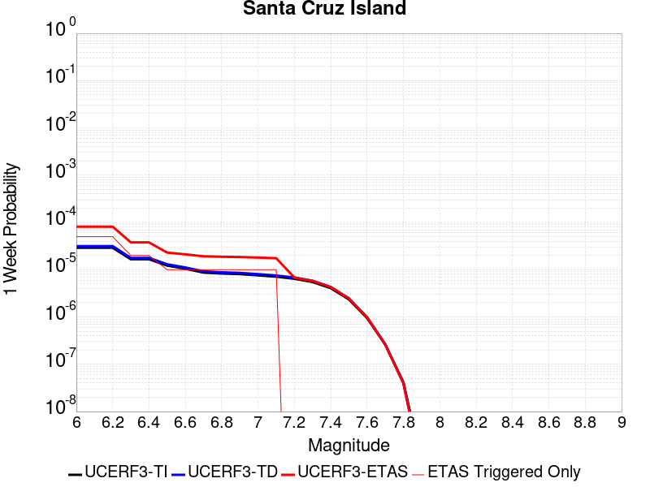 | 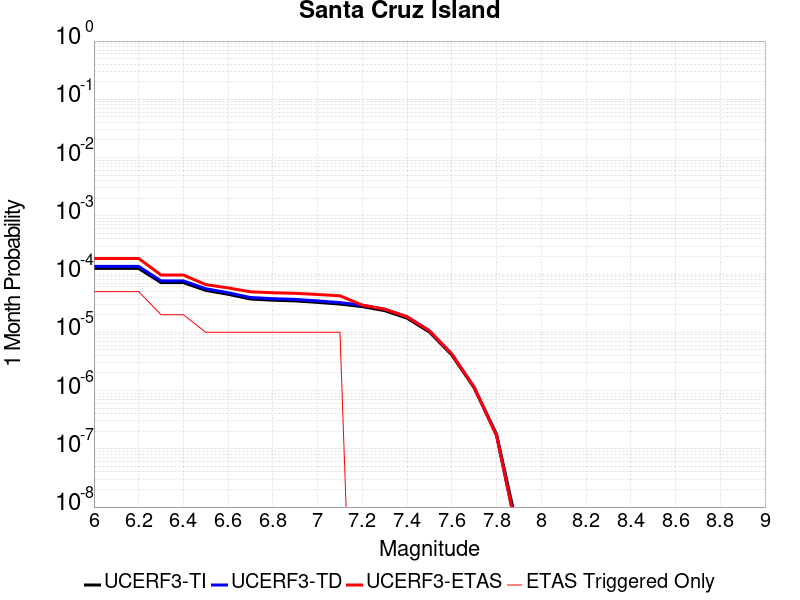 | 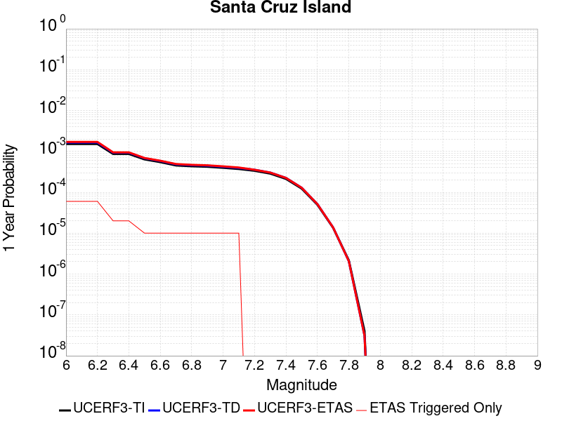 |  |

| Magnitude | 1 wk TI Prob | 1 wk TD Prob | 1 wk ETAS Prob | 1 wk ETAS/TD Gain | 1 wk ETAS Triggered Only | 1 mo TI Prob | 1 mo TD Prob | 1 mo ETAS Prob | 1 mo ETAS/TD Gain | 1 mo ETAS Triggered Only | 1 yr TI Prob | 1 yr TD Prob | 1 yr ETAS Prob | 1 yr ETAS/TD Gain | 1 yr ETAS Triggered Only | 10 yr TI Prob | 10 yr TD Prob | 10 yr ETAS Prob | 10 yr ETAS/TD Gain | 10 yr ETAS Triggered Only |
|-----|-----|-----|-----|-----|-----|-----|-----|-----|-----|-----|-----|-----|-----|-----|-----|-----|-----|-----|-----|-----|
| 6.0 | 2.9164563E-5 | 3.1599742E-5 | 8.159816E-5 | 2.5822413 | 5.0E-5 | 1.2498499E-4 | 1.3542121E-4 | 1.8541444E-4 | 1.3691684 | 5.0E-5 | 0.0015206301 | 0.0016476426 | 0.0017075437 | 1.0363556 | 6.0E-5 | 0.015102667 | 0.016368 | 0.01644669 | 1.0048076 | 8.0E-5 |
| 6.1 | 2.9164563E-5 | 3.1599742E-5 | 8.159816E-5 | 2.5822413 | 5.0E-5 | 1.2498499E-4 | 1.3542121E-4 | 1.8541444E-4 | 1.3691684 | 5.0E-5 | 0.0015206301 | 0.0016476426 | 0.0017075437 | 1.0363556 | 6.0E-5 | 0.015102667 | 0.016368 | 0.01644669 | 1.0048076 | 8.0E-5 |
| 6.2 | 2.9164563E-5 | 3.1599742E-5 | 8.159816E-5 | 2.5822413 | 5.0E-5 | 1.2498499E-4 | 1.3542121E-4 | 1.8541444E-4 | 1.3691684 | 5.0E-5 | 0.0015206301 | 0.0016476426 | 0.0017075437 | 1.0363556 | 6.0E-5 | 0.015102667 | 0.016368 | 0.01644669 | 1.0048076 | 8.0E-5 |
| 6.3 | 1.6635553E-5 | 1.780436E-5 | 3.7804002E-5 | 2.1233003 | 2.0E-5 | 7.1293274E-5 | 7.630227E-5 | 9.630074E-5 | 1.2620955 | 2.0E-5 | 8.6765E-4 | 9.286024E-4 | 9.485838E-4 | 1.0215178 | 2.0E-5 | 0.008642701 | 0.009249094 | 0.009288724 | 1.0042847 | 4.0E-5 |
| 6.4 | 1.6635553E-5 | 1.780436E-5 | 3.7804002E-5 | 2.1233003 | 2.0E-5 | 7.1293274E-5 | 7.630227E-5 | 9.630074E-5 | 1.2620955 | 2.0E-5 | 8.6765E-4 | 9.286024E-4 | 9.485838E-4 | 1.0215178 | 2.0E-5 | 0.008642701 | 0.009249094 | 0.009288724 | 1.0042847 | 4.0E-5 |
| 6.5 | 1.2238748E-5 | 1.3042996E-5 | 2.3042865E-5 | 1.766685 | 1.0E-5 | 5.2450723E-5 | 5.5897377E-5 | 6.589682E-5 | 1.1788893 | 1.0E-5 | 6.3840044E-4 | 6.8034173E-4 | 6.9033494E-4 | 1.0146885 | 1.0E-5 | 0.0063656955 | 0.006782988 | 0.0068028523 | 1.0029285 | 2.0E-5 |
| 6.6 | 1.0489767E-5 | 1.1156636E-5 | 2.1156524E-5 | 1.8963175 | 1.0E-5 | 4.495537E-5 | 4.781329E-5 | 5.7812813E-5 | 1.2091368 | 1.0E-5 | 5.4719415E-4 | 5.819736E-4 | 5.919677E-4 | 1.0171729 | 1.0E-5 | 0.005458487 | 0.005804736 | 0.005814678 | 1.0017127 | 1.0E-5 |
| 6.7 | 8.699222E-6 | 9.236783E-6 | 1.923669E-5 | 2.082618 | 1.0E-5 | 3.7281847E-5 | 3.958561E-5 | 4.958522E-5 | 1.252607 | 1.0E-5 | 4.5381195E-4 | 4.818488E-4 | 4.9184397E-4 | 1.0207434 | 1.0E-5 | 0.0045288634 | 0.004808108 | 0.00481806 | 1.0020698 | 1.0E-5 |
| 6.8 | 8.307732E-6 | 8.8169045E-6 | 1.8816816E-5 | 2.1341748 | 1.0E-5 | 3.560408E-5 | 3.7786187E-5 | 4.7785812E-5 | 1.264637 | 1.0E-5 | 4.3339343E-4 | 4.5995016E-4 | 4.6994555E-4 | 1.0217315 | 1.0E-5 | 0.004325492 | 0.0045900354 | 0.0045999894 | 1.0021687 | 1.0E-5 |
| 6.9 | 8.073121E-6 | 8.564939E-6 | 1.8564853E-5 | 2.1675406 | 1.0E-5 | 3.459863E-5 | 3.670637E-5 | 4.6706E-5 | 1.2724223 | 1.0E-5 | 4.2115687E-4 | 4.4680882E-4 | 4.5680435E-4 | 1.0223709 | 1.0E-5 | 0.004203596 | 0.004459156 | 0.0044691116 | 1.0022326 | 1.0E-5 |
| 7.0 | 7.617019E-6 | 8.074665E-6 | 1.8074585E-5 | 2.2384315 | 1.0E-5 | 3.264396E-5 | 3.4605247E-5 | 4.46049E-5 | 1.2889636 | 1.0E-5 | 3.9736772E-4 | 4.2123784E-4 | 4.3123364E-4 | 1.0237296 | 1.0E-5 | 0.003966579 | 0.0042044413 | 0.0042143995 | 1.0023685 | 1.0E-5 |
| 7.1 | 7.1224836E-6 | 7.5457883E-6 | 1.7545713E-5 | 2.3252325 | 1.0E-5 | 3.052457E-5 | 3.2338692E-5 | 4.2338368E-5 | 1.3092171 | 1.0E-5 | 3.715733E-4 | 3.9365282E-4 | 4.0364888E-4 | 1.0253931 | 1.0E-5 | 0.003709526 | 0.0039295983 | 0.0039395588 | 1.0025347 | 1.0E-5 |
| 7.2 | 6.441115E-6 | 6.8273835E-6 | 6.8273835E-6 | 1.0 | 0.0 | 2.7604487E-5 | 2.9259889E-5 | 2.9259889E-5 | 1.0 | 0.0 | 3.360328E-4 | 3.5618115E-4 | 3.5618115E-4 | 1.0 | 0.0 | 0.0033552512 | 0.0035561312 | 0.0035561312 | 1.0 | 0.0 |
| 7.3 | 5.494274E-6 | 5.8199944E-6 | 5.8199944E-6 | 1.0 | 0.0 | 2.3546674E-5 | 2.4942596E-5 | 2.4942596E-5 | 1.0 | 0.0 | 2.8664304E-4 | 3.03634E-4 | 3.03634E-4 | 1.0 | 0.0 | 0.002862736 | 0.0030322145 | 0.0030322145 | 1.0 | 0.0 |
| 7.4 | 4.0802624E-6 | 4.3122564E-6 | 4.3122564E-6 | 1.0 | 0.0 | 1.7486722E-5 | 1.8480969E-5 | 1.8480969E-5 | 1.0 | 0.0 | 2.1288003E-4 | 2.2498264E-4 | 2.2498264E-4 | 1.0 | 0.0 | 0.0021267622 | 0.0022475577 | 0.0022475577 | 1.0 | 0.0 |
| 7.5 | 2.3584746E-6 | 2.4753099E-6 | 2.4753099E-6 | 1.0 | 0.0 | 1.0107709E-5 | 1.0608428E-5 | 1.0608428E-5 | 1.0 | 0.0 | 1.2305441E-4 | 1.2915001E-4 | 1.2915001E-4 | 1.0 | 0.0 | 0.0012298629 | 0.0012907545 | 0.0012907545 | 1.0 | 0.0 |
| 7.6 | 9.4981914E-7 | 9.860934E-7 | 9.860934E-7 | 1.0 | 0.0 | 4.0706473E-6 | 4.2261076E-6 | 4.2261076E-6 | 1.0 | 0.0 | 4.9559E-5 | 5.1451658E-5 | 5.1451658E-5 | 1.0 | 0.0 | 4.954795E-4 | 5.1439874E-4 | 5.1439874E-4 | 1.0 | 0.0 |
| 7.7 | 2.6013532E-7 | 2.6416632E-7 | 2.6416632E-7 | 1.0 | 0.0 | 1.1148652E-6 | 1.1321408E-6 | 1.1321408E-6 | 1.0 | 0.0 | 1.3573399E-5 | 1.3783729E-5 | 1.3783729E-5 | 1.0 | 0.0 | 1.357257E-4 | 1.378288E-4 | 1.378288E-4 | 1.0 | 0.0 |
| 7.8 | 4.1522263E-8 | 3.965698E-8 | 3.965698E-8 | 1.0 | 0.0 | 1.7795254E-7 | 1.6995848E-7 | 1.6995848E-7 | 1.0 | 0.0 | 2.16657E-6 | 2.0692428E-6 | 2.0692428E-6 | 1.0 | 0.0 | 2.1665488E-5 | 2.0692256E-5 | 2.0692256E-5 | 1.0 | 0.0 |
| 7.9 | 7.7242046E-10 | 5.9475225E-10 | 5.9475225E-10 | 1.0 | 0.0 | 3.3103735E-9 | 2.5489382E-9 | 2.5489382E-9 | 1.0 | 0.0 | 4.0303796E-8 | 3.1033323E-8 | 3.1033323E-8 | 1.0 | 0.0 | 4.030379E-7 | 3.103332E-7 | 3.103332E-7 | 1.0 | 0.0 |

## Deep Springs
*[(top)](#table-of-contents)*

| 1 Week | 1 Month | 1 Year | 10 Year |
|-----|-----|-----|-----|
|  |  |  |  |

| Magnitude | 1 wk TI Prob | 1 wk TD Prob | 1 wk ETAS Prob | 1 wk ETAS/TD Gain | 1 wk ETAS Triggered Only | 1 mo TI Prob | 1 mo TD Prob | 1 mo ETAS Prob | 1 mo ETAS/TD Gain | 1 mo ETAS Triggered Only | 1 yr TI Prob | 1 yr TD Prob | 1 yr ETAS Prob | 1 yr ETAS/TD Gain | 1 yr ETAS Triggered Only | 10 yr TI Prob | 10 yr TD Prob | 10 yr ETAS Prob | 10 yr ETAS/TD Gain | 10 yr ETAS Triggered Only |
|-----|-----|-----|-----|-----|-----|-----|-----|-----|-----|-----|-----|-----|-----|-----|-----|-----|-----|-----|-----|-----|
| 6.0 | 1.9810619E-5 | 2.311252E-5 | 6.31116E-5 | 2.7306237 | 4.0E-5 | 8.489989E-5 | 9.9052755E-5 | 1.6904583E-4 | 1.7066242 | 7.0E-5 | 0.001033166 | 0.0012058078 | 0.0012857113 | 1.0662656 | 8.0E-5 | 0.010283757 | 0.01204243 | 0.012151105 | 1.0090244 | 1.1E-4 |
| 6.1 | 1.9810619E-5 | 2.311252E-5 | 6.31116E-5 | 2.7306237 | 4.0E-5 | 8.489989E-5 | 9.9052755E-5 | 1.6904583E-4 | 1.7066242 | 7.0E-5 | 0.001033166 | 0.0012058078 | 0.0012857113 | 1.0662656 | 8.0E-5 | 0.010283757 | 0.01204243 | 0.012151105 | 1.0090244 | 1.1E-4 |
| 6.2 | 1.9810619E-5 | 2.311252E-5 | 6.31116E-5 | 2.7306237 | 4.0E-5 | 8.489989E-5 | 9.9052755E-5 | 1.6904583E-4 | 1.7066242 | 7.0E-5 | 0.001033166 | 0.0012058078 | 0.0012857113 | 1.0662656 | 8.0E-5 | 0.010283757 | 0.01204243 | 0.012151105 | 1.0090244 | 1.1E-4 |
| 6.3 | 1.9810619E-5 | 2.311252E-5 | 6.31116E-5 | 2.7306237 | 4.0E-5 | 8.489989E-5 | 9.9052755E-5 | 1.6904583E-4 | 1.7066242 | 7.0E-5 | 0.001033166 | 0.0012058078 | 0.0012857113 | 1.0662656 | 8.0E-5 | 0.010283757 | 0.01204243 | 0.012151105 | 1.0090244 | 1.1E-4 |
| 6.4 | 1.9810619E-5 | 2.311252E-5 | 6.31116E-5 | 2.7306237 | 4.0E-5 | 8.489989E-5 | 9.9052755E-5 | 1.6904583E-4 | 1.7066242 | 7.0E-5 | 0.001033166 | 0.0012058078 | 0.0012857113 | 1.0662656 | 8.0E-5 | 0.010283757 | 0.01204243 | 0.012151105 | 1.0090244 | 1.1E-4 |
| 6.5 | 1.7190405E-5 | 2.0050558E-5 | 6.0049755E-5 | 2.994917 | 4.0E-5 | 7.367108E-5 | 8.593096E-5 | 1.5592495E-4 | 1.8145374 | 7.0E-5 | 8.9657627E-4 | 0.0010462092 | 0.0011261256 | 1.0763866 | 8.0E-5 | 0.008929676 | 0.010462061 | 0.01057091 | 1.0104042 | 1.1E-4 |
| 6.6 | 1.7190405E-5 | 2.0050558E-5 | 6.0049755E-5 | 2.994917 | 4.0E-5 | 7.367108E-5 | 8.593096E-5 | 1.5592495E-4 | 1.8145374 | 7.0E-5 | 8.9657627E-4 | 0.0010462092 | 0.0011261256 | 1.0763866 | 8.0E-5 | 0.008929676 | 0.010462061 | 0.01057091 | 1.0104042 | 1.1E-4 |

## White Mountains
*[(top)](#table-of-contents)*

| 1 Week | 1 Month | 1 Year | 10 Year |
|-----|-----|-----|-----|
|  |  |  |  |

| Magnitude | 1 wk TI Prob | 1 wk TD Prob | 1 wk ETAS Prob | 1 wk ETAS/TD Gain | 1 wk ETAS Triggered Only | 1 mo TI Prob | 1 mo TD Prob | 1 mo ETAS Prob | 1 mo ETAS/TD Gain | 1 mo ETAS Triggered Only | 1 yr TI Prob | 1 yr TD Prob | 1 yr ETAS Prob | 1 yr ETAS/TD Gain | 1 yr ETAS Triggered Only | 10 yr TI Prob | 10 yr TD Prob | 10 yr ETAS Prob | 10 yr ETAS/TD Gain | 10 yr ETAS Triggered Only |
|-----|-----|-----|-----|-----|-----|-----|-----|-----|-----|-----|-----|-----|-----|-----|-----|-----|-----|-----|-----|-----|
| 6.0 | 3.503579E-5 | 3.3784127E-5 | 5.378345E-5 | 1.591974 | 2.0E-5 | 1.5014476E-4 | 1.4478175E-4 | 1.6477886E-4 | 1.138119 | 2.0E-5 | 0.0018264796 | 0.0017614134 | 0.0018412725 | 1.045338 | 8.0E-5 | 0.018115403 | 0.017486857 | 0.017594934 | 1.0061804 | 1.1E-4 |
| 6.1 | 3.503579E-5 | 3.3784127E-5 | 5.378345E-5 | 1.591974 | 2.0E-5 | 1.5014476E-4 | 1.4478175E-4 | 1.6477886E-4 | 1.138119 | 2.0E-5 | 0.0018264796 | 0.0017614134 | 0.0018412725 | 1.045338 | 8.0E-5 | 0.018115403 | 0.017486857 | 0.017594934 | 1.0061804 | 1.1E-4 |
| 6.2 | 3.503579E-5 | 3.3784127E-5 | 5.378345E-5 | 1.591974 | 2.0E-5 | 1.5014476E-4 | 1.4478175E-4 | 1.6477886E-4 | 1.138119 | 2.0E-5 | 0.0018264796 | 0.0017614134 | 0.0018412725 | 1.045338 | 8.0E-5 | 0.018115403 | 0.017486857 | 0.017594934 | 1.0061804 | 1.1E-4 |
| 6.3 | 1.7818425E-5 | 1.591616E-5 | 1.591616E-5 | 1.0 | 0.0 | 7.636245E-5 | 6.821041E-5 | 6.821041E-5 | 1.0 | 0.0 | 9.293162E-4 | 8.301596E-4 | 8.6013466E-4 | 1.0361077 | 3.0E-5 | 0.009254395 | 0.0082720425 | 0.008321629 | 1.0059944 | 5.0E-5 |
| 6.4 | 1.7818425E-5 | 1.591616E-5 | 1.591616E-5 | 1.0 | 0.0 | 7.636245E-5 | 6.821041E-5 | 6.821041E-5 | 1.0 | 0.0 | 9.293162E-4 | 8.301596E-4 | 8.6013466E-4 | 1.0361077 | 3.0E-5 | 0.009254395 | 0.0082720425 | 0.008321629 | 1.0059944 | 5.0E-5 |
| 6.5 | 1.3397557E-5 | 1.1336374E-5 | 1.1336374E-5 | 1.0 | 0.0 | 5.741684E-5 | 4.8583595E-5 | 4.8583595E-5 | 1.0 | 0.0 | 6.988258E-4 | 5.913517E-4 | 6.013458E-4 | 1.0169004 | 1.0E-5 | 0.006966323 | 0.005898487 | 0.0059283096 | 1.005056 | 3.0E-5 |
| 6.6 | 1.0818695E-5 | 8.625434E-6 | 8.625434E-6 | 1.0 | 0.0 | 4.6365014E-5 | 3.6965648E-5 | 3.6965648E-5 | 1.0 | 0.0 | 5.6434784E-4 | 4.4996818E-4 | 4.4996818E-4 | 1.0 | 0.0 | 0.005629168 | 0.0044910074 | 0.0045009623 | 1.0022167 | 1.0E-5 |
| 6.7 | 9.067908E-6 | 6.802476E-6 | 6.802476E-6 | 1.0 | 0.0 | 3.8861883E-5 | 2.915316E-5 | 2.915316E-5 | 1.0 | 0.0 | 4.7304068E-4 | 3.548851E-4 | 3.548851E-4 | 1.0 | 0.0 | 0.00472035 | 0.003543501 | 0.0035534655 | 1.002812 | 1.0E-5 |
| 6.8 | 7.295947E-6 | 4.9364285E-6 | 4.9364285E-6 | 1.0 | 0.0 | 3.126797E-5 | 2.1155956E-5 | 2.1155956E-5 | 1.0 | 0.0 | 3.8062103E-4 | 2.5754445E-4 | 2.5754445E-4 | 1.0 | 0.0 | 0.0037996976 | 0.0025725728 | 0.002582547 | 1.0038772 | 1.0E-5 |
| 6.9 | 6.2243444E-6 | 3.8322546E-6 | 3.8322546E-6 | 1.0 | 0.0 | 2.6675489E-5 | 1.6423846E-5 | 1.6423846E-5 | 1.0 | 0.0 | 3.2472567E-4 | 1.9994251E-4 | 1.9994251E-4 | 1.0 | 0.0 | 0.0032425157 | 0.001997679 | 0.002007659 | 1.0049958 | 1.0E-5 |
| 7.0 | 4.9878413E-6 | 2.679564E-6 | 2.679564E-6 | 1.0 | 0.0 | 2.1376287E-5 | 1.1483797E-5 | 1.1483797E-5 | 1.0 | 0.0 | 2.602252E-4 | 1.3980652E-4 | 1.3980652E-4 | 1.0 | 0.0 | 0.002599207 | 0.0013972119 | 0.0014071979 | 1.0071471 | 1.0E-5 |
| 7.1 | 4.0252844E-6 | 1.885702E-6 | 1.885702E-6 | 1.0 | 0.0 | 1.7251105E-5 | 8.081555E-6 | 8.081555E-6 | 1.0 | 0.0 | 2.1001195E-4 | 9.838863E-5 | 9.838863E-5 | 1.0 | 0.0 | 0.0020981359 | 9.834635E-4 | 9.834635E-4 | 1.0 | 0.0 |
| 7.2 | 3.3284066E-6 | 1.2818929E-6 | 1.2818929E-6 | 1.0 | 0.0 | 1.4264522E-5 | 5.4938155E-6 | 5.4938155E-6 | 1.0 | 0.0 | 1.736567E-4 | 6.688525E-5 | 6.688525E-5 | 1.0 | 0.0 | 0.0017352107 | 6.6866126E-4 | 6.6866126E-4 | 1.0 | 0.0 |
| 7.3 | 2.458226E-6 | 6.056684E-7 | 6.056684E-7 | 1.0 | 0.0 | 1.0535211E-5 | 2.5957193E-6 | 2.5957193E-6 | 1.0 | 0.0 | 1.2825865E-4 | 3.160246E-5 | 3.160246E-5 | 1.0 | 0.0 | 0.0012818464 | 3.1598343E-4 | 3.1598343E-4 | 1.0 | 0.0 |
| 7.4 | 1.965953E-6 | 3.1084684E-7 | 3.1084684E-7 | 1.0 | 0.0 | 8.425486E-6 | 1.3322001E-6 | 1.3322001E-6 | 1.0 | 0.0 | 1.0257547E-4 | 1.6219417E-5 | 1.6219417E-5 | 1.0 | 0.0 | 0.0010252813 | 1.6218246E-4 | 1.6218246E-4 | 1.0 | 0.0 |
| 7.5 | 1.2014192E-6 | 1.8241002E-7 | 1.8241002E-7 | 1.0 | 0.0 | 5.148929E-6 | 7.8175697E-7 | 7.8175697E-7 | 1.0 | 0.0 | 6.2686406E-5 | 9.51785E-6 | 9.51785E-6 | 1.0 | 0.0 | 6.266873E-4 | 9.517451E-5 | 9.517451E-5 | 1.0 | 0.0 |
| 7.6 | 2.5612175E-7 | 4.893784E-8 | 4.893784E-8 | 1.0 | 0.0 | 1.0976642E-6 | 2.0973359E-7 | 2.0973359E-7 | 1.0 | 0.0 | 1.3363979E-5 | 2.5535037E-6 | 2.5535037E-6 | 1.0 | 0.0 | 1.3363175E-4 | 2.553478E-5 | 2.553478E-5 | 1.0 | 0.0 |

## Great Valley 09 (Laguna Seca)
*[(top)](#table-of-contents)*

| 1 Week | 1 Month | 1 Year | 10 Year |
|-----|-----|-----|-----|
|  | 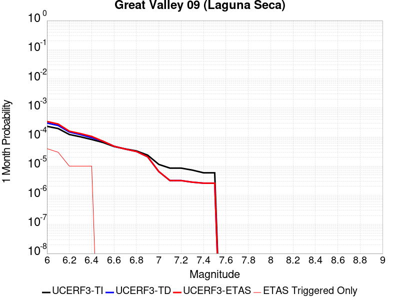 |  | 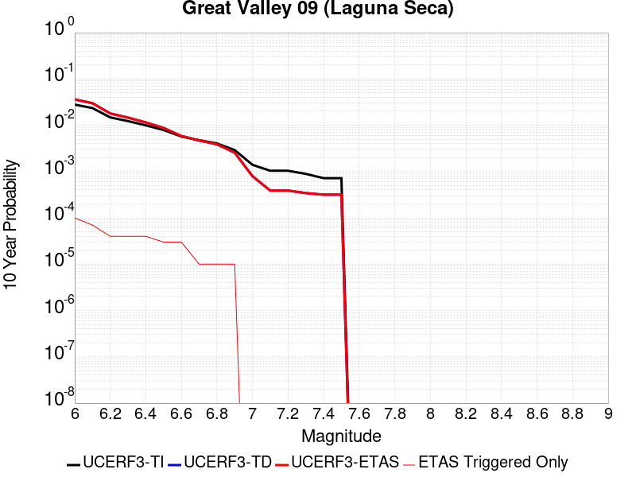 |

| Magnitude | 1 wk TI Prob | 1 wk TD Prob | 1 wk ETAS Prob | 1 wk ETAS/TD Gain | 1 wk ETAS Triggered Only | 1 mo TI Prob | 1 mo TD Prob | 1 mo ETAS Prob | 1 mo ETAS/TD Gain | 1 mo ETAS Triggered Only | 1 yr TI Prob | 1 yr TD Prob | 1 yr ETAS Prob | 1 yr ETAS/TD Gain | 1 yr ETAS Triggered Only | 10 yr TI Prob | 10 yr TD Prob | 10 yr ETAS Prob | 10 yr ETAS/TD Gain | 10 yr ETAS Triggered Only |
|-----|-----|-----|-----|-----|-----|-----|-----|-----|-----|-----|-----|-----|-----|-----|-----|-----|-----|-----|-----|-----|
| 6.0 | 5.4353277E-5 | 7.050019E-5 | 9.0498776E-5 | 1.2836672 | 2.0E-5 | 2.3292181E-4 | 3.0211007E-4 | 3.4209798E-4 | 1.1323621 | 4.0E-5 | 0.0028321352 | 0.0036720056 | 0.0037417486 | 1.0189931 | 7.0E-5 | 0.02796312 | 0.036115844 | 0.036212232 | 1.0026689 | 1.0E-4 |
| 6.1 | 4.5578287E-5 | 5.822054E-5 | 6.821996E-5 | 1.1717507 | 1.0E-5 | 1.953209E-4 | 2.4949352E-4 | 2.7948603E-4 | 1.1202136 | 3.0E-5 | 0.0023754383 | 0.0030333549 | 0.0030732336 | 1.0131468 | 4.0E-5 | 0.023502063 | 0.029919893 | 0.029987797 | 1.0022696 | 7.0E-5 |
| 6.2 | 2.8536782E-5 | 3.4736422E-5 | 3.4736422E-5 | 1.0 | 0.0 | 1.2229476E-4 | 1.4886161E-4 | 1.5886012E-4 | 1.0671664 | 1.0E-5 | 0.0014879217 | 0.0018108576 | 0.0018308214 | 1.0110245 | 2.0E-5 | 0.014779986 | 0.017958276 | 0.017997557 | 1.0021874 | 4.0E-5 |
| 6.3 | 2.3698774E-5 | 2.8213344E-5 | 2.8213344E-5 | 1.0 | 0.0 | 1.01562226E-4 | 1.2090833E-4 | 1.3090711E-4 | 1.0826973 | 1.0E-5 | 0.0012358186 | 0.001471051 | 0.0014910216 | 1.0135757 | 2.0E-5 | 0.012289686 | 0.014611455 | 0.01465087 | 1.0026976 | 4.0E-5 |
| 6.4 | 1.9191197E-5 | 2.212289E-5 | 2.212289E-5 | 1.0 | 0.0 | 8.2245395E-5 | 9.4808805E-5 | 1.04807856E-4 | 1.1054654 | 1.0E-5 | 0.0010008777 | 0.0011536906 | 0.0011736675 | 1.0173156 | 2.0E-5 | 0.009963818 | 0.011477022 | 0.011516564 | 1.0034453 | 4.0E-5 |
| 6.5 | 1.5203241E-5 | 1.6801298E-5 | 1.6801298E-5 | 1.0 | 0.0 | 6.5155116E-5 | 7.200338E-5 | 7.200338E-5 | 1.0 | 0.0 | 7.9297484E-4 | 8.76301E-4 | 8.8629226E-4 | 1.0114017 | 1.0E-5 | 0.007901512 | 0.008729581 | 0.008759319 | 1.0034066 | 3.0E-5 |
| 6.6 | 1.0984925E-5 | 1.12425605E-5 | 1.12425605E-5 | 1.0 | 0.0 | 4.70774E-5 | 4.8181533E-5 | 4.8181533E-5 | 1.0 | 0.0 | 5.730166E-4 | 5.8645604E-4 | 5.964502E-4 | 1.0170416 | 1.0E-5 | 0.005715413 | 0.0058494755 | 0.0058792997 | 1.0050987 | 3.0E-5 |
| 6.7 | 9.134616E-6 | 9.019868E-6 | 9.019868E-6 | 1.0 | 0.0 | 3.9147766E-5 | 3.865602E-5 | 3.865602E-5 | 1.0 | 0.0 | 4.7651984E-4 | 4.7053778E-4 | 4.8053308E-4 | 1.0212423 | 1.0E-5 | 0.004754993 | 0.00469566 | 0.004705613 | 1.0021197 | 1.0E-5 |
| 6.8 | 7.785589E-6 | 7.4519185E-6 | 7.4519185E-6 | 1.0 | 0.0 | 3.3366385E-5 | 3.1936415E-5 | 3.1936415E-5 | 1.0 | 0.0 | 4.0616E-4 | 3.887585E-4 | 3.987546E-4 | 1.025713 | 1.0E-5 | 0.0040541845 | 0.003880988 | 0.0038909493 | 1.0025667 | 1.0E-5 |
| 6.9 | 5.579095E-6 | 4.8984666E-6 | 4.8984666E-6 | 1.0 | 0.0 | 2.3910188E-5 | 2.0993268E-5 | 2.0993268E-5 | 1.0 | 0.0 | 2.9106764E-4 | 2.5556443E-4 | 2.655619E-4 | 1.0391191 | 1.0E-5 | 0.002906867 | 0.0025528427 | 0.0025628172 | 1.0039072 | 1.0E-5 |
| 7.0 | 2.6816688E-6 | 1.521587E-6 | 1.521587E-6 | 1.0 | 0.0 | 1.1492816E-5 | 6.521071E-6 | 6.521071E-6 | 1.0 | 0.0 | 1.3991605E-4 | 7.939124E-5 | 7.939124E-5 | 1.0 | 0.0 | 0.0013982799 | 7.936375E-4 | 7.936375E-4 | 1.0 | 0.0 |
| 7.1 | 1.9951021E-6 | 7.45357E-7 | 7.45357E-7 | 1.0 | 0.0 | 8.55041E-6 | 3.1943835E-6 | 3.1943835E-6 | 1.0 | 0.0 | 1.0409627E-4 | 3.889097E-5 | 3.889097E-5 | 1.0 | 0.0 | 0.0010404752 | 3.8884574E-4 | 3.8884574E-4 | 1.0 | 0.0 |
| 7.2 | 1.9951021E-6 | 7.45357E-7 | 7.45357E-7 | 1.0 | 0.0 | 8.55041E-6 | 3.1943835E-6 | 3.1943835E-6 | 1.0 | 0.0 | 1.0409627E-4 | 3.889097E-5 | 3.889097E-5 | 1.0 | 0.0 | 0.0010404752 | 3.8884574E-4 | 3.8884574E-4 | 1.0 | 0.0 |
| 7.3 | 1.7087556E-6 | 6.578663E-7 | 6.578663E-7 | 1.0 | 0.0 | 7.3232177E-6 | 2.819424E-6 | 2.819424E-6 | 1.0 | 0.0 | 8.915652E-5 | 3.432599E-5 | 3.432599E-5 | 1.0 | 0.0 | 8.9120766E-4 | 3.432109E-4 | 3.432109E-4 | 1.0 | 0.0 |
| 7.4 | 1.3804846E-6 | 6.0737113E-7 | 6.0737113E-7 | 1.0 | 0.0 | 5.916349E-6 | 2.6030168E-6 | 2.6030168E-6 | 1.0 | 0.0 | 7.2029165E-5 | 3.169131E-5 | 3.169131E-5 | 1.0 | 0.0 | 7.200583E-4 | 3.168719E-4 | 3.168719E-4 | 1.0 | 0.0 |
| 7.5 | 1.3804846E-6 | 6.0737113E-7 | 6.0737113E-7 | 1.0 | 0.0 | 5.916349E-6 | 2.6030168E-6 | 2.6030168E-6 | 1.0 | 0.0 | 7.2029165E-5 | 3.169131E-5 | 3.169131E-5 | 1.0 | 0.0 | 7.200583E-4 | 3.168719E-4 | 3.168719E-4 | 1.0 | 0.0 |

## Red Mountain
*[(top)](#table-of-contents)*

| 1 Week | 1 Month | 1 Year | 10 Year |
|-----|-----|-----|-----|
|  | 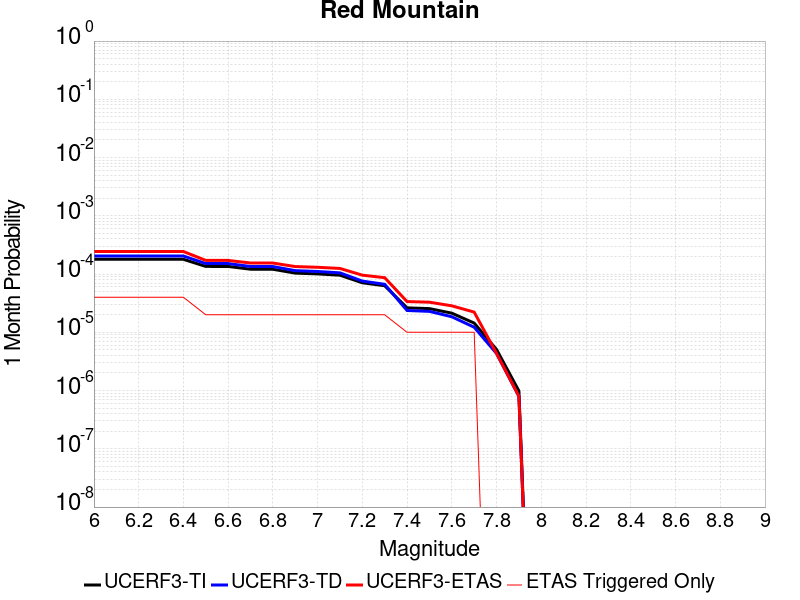 |  |  |

| Magnitude | 1 wk TI Prob | 1 wk TD Prob | 1 wk ETAS Prob | 1 wk ETAS/TD Gain | 1 wk ETAS Triggered Only | 1 mo TI Prob | 1 mo TD Prob | 1 mo ETAS Prob | 1 mo ETAS/TD Gain | 1 mo ETAS Triggered Only | 1 yr TI Prob | 1 yr TD Prob | 1 yr ETAS Prob | 1 yr ETAS/TD Gain | 1 yr ETAS Triggered Only | 10 yr TI Prob | 10 yr TD Prob | 10 yr ETAS Prob | 10 yr ETAS/TD Gain | 10 yr ETAS Triggered Only |
|-----|-----|-----|-----|-----|-----|-----|-----|-----|-----|-----|-----|-----|-----|-----|-----|-----|-----|-----|-----|-----|
| 6.0 | 4.1810763E-5 | 4.7590016E-5 | 7.7588586E-5 | 1.6303543 | 3.0E-5 | 1.7917668E-4 | 2.039422E-4 | 2.4393405E-4 | 1.196094 | 4.0E-5 | 0.0021792934 | 0.0024803334 | 0.0025401847 | 1.0241303 | 6.0E-5 | 0.021580452 | 0.02454411 | 0.024622148 | 1.0031794 | 8.0E-5 |
| 6.1 | 4.1810763E-5 | 4.7590016E-5 | 7.7588586E-5 | 1.6303543 | 3.0E-5 | 1.7917668E-4 | 2.039422E-4 | 2.4393405E-4 | 1.196094 | 4.0E-5 | 0.0021792934 | 0.0024803334 | 0.0025401847 | 1.0241303 | 6.0E-5 | 0.021580452 | 0.02454411 | 0.024622148 | 1.0031794 | 8.0E-5 |
| 6.2 | 4.1810763E-5 | 4.7590016E-5 | 7.7588586E-5 | 1.6303543 | 3.0E-5 | 1.7917668E-4 | 2.039422E-4 | 2.4393405E-4 | 1.196094 | 4.0E-5 | 0.0021792934 | 0.0024803334 | 0.0025401847 | 1.0241303 | 6.0E-5 | 0.021580452 | 0.02454411 | 0.024622148 | 1.0031794 | 8.0E-5 |
| 6.3 | 4.1810763E-5 | 4.7590016E-5 | 7.7588586E-5 | 1.6303543 | 3.0E-5 | 1.7917668E-4 | 2.039422E-4 | 2.4393405E-4 | 1.196094 | 4.0E-5 | 0.0021792934 | 0.0024803334 | 0.0025401847 | 1.0241303 | 6.0E-5 | 0.021580452 | 0.02454411 | 0.024622148 | 1.0031794 | 8.0E-5 |
| 6.4 | 4.1810763E-5 | 4.7590016E-5 | 7.7588586E-5 | 1.6303543 | 3.0E-5 | 1.7917668E-4 | 2.039422E-4 | 2.4393405E-4 | 1.196094 | 4.0E-5 | 0.0021792934 | 0.0024803334 | 0.0025401847 | 1.0241303 | 6.0E-5 | 0.021580452 | 0.02454411 | 0.024622148 | 1.0031794 | 8.0E-5 |
| 6.5 | 3.154503E-5 | 3.5359757E-5 | 4.5359404E-5 | 1.2827973 | 1.0E-5 | 1.3518598E-4 | 1.5153353E-4 | 1.715305E-4 | 1.131964 | 2.0E-5 | 0.0016446467 | 0.0018434518 | 0.001883378 | 1.0216584 | 4.0E-5 | 0.01632528 | 0.018291244 | 0.018350147 | 1.0032202 | 6.0E-5 |
| 6.6 | 3.1535834E-5 | 3.5349138E-5 | 4.5348785E-5 | 1.2828823 | 1.0E-5 | 1.3514658E-4 | 1.5148803E-4 | 1.7148501E-4 | 1.1320037 | 2.0E-5 | 0.0016441676 | 0.0018428987 | 0.0018828249 | 1.021665 | 4.0E-5 | 0.01632056 | 0.018285805 | 0.018344708 | 1.0032213 | 6.0E-5 |
| 6.7 | 2.8267326E-5 | 3.1469353E-5 | 4.146904E-5 | 1.3177595 | 1.0E-5 | 1.2114006E-4 | 1.3486217E-4 | 1.5485947E-4 | 1.1482795 | 2.0E-5 | 0.0014738824 | 0.0016407954 | 0.0016707461 | 1.0182538 | 3.0E-5 | 0.014641452 | 0.01629557 | 0.016344756 | 1.0030183 | 5.0E-5 |
| 6.8 | 2.8212884E-5 | 3.1407242E-5 | 4.1406925E-5 | 1.3183879 | 1.0E-5 | 1.20906756E-4 | 1.3459599E-4 | 1.545933E-4 | 1.1485728 | 2.0E-5 | 0.0014710457 | 0.0016375595 | 0.0016675104 | 1.0182899 | 3.0E-5 | 0.014613459 | 0.016263688 | 0.016312875 | 1.0030243 | 5.0E-5 |
| 6.9 | 2.4227871E-5 | 2.6706994E-5 | 3.6706726E-5 | 1.3744237 | 1.0E-5 | 1.03829596E-4 | 1.1445395E-4 | 1.3445166E-4 | 1.1747228 | 2.0E-5 | 0.0012633923 | 0.0013926621 | 0.0014226203 | 1.0215114 | 3.0E-5 | 0.012562336 | 0.0138470335 | 0.01388648 | 1.0028487 | 4.0E-5 |
| 7.0 | 2.348524E-5 | 2.5835778E-5 | 3.583552E-5 | 1.3870502 | 1.0E-5 | 1.0064714E-4 | 1.10720495E-4 | 1.3071828E-4 | 1.1806151 | 2.0E-5 | 0.0012246901 | 0.001347264 | 0.0013772236 | 1.0222373 | 3.0E-5 | 0.012179627 | 0.013398598 | 0.013438062 | 1.0029454 | 4.0E-5 |
| 7.1 | 2.2311642E-5 | 2.4462845E-5 | 3.44626E-5 | 1.4087732 | 1.0E-5 | 9.561782E-5 | 1.04836974E-4 | 1.2483487E-4 | 1.1907524 | 2.0E-5 | 0.0011635252 | 0.0012757176 | 0.0013056793 | 1.0234861 | 3.0E-5 | 0.01157452 | 0.01269146 | 0.012730951 | 1.0031117 | 4.0E-5 |
| 7.2 | 1.6533986E-5 | 1.7670362E-5 | 2.7670185E-5 | 1.5659094 | 1.0E-5 | 7.085802E-5 | 7.572828E-5 | 9.572677E-5 | 1.2640821 | 2.0E-5 | 8.623549E-4 | 9.2166534E-4 | 9.4164687E-4 | 1.0216799 | 2.0E-5 | 0.008590161 | 0.009184707 | 0.009204523 | 1.0021576 | 2.0E-5 |
| 7.3 | 1.4703092E-5 | 1.5559537E-5 | 2.555938E-5 | 1.6426827 | 1.0E-5 | 6.301173E-5 | 6.668237E-5 | 8.668104E-5 | 1.2999094 | 2.0E-5 | 7.668978E-4 | 8.1161706E-4 | 8.3160086E-4 | 1.0246222 | 2.0E-5 | 0.0076425658 | 0.008092604 | 0.008112442 | 1.0024514 | 2.0E-5 |
| 7.4 | 6.1331984E-6 | 5.5288874E-6 | 5.5288874E-6 | 1.0 | 0.0 | 2.6284872E-5 | 2.3695018E-5 | 3.369478E-5 | 1.4220196 | 1.0E-5 | 3.199713E-4 | 2.884492E-4 | 2.984463E-4 | 1.0346582 | 1.0E-5 | 0.0031951098 | 0.0028808024 | 0.0028907736 | 1.0034612 | 1.0E-5 |
| 7.5 | 5.954766E-6 | 5.338517E-6 | 5.338517E-6 | 1.0 | 0.0 | 2.5520176E-5 | 2.2879161E-5 | 3.2878932E-5 | 1.4370689 | 1.0E-5 | 3.1066386E-4 | 2.785187E-4 | 2.885159E-4 | 1.0358943 | 1.0E-5 | 0.003102299 | 0.0027817504 | 0.0027917225 | 1.0035849 | 1.0E-5 |
| 7.6 | 4.9726646E-6 | 4.315309E-6 | 4.315309E-6 | 1.0 | 0.0 | 2.1311245E-5 | 1.8494053E-5 | 2.8493867E-5 | 1.5407044 | 1.0E-5 | 2.5943352E-4 | 2.2514217E-4 | 2.3513992E-4 | 1.0444064 | 1.0E-5 | 0.0025913084 | 0.0022491754 | 0.002259153 | 1.004436 | 1.0E-5 |
| 7.7 | 3.3613894E-6 | 2.8526886E-6 | 2.8526886E-6 | 1.0 | 0.0 | 1.4405875E-5 | 1.22257525E-5 | 2.2225631E-5 | 1.8179356 | 1.0E-5 | 1.7537741E-4 | 1.4883863E-4 | 1.5883715E-4 | 1.0671768 | 1.0E-5 | 0.0017523908 | 0.0014874157 | 0.0014974009 | 1.006713 | 1.0E-5 |
| 7.8 | 1.1828961E-6 | 1.0122935E-6 | 1.0122935E-6 | 1.0 | 0.0 | 5.069545E-6 | 4.338394E-6 | 4.338394E-6 | 1.0 | 0.0 | 6.171996E-5 | 5.281869E-5 | 5.281869E-5 | 1.0 | 0.0 | 6.170282E-4 | 5.280643E-4 | 5.280643E-4 | 1.0 | 0.0 |
| 7.9 | 2.2967266E-7 | 1.861919E-7 | 1.861919E-7 | 1.0 | 0.0 | 9.843111E-7 | 7.97965E-7 | 7.97965E-7 | 1.0 | 0.0 | 1.19839215E-5 | 9.715184E-6 | 9.715184E-6 | 1.0 | 0.0 | 1.1983275E-4 | 9.714788E-5 | 9.714788E-5 | 1.0 | 0.0 |

## Blue Cut
*[(top)](#table-of-contents)*

| 1 Week | 1 Month | 1 Year | 10 Year |
|-----|-----|-----|-----|
|  | 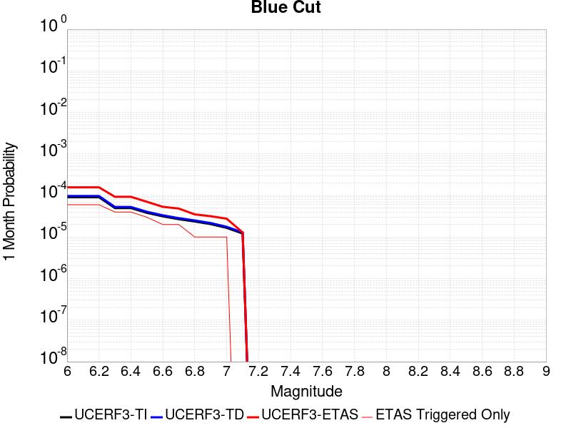 |  | 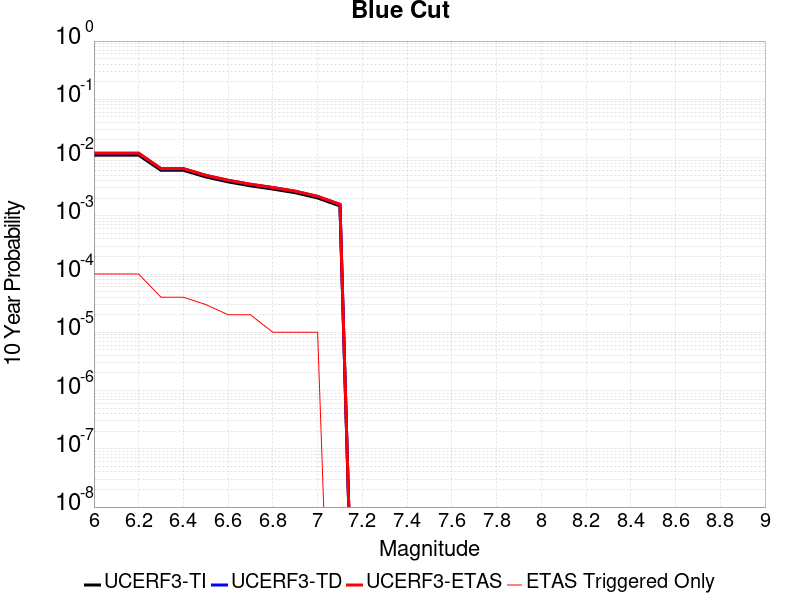 |

| Magnitude | 1 wk TI Prob | 1 wk TD Prob | 1 wk ETAS Prob | 1 wk ETAS/TD Gain | 1 wk ETAS Triggered Only | 1 mo TI Prob | 1 mo TD Prob | 1 mo ETAS Prob | 1 mo ETAS/TD Gain | 1 mo ETAS Triggered Only | 1 yr TI Prob | 1 yr TD Prob | 1 yr ETAS Prob | 1 yr ETAS/TD Gain | 1 yr ETAS Triggered Only | 10 yr TI Prob | 10 yr TD Prob | 10 yr ETAS Prob | 10 yr ETAS/TD Gain | 10 yr ETAS Triggered Only |
|-----|-----|-----|-----|-----|-----|-----|-----|-----|-----|-----|-----|-----|-----|-----|-----|-----|-----|-----|-----|-----|
| 6.0 | 2.1227985E-5 | 2.2719574E-5 | 5.2718893E-5 | 2.3204172 | 3.0E-5 | 9.097391E-5 | 9.73663E-5 | 1.5736045E-4 | 1.6161697 | 6.0E-5 | 0.0011070445 | 0.0011848481 | 0.0012647533 | 1.0674392 | 8.0E-5 | 0.011015458 | 0.011791152 | 0.011889973 | 1.0083809 | 1.0E-4 |
| 6.1 | 2.1227985E-5 | 2.2719574E-5 | 5.2718893E-5 | 2.3204172 | 3.0E-5 | 9.097391E-5 | 9.73663E-5 | 1.5736045E-4 | 1.6161697 | 6.0E-5 | 0.0011070445 | 0.0011848481 | 0.0012647533 | 1.0674392 | 8.0E-5 | 0.011015458 | 0.011791152 | 0.011889973 | 1.0083809 | 1.0E-4 |
| 6.2 | 2.1227985E-5 | 2.2719574E-5 | 5.2718893E-5 | 2.3204172 | 3.0E-5 | 9.097391E-5 | 9.73663E-5 | 1.5736045E-4 | 1.6161697 | 6.0E-5 | 0.0011070445 | 0.0011848481 | 0.0012647533 | 1.0674392 | 8.0E-5 | 0.011015458 | 0.011791152 | 0.011889973 | 1.0083809 | 1.0E-4 |
| 6.3 | 1.1613981E-5 | 1.2353542E-5 | 3.2353295E-5 | 2.618949 | 2.0E-5 | 4.9773254E-5 | 5.2942745E-5 | 9.294063E-5 | 1.7554932 | 4.0E-5 | 6.0582085E-4 | 6.443998E-4 | 6.84374E-4 | 1.0620333 | 4.0E-5 | 0.0060417196 | 0.0064265593 | 0.006466302 | 1.0061842 | 4.0E-5 |
| 6.4 | 1.1613981E-5 | 1.2353542E-5 | 3.2353295E-5 | 2.618949 | 2.0E-5 | 4.9773254E-5 | 5.2942745E-5 | 9.294063E-5 | 1.7554932 | 4.0E-5 | 6.0582085E-4 | 6.443998E-4 | 6.84374E-4 | 1.0620333 | 4.0E-5 | 0.0060417196 | 0.0064265593 | 0.006466302 | 1.0061842 | 4.0E-5 |
| 6.5 | 8.931326E-6 | 9.4816E-6 | 1.9481506E-5 | 2.0546644 | 1.0E-5 | 3.8276554E-5 | 4.0634844E-5 | 7.063363E-5 | 1.7382526 | 3.0E-5 | 4.6591737E-4 | 4.946261E-4 | 5.2461127E-4 | 1.0606219 | 3.0E-5 | 0.0046494175 | 0.004936161 | 0.004966013 | 1.0060476 | 3.0E-5 |
| 6.6 | 7.345353E-6 | 7.79028E-6 | 1.7790202E-5 | 2.283641 | 1.0E-5 | 3.1479703E-5 | 3.338653E-5 | 5.3385862E-5 | 1.599024 | 2.0E-5 | 3.83198E-4 | 4.064132E-4 | 4.2640505E-4 | 1.049191 | 2.0E-5 | 0.0038253788 | 0.0040574907 | 0.00407741 | 1.0049092 | 2.0E-5 |
| 6.7 | 6.2775666E-6 | 6.655149E-6 | 1.6655082E-5 | 2.502586 | 1.0E-5 | 2.690358E-5 | 2.8521798E-5 | 4.8521226E-5 | 1.7011981 | 2.0E-5 | 3.2750185E-4 | 3.472051E-4 | 3.6719814E-4 | 1.0575829 | 2.0E-5 | 0.0032701963 | 0.003467367 | 0.0034872978 | 1.005748 | 2.0E-5 |
| 6.8 | 5.5234095E-6 | 5.8551113E-6 | 1.5855052E-5 | 2.7078996 | 1.0E-5 | 2.367154E-5 | 2.5093133E-5 | 3.5092882E-5 | 1.3985054 | 1.0E-5 | 2.8816288E-4 | 3.0547334E-4 | 3.154703E-4 | 1.032726 | 1.0E-5 | 0.002877895 | 0.0030512505 | 0.00306122 | 1.0032673 | 1.0E-5 |
| 6.9 | 4.7780054E-6 | 5.0654203E-6 | 1.506537E-5 | 2.9741597 | 1.0E-5 | 2.0477004E-5 | 2.1708804E-5 | 3.1708587E-5 | 1.4606326 | 1.0E-5 | 2.4927902E-4 | 2.642797E-4 | 2.7427703E-4 | 1.0378287 | 1.0E-5 | 0.0024899957 | 0.002640346 | 0.0026503198 | 1.0037774 | 1.0E-5 |
| 7.0 | 3.883171E-6 | 4.118487E-6 | 1.41184455E-5 | 3.428066 | 1.0E-5 | 1.6642054E-5 | 1.7650578E-5 | 2.7650402E-5 | 1.5665437 | 1.0E-5 | 2.0259817E-4 | 2.1488148E-4 | 2.2487935E-4 | 1.0465273 | 1.0E-5 | 0.0020241356 | 0.0021474129 | 0.0021573913 | 1.0046468 | 1.0E-5 |
| 7.1 | 2.8358215E-6 | 3.0097158E-6 | 3.0097158E-6 | 1.0 | 0.0 | 1.2153464E-5 | 1.2898756E-5 | 1.2898756E-5 | 1.0 | 0.0 | 1.4795837E-4 | 1.5703762E-4 | 1.5703762E-4 | 1.0 | 0.0 | 0.001478599 | 0.0015699116 | 0.0015699116 | 1.0 | 0.0 |

## Pisgah-Bullion Mtn-Mesquite Lk
*[(top)](#table-of-contents)*

| 1 Week | 1 Month | 1 Year | 10 Year |
|-----|-----|-----|-----|
| 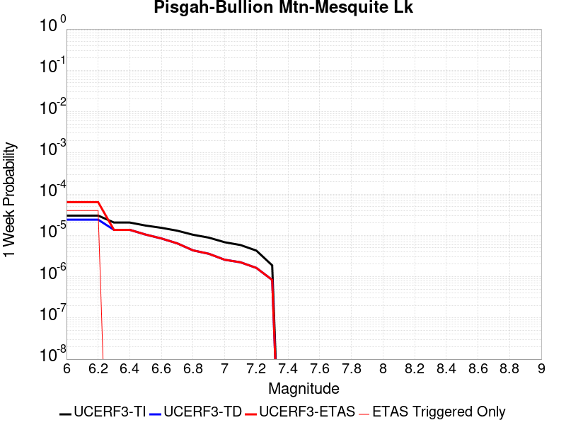 |  | 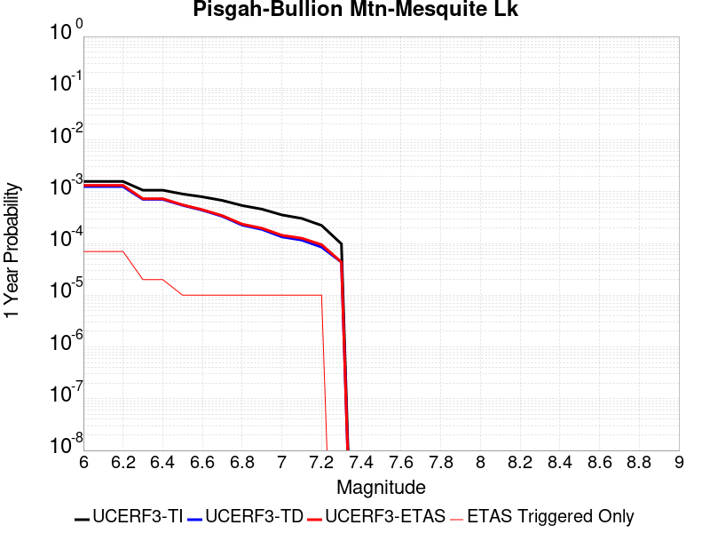 |  |

| Magnitude | 1 wk TI Prob | 1 wk TD Prob | 1 wk ETAS Prob | 1 wk ETAS/TD Gain | 1 wk ETAS Triggered Only | 1 mo TI Prob | 1 mo TD Prob | 1 mo ETAS Prob | 1 mo ETAS/TD Gain | 1 mo ETAS Triggered Only | 1 yr TI Prob | 1 yr TD Prob | 1 yr ETAS Prob | 1 yr ETAS/TD Gain | 1 yr ETAS Triggered Only | 10 yr TI Prob | 10 yr TD Prob | 10 yr ETAS Prob | 10 yr ETAS/TD Gain | 10 yr ETAS Triggered Only |
|-----|-----|-----|-----|-----|-----|-----|-----|-----|-----|-----|-----|-----|-----|-----|-----|-----|-----|-----|-----|-----|
| 6.0 | 3.0240792E-5 | 2.40909E-5 | 6.408994E-5 | 2.660338 | 4.0E-5 | 1.2959696E-4 | 1.032432E-4 | 1.5323803E-4 | 1.4842434 | 5.0E-5 | 0.0015767008 | 0.0012563618 | 0.0013262739 | 1.0556464 | 7.0E-5 | 0.015655609 | 0.012502613 | 0.012591488 | 1.0071084 | 9.0E-5 |
| 6.1 | 3.0240792E-5 | 2.40909E-5 | 6.408994E-5 | 2.660338 | 4.0E-5 | 1.2959696E-4 | 1.032432E-4 | 1.5323803E-4 | 1.4842434 | 5.0E-5 | 0.0015767008 | 0.0012563618 | 0.0013262739 | 1.0556464 | 7.0E-5 | 0.015655609 | 0.012502613 | 0.012591488 | 1.0071084 | 9.0E-5 |
| 6.2 | 3.0240792E-5 | 2.40909E-5 | 6.408994E-5 | 2.660338 | 4.0E-5 | 1.2959696E-4 | 1.032432E-4 | 1.5323803E-4 | 1.4842434 | 5.0E-5 | 0.0015767008 | 0.0012563618 | 0.0013262739 | 1.0556464 | 7.0E-5 | 0.015655609 | 0.012502613 | 0.012591488 | 1.0071084 | 9.0E-5 |
| 6.3 | 2.0498217E-5 | 1.3638054E-5 | 1.3638054E-5 | 1.0 | 0.0 | 8.784654E-5 | 5.8447586E-5 | 6.8447E-5 | 1.1710835 | 1.0E-5 | 0.0010690069 | 7.1138324E-4 | 7.31369E-4 | 1.0280943 | 2.0E-5 | 0.01063879 | 0.0070926864 | 0.007122474 | 1.0041997 | 3.0E-5 |
| 6.4 | 2.0498217E-5 | 1.3638054E-5 | 1.3638054E-5 | 1.0 | 0.0 | 8.784654E-5 | 5.8447586E-5 | 6.8447E-5 | 1.1710835 | 1.0E-5 | 0.0010690069 | 7.1138324E-4 | 7.31369E-4 | 1.0280943 | 2.0E-5 | 0.01063879 | 0.0070926864 | 0.007122474 | 1.0041997 | 3.0E-5 |
| 6.5 | 1.7316182E-5 | 1.04769715E-5 | 1.04769715E-5 | 1.0 | 0.0 | 7.42101E-5 | 4.490059E-5 | 5.490014E-5 | 1.2227042 | 1.0E-5 | 9.0313336E-4 | 5.465376E-4 | 5.565321E-4 | 1.0182871 | 1.0E-5 | 0.008994718 | 0.00545293 | 0.0054628756 | 1.0018239 | 1.0E-5 |
| 6.6 | 1.5251077E-5 | 8.414133E-6 | 8.414133E-6 | 1.0 | 0.0 | 6.536012E-5 | 3.606011E-5 | 4.605975E-5 | 1.2773048 | 1.0E-5 | 7.9546886E-4 | 4.3895066E-4 | 4.4894626E-4 | 1.0227716 | 1.0E-5 | 0.007926274 | 0.0043815537 | 0.0043915096 | 1.0022722 | 1.0E-5 |
| 6.7 | 1.2997425E-5 | 6.4112146E-6 | 6.4112146E-6 | 1.0 | 0.0 | 5.570206E-5 | 2.7476372E-5 | 3.7476097E-5 | 1.363939 | 1.0E-5 | 6.7796157E-4 | 3.3447813E-4 | 3.4447477E-4 | 1.0298873 | 1.0E-5 | 0.0067589693 | 0.003340207 | 0.0033501738 | 1.0029838 | 1.0E-5 |
| 6.8 | 1.035386E-5 | 4.333145E-6 | 4.333145E-6 | 1.0 | 0.0 | 4.437293E-5 | 1.8570496E-5 | 2.857031E-5 | 1.5384786 | 1.0E-5 | 5.401065E-4 | 2.260732E-4 | 2.3607093E-4 | 1.0442234 | 1.0E-5 | 0.0053879567 | 0.002258519 | 0.0022684964 | 1.0044177 | 1.0E-5 |
| 6.9 | 8.816252E-6 | 3.5805879E-6 | 3.5805879E-6 | 1.0 | 0.0 | 3.778339E-5 | 1.534529E-5 | 2.5345136E-5 | 1.6516558 | 1.0E-5 | 4.5991567E-4 | 1.8681347E-4 | 1.9681161E-4 | 1.0535194 | 1.0E-5 | 0.00458965 | 0.0018666228 | 0.0018766042 | 1.0053473 | 1.0E-5 |
| 7.0 | 6.8232207E-6 | 2.5674399E-6 | 2.5674399E-6 | 1.0 | 0.0 | 2.9242048E-5 | 1.100327E-5 | 2.100316E-5 | 1.9088107 | 1.0E-5 | 3.5596377E-4 | 1.3395688E-4 | 1.4395555E-4 | 1.0746409 | 1.0E-5 | 0.0035539411 | 0.0013387925 | 0.0013487791 | 1.0074594 | 1.0E-5 |
| 7.1 | 5.837013E-6 | 2.2273143E-6 | 2.2273143E-6 | 1.0 | 0.0 | 2.501553E-5 | 9.5456E-6 | 1.9545503E-5 | 2.047593 | 1.0E-5 | 3.045215E-4 | 1.1621177E-4 | 1.2621061E-4 | 1.0860398 | 1.0E-5 | 0.0030410455 | 0.001161539 | 0.0011715274 | 1.0085993 | 1.0E-5 |
| 7.2 | 4.278052E-6 | 1.6275065E-6 | 1.6275065E-6 | 1.0 | 0.0 | 1.833438E-5 | 6.975011E-6 | 1.697494E-5 | 2.4336796 | 1.0E-5 | 2.231982E-4 | 8.491768E-5 | 9.491683E-5 | 1.1177511 | 1.0E-5 | 0.0022297418 | 8.4887556E-4 | 8.588671E-4 | 1.0117702 | 1.0E-5 |
| 7.3 | 1.8803692E-6 | 8.344788E-7 | 8.344788E-7 | 1.0 | 0.0 | 8.0587E-6 | 3.5763337E-6 | 3.5763337E-6 | 1.0 | 0.0 | 9.811026E-5 | 4.354114E-5 | 4.354114E-5 | 1.0 | 0.0 | 9.806695E-4 | 4.3534054E-4 | 4.3534054E-4 | 1.0 | 0.0 |

## Tin Mountain
*[(top)](#table-of-contents)*

| 1 Week | 1 Month | 1 Year | 10 Year |
|-----|-----|-----|-----|
| 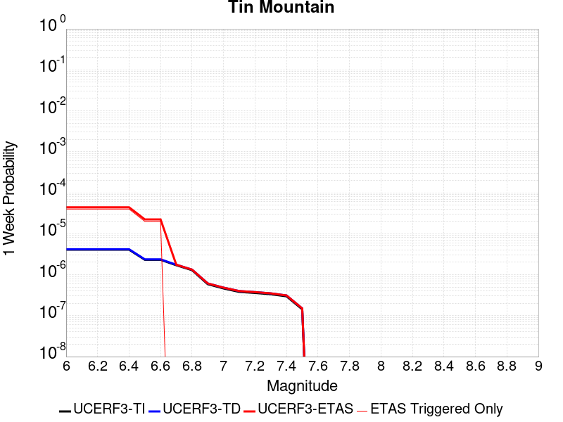 | 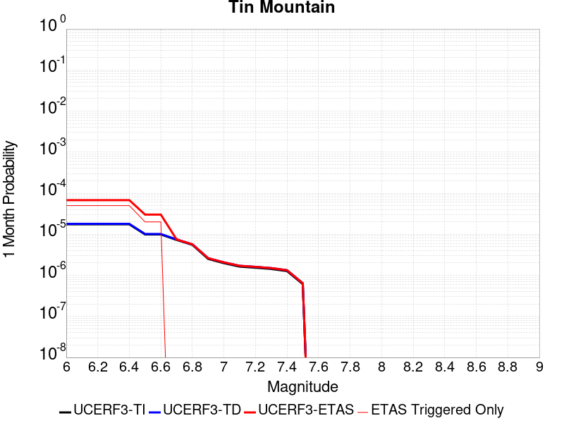 |  |  |

| Magnitude | 1 wk TI Prob | 1 wk TD Prob | 1 wk ETAS Prob | 1 wk ETAS/TD Gain | 1 wk ETAS Triggered Only | 1 mo TI Prob | 1 mo TD Prob | 1 mo ETAS Prob | 1 mo ETAS/TD Gain | 1 mo ETAS Triggered Only | 1 yr TI Prob | 1 yr TD Prob | 1 yr ETAS Prob | 1 yr ETAS/TD Gain | 1 yr ETAS Triggered Only | 10 yr TI Prob | 10 yr TD Prob | 10 yr ETAS Prob | 10 yr ETAS/TD Gain | 10 yr ETAS Triggered Only |
|-----|-----|-----|-----|-----|-----|-----|-----|-----|-----|-----|-----|-----|-----|-----|-----|-----|-----|-----|-----|-----|
| 6.0 | 4.083776E-6 | 4.1815365E-6 | 4.4181368E-5 | 10.565822 | 4.0E-5 | 1.750178E-5 | 1.792077E-5 | 6.791987E-5 | 3.7900088 | 5.0E-5 | 2.1306332E-4 | 2.1816725E-4 | 2.981498E-4 | 1.3666111 | 8.0E-5 | 0.0021285915 | 0.0021798965 | 0.0022796784 | 1.0457737 | 1.0E-4 |
| 6.1 | 4.083776E-6 | 4.1815365E-6 | 4.4181368E-5 | 10.565822 | 4.0E-5 | 1.750178E-5 | 1.792077E-5 | 6.791987E-5 | 3.7900088 | 5.0E-5 | 2.1306332E-4 | 2.1816725E-4 | 2.981498E-4 | 1.3666111 | 8.0E-5 | 0.0021285915 | 0.0021798965 | 0.0022796784 | 1.0457737 | 1.0E-4 |
| 6.2 | 4.083776E-6 | 4.1815365E-6 | 4.4181368E-5 | 10.565822 | 4.0E-5 | 1.750178E-5 | 1.792077E-5 | 6.791987E-5 | 3.7900088 | 5.0E-5 | 2.1306332E-4 | 2.1816725E-4 | 2.981498E-4 | 1.3666111 | 8.0E-5 | 0.0021285915 | 0.0021798965 | 0.0022796784 | 1.0457737 | 1.0E-4 |
| 6.3 | 4.083776E-6 | 4.1815365E-6 | 4.4181368E-5 | 10.565822 | 4.0E-5 | 1.750178E-5 | 1.792077E-5 | 6.791987E-5 | 3.7900088 | 5.0E-5 | 2.1306332E-4 | 2.1816725E-4 | 2.981498E-4 | 1.3666111 | 8.0E-5 | 0.0021285915 | 0.0021798965 | 0.0022796784 | 1.0457737 | 1.0E-4 |
| 6.4 | 4.083776E-6 | 4.1815365E-6 | 4.4181368E-5 | 10.565822 | 4.0E-5 | 1.750178E-5 | 1.792077E-5 | 6.791987E-5 | 3.7900088 | 5.0E-5 | 2.1306332E-4 | 2.1816725E-4 | 2.981498E-4 | 1.3666111 | 8.0E-5 | 0.0021285915 | 0.0021798965 | 0.0022796784 | 1.0457737 | 1.0E-4 |
| 6.5 | 2.3143427E-6 | 2.3731573E-6 | 2.237311E-5 | 9.427572 | 2.0E-5 | 9.9185745E-6 | 1.0170638E-5 | 3.0170435E-5 | 2.966425 | 2.0E-5 | 1.2075195E-4 | 1.2382126E-4 | 1.4381878E-4 | 1.1615032 | 2.0E-5 | 0.0012068636 | 0.0012375986 | 0.0012675615 | 1.0242105 | 3.0E-5 |
| 6.6 | 2.3143427E-6 | 2.3731573E-6 | 2.237311E-5 | 9.427572 | 2.0E-5 | 9.9185745E-6 | 1.0170638E-5 | 3.0170435E-5 | 2.966425 | 2.0E-5 | 1.2075195E-4 | 1.2382126E-4 | 1.4381878E-4 | 1.1615032 | 2.0E-5 | 0.0012068636 | 0.0012375986 | 0.0012675615 | 1.0242105 | 3.0E-5 |
| 6.7 | 1.7029532E-6 | 1.7497915E-6 | 1.7497915E-6 | 1.0 | 0.0 | 7.2983503E-6 | 7.499088E-6 | 7.499088E-6 | 1.0 | 0.0 | 8.885379E-5 | 9.1298105E-5 | 9.1298105E-5 | 1.0 | 0.0 | 8.881827E-4 | 9.1265864E-4 | 9.226495E-4 | 1.010947 | 1.0E-5 |
| 6.8 | 1.2914646E-6 | 1.3299378E-6 | 1.3299378E-6 | 1.0 | 0.0 | 5.534837E-6 | 5.6997237E-6 | 5.6997237E-6 | 1.0 | 0.0 | 6.738455E-5 | 6.939237E-5 | 6.939237E-5 | 1.0 | 0.0 | 6.736412E-4 | 6.9375033E-4 | 7.037434E-4 | 1.0144044 | 1.0E-5 |
| 6.9 | 5.8708974E-7 | 6.1169936E-7 | 6.1169936E-7 | 1.0 | 0.0 | 2.5160964E-6 | 2.6215664E-6 | 2.6215664E-6 | 1.0 | 0.0 | 3.0633044E-5 | 3.1917145E-5 | 3.1917145E-5 | 1.0 | 0.0 | 3.0628822E-4 | 3.191297E-4 | 3.2912652E-4 | 1.0313252 | 1.0E-5 |
| 7.0 | 4.6248786E-7 | 4.832015E-7 | 4.832015E-7 | 1.0 | 0.0 | 1.9820893E-6 | 2.0708624E-6 | 2.0708624E-6 | 1.0 | 0.0 | 2.413167E-5 | 2.5212494E-5 | 2.5212494E-5 | 1.0 | 0.0 | 2.412905E-4 | 2.5210003E-4 | 2.5210003E-4 | 1.0 | 0.0 |
| 7.1 | 3.804606E-7 | 3.987147E-7 | 3.987147E-7 | 1.0 | 0.0 | 1.6305444E-6 | 1.7087764E-6 | 1.7087764E-6 | 1.0 | 0.0 | 1.9851697E-5 | 2.0804187E-5 | 2.0804187E-5 | 1.0 | 0.0 | 1.9849923E-4 | 2.0802575E-4 | 2.0802575E-4 | 1.0 | 0.0 |
| 7.2 | 3.5864858E-7 | 3.7616863E-7 | 3.7616863E-7 | 1.0 | 0.0 | 1.5370645E-6 | 1.6121504E-6 | 1.6121504E-6 | 1.0 | 0.0 | 1.87136E-5 | 1.9627789E-5 | 1.9627789E-5 | 1.0 | 0.0 | 1.8712023E-4 | 1.9626386E-4 | 1.9626386E-4 | 1.0 | 0.0 |
| 7.3 | 3.342063E-7 | 3.506347E-7 | 3.506347E-7 | 1.0 | 0.0 | 1.4323119E-6 | 1.5027196E-6 | 1.5027196E-6 | 1.0 | 0.0 | 1.7438259E-5 | 1.829549E-5 | 1.829549E-5 | 1.0 | 0.0 | 1.743689E-4 | 1.8294314E-4 | 1.8294314E-4 | 1.0 | 0.0 |
| 7.4 | 2.971242E-7 | 3.1165817E-7 | 3.1165817E-7 | 1.0 | 0.0 | 1.2733886E-6 | 1.3356774E-6 | 1.3356774E-6 | 1.0 | 0.0 | 1.5503398E-5 | 1.6261785E-5 | 1.6261785E-5 | 1.0 | 0.0 | 1.5502315E-4 | 1.6260923E-4 | 1.6260923E-4 | 1.0 | 0.0 |
| 7.5 | 1.4326713E-7 | 1.5012525E-7 | 1.5012525E-7 | 1.0 | 0.0 | 6.140018E-7 | 6.433939E-7 | 6.433939E-7 | 1.0 | 0.0 | 7.4754466E-6 | 7.8333205E-6 | 7.8333205E-6 | 1.0 | 0.0 | 7.475195E-5 | 7.833321E-5 | 7.833321E-5 | 1.0 | 0.0 |

## Santa Cruz Catalina Ridge alt1
*[(top)](#table-of-contents)*

| 1 Week | 1 Month | 1 Year | 10 Year |
|-----|-----|-----|-----|
|  |  |  | 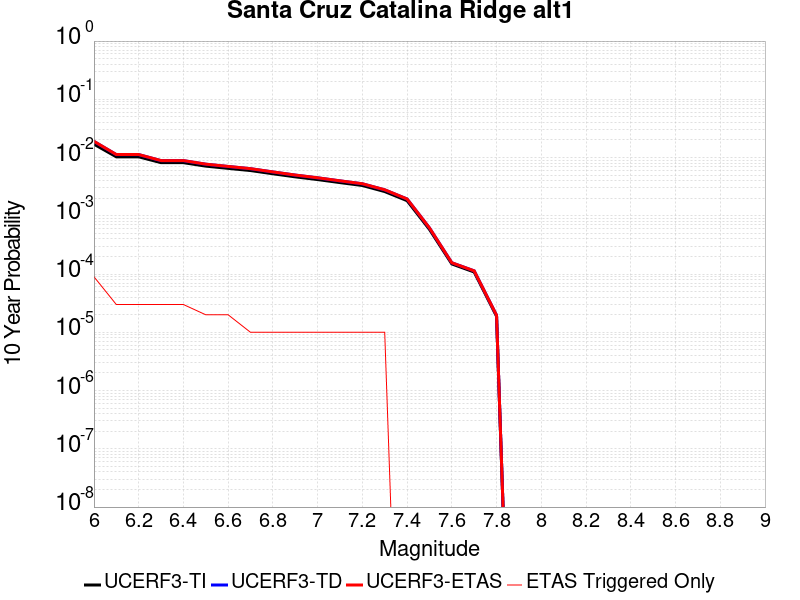 |

| Magnitude | 1 wk TI Prob | 1 wk TD Prob | 1 wk ETAS Prob | 1 wk ETAS/TD Gain | 1 wk ETAS Triggered Only | 1 mo TI Prob | 1 mo TD Prob | 1 mo ETAS Prob | 1 mo ETAS/TD Gain | 1 mo ETAS Triggered Only | 1 yr TI Prob | 1 yr TD Prob | 1 yr ETAS Prob | 1 yr ETAS/TD Gain | 1 yr ETAS Triggered Only | 10 yr TI Prob | 10 yr TD Prob | 10 yr ETAS Prob | 10 yr ETAS/TD Gain | 10 yr ETAS Triggered Only |
|-----|-----|-----|-----|-----|-----|-----|-----|-----|-----|-----|-----|-----|-----|-----|-----|-----|-----|-----|-----|-----|
| 6.0 | 3.2833184E-5 | 3.6558402E-5 | 6.65573E-5 | 1.8205749 | 3.0E-5 | 1.4070606E-4 | 1.5667039E-4 | 1.8666568E-4 | 1.1914548 | 3.0E-5 | 0.00171175 | 0.0019059594 | 0.001955864 | 1.0261835 | 5.0E-5 | 0.016986247 | 0.018913032 | 0.019001331 | 1.0046686 | 9.0E-5 |
| 6.1 | 1.9835548E-5 | 2.1659505E-5 | 3.165929E-5 | 1.461681 | 1.0E-5 | 8.500672E-5 | 9.282326E-5 | 1.02822334E-4 | 1.1077216 | 1.0E-5 | 0.0010344655 | 0.0011295575 | 0.001149535 | 1.017686 | 2.0E-5 | 0.010296632 | 0.011240296 | 0.011269959 | 1.0026389 | 3.0E-5 |
| 6.2 | 1.9835548E-5 | 2.1659505E-5 | 3.165929E-5 | 1.461681 | 1.0E-5 | 8.500672E-5 | 9.282326E-5 | 1.02822334E-4 | 1.1077216 | 1.0E-5 | 0.0010344655 | 0.0011295575 | 0.001149535 | 1.017686 | 2.0E-5 | 0.010296632 | 0.011240296 | 0.011269959 | 1.0026389 | 3.0E-5 |
| 6.3 | 1.5728183E-5 | 1.703395E-5 | 2.7033779E-5 | 1.587053 | 1.0E-5 | 6.7404755E-5 | 7.300063E-5 | 8.29999E-5 | 1.1369752 | 1.0E-5 | 8.2034385E-4 | 8.884264E-4 | 9.084086E-4 | 1.0224917 | 2.0E-5 | 0.008173222 | 0.008849427 | 0.008879161 | 1.00336 | 3.0E-5 |
| 6.4 | 1.5728183E-5 | 1.703395E-5 | 2.7033779E-5 | 1.587053 | 1.0E-5 | 6.7404755E-5 | 7.300063E-5 | 8.29999E-5 | 1.1369752 | 1.0E-5 | 8.2034385E-4 | 8.884264E-4 | 9.084086E-4 | 1.0224917 | 2.0E-5 | 0.008173222 | 0.008849427 | 0.008879161 | 1.00336 | 3.0E-5 |
| 6.5 | 1.3707734E-5 | 1.4794522E-5 | 2.4794374E-5 | 1.6759158 | 1.0E-5 | 5.8746107E-5 | 6.3403575E-5 | 7.340294E-5 | 1.1577098 | 1.0E-5 | 7.1499916E-4 | 7.716686E-4 | 7.816609E-4 | 1.012949 | 1.0E-5 | 0.0071270303 | 0.0076902895 | 0.007710136 | 1.0025806 | 2.0E-5 |
| 6.6 | 1.2539813E-5 | 1.3510219E-5 | 2.3510085E-5 | 1.7401705 | 1.0E-5 | 5.3740947E-5 | 5.789967E-5 | 6.789909E-5 | 1.1727026 | 1.0E-5 | 6.540996E-4 | 7.0470315E-4 | 7.146961E-4 | 1.0141804 | 1.0E-5 | 0.0065217763 | 0.0070249885 | 0.007044848 | 1.0028269 | 2.0E-5 |
| 6.7 | 1.1504083E-5 | 1.2377375E-5 | 2.2377251E-5 | 1.8079158 | 1.0E-5 | 4.930228E-5 | 5.3044827E-5 | 6.3044296E-5 | 1.1885098 | 1.0E-5 | 6.0008996E-4 | 6.456314E-4 | 6.5562496E-4 | 1.0154787 | 1.0E-5 | 0.005984721 | 0.006437786 | 0.0064477217 | 1.0015433 | 1.0E-5 |
| 6.8 | 1.012739E-5 | 1.0877071E-5 | 2.0876963E-5 | 1.9193552 | 1.0E-5 | 4.340238E-5 | 4.6615194E-5 | 5.661473E-5 | 1.2145123 | 1.0E-5 | 5.282958E-4 | 5.673937E-4 | 5.7738804E-4 | 1.0176145 | 1.0E-5 | 0.0052704164 | 0.0056596193 | 0.005669563 | 1.0017569 | 1.0E-5 |
| 6.9 | 8.9607865E-6 | 9.609117E-6 | 1.960902E-5 | 2.0406682 | 1.0E-5 | 3.8402806E-5 | 4.1181287E-5 | 5.1180876E-5 | 1.2428187 | 1.0E-5 | 4.6745385E-4 | 5.012679E-4 | 5.1126286E-4 | 1.0199394 | 1.0E-5 | 0.0046647177 | 0.005001492 | 0.0050114417 | 1.0019894 | 1.0E-5 |
| 7.0 | 8.046829E-6 | 8.619746E-6 | 1.861966E-5 | 2.160117 | 1.0E-5 | 3.4485955E-5 | 3.694125E-5 | 4.694088E-5 | 1.2706901 | 1.0E-5 | 4.1978562E-4 | 4.496677E-4 | 4.5966322E-4 | 1.0222286 | 1.0E-5 | 0.004189935 | 0.0044876686 | 0.004497624 | 1.0022184 | 1.0E-5 |
| 7.1 | 7.136131E-6 | 7.637656E-6 | 1.763758E-5 | 2.3092923 | 1.0E-5 | 3.0583058E-5 | 3.2732405E-5 | 4.2732077E-5 | 1.3054976 | 1.0E-5 | 3.7228514E-4 | 3.9844486E-4 | 4.084409E-4 | 1.0250876 | 1.0E-5 | 0.0037166206 | 0.003977381 | 0.0039873417 | 1.0025042 | 1.0E-5 |
| 7.2 | 6.362014E-6 | 6.8049585E-6 | 1.680489E-5 | 2.4695067 | 1.0E-5 | 2.726549E-5 | 2.9163786E-5 | 3.9163493E-5 | 1.342881 | 1.0E-5 | 3.3190678E-4 | 3.550119E-4 | 3.6500834E-4 | 1.0281581 | 1.0E-5 | 0.0033141149 | 0.003544516 | 0.0035544806 | 1.0028113 | 1.0E-5 |
| 7.3 | 5.004101E-6 | 5.351715E-6 | 1.5351661E-5 | 2.8685498 | 1.0E-5 | 2.1445969E-5 | 2.2935723E-5 | 3.293549E-5 | 1.435991 | 1.0E-5 | 2.6107338E-4 | 2.792072E-4 | 2.8920438E-4 | 1.0358057 | 1.0E-5 | 0.002607669 | 0.0027886187 | 0.0027985908 | 1.003576 | 1.0E-5 |
| 7.4 | 3.4901443E-6 | 3.7320526E-6 | 3.7320526E-6 | 1.0 | 0.0 | 1.4957676E-5 | 1.5994416E-5 | 1.5994416E-5 | 1.0 | 0.0 | 1.8209449E-4 | 1.9471499E-4 | 1.9471499E-4 | 1.0 | 0.0 | 0.0018194534 | 0.0019454823 | 0.0019454823 | 1.0 | 0.0 |
| 7.5 | 1.1215045E-6 | 1.189387E-6 | 1.189387E-6 | 1.0 | 0.0 | 4.806439E-6 | 5.097363E-6 | 5.097363E-6 | 1.0 | 0.0 | 5.851682E-5 | 6.205866E-5 | 6.205866E-5 | 1.0 | 0.0 | 5.850142E-4 | 6.2041637E-4 | 6.2041637E-4 | 1.0 | 0.0 |
| 7.6 | 2.8599047E-7 | 2.9951994E-7 | 2.9951994E-7 | 1.0 | 0.0 | 1.2256729E-6 | 1.2836562E-6 | 1.2836562E-6 | 1.0 | 0.0 | 1.4922465E-5 | 1.5628404E-5 | 1.5628404E-5 | 1.0 | 0.0 | 1.4921463E-4 | 1.5627318E-4 | 1.5627318E-4 | 1.0 | 0.0 |
| 7.7 | 2.0781519E-7 | 2.1744323E-7 | 2.1744323E-7 | 1.0 | 0.0 | 8.906362E-7 | 9.3189925E-7 | 9.3189925E-7 | 1.0 | 0.0 | 1.08434415E-5 | 1.13458145E-5 | 1.13458145E-5 | 1.0 | 0.0 | 1.0842913E-4 | 1.1345245E-4 | 1.1345245E-4 | 1.0 | 0.0 |
| 7.8 | 3.614776E-8 | 3.764102E-8 | 3.764102E-8 | 1.0 | 0.0 | 1.5491896E-7 | 1.6131864E-7 | 1.6131864E-7 | 1.0 | 0.0 | 1.8861368E-6 | 1.9640527E-6 | 1.9640527E-6 | 1.0 | 0.0 | 1.8861208E-5 | 1.9640367E-5 | 1.9640367E-5 | 1.0 | 0.0 |

## San Jacinto (San Bernardino)
*[(top)](#table-of-contents)*

| 1 Week | 1 Month | 1 Year | 10 Year |
|-----|-----|-----|-----|
| 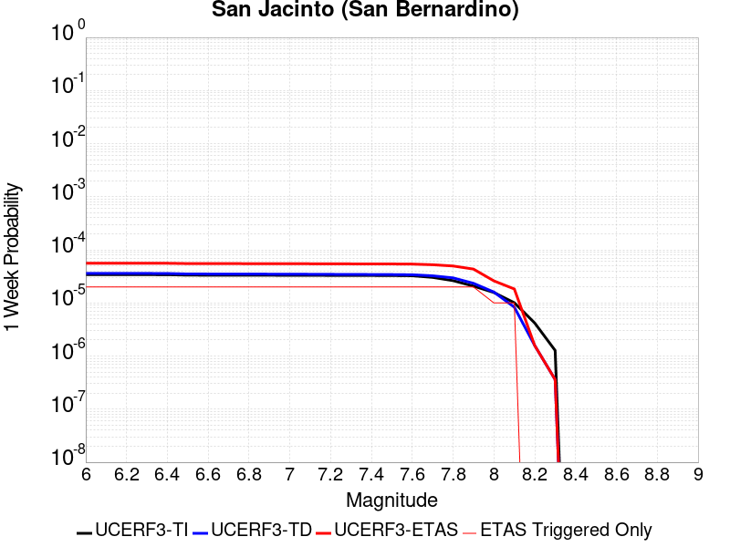 | 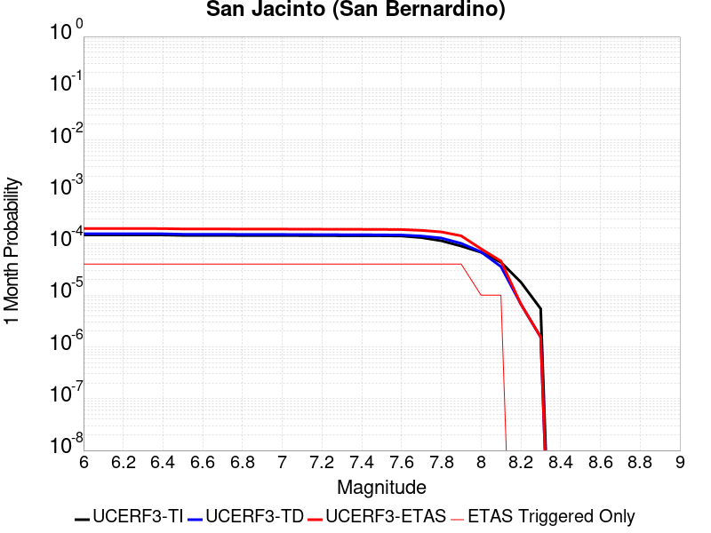 |  |  |

| Magnitude | 1 wk TI Prob | 1 wk TD Prob | 1 wk ETAS Prob | 1 wk ETAS/TD Gain | 1 wk ETAS Triggered Only | 1 mo TI Prob | 1 mo TD Prob | 1 mo ETAS Prob | 1 mo ETAS/TD Gain | 1 mo ETAS Triggered Only | 1 yr TI Prob | 1 yr TD Prob | 1 yr ETAS Prob | 1 yr ETAS/TD Gain | 1 yr ETAS Triggered Only | 10 yr TI Prob | 10 yr TD Prob | 10 yr ETAS Prob | 10 yr ETAS/TD Gain | 10 yr ETAS Triggered Only |
|-----|-----|-----|-----|-----|-----|-----|-----|-----|-----|-----|-----|-----|-----|-----|-----|-----|-----|-----|-----|-----|
| 6.0 | 3.409352E-5 | 3.598562E-5 | 5.59849E-5 | 1.5557575 | 2.0E-5 | 1.461069E-4 | 1.5421498E-4 | 1.9420881E-4 | 1.2593381 | 4.0E-5 | 0.0017774 | 0.0018759521 | 0.0019358395 | 1.0319238 | 6.0E-5 | 0.01763251 | 0.019349992 | 0.01943825 | 1.0045612 | 9.0E-5 |
| 6.1 | 3.409352E-5 | 3.598562E-5 | 5.59849E-5 | 1.5557575 | 2.0E-5 | 1.461069E-4 | 1.5421498E-4 | 1.9420881E-4 | 1.2593381 | 4.0E-5 | 0.0017774 | 0.0018759521 | 0.0019358395 | 1.0319238 | 6.0E-5 | 0.01763251 | 0.019349992 | 0.01943825 | 1.0045612 | 9.0E-5 |
| 6.2 | 3.409352E-5 | 3.598562E-5 | 5.59849E-5 | 1.5557575 | 2.0E-5 | 1.461069E-4 | 1.5421498E-4 | 1.9420881E-4 | 1.2593381 | 4.0E-5 | 0.0017774 | 0.0018759521 | 0.0019358395 | 1.0319238 | 6.0E-5 | 0.01763251 | 0.019349992 | 0.01943825 | 1.0045612 | 9.0E-5 |
| 6.3 | 3.409352E-5 | 3.598562E-5 | 5.59849E-5 | 1.5557575 | 2.0E-5 | 1.461069E-4 | 1.5421498E-4 | 1.9420881E-4 | 1.2593381 | 4.0E-5 | 0.0017774 | 0.0018759521 | 0.0019358395 | 1.0319238 | 6.0E-5 | 0.01763251 | 0.019349992 | 0.01943825 | 1.0045612 | 9.0E-5 |
| 6.4 | 3.400795E-5 | 3.5878285E-5 | 5.587757E-5 | 1.5574203 | 2.0E-5 | 1.4574021E-4 | 1.5375503E-4 | 1.9374887E-4 | 1.2601141 | 4.0E-5 | 0.0017729428 | 0.0018703619 | 0.0019302496 | 1.0320194 | 6.0E-5 | 0.017588645 | 0.019295072 | 0.019383335 | 1.0045744 | 9.0E-5 |
| 6.5 | 3.341482E-5 | 3.5138914E-5 | 5.513821E-5 | 1.5691495 | 2.0E-5 | 1.4319851E-4 | 1.5058667E-4 | 1.9058064E-4 | 1.2655878 | 4.0E-5 | 0.0017420477 | 0.0018318522 | 0.0018917423 | 1.0326937 | 6.0E-5 | 0.017284546 | 0.018916614 | 0.0189951 | 1.0041491 | 8.0E-5 |
| 6.6 | 3.3364955E-5 | 3.5076133E-5 | 5.507543E-5 | 1.5701683 | 2.0E-5 | 1.4298483E-4 | 1.5031763E-4 | 1.9031162E-4 | 1.2660632 | 4.0E-5 | 0.0017394501 | 0.0018285823 | 0.0018884726 | 1.0327523 | 6.0E-5 | 0.017258976 | 0.018884478 | 0.018962968 | 1.0041562 | 8.0E-5 |
| 6.7 | 3.335922E-5 | 3.5065907E-5 | 5.5065204E-5 | 1.5703346 | 2.0E-5 | 1.4296026E-4 | 1.5027382E-4 | 1.902678E-4 | 1.2661408 | 4.0E-5 | 0.0017391514 | 0.0018280497 | 0.00188794 | 1.0327618 | 6.0E-5 | 0.017256035 | 0.01887927 | 0.01895776 | 1.0041574 | 8.0E-5 |
| 6.8 | 3.327683E-5 | 3.4959972E-5 | 5.4959273E-5 | 1.5720628 | 2.0E-5 | 1.4260718E-4 | 1.4981985E-4 | 1.8981386E-4 | 1.2669473 | 4.0E-5 | 0.0017348597 | 0.001822532 | 0.0018824227 | 1.0328612 | 6.0E-5 | 0.017213784 | 0.018825043 | 0.018903537 | 1.0041697 | 8.0E-5 |
| 6.9 | 3.3235785E-5 | 3.4900928E-5 | 5.490023E-5 | 1.5730307 | 2.0E-5 | 1.4243131E-4 | 1.4956683E-4 | 1.8956084E-4 | 1.267399 | 4.0E-5 | 0.0017327217 | 0.0018194567 | 0.0018793475 | 1.0329169 | 6.0E-5 | 0.017192734 | 0.01879491 | 0.018873405 | 1.0041765 | 8.0E-5 |
| 7.0 | 3.3197095E-5 | 3.4840854E-5 | 5.484016E-5 | 1.5740187 | 2.0E-5 | 1.422655E-4 | 1.4930942E-4 | 1.8930344E-4 | 1.26786 | 4.0E-5 | 0.0017307063 | 0.0018163278 | 0.0018762188 | 1.0329736 | 6.0E-5 | 0.017172894 | 0.018764287 | 0.018842787 | 1.0041834 | 8.0E-5 |
| 7.1 | 3.3129716E-5 | 3.4721066E-5 | 5.472037E-5 | 1.5759993 | 2.0E-5 | 1.4197677E-4 | 1.4879608E-4 | 1.8879013E-4 | 1.2687843 | 4.0E-5 | 0.0017271966 | 0.0018100884 | 0.0018699798 | 1.0330876 | 6.0E-5 | 0.017138338 | 0.018703364 | 0.018781869 | 1.0041974 | 8.0E-5 |
| 7.2 | 3.3034008E-5 | 3.4588513E-5 | 5.458782E-5 | 1.5782067 | 2.0E-5 | 1.4156665E-4 | 1.4822806E-4 | 1.8822213E-4 | 1.2698145 | 4.0E-5 | 0.0017222111 | 0.0018031843 | 0.0018630761 | 1.0332144 | 6.0E-5 | 0.017089253 | 0.018635748 | 0.018714257 | 1.0042129 | 8.0E-5 |
| 7.3 | 3.2956614E-5 | 3.4456265E-5 | 5.4455577E-5 | 1.580426 | 2.0E-5 | 1.4123498E-4 | 1.4766137E-4 | 1.8765546E-4 | 1.2708501 | 4.0E-5 | 0.0017181796 | 0.0017962961 | 0.0018561883 | 1.0333421 | 6.0E-5 | 0.017049557 | 0.018568495 | 0.01864701 | 1.0042284 | 8.0E-5 |
| 7.4 | 3.2915937E-5 | 3.4377957E-5 | 5.437727E-5 | 1.5817481 | 2.0E-5 | 1.4106068E-4 | 1.473258E-4 | 1.873199E-4 | 1.2714671 | 4.0E-5 | 0.0017160608 | 0.0017922173 | 0.0018521098 | 1.033418 | 6.0E-5 | 0.017028693 | 0.018528767 | 0.018607285 | 1.0042377 | 8.0E-5 |
| 7.5 | 3.281791E-5 | 3.424287E-5 | 5.4242184E-5 | 1.5840431 | 2.0E-5 | 1.406406E-4 | 1.4674691E-4 | 1.8674105E-4 | 1.2725382 | 4.0E-5 | 0.0017109542 | 0.0017851809 | 0.0018450738 | 1.03355 | 6.0E-5 | 0.016978411 | 0.018459652 | 0.018538173 | 1.0042537 | 8.0E-5 |
| 7.6 | 3.2521442E-5 | 3.396782E-5 | 5.396714E-5 | 1.5887725 | 2.0E-5 | 1.3937015E-4 | 1.4556825E-4 | 1.8556243E-4 | 1.2747452 | 4.0E-5 | 0.0016955109 | 0.0017708542 | 0.0018307479 | 1.033822 | 6.0E-5 | 0.016826328 | 0.018317293 | 0.018395828 | 1.0042875 | 8.0E-5 |
| 7.7 | 3.0287873E-5 | 3.245191E-5 | 5.245126E-5 | 1.6162765 | 2.0E-5 | 1.297987E-4 | 1.3907222E-4 | 1.7906664E-4 | 1.2875804 | 4.0E-5 | 0.0015791537 | 0.0016918903 | 0.0017517888 | 1.0354033 | 6.0E-5 | 0.01567979 | 0.017528197 | 0.017606795 | 1.004484 | 8.0E-5 |
| 7.8 | 2.6316151E-5 | 2.9662837E-5 | 4.966224E-5 | 1.6742244 | 2.0E-5 | 1.1277862E-4 | 1.2712025E-4 | 1.6711517E-4 | 1.3146226 | 4.0E-5 | 0.0013722149 | 0.0015465913 | 0.0016064985 | 1.038735 | 6.0E-5 | 0.013637724 | 0.016069876 | 0.01614859 | 1.0048983 | 8.0E-5 |
| 7.9 | 2.0761147E-5 | 2.3417291E-5 | 4.341682E-5 | 1.8540498 | 2.0E-5 | 8.897331E-5 | 1.0035596E-4 | 1.4035194E-4 | 1.3985412 | 4.0E-5 | 0.0010827117 | 0.0012211498 | 0.0012810766 | 1.049074 | 6.0E-5 | 0.010774517 | 0.01279327 | 0.012872247 | 1.0061733 | 8.0E-5 |
| 8.0 | 1.5738568E-5 | 1.6032505E-5 | 2.6032345E-5 | 1.6237228 | 1.0E-5 | 6.744926E-5 | 6.8708934E-5 | 7.8708246E-5 | 1.1455315 | 1.0E-5 | 8.2088535E-4 | 8.3621085E-4 | 8.561941E-4 | 1.0238974 | 2.0E-5 | 0.008178596 | 0.008865741 | 0.0088954745 | 1.0033538 | 3.0E-5 |
| 8.1 | 1.0105832E-5 | 8.329479E-6 | 1.8329396E-5 | 2.2005453 | 1.0E-5 | 4.3309992E-5 | 3.569728E-5 | 4.569692E-5 | 1.2801234 | 1.0E-5 | 5.2717153E-4 | 4.3452822E-4 | 4.5451953E-4 | 1.0460069 | 2.0E-5 | 0.005259227 | 0.0046768794 | 0.004706739 | 1.0063845 | 3.0E-5 |
| 8.2 | 4.189207E-6 | 1.577699E-6 | 1.577699E-6 | 1.0 | 0.0 | 1.7953622E-5 | 6.7615497E-6 | 6.7615497E-6 | 1.0 | 0.0 | 2.1856341E-4 | 8.231879E-5 | 8.231879E-5 | 1.0 | 0.0 | 0.0021834858 | 9.562628E-4 | 9.562628E-4 | 1.0 | 0.0 |
| 8.3 | 1.2758221E-6 | 3.612677E-7 | 3.612677E-7 | 1.0 | 0.0 | 5.4677976E-6 | 1.5482892E-6 | 1.5482892E-6 | 1.0 | 0.0 | 6.65684E-5 | 1.8850264E-5 | 1.8850264E-5 | 1.0 | 0.0 | 6.6548464E-4 | 2.2739546E-4 | 2.2739546E-4 | 1.0 | 0.0 |

## San Diego Trough north alt1
*[(top)](#table-of-contents)*

| 1 Week | 1 Month | 1 Year | 10 Year |
|-----|-----|-----|-----|
| 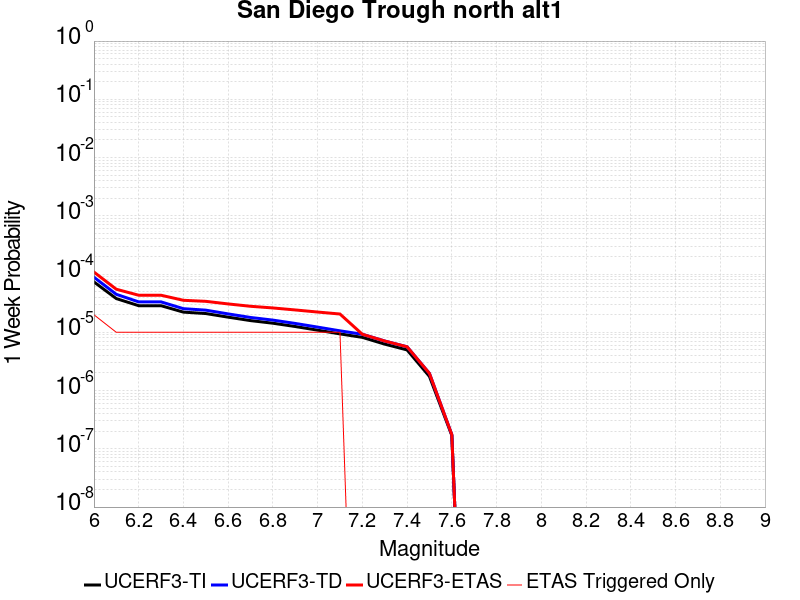 | 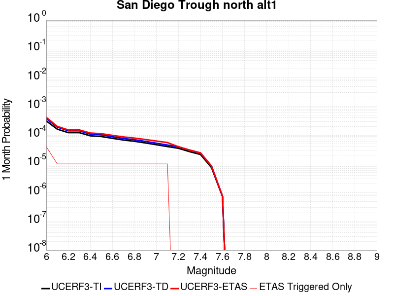 |  | 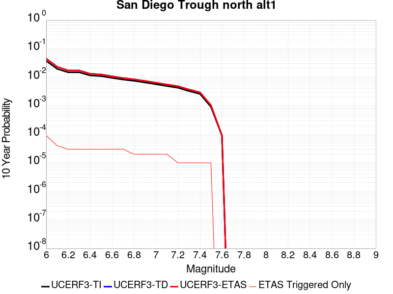 |

| Magnitude | 1 wk TI Prob | 1 wk TD Prob | 1 wk ETAS Prob | 1 wk ETAS/TD Gain | 1 wk ETAS Triggered Only | 1 mo TI Prob | 1 mo TD Prob | 1 mo ETAS Prob | 1 mo ETAS/TD Gain | 1 mo ETAS Triggered Only | 1 yr TI Prob | 1 yr TD Prob | 1 yr ETAS Prob | 1 yr ETAS/TD Gain | 1 yr ETAS Triggered Only | 10 yr TI Prob | 10 yr TD Prob | 10 yr ETAS Prob | 10 yr ETAS/TD Gain | 10 yr ETAS Triggered Only |
|-----|-----|-----|-----|-----|-----|-----|-----|-----|-----|-----|-----|-----|-----|-----|-----|-----|-----|-----|-----|-----|
| 6.0 | 7.329252E-5 | 8.821269E-5 | 1.0821093E-4 | 1.2267047 | 2.0E-5 | 3.14073E-4 | 3.7800326E-4 | 4.1798814E-4 | 1.1057792 | 4.0E-5 | 0.0038171355 | 0.0045930487 | 0.004652773 | 1.0130032 | 6.0E-5 | 0.03752231 | 0.045045137 | 0.045131084 | 1.001908 | 9.0E-5 |
| 6.1 | 3.7940346E-5 | 4.4884906E-5 | 5.488446E-5 | 1.222782 | 1.0E-5 | 1.6259136E-4 | 1.9235026E-4 | 2.0234832E-4 | 1.0519785 | 1.0E-5 | 0.0019777524 | 0.002339431 | 0.0023693608 | 1.0127937 | 3.0E-5 | 0.019602431 | 0.023156732 | 0.023195807 | 1.0016874 | 4.0E-5 |
| 6.2 | 2.8645263E-5 | 3.329672E-5 | 4.329639E-5 | 1.3003199 | 1.0E-5 | 1.2275964E-4 | 1.4269259E-4 | 1.5269115E-4 | 1.0700707 | 1.0E-5 | 0.0014935739 | 0.0017359206 | 0.0017558859 | 1.0115013 | 2.0E-5 | 0.0148357535 | 0.017226268 | 0.01725575 | 1.0017115 | 3.0E-5 |
| 6.3 | 2.8645263E-5 | 3.329672E-5 | 4.329639E-5 | 1.3003199 | 1.0E-5 | 1.2275964E-4 | 1.4269259E-4 | 1.5269115E-4 | 1.0700707 | 1.0E-5 | 0.0014935739 | 0.0017359206 | 0.0017558859 | 1.0115013 | 2.0E-5 | 0.0148357535 | 0.017226268 | 0.01725575 | 1.0017115 | 3.0E-5 |
| 6.4 | 2.2204576E-5 | 2.544832E-5 | 3.5448065E-5 | 1.3929433 | 1.0E-5 | 9.5159E-5 | 1.0905972E-4 | 1.1905863E-4 | 1.0916829 | 1.0E-5 | 0.001157945 | 0.0013270028 | 0.0013469763 | 1.0150516 | 2.0E-5 | 0.011519298 | 0.013191959 | 0.013221563 | 1.0022441 | 3.0E-5 |
| 6.5 | 2.1004838E-5 | 2.4024695E-5 | 3.4024455E-5 | 1.4162284 | 1.0E-5 | 9.0017624E-5 | 1.0295897E-4 | 1.1295794E-4 | 1.0971161 | 1.0E-5 | 0.0010954136 | 0.0012528135 | 0.0012727884 | 1.0159441 | 2.0E-5 | 0.010900296 | 0.012458592 | 0.012488218 | 1.002378 | 3.0E-5 |
| 6.6 | 1.820557E-5 | 2.070479E-5 | 3.070458E-5 | 1.48297 | 1.0E-5 | 7.802154E-5 | 8.8731824E-5 | 9.873094E-5 | 1.1126891 | 1.0E-5 | 9.4949827E-4 | 0.0010797799 | 0.0010997584 | 1.0185022 | 2.0E-5 | 0.009454516 | 0.010746005 | 0.010775683 | 1.0027617 | 3.0E-5 |
| 6.7 | 1.5884485E-5 | 1.7983646E-5 | 2.7983466E-5 | 1.5560508 | 1.0E-5 | 6.807459E-5 | 7.707051E-5 | 8.706974E-5 | 1.1297413 | 1.0E-5 | 8.284929E-4 | 9.3793223E-4 | 9.5791346E-4 | 1.0213035 | 2.0E-5 | 0.008254109 | 0.009340104 | 0.009369823 | 1.0031819 | 3.0E-5 |
| 6.8 | 1.4331171E-5 | 1.6201066E-5 | 2.6200903E-5 | 1.6172334 | 1.0E-5 | 6.141786E-5 | 6.94313E-5 | 7.94306E-5 | 1.1440172 | 1.0E-5 | 7.4750587E-4 | 8.450002E-4 | 8.549917E-4 | 1.0118244 | 1.0E-5 | 0.0074499645 | 0.008418139 | 0.008437971 | 1.0023558 | 2.0E-5 |
| 6.9 | 1.2574203E-5 | 1.4205835E-5 | 2.4205692E-5 | 1.7039261 | 1.0E-5 | 5.3888325E-5 | 6.0880735E-5 | 7.088013E-5 | 1.1642456 | 1.0E-5 | 6.558929E-4 | 7.409723E-4 | 7.5096486E-4 | 1.0134858 | 1.0E-5 | 0.0065396037 | 0.007385203 | 0.0074050557 | 1.0026882 | 2.0E-5 |
| 7.0 | 1.0883844E-5 | 1.2289262E-5 | 2.2289138E-5 | 1.8137085 | 1.0E-5 | 4.664421E-5 | 5.2667205E-5 | 6.266668E-5 | 1.1898614 | 1.0E-5 | 5.677453E-4 | 6.4103556E-4 | 6.510292E-4 | 1.0155897 | 1.0E-5 | 0.00566297 | 0.006391993 | 0.006411865 | 1.0031089 | 2.0E-5 |
| 7.1 | 9.393088E-6 | 1.060702E-5 | 2.0606914E-5 | 1.9427619 | 1.0E-5 | 4.025547E-5 | 4.545787E-5 | 5.5457414E-5 | 1.2199739 | 1.0E-5 | 4.900001E-4 | 5.533098E-4 | 5.6330423E-4 | 1.0180631 | 1.0E-5 | 0.0048892107 | 0.005519418 | 0.0055393074 | 1.0036036 | 2.0E-5 |
| 7.2 | 8.190791E-6 | 9.258625E-6 | 9.258625E-6 | 1.0 | 0.0 | 3.510292E-5 | 3.9679224E-5 | 3.9679224E-5 | 1.0 | 0.0 | 4.2729423E-4 | 4.8298817E-4 | 4.8298817E-4 | 1.0 | 0.0 | 0.0042647356 | 0.004819465 | 0.0048294165 | 1.002065 | 1.0E-5 |
| 7.3 | 6.268162E-6 | 7.089716E-6 | 7.089716E-6 | 1.0 | 0.0 | 2.6863276E-5 | 3.0384144E-5 | 3.0384144E-5 | 1.0 | 0.0 | 3.2701128E-4 | 3.6986457E-4 | 3.6986457E-4 | 1.0 | 0.0 | 0.003265305 | 0.003692536 | 0.003702499 | 1.0026982 | 1.0E-5 |
| 7.4 | 4.985186E-6 | 5.6426816E-6 | 5.6426816E-6 | 1.0 | 0.0 | 2.1364907E-5 | 2.4182698E-5 | 2.4182698E-5 | 1.0 | 0.0 | 2.600867E-4 | 2.9438498E-4 | 2.9438498E-4 | 1.0 | 0.0 | 0.002597825 | 0.0029399914 | 0.002949962 | 1.0033914 | 1.0E-5 |
| 7.5 | 1.7489613E-6 | 1.969678E-6 | 1.969678E-6 | 1.0 | 0.0 | 7.495527E-6 | 8.4414505E-6 | 8.4414505E-6 | 1.0 | 0.0 | 9.125422E-5 | 1.02770035E-4 | 1.02770035E-4 | 1.0 | 0.0 | 9.1216754E-4 | 0.0010272472 | 0.0010372369 | 1.0097247 | 1.0E-5 |
| 7.6 | 1.6988751E-7 | 1.7533823E-7 | 1.7533823E-7 | 1.0 | 0.0 | 7.2808916E-7 | 7.5144936E-7 | 7.5144936E-7 | 1.0 | 0.0 | 8.864449E-6 | 9.14886E-6 | 9.14886E-6 | 1.0 | 0.0 | 8.8640954E-5 | 9.1485024E-5 | 9.1485024E-5 | 1.0 | 0.0 |

## Big Pine (Central)
*[(top)](#table-of-contents)*

| 1 Week | 1 Month | 1 Year | 10 Year |
|-----|-----|-----|-----|
|  |  | 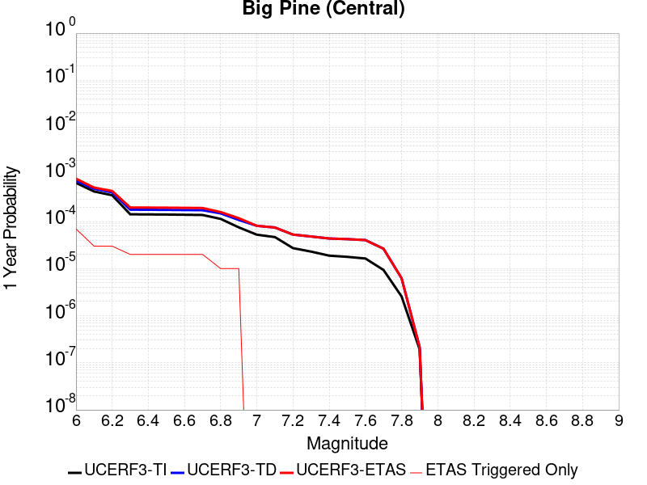 | 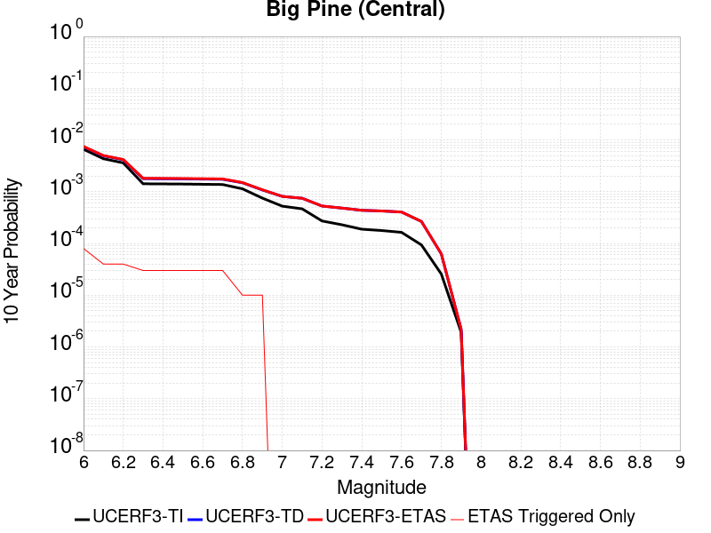 |

| Magnitude | 1 wk TI Prob | 1 wk TD Prob | 1 wk ETAS Prob | 1 wk ETAS/TD Gain | 1 wk ETAS Triggered Only | 1 mo TI Prob | 1 mo TD Prob | 1 mo ETAS Prob | 1 mo ETAS/TD Gain | 1 mo ETAS Triggered Only | 1 yr TI Prob | 1 yr TD Prob | 1 yr ETAS Prob | 1 yr ETAS/TD Gain | 1 yr ETAS Triggered Only | 10 yr TI Prob | 10 yr TD Prob | 10 yr ETAS Prob | 10 yr ETAS/TD Gain | 10 yr ETAS Triggered Only |
|-----|-----|-----|-----|-----|-----|-----|-----|-----|-----|-----|-----|-----|-----|-----|-----|-----|-----|-----|-----|-----|
| 6.0 | 1.2706755E-5 | 1.4250602E-5 | 2.425046E-5 | 1.7017148 | 1.0E-5 | 5.4456385E-5 | 6.107279E-5 | 8.1071565E-5 | 1.3274581 | 2.0E-5 | 6.628048E-4 | 7.433441E-4 | 8.1329205E-4 | 1.094099 | 7.0E-5 | 0.006608314 | 0.007413639 | 0.007493046 | 1.010711 | 8.0E-5 |
| 6.1 | 8.342579E-6 | 9.510835E-6 | 9.510835E-6 | 1.0 | 0.0 | 3.5753423E-5 | 4.076021E-5 | 4.076021E-5 | 1.0 | 0.0 | 4.3521097E-4 | 4.9616426E-4 | 5.261494E-4 | 1.0604339 | 3.0E-5 | 0.0043435963 | 0.004954155 | 0.004993957 | 1.008034 | 4.0E-5 |
| 6.2 | 6.923899E-6 | 7.967221E-6 | 7.967221E-6 | 1.0 | 0.0 | 2.9673516E-5 | 3.4144894E-5 | 3.4144894E-5 | 1.0 | 0.0 | 3.6121515E-4 | 4.1565404E-4 | 4.4564158E-4 | 1.0721455 | 3.0E-5 | 0.003606286 | 0.0041521094 | 0.0041919434 | 1.0095936 | 4.0E-5 |
| 6.3 | 2.728396E-6 | 3.4243646E-6 | 3.4243646E-6 | 1.0 | 0.0 | 1.1693074E-5 | 1.4675771E-5 | 1.4675771E-5 | 1.0 | 0.0 | 1.4235388E-4 | 1.7866373E-4 | 1.9866016E-4 | 1.1119221 | 2.0E-5 | 0.0014226272 | 0.0017867433 | 0.0018166897 | 1.0167603 | 3.0E-5 |
| 6.4 | 2.7136944E-6 | 3.4086581E-6 | 3.4086581E-6 | 1.0 | 0.0 | 1.1630066E-5 | 1.4608458E-5 | 1.4608458E-5 | 1.0 | 0.0 | 1.4158686E-4 | 1.7784433E-4 | 1.9784077E-4 | 1.1124378 | 2.0E-5 | 0.0014149669 | 0.0017785623 | 0.001808509 | 1.0168376 | 3.0E-5 |
| 6.5 | 2.6971882E-6 | 3.3910032E-6 | 3.3910032E-6 | 1.0 | 0.0 | 1.1559327E-5 | 1.4532795E-5 | 1.4532795E-5 | 1.0 | 0.0 | 1.4072572E-4 | 1.7692328E-4 | 1.9691975E-4 | 1.1130234 | 2.0E-5 | 0.0014063664 | 0.0017693666 | 0.0017993135 | 1.0169252 | 3.0E-5 |
| 6.6 | 2.669092E-6 | 3.3610236E-6 | 3.3610236E-6 | 1.0 | 0.0 | 1.1438916E-5 | 1.4404312E-5 | 1.4404312E-5 | 1.0 | 0.0 | 1.3925991E-4 | 1.7535927E-4 | 1.9535575E-4 | 1.1140316 | 2.0E-5 | 0.0013917267 | 0.0017537511 | 0.0017836984 | 1.0170761 | 3.0E-5 |
| 6.7 | 2.6408059E-6 | 3.3310494E-6 | 3.3310494E-6 | 1.0 | 0.0 | 1.1317691E-5 | 1.4275853E-5 | 1.4275853E-5 | 1.0 | 0.0 | 1.3778417E-4 | 1.737955E-4 | 1.9379203E-4 | 1.1150578 | 2.0E-5 | 0.0013769877 | 0.0017381381 | 0.001768086 | 1.0172298 | 3.0E-5 |
| 6.8 | 2.1786943E-6 | 2.8545066E-6 | 2.8545066E-6 | 1.0 | 0.0 | 9.337228E-6 | 1.2233547E-5 | 1.2233547E-5 | 1.0 | 0.0 | 1.1367482E-4 | 1.4893398E-4 | 1.5893248E-4 | 1.0671339 | 1.0E-5 | 0.0011361669 | 0.0014898704 | 0.0014998555 | 1.006702 | 1.0E-5 |
| 6.9 | 1.4411696E-6 | 2.0685677E-6 | 2.0685677E-6 | 1.0 | 0.0 | 6.1764263E-6 | 8.865261E-6 | 8.865261E-6 | 1.0 | 0.0 | 7.51954E-5 | 1.0792949E-4 | 1.1792841E-4 | 1.0926431 | 1.0E-5 | 7.5169955E-4 | 0.0010802548 | 0.001090244 | 1.0092471 | 1.0E-5 |
| 7.0 | 1.0073411E-6 | 1.5543274E-6 | 1.5543274E-6 | 1.0 | 0.0 | 4.317169E-6 | 6.661387E-6 | 6.661387E-6 | 1.0 | 0.0 | 5.2560266E-5 | 8.109952E-5 | 8.109952E-5 | 1.0 | 0.0 | 5.2547833E-4 | 8.1217213E-4 | 8.1217213E-4 | 1.0 | 0.0 |
| 7.1 | 8.947104E-7 | 1.430316E-6 | 1.430316E-6 | 1.0 | 0.0 | 3.834468E-6 | 6.1299124E-6 | 6.1299124E-6 | 1.0 | 0.0 | 4.6683643E-5 | 7.462928E-5 | 7.462928E-5 | 1.0 | 0.0 | 4.6673836E-4 | 7.4751483E-4 | 7.4751483E-4 | 1.0 | 0.0 |
| 7.2 | 5.215166E-7 | 1.0112277E-6 | 1.0112277E-6 | 1.0 | 0.0 | 2.2350691E-6 | 4.333826E-6 | 4.333826E-6 | 1.0 | 0.0 | 2.7211627E-5 | 5.27631E-5 | 5.27631E-5 | 1.0 | 0.0 | 2.7208295E-4 | 5.289683E-4 | 5.289683E-4 | 1.0 | 0.0 |
| 7.3 | 4.4024807E-7 | 9.220183E-7 | 9.220183E-7 | 1.0 | 0.0 | 1.8867761E-6 | 3.951501E-6 | 3.951501E-6 | 1.0 | 0.0 | 2.2971257E-5 | 4.8108504E-5 | 4.8108504E-5 | 1.0 | 0.0 | 2.2968883E-4 | 4.824433E-4 | 4.824433E-4 | 1.0 | 0.0 |
| 7.4 | 3.6130905E-7 | 8.359109E-7 | 8.359109E-7 | 1.0 | 0.0 | 1.5484665E-6 | 3.5824705E-6 | 3.5824705E-6 | 1.0 | 0.0 | 1.8852415E-5 | 4.3615746E-5 | 4.3615746E-5 | 1.0 | 0.0 | 1.8850817E-4 | 4.3752496E-4 | 4.3752496E-4 | 1.0 | 0.0 |
| 7.5 | 3.408184E-7 | 8.1087245E-7 | 8.1087245E-7 | 1.0 | 0.0 | 1.4606494E-6 | 3.475163E-6 | 3.475163E-6 | 1.0 | 0.0 | 1.7783263E-5 | 4.230933E-5 | 4.230933E-5 | 1.0 | 0.0 | 1.778184E-4 | 4.2444657E-4 | 4.2444657E-4 | 1.0 | 0.0 |
| 7.6 | 3.1428627E-7 | 7.732167E-7 | 7.732167E-7 | 1.0 | 0.0 | 1.3469405E-6 | 3.313782E-6 | 3.313782E-6 | 1.0 | 0.0 | 1.6398877E-5 | 4.0344585E-5 | 4.0344585E-5 | 1.0 | 0.0 | 1.6397667E-4 | 4.0477706E-4 | 4.0477706E-4 | 1.0 | 0.0 |
| 7.7 | 1.7972785E-7 | 5.0782415E-7 | 5.0782415E-7 | 1.0 | 0.0 | 7.70262E-7 | 2.1763874E-6 | 2.1763874E-6 | 1.0 | 0.0 | 9.377899E-6 | 2.6497206E-5 | 2.6497206E-5 | 1.0 | 0.0 | 9.377503E-5 | 2.6633305E-4 | 2.6633305E-4 | 1.0 | 0.0 |
| 7.8 | 4.9230927E-8 | 1.1981747E-7 | 1.1981747E-7 | 1.0 | 0.0 | 2.1098968E-7 | 5.135033E-7 | 5.135033E-7 | 1.0 | 0.0 | 2.5687964E-6 | 6.2518866E-6 | 6.2518866E-6 | 1.0 | 0.0 | 2.5687666E-5 | 6.2971965E-5 | 6.2971965E-5 | 1.0 | 0.0 |
| 7.9 | 3.6805972E-9 | 4.1051638E-9 | 4.1051638E-9 | 1.0 | 0.0 | 1.5773987E-8 | 1.7593557E-8 | 1.7593557E-8 | 1.0 | 0.0 | 1.9204828E-7 | 2.1420155E-7 | 2.1420155E-7 | 1.0 | 0.0 | 1.920481E-6 | 2.1898923E-6 | 2.1898923E-6 | 1.0 | 0.0 |

## Coronado Bank alt1
*[(top)](#table-of-contents)*

| 1 Week | 1 Month | 1 Year | 10 Year |
|-----|-----|-----|-----|
|  |  |  |  |

| Magnitude | 1 wk TI Prob | 1 wk TD Prob | 1 wk ETAS Prob | 1 wk ETAS/TD Gain | 1 wk ETAS Triggered Only | 1 mo TI Prob | 1 mo TD Prob | 1 mo ETAS Prob | 1 mo ETAS/TD Gain | 1 mo ETAS Triggered Only | 1 yr TI Prob | 1 yr TD Prob | 1 yr ETAS Prob | 1 yr ETAS/TD Gain | 1 yr ETAS Triggered Only | 10 yr TI Prob | 10 yr TD Prob | 10 yr ETAS Prob | 10 yr ETAS/TD Gain | 10 yr ETAS Triggered Only |
|-----|-----|-----|-----|-----|-----|-----|-----|-----|-----|-----|-----|-----|-----|-----|-----|-----|-----|-----|-----|-----|
| 6.0 | 7.533492E-5 | 9.3951705E-5 | 1.2394889E-4 | 1.319283 | 3.0E-5 | 3.22824E-4 | 4.025903E-4 | 4.5257015E-4 | 1.1241457 | 5.0E-5 | 0.0039233007 | 0.004891121 | 0.0049508275 | 1.0122072 | 6.0E-5 | 0.03854755 | 0.047904 | 0.04798969 | 1.0017887 | 9.0E-5 |
| 6.1 | 4.1807285E-5 | 5.0493105E-5 | 5.0493105E-5 | 1.0 | 0.0 | 1.7916178E-4 | 2.1638138E-4 | 2.3637705E-4 | 1.0924094 | 2.0E-5 | 0.0021791123 | 0.0026313365 | 0.0026612575 | 1.011371 | 3.0E-5 | 0.021578677 | 0.026011124 | 0.026050083 | 1.0014977 | 4.0E-5 |
| 6.2 | 4.1807285E-5 | 5.0493105E-5 | 5.0493105E-5 | 1.0 | 0.0 | 1.7916178E-4 | 2.1638138E-4 | 2.3637705E-4 | 1.0924094 | 2.0E-5 | 0.0021791123 | 0.0026313365 | 0.0026612575 | 1.011371 | 3.0E-5 | 0.021578677 | 0.026011124 | 0.026050083 | 1.0014977 | 4.0E-5 |
| 6.3 | 3.1793104E-5 | 3.7711125E-5 | 3.7711125E-5 | 1.0 | 0.0 | 1.3624904E-4 | 1.6160926E-4 | 1.8160602E-4 | 1.1237353 | 2.0E-5 | 0.0016575698 | 0.001965849 | 0.0019858098 | 1.0101538 | 2.0E-5 | 0.016452603 | 0.019488495 | 0.01951791 | 1.0015094 | 3.0E-5 |
| 6.4 | 2.9878007E-5 | 3.5335797E-5 | 3.5335797E-5 | 1.0 | 0.0 | 1.2804232E-4 | 1.5143053E-4 | 1.714275E-4 | 1.1320537 | 2.0E-5 | 0.0015578003 | 0.0018421395 | 0.0018621027 | 1.010837 | 2.0E-5 | 0.015469253 | 0.018272463 | 0.018301915 | 1.0016118 | 3.0E-5 |
| 6.5 | 2.4512565E-5 | 2.8764101E-5 | 2.8764101E-5 | 1.0 | 0.0 | 1.0504962E-4 | 1.2326906E-4 | 1.4326659E-4 | 1.1622267 | 2.0E-5 | 0.0012782287 | 0.0014997943 | 0.0015197643 | 1.0133152 | 2.0E-5 | 0.012709012 | 0.0148996925 | 0.014929246 | 1.0019835 | 3.0E-5 |
| 6.6 | 2.1317413E-5 | 2.490667E-5 | 2.490667E-5 | 1.0 | 0.0 | 9.135714E-5 | 1.0673863E-4 | 1.1673757E-4 | 1.0936768 | 1.0E-5 | 0.0011117056 | 0.0012987903 | 0.0013087774 | 1.0076895 | 1.0E-5 | 0.011061605 | 0.012914407 | 0.012934149 | 1.0015286 | 2.0E-5 |
| 6.7 | 1.8585655E-5 | 2.1634882E-5 | 2.1634882E-5 | 1.0 | 0.0 | 7.9650374E-5 | 9.271774E-5 | 1.0271681E-4 | 1.1078442 | 1.0E-5 | 9.6931186E-4 | 0.0011282744 | 0.001138263 | 1.0088531 | 1.0E-5 | 0.0096509475 | 0.011227623 | 0.011247398 | 1.0017613 | 2.0E-5 |
| 6.8 | 1.5862879E-5 | 1.8419476E-5 | 1.8419476E-5 | 1.0 | 0.0 | 6.798199E-5 | 7.8938334E-5 | 8.8937544E-5 | 1.1266712 | 1.0E-5 | 8.273665E-4 | 9.606697E-4 | 9.7066007E-4 | 1.0103995 | 1.0E-5 | 0.008242928 | 0.009567151 | 0.009586959 | 1.0020705 | 2.0E-5 |
| 6.9 | 1.3021509E-5 | 1.5095266E-5 | 1.5095266E-5 | 1.0 | 0.0 | 5.5805274E-5 | 6.46925E-5 | 7.4691845E-5 | 1.1545675 | 1.0E-5 | 6.792174E-4 | 7.873646E-4 | 7.973567E-4 | 1.0126905 | 1.0E-5 | 0.006771452 | 0.007847573 | 0.007857494 | 1.0012643 | 1.0E-5 |
| 7.0 | 1.0974371E-5 | 1.2720105E-5 | 1.2720105E-5 | 1.0 | 0.0 | 4.7032172E-5 | 5.4513697E-5 | 6.451315E-5 | 1.1834302 | 1.0E-5 | 5.7246623E-4 | 6.635197E-4 | 6.7351304E-4 | 1.0150611 | 1.0E-5 | 0.0057099373 | 0.0066171354 | 0.0066270693 | 1.0015012 | 1.0E-5 |
| 7.1 | 8.766221E-6 | 1.0163833E-5 | 1.0163833E-5 | 1.0 | 0.0 | 3.7568978E-5 | 4.3558655E-5 | 5.355822E-5 | 1.2295655 | 1.0E-5 | 4.573063E-4 | 5.302148E-4 | 5.4020947E-4 | 1.0188503 | 1.0E-5 | 0.0045636636 | 0.005291197 | 0.0053011444 | 1.0018799 | 1.0E-5 |
| 7.2 | 8.026024E-7 | 8.331776E-7 | 8.331776E-7 | 1.0 | 0.0 | 3.43972E-6 | 3.5707562E-6 | 3.5707562E-6 | 1.0 | 0.0 | 4.1877785E-5 | 4.34731E-5 | 4.34731E-5 | 1.0 | 0.0 | 4.1869894E-4 | 4.3464705E-4 | 4.3464705E-4 | 1.0 | 0.0 |
| 7.3 | 3.7293114E-7 | 3.700106E-7 | 3.700106E-7 | 1.0 | 0.0 | 1.5982754E-6 | 1.5857588E-6 | 1.5857588E-6 | 1.0 | 0.0 | 1.9458828E-5 | 1.9306442E-5 | 1.9306442E-5 | 1.0 | 0.0 | 1.9457124E-4 | 1.9304773E-4 | 1.9304773E-4 | 1.0 | 0.0 |
| 7.4 | 2.0557036E-7 | 1.9674441E-7 | 1.9674441E-7 | 1.0 | 0.0 | 8.810155E-7 | 8.4319004E-7 | 8.4319004E-7 | 1.0 | 0.0 | 1.0726311E-5 | 1.02657905E-5 | 1.02657905E-5 | 1.0 | 0.0 | 1.0725793E-4 | 1.026532E-4 | 1.026532E-4 | 1.0 | 0.0 |
| 7.5 | 6.845446E-8 | 6.2794086E-8 | 6.2794086E-8 | 1.0 | 0.0 | 2.9337625E-7 | 2.6911746E-7 | 2.6911746E-7 | 1.0 | 0.0 | 3.5718497E-6 | 3.2765004E-6 | 3.2765004E-6 | 1.0 | 0.0 | 3.5717923E-5 | 3.276453E-5 | 3.276453E-5 | 1.0 | 0.0 |
| 7.6 | 6.0975145E-9 | 5.531901E-9 | 5.531901E-9 | 1.0 | 0.0 | 2.6132206E-8 | 2.3708148E-8 | 2.3708148E-8 | 1.0 | 0.0 | 3.1815955E-7 | 2.8864667E-7 | 2.8864667E-7 | 1.0 | 0.0 | 3.181591E-6 | 2.886464E-6 | 2.886464E-6 | 1.0 | 0.0 |

## Ortigalita (North)
*[(top)](#table-of-contents)*

| 1 Week | 1 Month | 1 Year | 10 Year |
|-----|-----|-----|-----|
| 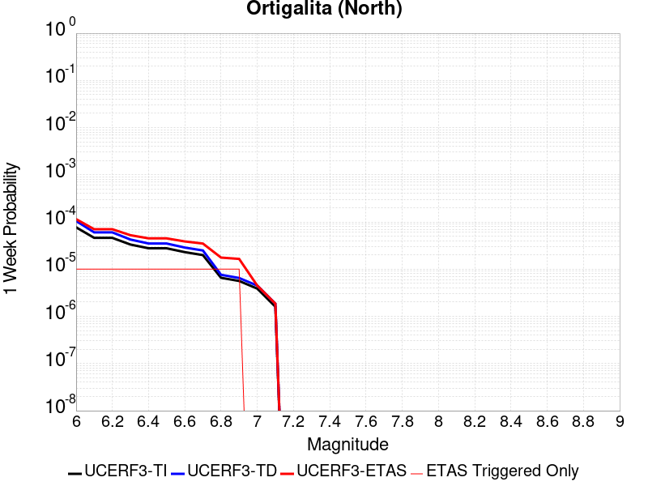 |  | 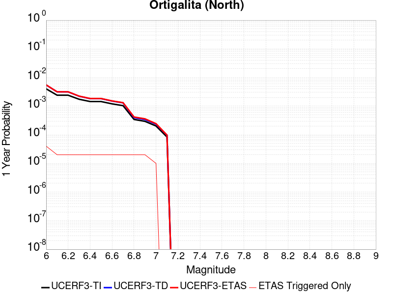 | 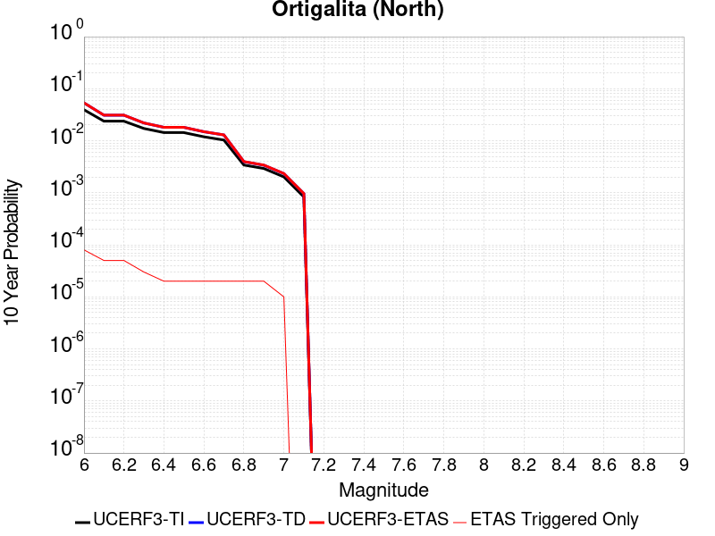 |

| Magnitude | 1 wk TI Prob | 1 wk TD Prob | 1 wk ETAS Prob | 1 wk ETAS/TD Gain | 1 wk ETAS Triggered Only | 1 mo TI Prob | 1 mo TD Prob | 1 mo ETAS Prob | 1 mo ETAS/TD Gain | 1 mo ETAS Triggered Only | 1 yr TI Prob | 1 yr TD Prob | 1 yr ETAS Prob | 1 yr ETAS/TD Gain | 1 yr ETAS Triggered Only | 10 yr TI Prob | 10 yr TD Prob | 10 yr ETAS Prob | 10 yr ETAS/TD Gain | 10 yr ETAS Triggered Only |
|-----|-----|-----|-----|-----|-----|-----|-----|-----|-----|-----|-----|-----|-----|-----|-----|-----|-----|-----|-----|-----|
| 6.0 | 7.711876E-5 | 1.0505308E-4 | 1.15052026E-4 | 1.09518 | 1.0E-5 | 3.3046713E-4 | 4.501601E-4 | 4.901421E-4 | 1.0888172 | 4.0E-5 | 0.004016016 | 0.0054680547 | 0.005507836 | 1.0072752 | 4.0E-5 | 0.039442103 | 0.053455614 | 0.053531338 | 1.0014166 | 8.0E-5 |
| 6.1 | 4.607858E-5 | 6.0239887E-5 | 7.0239286E-5 | 1.165993 | 1.0E-5 | 1.9746469E-4 | 2.5814763E-4 | 2.7814248E-4 | 1.077455 | 2.0E-5 | 0.0024014818 | 0.0031387366 | 0.0031586739 | 1.006352 | 2.0E-5 | 0.023756953 | 0.030975312 | 0.031023763 | 1.0015641 | 5.0E-5 |
| 6.2 | 4.607858E-5 | 6.0239887E-5 | 7.0239286E-5 | 1.165993 | 1.0E-5 | 1.9746469E-4 | 2.5814763E-4 | 2.7814248E-4 | 1.077455 | 2.0E-5 | 0.0024014818 | 0.0031387366 | 0.0031586739 | 1.006352 | 2.0E-5 | 0.023756953 | 0.030975312 | 0.031023763 | 1.0015641 | 5.0E-5 |
| 6.3 | 3.327423E-5 | 4.2476124E-5 | 5.2475698E-5 | 1.2354164 | 1.0E-5 | 1.4259605E-4 | 1.8202956E-4 | 2.0202591E-4 | 1.1098523 | 2.0E-5 | 0.0017347244 | 0.002214206 | 0.0022341616 | 1.0090126 | 2.0E-5 | 0.017212452 | 0.02194574 | 0.021975081 | 1.001337 | 3.0E-5 |
| 6.4 | 2.7732503E-5 | 3.4999008E-5 | 4.4998655E-5 | 1.2857124 | 1.0E-5 | 1.1884817E-4 | 1.499886E-4 | 1.699856E-4 | 1.1333234 | 2.0E-5 | 0.001446016 | 0.0018248158 | 0.0018447792 | 1.01094 | 2.0E-5 | 0.014366428 | 0.018121297 | 0.018140934 | 1.0010837 | 2.0E-5 |
| 6.5 | 2.7689714E-5 | 3.4948822E-5 | 4.4948472E-5 | 1.2861227 | 1.0E-5 | 1.186648E-4 | 1.4977354E-4 | 1.6977054E-4 | 1.1335149 | 2.0E-5 | 0.0014437864 | 0.0018222018 | 0.0018421654 | 1.0109557 | 2.0E-5 | 0.014344421 | 0.018095585 | 0.018115222 | 1.0010853 | 2.0E-5 |
| 6.6 | 2.2976905E-5 | 2.871829E-5 | 3.8718004E-5 | 1.3482001 | 1.0E-5 | 9.846873E-5 | 1.23074E-4 | 1.4307155E-4 | 1.1624838 | 2.0E-5 | 0.0011981975 | 0.0014976348 | 0.0015176049 | 1.0133344 | 2.0E-5 | 0.011917574 | 0.014898733 | 0.014918435 | 1.0013224 | 2.0E-5 |
| 6.7 | 1.9871539E-5 | 2.4904637E-5 | 3.4904388E-5 | 1.4015217 | 1.0E-5 | 8.516096E-5 | 1.067312E-4 | 1.2672906E-4 | 1.1873666 | 2.0E-5 | 0.0010363415 | 0.0012989199 | 0.001318894 | 1.0153774 | 2.0E-5 | 0.010315218 | 0.012936938 | 0.012956679 | 1.001526 | 2.0E-5 |
| 6.8 | 6.5640475E-6 | 7.6054926E-6 | 1.7605416E-5 | 2.3148293 | 1.0E-5 | 2.813133E-5 | 3.2594577E-5 | 5.2593925E-5 | 1.613579 | 2.0E-5 | 3.424451E-4 | 3.9676955E-4 | 4.1676164E-4 | 1.0503871 | 2.0E-5 | 0.0034191788 | 0.003960899 | 0.0039808196 | 1.0050293 | 2.0E-5 |
| 6.9 | 5.6219683E-6 | 6.5018376E-6 | 1.6501772E-5 | 2.5380168 | 1.0E-5 | 2.4093928E-5 | 2.7864735E-5 | 4.7864178E-5 | 1.7177331 | 2.0E-5 | 2.933041E-4 | 3.3920293E-4 | 3.5919613E-4 | 1.0589417 | 2.0E-5 | 0.0029291727 | 0.003387109 | 0.003407041 | 1.0058848 | 2.0E-5 |
| 7.0 | 3.875591E-6 | 4.4847548E-6 | 4.4847548E-6 | 1.0 | 0.0 | 1.6609569E-5 | 1.9220248E-5 | 2.9220057E-5 | 1.5202746 | 1.0E-5 | 2.0220275E-4 | 2.339835E-4 | 2.4398117E-4 | 1.0427281 | 1.0E-5 | 0.0020201886 | 0.0023375798 | 0.0023475564 | 1.0042679 | 1.0E-5 |
| 7.1 | 1.6017933E-6 | 1.8570418E-6 | 1.8570418E-6 | 1.0 | 0.0 | 6.8648105E-6 | 7.958732E-6 | 7.958732E-6 | 1.0 | 0.0 | 8.357586E-5 | 9.689432E-5 | 9.689432E-5 | 1.0 | 0.0 | 8.3544437E-4 | 9.686254E-4 | 9.686254E-4 | 1.0 | 0.0 |

## Kern Canyon (South Kern) 2011
*[(top)](#table-of-contents)*

| 1 Week | 1 Month | 1 Year | 10 Year |
|-----|-----|-----|-----|
|  |  |  | 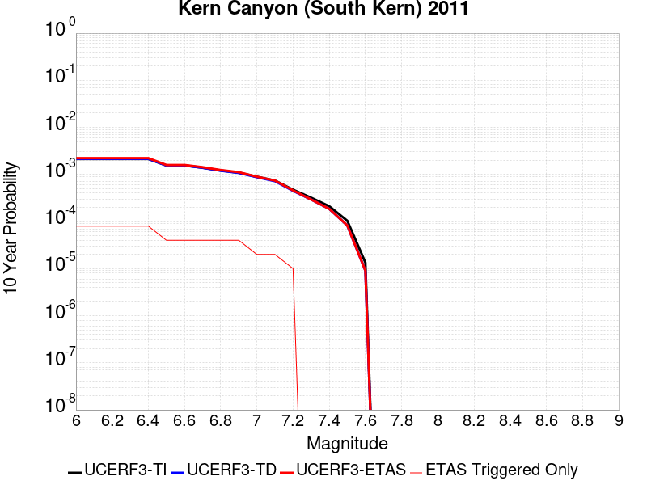 |

| Magnitude | 1 wk TI Prob | 1 wk TD Prob | 1 wk ETAS Prob | 1 wk ETAS/TD Gain | 1 wk ETAS Triggered Only | 1 mo TI Prob | 1 mo TD Prob | 1 mo ETAS Prob | 1 mo ETAS/TD Gain | 1 mo ETAS Triggered Only | 1 yr TI Prob | 1 yr TD Prob | 1 yr ETAS Prob | 1 yr ETAS/TD Gain | 1 yr ETAS Triggered Only | 10 yr TI Prob | 10 yr TD Prob | 10 yr ETAS Prob | 10 yr ETAS/TD Gain | 10 yr ETAS Triggered Only |
|-----|-----|-----|-----|-----|-----|-----|-----|-----|-----|-----|-----|-----|-----|-----|-----|-----|-----|-----|-----|-----|
| 6.0 | 4.105075E-6 | 4.113726E-6 | 2.4113644E-5 | 5.8617525 | 2.0E-5 | 1.7593058E-5 | 1.7630138E-5 | 3.7629787E-5 | 2.134401 | 2.0E-5 | 2.1417443E-4 | 2.1462643E-4 | 2.846114E-4 | 1.326078 | 7.0E-5 | 0.0021396813 | 0.0021442554 | 0.0022240838 | 1.037229 | 8.0E-5 |
| 6.1 | 4.105075E-6 | 4.113726E-6 | 2.4113644E-5 | 5.8617525 | 2.0E-5 | 1.7593058E-5 | 1.7630138E-5 | 3.7629787E-5 | 2.134401 | 2.0E-5 | 2.1417443E-4 | 2.1462643E-4 | 2.846114E-4 | 1.326078 | 7.0E-5 | 0.0021396813 | 0.0021442554 | 0.0022240838 | 1.037229 | 8.0E-5 |
| 6.2 | 4.105075E-6 | 4.113726E-6 | 2.4113644E-5 | 5.8617525 | 2.0E-5 | 1.7593058E-5 | 1.7630138E-5 | 3.7629787E-5 | 2.134401 | 2.0E-5 | 2.1417443E-4 | 2.1462643E-4 | 2.846114E-4 | 1.326078 | 7.0E-5 | 0.0021396813 | 0.0021442554 | 0.0022240838 | 1.037229 | 8.0E-5 |
| 6.3 | 4.105075E-6 | 4.113726E-6 | 2.4113644E-5 | 5.8617525 | 2.0E-5 | 1.7593058E-5 | 1.7630138E-5 | 3.7629787E-5 | 2.134401 | 2.0E-5 | 2.1417443E-4 | 2.1462643E-4 | 2.846114E-4 | 1.326078 | 7.0E-5 | 0.0021396813 | 0.0021442554 | 0.0022240838 | 1.037229 | 8.0E-5 |
| 6.4 | 4.105075E-6 | 4.113726E-6 | 2.4113644E-5 | 5.8617525 | 2.0E-5 | 1.7593058E-5 | 1.7630138E-5 | 3.7629787E-5 | 2.134401 | 2.0E-5 | 2.1417443E-4 | 2.1462643E-4 | 2.846114E-4 | 1.326078 | 7.0E-5 | 0.0021396813 | 0.0021442554 | 0.0022240838 | 1.037229 | 8.0E-5 |
| 6.5 | 2.9849807E-6 | 2.973154E-6 | 1.2973124E-5 | 4.3634214 | 1.0E-5 | 1.2792712E-5 | 1.2742028E-5 | 2.27419E-5 | 1.7847944 | 1.0E-5 | 1.5574014E-4 | 1.551233E-4 | 1.8511864E-4 | 1.1933645 | 3.0E-5 | 0.0015563103 | 0.0015501654 | 0.0015901033 | 1.0257638 | 4.0E-5 |
| 6.6 | 2.9849807E-6 | 2.973154E-6 | 1.2973124E-5 | 4.3634214 | 1.0E-5 | 1.2792712E-5 | 1.2742028E-5 | 2.27419E-5 | 1.7847944 | 1.0E-5 | 1.5574014E-4 | 1.551233E-4 | 1.8511864E-4 | 1.1933645 | 3.0E-5 | 0.0015563103 | 0.0015501654 | 0.0015901033 | 1.0257638 | 4.0E-5 |
| 6.7 | 2.6756725E-6 | 2.6582202E-6 | 1.2658194E-5 | 4.7619057 | 1.0E-5 | 1.1467117E-5 | 1.1392323E-5 | 2.1392209E-5 | 1.8777741 | 1.0E-5 | 1.396032E-4 | 1.386928E-4 | 1.6868865E-4 | 1.2162753 | 3.0E-5 | 0.0013951553 | 0.0013860734 | 0.0014260181 | 1.0288185 | 4.0E-5 |
| 6.8 | 2.3283721E-6 | 2.3047783E-6 | 1.2304755E-5 | 5.3388023 | 1.0E-5 | 9.9787E-6 | 9.877584E-6 | 1.9877485E-5 | 2.0123832 | 1.0E-5 | 1.214839E-4 | 1.2025302E-4 | 1.5024941E-4 | 1.249444 | 3.0E-5 | 0.001214175 | 0.001201887 | 0.0012418389 | 1.033241 | 4.0E-5 |
| 6.9 | 2.0972677E-6 | 2.0696405E-6 | 1.20696195E-5 | 5.831747 | 1.0E-5 | 8.988259E-6 | 8.869858E-6 | 1.8869769E-5 | 2.1274037 | 1.0E-5 | 1.0942656E-4 | 1.0798523E-4 | 1.3798199E-4 | 1.2777858 | 3.0E-5 | 0.0010937268 | 0.0010793334 | 0.0011192902 | 1.03702 | 4.0E-5 |
| 7.0 | 1.7132242E-6 | 1.6787029E-6 | 1.6787029E-6 | 1.0 | 0.0 | 7.3423685E-6 | 7.1944214E-6 | 7.1944214E-6 | 1.0 | 0.0 | 8.938967E-5 | 8.75886E-5 | 1.0758685E-4 | 1.2283202 | 2.0E-5 | 8.935372E-4 | 8.755446E-4 | 8.9552713E-4 | 1.022823 | 2.0E-5 |
| 7.1 | 1.4215541E-6 | 1.3815746E-6 | 1.3815746E-6 | 1.0 | 0.0 | 6.0923603E-6 | 5.9210206E-6 | 5.9210206E-6 | 1.0 | 0.0 | 7.417196E-5 | 7.208607E-5 | 9.208463E-5 | 1.2774261 | 2.0E-5 | 7.414721E-4 | 7.206296E-4 | 7.406151E-4 | 1.0277336 | 2.0E-5 |
| 7.2 | 9.097853E-7 | 8.60377E-7 | 8.60377E-7 | 1.0 | 0.0 | 3.899074E-6 | 3.6873246E-6 | 3.6873246E-6 | 1.0 | 0.0 | 4.7470192E-5 | 4.4892266E-5 | 5.4891814E-5 | 1.2227455 | 1.0E-5 | 4.7460053E-4 | 4.4883305E-4 | 4.5882855E-4 | 1.02227 | 1.0E-5 |
| 7.3 | 6.144169E-7 | 5.628199E-7 | 5.628199E-7 | 1.0 | 0.0 | 2.6332125E-6 | 2.4120832E-6 | 2.4120832E-6 | 1.0 | 0.0 | 3.205889E-5 | 2.9366722E-5 | 2.9366722E-5 | 1.0 | 0.0 | 3.2054266E-4 | 2.9362892E-4 | 2.9362892E-4 | 1.0 | 0.0 |
| 7.4 | 4.049844E-7 | 3.5728252E-7 | 3.5728252E-7 | 1.0 | 0.0 | 1.7356463E-6 | 1.5312098E-6 | 1.5312098E-6 | 1.0 | 0.0 | 2.1131287E-5 | 1.8642324E-5 | 1.8642324E-5 | 1.0 | 0.0 | 2.1129279E-4 | 1.8640784E-4 | 1.8640784E-4 | 1.0 | 0.0 |
| 7.5 | 1.9871162E-7 | 1.5830383E-7 | 1.5830383E-7 | 1.0 | 0.0 | 8.5162094E-7 | 6.784448E-7 | 6.784448E-7 | 1.0 | 0.0 | 1.0368436E-5 | 8.260035E-6 | 8.260035E-6 | 1.0 | 0.0 | 1.0367952E-4 | 8.259736E-5 | 8.259736E-5 | 1.0 | 0.0 |
| 7.6 | 2.572245E-8 | 1.735264E-8 | 1.735264E-8 | 1.0 | 0.0 | 1.10239064E-7 | 7.436845E-8 | 7.436845E-8 | 1.0 | 0.0 | 1.3421597E-6 | 9.0543557E-7 | 9.0543557E-7 | 1.0 | 0.0 | 1.3421517E-5 | 9.054324E-6 | 9.054324E-6 | 1.0 | 0.0 |

## Camp Rock 2011
*[(top)](#table-of-contents)*

| 1 Week | 1 Month | 1 Year | 10 Year |
|-----|-----|-----|-----|
| 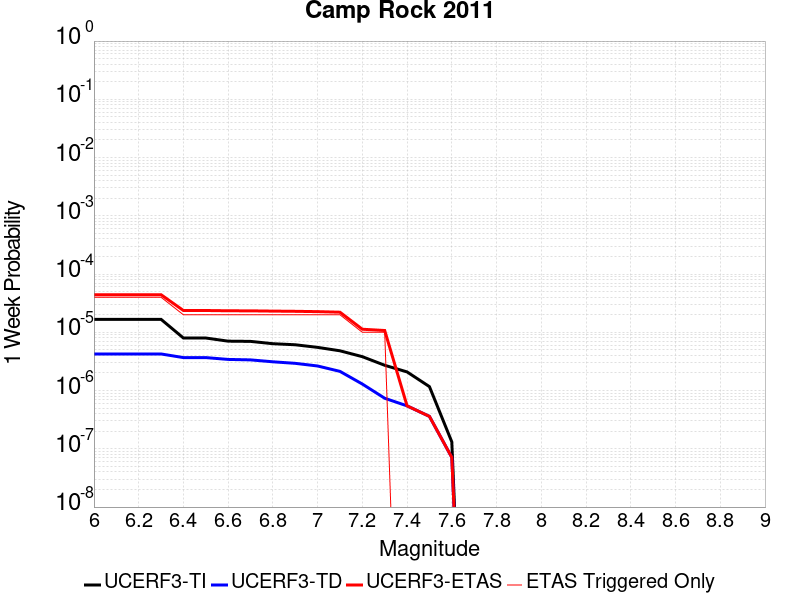 |  | 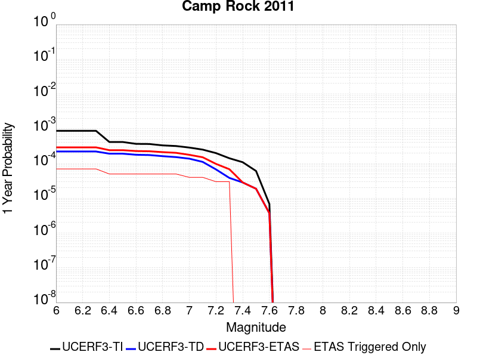 |  |

| Magnitude | 1 wk TI Prob | 1 wk TD Prob | 1 wk ETAS Prob | 1 wk ETAS/TD Gain | 1 wk ETAS Triggered Only | 1 mo TI Prob | 1 mo TD Prob | 1 mo ETAS Prob | 1 mo ETAS/TD Gain | 1 mo ETAS Triggered Only | 1 yr TI Prob | 1 yr TD Prob | 1 yr ETAS Prob | 1 yr ETAS/TD Gain | 1 yr ETAS Triggered Only | 10 yr TI Prob | 10 yr TD Prob | 10 yr ETAS Prob | 10 yr ETAS/TD Gain | 10 yr ETAS Triggered Only |
|-----|-----|-----|-----|-----|-----|-----|-----|-----|-----|-----|-----|-----|-----|-----|-----|-----|-----|-----|-----|-----|
| 6.0 | 1.6710783E-5 | 4.249999E-6 | 4.4249828E-5 | 10.411726 | 4.0E-5 | 7.161568E-5 | 1.8214158E-5 | 5.821343E-5 | 3.1960537 | 4.0E-5 | 8.7157206E-4 | 2.2173533E-4 | 2.9171983E-4 | 1.3156217 | 7.0E-5 | 0.008681616 | 0.0022151938 | 0.0022950165 | 1.0360342 | 8.0E-5 |
| 6.1 | 1.6710783E-5 | 4.249999E-6 | 4.4249828E-5 | 10.411726 | 4.0E-5 | 7.161568E-5 | 1.8214158E-5 | 5.821343E-5 | 3.1960537 | 4.0E-5 | 8.7157206E-4 | 2.2173533E-4 | 2.9171983E-4 | 1.3156217 | 7.0E-5 | 0.008681616 | 0.0022151938 | 0.0022950165 | 1.0360342 | 8.0E-5 |
| 6.2 | 1.6710783E-5 | 4.249999E-6 | 4.4249828E-5 | 10.411726 | 4.0E-5 | 7.161568E-5 | 1.8214158E-5 | 5.821343E-5 | 3.1960537 | 4.0E-5 | 8.7157206E-4 | 2.2173533E-4 | 2.9171983E-4 | 1.3156217 | 7.0E-5 | 0.008681616 | 0.0022151938 | 0.0022950165 | 1.0360342 | 8.0E-5 |
| 6.3 | 1.6710783E-5 | 4.249999E-6 | 4.4249828E-5 | 10.411726 | 4.0E-5 | 7.161568E-5 | 1.8214158E-5 | 5.821343E-5 | 3.1960537 | 4.0E-5 | 8.7157206E-4 | 2.2173533E-4 | 2.9171983E-4 | 1.3156217 | 7.0E-5 | 0.008681616 | 0.0022151938 | 0.0022950165 | 1.0360342 | 8.0E-5 |
| 6.4 | 7.982846E-6 | 3.6820359E-6 | 2.3681961E-5 | 6.4317575 | 2.0E-5 | 3.421175E-5 | 1.578006E-5 | 3.5779743E-5 | 2.2674022 | 2.0E-5 | 4.1644843E-4 | 1.9210564E-4 | 2.4209604E-4 | 1.2602235 | 5.0E-5 | 0.0041566887 | 0.0019194306 | 0.0019793154 | 1.0311992 | 6.0E-5 |
| 6.5 | 7.982846E-6 | 3.6820359E-6 | 2.3681961E-5 | 6.4317575 | 2.0E-5 | 3.421175E-5 | 1.578006E-5 | 3.5779743E-5 | 2.2674022 | 2.0E-5 | 4.1644843E-4 | 1.9210564E-4 | 2.4209604E-4 | 1.2602235 | 5.0E-5 | 0.0041566887 | 0.0019194306 | 0.0019793154 | 1.0311992 | 6.0E-5 |
| 6.6 | 7.048869E-6 | 3.4242998E-6 | 2.342423E-5 | 6.84059 | 2.0E-5 | 3.0209088E-5 | 1.467549E-5 | 3.4675195E-5 | 2.3627965 | 2.0E-5 | 3.677336E-4 | 1.7865976E-4 | 2.2865082E-4 | 1.2798116 | 5.0E-5 | 0.0036712566 | 0.0017851929 | 0.0018450858 | 1.0335498 | 6.0E-5 |
| 6.7 | 6.987307E-6 | 3.3622775E-6 | 2.336221E-5 | 6.948329 | 2.0E-5 | 2.9945259E-5 | 1.4409683E-5 | 3.4409393E-5 | 2.3879356 | 2.0E-5 | 3.6452254E-4 | 1.7542407E-4 | 2.2541531E-4 | 1.2849736 | 5.0E-5 | 0.0036392517 | 0.0017528872 | 0.0018127819 | 1.0341692 | 6.0E-5 |
| 6.8 | 6.3737602E-6 | 3.1178672E-6 | 2.3117806E-5 | 7.4146214 | 2.0E-5 | 2.731583E-5 | 1.3362222E-5 | 3.3361954E-5 | 2.496737 | 2.0E-5 | 3.3251947E-4 | 1.6267318E-4 | 2.1266505E-4 | 1.3073148 | 5.0E-5 | 0.0033202237 | 0.0016255698 | 0.0016854722 | 1.0368501 | 6.0E-5 |
| 6.9 | 6.112211E-6 | 2.933078E-6 | 2.293302E-5 | 7.818755 | 2.0E-5 | 2.6194928E-5 | 1.2570275E-5 | 3.2570024E-5 | 2.5910351 | 2.0E-5 | 3.1887658E-4 | 1.5303263E-4 | 2.0302497E-4 | 1.3266777 | 5.0E-5 | 0.003184194 | 0.0015293002 | 0.0015892085 | 1.0391736 | 6.0E-5 |
| 7.0 | 5.5140117E-6 | 2.64191E-6 | 2.2641858E-5 | 8.570261 | 2.0E-5 | 2.3631264E-5 | 1.1322423E-5 | 3.1322197E-5 | 2.7663863 | 2.0E-5 | 2.8767265E-4 | 1.3784204E-4 | 1.7783653E-4 | 1.2901472 | 4.0E-5 | 0.0028730053 | 0.0013775907 | 0.0014275218 | 1.0362452 | 5.0E-5 |
| 7.1 | 4.8151105E-6 | 2.1342612E-6 | 2.2134218E-5 | 10.370905 | 2.0E-5 | 2.0636026E-5 | 9.146803E-6 | 2.914662E-5 | 3.1865366 | 2.0E-5 | 2.5121463E-4 | 1.1135685E-4 | 1.513524E-4 | 1.3591655 | 4.0E-5 | 0.0025093083 | 0.0011130325 | 0.0011629767 | 1.0448723 | 5.0E-5 |
| 7.2 | 3.818335E-6 | 1.2937372E-6 | 1.1293724E-5 | 8.729535 | 1.0E-5 | 1.6364189E-5 | 5.5445767E-6 | 1.5544521E-5 | 2.803554 | 1.0E-5 | 1.9921579E-4 | 6.750321E-5 | 9.750119E-5 | 1.4443933 | 3.0E-5 | 0.0019903728 | 6.7483535E-4 | 7.048151E-4 | 1.0444252 | 3.0E-5 |
| 7.3 | 2.7166698E-6 | 7.383078E-7 | 1.07383E-5 | 14.5444765 | 1.0E-5 | 1.1642818E-5 | 3.1641725E-6 | 1.3164141E-5 | 4.1603737 | 1.0E-5 | 1.4174209E-4 | 3.852314E-5 | 6.8521986E-5 | 1.7787228 | 3.0E-5 | 0.0014165172 | 3.8516664E-4 | 4.1515508E-4 | 1.0778583 | 3.0E-5 |
| 7.4 | 2.0893426E-6 | 5.4614605E-7 | 5.4614605E-7 | 1.0 | 0.0 | 8.954295E-6 | 2.340624E-6 | 2.340624E-6 | 1.0 | 0.0 | 1.0901308E-4 | 2.8496728E-5 | 2.8496728E-5 | 1.0 | 0.0 | 0.0010895962 | 2.849313E-4 | 2.849313E-4 | 1.0 | 0.0 |
| 7.5 | 1.1681728E-6 | 3.6028484E-7 | 3.6028484E-7 | 1.0 | 0.0 | 5.0064455E-6 | 1.544077E-6 | 1.544077E-6 | 1.0 | 0.0 | 6.0951766E-5 | 1.879898E-5 | 1.879898E-5 | 1.0 | 0.0 | 6.093505E-4 | 1.8797436E-4 | 1.8797436E-4 | 1.0 | 0.0 |
| 7.6 | 1.3154387E-7 | 7.1196716E-8 | 7.1196716E-8 | 1.0 | 0.0 | 5.6375933E-7 | 3.0512876E-7 | 3.0512876E-7 | 1.0 | 0.0 | 6.863748E-6 | 3.714938E-6 | 3.714938E-6 | 1.0 | 0.0 | 6.863536E-5 | 3.7148915E-5 | 3.7148915E-5 | 1.0 | 0.0 |

## Elysian Park (Upper)
*[(top)](#table-of-contents)*

| 1 Week | 1 Month | 1 Year | 10 Year |
|-----|-----|-----|-----|
| 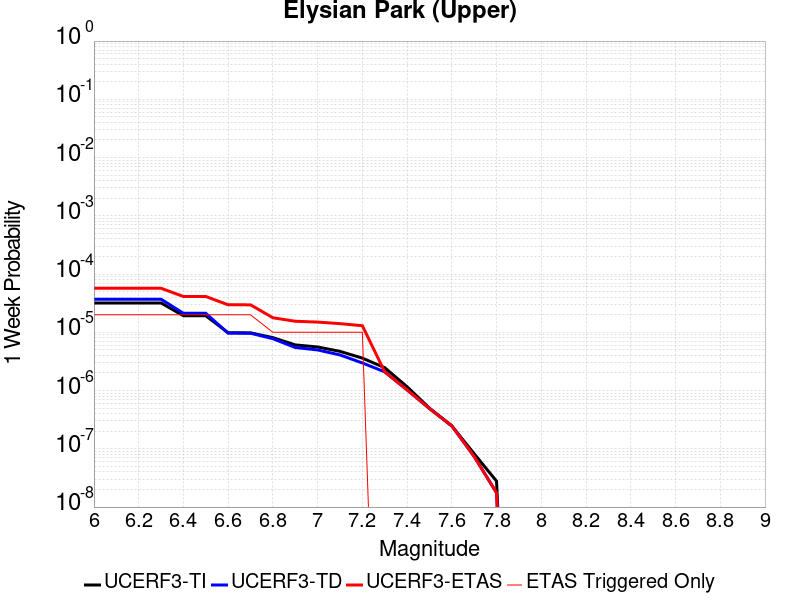 | 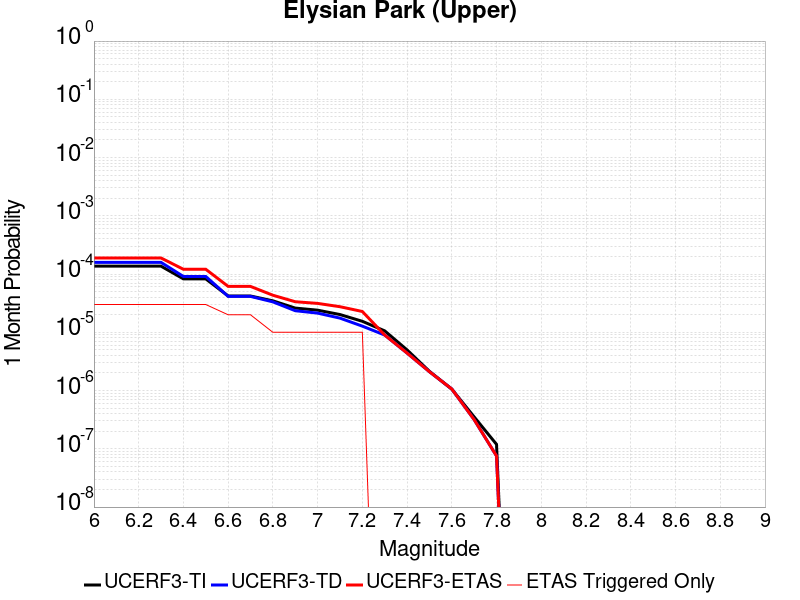 |  | 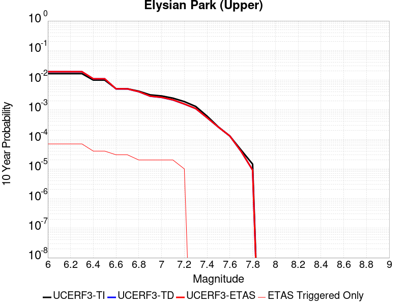 |

| Magnitude | 1 wk TI Prob | 1 wk TD Prob | 1 wk ETAS Prob | 1 wk ETAS/TD Gain | 1 wk ETAS Triggered Only | 1 mo TI Prob | 1 mo TD Prob | 1 mo ETAS Prob | 1 mo ETAS/TD Gain | 1 mo ETAS Triggered Only | 1 yr TI Prob | 1 yr TD Prob | 1 yr ETAS Prob | 1 yr ETAS/TD Gain | 1 yr ETAS Triggered Only | 10 yr TI Prob | 10 yr TD Prob | 10 yr ETAS Prob | 10 yr ETAS/TD Gain | 10 yr ETAS Triggered Only |
|-----|-----|-----|-----|-----|-----|-----|-----|-----|-----|-----|-----|-----|-----|-----|-----|-----|-----|-----|-----|-----|
| 6.0 | 3.1876025E-5 | 3.7035275E-5 | 5.7034536E-5 | 1.5400057 | 2.0E-5 | 1.3660437E-4 | 1.5871569E-4 | 1.8871092E-4 | 1.1889873 | 3.0E-5 | 0.0016618895 | 0.001931122 | 0.001991006 | 1.03101 | 6.0E-5 | 0.016495159 | 0.019189863 | 0.019258518 | 1.0035777 | 7.0E-5 |
| 6.1 | 3.1876025E-5 | 3.7035275E-5 | 5.7034536E-5 | 1.5400057 | 2.0E-5 | 1.3660437E-4 | 1.5871569E-4 | 1.8871092E-4 | 1.1889873 | 3.0E-5 | 0.0016618895 | 0.001931122 | 0.001991006 | 1.03101 | 6.0E-5 | 0.016495159 | 0.019189863 | 0.019258518 | 1.0035777 | 7.0E-5 |
| 6.2 | 3.1876025E-5 | 3.7035275E-5 | 5.7034536E-5 | 1.5400057 | 2.0E-5 | 1.3660437E-4 | 1.5871569E-4 | 1.8871092E-4 | 1.1889873 | 3.0E-5 | 0.0016618895 | 0.001931122 | 0.001991006 | 1.03101 | 6.0E-5 | 0.016495159 | 0.019189863 | 0.019258518 | 1.0035777 | 7.0E-5 |
| 6.3 | 3.1876025E-5 | 3.7035275E-5 | 5.7034536E-5 | 1.5400057 | 2.0E-5 | 1.3660437E-4 | 1.5871569E-4 | 1.8871092E-4 | 1.1889873 | 3.0E-5 | 0.0016618895 | 0.001931122 | 0.001991006 | 1.03101 | 6.0E-5 | 0.016495159 | 0.019189863 | 0.019258518 | 1.0035777 | 7.0E-5 |
| 6.4 | 1.9273462E-5 | 2.120244E-5 | 4.1202016E-5 | 1.9432676 | 2.0E-5 | 8.259794E-5 | 9.086542E-5 | 1.2086269E-4 | 1.3301286 | 3.0E-5 | 0.001005166 | 0.0011058967 | 0.0011458525 | 1.0361297 | 4.0E-5 | 0.010006315 | 0.011020744 | 0.011060303 | 1.0035895 | 4.0E-5 |
| 6.5 | 1.9273462E-5 | 2.120244E-5 | 4.1202016E-5 | 1.9432676 | 2.0E-5 | 8.259794E-5 | 9.086542E-5 | 1.2086269E-4 | 1.3301286 | 3.0E-5 | 0.001005166 | 0.0011058967 | 0.0011458525 | 1.0361297 | 4.0E-5 | 0.010006315 | 0.011020744 | 0.011060303 | 1.0035895 | 4.0E-5 |
| 6.6 | 9.813258E-6 | 9.665589E-6 | 2.9665394E-5 | 3.0691764 | 2.0E-5 | 4.205614E-5 | 4.1423333E-5 | 6.142251E-5 | 1.4827996 | 2.0E-5 | 5.119132E-4 | 5.042196E-4 | 5.342045E-4 | 1.0594679 | 3.0E-5 | 0.005107356 | 0.0050314795 | 0.0050613284 | 1.0059325 | 3.0E-5 |
| 6.7 | 9.801478E-6 | 9.653158E-6 | 2.9652965E-5 | 3.071841 | 2.0E-5 | 4.2005657E-5 | 4.137006E-5 | 6.136923E-5 | 1.4834214 | 2.0E-5 | 5.112989E-4 | 5.0357135E-4 | 5.335562E-4 | 1.0595444 | 3.0E-5 | 0.0051012407 | 0.005025026 | 0.0050548753 | 1.0059401 | 3.0E-5 |
| 6.8 | 8.102489E-6 | 7.772994E-6 | 1.7772916E-5 | 2.2864957 | 1.0E-5 | 3.4724493E-5 | 3.3312434E-5 | 4.3312102E-5 | 1.3001782 | 1.0E-5 | 4.2268867E-4 | 4.0550836E-4 | 4.2550027E-4 | 1.0493008 | 2.0E-5 | 0.004218856 | 0.0040481784 | 0.004068097 | 1.0049205 | 2.0E-5 |
| 6.9 | 6.08275E-6 | 5.481441E-6 | 1.5481386E-5 | 2.8243277 | 1.0E-5 | 2.6068668E-5 | 2.3491682E-5 | 3.3491448E-5 | 1.4256725 | 1.0E-5 | 3.173398E-4 | 2.8597447E-4 | 3.0596874E-4 | 1.0699164 | 2.0E-5 | 0.0031688702 | 0.0028561424 | 0.0028760852 | 1.0069824 | 2.0E-5 |
| 7.0 | 5.5995934E-6 | 4.9827686E-6 | 1.4982719E-5 | 3.0069063 | 1.0E-5 | 2.3998036E-5 | 2.1354552E-5 | 3.135434E-5 | 1.4682742 | 1.0E-5 | 2.9213692E-4 | 2.5996132E-4 | 2.7995612E-4 | 1.0769145 | 2.0E-5 | 0.0029175316 | 0.0025966396 | 0.0026165876 | 1.0076822 | 2.0E-5 |
| 7.1 | 4.709881E-6 | 4.0873906E-6 | 1.408735E-5 | 3.4465387 | 1.0E-5 | 2.0185047E-5 | 1.7517272E-5 | 2.7517097E-5 | 1.5708551 | 1.0E-5 | 2.4572524E-4 | 2.1325232E-4 | 2.3324807E-4 | 1.0937656 | 2.0E-5 | 0.002454537 | 0.0021305184 | 0.0021504757 | 1.0093673 | 2.0E-5 |
| 7.2 | 3.6063436E-6 | 2.9779412E-6 | 1.2977912E-5 | 4.3580146 | 1.0E-5 | 1.5455667E-5 | 1.27625435E-5 | 2.2762415E-5 | 1.7835329 | 1.0E-5 | 1.881565E-4 | 1.55373E-4 | 1.6537144E-4 | 1.0643512 | 1.0E-5 | 0.0018799726 | 0.0015526549 | 0.0015626394 | 1.0064306 | 1.0E-5 |
| 7.3 | 2.471135E-6 | 2.0954562E-6 | 2.0954562E-6 | 1.0 | 0.0 | 1.0590536E-5 | 8.980496E-6 | 8.980496E-6 | 1.0 | 0.0 | 1.2893214E-4 | 1.0933213E-4 | 1.0933213E-4 | 1.0 | 0.0 | 0.0012885736 | 0.0010927906 | 0.0010927906 | 1.0 | 0.0 |
| 7.4 | 1.163943E-6 | 1.0275061E-6 | 1.0275061E-6 | 1.0 | 0.0 | 4.988318E-6 | 4.40359E-6 | 4.40359E-6 | 1.0 | 0.0 | 6.0731076E-5 | 5.361242E-5 | 5.361242E-5 | 1.0 | 0.0 | 6.071448E-4 | 5.3599785E-4 | 5.3599785E-4 | 1.0 | 0.0 |
| 7.5 | 4.99459E-7 | 4.917601E-7 | 4.917601E-7 | 1.0 | 0.0 | 2.140537E-6 | 2.1075416E-6 | 2.1075416E-6 | 1.0 | 0.0 | 2.6060725E-5 | 2.5659032E-5 | 2.5659032E-5 | 1.0 | 0.0 | 2.605767E-4 | 2.5656226E-4 | 2.5656226E-4 | 1.0 | 0.0 |
| 7.6 | 2.4667852E-7 | 2.4778313E-7 | 2.4778313E-7 | 1.0 | 0.0 | 1.0571932E-6 | 1.0619274E-6 | 1.0619274E-6 | 1.0 | 0.0 | 1.2871251E-5 | 1.2928893E-5 | 1.2928893E-5 | 1.0 | 0.0 | 1.2870505E-4 | 1.2928178E-4 | 1.2928178E-4 | 1.0 | 0.0 |
| 7.7 | 8.2312795E-8 | 7.3864214E-8 | 7.3864214E-8 | 1.0 | 0.0 | 3.527691E-7 | 3.165609E-7 | 3.165609E-7 | 1.0 | 0.0 | 4.294955E-6 | 3.854123E-6 | 3.854123E-6 | 1.0 | 0.0 | 4.2948723E-5 | 3.854068E-5 | 3.854068E-5 | 1.0 | 0.0 |
| 7.8 | 2.7819295E-8 | 1.7565618E-8 | 1.7565618E-8 | 1.0 | 0.0 | 1.1922555E-7 | 7.528122E-8 | 7.528122E-8 | 1.0 | 0.0 | 1.45157E-6 | 9.1654863E-7 | 9.1654863E-7 | 1.0 | 0.0 | 1.45156055E-5 | 9.165463E-6 | 9.165463E-6 | 1.0 | 0.0 |

## Dry Mountain
*[(top)](#table-of-contents)*

| 1 Week | 1 Month | 1 Year | 10 Year |
|-----|-----|-----|-----|
|  |  | 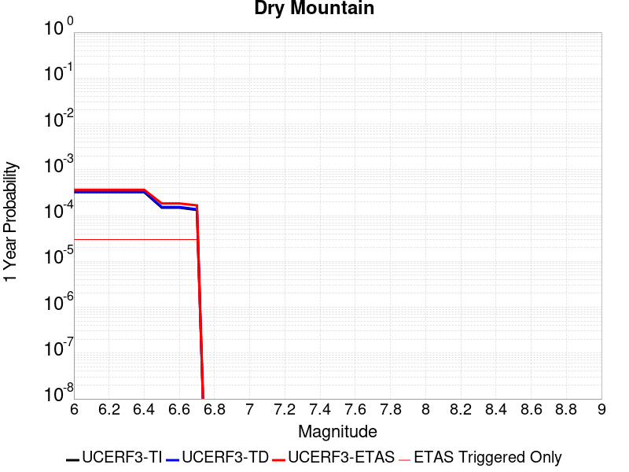 | 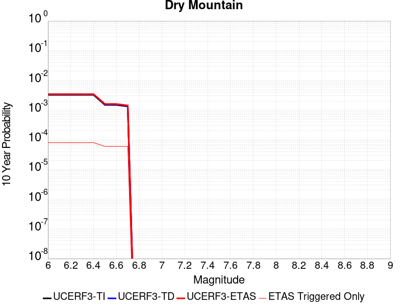 |

| Magnitude | 1 wk TI Prob | 1 wk TD Prob | 1 wk ETAS Prob | 1 wk ETAS/TD Gain | 1 wk ETAS Triggered Only | 1 mo TI Prob | 1 mo TD Prob | 1 mo ETAS Prob | 1 mo ETAS/TD Gain | 1 mo ETAS Triggered Only | 1 yr TI Prob | 1 yr TD Prob | 1 yr ETAS Prob | 1 yr ETAS/TD Gain | 1 yr ETAS Triggered Only | 10 yr TI Prob | 10 yr TD Prob | 10 yr ETAS Prob | 10 yr ETAS/TD Gain | 10 yr ETAS Triggered Only |
|-----|-----|-----|-----|-----|-----|-----|-----|-----|-----|-----|-----|-----|-----|-----|-----|-----|-----|-----|-----|-----|
| 6.0 | 6.222801E-6 | 6.439381E-6 | 1.6439317E-5 | 2.5529342 | 1.0E-5 | 2.6668875E-5 | 2.7597147E-5 | 3.759687E-5 | 1.3623463 | 1.0E-5 | 3.2464517E-4 | 3.3595937E-4 | 3.659493E-4 | 1.0892665 | 3.0E-5 | 0.0032417132 | 0.0033560768 | 0.0034358085 | 1.0237573 | 8.0E-5 |
| 6.1 | 6.222801E-6 | 6.439381E-6 | 1.6439317E-5 | 2.5529342 | 1.0E-5 | 2.6668875E-5 | 2.7597147E-5 | 3.759687E-5 | 1.3623463 | 1.0E-5 | 3.2464517E-4 | 3.3595937E-4 | 3.659493E-4 | 1.0892665 | 3.0E-5 | 0.0032417132 | 0.0033560768 | 0.0034358085 | 1.0237573 | 8.0E-5 |
| 6.2 | 6.222801E-6 | 6.439381E-6 | 1.6439317E-5 | 2.5529342 | 1.0E-5 | 2.6668875E-5 | 2.7597147E-5 | 3.759687E-5 | 1.3623463 | 1.0E-5 | 3.2464517E-4 | 3.3595937E-4 | 3.659493E-4 | 1.0892665 | 3.0E-5 | 0.0032417132 | 0.0033560768 | 0.0034358085 | 1.0237573 | 8.0E-5 |
| 6.3 | 6.222801E-6 | 6.439381E-6 | 1.6439317E-5 | 2.5529342 | 1.0E-5 | 2.6668875E-5 | 2.7597147E-5 | 3.759687E-5 | 1.3623463 | 1.0E-5 | 3.2464517E-4 | 3.3595937E-4 | 3.659493E-4 | 1.0892665 | 3.0E-5 | 0.0032417132 | 0.0033560768 | 0.0034358085 | 1.0237573 | 8.0E-5 |
| 6.4 | 6.222801E-6 | 6.439381E-6 | 1.6439317E-5 | 2.5529342 | 1.0E-5 | 2.6668875E-5 | 2.7597147E-5 | 3.759687E-5 | 1.3623463 | 1.0E-5 | 3.2464517E-4 | 3.3595937E-4 | 3.659493E-4 | 1.0892665 | 3.0E-5 | 0.0032417132 | 0.0033560768 | 0.0034358085 | 1.0237573 | 8.0E-5 |
| 6.5 | 2.8528623E-6 | 2.9521684E-6 | 1.2952139E-5 | 4.3873305 | 1.0E-5 | 1.22264955E-5 | 1.2652138E-5 | 2.2652011E-5 | 1.7903702 | 1.0E-5 | 1.4884741E-4 | 1.540376E-4 | 1.8403298E-4 | 1.1947277 | 3.0E-5 | 0.0014874774 | 0.0015401616 | 0.0016000692 | 1.0388969 | 6.0E-5 |
| 6.6 | 2.8528623E-6 | 2.9521684E-6 | 1.2952139E-5 | 4.3873305 | 1.0E-5 | 1.22264955E-5 | 1.2652138E-5 | 2.2652011E-5 | 1.7903702 | 1.0E-5 | 1.4884741E-4 | 1.540376E-4 | 1.8403298E-4 | 1.1947277 | 3.0E-5 | 0.0014874774 | 0.0015401616 | 0.0016000692 | 1.0388969 | 6.0E-5 |
| 6.7 | 2.541E-6 | 2.6293578E-6 | 1.2629332E-5 | 4.8032 | 1.0E-5 | 1.0889954E-5 | 1.1268677E-5 | 2.1268565E-5 | 1.8874056 | 1.0E-5 | 1.3257713E-4 | 1.3719614E-4 | 1.6719202E-4 | 1.2186351 | 3.0E-5 | 0.0013249806 | 0.0013719613 | 0.001431879 | 1.043673 | 6.0E-5 |

## Independence rev 2011
*[(top)](#table-of-contents)*

| 1 Week | 1 Month | 1 Year | 10 Year |
|-----|-----|-----|-----|
|  |  |  |  |

| Magnitude | 1 wk TI Prob | 1 wk TD Prob | 1 wk ETAS Prob | 1 wk ETAS/TD Gain | 1 wk ETAS Triggered Only | 1 mo TI Prob | 1 mo TD Prob | 1 mo ETAS Prob | 1 mo ETAS/TD Gain | 1 mo ETAS Triggered Only | 1 yr TI Prob | 1 yr TD Prob | 1 yr ETAS Prob | 1 yr ETAS/TD Gain | 1 yr ETAS Triggered Only | 10 yr TI Prob | 10 yr TD Prob | 10 yr ETAS Prob | 10 yr ETAS/TD Gain | 10 yr ETAS Triggered Only |
|-----|-----|-----|-----|-----|-----|-----|-----|-----|-----|-----|-----|-----|-----|-----|-----|-----|-----|-----|-----|-----|
| 6.0 | 4.422171E-6 | 4.3262253E-6 | 6.432596E-5 | 14.868843 | 6.0E-5 | 1.8952025E-5 | 1.8540852E-5 | 7.8539735E-5 | 4.2360373 | 6.0E-5 | 2.3071647E-4 | 2.2571447E-4 | 2.9569867E-4 | 1.3100563 | 7.0E-5 | 0.0023047708 | 0.0022551457 | 0.0023349652 | 1.0353944 | 8.0E-5 |
| 6.1 | 4.422171E-6 | 4.3262253E-6 | 6.432596E-5 | 14.868843 | 6.0E-5 | 1.8952025E-5 | 1.8540852E-5 | 7.8539735E-5 | 4.2360373 | 6.0E-5 | 2.3071647E-4 | 2.2571447E-4 | 2.9569867E-4 | 1.3100563 | 7.0E-5 | 0.0023047708 | 0.0022551457 | 0.0023349652 | 1.0353944 | 8.0E-5 |
| 6.2 | 4.422171E-6 | 4.3262253E-6 | 6.432596E-5 | 14.868843 | 6.0E-5 | 1.8952025E-5 | 1.8540852E-5 | 7.8539735E-5 | 4.2360373 | 6.0E-5 | 2.3071647E-4 | 2.2571447E-4 | 2.9569867E-4 | 1.3100563 | 7.0E-5 | 0.0023047708 | 0.0022551457 | 0.0023349652 | 1.0353944 | 8.0E-5 |
| 6.3 | 4.422171E-6 | 4.3262253E-6 | 6.432596E-5 | 14.868843 | 6.0E-5 | 1.8952025E-5 | 1.8540852E-5 | 7.8539735E-5 | 4.2360373 | 6.0E-5 | 2.3071647E-4 | 2.2571447E-4 | 2.9569867E-4 | 1.3100563 | 7.0E-5 | 0.0023047708 | 0.0022551457 | 0.0023349652 | 1.0353944 | 8.0E-5 |
| 6.4 | 4.422171E-6 | 4.3262253E-6 | 6.432596E-5 | 14.868843 | 6.0E-5 | 1.8952025E-5 | 1.8540852E-5 | 7.8539735E-5 | 4.2360373 | 6.0E-5 | 2.3071647E-4 | 2.2571447E-4 | 2.9569867E-4 | 1.3100563 | 7.0E-5 | 0.0023047708 | 0.0022551457 | 0.0023349652 | 1.0353944 | 8.0E-5 |
| 6.5 | 4.422171E-6 | 4.3262253E-6 | 6.432596E-5 | 14.868843 | 6.0E-5 | 1.8952025E-5 | 1.8540852E-5 | 7.8539735E-5 | 4.2360373 | 6.0E-5 | 2.3071647E-4 | 2.2571447E-4 | 2.9569867E-4 | 1.3100563 | 7.0E-5 | 0.0023047708 | 0.0022551457 | 0.0023349652 | 1.0353944 | 8.0E-5 |
| 6.6 | 2.663744E-6 | 2.5319846E-6 | 6.2531835E-5 | 24.696768 | 6.0E-5 | 1.1415996E-5 | 1.08513195E-5 | 7.085067E-5 | 6.529221 | 6.0E-5 | 1.3898089E-4 | 1.321073E-4 | 2.0209805E-4 | 1.5298023 | 7.0E-5 | 0.0013889399 | 0.0013203359 | 0.0014002303 | 1.0605106 | 8.0E-5 |
| 6.7 | 2.663744E-6 | 2.5319846E-6 | 6.2531835E-5 | 24.696768 | 6.0E-5 | 1.1415996E-5 | 1.08513195E-5 | 7.085067E-5 | 6.529221 | 6.0E-5 | 1.3898089E-4 | 1.321073E-4 | 2.0209805E-4 | 1.5298023 | 7.0E-5 | 0.0013889399 | 0.0013203359 | 0.0014002303 | 1.0605106 | 8.0E-5 |
| 6.8 | 1.9716529E-6 | 1.8322567E-6 | 6.183215E-5 | 33.746445 | 6.0E-5 | 8.449913E-6 | 7.852505E-6 | 6.785204E-5 | 8.640814 | 6.0E-5 | 1.0287284E-4 | 9.560019E-5 | 1.655935E-4 | 1.7321461 | 7.0E-5 | 0.0010282523 | 9.5560355E-4 | 0.0010355271 | 1.0836368 | 8.0E-5 |
| 6.9 | 1.8788617E-6 | 1.7429976E-6 | 6.1742896E-5 | 35.423397 | 6.0E-5 | 8.0522395E-6 | 7.4699688E-6 | 6.746952E-5 | 9.032102 | 6.0E-5 | 9.80316E-5 | 9.09432E-5 | 1.6093683E-4 | 1.7696413 | 7.0E-5 | 9.798837E-4 | 9.090718E-4 | 9.889991E-4 | 1.0879219 | 8.0E-5 |
| 7.0 | 1.5045488E-6 | 1.3849498E-6 | 6.138487E-5 | 44.32281 | 6.0E-5 | 6.44805E-6 | 5.9354857E-6 | 6.593513E-5 | 11.108633 | 6.0E-5 | 7.8502184E-5 | 7.226219E-5 | 1.4225714E-4 | 1.9686247 | 7.0E-5 | 7.8474457E-4 | 7.223921E-4 | 8.023343E-4 | 1.1106632 | 8.0E-5 |
| 7.1 | 1.272341E-6 | 1.1625089E-6 | 6.116244E-5 | 52.61245 | 6.0E-5 | 5.4528787E-6 | 4.9821715E-6 | 6.4981876E-5 | 13.042881 | 6.0E-5 | 6.6386776E-5 | 6.0656283E-5 | 1.3065204E-4 | 2.1539736 | 7.0E-5 | 6.636695E-4 | 6.064005E-4 | 6.8635197E-4 | 1.1318461 | 8.0E-5 |
| 7.2 | 1.0416892E-6 | 9.409871E-7 | 6.094093E-5 | 64.76277 | 6.0E-5 | 4.464375E-6 | 4.032796E-6 | 6.403255E-5 | 15.877956 | 6.0E-5 | 5.4352407E-5 | 4.9098202E-5 | 1.19094766E-4 | 2.4256442 | 7.0E-5 | 5.4339116E-4 | 4.908754E-4 | 5.708361E-4 | 1.1628941 | 8.0E-5 |
| 7.3 | 7.9450155E-7 | 7.2350036E-7 | 6.0723458E-5 | 83.9301 | 6.0E-5 | 3.4050022E-6 | 3.1007123E-6 | 6.3100524E-5 | 20.350332 | 6.0E-5 | 4.1455114E-5 | 3.7750528E-5 | 1.0774789E-4 | 2.8542087 | 7.0E-5 | 4.144738E-4 | 3.7744228E-4 | 4.5741207E-4 | 1.2118729 | 8.0E-5 |
| 7.4 | 5.3893444E-7 | 5.0195166E-7 | 5.0501927E-5 | 100.61114 | 5.0E-5 | 2.309717E-6 | 2.1512196E-6 | 5.2151114E-5 | 24.24258 | 5.0E-5 | 2.8120441E-5 | 2.6190788E-5 | 8.618922E-5 | 3.2908218 | 6.0E-5 | 2.8116882E-4 | 2.6187746E-4 | 3.3185913E-4 | 1.2672306 | 7.0E-5 |
| 7.5 | 3.8852085E-7 | 3.6825622E-7 | 4.0368242E-5 | 109.61998 | 4.0E-5 | 1.6650882E-6 | 1.57824E-6 | 4.1578176E-5 | 26.344646 | 4.0E-5 | 2.027226E-5 | 1.9214905E-5 | 6.9213944E-5 | 3.6020966 | 5.0E-5 | 2.0270412E-4 | 1.9213265E-4 | 2.5212113E-4 | 1.3122243 | 6.0E-5 |
| 7.6 | 2.414929E-7 | 2.3457605E-7 | 3.0234569E-5 | 128.89026 | 3.0E-5 | 1.0349692E-6 | 1.0053255E-6 | 3.1005296E-5 | 30.84105 | 3.0E-5 | 1.2600677E-5 | 1.2239771E-5 | 5.223928E-5 | 4.267995 | 4.0E-5 | 1.2599962E-4 | 1.223911E-4 | 1.6238619E-4 | 1.3267812 | 4.0E-5 |
| 7.7 | 6.8298014E-8 | 6.8589785E-8 | 6.8589785E-8 | 1.0 | 0.0 | 2.9270575E-7 | 2.939562E-7 | 2.939562E-7 | 1.0 | 0.0 | 3.5636867E-6 | 3.5789112E-6 | 3.5789112E-6 | 1.0 | 0.0 | 3.5636294E-5 | 3.5788584E-5 | 3.5788584E-5 | 1.0 | 0.0 |

## Ventura-Pitas Point
*[(top)](#table-of-contents)*

| 1 Week | 1 Month | 1 Year | 10 Year |
|-----|-----|-----|-----|
|  |  |  |  |

| Magnitude | 1 wk TI Prob | 1 wk TD Prob | 1 wk ETAS Prob | 1 wk ETAS/TD Gain | 1 wk ETAS Triggered Only | 1 mo TI Prob | 1 mo TD Prob | 1 mo ETAS Prob | 1 mo ETAS/TD Gain | 1 mo ETAS Triggered Only | 1 yr TI Prob | 1 yr TD Prob | 1 yr ETAS Prob | 1 yr ETAS/TD Gain | 1 yr ETAS Triggered Only | 10 yr TI Prob | 10 yr TD Prob | 10 yr ETAS Prob | 10 yr ETAS/TD Gain | 10 yr ETAS Triggered Only |
|-----|-----|-----|-----|-----|-----|-----|-----|-----|-----|-----|-----|-----|-----|-----|-----|-----|-----|-----|-----|-----|
| 6.0 | 3.3179622E-5 | 3.373519E-5 | 4.373485E-5 | 1.2964164 | 1.0E-5 | 1.4219063E-4 | 1.4457281E-4 | 1.5457136E-4 | 1.0691593 | 1.0E-5 | 0.0017297962 | 0.0017590097 | 0.0017889569 | 1.017025 | 3.0E-5 | 0.017163932 | 0.017476497 | 0.017555099 | 1.0044975 | 8.0E-5 |
| 6.1 | 3.3179622E-5 | 3.373519E-5 | 4.373485E-5 | 1.2964164 | 1.0E-5 | 1.4219063E-4 | 1.4457281E-4 | 1.5457136E-4 | 1.0691593 | 1.0E-5 | 0.0017297962 | 0.0017590097 | 0.0017889569 | 1.017025 | 3.0E-5 | 0.017163932 | 0.017476497 | 0.017555099 | 1.0044975 | 8.0E-5 |
| 6.2 | 3.3179622E-5 | 3.373519E-5 | 4.373485E-5 | 1.2964164 | 1.0E-5 | 1.4219063E-4 | 1.4457281E-4 | 1.5457136E-4 | 1.0691593 | 1.0E-5 | 0.0017297962 | 0.0017590097 | 0.0017889569 | 1.017025 | 3.0E-5 | 0.017163932 | 0.017476497 | 0.017555099 | 1.0044975 | 8.0E-5 |
| 6.3 | 3.3179622E-5 | 3.373519E-5 | 4.373485E-5 | 1.2964164 | 1.0E-5 | 1.4219063E-4 | 1.4457281E-4 | 1.5457136E-4 | 1.0691593 | 1.0E-5 | 0.0017297962 | 0.0017590097 | 0.0017889569 | 1.017025 | 3.0E-5 | 0.017163932 | 0.017476497 | 0.017555099 | 1.0044975 | 8.0E-5 |
| 6.4 | 1.8754668E-5 | 1.7019594E-5 | 1.7019594E-5 | 1.0 | 0.0 | 8.037467E-5 | 7.2939205E-5 | 7.2939205E-5 | 1.0 | 0.0 | 9.781223E-4 | 8.8769617E-4 | 8.976873E-4 | 1.0112551 | 1.0E-5 | 0.009738282 | 0.008843943 | 0.008863766 | 1.0022415 | 2.0E-5 |
| 6.5 | 1.8754668E-5 | 1.7019594E-5 | 1.7019594E-5 | 1.0 | 0.0 | 8.037467E-5 | 7.2939205E-5 | 7.2939205E-5 | 1.0 | 0.0 | 9.781223E-4 | 8.8769617E-4 | 8.976873E-4 | 1.0112551 | 1.0E-5 | 0.009738282 | 0.008843943 | 0.008863766 | 1.0022415 | 2.0E-5 |
| 6.6 | 1.4361558E-5 | 1.2122258E-5 | 1.2122258E-5 | 1.0 | 0.0 | 6.154808E-5 | 5.1951512E-5 | 5.1951512E-5 | 1.0 | 0.0 | 7.490902E-4 | 6.323284E-4 | 6.323284E-4 | 1.0 | 0.0 | 0.0074657016 | 0.006305652 | 0.006305652 | 1.0 | 0.0 |
| 6.7 | 1.4361558E-5 | 1.2122258E-5 | 1.2122258E-5 | 1.0 | 0.0 | 6.154808E-5 | 5.1951512E-5 | 5.1951512E-5 | 1.0 | 0.0 | 7.490902E-4 | 6.323284E-4 | 6.323284E-4 | 1.0 | 0.0 | 0.0074657016 | 0.006305652 | 0.006305652 | 1.0 | 0.0 |
| 6.8 | 1.3663846E-5 | 1.1344401E-5 | 1.1344401E-5 | 1.0 | 0.0 | 5.8558027E-5 | 4.8617967E-5 | 4.8617967E-5 | 1.0 | 0.0 | 7.127108E-4 | 5.917649E-4 | 5.917649E-4 | 1.0 | 0.0 | 0.007104293 | 0.0059022107 | 0.0059022107 | 1.0 | 0.0 |
| 6.9 | 1.3644157E-5 | 1.1322501E-5 | 1.1322501E-5 | 1.0 | 0.0 | 5.8473648E-5 | 4.8524114E-5 | 4.8524114E-5 | 1.0 | 0.0 | 7.116841E-4 | 5.906229E-4 | 5.906229E-4 | 1.0 | 0.0 | 0.007094092 | 0.0058908514 | 0.0058908514 | 1.0 | 0.0 |
| 7.0 | 1.3568845E-5 | 1.12420685E-5 | 1.12420685E-5 | 1.0 | 0.0 | 5.8150898E-5 | 4.8179416E-5 | 4.8179416E-5 | 1.0 | 0.0 | 7.077572E-4 | 5.8642845E-4 | 5.8642845E-4 | 1.0 | 0.0 | 0.007055073 | 0.005849128 | 0.005849128 | 1.0 | 0.0 |
| 7.1 | 1.306572E-5 | 1.0720521E-5 | 1.0720521E-5 | 1.0 | 0.0 | 5.599474E-5 | 4.594429E-5 | 4.594429E-5 | 1.0 | 0.0 | 6.815227E-4 | 5.5923004E-4 | 5.5923004E-4 | 1.0 | 0.0 | 0.0067943637 | 0.005578536 | 0.005578536 | 1.0 | 0.0 |
| 7.2 | 1.232604E-5 | 9.995121E-6 | 9.995121E-6 | 1.0 | 0.0 | 5.2824813E-5 | 4.283554E-5 | 4.283554E-5 | 1.0 | 0.0 | 6.429523E-4 | 5.2139966E-4 | 5.2139966E-4 | 1.0 | 0.0 | 0.0064109527 | 0.005202059 | 0.005202059 | 1.0 | 0.0 |
| 7.3 | 1.0917261E-5 | 8.843812E-6 | 8.843812E-6 | 1.0 | 0.0 | 4.678742E-5 | 3.7901507E-5 | 3.7901507E-5 | 1.0 | 0.0 | 5.69488E-4 | 4.6135474E-4 | 4.6135474E-4 | 1.0 | 0.0 | 0.0056803077 | 0.004604239 | 0.004604239 | 1.0 | 0.0 |
| 7.4 | 1.039959E-5 | 8.42354E-6 | 8.42354E-6 | 1.0 | 0.0 | 4.456891E-5 | 3.6100395E-5 | 3.6100395E-5 | 1.0 | 0.0 | 5.424914E-4 | 4.394352E-4 | 4.394352E-4 | 1.0 | 0.0 | 0.0054116896 | 0.0043859277 | 0.0043859277 | 1.0 | 0.0 |
| 7.5 | 9.015877E-6 | 7.29752E-6 | 7.29752E-6 | 1.0 | 0.0 | 3.86389E-5 | 3.1274718E-5 | 3.1274718E-5 | 1.0 | 0.0 | 4.7032707E-4 | 3.8070456E-4 | 3.8070456E-4 | 1.0 | 0.0 | 0.004693329 | 0.003800772 | 0.003800772 | 1.0 | 0.0 |
| 7.6 | 4.900162E-6 | 3.874119E-6 | 3.874119E-6 | 1.0 | 0.0 | 2.1000526E-5 | 1.6603262E-5 | 1.6603262E-5 | 1.0 | 0.0 | 2.556514E-4 | 2.0212609E-4 | 2.0212609E-4 | 1.0 | 0.0 | 0.0025535747 | 0.002019436 | 0.002019436 | 1.0 | 0.0 |
| 7.7 | 3.8850626E-6 | 3.12676E-6 | 3.12676E-6 | 1.0 | 0.0 | 1.6650163E-5 | 1.3400332E-5 | 1.3400332E-5 | 1.0 | 0.0 | 2.0269687E-4 | 1.6313691E-4 | 1.6313691E-4 | 1.0 | 0.0 | 0.002025121 | 0.0016301809 | 0.0016301809 | 1.0 | 0.0 |
| 7.8 | 2.4654719E-6 | 2.029902E-6 | 2.029902E-6 | 1.0 | 0.0 | 1.0566265E-5 | 8.699551E-6 | 8.699551E-6 | 1.0 | 0.0 | 1.2863669E-4 | 1.0591193E-4 | 1.0591193E-4 | 1.0 | 0.0 | 0.0012856225 | 0.0010586192 | 0.0010586192 | 1.0 | 0.0 |
| 7.9 | 4.095894E-7 | 3.2765078E-7 | 3.2765078E-7 | 1.0 | 0.0 | 1.7553821E-6 | 1.4042168E-6 | 1.4042168E-6 | 1.0 | 0.0 | 2.1371567E-5 | 1.709621E-5 | 1.709621E-5 | 1.0 | 0.0 | 2.1369511E-4 | 1.7094925E-4 | 1.7094925E-4 | 1.0 | 0.0 |
| 8.0 | 7.791402E-9 | 5.6836056E-9 | 5.6836056E-9 | 1.0 | 0.0 | 3.3391725E-8 | 2.4358311E-8 | 2.4358311E-8 | 1.0 | 0.0 | 4.0654416E-7 | 2.965624E-7 | 2.965624E-7 | 1.0 | 0.0 | 4.065434E-6 | 2.9656223E-6 | 2.9656223E-6 | 1.0 | 0.0 |

## Sheephole
*[(top)](#table-of-contents)*

| 1 Week | 1 Month | 1 Year | 10 Year |
|-----|-----|-----|-----|
|  |  |  |  |

| Magnitude | 1 wk TI Prob | 1 wk TD Prob | 1 wk ETAS Prob | 1 wk ETAS/TD Gain | 1 wk ETAS Triggered Only | 1 mo TI Prob | 1 mo TD Prob | 1 mo ETAS Prob | 1 mo ETAS/TD Gain | 1 mo ETAS Triggered Only | 1 yr TI Prob | 1 yr TD Prob | 1 yr ETAS Prob | 1 yr ETAS/TD Gain | 1 yr ETAS Triggered Only | 10 yr TI Prob | 10 yr TD Prob | 10 yr ETAS Prob | 10 yr ETAS/TD Gain | 10 yr ETAS Triggered Only |
|-----|-----|-----|-----|-----|-----|-----|-----|-----|-----|-----|-----|-----|-----|-----|-----|-----|-----|-----|-----|-----|
| 6.0 | 4.5579695E-6 | 4.7412627E-6 | 2.4741168E-5 | 5.2182655 | 2.0E-5 | 1.9534009E-5 | 2.031957E-5 | 4.0319163E-5 | 1.9842528 | 2.0E-5 | 2.3780059E-4 | 2.473682E-4 | 2.9735584E-4 | 1.2020779 | 5.0E-5 | 0.0023754628 | 0.002471473 | 0.0025413001 | 1.0282532 | 7.0E-5 |
| 6.1 | 4.5579695E-6 | 4.7412627E-6 | 2.4741168E-5 | 5.2182655 | 2.0E-5 | 1.9534009E-5 | 2.031957E-5 | 4.0319163E-5 | 1.9842528 | 2.0E-5 | 2.3780059E-4 | 2.473682E-4 | 2.9735584E-4 | 1.2020779 | 5.0E-5 | 0.0023754628 | 0.002471473 | 0.0025413001 | 1.0282532 | 7.0E-5 |
| 6.2 | 2.6677674E-6 | 2.7873941E-6 | 1.2787366E-5 | 4.58757 | 1.0E-5 | 1.1433239E-5 | 1.1945926E-5 | 2.1945807E-5 | 1.8370954 | 1.0E-5 | 1.3919079E-4 | 1.4543302E-4 | 1.7542866E-4 | 1.2062505 | 3.0E-5 | 0.0013910364 | 0.0014534844 | 0.0015034117 | 1.03435 | 5.0E-5 |
| 6.3 | 2.6677674E-6 | 2.7873941E-6 | 1.2787366E-5 | 4.58757 | 1.0E-5 | 1.1433239E-5 | 1.1945926E-5 | 2.1945807E-5 | 1.8370954 | 1.0E-5 | 1.3919079E-4 | 1.4543302E-4 | 1.7542866E-4 | 1.2062505 | 3.0E-5 | 0.0013910364 | 0.0014534844 | 0.0015034117 | 1.03435 | 5.0E-5 |
| 6.4 | 2.2159759E-6 | 2.3228788E-6 | 1.2322856E-5 | 5.304993 | 1.0E-5 | 9.497005E-6 | 9.955161E-6 | 1.9955061E-5 | 2.0044942 | 1.0E-5 | 1.156199E-4 | 1.2119815E-4 | 1.5119452E-4 | 1.2474985 | 3.0E-5 | 0.0011555976 | 0.0012113999 | 0.0012513514 | 1.0329796 | 4.0E-5 |
| 6.5 | 2.1986082E-6 | 2.304759E-6 | 1.2304736E-5 | 5.3388386 | 1.0E-5 | 9.4225725E-6 | 9.877506E-6 | 1.9877407E-5 | 2.0123913 | 1.0E-5 | 1.1471378E-4 | 1.2025281E-4 | 1.502492E-4 | 1.2494445 | 3.0E-5 | 0.0011465458 | 0.0012019566 | 0.0012419085 | 1.0332391 | 4.0E-5 |
| 6.6 | 1.5232331E-6 | 1.6018919E-6 | 1.6018919E-6 | 1.0 | 0.0 | 6.5281256E-6 | 6.865234E-6 | 6.865234E-6 | 1.0 | 0.0 | 7.947703E-5 | 8.35812E-5 | 9.358037E-5 | 1.1196342 | 1.0E-5 | 7.9448614E-4 | 8.3551643E-4 | 8.554997E-4 | 1.0239173 | 2.0E-5 |
| 6.7 | 1.3137362E-6 | 1.382819E-6 | 1.382819E-6 | 1.0 | 0.0 | 5.6302856E-6 | 5.926355E-6 | 5.926355E-6 | 1.0 | 0.0 | 6.854657E-5 | 7.215112E-5 | 8.21504E-5 | 1.138588 | 1.0E-5 | 6.8525434E-4 | 7.212908E-4 | 7.412764E-4 | 1.027708 | 2.0E-5 |
| 6.8 | 1.2275751E-6 | 1.2922847E-6 | 1.2922847E-6 | 1.0 | 0.0 | 5.2610258E-6 | 5.5383516E-6 | 5.5383516E-6 | 1.0 | 0.0 | 6.4051106E-5 | 6.7427485E-5 | 7.7426805E-5 | 1.1482974 | 1.0E-5 | 6.4032647E-4 | 6.740836E-4 | 6.940701E-4 | 1.0296499 | 2.0E-5 |
| 6.9 | 1.1837088E-6 | 1.246102E-6 | 1.246102E-6 | 1.0 | 0.0 | 5.0730278E-6 | 5.340427E-6 | 5.340427E-6 | 1.0 | 0.0 | 6.176237E-5 | 6.501789E-5 | 7.501724E-5 | 1.1537938 | 1.0E-5 | 6.17452E-4 | 6.5000186E-4 | 6.6998886E-4 | 1.0307492 | 2.0E-5 |
| 7.0 | 9.849371E-7 | 1.0366288E-6 | 1.0366288E-6 | 1.0 | 0.0 | 4.2211523E-6 | 4.442688E-6 | 4.442688E-6 | 1.0 | 0.0 | 5.1391315E-5 | 5.4088487E-5 | 6.4087944E-5 | 1.1848723 | 1.0E-5 | 5.137943E-4 | 5.407633E-4 | 5.6075247E-4 | 1.0369648 | 2.0E-5 |
| 7.1 | 8.1643645E-7 | 8.591669E-7 | 8.591669E-7 | 1.0 | 0.0 | 3.4990085E-6 | 3.682139E-6 | 3.682139E-6 | 1.0 | 0.0 | 4.2599597E-5 | 4.482921E-5 | 5.482876E-5 | 1.2230588 | 1.0E-5 | 4.259143E-4 | 4.4821028E-4 | 4.6820132E-4 | 1.0446019 | 2.0E-5 |
| 7.2 | 5.7295756E-7 | 6.029502E-7 | 6.029502E-7 | 1.0 | 0.0 | 2.45553E-6 | 2.58407E-6 | 2.58407E-6 | 1.0 | 0.0 | 2.9895667E-5 | 3.1460666E-5 | 4.1460353E-5 | 1.3178473 | 1.0E-5 | 2.9891645E-4 | 3.145688E-4 | 3.3456253E-4 | 1.063559 | 2.0E-5 |

## Palos Verdes
*[(top)](#table-of-contents)*

| 1 Week | 1 Month | 1 Year | 10 Year |
|-----|-----|-----|-----|
| 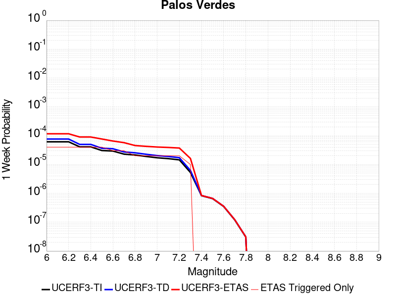 | 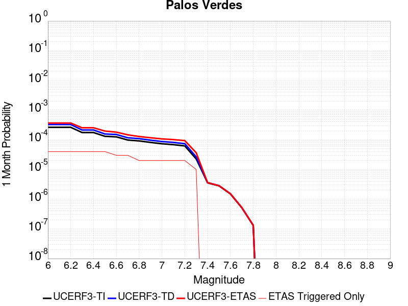 |  | 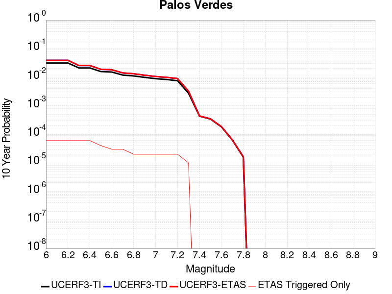 |

| Magnitude | 1 wk TI Prob | 1 wk TD Prob | 1 wk ETAS Prob | 1 wk ETAS/TD Gain | 1 wk ETAS Triggered Only | 1 mo TI Prob | 1 mo TD Prob | 1 mo ETAS Prob | 1 mo ETAS/TD Gain | 1 mo ETAS Triggered Only | 1 yr TI Prob | 1 yr TD Prob | 1 yr ETAS Prob | 1 yr ETAS/TD Gain | 1 yr ETAS Triggered Only | 10 yr TI Prob | 10 yr TD Prob | 10 yr ETAS Prob | 10 yr ETAS/TD Gain | 10 yr ETAS Triggered Only |
|-----|-----|-----|-----|-----|-----|-----|-----|-----|-----|-----|-----|-----|-----|-----|-----|-----|-----|-----|-----|-----|
| 6.0 | 6.126063E-5 | 7.622572E-5 | 1.16222676E-4 | 1.5247172 | 4.0E-5 | 2.6251914E-4 | 3.266441E-4 | 3.6663105E-4 | 1.1224174 | 4.0E-5 | 0.0031914865 | 0.0039701737 | 0.004019975 | 1.0125439 | 5.0E-5 | 0.031460393 | 0.03904909 | 0.039106745 | 1.0014765 | 6.0E-5 |
| 6.1 | 6.126063E-5 | 7.622572E-5 | 1.16222676E-4 | 1.5247172 | 4.0E-5 | 2.6251914E-4 | 3.266441E-4 | 3.6663105E-4 | 1.1224174 | 4.0E-5 | 0.0031914865 | 0.0039701737 | 0.004019975 | 1.0125439 | 5.0E-5 | 0.031460393 | 0.03904909 | 0.039106745 | 1.0014765 | 6.0E-5 |
| 6.2 | 6.126063E-5 | 7.622572E-5 | 1.16222676E-4 | 1.5247172 | 4.0E-5 | 2.6251914E-4 | 3.266441E-4 | 3.6663105E-4 | 1.1224174 | 4.0E-5 | 0.0031914865 | 0.0039701737 | 0.004019975 | 1.0125439 | 5.0E-5 | 0.031460393 | 0.03904909 | 0.039106745 | 1.0014765 | 6.0E-5 |
| 6.3 | 4.0838047E-5 | 4.9749007E-5 | 8.9747016E-5 | 1.8039962 | 4.0E-5 | 1.7500846E-4 | 2.1319388E-4 | 2.5318534E-4 | 1.1875826 | 4.0E-5 | 0.0021286458 | 0.002592754 | 0.0026426245 | 1.0192345 | 5.0E-5 | 0.021083709 | 0.025646746 | 0.025705209 | 1.0022795 | 6.0E-5 |
| 6.4 | 4.0838047E-5 | 4.9749007E-5 | 8.9747016E-5 | 1.8039962 | 4.0E-5 | 1.7500846E-4 | 2.1319388E-4 | 2.5318534E-4 | 1.1875826 | 4.0E-5 | 0.0021286458 | 0.002592754 | 0.0026426245 | 1.0192345 | 5.0E-5 | 0.021083709 | 0.025646746 | 0.025705209 | 1.0022795 | 6.0E-5 |
| 6.5 | 3.0512005E-5 | 3.6561592E-5 | 7.656013E-5 | 2.0940042 | 4.0E-5 | 1.3075917E-4 | 1.566838E-4 | 1.9667755E-4 | 1.2552512 | 4.0E-5 | 0.0015908304 | 0.001906072 | 0.0019459957 | 1.0209455 | 4.0E-5 | 0.015794903 | 0.018909173 | 0.018948415 | 1.0020754 | 4.0E-5 |
| 6.6 | 2.9255087E-5 | 3.5154393E-5 | 6.5153334E-5 | 1.8533485 | 3.0E-5 | 1.2537291E-4 | 1.5065364E-4 | 1.8064912E-4 | 1.1991023 | 3.0E-5 | 0.0015253464 | 0.0018327782 | 0.0018627233 | 1.0163386 | 3.0E-5 | 0.015149189 | 0.018188244 | 0.018217698 | 1.0016195 | 3.0E-5 |
| 6.7 | 2.287198E-5 | 2.724828E-5 | 5.724746E-5 | 2.100957 | 3.0E-5 | 9.801909E-5 | 1.16773626E-4 | 1.4677012E-4 | 1.2568773 | 3.0E-5 | 0.001192729 | 0.0014208833 | 0.0014508407 | 1.0210836 | 3.0E-5 | 0.011863477 | 0.014127217 | 0.014156793 | 1.0020936 | 3.0E-5 |
| 6.8 | 2.1325764E-5 | 2.5431878E-5 | 4.543137E-5 | 1.7863946 | 2.0E-5 | 9.139293E-5 | 1.0898972E-4 | 1.2898754E-4 | 1.1834836 | 2.0E-5 | 0.001112141 | 0.0013262323 | 0.0013462058 | 1.0150603 | 2.0E-5 | 0.011065915 | 0.013192211 | 0.013211948 | 1.0014961 | 2.0E-5 |
| 6.9 | 1.9009392E-5 | 2.2613547E-5 | 4.2613097E-5 | 1.8844056 | 2.0E-5 | 8.1466285E-5 | 9.6912096E-5 | 1.1691016E-4 | 1.2063526 | 2.0E-5 | 9.914007E-4 | 0.0011793535 | 0.0011993299 | 1.0169384 | 2.0E-5 | 0.009869894 | 0.011739633 | 0.011759398 | 1.0016836 | 2.0E-5 |
| 7.0 | 1.7098473E-5 | 2.0319356E-5 | 4.0318948E-5 | 1.9842632 | 2.0E-5 | 7.3277115E-5 | 8.708052E-5 | 1.07078784E-4 | 1.2296525 | 2.0E-5 | 8.917837E-4 | 0.001059775 | 0.0010797537 | 1.0188519 | 2.0E-5 | 0.008882134 | 0.010555646 | 0.010575435 | 1.0018747 | 2.0E-5 |
| 7.1 | 1.5982785E-5 | 1.899476E-5 | 3.899438E-5 | 2.052902 | 2.0E-5 | 6.849585E-5 | 8.1404054E-5 | 1.01402424E-4 | 1.245668 | 2.0E-5 | 8.336179E-4 | 9.907284E-4 | 0.0010107086 | 1.0201671 | 2.0E-5 | 0.008304977 | 0.009871479 | 0.009891282 | 1.002006 | 2.0E-5 |
| 7.2 | 1.4468002E-5 | 1.7197237E-5 | 3.7196893E-5 | 2.1629577 | 2.0E-5 | 6.200425E-5 | 7.370083E-5 | 9.369936E-5 | 1.2713474 | 2.0E-5 | 7.546402E-4 | 8.970222E-4 | 9.1700425E-4 | 1.022276 | 2.0E-5 | 0.007520827 | 0.008942284 | 0.008962105 | 1.0022166 | 2.0E-5 |
| 7.3 | 5.288233E-6 | 6.2036747E-6 | 1.6203612E-5 | 2.6119378 | 1.0E-5 | 2.2663658E-5 | 2.6587102E-5 | 3.6586836E-5 | 1.3761122 | 1.0E-5 | 2.7589512E-4 | 3.236848E-4 | 3.3368156E-4 | 1.0308843 | 1.0E-5 | 0.0027555283 | 0.0032355562 | 0.003245524 | 1.0030806 | 1.0E-5 |
| 7.4 | 8.279556E-7 | 8.408347E-7 | 8.408347E-7 | 1.0 | 0.0 | 3.5483763E-6 | 3.6035726E-6 | 3.6035726E-6 | 1.0 | 0.0 | 4.3200624E-5 | 4.3872686E-5 | 4.3872686E-5 | 1.0 | 0.0 | 4.3192226E-4 | 4.3864746E-4 | 4.3864746E-4 | 1.0 | 0.0 |
| 7.5 | 6.559831E-7 | 6.667229E-7 | 6.667229E-7 | 1.0 | 0.0 | 2.8113532E-6 | 2.857381E-6 | 2.857381E-6 | 1.0 | 0.0 | 3.4227687E-5 | 3.4788125E-5 | 3.4788125E-5 | 1.0 | 0.0 | 3.4222414E-4 | 3.4783344E-4 | 3.4783344E-4 | 1.0 | 0.0 |
| 7.6 | 3.5018968E-7 | 3.5620027E-7 | 3.5620027E-7 | 1.0 | 0.0 | 1.500812E-6 | 1.526572E-6 | 1.526572E-6 | 1.0 | 0.0 | 1.8272232E-5 | 1.8585903E-5 | 1.8585903E-5 | 1.0 | 0.0 | 1.8270731E-4 | 1.8584808E-4 | 1.8584808E-4 | 1.0 | 0.0 |
| 7.7 | 1.1986104E-7 | 1.2198376E-7 | 1.2198376E-7 | 1.0 | 0.0 | 5.1369005E-7 | 5.2278745E-7 | 5.2278745E-7 | 1.0 | 0.0 | 6.2541585E-6 | 6.364919E-6 | 6.364919E-6 | 1.0 | 0.0 | 6.2539824E-5 | 6.364741E-5 | 6.364741E-5 | 1.0 | 0.0 |
| 7.8 | 3.0445005E-8 | 3.1027582E-8 | 3.1027582E-8 | 1.0 | 0.0 | 1.3047858E-7 | 1.3297536E-7 | 1.3297536E-7 | 1.0 | 0.0 | 1.5885756E-6 | 1.6189739E-6 | 1.6189739E-6 | 1.0 | 0.0 | 1.5885644E-5 | 1.6189642E-5 | 1.6189642E-5 | 1.0 | 0.0 |

## San Diego Trough south
*[(top)](#table-of-contents)*

| 1 Week | 1 Month | 1 Year | 10 Year |
|-----|-----|-----|-----|
| 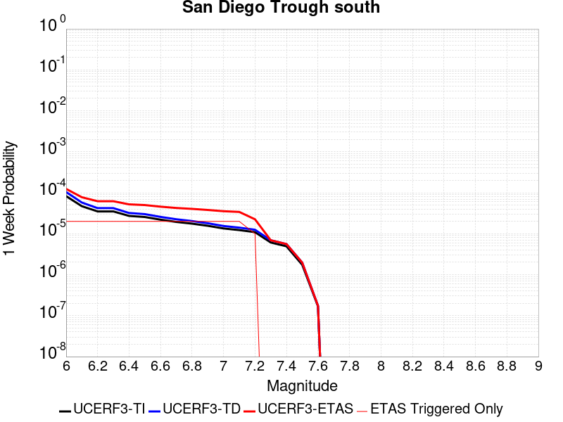 |  |  |  |

| Magnitude | 1 wk TI Prob | 1 wk TD Prob | 1 wk ETAS Prob | 1 wk ETAS/TD Gain | 1 wk ETAS Triggered Only | 1 mo TI Prob | 1 mo TD Prob | 1 mo ETAS Prob | 1 mo ETAS/TD Gain | 1 mo ETAS Triggered Only | 1 yr TI Prob | 1 yr TD Prob | 1 yr ETAS Prob | 1 yr ETAS/TD Gain | 1 yr ETAS Triggered Only | 10 yr TI Prob | 10 yr TD Prob | 10 yr ETAS Prob | 10 yr ETAS/TD Gain | 10 yr ETAS Triggered Only |
|-----|-----|-----|-----|-----|-----|-----|-----|-----|-----|-----|-----|-----|-----|-----|-----|-----|-----|-----|-----|-----|
| 6.0 | 8.279495E-5 | 1.0425541E-4 | 1.2425332E-4 | 1.1918166 | 2.0E-5 | 3.5478722E-4 | 4.4673498E-4 | 4.7672156E-4 | 1.0671239 | 3.0E-5 | 0.004310982 | 0.0054259133 | 0.0054656966 | 1.0073321 | 4.0E-5 | 0.042283054 | 0.05299303 | 0.05304038 | 1.0008935 | 5.0E-5 |
| 6.1 | 4.6961468E-5 | 5.773024E-5 | 7.7729084E-5 | 1.3464189 | 2.0E-5 | 2.0124791E-4 | 2.473905E-4 | 2.6738556E-4 | 1.0808239 | 2.0E-5 | 0.00244744 | 0.003007886 | 0.0030377957 | 1.0099437 | 3.0E-5 | 0.024206603 | 0.029679636 | 0.029718447 | 1.0013077 | 4.0E-5 |
| 6.2 | 3.5079658E-5 | 4.214258E-5 | 6.2141735E-5 | 1.4745594 | 2.0E-5 | 1.5033272E-4 | 1.8059829E-4 | 2.0059469E-4 | 1.110723 | 2.0E-5 | 0.0018287642 | 0.002196587 | 0.002226521 | 1.0136275 | 3.0E-5 | 0.018137876 | 0.021751188 | 0.021790316 | 1.001799 | 4.0E-5 |
| 6.3 | 3.5079658E-5 | 4.214258E-5 | 6.2141735E-5 | 1.4745594 | 2.0E-5 | 1.5033272E-4 | 1.8059829E-4 | 2.0059469E-4 | 1.110723 | 2.0E-5 | 0.0018287642 | 0.002196587 | 0.002226521 | 1.0136275 | 3.0E-5 | 0.018137876 | 0.021751188 | 0.021790316 | 1.001799 | 4.0E-5 |
| 6.4 | 2.7196904E-5 | 3.208715E-5 | 5.208651E-5 | 1.6232824 | 2.0E-5 | 1.16552954E-4 | 1.3750911E-4 | 1.5750635E-4 | 1.145425 | 2.0E-5 | 0.0014181085 | 0.0016728995 | 0.0017028493 | 1.017903 | 3.0E-5 | 0.014090929 | 0.016604666 | 0.016644001 | 1.0023689 | 4.0E-5 |
| 6.5 | 2.5584688E-5 | 3.0101632E-5 | 5.010103E-5 | 1.6643958 | 2.0E-5 | 1.0964406E-4 | 1.2900059E-4 | 1.4899802E-4 | 1.1550181 | 2.0E-5 | 0.0013340989 | 0.0015694627 | 0.0015994156 | 1.0190848 | 3.0E-5 | 0.013261181 | 0.015585332 | 0.0156247085 | 1.0025265 | 4.0E-5 |
| 6.6 | 2.2034688E-5 | 2.574271E-5 | 4.5742196E-5 | 1.776899 | 2.0E-5 | 9.443096E-5 | 1.1032127E-4 | 1.3031907E-4 | 1.1812687 | 2.0E-5 | 0.0011490905 | 0.0013423412 | 0.0013723009 | 1.022319 | 3.0E-5 | 0.011431668 | 0.013343325 | 0.013382791 | 1.0029577 | 4.0E-5 |
| 6.7 | 1.9394853E-5 | 2.254176E-5 | 4.254131E-5 | 1.8872222 | 2.0E-5 | 8.311815E-5 | 9.6604E-5 | 1.1660207E-4 | 1.2070107 | 2.0E-5 | 0.0010114936 | 0.0011755243 | 0.001205489 | 1.0254905 | 3.0E-5 | 0.01006902 | 0.011693766 | 0.011733298 | 1.0033807 | 4.0E-5 |
| 6.8 | 1.7615313E-5 | 2.0403182E-5 | 4.0402774E-5 | 1.9802192 | 2.0E-5 | 7.549201E-5 | 8.743931E-5 | 1.07437554E-4 | 1.22871 | 2.0E-5 | 9.1872766E-4 | 0.0010640579 | 0.0010840367 | 1.0187759 | 2.0E-5 | 0.009149387 | 0.010590198 | 0.010619881 | 1.0028028 | 3.0E-5 |
| 6.9 | 1.5621423E-5 | 1.8026114E-5 | 3.8025755E-5 | 2.1094813 | 2.0E-5 | 6.6947236E-5 | 7.725251E-5 | 9.7250966E-5 | 1.2588713 | 2.0E-5 | 8.147778E-4 | 9.40147E-4 | 9.601282E-4 | 1.0212532 | 2.0E-5 | 0.008117969 | 0.009362142 | 0.009391861 | 1.0031744 | 3.0E-5 |
| 7.0 | 1.3444376E-5 | 1.544809E-5 | 3.544778E-5 | 2.2946386 | 2.0E-5 | 5.7617483E-5 | 6.620443E-5 | 8.620311E-5 | 1.3020746 | 2.0E-5 | 7.0126704E-4 | 8.057436E-4 | 8.2572753E-4 | 1.0248019 | 2.0E-5 | 0.006990582 | 0.008028555 | 0.008058314 | 1.0037067 | 3.0E-5 |
| 7.1 | 1.2268361E-5 | 1.407303E-5 | 3.407275E-5 | 2.421138 | 2.0E-5 | 5.2577634E-5 | 6.0311606E-5 | 8.03104E-5 | 1.3315911 | 2.0E-5 | 6.399447E-4 | 7.3404907E-4 | 7.540344E-4 | 1.0272261 | 2.0E-5 | 0.0063810493 | 0.0073165493 | 0.0073463297 | 1.0040703 | 3.0E-5 |
| 7.2 | 1.0922655E-5 | 1.2513563E-5 | 2.2513437E-5 | 1.7991229 | 1.0E-5 | 4.681054E-5 | 5.3628468E-5 | 6.362793E-5 | 1.1864581 | 1.0E-5 | 5.697693E-4 | 6.5273355E-4 | 6.62727E-4 | 1.0153102 | 1.0E-5 | 0.0056831064 | 0.0065084435 | 0.0065283137 | 1.003053 | 2.0E-5 |
| 7.3 | 6.1106753E-6 | 6.928925E-6 | 6.928925E-6 | 1.0 | 0.0 | 2.6188345E-5 | 2.9695057E-5 | 2.9695057E-5 | 1.0 | 0.0 | 3.1879646E-4 | 3.6147775E-4 | 3.6147775E-4 | 1.0 | 0.0 | 0.0031833951 | 0.003608943 | 0.003618907 | 1.0027609 | 1.0E-5 |
| 7.4 | 4.933187E-6 | 5.5895525E-6 | 5.5895525E-6 | 1.0 | 0.0 | 2.114206E-5 | 2.3955008E-5 | 2.3955008E-5 | 1.0 | 0.0 | 2.5737417E-4 | 2.9161357E-4 | 2.9161357E-4 | 1.0 | 0.0 | 0.002570763 | 0.0029123505 | 0.0029223212 | 1.0034237 | 1.0E-5 |
| 7.5 | 1.7489613E-6 | 1.969678E-6 | 1.969678E-6 | 1.0 | 0.0 | 7.495527E-6 | 8.4414505E-6 | 8.4414505E-6 | 1.0 | 0.0 | 9.125422E-5 | 1.02770035E-4 | 1.02770035E-4 | 1.0 | 0.0 | 9.1216754E-4 | 0.0010272472 | 0.0010372369 | 1.0097247 | 1.0E-5 |
| 7.6 | 1.6988751E-7 | 1.7533823E-7 | 1.7533823E-7 | 1.0 | 0.0 | 7.2808916E-7 | 7.5144936E-7 | 7.5144936E-7 | 1.0 | 0.0 | 8.864449E-6 | 9.14886E-6 | 9.14886E-6 | 1.0 | 0.0 | 8.8640954E-5 | 9.1485024E-5 | 9.1485024E-5 | 1.0 | 0.0 |

## Mission Creek
*[(top)](#table-of-contents)*

| 1 Week | 1 Month | 1 Year | 10 Year |
|-----|-----|-----|-----|
|  |  | 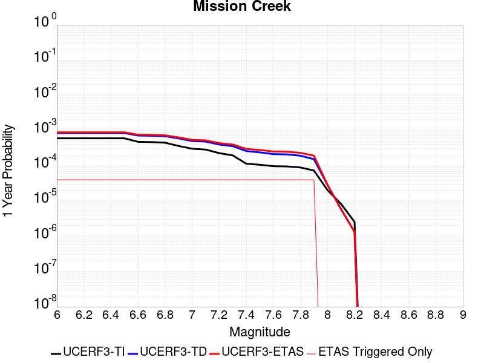 |  |

| Magnitude | 1 wk TI Prob | 1 wk TD Prob | 1 wk ETAS Prob | 1 wk ETAS/TD Gain | 1 wk ETAS Triggered Only | 1 mo TI Prob | 1 mo TD Prob | 1 mo ETAS Prob | 1 mo ETAS/TD Gain | 1 mo ETAS Triggered Only | 1 yr TI Prob | 1 yr TD Prob | 1 yr ETAS Prob | 1 yr ETAS/TD Gain | 1 yr ETAS Triggered Only | 10 yr TI Prob | 10 yr TD Prob | 10 yr ETAS Prob | 10 yr ETAS/TD Gain | 10 yr ETAS Triggered Only |
|-----|-----|-----|-----|-----|-----|-----|-----|-----|-----|-----|-----|-----|-----|-----|-----|-----|-----|-----|-----|-----|
| 6.0 | 1.1549387E-5 | 1.6322783E-5 | 3.6322457E-5 | 2.2252612 | 2.0E-5 | 4.9496433E-5 | 6.995299E-5 | 9.995089E-5 | 1.4288294 | 3.0E-5 | 6.0245243E-4 | 8.5135986E-4 | 8.913258E-4 | 1.0469437 | 4.0E-5 | 0.006008218 | 0.008510157 | 0.008569646 | 1.0069904 | 6.0E-5 |
| 6.1 | 1.1549387E-5 | 1.6322783E-5 | 3.6322457E-5 | 2.2252612 | 2.0E-5 | 4.9496433E-5 | 6.995299E-5 | 9.995089E-5 | 1.4288294 | 3.0E-5 | 6.0245243E-4 | 8.5135986E-4 | 8.913258E-4 | 1.0469437 | 4.0E-5 | 0.006008218 | 0.008510157 | 0.008569646 | 1.0069904 | 6.0E-5 |
| 6.2 | 1.1549387E-5 | 1.6322783E-5 | 3.6322457E-5 | 2.2252612 | 2.0E-5 | 4.9496433E-5 | 6.995299E-5 | 9.995089E-5 | 1.4288294 | 3.0E-5 | 6.0245243E-4 | 8.5135986E-4 | 8.913258E-4 | 1.0469437 | 4.0E-5 | 0.006008218 | 0.008510157 | 0.008569646 | 1.0069904 | 6.0E-5 |
| 6.3 | 1.1549387E-5 | 1.6322783E-5 | 3.6322457E-5 | 2.2252612 | 2.0E-5 | 4.9496433E-5 | 6.995299E-5 | 9.995089E-5 | 1.4288294 | 3.0E-5 | 6.0245243E-4 | 8.5135986E-4 | 8.913258E-4 | 1.0469437 | 4.0E-5 | 0.006008218 | 0.008510157 | 0.008569646 | 1.0069904 | 6.0E-5 |
| 6.4 | 1.1549387E-5 | 1.6322783E-5 | 3.6322457E-5 | 2.2252612 | 2.0E-5 | 4.9496433E-5 | 6.995299E-5 | 9.995089E-5 | 1.4288294 | 3.0E-5 | 6.0245243E-4 | 8.5135986E-4 | 8.913258E-4 | 1.0469437 | 4.0E-5 | 0.006008218 | 0.008510157 | 0.008569646 | 1.0069904 | 6.0E-5 |
| 6.5 | 1.1549387E-5 | 1.6322783E-5 | 3.6322457E-5 | 2.2252612 | 2.0E-5 | 4.9496433E-5 | 6.995299E-5 | 9.995089E-5 | 1.4288294 | 3.0E-5 | 6.0245243E-4 | 8.5135986E-4 | 8.913258E-4 | 1.0469437 | 4.0E-5 | 0.006008218 | 0.008510157 | 0.008569646 | 1.0069904 | 6.0E-5 |
| 6.6 | 9.202681E-6 | 1.3846059E-5 | 3.3845783E-5 | 2.4444344 | 2.0E-5 | 3.9439463E-5 | 5.9338956E-5 | 8.9337176E-5 | 1.5055401 | 3.0E-5 | 4.800697E-4 | 7.2222133E-4 | 7.621924E-4 | 1.0553447 | 4.0E-5 | 0.004790339 | 0.0072273402 | 0.0072869067 | 1.0082418 | 6.0E-5 |
| 6.7 | 9.019164E-6 | 1.3651728E-5 | 3.3651457E-5 | 2.4649959 | 2.0E-5 | 3.8652986E-5 | 5.8506146E-5 | 8.850439E-5 | 1.5127367 | 3.0E-5 | 4.7049852E-4 | 7.1208854E-4 | 7.5206003E-4 | 1.0561328 | 4.0E-5 | 0.004695036 | 0.0071266647 | 0.007186237 | 1.0083591 | 6.0E-5 |
| 6.8 | 8.673558E-6 | 1.3273839E-5 | 3.3273573E-5 | 2.5067031 | 2.0E-5 | 3.717186E-5 | 5.688669E-5 | 8.688498E-5 | 1.5273341 | 3.0E-5 | 4.524734E-4 | 6.923842E-4 | 7.323565E-4 | 1.0577314 | 4.0E-5 | 0.0045155324 | 0.0069308523 | 0.0069904365 | 1.0085969 | 6.0E-5 |
| 6.9 | 7.002255E-6 | 1.1478069E-5 | 3.1477837E-5 | 2.7424335 | 2.0E-5 | 3.000932E-5 | 4.9190832E-5 | 7.9189354E-5 | 1.6098398 | 3.0E-5 | 3.653022E-4 | 5.9874065E-4 | 6.387167E-4 | 1.0667669 | 4.0E-5 | 0.0036470229 | 0.005999676 | 0.006049376 | 1.0082837 | 5.0E-5 |
| 7.0 | 5.84644E-6 | 9.675359E-6 | 2.9675166E-5 | 3.0670867 | 2.0E-5 | 2.5055931E-5 | 4.146519E-5 | 7.146395E-5 | 1.7234684 | 3.0E-5 | 3.0501327E-4 | 5.047263E-4 | 5.447061E-4 | 1.0792109 | 4.0E-5 | 0.0030459496 | 0.005063994 | 0.005113741 | 1.0098237 | 5.0E-5 |
| 7.1 | 5.54703E-6 | 9.329834E-6 | 2.9329647E-5 | 3.1436408 | 2.0E-5 | 2.377277E-5 | 3.9984414E-5 | 6.9983216E-5 | 1.7502624 | 3.0E-5 | 2.8939504E-4 | 4.8670598E-4 | 5.266865E-4 | 1.0821451 | 4.0E-5 | 0.0028901845 | 0.0048845876 | 0.004934343 | 1.0101863 | 5.0E-5 |
| 7.2 | 4.384709E-6 | 7.681918E-6 | 2.7681765E-5 | 3.6034966 | 2.0E-5 | 1.8791474E-5 | 3.292211E-5 | 6.292112E-5 | 1.9112117 | 3.0E-5 | 2.2876218E-4 | 4.0075663E-4 | 4.407406E-4 | 1.0997711 | 4.0E-5 | 0.0022852682 | 0.004028542 | 0.0040683807 | 1.0098891 | 4.0E-5 |
| 7.3 | 3.7888456E-6 | 6.915788E-6 | 2.691565E-5 | 3.8919137 | 2.0E-5 | 1.623781E-5 | 2.9638775E-5 | 5.9637885E-5 | 2.0121577 | 3.0E-5 | 1.9767738E-4 | 3.6079568E-4 | 4.0078125E-4 | 1.110826 | 4.0E-5 | 0.0019750162 | 0.00363027 | 0.0036701248 | 1.0109785 | 4.0E-5 |
| 7.4 | 2.1982462E-6 | 5.0241033E-6 | 2.5024003E-5 | 4.98079 | 2.0E-5 | 9.421021E-6 | 2.1531694E-5 | 5.153105E-5 | 2.393265 | 3.0E-5 | 1.1469489E-4 | 2.6211704E-4 | 3.0210655E-4 | 1.1525636 | 4.0E-5 | 0.0011463572 | 0.0026460327 | 0.0026859269 | 1.015077 | 4.0E-5 |
| 7.5 | 2.051923E-6 | 4.6153277E-6 | 2.4615236E-5 | 5.333367 | 2.0E-5 | 8.793926E-6 | 1.9779825E-5 | 4.977923E-5 | 2.516667 | 3.0E-5 | 1.0706078E-4 | 2.4079291E-4 | 2.8078328E-4 | 1.1660779 | 4.0E-5 | 0.0010700922 | 0.0024335932 | 0.0024734957 | 1.0163966 | 4.0E-5 |
| 7.6 | 1.8733427E-6 | 4.1236603E-6 | 2.4123578E-5 | 5.85004 | 2.0E-5 | 8.028587E-6 | 1.7672712E-5 | 4.767218E-5 | 2.6975024 | 3.0E-5 | 9.774366E-5 | 2.151441E-4 | 2.551355E-4 | 1.1858819 | 4.0E-5 | 9.770069E-4 | 0.0021782513 | 0.002218164 | 1.0183233 | 4.0E-5 |
| 7.7 | 1.8411953E-6 | 4.0433315E-6 | 2.4043251E-5 | 5.946396 | 2.0E-5 | 7.890813E-6 | 1.732845E-5 | 4.732793E-5 | 2.731227 | 3.0E-5 | 9.606641E-5 | 2.1095353E-4 | 2.509451E-4 | 1.1895752 | 4.0E-5 | 9.6024893E-4 | 0.0021365292 | 0.0021764436 | 1.018682 | 4.0E-5 |
| 7.8 | 1.7194251E-6 | 3.71068E-6 | 2.3710605E-5 | 6.3898277 | 2.0E-5 | 7.368944E-6 | 1.5902819E-5 | 4.590234E-5 | 2.886428 | 3.0E-5 | 8.97132E-5 | 1.9359968E-4 | 2.3359194E-4 | 1.2065719 | 4.0E-5 | 8.967699E-4 | 0.0019624757 | 0.002002397 | 1.0203425 | 4.0E-5 |
| 7.9 | 1.4035052E-6 | 2.9502596E-6 | 2.29502E-5 | 7.779044 | 2.0E-5 | 6.0150082E-6 | 1.2643909E-5 | 4.264353E-5 | 3.372654 | 3.0E-5 | 7.3230265E-5 | 1.5392878E-4 | 1.9392262E-4 | 1.2598205 | 4.0E-5 | 7.3206134E-4 | 0.0015631174 | 0.0016030548 | 1.0255499 | 4.0E-5 |
| 8.0 | 3.9318823E-7 | 5.528477E-7 | 5.528477E-7 | 1.0 | 0.0 | 1.6850913E-6 | 2.3693453E-6 | 2.3693453E-6 | 1.0 | 0.0 | 2.0515794E-5 | 2.8846403E-5 | 2.8846403E-5 | 1.0 | 0.0 | 2.0513899E-4 | 2.990952E-4 | 2.990952E-4 | 1.0 | 0.0 |
| 8.1 | 1.596793E-7 | 1.13775044E-7 | 1.13775044E-7 | 1.0 | 0.0 | 6.8433974E-7 | 4.876072E-7 | 4.876072E-7 | 1.0 | 0.0 | 8.331805E-6 | 5.936602E-6 | 5.936602E-6 | 1.0 | 0.0 | 8.331492E-5 | 6.5494125E-5 | 6.5494125E-5 | 1.0 | 0.0 |
| 8.2 | 4.9003038E-8 | 2.5435753E-8 | 2.5435753E-8 | 1.0 | 0.0 | 2.10013E-7 | 1.09010365E-7 | 1.09010365E-7 | 1.0 | 0.0 | 2.5569052E-6 | 1.3272004E-6 | 1.3272004E-6 | 1.0 | 0.0 | 2.556876E-5 | 1.4952613E-5 | 1.4952613E-5 | 1.0 | 0.0 |

## Kern Canyon (Lake Isabella) 2011
*[(top)](#table-of-contents)*

| 1 Week | 1 Month | 1 Year | 10 Year |
|-----|-----|-----|-----|
|  |  |  | 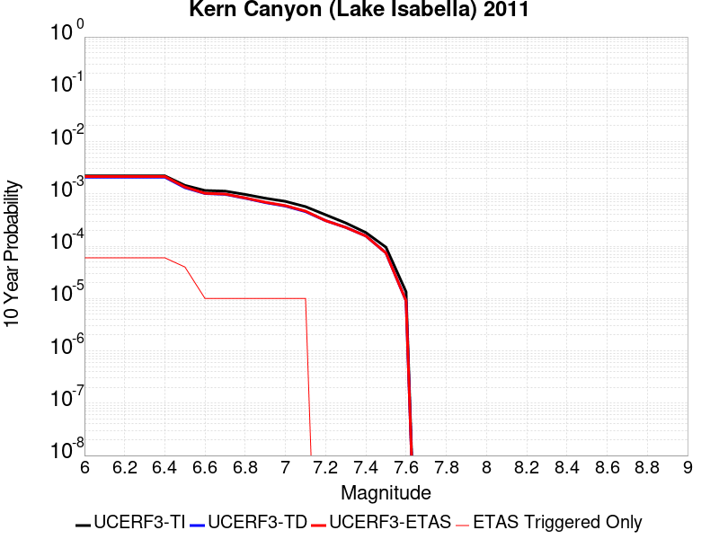 |

| Magnitude | 1 wk TI Prob | 1 wk TD Prob | 1 wk ETAS Prob | 1 wk ETAS/TD Gain | 1 wk ETAS Triggered Only | 1 mo TI Prob | 1 mo TD Prob | 1 mo ETAS Prob | 1 mo ETAS/TD Gain | 1 mo ETAS Triggered Only | 1 yr TI Prob | 1 yr TD Prob | 1 yr ETAS Prob | 1 yr ETAS/TD Gain | 1 yr ETAS Triggered Only | 10 yr TI Prob | 10 yr TD Prob | 10 yr ETAS Prob | 10 yr ETAS/TD Gain | 10 yr ETAS Triggered Only |
|-----|-----|-----|-----|-----|-----|-----|-----|-----|-----|-----|-----|-----|-----|-----|-----|-----|-----|-----|-----|-----|
| 6.0 | 4.2387383E-6 | 4.0016344E-6 | 2.4001554E-5 | 5.997938 | 2.0E-5 | 1.8165894E-5 | 1.7149758E-5 | 4.7149242E-5 | 2.7492657 | 3.0E-5 | 2.2114732E-4 | 2.0878017E-4 | 2.5876972E-4 | 1.2394364 | 5.0E-5 | 0.0022092736 | 0.002086024 | 0.002145899 | 1.0287029 | 6.0E-5 |
| 6.1 | 4.2387383E-6 | 4.0016344E-6 | 2.4001554E-5 | 5.997938 | 2.0E-5 | 1.8165894E-5 | 1.7149758E-5 | 4.7149242E-5 | 2.7492657 | 3.0E-5 | 2.2114732E-4 | 2.0878017E-4 | 2.5876972E-4 | 1.2394364 | 5.0E-5 | 0.0022092736 | 0.002086024 | 0.002145899 | 1.0287029 | 6.0E-5 |
| 6.2 | 4.2387383E-6 | 4.0016344E-6 | 2.4001554E-5 | 5.997938 | 2.0E-5 | 1.8165894E-5 | 1.7149758E-5 | 4.7149242E-5 | 2.7492657 | 3.0E-5 | 2.2114732E-4 | 2.0878017E-4 | 2.5876972E-4 | 1.2394364 | 5.0E-5 | 0.0022092736 | 0.002086024 | 0.002145899 | 1.0287029 | 6.0E-5 |
| 6.3 | 4.2387383E-6 | 4.0016344E-6 | 2.4001554E-5 | 5.997938 | 2.0E-5 | 1.8165894E-5 | 1.7149758E-5 | 4.7149242E-5 | 2.7492657 | 3.0E-5 | 2.2114732E-4 | 2.0878017E-4 | 2.5876972E-4 | 1.2394364 | 5.0E-5 | 0.0022092736 | 0.002086024 | 0.002145899 | 1.0287029 | 6.0E-5 |
| 6.4 | 4.2387383E-6 | 4.0016344E-6 | 2.4001554E-5 | 5.997938 | 2.0E-5 | 1.8165894E-5 | 1.7149758E-5 | 4.7149242E-5 | 2.7492657 | 3.0E-5 | 2.2114732E-4 | 2.0878017E-4 | 2.5876972E-4 | 1.2394364 | 5.0E-5 | 0.0022092736 | 0.002086024 | 0.002145899 | 1.0287029 | 6.0E-5 |
| 6.5 | 2.7857532E-6 | 2.5178624E-6 | 1.2517838E-5 | 4.971613 | 1.0E-5 | 1.1938888E-5 | 1.0790796E-5 | 2.0790689E-5 | 1.9267057 | 1.0E-5 | 1.4534626E-4 | 1.3137035E-4 | 1.613664E-4 | 1.228332 | 3.0E-5 | 0.0014525123 | 0.0013129596 | 0.0013529072 | 1.0304255 | 4.0E-5 |
| 6.6 | 2.2233348E-6 | 1.944119E-6 | 1.944119E-6 | 1.0 | 0.0 | 9.528543E-6 | 8.331913E-6 | 8.331913E-6 | 1.0 | 0.0 | 1.1600384E-4 | 1.014364E-4 | 1.1143539E-4 | 1.0985739 | 1.0E-5 | 0.001159433 | 0.0010139096 | 0.0010238995 | 1.0098528 | 1.0E-5 |
| 6.7 | 2.1635126E-6 | 1.8834991E-6 | 1.8834991E-6 | 1.0 | 0.0 | 9.272164E-6 | 8.072114E-6 | 8.072114E-6 | 1.0 | 0.0 | 1.1288274E-4 | 9.827364E-5 | 1.0827266E-4 | 1.1017467 | 1.0E-5 | 0.0011282542 | 9.8231E-4 | 9.923001E-4 | 1.0101701 | 1.0E-5 |
| 6.8 | 1.8685711E-6 | 1.583138E-6 | 1.583138E-6 | 1.0 | 0.0 | 8.008137E-6 | 6.7848596E-6 | 6.7848596E-6 | 1.0 | 0.0 | 9.74947E-5 | 8.2602586E-5 | 9.260176E-5 | 1.1210515 | 1.0E-5 | 9.745194E-4 | 8.2572375E-4 | 8.357155E-4 | 1.0121006 | 1.0E-5 |
| 6.9 | 1.5815071E-6 | 1.3064887E-6 | 1.3064887E-6 | 1.0 | 0.0 | 6.77787E-6 | 5.5992255E-6 | 5.5992255E-6 | 1.0 | 0.0 | 8.251744E-5 | 6.816846E-5 | 7.816778E-5 | 1.1466854 | 1.0E-5 | 8.248681E-4 | 6.8147824E-4 | 6.914714E-4 | 1.0146639 | 1.0E-5 |
| 7.0 | 1.3772564E-6 | 1.1210681E-6 | 1.1210681E-6 | 1.0 | 0.0 | 5.9025137E-6 | 4.8045686E-6 | 4.8045686E-6 | 1.0 | 0.0 | 7.186073E-5 | 5.8494075E-5 | 6.849349E-5 | 1.1709474 | 1.0E-5 | 7.18375E-4 | 5.8478885E-4 | 5.94783E-4 | 1.0170902 | 1.0E-5 |
| 7.1 | 1.0916998E-6 | 8.7637505E-7 | 8.7637505E-7 | 1.0 | 0.0 | 4.678705E-6 | 3.7558877E-6 | 3.7558877E-6 | 1.0 | 0.0 | 5.6961744E-5 | 4.5726985E-5 | 5.572653E-5 | 1.2186792 | 1.0E-5 | 5.6947145E-4 | 4.571771E-4 | 4.6717256E-4 | 1.0218633 | 1.0E-5 |
| 7.2 | 7.6277024E-7 | 5.901439E-7 | 5.901439E-7 | 1.0 | 0.0 | 3.2690114E-6 | 2.5291856E-6 | 2.5291856E-6 | 1.0 | 0.0 | 3.9799485E-5 | 3.0792406E-5 | 3.0792406E-5 | 1.0 | 0.0 | 3.9792358E-4 | 3.07882E-4 | 3.07882E-4 | 1.0 | 0.0 |
| 7.3 | 5.3265916E-7 | 4.3824264E-7 | 4.3824264E-7 | 1.0 | 0.0 | 2.282823E-6 | 1.8781814E-6 | 1.8781814E-6 | 1.0 | 0.0 | 2.7793016E-5 | 2.2866623E-5 | 2.2866623E-5 | 1.0 | 0.0 | 2.778954E-4 | 2.2864307E-4 | 2.2864307E-4 | 1.0 | 0.0 |
| 7.4 | 3.4946007E-7 | 3.0065647E-7 | 3.0065647E-7 | 1.0 | 0.0 | 1.497685E-6 | 1.2885271E-6 | 1.2885271E-6 | 1.0 | 0.0 | 1.8234163E-5 | 1.5687707E-5 | 1.5687707E-5 | 1.0 | 0.0 | 1.8232666E-4 | 1.5686621E-4 | 1.5686621E-4 | 1.0 | 0.0 |
| 7.5 | 1.8317026E-7 | 1.4244755E-7 | 1.4244755E-7 | 1.0 | 0.0 | 7.850152E-7 | 6.1048934E-7 | 6.1048934E-7 | 1.0 | 0.0 | 9.557518E-6 | 7.432683E-6 | 7.432683E-6 | 1.0 | 0.0 | 9.5571064E-5 | 7.432442E-5 | 7.432442E-5 | 1.0 | 0.0 |
| 7.6 | 2.572245E-8 | 1.735264E-8 | 1.735264E-8 | 1.0 | 0.0 | 1.10239064E-7 | 7.436845E-8 | 7.436845E-8 | 1.0 | 0.0 | 1.3421597E-6 | 9.0543557E-7 | 9.0543557E-7 | 1.0 | 0.0 | 1.3421517E-5 | 9.054324E-6 | 9.054324E-6 | 1.0 | 0.0 |

## San Pedro Basin
*[(top)](#table-of-contents)*

| 1 Week | 1 Month | 1 Year | 10 Year |
|-----|-----|-----|-----|
| 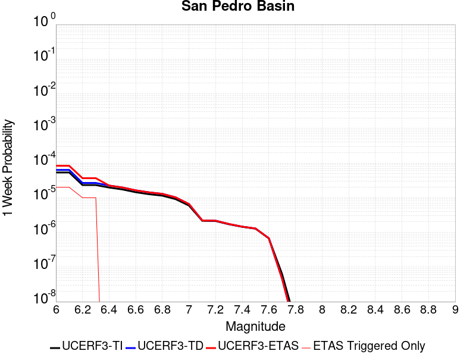 | 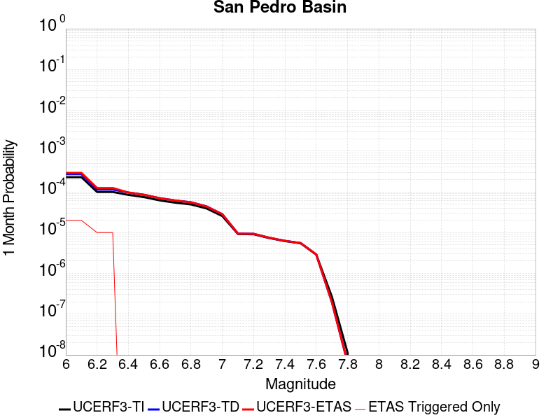 |  |  |

| Magnitude | 1 wk TI Prob | 1 wk TD Prob | 1 wk ETAS Prob | 1 wk ETAS/TD Gain | 1 wk ETAS Triggered Only | 1 mo TI Prob | 1 mo TD Prob | 1 mo ETAS Prob | 1 mo ETAS/TD Gain | 1 mo ETAS Triggered Only | 1 yr TI Prob | 1 yr TD Prob | 1 yr ETAS Prob | 1 yr ETAS/TD Gain | 1 yr ETAS Triggered Only | 10 yr TI Prob | 10 yr TD Prob | 10 yr ETAS Prob | 10 yr ETAS/TD Gain | 10 yr ETAS Triggered Only |
|-----|-----|-----|-----|-----|-----|-----|-----|-----|-----|-----|-----|-----|-----|-----|-----|-----|-----|-----|-----|-----|
| 6.0 | 5.3449043E-5 | 6.337018E-5 | 8.336891E-5 | 1.3155859 | 2.0E-5 | 2.2904722E-4 | 2.7156167E-4 | 2.9155624E-4 | 1.0736281 | 2.0E-5 | 0.0027850836 | 0.0033018515 | 0.0033317523 | 1.0090559 | 3.0E-5 | 0.027504366 | 0.03258948 | 0.032647528 | 1.0017811 | 6.0E-5 |
| 6.1 | 5.3449043E-5 | 6.337018E-5 | 8.336891E-5 | 1.3155859 | 2.0E-5 | 2.2904722E-4 | 2.7156167E-4 | 2.9155624E-4 | 1.0736281 | 2.0E-5 | 0.0027850836 | 0.0033018515 | 0.0033317523 | 1.0090559 | 3.0E-5 | 0.027504366 | 0.03258948 | 0.032647528 | 1.0017811 | 6.0E-5 |
| 6.2 | 2.3189454E-5 | 2.6642829E-5 | 3.6642563E-5 | 1.3753256 | 1.0E-5 | 9.9379584E-5 | 1.1417881E-4 | 1.2417766E-4 | 1.087572 | 1.0E-5 | 0.0012092749 | 0.0013892875 | 0.0014092597 | 1.0143759 | 2.0E-5 | 0.012027155 | 0.01381089 | 0.013830613 | 1.0014281 | 2.0E-5 |
| 6.3 | 2.3189454E-5 | 2.6642829E-5 | 3.6642563E-5 | 1.3753256 | 1.0E-5 | 9.9379584E-5 | 1.1417881E-4 | 1.2417766E-4 | 1.087572 | 1.0E-5 | 0.0012092749 | 0.0013892875 | 0.0014092597 | 1.0143759 | 2.0E-5 | 0.012027155 | 0.01381089 | 0.013830613 | 1.0014281 | 2.0E-5 |
| 6.4 | 1.966056E-5 | 2.246342E-5 | 2.246342E-5 | 1.0 | 0.0 | 8.425682E-5 | 9.626848E-5 | 9.626848E-5 | 1.0 | 0.0 | 0.001025344 | 0.0011714787 | 0.001181467 | 1.0085262 | 1.0E-5 | 0.010206259 | 0.011657119 | 0.011667003 | 1.0008478 | 1.0E-5 |
| 6.5 | 1.7342953E-5 | 1.9745152E-5 | 1.9745152E-5 | 1.0 | 0.0 | 7.4324824E-5 | 8.461954E-5 | 8.461954E-5 | 1.0 | 0.0 | 9.04529E-4 | 0.0010297929 | 0.0010397827 | 1.0097007 | 1.0E-5 | 0.009008561 | 0.010253932 | 0.01026383 | 1.0009652 | 1.0E-5 |
| 6.6 | 1.439804E-5 | 1.6322716E-5 | 1.6322716E-5 | 1.0 | 0.0 | 6.170443E-5 | 6.99528E-5 | 6.99528E-5 | 1.0 | 0.0 | 7.509924E-4 | 8.513747E-4 | 8.613662E-4 | 1.0117357 | 1.0E-5 | 0.0074845953 | 0.008484333 | 0.008494249 | 1.0011686 | 1.0E-5 |
| 6.7 | 1.2634884E-5 | 1.4285298E-5 | 1.4285298E-5 | 1.0 | 0.0 | 5.414838E-5 | 6.122144E-5 | 6.122144E-5 | 1.0 | 0.0 | 6.590571E-4 | 7.451466E-4 | 7.5513916E-4 | 1.0134102 | 1.0E-5 | 0.006571059 | 0.007429502 | 0.0074394275 | 1.001336 | 1.0E-5 |
| 6.8 | 1.146091E-5 | 1.2933193E-5 | 1.2933193E-5 | 1.0 | 0.0 | 4.911726E-5 | 5.542696E-5 | 5.542696E-5 | 1.0 | 0.0 | 5.9783855E-4 | 6.74644E-4 | 6.846373E-4 | 1.0148126 | 1.0E-5 | 0.0059623276 | 0.0067288997 | 0.006738832 | 1.0014762 | 1.0E-5 |
| 6.9 | 9.109035E-6 | 1.0235013E-5 | 1.0235013E-5 | 1.0 | 0.0 | 3.9038136E-5 | 4.386376E-5 | 4.386376E-5 | 1.0 | 0.0 | 4.7518566E-4 | 5.339384E-4 | 5.4393307E-4 | 1.0187187 | 1.0E-5 | 0.0047417083 | 0.0053293095 | 0.005339256 | 1.0018665 | 1.0E-5 |
| 7.0 | 5.9351028E-6 | 6.583965E-6 | 6.583965E-6 | 1.0 | 0.0 | 2.5435906E-5 | 2.821682E-5 | 2.821682E-5 | 1.0 | 0.0 | 3.0963816E-4 | 3.4350925E-4 | 3.5350583E-4 | 1.0291013 | 1.0E-5 | 0.0030920706 | 0.0034320997 | 0.0034420653 | 1.0029037 | 1.0E-5 |
| 7.1 | 2.1557585E-6 | 2.2096492E-6 | 2.2096492E-6 | 1.0 | 0.0 | 9.238933E-6 | 9.469892E-6 | 9.469892E-6 | 1.0 | 0.0 | 1.1247819E-4 | 1.15289986E-4 | 1.15289986E-4 | 1.0 | 0.0 | 0.0011242128 | 0.0011523172 | 0.0011523172 | 1.0 | 0.0 |
| 7.2 | 2.1251979E-6 | 2.1779954E-6 | 2.1779954E-6 | 1.0 | 0.0 | 9.107958E-6 | 9.334234E-6 | 9.334234E-6 | 1.0 | 0.0 | 1.1088375E-4 | 1.13638525E-4 | 1.13638525E-4 | 1.0 | 0.0 | 0.0011082845 | 0.0011358195 | 0.0011358195 | 1.0 | 0.0 |
| 7.3 | 1.7145798E-6 | 1.7442885E-6 | 1.7442885E-6 | 1.0 | 0.0 | 7.3481783E-6 | 7.475501E-6 | 7.475501E-6 | 1.0 | 0.0 | 8.94604E-5 | 9.1010515E-5 | 9.1010515E-5 | 1.0 | 0.0 | 8.9424395E-4 | 9.0974156E-4 | 9.0974156E-4 | 1.0 | 0.0 |
| 7.4 | 1.4467993E-6 | 1.4641878E-6 | 1.4641878E-6 | 1.0 | 0.0 | 6.200554E-6 | 6.275076E-6 | 6.275076E-6 | 1.0 | 0.0 | 7.548913E-5 | 7.639644E-5 | 7.639644E-5 | 1.0 | 0.0 | 7.546349E-4 | 7.6370913E-4 | 7.6370913E-4 | 1.0 | 0.0 |
| 7.5 | 1.2803735E-6 | 1.2931506E-6 | 1.2931506E-6 | 1.0 | 0.0 | 5.487303E-6 | 5.5420624E-6 | 5.5420624E-6 | 1.0 | 0.0 | 6.680587E-5 | 6.747259E-5 | 6.747259E-5 | 1.0 | 0.0 | 6.678579E-4 | 6.745281E-4 | 6.745281E-4 | 1.0 | 0.0 |
| 7.6 | 6.755009E-7 | 6.76947E-7 | 6.76947E-7 | 1.0 | 0.0 | 2.8950008E-6 | 2.9011985E-6 | 2.9011985E-6 | 1.0 | 0.0 | 3.5246063E-5 | 3.532158E-5 | 3.532158E-5 | 1.0 | 0.0 | 3.5240475E-4 | 3.5316538E-4 | 3.5316538E-4 | 1.0 | 0.0 |
| 7.7 | 6.211885E-8 | 4.5699714E-8 | 4.5699714E-8 | 1.0 | 0.0 | 2.6622362E-7 | 1.9585592E-7 | 1.9585592E-7 | 1.0 | 0.0 | 3.2412677E-6 | 2.3845432E-6 | 2.3845432E-6 | 1.0 | 0.0 | 3.2412205E-5 | 2.3845198E-5 | 2.3845198E-5 | 1.0 | 0.0 |
| 7.8 | 2.6580573E-9 | 1.5138054E-9 | 1.5138054E-9 | 1.0 | 0.0 | 1.1391674E-8 | 6.4877375E-9 | 6.4877375E-9 | 1.0 | 0.0 | 1.3869362E-7 | 7.89882E-8 | 7.89882E-8 | 1.0 | 0.0 | 1.3869354E-6 | 7.89882E-7 | 7.89882E-7 | 1.0 | 0.0 |

## San Jacinto (Stepovers Combined)
*[(top)](#table-of-contents)*

| 1 Week | 1 Month | 1 Year | 10 Year |
|-----|-----|-----|-----|
|  | 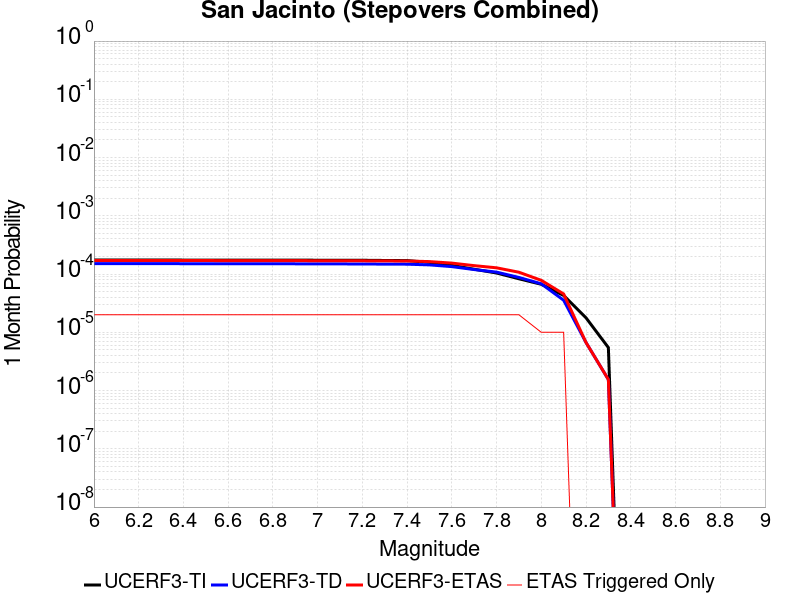 |  | 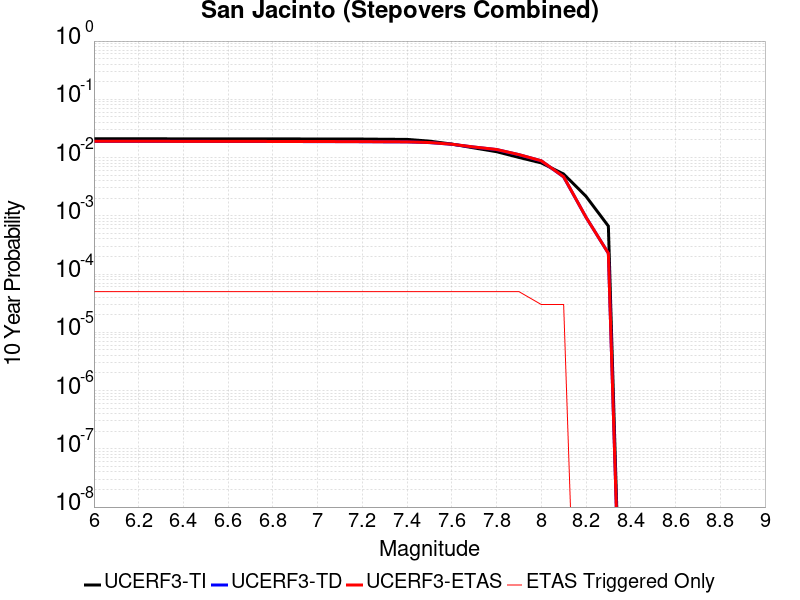 |

| Magnitude | 1 wk TI Prob | 1 wk TD Prob | 1 wk ETAS Prob | 1 wk ETAS/TD Gain | 1 wk ETAS Triggered Only | 1 mo TI Prob | 1 mo TD Prob | 1 mo ETAS Prob | 1 mo ETAS/TD Gain | 1 mo ETAS Triggered Only | 1 yr TI Prob | 1 yr TD Prob | 1 yr ETAS Prob | 1 yr ETAS/TD Gain | 1 yr ETAS Triggered Only | 10 yr TI Prob | 10 yr TD Prob | 10 yr ETAS Prob | 10 yr ETAS/TD Gain | 10 yr ETAS Triggered Only |
|-----|-----|-----|-----|-----|-----|-----|-----|-----|-----|-----|-----|-----|-----|-----|-----|-----|-----|-----|-----|-----|
| 6.0 | 4.0667746E-5 | 3.5271103E-5 | 5.5270397E-5 | 1.5670164 | 2.0E-5 | 1.742787E-4 | 1.5115313E-4 | 1.7115011E-4 | 1.1322962 | 2.0E-5 | 0.0021197782 | 0.0018387372 | 0.0018686821 | 1.0162855 | 3.0E-5 | 0.020996714 | 0.018986493 | 0.019035544 | 1.0025835 | 5.0E-5 |
| 6.1 | 4.0667746E-5 | 3.5271103E-5 | 5.5270397E-5 | 1.5670164 | 2.0E-5 | 1.742787E-4 | 1.5115313E-4 | 1.7115011E-4 | 1.1322962 | 2.0E-5 | 0.0021197782 | 0.0018387372 | 0.0018686821 | 1.0162855 | 3.0E-5 | 0.020996714 | 0.018986493 | 0.019035544 | 1.0025835 | 5.0E-5 |
| 6.2 | 4.0667746E-5 | 3.5271103E-5 | 5.5270397E-5 | 1.5670164 | 2.0E-5 | 1.742787E-4 | 1.5115313E-4 | 1.7115011E-4 | 1.1322962 | 2.0E-5 | 0.0021197782 | 0.0018387372 | 0.0018686821 | 1.0162855 | 3.0E-5 | 0.020996714 | 0.018986493 | 0.019035544 | 1.0025835 | 5.0E-5 |
| 6.3 | 4.0667746E-5 | 3.5271103E-5 | 5.5270397E-5 | 1.5670164 | 2.0E-5 | 1.742787E-4 | 1.5115313E-4 | 1.7115011E-4 | 1.1322962 | 2.0E-5 | 0.0021197782 | 0.0018387372 | 0.0018686821 | 1.0162855 | 3.0E-5 | 0.020996714 | 0.018986493 | 0.019035544 | 1.0025835 | 5.0E-5 |
| 6.4 | 4.0577226E-5 | 3.5143014E-5 | 5.514231E-5 | 1.5690831 | 2.0E-5 | 1.738908E-4 | 1.5060425E-4 | 1.7060123E-4 | 1.1327784 | 2.0E-5 | 0.0021150648 | 0.0018320669 | 0.001862012 | 1.0163449 | 3.0E-5 | 0.020950472 | 0.01892106 | 0.018970115 | 1.0025926 | 5.0E-5 |
| 6.5 | 4.0577226E-5 | 3.5143014E-5 | 5.514231E-5 | 1.5690831 | 2.0E-5 | 1.738908E-4 | 1.5060425E-4 | 1.7060123E-4 | 1.1327784 | 2.0E-5 | 0.0021150648 | 0.0018320669 | 0.001862012 | 1.0163449 | 3.0E-5 | 0.020950472 | 0.01892106 | 0.018970115 | 1.0025926 | 5.0E-5 |
| 6.6 | 4.053861E-5 | 3.5088357E-5 | 5.5087654E-5 | 1.5699697 | 2.0E-5 | 1.7372532E-4 | 1.5037002E-4 | 1.7036701E-4 | 1.1329852 | 2.0E-5 | 0.0021130538 | 0.0018292206 | 0.0018591657 | 1.0163704 | 3.0E-5 | 0.020930743 | 0.01889314 | 0.018942194 | 1.0025965 | 5.0E-5 |
| 6.7 | 4.0516545E-5 | 3.505743E-5 | 5.505673E-5 | 1.5704725 | 2.0E-5 | 1.7363077E-4 | 1.502375E-4 | 1.7023449E-4 | 1.1331025 | 2.0E-5 | 0.002111905 | 0.0018276101 | 0.0018575552 | 1.0163848 | 3.0E-5 | 0.020919468 | 0.018877335 | 0.018926391 | 1.0025986 | 5.0E-5 |
| 6.8 | 4.049434E-5 | 3.5028992E-5 | 5.5028293E-5 | 1.5709356 | 2.0E-5 | 1.7353562E-4 | 1.5011564E-4 | 1.7011263E-4 | 1.1332107 | 2.0E-5 | 0.0021107488 | 0.0018261289 | 0.0018560741 | 1.0163982 | 3.0E-5 | 0.020908125 | 0.018862747 | 0.018911803 | 1.0026007 | 5.0E-5 |
| 6.9 | 4.046386E-5 | 3.4991554E-5 | 5.4990855E-5 | 1.5715466 | 2.0E-5 | 1.73405E-4 | 1.499552E-4 | 1.699522E-4 | 1.1333531 | 2.0E-5 | 0.0021091616 | 0.0018241788 | 0.0018541241 | 1.0164157 | 3.0E-5 | 0.020892553 | 0.01884352 | 0.018892579 | 1.0026034 | 5.0E-5 |
| 7.0 | 4.036382E-5 | 3.4872126E-5 | 5.4871427E-5 | 1.573504 | 2.0E-5 | 1.7297632E-4 | 1.4944343E-4 | 1.6944043E-4 | 1.1338099 | 2.0E-5 | 0.0021039525 | 0.0018179584 | 0.001847904 | 1.016472 | 3.0E-5 | 0.02084144 | 0.018782135 | 0.018831195 | 1.0026121 | 5.0E-5 |
| 7.1 | 4.0343282E-5 | 3.485059E-5 | 5.484989E-5 | 1.5738584 | 2.0E-5 | 1.7288832E-4 | 1.4935112E-4 | 1.6934815E-4 | 1.1338927 | 2.0E-5 | 0.002102883 | 0.0018168368 | 0.0018467822 | 1.0164822 | 3.0E-5 | 0.020830948 | 0.018771006 | 0.018820068 | 1.0026137 | 5.0E-5 |
| 7.2 | 4.0257353E-5 | 3.475509E-5 | 5.4754393E-5 | 1.5754353 | 2.0E-5 | 1.725201E-4 | 1.489419E-4 | 1.6893892E-4 | 1.1342605 | 2.0E-5 | 0.0020984085 | 0.0018118626 | 0.0018418082 | 1.0165275 | 3.0E-5 | 0.020787042 | 0.018721744 | 0.018770808 | 1.0026207 | 5.0E-5 |
| 7.3 | 3.9940667E-5 | 3.458276E-5 | 5.458207E-5 | 1.5783029 | 2.0E-5 | 1.7116306E-4 | 1.4820343E-4 | 1.6820047E-4 | 1.1349297 | 2.0E-5 | 0.0020819185 | 0.0018028866 | 0.0018328326 | 1.01661 | 3.0E-5 | 0.020625217 | 0.018630385 | 0.018679455 | 1.0026338 | 5.0E-5 |
| 7.4 | 3.9721202E-5 | 3.4468165E-5 | 5.4467477E-5 | 1.5802256 | 2.0E-5 | 1.7022261E-4 | 1.4771236E-4 | 1.6770941E-4 | 1.1353782 | 2.0E-5 | 0.0020704903 | 0.0017969179 | 0.001826864 | 1.0166652 | 3.0E-5 | 0.020513052 | 0.01856952 | 0.018618591 | 1.0026426 | 5.0E-5 |
| 7.5 | 3.7036873E-5 | 3.3535776E-5 | 5.3535103E-5 | 1.5963581 | 2.0E-5 | 1.5871979E-4 | 1.4371685E-4 | 1.6371398E-4 | 1.1391425 | 2.0E-5 | 0.0019307006 | 0.0017483513 | 0.0017782989 | 1.0171291 | 3.0E-5 | 0.019140124 | 0.018071126 | 0.018120224 | 1.0027169 | 5.0E-5 |
| 7.6 | 3.2940967E-5 | 3.13167E-5 | 5.1316074E-5 | 1.6386169 | 2.0E-5 | 1.4116794E-4 | 1.3420754E-4 | 1.5420486E-4 | 1.1490029 | 2.0E-5 | 0.0017173645 | 0.0016327545 | 0.0016627054 | 1.0183438 | 3.0E-5 | 0.01704153 | 0.01690409 | 0.016953245 | 1.0029079 | 5.0E-5 |
| 7.7 | 2.8236149E-5 | 2.7882697E-5 | 4.788214E-5 | 1.7172707 | 2.0E-5 | 1.2100645E-4 | 1.1949181E-4 | 1.3948942E-4 | 1.1673555 | 2.0E-5 | 0.0014722579 | 0.0014538429 | 0.0014837993 | 1.020605 | 3.0E-5 | 0.014625421 | 0.01511491 | 0.015164155 | 1.003258 | 5.0E-5 |
| 7.8 | 2.4329287E-5 | 2.5206451E-5 | 4.5205947E-5 | 1.7934277 | 2.0E-5 | 1.042642E-4 | 1.08023174E-4 | 1.2802101E-4 | 1.1851255 | 2.0E-5 | 0.0012686774 | 0.0013143895 | 0.0013443502 | 1.0227942 | 3.0E-5 | 0.012614589 | 0.013712339 | 0.013761654 | 1.0035963 | 5.0E-5 |
| 7.9 | 1.9370926E-5 | 2.0420413E-5 | 4.0420004E-5 | 1.9793922 | 2.0E-5 | 8.301561E-5 | 8.751312E-5 | 1.07511376E-4 | 1.2285172 | 2.0E-5 | 0.0010102465 | 0.0010649522 | 0.0010949203 | 1.0281403 | 3.0E-5 | 0.0100566605 | 0.0111994 | 0.01124884 | 1.0044146 | 5.0E-5 |
| 8.0 | 1.5583017E-5 | 1.5885415E-5 | 2.5885256E-5 | 1.6294982 | 1.0E-5 | 6.6782646E-5 | 6.807858E-5 | 7.80779E-5 | 1.1468791 | 1.0E-5 | 8.127754E-4 | 8.2854216E-4 | 8.485256E-4 | 1.0241188 | 2.0E-5 | 0.008098091 | 0.008781636 | 0.008811373 | 1.0033863 | 3.0E-5 |
| 8.1 | 1.0024873E-5 | 8.291399E-6 | 1.8291317E-5 | 2.206059 | 1.0E-5 | 4.2963035E-5 | 3.553409E-5 | 4.5533732E-5 | 1.2814099 | 1.0E-5 | 5.229494E-4 | 4.3254215E-4 | 4.525335E-4 | 1.0462183 | 2.0E-5 | 0.0052172043 | 0.0046530655 | 0.004682926 | 1.0064174 | 3.0E-5 |
| 8.2 | 4.142796E-6 | 1.5602761E-6 | 1.5602761E-6 | 1.0 | 0.0 | 1.775472E-5 | 6.6868806E-6 | 6.6868806E-6 | 1.0 | 0.0 | 2.1614227E-4 | 8.140976E-5 | 8.140976E-5 | 1.0 | 0.0 | 0.0021593217 | 9.4514614E-4 | 9.4514614E-4 | 1.0 | 0.0 |
| 8.3 | 1.2750878E-6 | 3.609817E-7 | 3.609817E-7 | 1.0 | 0.0 | 5.4646503E-6 | 1.5470634E-6 | 1.5470634E-6 | 1.0 | 0.0 | 6.653009E-5 | 1.8835339E-5 | 1.8835339E-5 | 1.0 | 0.0 | 6.6510175E-4 | 2.272251E-4 | 2.272251E-4 | 1.0 | 0.0 |

## Pine Mtn
*[(top)](#table-of-contents)*

| 1 Week | 1 Month | 1 Year | 10 Year |
|-----|-----|-----|-----|
|  | 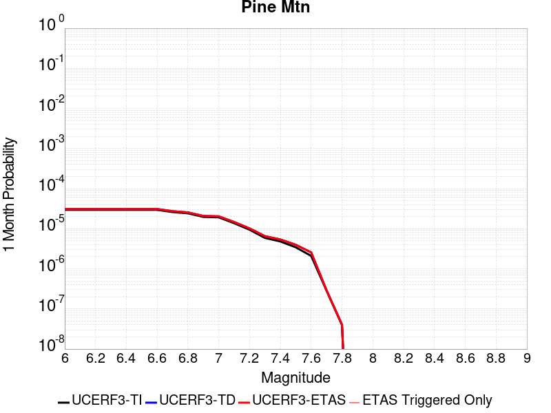 |  |  |

| Magnitude | 1 wk TI Prob | 1 wk TD Prob | 1 wk ETAS Prob | 1 wk ETAS/TD Gain | 1 wk ETAS Triggered Only | 1 mo TI Prob | 1 mo TD Prob | 1 mo ETAS Prob | 1 mo ETAS/TD Gain | 1 mo ETAS Triggered Only | 1 yr TI Prob | 1 yr TD Prob | 1 yr ETAS Prob | 1 yr ETAS/TD Gain | 1 yr ETAS Triggered Only | 10 yr TI Prob | 10 yr TD Prob | 10 yr ETAS Prob | 10 yr ETAS/TD Gain | 10 yr ETAS Triggered Only |
|-----|-----|-----|-----|-----|-----|-----|-----|-----|-----|-----|-----|-----|-----|-----|-----|-----|-----|-----|-----|-----|
| 6.0 | 6.894797E-6 | 7.2254716E-6 | 7.2254716E-6 | 1.0 | 0.0 | 2.9548795E-5 | 3.0965955E-5 | 3.0965955E-5 | 1.0 | 0.0 | 3.596972E-4 | 3.7694827E-4 | 4.169332E-4 | 1.1060754 | 4.0E-5 | 0.0035911554 | 0.0037633865 | 0.0038131983 | 1.0132359 | 5.0E-5 |
| 6.1 | 6.894797E-6 | 7.2254716E-6 | 7.2254716E-6 | 1.0 | 0.0 | 2.9548795E-5 | 3.0965955E-5 | 3.0965955E-5 | 1.0 | 0.0 | 3.596972E-4 | 3.7694827E-4 | 4.169332E-4 | 1.1060754 | 4.0E-5 | 0.0035911554 | 0.0037633865 | 0.0038131983 | 1.0132359 | 5.0E-5 |
| 6.2 | 6.894797E-6 | 7.2254716E-6 | 7.2254716E-6 | 1.0 | 0.0 | 2.9548795E-5 | 3.0965955E-5 | 3.0965955E-5 | 1.0 | 0.0 | 3.596972E-4 | 3.7694827E-4 | 4.169332E-4 | 1.1060754 | 4.0E-5 | 0.0035911554 | 0.0037633865 | 0.0038131983 | 1.0132359 | 5.0E-5 |
| 6.3 | 6.894797E-6 | 7.2254716E-6 | 7.2254716E-6 | 1.0 | 0.0 | 2.9548795E-5 | 3.0965955E-5 | 3.0965955E-5 | 1.0 | 0.0 | 3.596972E-4 | 3.7694827E-4 | 4.169332E-4 | 1.1060754 | 4.0E-5 | 0.0035911554 | 0.0037633865 | 0.0038131983 | 1.0132359 | 5.0E-5 |
| 6.4 | 6.894797E-6 | 7.2254716E-6 | 7.2254716E-6 | 1.0 | 0.0 | 2.9548795E-5 | 3.0965955E-5 | 3.0965955E-5 | 1.0 | 0.0 | 3.596972E-4 | 3.7694827E-4 | 4.169332E-4 | 1.1060754 | 4.0E-5 | 0.0035911554 | 0.0037633865 | 0.0038131983 | 1.0132359 | 5.0E-5 |
| 6.5 | 6.894797E-6 | 7.2254716E-6 | 7.2254716E-6 | 1.0 | 0.0 | 2.9548795E-5 | 3.0965955E-5 | 3.0965955E-5 | 1.0 | 0.0 | 3.596972E-4 | 3.7694827E-4 | 4.169332E-4 | 1.1060754 | 4.0E-5 | 0.0035911554 | 0.0037633865 | 0.0038131983 | 1.0132359 | 5.0E-5 |
| 6.6 | 6.894797E-6 | 7.2254716E-6 | 7.2254716E-6 | 1.0 | 0.0 | 2.9548795E-5 | 3.0965955E-5 | 3.0965955E-5 | 1.0 | 0.0 | 3.596972E-4 | 3.7694827E-4 | 4.169332E-4 | 1.1060754 | 4.0E-5 | 0.0035911554 | 0.0037633865 | 0.0038131983 | 1.0132359 | 5.0E-5 |
| 6.7 | 6.0867933E-6 | 6.397124E-6 | 6.397124E-6 | 1.0 | 0.0 | 2.6085996E-5 | 2.7415968E-5 | 2.7415968E-5 | 1.0 | 0.0 | 3.1755073E-4 | 3.337405E-4 | 3.7372715E-4 | 1.1198136 | 4.0E-5 | 0.0031709734 | 0.0033326119 | 0.0033824453 | 1.0149533 | 5.0E-5 |
| 6.8 | 5.6530425E-6 | 5.950606E-6 | 5.950606E-6 | 1.0 | 0.0 | 2.42271E-5 | 2.5502359E-5 | 2.5502359E-5 | 1.0 | 0.0 | 2.94925E-4 | 3.1044905E-4 | 3.4043973E-4 | 1.0966042 | 3.0E-5 | 0.002945339 | 0.0031003582 | 0.0031302653 | 1.0096463 | 3.0E-5 |
| 6.9 | 4.6015225E-6 | 4.8638444E-6 | 4.8638444E-6 | 1.0 | 0.0 | 1.9720663E-5 | 2.084489E-5 | 2.084489E-5 | 1.0 | 0.0 | 2.4007261E-4 | 2.5375842E-4 | 2.7375337E-4 | 1.0787951 | 2.0E-5 | 0.0023981342 | 0.002534831 | 0.00255478 | 1.0078701 | 2.0E-5 |
| 7.0 | 4.4875965E-6 | 4.7474837E-6 | 4.7474837E-6 | 1.0 | 0.0 | 1.9232413E-5 | 2.0346208E-5 | 2.0346208E-5 | 1.0 | 0.0 | 2.3412947E-4 | 2.4768838E-4 | 2.676834E-4 | 1.0807266 | 2.0E-5 | 0.0023388295 | 0.0024742668 | 0.0024942174 | 1.0080632 | 2.0E-5 |
| 7.1 | 3.203907E-6 | 3.42942E-6 | 3.42942E-6 | 1.0 | 0.0 | 1.3730958E-5 | 1.4697435E-5 | 1.4697435E-5 | 1.0 | 0.0 | 1.6716159E-4 | 1.7892725E-4 | 1.9892366E-4 | 1.1117573 | 2.0E-5 | 0.0016703589 | 0.001787898 | 0.0018078622 | 1.0111663 | 2.0E-5 |
| 7.2 | 2.2060601E-6 | 2.3784874E-6 | 2.3784874E-6 | 1.0 | 0.0 | 9.4545085E-6 | 1.019348E-5 | 1.019348E-5 | 1.0 | 0.0 | 1.15102564E-4 | 1.2409901E-4 | 1.4409653E-4 | 1.1611416 | 2.0E-5 | 0.0011504296 | 0.0012403419 | 0.0012603172 | 1.0161046 | 2.0E-5 |
| 7.3 | 1.3765207E-6 | 1.5216535E-6 | 1.5216535E-6 | 1.0 | 0.0 | 5.899361E-6 | 6.5213567E-6 | 6.5213567E-6 | 1.0 | 0.0 | 7.182235E-5 | 7.939472E-5 | 8.939392E-5 | 1.125943 | 1.0E-5 | 7.1799144E-4 | 7.9367263E-4 | 8.036647E-4 | 1.0125897 | 1.0E-5 |
| 7.4 | 1.1245983E-6 | 1.2587126E-6 | 1.2587126E-6 | 1.0 | 0.0 | 4.819698E-6 | 5.394472E-6 | 5.394472E-6 | 1.0 | 0.0 | 5.8678244E-5 | 6.56758E-5 | 6.56758E-5 | 1.0 | 0.0 | 5.866275E-4 | 6.565722E-4 | 6.565722E-4 | 1.0 | 0.0 |
| 7.5 | 8.031682E-7 | 9.276999E-7 | 9.276999E-7 | 1.0 | 0.0 | 3.4421448E-6 | 3.975851E-6 | 3.975851E-6 | 1.0 | 0.0 | 4.1907308E-5 | 4.840498E-5 | 4.840498E-5 | 1.0 | 0.0 | 4.1899405E-4 | 4.8395112E-4 | 4.8395112E-4 | 1.0 | 0.0 |
| 7.6 | 4.8953444E-7 | 6.0030544E-7 | 6.0030544E-7 | 1.0 | 0.0 | 2.098003E-6 | 2.5727354E-6 | 2.5727354E-6 | 1.0 | 0.0 | 2.5542888E-5 | 3.1322652E-5 | 3.1322652E-5 | 1.0 | 0.0 | 2.5539953E-4 | 3.1318725E-4 | 3.1318725E-4 | 1.0 | 0.0 |
| 7.7 | 6.634529E-8 | 6.788826E-8 | 6.788826E-8 | 1.0 | 0.0 | 2.843369E-7 | 2.9094966E-7 | 2.9094966E-7 | 1.0 | 0.0 | 3.4617963E-6 | 3.5423066E-6 | 3.5423066E-6 | 1.0 | 0.0 | 3.4617424E-5 | 3.542255E-5 | 3.542255E-5 | 1.0 | 0.0 |
| 7.8 | 9.235578E-9 | 9.488566E-9 | 9.488566E-9 | 1.0 | 0.0 | 3.9581046E-8 | 4.0665284E-8 | 4.0665284E-8 | 1.0 | 0.0 | 4.818991E-7 | 4.950997E-7 | 4.950997E-7 | 1.0 | 0.0 | 4.8189804E-6 | 4.950988E-6 | 4.950988E-6 | 1.0 | 0.0 |

## Rinconada 2011 CFM
*[(top)](#table-of-contents)*

| 1 Week | 1 Month | 1 Year | 10 Year |
|-----|-----|-----|-----|
|  |  |  | 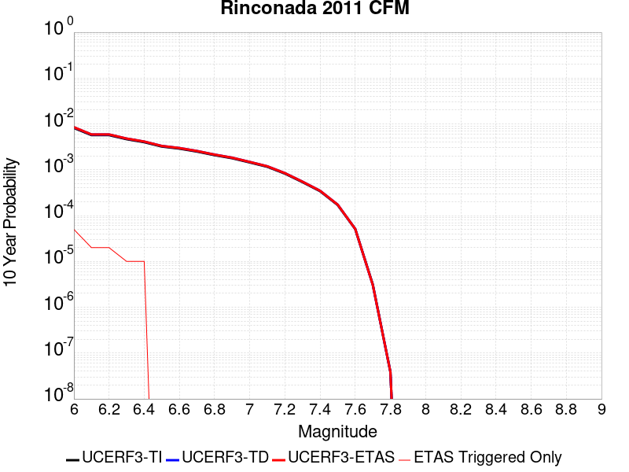 |

| Magnitude | 1 wk TI Prob | 1 wk TD Prob | 1 wk ETAS Prob | 1 wk ETAS/TD Gain | 1 wk ETAS Triggered Only | 1 mo TI Prob | 1 mo TD Prob | 1 mo ETAS Prob | 1 mo ETAS/TD Gain | 1 mo ETAS Triggered Only | 1 yr TI Prob | 1 yr TD Prob | 1 yr ETAS Prob | 1 yr ETAS/TD Gain | 1 yr ETAS Triggered Only | 10 yr TI Prob | 10 yr TD Prob | 10 yr ETAS Prob | 10 yr ETAS/TD Gain | 10 yr ETAS Triggered Only |
|-----|-----|-----|-----|-----|-----|-----|-----|-----|-----|-----|-----|-----|-----|-----|-----|-----|-----|-----|-----|-----|
| 6.0 | 1.5752368E-5 | 1.6274716E-5 | 2.6274553E-5 | 1.6144401 | 1.0E-5 | 6.75084E-5 | 6.974694E-5 | 7.9746234E-5 | 1.1433655 | 1.0E-5 | 8.2160486E-4 | 8.488413E-4 | 8.5883273E-4 | 1.0117707 | 1.0E-5 | 0.008185739 | 0.00845637 | 0.008505947 | 1.0058627 | 5.0E-5 |
| 6.1 | 1.0966133E-5 | 1.1323029E-5 | 2.1322916E-5 | 1.8831459 | 1.0E-5 | 4.6996865E-5 | 4.852637E-5 | 5.8525886E-5 | 1.2060635 | 1.0E-5 | 5.720366E-4 | 5.9064914E-4 | 6.006432E-4 | 1.0169206 | 1.0E-5 | 0.0057056635 | 0.005890889 | 0.005910771 | 1.003375 | 2.0E-5 |
| 6.2 | 1.0966133E-5 | 1.1323029E-5 | 2.1322916E-5 | 1.8831459 | 1.0E-5 | 4.6996865E-5 | 4.852637E-5 | 5.8525886E-5 | 1.2060635 | 1.0E-5 | 5.720366E-4 | 5.9064914E-4 | 6.006432E-4 | 1.0169206 | 1.0E-5 | 0.0057056635 | 0.005890889 | 0.005910771 | 1.003375 | 2.0E-5 |
| 6.3 | 8.926149E-6 | 9.212772E-6 | 1.9212679E-5 | 2.0854397 | 1.0E-5 | 3.8254362E-5 | 3.948271E-5 | 4.9482318E-5 | 1.2532654 | 1.0E-5 | 4.6564735E-4 | 4.8059633E-4 | 4.905915E-4 | 1.0207975 | 1.0E-5 | 0.0046467283 | 0.0047956146 | 0.0048055667 | 1.0020752 | 1.0E-5 |
| 6.4 | 7.676955E-6 | 7.920191E-6 | 1.7920112E-5 | 2.2625859 | 1.0E-5 | 3.290082E-5 | 3.3943234E-5 | 4.3942895E-5 | 1.2945995 | 1.0E-5 | 4.0049385E-4 | 4.131807E-4 | 4.2317656E-4 | 1.0241925 | 1.0E-5 | 0.0039977287 | 0.004124151 | 0.00413411 | 1.0024147 | 1.0E-5 |
| 6.5 | 6.1671026E-6 | 6.358955E-6 | 6.358955E-6 | 1.0 | 0.0 | 2.6430173E-5 | 2.725238E-5 | 2.725238E-5 | 1.0 | 0.0 | 3.2173982E-4 | 3.317473E-4 | 3.317473E-4 | 1.0 | 0.0 | 0.003212744 | 0.0033125326 | 0.0033125326 | 1.0 | 0.0 |
| 6.6 | 5.553456E-6 | 5.7248126E-6 | 5.7248126E-6 | 1.0 | 0.0 | 2.3800309E-5 | 2.4534682E-5 | 2.4534682E-5 | 1.0 | 0.0 | 2.897302E-4 | 2.9866886E-4 | 2.9866886E-4 | 1.0 | 0.0 | 0.0028935277 | 0.0029826832 | 0.0029826832 | 1.0 | 0.0 |
| 6.7 | 4.787857E-6 | 4.93331E-6 | 4.93331E-6 | 1.0 | 0.0 | 2.0519226E-5 | 2.1142585E-5 | 2.1142585E-5 | 1.0 | 0.0 | 2.4979294E-4 | 2.573806E-4 | 2.573806E-4 | 1.0 | 0.0 | 0.0024951235 | 0.002570831 | 0.002570831 | 1.0 | 0.0 |
| 6.8 | 3.9955166E-6 | 4.1134763E-6 | 4.1134763E-6 | 1.0 | 0.0 | 1.7123532E-5 | 1.7629065E-5 | 1.7629065E-5 | 1.0 | 0.0 | 2.0845905E-4 | 2.1461275E-4 | 2.1461275E-4 | 1.0 | 0.0 | 0.002082636 | 0.0021440587 | 0.0021440587 | 1.0 | 0.0 |
| 6.9 | 3.4250072E-6 | 3.5224466E-6 | 3.5224466E-6 | 1.0 | 0.0 | 1.46785205E-5 | 1.5096112E-5 | 1.5096112E-5 | 1.0 | 0.0 | 1.7869633E-4 | 1.8377969E-4 | 1.8377969E-4 | 1.0 | 0.0 | 0.001785527 | 0.0018362795 | 0.0018362795 | 1.0 | 0.0 |
| 7.0 | 2.7712713E-6 | 2.8467002E-6 | 2.8467002E-6 | 1.0 | 0.0 | 1.1876823E-5 | 1.22000865E-5 | 1.22000865E-5 | 1.0 | 0.0 | 1.4459073E-4 | 1.4852594E-4 | 1.4852594E-4 | 1.0 | 0.0 | 0.0014449668 | 0.0014842683 | 0.0014842683 | 1.0 | 0.0 |
| 7.1 | 2.227358E-6 | 2.2856987E-6 | 2.2856987E-6 | 1.0 | 0.0 | 9.545785E-6 | 9.795815E-6 | 9.795815E-6 | 1.0 | 0.0 | 1.16213734E-4 | 1.1925753E-4 | 1.1925753E-4 | 1.0 | 0.0 | 0.0011615298 | 0.0011919363 | 0.0011919363 | 1.0 | 0.0 |
| 7.2 | 1.581796E-6 | 1.6209015E-6 | 1.6209015E-6 | 1.0 | 0.0 | 6.779108E-6 | 6.946702E-6 | 6.946702E-6 | 1.0 | 0.0 | 8.253252E-5 | 8.4572814E-5 | 8.4572814E-5 | 1.0 | 0.0 | 8.250187E-4 | 8.4540684E-4 | 8.4540684E-4 | 1.0 | 0.0 |
| 7.3 | 1.0306567E-6 | 1.054648E-6 | 1.054648E-6 | 1.0 | 0.0 | 4.4170924E-6 | 4.519912E-6 | 4.519912E-6 | 1.0 | 0.0 | 5.3776774E-5 | 5.502854E-5 | 5.502854E-5 | 1.0 | 0.0 | 5.376376E-4 | 5.501494E-4 | 5.501494E-4 | 1.0 | 0.0 |
| 7.4 | 6.535541E-7 | 6.682744E-7 | 6.682744E-7 | 1.0 | 0.0 | 2.800943E-6 | 2.8640302E-6 | 2.8640302E-6 | 1.0 | 0.0 | 3.4100947E-5 | 3.4869012E-5 | 3.4869012E-5 | 1.0 | 0.0 | 3.4095717E-4 | 3.486355E-4 | 3.486355E-4 | 1.0 | 0.0 |
| 7.5 | 3.2656962E-7 | 3.3316712E-7 | 3.3316712E-7 | 1.0 | 0.0 | 1.3995833E-6 | 1.4278584E-6 | 1.4278584E-6 | 1.0 | 0.0 | 1.7039794E-5 | 1.7384036E-5 | 1.7384036E-5 | 1.0 | 0.0 | 1.7038487E-4 | 1.738268E-4 | 1.738268E-4 | 1.0 | 0.0 |
| 7.6 | 9.754343E-8 | 9.821017E-8 | 9.821017E-8 | 1.0 | 0.0 | 4.180432E-7 | 4.2090065E-7 | 4.2090065E-7 | 1.0 | 0.0 | 5.089664E-6 | 5.1244533E-6 | 5.1244533E-6 | 1.0 | 0.0 | 5.0895473E-5 | 5.124336E-5 | 5.124336E-5 | 1.0 | 0.0 |
| 7.7 | 6.0001453E-9 | 5.8491207E-9 | 5.8491207E-9 | 1.0 | 0.0 | 2.5714908E-8 | 2.506766E-8 | 2.506766E-8 | 1.0 | 0.0 | 3.1307894E-7 | 3.051987E-7 | 3.051987E-7 | 1.0 | 0.0 | 3.1307852E-6 | 3.0519832E-6 | 3.0519832E-6 | 1.0 | 0.0 |
| 7.8 | 7.400003E-11 | 7.4654505E-11 | 7.4654505E-11 | 1.0 | 0.0 | 3.171432E-10 | 3.1994773E-10 | 3.1994773E-10 | 1.0 | 0.0 | 3.861218E-9 | 3.895363E-9 | 3.895363E-9 | 1.0 | 0.0 | 3.861218E-8 | 3.895363E-8 | 3.895363E-8 | 1.0 | 0.0 |

## Hosgri (Extension)
*[(top)](#table-of-contents)*

| 1 Week | 1 Month | 1 Year | 10 Year |
|-----|-----|-----|-----|
|  | 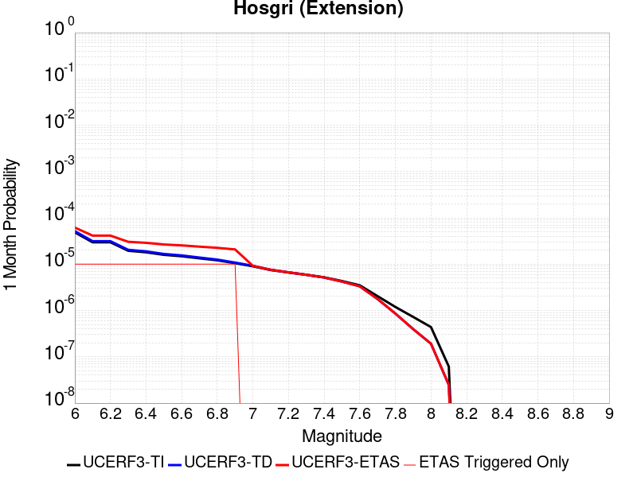 |  |  |

| Magnitude | 1 wk TI Prob | 1 wk TD Prob | 1 wk ETAS Prob | 1 wk ETAS/TD Gain | 1 wk ETAS Triggered Only | 1 mo TI Prob | 1 mo TD Prob | 1 mo ETAS Prob | 1 mo ETAS/TD Gain | 1 mo ETAS Triggered Only | 1 yr TI Prob | 1 yr TD Prob | 1 yr ETAS Prob | 1 yr ETAS/TD Gain | 1 yr ETAS Triggered Only | 10 yr TI Prob | 10 yr TD Prob | 10 yr ETAS Prob | 10 yr ETAS/TD Gain | 10 yr ETAS Triggered Only |
|-----|-----|-----|-----|-----|-----|-----|-----|-----|-----|-----|-----|-----|-----|-----|-----|-----|-----|-----|-----|-----|
| 6.0 | 1.1369135E-5 | 1.2083073E-5 | 2.2082952E-5 | 1.827594 | 1.0E-5 | 4.8723956E-5 | 5.17837E-5 | 6.178318E-5 | 1.1931009 | 1.0E-5 | 5.9305265E-4 | 6.303069E-4 | 6.7028165E-4 | 1.0634211 | 4.0E-5 | 0.005914725 | 0.00628744 | 0.006337126 | 1.0079024 | 5.0E-5 |
| 6.1 | 6.934979E-6 | 7.324556E-6 | 1.7324483E-5 | 2.3652604 | 1.0E-5 | 2.9721E-5 | 3.13906E-5 | 4.1390285E-5 | 1.3185567 | 1.0E-5 | 3.617931E-4 | 3.821177E-4 | 4.0211005E-4 | 1.0523199 | 2.0E-5 | 0.0036120464 | 0.003815019 | 0.0038449047 | 1.0078336 | 3.0E-5 |
| 6.2 | 6.934979E-6 | 7.324556E-6 | 1.7324483E-5 | 2.3652604 | 1.0E-5 | 2.9721E-5 | 3.13906E-5 | 4.1390285E-5 | 1.3185567 | 1.0E-5 | 3.617931E-4 | 3.821177E-4 | 4.0211005E-4 | 1.0523199 | 2.0E-5 | 0.0036120464 | 0.003815019 | 0.0038449047 | 1.0078336 | 3.0E-5 |
| 6.3 | 4.5484676E-6 | 4.769331E-6 | 1.4769284E-5 | 3.09672 | 1.0E-5 | 1.9493287E-5 | 2.0439833E-5 | 3.0439629E-5 | 1.4892308 | 1.0E-5 | 2.3730492E-4 | 2.4882698E-4 | 2.6882198E-4 | 1.0803572 | 2.0E-5 | 0.0023705168 | 0.0024855263 | 0.0025154517 | 1.0120399 | 3.0E-5 |
| 6.4 | 4.218095E-6 | 4.416863E-6 | 1.4416819E-5 | 3.2640405 | 1.0E-5 | 1.8077424E-5 | 1.8929275E-5 | 2.8929086E-5 | 1.5282723 | 1.0E-5 | 2.2007042E-4 | 2.3043988E-4 | 2.504353E-4 | 1.0867705 | 2.0E-5 | 0.002198526 | 0.002302043 | 0.0023319738 | 1.0130019 | 3.0E-5 |
| 6.5 | 3.717374E-6 | 3.883879E-6 | 1.38838395E-5 | 3.5747356 | 1.0E-5 | 1.5931506E-5 | 1.664509E-5 | 2.6644922E-5 | 1.6007679 | 1.0E-5 | 1.9394881E-4 | 2.026353E-4 | 2.2263125E-4 | 1.0986795 | 2.0E-5 | 0.0019377962 | 0.0020245241 | 0.0020444836 | 1.0098588 | 2.0E-5 |
| 6.6 | 3.4605036E-6 | 3.6083072E-6 | 1.3608271E-5 | 3.7713728 | 1.0E-5 | 1.4830645E-5 | 1.5464082E-5 | 2.5463927E-5 | 1.6466497 | 1.0E-5 | 1.8054814E-4 | 1.8825909E-4 | 2.0825531E-4 | 1.1062165 | 2.0E-5 | 0.0018040152 | 0.0018810107 | 0.001900973 | 1.0106126 | 2.0E-5 |
| 6.7 | 3.123439E-6 | 3.2465698E-6 | 1.32465375E-5 | 4.080164 | 1.0E-5 | 1.33860985E-5 | 1.39137965E-5 | 2.3913657E-5 | 1.7187011 | 1.0E-5 | 1.6296357E-4 | 1.6938741E-4 | 1.7938572E-4 | 1.0590262 | 1.0E-5 | 0.001628441 | 0.001692594 | 0.0017025771 | 1.0058981 | 1.0E-5 |
| 6.8 | 2.8290783E-6 | 2.9305413E-6 | 1.2930512E-5 | 4.4123287 | 1.0E-5 | 1.2124565E-5 | 1.2559403E-5 | 2.2559278E-5 | 1.7962061 | 1.0E-5 | 1.4760658E-4 | 1.5290009E-4 | 1.6289856E-4 | 1.0653921 | 1.0E-5 | 0.0014750857 | 0.0015279576 | 0.0015379423 | 1.0065347 | 1.0E-5 |
| 6.9 | 2.454112E-6 | 2.5283207E-6 | 1.2528295E-5 | 4.9551845 | 1.0E-5 | 1.0517581E-5 | 1.0835615E-5 | 2.0835507E-5 | 1.9228725 | 1.0E-5 | 1.2804402E-4 | 1.3191569E-4 | 1.4191437E-4 | 1.075796 | 1.0E-5 | 0.0012797028 | 0.0013183799 | 0.0013283667 | 1.007575 | 1.0E-5 |
| 7.0 | 2.1008145E-6 | 2.1498715E-6 | 2.1498715E-6 | 1.0 | 0.0 | 9.003459E-6 | 9.2137025E-6 | 9.2137025E-6 | 1.0 | 0.0 | 1.096116E-4 | 1.1217109E-4 | 1.1217109E-4 | 1.0 | 0.0 | 0.0010955755 | 0.0011211485 | 0.0011211485 | 1.0 | 0.0 |
| 7.1 | 1.744384E-6 | 1.7686364E-6 | 1.7686364E-6 | 1.0 | 0.0 | 7.47591E-6 | 7.579848E-6 | 7.579848E-6 | 1.0 | 0.0 | 9.1015405E-5 | 9.228076E-5 | 9.228076E-5 | 1.0 | 0.0 | 9.097813E-4 | 9.224261E-4 | 9.224261E-4 | 1.0 | 0.0 |
| 7.2 | 1.5456587E-6 | 1.5562894E-6 | 1.5562894E-6 | 1.0 | 0.0 | 6.6242346E-6 | 6.6697944E-6 | 6.6697944E-6 | 1.0 | 0.0 | 8.064707E-5 | 8.120173E-5 | 8.120173E-5 | 1.0 | 0.0 | 8.0617814E-4 | 8.117219E-4 | 8.117219E-4 | 1.0 | 0.0 |
| 7.3 | 1.3775123E-6 | 1.3766092E-6 | 1.3766092E-6 | 1.0 | 0.0 | 5.9036106E-6 | 5.8997407E-6 | 5.8997407E-6 | 1.0 | 0.0 | 7.187409E-5 | 7.182699E-5 | 7.182699E-5 | 1.0 | 0.0 | 7.185085E-4 | 7.180387E-4 | 7.180387E-4 | 1.0 | 0.0 |
| 7.4 | 1.214491E-6 | 1.2023471E-6 | 1.2023471E-6 | 1.0 | 0.0 | 5.2049513E-6 | 5.152906E-6 | 5.152906E-6 | 1.0 | 0.0 | 6.336844E-5 | 6.2734835E-5 | 6.2734835E-5 | 1.0 | 0.0 | 6.335037E-4 | 6.2717206E-4 | 6.2717206E-4 | 1.0 | 0.0 |
| 7.5 | 1.0101123E-6 | 9.842256E-7 | 9.842256E-7 | 1.0 | 0.0 | 4.3290456E-6 | 4.218103E-6 | 4.218103E-6 | 1.0 | 0.0 | 5.2704854E-5 | 5.13542E-5 | 5.13542E-5 | 1.0 | 0.0 | 5.2692357E-4 | 5.1342393E-4 | 5.1342393E-4 | 1.0 | 0.0 |
| 7.6 | 8.1558215E-7 | 7.765977E-7 | 7.765977E-7 | 1.0 | 0.0 | 3.4953473E-6 | 3.3282718E-6 | 3.3282718E-6 | 1.0 | 0.0 | 4.255502E-5 | 4.0520958E-5 | 4.0520958E-5 | 1.0 | 0.0 | 4.2546875E-4 | 4.0513615E-4 | 4.0513615E-4 | 1.0 | 0.0 |
| 7.7 | 4.757816E-7 | 4.1308996E-7 | 4.1308996E-7 | 1.0 | 0.0 | 2.0390623E-6 | 1.7703843E-6 | 1.7703843E-6 | 1.0 | 0.0 | 2.4825302E-5 | 2.1554217E-5 | 2.1554217E-5 | 1.0 | 0.0 | 2.482253E-4 | 2.1552139E-4 | 2.1552139E-4 | 1.0 | 0.0 |
| 7.8 | 2.782787E-7 | 2.004783E-7 | 2.004783E-7 | 1.0 | 0.0 | 1.1926223E-6 | 8.591924E-7 | 8.591924E-7 | 1.0 | 0.0 | 1.452008E-5 | 1.0460618E-5 | 1.0460618E-5 | 1.0 | 0.0 | 1.4519131E-4 | 1.04601284E-4 | 1.04601284E-4 | 1.0 | 0.0 |
| 7.9 | 1.6948086E-7 | 9.243938E-8 | 9.243938E-8 | 1.0 | 0.0 | 7.2634634E-7 | 3.961687E-7 | 3.961687E-7 | 1.0 | 0.0 | 8.843231E-6 | 4.8233433E-6 | 4.8233433E-6 | 1.0 | 0.0 | 8.842879E-5 | 4.8232392E-5 | 4.8232392E-5 | 1.0 | 0.0 |
| 8.0 | 1.0225492E-7 | 4.473497E-8 | 4.473497E-8 | 1.0 | 0.0 | 4.382353E-7 | 1.917213E-7 | 1.917213E-7 | 1.0 | 0.0 | 5.335502E-6 | 2.3342043E-6 | 2.3342043E-6 | 1.0 | 0.0 | 5.335374E-5 | 2.33418E-5 | 2.33418E-5 | 1.0 | 0.0 |
| 8.1 | 1.43711345E-8 | 5.78716E-9 | 5.78716E-9 | 1.0 | 0.0 | 6.1590576E-8 | 2.4802116E-8 | 2.4802116E-8 | 1.0 | 0.0 | 7.4986497E-7 | 3.019657E-7 | 3.019657E-7 | 1.0 | 0.0 | 7.4986247E-6 | 3.0196536E-6 | 3.0196536E-6 | 1.0 | 0.0 |

## San Jacinto (Lytle Creek connector)
*[(top)](#table-of-contents)*

| 1 Week | 1 Month | 1 Year | 10 Year |
|-----|-----|-----|-----|
| 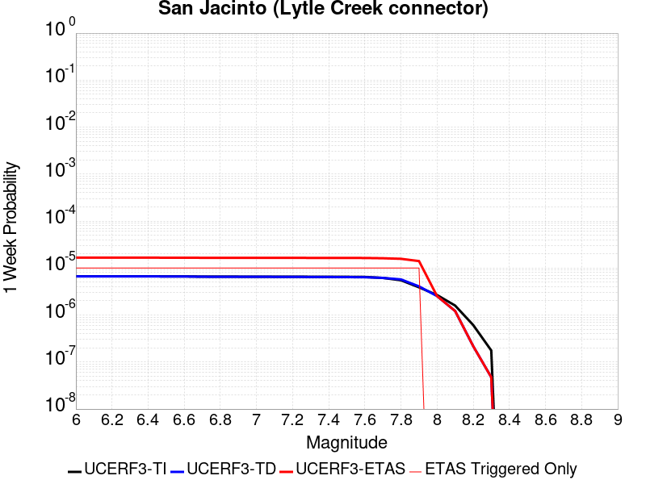 |  |  | 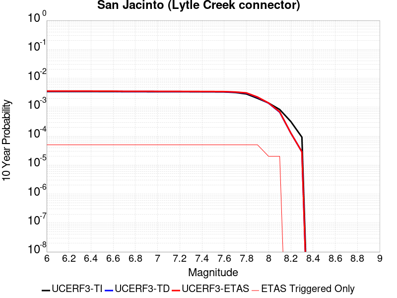 |

| Magnitude | 1 wk TI Prob | 1 wk TD Prob | 1 wk ETAS Prob | 1 wk ETAS/TD Gain | 1 wk ETAS Triggered Only | 1 mo TI Prob | 1 mo TD Prob | 1 mo ETAS Prob | 1 mo ETAS/TD Gain | 1 mo ETAS Triggered Only | 1 yr TI Prob | 1 yr TD Prob | 1 yr ETAS Prob | 1 yr ETAS/TD Gain | 1 yr ETAS Triggered Only | 10 yr TI Prob | 10 yr TD Prob | 10 yr ETAS Prob | 10 yr ETAS/TD Gain | 10 yr ETAS Triggered Only |
|-----|-----|-----|-----|-----|-----|-----|-----|-----|-----|-----|-----|-----|-----|-----|-----|-----|-----|-----|-----|-----|
| 6.0 | 6.693995E-6 | 6.660123E-6 | 1.6660057E-5 | 2.501464 | 1.0E-5 | 2.8688235E-5 | 2.8543072E-5 | 4.85425E-5 | 1.7006754 | 2.0E-5 | 3.492233E-4 | 3.4745657E-4 | 3.8744268E-4 | 1.1150823 | 4.0E-5 | 0.00348675 | 0.0035491167 | 0.0035989392 | 1.014038 | 5.0E-5 |
| 6.1 | 6.693995E-6 | 6.660123E-6 | 1.6660057E-5 | 2.501464 | 1.0E-5 | 2.8688235E-5 | 2.8543072E-5 | 4.85425E-5 | 1.7006754 | 2.0E-5 | 3.492233E-4 | 3.4745657E-4 | 3.8744268E-4 | 1.1150823 | 4.0E-5 | 0.00348675 | 0.0035491167 | 0.0035989392 | 1.014038 | 5.0E-5 |
| 6.2 | 6.693995E-6 | 6.660123E-6 | 1.6660057E-5 | 2.501464 | 1.0E-5 | 2.8688235E-5 | 2.8543072E-5 | 4.85425E-5 | 1.7006754 | 2.0E-5 | 3.492233E-4 | 3.4745657E-4 | 3.8744268E-4 | 1.1150823 | 4.0E-5 | 0.00348675 | 0.0035491167 | 0.0035989392 | 1.014038 | 5.0E-5 |
| 6.3 | 6.693995E-6 | 6.660123E-6 | 1.6660057E-5 | 2.501464 | 1.0E-5 | 2.8688235E-5 | 2.8543072E-5 | 4.85425E-5 | 1.7006754 | 2.0E-5 | 3.492233E-4 | 3.4745657E-4 | 3.8744268E-4 | 1.1150823 | 4.0E-5 | 0.00348675 | 0.0035491167 | 0.0035989392 | 1.014038 | 5.0E-5 |
| 6.4 | 6.693995E-6 | 6.660123E-6 | 1.6660057E-5 | 2.501464 | 1.0E-5 | 2.8688235E-5 | 2.8543072E-5 | 4.85425E-5 | 1.7006754 | 2.0E-5 | 3.492233E-4 | 3.4745657E-4 | 3.8744268E-4 | 1.1150823 | 4.0E-5 | 0.00348675 | 0.0035491167 | 0.0035989392 | 1.014038 | 5.0E-5 |
| 6.5 | 6.6561875E-6 | 6.620341E-6 | 1.6620275E-5 | 2.5104861 | 1.0E-5 | 2.8526205E-5 | 2.8372582E-5 | 4.8372014E-5 | 1.7048858 | 2.0E-5 | 3.472512E-4 | 3.453815E-4 | 3.853677E-4 | 1.1157739 | 4.0E-5 | 0.0034670907 | 0.0035284322 | 0.003578256 | 1.0141206 | 5.0E-5 |
| 6.6 | 6.6561875E-6 | 6.620341E-6 | 1.6620275E-5 | 2.5104861 | 1.0E-5 | 2.8526205E-5 | 2.8372582E-5 | 4.8372014E-5 | 1.7048858 | 2.0E-5 | 3.472512E-4 | 3.453815E-4 | 3.853677E-4 | 1.1157739 | 4.0E-5 | 0.0034670907 | 0.0035284322 | 0.003578256 | 1.0141206 | 5.0E-5 |
| 6.7 | 6.5802237E-6 | 6.539518E-6 | 1.6539452E-5 | 2.5291548 | 1.0E-5 | 2.8200653E-5 | 2.8026205E-5 | 4.8025642E-5 | 1.7135979 | 2.0E-5 | 3.4328885E-4 | 3.4116567E-4 | 3.8115203E-4 | 1.1172051 | 4.0E-5 | 0.0034275902 | 0.0034864065 | 0.0035362323 | 1.0142914 | 5.0E-5 |
| 6.8 | 6.575632E-6 | 6.5340073E-6 | 1.6533942E-5 | 2.5304444 | 1.0E-5 | 2.8180975E-5 | 2.8002589E-5 | 4.8002028E-5 | 1.7141997 | 2.0E-5 | 3.4304935E-4 | 3.4087826E-4 | 3.8086463E-4 | 1.117304 | 4.0E-5 | 0.0034252026 | 0.0034835413 | 0.0035333673 | 1.0143032 | 5.0E-5 |
| 6.9 | 6.570433E-6 | 6.525401E-6 | 1.6525337E-5 | 2.5324628 | 1.0E-5 | 2.8158694E-5 | 2.7965707E-5 | 4.7965146E-5 | 1.7151417 | 2.0E-5 | 3.4277816E-4 | 3.4042934E-4 | 3.8041573E-4 | 1.1174587 | 4.0E-5 | 0.0034224992 | 0.0034790665 | 0.0035288925 | 1.0143217 | 5.0E-5 |
| 7.0 | 6.5643826E-6 | 6.5155223E-6 | 1.6515458E-5 | 2.5347865 | 1.0E-5 | 2.8132765E-5 | 2.7923368E-5 | 4.792281E-5 | 1.716226 | 2.0E-5 | 3.424626E-4 | 3.3991406E-4 | 3.7990045E-4 | 1.1176368 | 4.0E-5 | 0.0034193532 | 0.0034739296 | 0.0035237558 | 1.0143429 | 5.0E-5 |
| 7.1 | 6.557402E-6 | 6.504234E-6 | 1.650417E-5 | 2.53745 | 1.0E-5 | 2.8102848E-5 | 2.7874992E-5 | 4.7874433E-5 | 1.717469 | 2.0E-5 | 3.4209844E-4 | 3.3932526E-4 | 3.7931168E-4 | 1.117841 | 4.0E-5 | 0.0034157229 | 0.0034680606 | 0.0035178873 | 1.0143672 | 5.0E-5 |
| 7.2 | 6.546394E-6 | 6.4862006E-6 | 1.6486136E-5 | 2.5417247 | 1.0E-5 | 2.8055672E-5 | 2.7797707E-5 | 4.779715E-5 | 1.7194638 | 2.0E-5 | 3.4152428E-4 | 3.383846E-4 | 3.7837104E-4 | 1.1181687 | 4.0E-5 | 0.0034099987 | 0.0034586883 | 0.0035085152 | 1.0144063 | 5.0E-5 |
| 7.3 | 6.5364216E-6 | 6.4669857E-6 | 1.6466922E-5 | 2.5463054 | 1.0E-5 | 2.8012933E-5 | 2.771536E-5 | 4.7714806E-5 | 1.7216015 | 2.0E-5 | 3.4100408E-4 | 3.373823E-4 | 3.7736882E-4 | 1.1185199 | 4.0E-5 | 0.003404813 | 0.0034487103 | 0.003498538 | 1.0144482 | 5.0E-5 |
| 7.4 | 6.5269523E-6 | 6.4480723E-6 | 1.6448008E-5 | 2.550841 | 1.0E-5 | 2.7972354E-5 | 2.7634303E-5 | 4.7633752E-5 | 1.7237182 | 2.0E-5 | 3.4051016E-4 | 3.3639578E-4 | 3.7638232E-4 | 1.1188675 | 4.0E-5 | 0.0033998888 | 0.0034388923 | 0.0034887202 | 1.0144895 | 5.0E-5 |
| 7.5 | 6.5111835E-6 | 6.424346E-6 | 1.6424281E-5 | 2.5565686 | 1.0E-5 | 2.7904773E-5 | 2.753262E-5 | 4.753207E-5 | 1.7263911 | 2.0E-5 | 3.3968766E-4 | 3.3515817E-4 | 3.7514477E-4 | 1.1193067 | 4.0E-5 | 0.0033916887 | 0.0034265644 | 0.003476393 | 1.0145419 | 5.0E-5 |
| 7.6 | 6.4768806E-6 | 6.383454E-6 | 1.638339E-5 | 2.56654 | 1.0E-5 | 2.7757764E-5 | 2.7357375E-5 | 4.735683E-5 | 1.7310443 | 2.0E-5 | 3.3789838E-4 | 3.330252E-4 | 3.730119E-4 | 1.120071 | 4.0E-5 | 0.0033738504 | 0.0034052972 | 0.003455127 | 1.014633 | 5.0E-5 |
| 7.7 | 6.1655364E-6 | 6.1759456E-6 | 1.6175884E-5 | 2.6191752 | 1.0E-5 | 2.642346E-5 | 2.646807E-5 | 4.646754E-5 | 1.7556075 | 2.0E-5 | 3.2165812E-4 | 3.2220117E-4 | 3.6218826E-4 | 1.124106 | 4.0E-5 | 0.0032119295 | 0.0032969362 | 0.0033467715 | 1.0151156 | 5.0E-5 |
| 7.8 | 5.5043524E-6 | 5.7370175E-6 | 1.573696E-5 | 2.7430558 | 1.0E-5 | 2.3589868E-5 | 2.4586987E-5 | 4.4586497E-5 | 1.8134184 | 2.0E-5 | 2.871688E-4 | 2.993055E-4 | 3.3929353E-4 | 1.1336027 | 4.0E-5 | 0.0028679797 | 0.0030670585 | 0.0031169052 | 1.0162523 | 5.0E-5 |
| 7.9 | 3.889249E-6 | 4.0766436E-6 | 1.4076603E-5 | 3.4529884 | 1.0E-5 | 1.6668104E-5 | 1.7471213E-5 | 3.7470865E-5 | 2.14472 | 2.0E-5 | 2.0291525E-4 | 2.126913E-4 | 2.526828E-4 | 1.188026 | 4.0E-5 | 0.0020273007 | 0.0021941073 | 0.0022439978 | 1.0227383 | 5.0E-5 |
| 8.0 | 2.668535E-6 | 2.5313454E-6 | 2.5313454E-6 | 1.0 | 0.0 | 1.1436528E-5 | 1.0848577E-5 | 1.0848577E-5 | 1.0 | 0.0 | 1.3923083E-4 | 1.3207346E-4 | 1.4207214E-4 | 1.0757054 | 1.0E-5 | 0.0013914363 | 0.0013755665 | 0.001395539 | 1.0145195 | 2.0E-5 |
| 8.1 | 1.5911459E-6 | 1.2185134E-6 | 1.2185134E-6 | 1.0 | 0.0 | 6.8191785E-6 | 5.2221894E-6 | 5.2221894E-6 | 1.0 | 0.0 | 8.3020335E-5 | 6.357832E-5 | 7.357769E-5 | 1.1572763 | 1.0E-5 | 8.298933E-4 | 6.6911156E-4 | 6.8909815E-4 | 1.0298704 | 2.0E-5 |
| 8.2 | 6.1294963E-7 | 2.1802066E-7 | 2.1802066E-7 | 1.0 | 0.0 | 2.6269242E-6 | 9.3437393E-7 | 9.3437393E-7 | 1.0 | 0.0 | 3.1982334E-5 | 1.1375943E-5 | 1.1375943E-5 | 1.0 | 0.0 | 3.1977732E-4 | 1.2778955E-4 | 1.2778955E-4 | 1.0 | 0.0 |
| 8.3 | 1.762871E-7 | 4.7516316E-8 | 4.7516316E-8 | 1.0 | 0.0 | 7.5551594E-7 | 2.0364133E-7 | 2.0364133E-7 | 1.0 | 0.0 | 9.1983675E-6 | 2.4793305E-6 | 2.4793305E-6 | 1.0 | 0.0 | 9.197987E-5 | 2.8671833E-5 | 2.8671833E-5 | 1.0 | 0.0 |

## San Jacinto (Anza) rev
*[(top)](#table-of-contents)*

| 1 Week | 1 Month | 1 Year | 10 Year |
|-----|-----|-----|-----|
|  |  | 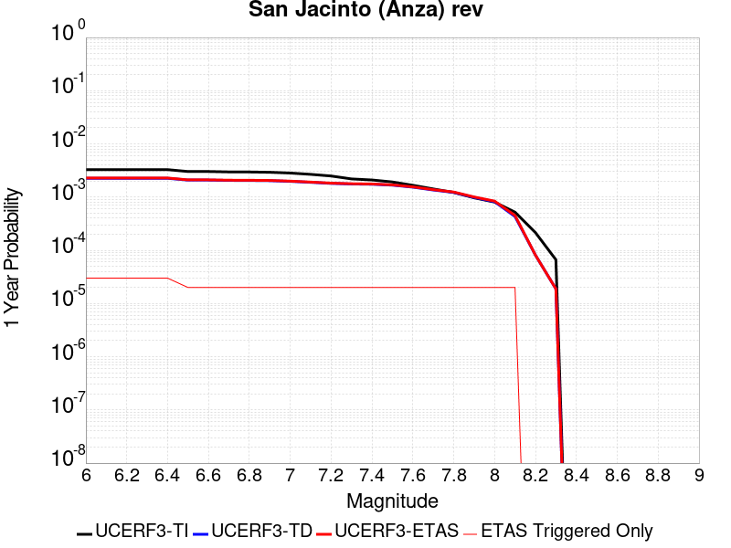 |  |

| Magnitude | 1 wk TI Prob | 1 wk TD Prob | 1 wk ETAS Prob | 1 wk ETAS/TD Gain | 1 wk ETAS Triggered Only | 1 mo TI Prob | 1 mo TD Prob | 1 mo ETAS Prob | 1 mo ETAS/TD Gain | 1 mo ETAS Triggered Only | 1 yr TI Prob | 1 yr TD Prob | 1 yr ETAS Prob | 1 yr ETAS/TD Gain | 1 yr ETAS Triggered Only | 10 yr TI Prob | 10 yr TD Prob | 10 yr ETAS Prob | 10 yr ETAS/TD Gain | 10 yr ETAS Triggered Only |
|-----|-----|-----|-----|-----|-----|-----|-----|-----|-----|-----|-----|-----|-----|-----|-----|-----|-----|-----|-----|-----|
| 6.0 | 6.3015636E-5 | 4.3298347E-5 | 5.3297914E-5 | 1.2309457 | 1.0E-5 | 2.7003905E-4 | 1.8555121E-4 | 1.9554936E-4 | 1.0538834 | 1.0E-5 | 0.0032827691 | 0.0022567573 | 0.0022866896 | 1.0132635 | 3.0E-5 | 0.032346968 | 0.023293609 | 0.023342445 | 1.0020965 | 5.0E-5 |
| 6.1 | 6.3015636E-5 | 4.3298347E-5 | 5.3297914E-5 | 1.2309457 | 1.0E-5 | 2.7003905E-4 | 1.8555121E-4 | 1.9554936E-4 | 1.0538834 | 1.0E-5 | 0.0032827691 | 0.0022567573 | 0.0022866896 | 1.0132635 | 3.0E-5 | 0.032346968 | 0.023293609 | 0.023342445 | 1.0020965 | 5.0E-5 |
| 6.2 | 6.3015636E-5 | 4.3298347E-5 | 5.3297914E-5 | 1.2309457 | 1.0E-5 | 2.7003905E-4 | 1.8555121E-4 | 1.9554936E-4 | 1.0538834 | 1.0E-5 | 0.0032827691 | 0.0022567573 | 0.0022866896 | 1.0132635 | 3.0E-5 | 0.032346968 | 0.023293609 | 0.023342445 | 1.0020965 | 5.0E-5 |
| 6.3 | 6.3015636E-5 | 4.3298347E-5 | 5.3297914E-5 | 1.2309457 | 1.0E-5 | 2.7003905E-4 | 1.8555121E-4 | 1.9554936E-4 | 1.0538834 | 1.0E-5 | 0.0032827691 | 0.0022567573 | 0.0022866896 | 1.0132635 | 3.0E-5 | 0.032346968 | 0.023293609 | 0.023342445 | 1.0020965 | 5.0E-5 |
| 6.4 | 6.3015636E-5 | 4.3298347E-5 | 5.3297914E-5 | 1.2309457 | 1.0E-5 | 2.7003905E-4 | 1.8555121E-4 | 1.9554936E-4 | 1.0538834 | 1.0E-5 | 0.0032827691 | 0.0022567573 | 0.0022866896 | 1.0132635 | 3.0E-5 | 0.032346968 | 0.023293609 | 0.023342445 | 1.0020965 | 5.0E-5 |
| 6.5 | 5.811017E-5 | 4.0080286E-5 | 5.0079885E-5 | 1.2494892 | 1.0E-5 | 2.4901982E-4 | 1.7176138E-4 | 1.8175965E-4 | 1.0582103 | 1.0E-5 | 0.0030276014 | 0.0020891947 | 0.002109153 | 1.0095531 | 2.0E-5 | 0.02986684 | 0.021590833 | 0.021629969 | 1.0018127 | 4.0E-5 |
| 6.6 | 5.811017E-5 | 4.0080286E-5 | 5.0079885E-5 | 1.2494892 | 1.0E-5 | 2.4901982E-4 | 1.7176138E-4 | 1.8175965E-4 | 1.0582103 | 1.0E-5 | 0.0030276014 | 0.0020891947 | 0.002109153 | 1.0095531 | 2.0E-5 | 0.02986684 | 0.021590833 | 0.021629969 | 1.0018127 | 4.0E-5 |
| 6.7 | 5.712442E-5 | 3.950301E-5 | 4.9502618E-5 | 1.2531352 | 1.0E-5 | 2.4479596E-4 | 1.6928767E-4 | 1.7928597E-4 | 1.059061 | 1.0E-5 | 0.0029763177 | 0.0020591344 | 0.0020790934 | 1.0096928 | 2.0E-5 | 0.029367693 | 0.021282917 | 0.021322066 | 1.0018394 | 4.0E-5 |
| 6.8 | 5.6967532E-5 | 3.93593E-5 | 4.9358907E-5 | 1.2540596 | 1.0E-5 | 2.4412372E-4 | 1.6867183E-4 | 1.7867015E-4 | 1.0592767 | 1.0E-5 | 0.0029681553 | 0.0020516508 | 0.00207161 | 1.0097282 | 2.0E-5 | 0.029288229 | 0.021208517 | 0.02124767 | 1.0018461 | 4.0E-5 |
| 6.9 | 5.6211324E-5 | 3.9064216E-5 | 4.9063827E-5 | 1.2559787 | 1.0E-5 | 2.4088343E-4 | 1.6740736E-4 | 1.7740569E-4 | 1.0597246 | 1.0E-5 | 0.0029288116 | 0.0020362847 | 0.002056244 | 1.0098019 | 2.0E-5 | 0.028905109 | 0.021047527 | 0.021086683 | 1.0018605 | 4.0E-5 |
| 7.0 | 5.4383527E-5 | 3.7925012E-5 | 4.7924634E-5 | 1.2636682 | 1.0E-5 | 2.3305144E-4 | 1.6252567E-4 | 1.7252404E-4 | 1.0615188 | 1.0E-5 | 0.0028337094 | 0.001976959 | 0.0019969195 | 1.0100965 | 2.0E-5 | 0.027978465 | 0.02044095 | 0.02048013 | 1.0019169 | 4.0E-5 |
| 7.1 | 5.1393665E-5 | 3.638787E-5 | 4.6387508E-5 | 1.2748069 | 1.0E-5 | 2.2023996E-4 | 1.5593872E-4 | 1.6593716E-4 | 1.0641178 | 1.0E-5 | 0.0026781242 | 0.0018969048 | 0.0019168669 | 1.0105234 | 2.0E-5 | 0.026460782 | 0.019616075 | 0.019655291 | 1.0019991 | 4.0E-5 |
| 7.2 | 4.785222E-5 | 3.4738845E-5 | 4.4738495E-5 | 1.2878522 | 1.0E-5 | 2.0506482E-4 | 1.4887229E-4 | 1.588708E-4 | 1.0671617 | 1.0E-5 | 0.0024938055 | 0.0018110167 | 0.0018309805 | 1.0110235 | 2.0E-5 | 0.024660049 | 0.018728781 | 0.018758219 | 1.0015718 | 3.0E-5 |
| 7.3 | 4.2143256E-5 | 3.3834414E-5 | 4.3834076E-5 | 1.2955471 | 1.0E-5 | 1.8060145E-4 | 1.449966E-4 | 1.5499514E-4 | 1.0689571 | 1.0E-5 | 0.002196605 | 0.0017639075 | 0.0017838721 | 1.0113184 | 2.0E-5 | 0.02175019 | 0.018236695 | 0.018266147 | 1.001615 | 3.0E-5 |
| 7.4 | 4.0264713E-5 | 3.3472694E-5 | 4.347236E-5 | 1.298741 | 1.0E-5 | 1.7255165E-4 | 1.4344654E-4 | 1.534451E-4 | 1.0697024 | 1.0E-5 | 0.002098792 | 0.0017450659 | 0.001765031 | 1.0114409 | 2.0E-5 | 0.020790804 | 0.018041387 | 0.018070847 | 1.0016328 | 3.0E-5 |
| 7.5 | 3.694492E-5 | 3.2186905E-5 | 4.2186584E-5 | 1.3106754 | 1.0E-5 | 1.5832575E-4 | 1.379366E-4 | 1.4793522E-4 | 1.0724871 | 1.0E-5 | 0.0019259118 | 0.0016780876 | 0.001698054 | 1.0118983 | 2.0E-5 | 0.01909306 | 0.017357886 | 0.017387366 | 1.0016984 | 3.0E-5 |
| 7.6 | 3.200565E-5 | 2.9502702E-5 | 3.9502407E-5 | 1.338942 | 1.0E-5 | 1.3715986E-4 | 1.2643404E-4 | 1.3643278E-4 | 1.0790826 | 1.0E-5 | 0.001668642 | 0.0015382497 | 0.001558219 | 1.0129818 | 2.0E-5 | 0.01656168 | 0.015946016 | 0.015975537 | 1.0018513 | 3.0E-5 |
| 7.7 | 2.731642E-5 | 2.6091477E-5 | 3.6091216E-5 | 1.3832569 | 1.0E-5 | 1.1706512E-4 | 1.11815825E-4 | 1.2181471E-4 | 1.0894228 | 1.0E-5 | 0.001424336 | 0.0013605085 | 0.0013804813 | 1.0146804 | 2.0E-5 | 0.014152412 | 0.014166798 | 0.0141963735 | 1.0020876 | 3.0E-5 |
| 7.8 | 2.3466424E-5 | 2.3503619E-5 | 3.3503384E-5 | 1.4254564 | 1.0E-5 | 1.0056651E-4 | 1.0072591E-4 | 1.10724905E-4 | 1.0992693 | 1.0E-5 | 0.0012237094 | 0.0012256489 | 0.0012456244 | 1.0162979 | 2.0E-5 | 0.012169928 | 0.012808795 | 0.01283841 | 1.0023122 | 3.0E-5 |
| 7.9 | 1.8611925E-5 | 1.890698E-5 | 2.890679E-5 | 1.5288953 | 1.0E-5 | 7.9762955E-5 | 8.10274E-5 | 9.102659E-5 | 1.1234051 | 1.0E-5 | 9.7068126E-4 | 9.860628E-4 | 0.0010060432 | 1.0202627 | 2.0E-5 | 0.0096645225 | 0.010393704 | 0.010423392 | 1.0028564 | 3.0E-5 |
| 8.0 | 1.5460775E-5 | 1.5739915E-5 | 2.5739759E-5 | 1.6353174 | 1.0E-5 | 6.6258784E-5 | 6.745504E-5 | 7.7454366E-5 | 1.1482369 | 1.0E-5 | 8.0640207E-4 | 8.2095637E-4 | 8.4093993E-4 | 1.0243418 | 2.0E-5 | 0.008034821 | 0.008702706 | 0.008732445 | 1.0034173 | 3.0E-5 |
| 8.1 | 9.983884E-6 | 8.268954E-6 | 1.8268871E-5 | 2.2093327 | 1.0E-5 | 4.2787375E-5 | 3.5437897E-5 | 4.5437544E-5 | 1.2821738 | 1.0E-5 | 5.2081177E-4 | 4.313715E-4 | 4.5136287E-4 | 1.0463438 | 2.0E-5 | 0.0051959283 | 0.00463968 | 0.004669541 | 1.006436 | 3.0E-5 |
| 8.2 | 4.1226E-6 | 1.5522551E-6 | 1.5522551E-6 | 1.0 | 0.0 | 1.7668166E-5 | 6.6525045E-6 | 6.6525045E-6 | 1.0 | 0.0 | 2.1508869E-4 | 8.099126E-5 | 8.099126E-5 | 1.0 | 0.0 | 0.0021488064 | 9.401847E-4 | 9.401847E-4 | 1.0 | 0.0 |
| 8.3 | 1.2750878E-6 | 3.609817E-7 | 3.609817E-7 | 1.0 | 0.0 | 5.4646503E-6 | 1.5470634E-6 | 1.5470634E-6 | 1.0 | 0.0 | 6.653009E-5 | 1.8835339E-5 | 1.8835339E-5 | 1.0 | 0.0 | 6.6510175E-4 | 2.272251E-4 | 2.272251E-4 | 1.0 | 0.0 |

## Bullion Mountains
*[(top)](#table-of-contents)*

| 1 Week | 1 Month | 1 Year | 10 Year |
|-----|-----|-----|-----|
|  | 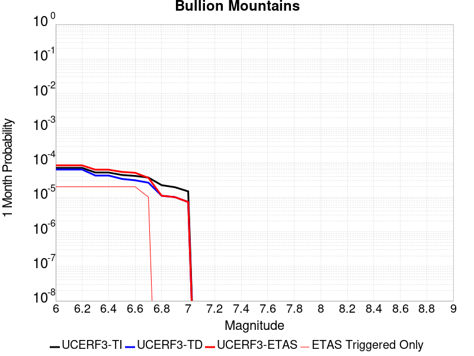 | 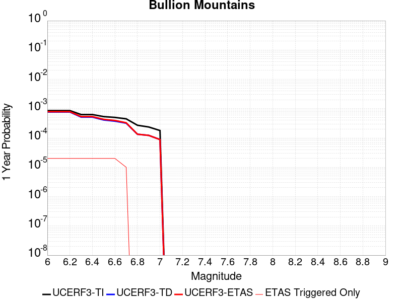 |  |

| Magnitude | 1 wk TI Prob | 1 wk TD Prob | 1 wk ETAS Prob | 1 wk ETAS/TD Gain | 1 wk ETAS Triggered Only | 1 mo TI Prob | 1 mo TD Prob | 1 mo ETAS Prob | 1 mo ETAS/TD Gain | 1 mo ETAS Triggered Only | 1 yr TI Prob | 1 yr TD Prob | 1 yr ETAS Prob | 1 yr ETAS/TD Gain | 1 yr ETAS Triggered Only | 10 yr TI Prob | 10 yr TD Prob | 10 yr ETAS Prob | 10 yr ETAS/TD Gain | 10 yr ETAS Triggered Only |
|-----|-----|-----|-----|-----|-----|-----|-----|-----|-----|-----|-----|-----|-----|-----|-----|-----|-----|-----|-----|-----|
| 6.0 | 1.6420427E-5 | 1.4692009E-5 | 2.4691863E-5 | 1.6806321 | 1.0E-5 | 7.037136E-5 | 6.296445E-5 | 8.296319E-5 | 1.3176196 | 2.0E-5 | 8.5643446E-4 | 7.6636096E-4 | 7.863456E-4 | 1.0260774 | 2.0E-5 | 0.008531413 | 0.0076409746 | 0.0076905927 | 1.0064937 | 5.0E-5 |
| 6.1 | 1.6420427E-5 | 1.4692009E-5 | 2.4691863E-5 | 1.6806321 | 1.0E-5 | 7.037136E-5 | 6.296445E-5 | 8.296319E-5 | 1.3176196 | 2.0E-5 | 8.5643446E-4 | 7.6636096E-4 | 7.863456E-4 | 1.0260774 | 2.0E-5 | 0.008531413 | 0.0076409746 | 0.0076905927 | 1.0064937 | 5.0E-5 |
| 6.2 | 1.6420427E-5 | 1.4692009E-5 | 2.4691863E-5 | 1.6806321 | 1.0E-5 | 7.037136E-5 | 6.296445E-5 | 8.296319E-5 | 1.3176196 | 2.0E-5 | 8.5643446E-4 | 7.6636096E-4 | 7.863456E-4 | 1.0260774 | 2.0E-5 | 0.008531413 | 0.0076409746 | 0.0076905927 | 1.0064937 | 5.0E-5 |
| 6.3 | 1.2046778E-5 | 9.862255E-6 | 1.9862156E-5 | 2.0139568 | 1.0E-5 | 5.1628023E-5 | 4.2266256E-5 | 6.226541E-5 | 1.4731708 | 2.0E-5 | 6.283899E-4 | 5.144933E-4 | 5.3448306E-4 | 1.0388532 | 2.0E-5 | 0.0062661595 | 0.0051353034 | 0.0051750983 | 1.0077492 | 4.0E-5 |
| 6.4 | 1.2046778E-5 | 9.862255E-6 | 1.9862156E-5 | 2.0139568 | 1.0E-5 | 5.1628023E-5 | 4.2266256E-5 | 6.226541E-5 | 1.4731708 | 2.0E-5 | 6.283899E-4 | 5.144933E-4 | 5.3448306E-4 | 1.0388532 | 2.0E-5 | 0.0062661595 | 0.0051353034 | 0.0051750983 | 1.0077492 | 4.0E-5 |
| 6.5 | 1.0244343E-5 | 7.879378E-6 | 1.78793E-5 | 2.2691257 | 1.0E-5 | 4.390359E-5 | 3.3768443E-5 | 5.376777E-5 | 1.5922489 | 2.0E-5 | 5.343951E-4 | 4.1107394E-4 | 4.310657E-4 | 1.0486331 | 2.0E-5 | 0.005331118 | 0.0041051665 | 0.0041350434 | 1.0072778 | 3.0E-5 |
| 6.6 | 9.605408E-6 | 7.1774166E-6 | 1.7177344E-5 | 2.393249 | 1.0E-5 | 4.1165385E-5 | 3.0760108E-5 | 5.0759492E-5 | 1.6501727 | 2.0E-5 | 5.010733E-4 | 3.7446033E-4 | 3.9445283E-4 | 1.0533901 | 2.0E-5 | 0.00499945 | 0.0037402906 | 0.0037701784 | 1.0079907 | 3.0E-5 |
| 6.7 | 8.60418E-6 | 6.123926E-6 | 6.123926E-6 | 1.0 | 0.0 | 3.687454E-5 | 2.6245243E-5 | 3.6244983E-5 | 1.3810114 | 1.0E-5 | 4.48855E-4 | 3.195085E-4 | 3.295053E-4 | 1.031288 | 1.0E-5 | 0.004479495 | 0.0031924031 | 0.0032123392 | 1.0062449 | 2.0E-5 |
| 6.8 | 5.187994E-6 | 2.563117E-6 | 2.563117E-6 | 1.0 | 0.0 | 2.223407E-5 | 1.0984763E-5 | 1.0984763E-5 | 1.0 | 0.0 | 2.7066618E-4 | 1.3373529E-4 | 1.3373529E-4 | 1.0 | 0.0 | 0.0027033675 | 0.0013369396 | 0.0013369396 | 1.0 | 0.0 |
| 6.9 | 4.5302368E-6 | 2.3442778E-6 | 2.3442778E-6 | 1.0 | 0.0 | 1.9415156E-5 | 1.0046889E-5 | 1.0046889E-5 | 1.0 | 0.0 | 2.3635388E-4 | 1.2231797E-4 | 1.2231797E-4 | 1.0 | 0.0 | 0.0023610266 | 0.0012228956 | 0.0012228956 | 1.0 | 0.0 |
| 7.0 | 3.431668E-6 | 1.6882177E-6 | 1.6882177E-6 | 1.0 | 0.0 | 1.4707065E-5 | 7.2352186E-6 | 7.2352186E-6 | 1.0 | 0.0 | 1.7904381E-4 | 8.808879E-5 | 8.808879E-5 | 1.0 | 0.0 | 0.0017889962 | 8.8088785E-4 | 8.8088785E-4 | 1.0 | 0.0 |

## Big Pine (East)
*[(top)](#table-of-contents)*

| 1 Week | 1 Month | 1 Year | 10 Year |
|-----|-----|-----|-----|
| 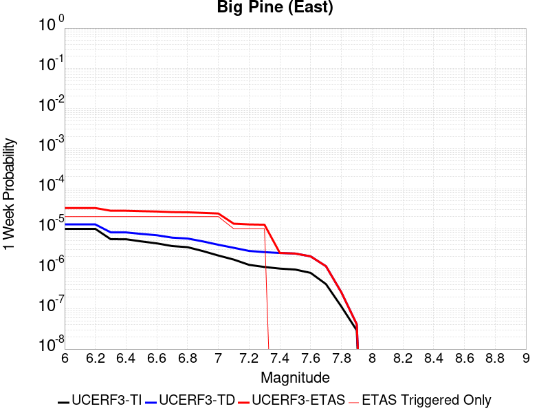 | 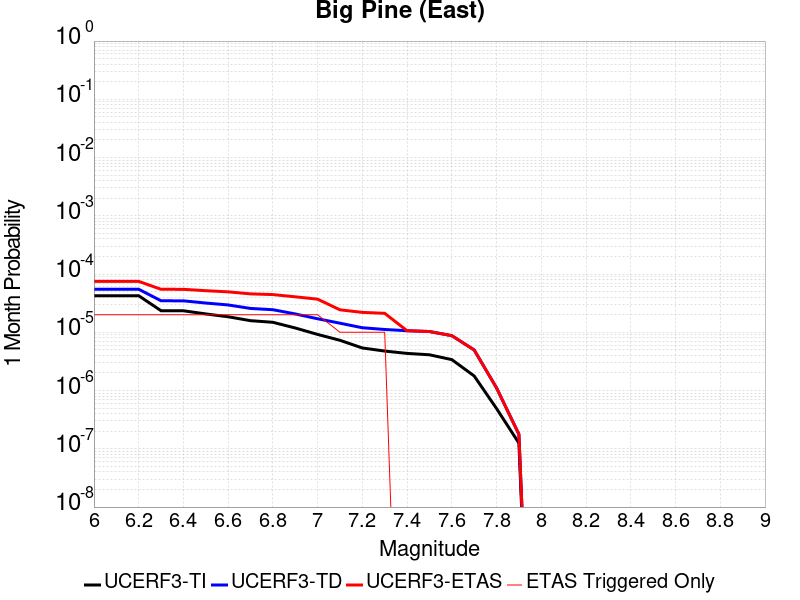 |  | 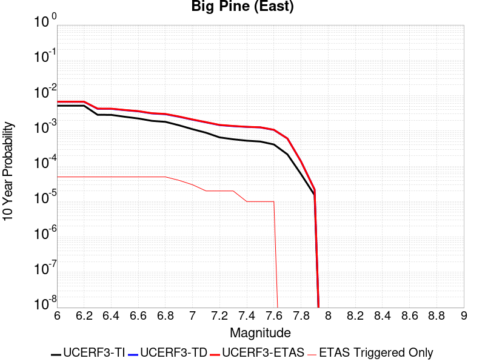 |

| Magnitude | 1 wk TI Prob | 1 wk TD Prob | 1 wk ETAS Prob | 1 wk ETAS/TD Gain | 1 wk ETAS Triggered Only | 1 mo TI Prob | 1 mo TD Prob | 1 mo ETAS Prob | 1 mo ETAS/TD Gain | 1 mo ETAS Triggered Only | 1 yr TI Prob | 1 yr TD Prob | 1 yr ETAS Prob | 1 yr ETAS/TD Gain | 1 yr ETAS Triggered Only | 10 yr TI Prob | 10 yr TD Prob | 10 yr ETAS Prob | 10 yr ETAS/TD Gain | 10 yr ETAS Triggered Only |
|-----|-----|-----|-----|-----|-----|-----|-----|-----|-----|-----|-----|-----|-----|-----|-----|-----|-----|-----|-----|-----|
| 6.0 | 9.916913E-6 | 1.28172705E-5 | 3.2817014E-5 | 2.5603745 | 2.0E-5 | 4.250036E-5 | 5.493013E-5 | 7.492903E-5 | 1.3640789 | 2.0E-5 | 5.173191E-4 | 6.685912E-4 | 7.085645E-4 | 1.0597873 | 4.0E-5 | 0.0051611643 | 0.006670449 | 0.0067201154 | 1.0074457 | 5.0E-5 |
| 6.1 | 9.916913E-6 | 1.28172705E-5 | 3.2817014E-5 | 2.5603745 | 2.0E-5 | 4.250036E-5 | 5.493013E-5 | 7.492903E-5 | 1.3640789 | 2.0E-5 | 5.173191E-4 | 6.685912E-4 | 7.085645E-4 | 1.0597873 | 4.0E-5 | 0.0051611643 | 0.006670449 | 0.0067201154 | 1.0074457 | 5.0E-5 |
| 6.2 | 9.916913E-6 | 1.28172705E-5 | 3.2817014E-5 | 2.5603745 | 2.0E-5 | 4.250036E-5 | 5.493013E-5 | 7.492903E-5 | 1.3640789 | 2.0E-5 | 5.173191E-4 | 6.685912E-4 | 7.085645E-4 | 1.0597873 | 4.0E-5 | 0.0051611643 | 0.006670449 | 0.0067201154 | 1.0074457 | 5.0E-5 |
| 6.3 | 5.479711E-6 | 8.1132375E-6 | 2.8113076E-5 | 3.4650872 | 2.0E-5 | 2.3484265E-5 | 3.4770575E-5 | 5.476988E-5 | 1.575179 | 2.0E-5 | 2.858834E-4 | 4.232527E-4 | 4.6323577E-4 | 1.0944662 | 4.0E-5 | 0.0028551589 | 0.0042272513 | 0.00427704 | 1.011778 | 5.0E-5 |
| 6.4 | 5.465009E-6 | 8.0975315E-6 | 2.8097369E-5 | 3.4698687 | 2.0E-5 | 2.3421257E-5 | 3.4703262E-5 | 5.4702567E-5 | 1.5762947 | 2.0E-5 | 2.851165E-4 | 4.2243348E-4 | 4.624166E-4 | 1.0946494 | 4.0E-5 | 0.0028475097 | 0.00421909 | 0.0042688795 | 1.0118009 | 5.0E-5 |
| 6.5 | 4.826767E-6 | 7.4225877E-6 | 2.7422439E-5 | 3.6944582 | 2.0E-5 | 2.068598E-5 | 3.1810716E-5 | 5.1810082E-5 | 1.628699 | 2.0E-5 | 2.518227E-4 | 3.8722943E-4 | 4.2721393E-4 | 1.1032579 | 4.0E-5 | 0.0025153751 | 0.0038682907 | 0.0039180974 | 1.0128756 | 5.0E-5 |
| 6.6 | 4.3146847E-6 | 6.8825234E-6 | 2.6882386E-5 | 3.905891 | 2.0E-5 | 1.8491375E-5 | 2.949621E-5 | 4.949562E-5 | 1.6780332 | 2.0E-5 | 2.2510924E-4 | 3.5905963E-4 | 3.9904527E-4 | 1.1113621 | 4.0E-5 | 0.0022488134 | 0.0035875062 | 0.0036373269 | 1.0138873 | 5.0E-5 |
| 6.7 | 3.6968106E-6 | 5.9957474E-6 | 2.5995627E-5 | 4.3356776 | 2.0E-5 | 1.5843378E-5 | 2.5695816E-5 | 4.5695302E-5 | 1.7783169 | 2.0E-5 | 1.9287605E-4 | 3.128032E-4 | 3.5279067E-4 | 1.127836 | 4.0E-5 | 0.0019270873 | 0.0031262499 | 0.0031760936 | 1.0159436 | 5.0E-5 |
| 6.8 | 3.4671132E-6 | 5.7024477E-6 | 2.5702333E-5 | 4.507246 | 2.0E-5 | 1.4858972E-5 | 2.4438841E-5 | 4.443835E-5 | 1.8183495 | 2.0E-5 | 1.8089297E-4 | 2.9750372E-4 | 3.374918E-4 | 1.134412 | 4.0E-5 | 0.0018074579 | 0.0029736666 | 0.003023518 | 1.0167643 | 5.0E-5 |
| 6.9 | 2.7686972E-6 | 4.8254797E-6 | 2.4825384E-5 | 5.1446457 | 2.0E-5 | 1.1865792E-5 | 2.0680467E-5 | 4.0680054E-5 | 1.9670762 | 2.0E-5 | 1.4445644E-4 | 2.5175634E-4 | 2.817488E-4 | 1.1191329 | 3.0E-5 | 0.0014436257 | 0.002517256 | 0.0025571552 | 1.0158503 | 4.0E-5 |
| 7.0 | 2.1472624E-6 | 3.985277E-6 | 2.3985198E-5 | 6.0184517 | 2.0E-5 | 9.20252E-6 | 1.707965E-5 | 3.707931E-5 | 2.1709642 | 2.0E-5 | 1.12034926E-4 | 2.0792543E-4 | 2.2792126E-4 | 1.0961683 | 2.0E-5 | 0.0011197845 | 0.0020798238 | 0.0021097613 | 1.0143943 | 3.0E-5 |
| 7.1 | 1.7018335E-6 | 3.3450835E-6 | 1.334505E-5 | 3.989452 | 1.0E-5 | 7.293552E-6 | 1.4335996E-5 | 2.4335852E-5 | 1.6975348 | 1.0E-5 | 8.879537E-5 | 1.7452713E-4 | 1.8452539E-4 | 1.0572877 | 1.0E-5 | 8.87599E-4 | 0.0017463792 | 0.0017663443 | 1.0114323 | 2.0E-5 |
| 7.2 | 1.25603E-6 | 2.794679E-6 | 1.2794651E-5 | 4.5782185 | 1.0E-5 | 5.3829745E-6 | 1.1977142E-5 | 2.1977023E-5 | 1.8349137 | 1.0E-5 | 6.553574E-5 | 1.4581217E-4 | 1.5581072E-4 | 1.0685713 | 1.0E-5 | 6.551642E-4 | 0.0014596173 | 0.0014795881 | 1.0136822 | 2.0E-5 |
| 7.3 | 1.112297E-6 | 2.610519E-6 | 1.2610492E-5 | 4.830646 | 1.0E-5 | 4.7669787E-6 | 1.1187892E-5 | 2.118778E-5 | 1.8938135 | 1.0E-5 | 5.803642E-5 | 1.3620428E-4 | 1.4620292E-4 | 1.0734091 | 1.0E-5 | 5.802127E-4 | 0.001363502 | 0.0013834747 | 1.0146481 | 2.0E-5 |
| 7.4 | 1.0137181E-6 | 2.4836752E-6 | 2.4836752E-6 | 1.0 | 0.0 | 4.3444993E-6 | 1.064428E-5 | 1.064428E-5 | 1.0 | 0.0 | 5.2892992E-5 | 1.2958662E-4 | 1.2958662E-4 | 1.0 | 0.0 | 5.288041E-4 | 0.0012971918 | 0.0013071789 | 1.007699 | 1.0E-5 |
| 7.5 | 9.598608E-7 | 2.407328E-6 | 2.407328E-6 | 1.0 | 0.0 | 4.1136827E-6 | 1.03170805E-5 | 1.03170805E-5 | 1.0 | 0.0 | 5.0082934E-5 | 1.2560343E-4 | 1.2560343E-4 | 1.0 | 0.0 | 5.007165E-4 | 0.0012572132 | 0.0012672007 | 1.0079441 | 1.0E-5 |
| 7.6 | 7.929459E-7 | 2.0450152E-6 | 2.0450152E-6 | 1.0 | 0.0 | 3.3983351E-6 | 8.764322E-6 | 8.764322E-6 | 1.0 | 0.0 | 4.1373947E-5 | 1.0670057E-4 | 1.0670057E-4 | 1.0 | 0.0 | 4.1366243E-4 | 0.0010685825 | 0.0010785719 | 1.0093482 | 1.0E-5 |
| 7.7 | 4.155788E-7 | 1.1606729E-6 | 1.1606729E-6 | 1.0 | 0.0 | 1.7810507E-6 | 4.974303E-6 | 4.974303E-6 | 1.0 | 0.0 | 2.1684076E-5 | 6.05605E-5 | 6.05605E-5 | 1.0 | 0.0 | 2.1681961E-4 | 6.085995E-4 | 6.085995E-4 | 1.0 | 0.0 |
| 7.8 | 1.14666925E-7 | 2.592197E-7 | 2.592197E-7 | 1.0 | 0.0 | 4.914296E-7 | 1.1109411E-6 | 1.1109411E-6 | 1.0 | 0.0 | 5.9831386E-6 | 1.3525627E-5 | 1.3525627E-5 | 1.0 | 0.0 | 5.9829777E-5 | 1.3636416E-4 | 1.3636416E-4 | 1.0 | 0.0 |
| 7.9 | 2.9231824E-8 | 4.1462318E-8 | 4.1462318E-8 | 1.0 | 0.0 | 1.2527924E-7 | 1.7769564E-7 | 1.7769564E-7 | 1.0 | 0.0 | 1.5252737E-6 | 2.1634426E-6 | 2.1634426E-6 | 1.0 | 0.0 | 1.5252632E-5 | 2.197062E-5 | 2.197062E-5 | 1.0 | 0.0 |

## Santa Ynez River
*[(top)](#table-of-contents)*

| 1 Week | 1 Month | 1 Year | 10 Year |
|-----|-----|-----|-----|
|  | 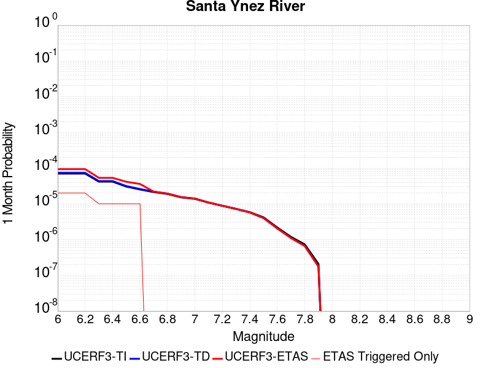 |  |  |

| Magnitude | 1 wk TI Prob | 1 wk TD Prob | 1 wk ETAS Prob | 1 wk ETAS/TD Gain | 1 wk ETAS Triggered Only | 1 mo TI Prob | 1 mo TD Prob | 1 mo ETAS Prob | 1 mo ETAS/TD Gain | 1 mo ETAS Triggered Only | 1 yr TI Prob | 1 yr TD Prob | 1 yr ETAS Prob | 1 yr ETAS/TD Gain | 1 yr ETAS Triggered Only | 10 yr TI Prob | 10 yr TD Prob | 10 yr ETAS Prob | 10 yr ETAS/TD Gain | 10 yr ETAS Triggered Only |
|-----|-----|-----|-----|-----|-----|-----|-----|-----|-----|-----|-----|-----|-----|-----|-----|-----|-----|-----|-----|-----|
| 6.0 | 1.6396456E-5 | 1.7209444E-5 | 1.7209444E-5 | 1.0 | 0.0 | 7.026863E-5 | 7.3752875E-5 | 9.3751405E-5 | 1.2711558 | 2.0E-5 | 8.551848E-4 | 8.976069E-4 | 9.2758E-4 | 1.0333922 | 3.0E-5 | 0.0085190125 | 0.008943363 | 0.008992916 | 1.0055407 | 5.0E-5 |
| 6.1 | 1.6396456E-5 | 1.7209444E-5 | 1.7209444E-5 | 1.0 | 0.0 | 7.026863E-5 | 7.3752875E-5 | 9.3751405E-5 | 1.2711558 | 2.0E-5 | 8.551848E-4 | 8.976069E-4 | 9.2758E-4 | 1.0333922 | 3.0E-5 | 0.0085190125 | 0.008943363 | 0.008992916 | 1.0055407 | 5.0E-5 |
| 6.2 | 1.6396456E-5 | 1.7209444E-5 | 1.7209444E-5 | 1.0 | 0.0 | 7.026863E-5 | 7.3752875E-5 | 9.3751405E-5 | 1.2711558 | 2.0E-5 | 8.551848E-4 | 8.976069E-4 | 9.2758E-4 | 1.0333922 | 3.0E-5 | 0.0085190125 | 0.008943363 | 0.008992916 | 1.0055407 | 5.0E-5 |
| 6.3 | 9.736976E-6 | 1.01223395E-5 | 1.01223395E-5 | 1.0 | 0.0 | 4.172923E-5 | 4.338076E-5 | 5.3380325E-5 | 1.2305069 | 1.0E-5 | 5.0793495E-4 | 5.280378E-4 | 5.480272E-4 | 1.0378561 | 2.0E-5 | 0.005067755 | 0.0052683367 | 0.005308126 | 1.0075525 | 4.0E-5 |
| 6.4 | 9.736976E-6 | 1.01223395E-5 | 1.01223395E-5 | 1.0 | 0.0 | 4.172923E-5 | 4.338076E-5 | 5.3380325E-5 | 1.2305069 | 1.0E-5 | 5.0793495E-4 | 5.280378E-4 | 5.480272E-4 | 1.0378561 | 2.0E-5 | 0.005067755 | 0.0052683367 | 0.005308126 | 1.0075525 | 4.0E-5 |
| 6.5 | 7.081964E-6 | 7.329905E-6 | 7.329905E-6 | 1.0 | 0.0 | 3.035092E-5 | 3.141351E-5 | 4.1413197E-5 | 1.3183243 | 1.0E-5 | 3.694598E-4 | 3.8239395E-4 | 3.9239012E-4 | 1.026141 | 1.0E-5 | 0.0036884616 | 0.0038175215 | 0.003847407 | 1.0078285 | 3.0E-5 |
| 6.6 | 5.873247E-6 | 6.0597517E-6 | 6.0597517E-6 | 1.0 | 0.0 | 2.5170815E-5 | 2.5970112E-5 | 3.5969853E-5 | 1.385048 | 1.0E-5 | 3.064116E-4 | 3.161411E-4 | 3.2613793E-4 | 1.0316215 | 1.0E-5 | 0.0030598943 | 0.003157001 | 0.0031869062 | 1.0094727 | 3.0E-5 |
| 6.7 | 4.973277E-6 | 5.11591E-6 | 5.11591E-6 | 1.0 | 0.0 | 2.1313872E-5 | 2.1925147E-5 | 2.1925147E-5 | 1.0 | 0.0 | 2.5946548E-4 | 2.6690646E-4 | 2.6690646E-4 | 1.0 | 0.0 | 0.0025916274 | 0.0026659078 | 0.0026758811 | 1.003741 | 1.0E-5 |
| 6.8 | 4.396492E-6 | 4.510987E-6 | 4.510987E-6 | 1.0 | 0.0 | 1.884197E-5 | 1.933266E-5 | 1.933266E-5 | 1.0 | 0.0 | 2.2937685E-4 | 2.3535005E-4 | 2.3535005E-4 | 1.0 | 0.0 | 0.0022914023 | 0.0023510433 | 0.0023610198 | 1.0042434 | 1.0E-5 |
| 6.9 | 3.5255632E-6 | 3.6013423E-6 | 3.6013423E-6 | 1.0 | 0.0 | 1.5109469E-5 | 1.5434234E-5 | 1.5434234E-5 | 1.0 | 0.0 | 1.8394225E-4 | 1.8789574E-4 | 1.8789574E-4 | 1.0 | 0.0 | 0.0018379007 | 0.001877385 | 0.0018873662 | 1.0053166 | 1.0E-5 |
| 7.0 | 3.211603E-6 | 3.273663E-6 | 3.273663E-6 | 1.0 | 0.0 | 1.376394E-5 | 1.402991E-5 | 1.402991E-5 | 1.0 | 0.0 | 1.6756308E-4 | 1.708009E-4 | 1.708009E-4 | 1.0 | 0.0 | 0.0016743679 | 0.0017067104 | 0.0017166934 | 1.0058492 | 1.0E-5 |
| 7.1 | 2.5094619E-6 | 2.5409295E-6 | 2.5409295E-6 | 1.0 | 0.0 | 1.0754793E-5 | 1.0889652E-5 | 1.0889652E-5 | 1.0 | 0.0 | 1.3093173E-4 | 1.325735E-4 | 1.325735E-4 | 1.0 | 0.0 | 0.0013085462 | 0.0013249503 | 0.0013349369 | 1.0075375 | 1.0E-5 |
| 7.2 | 2.0515774E-6 | 2.0619466E-6 | 2.0619466E-6 | 1.0 | 0.0 | 8.792445E-6 | 8.836884E-6 | 8.836884E-6 | 1.0 | 0.0 | 1.0704277E-4 | 1.0758379E-4 | 1.0758379E-4 | 1.0 | 0.0 | 0.0010699122 | 0.0010753215 | 0.0010853106 | 1.0092895 | 1.0E-5 |
| 7.3 | 1.6845745E-6 | 1.6773996E-6 | 1.6773996E-6 | 1.0 | 0.0 | 7.219585E-6 | 7.1888358E-6 | 7.1888358E-6 | 1.0 | 0.0 | 8.78949E-5 | 8.752059E-5 | 8.752059E-5 | 1.0 | 0.0 | 8.7860145E-4 | 8.7486405E-4 | 8.8485534E-4 | 1.0114204 | 1.0E-5 |
| 7.4 | 1.3600285E-6 | 1.3333447E-6 | 1.3333447E-6 | 1.0 | 0.0 | 5.82868E-6 | 5.714322E-6 | 5.714322E-6 | 1.0 | 0.0 | 7.096187E-5 | 6.956967E-5 | 6.956967E-5 | 1.0 | 0.0 | 7.0939213E-4 | 6.9548114E-4 | 6.9548114E-4 | 1.0 | 0.0 |
| 7.5 | 9.735342E-7 | 9.2901894E-7 | 9.2901894E-7 | 1.0 | 0.0 | 4.172283E-6 | 3.9815036E-6 | 3.9815036E-6 | 1.0 | 0.0 | 5.079636E-5 | 4.8473747E-5 | 4.8473747E-5 | 1.0 | 0.0 | 5.0784746E-4 | 4.8463346E-4 | 4.8463346E-4 | 1.0 | 0.0 |
| 7.6 | 5.067187E-7 | 4.778609E-7 | 4.778609E-7 | 1.0 | 0.0 | 2.1716498E-6 | 2.0479738E-6 | 2.0479738E-6 | 1.0 | 0.0 | 2.6439517E-5 | 2.4933803E-5 | 2.4933803E-5 | 1.0 | 0.0 | 2.643637E-4 | 2.493108E-4 | 2.493108E-4 | 1.0 | 0.0 |
| 7.7 | 2.769089E-7 | 2.5759346E-7 | 2.5759346E-7 | 1.0 | 0.0 | 1.1867519E-6 | 1.1039714E-6 | 1.1039714E-6 | 1.0 | 0.0 | 1.4448608E-5 | 1.344077E-5 | 1.344077E-5 | 1.0 | 0.0 | 1.444767E-4 | 1.343996E-4 | 1.343996E-4 | 1.0 | 0.0 |
| 7.8 | 1.7044663E-7 | 1.5449208E-7 | 1.5449208E-7 | 1.0 | 0.0 | 7.3048534E-7 | 6.6210873E-7 | 6.6210873E-7 | 1.0 | 0.0 | 8.893623E-6 | 8.061144E-6 | 8.061144E-6 | 1.0 | 0.0 | 8.893267E-5 | 8.060854E-5 | 8.060854E-5 | 1.0 | 0.0 |
| 7.9 | 4.8344287E-8 | 4.0911143E-8 | 4.0911143E-8 | 1.0 | 0.0 | 2.0718979E-7 | 1.7533345E-7 | 1.7533345E-7 | 1.0 | 0.0 | 2.5225327E-6 | 2.1346827E-6 | 2.1346827E-6 | 1.0 | 0.0 | 2.5225041E-5 | 2.1346626E-5 | 2.1346626E-5 | 1.0 | 0.0 |

## San Jacinto (San Jacinto Valley) rev
*[(top)](#table-of-contents)*

| 1 Week | 1 Month | 1 Year | 10 Year |
|-----|-----|-----|-----|
| 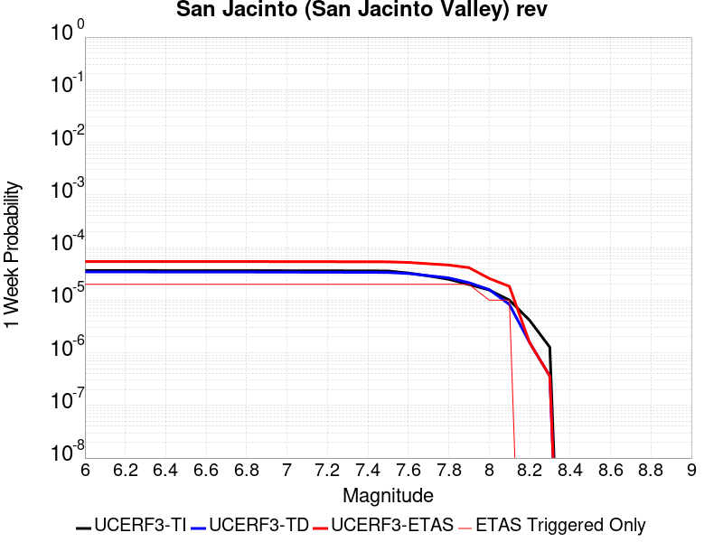 |  |  |  |

| Magnitude | 1 wk TI Prob | 1 wk TD Prob | 1 wk ETAS Prob | 1 wk ETAS/TD Gain | 1 wk ETAS Triggered Only | 1 mo TI Prob | 1 mo TD Prob | 1 mo ETAS Prob | 1 mo ETAS/TD Gain | 1 mo ETAS Triggered Only | 1 yr TI Prob | 1 yr TD Prob | 1 yr ETAS Prob | 1 yr ETAS/TD Gain | 1 yr ETAS Triggered Only | 10 yr TI Prob | 10 yr TD Prob | 10 yr ETAS Prob | 10 yr ETAS/TD Gain | 10 yr ETAS Triggered Only |
|-----|-----|-----|-----|-----|-----|-----|-----|-----|-----|-----|-----|-----|-----|-----|-----|-----|-----|-----|-----|-----|
| 6.0 | 3.652694E-5 | 3.4401106E-5 | 5.4400418E-5 | 1.5813566 | 2.0E-5 | 1.5653463E-4 | 1.4742499E-4 | 1.6742204E-4 | 1.1356422 | 2.0E-5 | 0.0019041431 | 0.0017934233 | 0.0018233695 | 1.0166978 | 3.0E-5 | 0.018879099 | 0.0185263 | 0.018575374 | 1.0026488 | 5.0E-5 |
| 6.1 | 3.652694E-5 | 3.4401106E-5 | 5.4400418E-5 | 1.5813566 | 2.0E-5 | 1.5653463E-4 | 1.4742499E-4 | 1.6742204E-4 | 1.1356422 | 2.0E-5 | 0.0019041431 | 0.0017934233 | 0.0018233695 | 1.0166978 | 3.0E-5 | 0.018879099 | 0.0185263 | 0.018575374 | 1.0026488 | 5.0E-5 |
| 6.2 | 3.652694E-5 | 3.4401106E-5 | 5.4400418E-5 | 1.5813566 | 2.0E-5 | 1.5653463E-4 | 1.4742499E-4 | 1.6742204E-4 | 1.1356422 | 2.0E-5 | 0.0019041431 | 0.0017934233 | 0.0018233695 | 1.0166978 | 3.0E-5 | 0.018879099 | 0.0185263 | 0.018575374 | 1.0026488 | 5.0E-5 |
| 6.3 | 3.652694E-5 | 3.4401106E-5 | 5.4400418E-5 | 1.5813566 | 2.0E-5 | 1.5653463E-4 | 1.4742499E-4 | 1.6742204E-4 | 1.1356422 | 2.0E-5 | 0.0019041431 | 0.0017934233 | 0.0018233695 | 1.0166978 | 3.0E-5 | 0.018879099 | 0.0185263 | 0.018575374 | 1.0026488 | 5.0E-5 |
| 6.4 | 3.646941E-5 | 3.432268E-5 | 5.4321994E-5 | 1.5826851 | 2.0E-5 | 1.5628811E-4 | 1.4708891E-4 | 1.6708598E-4 | 1.1359522 | 2.0E-5 | 0.0019011468 | 0.0017893389 | 0.0018192851 | 1.0167359 | 3.0E-5 | 0.018849645 | 0.018486181 | 0.018535256 | 1.0026547 | 5.0E-5 |
| 6.5 | 3.646941E-5 | 3.432268E-5 | 5.4321994E-5 | 1.5826851 | 2.0E-5 | 1.5628811E-4 | 1.4708891E-4 | 1.6708598E-4 | 1.1359522 | 2.0E-5 | 0.0019011468 | 0.0017893389 | 0.0018192851 | 1.0167359 | 3.0E-5 | 0.018849645 | 0.018486181 | 0.018535256 | 1.0026547 | 5.0E-5 |
| 6.6 | 3.6442503E-5 | 3.4286066E-5 | 5.428538E-5 | 1.5833074 | 2.0E-5 | 1.561728E-4 | 1.4693203E-4 | 1.6692908E-4 | 1.1360973 | 2.0E-5 | 0.0018997455 | 0.001787432 | 0.0018173783 | 1.0167539 | 3.0E-5 | 0.018835869 | 0.018467449 | 0.018516526 | 1.0026574 | 5.0E-5 |
| 6.7 | 3.6432113E-5 | 3.427164E-5 | 5.4270957E-5 | 1.5835528 | 2.0E-5 | 1.5612828E-4 | 1.4687021E-4 | 1.6686728E-4 | 1.1361547 | 2.0E-5 | 0.0018992044 | 0.0017866807 | 0.0018166271 | 1.016761 | 3.0E-5 | 0.018830549 | 0.018460073 | 0.01850915 | 1.0026586 | 5.0E-5 |
| 6.8 | 3.6409598E-5 | 3.4240697E-5 | 5.4240012E-5 | 1.5840802 | 2.0E-5 | 1.560318E-4 | 1.4673761E-4 | 1.6673468E-4 | 1.1362777 | 2.0E-5 | 0.0018980318 | 0.0017850689 | 0.0018150153 | 1.0167761 | 3.0E-5 | 0.018819023 | 0.018444227 | 0.018493306 | 1.0026609 | 5.0E-5 |
| 6.9 | 3.638078E-5 | 3.4201123E-5 | 5.4200438E-5 | 1.5847561 | 2.0E-5 | 1.5590832E-4 | 1.4656801E-4 | 1.6656508E-4 | 1.1364354 | 2.0E-5 | 0.0018965311 | 0.0017830075 | 0.0018129541 | 1.0167955 | 3.0E-5 | 0.018804269 | 0.018423961 | 0.01847304 | 1.0026639 | 5.0E-5 |
| 7.0 | 3.6294874E-5 | 3.408314E-5 | 5.408246E-5 | 1.5867804 | 2.0E-5 | 1.5554018E-4 | 1.4606243E-4 | 1.6605952E-4 | 1.1369077 | 2.0E-5 | 0.0018920569 | 0.0017768623 | 0.001806809 | 1.0168537 | 3.0E-5 | 0.018760284 | 0.018363543 | 0.018412625 | 1.0026728 | 5.0E-5 |
| 7.1 | 3.6260717E-5 | 3.403942E-5 | 5.403874E-5 | 1.5875341 | 2.0E-5 | 1.5539382E-4 | 1.4587509E-4 | 1.6587217E-4 | 1.1370836 | 2.0E-5 | 0.001890278 | 0.0017745851 | 0.0018045319 | 1.0168754 | 3.0E-5 | 0.018742796 | 0.018341137 | 0.01839022 | 1.0026761 | 5.0E-5 |
| 7.2 | 3.6210204E-5 | 3.397364E-5 | 5.3972963E-5 | 1.5886717 | 2.0E-5 | 1.5517735E-4 | 1.455932E-4 | 1.655903E-4 | 1.137349 | 2.0E-5 | 0.001887647 | 0.0017711588 | 0.0018011057 | 1.016908 | 3.0E-5 | 0.01871693 | 0.018307406 | 0.01835649 | 1.0026811 | 5.0E-5 |
| 7.3 | 3.6119454E-5 | 3.386193E-5 | 5.386125E-5 | 1.5906138 | 2.0E-5 | 1.5478847E-4 | 1.4511449E-4 | 1.6511159E-4 | 1.1378022 | 2.0E-5 | 0.0018829206 | 0.0017653398 | 0.0017952869 | 1.0169638 | 3.0E-5 | 0.018670462 | 0.018249959 | 0.018299047 | 1.0026897 | 5.0E-5 |
| 7.4 | 3.607848E-5 | 3.380943E-5 | 5.380875E-5 | 1.5915309 | 2.0E-5 | 1.5461289E-4 | 1.4488952E-4 | 1.6488662E-4 | 1.1380162 | 2.0E-5 | 0.0018807866 | 0.0017626052 | 0.0017925523 | 1.0169903 | 3.0E-5 | 0.018649481 | 0.018222954 | 0.018272042 | 1.0026938 | 5.0E-5 |
| 7.5 | 3.5856774E-5 | 3.3619202E-5 | 5.3618533E-5 | 1.5948781 | 2.0E-5 | 1.5366284E-4 | 1.4407437E-4 | 1.6407148E-4 | 1.1387972 | 2.0E-5 | 0.0018692396 | 0.0017526967 | 0.0017826441 | 1.0170865 | 3.0E-5 | 0.018535944 | 0.018124055 | 0.018173149 | 1.0027088 | 5.0E-5 |
| 7.6 | 3.286655E-5 | 3.2142278E-5 | 5.2141633E-5 | 1.6222135 | 2.0E-5 | 1.4084904E-4 | 1.3774536E-4 | 1.577426E-4 | 1.1451755 | 2.0E-5 | 0.001713488 | 0.0016757617 | 0.0017057114 | 1.0178723 | 3.0E-5 | 0.017003361 | 0.017343802 | 0.017392935 | 1.0028329 | 5.0E-5 |
| 7.7 | 2.8882527E-5 | 2.9235205E-5 | 4.923462E-5 | 1.6840867 | 2.0E-5 | 1.237764E-4 | 1.2528773E-4 | 1.4528522E-4 | 1.1596125 | 2.0E-5 | 0.0015059357 | 0.0015243118 | 0.0015542661 | 1.019651 | 3.0E-5 | 0.014957713 | 0.015830336 | 0.015879545 | 1.0031085 | 5.0E-5 |
| 7.8 | 2.4950225E-5 | 2.6526219E-5 | 4.652569E-5 | 1.753951 | 2.0E-5 | 1.0692515E-4 | 1.1367885E-4 | 1.3367657E-4 | 1.1759142 | 2.0E-5 | 0.0013010362 | 0.0013831621 | 0.0014131207 | 1.0216594 | 3.0E-5 | 0.012934455 | 0.014411758 | 0.014461038 | 1.0034194 | 5.0E-5 |
| 7.9 | 1.9881603E-5 | 2.150649E-5 | 4.150606E-5 | 1.9299319 | 2.0E-5 | 8.520408E-5 | 9.216742E-5 | 1.1216558E-4 | 1.2169764 | 2.0E-5 | 0.001036866 | 0.0011215615 | 0.0011515279 | 1.0267184 | 3.0E-5 | 0.010320415 | 0.011776997 | 0.011826407 | 1.0041956 | 5.0E-5 |
| 8.0 | 1.563292E-5 | 1.5936288E-5 | 2.5936128E-5 | 1.6274887 | 1.0E-5 | 6.6996516E-5 | 6.829659E-5 | 7.829591E-5 | 1.1464102 | 1.0E-5 | 8.153773E-4 | 8.3119445E-4 | 8.5117784E-4 | 1.0240418 | 2.0E-5 | 0.00812392 | 0.008810331 | 0.008840067 | 1.003375 | 3.0E-5 |
| 8.1 | 1.0045313E-5 | 8.300794E-6 | 1.830071E-5 | 2.204694 | 1.0E-5 | 4.305063E-5 | 3.557435E-5 | 4.5573994E-5 | 1.2810915 | 1.0E-5 | 5.2401534E-4 | 4.3303217E-4 | 4.530235E-4 | 1.046166 | 2.0E-5 | 0.0052278144 | 0.0046587666 | 0.004688627 | 1.0064095 | 3.0E-5 |
| 8.2 | 4.1554413E-6 | 1.5648296E-6 | 1.5648296E-6 | 1.0 | 0.0 | 1.7808914E-5 | 6.7063957E-6 | 6.7063957E-6 | 1.0 | 0.0 | 2.1680194E-4 | 8.164734E-5 | 8.164734E-5 | 1.0 | 0.0 | 0.0021659054 | 9.479703E-4 | 9.479703E-4 | 1.0 | 0.0 |
| 8.3 | 1.2758221E-6 | 3.612677E-7 | 3.612677E-7 | 1.0 | 0.0 | 5.4677976E-6 | 1.5482892E-6 | 1.5482892E-6 | 1.0 | 0.0 | 6.65684E-5 | 1.8850264E-5 | 1.8850264E-5 | 1.0 | 0.0 | 6.6548464E-4 | 2.2739546E-4 | 2.2739546E-4 | 1.0 | 0.0 |

## Hayward (So) 2011 CFM
*[(top)](#table-of-contents)*

| 1 Week | 1 Month | 1 Year | 10 Year |
|-----|-----|-----|-----|
|  | 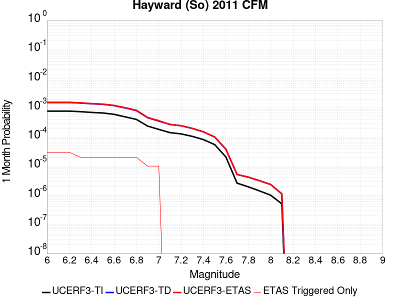 |  | 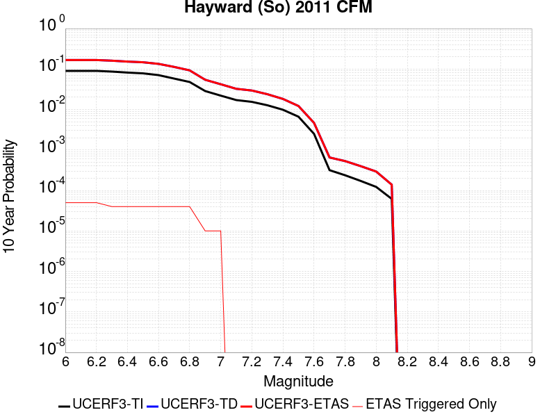 |

| Magnitude | 1 wk TI Prob | 1 wk TD Prob | 1 wk ETAS Prob | 1 wk ETAS/TD Gain | 1 wk ETAS Triggered Only | 1 mo TI Prob | 1 mo TD Prob | 1 mo ETAS Prob | 1 mo ETAS/TD Gain | 1 mo ETAS Triggered Only | 1 yr TI Prob | 1 yr TD Prob | 1 yr ETAS Prob | 1 yr ETAS/TD Gain | 1 yr ETAS Triggered Only | 10 yr TI Prob | 10 yr TD Prob | 10 yr ETAS Prob | 10 yr ETAS/TD Gain | 10 yr ETAS Triggered Only |
|-----|-----|-----|-----|-----|-----|-----|-----|-----|-----|-----|-----|-----|-----|-----|-----|-----|-----|-----|-----|-----|
| 6.0 | 1.8091932E-4 | 3.570673E-4 | 3.8705659E-4 | 1.0839878 | 3.0E-5 | 7.751381E-4 | 0.0015294008 | 0.001559355 | 1.0195855 | 3.0E-5 | 0.00939654 | 0.018463885 | 0.018503146 | 1.0021263 | 4.0E-5 | 0.090090066 | 0.1667085 | 0.16675016 | 1.00025 | 5.0E-5 |
| 6.1 | 1.8091932E-4 | 3.570673E-4 | 3.8705659E-4 | 1.0839878 | 3.0E-5 | 7.751381E-4 | 0.0015294008 | 0.001559355 | 1.0195855 | 3.0E-5 | 0.00939654 | 0.018463885 | 0.018503146 | 1.0021263 | 4.0E-5 | 0.090090066 | 0.1667085 | 0.16675016 | 1.00025 | 5.0E-5 |
| 6.2 | 1.8091932E-4 | 3.570673E-4 | 3.8705659E-4 | 1.0839878 | 3.0E-5 | 7.751381E-4 | 0.0015294008 | 0.001559355 | 1.0195855 | 3.0E-5 | 0.00939654 | 0.018463885 | 0.018503146 | 1.0021263 | 4.0E-5 | 0.090090066 | 0.1667085 | 0.16675016 | 1.00025 | 5.0E-5 |
| 6.3 | 1.7322872E-4 | 3.4263515E-4 | 3.626283E-4 | 1.0583512 | 2.0E-5 | 7.4219756E-4 | 0.0014676197 | 0.0014875903 | 1.0136075 | 2.0E-5 | 0.0089988755 | 0.017724147 | 0.017753616 | 1.0016626 | 3.0E-5 | 0.08643075 | 0.16065954 | 0.16069311 | 1.000209 | 4.0E-5 |
| 6.4 | 1.6334097E-4 | 3.2345165E-4 | 3.434452E-4 | 1.061813 | 2.0E-5 | 6.998449E-4 | 0.0013854936 | 0.0014054659 | 1.0144153 | 2.0E-5 | 0.008487372 | 0.016739927 | 0.016769424 | 1.0017622 | 3.0E-5 | 0.081704415 | 0.15256606 | 0.15259995 | 1.0002222 | 4.0E-5 |
| 6.5 | 1.5600289E-4 | 3.101982E-4 | 3.3019198E-4 | 1.0644549 | 2.0E-5 | 6.684125E-4 | 0.0013287518 | 0.0013487253 | 1.0150317 | 2.0E-5 | 0.008107598 | 0.016059443 | 0.016088963 | 1.0018381 | 3.0E-5 | 0.078181036 | 0.14684291 | 0.14687704 | 1.0002325 | 4.0E-5 |
| 6.6 | 1.4046066E-4 | 2.8034003E-4 | 3.0033445E-4 | 1.071322 | 2.0E-5 | 6.018354E-4 | 0.0012009109 | 0.0012208868 | 1.016634 | 2.0E-5 | 0.0073027555 | 0.014524571 | 0.014554135 | 1.0020355 | 3.0E-5 | 0.07067384 | 0.13393044 | 0.13396509 | 1.0002587 | 4.0E-5 |
| 6.7 | 1.14696966E-4 | 2.3272466E-4 | 2.5272E-4 | 1.0859184 | 2.0E-5 | 4.914658E-4 | 9.970153E-4 | 0.0010169953 | 1.0200399 | 2.0E-5 | 0.0059671924 | 0.012072163 | 0.012101801 | 1.0024551 | 3.0E-5 | 0.058094822 | 0.11274141 | 0.112776905 | 1.0003148 | 4.0E-5 |
| 6.8 | 9.3874296E-5 | 1.8862431E-4 | 2.0862053E-4 | 1.1060109 | 2.0E-5 | 4.0225635E-4 | 8.081431E-4 | 8.2812697E-4 | 1.0247281 | 2.0E-5 | 0.0048864787 | 0.009795489 | 0.009825195 | 1.0030327 | 3.0E-5 | 0.047804173 | 0.092592984 | 0.09262928 | 1.000392 | 4.0E-5 |
| 6.9 | 5.551852E-5 | 1.0729875E-4 | 1.1729768E-4 | 1.0931877 | 1.0E-5 | 2.3791482E-4 | 4.5977137E-4 | 4.6976676E-4 | 1.02174 | 1.0E-5 | 0.0028927654 | 0.005583468 | 0.0055934116 | 1.001781 | 1.0E-5 | 0.028553981 | 0.054246075 | 0.05425553 | 1.0001744 | 1.0E-5 |
| 7.0 | 4.2662363E-5 | 8.246792E-5 | 9.24671E-5 | 1.1212493 | 1.0E-5 | 1.8282588E-4 | 3.5338648E-4 | 3.6338295E-4 | 1.0282876 | 1.0E-5 | 0.0022236328 | 0.0042940658 | 0.004304023 | 1.0023187 | 1.0E-5 | 0.022015138 | 0.04206509 | 0.04207467 | 1.0002277 | 1.0E-5 |
| 7.1 | 3.305886E-5 | 6.302183E-5 | 6.302183E-5 | 1.0 | 0.0 | 1.4167312E-4 | 2.7006568E-4 | 2.7006568E-4 | 1.0 | 0.0 | 0.0017235056 | 0.003283111 | 0.003283111 | 1.0 | 0.0 | 0.017101998 | 0.032453902 | 0.032453902 | 1.0 | 0.0 |
| 7.2 | 2.9856887E-5 | 5.701622E-5 | 5.701622E-5 | 1.0 | 0.0 | 1.2795182E-4 | 2.4433242E-4 | 2.4433242E-4 | 1.0 | 0.0 | 0.0015567001 | 0.0029707062 | 0.0029707062 | 1.0 | 0.0 | 0.015458403 | 0.029454801 | 0.029454801 | 1.0 | 0.0 |
| 7.3 | 2.4559737E-5 | 4.599286E-5 | 4.599286E-5 | 1.0 | 0.0 | 1.0525176E-4 | 1.9709744E-4 | 1.9709744E-4 | 1.0 | 0.0 | 0.0012806869 | 0.0023970334 | 0.0023970334 | 1.0 | 0.0 | 0.012733313 | 0.023858516 | 0.023858516 | 1.0 | 0.0 |
| 7.4 | 1.9002231E-5 | 3.505084E-5 | 3.505084E-5 | 1.0 | 0.0 | 8.143559E-5 | 1.502093E-4 | 1.502093E-4 | 1.0 | 0.0 | 9.910273E-4 | 0.001827274 | 0.001827274 | 1.0 | 0.0 | 0.009866194 | 0.018258808 | 0.018258808 | 1.0 | 0.0 |
| 7.5 | 1.2783333E-5 | 2.3331182E-5 | 2.3331182E-5 | 1.0 | 0.0 | 5.4784563E-5 | 9.998698E-5 | 9.998698E-5 | 1.0 | 0.0 | 6.667979E-4 | 0.0012166675 | 0.0012166675 | 1.0 | 0.0 | 0.006648007 | 0.012209443 | 0.012209443 | 1.0 | 0.0 |
| 7.6 | 4.8149627E-6 | 8.888056E-6 | 8.888056E-6 | 1.0 | 0.0 | 2.063539E-5 | 3.8091122E-5 | 3.8091122E-5 | 1.0 | 0.0 | 2.5120692E-4 | 4.6366194E-4 | 4.6366194E-4 | 1.0 | 0.0 | 0.0025092314 | 0.0046805087 | 0.0046805087 | 1.0 | 0.0 |
| 7.7 | 6.0838227E-7 | 1.205754E-6 | 1.205754E-6 | 1.0 | 0.0 | 2.6073499E-6 | 5.1675065E-6 | 5.1675065E-6 | 1.0 | 0.0 | 3.174402E-5 | 6.291258E-5 | 6.291258E-5 | 1.0 | 0.0 | 3.1739488E-4 | 6.5296254E-4 | 6.5296254E-4 | 1.0 | 0.0 |
| 7.8 | 4.5542808E-7 | 9.792941E-7 | 9.792941E-7 | 1.0 | 0.0 | 1.9518332E-6 | 4.196968E-6 | 4.196968E-6 | 1.0 | 0.0 | 2.376331E-5 | 5.109689E-5 | 5.109689E-5 | 1.0 | 0.0 | 2.3760769E-4 | 5.321693E-4 | 5.321693E-4 | 1.0 | 0.0 |
| 7.9 | 3.3016747E-7 | 7.3869535E-7 | 7.3869535E-7 | 1.0 | 0.0 | 1.4150027E-6 | 3.1658333E-6 | 3.1658333E-6 | 1.0 | 0.0 | 1.7227521E-5 | 3.854334E-5 | 3.854334E-5 | 1.0 | 0.0 | 1.7226185E-4 | 3.9932923E-4 | 3.9932923E-4 | 1.0 | 0.0 |
| 8.0 | 2.347038E-7 | 5.471963E-7 | 5.471963E-7 | 1.0 | 0.0 | 1.0058731E-6 | 2.3451248E-6 | 2.3451248E-6 | 1.0 | 0.0 | 1.2246436E-5 | 2.8551523E-5 | 2.8551523E-5 | 1.0 | 0.0 | 1.2245761E-4 | 2.9357258E-4 | 2.9357258E-4 | 1.0 | 0.0 |
| 8.1 | 1.18822804E-7 | 2.6060948E-7 | 2.6060948E-7 | 1.0 | 0.0 | 5.092405E-7 | 1.1168972E-6 | 1.1168972E-6 | 1.0 | 0.0 | 6.1999854E-6 | 1.359814E-5 | 1.359814E-5 | 1.0 | 0.0 | 6.199812E-5 | 1.3918082E-4 | 1.3918082E-4 | 1.0 | 0.0 |

## Ortigalita (South)
*[(top)](#table-of-contents)*

| 1 Week | 1 Month | 1 Year | 10 Year |
|-----|-----|-----|-----|
|  |  |  | 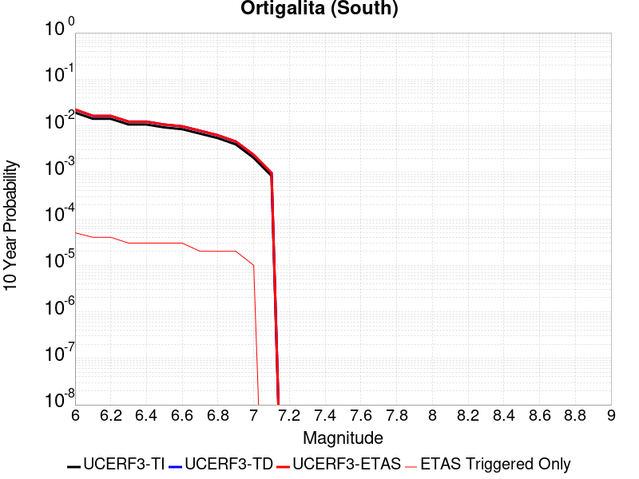 |

| Magnitude | 1 wk TI Prob | 1 wk TD Prob | 1 wk ETAS Prob | 1 wk ETAS/TD Gain | 1 wk ETAS Triggered Only | 1 mo TI Prob | 1 mo TD Prob | 1 mo ETAS Prob | 1 mo ETAS/TD Gain | 1 mo ETAS Triggered Only | 1 yr TI Prob | 1 yr TD Prob | 1 yr ETAS Prob | 1 yr ETAS/TD Gain | 1 yr ETAS Triggered Only | 10 yr TI Prob | 10 yr TD Prob | 10 yr ETAS Prob | 10 yr ETAS/TD Gain | 10 yr ETAS Triggered Only |
|-----|-----|-----|-----|-----|-----|-----|-----|-----|-----|-----|-----|-----|-----|-----|-----|-----|-----|-----|-----|-----|
| 6.0 | 3.72394E-5 | 4.32556E-5 | 7.3254305E-5 | 1.6935219 | 3.0E-5 | 1.5958765E-4 | 1.8536886E-4 | 2.2536144E-4 | 1.2157459 | 4.0E-5 | 0.0019412481 | 0.0022546863 | 0.0023045735 | 1.0221261 | 5.0E-5 | 0.019243775 | 0.022334501 | 0.022383384 | 1.0021887 | 5.0E-5 |
| 6.1 | 2.7299884E-5 | 3.1492036E-5 | 5.1491406E-5 | 1.6350613 | 2.0E-5 | 1.16994255E-4 | 1.349592E-4 | 1.6495516E-4 | 1.2222594 | 3.0E-5 | 0.0014234743 | 0.0016419457 | 0.00168188 | 1.0243213 | 4.0E-5 | 0.014143906 | 0.016304072 | 0.01634342 | 1.0024134 | 4.0E-5 |
| 6.2 | 2.7299884E-5 | 3.1492036E-5 | 5.1491406E-5 | 1.6350613 | 2.0E-5 | 1.16994255E-4 | 1.349592E-4 | 1.6495516E-4 | 1.2222594 | 3.0E-5 | 0.0014234743 | 0.0016419457 | 0.00168188 | 1.0243213 | 4.0E-5 | 0.014143906 | 0.016304072 | 0.01634342 | 1.0024134 | 4.0E-5 |
| 6.3 | 2.0546433E-5 | 2.3631454E-5 | 4.363098E-5 | 1.8463097 | 2.0E-5 | 8.805317E-5 | 1.0127383E-4 | 1.3127079E-4 | 1.2961966 | 3.0E-5 | 0.00107152 | 0.0012323305 | 0.0012622934 | 1.0243142 | 3.0E-5 | 0.010663681 | 0.012257031 | 0.012286663 | 1.0024176 | 3.0E-5 |
| 6.4 | 2.0546433E-5 | 2.3631454E-5 | 4.363098E-5 | 1.8463097 | 2.0E-5 | 8.805317E-5 | 1.0127383E-4 | 1.3127079E-4 | 1.2961966 | 3.0E-5 | 0.00107152 | 0.0012323305 | 0.0012622934 | 1.0243142 | 3.0E-5 | 0.010663681 | 0.012257031 | 0.012286663 | 1.0024176 | 3.0E-5 |
| 6.5 | 1.7779594E-5 | 2.0446974E-5 | 4.0446565E-5 | 1.9781199 | 2.0E-5 | 7.619603E-5 | 8.762703E-5 | 1.176244E-4 | 1.3423301 | 3.0E-5 | 9.272918E-4 | 0.0010663505 | 0.0010963185 | 1.0281034 | 3.0E-5 | 0.009234319 | 0.010613804 | 0.010643485 | 1.0027965 | 3.0E-5 |
| 6.6 | 1.6272212E-5 | 1.8714967E-5 | 3.8714592E-5 | 2.0686433 | 2.0E-5 | 6.973618E-5 | 8.0204605E-5 | 1.102022E-4 | 1.3740133 | 3.0E-5 | 8.487073E-4 | 9.760659E-4 | 0.0010060365 | 1.0307056 | 3.0E-5 | 0.008454733 | 0.009719091 | 0.009748799 | 1.0030568 | 3.0E-5 |
| 6.7 | 1.3051484E-5 | 1.5038758E-5 | 2.5038607E-5 | 1.6649386 | 1.0E-5 | 5.593373E-5 | 6.445028E-5 | 8.444899E-5 | 1.3102968 | 2.0E-5 | 6.807804E-4 | 7.844092E-4 | 8.043935E-4 | 1.0254769 | 2.0E-5 | 0.006786986 | 0.007817388 | 0.007837231 | 1.0025384 | 2.0E-5 |
| 6.8 | 1.04277415E-5 | 1.1987235E-5 | 2.1987114E-5 | 1.8342108 | 1.0E-5 | 4.4689557E-5 | 5.1372896E-5 | 7.137187E-5 | 1.3892903 | 2.0E-5 | 5.439595E-4 | 6.2529295E-4 | 6.452804E-4 | 1.031965 | 2.0E-5 | 0.0054262993 | 0.00623609 | 0.006255965 | 1.0031872 | 2.0E-5 |
| 6.9 | 7.639968E-6 | 8.791503E-6 | 1.8791416E-5 | 2.137452 | 1.0E-5 | 3.274231E-5 | 3.767736E-5 | 5.7676607E-5 | 1.5308027 | 2.0E-5 | 3.9856473E-4 | 4.586312E-4 | 4.78622E-4 | 1.043588 | 2.0E-5 | 0.003978506 | 0.004577433 | 0.0045973416 | 1.0043492 | 2.0E-5 |
| 7.0 | 3.919831E-6 | 4.5334014E-6 | 4.5334014E-6 | 1.0 | 0.0 | 1.679917E-5 | 1.942873E-5 | 2.9428536E-5 | 1.5146917 | 1.0E-5 | 2.045107E-4 | 2.3652123E-4 | 2.4651887E-4 | 1.0422695 | 1.0E-5 | 0.0020432258 | 0.0023629034 | 0.0023728798 | 1.004222 | 1.0E-5 |
| 7.1 | 1.6017933E-6 | 1.8570418E-6 | 1.8570418E-6 | 1.0 | 0.0 | 6.8648105E-6 | 7.958732E-6 | 7.958732E-6 | 1.0 | 0.0 | 8.357586E-5 | 9.689432E-5 | 9.689432E-5 | 1.0 | 0.0 | 8.3544437E-4 | 9.686254E-4 | 9.686254E-4 | 1.0 | 0.0 |

## Hunting Creek - Berryessa 2011 CFM
*[(top)](#table-of-contents)*

| 1 Week | 1 Month | 1 Year | 10 Year |
|-----|-----|-----|-----|
|  |  |  |  |

| Magnitude | 1 wk TI Prob | 1 wk TD Prob | 1 wk ETAS Prob | 1 wk ETAS/TD Gain | 1 wk ETAS Triggered Only | 1 mo TI Prob | 1 mo TD Prob | 1 mo ETAS Prob | 1 mo ETAS/TD Gain | 1 mo ETAS Triggered Only | 1 yr TI Prob | 1 yr TD Prob | 1 yr ETAS Prob | 1 yr ETAS/TD Gain | 1 yr ETAS Triggered Only | 10 yr TI Prob | 10 yr TD Prob | 10 yr ETAS Prob | 10 yr ETAS/TD Gain | 10 yr ETAS Triggered Only |
|-----|-----|-----|-----|-----|-----|-----|-----|-----|-----|-----|-----|-----|-----|-----|-----|-----|-----|-----|-----|-----|
| 6.0 | 1.1270982E-4 | 2.0028367E-4 | 2.0028367E-4 | 1.0 | 0.0 | 4.8295266E-4 | 8.579912E-4 | 8.679827E-4 | 1.0116451 | 1.0E-5 | 0.0058641075 | 0.010386173 | 0.010405965 | 1.0019057 | 2.0E-5 | 0.057117578 | 0.09804048 | 0.09806754 | 1.000276 | 3.0E-5 |
| 6.1 | 1.1239393E-4 | 1.9976508E-4 | 1.9976508E-4 | 1.0 | 0.0 | 4.8159933E-4 | 8.557703E-4 | 8.657618E-4 | 1.0116754 | 1.0E-5 | 0.0058477195 | 0.010359417 | 0.010379209 | 1.0019106 | 2.0E-5 | 0.056962132 | 0.09779895 | 0.097817 | 1.0001845 | 2.0E-5 |
| 6.2 | 7.596265E-5 | 1.2933646E-4 | 1.2933646E-4 | 1.0 | 0.0 | 3.2551357E-4 | 5.5415573E-4 | 5.6415016E-4 | 1.0180354 | 1.0E-5 | 0.0039559277 | 0.0067213587 | 0.006731292 | 1.0014778 | 1.0E-5 | 0.038862433 | 0.06459229 | 0.064601645 | 1.0001448 | 1.0E-5 |
| 6.3 | 6.78794E-5 | 1.1448377E-4 | 1.1448377E-4 | 1.0 | 0.0 | 2.9087928E-4 | 4.9052597E-4 | 5.0052104E-4 | 1.0203763 | 1.0E-5 | 0.003535705 | 0.005952661 | 0.0059626014 | 1.0016699 | 1.0E-5 | 0.034799766 | 0.057466213 | 0.057475638 | 1.000164 | 1.0E-5 |
| 6.4 | 6.2165134E-5 | 1.0434825E-4 | 1.0434825E-4 | 1.0 | 0.0 | 2.6639478E-4 | 4.4711027E-4 | 4.4711027E-4 | 1.0 | 0.0 | 0.0032385332 | 0.0054274183 | 0.0054274183 | 1.0 | 0.0 | 0.03191742 | 0.05255138 | 0.05255138 | 1.0 | 0.0 |
| 6.5 | 5.4368087E-5 | 9.070258E-5 | 9.070258E-5 | 1.0 | 0.0 | 2.3298527E-4 | 3.886537E-4 | 3.886537E-4 | 1.0 | 0.0 | 0.0028329059 | 0.0047197016 | 0.0047197016 | 1.0 | 0.0 | 0.027970633 | 0.045881182 | 0.045881182 | 1.0 | 0.0 |
| 6.6 | 4.729947E-5 | 7.847101E-5 | 7.847101E-5 | 1.0 | 0.0 | 2.0269625E-4 | 3.3624718E-4 | 3.3624718E-4 | 1.0 | 0.0 | 0.002465034 | 0.004084746 | 0.004084746 | 1.0 | 0.0 | 0.02437869 | 0.03985269 | 0.03985269 | 1.0 | 0.0 |
| 6.7 | 3.6875328E-5 | 6.0443555E-5 | 6.0443555E-5 | 1.0 | 0.0 | 1.5802756E-4 | 2.5900968E-4 | 2.5900968E-4 | 1.0 | 0.0 | 0.0019222875 | 0.0031482724 | 0.0031482724 | 1.0 | 0.0 | 0.019057442 | 0.03089371 | 0.03089371 | 1.0 | 0.0 |
| 6.8 | 2.0292036E-5 | 2.8976721E-5 | 2.8976721E-5 | 1.0 | 0.0 | 8.6962966E-5 | 1.2417998E-4 | 1.2417998E-4 | 1.0 | 0.0 | 0.0010582599 | 0.0015108302 | 0.0015108302 | 1.0 | 0.0 | 0.010532344 | 0.0149790775 | 0.0149790775 | 1.0 | 0.0 |
| 6.9 | 1.7871042E-5 | 2.4472653E-5 | 2.4472653E-5 | 1.0 | 0.0 | 7.658793E-5 | 1.04878585E-4 | 1.04878585E-4 | 1.0 | 0.0 | 9.320591E-4 | 0.0012761486 | 0.0012761486 | 1.0 | 0.0 | 0.009281595 | 0.012680395 | 0.012680395 | 1.0 | 0.0 |
| 7.0 | 1.6415532E-5 | 2.1906566E-5 | 2.1906566E-5 | 1.0 | 0.0 | 7.035038E-5 | 9.388191E-5 | 9.388191E-5 | 1.0 | 0.0 | 8.561793E-4 | 0.0011424144 | 0.0011424144 | 1.0 | 0.0 | 0.008528882 | 0.011365017 | 0.011365017 | 1.0 | 0.0 |
| 7.1 | 1.5409885E-5 | 2.0346588E-5 | 2.0346588E-5 | 1.0 | 0.0 | 6.6040695E-5 | 8.719676E-5 | 8.719676E-5 | 1.0 | 0.0 | 8.0374884E-4 | 0.0010611062 | 0.0010611062 | 1.0 | 0.0 | 0.00800848 | 0.010560924 | 0.010560924 | 1.0 | 0.0 |
| 7.2 | 1.4497423E-5 | 1.905519E-5 | 1.905519E-5 | 1.0 | 0.0 | 6.213033E-5 | 8.166256E-5 | 8.166256E-5 | 1.0 | 0.0 | 7.5617427E-4 | 9.937913E-4 | 9.937913E-4 | 1.0 | 0.0 | 0.0075360634 | 0.00989425 | 0.00989425 | 1.0 | 0.0 |
| 7.3 | 1.3615175E-5 | 1.7826347E-5 | 1.7826347E-5 | 1.0 | 0.0 | 5.8349444E-5 | 7.6396405E-5 | 7.6396405E-5 | 1.0 | 0.0 | 7.101729E-4 | 9.297323E-4 | 9.297323E-4 | 1.0 | 0.0 | 0.0070790765 | 0.009259124 | 0.009259124 | 1.0 | 0.0 |
| 7.4 | 1.2252825E-5 | 1.6026455E-5 | 1.6026455E-5 | 1.0 | 0.0 | 5.251105E-5 | 6.868302E-5 | 6.868302E-5 | 1.0 | 0.0 | 6.391345E-4 | 8.3589775E-4 | 8.3589775E-4 | 1.0 | 0.0 | 0.0063729943 | 0.008328172 | 0.008328172 | 1.0 | 0.0 |
| 7.5 | 1.0913301E-5 | 1.4241286E-5 | 1.4241286E-5 | 1.0 | 0.0 | 4.6770452E-5 | 6.103267E-5 | 6.103267E-5 | 1.0 | 0.0 | 5.6928146E-4 | 7.428222E-4 | 7.428222E-4 | 1.0 | 0.0 | 0.0056782532 | 0.0074039865 | 0.0074039865 | 1.0 | 0.0 |
| 7.6 | 8.623192E-6 | 1.12347825E-5 | 1.12347825E-5 | 1.0 | 0.0 | 3.6956015E-5 | 4.8148195E-5 | 4.8148195E-5 | 1.0 | 0.0 | 4.4984656E-4 | 5.8604917E-4 | 5.8604917E-4 | 1.0 | 0.0 | 0.00448937 | 0.005845504 | 0.005845504 | 1.0 | 0.0 |
| 7.7 | 2.0993634E-6 | 2.66264E-6 | 2.66264E-6 | 1.0 | 0.0 | 8.997241E-6 | 1.1411265E-5 | 1.1411265E-5 | 1.0 | 0.0 | 1.09535904E-4 | 1.3892337E-4 | 1.3892337E-4 | 1.0 | 0.0 | 0.0010948193 | 0.0013883994 | 0.0013883994 | 1.0 | 0.0 |
| 7.8 | 1.8428308E-7 | 2.1674624E-7 | 2.1674624E-7 | 1.0 | 0.0 | 7.897844E-7 | 9.289122E-7 | 9.289122E-7 | 1.0 | 0.0 | 9.615583E-6 | 1.130945E-5 | 1.130945E-5 | 1.0 | 0.0 | 9.615166E-5 | 1.1308173E-4 | 1.1308173E-4 | 1.0 | 0.0 |

## Channel Islands Thrust
*[(top)](#table-of-contents)*

| 1 Week | 1 Month | 1 Year | 10 Year |
|-----|-----|-----|-----|
|  |  |  | 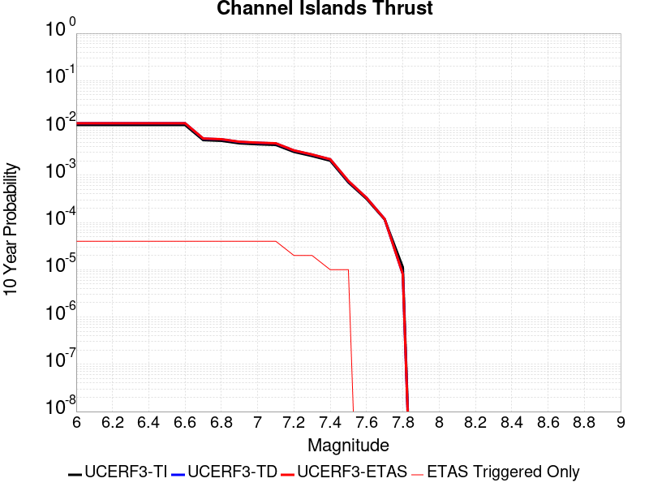 |

| Magnitude | 1 wk TI Prob | 1 wk TD Prob | 1 wk ETAS Prob | 1 wk ETAS/TD Gain | 1 wk ETAS Triggered Only | 1 mo TI Prob | 1 mo TD Prob | 1 mo ETAS Prob | 1 mo ETAS/TD Gain | 1 mo ETAS Triggered Only | 1 yr TI Prob | 1 yr TD Prob | 1 yr ETAS Prob | 1 yr ETAS/TD Gain | 1 yr ETAS Triggered Only | 10 yr TI Prob | 10 yr TD Prob | 10 yr ETAS Prob | 10 yr ETAS/TD Gain | 10 yr ETAS Triggered Only |
|-----|-----|-----|-----|-----|-----|-----|-----|-----|-----|-----|-----|-----|-----|-----|-----|-----|-----|-----|-----|-----|
| 6.0 | 2.2156251E-5 | 2.4092022E-5 | 4.409154E-5 | 1.8301303 | 2.0E-5 | 9.495191E-5 | 1.03248036E-4 | 1.3324495E-4 | 1.2905325 | 3.0E-5 | 0.0011554264 | 0.0012564266 | 0.0012863888 | 1.0238472 | 3.0E-5 | 0.011494373 | 0.0125038205 | 0.012543321 | 1.003159 | 4.0E-5 |
| 6.1 | 2.2156251E-5 | 2.4092022E-5 | 4.409154E-5 | 1.8301303 | 2.0E-5 | 9.495191E-5 | 1.03248036E-4 | 1.3324495E-4 | 1.2905325 | 3.0E-5 | 0.0011554264 | 0.0012564266 | 0.0012863888 | 1.0238472 | 3.0E-5 | 0.011494373 | 0.0125038205 | 0.012543321 | 1.003159 | 4.0E-5 |
| 6.2 | 2.2156251E-5 | 2.4092022E-5 | 4.409154E-5 | 1.8301303 | 2.0E-5 | 9.495191E-5 | 1.03248036E-4 | 1.3324495E-4 | 1.2905325 | 3.0E-5 | 0.0011554264 | 0.0012564266 | 0.0012863888 | 1.0238472 | 3.0E-5 | 0.011494373 | 0.0125038205 | 0.012543321 | 1.003159 | 4.0E-5 |
| 6.3 | 2.2156251E-5 | 2.4092022E-5 | 4.409154E-5 | 1.8301303 | 2.0E-5 | 9.495191E-5 | 1.03248036E-4 | 1.3324495E-4 | 1.2905325 | 3.0E-5 | 0.0011554264 | 0.0012564266 | 0.0012863888 | 1.0238472 | 3.0E-5 | 0.011494373 | 0.0125038205 | 0.012543321 | 1.003159 | 4.0E-5 |
| 6.4 | 2.2156251E-5 | 2.4092022E-5 | 4.409154E-5 | 1.8301303 | 2.0E-5 | 9.495191E-5 | 1.03248036E-4 | 1.3324495E-4 | 1.2905325 | 3.0E-5 | 0.0011554264 | 0.0012564266 | 0.0012863888 | 1.0238472 | 3.0E-5 | 0.011494373 | 0.0125038205 | 0.012543321 | 1.003159 | 4.0E-5 |
| 6.5 | 2.2156251E-5 | 2.4092022E-5 | 4.409154E-5 | 1.8301303 | 2.0E-5 | 9.495191E-5 | 1.03248036E-4 | 1.3324495E-4 | 1.2905325 | 3.0E-5 | 0.0011554264 | 0.0012564266 | 0.0012863888 | 1.0238472 | 3.0E-5 | 0.011494373 | 0.0125038205 | 0.012543321 | 1.003159 | 4.0E-5 |
| 6.6 | 2.2156251E-5 | 2.4092022E-5 | 4.409154E-5 | 1.8301303 | 2.0E-5 | 9.495191E-5 | 1.03248036E-4 | 1.3324495E-4 | 1.2905325 | 3.0E-5 | 0.0011554264 | 0.0012564266 | 0.0012863888 | 1.0238472 | 3.0E-5 | 0.011494373 | 0.0125038205 | 0.012543321 | 1.003159 | 4.0E-5 |
| 6.7 | 1.0601296E-5 | 1.1379544E-5 | 3.1379317E-5 | 2.7575197 | 2.0E-5 | 4.5433335E-5 | 4.876859E-5 | 7.876712E-5 | 1.61512 | 3.0E-5 | 5.5301044E-4 | 5.936007E-4 | 6.235829E-4 | 1.050509 | 3.0E-5 | 0.005516363 | 0.005920653 | 0.0059604165 | 1.006716 | 4.0E-5 |
| 6.8 | 1.0246747E-5 | 1.0996669E-5 | 3.099645E-5 | 2.8187125 | 2.0E-5 | 4.391389E-5 | 4.7127756E-5 | 7.7126344E-5 | 1.6365376 | 3.0E-5 | 5.345204E-4 | 5.7363417E-4 | 6.0361694E-4 | 1.0522681 | 3.0E-5 | 0.0053323656 | 0.005722025 | 0.005761796 | 1.0069505 | 4.0E-5 |
| 6.9 | 9.049551E-6 | 9.699645E-6 | 2.9699451E-5 | 3.0619113 | 2.0E-5 | 3.878322E-5 | 4.1569267E-5 | 7.156802E-5 | 1.721657 | 3.0E-5 | 4.7208337E-4 | 5.059924E-4 | 5.359772E-4 | 1.0592594 | 3.0E-5 | 0.0047108172 | 0.0050488203 | 0.0050886185 | 1.0078826 | 4.0E-5 |
| 7.0 | 8.6542195E-6 | 9.274603E-6 | 2.9274417E-5 | 3.1564064 | 2.0E-5 | 3.7088983E-5 | 3.9747716E-5 | 6.974652E-5 | 1.7547303 | 3.0E-5 | 4.5146482E-4 | 4.8382508E-4 | 5.1381055E-4 | 1.0619758 | 3.0E-5 | 0.004505487 | 0.0048281294 | 0.004867936 | 1.0082448 | 4.0E-5 |
| 7.1 | 8.391028E-6 | 8.992925E-6 | 2.8992745E-5 | 3.2239504 | 2.0E-5 | 3.5961057E-5 | 3.8540562E-5 | 6.8539404E-5 | 1.7783707 | 3.0E-5 | 4.3773788E-4 | 4.6913436E-4 | 4.991203E-4 | 1.0639175 | 3.0E-5 | 0.004368766 | 0.0046818503 | 0.004721663 | 1.0085037 | 4.0E-5 |
| 7.2 | 5.965188E-6 | 6.3716957E-6 | 1.6371632E-5 | 2.569431 | 1.0E-5 | 2.556484E-5 | 2.7306984E-5 | 4.730644E-5 | 1.7323934 | 2.0E-5 | 3.1120746E-4 | 3.3241237E-4 | 3.524057E-4 | 1.0601462 | 2.0E-5 | 0.00310772 | 0.0033192094 | 0.003339143 | 1.0060055 | 2.0E-5 |
| 7.3 | 4.877518E-6 | 5.206007E-6 | 1.5205955E-5 | 2.9208481 | 1.0E-5 | 2.0903482E-5 | 2.231127E-5 | 4.231082E-5 | 1.896388 | 2.0E-5 | 2.5447016E-4 | 2.716063E-4 | 2.9160085E-4 | 1.073616 | 2.0E-5 | 0.0025417898 | 0.0027127897 | 0.0027327354 | 1.0073525 | 2.0E-5 |
| 7.4 | 3.8829853E-6 | 4.141863E-6 | 4.141863E-6 | 1.0 | 0.0 | 1.664126E-5 | 1.7750723E-5 | 2.7750546E-5 | 1.5633473 | 1.0E-5 | 2.0258849E-4 | 2.1609403E-4 | 2.2609187E-4 | 1.0462662 | 1.0E-5 | 0.002024039 | 0.002158881 | 0.0021688591 | 1.004622 | 1.0E-5 |
| 7.5 | 1.3489616E-6 | 1.4277905E-6 | 1.4277905E-6 | 1.0 | 0.0 | 5.7812517E-6 | 6.119088E-6 | 1.6119027E-5 | 2.6342204 | 1.0E-5 | 7.038446E-5 | 7.449739E-5 | 8.449665E-5 | 1.1342229 | 1.0E-5 | 7.036218E-4 | 7.4472814E-4 | 7.547207E-4 | 1.0134177 | 1.0E-5 |
| 7.6 | 6.058192E-7 | 6.35378E-7 | 6.35378E-7 | 1.0 | 0.0 | 2.5963652E-6 | 2.7230458E-6 | 2.7230458E-6 | 1.0 | 0.0 | 3.161029E-5 | 3.3152595E-5 | 3.3152595E-5 | 1.0 | 0.0 | 3.1605794E-4 | 3.314781E-4 | 3.314781E-4 | 1.0 | 0.0 |
| 7.7 | 2.2170494E-7 | 2.2607924E-7 | 2.2607924E-7 | 1.0 | 0.0 | 9.5016367E-7 | 9.689107E-7 | 9.689107E-7 | 1.0 | 0.0 | 1.1568181E-5 | 1.17964355E-5 | 1.17964355E-5 | 1.0 | 0.0 | 1.1567579E-4 | 1.179592E-4 | 1.179592E-4 | 1.0 | 0.0 |
| 7.8 | 2.1613102E-8 | 1.5466837E-8 | 1.5466837E-8 | 1.0 | 0.0 | 9.262757E-8 | 6.628645E-8 | 6.628645E-8 | 1.0 | 0.0 | 1.1277401E-6 | 8.070372E-7 | 8.070372E-7 | 1.0 | 0.0 | 1.1277344E-5 | 8.07035E-6 | 8.07035E-6 | 1.0 | 0.0 |

## Johnson Valley (No) 2011 rev
*[(top)](#table-of-contents)*

| 1 Week | 1 Month | 1 Year | 10 Year |
|-----|-----|-----|-----|
|  |  |  |  |

| Magnitude | 1 wk TI Prob | 1 wk TD Prob | 1 wk ETAS Prob | 1 wk ETAS/TD Gain | 1 wk ETAS Triggered Only | 1 mo TI Prob | 1 mo TD Prob | 1 mo ETAS Prob | 1 mo ETAS/TD Gain | 1 mo ETAS Triggered Only | 1 yr TI Prob | 1 yr TD Prob | 1 yr ETAS Prob | 1 yr ETAS/TD Gain | 1 yr ETAS Triggered Only | 10 yr TI Prob | 10 yr TD Prob | 10 yr ETAS Prob | 10 yr ETAS/TD Gain | 10 yr ETAS Triggered Only |
|-----|-----|-----|-----|-----|-----|-----|-----|-----|-----|-----|-----|-----|-----|-----|-----|-----|-----|-----|-----|-----|
| 6.0 | 2.577707E-5 | 1.2901208E-5 | 2.2901078E-5 | 1.7751112 | 1.0E-5 | 1.1046848E-4 | 5.528994E-5 | 6.528939E-5 | 1.1808547 | 1.0E-5 | 0.0013441239 | 6.729868E-4 | 6.929733E-4 | 1.0296983 | 2.0E-5 | 0.013360229 | 0.006713397 | 0.0067531285 | 1.0059183 | 4.0E-5 |
| 6.1 | 2.577707E-5 | 1.2901208E-5 | 2.2901078E-5 | 1.7751112 | 1.0E-5 | 1.1046848E-4 | 5.528994E-5 | 6.528939E-5 | 1.1808547 | 1.0E-5 | 0.0013441239 | 6.729868E-4 | 6.929733E-4 | 1.0296983 | 2.0E-5 | 0.013360229 | 0.006713397 | 0.0067531285 | 1.0059183 | 4.0E-5 |
| 6.2 | 2.577707E-5 | 1.2901208E-5 | 2.2901078E-5 | 1.7751112 | 1.0E-5 | 1.1046848E-4 | 5.528994E-5 | 6.528939E-5 | 1.1808547 | 1.0E-5 | 0.0013441239 | 6.729868E-4 | 6.929733E-4 | 1.0296983 | 2.0E-5 | 0.013360229 | 0.006713397 | 0.0067531285 | 1.0059183 | 4.0E-5 |
| 6.3 | 2.577707E-5 | 1.2901208E-5 | 2.2901078E-5 | 1.7751112 | 1.0E-5 | 1.1046848E-4 | 5.528994E-5 | 6.528939E-5 | 1.1808547 | 1.0E-5 | 0.0013441239 | 6.729868E-4 | 6.929733E-4 | 1.0296983 | 2.0E-5 | 0.013360229 | 0.006713397 | 0.0067531285 | 1.0059183 | 4.0E-5 |
| 6.4 | 1.5296591E-5 | 7.5369735E-6 | 7.5369735E-6 | 1.0 | 0.0 | 6.555518E-5 | 3.230102E-5 | 3.230102E-5 | 1.0 | 0.0 | 7.97842E-4 | 3.9321271E-4 | 3.9321271E-4 | 1.0 | 0.0 | 0.007949836 | 0.003927011 | 0.003936972 | 1.0025364 | 1.0E-5 |
| 6.5 | 1.5296591E-5 | 7.5369735E-6 | 7.5369735E-6 | 1.0 | 0.0 | 6.555518E-5 | 3.230102E-5 | 3.230102E-5 | 1.0 | 0.0 | 7.97842E-4 | 3.9321271E-4 | 3.9321271E-4 | 1.0 | 0.0 | 0.007949836 | 0.003927011 | 0.003936972 | 1.0025364 | 1.0E-5 |
| 6.6 | 1.3289383E-5 | 5.9919316E-6 | 5.9919316E-6 | 1.0 | 0.0 | 5.6953253E-5 | 2.567955E-5 | 2.567955E-5 | 1.0 | 0.0 | 6.9318525E-4 | 3.1262063E-4 | 3.1262063E-4 | 1.0 | 0.0 | 0.0069102696 | 0.0031234731 | 0.0031334418 | 1.0031916 | 1.0E-5 |
| 6.7 | 1.3289383E-5 | 5.9919316E-6 | 5.9919316E-6 | 1.0 | 0.0 | 5.6953253E-5 | 2.567955E-5 | 2.567955E-5 | 1.0 | 0.0 | 6.9318525E-4 | 3.1262063E-4 | 3.1262063E-4 | 1.0 | 0.0 | 0.0069102696 | 0.0031234731 | 0.0031334418 | 1.0031916 | 1.0E-5 |
| 6.8 | 8.330789E-6 | 2.9214577E-6 | 2.9214577E-6 | 1.0 | 0.0 | 3.570289E-5 | 1.2520505E-5 | 1.2520505E-5 | 1.0 | 0.0 | 4.34596E-4 | 1.524322E-4 | 1.524322E-4 | 1.0 | 0.0 | 0.0043374705 | 0.0015238364 | 0.0015238364 | 1.0 | 0.0 |
| 6.9 | 7.2359003E-6 | 2.3014702E-6 | 2.3014702E-6 | 1.0 | 0.0 | 3.1010633E-5 | 9.863436E-6 | 9.863436E-6 | 1.0 | 0.0 | 3.7748902E-4 | 1.2008605E-4 | 1.2008605E-4 | 1.0 | 0.0 | 0.0037684843 | 0.0012007345 | 0.0012007345 | 1.0 | 0.0 |
| 7.0 | 6.5149957E-6 | 2.0886398E-6 | 2.0886398E-6 | 1.0 | 0.0 | 2.792111E-5 | 8.951313E-6 | 8.951313E-6 | 1.0 | 0.0 | 3.398865E-4 | 1.0898209E-4 | 1.0898209E-4 | 1.0 | 0.0 | 0.003393671 | 0.0010898062 | 0.0010898062 | 1.0 | 0.0 |
| 7.1 | 1.1662233E-6 | 2.8793124E-8 | 2.8793124E-8 | 1.0 | 0.0 | 4.9980904E-6 | 1.2339909E-7 | 1.2339909E-7 | 1.0 | 0.0 | 6.0850052E-5 | 1.5023832E-6 | 1.5023832E-6 | 1.0 | 0.0 | 6.083339E-4 | 1.5023746E-5 | 1.5023746E-5 | 1.0 | 0.0 |
| 7.2 | 5.413881E-7 | 2.8793124E-8 | 2.8793124E-8 | 1.0 | 0.0 | 2.3202326E-6 | 1.2339909E-7 | 1.2339909E-7 | 1.0 | 0.0 | 2.8248465E-5 | 1.5023832E-6 | 1.5023832E-6 | 1.0 | 0.0 | 2.8244875E-4 | 1.5023746E-5 | 1.5023746E-5 | 1.0 | 0.0 |
| 7.3 | 5.076821E-7 | 2.8793124E-8 | 2.8793124E-8 | 1.0 | 0.0 | 2.1757785E-6 | 1.2339909E-7 | 1.2339909E-7 | 1.0 | 0.0 | 2.648978E-5 | 1.5023832E-6 | 1.5023832E-6 | 1.0 | 0.0 | 2.6486625E-4 | 1.5023746E-5 | 1.5023746E-5 | 1.0 | 0.0 |
| 7.4 | 4.7568687E-7 | 2.8775073E-8 | 2.8775073E-8 | 1.0 | 0.0 | 2.0386565E-6 | 1.2332174E-7 | 1.2332174E-7 | 1.0 | 0.0 | 2.482036E-5 | 1.5014413E-6 | 1.5014413E-6 | 1.0 | 0.0 | 2.4817587E-4 | 1.5014328E-5 | 1.5014328E-5 | 1.0 | 0.0 |
| 7.5 | 3.435626E-7 | 2.5350424E-8 | 2.5350424E-8 | 1.0 | 0.0 | 1.4724103E-6 | 1.0864467E-7 | 1.0864467E-7 | 1.0 | 0.0 | 1.7926448E-5 | 1.3227482E-6 | 1.3227482E-6 | 1.0 | 0.0 | 1.7925001E-4 | 1.3227419E-5 | 1.3227419E-5 | 1.0 | 0.0 |

## Channel Islands Western Deep Ramp
*[(top)](#table-of-contents)*

| 1 Week | 1 Month | 1 Year | 10 Year |
|-----|-----|-----|-----|
| 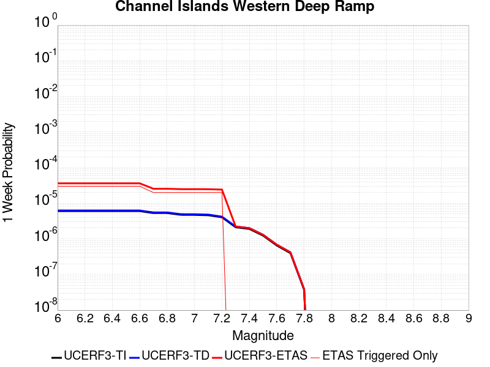 | 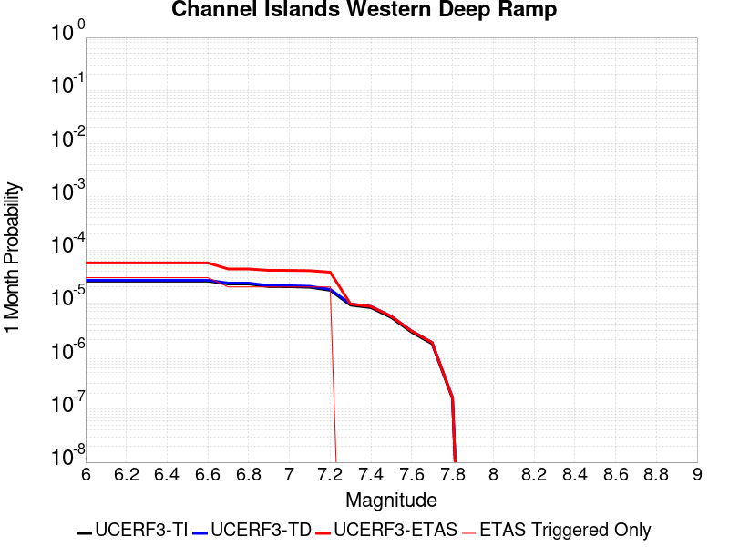 |  | 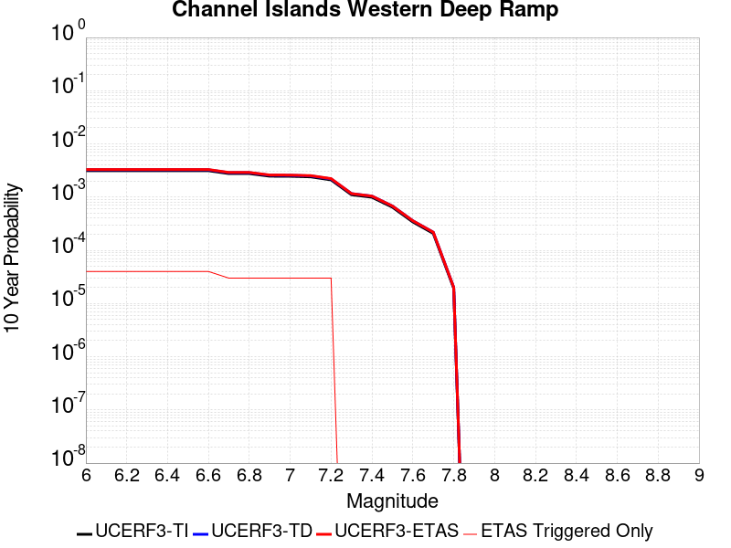 |

| Magnitude | 1 wk TI Prob | 1 wk TD Prob | 1 wk ETAS Prob | 1 wk ETAS/TD Gain | 1 wk ETAS Triggered Only | 1 mo TI Prob | 1 mo TD Prob | 1 mo ETAS Prob | 1 mo ETAS/TD Gain | 1 mo ETAS Triggered Only | 1 yr TI Prob | 1 yr TD Prob | 1 yr ETAS Prob | 1 yr ETAS/TD Gain | 1 yr ETAS Triggered Only | 10 yr TI Prob | 10 yr TD Prob | 10 yr ETAS Prob | 10 yr ETAS/TD Gain | 10 yr ETAS Triggered Only |
|-----|-----|-----|-----|-----|-----|-----|-----|-----|-----|-----|-----|-----|-----|-----|-----|-----|-----|-----|-----|-----|
| 6.0 | 6.0213506E-6 | 6.2548684E-6 | 3.625468E-5 | 5.796234 | 3.0E-5 | 2.5805533E-5 | 2.6806329E-5 | 5.6805526E-5 | 2.1191087 | 3.0E-5 | 3.1413708E-4 | 3.2632265E-4 | 3.5631284E-4 | 1.0919036 | 3.0E-5 | 0.0031369338 | 0.0032588763 | 0.003298746 | 1.0122342 | 4.0E-5 |
| 6.1 | 6.0213506E-6 | 6.2548684E-6 | 3.625468E-5 | 5.796234 | 3.0E-5 | 2.5805533E-5 | 2.6806329E-5 | 5.6805526E-5 | 2.1191087 | 3.0E-5 | 3.1413708E-4 | 3.2632265E-4 | 3.5631284E-4 | 1.0919036 | 3.0E-5 | 0.0031369338 | 0.0032588763 | 0.003298746 | 1.0122342 | 4.0E-5 |
| 6.2 | 6.0213506E-6 | 6.2548684E-6 | 3.625468E-5 | 5.796234 | 3.0E-5 | 2.5805533E-5 | 2.6806329E-5 | 5.6805526E-5 | 2.1191087 | 3.0E-5 | 3.1413708E-4 | 3.2632265E-4 | 3.5631284E-4 | 1.0919036 | 3.0E-5 | 0.0031369338 | 0.0032588763 | 0.003298746 | 1.0122342 | 4.0E-5 |
| 6.3 | 6.0213506E-6 | 6.2548684E-6 | 3.625468E-5 | 5.796234 | 3.0E-5 | 2.5805533E-5 | 2.6806329E-5 | 5.6805526E-5 | 2.1191087 | 3.0E-5 | 3.1413708E-4 | 3.2632265E-4 | 3.5631284E-4 | 1.0919036 | 3.0E-5 | 0.0031369338 | 0.0032588763 | 0.003298746 | 1.0122342 | 4.0E-5 |
| 6.4 | 6.0213506E-6 | 6.2548684E-6 | 3.625468E-5 | 5.796234 | 3.0E-5 | 2.5805533E-5 | 2.6806329E-5 | 5.6805526E-5 | 2.1191087 | 3.0E-5 | 3.1413708E-4 | 3.2632265E-4 | 3.5631284E-4 | 1.0919036 | 3.0E-5 | 0.0031369338 | 0.0032588763 | 0.003298746 | 1.0122342 | 4.0E-5 |
| 6.5 | 6.0213506E-6 | 6.2548684E-6 | 3.625468E-5 | 5.796234 | 3.0E-5 | 2.5805533E-5 | 2.6806329E-5 | 5.6805526E-5 | 2.1191087 | 3.0E-5 | 3.1413708E-4 | 3.2632265E-4 | 3.5631284E-4 | 1.0919036 | 3.0E-5 | 0.0031369338 | 0.0032588763 | 0.003298746 | 1.0122342 | 4.0E-5 |
| 6.6 | 6.0213506E-6 | 6.2548684E-6 | 3.625468E-5 | 5.796234 | 3.0E-5 | 2.5805533E-5 | 2.6806329E-5 | 5.6805526E-5 | 2.1191087 | 3.0E-5 | 3.1413708E-4 | 3.2632265E-4 | 3.5631284E-4 | 1.0919036 | 3.0E-5 | 0.0031369338 | 0.0032588763 | 0.003298746 | 1.0122342 | 4.0E-5 |
| 6.7 | 5.313309E-6 | 5.5252403E-6 | 2.552513E-5 | 4.619732 | 2.0E-5 | 2.2771126E-5 | 2.367941E-5 | 4.3678938E-5 | 1.8445957 | 2.0E-5 | 2.772032E-4 | 2.8826276E-4 | 3.08257E-4 | 1.0693611 | 2.0E-5 | 0.0027685766 | 0.0028792918 | 0.0029092054 | 1.0103892 | 3.0E-5 |
| 6.8 | 5.313309E-6 | 5.5252403E-6 | 2.552513E-5 | 4.619732 | 2.0E-5 | 2.2771126E-5 | 2.367941E-5 | 4.3678938E-5 | 1.8445957 | 2.0E-5 | 2.772032E-4 | 2.8826276E-4 | 3.08257E-4 | 1.0693611 | 2.0E-5 | 0.0027685766 | 0.0028792918 | 0.0029092054 | 1.0103892 | 3.0E-5 |
| 6.9 | 4.744377E-6 | 4.9394303E-6 | 2.4939332E-5 | 5.04903 | 2.0E-5 | 2.0332885E-5 | 2.1168837E-5 | 4.1168412E-5 | 1.944765 | 2.0E-5 | 2.4752476E-4 | 2.5770385E-4 | 2.7769868E-4 | 1.0775884 | 2.0E-5 | 0.0024724922 | 0.0025744175 | 0.0026043402 | 1.0116231 | 3.0E-5 |
| 7.0 | 4.722209E-6 | 4.9164732E-6 | 2.4916375E-5 | 5.067937 | 2.0E-5 | 2.0237881E-5 | 2.107045E-5 | 4.1070027E-5 | 1.9491767 | 2.0E-5 | 2.4636835E-4 | 2.5650626E-4 | 2.7650114E-4 | 1.0779508 | 2.0E-5 | 0.002460954 | 0.0025624693 | 0.0025923925 | 1.0116775 | 3.0E-5 |
| 7.1 | 4.611174E-6 | 4.801409E-6 | 2.4801313E-5 | 5.165424 | 2.0E-5 | 1.9762025E-5 | 2.0577325E-5 | 4.0576913E-5 | 1.9719236 | 2.0E-5 | 2.4057609E-4 | 2.5050386E-4 | 2.7049886E-4 | 1.0798191 | 2.0E-5 | 0.002403158 | 0.002502582 | 0.0025325068 | 1.0119576 | 3.0E-5 |
| 7.2 | 4.043994E-6 | 4.2120264E-6 | 2.4211942E-5 | 5.748288 | 2.0E-5 | 1.7331287E-5 | 1.8051438E-5 | 3.8051076E-5 | 2.107925 | 2.0E-5 | 2.10988E-4 | 2.1975765E-4 | 2.3975327E-4 | 1.0909894 | 2.0E-5 | 0.002107878 | 0.0021957543 | 0.0022256884 | 1.0136328 | 3.0E-5 |
| 7.3 | 2.1233036E-6 | 2.2297875E-6 | 2.2297875E-6 | 1.0 | 0.0 | 9.099841E-6 | 9.556197E-6 | 9.556197E-6 | 1.0 | 0.0 | 1.1078493E-4 | 1.1634055E-4 | 1.1634055E-4 | 1.0 | 0.0 | 0.0011072971 | 0.001162802 | 0.001162802 | 1.0 | 0.0 |
| 7.4 | 1.9051884E-6 | 2.0014973E-6 | 2.0014973E-6 | 1.0 | 0.0 | 8.165067E-6 | 8.577817E-6 | 8.577817E-6 | 1.0 | 0.0 | 9.940516E-5 | 1.0442998E-4 | 1.0442998E-4 | 1.0 | 0.0 | 9.93607E-4 | 0.0010438144 | 0.0010438144 | 1.0 | 0.0 |
| 7.5 | 1.2408497E-6 | 1.3038839E-6 | 1.3038839E-6 | 1.0 | 0.0 | 5.317916E-6 | 5.588062E-6 | 5.588062E-6 | 1.0 | 0.0 | 6.4743705E-5 | 6.8032554E-5 | 6.8032554E-5 | 1.0 | 0.0 | 6.4724847E-4 | 6.8011944E-4 | 6.8011944E-4 | 1.0 | 0.0 |
| 7.6 | 6.5440025E-7 | 6.886718E-7 | 6.886718E-7 | 1.0 | 0.0 | 2.8045695E-6 | 2.9514472E-6 | 2.9514472E-6 | 1.0 | 0.0 | 3.4145098E-5 | 3.593329E-5 | 3.593329E-5 | 1.0 | 0.0 | 3.4139853E-4 | 3.5927625E-4 | 3.5927625E-4 | 1.0 | 0.0 |
| 7.7 | 3.985963E-7 | 4.1930787E-7 | 4.1930787E-7 | 1.0 | 0.0 | 1.7082689E-6 | 1.7970326E-6 | 1.7970326E-6 | 1.0 | 0.0 | 2.0797976E-5 | 2.1878664E-5 | 2.1878664E-5 | 1.0 | 0.0 | 2.0796029E-4 | 2.1876628E-4 | 2.1876628E-4 | 1.0 | 0.0 |
| 7.8 | 3.706329E-8 | 3.8591796E-8 | 3.8591796E-8 | 1.0 | 0.0 | 1.5884267E-7 | 1.653934E-7 | 1.653934E-7 | 1.0 | 0.0 | 1.9339077E-6 | 2.0136629E-6 | 2.0136629E-6 | 1.0 | 0.0 | 1.933891E-5 | 2.0136458E-5 | 2.0136458E-5 | 1.0 | 0.0 |

## Malibu Coast alt 1
*[(top)](#table-of-contents)*

| 1 Week | 1 Month | 1 Year | 10 Year |
|-----|-----|-----|-----|
|  |  |  |  |

| Magnitude | 1 wk TI Prob | 1 wk TD Prob | 1 wk ETAS Prob | 1 wk ETAS/TD Gain | 1 wk ETAS Triggered Only | 1 mo TI Prob | 1 mo TD Prob | 1 mo ETAS Prob | 1 mo ETAS/TD Gain | 1 mo ETAS Triggered Only | 1 yr TI Prob | 1 yr TD Prob | 1 yr ETAS Prob | 1 yr ETAS/TD Gain | 1 yr ETAS Triggered Only | 10 yr TI Prob | 10 yr TD Prob | 10 yr ETAS Prob | 10 yr ETAS/TD Gain | 10 yr ETAS Triggered Only |
|-----|-----|-----|-----|-----|-----|-----|-----|-----|-----|-----|-----|-----|-----|-----|-----|-----|-----|-----|-----|-----|
| 6.0 | 1.6572556E-5 | 1.759807E-5 | 2.7597893E-5 | 1.5682342 | 1.0E-5 | 7.102331E-5 | 7.5418226E-5 | 9.541671E-5 | 1.265168 | 2.0E-5 | 8.6436566E-4 | 9.1784896E-4 | 9.478214E-4 | 1.0326551 | 3.0E-5 | 0.0086101135 | 0.009142514 | 0.009182149 | 1.0043352 | 4.0E-5 |
| 6.1 | 1.6572556E-5 | 1.759807E-5 | 2.7597893E-5 | 1.5682342 | 1.0E-5 | 7.102331E-5 | 7.5418226E-5 | 9.541671E-5 | 1.265168 | 2.0E-5 | 8.6436566E-4 | 9.1784896E-4 | 9.478214E-4 | 1.0326551 | 3.0E-5 | 0.0086101135 | 0.009142514 | 0.009182149 | 1.0043352 | 4.0E-5 |
| 6.2 | 1.1085717E-5 | 1.155715E-5 | 2.1557034E-5 | 1.8652552 | 1.0E-5 | 4.750935E-5 | 4.9529724E-5 | 6.952873E-5 | 1.403778 | 2.0E-5 | 5.782728E-4 | 6.0286105E-4 | 6.3284294E-4 | 1.0497327 | 3.0E-5 | 0.0057677035 | 0.0060126274 | 0.006042447 | 1.0049595 | 3.0E-5 |
| 6.3 | 1.0208568E-5 | 1.0592241E-5 | 2.0592135E-5 | 1.9440774 | 1.0E-5 | 4.375027E-5 | 4.5394543E-5 | 6.539364E-5 | 1.4405615 | 2.0E-5 | 5.325294E-4 | 5.5254134E-4 | 5.8252475E-4 | 1.0542645 | 3.0E-5 | 0.0053125503 | 0.0055119833 | 0.0055418178 | 1.0054127 | 3.0E-5 |
| 6.4 | 9.0682315E-6 | 9.342641E-6 | 1.9342548E-5 | 2.0703511 | 1.0E-5 | 3.8863272E-5 | 4.0039286E-5 | 6.0038485E-5 | 1.4994894 | 2.0E-5 | 4.730576E-4 | 4.873713E-4 | 5.173567E-4 | 1.0615247 | 3.0E-5 | 0.0047205184 | 0.004863238 | 0.004893092 | 1.0061387 | 3.0E-5 |
| 6.5 | 7.605796E-6 | 7.74859E-6 | 1.7748513E-5 | 2.2905474 | 1.0E-5 | 3.259586E-5 | 3.320783E-5 | 5.3207164E-5 | 1.6022476 | 2.0E-5 | 3.9678233E-4 | 4.0423166E-4 | 4.3421952E-4 | 1.0741849 | 3.0E-5 | 0.0039607463 | 0.0040351013 | 0.0040649804 | 1.0074048 | 3.0E-5 |
| 6.6 | 5.889873E-6 | 5.8795417E-6 | 1.5879483E-5 | 2.7008028 | 1.0E-5 | 2.5242069E-5 | 2.5197793E-5 | 4.519729E-5 | 1.7937003 | 2.0E-5 | 3.0727885E-4 | 3.0674002E-4 | 3.3673082E-4 | 1.0977727 | 3.0E-5 | 0.003068543 | 0.0030631793 | 0.0030930873 | 1.0097637 | 3.0E-5 |
| 6.7 | 5.66586E-6 | 5.6416443E-6 | 1.5641588E-5 | 2.772523 | 1.0E-5 | 2.428203E-5 | 2.4178253E-5 | 4.4177767E-5 | 1.8271697 | 2.0E-5 | 2.955936E-4 | 2.9433056E-4 | 3.243217E-4 | 1.1018962 | 3.0E-5 | 0.0029520073 | 0.0029394194 | 0.002969331 | 1.0101761 | 3.0E-5 |
| 6.8 | 5.521556E-6 | 5.48943E-6 | 1.5489375E-5 | 2.8216727 | 1.0E-5 | 2.3663597E-5 | 2.3525918E-5 | 4.3525448E-5 | 1.8501062 | 2.0E-5 | 2.880662E-4 | 2.8639048E-4 | 3.163819E-4 | 1.1047221 | 3.0E-5 | 0.0028769306 | 0.0028602257 | 0.0028901398 | 1.0104587 | 3.0E-5 |
| 6.9 | 5.29752E-6 | 5.2499345E-6 | 1.5249882E-5 | 2.9047756 | 1.0E-5 | 2.270346E-5 | 2.2499526E-5 | 4.2499076E-5 | 1.8888876 | 2.0E-5 | 2.7637955E-4 | 2.7389737E-4 | 3.0388916E-4 | 1.1095 | 3.0E-5 | 0.0027603607 | 0.0027356083 | 0.0027655263 | 1.0109365 | 3.0E-5 |
| 7.0 | 5.106743E-6 | 5.0476815E-6 | 1.5047631E-5 | 2.9810975 | 1.0E-5 | 2.1885859E-5 | 2.1632743E-5 | 4.163231E-5 | 1.9245045 | 2.0E-5 | 2.6642776E-4 | 2.6334688E-4 | 2.93339E-4 | 1.1138881 | 3.0E-5 | 0.0026610855 | 0.0026303576 | 0.002660279 | 1.0113753 | 3.0E-5 |
| 7.1 | 4.8469647E-6 | 4.770376E-6 | 1.4770329E-5 | 3.0962608 | 1.0E-5 | 2.0772539E-5 | 2.044431E-5 | 4.04439E-5 | 1.9782474 | 2.0E-5 | 2.528763E-4 | 2.488811E-4 | 2.7887363E-4 | 1.1205095 | 3.0E-5 | 0.0025258875 | 0.0024860317 | 0.0025159572 | 1.0120374 | 3.0E-5 |
| 7.2 | 4.545514E-6 | 4.4481967E-6 | 1.4448152E-5 | 3.2480922 | 1.0E-5 | 1.9480629E-5 | 1.906356E-5 | 3.906318E-5 | 2.049102 | 2.0E-5 | 2.3715083E-4 | 2.3207419E-4 | 2.5206956E-4 | 1.0861593 | 2.0E-5 | 0.0023689792 | 0.002318326 | 0.0023382795 | 1.0086069 | 2.0E-5 |
| 7.3 | 3.794097E-6 | 3.6519373E-6 | 3.6519373E-6 | 1.0 | 0.0 | 1.6260314E-5 | 1.5651065E-5 | 2.565091E-5 | 1.6389241 | 1.0E-5 | 1.9795135E-4 | 1.9053511E-4 | 2.0053319E-4 | 1.0524738 | 1.0E-5 | 0.001977751 | 0.0019037221 | 0.001913703 | 1.0052428 | 1.0E-5 |
| 7.4 | 2.808217E-6 | 2.7190777E-6 | 2.7190777E-6 | 1.0 | 0.0 | 1.203516E-5 | 1.1653137E-5 | 2.165302E-5 | 1.858128 | 1.0E-5 | 1.4651821E-4 | 1.4186774E-4 | 1.5186632E-4 | 1.0704782 | 1.0E-5 | 0.0014642165 | 0.0014177744 | 0.0014277602 | 1.0070434 | 1.0E-5 |
| 7.5 | 1.83809E-6 | 1.8190703E-6 | 1.8190703E-6 | 1.0 | 0.0 | 7.877505E-6 | 7.795992E-6 | 1.7795914E-5 | 2.2827003 | 1.0E-5 | 9.59044E-5 | 9.4912095E-5 | 1.04911145E-4 | 1.1053506 | 1.0E-5 | 9.5863023E-4 | 9.487176E-4 | 9.587081E-4 | 1.0105306 | 1.0E-5 |
| 7.6 | 1.1292672E-6 | 1.1001456E-6 | 1.1001456E-6 | 1.0 | 0.0 | 4.839708E-6 | 4.7149015E-6 | 4.7149015E-6 | 1.0 | 0.0 | 5.8921847E-5 | 5.7402427E-5 | 5.7402427E-5 | 1.0 | 0.0 | 5.890623E-4 | 5.7387765E-4 | 5.7387765E-4 | 1.0 | 0.0 |
| 7.7 | 5.065272E-7 | 4.6091537E-7 | 4.6091537E-7 | 1.0 | 0.0 | 2.170829E-6 | 1.9753502E-6 | 1.9753502E-6 | 1.0 | 0.0 | 2.6429525E-5 | 2.4049634E-5 | 2.4049634E-5 | 1.0 | 0.0 | 2.642638E-4 | 2.4047145E-4 | 2.4047145E-4 | 1.0 | 0.0 |
| 7.8 | 8.952991E-8 | 6.707853E-8 | 6.707853E-8 | 1.0 | 0.0 | 3.8369956E-7 | 2.874794E-7 | 2.874794E-7 | 1.0 | 0.0 | 4.671532E-6 | 3.5000562E-6 | 3.5000562E-6 | 1.0 | 0.0 | 4.671434E-5 | 3.500003E-5 | 3.500003E-5 | 1.0 | 0.0 |
| 7.9 | 8.007447E-10 | 6.161581E-10 | 6.161581E-10 | 1.0 | 0.0 | 3.4317629E-9 | 2.640678E-9 | 2.640678E-9 | 1.0 | 0.0 | 4.1781714E-8 | 3.2150254E-8 | 3.2150254E-8 | 1.0 | 0.0 | 4.1781706E-7 | 3.2150248E-7 | 3.2150248E-7 | 1.0 | 0.0 |

## Calaveras (So) - Paicines extension 2011 CFM
*[(top)](#table-of-contents)*

| 1 Week | 1 Month | 1 Year | 10 Year |
|-----|-----|-----|-----|
|  |  | 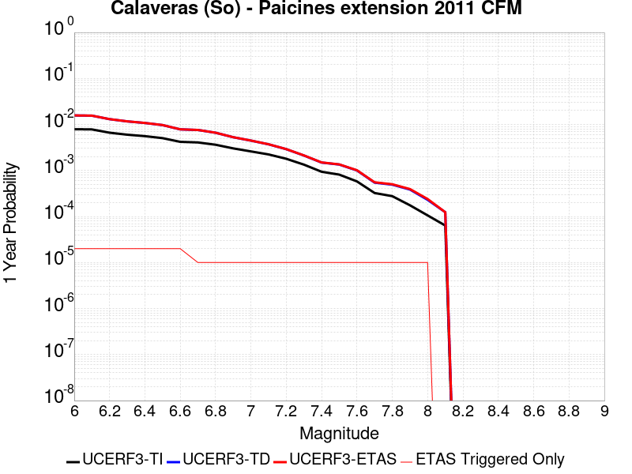 |  |

| Magnitude | 1 wk TI Prob | 1 wk TD Prob | 1 wk ETAS Prob | 1 wk ETAS/TD Gain | 1 wk ETAS Triggered Only | 1 mo TI Prob | 1 mo TD Prob | 1 mo ETAS Prob | 1 mo ETAS/TD Gain | 1 mo ETAS Triggered Only | 1 yr TI Prob | 1 yr TD Prob | 1 yr ETAS Prob | 1 yr ETAS/TD Gain | 1 yr ETAS Triggered Only | 10 yr TI Prob | 10 yr TD Prob | 10 yr ETAS Prob | 10 yr ETAS/TD Gain | 10 yr ETAS Triggered Only |
|-----|-----|-----|-----|-----|-----|-----|-----|-----|-----|-----|-----|-----|-----|-----|-----|-----|-----|-----|-----|-----|
| 6.0 | 1.5183659E-4 | 3.0520977E-4 | 3.1520674E-4 | 1.0327543 | 1.0E-5 | 6.5056595E-4 | 0.0013068188 | 0.0013168057 | 1.0076421 | 1.0E-5 | 0.007891912 | 0.015696203 | 0.01571589 | 1.0012542 | 2.0E-5 | 0.076174594 | 0.13848905 | 0.1385235 | 1.0002488 | 4.0E-5 |
| 6.1 | 1.5024997E-4 | 3.021517E-4 | 3.1214865E-4 | 1.033086 | 1.0E-5 | 6.437695E-4 | 0.0012937278 | 0.0013037149 | 1.0077196 | 1.0E-5 | 0.0078097614 | 0.015539596 | 0.015559285 | 1.0012671 | 2.0E-5 | 0.075409345 | 0.13715863 | 0.13719314 | 1.0002517 | 4.0E-5 |
| 6.2 | 1.2743923E-4 | 2.5313982E-4 | 2.6313728E-4 | 1.0394939 | 1.0E-5 | 5.460538E-4 | 0.0010839999 | 0.001093989 | 1.0092151 | 1.0E-5 | 0.0066279583 | 0.013046881 | 0.013066621 | 1.0015129 | 2.0E-5 | 0.064337276 | 0.117256075 | 0.11729138 | 1.0003011 | 4.0E-5 |
| 6.3 | 1.1525114E-4 | 2.2599236E-4 | 2.359901E-4 | 1.0442393 | 1.0E-5 | 4.9383997E-4 | 9.678718E-4 | 9.77862E-4 | 1.010322 | 1.0E-5 | 0.0059959386 | 0.011668079 | 0.011687845 | 1.0016941 | 2.0E-5 | 0.058367174 | 0.106372125 | 0.106407866 | 1.000336 | 4.0E-5 |
| 6.4 | 1.07200925E-4 | 2.0840544E-4 | 2.1840337E-4 | 1.0479734 | 1.0E-5 | 4.5935164E-4 | 8.926123E-4 | 9.026034E-4 | 1.011193 | 1.0E-5 | 0.0055782744 | 0.010772959 | 0.010792743 | 1.0018365 | 2.0E-5 | 0.0544031 | 0.099194765 | 0.0992308 | 1.0003632 | 4.0E-5 |
| 6.5 | 9.69631E-5 | 1.8734725E-4 | 1.9734538E-4 | 1.0533668 | 1.0E-5 | 4.1548995E-4 | 8.024631E-4 | 8.124551E-4 | 1.0124516 | 1.0E-5 | 0.0050468626 | 0.009694842 | 0.009714647 | 1.002043 | 2.0E-5 | 0.04933773 | 0.090086564 | 0.09012296 | 1.000404 | 4.0E-5 |
| 6.6 | 8.0552316E-5 | 1.507068E-4 | 1.6070528E-4 | 1.066344 | 1.0E-5 | 3.4517853E-4 | 6.4569083E-4 | 6.556844E-4 | 1.0154773 | 1.0E-5 | 0.0041944524 | 0.007826508 | 0.007846352 | 1.0025355 | 2.0E-5 | 0.04116161 | 0.0748563 | 0.07488406 | 1.0003707 | 3.0E-5 |
| 6.7 | 7.815757E-5 | 1.4611272E-4 | 1.4611272E-4 | 1.0 | 0.0 | 3.34918E-4 | 6.26014E-4 | 6.26014E-4 | 1.0 | 0.0 | 0.004070005 | 0.007589312 | 0.0075992355 | 1.0013076 | 1.0E-5 | 0.039962657 | 0.07270582 | 0.072724365 | 1.0002551 | 2.0E-5 |
| 6.8 | 6.965264E-5 | 1.2722758E-4 | 1.2722758E-4 | 1.0 | 0.0 | 2.9847719E-4 | 5.4513285E-4 | 5.4513285E-4 | 1.0 | 0.0 | 0.0036279052 | 0.0066135945 | 0.0066235284 | 1.001502 | 1.0E-5 | 0.03569247 | 0.063801065 | 0.06381979 | 1.0002935 | 2.0E-5 |
| 6.9 | 5.8000453E-5 | 1.01439E-4 | 1.01439E-4 | 1.0 | 0.0 | 2.4854968E-4 | 4.346666E-4 | 4.346666E-4 | 1.0 | 0.0 | 0.0030218933 | 0.005279322 | 0.0052892696 | 1.0018842 | 1.0E-5 | 0.029811295 | 0.051502965 | 0.051521935 | 1.0003684 | 2.0E-5 |
| 7.0 | 4.9865852E-5 | 8.568029E-5 | 8.568029E-5 | 1.0 | 0.0 | 2.1369329E-4 | 3.6715003E-4 | 3.6715003E-4 | 1.0 | 0.0 | 0.0025986114 | 0.004460979 | 0.004470934 | 1.0022317 | 1.0E-5 | 0.025684336 | 0.043782018 | 0.04380114 | 1.0004368 | 2.0E-5 |
| 7.1 | 4.283875E-5 | 7.1124625E-5 | 7.1124625E-5 | 1.0 | 0.0 | 1.8358172E-4 | 3.0478454E-4 | 3.0478454E-4 | 1.0 | 0.0 | 0.0022328163 | 0.003704494 | 0.0037144572 | 1.0026895 | 1.0E-5 | 0.022105146 | 0.03673582 | 0.03675509 | 1.0005244 | 2.0E-5 |
| 7.2 | 3.450115E-5 | 5.5778568E-5 | 5.5778568E-5 | 1.0 | 0.0 | 1.478537E-4 | 2.3902925E-4 | 2.3902925E-4 | 1.0 | 0.0 | 0.0017986323 | 0.0029063264 | 0.0029162974 | 1.0034307 | 1.0E-5 | 0.017841442 | 0.029079042 | 0.02909846 | 1.0006678 | 2.0E-5 |
| 7.3 | 2.5709045E-5 | 4.059001E-5 | 4.059001E-5 | 1.0 | 0.0 | 1.1017697E-4 | 1.7394568E-4 | 1.7394568E-4 | 1.0 | 0.0 | 0.0013405791 | 0.0021157486 | 0.0021257275 | 1.0047165 | 1.0E-5 | 0.013325208 | 0.02129686 | 0.021306649 | 1.0004596 | 1.0E-5 |
| 7.4 | 1.8003093E-5 | 2.8511378E-5 | 2.8511378E-5 | 1.0 | 0.0 | 7.715383E-5 | 1.2218591E-4 | 1.2218591E-4 | 1.0 | 0.0 | 9.3894306E-4 | 0.0014866006 | 0.0014965858 | 1.0067167 | 1.0E-5 | 0.009349857 | 0.015051589 | 0.015061439 | 1.0006543 | 1.0E-5 |
| 7.5 | 1.5595824E-5 | 2.5823752E-5 | 2.5823752E-5 | 1.0 | 0.0 | 6.683753E-5 | 1.10668545E-4 | 1.10668545E-4 | 1.0 | 0.0 | 8.134431E-4 | 0.0013465589 | 0.0013565455 | 1.0074164 | 1.0E-5 | 0.008104719 | 0.013651571 | 0.013661435 | 1.0007225 | 1.0E-5 |
| 7.6 | 1.1110309E-5 | 1.9223195E-5 | 1.9223195E-5 | 1.0 | 0.0 | 4.761474E-5 | 8.2382525E-5 | 8.2382525E-5 | 1.0 | 0.0 | 5.795553E-4 | 0.0010025471 | 0.001012537 | 1.0099646 | 1.0E-5 | 0.0057804612 | 0.01020344 | 0.010213338 | 1.00097 | 1.0E-5 |
| 7.7 | 6.2140443E-6 | 1.04376995E-5 | 1.04376995E-5 | 1.0 | 0.0 | 2.6631347E-5 | 4.4732235E-5 | 4.4732235E-5 | 1.0 | 0.0 | 3.241884E-4 | 5.4447894E-4 | 5.544735E-4 | 1.0183562 | 1.0E-5 | 0.0032371588 | 0.005620102 | 0.005630046 | 1.0017693 | 1.0E-5 |
| 7.8 | 5.305533E-6 | 9.433651E-6 | 9.433651E-6 | 1.0 | 0.0 | 2.27378E-5 | 4.0429306E-5 | 4.0429306E-5 | 1.0 | 0.0 | 2.7679754E-4 | 4.9211574E-4 | 5.021108E-4 | 1.0203104 | 1.0E-5 | 0.0027645302 | 0.005074622 | 0.0050845714 | 1.0019606 | 1.0E-5 |
| 7.9 | 3.363505E-6 | 7.3854467E-6 | 7.3854467E-6 | 1.0 | 0.0 | 1.4414942E-5 | 3.1651532E-5 | 3.1651532E-5 | 1.0 | 0.0 | 1.7548777E-4 | 3.8528934E-4 | 3.952855E-4 | 1.0259445 | 1.0E-5 | 0.0017534926 | 0.003948784 | 0.0039587445 | 1.0025225 | 1.0E-5 |
| 8.0 | 2.0271132E-6 | 4.4134235E-6 | 4.4134235E-6 | 1.0 | 0.0 | 8.687599E-6 | 1.8914534E-5 | 1.8914534E-5 | 1.0 | 0.0 | 1.05766376E-4 | 2.3026018E-4 | 2.4025787E-4 | 1.0434191 | 1.0E-5 | 0.0010571606 | 0.002351194 | 0.0023611705 | 1.0042431 | 1.0E-5 |
| 8.1 | 1.2206116E-6 | 2.3752666E-6 | 2.3752666E-6 | 1.0 | 0.0 | 5.2311816E-6 | 1.0179674E-5 | 1.0179674E-5 | 1.0 | 0.0 | 6.3687774E-5 | 1.2393051E-4 | 1.2393051E-4 | 1.0 | 0.0 | 6.366953E-4 | 0.0012705618 | 0.0012705618 | 1.0 | 0.0 |

## Mono Lake 2011 CFM
*[(top)](#table-of-contents)*

| 1 Week | 1 Month | 1 Year | 10 Year |
|-----|-----|-----|-----|
|  |  |  |  |

| Magnitude | 1 wk TI Prob | 1 wk TD Prob | 1 wk ETAS Prob | 1 wk ETAS/TD Gain | 1 wk ETAS Triggered Only | 1 mo TI Prob | 1 mo TD Prob | 1 mo ETAS Prob | 1 mo ETAS/TD Gain | 1 mo ETAS Triggered Only | 1 yr TI Prob | 1 yr TD Prob | 1 yr ETAS Prob | 1 yr ETAS/TD Gain | 1 yr ETAS Triggered Only | 10 yr TI Prob | 10 yr TD Prob | 10 yr ETAS Prob | 10 yr ETAS/TD Gain | 10 yr ETAS Triggered Only |
|-----|-----|-----|-----|-----|-----|-----|-----|-----|-----|-----|-----|-----|-----|-----|-----|-----|-----|-----|-----|-----|
| 6.0 | 2.0341662E-5 | 2.3828192E-5 | 3.3827953E-5 | 1.4196609 | 1.0E-5 | 8.717564E-5 | 1.0211982E-4 | 1.2211778E-4 | 1.1958283 | 2.0E-5 | 0.0010608466 | 0.0012431308 | 0.0012730935 | 1.0241026 | 3.0E-5 | 0.010557966 | 0.012413842 | 0.012453345 | 1.0031822 | 4.0E-5 |
| 6.1 | 2.0341662E-5 | 2.3828192E-5 | 3.3827953E-5 | 1.4196609 | 1.0E-5 | 8.717564E-5 | 1.0211982E-4 | 1.2211778E-4 | 1.1958283 | 2.0E-5 | 0.0010608466 | 0.0012431308 | 0.0012730935 | 1.0241026 | 3.0E-5 | 0.010557966 | 0.012413842 | 0.012453345 | 1.0031822 | 4.0E-5 |
| 6.2 | 2.0341662E-5 | 2.3828192E-5 | 3.3827953E-5 | 1.4196609 | 1.0E-5 | 8.717564E-5 | 1.0211982E-4 | 1.2211778E-4 | 1.1958283 | 2.0E-5 | 0.0010608466 | 0.0012431308 | 0.0012730935 | 1.0241026 | 3.0E-5 | 0.010557966 | 0.012413842 | 0.012453345 | 1.0031822 | 4.0E-5 |
| 6.3 | 2.0341662E-5 | 2.3828192E-5 | 3.3827953E-5 | 1.4196609 | 1.0E-5 | 8.717564E-5 | 1.0211982E-4 | 1.2211778E-4 | 1.1958283 | 2.0E-5 | 0.0010608466 | 0.0012431308 | 0.0012730935 | 1.0241026 | 3.0E-5 | 0.010557966 | 0.012413842 | 0.012453345 | 1.0031822 | 4.0E-5 |
| 6.4 | 1.749821E-5 | 2.049101E-5 | 3.0490804E-5 | 1.4880089 | 1.0E-5 | 7.499018E-5 | 8.781861E-5 | 1.0781686E-4 | 1.2277222 | 2.0E-5 | 9.1262296E-4 | 0.0010691914 | 0.0010991594 | 1.0280286 | 3.0E-5 | 0.009088841 | 0.01069187 | 0.010731443 | 1.0037012 | 4.0E-5 |
| 6.5 | 1.749821E-5 | 2.049101E-5 | 3.0490804E-5 | 1.4880089 | 1.0E-5 | 7.499018E-5 | 8.781861E-5 | 1.0781686E-4 | 1.2277222 | 2.0E-5 | 9.1262296E-4 | 0.0010691914 | 0.0010991594 | 1.0280286 | 3.0E-5 | 0.009088841 | 0.01069187 | 0.010731443 | 1.0037012 | 4.0E-5 |

## Great Valley 07 (Orestimba)
*[(top)](#table-of-contents)*

| 1 Week | 1 Month | 1 Year | 10 Year |
|-----|-----|-----|-----|
| 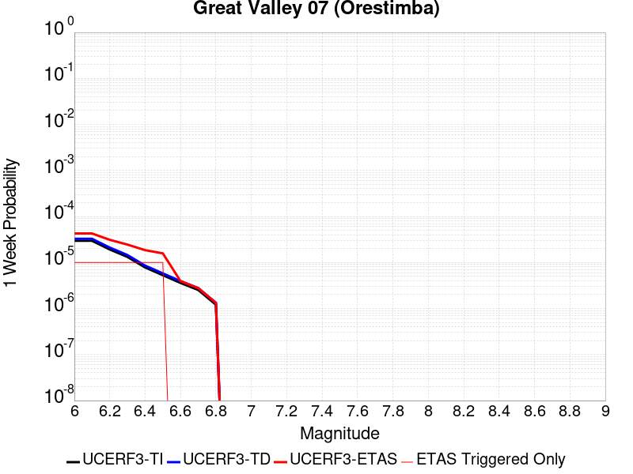 |  |  | 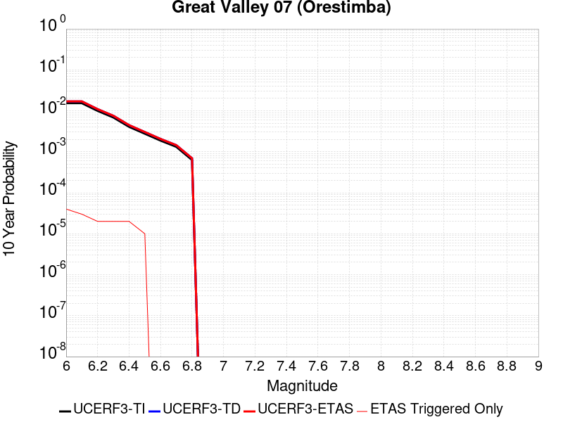 |

| Magnitude | 1 wk TI Prob | 1 wk TD Prob | 1 wk ETAS Prob | 1 wk ETAS/TD Gain | 1 wk ETAS Triggered Only | 1 mo TI Prob | 1 mo TD Prob | 1 mo ETAS Prob | 1 mo ETAS/TD Gain | 1 mo ETAS Triggered Only | 1 yr TI Prob | 1 yr TD Prob | 1 yr ETAS Prob | 1 yr ETAS/TD Gain | 1 yr ETAS Triggered Only | 10 yr TI Prob | 10 yr TD Prob | 10 yr ETAS Prob | 10 yr ETAS/TD Gain | 10 yr ETAS Triggered Only |
|-----|-----|-----|-----|-----|-----|-----|-----|-----|-----|-----|-----|-----|-----|-----|-----|-----|-----|-----|-----|-----|
| 6.0 | 2.9687902E-5 | 3.27575E-5 | 4.2757172E-5 | 1.3052636 | 1.0E-5 | 1.2722766E-4 | 1.4038214E-4 | 1.6037932E-4 | 1.1424483 | 2.0E-5 | 0.0015478961 | 0.0017078844 | 0.0017478161 | 1.0233808 | 4.0E-5 | 0.015371585 | 0.016955135 | 0.016994458 | 1.0023192 | 4.0E-5 |
| 6.1 | 2.9687902E-5 | 3.27575E-5 | 4.2757172E-5 | 1.3052636 | 1.0E-5 | 1.2722766E-4 | 1.4038214E-4 | 1.6037932E-4 | 1.1424483 | 2.0E-5 | 0.0015478961 | 0.0017078844 | 0.0017378331 | 1.0175356 | 3.0E-5 | 0.015371585 | 0.016955135 | 0.016984627 | 1.0017394 | 3.0E-5 |
| 6.2 | 1.9231524E-5 | 2.1159167E-5 | 3.1158954E-5 | 1.4725984 | 1.0E-5 | 8.2418206E-5 | 9.067912E-5 | 1.0067821E-4 | 1.110269 | 1.0E-5 | 0.0010029797 | 0.0011034822 | 0.0011234601 | 1.0181044 | 2.0E-5 | 0.00998465 | 0.010982441 | 0.01100222 | 1.0018011 | 2.0E-5 |
| 6.3 | 1.324766E-5 | 1.4548534E-5 | 2.4548388E-5 | 1.6873446 | 1.0E-5 | 5.6774446E-5 | 6.234942E-5 | 7.23488E-5 | 1.1603764 | 1.0E-5 | 6.910097E-4 | 7.5884897E-4 | 7.788338E-4 | 1.0263357 | 2.0E-5 | 0.006888649 | 0.0075635235 | 0.0075833723 | 1.0026243 | 2.0E-5 |
| 6.4 | 7.818645E-6 | 8.57284E-6 | 1.8572755E-5 | 2.1664646 | 1.0E-5 | 3.3508048E-5 | 3.6740246E-5 | 4.673988E-5 | 1.2721711 | 1.0E-5 | 4.078841E-4 | 4.4722404E-4 | 4.6721508E-4 | 1.0447003 | 2.0E-5 | 0.004071363 | 0.0044635804 | 0.004483491 | 1.0044607 | 2.0E-5 |
| 6.5 | 5.3076565E-6 | 5.8178007E-6 | 1.5817743E-5 | 2.7188525 | 1.0E-5 | 2.27469E-5 | 2.4933206E-5 | 3.4932957E-5 | 1.4010615 | 1.0E-5 | 2.7690834E-4 | 3.035216E-4 | 3.1351857E-4 | 1.0329366 | 1.0E-5 | 0.0027656353 | 0.00303128 | 0.0030412497 | 1.003289 | 1.0E-5 |
| 6.6 | 3.6003578E-6 | 3.9484953E-6 | 3.9484953E-6 | 1.0 | 0.0 | 1.5430012E-5 | 1.6922022E-5 | 1.6922022E-5 | 1.0 | 0.0 | 1.8784421E-4 | 2.0600771E-4 | 2.0600771E-4 | 1.0 | 0.0 | 0.0018768552 | 0.0020583214 | 0.0020583214 | 1.0 | 0.0 |
| 6.7 | 2.5361826E-6 | 2.7834678E-6 | 2.7834678E-6 | 1.0 | 0.0 | 1.0869308E-5 | 1.1929101E-5 | 1.1929101E-5 | 1.0 | 0.0 | 1.3232579E-4 | 1.4522845E-4 | 1.4522845E-4 | 1.0 | 0.0 | 0.0013224703 | 0.0014514653 | 0.0014514653 | 1.0 | 0.0 |
| 6.8 | 1.2115831E-6 | 1.3313797E-6 | 1.3313797E-6 | 1.0 | 0.0 | 5.1924885E-6 | 5.7059065E-6 | 5.7059065E-6 | 1.0 | 0.0 | 6.3216714E-5 | 6.9468166E-5 | 6.9468166E-5 | 1.0 | 0.0 | 6.3198735E-4 | 6.945596E-4 | 6.945596E-4 | 1.0 | 0.0 |

## Pleito
*[(top)](#table-of-contents)*

| 1 Week | 1 Month | 1 Year | 10 Year |
|-----|-----|-----|-----|
| 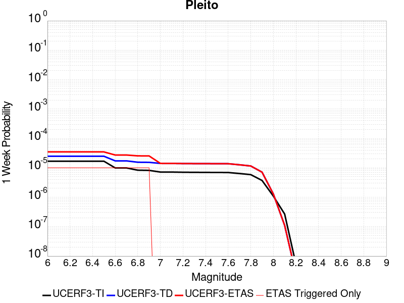 |  |  |  |

| Magnitude | 1 wk TI Prob | 1 wk TD Prob | 1 wk ETAS Prob | 1 wk ETAS/TD Gain | 1 wk ETAS Triggered Only | 1 mo TI Prob | 1 mo TD Prob | 1 mo ETAS Prob | 1 mo ETAS/TD Gain | 1 mo ETAS Triggered Only | 1 yr TI Prob | 1 yr TD Prob | 1 yr ETAS Prob | 1 yr ETAS/TD Gain | 1 yr ETAS Triggered Only | 10 yr TI Prob | 10 yr TD Prob | 10 yr ETAS Prob | 10 yr ETAS/TD Gain | 10 yr ETAS Triggered Only |
|-----|-----|-----|-----|-----|-----|-----|-----|-----|-----|-----|-----|-----|-----|-----|-----|-----|-----|-----|-----|-----|
| 6.0 | 1.6763008E-5 | 2.4764735E-5 | 3.476449E-5 | 1.40379 | 1.0E-5 | 7.183948E-5 | 1.0613067E-4 | 1.1612961E-4 | 1.0942135 | 1.0E-5 | 8.742947E-4 | 0.001291447 | 0.0013214083 | 1.0231998 | 3.0E-5 | 0.00870863 | 0.01295441 | 0.012993892 | 1.0030477 | 4.0E-5 |
| 6.1 | 1.6763008E-5 | 2.4764735E-5 | 3.476449E-5 | 1.40379 | 1.0E-5 | 7.183948E-5 | 1.0613067E-4 | 1.1612961E-4 | 1.0942135 | 1.0E-5 | 8.742947E-4 | 0.001291447 | 0.0013214083 | 1.0231998 | 3.0E-5 | 0.00870863 | 0.01295441 | 0.012993892 | 1.0030477 | 4.0E-5 |
| 6.2 | 1.6763008E-5 | 2.4764735E-5 | 3.476449E-5 | 1.40379 | 1.0E-5 | 7.183948E-5 | 1.0613067E-4 | 1.1612961E-4 | 1.0942135 | 1.0E-5 | 8.742947E-4 | 0.001291447 | 0.0013214083 | 1.0231998 | 3.0E-5 | 0.00870863 | 0.01295441 | 0.012993892 | 1.0030477 | 4.0E-5 |
| 6.3 | 1.6763008E-5 | 2.4764735E-5 | 3.476449E-5 | 1.40379 | 1.0E-5 | 7.183948E-5 | 1.0613067E-4 | 1.1612961E-4 | 1.0942135 | 1.0E-5 | 8.742947E-4 | 0.001291447 | 0.0013214083 | 1.0231998 | 3.0E-5 | 0.00870863 | 0.01295441 | 0.012993892 | 1.0030477 | 4.0E-5 |
| 6.4 | 1.6763008E-5 | 2.4764735E-5 | 3.476449E-5 | 1.40379 | 1.0E-5 | 7.183948E-5 | 1.0613067E-4 | 1.1612961E-4 | 1.0942135 | 1.0E-5 | 8.742947E-4 | 0.001291447 | 0.0013214083 | 1.0231998 | 3.0E-5 | 0.00870863 | 0.01295441 | 0.012993892 | 1.0030477 | 4.0E-5 |
| 6.5 | 1.6763008E-5 | 2.4764735E-5 | 3.476449E-5 | 1.40379 | 1.0E-5 | 7.183948E-5 | 1.0613067E-4 | 1.1612961E-4 | 1.0942135 | 1.0E-5 | 8.742947E-4 | 0.001291447 | 0.0013214083 | 1.0231998 | 3.0E-5 | 0.00870863 | 0.01295441 | 0.012993892 | 1.0030477 | 4.0E-5 |
| 6.6 | 9.910213E-6 | 1.721552E-5 | 2.7215348E-5 | 1.5808612 | 1.0E-5 | 4.247165E-5 | 7.3778734E-5 | 8.3777995E-5 | 1.1355304 | 1.0E-5 | 5.169696E-4 | 8.9788967E-4 | 9.0788066E-4 | 1.0111272 | 1.0E-5 | 0.0051576863 | 0.009051224 | 0.0090611335 | 1.0010948 | 1.0E-5 |
| 6.7 | 9.910213E-6 | 1.721552E-5 | 2.7215348E-5 | 1.5808612 | 1.0E-5 | 4.247165E-5 | 7.3778734E-5 | 8.3777995E-5 | 1.1355304 | 1.0E-5 | 5.169696E-4 | 8.9788967E-4 | 9.0788066E-4 | 1.0111272 | 1.0E-5 | 0.0051576863 | 0.009051224 | 0.0090611335 | 1.0010948 | 1.0E-5 |
| 6.8 | 8.300162E-6 | 1.5475129E-5 | 2.5474974E-5 | 1.6461881 | 1.0E-5 | 3.557164E-5 | 6.63203E-5 | 7.6319644E-5 | 1.1507734 | 1.0E-5 | 4.3299864E-4 | 8.07152E-4 | 8.1714394E-4 | 1.0123793 | 1.0E-5 | 0.004321559 | 0.008150661 | 0.00816058 | 1.0012169 | 1.0E-5 |
| 6.9 | 8.183114E-6 | 1.5346344E-5 | 2.5346191E-5 | 1.651611 | 1.0E-5 | 3.5070017E-5 | 6.57684E-5 | 7.576774E-5 | 1.1520387 | 1.0E-5 | 4.2689382E-4 | 8.0043747E-4 | 8.1042945E-4 | 1.0124831 | 1.0E-5 | 0.0042607468 | 0.008084006 | 0.008093925 | 1.001227 | 1.0E-5 |
| 7.0 | 7.1748823E-6 | 1.4133306E-5 | 1.4133306E-5 | 1.0 | 0.0 | 3.0749135E-5 | 6.0569906E-5 | 6.0569906E-5 | 1.0 | 0.0 | 3.743064E-4 | 7.3718966E-4 | 7.3718966E-4 | 1.0 | 0.0 | 0.0037367654 | 0.007455374 | 0.007455374 | 1.0 | 0.0 |
| 7.1 | 7.1671807E-6 | 1.4123676E-5 | 1.4123676E-5 | 1.0 | 0.0 | 3.0716128E-5 | 6.0528637E-5 | 6.0528637E-5 | 1.0 | 0.0 | 3.7390468E-4 | 7.366875E-4 | 7.366875E-4 | 1.0 | 0.0 | 0.0037327618 | 0.0074503864 | 0.0074503864 | 1.0 | 0.0 |
| 7.2 | 7.0649667E-6 | 1.3970962E-5 | 1.3970962E-5 | 1.0 | 0.0 | 3.0278077E-5 | 5.987418E-5 | 5.987418E-5 | 1.0 | 0.0 | 3.6857324E-4 | 7.287248E-4 | 7.287248E-4 | 1.0 | 0.0 | 0.0036796255 | 0.007371136 | 0.007371136 | 1.0 | 0.0 |
| 7.3 | 7.02082E-6 | 1.3914415E-5 | 1.3914415E-5 | 1.0 | 0.0 | 3.008888E-5 | 5.9631846E-5 | 5.9631846E-5 | 1.0 | 0.0 | 3.6627054E-4 | 7.257764E-4 | 7.257764E-4 | 1.0 | 0.0 | 0.0036566744 | 0.007341636 | 0.007341636 | 1.0 | 0.0 |
| 7.4 | 6.987146E-6 | 1.3873975E-5 | 1.3873975E-5 | 1.0 | 0.0 | 2.9944567E-5 | 5.9458544E-5 | 5.9458544E-5 | 1.0 | 0.0 | 3.6451413E-4 | 7.2366785E-4 | 7.2366785E-4 | 1.0 | 0.0 | 0.0036391679 | 0.00732057 | 0.00732057 | 1.0 | 0.0 |
| 7.5 | 6.9494554E-6 | 1.383088E-5 | 1.383088E-5 | 1.0 | 0.0 | 2.9783041E-5 | 5.9273858E-5 | 5.9273858E-5 | 1.0 | 0.0 | 3.625482E-4 | 7.2142074E-4 | 7.2142074E-4 | 1.0 | 0.0 | 0.0036195726 | 0.007298197 | 0.007298197 | 1.0 | 0.0 |
| 7.6 | 6.92694E-6 | 1.3789992E-5 | 1.3789992E-5 | 1.0 | 0.0 | 2.9686547E-5 | 5.909863E-5 | 5.909863E-5 | 1.0 | 0.0 | 3.6137376E-4 | 7.192888E-4 | 7.192888E-4 | 1.0 | 0.0 | 0.0036078666 | 0.007276949 | 0.007276949 | 1.0 | 0.0 |
| 7.7 | 6.395867E-6 | 1.26690065E-5 | 1.26690065E-5 | 1.0 | 0.0 | 2.741057E-5 | 5.4294615E-5 | 5.4294615E-5 | 1.0 | 0.0 | 3.336726E-4 | 6.6083675E-4 | 6.6083675E-4 | 1.0 | 0.0 | 0.0033317201 | 0.006695544 | 0.006695544 | 1.0 | 0.0 |
| 7.8 | 5.8664327E-6 | 1.1536581E-5 | 1.1536581E-5 | 1.0 | 0.0 | 2.5141611E-5 | 4.9441554E-5 | 4.9441554E-5 | 1.0 | 0.0 | 3.060561E-4 | 6.0178485E-4 | 6.0178485E-4 | 1.0 | 0.0 | 0.0030563495 | 0.006101015 | 0.006101015 | 1.0 | 0.0 |
| 7.9 | 3.7167474E-6 | 7.1145205E-6 | 7.1145205E-6 | 1.0 | 0.0 | 1.592882E-5 | 3.0490448E-5 | 3.0490448E-5 | 1.0 | 0.0 | 1.9391612E-4 | 3.7115812E-4 | 3.7115812E-4 | 1.0 | 0.0 | 0.0019374699 | 0.0037676243 | 0.0037676243 | 1.0 | 0.0 |
| 8.0 | 1.0903841E-6 | 1.2879104E-6 | 1.2879104E-6 | 1.0 | 0.0 | 4.6730665E-6 | 5.5196047E-6 | 5.5196047E-6 | 1.0 | 0.0 | 5.68931E-5 | 6.719913E-5 | 6.719913E-5 | 1.0 | 0.0 | 5.6878536E-4 | 6.942094E-4 | 6.942094E-4 | 1.0 | 0.0 |
| 8.1 | 2.6894583E-7 | 1.1056095E-7 | 1.1056095E-7 | 1.0 | 0.0 | 1.1526245E-6 | 4.7383253E-7 | 4.7383253E-7 | 1.0 | 0.0 | 1.4033113E-5 | 5.768896E-6 | 5.768896E-6 | 1.0 | 0.0 | 1.4032227E-4 | 6.454915E-5 | 6.454915E-5 | 1.0 | 0.0 |
| 8.2 | 5.2967013E-9 | 2.4567874E-9 | 2.4567874E-9 | 1.0 | 0.0 | 2.2700148E-8 | 1.0529089E-8 | 1.0529089E-8 | 1.0 | 0.0 | 2.7637427E-7 | 1.2819166E-7 | 1.2819166E-7 | 1.0 | 0.0 | 2.7637393E-6 | 1.4588004E-6 | 1.4588004E-6 | 1.0 | 0.0 |

## Calaveras (So) 2011 CFM
*[(top)](#table-of-contents)*

| 1 Week | 1 Month | 1 Year | 10 Year |
|-----|-----|-----|-----|
| 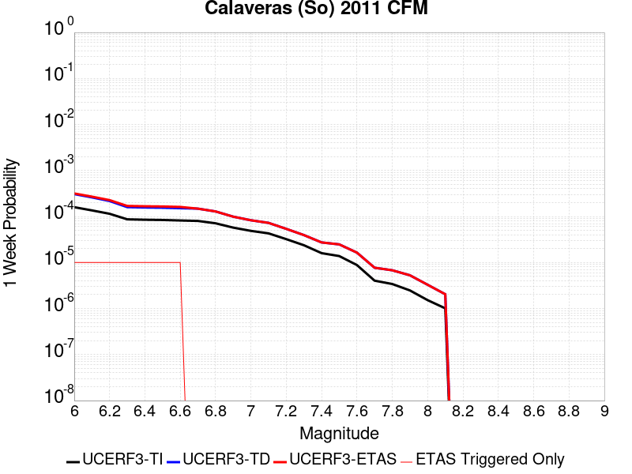 | 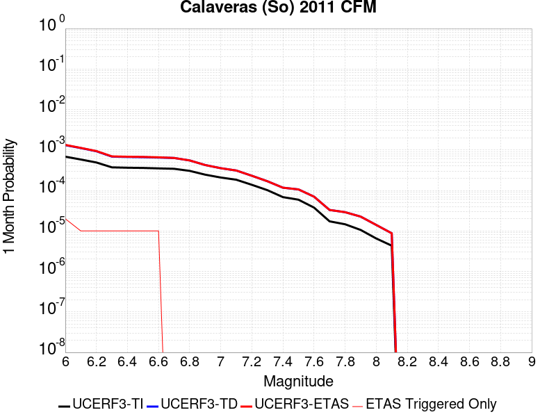 |  |  |

| Magnitude | 1 wk TI Prob | 1 wk TD Prob | 1 wk ETAS Prob | 1 wk ETAS/TD Gain | 1 wk ETAS Triggered Only | 1 mo TI Prob | 1 mo TD Prob | 1 mo ETAS Prob | 1 mo ETAS/TD Gain | 1 mo ETAS Triggered Only | 1 yr TI Prob | 1 yr TD Prob | 1 yr ETAS Prob | 1 yr ETAS/TD Gain | 1 yr ETAS Triggered Only | 10 yr TI Prob | 10 yr TD Prob | 10 yr ETAS Prob | 10 yr ETAS/TD Gain | 10 yr ETAS Triggered Only |
|-----|-----|-----|-----|-----|-----|-----|-----|-----|-----|-----|-----|-----|-----|-----|-----|-----|-----|-----|-----|-----|
| 6.0 | 1.5950744E-4 | 3.0713255E-4 | 3.1712948E-4 | 1.0325493 | 1.0E-5 | 6.834242E-4 | 0.001315409 | 0.0013353826 | 1.0151844 | 2.0E-5 | 0.00828899 | 0.015858326 | 0.015878009 | 1.0012412 | 2.0E-5 | 0.079865426 | 0.14440185 | 0.14443608 | 1.000237 | 4.0E-5 |
| 6.1 | 1.3584697E-4 | 2.603514E-4 | 2.7034877E-4 | 1.0383996 | 1.0E-5 | 5.8207137E-4 | 0.0011151754 | 0.0011251643 | 1.0089571 | 1.0E-5 | 0.007063716 | 0.013461385 | 0.01347125 | 1.0007329 | 1.0E-5 | 0.06843361 | 0.124029994 | 0.12404752 | 1.0001413 | 2.0E-5 |
| 6.2 | 1.14676266E-4 | 2.1714384E-4 | 2.2714166E-4 | 1.0460424 | 1.0E-5 | 4.9137714E-4 | 9.30223E-4 | 9.402137E-4 | 1.0107402 | 1.0E-5 | 0.0059661185 | 0.011245058 | 0.011254946 | 1.0008793 | 1.0E-5 | 0.058084648 | 0.10502057 | 0.105038464 | 1.0001705 | 2.0E-5 |
| 6.3 | 8.691518E-5 | 1.5987935E-4 | 1.6987773E-4 | 1.0625372 | 1.0E-5 | 3.7244044E-4 | 6.849807E-4 | 6.9497386E-4 | 1.014589 | 1.0E-5 | 0.004525038 | 0.008301122 | 0.008311039 | 1.0011947 | 1.0E-5 | 0.044339992 | 0.0793365 | 0.07935491 | 1.0002321 | 2.0E-5 |
| 6.4 | 8.50982E-5 | 1.5694331E-4 | 1.6694174E-4 | 1.0637072 | 1.0E-5 | 3.646556E-4 | 6.724042E-4 | 6.823975E-4 | 1.0148621 | 1.0E-5 | 0.0044306475 | 0.008149155 | 0.008159074 | 1.0012171 | 1.0E-5 | 0.04343345 | 0.07794268 | 0.07796112 | 1.0002366 | 2.0E-5 |
| 6.5 | 8.4062965E-5 | 1.5518743E-4 | 1.6518588E-4 | 1.0644282 | 1.0E-5 | 3.602201E-4 | 6.6488347E-4 | 6.748768E-4 | 1.0150303 | 1.0E-5 | 0.004376863 | 0.008058365 | 0.008068285 | 1.001231 | 1.0E-5 | 0.042916555 | 0.07711388 | 0.077132344 | 1.0002394 | 2.0E-5 |
| 6.6 | 8.194716E-5 | 1.5154552E-4 | 1.6154401E-4 | 1.0659767 | 1.0E-5 | 3.5115483E-4 | 6.492843E-4 | 6.592778E-4 | 1.0153916 | 1.0E-5 | 0.0042669317 | 0.007870209 | 0.007880131 | 1.0012606 | 1.0E-5 | 0.04185927 | 0.07539919 | 0.07541768 | 1.0002452 | 2.0E-5 |
| 6.7 | 8.012326E-5 | 1.4822475E-4 | 1.4822475E-4 | 1.0 | 0.0 | 3.433402E-4 | 6.350612E-4 | 6.350612E-4 | 1.0 | 0.0 | 0.004172157 | 0.007698701 | 0.007698701 | 1.0 | 0.0 | 0.040946912 | 0.07384132 | 0.07385058 | 1.0001254 | 1.0E-5 |
| 6.8 | 7.119773E-5 | 1.2881879E-4 | 1.2881879E-4 | 1.0 | 0.0 | 3.0509746E-4 | 5.519494E-4 | 5.519494E-4 | 1.0 | 0.0 | 0.0037082357 | 0.006696066 | 0.006696066 | 1.0 | 0.0 | 0.036469642 | 0.06468575 | 0.0646951 | 1.0001446 | 1.0E-5 |
| 6.9 | 5.7343088E-5 | 9.919277E-5 | 9.919277E-5 | 1.0 | 0.0 | 2.4573295E-4 | 4.25043E-4 | 4.25043E-4 | 1.0 | 0.0 | 0.0029876942 | 0.005162694 | 0.005162694 | 1.0 | 0.0 | 0.02947844 | 0.05051036 | 0.050519858 | 1.000188 | 1.0E-5 |
| 7.0 | 4.8746577E-5 | 8.2850725E-5 | 8.2850725E-5 | 1.0 | 0.0 | 2.0889717E-4 | 3.5502657E-4 | 3.5502657E-4 | 1.0 | 0.0 | 0.0025403565 | 0.004313948 | 0.004313948 | 1.0 | 0.0 | 0.025115121 | 0.042485245 | 0.04249482 | 1.0002254 | 1.0E-5 |
| 7.1 | 4.2998014E-5 | 7.265203E-5 | 7.265203E-5 | 1.0 | 0.0 | 1.8426418E-4 | 3.1132903E-4 | 3.1132903E-4 | 1.0 | 0.0 | 0.002241108 | 0.003783903 | 0.003783903 | 1.0 | 0.0 | 0.022186412 | 0.037423562 | 0.03743319 | 1.0002573 | 1.0E-5 |
| 7.2 | 3.221292E-5 | 5.390791E-5 | 5.390791E-5 | 1.0 | 0.0 | 1.3804805E-4 | 2.3101359E-4 | 2.3101359E-4 | 1.0 | 0.0 | 0.0016794393 | 0.0028089907 | 0.0028089907 | 1.0 | 0.0 | 0.016668037 | 0.02803602 | 0.028045742 | 1.0003467 | 1.0E-5 |
| 7.3 | 2.3756531E-5 | 3.9473416E-5 | 3.9473416E-5 | 1.0 | 0.0 | 1.0180973E-4 | 1.6916092E-4 | 1.6916092E-4 | 1.0 | 0.0 | 0.0012388286 | 0.0020576057 | 0.0020576057 | 1.0 | 0.0 | 0.012319452 | 0.020643145 | 0.020643145 | 1.0 | 0.0 |
| 7.4 | 1.5997684E-5 | 2.7342163E-5 | 2.7342163E-5 | 1.0 | 0.0 | 6.8559704E-5 | 1.1717545E-4 | 1.1717545E-4 | 1.0 | 0.0 | 8.343947E-4 | 0.00142568 | 0.00142568 | 1.0 | 0.0 | 0.008312687 | 0.014376011 | 0.014376011 | 1.0 | 0.0 |
| 7.5 | 1.3814293E-5 | 2.4783874E-5 | 2.4783874E-5 | 1.0 | 0.0 | 5.9202768E-5 | 1.062123E-4 | 1.062123E-4 | 1.0 | 0.0 | 7.205553E-4 | 0.00129237 | 0.00129237 | 1.0 | 0.0 | 0.007182234 | 0.013055085 | 0.013055085 | 1.0 | 0.0 |
| 7.6 | 8.817309E-6 | 1.6430757E-5 | 1.6430757E-5 | 1.0 | 0.0 | 3.7787922E-5 | 7.0415634E-5 | 7.0415634E-5 | 1.0 | 0.0 | 4.5997082E-4 | 8.569745E-4 | 8.569745E-4 | 1.0 | 0.0 | 0.004590199 | 0.008719284 | 0.008719284 | 1.0 | 0.0 |
| 7.7 | 4.0352206E-6 | 7.707318E-6 | 7.707318E-6 | 1.0 | 0.0 | 1.7293689E-5 | 3.3030945E-5 | 3.3030945E-5 | 1.0 | 0.0 | 2.1053031E-4 | 4.0207763E-4 | 4.0207763E-4 | 1.0 | 0.0 | 0.0021033096 | 0.004165172 | 0.004165172 | 1.0 | 0.0 |
| 7.8 | 3.413169E-6 | 6.787282E-6 | 6.787282E-6 | 1.0 | 0.0 | 1.4627784E-5 | 2.9088029E-5 | 2.9088029E-5 | 1.0 | 0.0 | 1.7807873E-4 | 3.5408925E-4 | 3.5408925E-4 | 1.0 | 0.0 | 0.0017793609 | 0.0036665166 | 0.0036665166 | 1.0 | 0.0 |
| 7.9 | 2.4740732E-6 | 5.2791843E-6 | 5.2791843E-6 | 1.0 | 0.0 | 1.06031275E-5 | 2.262488E-5 | 2.262488E-5 | 1.0 | 0.0 | 1.2908543E-4 | 2.7542314E-4 | 2.7542314E-4 | 1.0 | 0.0 | 0.0012901047 | 0.0028347955 | 0.0028347955 | 1.0 | 0.0 |
| 8.0 | 1.5231818E-6 | 3.2889548E-6 | 3.2889548E-6 | 1.0 | 0.0 | 6.527906E-6 | 1.40954435E-5 | 1.40954435E-5 | 1.0 | 0.0 | 7.9474354E-5 | 1.7159856E-4 | 1.7159856E-4 | 1.0 | 0.0 | 7.944594E-4 | 0.0017564303 | 0.0017564303 | 1.0 | 0.0 |
| 8.1 | 1.0104524E-6 | 2.045782E-6 | 2.045782E-6 | 1.0 | 0.0 | 4.330503E-6 | 8.767608E-6 | 8.767608E-6 | 1.0 | 0.0 | 5.2722597E-5 | 1.0674043E-4 | 1.0674043E-4 | 1.0 | 0.0 | 5.271009E-4 | 0.001092934 | 0.001092934 | 1.0 | 0.0 |

## Earthquake Valley (No  Extension)
*[(top)](#table-of-contents)*

| 1 Week | 1 Month | 1 Year | 10 Year |
|-----|-----|-----|-----|
|  | 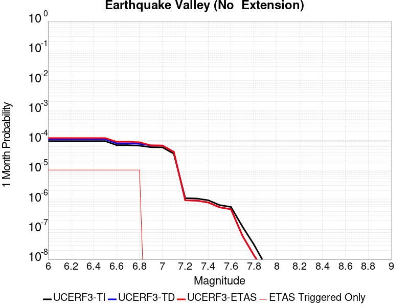 |  | 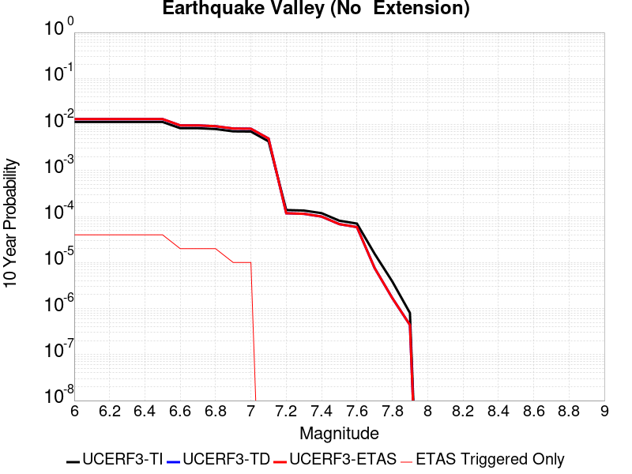 |

| Magnitude | 1 wk TI Prob | 1 wk TD Prob | 1 wk ETAS Prob | 1 wk ETAS/TD Gain | 1 wk ETAS Triggered Only | 1 mo TI Prob | 1 mo TD Prob | 1 mo ETAS Prob | 1 mo ETAS/TD Gain | 1 mo ETAS Triggered Only | 1 yr TI Prob | 1 yr TD Prob | 1 yr ETAS Prob | 1 yr ETAS/TD Gain | 1 yr ETAS Triggered Only | 10 yr TI Prob | 10 yr TD Prob | 10 yr ETAS Prob | 10 yr ETAS/TD Gain | 10 yr ETAS Triggered Only |
|-----|-----|-----|-----|-----|-----|-----|-----|-----|-----|-----|-----|-----|-----|-----|-----|-----|-----|-----|-----|-----|
| 6.0 | 2.1859703E-5 | 2.5198351E-5 | 2.5198351E-5 | 1.0 | 0.0 | 9.3681076E-5 | 1.0798928E-4 | 1.179882E-4 | 1.0925918 | 1.0E-5 | 0.0011399703 | 0.0013141216 | 0.0013440822 | 1.0227989 | 3.0E-5 | 0.011341401 | 0.013077869 | 0.013117346 | 1.0030186 | 4.0E-5 |
| 6.1 | 2.1859703E-5 | 2.5198351E-5 | 2.5198351E-5 | 1.0 | 0.0 | 9.3681076E-5 | 1.0798928E-4 | 1.179882E-4 | 1.0925918 | 1.0E-5 | 0.0011399703 | 0.0013141216 | 0.0013440822 | 1.0227989 | 3.0E-5 | 0.011341401 | 0.013077869 | 0.013117346 | 1.0030186 | 4.0E-5 |
| 6.2 | 2.1859703E-5 | 2.5198351E-5 | 2.5198351E-5 | 1.0 | 0.0 | 9.3681076E-5 | 1.0798928E-4 | 1.179882E-4 | 1.0925918 | 1.0E-5 | 0.0011399703 | 0.0013141216 | 0.0013440822 | 1.0227989 | 3.0E-5 | 0.011341401 | 0.013077869 | 0.013117346 | 1.0030186 | 4.0E-5 |
| 6.3 | 2.1859703E-5 | 2.5198351E-5 | 2.5198351E-5 | 1.0 | 0.0 | 9.3681076E-5 | 1.0798928E-4 | 1.179882E-4 | 1.0925918 | 1.0E-5 | 0.0011399703 | 0.0013141216 | 0.0013440822 | 1.0227989 | 3.0E-5 | 0.011341401 | 0.013077869 | 0.013117346 | 1.0030186 | 4.0E-5 |
| 6.4 | 2.1859703E-5 | 2.5198351E-5 | 2.5198351E-5 | 1.0 | 0.0 | 9.3681076E-5 | 1.0798928E-4 | 1.179882E-4 | 1.0925918 | 1.0E-5 | 0.0011399703 | 0.0013141216 | 0.0013440822 | 1.0227989 | 3.0E-5 | 0.011341401 | 0.013077869 | 0.013117346 | 1.0030186 | 4.0E-5 |
| 6.5 | 2.1859703E-5 | 2.5198351E-5 | 2.5198351E-5 | 1.0 | 0.0 | 9.3681076E-5 | 1.0798928E-4 | 1.179882E-4 | 1.0925918 | 1.0E-5 | 0.0011399703 | 0.0013141216 | 0.0013440822 | 1.0227989 | 3.0E-5 | 0.011341401 | 0.013077869 | 0.013117346 | 1.0030186 | 4.0E-5 |
| 6.6 | 1.597E-5 | 1.835627E-5 | 1.835627E-5 | 1.0 | 0.0 | 6.8441055E-5 | 7.866784E-5 | 8.866706E-5 | 1.1271068 | 1.0E-5 | 8.329513E-4 | 9.5744745E-4 | 9.774283E-4 | 1.0208689 | 2.0E-5 | 0.008298361 | 0.009541833 | 0.009561641 | 1.002076 | 2.0E-5 |
| 6.7 | 1.597E-5 | 1.835627E-5 | 1.835627E-5 | 1.0 | 0.0 | 6.8441055E-5 | 7.866784E-5 | 8.866706E-5 | 1.1271068 | 1.0E-5 | 8.329513E-4 | 9.5744745E-4 | 9.774283E-4 | 1.0208689 | 2.0E-5 | 0.008298361 | 0.009541833 | 0.009561641 | 1.002076 | 2.0E-5 |
| 6.8 | 1.5315149E-5 | 1.7602086E-5 | 1.7602086E-5 | 1.0 | 0.0 | 6.5634704E-5 | 7.543582E-5 | 8.543506E-5 | 1.132553 | 1.0E-5 | 7.988095E-4 | 9.1813074E-4 | 9.381124E-4 | 1.0217634 | 2.0E-5 | 0.007959441 | 0.009151915 | 0.009171733 | 1.0021653 | 2.0E-5 |
| 6.9 | 1.3634728E-5 | 1.5675814E-5 | 1.5675814E-5 | 1.0 | 0.0 | 5.8433237E-5 | 6.7180794E-5 | 6.7180794E-5 | 1.0 | 0.0 | 7.1119244E-4 | 8.1770134E-4 | 8.2769315E-4 | 1.0122194 | 1.0E-5 | 0.007089207 | 0.008154998 | 0.008164915 | 1.0012163 | 1.0E-5 |
| 7.0 | 1.3496271E-5 | 1.5517848E-5 | 1.5517848E-5 | 1.0 | 0.0 | 5.783988E-5 | 6.6503824E-5 | 6.6503824E-5 | 1.0 | 0.0 | 7.03973E-4 | 8.0946536E-4 | 8.194573E-4 | 1.0123439 | 1.0E-5 | 0.007017471 | 0.008073238 | 0.008083156 | 1.0012287 | 1.0E-5 |
| 7.1 | 8.242798E-6 | 9.472594E-6 | 9.472594E-6 | 1.0 | 0.0 | 3.53258E-5 | 4.0596577E-5 | 4.0596577E-5 | 1.0 | 0.0 | 4.300067E-4 | 4.9421826E-4 | 4.9421826E-4 | 1.0 | 0.0 | 0.004291756 | 0.0049377684 | 0.0049377684 | 1.0 | 0.0 |
| 7.2 | 2.6506527E-7 | 2.2559628E-7 | 2.2559628E-7 | 1.0 | 0.0 | 1.1359936E-6 | 9.668408E-7 | 9.668408E-7 | 1.0 | 0.0 | 1.3830633E-5 | 1.1771229E-5 | 1.1771229E-5 | 1.0 | 0.0 | 1.3829772E-4 | 1.1770646E-4 | 1.1770646E-4 | 1.0 | 0.0 |
| 7.3 | 2.5810488E-7 | 2.1954757E-7 | 2.1954757E-7 | 1.0 | 0.0 | 1.1061633E-6 | 9.4091786E-7 | 9.4091786E-7 | 1.0 | 0.0 | 1.3467455E-5 | 1.1455619E-5 | 1.1455619E-5 | 1.0 | 0.0 | 1.3466639E-4 | 1.145507E-4 | 1.145507E-4 | 1.0 | 0.0 |
| 7.4 | 2.2676066E-7 | 1.9109943E-7 | 1.9109943E-7 | 1.0 | 0.0 | 9.71831E-7 | 8.189973E-7 | 8.189973E-7 | 1.0 | 0.0 | 1.1831979E-5 | 9.971251E-6 | 9.971251E-6 | 1.0 | 0.0 | 1.1831349E-4 | 9.970842E-5 | 9.970842E-5 | 1.0 | 0.0 |
| 7.5 | 1.5553917E-7 | 1.311138E-7 | 1.311138E-7 | 1.0 | 0.0 | 6.6659624E-7 | 5.619162E-7 | 5.619162E-7 | 1.0 | 0.0 | 8.115779E-6 | 6.84131E-6 | 6.84131E-6 | 1.0 | 0.0 | 8.115482E-5 | 6.841121E-5 | 6.841121E-5 | 1.0 | 0.0 |
| 7.6 | 1.3448629E-7 | 1.1287708E-7 | 1.1287708E-7 | 1.0 | 0.0 | 5.7636964E-7 | 4.8375887E-7 | 4.8375887E-7 | 1.0 | 0.0 | 7.017278E-6 | 5.8897504E-6 | 5.8897504E-6 | 1.0 | 0.0 | 7.0170565E-5 | 5.8896156E-5 | 5.8896156E-5 | 1.0 | 0.0 |
| 7.7 | 2.9719402E-8 | 1.4581234E-8 | 1.4581234E-8 | 1.0 | 0.0 | 1.2736886E-7 | 6.2491004E-8 | 6.2491004E-8 | 1.0 | 0.0 | 1.5507147E-6 | 7.6082773E-7 | 7.6082773E-7 | 1.0 | 0.0 | 1.550704E-5 | 7.608257E-6 | 7.608257E-6 | 1.0 | 0.0 |
| 7.8 | 7.4390196E-9 | 3.249962E-9 | 3.249962E-9 | 1.0 | 0.0 | 3.1881513E-8 | 1.39284095E-8 | 1.39284095E-8 | 1.0 | 0.0 | 3.8815733E-7 | 1.6957837E-7 | 1.6957837E-7 | 1.0 | 0.0 | 3.8815665E-6 | 1.6957828E-6 | 1.6957828E-6 | 1.0 | 0.0 |
| 7.9 | 1.5373532E-9 | 8.4400953E-10 | 8.4400953E-10 | 1.0 | 0.0 | 6.5886567E-9 | 3.6171839E-9 | 3.6171839E-9 | 1.0 | 0.0 | 8.021689E-8 | 4.403921E-8 | 4.403921E-8 | 1.0 | 0.0 | 8.0216864E-7 | 4.403921E-7 | 4.403921E-7 | 1.0 | 0.0 |

## Great Valley 10 (Panoche)
*[(top)](#table-of-contents)*

| 1 Week | 1 Month | 1 Year | 10 Year |
|-----|-----|-----|-----|
|  |  |  | 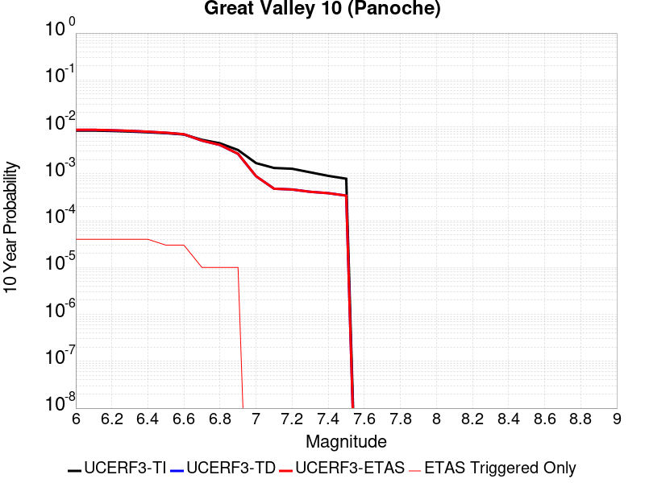 |

| Magnitude | 1 wk TI Prob | 1 wk TD Prob | 1 wk ETAS Prob | 1 wk ETAS/TD Gain | 1 wk ETAS Triggered Only | 1 mo TI Prob | 1 mo TD Prob | 1 mo ETAS Prob | 1 mo ETAS/TD Gain | 1 mo ETAS Triggered Only | 1 yr TI Prob | 1 yr TD Prob | 1 yr ETAS Prob | 1 yr ETAS/TD Gain | 1 yr ETAS Triggered Only | 10 yr TI Prob | 10 yr TD Prob | 10 yr ETAS Prob | 10 yr ETAS/TD Gain | 10 yr ETAS Triggered Only |
|-----|-----|-----|-----|-----|-----|-----|-----|-----|-----|-----|-----|-----|-----|-----|-----|-----|-----|-----|-----|-----|
| 6.0 | 1.6014626E-5 | 1.6575357E-5 | 1.6575357E-5 | 1.0 | 0.0 | 6.863231E-5 | 7.103534E-5 | 8.103463E-5 | 1.140765 | 1.0E-5 | 8.35278E-4 | 8.6451764E-4 | 8.8450033E-4 | 1.0231143 | 2.0E-5 | 0.008321454 | 0.008612158 | 0.0086518135 | 1.0046046 | 4.0E-5 |
| 6.1 | 1.6014626E-5 | 1.6575357E-5 | 1.6575357E-5 | 1.0 | 0.0 | 6.863231E-5 | 7.103534E-5 | 8.103463E-5 | 1.140765 | 1.0E-5 | 8.35278E-4 | 8.6451764E-4 | 8.8450033E-4 | 1.0231143 | 2.0E-5 | 0.008321454 | 0.008612158 | 0.0086518135 | 1.0046046 | 4.0E-5 |
| 6.2 | 1.56782E-5 | 1.6198404E-5 | 1.6198404E-5 | 1.0 | 0.0 | 6.719056E-5 | 6.941991E-5 | 7.9419224E-5 | 1.144041 | 1.0E-5 | 8.17738E-4 | 8.4486516E-4 | 8.6484826E-4 | 1.0236524 | 2.0E-5 | 0.008147354 | 0.008417133 | 0.008456796 | 1.0047122 | 4.0E-5 |
| 6.3 | 1.5263338E-5 | 1.5723472E-5 | 1.5723472E-5 | 1.0 | 0.0 | 6.541267E-5 | 6.73846E-5 | 7.738393E-5 | 1.1483918 | 1.0E-5 | 7.961082E-4 | 8.201041E-4 | 8.4008765E-4 | 1.0243671 | 2.0E-5 | 0.007932622 | 0.008171363 | 0.008211036 | 1.0048552 | 4.0E-5 |
| 6.4 | 1.4720723E-5 | 1.5099334E-5 | 1.5099334E-5 | 1.0 | 0.0 | 6.308728E-5 | 6.470986E-5 | 7.4709205E-5 | 1.154526 | 1.0E-5 | 7.67817E-4 | 7.87563E-4 | 8.0754724E-4 | 1.0253748 | 2.0E-5 | 0.007651695 | 0.007848289 | 0.007887975 | 1.0050566 | 4.0E-5 |
| 6.5 | 1.408264E-5 | 1.4355928E-5 | 1.4355928E-5 | 1.0 | 0.0 | 6.0352773E-5 | 6.1523984E-5 | 6.1523984E-5 | 1.0 | 0.0 | 7.3454727E-4 | 7.488022E-4 | 7.587948E-4 | 1.0133446 | 1.0E-5 | 0.0073212404 | 0.0074633416 | 0.007493118 | 1.0039897 | 3.0E-5 |
| 6.6 | 1.3197086E-5 | 1.33218455E-5 | 1.33218455E-5 | 1.0 | 0.0 | 5.6557717E-5 | 5.7092402E-5 | 5.7092402E-5 | 1.0 | 0.0 | 6.8837265E-4 | 6.948834E-4 | 7.0487644E-4 | 1.0143809 | 1.0E-5 | 0.006862442 | 0.0069276392 | 0.0069574313 | 1.0043005 | 3.0E-5 |
| 6.7 | 1.017583E-5 | 9.745348E-6 | 9.745348E-6 | 1.0 | 0.0 | 4.360997E-5 | 4.176512E-5 | 4.176512E-5 | 1.0 | 0.0 | 5.30822E-4 | 5.083741E-4 | 5.18369E-4 | 1.0196606 | 1.0E-5 | 0.0052955584 | 0.0050723637 | 0.005082313 | 1.0019615 | 1.0E-5 |
| 6.8 | 8.557912E-6 | 7.8726725E-6 | 7.8726725E-6 | 1.0 | 0.0 | 3.667625E-5 | 3.37396E-5 | 3.37396E-5 | 1.0 | 0.0 | 4.4644187E-4 | 4.1070423E-4 | 4.2070015E-4 | 1.0243384 | 1.0E-5 | 0.0044554602 | 0.004099659 | 0.0041096183 | 1.0024292 | 1.0E-5 |
| 6.9 | 6.14664E-6 | 5.0920366E-6 | 5.0920366E-6 | 1.0 | 0.0 | 2.6342475E-5 | 2.182284E-5 | 2.182284E-5 | 1.0 | 0.0 | 3.2067244E-4 | 2.6566206E-4 | 2.756594E-4 | 1.0376318 | 1.0E-5 | 0.003202101 | 0.0026535832 | 0.0026635567 | 1.0037584 | 1.0E-5 |
| 7.0 | 3.2310581E-6 | 1.6950871E-6 | 1.6950871E-6 | 1.0 | 0.0 | 1.3847319E-5 | 7.2646394E-6 | 7.2646394E-6 | 1.0 | 0.0 | 1.6857806E-4 | 8.844349E-5 | 8.844349E-5 | 1.0 | 0.0 | 0.0016845023 | 8.840923E-4 | 8.840923E-4 | 1.0 | 0.0 |
| 7.1 | 2.544492E-6 | 9.188573E-7 | 9.188573E-7 | 1.0 | 0.0 | 1.090492E-5 | 3.9379543E-6 | 3.9379543E-6 | 1.0 | 0.0 | 1.327593E-4 | 4.7943588E-5 | 4.7943588E-5 | 1.0 | 0.0 | 0.0013268003 | 4.793372E-4 | 4.793372E-4 | 1.0 | 0.0 |
| 7.2 | 2.4479045E-6 | 8.840978E-7 | 8.840978E-7 | 1.0 | 0.0 | 1.0490977E-5 | 3.7889852E-6 | 3.7889852E-6 | 1.0 | 0.0 | 1.2772017E-4 | 4.6129968E-5 | 4.6129968E-5 | 1.0 | 0.0 | 0.0012764678 | 4.6120866E-4 | 4.6120866E-4 | 1.0 | 0.0 |
| 7.3 | 2.0559578E-6 | 7.892521E-7 | 7.892521E-7 | 1.0 | 0.0 | 8.811218E-6 | 3.382505E-6 | 3.382505E-6 | 1.0 | 0.0 | 1.072713E-4 | 4.1181265E-5 | 4.1181265E-5 | 1.0 | 0.0 | 0.0010721954 | 4.1174097E-4 | 4.1174097E-4 | 1.0 | 0.0 |
| 7.4 | 1.727687E-6 | 7.3875697E-7 | 7.3875697E-7 | 1.0 | 0.0 | 7.404352E-6 | 3.1660977E-6 | 3.1660977E-6 | 1.0 | 0.0 | 9.0144255E-5 | 3.8546605E-5 | 3.8546605E-5 | 1.0 | 0.0 | 9.0107694E-4 | 3.854038E-4 | 3.854038E-4 | 1.0 | 0.0 |
| 7.5 | 1.5002679E-6 | 6.545985E-7 | 6.545985E-7 | 1.0 | 0.0 | 6.4297037E-6 | 2.8054194E-6 | 2.8054194E-6 | 1.0 | 0.0 | 7.827883E-5 | 3.4155488E-5 | 3.4155488E-5 | 1.0 | 0.0 | 7.825126E-4 | 3.4150656E-4 | 3.4150656E-4 | 1.0 | 0.0 |

## Hosgri
*[(top)](#table-of-contents)*

| 1 Week | 1 Month | 1 Year | 10 Year |
|-----|-----|-----|-----|
|  | 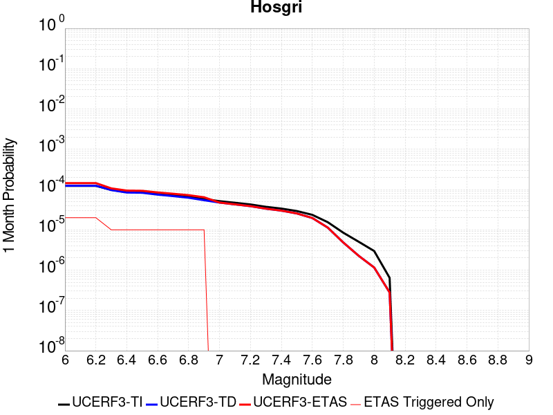 | 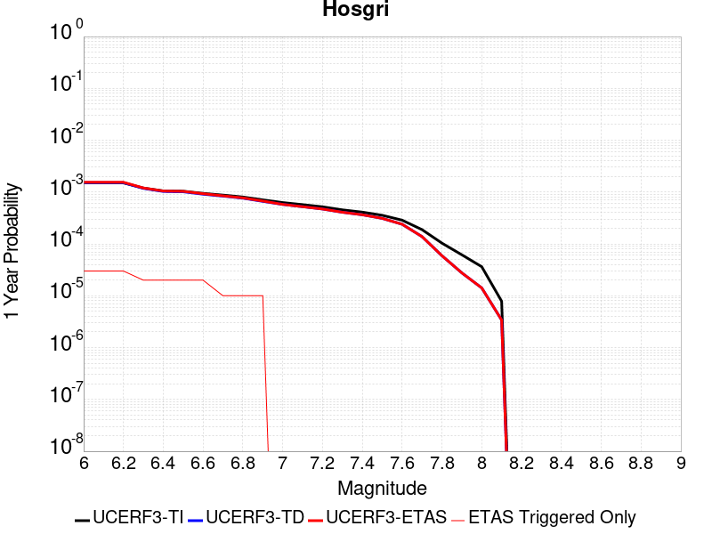 |  |

| Magnitude | 1 wk TI Prob | 1 wk TD Prob | 1 wk ETAS Prob | 1 wk ETAS/TD Gain | 1 wk ETAS Triggered Only | 1 mo TI Prob | 1 mo TD Prob | 1 mo ETAS Prob | 1 mo ETAS/TD Gain | 1 mo ETAS Triggered Only | 1 yr TI Prob | 1 yr TD Prob | 1 yr ETAS Prob | 1 yr ETAS/TD Gain | 1 yr ETAS Triggered Only | 10 yr TI Prob | 10 yr TD Prob | 10 yr ETAS Prob | 10 yr ETAS/TD Gain | 10 yr ETAS Triggered Only |
|-----|-----|-----|-----|-----|-----|-----|-----|-----|-----|-----|-----|-----|-----|-----|-----|-----|-----|-----|-----|-----|
| 6.0 | 2.883978E-5 | 2.9128403E-5 | 4.912782E-5 | 1.6865951 | 2.0E-5 | 1.235932E-4 | 1.248302E-4 | 1.448277E-4 | 1.1601976 | 2.0E-5 | 0.0015037085 | 0.0015187752 | 0.0015487297 | 1.0197227 | 3.0E-5 | 0.01493574 | 0.01508773 | 0.015127126 | 1.0026112 | 4.0E-5 |
| 6.1 | 2.883978E-5 | 2.9128403E-5 | 4.912782E-5 | 1.6865951 | 2.0E-5 | 1.235932E-4 | 1.248302E-4 | 1.448277E-4 | 1.1601976 | 2.0E-5 | 0.0015037085 | 0.0015187752 | 0.0015487297 | 1.0197227 | 3.0E-5 | 0.01493574 | 0.01508773 | 0.015127126 | 1.0026112 | 4.0E-5 |
| 6.2 | 2.883978E-5 | 2.9128403E-5 | 4.912782E-5 | 1.6865951 | 2.0E-5 | 1.235932E-4 | 1.248302E-4 | 1.448277E-4 | 1.1601976 | 2.0E-5 | 0.0015037085 | 0.0015187752 | 0.0015487297 | 1.0197227 | 3.0E-5 | 0.01493574 | 0.01508773 | 0.015127126 | 1.0026112 | 4.0E-5 |
| 6.3 | 2.2914428E-5 | 2.2641956E-5 | 3.264173E-5 | 1.441648 | 1.0E-5 | 9.8200995E-5 | 9.703337E-5 | 1.0703241E-4 | 1.1030474 | 1.0E-5 | 0.0011949413 | 0.001180746 | 0.0012007224 | 1.0169184 | 2.0E-5 | 0.011885363 | 0.011746123 | 0.011765888 | 1.0016826 | 2.0E-5 |
| 6.4 | 2.0195741E-5 | 1.9696547E-5 | 2.969635E-5 | 1.5076932 | 1.0E-5 | 8.65503E-5 | 8.4411055E-5 | 9.441021E-5 | 1.1184579 | 1.0E-5 | 0.0010532405 | 0.001027222 | 0.0010472015 | 1.01945 | 2.0E-5 | 0.010482626 | 0.010225783 | 0.010245578 | 1.0019358 | 2.0E-5 |
| 6.5 | 1.9924333E-5 | 1.9408968E-5 | 2.9408775E-5 | 1.5152158 | 1.0E-5 | 8.53872E-5 | 8.317865E-5 | 9.317782E-5 | 1.1202132 | 1.0E-5 | 0.0010390934 | 0.0010122315 | 0.0010322112 | 1.0197383 | 2.0E-5 | 0.010342481 | 0.010077244 | 0.010097042 | 1.0019647 | 2.0E-5 |
| 6.6 | 1.809694E-5 | 1.7458287E-5 | 2.7458113E-5 | 1.5727838 | 1.0E-5 | 7.7556004E-5 | 7.4819094E-5 | 8.481834E-5 | 1.1336458 | 1.0E-5 | 9.438353E-4 | 9.105431E-4 | 9.3052484E-4 | 1.0219449 | 2.0E-5 | 0.009398366 | 0.009069063 | 0.009088881 | 1.0021853 | 2.0E-5 |
| 6.7 | 1.675989E-5 | 1.6042752E-5 | 2.6042591E-5 | 1.6233245 | 1.0E-5 | 7.182612E-5 | 6.8752845E-5 | 7.875216E-5 | 1.1454386 | 1.0E-5 | 8.7413215E-4 | 8.3674554E-4 | 8.467372E-4 | 1.0119411 | 1.0E-5 | 0.008707017 | 0.008336853 | 0.00834677 | 1.0011895 | 1.0E-5 |
| 6.8 | 1.5401129E-5 | 1.4614069E-5 | 2.4613923E-5 | 1.6842622 | 1.0E-5 | 6.6003166E-5 | 6.263023E-5 | 7.26296E-5 | 1.1596574 | 1.0E-5 | 8.032922E-4 | 7.6225714E-4 | 7.722495E-4 | 1.013109 | 1.0E-5 | 0.008003947 | 0.0075972863 | 0.0076072104 | 1.0013063 | 1.0E-5 |
| 6.9 | 1.356559E-5 | 1.2689955E-5 | 2.2689828E-5 | 1.7880149 | 1.0E-5 | 5.8136946E-5 | 5.438439E-5 | 6.438384E-5 | 1.1838663 | 1.0E-5 | 7.0758746E-4 | 6.6192925E-4 | 6.7192264E-4 | 1.0150974 | 1.0E-5 | 0.007053386 | 0.006600378 | 0.006610312 | 1.001505 | 1.0E-5 |
| 7.0 | 1.2030819E-5 | 1.1095949E-5 | 1.1095949E-5 | 1.0 | 0.0 | 5.155963E-5 | 4.75532E-5 | 4.75532E-5 | 1.0 | 0.0 | 6.275577E-4 | 5.788065E-4 | 5.788065E-4 | 1.0 | 0.0 | 0.006257884 | 0.0057737473 | 0.0057737473 | 1.0 | 0.0 |
| 7.1 | 1.0972698E-5 | 1.0022167E-5 | 1.0022167E-5 | 1.0 | 0.0 | 4.7025E-5 | 4.2951437E-5 | 4.2951437E-5 | 1.0 | 0.0 | 5.72379E-4 | 5.2280835E-4 | 5.2280835E-4 | 1.0 | 0.0 | 0.0057090693 | 0.005216533 | 0.005216533 | 1.0 | 0.0 |
| 7.2 | 9.961926E-6 | 9.034732E-6 | 9.034732E-6 | 1.0 | 0.0 | 4.2693267E-5 | 3.8719707E-5 | 3.8719707E-5 | 1.0 | 0.0 | 5.1966653E-4 | 4.7131052E-4 | 4.7131052E-4 | 1.0 | 0.0 | 0.00518453 | 0.0047038523 | 0.0047038523 | 1.0 | 0.0 |
| 7.3 | 8.700929E-6 | 7.828089E-6 | 7.828089E-6 | 1.0 | 0.0 | 3.7289166E-5 | 3.354852E-5 | 3.354852E-5 | 1.0 | 0.0 | 4.53901E-4 | 4.083767E-4 | 4.083767E-4 | 1.0 | 0.0 | 0.00452975 | 0.004076999 | 0.004076999 | 1.0 | 0.0 |
| 7.4 | 7.866285E-6 | 6.9987263E-6 | 6.9987263E-6 | 1.0 | 0.0 | 3.3712215E-5 | 2.9994197E-5 | 2.9994197E-5 | 1.0 | 0.0 | 4.103689E-4 | 3.6511818E-4 | 3.6511818E-4 | 1.0 | 0.0 | 0.004096119 | 0.0036459167 | 0.0036459167 | 1.0 | 0.0 |
| 7.5 | 6.8381305E-6 | 5.9596814E-6 | 5.9596814E-6 | 1.0 | 0.0 | 2.9305946E-5 | 2.5541241E-5 | 2.5541241E-5 | 1.0 | 0.0 | 3.5674145E-4 | 3.1092027E-4 | 3.1092027E-4 | 1.0 | 0.0 | 0.0035616932 | 0.003105584 | 0.003105584 | 1.0 | 0.0 |
| 7.6 | 5.503376E-6 | 4.595227E-6 | 4.595227E-6 | 1.0 | 0.0 | 2.3585684E-5 | 1.9693682E-5 | 1.9693682E-5 | 1.0 | 0.0 | 2.8711787E-4 | 2.397442E-4 | 2.397442E-4 | 1.0 | 0.0 | 0.002867472 | 0.0023955852 | 0.0023955852 | 1.0 | 0.0 |
| 7.7 | 3.6144982E-6 | 2.6521896E-6 | 2.6521896E-6 | 1.0 | 0.0 | 1.5490614E-5 | 1.1366477E-5 | 1.1366477E-5 | 1.0 | 0.0 | 1.8858191E-4 | 1.3837808E-4 | 1.3837808E-4 | 1.0 | 0.0 | 0.0018842196 | 0.001383647 | 0.001383647 | 1.0 | 0.0 |
| 7.8 | 1.9853494E-6 | 1.1360784E-6 | 1.1360784E-6 | 1.0 | 0.0 | 8.508612E-6 | 4.8688985E-6 | 4.8688985E-6 | 1.0 | 0.0 | 1.0358743E-4 | 5.9277223E-5 | 5.9277223E-5 | 1.0 | 0.0 | 0.0010353916 | 5.933389E-4 | 5.933389E-4 | 1.0 | 0.0 |
| 7.9 | 1.1818757E-6 | 5.29477E-7 | 5.29477E-7 | 1.0 | 0.0 | 5.0651715E-6 | 2.269185E-6 | 2.269185E-6 | 1.0 | 0.0 | 6.1666724E-5 | 2.7626977E-5 | 2.7626977E-5 | 1.0 | 0.0 | 6.1649614E-4 | 2.7691363E-4 | 2.7691363E-4 | 1.0 | 0.0 |
| 8.0 | 6.962958E-7 | 2.71365E-7 | 2.71365E-7 | 1.0 | 0.0 | 2.9841215E-6 | 1.1629924E-6 | 1.1629924E-6 | 1.0 | 0.0 | 3.6331072E-5 | 1.415934E-5 | 1.415934E-5 | 1.0 | 0.0 | 3.6325134E-4 | 1.4215276E-4 | 1.4215276E-4 | 1.0 | 0.0 |
| 8.1 | 1.5033264E-7 | 6.52693E-8 | 6.52693E-8 | 1.0 | 0.0 | 6.442826E-7 | 2.7972553E-7 | 2.7972553E-7 | 1.0 | 0.0 | 7.844113E-6 | 3.4056532E-6 | 3.4056532E-6 | 1.0 | 0.0 | 7.843835E-5 | 3.4072833E-5 | 3.4072833E-5 | 1.0 | 0.0 |

## Los Osos 2011
*[(top)](#table-of-contents)*

| 1 Week | 1 Month | 1 Year | 10 Year |
|-----|-----|-----|-----|
|  | 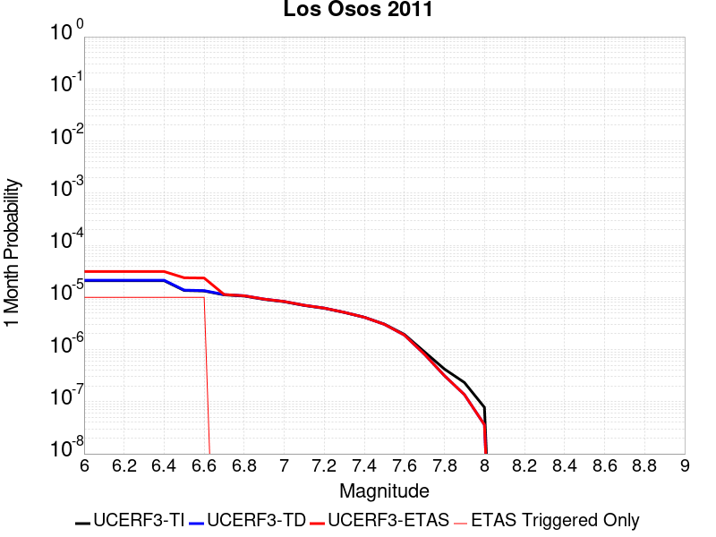 |  |  |

| Magnitude | 1 wk TI Prob | 1 wk TD Prob | 1 wk ETAS Prob | 1 wk ETAS/TD Gain | 1 wk ETAS Triggered Only | 1 mo TI Prob | 1 mo TD Prob | 1 mo ETAS Prob | 1 mo ETAS/TD Gain | 1 mo ETAS Triggered Only | 1 yr TI Prob | 1 yr TD Prob | 1 yr ETAS Prob | 1 yr ETAS/TD Gain | 1 yr ETAS Triggered Only | 10 yr TI Prob | 10 yr TD Prob | 10 yr ETAS Prob | 10 yr ETAS/TD Gain | 10 yr ETAS Triggered Only |
|-----|-----|-----|-----|-----|-----|-----|-----|-----|-----|-----|-----|-----|-----|-----|-----|-----|-----|-----|-----|-----|
| 6.0 | 4.8871775E-6 | 4.9814826E-6 | 1.4981433E-5 | 3.0074244 | 1.0E-5 | 2.0944879E-5 | 2.1349053E-5 | 3.1348838E-5 | 1.4683949 | 1.0E-5 | 2.5497406E-4 | 2.598965E-4 | 2.798913E-4 | 1.0769337 | 2.0E-5 | 0.002546817 | 0.0025962 | 0.0026261222 | 1.0115254 | 3.0E-5 |
| 6.1 | 4.8871775E-6 | 4.9814826E-6 | 1.4981433E-5 | 3.0074244 | 1.0E-5 | 2.0944879E-5 | 2.1349053E-5 | 3.1348838E-5 | 1.4683949 | 1.0E-5 | 2.5497406E-4 | 2.598965E-4 | 2.798913E-4 | 1.0769337 | 2.0E-5 | 0.002546817 | 0.0025962 | 0.0026261222 | 1.0115254 | 3.0E-5 |
| 6.2 | 4.8871775E-6 | 4.9814826E-6 | 1.4981433E-5 | 3.0074244 | 1.0E-5 | 2.0944879E-5 | 2.1349053E-5 | 3.1348838E-5 | 1.4683949 | 1.0E-5 | 2.5497406E-4 | 2.598965E-4 | 2.798913E-4 | 1.0769337 | 2.0E-5 | 0.002546817 | 0.0025962 | 0.0026261222 | 1.0115254 | 3.0E-5 |
| 6.3 | 4.8871775E-6 | 4.9814826E-6 | 1.4981433E-5 | 3.0074244 | 1.0E-5 | 2.0944879E-5 | 2.1349053E-5 | 3.1348838E-5 | 1.4683949 | 1.0E-5 | 2.5497406E-4 | 2.598965E-4 | 2.798913E-4 | 1.0769337 | 2.0E-5 | 0.002546817 | 0.0025962 | 0.0026261222 | 1.0115254 | 3.0E-5 |
| 6.4 | 4.8871775E-6 | 4.9814826E-6 | 1.4981433E-5 | 3.0074244 | 1.0E-5 | 2.0944879E-5 | 2.1349053E-5 | 3.1348838E-5 | 1.4683949 | 1.0E-5 | 2.5497406E-4 | 2.598965E-4 | 2.798913E-4 | 1.0769337 | 2.0E-5 | 0.002546817 | 0.0025962 | 0.0026261222 | 1.0115254 | 3.0E-5 |
| 6.5 | 3.1724062E-6 | 3.2233943E-6 | 1.3223362E-5 | 4.1023097 | 1.0E-5 | 1.3595956E-5 | 1.3814474E-5 | 2.3814337E-5 | 1.7238684 | 1.0E-5 | 1.6551818E-4 | 1.6817838E-4 | 1.7817669E-4 | 1.0594506 | 1.0E-5 | 0.0016539496 | 0.0016805246 | 0.001700491 | 1.011881 | 2.0E-5 |
| 6.6 | 3.1022591E-6 | 3.1511038E-6 | 1.3151072E-5 | 4.173481 | 1.0E-5 | 1.3295328E-5 | 1.3504661E-5 | 2.3504526E-5 | 1.740475 | 1.0E-5 | 1.618586E-4 | 1.6440697E-4 | 1.7440533E-4 | 1.0608146 | 1.0E-5 | 0.0016174077 | 0.0016428662 | 0.0016528498 | 1.0060769 | 1.0E-5 |
| 6.7 | 2.611518E-6 | 2.6491825E-6 | 2.6491825E-6 | 1.0 | 0.0 | 1.1192172E-5 | 1.1353591E-5 | 1.1353591E-5 | 1.0 | 0.0 | 1.3625617E-4 | 1.3822124E-4 | 1.3822124E-4 | 1.0 | 0.0 | 0.0013617266 | 0.0013813572 | 0.0013813572 | 1.0 | 0.0 |
| 6.8 | 2.4780884E-6 | 2.5121587E-6 | 2.5121587E-6 | 1.0 | 0.0 | 1.0620336E-5 | 1.076635E-5 | 1.076635E-5 | 1.0 | 0.0 | 1.2929492E-4 | 1.3107246E-4 | 1.3107246E-4 | 1.0 | 0.0 | 0.0012921972 | 0.0013099556 | 0.0013099556 | 1.0 | 0.0 |
| 6.9 | 2.1376322E-6 | 2.1635049E-6 | 2.1635049E-6 | 1.0 | 0.0 | 9.161248E-6 | 9.272131E-6 | 9.272131E-6 | 1.0 | 0.0 | 1.1153249E-4 | 1.1288237E-4 | 1.1288237E-4 | 1.0 | 0.0 | 0.0011147653 | 0.0011282521 | 0.0011282521 | 1.0 | 0.0 |
| 7.0 | 1.9282882E-6 | 1.949458E-6 | 1.949458E-6 | 1.0 | 0.0 | 8.264066E-6 | 8.354793E-6 | 8.354793E-6 | 1.0 | 0.0 | 1.0061036E-4 | 1.0171487E-4 | 1.0171487E-4 | 1.0 | 0.0 | 0.0010056482 | 0.0010166845 | 0.0010166845 | 1.0 | 0.0 |
| 7.1 | 1.6353226E-6 | 1.6501111E-6 | 1.6501111E-6 | 1.0 | 0.0 | 7.0085066E-6 | 7.0718856E-6 | 7.0718856E-6 | 1.0 | 0.0 | 8.532523E-5 | 8.6096814E-5 | 8.6096814E-5 | 1.0 | 0.0 | 8.529247E-4 | 8.6063537E-4 | 8.6063537E-4 | 1.0 | 0.0 |
| 7.2 | 1.4446276E-6 | 1.4553335E-6 | 1.4553335E-6 | 1.0 | 0.0 | 6.191247E-6 | 6.2371287E-6 | 6.2371287E-6 | 1.0 | 0.0 | 7.537582E-5 | 7.59344E-5 | 7.59344E-5 | 1.0 | 0.0 | 7.535026E-4 | 7.590851E-4 | 7.590851E-4 | 1.0 | 0.0 |
| 7.3 | 1.2014582E-6 | 1.2069066E-6 | 1.2069066E-6 | 1.0 | 0.0 | 5.149096E-6 | 5.172447E-6 | 5.172447E-6 | 1.0 | 0.0 | 6.268844E-5 | 6.297272E-5 | 6.297272E-5 | 1.0 | 0.0 | 6.267076E-4 | 6.295492E-4 | 6.295492E-4 | 1.0 | 0.0 |
| 7.4 | 9.707733E-7 | 9.709767E-7 | 9.709767E-7 | 1.0 | 0.0 | 4.16045E-6 | 4.161322E-6 | 4.161322E-6 | 1.0 | 0.0 | 5.0652303E-5 | 5.066292E-5 | 5.066292E-5 | 1.0 | 0.0 | 5.064076E-4 | 5.065139E-4 | 5.065139E-4 | 1.0 | 0.0 |
| 7.5 | 7.174908E-7 | 7.114907E-7 | 7.114907E-7 | 1.0 | 0.0 | 3.074957E-6 | 3.0492424E-6 | 3.0492424E-6 | 1.0 | 0.0 | 3.743696E-5 | 3.7123897E-5 | 3.7123897E-5 | 1.0 | 0.0 | 3.7430652E-4 | 3.7117713E-4 | 3.7117713E-4 | 1.0 | 0.0 |
| 7.6 | 4.5535776E-7 | 4.4207857E-7 | 4.4207857E-7 | 1.0 | 0.0 | 1.9515319E-6 | 1.8946212E-6 | 1.8946212E-6 | 1.0 | 0.0 | 2.3759641E-5 | 2.3066768E-5 | 2.3066768E-5 | 1.0 | 0.0 | 2.37571E-4 | 2.3064384E-4 | 2.3064384E-4 | 1.0 | 0.0 |
| 7.7 | 2.1173553E-7 | 1.9060734E-7 | 1.9060734E-7 | 1.0 | 0.0 | 9.0743765E-7 | 8.1688836E-7 | 8.1688836E-7 | 1.0 | 0.0 | 1.1047998E-5 | 9.94557E-6 | 9.94557E-6 | 1.0 | 0.0 | 1.1047449E-4 | 9.945128E-5 | 9.945128E-5 | 1.0 | 0.0 |
| 7.8 | 9.873608E-8 | 7.367457E-8 | 7.367457E-8 | 1.0 | 0.0 | 4.2315455E-7 | 3.1574814E-7 | 3.1574814E-7 | 1.0 | 0.0 | 5.1518946E-6 | 3.8442267E-6 | 3.8442267E-6 | 1.0 | 0.0 | 5.1517753E-5 | 3.844161E-5 | 3.844161E-5 | 1.0 | 0.0 |
| 7.9 | 5.4399106E-8 | 3.187941E-8 | 3.187941E-8 | 1.0 | 0.0 | 2.33139E-7 | 1.3662603E-7 | 1.3662603E-7 | 1.0 | 0.0 | 2.8384638E-6 | 1.6634207E-6 | 1.6634207E-6 | 1.0 | 0.0 | 2.8384275E-5 | 1.6634083E-5 | 1.6634083E-5 | 1.0 | 0.0 |
| 8.0 | 1.817203E-8 | 8.420079E-9 | 8.420079E-9 | 1.0 | 0.0 | 7.7880124E-8 | 3.6086053E-8 | 3.6086053E-8 | 1.0 | 0.0 | 9.481901E-7 | 4.393476E-7 | 4.393476E-7 | 1.0 | 0.0 | 9.481861E-6 | 4.393468E-6 | 4.393468E-6 | 1.0 | 0.0 |

## San Gabriel
*[(top)](#table-of-contents)*

| 1 Week | 1 Month | 1 Year | 10 Year |
|-----|-----|-----|-----|
|  |  |  |  |

| Magnitude | 1 wk TI Prob | 1 wk TD Prob | 1 wk ETAS Prob | 1 wk ETAS/TD Gain | 1 wk ETAS Triggered Only | 1 mo TI Prob | 1 mo TD Prob | 1 mo ETAS Prob | 1 mo ETAS/TD Gain | 1 mo ETAS Triggered Only | 1 yr TI Prob | 1 yr TD Prob | 1 yr ETAS Prob | 1 yr ETAS/TD Gain | 1 yr ETAS Triggered Only | 10 yr TI Prob | 10 yr TD Prob | 10 yr ETAS Prob | 10 yr ETAS/TD Gain | 10 yr ETAS Triggered Only |
|-----|-----|-----|-----|-----|-----|-----|-----|-----|-----|-----|-----|-----|-----|-----|-----|-----|-----|-----|-----|-----|
| 6.0 | 1.083775E-5 | 1.198525E-5 | 2.198513E-5 | 1.8343489 | 1.0E-5 | 4.6446676E-5 | 5.1364408E-5 | 7.1363385E-5 | 1.3893547 | 2.0E-5 | 5.653415E-4 | 6.251936E-4 | 6.4518105E-4 | 1.0319701 | 2.0E-5 | 0.0056390543 | 0.0062463325 | 0.006276145 | 1.0047728 | 3.0E-5 |
| 6.1 | 1.083775E-5 | 1.198525E-5 | 2.198513E-5 | 1.8343489 | 1.0E-5 | 4.6446676E-5 | 5.1364408E-5 | 7.1363385E-5 | 1.3893547 | 2.0E-5 | 5.653415E-4 | 6.251936E-4 | 6.4518105E-4 | 1.0319701 | 2.0E-5 | 0.0056390543 | 0.0062463325 | 0.006276145 | 1.0047728 | 3.0E-5 |
| 6.2 | 1.083775E-5 | 1.198525E-5 | 2.198513E-5 | 1.8343489 | 1.0E-5 | 4.6446676E-5 | 5.1364408E-5 | 7.1363385E-5 | 1.3893547 | 2.0E-5 | 5.653415E-4 | 6.251936E-4 | 6.4518105E-4 | 1.0319701 | 2.0E-5 | 0.0056390543 | 0.0062463325 | 0.006276145 | 1.0047728 | 3.0E-5 |
| 6.3 | 1.083775E-5 | 1.198525E-5 | 2.198513E-5 | 1.8343489 | 1.0E-5 | 4.6446676E-5 | 5.1364408E-5 | 7.1363385E-5 | 1.3893547 | 2.0E-5 | 5.653415E-4 | 6.251936E-4 | 6.4518105E-4 | 1.0319701 | 2.0E-5 | 0.0056390543 | 0.0062463325 | 0.006276145 | 1.0047728 | 3.0E-5 |
| 6.4 | 1.083775E-5 | 1.198525E-5 | 2.198513E-5 | 1.8343489 | 1.0E-5 | 4.6446676E-5 | 5.1364408E-5 | 7.1363385E-5 | 1.3893547 | 2.0E-5 | 5.653415E-4 | 6.251936E-4 | 6.4518105E-4 | 1.0319701 | 2.0E-5 | 0.0056390543 | 0.0062463325 | 0.006276145 | 1.0047728 | 3.0E-5 |
| 6.5 | 6.7317824E-6 | 7.717007E-6 | 7.717007E-6 | 1.0 | 0.0 | 2.8850178E-5 | 3.3072472E-5 | 4.3072145E-5 | 1.3023562 | 1.0E-5 | 3.511943E-4 | 4.0258403E-4 | 4.1258E-4 | 1.0248295 | 1.0E-5 | 0.003506398 | 0.004029533 | 0.0040494525 | 1.0049434 | 2.0E-5 |
| 6.6 | 6.7317824E-6 | 7.717007E-6 | 7.717007E-6 | 1.0 | 0.0 | 2.8850178E-5 | 3.3072472E-5 | 4.3072145E-5 | 1.3023562 | 1.0E-5 | 3.511943E-4 | 4.0258403E-4 | 4.1258E-4 | 1.0248295 | 1.0E-5 | 0.003506398 | 0.004029533 | 0.0040494525 | 1.0049434 | 2.0E-5 |
| 6.7 | 6.274881E-6 | 7.2459275E-6 | 7.2459275E-6 | 1.0 | 0.0 | 2.6892068E-5 | 3.105361E-5 | 4.10533E-5 | 1.3220137 | 1.0E-5 | 3.2736175E-4 | 3.7801306E-4 | 3.880093E-4 | 1.0264441 | 1.0E-5 | 0.0032687993 | 0.0037846796 | 0.0038046038 | 1.0052645 | 2.0E-5 |
| 6.8 | 5.996209E-6 | 6.958647E-6 | 6.958647E-6 | 1.0 | 0.0 | 2.5697784E-5 | 2.9822439E-5 | 3.9822142E-5 | 1.335308 | 1.0E-5 | 3.128256E-4 | 3.6302864E-4 | 3.7302502E-4 | 1.027536 | 1.0E-5 | 0.003123856 | 0.0036353325 | 0.0036552597 | 1.0054816 | 2.0E-5 |
| 6.9 | 5.686331E-6 | 6.6236917E-6 | 6.6236917E-6 | 1.0 | 0.0 | 2.4369761E-5 | 2.8386947E-5 | 3.8386665E-5 | 1.3522646 | 1.0E-5 | 2.9666146E-4 | 3.4555717E-4 | 3.5555373E-4 | 1.0289288 | 1.0E-5 | 0.0029626573 | 0.0034611735 | 0.0034811043 | 1.0057584 | 2.0E-5 |
| 7.0 | 5.2329838E-6 | 6.1475757E-6 | 6.1475757E-6 | 1.0 | 0.0 | 2.242688E-5 | 2.6346492E-5 | 3.6346228E-5 | 1.3795471 | 1.0E-5 | 2.7301308E-4 | 3.207221E-4 | 3.3071887E-4 | 1.0311697 | 1.0E-5 | 0.002726779 | 0.0032135549 | 0.0032334907 | 1.0062037 | 2.0E-5 |
| 7.1 | 5.135671E-6 | 6.0377E-6 | 6.0377E-6 | 1.0 | 0.0 | 2.2009834E-5 | 2.5875606E-5 | 3.5875346E-5 | 1.3864543 | 1.0E-5 | 2.6793676E-4 | 3.1499073E-4 | 3.2498757E-4 | 1.031737 | 1.0E-5 | 0.0026761394 | 0.0031564054 | 0.0031763422 | 1.0063163 | 2.0E-5 |
| 7.2 | 4.989062E-6 | 5.8710784E-6 | 5.8710784E-6 | 1.0 | 0.0 | 2.1381518E-5 | 2.5161527E-5 | 3.5161276E-5 | 1.3974222 | 1.0E-5 | 2.6028889E-4 | 3.0629928E-4 | 3.162962E-4 | 1.0326378 | 1.0E-5 | 0.0025998424 | 0.003069734 | 0.0030896724 | 1.0064952 | 2.0E-5 |
| 7.3 | 4.8219395E-6 | 5.7026323E-6 | 5.7026323E-6 | 1.0 | 0.0 | 2.0665291E-5 | 2.4439627E-5 | 3.4439385E-5 | 1.4091616 | 1.0E-5 | 2.5157086E-4 | 2.975126E-4 | 3.0750962E-4 | 1.033602 | 1.0E-5 | 0.0025128627 | 0.002982106 | 0.0030020464 | 1.0066867 | 2.0E-5 |
| 7.4 | 4.7118383E-6 | 5.5911896E-6 | 5.5911896E-6 | 1.0 | 0.0 | 2.0193436E-5 | 2.3962024E-5 | 3.3961784E-5 | 1.417317 | 1.0E-5 | 2.4582737E-4 | 2.9169934E-4 | 3.0169642E-4 | 1.0342718 | 1.0E-5 | 0.002455556 | 0.0029241266 | 0.002944068 | 1.0068196 | 2.0E-5 |
| 7.5 | 4.5506545E-6 | 5.4365555E-6 | 5.4365555E-6 | 1.0 | 0.0 | 1.9502659E-5 | 2.329932E-5 | 3.3299086E-5 | 1.429187 | 1.0E-5 | 2.37419E-4 | 2.8363304E-4 | 2.936302E-4 | 1.0352468 | 1.0E-5 | 0.002371655 | 0.0028436715 | 0.0028636146 | 1.0070132 | 2.0E-5 |
| 7.6 | 4.343636E-6 | 5.2294336E-6 | 5.2294336E-6 | 1.0 | 0.0 | 1.861545E-5 | 2.241167E-5 | 3.2411444E-5 | 1.4461861 | 1.0E-5 | 2.2661954E-4 | 2.7282868E-4 | 2.8282593E-4 | 1.036643 | 1.0E-5 | 0.0022638857 | 0.0027358893 | 0.0027558345 | 1.0072902 | 2.0E-5 |
| 7.7 | 2.936235E-6 | 2.743946E-6 | 2.743946E-6 | 1.0 | 0.0 | 1.2583803E-5 | 1.1759716E-5 | 2.1759599E-5 | 1.8503506 | 1.0E-5 | 1.5319703E-4 | 1.4316518E-4 | 1.5316374E-4 | 1.0698394 | 1.0E-5 | 0.0015309147 | 0.0014379849 | 0.0014579562 | 1.0138884 | 2.0E-5 |
| 7.8 | 1.4541639E-6 | 9.122518E-7 | 9.122518E-7 | 1.0 | 0.0 | 6.232116E-6 | 3.9096444E-6 | 3.9096444E-6 | 1.0 | 0.0 | 7.587337E-5 | 4.7598885E-5 | 4.7598885E-5 | 1.0 | 0.0 | 7.584747E-4 | 4.8078224E-4 | 4.8078224E-4 | 1.0 | 0.0 |
| 7.9 | 8.098958E-7 | 2.4165956E-7 | 2.4165956E-7 | 1.0 | 0.0 | 3.4709774E-6 | 1.0356835E-6 | 1.0356835E-6 | 1.0 | 0.0 | 4.225833E-5 | 1.2609373E-5 | 1.2609373E-5 | 1.0 | 0.0 | 4.2250296E-4 | 1.2917137E-4 | 1.2917137E-4 | 1.0 | 0.0 |
| 8.0 | 5.2473234E-7 | 7.672734E-8 | 7.672734E-8 | 1.0 | 0.0 | 2.248851E-6 | 3.2883142E-7 | 3.2883142E-7 | 1.0 | 0.0 | 2.7379416E-5 | 4.003515E-6 | 4.003515E-6 | 1.0 | 0.0 | 2.7376044E-4 | 4.215796E-5 | 4.215796E-5 | 1.0 | 0.0 |
| 8.1 | 3.3162388E-7 | 4.1457096E-8 | 4.1457096E-8 | 1.0 | 0.0 | 1.4212444E-6 | 1.7767324E-7 | 1.7767324E-7 | 1.0 | 0.0 | 1.7303513E-5 | 2.1631695E-6 | 2.1631695E-6 | 1.0 | 0.0 | 1.7302166E-4 | 2.294416E-5 | 2.294416E-5 | 1.0 | 0.0 |
| 8.2 | 1.0235345E-7 | 1.4032201E-8 | 1.4032201E-8 | 1.0 | 0.0 | 4.3865757E-7 | 6.013801E-8 | 6.013801E-8 | 1.0 | 0.0 | 5.340643E-6 | 7.3217996E-7 | 7.3217996E-7 | 1.0 | 0.0 | 5.3405143E-5 | 7.921925E-6 | 7.921925E-6 | 1.0 | 0.0 |

## Newport-Inglewood alt 1
*[(top)](#table-of-contents)*

| 1 Week | 1 Month | 1 Year | 10 Year |
|-----|-----|-----|-----|
|  |  |  |  |

| Magnitude | 1 wk TI Prob | 1 wk TD Prob | 1 wk ETAS Prob | 1 wk ETAS/TD Gain | 1 wk ETAS Triggered Only | 1 mo TI Prob | 1 mo TD Prob | 1 mo ETAS Prob | 1 mo ETAS/TD Gain | 1 mo ETAS Triggered Only | 1 yr TI Prob | 1 yr TD Prob | 1 yr ETAS Prob | 1 yr ETAS/TD Gain | 1 yr ETAS Triggered Only | 10 yr TI Prob | 10 yr TD Prob | 10 yr ETAS Prob | 10 yr ETAS/TD Gain | 10 yr ETAS Triggered Only |
|-----|-----|-----|-----|-----|-----|-----|-----|-----|-----|-----|-----|-----|-----|-----|-----|-----|-----|-----|-----|-----|
| 6.0 | 2.9668912E-5 | 3.0404828E-5 | 4.0404524E-5 | 1.3288851 | 1.0E-5 | 1.2714628E-4 | 1.3030265E-4 | 1.5030004E-4 | 1.1534688 | 2.0E-5 | 0.0015469068 | 0.0015857654 | 0.0016057338 | 1.0125922 | 2.0E-5 | 0.015361829 | 0.01579211 | 0.015821636 | 1.0018697 | 3.0E-5 |
| 6.1 | 2.9668912E-5 | 3.0404828E-5 | 4.0404524E-5 | 1.3288851 | 1.0E-5 | 1.2714628E-4 | 1.3030265E-4 | 1.5030004E-4 | 1.1534688 | 2.0E-5 | 0.0015469068 | 0.0015857654 | 0.0016057338 | 1.0125922 | 2.0E-5 | 0.015361829 | 0.01579211 | 0.015821636 | 1.0018697 | 3.0E-5 |
| 6.2 | 2.9668912E-5 | 3.0404828E-5 | 4.0404524E-5 | 1.3288851 | 1.0E-5 | 1.2714628E-4 | 1.3030265E-4 | 1.5030004E-4 | 1.1534688 | 2.0E-5 | 0.0015469068 | 0.0015857654 | 0.0016057338 | 1.0125922 | 2.0E-5 | 0.015361829 | 0.01579211 | 0.015821636 | 1.0018697 | 3.0E-5 |
| 6.3 | 2.9668912E-5 | 3.0404828E-5 | 4.0404524E-5 | 1.3288851 | 1.0E-5 | 1.2714628E-4 | 1.3030265E-4 | 1.5030004E-4 | 1.1534688 | 2.0E-5 | 0.0015469068 | 0.0015857654 | 0.0016057338 | 1.0125922 | 2.0E-5 | 0.015361829 | 0.01579211 | 0.015821636 | 1.0018697 | 3.0E-5 |
| 6.4 | 1.275942E-5 | 1.02725335E-5 | 2.0272431E-5 | 1.9734597 | 1.0E-5 | 5.4682085E-5 | 4.4024422E-5 | 6.4023545E-5 | 1.4542733 | 2.0E-5 | 6.65551E-4 | 5.358697E-4 | 5.55859E-4 | 1.0373025 | 2.0E-5 | 0.0066356123 | 0.0053462 | 0.005366093 | 1.003721 | 2.0E-5 |
| 6.5 | 1.275942E-5 | 1.02725335E-5 | 2.0272431E-5 | 1.9734597 | 1.0E-5 | 5.4682085E-5 | 4.4024422E-5 | 6.4023545E-5 | 1.4542733 | 2.0E-5 | 6.65551E-4 | 5.358697E-4 | 5.55859E-4 | 1.0373025 | 2.0E-5 | 0.0066356123 | 0.0053462 | 0.005366093 | 1.003721 | 2.0E-5 |
| 6.6 | 1.1255358E-5 | 8.661911E-6 | 1.8661825E-5 | 2.1544695 | 1.0E-5 | 4.8236358E-5 | 3.7121958E-5 | 5.7121215E-5 | 1.5387447 | 2.0E-5 | 5.871194E-4 | 4.5186782E-4 | 4.7185877E-4 | 1.0442407 | 2.0E-5 | 0.005855706 | 0.0045096674 | 0.004529577 | 1.0044149 | 2.0E-5 |
| 6.7 | 1.0504745E-5 | 7.8998455E-6 | 1.7899767E-5 | 2.2658374 | 1.0E-5 | 4.5019555E-5 | 3.385605E-5 | 5.3855372E-5 | 1.5907164 | 2.0E-5 | 5.4797524E-4 | 4.121207E-4 | 4.3211243E-4 | 1.0485095 | 2.0E-5 | 0.0054662596 | 0.004113694 | 0.004133612 | 1.0048418 | 2.0E-5 |
| 6.8 | 1.0476007E-5 | 7.881227E-6 | 1.7881148E-5 | 2.268828 | 1.0E-5 | 4.4896402E-5 | 3.3776258E-5 | 5.377558E-5 | 1.592112 | 2.0E-5 | 5.464766E-4 | 4.1114958E-4 | 4.3114135E-4 | 1.048624 | 2.0E-5 | 0.005451347 | 0.004104019 | 0.004123937 | 1.0048532 | 2.0E-5 |
| 6.9 | 9.076797E-6 | 6.4896567E-6 | 1.6489592E-5 | 2.5409036 | 1.0E-5 | 3.889998E-5 | 2.7812519E-5 | 4.7811962E-5 | 1.7190806 | 2.0E-5 | 4.7350433E-4 | 3.3856515E-4 | 3.5855838E-4 | 1.0590528 | 2.0E-5 | 0.004724967 | 0.003380531 | 0.0034004634 | 1.0058962 | 2.0E-5 |
| 7.0 | 8.73795E-6 | 6.2120503E-6 | 1.6211989E-5 | 2.6097646 | 1.0E-5 | 3.7447822E-5 | 2.6622802E-5 | 4.662227E-5 | 1.7512157 | 2.0E-5 | 4.5583185E-4 | 3.2408469E-4 | 3.440782E-4 | 1.0616922 | 2.0E-5 | 0.0045489795 | 0.0032361522 | 0.0032560877 | 1.0061601 | 2.0E-5 |
| 7.1 | 8.391299E-6 | 5.9557533E-6 | 1.5955693E-5 | 2.6790388 | 1.0E-5 | 3.5962214E-5 | 2.5524409E-5 | 4.55239E-5 | 1.7835437 | 2.0E-5 | 4.37752E-4 | 3.1071564E-4 | 3.3070942E-4 | 1.0643475 | 2.0E-5 | 0.004368907 | 0.0031028416 | 0.0031227795 | 1.0064257 | 2.0E-5 |
| 7.2 | 7.796882E-6 | 5.4964826E-6 | 5.4964826E-6 | 1.0 | 0.0 | 3.341478E-5 | 2.3556144E-5 | 3.355591E-5 | 1.4245077 | 1.0E-5 | 4.06749E-4 | 2.867585E-4 | 2.9675564E-4 | 1.0348625 | 1.0E-5 | 0.0040600533 | 0.002863909 | 0.0028738803 | 1.0034817 | 1.0E-5 |
| 7.3 | 6.4738833E-6 | 4.6477753E-6 | 4.6477753E-6 | 1.0 | 0.0 | 2.774492E-5 | 1.9918885E-5 | 2.9918687E-5 | 1.5020261 | 1.0E-5 | 3.3774204E-4 | 2.424856E-4 | 2.5248318E-4 | 1.0412296 | 1.0E-5 | 0.0033722918 | 0.0024222268 | 0.0024322027 | 1.0041184 | 1.0E-5 |
| 7.4 | 5.382145E-6 | 3.8857215E-6 | 3.8857215E-6 | 1.0 | 0.0 | 2.3066134E-5 | 1.6652988E-5 | 2.665282E-5 | 1.6004828 | 1.0E-5 | 2.8079396E-4 | 2.0273139E-4 | 2.1272937E-4 | 1.0493164 | 1.0E-5 | 0.0028043943 | 0.002025479 | 0.0020354588 | 1.0049272 | 1.0E-5 |
| 7.5 | 3.648244E-6 | 2.5737634E-6 | 2.5737634E-6 | 1.0 | 0.0 | 1.5635238E-5 | 1.1030369E-5 | 1.1030369E-5 | 1.0 | 0.0 | 1.9034238E-4 | 1.3428657E-4 | 1.3428657E-4 | 1.0 | 0.0 | 0.0019017943 | 0.0013420646 | 0.0013420646 | 1.0 | 0.0 |
| 7.6 | 2.2906888E-6 | 1.547986E-6 | 1.547986E-6 | 1.0 | 0.0 | 9.817201E-6 | 6.634209E-6 | 6.634209E-6 | 1.0 | 0.0 | 1.1951787E-4 | 8.076857E-5 | 8.076857E-5 | 1.0 | 0.0 | 0.0011945361 | 8.073989E-4 | 8.073989E-4 | 1.0 | 0.0 |
| 7.7 | 6.0479874E-7 | 3.397468E-7 | 3.397468E-7 | 1.0 | 0.0 | 2.5919921E-6 | 1.456057E-6 | 1.456057E-6 | 1.0 | 0.0 | 3.1557047E-5 | 1.7727363E-5 | 1.7727363E-5 | 1.0 | 0.0 | 3.1552566E-4 | 1.7726087E-4 | 1.7726087E-4 | 1.0 | 0.0 |
| 7.8 | 1.16056995E-8 | 9.782997E-9 | 9.782997E-9 | 1.0 | 0.0 | 4.9738713E-8 | 4.1927127E-8 | 4.1927127E-8 | 1.0 | 0.0 | 6.0556863E-7 | 5.1046277E-7 | 5.1046277E-7 | 1.0 | 0.0 | 6.05567E-6 | 5.1046277E-6 | 5.1046277E-6 | 1.0 | 0.0 |

## Santa Monica alt 1
*[(top)](#table-of-contents)*

| 1 Week | 1 Month | 1 Year | 10 Year |
|-----|-----|-----|-----|
|  | 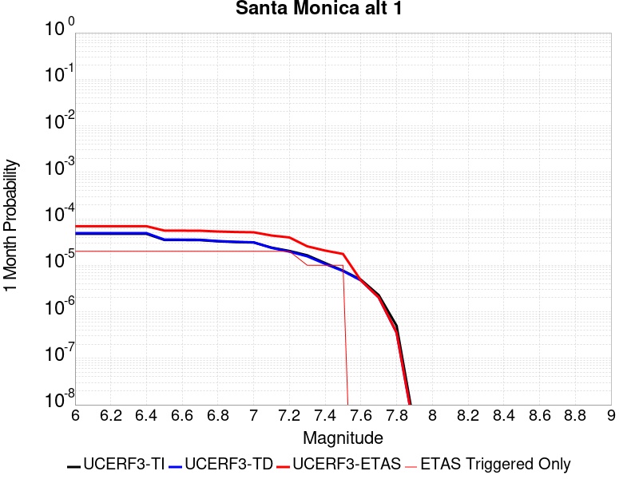 | 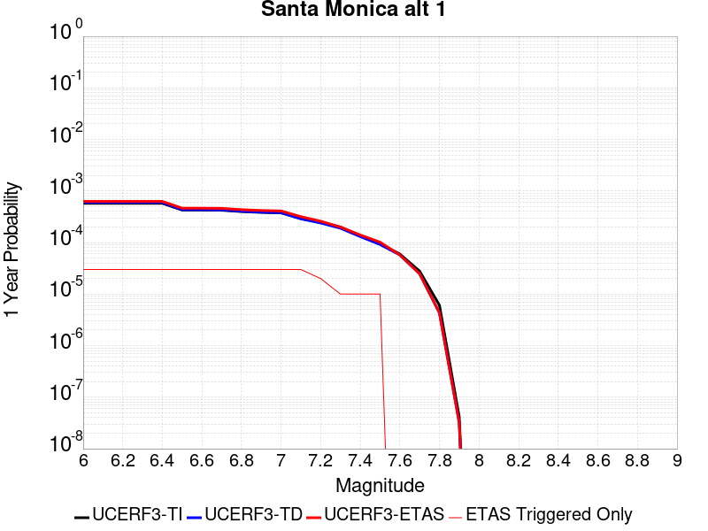 |  |

| Magnitude | 1 wk TI Prob | 1 wk TD Prob | 1 wk ETAS Prob | 1 wk ETAS/TD Gain | 1 wk ETAS Triggered Only | 1 mo TI Prob | 1 mo TD Prob | 1 mo ETAS Prob | 1 mo ETAS/TD Gain | 1 mo ETAS Triggered Only | 1 yr TI Prob | 1 yr TD Prob | 1 yr ETAS Prob | 1 yr ETAS/TD Gain | 1 yr ETAS Triggered Only | 10 yr TI Prob | 10 yr TD Prob | 10 yr ETAS Prob | 10 yr ETAS/TD Gain | 10 yr ETAS Triggered Only |
|-----|-----|-----|-----|-----|-----|-----|-----|-----|-----|-----|-----|-----|-----|-----|-----|-----|-----|-----|-----|-----|
| 6.0 | 1.1066008E-5 | 1.1480312E-5 | 2.1480198E-5 | 1.8710464 | 1.0E-5 | 4.742488E-5 | 4.920049E-5 | 6.919951E-5 | 1.4064801 | 2.0E-5 | 5.7724497E-4 | 5.9886527E-4 | 6.288473E-4 | 1.0500647 | 3.0E-5 | 0.005757478 | 0.0059739016 | 0.006003722 | 1.0049919 | 3.0E-5 |
| 6.1 | 1.1066008E-5 | 1.1480312E-5 | 2.1480198E-5 | 1.8710464 | 1.0E-5 | 4.742488E-5 | 4.920049E-5 | 6.919951E-5 | 1.4064801 | 2.0E-5 | 5.7724497E-4 | 5.9886527E-4 | 6.288473E-4 | 1.0500647 | 3.0E-5 | 0.005757478 | 0.0059739016 | 0.006003722 | 1.0049919 | 3.0E-5 |
| 6.2 | 1.1066008E-5 | 1.1480312E-5 | 2.1480198E-5 | 1.8710464 | 1.0E-5 | 4.742488E-5 | 4.920049E-5 | 6.919951E-5 | 1.4064801 | 2.0E-5 | 5.7724497E-4 | 5.9886527E-4 | 6.288473E-4 | 1.0500647 | 3.0E-5 | 0.005757478 | 0.0059739016 | 0.006003722 | 1.0049919 | 3.0E-5 |
| 6.3 | 1.1066008E-5 | 1.1480312E-5 | 2.1480198E-5 | 1.8710464 | 1.0E-5 | 4.742488E-5 | 4.920049E-5 | 6.919951E-5 | 1.4064801 | 2.0E-5 | 5.7724497E-4 | 5.9886527E-4 | 6.288473E-4 | 1.0500647 | 3.0E-5 | 0.005757478 | 0.0059739016 | 0.006003722 | 1.0049919 | 3.0E-5 |
| 6.4 | 1.1066008E-5 | 1.1480312E-5 | 2.1480198E-5 | 1.8710464 | 1.0E-5 | 4.742488E-5 | 4.920049E-5 | 6.919951E-5 | 1.4064801 | 2.0E-5 | 5.7724497E-4 | 5.9886527E-4 | 6.288473E-4 | 1.0500647 | 3.0E-5 | 0.005757478 | 0.0059739016 | 0.006003722 | 1.0049919 | 3.0E-5 |
| 6.5 | 8.183544E-6 | 8.335434E-6 | 1.8335351E-5 | 2.1996875 | 1.0E-5 | 3.5071862E-5 | 3.572281E-5 | 5.5722092E-5 | 1.5598464 | 2.0E-5 | 4.2691626E-4 | 4.3483998E-4 | 4.6482694E-4 | 1.0689609 | 3.0E-5 | 0.0042609703 | 0.004340057 | 0.0043699266 | 1.0068823 | 3.0E-5 |
| 6.6 | 8.1543285E-6 | 8.303648E-6 | 1.8303565E-5 | 2.20428 | 1.0E-5 | 3.4946657E-5 | 3.558659E-5 | 5.5585875E-5 | 1.5619895 | 2.0E-5 | 4.2539247E-4 | 4.3318217E-4 | 4.6316916E-4 | 1.069225 | 3.0E-5 | 0.0042457907 | 0.004323543 | 0.0043534134 | 1.0069088 | 3.0E-5 |
| 6.7 | 8.110878E-6 | 8.257045E-6 | 1.8256962E-5 | 2.211077 | 1.0E-5 | 3.4760444E-5 | 3.5386864E-5 | 5.5386157E-5 | 1.5651615 | 2.0E-5 | 4.231262E-4 | 4.3075148E-4 | 4.6073858E-4 | 1.0696157 | 3.0E-5 | 0.0042232145 | 0.004299331 | 0.0043292018 | 1.0069479 | 3.0E-5 |
| 6.8 | 7.644036E-6 | 7.751063E-6 | 1.7750985E-5 | 2.2901356 | 1.0E-5 | 3.275974E-5 | 3.3218425E-5 | 5.3217762E-5 | 1.6020554 | 2.0E-5 | 3.9877684E-4 | 4.043607E-4 | 4.3434856E-4 | 1.0741612 | 3.0E-5 | 0.00398062 | 0.004036396 | 0.0040662745 | 1.0074024 | 3.0E-5 |
| 6.9 | 7.3698293E-6 | 7.4557215E-6 | 1.7455646E-5 | 2.3412418 | 1.0E-5 | 3.15846E-5 | 3.195271E-5 | 5.195207E-5 | 1.625905 | 2.0E-5 | 3.8447464E-4 | 3.889562E-4 | 4.1894452E-4 | 1.0770996 | 3.0E-5 | 0.0038381014 | 0.0038828978 | 0.0039127814 | 1.0076962 | 3.0E-5 |
| 7.0 | 7.209872E-6 | 7.2856283E-6 | 1.7285556E-5 | 2.3725553 | 1.0E-5 | 3.0899086E-5 | 3.1223753E-5 | 5.122313E-5 | 1.640518 | 2.0E-5 | 3.7613141E-4 | 3.800843E-4 | 4.1007288E-4 | 1.0788999 | 3.0E-5 | 0.0037549543 | 0.003794485 | 0.0038243711 | 1.0078762 | 3.0E-5 |
| 7.1 | 5.603456E-6 | 5.5238947E-6 | 1.552384E-5 | 2.8103068 | 1.0E-5 | 2.4014591E-5 | 2.3673623E-5 | 4.367315E-5 | 1.8448021 | 2.0E-5 | 2.923384E-4 | 2.8818863E-4 | 3.1817998E-4 | 1.1040685 | 3.0E-5 | 0.0029195412 | 0.002878191 | 0.0029081046 | 1.0103933 | 3.0E-5 |
| 7.2 | 4.7483613E-6 | 4.591135E-6 | 1.4591089E-5 | 3.1781006 | 1.0E-5 | 2.0349962E-5 | 1.9676147E-5 | 3.9675753E-5 | 2.0164392 | 2.0E-5 | 2.4773262E-4 | 2.3953087E-4 | 2.5952607E-4 | 1.0834765 | 2.0E-5 | 0.0024745662 | 0.0023927412 | 0.0024126933 | 1.0083386 | 2.0E-5 |
| 7.3 | 3.829015E-6 | 3.6342271E-6 | 3.6342271E-6 | 1.0 | 0.0 | 1.6409962E-5 | 1.5575166E-5 | 2.5575011E-5 | 1.6420377 | 1.0E-5 | 1.9977297E-4 | 1.8961124E-4 | 1.9960933E-4 | 1.0527295 | 1.0E-5 | 0.0019959346 | 0.0018945034 | 0.0019044845 | 1.0052685 | 1.0E-5 |
| 7.4 | 2.610755E-6 | 2.4995722E-6 | 2.4995722E-6 | 1.0 | 0.0 | 1.1188902E-5 | 1.0712408E-5 | 2.0712301E-5 | 1.9334869 | 1.0E-5 | 1.3621636E-4 | 1.304158E-4 | 1.404145E-4 | 1.0766678 | 1.0E-5 | 0.001361329 | 0.0013033971 | 0.0013133842 | 1.0076623 | 1.0E-5 |
| 7.5 | 1.792146E-6 | 1.7584194E-6 | 1.7584194E-6 | 1.0 | 0.0 | 7.680603E-6 | 7.5360617E-6 | 1.7535986E-5 | 2.326943 | 1.0E-5 | 9.3507326E-5 | 9.174772E-5 | 1.017468E-4 | 1.1089846 | 1.0E-5 | 9.3467993E-4 | 9.1710157E-4 | 9.270924E-4 | 1.010894 | 1.0E-5 |
| 7.6 | 1.1473018E-6 | 1.102916E-6 | 1.102916E-6 | 1.0 | 0.0 | 4.9169985E-6 | 4.7267745E-6 | 4.7267745E-6 | 1.0 | 0.0 | 5.986281E-5 | 5.7546975E-5 | 5.7546975E-5 | 1.0 | 0.0 | 5.984669E-4 | 5.753224E-4 | 5.753224E-4 | 1.0 | 0.0 |
| 7.7 | 5.330919E-7 | 4.7452562E-7 | 4.7452562E-7 | 1.0 | 0.0 | 2.2846775E-6 | 2.0336797E-6 | 2.0336797E-6 | 1.0 | 0.0 | 2.7815593E-5 | 2.4759782E-5 | 2.4759782E-5 | 1.0 | 0.0 | 2.7812112E-4 | 2.4757136E-4 | 2.4757136E-4 | 1.0 | 0.0 |
| 7.8 | 1.1668574E-7 | 8.296564E-8 | 8.296564E-8 | 1.0 | 0.0 | 5.000816E-7 | 3.5556698E-7 | 3.5556698E-7 | 1.0 | 0.0 | 6.0884768E-6 | 4.3290197E-6 | 4.3290197E-6 | 1.0 | 0.0 | 6.08831E-5 | 4.3289383E-5 | 4.3289383E-5 | 1.0 | 0.0 |
| 7.9 | 8.007447E-10 | 6.161581E-10 | 6.161581E-10 | 1.0 | 0.0 | 3.4317629E-9 | 2.640678E-9 | 2.640678E-9 | 1.0 | 0.0 | 4.1781714E-8 | 3.2150254E-8 | 3.2150254E-8 | 1.0 | 0.0 | 4.1781706E-7 | 3.2150248E-7 | 3.2150248E-7 | 1.0 | 0.0 |

## Davis Creek
*[(top)](#table-of-contents)*

| 1 Week | 1 Month | 1 Year | 10 Year |
|-----|-----|-----|-----|
|  |  |  | 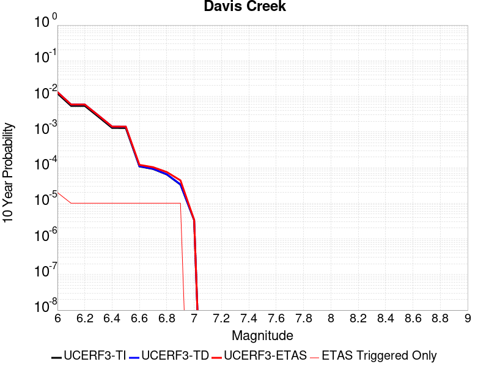 |

| Magnitude | 1 wk TI Prob | 1 wk TD Prob | 1 wk ETAS Prob | 1 wk ETAS/TD Gain | 1 wk ETAS Triggered Only | 1 mo TI Prob | 1 mo TD Prob | 1 mo ETAS Prob | 1 mo ETAS/TD Gain | 1 mo ETAS Triggered Only | 1 yr TI Prob | 1 yr TD Prob | 1 yr ETAS Prob | 1 yr ETAS/TD Gain | 1 yr ETAS Triggered Only | 10 yr TI Prob | 10 yr TD Prob | 10 yr ETAS Prob | 10 yr ETAS/TD Gain | 10 yr ETAS Triggered Only |
|-----|-----|-----|-----|-----|-----|-----|-----|-----|-----|-----|-----|-----|-----|-----|-----|-----|-----|-----|-----|-----|
| 6.0 | 2.331472E-5 | 2.5417214E-5 | 3.541696E-5 | 1.3934242 | 1.0E-5 | 9.99164E-5 | 1.0892704E-4 | 1.1892595E-4 | 1.0917946 | 1.0E-5 | 0.0012158032 | 0.0013254983 | 0.0013454718 | 1.0150687 | 2.0E-5 | 0.01209173 | 0.013187704 | 0.01320744 | 1.0014966 | 2.0E-5 |
| 6.1 | 1.0407654E-5 | 1.1316986E-5 | 2.1316873E-5 | 1.8836174 | 1.0E-5 | 4.4603472E-5 | 4.8500624E-5 | 5.8500136E-5 | 1.206173 | 1.0E-5 | 5.4291193E-4 | 5.9036224E-4 | 6.003563E-4 | 1.0169288 | 1.0E-5 | 0.0054158745 | 0.005890611 | 0.005900552 | 1.0016876 | 1.0E-5 |
| 6.2 | 1.0407654E-5 | 1.1316986E-5 | 2.1316873E-5 | 1.8836174 | 1.0E-5 | 4.4603472E-5 | 4.8500624E-5 | 5.8500136E-5 | 1.206173 | 1.0E-5 | 5.4291193E-4 | 5.9036224E-4 | 6.003563E-4 | 1.0169288 | 1.0E-5 | 0.0054158745 | 0.005890611 | 0.005900552 | 1.0016876 | 1.0E-5 |
| 6.3 | 5.1323277E-6 | 5.568556E-6 | 1.5568501E-5 | 2.7957878 | 1.0E-5 | 2.1995505E-5 | 2.386507E-5 | 3.386483E-5 | 1.4190124 | 1.0E-5 | 2.6776237E-4 | 2.905271E-4 | 3.005242E-4 | 1.0344102 | 1.0E-5 | 0.0026743996 | 0.0029023192 | 0.0029122902 | 1.0034355 | 1.0E-5 |
| 6.4 | 2.4985154E-6 | 2.704538E-6 | 1.2704511E-5 | 4.6974792 | 1.0E-5 | 1.07078795E-5 | 1.1590847E-5 | 2.1590731E-5 | 1.8627398 | 1.0E-5 | 1.3036063E-4 | 1.4111304E-4 | 1.5111163E-4 | 1.0708551 | 1.0E-5 | 0.0013028418 | 0.001410589 | 0.001420575 | 1.0070792 | 1.0E-5 |
| 6.5 | 2.4846438E-6 | 2.6904722E-6 | 1.2690445E-5 | 4.7168097 | 1.0E-5 | 1.064843E-5 | 1.1530565E-5 | 2.153045E-5 | 1.8672502 | 1.0E-5 | 1.2963692E-4 | 1.403792E-4 | 1.503778E-4 | 1.0712256 | 1.0E-5 | 0.0012956132 | 0.0014032599 | 0.0014132459 | 1.0071163 | 1.0E-5 |
| 6.6 | 2.072566E-7 | 2.1018087E-7 | 1.02101785E-5 | 48.57806 | 1.0E-5 | 8.882423E-7 | 9.0077486E-7 | 1.0900766E-5 | 12.101543 | 1.0E-5 | 1.0814296E-5 | 1.0966881E-5 | 2.096677E-5 | 1.9118264 | 1.0E-5 | 1.081377E-4 | 1.09663575E-4 | 1.1966248E-4 | 1.0911779 | 1.0E-5 |
| 6.7 | 1.7544528E-7 | 1.7790826E-7 | 1.0177907E-5 | 57.208736 | 1.0E-5 | 7.5190815E-7 | 7.6246374E-7 | 1.0762456E-5 | 14.115368 | 1.0E-5 | 9.154443E-6 | 9.282958E-6 | 1.9282865E-5 | 2.0772328 | 1.0E-5 | 9.1540656E-5 | 9.282586E-5 | 1.0282493E-4 | 1.1077186 | 1.0E-5 |
| 6.8 | 1.2320395E-7 | 1.2481138E-7 | 1.012481E-5 | 81.120895 | 1.0E-5 | 5.280168E-7 | 5.349058E-7 | 1.0534901E-5 | 19.69487 | 1.0E-5 | 6.428586E-6 | 6.5124595E-6 | 1.6512395E-5 | 2.5355082 | 1.0E-5 | 6.4284E-5 | 6.5122804E-5 | 7.512215E-5 | 1.1535461 | 1.0E-5 |
| 6.9 | 6.399997E-8 | 6.486058E-8 | 1.006486E-5 | 155.17685 | 1.0E-5 | 2.7428555E-7 | 2.7797387E-7 | 1.0277971E-5 | 36.974594 | 1.0E-5 | 3.3394215E-6 | 3.3843273E-6 | 1.3384293E-5 | 3.9547868 | 1.0E-5 | 3.3393713E-5 | 3.384282E-5 | 4.3842483E-5 | 1.2954736 | 1.0E-5 |
| 7.0 | 6.4455685E-9 | 6.535264E-9 | 6.535264E-9 | 1.0 | 0.0 | 2.7623864E-8 | 2.8008275E-8 | 2.8008275E-8 | 1.0 | 0.0 | 3.3632048E-7 | 3.4100074E-7 | 3.4100074E-7 | 1.0 | 0.0 | 3.3631998E-6 | 3.4100074E-6 | 3.4100074E-6 | 1.0 | 0.0 |

## Robinson Creek
*[(top)](#table-of-contents)*

| 1 Week | 1 Month | 1 Year | 10 Year |
|-----|-----|-----|-----|
|  |  |  |  |

| Magnitude | 1 wk TI Prob | 1 wk TD Prob | 1 wk ETAS Prob | 1 wk ETAS/TD Gain | 1 wk ETAS Triggered Only | 1 mo TI Prob | 1 mo TD Prob | 1 mo ETAS Prob | 1 mo ETAS/TD Gain | 1 mo ETAS Triggered Only | 1 yr TI Prob | 1 yr TD Prob | 1 yr ETAS Prob | 1 yr ETAS/TD Gain | 1 yr ETAS Triggered Only | 10 yr TI Prob | 10 yr TD Prob | 10 yr ETAS Prob | 10 yr ETAS/TD Gain | 10 yr ETAS Triggered Only |
|-----|-----|-----|-----|-----|-----|-----|-----|-----|-----|-----|-----|-----|-----|-----|-----|-----|-----|-----|-----|-----|
| 6.0 | 1.3705327E-5 | 1.5285013E-5 | 2.528486E-5 | 1.6542256 | 1.0E-5 | 5.8735794E-5 | 6.55072E-5 | 8.550589E-5 | 1.30529 | 2.0E-5 | 7.1487366E-4 | 7.9755014E-4 | 8.275262E-4 | 1.0375851 | 3.0E-5 | 0.0071257832 | 0.007975501 | 0.008005262 | 1.0037315 | 3.0E-5 |
| 6.1 | 1.3705327E-5 | 1.5285013E-5 | 2.528486E-5 | 1.6542256 | 1.0E-5 | 5.8735794E-5 | 6.55072E-5 | 8.550589E-5 | 1.30529 | 2.0E-5 | 7.1487366E-4 | 7.9755014E-4 | 8.275262E-4 | 1.0375851 | 3.0E-5 | 0.0071257832 | 0.007975501 | 0.008005262 | 1.0037315 | 3.0E-5 |
| 6.2 | 1.3705327E-5 | 1.5285013E-5 | 2.528486E-5 | 1.6542256 | 1.0E-5 | 5.8735794E-5 | 6.55072E-5 | 8.550589E-5 | 1.30529 | 2.0E-5 | 7.1487366E-4 | 7.9755014E-4 | 8.275262E-4 | 1.0375851 | 3.0E-5 | 0.0071257832 | 0.007975501 | 0.008005262 | 1.0037315 | 3.0E-5 |
| 6.3 | 1.3705327E-5 | 1.5285013E-5 | 2.528486E-5 | 1.6542256 | 1.0E-5 | 5.8735794E-5 | 6.55072E-5 | 8.550589E-5 | 1.30529 | 2.0E-5 | 7.1487366E-4 | 7.9755014E-4 | 8.275262E-4 | 1.0375851 | 3.0E-5 | 0.0071257832 | 0.007975501 | 0.008005262 | 1.0037315 | 3.0E-5 |
| 6.4 | 1.3705327E-5 | 1.5285013E-5 | 2.528486E-5 | 1.6542256 | 1.0E-5 | 5.8735794E-5 | 6.55072E-5 | 8.550589E-5 | 1.30529 | 2.0E-5 | 7.1487366E-4 | 7.9755014E-4 | 8.275262E-4 | 1.0375851 | 3.0E-5 | 0.0071257832 | 0.007975501 | 0.008005262 | 1.0037315 | 3.0E-5 |

## Hollywood
*[(top)](#table-of-contents)*

| 1 Week | 1 Month | 1 Year | 10 Year |
|-----|-----|-----|-----|
|  |  |  |  |

| Magnitude | 1 wk TI Prob | 1 wk TD Prob | 1 wk ETAS Prob | 1 wk ETAS/TD Gain | 1 wk ETAS Triggered Only | 1 mo TI Prob | 1 mo TD Prob | 1 mo ETAS Prob | 1 mo ETAS/TD Gain | 1 mo ETAS Triggered Only | 1 yr TI Prob | 1 yr TD Prob | 1 yr ETAS Prob | 1 yr ETAS/TD Gain | 1 yr ETAS Triggered Only | 10 yr TI Prob | 10 yr TD Prob | 10 yr ETAS Prob | 10 yr ETAS/TD Gain | 10 yr ETAS Triggered Only |
|-----|-----|-----|-----|-----|-----|-----|-----|-----|-----|-----|-----|-----|-----|-----|-----|-----|-----|-----|-----|-----|
| 6.0 | 1.24487615E-5 | 1.2593229E-5 | 3.2592976E-5 | 2.588135 | 2.0E-5 | 5.3350745E-5 | 5.3969892E-5 | 7.396881E-5 | 1.370557 | 2.0E-5 | 6.4935174E-4 | 6.5689E-4 | 6.868703E-4 | 1.0456398 | 3.0E-5 | 0.0064745755 | 0.0065499707 | 0.0065797744 | 1.0045502 | 3.0E-5 |
| 6.1 | 1.24487615E-5 | 1.2593229E-5 | 3.2592976E-5 | 2.588135 | 2.0E-5 | 5.3350745E-5 | 5.3969892E-5 | 7.396881E-5 | 1.370557 | 2.0E-5 | 6.4935174E-4 | 6.5689E-4 | 6.868703E-4 | 1.0456398 | 3.0E-5 | 0.0064745755 | 0.0065499707 | 0.0065797744 | 1.0045502 | 3.0E-5 |
| 6.2 | 1.24487615E-5 | 1.2593229E-5 | 3.2592976E-5 | 2.588135 | 2.0E-5 | 5.3350745E-5 | 5.3969892E-5 | 7.396881E-5 | 1.370557 | 2.0E-5 | 6.4935174E-4 | 6.5689E-4 | 6.868703E-4 | 1.0456398 | 3.0E-5 | 0.0064745755 | 0.0065499707 | 0.0065797744 | 1.0045502 | 3.0E-5 |
| 6.3 | 1.24487615E-5 | 1.2593229E-5 | 3.2592976E-5 | 2.588135 | 2.0E-5 | 5.3350745E-5 | 5.3969892E-5 | 7.396881E-5 | 1.370557 | 2.0E-5 | 6.4935174E-4 | 6.5689E-4 | 6.868703E-4 | 1.0456398 | 3.0E-5 | 0.0064745755 | 0.0065499707 | 0.0065797744 | 1.0045502 | 3.0E-5 |
| 6.4 | 1.2431024E-5 | 1.25738425E-5 | 3.2573593E-5 | 2.5905836 | 2.0E-5 | 5.327473E-5 | 5.388681E-5 | 7.3885734E-5 | 1.3711283 | 2.0E-5 | 6.4842677E-4 | 6.558791E-4 | 6.858594E-4 | 1.0457101 | 3.0E-5 | 0.0064653796 | 0.0065399213 | 0.006569725 | 1.0045573 | 3.0E-5 |
| 6.5 | 1.1242222E-5 | 1.1317804E-5 | 3.1317577E-5 | 2.7671072 | 2.0E-5 | 4.8180063E-5 | 4.8503985E-5 | 6.850302E-5 | 1.4123173 | 2.0E-5 | 5.864344E-4 | 5.903787E-4 | 6.20361E-4 | 1.0507848 | 3.0E-5 | 0.0058488925 | 0.00588839 | 0.005918213 | 1.0050647 | 3.0E-5 |
| 6.6 | 1.1234066E-5 | 1.1308918E-5 | 3.1308693E-5 | 2.7684958 | 2.0E-5 | 4.8145106E-5 | 4.8465907E-5 | 6.8464935E-5 | 1.4126413 | 2.0E-5 | 5.86009E-4 | 5.899153E-4 | 6.198976E-4 | 1.0508248 | 3.0E-5 | 0.005844661 | 0.0058837803 | 0.005913604 | 1.0050688 | 3.0E-5 |
| 6.7 | 1.12294E-5 | 1.1303661E-5 | 3.1303436E-5 | 2.7693183 | 2.0E-5 | 4.812511E-5 | 4.8443377E-5 | 6.844241E-5 | 1.4128331 | 2.0E-5 | 5.857657E-4 | 5.896412E-4 | 6.196235E-4 | 1.0508484 | 3.0E-5 | 0.0058422405 | 0.005881054 | 0.005910877 | 1.0050712 | 3.0E-5 |
| 6.8 | 1.0252819E-5 | 1.0218449E-5 | 2.0218346E-5 | 1.9786122 | 1.0E-5 | 4.3939912E-5 | 4.3792625E-5 | 5.3792188E-5 | 1.228339 | 1.0E-5 | 5.3483713E-4 | 5.330469E-4 | 5.530362E-4 | 1.0375001 | 2.0E-5 | 0.005335517 | 0.0053179096 | 0.005337803 | 1.0037409 | 2.0E-5 |
| 6.9 | 9.252289E-6 | 9.110309E-6 | 1.9110219E-5 | 2.0976474 | 1.0E-5 | 3.9652066E-5 | 3.9043607E-5 | 4.9043218E-5 | 1.2561139 | 1.0E-5 | 4.8265693E-4 | 4.752539E-4 | 4.952444E-4 | 1.0420628 | 2.0E-5 | 0.0048161 | 0.004742549 | 0.004762454 | 1.0041971 | 2.0E-5 |
| 7.0 | 8.474604E-6 | 8.25826E-6 | 1.8258177E-5 | 2.2108989 | 1.0E-5 | 3.6319227E-5 | 3.5392073E-5 | 4.539172E-5 | 1.2825391 | 1.0E-5 | 4.4209688E-4 | 4.3081472E-4 | 4.508061E-4 | 1.0464036 | 2.0E-5 | 0.004412184 | 0.0042999457 | 0.0043198597 | 1.0046313 | 2.0E-5 |
| 7.1 | 6.643643E-6 | 6.2683707E-6 | 1.6268308E-5 | 2.595301 | 1.0E-5 | 2.8472443E-5 | 2.686417E-5 | 3.68639E-5 | 1.372233 | 1.0E-5 | 3.4659685E-4 | 3.2702263E-4 | 3.470161E-4 | 1.0611378 | 2.0E-5 | 0.0034605677 | 0.0032654598 | 0.0032853945 | 1.0061047 | 2.0E-5 |
| 7.2 | 5.549002E-6 | 5.1087086E-6 | 1.5108657E-5 | 2.9574318 | 1.0E-5 | 2.378122E-5 | 2.1894282E-5 | 3.1894062E-5 | 1.4567302 | 1.0E-5 | 2.8949787E-4 | 2.665304E-4 | 2.7652775E-4 | 1.0375092 | 1.0E-5 | 0.0028912104 | 0.002662124 | 0.0026720974 | 1.0037464 | 1.0E-5 |
| 7.3 | 4.3059727E-6 | 3.9598913E-6 | 3.9598913E-6 | 1.0 | 0.0 | 1.8454039E-5 | 1.6970853E-5 | 1.6970853E-5 | 1.0 | 0.0 | 2.2465475E-4 | 2.0660064E-4 | 2.0660064E-4 | 1.0 | 0.0 | 0.0022442779 | 0.0020640958 | 0.0020640958 | 1.0 | 0.0 |
| 7.4 | 2.8550733E-6 | 2.7013002E-6 | 2.7013002E-6 | 1.0 | 0.0 | 1.2235971E-5 | 1.1576949E-5 | 1.1576949E-5 | 1.0 | 0.0 | 1.4896276E-4 | 1.4094029E-4 | 1.4094029E-4 | 1.0 | 0.0 | 0.0014886294 | 0.0014085141 | 0.0014085141 | 1.0 | 0.0 |
| 7.5 | 1.9927045E-6 | 1.8976393E-6 | 1.8976393E-6 | 1.0 | 0.0 | 8.540134E-6 | 8.132714E-6 | 8.132714E-6 | 1.0 | 0.0 | 1.0397117E-4 | 9.901134E-5 | 9.901134E-5 | 1.0 | 0.0 | 0.0010392254 | 9.896759E-4 | 9.896759E-4 | 1.0 | 0.0 |
| 7.6 | 1.345084E-6 | 1.2216018E-6 | 1.2216018E-6 | 1.0 | 0.0 | 5.764633E-6 | 5.2354258E-6 | 5.2354258E-6 | 1.0 | 0.0 | 7.018215E-5 | 6.373946E-5 | 6.373946E-5 | 1.0 | 0.0 | 7.0159987E-4 | 6.372138E-4 | 6.372138E-4 | 1.0 | 0.0 |
| 7.7 | 7.6835164E-7 | 6.2777013E-7 | 6.2777013E-7 | 1.0 | 0.0 | 3.2929315E-6 | 2.6904406E-6 | 2.6904406E-6 | 1.0 | 0.0 | 4.00907E-5 | 3.2755637E-5 | 3.2755637E-5 | 1.0 | 0.0 | 4.0083472E-4 | 3.2750957E-4 | 3.2750957E-4 | 1.0 | 0.0 |
| 7.8 | 3.6562128E-7 | 2.4534745E-7 | 2.4534745E-7 | 1.0 | 0.0 | 1.5669474E-6 | 1.0514887E-6 | 1.0514887E-6 | 1.0 | 0.0 | 1.9077417E-5 | 1.2801803E-5 | 1.2801803E-5 | 1.0 | 0.0 | 1.907578E-4 | 1.2801103E-4 | 1.2801103E-4 | 1.0 | 0.0 |
| 7.9 | 7.5024424E-8 | 5.381742E-8 | 5.381742E-8 | 1.0 | 0.0 | 3.215332E-7 | 2.3064608E-7 | 2.3064608E-7 | 1.0 | 0.0 | 3.91466E-6 | 2.8081138E-6 | 2.8081138E-6 | 1.0 | 0.0 | 3.9145907E-5 | 2.8080913E-5 | 2.8080913E-5 | 1.0 | 0.0 |

## Calaveras (Central) 2011 CFM
*[(top)](#table-of-contents)*

| 1 Week | 1 Month | 1 Year | 10 Year |
|-----|-----|-----|-----|
|  |  |  |  |

| Magnitude | 1 wk TI Prob | 1 wk TD Prob | 1 wk ETAS Prob | 1 wk ETAS/TD Gain | 1 wk ETAS Triggered Only | 1 mo TI Prob | 1 mo TD Prob | 1 mo ETAS Prob | 1 mo ETAS/TD Gain | 1 mo ETAS Triggered Only | 1 yr TI Prob | 1 yr TD Prob | 1 yr ETAS Prob | 1 yr ETAS/TD Gain | 1 yr ETAS Triggered Only | 10 yr TI Prob | 10 yr TD Prob | 10 yr ETAS Prob | 10 yr ETAS/TD Gain | 10 yr ETAS Triggered Only |
|-----|-----|-----|-----|-----|-----|-----|-----|-----|-----|-----|-----|-----|-----|-----|-----|-----|-----|-----|-----|-----|
| 6.0 | 1.5010907E-4 | 2.4804124E-4 | 2.5803875E-4 | 1.0403059 | 1.0E-5 | 6.4316596E-4 | 0.001062498 | 0.0010724873 | 1.0094018 | 1.0E-5 | 0.0078024664 | 0.012850443 | 0.012860315 | 1.0007682 | 1.0E-5 | 0.07534136 | 0.120411225 | 0.120428815 | 1.0001462 | 2.0E-5 |
| 6.1 | 1.4521465E-4 | 2.3965565E-4 | 2.4965324E-4 | 1.0417166 | 1.0E-5 | 6.222001E-4 | 0.0010265942 | 0.0010365839 | 1.0097309 | 1.0E-5 | 0.0075490056 | 0.012419763 | 0.012429639 | 1.0007951 | 1.0E-5 | 0.07297657 | 0.11668273 | 0.116700396 | 1.0001514 | 2.0E-5 |
| 6.2 | 1.429998E-4 | 2.3896809E-4 | 2.489657E-4 | 1.0418366 | 1.0E-5 | 6.127123E-4 | 0.0010236499 | 0.0010336398 | 1.009759 | 1.0E-5 | 0.007434286 | 0.012384372 | 0.012394248 | 1.0007975 | 1.0E-5 | 0.07190444 | 0.11633677 | 0.11635444 | 1.0001519 | 2.0E-5 |
| 6.3 | 1.3536277E-4 | 2.3227946E-4 | 2.4227714E-4 | 1.0430416 | 1.0E-5 | 5.799972E-4 | 9.950127E-4 | 0.0010050028 | 1.0100402 | 1.0E-5 | 0.0070386264 | 0.012040534 | 0.0120504135 | 1.0008205 | 1.0E-5 | 0.0681982 | 0.113249525 | 0.11326726 | 1.0001566 | 2.0E-5 |
| 6.4 | 1.2993296E-4 | 2.2651516E-4 | 2.3651289E-4 | 1.0441371 | 1.0E-5 | 5.5673666E-4 | 9.703276E-4 | 9.803178E-4 | 1.0102957 | 1.0E-5 | 0.006757223 | 0.011743338 | 0.01175322 | 1.0008415 | 1.0E-5 | 0.06555412 | 0.11052752 | 0.110545315 | 1.0001609 | 2.0E-5 |
| 6.5 | 1.0498927E-4 | 1.7981966E-4 | 1.8981787E-4 | 1.0556012 | 1.0E-5 | 4.498764E-4 | 7.7042676E-4 | 7.8041904E-4 | 1.0129699 | 1.0E-5 | 0.005463498 | 0.00933952 | 0.009349426 | 1.0010607 | 1.0E-5 | 0.053311124 | 0.08920739 | 0.089225605 | 1.0002042 | 2.0E-5 |
| 6.6 | 1.0157505E-4 | 1.7469494E-4 | 1.8469318E-4 | 1.0572326 | 1.0E-5 | 4.35249E-4 | 7.4847665E-4 | 7.5846916E-4 | 1.0133505 | 1.0E-5 | 0.0052862884 | 0.009074567 | 0.009084476 | 1.001092 | 1.0E-5 | 0.05162293 | 0.08678487 | 0.08680314 | 1.0002104 | 2.0E-5 |
| 6.7 | 9.660386E-5 | 1.6728783E-4 | 1.7728616E-4 | 1.0597672 | 1.0E-5 | 4.1395082E-4 | 7.167497E-4 | 7.267425E-4 | 1.0139419 | 1.0E-5 | 0.0050282106 | 0.008691474 | 0.008701387 | 1.0011406 | 1.0E-5 | 0.049159497 | 0.08327401 | 0.08329234 | 1.0002202 | 2.0E-5 |
| 6.8 | 9.089927E-5 | 1.5643238E-4 | 1.6643082E-4 | 1.0639154 | 1.0E-5 | 3.8951015E-4 | 6.702511E-4 | 6.802444E-4 | 1.0149097 | 1.0E-5 | 0.0047319788 | 0.008129742 | 0.008139661 | 1.0012201 | 1.0E-5 | 0.046324775 | 0.078163 | 0.07818144 | 1.0002359 | 2.0E-5 |
| 6.9 | 7.353187E-5 | 1.2295779E-4 | 1.2295779E-4 | 1.0 | 0.0 | 3.150985E-4 | 5.2685605E-4 | 5.2685605E-4 | 1.0 | 0.0 | 0.0038295772 | 0.006395728 | 0.006395728 | 1.0 | 0.0 | 0.037642512 | 0.06218928 | 0.062198658 | 1.0001508 | 1.0E-5 |
| 7.0 | 5.746064E-5 | 9.3890936E-5 | 9.3890936E-5 | 1.0 | 0.0 | 2.4623662E-4 | 4.0232803E-4 | 4.0232803E-4 | 1.0 | 0.0 | 0.0029938098 | 0.0048874132 | 0.0048874132 | 1.0 | 0.0 | 0.02953797 | 0.04798713 | 0.047996648 | 1.0001984 | 1.0E-5 |
| 7.1 | 4.9557195E-5 | 8.052768E-5 | 8.052768E-5 | 1.0 | 0.0 | 2.123707E-4 | 3.4507332E-4 | 3.4507332E-4 | 1.0 | 0.0 | 0.0025825473 | 0.004193237 | 0.004193237 | 1.0 | 0.0 | 0.0255274 | 0.041373473 | 0.041383058 | 1.0002317 | 1.0E-5 |
| 7.2 | 3.687595E-5 | 5.952694E-5 | 5.952694E-5 | 1.0 | 0.0 | 1.5803022E-4 | 2.5509068E-4 | 2.5509068E-4 | 1.0 | 0.0 | 0.0019223199 | 0.003101335 | 0.003101335 | 1.0 | 0.0 | 0.01905776 | 0.030883823 | 0.030893514 | 1.0003138 | 1.0E-5 |
| 7.3 | 2.5846984E-5 | 4.2473923E-5 | 4.2473923E-5 | 1.0 | 0.0 | 1.1076809E-4 | 1.820185E-4 | 1.820185E-4 | 1.0 | 0.0 | 0.0013477671 | 0.0022138404 | 0.0022138404 | 1.0 | 0.0 | 0.013396223 | 0.022175217 | 0.022175217 | 1.0 | 0.0 |
| 7.4 | 1.7747854E-5 | 2.993759E-5 | 2.993759E-5 | 1.0 | 0.0 | 7.6060016E-5 | 1.2829766E-4 | 1.2829766E-4 | 1.0 | 0.0 | 9.2563726E-4 | 0.0015609078 | 0.0015609078 | 1.0 | 0.0 | 0.009217911 | 0.015708687 | 0.015708687 | 1.0 | 0.0 |
| 7.5 | 1.4883479E-5 | 2.6244672E-5 | 2.6244672E-5 | 1.0 | 0.0 | 6.378478E-5 | 1.12472335E-4 | 1.12472335E-4 | 1.0 | 0.0 | 7.76303E-4 | 0.0013684932 | 0.0013684932 | 1.0 | 0.0 | 0.0077359667 | 0.013801667 | 0.013801667 | 1.0 | 0.0 |
| 7.6 | 8.166975E-6 | 1.4964299E-5 | 1.4964299E-5 | 1.0 | 0.0 | 3.5000852E-5 | 6.413114E-5 | 6.413114E-5 | 1.0 | 0.0 | 4.2605202E-4 | 7.805183E-4 | 7.805183E-4 | 1.0 | 0.0 | 0.004252361 | 0.007939203 | 0.007939203 | 1.0 | 0.0 |
| 7.7 | 3.3858064E-6 | 6.254251E-6 | 6.254251E-6 | 1.0 | 0.0 | 1.4510518E-5 | 2.6803657E-5 | 2.6803657E-5 | 1.0 | 0.0 | 1.7665124E-4 | 3.2628572E-4 | 3.2628572E-4 | 1.0 | 0.0 | 0.0017651088 | 0.003388363 | 0.003388363 | 1.0 | 0.0 |
| 7.8 | 2.7721615E-6 | 5.366695E-6 | 5.366695E-6 | 1.0 | 0.0 | 1.1880637E-5 | 2.2999919E-5 | 2.2999919E-5 | 1.0 | 0.0 | 1.4463716E-4 | 2.7998807E-4 | 2.7998807E-4 | 1.0 | 0.0 | 0.0014454306 | 0.002907615 | 0.002907615 | 1.0 | 0.0 |
| 7.9 | 1.9736292E-6 | 4.128705E-6 | 4.128705E-6 | 1.0 | 0.0 | 8.4583835E-6 | 1.769433E-5 | 1.769433E-5 | 1.0 | 0.0 | 1.0297595E-4 | 2.1540721E-4 | 2.1540721E-4 | 1.0 | 0.0 | 0.0010292825 | 0.0022237299 | 0.0022237299 | 1.0 | 0.0 |
| 8.0 | 1.1767289E-6 | 2.5546633E-6 | 2.5546633E-6 | 1.0 | 0.0 | 5.0431145E-6 | 1.0948511E-5 | 1.0948511E-5 | 1.0 | 0.0 | 6.139818E-5 | 1.3329E-4 | 1.3329E-4 | 1.0 | 0.0 | 6.1381224E-4 | 0.001366126 | 0.001366126 | 1.0 | 0.0 |
| 8.1 | 7.5112825E-7 | 1.541076E-6 | 1.541076E-6 | 1.0 | 0.0 | 3.2191172E-6 | 6.604595E-6 | 6.604595E-6 | 1.0 | 0.0 | 3.9192048E-5 | 8.0408E-5 | 8.0408E-5 | 1.0 | 0.0 | 3.9185135E-4 | 8.2356273E-4 | 8.2356273E-4 | 1.0 | 0.0 |

## Los Alamos 2011 CFM
*[(top)](#table-of-contents)*

| 1 Week | 1 Month | 1 Year | 10 Year |
|-----|-----|-----|-----|
|  |  |  |  |

| Magnitude | 1 wk TI Prob | 1 wk TD Prob | 1 wk ETAS Prob | 1 wk ETAS/TD Gain | 1 wk ETAS Triggered Only | 1 mo TI Prob | 1 mo TD Prob | 1 mo ETAS Prob | 1 mo ETAS/TD Gain | 1 mo ETAS Triggered Only | 1 yr TI Prob | 1 yr TD Prob | 1 yr ETAS Prob | 1 yr ETAS/TD Gain | 1 yr ETAS Triggered Only | 10 yr TI Prob | 10 yr TD Prob | 10 yr ETAS Prob | 10 yr ETAS/TD Gain | 10 yr ETAS Triggered Only |
|-----|-----|-----|-----|-----|-----|-----|-----|-----|-----|-----|-----|-----|-----|-----|-----|-----|-----|-----|-----|-----|
| 6.0 | 4.6284417E-6 | 4.7517333E-6 | 4.7517333E-6 | 1.0 | 0.0 | 1.9836029E-5 | 2.0364423E-5 | 2.0364423E-5 | 1.0 | 0.0 | 2.4147688E-4 | 2.479104E-4 | 2.479104E-4 | 1.0 | 0.0 | 0.0024121467 | 0.0024765125 | 0.0025064382 | 1.0120838 | 3.0E-5 |
| 6.1 | 4.6284417E-6 | 4.7517333E-6 | 4.7517333E-6 | 1.0 | 0.0 | 1.9836029E-5 | 2.0364423E-5 | 2.0364423E-5 | 1.0 | 0.0 | 2.4147688E-4 | 2.479104E-4 | 2.479104E-4 | 1.0 | 0.0 | 0.0024121467 | 0.0024765125 | 0.0025064382 | 1.0120838 | 3.0E-5 |
| 6.2 | 4.6284417E-6 | 4.7517333E-6 | 4.7517333E-6 | 1.0 | 0.0 | 1.9836029E-5 | 2.0364423E-5 | 2.0364423E-5 | 1.0 | 0.0 | 2.4147688E-4 | 2.479104E-4 | 2.479104E-4 | 1.0 | 0.0 | 0.0024121467 | 0.0024765125 | 0.0025064382 | 1.0120838 | 3.0E-5 |
| 6.3 | 4.6284417E-6 | 4.7517333E-6 | 4.7517333E-6 | 1.0 | 0.0 | 1.9836029E-5 | 2.0364423E-5 | 2.0364423E-5 | 1.0 | 0.0 | 2.4147688E-4 | 2.479104E-4 | 2.479104E-4 | 1.0 | 0.0 | 0.0024121467 | 0.0024765125 | 0.0025064382 | 1.0120838 | 3.0E-5 |
| 6.4 | 4.6284417E-6 | 4.7517333E-6 | 4.7517333E-6 | 1.0 | 0.0 | 1.9836029E-5 | 2.0364423E-5 | 2.0364423E-5 | 1.0 | 0.0 | 2.4147688E-4 | 2.479104E-4 | 2.479104E-4 | 1.0 | 0.0 | 0.0024121467 | 0.0024765125 | 0.0025064382 | 1.0120838 | 3.0E-5 |
| 6.5 | 4.6284417E-6 | 4.7517333E-6 | 4.7517333E-6 | 1.0 | 0.0 | 1.9836029E-5 | 2.0364423E-5 | 2.0364423E-5 | 1.0 | 0.0 | 2.4147688E-4 | 2.479104E-4 | 2.479104E-4 | 1.0 | 0.0 | 0.0024121467 | 0.0024765125 | 0.0025064382 | 1.0120838 | 3.0E-5 |
| 6.6 | 4.6284417E-6 | 4.7517333E-6 | 4.7517333E-6 | 1.0 | 0.0 | 1.9836029E-5 | 2.0364423E-5 | 2.0364423E-5 | 1.0 | 0.0 | 2.4147688E-4 | 2.479104E-4 | 2.479104E-4 | 1.0 | 0.0 | 0.0024121467 | 0.0024765125 | 0.0025064382 | 1.0120838 | 3.0E-5 |
| 6.7 | 4.062321E-6 | 4.166351E-6 | 4.166351E-6 | 1.0 | 0.0 | 1.7409831E-5 | 1.7855677E-5 | 1.7855677E-5 | 1.0 | 0.0 | 2.1194408E-4 | 2.1737268E-4 | 2.1737268E-4 | 1.0 | 0.0 | 0.0021174205 | 0.0021717504 | 0.0021917068 | 1.0091891 | 2.0E-5 |
| 6.8 | 4.062321E-6 | 4.166351E-6 | 4.166351E-6 | 1.0 | 0.0 | 1.7409831E-5 | 1.7855677E-5 | 1.7855677E-5 | 1.0 | 0.0 | 2.1194408E-4 | 2.1737268E-4 | 2.1737268E-4 | 1.0 | 0.0 | 0.0021174205 | 0.0021717504 | 0.0021917068 | 1.0091891 | 2.0E-5 |
| 6.9 | 3.2936077E-6 | 3.37296E-6 | 3.37296E-6 | 1.0 | 0.0 | 1.4115385E-5 | 1.4455468E-5 | 1.4455468E-5 | 1.0 | 0.0 | 1.7184127E-4 | 1.7598206E-4 | 1.7598206E-4 | 1.0 | 0.0 | 0.0017170844 | 0.0017585196 | 0.0017685019 | 1.0056766 | 1.0E-5 |
| 7.0 | 3.1687898E-6 | 3.2448177E-6 | 3.2448177E-6 | 1.0 | 0.0 | 1.3580457E-5 | 1.3906293E-5 | 1.3906293E-5 | 1.0 | 0.0 | 1.6532952E-4 | 1.692969E-4 | 1.692969E-4 | 1.0 | 0.0 | 0.0016520657 | 0.0016917707 | 0.0017017538 | 1.005901 | 1.0E-5 |
| 7.1 | 2.9379228E-6 | 3.007328E-6 | 3.007328E-6 | 1.0 | 0.0 | 1.25910365E-5 | 1.288849E-5 | 1.288849E-5 | 1.0 | 0.0 | 1.5328509E-4 | 1.5690697E-4 | 1.5690697E-4 | 1.0 | 0.0 | 0.001531794 | 0.001568051 | 0.0015780353 | 1.0063673 | 1.0E-5 |
| 7.2 | 2.0020686E-6 | 2.041632E-6 | 2.041632E-6 | 1.0 | 0.0 | 8.580266E-6 | 8.749822E-6 | 8.749822E-6 | 1.0 | 0.0 | 1.0445973E-4 | 1.0652392E-4 | 1.0652392E-4 | 1.0 | 0.0 | 0.0010441064 | 0.001064733 | 0.001064733 | 1.0 | 0.0 |
| 7.3 | 1.7364243E-6 | 1.7678824E-6 | 1.7678824E-6 | 1.0 | 0.0 | 7.441797E-6 | 7.576617E-6 | 7.576617E-6 | 1.0 | 0.0 | 9.0600115E-5 | 9.224144E-5 | 9.224144E-5 | 1.0 | 0.0 | 9.0563187E-4 | 9.2203467E-4 | 9.2203467E-4 | 1.0 | 0.0 |
| 7.4 | 1.5718434E-6 | 1.5983198E-6 | 1.5983198E-6 | 1.0 | 0.0 | 6.7364545E-6 | 6.8499244E-6 | 6.8499244E-6 | 1.0 | 0.0 | 8.201325E-5 | 8.339467E-5 | 8.339467E-5 | 1.0 | 0.0 | 8.198299E-4 | 8.3363673E-4 | 8.3363673E-4 | 1.0 | 0.0 |
| 7.5 | 1.3841119E-6 | 1.4042814E-6 | 1.4042814E-6 | 1.0 | 0.0 | 5.9318945E-6 | 6.018335E-6 | 6.018335E-6 | 1.0 | 0.0 | 7.221842E-5 | 7.327079E-5 | 7.327079E-5 | 1.0 | 0.0 | 7.2194956E-4 | 7.3246926E-4 | 7.3246926E-4 | 1.0 | 0.0 |
| 7.6 | 1.0843726E-6 | 1.0934443E-6 | 1.0934443E-6 | 1.0 | 0.0 | 4.647303E-6 | 4.6861815E-6 | 4.6861815E-6 | 1.0 | 0.0 | 5.6579443E-5 | 5.705279E-5 | 5.705279E-5 | 1.0 | 0.0 | 5.656504E-4 | 5.70384E-4 | 5.70384E-4 | 1.0 | 0.0 |
| 7.7 | 5.544814E-7 | 5.501884E-7 | 5.501884E-7 | 1.0 | 0.0 | 2.3763469E-6 | 2.3579482E-6 | 2.3579482E-6 | 1.0 | 0.0 | 2.8931638E-5 | 2.8707644E-5 | 2.8707644E-5 | 1.0 | 0.0 | 2.8927872E-4 | 2.870395E-4 | 2.870395E-4 | 1.0 | 0.0 |
| 7.8 | 2.0707465E-7 | 1.9778598E-7 | 1.9778598E-7 | 1.0 | 0.0 | 8.874625E-7 | 8.476539E-7 | 8.476539E-7 | 1.0 | 0.0 | 1.08048025E-5 | 1.0320137E-5 | 1.0320137E-5 | 1.0 | 0.0 | 1.0804277E-4 | 1.0319663E-4 | 1.0319663E-4 | 1.0 | 0.0 |
| 7.9 | 3.9821284E-8 | 3.4331528E-8 | 3.4331528E-8 | 1.0 | 0.0 | 1.7066264E-7 | 1.4713511E-7 | 1.4713511E-7 | 1.0 | 0.0 | 2.0778157E-6 | 1.7913685E-6 | 1.7913685E-6 | 1.0 | 0.0 | 2.0777963E-5 | 1.7913546E-5 | 1.7913546E-5 | 1.0 | 0.0 |
| 8.0 | 7.880441E-11 | 8.2353124E-11 | 8.2353124E-11 | 1.0 | 0.0 | 3.3773329E-10 | 3.52942E-10 | 3.52942E-10 | 1.0 | 0.0 | 4.1119033E-9 | 4.2970694E-9 | 4.2970694E-9 | 1.0 | 0.0 | 4.1119034E-8 | 4.2970694E-8 | 4.2970694E-8 | 1.0 | 0.0 |

## Malibu Coast (Extension) alt 1
*[(top)](#table-of-contents)*

| 1 Week | 1 Month | 1 Year | 10 Year |
|-----|-----|-----|-----|
|  | 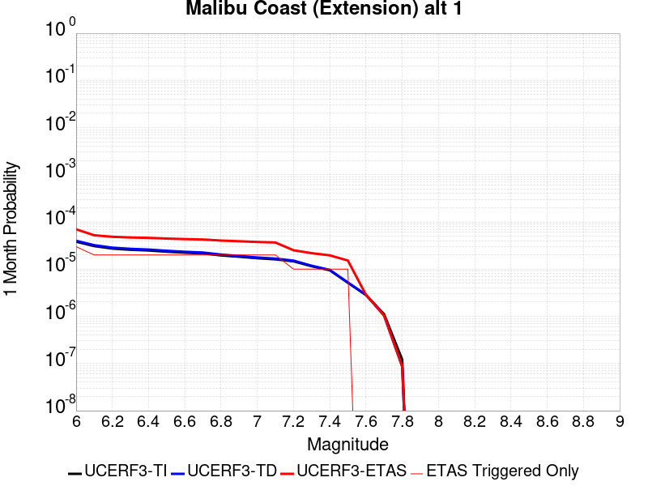 | 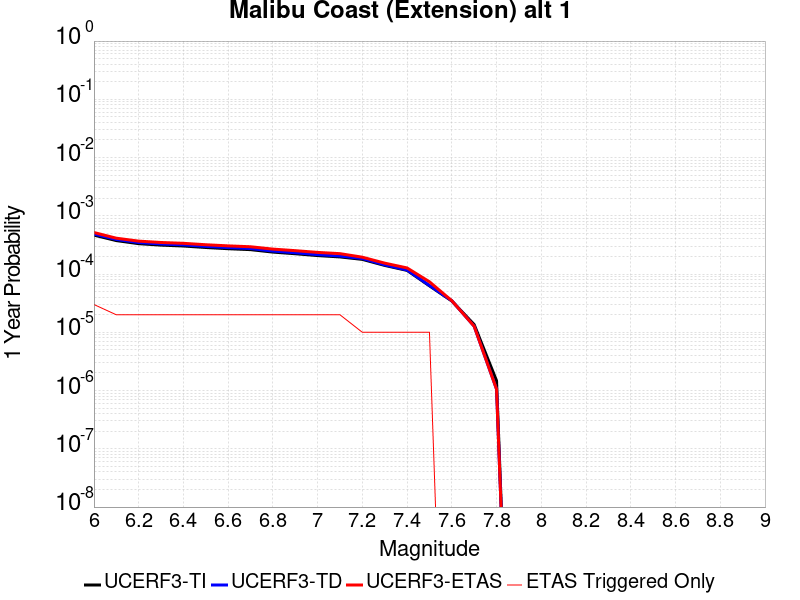 |  |

| Magnitude | 1 wk TI Prob | 1 wk TD Prob | 1 wk ETAS Prob | 1 wk ETAS/TD Gain | 1 wk ETAS Triggered Only | 1 mo TI Prob | 1 mo TD Prob | 1 mo ETAS Prob | 1 mo ETAS/TD Gain | 1 mo ETAS Triggered Only | 1 yr TI Prob | 1 yr TD Prob | 1 yr ETAS Prob | 1 yr ETAS/TD Gain | 1 yr ETAS Triggered Only | 10 yr TI Prob | 10 yr TD Prob | 10 yr ETAS Prob | 10 yr ETAS/TD Gain | 10 yr ETAS Triggered Only |
|-----|-----|-----|-----|-----|-----|-----|-----|-----|-----|-----|-----|-----|-----|-----|-----|-----|-----|-----|-----|-----|
| 6.0 | 8.930738E-6 | 9.3292765E-6 | 2.932909E-5 | 3.143769 | 2.0E-5 | 3.827403E-5 | 3.998201E-5 | 6.9980815E-5 | 1.7503074 | 3.0E-5 | 4.6588664E-4 | 4.86674E-4 | 5.166594E-4 | 1.061613 | 3.0E-5 | 0.0046491115 | 0.004856264 | 0.0048861187 | 1.0061476 | 3.0E-5 |
| 6.1 | 7.199952E-6 | 7.5302974E-6 | 1.7530221E-5 | 2.3279588 | 1.0E-5 | 3.0856572E-5 | 3.2272306E-5 | 5.2271662E-5 | 1.6197064 | 2.0E-5 | 3.75614E-4 | 3.928451E-4 | 4.1283725E-4 | 1.0508907 | 2.0E-5 | 0.0037497976 | 0.0039215726 | 0.0039414945 | 1.00508 | 2.0E-5 |
| 6.2 | 6.3721413E-6 | 6.666792E-6 | 1.6666725E-5 | 2.4999616 | 1.0E-5 | 2.7308892E-5 | 2.8571656E-5 | 4.8571084E-5 | 1.6999744 | 2.0E-5 | 3.3243504E-4 | 3.4780474E-4 | 3.677978E-4 | 1.0574836 | 2.0E-5 | 0.0033193815 | 0.0034726441 | 0.0034925747 | 1.0057393 | 2.0E-5 |
| 6.3 | 6.016345E-6 | 6.295159E-6 | 1.6295096E-5 | 2.5885122 | 1.0E-5 | 2.578408E-5 | 2.6978976E-5 | 4.6978435E-5 | 1.741298 | 2.0E-5 | 3.1387596E-4 | 3.2841985E-4 | 3.4841328E-4 | 1.0608777 | 2.0E-5 | 0.00313433 | 0.0032793812 | 0.0032993155 | 1.0060787 | 2.0E-5 |
| 6.4 | 5.8104883E-6 | 6.0795455E-6 | 1.6079484E-5 | 2.6448498 | 1.0E-5 | 2.4901856E-5 | 2.6054937E-5 | 4.6054414E-5 | 1.7675889 | 2.0E-5 | 3.031379E-4 | 3.17173E-4 | 3.3716665E-4 | 1.063037 | 2.0E-5 | 0.0030272473 | 0.0031672379 | 0.0031871744 | 1.0062946 | 2.0E-5 |
| 6.5 | 5.476925E-6 | 5.727514E-6 | 1.5727457E-5 | 2.745948 | 1.0E-5 | 2.3472323E-5 | 2.454626E-5 | 4.454577E-5 | 1.8147681 | 2.0E-5 | 2.8573806E-4 | 2.9881002E-4 | 3.1880403E-4 | 1.0669122 | 2.0E-5 | 0.0028537093 | 0.0029841145 | 0.0030040548 | 1.0066822 | 2.0E-5 |
| 6.6 | 5.222387E-6 | 5.4585807E-6 | 1.5458527E-5 | 2.831968 | 1.0E-5 | 2.2381464E-5 | 2.3393708E-5 | 4.339324E-5 | 1.8549107 | 2.0E-5 | 2.7246025E-4 | 2.8478145E-4 | 3.0477578E-4 | 1.0702093 | 2.0E-5 | 0.0027212645 | 0.002844196 | 0.0028641392 | 1.0070119 | 2.0E-5 |
| 6.7 | 5.0337076E-6 | 5.259104E-6 | 1.5259051E-5 | 2.9014547 | 1.0E-5 | 2.1572854E-5 | 2.2538823E-5 | 4.2538373E-5 | 1.8873378 | 2.0E-5 | 2.6261783E-4 | 2.743759E-4 | 2.9437043E-4 | 1.0728726 | 2.0E-5 | 0.002623077 | 0.0027404015 | 0.0027603467 | 1.0072782 | 2.0E-5 |
| 6.8 | 4.5675624E-6 | 4.7587173E-6 | 1.475867E-5 | 3.1013966 | 1.0E-5 | 1.9575122E-5 | 2.0394344E-5 | 4.0393938E-5 | 1.980644 | 2.0E-5 | 2.3830103E-4 | 2.4827302E-4 | 2.6826808E-4 | 1.0805365 | 2.0E-5 | 0.0023804565 | 0.0024799763 | 0.0024999268 | 1.0080446 | 2.0E-5 |
| 6.9 | 4.2802412E-6 | 4.4520216E-6 | 1.4451977E-5 | 3.2461607 | 1.0E-5 | 1.8343762E-5 | 1.9079953E-5 | 3.9079572E-5 | 2.0482006 | 2.0E-5 | 2.2331243E-4 | 2.3227383E-4 | 2.5226918E-4 | 1.0860853 | 2.0E-5 | 0.0022308815 | 0.0023203273 | 0.002340281 | 1.0085995 | 2.0E-5 |
| 7.0 | 3.9794063E-6 | 4.1301E-6 | 1.4130059E-5 | 3.421239 | 1.0E-5 | 1.7054486E-5 | 1.770031E-5 | 3.7699956E-5 | 2.1299038 | 2.0E-5 | 2.0761859E-4 | 2.1548007E-4 | 2.3547576E-4 | 1.092796 | 2.0E-5 | 0.0020742472 | 0.002152725 | 0.002172682 | 1.0092705 | 2.0E-5 |
| 7.1 | 3.7730424E-6 | 3.911218E-6 | 1.3911179E-5 | 3.5567384 | 1.0E-5 | 1.6170083E-5 | 1.6762255E-5 | 3.676192E-5 | 2.193137 | 2.0E-5 | 1.9685295E-4 | 2.0406146E-4 | 2.2405738E-4 | 1.0979897 | 2.0E-5 | 0.0019667868 | 0.0020387538 | 0.002058713 | 1.00979 | 2.0E-5 |
| 7.2 | 3.424985E-6 | 3.541338E-6 | 3.541338E-6 | 1.0 | 0.0 | 1.4678424E-5 | 1.5177075E-5 | 2.5176923E-5 | 1.6588784 | 1.0E-5 | 1.7869516E-4 | 1.8476533E-4 | 1.9476349E-4 | 1.0541127 | 1.0E-5 | 0.0017855153 | 0.0018461292 | 0.0018561108 | 1.0054067 | 1.0E-5 |
| 7.3 | 2.6966375E-6 | 2.759654E-6 | 2.759654E-6 | 1.0 | 0.0 | 1.15569665E-5 | 1.1827035E-5 | 2.1826918E-5 | 1.8455104 | 1.0E-5 | 1.4069698E-4 | 1.4398468E-4 | 1.5398324E-4 | 1.0694418 | 1.0E-5 | 0.0014060794 | 0.001438918 | 0.0014489037 | 1.0069396 | 1.0E-5 |
| 7.4 | 2.215957E-6 | 2.249379E-6 | 2.249379E-6 | 1.0 | 0.0 | 9.496924E-6 | 9.64016E-6 | 1.9640063E-5 | 2.0373173 | 1.0E-5 | 1.1561892E-4 | 1.1736266E-4 | 1.2736149E-4 | 1.085196 | 1.0E-5 | 0.0011555878 | 0.0011730106 | 0.0011829988 | 1.0085151 | 1.0E-5 |
| 7.5 | 1.2040218E-6 | 1.2219067E-6 | 1.2219067E-6 | 1.0 | 0.0 | 5.160083E-6 | 5.2367327E-6 | 1.523668E-5 | 2.9095776 | 1.0E-5 | 6.2822204E-5 | 6.3755375E-5 | 7.375474E-5 | 1.1568395 | 1.0E-5 | 6.280445E-4 | 6.3737266E-4 | 6.4736634E-4 | 1.0156794 | 1.0E-5 |
| 7.6 | 6.6157446E-7 | 6.6789755E-7 | 6.6789755E-7 | 1.0 | 0.0 | 2.835316E-6 | 2.8624152E-6 | 2.8624152E-6 | 1.0 | 0.0 | 3.4519428E-5 | 3.4849363E-5 | 3.4849363E-5 | 1.0 | 0.0 | 3.4514067E-4 | 3.484405E-4 | 3.484405E-4 | 1.0 | 0.0 |
| 7.7 | 2.6012302E-7 | 2.4357584E-7 | 2.4357584E-7 | 1.0 | 0.0 | 1.1148124E-6 | 1.0438962E-6 | 1.0438962E-6 | 1.0 | 0.0 | 1.3572758E-5 | 1.2709373E-5 | 1.2709373E-5 | 1.0 | 0.0 | 1.3571928E-4 | 1.2708752E-4 | 1.2708752E-4 | 1.0 | 0.0 |
| 7.8 | 2.8323132E-8 | 2.0266642E-8 | 2.0266642E-8 | 1.0 | 0.0 | 1.2138484E-7 | 8.685703E-8 | 8.685703E-8 | 1.0 | 0.0 | 1.4778595E-6 | 1.0574839E-6 | 1.0574839E-6 | 1.0 | 0.0 | 1.4778497E-5 | 1.0574797E-5 | 1.0574797E-5 | 1.0 | 0.0 |

## Raymond
*[(top)](#table-of-contents)*

| 1 Week | 1 Month | 1 Year | 10 Year |
|-----|-----|-----|-----|
|  |  |  | 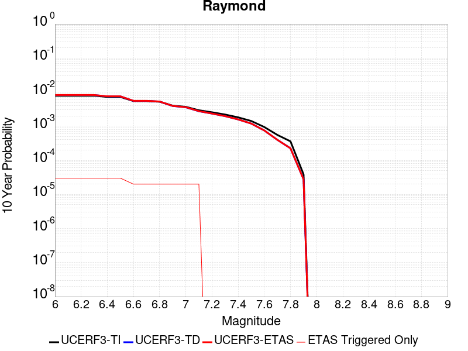 |

| Magnitude | 1 wk TI Prob | 1 wk TD Prob | 1 wk ETAS Prob | 1 wk ETAS/TD Gain | 1 wk ETAS Triggered Only | 1 mo TI Prob | 1 mo TD Prob | 1 mo ETAS Prob | 1 mo ETAS/TD Gain | 1 mo ETAS Triggered Only | 1 yr TI Prob | 1 yr TD Prob | 1 yr ETAS Prob | 1 yr ETAS/TD Gain | 1 yr ETAS Triggered Only | 10 yr TI Prob | 10 yr TD Prob | 10 yr ETAS Prob | 10 yr ETAS/TD Gain | 10 yr ETAS Triggered Only |
|-----|-----|-----|-----|-----|-----|-----|-----|-----|-----|-----|-----|-----|-----|-----|-----|-----|-----|-----|-----|-----|
| 6.0 | 1.5157413E-5 | 1.5810125E-5 | 1.5810125E-5 | 1.0 | 0.0 | 6.4958724E-5 | 6.775606E-5 | 6.775606E-5 | 1.0 | 0.0 | 7.905855E-4 | 8.246429E-4 | 8.5461815E-4 | 1.0363494 | 3.0E-5 | 0.007877788 | 0.008218355 | 0.0082481075 | 1.0036204 | 3.0E-5 |
| 6.1 | 1.5157413E-5 | 1.5810125E-5 | 1.5810125E-5 | 1.0 | 0.0 | 6.4958724E-5 | 6.775606E-5 | 6.775606E-5 | 1.0 | 0.0 | 7.905855E-4 | 8.246429E-4 | 8.5461815E-4 | 1.0363494 | 3.0E-5 | 0.007877788 | 0.008218355 | 0.0082481075 | 1.0036204 | 3.0E-5 |
| 6.2 | 1.5157413E-5 | 1.5810125E-5 | 1.5810125E-5 | 1.0 | 0.0 | 6.4958724E-5 | 6.775606E-5 | 6.775606E-5 | 1.0 | 0.0 | 7.905855E-4 | 8.246429E-4 | 8.5461815E-4 | 1.0363494 | 3.0E-5 | 0.007877788 | 0.008218355 | 0.0082481075 | 1.0036204 | 3.0E-5 |
| 6.3 | 1.5157413E-5 | 1.5810125E-5 | 1.5810125E-5 | 1.0 | 0.0 | 6.4958724E-5 | 6.775606E-5 | 6.775606E-5 | 1.0 | 0.0 | 7.905855E-4 | 8.246429E-4 | 8.5461815E-4 | 1.0363494 | 3.0E-5 | 0.007877788 | 0.008218355 | 0.0082481075 | 1.0036204 | 3.0E-5 |
| 6.4 | 1.3941944E-5 | 1.4454688E-5 | 1.4454688E-5 | 1.0 | 0.0 | 5.9749822E-5 | 6.194732E-5 | 6.194732E-5 | 1.0 | 0.0 | 7.2721124E-4 | 7.53971E-4 | 7.839484E-4 | 1.0397593 | 3.0E-5 | 0.007248361 | 0.007516471 | 0.0075462456 | 1.0039612 | 3.0E-5 |
| 6.5 | 1.3941944E-5 | 1.4454688E-5 | 1.4454688E-5 | 1.0 | 0.0 | 5.9749822E-5 | 6.194732E-5 | 6.194732E-5 | 1.0 | 0.0 | 7.2721124E-4 | 7.53971E-4 | 7.839484E-4 | 1.0397593 | 3.0E-5 | 0.007248361 | 0.007516471 | 0.0075462456 | 1.0039612 | 3.0E-5 |
| 6.6 | 1.0542609E-5 | 1.067111E-5 | 1.067111E-5 | 1.0 | 0.0 | 4.5181827E-5 | 4.573256E-5 | 4.573256E-5 | 1.0 | 0.0 | 5.499499E-4 | 5.566571E-4 | 5.76646E-4 | 1.0359088 | 2.0E-5 | 0.005485909 | 0.0055531966 | 0.0055730855 | 1.0035815 | 2.0E-5 |
| 6.7 | 1.0542609E-5 | 1.067111E-5 | 1.067111E-5 | 1.0 | 0.0 | 4.5181827E-5 | 4.573256E-5 | 4.573256E-5 | 1.0 | 0.0 | 5.499499E-4 | 5.566571E-4 | 5.76646E-4 | 1.0359088 | 2.0E-5 | 0.005485909 | 0.0055531966 | 0.0055730855 | 1.0035815 | 2.0E-5 |
| 6.8 | 1.0079132E-5 | 1.0176644E-5 | 1.0176644E-5 | 1.0 | 0.0 | 4.3195567E-5 | 4.3613487E-5 | 4.3613487E-5 | 1.0 | 0.0 | 5.257791E-4 | 5.308702E-4 | 5.508596E-4 | 1.037654 | 2.0E-5 | 0.0052453685 | 0.0052965777 | 0.0053164717 | 1.003756 | 2.0E-5 |
| 6.9 | 7.721598E-6 | 7.548902E-6 | 7.548902E-6 | 1.0 | 0.0 | 3.3092143E-5 | 3.2352043E-5 | 3.2352043E-5 | 1.0 | 0.0 | 4.0282236E-4 | 3.9381615E-4 | 4.1380827E-4 | 1.0507652 | 2.0E-5 | 0.0040209293 | 0.003931324 | 0.0039512455 | 1.0050673 | 2.0E-5 |
| 7.0 | 7.137566E-6 | 6.911303E-6 | 6.911303E-6 | 1.0 | 0.0 | 3.058921E-5 | 2.961954E-5 | 2.961954E-5 | 1.0 | 0.0 | 3.7236E-4 | 3.605593E-4 | 3.8055208E-4 | 1.0554494 | 2.0E-5 | 0.0037173668 | 0.003599869 | 0.003619797 | 1.0055357 | 2.0E-5 |
| 7.1 | 5.654976E-6 | 5.299538E-6 | 5.299538E-6 | 1.0 | 0.0 | 2.4235387E-5 | 2.2712107E-5 | 2.2712107E-5 | 1.0 | 0.0 | 2.9502588E-4 | 2.7648505E-4 | 2.964795E-4 | 1.0723166 | 2.0E-5 | 0.0029463451 | 0.0027614492 | 0.002781394 | 1.0072225 | 2.0E-5 |
| 7.2 | 4.9358455E-6 | 4.526655E-6 | 4.526655E-6 | 1.0 | 0.0 | 2.1153453E-5 | 1.9399806E-5 | 1.9399806E-5 | 1.0 | 0.0 | 2.5751285E-4 | 2.3616718E-4 | 2.3616718E-4 | 1.0 | 0.0 | 0.0025721465 | 0.002359192 | 0.002359192 | 1.0 | 0.0 |
| 7.3 | 4.2368597E-6 | 3.8056128E-6 | 3.8056128E-6 | 1.0 | 0.0 | 1.8157843E-5 | 1.6309668E-5 | 1.6309668E-5 | 1.0 | 0.0 | 2.2104931E-4 | 1.9855222E-4 | 1.9855222E-4 | 1.0 | 0.0 | 0.0022082955 | 0.0019837746 | 0.0019837746 | 1.0 | 0.0 |
| 7.4 | 3.4999923E-6 | 3.0437407E-6 | 3.0437407E-6 | 1.0 | 0.0 | 1.49998805E-5 | 1.3044538E-5 | 1.3044538E-5 | 1.0 | 0.0 | 1.8260824E-4 | 1.5880575E-4 | 1.5880575E-4 | 1.0 | 0.0 | 0.0018245826 | 0.0015869461 | 0.0015869461 | 1.0 | 0.0 |
| 7.5 | 2.738017E-6 | 2.3020405E-6 | 2.3020405E-6 | 1.0 | 0.0 | 1.1734306E-5 | 9.865851E-6 | 9.865851E-6 | 1.0 | 0.0 | 1.428558E-4 | 1.20110184E-4 | 1.20110184E-4 | 1.0 | 0.0 | 0.0014276401 | 0.0012004747 | 0.0012004747 | 1.0 | 0.0 |
| 7.6 | 1.8186392E-6 | 1.442302E-6 | 1.442302E-6 | 1.0 | 0.0 | 7.794145E-6 | 6.1812802E-6 | 6.1812802E-6 | 1.0 | 0.0 | 9.488958E-5 | 7.5254524E-5 | 7.5254524E-5 | 1.0 | 0.0 | 9.4849075E-4 | 7.5230957E-4 | 7.5230957E-4 | 1.0 | 0.0 |
| 7.7 | 1.0660348E-6 | 7.6437E-7 | 7.6437E-7 | 1.0 | 0.0 | 4.5687125E-6 | 3.2758674E-6 | 3.2758674E-6 | 1.0 | 0.0 | 5.5622655E-5 | 3.988297E-5 | 3.988297E-5 | 1.0 | 0.0 | 5.5608735E-4 | 3.9877492E-4 | 3.9877492E-4 | 1.0 | 0.0 |
| 7.8 | 6.913602E-7 | 4.3202903E-7 | 4.3202903E-7 | 1.0 | 0.0 | 2.962969E-6 | 1.8515517E-6 | 1.8515517E-6 | 1.0 | 0.0 | 3.607355E-5 | 2.2542416E-5 | 2.2542416E-5 | 1.0 | 0.0 | 3.6067693E-4 | 2.2541684E-4 | 2.2541684E-4 | 1.0 | 0.0 |
| 7.9 | 7.425201E-8 | 5.322267E-8 | 5.322267E-8 | 1.0 | 0.0 | 3.1822285E-7 | 2.2809714E-7 | 2.2809714E-7 | 1.0 | 0.0 | 3.874356E-6 | 2.7770805E-6 | 2.7770805E-6 | 1.0 | 0.0 | 3.8742884E-5 | 2.7770588E-5 | 2.7770588E-5 | 1.0 | 0.0 |

## Cleghorn
*[(top)](#table-of-contents)*

| 1 Week | 1 Month | 1 Year | 10 Year |
|-----|-----|-----|-----|
|  |  |  |  |

| Magnitude | 1 wk TI Prob | 1 wk TD Prob | 1 wk ETAS Prob | 1 wk ETAS/TD Gain | 1 wk ETAS Triggered Only | 1 mo TI Prob | 1 mo TD Prob | 1 mo ETAS Prob | 1 mo ETAS/TD Gain | 1 mo ETAS Triggered Only | 1 yr TI Prob | 1 yr TD Prob | 1 yr ETAS Prob | 1 yr ETAS/TD Gain | 1 yr ETAS Triggered Only | 10 yr TI Prob | 10 yr TD Prob | 10 yr ETAS Prob | 10 yr ETAS/TD Gain | 10 yr ETAS Triggered Only |
|-----|-----|-----|-----|-----|-----|-----|-----|-----|-----|-----|-----|-----|-----|-----|-----|-----|-----|-----|-----|-----|
| 6.0 | 7.9267165E-6 | 9.831764E-6 | 1.9831667E-5 | 2.0171015 | 1.0E-5 | 3.39712E-5 | 4.2135514E-5 | 5.2135092E-5 | 1.2373195 | 1.0E-5 | 4.1352084E-4 | 5.1288976E-4 | 5.328795E-4 | 1.0389748 | 2.0E-5 | 0.004127522 | 0.005132214 | 0.0051620603 | 1.0058154 | 3.0E-5 |
| 6.1 | 7.9267165E-6 | 9.831764E-6 | 1.9831667E-5 | 2.0171015 | 1.0E-5 | 3.39712E-5 | 4.2135514E-5 | 5.2135092E-5 | 1.2373195 | 1.0E-5 | 4.1352084E-4 | 5.1288976E-4 | 5.328795E-4 | 1.0389748 | 2.0E-5 | 0.004127522 | 0.005132214 | 0.0051620603 | 1.0058154 | 3.0E-5 |
| 6.2 | 7.9267165E-6 | 9.831764E-6 | 1.9831667E-5 | 2.0171015 | 1.0E-5 | 3.39712E-5 | 4.2135514E-5 | 5.2135092E-5 | 1.2373195 | 1.0E-5 | 4.1352084E-4 | 5.1288976E-4 | 5.328795E-4 | 1.0389748 | 2.0E-5 | 0.004127522 | 0.005132214 | 0.0051620603 | 1.0058154 | 3.0E-5 |
| 6.3 | 7.9267165E-6 | 9.831764E-6 | 1.9831667E-5 | 2.0171015 | 1.0E-5 | 3.39712E-5 | 4.2135514E-5 | 5.2135092E-5 | 1.2373195 | 1.0E-5 | 4.1352084E-4 | 5.1288976E-4 | 5.328795E-4 | 1.0389748 | 2.0E-5 | 0.004127522 | 0.005132214 | 0.0051620603 | 1.0058154 | 3.0E-5 |
| 6.4 | 4.3445207E-6 | 6.0916254E-6 | 6.0916254E-6 | 1.0 | 0.0 | 1.8619241E-5 | 2.6106709E-5 | 2.6106709E-5 | 1.0 | 0.0 | 2.2666567E-4 | 3.1780385E-4 | 3.2780066E-4 | 1.031456 | 1.0E-5 | 0.0022643462 | 0.0031877246 | 0.0031976928 | 1.003127 | 1.0E-5 |
| 6.5 | 4.3445207E-6 | 6.0916254E-6 | 6.0916254E-6 | 1.0 | 0.0 | 1.8619241E-5 | 2.6106709E-5 | 2.6106709E-5 | 1.0 | 0.0 | 2.2666567E-4 | 3.1780385E-4 | 3.2780066E-4 | 1.031456 | 1.0E-5 | 0.0022643462 | 0.0031877246 | 0.0031976928 | 1.003127 | 1.0E-5 |
| 6.6 | 4.040109E-6 | 5.774033E-6 | 5.774033E-6 | 1.0 | 0.0 | 1.7314638E-5 | 2.4745626E-5 | 2.4745626E-5 | 1.0 | 0.0 | 2.1078532E-4 | 3.0123728E-4 | 3.1123427E-4 | 1.0331864 | 1.0E-5 | 0.002105855 | 0.0030225143 | 0.003032484 | 1.0032985 | 1.0E-5 |
| 6.7 | 3.3632055E-6 | 5.06753E-6 | 5.06753E-6 | 1.0 | 0.0 | 1.4413658E-5 | 2.1717806E-5 | 2.1717806E-5 | 1.0 | 0.0 | 1.7547216E-4 | 2.643825E-4 | 2.643825E-4 | 1.0 | 0.0 | 0.0017533366 | 0.0026548486 | 0.0026548486 | 1.0 | 0.0 |
| 6.8 | 3.2902772E-6 | 4.9894375E-6 | 4.9894375E-6 | 1.0 | 0.0 | 1.4101111E-5 | 2.138313E-5 | 2.138313E-5 | 1.0 | 0.0 | 1.716675E-4 | 2.6030882E-4 | 2.6030882E-4 | 1.0 | 0.0 | 0.0017153495 | 0.0026142076 | 0.0026142076 | 1.0 | 0.0 |
| 6.9 | 3.031547E-6 | 4.6911987E-6 | 4.6911987E-6 | 1.0 | 0.0 | 1.299228E-5 | 2.0104984E-5 | 2.0104984E-5 | 1.0 | 0.0 | 1.5816953E-4 | 2.4475096E-4 | 2.4475096E-4 | 1.0 | 0.0 | 0.00158057 | 0.0024589805 | 0.0024589805 | 1.0 | 0.0 |
| 7.0 | 2.8259715E-6 | 4.3707637E-6 | 4.3707637E-6 | 1.0 | 0.0 | 1.211125E-5 | 1.8731711E-5 | 1.8731711E-5 | 1.0 | 0.0 | 1.4744449E-4 | 2.2803496E-4 | 2.2803496E-4 | 1.0 | 0.0 | 0.001473467 | 0.0022921748 | 0.0022921748 | 1.0 | 0.0 |
| 7.1 | 2.5962665E-6 | 4.065983E-6 | 4.065983E-6 | 1.0 | 0.0 | 1.1126809E-5 | 1.7425526E-5 | 1.7425526E-5 | 1.0 | 0.0 | 1.3546048E-4 | 2.1213535E-4 | 2.1213535E-4 | 1.0 | 0.0 | 0.0013537793 | 0.0021334959 | 0.0021334959 | 1.0 | 0.0 |
| 7.2 | 2.3247253E-6 | 3.6765352E-6 | 3.6765352E-6 | 1.0 | 0.0 | 9.96307E-6 | 1.5756486E-5 | 1.5756486E-5 | 1.0 | 0.0 | 1.21293626E-4 | 1.9181852E-4 | 1.9181852E-4 | 1.0 | 0.0 | 0.0012122744 | 0.0019307166 | 0.0019307166 | 1.0 | 0.0 |
| 7.3 | 2.056928E-6 | 3.235253E-6 | 3.235253E-6 | 1.0 | 0.0 | 8.815376E-6 | 1.3865297E-5 | 1.3865297E-5 | 1.0 | 0.0 | 1.0732192E-4 | 1.6879707E-4 | 1.6879707E-4 | 1.0 | 0.0 | 0.001072701 | 0.0017009423 | 0.0017009423 | 1.0 | 0.0 |
| 7.4 | 1.8055999E-6 | 2.8256538E-6 | 2.8256538E-6 | 1.0 | 0.0 | 7.738263E-6 | 1.210989E-5 | 1.210989E-5 | 1.0 | 0.0 | 9.4209274E-5 | 1.4742807E-4 | 1.4742807E-4 | 1.0 | 0.0 | 9.4169343E-4 | 0.0014876705 | 0.0014876705 | 1.0 | 0.0 |
| 7.5 | 1.4683443E-6 | 2.4248943E-6 | 2.4248943E-6 | 1.0 | 0.0 | 6.292889E-6 | 1.0392363E-5 | 1.0392363E-5 | 1.0 | 0.0 | 7.661323E-5 | 1.2651978E-4 | 1.2651978E-4 | 1.0 | 0.0 | 7.658682E-4 | 0.0012788812 | 0.0012788812 | 1.0 | 0.0 |
| 7.6 | 9.804088E-7 | 1.9004091E-6 | 1.9004091E-6 | 1.0 | 0.0 | 4.201745E-6 | 8.144585E-6 | 8.144585E-6 | 1.0 | 0.0 | 5.1155046E-5 | 9.915586E-5 | 9.915586E-5 | 1.0 | 0.0 | 5.114327E-4 | 0.0010055583 | 0.0010055583 | 1.0 | 0.0 |
| 7.7 | 7.3434086E-7 | 1.6285549E-6 | 1.6285549E-6 | 1.0 | 0.0 | 3.1471714E-6 | 6.9795024E-6 | 6.9795024E-6 | 1.0 | 0.0 | 3.831614E-5 | 8.4972155E-5 | 8.4972155E-5 | 1.0 | 0.0 | 3.8309532E-4 | 8.6387293E-4 | 8.6387293E-4 | 1.0 | 0.0 |
| 7.8 | 6.434184E-7 | 1.5221389E-6 | 1.5221389E-6 | 1.0 | 0.0 | 2.7575045E-6 | 6.523436E-6 | 6.523436E-6 | 1.0 | 0.0 | 3.35721E-5 | 7.9419966E-5 | 7.9419966E-5 | 1.0 | 0.0 | 3.3567028E-4 | 8.080443E-4 | 8.080443E-4 | 1.0 | 0.0 |
| 7.9 | 3.4943926E-7 | 7.5750586E-7 | 7.5750586E-7 | 1.0 | 0.0 | 1.497596E-6 | 3.2464498E-6 | 3.2464498E-6 | 1.0 | 0.0 | 1.8233079E-5 | 3.9524817E-5 | 3.9524817E-5 | 1.0 | 0.0 | 1.8231584E-4 | 4.0401975E-4 | 4.0401975E-4 | 1.0 | 0.0 |
| 8.0 | 6.717524E-8 | 5.837515E-8 | 5.837515E-8 | 1.0 | 0.0 | 2.8789387E-7 | 2.501792E-7 | 2.501792E-7 | 1.0 | 0.0 | 3.505102E-6 | 3.0459275E-6 | 3.0459275E-6 | 1.0 | 0.0 | 3.5050467E-5 | 3.2751934E-5 | 3.2751934E-5 | 1.0 | 0.0 |
| 8.1 | 3.1984914E-8 | 1.2949885E-8 | 1.2949885E-8 | 1.0 | 0.0 | 1.370782E-7 | 5.549951E-8 | 5.549951E-8 | 1.0 | 0.0 | 1.6689258E-6 | 6.757063E-7 | 6.757063E-7 | 1.0 | 0.0 | 1.6689133E-5 | 7.741151E-6 | 7.741151E-6 | 1.0 | 0.0 |
| 8.2 | 1.21887656E-8 | 3.6471115E-9 | 3.6471115E-9 | 1.0 | 0.0 | 5.2237567E-8 | 1.563048E-8 | 1.563048E-8 | 1.0 | 0.0 | 6.359922E-7 | 1.9030107E-7 | 1.9030107E-7 | 1.0 | 0.0 | 6.3599036E-6 | 2.245849E-6 | 2.245849E-6 | 1.0 | 0.0 |

## San Gorgonio Pass
*[(top)](#table-of-contents)*

| 1 Week | 1 Month | 1 Year | 10 Year |
|-----|-----|-----|-----|
|  |  |  | 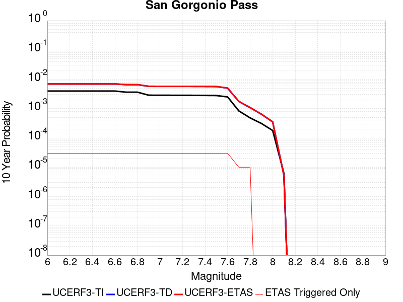 |

| Magnitude | 1 wk TI Prob | 1 wk TD Prob | 1 wk ETAS Prob | 1 wk ETAS/TD Gain | 1 wk ETAS Triggered Only | 1 mo TI Prob | 1 mo TD Prob | 1 mo ETAS Prob | 1 mo ETAS/TD Gain | 1 mo ETAS Triggered Only | 1 yr TI Prob | 1 yr TD Prob | 1 yr ETAS Prob | 1 yr ETAS/TD Gain | 1 yr ETAS Triggered Only | 10 yr TI Prob | 10 yr TD Prob | 10 yr ETAS Prob | 10 yr ETAS/TD Gain | 10 yr ETAS Triggered Only |
|-----|-----|-----|-----|-----|-----|-----|-----|-----|-----|-----|-----|-----|-----|-----|-----|-----|-----|-----|-----|-----|
| 6.0 | 7.644328E-6 | 1.331474E-5 | 2.3314606E-5 | 1.7510374 | 1.0E-5 | 3.2760996E-5 | 5.706197E-5 | 6.7061395E-5 | 1.175238 | 1.0E-5 | 3.987921E-4 | 6.945166E-4 | 7.145027E-4 | 1.028777 | 2.0E-5 | 0.003980772 | 0.006930024 | 0.006959816 | 1.004299 | 3.0E-5 |
| 6.1 | 7.644328E-6 | 1.331474E-5 | 2.3314606E-5 | 1.7510374 | 1.0E-5 | 3.2760996E-5 | 5.706197E-5 | 6.7061395E-5 | 1.175238 | 1.0E-5 | 3.987921E-4 | 6.945166E-4 | 7.145027E-4 | 1.028777 | 2.0E-5 | 0.003980772 | 0.006930024 | 0.006959816 | 1.004299 | 3.0E-5 |
| 6.2 | 7.644328E-6 | 1.331474E-5 | 2.3314606E-5 | 1.7510374 | 1.0E-5 | 3.2760996E-5 | 5.706197E-5 | 6.7061395E-5 | 1.175238 | 1.0E-5 | 3.987921E-4 | 6.945166E-4 | 7.145027E-4 | 1.028777 | 2.0E-5 | 0.003980772 | 0.006930024 | 0.006959816 | 1.004299 | 3.0E-5 |
| 6.3 | 7.644328E-6 | 1.331474E-5 | 2.3314606E-5 | 1.7510374 | 1.0E-5 | 3.2760996E-5 | 5.706197E-5 | 6.7061395E-5 | 1.175238 | 1.0E-5 | 3.987921E-4 | 6.945166E-4 | 7.145027E-4 | 1.028777 | 2.0E-5 | 0.003980772 | 0.006930024 | 0.006959816 | 1.004299 | 3.0E-5 |
| 6.4 | 7.644328E-6 | 1.331474E-5 | 2.3314606E-5 | 1.7510374 | 1.0E-5 | 3.2760996E-5 | 5.706197E-5 | 6.7061395E-5 | 1.175238 | 1.0E-5 | 3.987921E-4 | 6.945166E-4 | 7.145027E-4 | 1.028777 | 2.0E-5 | 0.003980772 | 0.006930024 | 0.006959816 | 1.004299 | 3.0E-5 |
| 6.5 | 7.644328E-6 | 1.331474E-5 | 2.3314606E-5 | 1.7510374 | 1.0E-5 | 3.2760996E-5 | 5.706197E-5 | 6.7061395E-5 | 1.175238 | 1.0E-5 | 3.987921E-4 | 6.945166E-4 | 7.145027E-4 | 1.028777 | 2.0E-5 | 0.003980772 | 0.006930024 | 0.006959816 | 1.004299 | 3.0E-5 |
| 6.6 | 7.644328E-6 | 1.331474E-5 | 2.3314606E-5 | 1.7510374 | 1.0E-5 | 3.2760996E-5 | 5.706197E-5 | 6.7061395E-5 | 1.175238 | 1.0E-5 | 3.987921E-4 | 6.945166E-4 | 7.145027E-4 | 1.028777 | 2.0E-5 | 0.003980772 | 0.006930024 | 0.006959816 | 1.004299 | 3.0E-5 |
| 6.7 | 6.987586E-6 | 1.2619013E-5 | 2.2618888E-5 | 1.792445 | 1.0E-5 | 2.9946454E-5 | 5.408041E-5 | 6.407987E-5 | 1.1848998 | 1.0E-5 | 3.645371E-4 | 6.582382E-4 | 6.78225E-4 | 1.0303642 | 2.0E-5 | 0.0036393967 | 0.0065694 | 0.0065992028 | 1.0045366 | 3.0E-5 |
| 6.8 | 6.987586E-6 | 1.2619013E-5 | 2.2618888E-5 | 1.792445 | 1.0E-5 | 2.9946454E-5 | 5.408041E-5 | 6.407987E-5 | 1.1848998 | 1.0E-5 | 3.645371E-4 | 6.582382E-4 | 6.78225E-4 | 1.0303642 | 2.0E-5 | 0.0036393967 | 0.0065694 | 0.0065992028 | 1.0045366 | 3.0E-5 |
| 6.9 | 5.504702E-6 | 1.1049877E-5 | 2.1049766E-5 | 1.9049774 | 1.0E-5 | 2.3591367E-5 | 4.7355785E-5 | 5.735531E-5 | 1.2111574 | 1.0E-5 | 2.8718702E-4 | 5.764092E-4 | 5.963977E-4 | 1.0346776 | 2.0E-5 | 0.0028681618 | 0.0057553523 | 0.00578518 | 1.0051825 | 3.0E-5 |
| 7.0 | 5.4825764E-6 | 1.1026218E-5 | 2.1026108E-5 | 1.9069194 | 1.0E-5 | 2.3496545E-5 | 4.725439E-5 | 5.7253917E-5 | 1.2116106 | 1.0E-5 | 2.8603288E-4 | 5.751754E-4 | 5.951639E-4 | 1.034752 | 2.0E-5 | 0.00285665 | 0.0057430784 | 0.005772906 | 1.0051937 | 3.0E-5 |
| 7.1 | 5.4692787E-6 | 1.1011928E-5 | 2.1011818E-5 | 1.9080962 | 1.0E-5 | 2.3439556E-5 | 4.719315E-5 | 5.719268E-5 | 1.2118852 | 1.0E-5 | 2.8533922E-4 | 5.744302E-4 | 5.944187E-4 | 1.0347971 | 2.0E-5 | 0.0028497311 | 0.0057356646 | 0.0057654926 | 1.0052004 | 3.0E-5 |
| 7.2 | 5.453661E-6 | 1.0994954E-5 | 2.0994845E-5 | 1.9094981 | 1.0E-5 | 2.3372622E-5 | 4.712041E-5 | 5.7119938E-5 | 1.2122122 | 1.0E-5 | 2.8452452E-4 | 5.7354505E-4 | 5.9353356E-4 | 1.0348508 | 2.0E-5 | 0.002841605 | 0.005726859 | 0.005756687 | 1.0052085 | 3.0E-5 |
| 7.3 | 5.4422303E-6 | 1.09818775E-5 | 2.0981768E-5 | 1.9105811 | 1.0E-5 | 2.3323635E-5 | 4.7064368E-5 | 5.70639E-5 | 1.2124649 | 1.0E-5 | 2.8392827E-4 | 5.728631E-4 | 5.928516E-4 | 1.0348923 | 2.0E-5 | 0.0028356577 | 0.0057200743 | 0.0057499027 | 1.0052147 | 3.0E-5 |
| 7.4 | 5.398595E-6 | 1.0929241E-5 | 2.0929132E-5 | 1.9149666 | 1.0E-5 | 2.313663E-5 | 4.6838795E-5 | 5.6838326E-5 | 1.2134882 | 1.0E-5 | 2.8165206E-4 | 5.701182E-4 | 5.9010676E-4 | 1.0350604 | 2.0E-5 | 0.0028129534 | 0.0056927665 | 0.005722596 | 1.0052398 | 3.0E-5 |
| 7.5 | 5.3578788E-6 | 1.0855785E-5 | 2.0855678E-5 | 1.9211578 | 1.0E-5 | 2.2962136E-5 | 4.6523994E-5 | 5.6523528E-5 | 1.2149328 | 1.0E-5 | 2.7952815E-4 | 5.662875E-4 | 5.862761E-4 | 1.0352978 | 2.0E-5 | 0.002791768 | 0.0056546913 | 0.0056845215 | 1.0052754 | 3.0E-5 |
| 7.6 | 4.8091474E-6 | 9.604131E-6 | 1.9604035E-5 | 2.0412085 | 1.0E-5 | 2.0610469E-5 | 4.1159943E-5 | 5.1159528E-5 | 1.2429447 | 1.0E-5 | 2.5090357E-4 | 5.010119E-4 | 5.210019E-4 | 1.0398992 | 2.0E-5 | 0.0025062046 | 0.0050054584 | 0.005035308 | 1.0059634 | 3.0E-5 |
| 7.7 | 1.5991155E-6 | 3.353035E-6 | 3.353035E-6 | 1.0 | 0.0 | 6.853334E-6 | 1.4370073E-5 | 1.4370073E-5 | 1.0 | 0.0 | 8.343615E-5 | 1.7494184E-4 | 1.8494009E-4 | 1.0571519 | 1.0E-5 | 8.340483E-4 | 0.0017535852 | 0.0017635676 | 1.0056926 | 1.0E-5 |
| 7.8 | 9.258398E-7 | 2.0581049E-6 | 2.0581049E-6 | 1.0 | 0.0 | 3.967879E-6 | 8.82042E-6 | 8.82042E-6 | 1.0 | 0.0 | 4.8307855E-5 | 1.0738334E-4 | 1.1738227E-4 | 1.0931143 | 1.0E-5 | 4.8297356E-4 | 0.0010788103 | 0.0010887996 | 1.0092595 | 1.0E-5 |
| 7.9 | 5.975575E-7 | 1.2292295E-6 | 1.2292295E-6 | 1.0 | 0.0 | 2.5609581E-6 | 5.2681157E-6 | 5.2681157E-6 | 1.0 | 0.0 | 3.117922E-5 | 6.413743E-5 | 6.413743E-5 | 1.0 | 0.0 | 3.1174847E-4 | 6.464778E-4 | 6.464778E-4 | 1.0 | 0.0 |
| 8.0 | 3.4413725E-7 | 6.714992E-7 | 6.714992E-7 | 1.0 | 0.0 | 1.4748731E-6 | 2.8778506E-6 | 2.8778506E-6 | 1.0 | 0.0 | 1.7956432E-5 | 3.5037272E-5 | 3.5037272E-5 | 1.0 | 0.0 | 1.7954981E-4 | 3.5392298E-4 | 3.5392298E-4 | 1.0 | 0.0 |
| 8.1 | 1.1787731E-8 | 9.6332045E-9 | 9.6332045E-9 | 1.0 | 0.0 | 5.0518846E-8 | 4.1285162E-8 | 4.1285162E-8 | 1.0 | 0.0 | 6.1506677E-7 | 5.0264674E-7 | 5.0264674E-7 | 1.0 | 0.0 | 6.1506507E-6 | 5.2417968E-6 | 5.2417968E-6 | 1.0 | 0.0 |

## Goose Lake 2011 CFM
*[(top)](#table-of-contents)*

| 1 Week | 1 Month | 1 Year | 10 Year |
|-----|-----|-----|-----|
|  |  |  |  |

| Magnitude | 1 wk TI Prob | 1 wk TD Prob | 1 wk ETAS Prob | 1 wk ETAS/TD Gain | 1 wk ETAS Triggered Only | 1 mo TI Prob | 1 mo TD Prob | 1 mo ETAS Prob | 1 mo ETAS/TD Gain | 1 mo ETAS Triggered Only | 1 yr TI Prob | 1 yr TD Prob | 1 yr ETAS Prob | 1 yr ETAS/TD Gain | 1 yr ETAS Triggered Only | 10 yr TI Prob | 10 yr TD Prob | 10 yr ETAS Prob | 10 yr ETAS/TD Gain | 10 yr ETAS Triggered Only |
|-----|-----|-----|-----|-----|-----|-----|-----|-----|-----|-----|-----|-----|-----|-----|-----|-----|-----|-----|-----|-----|
| 6.0 | 3.780968E-6 | 3.8230223E-6 | 2.3822946E-5 | 6.231443 | 2.0E-5 | 1.6204049E-5 | 1.6384285E-5 | 3.6383957E-5 | 2.2206619 | 2.0E-5 | 1.9726643E-4 | 1.994615E-4 | 2.194575E-4 | 1.10025 | 2.0E-5 | 0.001970914 | 0.001992933 | 0.002012893 | 1.0100155 | 2.0E-5 |
| 6.1 | 2.2035124E-6 | 2.229801E-6 | 2.2229757E-5 | 9.969389 | 2.0E-5 | 9.443591E-6 | 9.556257E-6 | 2.9556066E-5 | 3.0928497 | 2.0E-5 | 1.1496965E-4 | 1.163414E-4 | 1.3633908E-4 | 1.1718879 | 2.0E-5 | 0.0011491019 | 0.0011628233 | 0.0011828 | 1.0171795 | 2.0E-5 |
| 6.2 | 1.5624689E-6 | 1.5826923E-6 | 1.1582676E-5 | 7.3183374 | 1.0E-5 | 6.6962784E-6 | 6.7829496E-6 | 1.6782882E-5 | 2.4742749 | 1.0E-5 | 8.152414E-5 | 8.2579325E-5 | 9.25785E-5 | 1.1210856 | 1.0E-5 | 8.1494235E-4 | 8.2549086E-4 | 8.354826E-4 | 1.012104 | 1.0E-5 |
| 6.3 | 1.5624689E-6 | 1.5826923E-6 | 1.1582676E-5 | 7.3183374 | 1.0E-5 | 6.6962784E-6 | 6.7829496E-6 | 1.6782882E-5 | 2.4742749 | 1.0E-5 | 8.152414E-5 | 8.2579325E-5 | 9.25785E-5 | 1.1210856 | 1.0E-5 | 8.1494235E-4 | 8.2549086E-4 | 8.354826E-4 | 1.012104 | 1.0E-5 |
| 6.4 | 1.256464E-6 | 1.2738695E-6 | 1.1273857E-5 | 8.850087 | 1.0E-5 | 5.3848344E-6 | 5.4594293E-6 | 1.5459374E-5 | 2.8316832 | 1.0E-5 | 6.5558386E-5 | 6.646655E-5 | 7.646588E-5 | 1.1504416 | 1.0E-5 | 6.553905E-4 | 6.644687E-4 | 6.7446206E-4 | 1.0150396 | 1.0E-5 |
| 6.5 | 1.0910911E-6 | 1.1069404E-6 | 1.1106929E-5 | 10.0339 | 1.0E-5 | 4.6760965E-6 | 4.7440217E-6 | 1.4743974E-5 | 3.107906 | 1.0E-5 | 5.692999E-5 | 5.7756948E-5 | 6.775637E-5 | 1.1731293 | 1.0E-5 | 5.6915404E-4 | 5.7742064E-4 | 5.8741483E-4 | 1.0173084 | 1.0E-5 |
| 6.6 | 9.546601E-7 | 9.691246E-7 | 1.0969115E-5 | 11.318581 | 1.0E-5 | 4.091394E-6 | 4.1533845E-6 | 1.4153343E-5 | 3.407665 | 1.0E-5 | 4.9811584E-5 | 5.056629E-5 | 6.0565784E-5 | 1.1977502 | 1.0E-5 | 4.980042E-4 | 5.055487E-4 | 5.155437E-4 | 1.0197705 | 1.0E-5 |
| 6.7 | 7.790316E-7 | 7.9159634E-7 | 1.07915885E-5 | 13.632691 | 1.0E-5 | 3.3387028E-6 | 3.3925514E-6 | 1.3392518E-5 | 3.947624 | 1.0E-5 | 4.0647945E-5 | 4.1303538E-5 | 5.1303123E-5 | 1.2421 | 1.0E-5 | 4.0640513E-4 | 4.129592E-4 | 4.2295505E-4 | 1.0242054 | 1.0E-5 |
| 6.8 | 6.3714384E-7 | 6.4787395E-7 | 1.0647867E-5 | 16.435091 | 1.0E-5 | 2.7306137E-6 | 2.7765998E-6 | 1.2776572E-5 | 4.601517 | 1.0E-5 | 3.3244716E-5 | 3.3804583E-5 | 4.3804244E-5 | 1.2958078 | 1.0E-5 | 3.323974E-4 | 3.379949E-4 | 3.479915E-4 | 1.0295763 | 1.0E-5 |
| 6.9 | 4.92586E-7 | 5.0139147E-7 | 1.0501387E-5 | 20.944485 | 1.0E-5 | 2.1110811E-6 | 2.1488188E-6 | 1.2148797E-5 | 5.6537094 | 1.0E-5 | 2.5702111E-5 | 2.616156E-5 | 3.61613E-5 | 1.3822302 | 1.0E-5 | 2.569914E-4 | 2.6158517E-4 | 2.7158257E-4 | 1.0382185 | 1.0E-5 |
| 7.0 | 3.130245E-7 | 3.190354E-7 | 3.190354E-7 | 1.0 | 0.0 | 1.3415328E-6 | 1.3672939E-6 | 1.3672939E-6 | 1.0 | 0.0 | 1.6333039E-5 | 1.6646678E-5 | 1.6646678E-5 | 1.0 | 0.0 | 1.6331839E-4 | 1.6645451E-4 | 1.6645451E-4 | 1.0 | 0.0 |
| 7.1 | 1.7680084E-7 | 1.8023923E-7 | 1.8023923E-7 | 1.0 | 0.0 | 7.5771766E-7 | 7.724536E-7 | 7.724536E-7 | 1.0 | 0.0 | 9.225173E-6 | 9.404583E-6 | 9.404583E-6 | 1.0 | 0.0 | 9.22479E-5 | 9.4041956E-5 | 9.4041956E-5 | 1.0 | 0.0 |
| 7.2 | 4.8641045E-8 | 4.9402068E-8 | 4.9402068E-8 | 1.0 | 0.0 | 2.084616E-7 | 2.1172312E-7 | 2.1172312E-7 | 1.0 | 0.0 | 2.538017E-6 | 2.577726E-6 | 2.577726E-6 | 1.0 | 0.0 | 2.537988E-5 | 2.5776973E-5 | 2.5776973E-5 | 1.0 | 0.0 |
| 7.3 | 5.3911844E-9 | 5.4758145E-9 | 5.4758145E-9 | 1.0 | 0.0 | 2.3105075E-8 | 2.3467775E-8 | 2.3467775E-8 | 1.0 | 0.0 | 2.8130427E-7 | 2.8572015E-7 | 2.8572015E-7 | 1.0 | 0.0 | 2.8130391E-6 | 2.8571992E-6 | 2.8571992E-6 | 1.0 | 0.0 |

## San Jacinto (Clark) rev
*[(top)](#table-of-contents)*

| 1 Week | 1 Month | 1 Year | 10 Year |
|-----|-----|-----|-----|
|  |  |  |  |

| Magnitude | 1 wk TI Prob | 1 wk TD Prob | 1 wk ETAS Prob | 1 wk ETAS/TD Gain | 1 wk ETAS Triggered Only | 1 mo TI Prob | 1 mo TD Prob | 1 mo ETAS Prob | 1 mo ETAS/TD Gain | 1 mo ETAS Triggered Only | 1 yr TI Prob | 1 yr TD Prob | 1 yr ETAS Prob | 1 yr ETAS/TD Gain | 1 yr ETAS Triggered Only | 10 yr TI Prob | 10 yr TD Prob | 10 yr ETAS Prob | 10 yr ETAS/TD Gain | 10 yr ETAS Triggered Only |
|-----|-----|-----|-----|-----|-----|-----|-----|-----|-----|-----|-----|-----|-----|-----|-----|-----|-----|-----|-----|-----|
| 6.0 | 4.482615E-5 | 2.1153059E-5 | 2.1153059E-5 | 1.0 | 0.0 | 1.9209793E-4 | 9.065287E-5 | 9.065287E-5 | 1.0 | 0.0 | 0.0023362834 | 0.0011031491 | 0.0011031491 | 1.0 | 0.0 | 0.02311874 | 0.011485709 | 0.011505479 | 1.0017213 | 2.0E-5 |
| 6.1 | 4.482615E-5 | 2.1153059E-5 | 2.1153059E-5 | 1.0 | 0.0 | 1.9209793E-4 | 9.065287E-5 | 9.065287E-5 | 1.0 | 0.0 | 0.0023362834 | 0.0011031491 | 0.0011031491 | 1.0 | 0.0 | 0.02311874 | 0.011485709 | 0.011505479 | 1.0017213 | 2.0E-5 |
| 6.2 | 4.482615E-5 | 2.1153059E-5 | 2.1153059E-5 | 1.0 | 0.0 | 1.9209793E-4 | 9.065287E-5 | 9.065287E-5 | 1.0 | 0.0 | 0.0023362834 | 0.0011031491 | 0.0011031491 | 1.0 | 0.0 | 0.02311874 | 0.011485709 | 0.011505479 | 1.0017213 | 2.0E-5 |
| 6.3 | 4.482615E-5 | 2.1153059E-5 | 2.1153059E-5 | 1.0 | 0.0 | 1.9209793E-4 | 9.065287E-5 | 9.065287E-5 | 1.0 | 0.0 | 0.0023362834 | 0.0011031491 | 0.0011031491 | 1.0 | 0.0 | 0.02311874 | 0.011485709 | 0.011505479 | 1.0017213 | 2.0E-5 |
| 6.4 | 4.482615E-5 | 2.1153059E-5 | 2.1153059E-5 | 1.0 | 0.0 | 1.9209793E-4 | 9.065287E-5 | 9.065287E-5 | 1.0 | 0.0 | 0.0023362834 | 0.0011031491 | 0.0011031491 | 1.0 | 0.0 | 0.02311874 | 0.011485709 | 0.011505479 | 1.0017213 | 2.0E-5 |
| 6.5 | 3.7294863E-5 | 1.7354667E-5 | 1.7354667E-5 | 1.0 | 0.0 | 1.5982533E-4 | 7.437504E-5 | 7.437504E-5 | 1.0 | 0.0 | 0.0019441366 | 9.051445E-4 | 9.051445E-4 | 1.0 | 0.0 | 0.01927216 | 0.009485902 | 0.009505713 | 1.0020884 | 2.0E-5 |
| 6.6 | 3.7294863E-5 | 1.7354667E-5 | 1.7354667E-5 | 1.0 | 0.0 | 1.5982533E-4 | 7.437504E-5 | 7.437504E-5 | 1.0 | 0.0 | 0.0019441366 | 9.051445E-4 | 9.051445E-4 | 1.0 | 0.0 | 0.01927216 | 0.009485902 | 0.009505713 | 1.0020884 | 2.0E-5 |
| 6.7 | 3.6039248E-5 | 1.6602684E-5 | 1.6602684E-5 | 1.0 | 0.0 | 1.5444479E-4 | 7.115244E-5 | 7.115244E-5 | 1.0 | 0.0 | 0.0018787434 | 8.659408E-4 | 8.659408E-4 | 1.0 | 0.0 | 0.01862939 | 0.009088189 | 0.009108008 | 1.0021807 | 2.0E-5 |
| 6.8 | 3.5031844E-5 | 1.6231123E-5 | 1.6231123E-5 | 1.0 | 0.0 | 1.5012783E-4 | 6.956012E-5 | 6.956012E-5 | 1.0 | 0.0 | 0.0018262739 | 8.4656954E-4 | 8.4656954E-4 | 1.0 | 0.0 | 0.01811338 | 0.008888788 | 0.00890861 | 1.00223 | 2.0E-5 |
| 6.9 | 3.435112E-5 | 1.6061658E-5 | 1.6061658E-5 | 1.0 | 0.0 | 1.4721078E-4 | 6.8833884E-5 | 6.8833884E-5 | 1.0 | 0.0 | 0.0017908178 | 8.377344E-4 | 8.377344E-4 | 1.0 | 0.0 | 0.017764548 | 0.008796512 | 0.008816336 | 1.0022537 | 2.0E-5 |
| 7.0 | 2.8959772E-5 | 1.43355255E-5 | 1.43355255E-5 | 1.0 | 0.0 | 1.241074E-4 | 6.1436534E-5 | 6.1436534E-5 | 1.0 | 0.0 | 0.0015099603 | 7.477359E-4 | 7.477359E-4 | 1.0 | 0.0 | 0.014997416 | 0.007868331 | 0.007888174 | 1.0025219 | 2.0E-5 |
| 7.1 | 2.6002877E-5 | 1.2827699E-5 | 1.2827699E-5 | 1.0 | 0.0 | 1.11436144E-4 | 5.4974706E-5 | 5.4974706E-5 | 1.0 | 0.0 | 0.0013558907 | 6.6911365E-4 | 6.6911365E-4 | 1.0 | 0.0 | 0.013476475 | 0.0070483433 | 0.0070682024 | 1.0028175 | 2.0E-5 |
| 7.2 | 2.2544838E-5 | 1.1260331E-5 | 1.1260331E-5 | 1.0 | 0.0 | 9.661716E-5 | 4.825768E-5 | 4.825768E-5 | 1.0 | 0.0 | 0.001175679 | 5.873803E-4 | 5.873803E-4 | 1.0 | 0.0 | 0.011694785 | 0.00619256 | 0.006202498 | 1.0016048 | 1.0E-5 |
| 7.3 | 1.75334E-5 | 1.0810585E-5 | 1.0810585E-5 | 1.0 | 0.0 | 7.514098E-5 | 4.6330264E-5 | 4.6330264E-5 | 1.0 | 0.0 | 9.144575E-4 | 5.6392635E-4 | 5.6392635E-4 | 1.0 | 0.0 | 0.009107036 | 0.0059332196 | 0.00594316 | 1.0016754 | 1.0E-5 |
| 7.4 | 1.5924552E-5 | 1.0610475E-5 | 1.0610475E-5 | 1.0 | 0.0 | 6.82463E-5 | 4.547268E-5 | 4.547268E-5 | 1.0 | 0.0 | 8.305819E-4 | 5.534906E-4 | 5.534906E-4 | 1.0 | 0.0 | 0.008274844 | 0.0058205863 | 0.0058305277 | 1.001708 | 1.0E-5 |
| 7.5 | 1.3428931E-5 | 9.851045E-6 | 9.851045E-6 | 1.0 | 0.0 | 5.7551293E-5 | 4.221809E-5 | 4.221809E-5 | 1.0 | 0.0 | 7.004617E-4 | 5.1388505E-4 | 5.1388505E-4 | 1.0 | 0.0 | 0.006982579 | 0.005406209 | 0.005416155 | 1.0018398 | 1.0E-5 |
| 7.6 | 1.0688787E-5 | 8.614091E-6 | 8.614091E-6 | 1.0 | 0.0 | 4.5808283E-5 | 3.6917012E-5 | 3.6917012E-5 | 1.0 | 0.0 | 5.5757316E-4 | 4.4937237E-4 | 4.4937237E-4 | 1.0 | 0.0 | 0.005561762 | 0.0047413614 | 0.004751314 | 1.0020992 | 1.0E-5 |
| 7.7 | 8.81236E-6 | 7.4673385E-6 | 7.4673385E-6 | 1.0 | 0.0 | 3.776671E-5 | 3.200249E-5 | 3.200249E-5 | 1.0 | 0.0 | 4.597127E-4 | 3.8956082E-4 | 3.8956082E-4 | 1.0 | 0.0 | 0.0045876284 | 0.0041344194 | 0.004144378 | 1.0024087 | 1.0E-5 |
| 7.8 | 7.780431E-6 | 6.695928E-6 | 6.695928E-6 | 1.0 | 0.0 | 3.3344273E-5 | 2.8696519E-5 | 2.8696519E-5 | 1.0 | 0.0 | 4.0589093E-4 | 3.4932428E-4 | 3.4932428E-4 | 1.0 | 0.0 | 0.0040515037 | 0.0037226272 | 0.00373259 | 1.0026762 | 1.0E-5 |
| 7.9 | 6.5437994E-6 | 5.7797783E-6 | 5.7797783E-6 | 1.0 | 0.0 | 2.8044553E-5 | 2.4770245E-5 | 2.4770245E-5 | 1.0 | 0.0 | 3.4138895E-4 | 3.0153614E-4 | 3.0153614E-4 | 1.0 | 0.0 | 0.0034086495 | 0.0032343294 | 0.003244297 | 1.0030818 | 1.0E-5 |
| 8.0 | 5.4488164E-6 | 4.812793E-6 | 4.812793E-6 | 1.0 | 0.0 | 2.3351862E-5 | 2.0626094E-5 | 2.0626094E-5 | 1.0 | 0.0 | 2.8427184E-4 | 2.510939E-4 | 2.510939E-4 | 1.0 | 0.0 | 0.0028390845 | 0.0027107038 | 0.0027206766 | 1.003679 | 1.0E-5 |
| 8.1 | 2.8397242E-6 | 1.3665673E-6 | 1.3665673E-6 | 1.0 | 0.0 | 1.217019E-5 | 5.856704E-6 | 5.856704E-6 | 1.0 | 0.0 | 1.4816198E-4 | 7.1303046E-5 | 7.1303046E-5 | 1.0 | 0.0 | 0.0014806325 | 8.113543E-4 | 8.213462E-4 | 1.012315 | 1.0E-5 |
| 8.2 | 2.030244E-6 | 6.3151083E-7 | 6.3151083E-7 | 1.0 | 0.0 | 8.701017E-6 | 2.7064723E-6 | 2.7064723E-6 | 1.0 | 0.0 | 1.05929736E-4 | 3.2950808E-5 | 3.2950808E-5 | 1.0 | 0.0 | 0.0010587925 | 3.9470522E-4 | 3.9470522E-4 | 1.0 | 0.0 |
| 8.3 | 1.0659804E-6 | 2.9230563E-7 | 2.9230563E-7 | 1.0 | 0.0 | 4.568479E-6 | 1.2527379E-6 | 1.2527379E-6 | 1.0 | 0.0 | 5.5619817E-5 | 1.5251981E-5 | 1.5251981E-5 | 1.0 | 0.0 | 5.5605895E-4 | 1.8556409E-4 | 1.8556409E-4 | 1.0 | 0.0 |

## Hayward (No) 2011 CFM
*[(top)](#table-of-contents)*

| 1 Week | 1 Month | 1 Year | 10 Year |
|-----|-----|-----|-----|
|  | 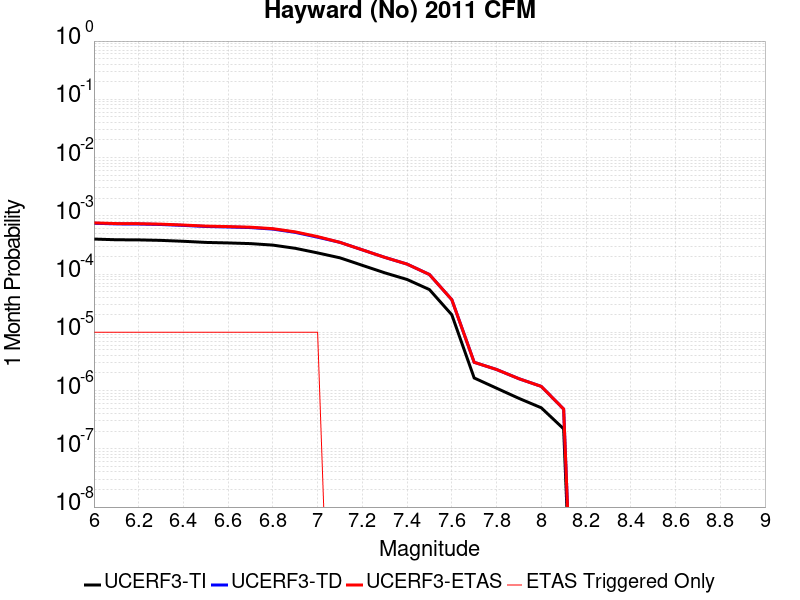 |  |  |

| Magnitude | 1 wk TI Prob | 1 wk TD Prob | 1 wk ETAS Prob | 1 wk ETAS/TD Gain | 1 wk ETAS Triggered Only | 1 mo TI Prob | 1 mo TD Prob | 1 mo ETAS Prob | 1 mo ETAS/TD Gain | 1 mo ETAS Triggered Only | 1 yr TI Prob | 1 yr TD Prob | 1 yr ETAS Prob | 1 yr ETAS/TD Gain | 1 yr ETAS Triggered Only | 10 yr TI Prob | 10 yr TD Prob | 10 yr ETAS Prob | 10 yr ETAS/TD Gain | 10 yr ETAS Triggered Only |
|-----|-----|-----|-----|-----|-----|-----|-----|-----|-----|-----|-----|-----|-----|-----|-----|-----|-----|-----|-----|-----|
| 6.0 | 9.3068506E-5 | 1.739643E-4 | 1.8396258E-4 | 1.0574731 | 1.0E-5 | 3.9880406E-4 | 7.453474E-4 | 7.5534E-4 | 1.0134065 | 1.0E-5 | 0.0048446343 | 0.009036727 | 0.009056547 | 1.0021932 | 2.0E-5 | 0.047403704 | 0.086396605 | 0.08641488 | 1.0002115 | 2.0E-5 |
| 6.1 | 9.055486E-5 | 1.6947639E-4 | 1.794747E-4 | 1.0589952 | 1.0E-5 | 3.880345E-4 | 7.2612526E-4 | 7.36118E-4 | 1.0137618 | 1.0E-5 | 0.0047140904 | 0.008804814 | 0.008824638 | 1.0022515 | 2.0E-5 | 0.046153355 | 0.08428568 | 0.08430399 | 1.0002173 | 2.0E-5 |
| 6.2 | 9.006742E-5 | 1.6868232E-4 | 1.7868062E-4 | 1.059273 | 1.0E-5 | 3.859461E-4 | 7.227246E-4 | 7.327174E-4 | 1.0138265 | 1.0E-5 | 0.0046887742 | 0.00876378 | 0.008783604 | 1.0022621 | 2.0E-5 | 0.0459107 | 0.08390991 | 0.08392823 | 1.0002184 | 2.0E-5 |
| 6.3 | 8.8336754E-5 | 1.6547782E-4 | 1.7547616E-4 | 1.0604211 | 1.0E-5 | 3.7853114E-4 | 7.0899865E-4 | 7.1899156E-4 | 1.0140944 | 1.0E-5 | 0.004598882 | 0.008598051 | 0.00861788 | 1.0023061 | 2.0E-5 | 0.04504866 | 0.08240195 | 0.082420304 | 1.0002227 | 2.0E-5 |
| 6.4 | 8.526157E-5 | 1.5974796E-4 | 1.6974636E-4 | 1.0625886 | 1.0E-5 | 3.6535555E-4 | 6.844552E-4 | 6.9444836E-4 | 1.0146002 | 1.0E-5 | 0.0044391346 | 0.00830156 | 0.008321393 | 1.0023892 | 2.0E-5 | 0.043514993 | 0.07968467 | 0.07970307 | 1.000231 | 2.0E-5 |
| 6.5 | 8.152396E-5 | 1.5307199E-4 | 1.6307046E-4 | 1.0653187 | 1.0E-5 | 3.493416E-4 | 6.558586E-4 | 6.6585204E-4 | 1.0152372 | 1.0E-5 | 0.0042449418 | 0.007955993 | 0.0079758335 | 1.0024939 | 2.0E-5 | 0.04164765 | 0.07651448 | 0.07653295 | 1.0002414 | 2.0E-5 |
| 6.6 | 7.987405E-5 | 1.5011412E-4 | 1.6011261E-4 | 1.066606 | 1.0E-5 | 3.4227243E-4 | 6.431883E-4 | 6.5318187E-4 | 1.0155375 | 1.0E-5 | 0.0041592065 | 0.007802858 | 0.007822702 | 1.0025432 | 2.0E-5 | 0.04082218 | 0.075105876 | 0.07512437 | 1.0002463 | 2.0E-5 |
| 6.7 | 7.777665E-5 | 1.4650672E-4 | 1.5650525E-4 | 1.0682462 | 1.0E-5 | 3.332859E-4 | 6.277355E-4 | 6.3772924E-4 | 1.0159203 | 1.0E-5 | 0.004050208 | 0.007616053 | 0.0076359003 | 1.002606 | 2.0E-5 | 0.039771806 | 0.0733825 | 0.073401034 | 1.0002525 | 2.0E-5 |
| 6.8 | 7.3284005E-5 | 1.3801287E-4 | 1.4801149E-4 | 1.0724471 | 1.0E-5 | 3.140365E-4 | 5.9135025E-4 | 6.0134433E-4 | 1.0169004 | 1.0E-5 | 0.0038166929 | 0.007176059 | 0.0071959156 | 1.0027671 | 2.0E-5 | 0.037518036 | 0.06929624 | 0.06931486 | 1.0002686 | 2.0E-5 |
| 6.9 | 6.458263E-5 | 1.21319164E-4 | 1.3131795E-4 | 1.0824172 | 1.0E-5 | 2.7675333E-4 | 5.1983615E-4 | 5.298309E-4 | 1.0192268 | 1.0E-5 | 0.0033642664 | 0.0063107396 | 0.0063206763 | 1.0015746 | 1.0E-5 | 0.033137884 | 0.061224625 | 0.061234012 | 1.0001533 | 1.0E-5 |
| 7.0 | 5.3853604E-5 | 1.00254634E-4 | 1.1025363E-4 | 1.099736 | 1.0E-5 | 2.3078074E-4 | 4.295923E-4 | 4.39588E-4 | 1.0232679 | 1.0E-5 | 0.0028061352 | 0.0052178074 | 0.0052277553 | 1.0019065 | 1.0E-5 | 0.027709642 | 0.050957024 | 0.050966512 | 1.0001862 | 1.0E-5 |
| 7.1 | 4.4308683E-5 | 8.17098E-5 | 8.17098E-5 | 1.0 | 0.0 | 1.8988053E-4 | 3.5013806E-4 | 3.5013806E-4 | 1.0 | 0.0 | 0.0023093442 | 0.0042546396 | 0.0042546396 | 1.0 | 0.0 | 0.022854926 | 0.041824497 | 0.041824497 | 1.0 | 0.0 |
| 7.2 | 3.295973E-5 | 6.0774026E-5 | 6.0774026E-5 | 1.0 | 0.0 | 1.4124835E-4 | 2.6043423E-4 | 2.6043423E-4 | 1.0 | 0.0 | 0.0017183421 | 0.0031661994 | 0.0031661994 | 1.0 | 0.0 | 0.017051157 | 0.031370014 | 0.031370014 | 1.0 | 0.0 |
| 7.3 | 2.452256E-5 | 4.518223E-5 | 4.518223E-5 | 1.0 | 0.0 | 1.05092455E-4 | 1.9362383E-4 | 1.9362383E-4 | 1.0 | 0.0 | 0.0012787496 | 0.0023548352 | 0.0023548352 | 1.0 | 0.0 | 0.0127141625 | 0.023442036 | 0.023442036 | 1.0 | 0.0 |
| 7.4 | 1.8829967E-5 | 3.4604043E-5 | 3.4604043E-5 | 1.0 | 0.0 | 8.069736E-5 | 1.4829468E-4 | 1.4829468E-4 | 1.0 | 0.0 | 9.820475E-4 | 0.0018040023 | 0.0018040023 | 1.0 | 0.0 | 0.009777189 | 0.01802003 | 0.01802003 | 1.0 | 0.0 |
| 7.5 | 1.26374125E-5 | 2.292219E-5 | 2.292219E-5 | 1.0 | 0.0 | 5.4159216E-5 | 9.823428E-5 | 9.823428E-5 | 1.0 | 0.0 | 6.5918895E-4 | 0.0011953521 | 0.0011953521 | 1.0 | 0.0 | 0.00657237 | 0.011988704 | 0.011988704 | 1.0 | 0.0 |
| 7.6 | 4.666429E-6 | 8.479636E-6 | 8.479636E-6 | 1.0 | 0.0 | 1.9998828E-5 | 3.6340796E-5 | 3.6340796E-5 | 1.0 | 0.0 | 2.4345852E-4 | 4.423606E-4 | 4.423606E-4 | 1.0 | 0.0 | 0.0024319198 | 0.004458377 | 0.004458377 | 1.0 | 0.0 |
| 7.7 | 3.8399318E-7 | 7.1343146E-7 | 7.1343146E-7 | 1.0 | 0.0 | 1.6456839E-6 | 3.0575598E-6 | 3.0575598E-6 | 1.0 | 0.0 | 2.003602E-5 | 3.7225156E-5 | 3.7225156E-5 | 1.0 | 0.0 | 2.0034213E-4 | 3.86166E-4 | 3.86166E-4 | 1.0 | 0.0 |
| 7.8 | 2.5637698E-7 | 5.3666145E-7 | 5.3666145E-7 | 1.0 | 0.0 | 1.098758E-6 | 2.2999754E-6 | 2.2999754E-6 | 1.0 | 0.0 | 1.3377297E-5 | 2.8001843E-5 | 2.8001843E-5 | 1.0 | 0.0 | 1.3376492E-4 | 2.9246495E-4 | 2.9246495E-4 | 1.0 | 0.0 |
| 7.9 | 1.7141245E-7 | 3.7293606E-7 | 3.7293606E-7 | 1.0 | 0.0 | 7.3462456E-7 | 1.5982963E-6 | 1.5982963E-6 | 1.0 | 0.0 | 8.944017E-6 | 1.9459085E-5 | 1.9459085E-5 | 1.0 | 0.0 | 8.943657E-5 | 2.0246378E-4 | 2.0246378E-4 | 1.0 | 0.0 |
| 8.0 | 1.1808895E-7 | 2.7512246E-7 | 2.7512246E-7 | 1.0 | 0.0 | 5.060954E-7 | 1.1790958E-6 | 1.1790958E-6 | 1.0 | 0.0 | 6.161694E-6 | 1.4355397E-5 | 1.4355397E-5 | 1.0 | 0.0 | 6.161523E-5 | 1.4817173E-4 | 1.4817173E-4 | 1.0 | 0.0 |
| 8.1 | 5.138535E-8 | 1.12307575E-7 | 1.12307575E-7 | 1.0 | 0.0 | 2.2022292E-7 | 4.8131807E-7 | 4.8131807E-7 | 1.0 | 0.0 | 2.6812106E-6 | 5.860032E-6 | 5.860032E-6 | 1.0 | 0.0 | 2.6811784E-5 | 6.0156468E-5 | 6.0156468E-5 | 1.0 | 0.0 |

## San Jacinto (Borrego)
*[(top)](#table-of-contents)*

| 1 Week | 1 Month | 1 Year | 10 Year |
|-----|-----|-----|-----|
|  |  | 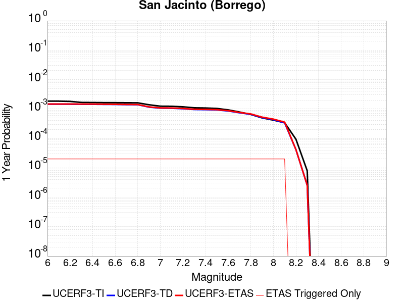 | 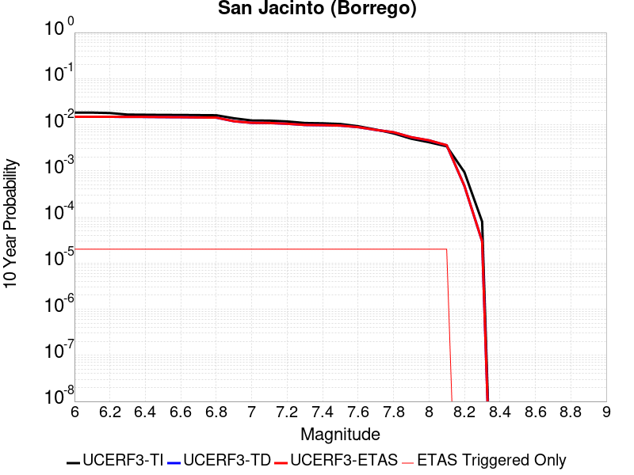 |

| Magnitude | 1 wk TI Prob | 1 wk TD Prob | 1 wk ETAS Prob | 1 wk ETAS/TD Gain | 1 wk ETAS Triggered Only | 1 mo TI Prob | 1 mo TD Prob | 1 mo ETAS Prob | 1 mo ETAS/TD Gain | 1 mo ETAS Triggered Only | 1 yr TI Prob | 1 yr TD Prob | 1 yr ETAS Prob | 1 yr ETAS/TD Gain | 1 yr ETAS Triggered Only | 10 yr TI Prob | 10 yr TD Prob | 10 yr ETAS Prob | 10 yr ETAS/TD Gain | 10 yr ETAS Triggered Only |
|-----|-----|-----|-----|-----|-----|-----|-----|-----|-----|-----|-----|-----|-----|-----|-----|-----|-----|-----|-----|-----|
| 6.0 | 3.543992E-5 | 2.7925962E-5 | 3.792568E-5 | 1.3580797 | 1.0E-5 | 1.5187653E-4 | 1.1967727E-4 | 1.2967607E-4 | 1.0835481 | 1.0E-5 | 0.0018475284 | 0.0014561092 | 0.00147608 | 1.0137153 | 2.0E-5 | 0.018322436 | 0.0148681495 | 0.014887852 | 1.0013251 | 2.0E-5 |
| 6.1 | 3.542281E-5 | 2.7925962E-5 | 3.792568E-5 | 1.3580797 | 1.0E-5 | 1.5180321E-4 | 1.1967727E-4 | 1.2967607E-4 | 1.0835481 | 1.0E-5 | 0.0018466372 | 0.0014561092 | 0.00147608 | 1.0137153 | 2.0E-5 | 0.018313672 | 0.0148681495 | 0.014887852 | 1.0013251 | 2.0E-5 |
| 6.2 | 3.4688688E-5 | 2.7925962E-5 | 3.792568E-5 | 1.3580797 | 1.0E-5 | 1.4865733E-4 | 1.1967727E-4 | 1.2967607E-4 | 1.0835481 | 1.0E-5 | 0.0018084005 | 0.0014561091 | 0.00147608 | 1.0137153 | 2.0E-5 | 0.017937548 | 0.014868149 | 0.014887852 | 1.0013251 | 2.0E-5 |
| 6.3 | 3.2087122E-5 | 2.7771312E-5 | 3.7771035E-5 | 1.3600738 | 1.0E-5 | 1.3750899E-4 | 1.1901455E-4 | 1.2901335E-4 | 1.0840133 | 1.0E-5 | 0.0016728862 | 0.0014480512 | 0.0014680222 | 1.0137917 | 2.0E-5 | 0.016603488 | 0.014789307 | 0.014809011 | 1.0013323 | 2.0E-5 |
| 6.4 | 3.1828724E-5 | 2.773829E-5 | 3.7738013E-5 | 1.3605025 | 1.0E-5 | 1.364017E-4 | 1.1887303E-4 | 1.2887185E-4 | 1.0841134 | 1.0E-5 | 0.0016594254 | 0.0014463306 | 0.0014663016 | 1.0138081 | 2.0E-5 | 0.016470885 | 0.0147725 | 0.014792205 | 1.0013338 | 2.0E-5 |
| 6.5 | 3.1563577E-5 | 2.7477974E-5 | 3.7477697E-5 | 1.3639178 | 1.0E-5 | 1.3526545E-4 | 1.17757496E-4 | 1.2775631E-4 | 1.0849103 | 1.0E-5 | 0.0016456128 | 0.0014327668 | 0.0014527382 | 1.013939 | 2.0E-5 | 0.0163348 | 0.014639908 | 0.014659615 | 1.0013461 | 2.0E-5 |
| 6.6 | 3.1467625E-5 | 2.7322194E-5 | 3.7321923E-5 | 1.3659928 | 1.0E-5 | 1.3485427E-4 | 1.17089934E-4 | 1.2708876E-4 | 1.0853944 | 1.0E-5 | 0.0016406142 | 0.0014246498 | 0.0014446214 | 1.0140185 | 2.0E-5 | 0.016285548 | 0.014560226 | 0.014579935 | 1.0013536 | 2.0E-5 |
| 6.7 | 3.1223695E-5 | 2.6940217E-5 | 3.693995E-5 | 1.3711822 | 1.0E-5 | 1.3380898E-4 | 1.1545303E-4 | 1.2545189E-4 | 1.0866053 | 1.0E-5 | 0.0016279068 | 0.0014047464 | 0.0014247183 | 1.0142175 | 2.0E-5 | 0.01616033 | 0.014364508 | 0.01438422 | 1.0013723 | 2.0E-5 |
| 6.8 | 3.1015585E-5 | 2.6761221E-5 | 3.6760954E-5 | 1.373665 | 1.0E-5 | 1.3291716E-4 | 1.1468597E-4 | 1.2468483E-4 | 1.0871847 | 1.0E-5 | 0.001617065 | 0.0013954195 | 0.0014153916 | 1.0143126 | 2.0E-5 | 0.016053487 | 0.01427177 | 0.014291485 | 1.0013814 | 2.0E-5 |
| 6.9 | 2.6641965E-5 | 2.2183434E-5 | 3.2183212E-5 | 1.4507768 | 1.0E-5 | 1.1417485E-4 | 9.506842E-5 | 1.0506747E-4 | 1.1051774 | 1.0E-5 | 0.0013891924 | 0.0011568473 | 0.0011768242 | 1.0172684 | 2.0E-5 | 0.0138054015 | 0.01188219 | 0.011901951 | 1.0016632 | 2.0E-5 |
| 7.0 | 2.3854353E-5 | 2.047825E-5 | 3.0478046E-5 | 1.488313 | 1.0E-5 | 1.02228936E-4 | 8.776099E-5 | 9.7760116E-5 | 1.1139358 | 1.0E-5 | 0.0012439266 | 0.0010679689 | 0.0010879475 | 1.0187072 | 2.0E-5 | 0.012369866 | 0.010982619 | 0.011002399 | 1.001801 | 2.0E-5 |
| 7.1 | 2.3672901E-5 | 2.0314741E-5 | 3.0314537E-5 | 1.4922434 | 1.0E-5 | 1.0145135E-4 | 8.706028E-5 | 9.705941E-5 | 1.1148529 | 1.0E-5 | 0.0012344702 | 0.0010594461 | 0.0010794249 | 1.0188578 | 2.0E-5 | 0.0122763505 | 0.010897857 | 0.010917639 | 1.0018152 | 2.0E-5 |
| 7.2 | 2.2717244E-5 | 1.9542116E-5 | 2.9541921E-5 | 1.5117053 | 1.0E-5 | 9.735599E-5 | 8.3749255E-5 | 9.3748415E-5 | 1.1193941 | 1.0E-5 | 0.0011846646 | 0.0010191725 | 0.0010391522 | 1.0196037 | 2.0E-5 | 0.01178369 | 0.01049532 | 0.010515111 | 1.0018857 | 2.0E-5 |
| 7.3 | 2.1016205E-5 | 1.8383771E-5 | 2.8383587E-5 | 1.543948 | 1.0E-5 | 9.006634E-5 | 7.878522E-5 | 8.8784436E-5 | 1.1269174 | 1.0E-5 | 0.001096006 | 9.5879E-4 | 9.787709E-4 | 1.0208396 | 2.0E-5 | 0.010906163 | 0.009890899 | 0.009910702 | 1.0020021 | 2.0E-5 |
| 7.4 | 2.0683625E-5 | 1.8186302E-5 | 2.818612E-5 | 1.5498544 | 1.0E-5 | 8.86411E-5 | 7.7938974E-5 | 8.79382E-5 | 1.1282955 | 1.0E-5 | 0.001078671 | 9.48496E-4 | 9.68477E-4 | 1.0210661 | 2.0E-5 | 0.010734501 | 0.009787627 | 0.00980743 | 1.0020233 | 2.0E-5 |
| 7.5 | 1.9993966E-5 | 1.7781347E-5 | 2.7781169E-5 | 1.5623771 | 1.0E-5 | 8.568561E-5 | 7.6203556E-5 | 8.6202796E-5 | 1.1312175 | 1.0E-5 | 0.001042723 | 9.2738547E-4 | 9.473669E-4 | 1.021546 | 2.0E-5 | 0.010378438 | 0.009574547 | 0.009594356 | 1.0020689 | 2.0E-5 |
| 7.6 | 1.788966E-5 | 1.6434618E-5 | 2.6434454E-5 | 1.6084617 | 1.0E-5 | 7.666772E-5 | 7.043219E-5 | 8.0431484E-5 | 1.1419705 | 1.0E-5 | 9.3302975E-4 | 8.5717626E-4 | 8.771591E-4 | 1.0233124 | 2.0E-5 | 0.00929122 | 0.0088664135 | 0.008886237 | 1.0022357 | 2.0E-5 |
| 7.7 | 1.5125781E-5 | 1.4236738E-5 | 2.4236595E-5 | 1.7023981 | 1.0E-5 | 6.4823165E-5 | 6.101317E-5 | 7.101256E-5 | 1.163889 | 1.0E-5 | 7.889362E-4 | 7.4258295E-4 | 7.625681E-4 | 1.026913 | 2.0E-5 | 0.007861412 | 0.00771416 | 0.0077340053 | 1.0025727 | 2.0E-5 |
| 7.8 | 1.250089E-5 | 1.262994E-5 | 2.2629814E-5 | 1.7917594 | 1.0E-5 | 5.3574146E-5 | 5.4127195E-5 | 6.412665E-5 | 1.1847401 | 1.0E-5 | 6.5207E-4 | 6.588E-4 | 6.7878683E-4 | 1.0303383 | 2.0E-5 | 0.006501599 | 0.0068677575 | 0.0068876203 | 1.0028921 | 2.0E-5 |
| 7.9 | 9.561E-6 | 9.754065E-6 | 1.9753967E-5 | 2.0252037 | 1.0E-5 | 4.0975072E-5 | 4.180247E-5 | 5.180205E-5 | 1.2392104 | 1.0E-5 | 4.987573E-4 | 5.0882675E-4 | 5.288166E-4 | 1.0392861 | 2.0E-5 | 0.0049763937 | 0.005352359 | 0.005372252 | 1.0037167 | 2.0E-5 |
| 8.0 | 8.01699E-6 | 8.292994E-6 | 1.829291E-5 | 2.2058272 | 1.0E-5 | 3.4358076E-5 | 3.554092E-5 | 4.5540564E-5 | 1.2813559 | 1.0E-5 | 4.1822926E-4 | 4.3262533E-4 | 4.5261666E-4 | 1.0462093 | 2.0E-5 | 0.0041744304 | 0.0045733186 | 0.0045932275 | 1.0043532 | 2.0E-5 |
| 8.1 | 6.541947E-6 | 6.461784E-6 | 1.646172E-5 | 2.5475502 | 1.0E-5 | 2.8036617E-5 | 2.7693068E-5 | 3.7692793E-5 | 1.3610911 | 1.0E-5 | 3.4129233E-4 | 3.3711144E-4 | 3.571047E-4 | 1.0593076 | 2.0E-5 | 0.0034076865 | 0.0035805756 | 0.0036005038 | 1.0055656 | 2.0E-5 |
| 8.2 | 1.7968189E-6 | 7.9684827E-7 | 7.9684827E-7 | 1.0 | 0.0 | 7.70063E-6 | 3.4150596E-6 | 3.4150596E-6 | 1.0 | 0.0 | 9.3751136E-5 | 4.157758E-5 | 4.157758E-5 | 1.0 | 0.0 | 9.371159E-4 | 4.7107413E-4 | 4.7107413E-4 | 1.0 | 0.0 |
| 8.3 | 1.5167889E-7 | 4.8951257E-8 | 4.8951257E-8 | 1.0 | 0.0 | 6.500522E-7 | 2.0979108E-7 | 2.0979108E-7 | 1.0 | 0.0 | 7.9143565E-6 | 2.5542038E-6 | 2.5542038E-6 | 1.0 | 0.0 | 7.914075E-5 | 2.9679897E-5 | 2.9679897E-5 | 1.0 | 0.0 |

## Elsinore (Stepovers Combined)
*[(top)](#table-of-contents)*

| 1 Week | 1 Month | 1 Year | 10 Year |
|-----|-----|-----|-----|
|  |  |  |  |

| Magnitude | 1 wk TI Prob | 1 wk TD Prob | 1 wk ETAS Prob | 1 wk ETAS/TD Gain | 1 wk ETAS Triggered Only | 1 mo TI Prob | 1 mo TD Prob | 1 mo ETAS Prob | 1 mo ETAS/TD Gain | 1 mo ETAS Triggered Only | 1 yr TI Prob | 1 yr TD Prob | 1 yr ETAS Prob | 1 yr ETAS/TD Gain | 1 yr ETAS Triggered Only | 10 yr TI Prob | 10 yr TD Prob | 10 yr ETAS Prob | 10 yr ETAS/TD Gain | 10 yr ETAS Triggered Only |
|-----|-----|-----|-----|-----|-----|-----|-----|-----|-----|-----|-----|-----|-----|-----|-----|-----|-----|-----|-----|-----|
| 6.0 | 2.144392E-5 | 1.976007E-5 | 1.976007E-5 | 1.0 | 0.0 | 9.189928E-5 | 8.468338E-5 | 8.468338E-5 | 1.0 | 0.0 | 0.0011182994 | 0.0010305515 | 0.0010405412 | 1.0096935 | 1.0E-5 | 0.011126885 | 0.010264617 | 0.010284412 | 1.0019284 | 2.0E-5 |
| 6.1 | 2.144392E-5 | 1.976007E-5 | 1.976007E-5 | 1.0 | 0.0 | 9.189928E-5 | 8.468338E-5 | 8.468338E-5 | 1.0 | 0.0 | 0.0011182994 | 0.0010305515 | 0.0010405412 | 1.0096935 | 1.0E-5 | 0.011126885 | 0.010264617 | 0.010284412 | 1.0019284 | 2.0E-5 |
| 6.2 | 2.144392E-5 | 1.976007E-5 | 1.976007E-5 | 1.0 | 0.0 | 9.189928E-5 | 8.468338E-5 | 8.468338E-5 | 1.0 | 0.0 | 0.0011182994 | 0.0010305515 | 0.0010405412 | 1.0096935 | 1.0E-5 | 0.011126885 | 0.010264617 | 0.010284412 | 1.0019284 | 2.0E-5 |
| 6.3 | 1.9751555E-5 | 1.7741326E-5 | 1.7741326E-5 | 1.0 | 0.0 | 8.4646774E-5 | 7.603211E-5 | 7.603211E-5 | 1.0 | 0.0 | 0.0010300872 | 9.25312E-4 | 9.25312E-4 | 1.0 | 0.0 | 0.010253254 | 0.0092209745 | 0.009230883 | 1.0010744 | 1.0E-5 |
| 6.4 | 1.9751555E-5 | 1.7741326E-5 | 1.7741326E-5 | 1.0 | 0.0 | 8.4646774E-5 | 7.603211E-5 | 7.603211E-5 | 1.0 | 0.0 | 0.0010300872 | 9.25312E-4 | 9.25312E-4 | 1.0 | 0.0 | 0.010253254 | 0.0092209745 | 0.009230883 | 1.0010744 | 1.0E-5 |
| 6.5 | 1.9751555E-5 | 1.7741326E-5 | 1.7741326E-5 | 1.0 | 0.0 | 8.4646774E-5 | 7.603211E-5 | 7.603211E-5 | 1.0 | 0.0 | 0.0010300872 | 9.25312E-4 | 9.25312E-4 | 1.0 | 0.0 | 0.010253254 | 0.0092209745 | 0.009230883 | 1.0010744 | 1.0E-5 |
| 6.6 | 1.9188685E-5 | 1.7003247E-5 | 1.7003247E-5 | 1.0 | 0.0 | 8.2234634E-5 | 7.2869116E-5 | 7.2869116E-5 | 1.0 | 0.0 | 0.0010007467 | 8.8683655E-4 | 8.8683655E-4 | 1.0 | 0.0 | 0.00996252 | 0.008839546 | 0.008849458 | 1.0011213 | 1.0E-5 |
| 6.7 | 1.7608272E-5 | 1.4732402E-5 | 1.4732402E-5 | 1.0 | 0.0 | 7.546184E-5 | 6.313739E-5 | 6.313739E-5 | 1.0 | 0.0 | 9.183606E-4 | 7.684364E-4 | 7.684364E-4 | 1.0 | 0.0 | 0.009145746 | 0.007664441 | 0.0076743644 | 1.0012947 | 1.0E-5 |
| 6.8 | 1.697165E-5 | 1.3783126E-5 | 1.3783126E-5 | 1.0 | 0.0 | 7.273361E-5 | 5.906925E-5 | 5.906925E-5 | 1.0 | 0.0 | 8.8517193E-4 | 7.189395E-4 | 7.189395E-4 | 1.0 | 0.0 | 0.008816543 | 0.0071722106 | 0.007182139 | 1.0013843 | 1.0E-5 |
| 6.9 | 1.600365E-5 | 1.2846429E-5 | 1.2846429E-5 | 1.0 | 0.0 | 6.858527E-5 | 5.5055007E-5 | 5.5055007E-5 | 1.0 | 0.0 | 8.347058E-4 | 6.700963E-4 | 6.700963E-4 | 1.0 | 0.0 | 0.008315775 | 0.006686422 | 0.006696355 | 1.0014856 | 1.0E-5 |
| 7.0 | 1.3314581E-5 | 1.044738E-5 | 1.044738E-5 | 1.0 | 0.0 | 5.7061243E-5 | 4.4773733E-5 | 4.4773733E-5 | 1.0 | 0.0 | 6.944992E-4 | 5.449866E-4 | 5.449866E-4 | 1.0 | 0.0 | 0.006923327 | 0.005440055 | 0.005440055 | 1.0 | 0.0 |
| 7.1 | 1.2865345E-5 | 9.937339E-6 | 9.937339E-6 | 1.0 | 0.0 | 5.5136024E-5 | 4.258792E-5 | 4.258792E-5 | 1.0 | 0.0 | 6.710743E-4 | 5.1838707E-4 | 5.1838707E-4 | 1.0 | 0.0 | 0.0066905143 | 0.005175021 | 0.005175021 | 1.0 | 0.0 |
| 7.2 | 1.1650051E-5 | 8.633585E-6 | 8.633585E-6 | 1.0 | 0.0 | 4.9927836E-5 | 3.7000562E-5 | 3.7000562E-5 | 1.0 | 0.0 | 6.0770183E-4 | 4.503905E-4 | 4.503905E-4 | 1.0 | 0.0 | 0.0060604266 | 0.00449624 | 0.00449624 | 1.0 | 0.0 |
| 7.3 | 1.0008533E-5 | 7.2008215E-6 | 7.2008215E-6 | 1.0 | 0.0 | 4.2893007E-5 | 3.0860305E-5 | 3.0860305E-5 | 1.0 | 0.0 | 5.220972E-4 | 3.756609E-4 | 3.756609E-4 | 1.0 | 0.0 | 0.005208723 | 0.0037506663 | 0.0037506663 | 1.0 | 0.0 |
| 7.4 | 9.116759E-6 | 6.409854E-6 | 6.409854E-6 | 1.0 | 0.0 | 3.907124E-5 | 2.7470522E-5 | 2.7470522E-5 | 1.0 | 0.0 | 4.7558855E-4 | 3.3440365E-4 | 3.3440365E-4 | 1.0 | 0.0 | 0.00474572 | 0.0033391542 | 0.0033391542 | 1.0 | 0.0 |
| 7.5 | 7.870524E-6 | 5.382316E-6 | 5.382316E-6 | 1.0 | 0.0 | 3.3730383E-5 | 2.306687E-5 | 2.306687E-5 | 1.0 | 0.0 | 4.1059E-4 | 2.8080423E-4 | 2.8080423E-4 | 1.0 | 0.0 | 0.0040983222 | 0.0028046207 | 0.0028046207 | 1.0 | 0.0 |
| 7.6 | 6.9774537E-6 | 4.677398E-6 | 4.677398E-6 | 1.0 | 0.0 | 2.990303E-5 | 2.0045845E-5 | 2.0045845E-5 | 1.0 | 0.0 | 3.640086E-4 | 2.44032E-4 | 2.44032E-4 | 1.0 | 0.0 | 0.003634129 | 0.0024377564 | 0.0024377564 | 1.0 | 0.0 |
| 7.7 | 4.1616954E-6 | 2.3281368E-6 | 2.3281368E-6 | 1.0 | 0.0 | 1.7835715E-5 | 9.977695E-6 | 9.977695E-6 | 1.0 | 0.0 | 2.171282E-4 | 1.2147242E-4 | 1.2147242E-4 | 1.0 | 0.0 | 0.0021691616 | 0.0012141332 | 0.0012141332 | 1.0 | 0.0 |
| 7.8 | 2.2692414E-7 | 9.384417E-8 | 9.384417E-8 | 1.0 | 0.0 | 9.725317E-7 | 4.0218927E-7 | 4.0218927E-7 | 1.0 | 0.0 | 1.1840509E-5 | 4.8966467E-6 | 4.8966467E-6 | 1.0 | 0.0 | 1.1839878E-4 | 4.8965718E-5 | 4.8965718E-5 | 1.0 | 0.0 |
| 7.9 | 6.676829E-9 | 3.4397174E-9 | 3.4397174E-9 | 1.0 | 0.0 | 2.861498E-8 | 1.4741646E-8 | 1.4741646E-8 | 1.0 | 0.0 | 3.4838732E-7 | 1.7947953E-7 | 1.7947953E-7 | 1.0 | 0.0 | 3.4838679E-6 | 1.794794E-6 | 1.794794E-6 | 1.0 | 0.0 |

## Elmore Ranch
*[(top)](#table-of-contents)*

| 1 Week | 1 Month | 1 Year | 10 Year |
|-----|-----|-----|-----|
|  |  |  |  |

| Magnitude | 1 wk TI Prob | 1 wk TD Prob | 1 wk ETAS Prob | 1 wk ETAS/TD Gain | 1 wk ETAS Triggered Only | 1 mo TI Prob | 1 mo TD Prob | 1 mo ETAS Prob | 1 mo ETAS/TD Gain | 1 mo ETAS Triggered Only | 1 yr TI Prob | 1 yr TD Prob | 1 yr ETAS Prob | 1 yr ETAS/TD Gain | 1 yr ETAS Triggered Only | 10 yr TI Prob | 10 yr TD Prob | 10 yr ETAS Prob | 10 yr ETAS/TD Gain | 10 yr ETAS Triggered Only |
|-----|-----|-----|-----|-----|-----|-----|-----|-----|-----|-----|-----|-----|-----|-----|-----|-----|-----|-----|-----|-----|
| 6.0 | 9.102099E-5 | 8.953848E-5 | 9.953759E-5 | 1.1116738 | 1.0E-5 | 3.9003167E-4 | 3.836898E-4 | 3.9368597E-4 | 1.0260527 | 1.0E-5 | 0.0047383 | 0.004662132 | 0.0046720854 | 1.0021349 | 1.0E-5 | 0.046385348 | 0.04583787 | 0.045856956 | 1.0004163 | 2.0E-5 |
| 6.1 | 3.8306698E-5 | 4.14921E-5 | 5.1491686E-5 | 1.2409997 | 1.0E-5 | 1.6416123E-4 | 1.7781362E-4 | 1.8781185E-4 | 1.0562286 | 1.0E-5 | 0.0019968306 | 0.0021632186 | 0.002173197 | 1.0046127 | 1.0E-5 | 0.019789828 | 0.021595007 | 0.021604791 | 1.0004531 | 1.0E-5 |
| 6.2 | 3.8306698E-5 | 4.14921E-5 | 5.1491686E-5 | 1.2409997 | 1.0E-5 | 1.6416123E-4 | 1.7781362E-4 | 1.8781185E-4 | 1.0562286 | 1.0E-5 | 0.0019968306 | 0.0021632186 | 0.002173197 | 1.0046127 | 1.0E-5 | 0.019789828 | 0.021595007 | 0.021604791 | 1.0004531 | 1.0E-5 |
| 6.3 | 3.3197924E-5 | 3.6550366E-5 | 4.655E-5 | 1.2735851 | 1.0E-5 | 1.4226905E-4 | 1.56639E-4 | 1.6663743E-4 | 1.0638311 | 1.0E-5 | 0.0017307495 | 0.0019059771 | 0.0019159581 | 1.0052366 | 1.0E-5 | 0.017173318 | 0.019057386 | 0.019067194 | 1.0005147 | 1.0E-5 |
| 6.4 | 2.5148964E-5 | 2.7420736E-5 | 3.742046E-5 | 1.3646775 | 1.0E-5 | 1.0777682E-4 | 1.17515796E-4 | 1.2751462E-4 | 1.0850849 | 1.0E-5 | 0.0013113929 | 0.0014304637 | 0.0014404494 | 1.0069808 | 1.0E-5 | 0.01303681 | 0.014365338 | 0.014375194 | 1.0006862 | 1.0E-5 |
| 6.5 | 2.5148964E-5 | 2.7420736E-5 | 3.742046E-5 | 1.3646775 | 1.0E-5 | 1.0777682E-4 | 1.17515796E-4 | 1.2751462E-4 | 1.0850849 | 1.0E-5 | 0.0013113929 | 0.0014304637 | 0.0014404494 | 1.0069808 | 1.0E-5 | 0.01303681 | 0.014365338 | 0.014375194 | 1.0006862 | 1.0E-5 |

## Emerson-Copper Mtn 2011
*[(top)](#table-of-contents)*

| 1 Week | 1 Month | 1 Year | 10 Year |
|-----|-----|-----|-----|
|  |  | 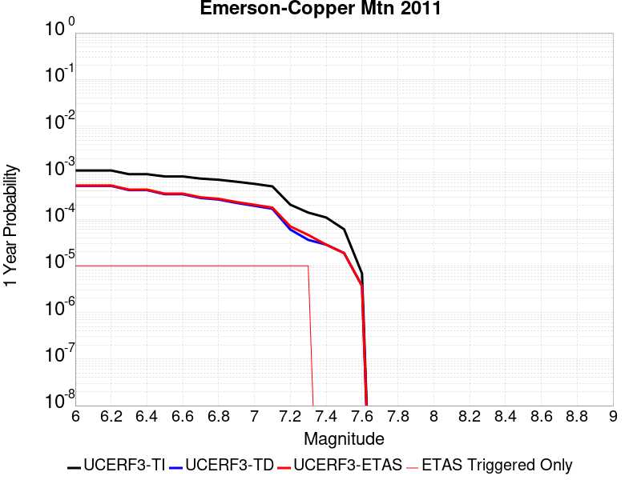 |  |

| Magnitude | 1 wk TI Prob | 1 wk TD Prob | 1 wk ETAS Prob | 1 wk ETAS/TD Gain | 1 wk ETAS Triggered Only | 1 mo TI Prob | 1 mo TD Prob | 1 mo ETAS Prob | 1 mo ETAS/TD Gain | 1 mo ETAS Triggered Only | 1 yr TI Prob | 1 yr TD Prob | 1 yr ETAS Prob | 1 yr ETAS/TD Gain | 1 yr ETAS Triggered Only | 10 yr TI Prob | 10 yr TD Prob | 10 yr ETAS Prob | 10 yr ETAS/TD Gain | 10 yr ETAS Triggered Only |
|-----|-----|-----|-----|-----|-----|-----|-----|-----|-----|-----|-----|-----|-----|-----|-----|-----|-----|-----|-----|-----|
| 6.0 | 2.1364202E-5 | 9.967999E-6 | 1.99679E-5 | 2.0032003 | 1.0E-5 | 9.1557646E-5 | 4.2719344E-5 | 5.271892E-5 | 1.234076 | 1.0E-5 | 0.0011141442 | 5.1999267E-4 | 5.2998745E-4 | 1.0192211 | 1.0E-5 | 0.011085749 | 0.0051886286 | 0.005208525 | 1.0038346 | 2.0E-5 |
| 6.1 | 2.1364202E-5 | 9.967999E-6 | 1.99679E-5 | 2.0032003 | 1.0E-5 | 9.1557646E-5 | 4.2719344E-5 | 5.271892E-5 | 1.234076 | 1.0E-5 | 0.0011141442 | 5.1999267E-4 | 5.2998745E-4 | 1.0192211 | 1.0E-5 | 0.011085749 | 0.0051886286 | 0.005208525 | 1.0038346 | 2.0E-5 |
| 6.2 | 2.1364202E-5 | 9.967999E-6 | 1.99679E-5 | 2.0032003 | 1.0E-5 | 9.1557646E-5 | 4.2719344E-5 | 5.271892E-5 | 1.234076 | 1.0E-5 | 0.0011141442 | 5.1999267E-4 | 5.2998745E-4 | 1.0192211 | 1.0E-5 | 0.011085749 | 0.0051886286 | 0.005208525 | 1.0038346 | 2.0E-5 |
| 6.3 | 1.7751237E-5 | 8.089109E-6 | 1.8089027E-5 | 2.2362201 | 1.0E-5 | 7.607452E-5 | 3.4667184E-5 | 4.4666835E-5 | 1.2884473 | 1.0E-5 | 9.258136E-4 | 4.2199748E-4 | 4.3199325E-4 | 1.0236868 | 1.0E-5 | 0.00921966 | 0.004212584 | 0.0042324997 | 1.0047277 | 2.0E-5 |
| 6.4 | 1.7751237E-5 | 8.089109E-6 | 1.8089027E-5 | 2.2362201 | 1.0E-5 | 7.607452E-5 | 3.4667184E-5 | 4.4666835E-5 | 1.2884473 | 1.0E-5 | 9.258136E-4 | 4.2199748E-4 | 4.3199325E-4 | 1.0236868 | 1.0E-5 | 0.00921966 | 0.004212584 | 0.0042324997 | 1.0047277 | 2.0E-5 |
| 6.5 | 1.5886664E-5 | 6.6037437E-6 | 1.6603677E-5 | 2.5142825 | 1.0E-5 | 6.808392E-5 | 2.830148E-5 | 3.8301197E-5 | 1.3533285 | 1.0E-5 | 8.286065E-4 | 3.4452073E-4 | 3.5451728E-4 | 1.0290158 | 1.0E-5 | 0.008255237 | 0.0034403303 | 0.0034602615 | 1.0057935 | 2.0E-5 |
| 6.6 | 1.5886664E-5 | 6.6037437E-6 | 1.6603677E-5 | 2.5142825 | 1.0E-5 | 6.808392E-5 | 2.830148E-5 | 3.8301197E-5 | 1.3533285 | 1.0E-5 | 8.286065E-4 | 3.4452073E-4 | 3.5451728E-4 | 1.0290158 | 1.0E-5 | 0.008255237 | 0.0034403303 | 0.0034602615 | 1.0057935 | 2.0E-5 |
| 6.7 | 1.428471E-5 | 5.4703055E-6 | 1.547025E-5 | 2.8280416 | 1.0E-5 | 6.121875E-5 | 2.3443978E-5 | 3.3443743E-5 | 1.4265388 | 1.0E-5 | 7.450834E-4 | 2.8539696E-4 | 2.9539413E-4 | 1.0350289 | 1.0E-5 | 0.007425902 | 0.0028506925 | 0.0028706356 | 1.0069958 | 2.0E-5 |
| 6.8 | 1.3490684E-5 | 5.0735894E-6 | 1.5073539E-5 | 2.9709811 | 1.0E-5 | 5.7815934E-5 | 2.1743796E-5 | 3.1743577E-5 | 1.4598913 | 1.0E-5 | 7.0368167E-4 | 2.6470242E-4 | 2.7469976E-4 | 1.0377682 | 1.0E-5 | 0.007014576 | 0.002644252 | 0.0026542256 | 1.0037718 | 1.0E-5 |
| 6.9 | 1.2235421E-5 | 4.289545E-6 | 1.4289501E-5 | 3.3312397 | 1.0E-5 | 5.2436466E-5 | 1.8383655E-5 | 2.838347E-5 | 1.5439515 | 1.0E-5 | 6.38227E-4 | 2.238016E-4 | 2.3379936E-4 | 1.0446725 | 1.0E-5 | 0.0063639707 | 0.0022361164 | 0.0022460942 | 1.004462 | 1.0E-5 |
| 7.0 | 1.1009851E-5 | 3.7188345E-6 | 1.3718797E-5 | 3.6890047 | 1.0E-5 | 4.7184225E-5 | 1.5937783E-5 | 2.5937625E-5 | 1.6274298 | 1.0E-5 | 5.743165E-4 | 1.9402867E-4 | 2.0402674E-4 | 1.0515288 | 1.0E-5 | 0.005728345 | 0.0019389305 | 0.0019489111 | 1.0051475 | 1.0E-5 |
| 7.1 | 9.726373E-6 | 3.2115693E-6 | 1.3211537E-5 | 4.1137323 | 1.0E-5 | 4.168379E-5 | 1.3763814E-5 | 2.3763678E-5 | 1.7265328 | 1.0E-5 | 5.07382E-4 | 1.6756494E-4 | 1.7756326E-4 | 1.0596683 | 1.0E-5 | 0.0050622504 | 0.0016747171 | 0.0016847003 | 1.0059612 | 1.0E-5 |
| 7.2 | 3.9335127E-6 | 1.1524114E-6 | 1.11524E-5 | 9.677446 | 1.0E-5 | 1.6857803E-5 | 4.9388973E-6 | 1.4938848E-5 | 3.0247335 | 1.0E-5 | 2.0522442E-4 | 6.0129474E-5 | 7.012887E-5 | 1.1662978 | 1.0E-5 | 0.00205035 | 6.01138E-4 | 6.11132E-4 | 1.0166252 | 1.0E-5 |
| 7.3 | 2.661632E-6 | 6.91098E-7 | 1.0691091E-5 | 15.469718 | 1.0E-5 | 1.14069435E-5 | 2.9618452E-6 | 1.2961816E-5 | 4.3762636 | 1.0E-5 | 1.3887069E-4 | 3.605988E-5 | 4.605952E-5 | 1.2773066 | 1.0E-5 | 0.0013878393 | 3.6054134E-4 | 3.7053772E-4 | 1.027726 | 1.0E-5 |
| 7.4 | 2.0893426E-6 | 5.4614605E-7 | 5.4614605E-7 | 1.0 | 0.0 | 8.954295E-6 | 2.340624E-6 | 2.340624E-6 | 1.0 | 0.0 | 1.0901308E-4 | 2.8496728E-5 | 2.8496728E-5 | 1.0 | 0.0 | 0.0010895962 | 2.849313E-4 | 2.849313E-4 | 1.0 | 0.0 |
| 7.5 | 1.1681728E-6 | 3.6028484E-7 | 3.6028484E-7 | 1.0 | 0.0 | 5.0064455E-6 | 1.544077E-6 | 1.544077E-6 | 1.0 | 0.0 | 6.0951766E-5 | 1.879898E-5 | 1.879898E-5 | 1.0 | 0.0 | 6.093505E-4 | 1.8797436E-4 | 1.8797436E-4 | 1.0 | 0.0 |
| 7.6 | 1.3154387E-7 | 7.1196716E-8 | 7.1196716E-8 | 1.0 | 0.0 | 5.6375933E-7 | 3.0512876E-7 | 3.0512876E-7 | 1.0 | 0.0 | 6.863748E-6 | 3.714938E-6 | 3.714938E-6 | 1.0 | 0.0 | 6.863536E-5 | 3.7148915E-5 | 3.7148915E-5 | 1.0 | 0.0 |

## Santa Susana East (connector)
*[(top)](#table-of-contents)*

| 1 Week | 1 Month | 1 Year | 10 Year |
|-----|-----|-----|-----|
|  |  | 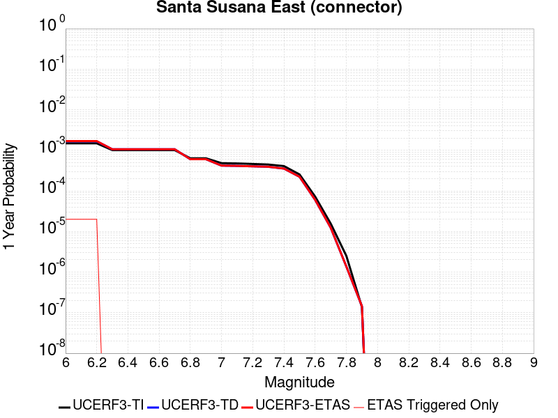 |  |

| Magnitude | 1 wk TI Prob | 1 wk TD Prob | 1 wk ETAS Prob | 1 wk ETAS/TD Gain | 1 wk ETAS Triggered Only | 1 mo TI Prob | 1 mo TD Prob | 1 mo ETAS Prob | 1 mo ETAS/TD Gain | 1 mo ETAS Triggered Only | 1 yr TI Prob | 1 yr TD Prob | 1 yr ETAS Prob | 1 yr ETAS/TD Gain | 1 yr ETAS Triggered Only | 10 yr TI Prob | 10 yr TD Prob | 10 yr ETAS Prob | 10 yr ETAS/TD Gain | 10 yr ETAS Triggered Only |
|-----|-----|-----|-----|-----|-----|-----|-----|-----|-----|-----|-----|-----|-----|-----|-----|-----|-----|-----|-----|-----|
| 6.0 | 2.858397E-5 | 3.2021693E-5 | 4.2021373E-5 | 1.3122783 | 1.0E-5 | 1.2249697E-4 | 1.3723019E-4 | 1.4722883E-4 | 1.0728602 | 1.0E-5 | 0.0014903803 | 0.00166977 | 0.0016897366 | 1.0119576 | 2.0E-5 | 0.014804244 | 0.016599316 | 0.016618984 | 1.0011848 | 2.0E-5 |
| 6.1 | 2.858397E-5 | 3.2021693E-5 | 4.2021373E-5 | 1.3122783 | 1.0E-5 | 1.2249697E-4 | 1.3723019E-4 | 1.4722883E-4 | 1.0728602 | 1.0E-5 | 0.0014903803 | 0.00166977 | 0.0016897366 | 1.0119576 | 2.0E-5 | 0.014804244 | 0.016599316 | 0.016618984 | 1.0011848 | 2.0E-5 |
| 6.2 | 2.858397E-5 | 3.2021693E-5 | 4.2021373E-5 | 1.3122783 | 1.0E-5 | 1.2249697E-4 | 1.3723019E-4 | 1.4722883E-4 | 1.0728602 | 1.0E-5 | 0.0014903803 | 0.00166977 | 0.0016897366 | 1.0119576 | 2.0E-5 | 0.014804244 | 0.016599316 | 0.016618984 | 1.0011848 | 2.0E-5 |
| 6.3 | 1.943582E-5 | 2.0367343E-5 | 2.0367343E-5 | 1.0 | 0.0 | 8.329371E-5 | 8.7286324E-5 | 8.7286324E-5 | 1.0 | 0.0 | 0.001013629 | 0.001062305 | 0.001062305 | 1.0 | 0.0 | 0.010090181 | 0.010583852 | 0.010583852 | 1.0 | 0.0 |
| 6.4 | 1.943582E-5 | 2.0367343E-5 | 2.0367343E-5 | 1.0 | 0.0 | 8.329371E-5 | 8.7286324E-5 | 8.7286324E-5 | 1.0 | 0.0 | 0.001013629 | 0.001062305 | 0.001062305 | 1.0 | 0.0 | 0.010090181 | 0.010583852 | 0.010583852 | 1.0 | 0.0 |
| 6.5 | 1.943582E-5 | 2.0367343E-5 | 2.0367343E-5 | 1.0 | 0.0 | 8.329371E-5 | 8.7286324E-5 | 8.7286324E-5 | 1.0 | 0.0 | 0.001013629 | 0.001062305 | 0.001062305 | 1.0 | 0.0 | 0.010090181 | 0.010583852 | 0.010583852 | 1.0 | 0.0 |
| 6.6 | 1.943582E-5 | 2.0367343E-5 | 2.0367343E-5 | 1.0 | 0.0 | 8.329371E-5 | 8.7286324E-5 | 8.7286324E-5 | 1.0 | 0.0 | 0.001013629 | 0.001062305 | 0.001062305 | 1.0 | 0.0 | 0.010090181 | 0.010583852 | 0.010583852 | 1.0 | 0.0 |
| 6.7 | 1.9404439E-5 | 2.0354766E-5 | 2.0354766E-5 | 1.0 | 0.0 | 8.3159226E-5 | 8.723242E-5 | 8.723242E-5 | 1.0 | 0.0 | 0.0010119933 | 0.0010616493 | 0.0010616493 | 1.0 | 0.0 | 0.010073971 | 0.010577358 | 0.010577358 | 1.0 | 0.0 |
| 6.8 | 1.2217526E-5 | 1.1593157E-5 | 1.1593157E-5 | 1.0 | 0.0 | 5.2359774E-5 | 4.9684106E-5 | 4.9684106E-5 | 1.0 | 0.0 | 6.372938E-4 | 6.047529E-4 | 6.047529E-4 | 1.0 | 0.0 | 0.0063546924 | 0.006033274 | 0.006033274 | 1.0 | 0.0 |
| 6.9 | 1.2217526E-5 | 1.1593157E-5 | 1.1593157E-5 | 1.0 | 0.0 | 5.2359774E-5 | 4.9684106E-5 | 4.9684106E-5 | 1.0 | 0.0 | 6.372938E-4 | 6.047529E-4 | 6.047529E-4 | 1.0 | 0.0 | 0.0063546924 | 0.006033274 | 0.006033274 | 1.0 | 0.0 |
| 7.0 | 9.276017E-6 | 8.059273E-6 | 8.059273E-6 | 1.0 | 0.0 | 3.9753755E-5 | 3.4539302E-5 | 3.4539302E-5 | 1.0 | 0.0 | 4.8389446E-4 | 4.2043833E-4 | 4.2043833E-4 | 1.0 | 0.0 | 0.0048284214 | 0.0041973097 | 0.0041973097 | 1.0 | 0.0 |
| 7.1 | 9.130355E-6 | 7.942446E-6 | 7.942446E-6 | 1.0 | 0.0 | 3.9129503E-5 | 3.4038632E-5 | 3.4038632E-5 | 1.0 | 0.0 | 4.7629757E-4 | 4.1434498E-4 | 4.1434498E-4 | 1.0 | 0.0 | 0.00475278 | 0.0041366047 | 0.0041366047 | 1.0 | 0.0 |
| 7.2 | 8.851015E-6 | 7.741608E-6 | 7.741608E-6 | 1.0 | 0.0 | 3.7932372E-5 | 3.317792E-5 | 3.317792E-5 | 1.0 | 0.0 | 4.6172875E-4 | 4.038697E-4 | 4.038697E-4 | 1.0 | 0.0 | 0.0046077054 | 0.0040322347 | 0.0040322347 | 1.0 | 0.0 |
| 7.3 | 8.573006E-6 | 7.5503312E-6 | 7.5503312E-6 | 1.0 | 0.0 | 3.6740938E-5 | 3.235818E-5 | 3.235818E-5 | 1.0 | 0.0 | 4.472291E-4 | 3.9389305E-4 | 3.9389305E-4 | 1.0 | 0.0 | 0.004463301 | 0.003932817 | 0.003932817 | 1.0 | 0.0 |
| 7.4 | 7.852282E-6 | 6.8178556E-6 | 6.8178556E-6 | 1.0 | 0.0 | 3.36522E-5 | 2.921907E-5 | 2.921907E-5 | 1.0 | 0.0 | 4.096385E-4 | 3.5568717E-4 | 3.5568717E-4 | 1.0 | 0.0 | 0.0040888423 | 0.0035519868 | 0.0035519868 | 1.0 | 0.0 |
| 7.5 | 4.8869324E-6 | 4.2790975E-6 | 4.2790975E-6 | 1.0 | 0.0 | 2.0943828E-5 | 1.833887E-5 | 1.833887E-5 | 1.0 | 0.0 | 2.5496128E-4 | 2.2325452E-4 | 2.2325452E-4 | 1.0 | 0.0 | 0.0025466895 | 0.00223057 | 0.00223057 | 1.0 | 0.0 |
| 7.6 | 1.3894544E-6 | 1.1568394E-6 | 1.1568394E-6 | 1.0 | 0.0 | 5.954791E-6 | 4.957875E-6 | 4.957875E-6 | 1.0 | 0.0 | 7.249717E-5 | 6.036068E-5 | 6.036068E-5 | 1.0 | 0.0 | 7.247352E-4 | 6.0346466E-4 | 6.0346466E-4 | 1.0 | 0.0 |
| 7.7 | 2.9924632E-7 | 2.3719332E-7 | 2.3719332E-7 | 1.0 | 0.0 | 1.2824837E-6 | 1.0165425E-6 | 1.0165425E-6 | 1.0 | 0.0 | 1.5614127E-5 | 1.2376341E-5 | 1.2376341E-5 | 1.0 | 0.0 | 1.5613029E-4 | 1.2375724E-4 | 1.2375724E-4 | 1.0 | 0.0 |
| 7.8 | 4.8188564E-8 | 2.6321862E-8 | 2.6321862E-8 | 1.0 | 0.0 | 2.065224E-7 | 1.12807975E-7 | 1.12807975E-7 | 1.0 | 0.0 | 2.5144072E-6 | 1.3734362E-6 | 1.3734362E-6 | 1.0 | 0.0 | 2.5143789E-5 | 1.3734286E-5 | 1.3734286E-5 | 1.0 | 0.0 |
| 7.9 | 2.6127251E-9 | 2.7681102E-9 | 2.7681102E-9 | 1.0 | 0.0 | 1.1197393E-8 | 1.186333E-8 | 1.186333E-8 | 1.0 | 0.0 | 1.3632825E-7 | 1.4443603E-7 | 1.4443603E-7 | 1.0 | 0.0 | 1.3632817E-6 | 1.4443604E-6 | 1.4443604E-6 | 1.0 | 0.0 |

## Newport-Inglewood (Offshore)
*[(top)](#table-of-contents)*

| 1 Week | 1 Month | 1 Year | 10 Year |
|-----|-----|-----|-----|
|  | 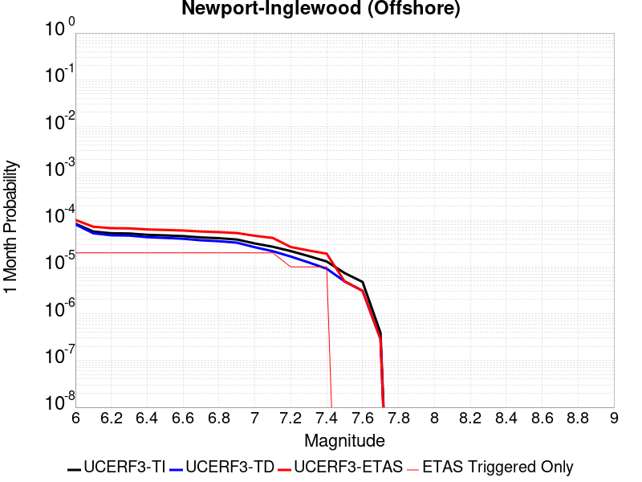 |  |  |

| Magnitude | 1 wk TI Prob | 1 wk TD Prob | 1 wk ETAS Prob | 1 wk ETAS/TD Gain | 1 wk ETAS Triggered Only | 1 mo TI Prob | 1 mo TD Prob | 1 mo ETAS Prob | 1 mo ETAS/TD Gain | 1 mo ETAS Triggered Only | 1 yr TI Prob | 1 yr TD Prob | 1 yr ETAS Prob | 1 yr ETAS/TD Gain | 1 yr ETAS Triggered Only | 10 yr TI Prob | 10 yr TD Prob | 10 yr ETAS Prob | 10 yr ETAS/TD Gain | 10 yr ETAS Triggered Only |
|-----|-----|-----|-----|-----|-----|-----|-----|-----|-----|-----|-----|-----|-----|-----|-----|-----|-----|-----|-----|-----|
| 6.0 | 1.9626508E-5 | 1.8965342E-5 | 2.8965153E-5 | 1.5272676 | 1.0E-5 | 8.411089E-5 | 8.1277576E-5 | 1.0127595E-4 | 1.2460504 | 2.0E-5 | 0.001023569 | 9.891179E-4 | 0.0010090981 | 1.0202 | 2.0E-5 | 0.010188672 | 0.009848497 | 0.0098683 | 1.0020108 | 2.0E-5 |
| 6.1 | 1.331886E-5 | 1.2218078E-5 | 2.2217957E-5 | 1.8184493 | 1.0E-5 | 5.707958E-5 | 5.2362153E-5 | 7.23611E-5 | 1.3819352 | 2.0E-5 | 6.947222E-4 | 6.3732424E-4 | 6.5731147E-4 | 1.0313612 | 2.0E-5 | 0.006925544 | 0.006355142 | 0.006375015 | 1.0031271 | 2.0E-5 |
| 6.2 | 1.2250852E-5 | 1.1076016E-5 | 2.1075904E-5 | 1.9028417 | 1.0E-5 | 5.2502597E-5 | 4.746778E-5 | 6.746683E-5 | 1.4213184 | 2.0E-5 | 6.3903164E-4 | 5.7776796E-4 | 5.977564E-4 | 1.034596 | 2.0E-5 | 0.006371971 | 0.0057627796 | 0.0057826643 | 1.0034505 | 2.0E-5 |
| 6.3 | 1.2106258E-5 | 1.0918878E-5 | 2.091877E-5 | 1.915835 | 1.0E-5 | 5.1882926E-5 | 4.6794354E-5 | 6.679342E-5 | 1.427382 | 2.0E-5 | 6.3149154E-4 | 5.695733E-4 | 5.8956194E-4 | 1.035094 | 2.0E-5 | 0.0062970007 | 0.005681252 | 0.0057011386 | 1.0035003 | 2.0E-5 |
| 6.4 | 1.1348758E-5 | 1.0109348E-5 | 2.0109248E-5 | 1.9891734 | 1.0E-5 | 4.8636626E-5 | 4.3325064E-5 | 6.3324194E-5 | 1.4616065 | 2.0E-5 | 5.919901E-4 | 5.2735576E-4 | 5.4734526E-4 | 1.0379051 | 2.0E-5 | 0.005904155 | 0.0052611395 | 0.0052810344 | 1.0037814 | 2.0E-5 |
| 6.5 | 1.100837E-5 | 9.743376E-6 | 1.9743278E-5 | 2.0263283 | 1.0E-5 | 4.7177873E-5 | 4.175666E-5 | 6.1755825E-5 | 1.4789455 | 2.0E-5 | 5.7423924E-4 | 5.082695E-4 | 5.282594E-4 | 1.0393292 | 2.0E-5 | 0.005727576 | 0.005071162 | 0.0050910604 | 1.0039239 | 2.0E-5 |
| 6.6 | 1.0634696E-5 | 9.34553E-6 | 1.9345436E-5 | 2.0700202 | 1.0E-5 | 4.557647E-5 | 4.0051662E-5 | 6.005086E-5 | 1.499335 | 2.0E-5 | 5.5475225E-4 | 4.875206E-4 | 5.0751085E-4 | 1.041004 | 2.0E-5 | 0.0055336943 | 0.0048645977 | 0.0048845005 | 1.0040914 | 2.0E-5 |
| 6.7 | 9.9780855E-6 | 8.667898E-6 | 1.8667812E-5 | 2.1536722 | 1.0E-5 | 4.276252E-5 | 3.7147613E-5 | 5.714687E-5 | 1.5383726 | 2.0E-5 | 5.205093E-4 | 4.5217903E-4 | 4.7216998E-4 | 1.0442103 | 2.0E-5 | 0.0051929182 | 0.0045126686 | 0.0045325784 | 1.0044119 | 2.0E-5 |
| 6.8 | 9.59546E-6 | 8.272933E-6 | 1.827285E-5 | 2.2087512 | 1.0E-5 | 4.1122752E-5 | 3.545495E-5 | 5.545424E-5 | 1.5640762 | 2.0E-5 | 5.0055445E-4 | 4.3157916E-4 | 4.5157052E-4 | 1.0463214 | 2.0E-5 | 0.004994285 | 0.004307486 | 0.0043273997 | 1.004623 | 2.0E-5 |
| 6.9 | 9.000614E-6 | 7.706823E-6 | 1.7706747E-5 | 2.2975414 | 1.0E-5 | 3.857349E-5 | 3.3028828E-5 | 5.302817E-5 | 1.6055117 | 2.0E-5 | 4.6953102E-4 | 4.0205245E-4 | 4.220444E-4 | 1.0497247 | 2.0E-5 | 0.004685402 | 0.0040133223 | 0.004033242 | 1.0049634 | 2.0E-5 |
| 7.0 | 7.4070194E-6 | 6.148865E-6 | 1.6148802E-5 | 2.6263065 | 1.0E-5 | 3.1743984E-5 | 2.6352012E-5 | 4.6351484E-5 | 1.7589353 | 2.0E-5 | 3.8641447E-4 | 3.2078868E-4 | 3.4078225E-4 | 1.0623263 | 2.0E-5 | 0.0038574322 | 0.0032032758 | 0.0032232117 | 1.0062236 | 2.0E-5 |
| 7.1 | 6.299615E-6 | 5.0565613E-6 | 1.5056511E-5 | 2.9776185 | 1.0E-5 | 2.699807E-5 | 2.1670798E-5 | 4.1670366E-5 | 1.9228809 | 2.0E-5 | 3.2865192E-4 | 2.6381016E-4 | 2.8380487E-4 | 1.0757921 | 2.0E-5 | 0.003281663 | 0.0026349847 | 0.002654932 | 1.0075701 | 2.0E-5 |
| 7.2 | 5.096653E-6 | 3.892733E-6 | 3.892733E-6 | 1.0 | 0.0 | 2.1842614E-5 | 1.6683034E-5 | 2.6682868E-5 | 1.5994014 | 1.0E-5 | 2.6590136E-4 | 2.0309711E-4 | 2.1309509E-4 | 1.0492275 | 1.0E-5 | 0.0026558342 | 0.0020291263 | 0.0020391059 | 1.0049182 | 1.0E-5 |
| 7.3 | 3.9753018E-6 | 2.9098787E-6 | 2.9098787E-6 | 1.0 | 0.0 | 1.7036897E-5 | 1.24708495E-5 | 2.2470726E-5 | 1.80186 | 1.0E-5 | 2.0740448E-4 | 1.518221E-4 | 1.6182057E-4 | 1.0658566 | 1.0E-5 | 0.00207211 | 0.0015171919 | 0.0015271767 | 1.0065811 | 1.0E-5 |
| 7.4 | 3.0568392E-6 | 2.1449732E-6 | 2.1449732E-6 | 1.0 | 0.0 | 1.3100675E-5 | 9.19271E-6 | 1.919262E-5 | 2.0878084 | 1.0E-5 | 1.5948903E-4 | 1.11915564E-4 | 1.2191445E-4 | 1.0893431 | 1.0E-5 | 0.0015937461 | 0.0011185983 | 0.0011285872 | 1.0089297 | 1.0E-5 |
| 7.5 | 1.7279019E-6 | 1.1469651E-6 | 1.1469651E-6 | 1.0 | 0.0 | 7.405273E-6 | 4.9155556E-6 | 4.9155556E-6 | 1.0 | 0.0 | 9.015547E-5 | 5.9845286E-5 | 5.9845286E-5 | 1.0 | 0.0 | 9.01189E-4 | 5.982956E-4 | 5.982956E-4 | 1.0 | 0.0 |
| 7.6 | 1.1156416E-6 | 7.222962E-7 | 7.222962E-7 | 1.0 | 0.0 | 4.7813123E-6 | 3.0955514E-6 | 3.0955514E-6 | 1.0 | 0.0 | 5.821092E-5 | 3.768771E-5 | 3.768771E-5 | 1.0 | 0.0 | 5.8195676E-4 | 3.7681553E-4 | 3.7681553E-4 | 1.0 | 0.0 |
| 7.7 | 9.117973E-8 | 6.7342256E-8 | 6.7342256E-8 | 1.0 | 0.0 | 3.907702E-7 | 2.8860964E-7 | 2.8860964E-7 | 1.0 | 0.0 | 4.757617E-6 | 3.5138169E-6 | 3.5138169E-6 | 1.0 | 0.0 | 4.7575148E-5 | 3.5137644E-5 | 3.5137644E-5 | 1.0 | 0.0 |

## San Jacinto (Coyote Creek)
*[(top)](#table-of-contents)*

| 1 Week | 1 Month | 1 Year | 10 Year |
|-----|-----|-----|-----|
|  |  |  |  |

| Magnitude | 1 wk TI Prob | 1 wk TD Prob | 1 wk ETAS Prob | 1 wk ETAS/TD Gain | 1 wk ETAS Triggered Only | 1 mo TI Prob | 1 mo TD Prob | 1 mo ETAS Prob | 1 mo ETAS/TD Gain | 1 mo ETAS Triggered Only | 1 yr TI Prob | 1 yr TD Prob | 1 yr ETAS Prob | 1 yr ETAS/TD Gain | 1 yr ETAS Triggered Only | 10 yr TI Prob | 10 yr TD Prob | 10 yr ETAS Prob | 10 yr ETAS/TD Gain | 10 yr ETAS Triggered Only |
|-----|-----|-----|-----|-----|-----|-----|-----|-----|-----|-----|-----|-----|-----|-----|-----|-----|-----|-----|-----|-----|
| 6.0 | 2.7374346E-5 | 2.41444E-5 | 3.4144156E-5 | 1.4141648 | 1.0E-5 | 1.1731335E-4 | 1.034719E-4 | 1.1347087E-4 | 1.0966346 | 1.0E-5 | 0.0014273542 | 0.001259045 | 0.0012790199 | 1.0158651 | 2.0E-5 | 0.01418221 | 0.012928193 | 0.012947935 | 1.001527 | 2.0E-5 |
| 6.1 | 2.7374346E-5 | 2.41444E-5 | 3.4144156E-5 | 1.4141648 | 1.0E-5 | 1.1731335E-4 | 1.034719E-4 | 1.1347087E-4 | 1.0966346 | 1.0E-5 | 0.0014273542 | 0.001259045 | 0.0012790199 | 1.0158651 | 2.0E-5 | 0.01418221 | 0.012928193 | 0.012947935 | 1.001527 | 2.0E-5 |
| 6.2 | 2.7374346E-5 | 2.41444E-5 | 3.4144156E-5 | 1.4141648 | 1.0E-5 | 1.1731335E-4 | 1.034719E-4 | 1.1347087E-4 | 1.0966346 | 1.0E-5 | 0.0014273542 | 0.001259045 | 0.0012790199 | 1.0158651 | 2.0E-5 | 0.01418221 | 0.012928193 | 0.012947935 | 1.001527 | 2.0E-5 |
| 6.3 | 2.7374346E-5 | 2.41444E-5 | 3.4144156E-5 | 1.4141648 | 1.0E-5 | 1.1731335E-4 | 1.034719E-4 | 1.1347087E-4 | 1.0966346 | 1.0E-5 | 0.0014273542 | 0.001259045 | 0.0012790199 | 1.0158651 | 2.0E-5 | 0.01418221 | 0.012928193 | 0.012947935 | 1.001527 | 2.0E-5 |
| 6.4 | 2.7374346E-5 | 2.41444E-5 | 3.4144156E-5 | 1.4141648 | 1.0E-5 | 1.1731335E-4 | 1.034719E-4 | 1.1347087E-4 | 1.0966346 | 1.0E-5 | 0.0014273542 | 0.001259045 | 0.0012790199 | 1.0158651 | 2.0E-5 | 0.01418221 | 0.012928193 | 0.012947935 | 1.001527 | 2.0E-5 |
| 6.5 | 2.7282445E-5 | 2.4030476E-5 | 3.4030236E-5 | 1.4161283 | 1.0E-5 | 1.16919524E-4 | 1.0298371E-4 | 1.1298268E-4 | 1.0970927 | 1.0E-5 | 0.0014225657 | 0.001253108 | 0.001273083 | 1.0159403 | 2.0E-5 | 0.014134934 | 0.012869521 | 0.012889263 | 1.0015341 | 2.0E-5 |
| 6.6 | 2.7282445E-5 | 2.4030476E-5 | 3.4030236E-5 | 1.4161283 | 1.0E-5 | 1.16919524E-4 | 1.0298371E-4 | 1.1298268E-4 | 1.0970927 | 1.0E-5 | 0.0014225657 | 0.001253108 | 0.001273083 | 1.0159403 | 2.0E-5 | 0.014134934 | 0.012869521 | 0.012889263 | 1.0015341 | 2.0E-5 |
| 6.7 | 2.7216198E-5 | 2.3955597E-5 | 3.395536E-5 | 1.417429 | 1.0E-5 | 1.1663563E-4 | 1.02662816E-4 | 1.1266179E-4 | 1.0973963 | 1.0E-5 | 0.0014191137 | 0.0012492058 | 0.0012691808 | 1.0159901 | 2.0E-5 | 0.014100855 | 0.012830933 | 0.012850676 | 1.0015388 | 2.0E-5 |
| 6.8 | 2.7078617E-5 | 2.3872815E-5 | 3.3872577E-5 | 1.4188765 | 1.0E-5 | 1.1604605E-4 | 1.0230807E-4 | 1.1230705E-4 | 1.097734 | 1.0E-5 | 0.001411945 | 0.0012448917 | 0.0012648668 | 1.0160457 | 2.0E-5 | 0.014030075 | 0.012788081 | 0.012807825 | 1.001544 | 2.0E-5 |
| 6.9 | 2.6982952E-5 | 2.3792329E-5 | 3.379209E-5 | 1.4202936 | 1.0E-5 | 1.15636096E-4 | 1.0196315E-4 | 1.1196214E-4 | 1.0980647 | 1.0E-5 | 0.0014069602 | 0.0012406971 | 0.0012606723 | 1.0160999 | 2.0E-5 | 0.013980856 | 0.012746377 | 0.012766122 | 1.0015491 | 2.0E-5 |
| 7.0 | 2.6449972E-5 | 2.3369357E-5 | 3.3369124E-5 | 1.4279008 | 1.0E-5 | 1.1335209E-4 | 1.0015055E-4 | 1.1014955E-4 | 1.0998397 | 1.0E-5 | 0.001379188 | 0.0012186535 | 0.0012386292 | 1.0163915 | 2.0E-5 | 0.0137065975 | 0.012527731 | 0.012547481 | 1.0015764 | 2.0E-5 |
| 7.1 | 2.6257849E-5 | 2.3195396E-5 | 3.3195163E-5 | 1.43111 | 1.0E-5 | 1.1252879E-4 | 9.940507E-5 | 1.0940407E-4 | 1.1005884 | 1.0E-5 | 0.0013691769 | 0.0012095873 | 0.0012295631 | 1.0165145 | 2.0E-5 | 0.013607717 | 0.012437659 | 0.012457411 | 1.001588 | 2.0E-5 |
| 7.2 | 2.5270041E-5 | 2.2390155E-5 | 3.2389933E-5 | 1.4466149 | 1.0E-5 | 1.0829568E-4 | 9.5954296E-5 | 1.0595333E-4 | 1.1042063 | 1.0E-5 | 0.0013177024 | 0.0011676198 | 0.0011875965 | 1.0171089 | 2.0E-5 | 0.013099162 | 0.012018789 | 0.0120385485 | 1.001644 | 2.0E-5 |
| 7.3 | 2.339701E-5 | 2.1122027E-5 | 3.1121817E-5 | 1.4734294 | 1.0E-5 | 1.0026905E-4 | 9.051985E-5 | 1.0051894E-4 | 1.110463 | 1.0E-5 | 0.001220092 | 0.001101524 | 0.0011215019 | 1.0181366 | 2.0E-5 | 0.012134149 | 0.011357641 | 0.011377414 | 1.0017409 | 2.0E-5 |
| 7.4 | 2.296333E-5 | 2.0852396E-5 | 3.085219E-5 | 1.4795512 | 1.0E-5 | 9.841056E-5 | 8.936436E-5 | 9.936347E-5 | 1.1118914 | 1.0E-5 | 0.0011974899 | 0.0010874701 | 0.0011074484 | 1.0183713 | 2.0E-5 | 0.011910575 | 0.011216752 | 0.011236528 | 1.0017631 | 2.0E-5 |
| 7.5 | 2.2188895E-5 | 2.037534E-5 | 3.0375139E-5 | 1.4907793 | 1.0E-5 | 9.50918E-5 | 8.731998E-5 | 9.7319105E-5 | 1.1145114 | 1.0E-5 | 0.0011571277 | 0.0010626042 | 0.0010825831 | 1.0188017 | 2.0E-5 | 0.011511209 | 0.010966368 | 0.010986148 | 1.0018038 | 2.0E-5 |
| 7.6 | 2.0013189E-5 | 1.8961666E-5 | 2.8961476E-5 | 1.5273699 | 1.0E-5 | 8.5767984E-5 | 8.126176E-5 | 9.126095E-5 | 1.1230491 | 1.0E-5 | 0.001043725 | 9.889146E-4 | 0.0010088949 | 1.0202042 | 2.0E-5 | 0.010388365 | 0.01022437 | 0.010244166 | 1.0019361 | 2.0E-5 |
| 7.7 | 1.7230794E-5 | 1.6743043E-5 | 2.6742875E-5 | 1.597253 | 1.0E-5 | 7.384417E-5 | 7.175393E-5 | 8.175321E-5 | 1.1393552 | 1.0E-5 | 8.986819E-4 | 8.732547E-4 | 8.932373E-4 | 1.0228828 | 2.0E-5 | 0.008950562 | 0.009062919 | 0.009082737 | 1.0021868 | 2.0E-5 |
| 7.8 | 1.4478809E-5 | 1.499039E-5 | 2.499024E-5 | 1.6670841 | 1.0E-5 | 6.205057E-5 | 6.424295E-5 | 7.424231E-5 | 1.1556491 | 1.0E-5 | 7.552038E-4 | 7.8187784E-4 | 8.018622E-4 | 1.0255594 | 2.0E-5 | 0.0075264242 | 0.008141387 | 0.008161224 | 1.0024366 | 2.0E-5 |
| 7.9 | 1.1114467E-5 | 1.1644517E-5 | 2.16444E-5 | 1.8587633 | 1.0E-5 | 4.7632562E-5 | 4.990412E-5 | 5.990362E-5 | 1.2003742 | 1.0E-5 | 5.797721E-4 | 6.074139E-4 | 6.274017E-4 | 1.0329065 | 2.0E-5 | 0.0057826187 | 0.006380353 | 0.0064002257 | 1.0031146 | 2.0E-5 |
| 8.0 | 9.327402E-6 | 9.8986575E-6 | 1.9898558E-5 | 2.010228 | 1.0E-5 | 3.9973966E-5 | 4.2422133E-5 | 5.2421707E-5 | 1.235716 | 1.0E-5 | 4.8657437E-4 | 5.163676E-4 | 5.363573E-4 | 1.0387121 | 2.0E-5 | 0.0048551033 | 0.00544994 | 0.005469831 | 1.0036497 | 2.0E-5 |
| 8.1 | 7.0235833E-6 | 6.826985E-6 | 1.6826916E-5 | 2.4647655 | 1.0E-5 | 3.0100724E-5 | 2.9258183E-5 | 3.9257888E-5 | 1.3417747 | 1.0E-5 | 3.664147E-4 | 3.5616063E-4 | 3.7615353E-4 | 1.0561345 | 2.0E-5 | 0.003658111 | 0.0037874572 | 0.0038073815 | 1.0052606 | 2.0E-5 |
| 8.2 | 2.0358202E-6 | 8.9912584E-7 | 8.9912584E-7 | 1.0 | 0.0 | 8.724915E-6 | 3.853391E-6 | 3.853391E-6 | 1.0 | 0.0 | 1.06220665E-4 | 4.6914047E-5 | 4.6914047E-5 | 1.0 | 0.0 | 0.001061699 | 5.3239096E-4 | 5.3239096E-4 | 1.0 | 0.0 |
| 8.3 | 2.0051264E-7 | 6.61379E-8 | 6.61379E-8 | 1.0 | 0.0 | 8.5933965E-7 | 2.8344812E-7 | 2.8344812E-7 | 1.0 | 0.0 | 1.046241E-5 | 3.450976E-6 | 3.450976E-6 | 1.0 | 0.0 | 1.0461917E-4 | 4.0120205E-5 | 4.0120205E-5 | 1.0 | 0.0 |

## Redondo Canyon alt 1
*[(top)](#table-of-contents)*

| 1 Week | 1 Month | 1 Year | 10 Year |
|-----|-----|-----|-----|
|  |  |  |  |

| Magnitude | 1 wk TI Prob | 1 wk TD Prob | 1 wk ETAS Prob | 1 wk ETAS/TD Gain | 1 wk ETAS Triggered Only | 1 mo TI Prob | 1 mo TD Prob | 1 mo ETAS Prob | 1 mo ETAS/TD Gain | 1 mo ETAS Triggered Only | 1 yr TI Prob | 1 yr TD Prob | 1 yr ETAS Prob | 1 yr ETAS/TD Gain | 1 yr ETAS Triggered Only | 10 yr TI Prob | 10 yr TD Prob | 10 yr ETAS Prob | 10 yr ETAS/TD Gain | 10 yr ETAS Triggered Only |
|-----|-----|-----|-----|-----|-----|-----|-----|-----|-----|-----|-----|-----|-----|-----|-----|-----|-----|-----|-----|-----|
| 6.0 | 1.0346246E-5 | 1.0981325E-5 | 3.0981108E-5 | 2.8212538 | 2.0E-5 | 4.43403E-5 | 4.7062418E-5 | 6.7061475E-5 | 1.4249475 | 2.0E-5 | 5.3970946E-4 | 5.729132E-4 | 5.929018E-4 | 1.0348893 | 2.0E-5 | 0.0053840056 | 0.0057221013 | 0.005741987 | 1.0034752 | 2.0E-5 |
| 6.1 | 1.0346246E-5 | 1.0981325E-5 | 3.0981108E-5 | 2.8212538 | 2.0E-5 | 4.43403E-5 | 4.7062418E-5 | 6.7061475E-5 | 1.4249475 | 2.0E-5 | 5.3970946E-4 | 5.729132E-4 | 5.929018E-4 | 1.0348893 | 2.0E-5 | 0.0053840056 | 0.0057221013 | 0.005741987 | 1.0034752 | 2.0E-5 |
| 6.2 | 1.0346246E-5 | 1.0981325E-5 | 3.0981108E-5 | 2.8212538 | 2.0E-5 | 4.43403E-5 | 4.7062418E-5 | 6.7061475E-5 | 1.4249475 | 2.0E-5 | 5.3970946E-4 | 5.729132E-4 | 5.929018E-4 | 1.0348893 | 2.0E-5 | 0.0053840056 | 0.0057221013 | 0.005741987 | 1.0034752 | 2.0E-5 |
| 6.3 | 3.2052794E-6 | 3.2360983E-6 | 2.3236034E-5 | 7.180262 | 2.0E-5 | 1.373684E-5 | 1.3868941E-5 | 3.3868662E-5 | 2.4420512 | 2.0E-5 | 1.6723319E-4 | 1.6884525E-4 | 1.8884188E-4 | 1.1184317 | 2.0E-5 | 0.001671074 | 0.0016875593 | 0.0017075256 | 1.0118314 | 2.0E-5 |
| 6.4 | 3.2052794E-6 | 3.2360983E-6 | 2.3236034E-5 | 7.180262 | 2.0E-5 | 1.373684E-5 | 1.3868941E-5 | 3.3868662E-5 | 2.4420512 | 2.0E-5 | 1.6723319E-4 | 1.6884525E-4 | 1.8884188E-4 | 1.1184317 | 2.0E-5 | 0.001671074 | 0.0016875593 | 0.0017075256 | 1.0118314 | 2.0E-5 |
| 6.5 | 3.2052794E-6 | 3.2360983E-6 | 2.3236034E-5 | 7.180262 | 2.0E-5 | 1.373684E-5 | 1.3868941E-5 | 3.3868662E-5 | 2.4420512 | 2.0E-5 | 1.6723319E-4 | 1.6884525E-4 | 1.8884188E-4 | 1.1184317 | 2.0E-5 | 0.001671074 | 0.0016875593 | 0.0017075256 | 1.0118314 | 2.0E-5 |
| 6.6 | 1.948328E-6 | 1.8288489E-6 | 1.1828831E-5 | 6.4679103 | 1.0E-5 | 8.349951E-6 | 7.837909E-6 | 1.783783E-5 | 2.2758405 | 1.0E-5 | 1.016559E-4 | 9.5423864E-5 | 1.0542291E-4 | 1.1047856 | 1.0E-5 | 0.0010160941 | 9.5397583E-4 | 9.639663E-4 | 1.0104724 | 1.0E-5 |
| 6.7 | 1.948328E-6 | 1.8288489E-6 | 1.1828831E-5 | 6.4679103 | 1.0E-5 | 8.349951E-6 | 7.837909E-6 | 1.783783E-5 | 2.2758405 | 1.0E-5 | 1.016559E-4 | 9.5423864E-5 | 1.0542291E-4 | 1.1047856 | 1.0E-5 | 0.0010160941 | 9.5397583E-4 | 9.639663E-4 | 1.0104724 | 1.0E-5 |
| 6.8 | 1.1278219E-6 | 9.032885E-7 | 9.032885E-7 | 1.0 | 0.0 | 4.8335132E-6 | 3.871233E-6 | 3.871233E-6 | 1.0 | 0.0 | 5.8846435E-5 | 4.713167E-5 | 4.713167E-5 | 1.0 | 0.0 | 5.8830855E-4 | 4.7125877E-4 | 4.7125877E-4 | 1.0 | 0.0 |
| 6.9 | 1.1278219E-6 | 9.032885E-7 | 9.032885E-7 | 1.0 | 0.0 | 4.8335132E-6 | 3.871233E-6 | 3.871233E-6 | 1.0 | 0.0 | 5.8846435E-5 | 4.713167E-5 | 4.713167E-5 | 1.0 | 0.0 | 5.8830855E-4 | 4.7125877E-4 | 4.7125877E-4 | 1.0 | 0.0 |
| 7.0 | 1.1278219E-6 | 9.032885E-7 | 9.032885E-7 | 1.0 | 0.0 | 4.8335132E-6 | 3.871233E-6 | 3.871233E-6 | 1.0 | 0.0 | 5.8846435E-5 | 4.713167E-5 | 4.713167E-5 | 1.0 | 0.0 | 5.8830855E-4 | 4.7125877E-4 | 4.7125877E-4 | 1.0 | 0.0 |
| 7.1 | 1.0545139E-6 | 8.5690925E-7 | 8.5690925E-7 | 1.0 | 0.0 | 4.5193374E-6 | 3.6724655E-6 | 3.6724655E-6 | 1.0 | 0.0 | 5.5021545E-5 | 4.4711775E-5 | 4.4711775E-5 | 1.0 | 0.0 | 5.500792E-4 | 4.4706953E-4 | 4.4706953E-4 | 1.0 | 0.0 |
| 7.2 | 1.0545139E-6 | 8.5690925E-7 | 8.5690925E-7 | 1.0 | 0.0 | 4.5193374E-6 | 3.6724655E-6 | 3.6724655E-6 | 1.0 | 0.0 | 5.5021545E-5 | 4.4711775E-5 | 4.4711775E-5 | 1.0 | 0.0 | 5.500792E-4 | 4.4706953E-4 | 4.4706953E-4 | 1.0 | 0.0 |
| 7.3 | 9.505161E-8 | 5.8955752E-8 | 5.8955752E-8 | 1.0 | 0.0 | 4.0736398E-7 | 2.526675E-7 | 2.526675E-7 | 1.0 | 0.0 | 4.959645E-6 | 3.0762235E-6 | 3.0762235E-6 | 1.0 | 0.0 | 4.9595343E-5 | 3.076193E-5 | 3.076193E-5 | 1.0 | 0.0 |
| 7.4 | 3.9520785E-8 | 2.6987088E-8 | 2.6987088E-8 | 1.0 | 0.0 | 1.6937479E-7 | 1.1565894E-7 | 1.1565894E-7 | 1.0 | 0.0 | 2.062136E-6 | 1.408147E-6 | 1.408147E-6 | 1.0 | 0.0 | 2.062117E-5 | 1.4081407E-5 | 1.4081407E-5 | 1.0 | 0.0 |
| 7.5 | 5.6133214E-9 | 3.7367687E-9 | 3.7367687E-9 | 1.0 | 0.0 | 2.4057092E-8 | 1.6014722E-8 | 1.6014722E-8 | 1.0 | 0.0 | 2.9289507E-7 | 1.9497922E-7 | 1.9497922E-7 | 1.0 | 0.0 | 2.9289467E-6 | 1.9497909E-6 | 1.9497909E-6 | 1.0 | 0.0 |
| 7.6 | 4.1064334E-9 | 2.5957205E-9 | 2.5957205E-9 | 1.0 | 0.0 | 1.7599E-8 | 1.1124517E-8 | 1.1124517E-8 | 1.0 | 0.0 | 2.142678E-7 | 1.3544098E-7 | 1.3544098E-7 | 1.0 | 0.0 | 2.1426758E-6 | 1.3544093E-6 | 1.3544093E-6 | 1.0 | 0.0 |
| 7.7 | 1.361975E-9 | 6.360521E-10 | 6.360521E-10 | 1.0 | 0.0 | 5.8370353E-9 | 2.7259377E-9 | 2.7259377E-9 | 1.0 | 0.0 | 7.1065905E-8 | 3.318829E-8 | 3.318829E-8 | 1.0 | 0.0 | 7.106588E-7 | 3.3188286E-7 | 3.3188286E-7 | 1.0 | 0.0 |
| 7.8 | 1.361975E-9 | 6.360521E-10 | 6.360521E-10 | 1.0 | 0.0 | 5.8370353E-9 | 2.7259377E-9 | 2.7259377E-9 | 1.0 | 0.0 | 7.1065905E-8 | 3.318829E-8 | 3.318829E-8 | 1.0 | 0.0 | 7.106588E-7 | 3.3188286E-7 | 3.3188286E-7 | 1.0 | 0.0 |

## Great Valley 08 (Quinto)
*[(top)](#table-of-contents)*

| 1 Week | 1 Month | 1 Year | 10 Year |
|-----|-----|-----|-----|
|  |  |  |  |

| Magnitude | 1 wk TI Prob | 1 wk TD Prob | 1 wk ETAS Prob | 1 wk ETAS/TD Gain | 1 wk ETAS Triggered Only | 1 mo TI Prob | 1 mo TD Prob | 1 mo ETAS Prob | 1 mo ETAS/TD Gain | 1 mo ETAS Triggered Only | 1 yr TI Prob | 1 yr TD Prob | 1 yr ETAS Prob | 1 yr ETAS/TD Gain | 1 yr ETAS Triggered Only | 10 yr TI Prob | 10 yr TD Prob | 10 yr ETAS Prob | 10 yr ETAS/TD Gain | 10 yr ETAS Triggered Only |
|-----|-----|-----|-----|-----|-----|-----|-----|-----|-----|-----|-----|-----|-----|-----|-----|-----|-----|-----|-----|-----|
| 6.0 | 7.737697E-6 | 8.253038E-6 | 8.253038E-6 | 1.0 | 0.0 | 3.3161137E-5 | 3.536979E-5 | 3.536979E-5 | 1.0 | 0.0 | 4.0366207E-4 | 4.3056096E-4 | 4.3056096E-4 | 1.0 | 0.0 | 0.004029296 | 0.0042991205 | 0.0043190345 | 1.0046321 | 2.0E-5 |
| 6.1 | 7.737697E-6 | 8.253038E-6 | 8.253038E-6 | 1.0 | 0.0 | 3.3161137E-5 | 3.536979E-5 | 3.536979E-5 | 1.0 | 0.0 | 4.0366207E-4 | 4.3056096E-4 | 4.3056096E-4 | 1.0 | 0.0 | 0.004029296 | 0.0042991205 | 0.0043190345 | 1.0046321 | 2.0E-5 |
| 6.2 | 7.737697E-6 | 8.253038E-6 | 8.253038E-6 | 1.0 | 0.0 | 3.3161137E-5 | 3.536979E-5 | 3.536979E-5 | 1.0 | 0.0 | 4.0366207E-4 | 4.3056096E-4 | 4.3056096E-4 | 1.0 | 0.0 | 0.004029296 | 0.0042991205 | 0.0043190345 | 1.0046321 | 2.0E-5 |
| 6.3 | 5.374012E-6 | 5.7505736E-6 | 5.7505736E-6 | 1.0 | 0.0 | 2.3031276E-5 | 2.4645145E-5 | 2.4645145E-5 | 1.0 | 0.0 | 2.803697E-4 | 3.0002446E-4 | 3.0002446E-4 | 1.0 | 0.0 | 0.0028001624 | 0.0029972875 | 0.0030072576 | 1.0033263 | 1.0E-5 |
| 6.4 | 5.374012E-6 | 5.7505736E-6 | 5.7505736E-6 | 1.0 | 0.0 | 2.3031276E-5 | 2.4645145E-5 | 2.4645145E-5 | 1.0 | 0.0 | 2.803697E-4 | 3.0002446E-4 | 3.0002446E-4 | 1.0 | 0.0 | 0.0028001624 | 0.0029972875 | 0.0030072576 | 1.0033263 | 1.0E-5 |
| 6.5 | 3.65427E-6 | 3.941324E-6 | 3.941324E-6 | 1.0 | 0.0 | 1.5661062E-5 | 1.689132E-5 | 1.689132E-5 | 1.0 | 0.0 | 1.9065675E-4 | 2.0563944E-4 | 2.0563944E-4 | 1.0 | 0.0 | 0.0019049325 | 0.0020551833 | 0.0020551833 | 1.0 | 0.0 |
| 6.6 | 3.6143538E-6 | 3.8985104E-6 | 3.8985104E-6 | 1.0 | 0.0 | 1.5489995E-5 | 1.6707834E-5 | 1.6707834E-5 | 1.0 | 0.0 | 1.8857437E-4 | 2.0340596E-4 | 2.0340596E-4 | 1.0 | 0.0 | 0.0018841444 | 0.0020328893 | 0.0020328893 | 1.0 | 0.0 |
| 6.7 | 2.4821015E-6 | 2.6857067E-6 | 2.6857067E-6 | 1.0 | 0.0 | 1.0637535E-5 | 1.1510153E-5 | 1.1510153E-5 | 1.0 | 0.0 | 1.2950429E-4 | 1.4013276E-4 | 1.4013276E-4 | 1.0 | 0.0 | 0.0012942884 | 0.0014009989 | 0.0014009989 | 1.0 | 0.0 |
| 6.8 | 4.7110538E-7 | 5.193021E-7 | 5.193021E-7 | 1.0 | 0.0 | 2.0190216E-6 | 2.2255786E-6 | 2.2255786E-6 | 1.0 | 0.0 | 2.458131E-5 | 2.70961E-5 | 2.70961E-5 | 1.0 | 0.0 | 2.457859E-4 | 2.7092977E-4 | 2.7092977E-4 | 1.0 | 0.0 |
| 6.9 | 3.958685E-7 | 4.3703452E-7 | 4.3703452E-7 | 1.0 | 0.0 | 1.6965782E-6 | 1.8730038E-6 | 1.8730038E-6 | 1.0 | 0.0 | 2.0655643E-5 | 2.28036E-5 | 2.28036E-5 | 1.0 | 0.0 | 2.0653724E-4 | 2.2801422E-4 | 2.2801422E-4 | 1.0 | 0.0 |
| 7.0 | 2.70294E-7 | 2.9920008E-7 | 2.9920008E-7 | 1.0 | 0.0 | 1.1584025E-6 | 1.2822856E-6 | 1.2822856E-6 | 1.0 | 0.0 | 1.4103458E-5 | 1.5611728E-5 | 1.5611728E-5 | 1.0 | 0.0 | 1.4102564E-4 | 1.5610759E-4 | 1.5610759E-4 | 1.0 | 0.0 |
| 7.1 | 1.4828602E-7 | 1.6469107E-7 | 1.6469107E-7 | 1.0 | 0.0 | 6.3551136E-7 | 7.058187E-7 | 7.058187E-7 | 1.0 | 0.0 | 7.737323E-6 | 8.593317E-6 | 8.593317E-6 | 1.0 | 0.0 | 7.737054E-5 | 8.593065E-5 | 8.593065E-5 | 1.0 | 0.0 |

## West Napa 2011 CFM
*[(top)](#table-of-contents)*

| 1 Week | 1 Month | 1 Year | 10 Year |
|-----|-----|-----|-----|
|  |  |  |  |

| Magnitude | 1 wk TI Prob | 1 wk TD Prob | 1 wk ETAS Prob | 1 wk ETAS/TD Gain | 1 wk ETAS Triggered Only | 1 mo TI Prob | 1 mo TD Prob | 1 mo ETAS Prob | 1 mo ETAS/TD Gain | 1 mo ETAS Triggered Only | 1 yr TI Prob | 1 yr TD Prob | 1 yr ETAS Prob | 1 yr ETAS/TD Gain | 1 yr ETAS Triggered Only | 10 yr TI Prob | 10 yr TD Prob | 10 yr ETAS Prob | 10 yr ETAS/TD Gain | 10 yr ETAS Triggered Only |
|-----|-----|-----|-----|-----|-----|-----|-----|-----|-----|-----|-----|-----|-----|-----|-----|-----|-----|-----|-----|-----|
| 6.0 | 3.773104E-5 | 4.4528504E-5 | 6.4527616E-5 | 1.4491305 | 2.0E-5 | 1.6169442E-4 | 1.9082428E-4 | 2.1082046E-4 | 1.1047884 | 2.0E-5 | 0.001966852 | 0.0023211278 | 0.0023410814 | 1.0085965 | 2.0E-5 | 0.019495348 | 0.023002012 | 0.02302155 | 1.0008495 | 2.0E-5 |
| 6.1 | 3.773104E-5 | 4.4528504E-5 | 6.4527616E-5 | 1.4491305 | 2.0E-5 | 1.6169442E-4 | 1.9082428E-4 | 2.1082046E-4 | 1.1047884 | 2.0E-5 | 0.001966852 | 0.0023211278 | 0.0023410814 | 1.0085965 | 2.0E-5 | 0.019495348 | 0.023002012 | 0.02302155 | 1.0008495 | 2.0E-5 |
| 6.2 | 3.773104E-5 | 4.4528504E-5 | 6.4527616E-5 | 1.4491305 | 2.0E-5 | 1.6169442E-4 | 1.9082428E-4 | 2.1082046E-4 | 1.1047884 | 2.0E-5 | 0.001966852 | 0.0023211278 | 0.0023410814 | 1.0085965 | 2.0E-5 | 0.019495348 | 0.023002012 | 0.02302155 | 1.0008495 | 2.0E-5 |
| 6.3 | 2.147964E-5 | 2.4987066E-5 | 4.4986566E-5 | 1.800394 | 2.0E-5 | 9.2052345E-5 | 1.0708355E-4 | 1.2708141E-4 | 1.18675 | 2.0E-5 | 0.001120161 | 0.0013030542 | 0.0013230281 | 1.0153285 | 2.0E-5 | 0.011145315 | 0.012964482 | 0.012984224 | 1.0015227 | 2.0E-5 |
| 6.4 | 2.147964E-5 | 2.4987066E-5 | 4.4986566E-5 | 1.800394 | 2.0E-5 | 9.2052345E-5 | 1.0708355E-4 | 1.2708141E-4 | 1.18675 | 2.0E-5 | 0.001120161 | 0.0013030542 | 0.0013230281 | 1.0153285 | 2.0E-5 | 0.011145315 | 0.012964482 | 0.012984224 | 1.0015227 | 2.0E-5 |
| 6.5 | 1.688201E-5 | 1.9547371E-5 | 3.954698E-5 | 2.0231354 | 2.0E-5 | 7.234947E-5 | 8.377217E-5 | 1.0377049E-4 | 1.2387228 | 2.0E-5 | 8.804988E-4 | 0.0010195216 | 0.0010395013 | 1.019597 | 2.0E-5 | 0.008770182 | 0.01015684 | 0.010176637 | 1.0019491 | 2.0E-5 |
| 6.6 | 1.6846381E-5 | 1.9507064E-5 | 3.9506675E-5 | 2.0252495 | 2.0E-5 | 7.219678E-5 | 8.3599436E-5 | 1.0359776E-4 | 1.2392161 | 2.0E-5 | 8.7864127E-4 | 0.0010174206 | 0.0010374002 | 1.0196376 | 2.0E-5 | 0.008751754 | 0.010136021 | 0.010155818 | 1.0019531 | 2.0E-5 |
| 6.7 | 1.3396501E-5 | 1.5467684E-5 | 3.5467376E-5 | 2.2929983 | 2.0E-5 | 5.7412315E-5 | 6.628875E-5 | 8.628742E-5 | 1.3016903 | 2.0E-5 | 6.9877075E-4 | 8.068302E-4 | 8.2681404E-4 | 1.0247684 | 2.0E-5 | 0.0069657755 | 0.008046459 | 0.008066298 | 1.0024656 | 2.0E-5 |
| 6.8 | 1.0139058E-5 | 1.16721785E-5 | 3.1671945E-5 | 2.7134562 | 2.0E-5 | 4.3452383E-5 | 5.0022976E-5 | 7.0021975E-5 | 1.3997962 | 2.0E-5 | 5.289043E-4 | 6.0891506E-4 | 6.2890287E-4 | 1.0328254 | 2.0E-5 | 0.005276473 | 0.0060791126 | 0.0060989913 | 1.0032699 | 2.0E-5 |
| 6.9 | 7.761281E-6 | 8.890723E-6 | 1.8890634E-5 | 2.124758 | 1.0E-5 | 3.326221E-5 | 3.810283E-5 | 4.8102447E-5 | 1.2624377 | 1.0E-5 | 4.0489217E-4 | 4.6385458E-4 | 4.7384994E-4 | 1.0215485 | 1.0E-5 | 0.0040415525 | 0.0046351026 | 0.004645056 | 1.0021474 | 1.0E-5 |
| 7.0 | 2.2109202E-6 | 2.3666319E-6 | 2.3666319E-6 | 1.0 | 0.0 | 9.475338E-6 | 1.01426685E-5 | 1.01426685E-5 | 1.0 | 0.0 | 1.1535613E-4 | 1.2348007E-4 | 1.2348007E-4 | 1.0 | 0.0 | 0.0011529627 | 0.0012353238 | 0.0012353238 | 1.0 | 0.0 |
| 7.1 | 1.9008926E-6 | 2.0133207E-6 | 2.0133207E-6 | 1.0 | 0.0 | 8.146657E-6 | 8.628488E-6 | 8.628488E-6 | 1.0 | 0.0 | 9.918104E-5 | 1.05046805E-4 | 1.05046805E-4 | 1.0 | 0.0 | 9.913679E-4 | 0.0010511756 | 0.0010511756 | 1.0 | 0.0 |
| 7.2 | 1.8495944E-6 | 1.9561273E-6 | 1.9561273E-6 | 1.0 | 0.0 | 7.926808E-6 | 8.383376E-6 | 8.383376E-6 | 1.0 | 0.0 | 9.650462E-5 | 1.0206285E-4 | 1.0206285E-4 | 1.0 | 0.0 | 9.6462725E-4 | 0.0010213639 | 0.0010213639 | 1.0 | 0.0 |
| 7.3 | 1.7883189E-6 | 1.8880897E-6 | 1.8880897E-6 | 1.0 | 0.0 | 7.664201E-6 | 8.091788E-6 | 8.091788E-6 | 1.0 | 0.0 | 9.330765E-5 | 9.85131E-5 | 9.85131E-5 | 1.0 | 0.0 | 9.3268487E-4 | 9.858976E-4 | 9.858976E-4 | 1.0 | 0.0 |
| 7.4 | 1.6520572E-6 | 1.7415113E-6 | 1.7415113E-6 | 1.0 | 0.0 | 7.0802257E-6 | 7.463598E-6 | 7.463598E-6 | 1.0 | 0.0 | 8.6198335E-5 | 9.086554E-5 | 9.086554E-5 | 1.0 | 0.0 | 8.616491E-4 | 9.0948684E-4 | 9.0948684E-4 | 1.0 | 0.0 |
| 7.5 | 1.4040345E-6 | 1.4800271E-6 | 1.4800271E-6 | 1.0 | 0.0 | 6.0172765E-6 | 6.342958E-6 | 6.342958E-6 | 1.0 | 0.0 | 7.325788E-5 | 7.72228E-5 | 7.72228E-5 | 1.0 | 0.0 | 7.3233736E-4 | 7.7311805E-4 | 7.7311805E-4 | 1.0 | 0.0 |
| 7.6 | 1.3013842E-7 | 1.4416163E-7 | 1.4416163E-7 | 1.0 | 0.0 | 5.57736E-7 | 6.178354E-7 | 6.178354E-7 | 1.0 | 0.0 | 6.790414E-6 | 7.52212E-6 | 7.52212E-6 | 1.0 | 0.0 | 6.790207E-5 | 7.61463E-5 | 7.61463E-5 | 1.0 | 0.0 |
| 7.7 | 8.541512E-8 | 9.716462E-8 | 9.716462E-8 | 1.0 | 0.0 | 3.6606474E-7 | 4.1641974E-7 | 4.1641974E-7 | 1.0 | 0.0 | 4.456829E-6 | 5.069898E-6 | 5.069898E-6 | 1.0 | 0.0 | 4.4567398E-5 | 5.160189E-5 | 5.160189E-5 | 1.0 | 0.0 |
| 7.8 | 5.6074793E-8 | 6.895456E-8 | 6.895456E-8 | 1.0 | 0.0 | 2.403205E-7 | 2.955195E-7 | 2.955195E-7 | 1.0 | 0.0 | 2.9258983E-6 | 3.597944E-6 | 3.597944E-6 | 1.0 | 0.0 | 2.9258597E-5 | 3.6812045E-5 | 3.6812045E-5 | 1.0 | 0.0 |
| 7.9 | 2.9475839E-8 | 3.8567407E-8 | 3.8567407E-8 | 1.0 | 0.0 | 1.2632502E-7 | 1.6528887E-7 | 1.6528887E-7 | 1.0 | 0.0 | 1.538006E-6 | 2.01239E-6 | 2.01239E-6 | 1.0 | 0.0 | 1.5379954E-5 | 2.0664074E-5 | 2.0664074E-5 | 1.0 | 0.0 |
| 8.0 | 1.3337122E-8 | 2.1632943E-8 | 2.1632943E-8 | 1.0 | 0.0 | 5.7159088E-8 | 9.2712604E-8 | 9.2712604E-8 | 1.0 | 0.0 | 6.959117E-7 | 1.1287754E-6 | 1.1287754E-6 | 1.0 | 0.0 | 6.959095E-6 | 1.1644432E-5 | 1.1644432E-5 | 1.0 | 0.0 |
| 8.1 | 2.6589986E-10 | 4.8617654E-10 | 4.8617654E-10 | 1.0 | 0.0 | 1.1395708E-9 | 2.0836133E-9 | 2.0836133E-9 | 1.0 | 0.0 | 1.3874274E-8 | 2.536799E-8 | 2.536799E-8 | 1.0 | 0.0 | 1.3874273E-7 | 2.6036727E-7 | 2.6036727E-7 | 1.0 | 0.0 |

## Great Valley 11
*[(top)](#table-of-contents)*

| 1 Week | 1 Month | 1 Year | 10 Year |
|-----|-----|-----|-----|
|  |  | 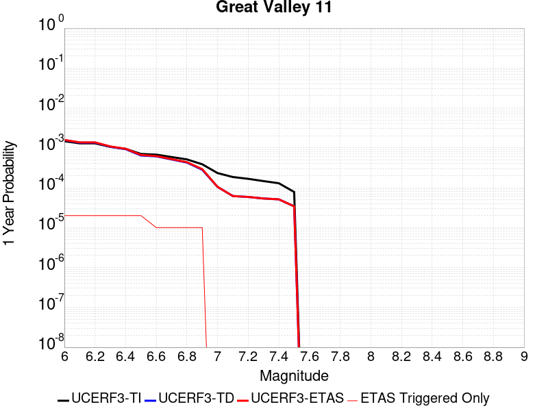 |  |

| Magnitude | 1 wk TI Prob | 1 wk TD Prob | 1 wk ETAS Prob | 1 wk ETAS/TD Gain | 1 wk ETAS Triggered Only | 1 mo TI Prob | 1 mo TD Prob | 1 mo ETAS Prob | 1 mo ETAS/TD Gain | 1 mo ETAS Triggered Only | 1 yr TI Prob | 1 yr TD Prob | 1 yr ETAS Prob | 1 yr ETAS/TD Gain | 1 yr ETAS Triggered Only | 10 yr TI Prob | 10 yr TD Prob | 10 yr ETAS Prob | 10 yr ETAS/TD Gain | 10 yr ETAS Triggered Only |
|-----|-----|-----|-----|-----|-----|-----|-----|-----|-----|-----|-----|-----|-----|-----|-----|-----|-----|-----|-----|-----|
| 6.0 | 2.8099583E-5 | 2.983214E-5 | 2.983214E-5 | 1.0 | 0.0 | 1.20421224E-4 | 1.2784619E-4 | 1.2784619E-4 | 1.0 | 0.0 | 0.0014651422 | 0.0015554894 | 0.0015754583 | 1.0128376 | 2.0E-5 | 0.0145552 | 0.015453546 | 0.015473237 | 1.0012742 | 2.0E-5 |
| 6.1 | 2.483194E-5 | 2.5907144E-5 | 2.5907144E-5 | 1.0 | 0.0 | 1.0641825E-4 | 1.11026246E-4 | 1.11026246E-4 | 1.0 | 0.0 | 0.0012948721 | 0.0013509697 | 0.0013709427 | 1.0147842 | 2.0E-5 | 0.012873529 | 0.013433979 | 0.01345371 | 1.0014688 | 2.0E-5 |
| 6.2 | 2.483194E-5 | 2.5907144E-5 | 2.5907144E-5 | 1.0 | 0.0 | 1.0641825E-4 | 1.11026246E-4 | 1.11026246E-4 | 1.0 | 0.0 | 0.0012948721 | 0.0013509697 | 0.0013709427 | 1.0147842 | 2.0E-5 | 0.012873529 | 0.013433979 | 0.01345371 | 1.0014688 | 2.0E-5 |
| 6.3 | 2.0257901E-5 | 2.0398915E-5 | 2.0398915E-5 | 1.0 | 0.0 | 8.681669E-5 | 8.742122E-5 | 8.742122E-5 | 1.0 | 0.0 | 0.0010564806 | 0.0010638753 | 0.001083854 | 1.0187792 | 2.0E-5 | 0.01051472 | 0.010591993 | 0.010611782 | 1.0018682 | 2.0E-5 |
| 6.4 | 1.8054898E-5 | 1.7780852E-5 | 1.7780852E-5 | 1.0 | 0.0 | 7.737584E-5 | 7.6201635E-5 | 7.6201635E-5 | 1.0 | 0.0 | 9.416436E-4 | 9.2739763E-4 | 9.473791E-4 | 1.0215458 | 2.0E-5 | 0.009376635 | 0.009239015 | 0.00925883 | 1.0021447 | 2.0E-5 |
| 6.5 | 1.34804895E-5 | 1.2321004E-5 | 1.2321004E-5 | 1.0 | 0.0 | 5.777225E-5 | 5.2803258E-5 | 5.2803258E-5 | 1.0 | 0.0 | 7.031501E-4 | 6.426942E-4 | 6.6268136E-4 | 1.031099 | 2.0E-5 | 0.007009294 | 0.006408792 | 0.006428664 | 1.0031008 | 2.0E-5 |
| 6.6 | 1.294883E-5 | 1.1732261E-5 | 1.1732261E-5 | 1.0 | 0.0 | 5.5493805E-5 | 5.028017E-5 | 5.028017E-5 | 1.0 | 0.0 | 6.754276E-4 | 6.1199325E-4 | 6.219871E-4 | 1.01633 | 1.0E-5 | 0.006733784 | 0.0061035044 | 0.0061134435 | 1.0016284 | 1.0E-5 |
| 6.7 | 1.1272237E-5 | 9.811834E-6 | 9.811834E-6 | 1.0 | 0.0 | 4.8308695E-5 | 4.205006E-5 | 4.205006E-5 | 1.0 | 0.0 | 5.879996E-4 | 5.1184196E-4 | 5.218368E-4 | 1.0195273 | 1.0E-5 | 0.005864462 | 0.005106915 | 0.0051168636 | 1.0019481 | 1.0E-5 |
| 6.8 | 9.8337505E-6 | 8.193719E-6 | 8.193719E-6 | 1.0 | 0.0 | 4.2143965E-5 | 3.5115478E-5 | 3.5115478E-5 | 1.0 | 0.0 | 5.1298196E-4 | 4.2744912E-4 | 4.3744483E-4 | 1.0233846 | 1.0E-5 | 0.005117994 | 0.0042664795 | 0.0042764368 | 1.0023339 | 1.0E-5 |
| 6.9 | 7.4224813E-6 | 5.4130837E-6 | 5.4130837E-6 | 1.0 | 0.0 | 3.1810247E-5 | 2.3198732E-5 | 2.3198732E-5 | 1.0 | 0.0 | 3.872209E-4 | 2.8240937E-4 | 2.9240653E-4 | 1.0353996 | 1.0E-5 | 0.0038654688 | 0.0028206457 | 0.0028306174 | 1.0035353 | 1.0E-5 |
| 7.0 | 4.4628923E-6 | 2.0110294E-6 | 2.0110294E-6 | 1.0 | 0.0 | 1.912654E-5 | 8.61867E-6 | 8.61867E-6 | 1.0 | 0.0 | 2.3284076E-4 | 1.0492737E-4 | 1.0492737E-4 | 1.0 | 0.0 | 0.0023259693 | 0.0010487898 | 0.0010487898 | 1.0 | 0.0 |
| 7.1 | 3.5546527E-6 | 1.1855383E-6 | 1.1855383E-6 | 1.0 | 0.0 | 1.5234136E-5 | 5.080869E-6 | 5.080869E-6 | 1.0 | 0.0 | 1.8545982E-4 | 6.185789E-5 | 6.185789E-5 | 1.0 | 0.0 | 0.0018530512 | 6.1841356E-4 | 6.1841356E-4 | 1.0 | 0.0 |
| 7.2 | 3.2039936E-6 | 1.1253728E-6 | 1.1253728E-6 | 1.0 | 0.0 | 1.3731329E-5 | 4.8230177E-6 | 4.8230177E-6 | 1.0 | 0.0 | 1.671661E-4 | 5.8718724E-5 | 5.8718724E-5 | 1.0 | 0.0 | 0.0016704041 | 5.870388E-4 | 5.870388E-4 | 1.0 | 0.0 |
| 7.3 | 2.8120473E-6 | 1.0305271E-6 | 1.0305271E-6 | 1.0 | 0.0 | 1.2051575E-5 | 4.4165376E-6 | 4.4165376E-6 | 1.0 | 0.0 | 1.4671806E-4 | 5.3770087E-5 | 5.3770087E-5 | 1.0 | 0.0 | 0.0014662122 | 5.375774E-4 | 5.375774E-4 | 1.0 | 0.0 |
| 7.4 | 2.4837766E-6 | 9.80032E-7 | 9.80032E-7 | 1.0 | 0.0 | 1.0644713E-5 | 4.2001307E-6 | 4.2001307E-6 | 1.0 | 0.0 | 1.2959167E-4 | 5.113546E-5 | 5.113546E-5 | 1.0 | 0.0 | 0.0012951613 | 5.1124353E-4 | 5.1124353E-4 | 1.0 | 0.0 |
| 7.5 | 1.5002679E-6 | 6.545985E-7 | 6.545985E-7 | 1.0 | 0.0 | 6.4297037E-6 | 2.8054194E-6 | 2.8054194E-6 | 1.0 | 0.0 | 7.827883E-5 | 3.4155488E-5 | 3.4155488E-5 | 1.0 | 0.0 | 7.825126E-4 | 3.4150656E-4 | 3.4150656E-4 | 1.0 | 0.0 |

## Green Valley 2011 CFM
*[(top)](#table-of-contents)*

| 1 Week | 1 Month | 1 Year | 10 Year |
|-----|-----|-----|-----|
|  |  |  |  |

| Magnitude | 1 wk TI Prob | 1 wk TD Prob | 1 wk ETAS Prob | 1 wk ETAS/TD Gain | 1 wk ETAS Triggered Only | 1 mo TI Prob | 1 mo TD Prob | 1 mo ETAS Prob | 1 mo ETAS/TD Gain | 1 mo ETAS Triggered Only | 1 yr TI Prob | 1 yr TD Prob | 1 yr ETAS Prob | 1 yr ETAS/TD Gain | 1 yr ETAS Triggered Only | 10 yr TI Prob | 10 yr TD Prob | 10 yr ETAS Prob | 10 yr ETAS/TD Gain | 10 yr ETAS Triggered Only |
|-----|-----|-----|-----|-----|-----|-----|-----|-----|-----|-----|-----|-----|-----|-----|-----|-----|-----|-----|-----|-----|
| 6.0 | 9.9629346E-5 | 1.7302863E-4 | 1.7302863E-4 | 1.0 | 0.0 | 4.2691303E-4 | 7.41326E-4 | 7.513186E-4 | 1.0134794 | 1.0E-5 | 0.0051852856 | 0.00898692 | 0.00900674 | 1.0022055 | 2.0E-5 | 0.050659515 | 0.08553951 | 0.0855578 | 1.0002139 | 2.0E-5 |
| 6.1 | 9.88615E-5 | 1.7150163E-4 | 1.7150163E-4 | 1.0 | 0.0 | 4.2362334E-4 | 7.347854E-4 | 7.447781E-4 | 1.0135994 | 1.0E-5 | 0.0051454236 | 0.008907947 | 0.008927769 | 1.0022252 | 2.0E-5 | 0.050279044 | 0.08482712 | 0.084845416 | 1.0002158 | 2.0E-5 |
| 6.2 | 9.696895E-5 | 1.6789208E-4 | 1.6789208E-4 | 1.0 | 0.0 | 4.15515E-4 | 7.1932544E-4 | 7.2931824E-4 | 1.0138919 | 1.0E-5 | 0.0050471667 | 0.00872133 | 0.008741155 | 1.0022732 | 2.0E-5 | 0.04934063 | 0.08313578 | 0.08315412 | 1.0002205 | 2.0E-5 |
| 6.3 | 9.275224E-5 | 1.5968543E-4 | 1.5968543E-4 | 1.0 | 0.0 | 3.9744904E-4 | 6.841728E-4 | 6.9416594E-4 | 1.0146062 | 1.0E-5 | 0.0048282105 | 0.008296652 | 0.0083065685 | 1.0011953 | 1.0E-5 | 0.047246475 | 0.07927481 | 0.07928401 | 1.0001161 | 1.0E-5 |
| 6.4 | 8.391499E-5 | 1.4365884E-4 | 1.4365884E-4 | 1.0 | 0.0 | 3.595861E-4 | 6.155238E-4 | 6.155238E-4 | 1.0 | 0.0 | 0.004369175 | 0.007467181 | 0.007467181 | 1.0 | 0.0 | 0.04284265 | 0.07164672 | 0.07164672 | 1.0 | 0.0 |
| 6.5 | 5.9519385E-5 | 9.932622E-5 | 9.932622E-5 | 1.0 | 0.0 | 2.5505814E-4 | 4.2560388E-4 | 4.2560388E-4 | 1.0 | 0.0 | 0.0031009112 | 0.005168341 | 0.005168341 | 1.0 | 0.0 | 0.030579966 | 0.05014692 | 0.05014692 | 1.0 | 0.0 |
| 6.6 | 4.5361558E-5 | 7.4019794E-5 | 7.4019794E-5 | 1.0 | 0.0 | 1.9439218E-4 | 3.1717744E-4 | 3.1717744E-4 | 1.0 | 0.0 | 0.0023641558 | 0.0038538678 | 0.0038538678 | 1.0 | 0.0 | 0.023391623 | 0.03766727 | 0.03766727 | 1.0 | 0.0 |
| 6.7 | 3.8808106E-5 | 6.264382E-5 | 6.264382E-5 | 1.0 | 0.0 | 1.6630985E-4 | 2.6843755E-4 | 2.6843755E-4 | 1.0 | 0.0 | 0.0020229418 | 0.0032627317 | 0.0032627317 | 1.0 | 0.0 | 0.020046256 | 0.032007415 | 0.032007415 | 1.0 | 0.0 |
| 6.8 | 2.2284667E-5 | 3.128574E-5 | 3.128574E-5 | 1.0 | 0.0 | 9.550222E-5 | 1.3407487E-4 | 1.3407487E-4 | 1.0 | 0.0 | 0.0011621192 | 0.0016311383 | 0.0016311383 | 1.0 | 0.0 | 0.011560607 | 0.01616672 | 0.01616672 | 1.0 | 0.0 |
| 6.9 | 1.8050168E-5 | 2.4448536E-5 | 2.4448536E-5 | 1.0 | 0.0 | 7.735557E-5 | 1.0477527E-4 | 1.0477527E-4 | 1.0 | 0.0 | 9.4139716E-4 | 0.0012748954 | 0.0012748954 | 1.0 | 0.0 | 0.009374191 | 0.012669067 | 0.012669067 | 1.0 | 0.0 |
| 7.0 | 1.4763166E-5 | 1.9583236E-5 | 1.9583236E-5 | 1.0 | 0.0 | 6.326917E-5 | 8.3925464E-5 | 8.3925464E-5 | 1.0 | 0.0 | 7.7002996E-4 | 0.001021315 | 0.001021315 | 1.0 | 0.0 | 0.007673672 | 0.01016625 | 0.01016625 | 1.0 | 0.0 |
| 7.1 | 1.2399713E-5 | 1.6304042E-5 | 1.6304042E-5 | 1.0 | 0.0 | 5.3140546E-5 | 6.987261E-5 | 6.987261E-5 | 1.0 | 0.0 | 6.467941E-4 | 8.5036893E-4 | 8.5036893E-4 | 1.0 | 0.0 | 0.006449148 | 0.008471781 | 0.008471781 | 1.0 | 0.0 |
| 7.2 | 1.0584195E-5 | 1.39220465E-5 | 1.39220465E-5 | 1.0 | 0.0 | 4.5360044E-5 | 5.966456E-5 | 5.966456E-5 | 1.0 | 0.0 | 5.521186E-4 | 7.2617555E-4 | 7.2617555E-4 | 1.0 | 0.0 | 0.0055074887 | 0.0072386027 | 0.0072386027 | 1.0 | 0.0 |
| 7.3 | 7.998173E-6 | 1.0544255E-5 | 1.0544255E-5 | 1.0 | 0.0 | 3.4277433E-5 | 4.5188888E-5 | 4.5188888E-5 | 1.0 | 0.0 | 4.1724785E-4 | 5.500369E-4 | 5.500369E-4 | 1.0 | 0.0 | 0.004164653 | 0.005487135 | 0.005487135 | 1.0 | 0.0 |
| 7.4 | 6.7571127E-6 | 8.932903E-6 | 8.932903E-6 | 1.0 | 0.0 | 2.8958733E-5 | 3.8283313E-5 | 3.8283313E-5 | 1.0 | 0.0 | 3.5251552E-4 | 4.660006E-4 | 4.660006E-4 | 1.0 | 0.0 | 0.0035195686 | 0.004650633 | 0.004650633 | 1.0 | 0.0 |
| 7.5 | 5.69878E-6 | 7.516483E-6 | 7.516483E-6 | 1.0 | 0.0 | 2.4423114E-5 | 3.2213105E-5 | 3.2213105E-5 | 1.0 | 0.0 | 2.9731085E-4 | 3.9212484E-4 | 3.9212484E-4 | 1.0 | 0.0 | 0.002969134 | 0.0039147018 | 0.0039147018 | 1.0 | 0.0 |
| 7.6 | 4.503664E-6 | 5.9358217E-6 | 5.9358217E-6 | 1.0 | 0.0 | 1.9301275E-5 | 2.5438992E-5 | 2.5438992E-5 | 1.0 | 0.0 | 2.3496768E-4 | 3.0967654E-4 | 3.0967654E-4 | 1.0 | 0.0 | 0.002347194 | 0.0030927279 | 0.0030927279 | 1.0 | 0.0 |
| 7.7 | 1.0873546E-6 | 1.410754E-6 | 1.410754E-6 | 1.0 | 0.0 | 4.6600826E-6 | 6.0460743E-6 | 6.0460743E-6 | 1.0 | 0.0 | 5.6735033E-5 | 7.36085E-5 | 7.36085E-5 | 1.0 | 0.0 | 5.672055E-4 | 7.3587085E-4 | 7.3587085E-4 | 1.0 | 0.0 |
| 7.8 | 4.9373917E-8 | 6.177967E-8 | 6.177967E-8 | 1.0 | 0.0 | 2.1160248E-7 | 2.6477002E-7 | 2.6477002E-7 | 1.0 | 0.0 | 2.5762572E-6 | 3.2235714E-6 | 3.2235714E-6 | 1.0 | 0.0 | 2.5762274E-5 | 3.2228E-5 | 3.2228E-5 | 1.0 | 0.0 |

## San Gregorio (North) 2011 CFM
*[(top)](#table-of-contents)*

| 1 Week | 1 Month | 1 Year | 10 Year |
|-----|-----|-----|-----|
| 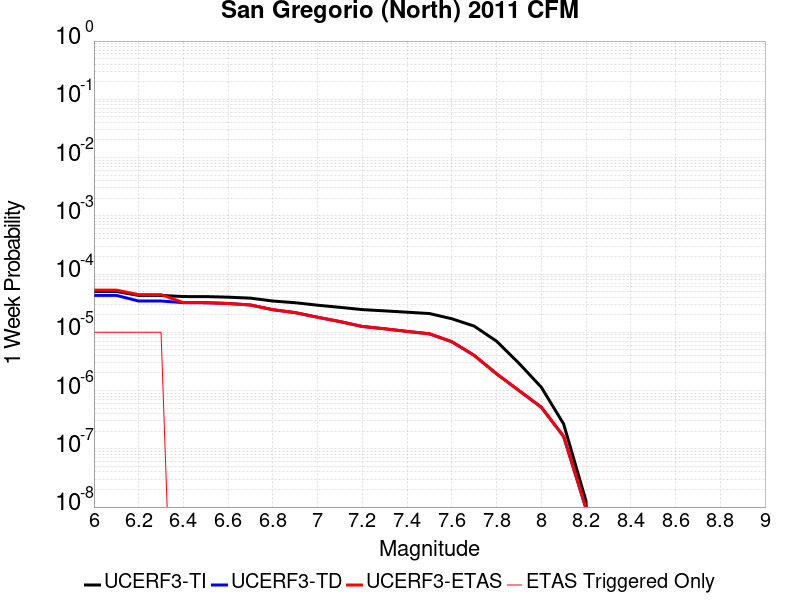 |  |  |  |

| Magnitude | 1 wk TI Prob | 1 wk TD Prob | 1 wk ETAS Prob | 1 wk ETAS/TD Gain | 1 wk ETAS Triggered Only | 1 mo TI Prob | 1 mo TD Prob | 1 mo ETAS Prob | 1 mo ETAS/TD Gain | 1 mo ETAS Triggered Only | 1 yr TI Prob | 1 yr TD Prob | 1 yr ETAS Prob | 1 yr ETAS/TD Gain | 1 yr ETAS Triggered Only | 10 yr TI Prob | 10 yr TD Prob | 10 yr ETAS Prob | 10 yr ETAS/TD Gain | 10 yr ETAS Triggered Only |
|-----|-----|-----|-----|-----|-----|-----|-----|-----|-----|-----|-----|-----|-----|-----|-----|-----|-----|-----|-----|-----|
| 6.0 | 5.0283932E-5 | 4.3057098E-5 | 5.305667E-5 | 1.2322397 | 1.0E-5 | 2.1548476E-4 | 1.8451746E-4 | 1.9451561E-4 | 1.0541854 | 1.0E-5 | 0.0026203706 | 0.002244199 | 0.0022641541 | 1.0088918 | 2.0E-5 | 0.02589687 | 0.022295918 | 0.022315472 | 1.000877 | 2.0E-5 |
| 6.1 | 5.0283932E-5 | 4.3057098E-5 | 5.305667E-5 | 1.2322397 | 1.0E-5 | 2.1548476E-4 | 1.8451746E-4 | 1.9451561E-4 | 1.0541854 | 1.0E-5 | 0.0026203706 | 0.002244199 | 0.0022641541 | 1.0088918 | 2.0E-5 | 0.02589687 | 0.022295918 | 0.022315472 | 1.000877 | 2.0E-5 |
| 6.2 | 4.2998647E-5 | 3.4440873E-5 | 4.4440527E-5 | 1.2903427 | 1.0E-5 | 1.842669E-4 | 1.4759546E-4 | 1.5759398E-4 | 1.0677427 | 1.0E-5 | 0.0022411412 | 0.001795506 | 0.00181547 | 1.0111189 | 2.0E-5 | 0.022186736 | 0.017884884 | 0.017904526 | 1.0010983 | 2.0E-5 |
| 6.3 | 4.2998647E-5 | 3.4440873E-5 | 4.4440527E-5 | 1.2903427 | 1.0E-5 | 1.842669E-4 | 1.4759546E-4 | 1.5759398E-4 | 1.0677427 | 1.0E-5 | 0.0022411412 | 0.001795506 | 0.00181547 | 1.0111189 | 2.0E-5 | 0.022186736 | 0.017884884 | 0.017904526 | 1.0010983 | 2.0E-5 |
| 6.4 | 4.1101295E-5 | 3.2326076E-5 | 3.2326076E-5 | 1.0 | 0.0 | 1.7613651E-4 | 1.3853304E-4 | 1.3853304E-4 | 1.0 | 0.0 | 0.0021423528 | 0.0016853481 | 0.0016853481 | 1.0 | 0.0 | 0.02121817 | 0.016800618 | 0.016800618 | 1.0 | 0.0 |
| 6.5 | 4.1032585E-5 | 3.224411E-5 | 3.224411E-5 | 1.0 | 0.0 | 1.7584208E-4 | 1.381818E-4 | 1.381818E-4 | 1.0 | 0.0 | 0.0021387753 | 0.0016810785 | 0.0016810785 | 1.0 | 0.0 | 0.021183075 | 0.01675857 | 0.01675857 | 1.0 | 0.0 |
| 6.6 | 4.011629E-5 | 3.1265718E-5 | 3.1265718E-5 | 1.0 | 0.0 | 1.7191563E-4 | 1.3398913E-4 | 1.3398913E-4 | 1.0 | 0.0 | 0.0020910634 | 0.0016301107 | 0.0016301107 | 1.0 | 0.0 | 0.020714961 | 0.016257357 | 0.016257357 | 1.0 | 0.0 |
| 6.7 | 3.8583938E-5 | 2.9452754E-5 | 2.9452754E-5 | 1.0 | 0.0 | 1.6534925E-4 | 1.2622007E-4 | 1.2622007E-4 | 1.0 | 0.0 | 0.0020112682 | 0.0015356604 | 0.0015356604 | 1.0 | 0.0 | 0.019931622 | 0.015326062 | 0.015326062 | 1.0 | 0.0 |
| 6.8 | 3.44341E-5 | 2.4450024E-5 | 2.4450024E-5 | 1.0 | 0.0 | 1.4756636E-4 | 1.0478167E-4 | 1.0478167E-4 | 1.0 | 0.0 | 0.0017951399 | 0.0012749807 | 0.0012749807 | 1.0 | 0.0 | 0.017807078 | 0.012751525 | 0.012751525 | 1.0 | 0.0 |
| 6.9 | 3.221199E-5 | 2.1777196E-5 | 2.1777196E-5 | 1.0 | 0.0 | 1.3804408E-4 | 9.3327544E-5 | 9.3327544E-5 | 1.0 | 0.0 | 0.0016793909 | 0.0011356788 | 0.0011356788 | 1.0 | 0.0 | 0.01666756 | 0.011372544 | 0.011372544 | 1.0 | 0.0 |
| 7.0 | 2.9186718E-5 | 1.814604E-5 | 1.814604E-5 | 1.0 | 0.0 | 1.2507994E-4 | 7.776645E-5 | 7.776645E-5 | 1.0 | 0.0 | 0.0015217843 | 9.463997E-4 | 9.463997E-4 | 1.0 | 0.0 | 0.015114053 | 0.0094966395 | 0.0094966395 | 1.0 | 0.0 |
| 7.1 | 2.6840138E-5 | 1.5283675E-5 | 1.5283675E-5 | 1.0 | 0.0 | 1.1502409E-4 | 6.549983E-5 | 6.549983E-5 | 1.0 | 0.0 | 0.0013995186 | 7.971706E-4 | 7.971706E-4 | 1.0 | 0.0 | 0.013907375 | 0.0080155255 | 0.0080155255 | 1.0 | 0.0 |
| 7.2 | 2.453002E-5 | 1.2605825E-5 | 1.2605825E-5 | 1.0 | 0.0 | 1.05124425E-4 | 5.4023847E-5 | 5.4023847E-5 | 1.0 | 0.0 | 0.0012791384 | 6.5754243E-4 | 6.5754243E-4 | 1.0 | 0.0 | 0.012718005 | 0.006627395 | 0.006627395 | 1.0 | 0.0 |
| 7.3 | 2.3330727E-5 | 1.1487833E-5 | 1.1487833E-5 | 1.0 | 0.0 | 9.9985E-5 | 4.923264E-5 | 4.923264E-5 | 1.0 | 0.0 | 0.0012166376 | 5.99243E-4 | 5.99243E-4 | 1.0 | 0.0 | 0.012099981 | 0.0060462817 | 0.0060462817 | 1.0 | 0.0 |
| 7.4 | 2.2136466E-5 | 1.0368137E-5 | 1.0368137E-5 | 1.0 | 0.0 | 9.486712E-5 | 4.4434113E-5 | 4.4434113E-5 | 1.0 | 0.0 | 0.0011543952 | 5.408513E-4 | 5.408513E-4 | 1.0 | 0.0 | 0.011484168 | 0.0054640025 | 0.0054640025 | 1.0 | 0.0 |
| 7.5 | 2.0994974E-5 | 9.426374E-6 | 9.426374E-6 | 1.0 | 0.0 | 8.997535E-5 | 4.0398125E-5 | 4.0398125E-5 | 1.0 | 0.0 | 0.0010948994 | 4.917364E-4 | 4.917364E-4 | 1.0 | 0.0 | 0.010895205 | 0.004973108 | 0.004973108 | 1.0 | 0.0 |
| 7.6 | 1.7091823E-5 | 6.892992E-6 | 6.892992E-6 | 1.0 | 0.0 | 7.3248615E-5 | 2.9541061E-5 | 2.9541061E-5 | 1.0 | 0.0 | 8.9143694E-4 | 3.5960317E-4 | 3.5960317E-4 | 1.0 | 0.0 | 0.008878695 | 0.0036480771 | 0.0036480771 | 1.0 | 0.0 |
| 7.7 | 1.2772179E-5 | 4.0202267E-6 | 4.0202267E-6 | 1.0 | 0.0 | 5.473676E-5 | 1.722943E-5 | 1.722943E-5 | 1.0 | 0.0 | 6.6621625E-4 | 2.0974813E-4 | 2.0974813E-4 | 1.0 | 0.0 | 0.006642225 | 0.0021365841 | 0.0021365841 | 1.0 | 0.0 |
| 7.8 | 7.041923E-6 | 1.9402341E-6 | 1.9402341E-6 | 1.0 | 0.0 | 3.017932E-5 | 8.315263E-6 | 8.315263E-6 | 1.0 | 0.0 | 3.6737128E-4 | 1.01233614E-4 | 1.01233614E-4 | 1.0 | 0.0 | 0.0036676454 | 0.0010376878 | 0.0010376878 | 1.0 | 0.0 |
| 7.9 | 2.946768E-6 | 1.0031822E-6 | 1.0031822E-6 | 1.0 | 0.0 | 1.2628945E-5 | 4.299345E-6 | 4.299345E-6 | 1.0 | 0.0 | 1.5374656E-4 | 5.2343268E-5 | 5.2343268E-5 | 1.0 | 0.0 | 0.0015364023 | 5.339059E-4 | 5.339059E-4 | 1.0 | 0.0 |
| 8.0 | 1.1433375E-6 | 5.180804E-7 | 5.180804E-7 | 1.0 | 0.0 | 4.9000087E-6 | 2.2203426E-6 | 2.2203426E-6 | 1.0 | 0.0 | 5.965597E-5 | 2.7032334E-5 | 2.7032334E-5 | 1.0 | 0.0 | 5.963996E-4 | 2.7394458E-4 | 2.7394458E-4 | 1.0 | 0.0 |
| 8.1 | 2.6675295E-7 | 1.6288074E-7 | 1.6288074E-7 | 1.0 | 0.0 | 1.1432264E-6 | 6.9806015E-7 | 6.9806015E-7 | 1.0 | 0.0 | 1.3918692E-5 | 8.498849E-6 | 8.498849E-6 | 1.0 | 0.0 | 1.391782E-4 | 8.6366665E-5 | 8.6366665E-5 | 1.0 | 0.0 |
| 8.2 | 1.2704569E-8 | 9.429871E-9 | 9.429871E-9 | 1.0 | 0.0 | 5.444815E-8 | 4.041373E-8 | 4.041373E-8 | 1.0 | 0.0 | 6.629061E-7 | 4.920371E-7 | 4.920371E-7 | 1.0 | 0.0 | 6.629041E-6 | 5.1106863E-6 | 5.1106863E-6 | 1.0 | 0.0 |

## Cedar Mtn-Mahogany Mtn
*[(top)](#table-of-contents)*

| 1 Week | 1 Month | 1 Year | 10 Year |
|-----|-----|-----|-----|
|  |  |  |  |

| Magnitude | 1 wk TI Prob | 1 wk TD Prob | 1 wk ETAS Prob | 1 wk ETAS/TD Gain | 1 wk ETAS Triggered Only | 1 mo TI Prob | 1 mo TD Prob | 1 mo ETAS Prob | 1 mo ETAS/TD Gain | 1 mo ETAS Triggered Only | 1 yr TI Prob | 1 yr TD Prob | 1 yr ETAS Prob | 1 yr ETAS/TD Gain | 1 yr ETAS Triggered Only | 10 yr TI Prob | 10 yr TD Prob | 10 yr ETAS Prob | 10 yr ETAS/TD Gain | 10 yr ETAS Triggered Only |
|-----|-----|-----|-----|-----|-----|-----|-----|-----|-----|-----|-----|-----|-----|-----|-----|-----|-----|-----|-----|-----|
| 6.0 | 2.7763876E-5 | 2.9588866E-5 | 4.9588274E-5 | 1.67591 | 2.0E-5 | 1.1898261E-4 | 1.2680366E-4 | 1.4680112E-4 | 1.1577041 | 2.0E-5 | 0.0014476506 | 0.0015428112 | 0.0015627804 | 1.0129434 | 2.0E-5 | 0.0143825635 | 0.015328225 | 0.0153479185 | 1.0012848 | 2.0E-5 |
| 6.1 | 1.6162443E-5 | 1.7142966E-5 | 2.7142794E-5 | 1.5833197 | 1.0E-5 | 6.926578E-5 | 7.346788E-5 | 8.346715E-5 | 1.1361039 | 1.0E-5 | 8.4298453E-4 | 8.941221E-4 | 9.0411317E-4 | 1.0111742 | 1.0E-5 | 0.008397939 | 0.008907059 | 0.008916969 | 1.0011127 | 1.0E-5 |
| 6.2 | 1.6162443E-5 | 1.7142966E-5 | 2.7142794E-5 | 1.5833197 | 1.0E-5 | 6.926578E-5 | 7.346788E-5 | 8.346715E-5 | 1.1361039 | 1.0E-5 | 8.4298453E-4 | 8.941221E-4 | 9.0411317E-4 | 1.0111742 | 1.0E-5 | 0.008397939 | 0.008907059 | 0.008916969 | 1.0011127 | 1.0E-5 |
| 6.3 | 9.746053E-6 | 1.0303152E-5 | 1.0303152E-5 | 1.0 | 0.0 | 4.1768133E-5 | 4.415564E-5 | 4.415564E-5 | 1.0 | 0.0 | 5.0840835E-4 | 5.3746643E-4 | 5.3746643E-4 | 1.0 | 0.0 | 0.0050724675 | 0.005362084 | 0.005362084 | 1.0 | 0.0 |
| 6.4 | 9.746053E-6 | 1.0303152E-5 | 1.0303152E-5 | 1.0 | 0.0 | 4.1768133E-5 | 4.415564E-5 | 4.415564E-5 | 1.0 | 0.0 | 5.0840835E-4 | 5.3746643E-4 | 5.3746643E-4 | 1.0 | 0.0 | 0.0050724675 | 0.005362084 | 0.005362084 | 1.0 | 0.0 |
| 6.5 | 7.290083E-6 | 7.695325E-6 | 7.695325E-6 | 1.0 | 0.0 | 3.124284E-5 | 3.297956E-5 | 3.297956E-5 | 1.0 | 0.0 | 3.8031515E-4 | 4.014543E-4 | 4.014543E-4 | 1.0 | 0.0 | 0.0037966494 | 0.004007511 | 0.004007511 | 1.0 | 0.0 |
| 6.6 | 5.67907E-6 | 5.9891527E-6 | 5.9891527E-6 | 1.0 | 0.0 | 2.4338644E-5 | 2.5667552E-5 | 2.5667552E-5 | 1.0 | 0.0 | 2.962827E-4 | 3.12459E-4 | 3.12459E-4 | 1.0 | 0.0 | 0.0029588798 | 0.003120333 | 0.003120333 | 1.0 | 0.0 |
| 6.7 | 3.4853963E-6 | 3.672631E-6 | 3.672631E-6 | 1.0 | 0.0 | 1.4937327E-5 | 1.5739755E-5 | 1.5739755E-5 | 1.0 | 0.0 | 1.8184677E-4 | 1.916153E-4 | 1.916153E-4 | 1.0 | 0.0 | 0.0018169804 | 0.0019145629 | 0.0019145629 | 1.0 | 0.0 |
| 6.8 | 2.7535168E-6 | 2.9015764E-6 | 2.9015764E-6 | 1.0 | 0.0 | 1.1800733E-5 | 1.2435271E-5 | 1.2435271E-5 | 1.0 | 0.0 | 1.4366445E-4 | 1.5138938E-4 | 1.5138938E-4 | 1.0 | 0.0 | 0.0014357162 | 0.0015129098 | 0.0015129098 | 1.0 | 0.0 |
| 6.9 | 1.6594106E-6 | 1.7496985E-6 | 1.7496985E-6 | 1.0 | 0.0 | 7.1117406E-6 | 7.4986883E-6 | 7.4986883E-6 | 1.0 | 0.0 | 8.6582E-5 | 9.129302E-5 | 9.129302E-5 | 1.0 | 0.0 | 8.654827E-4 | 9.125856E-4 | 9.125856E-4 | 1.0 | 0.0 |
| 7.0 | 5.10215E-7 | 5.389254E-7 | 5.389254E-7 | 1.0 | 0.0 | 2.186634E-6 | 2.3096788E-6 | 2.3096788E-6 | 1.0 | 0.0 | 2.6621943E-5 | 2.8120105E-5 | 2.8120105E-5 | 1.0 | 0.0 | 2.6618753E-4 | 2.81178E-4 | 2.81178E-4 | 1.0 | 0.0 |

## Monterey Bay-Tularcitos
*[(top)](#table-of-contents)*

| 1 Week | 1 Month | 1 Year | 10 Year |
|-----|-----|-----|-----|
| 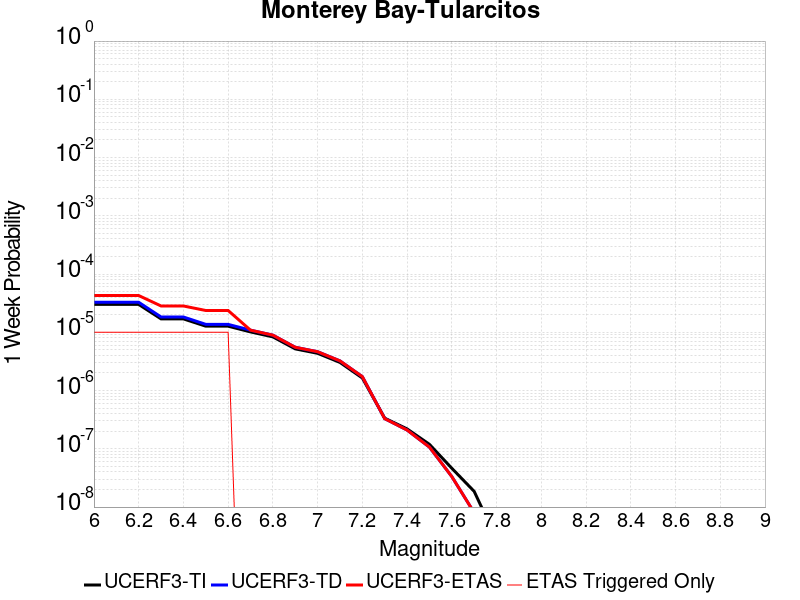 | 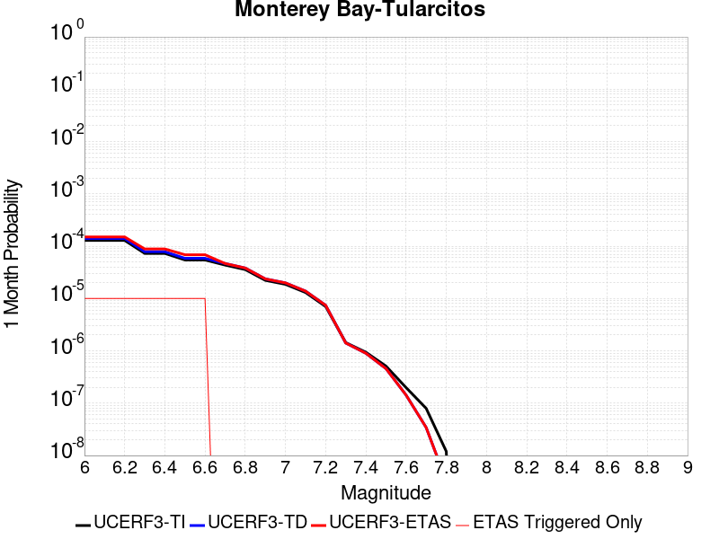 | 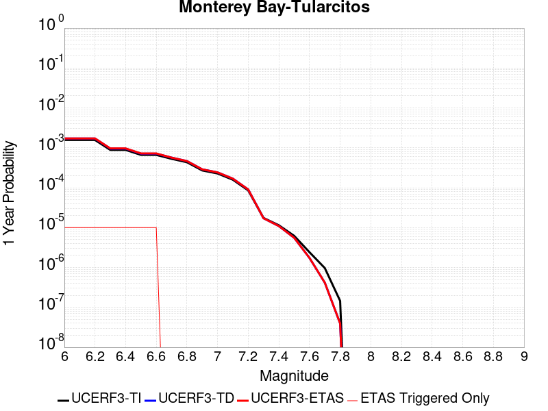 |  |

| Magnitude | 1 wk TI Prob | 1 wk TD Prob | 1 wk ETAS Prob | 1 wk ETAS/TD Gain | 1 wk ETAS Triggered Only | 1 mo TI Prob | 1 mo TD Prob | 1 mo ETAS Prob | 1 mo ETAS/TD Gain | 1 mo ETAS Triggered Only | 1 yr TI Prob | 1 yr TD Prob | 1 yr ETAS Prob | 1 yr ETAS/TD Gain | 1 yr ETAS Triggered Only | 10 yr TI Prob | 10 yr TD Prob | 10 yr ETAS Prob | 10 yr ETAS/TD Gain | 10 yr ETAS Triggered Only |
|-----|-----|-----|-----|-----|-----|-----|-----|-----|-----|-----|-----|-----|-----|-----|-----|-----|-----|-----|-----|-----|
| 6.0 | 3.0131365E-5 | 3.279877E-5 | 4.279844E-5 | 1.3048794 | 1.0E-5 | 1.2912804E-4 | 1.4055918E-4 | 1.5055778E-4 | 1.0711344 | 1.0E-5 | 0.001571 | 0.0017100703 | 0.0017200531 | 1.0058377 | 1.0E-5 | 0.015599402 | 0.016979916 | 0.016999578 | 1.0011579 | 2.0E-5 |
| 6.1 | 3.0131365E-5 | 3.279877E-5 | 4.279844E-5 | 1.3048794 | 1.0E-5 | 1.2912804E-4 | 1.4055918E-4 | 1.5055778E-4 | 1.0711344 | 1.0E-5 | 0.001571 | 0.0017100703 | 0.0017200531 | 1.0058377 | 1.0E-5 | 0.015599402 | 0.016979916 | 0.016999578 | 1.0011579 | 2.0E-5 |
| 6.2 | 3.0131365E-5 | 3.279877E-5 | 4.279844E-5 | 1.3048794 | 1.0E-5 | 1.2912804E-4 | 1.4055918E-4 | 1.5055778E-4 | 1.0711344 | 1.0E-5 | 0.001571 | 0.0017100703 | 0.0017200531 | 1.0058377 | 1.0E-5 | 0.015599402 | 0.016979916 | 0.016999578 | 1.0011579 | 2.0E-5 |
| 6.3 | 1.6998249E-5 | 1.8330798E-5 | 2.8330614E-5 | 1.54552 | 1.0E-5 | 7.28476E-5 | 7.85583E-5 | 8.8557514E-5 | 1.127284 | 1.0E-5 | 8.865586E-4 | 9.5604634E-4 | 9.6603675E-4 | 1.0104498 | 1.0E-5 | 0.0088303005 | 0.009521258 | 0.009531163 | 1.0010403 | 1.0E-5 |
| 6.4 | 1.6998249E-5 | 1.8330798E-5 | 2.8330614E-5 | 1.54552 | 1.0E-5 | 7.28476E-5 | 7.85583E-5 | 8.8557514E-5 | 1.127284 | 1.0E-5 | 8.865586E-4 | 9.5604634E-4 | 9.6603675E-4 | 1.0104498 | 1.0E-5 | 0.0088303005 | 0.009521258 | 0.009531163 | 1.0010403 | 1.0E-5 |
| 6.5 | 1.27470785E-5 | 1.3693312E-5 | 2.3693176E-5 | 1.7302735 | 1.0E-5 | 5.4629192E-5 | 5.8684363E-5 | 6.8683774E-5 | 1.1703931 | 1.0E-5 | 6.649074E-4 | 7.1425823E-4 | 7.242511E-4 | 1.0139905 | 1.0E-5 | 0.0066292146 | 0.007120678 | 0.007130607 | 1.0013944 | 1.0E-5 |
| 6.6 | 1.2739422E-5 | 1.36854E-5 | 2.3685263E-5 | 1.7306957 | 1.0E-5 | 5.4596385E-5 | 5.8650454E-5 | 6.864987E-5 | 1.1704917 | 1.0E-5 | 6.645082E-4 | 7.1384566E-4 | 7.238385E-4 | 1.0139986 | 1.0E-5 | 0.0066252467 | 0.007116579 | 0.007126508 | 1.0013952 | 1.0E-5 |
| 6.7 | 1.0160109E-5 | 1.0885755E-5 | 1.0885755E-5 | 1.0 | 0.0 | 4.35426E-5 | 4.665244E-5 | 4.665244E-5 | 1.0 | 0.0 | 5.300022E-4 | 5.6785246E-4 | 5.6785246E-4 | 1.0 | 0.0 | 0.005287399 | 0.0056647263 | 0.0056647263 | 1.0 | 0.0 |
| 6.8 | 8.349859E-6 | 8.932587E-6 | 8.932587E-6 | 1.0 | 0.0 | 3.578462E-5 | 3.8281985E-5 | 3.8281985E-5 | 1.0 | 0.0 | 4.3559066E-4 | 4.6598914E-4 | 4.6598914E-4 | 1.0 | 0.0 | 0.004347378 | 0.004650685 | 0.004650685 | 1.0 | 0.0 |
| 6.9 | 5.193639E-6 | 5.53643E-6 | 5.53643E-6 | 1.0 | 0.0 | 2.2258262E-5 | 2.372736E-5 | 2.372736E-5 | 1.0 | 0.0 | 2.7096065E-4 | 2.8884556E-4 | 2.8884556E-4 | 1.0 | 0.0 | 0.0027063051 | 0.0028850224 | 0.0028850224 | 1.0 | 0.0 |
| 7.0 | 4.359381E-6 | 4.643366E-6 | 4.643366E-6 | 1.0 | 0.0 | 1.8682927E-5 | 1.9900004E-5 | 1.9900004E-5 | 1.0 | 0.0 | 2.274409E-4 | 2.422586E-4 | 2.422586E-4 | 1.0 | 0.0 | 0.0022720827 | 0.002420238 | 0.002420238 | 1.0 | 0.0 |
| 7.1 | 3.0398533E-6 | 3.2310427E-6 | 3.2310427E-6 | 1.0 | 0.0 | 1.3027877E-5 | 1.3847267E-5 | 1.3847267E-5 | 1.0 | 0.0 | 1.5860285E-4 | 1.6858005E-4 | 1.6858005E-4 | 1.0 | 0.0 | 0.001584897 | 0.0016847793 | 0.0016847793 | 1.0 | 0.0 |
| 7.2 | 1.642335E-6 | 1.7333153E-6 | 1.7333153E-6 | 1.0 | 0.0 | 7.0385595E-6 | 7.428485E-6 | 7.428485E-6 | 1.0 | 0.0 | 8.569109E-5 | 9.044012E-5 | 9.044012E-5 | 1.0 | 0.0 | 8.5658056E-4 | 9.042358E-4 | 9.042358E-4 | 1.0 | 0.0 |
| 7.3 | 3.356842E-7 | 3.2952389E-7 | 3.2952389E-7 | 1.0 | 0.0 | 1.4386458E-6 | 1.4122445E-6 | 1.4122445E-6 | 1.0 | 0.0 | 1.7515373E-5 | 1.7193941E-5 | 1.7193941E-5 | 1.0 | 0.0 | 1.7513991E-4 | 1.719262E-4 | 1.719262E-4 | 1.0 | 0.0 |
| 7.4 | 2.1973483E-7 | 2.1006414E-7 | 2.1006414E-7 | 1.0 | 0.0 | 9.417204E-7 | 9.002746E-7 | 9.002746E-7 | 1.0 | 0.0 | 1.1465385E-5 | 1.0960788E-5 | 1.0960788E-5 | 1.0 | 0.0 | 1.1464794E-4 | 1.0960251E-4 | 1.0960251E-4 | 1.0 | 0.0 |
| 7.5 | 1.1944135E-7 | 1.0696035E-7 | 1.0696035E-7 | 1.0 | 0.0 | 5.118914E-7 | 4.5840142E-7 | 4.5840142E-7 | 1.0 | 0.0 | 6.23226E-6 | 5.581023E-6 | 5.581023E-6 | 1.0 | 0.0 | 6.2320854E-5 | 5.5808843E-5 | 5.5808843E-5 | 1.0 | 0.0 |
| 7.6 | 4.636058E-8 | 3.3364433E-8 | 3.3364433E-8 | 1.0 | 0.0 | 1.9868818E-7 | 1.4299042E-7 | 1.4299042E-7 | 1.0 | 0.0 | 2.419026E-6 | 1.740907E-6 | 1.740907E-6 | 1.0 | 0.0 | 2.4189996E-5 | 1.7408936E-5 | 1.7408936E-5 | 1.0 | 0.0 |
| 7.7 | 1.8588572E-8 | 8.003168E-9 | 8.003168E-9 | 1.0 | 0.0 | 7.9665305E-8 | 3.429929E-8 | 3.429929E-8 | 1.0 | 0.0 | 9.699246E-7 | 4.1759378E-7 | 4.1759378E-7 | 1.0 | 0.0 | 9.699204E-6 | 4.1759304E-6 | 4.1759304E-6 | 1.0 | 0.0 |
| 7.8 | 2.7960154E-9 | 7.608624E-10 | 7.608624E-10 | 1.0 | 0.0 | 1.1982923E-8 | 3.2608392E-9 | 3.2608392E-9 | 1.0 | 0.0 | 1.4589209E-7 | 3.9700716E-8 | 3.9700716E-8 | 1.0 | 0.0 | 1.4589199E-6 | 3.970071E-7 | 3.970071E-7 | 1.0 | 0.0 |

## Puente Hills
*[(top)](#table-of-contents)*

| 1 Week | 1 Month | 1 Year | 10 Year |
|-----|-----|-----|-----|
| 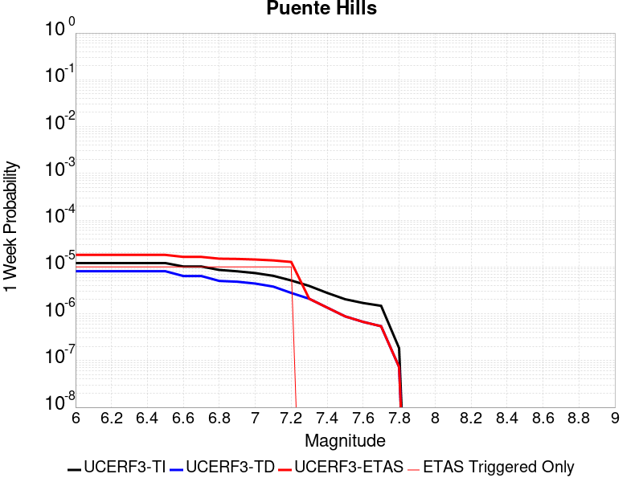 | 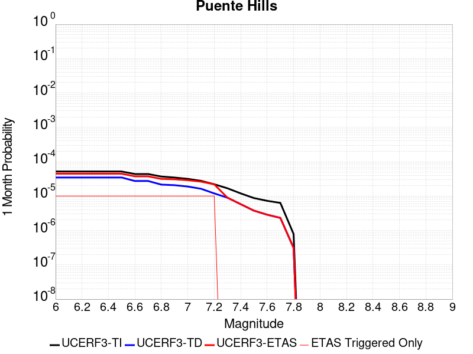 |  | 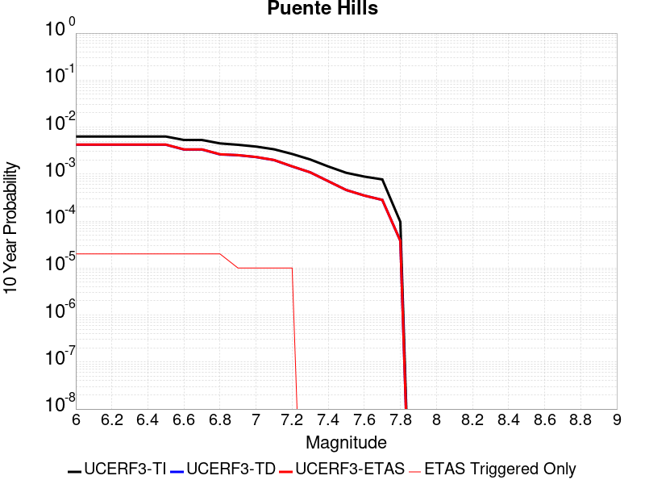 |

| Magnitude | 1 wk TI Prob | 1 wk TD Prob | 1 wk ETAS Prob | 1 wk ETAS/TD Gain | 1 wk ETAS Triggered Only | 1 mo TI Prob | 1 mo TD Prob | 1 mo ETAS Prob | 1 mo ETAS/TD Gain | 1 mo ETAS Triggered Only | 1 yr TI Prob | 1 yr TD Prob | 1 yr ETAS Prob | 1 yr ETAS/TD Gain | 1 yr ETAS Triggered Only | 10 yr TI Prob | 10 yr TD Prob | 10 yr ETAS Prob | 10 yr ETAS/TD Gain | 10 yr ETAS Triggered Only |
|-----|-----|-----|-----|-----|-----|-----|-----|-----|-----|-----|-----|-----|-----|-----|-----|-----|-----|-----|-----|-----|
| 6.0 | 1.2101656E-5 | 8.098448E-6 | 1.8098368E-5 | 2.2347944 | 1.0E-5 | 5.1863204E-5 | 3.4707205E-5 | 4.4706856E-5 | 1.2881147 | 1.0E-5 | 6.312516E-4 | 4.2248392E-4 | 4.324797E-4 | 1.0236596 | 1.0E-5 | 0.0062946146 | 0.0042173676 | 0.004237283 | 1.0047222 | 2.0E-5 |
| 6.1 | 1.2101656E-5 | 8.098448E-6 | 1.8098368E-5 | 2.2347944 | 1.0E-5 | 5.1863204E-5 | 3.4707205E-5 | 4.4706856E-5 | 1.2881147 | 1.0E-5 | 6.312516E-4 | 4.2248392E-4 | 4.324797E-4 | 1.0236596 | 1.0E-5 | 0.0062946146 | 0.0042173676 | 0.004237283 | 1.0047222 | 2.0E-5 |
| 6.2 | 1.2101656E-5 | 8.098448E-6 | 1.8098368E-5 | 2.2347944 | 1.0E-5 | 5.1863204E-5 | 3.4707205E-5 | 4.4706856E-5 | 1.2881147 | 1.0E-5 | 6.312516E-4 | 4.2248392E-4 | 4.324797E-4 | 1.0236596 | 1.0E-5 | 0.0062946146 | 0.0042173676 | 0.004237283 | 1.0047222 | 2.0E-5 |
| 6.3 | 1.2101656E-5 | 8.098448E-6 | 1.8098368E-5 | 2.2347944 | 1.0E-5 | 5.1863204E-5 | 3.4707205E-5 | 4.4706856E-5 | 1.2881147 | 1.0E-5 | 6.312516E-4 | 4.2248392E-4 | 4.324797E-4 | 1.0236596 | 1.0E-5 | 0.0062946146 | 0.0042173676 | 0.004237283 | 1.0047222 | 2.0E-5 |
| 6.4 | 1.2101656E-5 | 8.098448E-6 | 1.8098368E-5 | 2.2347944 | 1.0E-5 | 5.1863204E-5 | 3.4707205E-5 | 4.4706856E-5 | 1.2881147 | 1.0E-5 | 6.312516E-4 | 4.2248392E-4 | 4.324797E-4 | 1.0236596 | 1.0E-5 | 0.0062946146 | 0.0042173676 | 0.004237283 | 1.0047222 | 2.0E-5 |
| 6.5 | 1.2101656E-5 | 8.098448E-6 | 1.8098368E-5 | 2.2347944 | 1.0E-5 | 5.1863204E-5 | 3.4707205E-5 | 4.4706856E-5 | 1.2881147 | 1.0E-5 | 6.312516E-4 | 4.2248392E-4 | 4.324797E-4 | 1.0236596 | 1.0E-5 | 0.0062946146 | 0.0042173676 | 0.004237283 | 1.0047222 | 2.0E-5 |
| 6.6 | 1.0222488E-5 | 6.399079E-6 | 1.6399015E-5 | 2.5627148 | 1.0E-5 | 4.3809923E-5 | 2.742435E-5 | 3.7424077E-5 | 1.3646294 | 1.0E-5 | 5.332553E-4 | 3.3384276E-4 | 3.4383943E-4 | 1.0299442 | 1.0E-5 | 0.0053197746 | 0.0033336577 | 0.003353591 | 1.0059794 | 2.0E-5 |
| 6.7 | 1.0222488E-5 | 6.399079E-6 | 1.6399015E-5 | 2.5627148 | 1.0E-5 | 4.3809923E-5 | 2.742435E-5 | 3.7424077E-5 | 1.3646294 | 1.0E-5 | 5.332553E-4 | 3.3384276E-4 | 3.4383943E-4 | 1.0299442 | 1.0E-5 | 0.0053197746 | 0.0033336577 | 0.003353591 | 1.0059794 | 2.0E-5 |
| 6.8 | 8.6367845E-6 | 5.028129E-6 | 1.5028078E-5 | 2.9888012 | 1.0E-5 | 3.7014266E-5 | 2.1548949E-5 | 3.1548734E-5 | 1.4640497 | 1.0E-5 | 4.505555E-4 | 2.6232743E-4 | 2.723248E-4 | 1.0381103 | 1.0E-5 | 0.004496431 | 0.002620234 | 0.0026401815 | 1.007613 | 2.0E-5 |
| 6.9 | 8.066481E-6 | 4.8360116E-6 | 1.4835963E-5 | 3.0678098 | 1.0E-5 | 3.4570177E-5 | 2.0725602E-5 | 3.0725394E-5 | 1.482485 | 1.0E-5 | 4.2081063E-4 | 2.523055E-4 | 2.62303E-4 | 1.0396245 | 1.0E-5 | 0.0042001465 | 0.0025202443 | 0.0025302193 | 1.0039579 | 1.0E-5 |
| 7.0 | 7.393828E-6 | 4.4172275E-6 | 1.4417184E-5 | 3.2638533 | 1.0E-5 | 3.168745E-5 | 1.8930841E-5 | 2.8930652E-5 | 1.5282285 | 1.0E-5 | 3.857264E-4 | 2.3045906E-4 | 2.4045675E-4 | 1.0433817 | 1.0E-5 | 0.0038505755 | 0.0023022462 | 0.0023122232 | 1.0043336 | 1.0E-5 |
| 7.1 | 6.4660953E-6 | 3.8043859E-6 | 1.3804348E-5 | 3.6285353 | 1.0E-5 | 2.7711543E-5 | 1.630441E-5 | 2.6304248E-5 | 1.613321 | 1.0E-5 | 3.373358E-4 | 1.9848847E-4 | 2.0848648E-4 | 1.0503708 | 1.0E-5 | 0.0033682417 | 0.0019831478 | 0.0019931279 | 1.0050325 | 1.0E-5 |
| 7.2 | 5.143232E-6 | 2.7864896E-6 | 1.2786462E-5 | 4.5887346 | 1.0E-5 | 2.2042237E-5 | 1.1942045E-5 | 2.1941925E-5 | 1.8373675 | 1.0E-5 | 2.6833118E-4 | 1.453848E-4 | 1.5538334E-4 | 1.068773 | 1.0E-5 | 0.002680074 | 0.0014529065 | 0.001462892 | 1.0068728 | 1.0E-5 |
| 7.3 | 3.928255E-6 | 2.091338E-6 | 2.091338E-6 | 1.0 | 0.0 | 1.683527E-5 | 8.962847E-6 | 8.962847E-6 | 1.0 | 0.0 | 2.0495013E-4 | 1.0911726E-4 | 1.0911726E-4 | 1.0 | 0.0 | 0.002047612 | 0.0010906435 | 0.0010906435 | 1.0 | 0.0 |
| 7.4 | 2.7894434E-6 | 1.3546429E-6 | 1.3546429E-6 | 1.0 | 0.0 | 1.1954703E-5 | 5.8056E-6 | 5.8056E-6 | 1.0 | 0.0 | 1.4553878E-4 | 7.068093E-5 | 7.068093E-5 | 1.0 | 0.0 | 0.001454435 | 7.0658885E-4 | 7.0658885E-4 | 1.0 | 0.0 |
| 7.5 | 2.041735E-6 | 8.786996E-7 | 8.786996E-7 | 1.0 | 0.0 | 8.750263E-6 | 3.7658504E-6 | 3.7658504E-6 | 1.0 | 0.0 | 1.06529245E-4 | 4.5848297E-5 | 4.5848297E-5 | 1.0 | 0.0 | 0.0010647819 | 4.5839173E-4 | 4.5839173E-4 | 1.0 | 0.0 |
| 7.6 | 1.6959062E-6 | 6.698339E-7 | 6.698339E-7 | 1.0 | 0.0 | 7.268149E-6 | 2.8707138E-6 | 2.8707138E-6 | 1.0 | 0.0 | 8.848612E-5 | 3.4950408E-5 | 3.4950408E-5 | 1.0 | 0.0 | 8.84509E-4 | 3.4945202E-4 | 3.4945202E-4 | 1.0 | 0.0 |
| 7.7 | 1.4767965E-6 | 5.407146E-7 | 5.407146E-7 | 1.0 | 0.0 | 6.3291122E-6 | 2.3173466E-6 | 2.3173466E-6 | 1.0 | 0.0 | 7.705422E-5 | 2.8213353E-5 | 2.8213353E-5 | 1.0 | 0.0 | 7.702751E-4 | 2.8210029E-4 | 2.8210029E-4 | 1.0 | 0.0 |
| 7.8 | 1.8432911E-7 | 7.2811105E-8 | 7.2811105E-8 | 1.0 | 0.0 | 7.8998164E-7 | 3.1204758E-7 | 3.1204758E-7 | 1.0 | 0.0 | 9.617985E-6 | 3.799176E-6 | 3.799176E-6 | 1.0 | 0.0 | 9.617568E-5 | 3.7991435E-5 | 3.7991435E-5 | 1.0 | 0.0 |

## Cerro Prieto
*[(top)](#table-of-contents)*

| 1 Week | 1 Month | 1 Year | 10 Year |
|-----|-----|-----|-----|
|  | 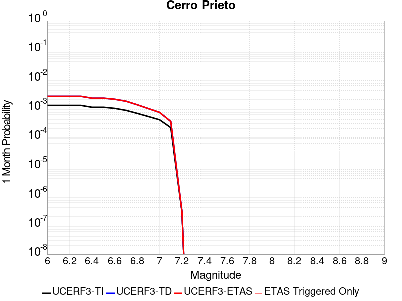 |  |  |

| Magnitude | 1 wk TI Prob | 1 wk TD Prob | 1 wk ETAS Prob | 1 wk ETAS/TD Gain | 1 wk ETAS Triggered Only | 1 mo TI Prob | 1 mo TD Prob | 1 mo ETAS Prob | 1 mo ETAS/TD Gain | 1 mo ETAS Triggered Only | 1 yr TI Prob | 1 yr TD Prob | 1 yr ETAS Prob | 1 yr ETAS/TD Gain | 1 yr ETAS Triggered Only | 10 yr TI Prob | 10 yr TD Prob | 10 yr ETAS Prob | 10 yr ETAS/TD Gain | 10 yr ETAS Triggered Only |
|-----|-----|-----|-----|-----|-----|-----|-----|-----|-----|-----|-----|-----|-----|-----|-----|-----|-----|-----|-----|-----|
| 6.0 | 2.9101528E-4 | 5.9654453E-4 | 5.9654453E-4 | 1.0 | 0.0 | 0.0012466122 | 0.0025543566 | 0.0025543566 | 1.0 | 0.0 | 0.015072231 | 0.030802928 | 0.030802928 | 1.0 | 0.0 | 0.14089979 | 0.25386256 | 0.25387004 | 1.0000294 | 1.0E-5 |
| 6.1 | 2.9101528E-4 | 5.9654453E-4 | 5.9654453E-4 | 1.0 | 0.0 | 0.0012466122 | 0.0025543566 | 0.0025543566 | 1.0 | 0.0 | 0.015072231 | 0.030802928 | 0.030802928 | 1.0 | 0.0 | 0.14089979 | 0.25386256 | 0.25387004 | 1.0000294 | 1.0E-5 |
| 6.2 | 2.9101528E-4 | 5.9654453E-4 | 5.9654453E-4 | 1.0 | 0.0 | 0.0012466122 | 0.0025543566 | 0.0025543566 | 1.0 | 0.0 | 0.015072231 | 0.030802928 | 0.030802928 | 1.0 | 0.0 | 0.14089979 | 0.25386256 | 0.25387004 | 1.0000294 | 1.0E-5 |
| 6.3 | 2.9101528E-4 | 5.9654453E-4 | 5.9654453E-4 | 1.0 | 0.0 | 0.0012466122 | 0.0025543566 | 0.0025543566 | 1.0 | 0.0 | 0.015072231 | 0.030802928 | 0.030802928 | 1.0 | 0.0 | 0.14089979 | 0.25386256 | 0.25387004 | 1.0000294 | 1.0E-5 |
| 6.4 | 2.508648E-4 | 5.140412E-4 | 5.140412E-4 | 1.0 | 0.0 | 0.0010746918 | 0.0022013725 | 0.0022013725 | 1.0 | 0.0 | 0.013006088 | 0.026629416 | 0.026629416 | 1.0 | 0.0 | 0.12270685 | 0.2242222 | 0.22422995 | 1.0000346 | 1.0E-5 |
| 6.5 | 2.508648E-4 | 5.140412E-4 | 5.140412E-4 | 1.0 | 0.0 | 0.0010746918 | 0.0022013725 | 0.0022013725 | 1.0 | 0.0 | 0.013006088 | 0.026629416 | 0.026629416 | 1.0 | 0.0 | 0.12270685 | 0.2242222 | 0.22422995 | 1.0000346 | 1.0E-5 |
| 6.6 | 2.294914E-4 | 4.7123645E-4 | 4.7123645E-4 | 1.0 | 0.0 | 9.831638E-4 | 0.0020182093 | 0.0020182093 | 1.0 | 0.0 | 0.011904482 | 0.024394194 | 0.024394194 | 1.0 | 0.0 | 0.11286586 | 0.20837563 | 0.20838355 | 1.000038 | 1.0E-5 |
| 6.7 | 1.9621674E-4 | 4.0426268E-4 | 4.0426268E-4 | 1.0 | 0.0 | 8.4065786E-4 | 0.0017315624 | 0.0017315624 | 1.0 | 0.0 | 0.010187071 | 0.020888962 | 0.020888962 | 1.0 | 0.0 | 0.09732539 | 0.18264732 | 0.18265548 | 1.0000447 | 1.0E-5 |
| 6.8 | 1.5476145E-4 | 3.0572579E-4 | 3.0572579E-4 | 1.0 | 0.0 | 6.6309475E-4 | 0.0013096977 | 0.0013096977 | 1.0 | 0.0 | 0.008043335 | 0.015826825 | 0.015826825 | 1.0 | 0.0 | 0.07758363 | 0.14310057 | 0.14310057 | 1.0 | 0.0 |
| 6.9 | 1.20509176E-4 | 2.2588465E-4 | 2.2588465E-4 | 1.0 | 0.0 | 5.1636563E-4 | 9.6778123E-4 | 9.6778123E-4 | 1.0 | 0.0 | 0.006268645 | 0.011734025 | 0.011734025 | 1.0 | 0.0 | 0.060947374 | 0.10917958 | 0.10917958 | 1.0 | 0.0 |
| 7.0 | 9.3269155E-5 | 1.6721459E-4 | 1.6721459E-4 | 1.0 | 0.0 | 3.9966372E-4 | 7.1648025E-4 | 7.1648025E-4 | 1.0 | 0.0 | 0.0048550544 | 0.008695914 | 0.008695914 | 1.0 | 0.0 | 0.04750344 | 0.082943216 | 0.082943216 | 1.0 | 0.0 |
| 7.1 | 5.029709E-5 | 8.174011E-5 | 8.174011E-5 | 1.0 | 0.0 | 2.1554115E-4 | 3.50287E-4 | 3.50287E-4 | 1.0 | 0.0 | 0.0026210553 | 0.004259821 | 0.004259821 | 1.0 | 0.0 | 0.025903556 | 0.04226813 | 0.04226813 | 1.0 | 0.0 |
| 7.2 | 6.5445185E-8 | 6.824737E-8 | 6.824737E-8 | 1.0 | 0.0 | 2.8047933E-7 | 2.9248872E-7 | 2.9248872E-7 | 1.0 | 0.0 | 3.4148304E-6 | 3.56105E-6 | 3.56105E-6 | 1.0 | 0.0 | 3.414778E-5 | 3.56105E-5 | 3.56105E-5 | 1.0 | 0.0 |

## Mount Diablo Thrust South
*[(top)](#table-of-contents)*

| 1 Week | 1 Month | 1 Year | 10 Year |
|-----|-----|-----|-----|
|  |  | 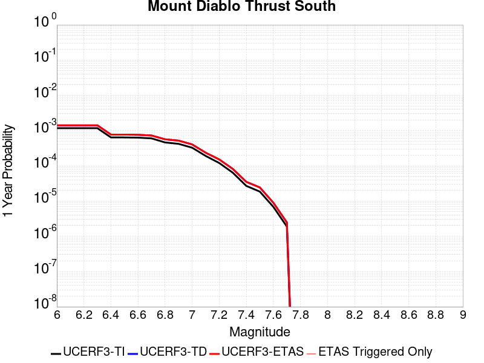 |  |

| Magnitude | 1 wk TI Prob | 1 wk TD Prob | 1 wk ETAS Prob | 1 wk ETAS/TD Gain | 1 wk ETAS Triggered Only | 1 mo TI Prob | 1 mo TD Prob | 1 mo ETAS Prob | 1 mo ETAS/TD Gain | 1 mo ETAS Triggered Only | 1 yr TI Prob | 1 yr TD Prob | 1 yr ETAS Prob | 1 yr ETAS/TD Gain | 1 yr ETAS Triggered Only | 10 yr TI Prob | 10 yr TD Prob | 10 yr ETAS Prob | 10 yr ETAS/TD Gain | 10 yr ETAS Triggered Only |
|-----|-----|-----|-----|-----|-----|-----|-----|-----|-----|-----|-----|-----|-----|-----|-----|-----|-----|-----|-----|-----|
| 6.0 | 2.2377444E-5 | 2.6956272E-5 | 2.6956272E-5 | 1.0 | 0.0 | 9.5899806E-5 | 1.1552288E-4 | 1.1552288E-4 | 1.0 | 0.0 | 0.0011669548 | 0.0014057814 | 0.0014057814 | 1.0 | 0.0 | 0.011608457 | 0.013988668 | 0.013998529 | 1.0007049 | 1.0E-5 |
| 6.1 | 2.2377444E-5 | 2.6956272E-5 | 2.6956272E-5 | 1.0 | 0.0 | 9.5899806E-5 | 1.1552288E-4 | 1.1552288E-4 | 1.0 | 0.0 | 0.0011669548 | 0.0014057814 | 0.0014057814 | 1.0 | 0.0 | 0.011608457 | 0.013988668 | 0.013998529 | 1.0007049 | 1.0E-5 |
| 6.2 | 2.2377444E-5 | 2.6956272E-5 | 2.6956272E-5 | 1.0 | 0.0 | 9.5899806E-5 | 1.1552288E-4 | 1.1552288E-4 | 1.0 | 0.0 | 0.0011669548 | 0.0014057814 | 0.0014057814 | 1.0 | 0.0 | 0.011608457 | 0.013988668 | 0.013998529 | 1.0007049 | 1.0E-5 |
| 6.3 | 2.2377444E-5 | 2.6956272E-5 | 2.6956272E-5 | 1.0 | 0.0 | 9.5899806E-5 | 1.1552288E-4 | 1.1552288E-4 | 1.0 | 0.0 | 0.0011669548 | 0.0014057814 | 0.0014057814 | 1.0 | 0.0 | 0.011608457 | 0.013988668 | 0.013998529 | 1.0007049 | 1.0E-5 |
| 6.4 | 1.2228463E-5 | 1.4747731E-5 | 1.4747731E-5 | 1.0 | 0.0 | 5.2406645E-5 | 6.320311E-5 | 6.320311E-5 | 1.0 | 0.0 | 6.378641E-4 | 7.69239E-4 | 7.69239E-4 | 1.0 | 0.0 | 0.0063603627 | 0.007667325 | 0.007667325 | 1.0 | 0.0 |
| 6.5 | 1.2228463E-5 | 1.4747731E-5 | 1.4747731E-5 | 1.0 | 0.0 | 5.2406645E-5 | 6.320311E-5 | 6.320311E-5 | 1.0 | 0.0 | 6.378641E-4 | 7.69239E-4 | 7.69239E-4 | 1.0 | 0.0 | 0.0063603627 | 0.007667325 | 0.007667325 | 1.0 | 0.0 |
| 6.6 | 1.2068118E-5 | 1.455253E-5 | 1.455253E-5 | 1.0 | 0.0 | 5.1719482E-5 | 6.236657E-5 | 6.236657E-5 | 1.0 | 0.0 | 6.2950276E-4 | 7.5906125E-4 | 7.5906125E-4 | 1.0 | 0.0 | 0.006277225 | 0.0075662453 | 0.0075662453 | 1.0 | 0.0 |
| 6.7 | 1.1499428E-5 | 1.3875192E-5 | 1.3875192E-5 | 1.0 | 0.0 | 4.9282335E-5 | 5.9463826E-5 | 5.9463826E-5 | 1.0 | 0.0 | 5.9984723E-4 | 7.2374434E-4 | 7.2374434E-4 | 1.0 | 0.0 | 0.0059823063 | 0.007215418 | 0.007215418 | 1.0 | 0.0 |
| 6.8 | 8.82118E-6 | 1.0830484E-5 | 1.0830484E-5 | 1.0 | 0.0 | 3.780451E-5 | 4.6415564E-5 | 4.6415564E-5 | 1.0 | 0.0 | 4.601727E-4 | 5.6496856E-4 | 5.6496856E-4 | 1.0 | 0.0 | 0.0045922096 | 0.00563615 | 0.00563615 | 1.0 | 0.0 |
| 6.9 | 8.047112E-6 | 9.939452E-6 | 9.939452E-6 | 1.0 | 0.0 | 3.4487166E-5 | 4.2596985E-5 | 4.2596985E-5 | 1.0 | 0.0 | 4.1980037E-4 | 5.1850016E-4 | 5.1850016E-4 | 1.0 | 0.0 | 0.004190082 | 0.005173695 | 0.005173695 | 1.0 | 0.0 |
| 7.0 | 6.2574763E-6 | 7.748516E-6 | 7.748516E-6 | 1.0 | 0.0 | 2.681748E-5 | 3.320752E-5 | 3.320752E-5 | 1.0 | 0.0 | 3.264539E-4 | 4.0423026E-4 | 4.0423026E-4 | 1.0 | 0.0 | 0.0032597475 | 0.004035568 | 0.004035568 | 1.0 | 0.0 |
| 7.1 | 3.6485903E-6 | 4.5129427E-6 | 4.5129427E-6 | 1.0 | 0.0 | 1.5636722E-5 | 1.9341043E-5 | 1.9341043E-5 | 1.0 | 0.0 | 1.9036046E-4 | 2.3545216E-4 | 2.3545216E-4 | 1.0 | 0.0 | 0.0019019748 | 0.0023519797 | 0.0023519797 | 1.0 | 0.0 |
| 7.2 | 2.3034274E-6 | 2.905533E-6 | 2.905533E-6 | 1.0 | 0.0 | 9.871795E-6 | 1.2452226E-5 | 1.2452226E-5 | 1.0 | 0.0 | 1.2018247E-4 | 1.5159555E-4 | 1.5159555E-4 | 1.0 | 0.0 | 0.0012011749 | 0.0015148793 | 0.0015148793 | 1.0 | 0.0 |
| 7.3 | 1.224035E-6 | 1.5679833E-6 | 1.5679833E-6 | 1.0 | 0.0 | 5.245854E-6 | 6.7199117E-6 | 6.7199117E-6 | 1.0 | 0.0 | 6.38664E-5 | 8.1811966E-5 | 8.1811966E-5 | 1.0 | 0.0 | 6.384805E-4 | 8.1778906E-4 | 8.1778906E-4 | 1.0 | 0.0 |
| 7.4 | 5.1601154E-7 | 6.723377E-7 | 6.723377E-7 | 1.0 | 0.0 | 2.2114762E-6 | 2.8814443E-6 | 2.8814443E-6 | 1.0 | 0.0 | 2.6924388E-5 | 3.5081033E-5 | 3.5081033E-5 | 1.0 | 0.0 | 2.6921128E-4 | 3.5073838E-4 | 3.5073838E-4 | 1.0 | 0.0 |
| 7.5 | 3.552894E-7 | 4.6653233E-7 | 4.6653233E-7 | 1.0 | 0.0 | 1.5226678E-6 | 1.999423E-6 | 1.999423E-6 | 1.0 | 0.0 | 1.8538323E-5 | 2.4342717E-5 | 2.4342717E-5 | 1.0 | 0.0 | 1.8536777E-4 | 2.4340842E-4 | 2.4340842E-4 | 1.0 | 0.0 |
| 7.6 | 1.3124082E-7 | 1.719204E-7 | 1.719204E-7 | 1.0 | 0.0 | 5.6246057E-7 | 7.368016E-7 | 7.368016E-7 | 1.0 | 0.0 | 6.8479358E-6 | 8.970531E-6 | 8.970531E-6 | 1.0 | 0.0 | 6.8477246E-5 | 8.967385E-5 | 8.967385E-5 | 1.0 | 0.0 |
| 7.7 | 3.6193022E-8 | 4.7334765E-8 | 4.7334765E-8 | 1.0 | 0.0 | 1.5511293E-7 | 2.0286328E-7 | 2.0286328E-7 | 1.0 | 0.0 | 1.8884983E-6 | 2.4698586E-6 | 2.4698586E-6 | 1.0 | 0.0 | 1.8884823E-5 | 2.469954E-5 | 2.469954E-5 | 1.0 | 0.0 |

## Sierra Madre
*[(top)](#table-of-contents)*

| 1 Week | 1 Month | 1 Year | 10 Year |
|-----|-----|-----|-----|
|  |  |  |  |

| Magnitude | 1 wk TI Prob | 1 wk TD Prob | 1 wk ETAS Prob | 1 wk ETAS/TD Gain | 1 wk ETAS Triggered Only | 1 mo TI Prob | 1 mo TD Prob | 1 mo ETAS Prob | 1 mo ETAS/TD Gain | 1 mo ETAS Triggered Only | 1 yr TI Prob | 1 yr TD Prob | 1 yr ETAS Prob | 1 yr ETAS/TD Gain | 1 yr ETAS Triggered Only | 10 yr TI Prob | 10 yr TD Prob | 10 yr ETAS Prob | 10 yr ETAS/TD Gain | 10 yr ETAS Triggered Only |
|-----|-----|-----|-----|-----|-----|-----|-----|-----|-----|-----|-----|-----|-----|-----|-----|-----|-----|-----|-----|-----|
| 6.0 | 1.3379373E-5 | 1.1000776E-5 | 1.1000776E-5 | 1.0 | 0.0 | 5.7338908E-5 | 4.714534E-5 | 4.714534E-5 | 1.0 | 0.0 | 6.978776E-4 | 5.738448E-4 | 5.838391E-4 | 1.0174164 | 1.0E-5 | 0.0069569005 | 0.0057238447 | 0.0057337875 | 1.0017371 | 1.0E-5 |
| 6.1 | 1.3379373E-5 | 1.1000776E-5 | 1.1000776E-5 | 1.0 | 0.0 | 5.7338908E-5 | 4.714534E-5 | 4.714534E-5 | 1.0 | 0.0 | 6.978776E-4 | 5.738448E-4 | 5.838391E-4 | 1.0174164 | 1.0E-5 | 0.0069569005 | 0.0057238447 | 0.0057337875 | 1.0017371 | 1.0E-5 |
| 6.2 | 1.3379373E-5 | 1.1000776E-5 | 1.1000776E-5 | 1.0 | 0.0 | 5.7338908E-5 | 4.714534E-5 | 4.714534E-5 | 1.0 | 0.0 | 6.978776E-4 | 5.738448E-4 | 5.838391E-4 | 1.0174164 | 1.0E-5 | 0.0069569005 | 0.0057238447 | 0.0057337875 | 1.0017371 | 1.0E-5 |
| 6.3 | 1.3379373E-5 | 1.1000776E-5 | 1.1000776E-5 | 1.0 | 0.0 | 5.7338908E-5 | 4.714534E-5 | 4.714534E-5 | 1.0 | 0.0 | 6.978776E-4 | 5.738448E-4 | 5.838391E-4 | 1.0174164 | 1.0E-5 | 0.0069569005 | 0.0057238447 | 0.0057337875 | 1.0017371 | 1.0E-5 |
| 6.4 | 1.3379373E-5 | 1.1000776E-5 | 1.1000776E-5 | 1.0 | 0.0 | 5.7338908E-5 | 4.714534E-5 | 4.714534E-5 | 1.0 | 0.0 | 6.978776E-4 | 5.738448E-4 | 5.838391E-4 | 1.0174164 | 1.0E-5 | 0.0069569005 | 0.0057238447 | 0.0057337875 | 1.0017371 | 1.0E-5 |
| 6.5 | 1.26563245E-5 | 1.0230232E-5 | 1.0230232E-5 | 1.0 | 0.0 | 5.4240263E-5 | 4.384312E-5 | 4.384312E-5 | 1.0 | 0.0 | 6.601751E-4 | 5.3366035E-4 | 5.43655E-4 | 1.0187285 | 1.0E-5 | 0.006582173 | 0.0053239604 | 0.005333907 | 1.0018682 | 1.0E-5 |
| 6.6 | 1.26563245E-5 | 1.0230232E-5 | 1.0230232E-5 | 1.0 | 0.0 | 5.4240263E-5 | 4.384312E-5 | 4.384312E-5 | 1.0 | 0.0 | 6.601751E-4 | 5.3366035E-4 | 5.43655E-4 | 1.0187285 | 1.0E-5 | 0.006582173 | 0.0053239604 | 0.005333907 | 1.0018682 | 1.0E-5 |
| 6.7 | 1.2502474E-5 | 1.00663765E-5 | 1.00663765E-5 | 1.0 | 0.0 | 5.3580934E-5 | 4.3140906E-5 | 4.3140906E-5 | 1.0 | 0.0 | 6.521526E-4 | 5.25115E-4 | 5.351097E-4 | 1.0190334 | 1.0E-5 | 0.0065024206 | 0.0052389116 | 0.005248859 | 1.0018988 | 1.0E-5 |
| 6.8 | 1.2454966E-5 | 1.0018662E-5 | 1.0018662E-5 | 1.0 | 0.0 | 5.3377335E-5 | 4.293642E-5 | 4.293642E-5 | 1.0 | 0.0 | 6.4967526E-4 | 5.226266E-4 | 5.3262134E-4 | 1.0191242 | 1.0E-5 | 0.006477792 | 0.0052141445 | 0.0052240924 | 1.0019078 | 1.0E-5 |
| 6.9 | 1.2225574E-5 | 9.792639E-6 | 9.792639E-6 | 1.0 | 0.0 | 5.2394265E-5 | 4.196778E-5 | 4.196778E-5 | 1.0 | 0.0 | 6.3771347E-4 | 5.10839E-4 | 5.208339E-4 | 1.0195656 | 1.0E-5 | 0.006358865 | 0.0050968137 | 0.005106763 | 1.001952 | 1.0E-5 |
| 7.0 | 1.182946E-5 | 9.399179E-6 | 9.399179E-6 | 1.0 | 0.0 | 5.06967E-5 | 4.0281582E-5 | 4.0281582E-5 | 1.0 | 0.0 | 6.1705755E-4 | 4.903189E-4 | 5.00314E-4 | 1.0203849 | 1.0E-5 | 0.006153469 | 0.004892533 | 0.0049024844 | 1.002034 | 1.0E-5 |
| 7.1 | 1.14369095E-5 | 8.986194E-6 | 8.986194E-6 | 1.0 | 0.0 | 4.9014405E-5 | 3.85117E-5 | 3.85117E-5 | 1.0 | 0.0 | 5.9658696E-4 | 4.6878002E-4 | 4.7877536E-4 | 1.021322 | 1.0E-5 | 0.005949879 | 0.0046780678 | 0.004688021 | 1.0021276 | 1.0E-5 |
| 7.2 | 1.0836419E-5 | 8.39959E-6 | 8.39959E-6 | 1.0 | 0.0 | 4.644097E-5 | 3.599775E-5 | 3.599775E-5 | 1.0 | 0.0 | 5.652721E-4 | 4.3818538E-4 | 4.3818538E-4 | 1.0 | 0.0 | 0.0056383642 | 0.0043733614 | 0.0043733614 | 1.0 | 0.0 |
| 7.3 | 1.0403439E-5 | 8.020854E-6 | 8.020854E-6 | 1.0 | 0.0 | 4.4585406E-5 | 3.437464E-5 | 3.437464E-5 | 1.0 | 0.0 | 5.426921E-4 | 4.184318E-4 | 4.184318E-4 | 1.0 | 0.0 | 0.005413687 | 0.004176585 | 0.004176585 | 1.0 | 0.0 |
| 7.4 | 9.768864E-6 | 7.4144855E-6 | 7.4144855E-6 | 1.0 | 0.0 | 4.186589E-5 | 3.1775984E-5 | 3.1775984E-5 | 1.0 | 0.0 | 5.09598E-4 | 3.868048E-4 | 3.868048E-4 | 1.0 | 0.0 | 0.0050843097 | 0.0038614576 | 0.0038614576 | 1.0 | 0.0 |
| 7.5 | 8.687089E-6 | 6.450183E-6 | 6.450183E-6 | 1.0 | 0.0 | 3.722985E-5 | 2.7643353E-5 | 2.7643353E-5 | 1.0 | 0.0 | 4.5317915E-4 | 3.3650672E-4 | 3.3650672E-4 | 1.0 | 0.0 | 0.004522561 | 0.003360109 | 0.003360109 | 1.0 | 0.0 |
| 7.6 | 6.3506063E-6 | 4.430329E-6 | 4.430329E-6 | 1.0 | 0.0 | 2.72166E-5 | 1.8986988E-5 | 1.8986988E-5 | 1.0 | 0.0 | 3.3131172E-4 | 2.3114232E-4 | 2.3114232E-4 | 1.0 | 0.0 | 0.003308182 | 0.0023090935 | 0.0023090935 | 1.0 | 0.0 |
| 7.7 | 4.62223E-6 | 2.9329542E-6 | 2.9329542E-6 | 1.0 | 0.0 | 1.9809406E-5 | 1.2569743E-5 | 1.2569743E-5 | 1.0 | 0.0 | 2.4115283E-4 | 1.5302589E-4 | 1.5302589E-4 | 1.0 | 0.0 | 0.0024089129 | 0.0015292577 | 0.0015292577 | 1.0 | 0.0 |
| 7.8 | 3.2145008E-6 | 1.949411E-6 | 1.949411E-6 | 1.0 | 0.0 | 1.3776359E-5 | 8.354592E-6 | 8.354592E-6 | 1.0 | 0.0 | 1.6771426E-4 | 1.01712416E-4 | 1.01712416E-4 | 1.0 | 0.0 | 0.0016758774 | 0.0010166786 | 0.0010166786 | 1.0 | 0.0 |
| 7.9 | 1.0391769E-6 | 5.602482E-7 | 5.602482E-7 | 1.0 | 0.0 | 4.4536077E-6 | 2.4010617E-6 | 2.4010617E-6 | 1.0 | 0.0 | 5.4221324E-5 | 2.9232539E-5 | 2.9232539E-5 | 1.0 | 0.0 | 5.4208096E-4 | 2.9228735E-4 | 2.9228735E-4 | 1.0 | 0.0 |
| 8.0 | 1.210983E-7 | 6.613497E-8 | 6.613497E-8 | 1.0 | 0.0 | 5.1899264E-7 | 2.8343558E-7 | 2.8343558E-7 | 1.0 | 0.0 | 6.3187167E-6 | 3.4508228E-6 | 3.4508228E-6 | 1.0 | 0.0 | 6.318537E-5 | 3.450771E-5 | 3.450771E-5 | 1.0 | 0.0 |

## Laguna Salada
*[(top)](#table-of-contents)*

| 1 Week | 1 Month | 1 Year | 10 Year |
|-----|-----|-----|-----|
|  |  |  |  |

| Magnitude | 1 wk TI Prob | 1 wk TD Prob | 1 wk ETAS Prob | 1 wk ETAS/TD Gain | 1 wk ETAS Triggered Only | 1 mo TI Prob | 1 mo TD Prob | 1 mo ETAS Prob | 1 mo ETAS/TD Gain | 1 mo ETAS Triggered Only | 1 yr TI Prob | 1 yr TD Prob | 1 yr ETAS Prob | 1 yr ETAS/TD Gain | 1 yr ETAS Triggered Only | 10 yr TI Prob | 10 yr TD Prob | 10 yr ETAS Prob | 10 yr ETAS/TD Gain | 10 yr ETAS Triggered Only |
|-----|-----|-----|-----|-----|-----|-----|-----|-----|-----|-----|-----|-----|-----|-----|-----|-----|-----|-----|-----|-----|
| 6.0 | 4.6465593E-5 | 4.634507E-5 | 5.634461E-5 | 1.2157627 | 1.0E-5 | 1.9912305E-4 | 1.9860751E-4 | 2.0860552E-4 | 1.0503405 | 1.0E-5 | 0.0024216278 | 0.0024154421 | 0.002425418 | 1.00413 | 1.0E-5 | 0.02395408 | 0.023965387 | 0.023975147 | 1.0004072 | 1.0E-5 |
| 6.1 | 3.982297E-5 | 3.7244878E-5 | 4.7244506E-5 | 1.2684833 | 1.0E-5 | 1.706587E-4 | 1.5961178E-4 | 1.6961018E-4 | 1.062642 | 1.0E-5 | 0.0020757897 | 0.0019416384 | 0.001951619 | 1.0051403 | 1.0E-5 | 0.020565065 | 0.019322045 | 0.019331852 | 1.0005076 | 1.0E-5 |
| 6.2 | 3.6067784E-5 | 3.2600165E-5 | 4.2599837E-5 | 1.306737 | 1.0E-5 | 1.5456705E-4 | 1.3970808E-4 | 1.4970668E-4 | 1.0715678 | 1.0E-5 | 0.0018802295 | 0.0016997134 | 0.0017096964 | 1.0058733 | 1.0E-5 | 0.018644003 | 0.016963193 | 0.016973024 | 1.0005795 | 1.0E-5 |
| 6.3 | 3.2859112E-5 | 2.8847233E-5 | 3.8846945E-5 | 1.3466437 | 1.0E-5 | 1.4081717E-4 | 1.2362566E-4 | 1.3362443E-4 | 1.0808793 | 1.0E-5 | 0.0017131006 | 0.0015041964 | 0.0015141814 | 1.006638 | 1.0E-5 | 0.016999546 | 0.015031838 | 0.0150416875 | 1.0006553 | 1.0E-5 |
| 6.4 | 2.9132116E-5 | 2.4851877E-5 | 3.485163E-5 | 1.4023741 | 1.0E-5 | 1.2484594E-4 | 1.0650421E-4 | 1.1650314E-4 | 1.093883 | 1.0E-5 | 0.0015189396 | 0.001296006 | 0.0013059931 | 1.007706 | 1.0E-5 | 0.015085992 | 0.012965128 | 0.012974999 | 1.0007613 | 1.0E-5 |
| 6.5 | 2.7075037E-5 | 2.2824677E-5 | 3.282445E-5 | 1.4381123 | 1.0E-5 | 1.1603071E-4 | 9.7816875E-5 | 1.078159E-4 | 1.1022218 | 1.0E-5 | 0.0014117584 | 0.0011903581 | 0.0012003462 | 1.0083908 | 1.0E-5 | 0.014028233 | 0.011916272 | 0.011926153 | 1.0008292 | 1.0E-5 |
| 6.6 | 2.2367465E-5 | 1.8572848E-5 | 2.8572662E-5 | 1.5384104 | 1.0E-5 | 9.5857045E-5 | 7.959595E-5 | 8.959515E-5 | 1.1256245 | 1.0E-5 | 0.0011664346 | 9.687322E-4 | 9.787225E-4 | 1.0103128 | 1.0E-5 | 0.011603311 | 0.009708806 | 0.00971871 | 1.00102 | 1.0E-5 |
| 6.7 | 1.9458053E-5 | 1.5913607E-5 | 2.5913449E-5 | 1.628383 | 1.0E-5 | 8.338899E-5 | 6.819984E-5 | 7.819916E-5 | 1.1466179 | 1.0E-5 | 0.001014788 | 8.300971E-4 | 8.400888E-4 | 1.0120368 | 1.0E-5 | 0.010101665 | 0.008315945 | 0.008325862 | 1.0011925 | 1.0E-5 |
| 6.8 | 1.0767866E-5 | 9.183346E-6 | 9.183346E-6 | 1.0 | 0.0 | 4.614718E-5 | 3.9356994E-5 | 3.9356994E-5 | 1.0 | 0.0 | 5.6169706E-4 | 4.7913467E-4 | 4.7913467E-4 | 1.0 | 0.0 | 0.0056027942 | 0.0048085325 | 0.0048085325 | 1.0 | 0.0 |
| 6.9 | 2.1384765E-6 | 1.7913964E-6 | 1.7913964E-6 | 1.0 | 0.0 | 9.164866E-6 | 7.677392E-6 | 7.677392E-6 | 1.0 | 0.0 | 1.1157654E-4 | 9.346863E-5 | 9.346863E-5 | 1.0 | 0.0 | 0.0011152053 | 9.343315E-4 | 9.343315E-4 | 1.0 | 0.0 |
| 7.0 | 2.0952946E-6 | 1.7493335E-6 | 1.7493335E-6 | 1.0 | 0.0 | 8.979802E-6 | 7.497124E-6 | 7.497124E-6 | 1.0 | 0.0 | 1.0932361E-4 | 9.127405E-5 | 9.127405E-5 | 1.0 | 0.0 | 0.0010926984 | 9.124038E-4 | 9.124038E-4 | 1.0 | 0.0 |
| 7.1 | 1.7887576E-6 | 1.4500541E-6 | 1.4500541E-6 | 1.0 | 0.0 | 7.666081E-6 | 6.2145045E-6 | 6.2145045E-6 | 1.0 | 0.0 | 9.333054E-5 | 7.565928E-5 | 7.565928E-5 | 1.0 | 0.0 | 9.329135E-4 | 7.5636554E-4 | 7.5636554E-4 | 1.0 | 0.0 |
| 7.2 | 9.723109E-7 | 7.135829E-7 | 7.135829E-7 | 1.0 | 0.0 | 4.16704E-6 | 3.0582096E-6 | 3.0582096E-6 | 1.0 | 0.0 | 5.073253E-5 | 3.7233232E-5 | 3.7233232E-5 | 1.0 | 0.0 | 5.072095E-4 | 3.722862E-4 | 3.722862E-4 | 1.0 | 0.0 |

## San Vicente
*[(top)](#table-of-contents)*

| 1 Week | 1 Month | 1 Year | 10 Year |
|-----|-----|-----|-----|
| 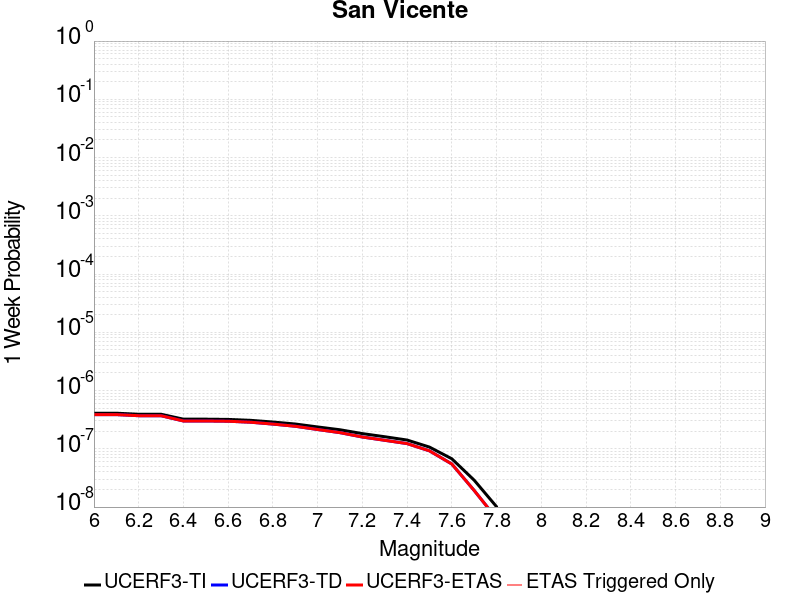 |  |  | 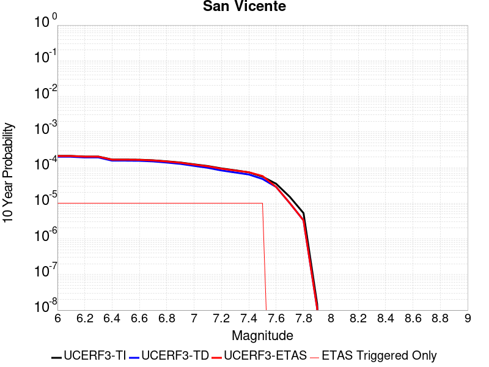 |

| Magnitude | 1 wk TI Prob | 1 wk TD Prob | 1 wk ETAS Prob | 1 wk ETAS/TD Gain | 1 wk ETAS Triggered Only | 1 mo TI Prob | 1 mo TD Prob | 1 mo ETAS Prob | 1 mo ETAS/TD Gain | 1 mo ETAS Triggered Only | 1 yr TI Prob | 1 yr TD Prob | 1 yr ETAS Prob | 1 yr ETAS/TD Gain | 1 yr ETAS Triggered Only | 10 yr TI Prob | 10 yr TD Prob | 10 yr ETAS Prob | 10 yr ETAS/TD Gain | 10 yr ETAS Triggered Only |
|-----|-----|-----|-----|-----|-----|-----|-----|-----|-----|-----|-----|-----|-----|-----|-----|-----|-----|-----|-----|-----|
| 6.0 | 4.0851268E-7 | 3.8665297E-7 | 3.8665297E-7 | 1.0 | 0.0 | 1.7507675E-6 | 1.6570831E-6 | 1.1657066E-5 | 7.0346904 | 1.0E-5 | 2.1315385E-5 | 2.0174806E-5 | 3.0174606E-5 | 1.4956577 | 1.0E-5 | 2.1313342E-4 | 2.0173044E-4 | 2.1172842E-4 | 1.0495611 | 1.0E-5 |
| 6.1 | 4.0851268E-7 | 3.8665297E-7 | 3.8665297E-7 | 1.0 | 0.0 | 1.7507675E-6 | 1.6570831E-6 | 1.1657066E-5 | 7.0346904 | 1.0E-5 | 2.1315385E-5 | 2.0174806E-5 | 3.0174606E-5 | 1.4956577 | 1.0E-5 | 2.1313342E-4 | 2.0173044E-4 | 2.1172842E-4 | 1.0495611 | 1.0E-5 |
| 6.2 | 3.9200887E-7 | 3.7009818E-7 | 3.7009818E-7 | 1.0 | 0.0 | 1.680037E-6 | 1.5861341E-6 | 1.15861185E-5 | 7.3046274 | 1.0E-5 | 2.0454258E-5 | 1.9311017E-5 | 2.9310824E-5 | 1.5178291 | 1.0E-5 | 2.0452376E-4 | 1.9309403E-4 | 2.030921E-4 | 1.0517782 | 1.0E-5 |
| 6.3 | 3.9200887E-7 | 3.7009818E-7 | 3.7009818E-7 | 1.0 | 0.0 | 1.680037E-6 | 1.5861341E-6 | 1.15861185E-5 | 7.3046274 | 1.0E-5 | 2.0454258E-5 | 1.9311017E-5 | 2.9310824E-5 | 1.5178291 | 1.0E-5 | 2.0452376E-4 | 1.9309403E-4 | 2.030921E-4 | 1.0517782 | 1.0E-5 |
| 6.4 | 3.2280067E-7 | 3.005979E-7 | 3.005979E-7 | 1.0 | 0.0 | 1.3834307E-6 | 1.2882759E-6 | 1.1288263E-5 | 8.762302 | 1.0E-5 | 1.684314E-5 | 1.5684647E-5 | 2.568449E-5 | 1.6375562 | 1.0E-5 | 1.6841863E-4 | 1.5683546E-4 | 1.668339E-4 | 1.0637511 | 1.0E-5 |
| 6.5 | 3.2280067E-7 | 3.005979E-7 | 3.005979E-7 | 1.0 | 0.0 | 1.3834307E-6 | 1.2882759E-6 | 1.1288263E-5 | 8.762302 | 1.0E-5 | 1.684314E-5 | 1.5684647E-5 | 2.568449E-5 | 1.6375562 | 1.0E-5 | 1.6841863E-4 | 1.5683546E-4 | 1.668339E-4 | 1.0637511 | 1.0E-5 |
| 6.6 | 3.1973437E-7 | 2.9752144E-7 | 2.9752144E-7 | 1.0 | 0.0 | 1.3702895E-6 | 1.2750912E-6 | 1.1275079E-5 | 8.842566 | 1.0E-5 | 1.6683147E-5 | 1.5524125E-5 | 2.552397E-5 | 1.6441487 | 1.0E-5 | 1.6681894E-4 | 1.5523047E-4 | 1.6522892E-4 | 1.0644103 | 1.0E-5 |
| 6.7 | 3.0841164E-7 | 2.8612172E-7 | 2.8612172E-7 | 1.0 | 0.0 | 1.3217634E-6 | 1.2262353E-6 | 1.1226223E-5 | 9.155032 | 1.0E-5 | 1.6092352E-5 | 1.4929313E-5 | 2.4929162E-5 | 1.6698132 | 1.0E-5 | 1.6091186E-4 | 1.4928314E-4 | 1.5928164E-4 | 1.0669768 | 1.0E-5 |
| 6.8 | 2.883202E-7 | 2.658495E-7 | 2.658495E-7 | 1.0 | 0.0 | 1.2356575E-6 | 1.1393546E-6 | 1.1139343E-5 | 9.776889 | 1.0E-5 | 1.50440255E-5 | 1.3871553E-5 | 2.3871415E-5 | 1.7208898 | 1.0E-5 | 1.5043007E-4 | 1.387069E-4 | 1.4870553E-4 | 1.0720844 | 1.0E-5 |
| 6.9 | 2.66663E-7 | 2.439735E-7 | 2.439735E-7 | 1.0 | 0.0 | 1.1428409E-6 | 1.0456002E-6 | 1.1045589E-5 | 10.563875 | 1.0E-5 | 1.3914E-5 | 1.2730108E-5 | 2.272998E-5 | 1.7855293 | 1.0E-5 | 1.3913128E-4 | 1.2729381E-4 | 1.3729253E-4 | 1.0785484 | 1.0E-5 |
| 7.0 | 2.3733546E-7 | 2.1451226E-7 | 2.1451226E-7 | 1.0 | 0.0 | 1.0171515E-6 | 9.193379E-7 | 1.0919329E-5 | 11.877383 | 1.0E-5 | 1.238375E-5 | 1.1192881E-5 | 2.1192769E-5 | 1.893415 | 1.0E-5 | 1.238306E-4 | 1.1192319E-4 | 1.21922065E-4 | 1.089337 | 1.0E-5 |
| 7.1 | 2.123689E-7 | 1.8946507E-7 | 1.8946507E-7 | 1.0 | 0.0 | 9.1015215E-7 | 8.119929E-7 | 1.0811985E-5 | 13.315369 | 1.0E-5 | 1.1081046E-5 | 9.885968E-6 | 1.9885869E-5 | 2.0115247 | 1.0E-5 | 1.1080493E-4 | 9.885529E-5 | 1.0885431E-4 | 1.101148 | 1.0E-5 |
| 7.2 | 1.8244859E-7 | 1.594932E-7 | 1.594932E-7 | 1.0 | 0.0 | 7.8192227E-7 | 6.835421E-7 | 1.0683535E-5 | 15.629667 | 1.0E-5 | 9.519862E-6 | 8.322093E-6 | 1.8322009E-5 | 2.2016108 | 1.0E-5 | 9.519454E-5 | 8.321782E-5 | 9.3216986E-5 | 1.1201565 | 1.0E-5 |
| 7.3 | 1.611936E-7 | 1.4005612E-7 | 1.4005612E-7 | 1.0 | 0.0 | 6.9082955E-7 | 6.0024036E-7 | 1.0600234E-5 | 17.659983 | 1.0E-5 | 8.410817E-6 | 7.3079013E-6 | 1.7307828E-5 | 2.368372 | 1.0E-5 | 8.410499E-5 | 7.307662E-5 | 8.307589E-5 | 1.1368327 | 1.0E-5 |
| 7.4 | 1.414892E-7 | 1.2290288E-7 | 1.2290288E-7 | 1.0 | 0.0 | 6.063821E-7 | 5.2672647E-7 | 1.0526721E-5 | 19.985176 | 1.0E-5 | 7.3826773E-6 | 6.412876E-6 | 1.6412812E-5 | 2.5593529 | 1.0E-5 | 7.382432E-5 | 6.4126914E-5 | 7.412627E-5 | 1.1559308 | 1.0E-5 |
| 7.5 | 1.0709291E-7 | 9.229651E-8 | 9.229651E-8 | 1.0 | 0.0 | 4.5896954E-7 | 3.955564E-7 | 1.0395553E-5 | 26.280834 | 1.0E-5 | 5.5879395E-6 | 4.8158886E-6 | 1.4815841E-5 | 3.07645 | 1.0E-5 | 5.5877994E-5 | 4.8157843E-5 | 5.8157362E-5 | 1.2076405 | 1.0E-5 |
| 7.6 | 6.746737E-8 | 5.4863424E-8 | 5.4863424E-8 | 1.0 | 0.0 | 2.8914585E-7 | 2.3512895E-7 | 2.3512895E-7 | 1.0 | 0.0 | 3.5203448E-6 | 2.8626912E-6 | 2.8626912E-6 | 1.0 | 0.0 | 3.520289E-5 | 2.8626544E-5 | 2.8626544E-5 | 1.0 | 0.0 |
| 7.7 | 2.8940264E-8 | 1.9261737E-8 | 1.9261737E-8 | 1.0 | 0.0 | 1.240297E-7 | 8.25503E-8 | 8.25503E-8 | 1.0 | 0.0 | 1.5100605E-6 | 1.0050494E-6 | 1.0050494E-6 | 1.0 | 0.0 | 1.5100502E-5 | 1.0050449E-5 | 1.0050449E-5 | 1.0 | 0.0 |
| 7.8 | 1.0151455E-8 | 6.3538255E-9 | 6.3538255E-9 | 1.0 | 0.0 | 4.3506233E-8 | 2.7230682E-8 | 2.7230682E-8 | 1.0 | 0.0 | 5.296883E-7 | 3.315335E-7 | 3.315335E-7 | 1.0 | 0.0 | 5.2968703E-6 | 3.31533E-6 | 3.31533E-6 | 1.0 | 0.0 |
| 7.9 | 2.8324232E-11 | 2.1405877E-11 | 2.1405877E-11 | 1.0 | 0.0 | 1.2138957E-10 | 9.1739616E-11 | 9.1739616E-11 | 1.0 | 0.0 | 1.4779177E-9 | 1.1169302E-9 | 1.1169302E-9 | 1.0 | 0.0 | 1.4779177E-8 | 1.1169303E-8 | 1.1169303E-8 | 1.0 | 0.0 |

## San Joaquin Hills
*[(top)](#table-of-contents)*

| 1 Week | 1 Month | 1 Year | 10 Year |
|-----|-----|-----|-----|
| 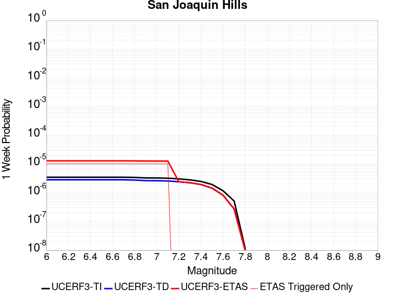 |  |  |  |

| Magnitude | 1 wk TI Prob | 1 wk TD Prob | 1 wk ETAS Prob | 1 wk ETAS/TD Gain | 1 wk ETAS Triggered Only | 1 mo TI Prob | 1 mo TD Prob | 1 mo ETAS Prob | 1 mo ETAS/TD Gain | 1 mo ETAS Triggered Only | 1 yr TI Prob | 1 yr TD Prob | 1 yr ETAS Prob | 1 yr ETAS/TD Gain | 1 yr ETAS Triggered Only | 10 yr TI Prob | 10 yr TD Prob | 10 yr ETAS Prob | 10 yr ETAS/TD Gain | 10 yr ETAS Triggered Only |
|-----|-----|-----|-----|-----|-----|-----|-----|-----|-----|-----|-----|-----|-----|-----|-----|-----|-----|-----|-----|-----|
| 6.0 | 3.4525704E-6 | 2.8139727E-6 | 1.28139445E-5 | 4.5536847 | 1.0E-5 | 1.4796647E-5 | 1.2059828E-5 | 2.2059707E-5 | 1.8291892 | 1.0E-5 | 1.8013427E-4 | 1.4681864E-4 | 1.5681717E-4 | 1.0681013 | 1.0E-5 | 0.0017998833 | 0.0014672297 | 0.0014772151 | 1.0068055 | 1.0E-5 |
| 6.1 | 3.4525704E-6 | 2.8139727E-6 | 1.28139445E-5 | 4.5536847 | 1.0E-5 | 1.4796647E-5 | 1.2059828E-5 | 2.2059707E-5 | 1.8291892 | 1.0E-5 | 1.8013427E-4 | 1.4681864E-4 | 1.5681717E-4 | 1.0681013 | 1.0E-5 | 0.0017998833 | 0.0014672297 | 0.0014772151 | 1.0068055 | 1.0E-5 |
| 6.2 | 3.4525704E-6 | 2.8139727E-6 | 1.28139445E-5 | 4.5536847 | 1.0E-5 | 1.4796647E-5 | 1.2059828E-5 | 2.2059707E-5 | 1.8291892 | 1.0E-5 | 1.8013427E-4 | 1.4681864E-4 | 1.5681717E-4 | 1.0681013 | 1.0E-5 | 0.0017998833 | 0.0014672297 | 0.0014772151 | 1.0068055 | 1.0E-5 |
| 6.3 | 3.4525704E-6 | 2.8139727E-6 | 1.28139445E-5 | 4.5536847 | 1.0E-5 | 1.4796647E-5 | 1.2059828E-5 | 2.2059707E-5 | 1.8291892 | 1.0E-5 | 1.8013427E-4 | 1.4681864E-4 | 1.5681717E-4 | 1.0681013 | 1.0E-5 | 0.0017998833 | 0.0014672297 | 0.0014772151 | 1.0068055 | 1.0E-5 |
| 6.4 | 3.4525704E-6 | 2.8139727E-6 | 1.28139445E-5 | 4.5536847 | 1.0E-5 | 1.4796647E-5 | 1.2059828E-5 | 2.2059707E-5 | 1.8291892 | 1.0E-5 | 1.8013427E-4 | 1.4681864E-4 | 1.5681717E-4 | 1.0681013 | 1.0E-5 | 0.0017998833 | 0.0014672297 | 0.0014772151 | 1.0068055 | 1.0E-5 |
| 6.5 | 3.4525704E-6 | 2.8139727E-6 | 1.28139445E-5 | 4.5536847 | 1.0E-5 | 1.4796647E-5 | 1.2059828E-5 | 2.2059707E-5 | 1.8291892 | 1.0E-5 | 1.8013427E-4 | 1.4681864E-4 | 1.5681717E-4 | 1.0681013 | 1.0E-5 | 0.0017998833 | 0.0014672297 | 0.0014772151 | 1.0068055 | 1.0E-5 |
| 6.6 | 3.4525704E-6 | 2.8139727E-6 | 1.28139445E-5 | 4.5536847 | 1.0E-5 | 1.4796647E-5 | 1.2059828E-5 | 2.2059707E-5 | 1.8291892 | 1.0E-5 | 1.8013427E-4 | 1.4681864E-4 | 1.5681717E-4 | 1.0681013 | 1.0E-5 | 0.0017998833 | 0.0014672297 | 0.0014772151 | 1.0068055 | 1.0E-5 |
| 6.7 | 3.4525704E-6 | 2.8139727E-6 | 1.28139445E-5 | 4.5536847 | 1.0E-5 | 1.4796647E-5 | 1.2059828E-5 | 2.2059707E-5 | 1.8291892 | 1.0E-5 | 1.8013427E-4 | 1.4681864E-4 | 1.5681717E-4 | 1.0681013 | 1.0E-5 | 0.0017998833 | 0.0014672297 | 0.0014772151 | 1.0068055 | 1.0E-5 |
| 6.8 | 3.388654E-6 | 2.7484111E-6 | 1.2748384E-5 | 4.638456 | 1.0E-5 | 1.4522722E-5 | 1.1778852E-5 | 2.1778735E-5 | 1.8489691 | 1.0E-5 | 1.767998E-4 | 1.4339821E-4 | 1.5339679E-4 | 1.0697259 | 1.0E-5 | 0.001766592 | 0.0014330697 | 0.0014430553 | 1.006968 | 1.0E-5 |
| 6.9 | 3.2694352E-6 | 2.6283255E-6 | 1.2628299E-5 | 4.8046937 | 1.0E-5 | 1.401179E-5 | 1.1264204E-5 | 2.1264092E-5 | 1.887758 | 1.0E-5 | 1.7058018E-4 | 1.3713316E-4 | 1.471318E-4 | 1.0729119 | 1.0E-5 | 0.0017044931 | 0.0013704967 | 0.001380483 | 1.0072867 | 1.0E-5 |
| 7.0 | 3.246912E-6 | 2.6069824E-6 | 1.2606956E-5 | 4.835842 | 1.0E-5 | 1.39152635E-5 | 1.1172735E-5 | 2.1172624E-5 | 1.895026 | 1.0E-5 | 1.6940516E-4 | 1.3601968E-4 | 1.4601831E-4 | 1.0735087 | 1.0E-5 | 0.0016927607 | 0.0013593754 | 0.0013693619 | 1.0073463 | 1.0E-5 |
| 7.1 | 3.1864927E-6 | 2.5523102E-6 | 1.2552285E-5 | 4.918009 | 1.0E-5 | 1.3656326E-5 | 1.0938427E-5 | 2.0938318E-5 | 1.9141982 | 1.0E-5 | 1.6625308E-4 | 1.3316733E-4 | 1.4316599E-4 | 1.0750835 | 1.0E-5 | 0.0016612876 | 0.0013308863 | 0.001340873 | 1.0075037 | 1.0E-5 |
| 7.2 | 3.0220644E-6 | 2.3991581E-6 | 2.3991581E-6 | 1.0 | 0.0 | 1.295164E-5 | 1.0282067E-5 | 1.0282067E-5 | 1.0 | 0.0 | 1.576748E-4 | 1.2517707E-4 | 1.2517707E-4 | 1.0 | 0.0 | 0.0015756298 | 0.001251076 | 0.001251076 | 1.0 | 0.0 |
| 7.3 | 2.787619E-6 | 2.2173751E-6 | 2.2173751E-6 | 1.0 | 0.0 | 1.1946884E-5 | 9.503003E-6 | 9.503003E-6 | 1.0 | 0.0 | 1.454436E-4 | 1.1569301E-4 | 1.1569301E-4 | 1.0 | 0.0 | 0.0014534845 | 0.0011563377 | 0.0011563377 | 1.0 | 0.0 |
| 7.4 | 2.4593792E-6 | 1.9226163E-6 | 1.9226163E-6 | 1.0 | 0.0 | 1.0540153E-5 | 8.239759E-6 | 8.239759E-6 | 1.0 | 0.0 | 1.2831882E-4 | 1.0031454E-4 | 1.0031454E-4 | 1.0 | 0.0 | 0.0012824474 | 0.0010027013 | 0.0010027013 | 1.0 | 0.0 |
| 7.5 | 1.926764E-6 | 1.4383043E-6 | 1.4383043E-6 | 1.0 | 0.0 | 8.257534E-6 | 6.1641467E-6 | 6.1641467E-6 | 1.0 | 0.0 | 1.00530844E-4 | 7.5045966E-5 | 7.5045966E-5 | 1.0 | 0.0 | 0.0010048538 | 7.502126E-4 | 7.502126E-4 | 1.0 | 0.0 |
| 7.6 | 1.1609359E-6 | 8.145649E-7 | 8.145649E-7 | 1.0 | 0.0 | 4.97543E-6 | 3.4909879E-6 | 3.4909879E-6 | 1.0 | 0.0 | 6.0574173E-5 | 4.2501993E-5 | 4.2501993E-5 | 1.0 | 0.0 | 6.055767E-4 | 4.24943E-4 | 4.24943E-4 | 1.0 | 0.0 |
| 7.7 | 5.1168536E-7 | 2.7155397E-7 | 2.7155397E-7 | 1.0 | 0.0 | 2.1929354E-6 | 1.1638023E-6 | 1.1638023E-6 | 1.0 | 0.0 | 2.669866E-5 | 1.4169214E-5 | 1.4169214E-5 | 1.0 | 0.0 | 2.6695454E-4 | 1.4168446E-4 | 1.4168446E-4 | 1.0 | 0.0 |
| 7.8 | 1.16056995E-8 | 9.782997E-9 | 9.782997E-9 | 1.0 | 0.0 | 4.9738713E-8 | 4.1927127E-8 | 4.1927127E-8 | 1.0 | 0.0 | 6.0556863E-7 | 5.1046277E-7 | 5.1046277E-7 | 1.0 | 0.0 | 6.05567E-6 | 5.1046277E-6 | 5.1046277E-6 | 1.0 | 0.0 |

## San Gabriel (Extension)
*[(top)](#table-of-contents)*

| 1 Week | 1 Month | 1 Year | 10 Year |
|-----|-----|-----|-----|
|  |  | 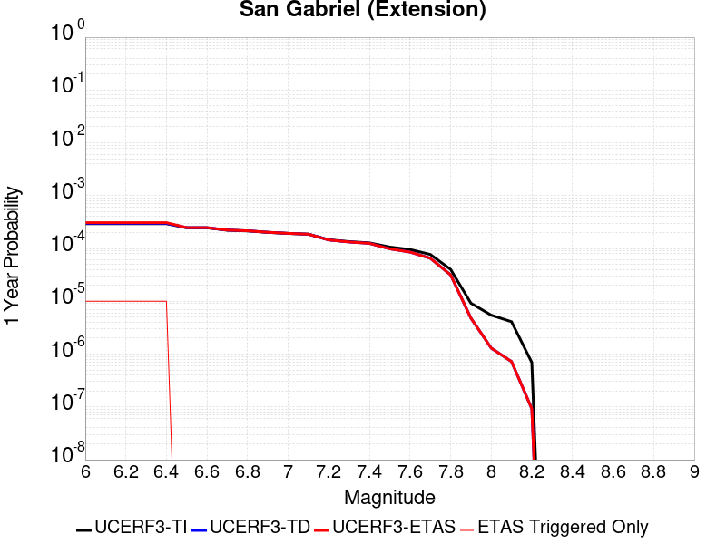 |  |

| Magnitude | 1 wk TI Prob | 1 wk TD Prob | 1 wk ETAS Prob | 1 wk ETAS/TD Gain | 1 wk ETAS Triggered Only | 1 mo TI Prob | 1 mo TD Prob | 1 mo ETAS Prob | 1 mo ETAS/TD Gain | 1 mo ETAS Triggered Only | 1 yr TI Prob | 1 yr TD Prob | 1 yr ETAS Prob | 1 yr ETAS/TD Gain | 1 yr ETAS Triggered Only | 10 yr TI Prob | 10 yr TD Prob | 10 yr ETAS Prob | 10 yr ETAS/TD Gain | 10 yr ETAS Triggered Only |
|-----|-----|-----|-----|-----|-----|-----|-----|-----|-----|-----|-----|-----|-----|-----|-----|-----|-----|-----|-----|-----|
| 6.0 | 5.6486106E-6 | 5.7168368E-6 | 5.7168368E-6 | 1.0 | 0.0 | 2.4208108E-5 | 2.4500505E-5 | 3.450026E-5 | 1.4081448 | 1.0E-5 | 2.9469383E-4 | 2.9825408E-4 | 3.082511E-4 | 1.0335184 | 1.0E-5 | 0.0029430336 | 0.0029786646 | 0.0029886349 | 1.0033472 | 1.0E-5 |
| 6.1 | 5.6486106E-6 | 5.7168368E-6 | 5.7168368E-6 | 1.0 | 0.0 | 2.4208108E-5 | 2.4500505E-5 | 3.450026E-5 | 1.4081448 | 1.0E-5 | 2.9469383E-4 | 2.9825408E-4 | 3.082511E-4 | 1.0335184 | 1.0E-5 | 0.0029430336 | 0.0029786646 | 0.0029886349 | 1.0033472 | 1.0E-5 |
| 6.2 | 5.6486106E-6 | 5.7168368E-6 | 5.7168368E-6 | 1.0 | 0.0 | 2.4208108E-5 | 2.4500505E-5 | 3.450026E-5 | 1.4081448 | 1.0E-5 | 2.9469383E-4 | 2.9825408E-4 | 3.082511E-4 | 1.0335184 | 1.0E-5 | 0.0029430336 | 0.0029786646 | 0.0029886349 | 1.0033472 | 1.0E-5 |
| 6.3 | 5.6486106E-6 | 5.7168368E-6 | 5.7168368E-6 | 1.0 | 0.0 | 2.4208108E-5 | 2.4500505E-5 | 3.450026E-5 | 1.4081448 | 1.0E-5 | 2.9469383E-4 | 2.9825408E-4 | 3.082511E-4 | 1.0335184 | 1.0E-5 | 0.0029430336 | 0.0029786646 | 0.0029886349 | 1.0033472 | 1.0E-5 |
| 6.4 | 5.6486106E-6 | 5.7168368E-6 | 5.7168368E-6 | 1.0 | 0.0 | 2.4208108E-5 | 2.4500505E-5 | 3.450026E-5 | 1.4081448 | 1.0E-5 | 2.9469383E-4 | 2.9825408E-4 | 3.082511E-4 | 1.0335184 | 1.0E-5 | 0.0029430336 | 0.0029786646 | 0.0029886349 | 1.0033472 | 1.0E-5 |
| 6.5 | 4.7134554E-6 | 4.7542608E-6 | 4.7542608E-6 | 1.0 | 0.0 | 2.0200367E-5 | 2.0375248E-5 | 2.0375248E-5 | 1.0 | 0.0 | 2.459117E-4 | 2.4804127E-4 | 2.4804127E-4 | 1.0 | 0.0 | 0.0024563975 | 0.0024777285 | 0.0024777285 | 1.0 | 0.0 |
| 6.6 | 4.7134554E-6 | 4.7542608E-6 | 4.7542608E-6 | 1.0 | 0.0 | 2.0200367E-5 | 2.0375248E-5 | 2.0375248E-5 | 1.0 | 0.0 | 2.459117E-4 | 2.4804127E-4 | 2.4804127E-4 | 1.0 | 0.0 | 0.0024563975 | 0.0024777285 | 0.0024777285 | 1.0 | 0.0 |
| 6.7 | 4.2468837E-6 | 4.274078E-6 | 4.274078E-6 | 1.0 | 0.0 | 1.8200803E-5 | 1.8317352E-5 | 1.8317352E-5 | 1.0 | 0.0 | 2.2157225E-4 | 2.2299167E-4 | 2.2299167E-4 | 1.0 | 0.0 | 0.0022135144 | 0.0022277513 | 0.0022277513 | 1.0 | 0.0 |
| 6.8 | 4.1180615E-6 | 4.1414673E-6 | 4.1414673E-6 | 1.0 | 0.0 | 1.7648716E-5 | 1.774903E-5 | 1.774903E-5 | 1.0 | 0.0 | 2.1485193E-4 | 2.1607373E-4 | 2.1607373E-4 | 1.0 | 0.0 | 0.0021464431 | 0.0021587077 | 0.0021587077 | 1.0 | 0.0 |
| 6.9 | 3.863861E-6 | 3.879783E-6 | 3.879783E-6 | 1.0 | 0.0 | 1.65593E-5 | 1.6627539E-5 | 1.6627539E-5 | 1.0 | 0.0 | 2.0159081E-4 | 2.0242216E-4 | 2.0242216E-4 | 1.0 | 0.0 | 0.0020140803 | 0.0020224454 | 0.0020224454 | 1.0 | 0.0 |
| 7.0 | 3.6947372E-6 | 3.705682E-6 | 3.705682E-6 | 1.0 | 0.0 | 1.5834492E-5 | 1.5881402E-5 | 1.5881402E-5 | 1.0 | 0.0 | 1.9276788E-4 | 1.9333958E-4 | 1.9333958E-4 | 1.0 | 0.0 | 0.0019260074 | 0.0019317803 | 0.0019317803 | 1.0 | 0.0 |
| 7.1 | 3.5686835E-6 | 3.5729024E-6 | 3.5729024E-6 | 1.0 | 0.0 | 1.5294268E-5 | 1.5312353E-5 | 1.5312353E-5 | 1.0 | 0.0 | 1.861918E-4 | 1.8641262E-4 | 1.8641262E-4 | 1.0 | 0.0 | 0.0018603588 | 0.0018626284 | 0.0018626284 | 1.0 | 0.0 |
| 7.2 | 2.8023446E-6 | 2.776794E-6 | 2.776794E-6 | 1.0 | 0.0 | 1.2009994E-5 | 1.1900492E-5 | 1.1900492E-5 | 1.0 | 0.0 | 1.4621185E-4 | 1.4487897E-4 | 1.4487897E-4 | 1.0 | 0.0 | 0.001461157 | 0.001447856 | 0.001447856 | 1.0 | 0.0 |
| 7.3 | 2.5843012E-6 | 2.5459692E-6 | 2.5459692E-6 | 1.0 | 0.0 | 1.1075529E-5 | 1.0911252E-5 | 1.0911252E-5 | 1.0 | 0.0 | 1.3483623E-4 | 1.3283649E-4 | 1.3283649E-4 | 1.0 | 0.0 | 0.0013475444 | 0.0013275805 | 0.0013275805 | 1.0 | 0.0 |
| 7.4 | 2.4464468E-6 | 2.396669E-6 | 2.396669E-6 | 1.0 | 0.0 | 1.04847295E-5 | 1.0271398E-5 | 1.0271398E-5 | 1.0 | 0.0 | 1.276441E-4 | 1.250472E-4 | 1.250472E-4 | 1.0 | 0.0 | 0.0012757082 | 0.001249778 | 0.001249778 | 1.0 | 0.0 |
| 7.5 | 2.0420266E-6 | 1.8910376E-6 | 1.8910376E-6 | 1.0 | 0.0 | 8.751514E-6 | 8.104422E-6 | 8.104422E-6 | 1.0 | 0.0 | 1.0654447E-4 | 9.866691E-5 | 9.866691E-5 | 1.0 | 0.0 | 0.001064934 | 9.862344E-4 | 9.862344E-4 | 1.0 | 0.0 |
| 7.6 | 1.8326596E-6 | 1.6398233E-6 | 1.6398233E-6 | 1.0 | 0.0 | 7.854232E-6 | 7.027795E-6 | 7.027795E-6 | 1.0 | 0.0 | 9.562107E-5 | 8.556007E-5 | 8.556007E-5 | 1.0 | 0.0 | 9.5579936E-4 | 8.552735E-4 | 8.552735E-4 | 1.0 | 0.0 |
| 7.7 | 1.4786998E-6 | 1.2523672E-6 | 1.2523672E-6 | 1.0 | 0.0 | 6.3372695E-6 | 5.3672766E-6 | 5.3672766E-6 | 1.0 | 0.0 | 7.715353E-5 | 6.534465E-5 | 6.534465E-5 | 1.0 | 0.0 | 7.7126746E-4 | 6.5325975E-4 | 6.5325975E-4 | 1.0 | 0.0 |
| 7.8 | 7.6975533E-7 | 6.069207E-7 | 6.069207E-7 | 1.0 | 0.0 | 3.2989474E-6 | 2.6010862E-6 | 2.6010862E-6 | 1.0 | 0.0 | 4.0163945E-5 | 3.1667765E-5 | 3.1667765E-5 | 1.0 | 0.0 | 4.0156685E-4 | 3.166365E-4 | 3.166365E-4 | 1.0 | 0.0 |
| 7.9 | 1.7645915E-7 | 9.211899E-8 | 9.211899E-8 | 1.0 | 0.0 | 7.562533E-7 | 3.947956E-7 | 3.947956E-7 | 1.0 | 0.0 | 9.207345E-6 | 4.806626E-6 | 4.806626E-6 | 1.0 | 0.0 | 9.206964E-5 | 4.8069025E-5 | 4.8069025E-5 | 1.0 | 0.0 |
| 8.0 | 1.0463461E-7 | 2.4937416E-8 | 2.4937416E-8 | 1.0 | 0.0 | 4.4843398E-7 | 1.0687464E-7 | 1.0687464E-7 | 1.0 | 0.0 | 5.45967E-6 | 1.3011979E-6 | 1.3011979E-6 | 1.0 | 0.0 | 5.459536E-5 | 1.3015701E-5 | 1.3015701E-5 | 1.0 | 0.0 |
| 8.1 | 7.875717E-8 | 1.3857542E-8 | 1.3857542E-8 | 1.0 | 0.0 | 3.3753068E-7 | 5.9389468E-8 | 5.9389468E-8 | 1.0 | 0.0 | 4.109428E-6 | 7.2306653E-7 | 7.2306653E-7 | 1.0 | 0.0 | 4.109352E-5 | 7.234439E-6 | 7.234439E-6 | 1.0 | 0.0 |
| 8.2 | 1.33163E-8 | 1.7720816E-9 | 1.7720816E-9 | 1.0 | 0.0 | 5.7069855E-8 | 7.594638E-9 | 7.594638E-9 | 1.0 | 0.0 | 6.9482525E-7 | 9.246471E-8 | 9.246471E-8 | 1.0 | 0.0 | 6.9482307E-6 | 9.2664203E-7 | 9.2664203E-7 | 1.0 | 0.0 |

## Calaveras (No) 2011 CFM
*[(top)](#table-of-contents)*

| 1 Week | 1 Month | 1 Year | 10 Year |
|-----|-----|-----|-----|
|  |  | 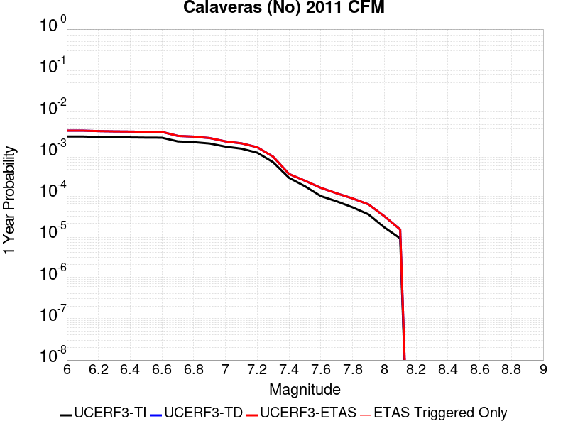 |  |

| Magnitude | 1 wk TI Prob | 1 wk TD Prob | 1 wk ETAS Prob | 1 wk ETAS/TD Gain | 1 wk ETAS Triggered Only | 1 mo TI Prob | 1 mo TD Prob | 1 mo ETAS Prob | 1 mo ETAS/TD Gain | 1 mo ETAS Triggered Only | 1 yr TI Prob | 1 yr TD Prob | 1 yr ETAS Prob | 1 yr ETAS/TD Gain | 1 yr ETAS Triggered Only | 10 yr TI Prob | 10 yr TD Prob | 10 yr ETAS Prob | 10 yr ETAS/TD Gain | 10 yr ETAS Triggered Only |
|-----|-----|-----|-----|-----|-----|-----|-----|-----|-----|-----|-----|-----|-----|-----|-----|-----|-----|-----|-----|-----|
| 6.0 | 4.8694856E-5 | 6.747457E-5 | 6.747457E-5 | 1.0 | 0.0 | 2.0867554E-4 | 2.891453E-4 | 2.891453E-4 | 1.0 | 0.0 | 0.0025376645 | 0.0035146773 | 0.0035146773 | 1.0 | 0.0 | 0.02508881 | 0.034771074 | 0.034780726 | 1.0002776 | 1.0E-5 |
| 6.1 | 4.8694856E-5 | 6.747457E-5 | 6.747457E-5 | 1.0 | 0.0 | 2.0867554E-4 | 2.891453E-4 | 2.891453E-4 | 1.0 | 0.0 | 0.0025376645 | 0.0035146773 | 0.0035146773 | 1.0 | 0.0 | 0.02508881 | 0.034771074 | 0.034780726 | 1.0002776 | 1.0E-5 |
| 6.2 | 4.7541962E-5 | 6.5805805E-5 | 6.5805805E-5 | 1.0 | 0.0 | 2.0373536E-4 | 2.8199502E-4 | 2.8199502E-4 | 1.0 | 0.0 | 0.0024776561 | 0.003427919 | 0.003427919 | 1.0 | 0.0 | 0.024502134 | 0.0339325 | 0.03394216 | 1.0002847 | 1.0E-5 |
| 6.3 | 4.6717287E-5 | 6.463939E-5 | 6.463939E-5 | 1.0 | 0.0 | 2.0020158E-4 | 2.7699716E-4 | 2.7699716E-4 | 1.0 | 0.0 | 0.0024347296 | 0.0033672696 | 0.0033672696 | 1.0 | 0.0 | 0.024082264 | 0.033345006 | 0.033354674 | 1.0002899 | 1.0E-5 |
| 6.4 | 4.6276386E-5 | 6.400103E-5 | 6.400103E-5 | 1.0 | 0.0 | 1.983123E-4 | 2.7426204E-4 | 2.7426204E-4 | 1.0 | 0.0 | 0.0024117786 | 0.00333408 | 0.00333408 | 1.0 | 0.0 | 0.02385771 | 0.03302388 | 0.03303355 | 1.0002928 | 1.0E-5 |
| 6.5 | 4.5720994E-5 | 6.32025E-5 | 6.32025E-5 | 1.0 | 0.0 | 1.9593239E-4 | 2.7084045E-4 | 2.7084045E-4 | 1.0 | 0.0 | 0.002382867 | 0.0032925585 | 0.0032925585 | 1.0 | 0.0 | 0.023574775 | 0.032621842 | 0.032631516 | 1.0002966 | 1.0E-5 |
| 6.6 | 4.549134E-5 | 6.285557E-5 | 6.285557E-5 | 1.0 | 0.0 | 1.949483E-4 | 2.693539E-4 | 2.693539E-4 | 1.0 | 0.0 | 0.0023709119 | 0.0032745146 | 0.0032745146 | 1.0 | 0.0 | 0.023457756 | 0.03244731 | 0.032456987 | 1.0002981 | 1.0E-5 |
| 6.7 | 3.701047E-5 | 5.03607E-5 | 5.03607E-5 | 1.0 | 0.0 | 1.5860666E-4 | 2.1581395E-4 | 2.1581395E-4 | 1.0 | 0.0 | 0.0019293258 | 0.002624412 | 0.002624412 | 1.0 | 0.0 | 0.019126613 | 0.026125198 | 0.026134938 | 1.0003728 | 1.0E-5 |
| 6.8 | 3.5523568E-5 | 4.834225E-5 | 4.834225E-5 | 1.0 | 0.0 | 1.5223498E-4 | 2.0716486E-4 | 2.0716486E-4 | 1.0 | 0.0 | 0.0018518851 | 0.0025193577 | 0.0025193577 | 1.0 | 0.0 | 0.018365284 | 0.025097623 | 0.025107373 | 1.0003885 | 1.0E-5 |
| 6.9 | 3.2946147E-5 | 4.4663826E-5 | 4.4663826E-5 | 1.0 | 0.0 | 1.4119013E-4 | 1.9140259E-4 | 1.9140259E-4 | 1.0 | 0.0 | 0.0017176344 | 0.0023278783 | 0.0023278783 | 1.0 | 0.0 | 0.017044188 | 0.023219762 | 0.02322953 | 1.0004207 | 1.0E-5 |
| 7.0 | 2.7682381E-5 | 3.7023216E-5 | 3.7023216E-5 | 1.0 | 0.0 | 1.1863338E-4 | 1.5866144E-4 | 1.5866144E-4 | 1.0 | 0.0 | 0.0014434044 | 0.0019300217 | 0.0019300217 | 1.0 | 0.0 | 0.01434065 | 0.019311164 | 0.01932097 | 1.0005078 | 1.0E-5 |
| 7.1 | 2.471967E-5 | 3.328756E-5 | 3.328756E-5 | 1.0 | 0.0 | 1.05937135E-4 | 1.4265333E-4 | 1.4265333E-4 | 1.0 | 0.0 | 0.0012890215 | 0.0017354497 | 0.0017354497 | 1.0 | 0.0 | 0.0128157 | 0.017386293 | 0.017396118 | 1.0005652 | 1.0E-5 |
| 7.2 | 1.9748062E-5 | 2.6775411E-5 | 2.6775411E-5 | 1.0 | 0.0 | 8.463181E-5 | 1.1474685E-4 | 1.1474685E-4 | 1.0 | 0.0 | 0.0010299052 | 0.001396171 | 0.001396171 | 1.0 | 0.0 | 0.01025145 | 0.014031046 | 0.014040906 | 1.0007027 | 1.0E-5 |
| 7.3 | 1.1603734E-5 | 1.5784257E-5 | 1.5784257E-5 | 1.0 | 0.0 | 4.9729337E-5 | 6.7645145E-5 | 6.7645145E-5 | 1.0 | 0.0 | 6.052865E-4 | 8.232826E-4 | 8.232826E-4 | 1.0 | 0.0 | 0.0060364045 | 0.008308739 | 0.008308739 | 1.0 | 0.0 |
| 7.4 | 4.885381E-6 | 6.035117E-6 | 6.035117E-6 | 1.0 | 0.0 | 2.0937177E-5 | 2.5864532E-5 | 2.5864532E-5 | 1.0 | 0.0 | 2.5488032E-4 | 3.1485534E-4 | 3.1485534E-4 | 1.0 | 0.0 | 0.0025458818 | 0.0032009764 | 0.0032009764 | 1.0 | 0.0 |
| 7.5 | 3.0571264E-6 | 4.1554085E-6 | 4.1554085E-6 | 1.0 | 0.0 | 1.3101904E-5 | 1.7808772E-5 | 1.7808772E-5 | 1.0 | 0.0 | 1.5950401E-4 | 2.1680034E-4 | 2.1680034E-4 | 1.0 | 0.0 | 0.0015938957 | 0.0022209007 | 0.0022209007 | 1.0 | 0.0 |
| 7.6 | 1.764948E-6 | 2.795641E-6 | 2.795641E-6 | 1.0 | 0.0 | 7.564041E-6 | 1.1981264E-5 | 1.1981264E-5 | 1.0 | 0.0 | 9.208831E-5 | 1.458622E-4 | 1.458622E-4 | 1.0 | 0.0 | 9.205016E-4 | 0.0015124046 | 0.0015124046 | 1.0 | 0.0 |
| 7.7 | 1.3173734E-6 | 2.0585271E-6 | 2.0585271E-6 | 1.0 | 0.0 | 5.645874E-6 | 8.82223E-6 | 8.82223E-6 | 1.0 | 0.0 | 6.873634E-5 | 1.0740537E-4 | 1.0740537E-4 | 1.0 | 0.0 | 6.8715087E-4 | 0.0011261607 | 0.0011261607 | 1.0 | 0.0 |
| 7.8 | 9.4429885E-7 | 1.5490102E-6 | 1.5490102E-6 | 1.0 | 0.0 | 4.0469886E-6 | 6.6385983E-6 | 6.6385983E-6 | 1.0 | 0.0 | 4.9270973E-5 | 8.082195E-5 | 8.082195E-5 | 1.0 | 0.0 | 4.926005E-4 | 8.501931E-4 | 8.501931E-4 | 1.0 | 0.0 |
| 7.9 | 6.388233E-7 | 1.11492E-6 | 1.11492E-6 | 1.0 | 0.0 | 2.7378112E-6 | 4.7782196E-6 | 4.7782196E-6 | 1.0 | 0.0 | 3.3332344E-5 | 5.8173282E-5 | 5.8173282E-5 | 1.0 | 0.0 | 3.3327343E-4 | 6.096674E-4 | 6.096674E-4 | 1.0 | 0.0 |
| 8.0 | 3.087986E-7 | 5.754721E-7 | 5.754721E-7 | 1.0 | 0.0 | 1.323422E-6 | 2.4663066E-6 | 2.4663066E-6 | 1.0 | 0.0 | 1.6112543E-5 | 3.0026871E-5 | 3.0026871E-5 | 1.0 | 0.0 | 1.6111376E-4 | 3.110238E-4 | 3.110238E-4 | 1.0 | 0.0 |
| 8.1 | 1.6725647E-7 | 2.7410795E-7 | 2.7410795E-7 | 1.0 | 0.0 | 7.168133E-7 | 1.1747478E-6 | 1.1747478E-6 | 1.0 | 0.0 | 8.7271665E-6 | 1.4302462E-5 | 1.4302462E-5 | 1.0 | 0.0 | 8.726824E-5 | 1.4847395E-4 | 1.4847395E-4 | 1.0 | 0.0 |

## Greenville (No) 2011 CFM
*[(top)](#table-of-contents)*

| 1 Week | 1 Month | 1 Year | 10 Year |
|-----|-----|-----|-----|
|  |  |  |  |

| Magnitude | 1 wk TI Prob | 1 wk TD Prob | 1 wk ETAS Prob | 1 wk ETAS/TD Gain | 1 wk ETAS Triggered Only | 1 mo TI Prob | 1 mo TD Prob | 1 mo ETAS Prob | 1 mo ETAS/TD Gain | 1 mo ETAS Triggered Only | 1 yr TI Prob | 1 yr TD Prob | 1 yr ETAS Prob | 1 yr ETAS/TD Gain | 1 yr ETAS Triggered Only | 10 yr TI Prob | 10 yr TD Prob | 10 yr ETAS Prob | 10 yr ETAS/TD Gain | 10 yr ETAS Triggered Only |
|-----|-----|-----|-----|-----|-----|-----|-----|-----|-----|-----|-----|-----|-----|-----|-----|-----|-----|-----|-----|-----|
| 6.0 | 3.286654E-5 | 4.036671E-5 | 4.036671E-5 | 1.0 | 0.0 | 1.4084899E-4 | 1.7298892E-4 | 1.8298719E-4 | 1.0577972 | 1.0E-5 | 0.0017134876 | 0.0021041434 | 0.0021141223 | 1.0047425 | 1.0E-5 | 0.017003356 | 0.02084759 | 0.02085738 | 1.0004697 | 1.0E-5 |
| 6.1 | 3.286654E-5 | 4.036671E-5 | 4.036671E-5 | 1.0 | 0.0 | 1.4084899E-4 | 1.7298892E-4 | 1.8298719E-4 | 1.0577972 | 1.0E-5 | 0.0017134876 | 0.0021041434 | 0.0021141223 | 1.0047425 | 1.0E-5 | 0.017003356 | 0.02084759 | 0.02085738 | 1.0004697 | 1.0E-5 |
| 6.2 | 3.1697953E-5 | 3.8929615E-5 | 3.8929615E-5 | 1.0 | 0.0 | 1.358413E-4 | 1.6683072E-4 | 1.7682907E-4 | 1.059931 | 1.0E-5 | 0.0016526132 | 0.0020293088 | 0.0020392886 | 1.0049177 | 1.0E-5 | 0.01640377 | 0.020112982 | 0.020122781 | 1.0004872 | 1.0E-5 |
| 6.3 | 3.1363317E-5 | 3.8518487E-5 | 3.8518487E-5 | 1.0 | 0.0 | 1.344073E-4 | 1.6506898E-4 | 1.7506733E-4 | 1.0605707 | 1.0E-5 | 0.0016351803 | 0.0020078993 | 0.0020178794 | 1.0049703 | 1.0E-5 | 0.016232004 | 0.019902749 | 0.01991255 | 1.0004925 | 1.0E-5 |
| 6.4 | 3.0228604E-5 | 3.712561E-5 | 3.712561E-5 | 1.0 | 0.0 | 1.2954473E-4 | 1.5910025E-4 | 1.6909865E-4 | 1.0628434 | 1.0E-5 | 0.0015760659 | 0.001935361 | 0.0019453416 | 1.005157 | 1.0E-5 | 0.015649348 | 0.01919009 | 0.019199898 | 1.000511 | 1.0E-5 |
| 6.5 | 2.9537814E-5 | 3.628106E-5 | 3.628106E-5 | 1.0 | 0.0 | 1.2658449E-4 | 1.5548118E-4 | 1.6547962E-4 | 1.0643065 | 1.0E-5 | 0.0015400766 | 0.0018913761 | 0.0019013572 | 1.0052772 | 1.0E-5 | 0.01529447 | 0.018757751 | 0.018767564 | 1.0005231 | 1.0E-5 |
| 6.6 | 2.7345395E-5 | 3.359038E-5 | 3.359038E-5 | 1.0 | 0.0 | 1.1718928E-4 | 1.43951E-4 | 1.5394956E-4 | 1.0694581 | 1.0E-5 | 0.0014258457 | 0.0017512254 | 0.0017612079 | 1.0057002 | 1.0E-5 | 0.014167317 | 0.017378574 | 0.0173884 | 1.0005654 | 1.0E-5 |
| 6.7 | 2.5615784E-5 | 3.1567277E-5 | 3.1567277E-5 | 1.0 | 0.0 | 1.09777306E-4 | 1.352815E-4 | 1.4528014E-4 | 1.07391 | 1.0E-5 | 0.0013357193 | 0.0016458384 | 0.0016558219 | 1.006066 | 1.0E-5 | 0.013277191 | 0.016340667 | 0.016350504 | 1.000602 | 1.0E-5 |
| 6.8 | 2.0059057E-5 | 2.4712264E-5 | 2.4712264E-5 | 1.0 | 0.0 | 8.596455E-5 | 1.059055E-4 | 1.1590444E-4 | 1.0944138 | 1.0E-5 | 0.0010461159 | 0.001288653 | 0.0012986402 | 1.00775 | 1.0E-5 | 0.0104120495 | 0.012814328 | 0.0128242 | 1.0007703 | 1.0E-5 |
| 6.9 | 1.6321746E-5 | 2.018486E-5 | 2.018486E-5 | 1.0 | 0.0 | 6.9948466E-5 | 8.6503744E-5 | 9.650288E-5 | 1.1155919 | 1.0E-5 | 8.5128983E-4 | 0.0010526866 | 0.0010626761 | 1.0094895 | 1.0E-5 | 0.008480361 | 0.010479037 | 0.010488932 | 1.0009443 | 1.0E-5 |
| 7.0 | 1.22527645E-5 | 1.5135808E-5 | 1.5135808E-5 | 1.0 | 0.0 | 5.2510793E-5 | 6.486616E-5 | 6.486616E-5 | 1.0 | 0.0 | 6.3913135E-4 | 7.894636E-4 | 7.894636E-4 | 1.0 | 0.0 | 0.0063729626 | 0.007867573 | 0.007867573 | 1.0 | 0.0 |
| 7.1 | 8.996482E-6 | 1.1165116E-5 | 1.1165116E-5 | 1.0 | 0.0 | 3.8555783E-5 | 4.784963E-5 | 4.784963E-5 | 1.0 | 0.0 | 4.6931554E-4 | 5.8241474E-4 | 5.8241474E-4 | 1.0 | 0.0 | 0.004683256 | 0.0058096354 | 0.0058096354 | 1.0 | 0.0 |
| 7.2 | 6.0273087E-6 | 7.569621E-6 | 7.569621E-6 | 1.0 | 0.0 | 2.5831067E-5 | 3.2440836E-5 | 3.2440836E-5 | 1.0 | 0.0 | 3.1444785E-4 | 3.9489628E-4 | 3.9489628E-4 | 1.0 | 0.0 | 0.0031400328 | 0.003942419 | 0.003942419 | 1.0 | 0.0 |
| 7.3 | 3.1209995E-6 | 3.9664565E-6 | 3.9664565E-6 | 1.0 | 0.0 | 1.3375643E-5 | 1.6998989E-5 | 1.6998989E-5 | 1.0 | 0.0 | 1.6283628E-4 | 2.069432E-4 | 2.069432E-4 | 1.0 | 0.0 | 0.0016271701 | 0.0020678395 | 0.0020678395 | 1.0 | 0.0 |
| 7.4 | 2.0254208E-6 | 2.6096657E-6 | 2.6096657E-6 | 1.0 | 0.0 | 8.680347E-6 | 1.1184234E-5 | 1.1184234E-5 | 1.0 | 0.0 | 1.0567809E-4 | 1.361596E-4 | 1.361596E-4 | 1.0 | 0.0 | 0.0010562785 | 0.0013611179 | 0.0013611179 | 1.0 | 0.0 |
| 7.5 | 1.6763418E-6 | 2.1734072E-6 | 2.1734072E-6 | 1.0 | 0.0 | 7.184302E-6 | 9.314569E-6 | 9.314569E-6 | 1.0 | 0.0 | 8.746537E-5 | 1.1339904E-4 | 1.1339904E-4 | 1.0 | 0.0 | 8.743095E-4 | 0.0011337536 | 0.0011337536 | 1.0 | 0.0 |
| 7.6 | 1.1935462E-6 | 1.5458915E-6 | 1.5458915E-6 | 1.0 | 0.0 | 5.115188E-6 | 6.625233E-6 | 6.625233E-6 | 1.0 | 0.0 | 6.2275634E-5 | 8.0659265E-5 | 8.0659265E-5 | 1.0 | 0.0 | 6.2258187E-4 | 8.0655375E-4 | 8.0655375E-4 | 1.0 | 0.0 |
| 7.7 | 3.0464201E-7 | 3.9848686E-7 | 3.9848686E-7 | 1.0 | 0.0 | 1.3056081E-6 | 1.7077997E-6 | 1.7077997E-6 | 1.0 | 0.0 | 1.589566E-5 | 2.0792268E-5 | 2.0792268E-5 | 1.0 | 0.0 | 1.5894524E-4 | 2.0793018E-4 | 2.0793018E-4 | 1.0 | 0.0 |

## Great Valley 05 Pittsburg - Kirby Hills alt1
*[(top)](#table-of-contents)*

| 1 Week | 1 Month | 1 Year | 10 Year |
|-----|-----|-----|-----|
|  |  |  |  |

| Magnitude | 1 wk TI Prob | 1 wk TD Prob | 1 wk ETAS Prob | 1 wk ETAS/TD Gain | 1 wk ETAS Triggered Only | 1 mo TI Prob | 1 mo TD Prob | 1 mo ETAS Prob | 1 mo ETAS/TD Gain | 1 mo ETAS Triggered Only | 1 yr TI Prob | 1 yr TD Prob | 1 yr ETAS Prob | 1 yr ETAS/TD Gain | 1 yr ETAS Triggered Only | 10 yr TI Prob | 10 yr TD Prob | 10 yr ETAS Prob | 10 yr ETAS/TD Gain | 10 yr ETAS Triggered Only |
|-----|-----|-----|-----|-----|-----|-----|-----|-----|-----|-----|-----|-----|-----|-----|-----|-----|-----|-----|-----|-----|
| 6.0 | 4.187212E-5 | 5.344289E-5 | 6.3442356E-5 | 1.1871057 | 1.0E-5 | 1.794396E-4 | 2.2902661E-4 | 2.3902432E-4 | 1.043653 | 1.0E-5 | 0.002182488 | 0.0027857998 | 0.002795772 | 1.0035796 | 1.0E-5 | 0.021611776 | 0.027603218 | 0.027612941 | 1.0003523 | 1.0E-5 |
| 6.1 | 4.187212E-5 | 5.344289E-5 | 6.3442356E-5 | 1.1871057 | 1.0E-5 | 1.794396E-4 | 2.2902661E-4 | 2.3902432E-4 | 1.043653 | 1.0E-5 | 0.002182488 | 0.0027857998 | 0.002795772 | 1.0035796 | 1.0E-5 | 0.021611776 | 0.027603218 | 0.027612941 | 1.0003523 | 1.0E-5 |
| 6.2 | 1.7353306E-5 | 2.2154672E-5 | 3.215445E-5 | 1.451362 | 1.0E-5 | 7.436919E-5 | 9.4947456E-5 | 1.04946506E-4 | 1.1053114 | 1.0E-5 | 9.050688E-4 | 0.0011557573 | 0.0011657458 | 1.0086423 | 1.0E-5 | 0.009013915 | 0.0115352 | 0.011545085 | 1.0008569 | 1.0E-5 |
| 6.3 | 1.7353306E-5 | 2.2154672E-5 | 3.215445E-5 | 1.451362 | 1.0E-5 | 7.436919E-5 | 9.4947456E-5 | 1.04946506E-4 | 1.1053114 | 1.0E-5 | 9.050688E-4 | 0.0011557573 | 0.0011657458 | 1.0086423 | 1.0E-5 | 0.009013915 | 0.0115352 | 0.011545085 | 1.0008569 | 1.0E-5 |
| 6.4 | 1.4028824E-5 | 1.7901062E-5 | 2.7900882E-5 | 1.558616 | 1.0E-5 | 6.0122147E-5 | 7.671883E-5 | 8.6718064E-5 | 1.130336 | 1.0E-5 | 7.3174125E-4 | 9.340303E-4 | 9.440209E-4 | 1.0106963 | 1.0E-5 | 0.0072933645 | 0.009338211 | 0.009348118 | 1.0010608 | 1.0E-5 |

## Mendocino
*[(top)](#table-of-contents)*

| 1 Week | 1 Month | 1 Year | 10 Year |
|-----|-----|-----|-----|
| 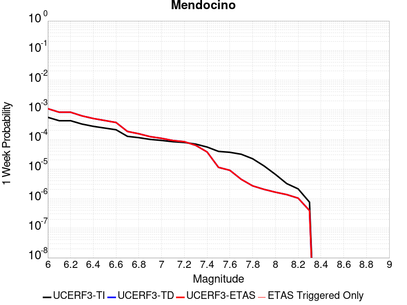 |  |  |  |

| Magnitude | 1 wk TI Prob | 1 wk TD Prob | 1 wk ETAS Prob | 1 wk ETAS/TD Gain | 1 wk ETAS Triggered Only | 1 mo TI Prob | 1 mo TD Prob | 1 mo ETAS Prob | 1 mo ETAS/TD Gain | 1 mo ETAS Triggered Only | 1 yr TI Prob | 1 yr TD Prob | 1 yr ETAS Prob | 1 yr ETAS/TD Gain | 1 yr ETAS Triggered Only | 10 yr TI Prob | 10 yr TD Prob | 10 yr ETAS Prob | 10 yr ETAS/TD Gain | 10 yr ETAS Triggered Only |
|-----|-----|-----|-----|-----|-----|-----|-----|-----|-----|-----|-----|-----|-----|-----|-----|-----|-----|-----|-----|-----|
| 6.0 | 5.5409013E-4 | 0.0010840978 | 0.0010840978 | 1.0 | 0.0 | 0.0023725112 | 0.0046357135 | 0.004645667 | 1.0021472 | 1.0E-5 | 0.028505474 | 0.054677837 | 0.054687288 | 1.0001729 | 1.0E-5 | 0.25113493 | 0.41188422 | 0.4118901 | 1.0000143 | 1.0E-5 |
| 6.1 | 4.2515888E-4 | 8.229105E-4 | 8.229105E-4 | 1.0 | 0.0 | 0.0018208373 | 0.003520157 | 0.0035301216 | 1.0028307 | 1.0E-5 | 0.021944538 | 0.041751582 | 0.041761164 | 1.0002295 | 1.0E-5 | 0.19899574 | 0.32995522 | 0.3299619 | 1.0000203 | 1.0E-5 |
| 6.2 | 4.2515888E-4 | 8.229105E-4 | 8.229105E-4 | 1.0 | 0.0 | 0.0018208373 | 0.003520157 | 0.0035301216 | 1.0028307 | 1.0E-5 | 0.021944538 | 0.041751582 | 0.041761164 | 1.0002295 | 1.0E-5 | 0.19899574 | 0.32995522 | 0.3299619 | 1.0000203 | 1.0E-5 |
| 6.3 | 3.2773745E-4 | 6.193633E-4 | 6.193633E-4 | 1.0 | 0.0 | 0.0014038329 | 0.0026503794 | 0.0026603527 | 1.0037631 | 1.0E-5 | 0.016958237 | 0.031593565 | 0.03160325 | 1.0003065 | 1.0E-5 | 0.1572094 | 0.26077798 | 0.26078537 | 1.0000284 | 1.0E-5 |
| 6.4 | 2.7417165E-4 | 5.04789E-4 | 5.04789E-4 | 1.0 | 0.0 | 0.0011744922 | 0.002160561 | 0.0021705395 | 1.0046184 | 1.0E-5 | 0.014205975 | 0.02583886 | 0.025848601 | 1.000377 | 1.0E-5 | 0.13331394 | 0.21948014 | 0.21948795 | 1.0000355 | 1.0E-5 |
| 6.5 | 2.3984899E-4 | 4.323638E-4 | 4.323638E-4 | 1.0 | 0.0 | 0.0010275192 | 0.0018508366 | 0.0018608181 | 1.0053929 | 1.0E-5 | 0.012438473 | 0.02218166 | 0.022191437 | 1.0004408 | 1.0E-5 | 0.11764851 | 0.19203737 | 0.19204545 | 1.0000421 | 1.0E-5 |
| 6.6 | 2.1023539E-4 | 3.6936256E-4 | 3.6936256E-4 | 1.0 | 0.0 | 9.0069766E-4 | 0.0015813457 | 0.0015913298 | 1.0063137 | 1.0E-5 | 0.010910975 | 0.018990727 | 0.019000536 | 1.0005165 | 1.0E-5 | 0.10390546 | 0.16749373 | 0.16750205 | 1.0000497 | 1.0E-5 |
| 6.7 | 1.2592976E-4 | 1.8425964E-4 | 1.8425964E-4 | 1.0 | 0.0 | 5.395873E-4 | 7.8937394E-4 | 7.8937394E-4 | 1.0 | 0.0 | 0.006549705 | 0.009556835 | 0.009556835 | 1.0 | 0.0 | 0.063599944 | 0.09096922 | 0.09096922 | 1.0 | 0.0 |
| 6.8 | 1.13663555E-4 | 1.5401552E-4 | 1.5401552E-4 | 1.0 | 0.0 | 4.8703855E-4 | 6.5987057E-4 | 6.5987057E-4 | 1.0 | 0.0 | 0.0059135845 | 0.008000202 | 0.008000202 | 1.0 | 0.0 | 0.057586733 | 0.07739247 | 0.07739247 | 1.0 | 0.0 |
| 6.9 | 9.926894E-5 | 1.2300287E-4 | 1.2300287E-4 | 1.0 | 0.0 | 4.2536893E-4 | 5.2704377E-4 | 5.2704377E-4 | 1.0 | 0.0 | 0.0051665753 | 0.006396927 | 0.006396927 | 1.0 | 0.0 | 0.050480947 | 0.06285957 | 0.06285957 | 1.0 | 0.0 |
| 7.0 | 9.168125E-5 | 1.0784103E-4 | 1.0784103E-4 | 1.0 | 0.0 | 3.9286047E-4 | 4.6208999E-4 | 4.6208999E-4 | 1.0 | 0.0 | 0.004772591 | 0.005611076 | 0.005611076 | 1.0 | 0.0 | 0.04671385 | 0.0556208 | 0.0556208 | 1.0 | 0.0 |
| 7.1 | 8.2854116E-5 | 9.1051006E-5 | 9.1051006E-5 | 1.0 | 0.0 | 3.5504074E-4 | 3.9016042E-4 | 3.9016042E-4 | 1.0 | 0.0 | 0.004314056 | 0.0047399225 | 0.0047399225 | 1.0 | 0.0 | 0.042312626 | 0.047480468 | 0.047480468 | 1.0 | 0.0 |
| 7.2 | 7.8255274E-5 | 8.300352E-5 | 8.300352E-5 | 1.0 | 0.0 | 3.3533663E-4 | 3.556817E-4 | 3.556817E-4 | 1.0 | 0.0 | 0.0040750825 | 0.004321974 | 0.004321974 | 1.0 | 0.0 | 0.040011603 | 0.043524873 | 0.043524873 | 1.0 | 0.0 |
| 7.3 | 6.887904E-5 | 6.258733E-5 | 6.258733E-5 | 1.0 | 0.0 | 2.9516246E-4 | 2.6820437E-4 | 2.6820437E-4 | 1.0 | 0.0 | 0.0035876823 | 0.0032605957 | 0.0032605957 | 1.0 | 0.0 | 0.035303112 | 0.03335046 | 0.03335046 | 1.0 | 0.0 |
| 7.4 | 5.4898497E-5 | 3.7397505E-5 | 3.7397505E-5 | 1.0 | 0.0 | 2.3525805E-4 | 1.6026547E-4 | 1.6026547E-4 | 1.0 | 0.0 | 0.0028605047 | 0.0019495422 | 0.0019495422 | 1.0 | 0.0 | 0.02823963 | 0.020406872 | 0.020406872 | 1.0 | 0.0 |
| 7.5 | 3.9103943E-5 | 1.1304096E-5 | 1.1304096E-5 | 1.0 | 0.0 | 1.6757756E-4 | 4.8445232E-5 | 4.8445232E-5 | 1.0 | 0.0 | 0.0020383475 | 5.896627E-4 | 5.896627E-4 | 1.0 | 0.0 | 0.020197518 | 0.0066229533 | 0.0066229533 | 1.0 | 0.0 |
| 7.6 | 3.641042E-5 | 8.981182E-6 | 8.981182E-6 | 1.0 | 0.0 | 1.5603533E-4 | 3.849022E-5 | 3.849022E-5 | 1.0 | 0.0 | 0.0018980748 | 4.6851902E-4 | 4.6851902E-4 | 1.0 | 0.0 | 0.018819444 | 0.0053467555 | 0.0053467555 | 1.0 | 0.0 |
| 7.7 | 3.1318774E-5 | 4.452091E-6 | 4.452091E-6 | 1.0 | 0.0 | 1.342164E-4 | 1.9080253E-5 | 1.9080253E-5 | 1.0 | 0.0 | 0.0016328598 | 2.322775E-4 | 2.322775E-4 | 1.0 | 0.0 | 0.016209139 | 0.0028640495 | 0.0028640495 | 1.0 | 0.0 |
| 7.8 | 2.209241E-5 | 2.679371E-6 | 2.679371E-6 | 1.0 | 0.0 | 9.467832E-5 | 1.1482968E-5 | 1.1482968E-5 | 1.0 | 0.0 | 0.001152099 | 1.397962E-4 | 1.397962E-4 | 1.0 | 0.0 | 0.011461443 | 0.001736627 | 0.001736627 | 1.0 | 0.0 |
| 7.9 | 1.2640477E-5 | 2.041037E-6 | 2.041037E-6 | 1.0 | 0.0 | 5.4172346E-5 | 8.747273E-6 | 8.747273E-6 | 1.0 | 0.0 | 6.593487E-4 | 1.06492866E-4 | 1.06492866E-4 | 1.0 | 0.0 | 0.006573958 | 0.0012974226 | 0.0012974226 | 1.0 | 0.0 |
| 8.0 | 6.5548907E-6 | 1.6379622E-6 | 1.6379622E-6 | 1.0 | 0.0 | 2.8092087E-5 | 7.019819E-6 | 7.019819E-6 | 1.0 | 0.0 | 3.4196748E-4 | 8.546297E-5 | 8.546297E-5 | 1.0 | 0.0 | 0.0034144172 | 0.0010306032 | 0.0010306032 | 1.0 | 0.0 |
| 8.1 | 3.1916707E-6 | 1.357735E-6 | 1.357735E-6 | 1.0 | 0.0 | 1.3678517E-5 | 5.818851E-6 | 5.818851E-6 | 1.0 | 0.0 | 1.6652321E-4 | 7.084223E-5 | 7.084223E-5 | 1.0 | 0.0 | 0.0016639848 | 8.624329E-4 | 8.624329E-4 | 1.0 | 0.0 |
| 8.2 | 2.1193785E-6 | 1.0297509E-6 | 1.0297509E-6 | 1.0 | 0.0 | 9.083019E-6 | 4.413211E-6 | 4.413211E-6 | 1.0 | 0.0 | 1.1058014E-4 | 5.372954E-5 | 5.372954E-5 | 1.0 | 0.0 | 0.0011052513 | 6.500931E-4 | 6.500931E-4 | 1.0 | 0.0 |
| 8.3 | 7.536878E-7 | 3.9261332E-7 | 3.9261332E-7 | 1.0 | 0.0 | 3.2300866E-6 | 1.6826275E-6 | 1.6826275E-6 | 1.0 | 0.0 | 3.9325594E-5 | 2.048581E-5 | 2.048581E-5 | 1.0 | 0.0 | 3.9318635E-4 | 2.4124846E-4 | 2.4124846E-4 | 1.0 | 0.0 |

## Oceanside alt1
*[(top)](#table-of-contents)*

| 1 Week | 1 Month | 1 Year | 10 Year |
|-----|-----|-----|-----|
|  |  | 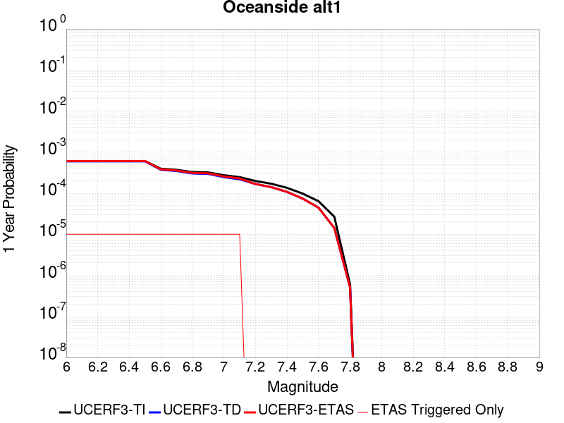 |  |

| Magnitude | 1 wk TI Prob | 1 wk TD Prob | 1 wk ETAS Prob | 1 wk ETAS/TD Gain | 1 wk ETAS Triggered Only | 1 mo TI Prob | 1 mo TD Prob | 1 mo ETAS Prob | 1 mo ETAS/TD Gain | 1 mo ETAS Triggered Only | 1 yr TI Prob | 1 yr TD Prob | 1 yr ETAS Prob | 1 yr ETAS/TD Gain | 1 yr ETAS Triggered Only | 10 yr TI Prob | 10 yr TD Prob | 10 yr ETAS Prob | 10 yr ETAS/TD Gain | 10 yr ETAS Triggered Only |
|-----|-----|-----|-----|-----|-----|-----|-----|-----|-----|-----|-----|-----|-----|-----|-----|-----|-----|-----|-----|-----|
| 6.0 | 1.1617542E-5 | 1.1423485E-5 | 2.1423371E-5 | 1.8753796 | 1.0E-5 | 4.9788516E-5 | 4.8956965E-5 | 5.8956477E-5 | 1.204251 | 1.0E-5 | 6.060066E-4 | 5.9590413E-4 | 6.058982E-4 | 1.0167712 | 1.0E-5 | 0.0060435664 | 0.0059446604 | 0.005954601 | 1.0016721 | 1.0E-5 |
| 6.1 | 1.1617542E-5 | 1.1423485E-5 | 2.1423371E-5 | 1.8753796 | 1.0E-5 | 4.9788516E-5 | 4.8956965E-5 | 5.8956477E-5 | 1.204251 | 1.0E-5 | 6.060066E-4 | 5.9590413E-4 | 6.058982E-4 | 1.0167712 | 1.0E-5 | 0.0060435664 | 0.0059446604 | 0.005954601 | 1.0016721 | 1.0E-5 |
| 6.2 | 1.1617542E-5 | 1.1423485E-5 | 2.1423371E-5 | 1.8753796 | 1.0E-5 | 4.9788516E-5 | 4.8956965E-5 | 5.8956477E-5 | 1.204251 | 1.0E-5 | 6.060066E-4 | 5.9590413E-4 | 6.058982E-4 | 1.0167712 | 1.0E-5 | 0.0060435664 | 0.0059446604 | 0.005954601 | 1.0016721 | 1.0E-5 |
| 6.3 | 1.1617542E-5 | 1.1423485E-5 | 2.1423371E-5 | 1.8753796 | 1.0E-5 | 4.9788516E-5 | 4.8956965E-5 | 5.8956477E-5 | 1.204251 | 1.0E-5 | 6.060066E-4 | 5.9590413E-4 | 6.058982E-4 | 1.0167712 | 1.0E-5 | 0.0060435664 | 0.0059446604 | 0.005954601 | 1.0016721 | 1.0E-5 |
| 6.4 | 1.1617542E-5 | 1.1423485E-5 | 2.1423371E-5 | 1.8753796 | 1.0E-5 | 4.9788516E-5 | 4.8956965E-5 | 5.8956477E-5 | 1.204251 | 1.0E-5 | 6.060066E-4 | 5.9590413E-4 | 6.058982E-4 | 1.0167712 | 1.0E-5 | 0.0060435664 | 0.0059446604 | 0.005954601 | 1.0016721 | 1.0E-5 |
| 6.5 | 1.1617542E-5 | 1.1423485E-5 | 2.1423371E-5 | 1.8753796 | 1.0E-5 | 4.9788516E-5 | 4.8956965E-5 | 5.8956477E-5 | 1.204251 | 1.0E-5 | 6.060066E-4 | 5.9590413E-4 | 6.058982E-4 | 1.0167712 | 1.0E-5 | 0.0060435664 | 0.0059446604 | 0.005954601 | 1.0016721 | 1.0E-5 |
| 6.6 | 7.561768E-6 | 7.1336085E-6 | 1.7133538E-5 | 2.4018052 | 1.0E-5 | 3.2407173E-5 | 3.0572253E-5 | 4.0571947E-5 | 1.327084 | 1.0E-5 | 3.9448592E-4 | 3.721547E-4 | 3.82151E-4 | 1.0268606 | 1.0E-5 | 0.0039378637 | 0.0037154262 | 0.003725389 | 1.0026815 | 1.0E-5 |
| 6.7 | 7.1042605E-6 | 6.6556786E-6 | 1.6655611E-5 | 2.5024664 | 1.0E-5 | 3.0446476E-5 | 2.852403E-5 | 3.8523744E-5 | 1.3505716 | 1.0E-5 | 3.706228E-4 | 3.4722552E-4 | 3.5722204E-4 | 1.0287898 | 1.0E-5 | 0.0037000529 | 0.0034669132 | 0.0034768786 | 1.0028744 | 1.0E-5 |
| 6.8 | 6.285554E-6 | 5.7996986E-6 | 1.579964E-5 | 2.7242174 | 1.0E-5 | 2.693781E-5 | 2.4855617E-5 | 3.485537E-5 | 1.4023136 | 1.0E-5 | 3.2791847E-4 | 3.0257567E-4 | 3.1257264E-4 | 1.0330396 | 1.0E-5 | 0.0032743502 | 0.0030216945 | 0.0030316643 | 1.0032994 | 1.0E-5 |
| 6.9 | 6.148883E-6 | 5.6565373E-6 | 1.565648E-5 | 2.7678561 | 1.0E-5 | 2.635209E-5 | 2.4242081E-5 | 3.424184E-5 | 1.4124959 | 1.0E-5 | 3.2078946E-4 | 2.951079E-4 | 3.0510494E-4 | 1.033876 | 1.0E-5 | 0.003203268 | 0.002947217 | 0.0029571876 | 1.003383 | 1.0E-5 |
| 7.0 | 5.253857E-6 | 4.7223966E-6 | 1.4722349E-5 | 3.1175587 | 1.0E-5 | 2.2516335E-5 | 2.0238687E-5 | 3.0238485E-5 | 1.4940932 | 1.0E-5 | 2.7410188E-4 | 2.4637848E-4 | 2.56376E-4 | 1.040578 | 1.0E-5 | 0.0027376404 | 0.0024610846 | 0.00247106 | 1.0040532 | 1.0E-5 |
| 7.1 | 4.730754E-6 | 4.1785024E-6 | 1.417846E-5 | 3.393192 | 1.0E-5 | 2.0274503E-5 | 1.7907745E-5 | 2.7907567E-5 | 1.5584075 | 1.0E-5 | 2.468141E-4 | 2.1800524E-4 | 2.2800306E-4 | 1.0458604 | 1.0E-5 | 0.0024654015 | 0.0021779404 | 0.0021879186 | 1.0045815 | 1.0E-5 |
| 7.2 | 3.7998386E-6 | 3.2140165E-6 | 3.2140165E-6 | 1.0 | 0.0 | 1.6284921E-5 | 1.37742845E-5 | 1.37742845E-5 | 1.0 | 0.0 | 1.9825088E-4 | 1.6768913E-4 | 1.6768913E-4 | 1.0 | 0.0 | 0.001980741 | 0.0016756381 | 0.0016756381 | 1.0 | 0.0 |
| 7.3 | 3.2656465E-6 | 2.6983669E-6 | 2.6983669E-6 | 1.0 | 0.0 | 1.3995553E-5 | 1.1564379E-5 | 1.1564379E-5 | 1.0 | 0.0 | 1.7038253E-4 | 1.4078732E-4 | 1.4078732E-4 | 1.0 | 0.0 | 0.0017025196 | 0.0014069924 | 0.0014069924 | 1.0 | 0.0 |
| 7.4 | 2.593703E-6 | 2.0680227E-6 | 2.0680227E-6 | 1.0 | 0.0 | 1.1115822E-5 | 8.862925E-6 | 8.862925E-6 | 1.0 | 0.0 | 1.3532673E-4 | 1.0790086E-4 | 1.0790086E-4 | 1.0 | 0.0 | 0.0013524436 | 0.0010784935 | 0.0010784935 | 1.0 | 0.0 |
| 7.5 | 1.8715585E-6 | 1.4137277E-6 | 1.4137277E-6 | 1.0 | 0.0 | 8.020941E-6 | 6.058819E-6 | 6.058819E-6 | 1.0 | 0.0 | 9.7650576E-5 | 7.376369E-5 | 7.376369E-5 | 1.0 | 0.0 | 9.7607676E-4 | 7.373981E-4 | 7.373981E-4 | 1.0 | 0.0 |
| 7.6 | 1.2246786E-6 | 8.526946E-7 | 8.526946E-7 | 1.0 | 0.0 | 5.248612E-6 | 3.6544006E-6 | 3.6544006E-6 | 1.0 | 0.0 | 6.389998E-5 | 4.4491466E-5 | 4.4491466E-5 | 1.0 | 0.0 | 6.3881604E-4 | 4.4483008E-4 | 4.4483008E-4 | 1.0 | 0.0 |
| 7.7 | 5.140719E-7 | 2.7346528E-7 | 2.7346528E-7 | 1.0 | 0.0 | 2.2031636E-6 | 1.1719936E-6 | 1.1719936E-6 | 1.0 | 0.0 | 2.6823185E-5 | 1.4268943E-5 | 1.4268943E-5 | 1.0 | 0.0 | 2.6819948E-4 | 1.4268162E-4 | 1.4268162E-4 | 1.0 | 0.0 |
| 7.8 | 1.16056995E-8 | 9.782997E-9 | 9.782997E-9 | 1.0 | 0.0 | 4.9738713E-8 | 4.1927127E-8 | 4.1927127E-8 | 1.0 | 0.0 | 6.0556863E-7 | 5.1046277E-7 | 5.1046277E-7 | 1.0 | 0.0 | 6.05567E-6 | 5.1046277E-6 | 5.1046277E-6 | 1.0 | 0.0 |

## Point Reyes 2011 CFM
*[(top)](#table-of-contents)*

| 1 Week | 1 Month | 1 Year | 10 Year |
|-----|-----|-----|-----|
|  |  |  | 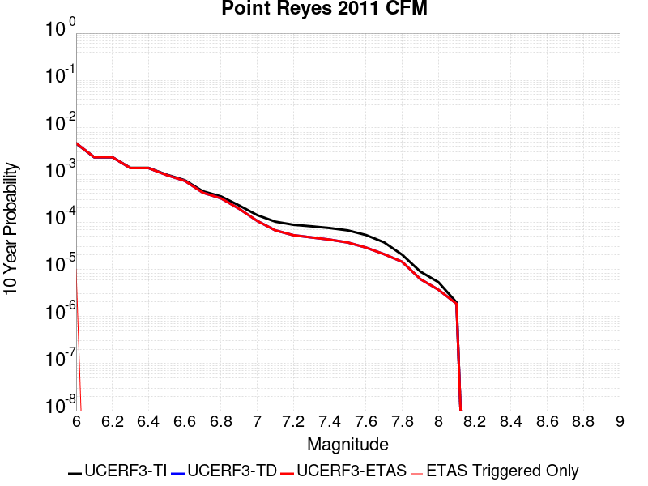 |

| Magnitude | 1 wk TI Prob | 1 wk TD Prob | 1 wk ETAS Prob | 1 wk ETAS/TD Gain | 1 wk ETAS Triggered Only | 1 mo TI Prob | 1 mo TD Prob | 1 mo ETAS Prob | 1 mo ETAS/TD Gain | 1 mo ETAS Triggered Only | 1 yr TI Prob | 1 yr TD Prob | 1 yr ETAS Prob | 1 yr ETAS/TD Gain | 1 yr ETAS Triggered Only | 10 yr TI Prob | 10 yr TD Prob | 10 yr ETAS Prob | 10 yr ETAS/TD Gain | 10 yr ETAS Triggered Only |
|-----|-----|-----|-----|-----|-----|-----|-----|-----|-----|-----|-----|-----|-----|-----|-----|-----|-----|-----|-----|-----|
| 6.0 | 8.8644965E-6 | 8.96716E-6 | 8.96716E-6 | 1.0 | 0.0 | 3.7990147E-5 | 3.8430157E-5 | 3.8430157E-5 | 1.0 | 0.0 | 4.624319E-4 | 4.67793E-4 | 4.67793E-4 | 1.0 | 0.0 | 0.0046147075 | 0.004668711 | 0.0046786647 | 1.0021319 | 1.0E-5 |
| 6.1 | 4.526405E-6 | 4.5392153E-6 | 4.5392153E-6 | 1.0 | 0.0 | 1.9398734E-5 | 1.945364E-5 | 1.945364E-5 | 1.0 | 0.0 | 2.36154E-4 | 2.3682338E-4 | 2.3682338E-4 | 1.0 | 0.0 | 0.002359032 | 0.0023658164 | 0.0023658164 | 1.0 | 0.0 |
| 6.2 | 4.526405E-6 | 4.5392153E-6 | 4.5392153E-6 | 1.0 | 0.0 | 1.9398734E-5 | 1.945364E-5 | 1.945364E-5 | 1.0 | 0.0 | 2.36154E-4 | 2.3682338E-4 | 2.3682338E-4 | 1.0 | 0.0 | 0.002359032 | 0.0023658164 | 0.0023658164 | 1.0 | 0.0 |
| 6.3 | 2.6842322E-6 | 2.660673E-6 | 2.660673E-6 | 1.0 | 0.0 | 1.1503801E-5 | 1.1402836E-5 | 1.1402836E-5 | 1.0 | 0.0 | 1.4004979E-4 | 1.3882088E-4 | 1.3882088E-4 | 1.0 | 0.0 | 0.0013996155 | 0.0013873635 | 0.0013873635 | 1.0 | 0.0 |
| 6.4 | 2.6842322E-6 | 2.660673E-6 | 2.660673E-6 | 1.0 | 0.0 | 1.1503801E-5 | 1.1402836E-5 | 1.1402836E-5 | 1.0 | 0.0 | 1.4004979E-4 | 1.3882088E-4 | 1.3882088E-4 | 1.0 | 0.0 | 0.0013996155 | 0.0013873635 | 0.0013873635 | 1.0 | 0.0 |
| 6.5 | 1.9281833E-6 | 1.8906233E-6 | 1.8906233E-6 | 1.0 | 0.0 | 8.263617E-6 | 8.1026465E-6 | 8.1026465E-6 | 1.0 | 0.0 | 1.0060489E-4 | 9.864534E-5 | 9.864534E-5 | 1.0 | 0.0 | 0.0010055936 | 9.860265E-4 | 9.860265E-4 | 1.0 | 0.0 |
| 6.6 | 1.4726726E-6 | 1.4269547E-6 | 1.4269547E-6 | 1.0 | 0.0 | 6.3114385E-6 | 6.115506E-6 | 6.115506E-6 | 1.0 | 0.0 | 7.683905E-5 | 7.445379E-5 | 7.445379E-5 | 1.0 | 0.0 | 7.6812494E-4 | 7.442957E-4 | 7.442957E-4 | 1.0 | 0.0 |
| 6.7 | 8.572307E-7 | 8.007182E-7 | 8.007182E-7 | 1.0 | 0.0 | 3.6738406E-6 | 3.431645E-6 | 3.431645E-6 | 1.0 | 0.0 | 4.472809E-5 | 4.1779494E-5 | 4.1779494E-5 | 1.0 | 0.0 | 4.471909E-4 | 4.177204E-4 | 4.177204E-4 | 1.0 | 0.0 |
| 6.8 | 6.6745434E-7 | 6.07727E-7 | 6.07727E-7 | 1.0 | 0.0 | 2.8605155E-6 | 2.6045416E-6 | 2.6045416E-6 | 1.0 | 0.0 | 3.482622E-5 | 3.1709842E-5 | 3.1709842E-5 | 1.0 | 0.0 | 3.4820763E-4 | 3.170566E-4 | 3.170566E-4 | 1.0 | 0.0 |
| 6.9 | 4.291521E-7 | 3.6535639E-7 | 3.6535639E-7 | 1.0 | 0.0 | 1.839222E-6 | 1.5658121E-6 | 1.5658121E-6 | 1.0 | 0.0 | 2.2392298E-5 | 1.90636E-5 | 1.90636E-5 | 1.0 | 0.0 | 2.2390042E-4 | 1.906224E-4 | 1.906224E-4 | 1.0 | 0.0 |
| 7.0 | 2.6812808E-7 | 2.0187117E-7 | 2.0187117E-7 | 1.0 | 0.0 | 1.1491198E-6 | 8.6516184E-7 | 8.6516184E-7 | 1.0 | 0.0 | 1.3990444E-5 | 1.0533295E-5 | 1.0533295E-5 | 1.0 | 0.0 | 1.3989564E-4 | 1.05330415E-4 | 1.05330415E-4 | 1.0 | 0.0 |
| 7.1 | 1.9451231E-7 | 1.2725201E-7 | 1.2725201E-7 | 1.0 | 0.0 | 8.336239E-7 | 5.4536565E-7 | 5.4536565E-7 | 1.0 | 0.0 | 1.0149324E-5 | 6.639806E-6 | 6.639806E-6 | 1.0 | 0.0 | 1.014886E-4 | 6.639846E-5 | 6.639846E-5 | 1.0 | 0.0 |
| 7.2 | 1.6715143E-7 | 1.0042555E-7 | 1.0042555E-7 | 1.0 | 0.0 | 7.1636305E-7 | 4.3039515E-7 | 4.3039515E-7 | 1.0 | 0.0 | 8.721685E-6 | 5.2400483E-6 | 5.2400483E-6 | 1.0 | 0.0 | 8.721343E-5 | 5.240162E-5 | 5.240162E-5 | 1.0 | 0.0 |
| 7.3 | 1.5503173E-7 | 9.012816E-8 | 9.012816E-8 | 1.0 | 0.0 | 6.644215E-7 | 3.8626348E-7 | 3.8626348E-7 | 1.0 | 0.0 | 8.089301E-6 | 4.7027474E-6 | 4.7027474E-6 | 1.0 | 0.0 | 8.089007E-5 | 4.7028854E-5 | 4.7028854E-5 | 1.0 | 0.0 |
| 7.4 | 1.4251614E-7 | 8.097342E-8 | 8.097342E-8 | 1.0 | 0.0 | 6.1078333E-7 | 3.4702887E-7 | 3.4702887E-7 | 1.0 | 0.0 | 7.4362615E-6 | 4.225068E-6 | 4.225068E-6 | 1.0 | 0.0 | 7.436013E-5 | 4.2252257E-5 | 4.2252257E-5 | 1.0 | 0.0 |
| 7.5 | 1.2710186E-7 | 7.029377E-8 | 7.029377E-8 | 1.0 | 0.0 | 5.447221E-7 | 3.0125898E-7 | 3.0125898E-7 | 1.0 | 0.0 | 6.6319717E-6 | 3.6678218E-6 | 3.6678218E-6 | 1.0 | 0.0 | 6.6317734E-5 | 3.667999E-5 | 3.667999E-5 | 1.0 | 0.0 |
| 7.6 | 1.0144708E-7 | 5.494996E-8 | 5.494996E-8 | 1.0 | 0.0 | 4.347731E-7 | 2.354998E-7 | 2.354998E-7 | 1.0 | 0.0 | 5.2933497E-6 | 2.8672061E-6 | 2.8672061E-6 | 1.0 | 0.0 | 5.293224E-5 | 2.8674069E-5 | 2.8674069E-5 | 1.0 | 0.0 |
| 7.7 | 7.090527E-8 | 3.9821334E-8 | 3.9821334E-8 | 1.0 | 0.0 | 3.038797E-7 | 1.7066284E-7 | 1.7066284E-7 | 1.0 | 0.0 | 3.699729E-6 | 2.0778182E-6 | 2.0778182E-6 | 1.0 | 0.0 | 3.6996673E-5 | 2.0780362E-5 | 2.0780362E-5 | 1.0 | 0.0 |
| 7.8 | 3.8712045E-8 | 2.7438638E-8 | 2.7438638E-8 | 1.0 | 0.0 | 1.6590876E-7 | 1.1759416E-7 | 1.1759416E-7 | 1.0 | 0.0 | 2.0199373E-6 | 1.4317079E-6 | 1.4317079E-6 | 1.0 | 0.0 | 2.0199188E-5 | 1.4319363E-5 | 1.4319363E-5 | 1.0 | 0.0 |
| 7.9 | 1.7068782E-8 | 1.183186E-8 | 1.183186E-8 | 1.0 | 0.0 | 7.315192E-8 | 5.0707975E-8 | 5.0707975E-8 | 1.0 | 0.0 | 8.906242E-7 | 6.173694E-7 | 6.173694E-7 | 1.0 | 0.0 | 8.906207E-6 | 6.1760525E-6 | 6.1760525E-6 | 1.0 | 0.0 |
| 8.0 | 1.0172592E-8 | 7.0268076E-9 | 7.0268076E-9 | 1.0 | 0.0 | 4.359682E-8 | 3.011489E-8 | 3.011489E-8 | 1.0 | 0.0 | 5.3079117E-7 | 3.6664872E-7 | 3.6664872E-7 | 1.0 | 0.0 | 5.307899E-6 | 3.6688568E-6 | 3.6688568E-6 | 1.0 | 0.0 |
| 8.1 | 3.7861243E-9 | 3.5448604E-9 | 3.5448604E-9 | 1.0 | 0.0 | 1.6226247E-8 | 1.5192258E-8 | 1.5192258E-8 | 1.0 | 0.0 | 1.9755454E-7 | 1.8496571E-7 | 1.8496571E-7 | 1.0 | 0.0 | 1.9755437E-6 | 1.8514592E-6 | 1.8514592E-6 | 1.0 | 0.0 |

## San Gregorio (South) 2011 CFM
*[(top)](#table-of-contents)*

| 1 Week | 1 Month | 1 Year | 10 Year |
|-----|-----|-----|-----|
|  |  |  |  |

| Magnitude | 1 wk TI Prob | 1 wk TD Prob | 1 wk ETAS Prob | 1 wk ETAS/TD Gain | 1 wk ETAS Triggered Only | 1 mo TI Prob | 1 mo TD Prob | 1 mo ETAS Prob | 1 mo ETAS/TD Gain | 1 mo ETAS Triggered Only | 1 yr TI Prob | 1 yr TD Prob | 1 yr ETAS Prob | 1 yr ETAS/TD Gain | 1 yr ETAS Triggered Only | 10 yr TI Prob | 10 yr TD Prob | 10 yr ETAS Prob | 10 yr ETAS/TD Gain | 10 yr ETAS Triggered Only |
|-----|-----|-----|-----|-----|-----|-----|-----|-----|-----|-----|-----|-----|-----|-----|-----|-----|-----|-----|-----|-----|
| 6.0 | 1.8770423E-5 | 1.6279559E-5 | 1.6279559E-5 | 1.0 | 0.0 | 8.044219E-5 | 6.9767695E-5 | 6.9767695E-5 | 1.0 | 0.0 | 9.789435E-4 | 8.490944E-4 | 8.490944E-4 | 1.0 | 0.0 | 0.009746423 | 0.008471475 | 0.008481391 | 1.0011704 | 1.0E-5 |
| 6.1 | 1.8770423E-5 | 1.6279559E-5 | 1.6279559E-5 | 1.0 | 0.0 | 8.044219E-5 | 6.9767695E-5 | 6.9767695E-5 | 1.0 | 0.0 | 9.789435E-4 | 8.490944E-4 | 8.490944E-4 | 1.0 | 0.0 | 0.009746423 | 0.008471475 | 0.008481391 | 1.0011704 | 1.0E-5 |
| 6.2 | 1.7508692E-5 | 1.4899064E-5 | 1.4899064E-5 | 1.0 | 0.0 | 7.5035096E-5 | 6.3851585E-5 | 6.3851585E-5 | 1.0 | 0.0 | 9.1316935E-4 | 7.7711884E-4 | 7.7711884E-4 | 1.0 | 0.0 | 0.00909426 | 0.007756904 | 0.007766826 | 1.0012791 | 1.0E-5 |
| 6.3 | 1.7508692E-5 | 1.4899064E-5 | 1.4899064E-5 | 1.0 | 0.0 | 7.5035096E-5 | 6.3851585E-5 | 6.3851585E-5 | 1.0 | 0.0 | 9.1316935E-4 | 7.7711884E-4 | 7.7711884E-4 | 1.0 | 0.0 | 0.00909426 | 0.007756904 | 0.007766826 | 1.0012791 | 1.0E-5 |
| 6.4 | 1.6004591E-5 | 1.3248901E-5 | 1.3248901E-5 | 1.0 | 0.0 | 6.85893E-5 | 5.6779776E-5 | 5.6779776E-5 | 1.0 | 0.0 | 8.347548E-4 | 6.910755E-4 | 6.910755E-4 | 1.0 | 0.0 | 0.008316261 | 0.0069019548 | 0.006911886 | 1.0014389 | 1.0E-5 |
| 6.5 | 1.6004591E-5 | 1.3248901E-5 | 1.3248901E-5 | 1.0 | 0.0 | 6.85893E-5 | 5.6779776E-5 | 5.6779776E-5 | 1.0 | 0.0 | 8.347548E-4 | 6.910755E-4 | 6.910755E-4 | 1.0 | 0.0 | 0.008316261 | 0.0069019548 | 0.006911886 | 1.0014389 | 1.0E-5 |
| 6.6 | 1.5442201E-5 | 1.2633533E-5 | 1.2633533E-5 | 1.0 | 0.0 | 6.617918E-5 | 5.414259E-5 | 5.414259E-5 | 1.0 | 0.0 | 8.0543366E-4 | 6.5898756E-4 | 6.5898756E-4 | 1.0 | 0.0 | 0.008025207 | 0.0065830066 | 0.0065929405 | 1.0015091 | 1.0E-5 |
| 6.7 | 1.489921E-5 | 1.2042042E-5 | 1.2042042E-5 | 1.0 | 0.0 | 6.3852196E-5 | 5.1607734E-5 | 5.1607734E-5 | 1.0 | 0.0 | 7.7712315E-4 | 6.281437E-4 | 6.281437E-4 | 1.0 | 0.0 | 0.0077441116 | 0.0062763398 | 0.006286277 | 1.0015833 | 1.0E-5 |
| 6.8 | 1.3876024E-5 | 1.0920992E-5 | 1.0920992E-5 | 1.0 | 0.0 | 5.9467322E-5 | 4.6803412E-5 | 4.6803412E-5 | 1.0 | 0.0 | 7.237741E-4 | 5.696829E-4 | 5.696829E-4 | 1.0 | 0.0 | 0.0072142133 | 0.005694849 | 0.0057047918 | 1.0017459 | 1.0E-5 |
| 6.9 | 1.33922495E-5 | 1.0392495E-5 | 1.0392495E-5 | 1.0 | 0.0 | 5.7394092E-5 | 4.4538505E-5 | 4.4538505E-5 | 1.0 | 0.0 | 6.9854903E-4 | 5.4212165E-4 | 5.4212165E-4 | 1.0 | 0.0 | 0.0069635725 | 0.0054206066 | 0.0054206066 | 1.0 | 0.0 |
| 7.0 | 1.2807324E-5 | 9.752456E-6 | 9.752456E-6 | 1.0 | 0.0 | 5.4887376E-5 | 4.179557E-5 | 4.179557E-5 | 1.0 | 0.0 | 6.680489E-4 | 5.0874247E-4 | 5.0874247E-4 | 1.0 | 0.0 | 0.006660442 | 0.0050883847 | 0.0050883847 | 1.0 | 0.0 |
| 7.1 | 1.2191438E-5 | 9.061344E-6 | 9.061344E-6 | 1.0 | 0.0 | 5.224797E-5 | 3.8833754E-5 | 3.8833754E-5 | 1.0 | 0.0 | 6.3593336E-4 | 4.7269845E-4 | 4.7269845E-4 | 1.0 | 0.0 | 0.0063411663 | 0.004729529 | 0.004729529 | 1.0 | 0.0 |
| 7.2 | 1.1769438E-5 | 8.581538E-6 | 8.581538E-6 | 1.0 | 0.0 | 5.0439474E-5 | 3.6777503E-5 | 3.6777503E-5 | 1.0 | 0.0 | 6.1392755E-4 | 4.476742E-4 | 4.476742E-4 | 1.0 | 0.0 | 0.0061223423 | 0.0044803214 | 0.0044803214 | 1.0 | 0.0 |
| 7.3 | 1.150374E-5 | 8.296966E-6 | 8.296966E-6 | 1.0 | 0.0 | 4.9300812E-5 | 3.5557943E-5 | 3.5557943E-5 | 1.0 | 0.0 | 6.0007203E-4 | 4.3283202E-4 | 4.3283202E-4 | 1.0 | 0.0 | 0.0059845424 | 0.004332466 | 0.004332466 | 1.0 | 0.0 |
| 7.4 | 1.12514E-5 | 8.042707E-6 | 8.042707E-6 | 1.0 | 0.0 | 4.8219394E-5 | 3.446829E-5 | 3.446829E-5 | 1.0 | 0.0 | 5.8691297E-4 | 4.1957066E-4 | 4.1957066E-4 | 1.0 | 0.0 | 0.005853653 | 0.0042003556 | 0.0042003556 | 1.0 | 0.0 |
| 7.5 | 1.059696E-5 | 7.39299E-6 | 7.39299E-6 | 1.0 | 0.0 | 4.5414752E-5 | 3.168386E-5 | 3.168386E-5 | 1.0 | 0.0 | 5.5278436E-4 | 3.8568274E-4 | 3.8568274E-4 | 1.0 | 0.0 | 0.0055141128 | 0.003862607 | 0.003862607 | 1.0 | 0.0 |
| 7.6 | 9.018592E-6 | 5.836751E-6 | 5.836751E-6 | 1.0 | 0.0 | 3.8650534E-5 | 2.5014408E-5 | 2.5014408E-5 | 1.0 | 0.0 | 4.7046866E-4 | 3.0450788E-4 | 3.0450788E-4 | 1.0 | 0.0 | 0.004694739 | 0.0030530049 | 0.0030530049 | 1.0 | 0.0 |
| 7.7 | 6.243489E-6 | 3.239351E-6 | 3.239351E-6 | 1.0 | 0.0 | 2.6757538E-5 | 1.3882858E-5 | 1.3882858E-5 | 1.0 | 0.0 | 3.257243E-4 | 1.690107E-4 | 1.690107E-4 | 1.0 | 0.0 | 0.003252473 | 0.0016990631 | 0.0016990631 | 1.0 | 0.0 |
| 7.8 | 3.1941963E-6 | 1.380876E-6 | 1.380876E-6 | 1.0 | 0.0 | 1.368934E-5 | 5.9180265E-6 | 5.9180265E-6 | 1.0 | 0.0 | 1.6665498E-4 | 7.2049595E-5 | 7.2049595E-5 | 1.0 | 0.0 | 0.0016653005 | 7.2625576E-4 | 7.2625576E-4 | 1.0 | 0.0 |
| 7.9 | 2.0098398E-6 | 6.915071E-7 | 6.915071E-7 | 1.0 | 0.0 | 8.6135715E-6 | 2.9635985E-6 | 2.9635985E-6 | 1.0 | 0.0 | 1.0486518E-4 | 3.6081216E-5 | 3.6081216E-5 | 1.0 | 0.0 | 0.0010481571 | 3.6566515E-4 | 3.6566515E-4 | 1.0 | 0.0 |
| 8.0 | 8.353119E-7 | 3.1619197E-7 | 3.1619197E-7 | 1.0 | 0.0 | 3.579903E-6 | 1.3551078E-6 | 1.3551078E-6 | 1.0 | 0.0 | 4.358445E-5 | 1.6498312E-5 | 1.6498312E-5 | 1.0 | 0.0 | 4.3575902E-4 | 1.6616881E-4 | 1.6616881E-4 | 1.0 | 0.0 |
| 8.1 | 1.5033264E-7 | 6.52693E-8 | 6.52693E-8 | 1.0 | 0.0 | 6.442826E-7 | 2.7972553E-7 | 2.7972553E-7 | 1.0 | 0.0 | 7.844113E-6 | 3.4056532E-6 | 3.4056532E-6 | 1.0 | 0.0 | 7.843835E-5 | 3.4072833E-5 | 3.4072833E-5 | 1.0 | 0.0 |

## Fitzhugh Creek
*[(top)](#table-of-contents)*

| 1 Week | 1 Month | 1 Year | 10 Year |
|-----|-----|-----|-----|
|  |  |  |  |

| Magnitude | 1 wk TI Prob | 1 wk TD Prob | 1 wk ETAS Prob | 1 wk ETAS/TD Gain | 1 wk ETAS Triggered Only | 1 mo TI Prob | 1 mo TD Prob | 1 mo ETAS Prob | 1 mo ETAS/TD Gain | 1 mo ETAS Triggered Only | 1 yr TI Prob | 1 yr TD Prob | 1 yr ETAS Prob | 1 yr ETAS/TD Gain | 1 yr ETAS Triggered Only | 10 yr TI Prob | 10 yr TD Prob | 10 yr ETAS Prob | 10 yr ETAS/TD Gain | 10 yr ETAS Triggered Only |
|-----|-----|-----|-----|-----|-----|-----|-----|-----|-----|-----|-----|-----|-----|-----|-----|-----|-----|-----|-----|-----|
| 6.0 | 6.1090436E-6 | 6.2101562E-6 | 6.2101562E-6 | 1.0 | 0.0 | 2.6181353E-5 | 2.6614709E-5 | 2.6614709E-5 | 1.0 | 0.0 | 3.1871133E-4 | 3.239904E-4 | 3.3398715E-4 | 1.0308551 | 1.0E-5 | 0.0031825465 | 0.0032356246 | 0.0032455921 | 1.0030806 | 1.0E-5 |
| 6.1 | 2.9741811E-6 | 3.021581E-6 | 3.021581E-6 | 1.0 | 0.0 | 1.2746428E-5 | 1.2949574E-5 | 1.2949574E-5 | 1.0 | 0.0 | 1.5517672E-4 | 1.576506E-4 | 1.576506E-4 | 1.0 | 0.0 | 0.001550684 | 0.0015754806 | 0.0015754806 | 1.0 | 0.0 |
| 6.2 | 2.9741811E-6 | 3.021581E-6 | 3.021581E-6 | 1.0 | 0.0 | 1.2746428E-5 | 1.2949574E-5 | 1.2949574E-5 | 1.0 | 0.0 | 1.5517672E-4 | 1.576506E-4 | 1.576506E-4 | 1.0 | 0.0 | 0.001550684 | 0.0015754806 | 0.0015754806 | 1.0 | 0.0 |
| 6.3 | 1.4781198E-6 | 1.5012708E-6 | 1.5012708E-6 | 1.0 | 0.0 | 6.3347834E-6 | 6.4340034E-6 | 6.4340034E-6 | 1.0 | 0.0 | 7.712326E-5 | 7.833137E-5 | 7.833137E-5 | 1.0 | 0.0 | 7.70965E-4 | 7.830576E-4 | 7.830576E-4 | 1.0 | 0.0 |
| 6.4 | 1.4781198E-6 | 1.5012708E-6 | 1.5012708E-6 | 1.0 | 0.0 | 6.3347834E-6 | 6.4340034E-6 | 6.4340034E-6 | 1.0 | 0.0 | 7.712326E-5 | 7.833137E-5 | 7.833137E-5 | 1.0 | 0.0 | 7.70965E-4 | 7.830576E-4 | 7.830576E-4 | 1.0 | 0.0 |
| 6.5 | 9.5176676E-7 | 9.66606E-7 | 9.66606E-7 | 1.0 | 0.0 | 4.078994E-6 | 4.142591E-6 | 4.142591E-6 | 1.0 | 0.0 | 4.9660623E-5 | 5.0434985E-5 | 5.0434985E-5 | 1.0 | 0.0 | 4.964952E-4 | 5.042458E-4 | 5.042458E-4 | 1.0 | 0.0 |
| 6.6 | 6.21145E-7 | 6.3085855E-7 | 6.3085855E-7 | 1.0 | 0.0 | 2.662047E-6 | 2.7036772E-6 | 2.7036772E-6 | 1.0 | 0.0 | 3.2409942E-5 | 3.291684E-5 | 3.291684E-5 | 1.0 | 0.0 | 3.2405215E-4 | 3.2912623E-4 | 3.2912623E-4 | 1.0 | 0.0 |
| 6.7 | 2.2377962E-7 | 2.2734636E-7 | 2.2734636E-7 | 1.0 | 0.0 | 9.590551E-7 | 9.743413E-7 | 9.743413E-7 | 1.0 | 0.0 | 1.1676434E-5 | 1.1862574E-5 | 1.1862574E-5 | 1.0 | 0.0 | 1.1675821E-4 | 1.1862254E-4 | 1.1862254E-4 | 1.0 | 0.0 |
| 6.8 | 1.4785022E-7 | 1.5021492E-7 | 1.5021492E-7 | 1.0 | 0.0 | 6.3364365E-7 | 6.4377826E-7 | 6.4377826E-7 | 1.0 | 0.0 | 7.714584E-6 | 7.838E-6 | 7.838E-6 | 1.0 | 0.0 | 7.714316E-5 | 7.838E-5 | 7.838E-5 | 1.0 | 0.0 |

## Verdugo
*[(top)](#table-of-contents)*

| 1 Week | 1 Month | 1 Year | 10 Year |
|-----|-----|-----|-----|
|  | 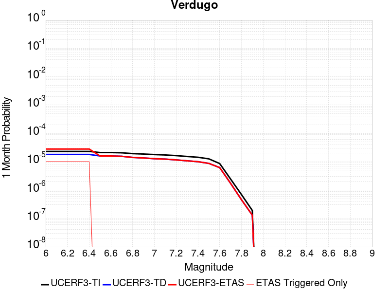 |  | 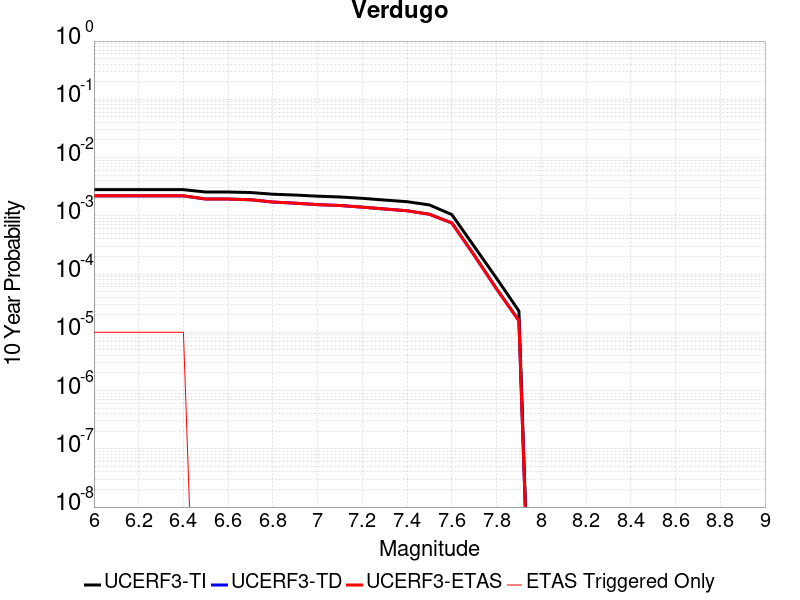 |

| Magnitude | 1 wk TI Prob | 1 wk TD Prob | 1 wk ETAS Prob | 1 wk ETAS/TD Gain | 1 wk ETAS Triggered Only | 1 mo TI Prob | 1 mo TD Prob | 1 mo ETAS Prob | 1 mo ETAS/TD Gain | 1 mo ETAS Triggered Only | 1 yr TI Prob | 1 yr TD Prob | 1 yr ETAS Prob | 1 yr ETAS/TD Gain | 1 yr ETAS Triggered Only | 10 yr TI Prob | 10 yr TD Prob | 10 yr ETAS Prob | 10 yr ETAS/TD Gain | 10 yr ETAS Triggered Only |
|-----|-----|-----|-----|-----|-----|-----|-----|-----|-----|-----|-----|-----|-----|-----|-----|-----|-----|-----|-----|-----|
| 6.0 | 5.392987E-6 | 4.2164934E-6 | 1.4216451E-5 | 3.371629 | 1.0E-5 | 2.3112598E-5 | 1.8070563E-5 | 2.8070383E-5 | 1.5533762 | 1.0E-5 | 2.8135953E-4 | 2.1998737E-4 | 2.2998518E-4 | 1.0454471 | 1.0E-5 | 0.0028100356 | 0.0021977439 | 0.0022077218 | 1.0045401 | 1.0E-5 |
| 6.1 | 5.392987E-6 | 4.2164934E-6 | 1.4216451E-5 | 3.371629 | 1.0E-5 | 2.3112598E-5 | 1.8070563E-5 | 2.8070383E-5 | 1.5533762 | 1.0E-5 | 2.8135953E-4 | 2.1998737E-4 | 2.2998518E-4 | 1.0454471 | 1.0E-5 | 0.0028100356 | 0.0021977439 | 0.0022077218 | 1.0045401 | 1.0E-5 |
| 6.2 | 5.392987E-6 | 4.2164934E-6 | 1.4216451E-5 | 3.371629 | 1.0E-5 | 2.3112598E-5 | 1.8070563E-5 | 2.8070383E-5 | 1.5533762 | 1.0E-5 | 2.8135953E-4 | 2.1998737E-4 | 2.2998518E-4 | 1.0454471 | 1.0E-5 | 0.0028100356 | 0.0021977439 | 0.0022077218 | 1.0045401 | 1.0E-5 |
| 6.3 | 5.392987E-6 | 4.2164934E-6 | 1.4216451E-5 | 3.371629 | 1.0E-5 | 2.3112598E-5 | 1.8070563E-5 | 2.8070383E-5 | 1.5533762 | 1.0E-5 | 2.8135953E-4 | 2.1998737E-4 | 2.2998518E-4 | 1.0454471 | 1.0E-5 | 0.0028100356 | 0.0021977439 | 0.0022077218 | 1.0045401 | 1.0E-5 |
| 6.4 | 5.392987E-6 | 4.2164934E-6 | 1.4216451E-5 | 3.371629 | 1.0E-5 | 2.3112598E-5 | 1.8070563E-5 | 2.8070383E-5 | 1.5533762 | 1.0E-5 | 2.8135953E-4 | 2.1998737E-4 | 2.2998518E-4 | 1.0454471 | 1.0E-5 | 0.0028100356 | 0.0021977439 | 0.0022077218 | 1.0045401 | 1.0E-5 |
| 6.5 | 4.9154837E-6 | 3.7224413E-6 | 3.7224413E-6 | 1.0 | 0.0 | 2.1066187E-5 | 1.5953223E-5 | 1.5953223E-5 | 1.0 | 0.0 | 2.5645064E-4 | 1.9421338E-4 | 1.9421338E-4 | 1.0 | 0.0 | 0.002561549 | 0.0019404575 | 0.0019404575 | 1.0 | 0.0 |
| 6.6 | 4.9154837E-6 | 3.7224413E-6 | 3.7224413E-6 | 1.0 | 0.0 | 2.1066187E-5 | 1.5953223E-5 | 1.5953223E-5 | 1.0 | 0.0 | 2.5645064E-4 | 1.9421338E-4 | 1.9421338E-4 | 1.0 | 0.0 | 0.002561549 | 0.0019404575 | 0.0019404575 | 1.0 | 0.0 |
| 6.7 | 4.817006E-6 | 3.620628E-6 | 3.620628E-6 | 1.0 | 0.0 | 2.0644147E-5 | 1.5516885E-5 | 1.5516885E-5 | 1.0 | 0.0 | 2.513135E-4 | 1.889019E-4 | 1.889019E-4 | 1.0 | 0.0 | 0.0025102948 | 0.0018874329 | 0.0018874329 | 1.0 | 0.0 |
| 6.8 | 4.507407E-6 | 3.3070805E-6 | 3.3070805E-6 | 1.0 | 0.0 | 1.9317316E-5 | 1.4173126E-5 | 1.4173126E-5 | 1.0 | 0.0 | 2.3516294E-4 | 1.7254429E-4 | 1.7254429E-4 | 1.0 | 0.0 | 0.0023491425 | 0.0017241176 | 0.0017241176 | 1.0 | 0.0 |
| 6.9 | 4.3573054E-6 | 3.1609877E-6 | 3.1609877E-6 | 1.0 | 0.0 | 1.8674033E-5 | 1.354702E-5 | 1.354702E-5 | 1.0 | 0.0 | 2.2733262E-4 | 1.649226E-4 | 1.649226E-4 | 1.0 | 0.0 | 0.0022710022 | 0.0016480145 | 0.0016480145 | 1.0 | 0.0 |
| 7.0 | 4.171527E-6 | 2.9836467E-6 | 2.9836467E-6 | 1.0 | 0.0 | 1.787785E-5 | 1.2786995E-5 | 1.2786995E-5 | 1.0 | 0.0 | 2.1764109E-4 | 1.5567066E-4 | 1.5567066E-4 | 1.0 | 0.0 | 0.0021742806 | 0.0015556274 | 0.0015556274 | 1.0 | 0.0 |
| 7.1 | 4.0405484E-6 | 2.882238E-6 | 2.882238E-6 | 1.0 | 0.0 | 1.731652E-5 | 1.23523905E-5 | 1.23523905E-5 | 1.0 | 0.0 | 2.1080824E-4 | 1.5038009E-4 | 1.5038009E-4 | 1.0 | 0.0 | 0.0021060838 | 0.0015027943 | 0.0015027943 | 1.0 | 0.0 |
| 7.2 | 3.8306007E-6 | 2.701823E-6 | 2.701823E-6 | 1.0 | 0.0 | 1.6416758E-5 | 1.157919E-5 | 1.157919E-5 | 1.0 | 0.0 | 1.9985568E-4 | 1.4096762E-4 | 1.4096762E-4 | 1.0 | 0.0 | 0.0019967605 | 0.0014087928 | 0.0014087928 | 1.0 | 0.0 |
| 7.3 | 3.5750938E-6 | 2.512154E-6 | 2.512154E-6 | 1.0 | 0.0 | 1.532174E-5 | 1.076633E-5 | 1.076633E-5 | 1.0 | 0.0 | 1.8652623E-4 | 1.3107229E-4 | 1.3107229E-4 | 1.0 | 0.0 | 0.0018636974 | 0.0013099604 | 0.0013099604 | 1.0 | 0.0 |
| 7.4 | 3.3510041E-6 | 2.340838E-6 | 2.340838E-6 | 1.0 | 0.0 | 1.4361368E-5 | 1.0032124E-5 | 1.0032124E-5 | 1.0 | 0.0 | 1.7483562E-4 | 1.2213437E-4 | 1.2213437E-4 | 1.0 | 0.0 | 0.0017469813 | 0.0012206829 | 0.0012206829 | 1.0 | 0.0 |
| 7.5 | 2.948287E-6 | 2.0390912E-6 | 2.0390912E-6 | 1.0 | 0.0 | 1.2635454E-5 | 8.7389335E-6 | 8.7389335E-6 | 1.0 | 0.0 | 1.538258E-4 | 1.06391424E-4 | 1.06391424E-4 | 1.0 | 0.0 | 0.0015371935 | 0.0010634151 | 0.0010634151 | 1.0 | 0.0 |
| 7.6 | 2.0134323E-6 | 1.4471086E-6 | 1.4471086E-6 | 1.0 | 0.0 | 8.628967E-6 | 6.20188E-6 | 6.20188E-6 | 1.0 | 0.0 | 1.05052604E-4 | 7.550536E-5 | 7.550536E-5 | 1.0 | 0.0 | 0.0010500296 | 7.548059E-4 | 7.548059E-4 | 1.0 | 0.0 |
| 7.7 | 5.726436E-7 | 4.0453273E-7 | 4.0453273E-7 | 1.0 | 0.0 | 2.4541846E-6 | 1.7337106E-6 | 1.7337106E-6 | 1.0 | 0.0 | 2.9879287E-5 | 2.110775E-5 | 2.110775E-5 | 1.0 | 0.0 | 2.987527E-4 | 2.1105999E-4 | 2.1105999E-4 | 1.0 | 0.0 |
| 7.8 | 1.6248204E-7 | 1.06879604E-7 | 1.06879604E-7 | 1.0 | 0.0 | 6.963514E-7 | 4.5805535E-7 | 4.5805535E-7 | 1.0 | 0.0 | 8.478045E-6 | 5.57681E-6 | 5.57681E-6 | 1.0 | 0.0 | 8.477722E-5 | 5.5766737E-5 | 5.5766737E-5 | 1.0 | 0.0 |
| 7.9 | 4.4475744E-8 | 3.037888E-8 | 3.037888E-8 | 1.0 | 0.0 | 1.9061031E-7 | 1.301952E-7 | 1.301952E-7 | 1.0 | 0.0 | 2.320678E-6 | 1.5851255E-6 | 1.5851255E-6 | 1.0 | 0.0 | 2.3206538E-5 | 1.5851156E-5 | 1.5851156E-5 | 1.0 | 0.0 |

## Earthquake Valley (So Extension)
*[(top)](#table-of-contents)*

| 1 Week | 1 Month | 1 Year | 10 Year |
|-----|-----|-----|-----|
|  |  |  |  |

| Magnitude | 1 wk TI Prob | 1 wk TD Prob | 1 wk ETAS Prob | 1 wk ETAS/TD Gain | 1 wk ETAS Triggered Only | 1 mo TI Prob | 1 mo TD Prob | 1 mo ETAS Prob | 1 mo ETAS/TD Gain | 1 mo ETAS Triggered Only | 1 yr TI Prob | 1 yr TD Prob | 1 yr ETAS Prob | 1 yr ETAS/TD Gain | 1 yr ETAS Triggered Only | 10 yr TI Prob | 10 yr TD Prob | 10 yr ETAS Prob | 10 yr ETAS/TD Gain | 10 yr ETAS Triggered Only |
|-----|-----|-----|-----|-----|-----|-----|-----|-----|-----|-----|-----|-----|-----|-----|-----|-----|-----|-----|-----|-----|
| 6.0 | 3.0194888E-5 | 3.707208E-5 | 3.707208E-5 | 1.0 | 0.0 | 1.2940024E-4 | 1.5887374E-4 | 1.5887374E-4 | 1.0 | 0.0 | 0.0015743093 | 0.0019330877 | 0.0019430685 | 1.0051631 | 1.0E-5 | 0.01563203 | 0.0192131 | 0.01922291 | 1.0005105 | 1.0E-5 |
| 6.1 | 3.0194888E-5 | 3.707208E-5 | 3.707208E-5 | 1.0 | 0.0 | 1.2940024E-4 | 1.5887374E-4 | 1.5887374E-4 | 1.0 | 0.0 | 0.0015743093 | 0.0019330877 | 0.0019430685 | 1.0051631 | 1.0E-5 | 0.01563203 | 0.0192131 | 0.01922291 | 1.0005105 | 1.0E-5 |
| 6.2 | 3.0194888E-5 | 3.707208E-5 | 3.707208E-5 | 1.0 | 0.0 | 1.2940024E-4 | 1.5887374E-4 | 1.5887374E-4 | 1.0 | 0.0 | 0.0015743093 | 0.0019330877 | 0.0019430685 | 1.0051631 | 1.0E-5 | 0.01563203 | 0.0192131 | 0.01922291 | 1.0005105 | 1.0E-5 |
| 6.3 | 1.5795305E-5 | 1.8446612E-5 | 1.8446612E-5 | 1.0 | 0.0 | 6.769241E-5 | 7.905514E-5 | 7.905514E-5 | 1.0 | 0.0 | 8.238434E-4 | 9.621823E-4 | 9.621823E-4 | 1.0 | 0.0 | 0.008207959 | 0.0095910635 | 0.0095910635 | 1.0 | 0.0 |
| 6.4 | 1.5795305E-5 | 1.8446612E-5 | 1.8446612E-5 | 1.0 | 0.0 | 6.769241E-5 | 7.905514E-5 | 7.905514E-5 | 1.0 | 0.0 | 8.238434E-4 | 9.621823E-4 | 9.621823E-4 | 1.0 | 0.0 | 0.008207959 | 0.0095910635 | 0.0095910635 | 1.0 | 0.0 |
| 6.5 | 1.5795305E-5 | 1.8446612E-5 | 1.8446612E-5 | 1.0 | 0.0 | 6.769241E-5 | 7.905514E-5 | 7.905514E-5 | 1.0 | 0.0 | 8.238434E-4 | 9.621823E-4 | 9.621823E-4 | 1.0 | 0.0 | 0.008207959 | 0.0095910635 | 0.0095910635 | 1.0 | 0.0 |
| 6.6 | 1.5795305E-5 | 1.8446612E-5 | 1.8446612E-5 | 1.0 | 0.0 | 6.769241E-5 | 7.905514E-5 | 7.905514E-5 | 1.0 | 0.0 | 8.238434E-4 | 9.621823E-4 | 9.621823E-4 | 1.0 | 0.0 | 0.008207959 | 0.0095910635 | 0.0095910635 | 1.0 | 0.0 |
| 6.7 | 1.1363076E-5 | 1.3138288E-5 | 1.3138288E-5 | 1.0 | 0.0 | 4.8697988E-5 | 5.6306162E-5 | 5.6306162E-5 | 1.0 | 0.0 | 5.927367E-4 | 6.8538805E-4 | 6.8538805E-4 | 1.0 | 0.0 | 0.0059115817 | 0.006840215 | 0.006840215 | 1.0 | 0.0 |
| 6.8 | 1.0049611E-5 | 1.1594328E-5 | 1.1594328E-5 | 1.0 | 0.0 | 4.306905E-5 | 4.968944E-5 | 4.968944E-5 | 1.0 | 0.0 | 5.242395E-4 | 6.0487416E-4 | 6.0487416E-4 | 1.0 | 0.0 | 0.0052300454 | 0.0060394546 | 0.0060394546 | 1.0 | 0.0 |
| 6.9 | 1.0049611E-5 | 1.1594328E-5 | 1.1594328E-5 | 1.0 | 0.0 | 4.306905E-5 | 4.968944E-5 | 4.968944E-5 | 1.0 | 0.0 | 5.242395E-4 | 6.0487416E-4 | 6.0487416E-4 | 1.0 | 0.0 | 0.0052300454 | 0.0060394546 | 0.0060394546 | 1.0 | 0.0 |
| 7.0 | 1.0049611E-5 | 1.1594328E-5 | 1.1594328E-5 | 1.0 | 0.0 | 4.306905E-5 | 4.968944E-5 | 4.968944E-5 | 1.0 | 0.0 | 5.242395E-4 | 6.0487416E-4 | 6.0487416E-4 | 1.0 | 0.0 | 0.0052300454 | 0.0060394546 | 0.0060394546 | 1.0 | 0.0 |
| 7.1 | 8.140254E-6 | 9.3834515E-6 | 9.3834515E-6 | 1.0 | 0.0 | 3.4886336E-5 | 4.021455E-5 | 4.021455E-5 | 1.0 | 0.0 | 4.2465836E-4 | 4.895692E-4 | 4.895692E-4 | 1.0 | 0.0 | 0.0042384774 | 0.004891483 | 0.004891483 | 1.0 | 0.0 |
| 7.2 | 1.673835E-7 | 1.4153493E-7 | 1.4153493E-7 | 1.0 | 0.0 | 7.173577E-7 | 6.065781E-7 | 6.065781E-7 | 1.0 | 0.0 | 8.733795E-6 | 7.3850674E-6 | 7.3850674E-6 | 1.0 | 0.0 | 8.733451E-5 | 7.3848576E-5 | 7.3848576E-5 | 1.0 | 0.0 |
| 7.3 | 1.6632116E-7 | 1.4051723E-7 | 1.4051723E-7 | 1.0 | 0.0 | 7.1280476E-7 | 6.022166E-7 | 6.022166E-7 | 1.0 | 0.0 | 8.678364E-6 | 7.331966E-6 | 7.331966E-6 | 1.0 | 0.0 | 8.6780245E-5 | 7.33176E-5 | 7.33176E-5 | 1.0 | 0.0 |
| 7.4 | 1.6569169E-7 | 1.3996352E-7 | 1.3996352E-7 | 1.0 | 0.0 | 7.1010703E-7 | 5.9984353E-7 | 5.9984353E-7 | 1.0 | 0.0 | 8.645519E-6 | 7.303074E-6 | 7.303074E-6 | 1.0 | 0.0 | 8.645182E-5 | 7.30287E-5 | 7.30287E-5 | 1.0 | 0.0 |
| 7.5 | 1.1764555E-7 | 1.0095245E-7 | 1.0095245E-7 | 1.0 | 0.0 | 5.041951E-7 | 4.3265328E-7 | 4.3265328E-7 | 1.0 | 0.0 | 6.138558E-6 | 5.267543E-6 | 5.267543E-6 | 1.0 | 0.0 | 6.1383886E-5 | 5.2674397E-5 | 5.2674397E-5 | 1.0 | 0.0 |
| 7.6 | 1.07927605E-7 | 9.2600665E-8 | 9.2600665E-8 | 1.0 | 0.0 | 4.6254678E-7 | 3.9685995E-7 | 3.9685995E-7 | 1.0 | 0.0 | 5.6314925E-6 | 4.8317615E-6 | 4.8317615E-6 | 1.0 | 0.0 | 5.63135E-5 | 4.831677E-5 | 4.831677E-5 | 1.0 | 0.0 |
| 7.7 | 2.1826905E-8 | 1.1179958E-8 | 1.1179958E-8 | 1.0 | 0.0 | 9.3543875E-8 | 4.791411E-8 | 4.791411E-8 | 1.0 | 0.0 | 1.1388961E-6 | 5.8335416E-7 | 5.8335416E-7 | 1.0 | 0.0 | 1.1388902E-5 | 5.8335318E-6 | 5.8335318E-6 | 1.0 | 0.0 |
| 7.8 | 2.6169649E-9 | 1.1968753E-9 | 1.1968753E-9 | 1.0 | 0.0 | 1.1215564E-8 | 5.1294657E-9 | 5.1294657E-9 | 1.0 | 0.0 | 1.3654947E-7 | 6.245124E-8 | 6.245124E-8 | 1.0 | 0.0 | 1.365494E-6 | 6.2451244E-7 | 6.2451244E-7 | 1.0 | 0.0 |

## North Frontal  (East)
*[(top)](#table-of-contents)*

| 1 Week | 1 Month | 1 Year | 10 Year |
|-----|-----|-----|-----|
|  |  | 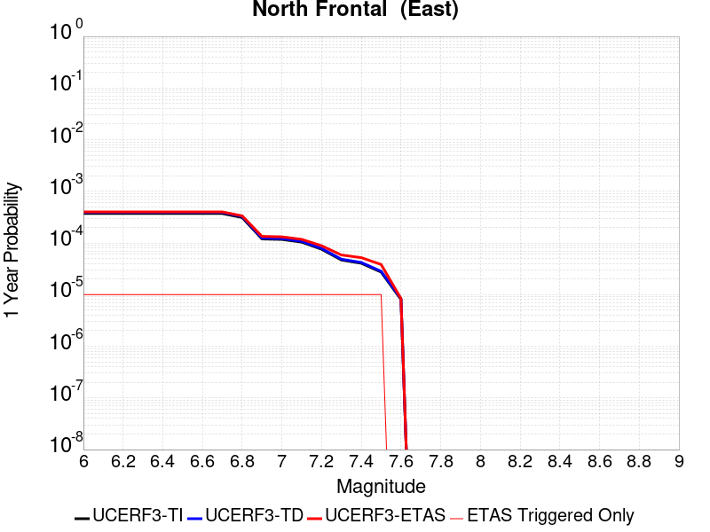 | 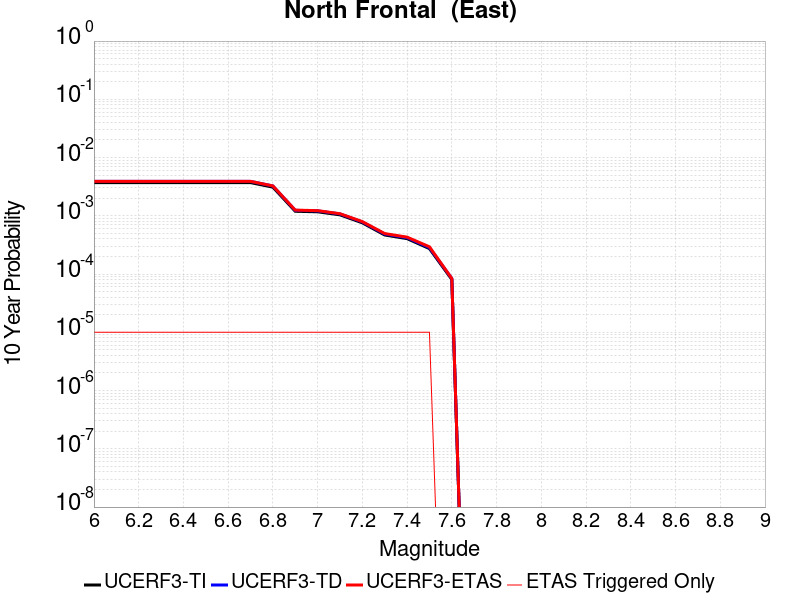 |

| Magnitude | 1 wk TI Prob | 1 wk TD Prob | 1 wk ETAS Prob | 1 wk ETAS/TD Gain | 1 wk ETAS Triggered Only | 1 mo TI Prob | 1 mo TD Prob | 1 mo ETAS Prob | 1 mo ETAS/TD Gain | 1 mo ETAS Triggered Only | 1 yr TI Prob | 1 yr TD Prob | 1 yr ETAS Prob | 1 yr ETAS/TD Gain | 1 yr ETAS Triggered Only | 10 yr TI Prob | 10 yr TD Prob | 10 yr ETAS Prob | 10 yr ETAS/TD Gain | 10 yr ETAS Triggered Only |
|-----|-----|-----|-----|-----|-----|-----|-----|-----|-----|-----|-----|-----|-----|-----|-----|-----|-----|-----|-----|-----|
| 6.0 | 7.135738E-6 | 7.4771765E-6 | 7.4771765E-6 | 1.0 | 0.0 | 3.0581377E-5 | 3.204476E-5 | 3.204476E-5 | 1.0 | 0.0 | 3.7226462E-4 | 3.9009505E-4 | 4.0009117E-4 | 1.0256248 | 1.0E-5 | 0.0037164164 | 0.0038960609 | 0.0039060218 | 1.0025567 | 1.0E-5 |
| 6.1 | 7.135738E-6 | 7.4771765E-6 | 7.4771765E-6 | 1.0 | 0.0 | 3.0581377E-5 | 3.204476E-5 | 3.204476E-5 | 1.0 | 0.0 | 3.7226462E-4 | 3.9009505E-4 | 4.0009117E-4 | 1.0256248 | 1.0E-5 | 0.0037164164 | 0.0038960609 | 0.0039060218 | 1.0025567 | 1.0E-5 |
| 6.2 | 7.135738E-6 | 7.4771765E-6 | 7.4771765E-6 | 1.0 | 0.0 | 3.0581377E-5 | 3.204476E-5 | 3.204476E-5 | 1.0 | 0.0 | 3.7226462E-4 | 3.9009505E-4 | 4.0009117E-4 | 1.0256248 | 1.0E-5 | 0.0037164164 | 0.0038960609 | 0.0039060218 | 1.0025567 | 1.0E-5 |
| 6.3 | 7.135738E-6 | 7.4771765E-6 | 7.4771765E-6 | 1.0 | 0.0 | 3.0581377E-5 | 3.204476E-5 | 3.204476E-5 | 1.0 | 0.0 | 3.7226462E-4 | 3.9009505E-4 | 4.0009117E-4 | 1.0256248 | 1.0E-5 | 0.0037164164 | 0.0038960609 | 0.0039060218 | 1.0025567 | 1.0E-5 |
| 6.4 | 7.135738E-6 | 7.4771765E-6 | 7.4771765E-6 | 1.0 | 0.0 | 3.0581377E-5 | 3.204476E-5 | 3.204476E-5 | 1.0 | 0.0 | 3.7226462E-4 | 3.9009505E-4 | 4.0009117E-4 | 1.0256248 | 1.0E-5 | 0.0037164164 | 0.0038960609 | 0.0039060218 | 1.0025567 | 1.0E-5 |
| 6.5 | 7.135738E-6 | 7.4771765E-6 | 7.4771765E-6 | 1.0 | 0.0 | 3.0581377E-5 | 3.204476E-5 | 3.204476E-5 | 1.0 | 0.0 | 3.7226462E-4 | 3.9009505E-4 | 4.0009117E-4 | 1.0256248 | 1.0E-5 | 0.0037164164 | 0.0038960609 | 0.0039060218 | 1.0025567 | 1.0E-5 |
| 6.6 | 7.135738E-6 | 7.4771765E-6 | 7.4771765E-6 | 1.0 | 0.0 | 3.0581377E-5 | 3.204476E-5 | 3.204476E-5 | 1.0 | 0.0 | 3.7226462E-4 | 3.9009505E-4 | 4.0009117E-4 | 1.0256248 | 1.0E-5 | 0.0037164164 | 0.0038960609 | 0.0039060218 | 1.0025567 | 1.0E-5 |
| 6.7 | 7.135738E-6 | 7.4771765E-6 | 7.4771765E-6 | 1.0 | 0.0 | 3.0581377E-5 | 3.204476E-5 | 3.204476E-5 | 1.0 | 0.0 | 3.7226462E-4 | 3.9009505E-4 | 4.0009117E-4 | 1.0256248 | 1.0E-5 | 0.0037164164 | 0.0038960609 | 0.0039060218 | 1.0025567 | 1.0E-5 |
| 6.8 | 5.959142E-6 | 6.236683E-6 | 6.236683E-6 | 1.0 | 0.0 | 2.553893E-5 | 2.6728469E-5 | 2.6728469E-5 | 1.0 | 0.0 | 3.108921E-4 | 3.253886E-4 | 3.3538532E-4 | 1.0307225 | 1.0E-5 | 0.0031045752 | 0.0032508948 | 0.0032608623 | 1.0030661 | 1.0E-5 |
| 6.9 | 2.2946929E-6 | 2.3824605E-6 | 2.3824605E-6 | 1.0 | 0.0 | 9.834361E-6 | 1.0210508E-5 | 1.0210508E-5 | 1.0 | 0.0 | 1.1972676E-4 | 1.2430632E-4 | 1.3430507E-4 | 1.0804365 | 1.0E-5 | 0.0011966228 | 0.0012424142 | 0.0012524019 | 1.0080389 | 1.0E-5 |
| 7.0 | 2.2468673E-6 | 2.3321538E-6 | 2.3321538E-6 | 1.0 | 0.0 | 9.629396E-6 | 9.994909E-6 | 9.994909E-6 | 1.0 | 0.0 | 1.1723159E-4 | 1.21681696E-4 | 1.3168047E-4 | 1.0821717 | 1.0E-5 | 0.0011716976 | 0.0012161969 | 0.0012261848 | 1.0082123 | 1.0E-5 |
| 7.1 | 1.9921076E-6 | 2.0646032E-6 | 2.0646032E-6 | 1.0 | 0.0 | 8.537577E-6 | 8.848272E-6 | 8.848272E-6 | 1.0 | 0.0 | 1.0394004E-4 | 1.0772282E-4 | 1.1772174E-4 | 1.0928209 | 1.0E-5 | 0.0010389143 | 0.0010767487 | 0.001086738 | 1.0092772 | 1.0E-5 |
| 7.2 | 1.4524545E-6 | 1.5045148E-6 | 1.5045148E-6 | 1.0 | 0.0 | 6.2247905E-6 | 6.447906E-6 | 6.447906E-6 | 1.0 | 0.0 | 7.5784184E-5 | 7.850068E-5 | 8.849989E-5 | 1.1273774 | 1.0E-5 | 7.575835E-4 | 7.8475394E-4 | 7.947461E-4 | 1.0127329 | 1.0E-5 |
| 7.3 | 8.9802575E-7 | 9.3087283E-7 | 9.3087283E-7 | 1.0 | 0.0 | 3.848676E-6 | 3.9894494E-6 | 3.9894494E-6 | 1.0 | 0.0 | 4.685662E-5 | 4.857058E-5 | 5.8570095E-5 | 1.205876 | 1.0E-5 | 4.6846745E-4 | 4.8561094E-4 | 4.956061E-4 | 1.0205827 | 1.0E-5 |
| 7.4 | 7.776139E-7 | 8.0604747E-7 | 8.0604747E-7 | 1.0 | 0.0 | 3.3326266E-6 | 3.4544853E-6 | 3.4544853E-6 | 1.0 | 0.0 | 4.0573974E-5 | 4.2057654E-5 | 5.2057236E-5 | 1.2377589 | 1.0E-5 | 4.0566566E-4 | 4.205077E-4 | 4.305035E-4 | 1.0237708 | 1.0E-5 |
| 7.5 | 5.244417E-7 | 5.441219E-7 | 5.441219E-7 | 1.0 | 0.0 | 2.2476054E-6 | 2.3319494E-6 | 2.3319494E-6 | 1.0 | 0.0 | 2.7364253E-5 | 2.839118E-5 | 3.8390895E-5 | 1.3522121 | 1.0E-5 | 2.7360884E-4 | 2.8388205E-4 | 2.9387922E-4 | 1.0352159 | 1.0E-5 |
| 7.6 | 1.5489647E-7 | 1.6089504E-7 | 1.6089504E-7 | 1.0 | 0.0 | 6.6384183E-7 | 6.895501E-7 | 6.895501E-7 | 1.0 | 0.0 | 8.082245E-6 | 8.395261E-6 | 8.395261E-6 | 1.0 | 0.0 | 8.08195E-5 | 8.395143E-5 | 8.395143E-5 | 1.0 | 0.0 |

## Earthquake Valley
*[(top)](#table-of-contents)*

| 1 Week | 1 Month | 1 Year | 10 Year |
|-----|-----|-----|-----|
|  |  |  |  |

| Magnitude | 1 wk TI Prob | 1 wk TD Prob | 1 wk ETAS Prob | 1 wk ETAS/TD Gain | 1 wk ETAS Triggered Only | 1 mo TI Prob | 1 mo TD Prob | 1 mo ETAS Prob | 1 mo ETAS/TD Gain | 1 mo ETAS Triggered Only | 1 yr TI Prob | 1 yr TD Prob | 1 yr ETAS Prob | 1 yr ETAS/TD Gain | 1 yr ETAS Triggered Only | 10 yr TI Prob | 10 yr TD Prob | 10 yr ETAS Prob | 10 yr ETAS/TD Gain | 10 yr ETAS Triggered Only |
|-----|-----|-----|-----|-----|-----|-----|-----|-----|-----|-----|-----|-----|-----|-----|-----|-----|-----|-----|-----|-----|
| 6.0 | 1.9416384E-5 | 2.258411E-5 | 2.258411E-5 | 1.0 | 0.0 | 8.321042E-5 | 9.6786134E-5 | 9.6786134E-5 | 1.0 | 0.0 | 0.001012616 | 0.001177854 | 0.0011878422 | 1.0084801 | 1.0E-5 | 0.010080142 | 0.011727945 | 0.011737828 | 1.0008427 | 1.0E-5 |
| 6.1 | 1.9416384E-5 | 2.258411E-5 | 2.258411E-5 | 1.0 | 0.0 | 8.321042E-5 | 9.6786134E-5 | 9.6786134E-5 | 1.0 | 0.0 | 0.001012616 | 0.001177854 | 0.0011878422 | 1.0084801 | 1.0E-5 | 0.010080142 | 0.011727945 | 0.011737828 | 1.0008427 | 1.0E-5 |
| 6.2 | 1.9416384E-5 | 2.258411E-5 | 2.258411E-5 | 1.0 | 0.0 | 8.321042E-5 | 9.6786134E-5 | 9.6786134E-5 | 1.0 | 0.0 | 0.001012616 | 0.001177854 | 0.0011878422 | 1.0084801 | 1.0E-5 | 0.010080142 | 0.011727945 | 0.011737828 | 1.0008427 | 1.0E-5 |
| 6.3 | 1.9416384E-5 | 2.258411E-5 | 2.258411E-5 | 1.0 | 0.0 | 8.321042E-5 | 9.6786134E-5 | 9.6786134E-5 | 1.0 | 0.0 | 0.001012616 | 0.001177854 | 0.0011878422 | 1.0084801 | 1.0E-5 | 0.010080142 | 0.011727945 | 0.011737828 | 1.0008427 | 1.0E-5 |
| 6.4 | 1.9416384E-5 | 2.258411E-5 | 2.258411E-5 | 1.0 | 0.0 | 8.321042E-5 | 9.6786134E-5 | 9.6786134E-5 | 1.0 | 0.0 | 0.001012616 | 0.001177854 | 0.0011878422 | 1.0084801 | 1.0E-5 | 0.010080142 | 0.011727945 | 0.011737828 | 1.0008427 | 1.0E-5 |
| 6.5 | 1.9389157E-5 | 2.25527E-5 | 2.25527E-5 | 1.0 | 0.0 | 8.309374E-5 | 9.665152E-5 | 9.665152E-5 | 1.0 | 0.0 | 0.0010111968 | 0.001176217 | 0.0011862052 | 1.0084919 | 1.0E-5 | 0.010066078 | 0.011711747 | 0.01172163 | 1.0008439 | 1.0E-5 |
| 6.6 | 1.9389157E-5 | 2.25527E-5 | 2.25527E-5 | 1.0 | 0.0 | 8.309374E-5 | 9.665152E-5 | 9.665152E-5 | 1.0 | 0.0 | 0.0010111968 | 0.001176217 | 0.0011862052 | 1.0084919 | 1.0E-5 | 0.010066078 | 0.011711747 | 0.01172163 | 1.0008439 | 1.0E-5 |
| 6.7 | 1.4925434E-5 | 1.720822E-5 | 1.720822E-5 | 1.0 | 0.0 | 6.396457E-5 | 7.374791E-5 | 7.374791E-5 | 1.0 | 0.0 | 7.7849044E-4 | 8.97596E-4 | 9.07587E-4 | 1.0111309 | 1.0E-5 | 0.007757689 | 0.008948081 | 0.008957992 | 1.0011076 | 1.0E-5 |
| 6.8 | 1.3570335E-5 | 1.5616837E-5 | 1.5616837E-5 | 1.0 | 0.0 | 5.8157282E-5 | 6.692804E-5 | 6.692804E-5 | 1.0 | 0.0 | 7.0783484E-4 | 8.146264E-4 | 8.2461827E-4 | 1.0122656 | 1.0E-5 | 0.0070558446 | 0.008124473 | 0.008134392 | 1.0012208 | 1.0E-5 |
| 6.9 | 1.3570335E-5 | 1.5616837E-5 | 1.5616837E-5 | 1.0 | 0.0 | 5.8157282E-5 | 6.692804E-5 | 6.692804E-5 | 1.0 | 0.0 | 7.0783484E-4 | 8.146264E-4 | 8.2461827E-4 | 1.0122656 | 1.0E-5 | 0.0070558446 | 0.008124473 | 0.008134392 | 1.0012208 | 1.0E-5 |
| 7.0 | 1.3433392E-5 | 1.546038E-5 | 1.546038E-5 | 1.0 | 0.0 | 5.757041E-5 | 6.6257555E-5 | 6.6257555E-5 | 1.0 | 0.0 | 7.0069433E-4 | 8.064692E-4 | 8.164611E-4 | 1.0123898 | 1.0E-5 | 0.006984891 | 0.008043493 | 0.008053413 | 1.0012332 | 1.0E-5 |
| 7.1 | 8.181609E-6 | 9.4168445E-6 | 9.4168445E-6 | 1.0 | 0.0 | 3.5063567E-5 | 4.0357656E-5 | 4.0357656E-5 | 1.0 | 0.0 | 4.268153E-4 | 4.913108E-4 | 4.913108E-4 | 1.0 | 0.0 | 0.0042599645 | 0.004908822 | 0.004908822 | 1.0 | 0.0 |
| 7.2 | 2.0663983E-7 | 1.7262263E-7 | 1.7262263E-7 | 1.0 | 0.0 | 8.855989E-7 | 7.398111E-7 | 7.398111E-7 | 1.0 | 0.0 | 1.0782113E-5 | 9.007167E-6 | 9.007167E-6 | 1.0 | 0.0 | 1.07815904E-4 | 9.006837E-5 | 9.006837E-5 | 1.0 | 0.0 |
| 7.3 | 2.0462376E-7 | 1.7077758E-7 | 1.7077758E-7 | 1.0 | 0.0 | 8.7695867E-7 | 7.319037E-7 | 7.319037E-7 | 1.0 | 0.0 | 1.0676919E-5 | 8.910895E-6 | 8.910895E-6 | 1.0 | 0.0 | 1.0676406E-4 | 8.9105735E-5 | 8.9105735E-5 | 1.0 | 0.0 |
| 7.4 | 2.0171088E-7 | 1.6860244E-7 | 1.6860244E-7 | 1.0 | 0.0 | 8.644749E-7 | 7.2258166E-7 | 7.2258166E-7 | 1.0 | 0.0 | 1.0524931E-5 | 8.7974E-6 | 8.7974E-6 | 1.0 | 0.0 | 1.05244326E-4 | 8.7970875E-5 | 8.7970875E-5 | 1.0 | 0.0 |
| 7.5 | 1.4847944E-7 | 1.2558573E-7 | 1.2558573E-7 | 1.0 | 0.0 | 6.363403E-7 | 5.382244E-7 | 5.382244E-7 | 1.0 | 0.0 | 7.747416E-6 | 6.5528648E-6 | 6.5528648E-6 | 1.0 | 0.0 | 7.747146E-5 | 6.552693E-5 | 6.552693E-5 | 1.0 | 0.0 |
| 7.6 | 1.3185847E-7 | 1.1122516E-7 | 1.1122516E-7 | 1.0 | 0.0 | 5.6510765E-7 | 4.766792E-7 | 4.766792E-7 | 1.0 | 0.0 | 6.8801637E-6 | 5.803556E-6 | 5.803556E-6 | 1.0 | 0.0 | 6.8799505E-5 | 5.8034257E-5 | 5.8034257E-5 | 1.0 | 0.0 |
| 7.7 | 2.8609954E-8 | 1.4170218E-8 | 1.4170218E-8 | 1.0 | 0.0 | 1.2261408E-7 | 6.0729505E-8 | 6.0729505E-8 | 1.0 | 0.0 | 1.4928254E-6 | 7.393815E-7 | 7.393815E-7 | 1.0 | 0.0 | 1.4928154E-5 | 7.393796E-6 | 7.393796E-6 | 1.0 | 0.0 |
| 7.8 | 6.527266E-9 | 2.9232412E-9 | 2.9232412E-9 | 1.0 | 0.0 | 2.7973995E-8 | 1.2528178E-8 | 1.2528178E-8 | 1.0 | 0.0 | 3.4058334E-7 | 1.5253055E-7 | 1.5253055E-7 | 1.0 | 0.0 | 3.4058282E-6 | 1.5253047E-6 | 1.5253047E-6 | 1.0 | 0.0 |
| 7.9 | 1.2898267E-9 | 7.127704E-10 | 7.127704E-10 | 1.0 | 0.0 | 5.527829E-9 | 3.0547302E-9 | 3.0547302E-9 | 1.0 | 0.0 | 6.7301315E-8 | 3.719134E-8 | 3.719134E-8 | 1.0 | 0.0 | 6.7301295E-7 | 3.7191342E-7 | 3.7191342E-7 | 1.0 | 0.0 |

## Los Alamos extension
*[(top)](#table-of-contents)*

| 1 Week | 1 Month | 1 Year | 10 Year |
|-----|-----|-----|-----|
|  |  |  | 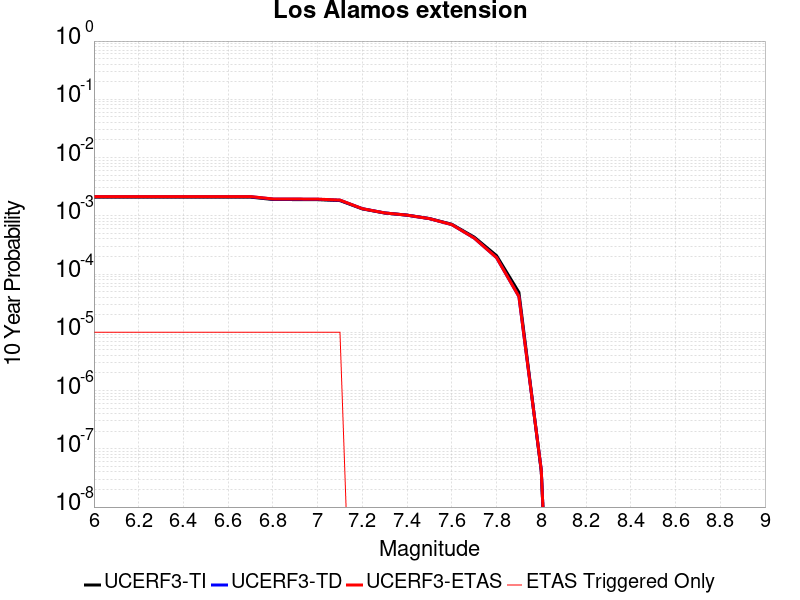 |

| Magnitude | 1 wk TI Prob | 1 wk TD Prob | 1 wk ETAS Prob | 1 wk ETAS/TD Gain | 1 wk ETAS Triggered Only | 1 mo TI Prob | 1 mo TD Prob | 1 mo ETAS Prob | 1 mo ETAS/TD Gain | 1 mo ETAS Triggered Only | 1 yr TI Prob | 1 yr TD Prob | 1 yr ETAS Prob | 1 yr ETAS/TD Gain | 1 yr ETAS Triggered Only | 10 yr TI Prob | 10 yr TD Prob | 10 yr ETAS Prob | 10 yr ETAS/TD Gain | 10 yr ETAS Triggered Only |
|-----|-----|-----|-----|-----|-----|-----|-----|-----|-----|-----|-----|-----|-----|-----|-----|-----|-----|-----|-----|-----|
| 6.0 | 4.0146506E-6 | 4.086164E-6 | 4.086164E-6 | 1.0 | 0.0 | 1.7205533E-5 | 1.7512022E-5 | 1.7512022E-5 | 1.0 | 0.0 | 2.0945723E-4 | 2.1318911E-4 | 2.1318911E-4 | 1.0 | 0.0 | 0.0020925992 | 0.002129955 | 0.0021399339 | 1.0046849 | 1.0E-5 |
| 6.1 | 4.0146506E-6 | 4.086164E-6 | 4.086164E-6 | 1.0 | 0.0 | 1.7205533E-5 | 1.7512022E-5 | 1.7512022E-5 | 1.0 | 0.0 | 2.0945723E-4 | 2.1318911E-4 | 2.1318911E-4 | 1.0 | 0.0 | 0.0020925992 | 0.002129955 | 0.0021399339 | 1.0046849 | 1.0E-5 |
| 6.2 | 4.0146506E-6 | 4.086164E-6 | 4.086164E-6 | 1.0 | 0.0 | 1.7205533E-5 | 1.7512022E-5 | 1.7512022E-5 | 1.0 | 0.0 | 2.0945723E-4 | 2.1318911E-4 | 2.1318911E-4 | 1.0 | 0.0 | 0.0020925992 | 0.002129955 | 0.0021399339 | 1.0046849 | 1.0E-5 |
| 6.3 | 4.0146506E-6 | 4.086164E-6 | 4.086164E-6 | 1.0 | 0.0 | 1.7205533E-5 | 1.7512022E-5 | 1.7512022E-5 | 1.0 | 0.0 | 2.0945723E-4 | 2.1318911E-4 | 2.1318911E-4 | 1.0 | 0.0 | 0.0020925992 | 0.002129955 | 0.0021399339 | 1.0046849 | 1.0E-5 |
| 6.4 | 4.0146506E-6 | 4.086164E-6 | 4.086164E-6 | 1.0 | 0.0 | 1.7205533E-5 | 1.7512022E-5 | 1.7512022E-5 | 1.0 | 0.0 | 2.0945723E-4 | 2.1318911E-4 | 2.1318911E-4 | 1.0 | 0.0 | 0.0020925992 | 0.002129955 | 0.0021399339 | 1.0046849 | 1.0E-5 |
| 6.5 | 4.0146506E-6 | 4.086164E-6 | 4.086164E-6 | 1.0 | 0.0 | 1.7205533E-5 | 1.7512022E-5 | 1.7512022E-5 | 1.0 | 0.0 | 2.0945723E-4 | 2.1318911E-4 | 2.1318911E-4 | 1.0 | 0.0 | 0.0020925992 | 0.002129955 | 0.0021399339 | 1.0046849 | 1.0E-5 |
| 6.6 | 4.0146506E-6 | 4.086164E-6 | 4.086164E-6 | 1.0 | 0.0 | 1.7205533E-5 | 1.7512022E-5 | 1.7512022E-5 | 1.0 | 0.0 | 2.0945723E-4 | 2.1318911E-4 | 2.1318911E-4 | 1.0 | 0.0 | 0.0020925992 | 0.002129955 | 0.0021399339 | 1.0046849 | 1.0E-5 |
| 6.7 | 4.0146506E-6 | 4.086164E-6 | 4.086164E-6 | 1.0 | 0.0 | 1.7205533E-5 | 1.7512022E-5 | 1.7512022E-5 | 1.0 | 0.0 | 2.0945723E-4 | 2.1318911E-4 | 2.1318911E-4 | 1.0 | 0.0 | 0.0020925992 | 0.002129955 | 0.0021399339 | 1.0046849 | 1.0E-5 |
| 6.8 | 3.6584688E-6 | 3.7188636E-6 | 3.7188636E-6 | 1.0 | 0.0 | 1.5679057E-5 | 1.5937894E-5 | 1.5937894E-5 | 1.0 | 0.0 | 1.9087581E-4 | 1.9402753E-4 | 1.9402753E-4 | 1.0 | 0.0 | 0.0019071194 | 0.0019386737 | 0.0019486542 | 1.0051482 | 1.0E-5 |
| 6.9 | 3.644631E-6 | 3.7045736E-6 | 3.7045736E-6 | 1.0 | 0.0 | 1.5619753E-5 | 1.5876652E-5 | 1.5876652E-5 | 1.0 | 0.0 | 1.901539E-4 | 1.9328203E-4 | 1.9328203E-4 | 1.0 | 0.0 | 0.0018999127 | 0.0019312317 | 0.0019412123 | 1.0051681 | 1.0E-5 |
| 7.0 | 3.6318522E-6 | 3.691334E-6 | 3.691334E-6 | 1.0 | 0.0 | 1.5564989E-5 | 1.5819913E-5 | 1.5819913E-5 | 1.0 | 0.0 | 1.8948725E-4 | 1.9259135E-4 | 1.9259135E-4 | 1.0 | 0.0 | 0.0018932576 | 0.0019243368 | 0.0019343175 | 1.0051866 | 1.0E-5 |
| 7.1 | 3.5001724E-6 | 3.5554046E-6 | 3.5554046E-6 | 1.0 | 0.0 | 1.5000653E-5 | 1.5237365E-5 | 1.5237365E-5 | 1.0 | 0.0 | 1.8261763E-4 | 1.8550004E-4 | 1.8550004E-4 | 1.0 | 0.0 | 0.0018246764 | 0.0018535426 | 0.0018635241 | 1.005385 | 1.0E-5 |
| 7.2 | 2.5204702E-6 | 2.5436989E-6 | 2.5436989E-6 | 1.0 | 0.0 | 1.080197E-5 | 1.0901522E-5 | 1.0901522E-5 | 1.0 | 0.0 | 1.3150605E-4 | 1.3271799E-4 | 1.3271799E-4 | 1.0 | 0.0 | 0.0013142825 | 0.001326393 | 0.001326393 | 1.0 | 0.0 |
| 7.3 | 2.1399692E-6 | 2.1501362E-6 | 2.1501362E-6 | 1.0 | 0.0 | 9.1712645E-6 | 9.2148375E-6 | 9.2148375E-6 | 1.0 | 0.0 | 1.1165442E-4 | 1.121849E-4 | 1.121849E-4 | 1.0 | 0.0 | 0.0011159834 | 0.001121286 | 0.001121286 | 1.0 | 0.0 |
| 7.4 | 1.9660122E-6 | 1.970241E-6 | 1.970241E-6 | 1.0 | 0.0 | 8.42574E-6 | 8.4438625E-6 | 8.4438625E-6 | 1.0 | 0.0 | 1.0257855E-4 | 1.0279921E-4 | 1.0279921E-4 | 1.0 | 0.0 | 0.0010253121 | 0.0010275197 | 0.0010275197 | 1.0 | 0.0 |
| 7.5 | 1.7204633E-6 | 1.7151029E-6 | 1.7151029E-6 | 1.0 | 0.0 | 7.373393E-6 | 7.3504207E-6 | 7.3504207E-6 | 1.0 | 0.0 | 8.976737E-5 | 8.948772E-5 | 8.948772E-5 | 1.0 | 0.0 | 8.9731114E-4 | 8.945199E-4 | 8.945199E-4 | 1.0 | 0.0 |
| 7.6 | 1.3717638E-6 | 1.3535872E-6 | 1.3535872E-6 | 1.0 | 0.0 | 5.878974E-6 | 5.801075E-6 | 5.801075E-6 | 1.0 | 0.0 | 7.157416E-5 | 7.062583E-5 | 7.062583E-5 | 1.0 | 0.0 | 7.1551115E-4 | 7.0603646E-4 | 7.0603646E-4 | 1.0 | 0.0 |
| 7.7 | 8.272564E-7 | 7.9576733E-7 | 7.9576733E-7 | 1.0 | 0.0 | 3.5453797E-6 | 3.4104269E-6 | 3.4104269E-6 | 1.0 | 0.0 | 4.3164142E-5 | 4.1521158E-5 | 4.1521158E-5 | 1.0 | 0.0 | 4.315576E-4 | 4.151342E-4 | 4.151342E-4 | 1.0 | 0.0 |
| 7.8 | 3.9708277E-7 | 3.671937E-7 | 3.671937E-7 | 1.0 | 0.0 | 1.7017821E-6 | 1.5736864E-6 | 1.5736864E-6 | 1.0 | 0.0 | 2.0719E-5 | 1.9159465E-5 | 1.9159465E-5 | 1.0 | 0.0 | 2.071707E-4 | 1.9157819E-4 | 1.9157819E-4 | 1.0 | 0.0 |
| 7.9 | 9.292528E-8 | 7.889168E-8 | 7.889168E-8 | 1.0 | 0.0 | 3.9825116E-7 | 3.3810713E-7 | 3.3810713E-7 | 1.0 | 0.0 | 4.848697E-6 | 4.1164467E-6 | 4.1164467E-6 | 1.0 | 0.0 | 4.8485912E-5 | 4.1163716E-5 | 4.1163716E-5 | 1.0 | 0.0 |
| 8.0 | 7.880441E-11 | 8.2353124E-11 | 8.2353124E-11 | 1.0 | 0.0 | 3.3773329E-10 | 3.52942E-10 | 3.52942E-10 | 1.0 | 0.0 | 4.1119033E-9 | 4.2970694E-9 | 4.2970694E-9 | 1.0 | 0.0 | 4.1119034E-8 | 4.2970694E-8 | 4.2970694E-8 | 1.0 | 0.0 |

## Pittville 2011 CFM
*[(top)](#table-of-contents)*

| 1 Week | 1 Month | 1 Year | 10 Year |
|-----|-----|-----|-----|
|  |  |  |  |

| Magnitude | 1 wk TI Prob | 1 wk TD Prob | 1 wk ETAS Prob | 1 wk ETAS/TD Gain | 1 wk ETAS Triggered Only | 1 mo TI Prob | 1 mo TD Prob | 1 mo ETAS Prob | 1 mo ETAS/TD Gain | 1 mo ETAS Triggered Only | 1 yr TI Prob | 1 yr TD Prob | 1 yr ETAS Prob | 1 yr ETAS/TD Gain | 1 yr ETAS Triggered Only | 10 yr TI Prob | 10 yr TD Prob | 10 yr ETAS Prob | 10 yr ETAS/TD Gain | 10 yr ETAS Triggered Only |
|-----|-----|-----|-----|-----|-----|-----|-----|-----|-----|-----|-----|-----|-----|-----|-----|-----|-----|-----|-----|-----|
| 6.0 | 2.5031832E-5 | 2.7056969E-5 | 2.7056969E-5 | 1.0 | 0.0 | 1.0727487E-4 | 1.1595384E-4 | 1.1595384E-4 | 1.0 | 0.0 | 0.001305289 | 0.0014109211 | 0.0014109211 | 1.0 | 0.0 | 0.012976485 | 0.014029415 | 0.014039275 | 1.0007027 | 1.0E-5 |
| 6.1 | 1.2540113E-5 | 1.3513067E-5 | 1.3513067E-5 | 1.0 | 0.0 | 5.3742235E-5 | 5.7911984E-5 | 5.7911984E-5 | 1.0 | 0.0 | 6.541153E-4 | 7.048728E-4 | 7.048728E-4 | 1.0 | 0.0 | 0.0065219323 | 0.0070286044 | 0.0070286044 | 1.0 | 0.0 |
| 6.2 | 6.603218E-6 | 7.107189E-6 | 7.107189E-6 | 1.0 | 0.0 | 2.8299199E-5 | 3.0459063E-5 | 3.0459063E-5 | 1.0 | 0.0 | 3.4448825E-4 | 3.7078248E-4 | 3.7078248E-4 | 1.0 | 0.0 | 0.0034395473 | 0.0037022792 | 0.0037022792 | 1.0 | 0.0 |
| 6.3 | 6.603218E-6 | 7.107189E-6 | 7.107189E-6 | 1.0 | 0.0 | 2.8299199E-5 | 3.0459063E-5 | 3.0459063E-5 | 1.0 | 0.0 | 3.4448825E-4 | 3.7078248E-4 | 3.7078248E-4 | 1.0 | 0.0 | 0.0034395473 | 0.0037022792 | 0.0037022792 | 1.0 | 0.0 |
| 6.4 | 3.9389015E-6 | 4.239175E-6 | 4.239175E-6 | 1.0 | 0.0 | 1.6880897E-5 | 1.8167784E-5 | 1.8167784E-5 | 1.0 | 0.0 | 2.0550552E-4 | 2.2117342E-4 | 2.2117342E-4 | 1.0 | 0.0 | 0.0020531558 | 0.002209838 | 0.002209838 | 1.0 | 0.0 |
| 6.5 | 2.4533072E-6 | 2.6412686E-6 | 2.6412686E-6 | 1.0 | 0.0 | 1.0514132E-5 | 1.1319685E-5 | 1.1319685E-5 | 1.0 | 0.0 | 1.2800204E-4 | 1.3781038E-4 | 1.3781038E-4 | 1.0 | 0.0 | 0.0012792832 | 0.0013774394 | 0.0013774394 | 1.0 | 0.0 |
| 6.6 | 1.3482367E-6 | 1.452993E-6 | 1.452993E-6 | 1.0 | 0.0 | 5.778144E-6 | 6.2271047E-6 | 6.2271047E-6 | 1.0 | 0.0 | 7.0346636E-5 | 7.58135E-5 | 7.58135E-5 | 1.0 | 0.0 | 7.032437E-4 | 7.5798744E-4 | 7.5798744E-4 | 1.0 | 0.0 |

## Maacama 2011 CFM
*[(top)](#table-of-contents)*

| 1 Week | 1 Month | 1 Year | 10 Year |
|-----|-----|-----|-----|
| 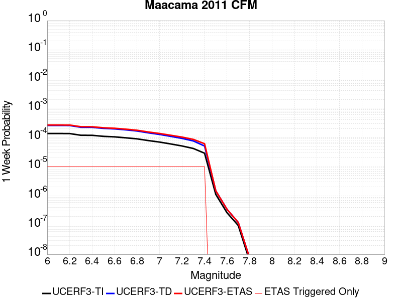 | 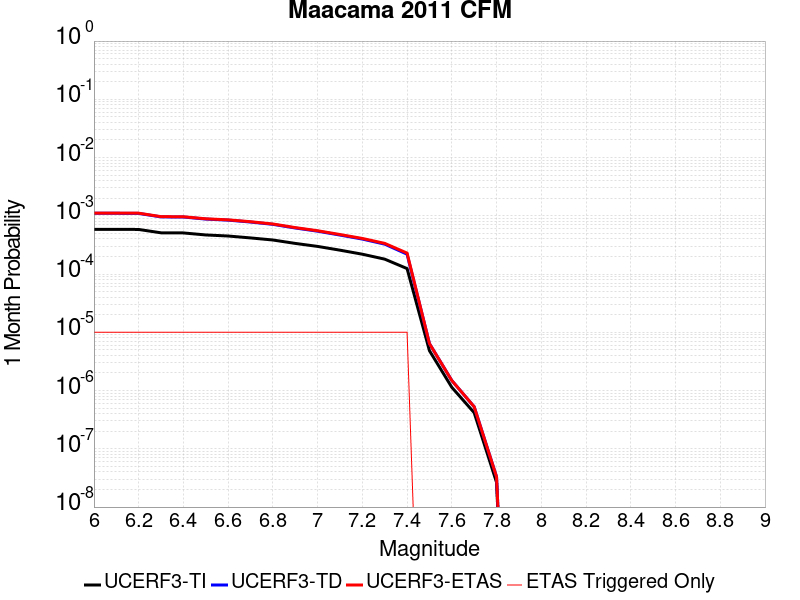 |  |  |

| Magnitude | 1 wk TI Prob | 1 wk TD Prob | 1 wk ETAS Prob | 1 wk ETAS/TD Gain | 1 wk ETAS Triggered Only | 1 mo TI Prob | 1 mo TD Prob | 1 mo ETAS Prob | 1 mo ETAS/TD Gain | 1 mo ETAS Triggered Only | 1 yr TI Prob | 1 yr TD Prob | 1 yr ETAS Prob | 1 yr ETAS/TD Gain | 1 yr ETAS Triggered Only | 10 yr TI Prob | 10 yr TD Prob | 10 yr ETAS Prob | 10 yr ETAS/TD Gain | 10 yr ETAS Triggered Only |
|-----|-----|-----|-----|-----|-----|-----|-----|-----|-----|-----|-----|-----|-----|-----|-----|-----|-----|-----|-----|-----|
| 6.0 | 1.368203E-4 | 2.579087E-4 | 2.679061E-4 | 1.0387634 | 1.0E-5 | 5.862409E-4 | 0.0011047592 | 0.0011147481 | 1.0090418 | 1.0E-5 | 0.0071141496 | 0.013350345 | 0.013360212 | 1.0007391 | 1.0E-5 | 0.06890667 | 0.1241916 | 0.12420036 | 1.0000706 | 1.0E-5 |
| 6.1 | 1.368203E-4 | 2.579087E-4 | 2.679061E-4 | 1.0387634 | 1.0E-5 | 5.862409E-4 | 0.0011047592 | 0.0011147481 | 1.0090418 | 1.0E-5 | 0.0071141496 | 0.013350345 | 0.013360212 | 1.0007391 | 1.0E-5 | 0.06890667 | 0.1241916 | 0.12420036 | 1.0000706 | 1.0E-5 |
| 6.2 | 1.360743E-4 | 2.566557E-4 | 2.6665317E-4 | 1.0389527 | 1.0E-5 | 5.8304524E-4 | 0.001099394 | 0.0011093831 | 1.0090859 | 1.0E-5 | 0.007075496 | 0.013285898 | 0.013295765 | 1.0007427 | 1.0E-5 | 0.06854413 | 0.123625994 | 0.123634756 | 1.0000709 | 1.0E-5 |
| 6.3 | 1.1917239E-4 | 2.236021E-4 | 2.3359986E-4 | 1.0447123 | 1.0E-5 | 5.1063887E-4 | 9.578717E-4 | 9.6786214E-4 | 1.0104299 | 1.0E-5 | 0.0061993203 | 0.0115873255 | 0.01159721 | 1.0008531 | 1.0E-5 | 0.060292065 | 0.108845875 | 0.108854786 | 1.0000819 | 1.0E-5 |
| 6.4 | 1.1859289E-4 | 2.2263796E-4 | 2.3263574E-4 | 1.044906 | 1.0E-5 | 5.0815626E-4 | 9.537432E-4 | 9.6373365E-4 | 1.010475 | 1.0E-5 | 0.006169266 | 0.011537647 | 0.011547532 | 1.0008568 | 1.0E-5 | 0.06000784 | 0.10840272 | 0.10841164 | 1.0000823 | 1.0E-5 |
| 6.5 | 1.09512424E-4 | 2.0517908E-4 | 2.1517703E-4 | 1.0487279 | 1.0E-5 | 4.6925453E-4 | 8.7897904E-4 | 8.889703E-4 | 1.0113668 | 1.0E-5 | 0.005698218 | 0.010639169 | 0.010649063 | 1.00093 | 1.0E-5 | 0.055543028 | 0.1004949 | 0.10050389 | 1.0000895 | 1.0E-5 |
| 6.6 | 1.0502928E-4 | 1.9675294E-4 | 2.0675096E-4 | 1.0508151 | 1.0E-5 | 4.500478E-4 | 8.429031E-4 | 8.528946E-4 | 1.0118538 | 1.0E-5 | 0.0054655746 | 0.010205293 | 0.010215191 | 1.0009699 | 1.0E-5 | 0.053330887 | 0.0966474 | 0.096656434 | 1.0000935 | 1.0E-5 |
| 6.7 | 9.739358E-5 | 1.8259176E-4 | 1.9258993E-4 | 1.054757 | 1.0E-5 | 4.173343E-4 | 7.822563E-4 | 7.9224847E-4 | 1.0127735 | 1.0E-5 | 0.0050692135 | 0.009475343 | 0.009485248 | 1.0010453 | 1.0E-5 | 0.049551267 | 0.09012011 | 0.090129204 | 1.000101 | 1.0E-5 |
| 6.8 | 8.969524E-5 | 1.6658378E-4 | 1.765821E-4 | 1.0600199 | 1.0E-5 | 3.8435153E-4 | 7.1369443E-4 | 7.236873E-4 | 1.0140016 | 1.0E-5 | 0.0046694432 | 0.00864909 | 0.008659003 | 1.0011462 | 1.0E-5 | 0.045725387 | 0.08265246 | 0.082661636 | 1.000111 | 1.0E-5 |
| 6.9 | 7.838291E-5 | 1.4418772E-4 | 1.5418629E-4 | 1.069344 | 1.0E-5 | 3.358835E-4 | 6.1778206E-4 | 6.2777585E-4 | 1.0161769 | 1.0E-5 | 0.0040817154 | 0.007491724 | 0.007501649 | 1.0013248 | 1.0E-5 | 0.04007554 | 0.07205298 | 0.072062254 | 1.0001287 | 1.0E-5 |
| 7.0 | 6.961957E-5 | 1.2708071E-4 | 1.3707943E-4 | 1.0786802 | 1.0E-5 | 2.9833548E-4 | 5.445059E-4 | 5.5450044E-4 | 1.0183553 | 1.0E-5 | 0.0036261857 | 0.006606692 | 0.006616626 | 1.0015036 | 1.0E-5 | 0.035675827 | 0.063871816 | 0.063881174 | 1.0001465 | 1.0E-5 |
| 7.1 | 5.999398E-5 | 1.09053384E-4 | 1.19052296E-4 | 1.0916882 | 1.0E-5 | 2.570917E-4 | 4.6728246E-4 | 4.7727776E-4 | 1.0213903 | 1.0E-5 | 0.0031255994 | 0.00567284 | 0.005682783 | 1.0017527 | 1.0E-5 | 0.030820016 | 0.055139277 | 0.055148724 | 1.0001713 | 1.0E-5 |
| 7.2 | 5.116532E-5 | 9.305489E-5 | 1.03053964E-4 | 1.1074535 | 1.0E-5 | 2.1926152E-4 | 3.9874107E-4 | 4.0873708E-4 | 1.0250689 | 1.0E-5 | 0.002666241 | 0.00484315 | 0.0048531014 | 1.0020548 | 1.0E-5 | 0.026344774 | 0.047303654 | 0.04731318 | 1.0002013 | 1.0E-5 |
| 7.3 | 4.2087835E-5 | 7.617064E-5 | 8.616987E-5 | 1.1312742 | 1.0E-5 | 1.8036396E-4 | 3.264016E-4 | 3.3639834E-4 | 1.0306271 | 1.0E-5 | 0.0021937196 | 0.0039662397 | 0.0039762 | 1.0025113 | 1.0E-5 | 0.0217219 | 0.038905017 | 0.03891463 | 1.000247 | 1.0E-5 |
| 7.4 | 2.8991652E-5 | 5.1163643E-5 | 6.116313E-5 | 1.1954412 | 1.0E-5 | 1.2424402E-4 | 2.1925455E-4 | 2.2925236E-4 | 1.0455991 | 1.0E-5 | 0.0015116213 | 0.0026661097 | 0.002676083 | 1.0037408 | 1.0E-5 | 0.015013801 | 0.026332043 | 0.026341781 | 1.0003698 | 1.0E-5 |
| 7.5 | 1.1292299E-6 | 1.4950216E-6 | 1.4950216E-6 | 1.0 | 0.0 | 4.8395473E-6 | 6.407227E-6 | 6.407227E-6 | 1.0 | 0.0 | 5.8919897E-5 | 7.8006444E-5 | 7.8006444E-5 | 1.0 | 0.0 | 5.890428E-4 | 7.805042E-4 | 7.805042E-4 | 1.0 | 0.0 |
| 7.6 | 2.6535366E-7 | 3.4720998E-7 | 3.4720998E-7 | 1.0 | 0.0 | 1.1372296E-6 | 1.4880419E-6 | 1.4880419E-6 | 1.0 | 0.0 | 1.3845682E-5 | 1.811676E-5 | 1.811676E-5 | 1.0 | 0.0 | 1.3844819E-4 | 1.817069E-4 | 1.817069E-4 | 1.0 | 0.0 |
| 7.7 | 9.727789E-8 | 1.2302418E-7 | 1.2302418E-7 | 1.0 | 0.0 | 4.1690518E-7 | 5.2724636E-7 | 5.2724636E-7 | 1.0 | 0.0 | 5.0758085E-6 | 6.419206E-6 | 6.419206E-6 | 1.0 | 0.0 | 5.0756928E-5 | 6.456404E-5 | 6.456404E-5 | 1.0 | 0.0 |
| 7.8 | 6.1939325E-9 | 7.711711E-9 | 7.711711E-9 | 1.0 | 0.0 | 2.6545425E-8 | 3.305019E-8 | 3.305019E-8 | 1.0 | 0.0 | 3.231905E-7 | 4.0238598E-7 | 4.0238598E-7 | 1.0 | 0.0 | 3.2319003E-6 | 4.0597915E-6 | 4.0597915E-6 | 1.0 | 0.0 |

## Elysian Park (Lower CFM)
*[(top)](#table-of-contents)*

| 1 Week | 1 Month | 1 Year | 10 Year |
|-----|-----|-----|-----|
|  | 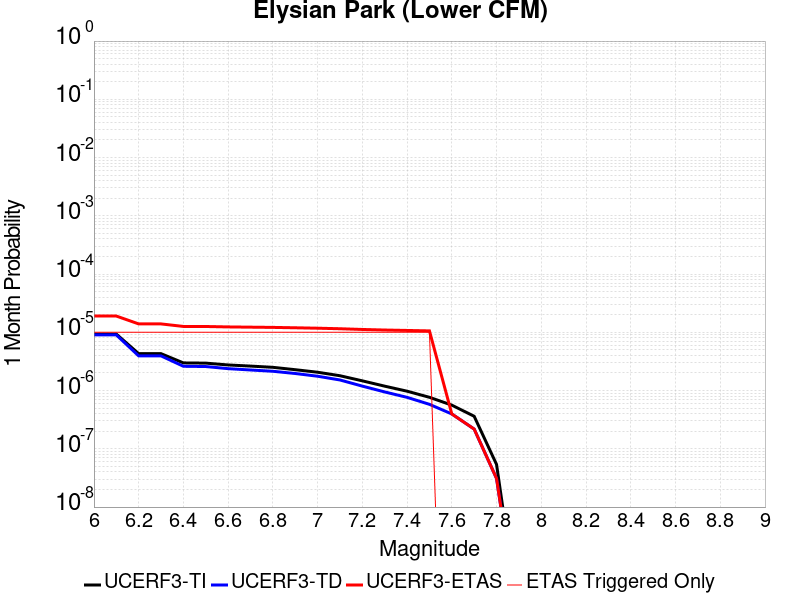 |  |  |

| Magnitude | 1 wk TI Prob | 1 wk TD Prob | 1 wk ETAS Prob | 1 wk ETAS/TD Gain | 1 wk ETAS Triggered Only | 1 mo TI Prob | 1 mo TD Prob | 1 mo ETAS Prob | 1 mo ETAS/TD Gain | 1 mo ETAS Triggered Only | 1 yr TI Prob | 1 yr TD Prob | 1 yr ETAS Prob | 1 yr ETAS/TD Gain | 1 yr ETAS Triggered Only | 10 yr TI Prob | 10 yr TD Prob | 10 yr ETAS Prob | 10 yr ETAS/TD Gain | 10 yr ETAS Triggered Only |
|-----|-----|-----|-----|-----|-----|-----|-----|-----|-----|-----|-----|-----|-----|-----|-----|-----|-----|-----|-----|-----|
| 6.0 | 2.1766498E-6 | 2.1037895E-6 | 2.1037895E-6 | 1.0 | 0.0 | 9.328466E-6 | 9.0162175E-6 | 1.9016126E-5 | 2.1091025 | 1.0E-5 | 1.1356815E-4 | 1.0976836E-4 | 1.1976726E-4 | 1.0910909 | 1.0E-5 | 0.0011351013 | 0.0010972833 | 0.0011072723 | 1.0091034 | 1.0E-5 |
| 6.1 | 2.1766498E-6 | 2.1037895E-6 | 2.1037895E-6 | 1.0 | 0.0 | 9.328466E-6 | 9.0162175E-6 | 1.9016126E-5 | 2.1091025 | 1.0E-5 | 1.1356815E-4 | 1.0976836E-4 | 1.1976726E-4 | 1.0910909 | 1.0E-5 | 0.0011351013 | 0.0010972833 | 0.0011072723 | 1.0091034 | 1.0E-5 |
| 6.2 | 1.0031182E-6 | 9.186213E-7 | 9.186213E-7 | 1.0 | 0.0 | 4.299071E-6 | 3.936943E-6 | 1.3936904E-5 | 3.540032 | 1.0E-5 | 5.2339932E-5 | 4.7931328E-5 | 5.7930847E-5 | 1.2086219 | 1.0E-5 | 5.2327604E-4 | 4.7921969E-4 | 4.892149E-4 | 1.0208572 | 1.0E-5 |
| 6.3 | 1.0031182E-6 | 9.186213E-7 | 9.186213E-7 | 1.0 | 0.0 | 4.299071E-6 | 3.936943E-6 | 1.3936904E-5 | 3.540032 | 1.0E-5 | 5.2339932E-5 | 4.7931328E-5 | 5.7930847E-5 | 1.2086219 | 1.0E-5 | 5.2327604E-4 | 4.7921969E-4 | 4.892149E-4 | 1.0208572 | 1.0E-5 |
| 6.4 | 6.9606244E-7 | 6.091942E-7 | 6.091942E-7 | 1.0 | 0.0 | 2.9831212E-6 | 2.6108296E-6 | 1.2610803E-5 | 4.83019 | 1.0E-5 | 3.6318896E-5 | 3.178639E-5 | 4.1786072E-5 | 1.3145901 | 1.0E-5 | 3.6312963E-4 | 3.1781866E-4 | 3.2781548E-4 | 1.0314544 | 1.0E-5 |
| 6.5 | 6.901879E-7 | 6.0326255E-7 | 6.0326255E-7 | 1.0 | 0.0 | 2.9579448E-6 | 2.5854083E-6 | 1.2585382E-5 | 4.867851 | 1.0E-5 | 3.6012385E-5 | 3.1476895E-5 | 4.147658E-5 | 1.3176833 | 1.0E-5 | 3.600655E-4 | 3.147246E-4 | 3.2472145E-4 | 1.0317638 | 1.0E-5 |
| 6.6 | 6.4198554E-7 | 5.5466086E-7 | 5.5466086E-7 | 1.0 | 0.0 | 2.7513638E-6 | 2.3771156E-6 | 1.23770915E-5 | 5.206769 | 1.0E-5 | 3.3497337E-5 | 2.8941E-5 | 3.894071E-5 | 1.3455206 | 1.0E-5 | 3.349229E-4 | 2.8937246E-4 | 2.9936957E-4 | 1.0345476 | 1.0E-5 |
| 6.7 | 6.138733E-7 | 5.263416E-7 | 5.263416E-7 | 1.0 | 0.0 | 2.6308828E-6 | 2.2557474E-6 | 1.2255725E-5 | 5.43311 | 1.0E-5 | 3.203053E-5 | 2.746338E-5 | 3.7463105E-5 | 1.3641112 | 1.0E-5 | 3.2025913E-4 | 2.746E-4 | 2.8459725E-4 | 1.0364066 | 1.0E-5 |
| 6.8 | 5.84778E-7 | 5.0029365E-7 | 5.0029365E-7 | 1.0 | 0.0 | 2.506189E-6 | 2.1441138E-6 | 1.2144093E-5 | 5.663922 | 1.0E-5 | 3.0512423E-5 | 2.6104273E-5 | 3.610401E-5 | 1.383069 | 1.0E-5 | 3.0508233E-4 | 2.6101217E-4 | 2.7100957E-4 | 1.0383024 | 1.0E-5 |
| 6.9 | 5.322785E-7 | 4.5800792E-7 | 4.5800792E-7 | 1.0 | 0.0 | 2.2811914E-6 | 1.9628894E-6 | 1.196287E-5 | 6.09452 | 1.0E-5 | 2.7773152E-5 | 2.389792E-5 | 3.389768E-5 | 1.4184365 | 1.0E-5 | 2.7769682E-4 | 2.3895358E-4 | 2.489512E-4 | 1.0418391 | 1.0E-5 |
| 7.0 | 4.8147206E-7 | 4.1124093E-7 | 4.1124093E-7 | 1.0 | 0.0 | 2.06345E-6 | 1.7624599E-6 | 1.1762442E-5 | 6.673878 | 1.0E-5 | 2.5122214E-5 | 2.1457738E-5 | 3.1457523E-5 | 1.4660224 | 1.0E-5 | 2.5119373E-4 | 2.1455674E-4 | 2.245546E-4 | 1.0465977 | 1.0E-5 |
| 7.1 | 4.1932955E-7 | 3.5455687E-7 | 3.5455687E-7 | 1.0 | 0.0 | 1.7971255E-6 | 1.5195285E-6 | 1.15195135E-5 | 7.580979 | 1.0E-5 | 2.1879783E-5 | 1.8500103E-5 | 2.8499917E-5 | 1.5405276 | 1.0E-5 | 2.1877629E-4 | 1.8498568E-4 | 1.9498383E-4 | 1.0540482 | 1.0E-5 |
| 7.2 | 3.426051E-7 | 2.7810242E-7 | 2.7810242E-7 | 1.0 | 0.0 | 1.4683067E-6 | 1.1918669E-6 | 1.1191855E-5 | 9.390189 | 1.0E-5 | 1.7876488E-5 | 1.45108825E-5 | 2.4510737E-5 | 1.6891279 | 1.0E-5 | 1.787505E-4 | 1.4509937E-4 | 1.5509792E-4 | 1.0689083 | 1.0E-5 |
| 7.3 | 2.7771645E-7 | 2.2096455E-7 | 2.2096455E-7 | 1.0 | 0.0 | 1.1902127E-6 | 9.4699055E-7 | 1.0946981E-5 | 11.559757 | 1.0E-5 | 1.4490744E-5 | 1.1529549E-5 | 2.1529433E-5 | 1.8673266 | 1.0E-5 | 1.4489799E-4 | 1.1528953E-4 | 1.2528838E-4 | 1.0867281 | 1.0E-5 |
| 7.4 | 2.2756493E-7 | 1.7839739E-7 | 1.7839739E-7 | 1.0 | 0.0 | 9.752779E-7 | 7.6455996E-7 | 1.0764552E-5 | 14.079409 | 1.0E-5 | 1.1873944E-5 | 9.308478E-6 | 1.9308385E-5 | 2.0742795 | 1.0E-5 | 1.18733085E-4 | 9.30809E-5 | 1.0307997E-4 | 1.1074234 | 1.0E-5 |
| 7.5 | 1.7874558E-7 | 1.354262E-7 | 1.354262E-7 | 1.0 | 0.0 | 7.660522E-7 | 5.803979E-7 | 1.0580392E-5 | 18.22955 | 1.0E-5 | 9.326646E-6 | 7.0663214E-6 | 1.7066252E-5 | 2.4151535 | 1.0E-5 | 9.326255E-5 | 7.0660986E-5 | 8.066028E-5 | 1.1415108 | 1.0E-5 |
| 7.6 | 1.3124549E-7 | 9.250717E-8 | 9.250717E-8 | 1.0 | 0.0 | 5.624805E-7 | 3.9645926E-7 | 3.9645926E-7 | 1.0 | 0.0 | 6.8481786E-6 | 4.8268807E-6 | 4.8268807E-6 | 1.0 | 0.0 | 6.8479676E-5 | 4.8267775E-5 | 4.8267775E-5 | 1.0 | 0.0 |
| 7.7 | 8.439993E-8 | 5.0898713E-8 | 5.0898713E-8 | 1.0 | 0.0 | 3.6171392E-7 | 2.1813733E-7 | 2.1813733E-7 | 1.0 | 0.0 | 4.403858E-6 | 2.655819E-6 | 2.655819E-6 | 1.0 | 0.0 | 4.4037708E-5 | 2.6557884E-5 | 2.6557884E-5 | 1.0 | 0.0 |
| 7.8 | 1.2591407E-8 | 7.2273507E-9 | 7.2273507E-9 | 1.0 | 0.0 | 5.3963173E-8 | 3.0974363E-8 | 3.0974363E-8 | 1.0 | 0.0 | 6.570014E-7 | 3.7711277E-7 | 3.7711277E-7 | 1.0 | 0.0 | 6.5699946E-6 | 3.7711216E-6 | 3.7711216E-6 | 1.0 | 0.0 |
| 7.9 | 2.8324232E-11 | 2.1405877E-11 | 2.1405877E-11 | 1.0 | 0.0 | 1.2138957E-10 | 9.1739616E-11 | 9.1739616E-11 | 1.0 | 0.0 | 1.4779177E-9 | 1.1169302E-9 | 1.1169302E-9 | 1.0 | 0.0 | 1.4779177E-8 | 1.1169303E-8 | 1.1169303E-8 | 1.0 | 0.0 |

## Las Positas
*[(top)](#table-of-contents)*

| 1 Week | 1 Month | 1 Year | 10 Year |
|-----|-----|-----|-----|
|  |  |  |  |

| Magnitude | 1 wk TI Prob | 1 wk TD Prob | 1 wk ETAS Prob | 1 wk ETAS/TD Gain | 1 wk ETAS Triggered Only | 1 mo TI Prob | 1 mo TD Prob | 1 mo ETAS Prob | 1 mo ETAS/TD Gain | 1 mo ETAS Triggered Only | 1 yr TI Prob | 1 yr TD Prob | 1 yr ETAS Prob | 1 yr ETAS/TD Gain | 1 yr ETAS Triggered Only | 10 yr TI Prob | 10 yr TD Prob | 10 yr ETAS Prob | 10 yr ETAS/TD Gain | 10 yr ETAS Triggered Only |
|-----|-----|-----|-----|-----|-----|-----|-----|-----|-----|-----|-----|-----|-----|-----|-----|-----|-----|-----|-----|-----|
| 6.0 | 1.0659424E-5 | 1.15911225E-5 | 1.15911225E-5 | 1.0 | 0.0 | 4.568245E-5 | 4.9676237E-5 | 4.9676237E-5 | 1.0 | 0.0 | 5.560419E-4 | 6.048082E-4 | 6.148022E-4 | 1.0165242 | 1.0E-5 | 0.005546526 | 0.006048082 | 0.0060580214 | 1.0016434 | 1.0E-5 |
| 6.1 | 1.0659424E-5 | 1.15911225E-5 | 1.15911225E-5 | 1.0 | 0.0 | 4.568245E-5 | 4.9676237E-5 | 4.9676237E-5 | 1.0 | 0.0 | 5.560419E-4 | 6.048082E-4 | 6.148022E-4 | 1.0165242 | 1.0E-5 | 0.005546526 | 0.006048082 | 0.0060580214 | 1.0016434 | 1.0E-5 |
| 6.2 | 1.0659424E-5 | 1.15911225E-5 | 1.15911225E-5 | 1.0 | 0.0 | 4.568245E-5 | 4.9676237E-5 | 4.9676237E-5 | 1.0 | 0.0 | 5.560419E-4 | 6.048082E-4 | 6.148022E-4 | 1.0165242 | 1.0E-5 | 0.005546526 | 0.006048082 | 0.0060580214 | 1.0016434 | 1.0E-5 |
| 6.3 | 1.0659424E-5 | 1.15911225E-5 | 1.15911225E-5 | 1.0 | 0.0 | 4.568245E-5 | 4.9676237E-5 | 4.9676237E-5 | 1.0 | 0.0 | 5.560419E-4 | 6.048082E-4 | 6.148022E-4 | 1.0165242 | 1.0E-5 | 0.005546526 | 0.006048082 | 0.0060580214 | 1.0016434 | 1.0E-5 |

## Elsinore (Temecula) rev
*[(top)](#table-of-contents)*

| 1 Week | 1 Month | 1 Year | 10 Year |
|-----|-----|-----|-----|
|  |  |  |  |

| Magnitude | 1 wk TI Prob | 1 wk TD Prob | 1 wk ETAS Prob | 1 wk ETAS/TD Gain | 1 wk ETAS Triggered Only | 1 mo TI Prob | 1 mo TD Prob | 1 mo ETAS Prob | 1 mo ETAS/TD Gain | 1 mo ETAS Triggered Only | 1 yr TI Prob | 1 yr TD Prob | 1 yr ETAS Prob | 1 yr ETAS/TD Gain | 1 yr ETAS Triggered Only | 10 yr TI Prob | 10 yr TD Prob | 10 yr ETAS Prob | 10 yr ETAS/TD Gain | 10 yr ETAS Triggered Only |
|-----|-----|-----|-----|-----|-----|-----|-----|-----|-----|-----|-----|-----|-----|-----|-----|-----|-----|-----|-----|-----|
| 6.0 | 2.9514995E-5 | 2.251887E-5 | 2.251887E-5 | 1.0 | 0.0 | 1.264867E-4 | 9.6505995E-5 | 9.6505995E-5 | 1.0 | 0.0 | 0.0015388876 | 0.0011743492 | 0.0011743492 | 1.0 | 0.0 | 0.015282745 | 0.011688135 | 0.011698018 | 1.0008456 | 1.0E-5 |
| 6.1 | 2.9514995E-5 | 2.251887E-5 | 2.251887E-5 | 1.0 | 0.0 | 1.264867E-4 | 9.6505995E-5 | 9.6505995E-5 | 1.0 | 0.0 | 0.0015388876 | 0.0011743492 | 0.0011743492 | 1.0 | 0.0 | 0.015282745 | 0.011688135 | 0.011698018 | 1.0008456 | 1.0E-5 |
| 6.2 | 2.9514995E-5 | 2.251887E-5 | 2.251887E-5 | 1.0 | 0.0 | 1.264867E-4 | 9.6505995E-5 | 9.6505995E-5 | 1.0 | 0.0 | 0.0015388876 | 0.0011743492 | 0.0011743492 | 1.0 | 0.0 | 0.015282745 | 0.011688135 | 0.011698018 | 1.0008456 | 1.0E-5 |
| 6.3 | 2.3223649E-5 | 1.840822E-5 | 1.840822E-5 | 1.0 | 0.0 | 9.952613E-5 | 7.889008E-5 | 7.889008E-5 | 1.0 | 0.0 | 0.001211057 | 9.600807E-4 | 9.600807E-4 | 1.0 | 0.0 | 0.012044783 | 0.009551284 | 0.0095611885 | 1.001037 | 1.0E-5 |
| 6.4 | 2.3223649E-5 | 1.840822E-5 | 1.840822E-5 | 1.0 | 0.0 | 9.952613E-5 | 7.889008E-5 | 7.889008E-5 | 1.0 | 0.0 | 0.001211057 | 9.600807E-4 | 9.600807E-4 | 1.0 | 0.0 | 0.012044783 | 0.009551284 | 0.0095611885 | 1.001037 | 1.0E-5 |
| 6.5 | 1.8338875E-5 | 1.4750074E-5 | 1.4750074E-5 | 1.0 | 0.0 | 7.8592806E-5 | 6.321312E-5 | 6.321312E-5 | 1.0 | 0.0 | 9.5644733E-4 | 7.6935673E-4 | 7.6935673E-4 | 1.0 | 0.0 | 0.009523412 | 0.0076699676 | 0.007679891 | 1.0012938 | 1.0E-5 |
| 6.6 | 1.8223333E-5 | 1.461263E-5 | 1.461263E-5 | 1.0 | 0.0 | 7.809766E-5 | 6.26241E-5 | 6.26241E-5 | 1.0 | 0.0 | 9.504242E-4 | 7.621905E-4 | 7.621905E-4 | 1.0 | 0.0 | 0.009463696 | 0.007598796 | 0.00760872 | 1.001306 | 1.0E-5 |
| 6.7 | 1.7512752E-5 | 1.4026963E-5 | 1.4026963E-5 | 1.0 | 0.0 | 7.505249E-5 | 6.0114216E-5 | 6.0114216E-5 | 1.0 | 0.0 | 9.13381E-4 | 7.316534E-4 | 7.316534E-4 | 1.0 | 0.0 | 0.00909636 | 0.0072983317 | 0.0073082587 | 1.0013602 | 1.0E-5 |
| 6.8 | 1.7417142E-5 | 1.395093E-5 | 1.395093E-5 | 1.0 | 0.0 | 7.4642754E-5 | 5.978838E-5 | 5.978838E-5 | 1.0 | 0.0 | 9.083966E-4 | 7.27689E-4 | 7.27689E-4 | 1.0 | 0.0 | 0.009046922 | 0.007259359 | 0.0072692866 | 1.0013676 | 1.0E-5 |
| 6.9 | 1.6402591E-5 | 1.29883665E-5 | 1.29883665E-5 | 1.0 | 0.0 | 7.0294926E-5 | 5.5663284E-5 | 5.5663284E-5 | 1.0 | 0.0 | 8.5550465E-4 | 6.774974E-4 | 6.774974E-4 | 1.0 | 0.0 | 0.008522186 | 0.0067598647 | 0.006769797 | 1.0014694 | 1.0E-5 |
| 7.0 | 1.3912486E-5 | 1.0878067E-5 | 1.0878067E-5 | 1.0 | 0.0 | 5.9623577E-5 | 4.661947E-5 | 4.661947E-5 | 1.0 | 0.0 | 7.2567526E-4 | 5.674469E-4 | 5.674469E-4 | 1.0 | 0.0 | 0.0072331014 | 0.0056635314 | 0.0056635314 | 1.0 | 0.0 |
| 7.1 | 1.3405147E-5 | 1.0327192E-5 | 1.0327192E-5 | 1.0 | 0.0 | 5.7449364E-5 | 4.4258657E-5 | 4.4258657E-5 | 1.0 | 0.0 | 6.9922156E-4 | 5.3871854E-4 | 5.3871854E-4 | 1.0 | 0.0 | 0.0069702556 | 0.005377366 | 0.005377366 | 1.0 | 0.0 |
| 7.2 | 1.21402E-5 | 8.996479E-6 | 8.996479E-6 | 1.0 | 0.0 | 5.202839E-5 | 3.8555776E-5 | 3.8555776E-5 | 1.0 | 0.0 | 6.332616E-4 | 4.6931725E-4 | 4.6931725E-4 | 1.0 | 0.0 | 0.0063146 | 0.0046847262 | 0.0046847262 | 1.0 | 0.0 |
| 7.3 | 1.05047775E-5 | 7.571515E-6 | 7.571515E-6 | 1.0 | 0.0 | 4.5019697E-5 | 3.2448956E-5 | 3.2448956E-5 | 1.0 | 0.0 | 5.4797693E-4 | 3.9499588E-4 | 3.9499588E-4 | 1.0 | 0.0 | 0.005466277 | 0.003943348 | 0.003943348 | 1.0 | 0.0 |
| 7.4 | 9.624483E-6 | 6.786621E-6 | 6.786621E-6 | 1.0 | 0.0 | 4.124713E-5 | 2.90852E-5 | 2.90852E-5 | 1.0 | 0.0 | 5.0206814E-4 | 3.5405616E-4 | 3.5405616E-4 | 1.0 | 0.0 | 0.005009353 | 0.0035350726 | 0.0035350726 | 1.0 | 0.0 |
| 7.5 | 8.215151E-6 | 5.6353133E-6 | 5.6353133E-6 | 1.0 | 0.0 | 3.5207315E-5 | 2.4151126E-5 | 2.4151126E-5 | 1.0 | 0.0 | 4.2856473E-4 | 2.9400157E-4 | 2.9400157E-4 | 1.0 | 0.0 | 0.004277392 | 0.002936254 | 0.002936254 | 1.0 | 0.0 |
| 7.6 | 6.975058E-6 | 4.675836E-6 | 4.675836E-6 | 1.0 | 0.0 | 2.9892764E-5 | 2.003915E-5 | 2.003915E-5 | 1.0 | 0.0 | 3.6388362E-4 | 2.439505E-4 | 2.439505E-4 | 1.0 | 0.0 | 0.0036328835 | 0.0024369434 | 0.0024369434 | 1.0 | 0.0 |
| 7.7 | 4.159604E-6 | 2.326789E-6 | 2.326789E-6 | 1.0 | 0.0 | 1.7826753E-5 | 9.971919E-6 | 9.971919E-6 | 1.0 | 0.0 | 2.1701909E-4 | 1.2140209E-4 | 1.2140209E-4 | 1.0 | 0.0 | 0.0021680726 | 0.0012134308 | 0.0012134308 | 1.0 | 0.0 |
| 7.8 | 2.2692414E-7 | 9.384417E-8 | 9.384417E-8 | 1.0 | 0.0 | 9.725317E-7 | 4.0218927E-7 | 4.0218927E-7 | 1.0 | 0.0 | 1.1840509E-5 | 4.8966467E-6 | 4.8966467E-6 | 1.0 | 0.0 | 1.1839878E-4 | 4.8965718E-5 | 4.8965718E-5 | 1.0 | 0.0 |
| 7.9 | 6.676829E-9 | 3.4397174E-9 | 3.4397174E-9 | 1.0 | 0.0 | 2.861498E-8 | 1.4741646E-8 | 1.4741646E-8 | 1.0 | 0.0 | 3.4838732E-7 | 1.7947953E-7 | 1.7947953E-7 | 1.0 | 0.0 | 3.4838679E-6 | 1.794794E-6 | 1.794794E-6 | 1.0 | 0.0 |

## Honey Lake 2011 CFM
*[(top)](#table-of-contents)*

| 1 Week | 1 Month | 1 Year | 10 Year |
|-----|-----|-----|-----|
| 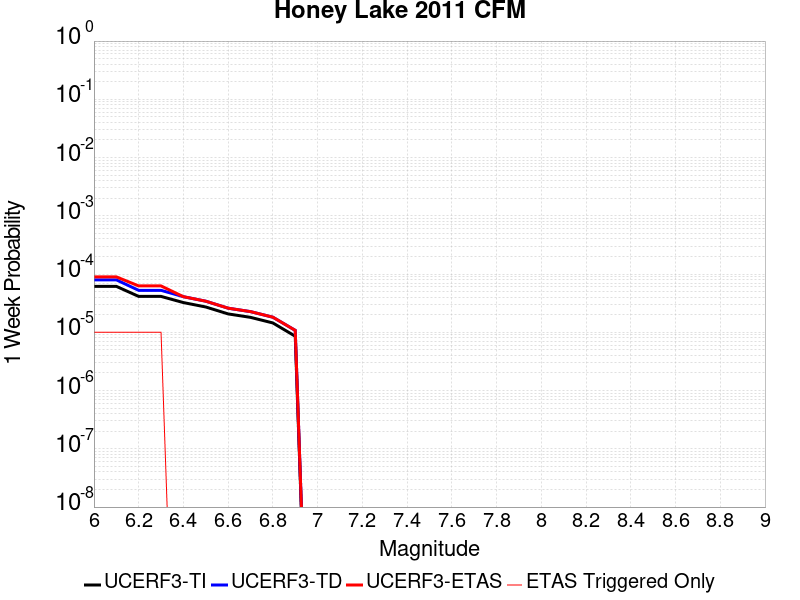 | 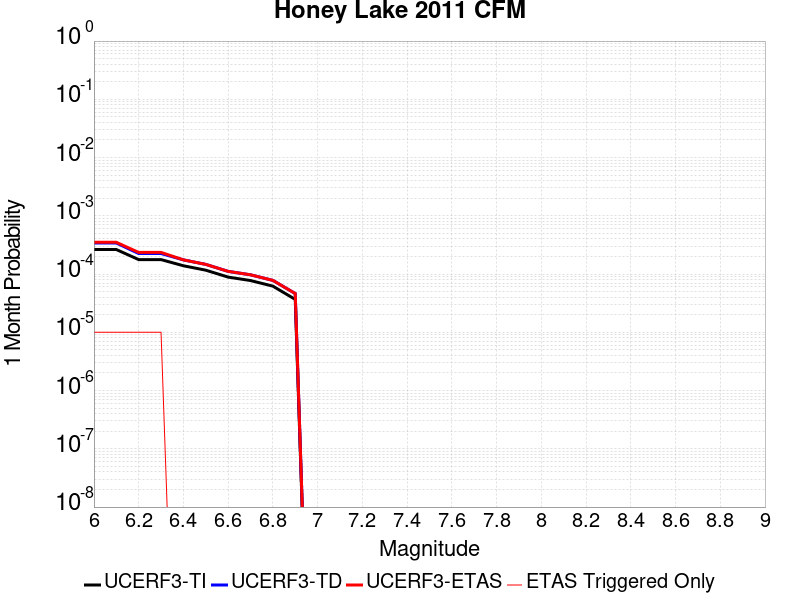 |  |  |

| Magnitude | 1 wk TI Prob | 1 wk TD Prob | 1 wk ETAS Prob | 1 wk ETAS/TD Gain | 1 wk ETAS Triggered Only | 1 mo TI Prob | 1 mo TD Prob | 1 mo ETAS Prob | 1 mo ETAS/TD Gain | 1 mo ETAS Triggered Only | 1 yr TI Prob | 1 yr TD Prob | 1 yr ETAS Prob | 1 yr ETAS/TD Gain | 1 yr ETAS Triggered Only | 10 yr TI Prob | 10 yr TD Prob | 10 yr ETAS Prob | 10 yr ETAS/TD Gain | 10 yr ETAS Triggered Only |
|-----|-----|-----|-----|-----|-----|-----|-----|-----|-----|-----|-----|-----|-----|-----|-----|-----|-----|-----|-----|-----|
| 6.0 | 6.155506E-5 | 7.954708E-5 | 8.954628E-5 | 1.1257017 | 1.0E-5 | 2.6378073E-4 | 3.4087323E-4 | 3.508698E-4 | 1.0293264 | 1.0E-5 | 0.0032068014 | 0.0041426765 | 0.004152635 | 1.0024039 | 1.0E-5 | 0.03160919 | 0.040703055 | 0.040712647 | 1.0002357 | 1.0E-5 |
| 6.1 | 6.155506E-5 | 7.954708E-5 | 8.954628E-5 | 1.1257017 | 1.0E-5 | 2.6378073E-4 | 3.4087323E-4 | 3.508698E-4 | 1.0293264 | 1.0E-5 | 0.0032068014 | 0.0041426765 | 0.004152635 | 1.0024039 | 1.0E-5 | 0.03160919 | 0.040703055 | 0.040712647 | 1.0002357 | 1.0E-5 |
| 6.2 | 4.1335024E-5 | 5.257652E-5 | 6.257599E-5 | 1.190189 | 1.0E-5 | 1.7713808E-4 | 2.2530954E-4 | 2.3530729E-4 | 1.0443734 | 1.0E-5 | 0.0021545228 | 0.0027398444 | 0.002749817 | 1.0036398 | 1.0E-5 | 0.021337535 | 0.027076809 | 0.027086537 | 1.0003593 | 1.0E-5 |
| 6.3 | 4.1335024E-5 | 5.257652E-5 | 6.257599E-5 | 1.190189 | 1.0E-5 | 1.7713808E-4 | 2.2530954E-4 | 2.3530729E-4 | 1.0443734 | 1.0E-5 | 0.0021545228 | 0.0027398444 | 0.002749817 | 1.0036398 | 1.0E-5 | 0.021337535 | 0.027076809 | 0.027086537 | 1.0003593 | 1.0E-5 |
| 6.4 | 3.2393702E-5 | 4.0887273E-5 | 4.0887273E-5 | 1.0 | 0.0 | 1.3882275E-4 | 1.7522006E-4 | 1.7522006E-4 | 1.0 | 0.0 | 0.0016888566 | 0.0021313233 | 0.0021313233 | 1.0 | 0.0 | 0.016760793 | 0.021119867 | 0.021119867 | 1.0 | 0.0 |
| 6.5 | 2.7205504E-5 | 3.4211767E-5 | 3.4211767E-5 | 1.0 | 0.0 | 1.1658981E-4 | 1.4661417E-4 | 1.4661417E-4 | 1.0 | 0.0 | 0.0014185566 | 0.0017836596 | 0.0017836596 | 1.0 | 0.0 | 0.014095354 | 0.017702963 | 0.017702963 | 1.0 | 0.0 |
| 6.6 | 2.069265E-5 | 2.5955416E-5 | 2.5955416E-5 | 1.0 | 0.0 | 8.867977E-5 | 1.1123324E-4 | 1.1123324E-4 | 1.0 | 0.0 | 0.0010791414 | 0.0013535074 | 0.0013535074 | 1.0 | 0.0 | 0.010739161 | 0.0134610105 | 0.0134610105 | 1.0 | 0.0 |
| 6.7 | 1.8060919E-5 | 2.265683E-5 | 2.265683E-5 | 1.0 | 0.0 | 7.7401644E-5 | 9.7097545E-5 | 9.7097545E-5 | 1.0 | 0.0 | 9.419576E-4 | 0.0011816025 | 0.0011816025 | 1.0 | 0.0 | 0.009379748 | 0.0117612425 | 0.0117612425 | 1.0 | 0.0 |
| 6.8 | 1.4474663E-5 | 1.8181274E-5 | 1.8181274E-5 | 1.0 | 0.0 | 6.203279E-5 | 7.791785E-5 | 7.791785E-5 | 1.0 | 0.0 | 7.5498753E-4 | 9.4831345E-4 | 9.4831345E-4 | 1.0 | 0.0 | 0.007524277 | 0.009450195 | 0.009450195 | 1.0 | 0.0 |
| 6.9 | 8.564552E-6 | 1.0802311E-5 | 1.0802311E-5 | 1.0 | 0.0 | 3.6704707E-5 | 4.6295176E-5 | 4.6295176E-5 | 1.0 | 0.0 | 4.4678818E-4 | 5.635644E-4 | 5.635644E-4 | 1.0 | 0.0 | 0.0044589094 | 0.0056278505 | 0.0056278505 | 1.0 | 0.0 |

## Hartley Springs 2011 CFM
*[(top)](#table-of-contents)*

| 1 Week | 1 Month | 1 Year | 10 Year |
|-----|-----|-----|-----|
|  |  |  |  |

| Magnitude | 1 wk TI Prob | 1 wk TD Prob | 1 wk ETAS Prob | 1 wk ETAS/TD Gain | 1 wk ETAS Triggered Only | 1 mo TI Prob | 1 mo TD Prob | 1 mo ETAS Prob | 1 mo ETAS/TD Gain | 1 mo ETAS Triggered Only | 1 yr TI Prob | 1 yr TD Prob | 1 yr ETAS Prob | 1 yr ETAS/TD Gain | 1 yr ETAS Triggered Only | 10 yr TI Prob | 10 yr TD Prob | 10 yr ETAS Prob | 10 yr ETAS/TD Gain | 10 yr ETAS Triggered Only |
|-----|-----|-----|-----|-----|-----|-----|-----|-----|-----|-----|-----|-----|-----|-----|-----|-----|-----|-----|-----|-----|
| 6.0 | 1.4352418E-5 | 1.4434111E-5 | 1.4434111E-5 | 1.0 | 0.0 | 6.1508916E-5 | 6.185994E-5 | 6.185994E-5 | 1.0 | 0.0 | 7.486137E-4 | 7.5304887E-4 | 7.630413E-4 | 1.0132693 | 1.0E-5 | 0.007460968 | 0.007521092 | 0.0075310166 | 1.0013196 | 1.0E-5 |
| 6.1 | 1.4352418E-5 | 1.4434111E-5 | 1.4434111E-5 | 1.0 | 0.0 | 6.1508916E-5 | 6.185994E-5 | 6.185994E-5 | 1.0 | 0.0 | 7.486137E-4 | 7.5304887E-4 | 7.630413E-4 | 1.0132693 | 1.0E-5 | 0.007460968 | 0.007521092 | 0.0075310166 | 1.0013196 | 1.0E-5 |
| 6.2 | 1.4352418E-5 | 1.4434111E-5 | 1.4434111E-5 | 1.0 | 0.0 | 6.1508916E-5 | 6.185994E-5 | 6.185994E-5 | 1.0 | 0.0 | 7.486137E-4 | 7.5304887E-4 | 7.630413E-4 | 1.0132693 | 1.0E-5 | 0.007460968 | 0.007521092 | 0.0075310166 | 1.0013196 | 1.0E-5 |
| 6.3 | 1.4352418E-5 | 1.4434111E-5 | 1.4434111E-5 | 1.0 | 0.0 | 6.1508916E-5 | 6.185994E-5 | 6.185994E-5 | 1.0 | 0.0 | 7.486137E-4 | 7.5304887E-4 | 7.630413E-4 | 1.0132693 | 1.0E-5 | 0.007460968 | 0.007521092 | 0.0075310166 | 1.0013196 | 1.0E-5 |
| 6.4 | 1.4352418E-5 | 1.4434111E-5 | 1.4434111E-5 | 1.0 | 0.0 | 6.1508916E-5 | 6.185994E-5 | 6.185994E-5 | 1.0 | 0.0 | 7.486137E-4 | 7.5304887E-4 | 7.630413E-4 | 1.0132693 | 1.0E-5 | 0.007460968 | 0.007521092 | 0.0075310166 | 1.0013196 | 1.0E-5 |
| 6.5 | 1.2279858E-5 | 1.2133036E-5 | 1.2133036E-5 | 1.0 | 0.0 | 5.26269E-5 | 5.199858E-5 | 5.199858E-5 | 1.0 | 0.0 | 6.4054417E-4 | 6.33057E-4 | 6.4305065E-4 | 1.0157864 | 1.0E-5 | 0.0063870098 | 0.006328048 | 0.006337985 | 1.0015702 | 1.0E-5 |
| 6.6 | 1.2279858E-5 | 1.2133036E-5 | 1.2133036E-5 | 1.0 | 0.0 | 5.26269E-5 | 5.199858E-5 | 5.199858E-5 | 1.0 | 0.0 | 6.4054417E-4 | 6.33057E-4 | 6.4305065E-4 | 1.0157864 | 1.0E-5 | 0.0063870098 | 0.006328048 | 0.006337985 | 1.0015702 | 1.0E-5 |
| 6.7 | 2.1282601E-6 | 8.894127E-7 | 8.894127E-7 | 1.0 | 0.0 | 9.121083E-6 | 3.8117648E-6 | 3.8117648E-6 | 1.0 | 0.0 | 1.11043526E-4 | 4.6407506E-5 | 4.6407506E-5 | 1.0 | 0.0 | 0.0011098806 | 4.6400347E-4 | 4.6400347E-4 | 1.0 | 0.0 |
| 6.8 | 2.00516E-6 | 8.516916E-7 | 8.516916E-7 | 1.0 | 0.0 | 8.593515E-6 | 3.6501033E-6 | 3.6501033E-6 | 1.0 | 0.0 | 1.04621024E-4 | 4.443936E-5 | 4.443936E-5 | 1.0 | 0.0 | 0.0010457177 | 4.4432987E-4 | 4.4432987E-4 | 1.0 | 0.0 |
| 6.9 | 2.00516E-6 | 8.516916E-7 | 8.516916E-7 | 1.0 | 0.0 | 8.593515E-6 | 3.6501033E-6 | 3.6501033E-6 | 1.0 | 0.0 | 1.04621024E-4 | 4.443936E-5 | 4.443936E-5 | 1.0 | 0.0 | 0.0010457177 | 4.4432987E-4 | 4.4432987E-4 | 1.0 | 0.0 |
| 7.0 | 1.8366732E-6 | 8.2366813E-7 | 8.2366813E-7 | 1.0 | 0.0 | 7.871433E-6 | 3.5300031E-6 | 3.5300031E-6 | 1.0 | 0.0 | 9.583048E-5 | 4.2977194E-5 | 4.2977194E-5 | 1.0 | 0.0 | 9.5789164E-4 | 4.297139E-4 | 4.297139E-4 | 1.0 | 0.0 |
| 7.1 | 1.5097997E-6 | 7.1897E-7 | 7.1897E-7 | 1.0 | 0.0 | 6.470554E-6 | 3.0812978E-6 | 3.0812978E-6 | 1.0 | 0.0 | 7.877615E-5 | 3.7514397E-5 | 3.7514397E-5 | 1.0 | 0.0 | 7.874823E-4 | 3.7510434E-4 | 3.7510434E-4 | 1.0 | 0.0 |
| 7.2 | 1.3490993E-6 | 6.404769E-7 | 6.404769E-7 | 1.0 | 0.0 | 5.7818415E-6 | 2.7448996E-6 | 2.7448996E-6 | 1.0 | 0.0 | 7.0391645E-5 | 3.3418873E-5 | 3.3418873E-5 | 1.0 | 0.0 | 7.0369354E-4 | 3.3416142E-4 | 3.3416142E-4 | 1.0 | 0.0 |
| 7.3 | 7.900015E-7 | 4.0888176E-7 | 4.0888176E-7 | 1.0 | 0.0 | 3.3857161E-6 | 1.7523504E-6 | 1.7523504E-6 | 1.0 | 0.0 | 4.1220315E-5 | 2.1334865E-5 | 2.1334865E-5 | 1.0 | 0.0 | 4.121267E-4 | 2.1334866E-4 | 2.1334866E-4 | 1.0 | 0.0 |

## West Tahoe
*[(top)](#table-of-contents)*

| 1 Week | 1 Month | 1 Year | 10 Year |
|-----|-----|-----|-----|
|  |  |  |  |

| Magnitude | 1 wk TI Prob | 1 wk TD Prob | 1 wk ETAS Prob | 1 wk ETAS/TD Gain | 1 wk ETAS Triggered Only | 1 mo TI Prob | 1 mo TD Prob | 1 mo ETAS Prob | 1 mo ETAS/TD Gain | 1 mo ETAS Triggered Only | 1 yr TI Prob | 1 yr TD Prob | 1 yr ETAS Prob | 1 yr ETAS/TD Gain | 1 yr ETAS Triggered Only | 10 yr TI Prob | 10 yr TD Prob | 10 yr ETAS Prob | 10 yr ETAS/TD Gain | 10 yr ETAS Triggered Only |
|-----|-----|-----|-----|-----|-----|-----|-----|-----|-----|-----|-----|-----|-----|-----|-----|-----|-----|-----|-----|-----|
| 6.0 | 1.952444E-5 | 2.118317E-5 | 2.118317E-5 | 1.0 | 0.0 | 8.367348E-5 | 9.078217E-5 | 9.078217E-5 | 1.0 | 0.0 | 0.0010182485 | 0.0011047672 | 0.0011147561 | 1.0090417 | 1.0E-5 | 0.010135954 | 0.010998235 | 0.011008126 | 1.0008992 | 1.0E-5 |
| 6.1 | 1.952444E-5 | 2.118317E-5 | 2.118317E-5 | 1.0 | 0.0 | 8.367348E-5 | 9.078217E-5 | 9.078217E-5 | 1.0 | 0.0 | 0.0010182485 | 0.0011047672 | 0.0011147561 | 1.0090417 | 1.0E-5 | 0.010135954 | 0.010998235 | 0.011008126 | 1.0008992 | 1.0E-5 |
| 6.2 | 1.952444E-5 | 2.118317E-5 | 2.118317E-5 | 1.0 | 0.0 | 8.367348E-5 | 9.078217E-5 | 9.078217E-5 | 1.0 | 0.0 | 0.0010182485 | 0.0011047672 | 0.0011147561 | 1.0090417 | 1.0E-5 | 0.010135954 | 0.010998235 | 0.011008126 | 1.0008992 | 1.0E-5 |
| 6.3 | 1.952444E-5 | 2.118317E-5 | 2.118317E-5 | 1.0 | 0.0 | 8.367348E-5 | 9.078217E-5 | 9.078217E-5 | 1.0 | 0.0 | 0.0010182485 | 0.0011047672 | 0.0011147561 | 1.0090417 | 1.0E-5 | 0.010135954 | 0.010998235 | 0.011008126 | 1.0008992 | 1.0E-5 |
| 6.4 | 1.952444E-5 | 2.118317E-5 | 2.118317E-5 | 1.0 | 0.0 | 8.367348E-5 | 9.078217E-5 | 9.078217E-5 | 1.0 | 0.0 | 0.0010182485 | 0.0011047672 | 0.0011147561 | 1.0090417 | 1.0E-5 | 0.010135954 | 0.010998235 | 0.011008126 | 1.0008992 | 1.0E-5 |
| 6.5 | 1.2685271E-5 | 1.3690627E-5 | 1.3690627E-5 | 1.0 | 0.0 | 5.4364315E-5 | 5.8672893E-5 | 5.8672893E-5 | 1.0 | 0.0 | 6.616845E-4 | 7.141248E-4 | 7.241177E-4 | 1.0139931 | 1.0E-5 | 0.0065971776 | 0.00711995 | 0.0071298787 | 1.0013945 | 1.0E-5 |
| 6.6 | 1.2685271E-5 | 1.3690627E-5 | 1.3690627E-5 | 1.0 | 0.0 | 5.4364315E-5 | 5.8672893E-5 | 5.8672893E-5 | 1.0 | 0.0 | 6.616845E-4 | 7.141248E-4 | 7.241177E-4 | 1.0139931 | 1.0E-5 | 0.0065971776 | 0.00711995 | 0.0071298787 | 1.0013945 | 1.0E-5 |
| 6.7 | 9.117886E-6 | 9.809846E-6 | 9.809846E-6 | 1.0 | 0.0 | 3.9076072E-5 | 4.2041564E-5 | 4.2041564E-5 | 1.0 | 0.0 | 4.756473E-4 | 5.11743E-4 | 5.11743E-4 | 1.0 | 0.0 | 0.0047463053 | 0.0051063634 | 0.0051063634 | 1.0 | 0.0 |
| 6.8 | 8.786828E-6 | 9.457863E-6 | 9.457863E-6 | 1.0 | 0.0 | 3.7657293E-5 | 4.053311E-5 | 4.053311E-5 | 1.0 | 0.0 | 4.5838108E-4 | 4.933859E-4 | 4.933859E-4 | 1.0 | 0.0 | 0.0045743673 | 0.0049236063 | 0.0049236063 | 1.0 | 0.0 |
| 6.9 | 6.7562123E-6 | 7.2638086E-6 | 7.2638086E-6 | 1.0 | 0.0 | 2.8954875E-5 | 3.1130265E-5 | 3.1130265E-5 | 1.0 | 0.0 | 3.5246857E-4 | 3.789498E-4 | 3.789498E-4 | 1.0 | 0.0 | 0.0035191004 | 0.0037835082 | 0.0037835082 | 1.0 | 0.0 |
| 7.0 | 5.1792854E-6 | 5.567338E-6 | 5.567338E-6 | 1.0 | 0.0 | 2.2196748E-5 | 2.3859824E-5 | 2.3859824E-5 | 1.0 | 0.0 | 2.702119E-4 | 2.9045844E-4 | 2.9045844E-4 | 1.0 | 0.0 | 0.0026988357 | 0.0029011632 | 0.0029011632 | 1.0 | 0.0 |
| 7.1 | 4.090765E-6 | 4.3974223E-6 | 4.3974223E-6 | 1.0 | 0.0 | 1.7531731E-5 | 1.884598E-5 | 1.884598E-5 | 1.0 | 0.0 | 2.134279E-4 | 2.2942905E-4 | 2.2942905E-4 | 1.0 | 0.0 | 0.0021322304 | 0.0022922563 | 0.0022922563 | 1.0 | 0.0 |
| 7.2 | 2.2356758E-6 | 2.4023684E-6 | 2.4023684E-6 | 1.0 | 0.0 | 9.581432E-6 | 1.0295834E-5 | 1.0295834E-5 | 1.0 | 0.0 | 1.1664769E-4 | 1.2534647E-4 | 1.2534647E-4 | 1.0 | 0.0 | 0.0011658648 | 0.0012529434 | 0.0012529434 | 1.0 | 0.0 |

## Garberville - Briceland 2011 CFM
*[(top)](#table-of-contents)*

| 1 Week | 1 Month | 1 Year | 10 Year |
|-----|-----|-----|-----|
| 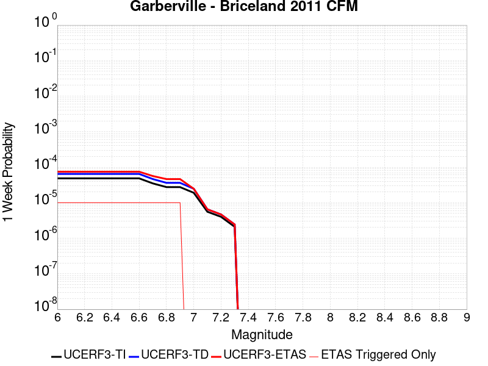 |  | 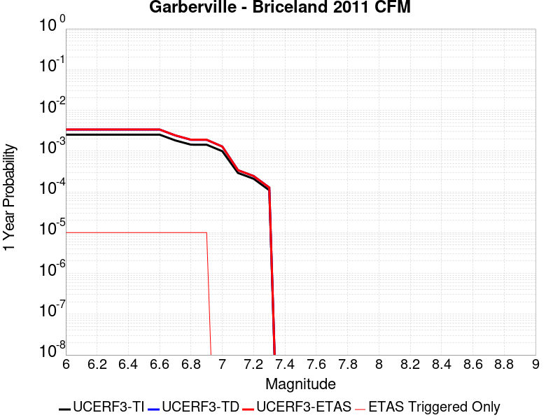 |  |

| Magnitude | 1 wk TI Prob | 1 wk TD Prob | 1 wk ETAS Prob | 1 wk ETAS/TD Gain | 1 wk ETAS Triggered Only | 1 mo TI Prob | 1 mo TD Prob | 1 mo ETAS Prob | 1 mo ETAS/TD Gain | 1 mo ETAS Triggered Only | 1 yr TI Prob | 1 yr TD Prob | 1 yr ETAS Prob | 1 yr ETAS/TD Gain | 1 yr ETAS Triggered Only | 10 yr TI Prob | 10 yr TD Prob | 10 yr ETAS Prob | 10 yr ETAS/TD Gain | 10 yr ETAS Triggered Only |
|-----|-----|-----|-----|-----|-----|-----|-----|-----|-----|-----|-----|-----|-----|-----|-----|-----|-----|-----|-----|-----|
| 6.0 | 4.8399295E-5 | 6.4527754E-5 | 7.452711E-5 | 1.1549621 | 1.0E-5 | 2.0740906E-4 | 2.765224E-4 | 2.8651961E-4 | 1.0361534 | 1.0E-5 | 0.002522281 | 0.0033621131 | 0.0033720795 | 1.0029644 | 1.0E-5 | 0.024938442 | 0.03317879 | 0.03318846 | 1.0002913 | 1.0E-5 |
| 6.1 | 4.8399295E-5 | 6.4527754E-5 | 7.452711E-5 | 1.1549621 | 1.0E-5 | 2.0740906E-4 | 2.765224E-4 | 2.8651961E-4 | 1.0361534 | 1.0E-5 | 0.002522281 | 0.0033621131 | 0.0033720795 | 1.0029644 | 1.0E-5 | 0.024938442 | 0.03317879 | 0.03318846 | 1.0002913 | 1.0E-5 |
| 6.2 | 4.8399295E-5 | 6.4527754E-5 | 7.452711E-5 | 1.1549621 | 1.0E-5 | 2.0740906E-4 | 2.765224E-4 | 2.8651961E-4 | 1.0361534 | 1.0E-5 | 0.002522281 | 0.0033621131 | 0.0033720795 | 1.0029644 | 1.0E-5 | 0.024938442 | 0.03317879 | 0.03318846 | 1.0002913 | 1.0E-5 |
| 6.3 | 4.8399295E-5 | 6.4527754E-5 | 7.452711E-5 | 1.1549621 | 1.0E-5 | 2.0740906E-4 | 2.765224E-4 | 2.8651961E-4 | 1.0361534 | 1.0E-5 | 0.002522281 | 0.0033621131 | 0.0033720795 | 1.0029644 | 1.0E-5 | 0.024938442 | 0.03317879 | 0.03318846 | 1.0002913 | 1.0E-5 |
| 6.4 | 4.8399295E-5 | 6.4527754E-5 | 7.452711E-5 | 1.1549621 | 1.0E-5 | 2.0740906E-4 | 2.765224E-4 | 2.8651961E-4 | 1.0361534 | 1.0E-5 | 0.002522281 | 0.0033621131 | 0.0033720795 | 1.0029644 | 1.0E-5 | 0.024938442 | 0.03317879 | 0.03318846 | 1.0002913 | 1.0E-5 |
| 6.5 | 4.8399295E-5 | 6.4527754E-5 | 7.452711E-5 | 1.1549621 | 1.0E-5 | 2.0740906E-4 | 2.765224E-4 | 2.8651961E-4 | 1.0361534 | 1.0E-5 | 0.002522281 | 0.0033621131 | 0.0033720795 | 1.0029644 | 1.0E-5 | 0.024938442 | 0.03317879 | 0.03318846 | 1.0002913 | 1.0E-5 |
| 6.6 | 4.8399295E-5 | 6.4527754E-5 | 7.452711E-5 | 1.1549621 | 1.0E-5 | 2.0740906E-4 | 2.765224E-4 | 2.8651961E-4 | 1.0361534 | 1.0E-5 | 0.002522281 | 0.0033621131 | 0.0033720795 | 1.0029644 | 1.0E-5 | 0.024938442 | 0.03317879 | 0.03318846 | 1.0002913 | 1.0E-5 |
| 6.7 | 3.495179E-5 | 4.630908E-5 | 5.6308618E-5 | 1.2159303 | 1.0E-5 | 1.4978478E-4 | 1.9845538E-4 | 2.0845339E-4 | 1.0503792 | 1.0E-5 | 0.0018221042 | 0.0024140473 | 0.002424023 | 1.0041324 | 1.0E-5 | 0.018072363 | 0.023930654 | 0.023940416 | 1.0004078 | 1.0E-5 |
| 6.8 | 2.7517597E-5 | 3.62417E-5 | 4.6241337E-5 | 1.2759153 | 1.0E-5 | 1.1792722E-4 | 1.5531495E-4 | 1.653134E-4 | 1.0643753 | 1.0E-5 | 0.0014348183 | 0.0018897917 | 0.0018997728 | 1.0052816 | 1.0E-5 | 0.014255894 | 0.01878354 | 0.01879335 | 1.0005224 | 1.0E-5 |
| 6.9 | 2.74461E-5 | 3.6159425E-5 | 4.6159064E-5 | 1.276543 | 1.0E-5 | 1.1762084E-4 | 1.5496238E-4 | 1.6496085E-4 | 1.0645218 | 1.0E-5 | 0.001431093 | 0.0018855067 | 0.0018954879 | 1.0052936 | 1.0E-5 | 0.014219119 | 0.018741412 | 0.018751225 | 1.0005236 | 1.0E-5 |
| 7.0 | 1.9023773E-5 | 2.4707771E-5 | 2.4707771E-5 | 1.0 | 0.0 | 8.152791E-5 | 1.0588833E-4 | 1.0588833E-4 | 1.0 | 0.0 | 9.921503E-4 | 0.0012888273 | 0.0012888273 | 1.0 | 0.0 | 0.009877323 | 0.012852578 | 0.012852578 | 1.0 | 0.0 |
| 7.1 | 5.566844E-6 | 6.512147E-6 | 6.512147E-6 | 1.0 | 0.0 | 2.3857683E-5 | 2.7908927E-5 | 2.7908927E-5 | 1.0 | 0.0 | 2.9042858E-4 | 3.3974246E-4 | 3.3974246E-4 | 1.0 | 0.0 | 0.002900493 | 0.0033926512 | 0.0033926512 | 1.0 | 0.0 |
| 7.2 | 4.011353E-6 | 4.6746213E-6 | 4.6746213E-6 | 1.0 | 0.0 | 1.7191402E-5 | 2.0033956E-5 | 2.0033956E-5 | 1.0 | 0.0 | 2.0928521E-4 | 2.4388955E-4 | 2.4388955E-4 | 1.0 | 0.0 | 0.0020908823 | 0.0024365564 | 0.0024365564 | 1.0 | 0.0 |
| 7.3 | 2.0974871E-6 | 2.4395908E-6 | 2.4395908E-6 | 1.0 | 0.0 | 8.989199E-6 | 1.0455362E-5 | 1.0455362E-5 | 1.0 | 0.0 | 1.09438006E-4 | 1.272891E-4 | 1.272891E-4 | 1.0 | 0.0 | 0.0010938413 | 0.0012724071 | 0.0012724071 | 1.0 | 0.0 |

## North Frontal  (West)
*[(top)](#table-of-contents)*

| 1 Week | 1 Month | 1 Year | 10 Year |
|-----|-----|-----|-----|
|  |  |  |  |

| Magnitude | 1 wk TI Prob | 1 wk TD Prob | 1 wk ETAS Prob | 1 wk ETAS/TD Gain | 1 wk ETAS Triggered Only | 1 mo TI Prob | 1 mo TD Prob | 1 mo ETAS Prob | 1 mo ETAS/TD Gain | 1 mo ETAS Triggered Only | 1 yr TI Prob | 1 yr TD Prob | 1 yr ETAS Prob | 1 yr ETAS/TD Gain | 1 yr ETAS Triggered Only | 10 yr TI Prob | 10 yr TD Prob | 10 yr ETAS Prob | 10 yr ETAS/TD Gain | 10 yr ETAS Triggered Only |
|-----|-----|-----|-----|-----|-----|-----|-----|-----|-----|-----|-----|-----|-----|-----|-----|-----|-----|-----|-----|-----|
| 6.0 | 4.7316266E-6 | 4.852674E-6 | 4.852674E-6 | 1.0 | 0.0 | 2.0278241E-5 | 2.0797017E-5 | 2.0797017E-5 | 1.0 | 0.0 | 2.4685962E-4 | 2.5317573E-4 | 2.631732E-4 | 1.0394883 | 1.0E-5 | 0.0024658558 | 0.002529019 | 0.0025389937 | 1.0039442 | 1.0E-5 |
| 6.1 | 4.7316266E-6 | 4.852674E-6 | 4.852674E-6 | 1.0 | 0.0 | 2.0278241E-5 | 2.0797017E-5 | 2.0797017E-5 | 1.0 | 0.0 | 2.4685962E-4 | 2.5317573E-4 | 2.631732E-4 | 1.0394883 | 1.0E-5 | 0.0024658558 | 0.002529019 | 0.0025389937 | 1.0039442 | 1.0E-5 |
| 6.2 | 4.7316266E-6 | 4.852674E-6 | 4.852674E-6 | 1.0 | 0.0 | 2.0278241E-5 | 2.0797017E-5 | 2.0797017E-5 | 1.0 | 0.0 | 2.4685962E-4 | 2.5317573E-4 | 2.631732E-4 | 1.0394883 | 1.0E-5 | 0.0024658558 | 0.002529019 | 0.0025389937 | 1.0039442 | 1.0E-5 |
| 6.3 | 4.7316266E-6 | 4.852674E-6 | 4.852674E-6 | 1.0 | 0.0 | 2.0278241E-5 | 2.0797017E-5 | 2.0797017E-5 | 1.0 | 0.0 | 2.4685962E-4 | 2.5317573E-4 | 2.631732E-4 | 1.0394883 | 1.0E-5 | 0.0024658558 | 0.002529019 | 0.0025389937 | 1.0039442 | 1.0E-5 |
| 6.4 | 4.7316266E-6 | 4.852674E-6 | 4.852674E-6 | 1.0 | 0.0 | 2.0278241E-5 | 2.0797017E-5 | 2.0797017E-5 | 1.0 | 0.0 | 2.4685962E-4 | 2.5317573E-4 | 2.631732E-4 | 1.0394883 | 1.0E-5 | 0.0024658558 | 0.002529019 | 0.0025389937 | 1.0039442 | 1.0E-5 |
| 6.5 | 4.7316266E-6 | 4.852674E-6 | 4.852674E-6 | 1.0 | 0.0 | 2.0278241E-5 | 2.0797017E-5 | 2.0797017E-5 | 1.0 | 0.0 | 2.4685962E-4 | 2.5317573E-4 | 2.631732E-4 | 1.0394883 | 1.0E-5 | 0.0024658558 | 0.002529019 | 0.0025389937 | 1.0039442 | 1.0E-5 |
| 6.6 | 4.7316266E-6 | 4.852674E-6 | 4.852674E-6 | 1.0 | 0.0 | 2.0278241E-5 | 2.0797017E-5 | 2.0797017E-5 | 1.0 | 0.0 | 2.4685962E-4 | 2.5317573E-4 | 2.631732E-4 | 1.0394883 | 1.0E-5 | 0.0024658558 | 0.002529019 | 0.0025389937 | 1.0039442 | 1.0E-5 |
| 6.7 | 3.5382777E-6 | 3.6308872E-6 | 3.6308872E-6 | 1.0 | 0.0 | 1.516396E-5 | 1.5560858E-5 | 1.5560858E-5 | 1.0 | 0.0 | 1.8460557E-4 | 1.8943775E-4 | 1.9943585E-4 | 1.0527778 | 1.0E-5 | 0.0018445229 | 0.0018928396 | 0.0019028207 | 1.0052731 | 1.0E-5 |
| 6.8 | 3.5382777E-6 | 3.6308872E-6 | 3.6308872E-6 | 1.0 | 0.0 | 1.516396E-5 | 1.5560858E-5 | 1.5560858E-5 | 1.0 | 0.0 | 1.8460557E-4 | 1.8943775E-4 | 1.9943585E-4 | 1.0527778 | 1.0E-5 | 0.0018445229 | 0.0018928396 | 0.0019028207 | 1.0052731 | 1.0E-5 |
| 6.9 | 3.0428037E-6 | 3.1227619E-6 | 3.1227619E-6 | 1.0 | 0.0 | 1.30405215E-5 | 1.3383201E-5 | 1.3383201E-5 | 1.0 | 0.0 | 1.5875678E-4 | 1.6292896E-4 | 1.6292896E-4 | 1.0 | 0.0 | 0.0015864341 | 0.0016281622 | 0.0016281622 | 1.0 | 0.0 |
| 7.0 | 2.538778E-6 | 2.6060916E-6 | 2.6060916E-6 | 1.0 | 0.0 | 1.0880432E-5 | 1.116892E-5 | 1.116892E-5 | 1.0 | 0.0 | 1.324612E-4 | 1.3597358E-4 | 1.3597358E-4 | 1.0 | 0.0 | 0.0013238228 | 0.0013589506 | 0.0013589506 | 1.0 | 0.0 |
| 7.1 | 2.2418935E-6 | 2.3012087E-6 | 2.3012087E-6 | 1.0 | 0.0 | 9.60808E-6 | 9.862288E-6 | 9.862288E-6 | 1.0 | 0.0 | 1.1697209E-4 | 1.2006718E-4 | 1.2006718E-4 | 1.0 | 0.0 | 0.0011691054 | 0.0012000671 | 0.0012000671 | 1.0 | 0.0 |
| 7.2 | 1.6526745E-6 | 1.6924864E-6 | 1.6924864E-6 | 1.0 | 0.0 | 7.082872E-6 | 7.2534945E-6 | 7.2534945E-6 | 1.0 | 0.0 | 8.623055E-5 | 8.830797E-5 | 8.830797E-5 | 1.0 | 0.0 | 8.61971E-4 | 8.8275387E-4 | 8.8275387E-4 | 1.0 | 0.0 |
| 7.3 | 1.0246019E-6 | 1.0442274E-6 | 1.0442274E-6 | 1.0 | 0.0 | 4.391144E-6 | 4.4752533E-6 | 4.4752533E-6 | 1.0 | 0.0 | 5.3460866E-5 | 5.4484964E-5 | 5.4484964E-5 | 1.0 | 0.0 | 5.344801E-4 | 5.4472755E-4 | 5.4472755E-4 | 1.0 | 0.0 |
| 7.4 | 8.9045164E-7 | 9.056572E-7 | 9.056572E-7 | 1.0 | 0.0 | 3.8162157E-6 | 3.881383E-6 | 3.881383E-6 | 1.0 | 0.0 | 4.646144E-5 | 4.725492E-5 | 4.725492E-5 | 1.0 | 0.0 | 4.6451724E-4 | 4.7245962E-4 | 4.7245962E-4 | 1.0 | 0.0 |
| 7.5 | 6.3357E-7 | 6.4027137E-7 | 6.4027137E-7 | 1.0 | 0.0 | 2.7152971E-6 | 2.7440176E-6 | 2.7440176E-6 | 1.0 | 0.0 | 3.305824E-5 | 3.340797E-5 | 3.340797E-5 | 1.0 | 0.0 | 3.3053322E-4 | 3.3403604E-4 | 3.3403604E-4 | 1.0 | 0.0 |
| 7.6 | 2.5087024E-7 | 2.436123E-7 | 2.436123E-7 | 1.0 | 0.0 | 1.0751578E-6 | 1.0440525E-6 | 1.0440525E-6 | 1.0 | 0.0 | 1.3089967E-5 | 1.2711286E-5 | 1.2711286E-5 | 1.0 | 0.0 | 1.3089196E-4 | 1.2710765E-4 | 1.2710765E-4 | 1.0 | 0.0 |
| 7.7 | 3.282987E-8 | 2.2875435E-8 | 2.2875435E-8 | 1.0 | 0.0 | 1.4069944E-7 | 9.8037575E-8 | 9.8037575E-8 | 1.0 | 0.0 | 1.7130144E-6 | 1.193607E-6 | 1.193607E-6 | 1.0 | 0.0 | 1.7130013E-5 | 1.1936014E-5 | 1.1936014E-5 | 1.0 | 0.0 |
| 7.8 | 8.77499E-9 | 5.6817466E-9 | 5.6817466E-9 | 1.0 | 0.0 | 3.7607098E-8 | 2.4350342E-8 | 2.4350342E-8 | 1.0 | 0.0 | 4.578663E-7 | 2.964654E-7 | 2.964654E-7 | 1.0 | 0.0 | 4.5786537E-6 | 2.9646512E-6 | 2.9646512E-6 | 1.0 | 0.0 |

## Big Lagoon - Bald Mtn 2011 CFM
*[(top)](#table-of-contents)*

| 1 Week | 1 Month | 1 Year | 10 Year |
|-----|-----|-----|-----|
|  |  |  |  |

| Magnitude | 1 wk TI Prob | 1 wk TD Prob | 1 wk ETAS Prob | 1 wk ETAS/TD Gain | 1 wk ETAS Triggered Only | 1 mo TI Prob | 1 mo TD Prob | 1 mo ETAS Prob | 1 mo ETAS/TD Gain | 1 mo ETAS Triggered Only | 1 yr TI Prob | 1 yr TD Prob | 1 yr ETAS Prob | 1 yr ETAS/TD Gain | 1 yr ETAS Triggered Only | 10 yr TI Prob | 10 yr TD Prob | 10 yr ETAS Prob | 10 yr ETAS/TD Gain | 10 yr ETAS Triggered Only |
|-----|-----|-----|-----|-----|-----|-----|-----|-----|-----|-----|-----|-----|-----|-----|-----|-----|-----|-----|-----|-----|
| 6.0 | 1.8699735E-5 | 1.985018E-5 | 2.9849982E-5 | 1.5037638 | 1.0E-5 | 8.013926E-5 | 8.5069645E-5 | 9.506879E-5 | 1.1175407 | 1.0E-5 | 9.752587E-4 | 0.0010352687 | 0.0010452583 | 1.0096493 | 1.0E-5 | 0.009709897 | 0.010308274 | 0.010318171 | 1.0009601 | 1.0E-5 |
| 6.1 | 1.8699735E-5 | 1.985018E-5 | 2.9849982E-5 | 1.5037638 | 1.0E-5 | 8.013926E-5 | 8.5069645E-5 | 9.506879E-5 | 1.1175407 | 1.0E-5 | 9.752587E-4 | 0.0010352687 | 0.0010452583 | 1.0096493 | 1.0E-5 | 0.009709897 | 0.010308274 | 0.010318171 | 1.0009601 | 1.0E-5 |
| 6.2 | 1.8699735E-5 | 1.985018E-5 | 2.9849982E-5 | 1.5037638 | 1.0E-5 | 8.013926E-5 | 8.5069645E-5 | 9.506879E-5 | 1.1175407 | 1.0E-5 | 9.752587E-4 | 0.0010352687 | 0.0010452583 | 1.0096493 | 1.0E-5 | 0.009709897 | 0.010308274 | 0.010318171 | 1.0009601 | 1.0E-5 |
| 6.3 | 1.8699735E-5 | 1.985018E-5 | 2.9849982E-5 | 1.5037638 | 1.0E-5 | 8.013926E-5 | 8.5069645E-5 | 9.506879E-5 | 1.1175407 | 1.0E-5 | 9.752587E-4 | 0.0010352687 | 0.0010452583 | 1.0096493 | 1.0E-5 | 0.009709897 | 0.010308274 | 0.010318171 | 1.0009601 | 1.0E-5 |
| 6.4 | 1.8699735E-5 | 1.985018E-5 | 2.9849982E-5 | 1.5037638 | 1.0E-5 | 8.013926E-5 | 8.5069645E-5 | 9.506879E-5 | 1.1175407 | 1.0E-5 | 9.752587E-4 | 0.0010352687 | 0.0010452583 | 1.0096493 | 1.0E-5 | 0.009709897 | 0.010308274 | 0.010318171 | 1.0009601 | 1.0E-5 |
| 6.5 | 1.8699735E-5 | 1.985018E-5 | 2.9849982E-5 | 1.5037638 | 1.0E-5 | 8.013926E-5 | 8.5069645E-5 | 9.506879E-5 | 1.1175407 | 1.0E-5 | 9.752587E-4 | 0.0010352687 | 0.0010452583 | 1.0096493 | 1.0E-5 | 0.009709897 | 0.010308274 | 0.010318171 | 1.0009601 | 1.0E-5 |
| 6.6 | 1.8699735E-5 | 1.985018E-5 | 2.9849982E-5 | 1.5037638 | 1.0E-5 | 8.013926E-5 | 8.5069645E-5 | 9.506879E-5 | 1.1175407 | 1.0E-5 | 9.752587E-4 | 0.0010352687 | 0.0010452583 | 1.0096493 | 1.0E-5 | 0.009709897 | 0.010308274 | 0.010318171 | 1.0009601 | 1.0E-5 |
| 6.7 | 1.8699735E-5 | 1.985018E-5 | 2.9849982E-5 | 1.5037638 | 1.0E-5 | 8.013926E-5 | 8.5069645E-5 | 9.506879E-5 | 1.1175407 | 1.0E-5 | 9.752587E-4 | 0.0010352687 | 0.0010452583 | 1.0096493 | 1.0E-5 | 0.009709897 | 0.010308274 | 0.010318171 | 1.0009601 | 1.0E-5 |
| 6.8 | 1.18505095E-5 | 1.2499804E-5 | 1.2499804E-5 | 1.0 | 0.0 | 5.078691E-5 | 5.3569514E-5 | 5.3569514E-5 | 1.0 | 0.0 | 6.181552E-4 | 6.520185E-4 | 6.520185E-4 | 1.0 | 0.0 | 0.006164385 | 0.0065015587 | 0.0065015587 | 1.0 | 0.0 |
| 6.9 | 1.18505095E-5 | 1.2499804E-5 | 1.2499804E-5 | 1.0 | 0.0 | 5.078691E-5 | 5.3569514E-5 | 5.3569514E-5 | 1.0 | 0.0 | 6.181552E-4 | 6.520185E-4 | 6.520185E-4 | 1.0 | 0.0 | 0.006164385 | 0.0065015587 | 0.0065015587 | 1.0 | 0.0 |
| 7.0 | 9.719786E-6 | 1.0235487E-5 | 1.0235487E-5 | 1.0 | 0.0 | 4.1655563E-5 | 4.386565E-5 | 4.386565E-5 | 1.0 | 0.0 | 5.0703844E-4 | 5.3393573E-4 | 5.3393573E-4 | 1.0 | 0.0 | 0.005058831 | 0.0053267754 | 0.0053267754 | 1.0 | 0.0 |
| 7.1 | 8.523418E-6 | 8.969463E-6 | 8.969463E-6 | 1.0 | 0.0 | 3.652842E-5 | 3.844E-5 | 3.844E-5 | 1.0 | 0.0 | 4.4464276E-4 | 4.6790804E-4 | 4.6790804E-4 | 1.0 | 0.0 | 0.0044375416 | 0.004669392 | 0.004669392 | 1.0 | 0.0 |
| 7.2 | 7.378894E-6 | 7.761112E-6 | 7.761112E-6 | 1.0 | 0.0 | 3.162345E-5 | 3.326149E-5 | 3.326149E-5 | 1.0 | 0.0 | 3.8494746E-4 | 4.048843E-4 | 4.048843E-4 | 1.0 | 0.0 | 0.0038428132 | 0.0040415623 | 0.0040415623 | 1.0 | 0.0 |
| 7.3 | 6.4640294E-6 | 6.7924434E-6 | 6.7924434E-6 | 1.0 | 0.0 | 2.7702688E-5 | 2.9110151E-5 | 2.9110151E-5 | 1.0 | 0.0 | 3.3722803E-4 | 3.5435913E-4 | 3.5435913E-4 | 1.0 | 0.0 | 0.0033671674 | 0.0035380109 | 0.0035380109 | 1.0 | 0.0 |
| 7.4 | 5.9959093E-6 | 6.2988E-6 | 6.2988E-6 | 1.0 | 0.0 | 2.5696501E-5 | 2.6994581E-5 | 2.6994581E-5 | 1.0 | 0.0 | 3.1280998E-4 | 3.2861007E-4 | 3.2861007E-4 | 1.0 | 0.0 | 0.0031237002 | 0.0032813034 | 0.0032813034 | 1.0 | 0.0 |
| 7.5 | 4.929265E-6 | 5.176396E-6 | 5.176396E-6 | 1.0 | 0.0 | 2.112525E-5 | 2.2184367E-5 | 2.2184367E-5 | 1.0 | 0.0 | 2.5716957E-4 | 2.700616E-4 | 2.700616E-4 | 1.0 | 0.0 | 0.0025687215 | 0.002697375 | 0.002697375 | 1.0 | 0.0 |
| 7.6 | 3.8982403E-6 | 4.0889267E-6 | 4.0889267E-6 | 1.0 | 0.0 | 1.6706637E-5 | 1.7523857E-5 | 1.7523857E-5 | 1.0 | 0.0 | 2.0338432E-4 | 2.1333233E-4 | 2.1333233E-4 | 1.0 | 0.0 | 0.0020319829 | 0.002131303 | 0.002131303 | 1.0 | 0.0 |
| 7.7 | 2.820968E-6 | 2.9572116E-6 | 2.9572116E-6 | 1.0 | 0.0 | 1.2089806E-5 | 1.2673704E-5 | 1.2673704E-5 | 1.0 | 0.0 | 1.4718344E-4 | 1.5429159E-4 | 1.5429159E-4 | 1.0 | 0.0 | 0.00147086 | 0.0015418624 | 0.0015418624 | 1.0 | 0.0 |
| 7.8 | 1.9314455E-6 | 2.0260186E-6 | 2.0260186E-6 | 1.0 | 0.0 | 8.277597E-6 | 8.682909E-6 | 8.682909E-6 | 1.0 | 0.0 | 1.0077508E-4 | 1.0570941E-4 | 1.0570941E-4 | 1.0 | 0.0 | 0.0010072939 | 0.0010566041 | 0.0010566041 | 1.0 | 0.0 |
| 7.9 | 4.9586197E-7 | 5.2189216E-7 | 5.2189216E-7 | 1.0 | 0.0 | 2.125121E-6 | 2.2366787E-6 | 2.2366787E-6 | 1.0 | 0.0 | 2.5873042E-5 | 2.7231245E-5 | 2.7231245E-5 | 1.0 | 0.0 | 2.5870028E-4 | 2.7228118E-4 | 2.7228118E-4 | 1.0 | 0.0 |

## Pitas Point (Lower)-Montalvo
*[(top)](#table-of-contents)*

| 1 Week | 1 Month | 1 Year | 10 Year |
|-----|-----|-----|-----|
|  |  |  |  |

| Magnitude | 1 wk TI Prob | 1 wk TD Prob | 1 wk ETAS Prob | 1 wk ETAS/TD Gain | 1 wk ETAS Triggered Only | 1 mo TI Prob | 1 mo TD Prob | 1 mo ETAS Prob | 1 mo ETAS/TD Gain | 1 mo ETAS Triggered Only | 1 yr TI Prob | 1 yr TD Prob | 1 yr ETAS Prob | 1 yr ETAS/TD Gain | 1 yr ETAS Triggered Only | 10 yr TI Prob | 10 yr TD Prob | 10 yr ETAS Prob | 10 yr ETAS/TD Gain | 10 yr ETAS Triggered Only |
|-----|-----|-----|-----|-----|-----|-----|-----|-----|-----|-----|-----|-----|-----|-----|-----|-----|-----|-----|-----|-----|
| 6.0 | 5.2543637E-6 | 4.8379025E-6 | 4.8379025E-6 | 1.0 | 0.0 | 2.2518509E-5 | 2.0733705E-5 | 3.07335E-5 | 1.4822965 | 1.0E-5 | 2.7412834E-4 | 2.5240393E-4 | 2.6240142E-4 | 1.0396091 | 1.0E-5 | 0.0027379042 | 0.0025212052 | 0.00253118 | 1.0039563 | 1.0E-5 |
| 6.1 | 5.2543637E-6 | 4.8379025E-6 | 4.8379025E-6 | 1.0 | 0.0 | 2.2518509E-5 | 2.0733705E-5 | 3.07335E-5 | 1.4822965 | 1.0E-5 | 2.7412834E-4 | 2.5240393E-4 | 2.6240142E-4 | 1.0396091 | 1.0E-5 | 0.0027379042 | 0.0025212052 | 0.00253118 | 1.0039563 | 1.0E-5 |
| 6.2 | 5.2543637E-6 | 4.8379025E-6 | 4.8379025E-6 | 1.0 | 0.0 | 2.2518509E-5 | 2.0733705E-5 | 3.07335E-5 | 1.4822965 | 1.0E-5 | 2.7412834E-4 | 2.5240393E-4 | 2.6240142E-4 | 1.0396091 | 1.0E-5 | 0.0027379042 | 0.0025212052 | 0.00253118 | 1.0039563 | 1.0E-5 |
| 6.3 | 5.2543637E-6 | 4.8379025E-6 | 4.8379025E-6 | 1.0 | 0.0 | 2.2518509E-5 | 2.0733705E-5 | 3.07335E-5 | 1.4822965 | 1.0E-5 | 2.7412834E-4 | 2.5240393E-4 | 2.6240142E-4 | 1.0396091 | 1.0E-5 | 0.0027379042 | 0.0025212052 | 0.00253118 | 1.0039563 | 1.0E-5 |
| 6.4 | 5.2543637E-6 | 4.8379025E-6 | 4.8379025E-6 | 1.0 | 0.0 | 2.2518509E-5 | 2.0733705E-5 | 3.07335E-5 | 1.4822965 | 1.0E-5 | 2.7412834E-4 | 2.5240393E-4 | 2.6240142E-4 | 1.0396091 | 1.0E-5 | 0.0027379042 | 0.0025212052 | 0.00253118 | 1.0039563 | 1.0E-5 |
| 6.5 | 5.2543637E-6 | 4.8379025E-6 | 4.8379025E-6 | 1.0 | 0.0 | 2.2518509E-5 | 2.0733705E-5 | 3.07335E-5 | 1.4822965 | 1.0E-5 | 2.7412834E-4 | 2.5240393E-4 | 2.6240142E-4 | 1.0396091 | 1.0E-5 | 0.0027379042 | 0.0025212052 | 0.00253118 | 1.0039563 | 1.0E-5 |
| 6.6 | 5.2543637E-6 | 4.8379025E-6 | 4.8379025E-6 | 1.0 | 0.0 | 2.2518509E-5 | 2.0733705E-5 | 3.07335E-5 | 1.4822965 | 1.0E-5 | 2.7412834E-4 | 2.5240393E-4 | 2.6240142E-4 | 1.0396091 | 1.0E-5 | 0.0027379042 | 0.0025212052 | 0.00253118 | 1.0039563 | 1.0E-5 |
| 6.7 | 5.2543637E-6 | 4.8379025E-6 | 4.8379025E-6 | 1.0 | 0.0 | 2.2518509E-5 | 2.0733705E-5 | 3.07335E-5 | 1.4822965 | 1.0E-5 | 2.7412834E-4 | 2.5240393E-4 | 2.6240142E-4 | 1.0396091 | 1.0E-5 | 0.0027379042 | 0.0025212052 | 0.00253118 | 1.0039563 | 1.0E-5 |
| 6.8 | 5.2543637E-6 | 4.8379025E-6 | 4.8379025E-6 | 1.0 | 0.0 | 2.2518509E-5 | 2.0733705E-5 | 3.07335E-5 | 1.4822965 | 1.0E-5 | 2.7412834E-4 | 2.5240393E-4 | 2.6240142E-4 | 1.0396091 | 1.0E-5 | 0.0027379042 | 0.0025212052 | 0.00253118 | 1.0039563 | 1.0E-5 |
| 6.9 | 5.2543637E-6 | 4.8379025E-6 | 4.8379025E-6 | 1.0 | 0.0 | 2.2518509E-5 | 2.0733705E-5 | 3.07335E-5 | 1.4822965 | 1.0E-5 | 2.7412834E-4 | 2.5240393E-4 | 2.6240142E-4 | 1.0396091 | 1.0E-5 | 0.0027379042 | 0.0025212052 | 0.00253118 | 1.0039563 | 1.0E-5 |
| 7.0 | 5.2543637E-6 | 4.8379025E-6 | 4.8379025E-6 | 1.0 | 0.0 | 2.2518509E-5 | 2.0733705E-5 | 3.07335E-5 | 1.4822965 | 1.0E-5 | 2.7412834E-4 | 2.5240393E-4 | 2.6240142E-4 | 1.0396091 | 1.0E-5 | 0.0027379042 | 0.0025212052 | 0.00253118 | 1.0039563 | 1.0E-5 |
| 7.1 | 5.2543637E-6 | 4.8379025E-6 | 4.8379025E-6 | 1.0 | 0.0 | 2.2518509E-5 | 2.0733705E-5 | 3.07335E-5 | 1.4822965 | 1.0E-5 | 2.7412834E-4 | 2.5240393E-4 | 2.6240142E-4 | 1.0396091 | 1.0E-5 | 0.0027379042 | 0.0025212052 | 0.00253118 | 1.0039563 | 1.0E-5 |
| 7.2 | 5.2458695E-6 | 4.8290563E-6 | 4.8290563E-6 | 1.0 | 0.0 | 2.2482105E-5 | 2.0695794E-5 | 3.0695588E-5 | 1.4831799 | 1.0E-5 | 2.7368523E-4 | 2.5194246E-4 | 2.6193995E-4 | 1.0396816 | 1.0E-5 | 0.0027334841 | 0.002516601 | 0.0025265757 | 1.0039636 | 1.0E-5 |
| 7.3 | 5.22665E-6 | 4.8089737E-6 | 4.8089737E-6 | 1.0 | 0.0 | 2.2399736E-5 | 2.0609727E-5 | 3.060952E-5 | 1.4851978 | 1.0E-5 | 2.7268266E-4 | 2.5089484E-4 | 2.6089232E-4 | 1.0398474 | 1.0E-5 | 0.002723483 | 0.0025061483 | 0.0025161232 | 1.0039802 | 1.0E-5 |
| 7.4 | 5.210642E-6 | 4.7921862E-6 | 4.7921862E-6 | 1.0 | 0.0 | 2.233113E-5 | 2.053778E-5 | 3.0537576E-5 | 1.4868976 | 1.0E-5 | 2.718476E-4 | 2.500191E-4 | 2.600166E-4 | 1.039987 | 1.0E-5 | 0.002715153 | 0.0024974106 | 0.0025073856 | 1.0039941 | 1.0E-5 |
| 7.5 | 5.1226016E-6 | 4.7000726E-6 | 4.7000726E-6 | 1.0 | 0.0 | 2.1953823E-5 | 2.0143016E-5 | 3.0142814E-5 | 1.49644 | 1.0E-5 | 2.67255E-4 | 2.4521392E-4 | 2.5521146E-4 | 1.0407708 | 1.0E-5 | 0.0026693381 | 0.002449465 | 0.0024594406 | 1.0040725 | 1.0E-5 |
| 7.6 | 4.8796987E-6 | 4.4449725E-6 | 4.4449725E-6 | 1.0 | 0.0 | 2.0912828E-5 | 1.9049745E-5 | 2.9049555E-5 | 1.5249314 | 1.0E-5 | 2.5458392E-4 | 2.3190626E-4 | 2.4190394E-4 | 1.0431108 | 1.0E-5 | 0.0025429246 | 0.0023166733 | 0.00232665 | 1.0043066 | 1.0E-5 |
| 7.7 | 4.0834398E-6 | 3.6091444E-6 | 3.6091444E-6 | 1.0 | 0.0 | 1.7500339E-5 | 1.546767E-5 | 2.5467516E-5 | 1.6464998 | 1.0E-5 | 2.1304579E-4 | 1.8830286E-4 | 1.9830097E-4 | 1.0530959 | 1.0E-5 | 0.0021284167 | 0.0018814567 | 0.0018914379 | 1.005305 | 1.0E-5 |
| 7.8 | 2.5445438E-6 | 2.1212566E-6 | 2.1212566E-6 | 1.0 | 0.0 | 1.0905142E-5 | 9.091068E-6 | 9.091068E-6 | 1.0 | 0.0 | 1.3276201E-4 | 1.1067818E-4 | 1.1067818E-4 | 1.0 | 0.0 | 0.0013268272 | 0.0011062352 | 0.0011062352 | 1.0 | 0.0 |
| 7.9 | 4.1677114E-7 | 3.3294015E-7 | 3.3294015E-7 | 1.0 | 0.0 | 1.7861609E-6 | 1.4268857E-6 | 1.4268857E-6 | 1.0 | 0.0 | 2.1746291E-5 | 1.7372196E-5 | 1.7372196E-5 | 1.0 | 0.0 | 2.1744163E-4 | 1.737087E-4 | 1.737087E-4 | 1.0 | 0.0 |
| 8.0 | 7.791402E-9 | 5.6836056E-9 | 5.6836056E-9 | 1.0 | 0.0 | 3.3391725E-8 | 2.4358311E-8 | 2.4358311E-8 | 1.0 | 0.0 | 4.0654416E-7 | 2.965624E-7 | 2.965624E-7 | 1.0 | 0.0 | 4.065434E-6 | 2.9656223E-6 | 2.9656223E-6 | 1.0 | 0.0 |

## San Cayetano
*[(top)](#table-of-contents)*

| 1 Week | 1 Month | 1 Year | 10 Year |
|-----|-----|-----|-----|
|  |  |  |  |

| Magnitude | 1 wk TI Prob | 1 wk TD Prob | 1 wk ETAS Prob | 1 wk ETAS/TD Gain | 1 wk ETAS Triggered Only | 1 mo TI Prob | 1 mo TD Prob | 1 mo ETAS Prob | 1 mo ETAS/TD Gain | 1 mo ETAS Triggered Only | 1 yr TI Prob | 1 yr TD Prob | 1 yr ETAS Prob | 1 yr ETAS/TD Gain | 1 yr ETAS Triggered Only | 10 yr TI Prob | 10 yr TD Prob | 10 yr ETAS Prob | 10 yr ETAS/TD Gain | 10 yr ETAS Triggered Only |
|-----|-----|-----|-----|-----|-----|-----|-----|-----|-----|-----|-----|-----|-----|-----|-----|-----|-----|-----|-----|-----|
| 6.0 | 2.3476267E-5 | 1.8169216E-5 | 2.8169034E-5 | 1.5503715 | 1.0E-5 | 1.0060869E-4 | 7.786576E-5 | 8.786499E-5 | 1.1284162 | 1.0E-5 | 0.0012242225 | 9.4760704E-4 | 9.575976E-4 | 1.0105429 | 1.0E-5 | 0.012175002 | 0.00943675 | 0.009446655 | 1.0010496 | 1.0E-5 |
| 6.1 | 2.3476267E-5 | 1.8169216E-5 | 2.8169034E-5 | 1.5503715 | 1.0E-5 | 1.0060869E-4 | 7.786576E-5 | 8.786499E-5 | 1.1284162 | 1.0E-5 | 0.0012242225 | 9.4760704E-4 | 9.575976E-4 | 1.0105429 | 1.0E-5 | 0.012175002 | 0.00943675 | 0.009446655 | 1.0010496 | 1.0E-5 |
| 6.2 | 2.3476267E-5 | 1.8169216E-5 | 2.8169034E-5 | 1.5503715 | 1.0E-5 | 1.0060869E-4 | 7.786576E-5 | 8.786499E-5 | 1.1284162 | 1.0E-5 | 0.0012242225 | 9.4760704E-4 | 9.575976E-4 | 1.0105429 | 1.0E-5 | 0.012175002 | 0.00943675 | 0.009446655 | 1.0010496 | 1.0E-5 |
| 6.3 | 2.3476267E-5 | 1.8169216E-5 | 2.8169034E-5 | 1.5503715 | 1.0E-5 | 1.0060869E-4 | 7.786576E-5 | 8.786499E-5 | 1.1284162 | 1.0E-5 | 0.0012242225 | 9.4760704E-4 | 9.575976E-4 | 1.0105429 | 1.0E-5 | 0.012175002 | 0.00943675 | 0.009446655 | 1.0010496 | 1.0E-5 |
| 6.4 | 2.3476267E-5 | 1.8169216E-5 | 2.8169034E-5 | 1.5503715 | 1.0E-5 | 1.0060869E-4 | 7.786576E-5 | 8.786499E-5 | 1.1284162 | 1.0E-5 | 0.0012242225 | 9.4760704E-4 | 9.575976E-4 | 1.0105429 | 1.0E-5 | 0.012175002 | 0.00943675 | 0.009446655 | 1.0010496 | 1.0E-5 |
| 6.5 | 2.3476267E-5 | 1.8169216E-5 | 2.8169034E-5 | 1.5503715 | 1.0E-5 | 1.0060869E-4 | 7.786576E-5 | 8.786499E-5 | 1.1284162 | 1.0E-5 | 0.0012242225 | 9.4760704E-4 | 9.575976E-4 | 1.0105429 | 1.0E-5 | 0.012175002 | 0.00943675 | 0.009446655 | 1.0010496 | 1.0E-5 |
| 6.6 | 2.3476267E-5 | 1.8169216E-5 | 2.8169034E-5 | 1.5503715 | 1.0E-5 | 1.0060869E-4 | 7.786576E-5 | 8.786499E-5 | 1.1284162 | 1.0E-5 | 0.0012242225 | 9.4760704E-4 | 9.575976E-4 | 1.0105429 | 1.0E-5 | 0.012175002 | 0.00943675 | 0.009446655 | 1.0010496 | 1.0E-5 |
| 6.7 | 2.3476267E-5 | 1.8169216E-5 | 2.8169034E-5 | 1.5503715 | 1.0E-5 | 1.0060869E-4 | 7.786576E-5 | 8.786499E-5 | 1.1284162 | 1.0E-5 | 0.0012242225 | 9.4760704E-4 | 9.575976E-4 | 1.0105429 | 1.0E-5 | 0.012175002 | 0.00943675 | 0.009446655 | 1.0010496 | 1.0E-5 |
| 6.8 | 2.3241924E-5 | 1.7936945E-5 | 2.7936767E-5 | 1.5574985 | 1.0E-5 | 9.960445E-5 | 7.687038E-5 | 8.6869615E-5 | 1.1300792 | 1.0E-5 | 0.0012120095 | 9.354987E-4 | 9.4548933E-4 | 1.0106795 | 1.0E-5 | 0.012054204 | 0.0093166195 | 0.009326526 | 1.0010633 | 1.0E-5 |
| 6.9 | 2.2761007E-5 | 1.7432383E-5 | 2.743221E-5 | 1.573635 | 1.0E-5 | 9.7543525E-5 | 7.47081E-5 | 8.470735E-5 | 1.1338443 | 1.0E-5 | 0.0011869454 | 9.09195E-4 | 9.1918587E-4 | 1.0109887 | 1.0E-5 | 0.011806256 | 0.009055741 | 0.00906565 | 1.0010942 | 1.0E-5 |
| 7.0 | 2.240283E-5 | 1.7066137E-5 | 2.7065966E-5 | 1.5859457 | 1.0E-5 | 9.600859E-5 | 7.313856E-5 | 8.313783E-5 | 1.1367168 | 1.0E-5 | 0.0011682777 | 8.9010154E-4 | 9.0009265E-4 | 1.0112246 | 1.0E-5 | 0.011621549 | 0.008866336 | 0.008876247 | 1.0011178 | 1.0E-5 |
| 7.1 | 2.1871154E-5 | 1.658602E-5 | 2.6585854E-5 | 1.6029074 | 1.0E-5 | 9.373015E-5 | 7.108103E-5 | 8.108031E-5 | 1.1406745 | 1.0E-5 | 0.0011405671 | 8.6507126E-4 | 8.750626E-4 | 1.0115497 | 1.0E-5 | 0.011347309 | 0.008617996 | 0.00862791 | 1.0011504 | 1.0E-5 |
| 7.2 | 2.0714133E-5 | 1.5564563E-5 | 2.5564406E-5 | 1.6424751 | 1.0E-5 | 8.8771834E-5 | 6.670358E-5 | 7.670291E-5 | 1.149907 | 1.0E-5 | 0.0010802611 | 8.118168E-4 | 8.2180864E-4 | 1.012308 | 1.0E-5 | 0.010750249 | 0.008089443 | 0.008099362 | 1.0012262 | 1.0E-5 |
| 7.3 | 1.8408395E-5 | 1.3996829E-5 | 2.3996688E-5 | 1.7144376 | 1.0E-5 | 7.8890735E-5 | 5.9985046E-5 | 6.9984446E-5 | 1.1666982 | 1.0E-5 | 9.600714E-4 | 7.300762E-4 | 7.400689E-4 | 1.0136873 | 1.0E-5 | 0.009559342 | 0.0072776447 | 0.0072875717 | 1.0013641 | 1.0E-5 |
| 7.4 | 1.6856795E-5 | 1.285006E-5 | 2.284993E-5 | 1.7781966 | 1.0E-5 | 7.2241404E-5 | 5.5070537E-5 | 6.506999E-5 | 1.1815753 | 1.0E-5 | 8.7918417E-4 | 6.7028037E-4 | 6.802737E-4 | 1.0149091 | 1.0E-5 | 0.00875714 | 0.0066834087 | 0.006693342 | 1.0014863 | 1.0E-5 |
| 7.5 | 1.2822778E-5 | 9.577415E-6 | 1.957732E-5 | 2.0441132 | 1.0E-5 | 5.495361E-5 | 4.1045427E-5 | 5.1045015E-5 | 1.2436225 | 1.0E-5 | 6.688548E-4 | 4.9961504E-4 | 5.0961005E-4 | 1.0200055 | 1.0E-5 | 0.006668452 | 0.0049851923 | 0.004995142 | 1.0019959 | 1.0E-5 |
| 7.6 | 5.6272684E-6 | 3.854899E-6 | 3.854899E-6 | 1.0 | 0.0 | 2.4116642E-5 | 1.6520893E-5 | 1.6520893E-5 | 1.0 | 0.0 | 2.9358055E-4 | 2.0112342E-4 | 2.0112342E-4 | 1.0 | 0.0 | 0.0029319301 | 0.0020094248 | 0.0020094248 | 1.0 | 0.0 |
| 7.7 | 3.5261346E-6 | 2.3407094E-6 | 2.3407094E-6 | 1.0 | 0.0 | 1.5111918E-5 | 1.0031574E-5 | 1.0031574E-5 | 1.0 | 0.0 | 1.8397206E-4 | 1.2212765E-4 | 1.2212765E-4 | 1.0 | 0.0 | 0.0018381984 | 0.0012206127 | 0.0012206127 | 1.0 | 0.0 |
| 7.8 | 1.4826929E-6 | 1.0564395E-6 | 1.0564395E-6 | 1.0 | 0.0 | 6.354383E-6 | 4.52759E-6 | 4.52759E-6 | 1.0 | 0.0 | 7.736187E-5 | 5.5122033E-5 | 5.5122033E-5 | 1.0 | 0.0 | 7.733494E-4 | 5.510856E-4 | 5.510856E-4 | 1.0 | 0.0 |
| 7.9 | 2.7568166E-7 | 1.6977887E-7 | 1.6977887E-7 | 1.0 | 0.0 | 1.1814923E-6 | 7.276235E-7 | 7.276235E-7 | 1.0 | 0.0 | 1.4384574E-5 | 8.85878E-6 | 8.85878E-6 | 1.0 | 0.0 | 1.4383643E-4 | 8.858431E-5 | 8.858431E-5 | 1.0 | 0.0 |
| 8.0 | 5.407832E-8 | 2.688677E-8 | 2.688677E-8 | 1.0 | 0.0 | 2.3176422E-7 | 1.15229014E-7 | 1.15229014E-7 | 1.0 | 0.0 | 2.8217257E-6 | 1.4029123E-6 | 1.4029123E-6 | 1.0 | 0.0 | 2.8216898E-5 | 1.40290385E-5 | 1.40290385E-5 | 1.0 | 0.0 |

## San Luis Range 2011 CFM
*[(top)](#table-of-contents)*

| 1 Week | 1 Month | 1 Year | 10 Year |
|-----|-----|-----|-----|
|  |  |  |  |

| Magnitude | 1 wk TI Prob | 1 wk TD Prob | 1 wk ETAS Prob | 1 wk ETAS/TD Gain | 1 wk ETAS Triggered Only | 1 mo TI Prob | 1 mo TD Prob | 1 mo ETAS Prob | 1 mo ETAS/TD Gain | 1 mo ETAS Triggered Only | 1 yr TI Prob | 1 yr TD Prob | 1 yr ETAS Prob | 1 yr ETAS/TD Gain | 1 yr ETAS Triggered Only | 10 yr TI Prob | 10 yr TD Prob | 10 yr ETAS Prob | 10 yr ETAS/TD Gain | 10 yr ETAS Triggered Only |
|-----|-----|-----|-----|-----|-----|-----|-----|-----|-----|-----|-----|-----|-----|-----|-----|-----|-----|-----|-----|-----|
| 6.0 | 8.8368415E-6 | 8.965455E-6 | 8.965455E-6 | 1.0 | 0.0 | 3.787163E-5 | 3.8422855E-5 | 3.8422855E-5 | 1.0 | 0.0 | 4.609895E-4 | 4.6770574E-4 | 4.6770574E-4 | 1.0 | 0.0 | 0.0046003438 | 0.004667997 | 0.00467795 | 1.0021323 | 1.0E-5 |
| 6.1 | 8.8368415E-6 | 8.965455E-6 | 8.965455E-6 | 1.0 | 0.0 | 3.787163E-5 | 3.8422855E-5 | 3.8422855E-5 | 1.0 | 0.0 | 4.609895E-4 | 4.6770574E-4 | 4.6770574E-4 | 1.0 | 0.0 | 0.0046003438 | 0.004667997 | 0.00467795 | 1.0021323 | 1.0E-5 |
| 6.2 | 8.8368415E-6 | 8.965455E-6 | 8.965455E-6 | 1.0 | 0.0 | 3.787163E-5 | 3.8422855E-5 | 3.8422855E-5 | 1.0 | 0.0 | 4.609895E-4 | 4.6770574E-4 | 4.6770574E-4 | 1.0 | 0.0 | 0.0046003438 | 0.004667997 | 0.00467795 | 1.0021323 | 1.0E-5 |
| 6.3 | 8.8368415E-6 | 8.965455E-6 | 8.965455E-6 | 1.0 | 0.0 | 3.787163E-5 | 3.8422855E-5 | 3.8422855E-5 | 1.0 | 0.0 | 4.609895E-4 | 4.6770574E-4 | 4.6770574E-4 | 1.0 | 0.0 | 0.0046003438 | 0.004667997 | 0.00467795 | 1.0021323 | 1.0E-5 |
| 6.4 | 3.9094193E-6 | 3.941204E-6 | 3.941204E-6 | 1.0 | 0.0 | 1.6754546E-5 | 1.6890766E-5 | 1.6890766E-5 | 1.0 | 0.0 | 2.039675E-4 | 2.0562594E-4 | 2.0562594E-4 | 1.0 | 0.0 | 0.0020378039 | 0.0020543856 | 0.0020543856 | 1.0 | 0.0 |
| 6.5 | 3.9094193E-6 | 3.941204E-6 | 3.941204E-6 | 1.0 | 0.0 | 1.6754546E-5 | 1.6890766E-5 | 1.6890766E-5 | 1.0 | 0.0 | 2.039675E-4 | 2.0562594E-4 | 2.0562594E-4 | 1.0 | 0.0 | 0.0020378039 | 0.0020543856 | 0.0020543856 | 1.0 | 0.0 |
| 6.6 | 3.0587726E-6 | 3.0753893E-6 | 3.0753893E-6 | 1.0 | 0.0 | 1.3108959E-5 | 1.3180174E-5 | 1.3180174E-5 | 1.0 | 0.0 | 1.595899E-4 | 1.6045693E-4 | 1.6045693E-4 | 1.0 | 0.0 | 0.0015947534 | 0.0016034227 | 0.0016034227 | 1.0 | 0.0 |
| 6.7 | 2.6160574E-6 | 2.6251284E-6 | 2.6251284E-6 | 1.0 | 0.0 | 1.1211626E-5 | 1.1250502E-5 | 1.1250502E-5 | 1.0 | 0.0 | 1.3649299E-4 | 1.3696631E-4 | 1.3696631E-4 | 1.0 | 0.0 | 0.0013640919 | 0.0013688251 | 0.0013688251 | 1.0 | 0.0 |
| 6.8 | 2.5110312E-6 | 2.5181412E-6 | 2.5181412E-6 | 1.0 | 0.0 | 1.0761518E-5 | 1.079199E-5 | 1.079199E-5 | 1.0 | 0.0 | 1.310136E-4 | 1.313846E-4 | 1.313846E-4 | 1.0 | 0.0 | 0.0013093639 | 0.0013130752 | 0.0013130752 | 1.0 | 0.0 |
| 6.9 | 1.8564405E-6 | 1.852488E-6 | 1.852488E-6 | 1.0 | 0.0 | 7.95615E-6 | 7.93921E-6 | 7.93921E-6 | 1.0 | 0.0 | 9.686181E-5 | 9.665562E-5 | 9.665562E-5 | 1.0 | 0.0 | 9.68196E-4 | 9.6613786E-4 | 9.6613786E-4 | 1.0 | 0.0 |
| 7.0 | 1.546127E-6 | 1.5369549E-6 | 1.5369549E-6 | 1.0 | 0.0 | 6.626242E-6 | 6.5869326E-6 | 6.5869326E-6 | 1.0 | 0.0 | 8.06715E-5 | 8.019296E-5 | 8.019296E-5 | 1.0 | 0.0 | 8.0642226E-4 | 8.016409E-4 | 8.016409E-4 | 1.0 | 0.0 |
| 7.1 | 1.3368208E-6 | 1.3235336E-6 | 1.3235336E-6 | 1.0 | 0.0 | 5.7292195E-6 | 5.6722747E-6 | 5.6722747E-6 | 1.0 | 0.0 | 6.975101E-5 | 6.905776E-5 | 6.905776E-5 | 1.0 | 0.0 | 6.972912E-4 | 6.903635E-4 | 6.903635E-4 | 1.0 | 0.0 |
| 7.2 | 1.0623363E-6 | 1.0454378E-6 | 1.0454378E-6 | 1.0 | 0.0 | 4.5528623E-6 | 4.4804397E-6 | 4.4804397E-6 | 1.0 | 0.0 | 5.5429686E-5 | 5.4547992E-5 | 5.4547992E-5 | 1.0 | 0.0 | 5.5415864E-4 | 5.453463E-4 | 5.453463E-4 | 1.0 | 0.0 |
| 7.3 | 7.831679E-7 | 7.727399E-7 | 7.727399E-7 | 1.0 | 0.0 | 3.3564295E-6 | 3.3117383E-6 | 3.3117383E-6 | 1.0 | 0.0 | 4.086376E-5 | 4.031967E-5 | 4.031967E-5 | 1.0 | 0.0 | 4.0856248E-4 | 4.0312367E-4 | 4.0312367E-4 | 1.0 | 0.0 |
| 7.4 | 5.9558846E-7 | 5.910646E-7 | 5.910646E-7 | 1.0 | 0.0 | 2.5525194E-6 | 2.5331315E-6 | 2.5331315E-6 | 1.0 | 0.0 | 3.107648E-5 | 3.084044E-5 | 3.084044E-5 | 1.0 | 0.0 | 3.1072134E-4 | 3.083617E-4 | 3.083617E-4 | 1.0 | 0.0 |
| 7.5 | 4.1616502E-7 | 4.1196404E-7 | 4.1196404E-7 | 1.0 | 0.0 | 1.7835631E-6 | 1.765559E-6 | 1.765559E-6 | 1.0 | 0.0 | 2.1714664E-5 | 2.1495469E-5 | 2.1495469E-5 | 1.0 | 0.0 | 2.1712543E-4 | 2.1493394E-4 | 2.1493394E-4 | 1.0 | 0.0 |
| 7.6 | 2.3816014E-7 | 2.3376614E-7 | 2.3376614E-7 | 1.0 | 0.0 | 1.0206859E-6 | 1.0018545E-6 | 1.0018545E-6 | 1.0 | 0.0 | 1.242678E-5 | 1.219751E-5 | 1.219751E-5 | 1.0 | 0.0 | 1.2426086E-4 | 1.2196843E-4 | 1.2196843E-4 | 1.0 | 0.0 |
| 7.7 | 9.918777E-8 | 9.3868096E-8 | 9.3868096E-8 | 1.0 | 0.0 | 4.2509038E-7 | 4.022918E-7 | 4.022918E-7 | 1.0 | 0.0 | 5.1754632E-6 | 4.8978914E-6 | 4.8978914E-6 | 1.0 | 0.0 | 5.1753424E-5 | 4.897784E-5 | 4.897784E-5 | 1.0 | 0.0 |
| 7.8 | 3.4982556E-8 | 2.968672E-8 | 2.968672E-8 | 1.0 | 0.0 | 1.4992524E-7 | 1.272288E-7 | 1.272288E-7 | 1.0 | 0.0 | 1.8253382E-6 | 1.5490094E-6 | 1.5490094E-6 | 1.0 | 0.0 | 1.8253233E-5 | 1.5489988E-5 | 1.5489988E-5 | 1.0 | 0.0 |
| 7.9 | 1.6624908E-8 | 1.1476994E-8 | 1.1476994E-8 | 1.0 | 0.0 | 7.12496E-8 | 4.9187115E-8 | 4.9187115E-8 | 1.0 | 0.0 | 8.6746354E-7 | 5.988529E-7 | 5.988529E-7 | 1.0 | 0.0 | 8.674601E-6 | 5.9885133E-6 | 5.9885133E-6 | 1.0 | 0.0 |
| 8.0 | 6.3352315E-9 | 3.0886564E-9 | 3.0886564E-9 | 1.0 | 0.0 | 2.715099E-8 | 1.32370985E-8 | 1.32370985E-8 | 1.0 | 0.0 | 3.3056327E-7 | 1.6116167E-7 | 1.6116167E-7 | 1.0 | 0.0 | 3.3056278E-6 | 1.6116155E-6 | 1.6116155E-6 | 1.0 | 0.0 |

## San Jacinto (Superstition Mtn)
*[(top)](#table-of-contents)*

| 1 Week | 1 Month | 1 Year | 10 Year |
|-----|-----|-----|-----|
|  |  |  |  |

| Magnitude | 1 wk TI Prob | 1 wk TD Prob | 1 wk ETAS Prob | 1 wk ETAS/TD Gain | 1 wk ETAS Triggered Only | 1 mo TI Prob | 1 mo TD Prob | 1 mo ETAS Prob | 1 mo ETAS/TD Gain | 1 mo ETAS Triggered Only | 1 yr TI Prob | 1 yr TD Prob | 1 yr ETAS Prob | 1 yr ETAS/TD Gain | 1 yr ETAS Triggered Only | 10 yr TI Prob | 10 yr TD Prob | 10 yr ETAS Prob | 10 yr ETAS/TD Gain | 10 yr ETAS Triggered Only |
|-----|-----|-----|-----|-----|-----|-----|-----|-----|-----|-----|-----|-----|-----|-----|-----|-----|-----|-----|-----|-----|
| 6.0 | 6.4193904E-5 | 9.599558E-5 | 1.0599462E-4 | 1.1041615 | 1.0E-5 | 2.7508775E-4 | 4.1135435E-4 | 4.2135024E-4 | 1.0243 | 1.0E-5 | 0.0033440501 | 0.0049981694 | 0.005008119 | 1.0019907 | 1.0E-5 | 0.03294174 | 0.048820045 | 0.048829556 | 1.0001948 | 1.0E-5 |
| 6.1 | 6.4193904E-5 | 9.599558E-5 | 1.0599462E-4 | 1.1041615 | 1.0E-5 | 2.7508775E-4 | 4.1135435E-4 | 4.2135024E-4 | 1.0243 | 1.0E-5 | 0.0033440501 | 0.0049981694 | 0.005008119 | 1.0019907 | 1.0E-5 | 0.03294174 | 0.048820045 | 0.048829556 | 1.0001948 | 1.0E-5 |
| 6.2 | 5.7023593E-5 | 8.3144616E-5 | 9.314378E-5 | 1.1202624 | 1.0E-5 | 2.4436394E-4 | 3.5629462E-4 | 3.6629106E-4 | 1.0280566 | 1.0E-5 | 0.002971072 | 0.0043309047 | 0.0043408615 | 1.002299 | 1.0E-5 | 0.029316625 | 0.042502448 | 0.042512022 | 1.0002253 | 1.0E-5 |
| 6.3 | 5.6940098E-5 | 8.298998E-5 | 9.298915E-5 | 1.1204865 | 1.0E-5 | 2.4400617E-4 | 3.5563204E-4 | 3.656285E-4 | 1.028109 | 1.0E-5 | 0.002966728 | 0.00432287 | 0.004332827 | 1.0023032 | 1.0E-5 | 0.029274331 | 0.04242582 | 0.042435393 | 1.0002257 | 1.0E-5 |
| 6.4 | 5.4171585E-5 | 7.748391E-5 | 8.748314E-5 | 1.1290491 | 1.0E-5 | 2.3214328E-4 | 3.3204095E-4 | 3.4203762E-4 | 1.0301068 | 1.0E-5 | 0.0028226813 | 0.0040367534 | 0.004046713 | 1.0024673 | 1.0E-5 | 0.02787096 | 0.039715026 | 0.03972463 | 1.0002418 | 1.0E-5 |
| 6.5 | 4.375144E-5 | 5.6421442E-5 | 6.642088E-5 | 1.1772276 | 1.0E-5 | 1.874927E-4 | 2.417904E-4 | 2.5178798E-4 | 1.0413481 | 1.0E-5 | 0.0022803338 | 0.002941 | 0.0029509705 | 1.0033902 | 1.0E-5 | 0.022570757 | 0.02923559 | 0.029245298 | 1.000332 | 1.0E-5 |
| 6.6 | 2.772192E-5 | 2.5488029E-5 | 3.5487774E-5 | 1.392331 | 1.0E-5 | 1.1880282E-4 | 1.0922994E-4 | 1.1922885E-4 | 1.09154 | 1.0E-5 | 0.0014454646 | 0.0013290826 | 0.0013390693 | 1.007514 | 1.0E-5 | 0.014360986 | 0.01354089 | 0.013550755 | 1.0007285 | 1.0E-5 |
| 6.7 | 2.7124124E-5 | 2.4699055E-5 | 3.469881E-5 | 1.4048638 | 1.0E-5 | 1.1624106E-4 | 1.0584891E-4 | 1.1584785E-4 | 1.0944643 | 1.0E-5 | 0.0014143161 | 0.0012879678 | 0.0012979549 | 1.0077542 | 1.0E-5 | 0.014053487 | 0.013134247 | 0.013144115 | 1.0007514 | 1.0E-5 |
| 6.8 | 2.5475807E-5 | 2.2164071E-5 | 2.2164071E-5 | 1.0 | 0.0 | 1.0917746E-4 | 9.498548E-5 | 9.498548E-5 | 1.0 | 0.0 | 0.001328425 | 0.0011558468 | 0.0011558468 | 1.0 | 0.0 | 0.0132051185 | 0.011821817 | 0.011821817 | 1.0 | 0.0 |
| 6.9 | 2.1162023E-5 | 1.762564E-5 | 1.762564E-5 | 1.0 | 0.0 | 9.069123E-5 | 7.553629E-5 | 7.553629E-5 | 1.0 | 0.0 | 0.0011036064 | 9.1927015E-4 | 9.1927015E-4 | 1.0 | 0.0 | 0.010981417 | 0.00944676 | 0.00944676 | 1.0 | 0.0 |
| 7.0 | 1.8754288E-5 | 1.616099E-5 | 1.616099E-5 | 1.0 | 0.0 | 8.037304E-5 | 6.9259564E-5 | 6.9259564E-5 | 1.0 | 0.0 | 9.781026E-4 | 8.429114E-4 | 8.429114E-4 | 1.0 | 0.0 | 0.009738087 | 0.008669993 | 0.008669993 | 1.0 | 0.0 |
| 7.1 | 1.8678527E-5 | 1.6086136E-5 | 1.6086136E-5 | 1.0 | 0.0 | 8.0048376E-5 | 6.8938774E-5 | 6.8938774E-5 | 1.0 | 0.0 | 9.7415317E-4 | 8.3900883E-4 | 8.3900883E-4 | 1.0 | 0.0 | 0.009698939 | 0.008631009 | 0.008631009 | 1.0 | 0.0 |
| 7.2 | 1.7804578E-5 | 1.5380709E-5 | 1.5380709E-5 | 1.0 | 0.0 | 7.6303106E-5 | 6.591567E-5 | 6.591567E-5 | 1.0 | 0.0 | 9.285943E-4 | 8.022301E-4 | 8.022301E-4 | 1.0 | 0.0 | 0.009247236 | 0.008262422 | 0.008262422 | 1.0 | 0.0 |
| 7.3 | 1.6583685E-5 | 1.4529837E-5 | 1.4529837E-5 | 1.0 | 0.0 | 7.1070994E-5 | 6.226926E-5 | 6.226926E-5 | 1.0 | 0.0 | 8.649459E-4 | 7.5786654E-4 | 7.5786654E-4 | 1.0 | 0.0 | 0.00861587 | 0.007817645 | 0.007817645 | 1.0 | 0.0 |
| 7.4 | 1.6387552E-5 | 1.4394727E-5 | 1.4394727E-5 | 1.0 | 0.0 | 7.023047E-5 | 6.169024E-5 | 6.169024E-5 | 1.0 | 0.0 | 8.5472054E-4 | 7.508219E-4 | 7.508219E-4 | 1.0 | 0.0 | 0.008514405 | 0.007747017 | 0.007747017 | 1.0 | 0.0 |
| 7.5 | 1.5790754E-5 | 1.40354305E-5 | 1.40354305E-5 | 1.0 | 0.0 | 6.767291E-5 | 6.015047E-5 | 6.015047E-5 | 1.0 | 0.0 | 8.236062E-4 | 7.320879E-4 | 7.320879E-4 | 1.0 | 0.0 | 0.008205604 | 0.00755758 | 0.00755758 | 1.0 | 0.0 |
| 7.6 | 1.4248672E-5 | 1.3054444E-5 | 1.3054444E-5 | 1.0 | 0.0 | 6.106431E-5 | 5.5946428E-5 | 5.5946428E-5 | 1.0 | 0.0 | 7.432043E-4 | 6.809366E-4 | 6.809366E-4 | 1.0 | 0.0 | 0.007407237 | 0.0070401737 | 0.0070401737 | 1.0 | 0.0 |
| 7.7 | 1.15449975E-5 | 1.0903222E-5 | 1.0903222E-5 | 1.0 | 0.0 | 4.947762E-5 | 4.672726E-5 | 4.672726E-5 | 1.0 | 0.0 | 6.022235E-4 | 5.6875666E-4 | 5.6875666E-4 | 1.0 | 0.0 | 0.006005941 | 0.0059102545 | 0.0059102545 | 1.0 | 0.0 |
| 7.8 | 9.1391985E-6 | 9.5139185E-6 | 9.5139185E-6 | 1.0 | 0.0 | 3.9167408E-5 | 4.0773306E-5 | 4.0773306E-5 | 1.0 | 0.0 | 4.767588E-4 | 4.963025E-4 | 4.963025E-4 | 1.0 | 0.0 | 0.0047573727 | 0.0051768078 | 0.0051768078 | 1.0 | 0.0 |
| 7.9 | 6.973017E-6 | 7.3817937E-6 | 7.3817937E-6 | 1.0 | 0.0 | 2.9884017E-5 | 3.163588E-5 | 3.163588E-5 | 1.0 | 0.0 | 3.6377716E-4 | 3.8509927E-4 | 3.8509927E-4 | 1.0 | 0.0 | 0.0036318225 | 0.0040519745 | 0.0040519745 | 1.0 | 0.0 |
| 8.0 | 5.7638235E-6 | 6.259641E-6 | 6.259641E-6 | 1.0 | 0.0 | 2.4701867E-5 | 2.682676E-5 | 2.682676E-5 | 1.0 | 0.0 | 3.0070372E-4 | 3.2656736E-4 | 3.2656736E-4 | 1.0 | 0.0 | 0.0030029714 | 0.0034535413 | 0.0034535413 | 1.0 | 0.0 |
| 8.1 | 5.1124434E-6 | 5.4953657E-6 | 5.4953657E-6 | 1.0 | 0.0 | 2.1910288E-5 | 2.3551356E-5 | 2.3551356E-5 | 1.0 | 0.0 | 2.6672508E-4 | 2.8670052E-4 | 2.8670052E-4 | 1.0 | 0.0 | 0.0026640517 | 0.0030403896 | 0.0030403896 | 1.0 | 0.0 |
| 8.2 | 1.1075938E-6 | 5.3348367E-7 | 5.3348367E-7 | 1.0 | 0.0 | 4.7468216E-6 | 2.2863567E-6 | 2.2863567E-6 | 1.0 | 0.0 | 5.779102E-5 | 2.7836059E-5 | 2.7836059E-5 | 1.0 | 0.0 | 5.777599E-4 | 3.133962E-4 | 3.133962E-4 | 1.0 | 0.0 |
| 8.3 | 1.3584393E-8 | 4.4718784E-9 | 4.4718784E-9 | 1.0 | 0.0 | 5.8218827E-8 | 1.9165192E-8 | 1.9165192E-8 | 1.0 | 0.0 | 7.0881396E-7 | 2.3333622E-7 | 2.3333622E-7 | 1.0 | 0.0 | 7.0881174E-6 | 2.6140672E-6 | 2.6140672E-6 | 1.0 | 0.0 |

## Pitas Point (Lower West)
*[(top)](#table-of-contents)*

| 1 Week | 1 Month | 1 Year | 10 Year |
|-----|-----|-----|-----|
|  |  |  |  |

| Magnitude | 1 wk TI Prob | 1 wk TD Prob | 1 wk ETAS Prob | 1 wk ETAS/TD Gain | 1 wk ETAS Triggered Only | 1 mo TI Prob | 1 mo TD Prob | 1 mo ETAS Prob | 1 mo ETAS/TD Gain | 1 mo ETAS Triggered Only | 1 yr TI Prob | 1 yr TD Prob | 1 yr ETAS Prob | 1 yr ETAS/TD Gain | 1 yr ETAS Triggered Only | 10 yr TI Prob | 10 yr TD Prob | 10 yr ETAS Prob | 10 yr ETAS/TD Gain | 10 yr ETAS Triggered Only |
|-----|-----|-----|-----|-----|-----|-----|-----|-----|-----|-----|-----|-----|-----|-----|-----|-----|-----|-----|-----|-----|
| 6.0 | 8.151497E-6 | 7.855796E-6 | 7.855796E-6 | 1.0 | 0.0 | 3.493452E-5 | 3.3667267E-5 | 4.3666932E-5 | 1.2970144 | 1.0E-5 | 4.252448E-4 | 4.0982262E-4 | 4.1981853E-4 | 1.0243908 | 1.0E-5 | 0.0042443196 | 0.004090749 | 0.0041007083 | 1.0024345 | 1.0E-5 |
| 6.1 | 8.151497E-6 | 7.855796E-6 | 7.855796E-6 | 1.0 | 0.0 | 3.493452E-5 | 3.3667267E-5 | 4.3666932E-5 | 1.2970144 | 1.0E-5 | 4.252448E-4 | 4.0982262E-4 | 4.1981853E-4 | 1.0243908 | 1.0E-5 | 0.0042443196 | 0.004090749 | 0.0041007083 | 1.0024345 | 1.0E-5 |
| 6.2 | 8.151497E-6 | 7.855796E-6 | 7.855796E-6 | 1.0 | 0.0 | 3.493452E-5 | 3.3667267E-5 | 4.3666932E-5 | 1.2970144 | 1.0E-5 | 4.252448E-4 | 4.0982262E-4 | 4.1981853E-4 | 1.0243908 | 1.0E-5 | 0.0042443196 | 0.004090749 | 0.0041007083 | 1.0024345 | 1.0E-5 |
| 6.3 | 8.151497E-6 | 7.855796E-6 | 7.855796E-6 | 1.0 | 0.0 | 3.493452E-5 | 3.3667267E-5 | 4.3666932E-5 | 1.2970144 | 1.0E-5 | 4.252448E-4 | 4.0982262E-4 | 4.1981853E-4 | 1.0243908 | 1.0E-5 | 0.0042443196 | 0.004090749 | 0.0041007083 | 1.0024345 | 1.0E-5 |
| 6.4 | 8.151497E-6 | 7.855796E-6 | 7.855796E-6 | 1.0 | 0.0 | 3.493452E-5 | 3.3667267E-5 | 4.3666932E-5 | 1.2970144 | 1.0E-5 | 4.252448E-4 | 4.0982262E-4 | 4.1981853E-4 | 1.0243908 | 1.0E-5 | 0.0042443196 | 0.004090749 | 0.0041007083 | 1.0024345 | 1.0E-5 |
| 6.5 | 8.151497E-6 | 7.855796E-6 | 7.855796E-6 | 1.0 | 0.0 | 3.493452E-5 | 3.3667267E-5 | 4.3666932E-5 | 1.2970144 | 1.0E-5 | 4.252448E-4 | 4.0982262E-4 | 4.1981853E-4 | 1.0243908 | 1.0E-5 | 0.0042443196 | 0.004090749 | 0.0041007083 | 1.0024345 | 1.0E-5 |
| 6.6 | 8.151497E-6 | 7.855796E-6 | 7.855796E-6 | 1.0 | 0.0 | 3.493452E-5 | 3.3667267E-5 | 4.3666932E-5 | 1.2970144 | 1.0E-5 | 4.252448E-4 | 4.0982262E-4 | 4.1981853E-4 | 1.0243908 | 1.0E-5 | 0.0042443196 | 0.004090749 | 0.0041007083 | 1.0024345 | 1.0E-5 |
| 6.7 | 8.151497E-6 | 7.855796E-6 | 7.855796E-6 | 1.0 | 0.0 | 3.493452E-5 | 3.3667267E-5 | 4.3666932E-5 | 1.2970144 | 1.0E-5 | 4.252448E-4 | 4.0982262E-4 | 4.1981853E-4 | 1.0243908 | 1.0E-5 | 0.0042443196 | 0.004090749 | 0.0041007083 | 1.0024345 | 1.0E-5 |
| 6.8 | 8.151497E-6 | 7.855796E-6 | 7.855796E-6 | 1.0 | 0.0 | 3.493452E-5 | 3.3667267E-5 | 4.3666932E-5 | 1.2970144 | 1.0E-5 | 4.252448E-4 | 4.0982262E-4 | 4.1981853E-4 | 1.0243908 | 1.0E-5 | 0.0042443196 | 0.004090749 | 0.0041007083 | 1.0024345 | 1.0E-5 |
| 6.9 | 8.151497E-6 | 7.855796E-6 | 7.855796E-6 | 1.0 | 0.0 | 3.493452E-5 | 3.3667267E-5 | 4.3666932E-5 | 1.2970144 | 1.0E-5 | 4.252448E-4 | 4.0982262E-4 | 4.1981853E-4 | 1.0243908 | 1.0E-5 | 0.0042443196 | 0.004090749 | 0.0041007083 | 1.0024345 | 1.0E-5 |
| 7.0 | 8.103535E-6 | 7.805226E-6 | 7.805226E-6 | 1.0 | 0.0 | 3.4728975E-5 | 3.3450542E-5 | 4.3450207E-5 | 1.2989388 | 1.0E-5 | 4.2274324E-4 | 4.07185E-4 | 4.171809E-4 | 1.0245489 | 1.0E-5 | 0.0042193993 | 0.0040644696 | 0.0040744287 | 1.0024503 | 1.0E-5 |
| 7.1 | 7.853298E-6 | 7.540917E-6 | 7.540917E-6 | 1.0 | 0.0 | 3.3656554E-5 | 3.2317817E-5 | 4.2317497E-5 | 1.3094168 | 1.0E-5 | 4.096915E-4 | 3.9339912E-4 | 4.0339518E-4 | 1.0254095 | 1.0E-5 | 0.00408937 | 0.0039271032 | 0.0039370637 | 1.0025364 | 1.0E-5 |
| 7.2 | 7.771102E-6 | 7.453199E-6 | 7.453199E-6 | 1.0 | 0.0 | 3.33043E-5 | 3.1941894E-5 | 4.1941574E-5 | 1.3130585 | 1.0E-5 | 4.0540437E-4 | 3.8882386E-4 | 3.9881998E-4 | 1.0257086 | 1.0E-5 | 0.0040466557 | 0.003881511 | 0.0038914722 | 1.0025663 | 1.0E-5 |
| 7.3 | 7.3945344E-6 | 7.0493033E-6 | 7.0493033E-6 | 1.0 | 0.0 | 3.1690477E-5 | 3.0210955E-5 | 4.0210653E-5 | 1.3309958 | 1.0E-5 | 3.8576324E-4 | 3.677569E-4 | 3.7775323E-4 | 1.0271819 | 1.0E-5 | 0.0038509427 | 0.003671551 | 0.0036815142 | 1.0027137 | 1.0E-5 |
| 7.4 | 6.964645E-6 | 6.5901527E-6 | 6.5901527E-6 | 1.0 | 0.0 | 2.9848137E-5 | 2.8243208E-5 | 3.8242924E-5 | 1.3540574 | 1.0E-5 | 3.6334046E-4 | 3.438073E-4 | 3.5380386E-4 | 1.0290761 | 1.0E-5 | 0.0036274698 | 0.0034328073 | 0.003442773 | 1.0029031 | 1.0E-5 |
| 7.5 | 6.6525035E-6 | 6.259191E-6 | 6.259191E-6 | 1.0 | 0.0 | 2.851042E-5 | 2.6824831E-5 | 3.6824564E-5 | 1.3727789 | 1.0E-5 | 3.4705905E-4 | 3.2654387E-4 | 3.365406E-4 | 1.0306138 | 1.0E-5 | 0.0034651754 | 0.0032606919 | 0.0032706594 | 1.0030569 | 1.0E-5 |
| 7.6 | 5.613338E-6 | 5.15142E-6 | 5.15142E-6 | 1.0 | 0.0 | 2.405694E-5 | 2.2077327E-5 | 3.2077107E-5 | 1.4529433 | 1.0E-5 | 2.928539E-4 | 2.6875862E-4 | 2.7875594E-4 | 1.0371981 | 1.0E-5 | 0.0029246826 | 0.0026843674 | 0.0026943407 | 1.0037153 | 1.0E-5 |
| 7.7 | 4.494704E-6 | 3.996945E-6 | 3.996945E-6 | 1.0 | 0.0 | 1.9262876E-5 | 1.7129652E-5 | 2.7129481E-5 | 1.583773 | 1.0E-5 | 2.3450027E-4 | 2.0853379E-4 | 2.185317E-4 | 1.0479438 | 1.0E-5 | 0.0023425296 | 0.0020834052 | 0.0020933843 | 1.0047898 | 1.0E-5 |
| 7.8 | 2.6075882E-6 | 2.1836663E-6 | 2.1836663E-6 | 1.0 | 0.0 | 1.117533E-5 | 9.358537E-6 | 9.358537E-6 | 1.0 | 0.0 | 1.3605114E-4 | 1.1393427E-4 | 1.1393427E-4 | 1.0 | 0.0 | 0.0013596788 | 0.0011387634 | 0.0011387634 | 1.0 | 0.0 |
| 7.9 | 4.045984E-7 | 3.2424057E-7 | 3.2424057E-7 | 1.0 | 0.0 | 1.733992E-6 | 1.3896017E-6 | 1.3896017E-6 | 1.0 | 0.0 | 2.1111147E-5 | 1.6918271E-5 | 1.6918271E-5 | 1.0 | 0.0 | 2.1109142E-4 | 1.6917015E-4 | 1.6917015E-4 | 1.0 | 0.0 |
| 8.0 | 7.791402E-9 | 5.6836056E-9 | 5.6836056E-9 | 1.0 | 0.0 | 3.3391725E-8 | 2.4358311E-8 | 2.4358311E-8 | 1.0 | 0.0 | 4.0654416E-7 | 2.965624E-7 | 2.965624E-7 | 1.0 | 0.0 | 4.065434E-6 | 2.9656223E-6 | 2.9656223E-6 | 1.0 | 0.0 |

## Hunting Creek - Bartlett Springs connector 2011
*[(top)](#table-of-contents)*

| 1 Week | 1 Month | 1 Year | 10 Year |
|-----|-----|-----|-----|
|  |  |  |  |

| Magnitude | 1 wk TI Prob | 1 wk TD Prob | 1 wk ETAS Prob | 1 wk ETAS/TD Gain | 1 wk ETAS Triggered Only | 1 mo TI Prob | 1 mo TD Prob | 1 mo ETAS Prob | 1 mo ETAS/TD Gain | 1 mo ETAS Triggered Only | 1 yr TI Prob | 1 yr TD Prob | 1 yr ETAS Prob | 1 yr ETAS/TD Gain | 1 yr ETAS Triggered Only | 10 yr TI Prob | 10 yr TD Prob | 10 yr ETAS Prob | 10 yr ETAS/TD Gain | 10 yr ETAS Triggered Only |
|-----|-----|-----|-----|-----|-----|-----|-----|-----|-----|-----|-----|-----|-----|-----|-----|-----|-----|-----|-----|-----|
| 6.0 | 4.940016E-5 | 6.7870766E-5 | 6.7870766E-5 | 1.0 | 0.0 | 2.1169778E-4 | 2.9084194E-4 | 2.9084194E-4 | 1.0 | 0.0 | 0.002574374 | 0.0035350819 | 0.0035350819 | 1.0 | 0.0 | 0.025447546 | 0.03477475 | 0.034784403 | 1.0002775 | 1.0E-5 |
| 6.1 | 4.940016E-5 | 6.7870766E-5 | 6.7870766E-5 | 1.0 | 0.0 | 2.1169778E-4 | 2.9084194E-4 | 2.9084194E-4 | 1.0 | 0.0 | 0.002574374 | 0.0035350819 | 0.0035350819 | 1.0 | 0.0 | 0.025447546 | 0.03477475 | 0.034784403 | 1.0002775 | 1.0E-5 |
| 6.2 | 4.472471E-5 | 6.100572E-5 | 6.100572E-5 | 1.0 | 0.0 | 1.9166325E-4 | 2.6142647E-4 | 2.6142647E-4 | 1.0 | 0.0 | 0.0023310026 | 0.0031781218 | 0.0031781218 | 1.0 | 0.0 | 0.02306703 | 0.031317808 | 0.031327493 | 1.0003093 | 1.0E-5 |
| 6.3 | 4.472471E-5 | 6.100572E-5 | 6.100572E-5 | 1.0 | 0.0 | 1.9166325E-4 | 2.6142647E-4 | 2.6142647E-4 | 1.0 | 0.0 | 0.0023310026 | 0.0031781218 | 0.0031781218 | 1.0 | 0.0 | 0.02306703 | 0.031317808 | 0.031327493 | 1.0003093 | 1.0E-5 |
| 6.4 | 4.0001003E-5 | 5.410516E-5 | 5.410516E-5 | 1.0 | 0.0 | 1.714216E-4 | 2.318579E-4 | 2.318579E-4 | 1.0 | 0.0 | 0.0020850603 | 0.0028191686 | 0.0028191686 | 1.0 | 0.0 | 0.02065605 | 0.027829198 | 0.027838921 | 1.0003493 | 1.0E-5 |
| 6.5 | 3.8033053E-5 | 5.126649E-5 | 5.126649E-5 | 1.0 | 0.0 | 1.6298861E-4 | 2.1969521E-4 | 2.1969521E-4 | 1.0 | 0.0 | 0.0019825802 | 0.0026714848 | 0.0026714848 | 1.0 | 0.0 | 0.019649856 | 0.026391273 | 0.02640101 | 1.000369 | 1.0E-5 |
| 6.6 | 3.653754E-5 | 4.912955E-5 | 4.912955E-5 | 1.0 | 0.0 | 1.5658008E-4 | 2.1053842E-4 | 2.1053842E-4 | 1.0 | 0.0 | 0.0019046954 | 0.0025602889 | 0.0025602889 | 1.0 | 0.0 | 0.018884527 | 0.025307199 | 0.025316946 | 1.0003852 | 1.0E-5 |
| 6.7 | 3.372024E-5 | 4.5140216E-5 | 4.5140216E-5 | 1.0 | 0.0 | 1.4450731E-4 | 1.9344388E-4 | 1.9344388E-4 | 1.0 | 0.0 | 0.0017579567 | 0.0023526535 | 0.0023526535 | 1.0 | 0.0 | 0.017441148 | 0.023278862 | 0.023278862 | 1.0 | 0.0 |
| 6.8 | 2.9650024E-5 | 3.9411647E-5 | 3.9411647E-5 | 1.0 | 0.0 | 1.2706534E-4 | 1.6889606E-4 | 1.6889606E-4 | 1.0 | 0.0 | 0.0015459227 | 0.0020543607 | 0.0020543607 | 1.0 | 0.0 | 0.015352124 | 0.020351961 | 0.020351961 | 1.0 | 0.0 |
| 6.9 | 2.860775E-5 | 3.7812886E-5 | 3.7812886E-5 | 1.0 | 0.0 | 1.2259888E-4 | 1.620452E-4 | 1.620452E-4 | 1.0 | 0.0 | 0.0014916194 | 0.0019711219 | 0.0019711219 | 1.0 | 0.0 | 0.014816469 | 0.019536555 | 0.019536555 | 1.0 | 0.0 |
| 7.0 | 2.6696067E-5 | 3.5067544E-5 | 3.5067544E-5 | 1.0 | 0.0 | 1.144067E-4 | 1.5028086E-4 | 1.5028086E-4 | 1.0 | 0.0 | 0.0013920115 | 0.0018281427 | 0.0018281427 | 1.0 | 0.0 | 0.013833242 | 0.01813184 | 0.01813184 | 1.0 | 0.0 |
| 7.1 | 2.456087E-5 | 3.2013326E-5 | 3.2013326E-5 | 1.0 | 0.0 | 1.0525662E-4 | 1.3719281E-4 | 1.3719281E-4 | 1.0 | 0.0 | 0.001280746 | 0.0016690517 | 0.0016690517 | 1.0 | 0.0 | 0.012733897 | 0.016566671 | 0.016566671 | 1.0 | 0.0 |
| 7.2 | 2.295761E-5 | 2.9823148E-5 | 2.9823148E-5 | 1.0 | 0.0 | 9.8386045E-5 | 1.2780727E-4 | 1.2780727E-4 | 1.0 | 0.0 | 0.0011971919 | 0.0015549522 | 0.0015549522 | 1.0 | 0.0 | 0.011907627 | 0.015442378 | 0.015442378 | 1.0 | 0.0 |
| 7.3 | 2.1256936E-5 | 2.7542124E-5 | 2.7542124E-5 | 1.0 | 0.0 | 9.109797E-5 | 1.1803238E-4 | 1.1803238E-4 | 1.0 | 0.0 | 0.0011085535 | 0.0014361058 | 0.0014361058 | 1.0 | 0.0 | 0.011030397 | 0.014269741 | 0.014269741 | 1.0 | 0.0 |
| 7.4 | 1.8784336E-5 | 2.430697E-5 | 2.430697E-5 | 1.0 | 0.0 | 8.050181E-5 | 1.0416861E-4 | 1.0416861E-4 | 1.0 | 0.0 | 9.796688E-4 | 0.0012675226 | 0.0012675226 | 1.0 | 0.0 | 0.009753612 | 0.012604194 | 0.012604194 | 1.0 | 0.0 |
| 7.5 | 1.7248298E-5 | 2.2269056E-5 | 2.2269056E-5 | 1.0 | 0.0 | 7.391918E-5 | 9.543537E-5 | 9.543537E-5 | 1.0 | 0.0 | 8.9959445E-4 | 0.0011613137 | 0.0011613137 | 1.0 | 0.0 | 0.008959615 | 0.011553645 | 0.011553645 | 1.0 | 0.0 |
| 7.6 | 1.0653709E-5 | 1.3722259E-5 | 1.3722259E-5 | 1.0 | 0.0 | 4.5657955E-5 | 5.880837E-5 | 5.880837E-5 | 1.0 | 0.0 | 5.557438E-4 | 7.157594E-4 | 7.157594E-4 | 1.0 | 0.0 | 0.0055435603 | 0.0071350415 | 0.0071350415 | 1.0 | 0.0 |
| 7.7 | 3.286316E-6 | 4.0903997E-6 | 4.0903997E-6 | 1.0 | 0.0 | 1.4084137E-5 | 1.7530168E-5 | 1.7530168E-5 | 1.0 | 0.0 | 1.7146087E-4 | 2.1340905E-4 | 2.1340905E-4 | 1.0 | 0.0 | 0.0017132863 | 0.0021320845 | 0.0021320845 | 1.0 | 0.0 |
| 7.8 | 5.1855085E-7 | 5.972095E-7 | 5.972095E-7 | 1.0 | 0.0 | 2.222359E-6 | 2.5594668E-6 | 2.5594668E-6 | 1.0 | 0.0 | 2.7056883E-5 | 3.1161075E-5 | 3.1161075E-5 | 1.0 | 0.0 | 2.705359E-4 | 3.1156064E-4 | 3.1156064E-4 | 1.0 | 0.0 |

## Superstition Hills
*[(top)](#table-of-contents)*

| 1 Week | 1 Month | 1 Year | 10 Year |
|-----|-----|-----|-----|
|  |  |  |  |

| Magnitude | 1 wk TI Prob | 1 wk TD Prob | 1 wk ETAS Prob | 1 wk ETAS/TD Gain | 1 wk ETAS Triggered Only | 1 mo TI Prob | 1 mo TD Prob | 1 mo ETAS Prob | 1 mo ETAS/TD Gain | 1 mo ETAS Triggered Only | 1 yr TI Prob | 1 yr TD Prob | 1 yr ETAS Prob | 1 yr ETAS/TD Gain | 1 yr ETAS Triggered Only | 10 yr TI Prob | 10 yr TD Prob | 10 yr ETAS Prob | 10 yr ETAS/TD Gain | 10 yr ETAS Triggered Only |
|-----|-----|-----|-----|-----|-----|-----|-----|-----|-----|-----|-----|-----|-----|-----|-----|-----|-----|-----|-----|-----|
| 6.0 | 6.6865185E-5 | 1.4137668E-5 | 2.4137526E-5 | 1.7073202 | 1.0E-5 | 2.8653358E-4 | 6.058869E-5 | 7.058808E-5 | 1.1650373 | 1.0E-5 | 0.0034829667 | 7.374338E-4 | 7.474264E-4 | 1.0135505 | 1.0E-5 | 0.03428881 | 0.007520696 | 0.007530621 | 1.0013196 | 1.0E-5 |
| 6.1 | 6.544851E-5 | 1.4137668E-5 | 2.4137526E-5 | 1.7073202 | 1.0E-5 | 2.8046346E-4 | 6.058869E-5 | 7.058808E-5 | 1.1650373 | 1.0E-5 | 0.0034092965 | 7.374338E-4 | 7.474264E-4 | 1.0135505 | 1.0E-5 | 0.033574644 | 0.0075206957 | 0.0075306203 | 1.0013196 | 1.0E-5 |
| 6.2 | 6.544851E-5 | 1.4137668E-5 | 2.4137526E-5 | 1.7073202 | 1.0E-5 | 2.8046346E-4 | 6.058869E-5 | 7.058808E-5 | 1.1650373 | 1.0E-5 | 0.0034092965 | 7.374338E-4 | 7.474264E-4 | 1.0135505 | 1.0E-5 | 0.033574644 | 0.0075206957 | 0.0075306203 | 1.0013196 | 1.0E-5 |
| 6.3 | 5.2402065E-5 | 1.4137667E-5 | 2.4137526E-5 | 1.7073203 | 1.0E-5 | 2.2456095E-4 | 6.0588685E-5 | 7.058808E-5 | 1.1650373 | 1.0E-5 | 0.0027306017 | 7.374338E-4 | 7.474264E-4 | 1.0135505 | 1.0E-5 | 0.02697292 | 0.0075206906 | 0.007530615 | 1.0013196 | 1.0E-5 |
| 6.4 | 4.542238E-5 | 1.4137666E-5 | 2.4137526E-5 | 1.7073203 | 1.0E-5 | 1.9465282E-4 | 6.058868E-5 | 7.0588074E-5 | 1.1650373 | 1.0E-5 | 0.0023673223 | 7.3743373E-4 | 7.4742635E-4 | 1.0135505 | 1.0E-5 | 0.023422617 | 0.007520688 | 0.007530613 | 1.0013196 | 1.0E-5 |
| 6.5 | 2.9672969E-5 | 1.4137665E-5 | 2.4137524E-5 | 1.7073203 | 1.0E-5 | 1.2716366E-4 | 6.0588678E-5 | 7.0588074E-5 | 1.1650374 | 1.0E-5 | 0.0015471181 | 7.374337E-4 | 7.474263E-4 | 1.0135505 | 1.0E-5 | 0.015363912 | 0.0075206826 | 0.0075306077 | 1.0013196 | 1.0E-5 |
| 6.6 | 2.6056105E-5 | 1.3803436E-5 | 2.3803297E-5 | 1.7244474 | 1.0E-5 | 1.1166424E-4 | 5.915633E-5 | 6.9155736E-5 | 1.1690336 | 1.0E-5 | 0.0013586642 | 7.200064E-4 | 7.299992E-4 | 1.0138788 | 1.0E-5 | 0.013503874 | 0.0073450673 | 0.007354994 | 1.0013515 | 1.0E-5 |
| 6.7 | 1.4611248E-5 | 1.338333E-5 | 2.3383196E-5 | 1.7471882 | 1.0E-5 | 6.261813E-5 | 5.7355956E-5 | 6.735538E-5 | 1.1743398 | 1.0E-5 | 7.6210906E-4 | 6.9810095E-4 | 7.08094E-4 | 1.0143145 | 1.0E-5 | 0.0075950073 | 0.0071262526 | 0.0071361815 | 1.0013933 | 1.0E-5 |
| 6.8 | 1.30607E-5 | 1.09787115E-5 | 1.09787115E-5 | 1.0 | 0.0 | 5.597323E-5 | 4.705082E-5 | 4.705082E-5 | 1.0 | 0.0 | 6.8126095E-4 | 5.727019E-4 | 5.727019E-4 | 1.0 | 0.0 | 0.006791762 | 0.005873964 | 0.005873964 | 1.0 | 0.0 |
| 6.9 | 1.0443096E-5 | 8.19507E-6 | 8.19507E-6 | 1.0 | 0.0 | 4.4755358E-5 | 3.512127E-5 | 3.512127E-5 | 1.0 | 0.0 | 5.447602E-4 | 4.2751993E-4 | 4.2751993E-4 | 1.0 | 0.0 | 0.005434267 | 0.004409497 | 0.004409497 | 1.0 | 0.0 |
| 7.0 | 8.045912E-6 | 6.739447E-6 | 6.739447E-6 | 1.0 | 0.0 | 3.4482026E-5 | 2.888303E-5 | 2.888303E-5 | 1.0 | 0.0 | 4.197378E-4 | 3.5159517E-4 | 3.5159517E-4 | 1.0 | 0.0 | 0.0041894587 | 0.0036335257 | 0.0036335257 | 1.0 | 0.0 |
| 7.1 | 8.045912E-6 | 6.739447E-6 | 6.739447E-6 | 1.0 | 0.0 | 3.4482026E-5 | 2.888303E-5 | 2.888303E-5 | 1.0 | 0.0 | 4.197378E-4 | 3.5159517E-4 | 3.5159517E-4 | 1.0 | 0.0 | 0.0041894587 | 0.0036335257 | 0.0036335257 | 1.0 | 0.0 |
| 7.2 | 7.375506E-6 | 6.2463805E-6 | 6.2463805E-6 | 1.0 | 0.0 | 3.1608928E-5 | 2.6769932E-5 | 2.6769932E-5 | 1.0 | 0.0 | 3.8477074E-4 | 3.2587603E-4 | 3.2587603E-4 | 1.0 | 0.0 | 0.003841052 | 0.0033741172 | 0.0033741172 | 1.0 | 0.0 |
| 7.3 | 6.6063913E-6 | 5.798824E-6 | 5.798824E-6 | 1.0 | 0.0 | 2.8312797E-5 | 2.4851872E-5 | 2.4851872E-5 | 1.0 | 0.0 | 3.446538E-4 | 3.0253024E-4 | 3.0253024E-4 | 1.0 | 0.0 | 0.0034411973 | 0.0031383524 | 0.0031383524 | 1.0 | 0.0 |
| 7.4 | 6.4313126E-6 | 5.6802523E-6 | 5.6802523E-6 | 1.0 | 0.0 | 2.7562477E-5 | 2.4343715E-5 | 2.4343715E-5 | 1.0 | 0.0 | 3.355215E-4 | 2.963451E-4 | 2.963451E-4 | 1.0 | 0.0 | 0.0033501536 | 0.003076105 | 0.003076105 | 1.0 | 0.0 |
| 7.5 | 6.0742927E-6 | 5.476088E-6 | 5.476088E-6 | 1.0 | 0.0 | 2.6032423E-5 | 2.3468741E-5 | 2.3468741E-5 | 1.0 | 0.0 | 3.1689866E-4 | 2.8569513E-4 | 2.8569513E-4 | 1.0 | 0.0 | 0.0031644711 | 0.0029679502 | 0.0029679502 | 1.0 | 0.0 |
| 7.6 | 5.6987187E-6 | 5.2943155E-6 | 5.2943155E-6 | 1.0 | 0.0 | 2.4422852E-5 | 2.268973E-5 | 2.268973E-5 | 1.0 | 0.0 | 2.9730765E-4 | 2.762131E-4 | 2.762131E-4 | 1.0 | 0.0 | 0.002969102 | 0.0028712032 | 0.0028712032 | 1.0 | 0.0 |
| 7.7 | 5.1658035E-6 | 4.925336E-6 | 4.925336E-6 | 1.0 | 0.0 | 2.2138971E-5 | 2.1108413E-5 | 2.1108413E-5 | 1.0 | 0.0 | 2.6950863E-4 | 2.5696523E-4 | 2.5696523E-4 | 1.0 | 0.0 | 0.00269182 | 0.0026763005 | 0.0026763005 | 1.0 | 0.0 |
| 7.8 | 3.6864697E-6 | 4.1963563E-6 | 4.1963563E-6 | 1.0 | 0.0 | 1.579906E-5 | 1.7984263E-5 | 1.7984263E-5 | 1.0 | 0.0 | 1.9233658E-4 | 2.1893687E-4 | 2.1893687E-4 | 1.0 | 0.0 | 0.0019217018 | 0.0022895595 | 0.0022895595 | 1.0 | 0.0 |
| 7.9 | 3.0265903E-6 | 3.5636078E-6 | 3.5636078E-6 | 1.0 | 0.0 | 1.2971037E-5 | 1.5272519E-5 | 1.5272519E-5 | 1.0 | 0.0 | 1.5791094E-4 | 1.8592748E-4 | 1.8592748E-4 | 1.0 | 0.0 | 0.0015779877 | 0.0019537222 | 0.0019537222 | 1.0 | 0.0 |
| 8.0 | 2.5271493E-6 | 3.0866524E-6 | 3.0866524E-6 | 1.0 | 0.0 | 1.0830595E-5 | 1.3228446E-5 | 1.3228446E-5 | 1.0 | 0.0 | 1.3185451E-4 | 1.6104484E-4 | 1.6104484E-4 | 1.0 | 0.0 | 0.0013177631 | 0.0016975543 | 0.0016975543 | 1.0 | 0.0 |
| 8.1 | 2.3749135E-6 | 2.9172957E-6 | 2.9172957E-6 | 1.0 | 0.0 | 1.0178161E-5 | 1.2502638E-5 | 1.2502638E-5 | 1.0 | 0.0 | 1.2391206E-4 | 1.522094E-4 | 1.522094E-4 | 1.0 | 0.0 | 0.0012384299 | 0.0016051348 | 0.0016051348 | 1.0 | 0.0 |
| 8.2 | 1.7186406E-9 | 1.1438838E-9 | 1.1438838E-9 | 1.0 | 0.0 | 7.3656024E-9 | 4.902359E-9 | 4.902359E-9 | 1.0 | 0.0 | 8.9676206E-8 | 5.968622E-8 | 5.968622E-8 | 1.0 | 0.0 | 8.9676166E-7 | 6.386644E-7 | 6.386644E-7 | 1.0 | 0.0 |

## White Wolf
*[(top)](#table-of-contents)*

| 1 Week | 1 Month | 1 Year | 10 Year |
|-----|-----|-----|-----|
|  |  |  | 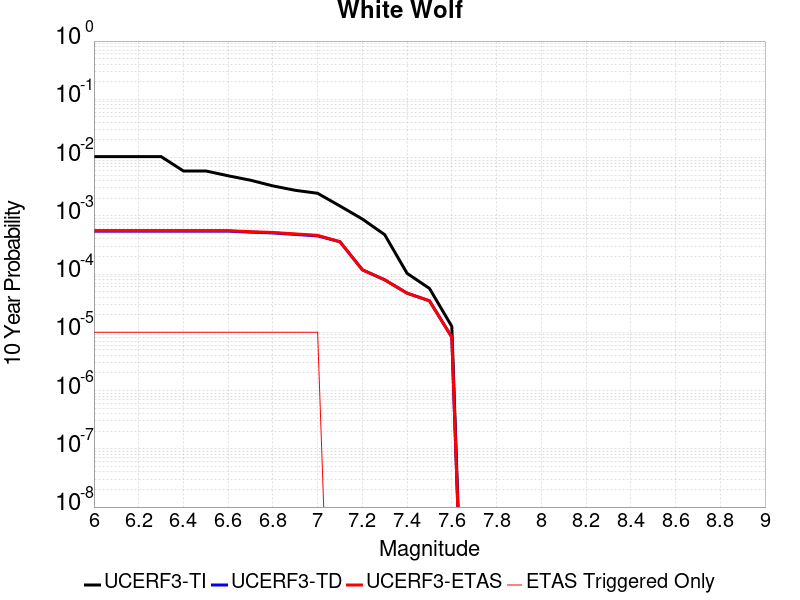 |

| Magnitude | 1 wk TI Prob | 1 wk TD Prob | 1 wk ETAS Prob | 1 wk ETAS/TD Gain | 1 wk ETAS Triggered Only | 1 mo TI Prob | 1 mo TD Prob | 1 mo ETAS Prob | 1 mo ETAS/TD Gain | 1 mo ETAS Triggered Only | 1 yr TI Prob | 1 yr TD Prob | 1 yr ETAS Prob | 1 yr ETAS/TD Gain | 1 yr ETAS Triggered Only | 10 yr TI Prob | 10 yr TD Prob | 10 yr ETAS Prob | 10 yr ETAS/TD Gain | 10 yr ETAS Triggered Only |
|-----|-----|-----|-----|-----|-----|-----|-----|-----|-----|-----|-----|-----|-----|-----|-----|-----|-----|-----|-----|-----|
| 6.0 | 2.0037822E-5 | 1.0468583E-6 | 1.0468583E-6 | 1.0 | 0.0 | 8.587355E-5 | 4.4865283E-6 | 4.4865283E-6 | 1.0 | 0.0 | 0.001045009 | 5.4622164E-5 | 6.4621614E-5 | 1.1830659 | 1.0E-5 | 0.010401085 | 5.4609246E-4 | 5.56087E-4 | 1.018302 | 1.0E-5 |
| 6.1 | 2.0037822E-5 | 1.0468583E-6 | 1.0468583E-6 | 1.0 | 0.0 | 8.587355E-5 | 4.4865283E-6 | 4.4865283E-6 | 1.0 | 0.0 | 0.001045009 | 5.4622164E-5 | 6.4621614E-5 | 1.1830659 | 1.0E-5 | 0.010401085 | 5.4609246E-4 | 5.56087E-4 | 1.018302 | 1.0E-5 |
| 6.2 | 2.0037822E-5 | 1.0468583E-6 | 1.0468583E-6 | 1.0 | 0.0 | 8.587355E-5 | 4.4865283E-6 | 4.4865283E-6 | 1.0 | 0.0 | 0.001045009 | 5.4622164E-5 | 6.4621614E-5 | 1.1830659 | 1.0E-5 | 0.010401085 | 5.4609246E-4 | 5.56087E-4 | 1.018302 | 1.0E-5 |
| 6.3 | 2.0037822E-5 | 1.0468583E-6 | 1.0468583E-6 | 1.0 | 0.0 | 8.587355E-5 | 4.4865283E-6 | 4.4865283E-6 | 1.0 | 0.0 | 0.001045009 | 5.4622164E-5 | 6.4621614E-5 | 1.1830659 | 1.0E-5 | 0.010401085 | 5.4609246E-4 | 5.56087E-4 | 1.018302 | 1.0E-5 |
| 6.4 | 1.132487E-5 | 1.0468583E-6 | 1.0468583E-6 | 1.0 | 0.0 | 4.8534253E-5 | 4.4865283E-6 | 4.4865283E-6 | 1.0 | 0.0 | 5.907443E-4 | 5.4622164E-5 | 6.4621614E-5 | 1.1830659 | 1.0E-5 | 0.005891764 | 5.4609246E-4 | 5.56087E-4 | 1.018302 | 1.0E-5 |
| 6.5 | 1.132487E-5 | 1.0468583E-6 | 1.0468583E-6 | 1.0 | 0.0 | 4.8534253E-5 | 4.4865283E-6 | 4.4865283E-6 | 1.0 | 0.0 | 5.907443E-4 | 5.4622164E-5 | 6.4621614E-5 | 1.1830659 | 1.0E-5 | 0.005891764 | 5.4609246E-4 | 5.56087E-4 | 1.018302 | 1.0E-5 |
| 6.6 | 9.347473E-6 | 1.0468583E-6 | 1.0468583E-6 | 1.0 | 0.0 | 4.0059982E-5 | 4.4865283E-6 | 4.4865283E-6 | 1.0 | 0.0 | 4.8762115E-4 | 5.4622164E-5 | 6.4621614E-5 | 1.1830659 | 1.0E-5 | 0.0048655253 | 5.4609246E-4 | 5.56087E-4 | 1.018302 | 1.0E-5 |
| 6.7 | 7.842647E-6 | 1.0047773E-6 | 1.0047773E-6 | 1.0 | 0.0 | 3.361091E-5 | 4.306182E-6 | 4.306182E-6 | 1.0 | 0.0 | 4.0913603E-4 | 5.2426552E-5 | 6.242603E-5 | 1.1907331 | 1.0E-5 | 0.004083836 | 5.241468E-4 | 5.3414155E-4 | 1.0190686 | 1.0E-5 |
| 6.8 | 6.26597E-6 | 9.734289E-7 | 9.734289E-7 | 1.0 | 0.0 | 2.685388E-5 | 4.1718313E-6 | 4.1718313E-6 | 1.0 | 0.0 | 3.2689696E-4 | 5.0790914E-5 | 6.0790408E-5 | 1.1968756 | 1.0E-5 | 0.003264165 | 5.07798E-4 | 5.177929E-4 | 1.0196829 | 1.0E-5 |
| 6.9 | 5.258436E-6 | 9.1827343E-7 | 9.1827343E-7 | 1.0 | 0.0 | 2.2535958E-5 | 3.935452E-6 | 3.935452E-6 | 1.0 | 0.0 | 2.7434074E-4 | 4.7913123E-5 | 5.7912643E-5 | 1.2087011 | 1.0E-5 | 0.0027400232 | 4.7903272E-4 | 4.8902794E-4 | 1.0208654 | 1.0E-5 |
| 7.0 | 4.675028E-6 | 8.660704E-7 | 8.660704E-7 | 1.0 | 0.0 | 2.003568E-5 | 3.7117254E-6 | 3.7117254E-6 | 1.0 | 0.0 | 2.4390711E-4 | 4.518937E-5 | 5.5188913E-5 | 1.221281 | 1.0E-5 | 0.0024363957 | 4.518065E-4 | 4.6180197E-4 | 1.0221233 | 1.0E-5 |
| 7.1 | 2.8270078E-6 | 6.8737717E-7 | 6.8737717E-7 | 1.0 | 0.0 | 1.2115692E-5 | 2.945899E-6 | 2.945899E-6 | 1.0 | 0.0 | 1.4749856E-4 | 3.586577E-5 | 3.586577E-5 | 1.0 | 0.0 | 0.001474007 | 3.5860392E-4 | 3.5860392E-4 | 1.0 | 0.0 |
| 7.2 | 1.6881406E-6 | 2.2703432E-7 | 2.2703432E-7 | 1.0 | 0.0 | 7.2348685E-6 | 9.730038E-7 | 9.730038E-7 | 1.0 | 0.0 | 8.808096E-5 | 1.1846259E-5 | 1.1846259E-5 | 1.0 | 0.0 | 8.8046055E-4 | 1.1845643E-4 | 1.1845643E-4 | 1.0 | 0.0 |
| 7.3 | 9.086107E-7 | 1.5264496E-7 | 1.5264496E-7 | 1.0 | 0.0 | 3.8940398E-6 | 6.5419255E-7 | 6.5419255E-7 | 1.0 | 0.0 | 4.7408903E-5 | 7.964766E-6 | 7.964766E-6 | 1.0 | 0.0 | 4.739879E-4 | 7.964489E-5 | 7.964489E-5 | 1.0 | 0.0 |
| 7.4 | 1.9717383E-7 | 9.003399E-8 | 9.003399E-8 | 1.0 | 0.0 | 8.450304E-7 | 3.8585992E-7 | 3.8585992E-7 | 1.0 | 0.0 | 1.0288197E-5 | 4.697835E-6 | 4.697835E-6 | 1.0 | 0.0 | 1.028772E-4 | 4.6977384E-5 | 4.6977384E-5 | 1.0 | 0.0 |
| 7.5 | 1.086975E-7 | 6.659662E-8 | 6.659662E-8 | 1.0 | 0.0 | 4.6584634E-7 | 2.8541407E-7 | 2.8541407E-7 | 1.0 | 0.0 | 5.6716644E-6 | 3.474911E-6 | 3.474911E-6 | 1.0 | 0.0 | 5.6715195E-5 | 3.474859E-5 | 3.474859E-5 | 1.0 | 0.0 |
| 7.6 | 2.4217808E-8 | 1.5820849E-8 | 1.5820849E-8 | 1.0 | 0.0 | 1.03790605E-7 | 6.780364E-8 | 6.780364E-8 | 1.0 | 0.0 | 1.2636499E-6 | 8.25509E-7 | 8.25509E-7 | 1.0 | 0.0 | 1.2636427E-5 | 8.255064E-6 | 8.255064E-6 | 1.0 | 0.0 |

## Greenville (So) 2011 CFM
*[(top)](#table-of-contents)*

| 1 Week | 1 Month | 1 Year | 10 Year |
|-----|-----|-----|-----|
|  |  | 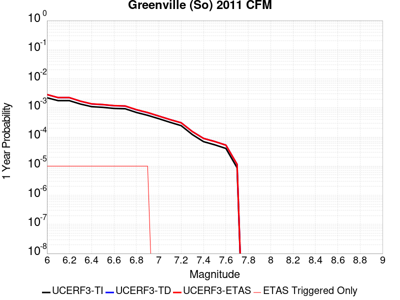 |  |

| Magnitude | 1 wk TI Prob | 1 wk TD Prob | 1 wk ETAS Prob | 1 wk ETAS/TD Gain | 1 wk ETAS Triggered Only | 1 mo TI Prob | 1 mo TD Prob | 1 mo ETAS Prob | 1 mo ETAS/TD Gain | 1 mo ETAS Triggered Only | 1 yr TI Prob | 1 yr TD Prob | 1 yr ETAS Prob | 1 yr ETAS/TD Gain | 1 yr ETAS Triggered Only | 10 yr TI Prob | 10 yr TD Prob | 10 yr ETAS Prob | 10 yr ETAS/TD Gain | 10 yr ETAS Triggered Only |
|-----|-----|-----|-----|-----|-----|-----|-----|-----|-----|-----|-----|-----|-----|-----|-----|-----|-----|-----|-----|-----|
| 6.0 | 4.279693E-5 | 5.5040568E-5 | 5.5040568E-5 | 1.0 | 0.0 | 1.8340252E-4 | 2.3586866E-4 | 2.458663E-4 | 1.0423865 | 1.0E-5 | 0.0022306389 | 0.0028681692 | 0.0028781404 | 1.0034765 | 1.0E-5 | 0.022083808 | 0.028338658 | 0.028348375 | 1.0003428 | 1.0E-5 |
| 6.1 | 3.4037297E-5 | 4.319238E-5 | 4.319238E-5 | 1.0 | 0.0 | 1.4586597E-4 | 1.8509808E-4 | 1.9509622E-4 | 1.0540154 | 1.0E-5 | 0.0017744715 | 0.0022513992 | 0.0022613765 | 1.0044317 | 1.0E-5 | 0.01760369 | 0.022303047 | 0.022312824 | 1.0004383 | 1.0E-5 |
| 6.2 | 3.4037297E-5 | 4.319238E-5 | 4.319238E-5 | 1.0 | 0.0 | 1.4586597E-4 | 1.8509808E-4 | 1.9509622E-4 | 1.0540154 | 1.0E-5 | 0.0017744715 | 0.0022513992 | 0.0022613765 | 1.0044317 | 1.0E-5 | 0.01760369 | 0.022303047 | 0.022312824 | 1.0004383 | 1.0E-5 |
| 6.3 | 2.5956324E-5 | 3.242939E-5 | 3.242939E-5 | 1.0 | 0.0 | 1.11236644E-4 | 1.3897609E-4 | 1.489747E-4 | 1.0719448 | 1.0E-5 | 0.0013534647 | 0.0016907848 | 0.0017007679 | 1.0059044 | 1.0E-5 | 0.013452509 | 0.016786316 | 0.016796147 | 1.0005857 | 1.0E-5 |
| 6.4 | 2.1145053E-5 | 2.6197793E-5 | 2.6197793E-5 | 1.0 | 0.0 | 9.061851E-5 | 1.1227157E-4 | 1.2227044E-4 | 1.0890597 | 1.0E-5 | 0.0011027219 | 0.0013660807 | 0.001376067 | 1.0073103 | 1.0E-5 | 0.01097266 | 0.013580576 | 0.013590439 | 1.0007263 | 1.0E-5 |
| 6.5 | 2.0030959E-5 | 2.4795921E-5 | 2.4795921E-5 | 1.0 | 0.0 | 8.584414E-5 | 1.0626408E-4 | 1.16263014E-4 | 1.0940952 | 1.0E-5 | 0.0010446513 | 0.0012930284 | 0.0013030154 | 1.0077238 | 1.0E-5 | 0.010397541 | 0.01285873 | 0.012868602 | 1.0007677 | 1.0E-5 |
| 6.6 | 1.8395405E-5 | 2.275458E-5 | 2.275458E-5 | 1.0 | 0.0 | 7.8835066E-5 | 9.7516146E-5 | 1.07515174E-4 | 1.1025372 | 1.0E-5 | 9.5939427E-4 | 0.0011866409 | 0.001196629 | 1.0084171 | 1.0E-5 | 0.009552629 | 0.01180643 | 0.011816312 | 1.000837 | 1.0E-5 |
| 6.7 | 1.7883482E-5 | 2.2125625E-5 | 2.2125625E-5 | 1.0 | 0.0 | 7.664124E-5 | 9.482082E-5 | 1.0481987E-4 | 1.1054521 | 1.0E-5 | 9.3270757E-4 | 0.0011538607 | 0.0011638491 | 1.0086565 | 1.0E-5 | 0.009288026 | 0.011482077 | 0.011491962 | 1.0008609 | 1.0E-5 |
| 6.8 | 1.3373564E-5 | 1.650608E-5 | 1.650608E-5 | 1.0 | 0.0 | 5.7314013E-5 | 7.0738504E-5 | 8.0737795E-5 | 1.1413558 | 1.0E-5 | 6.975747E-4 | 8.609158E-4 | 8.7090716E-4 | 1.0116055 | 1.0E-5 | 0.0069538904 | 0.008577745 | 0.00858766 | 1.0011559 | 1.0E-5 |
| 6.9 | 1.06692905E-5 | 1.3152695E-5 | 1.3152695E-5 | 1.0 | 0.0 | 4.5724726E-5 | 5.636754E-5 | 6.636698E-5 | 1.177397 | 1.0E-5 | 5.5655633E-4 | 6.8606995E-4 | 6.960631E-4 | 1.0145658 | 1.0E-5 | 0.005551645 | 0.006841082 | 0.0068510137 | 1.0014517 | 1.0E-5 |
| 7.0 | 8.157512E-6 | 1.0062752E-5 | 1.0062752E-5 | 1.0 | 0.0 | 3.4960296E-5 | 4.312539E-5 | 4.312539E-5 | 1.0 | 0.0 | 4.2555845E-4 | 5.2492885E-4 | 5.2492885E-4 | 1.0 | 0.0 | 0.004247444 | 0.0052376967 | 0.0052376967 | 1.0 | 0.0 |
| 7.1 | 6.1467113E-6 | 7.627545E-6 | 7.627545E-6 | 1.0 | 0.0 | 2.6342783E-5 | 3.2689073E-5 | 3.2689073E-5 | 1.0 | 0.0 | 3.206762E-4 | 3.9791764E-4 | 3.9791764E-4 | 1.0 | 0.0 | 0.0032021382 | 0.0039725704 | 0.0039725704 | 1.0 | 0.0 |
| 7.2 | 4.713467E-6 | 5.9142685E-6 | 5.9142685E-6 | 1.0 | 0.0 | 2.0200418E-5 | 2.5346622E-5 | 2.5346622E-5 | 1.0 | 0.0 | 2.4591232E-4 | 3.0855203E-4 | 3.0855203E-4 | 1.0 | 0.0 | 0.0024564038 | 0.0030816782 | 0.0030816782 | 1.0 | 0.0 |
| 7.3 | 2.3266216E-6 | 2.954067E-6 | 2.954067E-6 | 1.0 | 0.0 | 9.971197E-6 | 1.2660226E-5 | 1.2660226E-5 | 1.0 | 0.0 | 1.2139256E-4 | 1.541275E-4 | 1.541275E-4 | 1.0 | 0.0 | 0.0012132627 | 0.0015404817 | 0.0015404817 | 1.0 | 0.0 |
| 7.4 | 1.3314E-6 | 1.7179866E-6 | 1.7179866E-6 | 1.0 | 0.0 | 5.7059874E-6 | 7.362779E-6 | 7.362779E-6 | 1.0 | 0.0 | 6.946818E-5 | 8.96382E-5 | 8.96382E-5 | 1.0 | 0.0 | 6.9446466E-4 | 8.963211E-4 | 8.963211E-4 | 1.0 | 0.0 |
| 7.5 | 1.0362941E-6 | 1.3469155E-6 | 1.3469155E-6 | 1.0 | 0.0 | 4.4412527E-6 | 5.7724824E-6 | 5.7724824E-6 | 1.0 | 0.0 | 5.407091E-5 | 7.0277754E-5 | 7.0277754E-5 | 1.0 | 0.0 | 5.405776E-4 | 7.028451E-4 | 7.028451E-4 | 1.0 | 0.0 |
| 7.6 | 7.764784E-7 | 1.0088881E-6 | 1.0088881E-6 | 1.0 | 0.0 | 3.3277602E-6 | 4.3237997E-6 | 4.3237997E-6 | 1.0 | 0.0 | 4.0514726E-5 | 5.264103E-5 | 5.264103E-5 | 1.0 | 0.0 | 4.050734E-4 | 5.265317E-4 | 5.265317E-4 | 1.0 | 0.0 |
| 7.7 | 1.6927763E-7 | 2.2140186E-7 | 2.2140186E-7 | 1.0 | 0.0 | 7.2547533E-7 | 9.488648E-7 | 9.488648E-7 | 1.0 | 0.0 | 8.832627E-6 | 1.1552371E-5 | 1.1552371E-5 | 1.0 | 0.0 | 8.8322755E-5 | 1.1554653E-4 | 1.1554653E-4 | 1.0 | 0.0 |

## Owens Valley Keough Hot Springs
*[(top)](#table-of-contents)*

| 1 Week | 1 Month | 1 Year | 10 Year |
|-----|-----|-----|-----|
|  |  |  | 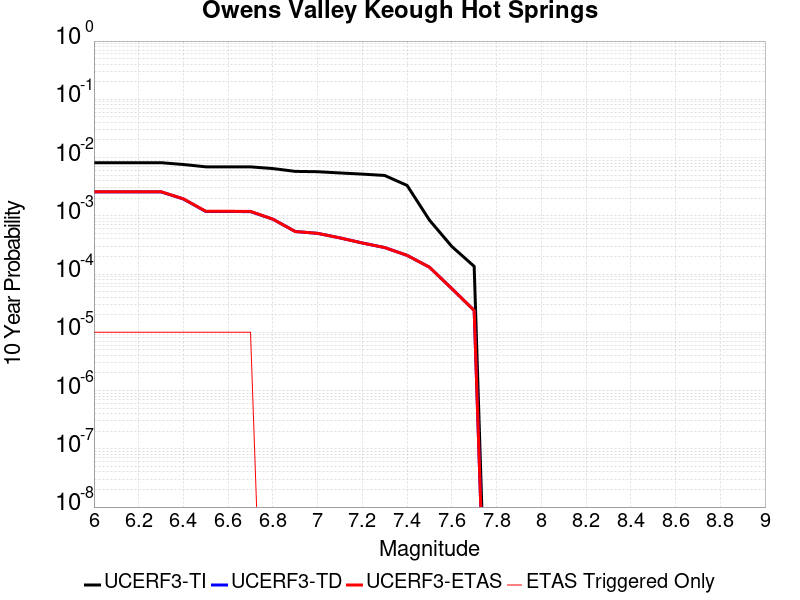 |

| Magnitude | 1 wk TI Prob | 1 wk TD Prob | 1 wk ETAS Prob | 1 wk ETAS/TD Gain | 1 wk ETAS Triggered Only | 1 mo TI Prob | 1 mo TD Prob | 1 mo ETAS Prob | 1 mo ETAS/TD Gain | 1 mo ETAS Triggered Only | 1 yr TI Prob | 1 yr TD Prob | 1 yr ETAS Prob | 1 yr ETAS/TD Gain | 1 yr ETAS Triggered Only | 10 yr TI Prob | 10 yr TD Prob | 10 yr ETAS Prob | 10 yr ETAS/TD Gain | 10 yr ETAS Triggered Only |
|-----|-----|-----|-----|-----|-----|-----|-----|-----|-----|-----|-----|-----|-----|-----|-----|-----|-----|-----|-----|-----|
| 6.0 | 1.5708529E-5 | 4.950463E-6 | 4.950463E-6 | 1.0 | 0.0 | 6.7320536E-5 | 2.1216127E-5 | 2.1216127E-5 | 1.0 | 0.0 | 8.193192E-4 | 2.5828084E-4 | 2.5828084E-4 | 1.0 | 0.0 | 0.008163051 | 0.0025804387 | 0.002590413 | 1.0038654 | 1.0E-5 |
| 6.1 | 1.5708529E-5 | 4.950463E-6 | 4.950463E-6 | 1.0 | 0.0 | 6.7320536E-5 | 2.1216127E-5 | 2.1216127E-5 | 1.0 | 0.0 | 8.193192E-4 | 2.5828084E-4 | 2.5828084E-4 | 1.0 | 0.0 | 0.008163051 | 0.0025804387 | 0.002590413 | 1.0038654 | 1.0E-5 |
| 6.2 | 1.5708529E-5 | 4.950463E-6 | 4.950463E-6 | 1.0 | 0.0 | 6.7320536E-5 | 2.1216127E-5 | 2.1216127E-5 | 1.0 | 0.0 | 8.193192E-4 | 2.5828084E-4 | 2.5828084E-4 | 1.0 | 0.0 | 0.008163051 | 0.0025804387 | 0.002590413 | 1.0038654 | 1.0E-5 |
| 6.3 | 1.5708529E-5 | 4.950463E-6 | 4.950463E-6 | 1.0 | 0.0 | 6.7320536E-5 | 2.1216127E-5 | 2.1216127E-5 | 1.0 | 0.0 | 8.193192E-4 | 2.5828084E-4 | 2.5828084E-4 | 1.0 | 0.0 | 0.008163051 | 0.0025804387 | 0.002590413 | 1.0038654 | 1.0E-5 |
| 6.4 | 1.4622509E-5 | 3.7263276E-6 | 3.7263276E-6 | 1.0 | 0.0 | 6.266639E-5 | 1.5969896E-5 | 1.5969896E-5 | 1.0 | 0.0 | 7.626962E-4 | 1.9441944E-4 | 1.9441944E-4 | 1.0 | 0.0 | 0.007600839 | 0.0019429466 | 0.0019529272 | 1.0051368 | 1.0E-5 |
| 6.5 | 1.3335527E-5 | 2.2775241E-6 | 2.2775241E-6 | 1.0 | 0.0 | 5.7151006E-5 | 9.760785E-6 | 9.760785E-6 | 1.0 | 0.0 | 6.955913E-4 | 1.1883176E-4 | 1.1883176E-4 | 1.0 | 0.0 | 0.0069341804 | 0.001187878 | 0.0011978662 | 1.0084084 | 1.0E-5 |
| 6.6 | 1.3332855E-5 | 2.2746733E-6 | 2.2746733E-6 | 1.0 | 0.0 | 5.7139558E-5 | 9.748568E-6 | 9.748568E-6 | 1.0 | 0.0 | 6.9545204E-4 | 1.1868303E-4 | 1.1868303E-4 | 1.0 | 0.0 | 0.0069327964 | 0.0011863923 | 0.0011963804 | 1.0084189 | 1.0E-5 |
| 6.7 | 1.3318214E-5 | 2.2639038E-6 | 2.2639038E-6 | 1.0 | 0.0 | 5.707681E-5 | 9.702413E-6 | 9.702413E-6 | 1.0 | 0.0 | 6.946886E-4 | 1.18121156E-4 | 1.18121156E-4 | 1.0 | 0.0 | 0.0069252094 | 0.0011807795 | 0.0011907677 | 1.008459 | 1.0E-5 |
| 6.8 | 1.2441338E-5 | 1.677594E-6 | 1.677594E-6 | 1.0 | 0.0 | 5.331893E-5 | 7.1896707E-6 | 7.1896707E-6 | 1.0 | 0.0 | 6.489646E-4 | 8.753102E-5 | 8.753102E-5 | 1.0 | 0.0 | 0.0064707273 | 8.751236E-4 | 8.751236E-4 | 1.0 | 0.0 |
| 6.9 | 1.1130476E-5 | 1.0302234E-6 | 1.0302234E-6 | 1.0 | 0.0 | 4.7701167E-5 | 4.4152357E-6 | 4.4152357E-6 | 1.0 | 0.0 | 5.806069E-4 | 5.3754186E-5 | 5.3754186E-5 | 1.0 | 0.0 | 0.0057909233 | 5.375404E-4 | 5.375404E-4 | 1.0 | 0.0 |
| 7.0 | 1.0986073E-5 | 9.577824E-7 | 9.577824E-7 | 1.0 | 0.0 | 4.7082318E-5 | 4.1047756E-6 | 4.1047756E-6 | 1.0 | 0.0 | 5.730765E-4 | 4.9974507E-5 | 4.9974507E-5 | 1.0 | 0.0 | 0.0057160086 | 4.997603E-4 | 4.997603E-4 | 1.0 | 0.0 |
| 7.1 | 1.0451338E-5 | 7.9988575E-7 | 7.9988575E-7 | 1.0 | 0.0 | 4.4790682E-5 | 3.4280772E-6 | 3.4280772E-6 | 1.0 | 0.0 | 5.451901E-4 | 4.1736046E-5 | 4.1736046E-5 | 1.0 | 0.0 | 0.005438545 | 4.1740583E-4 | 4.1740583E-4 | 1.0 | 0.0 |
| 7.2 | 9.989061E-6 | 6.543693E-7 | 6.543693E-7 | 1.0 | 0.0 | 4.280956E-5 | 2.8044367E-6 | 2.8044367E-6 | 1.0 | 0.0 | 5.2108173E-4 | 3.4143486E-5 | 3.4143486E-5 | 1.0 | 0.0 | 0.0051986156 | 3.41488E-4 | 3.41488E-4 | 1.0 | 0.0 |
| 7.3 | 9.465365E-6 | 5.458855E-7 | 5.458855E-7 | 1.0 | 0.0 | 4.056522E-5 | 2.3395073E-6 | 2.3395073E-6 | 1.0 | 0.0 | 4.937696E-4 | 2.8483131E-5 | 2.8483131E-5 | 1.0 | 0.0 | 0.0049267393 | 2.8489542E-4 | 2.8489542E-4 | 1.0 | 0.0 |
| 7.4 | 6.3824805E-6 | 4.0153776E-7 | 4.0153776E-7 | 1.0 | 0.0 | 2.73532E-5 | 1.7208749E-6 | 1.7208749E-6 | 1.0 | 0.0 | 3.3297433E-4 | 2.0951453E-5 | 2.0951453E-5 | 1.0 | 0.0 | 0.0033247585 | 2.0955436E-4 | 2.0955436E-4 | 1.0 | 0.0 |
| 7.5 | 1.6192645E-6 | 2.5156373E-7 | 2.5156373E-7 | 1.0 | 0.0 | 6.9396865E-6 | 1.0781299E-6 | 1.0781299E-6 | 1.0 | 0.0 | 8.448741E-5 | 1.3126153E-5 | 1.3126153E-5 | 1.0 | 0.0 | 8.4455294E-4 | 1.3125391E-4 | 1.3125391E-4 | 1.0 | 0.0 |
| 7.6 | 5.7062545E-7 | 1.0790214E-7 | 1.0790214E-7 | 1.0 | 0.0 | 2.4455355E-6 | 4.6243767E-7 | 4.6243767E-7 | 1.0 | 0.0 | 2.9773988E-5 | 5.630165E-6 | 5.630165E-6 | 1.0 | 0.0 | 2.977E-4 | 5.6300305E-5 | 5.6300305E-5 | 1.0 | 0.0 |
| 7.7 | 2.5988817E-7 | 4.5445965E-8 | 4.5445965E-8 | 1.0 | 0.0 | 1.113806E-6 | 1.9476842E-7 | 1.9476842E-7 | 1.0 | 0.0 | 1.3560503E-5 | 2.3713033E-6 | 2.3713033E-6 | 1.0 | 0.0 | 1.3559677E-4 | 2.3712824E-5 | 2.3712824E-5 | 1.0 | 0.0 |

## La Panza 2011
*[(top)](#table-of-contents)*

| 1 Week | 1 Month | 1 Year | 10 Year |
|-----|-----|-----|-----|
|  |  | 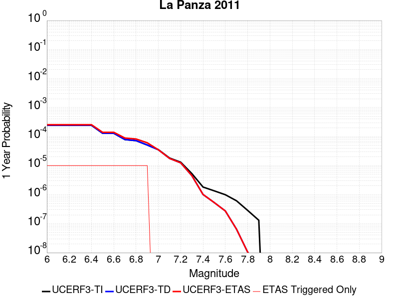 |  |

| Magnitude | 1 wk TI Prob | 1 wk TD Prob | 1 wk ETAS Prob | 1 wk ETAS/TD Gain | 1 wk ETAS Triggered Only | 1 mo TI Prob | 1 mo TD Prob | 1 mo ETAS Prob | 1 mo ETAS/TD Gain | 1 mo ETAS Triggered Only | 1 yr TI Prob | 1 yr TD Prob | 1 yr ETAS Prob | 1 yr ETAS/TD Gain | 1 yr ETAS Triggered Only | 10 yr TI Prob | 10 yr TD Prob | 10 yr ETAS Prob | 10 yr ETAS/TD Gain | 10 yr ETAS Triggered Only |
|-----|-----|-----|-----|-----|-----|-----|-----|-----|-----|-----|-----|-----|-----|-----|-----|-----|-----|-----|-----|-----|
| 6.0 | 4.6754544E-6 | 4.7175886E-6 | 1.47175415E-5 | 3.119717 | 1.0E-5 | 2.0037509E-5 | 2.021809E-5 | 3.0217889E-5 | 1.4945965 | 1.0E-5 | 2.4392935E-4 | 2.4612944E-4 | 2.5612698E-4 | 1.040619 | 1.0E-5 | 0.0024366176 | 0.0024587628 | 0.0024687382 | 1.004057 | 1.0E-5 |
| 6.1 | 4.6754544E-6 | 4.7175886E-6 | 1.47175415E-5 | 3.119717 | 1.0E-5 | 2.0037509E-5 | 2.021809E-5 | 3.0217889E-5 | 1.4945965 | 1.0E-5 | 2.4392935E-4 | 2.4612944E-4 | 2.5612698E-4 | 1.040619 | 1.0E-5 | 0.0024366176 | 0.0024587628 | 0.0024687382 | 1.004057 | 1.0E-5 |
| 6.2 | 4.6754544E-6 | 4.7175886E-6 | 1.47175415E-5 | 3.119717 | 1.0E-5 | 2.0037509E-5 | 2.021809E-5 | 3.0217889E-5 | 1.4945965 | 1.0E-5 | 2.4392935E-4 | 2.4612944E-4 | 2.5612698E-4 | 1.040619 | 1.0E-5 | 0.0024366176 | 0.0024587628 | 0.0024687382 | 1.004057 | 1.0E-5 |
| 6.3 | 4.6754544E-6 | 4.7175886E-6 | 1.47175415E-5 | 3.119717 | 1.0E-5 | 2.0037509E-5 | 2.021809E-5 | 3.0217889E-5 | 1.4945965 | 1.0E-5 | 2.4392935E-4 | 2.4612944E-4 | 2.5612698E-4 | 1.040619 | 1.0E-5 | 0.0024366176 | 0.0024587628 | 0.0024687382 | 1.004057 | 1.0E-5 |
| 6.4 | 4.6754544E-6 | 4.7175886E-6 | 1.47175415E-5 | 3.119717 | 1.0E-5 | 2.0037509E-5 | 2.021809E-5 | 3.0217889E-5 | 1.4945965 | 1.0E-5 | 2.4392935E-4 | 2.4612944E-4 | 2.5612698E-4 | 1.040619 | 1.0E-5 | 0.0024366176 | 0.0024587628 | 0.0024687382 | 1.004057 | 1.0E-5 |
| 6.5 | 2.485343E-6 | 2.5006007E-6 | 1.2500575E-5 | 4.999029 | 1.0E-5 | 1.0651426E-5 | 1.0716818E-5 | 2.071671E-5 | 1.9331028 | 1.0E-5 | 1.296734E-4 | 1.3046984E-4 | 1.4046853E-4 | 1.0766361 | 1.0E-5 | 0.0012959775 | 0.0013039707 | 0.0013139577 | 1.0076588 | 1.0E-5 |
| 6.6 | 2.485343E-6 | 2.5006007E-6 | 1.2500575E-5 | 4.999029 | 1.0E-5 | 1.0651426E-5 | 1.0716818E-5 | 2.071671E-5 | 1.9331028 | 1.0E-5 | 1.296734E-4 | 1.3046984E-4 | 1.4046853E-4 | 1.0766361 | 1.0E-5 | 0.0012959775 | 0.0013039707 | 0.0013139577 | 1.0076588 | 1.0E-5 |
| 6.7 | 1.5108508E-6 | 1.514639E-6 | 1.1514624E-5 | 7.602223 | 1.0E-5 | 6.4750584E-6 | 6.4912947E-6 | 1.649123E-5 | 2.5405147 | 1.0E-5 | 7.8830984E-5 | 7.902876E-5 | 8.902797E-5 | 1.1265262 | 1.0E-5 | 7.880303E-4 | 7.9001737E-4 | 8.0000947E-4 | 1.012648 | 1.0E-5 |
| 6.8 | 1.3865837E-6 | 1.3885118E-6 | 1.1388498E-5 | 8.201945 | 1.0E-5 | 5.942488E-6 | 5.950752E-6 | 1.5950693E-5 | 2.68045 | 1.0E-5 | 7.234739E-5 | 7.244809E-5 | 8.244737E-5 | 1.1380198 | 1.0E-5 | 7.232384E-4 | 7.242546E-4 | 7.342473E-4 | 1.0137973 | 1.0E-5 |
| 6.9 | 9.826583E-7 | 9.796303E-7 | 1.097962E-5 | 11.207923 | 1.0E-5 | 4.2113857E-6 | 4.198409E-6 | 1.4198367E-5 | 3.3818445 | 1.0E-5 | 5.1272415E-5 | 5.1114486E-5 | 6.111398E-5 | 1.1956292 | 1.0E-5 | 5.126059E-4 | 5.1103265E-4 | 5.2102754E-4 | 1.0195582 | 1.0E-5 |
| 7.0 | 6.7797646E-7 | 6.710231E-7 | 6.710231E-7 | 1.0 | 0.0 | 2.9056102E-6 | 2.8758104E-6 | 2.8758104E-6 | 1.0 | 0.0 | 3.537523E-5 | 3.501246E-5 | 3.501246E-5 | 1.0 | 0.0 | 3.5369597E-4 | 3.5007254E-4 | 3.5007254E-4 | 1.0 | 0.0 |
| 7.1 | 3.4979826E-7 | 3.3874045E-7 | 3.3874045E-7 | 1.0 | 0.0 | 1.4991346E-6 | 1.4517441E-6 | 1.4517441E-6 | 1.0 | 0.0 | 1.825181E-5 | 1.7674853E-5 | 1.7674853E-5 | 1.0 | 0.0 | 1.825031E-4 | 1.7673563E-4 | 1.7673563E-4 | 1.0 | 0.0 |
| 7.2 | 2.5088332E-7 | 2.3832064E-7 | 2.3832064E-7 | 1.0 | 0.0 | 1.0752137E-6 | 1.0213738E-6 | 1.0213738E-6 | 1.0 | 0.0 | 1.3090649E-5 | 1.2435164E-5 | 1.2435164E-5 | 1.0 | 0.0 | 1.3089878E-4 | 1.2434553E-4 | 1.2434553E-4 | 1.0 | 0.0 |
| 7.3 | 1.0159086E-7 | 8.644785E-8 | 8.644785E-8 | 1.0 | 0.0 | 4.3538932E-7 | 3.704907E-7 | 3.704907E-7 | 1.0 | 0.0 | 5.300852E-6 | 4.510716E-6 | 4.510716E-6 | 1.0 | 0.0 | 5.3007258E-5 | 4.510628E-5 | 4.510628E-5 | 1.0 | 0.0 |
| 7.4 | 3.5006252E-8 | 1.9403883E-8 | 1.9403883E-8 | 1.0 | 0.0 | 1.5002678E-7 | 8.315949E-8 | 8.315949E-8 | 1.0 | 0.0 | 1.8265745E-6 | 1.0124663E-6 | 1.0124663E-6 | 1.0 | 0.0 | 1.8265595E-5 | 1.012462E-5 | 1.012462E-5 | 1.0 | 0.0 |
| 7.5 | 2.592274E-8 | 1.0238468E-8 | 1.0238468E-8 | 1.0 | 0.0 | 1.1109746E-7 | 4.3879147E-8 | 4.3879147E-8 | 1.0 | 0.0 | 1.3526106E-6 | 5.342285E-7 | 5.342285E-7 | 1.0 | 0.0 | 1.3526024E-5 | 5.342273E-6 | 5.342273E-6 | 1.0 | 0.0 |
| 7.6 | 1.9016717E-8 | 5.2442264E-9 | 5.2442264E-9 | 1.0 | 0.0 | 8.150022E-8 | 2.2475257E-8 | 2.2475257E-8 | 1.0 | 0.0 | 9.922647E-7 | 2.736362E-7 | 2.736362E-7 | 1.0 | 0.0 | 9.922603E-6 | 2.736359E-6 | 2.736359E-6 | 1.0 | 0.0 |
| 7.7 | 1.17738495E-8 | 1.2393437E-9 | 1.2393437E-9 | 1.0 | 0.0 | 5.0459356E-8 | 5.3114735E-9 | 5.3114735E-9 | 1.0 | 0.0 | 6.1434247E-7 | 6.466719E-8 | 6.466719E-8 | 1.0 | 0.0 | 6.143408E-6 | 6.466717E-7 | 6.466717E-7 | 1.0 | 0.0 |
| 7.8 | 5.489079E-9 | 2.009185E-10 | 2.009185E-10 | 1.0 | 0.0 | 2.3524624E-8 | 8.61079E-10 | 8.61079E-10 | 1.0 | 0.0 | 2.8641225E-7 | 1.0483639E-8 | 1.0483639E-8 | 1.0 | 0.0 | 2.8641189E-6 | 1.0483638E-7 | 1.0483638E-7 | 1.0 | 0.0 |
| 7.9 | 2.5081048E-9 | 6.675449E-11 | 6.675449E-11 | 1.0 | 0.0 | 1.0749021E-8 | 2.8609015E-10 | 2.8609015E-10 | 1.0 | 0.0 | 1.3086932E-7 | 3.483148E-9 | 3.483148E-9 | 1.0 | 0.0 | 1.3086925E-6 | 3.483148E-8 | 3.483148E-8 | 1.0 | 0.0 |

## Great Valley 12
*[(top)](#table-of-contents)*

| 1 Week | 1 Month | 1 Year | 10 Year |
|-----|-----|-----|-----|
| 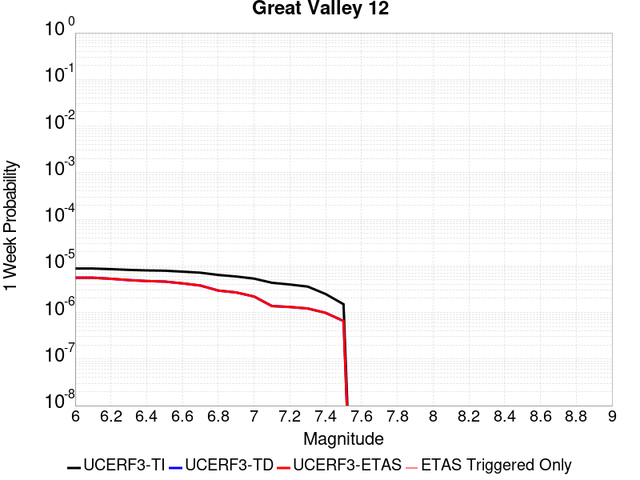 |  |  | 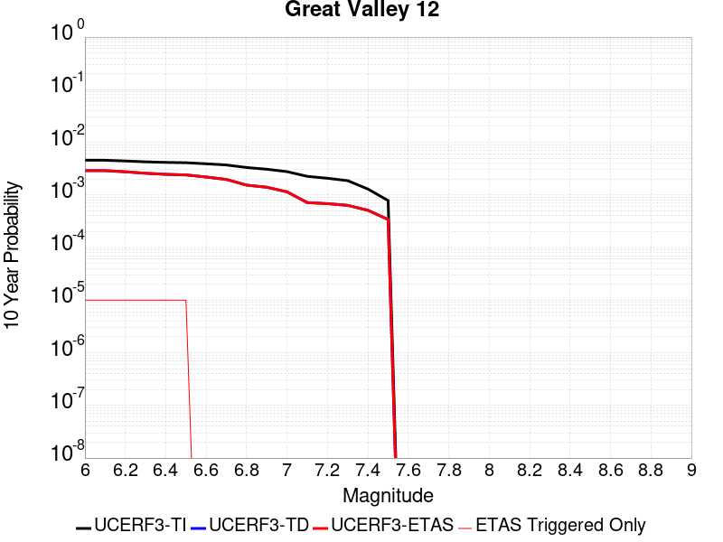 |

| Magnitude | 1 wk TI Prob | 1 wk TD Prob | 1 wk ETAS Prob | 1 wk ETAS/TD Gain | 1 wk ETAS Triggered Only | 1 mo TI Prob | 1 mo TD Prob | 1 mo ETAS Prob | 1 mo ETAS/TD Gain | 1 mo ETAS Triggered Only | 1 yr TI Prob | 1 yr TD Prob | 1 yr ETAS Prob | 1 yr ETAS/TD Gain | 1 yr ETAS Triggered Only | 10 yr TI Prob | 10 yr TD Prob | 10 yr ETAS Prob | 10 yr ETAS/TD Gain | 10 yr ETAS Triggered Only |
|-----|-----|-----|-----|-----|-----|-----|-----|-----|-----|-----|-----|-----|-----|-----|-----|-----|-----|-----|-----|-----|
| 6.0 | 8.757157E-6 | 5.55499E-6 | 5.55499E-6 | 1.0 | 0.0 | 3.7530135E-5 | 2.380689E-5 | 2.380689E-5 | 1.0 | 0.0 | 4.5683357E-4 | 2.8981152E-4 | 2.9980863E-4 | 1.0344952 | 1.0E-5 | 0.004558956 | 0.0028944567 | 0.002904428 | 1.0034449 | 1.0E-5 |
| 6.1 | 8.757157E-6 | 5.55499E-6 | 5.55499E-6 | 1.0 | 0.0 | 3.7530135E-5 | 2.380689E-5 | 2.380689E-5 | 1.0 | 0.0 | 4.5683357E-4 | 2.8981152E-4 | 2.9980863E-4 | 1.0344952 | 1.0E-5 | 0.004558956 | 0.0028944567 | 0.002904428 | 1.0034449 | 1.0E-5 |
| 6.2 | 8.499136E-6 | 5.280658E-6 | 5.280658E-6 | 1.0 | 0.0 | 3.642436E-5 | 2.2631202E-5 | 2.2631202E-5 | 1.0 | 0.0 | 4.4337637E-4 | 2.755012E-4 | 2.8549845E-4 | 1.0362874 | 1.0E-5 | 0.0044249278 | 0.002751711 | 0.0027616837 | 1.0036241 | 1.0E-5 |
| 6.3 | 8.186883E-6 | 4.9488035E-6 | 4.9488035E-6 | 1.0 | 0.0 | 3.508617E-5 | 2.120899E-5 | 2.120899E-5 | 1.0 | 0.0 | 4.270904E-4 | 2.581899E-4 | 2.681873E-4 | 1.0387212 | 1.0E-5 | 0.004262705 | 0.0025789998 | 0.0025889738 | 1.0038675 | 1.0E-5 |
| 6.4 | 7.979878E-6 | 4.720807E-6 | 4.720807E-6 | 1.0 | 0.0 | 3.419903E-5 | 2.0231879E-5 | 2.0231879E-5 | 1.0 | 0.0 | 4.1629362E-4 | 2.4629623E-4 | 2.5629374E-4 | 1.0405915 | 1.0E-5 | 0.0041551464 | 0.0024603265 | 0.002470302 | 1.0040545 | 1.0E-5 |
| 6.5 | 7.871003E-6 | 4.6007817E-6 | 4.6007817E-6 | 1.0 | 0.0 | 3.373243E-5 | 1.9717492E-5 | 1.9717492E-5 | 1.0 | 0.0 | 4.1061494E-4 | 2.4003495E-4 | 2.5003255E-4 | 1.0416507 | 1.0E-5 | 0.0040985704 | 0.00239785 | 0.002407826 | 1.0041604 | 1.0E-5 |
| 6.6 | 7.508221E-6 | 4.204166E-6 | 4.204166E-6 | 1.0 | 0.0 | 3.2177693E-5 | 1.8017736E-5 | 1.8017736E-5 | 1.0 | 0.0 | 3.91693E-4 | 2.1934473E-4 | 2.1934473E-4 | 1.0 | 0.0 | 0.003910033 | 0.0021913685 | 0.0021913685 | 1.0 | 0.0 |
| 6.7 | 7.1297914E-6 | 3.7818884E-6 | 3.7818884E-6 | 1.0 | 0.0 | 3.055589E-5 | 1.6207996E-5 | 1.6207996E-5 | 1.0 | 0.0 | 3.7195446E-4 | 1.9731528E-4 | 1.9731528E-4 | 1.0 | 0.0 | 0.0037133251 | 0.0019714797 | 0.0019714797 | 1.0 | 0.0 |
| 6.8 | 6.376581E-6 | 2.9484618E-6 | 2.9484618E-6 | 1.0 | 0.0 | 2.7327918E-5 | 1.2636205E-5 | 1.2636205E-5 | 1.0 | 0.0 | 3.326666E-4 | 1.5383509E-4 | 1.5383509E-4 | 1.0 | 0.0 | 0.0033216903 | 0.0015373026 | 0.0015373026 | 1.0 | 0.0 |
| 6.9 | 5.9095E-6 | 2.6865296E-6 | 2.6865296E-6 | 1.0 | 0.0 | 2.5326184E-5 | 1.1513648E-5 | 1.1513648E-5 | 1.0 | 0.0 | 3.0830267E-4 | 1.4016981E-4 | 1.4016981E-4 | 1.0 | 0.0 | 0.003078753 | 0.0014008294 | 0.0014008294 | 1.0 | 0.0 |
| 7.0 | 5.3239864E-6 | 2.1966623E-6 | 2.1966623E-6 | 1.0 | 0.0 | 2.2816885E-5 | 9.414233E-6 | 9.414233E-6 | 1.0 | 0.0 | 2.7776015E-4 | 1.146124E-4 | 1.146124E-4 | 1.0 | 0.0 | 0.0027741324 | 0.0011455463 | 0.0011455463 | 1.0 | 0.0 |
| 7.1 | 4.329147E-6 | 1.3707412E-6 | 1.3707412E-6 | 1.0 | 0.0 | 1.8553355E-5 | 5.8745923E-6 | 5.8745923E-6 | 1.0 | 0.0 | 2.2586368E-4 | 7.15209E-5 | 7.15209E-5 | 1.0 | 0.0 | 0.0022563424 | 7.149875E-4 | 7.149875E-4 | 1.0 | 0.0 |
| 7.2 | 3.978488E-6 | 1.3105756E-6 | 1.3105756E-6 | 1.0 | 0.0 | 1.7050552E-5 | 5.6167414E-6 | 5.6167414E-6 | 1.0 | 0.0 | 2.075707E-4 | 6.838176E-5 | 6.838176E-5 | 1.0 | 0.0 | 0.0020737692 | 6.8361586E-4 | 6.8361586E-4 | 1.0 | 0.0 |
| 7.3 | 3.586542E-6 | 1.21573E-6 | 1.21573E-6 | 1.0 | 0.0 | 1.5370804E-5 | 5.2102614E-6 | 5.2102614E-6 | 1.0 | 0.0 | 1.8712347E-4 | 6.343317E-5 | 6.343317E-5 | 1.0 | 0.0 | 0.0018696598 | 6.341592E-4 | 6.341592E-4 | 1.0 | 0.0 |
| 7.4 | 2.4837766E-6 | 9.80032E-7 | 9.80032E-7 | 1.0 | 0.0 | 1.0644713E-5 | 4.2001307E-6 | 4.2001307E-6 | 1.0 | 0.0 | 1.2959167E-4 | 5.113546E-5 | 5.113546E-5 | 1.0 | 0.0 | 0.0012951613 | 5.1124353E-4 | 5.1124353E-4 | 1.0 | 0.0 |
| 7.5 | 1.5002679E-6 | 6.545985E-7 | 6.545985E-7 | 1.0 | 0.0 | 6.4297037E-6 | 2.8054194E-6 | 2.8054194E-6 | 1.0 | 0.0 | 7.827883E-5 | 3.4155488E-5 | 3.4155488E-5 | 1.0 | 0.0 | 7.825126E-4 | 3.4150656E-4 | 3.4150656E-4 | 1.0 | 0.0 |

## Hayward (So) extension 2011 CFM
*[(top)](#table-of-contents)*

| 1 Week | 1 Month | 1 Year | 10 Year |
|-----|-----|-----|-----|
|  |  |  |  |

| Magnitude | 1 wk TI Prob | 1 wk TD Prob | 1 wk ETAS Prob | 1 wk ETAS/TD Gain | 1 wk ETAS Triggered Only | 1 mo TI Prob | 1 mo TD Prob | 1 mo ETAS Prob | 1 mo ETAS/TD Gain | 1 mo ETAS Triggered Only | 1 yr TI Prob | 1 yr TD Prob | 1 yr ETAS Prob | 1 yr ETAS/TD Gain | 1 yr ETAS Triggered Only | 10 yr TI Prob | 10 yr TD Prob | 10 yr ETAS Prob | 10 yr ETAS/TD Gain | 10 yr ETAS Triggered Only |
|-----|-----|-----|-----|-----|-----|-----|-----|-----|-----|-----|-----|-----|-----|-----|-----|-----|-----|-----|-----|-----|
| 6.0 | 1.1721256E-4 | 2.3671088E-4 | 2.3671088E-4 | 1.0 | 0.0 | 5.022428E-4 | 0.0010138806 | 0.0010138806 | 1.0 | 0.0 | 0.0060976758 | 0.012250609 | 0.012260486 | 1.0008063 | 1.0E-5 | 0.0593305 | 0.11284437 | 0.112853244 | 1.0000786 | 1.0E-5 |
| 6.1 | 6.99169E-5 | 1.3808164E-4 | 1.3808164E-4 | 1.0 | 0.0 | 2.9960944E-4 | 5.9155683E-4 | 5.9155683E-4 | 1.0 | 0.0 | 0.0036416445 | 0.0071723475 | 0.0071723475 | 1.0 | 0.0 | 0.035825435 | 0.067804344 | 0.067804344 | 1.0 | 0.0 |
| 6.2 | 6.99169E-5 | 1.3808164E-4 | 1.3808164E-4 | 1.0 | 0.0 | 2.9960944E-4 | 5.9155683E-4 | 5.9155683E-4 | 1.0 | 0.0 | 0.0036416445 | 0.0071723475 | 0.0071723475 | 1.0 | 0.0 | 0.035825435 | 0.067804344 | 0.067804344 | 1.0 | 0.0 |
| 6.3 | 6.970908E-5 | 1.3776305E-4 | 1.3776305E-4 | 1.0 | 0.0 | 2.9871898E-4 | 5.9019245E-4 | 5.9019245E-4 | 1.0 | 0.0 | 0.0036308395 | 0.007155884 | 0.007155884 | 1.0 | 0.0 | 0.035720866 | 0.0676533 | 0.0676533 | 1.0 | 0.0 |
| 6.4 | 6.9517155E-5 | 1.3743227E-4 | 1.3743227E-4 | 1.0 | 0.0 | 2.9789665E-4 | 5.8877567E-4 | 5.8877567E-4 | 1.0 | 0.0 | 0.0036208609 | 0.0071387975 | 0.0071387975 | 1.0 | 0.0 | 0.03562429 | 0.06749734 | 0.06749734 | 1.0 | 0.0 |
| 6.5 | 4.786248E-5 | 9.415232E-5 | 9.415232E-5 | 1.0 | 0.0 | 2.0510878E-4 | 4.0344993E-4 | 4.0344993E-4 | 1.0 | 0.0 | 0.0024943394 | 0.0049013784 | 0.0049013784 | 1.0 | 0.0 | 0.02466527 | 0.046900697 | 0.046900697 | 1.0 | 0.0 |
| 6.6 | 4.4662214E-5 | 8.8819244E-5 | 8.8819244E-5 | 1.0 | 0.0 | 1.9139545E-4 | 3.80601E-4 | 3.80601E-4 | 1.0 | 0.0 | 0.0023277493 | 0.0046244357 | 0.0046244357 | 1.0 | 0.0 | 0.02303517 | 0.04429206 | 0.04429206 | 1.0 | 0.0 |
| 6.7 | 3.884542E-5 | 7.8650686E-5 | 7.8650686E-5 | 1.0 | 0.0 | 1.6646975E-4 | 3.3703333E-4 | 3.3703333E-4 | 1.0 | 0.0 | 0.002024885 | 0.0040961048 | 0.0040961048 | 1.0 | 0.0 | 0.020065336 | 0.039332055 | 0.039332055 | 1.0 | 0.0 |
| 6.8 | 3.4221863E-5 | 6.855886E-5 | 6.855886E-5 | 1.0 | 0.0 | 1.4665688E-4 | 2.9379298E-4 | 2.9379298E-4 | 1.0 | 0.0 | 0.0017840851 | 0.0035714838 | 0.0035714838 | 1.0 | 0.0 | 0.017698295 | 0.034419462 | 0.034419462 | 1.0 | 0.0 |
| 6.9 | 1.6927712E-5 | 3.006262E-5 | 3.006262E-5 | 1.0 | 0.0 | 7.2545314E-5 | 1.2883375E-4 | 1.2883375E-4 | 1.0 | 0.0 | 8.828813E-4 | 0.0015674793 | 0.0015674793 | 1.0 | 0.0 | 0.008793819 | 0.015463544 | 0.015463544 | 1.0 | 0.0 |
| 7.0 | 1.2509653E-5 | 2.246337E-5 | 2.246337E-5 | 1.0 | 0.0 | 5.3611697E-5 | 9.626828E-5 | 9.626828E-5 | 1.0 | 0.0 | 6.525269E-4 | 0.0011714802 | 0.0011714802 | 1.0 | 0.0 | 0.0065061417 | 0.011583166 | 0.011583166 | 1.0 | 0.0 |
| 7.1 | 8.751583E-6 | 1.4926157E-5 | 1.4926157E-5 | 1.0 | 0.0 | 3.750624E-5 | 6.396771E-5 | 6.396771E-5 | 1.0 | 0.0 | 4.5654282E-4 | 7.785344E-4 | 7.785344E-4 | 1.0 | 0.0 | 0.0045560603 | 0.007764457 | 0.007764457 | 1.0 | 0.0 |
| 7.2 | 6.354379E-6 | 1.1499087E-5 | 1.1499087E-5 | 1.0 | 0.0 | 2.7232769E-5 | 4.9280898E-5 | 4.9280898E-5 | 1.0 | 0.0 | 3.3150852E-4 | 5.9983454E-4 | 5.9983454E-4 | 1.0 | 0.0 | 0.0033101442 | 0.006001243 | 0.006001243 | 1.0 | 0.0 |
| 7.3 | 4.645554E-6 | 8.818441E-6 | 8.818441E-6 | 1.0 | 0.0 | 1.9909365E-5 | 3.7792794E-5 | 3.7792794E-5 | 1.0 | 0.0 | 2.4236954E-4 | 4.6003403E-4 | 4.6003403E-4 | 1.0 | 0.0 | 0.0024210536 | 0.004611421 | 0.004611421 | 1.0 | 0.0 |
| 7.4 | 4.23437E-6 | 7.992759E-6 | 7.992759E-6 | 1.0 | 0.0 | 1.8147173E-5 | 3.425425E-5 | 3.425425E-5 | 1.0 | 0.0 | 2.2091944E-4 | 4.1696956E-4 | 4.1696956E-4 | 1.0 | 0.0 | 0.0022069993 | 0.0041826614 | 0.0041826614 | 1.0 | 0.0 |
| 7.5 | 2.2187417E-6 | 3.952336E-6 | 3.952336E-6 | 1.0 | 0.0 | 9.508858E-6 | 1.6938488E-5 | 1.6938488E-5 | 1.0 | 0.0 | 1.157642E-4 | 2.0620918E-4 | 2.0620918E-4 | 1.0 | 0.0 | 0.0011570391 | 0.0020739497 | 0.0020739497 | 1.0 | 0.0 |
| 7.6 | 2.7952495E-8 | 3.8785874E-8 | 3.8785874E-8 | 1.0 | 0.0 | 1.1979641E-7 | 1.6622516E-7 | 1.6622516E-7 | 1.0 | 0.0 | 1.4585203E-6 | 2.0237894E-6 | 2.0237894E-6 | 1.0 | 0.0 | 1.4585107E-5 | 2.0317128E-5 | 2.0317128E-5 | 1.0 | 0.0 |
| 7.7 | 1.7192724E-8 | 2.3436652E-8 | 2.3436652E-8 | 1.0 | 0.0 | 7.36831E-8 | 1.0044278E-7 | 1.0044278E-7 | 1.0 | 0.0 | 8.9709135E-7 | 1.2228902E-6 | 1.2228902E-6 | 1.0 | 0.0 | 8.970877E-6 | 1.2285953E-5 | 1.2285953E-5 | 1.0 | 0.0 |

## Fontana (Seismicity)
*[(top)](#table-of-contents)*

| 1 Week | 1 Month | 1 Year | 10 Year |
|-----|-----|-----|-----|
|  |  |  | 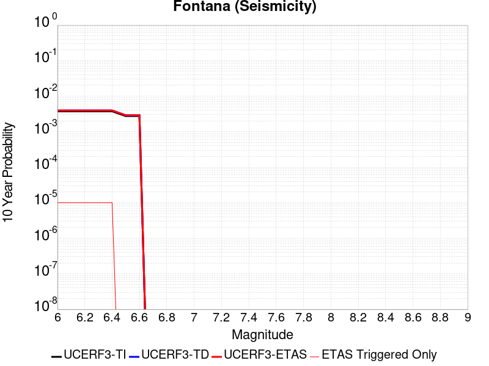 |

| Magnitude | 1 wk TI Prob | 1 wk TD Prob | 1 wk ETAS Prob | 1 wk ETAS/TD Gain | 1 wk ETAS Triggered Only | 1 mo TI Prob | 1 mo TD Prob | 1 mo ETAS Prob | 1 mo ETAS/TD Gain | 1 mo ETAS Triggered Only | 1 yr TI Prob | 1 yr TD Prob | 1 yr ETAS Prob | 1 yr ETAS/TD Gain | 1 yr ETAS Triggered Only | 10 yr TI Prob | 10 yr TD Prob | 10 yr ETAS Prob | 10 yr ETAS/TD Gain | 10 yr ETAS Triggered Only |
|-----|-----|-----|-----|-----|-----|-----|-----|-----|-----|-----|-----|-----|-----|-----|-----|-----|-----|-----|-----|-----|
| 6.0 | 7.1789214E-6 | 7.5520006E-6 | 1.7551925E-5 | 2.3241425 | 1.0E-5 | 3.076644E-5 | 3.2365548E-5 | 4.2365224E-5 | 1.3089606 | 1.0E-5 | 3.7451705E-4 | 3.9402005E-4 | 4.0401611E-4 | 1.0253694 | 1.0E-5 | 0.003738865 | 0.003937214 | 0.0039471746 | 1.0025299 | 1.0E-5 |
| 6.1 | 7.1789214E-6 | 7.5520006E-6 | 1.7551925E-5 | 2.3241425 | 1.0E-5 | 3.076644E-5 | 3.2365548E-5 | 4.2365224E-5 | 1.3089606 | 1.0E-5 | 3.7451705E-4 | 3.9402005E-4 | 4.0401611E-4 | 1.0253694 | 1.0E-5 | 0.003738865 | 0.003937214 | 0.0039471746 | 1.0025299 | 1.0E-5 |
| 6.2 | 7.1789214E-6 | 7.5520006E-6 | 1.7551925E-5 | 2.3241425 | 1.0E-5 | 3.076644E-5 | 3.2365548E-5 | 4.2365224E-5 | 1.3089606 | 1.0E-5 | 3.7451705E-4 | 3.9402005E-4 | 4.0401611E-4 | 1.0253694 | 1.0E-5 | 0.003738865 | 0.003937214 | 0.0039471746 | 1.0025299 | 1.0E-5 |
| 6.3 | 7.1789214E-6 | 7.5520006E-6 | 1.7551925E-5 | 2.3241425 | 1.0E-5 | 3.076644E-5 | 3.2365548E-5 | 4.2365224E-5 | 1.3089606 | 1.0E-5 | 3.7451705E-4 | 3.9402005E-4 | 4.0401611E-4 | 1.0253694 | 1.0E-5 | 0.003738865 | 0.003937214 | 0.0039471746 | 1.0025299 | 1.0E-5 |
| 6.4 | 7.1789214E-6 | 7.5520006E-6 | 1.7551925E-5 | 2.3241425 | 1.0E-5 | 3.076644E-5 | 3.2365548E-5 | 4.2365224E-5 | 1.3089606 | 1.0E-5 | 3.7451705E-4 | 3.9402005E-4 | 4.0401611E-4 | 1.0253694 | 1.0E-5 | 0.003738865 | 0.003937214 | 0.0039471746 | 1.0025299 | 1.0E-5 |
| 6.5 | 5.2611317E-6 | 5.532726E-6 | 5.532726E-6 | 1.0 | 0.0 | 2.2547512E-5 | 2.3711682E-5 | 2.3711682E-5 | 1.0 | 0.0 | 2.744814E-4 | 2.8868974E-4 | 2.8868974E-4 | 1.0 | 0.0 | 0.002741426 | 0.0028868972 | 0.0028868972 | 1.0 | 0.0 |
| 6.6 | 5.2611317E-6 | 5.532726E-6 | 5.532726E-6 | 1.0 | 0.0 | 2.2547512E-5 | 2.3711682E-5 | 2.3711682E-5 | 1.0 | 0.0 | 2.744814E-4 | 2.8868974E-4 | 2.8868974E-4 | 1.0 | 0.0 | 0.002741426 | 0.0028868972 | 0.0028868972 | 1.0 | 0.0 |

## South Klamath Lake West
*[(top)](#table-of-contents)*

| 1 Week | 1 Month | 1 Year | 10 Year |
|-----|-----|-----|-----|
| 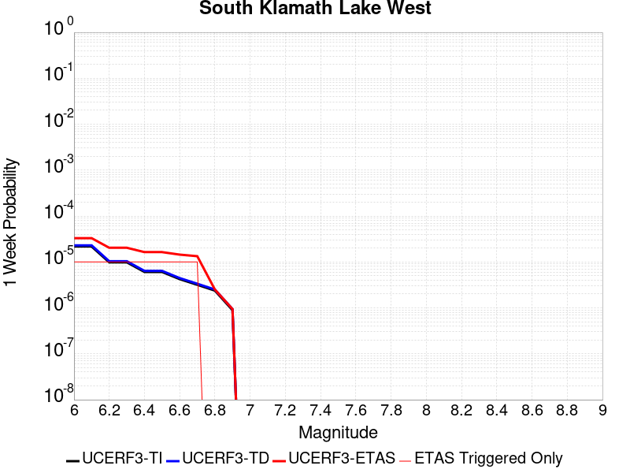 |  |  |  |

| Magnitude | 1 wk TI Prob | 1 wk TD Prob | 1 wk ETAS Prob | 1 wk ETAS/TD Gain | 1 wk ETAS Triggered Only | 1 mo TI Prob | 1 mo TD Prob | 1 mo ETAS Prob | 1 mo ETAS/TD Gain | 1 mo ETAS Triggered Only | 1 yr TI Prob | 1 yr TD Prob | 1 yr ETAS Prob | 1 yr ETAS/TD Gain | 1 yr ETAS Triggered Only | 10 yr TI Prob | 10 yr TD Prob | 10 yr ETAS Prob | 10 yr ETAS/TD Gain | 10 yr ETAS Triggered Only |
|-----|-----|-----|-----|-----|-----|-----|-----|-----|-----|-----|-----|-----|-----|-----|-----|-----|-----|-----|-----|-----|
| 6.0 | 2.174025E-5 | 2.3042025E-5 | 3.3041793E-5 | 1.4339796 | 1.0E-5 | 9.3169176E-5 | 9.874817E-5 | 1.0874718E-4 | 1.1012577 | 1.0E-5 | 0.0011337444 | 0.0012016617 | 0.0012116497 | 1.0083119 | 1.0E-5 | 0.011279777 | 0.0119582405 | 0.011968121 | 1.0008262 | 1.0E-5 |
| 6.1 | 2.174025E-5 | 2.3042025E-5 | 3.3041793E-5 | 1.4339796 | 1.0E-5 | 9.3169176E-5 | 9.874817E-5 | 1.0874718E-4 | 1.1012577 | 1.0E-5 | 0.0011337444 | 0.0012016617 | 0.0012116497 | 1.0083119 | 1.0E-5 | 0.011279777 | 0.0119582405 | 0.011968121 | 1.0008262 | 1.0E-5 |
| 6.2 | 9.834929E-6 | 1.0393841E-5 | 2.0393738E-5 | 1.9620982 | 1.0E-5 | 4.2149015E-5 | 4.4544326E-5 | 5.4543878E-5 | 1.2244855 | 1.0E-5 | 5.1304343E-4 | 5.422012E-4 | 5.521958E-4 | 1.0184333 | 1.0E-5 | 0.0051186057 | 0.0054096854 | 0.0054196315 | 1.0018386 | 1.0E-5 |
| 6.3 | 9.834929E-6 | 1.0393841E-5 | 2.0393738E-5 | 1.9620982 | 1.0E-5 | 4.2149015E-5 | 4.4544326E-5 | 5.4543878E-5 | 1.2244855 | 1.0E-5 | 5.1304343E-4 | 5.422012E-4 | 5.521958E-4 | 1.0184333 | 1.0E-5 | 0.0051186057 | 0.0054096854 | 0.0054196315 | 1.0018386 | 1.0E-5 |
| 6.4 | 6.066321E-6 | 6.40043E-6 | 1.6400365E-5 | 2.562385 | 1.0E-5 | 2.5998259E-5 | 2.743014E-5 | 3.7429865E-5 | 1.3645525 | 1.0E-5 | 3.1648282E-4 | 3.3391351E-4 | 3.4391016E-4 | 1.0299379 | 1.0E-5 | 0.0031603249 | 0.0033343881 | 0.0033443547 | 1.002989 | 1.0E-5 |
| 6.5 | 6.066321E-6 | 6.40043E-6 | 1.6400365E-5 | 2.562385 | 1.0E-5 | 2.5998259E-5 | 2.743014E-5 | 3.7429865E-5 | 1.3645525 | 1.0E-5 | 3.1648282E-4 | 3.3391351E-4 | 3.4391016E-4 | 1.0299379 | 1.0E-5 | 0.0031603249 | 0.0033343881 | 0.0033443547 | 1.002989 | 1.0E-5 |
| 6.6 | 4.2321803E-6 | 4.461291E-6 | 1.4461247E-5 | 3.2414935 | 1.0E-5 | 1.8137789E-5 | 1.9119685E-5 | 2.9119494E-5 | 1.5230112 | 1.0E-5 | 2.208052E-4 | 2.3275832E-4 | 2.42756E-4 | 1.042953 | 1.0E-5 | 0.0022058594 | 0.0023252473 | 0.002335224 | 1.0042906 | 1.0E-5 |
| 6.7 | 3.186646E-6 | 3.360305E-6 | 1.3360272E-5 | 3.9759102 | 1.0E-5 | 1.3656982E-5 | 1.4401232E-5 | 2.4401088E-5 | 1.694375 | 1.0E-5 | 1.6626107E-4 | 1.7532158E-4 | 1.8531982E-4 | 1.057028 | 1.0E-5 | 0.0016613674 | 0.0017518997 | 0.0017618822 | 1.0056981 | 1.0E-5 |
| 6.8 | 2.380121E-6 | 2.510907E-6 | 2.510907E-6 | 1.0 | 0.0 | 1.0200479E-5 | 1.07609885E-5 | 1.07609885E-5 | 1.0 | 0.0 | 1.2418375E-4 | 1.3100762E-4 | 1.3100762E-4 | 1.0 | 0.0 | 0.0012411437 | 0.0013093497 | 0.0013093497 | 1.0 | 0.0 |
| 6.9 | 8.928287E-7 | 9.4302504E-7 | 9.4302504E-7 | 1.0 | 0.0 | 3.826403E-6 | 4.0415307E-6 | 4.0415307E-6 | 1.0 | 0.0 | 4.658546E-5 | 4.9204747E-5 | 4.9204747E-5 | 1.0 | 0.0 | 4.6575698E-4 | 4.9196015E-4 | 4.9196015E-4 | 1.0 | 0.0 |

## Mission Hills 2011
*[(top)](#table-of-contents)*

| 1 Week | 1 Month | 1 Year | 10 Year |
|-----|-----|-----|-----|
|  |  |  |  |

| Magnitude | 1 wk TI Prob | 1 wk TD Prob | 1 wk ETAS Prob | 1 wk ETAS/TD Gain | 1 wk ETAS Triggered Only | 1 mo TI Prob | 1 mo TD Prob | 1 mo ETAS Prob | 1 mo ETAS/TD Gain | 1 mo ETAS Triggered Only | 1 yr TI Prob | 1 yr TD Prob | 1 yr ETAS Prob | 1 yr ETAS/TD Gain | 1 yr ETAS Triggered Only | 10 yr TI Prob | 10 yr TD Prob | 10 yr ETAS Prob | 10 yr ETAS/TD Gain | 10 yr ETAS Triggered Only |
|-----|-----|-----|-----|-----|-----|-----|-----|-----|-----|-----|-----|-----|-----|-----|-----|-----|-----|-----|-----|-----|
| 6.0 | 1.8765717E-5 | 1.9054629E-5 | 1.9054629E-5 | 1.0 | 0.0 | 8.0422025E-5 | 8.1662074E-5 | 8.1662074E-5 | 1.0 | 0.0 | 9.786983E-4 | 9.941256E-4 | 9.941256E-4 | 1.0 | 0.0 | 0.009743992 | 0.00993045 | 0.00994035 | 1.000997 | 1.0E-5 |
| 6.1 | 1.8765717E-5 | 1.9054629E-5 | 1.9054629E-5 | 1.0 | 0.0 | 8.0422025E-5 | 8.1662074E-5 | 8.1662074E-5 | 1.0 | 0.0 | 9.786983E-4 | 9.941256E-4 | 9.941256E-4 | 1.0 | 0.0 | 0.009743992 | 0.00993045 | 0.00994035 | 1.000997 | 1.0E-5 |
| 6.2 | 1.8765717E-5 | 1.9054629E-5 | 1.9054629E-5 | 1.0 | 0.0 | 8.0422025E-5 | 8.1662074E-5 | 8.1662074E-5 | 1.0 | 0.0 | 9.786983E-4 | 9.941256E-4 | 9.941256E-4 | 1.0 | 0.0 | 0.009743992 | 0.00993045 | 0.00994035 | 1.000997 | 1.0E-5 |
| 6.3 | 1.8765717E-5 | 1.9054629E-5 | 1.9054629E-5 | 1.0 | 0.0 | 8.0422025E-5 | 8.1662074E-5 | 8.1662074E-5 | 1.0 | 0.0 | 9.786983E-4 | 9.941256E-4 | 9.941256E-4 | 1.0 | 0.0 | 0.009743992 | 0.00993045 | 0.00994035 | 1.000997 | 1.0E-5 |
| 6.4 | 4.566357E-6 | 2.5148213E-6 | 2.5148213E-6 | 1.0 | 0.0 | 1.9569954E-5 | 1.0777771E-5 | 1.0777771E-5 | 1.0 | 0.0 | 2.3823815E-4 | 1.3121328E-4 | 1.3121328E-4 | 1.0 | 0.0 | 0.002379829 | 0.0013115364 | 0.0013115364 | 1.0 | 0.0 |
| 6.5 | 4.566357E-6 | 2.5148213E-6 | 2.5148213E-6 | 1.0 | 0.0 | 1.9569954E-5 | 1.0777771E-5 | 1.0777771E-5 | 1.0 | 0.0 | 2.3823815E-4 | 1.3121328E-4 | 1.3121328E-4 | 1.0 | 0.0 | 0.002379829 | 0.0013115364 | 0.0013115364 | 1.0 | 0.0 |
| 6.6 | 4.566357E-6 | 2.5148213E-6 | 2.5148213E-6 | 1.0 | 0.0 | 1.9569954E-5 | 1.0777771E-5 | 1.0777771E-5 | 1.0 | 0.0 | 2.3823815E-4 | 1.3121328E-4 | 1.3121328E-4 | 1.0 | 0.0 | 0.002379829 | 0.0013115364 | 0.0013115364 | 1.0 | 0.0 |
| 6.7 | 2.3266773E-6 | 1.3296132E-6 | 1.3296132E-6 | 1.0 | 0.0 | 9.971435E-6 | 5.69833E-6 | 5.69833E-6 | 1.0 | 0.0 | 1.2139547E-4 | 6.937502E-5 | 6.937502E-5 | 1.0 | 0.0 | 0.0012132917 | 6.935397E-4 | 6.935397E-4 | 1.0 | 0.0 |
| 6.8 | 2.032735E-6 | 1.1894101E-6 | 1.1894101E-6 | 1.0 | 0.0 | 8.711692E-6 | 5.0974622E-6 | 5.0974622E-6 | 1.0 | 0.0 | 1.06059684E-4 | 6.205988E-5 | 6.205988E-5 | 1.0 | 0.0 | 0.0010600908 | 6.204304E-4 | 6.204304E-4 | 1.0 | 0.0 |
| 6.9 | 1.3186259E-6 | 1.0561989E-6 | 1.0561989E-6 | 1.0 | 0.0 | 5.6512413E-6 | 4.526559E-6 | 4.526559E-6 | 1.0 | 0.0 | 6.8801695E-5 | 5.5109493E-5 | 5.5109493E-5 | 1.0 | 0.0 | 6.8780396E-4 | 5.5096124E-4 | 5.5096124E-4 | 1.0 | 0.0 |
| 7.0 | 1.2726016E-6 | 1.0159295E-6 | 1.0159295E-6 | 1.0 | 0.0 | 5.4539955E-6 | 4.3539762E-6 | 4.3539762E-6 | 1.0 | 0.0 | 6.6400375E-5 | 5.30084E-5 | 5.30084E-5 | 1.0 | 0.0 | 6.6380535E-4 | 5.299604E-4 | 5.299604E-4 | 1.0 | 0.0 |
| 7.1 | 1.2063913E-6 | 9.570282E-7 | 9.570282E-7 | 1.0 | 0.0 | 5.170238E-6 | 4.101543E-6 | 4.101543E-6 | 1.0 | 0.0 | 6.294583E-5 | 4.9935166E-5 | 4.9935166E-5 | 1.0 | 0.0 | 6.2928005E-4 | 4.9924204E-4 | 4.9924204E-4 | 1.0 | 0.0 |
| 7.2 | 9.105806E-7 | 7.3767757E-7 | 7.3767757E-7 | 1.0 | 0.0 | 3.9024826E-6 | 3.1614716E-6 | 3.1614716E-6 | 1.0 | 0.0 | 4.7511687E-5 | 3.8490252E-5 | 3.8490252E-5 | 1.0 | 0.0 | 4.7501532E-4 | 3.8483742E-4 | 3.8483742E-4 | 1.0 | 0.0 |
| 7.3 | 7.020432E-7 | 5.7103375E-7 | 5.7103375E-7 | 1.0 | 0.0 | 3.0087533E-6 | 2.4472852E-6 | 2.4472852E-6 | 1.0 | 0.0 | 3.6630954E-5 | 2.9795303E-5 | 2.9795303E-5 | 1.0 | 0.0 | 3.6624918E-4 | 2.979144E-4 | 2.979144E-4 | 1.0 | 0.0 |
| 7.4 | 5.3900635E-7 | 4.4483278E-7 | 4.4483278E-7 | 1.0 | 0.0 | 2.3100251E-6 | 1.9064248E-6 | 1.9064248E-6 | 1.0 | 0.0 | 2.8124194E-5 | 2.3210489E-5 | 2.3210489E-5 | 1.0 | 0.0 | 2.8120633E-4 | 2.3208185E-4 | 2.3208185E-4 | 1.0 | 0.0 |
| 7.5 | 2.907075E-7 | 2.2875324E-7 | 2.2875324E-7 | 1.0 | 0.0 | 1.2458887E-6 | 9.803706E-7 | 9.803706E-7 | 1.0 | 0.0 | 1.5168589E-5 | 1.1935949E-5 | 1.1935949E-5 | 1.0 | 0.0 | 1.5167553E-4 | 1.1935326E-4 | 1.1935326E-4 | 1.0 | 0.0 |
| 7.6 | 1.6903675E-7 | 1.2353401E-7 | 1.2353401E-7 | 1.0 | 0.0 | 7.2444305E-7 | 5.2943136E-7 | 5.2943136E-7 | 1.0 | 0.0 | 8.820059E-6 | 6.4458086E-6 | 6.4458086E-6 | 1.0 | 0.0 | 8.8197085E-5 | 6.445634E-5 | 6.445634E-5 | 1.0 | 0.0 |
| 7.7 | 7.168073E-8 | 3.9134374E-8 | 3.9134374E-8 | 1.0 | 0.0 | 3.072031E-7 | 1.6771872E-7 | 1.6771872E-7 | 1.0 | 0.0 | 3.7401915E-6 | 2.0419736E-6 | 2.0419736E-6 | 1.0 | 0.0 | 3.7401285E-5 | 2.041956E-5 | 2.041956E-5 | 1.0 | 0.0 |
| 7.8 | 6.564101E-8 | 3.3834656E-8 | 3.3834656E-8 | 1.0 | 0.0 | 2.813186E-7 | 1.4500566E-7 | 1.4500566E-7 | 1.0 | 0.0 | 3.4250486E-6 | 1.7654426E-6 | 1.7654426E-6 | 1.0 | 0.0 | 3.424996E-5 | 1.7654296E-5 | 1.7654296E-5 | 1.0 | 0.0 |
| 7.9 | 1.0029074E-8 | 3.728858E-9 | 3.728858E-9 | 1.0 | 0.0 | 4.2981743E-8 | 1.598082E-8 | 1.598082E-8 | 1.0 | 0.0 | 5.2330256E-7 | 1.945665E-7 | 1.945665E-7 | 1.0 | 0.0 | 5.2330133E-6 | 1.9456643E-6 | 1.9456643E-6 | 1.0 | 0.0 |

