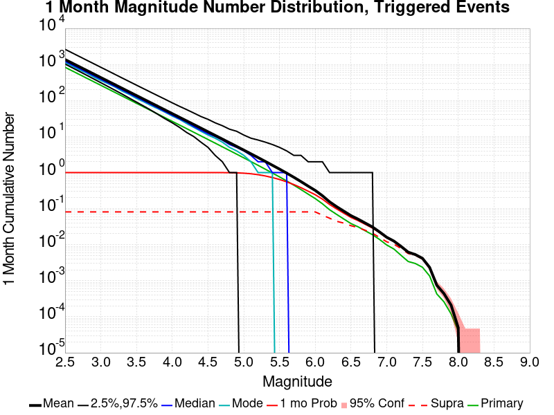
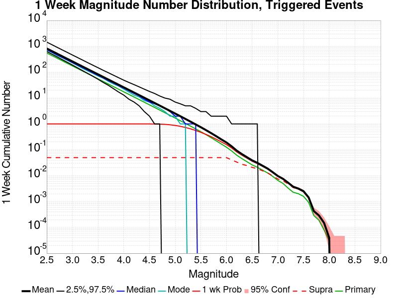
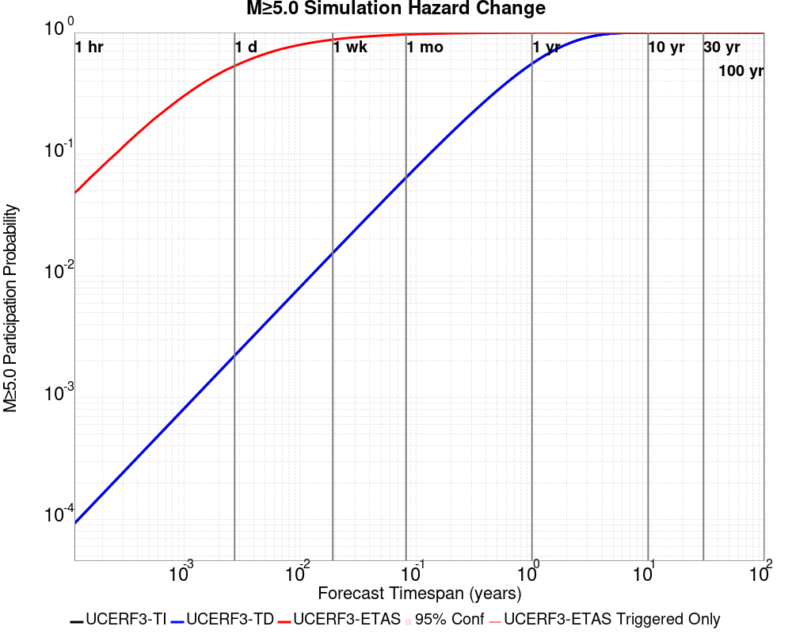
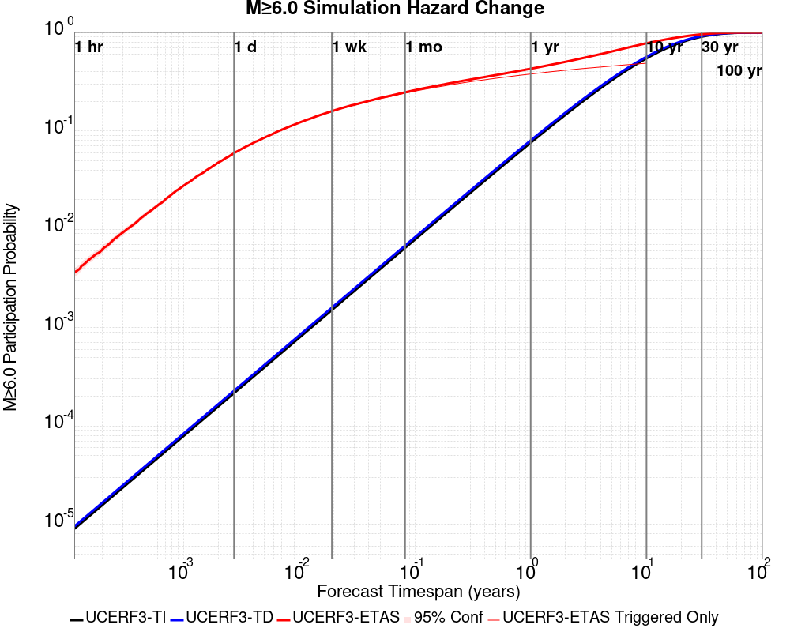
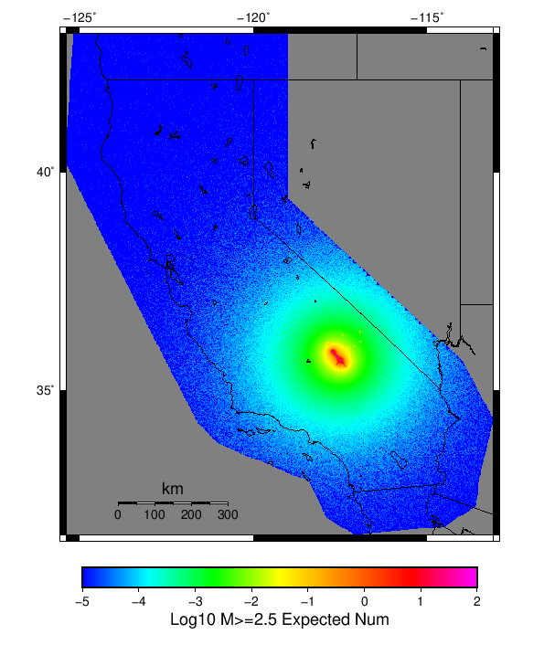
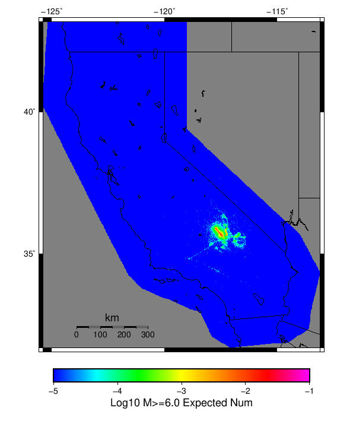
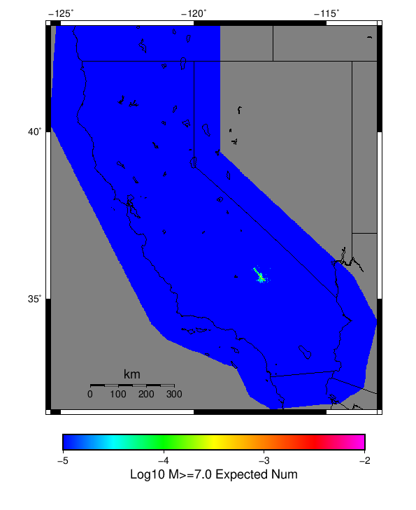

# Searless Valley Sequence Finite Fault Results

|   | Searless Valley Sequence Finite Fault |
|-----|-----|
| Num Simulations | 40788 (incomplete) |
| Start Time | 2019/07/06 19:00:00 UTC |
| Start Time Epoch Milliseconds | 1562439600000 |
| Duration | 10 Years |
| Includes Spontaneous? | false |
| Trigger Ruptures | 744 Trigger Ruptures |
|   | First: M3.98 at 2019/07/04 17:02:55 UTC |
|   | Last: M3 at 2019/07/06 18:59:41 UTC |
|   | Largest: M7.1 at 2019/07/06 03:19:52 UTC |
| Historical Ruptures | *(none)* |

## Table Of Contents

* [Magnitude Number Distribution](#magnitude-number-distribution)
  * [10 Year Magnitude Number Distribution](#10-year-magnitude-number-distribution)
  * [1 Year Magnitude Number Distribution](#1-year-magnitude-number-distribution)
  * [1 Month Magnitude Number Distribution](#1-month-magnitude-number-distribution)
  * [1 Week Magnitude Number Distribution](#1-week-magnitude-number-distribution)
  * [1 Day Magnitude Number Distribution](#1-day-magnitude-number-distribution)
  * [1 Hour Magnitude Number Distribution](#1-hour-magnitude-number-distribution)
* [Hazard Change Over Time](#hazard-change-over-time)
  * [M&ge;5.0 Hazard Change Over Time](#mge50-hazard-change-over-time)
  * [M&ge;6.0 Hazard Change Over Time](#mge60-hazard-change-over-time)
  * [M&ge;7.0 Hazard Change Over Time](#mge70-hazard-change-over-time)
  * [M&ge;8.0 Hazard Change Over Time](#mge80-hazard-change-over-time)
* [Fault Distances To Triggers](#fault-distances-to-triggers)
* [Section Participation](#section-participation)
  * [Section Participation Plots](#section-participation-plots)
  * [Supra-Seismogenic Parent Sections Table](#supra-seismogenic-parent-sections-table)
  * [M≥6.5 Parent Sections Table](#m65-parent-sections-table)
  * [M≥7 Parent Sections Table](#m7-parent-sections-table)
  * [M≥7.5 Parent Sections Table](#m75-parent-sections-table)
  * [M≥8 Parent Sections Table](#m8-parent-sections-table)
* [Gridded Nucleation](#gridded-nucleation)
* [JSON Input File](#json-input-file)

## Magnitude Number Distribution
*[(top)](#table-of-contents)*

### 10 Year Magnitude Number Distribution
*[(top)](#table-of-contents)*

**Legend**
* **Mean** (thick black line): mean expected number across all 40788 catalogs
* **2.5%,97.5%** (thin black lines): expected number percentiles across all 40788 catalogs
* **Median** (thin blue line): median expected number across all 40788 catalogs
* **Mode** (thin cyan line): modal expected number across all 40788 catalogs
* **10 yr Probability** (thin red line): 10 year probability calculated as the fraction of catalogs with at least 1 occurrence
* **95% Conf** (light red shaded region): binomial 95% confidence bounds on probability
* **Primary** (thin green line): mean expected number from primary triggered aftershocks only (no secondary, tertiary, etc...) across all 40788 catalogs


| Mag | Mean | 2.5 %ile | 97.5 %ile | Median | Mode | 10 yr Probability | Primary Aftershocks Mean |
|-----|-----|-----|-----|-----|-----|-----|-----|
| **M&ge;2.5** | 3613.917 | 2422.000 | 8618.000 | 3065.000 | 2745.000 | 1.000 | 1638.609 |
| **M&ge;2.6** | 2870.679 | 1920.000 | 6861.000 | 2435.000 | 2177.000 | 1.000 | 1301.553 |
| **M&ge;2.7** | 2280.250 | 1522.000 | 5463.000 | 1935.000 | 1751.000 | 1.000 | 1033.831 |
| **M&ge;2.8** | 1811.154 | 1204.000 | 4327.000 | 1538.000 | 1337.000 | 1.000 | 821.115 |
| **M&ge;2.9** | 1438.532 | 951.000 | 3439.000 | 1222.000 | 1051.000 | 1.000 | 652.230 |
| **M&ge;3** | 1142.505 | 751.000 | 2737.000 | 971.000 | 910.000 | 1.000 | 518.003 |
| **M&ge;3.1** | 907.472 | 593.000 | 2171.000 | 772.000 | 668.000 | 1.000 | 411.422 |
| **M&ge;3.2** | 720.757 | 468.000 | 1725.000 | 614.000 | 566.000 | 1.000 | 326.779 |
| **M&ge;3.3** | 572.543 | 368.000 | 1373.000 | 488.000 | 451.000 | 1.000 | 259.524 |
| **M&ge;3.4** | 454.699 | 290.000 | 1093.000 | 388.000 | 356.000 | 1.000 | 206.068 |
| **M&ge;3.5** | 361.115 | 228.000 | 869.000 | 309.000 | 277.000 | 1.000 | 163.653 |
| **M&ge;3.6** | 286.734 | 178.000 | 691.000 | 245.000 | 228.000 | 1.000 | 129.954 |
| **M&ge;3.7** | 227.714 | 139.000 | 552.000 | 195.000 | 180.000 | 1.000 | 103.228 |
| **M&ge;3.8** | 180.824 | 108.000 | 441.000 | 155.000 | 145.000 | 1.000 | 81.974 |
| **M&ge;3.9** | 143.562 | 84.000 | 351.000 | 123.000 | 114.000 | 1.000 | 65.062 |
| **M&ge;4** | 113.925 | 65.000 | 279.000 | 98.000 | 93.000 | 1.000 | 51.613 |
| **M&ge;4.1** | 90.449 | 50.000 | 223.000 | 78.000 | 70.000 | 1.000 | 40.965 |
| **M&ge;4.2** | 71.781 | 38.000 | 177.000 | 62.000 | 56.000 | 1.000 | 32.496 |
| **M&ge;4.3** | 56.953 | 29.000 | 142.000 | 49.000 | 45.000 | 1.000 | 25.788 |
| **M&ge;4.4** | 45.175 | 22.000 | 113.000 | 39.000 | 35.000 | 1.000 | 20.456 |
| **M&ge;4.5** | 35.804 | 16.000 | 90.000 | 31.000 | 26.000 | 1.000 | 16.220 |
| **M&ge;4.6** | 28.371 | 12.000 | 72.000 | 24.000 | 22.000 | 1.000 | 12.847 |
| **M&ge;4.7** | 22.475 | 9.000 | 58.000 | 19.000 | 18.000 | 1.000 | 10.170 |
| **M&ge;4.8** | 17.773 | 6.000 | 46.000 | 15.000 | 14.000 | 1.000 | 8.040 |
| **M&ge;4.9** | 14.055 | 4.000 | 38.000 | 12.000 | 10.000 | 1.000 | 6.350 |
| **M&ge;5** | 11.094 | 3.000 | 31.000 | 9.000 | 8.000 | 0.999 | 5.012 |
| **M&ge;5.1** | 8.750 | 2.000 | 25.000 | 7.000 | 6.000 | 0.997 | 3.956 |
| **M&ge;5.2** | 6.884 | 1.000 | 20.000 | 6.000 | 5.000 | 0.990 | 3.109 |
| **M&ge;5.3** | 5.406 | 1.000 | 16.000 | 4.000 | 3.000 | 0.975 | 2.441 |
| **M&ge;5.4** | 4.235 | 0.000 | 13.000 | 3.000 | 2.000 | 0.948 | 1.910 |
| **M&ge;5.5** | 3.310 | 0.000 | 11.000 | 3.000 | 2.000 | 0.905 | 1.492 |
| **M&ge;5.6** | 2.565 | 0.000 | 9.000 | 2.000 | 1.000 | 0.845 | 1.153 |
| **M&ge;5.7** | 1.974 | 0.000 | 7.000 | 1.000 | 1.000 | 0.770 | 0.883 |
| **M&ge;5.8** | 1.499 | 0.000 | 6.000 | 1.000 | 0.000 | 0.679 | 0.668 |
| **M&ge;5.9** | 1.127 | 0.000 | 5.000 | 1.000 | 0.000 | 0.582 | 0.500 |
| **M&ge;6** | 0.860 | 0.000 | 4.000 | 0.000 | 0.000 | 0.489 | 0.376 |
| **M&ge;6.1** | 0.614 | 0.000 | 3.000 | 0.000 | 0.000 | 0.390 | 0.272 |
| **M&ge;6.2** | 0.419 | 0.000 | 3.000 | 0.000 | 0.000 | 0.294 | 0.185 |
| **M&ge;6.3** | 0.307 | 0.000 | 2.000 | 0.000 | 0.000 | 0.228 | 0.138 |
| **M&ge;6.4** | 0.231 | 0.000 | 2.000 | 0.000 | 0.000 | 0.177 | 0.101 |
| **M&ge;6.5** | 0.174 | 0.000 | 2.000 | 0.000 | 0.000 | 0.137 | 0.076 |
| **M&ge;6.6** | 0.137 | 0.000 | 1.000 | 0.000 | 0.000 | 0.113 | 0.061 |
| **M&ge;6.7** | 0.107 | 0.000 | 1.000 | 0.000 | 0.000 | 0.091 | 0.048 |
| **M&ge;6.8** | 0.082 | 0.000 | 1.000 | 0.000 | 0.000 | 0.072 | 0.038 |
| **M&ge;6.9** | 0.058 | 0.000 | 1.000 | 0.000 | 0.000 | 0.053 | 0.027 |
| **M&ge;7** | 0.042 | 0.000 | 1.000 | 0.000 | 0.000 | 0.040 | 0.019 |
| **M&ge;7.1** | 0.033 | 0.000 | 1.000 | 0.000 | 0.000 | 0.032 | 0.015 |
| **M&ge;7.2** | 0.024 | 0.000 | 0.000 | 0.000 | 0.000 | 0.023 | 0.010 |
| **M&ge;7.3** | 0.017 | 0.000 | 0.000 | 0.000 | 0.000 | 0.017 | 7.11E-3 |
| **M&ge;7.4** | 0.015 | 0.000 | 0.000 | 0.000 | 0.000 | 0.015 | 6.03E-3 |
| **M&ge;7.5** | 0.011 | 0.000 | 0.000 | 0.000 | 0.000 | 0.011 | 4.71E-3 |
| **M&ge;7.6** | 5.64E-3 | 0.000 | 0.000 | 0.000 | 0.000 | 5.59E-3 | 2.28E-3 |
| **M&ge;7.7** | 1.77E-3 | 0.000 | 0.000 | 0.000 | 0.000 | 1.77E-3 | 6.13E-4 |
| **M&ge;7.8** | 9.07E-4 | 0.000 | 0.000 | 0.000 | 0.000 | 9.07E-4 | 4.66E-4 |
| **M&ge;7.9** | 4.41E-4 | 0.000 | 0.000 | 0.000 | 0.000 | 4.41E-4 | 2.45E-4 |
| **M&ge;8** | 7.36E-5 | 0.000 | 0.000 | 0.000 | 0.000 | 7.36E-5 | 4.90E-5 |
| **M&ge;8.1** | 0.000 | 0.000 | 0.000 | 0.000 | 0.000 | 0.000 | 0.000 |
| **M&ge;8.2** | 0.000 | 0.000 | 0.000 | 0.000 | 0.000 | 0.000 | 0.000 |
| **M&ge;8.3** | 0.000 | 0.000 | 0.000 | 0.000 | 0.000 | 0.000 | 0.000 |
| **M&ge;8.4** | 0.000 | 0.000 | 0.000 | 0.000 | 0.000 | 0.000 | 0.000 |
| **M&ge;8.5** | 0.000 | 0.000 | 0.000 | 0.000 | 0.000 | 0.000 | 0.000 |
| **M&ge;8.6** | 0.000 | 0.000 | 0.000 | 0.000 | 0.000 | 0.000 | 0.000 |
| **M&ge;8.7** | 0.000 | 0.000 | 0.000 | 0.000 | 0.000 | 0.000 | 0.000 |
| **M&ge;8.8** | 0.000 | 0.000 | 0.000 | 0.000 | 0.000 | 0.000 | 0.000 |
| **M&ge;8.9** | 0.000 | 0.000 | 0.000 | 0.000 | 0.000 | 0.000 | 0.000 |
| **M&ge;9** | 0.000 | 0.000 | 0.000 | 0.000 | 0.000 | 0.000 | 0.000 |

### 1 Year Magnitude Number Distribution
*[(top)](#table-of-contents)*

**Legend**
* **Mean** (thick black line): mean expected number across all 40788 catalogs
* **2.5%,97.5%** (thin black lines): expected number percentiles across all 40788 catalogs
* **Median** (thin blue line): median expected number across all 40788 catalogs
* **Mode** (thin cyan line): modal expected number across all 40788 catalogs
* **1 yr Probability** (thin red line): 1 year probability calculated as the fraction of catalogs with at least 1 occurrence
* **95% Conf** (light red shaded region): binomial 95% confidence bounds on probability
* **Primary** (thin green line): mean expected number from primary triggered aftershocks only (no secondary, tertiary, etc...) across all 40788 catalogs


| Mag | Mean | 2.5 %ile | 97.5 %ile | Median | Mode | 1 yr Probability | Primary Aftershocks Mean |
|-----|-----|-----|-----|-----|-----|-----|-----|
| **M&ge;2.5** | 2467.150 | 1749.000 | 5373.000 | 2144.000 | 1940.000 | 1.000 | 1284.929 |
| **M&ge;2.6** | 1959.760 | 1385.000 | 4273.000 | 1703.000 | 1584.000 | 1.000 | 1020.619 |
| **M&ge;2.7** | 1556.762 | 1095.000 | 3399.000 | 1354.000 | 1294.000 | 1.000 | 810.706 |
| **M&ge;2.8** | 1236.554 | 866.000 | 2695.000 | 1076.000 | 997.000 | 1.000 | 643.919 |
| **M&ge;2.9** | 982.133 | 683.000 | 2144.000 | 855.000 | 780.000 | 1.000 | 511.454 |
| **M&ge;3** | 780.015 | 539.000 | 1699.000 | 680.000 | 622.000 | 1.000 | 406.199 |
| **M&ge;3.1** | 619.598 | 424.000 | 1348.000 | 540.000 | 497.000 | 1.000 | 322.619 |
| **M&ge;3.2** | 492.097 | 334.000 | 1072.000 | 429.000 | 399.000 | 1.000 | 256.229 |
| **M&ge;3.3** | 390.866 | 262.000 | 854.000 | 342.000 | 324.000 | 1.000 | 203.479 |
| **M&ge;3.4** | 310.405 | 205.000 | 677.000 | 271.000 | 246.000 | 1.000 | 161.559 |
| **M&ge;3.5** | 246.528 | 160.000 | 540.000 | 216.000 | 198.000 | 1.000 | 128.328 |
| **M&ge;3.6** | 195.735 | 125.000 | 428.000 | 172.000 | 154.000 | 1.000 | 101.898 |
| **M&ge;3.7** | 155.432 | 97.000 | 340.000 | 137.000 | 132.000 | 1.000 | 80.937 |
| **M&ge;3.8** | 123.411 | 75.000 | 272.000 | 109.000 | 101.000 | 1.000 | 64.270 |
| **M&ge;3.9** | 97.982 | 58.000 | 215.000 | 86.000 | 80.000 | 1.000 | 51.009 |
| **M&ge;4** | 77.738 | 44.000 | 171.000 | 68.000 | 60.000 | 1.000 | 40.462 |
| **M&ge;4.1** | 61.710 | 34.000 | 137.000 | 54.000 | 50.000 | 1.000 | 32.117 |
| **M&ge;4.2** | 48.962 | 26.000 | 110.000 | 43.000 | 39.000 | 1.000 | 25.467 |
| **M&ge;4.3** | 38.831 | 19.000 | 88.000 | 34.000 | 32.000 | 1.000 | 20.204 |
| **M&ge;4.4** | 30.792 | 14.000 | 71.000 | 27.000 | 24.000 | 1.000 | 16.028 |
| **M&ge;4.5** | 24.397 | 10.000 | 57.000 | 22.000 | 19.000 | 1.000 | 12.702 |
| **M&ge;4.6** | 19.330 | 8.000 | 46.000 | 17.000 | 15.000 | 1.000 | 10.062 |
| **M&ge;4.7** | 15.310 | 5.000 | 37.000 | 13.000 | 12.000 | 1.000 | 7.966 |
| **M&ge;4.8** | 12.103 | 4.000 | 30.000 | 11.000 | 9.000 | 1.000 | 6.298 |
| **M&ge;4.9** | 9.574 | 2.000 | 24.000 | 8.000 | 7.000 | 0.999 | 4.974 |
| **M&ge;5** | 7.551 | 1.000 | 20.000 | 7.000 | 5.000 | 0.995 | 3.924 |
| **M&ge;5.1** | 5.961 | 1.000 | 16.000 | 5.000 | 4.000 | 0.986 | 3.098 |
| **M&ge;5.2** | 4.687 | 0.000 | 14.000 | 4.000 | 3.000 | 0.968 | 2.436 |
| **M&ge;5.3** | 3.685 | 0.000 | 11.000 | 3.000 | 2.000 | 0.935 | 1.913 |
| **M&ge;5.4** | 2.882 | 0.000 | 9.000 | 2.000 | 2.000 | 0.886 | 1.495 |
| **M&ge;5.5** | 2.253 | 0.000 | 8.000 | 2.000 | 1.000 | 0.822 | 1.167 |
| **M&ge;5.6** | 1.744 | 0.000 | 6.000 | 1.000 | 1.000 | 0.743 | 0.903 |
| **M&ge;5.7** | 1.341 | 0.000 | 5.000 | 1.000 | 0.000 | 0.653 | 0.690 |
| **M&ge;5.8** | 1.018 | 0.000 | 4.000 | 1.000 | 0.000 | 0.557 | 0.520 |
| **M&ge;5.9** | 0.765 | 0.000 | 4.000 | 0.000 | 0.000 | 0.464 | 0.389 |
| **M&ge;6** | 0.582 | 0.000 | 3.000 | 0.000 | 0.000 | 0.381 | 0.293 |
| **M&ge;6.1** | 0.416 | 0.000 | 3.000 | 0.000 | 0.000 | 0.296 | 0.212 |
| **M&ge;6.2** | 0.284 | 0.000 | 2.000 | 0.000 | 0.000 | 0.217 | 0.144 |
| **M&ge;6.3** | 0.208 | 0.000 | 2.000 | 0.000 | 0.000 | 0.166 | 0.107 |
| **M&ge;6.4** | 0.156 | 0.000 | 1.000 | 0.000 | 0.000 | 0.128 | 0.079 |
| **M&ge;6.5** | 0.117 | 0.000 | 1.000 | 0.000 | 0.000 | 0.099 | 0.059 |
| **M&ge;6.6** | 0.093 | 0.000 | 1.000 | 0.000 | 0.000 | 0.081 | 0.048 |
| **M&ge;6.7** | 0.072 | 0.000 | 1.000 | 0.000 | 0.000 | 0.064 | 0.038 |
| **M&ge;6.8** | 0.056 | 0.000 | 1.000 | 0.000 | 0.000 | 0.051 | 0.029 |
| **M&ge;6.9** | 0.040 | 0.000 | 1.000 | 0.000 | 0.000 | 0.037 | 0.022 |
| **M&ge;7** | 0.029 | 0.000 | 1.000 | 0.000 | 0.000 | 0.028 | 0.015 |
| **M&ge;7.1** | 0.023 | 0.000 | 0.000 | 0.000 | 0.000 | 0.022 | 0.012 |
| **M&ge;7.2** | 0.016 | 0.000 | 0.000 | 0.000 | 0.000 | 0.016 | 7.99E-3 |
| **M&ge;7.3** | 0.012 | 0.000 | 0.000 | 0.000 | 0.000 | 0.011 | 5.61E-3 |
| **M&ge;7.4** | 0.010 | 0.000 | 0.000 | 0.000 | 0.000 | 9.81E-3 | 4.88E-3 |
| **M&ge;7.5** | 7.67E-3 | 0.000 | 0.000 | 0.000 | 0.000 | 7.50E-3 | 3.75E-3 |
| **M&ge;7.6** | 3.95E-3 | 0.000 | 0.000 | 0.000 | 0.000 | 3.90E-3 | 1.86E-3 |
| **M&ge;7.7** | 1.18E-3 | 0.000 | 0.000 | 0.000 | 0.000 | 1.18E-3 | 4.90E-4 |
| **M&ge;7.8** | 5.88E-4 | 0.000 | 0.000 | 0.000 | 0.000 | 5.88E-4 | 3.43E-4 |
| **M&ge;7.9** | 3.43E-4 | 0.000 | 0.000 | 0.000 | 0.000 | 3.43E-4 | 2.21E-4 |
| **M&ge;8** | 4.90E-5 | 0.000 | 0.000 | 0.000 | 0.000 | 4.90E-5 | 2.45E-5 |
| **M&ge;8.1** | 0.000 | 0.000 | 0.000 | 0.000 | 0.000 | 0.000 | 0.000 |
| **M&ge;8.2** | 0.000 | 0.000 | 0.000 | 0.000 | 0.000 | 0.000 | 0.000 |
| **M&ge;8.3** | 0.000 | 0.000 | 0.000 | 0.000 | 0.000 | 0.000 | 0.000 |
| **M&ge;8.4** | 0.000 | 0.000 | 0.000 | 0.000 | 0.000 | 0.000 | 0.000 |
| **M&ge;8.5** | 0.000 | 0.000 | 0.000 | 0.000 | 0.000 | 0.000 | 0.000 |
| **M&ge;8.6** | 0.000 | 0.000 | 0.000 | 0.000 | 0.000 | 0.000 | 0.000 |
| **M&ge;8.7** | 0.000 | 0.000 | 0.000 | 0.000 | 0.000 | 0.000 | 0.000 |
| **M&ge;8.8** | 0.000 | 0.000 | 0.000 | 0.000 | 0.000 | 0.000 | 0.000 |
| **M&ge;8.9** | 0.000 | 0.000 | 0.000 | 0.000 | 0.000 | 0.000 | 0.000 |
| **M&ge;9** | 0.000 | 0.000 | 0.000 | 0.000 | 0.000 | 0.000 | 0.000 |

### 1 Month Magnitude Number Distribution
*[(top)](#table-of-contents)*

**Legend**
* **Mean** (thick black line): mean expected number across all 40788 catalogs
* **2.5%,97.5%** (thin black lines): expected number percentiles across all 40788 catalogs
* **Median** (thin blue line): median expected number across all 40788 catalogs
* **Mode** (thin cyan line): modal expected number across all 40788 catalogs
* **1 mo Probability** (thin red line): 1 month probability calculated as the fraction of catalogs with at least 1 occurrence
* **95% Conf** (light red shaded region): binomial 95% confidence bounds on probability
* **Primary** (thin green line): mean expected number from primary triggered aftershocks only (no secondary, tertiary, etc...) across all 40788 catalogs



| Mag | Mean | 2.5 %ile | 97.5 %ile | Median | Mode | 1 mo Probability | Primary Aftershocks Mean |
|-----|-----|-----|-----|-----|-----|-----|-----|
| **M&ge;2.5** | 1372.966 | 1026.000 | 2671.000 | 1222.000 | 1137.000 | 1.000 | 835.410 |
| **M&ge;2.6** | 1090.553 | 811.000 | 2115.000 | 971.000 | 904.000 | 1.000 | 663.516 |
| **M&ge;2.7** | 866.319 | 640.000 | 1680.000 | 772.000 | 724.000 | 1.000 | 527.054 |
| **M&ge;2.8** | 688.069 | 505.000 | 1337.000 | 613.000 | 583.000 | 1.000 | 418.624 |
| **M&ge;2.9** | 546.483 | 397.000 | 1061.000 | 487.000 | 450.000 | 1.000 | 332.496 |
| **M&ge;3** | 434.036 | 311.000 | 845.000 | 388.000 | 364.000 | 1.000 | 264.070 |
| **M&ge;3.1** | 344.735 | 245.000 | 670.000 | 308.000 | 295.000 | 1.000 | 209.697 |
| **M&ge;3.2** | 273.768 | 191.000 | 533.000 | 245.000 | 236.000 | 1.000 | 166.532 |
| **M&ge;3.3** | 217.457 | 150.000 | 424.000 | 195.000 | 181.000 | 1.000 | 132.273 |
| **M&ge;3.4** | 172.685 | 117.000 | 336.000 | 155.000 | 147.000 | 1.000 | 105.037 |
| **M&ge;3.5** | 137.157 | 90.000 | 269.000 | 123.000 | 118.000 | 1.000 | 83.423 |
| **M&ge;3.6** | 108.912 | 70.000 | 214.000 | 98.000 | 91.000 | 1.000 | 66.255 |
| **M&ge;3.7** | 86.516 | 54.000 | 170.000 | 78.000 | 73.000 | 1.000 | 52.639 |
| **M&ge;3.8** | 68.677 | 41.000 | 136.000 | 62.000 | 59.000 | 1.000 | 41.789 |
| **M&ge;3.9** | 54.530 | 31.000 | 109.000 | 49.000 | 47.000 | 1.000 | 33.181 |
| **M&ge;4** | 43.267 | 24.000 | 88.000 | 39.000 | 37.000 | 1.000 | 26.323 |
| **M&ge;4.1** | 34.345 | 18.000 | 70.000 | 31.000 | 30.000 | 1.000 | 20.897 |
| **M&ge;4.2** | 27.254 | 13.000 | 56.000 | 25.000 | 22.000 | 1.000 | 16.569 |
| **M&ge;4.3** | 21.602 | 10.000 | 45.000 | 19.000 | 18.000 | 1.000 | 13.136 |
| **M&ge;4.4** | 17.127 | 7.000 | 36.000 | 15.000 | 14.000 | 1.000 | 10.414 |
| **M&ge;4.5** | 13.574 | 5.000 | 30.000 | 12.000 | 11.000 | 1.000 | 8.259 |
| **M&ge;4.6** | 10.750 | 3.000 | 24.000 | 10.000 | 8.000 | 1.000 | 6.536 |
| **M&ge;4.7** | 8.513 | 2.000 | 20.000 | 8.000 | 7.000 | 0.998 | 5.178 |
| **M&ge;4.8** | 6.738 | 1.000 | 17.000 | 6.000 | 5.000 | 0.994 | 4.100 |
| **M&ge;4.9** | 5.333 | 1.000 | 14.000 | 5.000 | 4.000 | 0.984 | 3.239 |
| **M&ge;5** | 4.206 | 0.000 | 11.000 | 4.000 | 3.000 | 0.962 | 2.556 |
| **M&ge;5.1** | 3.322 | 0.000 | 10.000 | 3.000 | 2.000 | 0.927 | 2.019 |
| **M&ge;5.2** | 2.613 | 0.000 | 8.000 | 2.000 | 1.000 | 0.875 | 1.588 |
| **M&ge;5.3** | 2.051 | 0.000 | 7.000 | 2.000 | 1.000 | 0.807 | 1.246 |
| **M&ge;5.4** | 1.605 | 0.000 | 6.000 | 1.000 | 1.000 | 0.729 | 0.976 |
| **M&ge;5.5** | 1.257 | 0.000 | 5.000 | 1.000 | 0.000 | 0.645 | 0.764 |
| **M&ge;5.6** | 0.972 | 0.000 | 4.000 | 1.000 | 0.000 | 0.556 | 0.591 |
| **M&ge;5.7** | 0.746 | 0.000 | 3.000 | 0.000 | 0.000 | 0.466 | 0.452 |
| **M&ge;5.8** | 0.565 | 0.000 | 3.000 | 0.000 | 0.000 | 0.383 | 0.340 |
| **M&ge;5.9** | 0.424 | 0.000 | 2.000 | 0.000 | 0.000 | 0.307 | 0.254 |
| **M&ge;6** | 0.322 | 0.000 | 2.000 | 0.000 | 0.000 | 0.244 | 0.191 |
| **M&ge;6.1** | 0.231 | 0.000 | 2.000 | 0.000 | 0.000 | 0.185 | 0.138 |
| **M&ge;6.2** | 0.157 | 0.000 | 1.000 | 0.000 | 0.000 | 0.132 | 0.094 |
| **M&ge;6.3** | 0.115 | 0.000 | 1.000 | 0.000 | 0.000 | 0.099 | 0.070 |
| **M&ge;6.4** | 0.086 | 0.000 | 1.000 | 0.000 | 0.000 | 0.075 | 0.052 |
| **M&ge;6.5** | 0.065 | 0.000 | 1.000 | 0.000 | 0.000 | 0.058 | 0.039 |
| **M&ge;6.6** | 0.052 | 0.000 | 1.000 | 0.000 | 0.000 | 0.048 | 0.032 |
| **M&ge;6.7** | 0.041 | 0.000 | 1.000 | 0.000 | 0.000 | 0.037 | 0.025 |
| **M&ge;6.8** | 0.031 | 0.000 | 1.000 | 0.000 | 0.000 | 0.029 | 0.019 |
| **M&ge;6.9** | 0.023 | 0.000 | 0.000 | 0.000 | 0.000 | 0.022 | 0.014 |
| **M&ge;7** | 0.017 | 0.000 | 0.000 | 0.000 | 0.000 | 0.016 | 0.010 |
| **M&ge;7.1** | 0.013 | 0.000 | 0.000 | 0.000 | 0.000 | 0.013 | 8.19E-3 |
| **M&ge;7.2** | 9.46E-3 | 0.000 | 0.000 | 0.000 | 0.000 | 9.22E-3 | 5.42E-3 |
| **M&ge;7.3** | 6.74E-3 | 0.000 | 0.000 | 0.000 | 0.000 | 6.55E-3 | 3.80E-3 |
| **M&ge;7.4** | 5.66E-3 | 0.000 | 0.000 | 0.000 | 0.000 | 5.52E-3 | 3.29E-3 |
| **M&ge;7.5** | 4.31E-3 | 0.000 | 0.000 | 0.000 | 0.000 | 4.24E-3 | 2.48E-3 |
| **M&ge;7.6** | 2.43E-3 | 0.000 | 0.000 | 0.000 | 0.000 | 2.43E-3 | 1.35E-3 |
| **M&ge;7.7** | 7.36E-4 | 0.000 | 0.000 | 0.000 | 0.000 | 7.36E-4 | 3.92E-4 |
| **M&ge;7.8** | 4.41E-4 | 0.000 | 0.000 | 0.000 | 0.000 | 4.41E-4 | 2.70E-4 |
| **M&ge;7.9** | 2.45E-4 | 0.000 | 0.000 | 0.000 | 0.000 | 2.45E-4 | 1.72E-4 |
| **M&ge;8** | 2.45E-5 | 0.000 | 0.000 | 0.000 | 0.000 | 2.45E-5 | 2.45E-5 |
| **M&ge;8.1** | 0.000 | 0.000 | 0.000 | 0.000 | 0.000 | 0.000 | 0.000 |
| **M&ge;8.2** | 0.000 | 0.000 | 0.000 | 0.000 | 0.000 | 0.000 | 0.000 |
| **M&ge;8.3** | 0.000 | 0.000 | 0.000 | 0.000 | 0.000 | 0.000 | 0.000 |
| **M&ge;8.4** | 0.000 | 0.000 | 0.000 | 0.000 | 0.000 | 0.000 | 0.000 |
| **M&ge;8.5** | 0.000 | 0.000 | 0.000 | 0.000 | 0.000 | 0.000 | 0.000 |
| **M&ge;8.6** | 0.000 | 0.000 | 0.000 | 0.000 | 0.000 | 0.000 | 0.000 |
| **M&ge;8.7** | 0.000 | 0.000 | 0.000 | 0.000 | 0.000 | 0.000 | 0.000 |
| **M&ge;8.8** | 0.000 | 0.000 | 0.000 | 0.000 | 0.000 | 0.000 | 0.000 |
| **M&ge;8.9** | 0.000 | 0.000 | 0.000 | 0.000 | 0.000 | 0.000 | 0.000 |
| **M&ge;9** | 0.000 | 0.000 | 0.000 | 0.000 | 0.000 | 0.000 | 0.000 |

### 1 Week Magnitude Number Distribution
*[(top)](#table-of-contents)*

**Legend**
* **Mean** (thick black line): mean expected number across all 40788 catalogs
* **2.5%,97.5%** (thin black lines): expected number percentiles across all 40788 catalogs
* **Median** (thin blue line): median expected number across all 40788 catalogs
* **Mode** (thin cyan line): modal expected number across all 40788 catalogs
* **1 wk Probability** (thin red line): 1 week probability calculated as the fraction of catalogs with at least 1 occurrence
* **95% Conf** (light red shaded region): binomial 95% confidence bounds on probability
* **Primary** (thin green line): mean expected number from primary triggered aftershocks only (no secondary, tertiary, etc...) across all 40788 catalogs



| Mag | Mean | 2.5 %ile | 97.5 %ile | Median | Mode | 1 wk Probability | Primary Aftershocks Mean |
|-----|-----|-----|-----|-----|-----|-----|-----|
| **M&ge;2.5** | 821.773 | 630.000 | 1431.000 | 742.000 | 709.000 | 1.000 | 551.310 |
| **M&ge;2.6** | 652.695 | 497.000 | 1140.000 | 590.000 | 568.000 | 1.000 | 437.840 |
| **M&ge;2.7** | 518.508 | 391.000 | 905.000 | 469.000 | 455.000 | 1.000 | 347.813 |
| **M&ge;2.8** | 411.815 | 307.000 | 720.000 | 373.000 | 356.000 | 1.000 | 276.247 |
| **M&ge;2.9** | 327.078 | 241.000 | 573.000 | 297.000 | 287.000 | 1.000 | 219.403 |
| **M&ge;3** | 259.770 | 188.000 | 454.000 | 236.000 | 225.000 | 1.000 | 174.252 |
| **M&ge;3.1** | 206.307 | 147.000 | 363.000 | 188.000 | 179.000 | 1.000 | 138.368 |
| **M&ge;3.2** | 163.824 | 114.000 | 289.000 | 149.000 | 141.000 | 1.000 | 109.889 |
| **M&ge;3.3** | 130.154 | 89.000 | 229.000 | 119.000 | 111.000 | 1.000 | 87.299 |
| **M&ge;3.4** | 103.387 | 69.000 | 183.000 | 94.000 | 92.000 | 1.000 | 69.347 |
| **M&ge;3.5** | 82.131 | 53.000 | 147.000 | 75.000 | 71.000 | 1.000 | 55.080 |
| **M&ge;3.6** | 65.207 | 40.000 | 117.000 | 60.000 | 56.000 | 1.000 | 43.733 |
| **M&ge;3.7** | 51.793 | 31.000 | 94.000 | 47.000 | 43.000 | 1.000 | 34.743 |
| **M&ge;3.8** | 41.128 | 23.000 | 76.000 | 38.000 | 37.000 | 1.000 | 27.593 |
| **M&ge;3.9** | 32.664 | 17.000 | 61.000 | 30.000 | 29.000 | 1.000 | 21.919 |
| **M&ge;4** | 25.924 | 13.000 | 49.000 | 24.000 | 23.000 | 1.000 | 17.396 |
| **M&ge;4.1** | 20.581 | 9.000 | 40.000 | 19.000 | 18.000 | 1.000 | 13.811 |
| **M&ge;4.2** | 16.329 | 7.000 | 32.000 | 15.000 | 14.000 | 1.000 | 10.954 |
| **M&ge;4.3** | 12.939 | 5.000 | 26.000 | 12.000 | 11.000 | 1.000 | 8.683 |
| **M&ge;4.4** | 10.264 | 3.000 | 22.000 | 9.000 | 8.000 | 1.000 | 6.887 |
| **M&ge;4.5** | 8.137 | 2.000 | 18.000 | 7.000 | 7.000 | 0.999 | 5.465 |
| **M&ge;4.6** | 6.444 | 1.000 | 15.000 | 6.000 | 5.000 | 0.994 | 4.328 |
| **M&ge;4.7** | 5.105 | 1.000 | 13.000 | 4.000 | 4.000 | 0.983 | 3.429 |
| **M&ge;4.8** | 4.037 | 0.000 | 11.000 | 4.000 | 3.000 | 0.961 | 2.711 |
| **M&ge;4.9** | 3.191 | 0.000 | 9.000 | 3.000 | 2.000 | 0.926 | 2.140 |
| **M&ge;5** | 2.520 | 0.000 | 7.000 | 2.000 | 2.000 | 0.873 | 1.691 |
| **M&ge;5.1** | 1.989 | 0.000 | 6.000 | 2.000 | 1.000 | 0.807 | 1.334 |
| **M&ge;5.2** | 1.561 | 0.000 | 5.000 | 1.000 | 1.000 | 0.729 | 1.046 |
| **M&ge;5.3** | 1.225 | 0.000 | 5.000 | 1.000 | 0.000 | 0.644 | 0.821 |
| **M&ge;5.4** | 0.958 | 0.000 | 4.000 | 1.000 | 0.000 | 0.558 | 0.643 |
| **M&ge;5.5** | 0.751 | 0.000 | 3.000 | 0.000 | 0.000 | 0.476 | 0.504 |
| **M&ge;5.6** | 0.579 | 0.000 | 3.000 | 0.000 | 0.000 | 0.395 | 0.388 |
| **M&ge;5.7** | 0.443 | 0.000 | 2.000 | 0.000 | 0.000 | 0.321 | 0.295 |
| **M&ge;5.8** | 0.335 | 0.000 | 2.000 | 0.000 | 0.000 | 0.256 | 0.223 |
| **M&ge;5.9** | 0.252 | 0.000 | 2.000 | 0.000 | 0.000 | 0.202 | 0.167 |
| **M&ge;6** | 0.192 | 0.000 | 2.000 | 0.000 | 0.000 | 0.158 | 0.126 |
| **M&ge;6.1** | 0.137 | 0.000 | 1.000 | 0.000 | 0.000 | 0.118 | 0.092 |
| **M&ge;6.2** | 0.093 | 0.000 | 1.000 | 0.000 | 0.000 | 0.083 | 0.062 |
| **M&ge;6.3** | 0.069 | 0.000 | 1.000 | 0.000 | 0.000 | 0.062 | 0.046 |
| **M&ge;6.4** | 0.051 | 0.000 | 1.000 | 0.000 | 0.000 | 0.047 | 0.034 |
| **M&ge;6.5** | 0.038 | 0.000 | 1.000 | 0.000 | 0.000 | 0.036 | 0.025 |
| **M&ge;6.6** | 0.031 | 0.000 | 1.000 | 0.000 | 0.000 | 0.029 | 0.020 |
| **M&ge;6.7** | 0.024 | 0.000 | 0.000 | 0.000 | 0.000 | 0.022 | 0.016 |
| **M&ge;6.8** | 0.018 | 0.000 | 0.000 | 0.000 | 0.000 | 0.018 | 0.012 |
| **M&ge;6.9** | 0.014 | 0.000 | 0.000 | 0.000 | 0.000 | 0.013 | 9.34E-3 |
| **M&ge;7** | 9.95E-3 | 0.000 | 0.000 | 0.000 | 0.000 | 9.71E-3 | 6.62E-3 |
| **M&ge;7.1** | 7.85E-3 | 0.000 | 0.000 | 0.000 | 0.000 | 7.72E-3 | 5.17E-3 |
| **M&ge;7.2** | 5.52E-3 | 0.000 | 0.000 | 0.000 | 0.000 | 5.42E-3 | 3.29E-3 |
| **M&ge;7.3** | 4.02E-3 | 0.000 | 0.000 | 0.000 | 0.000 | 3.97E-3 | 2.40E-3 |
| **M&ge;7.4** | 3.31E-3 | 0.000 | 0.000 | 0.000 | 0.000 | 3.29E-3 | 2.06E-3 |
| **M&ge;7.5** | 2.53E-3 | 0.000 | 0.000 | 0.000 | 0.000 | 2.53E-3 | 1.59E-3 |
| **M&ge;7.6** | 1.47E-3 | 0.000 | 0.000 | 0.000 | 0.000 | 1.47E-3 | 9.07E-4 |
| **M&ge;7.7** | 4.41E-4 | 0.000 | 0.000 | 0.000 | 0.000 | 4.41E-4 | 2.94E-4 |
| **M&ge;7.8** | 2.70E-4 | 0.000 | 0.000 | 0.000 | 0.000 | 2.70E-4 | 1.96E-4 |
| **M&ge;7.9** | 2.21E-4 | 0.000 | 0.000 | 0.000 | 0.000 | 2.21E-4 | 1.47E-4 |
| **M&ge;8** | 2.45E-5 | 0.000 | 0.000 | 0.000 | 0.000 | 2.45E-5 | 2.45E-5 |
| **M&ge;8.1** | 0.000 | 0.000 | 0.000 | 0.000 | 0.000 | 0.000 | 0.000 |
| **M&ge;8.2** | 0.000 | 0.000 | 0.000 | 0.000 | 0.000 | 0.000 | 0.000 |
| **M&ge;8.3** | 0.000 | 0.000 | 0.000 | 0.000 | 0.000 | 0.000 | 0.000 |
| **M&ge;8.4** | 0.000 | 0.000 | 0.000 | 0.000 | 0.000 | 0.000 | 0.000 |
| **M&ge;8.5** | 0.000 | 0.000 | 0.000 | 0.000 | 0.000 | 0.000 | 0.000 |
| **M&ge;8.6** | 0.000 | 0.000 | 0.000 | 0.000 | 0.000 | 0.000 | 0.000 |
| **M&ge;8.7** | 0.000 | 0.000 | 0.000 | 0.000 | 0.000 | 0.000 | 0.000 |
| **M&ge;8.8** | 0.000 | 0.000 | 0.000 | 0.000 | 0.000 | 0.000 | 0.000 |
| **M&ge;8.9** | 0.000 | 0.000 | 0.000 | 0.000 | 0.000 | 0.000 | 0.000 |
| **M&ge;9** | 0.000 | 0.000 | 0.000 | 0.000 | 0.000 | 0.000 | 0.000 |

### 1 Day Magnitude Number Distribution
*[(top)](#table-of-contents)*

**Legend**
* **Mean** (thick black line): mean expected number across all 40788 catalogs
* **2.5%,97.5%** (thin black lines): expected number percentiles across all 40788 catalogs
* **Median** (thin blue line): median expected number across all 40788 catalogs
* **Mode** (thin cyan line): modal expected number across all 40788 catalogs
* **1 d Probability** (thin red line): 1 day probability calculated as the fraction of catalogs with at least 1 occurrence
* **95% Conf** (light red shaded region): binomial 95% confidence bounds on probability
* **Primary** (thin green line): mean expected number from primary triggered aftershocks only (no secondary, tertiary, etc...) across all 40788 catalogs


| Mag | Mean | 2.5 %ile | 97.5 %ile | Median | Mode | 1 d Probability | Primary Aftershocks Mean |
|-----|-----|-----|-----|-----|-----|-----|-----|
| **M&ge;2.5** | 281.942 | 215.000 | 440.000 | 260.000 | 253.000 | 1.000 | 215.411 |
| **M&ge;2.6** | 223.943 | 168.000 | 350.000 | 207.000 | 202.000 | 1.000 | 171.094 |
| **M&ge;2.7** | 177.863 | 131.000 | 280.000 | 164.000 | 162.000 | 1.000 | 135.879 |
| **M&ge;2.8** | 141.246 | 102.000 | 223.000 | 131.000 | 122.000 | 1.000 | 107.912 |
| **M&ge;2.9** | 112.193 | 79.000 | 178.000 | 104.000 | 99.000 | 1.000 | 85.709 |
| **M&ge;3** | 89.122 | 61.000 | 143.000 | 83.000 | 78.000 | 1.000 | 68.082 |
| **M&ge;3.1** | 70.784 | 47.000 | 114.000 | 66.000 | 64.000 | 1.000 | 54.059 |
| **M&ge;3.2** | 56.190 | 36.000 | 92.000 | 52.000 | 51.000 | 1.000 | 42.911 |
| **M&ge;3.3** | 44.634 | 27.000 | 74.000 | 41.000 | 41.000 | 1.000 | 34.094 |
| **M&ge;3.4** | 35.449 | 20.000 | 60.000 | 33.000 | 31.000 | 1.000 | 27.091 |
| **M&ge;3.5** | 28.171 | 15.000 | 48.000 | 26.000 | 24.000 | 1.000 | 21.522 |
| **M&ge;3.6** | 22.372 | 11.000 | 39.000 | 21.000 | 20.000 | 1.000 | 17.090 |
| **M&ge;3.7** | 17.758 | 8.000 | 32.000 | 16.000 | 15.000 | 1.000 | 13.567 |
| **M&ge;3.8** | 14.098 | 6.000 | 26.000 | 13.000 | 12.000 | 1.000 | 10.773 |
| **M&ge;3.9** | 11.206 | 4.000 | 22.000 | 10.000 | 9.000 | 1.000 | 8.564 |
| **M&ge;4** | 8.899 | 3.000 | 18.000 | 8.000 | 7.000 | 0.999 | 6.804 |
| **M&ge;4.1** | 7.062 | 2.000 | 15.000 | 6.000 | 6.000 | 0.997 | 5.398 |
| **M&ge;4.2** | 5.598 | 1.000 | 12.000 | 5.000 | 5.000 | 0.991 | 4.277 |
| **M&ge;4.3** | 4.439 | 1.000 | 10.000 | 4.000 | 3.000 | 0.976 | 3.389 |
| **M&ge;4.4** | 3.518 | 0.000 | 9.000 | 3.000 | 3.000 | 0.948 | 2.687 |
| **M&ge;4.5** | 2.789 | 0.000 | 7.000 | 2.000 | 2.000 | 0.908 | 2.133 |
| **M&ge;4.6** | 2.211 | 0.000 | 6.000 | 2.000 | 1.000 | 0.851 | 1.691 |
| **M&ge;4.7** | 1.751 | 0.000 | 5.000 | 1.000 | 1.000 | 0.781 | 1.338 |
| **M&ge;4.8** | 1.383 | 0.000 | 5.000 | 1.000 | 1.000 | 0.700 | 1.057 |
| **M&ge;4.9** | 1.094 | 0.000 | 4.000 | 1.000 | 0.000 | 0.617 | 0.835 |
| **M&ge;5** | 0.864 | 0.000 | 3.000 | 1.000 | 0.000 | 0.534 | 0.660 |
| **M&ge;5.1** | 0.684 | 0.000 | 3.000 | 0.000 | 0.000 | 0.455 | 0.522 |
| **M&ge;5.2** | 0.537 | 0.000 | 3.000 | 0.000 | 0.000 | 0.382 | 0.411 |
| **M&ge;5.3** | 0.422 | 0.000 | 2.000 | 0.000 | 0.000 | 0.316 | 0.323 |
| **M&ge;5.4** | 0.329 | 0.000 | 2.000 | 0.000 | 0.000 | 0.258 | 0.252 |
| **M&ge;5.5** | 0.257 | 0.000 | 2.000 | 0.000 | 0.000 | 0.208 | 0.197 |
| **M&ge;5.6** | 0.197 | 0.000 | 1.000 | 0.000 | 0.000 | 0.165 | 0.150 |
| **M&ge;5.7** | 0.151 | 0.000 | 1.000 | 0.000 | 0.000 | 0.130 | 0.115 |
| **M&ge;5.8** | 0.115 | 0.000 | 1.000 | 0.000 | 0.000 | 0.101 | 0.087 |
| **M&ge;5.9** | 0.087 | 0.000 | 1.000 | 0.000 | 0.000 | 0.078 | 0.066 |
| **M&ge;6** | 0.067 | 0.000 | 1.000 | 0.000 | 0.000 | 0.060 | 0.050 |
| **M&ge;6.1** | 0.048 | 0.000 | 1.000 | 0.000 | 0.000 | 0.045 | 0.037 |
| **M&ge;6.2** | 0.032 | 0.000 | 1.000 | 0.000 | 0.000 | 0.030 | 0.024 |
| **M&ge;6.3** | 0.024 | 0.000 | 0.000 | 0.000 | 0.000 | 0.022 | 0.018 |
| **M&ge;6.4** | 0.017 | 0.000 | 0.000 | 0.000 | 0.000 | 0.017 | 0.013 |
| **M&ge;6.5** | 0.014 | 0.000 | 0.000 | 0.000 | 0.000 | 0.013 | 0.010 |
| **M&ge;6.6** | 0.011 | 0.000 | 0.000 | 0.000 | 0.000 | 0.011 | 8.29E-3 |
| **M&ge;6.7** | 8.80E-3 | 0.000 | 0.000 | 0.000 | 0.000 | 8.43E-3 | 6.62E-3 |
| **M&ge;6.8** | 6.91E-3 | 0.000 | 0.000 | 0.000 | 0.000 | 6.62E-3 | 5.22E-3 |
| **M&ge;6.9** | 5.30E-3 | 0.000 | 0.000 | 0.000 | 0.000 | 5.10E-3 | 3.92E-3 |
| **M&ge;7** | 3.60E-3 | 0.000 | 0.000 | 0.000 | 0.000 | 3.51E-3 | 2.60E-3 |
| **M&ge;7.1** | 2.79E-3 | 0.000 | 0.000 | 0.000 | 0.000 | 2.75E-3 | 1.96E-3 |
| **M&ge;7.2** | 1.86E-3 | 0.000 | 0.000 | 0.000 | 0.000 | 1.81E-3 | 1.20E-3 |
| **M&ge;7.3** | 1.32E-3 | 0.000 | 0.000 | 0.000 | 0.000 | 1.30E-3 | 8.83E-4 |
| **M&ge;7.4** | 1.20E-3 | 0.000 | 0.000 | 0.000 | 0.000 | 1.20E-3 | 8.58E-4 |
| **M&ge;7.5** | 9.07E-4 | 0.000 | 0.000 | 0.000 | 0.000 | 9.07E-4 | 6.62E-4 |
| **M&ge;7.6** | 4.90E-4 | 0.000 | 0.000 | 0.000 | 0.000 | 4.90E-4 | 3.43E-4 |
| **M&ge;7.7** | 2.21E-4 | 0.000 | 0.000 | 0.000 | 0.000 | 2.21E-4 | 1.72E-4 |
| **M&ge;7.8** | 1.47E-4 | 0.000 | 0.000 | 0.000 | 0.000 | 1.47E-4 | 1.23E-4 |
| **M&ge;7.9** | 9.81E-5 | 0.000 | 0.000 | 0.000 | 0.000 | 9.81E-5 | 7.36E-5 |
| **M&ge;8** | 0.000 | 0.000 | 0.000 | 0.000 | 0.000 | 0.000 | 0.000 |
| **M&ge;8.1** | 0.000 | 0.000 | 0.000 | 0.000 | 0.000 | 0.000 | 0.000 |
| **M&ge;8.2** | 0.000 | 0.000 | 0.000 | 0.000 | 0.000 | 0.000 | 0.000 |
| **M&ge;8.3** | 0.000 | 0.000 | 0.000 | 0.000 | 0.000 | 0.000 | 0.000 |
| **M&ge;8.4** | 0.000 | 0.000 | 0.000 | 0.000 | 0.000 | 0.000 | 0.000 |
| **M&ge;8.5** | 0.000 | 0.000 | 0.000 | 0.000 | 0.000 | 0.000 | 0.000 |
| **M&ge;8.6** | 0.000 | 0.000 | 0.000 | 0.000 | 0.000 | 0.000 | 0.000 |
| **M&ge;8.7** | 0.000 | 0.000 | 0.000 | 0.000 | 0.000 | 0.000 | 0.000 |
| **M&ge;8.8** | 0.000 | 0.000 | 0.000 | 0.000 | 0.000 | 0.000 | 0.000 |
| **M&ge;8.9** | 0.000 | 0.000 | 0.000 | 0.000 | 0.000 | 0.000 | 0.000 |
| **M&ge;9** | 0.000 | 0.000 | 0.000 | 0.000 | 0.000 | 0.000 | 0.000 |

### 1 Hour Magnitude Number Distribution
*[(top)](#table-of-contents)*

**Legend**
* **Mean** (thick black line): mean expected number across all 40788 catalogs
* **2.5%,97.5%** (thin black lines): expected number percentiles across all 40788 catalogs
* **Median** (thin blue line): median expected number across all 40788 catalogs
* **Mode** (thin cyan line): modal expected number across all 40788 catalogs
* **1 hr Probability** (thin red line): 1 hour probability calculated as the fraction of catalogs with at least 1 occurrence
* **95% Conf** (light red shaded region): binomial 95% confidence bounds on probability
* **Primary** (thin green line): mean expected number from primary triggered aftershocks only (no secondary, tertiary, etc...) across all 40788 catalogs


| Mag | Mean | 2.5 %ile | 97.5 %ile | Median | Mode | 1 hr Probability | Primary Aftershocks Mean |
|-----|-----|-----|-----|-----|-----|-----|-----|
| **M&ge;2.5** | 16.813 | 8.000 | 27.000 | 16.000 | 15.000 | 1.000 | 15.434 |
| **M&ge;2.6** | 13.369 | 6.000 | 22.000 | 13.000 | 12.000 | 1.000 | 12.272 |
| **M&ge;2.7** | 10.616 | 4.000 | 18.000 | 10.000 | 10.000 | 1.000 | 9.747 |
| **M&ge;2.8** | 8.426 | 3.000 | 15.000 | 8.000 | 8.000 | 0.999 | 7.739 |
| **M&ge;2.9** | 6.690 | 2.000 | 13.000 | 6.000 | 6.000 | 0.998 | 6.144 |
| **M&ge;3** | 5.321 | 1.000 | 11.000 | 5.000 | 5.000 | 0.993 | 4.887 |
| **M&ge;3.1** | 4.232 | 1.000 | 9.000 | 4.000 | 3.000 | 0.980 | 3.885 |
| **M&ge;3.2** | 3.360 | 0.000 | 8.000 | 3.000 | 3.000 | 0.955 | 3.085 |
| **M&ge;3.3** | 2.670 | 0.000 | 7.000 | 2.000 | 2.000 | 0.916 | 2.449 |
| **M&ge;3.4** | 2.122 | 0.000 | 6.000 | 2.000 | 1.000 | 0.862 | 1.946 |
| **M&ge;3.5** | 1.689 | 0.000 | 5.000 | 1.000 | 1.000 | 0.794 | 1.548 |
| **M&ge;3.6** | 1.344 | 0.000 | 4.000 | 1.000 | 1.000 | 0.715 | 1.231 |
| **M&ge;3.7** | 1.069 | 0.000 | 4.000 | 1.000 | 0.000 | 0.633 | 0.980 |
| **M&ge;3.8** | 0.846 | 0.000 | 3.000 | 1.000 | 0.000 | 0.546 | 0.774 |
| **M&ge;3.9** | 0.671 | 0.000 | 3.000 | 0.000 | 0.000 | 0.467 | 0.614 |
| **M&ge;4** | 0.533 | 0.000 | 2.000 | 0.000 | 0.000 | 0.395 | 0.488 |
| **M&ge;4.1** | 0.420 | 0.000 | 2.000 | 0.000 | 0.000 | 0.327 | 0.384 |
| **M&ge;4.2** | 0.332 | 0.000 | 2.000 | 0.000 | 0.000 | 0.270 | 0.304 |
| **M&ge;4.3** | 0.264 | 0.000 | 2.000 | 0.000 | 0.000 | 0.222 | 0.242 |
| **M&ge;4.4** | 0.211 | 0.000 | 1.000 | 0.000 | 0.000 | 0.182 | 0.193 |
| **M&ge;4.5** | 0.167 | 0.000 | 1.000 | 0.000 | 0.000 | 0.147 | 0.153 |
| **M&ge;4.6** | 0.132 | 0.000 | 1.000 | 0.000 | 0.000 | 0.119 | 0.122 |
| **M&ge;4.7** | 0.104 | 0.000 | 1.000 | 0.000 | 0.000 | 0.095 | 0.096 |
| **M&ge;4.8** | 0.083 | 0.000 | 1.000 | 0.000 | 0.000 | 0.077 | 0.076 |
| **M&ge;4.9** | 0.066 | 0.000 | 1.000 | 0.000 | 0.000 | 0.062 | 0.061 |
| **M&ge;5** | 0.053 | 0.000 | 1.000 | 0.000 | 0.000 | 0.049 | 0.048 |
| **M&ge;5.1** | 0.042 | 0.000 | 1.000 | 0.000 | 0.000 | 0.039 | 0.039 |
| **M&ge;5.2** | 0.033 | 0.000 | 1.000 | 0.000 | 0.000 | 0.031 | 0.030 |
| **M&ge;5.3** | 0.026 | 0.000 | 0.000 | 0.000 | 0.000 | 0.024 | 0.024 |
| **M&ge;5.4** | 0.021 | 0.000 | 0.000 | 0.000 | 0.000 | 0.020 | 0.019 |
| **M&ge;5.5** | 0.016 | 0.000 | 0.000 | 0.000 | 0.000 | 0.015 | 0.015 |
| **M&ge;5.6** | 0.012 | 0.000 | 0.000 | 0.000 | 0.000 | 0.012 | 0.011 |
| **M&ge;5.7** | 9.51E-3 | 0.000 | 0.000 | 0.000 | 0.000 | 9.05E-3 | 8.80E-3 |
| **M&ge;5.8** | 7.28E-3 | 0.000 | 0.000 | 0.000 | 0.000 | 6.96E-3 | 6.72E-3 |
| **M&ge;5.9** | 5.42E-3 | 0.000 | 0.000 | 0.000 | 0.000 | 5.17E-3 | 5.00E-3 |
| **M&ge;6** | 3.78E-3 | 0.000 | 0.000 | 0.000 | 0.000 | 3.60E-3 | 3.53E-3 |
| **M&ge;6.1** | 2.75E-3 | 0.000 | 0.000 | 0.000 | 0.000 | 2.65E-3 | 2.55E-3 |
| **M&ge;6.2** | 1.74E-3 | 0.000 | 0.000 | 0.000 | 0.000 | 1.67E-3 | 1.59E-3 |
| **M&ge;6.3** | 1.25E-3 | 0.000 | 0.000 | 0.000 | 0.000 | 1.20E-3 | 1.18E-3 |
| **M&ge;6.4** | 9.32E-4 | 0.000 | 0.000 | 0.000 | 0.000 | 8.83E-4 | 8.58E-4 |
| **M&ge;6.5** | 7.60E-4 | 0.000 | 0.000 | 0.000 | 0.000 | 7.11E-4 | 6.86E-4 |
| **M&ge;6.6** | 5.39E-4 | 0.000 | 0.000 | 0.000 | 0.000 | 5.39E-4 | 5.15E-4 |
| **M&ge;6.7** | 4.90E-4 | 0.000 | 0.000 | 0.000 | 0.000 | 4.90E-4 | 4.66E-4 |
| **M&ge;6.8** | 3.92E-4 | 0.000 | 0.000 | 0.000 | 0.000 | 3.92E-4 | 3.92E-4 |
| **M&ge;6.9** | 2.70E-4 | 0.000 | 0.000 | 0.000 | 0.000 | 2.70E-4 | 2.70E-4 |
| **M&ge;7** | 2.21E-4 | 0.000 | 0.000 | 0.000 | 0.000 | 2.21E-4 | 2.21E-4 |
| **M&ge;7.1** | 1.72E-4 | 0.000 | 0.000 | 0.000 | 0.000 | 1.72E-4 | 1.72E-4 |
| **M&ge;7.2** | 1.23E-4 | 0.000 | 0.000 | 0.000 | 0.000 | 1.23E-4 | 1.23E-4 |
| **M&ge;7.3** | 7.36E-5 | 0.000 | 0.000 | 0.000 | 0.000 | 7.36E-5 | 7.36E-5 |
| **M&ge;7.4** | 7.36E-5 | 0.000 | 0.000 | 0.000 | 0.000 | 7.36E-5 | 7.36E-5 |
| **M&ge;7.5** | 4.90E-5 | 0.000 | 0.000 | 0.000 | 0.000 | 4.90E-5 | 4.90E-5 |
| **M&ge;7.6** | 4.90E-5 | 0.000 | 0.000 | 0.000 | 0.000 | 4.90E-5 | 4.90E-5 |
| **M&ge;7.7** | 2.45E-5 | 0.000 | 0.000 | 0.000 | 0.000 | 2.45E-5 | 2.45E-5 |
| **M&ge;7.8** | 0.000 | 0.000 | 0.000 | 0.000 | 0.000 | 0.000 | 0.000 |
| **M&ge;7.9** | 0.000 | 0.000 | 0.000 | 0.000 | 0.000 | 0.000 | 0.000 |
| **M&ge;8** | 0.000 | 0.000 | 0.000 | 0.000 | 0.000 | 0.000 | 0.000 |
| **M&ge;8.1** | 0.000 | 0.000 | 0.000 | 0.000 | 0.000 | 0.000 | 0.000 |
| **M&ge;8.2** | 0.000 | 0.000 | 0.000 | 0.000 | 0.000 | 0.000 | 0.000 |
| **M&ge;8.3** | 0.000 | 0.000 | 0.000 | 0.000 | 0.000 | 0.000 | 0.000 |
| **M&ge;8.4** | 0.000 | 0.000 | 0.000 | 0.000 | 0.000 | 0.000 | 0.000 |
| **M&ge;8.5** | 0.000 | 0.000 | 0.000 | 0.000 | 0.000 | 0.000 | 0.000 |
| **M&ge;8.6** | 0.000 | 0.000 | 0.000 | 0.000 | 0.000 | 0.000 | 0.000 |
| **M&ge;8.7** | 0.000 | 0.000 | 0.000 | 0.000 | 0.000 | 0.000 | 0.000 |
| **M&ge;8.8** | 0.000 | 0.000 | 0.000 | 0.000 | 0.000 | 0.000 | 0.000 |
| **M&ge;8.9** | 0.000 | 0.000 | 0.000 | 0.000 | 0.000 | 0.000 | 0.000 |
| **M&ge;9** | 0.000 | 0.000 | 0.000 | 0.000 | 0.000 | 0.000 | 0.000 |

## Hazard Change Over Time
*[(top)](#table-of-contents)*

These plots show how the probability of ruptures of various magnitudes within 100km of any scenario rupture changes over time

### M&ge;5.0 Hazard Change Over Time
*[(top)](#table-of-contents)*



| Forecast Duration | UCERF3-ETAS [95% Conf] | UCERF3-ETAS Triggered Only | UCERF3-TD | UCERF3-ETAS/TD Gain | UCERF3-TI |
|-----|-----|-----|-----|-----|-----|
| 1 Hour | 0.049 [0.047 - 0.051] | 0.049 | 9.26E-5 | 530.39 | 9.21E-5 |
| 1 Day | 0.533 [0.528 - 0.538] | 0.532 | 2.22E-3 | 240.14 | 2.21E-3 |
| 1 Week | 0.874 [0.870 - 0.877] | 0.872 | 0.015 | 56.58 | 0.015 |
| 1 Month | 0.964 [0.962 - 0.966] | 0.962 | 0.065 | 14.94 | 0.064 |
| 1 Year | 0.998 [0.997 - 0.998] | 0.995 | 0.556 | 1.79 | 0.554 |
| 10 Years | 1.000 [1.000 - 1.000] | 0.999 | 1.000 | 1 | 1.000 |
| 30 Years | 1.000 [1.000 - 1.000] \* | \* | 1.000 | 1 \* | 1.000 |
| 100 Years | 1.000 [1.000 - 1.000] \* | \* | 1.000 | 1 \* | 1.000 |

\* *forecast duration is longer than simulation length, only ETAS ruptures from the first 10 years are included*
### M&ge;6.0 Hazard Change Over Time
*[(top)](#table-of-contents)*



| Forecast Duration | UCERF3-ETAS [95% Conf] | UCERF3-ETAS Triggered Only | UCERF3-TD | UCERF3-ETAS/TD Gain | UCERF3-TI |
|-----|-----|-----|-----|-----|-----|
| 1 Hour | 3.59E-3 [3.04E-3 - 4.23E-3] | 3.58E-3 | 9.51E-6 | 377.42 | 8.99E-6 |
| 1 Day | 0.060 [0.058 - 0.063] | 0.060 | 2.28E-4 | 263.95 | 2.16E-4 |
| 1 Week | 0.158 [0.155 - 0.162] | 0.157 | 1.60E-3 | 99.16 | 1.51E-3 |
| 1 Month | 0.248 [0.244 - 0.252] | 0.242 | 6.82E-3 | 36.29 | 6.45E-3 |
| 1 Year | 0.428 [0.423 - 0.432] | 0.378 | 0.080 | 5.35 | 0.076 |
| 10 Years | 0.777 [0.774 - 0.779] | 0.485 | 0.566 | 1.37 | 0.545 |
| 30 Years | 0.958 [0.958 - 0.959] \* | \* | 0.919 | 1.04 \* | 0.906 |
| 100 Years | 1.000 [1.000 - 1.000] \* | \* | 1.000 | 1 \* | 1.000 |

\* *forecast duration is longer than simulation length, only ETAS ruptures from the first 10 years are included*
### M&ge;7.0 Hazard Change Over Time
*[(top)](#table-of-contents)*


| Forecast Duration | UCERF3-ETAS [95% Conf] | UCERF3-ETAS Triggered Only | UCERF3-TD | UCERF3-ETAS/TD Gain | UCERF3-TI |
|-----|-----|-----|-----|-----|-----|
| 1 Hour | 2.21E-4 [1.08E-4 - 4.36E-4] | 2.21E-4 | 7.84E-7 | 282.54 | 7.13E-7 |
| 1 Day | 3.50E-3 [2.96E-3 - 4.13E-3] | 3.48E-3 | 1.88E-5 | 186.08 | 1.71E-5 |
| 1 Week | 9.72E-3 [8.80E-3 - 0.011] | 9.59E-3 | 1.32E-4 | 73.8 | 1.20E-4 |
| 1 Month | 0.016 [0.015 - 0.018] | 0.016 | 5.64E-4 | 29.02 | 5.13E-4 |
| 1 Year | 0.034 [0.032 - 0.035] | 0.027 | 6.85E-3 | 4.94 | 6.23E-3 |
| 10 Years | 0.103 [0.101 - 0.105] | 0.039 | 0.066 | 1.54 | 0.061 |
| 30 Years | 0.220 [0.219 - 0.222] \* | \* | 0.189 | 1.17 \* | 0.171 |
| 100 Years | 0.533 [0.532 - 0.534] \* | \* | 0.514 | 1.04 \* | 0.465 |

\* *forecast duration is longer than simulation length, only ETAS ruptures from the first 10 years are included*
### M&ge;8.0 Hazard Change Over Time
*[(top)](#table-of-contents)*


| Forecast Duration | UCERF3-ETAS [95% Conf] | UCERF3-ETAS Triggered Only | UCERF3-TD | UCERF3-ETAS/TD Gain | UCERF3-TI |
|-----|-----|-----|-----|-----|-----|
| 1 Hour | 1.24E-8 [1.24E-8 - 1.17E-4] | 0.000 | 1.24E-8 | 1 | 1.06E-8 |
| 1 Day | 2.97E-7 [2.97E-7 - 1.18E-4] | 0.000 | 2.97E-7 | 1 | 2.54E-7 |
| 1 Week | 2.66E-5 [3.36E-6 - 1.61E-4] | 2.45E-5 | 2.08E-6 | 12.8 | 1.78E-6 |
| 1 Month | 3.34E-5 [1.02E-5 - 1.68E-4] | 2.45E-5 | 8.90E-6 | 3.75 | 7.63E-6 |
| 1 Year | 1.57E-4 [1.17E-4 - 3.06E-4] | 4.90E-5 | 1.08E-4 | 1.45 | 9.29E-5 |
| 10 Years | 1.17E-3 [1.12E-3 - 1.33E-3] | 7.36E-5 | 1.10E-3 | 1.07 | 9.29E-4 |
| 30 Years | 3.58E-3 [3.52E-3 - 3.74E-3] \* | \* | 3.50E-3 | 1.02 \* | 2.78E-3 |
| 100 Years | 0.014 [0.014 - 0.014] \* | \* | 0.014 | 1.01 \* | 9.25E-3 |

\* *forecast duration is longer than simulation length, only ETAS ruptures from the first 10 years are included*
## Fault Distances To Triggers
*[(top)](#table-of-contents)*

| Section Name | # Hypos In Poly | Max Mag w/ Hypo In Poly | # Surfs In Poly | Max Mag w/ Surf In Poly | Min Dist To Any (km) | Min Poly Dist To Any (km) | Min Dist To Largest (km) | Min Poly Dist To Largest (km) |
|-----|-----|-----|-----|-----|-----|-----|-----|-----|
| Airport Lake | 463 | 7.1 | 463 | 7.1 | 0.14153296 | 0.0 | 0.14153296 | 0.0 |
| Little Lake | 174 | 5.5 | 175 | 7.1 | 1.9368867 | 0.0 | 10.964237 | 0.0 |
| Garlock (Central) | 38 | 4.37 | 39 | 7.1 | 2.884051 | 0.0 | 11.372285 | 0.0 |
| So Sierra Nevada | 4 | 3.07 | 4 | 3.07 | 1.4011805 | 0.0 | 4.0507846 | 3.7194228 |
| Panamint Valley | 4 | 3.3 | 4 | 3.3 | 6.407633 | 0.0 | 30.710945 | 18.736143 |
| Ash Hill | 2 | 3.3 | 2 | 3.3 | 2.0232494 | 0.0 | 35.0299 | 24.059732 |
| Blackwater | 1 | 3.38 | 1 | 3.38 | 5.3561454 | 0.0 | 18.75098 | 15.1334505 |
| Tank Canyon | 0 |  | 0 |  | 5.3569527 | 3.594386 | 8.828208 | 8.822291 |
| Death Valley (Black Mtns Frontal) | 0 |  | 0 |  | 5.6611505 | 3.9212322 | 64.95462 | 64.93688 |
| Towne Pass | 0 |  | 0 |  | 11.626124 | 7.1272674 | 52.889538 | 52.878582 |
| Sierra Nevada  (No Extension) | 0 |  | 0 |  | 14.191194 | 14.150611 | 39.25555 | 39.231064 |
| Scodie Lineament | 0 |  | 0 |  | 16.721989 | 15.780787 | 28.436811 | 27.469934 |
| Hunter Mountain-Saline Valley | 0 |  | 0 |  | 17.62114 | 9.902683 | 67.29578 | 56.12018 |
## Section Participation
*[(top)](#table-of-contents)*

### Section Participation Plots
*[(top)](#table-of-contents)*

| Min Mag | Triggered Ruptures (no spontaneous) | Triggered Ruptures (primary aftershocks only) |
|-----|-----|-----|
| **All Supra. Seis.** |  |  |
| **M&ge;6.5** |  |  |
| **M&ge;7** |  |  |
| **M&ge;7.5** |  |  |
| **M&ge;8** |  |  |

### Supra-Seismogenic Parent Sections Table
*[(top)](#table-of-contents)*

*First 10 of 151 with matching ruptures shown*

| Parent Name | Triggered Mean Count | Triggered 10 Year Prob | Triggered Primary Mean Count |
|-----|-----|-----|-----|
| Tank Canyon | 0.090075515 | 0.07654212 | 0.022457585 |
| Garlock (Central) | 0.057443365 | 0.05540845 | 0.027410023 |
| Little Lake | 0.045454547 | 0.04408159 | 0.024933804 |
| Airport Lake | 0.034372855 | 0.034274787 | 0.021893695 |
| Owl Lake | 0.021574972 | 0.018927135 | 0.004780818 |
| Panamint Valley | 0.018681966 | 0.018265177 | 0.0056879474 |
| Garlock (East) | 0.014023732 | 0.012920467 | 0.0030401098 |
| Ash Hill | 0.009463567 | 0.008752574 | 0.0018632931 |
| Hunter Mountain-Saline Valley | 0.0076493085 | 0.0075267237 | 0.0029175247 |
| Blackwater | 0.00681573 | 0.006374424 | 0.001789742 |

### M≥6.5 Parent Sections Table
*[(top)](#table-of-contents)*

*First 10 of 119 with matching ruptures shown*

| Parent Name | Triggered Mean Count | Triggered 10 Year Prob | Triggered Primary Mean Count |
|-----|-----|-----|-----|
| Little Lake | 0.027091302 | 0.026551927 | 0.015617338 |
| Airport Lake | 0.025522212 | 0.02547318 | 0.01618123 |
| Garlock (Central) | 0.025375111 | 0.024762185 | 0.011547514 |
| Panamint Valley | 0.017210944 | 0.016990291 | 0.0055163284 |
| Owl Lake | 0.011449446 | 0.011302344 | 0.0039962735 |
| Tank Canyon | 0.010615868 | 0.0105913505 | 0.0024271845 |
| Garlock (East) | 0.008580955 | 0.008311268 | 0.0027949398 |
| Hunter Mountain-Saline Valley | 0.0073060705 | 0.0072080023 | 0.0028439737 |
| Garlock (West) | 0.0044130627 | 0.0044130627 | 0.0020103953 |
| So Sierra Nevada | 0.003309797 | 0.003309797 | 7.3551043E-4 |

### M≥7 Parent Sections Table
*[(top)](#table-of-contents)*

*First 10 of 82 with matching ruptures shown*

| Parent Name | Triggered Mean Count | Triggered 10 Year Prob | Triggered Primary Mean Count |
|-----|-----|-----|-----|
| Garlock (Central) | 0.02275179 | 0.022384034 | 0.010517799 |
| Panamint Valley | 0.010297147 | 0.01027263 | 0.0041188584 |
| Owl Lake | 0.007992547 | 0.007992547 | 0.0037020692 |
| Hunter Mountain-Saline Valley | 0.007158968 | 0.007158968 | 0.0028439737 |
| Garlock (East) | 0.006031186 | 0.006006669 | 0.0026968715 |
| Little Lake | 0.0055163284 | 0.0055163284 | 0.003211729 |
| Airport Lake | 0.0051240562 | 0.0051240562 | 0.0030646268 |
| Garlock (West) | 0.0042904774 | 0.0042904774 | 0.0020103953 |
| San Andreas (Mojave N) | 0.001691674 | 0.00164264 | 7.109934E-4 |
| San Andreas (Mojave S) | 0.0012748848 | 0.0012748848 | 5.884084E-4 |

### M≥7.5 Parent Sections Table
*[(top)](#table-of-contents)*

*First 10 of 51 with matching ruptures shown*

| Parent Name | Triggered Mean Count | Triggered 10 Year Prob | Triggered Primary Mean Count |
|-----|-----|-----|-----|
| Garlock (Central) | 0.009684221 | 0.009659704 | 0.0043395115 |
| Panamint Valley | 0.0066931453 | 0.0066931453 | 0.0027459057 |
| Hunter Mountain-Saline Valley | 0.006668628 | 0.006668628 | 0.0027213886 |
| Garlock (West) | 0.0037756204 | 0.0037756204 | 0.0017652251 |
| Garlock (East) | 0.0023045994 | 0.0023045994 | 0.0011277826 |
| San Andreas (Mojave N) | 0.001667157 | 0.00164264 | 6.864764E-4 |
| San Andreas (Mojave S) | 0.0012258508 | 0.0012258508 | 5.884084E-4 |
| Owl Lake | 0.0010297146 | 0.0010297146 | 3.9227222E-4 |
| San Andreas (San Bernardino N) | 6.374424E-4 | 6.129254E-4 | 3.432382E-4 |
| San Andreas (San Bernardino S) | 3.6775522E-4 | 3.6775522E-4 | 2.2065314E-4 |

### M≥8 Parent Sections Table
*[(top)](#table-of-contents)*

*First 10 of 13 with matching ruptures shown*

| Parent Name | Triggered Mean Count | Triggered 10 Year Prob | Triggered Primary Mean Count |
|-----|-----|-----|-----|
| Garlock (Central) | 7.355105E-5 | 7.355105E-5 | 4.9034028E-5 |
| Garlock (East) | 7.355105E-5 | 7.355105E-5 | 4.9034028E-5 |
| Garlock (West) | 7.355105E-5 | 7.355105E-5 | 4.9034028E-5 |
| San Andreas (Mojave N) | 7.355105E-5 | 7.355105E-5 | 4.9034028E-5 |
| San Andreas (Mojave S) | 7.355105E-5 | 7.355105E-5 | 4.9034028E-5 |
| San Andreas (San Bernardino N) | 7.355105E-5 | 7.355105E-5 | 4.9034028E-5 |
| San Andreas (North Branch Mill Creek) | 2.4517014E-5 | 2.4517014E-5 | 2.4517014E-5 |
| San Andreas (San Bernardino S) | 2.4517014E-5 | 2.4517014E-5 | 2.4517014E-5 |
| San Andreas (San Gorgonio Pass-Garnet HIll) | 2.4517014E-5 | 2.4517014E-5 | 2.4517014E-5 |
| San Jacinto (Anza) rev | 2.4517014E-5 | 2.4517014E-5 | 0.0 |
## Gridded Nucleation
*[(top)](#table-of-contents)*

| Min Mag | Triggered Ruptures (no spontaneous) | Triggered Ruptures (primary aftershocks only) |
|-----|-----|-----|
| **M&ge;2.5** |  |  |
| **M&ge;5** |  |  |
| **M&ge;6** |  |  |
| **M&ge;7** |  |  |

## JSON Input File
*[(top)](#table-of-contents)*

```
{
  "numSimulations": 100000,
  "duration": 10.0,
  "startTimeMillis": 1562439600000,
  "includeSpontaneous": false,
  "randomSeed": 123456789,
  "binaryOutput": true,
  "binaryOutputFilters": [
    {
      "prefix": "results_complete",
      "descendantsOnly": false
    },
    {
      "prefix": "results_m5_preserve_chain",
      "minMag": 5.0,
      "preserveChainBelowMag": true,
      "descendantsOnly": false
    }
  ],
  "forceRecalc": false,
  "reuseERFs": true,
  "simulationName": "Searless Valley Sequence Finite Fault",
  "numRetries": 3,
  "outputDir": "${ETAS_SIM_DIR}/2019_07_06-SearlessValleySequenceFiniteFault-noSpont-full_td-10yr-start-noon",
  "triggerRuptures": [
    {
      "occurrenceTimeMillis": 1562439581600,
      "mag": 3.0,
      "latitude": 35.5699997,
      "longitude": -117.4066696,
      "depth": 6.49
    },
    {
      "occurrenceTimeMillis": 1562439539290,
      "mag": 3.07,
      "latitude": 35.9001656,
      "longitude": -117.67716979999999,
      "depth": 3.25
    },
    {
      "occurrenceTimeMillis": 1562439399210,
      "mag": 3.28,
      "latitude": 35.6285019,
      "longitude": -117.5821686,
      "depth": 9.15
    },
    {
      "occurrenceTimeMillis": 1562439197390,
      "mag": 2.71,
      "latitude": 35.916,
      "longitude": -117.7013333,
      "depth": 1.36
    },
    {
      "occurrenceTimeMillis": 1562438866380,
      "mag": 3.19,
      "latitude": 35.6976662,
      "longitude": -117.4824982,
      "depth": 3.62
    },
    {
      "occurrenceTimeMillis": 1562438786290,
      "mag": 3.87,
      "latitude": 35.6515007,
      "longitude": -117.46450039999999,
      "depth": 3.95
    },
    {
      "occurrenceTimeMillis": 1562438397660,
      "mag": 2.76,
      "latitude": 35.7525,
      "longitude": -117.55800000000002,
      "depth": 4.35
    },
    {
      "occurrenceTimeMillis": 1562438210000,
      "mag": 3.72,
      "latitude": 35.9063339,
      "longitude": -117.73916630000001,
      "depth": 2.23
    },
    {
      "occurrenceTimeMillis": 1562438109150,
      "mag": 2.56,
      "latitude": 35.8535,
      "longitude": -117.66216670000001,
      "depth": 7.68
    },
    {
      "occurrenceTimeMillis": 1562438031560,
      "mag": 2.92,
      "latitude": 35.8866667,
      "longitude": -117.71966670000002,
      "depth": 2.92
    },
    {
      "occurrenceTimeMillis": 1562437839790,
      "mag": 3.32,
      "latitude": 35.7158318,
      "longitude": -117.5581665,
      "depth": 5.46
    },
    {
      "occurrenceTimeMillis": 1562437733500,
      "mag": 2.74,
      "latitude": 35.7466667,
      "longitude": -117.5445,
      "depth": 0.79
    },
    {
      "occurrenceTimeMillis": 1562437659830,
      "mag": 2.71,
      "latitude": 35.7791667,
      "longitude": -117.5951667,
      "depth": 1.96
    },
    {
      "occurrenceTimeMillis": 1562437388680,
      "mag": 3.11,
      "latitude": 35.5966682,
      "longitude": -117.3891678,
      "depth": 2.09
    },
    {
      "occurrenceTimeMillis": 1562437368070,
      "mag": 2.66,
      "latitude": 35.7975,
      "longitude": -117.5853333,
      "depth": 9.68
    },
    {
      "occurrenceTimeMillis": 1562437324580,
      "mag": 2.56,
      "latitude": 35.7183333,
      "longitude": -117.4978333,
      "depth": 0.83
    },
    {
      "occurrenceTimeMillis": 1562437179600,
      "mag": 3.38,
      "latitude": 35.4468346,
      "longitude": -117.3273315,
      "depth": 3.19
    },
    {
      "occurrenceTimeMillis": 1562436796120,
      "mag": 3.27,
      "latitude": 35.9178352,
      "longitude": -117.71566770000001,
      "depth": 2.11
    },
    {
      "occurrenceTimeMillis": 1562435954840,
      "mag": 3.9,
      "latitude": 35.8996658,
      "longitude": -117.7346649,
      "depth": 3.01
    },
    {
      "occurrenceTimeMillis": 1562435674750,
      "mag": 2.52,
      "latitude": 35.6328333,
      "longitude": -117.4713333,
      "depth": 8.25
    },
    {
      "occurrenceTimeMillis": 1562435039860,
      "mag": 2.67,
      "latitude": 36.021833300000004,
      "longitude": -117.09199999999998,
      "depth": 11.53
    },
    {
      "occurrenceTimeMillis": 1562435010360,
      "mag": 2.66,
      "latitude": 36.102,
      "longitude": -117.8588333,
      "depth": 5.01
    },
    {
      "occurrenceTimeMillis": 1562434958320,
      "mag": 2.86,
      "latitude": 35.8666667,
      "longitude": -117.7026667,
      "depth": 10.76
    },
    {
      "occurrenceTimeMillis": 1562434893210,
      "mag": 3.98,
      "latitude": 35.8708344,
      "longitude": -117.71383669999999,
      "depth": 6.77
    },
    {
      "occurrenceTimeMillis": 1562434721400,
      "mag": 2.75,
      "latitude": 35.8136667,
      "longitude": -117.6545,
      "depth": 5.85
    },
    {
      "occurrenceTimeMillis": 1562434282200,
      "mag": 3.07,
      "latitude": 35.7808342,
      "longitude": -117.6158371,
      "depth": 7.33
    },
    {
      "occurrenceTimeMillis": 1562433727370,
      "mag": 2.75,
      "latitude": 35.7915001,
      "longitude": -117.5941696,
      "depth": 3.83
    },
    {
      "occurrenceTimeMillis": 1562433501440,
      "mag": 3.02,
      "latitude": 35.5719986,
      "longitude": -117.36000060000002,
      "depth": 2.24
    },
    {
      "occurrenceTimeMillis": 1562433474020,
      "mag": 2.71,
      "latitude": 35.6678333,
      "longitude": -117.48983330000002,
      "depth": 1.86
    },
    {
      "occurrenceTimeMillis": 1562433399920,
      "mag": 2.63,
      "latitude": 35.5603333,
      "longitude": -117.3586667,
      "depth": 3.5
    },
    {
      "occurrenceTimeMillis": 1562433344780,
      "mag": 2.54,
      "latitude": 35.5526667,
      "longitude": -117.4383333,
      "depth": 0.42
    },
    {
      "occurrenceTimeMillis": 1562432941490,
      "mag": 3.27,
      "latitude": 35.9608345,
      "longitude": -117.27300260000001,
      "depth": 2.87
    },
    {
      "occurrenceTimeMillis": 1562432698240,
      "mag": 2.75,
      "latitude": 35.694,
      "longitude": -117.55683330000001,
      "depth": 1.72
    },
    {
      "occurrenceTimeMillis": 1562431718280,
      "mag": 2.71,
      "latitude": 35.5701667,
      "longitude": -117.5111667,
      "depth": 6.06
    },
    {
      "occurrenceTimeMillis": 1562431687010,
      "mag": 2.7,
      "latitude": 35.6465,
      "longitude": -117.4423333,
      "depth": 6.06
    },
    {
      "occurrenceTimeMillis": 1562431641470,
      "mag": 2.97,
      "latitude": 35.8846667,
      "longitude": -117.73116669999999,
      "depth": 5.24
    },
    {
      "occurrenceTimeMillis": 1562431615700,
      "mag": 2.65,
      "latitude": 35.899,
      "longitude": -117.68316669999999,
      "depth": 2.71
    },
    {
      "occurrenceTimeMillis": 1562431381560,
      "mag": 2.72,
      "latitude": 35.8906667,
      "longitude": -117.7211667,
      "depth": 5.07
    },
    {
      "occurrenceTimeMillis": 1562431324980,
      "mag": 3.54,
      "latitude": 35.8753319,
      "longitude": -117.71932980000001,
      "depth": 1.61
    },
    {
      "occurrenceTimeMillis": 1562431270680,
      "mag": 2.64,
      "latitude": 35.7808333,
      "longitude": -117.57266670000001,
      "depth": 2.01
    },
    {
      "occurrenceTimeMillis": 1562431246390,
      "mag": 2.92,
      "latitude": 36.0835,
      "longitude": -117.90033330000001,
      "depth": 0.26
    },
    {
      "occurrenceTimeMillis": 1562431114720,
      "mag": 2.65,
      "latitude": 35.8118333,
      "longitude": -117.632,
      "depth": 7.84
    },
    {
      "occurrenceTimeMillis": 1562431081350,
      "mag": 3.46,
      "latitude": 35.5953331,
      "longitude": -117.37599949999999,
      "depth": 3.92
    },
    {
      "occurrenceTimeMillis": 1562430964575,
      "mag": 4.1,
      "latitude": 35.5939,
      "longitude": -117.52250000000001,
      "depth": 11.0
    },
    {
      "occurrenceTimeMillis": 1562430710730,
      "mag": 3.06,
      "latitude": 35.6795006,
      "longitude": -117.53182980000001,
      "depth": 4.69
    },
    {
      "occurrenceTimeMillis": 1562429958720,
      "mag": 2.5,
      "latitude": 35.905,
      "longitude": -117.6998333,
      "depth": 7.92
    },
    {
      "occurrenceTimeMillis": 1562429733000,
      "mag": 2.6,
      "latitude": 35.9101667,
      "longitude": -117.69433330000001,
      "depth": 2.51
    },
    {
      "occurrenceTimeMillis": 1562429545210,
      "mag": 3.16,
      "latitude": 35.6091652,
      "longitude": -117.4148331,
      "depth": 3.02
    },
    {
      "occurrenceTimeMillis": 1562429410240,
      "mag": 3.11,
      "latitude": 36.0786667,
      "longitude": -117.841835,
      "depth": 0.6
    },
    {
      "occurrenceTimeMillis": 1562429287320,
      "mag": 2.67,
      "latitude": 35.7,
      "longitude": -117.5415,
      "depth": 9.58
    },
    {
      "occurrenceTimeMillis": 1562429245710,
      "mag": 3.37,
      "latitude": 35.68600080000001,
      "longitude": -117.5456696,
      "depth": 2.93
    },
    {
      "occurrenceTimeMillis": 1562429166620,
      "mag": 2.56,
      "latitude": 35.8351667,
      "longitude": -117.6731667,
      "depth": 5.21
    },
    {
      "occurrenceTimeMillis": 1562428954230,
      "mag": 2.53,
      "latitude": 35.6566667,
      "longitude": -117.48066669999999,
      "depth": 9.24
    },
    {
      "occurrenceTimeMillis": 1562428868230,
      "mag": 3.32,
      "latitude": 35.5923347,
      "longitude": -117.3939972,
      "depth": 4.07
    },
    {
      "occurrenceTimeMillis": 1562428769270,
      "mag": 3.53,
      "latitude": 35.8806648,
      "longitude": -117.70066829999999,
      "depth": 2.13
    },
    {
      "occurrenceTimeMillis": 1562428156960,
      "mag": 2.84,
      "latitude": 35.9003333,
      "longitude": -117.6826667,
      "depth": 2.59
    },
    {
      "occurrenceTimeMillis": 1562427946020,
      "mag": 3.58,
      "latitude": 36.097168,
      "longitude": -117.82783510000002,
      "depth": 1.74
    },
    {
      "occurrenceTimeMillis": 1562427910890,
      "mag": 3.07,
      "latitude": 36.1101667,
      "longitude": -117.8831667,
      "depth": 7.19
    },
    {
      "occurrenceTimeMillis": 1562427644810,
      "mag": 2.76,
      "latitude": 35.807,
      "longitude": -117.6426667,
      "depth": 4.21
    },
    {
      "occurrenceTimeMillis": 1562427443360,
      "mag": 2.71,
      "latitude": 35.9336667,
      "longitude": -117.698,
      "depth": 1.82
    },
    {
      "occurrenceTimeMillis": 1562427163790,
      "mag": 3.19,
      "latitude": 35.8803329,
      "longitude": -117.7083359,
      "depth": 4.05
    },
    {
      "occurrenceTimeMillis": 1562427049940,
      "mag": 3.35,
      "latitude": 35.6931648,
      "longitude": -117.5540009,
      "depth": 8.29
    },
    {
      "occurrenceTimeMillis": 1562426993470,
      "mag": 2.73,
      "latitude": 35.8636667,
      "longitude": -117.69816669999999,
      "depth": 7.36
    },
    {
      "occurrenceTimeMillis": 1562426982800,
      "mag": 2.55,
      "latitude": 35.8605,
      "longitude": -117.6946667,
      "depth": 10.25
    },
    {
      "occurrenceTimeMillis": 1562426959950,
      "mag": 2.72,
      "latitude": 35.8785,
      "longitude": -117.7181667,
      "depth": 3.65
    },
    {
      "occurrenceTimeMillis": 1562426842510,
      "mag": 2.61,
      "latitude": 35.7715,
      "longitude": -117.5895,
      "depth": 12.49
    },
    {
      "occurrenceTimeMillis": 1562426758270,
      "mag": 2.83,
      "latitude": 35.711,
      "longitude": -117.5648333,
      "depth": 0.72
    },
    {
      "occurrenceTimeMillis": 1562426608590,
      "mag": 3.15,
      "latitude": 35.8458328,
      "longitude": -117.6636658,
      "depth": 8.15
    },
    {
      "occurrenceTimeMillis": 1562426546680,
      "mag": 3.46,
      "latitude": 35.9016685,
      "longitude": -117.7358322,
      "depth": 2.34
    },
    {
      "occurrenceTimeMillis": 1562426522200,
      "mag": 2.64,
      "latitude": 35.7125,
      "longitude": -117.561,
      "depth": 1.9
    },
    {
      "occurrenceTimeMillis": 1562426467830,
      "mag": 2.65,
      "latitude": 36.1135,
      "longitude": -117.8758333,
      "depth": 6.33
    },
    {
      "occurrenceTimeMillis": 1562426393400,
      "mag": 2.84,
      "latitude": 35.8893333,
      "longitude": -117.7265,
      "depth": 3.99
    },
    {
      "occurrenceTimeMillis": 1562425921460,
      "mag": 3.08,
      "latitude": 35.651165,
      "longitude": -117.56266780000001,
      "depth": 3.6
    },
    {
      "occurrenceTimeMillis": 1562425869950,
      "mag": 2.77,
      "latitude": 35.934,
      "longitude": -117.7241667,
      "depth": 2.33
    },
    {
      "occurrenceTimeMillis": 1562425851400,
      "mag": 2.87,
      "latitude": 35.876,
      "longitude": -117.59366669999999,
      "depth": 0.03
    },
    {
      "occurrenceTimeMillis": 1562425827690,
      "mag": 2.82,
      "latitude": 35.8778343,
      "longitude": -117.71749879999999,
      "depth": 2.97
    },
    {
      "occurrenceTimeMillis": 1562425755280,
      "mag": 3.3,
      "latitude": 35.8833351,
      "longitude": -117.7243347,
      "depth": 3.78
    },
    {
      "occurrenceTimeMillis": 1562425702030,
      "mag": 3.04,
      "latitude": 35.6623344,
      "longitude": -117.4701691,
      "depth": 5.27
    },
    {
      "occurrenceTimeMillis": 1562425626010,
      "mag": 3.3,
      "latitude": 35.6676674,
      "longitude": -117.51683039999999,
      "depth": 6.94
    },
    {
      "occurrenceTimeMillis": 1562425568860,
      "mag": 2.66,
      "latitude": 35.8806667,
      "longitude": -117.72083329999998,
      "depth": 3.12
    },
    {
      "occurrenceTimeMillis": 1562424946450,
      "mag": 2.79,
      "latitude": 35.7986667,
      "longitude": -117.62799999999999,
      "depth": 2.55
    },
    {
      "occurrenceTimeMillis": 1562424925690,
      "mag": 2.5,
      "latitude": 35.8165,
      "longitude": -117.6268333,
      "depth": 2.12
    },
    {
      "occurrenceTimeMillis": 1562424257260,
      "mag": 2.52,
      "latitude": 35.9496667,
      "longitude": -117.69133330000001,
      "depth": 1.61
    },
    {
      "occurrenceTimeMillis": 1562424008910,
      "mag": 2.74,
      "latitude": 35.6718333,
      "longitude": -117.51616670000001,
      "depth": 6.74
    },
    {
      "occurrenceTimeMillis": 1562423929400,
      "mag": 2.53,
      "latitude": 35.7626667,
      "longitude": -117.6166667,
      "depth": 1.11
    },
    {
      "occurrenceTimeMillis": 1562423726240,
      "mag": 2.54,
      "latitude": 36.0775,
      "longitude": -117.5591667,
      "depth": 18.77
    },
    {
      "occurrenceTimeMillis": 1562423610680,
      "mag": 3.12,
      "latitude": 35.6344986,
      "longitude": -117.43183140000001,
      "depth": 2.85
    },
    {
      "occurrenceTimeMillis": 1562423598090,
      "mag": 2.72,
      "latitude": 35.7883333,
      "longitude": -117.6045,
      "depth": 0.19
    },
    {
      "occurrenceTimeMillis": 1562423480360,
      "mag": 2.51,
      "latitude": 35.8055,
      "longitude": -117.37883329999998,
      "depth": 0.35
    },
    {
      "occurrenceTimeMillis": 1562423407680,
      "mag": 3.03,
      "latitude": 35.8163338,
      "longitude": -117.633667,
      "depth": 6.38
    },
    {
      "occurrenceTimeMillis": 1562423105330,
      "mag": 2.64,
      "latitude": 35.9118333,
      "longitude": -117.71666670000002,
      "depth": 4.1
    },
    {
      "occurrenceTimeMillis": 1562423075150,
      "mag": 2.79,
      "latitude": 35.9335,
      "longitude": -117.74683330000002,
      "depth": 7.38
    },
    {
      "occurrenceTimeMillis": 1562422859720,
      "mag": 2.56,
      "latitude": 35.6528333,
      "longitude": -117.5165,
      "depth": 10.88
    },
    {
      "occurrenceTimeMillis": 1562422792470,
      "mag": 2.64,
      "latitude": 35.7063333,
      "longitude": -117.526,
      "depth": 4.02
    },
    {
      "occurrenceTimeMillis": 1562422303740,
      "mag": 2.7,
      "latitude": 35.627,
      "longitude": -117.45,
      "depth": 1.72
    },
    {
      "occurrenceTimeMillis": 1562422282600,
      "mag": 2.61,
      "latitude": 35.8071667,
      "longitude": -117.63966669999999,
      "depth": 7.99
    },
    {
      "occurrenceTimeMillis": 1562422175280,
      "mag": 2.79,
      "latitude": 35.9085,
      "longitude": -117.74950000000001,
      "depth": 7.76
    },
    {
      "occurrenceTimeMillis": 1562421932540,
      "mag": 2.72,
      "latitude": 35.8756667,
      "longitude": -117.6968333,
      "depth": 4.45
    },
    {
      "occurrenceTimeMillis": 1562421561040,
      "mag": 2.82,
      "latitude": 35.939,
      "longitude": -117.7051667,
      "depth": 1.3
    },
    {
      "occurrenceTimeMillis": 1562421481100,
      "mag": 2.59,
      "latitude": 35.8133333,
      "longitude": -117.6455,
      "depth": 3.75
    },
    {
      "occurrenceTimeMillis": 1562421432260,
      "mag": 2.82,
      "latitude": 35.9385,
      "longitude": -117.68083330000002,
      "depth": 0.0
    },
    {
      "occurrenceTimeMillis": 1562421351170,
      "mag": 3.54,
      "latitude": 35.8631668,
      "longitude": -117.7030029,
      "depth": 6.99
    },
    {
      "occurrenceTimeMillis": 1562421291720,
      "mag": 2.73,
      "latitude": 35.8873333,
      "longitude": -117.7213333,
      "depth": 2.95
    },
    {
      "occurrenceTimeMillis": 1562421080170,
      "mag": 2.51,
      "latitude": 35.8691667,
      "longitude": -117.70800000000001,
      "depth": 9.62
    },
    {
      "occurrenceTimeMillis": 1562421057790,
      "mag": 2.66,
      "latitude": 35.8726667,
      "longitude": -117.6881667,
      "depth": 2.06
    },
    {
      "occurrenceTimeMillis": 1562420982490,
      "mag": 2.55,
      "latitude": 35.6733333,
      "longitude": -117.49333330000002,
      "depth": 2.72
    },
    {
      "occurrenceTimeMillis": 1562420730250,
      "mag": 2.85,
      "latitude": 35.8905,
      "longitude": -117.6718333,
      "depth": 9.18
    },
    {
      "occurrenceTimeMillis": 1562420719100,
      "mag": 2.6,
      "latitude": 35.6263333,
      "longitude": -117.4265,
      "depth": 7.74
    },
    {
      "occurrenceTimeMillis": 1562420598770,
      "mag": 3.64,
      "latitude": 35.6176682,
      "longitude": -117.4788361,
      "depth": 7.36
    },
    {
      "occurrenceTimeMillis": 1562420502790,
      "mag": 3.17,
      "latitude": 35.5873337,
      "longitude": -117.42283630000001,
      "depth": 5.8
    },
    {
      "occurrenceTimeMillis": 1562420392790,
      "mag": 2.88,
      "latitude": 35.5525,
      "longitude": -117.4301667,
      "depth": 2.58
    },
    {
      "occurrenceTimeMillis": 1562420186860,
      "mag": 3.43,
      "latitude": 35.862335200000004,
      "longitude": -117.68482970000001,
      "depth": 7.45
    },
    {
      "occurrenceTimeMillis": 1562420086240,
      "mag": 3.23,
      "latitude": 35.8995018,
      "longitude": -117.69000240000001,
      "depth": 0.85
    },
    {
      "occurrenceTimeMillis": 1562419979560,
      "mag": 3.65,
      "latitude": 35.6744995,
      "longitude": -117.487999,
      "depth": 1.31
    },
    {
      "occurrenceTimeMillis": 1562419953470,
      "mag": 2.59,
      "latitude": 35.889,
      "longitude": -117.7156667,
      "depth": 6.34
    },
    {
      "occurrenceTimeMillis": 1562419807160,
      "mag": 2.68,
      "latitude": 36.1155,
      "longitude": -117.84216669999999,
      "depth": 2.4
    },
    {
      "occurrenceTimeMillis": 1562419741930,
      "mag": 2.56,
      "latitude": 35.859,
      "longitude": -117.6408333,
      "depth": 1.41
    },
    {
      "occurrenceTimeMillis": 1562419711230,
      "mag": 2.59,
      "latitude": 35.678,
      "longitude": -117.48066669999999,
      "depth": 1.12
    },
    {
      "occurrenceTimeMillis": 1562419658700,
      "mag": 2.92,
      "latitude": 35.7088333,
      "longitude": -117.56066670000001,
      "depth": 0.96
    },
    {
      "occurrenceTimeMillis": 1562419545010,
      "mag": 2.51,
      "latitude": 35.9015,
      "longitude": -117.7411667,
      "depth": 0.11
    },
    {
      "occurrenceTimeMillis": 1562419467310,
      "mag": 2.79,
      "latitude": 35.8718333,
      "longitude": -117.696,
      "depth": 3.97
    },
    {
      "occurrenceTimeMillis": 1562419059580,
      "mag": 2.82,
      "latitude": 35.8823333,
      "longitude": -117.69716670000001,
      "depth": 8.59
    },
    {
      "occurrenceTimeMillis": 1562419017790,
      "mag": 3.17,
      "latitude": 35.6489983,
      "longitude": -117.5178299,
      "depth": 9.86
    },
    {
      "occurrenceTimeMillis": 1562418559920,
      "mag": 3.05,
      "latitude": 35.7966652,
      "longitude": -117.6256638,
      "depth": 2.63
    },
    {
      "occurrenceTimeMillis": 1562418491940,
      "mag": 3.1,
      "latitude": 35.6073341,
      "longitude": -117.44983670000002,
      "depth": 10.13
    },
    {
      "occurrenceTimeMillis": 1562418415200,
      "mag": 4.5,
      "latitude": 35.9280014,
      "longitude": -117.706337,
      "depth": 1.53
    },
    {
      "occurrenceTimeMillis": 1562418044220,
      "mag": 2.98,
      "latitude": 35.8748322,
      "longitude": -117.70716860000002,
      "depth": 4.23
    },
    {
      "occurrenceTimeMillis": 1562417898180,
      "mag": 2.67,
      "latitude": 35.6678333,
      "longitude": -117.472,
      "depth": 7.11
    },
    {
      "occurrenceTimeMillis": 1562417724810,
      "mag": 3.22,
      "latitude": 35.89666750000001,
      "longitude": -117.7268295,
      "depth": 3.58
    },
    {
      "occurrenceTimeMillis": 1562417427760,
      "mag": 2.81,
      "latitude": 35.9345,
      "longitude": -117.7235,
      "depth": 2.63
    },
    {
      "occurrenceTimeMillis": 1562417379220,
      "mag": 3.2,
      "latitude": 35.6026649,
      "longitude": -117.3945007,
      "depth": 7.08
    },
    {
      "occurrenceTimeMillis": 1562417322950,
      "mag": 3.06,
      "latitude": 35.8536682,
      "longitude": -117.67150119999998,
      "depth": 7.78
    },
    {
      "occurrenceTimeMillis": 1562417145500,
      "mag": 2.84,
      "latitude": 35.8761667,
      "longitude": -117.70666670000001,
      "depth": 2.39
    },
    {
      "occurrenceTimeMillis": 1562416846010,
      "mag": 3.29,
      "latitude": 35.9020004,
      "longitude": -117.6558304,
      "depth": 7.31
    },
    {
      "occurrenceTimeMillis": 1562416831180,
      "mag": 2.73,
      "latitude": 35.816,
      "longitude": -117.64099999999999,
      "depth": 6.53
    },
    {
      "occurrenceTimeMillis": 1562416624350,
      "mag": 2.82,
      "latitude": 35.9355,
      "longitude": -117.701,
      "depth": 1.47
    },
    {
      "occurrenceTimeMillis": 1562416607200,
      "mag": 2.66,
      "latitude": 35.8701667,
      "longitude": -117.6895,
      "depth": 3.04
    },
    {
      "occurrenceTimeMillis": 1562416590380,
      "mag": 2.97,
      "latitude": 35.618,
      "longitude": -117.43766779999999,
      "depth": 8.1
    },
    {
      "occurrenceTimeMillis": 1562416546480,
      "mag": 2.63,
      "latitude": 36.0361667,
      "longitude": -117.5595,
      "depth": 20.18
    },
    {
      "occurrenceTimeMillis": 1562416492650,
      "mag": 2.68,
      "latitude": 35.7345,
      "longitude": -117.54533330000001,
      "depth": 3.44
    },
    {
      "occurrenceTimeMillis": 1562416159930,
      "mag": 3.5,
      "latitude": 35.8074989,
      "longitude": -117.59366610000001,
      "depth": 6.51
    },
    {
      "occurrenceTimeMillis": 1562415809020,
      "mag": 2.6,
      "latitude": 35.8981667,
      "longitude": -117.7051667,
      "depth": 8.23
    },
    {
      "occurrenceTimeMillis": 1562415659070,
      "mag": 3.54,
      "latitude": 35.7599983,
      "longitude": -117.5814972,
      "depth": 7.74
    },
    {
      "occurrenceTimeMillis": 1562415616240,
      "mag": 2.76,
      "latitude": 35.7541667,
      "longitude": -117.57700000000001,
      "depth": 8.89
    },
    {
      "occurrenceTimeMillis": 1562415208170,
      "mag": 2.73,
      "latitude": 35.9261665,
      "longitude": -117.7058334,
      "depth": 2.02
    },
    {
      "occurrenceTimeMillis": 1562415133400,
      "mag": 2.59,
      "latitude": 35.8186667,
      "longitude": -117.65766670000001,
      "depth": 4.24
    },
    {
      "occurrenceTimeMillis": 1562414991390,
      "mag": 2.79,
      "latitude": 35.7363333,
      "longitude": -117.5441667,
      "depth": 6.79
    },
    {
      "occurrenceTimeMillis": 1562414942950,
      "mag": 2.59,
      "latitude": 35.9021667,
      "longitude": -117.7446667,
      "depth": 0.84
    },
    {
      "occurrenceTimeMillis": 1562414721400,
      "mag": 3.28,
      "latitude": 35.7879982,
      "longitude": -117.6278305,
      "depth": 7.39
    },
    {
      "occurrenceTimeMillis": 1562414699450,
      "mag": 2.63,
      "latitude": 35.8828316,
      "longitude": -117.7356644,
      "depth": 5.65
    },
    {
      "occurrenceTimeMillis": 1562414629780,
      "mag": 2.52,
      "latitude": 35.7471667,
      "longitude": -117.5731667,
      "depth": 7.91
    },
    {
      "occurrenceTimeMillis": 1562414234110,
      "mag": 2.9,
      "latitude": 35.8481667,
      "longitude": -117.68966669999999,
      "depth": 4.91
    },
    {
      "occurrenceTimeMillis": 1562414180120,
      "mag": 2.52,
      "latitude": 35.9103333,
      "longitude": -117.7421667,
      "depth": 2.89
    },
    {
      "occurrenceTimeMillis": 1562414094020,
      "mag": 3.23,
      "latitude": 35.8964996,
      "longitude": -117.72933200000001,
      "depth": 2.31
    },
    {
      "occurrenceTimeMillis": 1562413988060,
      "mag": 4.12,
      "latitude": 35.8964996,
      "longitude": -117.734169,
      "depth": 1.76
    },
    {
      "occurrenceTimeMillis": 1562413946830,
      "mag": 2.62,
      "latitude": 35.734333,
      "longitude": -117.53866580000002,
      "depth": 6.02
    },
    {
      "occurrenceTimeMillis": 1562413871620,
      "mag": 2.93,
      "latitude": 35.8693333,
      "longitude": -117.8106667,
      "depth": 8.21
    },
    {
      "occurrenceTimeMillis": 1562413809860,
      "mag": 2.69,
      "latitude": 35.6143333,
      "longitude": -117.59733329999999,
      "depth": 9.2
    },
    {
      "occurrenceTimeMillis": 1562413576120,
      "mag": 2.71,
      "latitude": 35.7046667,
      "longitude": -117.50683330000001,
      "depth": 1.53
    },
    {
      "occurrenceTimeMillis": 1562413511460,
      "mag": 3.35,
      "latitude": 35.8344994,
      "longitude": -117.6654968,
      "depth": 4.46
    },
    {
      "occurrenceTimeMillis": 1562413476640,
      "mag": 2.61,
      "latitude": 35.9233322,
      "longitude": -117.6498337,
      "depth": 7.59
    },
    {
      "occurrenceTimeMillis": 1562413252660,
      "mag": 2.72,
      "latitude": 35.8751667,
      "longitude": -117.704,
      "depth": 2.13
    },
    {
      "occurrenceTimeMillis": 1562413046170,
      "mag": 2.59,
      "latitude": 35.907,
      "longitude": -117.7116667,
      "depth": 1.69
    },
    {
      "occurrenceTimeMillis": 1562412891880,
      "mag": 2.66,
      "latitude": 35.5699997,
      "longitude": -117.4018326,
      "depth": 5.83
    },
    {
      "occurrenceTimeMillis": 1562412669900,
      "mag": 3.17,
      "latitude": 35.9249992,
      "longitude": -117.7020035,
      "depth": 1.38
    },
    {
      "occurrenceTimeMillis": 1562412315410,
      "mag": 2.8,
      "latitude": 35.7036667,
      "longitude": -117.5015,
      "depth": 1.09
    },
    {
      "occurrenceTimeMillis": 1562412261470,
      "mag": 2.57,
      "latitude": 35.8961667,
      "longitude": -117.72816670000002,
      "depth": 4.14
    },
    {
      "occurrenceTimeMillis": 1562412190030,
      "mag": 2.55,
      "latitude": 35.8673333,
      "longitude": -117.69500000000001,
      "depth": 7.36
    },
    {
      "occurrenceTimeMillis": 1562411883300,
      "mag": 2.95,
      "latitude": 35.6866684,
      "longitude": -117.54149629999999,
      "depth": 1.5
    },
    {
      "occurrenceTimeMillis": 1562411812690,
      "mag": 2.7,
      "latitude": 35.5611667,
      "longitude": -117.72016669999998,
      "depth": 17.87
    },
    {
      "occurrenceTimeMillis": 1562411720780,
      "mag": 3.68,
      "latitude": 35.6463318,
      "longitude": -117.4651642,
      "depth": 0.0
    },
    {
      "occurrenceTimeMillis": 1562411713150,
      "mag": 2.9,
      "latitude": 35.8758333,
      "longitude": -117.6998333,
      "depth": 6.67
    },
    {
      "occurrenceTimeMillis": 1562411501910,
      "mag": 3.03,
      "latitude": 35.8926659,
      "longitude": -117.71466830000001,
      "depth": 1.7
    },
    {
      "occurrenceTimeMillis": 1562411479730,
      "mag": 2.56,
      "latitude": 35.8953333,
      "longitude": -117.704,
      "depth": 5.73
    },
    {
      "occurrenceTimeMillis": 1562411439630,
      "mag": 2.95,
      "latitude": 35.899,
      "longitude": -117.72500000000001,
      "depth": 4.34
    },
    {
      "occurrenceTimeMillis": 1562411424050,
      "mag": 2.84,
      "latitude": 35.922,
      "longitude": -117.70816670000002,
      "depth": 1.74
    },
    {
      "occurrenceTimeMillis": 1562411290750,
      "mag": 2.89,
      "latitude": 35.9061667,
      "longitude": -117.7313333,
      "depth": 2.84
    },
    {
      "occurrenceTimeMillis": 1562411203350,
      "mag": 3.84,
      "latitude": 35.792667400000006,
      "longitude": -117.62283329999998,
      "depth": 3.7
    },
    {
      "occurrenceTimeMillis": 1562411190810,
      "mag": 2.56,
      "latitude": 35.885,
      "longitude": -117.70583329999998,
      "depth": 1.92
    },
    {
      "occurrenceTimeMillis": 1562411160690,
      "mag": 2.92,
      "latitude": 35.8018333,
      "longitude": -117.6275,
      "depth": 5.5
    },
    {
      "occurrenceTimeMillis": 1562410949210,
      "mag": 2.66,
      "latitude": 35.8848333,
      "longitude": -117.73183330000002,
      "depth": 8.13
    },
    {
      "occurrenceTimeMillis": 1562410806530,
      "mag": 2.78,
      "latitude": 35.8406667,
      "longitude": -117.65733330000002,
      "depth": 8.4
    },
    {
      "occurrenceTimeMillis": 1562410756970,
      "mag": 3.16,
      "latitude": 35.9461667,
      "longitude": -117.6233333,
      "depth": 2.64
    },
    {
      "occurrenceTimeMillis": 1562410674180,
      "mag": 2.54,
      "latitude": 35.769,
      "longitude": -117.59850000000002,
      "depth": 8.98
    },
    {
      "occurrenceTimeMillis": 1562410351140,
      "mag": 2.61,
      "latitude": 35.6765,
      "longitude": -117.52366670000002,
      "depth": 8.14
    },
    {
      "occurrenceTimeMillis": 1562410328240,
      "mag": 2.62,
      "latitude": 35.7266667,
      "longitude": -117.5233333,
      "depth": 0.33
    },
    {
      "occurrenceTimeMillis": 1562410300310,
      "mag": 2.61,
      "latitude": 35.6483333,
      "longitude": -117.435,
      "depth": 2.43
    },
    {
      "occurrenceTimeMillis": 1562410246620,
      "mag": 3.51,
      "latitude": 35.8631668,
      "longitude": -117.7088318,
      "depth": 7.44
    },
    {
      "occurrenceTimeMillis": 1562410230380,
      "mag": 2.6,
      "latitude": 35.85,
      "longitude": -117.6748333,
      "depth": 4.81
    },
    {
      "occurrenceTimeMillis": 1562410188610,
      "mag": 3.47,
      "latitude": 35.9248352,
      "longitude": -117.7026672,
      "depth": 1.12
    },
    {
      "occurrenceTimeMillis": 1562410104400,
      "mag": 4.04,
      "latitude": 35.5776672,
      "longitude": -117.37300110000001,
      "depth": 3.59
    },
    {
      "occurrenceTimeMillis": 1562409810600,
      "mag": 2.98,
      "latitude": 35.8983345,
      "longitude": -117.7269974,
      "depth": 3.68
    },
    {
      "occurrenceTimeMillis": 1562409686380,
      "mag": 3.19,
      "latitude": 35.8856659,
      "longitude": -117.69833370000002,
      "depth": 7.01
    },
    {
      "occurrenceTimeMillis": 1562409624670,
      "mag": 3.4,
      "latitude": 35.6730003,
      "longitude": -117.5513306,
      "depth": 1.15
    },
    {
      "occurrenceTimeMillis": 1562409511310,
      "mag": 2.95,
      "latitude": 35.9111671,
      "longitude": -117.73332980000002,
      "depth": 5.28
    },
    {
      "occurrenceTimeMillis": 1562409464200,
      "mag": 3.4,
      "latitude": 36.358,
      "longitude": -116.94079999999998,
      "depth": 8.4
    },
    {
      "occurrenceTimeMillis": 1562409447910,
      "mag": 3.82,
      "latitude": 35.6108322,
      "longitude": -117.3811646,
      "depth": 0.0
    },
    {
      "occurrenceTimeMillis": 1562409429190,
      "mag": 3.13,
      "latitude": 35.8838348,
      "longitude": -117.69716640000001,
      "depth": 3.09
    },
    {
      "occurrenceTimeMillis": 1562409370610,
      "mag": 3.1,
      "latitude": 35.6829987,
      "longitude": -117.5230026,
      "depth": 1.17
    },
    {
      "occurrenceTimeMillis": 1562409318100,
      "mag": 3.36,
      "latitude": 35.5565,
      "longitude": -117.35616669999999,
      "depth": 9.21
    },
    {
      "occurrenceTimeMillis": 1562409296680,
      "mag": 2.71,
      "latitude": 35.9181667,
      "longitude": -117.74516670000001,
      "depth": 1.96
    },
    {
      "occurrenceTimeMillis": 1562409272760,
      "mag": 2.53,
      "latitude": 35.8735,
      "longitude": -117.7105,
      "depth": 1.76
    },
    {
      "occurrenceTimeMillis": 1562409163530,
      "mag": 2.72,
      "latitude": 35.71483330000001,
      "longitude": -117.536,
      "depth": 3.57
    },
    {
      "occurrenceTimeMillis": 1562409103920,
      "mag": 3.53,
      "latitude": 35.6488342,
      "longitude": -117.45449829999998,
      "depth": 2.99
    },
    {
      "occurrenceTimeMillis": 1562408923080,
      "mag": 3.03,
      "latitude": 35.902668000000006,
      "longitude": -117.72883610000001,
      "depth": 4.29
    },
    {
      "occurrenceTimeMillis": 1562408879540,
      "mag": 3.21,
      "latitude": 35.68600080000001,
      "longitude": -117.5531693,
      "depth": 8.61
    },
    {
      "occurrenceTimeMillis": 1562408723970,
      "mag": 3.19,
      "latitude": 35.8979988,
      "longitude": -117.7268295,
      "depth": 4.04
    },
    {
      "occurrenceTimeMillis": 1562408707030,
      "mag": 3.23,
      "latitude": 35.8876648,
      "longitude": -117.69400020000002,
      "depth": 2.62
    },
    {
      "occurrenceTimeMillis": 1562408575870,
      "mag": 2.88,
      "latitude": 35.8791667,
      "longitude": -117.7225,
      "depth": 1.91
    },
    {
      "occurrenceTimeMillis": 1562408398790,
      "mag": 2.73,
      "latitude": 35.8813333,
      "longitude": -117.6918333,
      "depth": 2.73
    },
    {
      "occurrenceTimeMillis": 1562408358240,
      "mag": 2.89,
      "latitude": 35.8801667,
      "longitude": -117.71683329999999,
      "depth": 5.86
    },
    {
      "occurrenceTimeMillis": 1562408167050,
      "mag": 2.57,
      "latitude": 35.6500015,
      "longitude": -117.45733640000002,
      "depth": 0.0
    },
    {
      "occurrenceTimeMillis": 1562408101290,
      "mag": 2.83,
      "latitude": 35.618,
      "longitude": -117.4396667,
      "depth": 3.66
    },
    {
      "occurrenceTimeMillis": 1562407860630,
      "mag": 2.7,
      "latitude": 35.8983333,
      "longitude": -117.7213333,
      "depth": 5.5
    },
    {
      "occurrenceTimeMillis": 1562407820740,
      "mag": 2.72,
      "latitude": 35.9006667,
      "longitude": -117.72750000000002,
      "depth": 3.15
    },
    {
      "occurrenceTimeMillis": 1562407758170,
      "mag": 3.52,
      "latitude": 35.57049940000001,
      "longitude": -117.5198364,
      "depth": 8.9
    },
    {
      "occurrenceTimeMillis": 1562407707030,
      "mag": 3.02,
      "latitude": 35.7895012,
      "longitude": -117.6169968,
      "depth": 8.54
    },
    {
      "occurrenceTimeMillis": 1562407682580,
      "mag": 3.2,
      "latitude": 35.8541679,
      "longitude": -117.67983249999999,
      "depth": 8.54
    },
    {
      "occurrenceTimeMillis": 1562407677630,
      "mag": 2.74,
      "latitude": 35.8896667,
      "longitude": -117.5975,
      "depth": 0.0
    },
    {
      "occurrenceTimeMillis": 1562407648090,
      "mag": 2.74,
      "latitude": 35.9303333,
      "longitude": -117.7171667,
      "depth": 0.53
    },
    {
      "occurrenceTimeMillis": 1562407532650,
      "mag": 3.43,
      "latitude": 35.8983345,
      "longitude": -117.7286682,
      "depth": 2.67
    },
    {
      "occurrenceTimeMillis": 1562407520260,
      "mag": 3.09,
      "latitude": 35.6723328,
      "longitude": -117.5426636,
      "depth": 4.1
    },
    {
      "occurrenceTimeMillis": 1562407472030,
      "mag": 2.72,
      "latitude": 35.7395,
      "longitude": -117.57149999999999,
      "depth": 2.26
    },
    {
      "occurrenceTimeMillis": 1562407402400,
      "mag": 2.97,
      "latitude": 35.651165,
      "longitude": -117.45400239999998,
      "depth": 2.67
    },
    {
      "occurrenceTimeMillis": 1562407357250,
      "mag": 3.22,
      "latitude": 35.7281685,
      "longitude": -117.59866330000001,
      "depth": 7.67
    },
    {
      "occurrenceTimeMillis": 1562407270450,
      "mag": 2.85,
      "latitude": 35.925,
      "longitude": -117.71033329999999,
      "depth": 3.62
    },
    {
      "occurrenceTimeMillis": 1562407166640,
      "mag": 3.75,
      "latitude": 35.8773346,
      "longitude": -117.7083359,
      "depth": 5.91
    },
    {
      "occurrenceTimeMillis": 1562407054860,
      "mag": 3.08,
      "latitude": 35.9511681,
      "longitude": -117.704834,
      "depth": 1.92
    },
    {
      "occurrenceTimeMillis": 1562406882480,
      "mag": 2.75,
      "latitude": 35.9076667,
      "longitude": -117.73016670000001,
      "depth": 4.38
    },
    {
      "occurrenceTimeMillis": 1562406816030,
      "mag": 2.58,
      "latitude": 35.9288333,
      "longitude": -117.3335,
      "depth": 12.03
    },
    {
      "occurrenceTimeMillis": 1562406732710,
      "mag": 2.68,
      "latitude": 35.8968333,
      "longitude": -117.7198333,
      "depth": 6.76
    },
    {
      "occurrenceTimeMillis": 1562406676600,
      "mag": 3.14,
      "latitude": 35.7803345,
      "longitude": -117.60150150000001,
      "depth": 16.97
    },
    {
      "occurrenceTimeMillis": 1562406643330,
      "mag": 3.07,
      "latitude": 35.7021675,
      "longitude": -117.5913315,
      "depth": 2.88
    },
    {
      "occurrenceTimeMillis": 1562406573340,
      "mag": 3.3,
      "latitude": 35.8921661,
      "longitude": -117.71932980000001,
      "depth": 6.94
    },
    {
      "occurrenceTimeMillis": 1562406509770,
      "mag": 3.41,
      "latitude": 35.8779984,
      "longitude": -117.71616360000002,
      "depth": 2.09
    },
    {
      "occurrenceTimeMillis": 1562406436610,
      "mag": 2.63,
      "latitude": 35.746334100000006,
      "longitude": -117.57583620000001,
      "depth": 1.99
    },
    {
      "occurrenceTimeMillis": 1562406399950,
      "mag": 3.34,
      "latitude": 35.8063316,
      "longitude": -117.6275024,
      "depth": 2.8
    },
    {
      "occurrenceTimeMillis": 1562406377720,
      "mag": 2.52,
      "latitude": 35.7393333,
      "longitude": -117.4785,
      "depth": 3.88
    },
    {
      "occurrenceTimeMillis": 1562406182070,
      "mag": 2.73,
      "latitude": 35.8251667,
      "longitude": -117.6466667,
      "depth": 7.88
    },
    {
      "occurrenceTimeMillis": 1562406111050,
      "mag": 2.6,
      "latitude": 35.9128333,
      "longitude": -117.7306667,
      "depth": 4.33
    },
    {
      "occurrenceTimeMillis": 1562406044830,
      "mag": 2.57,
      "latitude": 35.9023333,
      "longitude": -117.72816670000002,
      "depth": 2.85
    },
    {
      "occurrenceTimeMillis": 1562405946540,
      "mag": 2.54,
      "latitude": 35.825833300000006,
      "longitude": -117.65150000000001,
      "depth": 1.63
    },
    {
      "occurrenceTimeMillis": 1562405910700,
      "mag": 2.66,
      "latitude": 35.8566667,
      "longitude": -117.62833330000001,
      "depth": 6.47
    },
    {
      "occurrenceTimeMillis": 1562405799400,
      "mag": 3.24,
      "latitude": 35.86883160000001,
      "longitude": -117.70500180000002,
      "depth": 4.32
    },
    {
      "occurrenceTimeMillis": 1562405749750,
      "mag": 2.7,
      "latitude": 35.9011667,
      "longitude": -117.70166670000002,
      "depth": 2.66
    },
    {
      "occurrenceTimeMillis": 1562405667960,
      "mag": 3.49,
      "latitude": 35.8893318,
      "longitude": -117.71932980000001,
      "depth": 8.2
    },
    {
      "occurrenceTimeMillis": 1562405648010,
      "mag": 3.3,
      "latitude": 36.2933,
      "longitude": -117.4448,
      "depth": 2.6
    },
    {
      "occurrenceTimeMillis": 1562405605100,
      "mag": 3.33,
      "latitude": 35.8751678,
      "longitude": -117.7220001,
      "depth": 7.68
    },
    {
      "occurrenceTimeMillis": 1562405440890,
      "mag": 4.49,
      "latitude": 35.9029999,
      "longitude": -117.7365036,
      "depth": 0.0
    },
    {
      "occurrenceTimeMillis": 1562405360990,
      "mag": 4.46,
      "latitude": 35.8831673,
      "longitude": -117.7236633,
      "depth": 2.9
    },
    {
      "occurrenceTimeMillis": 1562405308990,
      "mag": 4.89,
      "latitude": 35.8978348,
      "longitude": -117.72499850000001,
      "depth": 3.87
    },
    {
      "occurrenceTimeMillis": 1562405279860,
      "mag": 2.95,
      "latitude": 35.947834,
      "longitude": -117.74266819999998,
      "depth": 2.65
    },
    {
      "occurrenceTimeMillis": 1562405228530,
      "mag": 3.53,
      "latitude": 35.6155014,
      "longitude": -117.5846634,
      "depth": 9.91
    },
    {
      "occurrenceTimeMillis": 1562405217910,
      "mag": 2.74,
      "latitude": 35.8928333,
      "longitude": -117.71650000000001,
      "depth": 1.8
    },
    {
      "occurrenceTimeMillis": 1562405063270,
      "mag": 3.59,
      "latitude": 35.7999992,
      "longitude": -117.6315002,
      "depth": 3.21
    },
    {
      "occurrenceTimeMillis": 1562405021610,
      "mag": 3.01,
      "latitude": 36.0616684,
      "longitude": -117.8525009,
      "depth": 1.1
    },
    {
      "occurrenceTimeMillis": 1562404883010,
      "mag": 3.13,
      "latitude": 35.7475014,
      "longitude": -117.5709991,
      "depth": 3.99
    },
    {
      "occurrenceTimeMillis": 1562404859370,
      "mag": 3.07,
      "latitude": 35.8741684,
      "longitude": -117.7236633,
      "depth": 6.69
    },
    {
      "occurrenceTimeMillis": 1562404758600,
      "mag": 2.71,
      "latitude": 35.825833300000006,
      "longitude": -117.65,
      "depth": 4.2
    },
    {
      "occurrenceTimeMillis": 1562404664770,
      "mag": 2.74,
      "latitude": 35.7126667,
      "longitude": -117.52766670000001,
      "depth": 12.19
    },
    {
      "occurrenceTimeMillis": 1562404595070,
      "mag": 2.56,
      "latitude": 35.9146667,
      "longitude": -117.71250000000002,
      "depth": 2.98
    },
    {
      "occurrenceTimeMillis": 1562404491090,
      "mag": 2.81,
      "latitude": 35.9125,
      "longitude": -117.73466670000002,
      "depth": 3.13
    },
    {
      "occurrenceTimeMillis": 1562404318680,
      "mag": 2.5,
      "latitude": 35.9113333,
      "longitude": -117.7466667,
      "depth": 4.46
    },
    {
      "occurrenceTimeMillis": 1562404083370,
      "mag": 3.41,
      "latitude": 35.882,
      "longitude": -117.72983550000001,
      "depth": 4.56
    },
    {
      "occurrenceTimeMillis": 1562404030470,
      "mag": 2.66,
      "latitude": 35.7366667,
      "longitude": -117.5683333,
      "depth": 6.85
    },
    {
      "occurrenceTimeMillis": 1562403981770,
      "mag": 3.38,
      "latitude": 35.6713333,
      "longitude": -117.47200010000002,
      "depth": 2.85
    },
    {
      "occurrenceTimeMillis": 1562403850730,
      "mag": 2.59,
      "latitude": 35.8473333,
      "longitude": -117.6775,
      "depth": 3.58
    },
    {
      "occurrenceTimeMillis": 1562403843090,
      "mag": 2.5,
      "latitude": 35.7068333,
      "longitude": -117.55766670000001,
      "depth": 11.01
    },
    {
      "occurrenceTimeMillis": 1562403778400,
      "mag": 2.8,
      "latitude": 35.9196667,
      "longitude": -117.76099999999998,
      "depth": 7.79
    },
    {
      "occurrenceTimeMillis": 1562403742200,
      "mag": 3.03,
      "latitude": 35.5708333,
      "longitude": -117.362,
      "depth": 4.34
    },
    {
      "occurrenceTimeMillis": 1562403728840,
      "mag": 2.56,
      "latitude": 35.5836667,
      "longitude": -117.6823333,
      "depth": 8.88
    },
    {
      "occurrenceTimeMillis": 1562403656150,
      "mag": 3.22,
      "latitude": 35.8981667,
      "longitude": -117.7336667,
      "depth": 2.83
    },
    {
      "occurrenceTimeMillis": 1562403595970,
      "mag": 4.09,
      "latitude": 35.6183319,
      "longitude": -117.4166641,
      "depth": 2.77
    },
    {
      "occurrenceTimeMillis": 1562403549320,
      "mag": 3.2,
      "latitude": 35.8636665,
      "longitude": -117.67683410000001,
      "depth": 2.46
    },
    {
      "occurrenceTimeMillis": 1562403538940,
      "mag": 2.51,
      "latitude": 35.9103333,
      "longitude": -117.73016670000001,
      "depth": 2.89
    },
    {
      "occurrenceTimeMillis": 1562403470250,
      "mag": 2.71,
      "latitude": 35.6738333,
      "longitude": -117.5416667,
      "depth": 8.86
    },
    {
      "occurrenceTimeMillis": 1562403428370,
      "mag": 2.76,
      "latitude": 35.667,
      "longitude": -117.4226667,
      "depth": 8.64
    },
    {
      "occurrenceTimeMillis": 1562403053360,
      "mag": 2.57,
      "latitude": 35.6341667,
      "longitude": -117.4318333,
      "depth": 5.92
    },
    {
      "occurrenceTimeMillis": 1562402792640,
      "mag": 3.3,
      "latitude": 35.6778336,
      "longitude": -117.5970001,
      "depth": 5.47
    },
    {
      "occurrenceTimeMillis": 1562402589830,
      "mag": 2.64,
      "latitude": 35.7006667,
      "longitude": -117.5088333,
      "depth": 10.49
    },
    {
      "occurrenceTimeMillis": 1562402566950,
      "mag": 2.73,
      "latitude": 35.6465,
      "longitude": -117.4338333,
      "depth": 8.38
    },
    {
      "occurrenceTimeMillis": 1562402493060,
      "mag": 3.42,
      "latitude": 35.7029991,
      "longitude": -117.5076675,
      "depth": 2.43
    },
    {
      "occurrenceTimeMillis": 1562402445670,
      "mag": 2.82,
      "latitude": 35.8996667,
      "longitude": -117.7041667,
      "depth": 5.62
    },
    {
      "occurrenceTimeMillis": 1562402430700,
      "mag": 3.22,
      "latitude": 35.6071667,
      "longitude": -117.41750000000002,
      "depth": 4.23
    },
    {
      "occurrenceTimeMillis": 1562402382800,
      "mag": 3.12,
      "latitude": 35.9226685,
      "longitude": -117.71150210000002,
      "depth": 1.84
    },
    {
      "occurrenceTimeMillis": 1562402321520,
      "mag": 2.57,
      "latitude": 35.9675,
      "longitude": -117.312,
      "depth": 3.97
    },
    {
      "occurrenceTimeMillis": 1562402208940,
      "mag": 3.08,
      "latitude": 35.6776657,
      "longitude": -117.49233249999999,
      "depth": 1.31
    },
    {
      "occurrenceTimeMillis": 1562402125880,
      "mag": 2.83,
      "latitude": 35.8133333,
      "longitude": -117.637,
      "depth": 6.09
    },
    {
      "occurrenceTimeMillis": 1562401977540,
      "mag": 4.56,
      "latitude": 35.6373329,
      "longitude": -117.49333189999999,
      "depth": 2.45
    },
    {
      "occurrenceTimeMillis": 1562401969880,
      "mag": 2.63,
      "latitude": 35.7176667,
      "longitude": -117.5425,
      "depth": 7.25
    },
    {
      "occurrenceTimeMillis": 1562401952930,
      "mag": 2.64,
      "latitude": 35.6201667,
      "longitude": -117.435,
      "depth": 6.42
    },
    {
      "occurrenceTimeMillis": 1562401869330,
      "mag": 3.23,
      "latitude": 35.8951683,
      "longitude": -117.72283170000001,
      "depth": 4.18
    },
    {
      "occurrenceTimeMillis": 1562401820280,
      "mag": 2.51,
      "latitude": 35.6931667,
      "longitude": -117.47483329999999,
      "depth": 0.36
    },
    {
      "occurrenceTimeMillis": 1562401750930,
      "mag": 2.97,
      "latitude": 35.9263333,
      "longitude": -117.6915,
      "depth": 0.5
    },
    {
      "occurrenceTimeMillis": 1562401713730,
      "mag": 3.51,
      "latitude": 35.6311684,
      "longitude": -117.4071655,
      "depth": 2.52
    },
    {
      "occurrenceTimeMillis": 1562401673200,
      "mag": 2.7,
      "latitude": 35.8945,
      "longitude": -117.72599999999998,
      "depth": 4.27
    },
    {
      "occurrenceTimeMillis": 1562401652220,
      "mag": 2.77,
      "latitude": 35.7996667,
      "longitude": -117.58516669999999,
      "depth": 12.05
    },
    {
      "occurrenceTimeMillis": 1562401444440,
      "mag": 2.74,
      "latitude": 35.892,
      "longitude": -117.7303333,
      "depth": 3.13
    },
    {
      "occurrenceTimeMillis": 1562401323710,
      "mag": 2.83,
      "latitude": 35.67,
      "longitude": -117.5503333,
      "depth": 4.46
    },
    {
      "occurrenceTimeMillis": 1562401229690,
      "mag": 2.67,
      "latitude": 35.90316670000001,
      "longitude": -117.6955,
      "depth": 5.11
    },
    {
      "occurrenceTimeMillis": 1562401109010,
      "mag": 2.76,
      "latitude": 35.6885,
      "longitude": -117.53133330000001,
      "depth": 4.84
    },
    {
      "occurrenceTimeMillis": 1562401076220,
      "mag": 2.63,
      "latitude": 35.9155,
      "longitude": -117.7261667,
      "depth": 1.6
    },
    {
      "occurrenceTimeMillis": 1562400876860,
      "mag": 2.56,
      "latitude": 35.86183330000001,
      "longitude": -117.67149999999998,
      "depth": 0.85
    },
    {
      "occurrenceTimeMillis": 1562400820560,
      "mag": 2.7,
      "latitude": 35.7896667,
      "longitude": -117.6231667,
      "depth": 8.1
    },
    {
      "occurrenceTimeMillis": 1562400775220,
      "mag": 2.66,
      "latitude": 35.72783330000001,
      "longitude": -117.4638333,
      "depth": 16.13
    },
    {
      "occurrenceTimeMillis": 1562400650060,
      "mag": 3.62,
      "latitude": 35.9143333,
      "longitude": -117.71749879999999,
      "depth": 2.35
    },
    {
      "occurrenceTimeMillis": 1562400600720,
      "mag": 2.59,
      "latitude": 35.8811667,
      "longitude": -117.7098333,
      "depth": 2.26
    },
    {
      "occurrenceTimeMillis": 1562400544260,
      "mag": 2.7,
      "latitude": 35.8483315,
      "longitude": -117.64450070000001,
      "depth": 12.05
    },
    {
      "occurrenceTimeMillis": 1562400425210,
      "mag": 2.7,
      "latitude": 35.889,
      "longitude": -117.7096667,
      "depth": 3.67
    },
    {
      "occurrenceTimeMillis": 1562400355530,
      "mag": 2.57,
      "latitude": 35.885,
      "longitude": -117.72433330000001,
      "depth": 7.09
    },
    {
      "occurrenceTimeMillis": 1562400323070,
      "mag": 2.61,
      "latitude": 35.6195,
      "longitude": -117.44250000000001,
      "depth": 0.17
    },
    {
      "occurrenceTimeMillis": 1562400282270,
      "mag": 2.54,
      "latitude": 35.8918333,
      "longitude": -117.72,
      "depth": 2.03
    },
    {
      "occurrenceTimeMillis": 1562400241640,
      "mag": 2.59,
      "latitude": 35.9486667,
      "longitude": -117.6758333,
      "depth": 6.17
    },
    {
      "occurrenceTimeMillis": 1562399987780,
      "mag": 2.72,
      "latitude": 35.6978333,
      "longitude": -117.5131667,
      "depth": 1.34
    },
    {
      "occurrenceTimeMillis": 1562399941810,
      "mag": 2.63,
      "latitude": 35.735,
      "longitude": -117.50833330000002,
      "depth": 11.99
    },
    {
      "occurrenceTimeMillis": 1562399763680,
      "mag": 3.68,
      "latitude": 35.6728325,
      "longitude": -117.4743347,
      "depth": 1.86
    },
    {
      "occurrenceTimeMillis": 1562399686600,
      "mag": 3.91,
      "latitude": 35.7039986,
      "longitude": -117.5579987,
      "depth": 7.06
    },
    {
      "occurrenceTimeMillis": 1562399606070,
      "mag": 2.64,
      "latitude": 35.9161667,
      "longitude": -117.6818333,
      "depth": 1.22
    },
    {
      "occurrenceTimeMillis": 1562399544550,
      "mag": 3.75,
      "latitude": 35.885334,
      "longitude": -117.7301636,
      "depth": 4.46
    },
    {
      "occurrenceTimeMillis": 1562399531640,
      "mag": 3.14,
      "latitude": 35.8041649,
      "longitude": -117.62816620000001,
      "depth": 1.93
    },
    {
      "occurrenceTimeMillis": 1562399490970,
      "mag": 2.62,
      "latitude": 35.6331667,
      "longitude": -117.435,
      "depth": 4.32
    },
    {
      "occurrenceTimeMillis": 1562399428390,
      "mag": 2.8,
      "latitude": 36.141,
      "longitude": -116.92020000000001,
      "depth": 11.5
    },
    {
      "occurrenceTimeMillis": 1562399402070,
      "mag": 3.22,
      "latitude": 35.7026672,
      "longitude": -117.55783080000002,
      "depth": 3.71
    },
    {
      "occurrenceTimeMillis": 1562399339980,
      "mag": 3.08,
      "latitude": 35.6018333,
      "longitude": -117.3955,
      "depth": 7.39
    },
    {
      "occurrenceTimeMillis": 1562399176870,
      "mag": 3.06,
      "latitude": 35.7816658,
      "longitude": -117.5934982,
      "depth": 8.02
    },
    {
      "occurrenceTimeMillis": 1562399141330,
      "mag": 2.65,
      "latitude": 35.646,
      "longitude": -117.4825,
      "depth": 1.59
    },
    {
      "occurrenceTimeMillis": 1562399005370,
      "mag": 2.61,
      "latitude": 35.7321667,
      "longitude": -117.6905,
      "depth": 10.34
    },
    {
      "occurrenceTimeMillis": 1562398932390,
      "mag": 2.79,
      "latitude": 35.538,
      "longitude": -117.42016670000001,
      "depth": 1.19
    },
    {
      "occurrenceTimeMillis": 1562398828210,
      "mag": 2.75,
      "latitude": 35.8376667,
      "longitude": -117.6391667,
      "depth": 13.06
    },
    {
      "occurrenceTimeMillis": 1562398768490,
      "mag": 2.51,
      "latitude": 35.67016670000001,
      "longitude": -117.458,
      "depth": 10.12
    },
    {
      "occurrenceTimeMillis": 1562398620170,
      "mag": 2.79,
      "latitude": 35.7533333,
      "longitude": -117.5811667,
      "depth": 5.97
    },
    {
      "occurrenceTimeMillis": 1562398583810,
      "mag": 3.32,
      "latitude": 35.7280006,
      "longitude": -117.595665,
      "depth": 7.21
    },
    {
      "occurrenceTimeMillis": 1562398569700,
      "mag": 2.67,
      "latitude": 35.6568333,
      "longitude": -117.48100000000001,
      "depth": 1.76
    },
    {
      "occurrenceTimeMillis": 1562398524820,
      "mag": 2.87,
      "latitude": 35.695,
      "longitude": -117.54983330000002,
      "depth": 4.54
    },
    {
      "occurrenceTimeMillis": 1562398495490,
      "mag": 3.19,
      "latitude": 35.9353333,
      "longitude": -117.71516420000002,
      "depth": 2.36
    },
    {
      "occurrenceTimeMillis": 1562398463950,
      "mag": 2.9,
      "latitude": 35.8928333,
      "longitude": -117.7118333,
      "depth": 5.05
    },
    {
      "occurrenceTimeMillis": 1562398274480,
      "mag": 3.5,
      "latitude": 35.7013321,
      "longitude": -117.5028305,
      "depth": 1.8
    },
    {
      "occurrenceTimeMillis": 1562398251280,
      "mag": 2.8,
      "latitude": 35.677,
      "longitude": -117.51983330000002,
      "depth": 4.31
    },
    {
      "occurrenceTimeMillis": 1562398204550,
      "mag": 2.7,
      "latitude": 35.8745,
      "longitude": -117.70433330000002,
      "depth": 2.95
    },
    {
      "occurrenceTimeMillis": 1562398090450,
      "mag": 2.92,
      "latitude": 35.6415,
      "longitude": -117.43983330000002,
      "depth": 3.05
    },
    {
      "occurrenceTimeMillis": 1562397986400,
      "mag": 2.76,
      "latitude": 35.7038333,
      "longitude": -117.48533330000001,
      "depth": 2.32
    },
    {
      "occurrenceTimeMillis": 1562397923530,
      "mag": 2.99,
      "latitude": 35.760334,
      "longitude": -117.5858307,
      "depth": 7.04
    },
    {
      "occurrenceTimeMillis": 1562397887400,
      "mag": 2.83,
      "latitude": 35.8766667,
      "longitude": -117.6963333,
      "depth": 9.13
    },
    {
      "occurrenceTimeMillis": 1562397855870,
      "mag": 2.87,
      "latitude": 35.6718333,
      "longitude": -117.5595,
      "depth": 1.5
    },
    {
      "occurrenceTimeMillis": 1562397823880,
      "mag": 2.65,
      "latitude": 35.87816670000001,
      "longitude": -117.6928333,
      "depth": 4.13
    },
    {
      "occurrenceTimeMillis": 1562397802900,
      "mag": 2.6,
      "latitude": 35.8945,
      "longitude": -117.7051667,
      "depth": 2.94
    },
    {
      "occurrenceTimeMillis": 1562397642340,
      "mag": 2.73,
      "latitude": 35.7106667,
      "longitude": -117.5118333,
      "depth": 6.47
    },
    {
      "occurrenceTimeMillis": 1562397417590,
      "mag": 2.77,
      "latitude": 35.8255,
      "longitude": -117.6636667,
      "depth": 9.45
    },
    {
      "occurrenceTimeMillis": 1562397362481,
      "mag": 3.8,
      "latitude": 35.9021,
      "longitude": -117.75890000000001,
      "depth": 4.81
    },
    {
      "occurrenceTimeMillis": 1562397326440,
      "mag": 3.3,
      "latitude": 35.7034988,
      "longitude": -117.50516510000001,
      "depth": 4.53
    },
    {
      "occurrenceTimeMillis": 1562397216130,
      "mag": 3.12,
      "latitude": 35.9464989,
      "longitude": -117.72283170000001,
      "depth": 1.22
    },
    {
      "occurrenceTimeMillis": 1562397092250,
      "mag": 2.83,
      "latitude": 35.7396667,
      "longitude": -117.5336667,
      "depth": 9.91
    },
    {
      "occurrenceTimeMillis": 1562397060610,
      "mag": 2.52,
      "latitude": 35.8615,
      "longitude": -117.6948333,
      "depth": 5.69
    },
    {
      "occurrenceTimeMillis": 1562396996850,
      "mag": 3.24,
      "latitude": 35.9039993,
      "longitude": -117.7531662,
      "depth": 5.24
    },
    {
      "occurrenceTimeMillis": 1562396980620,
      "mag": 2.84,
      "latitude": 35.8421667,
      "longitude": -117.667,
      "depth": 2.69
    },
    {
      "occurrenceTimeMillis": 1562396965810,
      "mag": 2.67,
      "latitude": 35.8921667,
      "longitude": -117.72883330000002,
      "depth": 5.16
    },
    {
      "occurrenceTimeMillis": 1562396857160,
      "mag": 2.66,
      "latitude": 35.8861667,
      "longitude": -117.72950000000002,
      "depth": 4.37
    },
    {
      "occurrenceTimeMillis": 1562396797260,
      "mag": 2.71,
      "latitude": 35.8946667,
      "longitude": -117.7098333,
      "depth": 4.22
    },
    {
      "occurrenceTimeMillis": 1562396721070,
      "mag": 3.56,
      "latitude": 35.8881683,
      "longitude": -117.73266599999998,
      "depth": 5.76
    },
    {
      "occurrenceTimeMillis": 1562396682210,
      "mag": 3.91,
      "latitude": 35.8824997,
      "longitude": -117.74349980000001,
      "depth": 3.6
    },
    {
      "occurrenceTimeMillis": 1562396662240,
      "mag": 3.16,
      "latitude": 35.7405014,
      "longitude": -117.56517030000002,
      "depth": 2.1
    },
    {
      "occurrenceTimeMillis": 1562396594780,
      "mag": 3.45,
      "latitude": 35.652832,
      "longitude": -117.5366669,
      "depth": 7.99
    },
    {
      "occurrenceTimeMillis": 1562396511780,
      "mag": 2.71,
      "latitude": 35.89883330000001,
      "longitude": -117.72666669999998,
      "depth": 1.55
    },
    {
      "occurrenceTimeMillis": 1562396460090,
      "mag": 3.13,
      "latitude": 35.8833351,
      "longitude": -117.7054977,
      "depth": 5.02
    },
    {
      "occurrenceTimeMillis": 1562396420390,
      "mag": 3.12,
      "latitude": 35.8978348,
      "longitude": -117.7163315,
      "depth": 8.18
    },
    {
      "occurrenceTimeMillis": 1562396399460,
      "mag": 3.45,
      "latitude": 35.675499,
      "longitude": -117.5455017,
      "depth": 1.09
    },
    {
      "occurrenceTimeMillis": 1562396291210,
      "mag": 2.8,
      "latitude": 35.9033333,
      "longitude": -117.74033330000002,
      "depth": 3.34
    },
    {
      "occurrenceTimeMillis": 1562396267640,
      "mag": 3.33,
      "latitude": 35.8600006,
      "longitude": -117.71083070000002,
      "depth": 8.26
    },
    {
      "occurrenceTimeMillis": 1562396181220,
      "mag": 3.18,
      "latitude": 35.68600080000001,
      "longitude": -117.4814987,
      "depth": 6.83
    },
    {
      "occurrenceTimeMillis": 1562395989890,
      "mag": 3.46,
      "latitude": 35.6705017,
      "longitude": -117.49299620000001,
      "depth": 1.35
    },
    {
      "occurrenceTimeMillis": 1562395945840,
      "mag": 3.63,
      "latitude": 35.5620003,
      "longitude": -117.3945007,
      "depth": 1.34
    },
    {
      "occurrenceTimeMillis": 1562395832550,
      "mag": 3.24,
      "latitude": 35.8943333,
      "longitude": -117.604,
      "depth": 8.32
    },
    {
      "occurrenceTimeMillis": 1562395812090,
      "mag": 2.82,
      "latitude": 35.752,
      "longitude": -117.5795,
      "depth": 12.81
    },
    {
      "occurrenceTimeMillis": 1562395768890,
      "mag": 3.32,
      "latitude": 35.9226685,
      "longitude": -117.6924973,
      "depth": 2.29
    },
    {
      "occurrenceTimeMillis": 1562395674880,
      "mag": 3.05,
      "latitude": 35.7315,
      "longitude": -117.5673333,
      "depth": 8.29
    },
    {
      "occurrenceTimeMillis": 1562395557670,
      "mag": 2.89,
      "latitude": 35.6458333,
      "longitude": -117.4831667,
      "depth": 2.61
    },
    {
      "occurrenceTimeMillis": 1562395530810,
      "mag": 2.84,
      "latitude": 35.8638333,
      "longitude": -117.69000000000001,
      "depth": 7.52
    },
    {
      "occurrenceTimeMillis": 1562395500270,
      "mag": 2.66,
      "latitude": 35.67016670000001,
      "longitude": -117.48483330000002,
      "depth": 1.28
    },
    {
      "occurrenceTimeMillis": 1562395426890,
      "mag": 2.76,
      "latitude": 35.6793333,
      "longitude": -117.7306667,
      "depth": 3.06
    },
    {
      "occurrenceTimeMillis": 1562395396860,
      "mag": 2.72,
      "latitude": 35.741,
      "longitude": -117.5543333,
      "depth": 2.29
    },
    {
      "occurrenceTimeMillis": 1562395275080,
      "mag": 3.9,
      "latitude": 35.8008347,
      "longitude": -117.63349910000001,
      "depth": 6.55
    },
    {
      "occurrenceTimeMillis": 1562395202060,
      "mag": 2.97,
      "latitude": 35.8989983,
      "longitude": -117.72716520000002,
      "depth": 4.5
    },
    {
      "occurrenceTimeMillis": 1562395149970,
      "mag": 2.95,
      "latitude": 35.7303352,
      "longitude": -117.54416659999998,
      "depth": 2.42
    },
    {
      "occurrenceTimeMillis": 1562394998720,
      "mag": 2.74,
      "latitude": 35.7711667,
      "longitude": -117.61133330000001,
      "depth": 6.41
    },
    {
      "occurrenceTimeMillis": 1562394887460,
      "mag": 4.1,
      "latitude": 35.8951683,
      "longitude": -117.72666930000001,
      "depth": 7.47
    },
    {
      "occurrenceTimeMillis": 1562394858790,
      "mag": 2.58,
      "latitude": 35.8666667,
      "longitude": -117.7198333,
      "depth": 5.15
    },
    {
      "occurrenceTimeMillis": 1562394789920,
      "mag": 2.74,
      "latitude": 35.6958333,
      "longitude": -117.4876667,
      "depth": 10.5
    },
    {
      "occurrenceTimeMillis": 1562394744170,
      "mag": 3.21,
      "latitude": 35.937,
      "longitude": -117.65583329999998,
      "depth": 0.0
    },
    {
      "occurrenceTimeMillis": 1562394715450,
      "mag": 3.45,
      "latitude": 35.8925018,
      "longitude": -117.7231674,
      "depth": 4.35
    },
    {
      "occurrenceTimeMillis": 1562394709620,
      "mag": 2.76,
      "latitude": 35.7304993,
      "longitude": -117.5358353,
      "depth": 5.27
    },
    {
      "occurrenceTimeMillis": 1562394660640,
      "mag": 3.61,
      "latitude": 35.871498100000004,
      "longitude": -117.68583680000002,
      "depth": 1.69
    },
    {
      "occurrenceTimeMillis": 1562394645760,
      "mag": 3.31,
      "latitude": 35.8691673,
      "longitude": -117.6531677,
      "depth": 7.7
    },
    {
      "occurrenceTimeMillis": 1562394520060,
      "mag": 3.32,
      "latitude": 35.9025,
      "longitude": -117.6016667,
      "depth": 14.68
    },
    {
      "occurrenceTimeMillis": 1562394453030,
      "mag": 2.94,
      "latitude": 35.8835,
      "longitude": -117.69533329999999,
      "depth": 1.63
    },
    {
      "occurrenceTimeMillis": 1562394413530,
      "mag": 3.44,
      "latitude": 35.8713341,
      "longitude": -117.7136688,
      "depth": 5.05
    },
    {
      "occurrenceTimeMillis": 1562394378680,
      "mag": 3.01,
      "latitude": 35.7076683,
      "longitude": -117.5070038,
      "depth": 4.47
    },
    {
      "occurrenceTimeMillis": 1562394155560,
      "mag": 2.56,
      "latitude": 35.8991667,
      "longitude": -117.6823333,
      "depth": 3.68
    },
    {
      "occurrenceTimeMillis": 1562393982500,
      "mag": 3.23,
      "latitude": 35.8834991,
      "longitude": -117.72183230000002,
      "depth": 4.67
    },
    {
      "occurrenceTimeMillis": 1562393891330,
      "mag": 3.56,
      "latitude": 35.9208336,
      "longitude": -117.67849730000002,
      "depth": 7.69
    },
    {
      "occurrenceTimeMillis": 1562393872980,
      "mag": 2.91,
      "latitude": 35.8331667,
      "longitude": -117.6963333,
      "depth": 0.29
    },
    {
      "occurrenceTimeMillis": 1562393830200,
      "mag": 2.96,
      "latitude": 35.6360016,
      "longitude": -117.59400180000002,
      "depth": 9.01
    },
    {
      "occurrenceTimeMillis": 1562393761130,
      "mag": 3.23,
      "latitude": 35.8556667,
      "longitude": -117.6741667,
      "depth": 5.66
    },
    {
      "occurrenceTimeMillis": 1562393700980,
      "mag": 3.06,
      "latitude": 35.6155,
      "longitude": -117.44600000000001,
      "depth": 13.21
    },
    {
      "occurrenceTimeMillis": 1562393655720,
      "mag": 3.35,
      "latitude": 35.6743317,
      "longitude": -117.4693298,
      "depth": 6.38
    },
    {
      "occurrenceTimeMillis": 1562393571980,
      "mag": 4.09,
      "latitude": 35.5769997,
      "longitude": -117.3731689,
      "depth": 3.82
    },
    {
      "occurrenceTimeMillis": 1562393500780,
      "mag": 2.54,
      "latitude": 35.9133333,
      "longitude": -117.70800000000001,
      "depth": 6.08
    },
    {
      "occurrenceTimeMillis": 1562393348100,
      "mag": 3.06,
      "latitude": 35.9023323,
      "longitude": -117.7088318,
      "depth": 7.59
    },
    {
      "occurrenceTimeMillis": 1562393281250,
      "mag": 3.22,
      "latitude": 35.8918333,
      "longitude": -117.6901667,
      "depth": 10.9
    },
    {
      "occurrenceTimeMillis": 1562393228740,
      "mag": 3.48,
      "latitude": 35.57600020000001,
      "longitude": -117.36216740000002,
      "depth": 2.96
    },
    {
      "occurrenceTimeMillis": 1562393159700,
      "mag": 2.78,
      "latitude": 35.8963333,
      "longitude": -117.734,
      "depth": 3.8
    },
    {
      "occurrenceTimeMillis": 1562393135710,
      "mag": 2.88,
      "latitude": 35.9025,
      "longitude": -117.7306667,
      "depth": 4.52
    },
    {
      "occurrenceTimeMillis": 1562393074140,
      "mag": 3.53,
      "latitude": 35.8855019,
      "longitude": -117.7105026,
      "depth": 2.84
    },
    {
      "occurrenceTimeMillis": 1562392911840,
      "mag": 4.63,
      "latitude": 35.9071655,
      "longitude": -117.74133300000001,
      "depth": 4.05
    },
    {
      "occurrenceTimeMillis": 1562392857840,
      "mag": 3.55,
      "latitude": 35.5563316,
      "longitude": -117.34317020000002,
      "depth": 3.18
    },
    {
      "occurrenceTimeMillis": 1562392784200,
      "mag": 3.63,
      "latitude": 35.7363333,
      "longitude": -117.5693333,
      "depth": 2.74
    },
    {
      "occurrenceTimeMillis": 1562392697850,
      "mag": 4.17,
      "latitude": 35.9263344,
      "longitude": -117.6968307,
      "depth": 2.15
    },
    {
      "occurrenceTimeMillis": 1562392624470,
      "mag": 2.6,
      "latitude": 35.6561667,
      "longitude": -117.5316667,
      "depth": 10.89
    },
    {
      "occurrenceTimeMillis": 1562392604230,
      "mag": 2.64,
      "latitude": 35.8183333,
      "longitude": -117.6513333,
      "depth": 9.53
    },
    {
      "occurrenceTimeMillis": 1562392589310,
      "mag": 2.59,
      "latitude": 35.8723333,
      "longitude": -117.68150000000001,
      "depth": 8.93
    },
    {
      "occurrenceTimeMillis": 1562392562410,
      "mag": 2.56,
      "latitude": 35.8816667,
      "longitude": -117.71866670000001,
      "depth": 2.21
    },
    {
      "occurrenceTimeMillis": 1562392521910,
      "mag": 2.86,
      "latitude": 35.6845,
      "longitude": -117.54266670000001,
      "depth": 2.43
    },
    {
      "occurrenceTimeMillis": 1562392507190,
      "mag": 2.7,
      "latitude": 35.8963333,
      "longitude": -117.7355,
      "depth": 4.01
    },
    {
      "occurrenceTimeMillis": 1562392325420,
      "mag": 3.46,
      "latitude": 35.6063347,
      "longitude": -117.39983370000002,
      "depth": 4.57
    },
    {
      "occurrenceTimeMillis": 1562392028050,
      "mag": 2.68,
      "latitude": 35.8716667,
      "longitude": -117.65016669999999,
      "depth": 14.35
    },
    {
      "occurrenceTimeMillis": 1562391966870,
      "mag": 3.1,
      "latitude": 35.706665,
      "longitude": -117.5501633,
      "depth": 1.62
    },
    {
      "occurrenceTimeMillis": 1562391926270,
      "mag": 3.02,
      "latitude": 35.9278336,
      "longitude": -117.7030029,
      "depth": 2.14
    },
    {
      "occurrenceTimeMillis": 1562391848910,
      "mag": 3.38,
      "latitude": 35.921833,
      "longitude": -117.7145004,
      "depth": 2.42
    },
    {
      "occurrenceTimeMillis": 1562391830060,
      "mag": 2.97,
      "latitude": 35.8683333,
      "longitude": -117.71299999999998,
      "depth": 5.08
    },
    {
      "occurrenceTimeMillis": 1562391803000,
      "mag": 3.45,
      "latitude": 35.8675003,
      "longitude": -117.7241669,
      "depth": 9.66
    },
    {
      "occurrenceTimeMillis": 1562391692220,
      "mag": 3.56,
      "latitude": 35.7804985,
      "longitude": -117.5891647,
      "depth": 5.15
    },
    {
      "occurrenceTimeMillis": 1562391608400,
      "mag": 3.28,
      "latitude": 35.8863335,
      "longitude": -117.67400359999999,
      "depth": 11.0
    },
    {
      "occurrenceTimeMillis": 1562391554390,
      "mag": 3.49,
      "latitude": 35.7988319,
      "longitude": -117.6275024,
      "depth": 7.77
    },
    {
      "occurrenceTimeMillis": 1562391450540,
      "mag": 3.3,
      "latitude": 35.8776665,
      "longitude": -117.7248306,
      "depth": 2.95
    },
    {
      "occurrenceTimeMillis": 1562391406460,
      "mag": 2.8,
      "latitude": 35.736,
      "longitude": -117.568,
      "depth": 2.26
    },
    {
      "occurrenceTimeMillis": 1562391305060,
      "mag": 2.64,
      "latitude": 35.9156667,
      "longitude": -117.733,
      "depth": 3.08
    },
    {
      "occurrenceTimeMillis": 1562391248200,
      "mag": 3.06,
      "latitude": 35.6699982,
      "longitude": -117.51633449999999,
      "depth": 1.69
    },
    {
      "occurrenceTimeMillis": 1562391180080,
      "mag": 3.63,
      "latitude": 35.841835,
      "longitude": -117.68383030000001,
      "depth": 7.09
    },
    {
      "occurrenceTimeMillis": 1562391116730,
      "mag": 3.4,
      "latitude": 35.8486671,
      "longitude": -117.68383030000001,
      "depth": 5.47
    },
    {
      "occurrenceTimeMillis": 1562391040000,
      "mag": 2.92,
      "latitude": 35.9115,
      "longitude": -117.70366670000001,
      "depth": 6.69
    },
    {
      "occurrenceTimeMillis": 1562390980340,
      "mag": 3.04,
      "latitude": 35.8904991,
      "longitude": -117.7296677,
      "depth": 2.48
    },
    {
      "occurrenceTimeMillis": 1562390919240,
      "mag": 3.55,
      "latitude": 35.9026667,
      "longitude": -117.7276667,
      "depth": 5.3
    },
    {
      "occurrenceTimeMillis": 1562390812970,
      "mag": 3.74,
      "latitude": 35.6493333,
      "longitude": -117.45783329999999,
      "depth": 2.37
    },
    {
      "occurrenceTimeMillis": 1562390766060,
      "mag": 3.28,
      "latitude": 35.9049988,
      "longitude": -117.7188339,
      "depth": 4.21
    },
    {
      "occurrenceTimeMillis": 1562390704590,
      "mag": 4.18,
      "latitude": 35.8310013,
      "longitude": -117.67749790000002,
      "depth": 0.62
    },
    {
      "occurrenceTimeMillis": 1562390629880,
      "mag": 3.08,
      "latitude": 35.89066700000001,
      "longitude": -117.70749659999998,
      "depth": 5.77
    },
    {
      "occurrenceTimeMillis": 1562390629750,
      "mag": 3.08,
      "latitude": 35.8935,
      "longitude": -117.7013333,
      "depth": 6.66
    },
    {
      "occurrenceTimeMillis": 1562390601790,
      "mag": 2.84,
      "latitude": 35.8903333,
      "longitude": -117.6633333,
      "depth": 1.58
    },
    {
      "occurrenceTimeMillis": 1562390549460,
      "mag": 3.4,
      "latitude": 35.7084999,
      "longitude": -117.36816409999999,
      "depth": 1.31
    },
    {
      "occurrenceTimeMillis": 1562390464130,
      "mag": 2.9,
      "latitude": 35.719,
      "longitude": -117.67866669999998,
      "depth": 3.7
    },
    {
      "occurrenceTimeMillis": 1562390443770,
      "mag": 2.7,
      "latitude": 35.8516667,
      "longitude": -117.63583330000002,
      "depth": 7.48
    },
    {
      "occurrenceTimeMillis": 1562390377500,
      "mag": 3.04,
      "latitude": 35.7039986,
      "longitude": -117.55616759999998,
      "depth": 7.16
    },
    {
      "occurrenceTimeMillis": 1562390137350,
      "mag": 3.52,
      "latitude": 35.9166679,
      "longitude": -117.7553329,
      "depth": 9.06
    },
    {
      "occurrenceTimeMillis": 1562390097090,
      "mag": 3.37,
      "latitude": 35.7456665,
      "longitude": -117.5664978,
      "depth": 8.0
    },
    {
      "occurrenceTimeMillis": 1562390061290,
      "mag": 2.95,
      "latitude": 35.86616670000001,
      "longitude": -117.66783330000001,
      "depth": 0.13
    },
    {
      "occurrenceTimeMillis": 1562389995040,
      "mag": 3.96,
      "latitude": 35.8728333,
      "longitude": -117.6608353,
      "depth": 3.35
    },
    {
      "occurrenceTimeMillis": 1562389975340,
      "mag": 2.65,
      "latitude": 35.907,
      "longitude": -117.70950000000002,
      "depth": 8.99
    },
    {
      "occurrenceTimeMillis": 1562389932340,
      "mag": 2.99,
      "latitude": 35.8846664,
      "longitude": -117.73716740000002,
      "depth": 1.54
    },
    {
      "occurrenceTimeMillis": 1562389893230,
      "mag": 2.62,
      "latitude": 35.8838333,
      "longitude": -117.73216670000001,
      "depth": 5.63
    },
    {
      "occurrenceTimeMillis": 1562389836660,
      "mag": 3.36,
      "latitude": 35.8006667,
      "longitude": -117.566,
      "depth": 3.04
    },
    {
      "occurrenceTimeMillis": 1562389771850,
      "mag": 3.55,
      "latitude": 35.7501678,
      "longitude": -117.5780029,
      "depth": 2.28
    },
    {
      "occurrenceTimeMillis": 1562389691300,
      "mag": 3.65,
      "latitude": 35.715168,
      "longitude": -117.5666656,
      "depth": 6.62
    },
    {
      "occurrenceTimeMillis": 1562389616210,
      "mag": 3.24,
      "latitude": 35.916832,
      "longitude": -117.7531662,
      "depth": 3.08
    },
    {
      "occurrenceTimeMillis": 1562389613470,
      "mag": 2.7,
      "latitude": 35.7671667,
      "longitude": -117.73116669999999,
      "depth": 0.93
    },
    {
      "occurrenceTimeMillis": 1562389569170,
      "mag": 2.88,
      "latitude": 35.8985,
      "longitude": -117.6438333,
      "depth": 7.45
    },
    {
      "occurrenceTimeMillis": 1562389494010,
      "mag": 3.07,
      "latitude": 35.8806667,
      "longitude": -117.7161667,
      "depth": 2.9
    },
    {
      "occurrenceTimeMillis": 1562389459750,
      "mag": 3.6,
      "latitude": 35.8768349,
      "longitude": -117.6906662,
      "depth": 6.83
    },
    {
      "occurrenceTimeMillis": 1562389229060,
      "mag": 3.38,
      "latitude": 35.8821678,
      "longitude": -117.70500180000002,
      "depth": 2.44
    },
    {
      "occurrenceTimeMillis": 1562389116780,
      "mag": 3.88,
      "latitude": 35.6990013,
      "longitude": -117.5739975,
      "depth": 2.06
    },
    {
      "occurrenceTimeMillis": 1562389092070,
      "mag": 3.49,
      "latitude": 35.6300011,
      "longitude": -117.43183140000001,
      "depth": 3.07
    },
    {
      "occurrenceTimeMillis": 1562389043590,
      "mag": 3.14,
      "latitude": 35.7763333,
      "longitude": -117.59299999999999,
      "depth": 9.4
    },
    {
      "occurrenceTimeMillis": 1562388962360,
      "mag": 3.06,
      "latitude": 35.871666,
      "longitude": -117.6653366,
      "depth": 4.25
    },
    {
      "occurrenceTimeMillis": 1562388921970,
      "mag": 3.17,
      "latitude": 35.7099991,
      "longitude": -117.55066680000002,
      "depth": 2.61
    },
    {
      "occurrenceTimeMillis": 1562388875210,
      "mag": 3.02,
      "latitude": 35.9251667,
      "longitude": -117.7286667,
      "depth": 0.0
    },
    {
      "occurrenceTimeMillis": 1562388822020,
      "mag": 3.76,
      "latitude": 35.8673325,
      "longitude": -117.6634979,
      "depth": 3.91
    },
    {
      "occurrenceTimeMillis": 1562388737730,
      "mag": 4.36,
      "latitude": 35.8746681,
      "longitude": -117.69882970000002,
      "depth": 1.95
    },
    {
      "occurrenceTimeMillis": 1562388724170,
      "mag": 3.5,
      "latitude": 35.8908348,
      "longitude": -117.7440033,
      "depth": 4.48
    },
    {
      "occurrenceTimeMillis": 1562388582660,
      "mag": 3.59,
      "latitude": 35.8763351,
      "longitude": -117.7343369,
      "depth": 4.77
    },
    {
      "occurrenceTimeMillis": 1562388451220,
      "mag": 3.32,
      "latitude": 35.74966810000001,
      "longitude": -117.55733490000001,
      "depth": 4.66
    },
    {
      "occurrenceTimeMillis": 1562388336510,
      "mag": 3.55,
      "latitude": 35.9034996,
      "longitude": -117.7268295,
      "depth": 3.64
    },
    {
      "occurrenceTimeMillis": 1562388272370,
      "mag": 3.33,
      "latitude": 35.6259995,
      "longitude": -117.57583620000001,
      "depth": 5.05
    },
    {
      "occurrenceTimeMillis": 1562388249300,
      "mag": 3.08,
      "latitude": 35.8883324,
      "longitude": -117.7268295,
      "depth": 5.01
    },
    {
      "occurrenceTimeMillis": 1562388174680,
      "mag": 3.37,
      "latitude": 35.7154999,
      "longitude": -117.6273346,
      "depth": 5.42
    },
    {
      "occurrenceTimeMillis": 1562388109130,
      "mag": 3.45,
      "latitude": 35.8791656,
      "longitude": -117.68949890000002,
      "depth": 1.47
    },
    {
      "occurrenceTimeMillis": 1562388063100,
      "mag": 3.66,
      "latitude": 35.8996658,
      "longitude": -117.7268295,
      "depth": 4.5
    },
    {
      "occurrenceTimeMillis": 1562388016040,
      "mag": 4.16,
      "latitude": 35.6401672,
      "longitude": -117.44683070000002,
      "depth": 2.31
    },
    {
      "occurrenceTimeMillis": 1562387950060,
      "mag": 3.13,
      "latitude": 35.8891678,
      "longitude": -117.7418365,
      "depth": 6.92
    },
    {
      "occurrenceTimeMillis": 1562387815530,
      "mag": 4.89,
      "latitude": 35.8938332,
      "longitude": -117.74416349999998,
      "depth": 1.52
    },
    {
      "occurrenceTimeMillis": 1562387790580,
      "mag": 3.25,
      "latitude": 35.7075005,
      "longitude": -117.507164,
      "depth": 2.86
    },
    {
      "occurrenceTimeMillis": 1562387604450,
      "mag": 3.45,
      "latitude": 35.9231682,
      "longitude": -117.7166672,
      "depth": 1.9
    },
    {
      "occurrenceTimeMillis": 1562387465190,
      "mag": 3.48,
      "latitude": 35.8328323,
      "longitude": -117.6681671,
      "depth": 1.54
    },
    {
      "occurrenceTimeMillis": 1562387342060,
      "mag": 3.54,
      "latitude": 35.8019981,
      "longitude": -117.63166809999998,
      "depth": 1.43
    },
    {
      "occurrenceTimeMillis": 1562387230430,
      "mag": 3.58,
      "latitude": 35.8873329,
      "longitude": -117.7128296,
      "depth": 3.9
    },
    {
      "occurrenceTimeMillis": 1562387080610,
      "mag": 3.74,
      "latitude": 35.8914986,
      "longitude": -117.6880035,
      "depth": 4.64
    },
    {
      "occurrenceTimeMillis": 1562387057410,
      "mag": 3.36,
      "latitude": 35.5786667,
      "longitude": -117.58083340000002,
      "depth": 0.0
    },
    {
      "occurrenceTimeMillis": 1562386794920,
      "mag": 4.22,
      "latitude": 35.8893333,
      "longitude": -117.712,
      "depth": 3.86
    },
    {
      "occurrenceTimeMillis": 1562386735720,
      "mag": 5.44,
      "latitude": 35.9046669,
      "longitude": -117.6823349,
      "depth": 2.17
    },
    {
      "occurrenceTimeMillis": 1562386688030,
      "mag": 3.48,
      "latitude": 35.661335,
      "longitude": -117.4836655,
      "depth": 4.17
    },
    {
      "occurrenceTimeMillis": 1562386577340,
      "mag": 3.54,
      "latitude": 35.8255005,
      "longitude": -117.67150119999998,
      "depth": 6.42
    },
    {
      "occurrenceTimeMillis": 1562386562310,
      "mag": 3.39,
      "latitude": 35.9263344,
      "longitude": -117.72566990000001,
      "depth": 8.79
    },
    {
      "occurrenceTimeMillis": 1562386387090,
      "mag": 4.8,
      "latitude": 35.5871667,
      "longitude": -117.61650000000002,
      "depth": 7.94
    },
    {
      "occurrenceTimeMillis": 1562386334170,
      "mag": 3.52,
      "latitude": 35.6808319,
      "longitude": -117.49500270000001,
      "depth": 2.42
    },
    {
      "occurrenceTimeMillis": 1562386237510,
      "mag": 3.45,
      "latitude": 35.8283348,
      "longitude": -117.67733000000001,
      "depth": 1.54
    },
    {
      "occurrenceTimeMillis": 1562386024720,
      "mag": 4.35,
      "latitude": 35.5556679,
      "longitude": -117.52400210000002,
      "depth": 3.73
    },
    {
      "occurrenceTimeMillis": 1562385588810,
      "mag": 3.64,
      "latitude": 35.876667,
      "longitude": -117.7200012,
      "depth": 3.11
    },
    {
      "occurrenceTimeMillis": 1562385320060,
      "mag": 4.07,
      "latitude": 35.9025002,
      "longitude": -117.6855011,
      "depth": 3.04
    },
    {
      "occurrenceTimeMillis": 1562385286680,
      "mag": 3.54,
      "latitude": 35.7818336,
      "longitude": -117.5895004,
      "depth": 1.58
    },
    {
      "occurrenceTimeMillis": 1562385219630,
      "mag": 3.46,
      "latitude": 35.8419991,
      "longitude": -117.66049959999998,
      "depth": 3.61
    },
    {
      "occurrenceTimeMillis": 1562385059850,
      "mag": 4.86,
      "latitude": 35.9001656,
      "longitude": -117.7056656,
      "depth": 6.64
    },
    {
      "occurrenceTimeMillis": 1562384992210,
      "mag": 3.82,
      "latitude": 35.83083340000001,
      "longitude": -117.67766569999999,
      "depth": 3.47
    },
    {
      "occurrenceTimeMillis": 1562384873400,
      "mag": 5.5,
      "latitude": 35.903,
      "longitude": -117.74583330000002,
      "depth": 3.37
    },
    {
      "occurrenceTimeMillis": 1562384786900,
      "mag": 4.17,
      "latitude": 35.6783333,
      "longitude": -117.4748306,
      "depth": 2.81
    },
    {
      "occurrenceTimeMillis": 1562384709240,
      "mag": 3.48,
      "latitude": 35.9216652,
      "longitude": -117.7320023,
      "depth": 2.63
    },
    {
      "occurrenceTimeMillis": 1562384641620,
      "mag": 3.99,
      "latitude": 35.923,
      "longitude": -117.733,
      "depth": 7.39
    },
    {
      "occurrenceTimeMillis": 1562384572540,
      "mag": 3.94,
      "latitude": 35.8838348,
      "longitude": -117.6920013,
      "depth": 4.52
    },
    {
      "occurrenceTimeMillis": 1562384498650,
      "mag": 3.99,
      "latitude": 35.882,
      "longitude": -117.71666670000002,
      "depth": 5.41
    },
    {
      "occurrenceTimeMillis": 1562384404160,
      "mag": 3.66,
      "latitude": 35.909832,
      "longitude": -117.697998,
      "depth": 4.82
    },
    {
      "occurrenceTimeMillis": 1562384336090,
      "mag": 3.61,
      "latitude": 35.6508331,
      "longitude": -117.4618301,
      "depth": 4.26
    },
    {
      "occurrenceTimeMillis": 1562384176450,
      "mag": 4.24,
      "latitude": 35.901165,
      "longitude": -117.72850039999999,
      "depth": 5.67
    },
    {
      "occurrenceTimeMillis": 1562383966890,
      "mag": 4.23,
      "latitude": 35.8951683,
      "longitude": -117.73500060000002,
      "depth": 4.7
    },
    {
      "occurrenceTimeMillis": 1562383825130,
      "mag": 4.37,
      "latitude": 35.5525017,
      "longitude": -117.3598328,
      "depth": 8.11
    },
    {
      "occurrenceTimeMillis": 1562383726750,
      "mag": 4.16,
      "latitude": 35.9095001,
      "longitude": -117.72350310000002,
      "depth": 4.31
    },
    {
      "occurrenceTimeMillis": 1562383681080,
      "mag": 4.04,
      "latitude": 35.9160004,
      "longitude": -117.74933619999999,
      "depth": 7.13
    },
    {
      "occurrenceTimeMillis": 1562383626250,
      "mag": 4.73,
      "latitude": 35.9356667,
      "longitude": -117.7033333,
      "depth": 13.04
    },
    {
      "occurrenceTimeMillis": 1562383527870,
      "mag": 4.97,
      "latitude": 35.8598333,
      "longitude": -117.66800000000002,
      "depth": 11.21
    },
    {
      "occurrenceTimeMillis": 1562383462390,
      "mag": 4.34,
      "latitude": 35.9045,
      "longitude": -117.7335,
      "depth": 6.64
    },
    {
      "occurrenceTimeMillis": 1562383430550,
      "mag": 5.37,
      "latitude": 35.8001667,
      "longitude": -117.6051667,
      "depth": 12.43
    },
    {
      "occurrenceTimeMillis": 1562383323550,
      "mag": 4.64,
      "latitude": 35.9221667,
      "longitude": -117.7258333,
      "depth": 9.14
    },
    {
      "occurrenceTimeMillis": 1562383192630,
      "mag": 7.1,
      "latitude": 35.766,
      "longitude": -117.605,
      "depth": 17,
      "ruptureSurfaces": [
        {
          "dip": 90.0,
          "upperDepth": 0.0,
          "lowerDepth": 12.0,
          "trace": [
            {
              "latitude": 35.91,
              "longitude": -117.742,
              "depth": 0.0
            },
            {
              "latitude": 35.618,
              "longitude": -117.41699999999999,
              "depth": 0.0
            }
          ]
        }
      ]
    },
    {
      "occurrenceTimeMillis": 1562382992310,
      "mag": 4.97,
      "latitude": 35.7253342,
      "longitude": -117.55300139999999,
      "depth": 0.0
    },
    {
      "occurrenceTimeMillis": 1562381713060,
      "mag": 2.81,
      "latitude": 35.7715,
      "longitude": -117.6006667,
      "depth": 2.2
    },
    {
      "occurrenceTimeMillis": 1562380934090,
      "mag": 2.63,
      "latitude": 35.5985,
      "longitude": -117.5873333,
      "depth": 4.32
    },
    {
      "occurrenceTimeMillis": 1562379072280,
      "mag": 2.53,
      "latitude": 35.6246667,
      "longitude": -117.59700000000001,
      "depth": 7.04
    },
    {
      "occurrenceTimeMillis": 1562378010760,
      "mag": 2.8,
      "latitude": 35.716,
      "longitude": -117.53350000000002,
      "depth": 4.66
    },
    {
      "occurrenceTimeMillis": 1562374313780,
      "mag": 3.01,
      "latitude": 35.68650050000001,
      "longitude": -117.4781647,
      "depth": 6.98
    },
    {
      "occurrenceTimeMillis": 1562374285720,
      "mag": 3.63,
      "latitude": 35.7471657,
      "longitude": -117.58049770000001,
      "depth": 4.9
    },
    {
      "occurrenceTimeMillis": 1562372410300,
      "mag": 2.75,
      "latitude": 35.88850000000001,
      "longitude": -117.9086667,
      "depth": 1.93
    },
    {
      "occurrenceTimeMillis": 1562372337740,
      "mag": 2.68,
      "latitude": 35.7708333,
      "longitude": -117.6183333,
      "depth": 2.46
    },
    {
      "occurrenceTimeMillis": 1562372139190,
      "mag": 2.97,
      "latitude": 35.7733345,
      "longitude": -117.60250090000001,
      "depth": 2.91
    },
    {
      "occurrenceTimeMillis": 1562372081700,
      "mag": 2.8,
      "latitude": 35.771,
      "longitude": -117.60016669999999,
      "depth": 2.52
    },
    {
      "occurrenceTimeMillis": 1562372032500,
      "mag": 2.78,
      "latitude": 35.7443333,
      "longitude": -117.5468333,
      "depth": 10.57
    },
    {
      "occurrenceTimeMillis": 1562371982560,
      "mag": 3.46,
      "latitude": 35.7248344,
      "longitude": -117.55516819999998,
      "depth": 2.11
    },
    {
      "occurrenceTimeMillis": 1562371859260,
      "mag": 2.58,
      "latitude": 35.7625,
      "longitude": -117.5686667,
      "depth": 4.19
    },
    {
      "occurrenceTimeMillis": 1562368051440,
      "mag": 2.63,
      "latitude": 35.7975,
      "longitude": -117.611,
      "depth": 4.21
    },
    {
      "occurrenceTimeMillis": 1562367667890,
      "mag": 2.51,
      "latitude": 35.683,
      "longitude": -117.50616670000001,
      "depth": 0.73
    },
    {
      "occurrenceTimeMillis": 1562366303380,
      "mag": 3.03,
      "latitude": 35.7750015,
      "longitude": -117.6006699,
      "depth": 2.38
    },
    {
      "occurrenceTimeMillis": 1562364622690,
      "mag": 2.57,
      "latitude": 35.7351667,
      "longitude": -117.5451667,
      "depth": 4.51
    },
    {
      "occurrenceTimeMillis": 1562364448340,
      "mag": 2.8,
      "latitude": 35.6841667,
      "longitude": -117.49983330000002,
      "depth": 6.8
    },
    {
      "occurrenceTimeMillis": 1562364310410,
      "mag": 2.83,
      "latitude": 35.6968333,
      "longitude": -117.51066670000002,
      "depth": 2.59
    },
    {
      "occurrenceTimeMillis": 1562362226100,
      "mag": 2.77,
      "latitude": 35.6113333,
      "longitude": -117.59233330000002,
      "depth": 7.55
    },
    {
      "occurrenceTimeMillis": 1562361451180,
      "mag": 2.83,
      "latitude": 35.717,
      "longitude": -117.52466670000001,
      "depth": 4.96
    },
    {
      "occurrenceTimeMillis": 1562361217630,
      "mag": 2.82,
      "latitude": 35.7436667,
      "longitude": -117.551,
      "depth": 6.78
    },
    {
      "occurrenceTimeMillis": 1562359898360,
      "mag": 2.64,
      "latitude": 35.6696667,
      "longitude": -117.51499999999999,
      "depth": 2.7
    },
    {
      "occurrenceTimeMillis": 1562359878730,
      "mag": 2.74,
      "latitude": 35.6678333,
      "longitude": -117.51833329999998,
      "depth": 4.44
    },
    {
      "occurrenceTimeMillis": 1562356776960,
      "mag": 2.74,
      "latitude": 35.7391667,
      "longitude": -117.5648333,
      "depth": 2.68
    },
    {
      "occurrenceTimeMillis": 1562352030950,
      "mag": 2.6,
      "latitude": 35.7251667,
      "longitude": -117.56066670000001,
      "depth": 2.79
    },
    {
      "occurrenceTimeMillis": 1562350192590,
      "mag": 2.71,
      "latitude": 35.6693333,
      "longitude": -117.5243333,
      "depth": 2.25
    },
    {
      "occurrenceTimeMillis": 1562349596220,
      "mag": 3.42,
      "latitude": 35.7924995,
      "longitude": -117.6153336,
      "depth": 3.33
    },
    {
      "occurrenceTimeMillis": 1562349432530,
      "mag": 2.51,
      "latitude": 35.7163333,
      "longitude": -117.47483329999999,
      "depth": 1.51
    },
    {
      "occurrenceTimeMillis": 1562346156530,
      "mag": 3.84,
      "latitude": 35.6175003,
      "longitude": -117.5821686,
      "depth": 9.91
    },
    {
      "occurrenceTimeMillis": 1562341563870,
      "mag": 2.98,
      "latitude": 35.6993332,
      "longitude": -117.48300170000002,
      "depth": 1.21
    },
    {
      "occurrenceTimeMillis": 1562339943630,
      "mag": 2.55,
      "latitude": 35.7223333,
      "longitude": -117.551,
      "depth": 0.33
    },
    {
      "occurrenceTimeMillis": 1562339537840,
      "mag": 2.57,
      "latitude": 35.7438316,
      "longitude": -117.5596695,
      "depth": 1.17
    },
    {
      "occurrenceTimeMillis": 1562339017620,
      "mag": 2.76,
      "latitude": 35.663000000000004,
      "longitude": -117.5275,
      "depth": 2.81
    },
    {
      "occurrenceTimeMillis": 1562338809210,
      "mag": 2.78,
      "latitude": 35.6818333,
      "longitude": -117.59733329999999,
      "depth": 0.27
    },
    {
      "occurrenceTimeMillis": 1562337629890,
      "mag": 3.21,
      "latitude": 35.5613327,
      "longitude": -117.6133347,
      "depth": 3.28
    },
    {
      "occurrenceTimeMillis": 1562337573410,
      "mag": 3.94,
      "latitude": 35.7428322,
      "longitude": -117.56749730000001,
      "depth": 2.33
    },
    {
      "occurrenceTimeMillis": 1562335307420,
      "mag": 2.53,
      "latitude": 35.7918333,
      "longitude": -117.61550000000001,
      "depth": 1.03
    },
    {
      "occurrenceTimeMillis": 1562334941070,
      "mag": 2.63,
      "latitude": 35.7153333,
      "longitude": -117.5081667,
      "depth": 9.68
    },
    {
      "occurrenceTimeMillis": 1562334453490,
      "mag": 2.61,
      "latitude": 35.7465,
      "longitude": -117.5656667,
      "depth": 3.19
    },
    {
      "occurrenceTimeMillis": 1562334063040,
      "mag": 2.75,
      "latitude": 35.7051667,
      "longitude": -117.5111667,
      "depth": 6.82
    },
    {
      "occurrenceTimeMillis": 1562332343380,
      "mag": 2.75,
      "latitude": 35.7586667,
      "longitude": -117.5676667,
      "depth": 5.07
    },
    {
      "occurrenceTimeMillis": 1562331304830,
      "mag": 3.65,
      "latitude": 35.7508316,
      "longitude": -117.5633316,
      "depth": 6.9
    },
    {
      "occurrenceTimeMillis": 1562331000450,
      "mag": 2.65,
      "latitude": 35.758,
      "longitude": -117.57366670000002,
      "depth": 6.92
    },
    {
      "occurrenceTimeMillis": 1562330310070,
      "mag": 4.09,
      "latitude": 35.7719994,
      "longitude": -117.5721664,
      "depth": 7.05
    },
    {
      "occurrenceTimeMillis": 1562329437990,
      "mag": 3.26,
      "latitude": 35.7228317,
      "longitude": -117.52850340000002,
      "depth": 3.14
    },
    {
      "occurrenceTimeMillis": 1562327929210,
      "mag": 2.88,
      "latitude": 35.648,
      "longitude": -117.585,
      "depth": 6.77
    },
    {
      "occurrenceTimeMillis": 1562327510810,
      "mag": 2.72,
      "latitude": 35.6008333,
      "longitude": -117.60383329999999,
      "depth": 4.64
    },
    {
      "occurrenceTimeMillis": 1562326563920,
      "mag": 3.19,
      "latitude": 35.7631667,
      "longitude": -117.5838333,
      "depth": 7.91
    },
    {
      "occurrenceTimeMillis": 1562326291390,
      "mag": 2.52,
      "latitude": 35.758,
      "longitude": -117.58216670000002,
      "depth": 7.12
    },
    {
      "occurrenceTimeMillis": 1562326154790,
      "mag": 3.05,
      "latitude": 35.7718315,
      "longitude": -117.5686646,
      "depth": 3.75
    },
    {
      "occurrenceTimeMillis": 1562325908730,
      "mag": 2.6,
      "latitude": 35.6436667,
      "longitude": -117.5891667,
      "depth": 8.26
    },
    {
      "occurrenceTimeMillis": 1562325624920,
      "mag": 2.56,
      "latitude": 35.7588333,
      "longitude": -117.57466670000001,
      "depth": 7.08
    },
    {
      "occurrenceTimeMillis": 1562325439580,
      "mag": 2.55,
      "latitude": 35.777,
      "longitude": -117.56699999999998,
      "depth": 4.93
    },
    {
      "occurrenceTimeMillis": 1562325139080,
      "mag": 2.93,
      "latitude": 35.7505,
      "longitude": -117.5688333,
      "depth": 3.62
    },
    {
      "occurrenceTimeMillis": 1562325091820,
      "mag": 2.96,
      "latitude": 35.7498333,
      "longitude": -117.56949999999999,
      "depth": 4.28
    },
    {
      "occurrenceTimeMillis": 1562325009580,
      "mag": 3.44,
      "latitude": 35.746666,
      "longitude": -117.59333039999999,
      "depth": 6.49
    },
    {
      "occurrenceTimeMillis": 1562324873040,
      "mag": 5.36,
      "latitude": 35.7603333,
      "longitude": -117.57500000000002,
      "depth": 6.95
    },
    {
      "occurrenceTimeMillis": 1562324378860,
      "mag": 3.54,
      "latitude": 35.6041679,
      "longitude": -117.5926666,
      "depth": 1.97
    },
    {
      "occurrenceTimeMillis": 1562324246570,
      "mag": 2.89,
      "latitude": 35.7433333,
      "longitude": -117.54933329999999,
      "depth": 10.81
    },
    {
      "occurrenceTimeMillis": 1562322796080,
      "mag": 2.75,
      "latitude": 35.68050000000001,
      "longitude": -117.4775,
      "depth": 0.83
    },
    {
      "occurrenceTimeMillis": 1562322437720,
      "mag": 2.53,
      "latitude": 35.7246667,
      "longitude": -117.5358333,
      "depth": 6.6
    },
    {
      "occurrenceTimeMillis": 1562321794490,
      "mag": 3.1,
      "latitude": 35.663166,
      "longitude": -117.50299840000001,
      "depth": 6.09
    },
    {
      "occurrenceTimeMillis": 1562319989260,
      "mag": 3.51,
      "latitude": 35.6479988,
      "longitude": -117.54533390000002,
      "depth": 3.76
    },
    {
      "occurrenceTimeMillis": 1562317880610,
      "mag": 2.9,
      "latitude": 35.6663333,
      "longitude": -117.52766670000001,
      "depth": 6.61
    },
    {
      "occurrenceTimeMillis": 1562316842500,
      "mag": 3.55,
      "latitude": 35.7039986,
      "longitude": -117.50250240000001,
      "depth": 7.27
    },
    {
      "occurrenceTimeMillis": 1562316409740,
      "mag": 3.09,
      "latitude": 35.6926651,
      "longitude": -117.49099730000002,
      "depth": 7.04
    },
    {
      "occurrenceTimeMillis": 1562314864840,
      "mag": 3.46,
      "latitude": 35.6011658,
      "longitude": -117.6039963,
      "depth": 4.2
    },
    {
      "occurrenceTimeMillis": 1562313643330,
      "mag": 2.9,
      "latitude": 35.7501667,
      "longitude": -117.56216670000002,
      "depth": 7.07
    },
    {
      "occurrenceTimeMillis": 1562312353540,
      "mag": 3.46,
      "latitude": 35.68600080000001,
      "longitude": -117.4801636,
      "depth": 9.49
    },
    {
      "occurrenceTimeMillis": 1562311657020,
      "mag": 3.72,
      "latitude": 35.75,
      "longitude": -117.56416320000001,
      "depth": 3.38
    },
    {
      "occurrenceTimeMillis": 1562310142290,
      "mag": 3.17,
      "latitude": 35.7268333,
      "longitude": -117.56416320000001,
      "depth": 1.54
    },
    {
      "occurrenceTimeMillis": 1562309973610,
      "mag": 2.58,
      "latitude": 35.6706667,
      "longitude": -117.4831667,
      "depth": 6.7
    },
    {
      "occurrenceTimeMillis": 1562309940440,
      "mag": 2.64,
      "latitude": 35.7166667,
      "longitude": -117.54133330000002,
      "depth": 0.35
    },
    {
      "occurrenceTimeMillis": 1562308842510,
      "mag": 3.2,
      "latitude": 35.7036667,
      "longitude": -117.50849909999998,
      "depth": 2.33
    },
    {
      "occurrenceTimeMillis": 1562306963130,
      "mag": 3.65,
      "latitude": 35.6223335,
      "longitude": -117.57333369999999,
      "depth": 6.19
    },
    {
      "occurrenceTimeMillis": 1562305958100,
      "mag": 2.5,
      "latitude": 35.70283330000001,
      "longitude": -117.4845,
      "depth": 0.25
    },
    {
      "occurrenceTimeMillis": 1562305212140,
      "mag": 2.82,
      "latitude": 35.6776667,
      "longitude": -117.51066670000002,
      "depth": 2.02
    },
    {
      "occurrenceTimeMillis": 1562304556070,
      "mag": 2.64,
      "latitude": 35.636,
      "longitude": -117.58783330000001,
      "depth": 6.71
    },
    {
      "occurrenceTimeMillis": 1562303905370,
      "mag": 3.45,
      "latitude": 35.7700005,
      "longitude": -117.61250310000001,
      "depth": 2.34
    },
    {
      "occurrenceTimeMillis": 1562303437620,
      "mag": 3.19,
      "latitude": 35.7073326,
      "longitude": -117.47533420000002,
      "depth": 6.11
    },
    {
      "occurrenceTimeMillis": 1562302899770,
      "mag": 2.61,
      "latitude": 35.5718333,
      "longitude": -117.6181667,
      "depth": 4.86
    },
    {
      "occurrenceTimeMillis": 1562302565260,
      "mag": 2.52,
      "latitude": 35.6596667,
      "longitude": -117.54183330000001,
      "depth": 7.89
    },
    {
      "occurrenceTimeMillis": 1562301184910,
      "mag": 2.54,
      "latitude": 35.6588333,
      "longitude": -117.51783330000002,
      "depth": 2.08
    },
    {
      "occurrenceTimeMillis": 1562300085340,
      "mag": 3.48,
      "latitude": 35.6983337,
      "longitude": -117.481163,
      "depth": 1.26
    },
    {
      "occurrenceTimeMillis": 1562299981170,
      "mag": 2.62,
      "latitude": 35.6773333,
      "longitude": -117.551,
      "depth": 7.07
    },
    {
      "occurrenceTimeMillis": 1562299898470,
      "mag": 3.53,
      "latitude": 35.7226677,
      "longitude": -117.55300139999999,
      "depth": 1.02
    },
    {
      "occurrenceTimeMillis": 1562298613940,
      "mag": 2.52,
      "latitude": 35.7093333,
      "longitude": -117.4758333,
      "depth": 0.41
    },
    {
      "occurrenceTimeMillis": 1562298414390,
      "mag": 3.07,
      "latitude": 35.6823349,
      "longitude": -117.5,
      "depth": 0.59
    },
    {
      "occurrenceTimeMillis": 1562298372730,
      "mag": 2.56,
      "latitude": 35.698,
      "longitude": -117.48033330000001,
      "depth": 1.34
    },
    {
      "occurrenceTimeMillis": 1562297120610,
      "mag": 2.54,
      "latitude": 35.6911667,
      "longitude": -117.5123333,
      "depth": 4.17
    },
    {
      "occurrenceTimeMillis": 1562296893030,
      "mag": 2.53,
      "latitude": 35.7783333,
      "longitude": -117.6173333,
      "depth": 1.76
    },
    {
      "occurrenceTimeMillis": 1562296793710,
      "mag": 3.32,
      "latitude": 35.6426659,
      "longitude": -117.529335,
      "depth": 0.61
    },
    {
      "occurrenceTimeMillis": 1562296518720,
      "mag": 3.27,
      "latitude": 35.6286659,
      "longitude": -117.5633316,
      "depth": 3.95
    },
    {
      "occurrenceTimeMillis": 1562295673270,
      "mag": 2.72,
      "latitude": 35.744,
      "longitude": -117.5648333,
      "depth": 5.49
    },
    {
      "occurrenceTimeMillis": 1562295589610,
      "mag": 2.81,
      "latitude": 35.661,
      "longitude": -117.519,
      "depth": 0.21
    },
    {
      "occurrenceTimeMillis": 1562293435650,
      "mag": 2.8,
      "latitude": 35.7128333,
      "longitude": -117.4743333,
      "depth": 0.81
    },
    {
      "occurrenceTimeMillis": 1562293181860,
      "mag": 3.25,
      "latitude": 35.7746658,
      "longitude": -117.6169968,
      "depth": 2.35
    },
    {
      "occurrenceTimeMillis": 1562292831940,
      "mag": 2.65,
      "latitude": 35.6405,
      "longitude": -117.55783329999998,
      "depth": 10.3
    },
    {
      "occurrenceTimeMillis": 1562292319160,
      "mag": 3.34,
      "latitude": 35.6558342,
      "longitude": -117.5234985,
      "depth": 1.57
    },
    {
      "occurrenceTimeMillis": 1562292119120,
      "mag": 3.98,
      "latitude": 35.6409988,
      "longitude": -117.5476685,
      "depth": 10.56
    },
    {
      "occurrenceTimeMillis": 1562292100910,
      "mag": 3.21,
      "latitude": 35.7734985,
      "longitude": -117.6149979,
      "depth": 0.22
    },
    {
      "occurrenceTimeMillis": 1562291887280,
      "mag": 2.68,
      "latitude": 35.7118333,
      "longitude": -117.46816670000001,
      "depth": 0.68
    },
    {
      "occurrenceTimeMillis": 1562291154030,
      "mag": 2.55,
      "latitude": 35.5946655,
      "longitude": -117.5978317,
      "depth": 4.1
    },
    {
      "occurrenceTimeMillis": 1562289493410,
      "mag": 3.12,
      "latitude": 35.6580009,
      "longitude": -117.52216339999998,
      "depth": 1.38
    },
    {
      "occurrenceTimeMillis": 1562288933460,
      "mag": 2.99,
      "latitude": 35.7254982,
      "longitude": -117.55117030000001,
      "depth": 1.29
    },
    {
      "occurrenceTimeMillis": 1562287780920,
      "mag": 2.52,
      "latitude": 35.7096667,
      "longitude": -117.47866669999999,
      "depth": 1.91
    },
    {
      "occurrenceTimeMillis": 1562287539420,
      "mag": 3.95,
      "latitude": 35.6910019,
      "longitude": -117.50966640000001,
      "depth": 3.68
    },
    {
      "occurrenceTimeMillis": 1562286799610,
      "mag": 2.66,
      "latitude": 35.7436676,
      "longitude": -117.55566409999999,
      "depth": 5.42
    },
    {
      "occurrenceTimeMillis": 1562286726570,
      "mag": 4.02,
      "latitude": 35.7028351,
      "longitude": -117.4833298,
      "depth": 0.0
    },
    {
      "occurrenceTimeMillis": 1562286529030,
      "mag": 2.8,
      "latitude": 35.7215,
      "longitude": -117.5465,
      "depth": 7.03
    },
    {
      "occurrenceTimeMillis": 1562285881340,
      "mag": 4.04,
      "latitude": 35.7731667,
      "longitude": -117.6159973,
      "depth": 1.65
    },
    {
      "occurrenceTimeMillis": 1562285645640,
      "mag": 2.76,
      "latitude": 35.6458333,
      "longitude": -117.54716670000002,
      "depth": 0.29
    },
    {
      "occurrenceTimeMillis": 1562284476440,
      "mag": 3.33,
      "latitude": 35.6571655,
      "longitude": -117.52183530000002,
      "depth": 1.67
    },
    {
      "occurrenceTimeMillis": 1562283753710,
      "mag": 3.72,
      "latitude": 35.7470016,
      "longitude": -117.5681686,
      "depth": 2.42
    },
    {
      "occurrenceTimeMillis": 1562283240850,
      "mag": 4.04,
      "latitude": 35.6588326,
      "longitude": -117.52749630000001,
      "depth": 5.04
    },
    {
      "occurrenceTimeMillis": 1562281984910,
      "mag": 3.06,
      "latitude": 35.7470016,
      "longitude": -117.5784988,
      "depth": 2.13
    },
    {
      "occurrenceTimeMillis": 1562281960410,
      "mag": 3.49,
      "latitude": 35.6711655,
      "longitude": -117.47166440000001,
      "depth": 7.11
    },
    {
      "occurrenceTimeMillis": 1562281630780,
      "mag": 2.59,
      "latitude": 35.7041667,
      "longitude": -117.4886667,
      "depth": 1.92
    },
    {
      "occurrenceTimeMillis": 1562280141650,
      "mag": 3.2,
      "latitude": 35.7211685,
      "longitude": -117.52400210000002,
      "depth": 2.21
    },
    {
      "occurrenceTimeMillis": 1562279407880,
      "mag": 2.62,
      "latitude": 35.7008333,
      "longitude": -117.4893333,
      "depth": 1.85
    },
    {
      "occurrenceTimeMillis": 1562279346560,
      "mag": 2.51,
      "latitude": 35.7038333,
      "longitude": -117.49499999999999,
      "depth": 9.8
    },
    {
      "occurrenceTimeMillis": 1562278328280,
      "mag": 4.47,
      "latitude": 35.7443333,
      "longitude": -117.56633329999998,
      "depth": 1.97
    },
    {
      "occurrenceTimeMillis": 1562277922570,
      "mag": 3.3,
      "latitude": 35.6534,
      "longitude": -117.442,
      "depth": 8.97
    },
    {
      "occurrenceTimeMillis": 1562277755090,
      "mag": 3.35,
      "latitude": 35.6775017,
      "longitude": -117.5148315,
      "depth": 2.85
    },
    {
      "occurrenceTimeMillis": 1562276824410,
      "mag": 3.25,
      "latitude": 35.6321678,
      "longitude": -117.60717010000002,
      "depth": 9.0
    },
    {
      "occurrenceTimeMillis": 1562276794030,
      "mag": 2.5,
      "latitude": 35.7011667,
      "longitude": -117.47866669999999,
      "depth": 0.93
    },
    {
      "occurrenceTimeMillis": 1562276519830,
      "mag": 2.74,
      "latitude": 35.7193333,
      "longitude": -117.53216670000002,
      "depth": 2.19
    },
    {
      "occurrenceTimeMillis": 1562276433450,
      "mag": 3.42,
      "latitude": 35.6691666,
      "longitude": -117.518837,
      "depth": 2.04
    },
    {
      "occurrenceTimeMillis": 1562276014350,
      "mag": 3.08,
      "latitude": 35.6155014,
      "longitude": -117.5893326,
      "depth": 5.43
    },
    {
      "occurrenceTimeMillis": 1562275966060,
      "mag": 2.62,
      "latitude": 35.725,
      "longitude": -117.56916670000001,
      "depth": 2.03
    },
    {
      "occurrenceTimeMillis": 1562275595090,
      "mag": 3.0,
      "latitude": 35.67666630000001,
      "longitude": -117.52749630000001,
      "depth": 7.39
    },
    {
      "occurrenceTimeMillis": 1562275395050,
      "mag": 2.8,
      "latitude": 35.6951667,
      "longitude": -117.4893333,
      "depth": 1.65
    },
    {
      "occurrenceTimeMillis": 1562274428600,
      "mag": 2.52,
      "latitude": 35.5995,
      "longitude": -117.59783330000002,
      "depth": 4.74
    },
    {
      "occurrenceTimeMillis": 1562274175860,
      "mag": 3.56,
      "latitude": 35.689666700000004,
      "longitude": -117.4853363,
      "depth": 7.08
    },
    {
      "occurrenceTimeMillis": 1562273832360,
      "mag": 2.54,
      "latitude": 35.6585,
      "longitude": -117.53199999999998,
      "depth": 8.73
    },
    {
      "occurrenceTimeMillis": 1562273724820,
      "mag": 3.37,
      "latitude": 35.7088318,
      "longitude": -117.4771652,
      "depth": 0.2
    },
    {
      "occurrenceTimeMillis": 1562273126620,
      "mag": 3.09,
      "latitude": 35.7008324,
      "longitude": -117.47766879999999,
      "depth": 0.04
    },
    {
      "occurrenceTimeMillis": 1562272472100,
      "mag": 2.61,
      "latitude": 35.640667,
      "longitude": -117.5833359,
      "depth": 8.68
    },
    {
      "occurrenceTimeMillis": 1562271838650,
      "mag": 2.53,
      "latitude": 35.6583333,
      "longitude": -117.56233329999999,
      "depth": 4.39
    },
    {
      "occurrenceTimeMillis": 1562271789990,
      "mag": 3.4,
      "latitude": 35.6403351,
      "longitude": -117.5996704,
      "depth": 9.92
    },
    {
      "occurrenceTimeMillis": 1562271456830,
      "mag": 3.06,
      "latitude": 35.699501,
      "longitude": -117.4838333,
      "depth": 1.03
    },
    {
      "occurrenceTimeMillis": 1562271290140,
      "mag": 3.98,
      "latitude": 35.6991653,
      "longitude": -117.51300050000002,
      "depth": 2.0
    },
    {
      "occurrenceTimeMillis": 1562271091460,
      "mag": 2.61,
      "latitude": 35.683,
      "longitude": -117.50483330000002,
      "depth": 1.69
    },
    {
      "occurrenceTimeMillis": 1562270768270,
      "mag": 3.38,
      "latitude": 35.6980019,
      "longitude": -117.4881668,
      "depth": 8.77
    },
    {
      "occurrenceTimeMillis": 1562270655500,
      "mag": 2.56,
      "latitude": 35.7048333,
      "longitude": -117.48683330000001,
      "depth": 1.23
    },
    {
      "occurrenceTimeMillis": 1562270492930,
      "mag": 2.5,
      "latitude": 35.678,
      "longitude": -117.589,
      "depth": 7.89
    },
    {
      "occurrenceTimeMillis": 1562270280220,
      "mag": 2.65,
      "latitude": 35.7131667,
      "longitude": -117.5561667,
      "depth": 0.16
    },
    {
      "occurrenceTimeMillis": 1562270160500,
      "mag": 4.16,
      "latitude": 35.6623333,
      "longitude": -117.524,
      "depth": 1.49
    },
    {
      "occurrenceTimeMillis": 1562269933070,
      "mag": 3.02,
      "latitude": 35.6086655,
      "longitude": -117.590332,
      "depth": 4.83
    },
    {
      "occurrenceTimeMillis": 1562269876850,
      "mag": 3.34,
      "latitude": 35.7094994,
      "longitude": -117.55666349999998,
      "depth": 0.34
    },
    {
      "occurrenceTimeMillis": 1562269744960,
      "mag": 3.18,
      "latitude": 35.6828346,
      "longitude": -117.49183650000002,
      "depth": 0.0
    },
    {
      "occurrenceTimeMillis": 1562269229180,
      "mag": 2.65,
      "latitude": 35.6556667,
      "longitude": -117.5158333,
      "depth": 1.76
    },
    {
      "occurrenceTimeMillis": 1562269189760,
      "mag": 2.63,
      "latitude": 35.683,
      "longitude": -117.5195,
      "depth": 5.84
    },
    {
      "occurrenceTimeMillis": 1562268438340,
      "mag": 2.81,
      "latitude": 35.6696667,
      "longitude": -117.47999999999999,
      "depth": 6.24
    },
    {
      "occurrenceTimeMillis": 1562268380340,
      "mag": 2.69,
      "latitude": 35.7086667,
      "longitude": -117.48333330000001,
      "depth": 1.39
    },
    {
      "occurrenceTimeMillis": 1562268092040,
      "mag": 4.5,
      "latitude": 35.6713333,
      "longitude": -117.4803314,
      "depth": 3.01
    },
    {
      "occurrenceTimeMillis": 1562268051750,
      "mag": 2.8,
      "latitude": 35.6389999,
      "longitude": -117.5526657,
      "depth": 1.11
    },
    {
      "occurrenceTimeMillis": 1562267871400,
      "mag": 3.23,
      "latitude": 35.6911659,
      "longitude": -117.51216889999999,
      "depth": 1.03
    },
    {
      "occurrenceTimeMillis": 1562267766200,
      "mag": 2.5,
      "latitude": 35.721,
      "longitude": -117.56650000000002,
      "depth": 0.12
    },
    {
      "occurrenceTimeMillis": 1562267699490,
      "mag": 3.0,
      "latitude": 35.652668,
      "longitude": -117.5393295,
      "depth": 1.65
    },
    {
      "occurrenceTimeMillis": 1562267419790,
      "mag": 3.26,
      "latitude": 35.6938324,
      "longitude": -117.49449920000002,
      "depth": 0.97
    },
    {
      "occurrenceTimeMillis": 1562266944640,
      "mag": 2.56,
      "latitude": 35.645,
      "longitude": -117.5373333,
      "depth": 0.01
    },
    {
      "occurrenceTimeMillis": 1562266809510,
      "mag": 3.21,
      "latitude": 35.7099991,
      "longitude": -117.55616759999998,
      "depth": 0.1
    },
    {
      "occurrenceTimeMillis": 1562266687790,
      "mag": 2.85,
      "latitude": 35.7266667,
      "longitude": -117.56516670000002,
      "depth": 0.09
    },
    {
      "occurrenceTimeMillis": 1562266566420,
      "mag": 4.58,
      "latitude": 35.716,
      "longitude": -117.56000000000002,
      "depth": 1.92
    },
    {
      "occurrenceTimeMillis": 1562266527790,
      "mag": 3.07,
      "latitude": 35.6738333,
      "longitude": -117.4893333,
      "depth": 9.23
    },
    {
      "occurrenceTimeMillis": 1562266453880,
      "mag": 3.92,
      "latitude": 35.598999,
      "longitude": -117.60166929999998,
      "depth": 2.32
    },
    {
      "occurrenceTimeMillis": 1562266407460,
      "mag": 3.34,
      "latitude": 35.7276649,
      "longitude": -117.56416320000001,
      "depth": 1.62
    },
    {
      "occurrenceTimeMillis": 1562266376130,
      "mag": 2.93,
      "latitude": 35.741,
      "longitude": -117.561,
      "depth": 0.23
    },
    {
      "occurrenceTimeMillis": 1562266333530,
      "mag": 2.78,
      "latitude": 35.6543333,
      "longitude": -117.53983330000001,
      "depth": 0.88
    },
    {
      "occurrenceTimeMillis": 1562266216010,
      "mag": 3.55,
      "latitude": 35.6764984,
      "longitude": -117.5,
      "depth": 0.91
    },
    {
      "occurrenceTimeMillis": 1562266207160,
      "mag": 2.73,
      "latitude": 35.641,
      "longitude": -117.56266670000001,
      "depth": 8.95
    },
    {
      "occurrenceTimeMillis": 1562266026600,
      "mag": 4.34,
      "latitude": 35.675499,
      "longitude": -117.4885025,
      "depth": 7.04
    },
    {
      "occurrenceTimeMillis": 1562265864830,
      "mag": 3.01,
      "latitude": 35.7186661,
      "longitude": -117.56266780000001,
      "depth": 0.0
    },
    {
      "occurrenceTimeMillis": 1562265674300,
      "mag": 3.24,
      "latitude": 35.6751671,
      "longitude": -117.5148315,
      "depth": 1.73
    },
    {
      "occurrenceTimeMillis": 1562265584440,
      "mag": 4.59,
      "latitude": 35.6013333,
      "longitude": -117.59700000000001,
      "depth": 2.81
    },
    {
      "occurrenceTimeMillis": 1562265525650,
      "mag": 2.69,
      "latitude": 35.7046661,
      "longitude": -117.49666600000002,
      "depth": 3.96
    },
    {
      "occurrenceTimeMillis": 1562265451500,
      "mag": 2.64,
      "latitude": 35.72,
      "longitude": -117.5723333,
      "depth": 1.34
    },
    {
      "occurrenceTimeMillis": 1562265344040,
      "mag": 2.5,
      "latitude": 35.7215,
      "longitude": -117.56550000000001,
      "depth": 0.16
    },
    {
      "occurrenceTimeMillis": 1562264923610,
      "mag": 3.85,
      "latitude": 35.6661667,
      "longitude": -117.5723333,
      "depth": 4.05
    },
    {
      "occurrenceTimeMillis": 1562264879190,
      "mag": 4.14,
      "latitude": 35.7426667,
      "longitude": -117.5565,
      "depth": 1.45
    },
    {
      "occurrenceTimeMillis": 1562264846710,
      "mag": 3.29,
      "latitude": 35.6738319,
      "longitude": -117.51750180000002,
      "depth": 1.57
    },
    {
      "occurrenceTimeMillis": 1562264763680,
      "mag": 3.12,
      "latitude": 35.6646652,
      "longitude": -117.5261688,
      "depth": 1.2
    },
    {
      "occurrenceTimeMillis": 1562264485340,
      "mag": 2.61,
      "latitude": 35.6793333,
      "longitude": -117.5173333,
      "depth": 1.99
    },
    {
      "occurrenceTimeMillis": 1562264325740,
      "mag": 3.28,
      "latitude": 35.6375008,
      "longitude": -117.6143341,
      "depth": 5.97
    },
    {
      "occurrenceTimeMillis": 1562264235140,
      "mag": 2.85,
      "latitude": 35.7171667,
      "longitude": -117.54566669999998,
      "depth": 1.43
    },
    {
      "occurrenceTimeMillis": 1562264193510,
      "mag": 3.04,
      "latitude": 35.7233315,
      "longitude": -117.5403366,
      "depth": 1.22
    },
    {
      "occurrenceTimeMillis": 1562263971990,
      "mag": 3.36,
      "latitude": 35.6676674,
      "longitude": -117.56849670000001,
      "depth": 2.6
    },
    {
      "occurrenceTimeMillis": 1562263882750,
      "mag": 2.79,
      "latitude": 35.603666700000005,
      "longitude": -117.60866670000001,
      "depth": 2.04
    },
    {
      "occurrenceTimeMillis": 1562263832740,
      "mag": 3.46,
      "latitude": 35.6593323,
      "longitude": -117.53816990000001,
      "depth": 8.47
    },
    {
      "occurrenceTimeMillis": 1562263629180,
      "mag": 3.5,
      "latitude": 35.5998344,
      "longitude": -117.6226654,
      "depth": 0.0
    },
    {
      "occurrenceTimeMillis": 1562263576110,
      "mag": 3.78,
      "latitude": 35.6599998,
      "longitude": -117.52783199999999,
      "depth": 1.18
    },
    {
      "occurrenceTimeMillis": 1562263541530,
      "mag": 2.75,
      "latitude": 35.7135,
      "longitude": -117.5318333,
      "depth": 0.33
    },
    {
      "occurrenceTimeMillis": 1562263398440,
      "mag": 3.02,
      "latitude": 35.7481651,
      "longitude": -117.54183200000001,
      "depth": 2.26
    },
    {
      "occurrenceTimeMillis": 1562263374030,
      "mag": 2.67,
      "latitude": 35.611,
      "longitude": -117.5921667,
      "depth": 1.33
    },
    {
      "occurrenceTimeMillis": 1562263240220,
      "mag": 2.67,
      "latitude": 35.63,
      "longitude": -117.5688333,
      "depth": 1.0
    },
    {
      "occurrenceTimeMillis": 1562263082620,
      "mag": 3.29,
      "latitude": 35.7008324,
      "longitude": -117.5169983,
      "depth": 2.77
    },
    {
      "occurrenceTimeMillis": 1562263051430,
      "mag": 2.91,
      "latitude": 35.661,
      "longitude": -117.52500000000002,
      "depth": 1.44
    },
    {
      "occurrenceTimeMillis": 1562262761530,
      "mag": 2.94,
      "latitude": 35.7188333,
      "longitude": -117.5401667,
      "depth": 1.44
    },
    {
      "occurrenceTimeMillis": 1562262706450,
      "mag": 3.39,
      "latitude": 35.690834,
      "longitude": -117.53916930000001,
      "depth": 0.16
    },
    {
      "occurrenceTimeMillis": 1562262437570,
      "mag": 3.59,
      "latitude": 35.7443352,
      "longitude": -117.54966740000002,
      "depth": 1.49
    },
    {
      "occurrenceTimeMillis": 1562262410080,
      "mag": 3.38,
      "latitude": 35.63916780000001,
      "longitude": -117.6186676,
      "depth": 7.61
    },
    {
      "occurrenceTimeMillis": 1562262363730,
      "mag": 3.39,
      "latitude": 35.6414986,
      "longitude": -117.6100006,
      "depth": 10.16
    },
    {
      "occurrenceTimeMillis": 1562262272880,
      "mag": 3.85,
      "latitude": 35.6828346,
      "longitude": -117.51183320000001,
      "depth": 1.0
    },
    {
      "occurrenceTimeMillis": 1562262209450,
      "mag": 3.56,
      "latitude": 35.6578331,
      "longitude": -117.5543365,
      "depth": 1.27
    },
    {
      "occurrenceTimeMillis": 1562262173890,
      "mag": 3.31,
      "latitude": 35.7285004,
      "longitude": -117.55982969999998,
      "depth": 1.83
    },
    {
      "occurrenceTimeMillis": 1562262018530,
      "mag": 4.13,
      "latitude": 35.7063333,
      "longitude": -117.52200000000002,
      "depth": 2.65
    },
    {
      "occurrenceTimeMillis": 1562262002200,
      "mag": 3.75,
      "latitude": 35.7231674,
      "longitude": -117.5756683,
      "depth": 3.1
    },
    {
      "occurrenceTimeMillis": 1562261975120,
      "mag": 4.0,
      "latitude": 35.6233,
      "longitude": -117.5795,
      "depth": 12.18
    },
    {
      "occurrenceTimeMillis": 1562261875590,
      "mag": 3.91,
      "latitude": 35.7421667,
      "longitude": -117.5531667,
      "depth": 4.15
    },
    {
      "occurrenceTimeMillis": 1562261845670,
      "mag": 3.0,
      "latitude": 35.6785,
      "longitude": -117.45250000000001,
      "depth": 15.76
    },
    {
      "occurrenceTimeMillis": 1562261701660,
      "mag": 4.49,
      "latitude": 35.644,
      "longitude": -117.56716670000002,
      "depth": 4.64
    },
    {
      "occurrenceTimeMillis": 1562261629040,
      "mag": 6.4,
      "latitude": 35.7051667,
      "longitude": -117.506,
      "depth": 10.71
    },
    {
      "occurrenceTimeMillis": 1562259775360,
      "mag": 3.98,
      "latitude": 35.707,
      "longitude": -117.50583329999999,
      "depth": 10.28
    }
  ],
  "cacheDir": "${ETAS_LAUNCHER}/inputs/cache_fm3p1_ba",
  "fssFile": "${ETAS_LAUNCHER}/inputs/2013_05_10-ucerf3p3-production-10runs_COMPOUND_SOL_FM3_1_SpatSeisU3_MEAN_BRANCH_AVG_SOL.zip",
  "probModel": "FULL_TD",
  "applySubSeisForSupraNucl": true,
  "totRateScaleFactor": 1.14,
  "gridSeisCorr": true,
  "timeIndependentERF": false,
  "griddedOnly": false,
  "imposeGR": false,
  "includeIndirectTriggering": true,
  "gridSeisDiscr": 0.1,
  "catalogCompletenessModel": "RELAXED"
}
```

