# Parent Section Magnitude-Probability Distributions

Only fault sections with at least one triggered aftershock are plotted. Sections are sorted by total supraseismogenic trigger rate (decreasing)

## Table Of Contents

* [Tank Canyon](#tank-canyon)
* [Garlock (Central)](#garlock-central)
* [Little Lake](#little-lake)
* [Airport Lake](#airport-lake)
* [Owl Lake](#owl-lake)
* [Panamint Valley](#panamint-valley)
* [Garlock (East)](#garlock-east)
* [Ash Hill](#ash-hill)
* [Blackwater](#blackwater)
* [Hunter Mountain-Saline Valley](#hunter-mountain-saline-valley)
* [McLean Lake](#mclean-lake)
* [Garlock (West)](#garlock-west)
* [Goldstone Lake](#goldstone-lake)
* [Gravel Hills-Harper Lk](#gravel-hills-harper-lk)
* [So Sierra Nevada](#so-sierra-nevada)
* [Coyote Canyon](#coyote-canyon)
* [Nelson Lake](#nelson-lake)
* [San Andreas (Mojave S)](#san-andreas-mojave-s)
* [Death Valley (So)](#death-valley-so)
* [Lenwood-Lockhart-Old Woman Springs](#lenwood-lockhart-old-woman-springs)
* [San Andreas (Mojave N)](#san-andreas-mojave-n)
* [Towne Pass](#towne-pass)
* [Paradise](#paradise)
* [Bicycle Lake](#bicycle-lake)
* [Garlic Springs](#garlic-springs)
* [San Andreas (San Bernardino N)](#san-andreas-san-bernardino-n)
* [Death Valley (Black Mtns Frontal)](#death-valley-black-mtns-frontal)
* [Coyote Lake](#coyote-lake)
* [Helendale-So Lockhart](#helendale-so-lockhart)
* [San Andreas (Big Bend)](#san-andreas-big-bend)
* [San Andreas (San Bernardino S)](#san-andreas-san-bernardino-s)
* [Sierra Nevada  (No Extension)](#sierra-nevada--no-extension)
* [Death Valley (No)](#death-valley-no)
* [Death Valley (Fish Lake Valley)](#death-valley-fish-lake-valley)
* [San Andreas (Parkfield)](#san-andreas-parkfield)
* [Manix-Afton Hills](#manix-afton-hills)
* [Baker](#baker)
* [Elsinore (Glen Ivy) rev](#elsinore-glen-ivy-rev)
* [Mission Ridge-Arroyo Parida-Santa Ana](#mission-ridge-arroyo-parida-santa-ana)
* [San Andreas (Carrizo) rev](#san-andreas-carrizo-rev)
* [San Andreas (San Gorgonio Pass-Garnet HIll)](#san-andreas-san-gorgonio-pass-garnet-hill)
* [Red Pass](#red-pass)
* [Scodie Lineament](#scodie-lineament)
* [Cady](#cady)
* [Lake Isabella (Seismicity)](#lake-isabella-seismicity)
* [San Andreas (Cholame) rev](#san-andreas-cholame-rev)
* [San Andreas (Creeping Section) 2011 CFM](#san-andreas-creeping-section-2011-cfm)
* [San Andreas (Coachella) rev](#san-andreas-coachella-rev)
* [White Wolf (Extension)](#white-wolf-extension)
* [Santa Ynez (West)](#santa-ynez-west)
* [Independence rev 2011](#independence-rev-2011)
* [Owens Valley](#owens-valley)
* [Red Mountain](#red-mountain)
* [Calico-Hidalgo](#calico-hidalgo)
* [Santa Rosa Island](#santa-rosa-island)
* [Ludlow](#ludlow)
* [San Diego Trough north alt1](#san-diego-trough-north-alt1)
* [Santa Ynez (East)](#santa-ynez-east)
* [Brawley (Seismic Zone) alt 1](#brawley-seismic-zone-alt-1)
* [Santa Cruz Island](#santa-cruz-island)
* [San Pedro Basin](#san-pedro-basin)
* [Pinto Mtn](#pinto-mtn)
* [Pisgah-Bullion Mtn-Mesquite Lk](#pisgah-bullion-mtn-mesquite-lk)
* [Big Pine (Central)](#big-pine-central)
* [San Jacinto (San Bernardino)](#san-jacinto-san-bernardino)
* [Mission Creek](#mission-creek)
* [Big Pine (East)](#big-pine-east)
* [Lost Hills](#lost-hills)
* [Rose Canyon](#rose-canyon)
* [White Mountains](#white-mountains)
* [Blue Cut](#blue-cut)
* [Oceanic - West Huasna](#oceanic---west-huasna)
* [Camp Rock 2011](#camp-rock-2011)
* [Imperial](#imperial)
* [Chino alt 1](#chino-alt-1)
* [Ventura-Pitas Point](#ventura-pitas-point)
* [Dry Mountain](#dry-mountain)
* [Kern Canyon (North Kern) 2011](#kern-canyon-north-kern-2011)
* [Channel Islands Thrust](#channel-islands-thrust)
* [San Luis Range 2011 CFM](#san-luis-range-2011-cfm)
* [Pitas Point (Lower West)](#pitas-point-lower-west)
* [Great Valley 09 (Laguna Seca)](#great-valley-09-laguna-seca)
* [San Diego Trough south](#san-diego-trough-south)
* [Whittier alt 1](#whittier-alt-1)
* [Cleghorn Pass](#cleghorn-pass)
* [Coronado Bank alt1](#coronado-bank-alt1)
* [Ortigalita (North)](#ortigalita-north)
* [San Gabriel](#san-gabriel)
* [Tin Mountain](#tin-mountain)
* [Raymond](#raymond)
* [Pleito](#pleito)
* [Pitas Point (Lower)-Montalvo](#pitas-point-lower-montalvo)
* [San Clemente](#san-clemente)
* [San Andreas (North Branch Mill Creek)](#san-andreas-north-branch-mill-creek)
* [Deep Springs](#deep-springs)
* [Hunting Creek - Berryessa 2011 CFM](#hunting-creek---berryessa-2011-cfm)
* [Palos Verdes](#palos-verdes)
* [San Cayetano](#san-cayetano)
* [Calaveras (So) - Paicines extension 2011 CFM](#calaveras-so---paicines-extension-2011-cfm)
* [Santa Ynez River](#santa-ynez-river)
* [Green Valley 2011 CFM](#green-valley-2011-cfm)
* [Cleghorn Lake](#cleghorn-lake)
* [Oak Ridge (Onshore)](#oak-ridge-onshore)
* [Santa Cruz Catalina Ridge alt1](#santa-cruz-catalina-ridge-alt1)
* [Kern Canyon (Lake Isabella) 2011](#kern-canyon-lake-isabella-2011)
* [Great Valley 07 (Orestimba)](#great-valley-07-orestimba)
* [Kern Canyon (South Kern) 2011](#kern-canyon-south-kern-2011)
* [San Jacinto (San Jacinto Valley) rev](#san-jacinto-san-jacinto-valley-rev)
* [Robinson Creek](#robinson-creek)
* [San Jacinto (Anza) rev](#san-jacinto-anza-rev)
* [San Jacinto (Lytle Creek connector)](#san-jacinto-lytle-creek-connector)
* [San Andreas (Santa Cruz Mts) 2011 CFM](#san-andreas-santa-cruz-mts-2011-cfm)
* [Calaveras (Central) 2011 CFM](#calaveras-central-2011-cfm)
* [Simi-Santa Rosa](#simi-santa-rosa)
* [Pine Mtn](#pine-mtn)
* [Northridge](#northridge)
* [Elysian Park (Upper)](#elysian-park-upper)
* [Calaveras (So) 2011 CFM](#calaveras-so-2011-cfm)
* [Mono Lake 2011 CFM](#mono-lake-2011-cfm)
* [San Jacinto (Stepovers Combined)](#san-jacinto-stepovers-combined)
* [San Jacinto (Superstition Mtn)](#san-jacinto-superstition-mtn)
* [Ortigalita (South)](#ortigalita-south)
* [Great Valley 03 Mysterious Ridge](#great-valley-03-mysterious-ridge)
* [White Wolf](#white-wolf)
* [Monterey Bay-Tularcitos](#monterey-bay-tularcitos)
* [Hayward (So) 2011 CFM](#hayward-so-2011-cfm)
* [South Klamath Lake East](#south-klamath-lake-east)
* [Hosgri](#hosgri)
* [Sierra Madre](#sierra-madre)
* [South Klamath Lake West](#south-klamath-lake-west)
* [Channel Islands Western Deep Ramp](#channel-islands-western-deep-ramp)
* [Hollywood](#hollywood)
* [Rinconada 2011 CFM](#rinconada-2011-cfm)
* [Great Valley 08 (Quinto)](#great-valley-08-quinto)
* [San Gregorio (South) 2011 CFM](#san-gregorio-south-2011-cfm)
* [Hayward (So) extension 2011 CFM](#hayward-so-extension-2011-cfm)
* [North Frontal  (East)](#north-frontal--east)
* [Great Valley 11](#great-valley-11)
* [Hunting Creek - Bartlett Springs connector 2011](#hunting-creek---bartlett-springs-connector-2011)
* [Shoreline](#shoreline)
* [Newport-Inglewood (Offshore)](#newport-inglewood-offshore)
* [San Gregorio (North) 2011 CFM](#san-gregorio-north-2011-cfm)
* [San Jacinto (Clark) rev](#san-jacinto-clark-rev)
* [Almanor 2011 CFM](#almanor-2011-cfm)
* [San Luis Range - Pecho 2011 CFM](#san-luis-range---pecho-2011-cfm)
* [Newport-Inglewood alt 1](#newport-inglewood-alt-1)
* [Great Valley 04b Gordon Valley](#great-valley-04b-gordon-valley)
* [Davis Creek](#davis-creek)
* [Clamshell-Sawpit](#clamshell-sawpit)
* [Laguna Salada](#laguna-salada)
* [Rodgers Creek - Healdsburg 2011 CFM](#rodgers-creek---healdsburg-2011-cfm)
* [San Juan](#san-juan)
* [Great Valley 05 Pittsburg - Kirby Hills alt1](#great-valley-05-pittsburg---kirby-hills-alt1)
* [Elsinore (Julian)](#elsinore-julian)
* [Cedar Mtn-Mahogany Mtn](#cedar-mtn-mahogany-mtn)
* [Big Pine (West)](#big-pine-west)
* [Hayward (No) 2011 CFM](#hayward-no-2011-cfm)
* [South Cuyama](#south-cuyama)
* [San Andreas (Peninsula) 2011 CFM](#san-andreas-peninsula-2011-cfm)
* [San Gorgonio Pass](#san-gorgonio-pass)
* [Earthquake Valley (So Extension)](#earthquake-valley-so-extension)
* [Burnt Mtn](#burnt-mtn)
* [Los Osos 2011](#los-osos-2011)
* [Malibu Coast (Extension) alt 1](#malibu-coast-extension-alt-1)
* [Los Alamos extension](#los-alamos-extension)
* [Silver Creek 2011 CFM](#silver-creek-2011-cfm)
* [Round Valley](#round-valley)
* [Great Valley 10 (Panoche)](#great-valley-10-panoche)
* [Cerro Prieto](#cerro-prieto)
* [Elsinore (Stepovers Combined)](#elsinore-stepovers-combined)
* [Thirty Mile Bank](#thirty-mile-bank)
* [Bullion Mountains](#bullion-mountains)
* [Superstition Hills](#superstition-hills)
* [Mendocino](#mendocino)
* [Elsinore (Temecula) rev](#elsinore-temecula-rev)
* [Malibu Coast alt 1](#malibu-coast-alt-1)
* [Cucamonga](#cucamonga)
* [San Gabriel (Extension)](#san-gabriel-extension)
* [Anaheim](#anaheim)
* [Hosgri (Extension)](#hosgri-extension)
* [Eaton Roughs 2011 CFM](#eaton-roughs-2011-cfm)
* [Bartlett Springs 2011 CFM](#bartlett-springs-2011-cfm)
* [Honey Lake 2011 CFM](#honey-lake-2011-cfm)
* [Johnson Valley (No) 2011 rev](#johnson-valley-no-2011-rev)
* [San Jacinto (Borrego)](#san-jacinto-borrego)
* [West Napa 2011 CFM](#west-napa-2011-cfm)
* [Little Salmon (Offshore)](#little-salmon-offshore)
* [Puente Hills](#puente-hills)
* [Surprise Valley 2011 CFM](#surprise-valley-2011-cfm)
* [Oceanside alt1](#oceanside-alt1)
* [Morales (East)](#morales-east)
* [Sargent 2011 CFM](#sargent-2011-cfm)
* [San Jacinto (Coyote Creek)](#san-jacinto-coyote-creek)
* [Elmore Ranch](#elmore-ranch)

## Tank Canyon
*[(top)](#table-of-contents)*

| 1 Year | 10 Year |
|-----|-----|
|  |  |

| Magnitude | 1 yr TI Prob | TD Prob | ETAS Prob | ETAS/TD Gain | ETAS Triggered Only | 10 yr TI Prob | TD Prob | ETAS Prob | ETAS/TD Gain | ETAS Triggered Only |
|-----|-----|-----|-----|-----|-----|-----|-----|-----|-----|-----|
| 6.0 | 0.0025163088 | 0.0030207674 | 0.05281988 | 17.485584 | 0.04995 | 0.02488006 | 0.029863708 | 0.10334183 | 3.4604487 | 0.07574 |
| 6.1 | 9.281647E-4 | 0.0010886004 | 0.01946857 | 17.884037 | 0.0184 | 0.009242975 | 0.010836765 | 0.039492823 | 3.644337 | 0.02897 |
| 6.2 | 9.281647E-4 | 0.0010886004 | 0.01946857 | 17.884037 | 0.0184 | 0.009242975 | 0.010836765 | 0.039492823 | 3.644337 | 0.02897 |
| 6.3 | 7.049971E-4 | 8.220073E-4 | 0.014171026 | 17.239536 | 0.01336 | 0.007027647 | 0.008192279 | 0.028851634 | 3.5218077 | 0.02083 |
| 6.4 | 5.67031E-4 | 6.581981E-4 | 0.010951418 | 16.638485 | 0.0103 | 0.005655863 | 0.006564502 | 0.022250848 | 3.3895714 | 0.01579 |
| 6.5 | 4.1550855E-4 | 4.7973832E-4 | 0.007116553 | 14.834239 | 0.00664 | 0.0041473247 | 0.0047883284 | 0.014919584 | 3.1158228 | 0.01018 |
| 6.6 | 3.4597394E-4 | 3.9713187E-4 | 0.0051352493 | 12.930842 | 0.00474 | 0.0034543579 | 0.0039653736 | 0.011246387 | 2.836148 | 0.00731 |
| 6.7 | 2.500958E-4 | 2.8333627E-4 | 0.0030525515 | 10.773599 | 0.00277 | 0.0024981452 | 0.002830443 | 0.0069786683 | 2.4655745 | 0.00416 |
| 6.8 | 2.286638E-4 | 2.5926062E-4 | 0.0027586124 | 10.640307 | 0.0025 | 0.0022842865 | 0.0025902558 | 0.0063105943 | 2.4362822 | 0.00373 |
| 6.9 | 1.4241673E-4 | 1.6036184E-4 | 0.0012701838 | 7.920736 | 0.00111 | 0.001423255 | 0.0016026272 | 0.0032899186 | 2.0528286 | 0.00169 |
| 7.0 | 9.90685E-5 | 1.1097542E-4 | 6.209188E-4 | 5.5951023 | 5.1E-4 | 9.902435E-4 | 0.0011092687 | 0.0019583257 | 1.7654206 | 8.5E-4 |
| 7.1 | 7.789434E-5 | 8.682876E-5 | 4.1680012E-4 | 4.800254 | 3.3E-4 | 7.786704E-4 | 8.6800626E-4 | 0.0014774768 | 1.7021499 | 6.1E-4 |
| 7.2 | 5.5781646E-5 | 6.1718536E-5 | 2.1170928E-4 | 3.4302382 | 1.5E-4 | 5.576765E-4 | 6.170662E-4 | 9.068873E-4 | 1.4696758 | 2.9E-4 |
| 7.3 | 4.579376E-5 | 5.0977793E-5 | 1.8097117E-4 | 3.55 | 1.3E-4 | 4.5784327E-4 | 5.0971203E-4 | 7.1960496E-4 | 1.4117874 | 2.1E-4 |
| 7.4 | 3.9431678E-5 | 4.4404846E-5 | 1.444004E-4 | 3.2519064 | 1.0E-4 | 3.942468E-4 | 4.4401057E-4 | 6.139351E-4 | 1.3827038 | 1.7E-4 |
| 7.5 | 2.915522E-5 | 3.2901833E-5 | 9.2899856E-5 | 2.8235466 | 6.0E-5 | 2.9151395E-4 | 3.2901834E-4 | 4.2898543E-4 | 1.3038344 | 1.0E-4 |

## Garlock (Central)
*[(top)](#table-of-contents)*

| 1 Year | 10 Year |
|-----|-----|
|  |  |

| Magnitude | 1 yr TI Prob | TD Prob | ETAS Prob | ETAS/TD Gain | ETAS Triggered Only | 10 yr TI Prob | TD Prob | ETAS Prob | ETAS/TD Gain | ETAS Triggered Only |
|-----|-----|-----|-----|-----|-----|-----|-----|-----|-----|-----|
| 6.0 | 0.0028726095 | 0.0036588958 | 0.04228704 | 11.5573225 | 0.03877 | 0.028357591 | 0.03608011 | 0.089221016 | 2.4728587 | 0.05513 |
| 6.1 | 0.0028726095 | 0.0036588958 | 0.04228704 | 11.5573225 | 0.03877 | 0.028357591 | 0.03608011 | 0.089221016 | 2.4728587 | 0.05513 |
| 6.2 | 0.0021976046 | 0.0026921232 | 0.026677378 | 9.90942 | 0.02405 | 0.021759989 | 0.026690036 | 0.060347095 | 2.2610345 | 0.03458 |
| 6.3 | 0.0021976046 | 0.0026921232 | 0.026677378 | 9.90942 | 0.02405 | 0.021759989 | 0.026690036 | 0.060347095 | 2.2610345 | 0.03458 |
| 6.4 | 0.0019213937 | 0.0022990818 | 0.021065837 | 9.162718 | 0.01881 | 0.019048655 | 0.022849191 | 0.049476553 | 2.1653523 | 0.02725 |
| 6.5 | 0.0017683565 | 0.0020859982 | 0.018970704 | 9.094304 | 0.01692 | 0.017543508 | 0.020760112 | 0.044869 | 2.161308 | 0.02462 |
| 6.6 | 0.0017502342 | 0.0020575763 | 0.018922804 | 9.196647 | 0.0169 | 0.017365133 | 0.020481426 | 0.0445482 | 2.1750536 | 0.02457 |
| 6.7 | 0.0016985617 | 0.0019855264 | 0.018243182 | 9.188084 | 0.01629 | 0.016856372 | 0.019774059 | 0.042985808 | 2.1738484 | 0.02368 |
| 6.8 | 0.0016780337 | 0.001955697 | 0.017854543 | 9.129503 | 0.01593 | 0.016654192 | 0.01948086 | 0.0422191 | 2.1672091 | 0.02319 |
| 6.9 | 0.0016503202 | 0.0019142719 | 0.017444486 | 9.112857 | 0.01556 | 0.01638118 | 0.01907349 | 0.041340522 | 2.1674335 | 0.0227 |
| 7.0 | 0.0016112428 | 0.0018572554 | 0.016959155 | 9.1313 | 0.01513 | 0.015996104 | 0.018512655 | 0.040164266 | 2.1695573 | 0.02206 |
| 7.1 | 0.0015677959 | 0.0017929977 | 0.016336873 | 9.1114855 | 0.01457 | 0.01556781 | 0.017880315 | 0.03870125 | 2.1644614 | 0.0212 |
| 7.2 | 0.0014577188 | 0.0016309605 | 0.013811063 | 8.468055 | 0.0122 | 0.014481937 | 0.01628393 | 0.033784237 | 2.0746982 | 0.01779 |
| 7.3 | 0.0012785783 | 0.0013930255 | 0.0101607945 | 7.294048 | 0.00878 | 0.012712469 | 0.013928275 | 0.02678665 | 1.9231851 | 0.01304 |
| 7.4 | 0.0012111551 | 0.0013140587 | 0.009273586 | 7.0572085 | 0.00797 | 0.012045753 | 0.013145942 | 0.024682267 | 1.8775578 | 0.01169 |
| 7.5 | 0.0010939965 | 0.0011725256 | 0.0075450446 | 6.434866 | 0.00638 | 0.010886264 | 0.011740572 | 0.020881971 | 1.7786162 | 0.00925 |
| 7.6 | 7.882459E-4 | 8.340914E-4 | 0.0043711388 | 5.240599 | 0.00354 | 0.007854558 | 0.008383752 | 0.013381498 | 1.5961229 | 0.00504 |
| 7.7 | 5.182138E-4 | 5.570704E-4 | 0.0015165356 | 2.7223408 | 9.6E-4 | 0.00517007 | 0.0056278636 | 0.007039872 | 1.250896 | 0.00142 |
| 7.8 | 3.5247262E-4 | 4.3970448E-4 | 9.994583E-4 | 2.2730227 | 5.6E-4 | 0.0035191406 | 0.004446801 | 0.005293021 | 1.1902987 | 8.5E-4 |
| 7.9 | 2.0741238E-4 | 2.8022326E-4 | 5.70142E-4 | 2.034599 | 2.9E-4 | 0.002072189 | 0.002833718 | 0.0032325843 | 1.1407573 | 4.0E-4 |
| 8.0 | 8.7288594E-5 | 1.0839912E-4 | 1.8839045E-4 | 1.7379334 | 8.0E-5 | 8.7254314E-4 | 0.0010969648 | 0.0011968552 | 1.0910606 | 1.0E-4 |
| 8.1 | 1.9166706E-5 | 1.6431348E-5 | 1.6431348E-5 | 1.0 | 0.0 | 1.9165053E-4 | 1.663921E-4 | 1.663921E-4 | 1.0 | 0.0 |

## Little Lake
*[(top)](#table-of-contents)*

| 1 Year | 10 Year |
|-----|-----|
|  |  |

| Magnitude | 1 yr TI Prob | TD Prob | ETAS Prob | ETAS/TD Gain | ETAS Triggered Only | 10 yr TI Prob | TD Prob | ETAS Prob | ETAS/TD Gain | ETAS Triggered Only |
|-----|-----|-----|-----|-----|-----|-----|-----|-----|-----|-----|
| 6.0 | 0.0014820677 | 0.0016271148 | 0.033914495 | 20.84333 | 0.03234 | 0.014722223 | 0.016165422 | 0.060231373 | 3.7259388 | 0.04479 |
| 6.1 | 0.0014820677 | 0.0016271148 | 0.033914495 | 20.84333 | 0.03234 | 0.014722223 | 0.016165422 | 0.060231373 | 3.7259388 | 0.04479 |
| 6.2 | 0.0014820677 | 0.0016271148 | 0.033914495 | 20.84333 | 0.03234 | 0.014722223 | 0.016165422 | 0.060231373 | 3.7259388 | 0.04479 |
| 6.3 | 7.7643775E-4 | 8.3878986E-4 | 0.022500604 | 26.825079 | 0.02168 | 0.007737305 | 0.008359058 | 0.038633857 | 4.6217957 | 0.03053 |
| 6.4 | 7.7643775E-4 | 8.3878986E-4 | 0.022500604 | 26.825079 | 0.02168 | 0.007737305 | 0.008359058 | 0.038633857 | 4.6217957 | 0.03053 |
| 6.5 | 6.675408E-4 | 7.1804284E-4 | 0.019944228 | 27.775818 | 0.01924 | 0.006655392 | 0.0071597784 | 0.033946607 | 4.741293 | 0.02698 |
| 6.6 | 5.040193E-4 | 5.367439E-4 | 0.016418215 | 30.588545 | 0.01589 | 0.005028777 | 0.0053560804 | 0.027526693 | 5.1393356 | 0.02229 |
| 6.7 | 4.0523586E-4 | 4.277733E-4 | 0.013892011 | 32.47517 | 0.01347 | 0.004044977 | 0.00427085 | 0.023309192 | 5.4577403 | 0.01912 |
| 6.8 | 3.35115E-4 | 3.5141502E-4 | 0.011137623 | 31.693645 | 0.01079 | 0.003346101 | 0.0035098537 | 0.01895545 | 5.4006386 | 0.0155 |
| 6.9 | 1.6322079E-4 | 1.6237794E-4 | 0.006441358 | 39.668926 | 0.00628 | 0.0016310095 | 0.0016227412 | 0.010558218 | 6.5064087 | 0.00895 |
| 7.0 | 1.19513395E-4 | 1.16284E-4 | 0.0038158537 | 32.814953 | 0.0037 | 0.0011944914 | 0.0011623336 | 0.0064062313 | 5.511525 | 0.00525 |
| 7.1 | 6.750081E-5 | 6.144876E-5 | 0.0017113474 | 27.84999 | 0.00165 | 6.7480316E-4 | 6.1438617E-4 | 0.003052887 | 4.9690037 | 0.00244 |
| 7.2 | 2.4606294E-5 | 1.6132402E-5 | 1.5613015E-4 | 9.678046 | 1.4E-4 | 2.460357E-4 | 1.6131286E-4 | 3.5128221E-4 | 2.1776454 | 1.9E-4 |
| 7.3 | 2.0574296E-5 | 1.2051894E-5 | 1.3205045E-4 | 10.9568205 | 1.2E-4 | 2.0572392E-4 | 1.20512486E-4 | 2.704944E-4 | 2.2445343 | 1.5E-4 |
| 7.4 | 1.8508214E-5 | 1.0268265E-5 | 1.1026724E-4 | 10.738644 | 1.0E-4 | 1.8506673E-4 | 1.0267797E-4 | 2.2266565E-4 | 2.1685824 | 1.2E-4 |
| 7.5 | 1.3751187E-5 | 7.525777E-6 | 5.75254E-5 | 7.643782 | 5.0E-5 | 1.3750336E-4 | 7.525528E-5 | 1.4525001E-4 | 1.9300973 | 7.0E-5 |
| 7.6 | 6.6262032E-6 | 3.9512515E-6 | 2.3951172E-5 | 6.0616674 | 2.0E-5 | 6.626006E-5 | 3.9511848E-5 | 6.9510665E-5 | 1.7592359 | 3.0E-5 |

## Airport Lake
*[(top)](#table-of-contents)*

| 1 Year | 10 Year |
|-----|-----|
|  |  |

| Magnitude | 1 yr TI Prob | TD Prob | ETAS Prob | ETAS/TD Gain | ETAS Triggered Only | 10 yr TI Prob | TD Prob | ETAS Prob | ETAS/TD Gain | ETAS Triggered Only |
|-----|-----|-----|-----|-----|-----|-----|-----|-----|-----|-----|
| 6.0 | 6.461343E-4 | 6.8350567E-4 | 0.02497689 | 36.54233 | 0.02431 | 0.0064425888 | 0.006816844 | 0.040386435 | 5.924506 | 0.0338 |
| 6.1 | 6.461343E-4 | 6.8350567E-4 | 0.02497689 | 36.54233 | 0.02431 | 0.0064425888 | 0.006816844 | 0.040386435 | 5.924506 | 0.0338 |
| 6.2 | 6.461343E-4 | 6.8350567E-4 | 0.02497689 | 36.54233 | 0.02431 | 0.0064425888 | 0.006816844 | 0.040386435 | 5.924506 | 0.0338 |
| 6.3 | 6.461343E-4 | 6.8350567E-4 | 0.02497689 | 36.54233 | 0.02431 | 0.0064425888 | 0.006816844 | 0.040386435 | 5.924506 | 0.0338 |
| 6.4 | 6.461343E-4 | 6.8350567E-4 | 0.02497689 | 36.54233 | 0.02431 | 0.0064425888 | 0.006816844 | 0.040386435 | 5.924506 | 0.0338 |
| 6.5 | 3.6478083E-4 | 3.852681E-4 | 0.018458303 | 47.91028 | 0.01808 | 0.003641826 | 0.0038465392 | 0.028760338 | 7.4769382 | 0.02501 |
| 6.6 | 3.6478083E-4 | 3.852681E-4 | 0.018458303 | 47.91028 | 0.01808 | 0.003641826 | 0.0038465392 | 0.028760338 | 7.4769382 | 0.02501 |
| 6.7 | 2.8575645E-4 | 3.0186845E-4 | 0.015687224 | 51.967083 | 0.01539 | 0.0028538927 | 0.003014968 | 0.024320537 | 8.066599 | 0.02137 |
| 6.8 | 2.0843433E-4 | 2.2012526E-4 | 0.01186756 | 53.91276 | 0.01165 | 0.0020823893 | 0.0021993432 | 0.018553296 | 8.435835 | 0.01639 |
| 6.9 | 1.5427776E-4 | 1.6294446E-4 | 0.008281621 | 50.82481 | 0.00812 | 0.001541707 | 0.0016284722 | 0.013019891 | 7.995157 | 0.01141 |
| 7.0 | 7.597293E-5 | 8.039534E-5 | 0.0035001205 | 43.53636 | 0.00342 | 7.594696E-4 | 8.037614E-4 | 0.005659855 | 7.0417104 | 0.00486 |
| 7.1 | 3.649926E-5 | 3.8659E-5 | 0.0015086022 | 39.02331 | 0.00147 | 3.6493264E-4 | 3.8659E-4 | 0.0025957357 | 6.714441 | 0.00221 |

## Owl Lake
*[(top)](#table-of-contents)*

| 1 Year | 10 Year |
|-----|-----|
|  |  |

| Magnitude | 1 yr TI Prob | TD Prob | ETAS Prob | ETAS/TD Gain | ETAS Triggered Only | 10 yr TI Prob | TD Prob | ETAS Prob | ETAS/TD Gain | ETAS Triggered Only |
|-----|-----|-----|-----|-----|-----|-----|-----|-----|-----|-----|
| 6.0 | 0.0026222812 | 0.0034577549 | 0.01548602 | 4.4786344 | 0.01207 | 0.02591553 | 0.034140866 | 0.052308675 | 1.5321426 | 0.01881 |
| 6.1 | 0.0026222812 | 0.0034577549 | 0.01548602 | 4.4786344 | 0.01207 | 0.02591553 | 0.034140866 | 0.052308675 | 1.5321426 | 0.01881 |
| 6.2 | 0.0012580766 | 0.0016154468 | 0.010541005 | 6.5251327 | 0.00894 | 0.012509781 | 0.016070543 | 0.02961925 | 1.8430773 | 0.01377 |
| 6.3 | 9.0924866E-4 | 0.0011659807 | 0.008797073 | 7.544784 | 0.00764 | 0.009055373 | 0.011628958 | 0.023202784 | 1.9952589 | 0.01171 |
| 6.4 | 9.0924866E-4 | 0.0011659807 | 0.008797073 | 7.544784 | 0.00764 | 0.009055373 | 0.011628958 | 0.023202784 | 1.9952589 | 0.01171 |
| 6.5 | 7.919061E-4 | 0.0010134487 | 0.008356 | 8.245113 | 0.00735 | 0.0078909 | 0.010118486 | 0.021165565 | 2.0917718 | 0.01116 |
| 6.6 | 3.5095305E-4 | 4.4590147E-4 | 0.005993427 | 13.441146 | 0.00555 | 0.0035039932 | 0.004467851 | 0.012591394 | 2.8182213 | 0.00816 |
| 6.7 | 3.4864116E-4 | 4.4237814E-4 | 0.005969932 | 13.495088 | 0.00553 | 0.003480947 | 0.0044327774 | 0.012536694 | 2.8281806 | 0.00814 |
| 6.8 | 3.4314668E-4 | 4.3437074E-4 | 0.005921986 | 13.633483 | 0.00549 | 0.0034261728 | 0.004352923 | 0.012397751 | 2.8481438 | 0.00808 |
| 6.9 | 3.3198006E-4 | 4.1732445E-4 | 0.005875046 | 14.077886 | 0.00546 | 0.0033148455 | 0.0041829143 | 0.012179325 | 2.911684 | 0.00803 |
| 7.0 | 3.2002592E-4 | 3.9814075E-4 | 0.005835975 | 14.65807 | 0.00544 | 0.0031956544 | 0.003991608 | 0.011909875 | 2.9837286 | 0.00795 |
| 7.1 | 3.0482994E-4 | 3.726117E-4 | 0.0055506816 | 14.896691 | 0.00518 | 0.0030441214 | 0.0037370692 | 0.0112289665 | 3.004752 | 0.00752 |
| 7.2 | 2.4895166E-4 | 2.7956732E-4 | 0.0036486252 | 13.050972 | 0.00337 | 0.0024867293 | 0.002808678 | 0.0077048875 | 2.7432435 | 0.00491 |
| 7.3 | 1.5910587E-4 | 1.414209E-4 | 0.0011312809 | 7.99939 | 9.9E-4 | 0.0015899199 | 0.0014232658 | 0.002921131 | 2.0524142 | 0.0015 |
| 7.4 | 1.4224913E-4 | 1.203022E-4 | 7.902216E-4 | 6.568638 | 6.7E-4 | 0.0014215811 | 0.0012112467 | 0.002249987 | 1.8575795 | 0.00104 |
| 7.5 | 1.3612706E-4 | 1.129947E-4 | 6.429348E-4 | 5.6899557 | 5.3E-4 | 0.001360437 | 0.0011380032 | 0.0019770472 | 1.737295 | 8.4E-4 |
| 7.6 | 1.20049335E-4 | 9.7717246E-5 | 4.8767915E-4 | 4.990717 | 3.9E-4 | 0.001199845 | 9.850148E-4 | 0.0015844238 | 1.6085279 | 6.0E-4 |
| 7.7 | 8.966153E-5 | 7.0018956E-5 | 2.6000565E-4 | 3.7133608 | 1.9E-4 | 8.962536E-4 | 7.078545E-4 | 0.0010376209 | 1.4658675 | 3.3E-4 |
| 7.8 | 4.4148852E-5 | 4.3861073E-5 | 1.0385844E-4 | 2.3678956 | 6.0E-5 | 4.414008E-4 | 4.4399794E-4 | 5.639447E-4 | 1.2701515 | 1.2E-4 |
| 7.9 | 1.4175452E-5 | 1.9661891E-5 | 3.9661496E-5 | 2.0171762 | 2.0E-5 | 1.4174548E-4 | 1.9837309E-4 | 2.2836715E-4 | 1.1512002 | 3.0E-5 |
| 8.0 | 1.1476893E-6 | 1.7662355E-6 | 1.7662355E-6 | 1.0 | 0.0 | 1.14768345E-5 | 1.7963614E-5 | 1.7963614E-5 | 1.0 | 0.0 |

## Panamint Valley
*[(top)](#table-of-contents)*

| 1 Year | 10 Year |
|-----|-----|
| 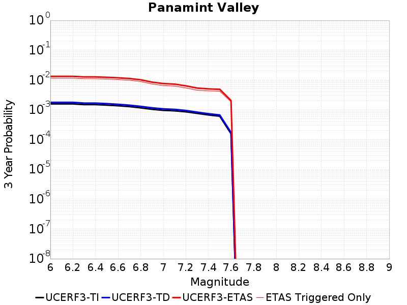 | 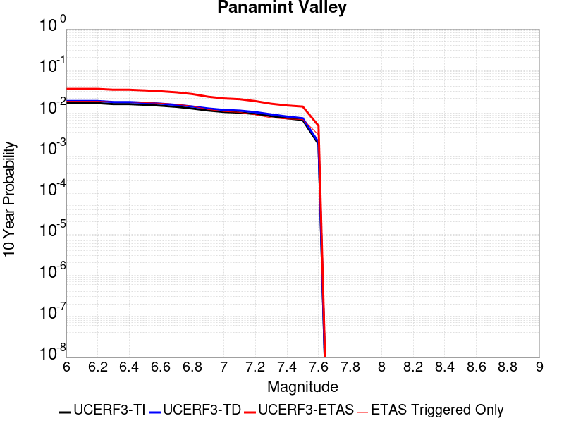 |

| Magnitude | 1 yr TI Prob | TD Prob | ETAS Prob | ETAS/TD Gain | ETAS Triggered Only | 10 yr TI Prob | TD Prob | ETAS Prob | ETAS/TD Gain | ETAS Triggered Only |
|-----|-----|-----|-----|-----|-----|-----|-----|-----|-----|-----|
| 6.0 | 0.0015751923 | 0.0017717576 | 0.013191489 | 7.445425 | 0.01144 | 0.015640736 | 0.017583176 | 0.034647755 | 1.9705062 | 0.01737 |
| 6.1 | 0.0015751923 | 0.0017717576 | 0.013191489 | 7.445425 | 0.01144 | 0.015640736 | 0.017583176 | 0.034647755 | 1.9705062 | 0.01737 |
| 6.2 | 0.0015751923 | 0.0017717576 | 0.013191489 | 7.445425 | 0.01144 | 0.015640736 | 0.017583176 | 0.034647755 | 1.9705062 | 0.01737 |
| 6.3 | 0.001489857 | 0.0016737302 | 0.012675285 | 7.573076 | 0.01102 | 0.01479908 | 0.016617836 | 0.033079654 | 1.9906113 | 0.01674 |
| 6.4 | 0.001489857 | 0.0016737302 | 0.012675285 | 7.573076 | 0.01102 | 0.01479908 | 0.016617836 | 0.033079654 | 1.9906113 | 0.01674 |
| 6.5 | 0.0014322745 | 0.0016073481 | 0.012300134 | 7.652439 | 0.01071 | 0.014230782 | 0.01596371 | 0.03188542 | 1.9973688 | 0.01618 |
| 6.6 | 0.0013628257 | 0.0015252425 | 0.011819517 | 7.7492714 | 0.01031 | 0.013544982 | 0.015154077 | 0.030448735 | 2.0092766 | 0.01553 |
| 6.7 | 0.0012775084 | 0.0014256642 | 0.011201707 | 7.8571844 | 0.00979 | 0.012701893 | 0.014171307 | 0.028623555 | 2.0198247 | 0.01466 |
| 6.8 | 0.0011600169 | 0.0013002914 | 0.010138784 | 7.797317 | 0.00885 | 0.011539802 | 0.012932549 | 0.026001321 | 2.0105333 | 0.01324 |
| 6.9 | 0.0010379635 | 0.0011624338 | 0.008463936 | 7.2812204 | 0.00731 | 0.010331288 | 0.011568636 | 0.022391958 | 1.9355748 | 0.01095 |
| 7.0 | 9.5722964E-4 | 0.0010725713 | 0.0075755888 | 7.063017 | 0.00651 | 0.009531168 | 0.010678875 | 0.02033465 | 1.9041939 | 0.00976 |
| 7.1 | 9.2145515E-4 | 0.0010312062 | 0.0072547817 | 7.0352387 | 0.00623 | 0.009176437 | 0.010269098 | 0.01949339 | 1.8982573 | 0.00932 |
| 7.2 | 8.544101E-4 | 9.470523E-4 | 0.0063419384 | 6.6965027 | 0.0054 | 0.008511325 | 0.0094348155 | 0.017478205 | 1.8525221 | 0.00812 |
| 7.3 | 7.57377E-4 | 8.327869E-4 | 0.005349023 | 6.423039 | 0.00452 | 0.0075480095 | 0.00829977 | 0.015112751 | 1.8208637 | 0.00687 |
| 7.4 | 6.7039346E-4 | 7.378389E-4 | 0.0050246734 | 6.809987 | 0.00429 | 0.0066837464 | 0.007356812 | 0.013719655 | 1.8648913 | 0.00641 |
| 7.5 | 6.070656E-4 | 6.696043E-4 | 0.004866792 | 7.2681613 | 0.0042 | 0.006054099 | 0.0066787633 | 0.012877088 | 1.9280647 | 0.00624 |
| 7.6 | 1.5687906E-4 | 1.7390645E-4 | 0.002033583 | 11.693546 | 0.00186 | 0.0015676835 | 0.0017391429 | 0.0043845344 | 2.521089 | 0.00265 |

## Garlock (East)
*[(top)](#table-of-contents)*

| 1 Year | 10 Year |
|-----|-----|
| 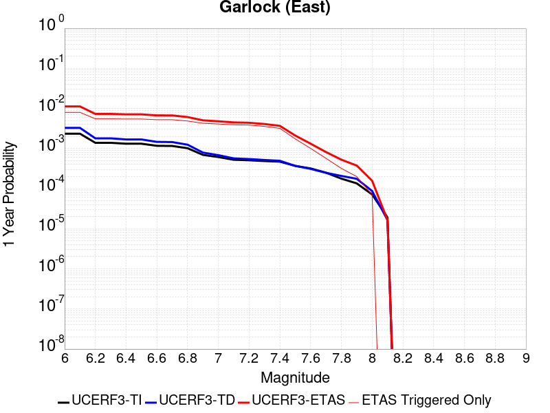 | 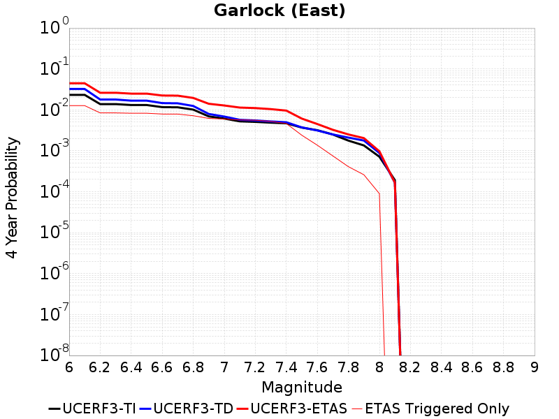 |

| Magnitude | 1 yr TI Prob | TD Prob | ETAS Prob | ETAS/TD Gain | ETAS Triggered Only | 10 yr TI Prob | TD Prob | ETAS Prob | ETAS/TD Gain | ETAS Triggered Only |
|-----|-----|-----|-----|-----|-----|-----|-----|-----|-----|-----|
| 6.0 | 0.0023501497 | 0.0032774173 | 0.01124123 | 3.4299054 | 0.00799 | 0.023254504 | 0.03235201 | 0.04464114 | 1.3798567 | 0.0127 |
| 6.1 | 0.0023501497 | 0.0032774173 | 0.01124123 | 3.4299054 | 0.00799 | 0.023254504 | 0.03235201 | 0.04464114 | 1.3798567 | 0.0127 |
| 6.2 | 0.0013908884 | 0.0017991253 | 0.007309194 | 4.0626373 | 0.00552 | 0.01382215 | 0.017890433 | 0.026169617 | 1.4627715 | 0.00843 |
| 6.3 | 0.0013908884 | 0.0017991253 | 0.007309194 | 4.0626373 | 0.00552 | 0.01382215 | 0.017890433 | 0.026169617 | 1.4627715 | 0.00843 |
| 6.4 | 0.0013199237 | 0.0016860483 | 0.0071268594 | 4.22696 | 0.00545 | 0.013121112 | 0.016778467 | 0.024909709 | 1.4846237 | 0.00827 |
| 6.5 | 0.0013199237 | 0.0016860483 | 0.0071268594 | 4.22696 | 0.00545 | 0.013121112 | 0.016778467 | 0.024909709 | 1.4846237 | 0.00827 |
| 6.6 | 0.0011715472 | 0.001466962 | 0.0067092604 | 4.573575 | 0.00525 | 0.011653901 | 0.014618787 | 0.022403298 | 1.5325005 | 0.0079 |
| 6.7 | 0.0011598538 | 0.0014497542 | 0.006692143 | 4.6160536 | 0.00525 | 0.011538187 | 0.01444898 | 0.022215122 | 1.5374873 | 0.00788 |
| 6.8 | 0.0010184698 | 0.0012462442 | 0.0061001875 | 4.8948574 | 0.00486 | 0.010138147 | 0.012436545 | 0.019537127 | 1.5709448 | 0.00719 |
| 6.9 | 6.9470983E-4 | 7.927642E-4 | 0.005059379 | 6.381947 | 0.00427 | 0.0069254204 | 0.007939991 | 0.014080842 | 1.7734079 | 0.00619 |
| 7.0 | 6.134799E-4 | 6.837317E-4 | 0.0047809286 | 6.992404 | 0.0041 | 0.0061178906 | 0.0068566194 | 0.012785685 | 1.8647215 | 0.00597 |
| 7.1 | 5.2502943E-4 | 5.6875404E-4 | 0.0044865245 | 7.888339 | 0.00392 | 0.005237907 | 0.0057130945 | 0.011370587 | 1.9902676 | 0.00569 |
| 7.2 | 5.095951E-4 | 5.476789E-4 | 0.00439557 | 8.025817 | 0.00385 | 0.0050842804 | 0.0055033597 | 0.011052651 | 2.008346 | 0.00558 |
| 7.3 | 4.8746695E-4 | 5.1876914E-4 | 0.0040869173 | 7.8781033 | 0.00357 | 0.0048639905 | 0.005215038 | 0.0104277115 | 1.9995465 | 0.00524 |
| 7.4 | 4.7072413E-4 | 4.951017E-4 | 0.0036835223 | 7.439931 | 0.00319 | 0.004697283 | 0.0049784887 | 0.009595389 | 1.9273697 | 0.00464 |
| 7.5 | 3.6942272E-4 | 3.697665E-4 | 0.0021091232 | 5.7039323 | 0.00174 | 0.003688092 | 0.0037243958 | 0.006115457 | 1.6419998 | 0.0024 |
| 7.6 | 3.1909486E-4 | 3.109055E-4 | 0.0013205915 | 4.2475653 | 0.00101 | 0.0031863707 | 0.0031358327 | 0.0045015365 | 1.4355155 | 0.00137 |
| 7.7 | 2.5027743E-4 | 2.482054E-4 | 8.180639E-4 | 3.2959151 | 5.7E-4 | 0.0024999576 | 0.0025094207 | 0.0032575387 | 1.2981237 | 7.5E-4 |
| 7.8 | 1.775424E-4 | 2.0757595E-4 | 5.2750955E-4 | 2.5412843 | 3.2E-4 | 0.0017740062 | 0.0021012886 | 0.002510427 | 1.1947083 | 4.1E-4 |
| 7.9 | 1.3528178E-4 | 1.7595998E-4 | 3.759248E-4 | 2.136422 | 2.0E-4 | 0.0013519945 | 0.0017812961 | 0.002040833 | 1.1457012 | 2.6E-4 |
| 8.0 | 7.1709874E-5 | 8.731832E-5 | 1.5731221E-4 | 1.8015945 | 7.0E-5 | 7.1686733E-4 | 8.8374846E-4 | 9.736689E-4 | 1.101749 | 9.0E-5 |
| 8.1 | 1.9166706E-5 | 1.6431348E-5 | 1.6431348E-5 | 1.0 | 0.0 | 1.9165053E-4 | 1.663921E-4 | 1.663921E-4 | 1.0 | 0.0 |

## Ash Hill
*[(top)](#table-of-contents)*

| 1 Year | 10 Year |
|-----|-----|
| 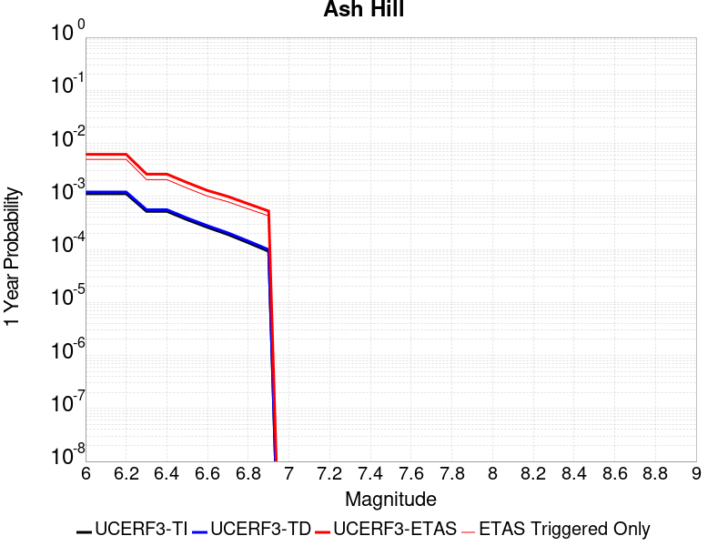 | 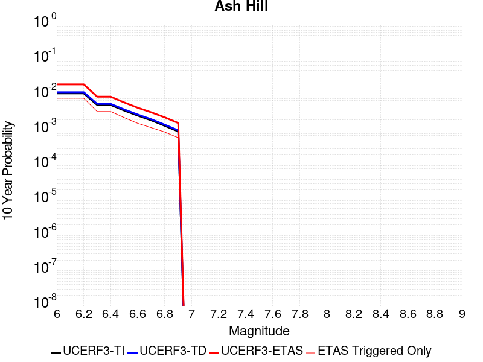 |

| Magnitude | 1 yr TI Prob | TD Prob | ETAS Prob | ETAS/TD Gain | ETAS Triggered Only | 10 yr TI Prob | TD Prob | ETAS Prob | ETAS/TD Gain | ETAS Triggered Only |
|-----|-----|-----|-----|-----|-----|-----|-----|-----|-----|-----|
| 6.0 | 0.0011236023 | 0.0012096217 | 0.0062035737 | 5.128524 | 0.005 | 0.011179381 | 0.01203836 | 0.020090247 | 1.6688526 | 0.00815 |
| 6.1 | 0.0011236023 | 0.0012096217 | 0.0062035737 | 5.128524 | 0.005 | 0.011179381 | 0.01203836 | 0.020090247 | 1.6688526 | 0.00815 |
| 6.2 | 0.0011236023 | 0.0012096217 | 0.0062035737 | 5.128524 | 0.005 | 0.011179381 | 0.01203836 | 0.020090247 | 1.6688526 | 0.00815 |
| 6.3 | 5.229836E-4 | 5.6062016E-4 | 0.0026294596 | 4.6902695 | 0.00207 | 0.005217545 | 0.005593371 | 0.008974354 | 1.6044624 | 0.0034 |
| 6.4 | 5.229836E-4 | 5.6062016E-4 | 0.0026294596 | 4.6902695 | 0.00207 | 0.005217545 | 0.005593371 | 0.008974354 | 1.6044624 | 0.0034 |
| 6.5 | 3.6318856E-4 | 3.890119E-4 | 0.0018184556 | 4.67455 | 0.00143 | 0.0036259557 | 0.0038841637 | 0.006155308 | 1.584719 | 0.00228 |
| 6.6 | 2.60441E-4 | 2.789518E-4 | 0.0012886701 | 4.619687 | 0.00101 | 0.0026013597 | 0.002786675 | 0.0043523 | 1.5618254 | 0.00157 |
| 6.7 | 1.9111596E-4 | 2.0476701E-4 | 9.946052E-4 | 4.8572536 | 7.9E-4 | 0.0019095168 | 0.0020463464 | 0.0032239316 | 1.5754575 | 0.00118 |
| 6.8 | 1.3356637E-4 | 1.4322162E-4 | 7.2313857E-4 | 5.049088 | 5.8E-4 | 0.0013348613 | 0.0014317782 | 0.0023205038 | 1.6207147 | 8.9E-4 |
| 6.9 | 9.2273134E-5 | 9.8976096E-5 | 5.2893354E-4 | 5.3440533 | 4.3E-4 | 9.223483E-4 | 9.89761E-4 | 0.0015991572 | 1.6157005 | 6.1E-4 |

## Blackwater
*[(top)](#table-of-contents)*

| 1 Year | 10 Year |
|-----|-----|
| 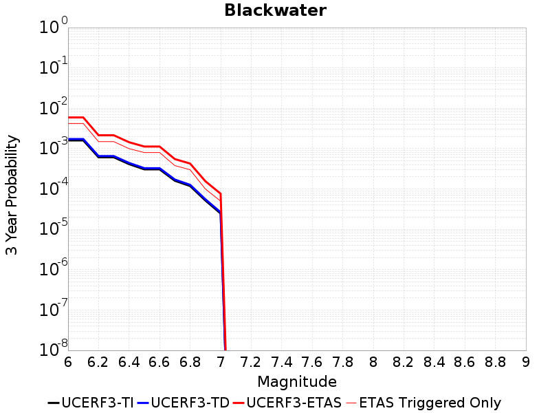 | 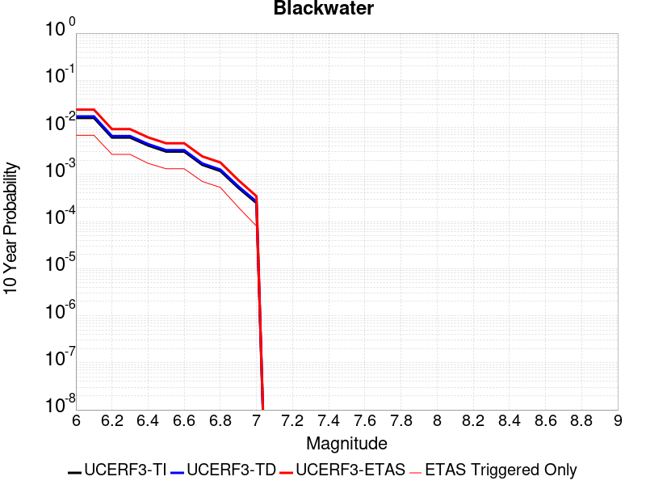 |

| Magnitude | 1 yr TI Prob | TD Prob | ETAS Prob | ETAS/TD Gain | ETAS Triggered Only | 10 yr TI Prob | TD Prob | ETAS Prob | ETAS/TD Gain | ETAS Triggered Only |
|-----|-----|-----|-----|-----|-----|-----|-----|-----|-----|-----|
| 6.0 | 0.0016010714 | 0.0017255802 | 0.005928315 | 3.4355493 | 0.00421 | 0.015895851 | 0.01713565 | 0.023819126 | 1.3900335 | 0.0068 |
| 6.1 | 0.0016010714 | 0.0017255802 | 0.005928315 | 3.4355493 | 0.00421 | 0.015895851 | 0.01713565 | 0.023819126 | 1.3900335 | 0.0068 |
| 6.2 | 6.107122E-4 | 6.5438735E-4 | 0.0021434124 | 3.275449 | 0.00149 | 0.006090366 | 0.006525575 | 0.009178152 | 1.4064894 | 0.00267 |
| 6.3 | 6.107122E-4 | 6.5438735E-4 | 0.0021434124 | 3.275449 | 0.00149 | 0.006090366 | 0.006525575 | 0.009178152 | 1.4064894 | 0.00267 |
| 6.4 | 4.136527E-4 | 4.423881E-4 | 0.0014419457 | 3.2594585 | 0.001 | 0.0041288356 | 0.00441548 | 0.006127885 | 1.3878187 | 0.00172 |
| 6.5 | 3.0693135E-4 | 3.2794426E-4 | 0.0011276819 | 3.438639 | 8.0E-4 | 0.0030650778 | 0.0032748566 | 0.0045905337 | 1.401751 | 0.00132 |
| 6.6 | 3.0693135E-4 | 3.2794426E-4 | 0.0011276819 | 3.438639 | 8.0E-4 | 0.0030650778 | 0.0032748566 | 0.0045905337 | 1.401751 | 0.00132 |
| 6.7 | 1.6025416E-4 | 1.7120923E-4 | 5.511442E-4 | 3.2191265 | 3.8E-4 | 0.0016013865 | 0.0017108879 | 0.0024196731 | 1.4142792 | 7.1E-4 |
| 6.8 | 1.1855473E-4 | 1.2672211E-4 | 4.266841E-4 | 3.3670847 | 3.0E-4 | 0.001184915 | 0.0012665887 | 0.0017959174 | 1.4179168 | 5.3E-4 |
| 6.9 | 5.1928873E-5 | 5.5587465E-5 | 1.555819E-4 | 2.7988667 | 1.0E-4 | 5.191674E-4 | 5.5578625E-4 | 7.556751E-4 | 1.3596506 | 2.0E-4 |
| 7.0 | 2.4724779E-5 | 2.6483567E-5 | 7.648224E-5 | 2.8879132 | 5.0E-5 | 2.4722028E-4 | 2.648357E-4 | 3.448145E-4 | 1.3019941 | 8.0E-5 |

## Hunter Mountain-Saline Valley
*[(top)](#table-of-contents)*

| 1 Year | 10 Year |
|-----|-----|
| 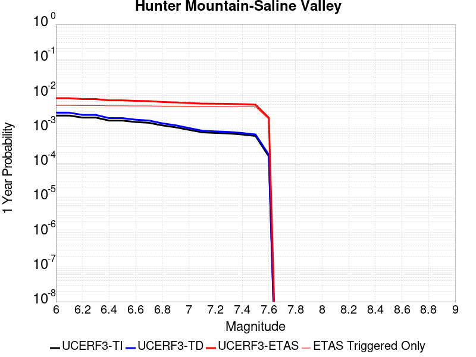 | 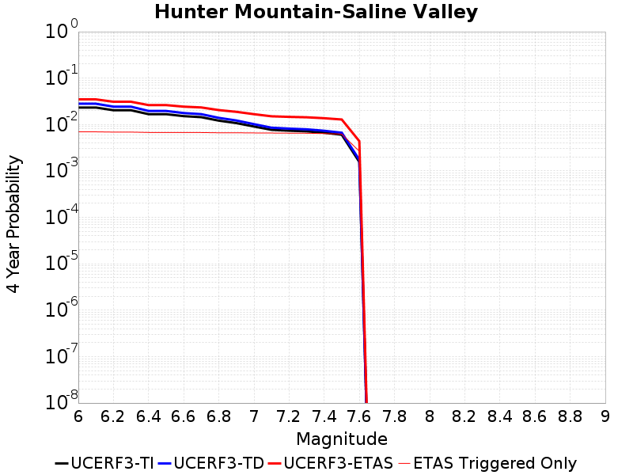 |

| Magnitude | 1 yr TI Prob | TD Prob | ETAS Prob | ETAS/TD Gain | ETAS Triggered Only | 10 yr TI Prob | TD Prob | ETAS Prob | ETAS/TD Gain | ETAS Triggered Only |
|-----|-----|-----|-----|-----|-----|-----|-----|-----|-----|-----|
| 6.0 | 0.002350731 | 0.0028435234 | 0.0074404147 | 2.6166182 | 0.00461 | 0.023260195 | 0.028091967 | 0.034856446 | 1.2407976 | 0.00696 |
| 6.1 | 0.002350731 | 0.0028435234 | 0.0074404147 | 2.6166182 | 0.00461 | 0.023260195 | 0.028091967 | 0.034856446 | 1.2407976 | 0.00696 |
| 6.2 | 0.002051862 | 0.0024528243 | 0.0070116147 | 2.8585885 | 0.00457 | 0.020330196 | 0.024273548 | 0.03097679 | 1.2761542 | 0.00687 |
| 6.3 | 0.002051862 | 0.0024528243 | 0.0070116147 | 2.8585885 | 0.00457 | 0.020330196 | 0.024273548 | 0.03097679 | 1.2761542 | 0.00687 |
| 6.4 | 0.0016845843 | 0.0019783897 | 0.006449526 | 3.259988 | 0.00448 | 0.016718714 | 0.019616526 | 0.026234115 | 1.3373476 | 0.00675 |
| 6.5 | 0.0016845843 | 0.0019783897 | 0.006449526 | 3.259988 | 0.00448 | 0.016718714 | 0.019616526 | 0.026234115 | 1.3373476 | 0.00675 |
| 6.6 | 0.0015279909 | 0.0017820715 | 0.0062241415 | 3.4926438 | 0.00445 | 0.015175272 | 0.017685736 | 0.024286889 | 1.3732473 | 0.00672 |
| 6.7 | 0.0014509142 | 0.0016863507 | 0.0061288467 | 3.6343842 | 0.00445 | 0.014414776 | 0.016743228 | 0.023350714 | 1.3946363 | 0.00672 |
| 6.8 | 0.00121972 | 0.0014009575 | 0.0057947934 | 4.136309 | 0.0044 | 0.01213047 | 0.013927468 | 0.020474989 | 1.4701157 | 0.00664 |
| 6.9 | 0.0010791123 | 0.0012291508 | 0.0056237425 | 4.5753074 | 0.0044 | 0.010738871 | 0.012228553 | 0.018787356 | 1.5363514 | 0.00664 |
| 7.0 | 9.1075303E-4 | 0.0010239625 | 0.005389488 | 5.2633643 | 0.00437 | 0.009070295 | 0.010196077 | 0.016718885 | 1.639737 | 0.00659 |
| 7.1 | 7.723524E-4 | 8.575658E-4 | 0.005203835 | 6.068147 | 0.00435 | 0.007696735 | 0.008545551 | 0.015049493 | 1.7610909 | 0.00656 |
| 7.2 | 7.396263E-4 | 8.1880705E-4 | 0.005155253 | 6.296054 | 0.00434 | 0.0073716943 | 0.008160853 | 0.014627644 | 1.7924161 | 0.00652 |
| 7.3 | 7.161811E-4 | 7.91369E-4 | 0.0051179426 | 6.4672008 | 0.00433 | 0.007138774 | 0.007888441 | 0.014327245 | 1.8162327 | 0.00649 |
| 7.4 | 6.681934E-4 | 7.3595485E-4 | 0.0050028125 | 6.7977166 | 0.00427 | 0.006661878 | 0.007338071 | 0.013681181 | 1.8644111 | 0.00639 |
| 7.5 | 6.0486543E-4 | 6.677201E-4 | 0.004844929 | 7.2559285 | 0.00418 | 0.006032217 | 0.0066600093 | 0.012838584 | 1.9277127 | 0.00622 |
| 7.6 | 1.564034E-4 | 1.7349567E-4 | 0.0020331729 | 11.718868 | 0.00186 | 0.0015629337 | 0.0017350377 | 0.00438044 | 2.5246944 | 0.00265 |

## McLean Lake
*[(top)](#table-of-contents)*

| 1 Year | 10 Year |
|-----|-----|
| 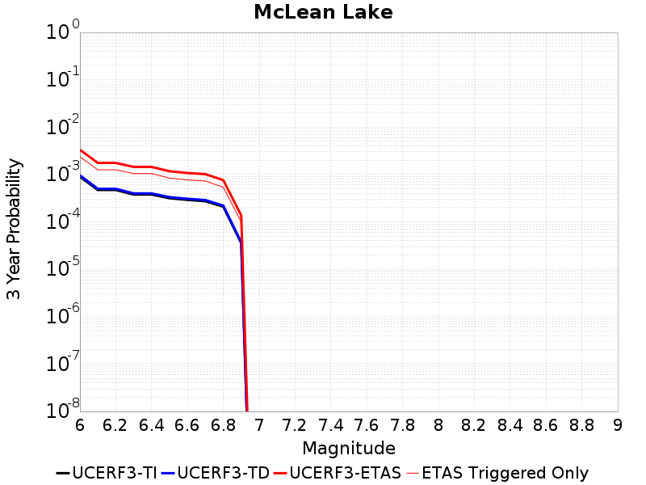 | 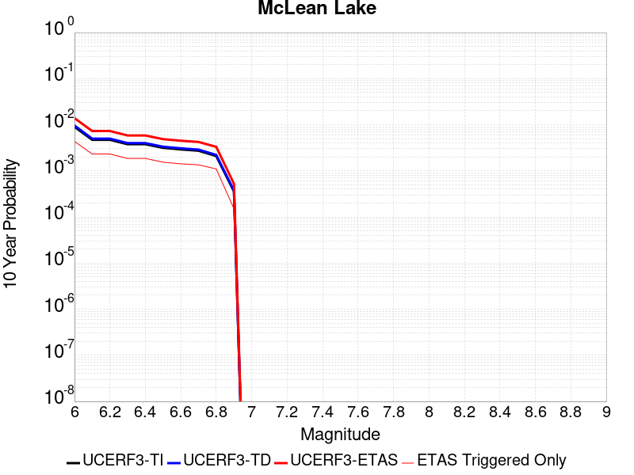 |

| Magnitude | 1 yr TI Prob | TD Prob | ETAS Prob | ETAS/TD Gain | ETAS Triggered Only | 10 yr TI Prob | TD Prob | ETAS Prob | ETAS/TD Gain | ETAS Triggered Only |
|-----|-----|-----|-----|-----|-----|-----|-----|-----|-----|-----|
| 6.0 | 9.0542925E-4 | 9.6498436E-4 | 0.0033326973 | 3.4536283 | 0.00237 | 0.009017491 | 0.009612782 | 0.013920967 | 1.4481725 | 0.00435 |
| 6.1 | 4.727685E-4 | 5.00394E-4 | 0.0017597635 | 3.5167558 | 0.00126 | 0.0047176396 | 0.004993555 | 0.0073019704 | 1.4622788 | 0.00232 |
| 6.2 | 4.727685E-4 | 5.00394E-4 | 0.0017597635 | 3.5167558 | 0.00126 | 0.0047176396 | 0.004993555 | 0.0073019704 | 1.4622788 | 0.00232 |
| 6.3 | 3.786182E-4 | 4.0001952E-4 | 0.0014495995 | 3.6238217 | 0.00105 | 0.0037797375 | 0.0039936993 | 0.0058462713 | 1.4638736 | 0.00186 |
| 6.4 | 3.786182E-4 | 4.0001952E-4 | 0.0014495995 | 3.6238217 | 0.00105 | 0.0037797375 | 0.0039936993 | 0.0058462713 | 1.4638736 | 0.00186 |
| 6.5 | 3.164567E-4 | 3.3409757E-4 | 0.001173817 | 3.5133955 | 8.4E-4 | 0.0031600643 | 0.0033365914 | 0.004871453 | 1.4600089 | 0.00154 |
| 6.6 | 2.9209262E-4 | 3.0834944E-4 | 0.001078112 | 3.4963968 | 7.7E-4 | 0.0029170897 | 0.003079845 | 0.0044954717 | 1.4596422 | 0.00142 |
| 6.7 | 2.73744E-4 | 2.8899158E-4 | 0.0010187806 | 3.5252953 | 7.3E-4 | 0.0027340704 | 0.0028867817 | 0.0042328844 | 1.4662988 | 0.00135 |
| 6.8 | 2.099053E-4 | 2.2157984E-4 | 7.6146016E-4 | 3.4365048 | 5.4E-4 | 0.0020970714 | 0.0022141736 | 0.003311738 | 1.4956994 | 0.0011 |
| 6.9 | 3.56685E-5 | 3.7254806E-5 | 1.3725107E-4 | 3.6841173 | 1.0E-4 | 3.5662777E-4 | 3.7251686E-4 | 5.2246096E-4 | 1.4025164 | 1.5E-4 |

## Garlock (West)
*[(top)](#table-of-contents)*

| 1 Year | 10 Year |
|-----|-----|
| 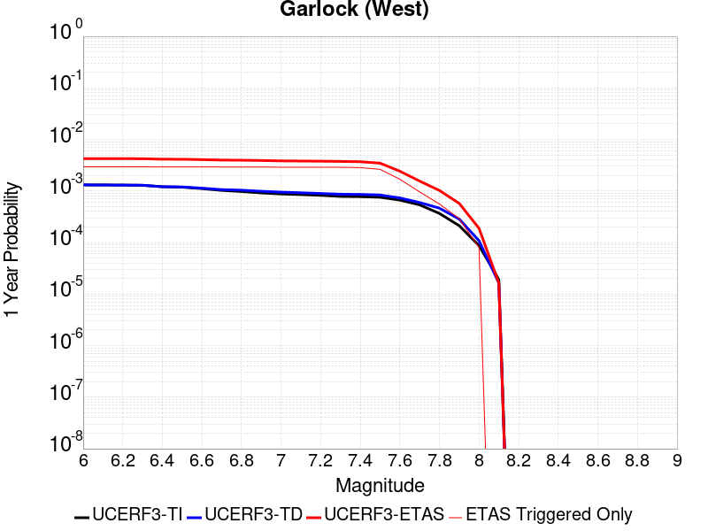 | 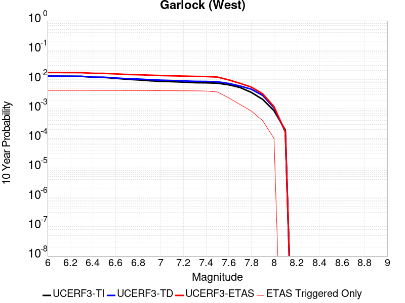 |

| Magnitude | 1 yr TI Prob | TD Prob | ETAS Prob | ETAS/TD Gain | ETAS Triggered Only | 10 yr TI Prob | TD Prob | ETAS Prob | ETAS/TD Gain | ETAS Triggered Only |
|-----|-----|-----|-----|-----|-----|-----|-----|-----|-----|-----|
| 6.0 | 0.0013131002 | 0.001313939 | 0.004250076 | 3.2346067 | 0.00294 | 0.013053683 | 0.013142208 | 0.017375827 | 1.3221391 | 0.00429 |
| 6.1 | 0.001307681 | 0.0013087837 | 0.0042449357 | 3.2434206 | 0.00294 | 0.013000126 | 0.013091263 | 0.017325101 | 1.3234094 | 0.00429 |
| 6.2 | 0.0013008224 | 0.0013026177 | 0.004238788 | 3.2540538 | 0.00294 | 0.012932341 | 0.013030328 | 0.017264428 | 1.3249419 | 0.00429 |
| 6.3 | 0.0012897556 | 0.0012932046 | 0.0042294026 | 3.2704823 | 0.00294 | 0.012822957 | 0.012937297 | 0.017171796 | 1.3273094 | 0.00429 |
| 6.4 | 0.0012117702 | 0.0012087423 | 0.0041352008 | 3.4210773 | 0.00293 | 0.012051838 | 0.012102145 | 0.016320469 | 1.34856 | 0.00427 |
| 6.5 | 0.0011854442 | 0.0011990779 | 0.004125565 | 3.4406142 | 0.00293 | 0.011791403 | 0.01200655 | 0.016225282 | 1.3513691 | 0.00427 |
| 6.6 | 0.001111811 | 0.0011355028 | 0.0040621758 | 3.5774248 | 0.00293 | 0.011062649 | 0.011377453 | 0.015588985 | 1.3701648 | 0.00426 |
| 6.7 | 0.001027818 | 0.0010635677 | 0.003980462 | 3.7425563 | 0.00292 | 0.010230771 | 0.010665189 | 0.014869861 | 1.3942428 | 0.00425 |
| 6.8 | 9.775903E-4 | 0.0010379038 | 0.003954873 | 3.8104427 | 0.00292 | 0.009733009 | 0.010410974 | 0.014616727 | 1.4039731 | 0.00425 |
| 6.9 | 9.158276E-4 | 9.885066E-4 | 0.0039056202 | 3.951031 | 0.00292 | 0.0091206245 | 0.009921453 | 0.014109485 | 1.4221189 | 0.00423 |
| 7.0 | 8.759337E-4 | 9.500781E-4 | 0.0038373324 | 4.038965 | 0.00289 | 0.008724891 | 0.00954036 | 0.013690386 | 1.4349967 | 0.00419 |
| 7.1 | 8.521265E-4 | 9.240547E-4 | 0.0038113843 | 4.1246305 | 0.00289 | 0.008488664 | 0.009282215 | 0.013423415 | 1.4461435 | 0.00418 |
| 7.2 | 8.2304585E-4 | 8.953112E-4 | 0.0037827238 | 4.225038 | 0.00289 | 0.008200042 | 0.008997056 | 0.013119629 | 1.4582134 | 0.00416 |
| 7.3 | 7.854473E-4 | 8.667978E-4 | 0.0037443014 | 4.319694 | 0.00288 | 0.00782677 | 0.008713755 | 0.01281768 | 1.4709709 | 0.00414 |
| 7.4 | 7.7653467E-4 | 8.582461E-4 | 0.0036958086 | 4.3062344 | 0.00284 | 0.0077382675 | 0.008628615 | 0.01267341 | 1.4687653 | 0.00408 |
| 7.5 | 7.567935E-4 | 8.3697564E-4 | 0.0034647745 | 4.139636 | 0.00263 | 0.0075422134 | 0.008416919 | 0.012165102 | 1.4453155 | 0.00378 |
| 7.6 | 6.6541E-4 | 7.3291117E-4 | 0.0024216725 | 3.3041828 | 0.00169 | 0.006634211 | 0.0073818937 | 0.009764177 | 1.3227198 | 0.0024 |
| 7.7 | 5.388092E-4 | 5.978401E-4 | 0.0015572662 | 2.6048205 | 9.6E-4 | 0.0053750467 | 0.006038705 | 0.0074501303 | 1.2337297 | 0.00142 |
| 7.8 | 3.667837E-4 | 4.6427854E-4 | 0.0010240185 | 2.2056124 | 5.6E-4 | 0.003661789 | 0.0046954276 | 0.005541437 | 1.1801772 | 8.5E-4 |
| 7.9 | 2.11856E-4 | 2.8514586E-4 | 5.7506317E-4 | 2.0167334 | 2.9E-4 | 0.0021165414 | 0.0028842923 | 0.0032831386 | 1.1382822 | 4.0E-4 |
| 8.0 | 8.7288594E-5 | 1.0839912E-4 | 1.8839045E-4 | 1.7379334 | 8.0E-5 | 8.7254314E-4 | 0.0010969648 | 0.0011968552 | 1.0910606 | 1.0E-4 |
| 8.1 | 1.9166706E-5 | 1.6431348E-5 | 1.6431348E-5 | 1.0 | 0.0 | 1.9165053E-4 | 1.663921E-4 | 1.663921E-4 | 1.0 | 0.0 |

## Goldstone Lake
*[(top)](#table-of-contents)*

| 1 Year | 10 Year |
|-----|-----|
| 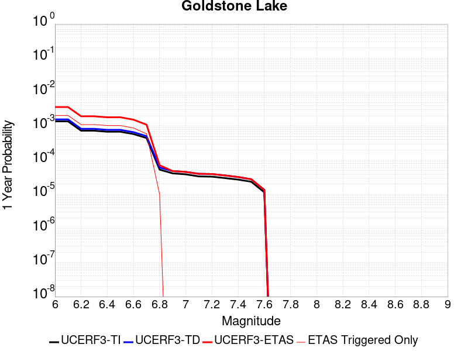 | 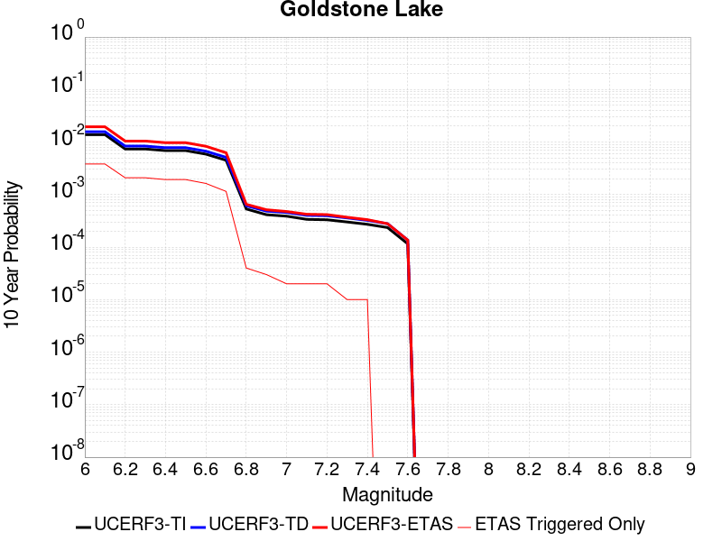 |

| Magnitude | 1 yr TI Prob | TD Prob | ETAS Prob | ETAS/TD Gain | ETAS Triggered Only | 10 yr TI Prob | TD Prob | ETAS Prob | ETAS/TD Gain | ETAS Triggered Only |
|-----|-----|-----|-----|-----|-----|-----|-----|-----|-----|-----|
| 6.0 | 0.001392921 | 0.0015839621 | 0.0036506832 | 2.3047795 | 0.00207 | 0.013842222 | 0.015746223 | 0.01950607 | 1.2387779 | 0.00382 |
| 6.1 | 0.001392921 | 0.0015839621 | 0.0036506832 | 2.3047795 | 0.00207 | 0.013842222 | 0.015746223 | 0.01950607 | 1.2387779 | 0.00382 |
| 6.2 | 7.4051257E-4 | 8.396399E-4 | 0.0019586994 | 2.3327851 | 0.00112 | 0.007380498 | 0.008374372 | 0.01044687 | 1.247481 | 0.00209 |
| 6.3 | 7.4051257E-4 | 8.396399E-4 | 0.0019586994 | 2.3327851 | 0.00112 | 0.007380498 | 0.008374372 | 0.01044687 | 1.247481 | 0.00209 |
| 6.4 | 6.9055456E-4 | 7.829252E-4 | 0.0018321031 | 2.3400743 | 0.00105 | 0.006884126 | 0.007811296 | 0.00972622 | 1.2451481 | 0.00193 |
| 6.5 | 6.9055456E-4 | 7.829252E-4 | 0.0018321031 | 2.3400743 | 0.00105 | 0.006884126 | 0.007811296 | 0.00972622 | 1.2451481 | 0.00193 |
| 6.6 | 5.90922E-4 | 6.706469E-4 | 0.0015600501 | 2.326187 | 8.9E-4 | 0.0058935313 | 0.006695619 | 0.008314705 | 1.2418128 | 0.00163 |
| 6.7 | 4.5130608E-4 | 5.126004E-4 | 0.0011122929 | 2.1699023 | 6.0E-4 | 0.0045039062 | 0.005123059 | 0.0062671676 | 1.2233253 | 0.00115 |
| 6.8 | 5.3300988E-5 | 6.133268E-5 | 7.133206E-5 | 1.1630353 | 1.0E-5 | 5.3288206E-4 | 6.1316876E-4 | 6.5314426E-4 | 1.0651948 | 4.0E-5 |
| 6.9 | 4.1408475E-5 | 4.8438393E-5 | 4.8438393E-5 | 1.0 | 0.0 | 4.140076E-4 | 4.8428532E-4 | 5.142708E-4 | 1.061917 | 3.0E-5 |
| 7.0 | 3.8811122E-5 | 4.5641387E-5 | 4.5641387E-5 | 1.0 | 0.0 | 3.8804344E-4 | 4.563268E-4 | 4.7631765E-4 | 1.0438082 | 2.0E-5 |
| 7.1 | 3.376394E-5 | 4.0235755E-5 | 4.0235755E-5 | 1.0 | 0.0 | 3.375881E-4 | 4.0229067E-4 | 4.222826E-4 | 1.0496953 | 2.0E-5 |
| 7.2 | 3.3167835E-5 | 3.9594295E-5 | 3.9594295E-5 | 1.0 | 0.0 | 3.3162883E-4 | 3.9587833E-4 | 4.1587043E-4 | 1.0505006 | 2.0E-5 |
| 7.3 | 3.0104358E-5 | 3.598474E-5 | 3.598474E-5 | 1.0 | 0.0 | 3.0100282E-4 | 3.5979485E-4 | 3.6979126E-4 | 1.0277836 | 1.0E-5 |
| 7.4 | 2.718283E-5 | 3.2316435E-5 | 3.2316435E-5 | 1.0 | 0.0 | 2.7179506E-4 | 3.2312292E-4 | 3.3311968E-4 | 1.030938 | 1.0E-5 |
| 7.5 | 2.3547682E-5 | 2.7909407E-5 | 2.7909407E-5 | 1.0 | 0.0 | 2.3545188E-4 | 2.7906432E-4 | 2.7906432E-4 | 1.0 | 0.0 |
| 7.6 | 1.1540374E-5 | 1.3587041E-5 | 1.3587041E-5 | 1.0 | 0.0 | 1.1539775E-4 | 1.3586493E-4 | 1.3586493E-4 | 1.0 | 0.0 |

## Gravel Hills-Harper Lk
*[(top)](#table-of-contents)*

| 1 Year | 10 Year |
|-----|-----|
| 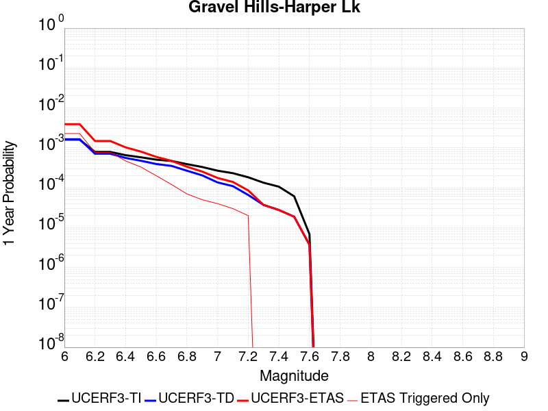 | 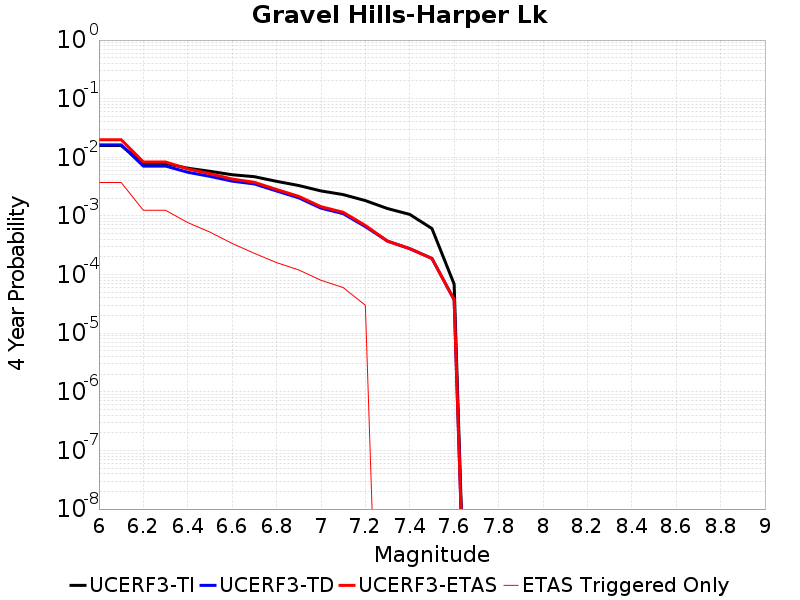 |

| Magnitude | 1 yr TI Prob | TD Prob | ETAS Prob | ETAS/TD Gain | ETAS Triggered Only | 10 yr TI Prob | TD Prob | ETAS Prob | ETAS/TD Gain | ETAS Triggered Only |
|-----|-----|-----|-----|-----|-----|-----|-----|-----|-----|-----|
| 6.0 | 0.0015995599 | 0.0016406933 | 0.0039169523 | 2.3873765 | 0.00228 | 0.015880952 | 0.016307365 | 0.019966701 | 1.2243978 | 0.00372 |
| 6.1 | 0.0015995599 | 0.0016406933 | 0.0039169523 | 2.3873765 | 0.00228 | 0.015880952 | 0.016307365 | 0.019966701 | 1.2243978 | 0.00372 |
| 6.2 | 7.8995706E-4 | 7.11231E-4 | 0.0014806833 | 2.0818598 | 7.7E-4 | 0.007871548 | 0.007090749 | 0.008331886 | 1.1750361 | 0.00125 |
| 6.3 | 7.8995706E-4 | 7.11231E-4 | 0.0014806833 | 2.0818598 | 7.7E-4 | 0.007871548 | 0.007090749 | 0.008331886 | 1.1750361 | 0.00125 |
| 6.4 | 6.537194E-4 | 5.576271E-4 | 0.0010273651 | 1.8423871 | 4.7E-4 | 0.0065179965 | 0.0055628694 | 0.006328586 | 1.1376477 | 7.7E-4 |
| 6.5 | 5.787078E-4 | 4.738673E-4 | 8.037109E-4 | 1.6960676 | 3.3E-4 | 0.0057720304 | 0.0047289757 | 0.0052564694 | 1.111545 | 5.3E-4 |
| 6.6 | 5.053978E-4 | 3.929205E-4 | 5.9284194E-4 | 1.5088089 | 2.0E-4 | 0.0050424994 | 0.0039225146 | 0.004261181 | 1.0863391 | 3.4E-4 |
| 6.7 | 4.6818596E-4 | 3.5211665E-4 | 4.720744E-4 | 1.3406762 | 1.2E-4 | 0.004672008 | 0.0035158084 | 0.0037449996 | 1.0651888 | 2.3E-4 |
| 6.8 | 3.9011694E-4 | 2.669225E-4 | 3.369038E-4 | 1.2621784 | 7.0E-5 | 0.0038943281 | 0.002666157 | 0.0028257305 | 1.0598515 | 1.6E-4 |
| 6.9 | 3.3080703E-4 | 2.038685E-4 | 2.538583E-4 | 1.2452061 | 5.0E-5 | 0.0033031502 | 0.0020369128 | 0.0021566686 | 1.0587927 | 1.2E-4 |
| 7.0 | 2.6732447E-4 | 1.3596124E-4 | 1.7595579E-4 | 1.2941616 | 4.0E-5 | 0.0026700313 | 0.0013588057 | 0.001438697 | 1.0587952 | 8.0E-5 |
| 7.1 | 2.315891E-4 | 1.09489796E-4 | 1.3948651E-4 | 1.2739681 | 3.0E-5 | 0.002313479 | 0.0010943804 | 0.0011543147 | 1.0547656 | 6.0E-5 |
| 7.2 | 1.8280011E-4 | 6.5825065E-5 | 8.582375E-5 | 1.3038156 | 2.0E-5 | 0.0018264982 | 6.5806386E-4 | 6.880441E-4 | 1.0455583 | 3.0E-5 |
| 7.3 | 1.3365384E-4 | 3.714617E-5 | 3.714617E-5 | 1.0 | 0.0 | 0.0013357349 | 3.714016E-4 | 3.714016E-4 | 1.0 | 0.0 |
| 7.4 | 1.06276275E-4 | 2.767957E-5 | 2.767957E-5 | 1.0 | 0.0 | 0.0010622547 | 2.7676177E-4 | 2.7676177E-4 | 1.0 | 0.0 |
| 7.5 | 6.0951766E-5 | 1.880011E-5 | 1.880011E-5 | 1.0 | 0.0 | 6.093505E-4 | 1.8798567E-4 | 1.8798567E-4 | 1.0 | 0.0 |
| 7.6 | 6.863748E-6 | 3.7149769E-6 | 3.7149769E-6 | 1.0 | 0.0 | 6.863536E-5 | 3.7149308E-5 | 3.7149308E-5 | 1.0 | 0.0 |

## So Sierra Nevada
*[(top)](#table-of-contents)*

| 1 Year | 10 Year |
|-----|-----|
| 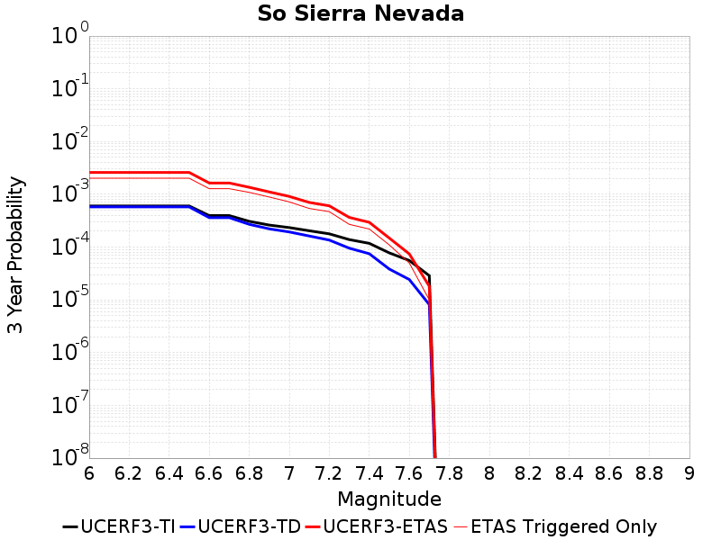 | 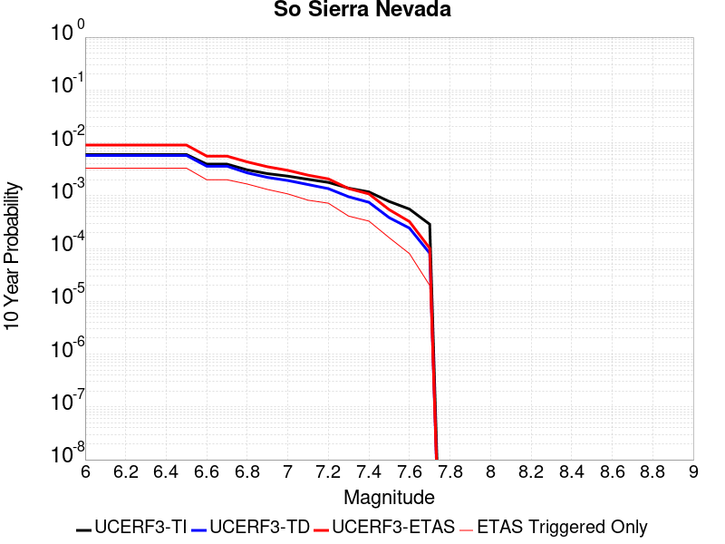 |

| Magnitude | 1 yr TI Prob | TD Prob | ETAS Prob | ETAS/TD Gain | ETAS Triggered Only | 10 yr TI Prob | TD Prob | ETAS Prob | ETAS/TD Gain | ETAS Triggered Only |
|-----|-----|-----|-----|-----|-----|-----|-----|-----|-----|-----|
| 6.0 | 6.024253E-4 | 5.7797006E-4 | 0.0025968025 | 4.492971 | 0.00202 | 0.006007948 | 0.0057659377 | 0.009066795 | 1.5724753 | 0.00332 |
| 6.1 | 6.024253E-4 | 5.7797006E-4 | 0.0025968025 | 4.492971 | 0.00202 | 0.006007948 | 0.0057659377 | 0.009066795 | 1.5724753 | 0.00332 |
| 6.2 | 6.024253E-4 | 5.7797006E-4 | 0.0025968025 | 4.492971 | 0.00202 | 0.006007948 | 0.0057659377 | 0.009066795 | 1.5724753 | 0.00332 |
| 6.3 | 6.024253E-4 | 5.7797006E-4 | 0.0025968025 | 4.492971 | 0.00202 | 0.006007948 | 0.0057659377 | 0.009066795 | 1.5724753 | 0.00332 |
| 6.4 | 6.024253E-4 | 5.7797006E-4 | 0.0025968025 | 4.492971 | 0.00202 | 0.006007948 | 0.0057659377 | 0.009066795 | 1.5724753 | 0.00332 |
| 6.5 | 6.024253E-4 | 5.7797006E-4 | 0.0025968025 | 4.492971 | 0.00202 | 0.006007948 | 0.0057659377 | 0.009066795 | 1.5724753 | 0.00332 |
| 6.6 | 3.9580427E-4 | 3.618307E-4 | 0.0016413676 | 4.536286 | 0.00128 | 0.003951 | 0.0036127074 | 0.005605482 | 1.5516014 | 0.002 |
| 6.7 | 3.9580427E-4 | 3.618307E-4 | 0.0016413676 | 4.536286 | 0.00128 | 0.003951 | 0.0036127074 | 0.005605482 | 1.5516014 | 0.002 |
| 6.8 | 3.0794772E-4 | 2.7021897E-4 | 0.0013599244 | 5.0326757 | 0.00109 | 0.0030752132 | 0.00269902 | 0.00435454 | 1.613378 | 0.00166 |
| 6.9 | 2.614798E-4 | 2.218623E-4 | 0.0011116648 | 5.0106072 | 8.9E-4 | 0.0026117235 | 0.0022164807 | 0.003523577 | 1.589717 | 0.00131 |
| 7.0 | 2.3438422E-4 | 1.9376936E-4 | 9.1362983E-4 | 4.715038 | 7.2E-4 | 0.0023413717 | 0.001936067 | 0.003013976 | 1.556752 | 0.00108 |
| 7.1 | 2.0409399E-4 | 1.6236638E-4 | 7.022787E-4 | 4.3252716 | 5.4E-4 | 0.0020390663 | 0.0016225337 | 0.0024412032 | 1.5045624 | 8.2E-4 |
| 7.2 | 1.7843937E-4 | 1.3594051E-4 | 6.058766E-4 | 4.456925 | 4.7E-4 | 0.0017829615 | 0.0013586233 | 0.002077645 | 1.5292282 | 7.2E-4 |
| 7.3 | 1.3875226E-4 | 9.540034E-5 | 3.6537458E-4 | 3.8299086 | 2.7E-4 | 0.0013866565 | 9.5362274E-4 | 0.0013632318 | 1.4295294 | 4.1E-4 |
| 7.4 | 1.1780193E-4 | 7.494892E-5 | 2.9493243E-4 | 3.9351125 | 2.2E-4 | 0.001177395 | 7.4926147E-4 | 0.0010790142 | 1.4401037 | 3.3E-4 |
| 7.5 | 7.770758E-5 | 3.8371163E-5 | 1.4836695E-4 | 3.866626 | 1.1E-4 | 7.7680405E-4 | 3.8364582E-4 | 5.435844E-4 | 1.4168913 | 1.6E-4 |
| 7.6 | 5.5726876E-5 | 2.4313198E-5 | 7.431198E-5 | 3.0564463 | 5.0E-5 | 5.5712904E-4 | 2.4310563E-4 | 3.230862E-4 | 1.328995 | 8.0E-5 |
| 7.7 | 2.8745531E-5 | 8.1296785E-6 | 1.8129596E-5 | 2.230051 | 1.0E-5 | 2.8741814E-4 | 8.1293925E-5 | 1.012923E-4 | 1.2460009 | 2.0E-5 |

## Coyote Canyon
*[(top)](#table-of-contents)*

| 1 Year | 10 Year |
|-----|-----|
| 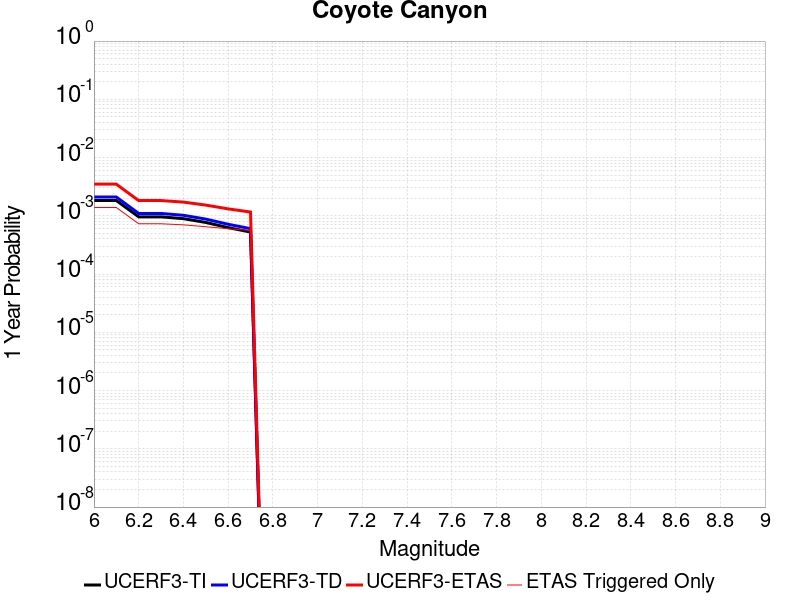 | 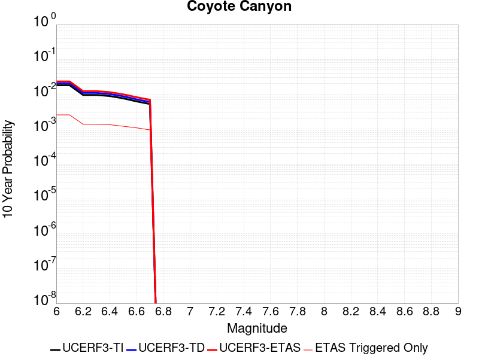 |

| Magnitude | 1 yr TI Prob | TD Prob | ETAS Prob | ETAS/TD Gain | ETAS Triggered Only | 10 yr TI Prob | TD Prob | ETAS Prob | ETAS/TD Gain | ETAS Triggered Only |
|-----|-----|-----|-----|-----|-----|-----|-----|-----|-----|-----|
| 6.0 | 0.0018293047 | 0.0021042565 | 0.0034913318 | 1.6591758 | 0.00139 | 0.018143194 | 0.02086924 | 0.023375815 | 1.1201086 | 0.00256 |
| 6.1 | 0.0018293047 | 0.0021042565 | 0.0034913318 | 1.6591758 | 0.00139 | 0.018143194 | 0.02086924 | 0.023375815 | 1.1201086 | 0.00256 |
| 6.2 | 9.606133E-4 | 0.0010983889 | 0.0018275871 | 1.6638798 | 7.3E-4 | 0.0095647145 | 0.010939687 | 0.012304589 | 1.1247662 | 0.00138 |
| 6.3 | 9.606133E-4 | 0.0010983889 | 0.0018275871 | 1.6638798 | 7.3E-4 | 0.0095647145 | 0.010939687 | 0.012304589 | 1.1247662 | 0.00138 |
| 6.4 | 8.930107E-4 | 0.0010204831 | 0.0017197687 | 1.6852496 | 7.0E-4 | 0.008894307 | 0.010167888 | 0.011494263 | 1.1304474 | 0.00134 |
| 6.5 | 7.6907943E-4 | 8.782522E-4 | 0.0015276814 | 1.7394563 | 6.5E-4 | 0.007664232 | 0.00875701 | 0.009956414 | 1.136965 | 0.00121 |
| 6.6 | 6.268809E-4 | 7.159479E-4 | 0.0013155183 | 1.8374499 | 6.0E-4 | 0.0062511545 | 0.0071451063 | 0.008227318 | 1.151462 | 0.00109 |
| 6.7 | 5.266384E-4 | 6.0171884E-4 | 0.0011613818 | 1.9301072 | 5.6E-4 | 0.005253921 | 0.006009423 | 0.006953714 | 1.157135 | 9.5E-4 |

## Nelson Lake
*[(top)](#table-of-contents)*

| 1 Year | 10 Year |
|-----|-----|
| 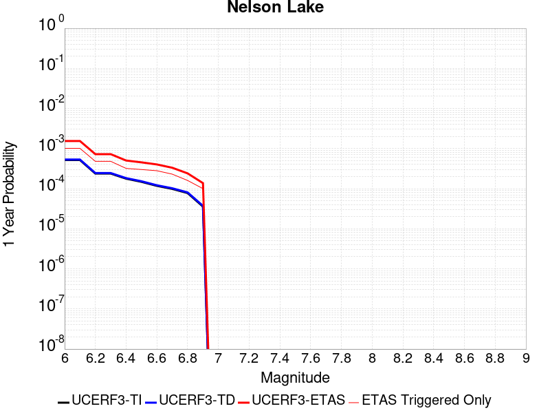 | 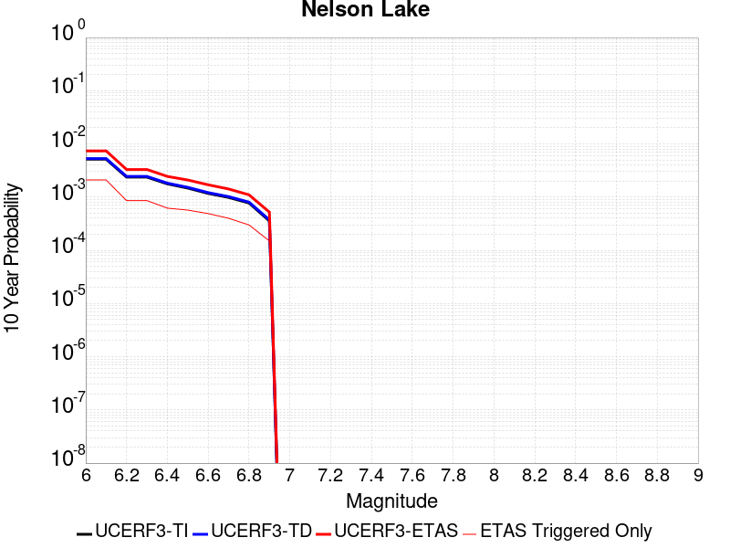 |

| Magnitude | 1 yr TI Prob | TD Prob | ETAS Prob | ETAS/TD Gain | ETAS Triggered Only | 10 yr TI Prob | TD Prob | ETAS Prob | ETAS/TD Gain | ETAS Triggered Only |
|-----|-----|-----|-----|-----|-----|-----|-----|-----|-----|-----|
| 6.0 | 5.1713863E-4 | 5.316899E-4 | 0.0015411528 | 2.8985937 | 0.00101 | 0.0051593683 | 0.005305206 | 0.0073940647 | 1.3937376 | 0.0021 |
| 6.1 | 5.1713863E-4 | 5.316899E-4 | 0.0015411528 | 2.8985937 | 0.00101 | 0.0051593683 | 0.005305206 | 0.0073940647 | 1.3937376 | 0.0021 |
| 6.2 | 2.3788778E-4 | 2.4501892E-4 | 7.249013E-4 | 2.9585524 | 4.8E-4 | 0.0023763329 | 0.0024476137 | 0.0033055088 | 1.3505026 | 8.6E-4 |
| 6.3 | 2.3788778E-4 | 2.4501892E-4 | 7.249013E-4 | 2.9585524 | 4.8E-4 | 0.0023763329 | 0.0024476137 | 0.0033055088 | 1.3505026 | 8.6E-4 |
| 6.4 | 1.7752586E-4 | 1.8312594E-4 | 5.0306733E-4 | 2.7471113 | 3.2E-4 | 0.001773841 | 0.0018298334 | 0.002448699 | 1.3382087 | 6.2E-4 |
| 6.5 | 1.479309E-4 | 1.5276077E-4 | 4.5271494E-4 | 2.963555 | 3.0E-4 | 0.0014783246 | 0.0015266314 | 0.0020957612 | 1.3728011 | 5.7E-4 |
| 6.6 | 1.1747423E-4 | 1.215209E-4 | 4.0148688E-4 | 3.3038504 | 2.8E-4 | 0.0011741214 | 0.0012146062 | 0.0017040111 | 1.4029329 | 4.9E-4 |
| 6.7 | 9.867457E-5 | 1.02220656E-4 | 3.3219715E-4 | 3.2498045 | 2.3E-4 | 9.863076E-4 | 0.0010217939 | 0.0014213852 | 1.3910683 | 4.0E-4 |
| 6.8 | 7.76117E-5 | 8.055228E-5 | 2.4053939E-4 | 2.9861276 | 1.6E-4 | 7.75846E-4 | 8.052819E-4 | 0.0011050403 | 1.3722403 | 3.0E-4 |
| 6.9 | 3.56685E-5 | 3.7254806E-5 | 1.3725107E-4 | 3.6841173 | 1.0E-4 | 3.5662777E-4 | 3.7251686E-4 | 5.2246096E-4 | 1.4025164 | 1.5E-4 |

## San Andreas (Mojave S)
*[(top)](#table-of-contents)*

| 1 Year | 10 Year |
|-----|-----|
|  | 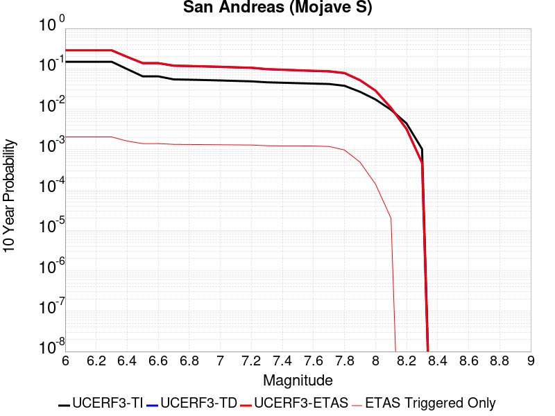 |

| Magnitude | 1 yr TI Prob | TD Prob | ETAS Prob | ETAS/TD Gain | ETAS Triggered Only | 10 yr TI Prob | TD Prob | ETAS Prob | ETAS/TD Gain | ETAS Triggered Only |
|-----|-----|-----|-----|-----|-----|-----|-----|-----|-----|-----|
| 6.0 | 0.016080605 | 0.034622807 | 0.035993643 | 1.0395935 | 0.00142 | 0.1496549 | 0.28660756 | 0.28807718 | 1.0051275 | 0.00206 |
| 6.1 | 0.016080605 | 0.034622807 | 0.035993643 | 1.0395935 | 0.00142 | 0.1496549 | 0.28660756 | 0.28807718 | 1.0051275 | 0.00206 |
| 6.2 | 0.016080605 | 0.034622807 | 0.035993643 | 1.0395935 | 0.00142 | 0.1496549 | 0.28660756 | 0.28807718 | 1.0051275 | 0.00206 |
| 6.3 | 0.016080605 | 0.034622807 | 0.035993643 | 1.0395935 | 0.00142 | 0.1496549 | 0.28660756 | 0.28807718 | 1.0051275 | 0.00206 |
| 6.4 | 0.010316478 | 0.022288878 | 0.02339369 | 1.0495679 | 0.00113 | 0.098504856 | 0.19700076 | 0.19830966 | 1.0066441 | 0.00163 |
| 6.5 | 0.006714592 | 0.014893819 | 0.015859222 | 1.0648191 | 9.8E-4 | 0.065152965 | 0.13803773 | 0.1392531 | 1.0088046 | 0.00141 |
| 6.6 | 0.006714592 | 0.014893819 | 0.015859222 | 1.0648191 | 9.8E-4 | 0.065152965 | 0.13803773 | 0.1392531 | 1.0088046 | 0.00141 |
| 6.7 | 0.0056198016 | 0.012618859 | 0.013537124 | 1.0727692 | 9.3E-4 | 0.054797906 | 0.11918017 | 0.120369285 | 1.0099773 | 0.00135 |
| 6.8 | 0.0055285925 | 0.012370255 | 0.013278875 | 1.073452 | 9.2E-4 | 0.053930566 | 0.11712932 | 0.11831237 | 1.0101004 | 0.00134 |
| 6.9 | 0.0054089287 | 0.012045632 | 0.01294467 | 1.0746361 | 9.1E-4 | 0.05279156 | 0.114426754 | 0.115604565 | 1.0102931 | 0.00133 |
| 7.0 | 0.005285311 | 0.011720508 | 0.012619843 | 1.0767317 | 9.1E-4 | 0.05161361 | 0.111687146 | 0.112859726 | 1.0104988 | 0.00132 |
| 7.1 | 0.0051451353 | 0.0113534 | 0.012253068 | 1.0792422 | 9.1E-4 | 0.05027629 | 0.1085716 | 0.10973936 | 1.0107558 | 0.00131 |
| 7.2 | 0.005018219 | 0.01102466 | 0.011914738 | 1.0807352 | 9.0E-4 | 0.049064007 | 0.105761394 | 0.1069239 | 1.0109918 | 0.0013 |
| 7.3 | 0.004746591 | 0.010109784 | 0.010970989 | 1.0851853 | 8.7E-4 | 0.046464786 | 0.09795449 | 0.099082045 | 1.0115111 | 0.00125 |
| 7.4 | 0.0046267817 | 0.009721531 | 0.01057317 | 1.0876034 | 8.6E-4 | 0.045316286 | 0.09458946 | 0.09571217 | 1.0118693 | 0.00124 |
| 7.5 | 0.004516484 | 0.009376018 | 0.010227955 | 1.0908633 | 8.6E-4 | 0.04425787 | 0.09155319 | 0.09267966 | 1.0123041 | 0.00124 |
| 7.6 | 0.0044011753 | 0.009059366 | 0.009901665 | 1.0929755 | 8.5E-4 | 0.04315024 | 0.088712245 | 0.089833125 | 1.0126351 | 0.00123 |
| 7.7 | 0.004300386 | 0.008812208 | 0.009624981 | 1.0922327 | 8.2E-4 | 0.042181134 | 0.08646306 | 0.087559305 | 1.0126787 | 0.0012 |
| 7.8 | 0.0038772223 | 0.00794396 | 0.008598717 | 1.082422 | 6.6E-4 | 0.03810269 | 0.078293726 | 0.079197 | 1.011537 | 9.8E-4 |
| 7.9 | 0.0027402006 | 0.005208101 | 0.005556278 | 1.066853 | 3.5E-4 | 0.027066574 | 0.052202165 | 0.052666586 | 1.0088966 | 4.9E-4 |
| 8.0 | 0.0017620471 | 0.0028177486 | 0.0029174667 | 1.0353893 | 1.0E-4 | 0.017481409 | 0.028836168 | 0.02897213 | 1.004715 | 1.4E-4 |
| 8.1 | 9.736188E-4 | 0.0010071032 | 0.0010170932 | 1.0099195 | 1.0E-5 | 0.009693642 | 0.010799525 | 0.010819309 | 1.0018319 | 2.0E-5 |
| 8.2 | 4.455896E-4 | 2.849222E-4 | 2.849222E-4 | 1.0 | 0.0 | 0.0044469717 | 0.003241059 | 0.003241059 | 1.0 | 0.0 |
| 8.3 | 1.034694E-4 | 3.9971612E-5 | 3.9971612E-5 | 1.0 | 0.0 | 0.0010342124 | 4.7201355E-4 | 4.7201355E-4 | 1.0 | 0.0 |

## Death Valley (So)
*[(top)](#table-of-contents)*

| 1 Year | 10 Year |
|-----|-----|
| 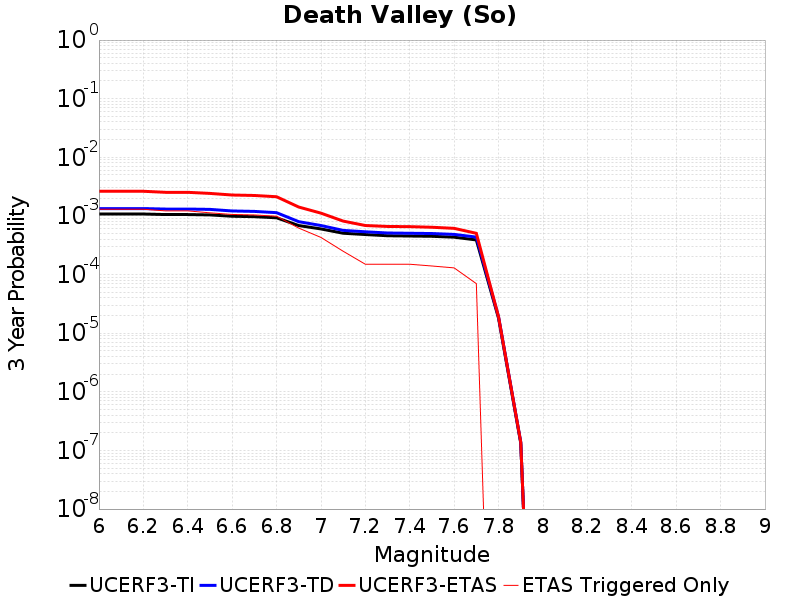 | 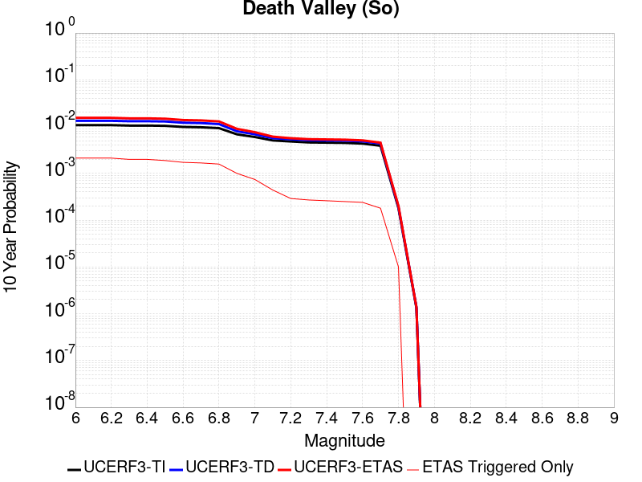 |

| Magnitude | 1 yr TI Prob | TD Prob | ETAS Prob | ETAS/TD Gain | ETAS Triggered Only | 10 yr TI Prob | TD Prob | ETAS Prob | ETAS/TD Gain | ETAS Triggered Only |
|-----|-----|-----|-----|-----|-----|-----|-----|-----|-----|-----|
| 6.0 | 0.0010787029 | 0.0013358443 | 0.0026341078 | 1.9718673 | 0.0013 | 0.010734817 | 0.013281427 | 0.015373271 | 1.1575013 | 0.00212 |
| 6.1 | 0.0010787029 | 0.0013358443 | 0.0026341078 | 1.9718673 | 0.0013 | 0.010734817 | 0.013281427 | 0.015373271 | 1.1575013 | 0.00212 |
| 6.2 | 0.0010787029 | 0.0013358443 | 0.0026341078 | 1.9718673 | 0.0013 | 0.010734817 | 0.013281427 | 0.015373271 | 1.1575013 | 0.00212 |
| 6.3 | 0.0010555626 | 0.0013097931 | 0.002528195 | 1.9302248 | 0.00122 | 0.010505628 | 0.0130239865 | 0.014988069 | 1.150805 | 0.00199 |
| 6.4 | 0.0010555626 | 0.0013097931 | 0.002528195 | 1.9302248 | 0.00122 | 0.010505628 | 0.0130239865 | 0.014988069 | 1.150805 | 0.00199 |
| 6.5 | 0.0010410968 | 0.0012935994 | 0.0024221377 | 1.8724016 | 0.00113 | 0.010362327 | 0.012863933 | 0.014719749 | 1.144265 | 0.00188 |
| 6.6 | 9.876423E-4 | 0.0012156261 | 0.0022743375 | 1.8709186 | 0.00106 | 0.009832645 | 0.012092818 | 0.0137920175 | 1.1405132 | 0.00172 |
| 6.7 | 9.711593E-4 | 0.0011948127 | 0.0022335702 | 1.8693893 | 0.00104 | 0.009669261 | 0.011886933 | 0.013537081 | 1.1388204 | 0.00167 |
| 6.8 | 9.29938E-4 | 0.0011371728 | 0.002126047 | 1.8695902 | 9.9E-4 | 0.009260561 | 0.011316381 | 0.012878502 | 1.1380407 | 0.00158 |
| 6.9 | 6.8514474E-4 | 7.9823274E-4 | 0.0014177379 | 1.7760957 | 6.2E-4 | 0.006830362 | 0.007954664 | 0.008946709 | 1.1247125 | 0.001 |
| 7.0 | 6.002687E-4 | 6.861437E-4 | 0.0011158487 | 1.6262609 | 4.3E-4 | 0.0059864987 | 0.006840953 | 0.007575891 | 1.107432 | 7.4E-4 |
| 7.1 | 5.068359E-4 | 5.667825E-4 | 8.166408E-4 | 1.4408363 | 2.5E-4 | 0.0050568148 | 0.0056538233 | 0.0060913353 | 1.0773834 | 4.4E-4 |
| 7.2 | 4.81665E-4 | 5.3658907E-4 | 6.8650855E-4 | 1.2793936 | 1.5E-4 | 0.0048062233 | 0.0053533656 | 0.005641813 | 1.0538815 | 2.9E-4 |
| 7.3 | 4.592835E-4 | 5.116528E-4 | 6.6157605E-4 | 1.2930175 | 1.5E-4 | 0.0045833546 | 0.0051051746 | 0.005373796 | 1.0526175 | 2.7E-4 |
| 7.4 | 4.5430884E-4 | 5.063859E-4 | 6.5631E-4 | 1.2960668 | 1.5E-4 | 0.004533812 | 0.0050527467 | 0.005311433 | 1.0511972 | 2.6E-4 |
| 7.5 | 4.492982E-4 | 5.010477E-4 | 6.409776E-4 | 1.2792745 | 1.4E-4 | 0.004483909 | 0.004999606 | 0.005248356 | 1.0497539 | 2.5E-4 |
| 7.6 | 4.3398244E-4 | 4.8431163E-4 | 6.142487E-4 | 1.2682922 | 1.3E-4 | 0.0043313587 | 0.0048329853 | 0.0050718253 | 1.0494188 | 2.4E-4 |
| 7.7 | 3.8979502E-4 | 4.3535102E-4 | 5.0532055E-4 | 1.1607198 | 7.0E-5 | 0.00389112 | 0.0043453868 | 0.004524605 | 1.0412432 | 1.8E-4 |
| 7.8 | 1.80467E-5 | 1.9035946E-5 | 1.9035946E-5 | 1.0 | 0.0 | 1.8045233E-4 | 1.903436E-4 | 2.003417E-4 | 1.0525266 | 1.0E-5 |
| 7.9 | 1.335311E-7 | 1.3929973E-7 | 1.3929973E-7 | 1.0 | 0.0 | 1.3353102E-6 | 1.3929973E-6 | 1.3929973E-6 | 1.0 | 0.0 |

## Lenwood-Lockhart-Old Woman Springs
*[(top)](#table-of-contents)*

| 1 Year | 10 Year |
|-----|-----|
| 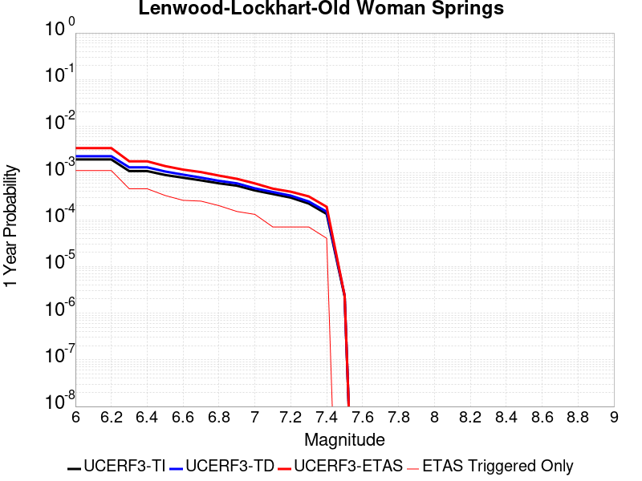 | 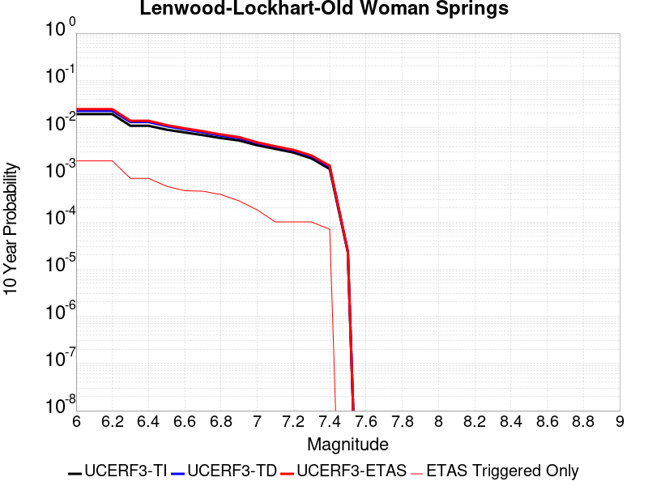 |

| Magnitude | 1 yr TI Prob | TD Prob | ETAS Prob | ETAS/TD Gain | ETAS Triggered Only | 10 yr TI Prob | TD Prob | ETAS Prob | ETAS/TD Gain | ETAS Triggered Only |
|-----|-----|-----|-----|-----|-----|-----|-----|-----|-----|-----|
| 6.0 | 0.0019519776 | 0.002291509 | 0.0034189196 | 1.4919949 | 0.00113 | 0.019349206 | 0.022696808 | 0.024622096 | 1.0848264 | 0.00197 |
| 6.1 | 0.0019519776 | 0.002291509 | 0.0034189196 | 1.4919949 | 0.00113 | 0.019349206 | 0.022696808 | 0.024622096 | 1.0848264 | 0.00197 |
| 6.2 | 0.0019519776 | 0.002291509 | 0.0034189196 | 1.4919949 | 0.00113 | 0.019349206 | 0.022696808 | 0.024622096 | 1.0848264 | 0.00197 |
| 6.3 | 0.0010993304 | 0.0013220703 | 0.0017814621 | 1.3474791 | 4.6E-4 | 0.010939079 | 0.013144265 | 0.013973224 | 1.0630662 | 8.4E-4 |
| 6.4 | 0.0010993304 | 0.0013220703 | 0.0017814621 | 1.3474791 | 4.6E-4 | 0.010939079 | 0.013144265 | 0.013973224 | 1.0630662 | 8.4E-4 |
| 6.5 | 9.073613E-4 | 0.0010775784 | 0.0014072228 | 1.3059123 | 3.3E-4 | 0.009036654 | 0.010724827 | 0.011288714 | 1.0525777 | 5.7E-4 |
| 6.6 | 7.9306826E-4 | 9.2209294E-4 | 0.0011818531 | 1.2817073 | 2.6E-4 | 0.007902439 | 0.009183532 | 0.009639307 | 1.0496297 | 4.6E-4 |
| 6.7 | 6.950544E-4 | 7.9614954E-4 | 0.0010459505 | 1.3137614 | 2.5E-4 | 0.006928845 | 0.007933604 | 0.008380033 | 1.0562707 | 4.5E-4 |
| 6.8 | 6.011979E-4 | 6.7971606E-4 | 8.7958016E-4 | 1.2940404 | 2.0E-4 | 0.00599574 | 0.0067768227 | 0.0071542473 | 1.0556935 | 3.8E-4 |
| 6.9 | 5.3489394E-4 | 6.0063414E-4 | 7.505441E-4 | 1.2495861 | 1.5E-4 | 0.0053360825 | 0.005990487 | 0.00626881 | 1.0464607 | 2.8E-4 |
| 7.0 | 4.2279682E-4 | 4.6904694E-4 | 5.98986E-4 | 1.2770277 | 1.3E-4 | 0.0042199334 | 0.0046808175 | 0.004859975 | 1.0382748 | 1.8E-4 |
| 7.1 | 3.5468035E-4 | 3.9209158E-4 | 4.620641E-4 | 1.1784598 | 7.0E-5 | 0.003541148 | 0.003914214 | 0.004013823 | 1.025448 | 1.0E-4 |
| 7.2 | 2.9681803E-4 | 3.2763174E-4 | 3.9760882E-4 | 1.2135845 | 7.0E-5 | 0.002964219 | 0.003271686 | 0.0033713586 | 1.0304652 | 1.0E-4 |
| 7.3 | 2.2190946E-4 | 2.4557233E-4 | 3.1555514E-4 | 1.2849784 | 7.0E-5 | 0.00221688 | 0.0024531905 | 0.0025529452 | 1.0406632 | 1.0E-4 |
| 7.4 | 1.3277601E-4 | 1.4880658E-4 | 1.8880062E-4 | 1.2687653 | 4.0E-5 | 0.001326967 | 0.0014872316 | 0.0015571275 | 1.0469973 | 7.0E-5 |
| 7.5 | 2.2805577E-6 | 2.38086E-6 | 2.38086E-6 | 1.0 | 0.0 | 2.2805343E-5 | 2.38084E-5 | 2.38084E-5 | 1.0 | 0.0 |

## San Andreas (Mojave N)
*[(top)](#table-of-contents)*

| 1 Year | 10 Year |
|-----|-----|
| 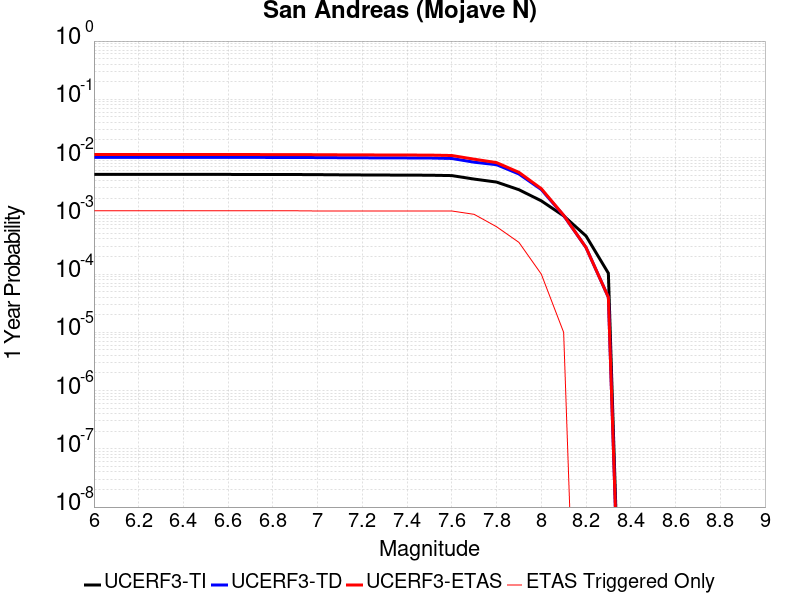 | 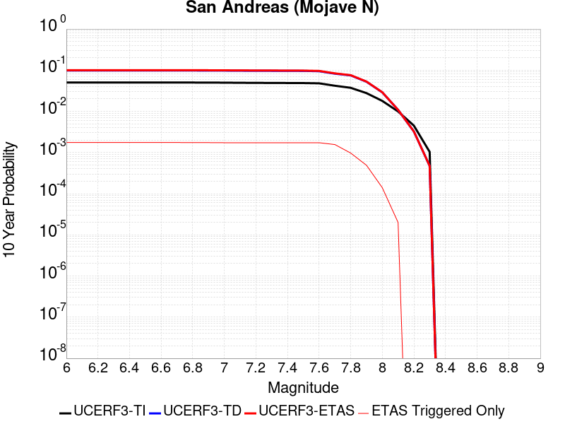 |

| Magnitude | 1 yr TI Prob | TD Prob | ETAS Prob | ETAS/TD Gain | ETAS Triggered Only | 10 yr TI Prob | TD Prob | ETAS Prob | ETAS/TD Gain | ETAS Triggered Only |
|-----|-----|-----|-----|-----|-----|-----|-----|-----|-----|-----|
| 6.0 | 0.0051410277 | 0.010073375 | 0.011281085 | 1.1198914 | 0.00122 | 0.05023708 | 0.098317824 | 0.09989577 | 1.0160494 | 0.00175 |
| 6.1 | 0.0051410277 | 0.010073375 | 0.011281085 | 1.1198914 | 0.00122 | 0.05023708 | 0.098317824 | 0.09989577 | 1.0160494 | 0.00175 |
| 6.2 | 0.0051410277 | 0.010073375 | 0.011281085 | 1.1198914 | 0.00122 | 0.05023708 | 0.098317824 | 0.09989577 | 1.0160494 | 0.00175 |
| 6.3 | 0.0051410277 | 0.010073375 | 0.011281085 | 1.1198914 | 0.00122 | 0.05023708 | 0.098317824 | 0.09989577 | 1.0160494 | 0.00175 |
| 6.4 | 0.0051410277 | 0.010073375 | 0.011281085 | 1.1198914 | 0.00122 | 0.05023708 | 0.098317824 | 0.09989577 | 1.0160494 | 0.00175 |
| 6.5 | 0.0051326132 | 0.010059821 | 0.011267548 | 1.1200545 | 0.00122 | 0.050156746 | 0.09819562 | 0.09977377 | 1.0160716 | 0.00175 |
| 6.6 | 0.0051326132 | 0.010059821 | 0.011267548 | 1.1200545 | 0.00122 | 0.050156746 | 0.09819562 | 0.09977377 | 1.0160716 | 0.00175 |
| 6.7 | 0.0051293927 | 0.01005463 | 0.011262364 | 1.1201171 | 0.00122 | 0.050125998 | 0.0981488 | 0.09972704 | 1.01608 | 0.00175 |
| 6.8 | 0.0051248376 | 0.010046965 | 0.011254707 | 1.1202097 | 0.00122 | 0.05008251 | 0.098078825 | 0.09964817 | 1.0160009 | 0.00174 |
| 6.9 | 0.0051141046 | 0.010030437 | 0.0112382 | 1.1204098 | 0.00122 | 0.049980022 | 0.09792793 | 0.099497534 | 1.0160282 | 0.00174 |
| 7.0 | 0.005091073 | 0.009994976 | 0.011192882 | 1.1198509 | 0.00121 | 0.04976007 | 0.09760432 | 0.09916546 | 1.0159947 | 0.00173 |
| 7.1 | 0.005055068 | 0.009944191 | 0.011142159 | 1.1204691 | 0.00121 | 0.04941613 | 0.09714082 | 0.098702766 | 1.0160792 | 0.00173 |
| 7.2 | 0.0050299936 | 0.0099084275 | 0.011106438 | 1.1209083 | 0.00121 | 0.049176537 | 0.09681408 | 0.098376594 | 1.0161393 | 0.00173 |
| 7.3 | 0.0050112694 | 0.009883889 | 0.011081929 | 1.1212114 | 0.00121 | 0.04899759 | 0.09658754 | 0.09815044 | 1.0161812 | 0.00173 |
| 7.4 | 0.0049933824 | 0.009852771 | 0.011050849 | 1.1215981 | 0.00121 | 0.04882661 | 0.09630571 | 0.097869106 | 1.0162337 | 0.00173 |
| 7.5 | 0.0049769743 | 0.009824907 | 0.011023019 | 1.1219463 | 0.00121 | 0.048669744 | 0.09605189 | 0.09761572 | 1.0162811 | 0.00173 |
| 7.6 | 0.004902454 | 0.009645196 | 0.010843525 | 1.1242411 | 0.00121 | 0.047957025 | 0.09443419 | 0.09600081 | 1.0165896 | 0.00173 |
| 7.7 | 0.00427079 | 0.008325901 | 0.009377075 | 1.1262536 | 0.00106 | 0.04189639 | 0.08223545 | 0.08366716 | 1.0174099 | 0.00156 |
| 7.8 | 0.003794643 | 0.0075467685 | 0.008191863 | 1.0854796 | 6.5E-4 | 0.037304975 | 0.07472763 | 0.075625144 | 1.0120105 | 9.7E-4 |
| 7.9 | 0.0028072202 | 0.0052284827 | 0.0055766525 | 1.066591 | 3.5E-4 | 0.02772022 | 0.052426584 | 0.052890893 | 1.0088564 | 4.9E-4 |
| 8.0 | 0.0018082283 | 0.0028274336 | 0.0029271508 | 1.0352677 | 1.0E-4 | 0.017935853 | 0.02894879 | 0.029084736 | 1.0046961 | 1.4E-4 |
| 8.1 | 9.988535E-4 | 0.0010119639 | 0.0010219538 | 1.0098717 | 1.0E-5 | 0.009943757 | 0.010856894 | 0.010876677 | 1.0018221 | 2.0E-5 |
| 8.2 | 4.5092785E-4 | 2.8565482E-4 | 2.8565482E-4 | 1.0 | 0.0 | 0.0045001395 | 0.0032489614 | 0.0032489614 | 1.0 | 0.0 |
| 8.3 | 1.034694E-4 | 3.9971612E-5 | 3.9971612E-5 | 1.0 | 0.0 | 0.0010342124 | 4.7201355E-4 | 4.7201355E-4 | 1.0 | 0.0 |

## Towne Pass
*[(top)](#table-of-contents)*

| 1 Year | 10 Year |
|-----|-----|
| 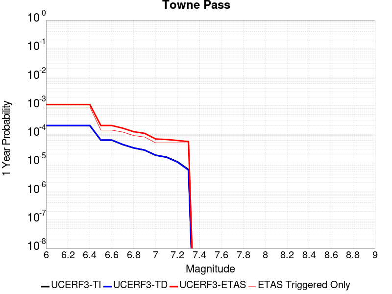 | 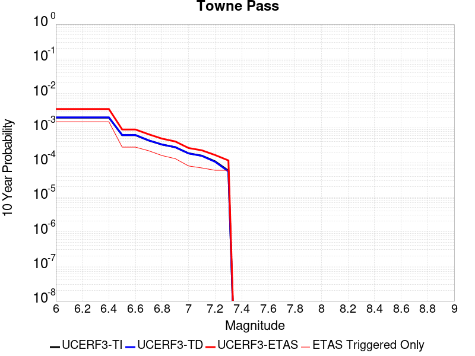 |

| Magnitude | 1 yr TI Prob | TD Prob | ETAS Prob | ETAS/TD Gain | ETAS Triggered Only | 10 yr TI Prob | TD Prob | ETAS Prob | ETAS/TD Gain | ETAS Triggered Only |
|-----|-----|-----|-----|-----|-----|-----|-----|-----|-----|-----|
| 6.0 | 2.0085352E-4 | 2.0319606E-4 | 0.0011030132 | 5.4283195 | 9.0E-4 | 0.0020067208 | 0.0020305319 | 0.0035474454 | 1.7470523 | 0.00152 |
| 6.1 | 2.0085352E-4 | 2.0319606E-4 | 0.0011030132 | 5.4283195 | 9.0E-4 | 0.0020067208 | 0.0020305319 | 0.0035474454 | 1.7470523 | 0.00152 |
| 6.2 | 2.0085352E-4 | 2.0319606E-4 | 0.0011030132 | 5.4283195 | 9.0E-4 | 0.0020067208 | 0.0020305319 | 0.0035474454 | 1.7470523 | 0.00152 |
| 6.3 | 2.0085352E-4 | 2.0319606E-4 | 0.0011030132 | 5.4283195 | 9.0E-4 | 0.0020067208 | 0.0020305319 | 0.0035474454 | 1.7470523 | 0.00152 |
| 6.4 | 2.0085352E-4 | 2.0319606E-4 | 0.0011030132 | 5.4283195 | 9.0E-4 | 0.0020067208 | 0.0020305319 | 0.0035474454 | 1.7470523 | 0.00152 |
| 6.5 | 6.236998E-5 | 6.2771745E-5 | 2.0276295E-4 | 3.2301629 | 1.4E-4 | 6.235248E-4 | 6.2755187E-4 | 9.073762E-4 | 1.4458983 | 2.8E-4 |
| 6.6 | 6.236998E-5 | 6.2771745E-5 | 2.0276295E-4 | 3.2301629 | 1.4E-4 | 6.235248E-4 | 6.2755187E-4 | 9.073762E-4 | 1.4458983 | 2.8E-4 |
| 6.7 | 4.370358E-5 | 4.3884807E-5 | 1.6387954E-4 | 3.7343116 | 1.2E-4 | 4.3694986E-4 | 4.3876714E-4 | 6.586706E-4 | 1.5011849 | 2.2E-4 |
| 6.8 | 3.3291526E-5 | 3.3352866E-5 | 1.2334986E-4 | 3.6983287 | 9.0E-5 | 3.3286537E-4 | 3.3348243E-4 | 4.934291E-4 | 1.4796255 | 1.6E-4 |
| 6.9 | 2.789431E-5 | 2.789085E-5 | 1.0788862E-4 | 3.8682442 | 8.0E-5 | 2.789081E-4 | 2.788768E-4 | 4.0884057E-4 | 1.4660256 | 1.3E-4 |
| 7.0 | 1.8563835E-5 | 1.8431529E-5 | 6.843061E-5 | 3.712693 | 5.0E-5 | 1.8562283E-4 | 1.8430084E-4 | 2.642861E-4 | 1.4339929 | 8.0E-5 |
| 7.1 | 1.5851423E-5 | 1.5654625E-5 | 6.565384E-5 | 4.1938944 | 5.0E-5 | 1.5850292E-4 | 1.5653597E-4 | 2.2652501E-4 | 1.4471116 | 7.0E-5 |
| 7.2 | 1.0857389E-5 | 1.0549258E-5 | 6.054873E-5 | 5.7396197 | 5.0E-5 | 1.0856859E-4 | 1.0548804E-4 | 1.6548172E-4 | 1.5687249 | 6.0E-5 |
| 7.3 | 5.8241935E-6 | 5.5501705E-6 | 5.5549892E-5 | 10.008682 | 5.0E-5 | 5.8240406E-5 | 5.5500517E-5 | 1.1549719E-4 | 2.081011 | 6.0E-5 |

## Paradise
*[(top)](#table-of-contents)*

| 1 Year | 10 Year |
|-----|-----|
| 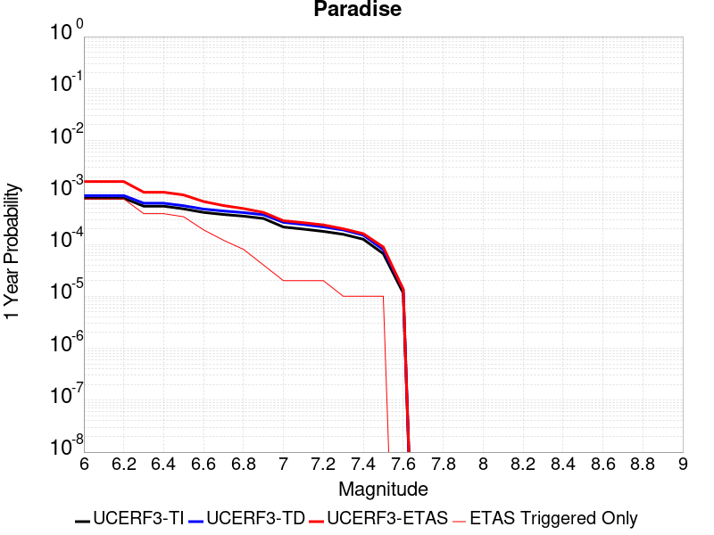 | 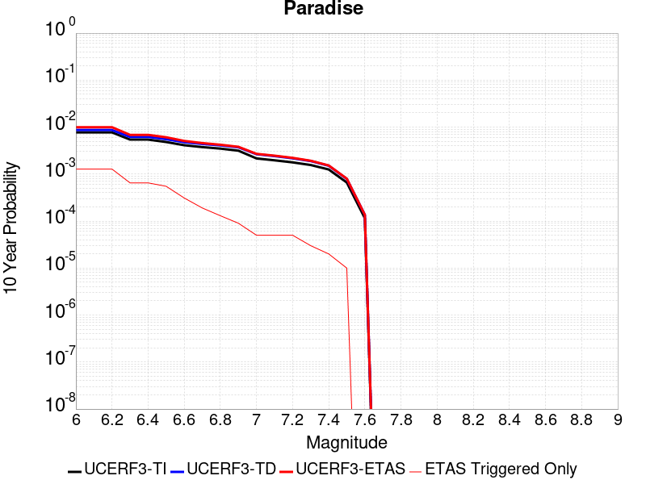 |

| Magnitude | 1 yr TI Prob | TD Prob | ETAS Prob | ETAS/TD Gain | ETAS Triggered Only | 10 yr TI Prob | TD Prob | ETAS Prob | ETAS/TD Gain | ETAS Triggered Only |
|-----|-----|-----|-----|-----|-----|-----|-----|-----|-----|-----|
| 6.0 | 7.7462377E-4 | 8.7075913E-4 | 0.001620106 | 1.8605673 | 7.5E-4 | 0.0077192914 | 0.008675852 | 0.009944747 | 1.146256 | 0.00128 |
| 6.1 | 7.7462377E-4 | 8.7075913E-4 | 0.001620106 | 1.8605673 | 7.5E-4 | 0.0077192914 | 0.008675852 | 0.009944747 | 1.146256 | 0.00128 |
| 6.2 | 7.7462377E-4 | 8.7075913E-4 | 0.001620106 | 1.8605673 | 7.5E-4 | 0.0077192914 | 0.008675852 | 0.009944747 | 1.146256 | 0.00128 |
| 6.3 | 5.43912E-4 | 6.201494E-4 | 0.0010099076 | 1.6284907 | 3.9E-4 | 0.0054258266 | 0.006184797 | 0.0068307766 | 1.1044464 | 6.5E-4 |
| 6.4 | 5.43912E-4 | 6.201494E-4 | 0.0010099076 | 1.6284907 | 3.9E-4 | 0.0054258266 | 0.006184797 | 0.0068307766 | 1.1044464 | 6.5E-4 |
| 6.5 | 4.8255164E-4 | 5.539895E-4 | 8.938011E-4 | 1.6133901 | 3.4E-4 | 0.0048150513 | 0.0055265836 | 0.0060735443 | 1.098969 | 5.5E-4 |
| 6.6 | 4.1235037E-4 | 4.7782352E-4 | 6.6773273E-4 | 1.3974464 | 1.9E-4 | 0.0041158604 | 0.004768358 | 0.00507688 | 1.0647019 | 3.1E-4 |
| 6.7 | 3.7593965E-4 | 4.3858812E-4 | 5.585355E-4 | 1.2734852 | 1.2E-4 | 0.003753043 | 0.004377594 | 0.0045667626 | 1.0432129 | 1.9E-4 |
| 6.8 | 3.4926904E-4 | 4.0911505E-4 | 4.890823E-4 | 1.195464 | 8.0E-5 | 0.003487206 | 0.004083976 | 0.0042134454 | 1.0317017 | 1.3E-4 |
| 6.9 | 3.1521954E-4 | 3.7200164E-4 | 4.1198675E-4 | 1.1074864 | 4.0E-5 | 0.0031477278 | 0.0037141275 | 0.003803793 | 1.0241418 | 9.0E-5 |
| 7.0 | 2.1568815E-4 | 2.6505065E-4 | 2.8504536E-4 | 1.0754373 | 2.0E-5 | 0.0021547892 | 0.0026474984 | 0.002697366 | 1.0188358 | 5.0E-5 |
| 7.1 | 1.9656324E-4 | 2.4165749E-4 | 2.6165266E-4 | 1.0827417 | 2.0E-5 | 0.0019638946 | 0.0024140975 | 0.0024639769 | 1.0206617 | 5.0E-5 |
| 7.2 | 1.777326E-4 | 2.1687057E-4 | 2.3686622E-4 | 1.0922009 | 2.0E-5 | 0.0017759053 | 0.0021667376 | 0.0022166292 | 1.0230262 | 5.0E-5 |
| 7.3 | 1.5618425E-4 | 1.8935668E-4 | 1.9935479E-4 | 1.0528004 | 1.0E-5 | 0.0015607453 | 0.0018920987 | 0.001922042 | 1.0158254 | 3.0E-5 |
| 7.4 | 1.2548068E-4 | 1.5073355E-4 | 1.6073204E-4 | 1.0663322 | 1.0E-5 | 0.0012540985 | 0.0015064547 | 0.0015264244 | 1.0132562 | 2.0E-5 |
| 7.5 | 6.631728E-5 | 7.896893E-5 | 8.896814E-5 | 1.1266221 | 1.0E-5 | 6.6297496E-4 | 7.8953133E-4 | 7.9952343E-4 | 1.0126557 | 1.0E-5 |
| 7.6 | 1.1540374E-5 | 1.3587041E-5 | 1.3587041E-5 | 1.0 | 0.0 | 1.1539775E-4 | 1.3586493E-4 | 1.3586493E-4 | 1.0 | 0.0 |

## Bicycle Lake
*[(top)](#table-of-contents)*

| 1 Year | 10 Year |
|-----|-----|
| 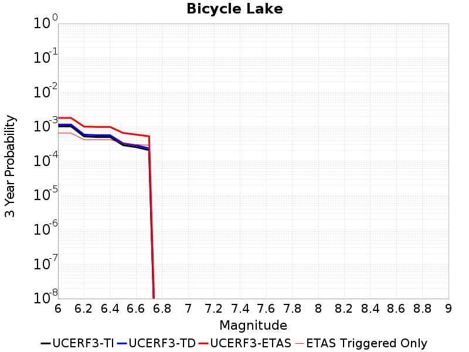 | 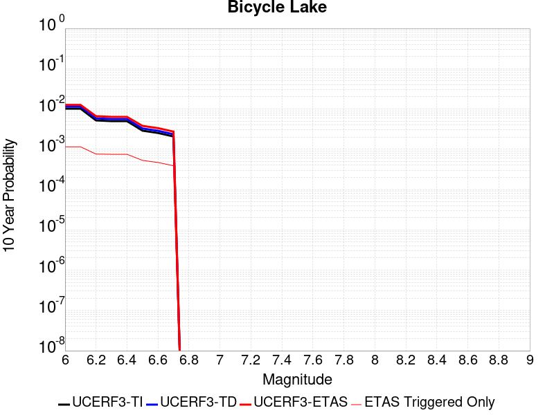 |

| Magnitude | 1 yr TI Prob | TD Prob | ETAS Prob | ETAS/TD Gain | ETAS Triggered Only | 10 yr TI Prob | TD Prob | ETAS Prob | ETAS/TD Gain | ETAS Triggered Only |
|-----|-----|-----|-----|-----|-----|-----|-----|-----|-----|-----|
| 6.0 | 0.0010233327 | 0.0011524883 | 0.0018017392 | 1.563347 | 6.5E-4 | 0.01018633 | 0.011478426 | 0.012615225 | 1.099038 | 0.00115 |
| 6.1 | 0.0010233327 | 0.0011524883 | 0.0018017392 | 1.563347 | 6.5E-4 | 0.01018633 | 0.011478426 | 0.012615225 | 1.099038 | 0.00115 |
| 6.2 | 5.2150246E-4 | 5.8719056E-4 | 0.001006944 | 1.7148503 | 4.2E-4 | 0.0052028033 | 0.0058614956 | 0.006617041 | 1.1288997 | 7.6E-4 |
| 6.3 | 5.002399E-4 | 5.6334294E-4 | 9.831063E-4 | 1.7451295 | 4.2E-4 | 0.0049911533 | 0.0056242384 | 0.00637002 | 1.1326014 | 7.5E-4 |
| 6.4 | 5.002399E-4 | 5.6334294E-4 | 9.831063E-4 | 1.7451295 | 4.2E-4 | 0.0049911533 | 0.0056242384 | 0.00637002 | 1.1326014 | 7.5E-4 |
| 6.5 | 2.8995197E-4 | 3.2795023E-4 | 6.5784197E-4 | 2.0059202 | 3.3E-4 | 0.0028957394 | 0.0032772988 | 0.0038055617 | 1.1611886 | 5.3E-4 |
| 6.6 | 2.54302E-4 | 2.8766345E-4 | 5.875772E-4 | 2.0425854 | 3.0E-4 | 0.002540112 | 0.0028754799 | 0.0033441284 | 1.162981 | 4.7E-4 |
| 6.7 | 2.0822904E-4 | 2.3563413E-4 | 5.255658E-4 | 2.2304316 | 2.9E-4 | 0.0020803404 | 0.0023563413 | 0.0027454223 | 1.1651208 | 3.9E-4 |

## Garlic Springs
*[(top)](#table-of-contents)*

| 1 Year | 10 Year |
|-----|-----|
| 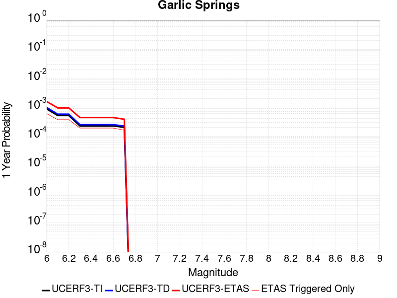 | 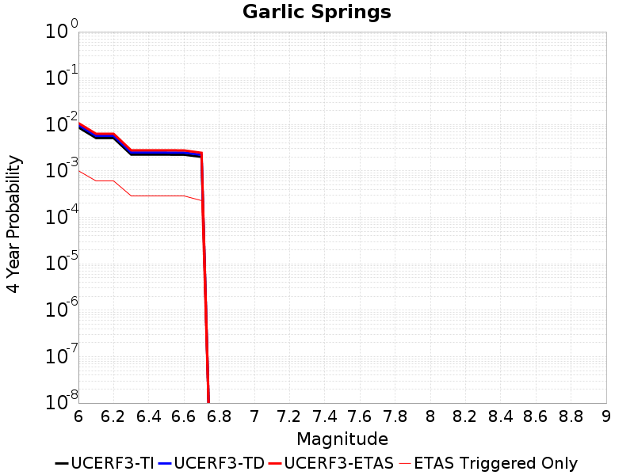 |

| Magnitude | 1 yr TI Prob | TD Prob | ETAS Prob | ETAS/TD Gain | ETAS Triggered Only | 10 yr TI Prob | TD Prob | ETAS Prob | ETAS/TD Gain | ETAS Triggered Only |
|-----|-----|-----|-----|-----|-----|-----|-----|-----|-----|-----|
| 6.0 | 8.7413884E-4 | 9.794047E-4 | 0.001578817 | 1.612017 | 6.0E-4 | 0.008707083 | 0.009762427 | 0.010762568 | 1.1024479 | 0.00101 |
| 6.1 | 5.139737E-4 | 5.72502E-4 | 9.422902E-4 | 1.645916 | 3.7E-4 | 0.005127866 | 0.0057172296 | 0.0063237417 | 1.1060851 | 6.1E-4 |
| 6.2 | 5.139737E-4 | 5.72502E-4 | 9.422902E-4 | 1.645916 | 3.7E-4 | 0.005127866 | 0.0057172296 | 0.0063237417 | 1.1060851 | 6.1E-4 |
| 6.3 | 2.2521814E-4 | 2.4930516E-4 | 4.392578E-4 | 1.7619282 | 1.9E-4 | 0.0022499003 | 0.0024925133 | 0.0027817904 | 1.1160585 | 2.9E-4 |
| 6.4 | 2.2521814E-4 | 2.4930516E-4 | 4.392578E-4 | 1.7619282 | 1.9E-4 | 0.0022499003 | 0.0024925133 | 0.0027817904 | 1.1160585 | 2.9E-4 |
| 6.5 | 2.2521814E-4 | 2.4930516E-4 | 4.392578E-4 | 1.7619282 | 1.9E-4 | 0.0022499003 | 0.0024925133 | 0.0027817904 | 1.1160585 | 2.9E-4 |
| 6.6 | 2.2441156E-4 | 2.484115E-4 | 4.3836428E-4 | 1.76467 | 1.9E-4 | 0.0022418506 | 0.0024835963 | 0.002772876 | 1.1164762 | 2.9E-4 |
| 6.7 | 2.0138794E-4 | 2.228581E-4 | 3.8282244E-4 | 1.7177856 | 1.6E-4 | 0.0020120554 | 0.0022285809 | 0.0024580683 | 1.1029747 | 2.3E-4 |

## San Andreas (San Bernardino N)
*[(top)](#table-of-contents)*

| 1 Year | 10 Year |
|-----|-----|
| 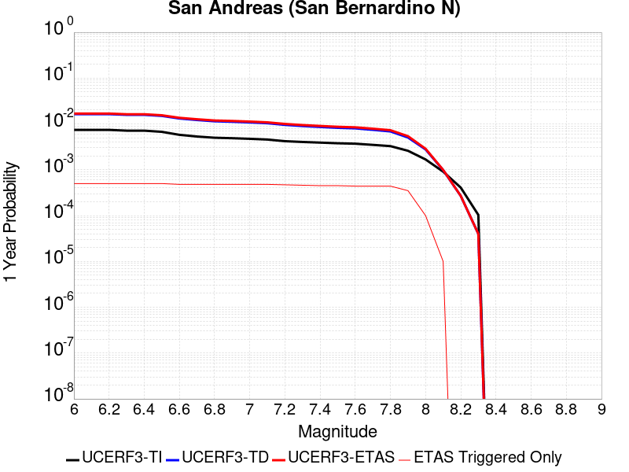 | 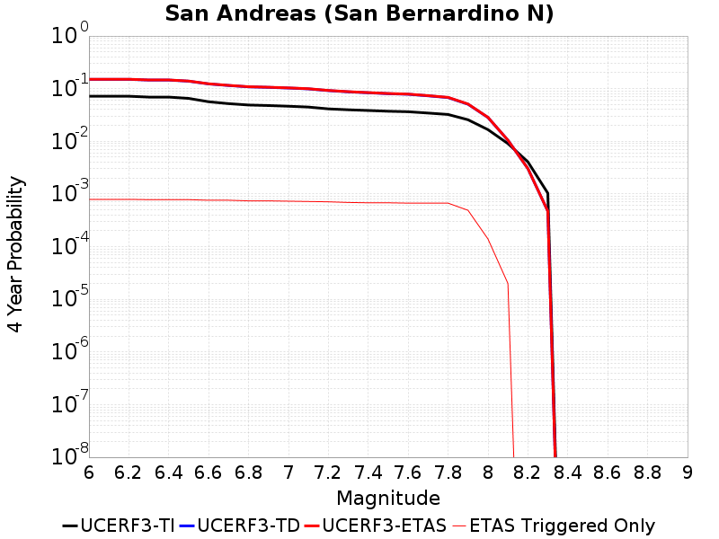 |

| Magnitude | 1 yr TI Prob | TD Prob | ETAS Prob | ETAS/TD Gain | ETAS Triggered Only | 10 yr TI Prob | TD Prob | ETAS Prob | ETAS/TD Gain | ETAS Triggered Only |
|-----|-----|-----|-----|-----|-----|-----|-----|-----|-----|-----|
| 6.0 | 0.0074207084 | 0.016360596 | 0.016852414 | 1.0300612 | 5.0E-4 | 0.07177748 | 0.15026969 | 0.15094097 | 1.0044672 | 7.9E-4 |
| 6.1 | 0.0074207084 | 0.016360596 | 0.016852414 | 1.0300612 | 5.0E-4 | 0.07177748 | 0.15026969 | 0.15094097 | 1.0044672 | 7.9E-4 |
| 6.2 | 0.0074207084 | 0.016360596 | 0.016852414 | 1.0300612 | 5.0E-4 | 0.07177748 | 0.15026969 | 0.15094097 | 1.0044672 | 7.9E-4 |
| 6.3 | 0.0071393442 | 0.015798124 | 0.016290223 | 1.0311494 | 5.0E-4 | 0.06914291 | 0.14556956 | 0.14623602 | 1.0045782 | 7.8E-4 |
| 6.4 | 0.0071393442 | 0.015798124 | 0.016290223 | 1.0311494 | 5.0E-4 | 0.06914291 | 0.14556956 | 0.14623602 | 1.0045782 | 7.8E-4 |
| 6.5 | 0.0067310524 | 0.014983208 | 0.015475716 | 1.0328707 | 5.0E-4 | 0.06530788 | 0.13871223 | 0.13938403 | 1.0048431 | 7.8E-4 |
| 6.6 | 0.005788839 | 0.013150189 | 0.0136238765 | 1.0360214 | 4.8E-4 | 0.056403454 | 0.12300209 | 0.12366861 | 1.0054188 | 7.6E-4 |
| 6.7 | 0.0053192247 | 0.012188969 | 0.012663119 | 1.0388999 | 4.8E-4 | 0.051936906 | 0.114793725 | 0.11546648 | 1.0058606 | 7.6E-4 |
| 6.8 | 0.0050023515 | 0.011428536 | 0.01190305 | 1.0415201 | 4.8E-4 | 0.048912346 | 0.10819569 | 0.10885563 | 1.0060995 | 7.4E-4 |
| 6.9 | 0.0048866454 | 0.011147589 | 0.011622238 | 1.0425787 | 4.8E-4 | 0.04780577 | 0.10578602 | 0.106447734 | 1.0062553 | 7.4E-4 |
| 7.0 | 0.0047382377 | 0.010800169 | 0.011274984 | 1.0439638 | 4.8E-4 | 0.046384744 | 0.10275649 | 0.10341148 | 1.0063741 | 7.3E-4 |
| 7.1 | 0.0045664064 | 0.010373929 | 0.010848949 | 1.0457898 | 4.8E-4 | 0.044737056 | 0.09906804 | 0.09971671 | 1.0065477 | 7.2E-4 |
| 7.2 | 0.0042088944 | 0.009550049 | 0.01001556 | 1.0487444 | 4.7E-4 | 0.041300658 | 0.0917989 | 0.09244373 | 1.0070243 | 7.1E-4 |
| 7.3 | 0.0040445733 | 0.009003812 | 0.009459671 | 1.0506295 | 4.6E-4 | 0.03971748 | 0.08706599 | 0.08769591 | 1.007235 | 6.9E-4 |
| 7.4 | 0.0039163795 | 0.008600396 | 0.009046526 | 1.0518732 | 4.5E-4 | 0.038480744 | 0.083522245 | 0.08414545 | 1.0074615 | 6.8E-4 |
| 7.5 | 0.003788775 | 0.008231773 | 0.008678069 | 1.0542163 | 4.5E-4 | 0.03724827 | 0.08023898 | 0.08086442 | 1.0077947 | 6.8E-4 |
| 7.6 | 0.0037076178 | 0.008009119 | 0.008445595 | 1.0544974 | 4.4E-4 | 0.036463667 | 0.07822864 | 0.07884622 | 1.0078946 | 6.7E-4 |
| 7.7 | 0.003495157 | 0.007444093 | 0.007880818 | 1.0586673 | 4.4E-4 | 0.034406938 | 0.07305731 | 0.07367836 | 1.0085009 | 6.7E-4 |
| 7.8 | 0.0032823787 | 0.0068659014 | 0.0073028803 | 1.0636448 | 4.4E-4 | 0.032343175 | 0.06771603 | 0.06834067 | 1.0092243 | 6.7E-4 |
| 7.9 | 0.0025967648 | 0.0050612045 | 0.0054094335 | 1.0688035 | 3.5E-4 | 0.025666296 | 0.05065089 | 0.05111607 | 1.0091841 | 4.9E-4 |
| 8.0 | 0.0016793669 | 0.002777699 | 0.0028774212 | 1.0359011 | 1.0E-4 | 0.016667323 | 0.028362598 | 0.02849863 | 1.004796 | 1.4E-4 |
| 8.1 | 9.0926304E-4 | 9.818199E-4 | 9.918101E-4 | 1.0101751 | 1.0E-5 | 0.009055517 | 0.0104847085 | 0.010504499 | 1.0018876 | 2.0E-5 |
| 8.2 | 4.0856065E-4 | 2.6897306E-4 | 2.6897306E-4 | 1.0 | 0.0 | 0.004078103 | 0.0030420478 | 0.0030420478 | 1.0 | 0.0 |
| 8.3 | 1.034694E-4 | 3.9971612E-5 | 3.9971612E-5 | 1.0 | 0.0 | 0.0010342124 | 4.7201355E-4 | 4.7201355E-4 | 1.0 | 0.0 |

## Death Valley (Black Mtns Frontal)
*[(top)](#table-of-contents)*

| 1 Year | 10 Year |
|-----|-----|
| 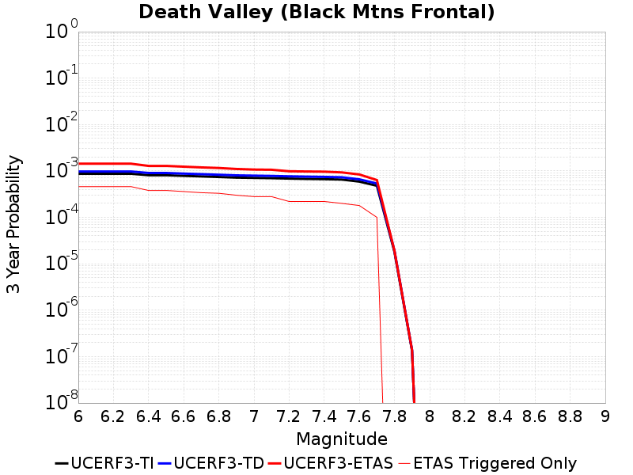 | 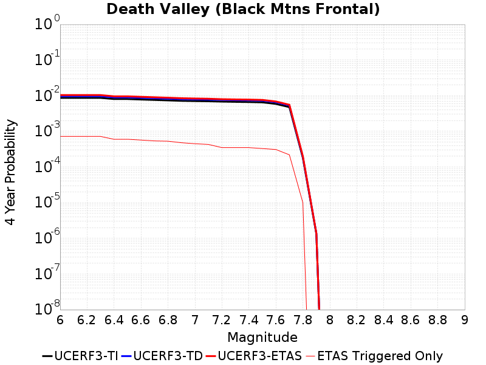 |

| Magnitude | 1 yr TI Prob | TD Prob | ETAS Prob | ETAS/TD Gain | ETAS Triggered Only | 10 yr TI Prob | TD Prob | ETAS Prob | ETAS/TD Gain | ETAS Triggered Only |
|-----|-----|-----|-----|-----|-----|-----|-----|-----|-----|-----|
| 6.0 | 8.71386E-4 | 9.7373227E-4 | 0.0014332844 | 1.4719491 | 4.6E-4 | 0.00867977 | 0.009695511 | 0.01040853 | 1.0735412 | 7.2E-4 |
| 6.1 | 8.71386E-4 | 9.7373227E-4 | 0.0014332844 | 1.4719491 | 4.6E-4 | 0.00867977 | 0.009695511 | 0.01040853 | 1.0735412 | 7.2E-4 |
| 6.2 | 8.71386E-4 | 9.7373227E-4 | 0.0014332844 | 1.4719491 | 4.6E-4 | 0.00867977 | 0.009695511 | 0.01040853 | 1.0735412 | 7.2E-4 |
| 6.3 | 8.71386E-4 | 9.7373227E-4 | 0.0014332844 | 1.4719491 | 4.6E-4 | 0.00867977 | 0.009695511 | 0.01040853 | 1.0735412 | 7.2E-4 |
| 6.4 | 8.0926094E-4 | 9.0428983E-4 | 0.0012839462 | 1.4198393 | 3.8E-4 | 0.008063202 | 0.009006786 | 0.009601382 | 1.0660164 | 6.0E-4 |
| 6.5 | 8.0926094E-4 | 9.0428983E-4 | 0.0012839462 | 1.4198393 | 3.8E-4 | 0.008063202 | 0.009006786 | 0.009601382 | 1.0660164 | 6.0E-4 |
| 6.6 | 7.8455906E-4 | 8.767076E-4 | 0.001236392 | 1.4102672 | 3.6E-4 | 0.00781795 | 0.008733145 | 0.009298167 | 1.0646986 | 5.7E-4 |
| 6.7 | 7.6334673E-4 | 8.530839E-4 | 0.0011927938 | 1.398214 | 3.4E-4 | 0.007607299 | 0.008498728 | 0.009034139 | 1.0629989 | 5.4E-4 |
| 6.8 | 7.4114406E-4 | 8.283731E-4 | 0.0011580997 | 1.3980412 | 3.3E-4 | 0.007386771 | 0.008253468 | 0.008779094 | 1.0636854 | 5.3E-4 |
| 6.9 | 7.1877235E-4 | 8.034799E-4 | 0.0011032389 | 1.3730758 | 3.0E-4 | 0.0071645193 | 0.008006345 | 0.008482501 | 1.0594724 | 4.8E-4 |
| 7.0 | 7.086029E-4 | 7.921953E-4 | 0.0010719735 | 1.3531681 | 2.8E-4 | 0.007063476 | 0.0078943055 | 0.008340753 | 1.0565531 | 4.5E-4 |
| 7.1 | 6.9888023E-4 | 7.814123E-4 | 0.0010611935 | 1.3580456 | 2.8E-4 | 0.0069668638 | 0.0077872355 | 0.008213887 | 1.0547886 | 4.3E-4 |
| 7.2 | 6.846822E-4 | 7.6567783E-4 | 9.855094E-4 | 1.2871071 | 2.2E-4 | 0.006825765 | 0.007630981 | 0.007978311 | 1.0455157 | 3.5E-4 |
| 7.3 | 6.74051E-4 | 7.539061E-4 | 9.737402E-4 | 1.2915936 | 2.2E-4 | 0.006720101 | 0.0075140656 | 0.007861435 | 1.0462294 | 3.5E-4 |
| 7.4 | 6.660441E-4 | 7.4504135E-4 | 9.648774E-4 | 1.2950656 | 2.2E-4 | 0.0066405144 | 0.007426014 | 0.007773415 | 1.0467817 | 3.5E-4 |
| 7.5 | 6.531671E-4 | 7.3087175E-4 | 9.3072554E-4 | 1.2734458 | 2.0E-4 | 0.006512506 | 0.0072852564 | 0.0076128524 | 1.0449669 | 3.3E-4 |
| 7.6 | 5.895042E-4 | 6.5975543E-4 | 8.3963666E-4 | 1.2726483 | 1.8E-4 | 0.0058794282 | 0.00657852 | 0.006886481 | 1.046813 | 3.1E-4 |
| 7.7 | 4.7936183E-4 | 5.36436E-4 | 6.363823E-4 | 1.1863155 | 1.0E-4 | 0.004783291 | 0.0053519215 | 0.005570744 | 1.0408868 | 2.2E-4 |
| 7.8 | 1.80467E-5 | 1.9035946E-5 | 1.9035946E-5 | 1.0 | 0.0 | 1.8045233E-4 | 1.903436E-4 | 2.003417E-4 | 1.0525266 | 1.0E-5 |
| 7.9 | 1.335311E-7 | 1.3929973E-7 | 1.3929973E-7 | 1.0 | 0.0 | 1.3353102E-6 | 1.3929973E-6 | 1.3929973E-6 | 1.0 | 0.0 |

## Coyote Lake
*[(top)](#table-of-contents)*

| 1 Year | 10 Year |
|-----|-----|
| 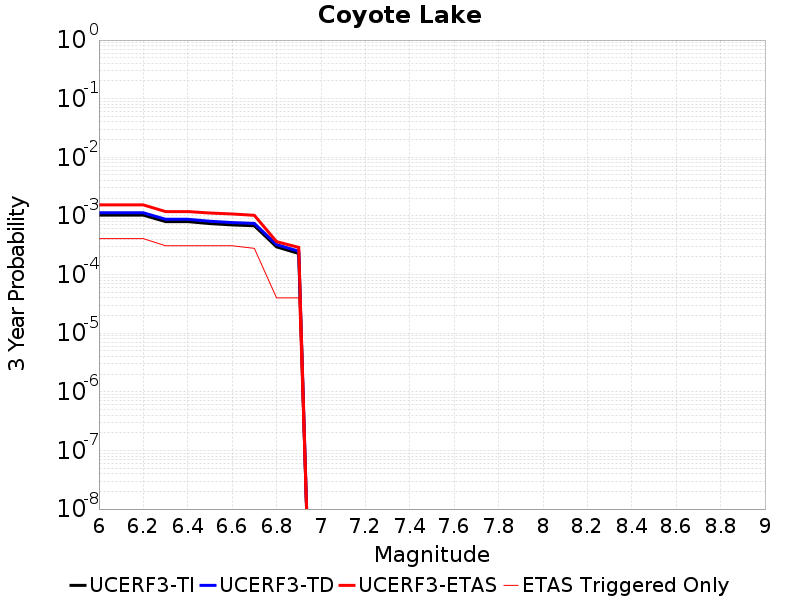 | 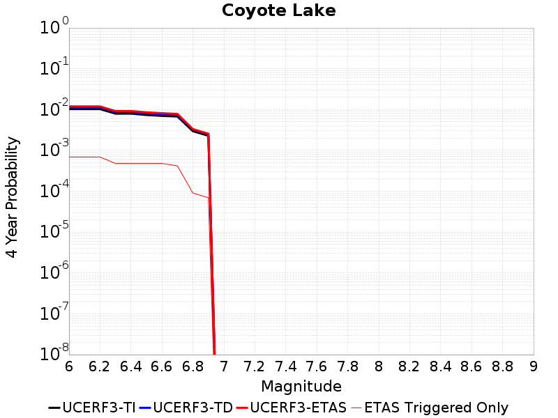 |

| Magnitude | 1 yr TI Prob | TD Prob | ETAS Prob | ETAS/TD Gain | ETAS Triggered Only | 10 yr TI Prob | TD Prob | ETAS Prob | ETAS/TD Gain | ETAS Triggered Only |
|-----|-----|-----|-----|-----|-----|-----|-----|-----|-----|-----|
| 6.0 | 0.0010327959 | 0.0011320764 | 0.0015416122 | 1.3617563 | 4.1E-4 | 0.010280091 | 0.011270272 | 0.011952495 | 1.060533 | 6.9E-4 |
| 6.1 | 0.0010327959 | 0.0011320764 | 0.0015416122 | 1.3617563 | 4.1E-4 | 0.010280091 | 0.011270272 | 0.011952495 | 1.060533 | 6.9E-4 |
| 6.2 | 0.0010327959 | 0.0011320764 | 0.0015416122 | 1.3617563 | 4.1E-4 | 0.010280091 | 0.011270272 | 0.011952495 | 1.060533 | 6.9E-4 |
| 6.3 | 8.003548E-4 | 8.773673E-4 | 0.0011870953 | 1.3530198 | 3.1E-4 | 0.007974784 | 0.00874508 | 0.009220882 | 1.054408 | 4.8E-4 |
| 6.4 | 8.003548E-4 | 8.773673E-4 | 0.0011870953 | 1.3530198 | 3.1E-4 | 0.007974784 | 0.00874508 | 0.009220882 | 1.054408 | 4.8E-4 |
| 6.5 | 7.401293E-4 | 8.1153587E-4 | 0.0011212843 | 1.3816818 | 3.1E-4 | 0.0073766913 | 0.008091666 | 0.008567781 | 1.0588403 | 4.8E-4 |
| 6.6 | 7.025667E-4 | 7.705336E-4 | 0.0010802947 | 1.4020087 | 3.1E-4 | 0.0070034964 | 0.0076845232 | 0.008160835 | 1.0619832 | 4.8E-4 |
| 6.7 | 6.7955407E-4 | 7.449935E-4 | 0.0010247849 | 1.3755622 | 2.8E-4 | 0.006774798 | 0.0074308375 | 0.007847717 | 1.0561012 | 4.2E-4 |
| 6.8 | 2.971363E-4 | 3.2476193E-4 | 3.6474894E-4 | 1.1231271 | 4.0E-5 | 0.0029673933 | 0.0032458142 | 0.003335522 | 1.0276381 | 9.0E-5 |
| 6.9 | 2.2881327E-4 | 2.5009506E-4 | 2.9008507E-4 | 1.1598992 | 4.0E-5 | 0.002285778 | 0.0025009506 | 0.0025707756 | 1.0279194 | 7.0E-5 |

## Helendale-So Lockhart
*[(top)](#table-of-contents)*

| 1 Year | 10 Year |
|-----|-----|
| 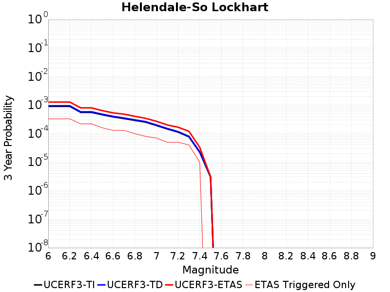 | 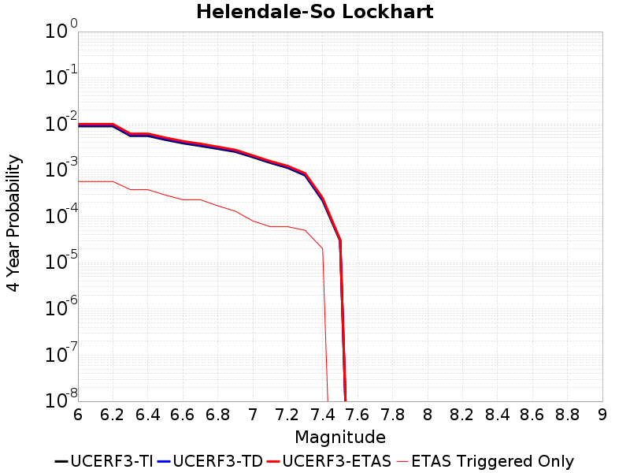 |

| Magnitude | 1 yr TI Prob | TD Prob | ETAS Prob | ETAS/TD Gain | ETAS Triggered Only | 10 yr TI Prob | TD Prob | ETAS Prob | ETAS/TD Gain | ETAS Triggered Only |
|-----|-----|-----|-----|-----|-----|-----|-----|-----|-----|-----|
| 6.0 | 9.0208417E-4 | 9.4421196E-4 | 0.0012739004 | 1.3491678 | 3.3E-4 | 0.008984311 | 0.009404122 | 0.009968761 | 1.0600417 | 5.7E-4 |
| 6.1 | 9.0208417E-4 | 9.4421196E-4 | 0.0012739004 | 1.3491678 | 3.3E-4 | 0.008984311 | 0.009404122 | 0.009968761 | 1.0600417 | 5.7E-4 |
| 6.2 | 9.0208417E-4 | 9.4421196E-4 | 0.0012739004 | 1.3491678 | 3.3E-4 | 0.008984311 | 0.009404122 | 0.009968761 | 1.0600417 | 5.7E-4 |
| 6.3 | 5.5654737E-4 | 5.8086833E-4 | 8.007405E-4 | 1.3785233 | 2.2E-4 | 0.0055515557 | 0.005793797 | 0.006171595 | 1.0652074 | 3.8E-4 |
| 6.4 | 5.5654737E-4 | 5.8086833E-4 | 8.007405E-4 | 1.3785233 | 2.2E-4 | 0.0055515557 | 0.005793797 | 0.006171595 | 1.0652074 | 3.8E-4 |
| 6.5 | 4.585485E-4 | 4.7837742E-4 | 6.383009E-4 | 1.334304 | 1.6E-4 | 0.0045760344 | 0.004773641 | 0.0050622565 | 1.0604603 | 2.9E-4 |
| 6.6 | 3.858892E-4 | 4.0250752E-4 | 5.324552E-4 | 1.3228453 | 1.3E-4 | 0.003852198 | 0.004017892 | 0.004246968 | 1.057014 | 2.3E-4 |
| 6.7 | 3.3701936E-4 | 3.5152124E-4 | 4.8147555E-4 | 1.3696911 | 1.3E-4 | 0.0033650869 | 0.0035097338 | 0.0037389265 | 1.065302 | 2.3E-4 |
| 6.8 | 2.9216358E-4 | 3.0446996E-4 | 4.0443952E-4 | 1.3283396 | 1.0E-4 | 0.0029177975 | 0.0030405896 | 0.0032100726 | 1.0557402 | 1.7E-4 |
| 6.9 | 2.5246723E-4 | 2.6292112E-4 | 3.4290008E-4 | 1.3041937 | 8.0E-5 | 0.002521806 | 0.002626148 | 0.0027558068 | 1.0493722 | 1.3E-4 |
| 7.0 | 1.9271708E-4 | 2.0061816E-4 | 2.7060413E-4 | 1.3488516 | 7.0E-5 | 0.0019255003 | 0.002004402 | 0.0020842417 | 1.0398321 | 8.0E-5 |
| 7.1 | 1.4535317E-4 | 1.5119497E-4 | 2.011874E-4 | 1.3306489 | 5.0E-5 | 0.0014525814 | 0.0015109425 | 0.0015708519 | 1.0396503 | 6.0E-5 |
| 7.2 | 1.1307546E-4 | 1.17604635E-4 | 1.6759876E-4 | 1.4251033 | 5.0E-5 | 0.0011301794 | 0.0011754422 | 0.0012353717 | 1.0509846 | 6.0E-5 |
| 7.3 | 7.734395E-5 | 8.0467355E-5 | 1.2046414E-4 | 1.497056 | 4.0E-5 | 7.731704E-4 | 8.043973E-4 | 8.543571E-4 | 1.0621084 | 5.0E-5 |
| 7.4 | 2.2082493E-5 | 2.3015125E-5 | 3.3014894E-5 | 1.4344869 | 1.0E-5 | 2.2080299E-4 | 2.3013195E-4 | 2.5012734E-4 | 1.0868866 | 2.0E-5 |
| 7.5 | 2.9711643E-6 | 3.1002214E-6 | 3.1002214E-6 | 1.0 | 0.0 | 2.9711247E-5 | 3.100186E-5 | 3.100186E-5 | 1.0 | 0.0 |

## San Andreas (Big Bend)
*[(top)](#table-of-contents)*

| 1 Year | 10 Year |
|-----|-----|
| 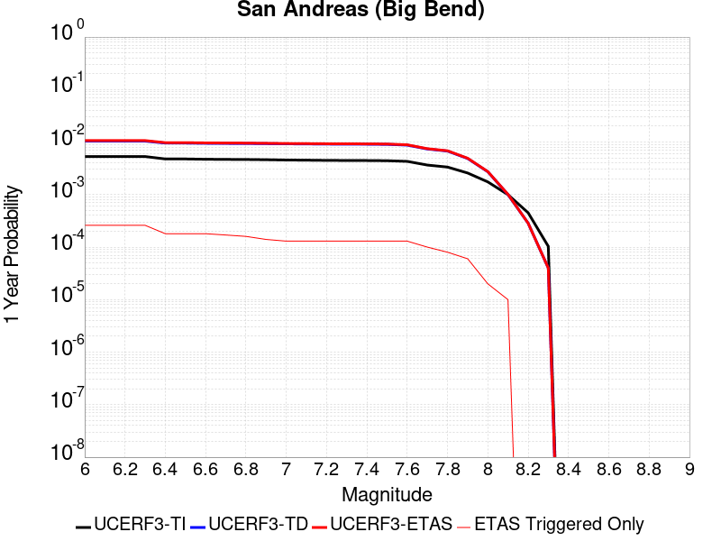 | 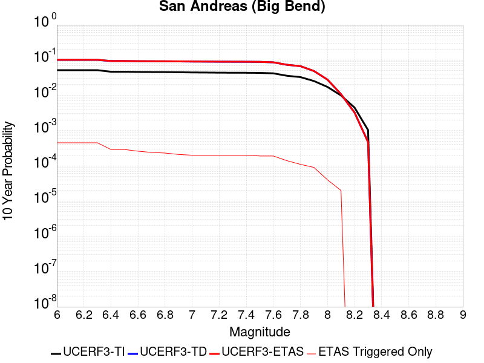 |

| Magnitude | 1 yr TI Prob | TD Prob | ETAS Prob | ETAS/TD Gain | ETAS Triggered Only | 10 yr TI Prob | TD Prob | ETAS Prob | ETAS/TD Gain | ETAS Triggered Only |
|-----|-----|-----|-----|-----|-----|-----|-----|-----|-----|-----|
| 6.0 | 0.0052979486 | 0.010420408 | 0.010677699 | 1.024691 | 2.6E-4 | 0.051734097 | 0.10145247 | 0.10185682 | 1.0039855 | 4.5E-4 |
| 6.1 | 0.0052979486 | 0.010420408 | 0.010677699 | 1.024691 | 2.6E-4 | 0.051734097 | 0.10145247 | 0.10185682 | 1.0039855 | 4.5E-4 |
| 6.2 | 0.0052979486 | 0.010420408 | 0.010677699 | 1.024691 | 2.6E-4 | 0.051734097 | 0.10145247 | 0.10185682 | 1.0039855 | 4.5E-4 |
| 6.3 | 0.0052979486 | 0.010420408 | 0.010677699 | 1.024691 | 2.6E-4 | 0.051734097 | 0.10145247 | 0.10185682 | 1.0039855 | 4.5E-4 |
| 6.4 | 0.0047704205 | 0.009571504 | 0.009749781 | 1.0186259 | 1.8E-4 | 0.046693064 | 0.093778685 | 0.09404149 | 1.0028024 | 2.9E-4 |
| 6.5 | 0.0047704205 | 0.009571504 | 0.009749781 | 1.0186259 | 1.8E-4 | 0.046693064 | 0.093778685 | 0.09404149 | 1.0028024 | 2.9E-4 |
| 6.6 | 0.0047074095 | 0.009471766 | 0.009650061 | 1.0188239 | 1.8E-4 | 0.046089325 | 0.09287268 | 0.093108535 | 1.0025395 | 2.6E-4 |
| 6.7 | 0.00467679 | 0.00942748 | 0.009595878 | 1.0178624 | 1.7E-4 | 0.045795817 | 0.09246696 | 0.09268476 | 1.0023556 | 2.4E-4 |
| 6.8 | 0.004657841 | 0.009399969 | 0.009558464 | 1.0168613 | 1.6E-4 | 0.04561414 | 0.09221416 | 0.09242295 | 1.0022641 | 2.3E-4 |
| 6.9 | 0.004611638 | 0.009338948 | 0.0094776405 | 1.014851 | 1.4E-4 | 0.04517103 | 0.09165427 | 0.09184503 | 1.0020813 | 2.1E-4 |
| 7.0 | 0.004551957 | 0.009255602 | 0.009384398 | 1.0139155 | 1.3E-4 | 0.044598386 | 0.09088871 | 0.09107053 | 1.0020005 | 2.0E-4 |
| 7.1 | 0.0045216335 | 0.009210075 | 0.009338878 | 1.0139849 | 1.3E-4 | 0.04430731 | 0.09047025 | 0.09065215 | 1.0020107 | 2.0E-4 |
| 7.2 | 0.0044808835 | 0.009153513 | 0.0092823235 | 1.0140722 | 1.3E-4 | 0.043916024 | 0.089950755 | 0.090132765 | 1.0020235 | 2.0E-4 |
| 7.3 | 0.0044610105 | 0.009123524 | 0.009252338 | 1.0141189 | 1.3E-4 | 0.043725148 | 0.0896719 | 0.08985397 | 1.0020304 | 2.0E-4 |
| 7.4 | 0.004447999 | 0.009104176 | 0.009232993 | 1.0141492 | 1.3E-4 | 0.043600157 | 0.08949208 | 0.08967418 | 1.0020348 | 2.0E-4 |
| 7.5 | 0.0044147377 | 0.009036599 | 0.009165424 | 1.014256 | 1.3E-4 | 0.043280575 | 0.088869706 | 0.08904283 | 1.001948 | 1.9E-4 |
| 7.6 | 0.0042910352 | 0.008749747 | 0.008878609 | 1.0147276 | 1.3E-4 | 0.042091176 | 0.08624662 | 0.08642023 | 1.002013 | 1.9E-4 |
| 7.7 | 0.0036482112 | 0.007385191 | 0.0074844523 | 1.0134406 | 1.0E-4 | 0.035888977 | 0.07352038 | 0.073650084 | 1.0017642 | 1.4E-4 |
| 7.8 | 0.0033419547 | 0.0067449226 | 0.0068243826 | 1.0117807 | 8.0E-5 | 0.03292141 | 0.06725508 | 0.06735768 | 1.0015255 | 1.1E-4 |
| 7.9 | 0.0025743195 | 0.0048626815 | 0.0049223895 | 1.0122789 | 6.0E-5 | 0.025447013 | 0.0489165 | 0.049002096 | 1.0017499 | 9.0E-5 |
| 8.0 | 0.0017438711 | 0.0027216189 | 0.0027415645 | 1.0073285 | 2.0E-5 | 0.017302496 | 0.027923446 | 0.027962329 | 1.0013925 | 4.0E-5 |
| 8.1 | 9.963791E-4 | 9.999974E-4 | 0.0010099874 | 1.00999 | 1.0E-5 | 0.009919235 | 0.010750447 | 0.010770232 | 1.0018404 | 2.0E-5 |
| 8.2 | 4.5092785E-4 | 2.8565482E-4 | 2.8565482E-4 | 1.0 | 0.0 | 0.0045001395 | 0.0032489614 | 0.0032489614 | 1.0 | 0.0 |
| 8.3 | 1.034694E-4 | 3.9971612E-5 | 3.9971612E-5 | 1.0 | 0.0 | 0.0010342124 | 4.7201355E-4 | 4.7201355E-4 | 1.0 | 0.0 |

## San Andreas (San Bernardino S)
*[(top)](#table-of-contents)*

| 1 Year | 10 Year |
|-----|-----|
| 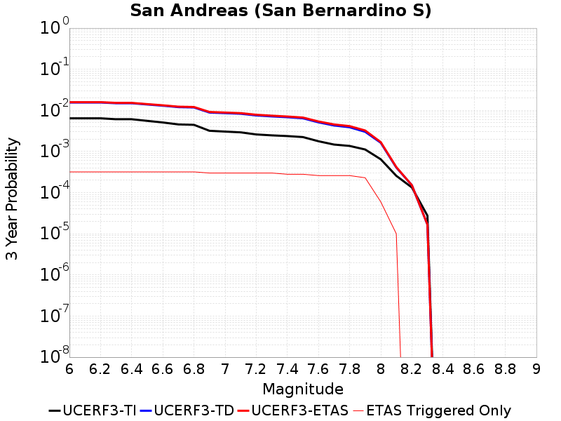 | 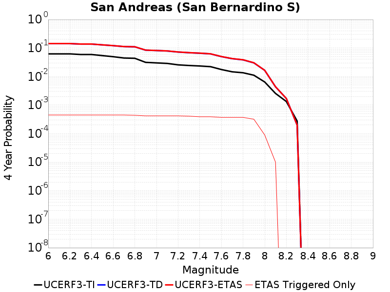 |

| Magnitude | 1 yr TI Prob | TD Prob | ETAS Prob | ETAS/TD Gain | ETAS Triggered Only | 10 yr TI Prob | TD Prob | ETAS Prob | ETAS/TD Gain | ETAS Triggered Only |
|-----|-----|-----|-----|-----|-----|-----|-----|-----|-----|-----|
| 6.0 | 0.006416472 | 0.015541226 | 0.015856253 | 1.0202703 | 3.2E-4 | 0.06234337 | 0.14283895 | 0.14322467 | 1.0027004 | 4.5E-4 |
| 6.1 | 0.006416472 | 0.015541226 | 0.015856253 | 1.0202703 | 3.2E-4 | 0.06234337 | 0.14283895 | 0.14322467 | 1.0027004 | 4.5E-4 |
| 6.2 | 0.006416472 | 0.015541226 | 0.015856253 | 1.0202703 | 3.2E-4 | 0.06234337 | 0.14283895 | 0.14322467 | 1.0027004 | 4.5E-4 |
| 6.3 | 0.006093008 | 0.014918354 | 0.015233581 | 1.0211301 | 3.2E-4 | 0.059286322 | 0.1375474 | 0.1379355 | 1.0028216 | 4.5E-4 |
| 6.4 | 0.006093008 | 0.014918354 | 0.015233581 | 1.0211301 | 3.2E-4 | 0.059286322 | 0.1375474 | 0.1379355 | 1.0028216 | 4.5E-4 |
| 6.5 | 0.0055621783 | 0.013895976 | 0.01421153 | 1.0227083 | 3.2E-4 | 0.05425003 | 0.1287947 | 0.12918675 | 1.0030439 | 4.5E-4 |
| 6.6 | 0.005082469 | 0.012992008 | 0.01330785 | 1.0243105 | 3.2E-4 | 0.049677886 | 0.12095466 | 0.12135023 | 1.0032704 | 4.5E-4 |
| 6.7 | 0.00455906 | 0.011997463 | 0.012313624 | 1.0263523 | 3.2E-4 | 0.04466656 | 0.112262964 | 0.11266244 | 1.0035584 | 4.5E-4 |
| 6.8 | 0.004458263 | 0.01177048 | 0.012086714 | 1.0268667 | 3.2E-4 | 0.043698758 | 0.11027326 | 0.11066473 | 1.00355 | 4.4E-4 |
| 6.9 | 0.0031904527 | 0.008866247 | 0.009163586 | 1.0335362 | 3.0E-4 | 0.031450346 | 0.084184244 | 0.08456889 | 1.004569 | 4.2E-4 |
| 7.0 | 0.0030530186 | 0.008570856 | 0.008868285 | 1.0347023 | 3.0E-4 | 0.03011414 | 0.08150197 | 0.081887744 | 1.0047332 | 4.2E-4 |
| 7.1 | 0.0029250039 | 0.00826996 | 0.008567479 | 1.0359758 | 3.0E-4 | 0.028868021 | 0.0788009 | 0.0791878 | 1.0049099 | 4.2E-4 |
| 7.2 | 0.002601025 | 0.0075484044 | 0.00784614 | 1.0394435 | 3.0E-4 | 0.025707912 | 0.07225477 | 0.07264442 | 1.0053928 | 4.2E-4 |
| 7.3 | 0.0024707897 | 0.0071309647 | 0.0074288254 | 1.0417701 | 3.0E-4 | 0.024434982 | 0.068537116 | 0.06891901 | 1.0055722 | 4.1E-4 |
| 7.4 | 0.002374317 | 0.0068241274 | 0.007102217 | 1.0407509 | 2.8E-4 | 0.023491086 | 0.06578953 | 0.06615387 | 1.005538 | 3.9E-4 |
| 7.5 | 0.0022456115 | 0.006427723 | 0.006705923 | 1.0432813 | 2.8E-4 | 0.022230545 | 0.062190272 | 0.06255602 | 1.0058811 | 3.9E-4 |
| 7.6 | 0.0017770125 | 0.005119321 | 0.00537799 | 1.0505279 | 2.6E-4 | 0.017628696 | 0.050021674 | 0.050373167 | 1.0070268 | 3.7E-4 |
| 7.7 | 0.0014764034 | 0.00429513 | 0.004554013 | 1.0602736 | 2.6E-4 | 0.01466633 | 0.04227271 | 0.04262707 | 1.0083827 | 3.7E-4 |
| 7.8 | 0.0013673597 | 0.0038868524 | 0.004145842 | 1.0666322 | 2.6E-4 | 0.013589768 | 0.03843797 | 0.038793746 | 1.0092559 | 3.7E-4 |
| 7.9 | 0.0011196428 | 0.0030156781 | 0.0032449844 | 1.0760381 | 2.3E-4 | 0.011140184 | 0.030153148 | 0.030463498 | 1.0102925 | 3.2E-4 |
| 8.0 | 6.478649E-4 | 0.0016329365 | 0.0016928385 | 1.0366837 | 6.0E-5 | 0.0064597935 | 0.016523093 | 0.016611606 | 1.0053569 | 9.0E-5 |
| 8.1 | 2.566744E-4 | 4.0810136E-4 | 4.180973E-4 | 1.0244937 | 1.0E-5 | 0.002563781 | 0.004384601 | 0.0043945573 | 1.0022707 | 1.0E-5 |
| 8.2 | 1.3374983E-4 | 1.5166831E-4 | 1.5166831E-4 | 1.0 | 0.0 | 0.0013366934 | 0.0017050854 | 0.0017050854 | 1.0 | 0.0 |
| 8.3 | 2.7576245E-5 | 1.6744827E-5 | 1.6744827E-5 | 1.0 | 0.0 | 2.7572823E-4 | 1.987196E-4 | 1.987196E-4 | 1.0 | 0.0 |

## Sierra Nevada  (No Extension)
*[(top)](#table-of-contents)*

| 1 Year | 10 Year |
|-----|-----|
| 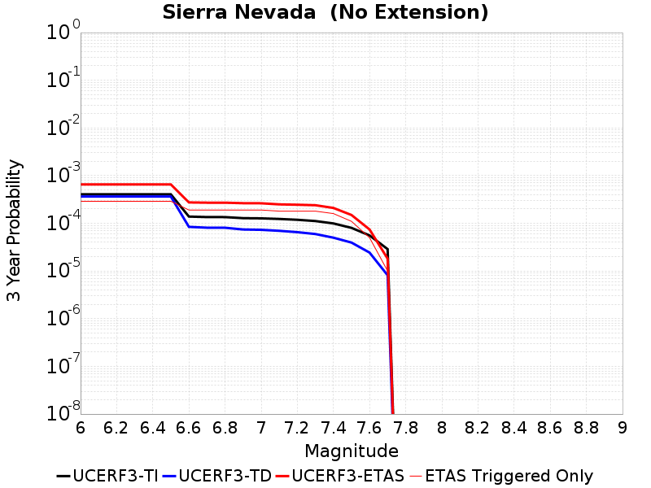 | 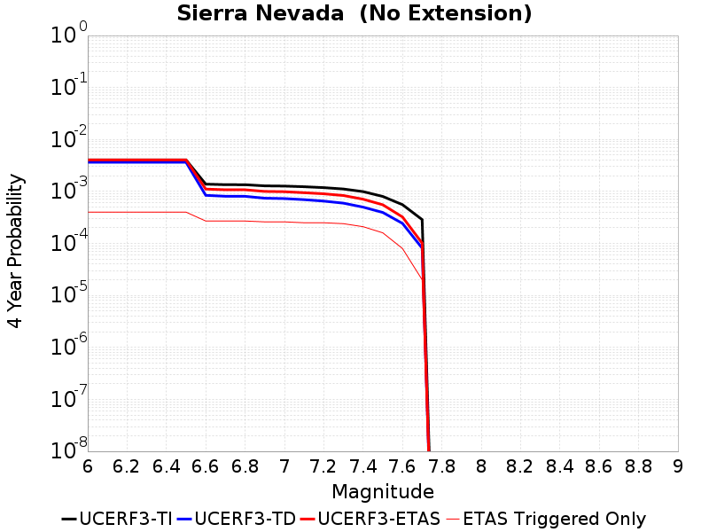 |

| Magnitude | 1 yr TI Prob | TD Prob | ETAS Prob | ETAS/TD Gain | ETAS Triggered Only | 10 yr TI Prob | TD Prob | ETAS Prob | ETAS/TD Gain | ETAS Triggered Only |
|-----|-----|-----|-----|-----|-----|-----|-----|-----|-----|-----|
| 6.0 | 4.0529718E-4 | 3.6398813E-4 | 6.5388257E-4 | 1.7964393 | 2.9E-4 | 0.004045588 | 0.0036374356 | 0.004035981 | 1.1095675 | 4.0E-4 |
| 6.1 | 4.0529718E-4 | 3.6398813E-4 | 6.5388257E-4 | 1.7964393 | 2.9E-4 | 0.004045588 | 0.0036374356 | 0.004035981 | 1.1095675 | 4.0E-4 |
| 6.2 | 4.0529718E-4 | 3.6398813E-4 | 6.5388257E-4 | 1.7964393 | 2.9E-4 | 0.004045588 | 0.0036374356 | 0.004035981 | 1.1095675 | 4.0E-4 |
| 6.3 | 4.0529718E-4 | 3.6398813E-4 | 6.5388257E-4 | 1.7964393 | 2.9E-4 | 0.004045588 | 0.0036374356 | 0.004035981 | 1.1095675 | 4.0E-4 |
| 6.4 | 4.0529718E-4 | 3.6398813E-4 | 6.5388257E-4 | 1.7964393 | 2.9E-4 | 0.004045588 | 0.0036374356 | 0.004035981 | 1.1095675 | 4.0E-4 |
| 6.5 | 4.0529718E-4 | 3.6398813E-4 | 6.5388257E-4 | 1.7964393 | 2.9E-4 | 0.004045588 | 0.0036374356 | 0.004035981 | 1.1095675 | 4.0E-4 |
| 6.6 | 1.3842035E-4 | 8.425746E-5 | 2.7424147E-4 | 3.2548032 | 1.9E-4 | 0.0013833415 | 8.422586E-4 | 0.0011120312 | 1.3202966 | 2.7E-4 |
| 6.7 | 1.351464E-4 | 8.0883525E-5 | 2.7086816E-4 | 3.348867 | 1.9E-4 | 0.0013506424 | 8.085439E-4 | 0.0010783256 | 1.3336637 | 2.7E-4 |
| 6.8 | 1.34893E-4 | 8.071658E-5 | 2.7070125E-4 | 3.3537254 | 1.9E-4 | 0.0013481114 | 8.068756E-4 | 0.0010766578 | 1.334354 | 2.7E-4 |
| 6.9 | 1.2826028E-4 | 7.4198615E-5 | 2.6418452E-4 | 3.560505 | 1.9E-4 | 0.0012818627 | 7.4174034E-4 | 0.0010015474 | 1.3502669 | 2.6E-4 |
| 7.0 | 1.270024E-4 | 7.299671E-5 | 2.6298282E-4 | 3.6026673 | 1.9E-4 | 0.0012692984 | 7.297292E-4 | 9.895394E-4 | 1.3560365 | 2.6E-4 |
| 7.1 | 1.2340778E-4 | 6.96027E-5 | 2.4959017E-4 | 3.5859265 | 1.8E-4 | 0.0012333926 | 6.958107E-4 | 9.4563677E-4 | 1.3590431 | 2.5E-4 |
| 7.2 | 1.1855107E-4 | 6.523599E-5 | 2.4522425E-4 | 3.7590332 | 1.8E-4 | 0.0011848784 | 6.5216987E-4 | 9.0200687E-4 | 1.3830857 | 2.5E-4 |
| 7.3 | 1.1156279E-4 | 5.9584767E-5 | 2.3957404E-4 | 4.020726 | 1.8E-4 | 0.001115068 | 5.956891E-4 | 8.355461E-4 | 1.4026548 | 2.4E-4 |
| 7.4 | 9.9385186E-5 | 4.996114E-5 | 2.0995316E-4 | 4.2023287 | 1.6E-4 | 9.934074E-4 | 4.994998E-4 | 7.093949E-4 | 1.4202106 | 2.1E-4 |
| 7.5 | 8.021306E-5 | 3.944656E-5 | 1.4944222E-4 | 3.788473 | 1.1E-4 | 8.0184115E-4 | 3.9439605E-4 | 5.543329E-4 | 1.4055235 | 1.6E-4 |
| 7.6 | 5.5726876E-5 | 2.4313198E-5 | 7.431198E-5 | 3.0564463 | 5.0E-5 | 5.5712904E-4 | 2.4310563E-4 | 3.230862E-4 | 1.328995 | 8.0E-5 |
| 7.7 | 2.8745531E-5 | 8.1296785E-6 | 1.8129596E-5 | 2.230051 | 1.0E-5 | 2.8741814E-4 | 8.1293925E-5 | 1.012923E-4 | 1.2460009 | 2.0E-5 |

## Death Valley (No)
*[(top)](#table-of-contents)*

| 1 Year | 10 Year |
|-----|-----|
| 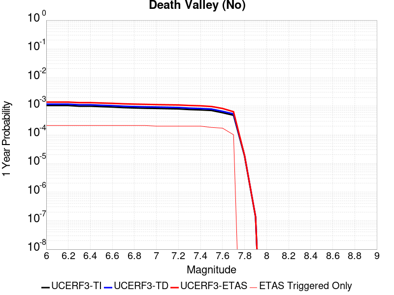 | 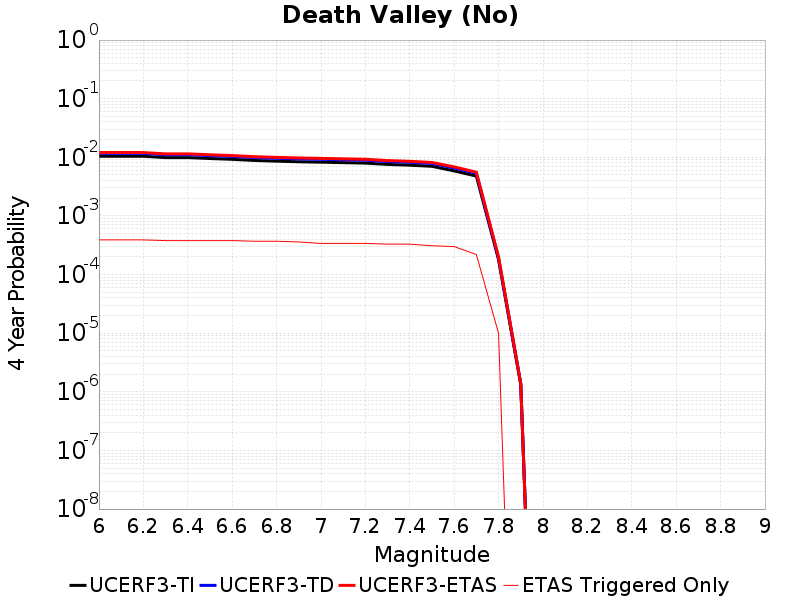 |

| Magnitude | 1 yr TI Prob | TD Prob | ETAS Prob | ETAS/TD Gain | ETAS Triggered Only | 10 yr TI Prob | TD Prob | ETAS Prob | ETAS/TD Gain | ETAS Triggered Only |
|-----|-----|-----|-----|-----|-----|-----|-----|-----|-----|-----|
| 6.0 | 0.001046937 | 0.0011733562 | 0.0013831098 | 1.1787637 | 2.1E-4 | 0.010420183 | 0.011672524 | 0.012057971 | 1.0330218 | 3.9E-4 |
| 6.1 | 0.001046937 | 0.0011733562 | 0.0013831098 | 1.1787637 | 2.1E-4 | 0.010420183 | 0.011672524 | 0.012057971 | 1.0330218 | 3.9E-4 |
| 6.2 | 0.001046937 | 0.0011733562 | 0.0013831098 | 1.1787637 | 2.1E-4 | 0.010420183 | 0.011672524 | 0.012057971 | 1.0330218 | 3.9E-4 |
| 6.3 | 9.935491E-4 | 0.0011127327 | 0.001322499 | 1.1885146 | 2.1E-4 | 0.009891188 | 0.011072435 | 0.011448228 | 1.0339395 | 3.8E-4 |
| 6.4 | 9.935491E-4 | 0.0011127327 | 0.001322499 | 1.1885146 | 2.1E-4 | 0.009891188 | 0.011072435 | 0.011448228 | 1.0339395 | 3.8E-4 |
| 6.5 | 9.5791375E-4 | 0.0010722884 | 0.0012820632 | 1.1956328 | 2.1E-4 | 0.009537951 | 0.010671931 | 0.0110478755 | 1.0352274 | 3.8E-4 |
| 6.6 | 9.280632E-4 | 0.001038403 | 0.0012481849 | 1.2020236 | 2.1E-4 | 0.009241969 | 0.010336268 | 0.0107123405 | 1.0363837 | 3.8E-4 |
| 6.7 | 8.87976E-4 | 9.931828E-4 | 0.0012029742 | 1.2112315 | 2.1E-4 | 0.008844362 | 0.00988816 | 0.010254501 | 1.0370485 | 3.7E-4 |
| 6.8 | 8.629347E-4 | 9.655087E-4 | 0.0011753059 | 1.217292 | 2.1E-4 | 0.008595915 | 0.009613843 | 0.009980286 | 1.0381162 | 3.7E-4 |
| 6.9 | 8.4258494E-4 | 9.433561E-4 | 0.0011531579 | 1.2223995 | 2.1E-4 | 0.008393973 | 0.00939421 | 0.009750827 | 1.0379615 | 3.6E-4 |
| 7.0 | 8.2900526E-4 | 9.286529E-4 | 0.0011284671 | 1.2151657 | 2.0E-4 | 0.008259195 | 0.009248411 | 0.009585267 | 1.0364231 | 3.4E-4 |
| 7.1 | 8.137789E-4 | 9.118641E-4 | 0.0011116817 | 1.2191309 | 2.0E-4 | 0.008108052 | 0.009081908 | 0.009418819 | 1.0370971 | 3.4E-4 |
| 7.2 | 7.99262E-4 | 8.9555327E-4 | 0.0010953741 | 1.2231257 | 2.0E-4 | 0.007963934 | 0.00892012 | 0.0092570875 | 1.0377761 | 3.4E-4 |
| 7.3 | 7.592395E-4 | 8.5029163E-4 | 0.0010501215 | 1.2350134 | 2.0E-4 | 0.0075665074 | 0.008471027 | 0.008798231 | 1.0386263 | 3.3E-4 |
| 7.4 | 7.363519E-4 | 8.2451064E-4 | 0.0010243458 | 1.2423681 | 2.0E-4 | 0.0073391674 | 0.008215151 | 0.008542439 | 1.0398396 | 3.3E-4 |
| 7.5 | 7.043401E-4 | 7.8897015E-4 | 9.688281E-4 | 1.2279655 | 1.8E-4 | 0.007021119 | 0.0078623155 | 0.008169878 | 1.0391185 | 3.1E-4 |
| 7.6 | 5.88396E-4 | 6.5861753E-4 | 8.2850555E-4 | 1.2579464 | 1.7E-4 | 0.005868405 | 0.006567208 | 0.0068652383 | 1.0453815 | 3.0E-4 |
| 7.7 | 4.7936183E-4 | 5.36436E-4 | 6.363823E-4 | 1.1863155 | 1.0E-4 | 0.004783291 | 0.0053519215 | 0.005570744 | 1.0408868 | 2.2E-4 |
| 7.8 | 1.80467E-5 | 1.9035946E-5 | 1.9035946E-5 | 1.0 | 0.0 | 1.8045233E-4 | 1.903436E-4 | 2.003417E-4 | 1.0525266 | 1.0E-5 |
| 7.9 | 1.335311E-7 | 1.3929973E-7 | 1.3929973E-7 | 1.0 | 0.0 | 1.3353102E-6 | 1.3929973E-6 | 1.3929973E-6 | 1.0 | 0.0 |

## Death Valley (Fish Lake Valley)
*[(top)](#table-of-contents)*

| 1 Year | 10 Year |
|-----|-----|
| 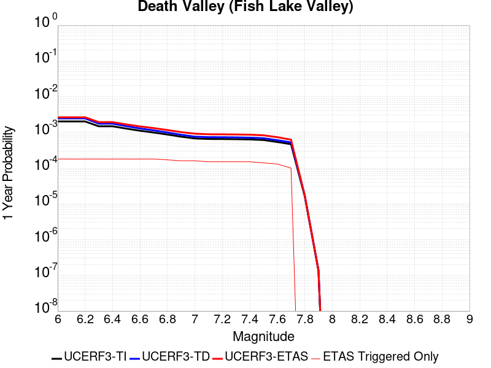 | 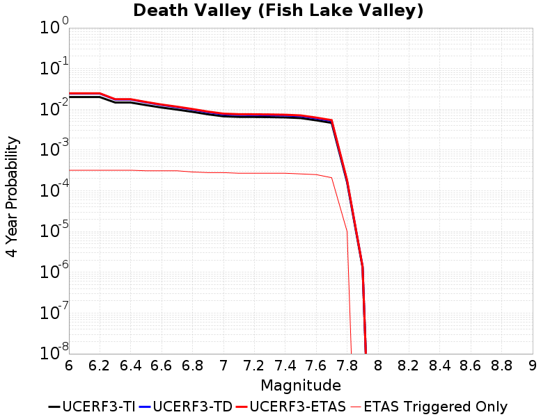 |

| Magnitude | 1 yr TI Prob | TD Prob | ETAS Prob | ETAS/TD Gain | ETAS Triggered Only | 10 yr TI Prob | TD Prob | ETAS Prob | ETAS/TD Gain | ETAS Triggered Only |
|-----|-----|-----|-----|-----|-----|-----|-----|-----|-----|-----|
| 6.0 | 0.0020185246 | 0.0024635405 | 0.0026430972 | 1.0728856 | 1.8E-4 | 0.02000288 | 0.024388246 | 0.024700442 | 1.012801 | 3.2E-4 |
| 6.1 | 0.0020185246 | 0.0024635405 | 0.0026430972 | 1.0728856 | 1.8E-4 | 0.02000288 | 0.024388246 | 0.024700442 | 1.012801 | 3.2E-4 |
| 6.2 | 0.0020185246 | 0.0024635405 | 0.0026430972 | 1.0728856 | 1.8E-4 | 0.02000288 | 0.024388246 | 0.024700442 | 1.012801 | 3.2E-4 |
| 6.3 | 0.0014785219 | 0.0017522952 | 0.0019319798 | 1.1025424 | 1.8E-4 | 0.014687235 | 0.017391823 | 0.017706256 | 1.0180794 | 3.2E-4 |
| 6.4 | 0.0014785219 | 0.0017522952 | 0.0019319798 | 1.1025424 | 1.8E-4 | 0.014687235 | 0.017391823 | 0.017706256 | 1.0180794 | 3.2E-4 |
| 6.5 | 0.0012748998 | 0.0014916663 | 0.0016713978 | 1.1204904 | 1.8E-4 | 0.012676105 | 0.014821407 | 0.015126813 | 1.0206057 | 3.1E-4 |
| 6.6 | 0.0011107022 | 0.0012859551 | 0.0014657236 | 1.1397938 | 1.8E-4 | 0.011051672 | 0.012788551 | 0.013094586 | 1.0239304 | 3.1E-4 |
| 6.7 | 9.888117E-4 | 0.0011358991 | 0.0013156947 | 1.1582848 | 1.8E-4 | 0.009844234 | 0.011303591 | 0.011610087 | 1.0271149 | 3.1E-4 |
| 6.8 | 8.7057345E-4 | 9.918874E-4 | 0.0011617187 | 1.1712204 | 1.7E-4 | 0.008671708 | 0.00987636 | 0.010163496 | 1.029073 | 2.9E-4 |
| 6.9 | 7.5657194E-4 | 8.5483503E-4 | 0.0010146982 | 1.1870106 | 1.6E-4 | 0.007540013 | 0.008516399 | 0.008794014 | 1.0325978 | 2.8E-4 |
| 7.0 | 6.750118E-4 | 7.582958E-4 | 9.181745E-4 | 1.2108394 | 1.6E-4 | 0.006729651 | 0.0075577013 | 0.007835586 | 1.0367683 | 2.8E-4 |
| 7.1 | 6.5435225E-4 | 7.343233E-4 | 8.8421314E-4 | 1.2041197 | 1.5E-4 | 0.006524288 | 0.007319562 | 0.0075875856 | 1.0366174 | 2.7E-4 |
| 7.2 | 6.514716E-4 | 7.310627E-4 | 8.809531E-4 | 1.2050308 | 1.5E-4 | 0.006495651 | 0.0072871707 | 0.007555203 | 1.0367814 | 2.7E-4 |
| 7.3 | 6.451563E-4 | 7.2397874E-4 | 8.738701E-4 | 1.2070384 | 1.5E-4 | 0.0064328653 | 0.0072167926 | 0.007484844 | 1.0371428 | 2.7E-4 |
| 7.4 | 6.3438306E-4 | 7.118847E-4 | 8.6177787E-4 | 1.2105583 | 1.5E-4 | 0.006325751 | 0.0070966315 | 0.007364715 | 1.0377762 | 2.7E-4 |
| 7.5 | 6.10721E-4 | 6.8569055E-4 | 8.255945E-4 | 1.2040337 | 1.4E-4 | 0.0060904534 | 0.0068363314 | 0.007094554 | 1.037772 | 2.6E-4 |
| 7.6 | 5.383166E-4 | 6.040356E-4 | 7.339571E-4 | 1.2150891 | 1.3E-4 | 0.0053701443 | 0.0060244696 | 0.0062729632 | 1.0412475 | 2.5E-4 |
| 7.7 | 4.6625308E-4 | 5.2284636E-4 | 6.227941E-4 | 1.1911608 | 1.0E-4 | 0.0046527605 | 0.005216672 | 0.0054255766 | 1.0400455 | 2.1E-4 |
| 7.8 | 1.6217007E-5 | 1.7138727E-5 | 1.7138727E-5 | 1.0 | 0.0 | 1.6215823E-4 | 1.7137444E-4 | 1.8137273E-4 | 1.0583417 | 1.0E-5 |
| 7.9 | 1.335311E-7 | 1.3929973E-7 | 1.3929973E-7 | 1.0 | 0.0 | 1.3353102E-6 | 1.3929973E-6 | 1.3929973E-6 | 1.0 | 0.0 |

## San Andreas (Parkfield)
*[(top)](#table-of-contents)*

| 1 Year | 10 Year |
|-----|-----|
| 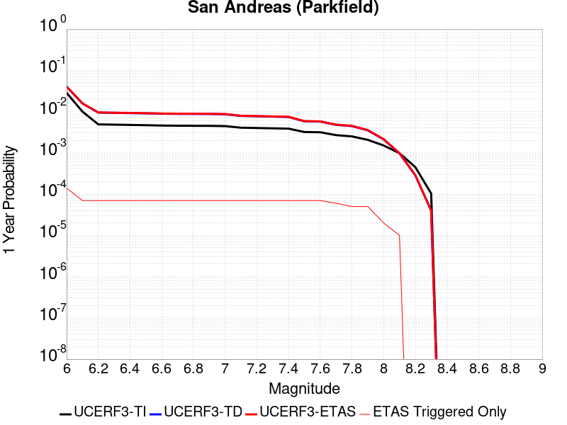 | 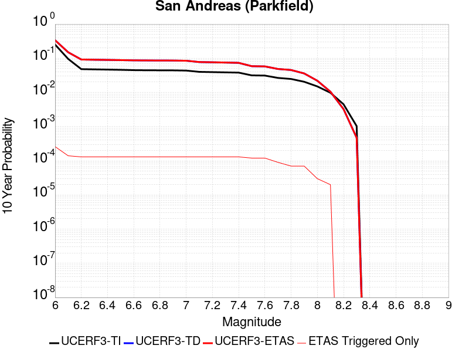 |

| Magnitude | 1 yr TI Prob | TD Prob | ETAS Prob | ETAS/TD Gain | ETAS Triggered Only | 10 yr TI Prob | TD Prob | ETAS Prob | ETAS/TD Gain | ETAS Triggered Only |
|-----|-----|-----|-----|-----|-----|-----|-----|-----|-----|-----|
| 6.0 | 0.028586963 | 0.040195774 | 0.040330146 | 1.003343 | 1.4E-4 | 0.25176284 | 0.33717835 | 0.3373507 | 1.000511 | 2.6E-4 |
| 6.1 | 0.0099994885 | 0.015779402 | 0.015848296 | 1.0043662 | 7.0E-5 | 0.095613256 | 0.1497301 | 0.14984915 | 1.000795 | 1.4E-4 |
| 6.2 | 0.0049089384 | 0.009475048 | 0.009544385 | 1.0073178 | 7.0E-5 | 0.048019063 | 0.091857165 | 0.09197522 | 1.0012852 | 1.3E-4 |
| 6.3 | 0.0048322747 | 0.009318155 | 0.009387502 | 1.0074422 | 7.0E-5 | 0.047285385 | 0.09051011 | 0.09062834 | 1.0013063 | 1.3E-4 |
| 6.4 | 0.0047573745 | 0.009195203 | 0.0092645595 | 1.0075426 | 7.0E-5 | 0.046568092 | 0.08941233 | 0.08953071 | 1.0013239 | 1.3E-4 |
| 6.5 | 0.0046854047 | 0.009070093 | 0.009139459 | 1.0076476 | 7.0E-5 | 0.045878403 | 0.08829811 | 0.08841663 | 1.0013423 | 1.3E-4 |
| 6.6 | 0.0045870654 | 0.0089052105 | 0.008974587 | 1.0077906 | 7.0E-5 | 0.04493529 | 0.08682971 | 0.08694842 | 1.0013672 | 1.3E-4 |
| 6.7 | 0.0045492216 | 0.0088364985 | 0.00890588 | 1.0078517 | 7.0E-5 | 0.04457213 | 0.08623007 | 0.08634886 | 1.0013776 | 1.3E-4 |
| 6.8 | 0.0045347405 | 0.008808316 | 0.008877699 | 1.007877 | 7.0E-5 | 0.04443313 | 0.08597767 | 0.086096495 | 1.001382 | 1.3E-4 |
| 6.9 | 0.0045191357 | 0.008777772 | 0.0088471575 | 1.0079046 | 7.0E-5 | 0.044283327 | 0.08570373 | 0.08582259 | 1.0013869 | 1.3E-4 |
| 7.0 | 0.004455241 | 0.008649905 | 0.008719299 | 1.0080225 | 7.0E-5 | 0.043669727 | 0.08455212 | 0.084671125 | 1.0014075 | 1.3E-4 |
| 7.1 | 0.0040752706 | 0.007863645 | 0.007933095 | 1.0088317 | 7.0E-5 | 0.040013418 | 0.077464014 | 0.07758394 | 1.0015482 | 1.3E-4 |
| 7.2 | 0.004005129 | 0.0077275946 | 0.0077970535 | 1.0089885 | 7.0E-5 | 0.0393371 | 0.076237164 | 0.07635725 | 1.0015752 | 1.3E-4 |
| 7.3 | 0.003934157 | 0.00757046 | 0.00763993 | 1.0091765 | 7.0E-5 | 0.038652334 | 0.074800216 | 0.07492049 | 1.001608 | 1.3E-4 |
| 7.4 | 0.003865065 | 0.0074155782 | 0.007485059 | 1.0093696 | 7.0E-5 | 0.03798529 | 0.07337406 | 0.073494524 | 1.0016418 | 1.3E-4 |
| 7.5 | 0.0032037178 | 0.0058227745 | 0.005892367 | 1.0119518 | 7.0E-5 | 0.03157923 | 0.058560077 | 0.05867305 | 1.0019292 | 1.2E-4 |
| 7.6 | 0.0031593828 | 0.0057338746 | 0.0058034733 | 1.0121381 | 7.0E-5 | 0.031148417 | 0.057721075 | 0.05783415 | 1.001959 | 1.2E-4 |
| 7.7 | 0.002691582 | 0.0047762627 | 0.0048359763 | 1.0125021 | 6.0E-5 | 0.026592141 | 0.048538502 | 0.04862413 | 1.0017642 | 9.0E-5 |
| 7.8 | 0.0025062072 | 0.004456765 | 0.004506542 | 1.011169 | 5.0E-5 | 0.024781305 | 0.04530455 | 0.04537138 | 1.0014751 | 7.0E-5 |
| 7.9 | 0.002069531 | 0.003516384 | 0.003566208 | 1.0141691 | 5.0E-5 | 0.020503636 | 0.03588304 | 0.035950527 | 1.0018808 | 7.0E-5 |
| 8.0 | 0.0015111357 | 0.0021214653 | 0.0021414228 | 1.0094074 | 2.0E-5 | 0.015009012 | 0.022011776 | 0.022041116 | 1.0013329 | 3.0E-5 |
| 8.1 | 9.823717E-4 | 9.7435294E-4 | 9.843432E-4 | 1.0102532 | 1.0E-5 | 0.009780403 | 0.010488751 | 0.010508542 | 1.0018868 | 2.0E-5 |
| 8.2 | 4.5092785E-4 | 2.8565482E-4 | 2.8565482E-4 | 1.0 | 0.0 | 0.0045001395 | 0.0032489614 | 0.0032489614 | 1.0 | 0.0 |
| 8.3 | 1.034694E-4 | 3.9971612E-5 | 3.9971612E-5 | 1.0 | 0.0 | 0.0010342124 | 4.7201355E-4 | 4.7201355E-4 | 1.0 | 0.0 |

## Manix-Afton Hills
*[(top)](#table-of-contents)*

| 1 Year | 10 Year |
|-----|-----|
| 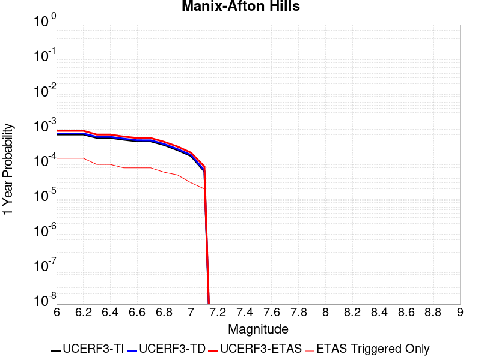 | 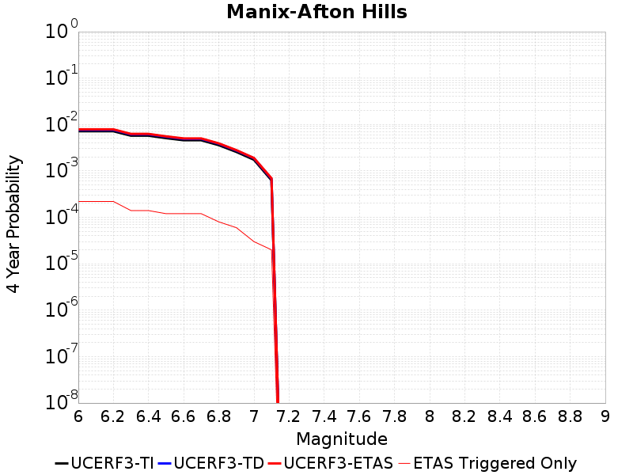 |

| Magnitude | 1 yr TI Prob | TD Prob | ETAS Prob | ETAS/TD Gain | ETAS Triggered Only | 10 yr TI Prob | TD Prob | ETAS Prob | ETAS/TD Gain | ETAS Triggered Only |
|-----|-----|-----|-----|-----|-----|-----|-----|-----|-----|-----|
| 6.0 | 7.189342E-4 | 7.673341E-4 | 9.17219E-4 | 1.195332 | 1.5E-4 | 0.0071661277 | 0.007648602 | 0.00786692 | 1.0285435 | 2.2E-4 |
| 6.1 | 7.189342E-4 | 7.673341E-4 | 9.17219E-4 | 1.195332 | 1.5E-4 | 0.0071661277 | 0.007648602 | 0.00786692 | 1.0285435 | 2.2E-4 |
| 6.2 | 7.189342E-4 | 7.673341E-4 | 9.17219E-4 | 1.195332 | 1.5E-4 | 0.0071661277 | 0.007648602 | 0.00786692 | 1.0285435 | 2.2E-4 |
| 6.3 | 5.763835E-4 | 6.1517494E-4 | 7.151134E-4 | 1.1624554 | 1.0E-4 | 0.005748908 | 0.006135761 | 0.006274902 | 1.0226771 | 1.4E-4 |
| 6.4 | 5.763835E-4 | 6.1517494E-4 | 7.151134E-4 | 1.1624554 | 1.0E-4 | 0.005748908 | 0.006135761 | 0.006274902 | 1.0226771 | 1.4E-4 |
| 6.5 | 5.1064545E-4 | 5.4535596E-4 | 6.253123E-4 | 1.1466132 | 8.0E-5 | 0.0050947363 | 0.005441103 | 0.0055604503 | 1.0219344 | 1.2E-4 |
| 6.6 | 4.5958988E-4 | 4.910813E-4 | 5.71042E-4 | 1.1628258 | 8.0E-5 | 0.0045864056 | 0.0049008434 | 0.005020255 | 1.0243655 | 1.2E-4 |
| 6.7 | 4.591348E-4 | 4.9058476E-4 | 5.7054556E-4 | 1.1629907 | 8.0E-5 | 0.004581874 | 0.0048959 | 0.0050153127 | 1.0243903 | 1.2E-4 |
| 6.8 | 3.5994186E-4 | 3.8501818E-4 | 4.4499506E-4 | 1.1557769 | 6.0E-5 | 0.003593594 | 0.0038443161 | 0.0039240085 | 1.0207299 | 8.0E-5 |
| 6.9 | 2.5735417E-4 | 2.7500096E-4 | 3.2498722E-4 | 1.1817676 | 5.0E-5 | 0.0025705635 | 0.0027472118 | 0.002807047 | 1.0217804 | 6.0E-5 |
| 7.0 | 1.746775E-4 | 1.8730998E-4 | 2.1730436E-4 | 1.1601323 | 3.0E-5 | 0.0017454025 | 0.0018719237 | 0.0019018675 | 1.0159963 | 3.0E-5 |
| 7.1 | 6.29962E-5 | 6.7491615E-5 | 8.749027E-5 | 1.296313 | 2.0E-5 | 6.297835E-4 | 6.748713E-4 | 6.9485785E-4 | 1.0296153 | 2.0E-5 |

## Baker
*[(top)](#table-of-contents)*

| 1 Year | 10 Year |
|-----|-----|
| 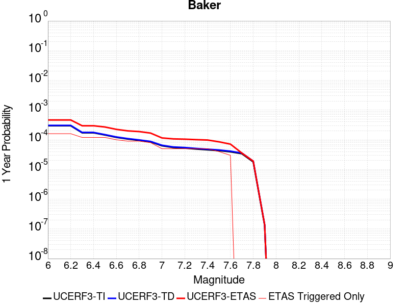 | 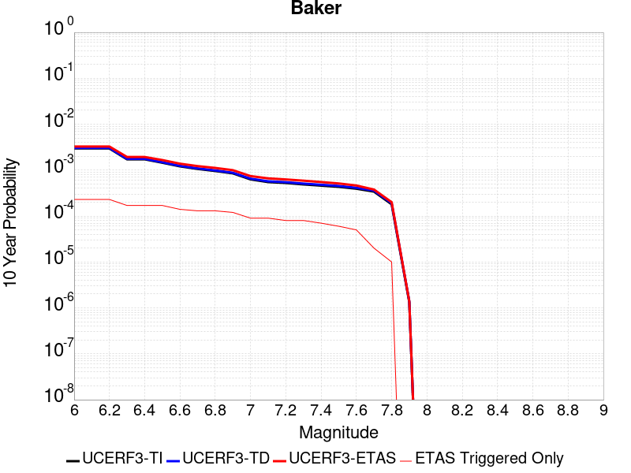 |

| Magnitude | 1 yr TI Prob | TD Prob | ETAS Prob | ETAS/TD Gain | ETAS Triggered Only | 10 yr TI Prob | TD Prob | ETAS Prob | ETAS/TD Gain | ETAS Triggered Only |
|-----|-----|-----|-----|-----|-----|-----|-----|-----|-----|-----|
| 6.0 | 2.9714106E-4 | 3.044124E-4 | 4.643637E-4 | 1.5254428 | 1.6E-4 | 0.0029674405 | 0.0030403496 | 0.0032696503 | 1.0754192 | 2.3E-4 |
| 6.1 | 2.9714106E-4 | 3.044124E-4 | 4.643637E-4 | 1.5254428 | 1.6E-4 | 0.0029674405 | 0.0030403496 | 0.0032696503 | 1.0754192 | 2.3E-4 |
| 6.2 | 2.9714106E-4 | 3.044124E-4 | 4.643637E-4 | 1.5254428 | 1.6E-4 | 0.0029674405 | 0.0030403496 | 0.0032696503 | 1.0754192 | 2.3E-4 |
| 6.3 | 1.7215237E-4 | 1.765402E-4 | 2.9651902E-4 | 1.6796119 | 1.2E-4 | 0.0017201907 | 0.0017640466 | 0.0019337467 | 1.0961994 | 1.7E-4 |
| 6.4 | 1.7215237E-4 | 1.765402E-4 | 2.9651902E-4 | 1.6796119 | 1.2E-4 | 0.0017201907 | 0.0017640466 | 0.0019337467 | 1.0961994 | 1.7E-4 |
| 6.5 | 1.4516099E-4 | 1.4900319E-4 | 2.689853E-4 | 1.8052319 | 1.2E-4 | 0.001450662 | 0.0014890656 | 0.0016588124 | 1.1139956 | 1.7E-4 |
| 6.6 | 1.20856166E-4 | 1.242257E-4 | 2.2421328E-4 | 1.8048865 | 1.0E-4 | 0.0012079047 | 0.0012415828 | 0.0013814089 | 1.1126193 | 1.4E-4 |
| 6.7 | 1.0628513E-4 | 1.0938675E-4 | 1.993769E-4 | 1.8226788 | 9.0E-5 | 0.0010623431 | 0.0010933451 | 0.001223203 | 1.1187712 | 1.3E-4 |
| 6.8 | 9.577837E-5 | 9.8692675E-5 | 1.886838E-4 | 1.9118317 | 9.0E-5 | 9.57371E-4 | 9.865024E-4 | 0.0011163742 | 1.1316487 | 1.3E-4 |
| 6.9 | 8.510255E-5 | 8.782372E-5 | 1.6781669E-4 | 1.9108356 | 8.0E-5 | 8.5069967E-4 | 8.779014E-4 | 9.977961E-4 | 1.1365696 | 1.2E-4 |
| 7.0 | 6.291517E-5 | 6.5266395E-5 | 1.1526313E-4 | 1.766041 | 5.0E-5 | 6.289736E-4 | 6.524746E-4 | 7.424159E-4 | 1.1378464 | 9.0E-5 |
| 7.1 | 5.491031E-5 | 5.7142366E-5 | 1.0713951E-4 | 1.8749576 | 5.0E-5 | 5.4896745E-4 | 5.7127763E-4 | 6.612262E-4 | 1.1574516 | 9.0E-5 |
| 7.2 | 5.252918E-5 | 5.4721946E-5 | 1.04719205E-4 | 1.9136602 | 5.0E-5 | 5.251676E-4 | 5.4708554E-4 | 6.270418E-4 | 1.1461494 | 8.0E-5 |
| 7.3 | 4.8836053E-5 | 5.0965347E-5 | 1.00962796E-4 | 1.9810088 | 5.0E-5 | 4.8825322E-4 | 5.0953735E-4 | 5.8949663E-4 | 1.1569252 | 8.0E-5 |
| 7.4 | 4.5977362E-5 | 4.8043174E-5 | 9.804077E-5 | 2.0406806 | 5.0E-5 | 4.596785E-4 | 4.8032866E-4 | 5.5029505E-4 | 1.1456635 | 7.0E-5 |
| 7.5 | 4.326757E-5 | 4.526183E-5 | 8.526002E-5 | 1.8837068 | 4.0E-5 | 4.3259145E-4 | 4.5252685E-4 | 5.124997E-4 | 1.1325288 | 6.0E-5 |
| 7.6 | 3.9414106E-5 | 4.129577E-5 | 7.129453E-5 | 1.7264366 | 3.0E-5 | 3.9407116E-4 | 4.128817E-4 | 4.6286106E-4 | 1.1210501 | 5.0E-5 |
| 7.7 | 3.40644E-5 | 3.575632E-5 | 3.575632E-5 | 1.0 | 0.0 | 3.405918E-4 | 3.575063E-4 | 3.7749915E-4 | 1.0559231 | 2.0E-5 |
| 7.8 | 1.80467E-5 | 1.9035946E-5 | 1.9035946E-5 | 1.0 | 0.0 | 1.8045233E-4 | 1.903436E-4 | 2.003417E-4 | 1.0525266 | 1.0E-5 |
| 7.9 | 1.335311E-7 | 1.3929973E-7 | 1.3929973E-7 | 1.0 | 0.0 | 1.3353102E-6 | 1.3929973E-6 | 1.3929973E-6 | 1.0 | 0.0 |

## Elsinore (Glen Ivy) rev
*[(top)](#table-of-contents)*

| 1 Year | 10 Year |
|-----|-----|
| 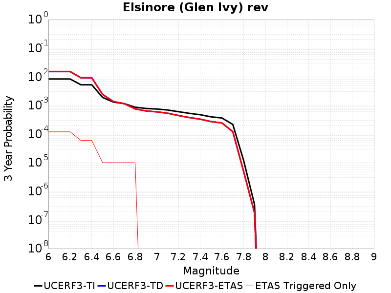 | 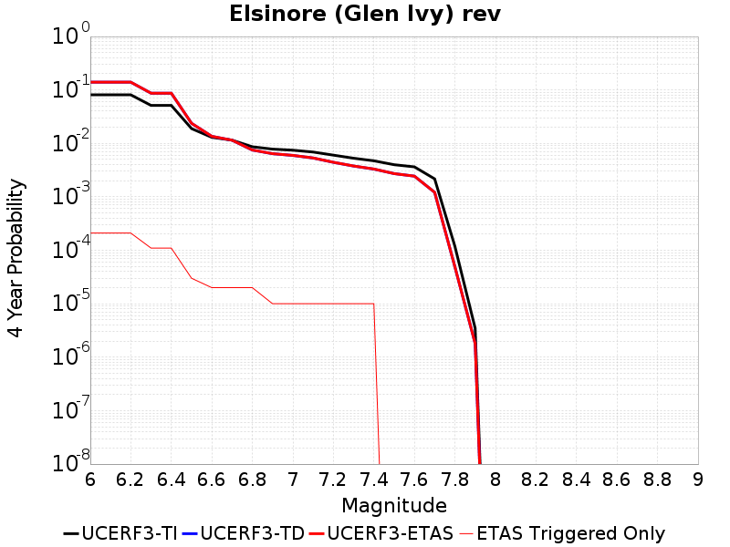 |

| Magnitude | 1 yr TI Prob | TD Prob | ETAS Prob | ETAS/TD Gain | ETAS Triggered Only | 10 yr TI Prob | TD Prob | ETAS Prob | ETAS/TD Gain | ETAS Triggered Only |
|-----|-----|-----|-----|-----|-----|-----|-----|-----|-----|-----|
| 6.0 | 0.008420097 | 0.015234548 | 0.015352719 | 1.0077568 | 1.2E-4 | 0.081081145 | 0.139692 | 0.13987266 | 1.0012933 | 2.1E-4 |
| 6.1 | 0.008420097 | 0.015234548 | 0.015352719 | 1.0077568 | 1.2E-4 | 0.081081145 | 0.139692 | 0.13987266 | 1.0012933 | 2.1E-4 |
| 6.2 | 0.008420097 | 0.015234548 | 0.015352719 | 1.0077568 | 1.2E-4 | 0.081081145 | 0.139692 | 0.13987266 | 1.0012933 | 2.1E-4 |
| 6.3 | 0.005262531 | 0.009217701 | 0.009277147 | 1.0064492 | 6.0E-5 | 0.0513964 | 0.08701926 | 0.08711968 | 1.0011541 | 1.1E-4 |
| 6.4 | 0.005262531 | 0.009217701 | 0.009277147 | 1.0064492 | 6.0E-5 | 0.0513964 | 0.08701926 | 0.08711968 | 1.0011541 | 1.1E-4 |
| 6.5 | 0.001909235 | 0.002418146 | 0.0024281219 | 1.0041254 | 1.0E-5 | 0.01892915 | 0.02374004 | 0.023769328 | 1.0012337 | 3.0E-5 |
| 6.6 | 0.0013063047 | 0.001363492 | 0.0013734783 | 1.0073241 | 1.0E-5 | 0.012986525 | 0.013564679 | 0.013584408 | 1.0014545 | 2.0E-5 |
| 6.7 | 0.0011571734 | 0.0011511237 | 0.0011611121 | 1.0086771 | 1.0E-5 | 0.011511663 | 0.0114654675 | 0.011485239 | 1.0017244 | 2.0E-5 |
| 6.8 | 8.686314E-4 | 7.5306924E-4 | 7.6306175E-4 | 1.013269 | 1.0E-5 | 0.008652439 | 0.0075105117 | 0.0075303614 | 1.002643 | 2.0E-5 |
| 6.9 | 7.8461546E-4 | 6.432704E-4 | 6.432704E-4 | 1.0 | 0.0 | 0.007818509 | 0.0064183073 | 0.006428243 | 1.001548 | 1.0E-5 |
| 7.0 | 7.490812E-4 | 5.9734436E-4 | 5.9734436E-4 | 1.0 | 0.0 | 0.007465612 | 0.005961379 | 0.0059713195 | 1.0016675 | 1.0E-5 |
| 7.1 | 6.919436E-4 | 5.344305E-4 | 5.344305E-4 | 1.0 | 0.0 | 0.006897931 | 0.00533481 | 0.0053447564 | 1.0018644 | 1.0E-5 |
| 7.2 | 6.049042E-4 | 4.436894E-4 | 4.436894E-4 | 1.0 | 0.0 | 0.006032603 | 0.0044294507 | 0.0044394066 | 1.0022476 | 1.0E-5 |
| 7.3 | 5.2951806E-4 | 3.7764135E-4 | 3.7764135E-4 | 1.0 | 0.0 | 0.005282581 | 0.0037703828 | 0.0037803452 | 1.0026423 | 1.0E-5 |
| 7.4 | 4.7370812E-4 | 3.3141437E-4 | 3.3141437E-4 | 1.0 | 0.0 | 0.004726996 | 0.003309352 | 0.003319319 | 1.0030117 | 1.0E-5 |
| 7.5 | 4.0021708E-4 | 2.726321E-4 | 2.726321E-4 | 1.0 | 0.0 | 0.0039949706 | 0.0027231015 | 0.0027231015 | 1.0 | 0.0 |
| 7.6 | 3.6466747E-4 | 2.4456237E-4 | 2.4456237E-4 | 1.0 | 0.0 | 0.0036406964 | 0.0024430484 | 0.0024430484 | 1.0 | 0.0 |
| 7.7 | 2.172226E-4 | 1.2154586E-4 | 1.2154586E-4 | 1.0 | 0.0 | 0.0021701038 | 0.0012148669 | 0.0012148669 | 1.0 | 0.0 |
| 7.8 | 1.1840509E-5 | 4.897219E-6 | 4.897219E-6 | 1.0 | 0.0 | 1.1839878E-4 | 4.8971433E-5 | 4.8971433E-5 | 1.0 | 0.0 |
| 7.9 | 3.4838732E-7 | 1.794872E-7 | 1.794872E-7 | 1.0 | 0.0 | 3.4838679E-6 | 1.7948707E-6 | 1.7948707E-6 | 1.0 | 0.0 |

## Mission Ridge-Arroyo Parida-Santa Ana
*[(top)](#table-of-contents)*

| 1 Year | 10 Year |
|-----|-----|
| 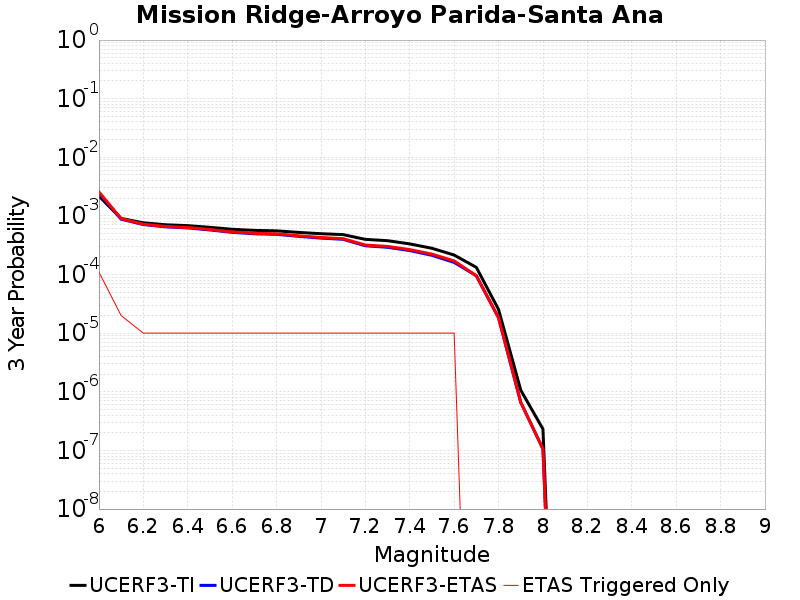 | 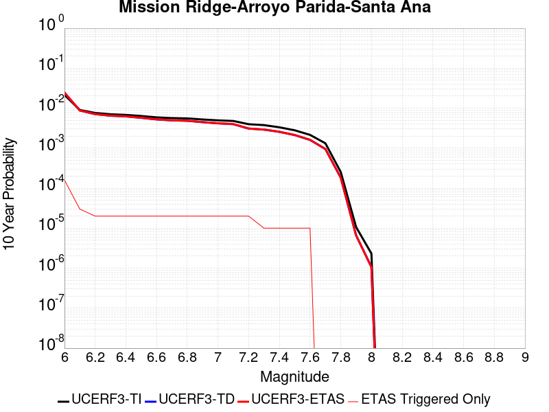 |

| Magnitude | 1 yr TI Prob | TD Prob | ETAS Prob | ETAS/TD Gain | ETAS Triggered Only | 10 yr TI Prob | TD Prob | ETAS Prob | ETAS/TD Gain | ETAS Triggered Only |
|-----|-----|-----|-----|-----|-----|-----|-----|-----|-----|-----|
| 6.0 | 0.0021730233 | 0.002457456 | 0.0025671856 | 1.0446517 | 1.1E-4 | 0.021518968 | 0.024384676 | 0.024540775 | 1.0064015 | 1.6E-4 |
| 6.1 | 9.065282E-4 | 8.790632E-4 | 8.990456E-4 | 1.0227315 | 2.0E-5 | 0.009028391 | 0.008757002 | 0.008786739 | 1.0033958 | 3.0E-5 |
| 6.2 | 7.6267915E-4 | 7.1320834E-4 | 7.2320126E-4 | 1.0140111 | 1.0E-5 | 0.007600669 | 0.007109638 | 0.0071294955 | 1.0027931 | 2.0E-5 |
| 6.3 | 7.069015E-4 | 6.510998E-4 | 6.610933E-4 | 1.0153487 | 1.0E-5 | 0.00704657 | 0.0064922846 | 0.006512155 | 1.0030606 | 2.0E-5 |
| 6.4 | 6.831918E-4 | 6.2486785E-4 | 6.348616E-4 | 1.0159934 | 1.0E-5 | 0.006810953 | 0.0062314537 | 0.006251329 | 1.0031896 | 2.0E-5 |
| 6.5 | 6.3909404E-4 | 5.763516E-4 | 5.863458E-4 | 1.0173405 | 1.0E-5 | 0.006372592 | 0.005748878 | 0.005768763 | 1.003459 | 2.0E-5 |
| 6.6 | 5.921717E-4 | 5.249688E-4 | 5.349635E-4 | 1.0190388 | 1.0E-5 | 0.0059059616 | 0.005237533 | 0.0052574277 | 1.0037986 | 2.0E-5 |
| 6.7 | 5.667165E-4 | 4.964669E-4 | 5.0646195E-4 | 1.0201323 | 1.0E-5 | 0.005652734 | 0.0049538114 | 0.0049737124 | 1.0040174 | 2.0E-5 |
| 6.8 | 5.564038E-4 | 4.851366E-4 | 4.9513177E-4 | 1.0206027 | 1.0E-5 | 0.005550127 | 0.0048410078 | 0.004860911 | 1.0041114 | 2.0E-5 |
| 6.9 | 5.236687E-4 | 4.4822475E-4 | 4.5822025E-4 | 1.0223002 | 1.0E-5 | 0.005224364 | 0.004473418 | 0.0044933283 | 1.0044508 | 2.0E-5 |
| 7.0 | 4.975576E-4 | 4.1865336E-4 | 4.286492E-4 | 1.0238761 | 1.0E-5 | 0.00496445 | 0.0041788463 | 0.0041987626 | 1.004766 | 2.0E-5 |
| 7.1 | 4.803152E-4 | 3.9921424E-4 | 4.0921028E-4 | 1.0250392 | 1.0E-5 | 0.004792784 | 0.0039851675 | 0.0040050875 | 1.0049986 | 2.0E-5 |
| 7.2 | 3.984668E-4 | 3.0943108E-4 | 3.1942799E-4 | 1.0323074 | 1.0E-5 | 0.0039775306 | 0.0030900592 | 0.0031099974 | 1.0064523 | 2.0E-5 |
| 7.3 | 3.7822526E-4 | 2.919582E-4 | 3.0195527E-4 | 1.0342414 | 1.0E-5 | 0.0037758215 | 0.0029158017 | 0.0029257725 | 1.0034196 | 1.0E-5 |
| 7.4 | 3.3336508E-4 | 2.5660836E-4 | 2.666058E-4 | 1.0389599 | 1.0E-5 | 0.0033286542 | 0.002563165 | 0.0025731395 | 1.0038915 | 1.0E-5 |
| 7.5 | 2.806312E-4 | 2.1306772E-4 | 2.2306558E-4 | 1.0469234 | 1.0E-5 | 0.0028027708 | 0.0021286458 | 0.0021386244 | 1.0046878 | 1.0E-5 |
| 7.6 | 2.1532185E-4 | 1.6113292E-4 | 1.7113131E-4 | 1.0620506 | 1.0E-5 | 0.0021511333 | 0.001610169 | 0.0016201528 | 1.0062006 | 1.0E-5 |
| 7.7 | 1.3256045E-4 | 9.5388656E-5 | 9.5388656E-5 | 1.0 | 0.0 | 0.0013248142 | 9.534833E-4 | 9.534833E-4 | 1.0 | 0.0 |
| 7.8 | 2.5362791E-5 | 1.8313944E-5 | 1.8313944E-5 | 1.0 | 0.0 | 2.5359896E-4 | 1.8312447E-4 | 1.8312447E-4 | 1.0 | 0.0 |
| 7.9 | 1.068226E-6 | 6.620839E-7 | 6.620839E-7 | 1.0 | 0.0 | 1.0682209E-5 | 6.6208204E-6 | 6.6208204E-6 | 1.0 | 0.0 |
| 8.0 | 2.3185973E-7 | 1.06033845E-7 | 1.06033845E-7 | 1.0 | 0.0 | 2.3185949E-6 | 1.060338E-6 | 1.060338E-6 | 1.0 | 0.0 |

## San Andreas (Carrizo) rev
*[(top)](#table-of-contents)*

| 1 Year | 10 Year |
|-----|-----|
| 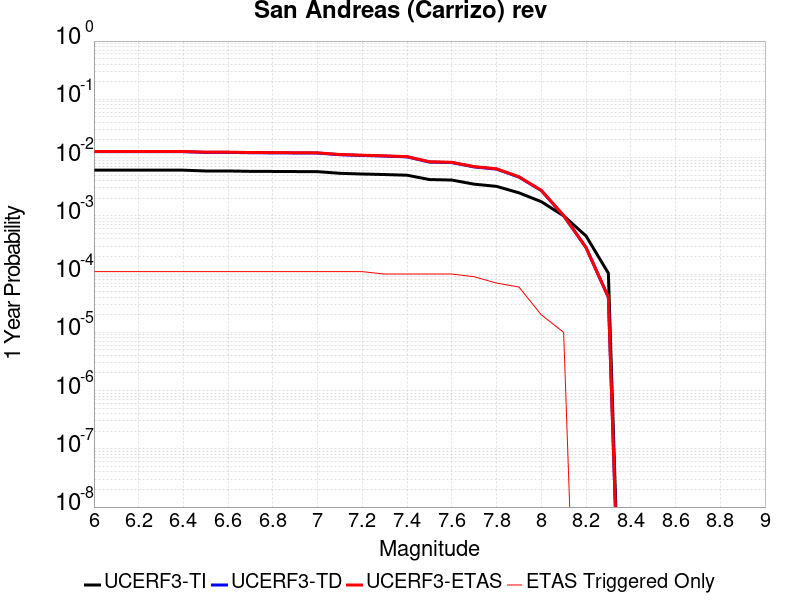 |  |

| Magnitude | 1 yr TI Prob | TD Prob | ETAS Prob | ETAS/TD Gain | ETAS Triggered Only | 10 yr TI Prob | TD Prob | ETAS Prob | ETAS/TD Gain | ETAS Triggered Only |
|-----|-----|-----|-----|-----|-----|-----|-----|-----|-----|-----|
| 6.0 | 0.006073493 | 0.012613501 | 0.012722114 | 1.0086108 | 1.1E-4 | 0.0591016 | 0.120617926 | 0.1207938 | 1.0014582 | 2.0E-4 |
| 6.1 | 0.006073493 | 0.012613501 | 0.012722114 | 1.0086108 | 1.1E-4 | 0.0591016 | 0.120617926 | 0.1207938 | 1.0014582 | 2.0E-4 |
| 6.2 | 0.006073493 | 0.012613501 | 0.012722114 | 1.0086108 | 1.1E-4 | 0.0591016 | 0.120617926 | 0.1207938 | 1.0014582 | 2.0E-4 |
| 6.3 | 0.006073493 | 0.012613501 | 0.012722114 | 1.0086108 | 1.1E-4 | 0.0591016 | 0.120617926 | 0.1207938 | 1.0014582 | 2.0E-4 |
| 6.4 | 0.006073493 | 0.012613501 | 0.012722114 | 1.0086108 | 1.1E-4 | 0.0591016 | 0.120617926 | 0.1207938 | 1.0014582 | 2.0E-4 |
| 6.5 | 0.0058862255 | 0.012263001 | 0.012371653 | 1.0088601 | 1.1E-4 | 0.057327334 | 0.117589295 | 0.11776578 | 1.0015008 | 2.0E-4 |
| 6.6 | 0.0058862255 | 0.012263001 | 0.012371653 | 1.0088601 | 1.1E-4 | 0.057327334 | 0.117589295 | 0.11776578 | 1.0015008 | 2.0E-4 |
| 6.7 | 0.0058011734 | 0.012103805 | 0.012212474 | 1.008978 | 1.1E-4 | 0.05652051 | 0.11621084 | 0.1163876 | 1.001521 | 2.0E-4 |
| 6.8 | 0.005777263 | 0.012053357 | 0.012162032 | 1.009016 | 1.1E-4 | 0.056293584 | 0.11577114 | 0.115947984 | 1.0015275 | 2.0E-4 |
| 6.9 | 0.0057511497 | 0.0119978655 | 0.012106546 | 1.0090584 | 1.1E-4 | 0.05604569 | 0.11528733 | 0.11546427 | 1.0015348 | 2.0E-4 |
| 7.0 | 0.0057263062 | 0.011946733 | 0.012055419 | 1.0090976 | 1.1E-4 | 0.055809796 | 0.11483964 | 0.11501668 | 1.0015416 | 2.0E-4 |
| 7.1 | 0.0053644776 | 0.011177844 | 0.011286614 | 1.0097309 | 1.1E-4 | 0.052368138 | 0.10809595 | 0.108265415 | 1.0015677 | 1.9E-4 |
| 7.2 | 0.0052187922 | 0.010872225 | 0.010981029 | 1.0100075 | 1.1E-4 | 0.050979212 | 0.10539992 | 0.1055699 | 1.0016127 | 1.9E-4 |
| 7.3 | 0.005109493 | 0.010601278 | 0.010700218 | 1.0093328 | 1.0E-4 | 0.049935985 | 0.10298364 | 0.1031451 | 1.0015678 | 1.8E-4 |
| 7.4 | 0.0049778637 | 0.010275658 | 0.010374631 | 1.0096318 | 1.0E-4 | 0.048678253 | 0.1000699 | 0.10023189 | 1.0016187 | 1.8E-4 |
| 7.5 | 0.0041929903 | 0.008373174 | 0.008472336 | 1.0118428 | 1.0E-4 | 0.04114753 | 0.08281374 | 0.08296049 | 1.001772 | 1.6E-4 |
| 7.6 | 0.0041122385 | 0.008193705 | 0.008292886 | 1.0121045 | 1.0E-4 | 0.040369697 | 0.08115492 | 0.081301935 | 1.0018115 | 1.6E-4 |
| 7.7 | 0.003493839 | 0.006904147 | 0.0069935257 | 1.0129457 | 9.0E-5 | 0.034394164 | 0.069051005 | 0.06917203 | 1.0017526 | 1.3E-4 |
| 7.8 | 0.0032027436 | 0.0063449643 | 0.0064145206 | 1.0109624 | 7.0E-5 | 0.031569764 | 0.06351725 | 0.0636109 | 1.0014744 | 1.0E-4 |
| 7.9 | 0.0024825884 | 0.0046230503 | 0.004682773 | 1.0129185 | 6.0E-5 | 0.024550365 | 0.0466301 | 0.0467159 | 1.0018401 | 9.0E-5 |
| 8.0 | 0.0017493097 | 0.0027169385 | 0.0027368842 | 1.0073413 | 2.0E-5 | 0.017356034 | 0.027882213 | 0.027921097 | 1.0013946 | 4.0E-5 |
| 8.1 | 0.0010000558 | 0.0010006184 | 0.0010106084 | 1.0099838 | 1.0E-5 | 0.009955673 | 0.010758674 | 0.010778459 | 1.0018389 | 2.0E-5 |
| 8.2 | 4.5092785E-4 | 2.8565482E-4 | 2.8565482E-4 | 1.0 | 0.0 | 0.0045001395 | 0.0032489614 | 0.0032489614 | 1.0 | 0.0 |
| 8.3 | 1.034694E-4 | 3.9971612E-5 | 3.9971612E-5 | 1.0 | 0.0 | 0.0010342124 | 4.7201355E-4 | 4.7201355E-4 | 1.0 | 0.0 |

## San Andreas (San Gorgonio Pass-Garnet HIll)
*[(top)](#table-of-contents)*

| 1 Year | 10 Year |
|-----|-----|
| 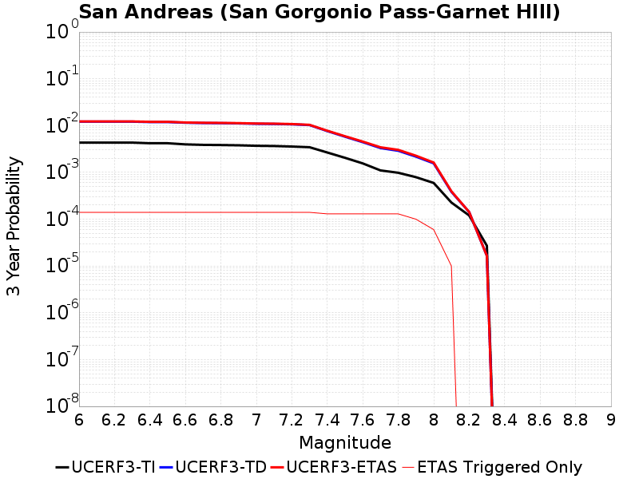 | 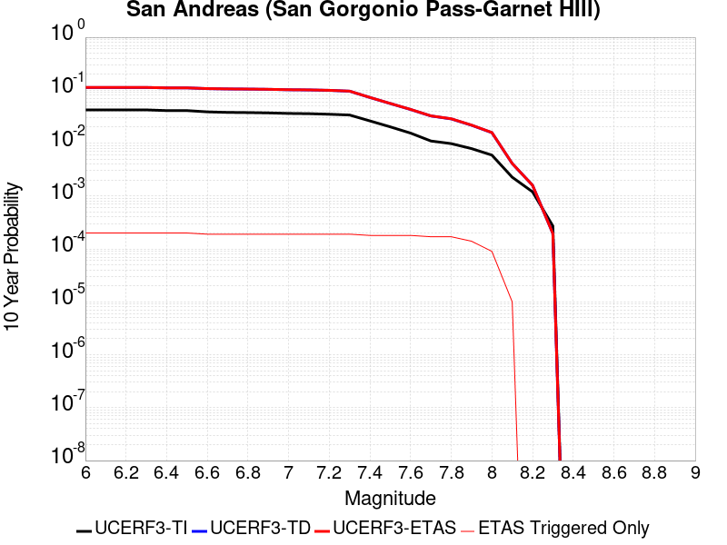 |

| Magnitude | 1 yr TI Prob | TD Prob | ETAS Prob | ETAS/TD Gain | ETAS Triggered Only | 10 yr TI Prob | TD Prob | ETAS Prob | ETAS/TD Gain | ETAS Triggered Only |
|-----|-----|-----|-----|-----|-----|-----|-----|-----|-----|-----|
| 6.0 | 0.004329778 | 0.012128077 | 0.01226638 | 1.0114034 | 1.4E-4 | 0.042463828 | 0.11258042 | 0.1127579 | 1.0015765 | 2.0E-4 |
| 6.1 | 0.004329778 | 0.012128077 | 0.01226638 | 1.0114034 | 1.4E-4 | 0.042463828 | 0.11258042 | 0.1127579 | 1.0015765 | 2.0E-4 |
| 6.2 | 0.004329778 | 0.012128077 | 0.01226638 | 1.0114034 | 1.4E-4 | 0.042463828 | 0.11258042 | 0.1127579 | 1.0015765 | 2.0E-4 |
| 6.3 | 0.004329778 | 0.012128077 | 0.01226638 | 1.0114034 | 1.4E-4 | 0.042463828 | 0.11258042 | 0.1127579 | 1.0015765 | 2.0E-4 |
| 6.4 | 0.0041964394 | 0.011900338 | 0.012038672 | 1.0116243 | 1.4E-4 | 0.041180745 | 0.11056164 | 0.11073953 | 1.001609 | 2.0E-4 |
| 6.5 | 0.0041964394 | 0.011900338 | 0.012038672 | 1.0116243 | 1.4E-4 | 0.041180745 | 0.11056164 | 0.11073953 | 1.001609 | 2.0E-4 |
| 6.6 | 0.0039678677 | 0.011511056 | 0.011649445 | 1.0120223 | 1.4E-4 | 0.03897764 | 0.10709831 | 0.10726797 | 1.001584 | 1.9E-4 |
| 6.7 | 0.0038750346 | 0.011343793 | 0.011482205 | 1.0122015 | 1.4E-4 | 0.038081564 | 0.10560676 | 0.1057767 | 1.0016091 | 1.9E-4 |
| 6.8 | 0.0038401815 | 0.011264934 | 0.011403357 | 1.012288 | 1.4E-4 | 0.03774495 | 0.10490831 | 0.10507838 | 1.0016211 | 1.9E-4 |
| 6.9 | 0.003789323 | 0.011145711 | 0.01128415 | 1.0124209 | 1.4E-4 | 0.037253562 | 0.10385623 | 0.1040265 | 1.0016395 | 1.9E-4 |
| 7.0 | 0.003699303 | 0.010931015 | 0.011069485 | 1.0126675 | 1.4E-4 | 0.03638325 | 0.101958424 | 0.10212906 | 1.0016735 | 1.9E-4 |
| 7.1 | 0.0036607897 | 0.010846172 | 0.010984655 | 1.0127678 | 1.4E-4 | 0.036010686 | 0.10120146 | 0.101372235 | 1.0016874 | 1.9E-4 |
| 7.2 | 0.003567883 | 0.010643719 | 0.010782229 | 1.0130132 | 1.4E-4 | 0.035111405 | 0.099393494 | 0.099564604 | 1.0017216 | 1.9E-4 |
| 7.3 | 0.0034497243 | 0.010244659 | 0.010383225 | 1.0135256 | 1.4E-4 | 0.033966612 | 0.095889986 | 0.096061766 | 1.0017915 | 1.9E-4 |
| 7.4 | 0.002660276 | 0.0076361154 | 0.0077651227 | 1.0168943 | 1.3E-4 | 0.02628654 | 0.07286432 | 0.0730312 | 1.0022904 | 1.8E-4 |
| 7.5 | 0.0020487092 | 0.0057910844 | 0.0059203315 | 1.0223182 | 1.3E-4 | 0.020299247 | 0.056010664 | 0.05618058 | 1.0030336 | 1.8E-4 |
| 7.6 | 0.0015564259 | 0.004423079 | 0.004552504 | 1.0292612 | 1.3E-4 | 0.0154556995 | 0.04319478 | 0.043367002 | 1.0039872 | 1.8E-4 |
| 7.7 | 0.0011022091 | 0.0033095821 | 0.003439152 | 1.0391499 | 1.3E-4 | 0.010967582 | 0.032583524 | 0.032747984 | 1.0050473 | 1.7E-4 |
| 7.8 | 9.822468E-4 | 0.0028992023 | 0.0030288254 | 1.0447099 | 1.3E-4 | 0.0097791655 | 0.028696062 | 0.028861184 | 1.0057541 | 1.7E-4 |
| 7.9 | 7.9052144E-4 | 0.002171444 | 0.002271227 | 1.0459523 | 1.0E-4 | 0.007877152 | 0.021760136 | 0.02189709 | 1.0062938 | 1.4E-4 |
| 8.0 | 5.9497025E-4 | 0.0015628756 | 0.0016227819 | 1.0383308 | 6.0E-5 | 0.005933798 | 0.015773393 | 0.015861973 | 1.0056158 | 9.0E-5 |
| 8.1 | 2.2701119E-4 | 3.844647E-4 | 3.944609E-4 | 1.0260001 | 1.0E-5 | 0.0022677942 | 0.0041165426 | 0.0041265017 | 1.0024192 | 1.0E-5 |
| 8.2 | 1.2022553E-4 | 1.4260122E-4 | 1.4260122E-4 | 1.0 | 0.0 | 0.0012016051 | 0.0015980803 | 0.0015980803 | 1.0 | 0.0 |
| 8.3 | 2.714798E-5 | 1.6488913E-5 | 1.6488913E-5 | 1.0 | 0.0 | 2.7144665E-4 | 1.956473E-4 | 1.956473E-4 | 1.0 | 0.0 |

## Red Pass
*[(top)](#table-of-contents)*

| 1 Year | 10 Year |
|-----|-----|
| 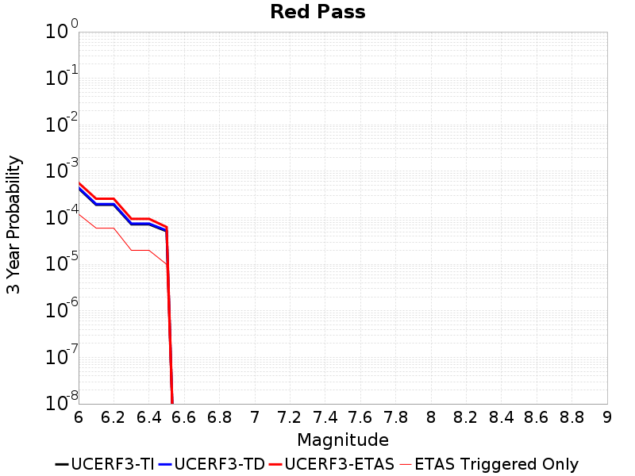 | 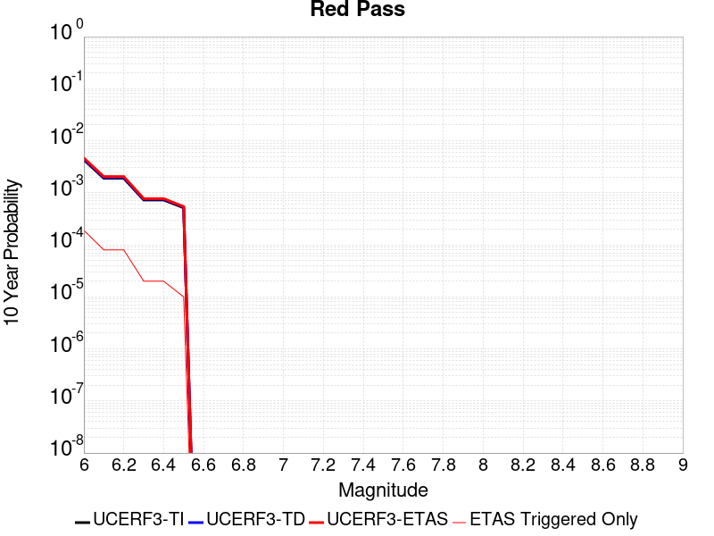 |

| Magnitude | 1 yr TI Prob | TD Prob | ETAS Prob | ETAS/TD Gain | ETAS Triggered Only | 10 yr TI Prob | TD Prob | ETAS Prob | ETAS/TD Gain | ETAS Triggered Only |
|-----|-----|-----|-----|-----|-----|-----|-----|-----|-----|-----|
| 6.0 | 4.308141E-4 | 4.4611446E-4 | 5.6606095E-4 | 1.2688693 | 1.2E-4 | 0.0042997985 | 0.004453947 | 0.0046431003 | 1.0424688 | 1.9E-4 |
| 6.1 | 1.9043336E-4 | 1.9697675E-4 | 2.5696494E-4 | 1.3045444 | 6.0E-5 | 0.0019027026 | 0.0019684888 | 0.0020483313 | 1.0405604 | 8.0E-5 |
| 6.2 | 1.9043336E-4 | 1.9697675E-4 | 2.5696494E-4 | 1.3045444 | 6.0E-5 | 0.0019027026 | 0.0019684888 | 0.0020483313 | 1.0405604 | 8.0E-5 |
| 6.3 | 7.265574E-5 | 7.519418E-5 | 9.519268E-5 | 1.2659581 | 2.0E-5 | 7.263199E-4 | 7.518261E-4 | 7.718111E-4 | 1.0265819 | 2.0E-5 |
| 6.4 | 7.265574E-5 | 7.519418E-5 | 9.519268E-5 | 1.2659581 | 2.0E-5 | 7.263199E-4 | 7.518261E-4 | 7.718111E-4 | 1.0265819 | 2.0E-5 |
| 6.5 | 5.153449E-5 | 5.3336502E-5 | 6.333597E-5 | 1.1874789 | 1.0E-5 | 5.1522546E-4 | 5.33365E-4 | 5.4335967E-4 | 1.0187389 | 1.0E-5 |

## Scodie Lineament
*[(top)](#table-of-contents)*

| 1 Year | 10 Year |
|-----|-----|
|  | 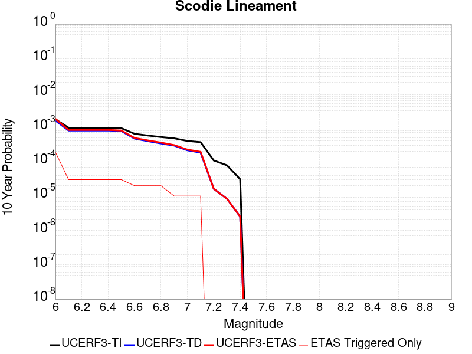 |

| Magnitude | 1 yr TI Prob | TD Prob | ETAS Prob | ETAS/TD Gain | ETAS Triggered Only | 10 yr TI Prob | TD Prob | ETAS Prob | ETAS/TD Gain | ETAS Triggered Only |
|-----|-----|-----|-----|-----|-----|-----|-----|-----|-----|-----|
| 6.0 | 1.7175387E-4 | 1.5722323E-4 | 2.6720593E-4 | 1.6995322 | 1.1E-4 | 0.0017162118 | 0.0015714316 | 0.001761133 | 1.1207188 | 1.9E-4 |
| 6.1 | 9.738045E-5 | 8.082458E-5 | 1.0082297E-4 | 1.2474295 | 2.0E-5 | 9.7337784E-4 | 8.080007E-4 | 8.3797646E-4 | 1.0370986 | 3.0E-5 |
| 6.2 | 9.738045E-5 | 8.082458E-5 | 1.0082297E-4 | 1.2474295 | 2.0E-5 | 9.7337784E-4 | 8.080007E-4 | 8.3797646E-4 | 1.0370986 | 3.0E-5 |
| 6.3 | 9.738045E-5 | 8.082458E-5 | 1.0082297E-4 | 1.2474295 | 2.0E-5 | 9.7337784E-4 | 8.080007E-4 | 8.3797646E-4 | 1.0370986 | 3.0E-5 |
| 6.4 | 9.738045E-5 | 8.082458E-5 | 1.0082297E-4 | 1.2474295 | 2.0E-5 | 9.7337784E-4 | 8.080007E-4 | 8.3797646E-4 | 1.0370986 | 3.0E-5 |
| 6.5 | 9.447177E-5 | 7.779502E-5 | 9.779346E-5 | 1.2570659 | 2.0E-5 | 9.4431615E-4 | 7.7772647E-4 | 8.077032E-4 | 1.0385439 | 3.0E-5 |
| 6.6 | 6.477596E-5 | 4.694701E-5 | 6.694607E-5 | 1.4259923 | 2.0E-5 | 6.475708E-4 | 4.693796E-4 | 4.893702E-4 | 1.0425894 | 2.0E-5 |
| 6.7 | 5.7719422E-5 | 3.962536E-5 | 5.9624566E-5 | 1.5047072 | 2.0E-5 | 5.770443E-4 | 3.9618992E-4 | 4.16182E-4 | 1.0504608 | 2.0E-5 |
| 6.8 | 5.221238E-5 | 3.3917666E-5 | 5.3916985E-5 | 1.5896432 | 2.0E-5 | 5.220012E-4 | 3.3913096E-4 | 3.5912418E-4 | 1.0589542 | 2.0E-5 |
| 6.9 | 4.7832873E-5 | 2.9384672E-5 | 3.9384377E-5 | 1.3403035 | 1.0E-5 | 4.782258E-4 | 2.9381353E-4 | 3.0381058E-4 | 1.0340252 | 1.0E-5 |
| 7.0 | 4.0170275E-5 | 2.1462876E-5 | 3.1462663E-5 | 1.4659108 | 1.0E-5 | 4.0163012E-4 | 2.146119E-4 | 2.2460976E-4 | 1.0465858 | 1.0E-5 |
| 7.1 | 3.706632E-5 | 1.837274E-5 | 2.8372557E-5 | 1.5442746 | 1.0E-5 | 3.7060137E-4 | 1.8371572E-4 | 1.9371387E-4 | 1.0544219 | 1.0E-5 |
| 7.2 | 1.0852878E-5 | 1.6272883E-6 | 1.6272883E-6 | 1.0 | 0.0 | 1.08523476E-4 | 1.627277E-5 | 1.627277E-5 | 1.0 | 0.0 |
| 7.3 | 7.851896E-6 | 8.320261E-7 | 8.320261E-7 | 1.0 | 0.0 | 7.851618E-5 | 8.320233E-6 | 8.320233E-6 | 1.0 | 0.0 |
| 7.4 | 3.095994E-6 | 2.540247E-7 | 2.540247E-7 | 1.0 | 0.0 | 3.095951E-5 | 2.5402455E-6 | 2.5402455E-6 | 1.0 | 0.0 |

## Cady
*[(top)](#table-of-contents)*

| 1 Year | 10 Year |
|-----|-----|
| 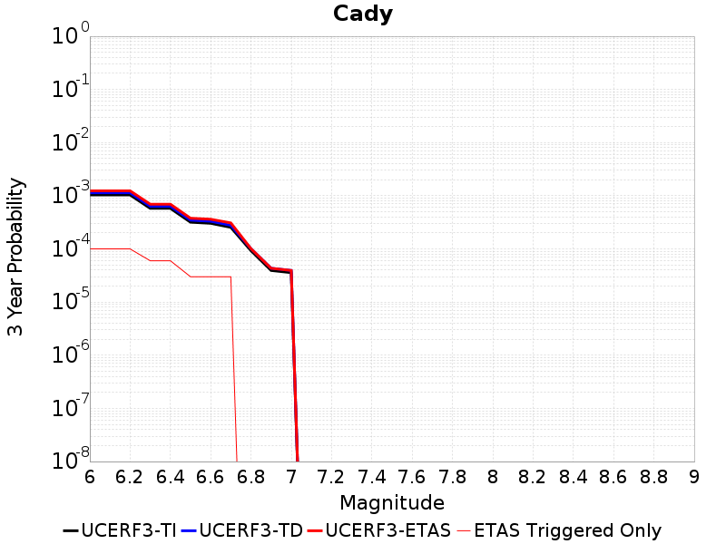 | 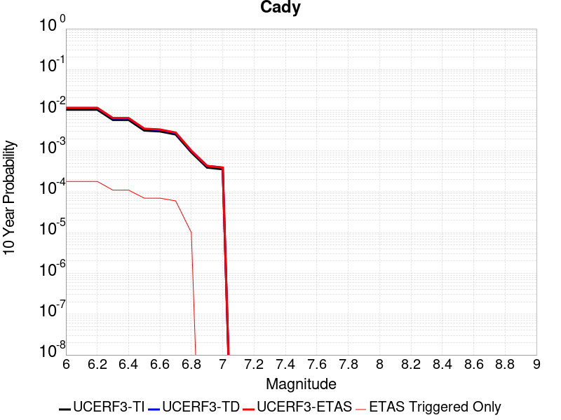 |

| Magnitude | 1 yr TI Prob | TD Prob | ETAS Prob | ETAS/TD Gain | ETAS Triggered Only | 10 yr TI Prob | TD Prob | ETAS Prob | ETAS/TD Gain | ETAS Triggered Only |
|-----|-----|-----|-----|-----|-----|-----|-----|-----|-----|-----|
| 6.0 | 0.0010374374 | 0.0011400181 | 0.0012399041 | 1.0876179 | 1.0E-4 | 0.010326075 | 0.011350715 | 0.011528671 | 1.015678 | 1.8E-4 |
| 6.1 | 0.0010374374 | 0.0011400181 | 0.0012399041 | 1.0876179 | 1.0E-4 | 0.010326075 | 0.011350715 | 0.011528671 | 1.015678 | 1.8E-4 |
| 6.2 | 0.0010374374 | 0.0011400181 | 0.0012399041 | 1.0876179 | 1.0E-4 | 0.010326075 | 0.011350715 | 0.011528671 | 1.015678 | 1.8E-4 |
| 6.3 | 5.7992124E-4 | 6.3519325E-4 | 6.951551E-4 | 1.0943995 | 6.0E-5 | 0.0057841022 | 0.0063368827 | 0.006446186 | 1.0172487 | 1.1E-4 |
| 6.4 | 5.7992124E-4 | 6.3519325E-4 | 6.951551E-4 | 1.0943995 | 6.0E-5 | 0.0057841022 | 0.0063368827 | 0.006446186 | 1.0172487 | 1.1E-4 |
| 6.5 | 3.1840094E-4 | 3.480909E-4 | 3.7808047E-4 | 1.0861543 | 3.0E-5 | 0.0031794512 | 0.0034766907 | 0.0035464473 | 1.0200641 | 7.0E-5 |
| 6.6 | 3.034899E-4 | 3.3211056E-4 | 3.621006E-4 | 1.0903014 | 3.0E-5 | 0.0030307577 | 0.0033173645 | 0.0033871322 | 1.0210311 | 7.0E-5 |
| 6.7 | 2.5484123E-4 | 2.7863804E-4 | 3.0862968E-4 | 1.1076366 | 3.0E-5 | 0.0025454918 | 0.0027840424 | 0.0028438752 | 1.0214914 | 6.0E-5 |
| 6.8 | 9.281505E-5 | 1.012184E-4 | 1.012184E-4 | 1.0 | 0.0 | 9.2776294E-4 | 0.0010118776 | 0.0010218675 | 1.0098727 | 1.0E-5 |
| 6.9 | 3.937079E-5 | 4.3292534E-5 | 4.3292534E-5 | 1.0 | 0.0 | 3.9363815E-4 | 4.3287396E-4 | 4.3287396E-4 | 1.0 | 0.0 |
| 7.0 | 3.578281E-5 | 3.9351762E-5 | 3.9351762E-5 | 1.0 | 0.0 | 3.577705E-4 | 3.934804E-4 | 3.934804E-4 | 1.0 | 0.0 |

## Lake Isabella (Seismicity)
*[(top)](#table-of-contents)*

| 1 Year | 10 Year |
|-----|-----|
| 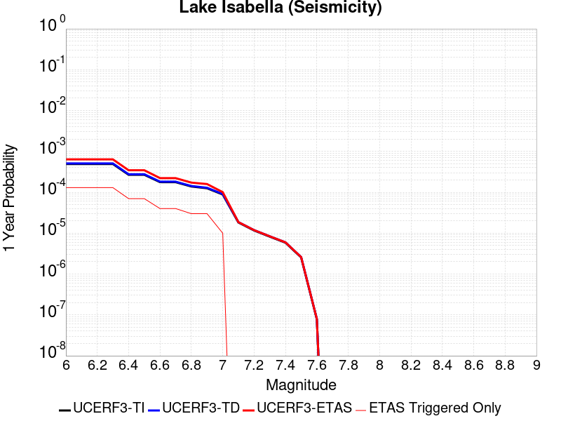 | 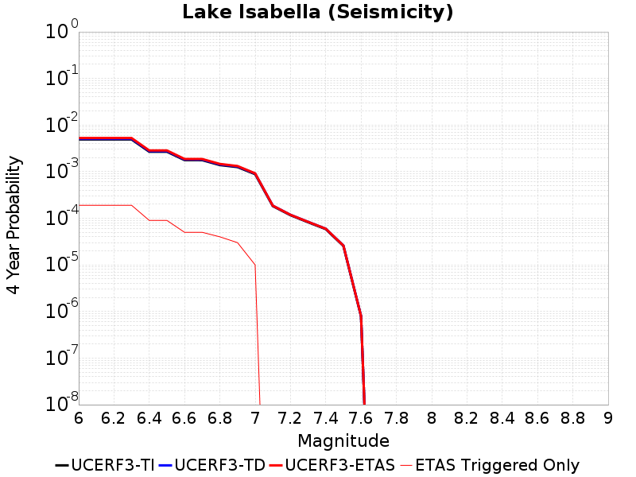 |

| Magnitude | 1 yr TI Prob | TD Prob | ETAS Prob | ETAS/TD Gain | ETAS Triggered Only | 10 yr TI Prob | TD Prob | ETAS Prob | ETAS/TD Gain | ETAS Triggered Only |
|-----|-----|-----|-----|-----|-----|-----|-----|-----|-----|-----|
| 6.0 | 4.920106E-4 | 5.08193E-4 | 6.381269E-4 | 1.2556783 | 1.3E-4 | 0.004909227 | 0.005071601 | 0.0052606375 | 1.0372735 | 1.9E-4 |
| 6.1 | 4.920106E-4 | 5.08193E-4 | 6.381269E-4 | 1.2556783 | 1.3E-4 | 0.004909227 | 0.005071601 | 0.0052606375 | 1.0372735 | 1.9E-4 |
| 6.2 | 4.920106E-4 | 5.08193E-4 | 6.381269E-4 | 1.2556783 | 1.3E-4 | 0.004909227 | 0.005071601 | 0.0052606375 | 1.0372735 | 1.9E-4 |
| 6.3 | 4.920106E-4 | 5.08193E-4 | 6.381269E-4 | 1.2556783 | 1.3E-4 | 0.004909227 | 0.005071601 | 0.0052606375 | 1.0372735 | 1.9E-4 |
| 6.4 | 2.6837454E-4 | 2.765167E-4 | 3.4649734E-4 | 1.2530793 | 7.0E-5 | 0.0026805066 | 0.0027620667 | 0.0028518182 | 1.0324943 | 9.0E-5 |
| 6.5 | 2.6837454E-4 | 2.765167E-4 | 3.4649734E-4 | 1.2530793 | 7.0E-5 | 0.0026805066 | 0.0027620667 | 0.0028518182 | 1.0324943 | 9.0E-5 |
| 6.6 | 1.7744285E-4 | 1.825471E-4 | 2.2253979E-4 | 1.2190815 | 4.0E-5 | 0.0017730123 | 0.0018241293 | 0.001874038 | 1.0273603 | 5.0E-5 |
| 6.7 | 1.767679E-4 | 1.8186193E-4 | 2.2185467E-4 | 1.219907 | 4.0E-5 | 0.0017662736 | 0.0018172888 | 0.001867198 | 1.0274636 | 5.0E-5 |
| 6.8 | 1.3869164E-4 | 1.4263208E-4 | 1.726278E-4 | 1.2103014 | 3.0E-5 | 0.0013860512 | 0.0014255374 | 0.0014654804 | 1.0280195 | 4.0E-5 |
| 6.9 | 1.2553448E-4 | 1.2910023E-4 | 1.5909635E-4 | 1.2323476 | 3.0E-5 | 0.0012546359 | 0.0012903819 | 0.0013203431 | 1.023219 | 3.0E-5 |
| 7.0 | 8.8455E-5 | 9.094107E-5 | 1.0094016E-4 | 1.1099514 | 1.0E-5 | 8.84198E-4 | 9.0914126E-4 | 9.191322E-4 | 1.0109894 | 1.0E-5 |
| 7.1 | 1.826955E-5 | 1.863532E-5 | 1.863532E-5 | 1.0 | 0.0 | 1.8268047E-4 | 1.8633784E-4 | 1.8633784E-4 | 1.0 | 0.0 |
| 7.2 | 1.1646762E-5 | 1.1870859E-5 | 1.1870859E-5 | 1.0 | 0.0 | 1.1646151E-4 | 1.1870235E-4 | 1.1870235E-4 | 1.0 | 0.0 |
| 7.3 | 8.223522E-6 | 8.380328E-6 | 8.380328E-6 | 1.0 | 0.0 | 8.2232174E-5 | 8.380018E-5 | 8.380018E-5 | 1.0 | 0.0 |
| 7.4 | 5.852591E-6 | 5.9648855E-6 | 5.9648855E-6 | 1.0 | 0.0 | 5.8524372E-5 | 5.9647296E-5 | 5.9647296E-5 | 1.0 | 0.0 |
| 7.5 | 2.5490165E-6 | 2.5978504E-6 | 2.5978504E-6 | 1.0 | 0.0 | 2.5489873E-5 | 2.597822E-5 | 2.597822E-5 | 1.0 | 0.0 |
| 7.6 | 7.851001E-8 | 7.992665E-8 | 7.992665E-8 | 1.0 | 0.0 | 7.8509987E-7 | 7.9926645E-7 | 7.9926645E-7 | 1.0 | 0.0 |

## San Andreas (Cholame) rev
*[(top)](#table-of-contents)*

| 1 Year | 10 Year |
|-----|-----|
| 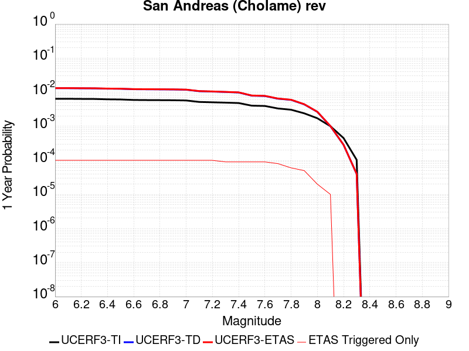 | 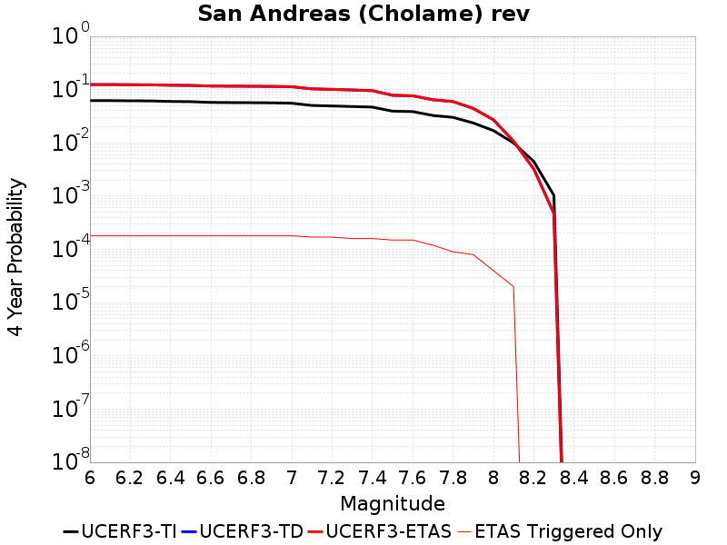 |

| Magnitude | 1 yr TI Prob | TD Prob | ETAS Prob | ETAS/TD Gain | ETAS Triggered Only | 10 yr TI Prob | TD Prob | ETAS Prob | ETAS/TD Gain | ETAS Triggered Only |
|-----|-----|-----|-----|-----|-----|-----|-----|-----|-----|-----|
| 6.0 | 0.0063991086 | 0.013067546 | 0.0131662395 | 1.0075525 | 1.0E-4 | 0.06217949 | 0.12439448 | 0.124552086 | 1.001267 | 1.8E-4 |
| 6.1 | 0.0063991086 | 0.013067546 | 0.0131662395 | 1.0075525 | 1.0E-4 | 0.06217949 | 0.12439448 | 0.124552086 | 1.001267 | 1.8E-4 |
| 6.2 | 0.006347804 | 0.012973173 | 0.013071875 | 1.0076082 | 1.0E-4 | 0.061695136 | 0.12358065 | 0.12373841 | 1.0012765 | 1.8E-4 |
| 6.3 | 0.006316212 | 0.012914429 | 0.013013138 | 1.0076432 | 1.0E-4 | 0.06139677 | 0.12307478 | 0.123232625 | 1.0012826 | 1.8E-4 |
| 6.4 | 0.006172335 | 0.012659656 | 0.01275839 | 1.0077991 | 1.0E-4 | 0.060036868 | 0.120867535 | 0.12102578 | 1.0013093 | 1.8E-4 |
| 6.5 | 0.006109677 | 0.0125531405 | 0.012651885 | 1.0078661 | 1.0E-4 | 0.059444077 | 0.11994177 | 0.120100185 | 1.0013207 | 1.8E-4 |
| 6.6 | 0.0059092017 | 0.012196967 | 0.012295747 | 1.0080987 | 1.0E-4 | 0.057545185 | 0.11685584 | 0.1170148 | 1.0013604 | 1.8E-4 |
| 6.7 | 0.005864331 | 0.0121167 | 0.012215489 | 1.0081531 | 1.0E-4 | 0.057119697 | 0.1161594 | 0.116318494 | 1.0013696 | 1.8E-4 |
| 6.8 | 0.005836608 | 0.012059172 | 0.012157965 | 1.0081924 | 1.0E-4 | 0.056856725 | 0.11565765 | 0.11581683 | 1.0013763 | 1.8E-4 |
| 6.9 | 0.0057996577 | 0.011981181 | 0.012079982 | 1.0082464 | 1.0E-4 | 0.056506127 | 0.11497807 | 0.11513737 | 1.0013856 | 1.8E-4 |
| 7.0 | 0.005705768 | 0.011786932 | 0.011885754 | 1.008384 | 1.0E-4 | 0.055614736 | 0.11327962 | 0.11343923 | 1.0014089 | 1.8E-4 |
| 7.1 | 0.0051671406 | 0.01066141 | 0.010760344 | 1.0092796 | 1.0E-4 | 0.05048634 | 0.10337417 | 0.10352659 | 1.0014745 | 1.7E-4 |
| 7.2 | 0.00504711 | 0.010405406 | 0.010504366 | 1.0095104 | 1.0E-4 | 0.04934009 | 0.10111215 | 0.10126496 | 1.0015113 | 1.7E-4 |
| 7.3 | 0.0049308087 | 0.010110602 | 0.010199692 | 1.0088116 | 9.0E-5 | 0.048228268 | 0.098483026 | 0.09862727 | 1.0014646 | 1.6E-4 |
| 7.4 | 0.004799717 | 0.009785378 | 0.009874498 | 1.0091074 | 9.0E-5 | 0.046973653 | 0.09556096 | 0.095705666 | 1.0015143 | 1.6E-4 |
| 7.5 | 0.0040183207 | 0.007889362 | 0.007978652 | 1.0113177 | 9.0E-5 | 0.03946433 | 0.07828842 | 0.078426674 | 1.001766 | 1.5E-4 |
| 7.6 | 0.0039388672 | 0.007713034 | 0.0078023397 | 1.0115786 | 9.0E-5 | 0.038697794 | 0.076651804 | 0.07679031 | 1.0018069 | 1.5E-4 |
| 7.7 | 0.0033226798 | 0.0064285826 | 0.006508068 | 1.0123644 | 8.0E-5 | 0.032734364 | 0.064543106 | 0.06465536 | 1.0017393 | 1.2E-4 |
| 7.8 | 0.003054864 | 0.0059396937 | 0.0059993374 | 1.0100415 | 6.0E-5 | 0.030132094 | 0.05966176 | 0.05974639 | 1.0014185 | 9.0E-5 |
| 7.9 | 0.0023949358 | 0.00438749 | 0.004437271 | 1.011346 | 5.0E-5 | 0.023692891 | 0.044363946 | 0.0444404 | 1.0017233 | 8.0E-5 |
| 8.0 | 0.0017178444 | 0.0026459533 | 0.0026659004 | 1.0075387 | 2.0E-5 | 0.017046256 | 0.027181374 | 0.027220288 | 1.0014316 | 4.0E-5 |
| 8.1 | 0.0010001622 | 0.0010006273 | 0.0010106172 | 1.0099838 | 1.0E-5 | 0.009956728 | 0.010758789 | 0.010778574 | 1.0018389 | 2.0E-5 |
| 8.2 | 4.5092785E-4 | 2.8565482E-4 | 2.8565482E-4 | 1.0 | 0.0 | 0.0045001395 | 0.0032489614 | 0.0032489614 | 1.0 | 0.0 |
| 8.3 | 1.034694E-4 | 3.9971612E-5 | 3.9971612E-5 | 1.0 | 0.0 | 0.0010342124 | 4.7201355E-4 | 4.7201355E-4 | 1.0 | 0.0 |

## San Andreas (Creeping Section) 2011 CFM
*[(top)](#table-of-contents)*

| 1 Year | 10 Year |
|-----|-----|
| 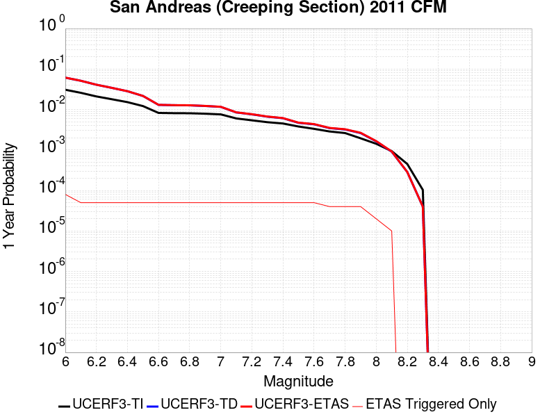 | 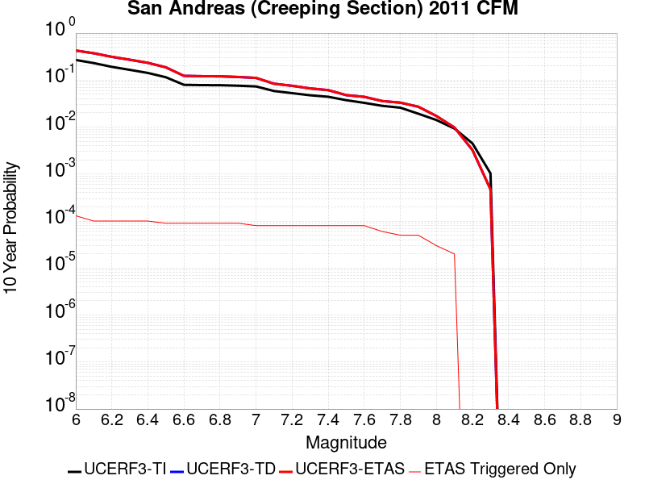 |

| Magnitude | 1 yr TI Prob | TD Prob | ETAS Prob | ETAS/TD Gain | ETAS Triggered Only | 10 yr TI Prob | TD Prob | ETAS Prob | ETAS/TD Gain | ETAS Triggered Only |
|-----|-----|-----|-----|-----|-----|-----|-----|-----|-----|-----|
| 6.0 | 0.030762846 | 0.061203558 | 0.061278664 | 1.0012271 | 8.0E-5 | 0.26835477 | 0.42593035 | 0.42600498 | 1.0001752 | 1.3E-4 |
| 6.1 | 0.025839351 | 0.051246874 | 0.05129431 | 1.0009257 | 5.0E-5 | 0.23032776 | 0.3728516 | 0.37291434 | 1.0001682 | 1.0E-4 |
| 6.2 | 0.021034058 | 0.04093204 | 0.040979993 | 1.0011716 | 5.0E-5 | 0.19150782 | 0.31302828 | 0.313097 | 1.0002195 | 1.0E-4 |
| 6.3 | 0.017915873 | 0.034188107 | 0.034236398 | 1.0014125 | 5.0E-5 | 0.16538359 | 0.27131093 | 0.2713838 | 1.0002686 | 1.0E-4 |
| 6.4 | 0.015200248 | 0.028263062 | 0.02831165 | 1.0017191 | 5.0E-5 | 0.14201577 | 0.23297933 | 0.23305604 | 1.0003293 | 1.0E-4 |
| 6.5 | 0.012141965 | 0.021586668 | 0.021635588 | 1.0022663 | 5.0E-5 | 0.11499573 | 0.18681775 | 0.18689093 | 1.0003917 | 9.0E-5 |
| 6.6 | 0.0082328 | 0.012995656 | 0.0130450055 | 1.0037974 | 5.0E-5 | 0.07934396 | 0.12314066 | 0.12321959 | 1.0006409 | 9.0E-5 |
| 6.7 | 0.0081159435 | 0.012757525 | 0.012806887 | 1.0038693 | 5.0E-5 | 0.0782586 | 0.12116779 | 0.12124688 | 1.0006528 | 9.0E-5 |
| 6.8 | 0.008075596 | 0.012666908 | 0.012716275 | 1.0038973 | 5.0E-5 | 0.07788358 | 0.12039867 | 0.12047784 | 1.0006576 | 9.0E-5 |
| 6.9 | 0.007876333 | 0.012209093 | 0.012258483 | 1.0040454 | 5.0E-5 | 0.07602952 | 0.116468795 | 0.116548315 | 1.0006827 | 9.0E-5 |
| 7.0 | 0.0075839474 | 0.011619791 | 0.01166921 | 1.004253 | 5.0E-5 | 0.073302895 | 0.1113151 | 0.1113862 | 1.0006387 | 8.0E-5 |
| 7.1 | 0.006016669 | 0.008460557 | 0.008510133 | 1.0058597 | 5.0E-5 | 0.058563538 | 0.083667636 | 0.08374095 | 1.0008762 | 8.0E-5 |
| 7.2 | 0.005408933 | 0.0075981114 | 0.0076477313 | 1.0065305 | 5.0E-5 | 0.052791595 | 0.07561778 | 0.07569173 | 1.000978 | 8.0E-5 |
| 7.3 | 0.0048581534 | 0.0066473824 | 0.0066970503 | 1.0074718 | 5.0E-5 | 0.047533102 | 0.0664821 | 0.06655678 | 1.0011233 | 8.0E-5 |
| 7.4 | 0.004513991 | 0.0060885856 | 0.0061382814 | 1.0081621 | 5.0E-5 | 0.044233937 | 0.061151177 | 0.061226282 | 1.0012282 | 8.0E-5 |
| 7.5 | 0.0038038217 | 0.004688488 | 0.004738253 | 1.0106144 | 5.0E-5 | 0.03739367 | 0.047877785 | 0.047953952 | 1.001591 | 8.0E-5 |
| 7.6 | 0.0033306254 | 0.004311592 | 0.004361376 | 1.0115466 | 5.0E-5 | 0.032811474 | 0.04399217 | 0.04406865 | 1.0017385 | 8.0E-5 |
| 7.7 | 0.0028683927 | 0.0034702776 | 0.003510139 | 1.0114864 | 4.0E-5 | 0.0283165 | 0.03579693 | 0.03585478 | 1.0016161 | 6.0E-5 |
| 7.8 | 0.0026197135 | 0.0032107653 | 0.0032506369 | 1.012418 | 4.0E-5 | 0.025890453 | 0.033127416 | 0.03317576 | 1.0014594 | 5.0E-5 |
| 7.9 | 0.0019429359 | 0.002617421 | 0.0026573164 | 1.0152422 | 4.0E-5 | 0.019260362 | 0.027068082 | 0.027116727 | 1.0017972 | 5.0E-5 |
| 8.0 | 0.0014240141 | 0.0016386657 | 0.0016586329 | 1.0121851 | 2.0E-5 | 0.014149235 | 0.01721478 | 0.017244264 | 1.0017127 | 3.0E-5 |
| 8.1 | 9.3568244E-4 | 9.07605E-4 | 9.175959E-4 | 1.011008 | 1.0E-5 | 0.009317525 | 0.009799677 | 0.0098194815 | 1.0020208 | 2.0E-5 |
| 8.2 | 4.5092785E-4 | 2.8565482E-4 | 2.8565482E-4 | 1.0 | 0.0 | 0.0045001395 | 0.0032489614 | 0.0032489614 | 1.0 | 0.0 |
| 8.3 | 1.034694E-4 | 3.9971612E-5 | 3.9971612E-5 | 1.0 | 0.0 | 0.0010342124 | 4.7201355E-4 | 4.7201355E-4 | 1.0 | 0.0 |

## San Andreas (Coachella) rev
*[(top)](#table-of-contents)*

| 1 Year | 10 Year |
|-----|-----|
| 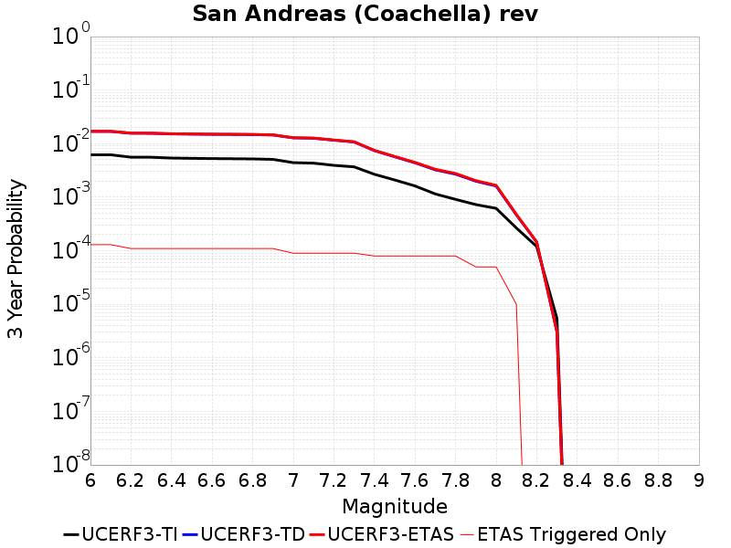 | 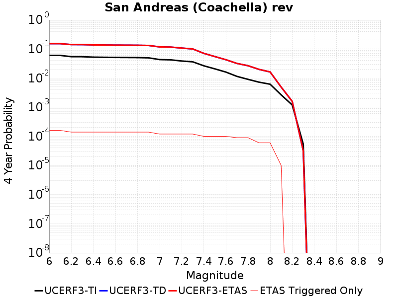 |

| Magnitude | 1 yr TI Prob | TD Prob | ETAS Prob | ETAS/TD Gain | ETAS Triggered Only | 10 yr TI Prob | TD Prob | ETAS Prob | ETAS/TD Gain | ETAS Triggered Only |
|-----|-----|-----|-----|-----|-----|-----|-----|-----|-----|-----|
| 6.0 | 0.0062038354 | 0.016936574 | 0.017064372 | 1.0075457 | 1.3E-4 | 0.060334753 | 0.15265475 | 0.15279034 | 1.0008881 | 1.6E-4 |
| 6.1 | 0.0062038354 | 0.016936574 | 0.017064372 | 1.0075457 | 1.3E-4 | 0.060334753 | 0.15265475 | 0.15279034 | 1.0008881 | 1.6E-4 |
| 6.2 | 0.005590286 | 0.015653217 | 0.015761496 | 1.0069174 | 1.1E-4 | 0.05451731 | 0.14182584 | 0.14194599 | 1.0008471 | 1.4E-4 |
| 6.3 | 0.005577586 | 0.015625117 | 0.015733398 | 1.00693 | 1.1E-4 | 0.054396555 | 0.1415941 | 0.14171427 | 1.0008488 | 1.4E-4 |
| 6.4 | 0.0053892885 | 0.015218151 | 0.015326477 | 1.0071182 | 1.1E-4 | 0.052604496 | 0.13815416 | 0.13827482 | 1.0008733 | 1.4E-4 |
| 6.5 | 0.0053228354 | 0.015073929 | 0.015182272 | 1.0071874 | 1.1E-4 | 0.051971316 | 0.13693333 | 0.13705416 | 1.0008824 | 1.4E-4 |
| 6.6 | 0.0052651367 | 0.0149535 | 0.015061854 | 1.0072461 | 1.1E-4 | 0.051421247 | 0.13591151 | 0.13603248 | 1.0008901 | 1.4E-4 |
| 6.7 | 0.005230834 | 0.014880779 | 0.014989142 | 1.0072821 | 1.1E-4 | 0.051094085 | 0.13529623 | 0.1354173 | 1.0008948 | 1.4E-4 |
| 6.8 | 0.0051924936 | 0.01477982 | 0.014888194 | 1.0073326 | 1.1E-4 | 0.050728295 | 0.13444792 | 0.1345691 | 1.0009013 | 1.4E-4 |
| 6.9 | 0.0050888555 | 0.014521085 | 0.014629488 | 1.0074652 | 1.1E-4 | 0.049738888 | 0.13227642 | 0.1323979 | 1.0009184 | 1.4E-4 |
| 7.0 | 0.0044259406 | 0.012839981 | 0.012928826 | 1.0069194 | 9.0E-5 | 0.04338823 | 0.11813427 | 0.118240096 | 1.0008957 | 1.2E-4 |
| 7.1 | 0.004331963 | 0.012635286 | 0.012724149 | 1.0070329 | 9.0E-5 | 0.042484846 | 0.11635453 | 0.11646057 | 1.0009114 | 1.2E-4 |
| 7.2 | 0.0039391145 | 0.011629081 | 0.011718035 | 1.0076492 | 9.0E-5 | 0.03870018 | 0.10776075 | 0.10786782 | 1.0009936 | 1.2E-4 |
| 7.3 | 0.0036891096 | 0.010760098 | 0.010849129 | 1.0082742 | 9.0E-5 | 0.03628465 | 0.10028346 | 0.100391425 | 1.0010766 | 1.2E-4 |
| 7.4 | 0.0026816884 | 0.007421041 | 0.0075004473 | 1.0107001 | 8.0E-5 | 0.02649557 | 0.07085082 | 0.070943736 | 1.0013114 | 1.0E-4 |
| 7.5 | 0.002099857 | 0.0056934063 | 0.005772951 | 1.0139713 | 8.0E-5 | 0.020801254 | 0.05501225 | 0.055106748 | 1.0017178 | 1.0E-4 |
| 7.6 | 0.0016250437 | 0.0043939464 | 0.004473595 | 1.0181268 | 8.0E-5 | 0.016132116 | 0.04281104 | 0.042906757 | 1.0022359 | 1.0E-4 |
| 7.7 | 0.001152546 | 0.003250209 | 0.0033299488 | 1.0245337 | 8.0E-5 | 0.011465867 | 0.031901076 | 0.031988204 | 1.0027312 | 9.0E-5 |
| 7.8 | 9.1192697E-4 | 0.0026991402 | 0.0027789243 | 1.029559 | 8.0E-5 | 0.009081938 | 0.0266409 | 0.026728502 | 1.0032883 | 9.0E-5 |
| 7.9 | 7.2853256E-4 | 0.0019925234 | 0.002042424 | 1.0250438 | 5.0E-5 | 0.0072614877 | 0.019910088 | 0.019968893 | 1.0029535 | 6.0E-5 |
| 8.0 | 6.200787E-4 | 0.0016197145 | 0.0016696336 | 1.0308197 | 5.0E-5 | 0.006183513 | 0.016279832 | 0.016338855 | 1.0036255 | 6.0E-5 |
| 8.1 | 2.6612106E-4 | 4.6813823E-4 | 4.7813356E-4 | 1.0213512 | 1.0E-5 | 0.002658026 | 0.0049179746 | 0.0049279253 | 1.0020233 | 1.0E-5 |
| 8.2 | 1.2002704E-4 | 1.4539284E-4 | 1.4539284E-4 | 1.0 | 0.0 | 0.0011996223 | 0.0015974927 | 0.0015974927 | 1.0 | 0.0 |
| 8.3 | 5.439312E-6 | 3.0350625E-6 | 3.0350625E-6 | 1.0 | 0.0 | 5.4391792E-5 | 3.191005E-5 | 3.191005E-5 | 1.0 | 0.0 |

## White Wolf (Extension)
*[(top)](#table-of-contents)*

| 1 Year | 10 Year |
|-----|-----|
| 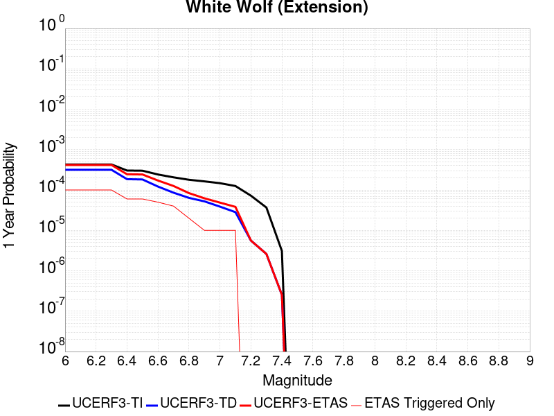 | 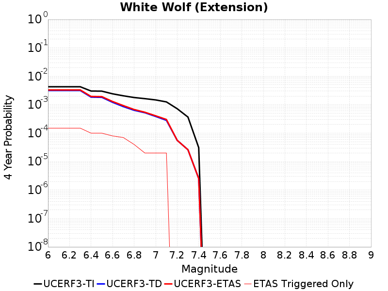 |

| Magnitude | 1 yr TI Prob | TD Prob | ETAS Prob | ETAS/TD Gain | ETAS Triggered Only | 10 yr TI Prob | TD Prob | ETAS Prob | ETAS/TD Gain | ETAS Triggered Only |
|-----|-----|-----|-----|-----|-----|-----|-----|-----|-----|-----|
| 6.0 | 4.289509E-4 | 3.1650809E-4 | 4.1647643E-4 | 1.3158476 | 1.0E-4 | 0.0042812387 | 0.003161225 | 0.0033107507 | 1.0473 | 1.5E-4 |
| 6.1 | 4.289509E-4 | 3.1650809E-4 | 4.1647643E-4 | 1.3158476 | 1.0E-4 | 0.0042812387 | 0.003161225 | 0.0033107507 | 1.0473 | 1.5E-4 |
| 6.2 | 4.289509E-4 | 3.1650809E-4 | 4.1647643E-4 | 1.3158476 | 1.0E-4 | 0.0042812387 | 0.003161225 | 0.0033107507 | 1.0473 | 1.5E-4 |
| 6.3 | 4.289509E-4 | 3.1650809E-4 | 4.1647643E-4 | 1.3158476 | 1.0E-4 | 0.0042812387 | 0.003161225 | 0.0033107507 | 1.0473 | 1.5E-4 |
| 6.4 | 3.0372653E-4 | 1.8559278E-4 | 2.4558164E-4 | 1.3232285 | 6.0E-5 | 0.0030331176 | 0.0018544863 | 0.0019543008 | 1.0538232 | 1.0E-4 |
| 6.5 | 3.0081844E-4 | 1.8256354E-4 | 2.4255259E-4 | 1.3285927 | 6.0E-5 | 0.0030041158 | 0.0018242438 | 0.0019240613 | 1.0547172 | 1.0E-4 |
| 6.6 | 2.4226638E-4 | 1.2170628E-4 | 1.7170019E-4 | 1.4107752 | 5.0E-5 | 0.0024200242 | 0.0012164387 | 0.0012963414 | 1.0656857 | 8.0E-5 |
| 6.7 | 2.0623671E-4 | 8.600508E-5 | 1.2600164E-4 | 1.4650488 | 4.0E-5 | 0.002060454 | 8.5973646E-4 | 9.296763E-4 | 1.0813503 | 7.0E-5 |
| 6.8 | 1.7936122E-4 | 6.3892054E-5 | 8.389078E-5 | 1.313008 | 2.0E-5 | 0.0017921652 | 6.3874596E-4 | 6.787204E-4 | 1.0625827 | 4.0E-5 |
| 6.9 | 1.63657E-4 | 5.235364E-5 | 6.2353116E-5 | 1.1909987 | 1.0E-5 | 0.0016353652 | 5.234207E-4 | 5.4341025E-4 | 1.0381901 | 2.0E-5 |
| 7.0 | 1.47645E-4 | 3.8761074E-5 | 4.876069E-5 | 1.2579808 | 1.0E-5 | 0.0014754693 | 3.8754815E-4 | 4.0754038E-4 | 1.0515865 | 2.0E-5 |
| 7.1 | 1.2569598E-4 | 2.8294835E-5 | 3.829455E-5 | 1.3534114 | 1.0E-5 | 0.001256249 | 2.8291636E-4 | 3.0291072E-4 | 1.0706723 | 2.0E-5 |
| 7.2 | 7.23979E-5 | 5.6055806E-6 | 5.6055806E-6 | 1.0 | 0.0 | 7.2374323E-4 | 5.6054505E-5 | 5.6054505E-5 | 1.0 | 0.0 |
| 7.3 | 3.681694E-5 | 2.6099974E-6 | 2.6099974E-6 | 1.0 | 0.0 | 3.681084E-4 | 2.6099715E-5 | 2.6099715E-5 | 1.0 | 0.0 |
| 7.4 | 3.095994E-6 | 2.540247E-7 | 2.540247E-7 | 1.0 | 0.0 | 3.095951E-5 | 2.5402455E-6 | 2.5402455E-6 | 1.0 | 0.0 |

## Santa Ynez (West)
*[(top)](#table-of-contents)*

| 1 Year | 10 Year |
|-----|-----|
| 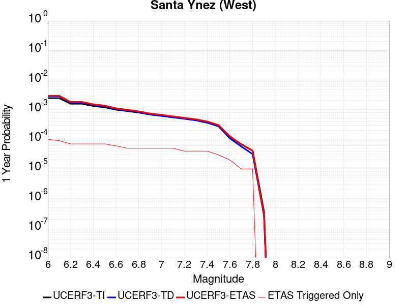 | 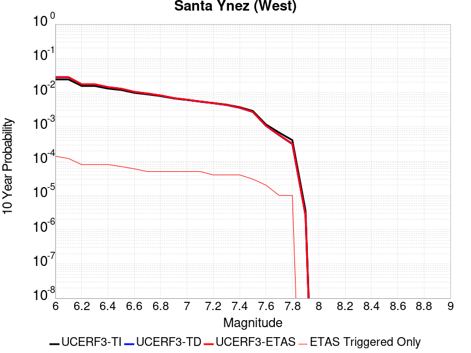 |

| Magnitude | 1 yr TI Prob | TD Prob | ETAS Prob | ETAS/TD Gain | ETAS Triggered Only | 10 yr TI Prob | TD Prob | ETAS Prob | ETAS/TD Gain | ETAS Triggered Only |
|-----|-----|-----|-----|-----|-----|-----|-----|-----|-----|-----|
| 6.0 | 0.0024678076 | 0.0028645347 | 0.0029642482 | 1.0348097 | 1.0E-4 | 0.024405818 | 0.02830448 | 0.028440518 | 1.0048062 | 1.4E-4 |
| 6.1 | 0.0024678076 | 0.0028645347 | 0.002954277 | 1.0313287 | 9.0E-5 | 0.024405818 | 0.02830448 | 0.028421083 | 1.0041196 | 1.2E-4 |
| 6.2 | 0.0015858212 | 0.0017686693 | 0.0018385455 | 1.0395077 | 7.0E-5 | 0.015745522 | 0.017549839 | 0.017628435 | 1.0044785 | 8.0E-5 |
| 6.3 | 0.0015858212 | 0.0017686693 | 0.0018385455 | 1.0395077 | 7.0E-5 | 0.015745522 | 0.017549839 | 0.017628435 | 1.0044785 | 8.0E-5 |
| 6.4 | 0.0013271887 | 0.0014554112 | 0.0015253094 | 1.0480263 | 7.0E-5 | 0.013192902 | 0.014460975 | 0.014539818 | 1.0054522 | 8.0E-5 |
| 6.5 | 0.0012068948 | 0.0013103288 | 0.001380237 | 1.0533518 | 7.0E-5 | 0.012003611 | 0.013027701 | 0.013096789 | 1.0053031 | 7.0E-5 |
| 6.6 | 9.97089E-4 | 0.0010615175 | 0.0011214538 | 1.0564629 | 6.0E-5 | 0.00992627 | 0.01056538 | 0.010624746 | 1.0056189 | 6.0E-5 |
| 6.7 | 8.985399E-4 | 9.464182E-4 | 9.963708E-4 | 1.0527807 | 5.0E-5 | 0.008949154 | 0.0094245225 | 0.009474051 | 1.0052553 | 5.0E-5 |
| 6.8 | 7.98925E-4 | 8.306883E-4 | 8.8064675E-4 | 1.0601411 | 5.0E-5 | 0.007960589 | 0.00827632 | 0.008325906 | 1.0059913 | 5.0E-5 |
| 6.9 | 6.8180985E-4 | 6.952867E-4 | 7.4525195E-4 | 1.0718628 | 5.0E-5 | 0.0067972173 | 0.006931375 | 0.006981028 | 1.0071635 | 5.0E-5 |
| 7.0 | 6.1745E-4 | 6.224479E-4 | 6.724167E-4 | 1.080278 | 5.0E-5 | 0.006157372 | 0.0062072375 | 0.0062569273 | 1.0080051 | 5.0E-5 |
| 7.1 | 5.5279525E-4 | 5.499304E-4 | 5.999029E-4 | 1.0908706 | 5.0E-5 | 0.0055142213 | 0.005485826 | 0.005535552 | 1.0090644 | 5.0E-5 |
| 7.2 | 5.0032866E-4 | 4.934468E-4 | 5.3342705E-4 | 1.0810224 | 4.0E-5 | 0.004992037 | 0.00492363 | 0.004963433 | 1.008084 | 4.0E-5 |
| 7.3 | 4.4791115E-4 | 4.3714247E-4 | 4.77125E-4 | 1.0914633 | 4.0E-5 | 0.004470094 | 0.004362937 | 0.0044027627 | 1.0091281 | 4.0E-5 |
| 7.4 | 3.78866E-4 | 3.6265844E-4 | 4.0264393E-4 | 1.1102567 | 4.0E-5 | 0.0037822074 | 0.0036207663 | 0.0036606216 | 1.0110074 | 4.0E-5 |
| 7.5 | 2.9358198E-4 | 2.7398454E-4 | 3.0397633E-4 | 1.1094652 | 3.0E-5 | 0.0029319443 | 0.0027365396 | 0.0027664574 | 1.0109328 | 3.0E-5 |
| 7.6 | 1.18190335E-4 | 1.07527354E-4 | 1.275252E-4 | 1.1859791 | 2.0E-5 | 0.001181275 | 0.001074762 | 0.0010947405 | 1.0185888 | 2.0E-5 |
| 7.7 | 6.8350986E-5 | 5.747968E-5 | 6.74791E-5 | 1.1739645 | 1.0E-5 | 6.832996E-4 | 5.7465053E-4 | 5.846448E-4 | 1.0173919 | 1.0E-5 |
| 7.8 | 4.1240855E-5 | 3.1677897E-5 | 4.167758E-5 | 1.3156675 | 1.0E-5 | 4.12332E-4 | 3.1673512E-4 | 3.2673197E-4 | 1.0315621 | 1.0E-5 |
| 7.9 | 3.6918053E-7 | 2.6558632E-7 | 2.6558632E-7 | 1.0 | 0.0 | 3.691799E-6 | 2.655861E-6 | 2.655861E-6 | 1.0 | 0.0 |

## Independence rev 2011
*[(top)](#table-of-contents)*

| 1 Year | 10 Year |
|-----|-----|
| 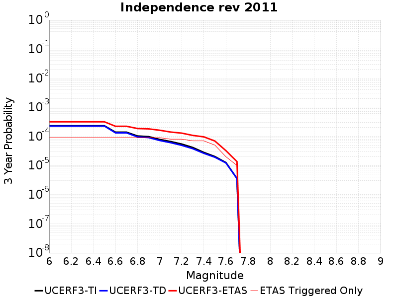 | 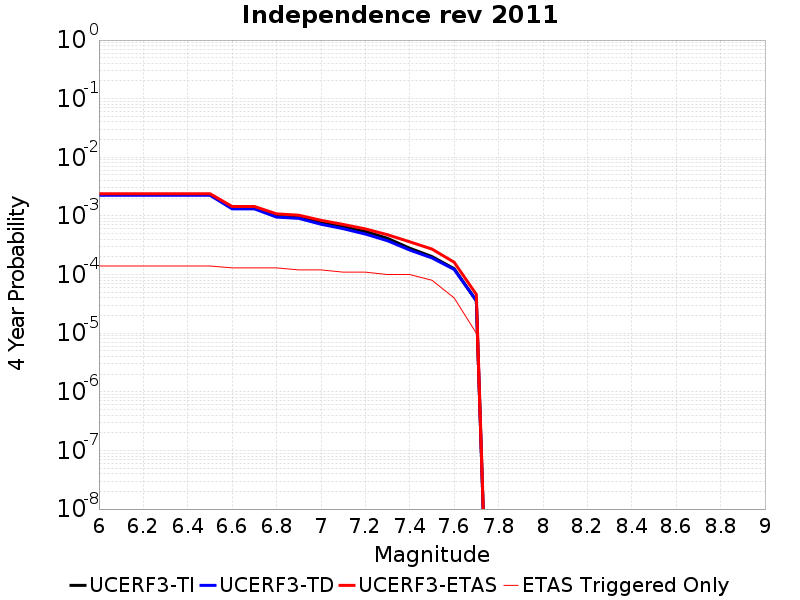 |

| Magnitude | 1 yr TI Prob | TD Prob | ETAS Prob | ETAS/TD Gain | ETAS Triggered Only | 10 yr TI Prob | TD Prob | ETAS Prob | ETAS/TD Gain | ETAS Triggered Only |
|-----|-----|-----|-----|-----|-----|-----|-----|-----|-----|-----|
| 6.0 | 2.3071647E-4 | 2.2571464E-4 | 3.156943E-4 | 1.3986436 | 9.0E-5 | 0.0023047708 | 0.0022551473 | 0.0023948317 | 1.0619402 | 1.4E-4 |
| 6.1 | 2.3071647E-4 | 2.2571464E-4 | 3.156943E-4 | 1.3986436 | 9.0E-5 | 0.0023047708 | 0.0022551473 | 0.0023948317 | 1.0619402 | 1.4E-4 |
| 6.2 | 2.3071647E-4 | 2.2571464E-4 | 3.156943E-4 | 1.3986436 | 9.0E-5 | 0.0023047708 | 0.0022551473 | 0.0023948317 | 1.0619402 | 1.4E-4 |
| 6.3 | 2.3071647E-4 | 2.2571464E-4 | 3.156943E-4 | 1.3986436 | 9.0E-5 | 0.0023047708 | 0.0022551473 | 0.0023948317 | 1.0619402 | 1.4E-4 |
| 6.4 | 2.3071647E-4 | 2.2571464E-4 | 3.156943E-4 | 1.3986436 | 9.0E-5 | 0.0023047708 | 0.0022551473 | 0.0023948317 | 1.0619402 | 1.4E-4 |
| 6.5 | 2.3071647E-4 | 2.2571464E-4 | 3.156943E-4 | 1.3986436 | 9.0E-5 | 0.0023047708 | 0.0022551473 | 0.0023948317 | 1.0619402 | 1.4E-4 |
| 6.6 | 1.3898089E-4 | 1.3210745E-4 | 2.2209556E-4 | 1.6811736 | 9.0E-5 | 0.0013889399 | 0.0013203374 | 0.0014501658 | 1.0983297 | 1.3E-4 |
| 6.7 | 1.3898089E-4 | 1.3210745E-4 | 2.2209556E-4 | 1.6811736 | 9.0E-5 | 0.0013889399 | 0.0013203374 | 0.0014501658 | 1.0983297 | 1.3E-4 |
| 6.8 | 1.0287284E-4 | 9.560034E-5 | 1.8559174E-4 | 1.9413292 | 9.0E-5 | 0.0010282523 | 9.5560506E-4 | 0.0010854808 | 1.1359094 | 1.3E-4 |
| 6.9 | 9.80316E-5 | 9.0943344E-5 | 1.8093515E-4 | 1.9895371 | 9.0E-5 | 9.798837E-4 | 9.090733E-4 | 0.0010289642 | 1.1318825 | 1.2E-4 |
| 7.0 | 7.8502184E-5 | 7.226227E-5 | 1.6225576E-4 | 2.2453732 | 9.0E-5 | 7.8474457E-4 | 7.2239287E-4 | 8.423062E-4 | 1.1659946 | 1.2E-4 |
| 7.1 | 6.6386776E-5 | 6.0656363E-5 | 1.4065151E-4 | 2.3188252 | 8.0E-5 | 6.636695E-4 | 6.064013E-4 | 7.1633456E-4 | 1.181288 | 1.1E-4 |
| 7.2 | 5.4352407E-5 | 4.9098282E-5 | 1.2909436E-4 | 2.629305 | 8.0E-5 | 5.4339116E-4 | 4.908762E-4 | 6.008222E-4 | 1.2239791 | 1.1E-4 |
| 7.3 | 4.1455114E-5 | 3.7750542E-5 | 1.077479E-4 | 2.854208 | 7.0E-5 | 4.144738E-4 | 3.7744243E-4 | 4.7740468E-4 | 1.2648411 | 1.0E-4 |
| 7.4 | 2.8120441E-5 | 2.6190783E-5 | 9.6188945E-5 | 3.672626 | 7.0E-5 | 2.8116882E-4 | 2.618774E-4 | 3.618512E-4 | 1.3817581 | 1.0E-4 |
| 7.5 | 2.027226E-5 | 1.9214871E-5 | 6.921391E-5 | 3.602101 | 5.0E-5 | 2.0270412E-4 | 1.9213231E-4 | 2.7211694E-4 | 1.4162997 | 8.0E-5 |
| 7.6 | 1.2600677E-5 | 1.2239748E-5 | 3.2239503E-5 | 2.6340005 | 2.0E-5 | 1.2599962E-4 | 1.2239086E-4 | 1.6238596E-4 | 1.3267817 | 4.0E-5 |
| 7.7 | 3.5636867E-6 | 3.5789078E-6 | 1.3578872E-5 | 3.7941387 | 1.0E-5 | 3.5636294E-5 | 3.5788547E-5 | 4.578819E-5 | 1.2794089 | 1.0E-5 |

## Owens Valley
*[(top)](#table-of-contents)*

| 1 Year | 10 Year |
|-----|-----|
| 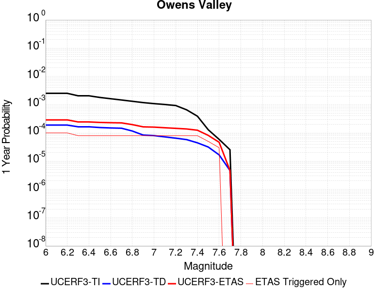 | 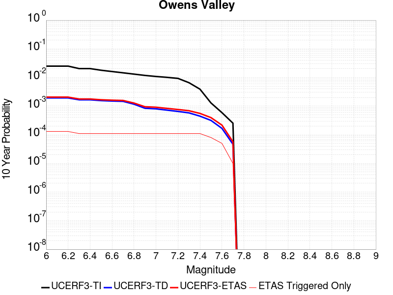 |

| Magnitude | 1 yr TI Prob | TD Prob | ETAS Prob | ETAS/TD Gain | ETAS Triggered Only | 10 yr TI Prob | TD Prob | ETAS Prob | ETAS/TD Gain | ETAS Triggered Only |
|-----|-----|-----|-----|-----|-----|-----|-----|-----|-----|-----|
| 6.0 | 0.002521386 | 1.8921662E-4 | 2.891977E-4 | 1.5283948 | 1.0E-4 | 0.024929691 | 0.0019250509 | 0.0020548005 | 1.0674007 | 1.3E-4 |
| 6.1 | 0.002521386 | 1.8921662E-4 | 2.891977E-4 | 1.5283948 | 1.0E-4 | 0.024929691 | 0.0019250509 | 0.0020548005 | 1.0674007 | 1.3E-4 |
| 6.2 | 0.002521386 | 1.8921662E-4 | 2.891977E-4 | 1.5283948 | 1.0E-4 | 0.024929691 | 0.0019250509 | 0.0020548005 | 1.0674007 | 1.3E-4 |
| 6.3 | 0.002060538 | 1.6463368E-4 | 2.4462052E-4 | 1.4858474 | 8.0E-5 | 0.020415364 | 0.0016592223 | 0.0017690398 | 1.0661861 | 1.1E-4 |
| 6.4 | 0.002060538 | 1.6463368E-4 | 2.4462052E-4 | 1.4858474 | 8.0E-5 | 0.020415364 | 0.0016592223 | 0.0017690398 | 1.0661861 | 1.1E-4 |
| 6.5 | 0.0018023965 | 1.5504402E-4 | 2.3503162E-4 | 1.5159025 | 8.0E-5 | 0.017878477 | 0.0015557337 | 0.0016655625 | 1.0705962 | 1.1E-4 |
| 6.6 | 0.0016229092 | 1.4997766E-4 | 2.2996566E-4 | 1.5333328 | 8.0E-5 | 0.016111081 | 0.001501266 | 0.0016111009 | 1.0731615 | 1.1E-4 |
| 6.7 | 0.001463541 | 1.4663428E-4 | 2.2662255E-4 | 1.545495 | 8.0E-5 | 0.014539397 | 0.0014657585 | 0.0015755973 | 1.0749365 | 1.1E-4 |
| 6.8 | 0.0013164099 | 1.1663264E-4 | 1.9662331E-4 | 1.6858343 | 8.0E-5 | 0.01308639 | 0.0011659876 | 0.0012758593 | 1.0942307 | 1.1E-4 |
| 6.9 | 0.0011840039 | 8.390896E-5 | 1.6390225E-4 | 1.9533342 | 8.0E-5 | 0.011777153 | 8.3898456E-4 | 9.488923E-4 | 1.1310009 | 1.1E-4 |
| 7.0 | 0.0010884746 | 8.032857E-5 | 1.6032215E-4 | 1.9958296 | 8.0E-5 | 0.010831586 | 8.031671E-4 | 9.130788E-4 | 1.1368479 | 1.1E-4 |
| 7.1 | 0.0010143308 | 7.233913E-5 | 1.5233333E-4 | 2.1058223 | 8.0E-5 | 0.010097133 | 7.233136E-4 | 8.3323405E-4 | 1.1519679 | 1.1E-4 |
| 7.2 | 9.3233347E-4 | 6.5164815E-5 | 1.451596E-4 | 2.2275763 | 8.0E-5 | 0.009284316 | 6.515944E-4 | 7.6152274E-4 | 1.1687067 | 1.1E-4 |
| 7.3 | 6.582117E-4 | 5.7996243E-5 | 1.379916E-4 | 2.3793197 | 8.0E-5 | 0.0065626553 | 5.799435E-4 | 6.898797E-4 | 1.1895636 | 1.1E-4 |
| 7.4 | 3.906093E-4 | 4.4604894E-5 | 1.2460133E-4 | 2.793445 | 8.0E-5 | 0.003899234 | 4.4605148E-4 | 5.5600243E-4 | 1.2464983 | 1.1E-4 |
| 7.5 | 1.2905113E-4 | 3.166486E-5 | 8.1663275E-5 | 2.5789876 | 5.0E-5 | 0.0012897621 | 3.1660378E-4 | 3.9657846E-4 | 1.2526017 | 8.0E-5 |
| 7.6 | 5.9110564E-5 | 1.6678994E-5 | 4.6678495E-5 | 2.7986395 | 3.0E-5 | 5.9094845E-4 | 1.6677762E-4 | 2.1676927E-4 | 1.2997504 | 5.0E-5 |
| 7.7 | 2.536535E-5 | 4.6776704E-6 | 4.6776704E-6 | 1.0 | 0.0 | 2.5362454E-4 | 4.677579E-5 | 5.677532E-5 | 1.2137759 | 1.0E-5 |

## Red Mountain
*[(top)](#table-of-contents)*

| 1 Year | 10 Year |
|-----|-----|
| 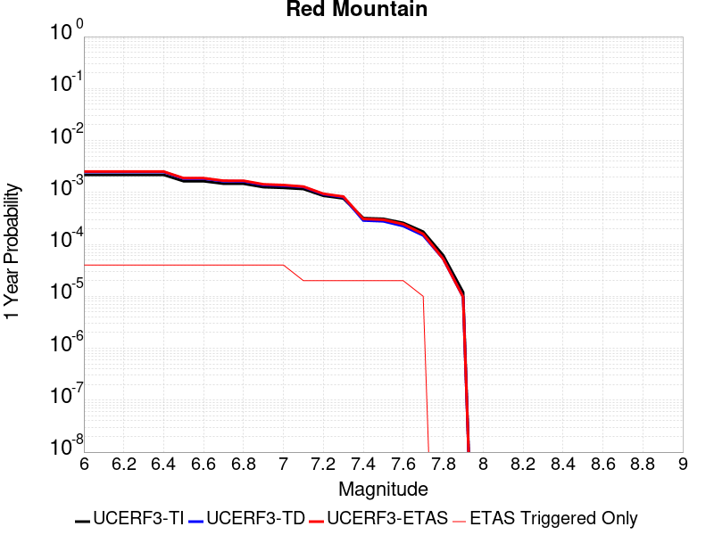 | 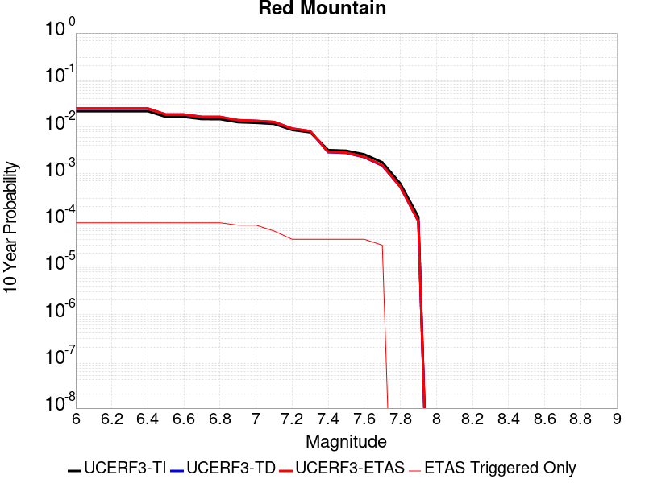 |

| Magnitude | 1 yr TI Prob | TD Prob | ETAS Prob | ETAS/TD Gain | ETAS Triggered Only | 10 yr TI Prob | TD Prob | ETAS Prob | ETAS/TD Gain | ETAS Triggered Only |
|-----|-----|-----|-----|-----|-----|-----|-----|-----|-----|-----|
| 6.0 | 0.0021792934 | 0.0024803358 | 0.0025202367 | 1.0160868 | 4.0E-5 | 0.021580452 | 0.024544142 | 0.024631932 | 1.0035769 | 9.0E-5 |
| 6.1 | 0.0021792934 | 0.0024803358 | 0.0025202367 | 1.0160868 | 4.0E-5 | 0.021580452 | 0.024544142 | 0.024631932 | 1.0035769 | 9.0E-5 |
| 6.2 | 0.0021792934 | 0.0024803358 | 0.0025202367 | 1.0160868 | 4.0E-5 | 0.021580452 | 0.024544142 | 0.024631932 | 1.0035769 | 9.0E-5 |
| 6.3 | 0.0021792934 | 0.0024803358 | 0.0025202367 | 1.0160868 | 4.0E-5 | 0.021580452 | 0.024544142 | 0.024631932 | 1.0035769 | 9.0E-5 |
| 6.4 | 0.0021792934 | 0.0024803358 | 0.0025202367 | 1.0160868 | 4.0E-5 | 0.021580452 | 0.024544142 | 0.024631932 | 1.0035769 | 9.0E-5 |
| 6.5 | 0.0016446467 | 0.0018434537 | 0.00188338 | 1.0216584 | 4.0E-5 | 0.01632528 | 0.01829127 | 0.018379623 | 1.0048304 | 9.0E-5 |
| 6.6 | 0.0016441676 | 0.0018429008 | 0.001882827 | 1.0216649 | 4.0E-5 | 0.01632056 | 0.01828583 | 0.018374184 | 1.0048318 | 9.0E-5 |
| 6.7 | 0.0014738824 | 0.0016407977 | 0.0016807321 | 1.0243384 | 4.0E-5 | 0.014641452 | 0.016295595 | 0.016384128 | 1.005433 | 9.0E-5 |
| 6.8 | 0.0014710457 | 0.0016375618 | 0.0016774964 | 1.0243865 | 4.0E-5 | 0.014613459 | 0.01626371 | 0.016352247 | 1.0054438 | 9.0E-5 |
| 6.9 | 0.0012633923 | 0.0013926638 | 0.0014326081 | 1.028682 | 4.0E-5 | 0.012562336 | 0.013847052 | 0.0139259435 | 1.0056974 | 8.0E-5 |
| 7.0 | 0.0012246901 | 0.0013472658 | 0.0013872118 | 1.0296497 | 4.0E-5 | 0.012179627 | 0.013398615 | 0.013477542 | 1.0058907 | 8.0E-5 |
| 7.1 | 0.0011635252 | 0.0012757191 | 0.0012956937 | 1.0156574 | 2.0E-5 | 0.01157452 | 0.0126914745 | 0.012750713 | 1.0046676 | 6.0E-5 |
| 7.2 | 8.623549E-4 | 9.216661E-4 | 9.416477E-4 | 1.0216799 | 2.0E-5 | 0.008590161 | 0.009184714 | 0.009224348 | 1.004315 | 4.0E-5 |
| 7.3 | 7.668978E-4 | 8.1161765E-4 | 8.3160144E-4 | 1.0246222 | 2.0E-5 | 0.0076425658 | 0.008092609 | 0.008132286 | 1.0049028 | 4.0E-5 |
| 7.4 | 3.199713E-4 | 2.8844867E-4 | 3.084429E-4 | 1.0693164 | 2.0E-5 | 0.0031951098 | 0.002880797 | 0.0029206818 | 1.0138451 | 4.0E-5 |
| 7.5 | 3.1066386E-4 | 2.785182E-4 | 2.985126E-4 | 1.0717885 | 2.0E-5 | 0.003102299 | 0.002781745 | 0.0028216338 | 1.0143394 | 4.0E-5 |
| 7.6 | 2.5943352E-4 | 2.2514164E-4 | 2.4513714E-4 | 1.088813 | 2.0E-5 | 0.0025913084 | 0.0022491703 | 0.0022890803 | 1.0177443 | 4.0E-5 |
| 7.7 | 1.7537741E-4 | 1.4883751E-4 | 1.5883603E-4 | 1.0671774 | 1.0E-5 | 0.0017523908 | 0.0014874046 | 0.00151736 | 1.0201393 | 3.0E-5 |
| 7.8 | 6.171996E-5 | 5.2817802E-5 | 5.2817802E-5 | 1.0 | 0.0 | 6.170282E-4 | 5.280554E-4 | 5.280554E-4 | 1.0 | 0.0 |
| 7.9 | 1.19839215E-5 | 9.715068E-6 | 9.715068E-6 | 1.0 | 0.0 | 1.1983275E-4 | 9.714672E-5 | 9.714672E-5 | 1.0 | 0.0 |

## Calico-Hidalgo
*[(top)](#table-of-contents)*

| 1 Year | 10 Year |
|-----|-----|
| 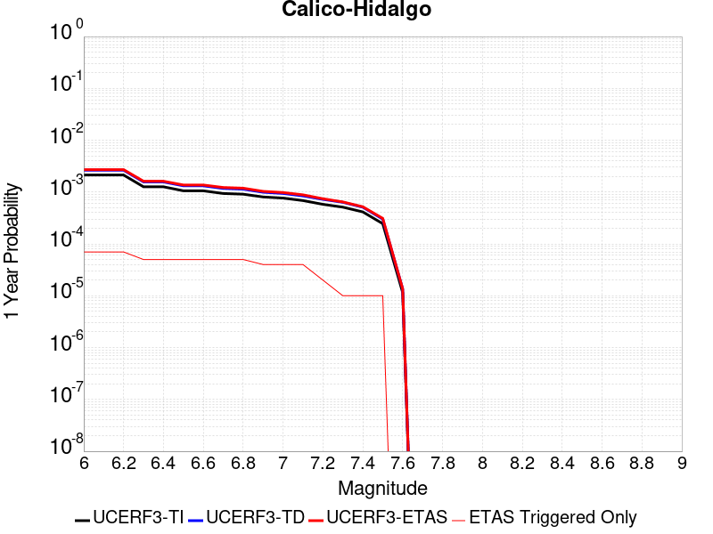 | 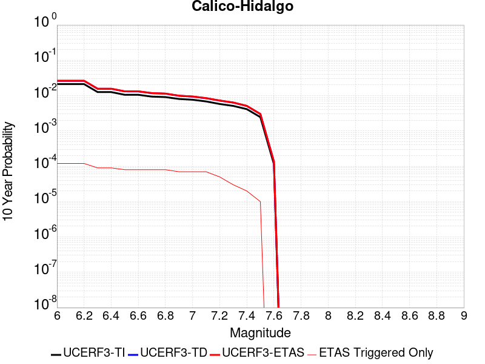 |

| Magnitude | 1 yr TI Prob | TD Prob | ETAS Prob | ETAS/TD Gain | ETAS Triggered Only | 10 yr TI Prob | TD Prob | ETAS Prob | ETAS/TD Gain | ETAS Triggered Only |
|-----|-----|-----|-----|-----|-----|-----|-----|-----|-----|-----|
| 6.0 | 0.0021322158 | 0.0026426527 | 0.0027124677 | 1.0264186 | 7.0E-5 | 0.02111873 | 0.026152654 | 0.026269514 | 1.0044684 | 1.2E-4 |
| 6.1 | 0.0021322158 | 0.0026426527 | 0.0027124677 | 1.0264186 | 7.0E-5 | 0.02111873 | 0.026152654 | 0.026269514 | 1.0044684 | 1.2E-4 |
| 6.2 | 0.0021322158 | 0.0026426527 | 0.0027124677 | 1.0264186 | 7.0E-5 | 0.02111873 | 0.026152654 | 0.026269514 | 1.0044684 | 1.2E-4 |
| 6.3 | 0.0012641704 | 0.0015689168 | 0.0016188384 | 1.0318191 | 5.0E-5 | 0.01257003 | 0.015582078 | 0.015670676 | 1.0056859 | 9.0E-5 |
| 6.4 | 0.0012641704 | 0.0015689168 | 0.0016188384 | 1.0318191 | 5.0E-5 | 0.01257003 | 0.015582078 | 0.015670676 | 1.0056859 | 9.0E-5 |
| 6.5 | 0.0010579949 | 0.0013201033 | 0.0013700372 | 1.0378258 | 5.0E-5 | 0.010529719 | 0.01312455 | 0.0132035 | 1.0060154 | 8.0E-5 |
| 6.6 | 0.0010570707 | 0.0013191105 | 0.0013690445 | 1.0378543 | 5.0E-5 | 0.010520565 | 0.013114739 | 0.01319369 | 1.00602 | 8.0E-5 |
| 6.7 | 9.3870464E-4 | 0.0011754747 | 0.001225416 | 1.042486 | 5.0E-5 | 0.009347493 | 0.011694183 | 0.011773247 | 1.006761 | 8.0E-5 |
| 6.8 | 9.10568E-4 | 0.0011390703 | 0.0011890134 | 1.0438454 | 5.0E-5 | 0.009068459 | 0.011333902 | 0.011412996 | 1.0069785 | 8.0E-5 |
| 6.9 | 8.04737E-4 | 9.922774E-4 | 0.0010322377 | 1.0402713 | 4.0E-5 | 0.008018291 | 0.009879866 | 0.009949174 | 1.0070151 | 7.0E-5 |
| 7.0 | 7.658257E-4 | 9.4039156E-4 | 9.803539E-4 | 1.0424955 | 4.0E-5 | 0.0076319184 | 0.009365489 | 0.009434833 | 1.0074042 | 7.0E-5 |
| 7.1 | 6.853584E-4 | 8.4500574E-4 | 8.84972E-4 | 1.047297 | 4.0E-5 | 0.0068324856 | 0.008419225 | 0.0084886355 | 1.0082443 | 7.0E-5 |
| 7.2 | 5.8044674E-4 | 7.2329474E-4 | 7.432803E-4 | 1.0276313 | 2.0E-5 | 0.0057893298 | 0.0072105136 | 0.007260153 | 1.0068843 | 5.0E-5 |
| 7.3 | 5.11647E-4 | 6.3515146E-4 | 6.4514513E-4 | 1.0157343 | 1.0E-5 | 0.0051047057 | 0.006334437 | 0.0063642473 | 1.004706 | 3.0E-5 |
| 7.4 | 4.1434157E-4 | 5.108225E-4 | 5.2081735E-4 | 1.0195663 | 1.0E-5 | 0.0041356985 | 0.005097424 | 0.0051173223 | 1.0039035 | 2.0E-5 |
| 7.5 | 2.4584212E-4 | 3.011822E-4 | 3.111792E-4 | 1.0331925 | 1.0E-5 | 0.0024557032 | 0.0030084928 | 0.0030184628 | 1.0033139 | 1.0E-5 |
| 7.6 | 1.1540374E-5 | 1.3587041E-5 | 1.3587041E-5 | 1.0 | 0.0 | 1.1539775E-4 | 1.3586493E-4 | 1.3586493E-4 | 1.0 | 0.0 |

## Santa Rosa Island
*[(top)](#table-of-contents)*

| 1 Year | 10 Year |
|-----|-----|
|  | 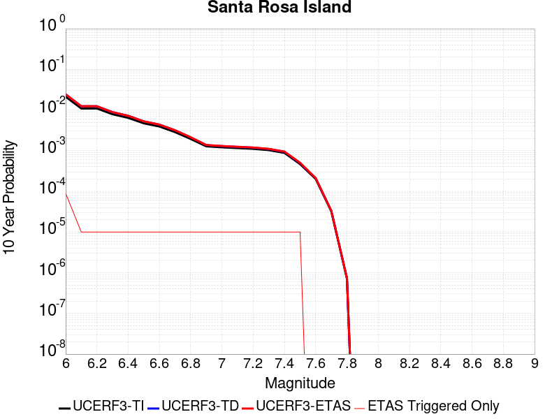 |

| Magnitude | 1 yr TI Prob | TD Prob | ETAS Prob | ETAS/TD Gain | ETAS Triggered Only | 10 yr TI Prob | TD Prob | ETAS Prob | ETAS/TD Gain | ETAS Triggered Only |
|-----|-----|-----|-----|-----|-----|-----|-----|-----|-----|-----|
| 6.0 | 0.002144533 | 0.0024544045 | 0.002514257 | 1.0243858 | 6.0E-5 | 0.021239553 | 0.024293594 | 0.024381408 | 1.0036147 | 9.0E-5 |
| 6.1 | 0.0010983539 | 0.0012445124 | 0.0012545 | 1.0080253 | 1.0E-5 | 0.01092941 | 0.012378468 | 0.012388345 | 1.0007979 | 1.0E-5 |
| 6.2 | 0.0010983539 | 0.0012445124 | 0.0012545 | 1.0080253 | 1.0E-5 | 0.01092941 | 0.012378468 | 0.012388345 | 1.0007979 | 1.0E-5 |
| 6.3 | 7.906284E-4 | 8.905438E-4 | 9.005349E-4 | 1.0112191 | 1.0E-5 | 0.007878214 | 0.008871003 | 0.008880915 | 1.0011172 | 1.0E-5 |
| 6.4 | 6.437803E-4 | 7.22579E-4 | 7.325718E-4 | 1.0138294 | 1.0E-5 | 0.006419184 | 0.0072031324 | 0.0072130603 | 1.0013783 | 1.0E-5 |
| 6.5 | 4.726887E-4 | 5.2776205E-4 | 5.377568E-4 | 1.018938 | 1.0E-5 | 0.004716845 | 0.005265625 | 0.005275572 | 1.0018891 | 1.0E-5 |
| 6.6 | 3.936723E-4 | 4.3824926E-4 | 4.482449E-4 | 1.0228081 | 1.0E-5 | 0.003929756 | 0.0043742796 | 0.004384236 | 1.0022761 | 1.0E-5 |
| 6.7 | 2.8706578E-4 | 3.1758525E-4 | 3.1758525E-4 | 1.0 | 0.0 | 0.0028669522 | 0.0031716358 | 0.003181604 | 1.003143 | 1.0E-5 |
| 6.8 | 1.948771E-4 | 2.1303308E-4 | 2.1303308E-4 | 1.0 | 0.0 | 0.0019470629 | 0.0021285338 | 0.0021385127 | 1.004688 | 1.0E-5 |
| 6.9 | 1.2816161E-4 | 1.371825E-4 | 1.371825E-4 | 1.0 | 0.0 | 0.0012808773 | 0.0013709811 | 0.0013809674 | 1.007284 | 1.0E-5 |
| 7.0 | 1.2128269E-4 | 1.2953972E-4 | 1.2953972E-4 | 1.0 | 0.0 | 0.0012121652 | 0.0012946444 | 0.0013046315 | 1.0077142 | 1.0E-5 |
| 7.1 | 1.1608207E-4 | 1.2382539E-4 | 1.2382539E-4 | 1.0 | 0.0 | 0.0011602144 | 0.001237566 | 0.0012475536 | 1.0080703 | 1.0E-5 |
| 7.2 | 1.1139726E-4 | 1.1875966E-4 | 1.1875966E-4 | 1.0 | 0.0 | 0.0011134144 | 0.0011869639 | 0.001196952 | 1.0084149 | 1.0E-5 |
| 7.3 | 1.032748E-4 | 1.1002412E-4 | 1.1002412E-4 | 1.0 | 0.0 | 0.0010322682 | 0.0010996982 | 0.0011096873 | 1.0090834 | 1.0E-5 |
| 7.4 | 8.844508E-5 | 9.41558E-5 | 9.41558E-5 | 1.0 | 0.0 | 8.840988E-4 | 9.411608E-4 | 9.5115136E-4 | 1.0106152 | 1.0E-5 |
| 7.5 | 4.6892885E-5 | 4.9632217E-5 | 4.9632217E-5 | 1.0 | 0.0 | 4.688299E-4 | 4.962125E-4 | 5.062075E-4 | 1.0201427 | 1.0E-5 |
| 7.6 | 2.0236233E-5 | 2.1147422E-5 | 2.1147422E-5 | 1.0 | 0.0 | 2.023439E-4 | 2.1145474E-4 | 2.1145474E-4 | 1.0 | 0.0 |
| 7.7 | 3.225572E-6 | 3.3076142E-6 | 3.3076142E-6 | 1.0 | 0.0 | 3.225525E-5 | 3.3075656E-5 | 3.3075656E-5 | 1.0 | 0.0 |
| 7.8 | 7.1507856E-8 | 7.2862974E-8 | 7.2862974E-8 | 1.0 | 0.0 | 7.1507833E-7 | 7.286296E-7 | 7.286296E-7 | 1.0 | 0.0 |

## Ludlow
*[(top)](#table-of-contents)*

| 1 Year | 10 Year |
|-----|-----|
| 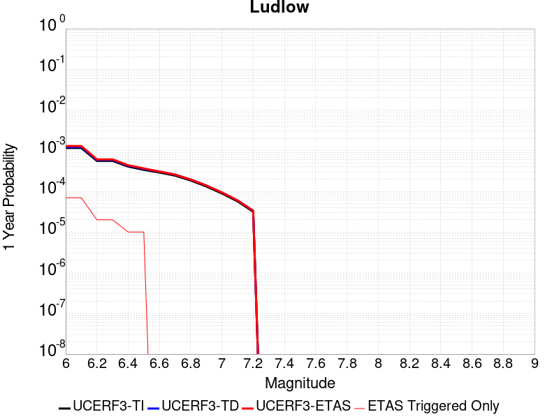 | 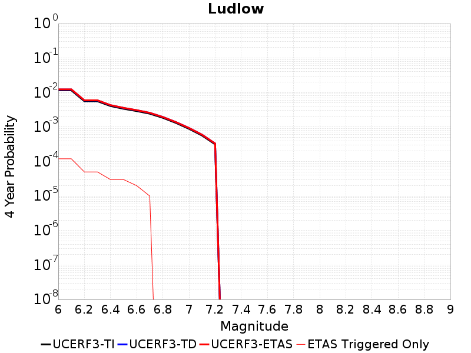 |

| Magnitude | 1 yr TI Prob | TD Prob | ETAS Prob | ETAS/TD Gain | ETAS Triggered Only | 10 yr TI Prob | TD Prob | ETAS Prob | ETAS/TD Gain | ETAS Triggered Only |
|-----|-----|-----|-----|-----|-----|-----|-----|-----|-----|-----|
| 6.0 | 0.0011685267 | 0.0012337028 | 0.0013036164 | 1.0566697 | 7.0E-5 | 0.011624013 | 0.012273051 | 0.0123915775 | 1.0096575 | 1.2E-4 |
| 6.1 | 0.0011685267 | 0.0012337028 | 0.0013036164 | 1.0566697 | 7.0E-5 | 0.011624013 | 0.012273051 | 0.0123915775 | 1.0096575 | 1.2E-4 |
| 6.2 | 5.623952E-4 | 5.9287634E-4 | 6.128645E-4 | 1.0337138 | 2.0E-5 | 0.00560974 | 0.005913365 | 0.0059630694 | 1.0084054 | 5.0E-5 |
| 6.3 | 5.623952E-4 | 5.9287634E-4 | 6.128645E-4 | 1.0337138 | 2.0E-5 | 0.00560974 | 0.005913365 | 0.0059630694 | 1.0084054 | 5.0E-5 |
| 6.4 | 4.0766477E-4 | 4.297441E-4 | 4.3973982E-4 | 1.0232596 | 1.0E-5 | 0.0040691774 | 0.0042892774 | 0.0043191486 | 1.0069642 | 3.0E-5 |
| 6.5 | 3.390332E-4 | 3.5740976E-4 | 3.674062E-4 | 1.0279691 | 1.0E-5 | 0.003385164 | 0.0035684456 | 0.0035983387 | 1.0083771 | 3.0E-5 |
| 6.6 | 2.9122844E-4 | 3.0707807E-4 | 3.0707807E-4 | 1.0 | 0.0 | 0.0029084706 | 0.003066611 | 0.0030865497 | 1.0065019 | 2.0E-5 |
| 6.7 | 2.4447302E-4 | 2.577526E-4 | 2.577526E-4 | 1.0 | 0.0 | 0.0024420423 | 0.002574593 | 0.0025845673 | 1.0038741 | 1.0E-5 |
| 6.8 | 1.8566006E-4 | 1.9575673E-4 | 1.9575673E-4 | 1.0 | 0.0 | 0.0018550502 | 0.001955884 | 0.001955884 | 1.0 | 0.0 |
| 6.9 | 1.3215111E-4 | 1.3936001E-4 | 1.3936001E-4 | 1.0 | 0.0 | 0.0013207254 | 0.0013927538 | 0.0013927538 | 1.0 | 0.0 |
| 7.0 | 8.913424E-5 | 9.401876E-5 | 9.401876E-5 | 1.0 | 0.0 | 8.9098496E-4 | 9.398064E-4 | 9.398064E-4 | 1.0 | 0.0 |
| 7.1 | 5.6901354E-5 | 5.999132E-5 | 5.999132E-5 | 1.0 | 0.0 | 5.6886784E-4 | 5.99761E-4 | 5.99761E-4 | 1.0 | 0.0 |
| 7.2 | 3.1654577E-5 | 3.3327455E-5 | 3.3327455E-5 | 1.0 | 0.0 | 3.1650066E-4 | 3.332314E-4 | 3.332314E-4 | 1.0 | 0.0 |

## San Diego Trough north alt1
*[(top)](#table-of-contents)*

| 1 Year | 10 Year |
|-----|-----|
| 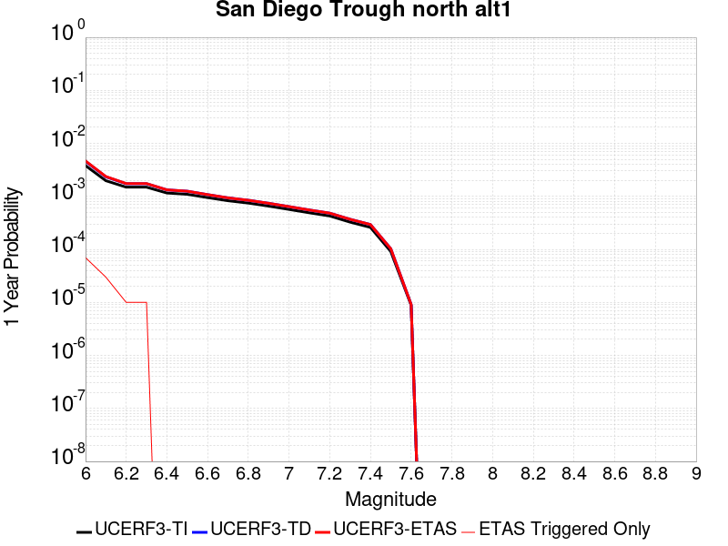 | 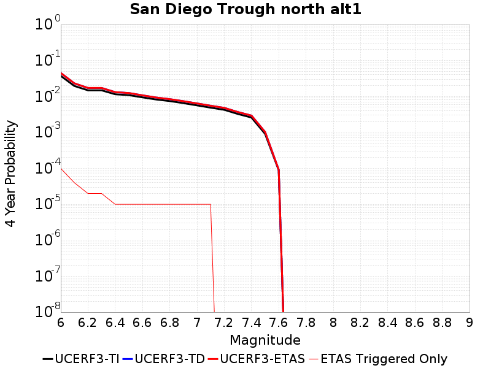 |

| Magnitude | 1 yr TI Prob | TD Prob | ETAS Prob | ETAS/TD Gain | ETAS Triggered Only | 10 yr TI Prob | TD Prob | ETAS Prob | ETAS/TD Gain | ETAS Triggered Only |
|-----|-----|-----|-----|-----|-----|-----|-----|-----|-----|-----|
| 6.0 | 0.0038171355 | 0.004593039 | 0.004662717 | 1.0151705 | 7.0E-5 | 0.03752231 | 0.045045104 | 0.045140598 | 1.00212 | 1.0E-4 |
| 6.1 | 0.0019777524 | 0.0023394485 | 0.0023693785 | 1.0127935 | 3.0E-5 | 0.019602431 | 0.02315674 | 0.023195812 | 1.0016874 | 4.0E-5 |
| 6.2 | 0.0014935739 | 0.0017359224 | 0.001745905 | 1.0057507 | 1.0E-5 | 0.0148357535 | 0.017226283 | 0.017245937 | 1.0011411 | 2.0E-5 |
| 6.3 | 0.0014935739 | 0.0017359224 | 0.001745905 | 1.0057507 | 1.0E-5 | 0.0148357535 | 0.017226283 | 0.017245937 | 1.0011411 | 2.0E-5 |
| 6.4 | 0.001157945 | 0.0013270058 | 0.0013270058 | 1.0 | 0.0 | 0.011519298 | 0.013191978 | 0.013201847 | 1.000748 | 1.0E-5 |
| 6.5 | 0.0010954136 | 0.0012528161 | 0.0012528161 | 1.0 | 0.0 | 0.010900296 | 0.012458611 | 0.012468486 | 1.0007926 | 1.0E-5 |
| 6.6 | 9.4949827E-4 | 0.0010797818 | 0.0010797818 | 1.0 | 0.0 | 0.009454516 | 0.010746023 | 0.010755915 | 1.0009205 | 1.0E-5 |
| 6.7 | 8.284929E-4 | 9.379338E-4 | 9.379338E-4 | 1.0 | 0.0 | 0.008254109 | 0.009340119 | 0.009350025 | 1.0010606 | 1.0E-5 |
| 6.8 | 7.4750587E-4 | 8.4500154E-4 | 8.4500154E-4 | 1.0 | 0.0 | 0.0074499645 | 0.008418153 | 0.008428069 | 1.0011779 | 1.0E-5 |
| 6.9 | 6.558929E-4 | 7.409735E-4 | 7.409735E-4 | 1.0 | 0.0 | 0.0065396037 | 0.0073852153 | 0.0073951413 | 1.0013441 | 1.0E-5 |
| 7.0 | 5.677453E-4 | 6.410366E-4 | 6.410366E-4 | 1.0 | 0.0 | 0.00566297 | 0.006392003 | 0.006401939 | 1.0015545 | 1.0E-5 |
| 7.1 | 4.900001E-4 | 5.533107E-4 | 5.533107E-4 | 1.0 | 0.0 | 0.0048892107 | 0.005519427 | 0.0055293716 | 1.0018017 | 1.0E-5 |
| 7.2 | 4.2729423E-4 | 4.8298892E-4 | 4.8298892E-4 | 1.0 | 0.0 | 0.0042647356 | 0.0048194723 | 0.0048194723 | 1.0 | 0.0 |
| 7.3 | 3.2701128E-4 | 3.6986519E-4 | 3.6986519E-4 | 1.0 | 0.0 | 0.003265305 | 0.003692542 | 0.003692542 | 1.0 | 0.0 |
| 7.4 | 2.600867E-4 | 2.9438545E-4 | 2.9438545E-4 | 1.0 | 0.0 | 0.002597825 | 0.0029399963 | 0.0029399963 | 1.0 | 0.0 |
| 7.5 | 9.125422E-5 | 1.027702E-4 | 1.027702E-4 | 1.0 | 0.0 | 9.1216754E-4 | 0.0010272488 | 0.0010272488 | 1.0 | 0.0 |
| 7.6 | 8.864449E-6 | 9.148864E-6 | 9.148864E-6 | 1.0 | 0.0 | 8.8640954E-5 | 9.148506E-5 | 9.148506E-5 | 1.0 | 0.0 |

## Santa Ynez (East)
*[(top)](#table-of-contents)*

| 1 Year | 10 Year |
|-----|-----|
| 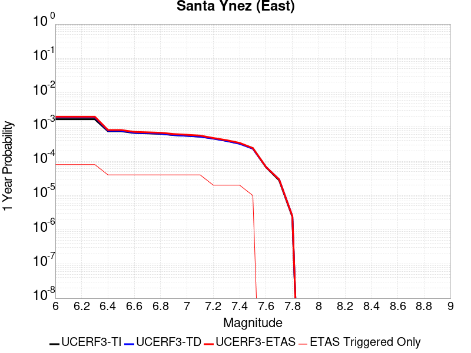 | 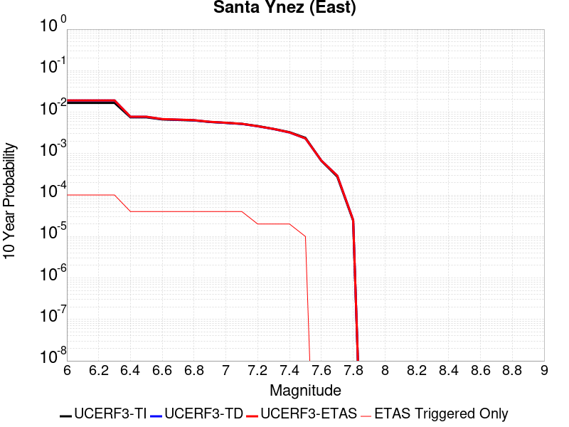 |

| Magnitude | 1 yr TI Prob | TD Prob | ETAS Prob | ETAS/TD Gain | ETAS Triggered Only | 10 yr TI Prob | TD Prob | ETAS Prob | ETAS/TD Gain | ETAS Triggered Only |
|-----|-----|-----|-----|-----|-----|-----|-----|-----|-----|-----|
| 6.0 | 0.0016823979 | 0.0019164208 | 0.0019962674 | 1.0416645 | 8.0E-5 | 0.016697178 | 0.019056482 | 0.019154577 | 1.0051476 | 1.0E-4 |
| 6.1 | 0.0016823979 | 0.0019164208 | 0.0019962674 | 1.0416645 | 8.0E-5 | 0.016697178 | 0.019056482 | 0.019154577 | 1.0051476 | 1.0E-4 |
| 6.2 | 0.0016823979 | 0.0019164208 | 0.0019962674 | 1.0416645 | 8.0E-5 | 0.016697178 | 0.019056482 | 0.019154577 | 1.0051476 | 1.0E-4 |
| 6.3 | 0.0016823979 | 0.0019164208 | 0.0019962674 | 1.0416645 | 8.0E-5 | 0.016697178 | 0.019056482 | 0.019154577 | 1.0051476 | 1.0E-4 |
| 6.4 | 7.513438E-4 | 7.745315E-4 | 8.145005E-4 | 1.0516042 | 4.0E-5 | 0.0074880854 | 0.007718871 | 0.007758562 | 1.0051421 | 4.0E-5 |
| 6.5 | 7.513438E-4 | 7.745315E-4 | 8.145005E-4 | 1.0516042 | 4.0E-5 | 0.0074880854 | 0.007718871 | 0.007758562 | 1.0051421 | 4.0E-5 |
| 6.6 | 6.6777546E-4 | 6.787214E-4 | 7.186943E-4 | 1.0588944 | 4.0E-5 | 0.006657724 | 0.006766696 | 0.0068064253 | 1.0058713 | 4.0E-5 |
| 6.7 | 6.497827E-4 | 6.58725E-4 | 6.986987E-4 | 1.0606834 | 4.0E-5 | 0.00647886 | 0.006567922 | 0.006607659 | 1.0060502 | 4.0E-5 |
| 6.8 | 6.309115E-4 | 6.379944E-4 | 6.7796884E-4 | 1.0626565 | 4.0E-5 | 0.0062912325 | 0.0063618156 | 0.006401561 | 1.0062475 | 4.0E-5 |
| 6.9 | 5.7922816E-4 | 5.820102E-4 | 6.219869E-4 | 1.0686873 | 4.0E-5 | 0.005777207 | 0.0058050053 | 0.0058447733 | 1.0068506 | 4.0E-5 |
| 7.0 | 5.5176654E-4 | 5.5198936E-4 | 5.919673E-4 | 1.0724251 | 4.0E-5 | 0.0055039856 | 0.0055063213 | 0.005546101 | 1.0072243 | 4.0E-5 |
| 7.1 | 5.2278786E-4 | 5.206625E-4 | 5.606417E-4 | 1.0767852 | 4.0E-5 | 0.0052155964 | 0.005194559 | 0.0052343514 | 1.0076604 | 4.0E-5 |
| 7.2 | 4.629332E-4 | 4.5639902E-4 | 4.763899E-4 | 1.0438013 | 2.0E-5 | 0.0046197 | 0.004554735 | 0.004574644 | 1.004371 | 2.0E-5 |
| 7.3 | 3.9389438E-4 | 3.915326E-4 | 4.115248E-4 | 1.0510613 | 2.0E-5 | 0.0039319694 | 0.003908535 | 0.003928457 | 1.005097 | 2.0E-5 |
| 7.4 | 3.2916202E-4 | 3.2257853E-4 | 3.4257208E-4 | 1.0619804 | 2.0E-5 | 0.003286749 | 0.0032212003 | 0.0032411357 | 1.0061889 | 2.0E-5 |
| 7.5 | 2.4053088E-4 | 2.3169395E-4 | 2.4169162E-4 | 1.0431504 | 1.0E-5 | 0.002402707 | 0.0023145934 | 0.0023245702 | 1.0043104 | 1.0E-5 |
| 7.6 | 6.7092435E-5 | 6.787265E-5 | 6.787265E-5 | 1.0 | 0.0 | 6.707218E-4 | 6.7852606E-4 | 6.7852606E-4 | 1.0 | 0.0 |
| 7.7 | 2.7812002E-5 | 2.9282974E-5 | 2.9282974E-5 | 1.0 | 0.0 | 2.7808524E-4 | 2.9279472E-4 | 2.9279472E-4 | 1.0 | 0.0 |
| 7.8 | 2.4074816E-6 | 2.5061402E-6 | 2.5061402E-6 | 1.0 | 0.0 | 2.4074554E-5 | 2.5061128E-5 | 2.5061128E-5 | 1.0 | 0.0 |

## Brawley (Seismic Zone) alt 1
*[(top)](#table-of-contents)*

| 1 Year | 10 Year |
|-----|-----|
| 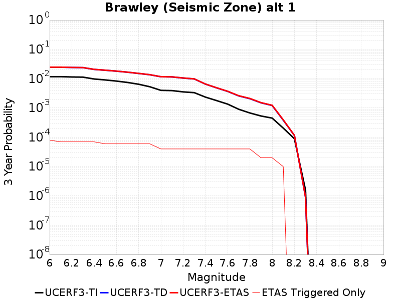 | 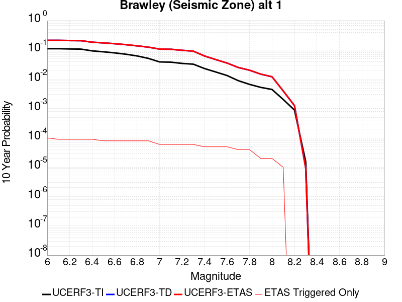 |

| Magnitude | 1 yr TI Prob | TD Prob | ETAS Prob | ETAS/TD Gain | ETAS Triggered Only | 10 yr TI Prob | TD Prob | ETAS Prob | ETAS/TD Gain | ETAS Triggered Only |
|-----|-----|-----|-----|-----|-----|-----|-----|-----|-----|-----|
| 6.0 | 0.011683988 | 0.024546651 | 0.024624689 | 1.0031791 | 8.0E-5 | 0.11088423 | 0.21350282 | 0.21358149 | 1.0003684 | 1.0E-4 |
| 6.1 | 0.011683988 | 0.024546651 | 0.024614934 | 1.0027817 | 7.0E-5 | 0.11088423 | 0.21350282 | 0.21357362 | 1.0003315 | 9.0E-5 |
| 6.2 | 0.011405343 | 0.024080908 | 0.024149222 | 1.0028368 | 7.0E-5 | 0.10837428 | 0.20993935 | 0.21001045 | 1.0003387 | 9.0E-5 |
| 6.3 | 0.011262234 | 0.023794064 | 0.0238624 | 1.0028719 | 7.0E-5 | 0.107082725 | 0.20783031 | 0.20790161 | 1.0003431 | 9.0E-5 |
| 6.4 | 0.00974259 | 0.020680794 | 0.020749347 | 1.0033147 | 7.0E-5 | 0.093263686 | 0.18458094 | 0.18465433 | 1.0003976 | 9.0E-5 |
| 6.5 | 0.009034078 | 0.019369105 | 0.019427942 | 1.0030377 | 6.0E-5 | 0.086755216 | 0.17440306 | 0.1744691 | 1.0003787 | 8.0E-5 |
| 6.6 | 0.008271996 | 0.018045932 | 0.01810485 | 1.0032649 | 6.0E-5 | 0.07970774 | 0.16381118 | 0.16387808 | 1.0004084 | 8.0E-5 |
| 6.7 | 0.007417723 | 0.016592944 | 0.016651947 | 1.003556 | 6.0E-5 | 0.07174956 | 0.15193562 | 0.15200347 | 1.0004466 | 8.0E-5 |
| 6.8 | 0.0064481674 | 0.015049067 | 0.015108164 | 1.003927 | 6.0E-5 | 0.06264243 | 0.13837986 | 0.13844879 | 1.0004982 | 8.0E-5 |
| 6.9 | 0.005298089 | 0.013608561 | 0.013667745 | 1.004349 | 6.0E-5 | 0.05173543 | 0.12496344 | 0.12503344 | 1.0005602 | 8.0E-5 |
| 7.0 | 0.0039900932 | 0.011621667 | 0.011661203 | 1.0034019 | 4.0E-5 | 0.039192066 | 0.10726823 | 0.1073218 | 1.0004994 | 6.0E-5 |
| 7.1 | 0.0039125155 | 0.011458214 | 0.011497756 | 1.003451 | 4.0E-5 | 0.038443442 | 0.105832204 | 0.10588585 | 1.0005069 | 6.0E-5 |
| 7.2 | 0.0035360386 | 0.010491774 | 0.010531355 | 1.0037725 | 4.0E-5 | 0.034803 | 0.09750263 | 0.09755678 | 1.0005554 | 6.0E-5 |
| 7.3 | 0.0033337586 | 0.009784488 | 0.009824097 | 1.0040481 | 4.0E-5 | 0.03284188 | 0.09139744 | 0.09145196 | 1.0005965 | 6.0E-5 |
| 7.4 | 0.0023488526 | 0.006516938 | 0.006556677 | 1.0060978 | 4.0E-5 | 0.023241805 | 0.062364757 | 0.06241164 | 1.0007517 | 5.0E-5 |
| 7.5 | 0.0017896603 | 0.004859632 | 0.0048994375 | 1.0081911 | 4.0E-5 | 0.01775316 | 0.047056098 | 0.047103744 | 1.0010126 | 5.0E-5 |
| 7.6 | 0.001354725 | 0.00367369 | 0.0037135428 | 1.0108483 | 4.0E-5 | 0.013464959 | 0.035841633 | 0.03588984 | 1.001345 | 5.0E-5 |
| 7.7 | 9.018782E-4 | 0.00257483 | 0.0026147272 | 1.0154951 | 4.0E-5 | 0.008982267 | 0.025291083 | 0.025330072 | 1.0015416 | 4.0E-5 |
| 7.8 | 6.743139E-4 | 0.002069107 | 0.0021090242 | 1.019292 | 4.0E-5 | 0.0067227143 | 0.020432325 | 0.020471508 | 1.0019177 | 4.0E-5 |
| 7.9 | 5.321229E-4 | 0.0014988628 | 0.0015188328 | 1.0133234 | 2.0E-5 | 0.005308505 | 0.014992135 | 0.015011835 | 1.001314 | 2.0E-5 |
| 8.0 | 4.5126543E-4 | 0.0012139049 | 0.0012338808 | 1.0164558 | 2.0E-5 | 0.0045035016 | 0.012211521 | 0.012231276 | 1.0016178 | 2.0E-5 |
| 8.1 | 2.0539707E-4 | 3.8231243E-4 | 3.923086E-4 | 1.0261467 | 1.0E-5 | 0.0020520731 | 0.004001378 | 0.0040113376 | 1.0024891 | 1.0E-5 |
| 8.2 | 8.922769E-5 | 1.1572703E-4 | 1.1572703E-4 | 1.0 | 0.0 | 8.9191867E-4 | 0.0012667556 | 0.0012667556 | 1.0 | 0.0 |
| 8.3 | 1.5834444E-6 | 8.983827E-7 | 8.983827E-7 | 1.0 | 0.0 | 1.5834332E-5 | 9.368586E-6 | 9.368586E-6 | 1.0 | 0.0 |

## Santa Cruz Island
*[(top)](#table-of-contents)*

| 1 Year | 10 Year |
|-----|-----|
| 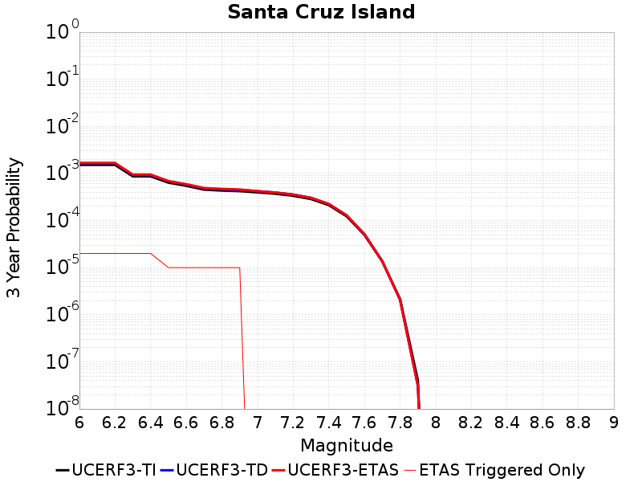 | 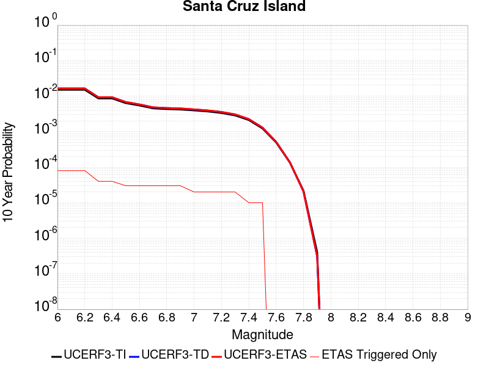 |

| Magnitude | 1 yr TI Prob | TD Prob | ETAS Prob | ETAS/TD Gain | ETAS Triggered Only | 10 yr TI Prob | TD Prob | ETAS Prob | ETAS/TD Gain | ETAS Triggered Only |
|-----|-----|-----|-----|-----|-----|-----|-----|-----|-----|-----|
| 6.0 | 0.0015206301 | 0.0016476442 | 0.0016676113 | 1.0121186 | 2.0E-5 | 0.015102667 | 0.016368017 | 0.016446706 | 1.0048076 | 8.0E-5 |
| 6.1 | 0.0015206301 | 0.0016476442 | 0.0016676113 | 1.0121186 | 2.0E-5 | 0.015102667 | 0.016368017 | 0.016446706 | 1.0048076 | 8.0E-5 |
| 6.2 | 0.0015206301 | 0.0016476442 | 0.0016676113 | 1.0121186 | 2.0E-5 | 0.015102667 | 0.016368017 | 0.016446706 | 1.0048076 | 8.0E-5 |
| 6.3 | 8.6765E-4 | 9.286032E-4 | 9.4858464E-4 | 1.0215178 | 2.0E-5 | 0.008642701 | 0.009249101 | 0.009288732 | 1.0042847 | 4.0E-5 |
| 6.4 | 8.6765E-4 | 9.286032E-4 | 9.4858464E-4 | 1.0215178 | 2.0E-5 | 0.008642701 | 0.009249101 | 0.009288732 | 1.0042847 | 4.0E-5 |
| 6.5 | 6.3840044E-4 | 6.803423E-4 | 6.903355E-4 | 1.0146885 | 1.0E-5 | 0.0063656955 | 0.006782993 | 0.00681279 | 1.0043929 | 3.0E-5 |
| 6.6 | 5.4719415E-4 | 5.81974E-4 | 5.919682E-4 | 1.0171729 | 1.0E-5 | 0.005458487 | 0.0058047404 | 0.0058345664 | 1.0051382 | 3.0E-5 |
| 6.7 | 4.5381195E-4 | 4.8184916E-4 | 4.918443E-4 | 1.0207434 | 1.0E-5 | 0.0045288634 | 0.0048081116 | 0.0048379675 | 1.0062095 | 3.0E-5 |
| 6.8 | 4.3339343E-4 | 4.599505E-4 | 4.699459E-4 | 1.0217315 | 1.0E-5 | 0.004325492 | 0.0045900387 | 0.004619901 | 1.0065058 | 3.0E-5 |
| 6.9 | 4.2115687E-4 | 4.4680914E-4 | 4.5680467E-4 | 1.0223709 | 1.0E-5 | 0.004203596 | 0.0044591594 | 0.0044890256 | 1.0066978 | 3.0E-5 |
| 7.0 | 3.9736772E-4 | 4.2123813E-4 | 4.2123813E-4 | 1.0 | 0.0 | 0.003966579 | 0.004204444 | 0.0042243605 | 1.0047369 | 2.0E-5 |
| 7.1 | 3.715733E-4 | 3.9365308E-4 | 3.9365308E-4 | 1.0 | 0.0 | 0.003709526 | 0.0039296006 | 0.003949522 | 1.0050696 | 2.0E-5 |
| 7.2 | 3.360328E-4 | 3.561814E-4 | 3.561814E-4 | 1.0 | 0.0 | 0.0033552512 | 0.0035561337 | 0.0035760626 | 1.005604 | 2.0E-5 |
| 7.3 | 2.8664304E-4 | 3.036342E-4 | 3.036342E-4 | 1.0 | 0.0 | 0.002862736 | 0.0030322166 | 0.003052156 | 1.0065758 | 2.0E-5 |
| 7.4 | 2.1288003E-4 | 2.2498278E-4 | 2.2498278E-4 | 1.0 | 0.0 | 0.0021267622 | 0.0022475591 | 0.0022575366 | 1.0044392 | 1.0E-5 |
| 7.5 | 1.2305441E-4 | 1.2915007E-4 | 1.2915007E-4 | 1.0 | 0.0 | 0.0012298629 | 0.0012907552 | 0.0013007423 | 1.0077374 | 1.0E-5 |
| 7.6 | 4.9559E-5 | 5.145167E-5 | 5.145167E-5 | 1.0 | 0.0 | 4.954795E-4 | 5.1439885E-4 | 5.1439885E-4 | 1.0 | 0.0 |
| 7.7 | 1.3573399E-5 | 1.378372E-5 | 1.378372E-5 | 1.0 | 0.0 | 1.357257E-4 | 1.3782873E-4 | 1.3782873E-4 | 1.0 | 0.0 |
| 7.8 | 2.16657E-6 | 2.0692332E-6 | 2.0692332E-6 | 1.0 | 0.0 | 2.1665488E-5 | 2.0692161E-5 | 2.0692161E-5 | 1.0 | 0.0 |
| 7.9 | 4.0303796E-8 | 3.102966E-8 | 3.102966E-8 | 1.0 | 0.0 | 4.030379E-7 | 3.102966E-7 | 3.102966E-7 | 1.0 | 0.0 |

## San Pedro Basin
*[(top)](#table-of-contents)*

| 1 Year | 10 Year |
|-----|-----|
| 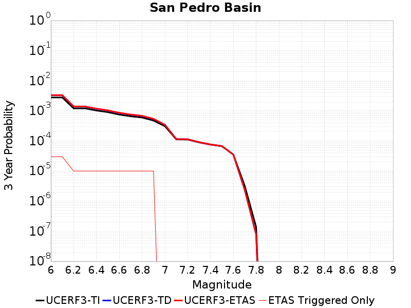 | 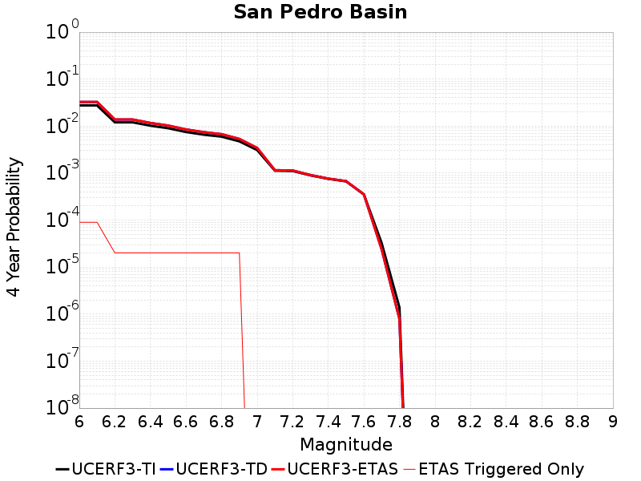 |

| Magnitude | 1 yr TI Prob | TD Prob | ETAS Prob | ETAS/TD Gain | ETAS Triggered Only | 10 yr TI Prob | TD Prob | ETAS Prob | ETAS/TD Gain | ETAS Triggered Only |
|-----|-----|-----|-----|-----|-----|-----|-----|-----|-----|-----|
| 6.0 | 0.0027850836 | 0.003301833 | 0.0033317339 | 1.0090559 | 3.0E-5 | 0.027504366 | 0.032589525 | 0.032676592 | 1.0026716 | 9.0E-5 |
| 6.1 | 0.0027850836 | 0.003301833 | 0.0033317339 | 1.0090559 | 3.0E-5 | 0.027504366 | 0.032589525 | 0.032676592 | 1.0026716 | 9.0E-5 |
| 6.2 | 0.0012092749 | 0.001389289 | 0.0013992751 | 1.007188 | 1.0E-5 | 0.012027155 | 0.013810909 | 0.013830633 | 1.0014281 | 2.0E-5 |
| 6.3 | 0.0012092749 | 0.001389289 | 0.0013992751 | 1.007188 | 1.0E-5 | 0.012027155 | 0.013810909 | 0.013830633 | 1.0014281 | 2.0E-5 |
| 6.4 | 0.001025344 | 0.0011714804 | 0.0011814687 | 1.0085262 | 1.0E-5 | 0.010206259 | 0.011657137 | 0.011676905 | 1.0016956 | 2.0E-5 |
| 6.5 | 9.04529E-4 | 0.0010297946 | 0.0010397843 | 1.0097007 | 1.0E-5 | 0.009008561 | 0.010253949 | 0.010273744 | 1.0019305 | 2.0E-5 |
| 6.6 | 7.509924E-4 | 8.5137616E-4 | 8.613676E-4 | 1.0117357 | 1.0E-5 | 0.0074845953 | 0.008484347 | 0.0085041765 | 1.0023373 | 2.0E-5 |
| 6.7 | 6.590571E-4 | 7.451478E-4 | 7.551403E-4 | 1.0134102 | 1.0E-5 | 0.006571059 | 0.0074295136 | 0.007449365 | 1.002672 | 2.0E-5 |
| 6.8 | 5.9783855E-4 | 6.746451E-4 | 6.8463833E-4 | 1.0148126 | 1.0E-5 | 0.0059623276 | 0.0067289104 | 0.0067487755 | 1.0029522 | 2.0E-5 |
| 6.9 | 4.7518566E-4 | 5.339392E-4 | 5.439339E-4 | 1.0187187 | 1.0E-5 | 0.0047417083 | 0.0053293174 | 0.005349211 | 1.0037328 | 2.0E-5 |
| 7.0 | 3.0963816E-4 | 3.4350972E-4 | 3.4350972E-4 | 1.0 | 0.0 | 0.0030920706 | 0.0034321041 | 0.0034321041 | 1.0 | 0.0 |
| 7.1 | 1.1247819E-4 | 1.1528999E-4 | 1.1528999E-4 | 1.0 | 0.0 | 0.0011242128 | 0.0011523172 | 0.0011523172 | 1.0 | 0.0 |
| 7.2 | 1.1088375E-4 | 1.13638525E-4 | 1.13638525E-4 | 1.0 | 0.0 | 0.0011082845 | 0.0011358195 | 0.0011358195 | 1.0 | 0.0 |
| 7.3 | 8.94604E-5 | 9.101051E-5 | 9.101051E-5 | 1.0 | 0.0 | 8.9424395E-4 | 9.0974144E-4 | 9.0974144E-4 | 1.0 | 0.0 |
| 7.4 | 7.548913E-5 | 7.639643E-5 | 7.639643E-5 | 1.0 | 0.0 | 7.546349E-4 | 7.637089E-4 | 7.637089E-4 | 1.0 | 0.0 |
| 7.5 | 6.680587E-5 | 6.747258E-5 | 6.747258E-5 | 1.0 | 0.0 | 6.678579E-4 | 6.74528E-4 | 6.74528E-4 | 1.0 | 0.0 |
| 7.6 | 3.5246063E-5 | 3.532157E-5 | 3.532157E-5 | 1.0 | 0.0 | 3.5240475E-4 | 3.531653E-4 | 3.531653E-4 | 1.0 | 0.0 |
| 7.7 | 3.2412677E-6 | 2.3845353E-6 | 2.3845353E-6 | 1.0 | 0.0 | 3.2412205E-5 | 2.3845118E-5 | 2.3845118E-5 | 1.0 | 0.0 |
| 7.8 | 1.3869362E-7 | 7.8989025E-8 | 7.8989025E-8 | 1.0 | 0.0 | 1.3869354E-6 | 7.8989024E-7 | 7.8989024E-7 | 1.0 | 0.0 |

## Pinto Mtn
*[(top)](#table-of-contents)*

| 1 Year | 10 Year |
|-----|-----|
| 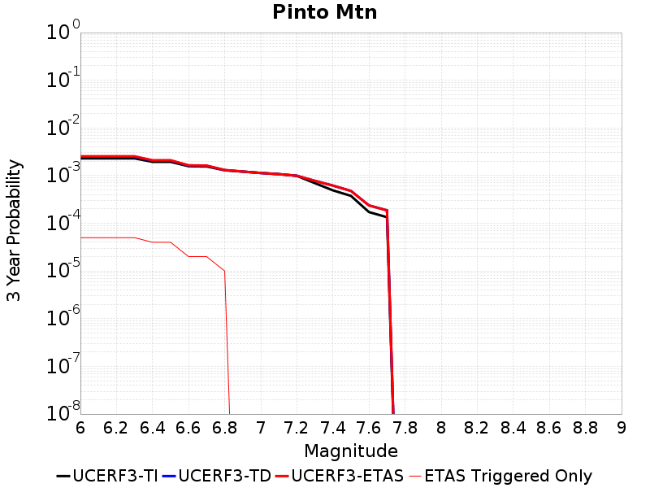 | 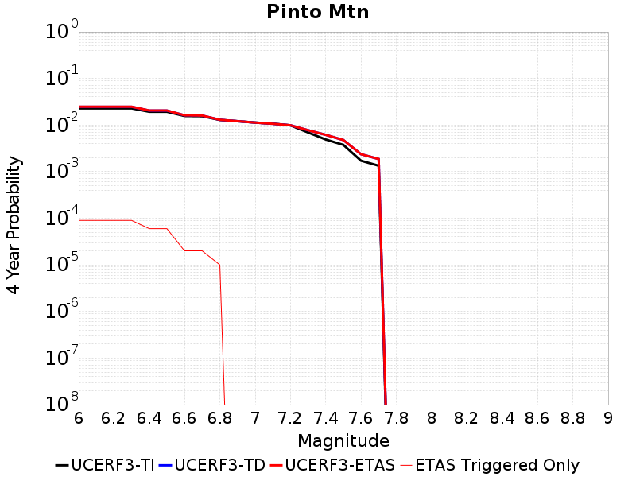 |

| Magnitude | 1 yr TI Prob | TD Prob | ETAS Prob | ETAS/TD Gain | ETAS Triggered Only | 10 yr TI Prob | TD Prob | ETAS Prob | ETAS/TD Gain | ETAS Triggered Only |
|-----|-----|-----|-----|-----|-----|-----|-----|-----|-----|-----|
| 6.0 | 0.0023034236 | 0.002494062 | 0.0025439374 | 1.0199976 | 5.0E-5 | 0.022796938 | 0.024678221 | 0.024766 | 1.003557 | 9.0E-5 |
| 6.1 | 0.0023034236 | 0.002494062 | 0.0025439374 | 1.0199976 | 5.0E-5 | 0.022796938 | 0.024678221 | 0.024766 | 1.003557 | 9.0E-5 |
| 6.2 | 0.0023034236 | 0.002494062 | 0.0025439374 | 1.0199976 | 5.0E-5 | 0.022796938 | 0.024678221 | 0.024766 | 1.003557 | 9.0E-5 |
| 6.3 | 0.0023034236 | 0.002494062 | 0.0025439374 | 1.0199976 | 5.0E-5 | 0.022796938 | 0.024678221 | 0.024766 | 1.003557 | 9.0E-5 |
| 6.4 | 0.0019443673 | 0.0020644518 | 0.0021043692 | 1.0193356 | 4.0E-5 | 0.019274427 | 0.020462757 | 0.020521529 | 1.0028721 | 6.0E-5 |
| 6.5 | 0.0019443673 | 0.0020644518 | 0.0021043692 | 1.0193356 | 4.0E-5 | 0.019274427 | 0.020462757 | 0.020521529 | 1.0028721 | 6.0E-5 |
| 6.6 | 0.0015748127 | 0.0016269912 | 0.0016469586 | 1.0122726 | 2.0E-5 | 0.015636992 | 0.016154665 | 0.016174342 | 1.0012181 | 2.0E-5 |
| 6.7 | 0.0015567453 | 0.0016066417 | 0.0016266096 | 1.0124283 | 2.0E-5 | 0.015458848 | 0.015954105 | 0.015973786 | 1.0012336 | 2.0E-5 |
| 6.8 | 0.0012942362 | 0.0013041464 | 0.0013141334 | 1.0076579 | 1.0E-5 | 0.012867244 | 0.012967299 | 0.012977169 | 1.0007612 | 1.0E-5 |
| 6.9 | 0.001215622 | 0.0012170248 | 0.0012170248 | 1.0 | 0.0 | 0.012089936 | 0.012105791 | 0.012105791 | 1.0 | 0.0 |
| 7.0 | 0.0011378246 | 0.0011348402 | 0.0011348402 | 1.0 | 0.0 | 0.011320163 | 0.011292553 | 0.011292553 | 1.0 | 0.0 |
| 7.1 | 0.0010774818 | 0.0010712324 | 0.0010712324 | 1.0 | 0.0 | 0.010722724 | 0.010662736 | 0.010662736 | 1.0 | 0.0 |
| 7.2 | 9.904018E-4 | 9.937359E-4 | 9.937359E-4 | 1.0 | 0.0 | 0.009859995 | 0.009894921 | 0.009894921 | 1.0 | 0.0 |
| 7.3 | 6.956093E-4 | 7.775146E-4 | 7.775146E-4 | 1.0 | 0.0 | 0.006934359 | 0.0077492427 | 0.0077492427 | 1.0 | 0.0 |
| 7.4 | 4.910942E-4 | 6.1869615E-4 | 6.1869615E-4 | 1.0 | 0.0 | 0.0049001034 | 0.0061706854 | 0.0061706854 | 1.0 | 0.0 |
| 7.5 | 3.7614413E-4 | 4.7774627E-4 | 4.7774627E-4 | 1.0 | 0.0 | 0.0037550807 | 0.0047679674 | 0.0047679674 | 1.0 | 0.0 |
| 7.6 | 1.7198564E-4 | 2.37146E-4 | 2.37146E-4 | 1.0 | 0.0 | 0.0017185259 | 0.0023690667 | 0.0023690667 | 1.0 | 0.0 |
| 7.7 | 1.3430449E-4 | 1.8700905E-4 | 1.8700905E-4 | 1.0 | 0.0 | 0.0013422335 | 0.0018686466 | 0.0018686466 | 1.0 | 0.0 |

## Pisgah-Bullion Mtn-Mesquite Lk
*[(top)](#table-of-contents)*

| 1 Year | 10 Year |
|-----|-----|
|  | 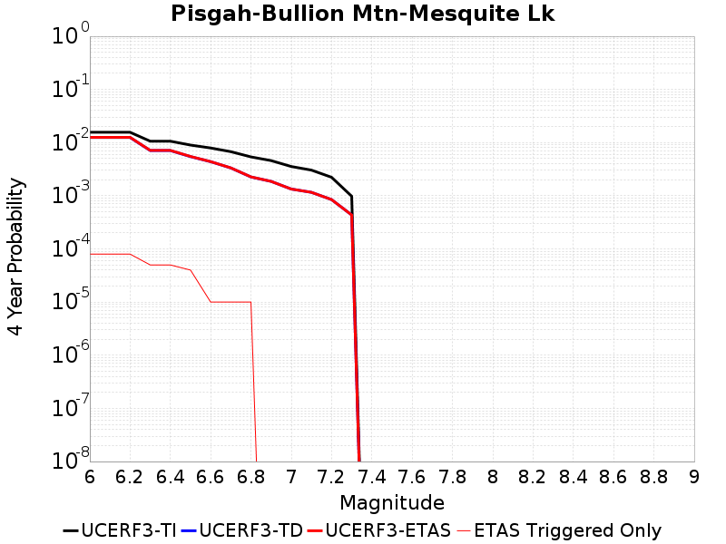 |

| Magnitude | 1 yr TI Prob | TD Prob | ETAS Prob | ETAS/TD Gain | ETAS Triggered Only | 10 yr TI Prob | TD Prob | ETAS Prob | ETAS/TD Gain | ETAS Triggered Only |
|-----|-----|-----|-----|-----|-----|-----|-----|-----|-----|-----|
| 6.0 | 0.0015767008 | 0.0012563746 | 0.0012863369 | 1.0238482 | 3.0E-5 | 0.015655609 | 0.012502739 | 0.012581739 | 1.0063186 | 8.0E-5 |
| 6.1 | 0.0015767008 | 0.0012563746 | 0.0012863369 | 1.0238482 | 3.0E-5 | 0.015655609 | 0.012502739 | 0.012581739 | 1.0063186 | 8.0E-5 |
| 6.2 | 0.0015767008 | 0.0012563746 | 0.0012863369 | 1.0238482 | 3.0E-5 | 0.015655609 | 0.012502739 | 0.012581739 | 1.0063186 | 8.0E-5 |
| 6.3 | 0.0010690069 | 7.113849E-4 | 7.313707E-4 | 1.0280942 | 2.0E-5 | 0.01063879 | 0.0070927036 | 0.0071423487 | 1.0069995 | 5.0E-5 |
| 6.4 | 0.0010690069 | 7.113849E-4 | 7.313707E-4 | 1.0280942 | 2.0E-5 | 0.01063879 | 0.0070927036 | 0.0071423487 | 1.0069995 | 5.0E-5 |
| 6.5 | 9.0313336E-4 | 5.4654194E-4 | 5.565365E-4 | 1.0182868 | 1.0E-5 | 0.008994718 | 0.005452974 | 0.0054927557 | 1.0072955 | 4.0E-5 |
| 6.6 | 7.9546886E-4 | 4.3895846E-4 | 4.3895846E-4 | 1.0 | 0.0 | 0.007926274 | 0.0043816315 | 0.004391588 | 1.0022722 | 1.0E-5 |
| 6.7 | 6.7796157E-4 | 3.344932E-4 | 3.344932E-4 | 1.0 | 0.0 | 0.0067589693 | 0.0033403574 | 0.003350324 | 1.0029837 | 1.0E-5 |
| 6.8 | 5.401065E-4 | 2.2607738E-4 | 2.2607738E-4 | 1.0 | 0.0 | 0.0053879567 | 0.0022585606 | 0.0022685379 | 1.0044177 | 1.0E-5 |
| 6.9 | 4.5991567E-4 | 1.8681634E-4 | 1.8681634E-4 | 1.0 | 0.0 | 0.00458965 | 0.0018666513 | 0.0018666513 | 1.0 | 0.0 |
| 7.0 | 3.5596377E-4 | 1.3396463E-4 | 1.3396463E-4 | 1.0 | 0.0 | 0.0035539411 | 0.0013388697 | 0.0013388697 | 1.0 | 0.0 |
| 7.1 | 3.045215E-4 | 1.1621537E-4 | 1.1621537E-4 | 1.0 | 0.0 | 0.0030410455 | 0.001161575 | 0.001161575 | 1.0 | 0.0 |
| 7.2 | 2.231982E-4 | 8.492117E-5 | 8.492117E-5 | 1.0 | 0.0 | 0.0022297418 | 8.489104E-4 | 8.489104E-4 | 1.0 | 0.0 |
| 7.3 | 9.811026E-5 | 4.3541913E-5 | 4.3541913E-5 | 1.0 | 0.0 | 9.806695E-4 | 4.3534828E-4 | 4.3534828E-4 | 1.0 | 0.0 |

## Big Pine (Central)
*[(top)](#table-of-contents)*

| 1 Year | 10 Year |
|-----|-----|
| 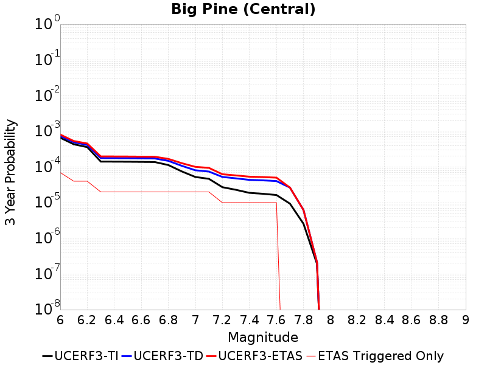 | 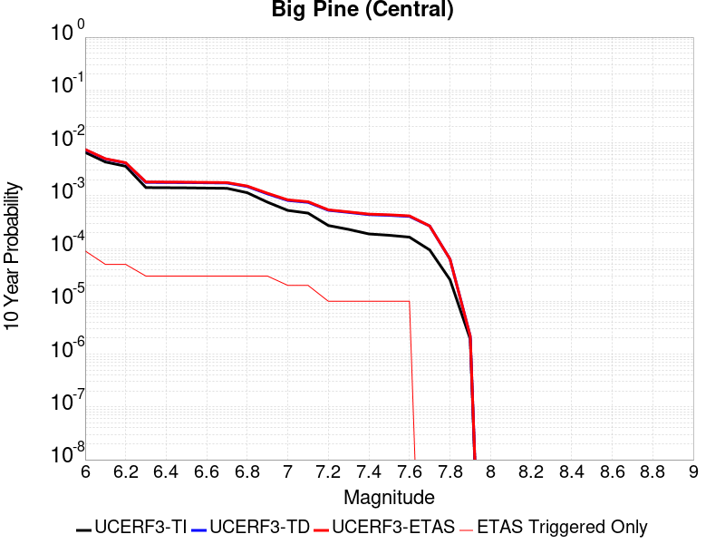 |

| Magnitude | 1 yr TI Prob | TD Prob | ETAS Prob | ETAS/TD Gain | ETAS Triggered Only | 10 yr TI Prob | TD Prob | ETAS Prob | ETAS/TD Gain | ETAS Triggered Only |
|-----|-----|-----|-----|-----|-----|-----|-----|-----|-----|-----|
| 6.0 | 6.628048E-4 | 7.4334256E-4 | 8.1329054E-4 | 1.0940993 | 7.0E-5 | 0.006608314 | 0.00741359 | 0.007502923 | 1.0120499 | 9.0E-5 |
| 6.1 | 4.3521097E-4 | 4.961625E-4 | 5.361427E-4 | 1.0805788 | 4.0E-5 | 0.0043435963 | 0.004954103 | 0.005003855 | 1.0100427 | 5.0E-5 |
| 6.2 | 3.6121515E-4 | 4.1565218E-4 | 4.5563557E-4 | 1.0961943 | 4.0E-5 | 0.003606286 | 0.0041520563 | 0.004201849 | 1.0119922 | 5.0E-5 |
| 6.3 | 1.4235388E-4 | 1.7866163E-4 | 1.9865806E-4 | 1.1119235 | 2.0E-5 | 0.0014226272 | 0.0017866878 | 0.0018166341 | 1.0167608 | 3.0E-5 |
| 6.4 | 1.4158686E-4 | 1.7784223E-4 | 1.9783867E-4 | 1.1124393 | 2.0E-5 | 0.0014149669 | 0.0017785068 | 0.0018084534 | 1.0168381 | 3.0E-5 |
| 6.5 | 1.4072572E-4 | 1.7692118E-4 | 1.9691764E-4 | 1.1130247 | 2.0E-5 | 0.0014063664 | 0.0017693109 | 0.0017992578 | 1.0169258 | 3.0E-5 |
| 6.6 | 1.3925991E-4 | 1.7535716E-4 | 1.9535366E-4 | 1.114033 | 2.0E-5 | 0.0013917267 | 0.0017536955 | 0.0017836429 | 1.0170767 | 3.0E-5 |
| 6.7 | 1.3778417E-4 | 1.737934E-4 | 1.9378992E-4 | 1.1150591 | 2.0E-5 | 0.0013769877 | 0.0017380825 | 0.0017680303 | 1.0172304 | 3.0E-5 |
| 6.8 | 1.1367482E-4 | 1.4893187E-4 | 1.6892889E-4 | 1.1342696 | 2.0E-5 | 0.0011361669 | 0.0014898147 | 0.00151977 | 1.0201068 | 3.0E-5 |
| 6.9 | 7.51954E-5 | 1.07927575E-4 | 1.2792542E-4 | 1.1852895 | 2.0E-5 | 7.5169955E-4 | 0.0010802011 | 0.0011101686 | 1.0277426 | 3.0E-5 |
| 7.0 | 5.2560266E-5 | 8.109755E-5 | 1.01095924E-4 | 1.2465966 | 2.0E-5 | 5.2547833E-4 | 8.1211777E-4 | 8.321015E-4 | 1.024607 | 2.0E-5 |
| 7.1 | 4.6683643E-5 | 7.462727E-5 | 9.462578E-5 | 1.2679785 | 2.0E-5 | 4.6673836E-4 | 7.474601E-4 | 7.6744513E-4 | 1.0267373 | 2.0E-5 |
| 7.2 | 2.7211627E-5 | 5.2761345E-5 | 6.276082E-5 | 1.1895227 | 1.0E-5 | 2.7208295E-4 | 5.289161E-4 | 5.389108E-4 | 1.0188966 | 1.0E-5 |
| 7.3 | 2.2971257E-5 | 4.8106736E-5 | 5.8106256E-5 | 1.2078611 | 1.0E-5 | 2.2968883E-4 | 4.8239095E-4 | 4.923861E-4 | 1.0207201 | 1.0E-5 |
| 7.4 | 1.8852415E-5 | 4.3613978E-5 | 5.361354E-5 | 1.2292743 | 1.0E-5 | 1.8850817E-4 | 4.374723E-4 | 4.4746796E-4 | 1.0228486 | 1.0E-5 |
| 7.5 | 1.7783263E-5 | 4.230758E-5 | 5.2307158E-5 | 1.2363542 | 1.0E-5 | 1.778184E-4 | 4.2439194E-4 | 4.343877E-4 | 1.0235531 | 1.0E-5 |
| 7.6 | 1.6398877E-5 | 4.0342846E-5 | 5.034244E-5 | 1.2478654 | 1.0E-5 | 1.6397667E-4 | 4.0472293E-4 | 4.1471887E-4 | 1.0246983 | 1.0E-5 |
| 7.7 | 9.377899E-6 | 2.6495583E-5 | 2.6495583E-5 | 1.0 | 0.0 | 9.377503E-5 | 2.662989E-4 | 2.662989E-4 | 1.0 | 0.0 |
| 7.8 | 2.5687964E-6 | 6.2516065E-6 | 6.2516065E-6 | 1.0 | 0.0 | 2.5687666E-5 | 6.29563E-5 | 6.29563E-5 | 1.0 | 0.0 |
| 7.9 | 1.9204828E-7 | 2.1421695E-7 | 2.1421695E-7 | 1.0 | 0.0 | 1.920481E-6 | 2.190148E-6 | 2.190148E-6 | 1.0 | 0.0 |

## San Jacinto (San Bernardino)
*[(top)](#table-of-contents)*

| 1 Year | 10 Year |
|-----|-----|
| 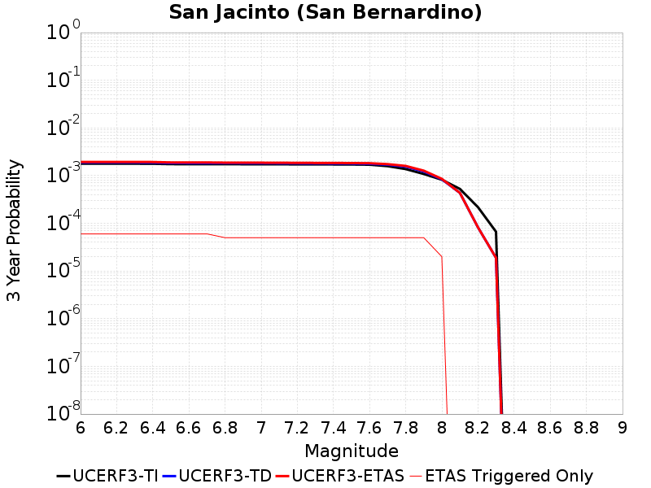 | 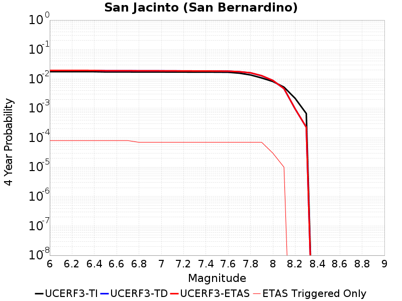 |

| Magnitude | 1 yr TI Prob | TD Prob | ETAS Prob | ETAS/TD Gain | ETAS Triggered Only | 10 yr TI Prob | TD Prob | ETAS Prob | ETAS/TD Gain | ETAS Triggered Only |
|-----|-----|-----|-----|-----|-----|-----|-----|-----|-----|-----|
| 6.0 | 0.0017774 | 0.001876085 | 0.0019359724 | 1.0319215 | 6.0E-5 | 0.01763251 | 0.019350776 | 0.01942923 | 1.0040542 | 8.0E-5 |
| 6.1 | 0.0017774 | 0.001876085 | 0.0019359724 | 1.0319215 | 6.0E-5 | 0.01763251 | 0.019350776 | 0.01942923 | 1.0040542 | 8.0E-5 |
| 6.2 | 0.0017774 | 0.001876085 | 0.0019359724 | 1.0319215 | 6.0E-5 | 0.01763251 | 0.019350776 | 0.01942923 | 1.0040542 | 8.0E-5 |
| 6.3 | 0.0017774 | 0.001876085 | 0.0019359724 | 1.0319215 | 6.0E-5 | 0.01763251 | 0.019350776 | 0.01942923 | 1.0040542 | 8.0E-5 |
| 6.4 | 0.0017729428 | 0.0018704946 | 0.0019303823 | 1.0320171 | 6.0E-5 | 0.017588645 | 0.019295858 | 0.019374315 | 1.004066 | 8.0E-5 |
| 6.5 | 0.0017420477 | 0.0018319851 | 0.0018918752 | 1.0326914 | 6.0E-5 | 0.017284546 | 0.018917399 | 0.018995887 | 1.004149 | 8.0E-5 |
| 6.6 | 0.0017394501 | 0.0018287151 | 0.0018886054 | 1.0327499 | 6.0E-5 | 0.017258976 | 0.018885264 | 0.018963752 | 1.0041561 | 8.0E-5 |
| 6.7 | 0.0017391514 | 0.0018281825 | 0.0018880728 | 1.0327594 | 6.0E-5 | 0.017256035 | 0.018880056 | 0.018958544 | 1.0041573 | 8.0E-5 |
| 6.8 | 0.0017348597 | 0.0018226649 | 0.0018725737 | 1.0273824 | 5.0E-5 | 0.017213784 | 0.018825827 | 0.018894508 | 1.0036483 | 7.0E-5 |
| 6.9 | 0.0017327217 | 0.0018195894 | 0.0018694984 | 1.0274287 | 5.0E-5 | 0.017192734 | 0.018795695 | 0.01886438 | 1.0036542 | 7.0E-5 |
| 7.0 | 0.0017307063 | 0.0018164606 | 0.0018663699 | 1.0274761 | 5.0E-5 | 0.017172894 | 0.018765073 | 0.01883376 | 1.0036603 | 7.0E-5 |
| 7.1 | 0.0017271966 | 0.0018102214 | 0.0018601308 | 1.027571 | 5.0E-5 | 0.017138338 | 0.018704152 | 0.018772842 | 1.0036725 | 7.0E-5 |
| 7.2 | 0.0017222111 | 0.0018033171 | 0.0018532269 | 1.0276767 | 5.0E-5 | 0.017089253 | 0.018636545 | 0.01870524 | 1.0036861 | 7.0E-5 |
| 7.3 | 0.0017181796 | 0.001796429 | 0.0018463392 | 1.027783 | 5.0E-5 | 0.017049557 | 0.018569293 | 0.018637992 | 1.0036997 | 7.0E-5 |
| 7.4 | 0.0017160608 | 0.0017923503 | 0.0018422607 | 1.0278463 | 5.0E-5 | 0.017028693 | 0.018529559 | 0.01859826 | 1.0037078 | 7.0E-5 |
| 7.5 | 0.0017109542 | 0.0017853141 | 0.0018352248 | 1.0279562 | 5.0E-5 | 0.016978411 | 0.018460443 | 0.018529152 | 1.0037218 | 7.0E-5 |
| 7.6 | 0.0016955109 | 0.0017709873 | 0.0018208987 | 1.0281829 | 5.0E-5 | 0.016826328 | 0.01831807 | 0.018386789 | 1.0037514 | 7.0E-5 |
| 7.7 | 0.0015791537 | 0.0016920194 | 0.0017419348 | 1.0295005 | 5.0E-5 | 0.01567979 | 0.01752892 | 0.017597692 | 1.0039234 | 7.0E-5 |
| 7.8 | 0.0013722149 | 0.0015467126 | 0.0015966353 | 1.0322766 | 5.0E-5 | 0.013637724 | 0.016070437 | 0.016139312 | 1.0042858 | 7.0E-5 |
| 7.9 | 0.0010827117 | 0.0012212622 | 0.0012712011 | 1.0408913 | 5.0E-5 | 0.010774517 | 0.012793864 | 0.012862968 | 1.0054014 | 7.0E-5 |
| 8.0 | 8.2088535E-4 | 8.363141E-4 | 8.562974E-4 | 1.0238944 | 2.0E-5 | 0.008178596 | 0.0088663995 | 0.008896134 | 1.0033536 | 3.0E-5 |
| 8.1 | 5.2717153E-4 | 4.3460907E-4 | 4.3460907E-4 | 1.0 | 0.0 | 0.005259227 | 0.0046775173 | 0.0046874704 | 1.0021279 | 1.0E-5 |
| 8.2 | 2.1856341E-4 | 8.236534E-5 | 8.236534E-5 | 1.0 | 0.0 | 0.0021834858 | 9.566755E-4 | 9.566755E-4 | 1.0 | 0.0 |
| 8.3 | 6.65684E-5 | 1.8864535E-5 | 1.8864535E-5 | 1.0 | 0.0 | 6.6548464E-4 | 2.275375E-4 | 2.275375E-4 | 1.0 | 0.0 |

## Mission Creek
*[(top)](#table-of-contents)*

| 1 Year | 10 Year |
|-----|-----|
| 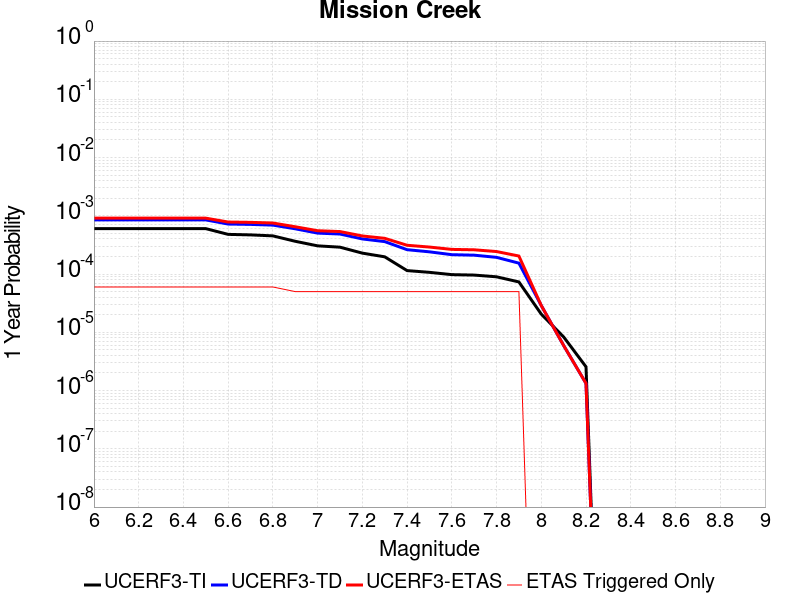 | 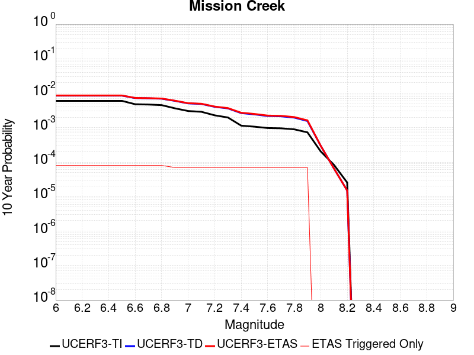 |

| Magnitude | 1 yr TI Prob | TD Prob | ETAS Prob | ETAS/TD Gain | ETAS Triggered Only | 10 yr TI Prob | TD Prob | ETAS Prob | ETAS/TD Gain | ETAS Triggered Only |
|-----|-----|-----|-----|-----|-----|-----|-----|-----|-----|-----|
| 6.0 | 6.0245243E-4 | 8.513498E-4 | 9.112987E-4 | 1.0704163 | 6.0E-5 | 0.006008218 | 0.008510108 | 0.008589428 | 1.0093206 | 8.0E-5 |
| 6.1 | 6.0245243E-4 | 8.513498E-4 | 9.112987E-4 | 1.0704163 | 6.0E-5 | 0.006008218 | 0.008510108 | 0.008589428 | 1.0093206 | 8.0E-5 |
| 6.2 | 6.0245243E-4 | 8.513498E-4 | 9.112987E-4 | 1.0704163 | 6.0E-5 | 0.006008218 | 0.008510108 | 0.008589428 | 1.0093206 | 8.0E-5 |
| 6.3 | 6.0245243E-4 | 8.513498E-4 | 9.112987E-4 | 1.0704163 | 6.0E-5 | 0.006008218 | 0.008510108 | 0.008589428 | 1.0093206 | 8.0E-5 |
| 6.4 | 6.0245243E-4 | 8.513498E-4 | 9.112987E-4 | 1.0704163 | 6.0E-5 | 0.006008218 | 0.008510108 | 0.008589428 | 1.0093206 | 8.0E-5 |
| 6.5 | 6.0245243E-4 | 8.513498E-4 | 9.112987E-4 | 1.0704163 | 6.0E-5 | 0.006008218 | 0.008510108 | 0.008589428 | 1.0093206 | 8.0E-5 |
| 6.6 | 4.800697E-4 | 7.2221115E-4 | 7.821678E-4 | 1.0830182 | 6.0E-5 | 0.004790339 | 0.0072272914 | 0.007306713 | 1.0109892 | 8.0E-5 |
| 6.7 | 4.7049852E-4 | 7.120783E-4 | 7.720356E-4 | 1.0842004 | 6.0E-5 | 0.004695036 | 0.0071266154 | 0.0072060456 | 1.0111455 | 8.0E-5 |
| 6.8 | 4.524734E-4 | 6.92374E-4 | 7.5233245E-4 | 1.0865984 | 6.0E-5 | 0.0045155324 | 0.0069308034 | 0.007010249 | 1.0114627 | 8.0E-5 |
| 6.9 | 3.653022E-4 | 5.9873034E-4 | 6.4870046E-4 | 1.0834601 | 5.0E-5 | 0.0036470229 | 0.005999626 | 0.006069206 | 1.0115974 | 7.0E-5 |
| 7.0 | 3.0501327E-4 | 5.047172E-4 | 5.5469194E-4 | 1.0990154 | 5.0E-5 | 0.0030459496 | 0.005063955 | 0.005133601 | 1.0137532 | 7.0E-5 |
| 7.1 | 2.8939504E-4 | 4.8669684E-4 | 5.366725E-4 | 1.1026833 | 5.0E-5 | 0.0028901845 | 0.004884549 | 0.004954207 | 1.0142609 | 7.0E-5 |
| 7.2 | 2.2876218E-4 | 4.0074863E-4 | 4.5072858E-4 | 1.1247165 | 5.0E-5 | 0.0022852682 | 0.0040284637 | 0.004098182 | 1.0173063 | 7.0E-5 |
| 7.3 | 1.9767738E-4 | 3.6078805E-4 | 4.1077E-4 | 1.1385355 | 5.0E-5 | 0.0019750162 | 0.0036302113 | 0.0036999572 | 1.0192126 | 7.0E-5 |
| 7.4 | 1.1469489E-4 | 2.621096E-4 | 3.120965E-4 | 1.19071 | 5.0E-5 | 0.0011463572 | 0.002645978 | 0.0027157927 | 1.0263852 | 7.0E-5 |
| 7.5 | 1.0706078E-4 | 2.4078602E-4 | 2.9077398E-4 | 1.2076032 | 5.0E-5 | 0.0010700922 | 0.002433633 | 0.0025034626 | 1.0286936 | 7.0E-5 |
| 7.6 | 9.774366E-5 | 2.1513824E-4 | 2.6512748E-4 | 1.2323587 | 5.0E-5 | 9.770069E-4 | 0.002178168 | 0.0022480155 | 1.0320671 | 7.0E-5 |
| 7.7 | 9.606641E-5 | 2.109478E-4 | 2.6093723E-4 | 1.2369754 | 5.0E-5 | 9.6024893E-4 | 0.0021364524 | 0.002206303 | 1.0326946 | 7.0E-5 |
| 7.8 | 8.97132E-5 | 1.9359487E-4 | 2.4358518E-4 | 1.2582213 | 5.0E-5 | 8.967699E-4 | 0.0019624336 | 0.0020322963 | 1.0356 | 7.0E-5 |
| 7.9 | 7.3230265E-5 | 1.5392537E-4 | 2.0391768E-4 | 1.3247827 | 5.0E-5 | 7.3206134E-4 | 0.0015631751 | 0.0016330658 | 1.0447106 | 7.0E-5 |
| 8.0 | 2.0515794E-5 | 2.8848304E-5 | 2.8848304E-5 | 1.0 | 0.0 | 2.0513899E-4 | 2.990067E-4 | 2.990067E-4 | 1.0 | 0.0 |
| 8.1 | 8.331805E-6 | 5.9384847E-6 | 5.9384847E-6 | 1.0 | 0.0 | 8.331492E-5 | 6.550569E-5 | 6.550569E-5 | 1.0 | 0.0 |
| 8.2 | 2.5569052E-6 | 1.3278258E-6 | 1.3278258E-6 | 1.0 | 0.0 | 2.556876E-5 | 1.4957911E-5 | 1.4957911E-5 | 1.0 | 0.0 |

## Big Pine (East)
*[(top)](#table-of-contents)*

| 1 Year | 10 Year |
|-----|-----|
| 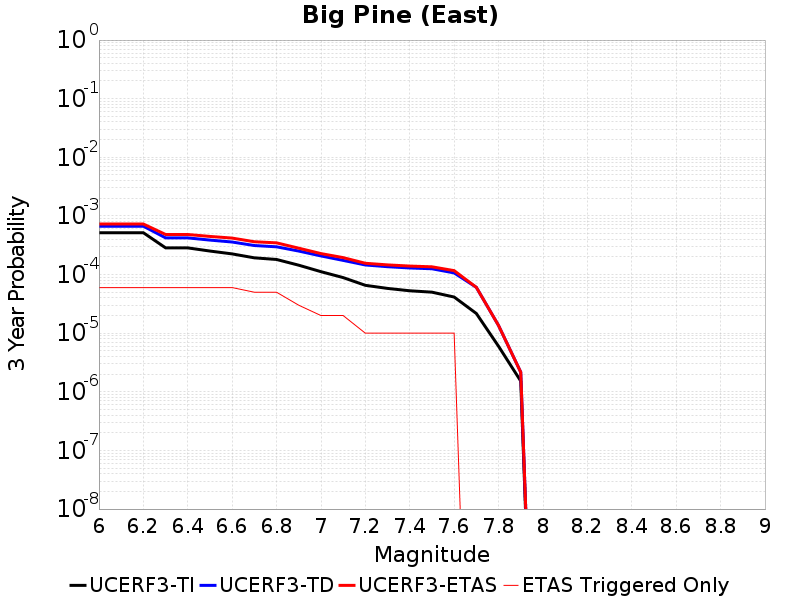 | 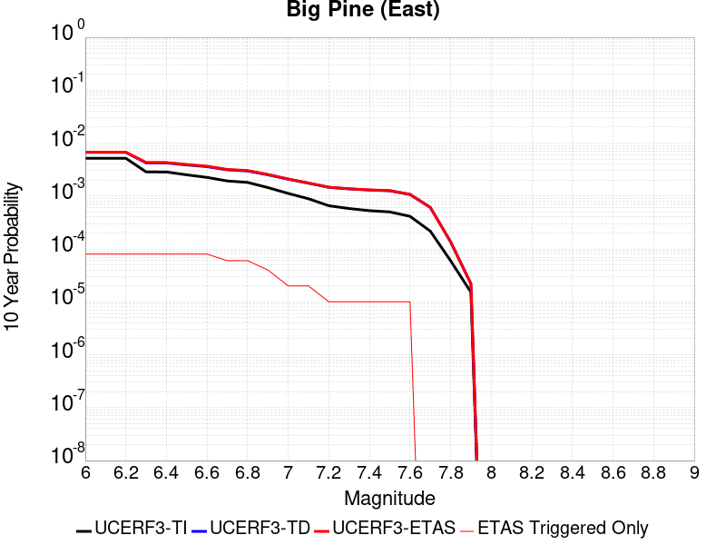 |

| Magnitude | 1 yr TI Prob | TD Prob | ETAS Prob | ETAS/TD Gain | ETAS Triggered Only | 10 yr TI Prob | TD Prob | ETAS Prob | ETAS/TD Gain | ETAS Triggered Only |
|-----|-----|-----|-----|-----|-----|-----|-----|-----|-----|-----|
| 6.0 | 5.173191E-4 | 6.6858233E-4 | 7.285422E-4 | 1.0896821 | 6.0E-5 | 0.0051611643 | 0.0066705 | 0.0067499666 | 1.0119131 | 8.0E-5 |
| 6.1 | 5.173191E-4 | 6.6858233E-4 | 7.285422E-4 | 1.0896821 | 6.0E-5 | 0.0051611643 | 0.0066705 | 0.0067499666 | 1.0119131 | 8.0E-5 |
| 6.2 | 5.173191E-4 | 6.6858233E-4 | 7.285422E-4 | 1.0896821 | 6.0E-5 | 0.0051611643 | 0.0066705 | 0.0067499666 | 1.0119131 | 8.0E-5 |
| 6.3 | 2.858834E-4 | 4.2324365E-4 | 4.8321826E-4 | 1.1417023 | 6.0E-5 | 0.0028551589 | 0.004227301 | 0.004306963 | 1.0188446 | 8.0E-5 |
| 6.4 | 2.851165E-4 | 4.2242443E-4 | 4.8239907E-4 | 1.1419772 | 6.0E-5 | 0.0028475097 | 0.0042191404 | 0.004298803 | 1.0188812 | 8.0E-5 |
| 6.5 | 2.518227E-4 | 3.8722035E-4 | 4.4719712E-4 | 1.1548905 | 6.0E-5 | 0.0025153751 | 0.0038683403 | 0.003948031 | 1.0206007 | 8.0E-5 |
| 6.6 | 2.2510924E-4 | 3.5905052E-4 | 4.1902898E-4 | 1.1670474 | 6.0E-5 | 0.0022488134 | 0.0035875556 | 0.0036672687 | 1.0222193 | 8.0E-5 |
| 6.7 | 1.9287605E-4 | 3.1279435E-4 | 3.627787E-4 | 1.1597995 | 5.0E-5 | 0.0019270873 | 0.003126302 | 0.0031861144 | 1.019132 | 6.0E-5 |
| 6.8 | 1.8089297E-4 | 2.9749493E-4 | 3.4748006E-4 | 1.1680201 | 5.0E-5 | 0.0018074579 | 0.0029737195 | 0.0030335411 | 1.0201168 | 6.0E-5 |
| 6.9 | 1.4445644E-4 | 2.517479E-4 | 2.8174036E-4 | 1.1191368 | 3.0E-5 | 0.0014436257 | 0.002517312 | 0.0025572113 | 1.01585 | 4.0E-5 |
| 7.0 | 1.12034926E-4 | 2.0791758E-4 | 2.2791342E-4 | 1.096172 | 2.0E-5 | 0.0011197845 | 0.0020798831 | 0.0020998414 | 1.0095959 | 2.0E-5 |
| 7.1 | 8.879537E-5 | 1.7452038E-4 | 1.9451688E-4 | 1.1145798 | 2.0E-5 | 8.87599E-4 | 0.0017464542 | 0.0017664193 | 1.0114318 | 2.0E-5 |
| 7.2 | 6.553574E-5 | 1.4580585E-4 | 1.558044E-4 | 1.0685743 | 1.0E-5 | 6.551642E-4 | 0.0014596985 | 0.001469684 | 1.0068407 | 1.0E-5 |
| 7.3 | 5.803642E-5 | 1.3619817E-4 | 1.461968E-4 | 1.0734124 | 1.0E-5 | 5.802127E-4 | 0.0013635762 | 0.0013735625 | 1.0073236 | 1.0E-5 |
| 7.4 | 5.2892992E-5 | 1.2958053E-4 | 1.3957924E-4 | 1.0771621 | 1.0E-5 | 5.288041E-4 | 0.0012972627 | 0.0013072498 | 1.0076985 | 1.0E-5 |
| 7.5 | 5.0082934E-5 | 1.2559743E-4 | 1.3559617E-4 | 1.0796095 | 1.0E-5 | 5.007165E-4 | 0.0012572854 | 0.0012672729 | 1.0079436 | 1.0E-5 |
| 7.6 | 4.1373947E-5 | 1.066954E-4 | 1.1669433E-4 | 1.0937147 | 1.0E-5 | 4.1366243E-4 | 0.0010685511 | 0.0010785405 | 1.0093485 | 1.0E-5 |
| 7.7 | 2.1684076E-5 | 6.0556667E-5 | 6.0556667E-5 | 1.0 | 0.0 | 2.1681961E-4 | 6.0859346E-4 | 6.0859346E-4 | 1.0 | 0.0 |
| 7.8 | 5.9831386E-6 | 1.3525154E-5 | 1.3525154E-5 | 1.0 | 0.0 | 5.9829777E-5 | 1.363459E-4 | 1.363459E-4 | 1.0 | 0.0 |
| 7.9 | 1.5252737E-6 | 2.1636076E-6 | 2.1636076E-6 | 1.0 | 0.0 | 1.5252632E-5 | 2.196855E-5 | 2.196855E-5 | 1.0 | 0.0 |

## Lost Hills
*[(top)](#table-of-contents)*

| 1 Year | 10 Year |
|-----|-----|
| 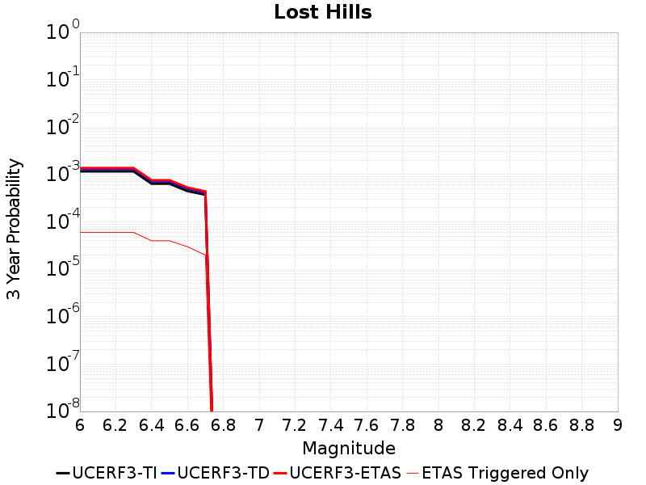 | 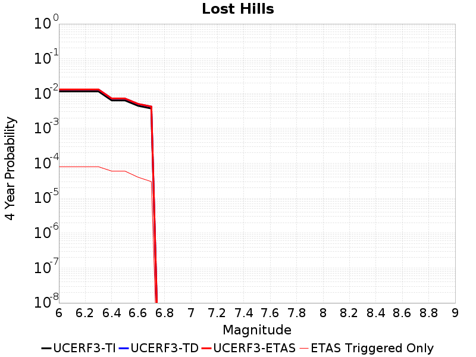 |

| Magnitude | 1 yr TI Prob | TD Prob | ETAS Prob | ETAS/TD Gain | ETAS Triggered Only | 10 yr TI Prob | TD Prob | ETAS Prob | ETAS/TD Gain | ETAS Triggered Only |
|-----|-----|-----|-----|-----|-----|-----|-----|-----|-----|-----|
| 6.0 | 0.0011647546 | 0.0013093661 | 0.0013692875 | 1.0457637 | 6.0E-5 | 0.011586686 | 0.013033111 | 0.013112068 | 1.0060582 | 8.0E-5 |
| 6.1 | 0.0011647546 | 0.0013093661 | 0.0013692875 | 1.0457637 | 6.0E-5 | 0.011586686 | 0.013033111 | 0.013112068 | 1.0060582 | 8.0E-5 |
| 6.2 | 0.0011647546 | 0.0013093661 | 0.0013692875 | 1.0457637 | 6.0E-5 | 0.011586686 | 0.013033111 | 0.013112068 | 1.0060582 | 8.0E-5 |
| 6.3 | 0.0011647546 | 0.0013093661 | 0.0013692875 | 1.0457637 | 6.0E-5 | 0.011586686 | 0.013033111 | 0.013112068 | 1.0060582 | 8.0E-5 |
| 6.4 | 6.409735E-4 | 7.189263E-4 | 7.588976E-4 | 1.0555985 | 4.0E-5 | 0.006391279 | 0.0071752113 | 0.007234781 | 1.0083021 | 6.0E-5 |
| 6.5 | 6.409735E-4 | 7.189263E-4 | 7.588976E-4 | 1.0555985 | 4.0E-5 | 0.006391279 | 0.0071752113 | 0.007234781 | 1.0083021 | 6.0E-5 |
| 6.6 | 4.4774043E-4 | 5.026421E-4 | 5.3262705E-4 | 1.0596546 | 3.0E-5 | 0.0044683935 | 0.0050232126 | 0.005063012 | 1.007923 | 4.0E-5 |
| 6.7 | 3.7591302E-4 | 4.2203668E-4 | 4.4202822E-4 | 1.0473692 | 2.0E-5 | 0.0037527776 | 0.0042203665 | 0.00425024 | 1.0070784 | 3.0E-5 |

## Rose Canyon
*[(top)](#table-of-contents)*

| 1 Year | 10 Year |
|-----|-----|
| 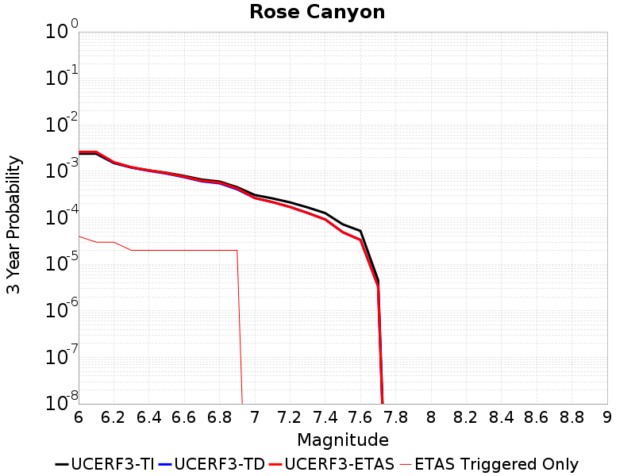 | 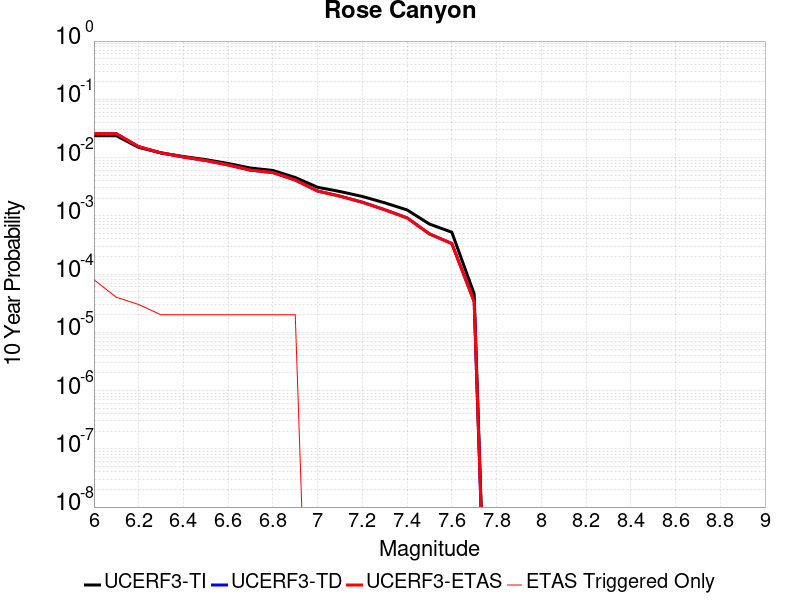 |

| Magnitude | 1 yr TI Prob | TD Prob | ETAS Prob | ETAS/TD Gain | ETAS Triggered Only | 10 yr TI Prob | TD Prob | ETAS Prob | ETAS/TD Gain | ETAS Triggered Only |
|-----|-----|-----|-----|-----|-----|-----|-----|-----|-----|-----|
| 6.0 | 0.0023933933 | 0.0025909417 | 0.002630838 | 1.0153984 | 4.0E-5 | 0.023677798 | 0.025640063 | 0.025718013 | 1.0030401 | 8.0E-5 |
| 6.1 | 0.0023933933 | 0.0025909417 | 0.002620864 | 1.0115488 | 3.0E-5 | 0.023677798 | 0.025640063 | 0.025679039 | 1.00152 | 4.0E-5 |
| 6.2 | 0.0015039665 | 0.0015468973 | 0.0015768509 | 1.0193636 | 3.0E-5 | 0.0149382865 | 0.01537431 | 0.015403849 | 1.0019213 | 3.0E-5 |
| 6.3 | 0.0012083431 | 0.0012078208 | 0.0012277967 | 1.0165387 | 2.0E-5 | 0.012017938 | 0.012022458 | 0.012042218 | 1.0016435 | 2.0E-5 |
| 6.4 | 0.0010465092 | 0.0010256936 | 0.001045673 | 1.019479 | 2.0E-5 | 0.010415946 | 0.010217576 | 0.0102373725 | 1.0019374 | 2.0E-5 |
| 6.5 | 9.267859E-4 | 8.9259207E-4 | 9.1257424E-4 | 1.0223867 | 2.0E-5 | 0.009229303 | 0.008896226 | 0.008916048 | 1.0022281 | 2.0E-5 |
| 6.6 | 7.942326E-4 | 7.479344E-4 | 7.6791947E-4 | 1.0267203 | 2.0E-5 | 0.007914 | 0.007458371 | 0.007478222 | 1.0026616 | 2.0E-5 |
| 6.7 | 6.626558E-4 | 6.0891826E-4 | 6.2890607E-4 | 1.0328251 | 2.0E-5 | 0.006606833 | 0.006075094 | 0.0060949726 | 1.0032722 | 2.0E-5 |
| 6.8 | 6.0274085E-4 | 5.5343483E-4 | 5.7342375E-4 | 1.0361179 | 2.0E-5 | 0.0060110865 | 0.0055225743 | 0.005542464 | 1.0036016 | 2.0E-5 |
| 6.9 | 4.5552556E-4 | 4.1115863E-4 | 4.311504E-4 | 1.048623 | 2.0E-5 | 0.0045459294 | 0.0041048126 | 0.004124731 | 1.0048523 | 2.0E-5 |
| 7.0 | 3.0956755E-4 | 2.6646684E-4 | 2.6646684E-4 | 1.0 | 0.0 | 0.0030913667 | 0.002661489 | 0.002661489 | 1.0 | 0.0 |
| 7.1 | 2.6155898E-4 | 2.1794687E-4 | 2.1794687E-4 | 1.0 | 0.0 | 0.0026125133 | 0.002177343 | 0.002177343 | 1.0 | 0.0 |
| 7.2 | 2.1499286E-4 | 1.7124314E-4 | 1.7124314E-4 | 1.0 | 0.0 | 0.0021478499 | 0.0017111214 | 0.0017111214 | 1.0 | 0.0 |
| 7.3 | 1.6738157E-4 | 1.2733598E-4 | 1.2733598E-4 | 1.0 | 0.0 | 0.0016725556 | 0.0012726372 | 0.0012726372 | 1.0 | 0.0 |
| 7.4 | 1.2623696E-4 | 9.2250986E-5 | 9.2250986E-5 | 1.0 | 0.0 | 0.0012616527 | 9.221323E-4 | 9.221323E-4 | 1.0 | 0.0 |
| 7.5 | 7.222766E-5 | 4.8935257E-5 | 4.8935257E-5 | 1.0 | 0.0 | 7.220419E-4 | 4.892483E-4 | 4.892483E-4 | 1.0 | 0.0 |
| 7.6 | 5.2289808E-5 | 3.3453616E-5 | 3.3453616E-5 | 1.0 | 0.0 | 5.2277505E-4 | 3.3448794E-4 | 3.3448794E-4 | 1.0 | 0.0 |
| 7.7 | 4.5718825E-6 | 3.3651186E-6 | 3.3651186E-6 | 1.0 | 0.0 | 4.5717883E-5 | 3.3650704E-5 | 3.3650704E-5 | 1.0 | 0.0 |

## White Mountains
*[(top)](#table-of-contents)*

| 1 Year | 10 Year |
|-----|-----|
| 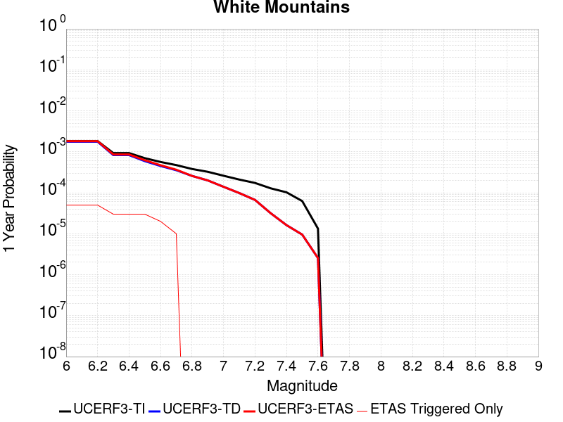 | 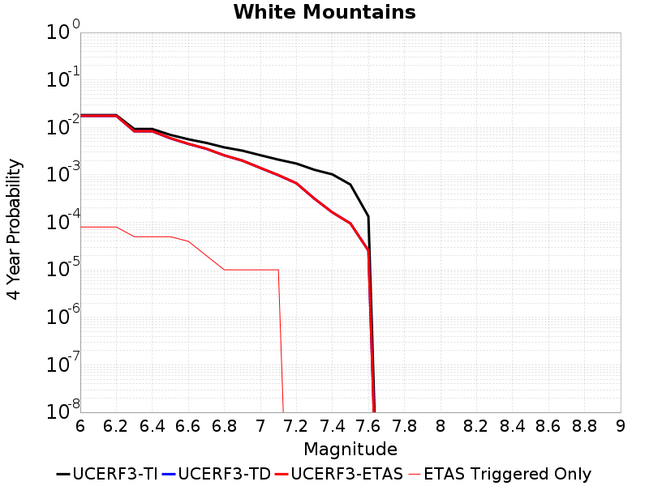 |

| Magnitude | 1 yr TI Prob | TD Prob | ETAS Prob | ETAS/TD Gain | ETAS Triggered Only | 10 yr TI Prob | TD Prob | ETAS Prob | ETAS/TD Gain | ETAS Triggered Only |
|-----|-----|-----|-----|-----|-----|-----|-----|-----|-----|-----|
| 6.0 | 0.0018264796 | 0.0017614114 | 0.0018113233 | 1.0283363 | 5.0E-5 | 0.018115403 | 0.017486837 | 0.017565437 | 1.0044949 | 8.0E-5 |
| 6.1 | 0.0018264796 | 0.0017614114 | 0.0018113233 | 1.0283363 | 5.0E-5 | 0.018115403 | 0.017486837 | 0.017565437 | 1.0044949 | 8.0E-5 |
| 6.2 | 0.0018264796 | 0.0017614114 | 0.0018113233 | 1.0283363 | 5.0E-5 | 0.018115403 | 0.017486837 | 0.017565437 | 1.0044949 | 8.0E-5 |
| 6.3 | 9.293162E-4 | 8.301559E-4 | 8.60131E-4 | 1.0361078 | 3.0E-5 | 0.009254395 | 0.008272006 | 0.008321593 | 1.0059944 | 5.0E-5 |
| 6.4 | 9.293162E-4 | 8.301559E-4 | 8.60131E-4 | 1.0361078 | 3.0E-5 | 0.009254395 | 0.008272006 | 0.008321593 | 1.0059944 | 5.0E-5 |
| 6.5 | 6.988258E-4 | 5.9134676E-4 | 6.21329E-4 | 1.0507016 | 3.0E-5 | 0.006966323 | 0.0058984375 | 0.0059481426 | 1.0084268 | 5.0E-5 |
| 6.6 | 5.6434784E-4 | 4.4996504E-4 | 4.6995605E-4 | 1.0444279 | 2.0E-5 | 0.005629168 | 0.004490976 | 0.004530797 | 1.0088668 | 4.0E-5 |
| 6.7 | 4.7304068E-4 | 3.5488367E-4 | 3.6488014E-4 | 1.0281682 | 1.0E-5 | 0.00472035 | 0.0035434868 | 0.003563416 | 1.0056242 | 2.0E-5 |
| 6.8 | 3.8062103E-4 | 2.5754276E-4 | 2.5754276E-4 | 1.0 | 0.0 | 0.0037996976 | 0.0025725558 | 0.00258253 | 1.0038772 | 1.0E-5 |
| 6.9 | 3.2472567E-4 | 1.9994056E-4 | 1.9994056E-4 | 1.0 | 0.0 | 0.0032425157 | 0.0019976594 | 0.0020076395 | 1.0049958 | 1.0E-5 |
| 7.0 | 2.602252E-4 | 1.3980514E-4 | 1.3980514E-4 | 1.0 | 0.0 | 0.002599207 | 0.0013971981 | 0.001407184 | 1.0071472 | 1.0E-5 |
| 7.1 | 2.1001195E-4 | 9.8391676E-5 | 9.8391676E-5 | 1.0 | 0.0 | 0.0020981359 | 9.83494E-4 | 9.93484E-4 | 1.0101578 | 1.0E-5 |
| 7.2 | 1.736567E-4 | 6.6889115E-5 | 6.6889115E-5 | 1.0 | 0.0 | 0.0017352107 | 6.686999E-4 | 6.686999E-4 | 1.0 | 0.0 |
| 7.3 | 1.2825865E-4 | 3.1605392E-5 | 3.1605392E-5 | 1.0 | 0.0 | 0.0012818464 | 3.160127E-4 | 3.160127E-4 | 1.0 | 0.0 |
| 7.4 | 1.0257547E-4 | 1.6221942E-5 | 1.6221942E-5 | 1.0 | 0.0 | 0.0010252813 | 1.6220771E-4 | 1.6220771E-4 | 1.0 | 0.0 |
| 7.5 | 6.2686406E-5 | 9.519627E-6 | 9.519627E-6 | 1.0 | 0.0 | 6.266873E-4 | 9.519228E-5 | 9.519228E-5 | 1.0 | 0.0 |
| 7.6 | 1.3363979E-5 | 2.5539753E-6 | 2.5539753E-6 | 1.0 | 0.0 | 1.3363175E-4 | 2.5539497E-5 | 2.5539497E-5 | 1.0 | 0.0 |

## Blue Cut
*[(top)](#table-of-contents)*

| 1 Year | 10 Year |
|-----|-----|
| 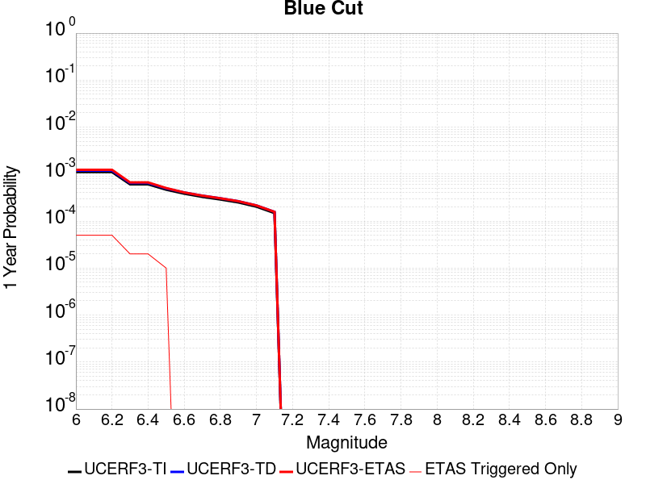 | 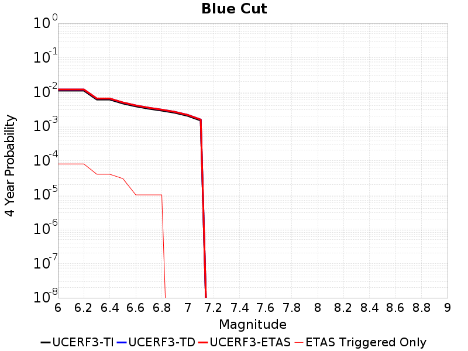 |

| Magnitude | 1 yr TI Prob | TD Prob | ETAS Prob | ETAS/TD Gain | ETAS Triggered Only | 10 yr TI Prob | TD Prob | ETAS Prob | ETAS/TD Gain | ETAS Triggered Only |
|-----|-----|-----|-----|-----|-----|-----|-----|-----|-----|-----|
| 6.0 | 0.0011070445 | 0.0011848492 | 0.0012347898 | 1.0421494 | 5.0E-5 | 0.011015458 | 0.011791162 | 0.011870218 | 1.0067047 | 8.0E-5 |
| 6.1 | 0.0011070445 | 0.0011848492 | 0.0012347898 | 1.0421494 | 5.0E-5 | 0.011015458 | 0.011791162 | 0.011870218 | 1.0067047 | 8.0E-5 |
| 6.2 | 0.0011070445 | 0.0011848492 | 0.0012347898 | 1.0421494 | 5.0E-5 | 0.011015458 | 0.011791162 | 0.011870218 | 1.0067047 | 8.0E-5 |
| 6.3 | 6.0582085E-4 | 6.4440025E-4 | 6.6438736E-4 | 1.0310166 | 2.0E-5 | 0.0060417196 | 0.0064265644 | 0.006466307 | 1.0061842 | 4.0E-5 |
| 6.4 | 6.0582085E-4 | 6.4440025E-4 | 6.6438736E-4 | 1.0310166 | 2.0E-5 | 0.0060417196 | 0.0064265644 | 0.006466307 | 1.0061842 | 4.0E-5 |
| 6.5 | 4.6591737E-4 | 4.9462647E-4 | 5.0462154E-4 | 1.0202073 | 1.0E-5 | 0.0046494175 | 0.0049361647 | 0.004966017 | 1.0060476 | 3.0E-5 |
| 6.6 | 3.83198E-4 | 4.0641348E-4 | 4.0641348E-4 | 1.0 | 0.0 | 0.0038253788 | 0.004057494 | 0.004067453 | 1.0024545 | 1.0E-5 |
| 6.7 | 3.2750185E-4 | 3.4720535E-4 | 3.4720535E-4 | 1.0 | 0.0 | 0.0032701963 | 0.0034673696 | 0.003477335 | 1.002874 | 1.0E-5 |
| 6.8 | 2.8816288E-4 | 3.0547357E-4 | 3.0547357E-4 | 1.0 | 0.0 | 0.002877895 | 0.0030512528 | 0.0030612224 | 1.0032673 | 1.0E-5 |
| 6.9 | 2.4927902E-4 | 2.6427986E-4 | 2.6427986E-4 | 1.0 | 0.0 | 0.0024899957 | 0.0026403482 | 0.0026403482 | 1.0 | 0.0 |
| 7.0 | 2.0259817E-4 | 2.1488166E-4 | 2.1488166E-4 | 1.0 | 0.0 | 0.0020241356 | 0.0021474145 | 0.0021474145 | 1.0 | 0.0 |
| 7.1 | 1.4795837E-4 | 1.5703774E-4 | 1.5703774E-4 | 1.0 | 0.0 | 0.001478599 | 0.0015699128 | 0.0015699128 | 1.0 | 0.0 |

## Oceanic - West Huasna
*[(top)](#table-of-contents)*

| 1 Year | 10 Year |
|-----|-----|
| 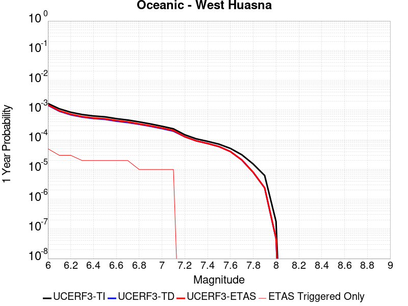 | 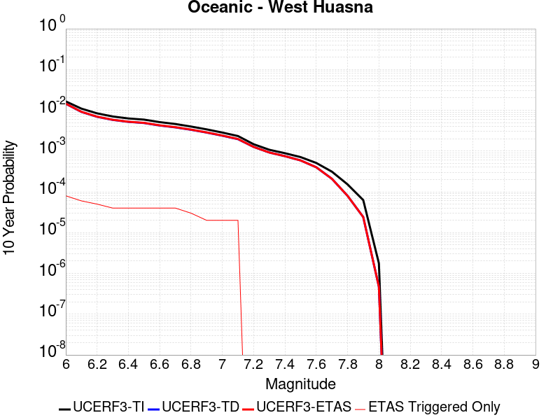 |

| Magnitude | 1 yr TI Prob | TD Prob | ETAS Prob | ETAS/TD Gain | ETAS Triggered Only | 10 yr TI Prob | TD Prob | ETAS Prob | ETAS/TD Gain | ETAS Triggered Only |
|-----|-----|-----|-----|-----|-----|-----|-----|-----|-----|-----|
| 6.0 | 0.0016660384 | 0.0014561907 | 0.001506118 | 1.0342861 | 5.0E-5 | 0.016536033 | 0.014471041 | 0.014549884 | 1.0054483 | 8.0E-5 |
| 6.1 | 0.0011033333 | 9.16558E-4 | 9.4653055E-4 | 1.0327011 | 3.0E-5 | 0.010978713 | 0.009128786 | 0.0091882385 | 1.0065126 | 6.0E-5 |
| 6.2 | 8.44688E-4 | 6.95158E-4 | 7.251372E-4 | 1.0431256 | 3.0E-5 | 0.008414844 | 0.0069301287 | 0.0069797826 | 1.0071648 | 5.0E-5 |
| 6.3 | 7.072618E-4 | 5.8314635E-4 | 6.031347E-4 | 1.0342767 | 2.0E-5 | 0.0070501505 | 0.0058162794 | 0.005856047 | 1.0068372 | 4.0E-5 |
| 6.4 | 6.322405E-4 | 5.2170415E-4 | 5.416937E-4 | 1.0383159 | 2.0E-5 | 0.006304447 | 0.005204861 | 0.005244653 | 1.0076451 | 4.0E-5 |
| 6.5 | 5.9211696E-4 | 4.886651E-4 | 5.0865527E-4 | 1.0409079 | 2.0E-5 | 0.0059054173 | 0.0048759645 | 0.004915769 | 1.0081635 | 4.0E-5 |
| 6.6 | 5.1386096E-4 | 4.2440667E-4 | 4.4439817E-4 | 1.0471046 | 2.0E-5 | 0.0051267436 | 0.004235994 | 0.0042758244 | 1.0094029 | 4.0E-5 |
| 6.7 | 4.6198163E-4 | 3.8179432E-4 | 4.0178667E-4 | 1.0523642 | 2.0E-5 | 0.004610224 | 0.0038114095 | 0.003851257 | 1.0104548 | 4.0E-5 |
| 6.8 | 4.0020206E-4 | 3.3345856E-4 | 3.434552E-4 | 1.0299788 | 1.0E-5 | 0.003994821 | 0.003329603 | 0.003359503 | 1.00898 | 3.0E-5 |
| 6.9 | 3.4090536E-4 | 2.847684E-4 | 2.9476554E-4 | 1.0351063 | 1.0E-5 | 0.0034038287 | 0.0028440517 | 0.0028639948 | 1.0070122 | 2.0E-5 |
| 7.0 | 2.8488258E-4 | 2.3842596E-4 | 2.4842357E-4 | 1.0419317 | 1.0E-5 | 0.0028451765 | 0.0023817155 | 0.0024016679 | 1.0083773 | 2.0E-5 |
| 7.1 | 2.3386406E-4 | 1.9577857E-4 | 2.0577661E-4 | 1.0510681 | 1.0E-5 | 0.002336181 | 0.0019560729 | 0.001976034 | 1.0102046 | 2.0E-5 |
| 7.2 | 1.4722206E-4 | 1.2652185E-4 | 1.2652185E-4 | 1.0 | 0.0 | 0.0014712457 | 0.0012645005 | 0.0012645005 | 1.0 | 0.0 |
| 7.3 | 1.0771569E-4 | 9.228632E-5 | 9.228632E-5 | 1.0 | 0.0 | 0.001076635 | 9.224817E-4 | 9.224817E-4 | 1.0 | 0.0 |
| 7.4 | 8.8597284E-5 | 7.5029566E-5 | 7.5029566E-5 | 1.0 | 0.0 | 8.8561967E-4 | 7.5004395E-4 | 7.5004395E-4 | 1.0 | 0.0 |
| 7.5 | 7.1156996E-5 | 5.8973925E-5 | 5.8973925E-5 | 1.0 | 0.0 | 7.1134215E-4 | 5.895843E-4 | 5.895843E-4 | 1.0 | 0.0 |
| 7.6 | 5.1149345E-5 | 4.0058083E-5 | 4.0058083E-5 | 1.0 | 0.0 | 5.113757E-4 | 4.0051006E-4 | 4.0051006E-4 | 1.0 | 0.0 |
| 7.7 | 3.1234613E-5 | 2.0897676E-5 | 2.0897676E-5 | 1.0 | 0.0 | 3.123022E-4 | 2.0895846E-4 | 2.0895846E-4 | 1.0 | 0.0 |
| 7.8 | 1.5230714E-5 | 7.975953E-6 | 7.975953E-6 | 1.0 | 0.0 | 1.522967E-4 | 7.975798E-5 | 7.975798E-5 | 1.0 | 0.0 |
| 7.9 | 6.2915915E-6 | 2.4113406E-6 | 2.4113406E-6 | 1.0 | 0.0 | 6.2914136E-5 | 2.4114448E-5 | 2.4114448E-5 | 1.0 | 0.0 |
| 8.0 | 1.7639688E-7 | 4.7021793E-8 | 4.7021793E-8 | 1.0 | 0.0 | 1.7639674E-6 | 4.713116E-7 | 4.713116E-7 | 1.0 | 0.0 |

## Camp Rock 2011
*[(top)](#table-of-contents)*

| 1 Year | 10 Year |
|-----|-----|
| 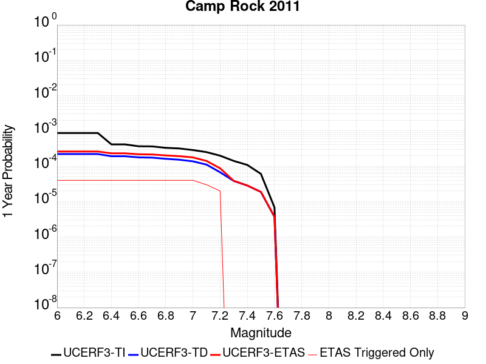 | 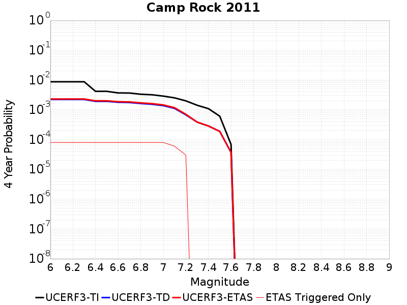 |

| Magnitude | 1 yr TI Prob | TD Prob | ETAS Prob | ETAS/TD Gain | ETAS Triggered Only | 10 yr TI Prob | TD Prob | ETAS Prob | ETAS/TD Gain | ETAS Triggered Only |
|-----|-----|-----|-----|-----|-----|-----|-----|-----|-----|-----|
| 6.0 | 8.7157206E-4 | 2.217492E-4 | 2.6174032E-4 | 1.180344 | 4.0E-5 | 0.008681616 | 0.0022153321 | 0.0022951548 | 1.036032 | 8.0E-5 |
| 6.1 | 8.7157206E-4 | 2.217492E-4 | 2.6174032E-4 | 1.180344 | 4.0E-5 | 0.008681616 | 0.0022153321 | 0.0022951548 | 1.036032 | 8.0E-5 |
| 6.2 | 8.7157206E-4 | 2.217492E-4 | 2.6174032E-4 | 1.180344 | 4.0E-5 | 0.008681616 | 0.0022153321 | 0.0022951548 | 1.036032 | 8.0E-5 |
| 6.3 | 8.7157206E-4 | 2.217492E-4 | 2.6174032E-4 | 1.180344 | 4.0E-5 | 0.008681616 | 0.0022153321 | 0.0022951548 | 1.036032 | 8.0E-5 |
| 6.4 | 4.1644843E-4 | 1.9210861E-4 | 2.3210092E-4 | 1.2081755 | 4.0E-5 | 0.0041566887 | 0.0019194601 | 0.0019993067 | 1.0415984 | 8.0E-5 |
| 6.5 | 4.1644843E-4 | 1.9210861E-4 | 2.3210092E-4 | 1.2081755 | 4.0E-5 | 0.0041566887 | 0.0019194601 | 0.0019993067 | 1.0415984 | 8.0E-5 |
| 6.6 | 3.677336E-4 | 1.7866296E-4 | 2.1865581E-4 | 1.2238452 | 4.0E-5 | 0.0036712566 | 0.0017852248 | 0.001865082 | 1.0447323 | 8.0E-5 |
| 6.7 | 3.6452254E-4 | 1.7542727E-4 | 2.1542025E-4 | 1.2279748 | 4.0E-5 | 0.0036392517 | 0.001752919 | 0.0018327788 | 1.0455582 | 8.0E-5 |
| 6.8 | 3.3251947E-4 | 1.6267548E-4 | 2.0266898E-4 | 1.2458483 | 4.0E-5 | 0.0033202237 | 0.0016255927 | 0.0017054626 | 1.0491328 | 8.0E-5 |
| 6.9 | 3.1887658E-4 | 1.5303478E-4 | 1.9302865E-4 | 1.2613385 | 4.0E-5 | 0.003184194 | 0.0015293217 | 0.0016091993 | 1.0522307 | 8.0E-5 |
| 7.0 | 2.8767265E-4 | 1.3784289E-4 | 1.7783737E-4 | 1.2901455 | 4.0E-5 | 0.0028730053 | 0.0013775991 | 0.0014574889 | 1.0579921 | 8.0E-5 |
| 7.1 | 2.5121463E-4 | 1.1135747E-4 | 1.4135413E-4 | 1.2693727 | 3.0E-5 | 0.0025093083 | 0.0011130386 | 0.0011729718 | 1.0538465 | 6.0E-5 |
| 7.2 | 1.9921579E-4 | 6.7503584E-5 | 8.750224E-5 | 1.2962606 | 2.0E-5 | 0.0019903728 | 6.748391E-4 | 7.048188E-4 | 1.044425 | 3.0E-5 |
| 7.3 | 1.4174209E-4 | 3.8525824E-5 | 3.8525824E-5 | 1.0 | 0.0 | 0.0014165172 | 3.8519345E-4 | 3.8519345E-4 | 1.0 | 0.0 |
| 7.4 | 1.0901308E-4 | 2.849876E-5 | 2.849876E-5 | 1.0 | 0.0 | 0.0010895962 | 2.849516E-4 | 2.849516E-4 | 1.0 | 0.0 |
| 7.5 | 6.0951766E-5 | 1.880011E-5 | 1.880011E-5 | 1.0 | 0.0 | 6.093505E-4 | 1.8798567E-4 | 1.8798567E-4 | 1.0 | 0.0 |
| 7.6 | 6.863748E-6 | 3.7149769E-6 | 3.7149769E-6 | 1.0 | 0.0 | 6.863536E-5 | 3.7149308E-5 | 3.7149308E-5 | 1.0 | 0.0 |

## Imperial
*[(top)](#table-of-contents)*

| 1 Year | 10 Year |
|-----|-----|
| 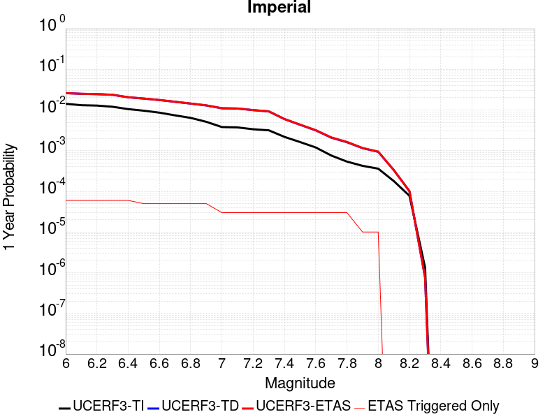 | 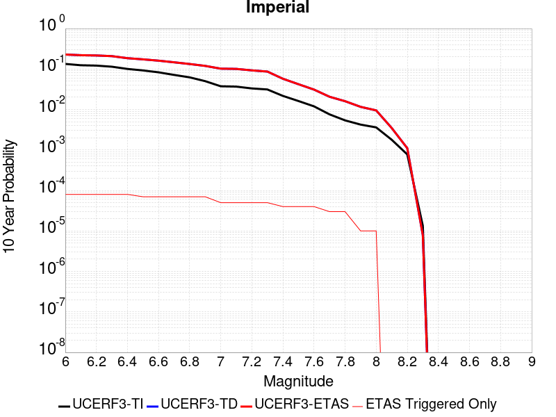 |

| Magnitude | 1 yr TI Prob | TD Prob | ETAS Prob | ETAS/TD Gain | ETAS Triggered Only | 10 yr TI Prob | TD Prob | ETAS Prob | ETAS/TD Gain | ETAS Triggered Only |
|-----|-----|-----|-----|-----|-----|-----|-----|-----|-----|-----|
| 6.0 | 0.0142467655 | 0.02603931 | 0.026097748 | 1.0022442 | 6.0E-5 | 0.13367249 | 0.22804776 | 0.22810951 | 1.0002708 | 8.0E-5 |
| 6.1 | 0.013144928 | 0.025071746 | 0.025130242 | 1.0023332 | 6.0E-5 | 0.123940155 | 0.21948333 | 0.21954577 | 1.0002844 | 8.0E-5 |
| 6.2 | 0.01286919 | 0.024611758 | 0.02467028 | 1.0023779 | 6.0E-5 | 0.12148927 | 0.21598901 | 0.21605173 | 1.0002904 | 8.0E-5 |
| 6.3 | 0.012036599 | 0.023661792 | 0.023720372 | 1.0024757 | 6.0E-5 | 0.11405133 | 0.20793779 | 0.20800115 | 1.0003047 | 8.0E-5 |
| 6.4 | 0.010539869 | 0.020596122 | 0.020654887 | 1.0028532 | 6.0E-5 | 0.100537635 | 0.1850701 | 0.18513529 | 1.0003523 | 8.0E-5 |
| 6.5 | 0.009633281 | 0.019119902 | 0.019168945 | 1.002565 | 5.0E-5 | 0.0922623 | 0.17330106 | 0.17335892 | 1.0003339 | 7.0E-5 |
| 6.6 | 0.008617763 | 0.017606802 | 0.017655922 | 1.0027899 | 5.0E-5 | 0.08291132 | 0.16077828 | 0.16083702 | 1.0003654 | 7.0E-5 |
| 6.7 | 0.0073952693 | 0.015929911 | 0.015979115 | 1.0030887 | 5.0E-5 | 0.07153955 | 0.1464867 | 0.14654645 | 1.0004078 | 7.0E-5 |
| 6.8 | 0.0064067547 | 0.014399853 | 0.014449133 | 1.0034223 | 5.0E-5 | 0.06225166 | 0.13293904 | 0.13299973 | 1.0004566 | 7.0E-5 |
| 6.9 | 0.0051317946 | 0.012969923 | 0.013019275 | 1.003805 | 5.0E-5 | 0.05014893 | 0.119408 | 0.119469635 | 1.0005162 | 7.0E-5 |
| 7.0 | 0.003811904 | 0.011037286 | 0.011066955 | 1.002688 | 3.0E-5 | 0.037471764 | 0.10206619 | 0.102111086 | 1.0004399 | 5.0E-5 |
| 7.1 | 0.003737482 | 0.010883134 | 0.010912808 | 1.0027266 | 3.0E-5 | 0.03675245 | 0.1007027 | 0.10074767 | 1.0004466 | 5.0E-5 |
| 7.2 | 0.0033683628 | 0.009937232 | 0.009966934 | 1.0029889 | 3.0E-5 | 0.033177625 | 0.09251019 | 0.09255557 | 1.0004904 | 5.0E-5 |
| 7.3 | 0.0031717476 | 0.009250637 | 0.009280359 | 1.003213 | 3.0E-5 | 0.031268585 | 0.08656107 | 0.08660674 | 1.0005276 | 5.0E-5 |
| 7.4 | 0.0021888057 | 0.005988567 | 0.0060183876 | 1.0049795 | 3.0E-5 | 0.02167372 | 0.05744074 | 0.057478443 | 1.0006564 | 4.0E-5 |
| 7.5 | 0.0016321153 | 0.00433908 | 0.0043689497 | 1.0068839 | 3.0E-5 | 0.016201803 | 0.042132806 | 0.04217112 | 1.0009093 | 4.0E-5 |
| 7.6 | 0.0012032706 | 0.0031699517 | 0.0031998567 | 1.0094339 | 3.0E-5 | 0.011967761 | 0.031027084 | 0.031065842 | 1.0012492 | 4.0E-5 |
| 7.7 | 7.608177E-4 | 0.0020915724 | 0.0021215095 | 1.0143132 | 3.0E-5 | 0.007582182 | 0.020628337 | 0.020657718 | 1.0014243 | 3.0E-5 |
| 7.8 | 5.400606E-4 | 0.0016142743 | 0.0016442259 | 1.0185542 | 3.0E-5 | 0.0053875 | 0.016017321 | 0.01604684 | 1.001843 | 3.0E-5 |
| 7.9 | 4.2453592E-4 | 0.0011550994 | 0.0011650878 | 1.0086473 | 1.0E-5 | 0.004237258 | 0.011618301 | 0.0116281845 | 1.0008507 | 1.0E-5 |
| 8.0 | 3.6194647E-4 | 9.3927793E-4 | 9.492685E-4 | 1.0106364 | 1.0E-5 | 0.0036135751 | 0.009501896 | 0.0095118005 | 1.0010424 | 1.0E-5 |
| 8.1 | 1.7888541E-4 | 3.328562E-4 | 3.328562E-4 | 1.0 | 0.0 | 0.0017874148 | 0.0034862005 | 0.0034862005 | 1.0 | 0.0 |
| 8.2 | 7.7779034E-5 | 1.0105441E-4 | 1.0105441E-4 | 1.0 | 0.0 | 7.775182E-4 | 0.0011076018 | 0.0011076018 | 1.0 | 0.0 |
| 8.3 | 1.3440151E-6 | 7.566656E-7 | 7.566656E-7 | 1.0 | 0.0 | 1.344007E-5 | 7.888489E-6 | 7.888489E-6 | 1.0 | 0.0 |

## Chino alt 1
*[(top)](#table-of-contents)*

| 1 Year | 10 Year |
|-----|-----|
| 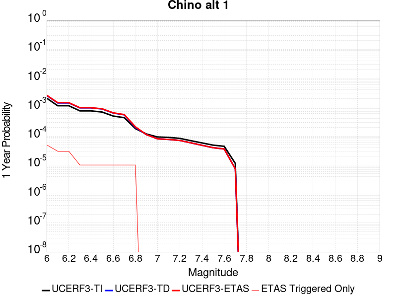 | 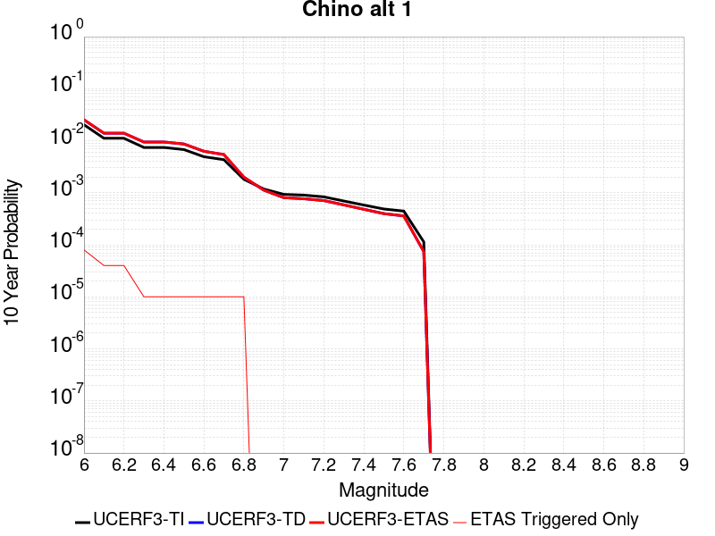 |

| Magnitude | 1 yr TI Prob | TD Prob | ETAS Prob | ETAS/TD Gain | ETAS Triggered Only | 10 yr TI Prob | TD Prob | ETAS Prob | ETAS/TD Gain | ETAS Triggered Only |
|-----|-----|-----|-----|-----|-----|-----|-----|-----|-----|-----|
| 6.0 | 0.0020537362 | 0.0025514031 | 0.0026012757 | 1.0195471 | 5.0E-5 | 0.020348595 | 0.025277931 | 0.025355909 | 1.0030848 | 8.0E-5 |
| 6.1 | 0.0011215154 | 0.0014016693 | 0.0014316273 | 1.021373 | 3.0E-5 | 0.011158722 | 0.013945194 | 0.013984636 | 1.0028284 | 4.0E-5 |
| 6.2 | 0.0011215154 | 0.0014016693 | 0.0014316273 | 1.021373 | 3.0E-5 | 0.011158722 | 0.013945194 | 0.013984636 | 1.0028284 | 4.0E-5 |
| 6.3 | 7.454001E-4 | 9.474427E-4 | 9.5743325E-4 | 1.0105448 | 1.0E-5 | 0.007429048 | 0.009444499 | 0.009454405 | 1.0010488 | 1.0E-5 |
| 6.4 | 7.454001E-4 | 9.474427E-4 | 9.5743325E-4 | 1.0105448 | 1.0E-5 | 0.007429048 | 0.009444499 | 0.009454405 | 1.0010488 | 1.0E-5 |
| 6.5 | 6.790315E-4 | 8.685629E-4 | 8.7855424E-4 | 1.0115032 | 1.0E-5 | 0.0067696036 | 0.008661989 | 0.008671902 | 1.0011445 | 1.0E-5 |
| 6.6 | 4.940122E-4 | 6.2804576E-4 | 6.380395E-4 | 1.0159124 | 1.0E-5 | 0.004929154 | 0.006271928 | 0.0062818653 | 1.0015844 | 1.0E-5 |
| 6.7 | 4.3372845E-4 | 5.429533E-4 | 5.5294787E-4 | 1.0184078 | 1.0E-5 | 0.004328829 | 0.005425801 | 0.0054357466 | 1.0018331 | 1.0E-5 |
| 6.8 | 1.8185932E-4 | 1.9895977E-4 | 2.0895778E-4 | 1.0502514 | 1.0E-5 | 0.0018171056 | 0.0019894936 | 0.0019994737 | 1.0050164 | 1.0E-5 |
| 6.9 | 1.18156495E-4 | 1.1232978E-4 | 1.1232978E-4 | 1.0 | 0.0 | 0.0011809369 | 0.001123346 | 0.001123346 | 1.0 | 0.0 |
| 7.0 | 9.3207556E-5 | 8.051281E-5 | 8.051281E-5 | 1.0 | 0.0 | 9.316847E-4 | 8.0528343E-4 | 8.0528343E-4 | 1.0 | 0.0 |
| 7.1 | 9.034557E-5 | 7.68748E-5 | 7.68748E-5 | 1.0 | 0.0 | 9.0308854E-4 | 7.689198E-4 | 7.689198E-4 | 1.0 | 0.0 |
| 7.2 | 8.352579E-5 | 7.082617E-5 | 7.082617E-5 | 1.0 | 0.0 | 8.34944E-4 | 7.0846017E-4 | 7.0846017E-4 | 1.0 | 0.0 |
| 7.3 | 6.9504385E-5 | 5.8531565E-5 | 5.8531565E-5 | 1.0 | 0.0 | 6.9482654E-4 | 5.85306E-4 | 5.85306E-4 | 1.0 | 0.0 |
| 7.4 | 5.8140613E-5 | 4.819699E-5 | 4.819699E-5 | 1.0 | 0.0 | 5.81254E-4 | 4.818822E-4 | 4.818822E-4 | 1.0 | 0.0 |
| 7.5 | 4.8807087E-5 | 3.9777373E-5 | 3.9777373E-5 | 1.0 | 0.0 | 4.879637E-4 | 3.977059E-4 | 3.977059E-4 | 1.0 | 0.0 |
| 7.6 | 4.4464414E-5 | 3.590208E-5 | 3.590208E-5 | 1.0 | 0.0 | 4.4455516E-4 | 3.5896598E-4 | 3.5896598E-4 | 1.0 | 0.0 |
| 7.7 | 1.1376757E-5 | 7.4023233E-6 | 7.4023233E-6 | 1.0 | 0.0 | 1.13761744E-4 | 7.402173E-5 | 7.402173E-5 | 1.0 | 0.0 |

## Ventura-Pitas Point
*[(top)](#table-of-contents)*

| 1 Year | 10 Year |
|-----|-----|
| 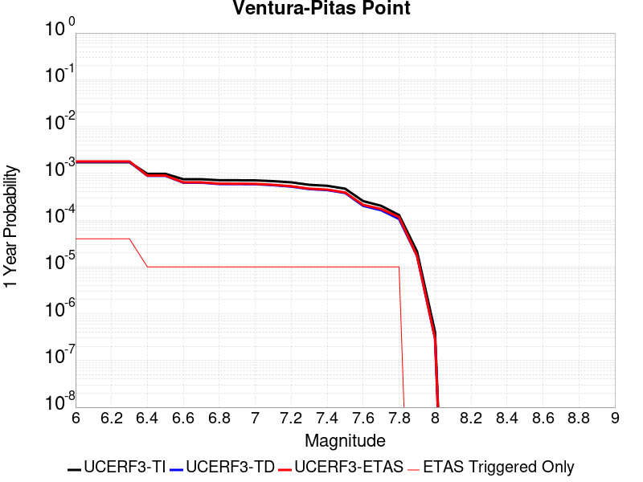 | 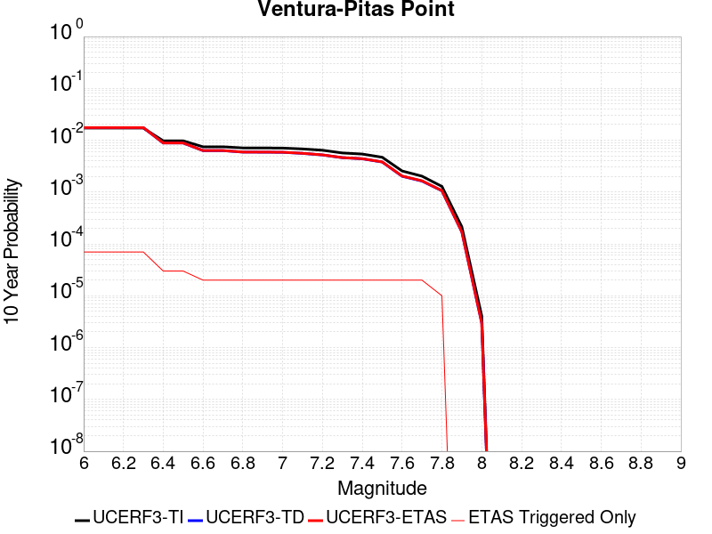 |

| Magnitude | 1 yr TI Prob | TD Prob | ETAS Prob | ETAS/TD Gain | ETAS Triggered Only | 10 yr TI Prob | TD Prob | ETAS Prob | ETAS/TD Gain | ETAS Triggered Only |
|-----|-----|-----|-----|-----|-----|-----|-----|-----|-----|-----|
| 6.0 | 0.0017297962 | 0.0017590126 | 0.0017989422 | 1.0227001 | 4.0E-5 | 0.017163932 | 0.01747643 | 0.017545206 | 1.0039353 | 7.0E-5 |
| 6.1 | 0.0017297962 | 0.0017590126 | 0.0017989422 | 1.0227001 | 4.0E-5 | 0.017163932 | 0.01747643 | 0.017545206 | 1.0039353 | 7.0E-5 |
| 6.2 | 0.0017297962 | 0.0017590126 | 0.0017989422 | 1.0227001 | 4.0E-5 | 0.017163932 | 0.01747643 | 0.017545206 | 1.0039353 | 7.0E-5 |
| 6.3 | 0.0017297962 | 0.0017590126 | 0.0017989422 | 1.0227001 | 4.0E-5 | 0.017163932 | 0.01747643 | 0.017545206 | 1.0039353 | 7.0E-5 |
| 6.4 | 9.781223E-4 | 8.876983E-4 | 8.9768943E-4 | 1.0112551 | 1.0E-5 | 0.009738282 | 0.008843861 | 0.008873596 | 1.0033622 | 3.0E-5 |
| 6.5 | 9.781223E-4 | 8.876983E-4 | 8.9768943E-4 | 1.0112551 | 1.0E-5 | 0.009738282 | 0.008843861 | 0.008873596 | 1.0033622 | 3.0E-5 |
| 6.6 | 7.490902E-4 | 6.3233025E-4 | 6.423239E-4 | 1.0158045 | 1.0E-5 | 0.0074657016 | 0.006305567 | 0.006325441 | 1.0031518 | 2.0E-5 |
| 6.7 | 7.490902E-4 | 6.3233025E-4 | 6.423239E-4 | 1.0158045 | 1.0E-5 | 0.0074657016 | 0.006305567 | 0.006325441 | 1.0031518 | 2.0E-5 |
| 6.8 | 7.127108E-4 | 5.917667E-4 | 6.0176075E-4 | 1.0168885 | 1.0E-5 | 0.007104293 | 0.005902125 | 0.005922007 | 1.0033686 | 2.0E-5 |
| 6.9 | 7.116841E-4 | 5.9062464E-4 | 6.006188E-4 | 1.0169213 | 1.0E-5 | 0.007094092 | 0.005890765 | 0.0059106476 | 1.0033752 | 2.0E-5 |
| 7.0 | 7.077572E-4 | 5.864302E-4 | 5.9642433E-4 | 1.0170423 | 1.0E-5 | 0.007055073 | 0.005849042 | 0.0058689252 | 1.0033994 | 2.0E-5 |
| 7.1 | 6.815227E-4 | 5.5923185E-4 | 5.692263E-4 | 1.0178716 | 1.0E-5 | 0.0067943637 | 0.0055784504 | 0.005598339 | 1.0035652 | 2.0E-5 |
| 7.2 | 6.429523E-4 | 5.214016E-4 | 5.3139636E-4 | 1.0191691 | 1.0E-5 | 0.0064109527 | 0.0052019744 | 0.0052218703 | 1.0038247 | 2.0E-5 |
| 7.3 | 5.69488E-4 | 4.6135683E-4 | 4.7135222E-4 | 1.0216652 | 1.0E-5 | 0.0056803077 | 0.004604156 | 0.004624064 | 1.004324 | 2.0E-5 |
| 7.4 | 5.424914E-4 | 4.3943693E-4 | 4.4943253E-4 | 1.0227464 | 1.0E-5 | 0.0054116896 | 0.0043858415 | 0.0044057537 | 1.0045401 | 2.0E-5 |
| 7.5 | 4.7032707E-4 | 3.8070633E-4 | 3.907025E-4 | 1.0262569 | 1.0E-5 | 0.004693329 | 0.0038006864 | 0.0038206105 | 1.0052422 | 2.0E-5 |
| 7.6 | 2.556514E-4 | 2.0212609E-4 | 2.1212407E-4 | 1.0494641 | 1.0E-5 | 0.0025535747 | 0.002019436 | 0.0020393957 | 1.0098838 | 2.0E-5 |
| 7.7 | 2.0269687E-4 | 1.631355E-4 | 1.7313387E-4 | 1.0612887 | 1.0E-5 | 0.002025121 | 0.0016301668 | 0.0016501341 | 1.0122486 | 2.0E-5 |
| 7.8 | 1.2863669E-4 | 1.0591061E-4 | 1.1590955E-4 | 1.0944092 | 1.0E-5 | 0.0012856225 | 0.0010586061 | 0.0010685954 | 1.0094364 | 1.0E-5 |
| 7.9 | 2.1371567E-5 | 1.709606E-5 | 1.709606E-5 | 1.0 | 0.0 | 2.1369511E-4 | 1.7094775E-4 | 1.7094775E-4 | 1.0 | 0.0 |
| 8.0 | 4.0654416E-7 | 2.96557E-7 | 2.96557E-7 | 1.0 | 0.0 | 4.065434E-6 | 2.9655682E-6 | 2.9655682E-6 | 1.0 | 0.0 |

## Dry Mountain
*[(top)](#table-of-contents)*

| 1 Year | 10 Year |
|-----|-----|
| 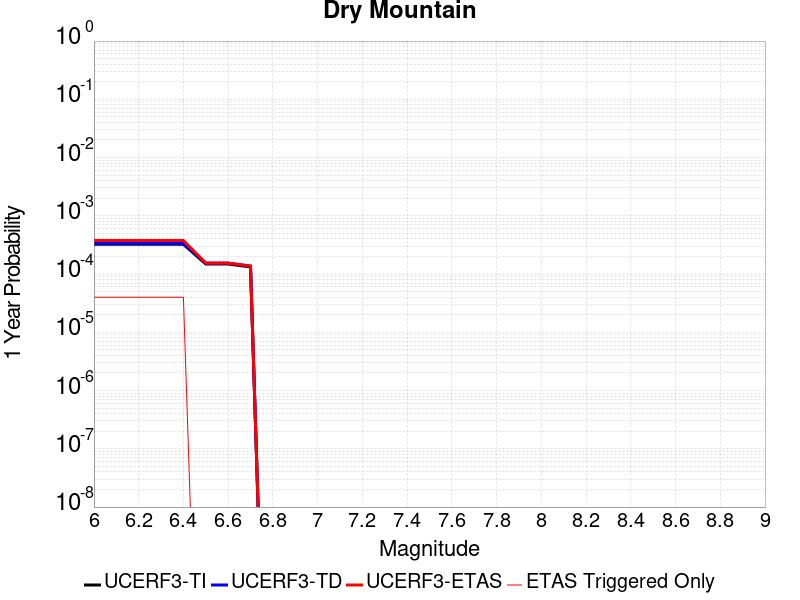 | 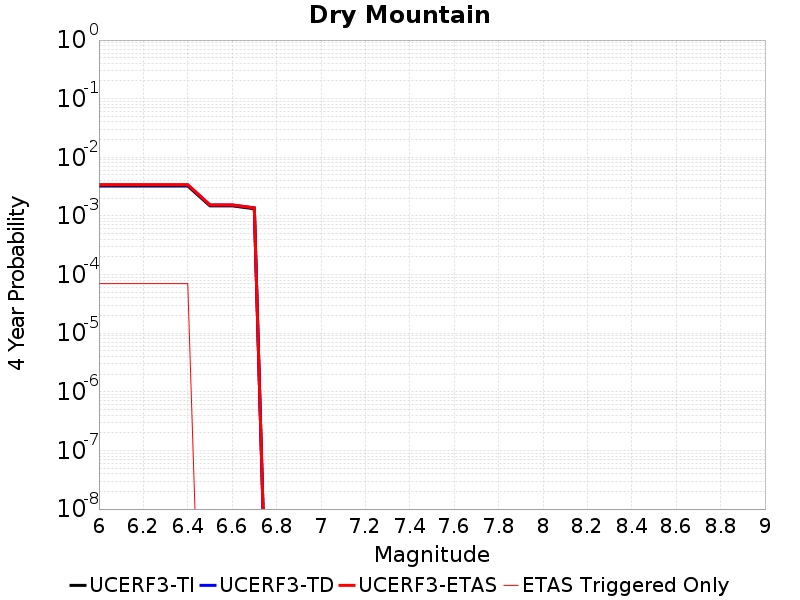 |

| Magnitude | 1 yr TI Prob | TD Prob | ETAS Prob | ETAS/TD Gain | ETAS Triggered Only | 10 yr TI Prob | TD Prob | ETAS Prob | ETAS/TD Gain | ETAS Triggered Only |
|-----|-----|-----|-----|-----|-----|-----|-----|-----|-----|-----|
| 6.0 | 3.2464517E-4 | 3.359595E-4 | 3.7594608E-4 | 1.119022 | 4.0E-5 | 0.0032417132 | 0.0033560784 | 0.0034258433 | 1.0207877 | 7.0E-5 |
| 6.1 | 3.2464517E-4 | 3.359595E-4 | 3.7594608E-4 | 1.119022 | 4.0E-5 | 0.0032417132 | 0.0033560784 | 0.0034258433 | 1.0207877 | 7.0E-5 |
| 6.2 | 3.2464517E-4 | 3.359595E-4 | 3.7594608E-4 | 1.119022 | 4.0E-5 | 0.0032417132 | 0.0033560784 | 0.0034258433 | 1.0207877 | 7.0E-5 |
| 6.3 | 3.2464517E-4 | 3.359595E-4 | 3.7594608E-4 | 1.119022 | 4.0E-5 | 0.0032417132 | 0.0033560784 | 0.0034258433 | 1.0207877 | 7.0E-5 |
| 6.4 | 3.2464517E-4 | 3.359595E-4 | 3.7594608E-4 | 1.119022 | 4.0E-5 | 0.0032417132 | 0.0033560784 | 0.0034258433 | 1.0207877 | 7.0E-5 |
| 6.5 | 1.4884741E-4 | 1.5403765E-4 | 1.5403765E-4 | 1.0 | 0.0 | 0.0014874774 | 0.0015401623 | 0.0015401623 | 1.0 | 0.0 |
| 6.6 | 1.4884741E-4 | 1.5403765E-4 | 1.5403765E-4 | 1.0 | 0.0 | 0.0014874774 | 0.0015401623 | 0.0015401623 | 1.0 | 0.0 |
| 6.7 | 1.3257713E-4 | 1.371962E-4 | 1.371962E-4 | 1.0 | 0.0 | 0.0013249806 | 0.001371962 | 0.001371962 | 1.0 | 0.0 |

## Kern Canyon (North Kern) 2011
*[(top)](#table-of-contents)*

| 1 Year | 10 Year |
|-----|-----|
| 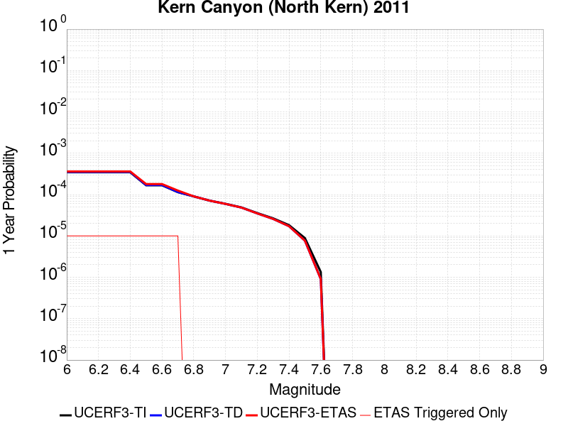 | 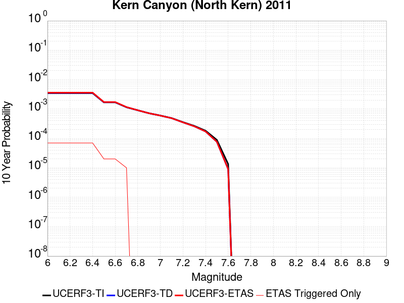 |

| Magnitude | 1 yr TI Prob | TD Prob | ETAS Prob | ETAS/TD Gain | ETAS Triggered Only | 10 yr TI Prob | TD Prob | ETAS Prob | ETAS/TD Gain | ETAS Triggered Only |
|-----|-----|-----|-----|-----|-----|-----|-----|-----|-----|-----|
| 6.0 | 3.4570007E-4 | 3.5253554E-4 | 3.62532E-4 | 1.028356 | 1.0E-5 | 0.0034516277 | 0.0035205514 | 0.0035903049 | 1.0198133 | 7.0E-5 |
| 6.1 | 3.4570007E-4 | 3.5253554E-4 | 3.62532E-4 | 1.028356 | 1.0E-5 | 0.0034516277 | 0.0035205514 | 0.0035903049 | 1.0198133 | 7.0E-5 |
| 6.2 | 3.4570007E-4 | 3.5253554E-4 | 3.62532E-4 | 1.028356 | 1.0E-5 | 0.0034516277 | 0.0035205514 | 0.0035903049 | 1.0198133 | 7.0E-5 |
| 6.3 | 3.4570007E-4 | 3.5253554E-4 | 3.62532E-4 | 1.028356 | 1.0E-5 | 0.0034516277 | 0.0035205514 | 0.0035903049 | 1.0198133 | 7.0E-5 |
| 6.4 | 3.4570007E-4 | 3.5253554E-4 | 3.62532E-4 | 1.028356 | 1.0E-5 | 0.0034516277 | 0.0035205514 | 0.0035903049 | 1.0198133 | 7.0E-5 |
| 6.5 | 1.6780409E-4 | 1.6993712E-4 | 1.7993542E-4 | 1.0588353 | 1.0E-5 | 0.0016767744 | 0.0016981515 | 0.0017181175 | 1.0117575 | 2.0E-5 |
| 6.6 | 1.6780409E-4 | 1.6993712E-4 | 1.7993542E-4 | 1.0588353 | 1.0E-5 | 0.0016767744 | 0.0016981515 | 0.0017181175 | 1.0117575 | 2.0E-5 |
| 6.7 | 1.1430779E-4 | 1.1515822E-4 | 1.2515706E-4 | 1.086827 | 1.0E-5 | 0.0011424901 | 0.0011510048 | 0.0011609934 | 1.0086781 | 1.0E-5 |
| 6.8 | 9.028525E-5 | 9.060695E-5 | 9.060695E-5 | 1.0 | 0.0 | 9.024858E-4 | 9.057098E-4 | 9.057098E-4 | 1.0 | 0.0 |
| 6.9 | 7.148377E-5 | 7.142284E-5 | 7.142284E-5 | 1.0 | 0.0 | 7.146078E-4 | 7.140034E-4 | 7.140034E-4 | 1.0 | 0.0 |
| 7.0 | 5.983557E-5 | 5.955391E-5 | 5.955391E-5 | 1.0 | 0.0 | 5.981946E-4 | 5.9538265E-4 | 5.9538265E-4 | 1.0 | 0.0 |
| 7.1 | 4.9021666E-5 | 4.8538983E-5 | 4.8538983E-5 | 1.0 | 0.0 | 4.901085E-4 | 4.852856E-4 | 4.852856E-4 | 1.0 | 0.0 |
| 7.2 | 3.5783723E-5 | 3.5059766E-5 | 3.5059766E-5 | 1.0 | 0.0 | 3.5777962E-4 | 3.505432E-4 | 3.505432E-4 | 1.0 | 0.0 |
| 7.3 | 2.6663936E-5 | 2.5772246E-5 | 2.5772246E-5 | 1.0 | 0.0 | 2.6660739E-4 | 2.5769306E-4 | 2.5769306E-4 | 1.0 | 0.0 |
| 7.4 | 1.8262032E-5 | 1.7216653E-5 | 1.7216653E-5 | 1.0 | 0.0 | 1.826053E-4 | 1.7215344E-4 | 1.7215344E-4 | 1.0 | 0.0 |
| 7.5 | 8.881548E-6 | 7.696336E-6 | 7.696336E-6 | 1.0 | 0.0 | 8.8811925E-5 | 7.696078E-5 | 7.696078E-5 | 1.0 | 0.0 |
| 7.6 | 1.3421597E-6 | 9.054316E-7 | 9.054316E-7 | 1.0 | 0.0 | 1.3421517E-5 | 9.054284E-6 | 9.054284E-6 | 1.0 | 0.0 |

## Channel Islands Thrust
*[(top)](#table-of-contents)*

| 1 Year | 10 Year |
|-----|-----|
|  | 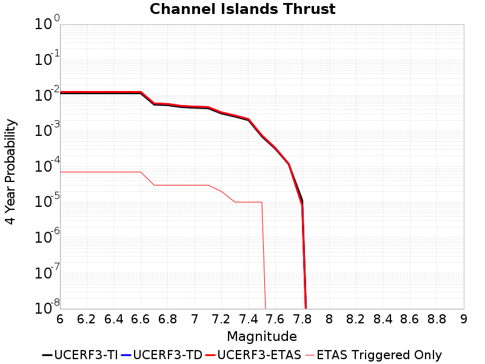 |

| Magnitude | 1 yr TI Prob | TD Prob | ETAS Prob | ETAS/TD Gain | ETAS Triggered Only | 10 yr TI Prob | TD Prob | ETAS Prob | ETAS/TD Gain | ETAS Triggered Only |
|-----|-----|-----|-----|-----|-----|-----|-----|-----|-----|-----|
| 6.0 | 0.0011554264 | 0.0012564278 | 0.0012863901 | 1.0238472 | 3.0E-5 | 0.011494373 | 0.012503834 | 0.012572959 | 1.0055283 | 7.0E-5 |
| 6.1 | 0.0011554264 | 0.0012564278 | 0.0012863901 | 1.0238472 | 3.0E-5 | 0.011494373 | 0.012503834 | 0.012572959 | 1.0055283 | 7.0E-5 |
| 6.2 | 0.0011554264 | 0.0012564278 | 0.0012863901 | 1.0238472 | 3.0E-5 | 0.011494373 | 0.012503834 | 0.012572959 | 1.0055283 | 7.0E-5 |
| 6.3 | 0.0011554264 | 0.0012564278 | 0.0012863901 | 1.0238472 | 3.0E-5 | 0.011494373 | 0.012503834 | 0.012572959 | 1.0055283 | 7.0E-5 |
| 6.4 | 0.0011554264 | 0.0012564278 | 0.0012863901 | 1.0238472 | 3.0E-5 | 0.011494373 | 0.012503834 | 0.012572959 | 1.0055283 | 7.0E-5 |
| 6.5 | 0.0011554264 | 0.0012564278 | 0.0012863901 | 1.0238472 | 3.0E-5 | 0.011494373 | 0.012503834 | 0.012572959 | 1.0055283 | 7.0E-5 |
| 6.6 | 0.0011554264 | 0.0012564278 | 0.0012863901 | 1.0238472 | 3.0E-5 | 0.011494373 | 0.012503834 | 0.012572959 | 1.0055283 | 7.0E-5 |
| 6.7 | 5.5301044E-4 | 5.9360126E-4 | 6.035953E-4 | 1.0168363 | 1.0E-5 | 0.005516363 | 0.005920659 | 0.005950481 | 1.005037 | 3.0E-5 |
| 6.8 | 5.345204E-4 | 5.736347E-4 | 5.8362895E-4 | 1.0174227 | 1.0E-5 | 0.0053323656 | 0.00572203 | 0.0057518585 | 1.0052129 | 3.0E-5 |
| 6.9 | 4.7208337E-4 | 5.0599285E-4 | 5.159878E-4 | 1.0197531 | 1.0E-5 | 0.0047108172 | 0.005048825 | 0.0050786734 | 1.005912 | 3.0E-5 |
| 7.0 | 4.5146482E-4 | 4.838255E-4 | 4.9382064E-4 | 1.0206586 | 1.0E-5 | 0.004505487 | 0.0048281336 | 0.0048579886 | 1.0061836 | 3.0E-5 |
| 7.1 | 4.3773788E-4 | 4.6913477E-4 | 4.791301E-4 | 1.0213058 | 1.0E-5 | 0.004368766 | 0.0046818545 | 0.004711714 | 1.0063777 | 3.0E-5 |
| 7.2 | 3.1120746E-4 | 3.3241263E-4 | 3.424093E-4 | 1.030073 | 1.0E-5 | 0.00310772 | 0.0033192122 | 0.0033391458 | 1.0060055 | 2.0E-5 |
| 7.3 | 2.5447016E-4 | 2.7160652E-4 | 2.7160652E-4 | 1.0 | 0.0 | 0.0025417898 | 0.0027127918 | 0.0027227646 | 1.0036763 | 1.0E-5 |
| 7.4 | 2.0258849E-4 | 2.1609421E-4 | 2.1609421E-4 | 1.0 | 0.0 | 0.002024039 | 0.0021588826 | 0.002168861 | 1.004622 | 1.0E-5 |
| 7.5 | 7.038446E-5 | 7.449744E-5 | 7.449744E-5 | 1.0 | 0.0 | 7.036218E-4 | 7.447286E-4 | 7.547212E-4 | 1.0134177 | 1.0E-5 |
| 7.6 | 3.161029E-5 | 3.315261E-5 | 3.315261E-5 | 1.0 | 0.0 | 3.1605794E-4 | 3.3147825E-4 | 3.3147825E-4 | 1.0 | 0.0 |
| 7.7 | 1.1568181E-5 | 1.1796433E-5 | 1.1796433E-5 | 1.0 | 0.0 | 1.1567579E-4 | 1.1795918E-4 | 1.1795918E-4 | 1.0 | 0.0 |
| 7.8 | 1.1277401E-6 | 8.070296E-7 | 8.070296E-7 | 1.0 | 0.0 | 1.1277344E-5 | 8.070275E-6 | 8.070275E-6 | 1.0 | 0.0 |

## San Luis Range 2011 CFM
*[(top)](#table-of-contents)*

| 1 Year | 10 Year |
|-----|-----|
| 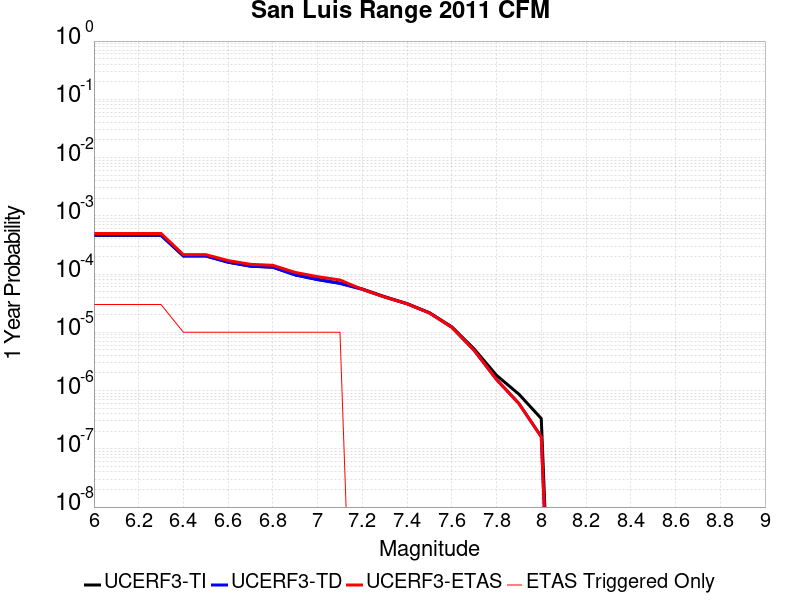 | 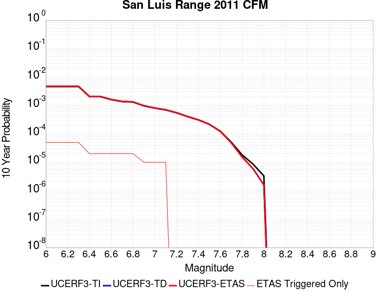 |

| Magnitude | 1 yr TI Prob | TD Prob | ETAS Prob | ETAS/TD Gain | ETAS Triggered Only | 10 yr TI Prob | TD Prob | ETAS Prob | ETAS/TD Gain | ETAS Triggered Only |
|-----|-----|-----|-----|-----|-----|-----|-----|-----|-----|-----|
| 6.0 | 4.609895E-4 | 4.677058E-4 | 4.976918E-4 | 1.0641129 | 3.0E-5 | 0.0046003438 | 0.0046679974 | 0.004717764 | 1.0106612 | 5.0E-5 |
| 6.1 | 4.609895E-4 | 4.677058E-4 | 4.976918E-4 | 1.0641129 | 3.0E-5 | 0.0046003438 | 0.0046679974 | 0.004717764 | 1.0106612 | 5.0E-5 |
| 6.2 | 4.609895E-4 | 4.677058E-4 | 4.976918E-4 | 1.0641129 | 3.0E-5 | 0.0046003438 | 0.0046679974 | 0.004717764 | 1.0106612 | 5.0E-5 |
| 6.3 | 4.609895E-4 | 4.677058E-4 | 4.976918E-4 | 1.0641129 | 3.0E-5 | 0.0046003438 | 0.0046679974 | 0.004717764 | 1.0106612 | 5.0E-5 |
| 6.4 | 2.039675E-4 | 2.0562594E-4 | 2.1562389E-4 | 1.048622 | 1.0E-5 | 0.0020378039 | 0.0020543856 | 0.0020743445 | 1.0097153 | 2.0E-5 |
| 6.5 | 2.039675E-4 | 2.0562594E-4 | 2.1562389E-4 | 1.048622 | 1.0E-5 | 0.0020378039 | 0.0020543856 | 0.0020743445 | 1.0097153 | 2.0E-5 |
| 6.6 | 1.595899E-4 | 1.6045691E-4 | 1.704553E-4 | 1.062312 | 1.0E-5 | 0.0015947534 | 0.0016034225 | 0.0016233905 | 1.0124533 | 2.0E-5 |
| 6.7 | 1.3649299E-4 | 1.369663E-4 | 1.4696493E-4 | 1.0730007 | 1.0E-5 | 0.0013640919 | 0.001368825 | 0.0013887975 | 1.0145911 | 2.0E-5 |
| 6.8 | 1.310136E-4 | 1.3138459E-4 | 1.4138327E-4 | 1.0761024 | 1.0E-5 | 0.0013093639 | 0.001313075 | 0.0013330487 | 1.0152115 | 2.0E-5 |
| 6.9 | 9.686181E-5 | 9.665559E-5 | 1.06654625E-4 | 1.1034502 | 1.0E-5 | 9.68196E-4 | 9.6613757E-4 | 9.7612786E-4 | 1.0103405 | 1.0E-5 |
| 7.0 | 8.06715E-5 | 8.019293E-5 | 9.019212E-5 | 1.1246892 | 1.0E-5 | 8.0642226E-4 | 8.016406E-4 | 8.116326E-4 | 1.0124644 | 1.0E-5 |
| 7.1 | 6.975101E-5 | 6.905773E-5 | 7.9057034E-5 | 1.1447964 | 1.0E-5 | 6.972912E-4 | 6.903632E-4 | 7.0035626E-4 | 1.0144751 | 1.0E-5 |
| 7.2 | 5.5429686E-5 | 5.4547956E-5 | 5.4547956E-5 | 1.0 | 0.0 | 5.5415864E-4 | 5.4534595E-4 | 5.4534595E-4 | 1.0 | 0.0 |
| 7.3 | 4.086376E-5 | 4.0319635E-5 | 4.0319635E-5 | 1.0 | 0.0 | 4.0856248E-4 | 4.0312335E-4 | 4.0312335E-4 | 1.0 | 0.0 |
| 7.4 | 3.107648E-5 | 3.08404E-5 | 3.08404E-5 | 1.0 | 0.0 | 3.1072134E-4 | 3.083613E-4 | 3.083613E-4 | 1.0 | 0.0 |
| 7.5 | 2.1714664E-5 | 2.1495429E-5 | 2.1495429E-5 | 1.0 | 0.0 | 2.1712543E-4 | 2.1493355E-4 | 2.1493355E-4 | 1.0 | 0.0 |
| 7.6 | 1.242678E-5 | 1.2197483E-5 | 1.2197483E-5 | 1.0 | 0.0 | 1.2426086E-4 | 1.2196815E-4 | 1.2196815E-4 | 1.0 | 0.0 |
| 7.7 | 5.1754632E-6 | 4.89787E-6 | 4.89787E-6 | 1.0 | 0.0 | 5.1753424E-5 | 4.8977625E-5 | 4.8977625E-5 | 1.0 | 0.0 |
| 7.8 | 1.8253382E-6 | 1.5490049E-6 | 1.5490049E-6 | 1.0 | 0.0 | 1.8253233E-5 | 1.5489943E-5 | 1.5489943E-5 | 1.0 | 0.0 |
| 7.9 | 8.6746354E-7 | 5.988592E-7 | 5.988592E-7 | 1.0 | 0.0 | 8.674601E-6 | 5.9885756E-6 | 5.9885756E-6 | 1.0 | 0.0 |
| 8.0 | 3.3056327E-7 | 1.6117379E-7 | 1.6117379E-7 | 1.0 | 0.0 | 3.3056278E-6 | 1.6117367E-6 | 1.6117367E-6 | 1.0 | 0.0 |

## Pitas Point (Lower West)
*[(top)](#table-of-contents)*

| 1 Year | 10 Year |
|-----|-----|
| 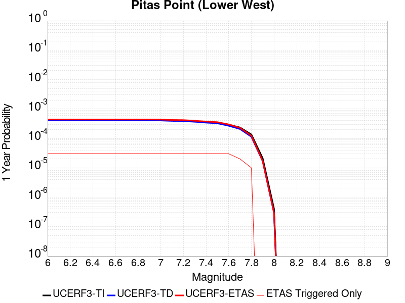 | 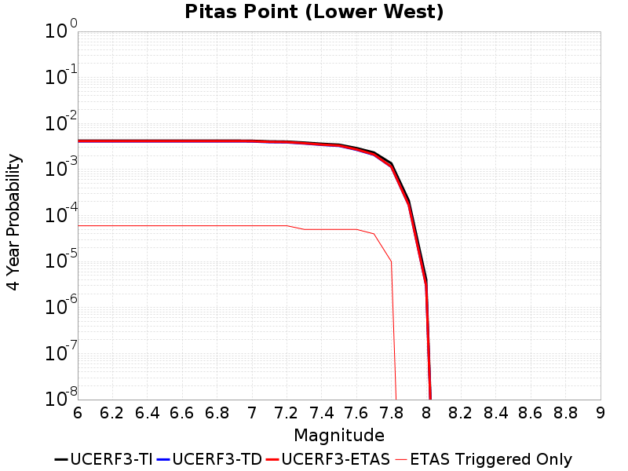 |

| Magnitude | 1 yr TI Prob | TD Prob | ETAS Prob | ETAS/TD Gain | ETAS Triggered Only | 10 yr TI Prob | TD Prob | ETAS Prob | ETAS/TD Gain | ETAS Triggered Only |
|-----|-----|-----|-----|-----|-----|-----|-----|-----|-----|-----|
| 6.0 | 4.252448E-4 | 4.0982116E-4 | 4.3980888E-4 | 1.0731727 | 3.0E-5 | 0.0042443196 | 0.0040907348 | 0.0041504893 | 1.0146073 | 6.0E-5 |
| 6.1 | 4.252448E-4 | 4.0982116E-4 | 4.3980888E-4 | 1.0731727 | 3.0E-5 | 0.0042443196 | 0.0040907348 | 0.0041504893 | 1.0146073 | 6.0E-5 |
| 6.2 | 4.252448E-4 | 4.0982116E-4 | 4.3980888E-4 | 1.0731727 | 3.0E-5 | 0.0042443196 | 0.0040907348 | 0.0041504893 | 1.0146073 | 6.0E-5 |
| 6.3 | 4.252448E-4 | 4.0982116E-4 | 4.3980888E-4 | 1.0731727 | 3.0E-5 | 0.0042443196 | 0.0040907348 | 0.0041504893 | 1.0146073 | 6.0E-5 |
| 6.4 | 4.252448E-4 | 4.0982116E-4 | 4.3980888E-4 | 1.0731727 | 3.0E-5 | 0.0042443196 | 0.0040907348 | 0.0041504893 | 1.0146073 | 6.0E-5 |
| 6.5 | 4.252448E-4 | 4.0982116E-4 | 4.3980888E-4 | 1.0731727 | 3.0E-5 | 0.0042443196 | 0.0040907348 | 0.0041504893 | 1.0146073 | 6.0E-5 |
| 6.6 | 4.252448E-4 | 4.0982116E-4 | 4.3980888E-4 | 1.0731727 | 3.0E-5 | 0.0042443196 | 0.0040907348 | 0.0041504893 | 1.0146073 | 6.0E-5 |
| 6.7 | 4.252448E-4 | 4.0982116E-4 | 4.3980888E-4 | 1.0731727 | 3.0E-5 | 0.0042443196 | 0.0040907348 | 0.0041504893 | 1.0146073 | 6.0E-5 |
| 6.8 | 4.252448E-4 | 4.0982116E-4 | 4.3980888E-4 | 1.0731727 | 3.0E-5 | 0.0042443196 | 0.0040907348 | 0.0041504893 | 1.0146073 | 6.0E-5 |
| 6.9 | 4.252448E-4 | 4.0982116E-4 | 4.3980888E-4 | 1.0731727 | 3.0E-5 | 0.0042443196 | 0.0040907348 | 0.0041504893 | 1.0146073 | 6.0E-5 |
| 7.0 | 4.2274324E-4 | 4.0718354E-4 | 4.3717134E-4 | 1.0736469 | 3.0E-5 | 0.0042193993 | 0.004064455 | 0.004124211 | 1.0147021 | 6.0E-5 |
| 7.1 | 4.096915E-4 | 3.9339764E-4 | 4.2338585E-4 | 1.0762287 | 3.0E-5 | 0.00408937 | 0.003927089 | 0.003986853 | 1.0152185 | 6.0E-5 |
| 7.2 | 4.0540437E-4 | 3.888224E-4 | 4.1881073E-4 | 1.077126 | 3.0E-5 | 0.0040466557 | 0.0038814966 | 0.0039412635 | 1.0153979 | 6.0E-5 |
| 7.3 | 3.8576324E-4 | 3.6775542E-4 | 3.977444E-4 | 1.081546 | 3.0E-5 | 0.0038509427 | 0.0036715362 | 0.0037213527 | 1.0135683 | 5.0E-5 |
| 7.4 | 3.6334046E-4 | 3.438058E-4 | 3.7379548E-4 | 1.0872285 | 3.0E-5 | 0.0036274698 | 0.0034327921 | 0.0034826207 | 1.0145154 | 5.0E-5 |
| 7.5 | 3.4705905E-4 | 3.2654236E-4 | 3.5653255E-4 | 1.0918417 | 3.0E-5 | 0.0034651754 | 0.0032606767 | 0.0033105137 | 1.0152842 | 5.0E-5 |
| 7.6 | 2.928539E-4 | 2.6875708E-4 | 2.9874902E-4 | 1.1115949 | 3.0E-5 | 0.0029246826 | 0.002684352 | 0.0027342178 | 1.0185765 | 5.0E-5 |
| 7.7 | 2.3450027E-4 | 2.0853219E-4 | 2.2852802E-4 | 1.0958885 | 2.0E-5 | 0.0023425296 | 0.002083389 | 0.0021233058 | 1.0191594 | 4.0E-5 |
| 7.8 | 1.3605114E-4 | 1.1393286E-4 | 1.2393172E-4 | 1.087761 | 1.0E-5 | 0.0013596788 | 0.0011387492 | 0.0011487379 | 1.0087715 | 1.0E-5 |
| 7.9 | 2.1111147E-5 | 1.6918126E-5 | 1.6918126E-5 | 1.0 | 0.0 | 2.1109142E-4 | 1.6916869E-4 | 1.6916869E-4 | 1.0 | 0.0 |
| 8.0 | 4.0654416E-7 | 2.96557E-7 | 2.96557E-7 | 1.0 | 0.0 | 4.065434E-6 | 2.9655682E-6 | 2.9655682E-6 | 1.0 | 0.0 |

## Great Valley 09 (Laguna Seca)
*[(top)](#table-of-contents)*

| 1 Year | 10 Year |
|-----|-----|
| 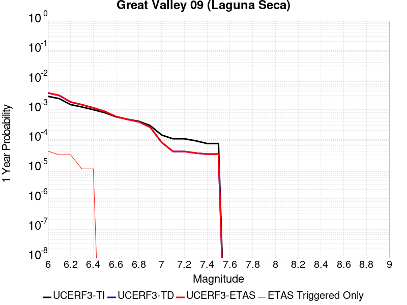 | 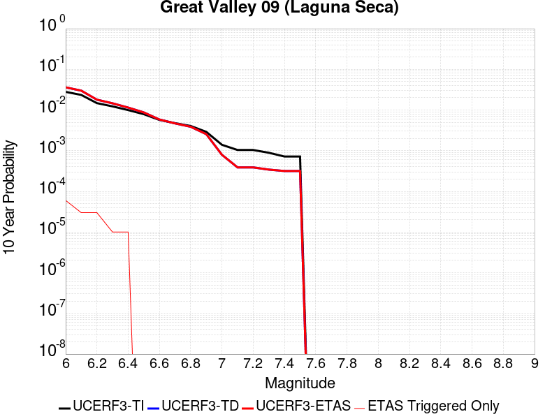 |

| Magnitude | 1 yr TI Prob | TD Prob | ETAS Prob | ETAS/TD Gain | ETAS Triggered Only | 10 yr TI Prob | TD Prob | ETAS Prob | ETAS/TD Gain | ETAS Triggered Only |
|-----|-----|-----|-----|-----|-----|-----|-----|-----|-----|-----|
| 6.0 | 0.0028321352 | 0.003672207 | 0.0037120602 | 1.0108526 | 4.0E-5 | 0.02796312 | 0.036115605 | 0.036173437 | 1.0016013 | 6.0E-5 |
| 6.1 | 0.0023754383 | 0.003033443 | 0.0030633518 | 1.0098598 | 3.0E-5 | 0.023502063 | 0.029919656 | 0.029948758 | 1.0009726 | 3.0E-5 |
| 6.2 | 0.0014879217 | 0.0018108189 | 0.0018407645 | 1.0165371 | 3.0E-5 | 0.014779986 | 0.017958175 | 0.017987637 | 1.0016406 | 3.0E-5 |
| 6.3 | 0.0012358186 | 0.0014710265 | 0.0014810117 | 1.006788 | 1.0E-5 | 0.012289686 | 0.014611388 | 0.014621241 | 1.0006744 | 1.0E-5 |
| 6.4 | 0.0010008777 | 0.0011536462 | 0.0011636346 | 1.0086582 | 1.0E-5 | 0.009963818 | 0.011476981 | 0.0114868665 | 1.0008613 | 1.0E-5 |
| 6.5 | 7.9297484E-4 | 8.7626796E-4 | 8.7626796E-4 | 1.0 | 0.0 | 0.007901512 | 0.00872954 | 0.00872954 | 1.0 | 0.0 |
| 6.6 | 5.730166E-4 | 5.864577E-4 | 5.864577E-4 | 1.0 | 0.0 | 0.005715413 | 0.0058494974 | 0.0058494974 | 1.0 | 0.0 |
| 6.7 | 4.7651984E-4 | 4.7054005E-4 | 4.7054005E-4 | 1.0 | 0.0 | 0.004754993 | 0.0046956823 | 0.0046956823 | 1.0 | 0.0 |
| 6.8 | 4.0616E-4 | 3.8876059E-4 | 3.8876059E-4 | 1.0 | 0.0 | 0.0040541845 | 0.003881009 | 0.003881009 | 1.0 | 0.0 |
| 6.9 | 2.9106764E-4 | 2.5556626E-4 | 2.5556626E-4 | 1.0 | 0.0 | 0.002906867 | 0.002552861 | 0.002552861 | 1.0 | 0.0 |
| 7.0 | 1.3991605E-4 | 7.939272E-5 | 7.939272E-5 | 1.0 | 0.0 | 0.0013982799 | 7.936522E-4 | 7.936522E-4 | 1.0 | 0.0 |
| 7.1 | 1.0409627E-4 | 3.8892376E-5 | 3.8892376E-5 | 1.0 | 0.0 | 0.0010404752 | 3.8885986E-4 | 3.8885986E-4 | 1.0 | 0.0 |
| 7.2 | 1.0409627E-4 | 3.8892376E-5 | 3.8892376E-5 | 1.0 | 0.0 | 0.0010404752 | 3.8885986E-4 | 3.8885986E-4 | 1.0 | 0.0 |
| 7.3 | 8.915652E-5 | 3.4327186E-5 | 3.4327186E-5 | 1.0 | 0.0 | 8.9120766E-4 | 3.432229E-4 | 3.432229E-4 | 1.0 | 0.0 |
| 7.4 | 7.2029165E-5 | 3.169209E-5 | 3.169209E-5 | 1.0 | 0.0 | 7.200583E-4 | 3.168797E-4 | 3.168797E-4 | 1.0 | 0.0 |
| 7.5 | 7.2029165E-5 | 3.169209E-5 | 3.169209E-5 | 1.0 | 0.0 | 7.200583E-4 | 3.168797E-4 | 3.168797E-4 | 1.0 | 0.0 |

## San Diego Trough south
*[(top)](#table-of-contents)*

| 1 Year | 10 Year |
|-----|-----|
| 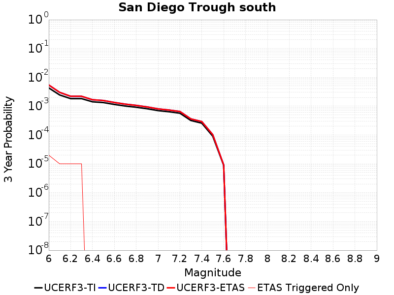 | 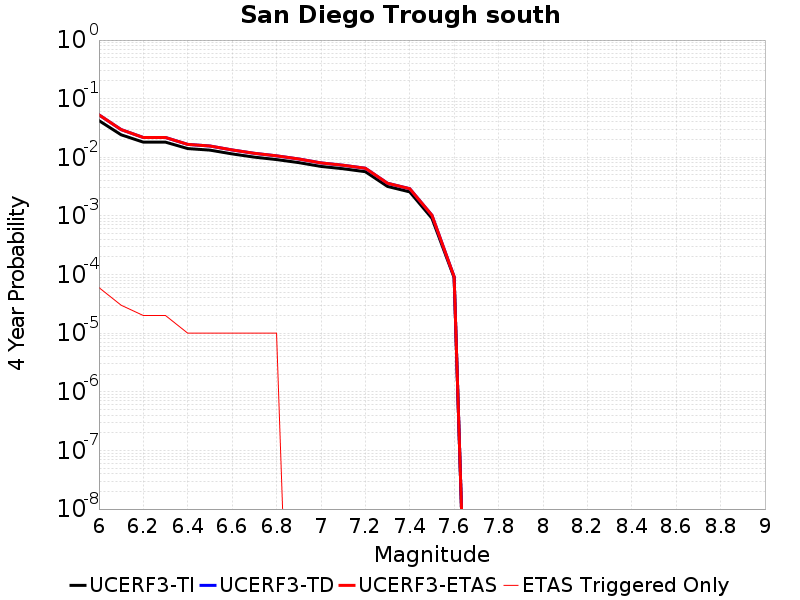 |

| Magnitude | 1 yr TI Prob | TD Prob | ETAS Prob | ETAS/TD Gain | ETAS Triggered Only | 10 yr TI Prob | TD Prob | ETAS Prob | ETAS/TD Gain | ETAS Triggered Only |
|-----|-----|-----|-----|-----|-----|-----|-----|-----|-----|-----|
| 6.0 | 0.004310982 | 0.005425634 | 0.005445525 | 1.0036662 | 2.0E-5 | 0.042283054 | 0.05299237 | 0.053049188 | 1.0010723 | 6.0E-5 |
| 6.1 | 0.00244744 | 0.0030079857 | 0.0030179555 | 1.0033145 | 1.0E-5 | 0.024206603 | 0.029679544 | 0.029708654 | 1.0009809 | 3.0E-5 |
| 6.2 | 0.0018287642 | 0.0021965688 | 0.0022065467 | 1.0045426 | 1.0E-5 | 0.018137876 | 0.021751171 | 0.021770736 | 1.0008994 | 2.0E-5 |
| 6.3 | 0.0018287642 | 0.0021965688 | 0.0022065467 | 1.0045426 | 1.0E-5 | 0.018137876 | 0.021751171 | 0.021770736 | 1.0008994 | 2.0E-5 |
| 6.4 | 0.0014181085 | 0.0016729078 | 0.0016729078 | 1.0 | 0.0 | 0.014090929 | 0.01660468 | 0.016614513 | 1.0005922 | 1.0E-5 |
| 6.5 | 0.0013340989 | 0.001569469 | 0.001569469 | 1.0 | 0.0 | 0.013261181 | 0.015585348 | 0.015595192 | 1.0006316 | 1.0E-5 |
| 6.6 | 0.0011490905 | 0.0013423451 | 0.0013423451 | 1.0 | 0.0 | 0.011431668 | 0.013343345 | 0.013353212 | 1.0007395 | 1.0E-5 |
| 6.7 | 0.0010114936 | 0.0011755266 | 0.0011755266 | 1.0 | 0.0 | 0.01006902 | 0.01169379 | 0.011703673 | 1.0008452 | 1.0E-5 |
| 6.8 | 9.1872766E-4 | 0.00106406 | 0.00106406 | 1.0 | 0.0 | 0.009149387 | 0.010590219 | 0.010600113 | 1.0009342 | 1.0E-5 |
| 6.9 | 8.147778E-4 | 9.401488E-4 | 9.401488E-4 | 1.0 | 0.0 | 0.008117969 | 0.009362159 | 0.009362159 | 1.0 | 0.0 |
| 7.0 | 7.0126704E-4 | 8.0574513E-4 | 8.0574513E-4 | 1.0 | 0.0 | 0.006990582 | 0.00802857 | 0.00802857 | 1.0 | 0.0 |
| 7.1 | 6.399447E-4 | 7.340504E-4 | 7.340504E-4 | 1.0 | 0.0 | 0.0063810493 | 0.0073165623 | 0.0073165623 | 1.0 | 0.0 |
| 7.2 | 5.697693E-4 | 6.527347E-4 | 6.527347E-4 | 1.0 | 0.0 | 0.0056831064 | 0.0065084556 | 0.0065084556 | 1.0 | 0.0 |
| 7.3 | 3.1879646E-4 | 3.6147833E-4 | 3.6147833E-4 | 1.0 | 0.0 | 0.0031833951 | 0.003608949 | 0.003608949 | 1.0 | 0.0 |
| 7.4 | 2.5737417E-4 | 2.9161407E-4 | 2.9161407E-4 | 1.0 | 0.0 | 0.002570763 | 0.0029123551 | 0.0029123551 | 1.0 | 0.0 |
| 7.5 | 9.125422E-5 | 1.027702E-4 | 1.027702E-4 | 1.0 | 0.0 | 9.1216754E-4 | 0.0010272488 | 0.0010272488 | 1.0 | 0.0 |
| 7.6 | 8.864449E-6 | 9.148864E-6 | 9.148864E-6 | 1.0 | 0.0 | 8.8640954E-5 | 9.148506E-5 | 9.148506E-5 | 1.0 | 0.0 |

## Whittier alt 1
*[(top)](#table-of-contents)*

| 1 Year | 10 Year |
|-----|-----|
| 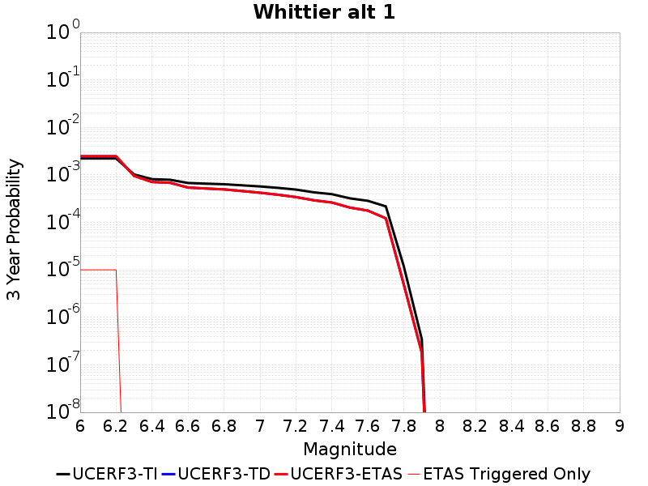 | 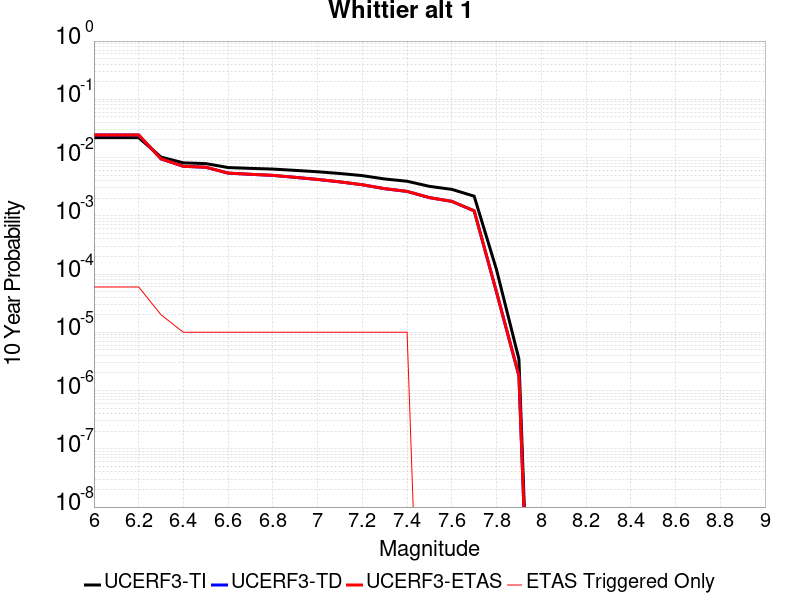 |

| Magnitude | 1 yr TI Prob | TD Prob | ETAS Prob | ETAS/TD Gain | ETAS Triggered Only | 10 yr TI Prob | TD Prob | ETAS Prob | ETAS/TD Gain | ETAS Triggered Only |
|-----|-----|-----|-----|-----|-----|-----|-----|-----|-----|-----|
| 6.0 | 0.002218027 | 0.0024629212 | 0.0024728966 | 1.0040503 | 1.0E-5 | 0.02196019 | 0.024390291 | 0.024448829 | 1.0024 | 6.0E-5 |
| 6.1 | 0.002218027 | 0.0024629212 | 0.0024728966 | 1.0040503 | 1.0E-5 | 0.02196019 | 0.024390291 | 0.024448829 | 1.0024 | 6.0E-5 |
| 6.2 | 0.002218027 | 0.0024629212 | 0.0024728966 | 1.0040503 | 1.0E-5 | 0.02196019 | 0.024390291 | 0.024448829 | 1.0024 | 6.0E-5 |
| 6.3 | 0.0010231105 | 9.52807E-4 | 9.52807E-4 | 1.0 | 0.0 | 0.01018413 | 0.009490505 | 0.009510315 | 1.0020874 | 2.0E-5 |
| 6.4 | 8.142519E-4 | 7.096134E-4 | 7.096134E-4 | 1.0 | 0.0 | 0.008112748 | 0.00707544 | 0.0070853694 | 1.0014033 | 1.0E-5 |
| 6.5 | 7.9020765E-4 | 6.833673E-4 | 6.833673E-4 | 1.0 | 0.0 | 0.007874036 | 0.00681461 | 0.006824542 | 1.0014575 | 1.0E-5 |
| 6.6 | 6.7579525E-4 | 5.4151175E-4 | 5.4151175E-4 | 1.0 | 0.0 | 0.006737438 | 0.0054033566 | 0.0054133027 | 1.0018407 | 1.0E-5 |
| 6.7 | 6.542181E-4 | 5.164082E-4 | 5.164082E-4 | 1.0 | 0.0 | 0.006522954 | 0.0051535 | 0.0051634484 | 1.0019305 | 1.0E-5 |
| 6.8 | 6.36165E-4 | 4.953408E-4 | 4.953408E-4 | 1.0 | 0.0 | 0.0063434686 | 0.004943708 | 0.004953658 | 1.0020127 | 1.0E-5 |
| 6.9 | 6.040644E-4 | 4.5766003E-4 | 4.5766003E-4 | 1.0 | 0.0 | 0.00602425 | 0.004568435 | 0.0045783888 | 1.0021789 | 1.0E-5 |
| 7.0 | 5.7196687E-4 | 4.2172743E-4 | 4.2172743E-4 | 1.0 | 0.0 | 0.0057049696 | 0.0042104796 | 0.0042204373 | 1.002365 | 1.0E-5 |
| 7.1 | 5.336784E-4 | 3.822265E-4 | 3.822265E-4 | 1.0 | 0.0 | 0.005323986 | 0.0038168544 | 0.003826816 | 1.00261 | 1.0E-5 |
| 7.2 | 4.908117E-4 | 3.413651E-4 | 3.413651E-4 | 1.0 | 0.0 | 0.0048972913 | 0.0034095002 | 0.003419466 | 1.002923 | 1.0E-5 |
| 7.3 | 4.2972428E-4 | 2.9204332E-4 | 2.9204332E-4 | 1.0 | 0.0 | 0.0042889426 | 0.002916916 | 0.0029268868 | 1.0034183 | 1.0E-5 |
| 7.4 | 3.9291743E-4 | 2.6231294E-4 | 2.6231294E-4 | 1.0 | 0.0 | 0.0039222343 | 0.002620145 | 0.002630119 | 1.0038066 | 1.0E-5 |
| 7.5 | 3.208294E-4 | 2.0524346E-4 | 2.0524346E-4 | 1.0 | 0.0 | 0.003203666 | 0.0020506282 | 0.0020506282 | 1.0 | 0.0 |
| 7.6 | 2.8473578E-4 | 1.7715234E-4 | 1.7715234E-4 | 1.0 | 0.0 | 0.0028437122 | 0.001770192 | 0.001770192 | 1.0 | 0.0 |
| 7.7 | 2.1743766E-4 | 1.2173687E-4 | 1.2173687E-4 | 1.0 | 0.0 | 0.0021722503 | 0.0012167749 | 0.0012167749 | 1.0 | 0.0 |
| 7.8 | 1.1840509E-5 | 4.897219E-6 | 4.897219E-6 | 1.0 | 0.0 | 1.1839878E-4 | 4.8971433E-5 | 4.8971433E-5 | 1.0 | 0.0 |
| 7.9 | 3.4838732E-7 | 1.794872E-7 | 1.794872E-7 | 1.0 | 0.0 | 3.4838679E-6 | 1.7948707E-6 | 1.7948707E-6 | 1.0 | 0.0 |

## Cleghorn Pass
*[(top)](#table-of-contents)*

| 1 Year | 10 Year |
|-----|-----|
| 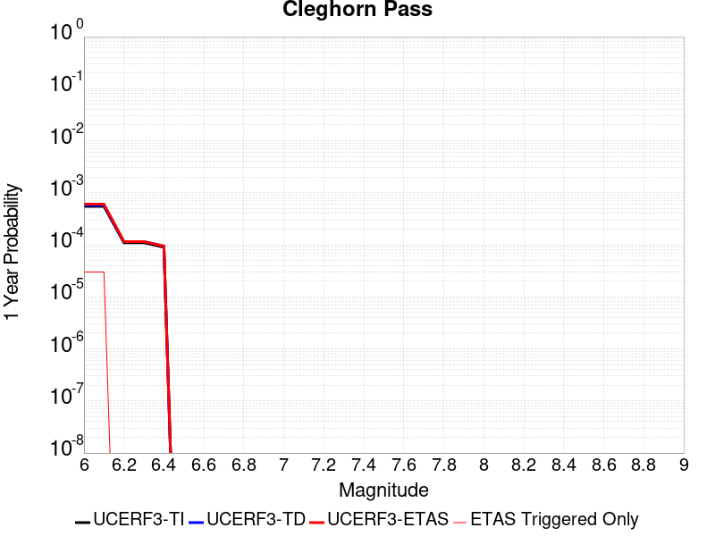 | 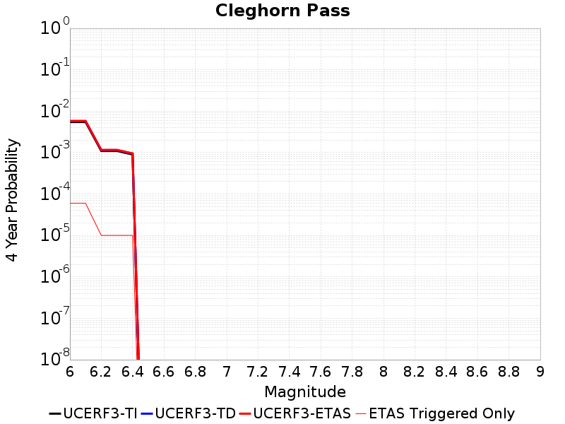 |

| Magnitude | 1 yr TI Prob | TD Prob | ETAS Prob | ETAS/TD Gain | ETAS Triggered Only | 10 yr TI Prob | TD Prob | ETAS Prob | ETAS/TD Gain | ETAS Triggered Only |
|-----|-----|-----|-----|-----|-----|-----|-----|-----|-----|-----|
| 6.0 | 5.4891926E-4 | 5.759788E-4 | 6.0596154E-4 | 1.0520552 | 3.0E-5 | 0.0054756533 | 0.005750025 | 0.00580968 | 1.0103748 | 6.0E-5 |
| 6.1 | 5.4891926E-4 | 5.759788E-4 | 6.0596154E-4 | 1.0520552 | 3.0E-5 | 0.0054756533 | 0.005750025 | 0.00580968 | 1.0103748 | 6.0E-5 |
| 6.2 | 1.098083E-4 | 1.1521889E-4 | 1.1521889E-4 | 1.0 | 0.0 | 0.0010975406 | 0.001152003 | 0.0011619914 | 1.0086706 | 1.0E-5 |
| 6.3 | 1.098083E-4 | 1.1521889E-4 | 1.1521889E-4 | 1.0 | 0.0 | 0.0010975406 | 0.001152003 | 0.0011619914 | 1.0086706 | 1.0E-5 |
| 6.4 | 9.005586E-5 | 9.4489034E-5 | 9.4489034E-5 | 1.0 | 0.0 | 9.001937E-4 | 9.448904E-4 | 9.548809E-4 | 1.0105733 | 1.0E-5 |

## Coronado Bank alt1
*[(top)](#table-of-contents)*

| 1 Year | 10 Year |
|-----|-----|
| 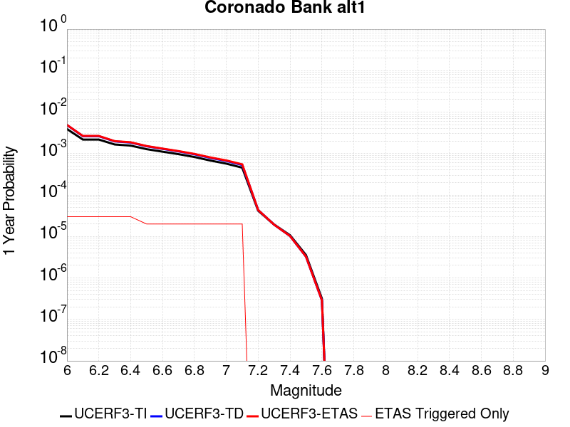 | 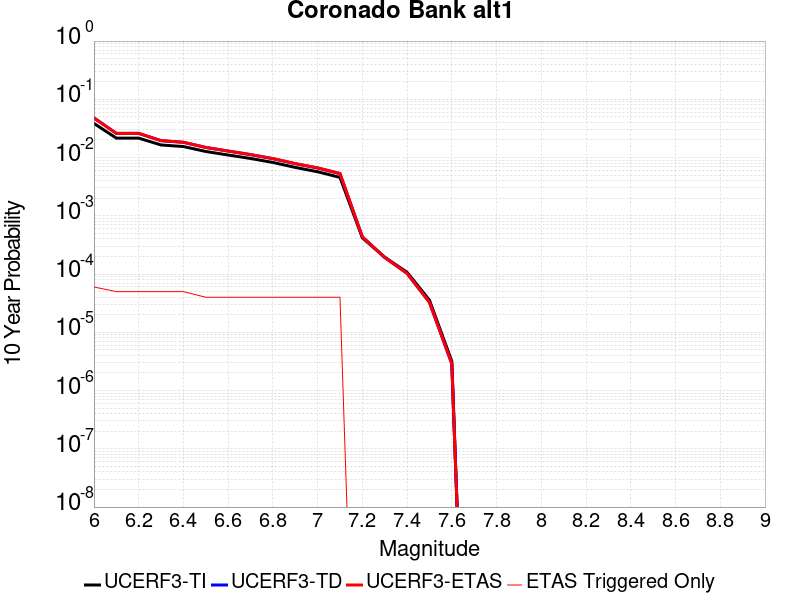 |

| Magnitude | 1 yr TI Prob | TD Prob | ETAS Prob | ETAS/TD Gain | ETAS Triggered Only | 10 yr TI Prob | TD Prob | ETAS Prob | ETAS/TD Gain | ETAS Triggered Only |
|-----|-----|-----|-----|-----|-----|-----|-----|-----|-----|-----|
| 6.0 | 0.0039233007 | 0.00489098 | 0.0049208337 | 1.0061038 | 3.0E-5 | 0.03854755 | 0.0479037 | 0.04796083 | 1.0011926 | 6.0E-5 |
| 6.1 | 0.0021791123 | 0.0026313544 | 0.0026612754 | 1.011371 | 3.0E-5 | 0.021578677 | 0.026011113 | 0.026059812 | 1.0018723 | 5.0E-5 |
| 6.2 | 0.0021791123 | 0.0026313544 | 0.0026612754 | 1.011371 | 3.0E-5 | 0.021578677 | 0.026011113 | 0.026059812 | 1.0018723 | 5.0E-5 |
| 6.3 | 0.0016575698 | 0.0019658527 | 0.0019957935 | 1.0152305 | 3.0E-5 | 0.016452603 | 0.01948851 | 0.019537535 | 1.0025157 | 5.0E-5 |
| 6.4 | 0.0015578003 | 0.0018421429 | 0.0018720876 | 1.0162554 | 3.0E-5 | 0.015469253 | 0.018272482 | 0.018321568 | 1.0026864 | 5.0E-5 |
| 6.5 | 0.0012782287 | 0.0014997954 | 0.0015197654 | 1.0133152 | 2.0E-5 | 0.012709012 | 0.014899715 | 0.014939119 | 1.0026447 | 4.0E-5 |
| 6.6 | 0.0011117056 | 0.0012987932 | 0.0013187673 | 1.015379 | 2.0E-5 | 0.011061605 | 0.012914432 | 0.012953916 | 1.0030574 | 4.0E-5 |
| 6.7 | 9.6931186E-4 | 0.0011282766 | 0.001148254 | 1.0177062 | 2.0E-5 | 0.0096509475 | 0.011227645 | 0.011267196 | 1.0035226 | 4.0E-5 |
| 6.8 | 8.273665E-4 | 9.606716E-4 | 9.806524E-4 | 1.0207988 | 2.0E-5 | 0.008242928 | 0.0095671695 | 0.009606787 | 1.004141 | 4.0E-5 |
| 6.9 | 6.792174E-4 | 7.873661E-4 | 8.073504E-4 | 1.0253811 | 2.0E-5 | 0.006771452 | 0.007847588 | 0.007887274 | 1.0050571 | 4.0E-5 |
| 7.0 | 5.7246623E-4 | 6.63521E-4 | 6.835077E-4 | 1.0301223 | 2.0E-5 | 0.0057099373 | 0.006617148 | 0.0066568833 | 1.0060049 | 4.0E-5 |
| 7.1 | 4.573063E-4 | 5.302158E-4 | 5.502052E-4 | 1.0377005 | 2.0E-5 | 0.0045636636 | 0.005291207 | 0.0053309957 | 1.0075197 | 4.0E-5 |
| 7.2 | 4.1877785E-5 | 4.347308E-5 | 4.347308E-5 | 1.0 | 0.0 | 4.1869894E-4 | 4.3464682E-4 | 4.3464682E-4 | 1.0 | 0.0 |
| 7.3 | 1.9458828E-5 | 1.9306397E-5 | 1.9306397E-5 | 1.0 | 0.0 | 1.9457124E-4 | 1.9304726E-4 | 1.9304726E-4 | 1.0 | 0.0 |
| 7.4 | 1.0726311E-5 | 1.0265755E-5 | 1.0265755E-5 | 1.0 | 0.0 | 1.0725793E-4 | 1.0265283E-4 | 1.0265283E-4 | 1.0 | 0.0 |
| 7.5 | 3.5718497E-6 | 3.2764806E-6 | 3.2764806E-6 | 1.0 | 0.0 | 3.5717923E-5 | 3.2764332E-5 | 3.2764332E-5 | 1.0 | 0.0 |
| 7.6 | 3.1815955E-7 | 2.8864406E-7 | 2.8864406E-7 | 1.0 | 0.0 | 3.181591E-6 | 2.8864379E-6 | 2.8864379E-6 | 1.0 | 0.0 |

## Ortigalita (North)
*[(top)](#table-of-contents)*

| 1 Year | 10 Year |
|-----|-----|
| 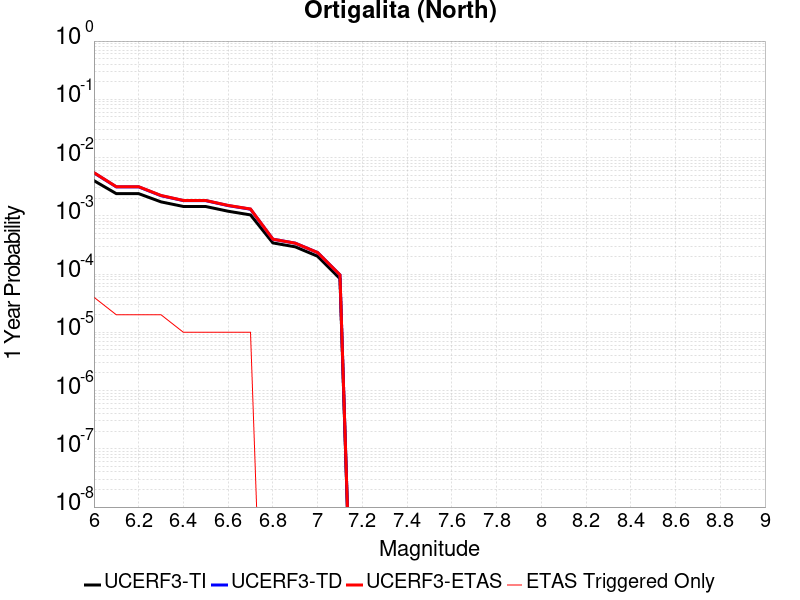 | 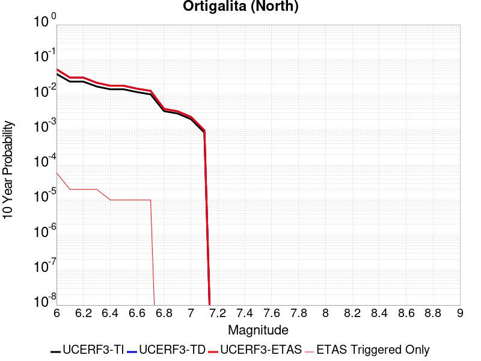 |

| Magnitude | 1 yr TI Prob | TD Prob | ETAS Prob | ETAS/TD Gain | ETAS Triggered Only | 10 yr TI Prob | TD Prob | ETAS Prob | ETAS/TD Gain | ETAS Triggered Only |
|-----|-----|-----|-----|-----|-----|-----|-----|-----|-----|-----|
| 6.0 | 0.004016016 | 0.005468139 | 0.0055079204 | 1.0072751 | 4.0E-5 | 0.039442103 | 0.053455 | 0.05351179 | 1.0010624 | 6.0E-5 |
| 6.1 | 0.0024014818 | 0.003138771 | 0.0031587083 | 1.006352 | 2.0E-5 | 0.023756953 | 0.03097518 | 0.03099456 | 1.0006257 | 2.0E-5 |
| 6.2 | 0.0024014818 | 0.003138771 | 0.0031587083 | 1.006352 | 2.0E-5 | 0.023756953 | 0.03097518 | 0.03099456 | 1.0006257 | 2.0E-5 |
| 6.3 | 0.0017347244 | 0.0022142048 | 0.0022341604 | 1.0090126 | 2.0E-5 | 0.017212452 | 0.021945719 | 0.02196528 | 1.0008913 | 2.0E-5 |
| 6.4 | 0.001446016 | 0.0018248155 | 0.0018347973 | 1.00547 | 1.0E-5 | 0.014366428 | 0.018121282 | 0.018131102 | 1.0005418 | 1.0E-5 |
| 6.5 | 0.0014437864 | 0.0018222015 | 0.0018321833 | 1.0054779 | 1.0E-5 | 0.014344421 | 0.01809557 | 0.018105388 | 1.0005426 | 1.0E-5 |
| 6.6 | 0.0011981975 | 0.0014976411 | 0.0015076261 | 1.0066671 | 1.0E-5 | 0.011917574 | 0.014898744 | 0.014908595 | 1.0006613 | 1.0E-5 |
| 6.7 | 0.0010363415 | 0.0012989189 | 0.0013089058 | 1.0076888 | 1.0E-5 | 0.010315218 | 0.012936961 | 0.012946831 | 1.0007629 | 1.0E-5 |
| 6.8 | 3.424451E-4 | 3.9677034E-4 | 3.9677034E-4 | 1.0 | 0.0 | 0.0034191788 | 0.0039609065 | 0.0039609065 | 1.0 | 0.0 |
| 6.9 | 2.933041E-4 | 3.3920357E-4 | 3.3920357E-4 | 1.0 | 0.0 | 0.0029291727 | 0.0033871154 | 0.0033871154 | 1.0 | 0.0 |
| 7.0 | 2.0220275E-4 | 2.3398397E-4 | 2.3398397E-4 | 1.0 | 0.0 | 0.0020201886 | 0.0023375843 | 0.0023375843 | 1.0 | 0.0 |
| 7.1 | 8.357586E-5 | 9.689451E-5 | 9.689451E-5 | 1.0 | 0.0 | 8.3544437E-4 | 9.6862734E-4 | 9.6862734E-4 | 1.0 | 0.0 |

## San Gabriel
*[(top)](#table-of-contents)*

| 1 Year | 10 Year |
|-----|-----|
| 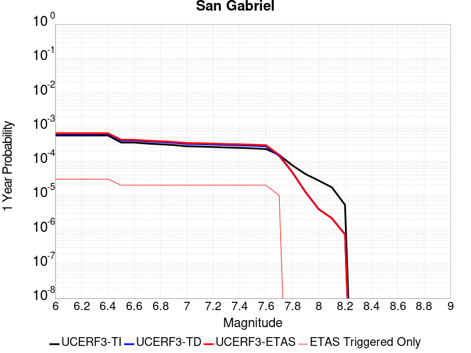 |  |

| Magnitude | 1 yr TI Prob | TD Prob | ETAS Prob | ETAS/TD Gain | ETAS Triggered Only | 10 yr TI Prob | TD Prob | ETAS Prob | ETAS/TD Gain | ETAS Triggered Only |
|-----|-----|-----|-----|-----|-----|-----|-----|-----|-----|-----|
| 6.0 | 5.653415E-4 | 6.252007E-4 | 6.5518194E-4 | 1.0479546 | 3.0E-5 | 0.0056390543 | 0.0062465123 | 0.0062961997 | 1.0079545 | 5.0E-5 |
| 6.1 | 5.653415E-4 | 6.252007E-4 | 6.5518194E-4 | 1.0479546 | 3.0E-5 | 0.0056390543 | 0.0062465123 | 0.0062961997 | 1.0079545 | 5.0E-5 |
| 6.2 | 5.653415E-4 | 6.252007E-4 | 6.5518194E-4 | 1.0479546 | 3.0E-5 | 0.0056390543 | 0.0062465123 | 0.0062961997 | 1.0079545 | 5.0E-5 |
| 6.3 | 5.653415E-4 | 6.252007E-4 | 6.5518194E-4 | 1.0479546 | 3.0E-5 | 0.0056390543 | 0.0062465123 | 0.0062961997 | 1.0079545 | 5.0E-5 |
| 6.4 | 5.653415E-4 | 6.252007E-4 | 6.5518194E-4 | 1.0479546 | 3.0E-5 | 0.0056390543 | 0.0062465123 | 0.0062961997 | 1.0079545 | 5.0E-5 |
| 6.5 | 3.511943E-4 | 4.0259105E-4 | 4.22583E-4 | 1.0496582 | 2.0E-5 | 0.003506398 | 0.0040297117 | 0.004059591 | 1.0074147 | 3.0E-5 |
| 6.6 | 3.511943E-4 | 4.0259105E-4 | 4.22583E-4 | 1.0496582 | 2.0E-5 | 0.003506398 | 0.0040297117 | 0.004059591 | 1.0074147 | 3.0E-5 |
| 6.7 | 3.2736175E-4 | 3.7802008E-4 | 3.9801252E-4 | 1.0528872 | 2.0E-5 | 0.0032687993 | 0.0037848584 | 0.003814745 | 1.0078963 | 3.0E-5 |
| 6.8 | 3.128256E-4 | 3.6303565E-4 | 3.8302838E-4 | 1.055071 | 2.0E-5 | 0.003123856 | 0.0036355113 | 0.0036654023 | 1.008222 | 3.0E-5 |
| 6.9 | 2.9666146E-4 | 3.4556424E-4 | 3.6555735E-4 | 1.0578563 | 2.0E-5 | 0.0029626573 | 0.003461353 | 0.0034912492 | 1.0086372 | 3.0E-5 |
| 7.0 | 2.7301308E-4 | 3.2072907E-4 | 3.4072265E-4 | 1.0623379 | 2.0E-5 | 0.002726779 | 0.0032137334 | 0.003243637 | 1.0093049 | 3.0E-5 |
| 7.1 | 2.6793676E-4 | 3.1499774E-4 | 3.3499143E-4 | 1.0634725 | 2.0E-5 | 0.0026761394 | 0.0031565845 | 0.00318649 | 1.0094739 | 3.0E-5 |
| 7.2 | 2.6028889E-4 | 3.0630635E-4 | 3.2630024E-4 | 1.0652741 | 2.0E-5 | 0.0025998424 | 0.0030699135 | 0.0030898522 | 1.0064949 | 2.0E-5 |
| 7.3 | 2.5157086E-4 | 2.9751964E-4 | 3.1751368E-4 | 1.0672024 | 2.0E-5 | 0.0025128627 | 0.0029822856 | 0.003002226 | 1.0066862 | 2.0E-5 |
| 7.4 | 2.4582737E-4 | 2.9170644E-4 | 3.117006E-4 | 1.0685421 | 2.0E-5 | 0.002455556 | 0.0029243068 | 0.0029442483 | 1.0068192 | 2.0E-5 |
| 7.5 | 2.37419E-4 | 2.836402E-4 | 3.0363453E-4 | 1.0704919 | 2.0E-5 | 0.002371655 | 0.0028438524 | 0.0028637955 | 1.0070127 | 2.0E-5 |
| 7.6 | 2.2661954E-4 | 2.7283587E-4 | 2.928304E-4 | 1.0732841 | 2.0E-5 | 0.0022638857 | 0.002736071 | 0.002756016 | 1.0072898 | 2.0E-5 |
| 7.7 | 1.5319703E-4 | 1.4317704E-4 | 1.5317561E-4 | 1.0698336 | 1.0E-5 | 0.0015309147 | 0.001438142 | 0.0014481277 | 1.0069435 | 1.0E-5 |
| 7.8 | 7.587337E-5 | 4.760777E-5 | 4.760777E-5 | 1.0 | 0.0 | 7.584747E-4 | 4.8087907E-4 | 4.8087907E-4 | 1.0 | 0.0 |
| 7.9 | 4.225833E-5 | 1.2615294E-5 | 1.2615294E-5 | 1.0 | 0.0 | 4.2250296E-4 | 1.2922892E-4 | 1.2922892E-4 | 1.0 | 0.0 |
| 8.0 | 2.7379416E-5 | 4.007377E-6 | 4.007377E-6 | 1.0 | 0.0 | 2.7376044E-4 | 4.2196887E-5 | 4.2196887E-5 | 1.0 | 0.0 |
| 8.1 | 1.7303513E-5 | 2.1654755E-6 | 2.1654755E-6 | 1.0 | 0.0 | 1.7302166E-4 | 2.2968354E-5 | 2.2968354E-5 | 1.0 | 0.0 |
| 8.2 | 5.340643E-6 | 7.328531E-7 | 7.328531E-7 | 1.0 | 0.0 | 5.3405143E-5 | 7.928272E-6 | 7.928272E-6 | 1.0 | 0.0 |

## Tin Mountain
*[(top)](#table-of-contents)*

| 1 Year | 10 Year |
|-----|-----|
| 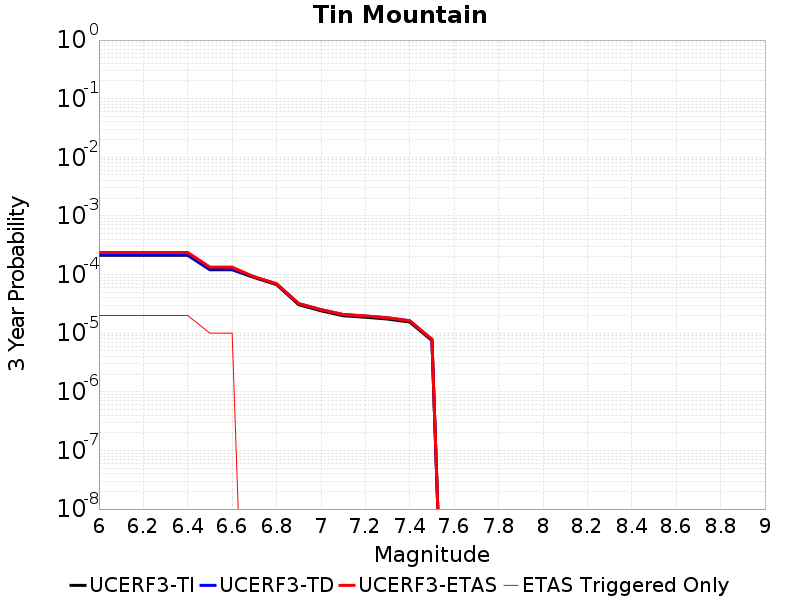 | 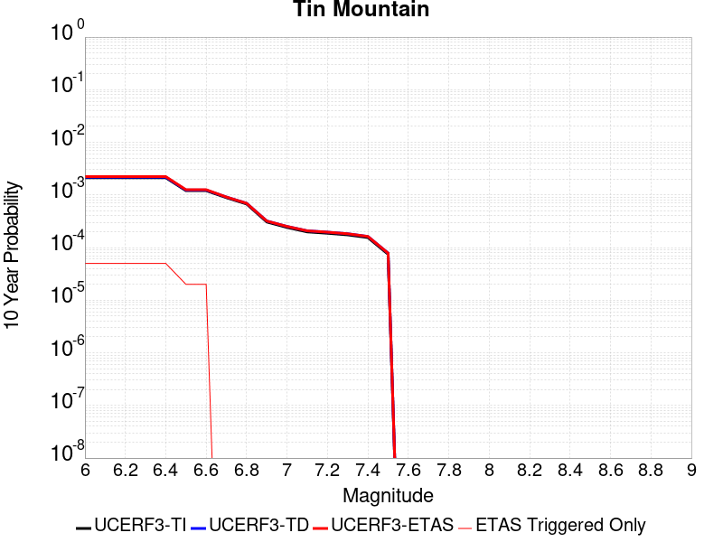 |

| Magnitude | 1 yr TI Prob | TD Prob | ETAS Prob | ETAS/TD Gain | ETAS Triggered Only | 10 yr TI Prob | TD Prob | ETAS Prob | ETAS/TD Gain | ETAS Triggered Only |
|-----|-----|-----|-----|-----|-----|-----|-----|-----|-----|-----|
| 6.0 | 2.1306332E-4 | 2.181673E-4 | 2.3816295E-4 | 1.0916528 | 2.0E-5 | 0.0021285915 | 0.002179897 | 0.002229788 | 1.0228869 | 5.0E-5 |
| 6.1 | 2.1306332E-4 | 2.181673E-4 | 2.3816295E-4 | 1.0916528 | 2.0E-5 | 0.0021285915 | 0.002179897 | 0.002229788 | 1.0228869 | 5.0E-5 |
| 6.2 | 2.1306332E-4 | 2.181673E-4 | 2.3816295E-4 | 1.0916528 | 2.0E-5 | 0.0021285915 | 0.002179897 | 0.002229788 | 1.0228869 | 5.0E-5 |
| 6.3 | 2.1306332E-4 | 2.181673E-4 | 2.3816295E-4 | 1.0916528 | 2.0E-5 | 0.0021285915 | 0.002179897 | 0.002229788 | 1.0228869 | 5.0E-5 |
| 6.4 | 2.1306332E-4 | 2.181673E-4 | 2.3816295E-4 | 1.0916528 | 2.0E-5 | 0.0021285915 | 0.002179897 | 0.002229788 | 1.0228869 | 5.0E-5 |
| 6.5 | 1.2075195E-4 | 1.238213E-4 | 1.3382005E-4 | 1.0807515 | 1.0E-5 | 0.0012068636 | 0.0012375991 | 0.0012575743 | 1.0161403 | 2.0E-5 |
| 6.6 | 1.2075195E-4 | 1.238213E-4 | 1.3382005E-4 | 1.0807515 | 1.0E-5 | 0.0012068636 | 0.0012375991 | 0.0012575743 | 1.0161403 | 2.0E-5 |
| 6.7 | 8.885379E-5 | 9.1298134E-5 | 9.1298134E-5 | 1.0 | 0.0 | 8.881827E-4 | 9.126589E-4 | 9.126589E-4 | 1.0 | 0.0 |
| 6.8 | 6.738455E-5 | 6.9392394E-5 | 6.9392394E-5 | 1.0 | 0.0 | 6.736412E-4 | 6.937506E-4 | 6.937506E-4 | 1.0 | 0.0 |
| 6.9 | 3.0633044E-5 | 3.191716E-5 | 3.191716E-5 | 1.0 | 0.0 | 3.0628822E-4 | 3.1912987E-4 | 3.1912987E-4 | 1.0 | 0.0 |
| 7.0 | 2.413167E-5 | 2.5212508E-5 | 2.5212508E-5 | 1.0 | 0.0 | 2.412905E-4 | 2.5210017E-4 | 2.5210017E-4 | 1.0 | 0.0 |
| 7.1 | 1.9851697E-5 | 2.08042E-5 | 2.08042E-5 | 1.0 | 0.0 | 1.9849923E-4 | 2.0802589E-4 | 2.0802589E-4 | 1.0 | 0.0 |
| 7.2 | 1.87136E-5 | 1.9627802E-5 | 1.9627802E-5 | 1.0 | 0.0 | 1.8712023E-4 | 1.9626398E-4 | 1.9626398E-4 | 1.0 | 0.0 |
| 7.3 | 1.7438259E-5 | 1.8295501E-5 | 1.8295501E-5 | 1.0 | 0.0 | 1.743689E-4 | 1.8294326E-4 | 1.8294326E-4 | 1.0 | 0.0 |
| 7.4 | 1.5503398E-5 | 1.6261794E-5 | 1.6261794E-5 | 1.0 | 0.0 | 1.5502315E-4 | 1.6260933E-4 | 1.6260933E-4 | 1.0 | 0.0 |
| 7.5 | 7.4754466E-6 | 7.833325E-6 | 7.833325E-6 | 1.0 | 0.0 | 7.475195E-5 | 7.833325E-5 | 7.833325E-5 | 1.0 | 0.0 |

## Raymond
*[(top)](#table-of-contents)*

| 1 Year | 10 Year |
|-----|-----|
| 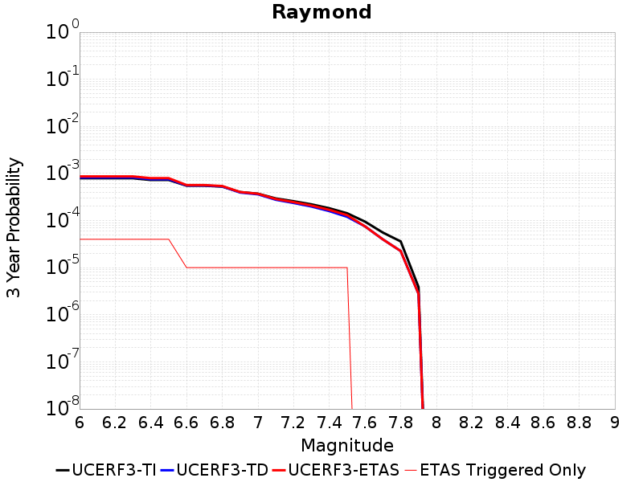 | 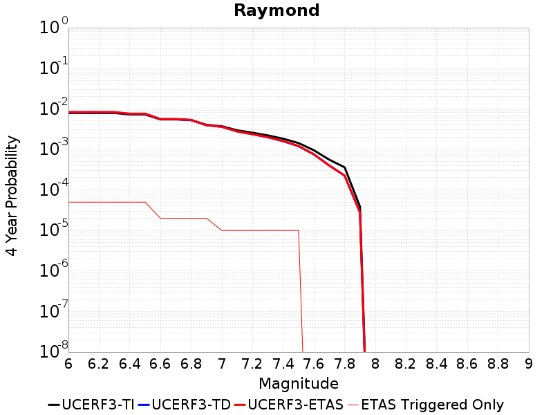 |

| Magnitude | 1 yr TI Prob | TD Prob | ETAS Prob | ETAS/TD Gain | ETAS Triggered Only | 10 yr TI Prob | TD Prob | ETAS Prob | ETAS/TD Gain | ETAS Triggered Only |
|-----|-----|-----|-----|-----|-----|-----|-----|-----|-----|-----|
| 6.0 | 7.905855E-4 | 8.2464423E-4 | 8.6461124E-4 | 1.0484657 | 4.0E-5 | 0.007877788 | 0.00821836 | 0.008267949 | 1.0060339 | 5.0E-5 |
| 6.1 | 7.905855E-4 | 8.2464423E-4 | 8.6461124E-4 | 1.0484657 | 4.0E-5 | 0.007877788 | 0.00821836 | 0.008267949 | 1.0060339 | 5.0E-5 |
| 6.2 | 7.905855E-4 | 8.2464423E-4 | 8.6461124E-4 | 1.0484657 | 4.0E-5 | 0.007877788 | 0.00821836 | 0.008267949 | 1.0060339 | 5.0E-5 |
| 6.3 | 7.905855E-4 | 8.2464423E-4 | 8.6461124E-4 | 1.0484657 | 4.0E-5 | 0.007877788 | 0.00821836 | 0.008267949 | 1.0060339 | 5.0E-5 |
| 6.4 | 7.2721124E-4 | 7.539723E-4 | 7.939421E-4 | 1.0530124 | 4.0E-5 | 0.007248361 | 0.007516476 | 0.0075661 | 1.006602 | 5.0E-5 |
| 6.5 | 7.2721124E-4 | 7.539723E-4 | 7.939421E-4 | 1.0530124 | 4.0E-5 | 0.007248361 | 0.007516476 | 0.0075661 | 1.006602 | 5.0E-5 |
| 6.6 | 5.499499E-4 | 5.566581E-4 | 5.666525E-4 | 1.0179543 | 1.0E-5 | 0.005485909 | 0.0055531985 | 0.0055730874 | 1.0035815 | 2.0E-5 |
| 6.7 | 5.499499E-4 | 5.566581E-4 | 5.666525E-4 | 1.0179543 | 1.0E-5 | 0.005485909 | 0.0055531985 | 0.0055730874 | 1.0035815 | 2.0E-5 |
| 6.8 | 5.257791E-4 | 5.3087116E-4 | 5.408658E-4 | 1.018827 | 1.0E-5 | 0.0052453685 | 0.005296579 | 0.0053164735 | 1.003756 | 2.0E-5 |
| 6.9 | 4.0282236E-4 | 3.938169E-4 | 4.0381297E-4 | 1.0253825 | 1.0E-5 | 0.0040209293 | 0.0039313235 | 0.003951245 | 1.0050673 | 2.0E-5 |
| 7.0 | 3.7236E-4 | 3.6056002E-4 | 3.705564E-4 | 1.0277246 | 1.0E-5 | 0.0037173668 | 0.0035998684 | 0.0036098324 | 1.0027679 | 1.0E-5 |
| 7.1 | 2.9502588E-4 | 2.7648566E-4 | 2.864829E-4 | 1.0361582 | 1.0E-5 | 0.0029463451 | 0.0027614478 | 0.0027714202 | 1.0036113 | 1.0E-5 |
| 7.2 | 2.5751285E-4 | 2.3616775E-4 | 2.4616538E-4 | 1.0423328 | 1.0E-5 | 0.0025721465 | 0.0023591898 | 0.0023691664 | 1.0042287 | 1.0E-5 |
| 7.3 | 2.2104931E-4 | 1.9855282E-4 | 2.0855083E-4 | 1.0503545 | 1.0E-5 | 0.0022082955 | 0.001983773 | 0.001993753 | 1.0050309 | 1.0E-5 |
| 7.4 | 1.8260824E-4 | 1.588063E-4 | 1.688047E-4 | 1.0629598 | 1.0E-5 | 0.0018245826 | 0.0015869439 | 0.001596928 | 1.0062914 | 1.0E-5 |
| 7.5 | 1.428558E-4 | 1.20110824E-4 | 1.3010962E-4 | 1.0832465 | 1.0E-5 | 0.0014276401 | 0.0012004734 | 0.0012104614 | 1.0083201 | 1.0E-5 |
| 7.6 | 9.488958E-5 | 7.5255266E-5 | 7.5255266E-5 | 1.0 | 0.0 | 9.4849075E-4 | 7.5230934E-4 | 7.5230934E-4 | 1.0 | 0.0 |
| 7.7 | 5.5622655E-5 | 3.9883696E-5 | 3.9883696E-5 | 1.0 | 0.0 | 5.5608735E-4 | 3.9877451E-4 | 3.9877451E-4 | 1.0 | 0.0 |
| 7.8 | 3.607355E-5 | 2.2543203E-5 | 2.2543203E-5 | 1.0 | 0.0 | 3.6067693E-4 | 2.2541702E-4 | 2.2541702E-4 | 1.0 | 0.0 |
| 7.9 | 3.874356E-6 | 2.7770664E-6 | 2.7770664E-6 | 1.0 | 0.0 | 3.8742884E-5 | 2.7770446E-5 | 2.7770446E-5 | 1.0 | 0.0 |

## Pleito
*[(top)](#table-of-contents)*

| 1 Year | 10 Year |
|-----|-----|
| 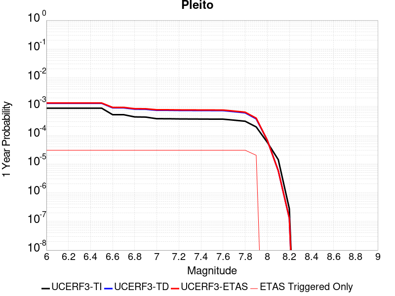 | 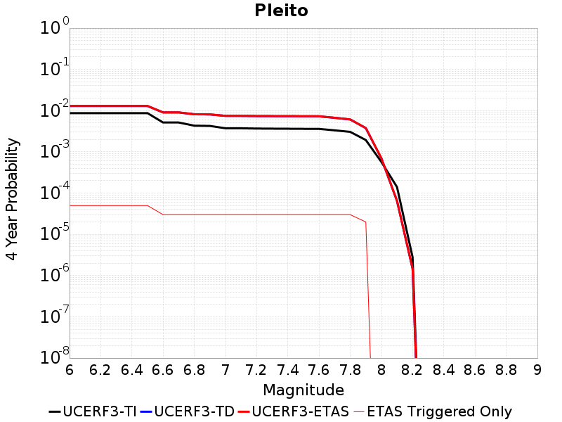 |

| Magnitude | 1 yr TI Prob | TD Prob | ETAS Prob | ETAS/TD Gain | ETAS Triggered Only | 10 yr TI Prob | TD Prob | ETAS Prob | ETAS/TD Gain | ETAS Triggered Only |
|-----|-----|-----|-----|-----|-----|-----|-----|-----|-----|-----|
| 6.0 | 8.742947E-4 | 0.0012914327 | 0.0013213939 | 1.0232 | 3.0E-5 | 0.00870863 | 0.012954203 | 0.013003556 | 1.0038098 | 5.0E-5 |
| 6.1 | 8.742947E-4 | 0.0012914327 | 0.0013213939 | 1.0232 | 3.0E-5 | 0.00870863 | 0.012954203 | 0.013003556 | 1.0038098 | 5.0E-5 |
| 6.2 | 8.742947E-4 | 0.0012914327 | 0.0013213939 | 1.0232 | 3.0E-5 | 0.00870863 | 0.012954203 | 0.013003556 | 1.0038098 | 5.0E-5 |
| 6.3 | 8.742947E-4 | 0.0012914327 | 0.0013213939 | 1.0232 | 3.0E-5 | 0.00870863 | 0.012954203 | 0.013003556 | 1.0038098 | 5.0E-5 |
| 6.4 | 8.742947E-4 | 0.0012914327 | 0.0013213939 | 1.0232 | 3.0E-5 | 0.00870863 | 0.012954203 | 0.013003556 | 1.0038098 | 5.0E-5 |
| 6.5 | 8.742947E-4 | 0.0012914327 | 0.0013213939 | 1.0232 | 3.0E-5 | 0.00870863 | 0.012954203 | 0.013003556 | 1.0038098 | 5.0E-5 |
| 6.6 | 5.169696E-4 | 8.9787476E-4 | 9.2784787E-4 | 1.0333822 | 3.0E-5 | 0.0051576863 | 0.009051012 | 0.009080741 | 1.0032846 | 3.0E-5 |
| 6.7 | 5.169696E-4 | 8.9787476E-4 | 9.2784787E-4 | 1.0333822 | 3.0E-5 | 0.0051576863 | 0.009051012 | 0.009080741 | 1.0032846 | 3.0E-5 |
| 6.8 | 4.3299864E-4 | 8.0713705E-4 | 8.3711284E-4 | 1.0371385 | 3.0E-5 | 0.004321559 | 0.008150448 | 0.008180204 | 1.0036508 | 3.0E-5 |
| 6.9 | 4.2689382E-4 | 8.004225E-4 | 8.303985E-4 | 1.0374502 | 3.0E-5 | 0.0042607468 | 0.008083792 | 0.00811355 | 1.0036812 | 3.0E-5 |
| 7.0 | 3.743064E-4 | 7.3717587E-4 | 7.6715375E-4 | 1.0406659 | 3.0E-5 | 0.0037367654 | 0.0074552447 | 0.007485021 | 1.003994 | 3.0E-5 |
| 7.1 | 3.7390468E-4 | 7.3667377E-4 | 7.666517E-4 | 1.0406936 | 3.0E-5 | 0.0037327618 | 0.0074502574 | 0.007480034 | 1.0039967 | 3.0E-5 |
| 7.2 | 3.6857324E-4 | 7.2871125E-4 | 7.586894E-4 | 1.0411385 | 3.0E-5 | 0.0036796255 | 0.007371014 | 0.0074007926 | 1.00404 | 3.0E-5 |
| 7.3 | 3.6627054E-4 | 7.2576286E-4 | 7.557411E-4 | 1.0413058 | 3.0E-5 | 0.0036566744 | 0.0073415125 | 0.0073712924 | 1.0040563 | 3.0E-5 |
| 7.4 | 3.6451413E-4 | 7.2365435E-4 | 7.5363263E-4 | 1.0414263 | 3.0E-5 | 0.0036391679 | 0.007320448 | 0.0073502283 | 1.0040681 | 3.0E-5 |
| 7.5 | 3.625482E-4 | 7.214073E-4 | 7.5138564E-4 | 1.0415554 | 3.0E-5 | 0.0036195726 | 0.007298076 | 0.007327857 | 1.0040807 | 3.0E-5 |
| 7.6 | 3.6137376E-4 | 7.192754E-4 | 7.492538E-4 | 1.0416787 | 3.0E-5 | 0.0036078666 | 0.0072768284 | 0.0073066102 | 1.0040927 | 3.0E-5 |
| 7.7 | 3.336726E-4 | 6.6082546E-4 | 6.9080567E-4 | 1.0453677 | 3.0E-5 | 0.0033317201 | 0.0066954745 | 0.0067252736 | 1.0044507 | 3.0E-5 |
| 7.8 | 3.060561E-4 | 6.017745E-4 | 6.3175644E-4 | 1.0498226 | 3.0E-5 | 0.0030563495 | 0.0061009317 | 0.0061307484 | 1.0048872 | 3.0E-5 |
| 7.9 | 1.9391612E-4 | 3.711519E-4 | 3.9114445E-4 | 1.0538663 | 2.0E-5 | 0.0019374699 | 0.0037676513 | 0.003787576 | 1.0052884 | 2.0E-5 |
| 8.0 | 5.68931E-5 | 6.7204244E-5 | 6.7204244E-5 | 1.0 | 0.0 | 5.6878536E-4 | 6.9423125E-4 | 6.9423125E-4 | 1.0 | 0.0 |
| 8.1 | 1.4033113E-5 | 5.771723E-6 | 5.771723E-6 | 1.0 | 0.0 | 1.4032227E-4 | 6.457562E-5 | 6.457562E-5 | 1.0 | 0.0 |
| 8.2 | 2.7637427E-7 | 1.2826031E-7 | 1.2826031E-7 | 1.0 | 0.0 | 2.7637393E-6 | 1.4594356E-6 | 1.4594356E-6 | 1.0 | 0.0 |

## Pitas Point (Lower)-Montalvo
*[(top)](#table-of-contents)*

| 1 Year | 10 Year |
|-----|-----|
| 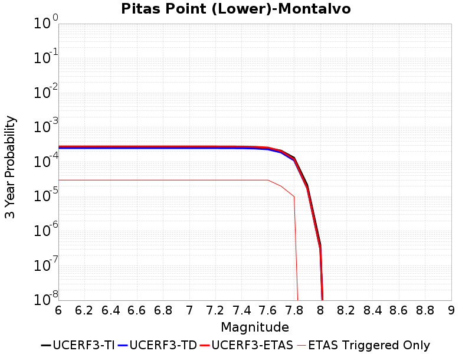 | 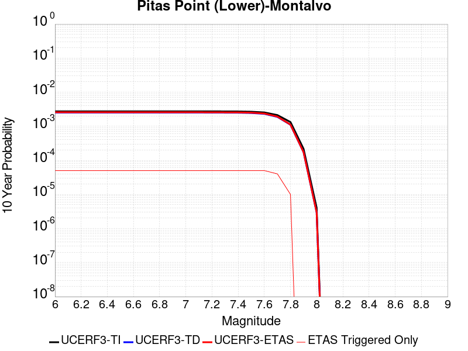 |

| Magnitude | 1 yr TI Prob | TD Prob | ETAS Prob | ETAS/TD Gain | ETAS Triggered Only | 10 yr TI Prob | TD Prob | ETAS Prob | ETAS/TD Gain | ETAS Triggered Only |
|-----|-----|-----|-----|-----|-----|-----|-----|-----|-----|-----|
| 6.0 | 2.7412834E-4 | 2.5240245E-4 | 2.8239487E-4 | 1.1188278 | 3.0E-5 | 0.0027379042 | 0.0025211903 | 0.0025710643 | 1.019782 | 5.0E-5 |
| 6.1 | 2.7412834E-4 | 2.5240245E-4 | 2.8239487E-4 | 1.1188278 | 3.0E-5 | 0.0027379042 | 0.0025211903 | 0.0025710643 | 1.019782 | 5.0E-5 |
| 6.2 | 2.7412834E-4 | 2.5240245E-4 | 2.8239487E-4 | 1.1188278 | 3.0E-5 | 0.0027379042 | 0.0025211903 | 0.0025710643 | 1.019782 | 5.0E-5 |
| 6.3 | 2.7412834E-4 | 2.5240245E-4 | 2.8239487E-4 | 1.1188278 | 3.0E-5 | 0.0027379042 | 0.0025211903 | 0.0025710643 | 1.019782 | 5.0E-5 |
| 6.4 | 2.7412834E-4 | 2.5240245E-4 | 2.8239487E-4 | 1.1188278 | 3.0E-5 | 0.0027379042 | 0.0025211903 | 0.0025710643 | 1.019782 | 5.0E-5 |
| 6.5 | 2.7412834E-4 | 2.5240245E-4 | 2.8239487E-4 | 1.1188278 | 3.0E-5 | 0.0027379042 | 0.0025211903 | 0.0025710643 | 1.019782 | 5.0E-5 |
| 6.6 | 2.7412834E-4 | 2.5240245E-4 | 2.8239487E-4 | 1.1188278 | 3.0E-5 | 0.0027379042 | 0.0025211903 | 0.0025710643 | 1.019782 | 5.0E-5 |
| 6.7 | 2.7412834E-4 | 2.5240245E-4 | 2.8239487E-4 | 1.1188278 | 3.0E-5 | 0.0027379042 | 0.0025211903 | 0.0025710643 | 1.019782 | 5.0E-5 |
| 6.8 | 2.7412834E-4 | 2.5240245E-4 | 2.8239487E-4 | 1.1188278 | 3.0E-5 | 0.0027379042 | 0.0025211903 | 0.0025710643 | 1.019782 | 5.0E-5 |
| 6.9 | 2.7412834E-4 | 2.5240245E-4 | 2.8239487E-4 | 1.1188278 | 3.0E-5 | 0.0027379042 | 0.0025211903 | 0.0025710643 | 1.019782 | 5.0E-5 |
| 7.0 | 2.7412834E-4 | 2.5240245E-4 | 2.8239487E-4 | 1.1188278 | 3.0E-5 | 0.0027379042 | 0.0025211903 | 0.0025710643 | 1.019782 | 5.0E-5 |
| 7.1 | 2.7412834E-4 | 2.5240245E-4 | 2.8239487E-4 | 1.1188278 | 3.0E-5 | 0.0027379042 | 0.0025211903 | 0.0025710643 | 1.019782 | 5.0E-5 |
| 7.2 | 2.7368523E-4 | 2.5194098E-4 | 2.819334E-4 | 1.1190455 | 3.0E-5 | 0.0027334841 | 0.002516586 | 0.0025664603 | 1.0198182 | 5.0E-5 |
| 7.3 | 2.7268266E-4 | 2.5089335E-4 | 2.808858E-4 | 1.1195427 | 3.0E-5 | 0.002723483 | 0.0025061334 | 0.002556008 | 1.019901 | 5.0E-5 |
| 7.4 | 2.718476E-4 | 2.5001762E-4 | 2.800101E-4 | 1.1199615 | 3.0E-5 | 0.002715153 | 0.0024973957 | 0.0025472709 | 1.0199709 | 5.0E-5 |
| 7.5 | 2.67255E-4 | 2.4521243E-4 | 2.7520506E-4 | 1.1223129 | 3.0E-5 | 0.0026693381 | 0.00244945 | 0.0024993278 | 1.0203627 | 5.0E-5 |
| 7.6 | 2.5458392E-4 | 2.3190476E-4 | 2.618978E-4 | 1.1293335 | 3.0E-5 | 0.0025429246 | 0.0023166582 | 0.0023665424 | 1.0215328 | 5.0E-5 |
| 7.7 | 2.1304579E-4 | 1.8830133E-4 | 2.0829757E-4 | 1.1061927 | 2.0E-5 | 0.0021284167 | 0.0018814416 | 0.0019213663 | 1.0212203 | 4.0E-5 |
| 7.8 | 1.3276201E-4 | 1.1067677E-4 | 1.20675664E-4 | 1.0903432 | 1.0E-5 | 0.0013268272 | 0.0011062212 | 0.0011162101 | 1.0090297 | 1.0E-5 |
| 7.9 | 2.1746291E-5 | 1.7372044E-5 | 1.7372044E-5 | 1.0 | 0.0 | 2.1744163E-4 | 1.7370716E-4 | 1.7370716E-4 | 1.0 | 0.0 |
| 8.0 | 4.0654416E-7 | 2.96557E-7 | 2.96557E-7 | 1.0 | 0.0 | 4.065434E-6 | 2.9655682E-6 | 2.9655682E-6 | 1.0 | 0.0 |

## San Clemente
*[(top)](#table-of-contents)*

| 1 Year | 10 Year |
|-----|-----|
| 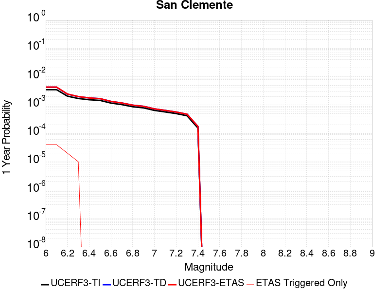 | 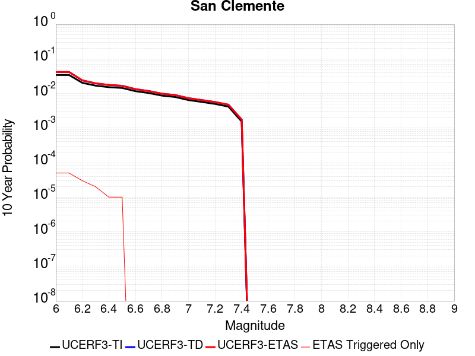 |

| Magnitude | 1 yr TI Prob | TD Prob | ETAS Prob | ETAS/TD Gain | ETAS Triggered Only | 10 yr TI Prob | TD Prob | ETAS Prob | ETAS/TD Gain | ETAS Triggered Only |
|-----|-----|-----|-----|-----|-----|-----|-----|-----|-----|-----|
| 6.0 | 0.003480294 | 0.0042512994 | 0.0042911293 | 1.0093689 | 4.0E-5 | 0.03426291 | 0.041755825 | 0.041803736 | 1.0011474 | 5.0E-5 |
| 6.1 | 0.003480294 | 0.0042512994 | 0.0042911293 | 1.0093689 | 4.0E-5 | 0.03426291 | 0.041755825 | 0.041803736 | 1.0011474 | 5.0E-5 |
| 6.2 | 0.0020537945 | 0.0024209903 | 0.0024409418 | 1.008241 | 2.0E-5 | 0.020349167 | 0.023952913 | 0.023982193 | 1.0012225 | 3.0E-5 |
| 6.3 | 0.0016990956 | 0.0019772025 | 0.0019871828 | 1.0050477 | 1.0E-5 | 0.01686163 | 0.019599905 | 0.019619513 | 1.0010004 | 2.0E-5 |
| 6.4 | 0.0015357438 | 0.0017776516 | 0.0017776516 | 1.0 | 0.0 | 0.015251739 | 0.017637491 | 0.017647315 | 1.000557 | 1.0E-5 |
| 6.5 | 0.001455179 | 0.0016812683 | 0.0016812683 | 1.0 | 0.0 | 0.014456868 | 0.016688507 | 0.01669834 | 1.0005893 | 1.0E-5 |
| 6.6 | 0.0011729331 | 0.0013433932 | 0.0013433932 | 1.0 | 0.0 | 0.011667615 | 0.013354439 | 0.013354439 | 1.0 | 0.0 |
| 6.7 | 0.0010358836 | 0.00118203 | 0.00118203 | 1.0 | 0.0 | 0.010310682 | 0.011758721 | 0.011758721 | 1.0 | 0.0 |
| 6.8 | 8.7088346E-4 | 9.897607E-4 | 9.897607E-4 | 1.0 | 0.0 | 0.008674784 | 0.009854553 | 0.009854553 | 1.0 | 0.0 |
| 6.9 | 7.93766E-4 | 9.007055E-4 | 9.007055E-4 | 1.0 | 0.0 | 0.007909367 | 0.008971496 | 0.008971496 | 1.0 | 0.0 |
| 7.0 | 6.4644177E-4 | 7.3196914E-4 | 7.3196914E-4 | 1.0 | 0.0 | 0.0064456454 | 0.0072963685 | 0.0072963685 | 1.0 | 0.0 |
| 7.1 | 5.7036756E-4 | 6.4552145E-4 | 6.4552145E-4 | 1.0 | 0.0 | 0.0056890585 | 0.0064372104 | 0.0064372104 | 1.0 | 0.0 |
| 7.2 | 4.9974193E-4 | 5.6572485E-4 | 5.6572485E-4 | 1.0 | 0.0 | 0.0049861963 | 0.005643571 | 0.005643571 | 1.0 | 0.0 |
| 7.3 | 4.1821605E-4 | 4.73884E-4 | 4.73884E-4 | 1.0 | 0.0 | 0.0041742986 | 0.0047294376 | 0.0047294376 | 1.0 | 0.0 |
| 7.4 | 1.5433785E-4 | 1.7543475E-4 | 1.7543475E-4 | 1.0 | 0.0 | 0.001542307 | 0.0017534576 | 0.0017534576 | 1.0 | 0.0 |

## San Andreas (North Branch Mill Creek)
*[(top)](#table-of-contents)*

| 1 Year | 10 Year |
|-----|-----|
| 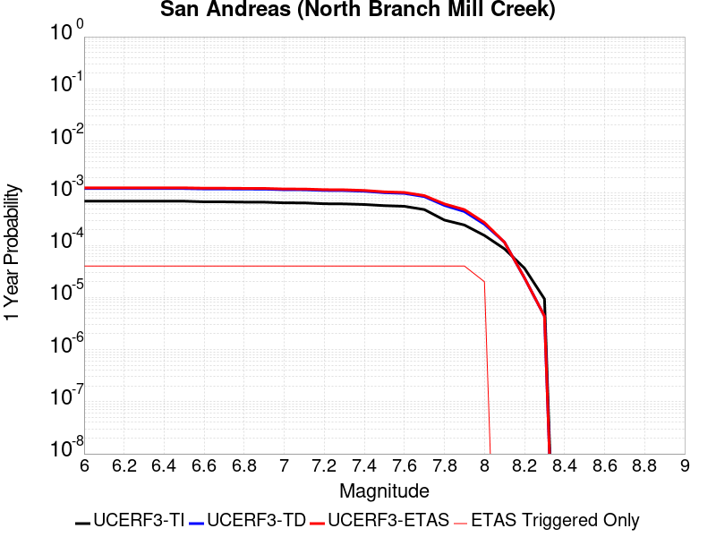 | 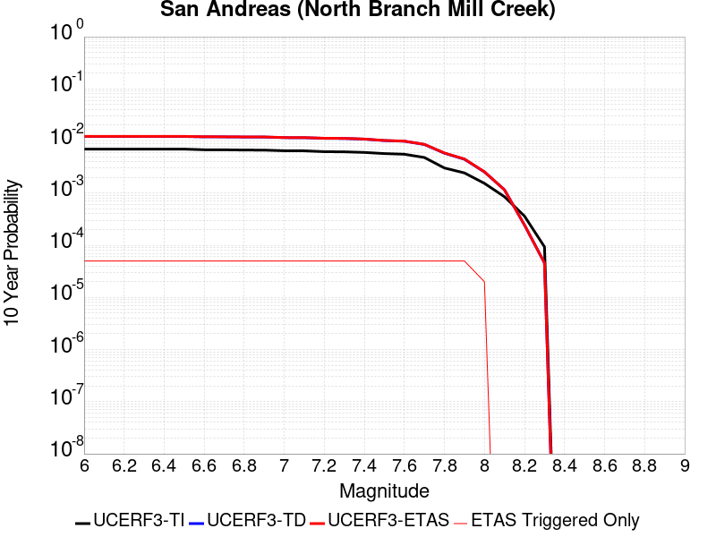 |

| Magnitude | 1 yr TI Prob | TD Prob | ETAS Prob | ETAS/TD Gain | ETAS Triggered Only | 10 yr TI Prob | TD Prob | ETAS Prob | ETAS/TD Gain | ETAS Triggered Only |
|-----|-----|-----|-----|-----|-----|-----|-----|-----|-----|-----|
| 6.0 | 7.02142E-4 | 0.0012254907 | 0.0012654418 | 1.0325999 | 4.0E-5 | 0.0069992766 | 0.012229898 | 0.012279286 | 1.0040383 | 5.0E-5 |
| 6.1 | 7.02142E-4 | 0.0012254907 | 0.0012654418 | 1.0325999 | 4.0E-5 | 0.0069992766 | 0.012229898 | 0.012279286 | 1.0040383 | 5.0E-5 |
| 6.2 | 7.02142E-4 | 0.0012254907 | 0.0012654418 | 1.0325999 | 4.0E-5 | 0.0069992766 | 0.012229898 | 0.012279286 | 1.0040383 | 5.0E-5 |
| 6.3 | 7.02142E-4 | 0.0012254907 | 0.0012654418 | 1.0325999 | 4.0E-5 | 0.0069992766 | 0.012229898 | 0.012279286 | 1.0040383 | 5.0E-5 |
| 6.4 | 7.02142E-4 | 0.0012254907 | 0.0012654418 | 1.0325999 | 4.0E-5 | 0.0069992766 | 0.012229898 | 0.012279286 | 1.0040383 | 5.0E-5 |
| 6.5 | 7.0159714E-4 | 0.0012249154 | 0.0012648664 | 1.0326153 | 4.0E-5 | 0.006993862 | 0.012224208 | 0.012273597 | 1.0040402 | 5.0E-5 |
| 6.6 | 6.8198174E-4 | 0.0012048131 | 0.0012447649 | 1.0331602 | 4.0E-5 | 0.006798926 | 0.012025372 | 0.012074771 | 1.0041078 | 5.0E-5 |
| 6.7 | 6.8071426E-4 | 0.0012035256 | 0.0012434775 | 1.0331957 | 4.0E-5 | 0.0067863287 | 0.012012637 | 0.012062036 | 1.0041122 | 5.0E-5 |
| 6.8 | 6.73139E-4 | 0.001195625 | 0.0012355773 | 1.0334153 | 4.0E-5 | 0.0067110364 | 0.011934482 | 0.011983885 | 1.0041395 | 5.0E-5 |
| 6.9 | 6.711799E-4 | 0.0011935093 | 0.0012334615 | 1.0334746 | 4.0E-5 | 0.006691564 | 0.011913551 | 0.011962956 | 1.0041469 | 5.0E-5 |
| 7.0 | 6.518148E-4 | 0.0011622419 | 0.0012021954 | 1.0343763 | 4.0E-5 | 0.0064990623 | 0.0116041545 | 0.011653574 | 1.0042588 | 5.0E-5 |
| 7.1 | 6.4952404E-4 | 0.0011593791 | 0.0011993328 | 1.0344613 | 4.0E-5 | 0.0064762887 | 0.0115758255 | 0.011625246 | 1.0042694 | 5.0E-5 |
| 7.2 | 6.2609545E-4 | 0.0011269896 | 0.0011669445 | 1.0354528 | 4.0E-5 | 0.006243344 | 0.011255247 | 0.011304684 | 1.0043924 | 5.0E-5 |
| 7.3 | 6.219575E-4 | 0.0011202049 | 0.00116016 | 1.0356678 | 4.0E-5 | 0.0062021962 | 0.011188112 | 0.011237553 | 1.0044191 | 5.0E-5 |
| 7.4 | 6.0564023E-4 | 0.001087575 | 0.0011275314 | 1.0367391 | 4.0E-5 | 0.006039923 | 0.010865717 | 0.010915174 | 1.0045516 | 5.0E-5 |
| 7.5 | 5.757461E-4 | 0.0010198184 | 0.0010597776 | 1.0391827 | 4.0E-5 | 0.005742567 | 0.010195207 | 0.010244697 | 1.0048543 | 5.0E-5 |
| 7.6 | 5.592486E-4 | 9.907264E-4 | 0.0010306868 | 1.0403345 | 4.0E-5 | 0.005578433 | 0.009906928 | 0.0099564325 | 1.004997 | 5.0E-5 |
| 7.7 | 4.839081E-4 | 8.5757225E-4 | 8.97538E-4 | 1.0466033 | 4.0E-5 | 0.0048285574 | 0.008586332 | 0.008635903 | 1.0057732 | 5.0E-5 |
| 7.8 | 3.043997E-4 | 5.819107E-4 | 6.2188745E-4 | 1.0686991 | 4.0E-5 | 0.0030398308 | 0.0058471635 | 0.005896871 | 1.0085012 | 5.0E-5 |
| 7.9 | 2.4469878E-4 | 4.439158E-4 | 4.8389807E-4 | 1.0900671 | 4.0E-5 | 0.002444295 | 0.004470945 | 0.0045207213 | 1.0111333 | 5.0E-5 |
| 8.0 | 1.5428272E-4 | 2.5288766E-4 | 2.728826E-4 | 1.0790665 | 2.0E-5 | 0.0015417566 | 0.002549766 | 0.0025697153 | 1.0078238 | 2.0E-5 |
| 8.1 | 8.544835E-5 | 1.1463072E-4 | 1.1463072E-4 | 1.0 | 0.0 | 8.54155E-4 | 0.0011607226 | 0.0011607226 | 1.0 | 0.0 |
| 8.2 | 3.63321E-5 | 2.3670045E-5 | 2.3670045E-5 | 1.0 | 0.0 | 3.6326164E-4 | 2.4517684E-4 | 2.4517684E-4 | 1.0 | 0.0 |
| 8.3 | 9.32747E-6 | 4.3627224E-6 | 4.3627224E-6 | 1.0 | 0.0 | 9.3270784E-5 | 4.58212E-5 | 4.58212E-5 | 1.0 | 0.0 |

## Deep Springs
*[(top)](#table-of-contents)*

| 1 Year | 10 Year |
|-----|-----|
| 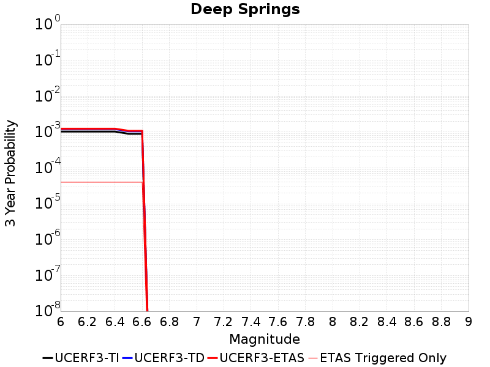 | 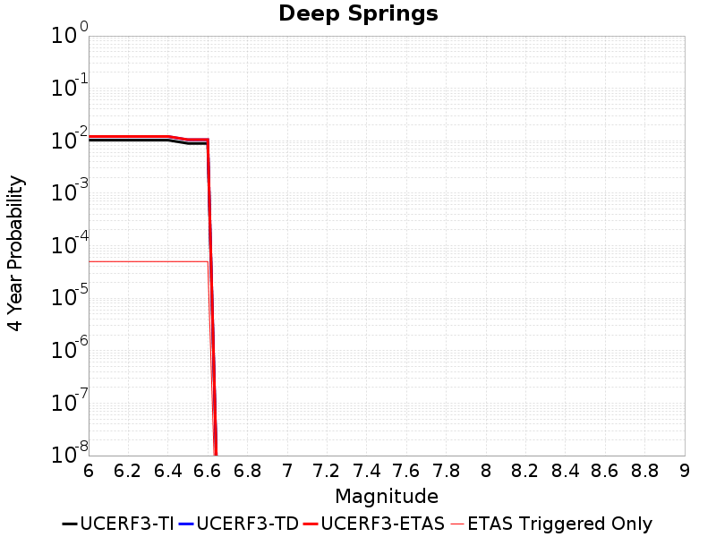 |

| Magnitude | 1 yr TI Prob | TD Prob | ETAS Prob | ETAS/TD Gain | ETAS Triggered Only | 10 yr TI Prob | TD Prob | ETAS Prob | ETAS/TD Gain | ETAS Triggered Only |
|-----|-----|-----|-----|-----|-----|-----|-----|-----|-----|-----|
| 6.0 | 0.001033166 | 0.0012058105 | 0.0012457622 | 1.0331327 | 4.0E-5 | 0.010283757 | 0.01204245 | 0.012091847 | 1.004102 | 5.0E-5 |
| 6.1 | 0.001033166 | 0.0012058105 | 0.0012457622 | 1.0331327 | 4.0E-5 | 0.010283757 | 0.01204245 | 0.012091847 | 1.004102 | 5.0E-5 |
| 6.2 | 0.001033166 | 0.0012058105 | 0.0012457622 | 1.0331327 | 4.0E-5 | 0.010283757 | 0.01204245 | 0.012091847 | 1.004102 | 5.0E-5 |
| 6.3 | 0.001033166 | 0.0012058105 | 0.0012457622 | 1.0331327 | 4.0E-5 | 0.010283757 | 0.01204245 | 0.012091847 | 1.004102 | 5.0E-5 |
| 6.4 | 0.001033166 | 0.0012058105 | 0.0012457622 | 1.0331327 | 4.0E-5 | 0.010283757 | 0.01204245 | 0.012091847 | 1.004102 | 5.0E-5 |
| 6.5 | 8.9657627E-4 | 0.0010462115 | 0.0010861696 | 1.0381932 | 4.0E-5 | 0.008929676 | 0.010462077 | 0.010511555 | 1.0047292 | 5.0E-5 |
| 6.6 | 8.9657627E-4 | 0.0010462115 | 0.0010861696 | 1.0381932 | 4.0E-5 | 0.008929676 | 0.010462077 | 0.010511555 | 1.0047292 | 5.0E-5 |

## Hunting Creek - Berryessa 2011 CFM
*[(top)](#table-of-contents)*

| 1 Year | 10 Year |
|-----|-----|
| 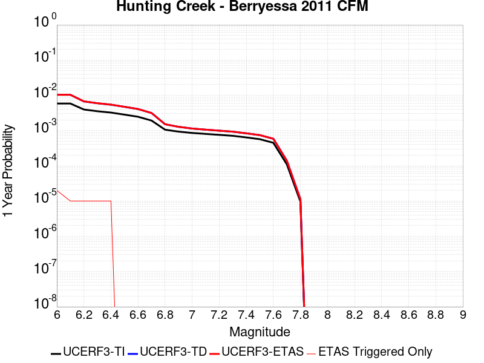 | 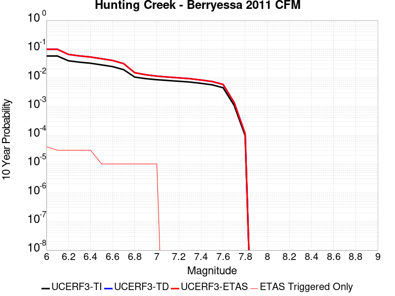 |

| Magnitude | 1 yr TI Prob | TD Prob | ETAS Prob | ETAS/TD Gain | ETAS Triggered Only | 10 yr TI Prob | TD Prob | ETAS Prob | ETAS/TD Gain | ETAS Triggered Only |
|-----|-----|-----|-----|-----|-----|-----|-----|-----|-----|-----|
| 6.0 | 0.0058641075 | 0.01038639 | 0.010406181 | 1.0019056 | 2.0E-5 | 0.057117578 | 0.09803736 | 0.09807344 | 1.000368 | 4.0E-5 |
| 6.1 | 0.0058477195 | 0.010359627 | 0.010369523 | 1.0009553 | 1.0E-5 | 0.056962132 | 0.097795844 | 0.097822905 | 1.0002768 | 3.0E-5 |
| 6.2 | 0.0039559277 | 0.006721034 | 0.006730967 | 1.0014778 | 1.0E-5 | 0.038862433 | 0.06459171 | 0.06461977 | 1.0004344 | 3.0E-5 |
| 6.3 | 0.003535705 | 0.0059526954 | 0.005962636 | 1.0016699 | 1.0E-5 | 0.034799766 | 0.057465583 | 0.05749386 | 1.0004921 | 3.0E-5 |
| 6.4 | 0.0032385332 | 0.0054275882 | 0.005437534 | 1.0018325 | 1.0E-5 | 0.03191742 | 0.052550696 | 0.05257912 | 1.0005409 | 3.0E-5 |
| 6.5 | 0.0028329059 | 0.0047198827 | 0.0047198827 | 1.0 | 0.0 | 0.027970633 | 0.045880284 | 0.045889825 | 1.0002079 | 1.0E-5 |
| 6.6 | 0.002465034 | 0.0040849773 | 0.0040849773 | 1.0 | 0.0 | 0.02437869 | 0.039851688 | 0.039861288 | 1.0002409 | 1.0E-5 |
| 6.7 | 0.0019222875 | 0.003148217 | 0.003148217 | 1.0 | 0.0 | 0.019057442 | 0.030892478 | 0.03090217 | 1.0003138 | 1.0E-5 |
| 6.8 | 0.0010582599 | 0.0015108102 | 0.0015108102 | 1.0 | 0.0 | 0.010532344 | 0.014978552 | 0.014988403 | 1.0006577 | 1.0E-5 |
| 6.9 | 9.320591E-4 | 0.0012761324 | 0.0012761324 | 1.0 | 0.0 | 0.009281595 | 0.012679799 | 0.012689673 | 1.0007787 | 1.0E-5 |
| 7.0 | 8.561793E-4 | 0.0011424038 | 0.0011424038 | 1.0 | 0.0 | 0.008528882 | 0.011364542 | 0.011374428 | 1.00087 | 1.0E-5 |
| 7.1 | 8.0374884E-4 | 0.0010610959 | 0.0010610959 | 1.0 | 0.0 | 0.00800848 | 0.010560617 | 0.010560617 | 1.0 | 0.0 |
| 7.2 | 7.5617427E-4 | 9.937815E-4 | 9.937815E-4 | 1.0 | 0.0 | 0.0075360634 | 0.009893948 | 0.009893948 | 1.0 | 0.0 |
| 7.3 | 7.101729E-4 | 9.297228E-4 | 9.297228E-4 | 1.0 | 0.0 | 0.0070790765 | 0.009258841 | 0.009258841 | 1.0 | 0.0 |
| 7.4 | 6.391345E-4 | 8.3588867E-4 | 8.3588867E-4 | 1.0 | 0.0 | 0.0063729943 | 0.008327888 | 0.008327888 | 1.0 | 0.0 |
| 7.5 | 5.6928146E-4 | 7.428149E-4 | 7.428149E-4 | 1.0 | 0.0 | 0.0056782532 | 0.007403695 | 0.007403695 | 1.0 | 0.0 |
| 7.6 | 4.4984656E-4 | 5.8604305E-4 | 5.8604305E-4 | 1.0 | 0.0 | 0.00448937 | 0.0058452906 | 0.0058452906 | 1.0 | 0.0 |
| 7.7 | 1.09535904E-4 | 1.389207E-4 | 1.389207E-4 | 1.0 | 0.0 | 0.0010948193 | 0.0013883451 | 0.0013883451 | 1.0 | 0.0 |
| 7.8 | 9.615583E-6 | 1.13093365E-5 | 1.13093365E-5 | 1.0 | 0.0 | 9.615166E-5 | 1.13086215E-4 | 1.13086215E-4 | 1.0 | 0.0 |

## Palos Verdes
*[(top)](#table-of-contents)*

| 1 Year | 10 Year |
|-----|-----|
| 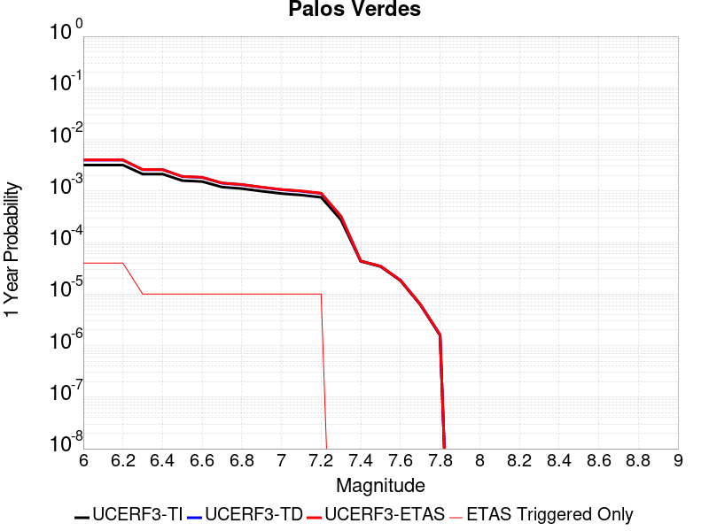 | 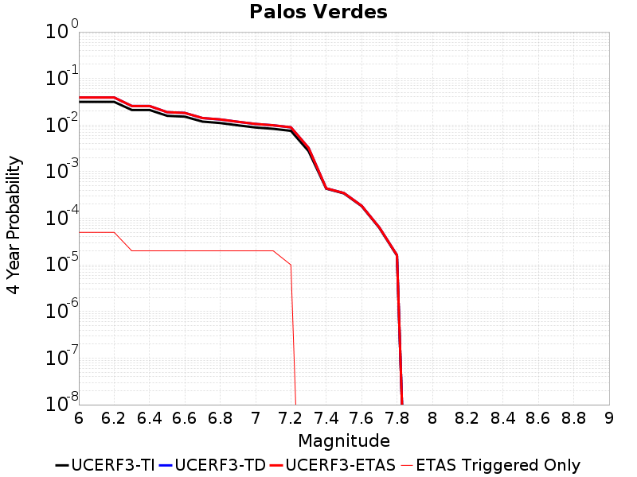 |

| Magnitude | 1 yr TI Prob | TD Prob | ETAS Prob | ETAS/TD Gain | ETAS Triggered Only | 10 yr TI Prob | TD Prob | ETAS Prob | ETAS/TD Gain | ETAS Triggered Only |
|-----|-----|-----|-----|-----|-----|-----|-----|-----|-----|-----|
| 6.0 | 0.0031914865 | 0.0039701858 | 0.0040100273 | 1.010035 | 4.0E-5 | 0.031460393 | 0.03904901 | 0.03909706 | 1.0012305 | 5.0E-5 |
| 6.1 | 0.0031914865 | 0.0039701858 | 0.0040100273 | 1.010035 | 4.0E-5 | 0.031460393 | 0.03904901 | 0.03909706 | 1.0012305 | 5.0E-5 |
| 6.2 | 0.0031914865 | 0.0039701858 | 0.0040100273 | 1.010035 | 4.0E-5 | 0.031460393 | 0.03904901 | 0.03909706 | 1.0012305 | 5.0E-5 |
| 6.3 | 0.0021286458 | 0.0025927888 | 0.0026027628 | 1.0038469 | 1.0E-5 | 0.021083709 | 0.02564675 | 0.025666237 | 1.0007598 | 2.0E-5 |
| 6.4 | 0.0021286458 | 0.0025927888 | 0.0026027628 | 1.0038469 | 1.0E-5 | 0.021083709 | 0.02564675 | 0.025666237 | 1.0007598 | 2.0E-5 |
| 6.5 | 0.0015908304 | 0.0019060813 | 0.0019160622 | 1.0052364 | 1.0E-5 | 0.015794903 | 0.0189092 | 0.018928822 | 1.0010377 | 2.0E-5 |
| 6.6 | 0.0015253464 | 0.0018327874 | 0.0018427691 | 1.0054462 | 1.0E-5 | 0.015149189 | 0.01818827 | 0.018207906 | 1.0010796 | 2.0E-5 |
| 6.7 | 0.001192729 | 0.0014208867 | 0.0014308725 | 1.0070279 | 1.0E-5 | 0.011863477 | 0.014127251 | 0.014146968 | 1.0013957 | 2.0E-5 |
| 6.8 | 0.001112141 | 0.0013262355 | 0.0013362222 | 1.0075301 | 1.0E-5 | 0.011065915 | 0.013192243 | 0.013211979 | 1.0014961 | 2.0E-5 |
| 6.9 | 9.914007E-4 | 0.0011793562 | 0.0011893444 | 1.0084692 | 1.0E-5 | 0.009869894 | 0.01173966 | 0.0117594255 | 1.0016836 | 2.0E-5 |
| 7.0 | 8.917837E-4 | 0.0010597775 | 0.0010697668 | 1.009426 | 1.0E-5 | 0.008882134 | 0.0105556715 | 0.01057546 | 1.0018747 | 2.0E-5 |
| 7.1 | 8.336179E-4 | 9.907307E-4 | 0.0010007208 | 1.0100836 | 1.0E-5 | 0.008304977 | 0.009871502 | 0.009891305 | 1.002006 | 2.0E-5 |
| 7.2 | 7.546402E-4 | 8.9702435E-4 | 9.0701535E-4 | 1.011138 | 1.0E-5 | 0.007520827 | 0.008942305 | 0.008952215 | 1.0011083 | 1.0E-5 |
| 7.3 | 2.7589512E-4 | 3.236855E-4 | 3.236855E-4 | 1.0 | 0.0 | 0.0027555283 | 0.0032355632 | 0.0032355632 | 1.0 | 0.0 |
| 7.4 | 4.3200624E-5 | 4.3872693E-5 | 4.3872693E-5 | 1.0 | 0.0 | 4.3192226E-4 | 4.3864755E-4 | 4.3864755E-4 | 1.0 | 0.0 |
| 7.5 | 3.4227687E-5 | 3.4788132E-5 | 3.4788132E-5 | 1.0 | 0.0 | 3.4222414E-4 | 3.478335E-4 | 3.478335E-4 | 1.0 | 0.0 |
| 7.6 | 1.8272232E-5 | 1.8585906E-5 | 1.8585906E-5 | 1.0 | 0.0 | 1.8270731E-4 | 1.8584813E-4 | 1.8584813E-4 | 1.0 | 0.0 |
| 7.7 | 6.2541585E-6 | 6.3649204E-6 | 6.3649204E-6 | 1.0 | 0.0 | 6.2539824E-5 | 6.364742E-5 | 6.364742E-5 | 1.0 | 0.0 |
| 7.8 | 1.5885756E-6 | 1.6189744E-6 | 1.6189744E-6 | 1.0 | 0.0 | 1.5885644E-5 | 1.6189646E-5 | 1.6189646E-5 | 1.0 | 0.0 |

## San Cayetano
*[(top)](#table-of-contents)*

| 1 Year | 10 Year |
|-----|-----|
| 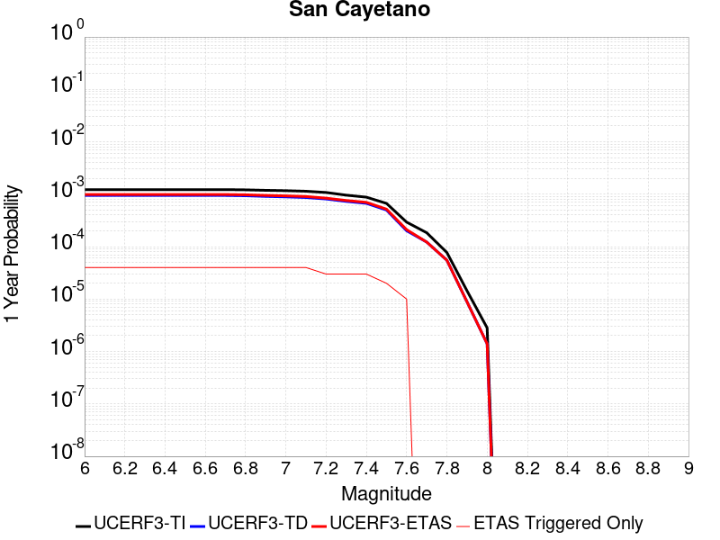 | 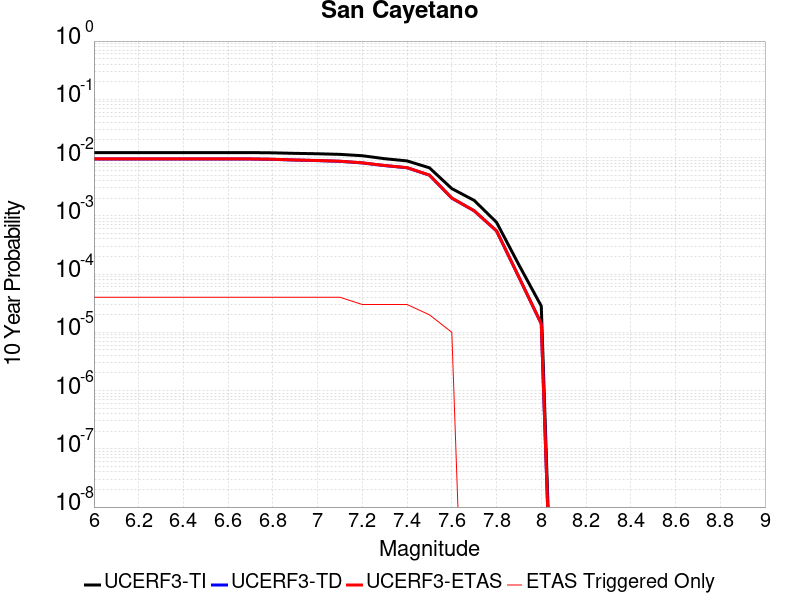 |

| Magnitude | 1 yr TI Prob | TD Prob | ETAS Prob | ETAS/TD Gain | ETAS Triggered Only | 10 yr TI Prob | TD Prob | ETAS Prob | ETAS/TD Gain | ETAS Triggered Only |
|-----|-----|-----|-----|-----|-----|-----|-----|-----|-----|-----|
| 6.0 | 0.0012242225 | 9.47612E-4 | 9.875741E-4 | 1.0421714 | 4.0E-5 | 0.012175002 | 0.009436601 | 0.009476224 | 1.0041988 | 4.0E-5 |
| 6.1 | 0.0012242225 | 9.47612E-4 | 9.875741E-4 | 1.0421714 | 4.0E-5 | 0.012175002 | 0.009436601 | 0.009476224 | 1.0041988 | 4.0E-5 |
| 6.2 | 0.0012242225 | 9.47612E-4 | 9.875741E-4 | 1.0421714 | 4.0E-5 | 0.012175002 | 0.009436601 | 0.009476224 | 1.0041988 | 4.0E-5 |
| 6.3 | 0.0012242225 | 9.47612E-4 | 9.875741E-4 | 1.0421714 | 4.0E-5 | 0.012175002 | 0.009436601 | 0.009476224 | 1.0041988 | 4.0E-5 |
| 6.4 | 0.0012242225 | 9.47612E-4 | 9.875741E-4 | 1.0421714 | 4.0E-5 | 0.012175002 | 0.009436601 | 0.009476224 | 1.0041988 | 4.0E-5 |
| 6.5 | 0.0012242225 | 9.47612E-4 | 9.875741E-4 | 1.0421714 | 4.0E-5 | 0.012175002 | 0.009436601 | 0.009476224 | 1.0041988 | 4.0E-5 |
| 6.6 | 0.0012242225 | 9.47612E-4 | 9.875741E-4 | 1.0421714 | 4.0E-5 | 0.012175002 | 0.009436601 | 0.009476224 | 1.0041988 | 4.0E-5 |
| 6.7 | 0.0012242225 | 9.47612E-4 | 9.875741E-4 | 1.0421714 | 4.0E-5 | 0.012175002 | 0.009436601 | 0.009476224 | 1.0041988 | 4.0E-5 |
| 6.8 | 0.0012120095 | 9.3550247E-4 | 9.7546505E-4 | 1.0427178 | 4.0E-5 | 0.012054204 | 0.009316498 | 0.009356126 | 1.0042535 | 4.0E-5 |
| 6.9 | 0.0011869454 | 9.0919866E-4 | 9.491623E-4 | 1.0439547 | 4.0E-5 | 0.011806256 | 0.009055619 | 0.009095257 | 1.0043771 | 4.0E-5 |
| 7.0 | 0.0011682777 | 8.901048E-4 | 9.300692E-4 | 1.0448985 | 4.0E-5 | 0.011621549 | 0.008866211 | 0.008905856 | 1.0044715 | 4.0E-5 |
| 7.1 | 0.0011405671 | 8.6507265E-4 | 9.0503803E-4 | 1.0461988 | 4.0E-5 | 0.011347309 | 0.008617854 | 0.0086575085 | 1.0046015 | 4.0E-5 |
| 7.2 | 0.0010802611 | 8.118181E-4 | 8.417937E-4 | 1.0369241 | 3.0E-5 | 0.010750249 | 0.008089299 | 0.008119057 | 1.0036786 | 3.0E-5 |
| 7.3 | 9.600714E-4 | 7.300793E-4 | 7.6005736E-4 | 1.0410614 | 3.0E-5 | 0.009559342 | 0.0072775274 | 0.0073073087 | 1.0040923 | 3.0E-5 |
| 7.4 | 8.7918417E-4 | 6.702826E-4 | 7.0026243E-4 | 1.0447272 | 3.0E-5 | 0.00875714 | 0.006683289 | 0.0067130886 | 1.0044588 | 3.0E-5 |
| 7.5 | 6.688548E-4 | 4.9962243E-4 | 5.1961245E-4 | 1.0400102 | 2.0E-5 | 0.006668452 | 0.004985163 | 0.005005063 | 1.003992 | 2.0E-5 |
| 7.6 | 2.9358055E-4 | 2.0112391E-4 | 2.1112191E-4 | 1.0497106 | 1.0E-5 | 0.0029319301 | 0.0020094297 | 0.0020194098 | 1.0049665 | 1.0E-5 |
| 7.7 | 1.8397206E-4 | 1.2212741E-4 | 1.2212741E-4 | 1.0 | 0.0 | 0.0018381984 | 0.0012206103 | 0.0012206103 | 1.0 | 0.0 |
| 7.8 | 7.736187E-5 | 5.5121516E-5 | 5.5121516E-5 | 1.0 | 0.0 | 7.733494E-4 | 5.510805E-4 | 5.510805E-4 | 1.0 | 0.0 |
| 7.9 | 1.4384574E-5 | 8.858988E-6 | 8.858988E-6 | 1.0 | 0.0 | 1.4383643E-4 | 8.8586385E-5 | 8.8586385E-5 | 1.0 | 0.0 |
| 8.0 | 2.8217257E-6 | 1.4029678E-6 | 1.4029678E-6 | 1.0 | 0.0 | 2.8216898E-5 | 1.4029592E-5 | 1.4029592E-5 | 1.0 | 0.0 |

## Calaveras (So) - Paicines extension 2011 CFM
*[(top)](#table-of-contents)*

| 1 Year | 10 Year |
|-----|-----|
|  | 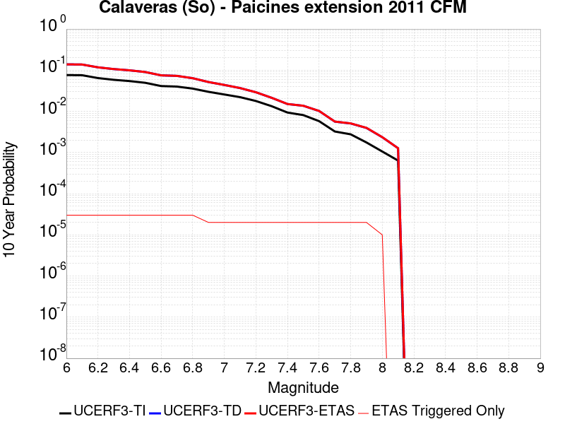 |

| Magnitude | 1 yr TI Prob | TD Prob | ETAS Prob | ETAS/TD Gain | ETAS Triggered Only | 10 yr TI Prob | TD Prob | ETAS Prob | ETAS/TD Gain | ETAS Triggered Only |
|-----|-----|-----|-----|-----|-----|-----|-----|-----|-----|-----|
| 6.0 | 0.007891912 | 0.015695788 | 0.015725316 | 1.0018814 | 3.0E-5 | 0.076174594 | 0.13848738 | 0.13851322 | 1.0001867 | 3.0E-5 |
| 6.1 | 0.0078097614 | 0.015539181 | 0.0155687155 | 1.0019006 | 3.0E-5 | 0.075409345 | 0.137157 | 0.13718288 | 1.0001887 | 3.0E-5 |
| 6.2 | 0.0066279583 | 0.013046782 | 0.013076391 | 1.0022694 | 3.0E-5 | 0.064337276 | 0.11725471 | 0.1172812 | 1.0002259 | 3.0E-5 |
| 6.3 | 0.0059959386 | 0.011668004 | 0.011697654 | 1.0025412 | 3.0E-5 | 0.058367174 | 0.10637074 | 0.10639755 | 1.000252 | 3.0E-5 |
| 6.4 | 0.0055782744 | 0.010772841 | 0.010802518 | 1.0027548 | 3.0E-5 | 0.0544031 | 0.09919323 | 0.09922025 | 1.0002724 | 3.0E-5 |
| 6.5 | 0.0050468626 | 0.009694735 | 0.009724444 | 1.0030645 | 3.0E-5 | 0.04933773 | 0.09008491 | 0.09011221 | 1.000303 | 3.0E-5 |
| 6.6 | 0.0041944524 | 0.007826331 | 0.007856096 | 1.0038033 | 3.0E-5 | 0.04116161 | 0.07485468 | 0.07488243 | 1.0003707 | 3.0E-5 |
| 6.7 | 0.004070005 | 0.0075891656 | 0.0076189376 | 1.003923 | 3.0E-5 | 0.039962657 | 0.07270423 | 0.07273205 | 1.0003827 | 3.0E-5 |
| 6.8 | 0.0036279052 | 0.0066134874 | 0.0066432892 | 1.0045062 | 3.0E-5 | 0.03569247 | 0.06379951 | 0.0638276 | 1.0004402 | 3.0E-5 |
| 6.9 | 0.0030218933 | 0.005279189 | 0.0052990834 | 1.0037684 | 2.0E-5 | 0.029811295 | 0.05150214 | 0.051521108 | 1.0003684 | 2.0E-5 |
| 7.0 | 0.0025986114 | 0.0044608624 | 0.004480773 | 1.0044634 | 2.0E-5 | 0.025684336 | 0.043782216 | 0.04380134 | 1.0004368 | 2.0E-5 |
| 7.1 | 0.0022328163 | 0.0037043917 | 0.0037243175 | 1.005379 | 2.0E-5 | 0.022105146 | 0.036736332 | 0.0367556 | 1.0005244 | 2.0E-5 |
| 7.2 | 0.0017986323 | 0.0029062494 | 0.0029261913 | 1.0068617 | 2.0E-5 | 0.017841442 | 0.029079687 | 0.029099105 | 1.0006678 | 2.0E-5 |
| 7.3 | 0.0013405791 | 0.0021156976 | 0.0021356551 | 1.0094332 | 2.0E-5 | 0.013325208 | 0.021297663 | 0.021317236 | 1.0009191 | 2.0E-5 |
| 7.4 | 9.3894306E-4 | 0.0014865671 | 0.0015065373 | 1.0134338 | 2.0E-5 | 0.009349857 | 0.015052582 | 0.0150722815 | 1.0013087 | 2.0E-5 |
| 7.5 | 8.134431E-4 | 0.0013465339 | 0.0013665069 | 1.014833 | 2.0E-5 | 0.008104719 | 0.013652504 | 0.013672231 | 1.0014449 | 2.0E-5 |
| 7.6 | 5.795553E-4 | 0.0010025257 | 0.0010225057 | 1.0199296 | 2.0E-5 | 0.0057804612 | 0.010204275 | 0.010224071 | 1.00194 | 2.0E-5 |
| 7.7 | 3.241884E-4 | 5.444767E-4 | 5.6446576E-4 | 1.0367125 | 2.0E-5 | 0.0032371588 | 0.005620117 | 0.0056400043 | 1.0035386 | 2.0E-5 |
| 7.8 | 2.7679754E-4 | 4.921113E-4 | 5.121015E-4 | 1.0406212 | 2.0E-5 | 0.0027645302 | 0.0050745797 | 0.0050944784 | 1.0039213 | 2.0E-5 |
| 7.9 | 1.7548777E-4 | 3.8528212E-4 | 4.0527442E-4 | 1.05189 | 2.0E-5 | 0.0017534926 | 0.003948726 | 0.003968647 | 1.0050449 | 2.0E-5 |
| 8.0 | 1.05766376E-4 | 2.3025303E-4 | 2.4025074E-4 | 1.0434204 | 1.0E-5 | 0.0010571606 | 0.0023511879 | 0.0023611644 | 1.0042431 | 1.0E-5 |
| 8.1 | 6.3687774E-5 | 1.2392878E-4 | 1.2392878E-4 | 1.0 | 0.0 | 6.366953E-4 | 0.0012705972 | 0.0012705972 | 1.0 | 0.0 |

## Santa Ynez River
*[(top)](#table-of-contents)*

| 1 Year | 10 Year |
|-----|-----|
|  | 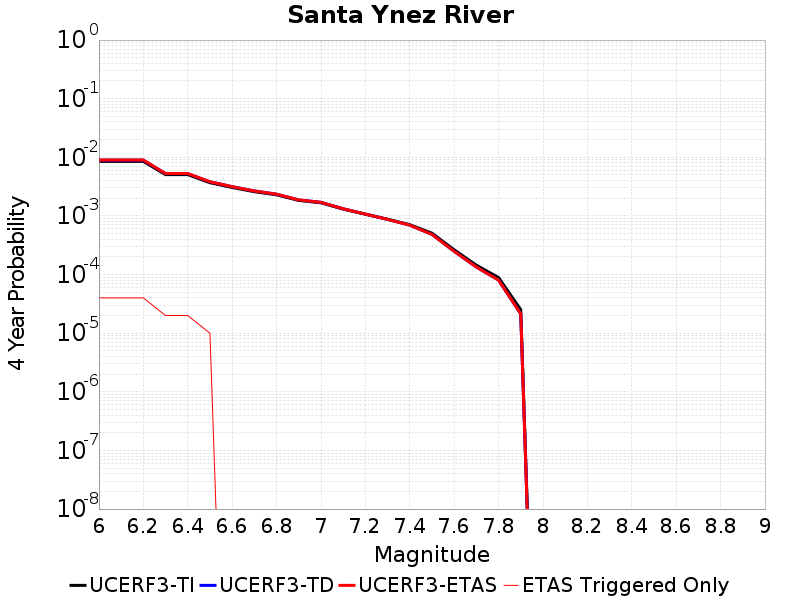 |

| Magnitude | 1 yr TI Prob | TD Prob | ETAS Prob | ETAS/TD Gain | ETAS Triggered Only | 10 yr TI Prob | TD Prob | ETAS Prob | ETAS/TD Gain | ETAS Triggered Only |
|-----|-----|-----|-----|-----|-----|-----|-----|-----|-----|-----|
| 6.0 | 8.551848E-4 | 8.9760707E-4 | 9.3757117E-4 | 1.0445229 | 4.0E-5 | 0.0085190125 | 0.008943364 | 0.008983007 | 1.0044326 | 4.0E-5 |
| 6.1 | 8.551848E-4 | 8.9760707E-4 | 9.3757117E-4 | 1.0445229 | 4.0E-5 | 0.0085190125 | 0.008943364 | 0.008983007 | 1.0044326 | 4.0E-5 |
| 6.2 | 8.551848E-4 | 8.9760707E-4 | 9.3757117E-4 | 1.0445229 | 4.0E-5 | 0.0085190125 | 0.008943364 | 0.008983007 | 1.0044326 | 4.0E-5 |
| 6.3 | 5.0793495E-4 | 5.280376E-4 | 5.4802705E-4 | 1.0378561 | 2.0E-5 | 0.005067755 | 0.0052683353 | 0.00528823 | 1.0037763 | 2.0E-5 |
| 6.4 | 5.0793495E-4 | 5.280376E-4 | 5.4802705E-4 | 1.0378561 | 2.0E-5 | 0.005067755 | 0.0052683353 | 0.00528823 | 1.0037763 | 2.0E-5 |
| 6.5 | 3.694598E-4 | 3.8239374E-4 | 3.9238992E-4 | 1.026141 | 1.0E-5 | 0.0036884616 | 0.0038175192 | 0.003827481 | 1.0026095 | 1.0E-5 |
| 6.6 | 3.064116E-4 | 3.1614082E-4 | 3.1614082E-4 | 1.0 | 0.0 | 0.0030598943 | 0.0031569984 | 0.0031569984 | 1.0 | 0.0 |
| 6.7 | 2.5946548E-4 | 2.6690614E-4 | 2.6690614E-4 | 1.0 | 0.0 | 0.0025916274 | 0.0026659048 | 0.0026659048 | 1.0 | 0.0 |
| 6.8 | 2.2937685E-4 | 2.3534973E-4 | 2.3534973E-4 | 1.0 | 0.0 | 0.0022914023 | 0.0023510403 | 0.0023510403 | 1.0 | 0.0 |
| 6.9 | 1.8394225E-4 | 1.878954E-4 | 1.878954E-4 | 1.0 | 0.0 | 0.0018379007 | 0.0018773816 | 0.0018773816 | 1.0 | 0.0 |
| 7.0 | 1.6756308E-4 | 1.7080054E-4 | 1.7080054E-4 | 1.0 | 0.0 | 0.0016743679 | 0.001706707 | 0.001706707 | 1.0 | 0.0 |
| 7.1 | 1.3093173E-4 | 1.3257314E-4 | 1.3257314E-4 | 1.0 | 0.0 | 0.0013085462 | 0.0013249465 | 0.0013249465 | 1.0 | 0.0 |
| 7.2 | 1.0704277E-4 | 1.0758341E-4 | 1.0758341E-4 | 1.0 | 0.0 | 0.0010699122 | 0.0010753175 | 0.0010753175 | 1.0 | 0.0 |
| 7.3 | 8.78949E-5 | 8.752019E-5 | 8.752019E-5 | 1.0 | 0.0 | 8.7860145E-4 | 8.748601E-4 | 8.748601E-4 | 1.0 | 0.0 |
| 7.4 | 7.096187E-5 | 6.956926E-5 | 6.956926E-5 | 1.0 | 0.0 | 7.0939213E-4 | 6.9547707E-4 | 6.9547707E-4 | 1.0 | 0.0 |
| 7.5 | 5.079636E-5 | 4.8473335E-5 | 4.8473335E-5 | 1.0 | 0.0 | 5.0784746E-4 | 4.8462933E-4 | 4.8462933E-4 | 1.0 | 0.0 |
| 7.6 | 2.6439517E-5 | 2.4933615E-5 | 2.4933615E-5 | 1.0 | 0.0 | 2.643637E-4 | 2.4930894E-4 | 2.4930894E-4 | 1.0 | 0.0 |
| 7.7 | 1.4448608E-5 | 1.3440664E-5 | 1.3440664E-5 | 1.0 | 0.0 | 1.444767E-4 | 1.3439855E-4 | 1.3439855E-4 | 1.0 | 0.0 |
| 7.8 | 8.893623E-6 | 8.061049E-6 | 8.061049E-6 | 1.0 | 0.0 | 8.893267E-5 | 8.060759E-5 | 8.060759E-5 | 1.0 | 0.0 |
| 7.9 | 2.5225327E-6 | 2.1346727E-6 | 2.1346727E-6 | 1.0 | 0.0 | 2.5225041E-5 | 2.1346526E-5 | 2.1346526E-5 | 1.0 | 0.0 |

## Green Valley 2011 CFM
*[(top)](#table-of-contents)*

| 1 Year | 10 Year |
|-----|-----|
| 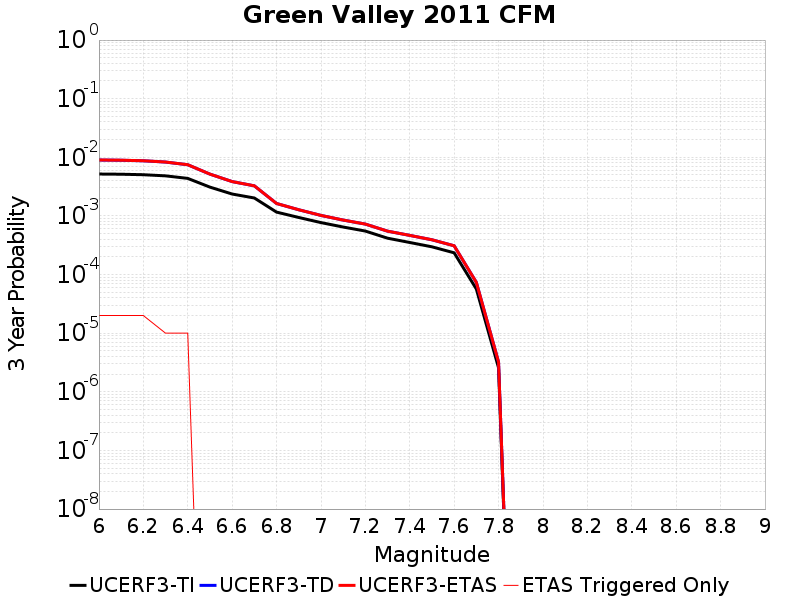 | 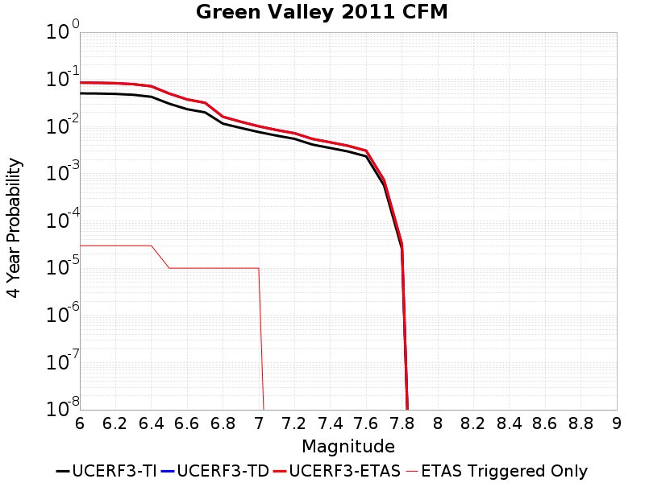 |

| Magnitude | 1 yr TI Prob | TD Prob | ETAS Prob | ETAS/TD Gain | ETAS Triggered Only | 10 yr TI Prob | TD Prob | ETAS Prob | ETAS/TD Gain | ETAS Triggered Only |
|-----|-----|-----|-----|-----|-----|-----|-----|-----|-----|-----|
| 6.0 | 0.0051852856 | 0.00898672 | 0.00900654 | 1.0022055 | 2.0E-5 | 0.050659515 | 0.08552223 | 0.08554966 | 1.0003208 | 3.0E-5 |
| 6.1 | 0.0051454236 | 0.008907748 | 0.008927571 | 1.0022253 | 2.0E-5 | 0.050279044 | 0.08480985 | 0.0848373 | 1.0003238 | 3.0E-5 |
| 6.2 | 0.0050471667 | 0.008721129 | 0.008740954 | 1.0022733 | 2.0E-5 | 0.04934063 | 0.08311877 | 0.083146274 | 1.0003309 | 3.0E-5 |
| 6.3 | 0.0048282105 | 0.008296453 | 0.008306371 | 1.0011953 | 1.0E-5 | 0.047246475 | 0.079257235 | 0.079284854 | 1.0003486 | 3.0E-5 |
| 6.4 | 0.004369175 | 0.007467098 | 0.0074770236 | 1.0013292 | 1.0E-5 | 0.04284265 | 0.071631014 | 0.071658865 | 1.0003889 | 3.0E-5 |
| 6.5 | 0.0031009112 | 0.005168306 | 0.005168306 | 1.0 | 0.0 | 0.030579966 | 0.050145987 | 0.050155487 | 1.0001894 | 1.0E-5 |
| 6.6 | 0.0023641558 | 0.0038539516 | 0.0038539516 | 1.0 | 0.0 | 0.023391623 | 0.03766607 | 0.037675694 | 1.0002555 | 1.0E-5 |
| 6.7 | 0.0020229418 | 0.0032626675 | 0.0032626675 | 1.0 | 0.0 | 0.020046256 | 0.032006007 | 0.032015685 | 1.0003024 | 1.0E-5 |
| 6.8 | 0.0011621192 | 0.0016311093 | 0.0016311093 | 1.0 | 0.0 | 0.011560607 | 0.016166013 | 0.016175851 | 1.0006086 | 1.0E-5 |
| 6.9 | 9.4139716E-4 | 0.0012748718 | 0.0012748718 | 1.0 | 0.0 | 0.009374191 | 0.012667842 | 0.012677715 | 1.0007794 | 1.0E-5 |
| 7.0 | 7.7002996E-4 | 0.0010212974 | 0.0010212974 | 1.0 | 0.0 | 0.007673672 | 0.0101653505 | 0.010175249 | 1.0009737 | 1.0E-5 |
| 7.1 | 6.467941E-4 | 8.503524E-4 | 8.503524E-4 | 1.0 | 0.0 | 0.006449148 | 0.0084712645 | 0.0084712645 | 1.0 | 0.0 |
| 7.2 | 5.521186E-4 | 7.261601E-4 | 7.261601E-4 | 1.0 | 0.0 | 0.0055074887 | 0.00723829 | 0.00723829 | 1.0 | 0.0 |
| 7.3 | 4.1724785E-4 | 5.500251E-4 | 5.500251E-4 | 1.0 | 0.0 | 0.004164653 | 0.0054869037 | 0.0054869037 | 1.0 | 0.0 |
| 7.4 | 3.5251552E-4 | 4.6599022E-4 | 4.6599022E-4 | 1.0 | 0.0 | 0.0035195686 | 0.004650334 | 0.004650334 | 1.0 | 0.0 |
| 7.5 | 2.9731085E-4 | 3.9211634E-4 | 3.9211634E-4 | 1.0 | 0.0 | 0.002969134 | 0.0039143967 | 0.0039143967 | 1.0 | 0.0 |
| 7.6 | 2.3496768E-4 | 3.0966947E-4 | 3.0966947E-4 | 1.0 | 0.0 | 0.002347194 | 0.0030925046 | 0.0030925046 | 1.0 | 0.0 |
| 7.7 | 5.6735033E-5 | 7.360564E-5 | 7.360564E-5 | 1.0 | 0.0 | 5.672055E-4 | 7.358146E-4 | 7.358146E-4 | 1.0 | 0.0 |
| 7.8 | 2.5762572E-6 | 3.2234425E-6 | 3.2234425E-6 | 1.0 | 0.0 | 2.5762274E-5 | 3.2232332E-5 | 3.2232332E-5 | 1.0 | 0.0 |

## Cleghorn Lake
*[(top)](#table-of-contents)*

| 1 Year | 10 Year |
|-----|-----|
| 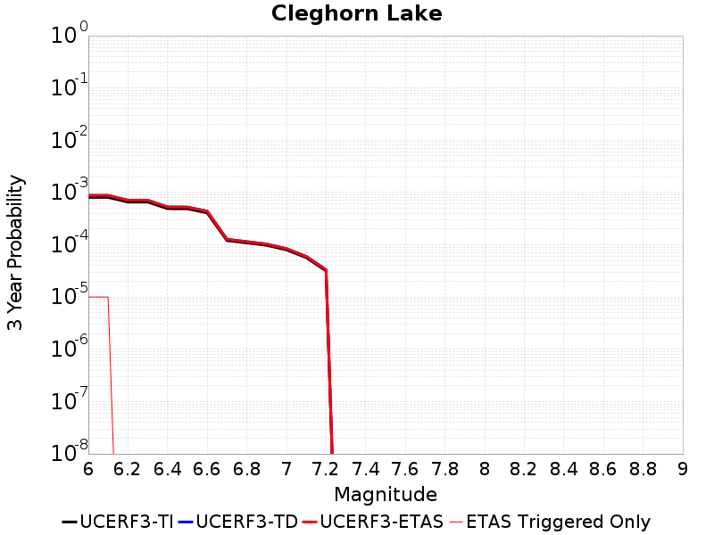 | 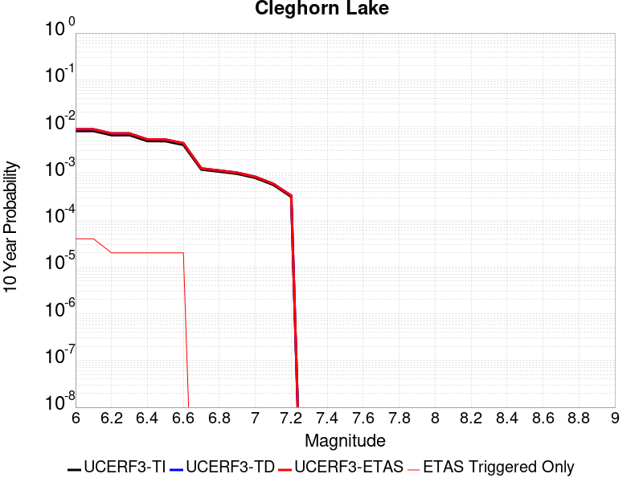 |

| Magnitude | 1 yr TI Prob | TD Prob | ETAS Prob | ETAS/TD Gain | ETAS Triggered Only | 10 yr TI Prob | TD Prob | ETAS Prob | ETAS/TD Gain | ETAS Triggered Only |
|-----|-----|-----|-----|-----|-----|-----|-----|-----|-----|-----|
| 6.0 | 8.067362E-4 | 8.7598065E-4 | 8.859719E-4 | 1.0114058 | 1.0E-5 | 0.008038137 | 0.008730705 | 0.008770356 | 1.0045415 | 4.0E-5 |
| 6.1 | 8.067362E-4 | 8.7598065E-4 | 8.859719E-4 | 1.0114058 | 1.0E-5 | 0.008038137 | 0.008730705 | 0.008770356 | 1.0045415 | 4.0E-5 |
| 6.2 | 6.585225E-4 | 7.1368634E-4 | 7.1368634E-4 | 1.0 | 0.0 | 0.0065657445 | 0.007118739 | 0.007138597 | 1.0027895 | 2.0E-5 |
| 6.3 | 6.585225E-4 | 7.1368634E-4 | 7.1368634E-4 | 1.0 | 0.0 | 0.0065657445 | 0.007118739 | 0.007138597 | 1.0027895 | 2.0E-5 |
| 6.4 | 4.912829E-4 | 5.305686E-4 | 5.305686E-4 | 1.0 | 0.0 | 0.004901982 | 0.005297054 | 0.0053169485 | 1.0037557 | 2.0E-5 |
| 6.5 | 4.8870314E-4 | 5.278268E-4 | 5.278268E-4 | 1.0 | 0.0 | 0.004876298 | 0.005269767 | 0.005289661 | 1.0037752 | 2.0E-5 |
| 6.6 | 4.0710976E-4 | 4.4043065E-4 | 4.4043065E-4 | 1.0 | 0.0 | 0.0040636472 | 0.0043994947 | 0.004419407 | 1.004526 | 2.0E-5 |
| 6.7 | 1.205706E-4 | 1.2750807E-4 | 1.2750807E-4 | 1.0 | 0.0 | 0.001205052 | 0.0012743677 | 0.0012743677 | 1.0 | 0.0 |
| 6.8 | 1.08957785E-4 | 1.1511442E-4 | 1.1511442E-4 | 1.0 | 0.0 | 0.0010890438 | 0.0011505648 | 0.0011505648 | 1.0 | 0.0 |
| 6.9 | 9.7931086E-5 | 1.0336342E-4 | 1.0336342E-4 | 1.0 | 0.0 | 9.788794E-4 | 0.0010331693 | 0.0010331693 | 1.0 | 0.0 |
| 7.0 | 8.01304E-5 | 8.454062E-5 | 8.454062E-5 | 1.0 | 0.0 | 8.010151E-4 | 8.4509706E-4 | 8.4509706E-4 | 1.0 | 0.0 |
| 7.1 | 5.6901354E-5 | 5.999132E-5 | 5.999132E-5 | 1.0 | 0.0 | 5.6886784E-4 | 5.99761E-4 | 5.99761E-4 | 1.0 | 0.0 |
| 7.2 | 3.1654577E-5 | 3.3327455E-5 | 3.3327455E-5 | 1.0 | 0.0 | 3.1650066E-4 | 3.332314E-4 | 3.332314E-4 | 1.0 | 0.0 |

## Oak Ridge (Onshore)
*[(top)](#table-of-contents)*

| 1 Year | 10 Year |
|-----|-----|
| 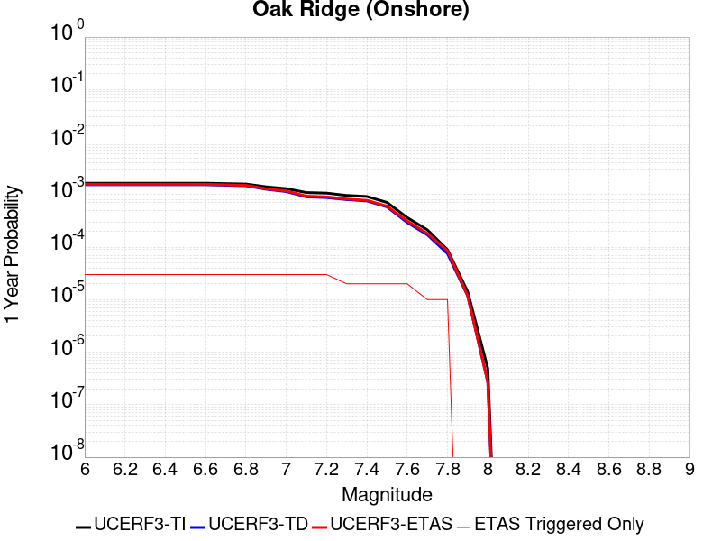 | 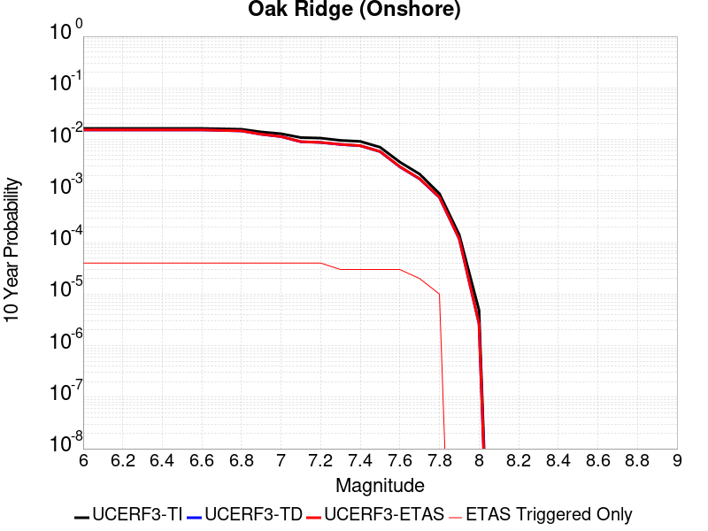 |

| Magnitude | 1 yr TI Prob | TD Prob | ETAS Prob | ETAS/TD Gain | ETAS Triggered Only | 10 yr TI Prob | TD Prob | ETAS Prob | ETAS/TD Gain | ETAS Triggered Only |
|-----|-----|-----|-----|-----|-----|-----|-----|-----|-----|-----|
| 6.0 | 0.001644939 | 0.0015395028 | 0.0015694565 | 1.0194569 | 3.0E-5 | 0.01632816 | 0.015292882 | 0.01533227 | 1.0025756 | 4.0E-5 |
| 6.1 | 0.001644939 | 0.0015395028 | 0.0015694565 | 1.0194569 | 3.0E-5 | 0.01632816 | 0.015292882 | 0.01533227 | 1.0025756 | 4.0E-5 |
| 6.2 | 0.001644939 | 0.0015395028 | 0.0015694565 | 1.0194569 | 3.0E-5 | 0.01632816 | 0.015292882 | 0.01533227 | 1.0025756 | 4.0E-5 |
| 6.3 | 0.001644939 | 0.0015395028 | 0.0015694565 | 1.0194569 | 3.0E-5 | 0.01632816 | 0.015292882 | 0.01533227 | 1.0025756 | 4.0E-5 |
| 6.4 | 0.001644939 | 0.0015395028 | 0.0015694565 | 1.0194569 | 3.0E-5 | 0.01632816 | 0.015292882 | 0.01533227 | 1.0025756 | 4.0E-5 |
| 6.5 | 0.001644939 | 0.0015395028 | 0.0015694565 | 1.0194569 | 3.0E-5 | 0.01632816 | 0.015292882 | 0.01533227 | 1.0025756 | 4.0E-5 |
| 6.6 | 0.001644939 | 0.0015395028 | 0.0015694565 | 1.0194569 | 3.0E-5 | 0.01632816 | 0.015292882 | 0.01533227 | 1.0025756 | 4.0E-5 |
| 6.7 | 0.0016156785 | 0.001505022 | 0.0015349769 | 1.0199033 | 3.0E-5 | 0.016039822 | 0.014952736 | 0.014992137 | 1.0026351 | 4.0E-5 |
| 6.8 | 0.0015875935 | 0.0014724678 | 0.0015024237 | 1.020344 | 3.0E-5 | 0.015762992 | 0.014631484 | 0.014670898 | 1.0026938 | 4.0E-5 |
| 6.9 | 0.0014067689 | 0.0012629951 | 0.0012929572 | 1.023723 | 3.0E-5 | 0.0139789665 | 0.012560887 | 0.012600385 | 1.0031445 | 4.0E-5 |
| 7.0 | 0.0012981043 | 0.0011401128 | 0.0011700785 | 1.0262831 | 3.0E-5 | 0.012905477 | 0.011344921 | 0.011384467 | 1.0034858 | 4.0E-5 |
| 7.1 | 0.0010923136 | 9.051365E-4 | 9.351094E-4 | 1.0331142 | 3.0E-5 | 0.0108696 | 0.009015434 | 0.009055073 | 1.0043968 | 4.0E-5 |
| 7.2 | 0.0010659413 | 8.7672065E-4 | 9.0669433E-4 | 1.0341884 | 3.0E-5 | 0.010608427 | 0.008733537 | 0.008773187 | 1.0045401 | 4.0E-5 |
| 7.3 | 9.6293533E-4 | 8.022907E-4 | 8.2227465E-4 | 1.0249087 | 2.0E-5 | 0.009587734 | 0.007994806 | 0.008024567 | 1.0037224 | 3.0E-5 |
| 7.4 | 9.1956573E-4 | 7.5719174E-4 | 7.771766E-4 | 1.0263934 | 2.0E-5 | 0.009157699 | 0.007546922 | 0.0075766956 | 1.0039451 | 3.0E-5 |
| 7.5 | 7.0911803E-4 | 5.823249E-4 | 6.0231326E-4 | 1.0343251 | 2.0E-5 | 0.007068595 | 0.0058082617 | 0.0058380873 | 1.005135 | 3.0E-5 |
| 7.6 | 3.646084E-4 | 2.9407395E-4 | 3.1406808E-4 | 1.0679901 | 2.0E-5 | 0.0036401073 | 0.0029368922 | 0.002966804 | 1.0101849 | 3.0E-5 |
| 7.7 | 2.1299256E-4 | 1.7130164E-4 | 1.8129993E-4 | 1.0583665 | 1.0E-5 | 0.0021278851 | 0.0017117093 | 0.0017316751 | 1.0116643 | 2.0E-5 |
| 7.8 | 8.882289E-5 | 7.498052E-5 | 8.4979765E-5 | 1.133358 | 1.0E-5 | 8.8787393E-4 | 7.49555E-4 | 7.5954746E-4 | 1.0133313 | 1.0E-5 |
| 7.9 | 1.4198865E-5 | 1.180091E-5 | 1.180091E-5 | 1.0 | 0.0 | 1.4197957E-4 | 1.1800311E-4 | 1.1800311E-4 | 1.0 | 0.0 |
| 8.0 | 4.8861335E-7 | 2.671903E-7 | 2.671903E-7 | 1.0 | 0.0 | 4.8861225E-6 | 2.6719001E-6 | 2.6719001E-6 | 1.0 | 0.0 |

## Santa Cruz Catalina Ridge alt1
*[(top)](#table-of-contents)*

| 1 Year | 10 Year |
|-----|-----|
| 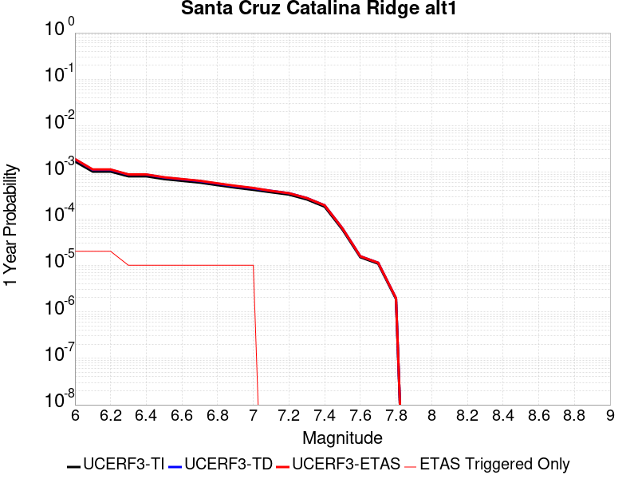 | 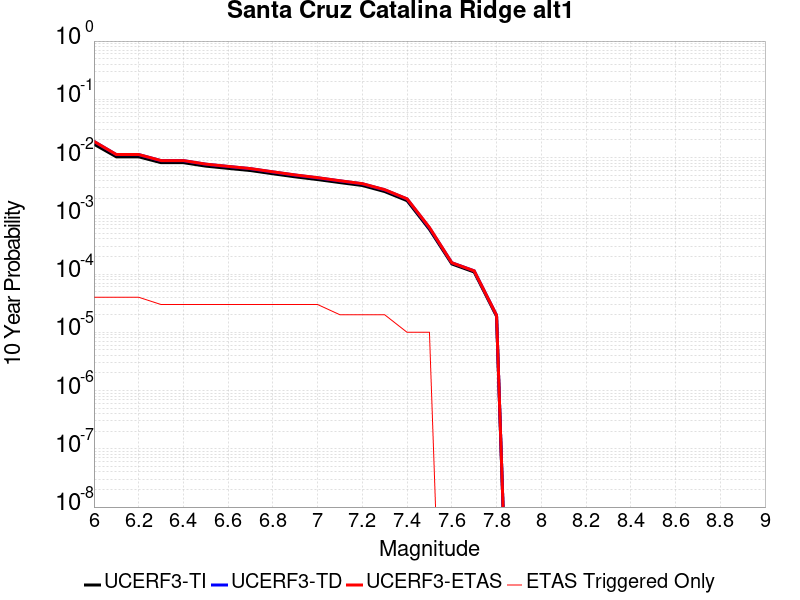 |

| Magnitude | 1 yr TI Prob | TD Prob | ETAS Prob | ETAS/TD Gain | ETAS Triggered Only | 10 yr TI Prob | TD Prob | ETAS Prob | ETAS/TD Gain | ETAS Triggered Only |
|-----|-----|-----|-----|-----|-----|-----|-----|-----|-----|-----|
| 6.0 | 0.00171175 | 0.0019059622 | 0.0019259242 | 1.0104734 | 2.0E-5 | 0.016986247 | 0.018913057 | 0.018952299 | 1.002075 | 4.0E-5 |
| 6.1 | 0.0010344655 | 0.0011295588 | 0.0011495362 | 1.017686 | 2.0E-5 | 0.010296632 | 0.011240308 | 0.011279859 | 1.0035186 | 4.0E-5 |
| 6.2 | 0.0010344655 | 0.0011295588 | 0.0011495362 | 1.017686 | 2.0E-5 | 0.010296632 | 0.011240308 | 0.011279859 | 1.0035186 | 4.0E-5 |
| 6.3 | 8.2034385E-4 | 8.884273E-4 | 8.984184E-4 | 1.0112458 | 1.0E-5 | 0.008173222 | 0.0088494355 | 0.008879171 | 1.00336 | 3.0E-5 |
| 6.4 | 8.2034385E-4 | 8.884273E-4 | 8.984184E-4 | 1.0112458 | 1.0E-5 | 0.008173222 | 0.0088494355 | 0.008879171 | 1.00336 | 3.0E-5 |
| 6.5 | 7.1499916E-4 | 7.716694E-4 | 7.8166166E-4 | 1.0129489 | 1.0E-5 | 0.0071270303 | 0.007690297 | 0.0077200667 | 1.003871 | 3.0E-5 |
| 6.6 | 6.540996E-4 | 7.0470385E-4 | 7.1469677E-4 | 1.0141803 | 1.0E-5 | 0.0065217763 | 0.007024995 | 0.0070547843 | 1.0042405 | 3.0E-5 |
| 6.7 | 6.0008996E-4 | 6.45632E-4 | 6.5562554E-4 | 1.0154787 | 1.0E-5 | 0.005984721 | 0.006437792 | 0.006467599 | 1.00463 | 3.0E-5 |
| 6.8 | 5.282958E-4 | 5.6739425E-4 | 5.7738856E-4 | 1.0176145 | 1.0E-5 | 0.0052704164 | 0.005659625 | 0.005689455 | 1.0052707 | 3.0E-5 |
| 6.9 | 4.6745385E-4 | 5.0126837E-4 | 5.112633E-4 | 1.0199394 | 1.0E-5 | 0.0046647177 | 0.005001496 | 0.0050313463 | 1.0059682 | 3.0E-5 |
| 7.0 | 4.1978562E-4 | 4.496681E-4 | 4.596636E-4 | 1.0222286 | 1.0E-5 | 0.004189935 | 0.004487673 | 0.004517538 | 1.006655 | 3.0E-5 |
| 7.1 | 3.7228514E-4 | 3.984452E-4 | 3.984452E-4 | 1.0 | 0.0 | 0.0037166206 | 0.003977385 | 0.003997305 | 1.0050085 | 2.0E-5 |
| 7.2 | 3.3190678E-4 | 3.550122E-4 | 3.550122E-4 | 1.0 | 0.0 | 0.0033141149 | 0.0035445192 | 0.003564448 | 1.0056225 | 2.0E-5 |
| 7.3 | 2.6107338E-4 | 2.7920742E-4 | 2.7920742E-4 | 1.0 | 0.0 | 0.002607669 | 0.002788621 | 0.0028085653 | 1.007152 | 2.0E-5 |
| 7.4 | 1.8209449E-4 | 1.9471515E-4 | 1.9471515E-4 | 1.0 | 0.0 | 0.0018194534 | 0.0019454841 | 0.0019554645 | 1.00513 | 1.0E-5 |
| 7.5 | 5.851682E-5 | 6.205871E-5 | 6.205871E-5 | 1.0 | 0.0 | 5.850142E-4 | 6.2041683E-4 | 6.304106E-4 | 1.0161082 | 1.0E-5 |
| 7.6 | 1.4922465E-5 | 1.5628413E-5 | 1.5628413E-5 | 1.0 | 0.0 | 1.4921463E-4 | 1.5627328E-4 | 1.5627328E-4 | 1.0 | 0.0 |
| 7.7 | 1.08434415E-5 | 1.1345822E-5 | 1.1345822E-5 | 1.0 | 0.0 | 1.0842913E-4 | 1.13452516E-4 | 1.13452516E-4 | 1.0 | 0.0 |
| 7.8 | 1.8861368E-6 | 1.9640538E-6 | 1.9640538E-6 | 1.0 | 0.0 | 1.8861208E-5 | 1.9640376E-5 | 1.9640376E-5 | 1.0 | 0.0 |

## Kern Canyon (Lake Isabella) 2011
*[(top)](#table-of-contents)*

| 1 Year | 10 Year |
|-----|-----|
| 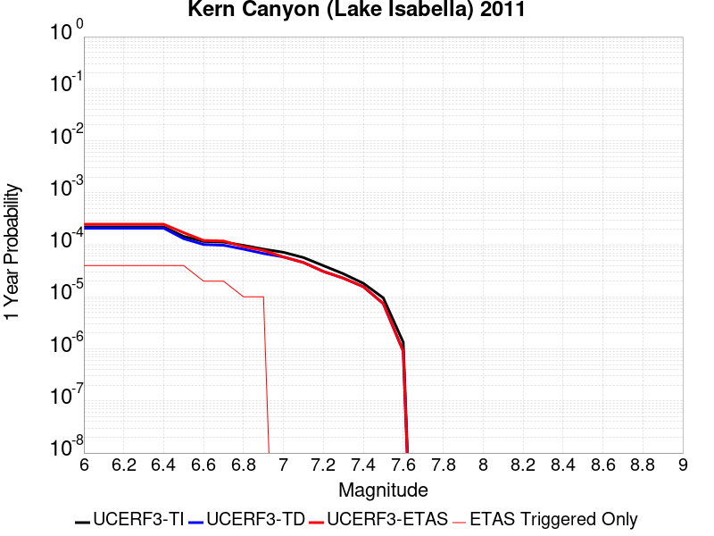 | 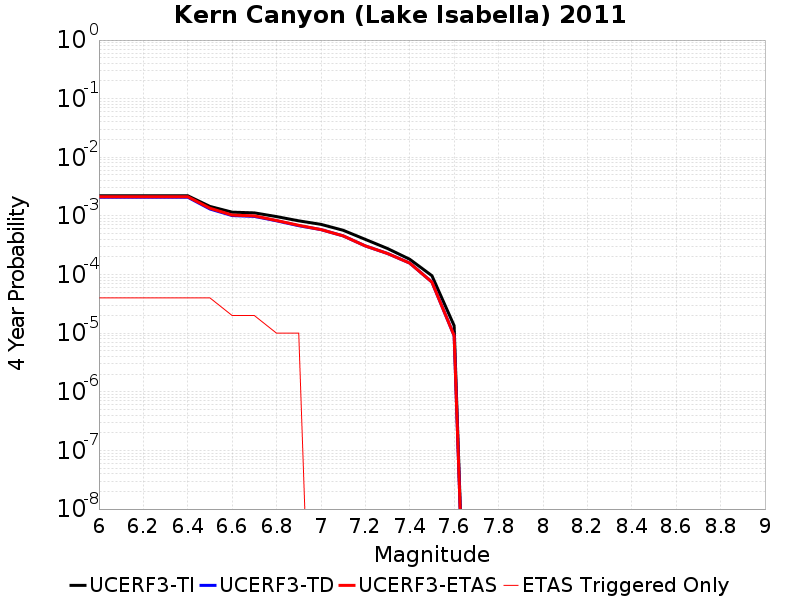 |

| Magnitude | 1 yr TI Prob | TD Prob | ETAS Prob | ETAS/TD Gain | ETAS Triggered Only | 10 yr TI Prob | TD Prob | ETAS Prob | ETAS/TD Gain | ETAS Triggered Only |
|-----|-----|-----|-----|-----|-----|-----|-----|-----|-----|-----|
| 6.0 | 2.2114732E-4 | 2.0878046E-4 | 2.4877212E-4 | 1.1915488 | 4.0E-5 | 0.0022092736 | 0.002086027 | 0.0021259435 | 1.0191352 | 4.0E-5 |
| 6.1 | 2.2114732E-4 | 2.0878046E-4 | 2.4877212E-4 | 1.1915488 | 4.0E-5 | 0.0022092736 | 0.002086027 | 0.0021259435 | 1.0191352 | 4.0E-5 |
| 6.2 | 2.2114732E-4 | 2.0878046E-4 | 2.4877212E-4 | 1.1915488 | 4.0E-5 | 0.0022092736 | 0.002086027 | 0.0021259435 | 1.0191352 | 4.0E-5 |
| 6.3 | 2.2114732E-4 | 2.0878046E-4 | 2.4877212E-4 | 1.1915488 | 4.0E-5 | 0.0022092736 | 0.002086027 | 0.0021259435 | 1.0191352 | 4.0E-5 |
| 6.4 | 2.2114732E-4 | 2.0878046E-4 | 2.4877212E-4 | 1.1915488 | 4.0E-5 | 0.0022092736 | 0.002086027 | 0.0021259435 | 1.0191352 | 4.0E-5 |
| 6.5 | 1.4534626E-4 | 1.3137063E-4 | 1.7136538E-4 | 1.304442 | 4.0E-5 | 0.0014525123 | 0.0013129624 | 0.0013529098 | 1.0304254 | 4.0E-5 |
| 6.6 | 1.1600384E-4 | 1.0143667E-4 | 1.2143464E-4 | 1.1971474 | 2.0E-5 | 0.001159433 | 0.0010139123 | 0.001033892 | 1.0197055 | 2.0E-5 |
| 6.7 | 1.1288274E-4 | 9.827391E-5 | 1.1827194E-4 | 1.2034928 | 2.0E-5 | 0.0011282542 | 9.823126E-4 | 0.001002293 | 1.0203401 | 2.0E-5 |
| 6.8 | 9.74947E-5 | 8.260285E-5 | 9.260202E-5 | 1.1210512 | 1.0E-5 | 9.745194E-4 | 8.2572637E-4 | 8.357181E-4 | 1.0121006 | 1.0E-5 |
| 6.9 | 8.251744E-5 | 6.81687E-5 | 7.816802E-5 | 1.1466849 | 1.0E-5 | 8.248681E-4 | 6.8148057E-4 | 6.914738E-4 | 1.0146639 | 1.0E-5 |
| 7.0 | 7.186073E-5 | 5.849429E-5 | 5.849429E-5 | 1.0 | 0.0 | 7.18375E-4 | 5.8479095E-4 | 5.8479095E-4 | 1.0 | 0.0 |
| 7.1 | 5.6961744E-5 | 4.572714E-5 | 4.572714E-5 | 1.0 | 0.0 | 5.6947145E-4 | 4.5717866E-4 | 4.5717866E-4 | 1.0 | 0.0 |
| 7.2 | 3.9799485E-5 | 3.0792497E-5 | 3.0792497E-5 | 1.0 | 0.0 | 3.9792358E-4 | 3.078829E-4 | 3.078829E-4 | 1.0 | 0.0 |
| 7.3 | 2.7793016E-5 | 2.2866709E-5 | 2.2866709E-5 | 1.0 | 0.0 | 2.778954E-4 | 2.2864394E-4 | 2.2864394E-4 | 1.0 | 0.0 |
| 7.4 | 1.8234163E-5 | 1.5687743E-5 | 1.5687743E-5 | 1.0 | 0.0 | 1.8232666E-4 | 1.5686659E-4 | 1.5686659E-4 | 1.0 | 0.0 |
| 7.5 | 9.557518E-6 | 7.432716E-6 | 7.432716E-6 | 1.0 | 0.0 | 9.5571064E-5 | 7.432475E-5 | 7.432475E-5 | 1.0 | 0.0 |
| 7.6 | 1.3421597E-6 | 9.054316E-7 | 9.054316E-7 | 1.0 | 0.0 | 1.3421517E-5 | 9.054284E-6 | 9.054284E-6 | 1.0 | 0.0 |

## Great Valley 07 (Orestimba)
*[(top)](#table-of-contents)*

| 1 Year | 10 Year |
|-----|-----|
| 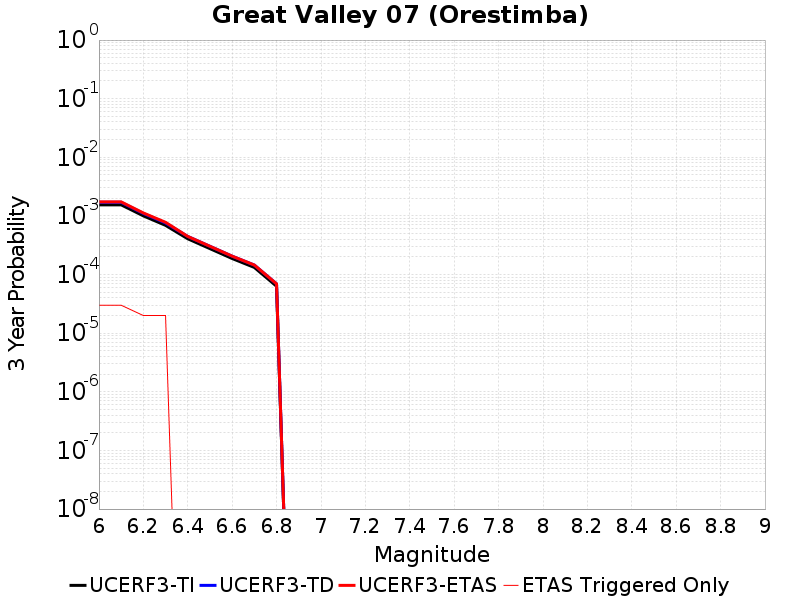 | 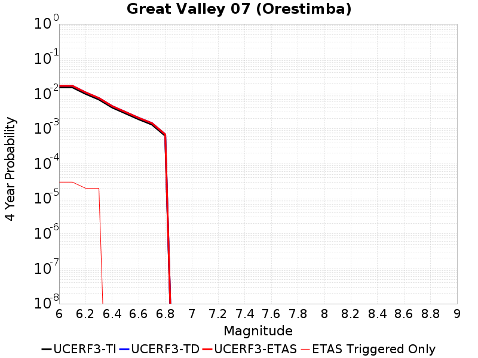 |

| Magnitude | 1 yr TI Prob | TD Prob | ETAS Prob | ETAS/TD Gain | ETAS Triggered Only | 10 yr TI Prob | TD Prob | ETAS Prob | ETAS/TD Gain | ETAS Triggered Only |
|-----|-----|-----|-----|-----|-----|-----|-----|-----|-----|-----|
| 6.0 | 0.0015478961 | 0.0017078866 | 0.0017378354 | 1.0175356 | 3.0E-5 | 0.015371585 | 0.016955158 | 0.016984649 | 1.0017394 | 3.0E-5 |
| 6.1 | 0.0015478961 | 0.0017078866 | 0.0017378354 | 1.0175356 | 3.0E-5 | 0.015371585 | 0.016955158 | 0.016984649 | 1.0017394 | 3.0E-5 |
| 6.2 | 0.0010029797 | 0.0011034836 | 0.0011234615 | 1.0181044 | 2.0E-5 | 0.00998465 | 0.010982454 | 0.011002234 | 1.0018011 | 2.0E-5 |
| 6.3 | 6.910097E-4 | 7.588499E-4 | 7.788347E-4 | 1.0263357 | 2.0E-5 | 0.006888649 | 0.007563533 | 0.0075833816 | 1.0026243 | 2.0E-5 |
| 6.4 | 4.078841E-4 | 4.4722456E-4 | 4.4722456E-4 | 1.0 | 0.0 | 0.004071363 | 0.004463586 | 0.004463586 | 1.0 | 0.0 |
| 6.5 | 2.7690834E-4 | 3.0352196E-4 | 3.0352196E-4 | 1.0 | 0.0 | 0.0027656353 | 0.0030312834 | 0.0030312834 | 1.0 | 0.0 |
| 6.6 | 1.8784421E-4 | 2.0600796E-4 | 2.0600796E-4 | 1.0 | 0.0 | 0.0018768552 | 0.002058324 | 0.002058324 | 1.0 | 0.0 |
| 6.7 | 1.3232579E-4 | 1.4522862E-4 | 1.4522862E-4 | 1.0 | 0.0 | 0.0013224703 | 0.001451467 | 0.001451467 | 1.0 | 0.0 |
| 6.8 | 6.3216714E-5 | 6.946825E-5 | 6.946825E-5 | 1.0 | 0.0 | 6.3198735E-4 | 6.9456047E-4 | 6.9456047E-4 | 1.0 | 0.0 |

## Kern Canyon (South Kern) 2011
*[(top)](#table-of-contents)*

| 1 Year | 10 Year |
|-----|-----|
| 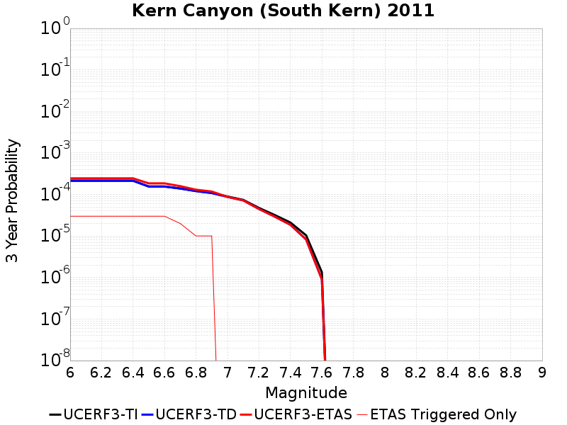 | 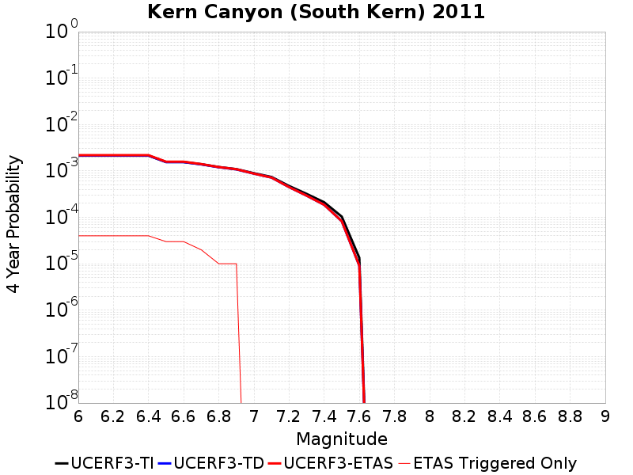 |

| Magnitude | 1 yr TI Prob | TD Prob | ETAS Prob | ETAS/TD Gain | ETAS Triggered Only | 10 yr TI Prob | TD Prob | ETAS Prob | ETAS/TD Gain | ETAS Triggered Only |
|-----|-----|-----|-----|-----|-----|-----|-----|-----|-----|-----|
| 6.0 | 2.1417443E-4 | 2.146265E-4 | 2.4462008E-4 | 1.1397477 | 3.0E-5 | 0.0021396813 | 0.0021442561 | 0.0021841703 | 1.0186145 | 4.0E-5 |
| 6.1 | 2.1417443E-4 | 2.146265E-4 | 2.4462008E-4 | 1.1397477 | 3.0E-5 | 0.0021396813 | 0.0021442561 | 0.0021841703 | 1.0186145 | 4.0E-5 |
| 6.2 | 2.1417443E-4 | 2.146265E-4 | 2.4462008E-4 | 1.1397477 | 3.0E-5 | 0.0021396813 | 0.0021442561 | 0.0021841703 | 1.0186145 | 4.0E-5 |
| 6.3 | 2.1417443E-4 | 2.146265E-4 | 2.4462008E-4 | 1.1397477 | 3.0E-5 | 0.0021396813 | 0.0021442561 | 0.0021841703 | 1.0186145 | 4.0E-5 |
| 6.4 | 2.1417443E-4 | 2.146265E-4 | 2.4462008E-4 | 1.1397477 | 3.0E-5 | 0.0021396813 | 0.0021442561 | 0.0021841703 | 1.0186145 | 4.0E-5 |
| 6.5 | 1.5574014E-4 | 1.5512336E-4 | 1.8511871E-4 | 1.1933645 | 3.0E-5 | 0.0015563103 | 0.0015501659 | 0.0015801195 | 1.0193228 | 3.0E-5 |
| 6.6 | 1.5574014E-4 | 1.5512336E-4 | 1.8511871E-4 | 1.1933645 | 3.0E-5 | 0.0015563103 | 0.0015501659 | 0.0015801195 | 1.0193228 | 3.0E-5 |
| 6.7 | 1.396032E-4 | 1.3869288E-4 | 1.586901E-4 | 1.1441835 | 2.0E-5 | 0.0013951553 | 0.0013860741 | 0.0014060464 | 1.0144092 | 2.0E-5 |
| 6.8 | 1.214839E-4 | 1.20253084E-4 | 1.3025188E-4 | 1.083148 | 1.0E-5 | 0.001214175 | 0.0012018876 | 0.0012118756 | 1.0083102 | 1.0E-5 |
| 6.9 | 1.0942656E-4 | 1.0798529E-4 | 1.1798421E-4 | 1.0925952 | 1.0E-5 | 0.0010937268 | 0.001079334 | 0.0010893232 | 1.0092549 | 1.0E-5 |
| 7.0 | 8.938967E-5 | 8.7588654E-5 | 8.7588654E-5 | 1.0 | 0.0 | 8.935372E-4 | 8.7554514E-4 | 8.7554514E-4 | 1.0 | 0.0 |
| 7.1 | 7.417196E-5 | 7.208612E-5 | 7.208612E-5 | 1.0 | 0.0 | 7.414721E-4 | 7.2063005E-4 | 7.2063005E-4 | 1.0 | 0.0 |
| 7.2 | 4.7470192E-5 | 4.4892306E-5 | 4.4892306E-5 | 1.0 | 0.0 | 4.7460053E-4 | 4.4883345E-4 | 4.4883345E-4 | 1.0 | 0.0 |
| 7.3 | 3.205889E-5 | 2.9366767E-5 | 2.9366767E-5 | 1.0 | 0.0 | 3.2054266E-4 | 2.9362936E-4 | 2.9362936E-4 | 1.0 | 0.0 |
| 7.4 | 2.1131287E-5 | 1.8642362E-5 | 1.8642362E-5 | 1.0 | 0.0 | 2.1129279E-4 | 1.8640823E-4 | 1.8640823E-4 | 1.0 | 0.0 |
| 7.5 | 1.0368436E-5 | 8.260068E-6 | 8.260068E-6 | 1.0 | 0.0 | 1.0367952E-4 | 8.25977E-5 | 8.25977E-5 | 1.0 | 0.0 |
| 7.6 | 1.3421597E-6 | 9.054316E-7 | 9.054316E-7 | 1.0 | 0.0 | 1.3421517E-5 | 9.054284E-6 | 9.054284E-6 | 1.0 | 0.0 |

## San Jacinto (San Jacinto Valley) rev
*[(top)](#table-of-contents)*

| 1 Year | 10 Year |
|-----|-----|
| 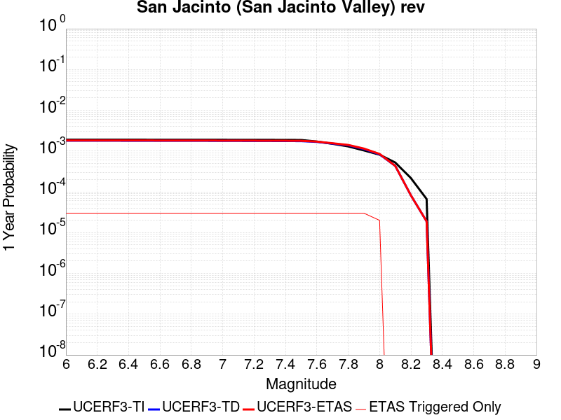 | 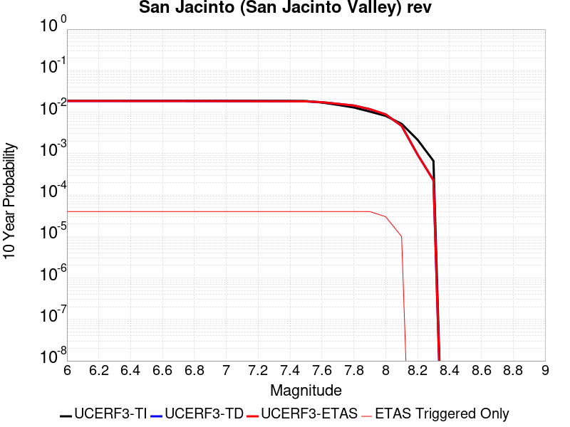 |

| Magnitude | 1 yr TI Prob | TD Prob | ETAS Prob | ETAS/TD Gain | ETAS Triggered Only | 10 yr TI Prob | TD Prob | ETAS Prob | ETAS/TD Gain | ETAS Triggered Only |
|-----|-----|-----|-----|-----|-----|-----|-----|-----|-----|-----|
| 6.0 | 0.0019041431 | 0.0017935655 | 0.0018235117 | 1.0166965 | 3.0E-5 | 0.018879099 | 0.018527342 | 0.018566601 | 1.002119 | 4.0E-5 |
| 6.1 | 0.0019041431 | 0.0017935655 | 0.0018235117 | 1.0166965 | 3.0E-5 | 0.018879099 | 0.018527342 | 0.018566601 | 1.002119 | 4.0E-5 |
| 6.2 | 0.0019041431 | 0.0017935655 | 0.0018235117 | 1.0166965 | 3.0E-5 | 0.018879099 | 0.018527342 | 0.018566601 | 1.002119 | 4.0E-5 |
| 6.3 | 0.0019041431 | 0.0017935655 | 0.0018235117 | 1.0166965 | 3.0E-5 | 0.018879099 | 0.018527342 | 0.018566601 | 1.002119 | 4.0E-5 |
| 6.4 | 0.0019011468 | 0.0017894811 | 0.0018194275 | 1.0167346 | 3.0E-5 | 0.018849645 | 0.018487224 | 0.018526483 | 1.0021237 | 4.0E-5 |
| 6.5 | 0.0019011468 | 0.0017894811 | 0.0018194275 | 1.0167346 | 3.0E-5 | 0.018849645 | 0.018487224 | 0.018526483 | 1.0021237 | 4.0E-5 |
| 6.6 | 0.0018997455 | 0.0017875739 | 0.0018175204 | 1.0167525 | 3.0E-5 | 0.018835869 | 0.018468492 | 0.018507754 | 1.0021259 | 4.0E-5 |
| 6.7 | 0.0018992044 | 0.0017868227 | 0.0018167691 | 1.0167596 | 3.0E-5 | 0.018830549 | 0.018461116 | 0.018500378 | 1.0021267 | 4.0E-5 |
| 6.8 | 0.0018980318 | 0.0017852109 | 0.0018151574 | 1.0167748 | 3.0E-5 | 0.018819023 | 0.01844527 | 0.018484533 | 1.0021286 | 4.0E-5 |
| 6.9 | 0.0018965311 | 0.0017831495 | 0.001813096 | 1.0167942 | 3.0E-5 | 0.018804269 | 0.018425005 | 0.018464267 | 1.002131 | 4.0E-5 |
| 7.0 | 0.0018920569 | 0.0017770045 | 0.0018069511 | 1.0168524 | 3.0E-5 | 0.018760284 | 0.018364586 | 0.018403852 | 1.0021381 | 4.0E-5 |
| 7.1 | 0.001890278 | 0.0017747273 | 0.001804674 | 1.016874 | 3.0E-5 | 0.018742796 | 0.018342186 | 0.018381452 | 1.0021408 | 4.0E-5 |
| 7.2 | 0.001887647 | 0.0017713009 | 0.0018012477 | 1.0169067 | 3.0E-5 | 0.01871693 | 0.018308466 | 0.018347735 | 1.0021448 | 4.0E-5 |
| 7.3 | 0.0018829206 | 0.0017654819 | 0.0017954289 | 1.0169625 | 3.0E-5 | 0.018670462 | 0.018251019 | 0.018290289 | 1.0021516 | 4.0E-5 |
| 7.4 | 0.0018807866 | 0.0017627473 | 0.0017926943 | 1.0169889 | 3.0E-5 | 0.018649481 | 0.018224014 | 0.018263286 | 1.002155 | 4.0E-5 |
| 7.5 | 0.0018692396 | 0.0017528385 | 0.0017827859 | 1.0170851 | 3.0E-5 | 0.018535944 | 0.018125113 | 0.018164387 | 1.0021669 | 4.0E-5 |
| 7.6 | 0.001713488 | 0.0016758965 | 0.0017058463 | 1.0178709 | 3.0E-5 | 0.017003361 | 0.017344764 | 0.017384069 | 1.0022662 | 4.0E-5 |
| 7.7 | 0.0015059357 | 0.001524441 | 0.0015543953 | 1.0196494 | 3.0E-5 | 0.014957713 | 0.01583118 | 0.015870547 | 1.0024867 | 4.0E-5 |
| 7.8 | 0.0013010362 | 0.0013832833 | 0.0014132417 | 1.0216576 | 3.0E-5 | 0.012934455 | 0.014412449 | 0.014451873 | 1.0027354 | 4.0E-5 |
| 7.9 | 0.001036866 | 0.0011216719 | 0.0011516382 | 1.0267158 | 3.0E-5 | 0.010320415 | 0.011777631 | 0.01181716 | 1.0033562 | 4.0E-5 |
| 8.0 | 8.153773E-4 | 8.3129667E-4 | 8.5128006E-4 | 1.0240388 | 2.0E-5 | 0.00812392 | 0.008810981 | 0.008840716 | 1.0033748 | 3.0E-5 |
| 8.1 | 5.2401534E-4 | 4.3311223E-4 | 4.3311223E-4 | 1.0 | 0.0 | 0.0052278144 | 0.004659397 | 0.0046693506 | 1.0021362 | 1.0E-5 |
| 8.2 | 2.1680194E-4 | 8.169348E-5 | 8.169348E-5 | 1.0 | 0.0 | 0.0021659054 | 9.4837823E-4 | 9.4837823E-4 | 1.0 | 0.0 |
| 8.3 | 6.65684E-5 | 1.8864535E-5 | 1.8864535E-5 | 1.0 | 0.0 | 6.6548464E-4 | 2.275375E-4 | 2.275375E-4 | 1.0 | 0.0 |

## Robinson Creek
*[(top)](#table-of-contents)*

| 1 Year | 10 Year |
|-----|-----|
| 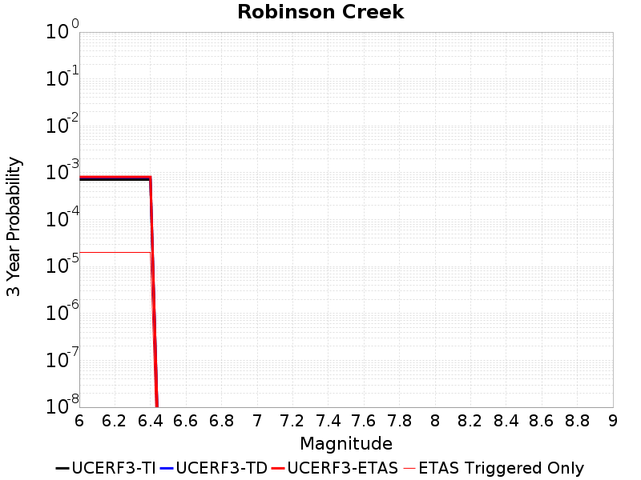 |  |

| Magnitude | 1 yr TI Prob | TD Prob | ETAS Prob | ETAS/TD Gain | ETAS Triggered Only | 10 yr TI Prob | TD Prob | ETAS Prob | ETAS/TD Gain | ETAS Triggered Only |
|-----|-----|-----|-----|-----|-----|-----|-----|-----|-----|-----|
| 6.0 | 7.1487366E-4 | 7.975513E-4 | 8.175353E-4 | 1.0250567 | 2.0E-5 | 0.0071257832 | 0.007975513 | 0.0080052735 | 1.0037315 | 3.0E-5 |
| 6.1 | 7.1487366E-4 | 7.975513E-4 | 8.175353E-4 | 1.0250567 | 2.0E-5 | 0.0071257832 | 0.007975513 | 0.0080052735 | 1.0037315 | 3.0E-5 |
| 6.2 | 7.1487366E-4 | 7.975513E-4 | 8.175353E-4 | 1.0250567 | 2.0E-5 | 0.0071257832 | 0.007975513 | 0.0080052735 | 1.0037315 | 3.0E-5 |
| 6.3 | 7.1487366E-4 | 7.975513E-4 | 8.175353E-4 | 1.0250567 | 2.0E-5 | 0.0071257832 | 0.007975513 | 0.0080052735 | 1.0037315 | 3.0E-5 |
| 6.4 | 7.1487366E-4 | 7.975513E-4 | 8.175353E-4 | 1.0250567 | 2.0E-5 | 0.0071257832 | 0.007975513 | 0.0080052735 | 1.0037315 | 3.0E-5 |

## San Jacinto (Anza) rev
*[(top)](#table-of-contents)*

| 1 Year | 10 Year |
|-----|-----|
| 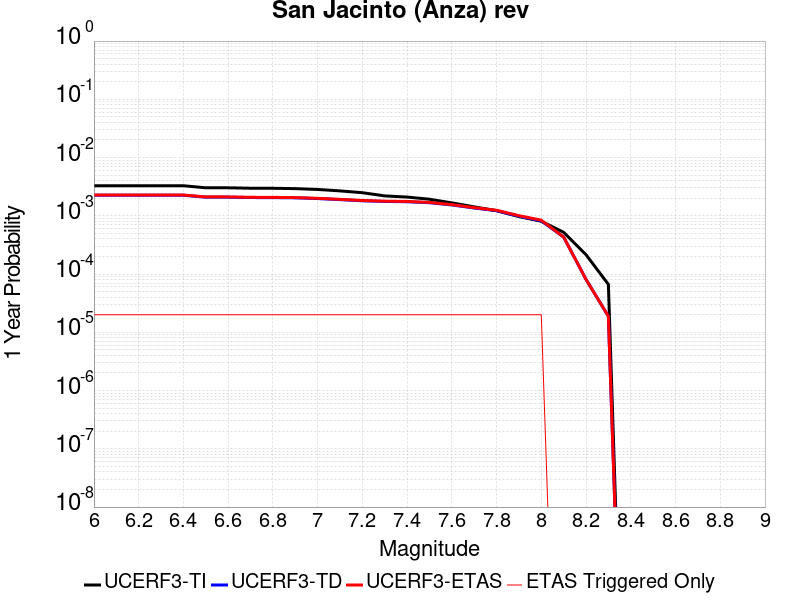 | 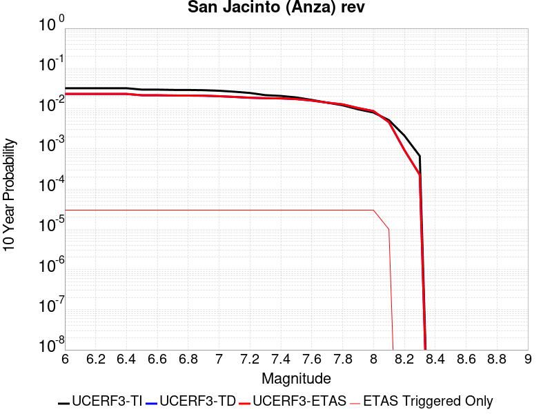 |

| Magnitude | 1 yr TI Prob | TD Prob | ETAS Prob | ETAS/TD Gain | ETAS Triggered Only | 10 yr TI Prob | TD Prob | ETAS Prob | ETAS/TD Gain | ETAS Triggered Only |
|-----|-----|-----|-----|-----|-----|-----|-----|-----|-----|-----|
| 6.0 | 0.0032827691 | 0.002257068 | 0.002277023 | 1.008841 | 2.0E-5 | 0.032346968 | 0.023297053 | 0.023326354 | 1.0012577 | 3.0E-5 |
| 6.1 | 0.0032827691 | 0.002257068 | 0.002277023 | 1.008841 | 2.0E-5 | 0.032346968 | 0.023297053 | 0.023326354 | 1.0012577 | 3.0E-5 |
| 6.2 | 0.0032827691 | 0.002257068 | 0.002277023 | 1.008841 | 2.0E-5 | 0.032346968 | 0.023297053 | 0.023326354 | 1.0012577 | 3.0E-5 |
| 6.3 | 0.0032827691 | 0.002257068 | 0.002277023 | 1.008841 | 2.0E-5 | 0.032346968 | 0.023297053 | 0.023326354 | 1.0012577 | 3.0E-5 |
| 6.4 | 0.0032827691 | 0.002257068 | 0.002277023 | 1.008841 | 2.0E-5 | 0.032346968 | 0.023297053 | 0.023326354 | 1.0012577 | 3.0E-5 |
| 6.5 | 0.0030276014 | 0.0020893933 | 0.0021093516 | 1.0095521 | 2.0E-5 | 0.02986684 | 0.021594558 | 0.02162391 | 1.0013592 | 3.0E-5 |
| 6.6 | 0.0030276014 | 0.0020893933 | 0.0021093516 | 1.0095521 | 2.0E-5 | 0.02986684 | 0.021594558 | 0.02162391 | 1.0013592 | 3.0E-5 |
| 6.7 | 0.0029763177 | 0.0020593314 | 0.00207929 | 1.0096918 | 2.0E-5 | 0.029367693 | 0.021286374 | 0.021315737 | 1.0013794 | 3.0E-5 |
| 6.8 | 0.0029681553 | 0.0020518545 | 0.0020718134 | 1.0097272 | 2.0E-5 | 0.029288229 | 0.021211093 | 0.021240456 | 1.0013844 | 3.0E-5 |
| 6.9 | 0.0029288116 | 0.0020364814 | 0.0020564406 | 1.0098009 | 2.0E-5 | 0.028905109 | 0.02105052 | 0.021079889 | 1.0013951 | 3.0E-5 |
| 7.0 | 0.0028337094 | 0.00197714 | 0.0019971007 | 1.0100956 | 2.0E-5 | 0.027978465 | 0.020441465 | 0.020470852 | 1.0014377 | 3.0E-5 |
| 7.1 | 0.0026781242 | 0.0018970876 | 0.0019170496 | 1.0105225 | 2.0E-5 | 0.026460782 | 0.019615049 | 0.01964446 | 1.0014994 | 3.0E-5 |
| 7.2 | 0.0024938055 | 0.0018112438 | 0.0018312077 | 1.0110221 | 2.0E-5 | 0.024660049 | 0.018729724 | 0.018759161 | 1.0015718 | 3.0E-5 |
| 7.3 | 0.002196605 | 0.0017640761 | 0.0017840407 | 1.0113174 | 2.0E-5 | 0.02175019 | 0.018237952 | 0.018267406 | 1.0016149 | 3.0E-5 |
| 7.4 | 0.002098792 | 0.0017452288 | 0.0017651939 | 1.0114398 | 2.0E-5 | 0.020790804 | 0.018042525 | 0.018071985 | 1.0016327 | 3.0E-5 |
| 7.5 | 0.0019259118 | 0.0016782383 | 0.0016982047 | 1.0118972 | 2.0E-5 | 0.01909306 | 0.01735896 | 0.01738844 | 1.0016983 | 3.0E-5 |
| 7.6 | 0.001668642 | 0.0015383901 | 0.0015583592 | 1.0129806 | 2.0E-5 | 0.01656168 | 0.015946971 | 0.015976492 | 1.0018512 | 3.0E-5 |
| 7.7 | 0.001424336 | 0.0013606424 | 0.0013806152 | 1.014679 | 2.0E-5 | 0.014152412 | 0.014167659 | 0.014197234 | 1.0020875 | 3.0E-5 |
| 7.8 | 0.0012237094 | 0.0012257744 | 0.0012457499 | 1.0162963 | 2.0E-5 | 0.012169928 | 0.012809524 | 0.012839139 | 1.0023121 | 3.0E-5 |
| 7.9 | 9.7068126E-4 | 9.861768E-4 | 0.001006157 | 1.0202603 | 2.0E-5 | 0.0096645225 | 0.010394373 | 0.010424062 | 1.0028561 | 3.0E-5 |
| 8.0 | 8.0640207E-4 | 8.2105753E-4 | 8.410411E-4 | 1.0243388 | 2.0E-5 | 0.008034821 | 0.008703353 | 0.008733092 | 1.0034169 | 3.0E-5 |
| 8.1 | 5.2081177E-4 | 4.3145084E-4 | 4.3145084E-4 | 1.0 | 0.0 | 0.0051959283 | 0.0046403036 | 0.004650257 | 1.002145 | 1.0E-5 |
| 8.2 | 2.1508869E-4 | 8.103699E-5 | 8.103699E-5 | 1.0 | 0.0 | 0.0021488064 | 9.4058877E-4 | 9.4058877E-4 | 1.0 | 0.0 |
| 8.3 | 6.653009E-5 | 1.8849603E-5 | 1.8849603E-5 | 1.0 | 0.0 | 6.6510175E-4 | 2.2736708E-4 | 2.2736708E-4 | 1.0 | 0.0 |

## San Jacinto (Lytle Creek connector)
*[(top)](#table-of-contents)*

| 1 Year | 10 Year |
|-----|-----|
|  | 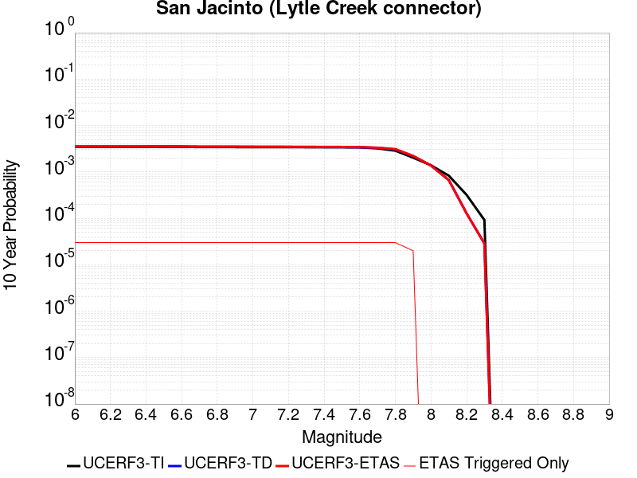 |

| Magnitude | 1 yr TI Prob | TD Prob | ETAS Prob | ETAS/TD Gain | ETAS Triggered Only | 10 yr TI Prob | TD Prob | ETAS Prob | ETAS/TD Gain | ETAS Triggered Only |
|-----|-----|-----|-----|-----|-----|-----|-----|-----|-----|-----|
| 6.0 | 3.492233E-4 | 3.4747677E-4 | 3.4747677E-4 | 1.0 | 0.0 | 0.00348675 | 0.003549538 | 0.0035794317 | 1.0084218 | 3.0E-5 |
| 6.1 | 3.492233E-4 | 3.4747677E-4 | 3.4747677E-4 | 1.0 | 0.0 | 0.00348675 | 0.003549538 | 0.0035794317 | 1.0084218 | 3.0E-5 |
| 6.2 | 3.492233E-4 | 3.4747677E-4 | 3.4747677E-4 | 1.0 | 0.0 | 0.00348675 | 0.003549538 | 0.0035794317 | 1.0084218 | 3.0E-5 |
| 6.3 | 3.492233E-4 | 3.4747677E-4 | 3.4747677E-4 | 1.0 | 0.0 | 0.00348675 | 0.003549538 | 0.0035794317 | 1.0084218 | 3.0E-5 |
| 6.4 | 3.492233E-4 | 3.4747677E-4 | 3.4747677E-4 | 1.0 | 0.0 | 0.00348675 | 0.003549538 | 0.0035794317 | 1.0084218 | 3.0E-5 |
| 6.5 | 3.472512E-4 | 3.4540173E-4 | 3.4540173E-4 | 1.0 | 0.0 | 0.0034670907 | 0.0035288536 | 0.0035587477 | 1.0084714 | 3.0E-5 |
| 6.6 | 3.472512E-4 | 3.4540173E-4 | 3.4540173E-4 | 1.0 | 0.0 | 0.0034670907 | 0.0035288536 | 0.0035587477 | 1.0084714 | 3.0E-5 |
| 6.7 | 3.4328885E-4 | 3.411859E-4 | 3.411859E-4 | 1.0 | 0.0 | 0.0034275902 | 0.003486828 | 0.0035167234 | 1.0085738 | 3.0E-5 |
| 6.8 | 3.4304935E-4 | 3.4089846E-4 | 3.4089846E-4 | 1.0 | 0.0 | 0.0034252026 | 0.0034839627 | 0.0035138582 | 1.0085809 | 3.0E-5 |
| 6.9 | 3.4277816E-4 | 3.4044957E-4 | 3.4044957E-4 | 1.0 | 0.0 | 0.0034224992 | 0.003479488 | 0.0035093836 | 1.008592 | 3.0E-5 |
| 7.0 | 3.424626E-4 | 3.3993425E-4 | 3.3993425E-4 | 1.0 | 0.0 | 0.0034193532 | 0.003474351 | 0.003504247 | 1.0086048 | 3.0E-5 |
| 7.1 | 3.4209844E-4 | 3.3934545E-4 | 3.3934545E-4 | 1.0 | 0.0 | 0.0034157229 | 0.0034684825 | 0.0034983784 | 1.0086193 | 3.0E-5 |
| 7.2 | 3.4152428E-4 | 3.3840482E-4 | 3.3840482E-4 | 1.0 | 0.0 | 0.0034099987 | 0.0034591097 | 0.003489006 | 1.0086428 | 3.0E-5 |
| 7.3 | 3.4100408E-4 | 3.3740257E-4 | 3.3740257E-4 | 1.0 | 0.0 | 0.003404813 | 0.0034491313 | 0.003479028 | 1.0086678 | 3.0E-5 |
| 7.4 | 3.4051016E-4 | 3.3641604E-4 | 3.3641604E-4 | 1.0 | 0.0 | 0.0033998888 | 0.0034393135 | 0.0034692101 | 1.0086926 | 3.0E-5 |
| 7.5 | 3.3968766E-4 | 3.3517848E-4 | 3.3517848E-4 | 1.0 | 0.0 | 0.0033916887 | 0.0034269865 | 0.0034568836 | 1.0087241 | 3.0E-5 |
| 7.6 | 3.3789838E-4 | 3.3304552E-4 | 3.3304552E-4 | 1.0 | 0.0 | 0.0033738504 | 0.0034057184 | 0.0034356161 | 1.0087787 | 3.0E-5 |
| 7.7 | 3.2165812E-4 | 3.2222108E-4 | 3.2222108E-4 | 1.0 | 0.0 | 0.0032119295 | 0.003297333 | 0.003327234 | 1.0090683 | 3.0E-5 |
| 7.8 | 2.871688E-4 | 2.9932446E-4 | 2.9932446E-4 | 1.0 | 0.0 | 0.0028679797 | 0.0030674308 | 0.0030973388 | 1.0097501 | 3.0E-5 |
| 7.9 | 2.0291525E-4 | 2.1270991E-4 | 2.1270991E-4 | 1.0 | 0.0 | 0.0020273007 | 0.0021944565 | 0.0022144127 | 1.0090939 | 2.0E-5 |
| 8.0 | 1.3923083E-4 | 1.3208936E-4 | 1.3208936E-4 | 1.0 | 0.0 | 0.0013914363 | 0.0013758678 | 0.0013758678 | 1.0 | 0.0 |
| 8.1 | 8.3020335E-5 | 6.358979E-5 | 6.358979E-5 | 1.0 | 0.0 | 8.298933E-4 | 6.693611E-4 | 6.693611E-4 | 1.0 | 0.0 |
| 8.2 | 3.1982334E-5 | 1.1382395E-5 | 1.1382395E-5 | 1.0 | 0.0 | 3.1977732E-4 | 1.2785758E-4 | 1.2785758E-4 | 1.0 | 0.0 |
| 8.3 | 9.1983675E-6 | 2.4812043E-6 | 2.4812043E-6 | 1.0 | 0.0 | 9.197987E-5 | 2.8690622E-5 | 2.8690622E-5 | 1.0 | 0.0 |

## San Andreas (Santa Cruz Mts) 2011 CFM
*[(top)](#table-of-contents)*

| 1 Year | 10 Year |
|-----|-----|
| 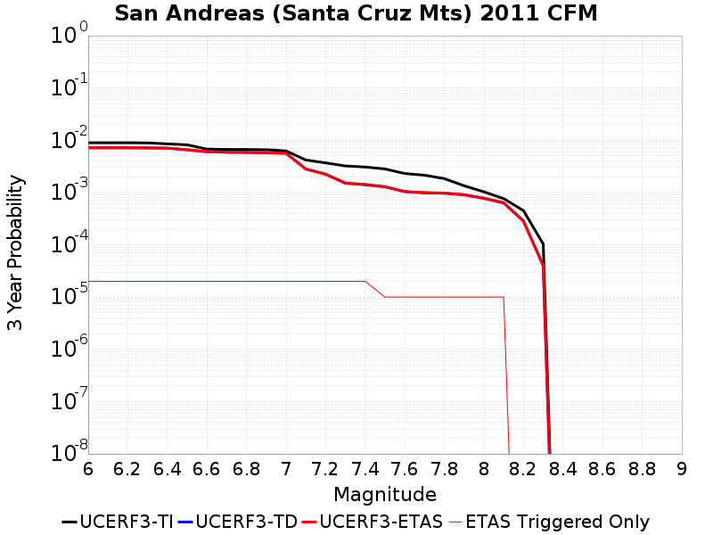 | 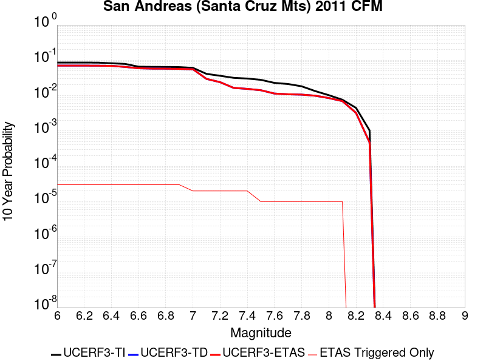 |

| Magnitude | 1 yr TI Prob | TD Prob | ETAS Prob | ETAS/TD Gain | ETAS Triggered Only | 10 yr TI Prob | TD Prob | ETAS Prob | ETAS/TD Gain | ETAS Triggered Only |
|-----|-----|-----|-----|-----|-----|-----|-----|-----|-----|-----|
| 6.0 | 0.008946515 | 0.00717234 | 0.0071921963 | 1.0027685 | 2.0E-5 | 0.08594794 | 0.07055717 | 0.07058505 | 1.0003952 | 3.0E-5 |
| 6.1 | 0.008946515 | 0.00717234 | 0.0071921963 | 1.0027685 | 2.0E-5 | 0.08594794 | 0.07055717 | 0.07058505 | 1.0003952 | 3.0E-5 |
| 6.2 | 0.008946515 | 0.00717234 | 0.0071921963 | 1.0027685 | 2.0E-5 | 0.08594794 | 0.07055717 | 0.07058505 | 1.0003952 | 3.0E-5 |
| 6.3 | 0.008919428 | 0.007130597 | 0.0071504544 | 1.0027848 | 2.0E-5 | 0.08569809 | 0.07016934 | 0.07019723 | 1.0003976 | 3.0E-5 |
| 6.4 | 0.008517839 | 0.007066272 | 0.007086131 | 1.0028104 | 2.0E-5 | 0.08198654 | 0.06940334 | 0.06943126 | 1.0004022 | 3.0E-5 |
| 6.5 | 0.00818132 | 0.0065789595 | 0.006598828 | 1.00302 | 2.0E-5 | 0.078865945 | 0.06486502 | 0.06489308 | 1.0004325 | 3.0E-5 |
| 6.6 | 0.006780438 | 0.006029091 | 0.0060489704 | 1.0032972 | 2.0E-5 | 0.0657725 | 0.059329044 | 0.059357263 | 1.0004756 | 3.0E-5 |
| 6.7 | 0.0066920654 | 0.005887206 | 0.0059070885 | 1.0033772 | 2.0E-5 | 0.06494093 | 0.05804007 | 0.058068328 | 1.0004869 | 3.0E-5 |
| 6.8 | 0.0066577005 | 0.005854814 | 0.0058746967 | 1.003396 | 2.0E-5 | 0.06461738 | 0.057753924 | 0.05778219 | 1.0004895 | 3.0E-5 |
| 6.9 | 0.006600777 | 0.005772947 | 0.0057928315 | 1.0034444 | 2.0E-5 | 0.06408122 | 0.057025746 | 0.057054035 | 1.000496 | 3.0E-5 |
| 7.0 | 0.006257969 | 0.0056328685 | 0.005652756 | 1.0035306 | 2.0E-5 | 0.06084648 | 0.055698298 | 0.05571718 | 1.000339 | 2.0E-5 |
| 7.1 | 0.0041915346 | 0.0028101087 | 0.0028300525 | 1.0070971 | 2.0E-5 | 0.041133516 | 0.0296203 | 0.029639706 | 1.0006552 | 2.0E-5 |
| 7.2 | 0.0036948253 | 0.0022381279 | 0.002258083 | 1.008916 | 2.0E-5 | 0.03633994 | 0.023942905 | 0.023962427 | 1.0008153 | 2.0E-5 |
| 7.3 | 0.0032266637 | 0.001506644 | 0.0015266138 | 1.0132545 | 2.0E-5 | 0.031802133 | 0.016500186 | 0.016519856 | 1.0011921 | 2.0E-5 |
| 7.4 | 0.0030772698 | 0.00140917 | 0.0014291417 | 1.0141728 | 2.0E-5 | 0.030350044 | 0.015472017 | 0.015491708 | 1.0012727 | 2.0E-5 |
| 7.5 | 0.002826395 | 0.0012869575 | 0.0012969446 | 1.0077603 | 1.0E-5 | 0.027907165 | 0.014164128 | 0.014173986 | 1.0006961 | 1.0E-5 |
| 7.6 | 0.0023093296 | 0.0010381279 | 0.0010481175 | 1.0096227 | 1.0E-5 | 0.022854783 | 0.011413483 | 0.011423368 | 1.0008662 | 1.0E-5 |
| 7.7 | 0.002146502 | 9.876733E-4 | 9.976635E-4 | 1.0101148 | 1.0E-5 | 0.021258866 | 0.010871243 | 0.010881133 | 1.0009098 | 1.0E-5 |
| 7.8 | 0.0018459131 | 9.6828083E-4 | 9.782711E-4 | 1.0103176 | 1.0E-5 | 0.018306552 | 0.010652777 | 0.01066267 | 1.0009288 | 1.0E-5 |
| 7.9 | 0.001348489 | 9.0319145E-4 | 9.131824E-4 | 1.0110619 | 1.0E-5 | 0.013403354 | 0.009908291 | 0.0099181915 | 1.0009992 | 1.0E-5 |
| 8.0 | 0.0010314309 | 7.740723E-4 | 7.840645E-4 | 1.0129087 | 1.0E-5 | 0.010266567 | 0.008509548 | 0.008519463 | 1.0011652 | 1.0E-5 |
| 8.1 | 7.6595135E-4 | 6.31597E-4 | 6.415907E-4 | 1.0158229 | 1.0E-5 | 0.0076331664 | 0.0069696293 | 0.0069795595 | 1.0014248 | 1.0E-5 |
| 8.2 | 4.5063766E-4 | 2.8535217E-4 | 2.8535217E-4 | 1.0 | 0.0 | 0.004497249 | 0.003245944 | 0.003245944 | 1.0 | 0.0 |
| 8.3 | 1.034694E-4 | 3.9971612E-5 | 3.9971612E-5 | 1.0 | 0.0 | 0.0010342124 | 4.7201355E-4 | 4.7201355E-4 | 1.0 | 0.0 |

## Calaveras (Central) 2011 CFM
*[(top)](#table-of-contents)*

| 1 Year | 10 Year |
|-----|-----|
| 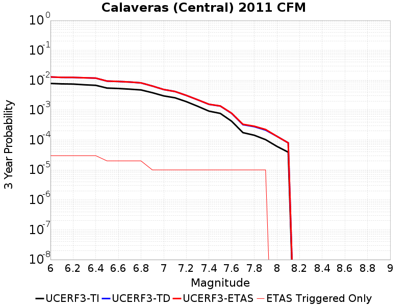 | 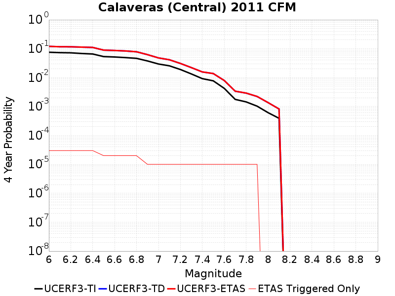 |

| Magnitude | 1 yr TI Prob | TD Prob | ETAS Prob | ETAS/TD Gain | ETAS Triggered Only | 10 yr TI Prob | TD Prob | ETAS Prob | ETAS/TD Gain | ETAS Triggered Only |
|-----|-----|-----|-----|-----|-----|-----|-----|-----|-----|-----|
| 6.0 | 0.0078024664 | 0.012850139 | 0.012879754 | 1.0023046 | 3.0E-5 | 0.07534136 | 0.12040222 | 0.1204286 | 1.0002191 | 3.0E-5 |
| 6.1 | 0.0075490056 | 0.012419406 | 0.012449034 | 1.0023856 | 3.0E-5 | 0.07297657 | 0.116674 | 0.11670049 | 1.0002271 | 3.0E-5 |
| 6.2 | 0.007434286 | 0.012384003 | 0.012413631 | 1.0023925 | 3.0E-5 | 0.07190444 | 0.11632795 | 0.11635446 | 1.0002279 | 3.0E-5 |
| 6.3 | 0.0070386264 | 0.01204019 | 0.012069829 | 1.0024617 | 3.0E-5 | 0.0681982 | 0.11324048 | 0.11326709 | 1.000235 | 3.0E-5 |
| 6.4 | 0.006757223 | 0.011742991 | 0.011772639 | 1.0025247 | 3.0E-5 | 0.06555412 | 0.11051839 | 0.11054507 | 1.0002414 | 3.0E-5 |
| 6.5 | 0.005463498 | 0.009339314 | 0.009359127 | 1.0021214 | 2.0E-5 | 0.053311124 | 0.08919983 | 0.08921805 | 1.0002042 | 2.0E-5 |
| 6.6 | 0.0052862884 | 0.0090743685 | 0.009094187 | 1.002184 | 2.0E-5 | 0.05162293 | 0.08677732 | 0.08679558 | 1.0002105 | 2.0E-5 |
| 6.7 | 0.0050282106 | 0.008691278 | 0.008711104 | 1.0022812 | 2.0E-5 | 0.049159497 | 0.08326666 | 0.083285 | 1.0002202 | 2.0E-5 |
| 6.8 | 0.0047319788 | 0.008129545 | 0.008149383 | 1.0024402 | 2.0E-5 | 0.046324775 | 0.07815998 | 0.07817842 | 1.0002359 | 2.0E-5 |
| 6.9 | 0.0038295772 | 0.0063955616 | 0.0064054974 | 1.0015535 | 1.0E-5 | 0.037642512 | 0.06218834 | 0.062197715 | 1.0001508 | 1.0E-5 |
| 7.0 | 0.0029938098 | 0.004887278 | 0.0048972294 | 1.0020361 | 1.0E-5 | 0.02953797 | 0.047987267 | 0.047996785 | 1.0001984 | 1.0E-5 |
| 7.1 | 0.0025825473 | 0.0041931197 | 0.004203078 | 1.0023749 | 1.0E-5 | 0.0255274 | 0.041373465 | 0.04138305 | 1.0002317 | 1.0E-5 |
| 7.2 | 0.0019223199 | 0.0031012488 | 0.0031112179 | 1.0032145 | 1.0E-5 | 0.01905776 | 0.030884078 | 0.03089377 | 1.0003138 | 1.0E-5 |
| 7.3 | 0.0013477671 | 0.0022137791 | 0.0022237569 | 1.0045072 | 1.0E-5 | 0.013396223 | 0.022175837 | 0.022185614 | 1.000441 | 1.0E-5 |
| 7.4 | 9.2563726E-4 | 0.0015608639 | 0.0015708483 | 1.0063967 | 1.0E-5 | 0.009217911 | 0.0157095 | 0.015719345 | 1.0006266 | 1.0E-5 |
| 7.5 | 7.76303E-4 | 0.0013684528 | 0.0013784391 | 1.0072975 | 1.0E-5 | 0.0077359667 | 0.013802677 | 0.013812539 | 1.0007145 | 1.0E-5 |
| 7.6 | 4.2605202E-4 | 7.804962E-4 | 7.904884E-4 | 1.0128024 | 1.0E-5 | 0.004252361 | 0.007940034 | 0.007949955 | 1.0012494 | 1.0E-5 |
| 7.7 | 1.7665124E-4 | 3.2628354E-4 | 3.362803E-4 | 1.0306382 | 1.0E-5 | 0.0017651088 | 0.0033883743 | 0.0033983407 | 1.0029413 | 1.0E-5 |
| 7.8 | 1.4463716E-4 | 2.799849E-4 | 2.899821E-4 | 1.0357062 | 1.0E-5 | 0.0014454306 | 0.0029075865 | 0.0029175575 | 1.0034293 | 1.0E-5 |
| 7.9 | 1.0297595E-4 | 2.1540197E-4 | 2.2539982E-4 | 1.0464149 | 1.0E-5 | 0.0010292825 | 0.0022237014 | 0.0022336794 | 1.004487 | 1.0E-5 |
| 8.0 | 6.139818E-5 | 1.3328572E-4 | 1.3328572E-4 | 1.0 | 0.0 | 6.1381224E-4 | 0.0013661367 | 0.0013661367 | 1.0 | 0.0 |
| 8.1 | 3.9192048E-5 | 8.040625E-5 | 8.040625E-5 | 1.0 | 0.0 | 3.9185135E-4 | 8.235873E-4 | 8.235873E-4 | 1.0 | 0.0 |

## Simi-Santa Rosa
*[(top)](#table-of-contents)*

| 1 Year | 10 Year |
|-----|-----|
| 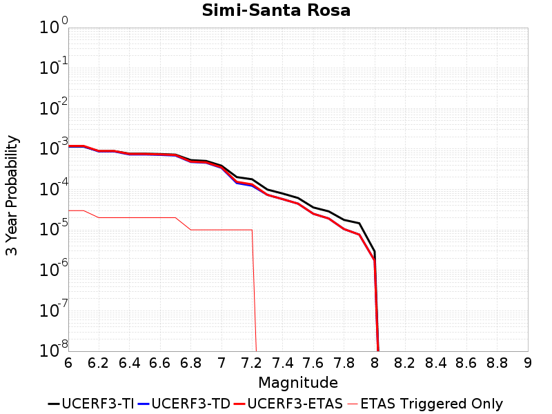 | 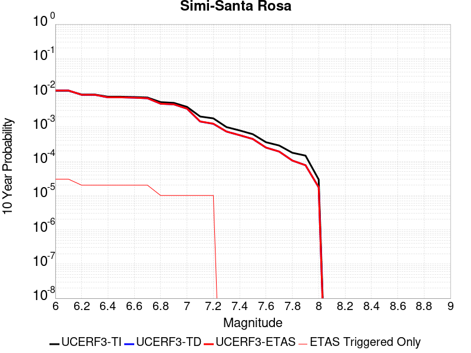 |

| Magnitude | 1 yr TI Prob | TD Prob | ETAS Prob | ETAS/TD Gain | ETAS Triggered Only | 10 yr TI Prob | TD Prob | ETAS Prob | ETAS/TD Gain | ETAS Triggered Only |
|-----|-----|-----|-----|-----|-----|-----|-----|-----|-----|-----|
| 6.0 | 0.0011467156 | 0.0011616896 | 0.0011916547 | 1.0257945 | 3.0E-5 | 0.011408163 | 0.011560617 | 0.01159027 | 1.002565 | 3.0E-5 |
| 6.1 | 0.0011467156 | 0.0011616896 | 0.0011916547 | 1.0257945 | 3.0E-5 | 0.011408163 | 0.011560617 | 0.01159027 | 1.002565 | 3.0E-5 |
| 6.2 | 8.865613E-4 | 8.694057E-4 | 8.893883E-4 | 1.0229843 | 2.0E-5 | 0.008830327 | 0.008662965 | 0.008682792 | 1.0022887 | 2.0E-5 |
| 6.3 | 8.865613E-4 | 8.694057E-4 | 8.893883E-4 | 1.0229843 | 2.0E-5 | 0.008830327 | 0.008662965 | 0.008682792 | 1.0022887 | 2.0E-5 |
| 6.4 | 7.6497364E-4 | 7.330082E-4 | 7.529935E-4 | 1.0272648 | 2.0E-5 | 0.0076234564 | 0.0073083797 | 0.007328233 | 1.0027165 | 2.0E-5 |
| 6.5 | 7.6497364E-4 | 7.330082E-4 | 7.529935E-4 | 1.0272648 | 2.0E-5 | 0.0076234564 | 0.0073083797 | 0.007328233 | 1.0027165 | 2.0E-5 |
| 6.6 | 7.4992597E-4 | 7.161685E-4 | 7.3615415E-4 | 1.0279064 | 2.0E-5 | 0.007474003 | 0.0071410737 | 0.007160931 | 1.0027807 | 2.0E-5 |
| 6.7 | 7.240546E-4 | 6.889482E-4 | 7.089344E-4 | 1.0290098 | 2.0E-5 | 0.007217 | 0.006870573 | 0.0068904357 | 1.002891 | 2.0E-5 |
| 6.8 | 5.308578E-4 | 4.7755952E-4 | 4.8755473E-4 | 1.0209298 | 1.0E-5 | 0.0052959146 | 0.0047669658 | 0.0047769183 | 1.0020877 | 1.0E-5 |
| 6.9 | 5.05996E-4 | 4.5777025E-4 | 4.6776567E-4 | 1.021835 | 1.0E-5 | 0.005048454 | 0.004569891 | 0.0045798454 | 1.0021782 | 1.0E-5 |
| 7.0 | 3.8630638E-4 | 3.4221564E-4 | 3.522122E-4 | 1.0292113 | 1.0E-5 | 0.0038563553 | 0.003418129 | 0.0034280946 | 1.0029156 | 1.0E-5 |
| 7.1 | 2.0209046E-4 | 1.4397992E-4 | 1.5397849E-4 | 1.0694442 | 1.0E-5 | 0.0020190678 | 0.00143889 | 0.0014488756 | 1.0069398 | 1.0E-5 |
| 7.2 | 1.7831543E-4 | 1.2353582E-4 | 1.3353459E-4 | 1.0809382 | 1.0E-5 | 0.0017817242 | 0.0012346937 | 0.0012446814 | 1.0080892 | 1.0E-5 |
| 7.3 | 9.9251854E-5 | 7.343469E-5 | 7.343469E-5 | 1.0 | 0.0 | 9.920754E-4 | 7.3410646E-4 | 7.3410646E-4 | 1.0 | 0.0 |
| 7.4 | 7.915472E-5 | 5.752654E-5 | 5.752654E-5 | 1.0 | 0.0 | 7.9126534E-4 | 5.751176E-4 | 5.751176E-4 | 1.0 | 0.0 |
| 7.5 | 6.1502695E-5 | 4.453643E-5 | 4.453643E-5 | 1.0 | 0.0 | 6.148568E-4 | 4.45276E-4 | 4.45276E-4 | 1.0 | 0.0 |
| 7.6 | 3.5857727E-5 | 2.5012352E-5 | 2.5012352E-5 | 1.0 | 0.0 | 3.5851944E-4 | 2.500955E-4 | 2.500955E-4 | 1.0 | 0.0 |
| 7.7 | 2.8763823E-5 | 1.9168046E-5 | 1.9168046E-5 | 1.0 | 0.0 | 2.87601E-4 | 1.9166405E-4 | 1.9166405E-4 | 1.0 | 0.0 |
| 7.8 | 1.7667637E-5 | 1.0477685E-5 | 1.0477685E-5 | 1.0 | 0.0 | 1.7666233E-4 | 1.0477196E-4 | 1.0477196E-4 | 1.0 | 0.0 |
| 7.9 | 1.4586617E-5 | 7.646058E-6 | 7.646058E-6 | 1.0 | 0.0 | 1.458566E-4 | 7.6457996E-5 | 7.6457996E-5 | 1.0 | 0.0 |
| 8.0 | 2.9355108E-6 | 1.7404403E-6 | 1.7404403E-6 | 1.0 | 0.0 | 2.935472E-5 | 1.7404282E-5 | 1.7404282E-5 | 1.0 | 0.0 |

## Pine Mtn
*[(top)](#table-of-contents)*

| 1 Year | 10 Year |
|-----|-----|
|  | 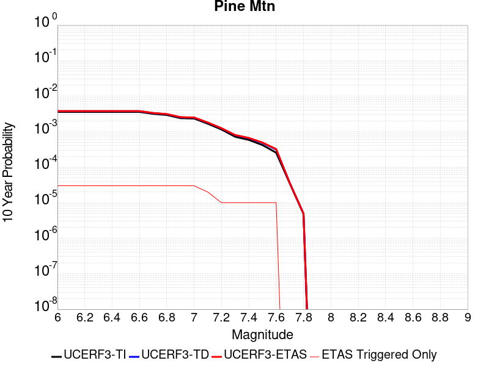 |

| Magnitude | 1 yr TI Prob | TD Prob | ETAS Prob | ETAS/TD Gain | ETAS Triggered Only | 10 yr TI Prob | TD Prob | ETAS Prob | ETAS/TD Gain | ETAS Triggered Only |
|-----|-----|-----|-----|-----|-----|-----|-----|-----|-----|-----|
| 6.0 | 3.596972E-4 | 3.7694824E-4 | 4.0693692E-4 | 1.0795566 | 3.0E-5 | 0.0035911554 | 0.003763386 | 0.0037932731 | 1.0079416 | 3.0E-5 |
| 6.1 | 3.596972E-4 | 3.7694824E-4 | 4.0693692E-4 | 1.0795566 | 3.0E-5 | 0.0035911554 | 0.003763386 | 0.0037932731 | 1.0079416 | 3.0E-5 |
| 6.2 | 3.596972E-4 | 3.7694824E-4 | 4.0693692E-4 | 1.0795566 | 3.0E-5 | 0.0035911554 | 0.003763386 | 0.0037932731 | 1.0079416 | 3.0E-5 |
| 6.3 | 3.596972E-4 | 3.7694824E-4 | 4.0693692E-4 | 1.0795566 | 3.0E-5 | 0.0035911554 | 0.003763386 | 0.0037932731 | 1.0079416 | 3.0E-5 |
| 6.4 | 3.596972E-4 | 3.7694824E-4 | 4.0693692E-4 | 1.0795566 | 3.0E-5 | 0.0035911554 | 0.003763386 | 0.0037932731 | 1.0079416 | 3.0E-5 |
| 6.5 | 3.596972E-4 | 3.7694824E-4 | 4.0693692E-4 | 1.0795566 | 3.0E-5 | 0.0035911554 | 0.003763386 | 0.0037932731 | 1.0079416 | 3.0E-5 |
| 6.6 | 3.596972E-4 | 3.7694824E-4 | 4.0693692E-4 | 1.0795566 | 3.0E-5 | 0.0035911554 | 0.003763386 | 0.0037932731 | 1.0079416 | 3.0E-5 |
| 6.7 | 3.1755073E-4 | 3.3374043E-4 | 3.6373042E-4 | 1.0898602 | 3.0E-5 | 0.0031709734 | 0.0033326112 | 0.0033625113 | 1.0089719 | 3.0E-5 |
| 6.8 | 2.94925E-4 | 3.10449E-4 | 3.4043967E-4 | 1.0966042 | 3.0E-5 | 0.002945339 | 0.0031003575 | 0.0031302646 | 1.0096463 | 3.0E-5 |
| 6.9 | 2.4007261E-4 | 2.5375834E-4 | 2.8375073E-4 | 1.1181927 | 3.0E-5 | 0.0023981342 | 0.00253483 | 0.0025647539 | 1.011805 | 3.0E-5 |
| 7.0 | 2.3412947E-4 | 2.4768827E-4 | 2.7768084E-4 | 1.1210899 | 3.0E-5 | 0.0023388295 | 0.0024742659 | 0.0025041916 | 1.0120949 | 3.0E-5 |
| 7.1 | 1.6716159E-4 | 1.7892713E-4 | 1.9892355E-4 | 1.1117574 | 2.0E-5 | 0.0016703589 | 0.0017878969 | 0.001807861 | 1.0111663 | 2.0E-5 |
| 7.2 | 1.15102564E-4 | 1.2409905E-4 | 1.340978E-4 | 1.0805708 | 1.0E-5 | 0.0011504296 | 0.0012403424 | 0.00125033 | 1.0080523 | 1.0E-5 |
| 7.3 | 7.182235E-5 | 7.939474E-5 | 8.939395E-5 | 1.125943 | 1.0E-5 | 7.1799144E-4 | 7.9367287E-4 | 8.0366497E-4 | 1.0125897 | 1.0E-5 |
| 7.4 | 5.8678244E-5 | 6.567582E-5 | 7.567516E-5 | 1.152253 | 1.0E-5 | 5.866275E-4 | 6.565724E-4 | 6.6656584E-4 | 1.0152206 | 1.0E-5 |
| 7.5 | 4.1907308E-5 | 4.8404996E-5 | 5.8404512E-5 | 1.2065803 | 1.0E-5 | 4.1899405E-4 | 4.8395127E-4 | 4.939464E-4 | 1.0206532 | 1.0E-5 |
| 7.6 | 2.5542888E-5 | 3.1322652E-5 | 4.132234E-5 | 1.3192478 | 1.0E-5 | 2.5539953E-4 | 3.1318722E-4 | 3.231841E-4 | 1.0319198 | 1.0E-5 |
| 7.7 | 3.4617963E-6 | 3.5423077E-6 | 3.5423077E-6 | 1.0 | 0.0 | 3.4617424E-5 | 3.542256E-5 | 3.542256E-5 | 1.0 | 0.0 |
| 7.8 | 4.818991E-7 | 4.9509987E-7 | 4.9509987E-7 | 1.0 | 0.0 | 4.8189804E-6 | 4.9509895E-6 | 4.9509895E-6 | 1.0 | 0.0 |

## Northridge
*[(top)](#table-of-contents)*

| 1 Year | 10 Year |
|-----|-----|
| 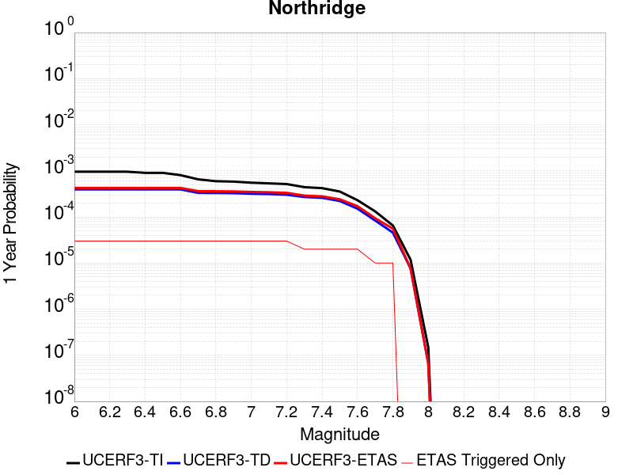 | 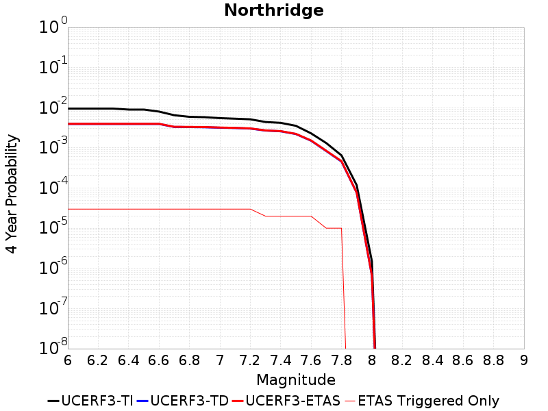 |

| Magnitude | 1 yr TI Prob | TD Prob | ETAS Prob | ETAS/TD Gain | ETAS Triggered Only | 10 yr TI Prob | TD Prob | ETAS Prob | ETAS/TD Gain | ETAS Triggered Only |
|-----|-----|-----|-----|-----|-----|-----|-----|-----|-----|-----|
| 6.0 | 9.565505E-4 | 3.9585814E-4 | 4.2584626E-4 | 1.0757548 | 3.0E-5 | 0.009524435 | 0.0039517526 | 0.003981634 | 1.0075616 | 3.0E-5 |
| 6.1 | 9.565505E-4 | 3.9585814E-4 | 4.2584626E-4 | 1.0757548 | 3.0E-5 | 0.009524435 | 0.0039517526 | 0.003981634 | 1.0075616 | 3.0E-5 |
| 6.2 | 9.565505E-4 | 3.9585814E-4 | 4.2584626E-4 | 1.0757548 | 3.0E-5 | 0.009524435 | 0.0039517526 | 0.003981634 | 1.0075616 | 3.0E-5 |
| 6.3 | 9.565505E-4 | 3.9585814E-4 | 4.2584626E-4 | 1.0757548 | 3.0E-5 | 0.009524435 | 0.0039517526 | 0.003981634 | 1.0075616 | 3.0E-5 |
| 6.4 | 9.055163E-4 | 3.9585814E-4 | 4.2584626E-4 | 1.0757548 | 3.0E-5 | 0.009018354 | 0.0039517526 | 0.003981634 | 1.0075616 | 3.0E-5 |
| 6.5 | 9.055163E-4 | 3.9585814E-4 | 4.2584626E-4 | 1.0757548 | 3.0E-5 | 0.009018354 | 0.0039517526 | 0.003981634 | 1.0075616 | 3.0E-5 |
| 6.6 | 8.0626784E-4 | 3.9585814E-4 | 4.2584626E-4 | 1.0757548 | 3.0E-5 | 0.008033488 | 0.0039517526 | 0.003981634 | 1.0075616 | 3.0E-5 |
| 6.7 | 6.5402425E-4 | 3.329295E-4 | 3.6291953E-4 | 1.0900792 | 3.0E-5 | 0.0065210275 | 0.0033243555 | 0.0033542558 | 1.0089943 | 3.0E-5 |
| 6.8 | 5.9664896E-4 | 3.3129446E-4 | 3.612845E-4 | 1.0905238 | 3.0E-5 | 0.005950495 | 0.0033080536 | 0.0033379544 | 1.0090388 | 3.0E-5 |
| 6.9 | 5.8448757E-4 | 3.2797965E-4 | 3.579698E-4 | 1.0914391 | 3.0E-5 | 0.0058295266 | 0.0032750037 | 0.0033049055 | 1.0091302 | 3.0E-5 |
| 7.0 | 5.534883E-4 | 3.190417E-4 | 3.4903214E-4 | 1.0940017 | 3.0E-5 | 0.0055211177 | 0.0031858832 | 0.0032157877 | 1.0093865 | 3.0E-5 |
| 7.1 | 5.355756E-4 | 3.1324723E-4 | 3.4323783E-4 | 1.095741 | 3.0E-5 | 0.0053428668 | 0.0031281027 | 0.003158009 | 1.0095605 | 3.0E-5 |
| 7.2 | 5.171009E-4 | 3.0363412E-4 | 3.33625E-4 | 1.0987731 | 3.0E-5 | 0.0051589934 | 0.0030322378 | 0.0030621467 | 1.0098637 | 3.0E-5 |
| 7.3 | 4.4320893E-4 | 2.709312E-4 | 2.9092576E-4 | 1.0737995 | 2.0E-5 | 0.00442326 | 0.0027060353 | 0.0027259812 | 1.0073708 | 2.0E-5 |
| 7.4 | 4.2176177E-4 | 2.5991775E-4 | 2.7991258E-4 | 1.0769274 | 2.0E-5 | 0.0042096223 | 0.0025961637 | 0.0026161117 | 1.0076836 | 2.0E-5 |
| 7.5 | 3.5590364E-4 | 2.2190787E-4 | 2.4190343E-4 | 1.0901074 | 2.0E-5 | 0.0035533418 | 0.002216884 | 0.0022368394 | 1.0090017 | 2.0E-5 |
| 7.6 | 2.3072914E-4 | 1.5130473E-4 | 1.7130171E-4 | 1.1321635 | 2.0E-5 | 0.0023048974 | 0.0015120287 | 0.0015319985 | 1.0132073 | 2.0E-5 |
| 7.7 | 1.319879E-4 | 8.3721934E-5 | 9.37211E-5 | 1.119433 | 1.0E-5 | 0.0013190953 | 8.3690864E-4 | 8.469003E-4 | 1.0119387 | 1.0E-5 |
| 7.8 | 6.526368E-5 | 4.5812205E-5 | 5.5811746E-5 | 1.2182724 | 1.0E-5 | 6.524452E-4 | 4.580289E-4 | 4.6802431E-4 | 1.0218227 | 1.0E-5 |
| 7.9 | 1.1803763E-5 | 7.651799E-6 | 7.651799E-6 | 1.0 | 0.0 | 1.1803136E-4 | 7.651543E-5 | 7.651543E-5 | 1.0 | 0.0 |
| 8.0 | 1.4951048E-7 | 6.6544274E-8 | 6.6544274E-8 | 1.0 | 0.0 | 1.4951038E-6 | 6.6544277E-7 | 6.6544277E-7 | 1.0 | 0.0 |

## Elysian Park (Upper)
*[(top)](#table-of-contents)*

| 1 Year | 10 Year |
|-----|-----|
| 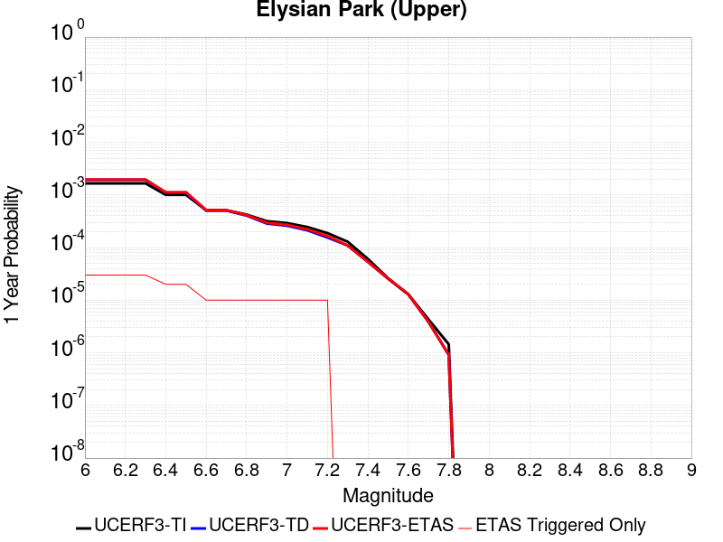 | 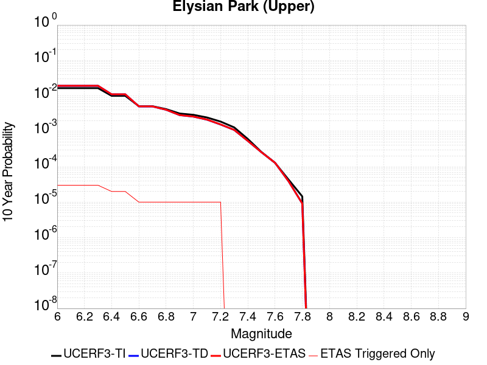 |

| Magnitude | 1 yr TI Prob | TD Prob | ETAS Prob | ETAS/TD Gain | ETAS Triggered Only | 10 yr TI Prob | TD Prob | ETAS Prob | ETAS/TD Gain | ETAS Triggered Only |
|-----|-----|-----|-----|-----|-----|-----|-----|-----|-----|-----|
| 6.0 | 0.0016618895 | 0.0019311121 | 0.0019610543 | 1.0155051 | 3.0E-5 | 0.016495159 | 0.01918983 | 0.019219255 | 1.0015333 | 3.0E-5 |
| 6.1 | 0.0016618895 | 0.0019311121 | 0.0019610543 | 1.0155051 | 3.0E-5 | 0.016495159 | 0.01918983 | 0.019219255 | 1.0015333 | 3.0E-5 |
| 6.2 | 0.0016618895 | 0.0019311121 | 0.0019610543 | 1.0155051 | 3.0E-5 | 0.016495159 | 0.01918983 | 0.019219255 | 1.0015333 | 3.0E-5 |
| 6.3 | 0.0016618895 | 0.0019311121 | 0.0019610543 | 1.0155051 | 3.0E-5 | 0.016495159 | 0.01918983 | 0.019219255 | 1.0015333 | 3.0E-5 |
| 6.4 | 0.001005166 | 0.0011058915 | 0.0011258693 | 1.018065 | 2.0E-5 | 0.010006315 | 0.011020746 | 0.0110405255 | 1.0017948 | 2.0E-5 |
| 6.5 | 0.001005166 | 0.0011058915 | 0.0011258693 | 1.018065 | 2.0E-5 | 0.010006315 | 0.011020746 | 0.0110405255 | 1.0017948 | 2.0E-5 |
| 6.6 | 5.119132E-4 | 5.042208E-4 | 5.1421573E-4 | 1.0198226 | 1.0E-5 | 0.005107356 | 0.005031491 | 0.005041441 | 1.0019774 | 1.0E-5 |
| 6.7 | 5.112989E-4 | 5.035725E-4 | 5.135675E-4 | 1.0198481 | 1.0E-5 | 0.0051012407 | 0.0050250376 | 0.0050349873 | 1.0019801 | 1.0E-5 |
| 6.8 | 4.2268867E-4 | 4.055094E-4 | 4.1550535E-4 | 1.0246503 | 1.0E-5 | 0.004218856 | 0.0040481887 | 0.004058148 | 1.0024602 | 1.0E-5 |
| 6.9 | 3.173398E-4 | 2.8597531E-4 | 2.9597245E-4 | 1.034958 | 1.0E-5 | 0.0031688702 | 0.0028561507 | 0.0028661222 | 1.0034912 | 1.0E-5 |
| 7.0 | 2.9213692E-4 | 2.5996217E-4 | 2.699596E-4 | 1.0384572 | 1.0E-5 | 0.0029175316 | 0.0025966482 | 0.0026066222 | 1.0038412 | 1.0E-5 |
| 7.1 | 2.4572524E-4 | 2.1325312E-4 | 2.2325099E-4 | 1.0468826 | 1.0E-5 | 0.002454537 | 0.0021305261 | 0.002140505 | 1.0046837 | 1.0E-5 |
| 7.2 | 1.881565E-4 | 1.5537384E-4 | 1.6537229E-4 | 1.0643508 | 1.0E-5 | 0.0018799726 | 0.0015526634 | 0.0015626479 | 1.0064305 | 1.0E-5 |
| 7.3 | 1.2893214E-4 | 1.0933252E-4 | 1.0933252E-4 | 1.0 | 0.0 | 0.0012885736 | 0.0010927945 | 0.0010927945 | 1.0 | 0.0 |
| 7.4 | 6.0731076E-5 | 5.3612643E-5 | 5.3612643E-5 | 1.0 | 0.0 | 6.071448E-4 | 5.3600007E-4 | 5.3600007E-4 | 1.0 | 0.0 |
| 7.5 | 2.6060725E-5 | 2.5659076E-5 | 2.5659076E-5 | 1.0 | 0.0 | 2.605767E-4 | 2.565627E-4 | 2.565627E-4 | 1.0 | 0.0 |
| 7.6 | 1.2871251E-5 | 1.2928921E-5 | 1.2928921E-5 | 1.0 | 0.0 | 1.2870505E-4 | 1.2928205E-4 | 1.2928205E-4 | 1.0 | 0.0 |
| 7.7 | 4.294955E-6 | 3.854145E-6 | 3.854145E-6 | 1.0 | 0.0 | 4.2948723E-5 | 3.8540893E-5 | 3.8540893E-5 | 1.0 | 0.0 |
| 7.8 | 1.45157E-6 | 9.165761E-7 | 9.165761E-7 | 1.0 | 0.0 | 1.45156055E-5 | 9.1657375E-6 | 9.1657375E-6 | 1.0 | 0.0 |

## Calaveras (So) 2011 CFM
*[(top)](#table-of-contents)*

| 1 Year | 10 Year |
|-----|-----|
| 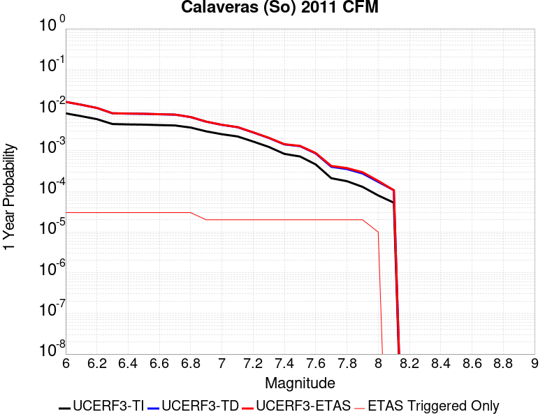 | 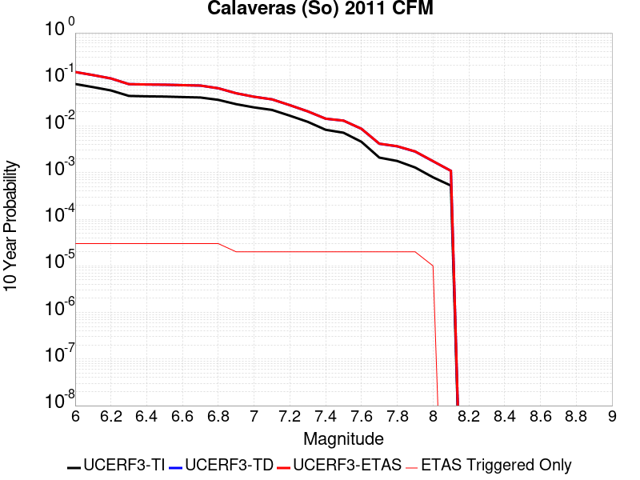 |

| Magnitude | 1 yr TI Prob | TD Prob | ETAS Prob | ETAS/TD Gain | ETAS Triggered Only | 10 yr TI Prob | TD Prob | ETAS Prob | ETAS/TD Gain | ETAS Triggered Only |
|-----|-----|-----|-----|-----|-----|-----|-----|-----|-----|-----|
| 6.0 | 0.00828899 | 0.015859114 | 0.015888639 | 1.0018617 | 3.0E-5 | 0.079865426 | 0.14440139 | 0.14442705 | 1.0001777 | 3.0E-5 |
| 6.1 | 0.007063716 | 0.01346217 | 0.013491766 | 1.0021985 | 3.0E-5 | 0.06843361 | 0.12402923 | 0.124055505 | 1.0002118 | 3.0E-5 |
| 6.2 | 0.0059661185 | 0.011245642 | 0.0112753045 | 1.0026377 | 3.0E-5 | 0.058084648 | 0.10501992 | 0.10504677 | 1.0002557 | 3.0E-5 |
| 6.3 | 0.004525038 | 0.008300962 | 0.008330713 | 1.003584 | 3.0E-5 | 0.044339992 | 0.0793353 | 0.07936292 | 1.0003481 | 3.0E-5 |
| 6.4 | 0.0044306475 | 0.008148999 | 0.008178754 | 1.0036514 | 3.0E-5 | 0.04343345 | 0.07794145 | 0.077969104 | 1.0003549 | 3.0E-5 |
| 6.5 | 0.004376863 | 0.008058201 | 0.008087959 | 1.0036929 | 3.0E-5 | 0.042916555 | 0.07711271 | 0.0771404 | 1.000359 | 3.0E-5 |
| 6.6 | 0.0042669317 | 0.007870046 | 0.007899811 | 1.0037819 | 3.0E-5 | 0.04185927 | 0.075397976 | 0.075425714 | 1.0003679 | 3.0E-5 |
| 6.7 | 0.004172157 | 0.0076985406 | 0.0077283094 | 1.0038668 | 3.0E-5 | 0.040946912 | 0.073840104 | 0.07386789 | 1.0003762 | 3.0E-5 |
| 6.8 | 0.0037082357 | 0.0066959476 | 0.0067257467 | 1.0044503 | 3.0E-5 | 0.036469642 | 0.06468455 | 0.06471261 | 1.0004338 | 3.0E-5 |
| 6.9 | 0.0029876942 | 0.00516256 | 0.005182456 | 1.003854 | 2.0E-5 | 0.02947844 | 0.050509594 | 0.050528586 | 1.000376 | 2.0E-5 |
| 7.0 | 0.0025403565 | 0.0043138308 | 0.0043337443 | 1.0046163 | 2.0E-5 | 0.025115121 | 0.042485498 | 0.04250465 | 1.0004507 | 2.0E-5 |
| 7.1 | 0.002241108 | 0.0037838 | 0.0038037244 | 1.0052657 | 2.0E-5 | 0.022186412 | 0.03742367 | 0.037442923 | 1.0005144 | 2.0E-5 |
| 7.2 | 0.0016794393 | 0.0028089182 | 0.002828862 | 1.0071002 | 2.0E-5 | 0.016668037 | 0.028036404 | 0.028055843 | 1.0006933 | 2.0E-5 |
| 7.3 | 0.0012388286 | 0.0020575544 | 0.0020775131 | 1.0097003 | 2.0E-5 | 0.012319452 | 0.020643799 | 0.020663384 | 1.0009488 | 2.0E-5 |
| 7.4 | 8.343947E-4 | 0.0014256457 | 0.0014456172 | 1.0140088 | 2.0E-5 | 0.008312687 | 0.014376866 | 0.014396578 | 1.0013711 | 2.0E-5 |
| 7.5 | 7.205553E-4 | 0.0012923371 | 0.0013123112 | 1.0154558 | 2.0E-5 | 0.007182234 | 0.013056075 | 0.013075814 | 1.0015118 | 2.0E-5 |
| 7.6 | 4.5997082E-4 | 8.5695507E-4 | 8.7693793E-4 | 1.0233184 | 2.0E-5 | 0.004590199 | 0.0087201325 | 0.0087399585 | 1.0022736 | 2.0E-5 |
| 7.7 | 2.1053031E-4 | 4.0207818E-4 | 4.2207012E-4 | 1.0497216 | 2.0E-5 | 0.0021033096 | 0.0041652056 | 0.0041851224 | 1.0047817 | 2.0E-5 |
| 7.8 | 1.7807873E-4 | 3.540887E-4 | 3.740816E-4 | 1.056463 | 2.0E-5 | 0.0017793609 | 0.0036665064 | 0.0036864332 | 1.0054348 | 2.0E-5 |
| 7.9 | 1.2908543E-4 | 2.7542046E-4 | 2.9541497E-4 | 1.0725962 | 2.0E-5 | 0.0012901047 | 0.0028347939 | 0.0028547372 | 1.0070351 | 2.0E-5 |
| 8.0 | 7.9474354E-5 | 1.7159311E-4 | 1.8159139E-4 | 1.0582674 | 1.0E-5 | 7.944594E-4 | 0.0017564405 | 0.001766423 | 1.0056833 | 1.0E-5 |
| 8.1 | 5.2722597E-5 | 1.0673818E-4 | 1.0673818E-4 | 1.0 | 0.0 | 5.271009E-4 | 0.0010929626 | 0.0010929626 | 1.0 | 0.0 |

## Mono Lake 2011 CFM
*[(top)](#table-of-contents)*

| 1 Year | 10 Year |
|-----|-----|
| 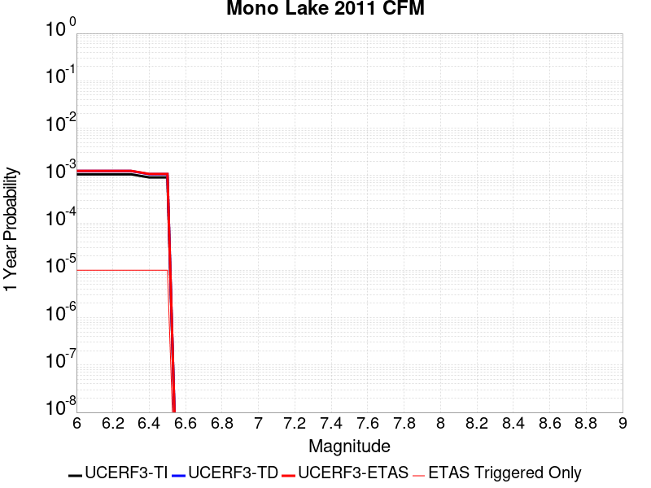 | 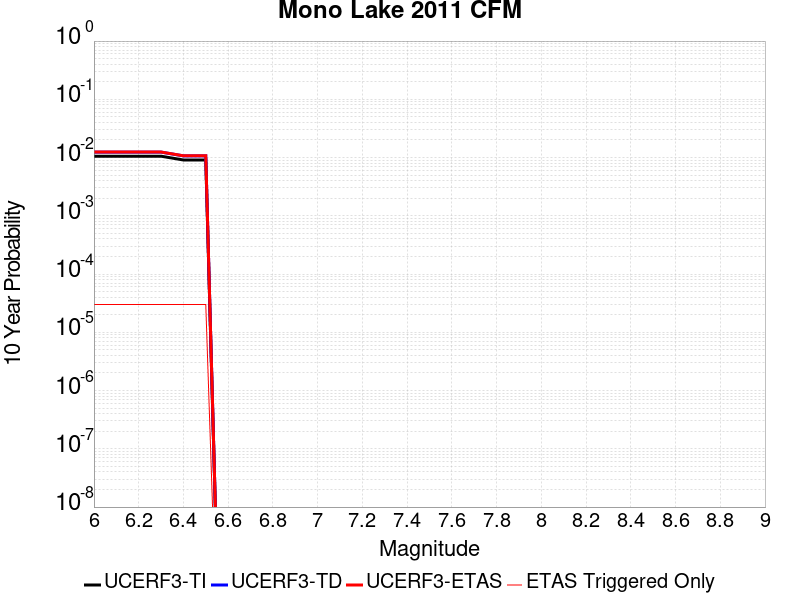 |

| Magnitude | 1 yr TI Prob | TD Prob | ETAS Prob | ETAS/TD Gain | ETAS Triggered Only | 10 yr TI Prob | TD Prob | ETAS Prob | ETAS/TD Gain | ETAS Triggered Only |
|-----|-----|-----|-----|-----|-----|-----|-----|-----|-----|-----|
| 6.0 | 0.0010608466 | 0.0012431325 | 0.00125312 | 1.0080342 | 1.0E-5 | 0.010557966 | 0.012413861 | 0.012443489 | 1.0023867 | 3.0E-5 |
| 6.1 | 0.0010608466 | 0.0012431325 | 0.00125312 | 1.0080342 | 1.0E-5 | 0.010557966 | 0.012413861 | 0.012443489 | 1.0023867 | 3.0E-5 |
| 6.2 | 0.0010608466 | 0.0012431325 | 0.00125312 | 1.0080342 | 1.0E-5 | 0.010557966 | 0.012413861 | 0.012443489 | 1.0023867 | 3.0E-5 |
| 6.3 | 0.0010608466 | 0.0012431325 | 0.00125312 | 1.0080342 | 1.0E-5 | 0.010557966 | 0.012413861 | 0.012443489 | 1.0023867 | 3.0E-5 |
| 6.4 | 9.1262296E-4 | 0.0010691927 | 0.0010791819 | 1.0093429 | 1.0E-5 | 0.009088841 | 0.010691888 | 0.010721567 | 1.0027759 | 3.0E-5 |
| 6.5 | 9.1262296E-4 | 0.0010691927 | 0.0010791819 | 1.0093429 | 1.0E-5 | 0.009088841 | 0.010691888 | 0.010721567 | 1.0027759 | 3.0E-5 |

## San Jacinto (Stepovers Combined)
*[(top)](#table-of-contents)*

| 1 Year | 10 Year |
|-----|-----|
| 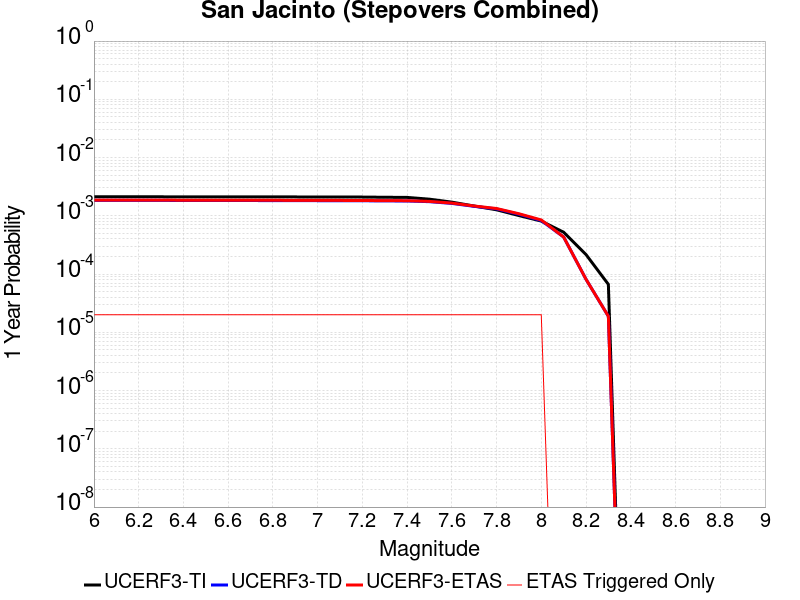 | 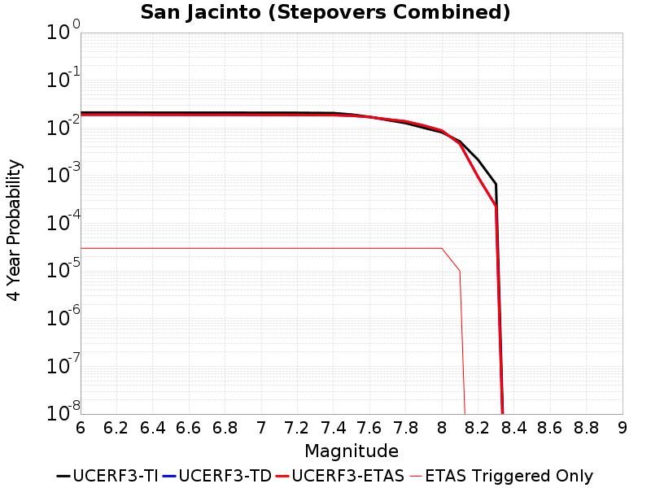 |

| Magnitude | 1 yr TI Prob | TD Prob | ETAS Prob | ETAS/TD Gain | ETAS Triggered Only | 10 yr TI Prob | TD Prob | ETAS Prob | ETAS/TD Gain | ETAS Triggered Only |
|-----|-----|-----|-----|-----|-----|-----|-----|-----|-----|-----|
| 6.0 | 0.0021197782 | 0.0018388971 | 0.0018588603 | 1.010856 | 2.0E-5 | 0.020996714 | 0.018987631 | 0.019017061 | 1.00155 | 3.0E-5 |
| 6.1 | 0.0021197782 | 0.0018388971 | 0.0018588603 | 1.010856 | 2.0E-5 | 0.020996714 | 0.018987631 | 0.019017061 | 1.00155 | 3.0E-5 |
| 6.2 | 0.0021197782 | 0.0018388971 | 0.0018588603 | 1.010856 | 2.0E-5 | 0.020996714 | 0.018987631 | 0.019017061 | 1.00155 | 3.0E-5 |
| 6.3 | 0.0021197782 | 0.0018388971 | 0.0018588603 | 1.010856 | 2.0E-5 | 0.020996714 | 0.018987631 | 0.019017061 | 1.00155 | 3.0E-5 |
| 6.4 | 0.0021150648 | 0.0018322266 | 0.00185219 | 1.0108957 | 2.0E-5 | 0.020950472 | 0.018922199 | 0.018951632 | 1.0015554 | 3.0E-5 |
| 6.5 | 0.0021150648 | 0.0018322266 | 0.00185219 | 1.0108957 | 2.0E-5 | 0.020950472 | 0.018922199 | 0.018951632 | 1.0015554 | 3.0E-5 |
| 6.6 | 0.0021130538 | 0.00182938 | 0.0018493434 | 1.0109127 | 2.0E-5 | 0.020930743 | 0.018894278 | 0.018923711 | 1.0015578 | 3.0E-5 |
| 6.7 | 0.002111905 | 0.0018277694 | 0.0018477328 | 1.0109223 | 2.0E-5 | 0.020919468 | 0.018878473 | 0.018907908 | 1.0015591 | 3.0E-5 |
| 6.8 | 0.0021107488 | 0.0018262882 | 0.0018462517 | 1.0109311 | 2.0E-5 | 0.020908125 | 0.018863887 | 0.01889332 | 1.0015603 | 3.0E-5 |
| 6.9 | 0.0021091616 | 0.0018243382 | 0.0018443017 | 1.0109429 | 2.0E-5 | 0.020892553 | 0.01884466 | 0.018874094 | 1.001562 | 3.0E-5 |
| 7.0 | 0.0021039525 | 0.0018181179 | 0.0018380815 | 1.0109804 | 2.0E-5 | 0.02084144 | 0.018783273 | 0.01881271 | 1.0015671 | 3.0E-5 |
| 7.1 | 0.002102883 | 0.0018169961 | 0.0018369599 | 1.0109872 | 2.0E-5 | 0.020830948 | 0.018772151 | 0.018801589 | 1.0015681 | 3.0E-5 |
| 7.2 | 0.0020984085 | 0.001812022 | 0.0018319858 | 1.0110174 | 2.0E-5 | 0.020787042 | 0.01872289 | 0.018752329 | 1.0015724 | 3.0E-5 |
| 7.3 | 0.0020819185 | 0.001803045 | 0.001823009 | 1.0110724 | 2.0E-5 | 0.020625217 | 0.01863152 | 0.01866096 | 1.0015801 | 3.0E-5 |
| 7.4 | 0.0020704903 | 0.0017970753 | 0.0018170393 | 1.0111092 | 2.0E-5 | 0.020513052 | 0.018570641 | 0.018600084 | 1.0015855 | 3.0E-5 |
| 7.5 | 0.0019307006 | 0.0017484976 | 0.0017684627 | 1.0114183 | 2.0E-5 | 0.019140124 | 0.018072188 | 0.018101646 | 1.0016301 | 3.0E-5 |
| 7.6 | 0.0017173645 | 0.0016328924 | 0.0016528597 | 1.0122283 | 2.0E-5 | 0.01704153 | 0.01690506 | 0.016934553 | 1.0017446 | 3.0E-5 |
| 7.7 | 0.0014722579 | 0.0014539744 | 0.0014739453 | 1.0137354 | 2.0E-5 | 0.014625421 | 0.015115786 | 0.015145333 | 1.0019547 | 3.0E-5 |
| 7.8 | 0.0012686774 | 0.0013145129 | 0.0013344866 | 1.0151948 | 2.0E-5 | 0.012614589 | 0.013713062 | 0.013742651 | 1.0021577 | 3.0E-5 |
| 7.9 | 0.0010102465 | 0.0010650645 | 0.0010850431 | 1.0187582 | 2.0E-5 | 0.0100566605 | 0.011200063 | 0.011229727 | 1.0026486 | 3.0E-5 |
| 8.0 | 8.127754E-4 | 8.2864397E-4 | 8.4862736E-4 | 1.0241158 | 2.0E-5 | 0.008098091 | 0.0087822825 | 0.008812019 | 1.003386 | 3.0E-5 |
| 8.1 | 5.229494E-4 | 4.3262198E-4 | 4.3262198E-4 | 1.0 | 0.0 | 0.0052172043 | 0.004653693 | 0.0046636467 | 1.0021389 | 1.0E-5 |
| 8.2 | 2.1614227E-4 | 8.145574E-5 | 8.145574E-5 | 1.0 | 0.0 | 0.0021593217 | 9.455524E-4 | 9.455524E-4 | 1.0 | 0.0 |
| 8.3 | 6.653009E-5 | 1.8849603E-5 | 1.8849603E-5 | 1.0 | 0.0 | 6.6510175E-4 | 2.2736708E-4 | 2.2736708E-4 | 1.0 | 0.0 |

## San Jacinto (Superstition Mtn)
*[(top)](#table-of-contents)*

| 1 Year | 10 Year |
|-----|-----|
| 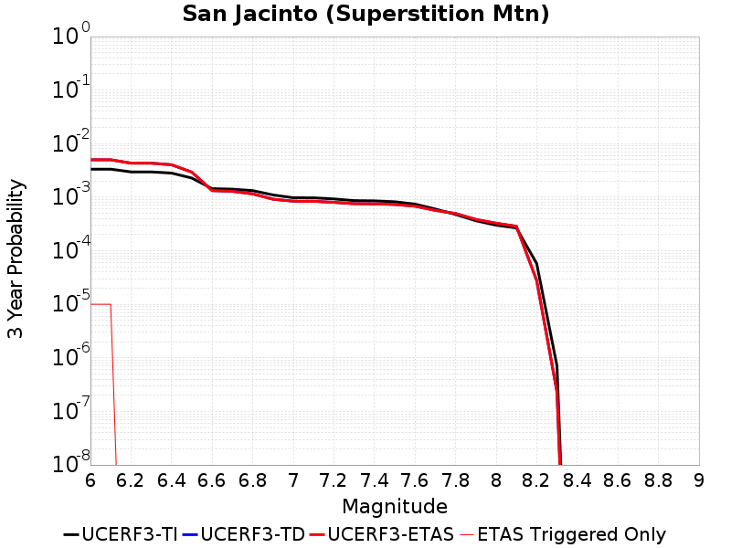 | 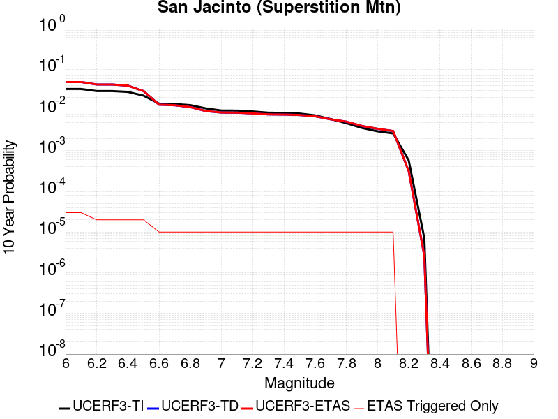 |

| Magnitude | 1 yr TI Prob | TD Prob | ETAS Prob | ETAS/TD Gain | ETAS Triggered Only | 10 yr TI Prob | TD Prob | ETAS Prob | ETAS/TD Gain | ETAS Triggered Only |
|-----|-----|-----|-----|-----|-----|-----|-----|-----|-----|-----|
| 6.0 | 0.0033440501 | 0.0049981265 | 0.0050080763 | 1.0019908 | 1.0E-5 | 0.03294174 | 0.04882434 | 0.048852876 | 1.0005845 | 3.0E-5 |
| 6.1 | 0.0033440501 | 0.0049981265 | 0.0050080763 | 1.0019908 | 1.0E-5 | 0.03294174 | 0.04882434 | 0.048852876 | 1.0005845 | 3.0E-5 |
| 6.2 | 0.002971072 | 0.0043309294 | 0.0043309294 | 1.0 | 0.0 | 0.029316625 | 0.042504366 | 0.04252352 | 1.0004505 | 2.0E-5 |
| 6.3 | 0.002966728 | 0.004322895 | 0.004322895 | 1.0 | 0.0 | 0.029274331 | 0.042427618 | 0.04244677 | 1.0004514 | 2.0E-5 |
| 6.4 | 0.0028226813 | 0.0040367697 | 0.0040367697 | 1.0 | 0.0 | 0.02787096 | 0.039716866 | 0.03973607 | 1.0004835 | 2.0E-5 |
| 6.5 | 0.0022803338 | 0.0029410277 | 0.0029410277 | 1.0 | 0.0 | 0.022570757 | 0.02923713 | 0.029256547 | 1.0006641 | 2.0E-5 |
| 6.6 | 0.0014454646 | 0.0013291321 | 0.0013291321 | 1.0 | 0.0 | 0.014360986 | 0.013540811 | 0.0135506755 | 1.0007285 | 1.0E-5 |
| 6.7 | 0.0014143161 | 0.0012880173 | 0.0012880173 | 1.0 | 0.0 | 0.014053487 | 0.013134263 | 0.013144132 | 1.0007514 | 1.0E-5 |
| 6.8 | 0.001328425 | 0.0011558984 | 0.0011558984 | 1.0 | 0.0 | 0.0132051185 | 0.011822496 | 0.011832377 | 1.0008359 | 1.0E-5 |
| 6.9 | 0.0011036064 | 9.1933087E-4 | 9.1933087E-4 | 1.0 | 0.0 | 0.010981417 | 0.009447172 | 0.009457078 | 1.0010486 | 1.0E-5 |
| 7.0 | 9.781026E-4 | 8.429691E-4 | 8.429691E-4 | 1.0 | 0.0 | 0.009738087 | 0.008670323 | 0.0086802365 | 1.0011433 | 1.0E-5 |
| 7.1 | 9.7415317E-4 | 8.390664E-4 | 8.390664E-4 | 1.0 | 0.0 | 0.009698939 | 0.008631279 | 0.008641193 | 1.0011486 | 1.0E-5 |
| 7.2 | 9.285943E-4 | 8.0228766E-4 | 8.0228766E-4 | 1.0 | 0.0 | 0.009247236 | 0.00826259 | 0.008272507 | 1.0012003 | 1.0E-5 |
| 7.3 | 8.649459E-4 | 7.579227E-4 | 7.579227E-4 | 1.0 | 0.0 | 0.00861587 | 0.007817899 | 0.007827821 | 1.0012691 | 1.0E-5 |
| 7.4 | 8.5472054E-4 | 7.508778E-4 | 7.508778E-4 | 1.0 | 0.0 | 0.008514405 | 0.007747281 | 0.007757203 | 1.0012808 | 1.0E-5 |
| 7.5 | 8.236062E-4 | 7.3214277E-4 | 7.3214277E-4 | 1.0 | 0.0 | 0.008205604 | 0.0075578415 | 0.0075677657 | 1.0013131 | 1.0E-5 |
| 7.6 | 7.432043E-4 | 6.809886E-4 | 6.809886E-4 | 1.0 | 0.0 | 0.007407237 | 0.0070404233 | 0.007050353 | 1.0014104 | 1.0E-5 |
| 7.7 | 6.022235E-4 | 5.6880614E-4 | 5.6880614E-4 | 1.0 | 0.0 | 0.006005941 | 0.005910439 | 0.00592038 | 1.0016819 | 1.0E-5 |
| 7.8 | 4.767588E-4 | 4.96347E-4 | 4.96347E-4 | 1.0 | 0.0 | 0.0047573727 | 0.005176935 | 0.0051868833 | 1.0019217 | 1.0E-5 |
| 7.9 | 3.6377716E-4 | 3.8513896E-4 | 3.8513896E-4 | 1.0 | 0.0 | 0.0036318225 | 0.004051992 | 0.004061952 | 1.002458 | 1.0E-5 |
| 8.0 | 3.0070372E-4 | 3.2660208E-4 | 3.2660208E-4 | 1.0 | 0.0 | 0.0030029714 | 0.0034536256 | 0.003463591 | 1.0028855 | 1.0E-5 |
| 8.1 | 2.6672508E-4 | 2.867324E-4 | 2.867324E-4 | 1.0 | 0.0 | 0.0026640517 | 0.0030404967 | 0.0030504663 | 1.003279 | 1.0E-5 |
| 8.2 | 5.779102E-5 | 2.784743E-5 | 2.784743E-5 | 1.0 | 0.0 | 5.777599E-4 | 3.1349077E-4 | 3.1349077E-4 | 1.0 | 0.0 |
| 8.3 | 7.0881396E-7 | 2.3346068E-7 | 2.3346068E-7 | 1.0 | 0.0 | 7.0881174E-6 | 2.6165435E-6 | 2.6165435E-6 | 1.0 | 0.0 |

## Ortigalita (South)
*[(top)](#table-of-contents)*

| 1 Year | 10 Year |
|-----|-----|
| 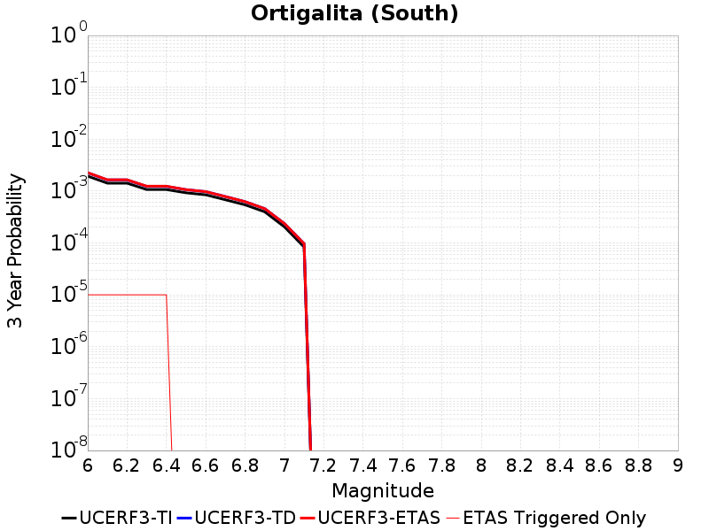 | 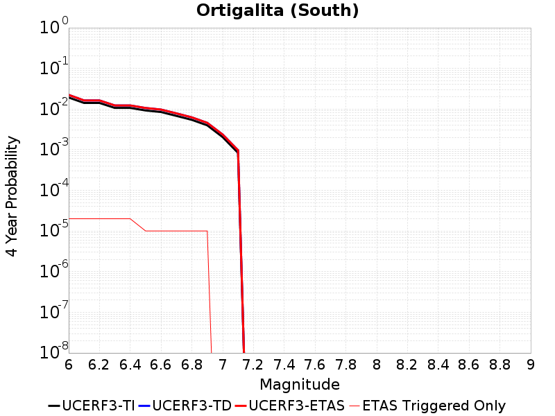 |

| Magnitude | 1 yr TI Prob | TD Prob | ETAS Prob | ETAS/TD Gain | ETAS Triggered Only | 10 yr TI Prob | TD Prob | ETAS Prob | ETAS/TD Gain | ETAS Triggered Only |
|-----|-----|-----|-----|-----|-----|-----|-----|-----|-----|-----|
| 6.0 | 0.0019412481 | 0.002254692 | 0.0022646694 | 1.0044252 | 1.0E-5 | 0.019243775 | 0.02233454 | 0.022354094 | 1.0008755 | 2.0E-5 |
| 6.1 | 0.0014234743 | 0.0016419488 | 0.0016519324 | 1.0060803 | 1.0E-5 | 0.014143906 | 0.016304102 | 0.016323775 | 1.0012066 | 2.0E-5 |
| 6.2 | 0.0014234743 | 0.0016419488 | 0.0016519324 | 1.0060803 | 1.0E-5 | 0.014143906 | 0.016304102 | 0.016323775 | 1.0012066 | 2.0E-5 |
| 6.3 | 0.00107152 | 0.0012323325 | 0.0012423203 | 1.0081047 | 1.0E-5 | 0.010663681 | 0.012257053 | 0.012276808 | 1.0016117 | 2.0E-5 |
| 6.4 | 0.00107152 | 0.0012323325 | 0.0012423203 | 1.0081047 | 1.0E-5 | 0.010663681 | 0.012257053 | 0.012276808 | 1.0016117 | 2.0E-5 |
| 6.5 | 9.272918E-4 | 0.0010663524 | 0.0010663524 | 1.0 | 0.0 | 0.009234319 | 0.010613823 | 0.010623717 | 1.0009322 | 1.0E-5 |
| 6.6 | 8.487073E-4 | 9.760677E-4 | 9.760677E-4 | 1.0 | 0.0 | 0.008454733 | 0.009719108 | 0.009729011 | 1.0010189 | 1.0E-5 |
| 6.7 | 6.807804E-4 | 7.8441063E-4 | 7.8441063E-4 | 1.0 | 0.0 | 0.006786986 | 0.0078174025 | 0.007827324 | 1.0012692 | 1.0E-5 |
| 6.8 | 5.439595E-4 | 6.252941E-4 | 6.252941E-4 | 1.0 | 0.0 | 0.0054262993 | 0.0062361015 | 0.006246039 | 1.0015936 | 1.0E-5 |
| 6.9 | 3.9856473E-4 | 4.5863204E-4 | 4.5863204E-4 | 1.0 | 0.0 | 0.003978506 | 0.0045774416 | 0.004587396 | 1.0021746 | 1.0E-5 |
| 7.0 | 2.045107E-4 | 2.3652168E-4 | 2.3652168E-4 | 1.0 | 0.0 | 0.0020432258 | 0.002362908 | 0.002362908 | 1.0 | 0.0 |
| 7.1 | 8.357586E-5 | 9.689451E-5 | 9.689451E-5 | 1.0 | 0.0 | 8.3544437E-4 | 9.6862734E-4 | 9.6862734E-4 | 1.0 | 0.0 |

## Great Valley 03 Mysterious Ridge
*[(top)](#table-of-contents)*

| 1 Year | 10 Year |
|-----|-----|
| 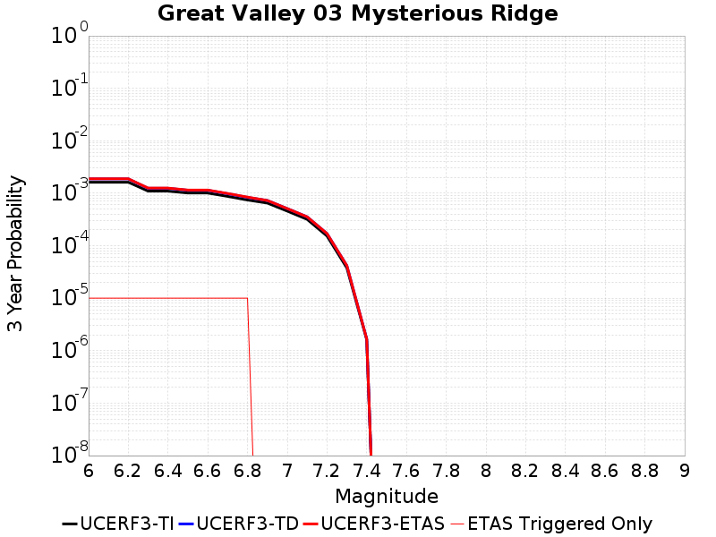 | 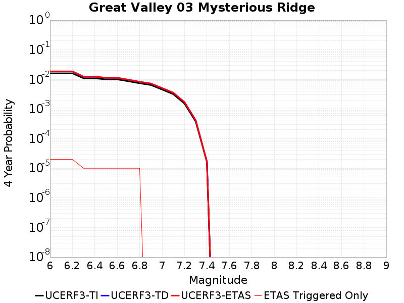 |

| Magnitude | 1 yr TI Prob | TD Prob | ETAS Prob | ETAS/TD Gain | ETAS Triggered Only | 10 yr TI Prob | TD Prob | ETAS Prob | ETAS/TD Gain | ETAS Triggered Only |
|-----|-----|-----|-----|-----|-----|-----|-----|-----|-----|-----|
| 6.0 | 0.0016257578 | 0.0018786733 | 0.0018886545 | 1.0053129 | 1.0E-5 | 0.016139153 | 0.018646687 | 0.018666314 | 1.0010526 | 2.0E-5 |
| 6.1 | 0.0016257578 | 0.0018786733 | 0.0018886545 | 1.0053129 | 1.0E-5 | 0.016139153 | 0.018646687 | 0.018666314 | 1.0010526 | 2.0E-5 |
| 6.2 | 0.0016257578 | 0.0018786733 | 0.0018886545 | 1.0053129 | 1.0E-5 | 0.016139153 | 0.018646687 | 0.018666314 | 1.0010526 | 2.0E-5 |
| 6.3 | 0.0010987755 | 0.0012437509 | 0.0012537385 | 1.0080302 | 1.0E-5 | 0.010933585 | 0.012371147 | 0.012381023 | 1.0007983 | 1.0E-5 |
| 6.4 | 0.0010987755 | 0.0012437509 | 0.0012537385 | 1.0080302 | 1.0E-5 | 0.010933585 | 0.012371147 | 0.012381023 | 1.0007983 | 1.0E-5 |
| 6.5 | 0.0010112294 | 0.0011413193 | 0.0011513078 | 1.0087517 | 1.0E-5 | 0.010066401 | 0.011357452 | 0.011367339 | 1.0008705 | 1.0E-5 |
| 6.6 | 0.0010102082 | 0.0011402727 | 0.0011502614 | 1.0087599 | 1.0E-5 | 0.010056281 | 0.011347094 | 0.011356981 | 1.0008713 | 1.0E-5 |
| 6.7 | 8.722353E-4 | 9.804703E-4 | 9.904605E-4 | 1.0101892 | 1.0E-5 | 0.008688197 | 0.009763454 | 0.009773357 | 1.0010142 | 1.0E-5 |
| 6.8 | 7.4428355E-4 | 8.343867E-4 | 8.443783E-4 | 1.0119748 | 1.0E-5 | 0.007417957 | 0.008314017 | 0.008323934 | 1.0011928 | 1.0E-5 |
| 6.9 | 6.504535E-4 | 7.2800653E-4 | 7.2800653E-4 | 1.0 | 0.0 | 0.006485529 | 0.0072574406 | 0.0072574406 | 1.0 | 0.0 |
| 7.0 | 4.5774475E-4 | 5.1079923E-4 | 5.1079923E-4 | 1.0 | 0.0 | 0.00456803 | 0.0050969846 | 0.0050969846 | 1.0 | 0.0 |
| 7.1 | 3.1858988E-4 | 3.5547494E-4 | 3.5547494E-4 | 1.0 | 0.0 | 0.0031813353 | 0.0035496142 | 0.0035496142 | 1.0 | 0.0 |
| 7.2 | 1.5335606E-4 | 1.7082597E-4 | 1.7082597E-4 | 1.0 | 0.0 | 0.0015325027 | 0.0017071185 | 0.0017071185 | 1.0 | 0.0 |
| 7.3 | 3.77702E-5 | 4.1786923E-5 | 4.1786923E-5 | 1.0 | 0.0 | 3.7763783E-4 | 4.1783563E-4 | 4.1783563E-4 | 1.0 | 0.0 |
| 7.4 | 1.6238852E-6 | 1.6732808E-6 | 1.6732808E-6 | 1.0 | 0.0 | 1.6238733E-5 | 1.673269E-5 | 1.673269E-5 | 1.0 | 0.0 |

## White Wolf
*[(top)](#table-of-contents)*

| 1 Year | 10 Year |
|-----|-----|
| 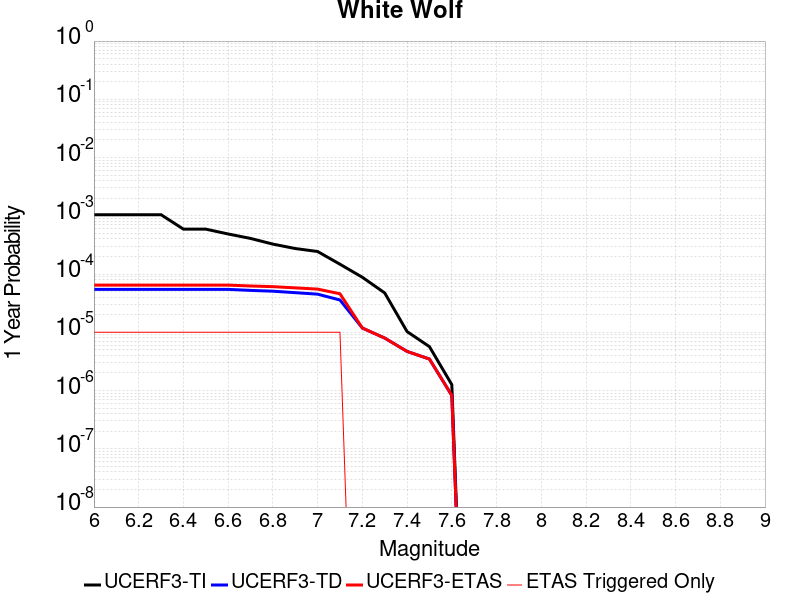 | 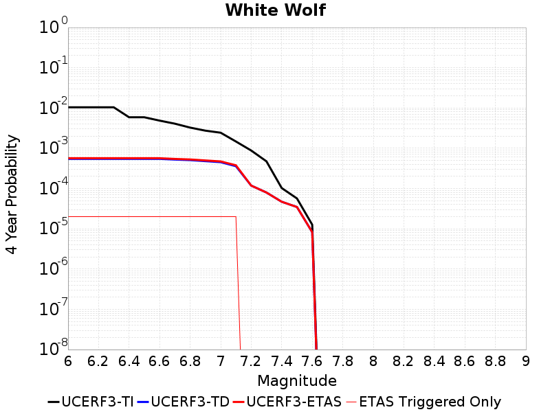 |

| Magnitude | 1 yr TI Prob | TD Prob | ETAS Prob | ETAS/TD Gain | ETAS Triggered Only | 10 yr TI Prob | TD Prob | ETAS Prob | ETAS/TD Gain | ETAS Triggered Only |
|-----|-----|-----|-----|-----|-----|-----|-----|-----|-----|-----|
| 6.0 | 0.001045009 | 5.4625252E-5 | 6.4624706E-5 | 1.1830555 | 1.0E-5 | 0.010401085 | 5.461233E-4 | 5.661124E-4 | 1.0366018 | 2.0E-5 |
| 6.1 | 0.001045009 | 5.4625252E-5 | 6.4624706E-5 | 1.1830555 | 1.0E-5 | 0.010401085 | 5.461233E-4 | 5.661124E-4 | 1.0366018 | 2.0E-5 |
| 6.2 | 0.001045009 | 5.4625252E-5 | 6.4624706E-5 | 1.1830555 | 1.0E-5 | 0.010401085 | 5.461233E-4 | 5.661124E-4 | 1.0366018 | 2.0E-5 |
| 6.3 | 0.001045009 | 5.4625252E-5 | 6.4624706E-5 | 1.1830555 | 1.0E-5 | 0.010401085 | 5.461233E-4 | 5.661124E-4 | 1.0366018 | 2.0E-5 |
| 6.4 | 5.907443E-4 | 5.4625252E-5 | 6.4624706E-5 | 1.1830555 | 1.0E-5 | 0.005891764 | 5.461233E-4 | 5.661124E-4 | 1.0366018 | 2.0E-5 |
| 6.5 | 5.907443E-4 | 5.4625252E-5 | 6.4624706E-5 | 1.1830555 | 1.0E-5 | 0.005891764 | 5.461233E-4 | 5.661124E-4 | 1.0366018 | 2.0E-5 |
| 6.6 | 4.8762115E-4 | 5.4625252E-5 | 6.4624706E-5 | 1.1830555 | 1.0E-5 | 0.0048655253 | 5.461233E-4 | 5.661124E-4 | 1.0366018 | 2.0E-5 |
| 6.7 | 4.0913603E-4 | 5.2429583E-5 | 6.242906E-5 | 1.190722 | 1.0E-5 | 0.004083836 | 5.241771E-4 | 5.441666E-4 | 1.038135 | 2.0E-5 |
| 6.8 | 3.2689696E-4 | 5.079376E-5 | 6.0793252E-5 | 1.1968646 | 1.0E-5 | 0.003264165 | 5.078264E-4 | 5.2781624E-4 | 1.0393635 | 2.0E-5 |
| 6.9 | 2.7434074E-4 | 4.7915888E-5 | 5.791541E-5 | 1.2086891 | 1.0E-5 | 0.0027400232 | 4.7906037E-4 | 4.990508E-4 | 1.0417284 | 2.0E-5 |
| 7.0 | 2.4390711E-4 | 4.51919E-5 | 5.519145E-5 | 1.2212685 | 1.0E-5 | 0.0024363957 | 4.5183182E-4 | 4.7182277E-4 | 1.0442443 | 2.0E-5 |
| 7.1 | 1.4749856E-4 | 3.586789E-5 | 4.5867535E-5 | 1.2787908 | 1.0E-5 | 0.001474007 | 3.5862514E-4 | 3.7861796E-4 | 1.0557486 | 2.0E-5 |
| 7.2 | 8.808096E-5 | 1.1847822E-5 | 1.1847822E-5 | 1.0 | 0.0 | 8.8046055E-4 | 1.1847205E-4 | 1.1847205E-4 | 1.0 | 0.0 |
| 7.3 | 4.7408903E-5 | 7.965766E-6 | 7.965766E-6 | 1.0 | 0.0 | 4.739879E-4 | 7.9654885E-5 | 7.9654885E-5 | 1.0 | 0.0 |
| 7.4 | 1.0288197E-5 | 4.698106E-6 | 4.698106E-6 | 1.0 | 0.0 | 1.028772E-4 | 4.6980098E-5 | 4.6980098E-5 | 1.0 | 0.0 |
| 7.5 | 5.6716644E-6 | 3.4749428E-6 | 3.4749428E-6 | 1.0 | 0.0 | 5.6715195E-5 | 3.4748908E-5 | 3.4748908E-5 | 1.0 | 0.0 |
| 7.6 | 1.2636499E-6 | 8.25505E-7 | 8.25505E-7 | 1.0 | 0.0 | 1.2636427E-5 | 8.255024E-6 | 8.255024E-6 | 1.0 | 0.0 |

## Monterey Bay-Tularcitos
*[(top)](#table-of-contents)*

| 1 Year | 10 Year |
|-----|-----|
| 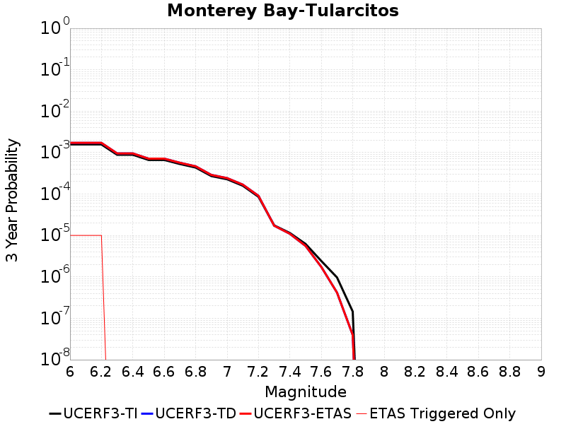 | 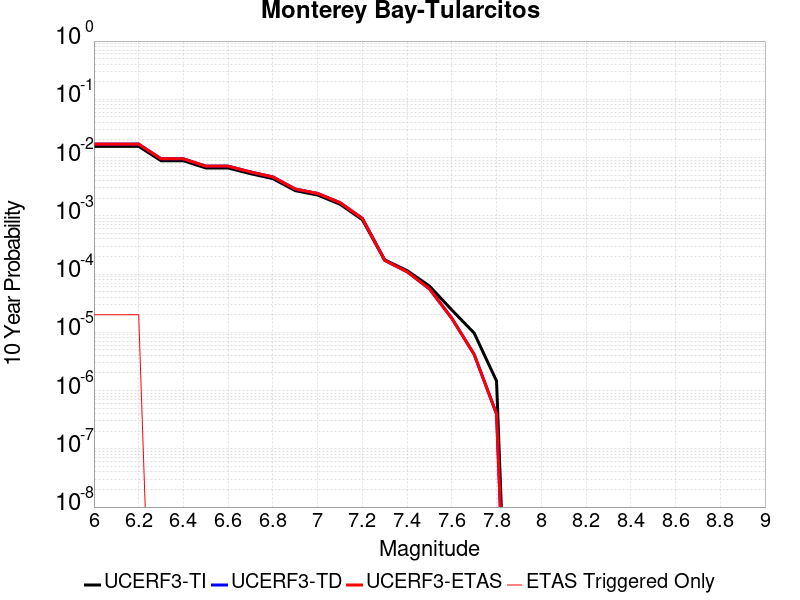 |

| Magnitude | 1 yr TI Prob | TD Prob | ETAS Prob | ETAS/TD Gain | ETAS Triggered Only | 10 yr TI Prob | TD Prob | ETAS Prob | ETAS/TD Gain | ETAS Triggered Only |
|-----|-----|-----|-----|-----|-----|-----|-----|-----|-----|-----|
| 6.0 | 0.001571 | 0.0017100722 | 0.001720055 | 1.0058377 | 1.0E-5 | 0.015599402 | 0.016979935 | 0.016999597 | 1.0011579 | 2.0E-5 |
| 6.1 | 0.001571 | 0.0017100722 | 0.001720055 | 1.0058377 | 1.0E-5 | 0.015599402 | 0.016979935 | 0.016999597 | 1.0011579 | 2.0E-5 |
| 6.2 | 0.001571 | 0.0017100722 | 0.001720055 | 1.0058377 | 1.0E-5 | 0.015599402 | 0.016979935 | 0.016999597 | 1.0011579 | 2.0E-5 |
| 6.3 | 8.865586E-4 | 9.5604727E-4 | 9.5604727E-4 | 1.0 | 0.0 | 0.0088303005 | 0.009521267 | 0.009521267 | 1.0 | 0.0 |
| 6.4 | 8.865586E-4 | 9.5604727E-4 | 9.5604727E-4 | 1.0 | 0.0 | 0.0088303005 | 0.009521267 | 0.009521267 | 1.0 | 0.0 |
| 6.5 | 6.649074E-4 | 7.1425893E-4 | 7.1425893E-4 | 1.0 | 0.0 | 0.0066292146 | 0.007120685 | 0.007120685 | 1.0 | 0.0 |
| 6.6 | 6.645082E-4 | 7.1384636E-4 | 7.1384636E-4 | 1.0 | 0.0 | 0.0066252467 | 0.0071165855 | 0.0071165855 | 1.0 | 0.0 |
| 6.7 | 5.300022E-4 | 5.67853E-4 | 5.67853E-4 | 1.0 | 0.0 | 0.005287399 | 0.0056647314 | 0.0056647314 | 1.0 | 0.0 |
| 6.8 | 4.3559066E-4 | 4.6598958E-4 | 4.6598958E-4 | 1.0 | 0.0 | 0.004347378 | 0.0046506897 | 0.0046506897 | 1.0 | 0.0 |
| 6.9 | 2.7096065E-4 | 2.8884583E-4 | 2.8884583E-4 | 1.0 | 0.0 | 0.0027063051 | 0.002885025 | 0.002885025 | 1.0 | 0.0 |
| 7.0 | 2.274409E-4 | 2.4225881E-4 | 2.4225881E-4 | 1.0 | 0.0 | 0.0022720827 | 0.00242024 | 0.00242024 | 1.0 | 0.0 |
| 7.1 | 1.5860285E-4 | 1.6858021E-4 | 1.6858021E-4 | 1.0 | 0.0 | 0.001584897 | 0.0016847808 | 0.0016847808 | 1.0 | 0.0 |
| 7.2 | 8.569109E-5 | 9.04402E-5 | 9.04402E-5 | 1.0 | 0.0 | 8.5658056E-4 | 9.0423663E-4 | 9.0423663E-4 | 1.0 | 0.0 |
| 7.3 | 1.7515373E-5 | 1.7193957E-5 | 1.7193957E-5 | 1.0 | 0.0 | 1.7513991E-4 | 1.7192637E-4 | 1.7192637E-4 | 1.0 | 0.0 |
| 7.4 | 1.1465385E-5 | 1.0960801E-5 | 1.0960801E-5 | 1.0 | 0.0 | 1.1464794E-4 | 1.0960264E-4 | 1.0960264E-4 | 1.0 | 0.0 |
| 7.5 | 6.23226E-6 | 5.5810387E-6 | 5.5810387E-6 | 1.0 | 0.0 | 6.2320854E-5 | 5.5809E-5 | 5.5809E-5 | 1.0 | 0.0 |
| 7.6 | 2.419026E-6 | 1.7409408E-6 | 1.7409408E-6 | 1.0 | 0.0 | 2.4189996E-5 | 1.7409273E-5 | 1.7409273E-5 | 1.0 | 0.0 |
| 7.7 | 9.699246E-7 | 4.1763067E-7 | 4.1763067E-7 | 1.0 | 0.0 | 9.699204E-6 | 4.176299E-6 | 4.176299E-6 | 1.0 | 0.0 |
| 7.8 | 1.4589209E-7 | 3.970875E-8 | 3.970875E-8 | 1.0 | 0.0 | 1.4589199E-6 | 3.9708743E-7 | 3.9708743E-7 | 1.0 | 0.0 |

## Hayward (So) 2011 CFM
*[(top)](#table-of-contents)*

| 1 Year | 10 Year |
|-----|-----|
| 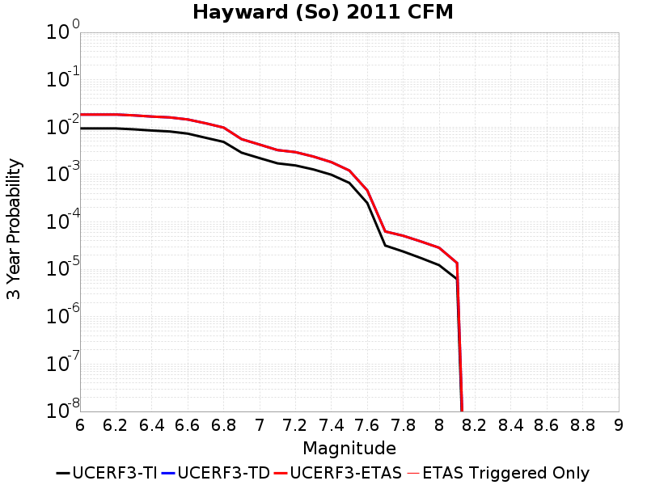 | 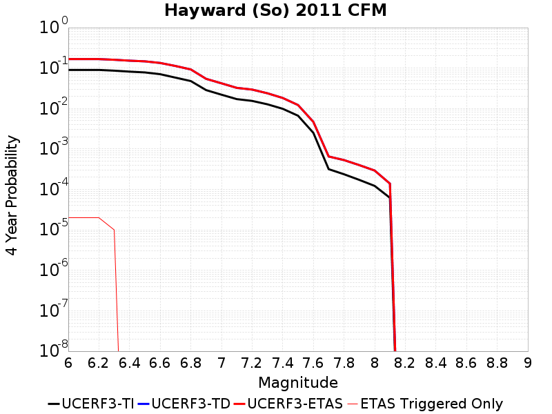 |

| Magnitude | 1 yr TI Prob | TD Prob | ETAS Prob | ETAS/TD Gain | ETAS Triggered Only | 10 yr TI Prob | TD Prob | ETAS Prob | ETAS/TD Gain | ETAS Triggered Only |
|-----|-----|-----|-----|-----|-----|-----|-----|-----|-----|-----|
| 6.0 | 0.00939654 | 0.018463366 | 0.018463366 | 1.0 | 0.0 | 0.090090066 | 0.16673279 | 0.16674945 | 1.0000999 | 2.0E-5 |
| 6.1 | 0.00939654 | 0.018463366 | 0.018463366 | 1.0 | 0.0 | 0.090090066 | 0.16673279 | 0.16674945 | 1.0000999 | 2.0E-5 |
| 6.2 | 0.00939654 | 0.018463366 | 0.018463366 | 1.0 | 0.0 | 0.090090066 | 0.16673279 | 0.16674945 | 1.0000999 | 2.0E-5 |
| 6.3 | 0.0089988755 | 0.017723696 | 0.017723696 | 1.0 | 0.0 | 0.08643075 | 0.1606684 | 0.16067679 | 1.0000522 | 1.0E-5 |
| 6.4 | 0.008487372 | 0.016739532 | 0.016739532 | 1.0 | 0.0 | 0.081704415 | 0.15255706 | 0.15255706 | 1.0 | 0.0 |
| 6.5 | 0.008107598 | 0.016059076 | 0.016059076 | 1.0 | 0.0 | 0.078181036 | 0.1468338 | 0.1468338 | 1.0 | 0.0 |
| 6.6 | 0.0073027555 | 0.01452414 | 0.01452414 | 1.0 | 0.0 | 0.07067384 | 0.13392086 | 0.13392086 | 1.0 | 0.0 |
| 6.7 | 0.0059671924 | 0.0120717725 | 0.0120717725 | 1.0 | 0.0 | 0.058094822 | 0.112747684 | 0.112747684 | 1.0 | 0.0 |
| 6.8 | 0.0048864787 | 0.009795082 | 0.009795082 | 1.0 | 0.0 | 0.047804173 | 0.092599355 | 0.092599355 | 1.0 | 0.0 |
| 6.9 | 0.0028927654 | 0.005583321 | 0.005583321 | 1.0 | 0.0 | 0.028553981 | 0.05424601 | 0.05424601 | 1.0 | 0.0 |
| 7.0 | 0.0022236328 | 0.00429393 | 0.00429393 | 1.0 | 0.0 | 0.022015138 | 0.042064905 | 0.042064905 | 1.0 | 0.0 |
| 7.1 | 0.0017235056 | 0.0032830036 | 0.0032830036 | 1.0 | 0.0 | 0.017101998 | 0.03245321 | 0.03245321 | 1.0 | 0.0 |
| 7.2 | 0.0015567001 | 0.002970607 | 0.002970607 | 1.0 | 0.0 | 0.015458403 | 0.029453905 | 0.029453905 | 1.0 | 0.0 |
| 7.3 | 0.0012806869 | 0.0023969584 | 0.0023969584 | 1.0 | 0.0 | 0.012733313 | 0.023857743 | 0.023857743 | 1.0 | 0.0 |
| 7.4 | 9.910273E-4 | 0.001827216 | 0.001827216 | 1.0 | 0.0 | 0.009866194 | 0.01825849 | 0.01825849 | 1.0 | 0.0 |
| 7.5 | 6.667979E-4 | 0.001216625 | 0.001216625 | 1.0 | 0.0 | 0.006648007 | 0.012209728 | 0.012209728 | 1.0 | 0.0 |
| 7.6 | 2.5120692E-4 | 4.63642E-4 | 4.63642E-4 | 1.0 | 0.0 | 0.0025092314 | 0.0046813074 | 0.0046813074 | 1.0 | 0.0 |
| 7.7 | 3.174402E-5 | 6.291081E-5 | 6.291081E-5 | 1.0 | 0.0 | 3.1739488E-4 | 6.5295835E-4 | 6.5295835E-4 | 1.0 | 0.0 |
| 7.8 | 2.376331E-5 | 5.109526E-5 | 5.109526E-5 | 1.0 | 0.0 | 2.3760769E-4 | 5.3215877E-4 | 5.3215877E-4 | 1.0 | 0.0 |
| 7.9 | 1.7227521E-5 | 3.8541835E-5 | 3.8541835E-5 | 1.0 | 0.0 | 1.7226185E-4 | 3.993233E-4 | 3.993233E-4 | 1.0 | 0.0 |
| 8.0 | 1.2246436E-5 | 2.8550263E-5 | 2.8550263E-5 | 1.0 | 0.0 | 1.2245761E-4 | 2.9356367E-4 | 2.9356367E-4 | 1.0 | 0.0 |
| 8.1 | 6.1999854E-6 | 1.3597657E-5 | 1.3597657E-5 | 1.0 | 0.0 | 6.199812E-5 | 1.3918363E-4 | 1.3918363E-4 | 1.0 | 0.0 |

## South Klamath Lake East
*[(top)](#table-of-contents)*

| 1 Year | 10 Year |
|-----|-----|
| 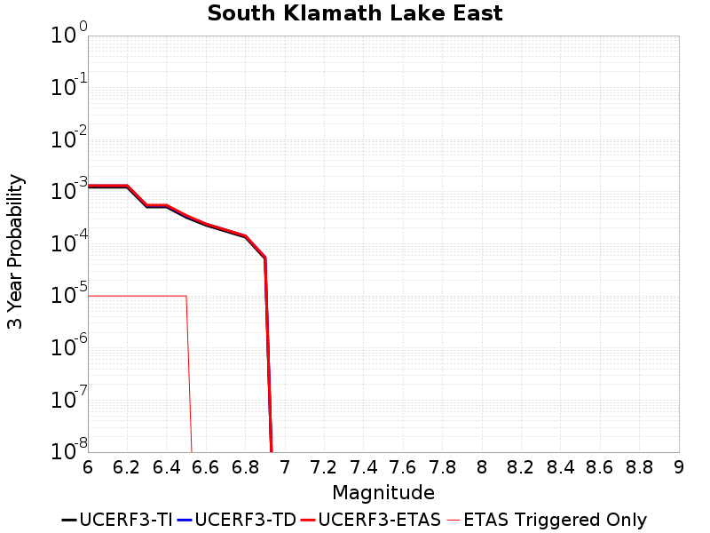 | 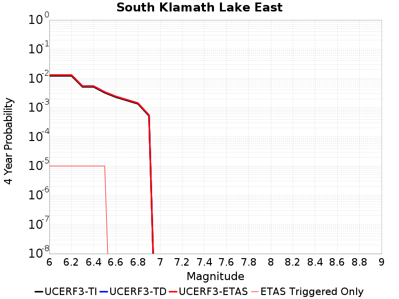 |

| Magnitude | 1 yr TI Prob | TD Prob | ETAS Prob | ETAS/TD Gain | ETAS Triggered Only | 10 yr TI Prob | TD Prob | ETAS Prob | ETAS/TD Gain | ETAS Triggered Only |
|-----|-----|-----|-----|-----|-----|-----|-----|-----|-----|-----|
| 6.0 | 0.0012275111 | 0.0013061854 | 0.0013161723 | 1.0076458 | 1.0E-5 | 0.012207527 | 0.012993427 | 0.013003297 | 1.0007596 | 1.0E-5 |
| 6.1 | 0.0012275111 | 0.0013061854 | 0.0013161723 | 1.0076458 | 1.0E-5 | 0.012207527 | 0.012993427 | 0.013003297 | 1.0007596 | 1.0E-5 |
| 6.2 | 0.0012275111 | 0.0013061854 | 0.0013161723 | 1.0076458 | 1.0E-5 | 0.012207527 | 0.012993427 | 0.013003297 | 1.0007596 | 1.0E-5 |
| 6.3 | 5.1162974E-4 | 5.4231577E-4 | 5.523104E-4 | 1.0184294 | 1.0E-5 | 0.005104534 | 0.00541076 | 0.005420706 | 1.0018382 | 1.0E-5 |
| 6.4 | 5.1162974E-4 | 5.4231577E-4 | 5.523104E-4 | 1.0184294 | 1.0E-5 | 0.005104534 | 0.00541076 | 0.005420706 | 1.0018382 | 1.0E-5 |
| 6.5 | 3.2303753E-4 | 3.417594E-4 | 3.51756E-4 | 1.0292504 | 1.0E-5 | 0.0032256835 | 0.0034126164 | 0.0034225823 | 1.0029203 | 1.0E-5 |
| 6.6 | 2.2796239E-4 | 2.408583E-4 | 2.408583E-4 | 1.0 | 0.0 | 0.0022772867 | 0.002406085 | 0.002406085 | 1.0 | 0.0 |
| 6.7 | 1.7534842E-4 | 1.852828E-4 | 1.852828E-4 | 1.0 | 0.0 | 0.0017521014 | 0.0018513631 | 0.0018513631 | 1.0 | 0.0 |
| 6.8 | 1.3454557E-4 | 1.4218637E-4 | 1.4218637E-4 | 1.0 | 0.0 | 0.0013446413 | 0.0014210145 | 0.0014210145 | 1.0 | 0.0 |
| 6.9 | 5.211371E-5 | 5.5131888E-5 | 5.5131888E-5 | 1.0 | 0.0 | 5.210149E-4 | 5.5121427E-4 | 5.5121427E-4 | 1.0 | 0.0 |

## Hosgri
*[(top)](#table-of-contents)*

| 1 Year | 10 Year |
|-----|-----|
| 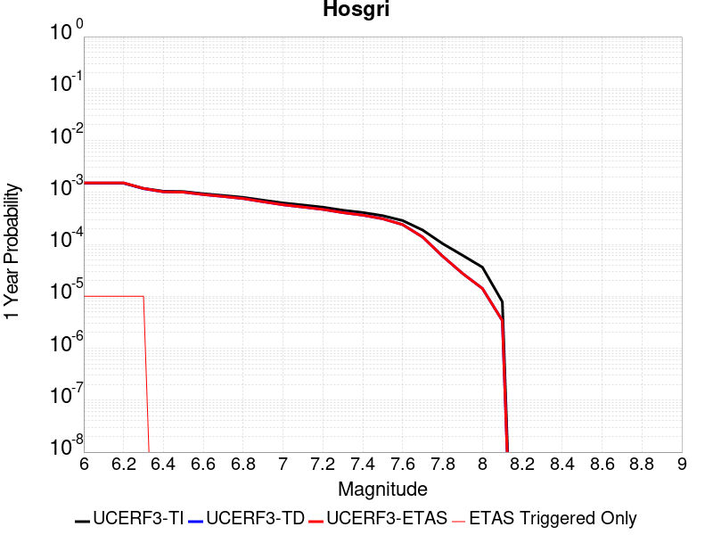 | 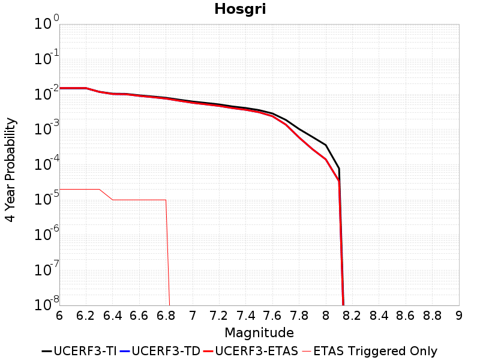 |

| Magnitude | 1 yr TI Prob | TD Prob | ETAS Prob | ETAS/TD Gain | ETAS Triggered Only | 10 yr TI Prob | TD Prob | ETAS Prob | ETAS/TD Gain | ETAS Triggered Only |
|-----|-----|-----|-----|-----|-----|-----|-----|-----|-----|-----|
| 6.0 | 0.0015037085 | 0.0015187779 | 0.0015287627 | 1.0065743 | 1.0E-5 | 0.01493574 | 0.015087759 | 0.0151074575 | 1.0013056 | 2.0E-5 |
| 6.1 | 0.0015037085 | 0.0015187779 | 0.0015287627 | 1.0065743 | 1.0E-5 | 0.01493574 | 0.015087759 | 0.0151074575 | 1.0013056 | 2.0E-5 |
| 6.2 | 0.0015037085 | 0.0015187779 | 0.0015287627 | 1.0065743 | 1.0E-5 | 0.01493574 | 0.015087759 | 0.0151074575 | 1.0013056 | 2.0E-5 |
| 6.3 | 0.0011949413 | 0.0011807482 | 0.0011907364 | 1.0084592 | 1.0E-5 | 0.011885363 | 0.011746149 | 0.011765913 | 1.0016826 | 2.0E-5 |
| 6.4 | 0.0010532405 | 0.0010272241 | 0.0010272241 | 1.0 | 0.0 | 0.010482626 | 0.010225806 | 0.0102357045 | 1.0009679 | 1.0E-5 |
| 6.5 | 0.0010390934 | 0.0010122336 | 0.0010122336 | 1.0 | 0.0 | 0.010342481 | 0.010077267 | 0.010087166 | 1.0009823 | 1.0E-5 |
| 6.6 | 9.438353E-4 | 9.1054506E-4 | 9.1054506E-4 | 1.0 | 0.0 | 0.009398366 | 0.009069086 | 0.009078995 | 1.0010927 | 1.0E-5 |
| 6.7 | 8.7413215E-4 | 8.3674747E-4 | 8.3674747E-4 | 1.0 | 0.0 | 0.008707017 | 0.008336876 | 0.008346792 | 1.0011895 | 1.0E-5 |
| 6.8 | 8.032922E-4 | 7.62259E-4 | 7.62259E-4 | 1.0 | 0.0 | 0.008003947 | 0.007597308 | 0.0076072323 | 1.0013063 | 1.0E-5 |
| 6.9 | 7.0758746E-4 | 6.61931E-4 | 6.61931E-4 | 1.0 | 0.0 | 0.007053386 | 0.006600399 | 0.006600399 | 1.0 | 0.0 |
| 7.0 | 6.275577E-4 | 5.788082E-4 | 5.788082E-4 | 1.0 | 0.0 | 0.006257884 | 0.0057737674 | 0.0057737674 | 1.0 | 0.0 |
| 7.1 | 5.72379E-4 | 5.2281E-4 | 5.2281E-4 | 1.0 | 0.0 | 0.0057090693 | 0.0052165524 | 0.0052165524 | 1.0 | 0.0 |
| 7.2 | 5.1966653E-4 | 4.7131217E-4 | 4.7131217E-4 | 1.0 | 0.0 | 0.00518453 | 0.0047038724 | 0.0047038724 | 1.0 | 0.0 |
| 7.3 | 4.53901E-4 | 4.0837826E-4 | 4.0837826E-4 | 1.0 | 0.0 | 0.00452975 | 0.0040770173 | 0.0040770173 | 1.0 | 0.0 |
| 7.4 | 4.103689E-4 | 3.6511975E-4 | 3.6511975E-4 | 1.0 | 0.0 | 0.004096119 | 0.0036459358 | 0.0036459358 | 1.0 | 0.0 |
| 7.5 | 3.5674145E-4 | 3.1092187E-4 | 3.1092187E-4 | 1.0 | 0.0 | 0.0035616932 | 0.0031056036 | 0.0031056036 | 1.0 | 0.0 |
| 7.6 | 2.8711787E-4 | 2.3974595E-4 | 2.3974595E-4 | 1.0 | 0.0 | 0.002867472 | 0.002395606 | 0.002395606 | 1.0 | 0.0 |
| 7.7 | 1.8858191E-4 | 1.3837998E-4 | 1.3837998E-4 | 1.0 | 0.0 | 0.0018842196 | 0.0013836691 | 0.0013836691 | 1.0 | 0.0 |
| 7.8 | 1.0358743E-4 | 5.9279682E-5 | 5.9279682E-5 | 1.0 | 0.0 | 0.0010353916 | 5.933684E-4 | 5.933684E-4 | 1.0 | 0.0 |
| 7.9 | 6.1666724E-5 | 2.762966E-5 | 2.762966E-5 | 1.0 | 0.0 | 6.1649614E-4 | 2.7695028E-4 | 2.7695028E-4 | 1.0 | 0.0 |
| 8.0 | 3.6331072E-5 | 1.4161402E-5 | 1.4161402E-5 | 1.0 | 0.0 | 3.6325134E-4 | 1.4217528E-4 | 1.4217528E-4 | 1.0 | 0.0 |
| 8.1 | 7.844113E-6 | 3.4060913E-6 | 3.4060913E-6 | 1.0 | 0.0 | 7.843835E-5 | 3.4077693E-5 | 3.4077693E-5 | 1.0 | 0.0 |

## Sierra Madre
*[(top)](#table-of-contents)*

| 1 Year | 10 Year |
|-----|-----|
| 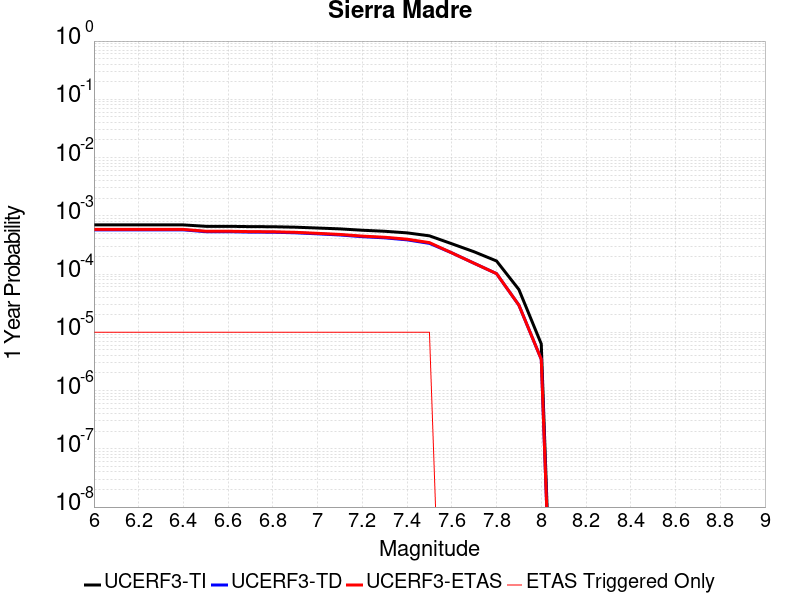 | 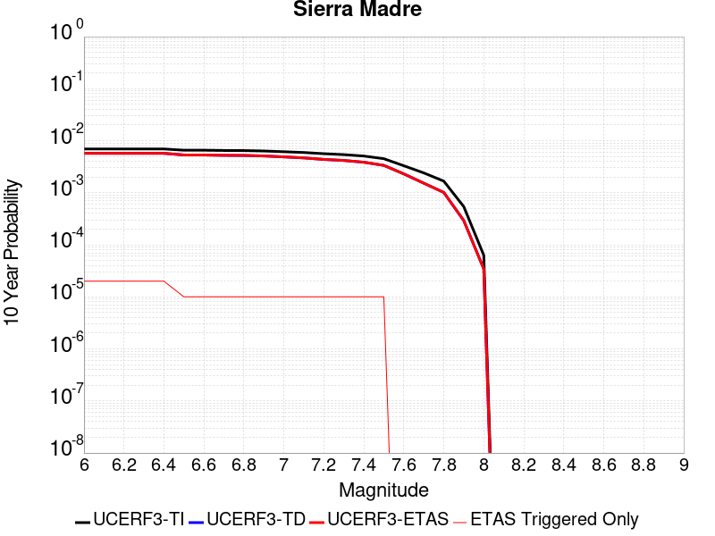 |

| Magnitude | 1 yr TI Prob | TD Prob | ETAS Prob | ETAS/TD Gain | ETAS Triggered Only | 10 yr TI Prob | TD Prob | ETAS Prob | ETAS/TD Gain | ETAS Triggered Only |
|-----|-----|-----|-----|-----|-----|-----|-----|-----|-----|-----|
| 6.0 | 6.978776E-4 | 5.7384936E-4 | 5.838436E-4 | 1.0174161 | 1.0E-5 | 0.0069569005 | 0.00572404 | 0.0057439255 | 1.003474 | 2.0E-5 |
| 6.1 | 6.978776E-4 | 5.7384936E-4 | 5.838436E-4 | 1.0174161 | 1.0E-5 | 0.0069569005 | 0.00572404 | 0.0057439255 | 1.003474 | 2.0E-5 |
| 6.2 | 6.978776E-4 | 5.7384936E-4 | 5.838436E-4 | 1.0174161 | 1.0E-5 | 0.0069569005 | 0.00572404 | 0.0057439255 | 1.003474 | 2.0E-5 |
| 6.3 | 6.978776E-4 | 5.7384936E-4 | 5.838436E-4 | 1.0174161 | 1.0E-5 | 0.0069569005 | 0.00572404 | 0.0057439255 | 1.003474 | 2.0E-5 |
| 6.4 | 6.978776E-4 | 5.7384936E-4 | 5.838436E-4 | 1.0174161 | 1.0E-5 | 0.0069569005 | 0.00572404 | 0.0057439255 | 1.003474 | 2.0E-5 |
| 6.5 | 6.601751E-4 | 5.336649E-4 | 5.4365955E-4 | 1.0187284 | 1.0E-5 | 0.006582173 | 0.005324155 | 0.0053341016 | 1.0018682 | 1.0E-5 |
| 6.6 | 6.601751E-4 | 5.336649E-4 | 5.4365955E-4 | 1.0187284 | 1.0E-5 | 0.006582173 | 0.005324155 | 0.0053341016 | 1.0018682 | 1.0E-5 |
| 6.7 | 6.521526E-4 | 5.2511954E-4 | 5.3511426E-4 | 1.0190333 | 1.0E-5 | 0.0065024206 | 0.0052391062 | 0.0052490537 | 1.0018988 | 1.0E-5 |
| 6.8 | 6.4967526E-4 | 5.226311E-4 | 5.326259E-4 | 1.0191239 | 1.0E-5 | 0.006477792 | 0.005214339 | 0.005224287 | 1.0019078 | 1.0E-5 |
| 6.9 | 6.3771347E-4 | 5.108435E-4 | 5.208384E-4 | 1.0195655 | 1.0E-5 | 0.006358865 | 0.0050970083 | 0.0051069576 | 1.0019519 | 1.0E-5 |
| 7.0 | 6.1705755E-4 | 4.903234E-4 | 5.0031854E-4 | 1.0203847 | 1.0E-5 | 0.006153469 | 0.004892728 | 0.0049026785 | 1.0020338 | 1.0E-5 |
| 7.1 | 5.9658696E-4 | 4.6878454E-4 | 4.7877984E-4 | 1.0213218 | 1.0E-5 | 0.005949879 | 0.0046782624 | 0.0046882154 | 1.0021275 | 1.0E-5 |
| 7.2 | 5.652721E-4 | 4.3818998E-4 | 4.481856E-4 | 1.0228112 | 1.0E-5 | 0.0056383642 | 0.004373557 | 0.0043835132 | 1.0022764 | 1.0E-5 |
| 7.3 | 5.426921E-4 | 4.1843628E-4 | 4.284321E-4 | 1.0238885 | 1.0E-5 | 0.005413687 | 0.0041767797 | 0.004186738 | 1.0023842 | 1.0E-5 |
| 7.4 | 5.09598E-4 | 3.8680912E-4 | 3.9680526E-4 | 1.0258425 | 1.0E-5 | 0.0050843097 | 0.0038616504 | 0.0038716118 | 1.0025796 | 1.0E-5 |
| 7.5 | 4.5317915E-4 | 3.365115E-4 | 3.4650814E-4 | 1.0297067 | 1.0E-5 | 0.004522561 | 0.0033603066 | 0.0033702732 | 1.0029659 | 1.0E-5 |
| 7.6 | 3.3131172E-4 | 2.3114798E-4 | 2.3114798E-4 | 1.0 | 0.0 | 0.003308182 | 0.0023093005 | 0.0023093005 | 1.0 | 0.0 |
| 7.7 | 2.4115283E-4 | 1.5303254E-4 | 1.5303254E-4 | 1.0 | 0.0 | 0.0024089129 | 0.0015294728 | 0.0015294728 | 1.0 | 0.0 |
| 7.8 | 1.6771426E-4 | 1.017193E-4 | 1.017193E-4 | 1.0 | 0.0 | 0.0016758774 | 0.0010168717 | 0.0010168717 | 1.0 | 0.0 |
| 7.9 | 5.4221324E-5 | 2.9235833E-5 | 2.9235833E-5 | 1.0 | 0.0 | 5.4208096E-4 | 2.923203E-4 | 2.923203E-4 | 1.0 | 0.0 |
| 8.0 | 6.3187167E-6 | 3.4510088E-6 | 3.4510088E-6 | 1.0 | 0.0 | 6.318537E-5 | 3.450957E-5 | 3.450957E-5 | 1.0 | 0.0 |

## South Klamath Lake West
*[(top)](#table-of-contents)*

| 1 Year | 10 Year |
|-----|-----|
| 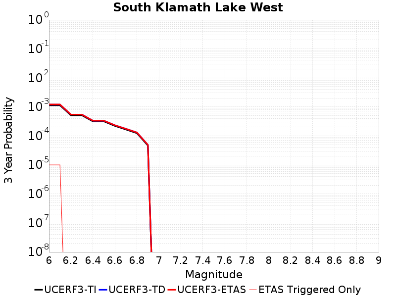 | 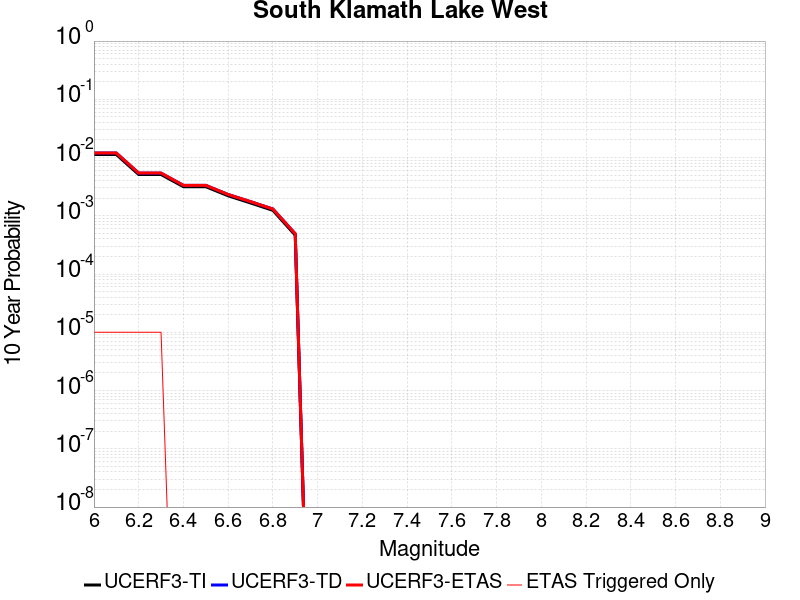 |

| Magnitude | 1 yr TI Prob | TD Prob | ETAS Prob | ETAS/TD Gain | ETAS Triggered Only | 10 yr TI Prob | TD Prob | ETAS Prob | ETAS/TD Gain | ETAS Triggered Only |
|-----|-----|-----|-----|-----|-----|-----|-----|-----|-----|-----|
| 6.0 | 0.0011337444 | 0.0012016626 | 0.0012116506 | 1.0083117 | 1.0E-5 | 0.011279777 | 0.011958249 | 0.011968129 | 1.0008262 | 1.0E-5 |
| 6.1 | 0.0011337444 | 0.0012016626 | 0.0012116506 | 1.0083117 | 1.0E-5 | 0.011279777 | 0.011958249 | 0.011968129 | 1.0008262 | 1.0E-5 |
| 6.2 | 5.1304343E-4 | 5.422016E-4 | 5.422016E-4 | 1.0 | 0.0 | 0.0051186057 | 0.005409689 | 0.005419635 | 1.0018386 | 1.0E-5 |
| 6.3 | 5.1304343E-4 | 5.422016E-4 | 5.422016E-4 | 1.0 | 0.0 | 0.0051186057 | 0.005409689 | 0.005419635 | 1.0018386 | 1.0E-5 |
| 6.4 | 3.1648282E-4 | 3.3391372E-4 | 3.3391372E-4 | 1.0 | 0.0 | 0.0031603249 | 0.0033343905 | 0.0033343905 | 1.0 | 0.0 |
| 6.5 | 3.1648282E-4 | 3.3391372E-4 | 3.3391372E-4 | 1.0 | 0.0 | 0.0031603249 | 0.0033343905 | 0.0033343905 | 1.0 | 0.0 |
| 6.6 | 2.208052E-4 | 2.3275848E-4 | 2.3275848E-4 | 1.0 | 0.0 | 0.0022058594 | 0.002325249 | 0.002325249 | 1.0 | 0.0 |
| 6.7 | 1.6626107E-4 | 1.753217E-4 | 1.753217E-4 | 1.0 | 0.0 | 0.0016613674 | 0.0017519009 | 0.0017519009 | 1.0 | 0.0 |
| 6.8 | 1.2418375E-4 | 1.310077E-4 | 1.310077E-4 | 1.0 | 0.0 | 0.0012411437 | 0.0013093506 | 0.0013093506 | 1.0 | 0.0 |
| 6.9 | 4.658546E-5 | 4.920478E-5 | 4.920478E-5 | 1.0 | 0.0 | 4.6575698E-4 | 4.919605E-4 | 4.919605E-4 | 1.0 | 0.0 |

## Channel Islands Western Deep Ramp
*[(top)](#table-of-contents)*

| 1 Year | 10 Year |
|-----|-----|
| 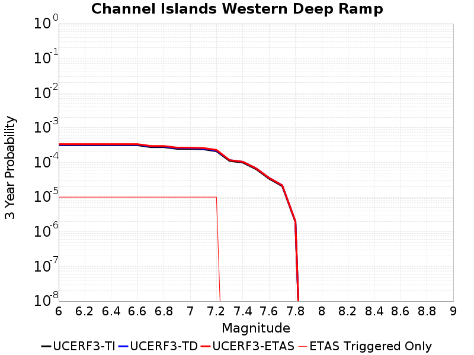 | 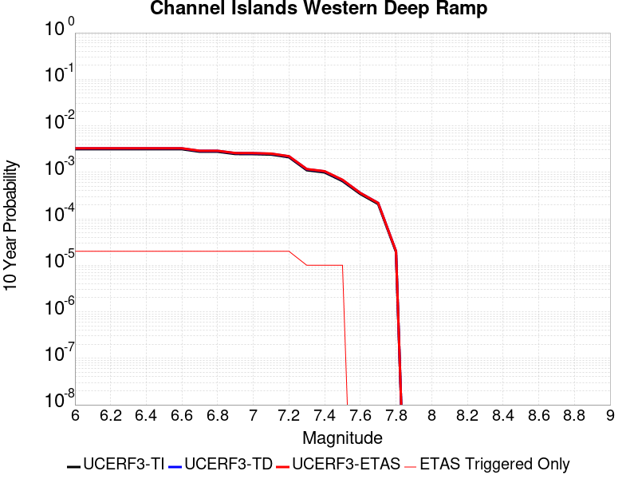 |

| Magnitude | 1 yr TI Prob | TD Prob | ETAS Prob | ETAS/TD Gain | ETAS Triggered Only | 10 yr TI Prob | TD Prob | ETAS Prob | ETAS/TD Gain | ETAS Triggered Only |
|-----|-----|-----|-----|-----|-----|-----|-----|-----|-----|-----|
| 6.0 | 3.1413708E-4 | 3.263228E-4 | 3.3631953E-4 | 1.0306345 | 1.0E-5 | 0.0031369338 | 0.003258878 | 0.0032788126 | 1.0061171 | 2.0E-5 |
| 6.1 | 3.1413708E-4 | 3.263228E-4 | 3.3631953E-4 | 1.0306345 | 1.0E-5 | 0.0031369338 | 0.003258878 | 0.0032788126 | 1.0061171 | 2.0E-5 |
| 6.2 | 3.1413708E-4 | 3.263228E-4 | 3.3631953E-4 | 1.0306345 | 1.0E-5 | 0.0031369338 | 0.003258878 | 0.0032788126 | 1.0061171 | 2.0E-5 |
| 6.3 | 3.1413708E-4 | 3.263228E-4 | 3.3631953E-4 | 1.0306345 | 1.0E-5 | 0.0031369338 | 0.003258878 | 0.0032788126 | 1.0061171 | 2.0E-5 |
| 6.4 | 3.1413708E-4 | 3.263228E-4 | 3.3631953E-4 | 1.0306345 | 1.0E-5 | 0.0031369338 | 0.003258878 | 0.0032788126 | 1.0061171 | 2.0E-5 |
| 6.5 | 3.1413708E-4 | 3.263228E-4 | 3.3631953E-4 | 1.0306345 | 1.0E-5 | 0.0031369338 | 0.003258878 | 0.0032788126 | 1.0061171 | 2.0E-5 |
| 6.6 | 3.1413708E-4 | 3.263228E-4 | 3.3631953E-4 | 1.0306345 | 1.0E-5 | 0.0031369338 | 0.003258878 | 0.0032788126 | 1.0061171 | 2.0E-5 |
| 6.7 | 2.772032E-4 | 2.882629E-4 | 2.9826004E-4 | 1.0346806 | 1.0E-5 | 0.0027685766 | 0.0028792932 | 0.0028992356 | 1.0069262 | 2.0E-5 |
| 6.8 | 2.772032E-4 | 2.882629E-4 | 2.9826004E-4 | 1.0346806 | 1.0E-5 | 0.0027685766 | 0.0028792932 | 0.0028992356 | 1.0069262 | 2.0E-5 |
| 6.9 | 2.4752476E-4 | 2.5770397E-4 | 2.677014E-4 | 1.0387942 | 1.0E-5 | 0.0024724922 | 0.0025744187 | 0.0025943674 | 1.0077487 | 2.0E-5 |
| 7.0 | 2.4636835E-4 | 2.565064E-4 | 2.6650383E-4 | 1.0389754 | 1.0E-5 | 0.002460954 | 0.0025624707 | 0.0025824194 | 1.007785 | 2.0E-5 |
| 7.1 | 2.4057609E-4 | 2.50504E-4 | 2.605015E-4 | 1.0399095 | 1.0E-5 | 0.002403158 | 0.0025025832 | 0.002522533 | 1.0079718 | 2.0E-5 |
| 7.2 | 2.10988E-4 | 2.1975777E-4 | 2.2975558E-4 | 1.0454947 | 1.0E-5 | 0.002107878 | 0.0021957553 | 0.0022157114 | 1.0090885 | 2.0E-5 |
| 7.3 | 1.1078493E-4 | 1.1634062E-4 | 1.1634062E-4 | 1.0 | 0.0 | 0.0011072971 | 0.0011628027 | 0.001172791 | 1.0085899 | 1.0E-5 |
| 7.4 | 9.940516E-5 | 1.04430044E-4 | 1.04430044E-4 | 1.0 | 0.0 | 9.93607E-4 | 0.0010438149 | 0.0010538045 | 1.0095702 | 1.0E-5 |
| 7.5 | 6.4743705E-5 | 6.80326E-5 | 6.80326E-5 | 1.0 | 0.0 | 6.4724847E-4 | 6.8011985E-4 | 6.9011305E-4 | 1.0146933 | 1.0E-5 |
| 7.6 | 3.4145098E-5 | 3.5933317E-5 | 3.5933317E-5 | 1.0 | 0.0 | 3.4139853E-4 | 3.5927648E-4 | 3.5927648E-4 | 1.0 | 0.0 |
| 7.7 | 2.0797976E-5 | 2.1878677E-5 | 2.1878677E-5 | 1.0 | 0.0 | 2.0796029E-4 | 2.187664E-4 | 2.187664E-4 | 1.0 | 0.0 |
| 7.8 | 1.9339077E-6 | 2.0136638E-6 | 2.0136638E-6 | 1.0 | 0.0 | 1.933891E-5 | 2.013647E-5 | 2.013647E-5 | 1.0 | 0.0 |

## Hollywood
*[(top)](#table-of-contents)*

| 1 Year | 10 Year |
|-----|-----|
| 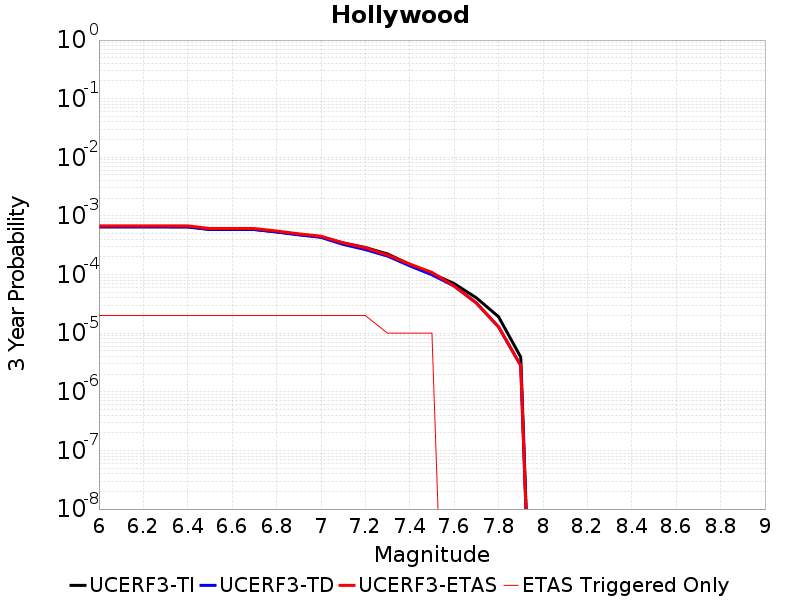 | 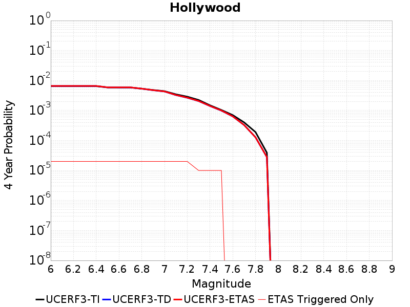 |

| Magnitude | 1 yr TI Prob | TD Prob | ETAS Prob | ETAS/TD Gain | ETAS Triggered Only | 10 yr TI Prob | TD Prob | ETAS Prob | ETAS/TD Gain | ETAS Triggered Only |
|-----|-----|-----|-----|-----|-----|-----|-----|-----|-----|-----|
| 6.0 | 6.4935174E-4 | 6.5689057E-4 | 6.7687745E-4 | 1.0304265 | 2.0E-5 | 0.0064745755 | 0.0065499763 | 0.0065698456 | 1.0030334 | 2.0E-5 |
| 6.1 | 6.4935174E-4 | 6.5689057E-4 | 6.7687745E-4 | 1.0304265 | 2.0E-5 | 0.0064745755 | 0.0065499763 | 0.0065698456 | 1.0030334 | 2.0E-5 |
| 6.2 | 6.4935174E-4 | 6.5689057E-4 | 6.7687745E-4 | 1.0304265 | 2.0E-5 | 0.0064745755 | 0.0065499763 | 0.0065698456 | 1.0030334 | 2.0E-5 |
| 6.3 | 6.4935174E-4 | 6.5689057E-4 | 6.7687745E-4 | 1.0304265 | 2.0E-5 | 0.0064745755 | 0.0065499763 | 0.0065698456 | 1.0030334 | 2.0E-5 |
| 6.4 | 6.4842677E-4 | 6.558797E-4 | 6.7586655E-4 | 1.0304734 | 2.0E-5 | 0.0064653796 | 0.006539927 | 0.006559796 | 1.0030382 | 2.0E-5 |
| 6.5 | 5.864344E-4 | 5.9037923E-4 | 6.1036745E-4 | 1.0338565 | 2.0E-5 | 0.0058488925 | 0.005888395 | 0.0059082774 | 1.0033765 | 2.0E-5 |
| 6.6 | 5.86009E-4 | 5.8991584E-4 | 6.0990406E-4 | 1.0338831 | 2.0E-5 | 0.005844661 | 0.0058837854 | 0.005903668 | 1.0033792 | 2.0E-5 |
| 6.7 | 5.857657E-4 | 5.8964174E-4 | 6.096299E-4 | 1.033899 | 2.0E-5 | 0.0058422405 | 0.005881059 | 0.0059009413 | 1.0033808 | 2.0E-5 |
| 6.8 | 5.3483713E-4 | 5.3304737E-4 | 5.530367E-4 | 1.0375001 | 2.0E-5 | 0.005335517 | 0.005317914 | 0.0053378073 | 1.0037409 | 2.0E-5 |
| 6.9 | 4.8265693E-4 | 4.7525426E-4 | 4.9524475E-4 | 1.0420628 | 2.0E-5 | 0.0048161 | 0.0047425525 | 0.0047624577 | 1.0041971 | 2.0E-5 |
| 7.0 | 4.4209688E-4 | 4.3081504E-4 | 4.5080643E-4 | 1.0464036 | 2.0E-5 | 0.004412184 | 0.004299949 | 0.004319863 | 1.0046312 | 2.0E-5 |
| 7.1 | 3.4659685E-4 | 3.2702283E-4 | 3.470163E-4 | 1.0611378 | 2.0E-5 | 0.0034605677 | 0.0032654621 | 0.0032853968 | 1.0061047 | 2.0E-5 |
| 7.2 | 2.8949787E-4 | 2.6653078E-4 | 2.8652544E-4 | 1.0750183 | 2.0E-5 | 0.0028912104 | 0.0026621276 | 0.0026820742 | 1.0074928 | 2.0E-5 |
| 7.3 | 2.2465475E-4 | 2.0660076E-4 | 2.165987E-4 | 1.0483925 | 1.0E-5 | 0.0022442779 | 0.002064097 | 0.0020740763 | 1.0048348 | 1.0E-5 |
| 7.4 | 1.4896276E-4 | 1.409403E-4 | 1.509389E-4 | 1.070942 | 1.0E-5 | 0.0014886294 | 0.0014085143 | 0.0014185002 | 1.0070897 | 1.0E-5 |
| 7.5 | 1.0397117E-4 | 9.901136E-5 | 1.09010376E-4 | 1.1009885 | 1.0E-5 | 0.0010392254 | 9.896761E-4 | 9.996662E-4 | 1.0100943 | 1.0E-5 |
| 7.6 | 7.018215E-5 | 6.373952E-5 | 6.373952E-5 | 1.0 | 0.0 | 7.0159987E-4 | 6.372144E-4 | 6.372144E-4 | 1.0 | 0.0 |
| 7.7 | 4.00907E-5 | 3.27557E-5 | 3.27557E-5 | 1.0 | 0.0 | 4.0083472E-4 | 3.2751018E-4 | 3.2751018E-4 | 1.0 | 0.0 |
| 7.8 | 1.9077417E-5 | 1.2801897E-5 | 1.2801897E-5 | 1.0 | 0.0 | 1.907578E-4 | 1.2801198E-4 | 1.2801198E-4 | 1.0 | 0.0 |
| 7.9 | 3.91466E-6 | 2.8080958E-6 | 2.8080958E-6 | 1.0 | 0.0 | 3.9145907E-5 | 2.8080734E-5 | 2.8080734E-5 | 1.0 | 0.0 |

## Rinconada 2011 CFM
*[(top)](#table-of-contents)*

| 1 Year | 10 Year |
|-----|-----|
| 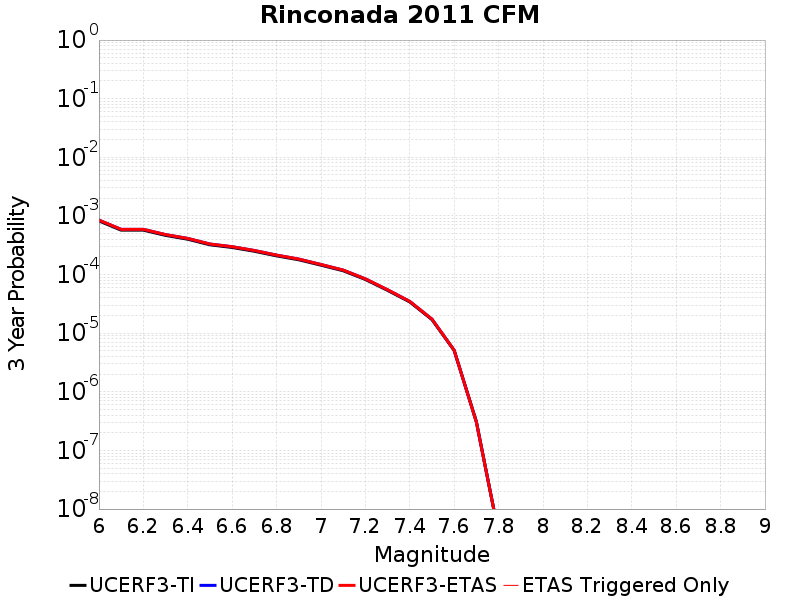 | 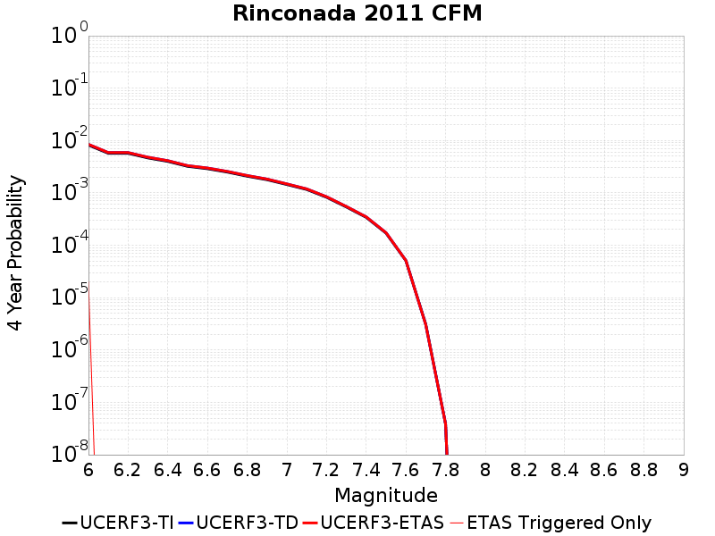 |

| Magnitude | 1 yr TI Prob | TD Prob | ETAS Prob | ETAS/TD Gain | ETAS Triggered Only | 10 yr TI Prob | TD Prob | ETAS Prob | ETAS/TD Gain | ETAS Triggered Only |
|-----|-----|-----|-----|-----|-----|-----|-----|-----|-----|-----|
| 6.0 | 8.2160486E-4 | 8.4884156E-4 | 8.4884156E-4 | 1.0 | 0.0 | 0.008185739 | 0.008456374 | 0.008476204 | 1.0023451 | 2.0E-5 |
| 6.1 | 5.720366E-4 | 5.906493E-4 | 5.906493E-4 | 1.0 | 0.0 | 0.0057056635 | 0.005890891 | 0.005890891 | 1.0 | 0.0 |
| 6.2 | 5.720366E-4 | 5.906493E-4 | 5.906493E-4 | 1.0 | 0.0 | 0.0057056635 | 0.005890891 | 0.005890891 | 1.0 | 0.0 |
| 6.3 | 4.6564735E-4 | 4.805965E-4 | 4.805965E-4 | 1.0 | 0.0 | 0.0046467283 | 0.0047956165 | 0.0047956165 | 1.0 | 0.0 |
| 6.4 | 4.0049385E-4 | 4.1318085E-4 | 4.1318085E-4 | 1.0 | 0.0 | 0.0039977287 | 0.004124153 | 0.004124153 | 1.0 | 0.0 |
| 6.5 | 3.2173982E-4 | 3.317474E-4 | 3.317474E-4 | 1.0 | 0.0 | 0.003212744 | 0.0033125337 | 0.0033125337 | 1.0 | 0.0 |
| 6.6 | 2.897302E-4 | 2.9866895E-4 | 2.9866895E-4 | 1.0 | 0.0 | 0.0028935277 | 0.0029826842 | 0.0029826842 | 1.0 | 0.0 |
| 6.7 | 2.4979294E-4 | 2.5738069E-4 | 2.5738069E-4 | 1.0 | 0.0 | 0.0024951235 | 0.0025708317 | 0.0025708317 | 1.0 | 0.0 |
| 6.8 | 2.0845905E-4 | 2.1461282E-4 | 2.1461282E-4 | 1.0 | 0.0 | 0.002082636 | 0.0021440594 | 0.0021440594 | 1.0 | 0.0 |
| 6.9 | 1.7869633E-4 | 1.8377973E-4 | 1.8377973E-4 | 1.0 | 0.0 | 0.001785527 | 0.00183628 | 0.00183628 | 1.0 | 0.0 |
| 7.0 | 1.4459073E-4 | 1.4852599E-4 | 1.4852599E-4 | 1.0 | 0.0 | 0.0014449668 | 0.0014842687 | 0.0014842687 | 1.0 | 0.0 |
| 7.1 | 1.16213734E-4 | 1.1925755E-4 | 1.1925755E-4 | 1.0 | 0.0 | 0.0011615298 | 0.0011919367 | 0.0011919367 | 1.0 | 0.0 |
| 7.2 | 8.253252E-5 | 8.457283E-5 | 8.457283E-5 | 1.0 | 0.0 | 8.250187E-4 | 8.45407E-4 | 8.45407E-4 | 1.0 | 0.0 |
| 7.3 | 5.3776774E-5 | 5.5028544E-5 | 5.5028544E-5 | 1.0 | 0.0 | 5.376376E-4 | 5.501494E-4 | 5.501494E-4 | 1.0 | 0.0 |
| 7.4 | 3.4100947E-5 | 3.486901E-5 | 3.486901E-5 | 1.0 | 0.0 | 3.4095717E-4 | 3.4863548E-4 | 3.4863548E-4 | 1.0 | 0.0 |
| 7.5 | 1.7039794E-5 | 1.7384029E-5 | 1.7384029E-5 | 1.0 | 0.0 | 1.7038487E-4 | 1.7382673E-4 | 1.7382673E-4 | 1.0 | 0.0 |
| 7.6 | 5.089664E-6 | 5.124441E-6 | 5.124441E-6 | 1.0 | 0.0 | 5.0895473E-5 | 5.1243238E-5 | 5.1243238E-5 | 1.0 | 0.0 |
| 7.7 | 3.1307894E-7 | 3.0519482E-7 | 3.0519482E-7 | 1.0 | 0.0 | 3.1307852E-6 | 3.0519443E-6 | 3.0519443E-6 | 1.0 | 0.0 |
| 7.8 | 3.861218E-9 | 3.8953636E-9 | 3.8953636E-9 | 1.0 | 0.0 | 3.861218E-8 | 3.8953637E-8 | 3.8953637E-8 | 1.0 | 0.0 |

## Great Valley 08 (Quinto)
*[(top)](#table-of-contents)*

| 1 Year | 10 Year |
|-----|-----|
| 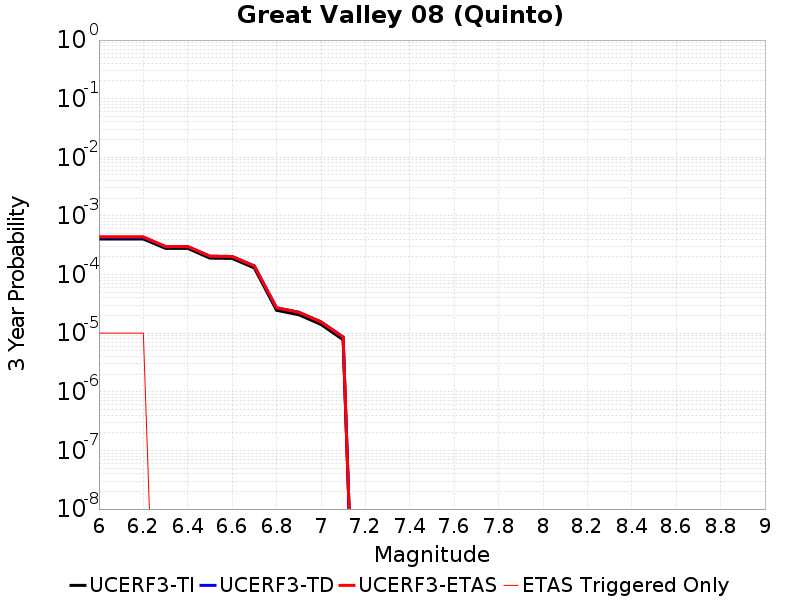 | 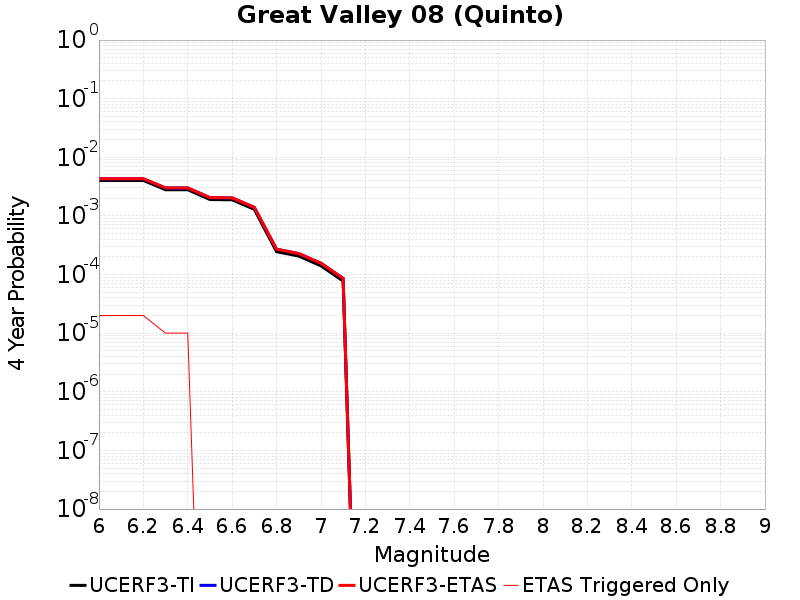 |

| Magnitude | 1 yr TI Prob | TD Prob | ETAS Prob | ETAS/TD Gain | ETAS Triggered Only | 10 yr TI Prob | TD Prob | ETAS Prob | ETAS/TD Gain | ETAS Triggered Only |
|-----|-----|-----|-----|-----|-----|-----|-----|-----|-----|-----|
| 6.0 | 4.0366207E-4 | 4.305613E-4 | 4.4055702E-4 | 1.0232155 | 1.0E-5 | 0.004029296 | 0.0042991242 | 0.0043190382 | 1.0046321 | 2.0E-5 |
| 6.1 | 4.0366207E-4 | 4.305613E-4 | 4.4055702E-4 | 1.0232155 | 1.0E-5 | 0.004029296 | 0.0042991242 | 0.0043190382 | 1.0046321 | 2.0E-5 |
| 6.2 | 4.0366207E-4 | 4.305613E-4 | 4.4055702E-4 | 1.0232155 | 1.0E-5 | 0.004029296 | 0.0042991242 | 0.0043190382 | 1.0046321 | 2.0E-5 |
| 6.3 | 2.803697E-4 | 3.0002472E-4 | 3.0002472E-4 | 1.0 | 0.0 | 0.0028001624 | 0.00299729 | 0.0030072602 | 1.0033263 | 1.0E-5 |
| 6.4 | 2.803697E-4 | 3.0002472E-4 | 3.0002472E-4 | 1.0 | 0.0 | 0.0028001624 | 0.00299729 | 0.0030072602 | 1.0033263 | 1.0E-5 |
| 6.5 | 1.9065675E-4 | 2.0563965E-4 | 2.0563965E-4 | 1.0 | 0.0 | 0.0019049325 | 0.0020551854 | 0.0020551854 | 1.0 | 0.0 |
| 6.6 | 1.8857437E-4 | 2.0340615E-4 | 2.0340615E-4 | 1.0 | 0.0 | 0.0018841444 | 0.0020328914 | 0.0020328914 | 1.0 | 0.0 |
| 6.7 | 1.2950429E-4 | 1.401329E-4 | 1.401329E-4 | 1.0 | 0.0 | 0.0012942884 | 0.0014010003 | 0.0014010003 | 1.0 | 0.0 |
| 6.8 | 2.458131E-5 | 2.7096135E-5 | 2.7096135E-5 | 1.0 | 0.0 | 2.457859E-4 | 2.7093012E-4 | 2.7093012E-4 | 1.0 | 0.0 |
| 6.9 | 2.0655643E-5 | 2.280363E-5 | 2.280363E-5 | 1.0 | 0.0 | 2.0653724E-4 | 2.2801451E-4 | 2.2801451E-4 | 1.0 | 0.0 |
| 7.0 | 1.4103458E-5 | 1.5611748E-5 | 1.5611748E-5 | 1.0 | 0.0 | 1.4102564E-4 | 1.561078E-4 | 1.561078E-4 | 1.0 | 0.0 |
| 7.1 | 7.737323E-6 | 8.593329E-6 | 8.593329E-6 | 1.0 | 0.0 | 7.737054E-5 | 8.593077E-5 | 8.593077E-5 | 1.0 | 0.0 |

## San Gregorio (South) 2011 CFM
*[(top)](#table-of-contents)*

| 1 Year | 10 Year |
|-----|-----|
| 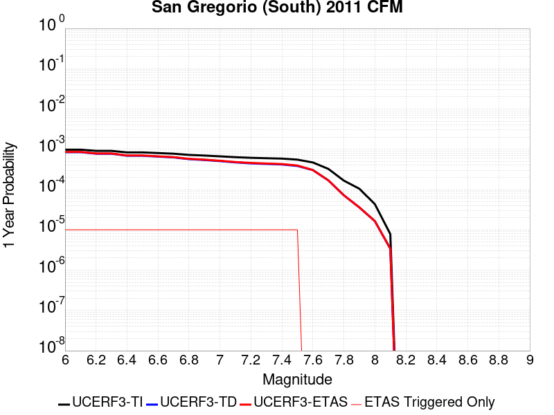 | 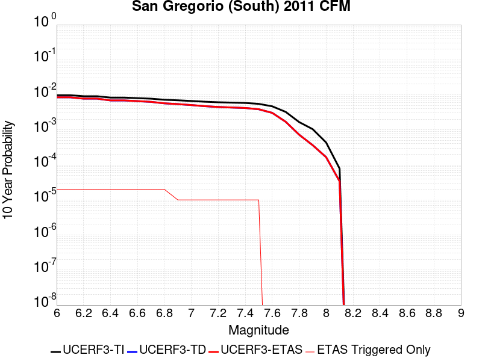 |

| Magnitude | 1 yr TI Prob | TD Prob | ETAS Prob | ETAS/TD Gain | ETAS Triggered Only | 10 yr TI Prob | TD Prob | ETAS Prob | ETAS/TD Gain | ETAS Triggered Only |
|-----|-----|-----|-----|-----|-----|-----|-----|-----|-----|-----|
| 6.0 | 9.789435E-4 | 8.4910763E-4 | 8.590991E-4 | 1.011767 | 1.0E-5 | 0.009746423 | 0.008471344 | 0.008491173 | 1.0023409 | 2.0E-5 |
| 6.1 | 9.789435E-4 | 8.4910763E-4 | 8.590991E-4 | 1.011767 | 1.0E-5 | 0.009746423 | 0.008471344 | 0.008491173 | 1.0023409 | 2.0E-5 |
| 6.2 | 9.1316935E-4 | 7.7713194E-4 | 7.8712415E-4 | 1.0128578 | 1.0E-5 | 0.00909426 | 0.0077567706 | 0.007776615 | 1.0025584 | 2.0E-5 |
| 6.3 | 9.1316935E-4 | 7.7713194E-4 | 7.8712415E-4 | 1.0128578 | 1.0E-5 | 0.00909426 | 0.0077567706 | 0.007776615 | 1.0025584 | 2.0E-5 |
| 6.4 | 8.347548E-4 | 6.9108856E-4 | 7.0108165E-4 | 1.01446 | 1.0E-5 | 0.008316261 | 0.0069018207 | 0.0069216825 | 1.0028778 | 2.0E-5 |
| 6.5 | 8.347548E-4 | 6.9108856E-4 | 7.0108165E-4 | 1.01446 | 1.0E-5 | 0.008316261 | 0.0069018207 | 0.0069216825 | 1.0028778 | 2.0E-5 |
| 6.6 | 8.0543366E-4 | 6.5900054E-4 | 6.689939E-4 | 1.0151645 | 1.0E-5 | 0.008025207 | 0.006582872 | 0.0066027404 | 1.0030181 | 2.0E-5 |
| 6.7 | 7.7712315E-4 | 6.2815665E-4 | 6.381504E-4 | 1.0159096 | 1.0E-5 | 0.0077441116 | 0.0062762047 | 0.006296079 | 1.0031667 | 2.0E-5 |
| 6.8 | 7.237741E-4 | 5.696958E-4 | 5.796901E-4 | 1.0175432 | 1.0E-5 | 0.0072142133 | 0.005694713 | 0.005714599 | 1.003492 | 2.0E-5 |
| 6.9 | 6.9854903E-4 | 5.4213445E-4 | 5.5212906E-4 | 1.0184356 | 1.0E-5 | 0.0069635725 | 0.00542047 | 0.005430416 | 1.0018349 | 1.0E-5 |
| 7.0 | 6.680489E-4 | 5.0875527E-4 | 5.1875017E-4 | 1.0196458 | 1.0E-5 | 0.006660442 | 0.0050882483 | 0.0050981976 | 1.0019553 | 1.0E-5 |
| 7.1 | 6.3593336E-4 | 4.727112E-4 | 4.8270647E-4 | 1.0211445 | 1.0E-5 | 0.0063411663 | 0.0047293915 | 0.004739344 | 1.0021044 | 1.0E-5 |
| 7.2 | 6.1392755E-4 | 4.4768688E-4 | 4.576824E-4 | 1.0223271 | 1.0E-5 | 0.0061223423 | 0.004480184 | 0.004490139 | 1.0022221 | 1.0E-5 |
| 7.3 | 6.0007203E-4 | 4.3284477E-4 | 4.4284045E-4 | 1.023093 | 1.0E-5 | 0.0059845424 | 0.004332333 | 0.0043422896 | 1.0022982 | 1.0E-5 |
| 7.4 | 5.8691297E-4 | 4.1958346E-4 | 4.2957926E-4 | 1.0238231 | 1.0E-5 | 0.005853653 | 0.004200215 | 0.0042101727 | 1.0023708 | 1.0E-5 |
| 7.5 | 5.5278436E-4 | 3.8569584E-4 | 3.9569198E-4 | 1.0259172 | 1.0E-5 | 0.0055141128 | 0.0038625023 | 0.0038724637 | 1.002579 | 1.0E-5 |
| 7.6 | 4.7046866E-4 | 3.0452138E-4 | 3.0452138E-4 | 1.0 | 0.0 | 0.004694739 | 0.0030529003 | 0.0030529003 | 1.0 | 0.0 |
| 7.7 | 3.257243E-4 | 1.6902288E-4 | 1.6902288E-4 | 1.0 | 0.0 | 0.003252473 | 0.0016991285 | 0.0016991285 | 1.0 | 0.0 |
| 7.8 | 1.6665498E-4 | 7.205723E-5 | 7.205723E-5 | 1.0 | 0.0 | 0.0016653005 | 7.263301E-4 | 7.263301E-4 | 1.0 | 0.0 |
| 7.9 | 1.0486518E-4 | 3.6087597E-5 | 3.6087597E-5 | 1.0 | 0.0 | 0.0010481571 | 3.65732E-4 | 3.65732E-4 | 1.0 | 0.0 |
| 8.0 | 4.358445E-5 | 1.6500939E-5 | 1.6500939E-5 | 1.0 | 0.0 | 4.3575902E-4 | 1.6619693E-4 | 1.6619693E-4 | 1.0 | 0.0 |
| 8.1 | 7.844113E-6 | 3.4060913E-6 | 3.4060913E-6 | 1.0 | 0.0 | 7.843835E-5 | 3.4077693E-5 | 3.4077693E-5 | 1.0 | 0.0 |

## Hayward (So) extension 2011 CFM
*[(top)](#table-of-contents)*

| 1 Year | 10 Year |
|-----|-----|
| 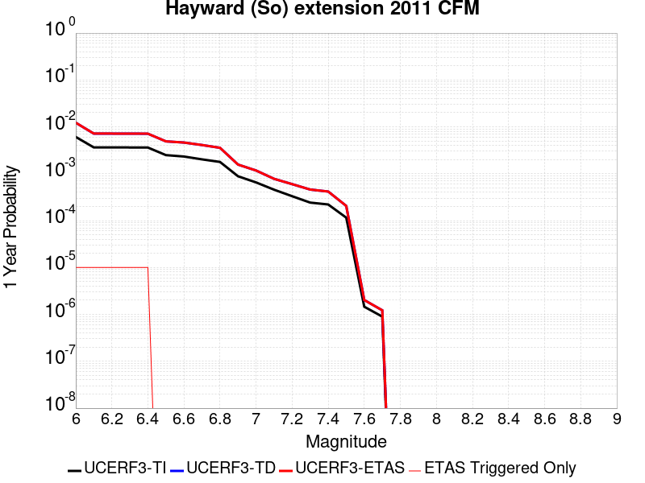 | 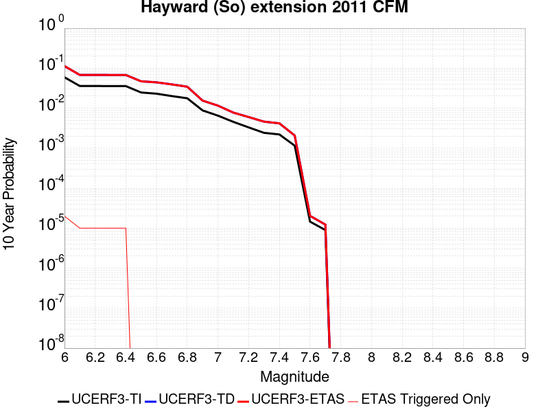 |

| Magnitude | 1 yr TI Prob | TD Prob | ETAS Prob | ETAS/TD Gain | ETAS Triggered Only | 10 yr TI Prob | TD Prob | ETAS Prob | ETAS/TD Gain | ETAS Triggered Only |
|-----|-----|-----|-----|-----|-----|-----|-----|-----|-----|-----|
| 6.0 | 0.0060976758 | 0.012248675 | 0.012258553 | 1.0008065 | 1.0E-5 | 0.0593305 | 0.11284366 | 0.11286141 | 1.0001572 | 2.0E-5 |
| 6.1 | 0.0036416445 | 0.0071721044 | 0.0071820323 | 1.0013843 | 1.0E-5 | 0.035825435 | 0.06780391 | 0.06781323 | 1.0001374 | 1.0E-5 |
| 6.2 | 0.0036416445 | 0.0071721044 | 0.0071820323 | 1.0013843 | 1.0E-5 | 0.035825435 | 0.06780391 | 0.06781323 | 1.0001374 | 1.0E-5 |
| 6.3 | 0.0036308395 | 0.007155641 | 0.0071655693 | 1.0013875 | 1.0E-5 | 0.035720866 | 0.06765287 | 0.067662194 | 1.0001378 | 1.0E-5 |
| 6.4 | 0.0036208609 | 0.007138553 | 0.0071484814 | 1.0013908 | 1.0E-5 | 0.03562429 | 0.06749691 | 0.06750624 | 1.0001382 | 1.0E-5 |
| 6.5 | 0.0024943394 | 0.004901264 | 0.004901264 | 1.0 | 0.0 | 0.02466527 | 0.046902128 | 0.046902128 | 1.0 | 0.0 |
| 6.6 | 0.0023277493 | 0.004624329 | 0.004624329 | 1.0 | 0.0 | 0.02303517 | 0.044293642 | 0.044293642 | 1.0 | 0.0 |
| 6.7 | 0.002024885 | 0.0040960032 | 0.0040960032 | 1.0 | 0.0 | 0.020065336 | 0.039333425 | 0.039333425 | 1.0 | 0.0 |
| 6.8 | 0.0017840851 | 0.003571392 | 0.003571392 | 1.0 | 0.0 | 0.017698295 | 0.03442125 | 0.03442125 | 1.0 | 0.0 |
| 6.9 | 8.828813E-4 | 0.0015674372 | 0.0015674372 | 1.0 | 0.0 | 0.008793819 | 0.015463387 | 0.015463387 | 1.0 | 0.0 |
| 7.0 | 6.525269E-4 | 0.0011714495 | 0.0011714495 | 1.0 | 0.0 | 0.0065061417 | 0.011582412 | 0.011582412 | 1.0 | 0.0 |
| 7.1 | 4.5654282E-4 | 7.785152E-4 | 7.785152E-4 | 1.0 | 0.0 | 0.0045560603 | 0.007763564 | 0.007763564 | 1.0 | 0.0 |
| 7.2 | 3.3150852E-4 | 5.9981755E-4 | 5.9981755E-4 | 1.0 | 0.0 | 0.0033101442 | 0.006000366 | 0.006000366 | 1.0 | 0.0 |
| 7.3 | 2.4236954E-4 | 4.600253E-4 | 4.600253E-4 | 1.0 | 0.0 | 0.0024210536 | 0.0046107583 | 0.0046107583 | 1.0 | 0.0 |
| 7.4 | 2.2091944E-4 | 4.169625E-4 | 4.169625E-4 | 1.0 | 0.0 | 0.0022069993 | 0.0041820174 | 0.0041820174 | 1.0 | 0.0 |
| 7.5 | 1.157642E-4 | 2.0620604E-4 | 2.0620604E-4 | 1.0 | 0.0 | 0.0011570391 | 0.0020734982 | 0.0020734982 | 1.0 | 0.0 |
| 7.6 | 1.4585203E-6 | 2.0237778E-6 | 2.0237778E-6 | 1.0 | 0.0 | 1.4585107E-5 | 2.0328367E-5 | 2.0328367E-5 | 1.0 | 0.0 |
| 7.7 | 8.9709135E-7 | 1.2228949E-6 | 1.2228949E-6 | 1.0 | 0.0 | 8.970877E-6 | 1.2297049E-5 | 1.2297049E-5 | 1.0 | 0.0 |

## North Frontal  (East)
*[(top)](#table-of-contents)*

| 1 Year | 10 Year |
|-----|-----|
| 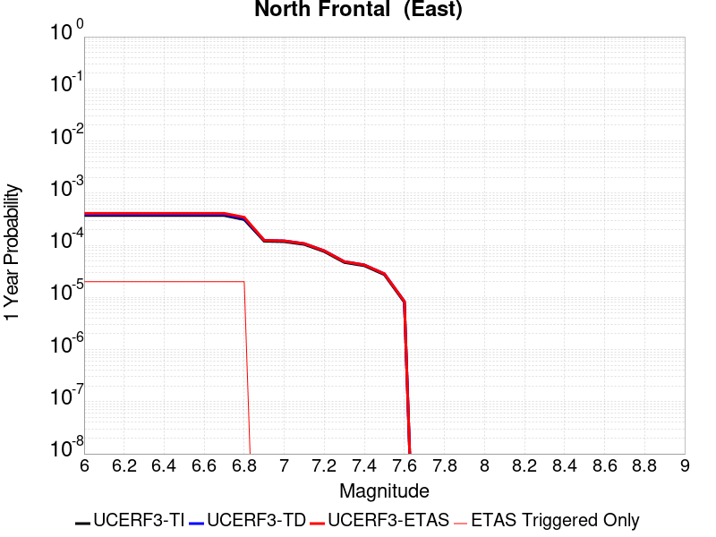 | 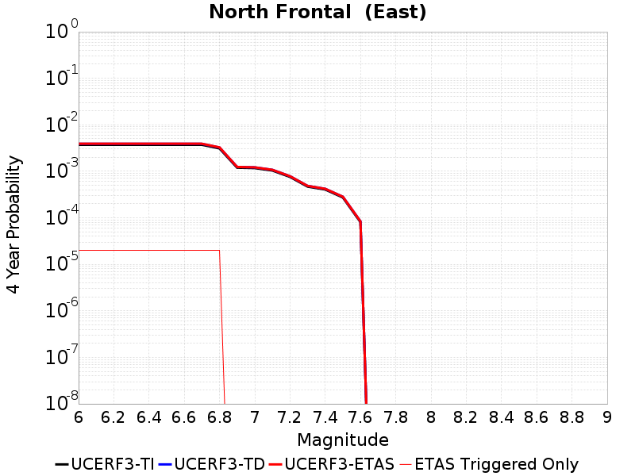 |

| Magnitude | 1 yr TI Prob | TD Prob | ETAS Prob | ETAS/TD Gain | ETAS Triggered Only | 10 yr TI Prob | TD Prob | ETAS Prob | ETAS/TD Gain | ETAS Triggered Only |
|-----|-----|-----|-----|-----|-----|-----|-----|-----|-----|-----|
| 6.0 | 3.7226462E-4 | 3.900953E-4 | 4.100875E-4 | 1.0512495 | 2.0E-5 | 0.0037164164 | 0.0038960632 | 0.003915985 | 1.0051134 | 2.0E-5 |
| 6.1 | 3.7226462E-4 | 3.900953E-4 | 4.100875E-4 | 1.0512495 | 2.0E-5 | 0.0037164164 | 0.0038960632 | 0.003915985 | 1.0051134 | 2.0E-5 |
| 6.2 | 3.7226462E-4 | 3.900953E-4 | 4.100875E-4 | 1.0512495 | 2.0E-5 | 0.0037164164 | 0.0038960632 | 0.003915985 | 1.0051134 | 2.0E-5 |
| 6.3 | 3.7226462E-4 | 3.900953E-4 | 4.100875E-4 | 1.0512495 | 2.0E-5 | 0.0037164164 | 0.0038960632 | 0.003915985 | 1.0051134 | 2.0E-5 |
| 6.4 | 3.7226462E-4 | 3.900953E-4 | 4.100875E-4 | 1.0512495 | 2.0E-5 | 0.0037164164 | 0.0038960632 | 0.003915985 | 1.0051134 | 2.0E-5 |
| 6.5 | 3.7226462E-4 | 3.900953E-4 | 4.100875E-4 | 1.0512495 | 2.0E-5 | 0.0037164164 | 0.0038960632 | 0.003915985 | 1.0051134 | 2.0E-5 |
| 6.6 | 3.7226462E-4 | 3.900953E-4 | 4.100875E-4 | 1.0512495 | 2.0E-5 | 0.0037164164 | 0.0038960632 | 0.003915985 | 1.0051134 | 2.0E-5 |
| 6.7 | 3.7226462E-4 | 3.900953E-4 | 4.100875E-4 | 1.0512495 | 2.0E-5 | 0.0037164164 | 0.0038960632 | 0.003915985 | 1.0051134 | 2.0E-5 |
| 6.8 | 3.108921E-4 | 3.2538877E-4 | 3.4538226E-4 | 1.0614449 | 2.0E-5 | 0.0031045752 | 0.0032508967 | 0.0032708317 | 1.0061321 | 2.0E-5 |
| 6.9 | 1.1972676E-4 | 1.2430637E-4 | 1.2430637E-4 | 1.0 | 0.0 | 0.0011966228 | 0.0012424148 | 0.0012424148 | 1.0 | 0.0 |
| 7.0 | 1.1723159E-4 | 1.2168175E-4 | 1.2168175E-4 | 1.0 | 0.0 | 0.0011716976 | 0.0012161975 | 0.0012161975 | 1.0 | 0.0 |
| 7.1 | 1.0394004E-4 | 1.07722866E-4 | 1.07722866E-4 | 1.0 | 0.0 | 0.0010389143 | 0.0010767493 | 0.0010767493 | 1.0 | 0.0 |
| 7.2 | 7.5784184E-5 | 7.8500714E-5 | 7.8500714E-5 | 1.0 | 0.0 | 7.575835E-4 | 7.847543E-4 | 7.847543E-4 | 1.0 | 0.0 |
| 7.3 | 4.685662E-5 | 4.85706E-5 | 4.85706E-5 | 1.0 | 0.0 | 4.6846745E-4 | 4.8561115E-4 | 4.8561115E-4 | 1.0 | 0.0 |
| 7.4 | 4.0573974E-5 | 4.2057676E-5 | 4.2057676E-5 | 1.0 | 0.0 | 4.0566566E-4 | 4.2050792E-4 | 4.2050792E-4 | 1.0 | 0.0 |
| 7.5 | 2.7364253E-5 | 2.8391194E-5 | 2.8391194E-5 | 1.0 | 0.0 | 2.7360884E-4 | 2.8388217E-4 | 2.8388217E-4 | 1.0 | 0.0 |
| 7.6 | 8.082245E-6 | 8.395265E-6 | 8.395265E-6 | 1.0 | 0.0 | 8.08195E-5 | 8.395147E-5 | 8.395147E-5 | 1.0 | 0.0 |

## Great Valley 11
*[(top)](#table-of-contents)*

| 1 Year | 10 Year |
|-----|-----|
| 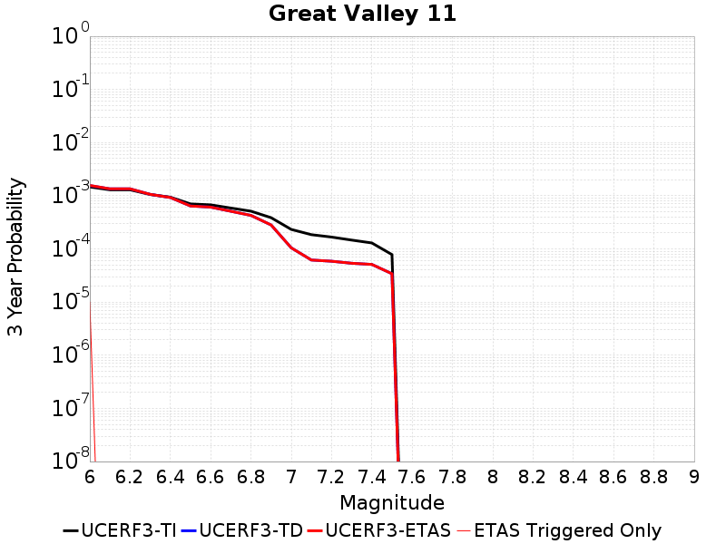 | 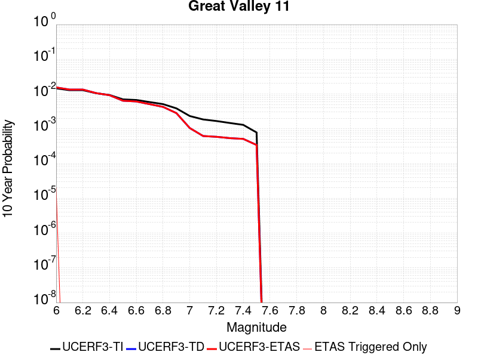 |

| Magnitude | 1 yr TI Prob | TD Prob | ETAS Prob | ETAS/TD Gain | ETAS Triggered Only | 10 yr TI Prob | TD Prob | ETAS Prob | ETAS/TD Gain | ETAS Triggered Only |
|-----|-----|-----|-----|-----|-----|-----|-----|-----|-----|-----|
| 6.0 | 0.0014651422 | 0.0015554943 | 0.0015654787 | 1.0064188 | 1.0E-5 | 0.0145552 | 0.015453594 | 0.015473285 | 1.0012742 | 2.0E-5 |
| 6.1 | 0.0012948721 | 0.0013509735 | 0.0013509735 | 1.0 | 0.0 | 0.012873529 | 0.013434023 | 0.013434023 | 1.0 | 0.0 |
| 6.2 | 0.0012948721 | 0.0013509735 | 0.0013509735 | 1.0 | 0.0 | 0.012873529 | 0.013434023 | 0.013434023 | 1.0 | 0.0 |
| 6.3 | 0.0010564806 | 0.0010638777 | 0.0010638777 | 1.0 | 0.0 | 0.01051472 | 0.010592033 | 0.010592033 | 1.0 | 0.0 |
| 6.4 | 9.416436E-4 | 9.274005E-4 | 9.274005E-4 | 1.0 | 0.0 | 0.009376635 | 0.009239054 | 0.009239054 | 1.0 | 0.0 |
| 6.5 | 7.031501E-4 | 6.42698E-4 | 6.42698E-4 | 1.0 | 0.0 | 0.007009294 | 0.00640883 | 0.00640883 | 1.0 | 0.0 |
| 6.6 | 6.754276E-4 | 6.1199703E-4 | 6.1199703E-4 | 1.0 | 0.0 | 0.006733784 | 0.006103542 | 0.006103542 | 1.0 | 0.0 |
| 6.7 | 5.879996E-4 | 5.118456E-4 | 5.118456E-4 | 1.0 | 0.0 | 0.005864462 | 0.0051069506 | 0.0051069506 | 1.0 | 0.0 |
| 6.8 | 5.1298196E-4 | 4.274526E-4 | 4.274526E-4 | 1.0 | 0.0 | 0.005117994 | 0.004266514 | 0.004266514 | 1.0 | 0.0 |
| 6.9 | 3.872209E-4 | 2.824126E-4 | 2.824126E-4 | 1.0 | 0.0 | 0.0038654688 | 0.0028206778 | 0.0028206778 | 1.0 | 0.0 |
| 7.0 | 2.3284076E-4 | 1.0493018E-4 | 1.0493018E-4 | 1.0 | 0.0 | 0.0023259693 | 0.0010488179 | 0.0010488179 | 1.0 | 0.0 |
| 7.1 | 1.8545982E-4 | 6.186038E-5 | 6.186038E-5 | 1.0 | 0.0 | 0.0018530512 | 6.184384E-4 | 6.184384E-4 | 1.0 | 0.0 |
| 7.2 | 1.671661E-4 | 5.872093E-5 | 5.872093E-5 | 1.0 | 0.0 | 0.0016704041 | 5.870608E-4 | 5.870608E-4 | 1.0 | 0.0 |
| 7.3 | 1.4671806E-4 | 5.377196E-5 | 5.377196E-5 | 1.0 | 0.0 | 0.0014662122 | 5.375961E-4 | 5.375961E-4 | 1.0 | 0.0 |
| 7.4 | 1.2959167E-4 | 5.1136918E-5 | 5.1136918E-5 | 1.0 | 0.0 | 0.0012951613 | 5.112581E-4 | 5.112581E-4 | 1.0 | 0.0 |
| 7.5 | 7.827883E-5 | 3.415637E-5 | 3.415637E-5 | 1.0 | 0.0 | 7.825126E-4 | 3.4151535E-4 | 3.4151535E-4 | 1.0 | 0.0 |

## Hunting Creek - Bartlett Springs connector 2011
*[(top)](#table-of-contents)*

| 1 Year | 10 Year |
|-----|-----|
| 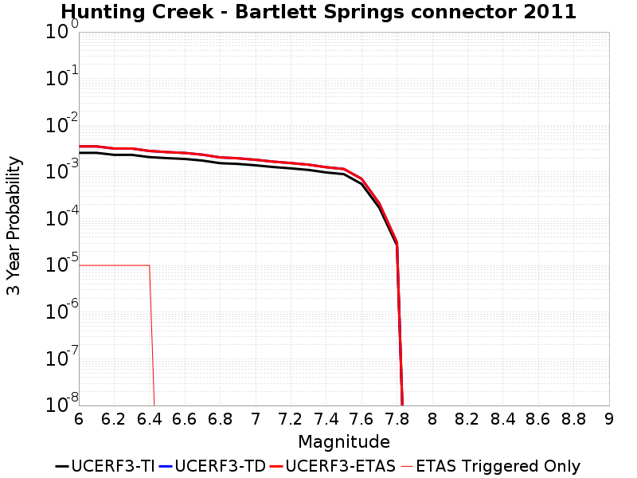 | 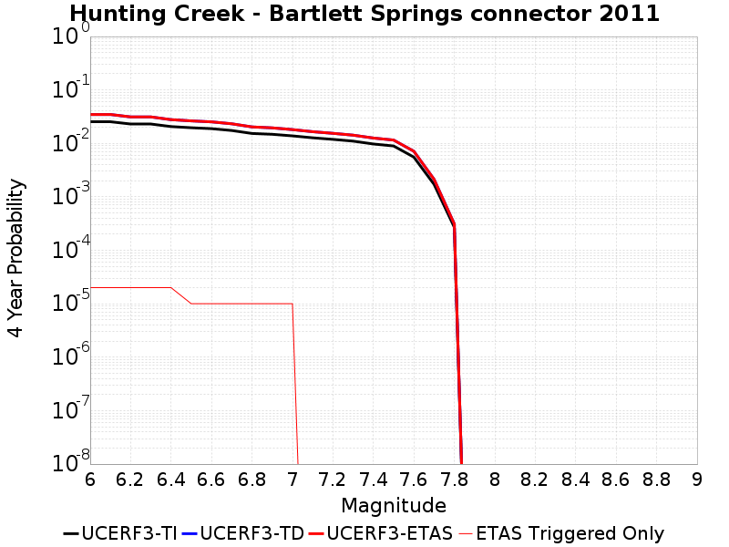 |

| Magnitude | 1 yr TI Prob | TD Prob | ETAS Prob | ETAS/TD Gain | ETAS Triggered Only | 10 yr TI Prob | TD Prob | ETAS Prob | ETAS/TD Gain | ETAS Triggered Only |
|-----|-----|-----|-----|-----|-----|-----|-----|-----|-----|-----|
| 6.0 | 0.002574374 | 0.00353519 | 0.0035451546 | 1.0028187 | 1.0E-5 | 0.025447546 | 0.034773957 | 0.03479326 | 1.0005552 | 2.0E-5 |
| 6.1 | 0.002574374 | 0.00353519 | 0.0035451546 | 1.0028187 | 1.0E-5 | 0.025447546 | 0.034773957 | 0.03479326 | 1.0005552 | 2.0E-5 |
| 6.2 | 0.0023310026 | 0.0031781185 | 0.0031880867 | 1.0031365 | 1.0E-5 | 0.02306703 | 0.03131702 | 0.031336393 | 1.0006186 | 2.0E-5 |
| 6.3 | 0.0023310026 | 0.0031781185 | 0.0031880867 | 1.0031365 | 1.0E-5 | 0.02306703 | 0.03131702 | 0.031336393 | 1.0006186 | 2.0E-5 |
| 6.4 | 0.0020850603 | 0.0028191342 | 0.0028291058 | 1.0035372 | 1.0E-5 | 0.02065605 | 0.027828407 | 0.02784785 | 1.0006987 | 2.0E-5 |
| 6.5 | 0.0019825802 | 0.002671483 | 0.002671483 | 1.0 | 0.0 | 0.019649856 | 0.026390538 | 0.026400274 | 1.000369 | 1.0E-5 |
| 6.6 | 0.0019046954 | 0.002560293 | 0.002560293 | 1.0 | 0.0 | 0.018884527 | 0.025306493 | 0.02531624 | 1.0003852 | 1.0E-5 |
| 6.7 | 0.0017579567 | 0.0023526463 | 0.0023526463 | 1.0 | 0.0 | 0.017441148 | 0.02327817 | 0.023287935 | 1.0004196 | 1.0E-5 |
| 6.8 | 0.0015459227 | 0.0020543518 | 0.0020543518 | 1.0 | 0.0 | 0.015352124 | 0.020351272 | 0.02036107 | 1.0004814 | 1.0E-5 |
| 6.9 | 0.0014916194 | 0.0019711123 | 0.0019711123 | 1.0 | 0.0 | 0.014816469 | 0.019535892 | 0.019545697 | 1.0005019 | 1.0E-5 |
| 7.0 | 0.0013920115 | 0.001828135 | 0.001828135 | 1.0 | 0.0 | 0.013833242 | 0.01813141 | 0.01814123 | 1.0005416 | 1.0E-5 |
| 7.1 | 0.001280746 | 0.0016690439 | 0.0016690439 | 1.0 | 0.0 | 0.012733897 | 0.016566409 | 0.016566409 | 1.0 | 0.0 |
| 7.2 | 0.0011971919 | 0.0015549449 | 0.0015549449 | 1.0 | 0.0 | 0.011907627 | 0.015442128 | 0.015442128 | 1.0 | 0.0 |
| 7.3 | 0.0011085535 | 0.0014360985 | 0.0014360985 | 1.0 | 0.0 | 0.011030397 | 0.014269508 | 0.014269508 | 1.0 | 0.0 |
| 7.4 | 9.796688E-4 | 0.0012675151 | 0.0012675151 | 1.0 | 0.0 | 0.009753612 | 0.012603934 | 0.012603934 | 1.0 | 0.0 |
| 7.5 | 8.9959445E-4 | 0.0011613079 | 0.0011613079 | 1.0 | 0.0 | 0.008959615 | 0.0115533685 | 0.0115533685 | 1.0 | 0.0 |
| 7.6 | 5.557438E-4 | 7.1575365E-4 | 7.1575365E-4 | 1.0 | 0.0 | 0.0055435603 | 0.0071348324 | 0.0071348324 | 1.0 | 0.0 |
| 7.7 | 1.7146087E-4 | 2.1340657E-4 | 2.1340657E-4 | 1.0 | 0.0 | 0.0017132863 | 0.002132032 | 0.002132032 | 1.0 | 0.0 |
| 7.8 | 2.7056883E-5 | 3.1160995E-5 | 3.1160995E-5 | 1.0 | 0.0 | 2.705359E-4 | 3.1156547E-4 | 3.1156547E-4 | 1.0 | 0.0 |

## Shoreline
*[(top)](#table-of-contents)*

| 1 Year | 10 Year |
|-----|-----|
| 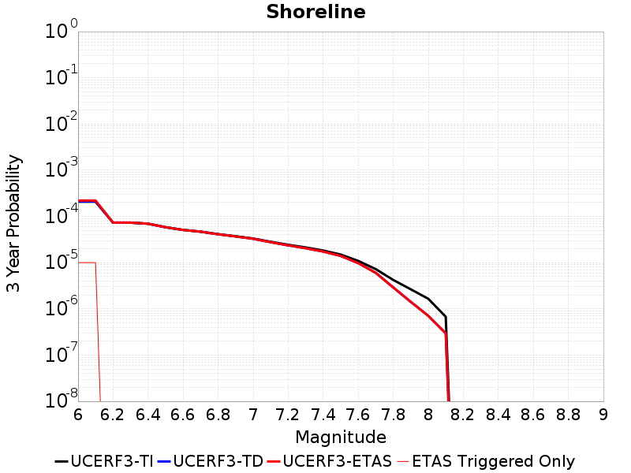 | 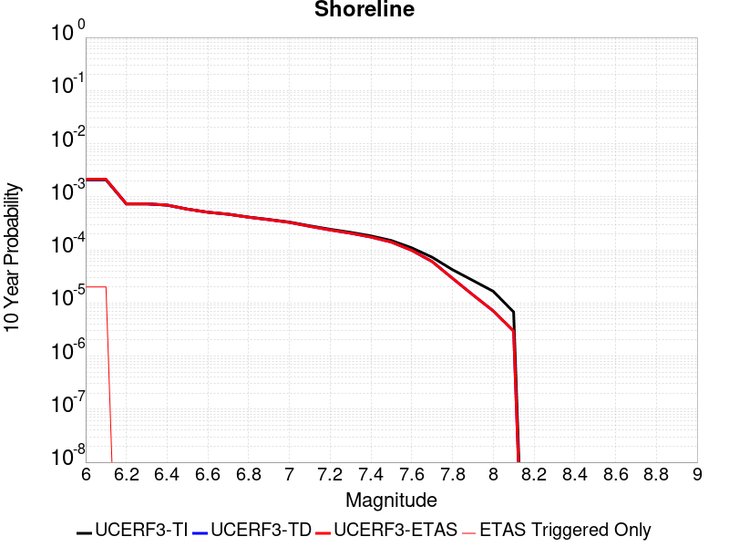 |

| Magnitude | 1 yr TI Prob | TD Prob | ETAS Prob | ETAS/TD Gain | ETAS Triggered Only | 10 yr TI Prob | TD Prob | ETAS Prob | ETAS/TD Gain | ETAS Triggered Only |
|-----|-----|-----|-----|-----|-----|-----|-----|-----|-----|-----|
| 6.0 | 2.0811215E-4 | 2.1119932E-4 | 2.2119722E-4 | 1.0473386 | 1.0E-5 | 0.0020791737 | 0.0021105348 | 0.0021304926 | 1.0094563 | 2.0E-5 |
| 6.1 | 2.0811215E-4 | 2.1119932E-4 | 2.2119722E-4 | 1.0473386 | 1.0E-5 | 0.0020791737 | 0.0021105348 | 0.0021304926 | 1.0094563 | 2.0E-5 |
| 6.2 | 7.325427E-5 | 7.357389E-5 | 7.357389E-5 | 1.0 | 0.0 | 7.3230127E-4 | 7.355013E-4 | 7.355013E-4 | 1.0 | 0.0 |
| 6.3 | 7.325427E-5 | 7.357389E-5 | 7.357389E-5 | 1.0 | 0.0 | 7.3230127E-4 | 7.355013E-4 | 7.355013E-4 | 1.0 | 0.0 |
| 6.4 | 6.946897E-5 | 6.971666E-5 | 6.971666E-5 | 1.0 | 0.0 | 6.9447263E-4 | 6.9695327E-4 | 6.9695327E-4 | 1.0 | 0.0 |
| 6.5 | 5.8370628E-5 | 5.8457383E-5 | 5.8457383E-5 | 1.0 | 0.0 | 5.83553E-4 | 5.8442255E-4 | 5.8442255E-4 | 1.0 | 0.0 |
| 6.6 | 5.1097657E-5 | 5.1055085E-5 | 5.1055085E-5 | 1.0 | 0.0 | 5.108591E-4 | 5.1043485E-4 | 5.1043485E-4 | 1.0 | 0.0 |
| 6.7 | 4.693869E-5 | 4.681776E-5 | 4.681776E-5 | 1.0 | 0.0 | 4.6928777E-4 | 4.6807993E-4 | 4.6807993E-4 | 1.0 | 0.0 |
| 6.8 | 4.1385178E-5 | 4.1118026E-5 | 4.1118026E-5 | 1.0 | 0.0 | 4.1377472E-4 | 4.1110473E-4 | 4.1110473E-4 | 1.0 | 0.0 |
| 6.9 | 3.7289232E-5 | 3.6931393E-5 | 3.6931393E-5 | 1.0 | 0.0 | 3.7282976E-4 | 3.692529E-4 | 3.692529E-4 | 1.0 | 0.0 |
| 7.0 | 3.3336586E-5 | 3.286918E-5 | 3.286918E-5 | 1.0 | 0.0 | 3.3331584E-4 | 3.286434E-4 | 3.286434E-4 | 1.0 | 0.0 |
| 7.1 | 2.8333026E-5 | 2.7712378E-5 | 2.7712378E-5 | 1.0 | 0.0 | 2.8329415E-4 | 2.7708933E-4 | 2.7708933E-4 | 1.0 | 0.0 |
| 7.2 | 2.4403027E-5 | 2.366219E-5 | 2.366219E-5 | 1.0 | 0.0 | 2.4400349E-4 | 2.3659677E-4 | 2.3659677E-4 | 1.0 | 0.0 |
| 7.3 | 2.1375303E-5 | 2.0550697E-5 | 2.0550697E-5 | 1.0 | 0.0 | 2.1373246E-4 | 2.05488E-4 | 2.05488E-4 | 1.0 | 0.0 |
| 7.4 | 1.8317533E-5 | 1.7408722E-5 | 1.7408722E-5 | 1.0 | 0.0 | 1.8316023E-4 | 1.7407362E-4 | 1.7407362E-4 | 1.0 | 0.0 |
| 7.5 | 1.4994724E-5 | 1.3994242E-5 | 1.3994242E-5 | 1.0 | 0.0 | 1.4993713E-4 | 1.3993363E-4 | 1.3993363E-4 | 1.0 | 0.0 |
| 7.6 | 1.0917813E-5 | 9.798584E-6 | 9.798584E-6 | 1.0 | 0.0 | 1.0917276E-4 | 9.798153E-5 | 9.798153E-5 | 1.0 | 0.0 |
| 7.7 | 7.2646135E-6 | 6.0231805E-6 | 6.0231805E-6 | 1.0 | 0.0 | 7.2643765E-5 | 6.0230177E-5 | 6.0230177E-5 | 1.0 | 0.0 |
| 7.8 | 4.2306337E-6 | 2.915088E-6 | 2.915088E-6 | 1.0 | 0.0 | 4.230553E-5 | 2.91505E-5 | 2.91505E-5 | 1.0 | 0.0 |
| 7.9 | 2.6537484E-6 | 1.4215944E-6 | 1.4215944E-6 | 1.0 | 0.0 | 2.6537167E-5 | 1.4215854E-5 | 1.4215854E-5 | 1.0 | 0.0 |
| 8.0 | 1.6572179E-6 | 7.084539E-7 | 7.084539E-7 | 1.0 | 0.0 | 1.6572056E-5 | 7.084517E-6 | 7.084517E-6 | 1.0 | 0.0 |
| 8.1 | 6.756025E-7 | 2.9548687E-7 | 2.9548687E-7 | 1.0 | 0.0 | 6.7560045E-6 | 2.954865E-6 | 2.954865E-6 | 1.0 | 0.0 |

## Newport-Inglewood (Offshore)
*[(top)](#table-of-contents)*

| 1 Year | 10 Year |
|-----|-----|
| 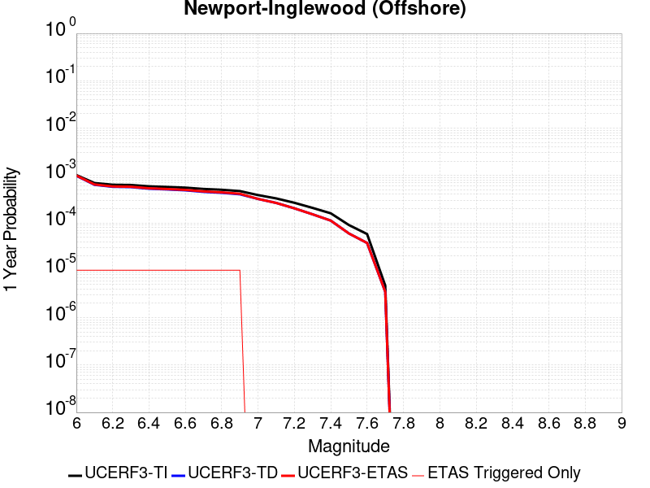 | 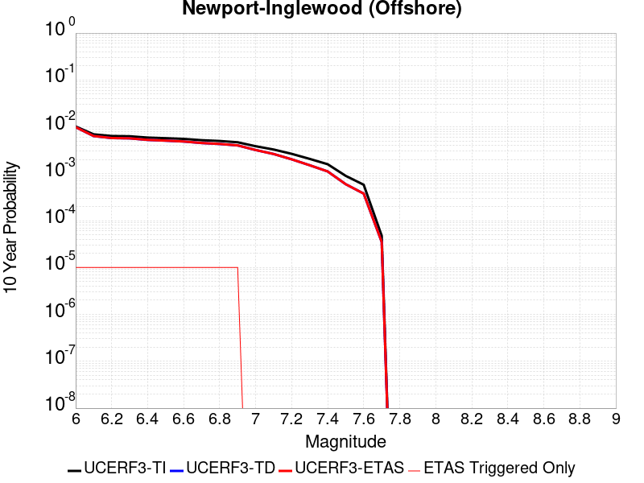 |

| Magnitude | 1 yr TI Prob | TD Prob | ETAS Prob | ETAS/TD Gain | ETAS Triggered Only | 10 yr TI Prob | TD Prob | ETAS Prob | ETAS/TD Gain | ETAS Triggered Only |
|-----|-----|-----|-----|-----|-----|-----|-----|-----|-----|-----|
| 6.0 | 0.001023569 | 9.89122E-4 | 9.99112E-4 | 1.0101 | 1.0E-5 | 0.010188672 | 0.009848537 | 0.009858439 | 1.0010054 | 1.0E-5 |
| 6.1 | 6.947222E-4 | 6.3732796E-4 | 6.473216E-4 | 1.0156806 | 1.0E-5 | 0.006925544 | 0.0063551795 | 0.0063651158 | 1.0015635 | 1.0E-5 |
| 6.2 | 6.3903164E-4 | 5.777717E-4 | 5.877659E-4 | 1.0172979 | 1.0E-5 | 0.006371971 | 0.0057628164 | 0.0057727587 | 1.0017253 | 1.0E-5 |
| 6.3 | 6.3149154E-4 | 5.69577E-4 | 5.795713E-4 | 1.0175469 | 1.0E-5 | 0.0062970007 | 0.005681289 | 0.005691232 | 1.0017501 | 1.0E-5 |
| 6.4 | 5.919901E-4 | 5.273594E-4 | 5.3735415E-4 | 1.0189524 | 1.0E-5 | 0.005904155 | 0.005261176 | 0.0052711233 | 1.0018907 | 1.0E-5 |
| 6.5 | 5.7423924E-4 | 5.0827314E-4 | 5.182681E-4 | 1.0196644 | 1.0E-5 | 0.005727576 | 0.005071198 | 0.0050811474 | 1.001962 | 1.0E-5 |
| 6.6 | 5.5475225E-4 | 4.8752423E-4 | 4.9751933E-4 | 1.0205019 | 1.0E-5 | 0.0055336943 | 0.0048646335 | 0.004874585 | 1.0020456 | 1.0E-5 |
| 6.7 | 5.205093E-4 | 4.5218252E-4 | 4.62178E-4 | 1.022105 | 1.0E-5 | 0.0051929182 | 0.0045127035 | 0.0045226584 | 1.002206 | 1.0E-5 |
| 6.8 | 5.0055445E-4 | 4.3158294E-4 | 4.4157865E-4 | 1.0231605 | 1.0E-5 | 0.004994285 | 0.004307524 | 0.0043174806 | 1.0023115 | 1.0E-5 |
| 6.9 | 4.6953102E-4 | 4.0205615E-4 | 4.1205212E-4 | 1.0248622 | 1.0E-5 | 0.004685402 | 0.004013359 | 0.004023319 | 1.0024817 | 1.0E-5 |
| 7.0 | 3.8641447E-4 | 3.2079345E-4 | 3.2079345E-4 | 1.0 | 0.0 | 0.0038574322 | 0.0032033236 | 0.0032033236 | 1.0 | 0.0 |
| 7.1 | 3.2865192E-4 | 2.6381447E-4 | 2.6381447E-4 | 1.0 | 0.0 | 0.003281663 | 0.0026350277 | 0.0026350277 | 1.0 | 0.0 |
| 7.2 | 2.6590136E-4 | 2.0310165E-4 | 2.0310165E-4 | 1.0 | 0.0 | 0.0026558342 | 0.0020291714 | 0.0020291714 | 1.0 | 0.0 |
| 7.3 | 2.0740448E-4 | 1.5182387E-4 | 1.5182387E-4 | 1.0 | 0.0 | 0.00207211 | 0.0015172096 | 0.0015172096 | 1.0 | 0.0 |
| 7.4 | 1.5948903E-4 | 1.1191682E-4 | 1.1191682E-4 | 1.0 | 0.0 | 0.0015937461 | 0.0011186108 | 0.0011186108 | 1.0 | 0.0 |
| 7.5 | 9.015547E-5 | 5.984656E-5 | 5.984656E-5 | 1.0 | 0.0 | 9.01189E-4 | 5.9830834E-4 | 5.9830834E-4 | 1.0 | 0.0 |
| 7.6 | 5.821092E-5 | 3.768802E-5 | 3.768802E-5 | 1.0 | 0.0 | 5.8195676E-4 | 3.768186E-4 | 3.768186E-4 | 1.0 | 0.0 |
| 7.7 | 4.757617E-6 | 3.513777E-6 | 3.513777E-6 | 1.0 | 0.0 | 4.7575148E-5 | 3.5137247E-5 | 3.5137247E-5 | 1.0 | 0.0 |

## San Gregorio (North) 2011 CFM
*[(top)](#table-of-contents)*

| 1 Year | 10 Year |
|-----|-----|
| 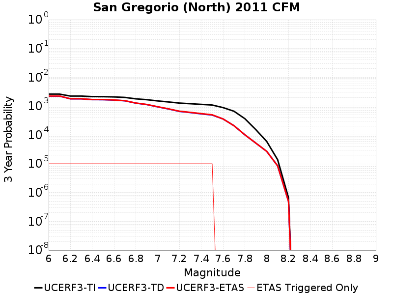 | 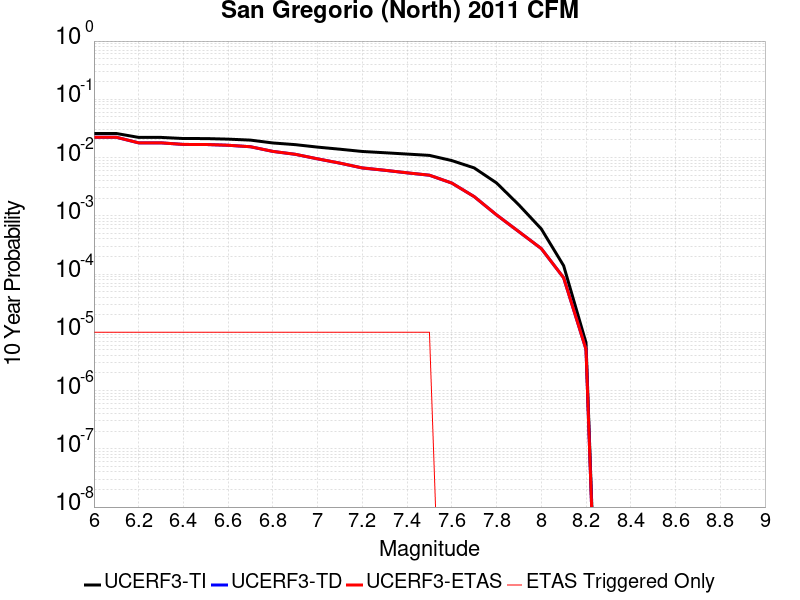 |

| Magnitude | 1 yr TI Prob | TD Prob | ETAS Prob | ETAS/TD Gain | ETAS Triggered Only | 10 yr TI Prob | TD Prob | ETAS Prob | ETAS/TD Gain | ETAS Triggered Only |
|-----|-----|-----|-----|-----|-----|-----|-----|-----|-----|-----|
| 6.0 | 0.0026203706 | 0.0022442515 | 0.002254229 | 1.0044458 | 1.0E-5 | 0.02589687 | 0.022293307 | 0.022303084 | 1.0004386 | 1.0E-5 |
| 6.1 | 0.0026203706 | 0.0022442515 | 0.002254229 | 1.0044458 | 1.0E-5 | 0.02589687 | 0.022293307 | 0.022303084 | 1.0004386 | 1.0E-5 |
| 6.2 | 0.0022411412 | 0.0017955529 | 0.0018055349 | 1.0055593 | 1.0E-5 | 0.022186736 | 0.017886637 | 0.017896457 | 1.0005491 | 1.0E-5 |
| 6.3 | 0.0022411412 | 0.0017955529 | 0.0018055349 | 1.0055593 | 1.0E-5 | 0.022186736 | 0.017886637 | 0.017896457 | 1.0005491 | 1.0E-5 |
| 6.4 | 0.0021423528 | 0.0016853993 | 0.0016953824 | 1.0059233 | 1.0E-5 | 0.02121817 | 0.016802011 | 0.016811844 | 1.0005852 | 1.0E-5 |
| 6.5 | 0.0021387753 | 0.0016811296 | 0.0016911128 | 1.0059384 | 1.0E-5 | 0.021183075 | 0.016759964 | 0.016769797 | 1.0005866 | 1.0E-5 |
| 6.6 | 0.0020910634 | 0.0016301639 | 0.0016401475 | 1.0061244 | 1.0E-5 | 0.020714961 | 0.016257536 | 0.016267372 | 1.0006051 | 1.0E-5 |
| 6.7 | 0.0020112682 | 0.0015357159 | 0.0015457005 | 1.0065017 | 1.0E-5 | 0.019931622 | 0.015326075 | 0.015335922 | 1.0006425 | 1.0E-5 |
| 6.8 | 0.0017951399 | 0.001275035 | 0.0012850222 | 1.0078329 | 1.0E-5 | 0.017807078 | 0.012751245 | 0.012761118 | 1.0007743 | 1.0E-5 |
| 6.9 | 0.0016793909 | 0.0011357331 | 0.0011457216 | 1.0087949 | 1.0E-5 | 0.01666756 | 0.011372692 | 0.011382579 | 1.0008693 | 1.0E-5 |
| 7.0 | 0.0015217843 | 9.4645325E-4 | 9.564438E-4 | 1.0105557 | 1.0E-5 | 0.015114053 | 0.009496902 | 0.009506807 | 1.001043 | 1.0E-5 |
| 7.1 | 0.0013995186 | 7.972237E-4 | 8.0721575E-4 | 1.0125335 | 1.0E-5 | 0.013907375 | 0.008015822 | 0.008025741 | 1.0012375 | 1.0E-5 |
| 7.2 | 0.0012791384 | 6.57596E-4 | 6.675894E-4 | 1.0151969 | 1.0E-5 | 0.012718005 | 0.0066277264 | 0.0066376603 | 1.0014988 | 1.0E-5 |
| 7.3 | 0.0012166376 | 5.992963E-4 | 6.092903E-4 | 1.0166762 | 1.0E-5 | 0.012099981 | 0.0060466593 | 0.006056599 | 1.0016438 | 1.0E-5 |
| 7.4 | 0.0011543952 | 5.409044E-4 | 5.50899E-4 | 1.0184776 | 1.0E-5 | 0.011484168 | 0.0054643424 | 0.005474288 | 1.0018201 | 1.0E-5 |
| 7.5 | 0.0010948994 | 4.9178913E-4 | 5.017842E-4 | 1.0203239 | 1.0E-5 | 0.010895205 | 0.004973449 | 0.004983399 | 1.0020007 | 1.0E-5 |
| 7.6 | 8.9143694E-4 | 3.5965067E-4 | 3.5965067E-4 | 1.0 | 0.0 | 0.008878695 | 0.0036483584 | 0.0036483584 | 1.0 | 0.0 |
| 7.7 | 6.6621625E-4 | 2.0978687E-4 | 2.0978687E-4 | 1.0 | 0.0 | 0.006642225 | 0.0021369755 | 0.0021369755 | 1.0 | 0.0 |
| 7.8 | 3.6737128E-4 | 1.0125742E-4 | 1.0125742E-4 | 1.0 | 0.0 | 0.0036676454 | 0.0010379355 | 0.0010379355 | 1.0 | 0.0 |
| 7.9 | 1.5374656E-4 | 5.2354284E-5 | 5.2354284E-5 | 1.0 | 0.0 | 0.0015364023 | 5.340235E-4 | 5.340235E-4 | 1.0 | 0.0 |
| 8.0 | 5.965597E-5 | 2.7036902E-5 | 2.7036902E-5 | 1.0 | 0.0 | 5.963996E-4 | 2.7399565E-4 | 2.7399565E-4 | 1.0 | 0.0 |
| 8.1 | 1.3918692E-5 | 8.500238E-6 | 8.500238E-6 | 1.0 | 0.0 | 1.391782E-4 | 8.638392E-5 | 8.638392E-5 | 1.0 | 0.0 |
| 8.2 | 6.629061E-7 | 4.9215606E-7 | 4.9215606E-7 | 1.0 | 0.0 | 6.629041E-6 | 5.1125467E-6 | 5.1125467E-6 | 1.0 | 0.0 |

## San Jacinto (Clark) rev
*[(top)](#table-of-contents)*

| 1 Year | 10 Year |
|-----|-----|
| 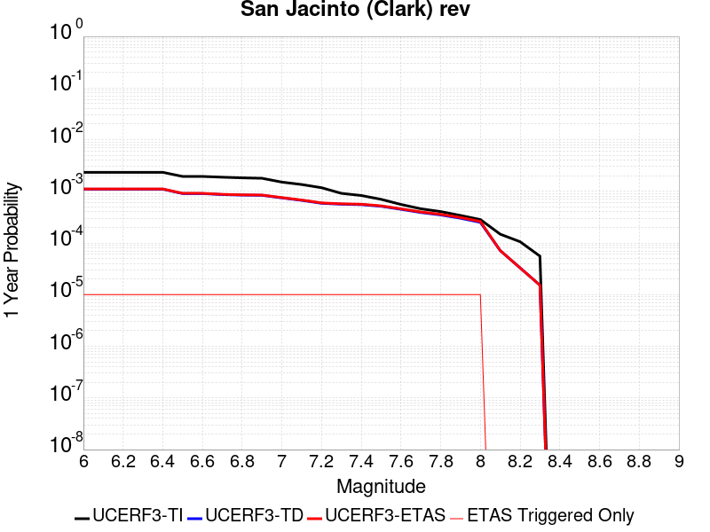 | 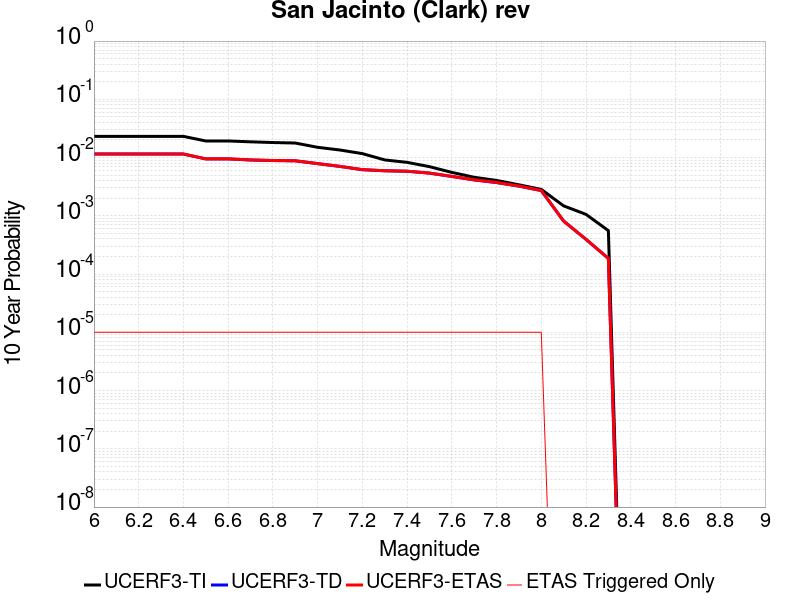 |

| Magnitude | 1 yr TI Prob | TD Prob | ETAS Prob | ETAS/TD Gain | ETAS Triggered Only | 10 yr TI Prob | TD Prob | ETAS Prob | ETAS/TD Gain | ETAS Triggered Only |
|-----|-----|-----|-----|-----|-----|-----|-----|-----|-----|-----|
| 6.0 | 0.0023362834 | 0.0011032496 | 0.0011132385 | 1.0090542 | 1.0E-5 | 0.02311874 | 0.011504271 | 0.011514156 | 1.0008593 | 1.0E-5 |
| 6.1 | 0.0023362834 | 0.0011032496 | 0.0011132385 | 1.0090542 | 1.0E-5 | 0.02311874 | 0.011504271 | 0.011514156 | 1.0008593 | 1.0E-5 |
| 6.2 | 0.0023362834 | 0.0011032496 | 0.0011132385 | 1.0090542 | 1.0E-5 | 0.02311874 | 0.011504271 | 0.011514156 | 1.0008593 | 1.0E-5 |
| 6.3 | 0.0023362834 | 0.0011032496 | 0.0011132385 | 1.0090542 | 1.0E-5 | 0.02311874 | 0.011504271 | 0.011514156 | 1.0008593 | 1.0E-5 |
| 6.4 | 0.0023362834 | 0.0011032496 | 0.0011132385 | 1.0090542 | 1.0E-5 | 0.02311874 | 0.011504271 | 0.011514156 | 1.0008593 | 1.0E-5 |
| 6.5 | 0.0019441366 | 9.052554E-4 | 9.152463E-4 | 1.0110366 | 1.0E-5 | 0.01927216 | 0.009494481 | 0.009504385 | 1.0010432 | 1.0E-5 |
| 6.6 | 0.0019441366 | 9.052554E-4 | 9.152463E-4 | 1.0110366 | 1.0E-5 | 0.01927216 | 0.009494481 | 0.009504385 | 1.0010432 | 1.0E-5 |
| 6.7 | 0.0018787434 | 8.660617E-4 | 8.7605306E-4 | 1.0115365 | 1.0E-5 | 0.01862939 | 0.009096416 | 0.009106325 | 1.0010893 | 1.0E-5 |
| 6.8 | 0.0018262739 | 8.4669964E-4 | 8.566912E-4 | 1.0118005 | 1.0E-5 | 0.01811338 | 0.008896332 | 0.008906243 | 1.001114 | 1.0E-5 |
| 6.9 | 0.0017908178 | 8.3784945E-4 | 8.478411E-4 | 1.0119253 | 1.0E-5 | 0.017764548 | 0.008804539 | 0.008814451 | 1.0011258 | 1.0E-5 |
| 7.0 | 0.0015099603 | 7.478312E-4 | 7.578237E-4 | 1.013362 | 1.0E-5 | 0.014997416 | 0.007868359 | 0.00787828 | 1.0012609 | 1.0E-5 |
| 7.1 | 0.0013558907 | 6.6921045E-4 | 6.792037E-4 | 1.014933 | 1.0E-5 | 0.013476475 | 0.00704681 | 0.007056739 | 1.001409 | 1.0E-5 |
| 7.2 | 0.001175679 | 5.875215E-4 | 5.9751567E-4 | 1.0170107 | 1.0E-5 | 0.011694785 | 0.0061930157 | 0.0062029534 | 1.0016047 | 1.0E-5 |
| 7.3 | 9.144575E-4 | 5.640094E-4 | 5.740038E-4 | 1.0177202 | 1.0E-5 | 0.009107036 | 0.00593402 | 0.0059439605 | 1.0016752 | 1.0E-5 |
| 7.4 | 8.305819E-4 | 5.5356853E-4 | 5.63563E-4 | 1.0180546 | 1.0E-5 | 0.008274844 | 0.005821274 | 0.005831216 | 1.0017078 | 1.0E-5 |
| 7.5 | 7.004617E-4 | 5.139521E-4 | 5.23947E-4 | 1.0194471 | 1.0E-5 | 0.006982579 | 0.0054068314 | 0.0054167775 | 1.0018395 | 1.0E-5 |
| 7.6 | 5.5757316E-4 | 4.494327E-4 | 4.594282E-4 | 1.0222403 | 1.0E-5 | 0.005561762 | 0.004741869 | 0.0047518215 | 1.0020989 | 1.0E-5 |
| 7.7 | 4.597127E-4 | 3.896173E-4 | 3.9961337E-4 | 1.0256562 | 1.0E-5 | 0.0045876284 | 0.004134863 | 0.004144822 | 1.0024085 | 1.0E-5 |
| 7.8 | 4.0589093E-4 | 3.493776E-4 | 3.593741E-4 | 1.0286124 | 1.0E-5 | 0.0040515037 | 0.0037229885 | 0.0037329511 | 1.002676 | 1.0E-5 |
| 7.9 | 3.4138895E-4 | 3.0158565E-4 | 3.1158264E-4 | 1.033148 | 1.0E-5 | 0.0034086495 | 0.003234669 | 0.0032446368 | 1.0030816 | 1.0E-5 |
| 8.0 | 2.8427184E-4 | 2.5113844E-4 | 2.6113592E-4 | 1.0398086 | 1.0E-5 | 0.0028390845 | 0.0027110032 | 0.002720976 | 1.0036787 | 1.0E-5 |
| 8.1 | 1.4816198E-4 | 7.1333925E-5 | 7.1333925E-5 | 1.0 | 0.0 | 0.0014806325 | 8.1160595E-4 | 8.1160595E-4 | 1.0 | 0.0 |
| 8.2 | 1.05929736E-4 | 3.2974684E-5 | 3.2974684E-5 | 1.0 | 0.0 | 0.0010587925 | 3.9490746E-4 | 3.9490746E-4 | 1.0 | 0.0 |
| 8.3 | 5.5619817E-5 | 1.526398E-5 | 1.526398E-5 | 1.0 | 0.0 | 5.5605895E-4 | 1.856827E-4 | 1.856827E-4 | 1.0 | 0.0 |

## Almanor 2011 CFM
*[(top)](#table-of-contents)*

| 1 Year | 10 Year |
|-----|-----|
| 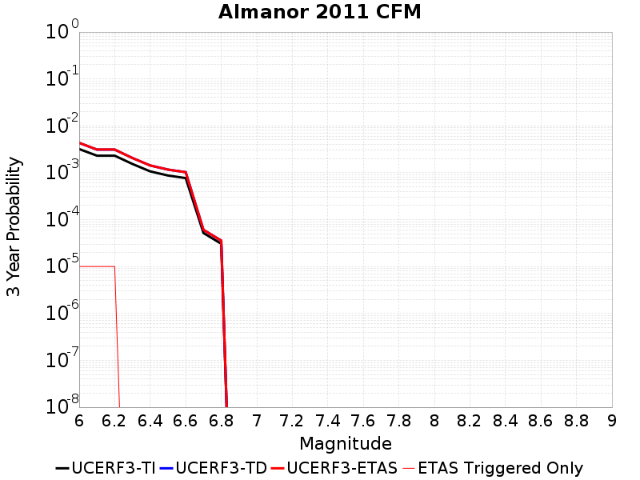 | 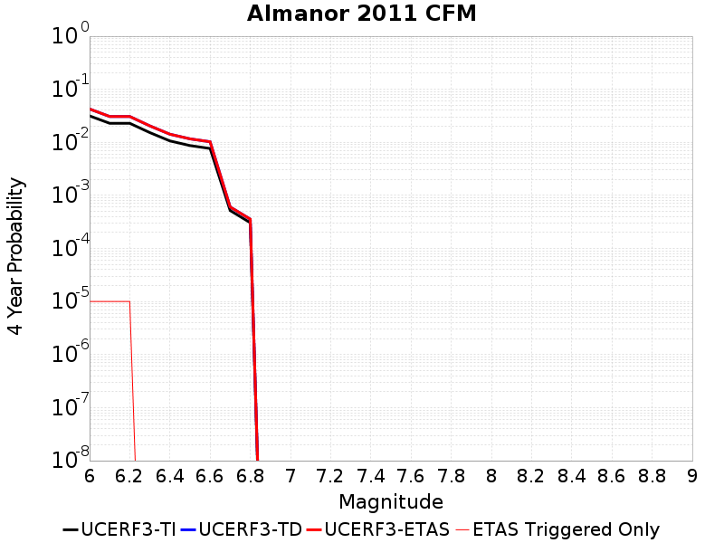 |

| Magnitude | 1 yr TI Prob | TD Prob | ETAS Prob | ETAS/TD Gain | ETAS Triggered Only | 10 yr TI Prob | TD Prob | ETAS Prob | ETAS/TD Gain | ETAS Triggered Only |
|-----|-----|-----|-----|-----|-----|-----|-----|-----|-----|-----|
| 6.0 | 0.0032028882 | 0.0043366286 | 0.0043465854 | 1.002296 | 1.0E-5 | 0.031571172 | 0.04258594 | 0.042595513 | 1.0002248 | 1.0E-5 |
| 6.1 | 0.0023134327 | 0.003114438 | 0.0031244068 | 1.0032009 | 1.0E-5 | 0.022894967 | 0.030755155 | 0.030764848 | 1.0003152 | 1.0E-5 |
| 6.2 | 0.0023134327 | 0.003114438 | 0.0031244068 | 1.0032009 | 1.0E-5 | 0.022894967 | 0.030755155 | 0.030764848 | 1.0003152 | 1.0E-5 |
| 6.3 | 0.0015393476 | 0.0020618802 | 0.0020618802 | 1.0 | 0.0 | 0.015287281 | 0.020460874 | 0.020460874 | 1.0 | 0.0 |
| 6.4 | 0.001069764 | 0.001430746 | 0.001430746 | 1.0 | 0.0 | 0.010646289 | 0.014244468 | 0.014244468 | 1.0 | 0.0 |
| 6.5 | 8.7362836E-4 | 0.0011680675 | 0.0011680675 | 1.0 | 0.0 | 0.008702018 | 0.011649082 | 0.011649082 | 1.0 | 0.0 |
| 6.6 | 7.690986E-4 | 0.0010281999 | 0.0010281999 | 1.0 | 0.0 | 0.0076644225 | 0.010265011 | 0.010265011 | 1.0 | 0.0 |
| 6.7 | 5.1922336E-5 | 6.061095E-5 | 6.061095E-5 | 1.0 | 0.0 | 5.1910203E-4 | 6.059614E-4 | 6.059614E-4 | 1.0 | 0.0 |
| 6.8 | 3.0609117E-5 | 3.5738696E-5 | 3.5738696E-5 | 1.0 | 0.0 | 3.06049E-4 | 3.573423E-4 | 3.573423E-4 | 1.0 | 0.0 |

## San Luis Range - Pecho 2011 CFM
*[(top)](#table-of-contents)*

| 1 Year | 10 Year |
|-----|-----|
| 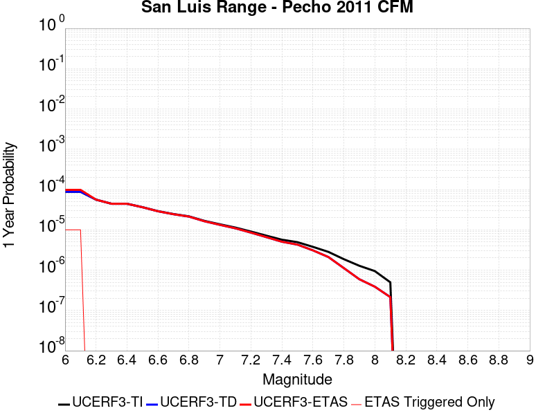 | 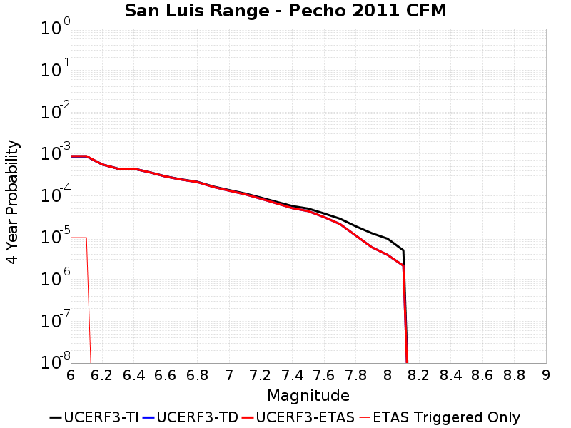 |

| Magnitude | 1 yr TI Prob | TD Prob | ETAS Prob | ETAS/TD Gain | ETAS Triggered Only | 10 yr TI Prob | TD Prob | ETAS Prob | ETAS/TD Gain | ETAS Triggered Only |
|-----|-----|-----|-----|-----|-----|-----|-----|-----|-----|-----|
| 6.0 | 8.804352E-5 | 8.829275E-5 | 9.8291865E-5 | 1.1132495 | 1.0E-5 | 8.8008645E-4 | 8.826006E-4 | 8.925918E-4 | 1.0113201 | 1.0E-5 |
| 6.1 | 8.804352E-5 | 8.829275E-5 | 9.8291865E-5 | 1.1132495 | 1.0E-5 | 8.8008645E-4 | 8.826006E-4 | 8.925918E-4 | 1.0113201 | 1.0E-5 |
| 6.2 | 5.617219E-5 | 5.6197685E-5 | 5.6197685E-5 | 1.0 | 0.0 | 5.6157995E-4 | 5.61841E-4 | 5.61841E-4 | 1.0 | 0.0 |
| 6.3 | 4.447137E-5 | 4.4418823E-5 | 4.4418823E-5 | 1.0 | 0.0 | 4.4462472E-4 | 4.4410262E-4 | 4.4410262E-4 | 1.0 | 0.0 |
| 6.4 | 4.447137E-5 | 4.4418823E-5 | 4.4418823E-5 | 1.0 | 0.0 | 4.4462472E-4 | 4.4410262E-4 | 4.4410262E-4 | 1.0 | 0.0 |
| 6.5 | 3.6539688E-5 | 3.640145E-5 | 3.640145E-5 | 1.0 | 0.0 | 3.653368E-4 | 3.6395655E-4 | 3.6395655E-4 | 1.0 | 0.0 |
| 6.6 | 2.9135606E-5 | 2.8921311E-5 | 2.8921311E-5 | 1.0 | 0.0 | 2.9131788E-4 | 2.891762E-4 | 2.891762E-4 | 1.0 | 0.0 |
| 6.7 | 2.4703175E-5 | 2.4435301E-5 | 2.4435301E-5 | 1.0 | 0.0 | 2.470043E-4 | 2.443266E-4 | 2.443266E-4 | 1.0 | 0.0 |
| 6.8 | 2.1636182E-5 | 2.1329332E-5 | 2.1329332E-5 | 1.0 | 0.0 | 2.1634075E-4 | 2.1327318E-4 | 2.1327318E-4 | 1.0 | 0.0 |
| 6.9 | 1.6726559E-5 | 1.634707E-5 | 1.634707E-5 | 1.0 | 0.0 | 1.67253E-4 | 1.6345884E-4 | 1.6345884E-4 | 1.0 | 0.0 |
| 7.0 | 1.3731191E-5 | 1.330008E-5 | 1.330008E-5 | 1.0 | 0.0 | 1.3730342E-4 | 1.3299292E-4 | 1.3299292E-4 | 1.0 | 0.0 |
| 7.1 | 1.13917895E-5 | 1.0914315E-5 | 1.0914315E-5 | 1.0 | 0.0 | 1.1391206E-4 | 1.09137836E-4 | 1.09137836E-4 | 1.0 | 0.0 |
| 7.2 | 9.075386E-6 | 8.545053E-6 | 8.545053E-6 | 1.0 | 0.0 | 9.075015E-5 | 8.5447275E-5 | 8.5447275E-5 | 1.0 | 0.0 |
| 7.3 | 7.1718637E-6 | 6.5946465E-6 | 6.5946465E-6 | 1.0 | 0.0 | 7.171632E-5 | 6.594452E-5 | 6.594452E-5 | 1.0 | 0.0 |
| 7.4 | 5.6954204E-6 | 5.0756917E-6 | 5.0756917E-6 | 1.0 | 0.0 | 5.6952744E-5 | 5.0755763E-5 | 5.0755763E-5 | 1.0 | 0.0 |
| 7.5 | 4.9518862E-6 | 4.30846E-6 | 4.30846E-6 | 1.0 | 0.0 | 4.951776E-5 | 4.3083768E-5 | 4.3083768E-5 | 1.0 | 0.0 |
| 7.6 | 3.7864236E-6 | 3.1007373E-6 | 3.1007373E-6 | 1.0 | 0.0 | 3.7863592E-5 | 3.1006944E-5 | 3.1006944E-5 | 1.0 | 0.0 |
| 7.7 | 2.8417835E-6 | 2.117386E-6 | 2.117386E-6 | 1.0 | 0.0 | 2.8417471E-5 | 2.117366E-5 | 2.117366E-5 | 1.0 | 0.0 |
| 7.8 | 1.8706452E-6 | 1.1229221E-6 | 1.1229221E-6 | 1.0 | 0.0 | 1.8706294E-5 | 1.1229165E-5 | 1.1229165E-5 | 1.0 | 0.0 |
| 7.9 | 1.2829606E-6 | 5.9457295E-7 | 5.9457295E-7 | 1.0 | 0.0 | 1.2829532E-5 | 5.945714E-6 | 5.945714E-6 | 1.0 | 0.0 |
| 8.0 | 9.4713255E-7 | 3.8827827E-7 | 3.8827827E-7 | 1.0 | 0.0 | 9.471285E-6 | 3.882776E-6 | 3.882776E-6 | 1.0 | 0.0 |
| 8.1 | 4.9878554E-7 | 2.1396231E-7 | 2.1396231E-7 | 1.0 | 0.0 | 4.987844E-6 | 2.139621E-6 | 2.139621E-6 | 1.0 | 0.0 |

## Newport-Inglewood alt 1
*[(top)](#table-of-contents)*

| 1 Year | 10 Year |
|-----|-----|
| 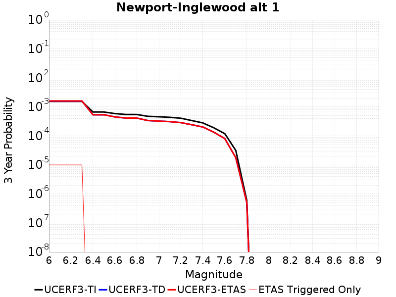 | 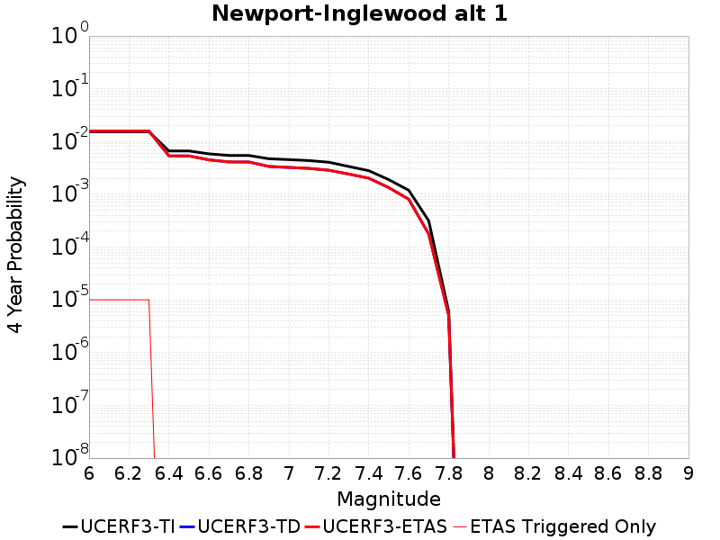 |

| Magnitude | 1 yr TI Prob | TD Prob | ETAS Prob | ETAS/TD Gain | ETAS Triggered Only | 10 yr TI Prob | TD Prob | ETAS Prob | ETAS/TD Gain | ETAS Triggered Only |
|-----|-----|-----|-----|-----|-----|-----|-----|-----|-----|-----|
| 6.0 | 0.0015469068 | 0.0015857681 | 0.0015957522 | 1.006296 | 1.0E-5 | 0.015361829 | 0.015792098 | 0.01580194 | 1.0006232 | 1.0E-5 |
| 6.1 | 0.0015469068 | 0.0015857681 | 0.0015957522 | 1.006296 | 1.0E-5 | 0.015361829 | 0.015792098 | 0.01580194 | 1.0006232 | 1.0E-5 |
| 6.2 | 0.0015469068 | 0.0015857681 | 0.0015957522 | 1.006296 | 1.0E-5 | 0.015361829 | 0.015792098 | 0.01580194 | 1.0006232 | 1.0E-5 |
| 6.3 | 0.0015469068 | 0.0015857681 | 0.0015957522 | 1.006296 | 1.0E-5 | 0.015361829 | 0.015792098 | 0.01580194 | 1.0006232 | 1.0E-5 |
| 6.4 | 6.65551E-4 | 5.358711E-4 | 5.358711E-4 | 1.0 | 0.0 | 0.0066356123 | 0.005346214 | 0.005346214 | 1.0 | 0.0 |
| 6.5 | 6.65551E-4 | 5.358711E-4 | 5.358711E-4 | 1.0 | 0.0 | 0.0066356123 | 0.005346214 | 0.005346214 | 1.0 | 0.0 |
| 6.6 | 5.871194E-4 | 4.5186924E-4 | 4.5186924E-4 | 1.0 | 0.0 | 0.005855706 | 0.004509682 | 0.004509682 | 1.0 | 0.0 |
| 6.7 | 5.4797524E-4 | 4.121209E-4 | 4.121209E-4 | 1.0 | 0.0 | 0.0054662596 | 0.004113696 | 0.004113696 | 1.0 | 0.0 |
| 6.8 | 5.464766E-4 | 4.1114975E-4 | 4.1114975E-4 | 1.0 | 0.0 | 0.005451347 | 0.004104021 | 0.004104021 | 1.0 | 0.0 |
| 6.9 | 4.7350433E-4 | 3.3856655E-4 | 3.3856655E-4 | 1.0 | 0.0 | 0.004724967 | 0.003380545 | 0.003380545 | 1.0 | 0.0 |
| 7.0 | 4.5583185E-4 | 3.2408544E-4 | 3.2408544E-4 | 1.0 | 0.0 | 0.0045489795 | 0.00323616 | 0.00323616 | 1.0 | 0.0 |
| 7.1 | 4.37752E-4 | 3.1072026E-4 | 3.1072026E-4 | 1.0 | 0.0 | 0.004368907 | 0.0031028877 | 0.0031028877 | 1.0 | 0.0 |
| 7.2 | 4.06749E-4 | 2.867639E-4 | 2.867639E-4 | 1.0 | 0.0 | 0.0040600533 | 0.0028639627 | 0.0028639627 | 1.0 | 0.0 |
| 7.3 | 3.3774204E-4 | 2.4248792E-4 | 2.4248792E-4 | 1.0 | 0.0 | 0.0033722918 | 0.0024222499 | 0.0024222499 | 1.0 | 0.0 |
| 7.4 | 2.8079396E-4 | 2.0273353E-4 | 2.0273353E-4 | 1.0 | 0.0 | 0.0028043943 | 0.0020255004 | 0.0020255004 | 1.0 | 0.0 |
| 7.5 | 1.9034238E-4 | 1.3428775E-4 | 1.3428775E-4 | 1.0 | 0.0 | 0.0019017943 | 0.0013420765 | 0.0013420765 | 1.0 | 0.0 |
| 7.6 | 1.1951787E-4 | 8.076855E-5 | 8.076855E-5 | 1.0 | 0.0 | 0.0011945361 | 8.0739864E-4 | 8.0739864E-4 | 1.0 | 0.0 |
| 7.7 | 3.1557047E-5 | 1.772761E-5 | 1.772761E-5 | 1.0 | 0.0 | 3.1552566E-4 | 1.7726334E-4 | 1.7726334E-4 | 1.0 | 0.0 |
| 7.8 | 6.0556863E-7 | 5.104303E-7 | 5.104303E-7 | 1.0 | 0.0 | 6.05567E-6 | 5.1043035E-6 | 5.1043035E-6 | 1.0 | 0.0 |

## Great Valley 04b Gordon Valley
*[(top)](#table-of-contents)*

| 1 Year | 10 Year |
|-----|-----|
| 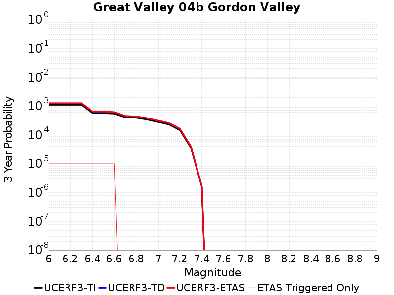 | 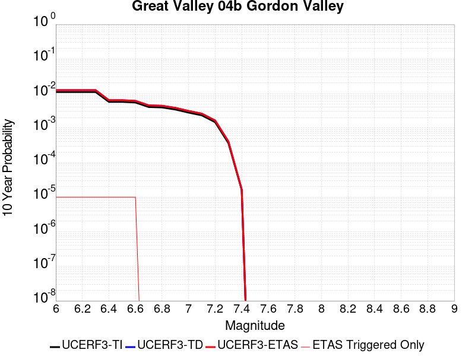 |

| Magnitude | 1 yr TI Prob | TD Prob | ETAS Prob | ETAS/TD Gain | ETAS Triggered Only | 10 yr TI Prob | TD Prob | ETAS Prob | ETAS/TD Gain | ETAS Triggered Only |
|-----|-----|-----|-----|-----|-----|-----|-----|-----|-----|-----|
| 6.0 | 0.0011046068 | 0.0012507567 | 0.0012607442 | 1.0079851 | 1.0E-5 | 0.010991322 | 0.012453619 | 0.012463494 | 1.000793 | 1.0E-5 |
| 6.1 | 0.0011046068 | 0.0012507567 | 0.0012607442 | 1.0079851 | 1.0E-5 | 0.010991322 | 0.012453619 | 0.012463494 | 1.000793 | 1.0E-5 |
| 6.2 | 0.0011046068 | 0.0012507567 | 0.0012607442 | 1.0079851 | 1.0E-5 | 0.010991322 | 0.012453619 | 0.012463494 | 1.000793 | 1.0E-5 |
| 6.3 | 0.0011046068 | 0.0012507567 | 0.0012607442 | 1.0079851 | 1.0E-5 | 0.010991322 | 0.012453619 | 0.012463494 | 1.000793 | 1.0E-5 |
| 6.4 | 5.731909E-4 | 6.3923973E-4 | 6.492333E-4 | 1.0156336 | 1.0E-5 | 0.005717147 | 0.0063755964 | 0.0063855327 | 1.0015584 | 1.0E-5 |
| 6.5 | 5.731909E-4 | 6.3923973E-4 | 6.492333E-4 | 1.0156336 | 1.0E-5 | 0.005717147 | 0.0063755964 | 0.0063855327 | 1.0015584 | 1.0E-5 |
| 6.6 | 5.4865726E-4 | 6.115789E-4 | 6.215728E-4 | 1.0163411 | 1.0E-5 | 0.0054730466 | 0.0061005116 | 0.0061104507 | 1.0016292 | 1.0E-5 |
| 6.7 | 4.063493E-4 | 4.5269274E-4 | 4.5269274E-4 | 1.0 | 0.0 | 0.004056071 | 0.004518223 | 0.004518223 | 1.0 | 0.0 |
| 6.8 | 3.957021E-4 | 4.409443E-4 | 4.409443E-4 | 1.0 | 0.0 | 0.0039499826 | 0.0044012065 | 0.0044012065 | 1.0 | 0.0 |
| 6.9 | 3.4453452E-4 | 3.83891E-4 | 3.83891E-4 | 1.0 | 0.0 | 0.0034400085 | 0.0038326648 | 0.0038326648 | 1.0 | 0.0 |
| 7.0 | 2.8016625E-4 | 3.1242278E-4 | 3.1242278E-4 | 1.0 | 0.0 | 0.0027981328 | 0.0031201243 | 0.0031201243 | 1.0 | 0.0 |
| 7.1 | 2.3313647E-4 | 2.6015713E-4 | 2.6015713E-4 | 1.0 | 0.0 | 0.0023289204 | 0.0025987704 | 0.0025987704 | 1.0 | 0.0 |
| 7.2 | 1.4783088E-4 | 1.651036E-4 | 1.651036E-4 | 1.0 | 0.0 | 0.0014773258 | 0.0016499812 | 0.0016499812 | 1.0 | 0.0 |
| 7.3 | 3.656989E-5 | 4.055718E-5 | 4.055718E-5 | 1.0 | 0.0 | 3.6563876E-4 | 4.0554276E-4 | 4.0554276E-4 | 1.0 | 0.0 |
| 7.4 | 1.6238852E-6 | 1.6732808E-6 | 1.6732808E-6 | 1.0 | 0.0 | 1.6238733E-5 | 1.673269E-5 | 1.673269E-5 | 1.0 | 0.0 |

## Davis Creek
*[(top)](#table-of-contents)*

| 1 Year | 10 Year |
|-----|-----|
| 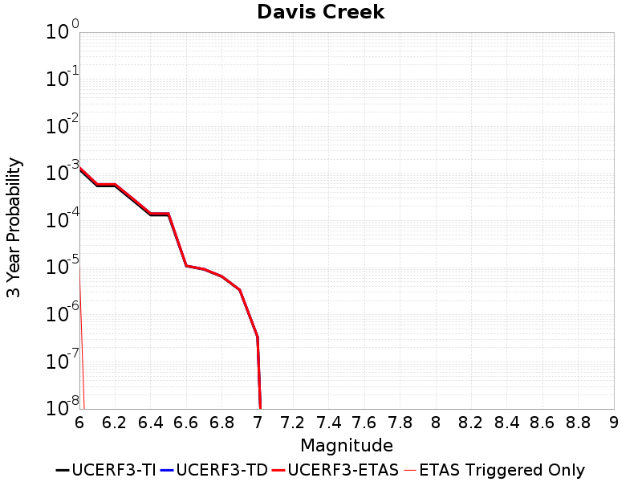 | 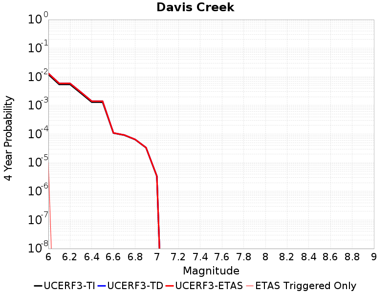 |

| Magnitude | 1 yr TI Prob | TD Prob | ETAS Prob | ETAS/TD Gain | ETAS Triggered Only | 10 yr TI Prob | TD Prob | ETAS Prob | ETAS/TD Gain | ETAS Triggered Only |
|-----|-----|-----|-----|-----|-----|-----|-----|-----|-----|-----|
| 6.0 | 0.0012158032 | 0.0013254998 | 0.0013354865 | 1.0075343 | 1.0E-5 | 0.01209173 | 0.013187719 | 0.013197587 | 1.0007483 | 1.0E-5 |
| 6.1 | 5.4291193E-4 | 5.903629E-4 | 5.903629E-4 | 1.0 | 0.0 | 0.0054158745 | 0.0058906176 | 0.0058906176 | 1.0 | 0.0 |
| 6.2 | 5.4291193E-4 | 5.903629E-4 | 5.903629E-4 | 1.0 | 0.0 | 0.0054158745 | 0.0058906176 | 0.0058906176 | 1.0 | 0.0 |
| 6.3 | 2.6776237E-4 | 2.9052742E-4 | 2.9052742E-4 | 1.0 | 0.0 | 0.0026743996 | 0.0029023222 | 0.0029023222 | 1.0 | 0.0 |
| 6.4 | 1.3036063E-4 | 1.4111318E-4 | 1.4111318E-4 | 1.0 | 0.0 | 0.0013028418 | 0.0014105905 | 0.0014105905 | 1.0 | 0.0 |
| 6.5 | 1.2963692E-4 | 1.4037934E-4 | 1.4037934E-4 | 1.0 | 0.0 | 0.0012956132 | 0.0014032614 | 0.0014032614 | 1.0 | 0.0 |
| 6.6 | 1.0814296E-5 | 1.0966883E-5 | 1.0966883E-5 | 1.0 | 0.0 | 1.081377E-4 | 1.096636E-4 | 1.096636E-4 | 1.0 | 0.0 |
| 6.7 | 9.154443E-6 | 9.28296E-6 | 9.28296E-6 | 1.0 | 0.0 | 9.1540656E-5 | 9.2825874E-5 | 9.2825874E-5 | 1.0 | 0.0 |
| 6.8 | 6.428586E-6 | 6.512461E-6 | 6.512461E-6 | 1.0 | 0.0 | 6.4284E-5 | 6.512281E-5 | 6.512281E-5 | 1.0 | 0.0 |
| 6.9 | 3.3394215E-6 | 3.384328E-6 | 3.384328E-6 | 1.0 | 0.0 | 3.3393713E-5 | 3.384283E-5 | 3.384283E-5 | 1.0 | 0.0 |
| 7.0 | 3.3632048E-7 | 3.410008E-7 | 3.410008E-7 | 1.0 | 0.0 | 3.3631998E-6 | 3.410008E-6 | 3.410008E-6 | 1.0 | 0.0 |

## Clamshell-Sawpit
*[(top)](#table-of-contents)*

| 1 Year | 10 Year |
|-----|-----|
| 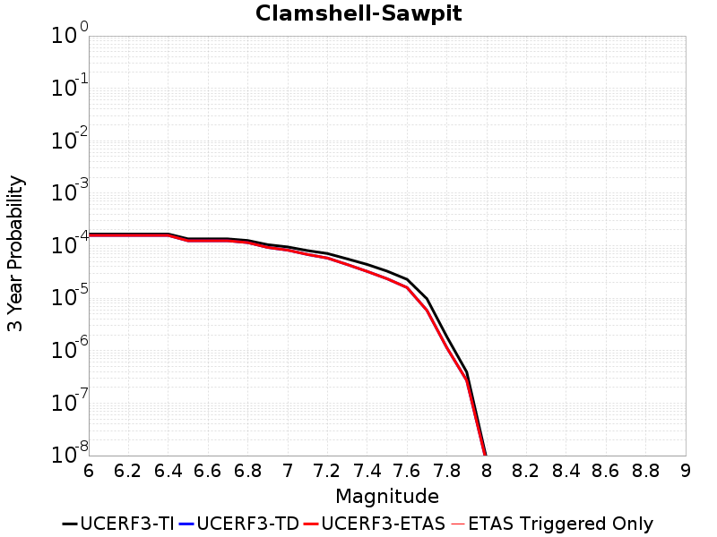 | 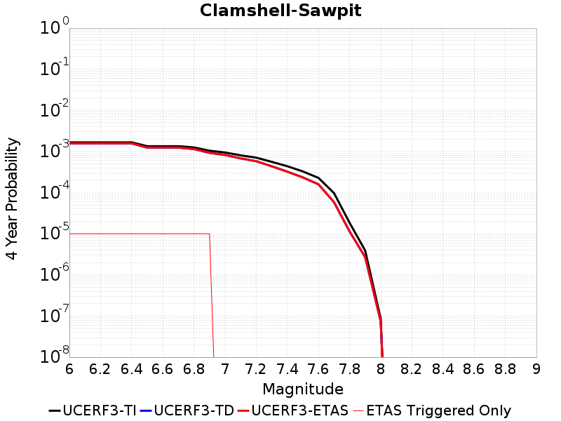 |

| Magnitude | 1 yr TI Prob | TD Prob | ETAS Prob | ETAS/TD Gain | ETAS Triggered Only | 10 yr TI Prob | TD Prob | ETAS Prob | ETAS/TD Gain | ETAS Triggered Only |
|-----|-----|-----|-----|-----|-----|-----|-----|-----|-----|-----|
| 6.0 | 1.6711417E-4 | 1.5719057E-4 | 1.5719057E-4 | 1.0 | 0.0 | 0.0016698855 | 0.0015708732 | 0.0015808576 | 1.0063559 | 1.0E-5 |
| 6.1 | 1.6711417E-4 | 1.5719057E-4 | 1.5719057E-4 | 1.0 | 0.0 | 0.0016698855 | 0.0015708732 | 0.0015808576 | 1.0063559 | 1.0E-5 |
| 6.2 | 1.6711417E-4 | 1.5719057E-4 | 1.5719057E-4 | 1.0 | 0.0 | 0.0016698855 | 0.0015708732 | 0.0015808576 | 1.0063559 | 1.0E-5 |
| 6.3 | 1.6711417E-4 | 1.5719057E-4 | 1.5719057E-4 | 1.0 | 0.0 | 0.0016698855 | 0.0015708732 | 0.0015808576 | 1.0063559 | 1.0E-5 |
| 6.4 | 1.6711417E-4 | 1.5719057E-4 | 1.5719057E-4 | 1.0 | 0.0 | 0.0016698855 | 0.0015708732 | 0.0015808576 | 1.0063559 | 1.0E-5 |
| 6.5 | 1.3493907E-4 | 1.2421828E-4 | 1.2421828E-4 | 1.0 | 0.0 | 0.0013485716 | 0.0012415187 | 0.0012515063 | 1.0080446 | 1.0E-5 |
| 6.6 | 1.3493907E-4 | 1.2421828E-4 | 1.2421828E-4 | 1.0 | 0.0 | 0.0013485716 | 0.0012415187 | 0.0012515063 | 1.0080446 | 1.0E-5 |
| 6.7 | 1.3493907E-4 | 1.2421828E-4 | 1.2421828E-4 | 1.0 | 0.0 | 0.0013485716 | 0.0012415187 | 0.0012515063 | 1.0080446 | 1.0E-5 |
| 6.8 | 1.2573638E-4 | 1.14668364E-4 | 1.14668364E-4 | 1.0 | 0.0 | 0.0012566525 | 0.0011461186 | 0.001156107 | 1.0087152 | 1.0E-5 |
| 6.9 | 1.0473781E-4 | 9.279163E-5 | 9.279163E-5 | 1.0 | 0.0 | 0.0010468846 | 9.2754076E-4 | 9.3753147E-4 | 1.0107712 | 1.0E-5 |
| 7.0 | 9.478718E-5 | 8.247599E-5 | 8.247599E-5 | 1.0 | 0.0 | 9.4746763E-4 | 8.244639E-4 | 8.244639E-4 | 1.0 | 0.0 |
| 7.1 | 8.072447E-5 | 6.8106325E-5 | 6.8106325E-5 | 1.0 | 0.0 | 8.0695155E-4 | 6.8085996E-4 | 6.8085996E-4 | 1.0 | 0.0 |
| 7.2 | 7.1002316E-5 | 5.8195506E-5 | 5.8195506E-5 | 1.0 | 0.0 | 7.097964E-4 | 5.818073E-4 | 5.818073E-4 | 1.0 | 0.0 |
| 7.3 | 5.608851E-5 | 4.3746964E-5 | 4.3746964E-5 | 1.0 | 0.0 | 5.6074356E-4 | 4.3738636E-4 | 4.3738636E-4 | 1.0 | 0.0 |
| 7.4 | 4.3917007E-5 | 3.2350497E-5 | 3.2350497E-5 | 1.0 | 0.0 | 4.390833E-4 | 3.2345986E-4 | 3.2345986E-4 | 1.0 | 0.0 |
| 7.5 | 3.275697E-5 | 2.3463877E-5 | 2.3463877E-5 | 1.0 | 0.0 | 3.275214E-4 | 2.3461587E-4 | 2.3461587E-4 | 1.0 | 0.0 |
| 7.6 | 2.2865479E-5 | 1.596415E-5 | 1.596415E-5 | 1.0 | 0.0 | 2.2863125E-4 | 1.5963159E-4 | 1.5963159E-4 | 1.0 | 0.0 |
| 7.7 | 9.75973E-6 | 5.8637775E-6 | 5.8637775E-6 | 1.0 | 0.0 | 9.7593016E-5 | 5.8636288E-5 | 5.8636288E-5 | 1.0 | 0.0 |
| 7.8 | 1.84601E-6 | 1.139484E-6 | 1.139484E-6 | 1.0 | 0.0 | 1.8459947E-5 | 1.1394784E-5 | 1.1394784E-5 | 1.0 | 0.0 |
| 7.9 | 3.9159727E-7 | 2.7091312E-7 | 2.7091312E-7 | 1.0 | 0.0 | 3.915966E-6 | 2.7091285E-6 | 2.7091285E-6 | 1.0 | 0.0 |
| 8.0 | 8.637662E-9 | 7.3993274E-9 | 7.3993274E-9 | 1.0 | 0.0 | 8.6376616E-8 | 7.399328E-8 | 7.399328E-8 | 1.0 | 0.0 |

## Laguna Salada
*[(top)](#table-of-contents)*

| 1 Year | 10 Year |
|-----|-----|
| 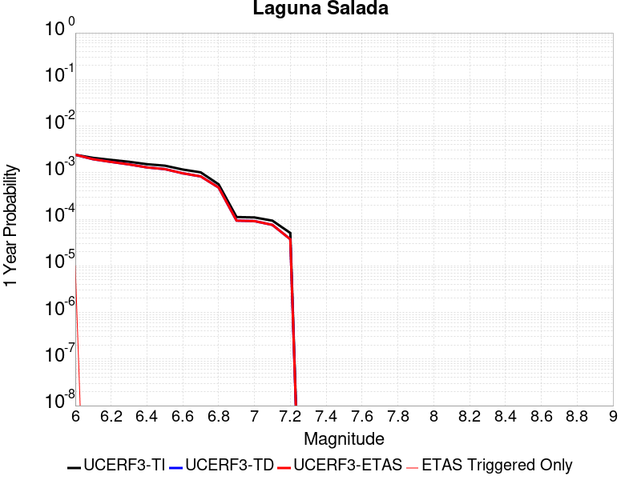 | 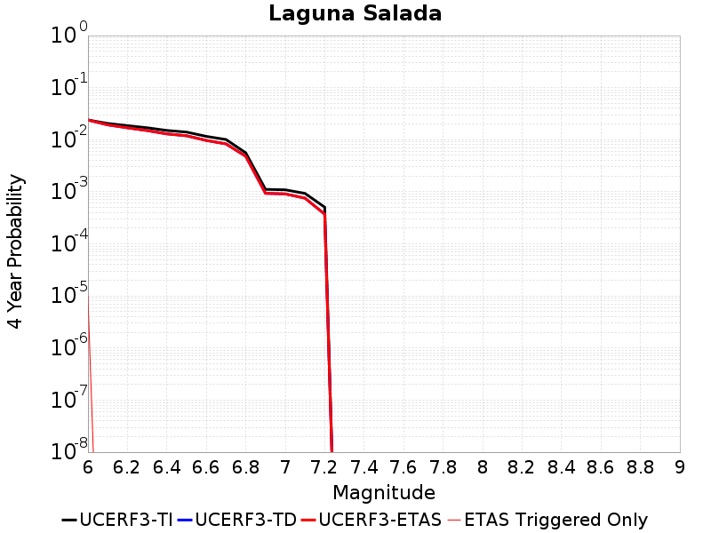 |

| Magnitude | 1 yr TI Prob | TD Prob | ETAS Prob | ETAS/TD Gain | ETAS Triggered Only | 10 yr TI Prob | TD Prob | ETAS Prob | ETAS/TD Gain | ETAS Triggered Only |
|-----|-----|-----|-----|-----|-----|-----|-----|-----|-----|-----|
| 6.0 | 0.0024216278 | 0.0024154375 | 0.0024254133 | 1.00413 | 1.0E-5 | 0.02395408 | 0.02397534 | 0.0239851 | 1.0004071 | 1.0E-5 |
| 6.1 | 0.0020757897 | 0.001941736 | 0.001941736 | 1.0 | 0.0 | 0.020565065 | 0.019331925 | 0.019331925 | 1.0 | 0.0 |
| 6.2 | 0.0018802295 | 0.0016998668 | 0.0016998668 | 1.0 | 0.0 | 0.018644003 | 0.016949683 | 0.016949683 | 1.0 | 0.0 |
| 6.3 | 0.0017131006 | 0.0015043252 | 0.0015043252 | 1.0 | 0.0 | 0.016999546 | 0.015018816 | 0.015018816 | 1.0 | 0.0 |
| 6.4 | 0.0015189396 | 0.0012960691 | 0.0012960691 | 1.0 | 0.0 | 0.015085992 | 0.012956302 | 0.012956302 | 1.0 | 0.0 |
| 6.5 | 0.0014117584 | 0.0011904221 | 0.0011904221 | 1.0 | 0.0 | 0.014028233 | 0.011907784 | 0.011907784 | 1.0 | 0.0 |
| 6.6 | 0.0011664346 | 9.687704E-4 | 9.687704E-4 | 1.0 | 0.0 | 0.011603311 | 0.009702219 | 0.009702219 | 1.0 | 0.0 |
| 6.7 | 0.001014788 | 8.301327E-4 | 8.301327E-4 | 1.0 | 0.0 | 0.010101665 | 0.008320967 | 0.008320967 | 1.0 | 0.0 |
| 6.8 | 5.6169706E-4 | 4.7918825E-4 | 4.7918825E-4 | 1.0 | 0.0 | 0.0056027942 | 0.004809704 | 0.004809704 | 1.0 | 0.0 |
| 6.9 | 1.1157654E-4 | 9.346723E-5 | 9.346723E-5 | 1.0 | 0.0 | 0.0011152053 | 9.343175E-4 | 9.343175E-4 | 1.0 | 0.0 |
| 7.0 | 1.0932361E-4 | 9.127265E-5 | 9.127265E-5 | 1.0 | 0.0 | 0.0010926984 | 9.123898E-4 | 9.123898E-4 | 1.0 | 0.0 |
| 7.1 | 9.333054E-5 | 7.565787E-5 | 7.565787E-5 | 1.0 | 0.0 | 9.329135E-4 | 7.5635145E-4 | 7.5635145E-4 | 1.0 | 0.0 |
| 7.2 | 5.073253E-5 | 3.72322E-5 | 3.72322E-5 | 1.0 | 0.0 | 5.072095E-4 | 3.7227586E-4 | 3.7227586E-4 | 1.0 | 0.0 |

## Rodgers Creek - Healdsburg 2011 CFM
*[(top)](#table-of-contents)*

| 1 Year | 10 Year |
|-----|-----|
| 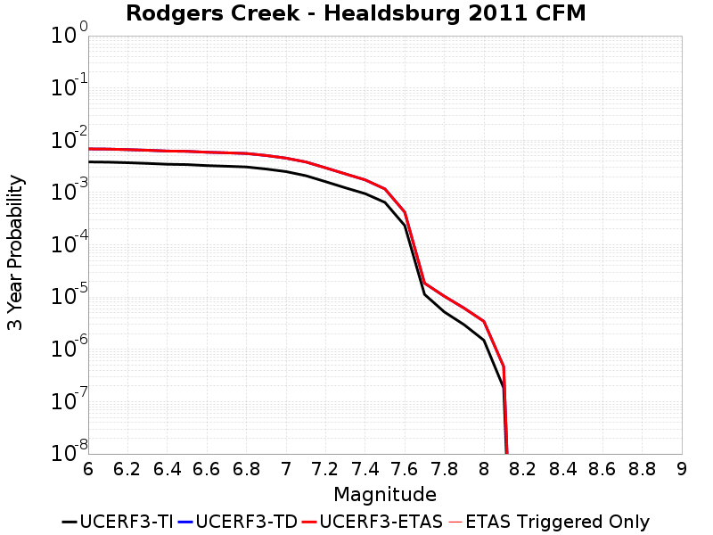 | 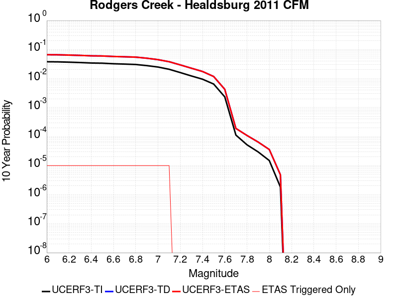 |

| Magnitude | 1 yr TI Prob | TD Prob | ETAS Prob | ETAS/TD Gain | ETAS Triggered Only | 10 yr TI Prob | TD Prob | ETAS Prob | ETAS/TD Gain | ETAS Triggered Only |
|-----|-----|-----|-----|-----|-----|-----|-----|-----|-----|-----|
| 6.0 | 0.0038488081 | 0.006831539 | 0.006831539 | 1.0 | 0.0 | 0.037828278 | 0.06619212 | 0.06620146 | 1.000141 | 1.0E-5 |
| 6.1 | 0.0038116854 | 0.0067787105 | 0.0067787105 | 1.0 | 0.0 | 0.037469655 | 0.06569673 | 0.065706074 | 1.0001422 | 1.0E-5 |
| 6.2 | 0.003717703 | 0.006619498 | 0.006619498 | 1.0 | 0.0 | 0.0365612 | 0.06421495 | 0.06422431 | 1.0001457 | 1.0E-5 |
| 6.3 | 0.0036072785 | 0.006440409 | 0.006440409 | 1.0 | 0.0 | 0.035492823 | 0.06254129 | 0.062550664 | 1.0001498 | 1.0E-5 |
| 6.4 | 0.0034773487 | 0.006220943 | 0.006220943 | 1.0 | 0.0 | 0.034234364 | 0.060490545 | 0.06049994 | 1.0001553 | 1.0E-5 |
| 6.5 | 0.003424202 | 0.006142802 | 0.006142802 | 1.0 | 0.0 | 0.03371918 | 0.05975546 | 0.059764862 | 1.0001574 | 1.0E-5 |
| 6.6 | 0.0032765474 | 0.005901994 | 0.005901994 | 1.0 | 0.0 | 0.032286562 | 0.057494804 | 0.05750423 | 1.0001639 | 1.0E-5 |
| 6.7 | 0.0031858748 | 0.0057552196 | 0.0057552196 | 1.0 | 0.0 | 0.031405866 | 0.056113295 | 0.056122735 | 1.0001682 | 1.0E-5 |
| 6.8 | 0.0030859804 | 0.00558261 | 0.00558261 | 1.0 | 0.0 | 0.030434765 | 0.05448005 | 0.054489505 | 1.0001736 | 1.0E-5 |
| 6.9 | 0.0028153337 | 0.0051124464 | 0.0051124464 | 1.0 | 0.0 | 0.027799325 | 0.05001546 | 0.05002496 | 1.0001899 | 1.0E-5 |
| 7.0 | 0.0025150678 | 0.004550581 | 0.004550581 | 1.0 | 0.0 | 0.024867928 | 0.04466795 | 0.044677507 | 1.0002139 | 1.0E-5 |
| 7.1 | 0.0021003427 | 0.003848284 | 0.003848284 | 1.0 | 0.0 | 0.02080602 | 0.037923664 | 0.037933283 | 1.0002537 | 1.0E-5 |
| 7.2 | 0.0016143717 | 0.0029687257 | 0.0029687257 | 1.0 | 0.0 | 0.01602694 | 0.029437251 | 0.029437251 | 1.0 | 0.0 |
| 7.3 | 0.0012314644 | 0.002273946 | 0.002273946 | 1.0 | 0.0 | 0.0122466255 | 0.022637216 | 0.022637216 | 1.0 | 0.0 |
| 7.4 | 9.518733E-4 | 0.001748652 | 0.001748652 | 1.0 | 0.0 | 0.009478063 | 0.017465714 | 0.017465714 | 1.0 | 0.0 |
| 7.5 | 6.4740516E-4 | 0.0011712785 | 0.0011712785 | 1.0 | 0.0 | 0.006455223 | 0.011743409 | 0.011743409 | 1.0 | 0.0 |
| 7.6 | 2.3358424E-4 | 4.217297E-4 | 4.217297E-4 | 1.0 | 0.0 | 0.0023333887 | 0.0042461096 | 0.0042461096 | 1.0 | 0.0 |
| 7.7 | 1.1259765E-5 | 1.8445178E-5 | 1.8445178E-5 | 1.0 | 0.0 | 1.1259195E-4 | 1.9069693E-4 | 1.9069693E-4 | 1.0 | 0.0 |
| 7.8 | 5.1981874E-6 | 1.0383819E-5 | 1.0383819E-5 | 1.0 | 0.0 | 5.198066E-5 | 1.0902291E-4 | 1.0902291E-4 | 1.0 | 0.0 |
| 7.9 | 2.960882E-6 | 6.1437263E-6 | 6.1437263E-6 | 1.0 | 0.0 | 2.9608427E-5 | 6.471173E-5 | 6.471173E-5 | 1.0 | 0.0 |
| 8.0 | 1.4930534E-6 | 3.432686E-6 | 3.432686E-6 | 1.0 | 0.0 | 1.4930434E-5 | 3.5827266E-5 | 3.5827266E-5 | 1.0 | 0.0 |
| 8.1 | 1.8286079E-7 | 4.6784066E-7 | 4.6784066E-7 | 1.0 | 0.0 | 1.8286064E-6 | 4.832968E-6 | 4.832968E-6 | 1.0 | 0.0 |

## San Juan
*[(top)](#table-of-contents)*

| 1 Year | 10 Year |
|-----|-----|
| 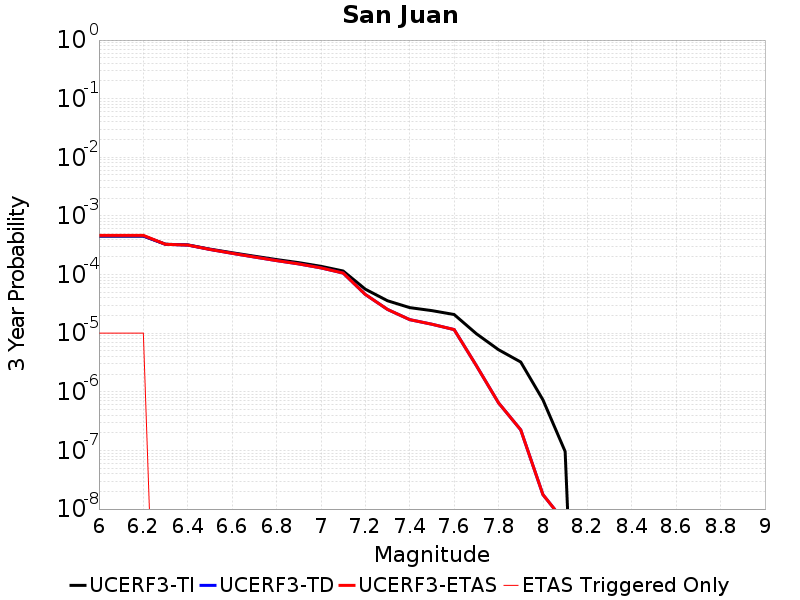 | 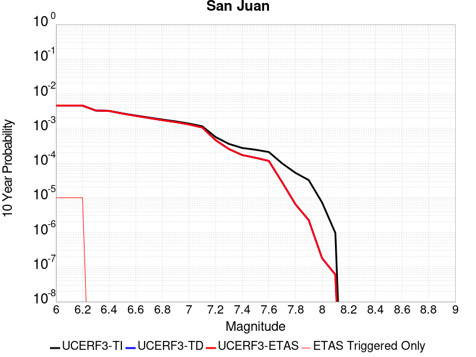 |

| Magnitude | 1 yr TI Prob | TD Prob | ETAS Prob | ETAS/TD Gain | ETAS Triggered Only | 10 yr TI Prob | TD Prob | ETAS Prob | ETAS/TD Gain | ETAS Triggered Only |
|-----|-----|-----|-----|-----|-----|-----|-----|-----|-----|-----|
| 6.0 | 4.5295584E-4 | 4.5642373E-4 | 4.6641918E-4 | 1.0218995 | 1.0E-5 | 0.004520337 | 0.004555404 | 0.0045653586 | 1.0021852 | 1.0E-5 |
| 6.1 | 4.5295584E-4 | 4.5642373E-4 | 4.6641918E-4 | 1.0218995 | 1.0E-5 | 0.004520337 | 0.004555404 | 0.0045653586 | 1.0021852 | 1.0E-5 |
| 6.2 | 4.5295584E-4 | 4.5642373E-4 | 4.6641918E-4 | 1.0218995 | 1.0E-5 | 0.004520337 | 0.004555404 | 0.0045653586 | 1.0021852 | 1.0E-5 |
| 6.3 | 3.2895492E-4 | 3.27767E-4 | 3.27767E-4 | 1.0 | 0.0 | 0.003284684 | 0.0032730354 | 0.0032730354 | 1.0 | 0.0 |
| 6.4 | 3.2079802E-4 | 3.1899725E-4 | 3.1899725E-4 | 1.0 | 0.0 | 0.0032033534 | 0.0031855898 | 0.0031855898 | 1.0 | 0.0 |
| 6.5 | 2.7154534E-4 | 2.6802084E-4 | 2.6802084E-4 | 1.0 | 0.0 | 0.0027121378 | 0.00267713 | 0.00267713 | 1.0 | 0.0 |
| 6.6 | 2.3571544E-4 | 2.3034593E-4 | 2.3034593E-4 | 1.0 | 0.0 | 0.0023546559 | 0.002301209 | 0.002301209 | 1.0 | 0.0 |
| 6.7 | 2.0578515E-4 | 1.9929545E-4 | 1.9929545E-4 | 1.0 | 0.0 | 0.002055947 | 0.001991292 | 0.001991292 | 1.0 | 0.0 |
| 6.8 | 1.8018926E-4 | 1.730286E-4 | 1.730286E-4 | 1.0 | 0.0 | 0.0018004322 | 0.0017290578 | 0.0017290578 | 1.0 | 0.0 |
| 6.9 | 1.596469E-4 | 1.5193588E-4 | 1.5193588E-4 | 1.0 | 0.0 | 0.0015953224 | 0.0015184347 | 0.0015184347 | 1.0 | 0.0 |
| 7.0 | 1.3828653E-4 | 1.300222E-4 | 1.300222E-4 | 1.0 | 0.0 | 0.0013820052 | 0.0012995731 | 0.0012995731 | 1.0 | 0.0 |
| 7.1 | 1.1499152E-4 | 1.06118096E-4 | 1.06118096E-4 | 1.0 | 0.0 | 0.0011493203 | 0.0010607842 | 0.0010607842 | 1.0 | 0.0 |
| 7.2 | 5.628194E-5 | 4.5761215E-5 | 4.5761215E-5 | 1.0 | 0.0 | 5.6267687E-4 | 4.5757694E-4 | 4.5757694E-4 | 1.0 | 0.0 |
| 7.3 | 3.5723086E-5 | 2.540481E-5 | 2.540481E-5 | 1.0 | 0.0 | 3.571734E-4 | 2.5405257E-4 | 2.5405257E-4 | 1.0 | 0.0 |
| 7.4 | 2.7291273E-5 | 1.702506E-5 | 1.702506E-5 | 1.0 | 0.0 | 2.7287923E-4 | 1.7026952E-4 | 1.7026952E-4 | 1.0 | 0.0 |
| 7.5 | 2.4254627E-5 | 1.421096E-5 | 1.421096E-5 | 1.0 | 0.0 | 2.425198E-4 | 1.4213013E-4 | 1.4213013E-4 | 1.0 | 0.0 |
| 7.6 | 2.0822463E-5 | 1.1522896E-5 | 1.1522896E-5 | 1.0 | 0.0 | 2.0820512E-4 | 1.1524759E-4 | 1.1524759E-4 | 1.0 | 0.0 |
| 7.7 | 9.80149E-6 | 2.8003342E-6 | 2.8003342E-6 | 1.0 | 0.0 | 9.801057E-5 | 2.8012038E-5 | 2.8012038E-5 | 1.0 | 0.0 |
| 7.8 | 5.225927E-6 | 6.4786445E-7 | 6.4786445E-7 | 1.0 | 0.0 | 5.225804E-5 | 6.4845162E-6 | 6.4845162E-6 | 1.0 | 0.0 |
| 7.9 | 3.2201583E-6 | 2.2420377E-7 | 2.2420377E-7 | 1.0 | 0.0 | 3.2201115E-5 | 2.2473266E-6 | 2.2473266E-6 | 1.0 | 0.0 |
| 8.0 | 7.2917294E-7 | 1.7632514E-8 | 1.7632514E-8 | 1.0 | 0.0 | 7.2917055E-6 | 1.8062713E-7 | 1.8062713E-7 | 1.0 | 0.0 |
| 8.1 | 9.602671E-8 | 5.898213E-9 | 5.898213E-9 | 1.0 | 0.0 | 9.602667E-7 | 6.02257E-8 | 6.02257E-8 | 1.0 | 0.0 |

## Great Valley 05 Pittsburg - Kirby Hills alt1
*[(top)](#table-of-contents)*

| 1 Year | 10 Year |
|-----|-----|
| 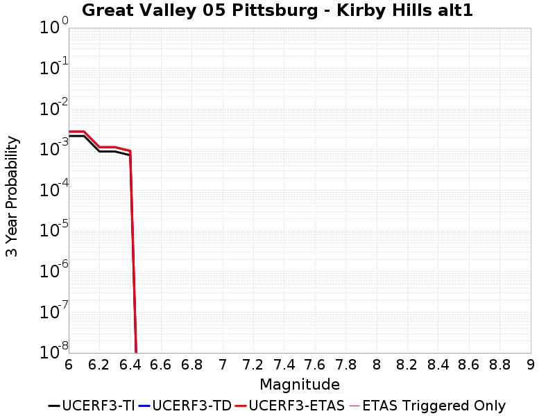 | 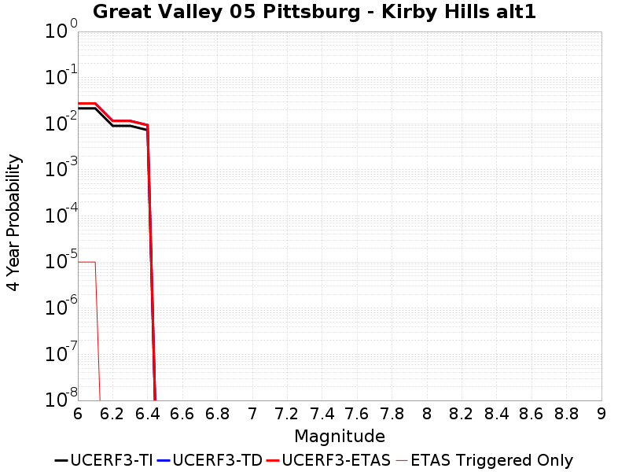 |

| Magnitude | 1 yr TI Prob | TD Prob | ETAS Prob | ETAS/TD Gain | ETAS Triggered Only | 10 yr TI Prob | TD Prob | ETAS Prob | ETAS/TD Gain | ETAS Triggered Only |
|-----|-----|-----|-----|-----|-----|-----|-----|-----|-----|-----|
| 6.0 | 0.002182488 | 0.0027857975 | 0.0027857975 | 1.0 | 0.0 | 0.021611776 | 0.02760313 | 0.027612854 | 1.0003523 | 1.0E-5 |
| 6.1 | 0.002182488 | 0.0027857975 | 0.0027857975 | 1.0 | 0.0 | 0.021611776 | 0.02760313 | 0.027612854 | 1.0003523 | 1.0E-5 |
| 6.2 | 9.050688E-4 | 0.0011557582 | 0.0011557582 | 1.0 | 0.0 | 0.009013915 | 0.011535152 | 0.011535152 | 1.0 | 0.0 |
| 6.3 | 9.050688E-4 | 0.0011557582 | 0.0011557582 | 1.0 | 0.0 | 0.009013915 | 0.011535152 | 0.011535152 | 1.0 | 0.0 |
| 6.4 | 7.3174125E-4 | 9.340307E-4 | 9.340307E-4 | 1.0 | 0.0 | 0.0072933645 | 0.009338168 | 0.009338168 | 1.0 | 0.0 |

## Elsinore (Julian)
*[(top)](#table-of-contents)*

| 1 Year | 10 Year |
|-----|-----|
|  | 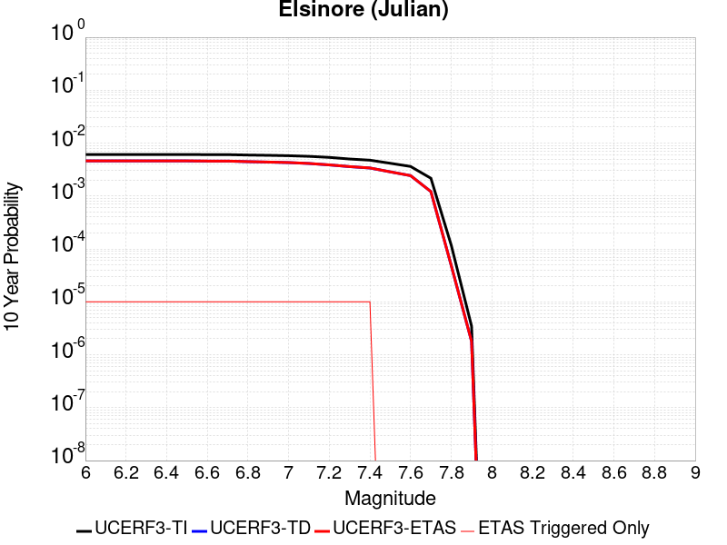 |

| Magnitude | 1 yr TI Prob | TD Prob | ETAS Prob | ETAS/TD Gain | ETAS Triggered Only | 10 yr TI Prob | TD Prob | ETAS Prob | ETAS/TD Gain | ETAS Triggered Only |
|-----|-----|-----|-----|-----|-----|-----|-----|-----|-----|-----|
| 6.0 | 6.1084004E-4 | 4.614451E-4 | 4.614451E-4 | 1.0 | 0.0 | 0.006091637 | 0.004605074 | 0.004615028 | 1.0021615 | 1.0E-5 |
| 6.1 | 6.1084004E-4 | 4.614451E-4 | 4.614451E-4 | 1.0 | 0.0 | 0.006091637 | 0.004605074 | 0.004615028 | 1.0021615 | 1.0E-5 |
| 6.2 | 6.1084004E-4 | 4.614451E-4 | 4.614451E-4 | 1.0 | 0.0 | 0.006091637 | 0.004605074 | 0.004615028 | 1.0021615 | 1.0E-5 |
| 6.3 | 6.1084004E-4 | 4.614451E-4 | 4.614451E-4 | 1.0 | 0.0 | 0.006091637 | 0.004605074 | 0.004615028 | 1.0021615 | 1.0E-5 |
| 6.4 | 6.1084004E-4 | 4.614451E-4 | 4.614451E-4 | 1.0 | 0.0 | 0.006091637 | 0.004605074 | 0.004615028 | 1.0021615 | 1.0E-5 |
| 6.5 | 6.1084004E-4 | 4.614451E-4 | 4.614451E-4 | 1.0 | 0.0 | 0.006091637 | 0.004605074 | 0.004615028 | 1.0021615 | 1.0E-5 |
| 6.6 | 6.0773146E-4 | 4.5791795E-4 | 4.5791795E-4 | 1.0 | 0.0 | 0.0060607214 | 0.0045699477 | 0.004579902 | 1.0021782 | 1.0E-5 |
| 6.7 | 6.0773146E-4 | 4.5791795E-4 | 4.5791795E-4 | 1.0 | 0.0 | 0.0060607214 | 0.0045699477 | 0.004579902 | 1.0021782 | 1.0E-5 |
| 6.8 | 5.968889E-4 | 4.4660855E-4 | 4.4660855E-4 | 1.0 | 0.0 | 0.0059528816 | 0.0044573117 | 0.0044672675 | 1.0022335 | 1.0E-5 |
| 6.9 | 5.894781E-4 | 4.3867386E-4 | 4.3867386E-4 | 1.0 | 0.0 | 0.005879169 | 0.004378279 | 0.0043882355 | 1.002274 | 1.0E-5 |
| 7.0 | 5.799422E-4 | 4.291386E-4 | 4.291386E-4 | 1.0 | 0.0 | 0.0057843104 | 0.004283298 | 0.0042932546 | 1.0023247 | 1.0E-5 |
| 7.1 | 5.6365423E-4 | 4.1274386E-4 | 4.1274386E-4 | 1.0 | 0.0 | 0.005622267 | 0.0041199685 | 0.004129927 | 1.0024172 | 1.0E-5 |
| 7.2 | 5.387599E-4 | 3.8777397E-4 | 3.8777397E-4 | 1.0 | 0.0 | 0.0053745564 | 0.0038711608 | 0.003881122 | 1.0025733 | 1.0E-5 |
| 7.3 | 5.019608E-4 | 3.5985923E-4 | 3.5985923E-4 | 1.0 | 0.0 | 0.005008285 | 0.003592937 | 0.003602901 | 1.0027733 | 1.0E-5 |
| 7.4 | 4.7703186E-4 | 3.3891905E-4 | 3.3891905E-4 | 1.0 | 0.0 | 0.0047600917 | 0.0033841652 | 0.0033941313 | 1.002945 | 1.0E-5 |
| 7.5 | 4.1676845E-4 | 2.8685725E-4 | 2.8685725E-4 | 1.0 | 0.0 | 0.0041598766 | 0.002864997 | 0.002864997 | 1.0 | 0.0 |
| 7.6 | 3.6286283E-4 | 2.4325767E-4 | 2.4325767E-4 | 1.0 | 0.0 | 0.0036227088 | 0.0024300301 | 0.0024300301 | 1.0 | 0.0 |
| 7.7 | 2.1681708E-4 | 1.2129084E-4 | 1.2129084E-4 | 1.0 | 0.0 | 0.0021660565 | 0.0012123195 | 0.0012123195 | 1.0 | 0.0 |
| 7.8 | 1.1790877E-5 | 4.869796E-6 | 4.869796E-6 | 1.0 | 0.0 | 1.17902506E-4 | 4.8697224E-5 | 4.8697224E-5 | 1.0 | 0.0 |
| 7.9 | 3.4838732E-7 | 1.794872E-7 | 1.794872E-7 | 1.0 | 0.0 | 3.4838679E-6 | 1.7948707E-6 | 1.7948707E-6 | 1.0 | 0.0 |

## Cedar Mtn-Mahogany Mtn
*[(top)](#table-of-contents)*

| 1 Year | 10 Year |
|-----|-----|
| 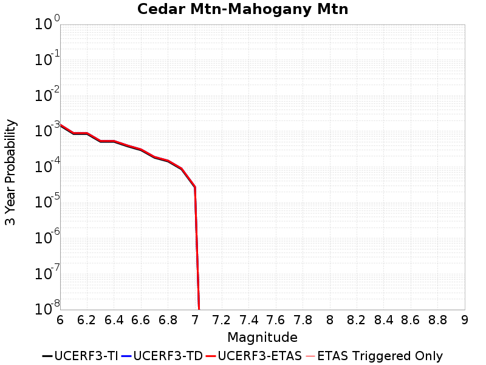 | 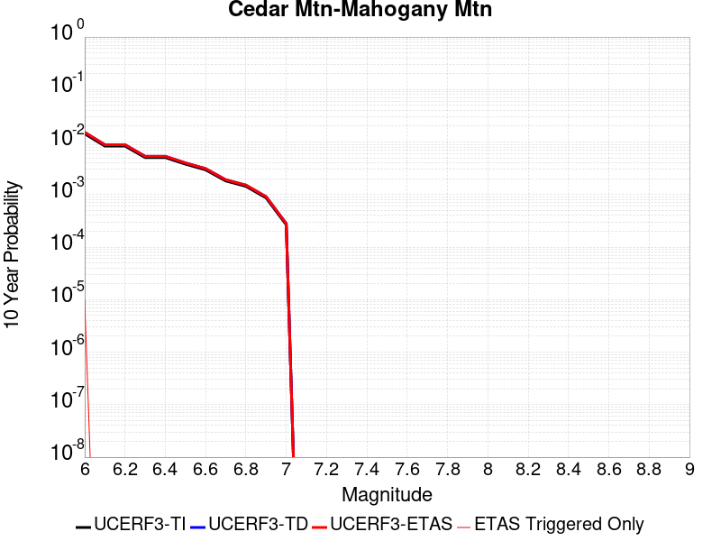 |

| Magnitude | 1 yr TI Prob | TD Prob | ETAS Prob | ETAS/TD Gain | ETAS Triggered Only | 10 yr TI Prob | TD Prob | ETAS Prob | ETAS/TD Gain | ETAS Triggered Only |
|-----|-----|-----|-----|-----|-----|-----|-----|-----|-----|-----|
| 6.0 | 0.0014476506 | 0.0015428124 | 0.0015428124 | 1.0 | 0.0 | 0.0143825635 | 0.015328238 | 0.015338085 | 1.0006424 | 1.0E-5 |
| 6.1 | 8.4298453E-4 | 8.941228E-4 | 8.941228E-4 | 1.0 | 0.0 | 0.008397939 | 0.008907066 | 0.008907066 | 1.0 | 0.0 |
| 6.2 | 8.4298453E-4 | 8.941228E-4 | 8.941228E-4 | 1.0 | 0.0 | 0.008397939 | 0.008907066 | 0.008907066 | 1.0 | 0.0 |
| 6.3 | 5.0840835E-4 | 5.374668E-4 | 5.374668E-4 | 1.0 | 0.0 | 0.0050724675 | 0.0053620883 | 0.0053620883 | 1.0 | 0.0 |
| 6.4 | 5.0840835E-4 | 5.374668E-4 | 5.374668E-4 | 1.0 | 0.0 | 0.0050724675 | 0.0053620883 | 0.0053620883 | 1.0 | 0.0 |
| 6.5 | 3.8031515E-4 | 4.0145457E-4 | 4.0145457E-4 | 1.0 | 0.0 | 0.0037966494 | 0.0040075136 | 0.0040075136 | 1.0 | 0.0 |
| 6.6 | 2.962827E-4 | 3.1245922E-4 | 3.1245922E-4 | 1.0 | 0.0 | 0.0029588798 | 0.003120335 | 0.003120335 | 1.0 | 0.0 |
| 6.7 | 1.8184677E-4 | 1.9161543E-4 | 1.9161543E-4 | 1.0 | 0.0 | 0.0018169804 | 0.001914564 | 0.001914564 | 1.0 | 0.0 |
| 6.8 | 1.4366445E-4 | 1.5138948E-4 | 1.5138948E-4 | 1.0 | 0.0 | 0.0014357162 | 0.0015129107 | 0.0015129107 | 1.0 | 0.0 |
| 6.9 | 8.6582E-5 | 9.129308E-5 | 9.129308E-5 | 1.0 | 0.0 | 8.654827E-4 | 9.125862E-4 | 9.125862E-4 | 1.0 | 0.0 |
| 7.0 | 2.6621943E-5 | 2.8120125E-5 | 2.8120125E-5 | 1.0 | 0.0 | 2.6618753E-4 | 2.8117822E-4 | 2.8117822E-4 | 1.0 | 0.0 |

## Big Pine (West)
*[(top)](#table-of-contents)*

| 1 Year | 10 Year |
|-----|-----|
| 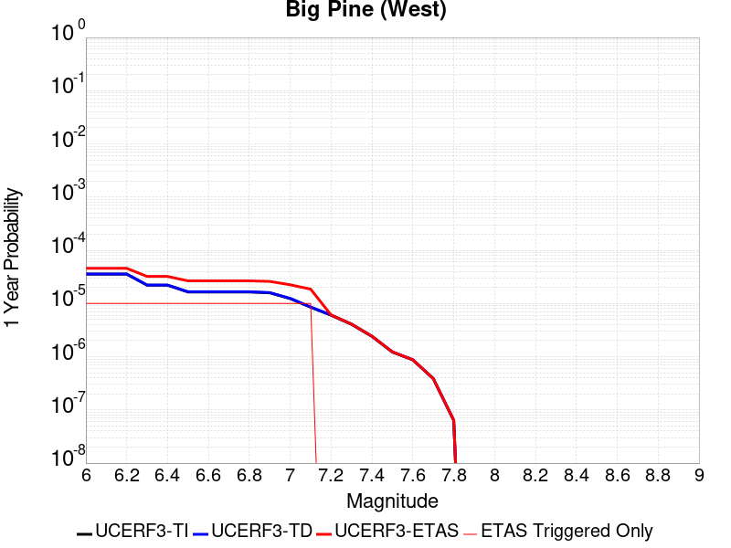 | 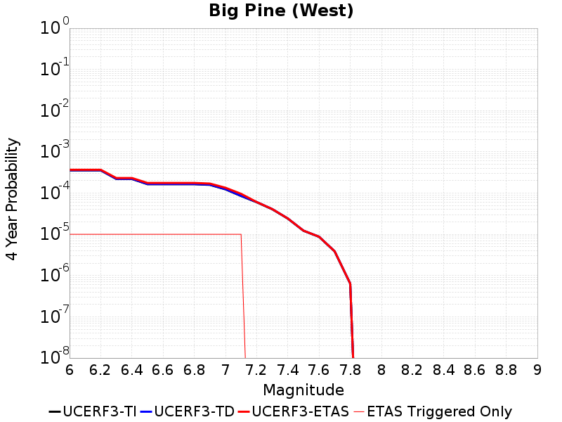 |

| Magnitude | 1 yr TI Prob | TD Prob | ETAS Prob | ETAS/TD Gain | ETAS Triggered Only | 10 yr TI Prob | TD Prob | ETAS Prob | ETAS/TD Gain | ETAS Triggered Only |
|-----|-----|-----|-----|-----|-----|-----|-----|-----|-----|-----|
| 6.0 | 3.564098E-5 | 3.590788E-5 | 4.590752E-5 | 1.2784804 | 1.0E-5 | 3.5635266E-4 | 3.5903018E-4 | 3.690266E-4 | 1.0278428 | 1.0E-5 |
| 6.1 | 3.564098E-5 | 3.590788E-5 | 4.590752E-5 | 1.2784804 | 1.0E-5 | 3.5635266E-4 | 3.5903018E-4 | 3.690266E-4 | 1.0278428 | 1.0E-5 |
| 6.2 | 3.564098E-5 | 3.590788E-5 | 4.590752E-5 | 1.2784804 | 1.0E-5 | 3.5635266E-4 | 3.5903018E-4 | 3.690266E-4 | 1.0278428 | 1.0E-5 |
| 6.3 | 2.2059045E-5 | 2.2262082E-5 | 3.2261858E-5 | 1.4491843 | 1.0E-5 | 2.2056856E-4 | 2.2260034E-4 | 2.3259812E-4 | 1.0449135 | 1.0E-5 |
| 6.4 | 2.2059045E-5 | 2.2262082E-5 | 3.2261858E-5 | 1.4491843 | 1.0E-5 | 2.2056856E-4 | 2.2260034E-4 | 2.3259812E-4 | 1.0449135 | 1.0E-5 |
| 6.5 | 1.6456155E-5 | 1.663676E-5 | 2.6636595E-5 | 1.6010685 | 1.0E-5 | 1.6454936E-4 | 1.6635556E-4 | 1.763539E-4 | 1.0601022 | 1.0E-5 |
| 6.6 | 1.6456155E-5 | 1.663676E-5 | 2.6636595E-5 | 1.6010685 | 1.0E-5 | 1.6454936E-4 | 1.6635556E-4 | 1.763539E-4 | 1.0601022 | 1.0E-5 |
| 6.7 | 1.6456155E-5 | 1.663676E-5 | 2.6636595E-5 | 1.6010685 | 1.0E-5 | 1.6454936E-4 | 1.6635556E-4 | 1.763539E-4 | 1.0601022 | 1.0E-5 |
| 6.8 | 1.6456155E-5 | 1.663676E-5 | 2.6636595E-5 | 1.6010685 | 1.0E-5 | 1.6454936E-4 | 1.6635556E-4 | 1.763539E-4 | 1.0601022 | 1.0E-5 |
| 6.9 | 1.5863254E-5 | 1.6039468E-5 | 2.6039308E-5 | 1.6234521 | 1.0E-5 | 1.5862122E-4 | 1.603835E-4 | 1.7038189E-4 | 1.0623405 | 1.0E-5 |
| 7.0 | 1.235219E-5 | 1.249373E-5 | 2.2493605E-5 | 1.8003916 | 1.0E-5 | 1.2351504E-4 | 1.2493055E-4 | 1.349293E-4 | 1.0800345 | 1.0E-5 |
| 7.1 | 8.516227E-6 | 8.617003E-6 | 1.8616916E-5 | 2.1604862 | 1.0E-5 | 8.5159016E-5 | 8.616686E-5 | 9.6166E-5 | 1.1160439 | 1.0E-5 |
| 7.2 | 6.0128964E-6 | 6.082526E-6 | 6.082526E-6 | 1.0 | 0.0 | 6.0127335E-5 | 6.0823702E-5 | 6.0823702E-5 | 1.0 | 0.0 |
| 7.3 | 4.0583395E-6 | 4.102505E-6 | 4.102505E-6 | 1.0 | 0.0 | 4.0582654E-5 | 4.102435E-5 | 4.102435E-5 | 1.0 | 0.0 |
| 7.4 | 2.4054011E-6 | 2.4274561E-6 | 2.4274561E-6 | 1.0 | 0.0 | 2.405375E-5 | 2.4274314E-5 | 2.4274314E-5 | 1.0 | 0.0 |
| 7.5 | 1.2230199E-6 | 1.2318459E-6 | 1.2318459E-6 | 1.0 | 0.0 | 1.2230132E-5 | 1.2318394E-5 | 1.2318394E-5 | 1.0 | 0.0 |
| 7.6 | 8.713697E-7 | 8.7749055E-7 | 8.7749055E-7 | 1.0 | 0.0 | 8.713663E-6 | 8.774872E-6 | 8.774872E-6 | 1.0 | 0.0 |
| 7.7 | 3.864423E-7 | 3.8894757E-7 | 3.8894757E-7 | 1.0 | 0.0 | 3.8644166E-6 | 3.8894696E-6 | 3.8894696E-6 | 1.0 | 0.0 |
| 7.8 | 6.3602684E-8 | 6.402709E-8 | 6.402709E-8 | 1.0 | 0.0 | 6.360267E-7 | 6.402708E-7 | 6.402708E-7 | 1.0 | 0.0 |

## Hayward (No) 2011 CFM
*[(top)](#table-of-contents)*

| 1 Year | 10 Year |
|-----|-----|
| 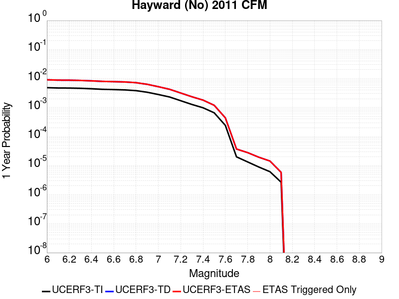 | 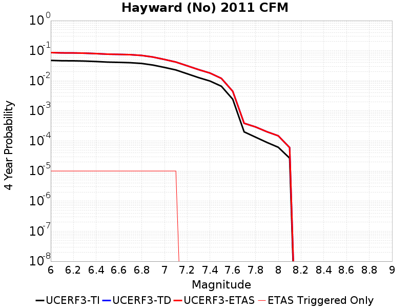 |

| Magnitude | 1 yr TI Prob | TD Prob | ETAS Prob | ETAS/TD Gain | ETAS Triggered Only | 10 yr TI Prob | TD Prob | ETAS Prob | ETAS/TD Gain | ETAS Triggered Only |
|-----|-----|-----|-----|-----|-----|-----|-----|-----|-----|-----|
| 6.0 | 0.0048446343 | 0.009036496 | 0.009036496 | 1.0 | 0.0 | 0.047403704 | 0.08637584 | 0.08638498 | 1.0001057 | 1.0E-5 |
| 6.1 | 0.0047140904 | 0.008804595 | 0.008804595 | 1.0 | 0.0 | 0.046153355 | 0.08426903 | 0.084278196 | 1.0001087 | 1.0E-5 |
| 6.2 | 0.0046887742 | 0.00876357 | 0.00876357 | 1.0 | 0.0 | 0.0459107 | 0.08389328 | 0.08390244 | 1.0001092 | 1.0E-5 |
| 6.3 | 0.004598882 | 0.008597845 | 0.008597845 | 1.0 | 0.0 | 0.04504866 | 0.082386486 | 0.08239566 | 1.0001113 | 1.0E-5 |
| 6.4 | 0.0044391346 | 0.008301334 | 0.008301334 | 1.0 | 0.0 | 0.043514993 | 0.079683326 | 0.079692535 | 1.0001155 | 1.0E-5 |
| 6.5 | 0.0042449418 | 0.007955754 | 0.007955754 | 1.0 | 0.0 | 0.04164765 | 0.07651418 | 0.076523416 | 1.0001206 | 1.0E-5 |
| 6.6 | 0.0041592065 | 0.0078026173 | 0.0078026173 | 1.0 | 0.0 | 0.04082218 | 0.0751067 | 0.07511595 | 1.0001231 | 1.0E-5 |
| 6.7 | 0.004050208 | 0.007615815 | 0.007615815 | 1.0 | 0.0 | 0.039771806 | 0.0733831 | 0.07339236 | 1.0001262 | 1.0E-5 |
| 6.8 | 0.0038166929 | 0.0071758353 | 0.0071758353 | 1.0 | 0.0 | 0.037518036 | 0.06929667 | 0.06930598 | 1.0001343 | 1.0E-5 |
| 6.9 | 0.0033642664 | 0.006310539 | 0.006310539 | 1.0 | 0.0 | 0.033137884 | 0.061225437 | 0.061234824 | 1.0001533 | 1.0E-5 |
| 7.0 | 0.0028061352 | 0.0052176286 | 0.0052176286 | 1.0 | 0.0 | 0.027709642 | 0.05095816 | 0.05096765 | 1.0001862 | 1.0E-5 |
| 7.1 | 0.0023093442 | 0.0042544906 | 0.0042544906 | 1.0 | 0.0 | 0.022854926 | 0.041825045 | 0.041834626 | 1.0002291 | 1.0E-5 |
| 7.2 | 0.0017183421 | 0.0031660802 | 0.0031660802 | 1.0 | 0.0 | 0.017051157 | 0.03137016 | 0.03137016 | 1.0 | 0.0 |
| 7.3 | 0.0012787496 | 0.002354763 | 0.002354763 | 1.0 | 0.0 | 0.0127141625 | 0.02344135 | 0.02344135 | 1.0 | 0.0 |
| 7.4 | 9.820475E-4 | 0.0018039453 | 0.0018039453 | 1.0 | 0.0 | 0.009777189 | 0.018019695 | 0.018019695 | 1.0 | 0.0 |
| 7.5 | 6.5918895E-4 | 0.0011953104 | 0.0011953104 | 1.0 | 0.0 | 0.00657237 | 0.011988971 | 0.011988971 | 1.0 | 0.0 |
| 7.6 | 2.4345852E-4 | 4.4234155E-4 | 4.4234155E-4 | 1.0 | 0.0 | 0.0024319198 | 0.0044591534 | 0.0044591534 | 1.0 | 0.0 |
| 7.7 | 2.003602E-5 | 3.722427E-5 | 3.722427E-5 | 1.0 | 0.0 | 2.0034213E-4 | 3.861629E-4 | 3.861629E-4 | 1.0 | 0.0 |
| 7.8 | 1.3377297E-5 | 2.8001043E-5 | 2.8001043E-5 | 1.0 | 0.0 | 1.3376492E-4 | 2.9245557E-4 | 2.9245557E-4 | 1.0 | 0.0 |
| 7.9 | 8.944017E-6 | 1.9458375E-5 | 1.9458375E-5 | 1.0 | 0.0 | 8.943657E-5 | 2.0246237E-4 | 2.0246237E-4 | 1.0 | 0.0 |
| 8.0 | 6.161694E-6 | 1.4354713E-5 | 1.4354713E-5 | 1.0 | 0.0 | 6.161523E-5 | 1.4817005E-4 | 1.4817005E-4 | 1.0 | 0.0 |
| 8.1 | 2.6812106E-6 | 5.8598057E-6 | 5.8598057E-6 | 1.0 | 0.0 | 2.6811784E-5 | 6.0160706E-5 | 6.0160706E-5 | 1.0 | 0.0 |

## South Cuyama
*[(top)](#table-of-contents)*

| 1 Year | 10 Year |
|-----|-----|
| 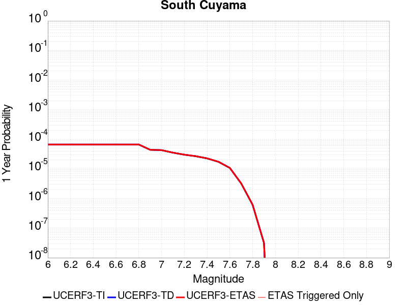 | 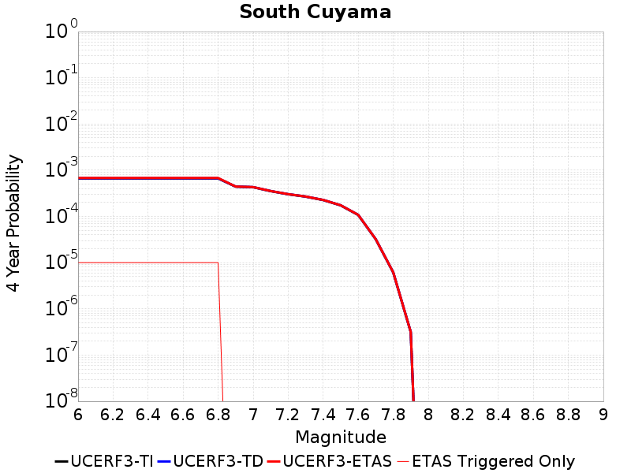 |

| Magnitude | 1 yr TI Prob | TD Prob | ETAS Prob | ETAS/TD Gain | ETAS Triggered Only | 10 yr TI Prob | TD Prob | ETAS Prob | ETAS/TD Gain | ETAS Triggered Only |
|-----|-----|-----|-----|-----|-----|-----|-----|-----|-----|-----|
| 6.0 | 6.6511464E-5 | 6.6884015E-5 | 6.6884015E-5 | 1.0 | 0.0 | 6.649156E-4 | 6.6864584E-4 | 6.7863916E-4 | 1.0149456 | 1.0E-5 |
| 6.1 | 6.6511464E-5 | 6.6884015E-5 | 6.6884015E-5 | 1.0 | 0.0 | 6.649156E-4 | 6.6864584E-4 | 6.7863916E-4 | 1.0149456 | 1.0E-5 |
| 6.2 | 6.6511464E-5 | 6.6884015E-5 | 6.6884015E-5 | 1.0 | 0.0 | 6.649156E-4 | 6.6864584E-4 | 6.7863916E-4 | 1.0149456 | 1.0E-5 |
| 6.3 | 6.6511464E-5 | 6.6884015E-5 | 6.6884015E-5 | 1.0 | 0.0 | 6.649156E-4 | 6.6864584E-4 | 6.7863916E-4 | 1.0149456 | 1.0E-5 |
| 6.4 | 6.6511464E-5 | 6.6884015E-5 | 6.6884015E-5 | 1.0 | 0.0 | 6.649156E-4 | 6.6864584E-4 | 6.7863916E-4 | 1.0149456 | 1.0E-5 |
| 6.5 | 6.6511464E-5 | 6.6884015E-5 | 6.6884015E-5 | 1.0 | 0.0 | 6.649156E-4 | 6.6864584E-4 | 6.7863916E-4 | 1.0149456 | 1.0E-5 |
| 6.6 | 6.6511464E-5 | 6.6884015E-5 | 6.6884015E-5 | 1.0 | 0.0 | 6.649156E-4 | 6.6864584E-4 | 6.7863916E-4 | 1.0149456 | 1.0E-5 |
| 6.7 | 6.6511464E-5 | 6.6884015E-5 | 6.6884015E-5 | 1.0 | 0.0 | 6.649156E-4 | 6.6864584E-4 | 6.7863916E-4 | 1.0149456 | 1.0E-5 |
| 6.8 | 6.6511464E-5 | 6.6884015E-5 | 6.6884015E-5 | 1.0 | 0.0 | 6.649156E-4 | 6.6864584E-4 | 6.7863916E-4 | 1.0149456 | 1.0E-5 |
| 6.9 | 4.4124543E-5 | 4.4391963E-5 | 4.4391963E-5 | 1.0 | 0.0 | 4.4115784E-4 | 4.43832E-4 | 4.43832E-4 | 1.0 | 0.0 |
| 7.0 | 4.293053E-5 | 4.319158E-5 | 4.319158E-5 | 1.0 | 0.0 | 4.292224E-4 | 4.3183286E-4 | 4.3183286E-4 | 1.0 | 0.0 |
| 7.1 | 3.5304394E-5 | 3.5528457E-5 | 3.5528457E-5 | 1.0 | 0.0 | 3.5298787E-4 | 3.5522814E-4 | 3.5522814E-4 | 1.0 | 0.0 |
| 7.2 | 3.0176174E-5 | 3.0373694E-5 | 3.0373694E-5 | 1.0 | 0.0 | 3.0172078E-4 | 3.0369568E-4 | 3.0369568E-4 | 1.0 | 0.0 |
| 7.3 | 2.6802521E-5 | 2.6980862E-5 | 2.6980862E-5 | 1.0 | 0.0 | 2.679929E-4 | 2.6977606E-4 | 2.6977606E-4 | 1.0 | 0.0 |
| 7.4 | 2.2629749E-5 | 2.2783712E-5 | 2.2783712E-5 | 1.0 | 0.0 | 2.2627445E-4 | 2.2781393E-4 | 2.2781393E-4 | 1.0 | 0.0 |
| 7.5 | 1.7345352E-5 | 1.7467395E-5 | 1.7467395E-5 | 1.0 | 0.0 | 1.7343998E-4 | 1.7466034E-4 | 1.7466034E-4 | 1.0 | 0.0 |
| 7.6 | 1.0763096E-5 | 1.0842077E-5 | 1.0842077E-5 | 1.0 | 0.0 | 1.0762575E-4 | 1.0841557E-4 | 1.0841557E-4 | 1.0 | 0.0 |
| 7.7 | 3.2102084E-6 | 3.234182E-6 | 3.234182E-6 | 1.0 | 0.0 | 3.210162E-5 | 3.234136E-5 | 3.234136E-5 | 1.0 | 0.0 |
| 7.8 | 6.1391063E-7 | 6.195377E-7 | 6.195377E-7 | 1.0 | 0.0 | 6.1390897E-6 | 6.1953606E-6 | 6.1953606E-6 | 1.0 | 0.0 |
| 7.9 | 3.1506335E-8 | 3.1831956E-8 | 3.1831956E-8 | 1.0 | 0.0 | 3.1506332E-7 | 3.1831954E-7 | 3.1831954E-7 | 1.0 | 0.0 |

## San Andreas (Peninsula) 2011 CFM
*[(top)](#table-of-contents)*

| 1 Year | 10 Year |
|-----|-----|
| 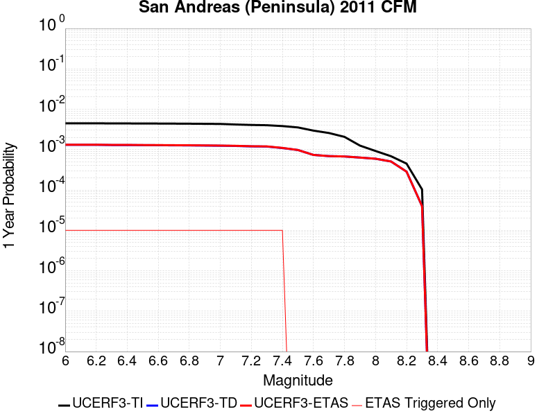 | 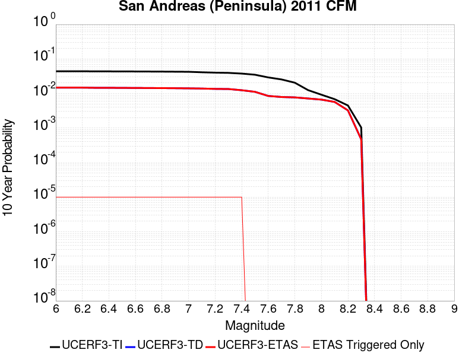 |

| Magnitude | 1 yr TI Prob | TD Prob | ETAS Prob | ETAS/TD Gain | ETAS Triggered Only | 10 yr TI Prob | TD Prob | ETAS Prob | ETAS/TD Gain | ETAS Triggered Only |
|-----|-----|-----|-----|-----|-----|-----|-----|-----|-----|-----|
| 6.0 | 0.0044879215 | 0.0013148591 | 0.001324846 | 1.0075954 | 1.0E-5 | 0.043983612 | 0.014775459 | 0.014785311 | 1.0006669 | 1.0E-5 |
| 6.1 | 0.0044879215 | 0.0013148591 | 0.001324846 | 1.0075954 | 1.0E-5 | 0.043983612 | 0.014775459 | 0.014785311 | 1.0006669 | 1.0E-5 |
| 6.2 | 0.0044879215 | 0.0013148591 | 0.001324846 | 1.0075954 | 1.0E-5 | 0.043983612 | 0.014775459 | 0.014785311 | 1.0006669 | 1.0E-5 |
| 6.3 | 0.004452125 | 0.0012988036 | 0.0013087906 | 1.0076894 | 1.0E-5 | 0.043639794 | 0.014602426 | 0.014612281 | 1.0006748 | 1.0E-5 |
| 6.4 | 0.004452125 | 0.0012988036 | 0.0013087906 | 1.0076894 | 1.0E-5 | 0.043639794 | 0.014602426 | 0.014612281 | 1.0006748 | 1.0E-5 |
| 6.5 | 0.004431336 | 0.0012894986 | 0.0012994858 | 1.0077449 | 1.0E-5 | 0.04344007 | 0.0145022 | 0.014512056 | 1.0006795 | 1.0E-5 |
| 6.6 | 0.0044247704 | 0.0012858837 | 0.0012958708 | 1.0077667 | 1.0E-5 | 0.043376986 | 0.014464267 | 0.014474122 | 1.0006814 | 1.0E-5 |
| 6.7 | 0.004406125 | 0.0012769462 | 0.0012869334 | 1.0078212 | 1.0E-5 | 0.043197807 | 0.014369071 | 0.014378928 | 1.0006859 | 1.0E-5 |
| 6.8 | 0.004385734 | 0.0012715161 | 0.0012815034 | 1.0078546 | 1.0E-5 | 0.043001823 | 0.014309754 | 0.014319611 | 1.0006888 | 1.0E-5 |
| 6.9 | 0.004355922 | 0.0012613323 | 0.0012713197 | 1.0079181 | 1.0E-5 | 0.04271523 | 0.014202234 | 0.014212092 | 1.0006942 | 1.0E-5 |
| 7.0 | 0.004326499 | 0.001248902 | 0.0012588894 | 1.007997 | 1.0E-5 | 0.042432297 | 0.014073216 | 0.014083075 | 1.0007006 | 1.0E-5 |
| 7.1 | 0.0041871946 | 0.0012325579 | 0.0012425455 | 1.0081033 | 1.0E-5 | 0.041091725 | 0.013896011 | 0.013905872 | 1.0007097 | 1.0E-5 |
| 7.2 | 0.004084008 | 0.0012025178 | 0.0012125057 | 1.0083059 | 1.0E-5 | 0.040097635 | 0.013580051 | 0.013589916 | 1.0007263 | 1.0E-5 |
| 7.3 | 0.004020803 | 0.001191301 | 0.0012012891 | 1.0083842 | 1.0E-5 | 0.03948827 | 0.013463744 | 0.013473609 | 1.0007328 | 1.0E-5 |
| 7.4 | 0.0038298194 | 0.0010931871 | 0.0011031762 | 1.0091375 | 1.0E-5 | 0.037644852 | 0.012420489 | 0.012430365 | 1.0007951 | 1.0E-5 |
| 7.5 | 0.0035452035 | 9.788338E-4 | 9.788338E-4 | 1.0 | 0.0 | 0.034891766 | 0.011173408 | 0.011173408 | 1.0 | 0.0 |
| 7.6 | 0.0029558712 | 7.395773E-4 | 7.395773E-4 | 1.0 | 0.0 | 0.02916862 | 0.008486287 | 0.008486287 | 1.0 | 0.0 |
| 7.7 | 0.002578006 | 6.909967E-4 | 6.909967E-4 | 1.0 | 0.0 | 0.02548303 | 0.007908564 | 0.007908564 | 1.0 | 0.0 |
| 7.8 | 0.0020703338 | 6.772456E-4 | 6.772456E-4 | 1.0 | 0.0 | 0.020511515 | 0.00771911 | 0.00771911 | 1.0 | 0.0 |
| 7.9 | 0.001257516 | 6.356827E-4 | 6.356827E-4 | 1.0 | 0.0 | 0.012504238 | 0.007159613 | 0.007159613 | 1.0 | 0.0 |
| 8.0 | 9.260915E-4 | 5.95232E-4 | 5.95232E-4 | 1.0 | 0.0 | 0.009222416 | 0.006659987 | 0.006659987 | 1.0 | 0.0 |
| 8.1 | 6.864001E-4 | 5.0845655E-4 | 5.0845655E-4 | 1.0 | 0.0 | 0.0068428386 | 0.0056899576 | 0.0056899576 | 1.0 | 0.0 |
| 8.2 | 4.5048463E-4 | 2.8524006E-4 | 2.8524006E-4 | 1.0 | 0.0 | 0.004495725 | 0.0032447556 | 0.0032447556 | 1.0 | 0.0 |
| 8.3 | 1.034694E-4 | 3.9971612E-5 | 3.9971612E-5 | 1.0 | 0.0 | 0.0010342124 | 4.7201355E-4 | 4.7201355E-4 | 1.0 | 0.0 |

## San Gorgonio Pass
*[(top)](#table-of-contents)*

| 1 Year | 10 Year |
|-----|-----|
| 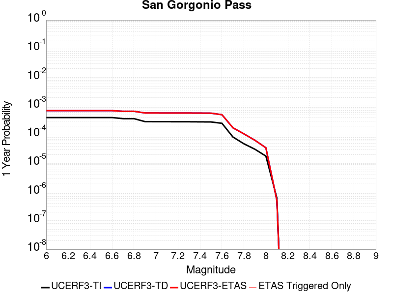 | 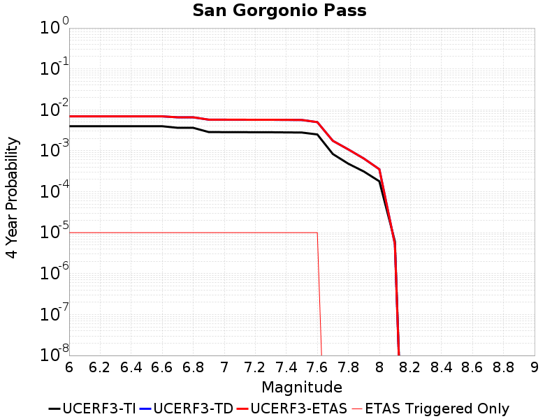 |

| Magnitude | 1 yr TI Prob | TD Prob | ETAS Prob | ETAS/TD Gain | ETAS Triggered Only | 10 yr TI Prob | TD Prob | ETAS Prob | ETAS/TD Gain | ETAS Triggered Only |
|-----|-----|-----|-----|-----|-----|-----|-----|-----|-----|-----|
| 6.0 | 3.987921E-4 | 6.9450017E-4 | 6.9450017E-4 | 1.0 | 0.0 | 0.003980772 | 0.0069300802 | 0.006940011 | 1.001433 | 1.0E-5 |
| 6.1 | 3.987921E-4 | 6.9450017E-4 | 6.9450017E-4 | 1.0 | 0.0 | 0.003980772 | 0.0069300802 | 0.006940011 | 1.001433 | 1.0E-5 |
| 6.2 | 3.987921E-4 | 6.9450017E-4 | 6.9450017E-4 | 1.0 | 0.0 | 0.003980772 | 0.0069300802 | 0.006940011 | 1.001433 | 1.0E-5 |
| 6.3 | 3.987921E-4 | 6.9450017E-4 | 6.9450017E-4 | 1.0 | 0.0 | 0.003980772 | 0.0069300802 | 0.006940011 | 1.001433 | 1.0E-5 |
| 6.4 | 3.987921E-4 | 6.9450017E-4 | 6.9450017E-4 | 1.0 | 0.0 | 0.003980772 | 0.0069300802 | 0.006940011 | 1.001433 | 1.0E-5 |
| 6.5 | 3.987921E-4 | 6.9450017E-4 | 6.9450017E-4 | 1.0 | 0.0 | 0.003980772 | 0.0069300802 | 0.006940011 | 1.001433 | 1.0E-5 |
| 6.6 | 3.987921E-4 | 6.9450017E-4 | 6.9450017E-4 | 1.0 | 0.0 | 0.003980772 | 0.0069300802 | 0.006940011 | 1.001433 | 1.0E-5 |
| 6.7 | 3.645371E-4 | 6.582217E-4 | 6.582217E-4 | 1.0 | 0.0 | 0.0036393967 | 0.006569456 | 0.0065793903 | 1.0015122 | 1.0E-5 |
| 6.8 | 3.645371E-4 | 6.582217E-4 | 6.582217E-4 | 1.0 | 0.0 | 0.0036393967 | 0.006569456 | 0.0065793903 | 1.0015122 | 1.0E-5 |
| 6.9 | 2.8718702E-4 | 5.763927E-4 | 5.763927E-4 | 1.0 | 0.0 | 0.0028681618 | 0.0057554077 | 0.00576535 | 1.0017275 | 1.0E-5 |
| 7.0 | 2.8603288E-4 | 5.7515886E-4 | 5.7515886E-4 | 1.0 | 0.0 | 0.00285665 | 0.0057431334 | 0.005753076 | 1.0017312 | 1.0E-5 |
| 7.1 | 2.8533922E-4 | 5.744137E-4 | 5.744137E-4 | 1.0 | 0.0 | 0.0028497311 | 0.00573572 | 0.0057456624 | 1.0017334 | 1.0E-5 |
| 7.2 | 2.8452452E-4 | 5.735285E-4 | 5.735285E-4 | 1.0 | 0.0 | 0.002841605 | 0.005726914 | 0.0057368567 | 1.0017362 | 1.0E-5 |
| 7.3 | 2.8392827E-4 | 5.7284656E-4 | 5.7284656E-4 | 1.0 | 0.0 | 0.0028356577 | 0.0057201297 | 0.0057300725 | 1.0017382 | 1.0E-5 |
| 7.4 | 2.8165206E-4 | 5.7010166E-4 | 5.7010166E-4 | 1.0 | 0.0 | 0.0028129534 | 0.005692822 | 0.005702765 | 1.0017467 | 1.0E-5 |
| 7.5 | 2.7952815E-4 | 5.6627113E-4 | 5.6627113E-4 | 1.0 | 0.0 | 0.002791768 | 0.005654736 | 0.0056646797 | 1.0017585 | 1.0E-5 |
| 7.6 | 2.5090357E-4 | 5.009977E-4 | 5.009977E-4 | 1.0 | 0.0 | 0.0025062046 | 0.005005396 | 0.005015346 | 1.0019878 | 1.0E-5 |
| 7.7 | 8.343615E-5 | 1.749381E-4 | 1.749381E-4 | 1.0 | 0.0 | 8.340483E-4 | 0.0017534576 | 0.0017534576 | 1.0 | 0.0 |
| 7.8 | 4.8307855E-5 | 1.07381384E-4 | 1.07381384E-4 | 1.0 | 0.0 | 4.8297356E-4 | 0.0010787245 | 0.0010787245 | 1.0 | 0.0 |
| 7.9 | 3.117922E-5 | 6.413755E-5 | 6.413755E-5 | 1.0 | 0.0 | 3.1174847E-4 | 6.4633635E-4 | 6.4633635E-4 | 1.0 | 0.0 |
| 8.0 | 1.7956432E-5 | 3.5038167E-5 | 3.5038167E-5 | 1.0 | 0.0 | 1.7954981E-4 | 3.537552E-4 | 3.537552E-4 | 1.0 | 0.0 |
| 8.1 | 6.1506677E-7 | 5.027503E-7 | 5.027503E-7 | 1.0 | 0.0 | 6.1506507E-6 | 5.2429227E-6 | 5.2429227E-6 | 1.0 | 0.0 |

## Earthquake Valley (So Extension)
*[(top)](#table-of-contents)*

| 1 Year | 10 Year |
|-----|-----|
| 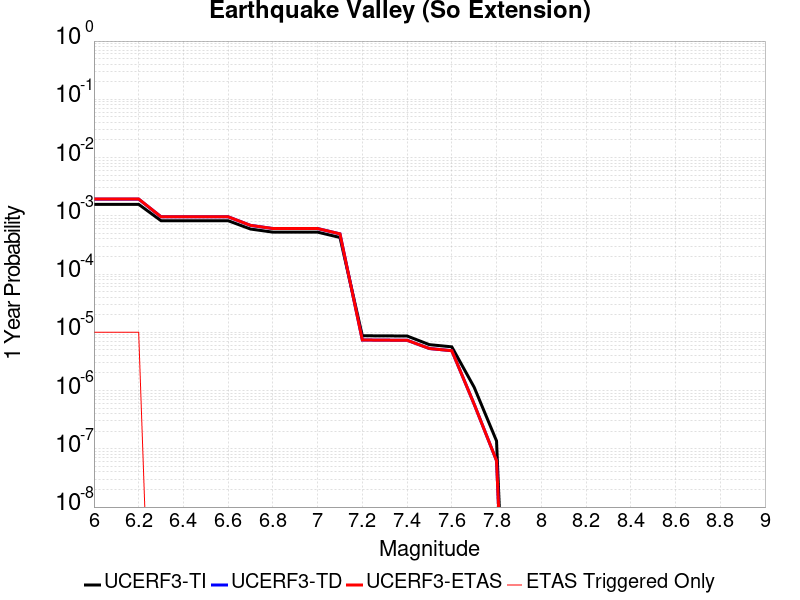 | 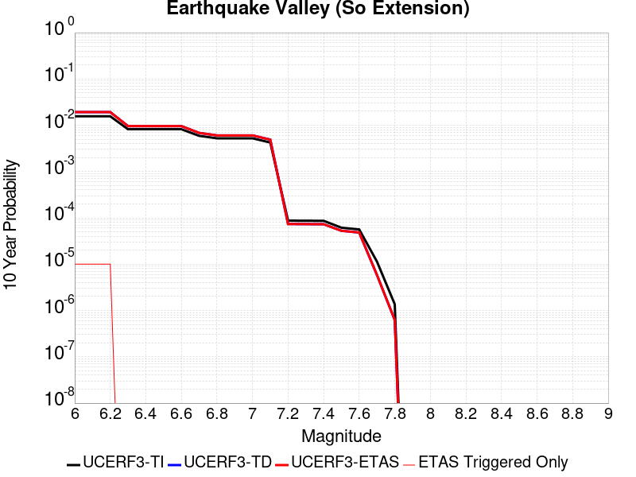 |

| Magnitude | 1 yr TI Prob | TD Prob | ETAS Prob | ETAS/TD Gain | ETAS Triggered Only | 10 yr TI Prob | TD Prob | ETAS Prob | ETAS/TD Gain | ETAS Triggered Only |
|-----|-----|-----|-----|-----|-----|-----|-----|-----|-----|-----|
| 6.0 | 0.0015743093 | 0.001933123 | 0.0019431036 | 1.005163 | 1.0E-5 | 0.01563203 | 0.019213073 | 0.01922288 | 1.0005105 | 1.0E-5 |
| 6.1 | 0.0015743093 | 0.001933123 | 0.0019431036 | 1.005163 | 1.0E-5 | 0.01563203 | 0.019213073 | 0.01922288 | 1.0005105 | 1.0E-5 |
| 6.2 | 0.0015743093 | 0.001933123 | 0.0019431036 | 1.005163 | 1.0E-5 | 0.01563203 | 0.019213073 | 0.01922288 | 1.0005105 | 1.0E-5 |
| 6.3 | 8.238434E-4 | 9.62183E-4 | 9.62183E-4 | 1.0 | 0.0 | 0.008207959 | 0.009591081 | 0.009591081 | 1.0 | 0.0 |
| 6.4 | 8.238434E-4 | 9.62183E-4 | 9.62183E-4 | 1.0 | 0.0 | 0.008207959 | 0.009591081 | 0.009591081 | 1.0 | 0.0 |
| 6.5 | 8.238434E-4 | 9.62183E-4 | 9.62183E-4 | 1.0 | 0.0 | 0.008207959 | 0.009591081 | 0.009591081 | 1.0 | 0.0 |
| 6.6 | 8.238434E-4 | 9.62183E-4 | 9.62183E-4 | 1.0 | 0.0 | 0.008207959 | 0.009591081 | 0.009591081 | 1.0 | 0.0 |
| 6.7 | 5.927367E-4 | 6.8538974E-4 | 6.8538974E-4 | 1.0 | 0.0 | 0.0059115817 | 0.006840232 | 0.006840232 | 1.0 | 0.0 |
| 6.8 | 5.242395E-4 | 6.048757E-4 | 6.048757E-4 | 1.0 | 0.0 | 0.0052300454 | 0.00603947 | 0.00603947 | 1.0 | 0.0 |
| 6.9 | 5.242395E-4 | 6.048757E-4 | 6.048757E-4 | 1.0 | 0.0 | 0.0052300454 | 0.00603947 | 0.00603947 | 1.0 | 0.0 |
| 7.0 | 5.242395E-4 | 6.048757E-4 | 6.048757E-4 | 1.0 | 0.0 | 0.0052300454 | 0.00603947 | 0.00603947 | 1.0 | 0.0 |
| 7.1 | 4.2465836E-4 | 4.895705E-4 | 4.895705E-4 | 1.0 | 0.0 | 0.0042384774 | 0.004891496 | 0.004891496 | 1.0 | 0.0 |
| 7.2 | 8.733795E-6 | 7.385417E-6 | 7.385417E-6 | 1.0 | 0.0 | 8.733451E-5 | 7.385207E-5 | 7.385207E-5 | 1.0 | 0.0 |
| 7.3 | 8.678364E-6 | 7.332315E-6 | 7.332315E-6 | 1.0 | 0.0 | 8.6780245E-5 | 7.332108E-5 | 7.332108E-5 | 1.0 | 0.0 |
| 7.4 | 8.645519E-6 | 7.303423E-6 | 7.303423E-6 | 1.0 | 0.0 | 8.645182E-5 | 7.3032184E-5 | 7.3032184E-5 | 1.0 | 0.0 |
| 7.5 | 6.138558E-6 | 5.2679093E-6 | 5.2679093E-6 | 1.0 | 0.0 | 6.1383886E-5 | 5.267806E-5 | 5.267806E-5 | 1.0 | 0.0 |
| 7.6 | 5.6314925E-6 | 4.832125E-6 | 4.832125E-6 | 1.0 | 0.0 | 5.63135E-5 | 4.832041E-5 | 4.832041E-5 | 1.0 | 0.0 |
| 7.7 | 1.1388961E-6 | 5.8338594E-7 | 5.8338594E-7 | 1.0 | 0.0 | 1.1388902E-5 | 5.8338496E-6 | 5.8338496E-6 | 1.0 | 0.0 |
| 7.8 | 1.3654947E-7 | 6.245528E-8 | 6.245528E-8 | 1.0 | 0.0 | 1.365494E-6 | 6.2455274E-7 | 6.2455274E-7 | 1.0 | 0.0 |

## Burnt Mtn
*[(top)](#table-of-contents)*

| 1 Year | 10 Year |
|-----|-----|
| 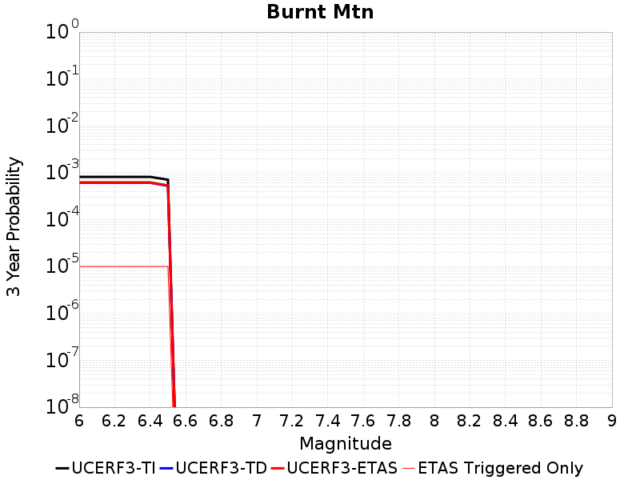 | 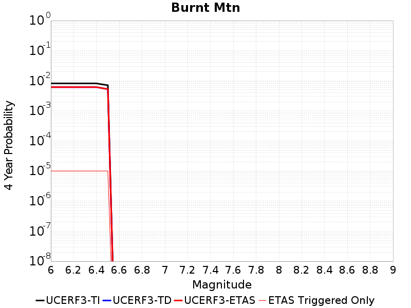 |

| Magnitude | 1 yr TI Prob | TD Prob | ETAS Prob | ETAS/TD Gain | ETAS Triggered Only | 10 yr TI Prob | TD Prob | ETAS Prob | ETAS/TD Gain | ETAS Triggered Only |
|-----|-----|-----|-----|-----|-----|-----|-----|-----|-----|-----|
| 6.0 | 8.1747473E-4 | 6.130216E-4 | 6.2301545E-4 | 1.0163026 | 1.0E-5 | 0.008144741 | 0.0061259465 | 0.006135885 | 1.0016224 | 1.0E-5 |
| 6.1 | 8.1747473E-4 | 6.130216E-4 | 6.2301545E-4 | 1.0163026 | 1.0E-5 | 0.008144741 | 0.0061259465 | 0.006135885 | 1.0016224 | 1.0E-5 |
| 6.2 | 8.1747473E-4 | 6.130216E-4 | 6.2301545E-4 | 1.0163026 | 1.0E-5 | 0.008144741 | 0.0061259465 | 0.006135885 | 1.0016224 | 1.0E-5 |
| 6.3 | 8.1747473E-4 | 6.130216E-4 | 6.2301545E-4 | 1.0163026 | 1.0E-5 | 0.008144741 | 0.0061259465 | 0.006135885 | 1.0016224 | 1.0E-5 |
| 6.4 | 8.1747473E-4 | 6.130216E-4 | 6.2301545E-4 | 1.0163026 | 1.0E-5 | 0.008144741 | 0.0061259465 | 0.006135885 | 1.0016224 | 1.0E-5 |
| 6.5 | 7.103795E-4 | 5.258719E-4 | 5.3586665E-4 | 1.019006 | 1.0E-5 | 0.0070811296 | 0.005258719 | 0.0052686664 | 1.0018916 | 1.0E-5 |

## Los Osos 2011
*[(top)](#table-of-contents)*

| 1 Year | 10 Year |
|-----|-----|
| 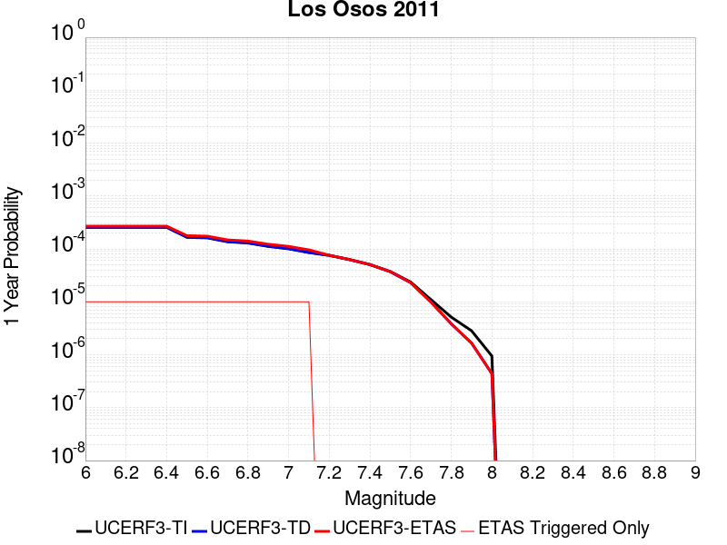 | 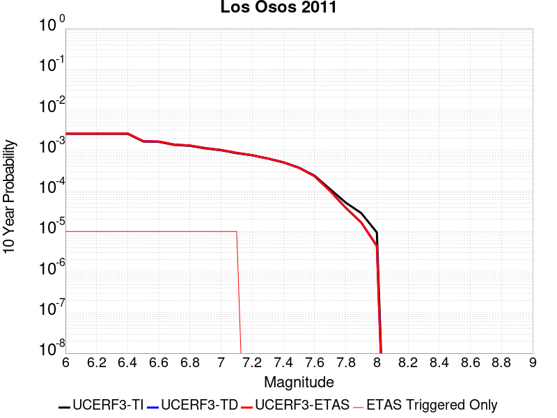 |

| Magnitude | 1 yr TI Prob | TD Prob | ETAS Prob | ETAS/TD Gain | ETAS Triggered Only | 10 yr TI Prob | TD Prob | ETAS Prob | ETAS/TD Gain | ETAS Triggered Only |
|-----|-----|-----|-----|-----|-----|-----|-----|-----|-----|-----|
| 6.0 | 2.5497406E-4 | 2.5989662E-4 | 2.6989402E-4 | 1.0384668 | 1.0E-5 | 0.002546817 | 0.0025962014 | 0.0026061754 | 1.0038418 | 1.0E-5 |
| 6.1 | 2.5497406E-4 | 2.5989662E-4 | 2.6989402E-4 | 1.0384668 | 1.0E-5 | 0.002546817 | 0.0025962014 | 0.0026061754 | 1.0038418 | 1.0E-5 |
| 6.2 | 2.5497406E-4 | 2.5989662E-4 | 2.6989402E-4 | 1.0384668 | 1.0E-5 | 0.002546817 | 0.0025962014 | 0.0026061754 | 1.0038418 | 1.0E-5 |
| 6.3 | 2.5497406E-4 | 2.5989662E-4 | 2.6989402E-4 | 1.0384668 | 1.0E-5 | 0.002546817 | 0.0025962014 | 0.0026061754 | 1.0038418 | 1.0E-5 |
| 6.4 | 2.5497406E-4 | 2.5989662E-4 | 2.6989402E-4 | 1.0384668 | 1.0E-5 | 0.002546817 | 0.0025962014 | 0.0026061754 | 1.0038418 | 1.0E-5 |
| 6.5 | 1.6551818E-4 | 1.6817848E-4 | 1.781768E-4 | 1.0594506 | 1.0E-5 | 0.0016539496 | 0.0016805256 | 0.0016905088 | 1.0059406 | 1.0E-5 |
| 6.6 | 1.618586E-4 | 1.6440707E-4 | 1.7440543E-4 | 1.0608146 | 1.0E-5 | 0.0016174077 | 0.0016428672 | 0.0016528508 | 1.0060769 | 1.0E-5 |
| 6.7 | 1.3625617E-4 | 1.3822134E-4 | 1.4821994E-4 | 1.0723377 | 1.0E-5 | 0.0013617266 | 0.0013813581 | 0.0013913444 | 1.0072292 | 1.0E-5 |
| 6.8 | 1.2929492E-4 | 1.3107255E-4 | 1.4107124E-4 | 1.0762836 | 1.0E-5 | 0.0012921972 | 0.0013099565 | 0.0013199435 | 1.0076238 | 1.0E-5 |
| 6.9 | 1.1153249E-4 | 1.1288245E-4 | 1.2288132E-4 | 1.0885777 | 1.0E-5 | 0.0011147653 | 0.0011282531 | 0.0011382417 | 1.0088533 | 1.0E-5 |
| 7.0 | 1.0061036E-4 | 1.0171495E-4 | 1.1171393E-4 | 1.0983039 | 1.0E-5 | 0.0010056482 | 0.0010166854 | 0.0010266752 | 1.0098258 | 1.0E-5 |
| 7.1 | 8.532523E-5 | 8.6096894E-5 | 9.609603E-5 | 1.1161382 | 1.0E-5 | 8.529247E-4 | 8.606361E-4 | 8.706275E-4 | 1.0116093 | 1.0E-5 |
| 7.2 | 7.537582E-5 | 7.593448E-5 | 7.593448E-5 | 1.0 | 0.0 | 7.535026E-4 | 7.590859E-4 | 7.590859E-4 | 1.0 | 0.0 |
| 7.3 | 6.268844E-5 | 6.2972795E-5 | 6.2972795E-5 | 1.0 | 0.0 | 6.267076E-4 | 6.295499E-4 | 6.295499E-4 | 1.0 | 0.0 |
| 7.4 | 5.0652303E-5 | 5.0662988E-5 | 5.0662988E-5 | 1.0 | 0.0 | 5.064076E-4 | 5.065146E-4 | 5.065146E-4 | 1.0 | 0.0 |
| 7.5 | 3.743696E-5 | 3.7123962E-5 | 3.7123962E-5 | 1.0 | 0.0 | 3.7430652E-4 | 3.7117777E-4 | 3.7117777E-4 | 1.0 | 0.0 |
| 7.6 | 2.3759641E-5 | 2.3066828E-5 | 2.3066828E-5 | 1.0 | 0.0 | 2.37571E-4 | 2.3064444E-4 | 2.3064444E-4 | 1.0 | 0.0 |
| 7.7 | 1.1047998E-5 | 9.945626E-6 | 9.945626E-6 | 1.0 | 0.0 | 1.1047449E-4 | 9.945183E-5 | 9.945183E-5 | 1.0 | 0.0 |
| 7.8 | 5.1518946E-6 | 3.844303E-6 | 3.844303E-6 | 1.0 | 0.0 | 5.1517753E-5 | 3.8442373E-5 | 3.8442373E-5 | 1.0 | 0.0 |
| 7.9 | 2.8384638E-6 | 1.663477E-6 | 1.663477E-6 | 1.0 | 0.0 | 2.8384275E-5 | 1.6634647E-5 | 1.6634647E-5 | 1.0 | 0.0 |
| 8.0 | 9.481901E-7 | 4.3938877E-7 | 4.3938877E-7 | 1.0 | 0.0 | 9.481861E-6 | 4.3938794E-6 | 4.3938794E-6 | 1.0 | 0.0 |

## Malibu Coast (Extension) alt 1
*[(top)](#table-of-contents)*

| 1 Year | 10 Year |
|-----|-----|
| 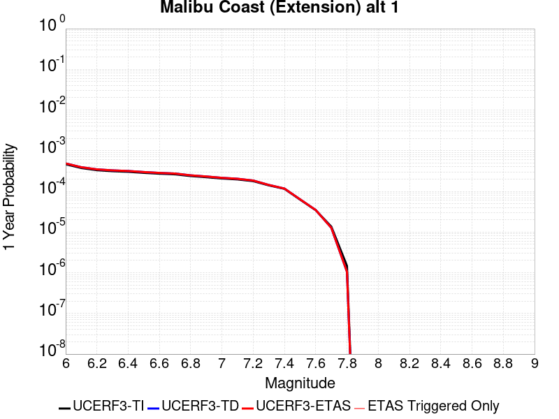 | 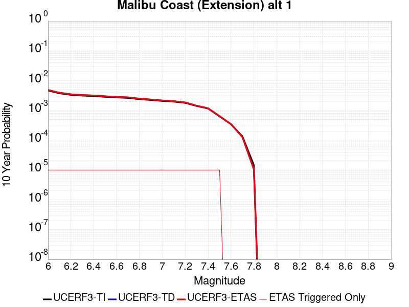 |

| Magnitude | 1 yr TI Prob | TD Prob | ETAS Prob | ETAS/TD Gain | ETAS Triggered Only | 10 yr TI Prob | TD Prob | ETAS Prob | ETAS/TD Gain | ETAS Triggered Only |
|-----|-----|-----|-----|-----|-----|-----|-----|-----|-----|-----|
| 6.0 | 4.6588664E-4 | 4.8667428E-4 | 4.8667428E-4 | 1.0 | 0.0 | 0.0046491115 | 0.0048562675 | 0.0048662187 | 1.0020492 | 1.0E-5 |
| 6.1 | 3.75614E-4 | 3.9284534E-4 | 3.9284534E-4 | 1.0 | 0.0 | 0.0037497976 | 0.0039215754 | 0.003931536 | 1.00254 | 1.0E-5 |
| 6.2 | 3.3243504E-4 | 3.4780498E-4 | 3.4780498E-4 | 1.0 | 0.0 | 0.0033193815 | 0.0034726465 | 0.0034826116 | 1.0028696 | 1.0E-5 |
| 6.3 | 3.1387596E-4 | 3.2842005E-4 | 3.2842005E-4 | 1.0 | 0.0 | 0.00313433 | 0.0032793833 | 0.0032893505 | 1.0030394 | 1.0E-5 |
| 6.4 | 3.031379E-4 | 3.171732E-4 | 3.171732E-4 | 1.0 | 0.0 | 0.0030272473 | 0.00316724 | 0.0031772081 | 1.0031474 | 1.0E-5 |
| 6.5 | 2.8573806E-4 | 2.9881022E-4 | 2.9881022E-4 | 1.0 | 0.0 | 0.0028537093 | 0.0029841163 | 0.0029940864 | 1.0033411 | 1.0E-5 |
| 6.6 | 2.7246025E-4 | 2.8478165E-4 | 2.8478165E-4 | 1.0 | 0.0 | 0.0027212645 | 0.0028441977 | 0.0028541693 | 1.003506 | 1.0E-5 |
| 6.7 | 2.6261783E-4 | 2.743761E-4 | 2.743761E-4 | 1.0 | 0.0 | 0.002623077 | 0.0027404034 | 0.002750376 | 1.0036391 | 1.0E-5 |
| 6.8 | 2.3830103E-4 | 2.482732E-4 | 2.482732E-4 | 1.0 | 0.0 | 0.0023804565 | 0.002479978 | 0.002489953 | 1.0040222 | 1.0E-5 |
| 6.9 | 2.2331243E-4 | 2.3227396E-4 | 2.3227396E-4 | 1.0 | 0.0 | 0.0022308815 | 0.0023203287 | 0.0023303055 | 1.0042998 | 1.0E-5 |
| 7.0 | 2.0761859E-4 | 2.154802E-4 | 2.154802E-4 | 1.0 | 0.0 | 0.0020742472 | 0.0021527263 | 0.0021627047 | 1.0046352 | 1.0E-5 |
| 7.1 | 1.9685295E-4 | 2.0406158E-4 | 2.0406158E-4 | 1.0 | 0.0 | 0.0019667868 | 0.002038755 | 0.0020487346 | 1.004895 | 1.0E-5 |
| 7.2 | 1.7869516E-4 | 1.8476543E-4 | 1.8476543E-4 | 1.0 | 0.0 | 0.0017855153 | 0.0018461302 | 0.0018561118 | 1.0054067 | 1.0E-5 |
| 7.3 | 1.4069698E-4 | 1.4398475E-4 | 1.4398475E-4 | 1.0 | 0.0 | 0.0014060794 | 0.0014389188 | 0.0014489044 | 1.0069396 | 1.0E-5 |
| 7.4 | 1.1561892E-4 | 1.173627E-4 | 1.173627E-4 | 1.0 | 0.0 | 0.0011555878 | 0.0011730109 | 0.0011829992 | 1.0085151 | 1.0E-5 |
| 7.5 | 6.2822204E-5 | 6.375542E-5 | 6.375542E-5 | 1.0 | 0.0 | 6.280445E-4 | 6.3737313E-4 | 6.473668E-4 | 1.0156794 | 1.0E-5 |
| 7.6 | 3.4519428E-5 | 3.4849385E-5 | 3.4849385E-5 | 1.0 | 0.0 | 3.4514067E-4 | 3.4844075E-4 | 3.4844075E-4 | 1.0 | 0.0 |
| 7.7 | 1.3572758E-5 | 1.2709385E-5 | 1.2709385E-5 | 1.0 | 0.0 | 1.3571928E-4 | 1.2708765E-4 | 1.2708765E-4 | 1.0 | 0.0 |
| 7.8 | 1.4778595E-6 | 1.0574853E-6 | 1.0574853E-6 | 1.0 | 0.0 | 1.4778497E-5 | 1.057481E-5 | 1.057481E-5 | 1.0 | 0.0 |

## Los Alamos extension
*[(top)](#table-of-contents)*

| 1 Year | 10 Year |
|-----|-----|
| 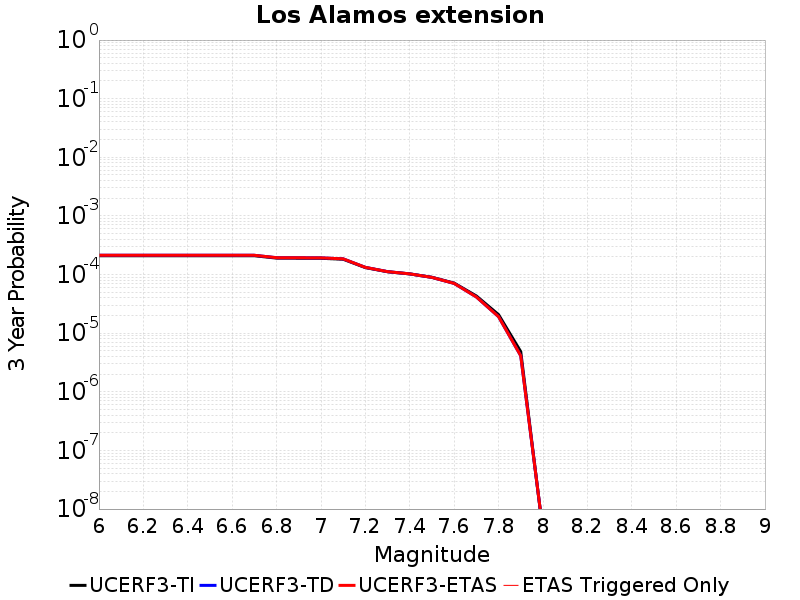 | 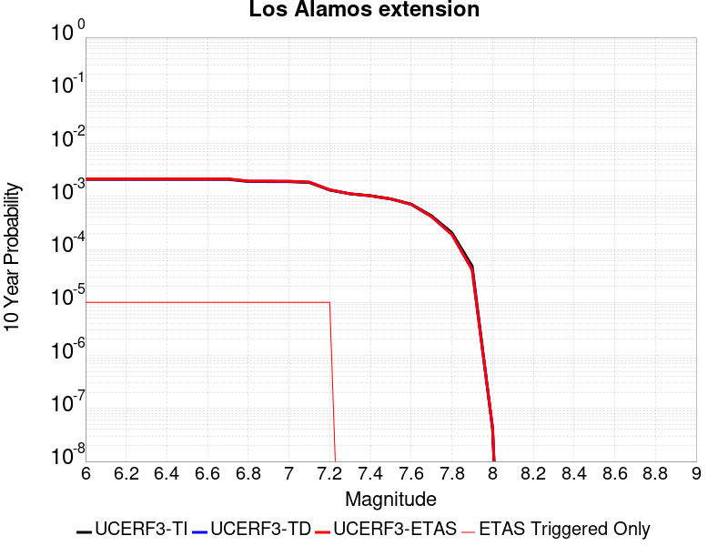 |

| Magnitude | 1 yr TI Prob | TD Prob | ETAS Prob | ETAS/TD Gain | ETAS Triggered Only | 10 yr TI Prob | TD Prob | ETAS Prob | ETAS/TD Gain | ETAS Triggered Only |
|-----|-----|-----|-----|-----|-----|-----|-----|-----|-----|-----|
| 6.0 | 2.0945723E-4 | 2.1318896E-4 | 2.1318896E-4 | 1.0 | 0.0 | 0.0020925992 | 0.0021299536 | 0.0021399322 | 1.0046849 | 1.0E-5 |
| 6.1 | 2.0945723E-4 | 2.1318896E-4 | 2.1318896E-4 | 1.0 | 0.0 | 0.0020925992 | 0.0021299536 | 0.0021399322 | 1.0046849 | 1.0E-5 |
| 6.2 | 2.0945723E-4 | 2.1318896E-4 | 2.1318896E-4 | 1.0 | 0.0 | 0.0020925992 | 0.0021299536 | 0.0021399322 | 1.0046849 | 1.0E-5 |
| 6.3 | 2.0945723E-4 | 2.1318896E-4 | 2.1318896E-4 | 1.0 | 0.0 | 0.0020925992 | 0.0021299536 | 0.0021399322 | 1.0046849 | 1.0E-5 |
| 6.4 | 2.0945723E-4 | 2.1318896E-4 | 2.1318896E-4 | 1.0 | 0.0 | 0.0020925992 | 0.0021299536 | 0.0021399322 | 1.0046849 | 1.0E-5 |
| 6.5 | 2.0945723E-4 | 2.1318896E-4 | 2.1318896E-4 | 1.0 | 0.0 | 0.0020925992 | 0.0021299536 | 0.0021399322 | 1.0046849 | 1.0E-5 |
| 6.6 | 2.0945723E-4 | 2.1318896E-4 | 2.1318896E-4 | 1.0 | 0.0 | 0.0020925992 | 0.0021299536 | 0.0021399322 | 1.0046849 | 1.0E-5 |
| 6.7 | 2.0945723E-4 | 2.1318896E-4 | 2.1318896E-4 | 1.0 | 0.0 | 0.0020925992 | 0.0021299536 | 0.0021399322 | 1.0046849 | 1.0E-5 |
| 6.8 | 1.9087581E-4 | 1.9402738E-4 | 1.9402738E-4 | 1.0 | 0.0 | 0.0019071194 | 0.0019386722 | 0.0019486528 | 1.0051482 | 1.0E-5 |
| 6.9 | 1.901539E-4 | 1.9328189E-4 | 1.9328189E-4 | 1.0 | 0.0 | 0.0018999127 | 0.0019312302 | 0.0019412108 | 1.0051681 | 1.0E-5 |
| 7.0 | 1.8948725E-4 | 1.925912E-4 | 1.925912E-4 | 1.0 | 0.0 | 0.0018932576 | 0.0019243353 | 0.001934316 | 1.0051866 | 1.0E-5 |
| 7.1 | 1.8261763E-4 | 1.8549988E-4 | 1.8549988E-4 | 1.0 | 0.0 | 0.0018246764 | 0.0018535411 | 0.0018635226 | 1.005385 | 1.0E-5 |
| 7.2 | 1.3150605E-4 | 1.3271782E-4 | 1.3271782E-4 | 1.0 | 0.0 | 0.0013142825 | 0.0013263912 | 0.0013363779 | 1.0075293 | 1.0E-5 |
| 7.3 | 1.1165442E-4 | 1.12184716E-4 | 1.12184716E-4 | 1.0 | 0.0 | 0.0011159834 | 0.0011212841 | 0.0011212841 | 1.0 | 0.0 |
| 7.4 | 1.0257855E-4 | 1.0279902E-4 | 1.0279902E-4 | 1.0 | 0.0 | 0.0010253121 | 0.0010275178 | 0.0010275178 | 1.0 | 0.0 |
| 7.5 | 8.976737E-5 | 8.9487534E-5 | 8.9487534E-5 | 1.0 | 0.0 | 8.9731114E-4 | 8.945179E-4 | 8.945179E-4 | 1.0 | 0.0 |
| 7.6 | 7.157416E-5 | 7.062563E-5 | 7.062563E-5 | 1.0 | 0.0 | 7.1551115E-4 | 7.060345E-4 | 7.060345E-4 | 1.0 | 0.0 |
| 7.7 | 4.3164142E-5 | 4.152099E-5 | 4.152099E-5 | 1.0 | 0.0 | 4.315576E-4 | 4.151325E-4 | 4.151325E-4 | 1.0 | 0.0 |
| 7.8 | 2.0719E-5 | 1.9159297E-5 | 1.9159297E-5 | 1.0 | 0.0 | 2.071707E-4 | 1.9157652E-4 | 1.9157652E-4 | 1.0 | 0.0 |
| 7.9 | 4.848697E-6 | 4.1164076E-6 | 4.1164076E-6 | 1.0 | 0.0 | 4.8485912E-5 | 4.1163323E-5 | 4.1163323E-5 | 1.0 | 0.0 |
| 8.0 | 4.1119033E-9 | 4.297072E-9 | 4.297072E-9 | 1.0 | 0.0 | 4.1119034E-8 | 4.297072E-8 | 4.297072E-8 | 1.0 | 0.0 |

## Silver Creek 2011 CFM
*[(top)](#table-of-contents)*

| 1 Year | 10 Year |
|-----|-----|
| 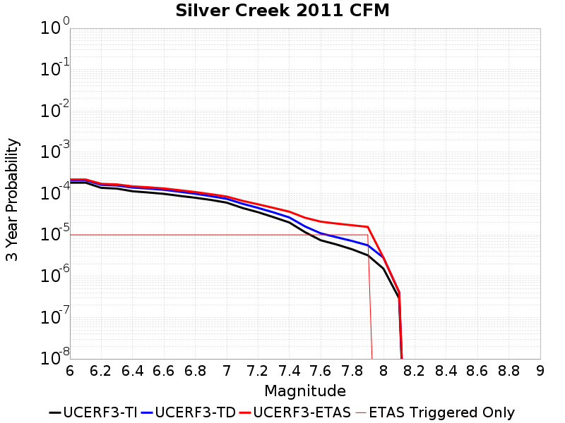 | 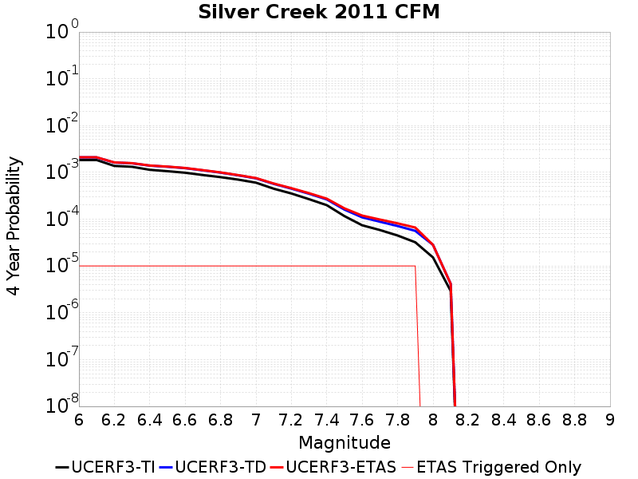 |

| Magnitude | 1 yr TI Prob | TD Prob | ETAS Prob | ETAS/TD Gain | ETAS Triggered Only | 10 yr TI Prob | TD Prob | ETAS Prob | ETAS/TD Gain | ETAS Triggered Only |
|-----|-----|-----|-----|-----|-----|-----|-----|-----|-----|-----|
| 6.0 | 1.8380396E-4 | 2.0911724E-4 | 2.1911514E-4 | 1.0478101 | 1.0E-5 | 0.0018365202 | 0.002089563 | 0.0020995422 | 1.0047756 | 1.0E-5 |
| 6.1 | 1.8380396E-4 | 2.0911724E-4 | 2.1911514E-4 | 1.0478101 | 1.0E-5 | 0.0018365202 | 0.002089563 | 0.0020995422 | 1.0047756 | 1.0E-5 |
| 6.2 | 1.375503E-4 | 1.6228922E-4 | 1.7228759E-4 | 1.0616084 | 1.0E-5 | 0.0013746519 | 0.0016220347 | 0.0016320185 | 1.0061551 | 1.0E-5 |
| 6.3 | 1.3187347E-4 | 1.5653162E-4 | 1.6653007E-4 | 1.0638748 | 1.0E-5 | 0.0013179524 | 0.0015645404 | 0.0015745248 | 1.0063816 | 1.0E-5 |
| 6.4 | 1.1367678E-4 | 1.3934456E-4 | 1.4934316E-4 | 1.0717546 | 1.0E-5 | 0.0011361865 | 0.0013928962 | 0.0014028823 | 1.0071692 | 1.0E-5 |
| 6.5 | 1.061339E-4 | 1.3199305E-4 | 1.4199172E-4 | 1.0757515 | 1.0E-5 | 0.0010608323 | 0.0013194703 | 0.0013294572 | 1.0075688 | 1.0E-5 |
| 6.6 | 9.838748E-5 | 1.2320612E-4 | 1.3320489E-4 | 1.0811548 | 1.0E-5 | 9.834393E-4 | 0.0012317016 | 0.0012416893 | 1.0081089 | 1.0E-5 |
| 6.7 | 8.788928E-5 | 1.1060076E-4 | 1.2059966E-4 | 1.0904053 | 1.0E-5 | 8.785453E-4 | 0.00110578 | 0.0011157689 | 1.0090334 | 1.0E-5 |
| 6.8 | 7.918918E-5 | 9.8893615E-5 | 1.0889262E-4 | 1.1011088 | 1.0E-5 | 7.9160964E-4 | 9.888182E-4 | 9.988084E-4 | 1.0101031 | 1.0E-5 |
| 6.9 | 7.011199E-5 | 8.641222E-5 | 9.641136E-5 | 1.1157143 | 1.0E-5 | 7.0089876E-4 | 8.64108E-4 | 8.740993E-4 | 1.0115626 | 1.0E-5 |
| 7.0 | 6.03353E-5 | 7.46822E-5 | 8.468145E-5 | 1.1338907 | 1.0E-5 | 6.0318917E-4 | 7.4689265E-4 | 7.5688516E-4 | 1.0133789 | 1.0E-5 |
| 7.1 | 4.4883975E-5 | 5.682939E-5 | 6.682883E-5 | 1.1759553 | 1.0E-5 | 4.4874908E-4 | 5.6847004E-4 | 5.7846436E-4 | 1.0175811 | 1.0E-5 |
| 7.2 | 3.5420322E-5 | 4.498826E-5 | 5.498781E-5 | 1.2222703 | 1.0E-5 | 3.541468E-4 | 4.5011294E-4 | 4.6010842E-4 | 1.0222067 | 1.0E-5 |
| 7.3 | 2.6763106E-5 | 3.492763E-5 | 4.492728E-5 | 1.2862962 | 1.0E-5 | 2.6759884E-4 | 3.495428E-4 | 3.595393E-4 | 1.0285988 | 1.0E-5 |
| 7.4 | 1.9937206E-5 | 2.6414926E-5 | 3.641466E-5 | 1.3785639 | 1.0E-5 | 1.9935417E-4 | 2.6443927E-4 | 2.7443664E-4 | 1.0378059 | 1.0E-5 |
| 7.5 | 1.16318915E-5 | 1.6002117E-5 | 2.6001957E-5 | 1.6249073 | 1.0E-5 | 1.16312825E-4 | 1.6033105E-4 | 1.7032944E-4 | 1.062361 | 1.0E-5 |
| 7.6 | 7.4123927E-6 | 1.0912523E-5 | 2.0912414E-5 | 1.9163684 | 1.0E-5 | 7.412145E-5 | 1.0944091E-4 | 1.19439814E-4 | 1.0913635 | 1.0E-5 |
| 7.7 | 5.8701116E-6 | 8.803716E-6 | 1.8803628E-5 | 2.135874 | 1.0E-5 | 5.8699567E-5 | 8.83523E-5 | 9.835142E-5 | 1.1131732 | 1.0E-5 |
| 7.8 | 4.48357E-6 | 7.1226364E-6 | 1.7122566E-5 | 2.4039645 | 1.0E-5 | 4.4834796E-5 | 7.153142E-5 | 8.153071E-5 | 1.1397887 | 1.0E-5 |
| 7.9 | 3.212384E-6 | 5.605633E-6 | 1.5605578E-5 | 2.78391 | 1.0E-5 | 3.2123375E-5 | 5.6316854E-5 | 6.6316294E-5 | 1.1775568 | 1.0E-5 |
| 8.0 | 1.525207E-6 | 2.8120637E-6 | 2.8120637E-6 | 1.0 | 0.0 | 1.5251966E-5 | 2.8257677E-5 | 2.8257677E-5 | 1.0 | 0.0 |
| 8.1 | 2.925246E-7 | 4.124017E-7 | 4.124017E-7 | 1.0 | 0.0 | 2.925242E-6 | 4.16292E-6 | 4.16292E-6 | 1.0 | 0.0 |

## Round Valley
*[(top)](#table-of-contents)*

| 1 Year | 10 Year |
|-----|-----|
| 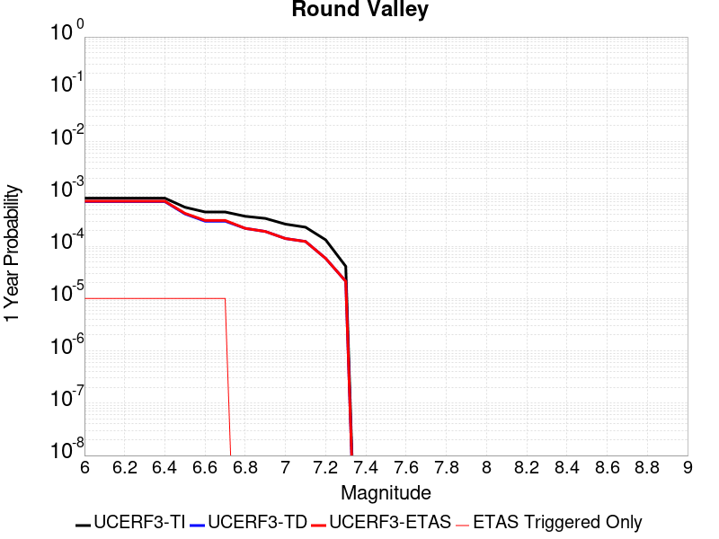 | 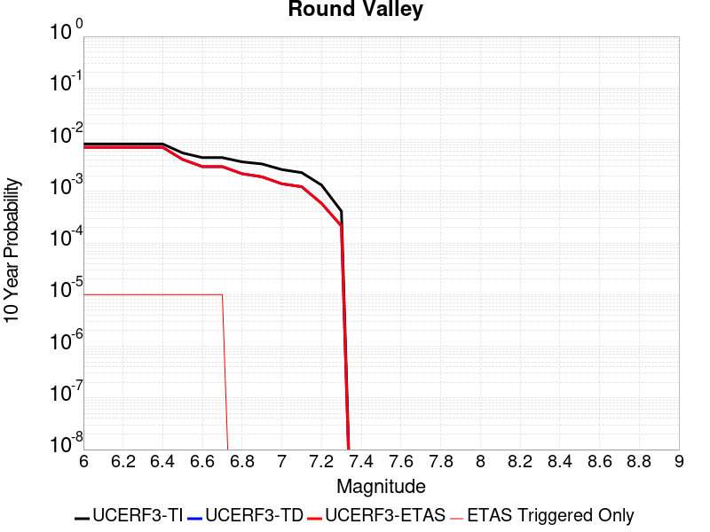 |

| Magnitude | 1 yr TI Prob | TD Prob | ETAS Prob | ETAS/TD Gain | ETAS Triggered Only | 10 yr TI Prob | TD Prob | ETAS Prob | ETAS/TD Gain | ETAS Triggered Only |
|-----|-----|-----|-----|-----|-----|-----|-----|-----|-----|-----|
| 6.0 | 8.283384E-4 | 7.1311207E-4 | 7.231049E-4 | 1.014013 | 1.0E-5 | 0.008252576 | 0.0071121254 | 0.007122054 | 1.0013961 | 1.0E-5 |
| 6.1 | 8.283384E-4 | 7.1311207E-4 | 7.231049E-4 | 1.014013 | 1.0E-5 | 0.008252576 | 0.0071121254 | 0.007122054 | 1.0013961 | 1.0E-5 |
| 6.2 | 8.283384E-4 | 7.1311207E-4 | 7.231049E-4 | 1.014013 | 1.0E-5 | 0.008252576 | 0.0071121254 | 0.007122054 | 1.0013961 | 1.0E-5 |
| 6.3 | 8.283384E-4 | 7.1311207E-4 | 7.231049E-4 | 1.014013 | 1.0E-5 | 0.008252576 | 0.0071121254 | 0.007122054 | 1.0013961 | 1.0E-5 |
| 6.4 | 8.283384E-4 | 7.1311207E-4 | 7.231049E-4 | 1.014013 | 1.0E-5 | 0.008252576 | 0.0071121254 | 0.007122054 | 1.0013961 | 1.0E-5 |
| 6.5 | 5.553823E-4 | 4.1490336E-4 | 4.2489922E-4 | 1.024092 | 1.0E-5 | 0.005539963 | 0.0041421163 | 0.004152075 | 1.0024042 | 1.0E-5 |
| 6.6 | 4.5035584E-4 | 3.0096498E-4 | 3.1096197E-4 | 1.0332165 | 1.0E-5 | 0.0044944426 | 0.0030059516 | 0.0030159217 | 1.0033168 | 1.0E-5 |
| 6.7 | 4.5035584E-4 | 3.0096498E-4 | 3.1096197E-4 | 1.0332165 | 1.0E-5 | 0.0044944426 | 0.0030059516 | 0.0030159217 | 1.0033168 | 1.0E-5 |
| 6.8 | 3.726901E-4 | 2.1922444E-4 | 2.1922444E-4 | 1.0 | 0.0 | 0.0037206567 | 0.0021902465 | 0.0021902465 | 1.0 | 0.0 |
| 6.9 | 3.3973387E-4 | 1.9119089E-4 | 1.9119089E-4 | 1.0 | 0.0 | 0.0033921495 | 0.001910413 | 0.001910413 | 1.0 | 0.0 |
| 7.0 | 2.6406467E-4 | 1.4002179E-4 | 1.4002179E-4 | 1.0 | 0.0 | 0.0026375111 | 0.001399437 | 0.001399437 | 1.0 | 0.0 |
| 7.1 | 2.304613E-4 | 1.230053E-4 | 1.230053E-4 | 1.0 | 0.0 | 0.0023022245 | 0.0012294687 | 0.0012294687 | 1.0 | 0.0 |
| 7.2 | 1.3228992E-4 | 5.8482852E-5 | 5.8482852E-5 | 1.0 | 0.0 | 0.0013221119 | 5.847258E-4 | 5.847258E-4 | 1.0 | 0.0 |
| 7.3 | 4.1220315E-5 | 2.133561E-5 | 2.133561E-5 | 1.0 | 0.0 | 4.121267E-4 | 2.133561E-4 | 2.133561E-4 | 1.0 | 0.0 |

## Great Valley 10 (Panoche)
*[(top)](#table-of-contents)*

| 1 Year | 10 Year |
|-----|-----|
| 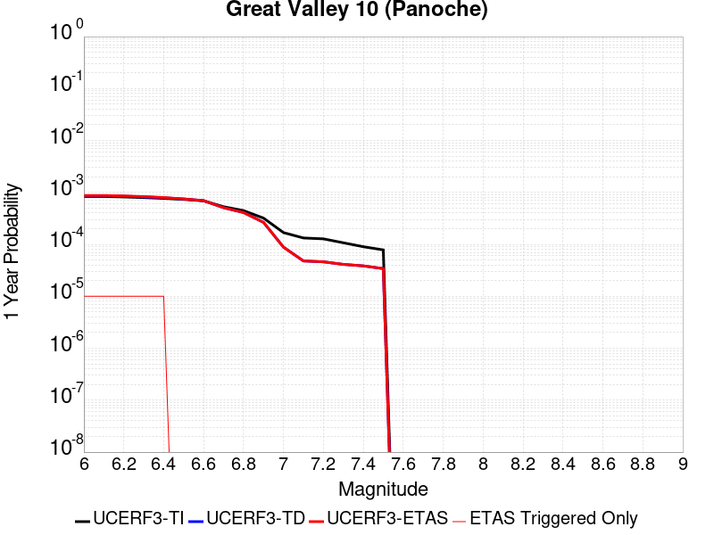 | 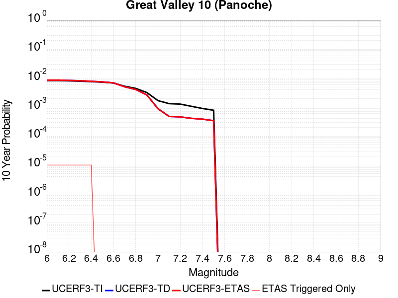 |

| Magnitude | 1 yr TI Prob | TD Prob | ETAS Prob | ETAS/TD Gain | ETAS Triggered Only | 10 yr TI Prob | TD Prob | ETAS Prob | ETAS/TD Gain | ETAS Triggered Only |
|-----|-----|-----|-----|-----|-----|-----|-----|-----|-----|-----|
| 6.0 | 8.35278E-4 | 8.645202E-4 | 8.7451155E-4 | 1.0115571 | 1.0E-5 | 0.008321454 | 0.0086121885 | 0.008622102 | 1.0011512 | 1.0E-5 |
| 6.1 | 8.35278E-4 | 8.645202E-4 | 8.7451155E-4 | 1.0115571 | 1.0E-5 | 0.008321454 | 0.0086121885 | 0.008622102 | 1.0011512 | 1.0E-5 |
| 6.2 | 8.17738E-4 | 8.448677E-4 | 8.548593E-4 | 1.0118262 | 1.0E-5 | 0.008147354 | 0.008417164 | 0.00842708 | 1.001178 | 1.0E-5 |
| 6.3 | 7.961082E-4 | 8.201066E-4 | 8.300984E-4 | 1.0121835 | 1.0E-5 | 0.007932622 | 0.008171394 | 0.008181311 | 1.0012138 | 1.0E-5 |
| 6.4 | 7.67817E-4 | 7.875654E-4 | 7.975575E-4 | 1.0126873 | 1.0E-5 | 0.007651695 | 0.007848319 | 0.00785824 | 1.0012642 | 1.0E-5 |
| 6.5 | 7.3454727E-4 | 7.488046E-4 | 7.488046E-4 | 1.0 | 0.0 | 0.0073212404 | 0.007463371 | 0.007463371 | 1.0 | 0.0 |
| 6.6 | 6.8837265E-4 | 6.9488573E-4 | 6.9488573E-4 | 1.0 | 0.0 | 0.006862442 | 0.0069276677 | 0.0069276677 | 1.0 | 0.0 |
| 6.7 | 5.30822E-4 | 5.083769E-4 | 5.083769E-4 | 1.0 | 0.0 | 0.0052955584 | 0.0050723916 | 0.0050723916 | 1.0 | 0.0 |
| 6.8 | 4.4644187E-4 | 4.1070685E-4 | 4.1070685E-4 | 1.0 | 0.0 | 0.0044554602 | 0.004099685 | 0.004099685 | 1.0 | 0.0 |
| 6.9 | 3.2067244E-4 | 2.656644E-4 | 2.656644E-4 | 1.0 | 0.0 | 0.003202101 | 0.0026536065 | 0.0026536065 | 1.0 | 0.0 |
| 7.0 | 1.6857806E-4 | 8.844546E-5 | 8.844546E-5 | 1.0 | 0.0 | 0.0016845023 | 8.8411197E-4 | 8.8411197E-4 | 1.0 | 0.0 |
| 7.1 | 1.327593E-4 | 4.794549E-5 | 4.794549E-5 | 1.0 | 0.0 | 0.0013268003 | 4.793562E-4 | 4.793562E-4 | 1.0 | 0.0 |
| 7.2 | 1.2772017E-4 | 4.6131754E-5 | 4.6131754E-5 | 1.0 | 0.0 | 0.0012764678 | 4.612265E-4 | 4.612265E-4 | 1.0 | 0.0 |
| 7.3 | 1.072713E-4 | 4.1182724E-5 | 4.1182724E-5 | 1.0 | 0.0 | 0.0010721954 | 4.1175558E-4 | 4.1175558E-4 | 1.0 | 0.0 |
| 7.4 | 9.0144255E-5 | 3.8547645E-5 | 3.8547645E-5 | 1.0 | 0.0 | 9.0107694E-4 | 3.854142E-4 | 3.854142E-4 | 1.0 | 0.0 |
| 7.5 | 7.827883E-5 | 3.415637E-5 | 3.415637E-5 | 1.0 | 0.0 | 7.825126E-4 | 3.4151535E-4 | 3.4151535E-4 | 1.0 | 0.0 |

## Cerro Prieto
*[(top)](#table-of-contents)*

| 1 Year | 10 Year |
|-----|-----|
| 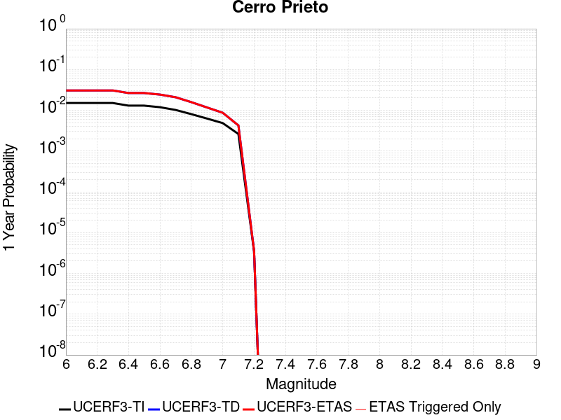 | 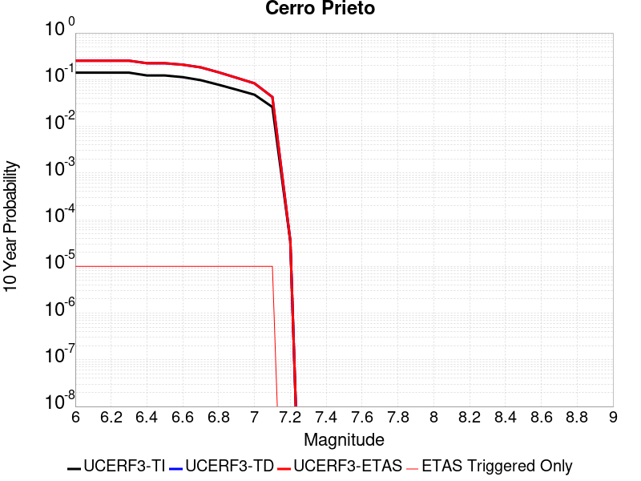 |

| Magnitude | 1 yr TI Prob | TD Prob | ETAS Prob | ETAS/TD Gain | ETAS Triggered Only | 10 yr TI Prob | TD Prob | ETAS Prob | ETAS/TD Gain | ETAS Triggered Only |
|-----|-----|-----|-----|-----|-----|-----|-----|-----|-----|-----|
| 6.0 | 0.015072231 | 0.030648533 | 0.030648533 | 1.0 | 0.0 | 0.14089979 | 0.25398168 | 0.25398916 | 1.0000293 | 1.0E-5 |
| 6.1 | 0.015072231 | 0.030648533 | 0.030648533 | 1.0 | 0.0 | 0.14089979 | 0.25398168 | 0.25398916 | 1.0000293 | 1.0E-5 |
| 6.2 | 0.015072231 | 0.030648533 | 0.030648533 | 1.0 | 0.0 | 0.14089979 | 0.25398168 | 0.25398916 | 1.0000293 | 1.0E-5 |
| 6.3 | 0.015072231 | 0.030648533 | 0.030648533 | 1.0 | 0.0 | 0.14089979 | 0.25398168 | 0.25398916 | 1.0000293 | 1.0E-5 |
| 6.4 | 0.013006088 | 0.026472243 | 0.026472243 | 1.0 | 0.0 | 0.12270685 | 0.22440724 | 0.224415 | 1.0000346 | 1.0E-5 |
| 6.5 | 0.013006088 | 0.026472243 | 0.026472243 | 1.0 | 0.0 | 0.12270685 | 0.22440724 | 0.224415 | 1.0000346 | 1.0E-5 |
| 6.6 | 0.011904482 | 0.024299106 | 0.024299106 | 1.0 | 0.0 | 0.11286586 | 0.20858863 | 0.20859656 | 1.0000379 | 1.0E-5 |
| 6.7 | 0.010187071 | 0.020885285 | 0.020885285 | 1.0 | 0.0 | 0.09732539 | 0.1829055 | 0.18291366 | 1.0000447 | 1.0E-5 |
| 6.8 | 0.008043335 | 0.01583691 | 0.01583691 | 1.0 | 0.0 | 0.07758363 | 0.14336622 | 0.14337479 | 1.0000597 | 1.0E-5 |
| 6.9 | 0.006268645 | 0.011726657 | 0.011726657 | 1.0 | 0.0 | 0.060947374 | 0.10945352 | 0.109462425 | 1.0000814 | 1.0E-5 |
| 7.0 | 0.0048550544 | 0.008693669 | 0.008693669 | 1.0 | 0.0 | 0.04750344 | 0.08316107 | 0.08317024 | 1.0001103 | 1.0E-5 |
| 7.1 | 0.0026210553 | 0.004258862 | 0.004258862 | 1.0 | 0.0 | 0.025903556 | 0.042366326 | 0.042375904 | 1.000226 | 1.0E-5 |
| 7.2 | 3.4148304E-6 | 3.556207E-6 | 3.556207E-6 | 1.0 | 0.0 | 3.414778E-5 | 3.5562072E-5 | 3.5562072E-5 | 1.0 | 0.0 |

## Elsinore (Stepovers Combined)
*[(top)](#table-of-contents)*

| 1 Year | 10 Year |
|-----|-----|
| 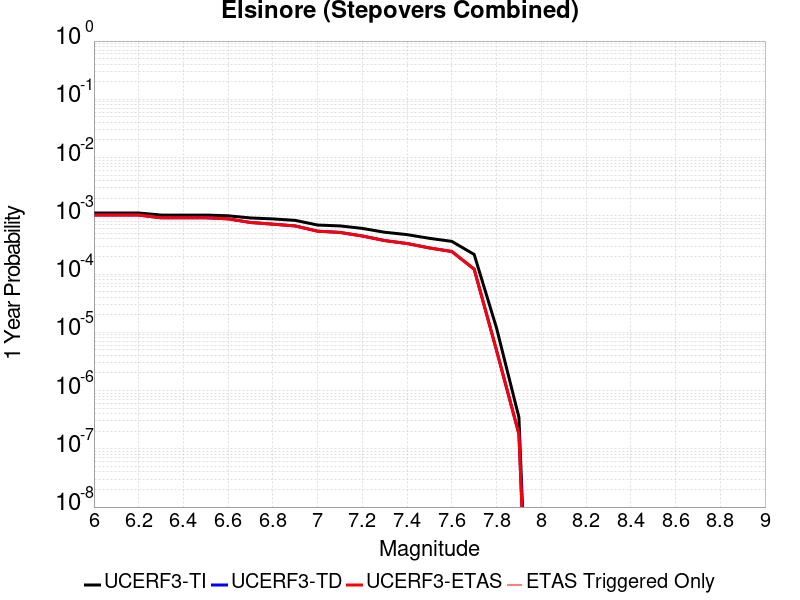 | 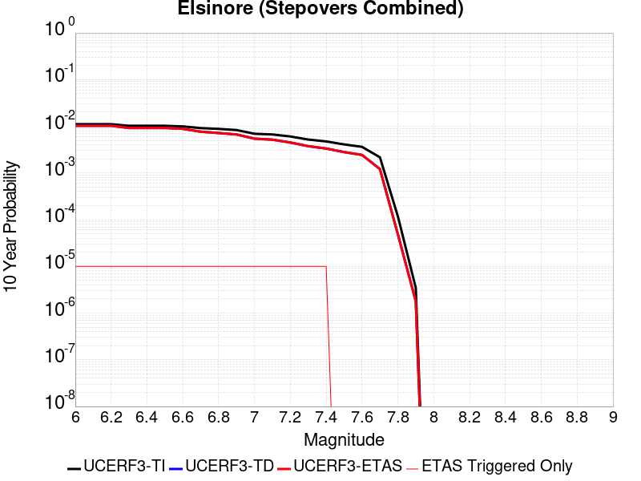 |

| Magnitude | 1 yr TI Prob | TD Prob | ETAS Prob | ETAS/TD Gain | ETAS Triggered Only | 10 yr TI Prob | TD Prob | ETAS Prob | ETAS/TD Gain | ETAS Triggered Only |
|-----|-----|-----|-----|-----|-----|-----|-----|-----|-----|-----|
| 6.0 | 0.0011182994 | 0.0010305645 | 0.0010305645 | 1.0 | 0.0 | 0.011126885 | 0.010264955 | 0.010274853 | 1.0009642 | 1.0E-5 |
| 6.1 | 0.0011182994 | 0.0010305645 | 0.0010305645 | 1.0 | 0.0 | 0.011126885 | 0.010264955 | 0.010274853 | 1.0009642 | 1.0E-5 |
| 6.2 | 0.0011182994 | 0.0010305645 | 0.0010305645 | 1.0 | 0.0 | 0.011126885 | 0.010264955 | 0.010274853 | 1.0009642 | 1.0E-5 |
| 6.3 | 0.0010300872 | 9.253249E-4 | 9.253249E-4 | 1.0 | 0.0 | 0.010253254 | 0.009221313 | 0.00923122 | 1.0010744 | 1.0E-5 |
| 6.4 | 0.0010300872 | 9.253249E-4 | 9.253249E-4 | 1.0 | 0.0 | 0.010253254 | 0.009221313 | 0.00923122 | 1.0010744 | 1.0E-5 |
| 6.5 | 0.0010300872 | 9.253249E-4 | 9.253249E-4 | 1.0 | 0.0 | 0.010253254 | 0.009221313 | 0.00923122 | 1.0010744 | 1.0E-5 |
| 6.6 | 0.0010007467 | 8.868476E-4 | 8.868476E-4 | 1.0 | 0.0 | 0.00996252 | 0.008839882 | 0.008849793 | 1.0011213 | 1.0E-5 |
| 6.7 | 9.183606E-4 | 7.684506E-4 | 7.684506E-4 | 1.0 | 0.0 | 0.009145746 | 0.00766494 | 0.0076748636 | 1.0012946 | 1.0E-5 |
| 6.8 | 8.8517193E-4 | 7.189548E-4 | 7.189548E-4 | 1.0 | 0.0 | 0.008816543 | 0.007172703 | 0.007182631 | 1.0013841 | 1.0E-5 |
| 6.9 | 8.347058E-4 | 6.701117E-4 | 6.701117E-4 | 1.0 | 0.0 | 0.008315775 | 0.0066867927 | 0.0066967257 | 1.0014855 | 1.0E-5 |
| 7.0 | 6.944992E-4 | 5.449977E-4 | 5.449977E-4 | 1.0 | 0.0 | 0.006923327 | 0.0054405383 | 0.005450484 | 1.0018281 | 1.0E-5 |
| 7.1 | 6.710743E-4 | 5.183995E-4 | 5.183995E-4 | 1.0 | 0.0 | 0.0066905143 | 0.0051752357 | 0.0051851836 | 1.0019222 | 1.0E-5 |
| 7.2 | 6.0770183E-4 | 4.5040413E-4 | 4.5040413E-4 | 1.0 | 0.0 | 0.0060604266 | 0.0044963364 | 0.0045062914 | 1.0022141 | 1.0E-5 |
| 7.3 | 5.220972E-4 | 3.7567402E-4 | 3.7567402E-4 | 1.0 | 0.0 | 0.005208723 | 0.0037507769 | 0.0037607395 | 1.0026561 | 1.0E-5 |
| 7.4 | 4.7558855E-4 | 3.3441623E-4 | 3.3441623E-4 | 1.0 | 0.0 | 0.00474572 | 0.003339282 | 0.0033492486 | 1.0029846 | 1.0E-5 |
| 7.5 | 4.1059E-4 | 2.8081692E-4 | 2.8081692E-4 | 1.0 | 0.0 | 0.0040983222 | 0.0028047473 | 0.0028047473 | 1.0 | 0.0 |
| 7.6 | 3.640086E-4 | 2.4404394E-4 | 2.4404394E-4 | 1.0 | 0.0 | 0.003634129 | 0.0024378756 | 0.0024378756 | 1.0 | 0.0 |
| 7.7 | 2.171282E-4 | 1.2148357E-4 | 1.2148357E-4 | 1.0 | 0.0 | 0.0021691616 | 0.0012142446 | 0.0012142446 | 1.0 | 0.0 |
| 7.8 | 1.1840509E-5 | 4.897219E-6 | 4.897219E-6 | 1.0 | 0.0 | 1.1839878E-4 | 4.8971433E-5 | 4.8971433E-5 | 1.0 | 0.0 |
| 7.9 | 3.4838732E-7 | 1.794872E-7 | 1.794872E-7 | 1.0 | 0.0 | 3.4838679E-6 | 1.7948707E-6 | 1.7948707E-6 | 1.0 | 0.0 |

## Thirty Mile Bank
*[(top)](#table-of-contents)*

| 1 Year | 10 Year |
|-----|-----|
| 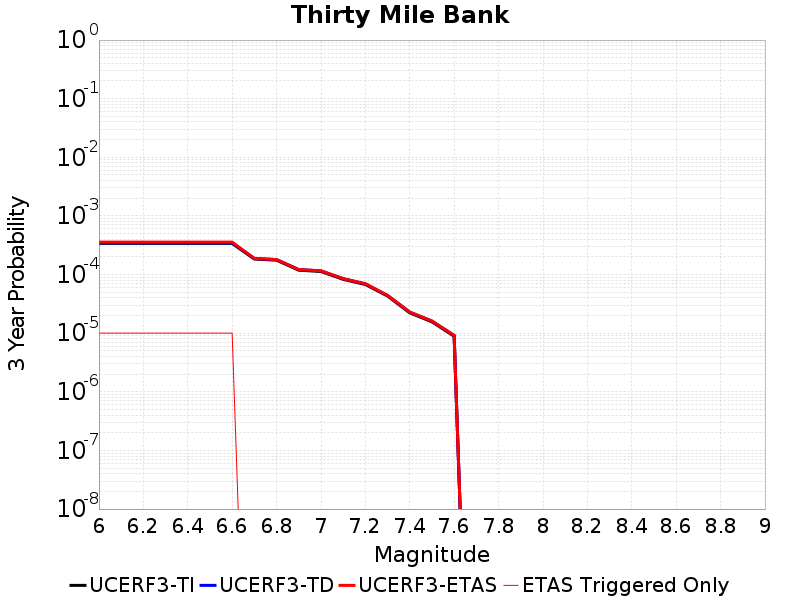 | 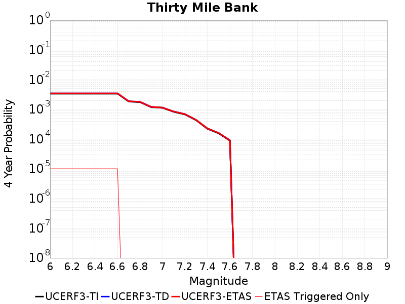 |

| Magnitude | 1 yr TI Prob | TD Prob | ETAS Prob | ETAS/TD Gain | ETAS Triggered Only | 10 yr TI Prob | TD Prob | ETAS Prob | ETAS/TD Gain | ETAS Triggered Only |
|-----|-----|-----|-----|-----|-----|-----|-----|-----|-----|-----|
| 6.0 | 3.3975503E-4 | 3.4741647E-4 | 3.57413E-4 | 1.0287739 | 1.0E-5 | 0.0033923604 | 0.003469165 | 0.0034791303 | 1.0028726 | 1.0E-5 |
| 6.1 | 3.3975503E-4 | 3.4741647E-4 | 3.57413E-4 | 1.0287739 | 1.0E-5 | 0.0033923604 | 0.003469165 | 0.0034791303 | 1.0028726 | 1.0E-5 |
| 6.2 | 3.3975503E-4 | 3.4741647E-4 | 3.57413E-4 | 1.0287739 | 1.0E-5 | 0.0033923604 | 0.003469165 | 0.0034791303 | 1.0028726 | 1.0E-5 |
| 6.3 | 3.3975503E-4 | 3.4741647E-4 | 3.57413E-4 | 1.0287739 | 1.0E-5 | 0.0033923604 | 0.003469165 | 0.0034791303 | 1.0028726 | 1.0E-5 |
| 6.4 | 3.3975503E-4 | 3.4741647E-4 | 3.57413E-4 | 1.0287739 | 1.0E-5 | 0.0033923604 | 0.003469165 | 0.0034791303 | 1.0028726 | 1.0E-5 |
| 6.5 | 3.3975503E-4 | 3.4741647E-4 | 3.57413E-4 | 1.0287739 | 1.0E-5 | 0.0033923604 | 0.003469165 | 0.0034791303 | 1.0028726 | 1.0E-5 |
| 6.6 | 3.3975503E-4 | 3.4741647E-4 | 3.57413E-4 | 1.0287739 | 1.0E-5 | 0.0033923604 | 0.003469165 | 0.0034791303 | 1.0028726 | 1.0E-5 |
| 6.7 | 1.8397097E-4 | 1.8834276E-4 | 1.8834276E-4 | 1.0 | 0.0 | 0.0018381875 | 0.0018818964 | 0.0018818964 | 1.0 | 0.0 |
| 6.8 | 1.7586538E-4 | 1.8004971E-4 | 1.8004971E-4 | 1.0 | 0.0 | 0.0017572626 | 0.0017991002 | 0.0017991002 | 1.0 | 0.0 |
| 6.9 | 1.18735006E-4 | 1.2173405E-4 | 1.2173405E-4 | 1.0 | 0.0 | 0.0011867158 | 0.0012166982 | 0.0012166982 | 1.0 | 0.0 |
| 7.0 | 1.1279029E-4 | 1.1562041E-4 | 1.1562041E-4 | 1.0 | 0.0 | 0.0011273306 | 0.0011556266 | 0.0011556266 | 1.0 | 0.0 |
| 7.1 | 8.296461E-5 | 8.5188636E-5 | 8.5188636E-5 | 1.0 | 0.0 | 8.293364E-4 | 8.5157255E-4 | 8.5157255E-4 | 1.0 | 0.0 |
| 7.2 | 6.768238E-5 | 6.9546535E-5 | 6.9546535E-5 | 1.0 | 0.0 | 6.7661767E-4 | 6.952581E-4 | 6.952581E-4 | 1.0 | 0.0 |
| 7.3 | 4.302256E-5 | 4.4084234E-5 | 4.4084234E-5 | 1.0 | 0.0 | 4.301423E-4 | 4.4076092E-4 | 4.4076092E-4 | 1.0 | 0.0 |
| 7.4 | 2.2237757E-5 | 2.2887087E-5 | 2.2887087E-5 | 1.0 | 0.0 | 2.223553E-4 | 2.2884768E-4 | 2.2884768E-4 | 1.0 | 0.0 |
| 7.5 | 1.5621737E-5 | 1.6104552E-5 | 1.6104552E-5 | 1.0 | 0.0 | 1.562064E-4 | 1.6103411E-4 | 1.6103411E-4 | 1.0 | 0.0 |
| 7.6 | 8.864449E-6 | 9.148864E-6 | 9.148864E-6 | 1.0 | 0.0 | 8.8640954E-5 | 9.148506E-5 | 9.148506E-5 | 1.0 | 0.0 |

## Bullion Mountains
*[(top)](#table-of-contents)*

| 1 Year | 10 Year |
|-----|-----|
| 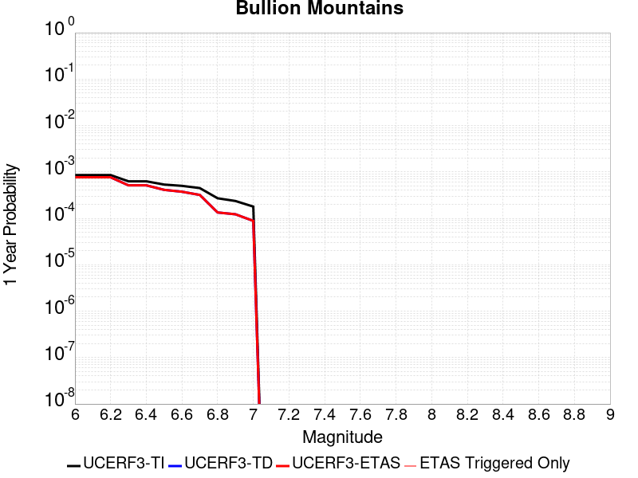 | 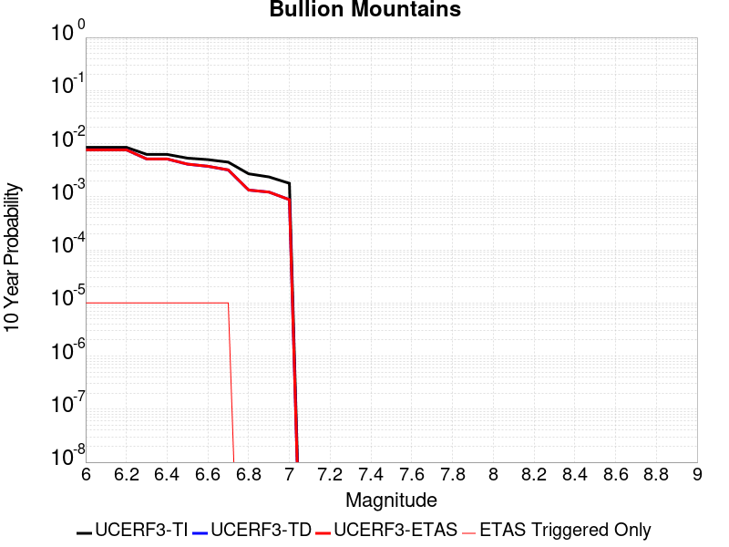 |

| Magnitude | 1 yr TI Prob | TD Prob | ETAS Prob | ETAS/TD Gain | ETAS Triggered Only | 10 yr TI Prob | TD Prob | ETAS Prob | ETAS/TD Gain | ETAS Triggered Only |
|-----|-----|-----|-----|-----|-----|-----|-----|-----|-----|-----|
| 6.0 | 8.5643446E-4 | 7.6636614E-4 | 7.6636614E-4 | 1.0 | 0.0 | 0.008531413 | 0.0076410268 | 0.00765095 | 1.0012987 | 1.0E-5 |
| 6.1 | 8.5643446E-4 | 7.6636614E-4 | 7.6636614E-4 | 1.0 | 0.0 | 0.008531413 | 0.0076410268 | 0.00765095 | 1.0012987 | 1.0E-5 |
| 6.2 | 8.5643446E-4 | 7.6636614E-4 | 7.6636614E-4 | 1.0 | 0.0 | 0.008531413 | 0.0076410268 | 0.00765095 | 1.0012987 | 1.0E-5 |
| 6.3 | 6.283899E-4 | 5.144982E-4 | 5.144982E-4 | 1.0 | 0.0 | 0.0062661595 | 0.0051353523 | 0.0051453006 | 1.0019373 | 1.0E-5 |
| 6.4 | 6.283899E-4 | 5.144982E-4 | 5.144982E-4 | 1.0 | 0.0 | 0.0062661595 | 0.0051353523 | 0.0051453006 | 1.0019373 | 1.0E-5 |
| 6.5 | 5.343951E-4 | 4.1107868E-4 | 4.1107868E-4 | 1.0 | 0.0 | 0.005331118 | 0.004105214 | 0.004115173 | 1.0024259 | 1.0E-5 |
| 6.6 | 5.010733E-4 | 3.7446505E-4 | 3.7446505E-4 | 1.0 | 0.0 | 0.00499945 | 0.0037403377 | 0.0037503003 | 1.0026636 | 1.0E-5 |
| 6.7 | 4.48855E-4 | 3.1951306E-4 | 3.1951306E-4 | 1.0 | 0.0 | 0.004479495 | 0.0031924485 | 0.0032024167 | 1.0031224 | 1.0E-5 |
| 6.8 | 2.7066618E-4 | 1.3373813E-4 | 1.3373813E-4 | 1.0 | 0.0 | 0.0027033675 | 0.001336968 | 0.001336968 | 1.0 | 0.0 |
| 6.9 | 2.3635388E-4 | 1.2232021E-4 | 1.2232021E-4 | 1.0 | 0.0 | 0.0023610266 | 0.0012229179 | 0.0012229179 | 1.0 | 0.0 |
| 7.0 | 1.7904381E-4 | 8.8090135E-5 | 8.8090135E-5 | 1.0 | 0.0 | 0.0017889962 | 8.8090135E-4 | 8.8090135E-4 | 1.0 | 0.0 |

## Superstition Hills
*[(top)](#table-of-contents)*

| 1 Year | 10 Year |
|-----|-----|
| 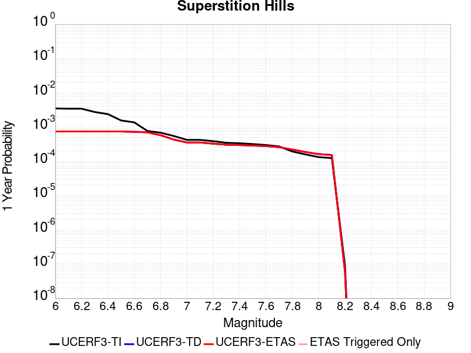 | 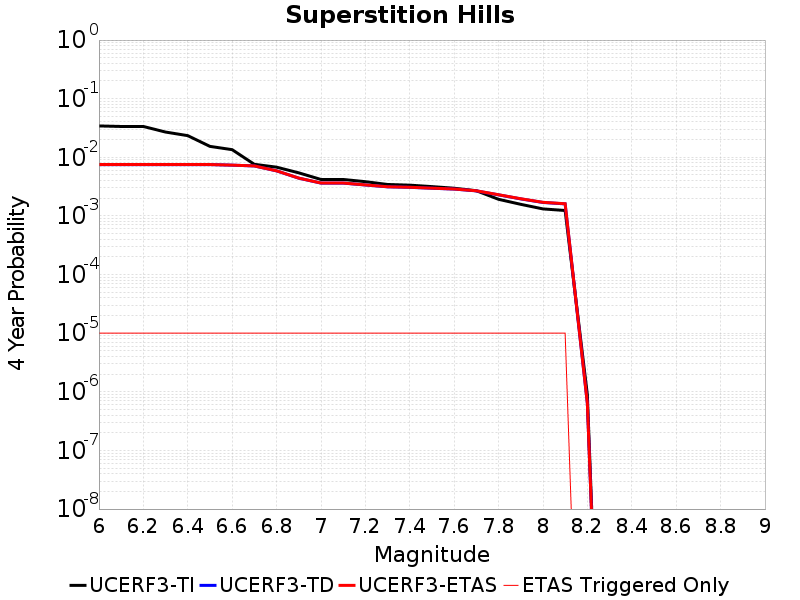 |

| Magnitude | 1 yr TI Prob | TD Prob | ETAS Prob | ETAS/TD Gain | ETAS Triggered Only | 10 yr TI Prob | TD Prob | ETAS Prob | ETAS/TD Gain | ETAS Triggered Only |
|-----|-----|-----|-----|-----|-----|-----|-----|-----|-----|-----|
| 6.0 | 0.0034829667 | 7.3745014E-4 | 7.3745014E-4 | 1.0 | 0.0 | 0.03428881 | 0.0075205537 | 0.0075304788 | 1.0013196 | 1.0E-5 |
| 6.1 | 0.0034092965 | 7.3745014E-4 | 7.3745014E-4 | 1.0 | 0.0 | 0.033574644 | 0.007520553 | 0.007530478 | 1.0013196 | 1.0E-5 |
| 6.2 | 0.0034092965 | 7.3745014E-4 | 7.3745014E-4 | 1.0 | 0.0 | 0.033574644 | 0.007520553 | 0.007530478 | 1.0013196 | 1.0E-5 |
| 6.3 | 0.0027306017 | 7.374501E-4 | 7.374501E-4 | 1.0 | 0.0 | 0.02697292 | 0.007520548 | 0.0075304727 | 1.0013196 | 1.0E-5 |
| 6.4 | 0.0023673223 | 7.3745E-4 | 7.3745E-4 | 1.0 | 0.0 | 0.023422617 | 0.007520545 | 0.00753047 | 1.0013196 | 1.0E-5 |
| 6.5 | 0.0015471181 | 7.3744997E-4 | 7.3744997E-4 | 1.0 | 0.0 | 0.015363912 | 0.0075205388 | 0.0075304634 | 1.0013196 | 1.0E-5 |
| 6.6 | 0.0013586642 | 7.2002213E-4 | 7.2002213E-4 | 1.0 | 0.0 | 0.013503874 | 0.0073449737 | 0.0073549002 | 1.0013515 | 1.0E-5 |
| 6.7 | 7.6210906E-4 | 6.98117E-4 | 6.98117E-4 | 1.0 | 0.0 | 0.0075950073 | 0.007126164 | 0.007136093 | 1.0013933 | 1.0E-5 |
| 6.8 | 6.8126095E-4 | 5.7271996E-4 | 5.7271996E-4 | 1.0 | 0.0 | 0.006791762 | 0.0058745183 | 0.0058844597 | 1.0016923 | 1.0E-5 |
| 6.9 | 5.447602E-4 | 4.2754697E-4 | 4.2754697E-4 | 1.0 | 0.0 | 0.005434267 | 0.0044095777 | 0.0044195335 | 1.0022578 | 1.0E-5 |
| 7.0 | 4.197378E-4 | 3.5161927E-4 | 3.5161927E-4 | 1.0 | 0.0 | 0.0041894587 | 0.0036335227 | 0.0036434864 | 1.0027422 | 1.0E-5 |
| 7.1 | 4.197378E-4 | 3.5161927E-4 | 3.5161927E-4 | 1.0 | 0.0 | 0.0041894587 | 0.0036335227 | 0.0036434864 | 1.0027422 | 1.0E-5 |
| 7.2 | 3.8477074E-4 | 3.2590012E-4 | 3.2590012E-4 | 1.0 | 0.0 | 0.003841052 | 0.003373998 | 0.0033839643 | 1.0029539 | 1.0E-5 |
| 7.3 | 3.446538E-4 | 3.025533E-4 | 3.025533E-4 | 1.0 | 0.0 | 0.0034411973 | 0.0031382623 | 0.003148231 | 1.0031765 | 1.0E-5 |
| 7.4 | 3.355215E-4 | 2.963679E-4 | 2.963679E-4 | 1.0 | 0.0 | 0.0033501536 | 0.0030760241 | 0.0030859935 | 1.003241 | 1.0E-5 |
| 7.5 | 3.1689866E-4 | 2.8571743E-4 | 2.8571743E-4 | 1.0 | 0.0 | 0.0031644711 | 0.0029678633 | 0.0029778336 | 1.0033594 | 1.0E-5 |
| 7.6 | 2.9730765E-4 | 2.7623438E-4 | 2.7623438E-4 | 1.0 | 0.0 | 0.002969102 | 0.0028711178 | 0.002881089 | 1.0034729 | 1.0E-5 |
| 7.7 | 2.6950863E-4 | 2.56986E-4 | 2.56986E-4 | 1.0 | 0.0 | 0.00269182 | 0.0026761664 | 0.0026861397 | 1.0037267 | 1.0E-5 |
| 7.8 | 1.9233658E-4 | 2.1895426E-4 | 2.1895426E-4 | 1.0 | 0.0 | 0.0019217018 | 0.002289362 | 0.0022993393 | 1.004358 | 1.0E-5 |
| 7.9 | 1.5791094E-4 | 1.8594296E-4 | 1.8594296E-4 | 1.0 | 0.0 | 0.0015779877 | 0.0019535655 | 0.001963546 | 1.0051088 | 1.0E-5 |
| 8.0 | 1.3185451E-4 | 1.6105759E-4 | 1.6105759E-4 | 1.0 | 0.0 | 0.0013177631 | 0.0016974394 | 0.0017074224 | 1.0058812 | 1.0E-5 |
| 8.1 | 1.2391206E-4 | 1.5222165E-4 | 1.5222165E-4 | 1.0 | 0.0 | 0.0012384299 | 0.0016050292 | 0.0016150131 | 1.0062205 | 1.0E-5 |
| 8.2 | 8.9676206E-8 | 5.969964E-8 | 5.969964E-8 | 1.0 | 0.0 | 8.9676166E-7 | 6.389498E-7 | 6.389498E-7 | 1.0 | 0.0 |

## Mendocino
*[(top)](#table-of-contents)*

| 1 Year | 10 Year |
|-----|-----|
| 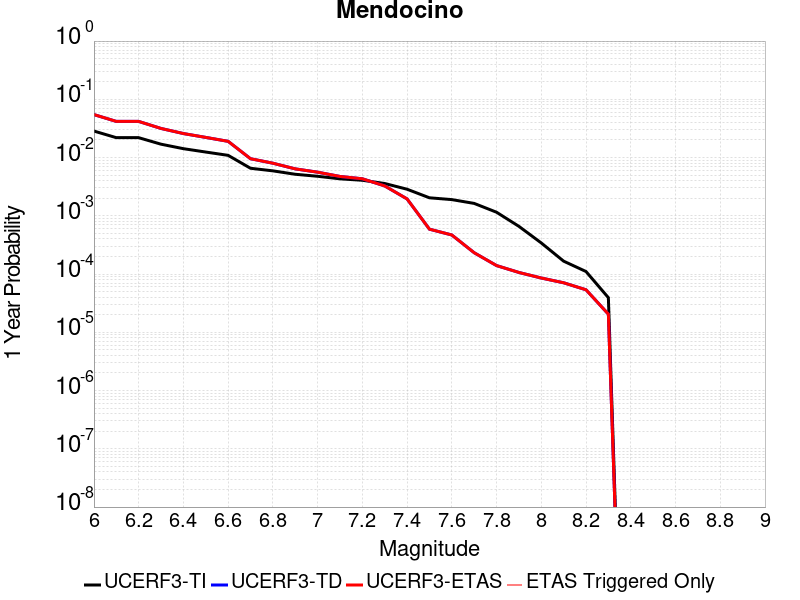 | 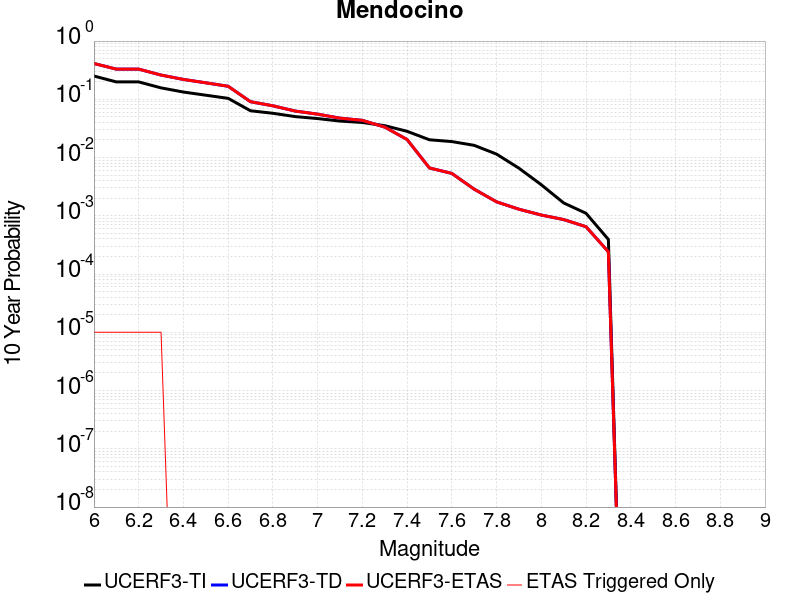 |

| Magnitude | 1 yr TI Prob | TD Prob | ETAS Prob | ETAS/TD Gain | ETAS Triggered Only | 10 yr TI Prob | TD Prob | ETAS Prob | ETAS/TD Gain | ETAS Triggered Only |
|-----|-----|-----|-----|-----|-----|-----|-----|-----|-----|-----|
| 6.0 | 0.028505474 | 0.05467297 | 0.05467297 | 1.0 | 0.0 | 0.25113493 | 0.41188312 | 0.411889 | 1.0000143 | 1.0E-5 |
| 6.1 | 0.021944538 | 0.041749988 | 0.041749988 | 1.0 | 0.0 | 0.19899574 | 0.32995644 | 0.32996315 | 1.0000203 | 1.0E-5 |
| 6.2 | 0.021944538 | 0.041749988 | 0.041749988 | 1.0 | 0.0 | 0.19899574 | 0.32995644 | 0.32996315 | 1.0000203 | 1.0E-5 |
| 6.3 | 0.016958237 | 0.031592906 | 0.031592906 | 1.0 | 0.0 | 0.1572094 | 0.2607792 | 0.2607866 | 1.0000284 | 1.0E-5 |
| 6.4 | 0.014205975 | 0.025837604 | 0.025837604 | 1.0 | 0.0 | 0.13331394 | 0.21948102 | 0.21948102 | 1.0 | 0.0 |
| 6.5 | 0.012438473 | 0.022180881 | 0.022180881 | 1.0 | 0.0 | 0.11764851 | 0.1920377 | 0.1920377 | 1.0 | 0.0 |
| 6.6 | 0.010910975 | 0.018990558 | 0.018990558 | 1.0 | 0.0 | 0.10390546 | 0.16749455 | 0.16749455 | 1.0 | 0.0 |
| 6.7 | 0.006549705 | 0.0095560495 | 0.0095560495 | 1.0 | 0.0 | 0.063599944 | 0.09096979 | 0.09096979 | 1.0 | 0.0 |
| 6.8 | 0.0059135845 | 0.008000104 | 0.008000104 | 1.0 | 0.0 | 0.057586733 | 0.07739393 | 0.07739393 | 1.0 | 0.0 |
| 6.9 | 0.0051665753 | 0.006396865 | 0.006396865 | 1.0 | 0.0 | 0.050480947 | 0.06286139 | 0.06286139 | 1.0 | 0.0 |
| 7.0 | 0.004772591 | 0.0056110653 | 0.0056110653 | 1.0 | 0.0 | 0.04671385 | 0.055622753 | 0.055622753 | 1.0 | 0.0 |
| 7.1 | 0.004314056 | 0.004739972 | 0.004739972 | 1.0 | 0.0 | 0.042312626 | 0.047482334 | 0.047482334 | 1.0 | 0.0 |
| 7.2 | 0.0040750825 | 0.004322033 | 0.004322033 | 1.0 | 0.0 | 0.040011603 | 0.043526806 | 0.043526806 | 1.0 | 0.0 |
| 7.3 | 0.0035876823 | 0.0032606977 | 0.0032606977 | 1.0 | 0.0 | 0.035303112 | 0.033352792 | 0.033352792 | 1.0 | 0.0 |
| 7.4 | 0.0028605047 | 0.0019496889 | 0.0019496889 | 1.0 | 0.0 | 0.02823963 | 0.020411583 | 0.020411583 | 1.0 | 0.0 |
| 7.5 | 0.0020383475 | 5.8986695E-4 | 5.8986695E-4 | 1.0 | 0.0 | 0.020197518 | 0.006624522 | 0.006624522 | 1.0 | 0.0 |
| 7.6 | 0.0018980748 | 4.6871114E-4 | 4.6871114E-4 | 1.0 | 0.0 | 0.018819444 | 0.005348374 | 0.005348374 | 1.0 | 0.0 |
| 7.7 | 0.0016328598 | 2.3247245E-4 | 2.3247245E-4 | 1.0 | 0.0 | 0.016209139 | 0.0028662595 | 0.0028662595 | 1.0 | 0.0 |
| 7.8 | 0.001152099 | 1.3992398E-4 | 1.3992398E-4 | 1.0 | 0.0 | 0.011461443 | 0.0017380385 | 0.0017380385 | 1.0 | 0.0 |
| 7.9 | 6.593487E-4 | 1.0657118E-4 | 1.0657118E-4 | 1.0 | 0.0 | 0.006573958 | 0.0012982214 | 0.0012982214 | 1.0 | 0.0 |
| 8.0 | 3.4196748E-4 | 8.551132E-5 | 8.551132E-5 | 1.0 | 0.0 | 0.0034144172 | 0.0010311214 | 0.0010311214 | 1.0 | 0.0 |
| 8.1 | 1.6652321E-4 | 7.087887E-5 | 7.087887E-5 | 1.0 | 0.0 | 0.0016639848 | 8.628111E-4 | 8.628111E-4 | 1.0 | 0.0 |
| 8.2 | 1.1058014E-4 | 5.375399E-5 | 5.375399E-5 | 1.0 | 0.0 | 0.0011052513 | 6.5033726E-4 | 6.5033726E-4 | 1.0 | 0.0 |
| 8.3 | 3.9325594E-5 | 2.0494124E-5 | 2.0494124E-5 | 1.0 | 0.0 | 3.9318635E-4 | 2.4132548E-4 | 2.4132548E-4 | 1.0 | 0.0 |

## Elsinore (Temecula) rev
*[(top)](#table-of-contents)*

| 1 Year | 10 Year |
|-----|-----|
| 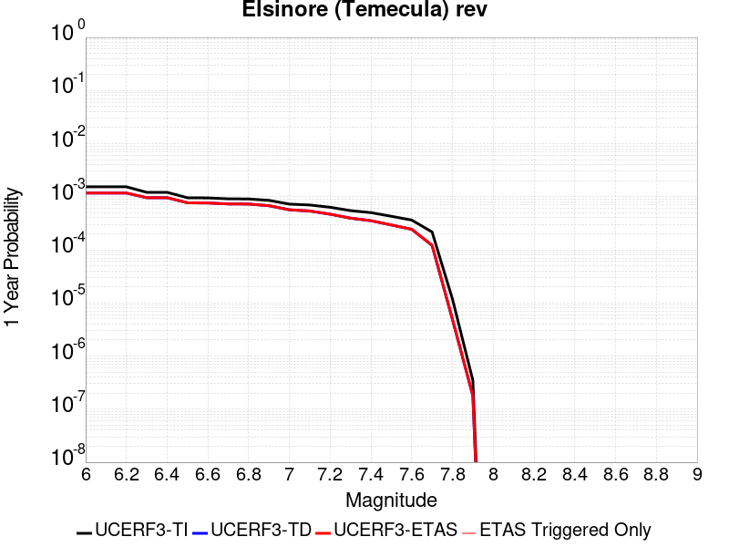 | 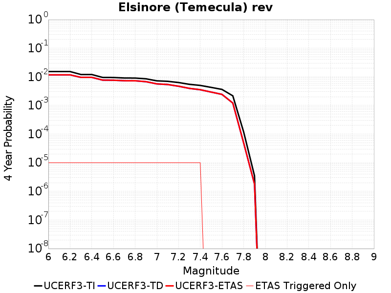 |

| Magnitude | 1 yr TI Prob | TD Prob | ETAS Prob | ETAS/TD Gain | ETAS Triggered Only | 10 yr TI Prob | TD Prob | ETAS Prob | ETAS/TD Gain | ETAS Triggered Only |
|-----|-----|-----|-----|-----|-----|-----|-----|-----|-----|-----|
| 6.0 | 0.0015388876 | 0.001174264 | 0.001174264 | 1.0 | 0.0 | 0.015282745 | 0.011696958 | 0.01170684 | 1.000845 | 1.0E-5 |
| 6.1 | 0.0015388876 | 0.001174264 | 0.001174264 | 1.0 | 0.0 | 0.015282745 | 0.011696958 | 0.01170684 | 1.000845 | 1.0E-5 |
| 6.2 | 0.0015388876 | 0.001174264 | 0.001174264 | 1.0 | 0.0 | 0.015282745 | 0.011696958 | 0.01170684 | 1.000845 | 1.0E-5 |
| 6.3 | 0.001211057 | 9.5999305E-4 | 9.5999305E-4 | 1.0 | 0.0 | 0.012044783 | 0.009569989 | 0.009579893 | 1.001035 | 1.0E-5 |
| 6.4 | 0.001211057 | 9.5999305E-4 | 9.5999305E-4 | 1.0 | 0.0 | 0.012044783 | 0.009569989 | 0.009579893 | 1.001035 | 1.0E-5 |
| 6.5 | 9.5644733E-4 | 7.69362E-4 | 7.69362E-4 | 1.0 | 0.0 | 0.009523412 | 0.0076739416 | 0.007683865 | 1.0012931 | 1.0E-5 |
| 6.6 | 9.504242E-4 | 7.6219573E-4 | 7.6219573E-4 | 1.0 | 0.0 | 0.009463696 | 0.0076027703 | 0.007612694 | 1.0013053 | 1.0E-5 |
| 6.7 | 9.13381E-4 | 7.3166913E-4 | 7.3166913E-4 | 1.0 | 0.0 | 0.00909636 | 0.0072989482 | 0.007308875 | 1.00136 | 1.0E-5 |
| 6.8 | 9.083966E-4 | 7.277056E-4 | 7.277056E-4 | 1.0 | 0.0 | 0.009046922 | 0.0072595165 | 0.007269444 | 1.0013674 | 1.0E-5 |
| 6.9 | 8.5550465E-4 | 6.77513E-4 | 6.77513E-4 | 1.0 | 0.0 | 0.008522186 | 0.006760196 | 0.0067701284 | 1.0014693 | 1.0E-5 |
| 7.0 | 7.2567526E-4 | 5.6745805E-4 | 5.6745805E-4 | 1.0 | 0.0 | 0.0072331014 | 0.0056640096 | 0.005673953 | 1.0017555 | 1.0E-5 |
| 7.1 | 6.9922156E-4 | 5.3873274E-4 | 5.3873274E-4 | 1.0 | 0.0 | 0.0069702556 | 0.0053775995 | 0.005387546 | 1.0018495 | 1.0E-5 |
| 7.2 | 6.332616E-4 | 4.6933274E-4 | 4.6933274E-4 | 1.0 | 0.0 | 0.0063146 | 0.0046848403 | 0.0046947934 | 1.0021245 | 1.0E-5 |
| 7.3 | 5.4797693E-4 | 3.9501087E-4 | 3.9501087E-4 | 1.0 | 0.0 | 0.005466277 | 0.003943477 | 0.0039534373 | 1.0025258 | 1.0E-5 |
| 7.4 | 5.0206814E-4 | 3.540706E-4 | 3.540706E-4 | 1.0 | 0.0 | 0.005009353 | 0.0035352185 | 0.0035451832 | 1.0028187 | 1.0E-5 |
| 7.5 | 4.2856473E-4 | 2.940145E-4 | 2.940145E-4 | 1.0 | 0.0 | 0.004277392 | 0.002936383 | 0.002936383 | 1.0 | 0.0 |
| 7.6 | 3.6388362E-4 | 2.4396247E-4 | 2.4396247E-4 | 1.0 | 0.0 | 0.0036328835 | 0.0024370628 | 0.0024370628 | 1.0 | 0.0 |
| 7.7 | 2.1701909E-4 | 1.2141326E-4 | 1.2141326E-4 | 1.0 | 0.0 | 0.0021680726 | 0.0012135423 | 0.0012135423 | 1.0 | 0.0 |
| 7.8 | 1.1840509E-5 | 4.897219E-6 | 4.897219E-6 | 1.0 | 0.0 | 1.1839878E-4 | 4.8971433E-5 | 4.8971433E-5 | 1.0 | 0.0 |
| 7.9 | 3.4838732E-7 | 1.794872E-7 | 1.794872E-7 | 1.0 | 0.0 | 3.4838679E-6 | 1.7948707E-6 | 1.7948707E-6 | 1.0 | 0.0 |

## Malibu Coast alt 1
*[(top)](#table-of-contents)*

| 1 Year | 10 Year |
|-----|-----|
| 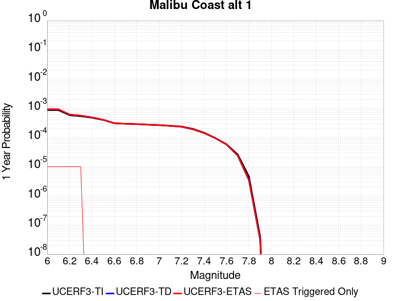 | 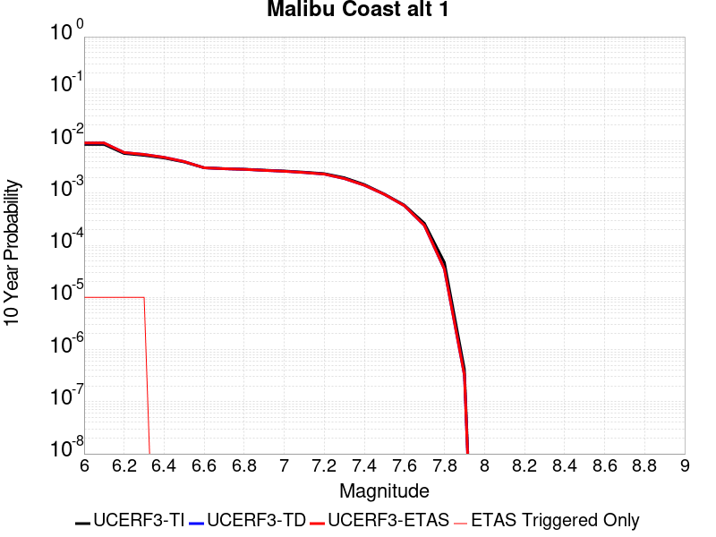 |

| Magnitude | 1 yr TI Prob | TD Prob | ETAS Prob | ETAS/TD Gain | ETAS Triggered Only | 10 yr TI Prob | TD Prob | ETAS Prob | ETAS/TD Gain | ETAS Triggered Only |
|-----|-----|-----|-----|-----|-----|-----|-----|-----|-----|-----|
| 6.0 | 8.6436566E-4 | 9.178498E-4 | 9.278406E-4 | 1.010885 | 1.0E-5 | 0.0086101135 | 0.009142523 | 0.009152431 | 1.0010837 | 1.0E-5 |
| 6.1 | 8.6436566E-4 | 9.178498E-4 | 9.278406E-4 | 1.010885 | 1.0E-5 | 0.0086101135 | 0.009142523 | 0.009152431 | 1.0010837 | 1.0E-5 |
| 6.2 | 5.782728E-4 | 6.028615E-4 | 6.128555E-4 | 1.0165776 | 1.0E-5 | 0.0057677035 | 0.0060126316 | 0.0060225716 | 1.0016532 | 1.0E-5 |
| 6.3 | 5.325294E-4 | 5.5254175E-4 | 5.625362E-4 | 1.0180882 | 1.0E-5 | 0.0053125503 | 0.005511987 | 0.0055219317 | 1.0018042 | 1.0E-5 |
| 6.4 | 4.730576E-4 | 4.8737158E-4 | 4.8737158E-4 | 1.0 | 0.0 | 0.0047205184 | 0.0048632408 | 0.0048632408 | 1.0 | 0.0 |
| 6.5 | 3.9678233E-4 | 4.0423183E-4 | 4.0423183E-4 | 1.0 | 0.0 | 0.0039607463 | 0.004035103 | 0.004035103 | 1.0 | 0.0 |
| 6.6 | 3.0727885E-4 | 3.067401E-4 | 3.067401E-4 | 1.0 | 0.0 | 0.003068543 | 0.0030631803 | 0.0030631803 | 1.0 | 0.0 |
| 6.7 | 2.955936E-4 | 2.9433062E-4 | 2.9433062E-4 | 1.0 | 0.0 | 0.0029520073 | 0.00293942 | 0.00293942 | 1.0 | 0.0 |
| 6.8 | 2.880662E-4 | 2.8639057E-4 | 2.8639057E-4 | 1.0 | 0.0 | 0.0028769306 | 0.0028602264 | 0.0028602264 | 1.0 | 0.0 |
| 6.9 | 2.7637955E-4 | 2.7389743E-4 | 2.7389743E-4 | 1.0 | 0.0 | 0.0027603607 | 0.002735609 | 0.002735609 | 1.0 | 0.0 |
| 7.0 | 2.6642776E-4 | 2.6334694E-4 | 2.6334694E-4 | 1.0 | 0.0 | 0.0026610855 | 0.0026303583 | 0.0026303583 | 1.0 | 0.0 |
| 7.1 | 2.528763E-4 | 2.4888114E-4 | 2.4888114E-4 | 1.0 | 0.0 | 0.0025258875 | 0.0024860322 | 0.0024860322 | 1.0 | 0.0 |
| 7.2 | 2.3715083E-4 | 2.3207422E-4 | 2.3207422E-4 | 1.0 | 0.0 | 0.0023689792 | 0.0023183262 | 0.0023183262 | 1.0 | 0.0 |
| 7.3 | 1.9795135E-4 | 1.9053512E-4 | 1.9053512E-4 | 1.0 | 0.0 | 0.001977751 | 0.0019037224 | 0.0019037224 | 1.0 | 0.0 |
| 7.4 | 1.4651821E-4 | 1.4186781E-4 | 1.4186781E-4 | 1.0 | 0.0 | 0.0014642165 | 0.0014177752 | 0.0014177752 | 1.0 | 0.0 |
| 7.5 | 9.59044E-5 | 9.491211E-5 | 9.491211E-5 | 1.0 | 0.0 | 9.5863023E-4 | 9.4871776E-4 | 9.4871776E-4 | 1.0 | 0.0 |
| 7.6 | 5.8921847E-5 | 5.7402427E-5 | 5.7402427E-5 | 1.0 | 0.0 | 5.890623E-4 | 5.7387765E-4 | 5.7387765E-4 | 1.0 | 0.0 |
| 7.7 | 2.6429525E-5 | 2.4049645E-5 | 2.4049645E-5 | 1.0 | 0.0 | 2.642638E-4 | 2.4047155E-4 | 2.4047155E-4 | 1.0 | 0.0 |
| 7.8 | 4.671532E-6 | 3.5000764E-6 | 3.5000764E-6 | 1.0 | 0.0 | 4.671434E-5 | 3.5000234E-5 | 3.5000234E-5 | 1.0 | 0.0 |
| 7.9 | 4.1781714E-8 | 3.2146602E-8 | 3.2146602E-8 | 1.0 | 0.0 | 4.1781706E-7 | 3.2146596E-7 | 3.2146596E-7 | 1.0 | 0.0 |

## Cucamonga
*[(top)](#table-of-contents)*

| 1 Year | 10 Year |
|-----|-----|
| 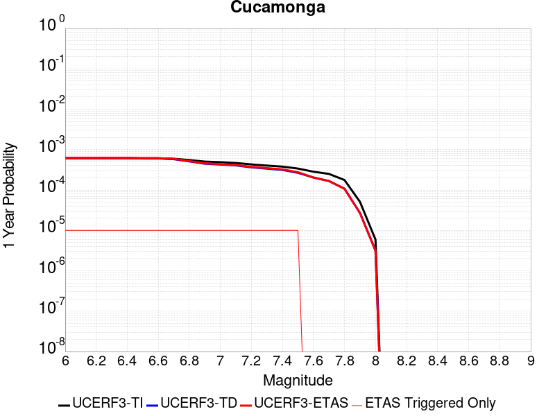 | 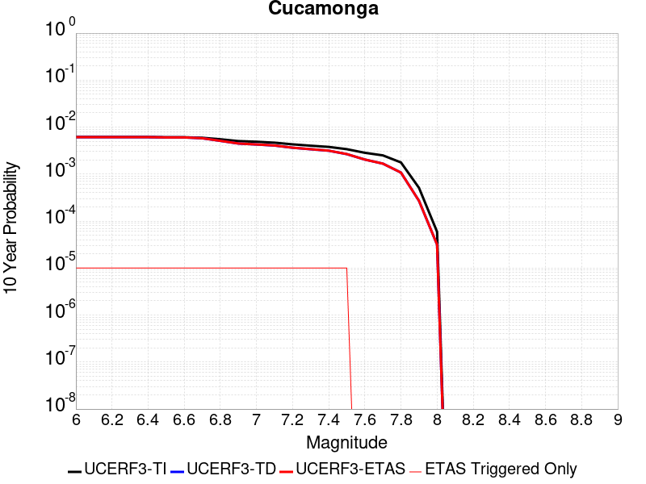 |

| Magnitude | 1 yr TI Prob | TD Prob | ETAS Prob | ETAS/TD Gain | ETAS Triggered Only | 10 yr TI Prob | TD Prob | ETAS Prob | ETAS/TD Gain | ETAS Triggered Only |
|-----|-----|-----|-----|-----|-----|-----|-----|-----|-----|-----|
| 6.0 | 6.180424E-4 | 6.122475E-4 | 6.222414E-4 | 1.0163232 | 1.0E-5 | 0.0061632637 | 0.006106783 | 0.0061167222 | 1.0016276 | 1.0E-5 |
| 6.1 | 6.180424E-4 | 6.122475E-4 | 6.222414E-4 | 1.0163232 | 1.0E-5 | 0.0061632637 | 0.006106783 | 0.0061167222 | 1.0016276 | 1.0E-5 |
| 6.2 | 6.180424E-4 | 6.122475E-4 | 6.222414E-4 | 1.0163232 | 1.0E-5 | 0.0061632637 | 0.006106783 | 0.0061167222 | 1.0016276 | 1.0E-5 |
| 6.3 | 6.180424E-4 | 6.122475E-4 | 6.222414E-4 | 1.0163232 | 1.0E-5 | 0.0061632637 | 0.006106783 | 0.0061167222 | 1.0016276 | 1.0E-5 |
| 6.4 | 6.180424E-4 | 6.122475E-4 | 6.222414E-4 | 1.0163232 | 1.0E-5 | 0.0061632637 | 0.006106783 | 0.0061167222 | 1.0016276 | 1.0E-5 |
| 6.5 | 6.102476E-4 | 6.038534E-4 | 6.1384734E-4 | 1.0165503 | 1.0E-5 | 0.006085745 | 0.0060232976 | 0.006033237 | 1.0016502 | 1.0E-5 |
| 6.6 | 6.102476E-4 | 6.038534E-4 | 6.1384734E-4 | 1.0165503 | 1.0E-5 | 0.006085745 | 0.0060232976 | 0.006033237 | 1.0016502 | 1.0E-5 |
| 6.7 | 5.9451134E-4 | 5.7980797E-4 | 5.8980216E-4 | 1.0172371 | 1.0E-5 | 0.005929234 | 0.005784103 | 0.0057940455 | 1.0017189 | 1.0E-5 |
| 6.8 | 5.521017E-4 | 5.1044795E-4 | 5.2044285E-4 | 1.0195806 | 1.0E-5 | 0.00550732 | 0.0050937645 | 0.0051037134 | 1.0019532 | 1.0E-5 |
| 6.9 | 5.054874E-4 | 4.4757465E-4 | 4.575702E-4 | 1.0223327 | 1.0E-5 | 0.005043391 | 0.0044676685 | 0.004477624 | 1.0022283 | 1.0E-5 |
| 7.0 | 4.893937E-4 | 4.2710957E-4 | 4.3710528E-4 | 1.0234032 | 1.0E-5 | 0.0048831734 | 0.004263821 | 0.0042737783 | 1.0023353 | 1.0E-5 |
| 7.1 | 4.667083E-4 | 4.0597454E-4 | 4.1597048E-4 | 1.0246221 | 1.0E-5 | 0.0046572937 | 0.0040532653 | 0.004063225 | 1.0024571 | 1.0E-5 |
| 7.2 | 4.3043532E-4 | 3.6390263E-4 | 3.7389898E-4 | 1.0274699 | 1.0E-5 | 0.0042960253 | 0.0036340007 | 0.0036439644 | 1.0027418 | 1.0E-5 |
| 7.3 | 4.026285E-4 | 3.383997E-4 | 3.483963E-4 | 1.0295409 | 1.0E-5 | 0.004018998 | 0.0033797808 | 0.003389747 | 1.0029488 | 1.0E-5 |
| 7.4 | 3.7956095E-4 | 3.146997E-4 | 3.2469654E-4 | 1.0317663 | 1.0E-5 | 0.0037891332 | 0.0031434763 | 0.0031534447 | 1.0031712 | 1.0E-5 |
| 7.5 | 3.3967546E-4 | 2.661143E-4 | 2.7611165E-4 | 1.0375679 | 1.0E-5 | 0.0033915674 | 0.0026588808 | 0.002668854 | 1.003751 | 1.0E-5 |
| 7.6 | 2.8430918E-4 | 2.0392986E-4 | 2.0392986E-4 | 1.0 | 0.0 | 0.0028394572 | 0.0020383478 | 0.0020383478 | 1.0 | 0.0 |
| 7.7 | 2.504116E-4 | 1.669775E-4 | 1.669775E-4 | 1.0 | 0.0 | 0.002501296 | 0.0016694516 | 0.0016694516 | 1.0 | 0.0 |
| 7.8 | 1.7708774E-4 | 1.0770662E-4 | 1.0770662E-4 | 1.0 | 0.0 | 0.0017694668 | 0.0010767811 | 0.0010767811 | 1.0 | 0.0 |
| 7.9 | 5.0875715E-5 | 2.6905143E-5 | 2.6905143E-5 | 1.0 | 0.0 | 5.086407E-4 | 2.6901928E-4 | 2.6901928E-4 | 1.0 | 0.0 |
| 8.0 | 5.9162867E-6 | 3.1587497E-6 | 3.1587497E-6 | 1.0 | 0.0 | 5.916129E-5 | 3.1587064E-5 | 3.1587064E-5 | 1.0 | 0.0 |

## San Gabriel (Extension)
*[(top)](#table-of-contents)*

| 1 Year | 10 Year |
|-----|-----|
| 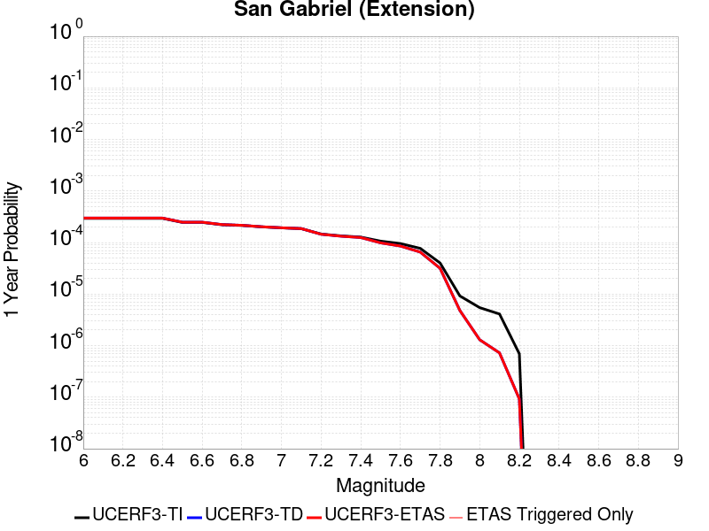 | 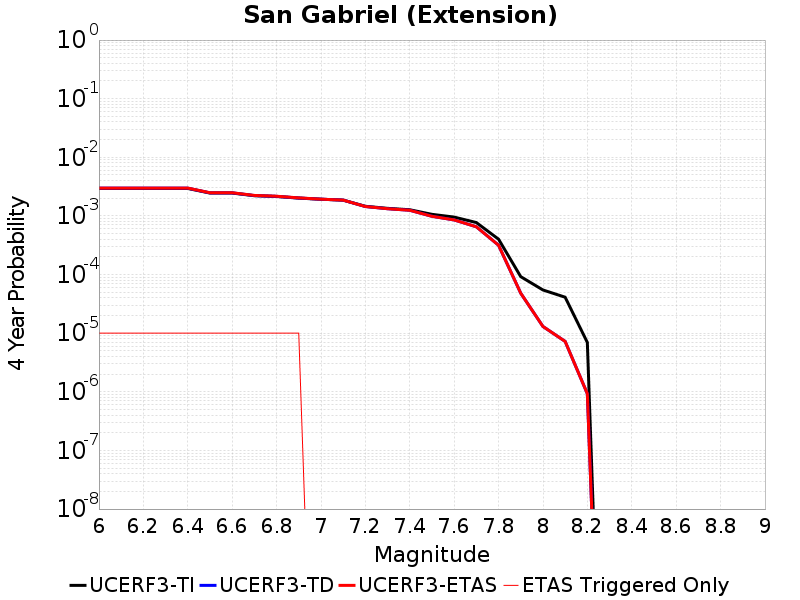 |

| Magnitude | 1 yr TI Prob | TD Prob | ETAS Prob | ETAS/TD Gain | ETAS Triggered Only | 10 yr TI Prob | TD Prob | ETAS Prob | ETAS/TD Gain | ETAS Triggered Only |
|-----|-----|-----|-----|-----|-----|-----|-----|-----|-----|-----|
| 6.0 | 2.9469383E-4 | 2.982553E-4 | 2.982553E-4 | 1.0 | 0.0 | 0.0029430336 | 0.0029786804 | 0.0029886507 | 1.0033472 | 1.0E-5 |
| 6.1 | 2.9469383E-4 | 2.982553E-4 | 2.982553E-4 | 1.0 | 0.0 | 0.0029430336 | 0.0029786804 | 0.0029886507 | 1.0033472 | 1.0E-5 |
| 6.2 | 2.9469383E-4 | 2.982553E-4 | 2.982553E-4 | 1.0 | 0.0 | 0.0029430336 | 0.0029786804 | 0.0029886507 | 1.0033472 | 1.0E-5 |
| 6.3 | 2.9469383E-4 | 2.982553E-4 | 2.982553E-4 | 1.0 | 0.0 | 0.0029430336 | 0.0029786804 | 0.0029886507 | 1.0033472 | 1.0E-5 |
| 6.4 | 2.9469383E-4 | 2.982553E-4 | 2.982553E-4 | 1.0 | 0.0 | 0.0029430336 | 0.0029786804 | 0.0029886507 | 1.0033472 | 1.0E-5 |
| 6.5 | 2.459117E-4 | 2.4804243E-4 | 2.4804243E-4 | 1.0 | 0.0 | 0.0024563975 | 0.0024777441 | 0.0024877193 | 1.0040259 | 1.0E-5 |
| 6.6 | 2.459117E-4 | 2.4804243E-4 | 2.4804243E-4 | 1.0 | 0.0 | 0.0024563975 | 0.0024777441 | 0.0024877193 | 1.0040259 | 1.0E-5 |
| 6.7 | 2.2157225E-4 | 2.2299285E-4 | 2.2299285E-4 | 1.0 | 0.0 | 0.0022135144 | 0.0022277667 | 0.0022377444 | 1.0044788 | 1.0E-5 |
| 6.8 | 2.1485193E-4 | 2.160749E-4 | 2.160749E-4 | 1.0 | 0.0 | 0.0021464431 | 0.0021587233 | 0.0021687017 | 1.0046223 | 1.0E-5 |
| 6.9 | 2.0159081E-4 | 2.0242333E-4 | 2.0242333E-4 | 1.0 | 0.0 | 0.0020140803 | 0.002022461 | 0.0020324406 | 1.0049344 | 1.0E-5 |
| 7.0 | 1.9276788E-4 | 1.9334075E-4 | 1.9334075E-4 | 1.0 | 0.0 | 0.0019260074 | 0.0019317956 | 0.0019317956 | 1.0 | 0.0 |
| 7.1 | 1.861918E-4 | 1.8641379E-4 | 1.8641379E-4 | 1.0 | 0.0 | 0.0018603588 | 0.0018626438 | 0.0018626438 | 1.0 | 0.0 |
| 7.2 | 1.4621185E-4 | 1.4488015E-4 | 1.4488015E-4 | 1.0 | 0.0 | 0.001461157 | 0.0014478716 | 0.0014478716 | 1.0 | 0.0 |
| 7.3 | 1.3483623E-4 | 1.3283768E-4 | 1.3283768E-4 | 1.0 | 0.0 | 0.0013475444 | 0.0013275963 | 0.0013275963 | 1.0 | 0.0 |
| 7.4 | 1.276441E-4 | 1.2504842E-4 | 1.2504842E-4 | 1.0 | 0.0 | 0.0012757082 | 0.0012497939 | 0.0012497939 | 1.0 | 0.0 |
| 7.5 | 1.0654447E-4 | 9.866843E-5 | 9.866843E-5 | 1.0 | 0.0 | 0.001064934 | 9.862534E-4 | 9.862534E-4 | 1.0 | 0.0 |
| 7.6 | 9.562107E-5 | 8.556181E-5 | 8.556181E-5 | 1.0 | 0.0 | 9.5579936E-4 | 8.552945E-4 | 8.552945E-4 | 1.0 | 0.0 |
| 7.7 | 7.715353E-5 | 6.534659E-5 | 6.534659E-5 | 1.0 | 0.0 | 7.7126746E-4 | 6.532815E-4 | 6.532815E-4 | 1.0 | 0.0 |
| 7.8 | 4.0163945E-5 | 3.1669624E-5 | 3.1669624E-5 | 1.0 | 0.0 | 4.0156685E-4 | 3.1665718E-4 | 3.1665718E-4 | 1.0 | 0.0 |
| 7.9 | 9.207345E-6 | 4.8075917E-6 | 4.8075917E-6 | 1.0 | 0.0 | 9.206964E-5 | 4.8079564E-5 | 4.8079564E-5 | 1.0 | 0.0 |
| 8.0 | 5.45967E-6 | 1.3019278E-6 | 1.3019278E-6 | 1.0 | 0.0 | 5.459536E-5 | 1.3023884E-5 | 1.3023884E-5 | 1.0 | 0.0 |
| 8.1 | 4.109428E-6 | 7.236251E-7 | 7.236251E-7 | 1.0 | 0.0 | 4.109352E-5 | 7.2409093E-6 | 7.2409093E-6 | 1.0 | 0.0 |
| 8.2 | 6.9482525E-7 | 9.2543345E-8 | 9.2543345E-8 | 1.0 | 0.0 | 6.9482307E-6 | 9.273999E-7 | 9.273999E-7 | 1.0 | 0.0 |

## Anaheim
*[(top)](#table-of-contents)*

| 1 Year | 10 Year |
|-----|-----|
|  | 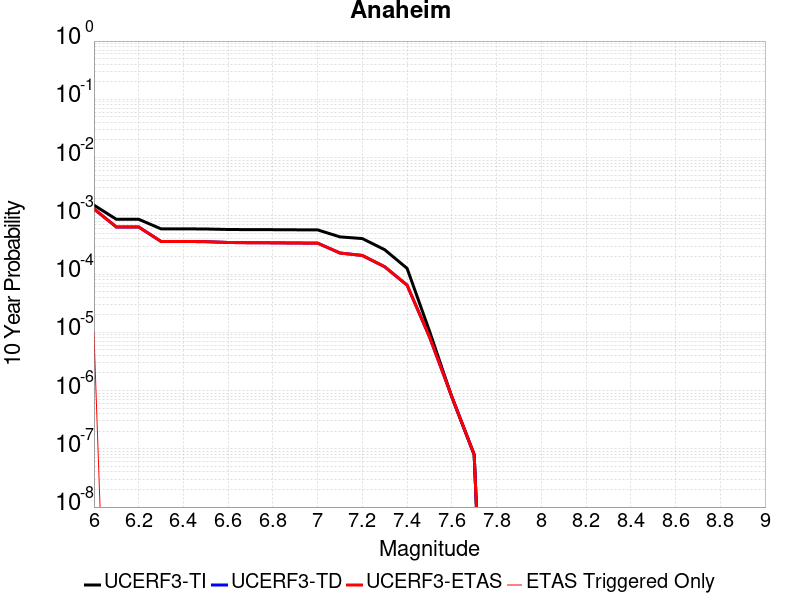 |

| Magnitude | 1 yr TI Prob | TD Prob | ETAS Prob | ETAS/TD Gain | ETAS Triggered Only | 10 yr TI Prob | TD Prob | ETAS Prob | ETAS/TD Gain | ETAS Triggered Only |
|-----|-----|-----|-----|-----|-----|-----|-----|-----|-----|-----|
| 6.0 | 1.5263697E-4 | 1.3108166E-4 | 1.3108166E-4 | 1.0 | 0.0 | 0.0015253217 | 0.0013102737 | 0.0013202606 | 1.007622 | 1.0E-5 |
| 6.1 | 8.7289525E-5 | 6.4372995E-5 | 6.4372995E-5 | 1.0 | 0.0 | 8.7255245E-4 | 6.435844E-4 | 6.435844E-4 | 1.0 | 0.0 |
| 6.2 | 8.7289525E-5 | 6.4372995E-5 | 6.4372995E-5 | 1.0 | 0.0 | 8.7255245E-4 | 6.435844E-4 | 6.435844E-4 | 1.0 | 0.0 |
| 6.3 | 5.971174E-5 | 3.6314017E-5 | 3.6314017E-5 | 1.0 | 0.0 | 5.96957E-4 | 3.6308632E-4 | 3.6308632E-4 | 1.0 | 0.0 |
| 6.4 | 5.971174E-5 | 3.6314017E-5 | 3.6314017E-5 | 1.0 | 0.0 | 5.96957E-4 | 3.6308632E-4 | 3.6308632E-4 | 1.0 | 0.0 |
| 6.5 | 5.9405233E-5 | 3.6004523E-5 | 3.6004523E-5 | 1.0 | 0.0 | 5.938936E-4 | 3.599924E-4 | 3.599924E-4 | 1.0 | 0.0 |
| 6.6 | 5.8258374E-5 | 3.4845525E-5 | 3.4845525E-5 | 1.0 | 0.0 | 5.8243104E-4 | 3.4840606E-4 | 3.4840606E-4 | 1.0 | 0.0 |
| 6.7 | 5.7907404E-5 | 3.449174E-5 | 3.449174E-5 | 1.0 | 0.0 | 5.7892315E-4 | 3.4486927E-4 | 3.4486927E-4 | 1.0 | 0.0 |
| 6.8 | 5.779963E-5 | 3.4383225E-5 | 3.4383225E-5 | 1.0 | 0.0 | 5.77846E-4 | 3.437845E-4 | 3.437845E-4 | 1.0 | 0.0 |
| 6.9 | 5.752248E-5 | 3.410448E-5 | 3.410448E-5 | 1.0 | 0.0 | 5.750759E-4 | 3.409979E-4 | 3.409979E-4 | 1.0 | 0.0 |
| 7.0 | 5.7358633E-5 | 3.396938E-5 | 3.396938E-5 | 1.0 | 0.0 | 5.734383E-4 | 3.3964732E-4 | 3.3964732E-4 | 1.0 | 0.0 |
| 7.1 | 4.348927E-5 | 2.2984028E-5 | 2.2984028E-5 | 1.0 | 0.0 | 4.3480762E-4 | 2.2981873E-4 | 2.2981873E-4 | 1.0 | 0.0 |
| 7.2 | 4.0669314E-5 | 2.0858992E-5 | 2.0858992E-5 | 1.0 | 0.0 | 4.066187E-4 | 2.0857238E-4 | 2.0857238E-4 | 1.0 | 0.0 |
| 7.3 | 2.617786E-5 | 1.3343782E-5 | 1.3343782E-5 | 1.0 | 0.0 | 2.6174777E-4 | 1.3343105E-4 | 1.3343105E-4 | 1.0 | 0.0 |
| 7.4 | 1.252705E-5 | 6.4533724E-6 | 6.4533724E-6 | 1.0 | 0.0 | 1.2526344E-4 | 6.4532614E-5 | 6.4532614E-5 | 1.0 | 0.0 |
| 7.5 | 1.0573395E-6 | 8.411641E-7 | 8.411641E-7 | 1.0 | 0.0 | 1.0573345E-5 | 8.411618E-6 | 8.411618E-6 | 1.0 | 0.0 |
| 7.6 | 7.7596994E-8 | 7.87071E-8 | 7.87071E-8 | 1.0 | 0.0 | 7.759697E-7 | 7.870708E-7 | 7.870708E-7 | 1.0 | 0.0 |
| 7.7 | 7.875465E-9 | 8.000814E-9 | 8.000814E-9 | 1.0 | 0.0 | 7.8754645E-8 | 8.000814E-8 | 8.000814E-8 | 1.0 | 0.0 |

## Hosgri (Extension)
*[(top)](#table-of-contents)*

| 1 Year | 10 Year |
|-----|-----|
| 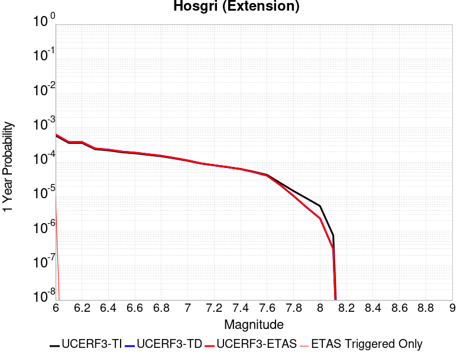 | 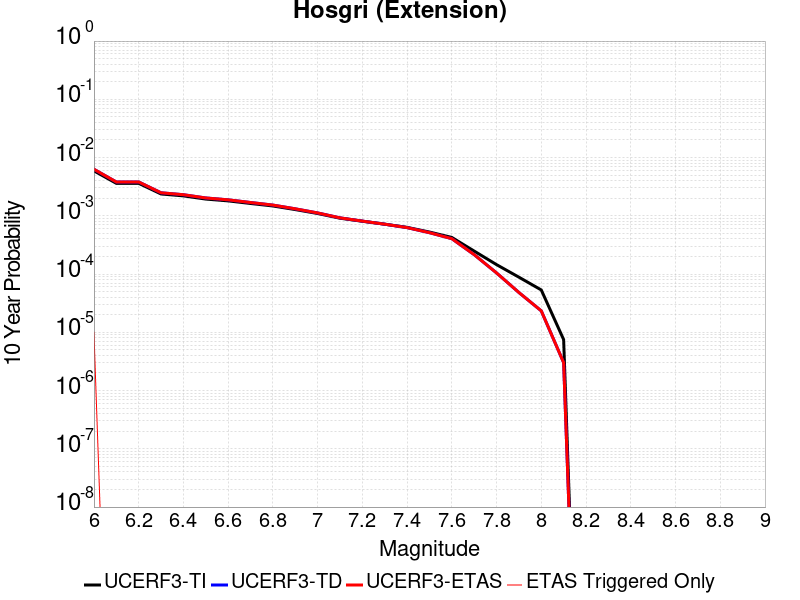 |

| Magnitude | 1 yr TI Prob | TD Prob | ETAS Prob | ETAS/TD Gain | ETAS Triggered Only | 10 yr TI Prob | TD Prob | ETAS Prob | ETAS/TD Gain | ETAS Triggered Only |
|-----|-----|-----|-----|-----|-----|-----|-----|-----|-----|-----|
| 6.0 | 5.9305265E-4 | 6.303074E-4 | 6.4030115E-4 | 1.0158553 | 1.0E-5 | 0.005914725 | 0.006287446 | 0.006297383 | 1.0015805 | 1.0E-5 |
| 6.1 | 3.617931E-4 | 3.82118E-4 | 3.82118E-4 | 1.0 | 0.0 | 0.0036120464 | 0.0038150225 | 0.0038150225 | 1.0 | 0.0 |
| 6.2 | 3.617931E-4 | 3.82118E-4 | 3.82118E-4 | 1.0 | 0.0 | 0.0036120464 | 0.0038150225 | 0.0038150225 | 1.0 | 0.0 |
| 6.3 | 2.3730492E-4 | 2.488272E-4 | 2.488272E-4 | 1.0 | 0.0 | 0.0023705168 | 0.0024855284 | 0.0024855284 | 1.0 | 0.0 |
| 6.4 | 2.2007042E-4 | 2.3044008E-4 | 2.3044008E-4 | 1.0 | 0.0 | 0.002198526 | 0.0023020448 | 0.0023020448 | 1.0 | 0.0 |
| 6.5 | 1.9394881E-4 | 2.0263548E-4 | 2.0263548E-4 | 1.0 | 0.0 | 0.0019377962 | 0.002024526 | 0.002024526 | 1.0 | 0.0 |
| 6.6 | 1.8054814E-4 | 1.8825925E-4 | 1.8825925E-4 | 1.0 | 0.0 | 0.0018040152 | 0.0018810123 | 0.0018810123 | 1.0 | 0.0 |
| 6.7 | 1.6296357E-4 | 1.6938757E-4 | 1.6938757E-4 | 1.0 | 0.0 | 0.001628441 | 0.0016925955 | 0.0016925955 | 1.0 | 0.0 |
| 6.8 | 1.4760658E-4 | 1.5290023E-4 | 1.5290023E-4 | 1.0 | 0.0 | 0.0014750857 | 0.001527959 | 0.001527959 | 1.0 | 0.0 |
| 6.9 | 1.2804402E-4 | 1.319158E-4 | 1.319158E-4 | 1.0 | 0.0 | 0.0012797028 | 0.001318381 | 0.001318381 | 1.0 | 0.0 |
| 7.0 | 1.096116E-4 | 1.1217119E-4 | 1.1217119E-4 | 1.0 | 0.0 | 0.0010955755 | 0.0011211494 | 0.0011211494 | 1.0 | 0.0 |
| 7.1 | 9.1015405E-5 | 9.228084E-5 | 9.228084E-5 | 1.0 | 0.0 | 9.097813E-4 | 9.2242693E-4 | 9.2242693E-4 | 1.0 | 0.0 |
| 7.2 | 8.064707E-5 | 8.1201804E-5 | 8.1201804E-5 | 1.0 | 0.0 | 8.0617814E-4 | 8.117226E-4 | 8.117226E-4 | 1.0 | 0.0 |
| 7.3 | 7.187409E-5 | 7.182705E-5 | 7.182705E-5 | 1.0 | 0.0 | 7.185085E-4 | 7.180394E-4 | 7.180394E-4 | 1.0 | 0.0 |
| 7.4 | 6.336844E-5 | 6.273489E-5 | 6.273489E-5 | 1.0 | 0.0 | 6.335037E-4 | 6.2717265E-4 | 6.2717265E-4 | 1.0 | 0.0 |
| 7.5 | 5.2704854E-5 | 5.135425E-5 | 5.135425E-5 | 1.0 | 0.0 | 5.2692357E-4 | 5.134244E-4 | 5.134244E-4 | 1.0 | 0.0 |
| 7.6 | 4.255502E-5 | 4.0520998E-5 | 4.0520998E-5 | 1.0 | 0.0 | 4.2546875E-4 | 4.0513652E-4 | 4.0513652E-4 | 1.0 | 0.0 |
| 7.7 | 2.4825302E-5 | 2.155424E-5 | 2.155424E-5 | 1.0 | 0.0 | 2.482253E-4 | 2.1552162E-4 | 2.1552162E-4 | 1.0 | 0.0 |
| 7.8 | 1.452008E-5 | 1.0460631E-5 | 1.0460631E-5 | 1.0 | 0.0 | 1.4519131E-4 | 1.04601415E-4 | 1.04601415E-4 | 1.0 | 0.0 |
| 7.9 | 8.843231E-6 | 4.8235593E-6 | 4.8235593E-6 | 1.0 | 0.0 | 8.842879E-5 | 4.8234553E-5 | 4.8234553E-5 | 1.0 | 0.0 |
| 8.0 | 5.335502E-6 | 2.33445E-6 | 2.33445E-6 | 1.0 | 0.0 | 5.335374E-5 | 2.3344257E-5 | 2.3344257E-5 | 1.0 | 0.0 |
| 8.1 | 7.4986497E-7 | 3.0200158E-7 | 3.0200158E-7 | 1.0 | 0.0 | 7.4986247E-6 | 3.0200124E-6 | 3.0200124E-6 | 1.0 | 0.0 |

## Eaton Roughs 2011 CFM
*[(top)](#table-of-contents)*

| 1 Year | 10 Year |
|-----|-----|
| 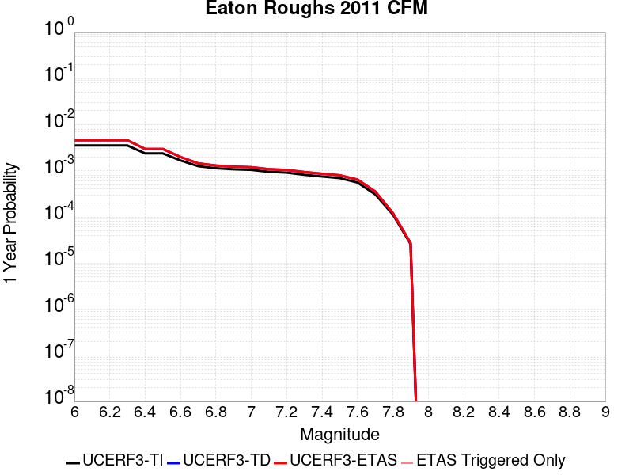 | 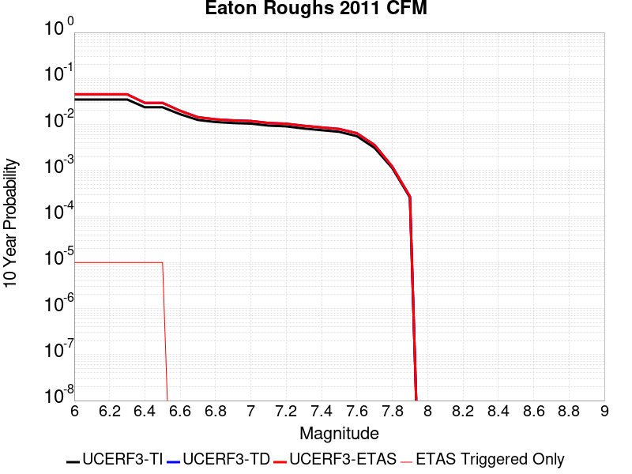 |

| Magnitude | 1 yr TI Prob | TD Prob | ETAS Prob | ETAS/TD Gain | ETAS Triggered Only | 10 yr TI Prob | TD Prob | ETAS Prob | ETAS/TD Gain | ETAS Triggered Only |
|-----|-----|-----|-----|-----|-----|-----|-----|-----|-----|-----|
| 6.0 | 0.0035443127 | 0.0046051056 | 0.0046051056 | 1.0 | 0.0 | 0.03488314 | 0.0451635 | 0.04517305 | 1.0002115 | 1.0E-5 |
| 6.1 | 0.0035443127 | 0.0046051056 | 0.0046051056 | 1.0 | 0.0 | 0.03488314 | 0.0451635 | 0.04517305 | 1.0002115 | 1.0E-5 |
| 6.2 | 0.0035443127 | 0.0046051056 | 0.0046051056 | 1.0 | 0.0 | 0.03488314 | 0.0451635 | 0.04517305 | 1.0002115 | 1.0E-5 |
| 6.3 | 0.0035443127 | 0.0046051056 | 0.0046051056 | 1.0 | 0.0 | 0.03488314 | 0.0451635 | 0.04517305 | 1.0002115 | 1.0E-5 |
| 6.4 | 0.0023885423 | 0.0029784564 | 0.0029784564 | 1.0 | 0.0 | 0.023630321 | 0.029421674 | 0.02943138 | 1.0003299 | 1.0E-5 |
| 6.5 | 0.0023885423 | 0.0029784564 | 0.0029784564 | 1.0 | 0.0 | 0.023630321 | 0.029421674 | 0.02943138 | 1.0003299 | 1.0E-5 |
| 6.6 | 0.0016799092 | 0.0019946035 | 0.0019946035 | 1.0 | 0.0 | 0.016672665 | 0.019776646 | 0.019776646 | 1.0 | 0.0 |
| 6.7 | 0.0012596287 | 0.0014488272 | 0.0014488272 | 1.0 | 0.0 | 0.012525126 | 0.014394969 | 0.014394969 | 1.0 | 0.0 |
| 6.8 | 0.001137623 | 0.001300555 | 0.001300555 | 1.0 | 0.0 | 0.011318169 | 0.012930061 | 0.012930061 | 1.0 | 0.0 |
| 6.9 | 0.0010795488 | 0.0012321844 | 0.0012321844 | 1.0 | 0.0 | 0.010743194 | 0.0122540565 | 0.0122540565 | 1.0 | 0.0 |
| 7.0 | 0.0010484619 | 0.001196097 | 0.001196097 | 1.0 | 0.0 | 0.010435291 | 0.011897093 | 0.011897093 | 1.0 | 0.0 |
| 7.1 | 9.5052324E-4 | 0.0010833354 | 0.0010833354 | 1.0 | 0.0 | 0.009464677 | 0.010780843 | 0.010780843 | 1.0 | 0.0 |
| 7.2 | 9.141015E-4 | 0.0010427014 | 0.0010427014 | 1.0 | 0.0 | 0.009103506 | 0.010378368 | 0.010378368 | 1.0 | 0.0 |
| 7.3 | 8.2029426E-4 | 9.3990593E-4 | 9.3990593E-4 | 1.0 | 0.0 | 0.008172729 | 0.009359527 | 0.009359527 | 1.0 | 0.0 |
| 7.4 | 7.540854E-4 | 8.657134E-4 | 8.657134E-4 | 1.0 | 0.0 | 0.007515317 | 0.00862357 | 0.00862357 | 1.0 | 0.0 |
| 7.5 | 6.9520384E-4 | 8.003909E-4 | 8.003909E-4 | 1.0 | 0.0 | 0.00693033 | 0.007975223 | 0.007975223 | 1.0 | 0.0 |
| 7.6 | 5.581306E-4 | 6.461754E-4 | 6.461754E-4 | 1.0 | 0.0 | 0.005567309 | 0.0064430465 | 0.0064430465 | 1.0 | 0.0 |
| 7.7 | 3.0984267E-4 | 3.5751535E-4 | 3.5751535E-4 | 1.0 | 0.0 | 0.0030941102 | 0.0035694262 | 0.0035694262 | 1.0 | 0.0 |
| 7.8 | 1.1281446E-4 | 1.21553334E-4 | 1.21553334E-4 | 1.0 | 0.0 | 0.001127572 | 0.0012148742 | 0.0012148742 | 1.0 | 0.0 |
| 7.9 | 2.5873042E-5 | 2.7231263E-5 | 2.7231263E-5 | 1.0 | 0.0 | 2.5870028E-4 | 2.7228135E-4 | 2.7228135E-4 | 1.0 | 0.0 |

## Bartlett Springs 2011 CFM
*[(top)](#table-of-contents)*

| 1 Year | 10 Year |
|-----|-----|
| 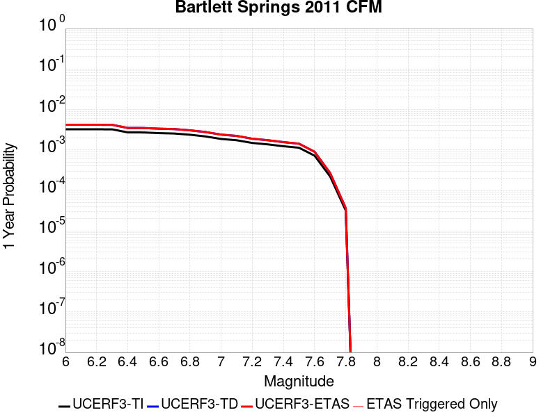 | 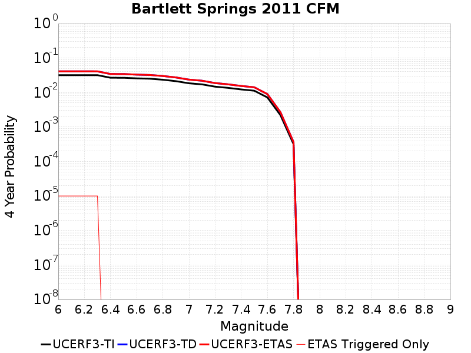 |

| Magnitude | 1 yr TI Prob | TD Prob | ETAS Prob | ETAS/TD Gain | ETAS Triggered Only | 10 yr TI Prob | TD Prob | ETAS Prob | ETAS/TD Gain | ETAS Triggered Only |
|-----|-----|-----|-----|-----|-----|-----|-----|-----|-----|-----|
| 6.0 | 0.003246908 | 0.004197408 | 0.004197408 | 1.0 | 0.0 | 0.031998757 | 0.041197836 | 0.041207425 | 1.0002327 | 1.0E-5 |
| 6.1 | 0.0032443295 | 0.0041941605 | 0.0041941605 | 1.0 | 0.0 | 0.031973712 | 0.041166574 | 0.04117616 | 1.0002329 | 1.0E-5 |
| 6.2 | 0.0032426978 | 0.0041921134 | 0.0041921134 | 1.0 | 0.0 | 0.03195787 | 0.041146863 | 0.041156452 | 1.000233 | 1.0E-5 |
| 6.3 | 0.00323983 | 0.0041884677 | 0.0041884677 | 1.0 | 0.0 | 0.031930014 | 0.041111764 | 0.041121352 | 1.0002333 | 1.0E-5 |
| 6.4 | 0.0027188298 | 0.0035032223 | 0.0035032223 | 1.0 | 0.0 | 0.026858058 | 0.034489326 | 0.034489326 | 1.0 | 0.0 |
| 6.5 | 0.0027123666 | 0.0034950413 | 0.0034950413 | 1.0 | 0.0 | 0.026794989 | 0.03441007 | 0.03441007 | 1.0 | 0.0 |
| 6.6 | 0.0026100394 | 0.0033596556 | 0.0033596556 | 1.0 | 0.0 | 0.025795965 | 0.03309767 | 0.03309767 | 1.0 | 0.0 |
| 6.7 | 0.0025499484 | 0.0032829274 | 0.0032829274 | 1.0 | 0.0 | 0.025208864 | 0.032353036 | 0.032353036 | 1.0 | 0.0 |
| 6.8 | 0.002380709 | 0.0030605155 | 0.0030605155 | 1.0 | 0.0 | 0.023553653 | 0.030190507 | 0.030190507 | 1.0 | 0.0 |
| 6.9 | 0.002159946 | 0.0027732074 | 0.0027732074 | 1.0 | 0.0 | 0.021390721 | 0.02739085 | 0.02739085 | 1.0 | 0.0 |
| 7.0 | 0.001872538 | 0.0023978692 | 0.0023978692 | 1.0 | 0.0 | 0.018568378 | 0.02372307 | 0.02372307 | 1.0 | 0.0 |
| 7.1 | 0.0017406568 | 0.0022250717 | 0.0022250717 | 1.0 | 0.0 | 0.017270854 | 0.022030598 | 0.022030598 | 1.0 | 0.0 |
| 7.2 | 0.0014922376 | 0.0018976332 | 0.0018976332 | 1.0 | 0.0 | 0.014822568 | 0.018816177 | 0.018816177 | 1.0 | 0.0 |
| 7.3 | 0.0013753743 | 0.0017424753 | 0.0017424753 | 1.0 | 0.0 | 0.01366893 | 0.017289763 | 0.017289763 | 1.0 | 0.0 |
| 7.4 | 0.0012378981 | 0.001563073 | 0.001563073 | 1.0 | 0.0 | 0.012310251 | 0.01552211 | 0.01552211 | 1.0 | 0.0 |
| 7.5 | 0.0011363103 | 0.0014307551 | 0.0014307551 | 1.0 | 0.0 | 0.011305175 | 0.014216609 | 0.014216609 | 1.0 | 0.0 |
| 7.6 | 7.2477816E-4 | 9.0586196E-4 | 9.0586196E-4 | 1.0 | 0.0 | 0.0072241887 | 0.009022104 | 0.009022104 | 1.0 | 0.0 |
| 7.7 | 2.2152514E-4 | 2.6933532E-4 | 2.6933532E-4 | 1.0 | 0.0 | 0.0022130446 | 0.0026901085 | 0.0026901085 | 1.0 | 0.0 |
| 7.8 | 3.206423E-5 | 3.676968E-5 | 3.676968E-5 | 1.0 | 0.0 | 3.2059604E-4 | 3.676354E-4 | 3.676354E-4 | 1.0 | 0.0 |

## Honey Lake 2011 CFM
*[(top)](#table-of-contents)*

| 1 Year | 10 Year |
|-----|-----|
| 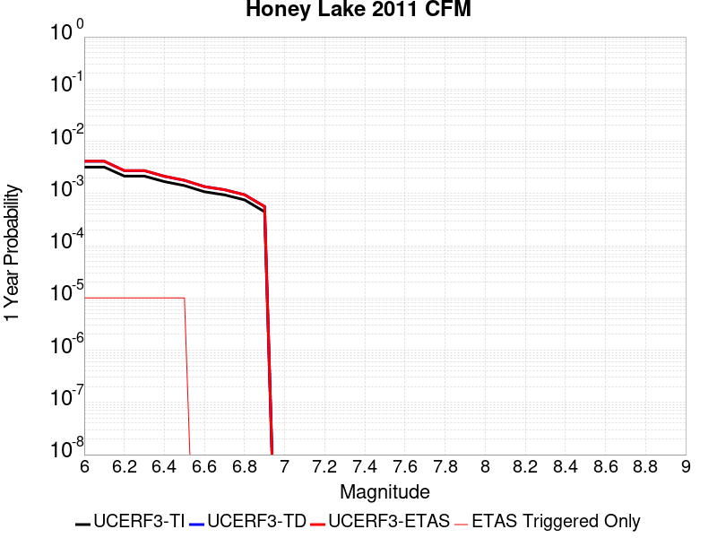 | 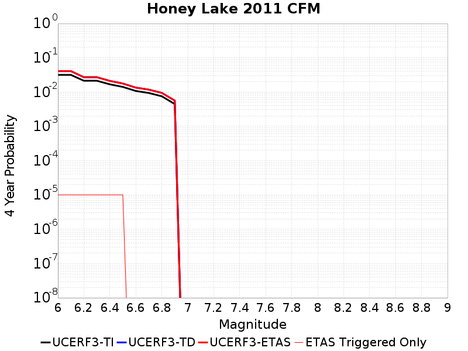 |

| Magnitude | 1 yr TI Prob | TD Prob | ETAS Prob | ETAS/TD Gain | ETAS Triggered Only | 10 yr TI Prob | TD Prob | ETAS Prob | ETAS/TD Gain | ETAS Triggered Only |
|-----|-----|-----|-----|-----|-----|-----|-----|-----|-----|-----|
| 6.0 | 0.0032068014 | 0.004142809 | 0.004152768 | 1.0024039 | 1.0E-5 | 0.03160919 | 0.040703062 | 0.040712655 | 1.0002357 | 1.0E-5 |
| 6.1 | 0.0032068014 | 0.004142809 | 0.004152768 | 1.0024039 | 1.0E-5 | 0.03160919 | 0.040703062 | 0.040712655 | 1.0002357 | 1.0E-5 |
| 6.2 | 0.0021545228 | 0.0027398684 | 0.002749841 | 1.0036398 | 1.0E-5 | 0.021337535 | 0.027076798 | 0.027086526 | 1.0003593 | 1.0E-5 |
| 6.3 | 0.0021545228 | 0.0027398684 | 0.002749841 | 1.0036398 | 1.0E-5 | 0.021337535 | 0.027076798 | 0.027086526 | 1.0003593 | 1.0E-5 |
| 6.4 | 0.0016888566 | 0.0021313417 | 0.0021413204 | 1.0046818 | 1.0E-5 | 0.016760793 | 0.021119887 | 0.021129677 | 1.0004635 | 1.0E-5 |
| 6.5 | 0.0014185566 | 0.0017836643 | 0.0017936465 | 1.0055964 | 1.0E-5 | 0.014095354 | 0.017702987 | 0.01771281 | 1.0005549 | 1.0E-5 |
| 6.6 | 0.0010791414 | 0.001353508 | 0.001353508 | 1.0 | 0.0 | 0.010739161 | 0.013461044 | 0.013461044 | 1.0 | 0.0 |
| 6.7 | 9.419576E-4 | 0.0011816063 | 0.0011816063 | 1.0 | 0.0 | 0.009379748 | 0.011761275 | 0.011761275 | 1.0 | 0.0 |
| 6.8 | 7.5498753E-4 | 9.483166E-4 | 9.483166E-4 | 1.0 | 0.0 | 0.007524277 | 0.009450221 | 0.009450221 | 1.0 | 0.0 |
| 6.9 | 4.4678818E-4 | 5.635663E-4 | 5.635663E-4 | 1.0 | 0.0 | 0.0044589094 | 0.005627866 | 0.005627866 | 1.0 | 0.0 |

## Johnson Valley (No) 2011 rev
*[(top)](#table-of-contents)*

| 1 Year | 10 Year |
|-----|-----|
| 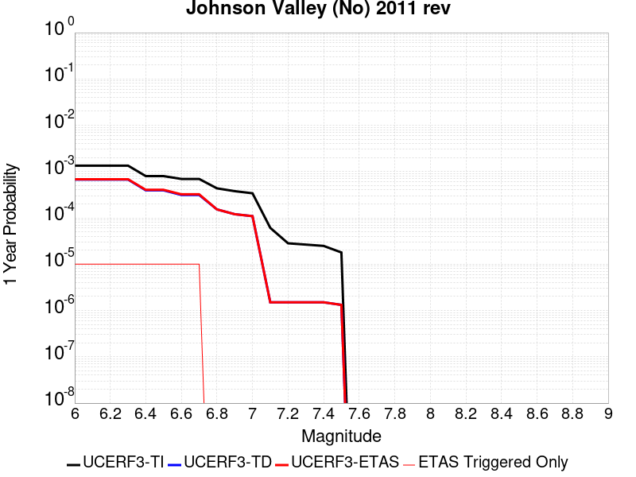 | 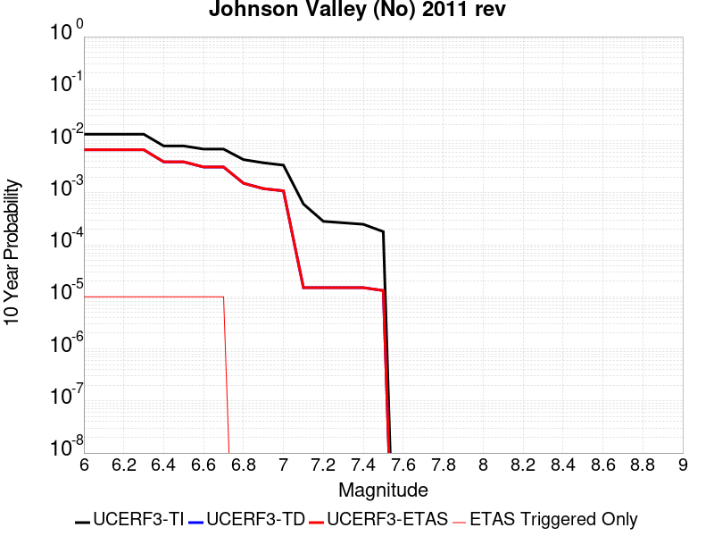 |

| Magnitude | 1 yr TI Prob | TD Prob | ETAS Prob | ETAS/TD Gain | ETAS Triggered Only | 10 yr TI Prob | TD Prob | ETAS Prob | ETAS/TD Gain | ETAS Triggered Only |
|-----|-----|-----|-----|-----|-----|-----|-----|-----|-----|-----|
| 6.0 | 0.0013441239 | 6.729738E-4 | 6.829671E-4 | 1.0148494 | 1.0E-5 | 0.013360229 | 0.0067132674 | 0.0067232 | 1.0014796 | 1.0E-5 |
| 6.1 | 0.0013441239 | 6.729738E-4 | 6.829671E-4 | 1.0148494 | 1.0E-5 | 0.013360229 | 0.0067132674 | 0.0067232 | 1.0014796 | 1.0E-5 |
| 6.2 | 0.0013441239 | 6.729738E-4 | 6.829671E-4 | 1.0148494 | 1.0E-5 | 0.013360229 | 0.0067132674 | 0.0067232 | 1.0014796 | 1.0E-5 |
| 6.3 | 0.0013441239 | 6.729738E-4 | 6.829671E-4 | 1.0148494 | 1.0E-5 | 0.013360229 | 0.0067132674 | 0.0067232 | 1.0014796 | 1.0E-5 |
| 6.4 | 7.97842E-4 | 3.932013E-4 | 4.0319737E-4 | 1.0254222 | 1.0E-5 | 0.007949836 | 0.003926897 | 0.003936858 | 1.0025365 | 1.0E-5 |
| 6.5 | 7.97842E-4 | 3.932013E-4 | 4.0319737E-4 | 1.0254222 | 1.0E-5 | 0.007949836 | 0.003926897 | 0.003936858 | 1.0025365 | 1.0E-5 |
| 6.6 | 6.9318525E-4 | 3.126107E-4 | 3.2260758E-4 | 1.0319787 | 1.0E-5 | 0.0069102696 | 0.0031233737 | 0.0031333426 | 1.0031917 | 1.0E-5 |
| 6.7 | 6.9318525E-4 | 3.126107E-4 | 3.2260758E-4 | 1.0319787 | 1.0E-5 | 0.0069102696 | 0.0031233737 | 0.0031333426 | 1.0031917 | 1.0E-5 |
| 6.8 | 4.34596E-4 | 1.5241849E-4 | 1.5241849E-4 | 1.0 | 0.0 | 0.0043374705 | 0.0015236995 | 0.0015236995 | 1.0 | 0.0 |
| 6.9 | 3.7748902E-4 | 1.2007875E-4 | 1.2007875E-4 | 1.0 | 0.0 | 0.0037684843 | 0.0012006615 | 0.0012006615 | 1.0 | 0.0 |
| 7.0 | 3.398865E-4 | 1.0897413E-4 | 1.0897413E-4 | 1.0 | 0.0 | 0.003393671 | 0.0010897266 | 0.0010897266 | 1.0 | 0.0 |
| 7.1 | 6.0850052E-5 | 1.5028564E-6 | 1.5028564E-6 | 1.0 | 0.0 | 6.083339E-4 | 1.5028479E-5 | 1.5028479E-5 | 1.0 | 0.0 |
| 7.2 | 2.8248465E-5 | 1.5028564E-6 | 1.5028564E-6 | 1.0 | 0.0 | 2.8244875E-4 | 1.5028479E-5 | 1.5028479E-5 | 1.0 | 0.0 |
| 7.3 | 2.648978E-5 | 1.5028564E-6 | 1.5028564E-6 | 1.0 | 0.0 | 2.6486625E-4 | 1.5028479E-5 | 1.5028479E-5 | 1.0 | 0.0 |
| 7.4 | 2.482036E-5 | 1.5019133E-6 | 1.5019133E-6 | 1.0 | 0.0 | 2.4817587E-4 | 1.5019047E-5 | 1.5019047E-5 | 1.0 | 0.0 |
| 7.5 | 1.7926448E-5 | 1.3231343E-6 | 1.3231343E-6 | 1.0 | 0.0 | 1.7925001E-4 | 1.3231281E-5 | 1.3231281E-5 | 1.0 | 0.0 |

## San Jacinto (Borrego)
*[(top)](#table-of-contents)*

| 1 Year | 10 Year |
|-----|-----|
| 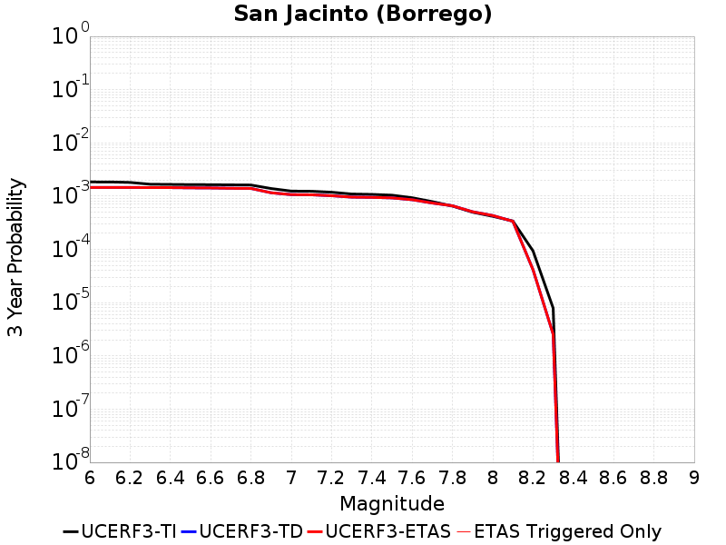 | 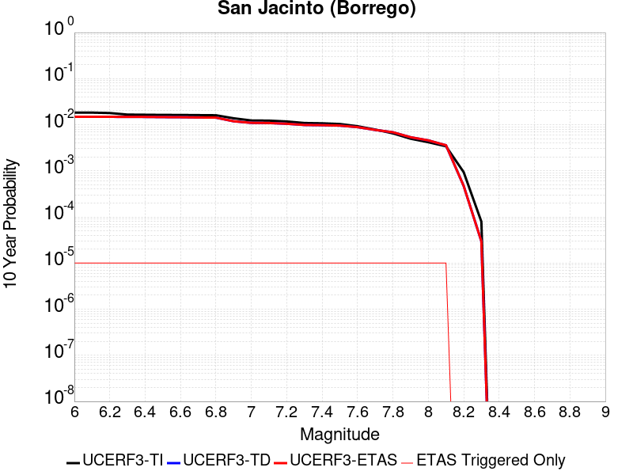 |

| Magnitude | 1 yr TI Prob | TD Prob | ETAS Prob | ETAS/TD Gain | ETAS Triggered Only | 10 yr TI Prob | TD Prob | ETAS Prob | ETAS/TD Gain | ETAS Triggered Only |
|-----|-----|-----|-----|-----|-----|-----|-----|-----|-----|-----|
| 6.0 | 0.0018475284 | 0.0014561785 | 0.0014561785 | 1.0 | 0.0 | 0.018322436 | 0.014870052 | 0.014879904 | 1.0006624 | 1.0E-5 |
| 6.1 | 0.0018466372 | 0.0014561785 | 0.0014561785 | 1.0 | 0.0 | 0.018313672 | 0.014870052 | 0.014879904 | 1.0006624 | 1.0E-5 |
| 6.2 | 0.0018084005 | 0.0014561785 | 0.0014561785 | 1.0 | 0.0 | 0.017937548 | 0.014870052 | 0.014879903 | 1.0006624 | 1.0E-5 |
| 6.3 | 0.0016728862 | 0.0014481206 | 0.0014481206 | 1.0 | 0.0 | 0.016603488 | 0.014791087 | 0.01480094 | 1.0006661 | 1.0E-5 |
| 6.4 | 0.0016594254 | 0.0014464004 | 0.0014464004 | 1.0 | 0.0 | 0.016470885 | 0.014774166 | 0.0147840185 | 1.0006669 | 1.0E-5 |
| 6.5 | 0.0016456128 | 0.0014328385 | 0.0014328385 | 1.0 | 0.0 | 0.0163348 | 0.014640752 | 0.014650606 | 1.000673 | 1.0E-5 |
| 6.6 | 0.0016406142 | 0.0014247217 | 0.0014247217 | 1.0 | 0.0 | 0.016285548 | 0.014560998 | 0.014570853 | 1.0006768 | 1.0E-5 |
| 6.7 | 0.0016279068 | 0.001404818 | 0.001404818 | 1.0 | 0.0 | 0.01616033 | 0.014365369 | 0.014375226 | 1.0006862 | 1.0E-5 |
| 6.8 | 0.001617065 | 0.0013954912 | 0.0013954912 | 1.0 | 0.0 | 0.016053487 | 0.014272649 | 0.014282506 | 1.0006907 | 1.0E-5 |
| 6.9 | 0.0013891924 | 0.0011569279 | 0.0011569279 | 1.0 | 0.0 | 0.0138054015 | 0.011882821 | 0.011892702 | 1.0008316 | 1.0E-5 |
| 7.0 | 0.0012439266 | 0.0010680462 | 0.0010680462 | 1.0 | 0.0 | 0.012369866 | 0.010983171 | 0.010993061 | 1.0009005 | 1.0E-5 |
| 7.1 | 0.0012344702 | 0.0010595232 | 0.0010595232 | 1.0 | 0.0 | 0.0122763505 | 0.010898346 | 0.010908237 | 1.0009075 | 1.0E-5 |
| 7.2 | 0.0011846646 | 0.0010192497 | 0.0010192497 | 1.0 | 0.0 | 0.01178369 | 0.010495708 | 0.010505604 | 1.0009428 | 1.0E-5 |
| 7.3 | 0.001096006 | 9.5886557E-4 | 9.5886557E-4 | 1.0 | 0.0 | 0.010906163 | 0.009891329 | 0.00990123 | 1.001001 | 1.0E-5 |
| 7.4 | 0.001078671 | 9.4857096E-4 | 9.4857096E-4 | 1.0 | 0.0 | 0.010734501 | 0.009788054 | 0.009797956 | 1.0010116 | 1.0E-5 |
| 7.5 | 0.001042723 | 9.2745916E-4 | 9.2745916E-4 | 1.0 | 0.0 | 0.010378438 | 0.009574974 | 0.009584878 | 1.0010344 | 1.0E-5 |
| 7.6 | 9.3302975E-4 | 8.5724634E-4 | 8.5724634E-4 | 1.0 | 0.0 | 0.00929122 | 0.008866838 | 0.008876749 | 1.0011178 | 1.0E-5 |
| 7.7 | 7.889362E-4 | 7.4265036E-4 | 7.4265036E-4 | 1.0 | 0.0 | 0.007861412 | 0.0077145463 | 0.007724469 | 1.0012863 | 1.0E-5 |
| 7.8 | 6.5207E-4 | 6.5886206E-4 | 6.5886206E-4 | 1.0 | 0.0 | 0.006501599 | 0.0068680947 | 0.0068780263 | 1.001446 | 1.0E-5 |
| 7.9 | 4.987573E-4 | 5.088825E-4 | 5.088825E-4 | 1.0 | 0.0 | 0.0049763937 | 0.0053526186 | 0.005362565 | 1.0018582 | 1.0E-5 |
| 8.0 | 4.1822926E-4 | 4.3267425E-4 | 4.3267425E-4 | 1.0 | 0.0 | 0.0041744304 | 0.004573609 | 0.0045835637 | 1.0021764 | 1.0E-5 |
| 8.1 | 3.4129233E-4 | 3.3715394E-4 | 3.3715394E-4 | 1.0 | 0.0 | 0.0034076865 | 0.0035808915 | 0.0035908557 | 1.0027826 | 1.0E-5 |
| 8.2 | 9.3751136E-5 | 4.1596162E-5 | 4.1596162E-5 | 1.0 | 0.0 | 9.371159E-4 | 4.7124468E-4 | 4.7124468E-4 | 1.0 | 0.0 |
| 8.3 | 7.9143565E-6 | 2.555814E-6 | 2.555814E-6 | 1.0 | 0.0 | 7.914075E-5 | 2.9697903E-5 | 2.9697903E-5 | 1.0 | 0.0 |

## West Napa 2011 CFM
*[(top)](#table-of-contents)*

| 1 Year | 10 Year |
|-----|-----|
| 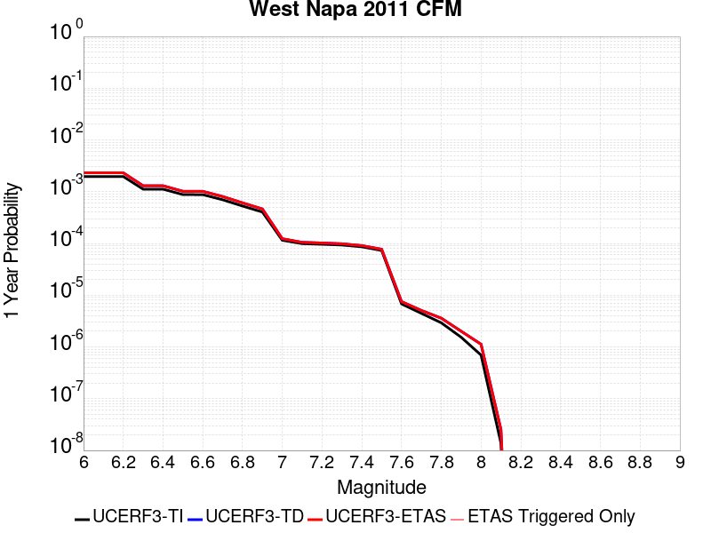 | 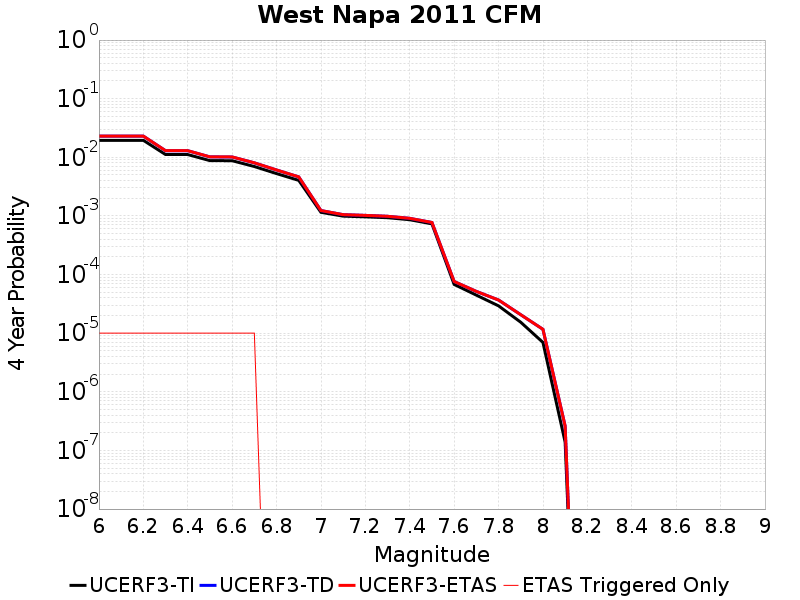 |

| Magnitude | 1 yr TI Prob | TD Prob | ETAS Prob | ETAS/TD Gain | ETAS Triggered Only | 10 yr TI Prob | TD Prob | ETAS Prob | ETAS/TD Gain | ETAS Triggered Only |
|-----|-----|-----|-----|-----|-----|-----|-----|-----|-----|-----|
| 6.0 | 0.001966852 | 0.0023211301 | 0.0023211301 | 1.0 | 0.0 | 0.019495348 | 0.023002299 | 0.02301207 | 1.0004247 | 1.0E-5 |
| 6.1 | 0.001966852 | 0.0023211301 | 0.0023211301 | 1.0 | 0.0 | 0.019495348 | 0.023002299 | 0.02301207 | 1.0004247 | 1.0E-5 |
| 6.2 | 0.001966852 | 0.0023211301 | 0.0023211301 | 1.0 | 0.0 | 0.019495348 | 0.023002299 | 0.02301207 | 1.0004247 | 1.0E-5 |
| 6.3 | 0.001120161 | 0.0013030557 | 0.0013030557 | 1.0 | 0.0 | 0.011145315 | 0.012964767 | 0.0129746385 | 1.0007613 | 1.0E-5 |
| 6.4 | 0.001120161 | 0.0013030557 | 0.0013030557 | 1.0 | 0.0 | 0.011145315 | 0.012964767 | 0.0129746385 | 1.0007613 | 1.0E-5 |
| 6.5 | 8.804988E-4 | 0.0010195224 | 0.0010195224 | 1.0 | 0.0 | 0.008770182 | 0.010157121 | 0.010167019 | 1.0009745 | 1.0E-5 |
| 6.6 | 8.7864127E-4 | 0.0010174214 | 0.0010174214 | 1.0 | 0.0 | 0.008751754 | 0.010136302 | 0.010146201 | 1.0009766 | 1.0E-5 |
| 6.7 | 6.9877075E-4 | 8.0683053E-4 | 8.0683053E-4 | 1.0 | 0.0 | 0.0069657755 | 0.008046738 | 0.008056657 | 1.0012327 | 1.0E-5 |
| 6.8 | 5.289043E-4 | 6.08915E-4 | 6.08915E-4 | 1.0 | 0.0 | 0.005276473 | 0.0060793874 | 0.0060793874 | 1.0 | 0.0 |
| 6.9 | 4.0489217E-4 | 4.6385423E-4 | 4.6385423E-4 | 1.0 | 0.0 | 0.0040415525 | 0.0046353745 | 0.0046353745 | 1.0 | 0.0 |
| 7.0 | 1.1535613E-4 | 1.2347898E-4 | 1.2347898E-4 | 1.0 | 0.0 | 0.0011529627 | 0.0012355894 | 0.0012355894 | 1.0 | 0.0 |
| 7.1 | 9.918104E-5 | 1.05045685E-4 | 1.05045685E-4 | 1.0 | 0.0 | 9.913679E-4 | 0.001051441 | 0.001051441 | 1.0 | 0.0 |
| 7.2 | 9.650462E-5 | 1.0206172E-4 | 1.0206172E-4 | 1.0 | 0.0 | 9.6462725E-4 | 0.0010216292 | 0.0010216292 | 1.0 | 0.0 |
| 7.3 | 9.330765E-5 | 9.851198E-5 | 9.851198E-5 | 1.0 | 0.0 | 9.3268487E-4 | 9.861635E-4 | 9.861635E-4 | 1.0 | 0.0 |
| 7.4 | 8.6198335E-5 | 9.086451E-5 | 9.086451E-5 | 1.0 | 0.0 | 8.616491E-4 | 9.097498E-4 | 9.097498E-4 | 1.0 | 0.0 |
| 7.5 | 7.325788E-5 | 7.7222125E-5 | 7.7222125E-5 | 1.0 | 0.0 | 7.3233736E-4 | 7.7339745E-4 | 7.7339745E-4 | 1.0 | 0.0 |
| 7.6 | 6.790414E-6 | 7.5222074E-6 | 7.5222074E-6 | 1.0 | 0.0 | 6.790207E-5 | 7.615075E-5 | 7.615075E-5 | 1.0 | 0.0 |
| 7.7 | 4.456829E-6 | 5.070011E-6 | 5.070011E-6 | 1.0 | 0.0 | 4.4567398E-5 | 5.1604853E-5 | 5.1604853E-5 | 1.0 | 0.0 |
| 7.8 | 2.9258983E-6 | 3.59804E-6 | 3.59804E-6 | 1.0 | 0.0 | 2.9258597E-5 | 3.6815894E-5 | 3.6815894E-5 | 1.0 | 0.0 |
| 7.9 | 1.538006E-6 | 2.0124123E-6 | 2.0124123E-6 | 1.0 | 0.0 | 1.5379954E-5 | 2.0666816E-5 | 2.0666816E-5 | 1.0 | 0.0 |
| 8.0 | 6.959117E-7 | 1.1287409E-6 | 1.1287409E-6 | 1.0 | 0.0 | 6.959095E-6 | 1.1646162E-5 | 1.1646162E-5 | 1.0 | 0.0 |
| 8.1 | 1.3874274E-8 | 2.5368001E-8 | 2.5368001E-8 | 1.0 | 0.0 | 1.3874273E-7 | 2.6037026E-7 | 2.6037026E-7 | 1.0 | 0.0 |

## Little Salmon (Offshore)
*[(top)](#table-of-contents)*

| 1 Year | 10 Year |
|-----|-----|
| 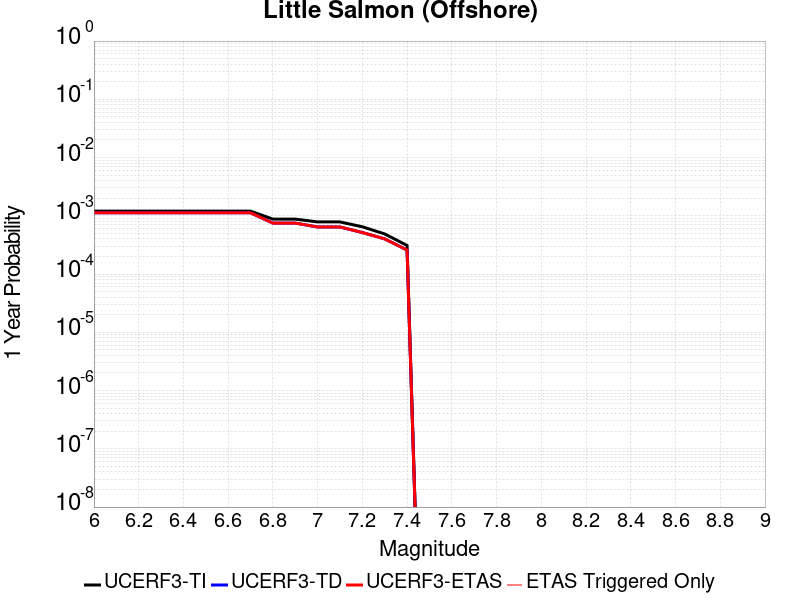 | 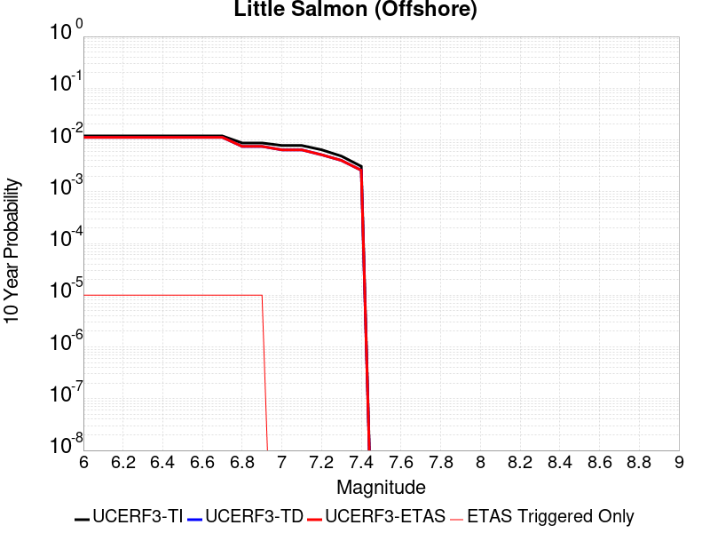 |

| Magnitude | 1 yr TI Prob | TD Prob | ETAS Prob | ETAS/TD Gain | ETAS Triggered Only | 10 yr TI Prob | TD Prob | ETAS Prob | ETAS/TD Gain | ETAS Triggered Only |
|-----|-----|-----|-----|-----|-----|-----|-----|-----|-----|-----|
| 6.0 | 0.0012021139 | 0.0011268269 | 0.0011268269 | 1.0 | 0.0 | 0.011956319 | 0.011244129 | 0.011254016 | 1.0008794 | 1.0E-5 |
| 6.1 | 0.0012021139 | 0.0011268269 | 0.0011268269 | 1.0 | 0.0 | 0.011956319 | 0.011244129 | 0.011254016 | 1.0008794 | 1.0E-5 |
| 6.2 | 0.0012021139 | 0.0011268269 | 0.0011268269 | 1.0 | 0.0 | 0.011956319 | 0.011244129 | 0.011254016 | 1.0008794 | 1.0E-5 |
| 6.3 | 0.0012021139 | 0.0011268269 | 0.0011268269 | 1.0 | 0.0 | 0.011956319 | 0.011244129 | 0.011254016 | 1.0008794 | 1.0E-5 |
| 6.4 | 0.0012021139 | 0.0011268269 | 0.0011268269 | 1.0 | 0.0 | 0.011956319 | 0.011244129 | 0.011254016 | 1.0008794 | 1.0E-5 |
| 6.5 | 0.0012021139 | 0.0011268269 | 0.0011268269 | 1.0 | 0.0 | 0.011956319 | 0.011244129 | 0.011254016 | 1.0008794 | 1.0E-5 |
| 6.6 | 0.0012021139 | 0.0011268269 | 0.0011268269 | 1.0 | 0.0 | 0.011956319 | 0.011244129 | 0.011254016 | 1.0008794 | 1.0E-5 |
| 6.7 | 0.0012021139 | 0.0011268269 | 0.0011268269 | 1.0 | 0.0 | 0.011956319 | 0.011244129 | 0.011254016 | 1.0008794 | 1.0E-5 |
| 6.8 | 8.78245E-4 | 7.5033697E-4 | 7.5033697E-4 | 1.0 | 0.0 | 0.008747822 | 0.007504785 | 0.0075147096 | 1.0013225 | 1.0E-5 |
| 6.9 | 8.78245E-4 | 7.5033697E-4 | 7.5033697E-4 | 1.0 | 0.0 | 0.008747822 | 0.007504785 | 0.0075147096 | 1.0013225 | 1.0E-5 |
| 7.0 | 7.8505155E-4 | 6.433365E-4 | 6.433365E-4 | 1.0 | 0.0 | 0.00782284 | 0.0064410153 | 0.0064410153 | 1.0 | 0.0 |
| 7.1 | 7.8505155E-4 | 6.433365E-4 | 6.433365E-4 | 1.0 | 0.0 | 0.00782284 | 0.0064410153 | 0.0064410153 | 1.0 | 0.0 |
| 7.2 | 6.483807E-4 | 5.1659625E-4 | 5.1659625E-4 | 1.0 | 0.0 | 0.006464922 | 0.005179356 | 0.005179356 | 1.0 | 0.0 |
| 7.3 | 4.8827377E-4 | 4.0145824E-4 | 4.0145824E-4 | 1.0 | 0.0 | 0.004872023 | 0.0040239985 | 0.0040239985 | 1.0 | 0.0 |
| 7.4 | 3.0997477E-4 | 2.583363E-4 | 2.583363E-4 | 1.0 | 0.0 | 0.0030954275 | 0.0025918912 | 0.0025918912 | 1.0 | 0.0 |

## Puente Hills
*[(top)](#table-of-contents)*

| 1 Year | 10 Year |
|-----|-----|
| 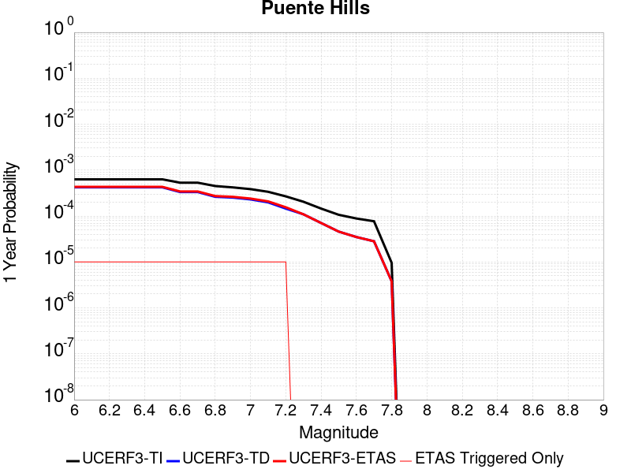 | 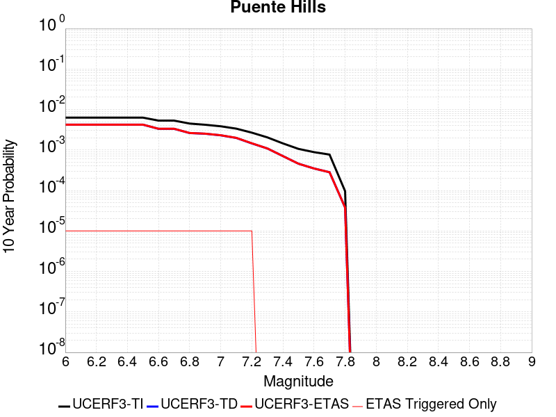 |

| Magnitude | 1 yr TI Prob | TD Prob | ETAS Prob | ETAS/TD Gain | ETAS Triggered Only | 10 yr TI Prob | TD Prob | ETAS Prob | ETAS/TD Gain | ETAS Triggered Only |
|-----|-----|-----|-----|-----|-----|-----|-----|-----|-----|-----|
| 6.0 | 6.312516E-4 | 4.2249393E-4 | 4.324897E-4 | 1.023659 | 1.0E-5 | 0.0062946146 | 0.0042174673 | 0.004227425 | 1.002361 | 1.0E-5 |
| 6.1 | 6.312516E-4 | 4.2249393E-4 | 4.324897E-4 | 1.023659 | 1.0E-5 | 0.0062946146 | 0.0042174673 | 0.004227425 | 1.002361 | 1.0E-5 |
| 6.2 | 6.312516E-4 | 4.2249393E-4 | 4.324897E-4 | 1.023659 | 1.0E-5 | 0.0062946146 | 0.0042174673 | 0.004227425 | 1.002361 | 1.0E-5 |
| 6.3 | 6.312516E-4 | 4.2249393E-4 | 4.324897E-4 | 1.023659 | 1.0E-5 | 0.0062946146 | 0.0042174673 | 0.004227425 | 1.002361 | 1.0E-5 |
| 6.4 | 6.312516E-4 | 4.2249393E-4 | 4.324897E-4 | 1.023659 | 1.0E-5 | 0.0062946146 | 0.0042174673 | 0.004227425 | 1.002361 | 1.0E-5 |
| 6.5 | 6.312516E-4 | 4.2249393E-4 | 4.324897E-4 | 1.023659 | 1.0E-5 | 0.0062946146 | 0.0042174673 | 0.004227425 | 1.002361 | 1.0E-5 |
| 6.6 | 5.332553E-4 | 3.3384896E-4 | 3.4384563E-4 | 1.0299437 | 1.0E-5 | 0.0053197746 | 0.0033337194 | 0.0033436862 | 1.0029896 | 1.0E-5 |
| 6.7 | 5.332553E-4 | 3.3384896E-4 | 3.4384563E-4 | 1.0299437 | 1.0E-5 | 0.0053197746 | 0.0033337194 | 0.0033436862 | 1.0029896 | 1.0E-5 |
| 6.8 | 4.505555E-4 | 2.6233454E-4 | 2.723319E-4 | 1.0381093 | 1.0E-5 | 0.004496431 | 0.0026203047 | 0.0026302785 | 1.0038064 | 1.0E-5 |
| 6.9 | 4.2081063E-4 | 2.523116E-4 | 2.623091E-4 | 1.0396235 | 1.0E-5 | 0.0042001465 | 0.0025203053 | 0.00253028 | 1.0039577 | 1.0E-5 |
| 7.0 | 3.857264E-4 | 2.304632E-4 | 2.4046091E-4 | 1.0433809 | 1.0E-5 | 0.0038505755 | 0.0023022876 | 0.0023122646 | 1.0043335 | 1.0E-5 |
| 7.1 | 3.373358E-4 | 1.9849229E-4 | 2.0849031E-4 | 1.0503697 | 1.0E-5 | 0.0033682417 | 0.0019831858 | 0.001993166 | 1.0050324 | 1.0E-5 |
| 7.2 | 2.6833118E-4 | 1.4538808E-4 | 1.5538662E-4 | 1.0687715 | 1.0E-5 | 0.002680074 | 0.0014529394 | 0.0014629249 | 1.0068727 | 1.0E-5 |
| 7.3 | 2.0495013E-4 | 1.0911964E-4 | 1.0911964E-4 | 1.0 | 0.0 | 0.002047612 | 0.0010906672 | 0.0010906672 | 1.0 | 0.0 |
| 7.4 | 1.4553878E-4 | 7.06829E-5 | 7.06829E-5 | 1.0 | 0.0 | 0.001454435 | 7.066086E-4 | 7.066086E-4 | 1.0 | 0.0 |
| 7.5 | 1.06529245E-4 | 4.5850127E-5 | 4.5850127E-5 | 1.0 | 0.0 | 0.0010647819 | 4.5841004E-4 | 4.5841004E-4 | 1.0 | 0.0 |
| 7.6 | 8.848612E-5 | 3.4952092E-5 | 3.4952092E-5 | 1.0 | 0.0 | 8.84509E-4 | 3.494688E-4 | 3.494688E-4 | 1.0 | 0.0 |
| 7.7 | 7.705422E-5 | 2.8215914E-5 | 2.8215914E-5 | 1.0 | 0.0 | 7.702751E-4 | 2.821259E-4 | 2.821259E-4 | 1.0 | 0.0 |
| 7.8 | 9.617985E-6 | 3.7996638E-6 | 3.7996638E-6 | 1.0 | 0.0 | 9.617568E-5 | 3.7996313E-5 | 3.7996313E-5 | 1.0 | 0.0 |

## Surprise Valley 2011 CFM
*[(top)](#table-of-contents)*

| 1 Year | 10 Year |
|-----|-----|
| 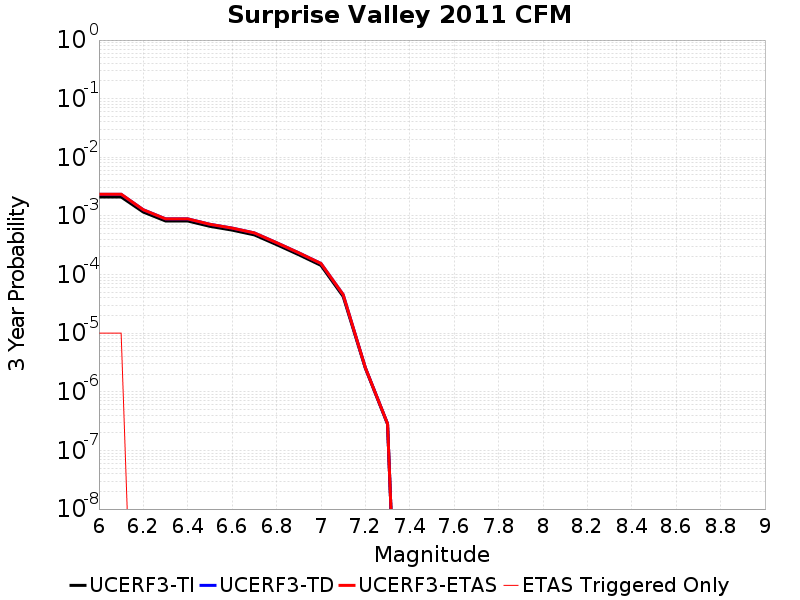 | 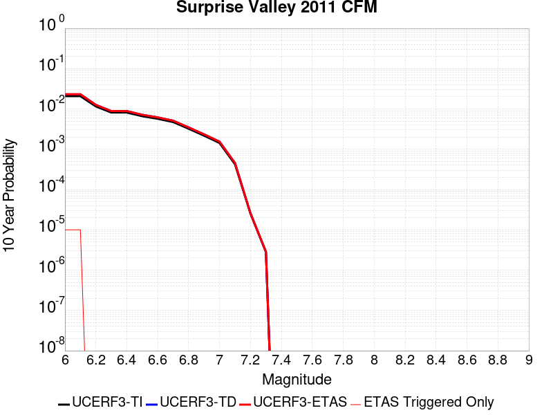 |

| Magnitude | 1 yr TI Prob | TD Prob | ETAS Prob | ETAS/TD Gain | ETAS Triggered Only | 10 yr TI Prob | TD Prob | ETAS Prob | ETAS/TD Gain | ETAS Triggered Only |
|-----|-----|-----|-----|-----|-----|-----|-----|-----|-----|-----|
| 6.0 | 0.002105641 | 0.0023378208 | 0.0023477974 | 1.0042675 | 1.0E-5 | 0.020858008 | 0.023153998 | 0.023163766 | 1.0004219 | 1.0E-5 |
| 6.1 | 0.002105641 | 0.0023378208 | 0.0023477974 | 1.0042675 | 1.0E-5 | 0.020858008 | 0.023153998 | 0.023163766 | 1.0004219 | 1.0E-5 |
| 6.2 | 0.0011626717 | 0.0012724621 | 0.0012724621 | 1.0 | 0.0 | 0.011566074 | 0.012654996 | 0.012654996 | 1.0 | 0.0 |
| 6.3 | 8.202525E-4 | 8.91709E-4 | 8.91709E-4 | 1.0 | 0.0 | 0.008172315 | 0.008882416 | 0.008882416 | 1.0 | 0.0 |
| 6.4 | 8.1962504E-4 | 8.9107413E-4 | 8.9107413E-4 | 1.0 | 0.0 | 0.008166086 | 0.008876118 | 0.008876118 | 1.0 | 0.0 |
| 6.5 | 6.641992E-4 | 7.199014E-4 | 7.199014E-4 | 1.0 | 0.0 | 0.0066221743 | 0.007176387 | 0.007176387 | 1.0 | 0.0 |
| 6.6 | 5.7295704E-4 | 6.200411E-4 | 6.200411E-4 | 1.0 | 0.0 | 0.0057148207 | 0.006183661 | 0.006183661 | 1.0 | 0.0 |
| 6.7 | 4.7496508E-4 | 5.1328604E-4 | 5.1328604E-4 | 1.0 | 0.0 | 0.004739512 | 0.005121402 | 0.005121402 | 1.0 | 0.0 |
| 6.8 | 3.2430296E-4 | 3.4975485E-4 | 3.4975485E-4 | 1.0 | 0.0 | 0.003238301 | 0.003492267 | 0.003492267 | 1.0 | 0.0 |
| 6.9 | 2.1804498E-4 | 2.3494691E-4 | 2.3494691E-4 | 1.0 | 0.0 | 0.0021783116 | 0.0023471385 | 0.0023471385 | 1.0 | 0.0 |
| 7.0 | 1.4336836E-4 | 1.5455535E-4 | 1.5455535E-4 | 1.0 | 0.0 | 0.001432759 | 0.001544601 | 0.001544601 | 1.0 | 0.0 |
| 7.1 | 4.2413245E-5 | 4.5525063E-5 | 4.5525063E-5 | 1.0 | 0.0 | 4.2405148E-4 | 4.5521616E-4 | 4.5521616E-4 | 1.0 | 0.0 |
| 7.2 | 2.538017E-6 | 2.5777267E-6 | 2.5777267E-6 | 1.0 | 0.0 | 2.537988E-5 | 2.5776979E-5 | 2.5776979E-5 | 1.0 | 0.0 |
| 7.3 | 2.8130427E-7 | 2.857202E-7 | 2.857202E-7 | 1.0 | 0.0 | 2.8130391E-6 | 2.8572E-6 | 2.8572E-6 | 1.0 | 0.0 |

## Oceanside alt1
*[(top)](#table-of-contents)*

| 1 Year | 10 Year |
|-----|-----|
| 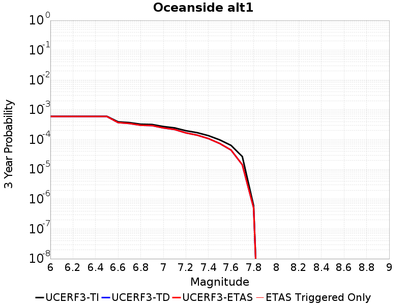 | 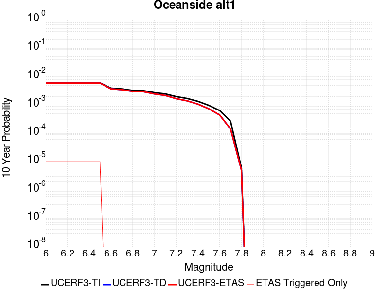 |

| Magnitude | 1 yr TI Prob | TD Prob | ETAS Prob | ETAS/TD Gain | ETAS Triggered Only | 10 yr TI Prob | TD Prob | ETAS Prob | ETAS/TD Gain | ETAS Triggered Only |
|-----|-----|-----|-----|-----|-----|-----|-----|-----|-----|-----|
| 6.0 | 6.060066E-4 | 5.959049E-4 | 5.959049E-4 | 1.0 | 0.0 | 0.0060435664 | 0.005944668 | 0.0059546083 | 1.0016721 | 1.0E-5 |
| 6.1 | 6.060066E-4 | 5.959049E-4 | 5.959049E-4 | 1.0 | 0.0 | 0.0060435664 | 0.005944668 | 0.0059546083 | 1.0016721 | 1.0E-5 |
| 6.2 | 6.060066E-4 | 5.959049E-4 | 5.959049E-4 | 1.0 | 0.0 | 0.0060435664 | 0.005944668 | 0.0059546083 | 1.0016721 | 1.0E-5 |
| 6.3 | 6.060066E-4 | 5.959049E-4 | 5.959049E-4 | 1.0 | 0.0 | 0.0060435664 | 0.005944668 | 0.0059546083 | 1.0016721 | 1.0E-5 |
| 6.4 | 6.060066E-4 | 5.959049E-4 | 5.959049E-4 | 1.0 | 0.0 | 0.0060435664 | 0.005944668 | 0.0059546083 | 1.0016721 | 1.0E-5 |
| 6.5 | 6.060066E-4 | 5.959049E-4 | 5.959049E-4 | 1.0 | 0.0 | 0.0060435664 | 0.005944668 | 0.0059546083 | 1.0016721 | 1.0E-5 |
| 6.6 | 3.9448592E-4 | 3.7215528E-4 | 3.7215528E-4 | 1.0 | 0.0 | 0.0039378637 | 0.0037154318 | 0.0037154318 | 1.0 | 0.0 |
| 6.7 | 3.706228E-4 | 3.4722607E-4 | 3.4722607E-4 | 1.0 | 0.0 | 0.0037000529 | 0.0034669186 | 0.0034669186 | 1.0 | 0.0 |
| 6.8 | 3.2791847E-4 | 3.025762E-4 | 3.025762E-4 | 1.0 | 0.0 | 0.0032743502 | 0.0030216996 | 0.0030216996 | 1.0 | 0.0 |
| 6.9 | 3.2078946E-4 | 2.9510842E-4 | 2.9510842E-4 | 1.0 | 0.0 | 0.003203268 | 0.0029472222 | 0.0029472222 | 1.0 | 0.0 |
| 7.0 | 2.7410188E-4 | 2.4637897E-4 | 2.4637897E-4 | 1.0 | 0.0 | 0.0027376404 | 0.0024610895 | 0.0024610895 | 1.0 | 0.0 |
| 7.1 | 2.468141E-4 | 2.1800575E-4 | 2.1800575E-4 | 1.0 | 0.0 | 0.0024654015 | 0.0021779453 | 0.0021779453 | 1.0 | 0.0 |
| 7.2 | 1.9825088E-4 | 1.676897E-4 | 1.676897E-4 | 1.0 | 0.0 | 0.001980741 | 0.0016756438 | 0.0016756438 | 1.0 | 0.0 |
| 7.3 | 1.7038253E-4 | 1.4078786E-4 | 1.4078786E-4 | 1.0 | 0.0 | 0.0017025196 | 0.0014069978 | 0.0014069978 | 1.0 | 0.0 |
| 7.4 | 1.3532673E-4 | 1.0790116E-4 | 1.0790116E-4 | 1.0 | 0.0 | 0.0013524436 | 0.0010784966 | 0.0010784966 | 1.0 | 0.0 |
| 7.5 | 9.7650576E-5 | 7.37632E-5 | 7.37632E-5 | 1.0 | 0.0 | 9.7607676E-4 | 7.373932E-4 | 7.373932E-4 | 1.0 | 0.0 |
| 7.6 | 6.389998E-5 | 4.4490822E-5 | 4.4490822E-5 | 1.0 | 0.0 | 6.3881604E-4 | 4.448236E-4 | 4.448236E-4 | 1.0 | 0.0 |
| 7.7 | 2.6823185E-5 | 1.426922E-5 | 1.426922E-5 | 1.0 | 0.0 | 2.6819948E-4 | 1.4268438E-4 | 1.4268438E-4 | 1.0 | 0.0 |
| 7.8 | 6.0556863E-7 | 5.104303E-7 | 5.104303E-7 | 1.0 | 0.0 | 6.05567E-6 | 5.1043035E-6 | 5.1043035E-6 | 1.0 | 0.0 |

## Morales (East)
*[(top)](#table-of-contents)*

| 1 Year | 10 Year |
|-----|-----|
| 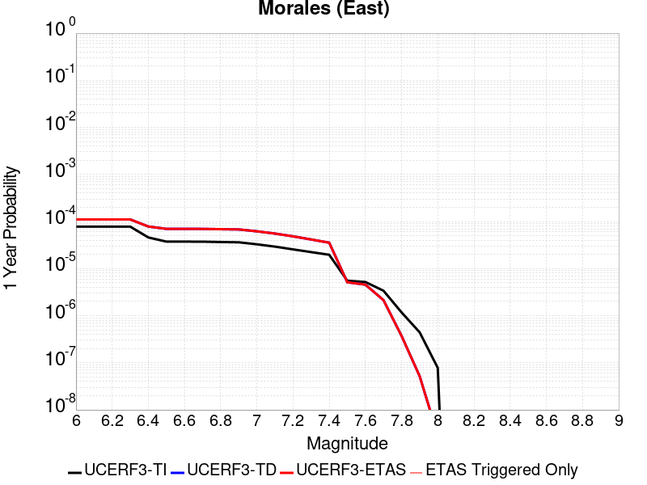 | 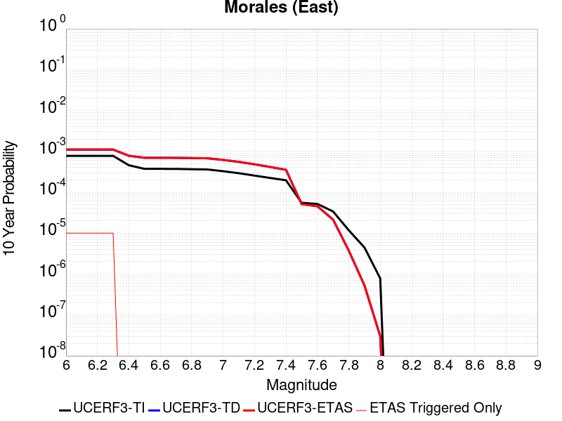 |

| Magnitude | 1 yr TI Prob | TD Prob | ETAS Prob | ETAS/TD Gain | ETAS Triggered Only | 10 yr TI Prob | TD Prob | ETAS Prob | ETAS/TD Gain | ETAS Triggered Only |
|-----|-----|-----|-----|-----|-----|-----|-----|-----|-----|-----|
| 6.0 | 7.7966266E-5 | 1.1079637E-4 | 1.1079637E-4 | 1.0 | 0.0 | 7.793892E-4 | 0.0011074711 | 0.00111746 | 1.0090196 | 1.0E-5 |
| 6.1 | 7.7966266E-5 | 1.1079637E-4 | 1.1079637E-4 | 1.0 | 0.0 | 7.793892E-4 | 0.0011074711 | 0.00111746 | 1.0090196 | 1.0E-5 |
| 6.2 | 7.7966266E-5 | 1.1079637E-4 | 1.1079637E-4 | 1.0 | 0.0 | 7.793892E-4 | 0.0011074711 | 0.00111746 | 1.0090196 | 1.0E-5 |
| 6.3 | 7.7966266E-5 | 1.1079637E-4 | 1.1079637E-4 | 1.0 | 0.0 | 7.793892E-4 | 0.0011074711 | 0.00111746 | 1.0090196 | 1.0E-5 |
| 6.4 | 4.5910085E-5 | 7.838523E-5 | 7.838523E-5 | 1.0 | 0.0 | 4.59006E-4 | 7.8358926E-4 | 7.8358926E-4 | 1.0 | 0.0 |
| 6.5 | 3.7438338E-5 | 6.9836344E-5 | 6.9836344E-5 | 1.0 | 0.0 | 3.743203E-4 | 6.9815415E-4 | 6.9815415E-4 | 1.0 | 0.0 |
| 6.6 | 3.7438338E-5 | 6.9836344E-5 | 6.9836344E-5 | 1.0 | 0.0 | 3.743203E-4 | 6.9815415E-4 | 6.9815415E-4 | 1.0 | 0.0 |
| 6.7 | 3.7354253E-5 | 6.970413E-5 | 6.970413E-5 | 1.0 | 0.0 | 3.7347974E-4 | 6.968329E-4 | 6.968329E-4 | 1.0 | 0.0 |
| 6.8 | 3.669237E-5 | 6.874178E-5 | 6.874178E-5 | 1.0 | 0.0 | 3.6686313E-4 | 6.8721524E-4 | 6.8721524E-4 | 1.0 | 0.0 |
| 6.9 | 3.6219368E-5 | 6.796237E-5 | 6.796237E-5 | 1.0 | 0.0 | 3.6213463E-4 | 6.7942595E-4 | 6.7942595E-4 | 1.0 | 0.0 |
| 7.0 | 3.283662E-5 | 6.197434E-5 | 6.197434E-5 | 1.0 | 0.0 | 3.283177E-4 | 6.1957946E-4 | 6.1957946E-4 | 1.0 | 0.0 |
| 7.1 | 2.9324437E-5 | 5.5519988E-5 | 5.5519988E-5 | 1.0 | 0.0 | 2.9320567E-4 | 5.550684E-4 | 5.550684E-4 | 1.0 | 0.0 |
| 7.2 | 2.5621652E-5 | 4.845183E-5 | 4.845183E-5 | 1.0 | 0.0 | 2.56187E-4 | 4.8441897E-4 | 4.8441897E-4 | 1.0 | 0.0 |
| 7.3 | 2.2425293E-5 | 4.1607567E-5 | 4.1607567E-5 | 1.0 | 0.0 | 2.242303E-4 | 4.1600343E-4 | 4.1600343E-4 | 1.0 | 0.0 |
| 7.4 | 1.9693656E-5 | 3.5517183E-5 | 3.5517183E-5 | 1.0 | 0.0 | 1.969191E-4 | 3.5512037E-4 | 3.5512037E-4 | 1.0 | 0.0 |
| 7.5 | 5.5326E-6 | 5.135056E-6 | 5.135056E-6 | 1.0 | 0.0 | 5.532462E-5 | 5.1351944E-5 | 5.1351944E-5 | 1.0 | 0.0 |
| 7.6 | 5.197173E-6 | 4.568606E-6 | 4.568606E-6 | 1.0 | 0.0 | 5.1970514E-5 | 4.568769E-5 | 4.568769E-5 | 1.0 | 0.0 |
| 7.7 | 3.3913238E-6 | 2.1414571E-6 | 2.1414571E-6 | 1.0 | 0.0 | 3.3912722E-5 | 2.1416925E-5 | 2.1416925E-5 | 1.0 | 0.0 |
| 7.8 | 1.1749105E-6 | 3.7212283E-7 | 3.7212283E-7 | 1.0 | 0.0 | 1.1749043E-5 | 3.7237605E-6 | 3.7237605E-6 | 1.0 | 0.0 |
| 7.9 | 4.4315374E-7 | 5.2028074E-8 | 5.2028074E-8 | 1.0 | 0.0 | 4.4315284E-6 | 5.223861E-7 | 5.223861E-7 | 1.0 | 0.0 |
| 8.0 | 7.812093E-8 | 2.8942915E-9 | 2.8942915E-9 | 1.0 | 0.0 | 7.81209E-7 | 3.0198954E-8 | 3.0198954E-8 | 1.0 | 0.0 |

## Sargent 2011 CFM
*[(top)](#table-of-contents)*

| 1 Year | 10 Year |
|-----|-----|
| 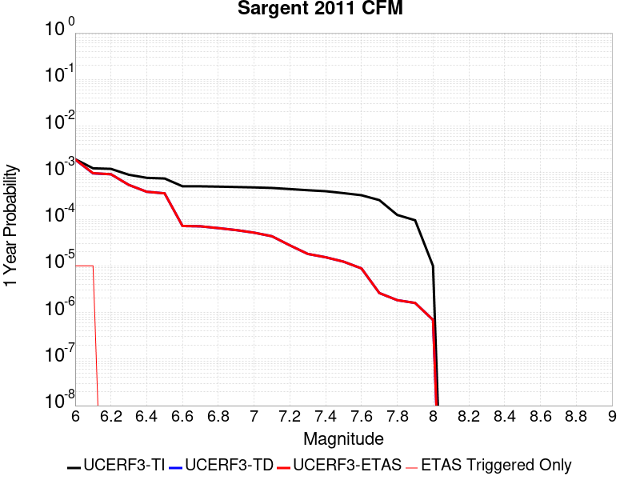 | 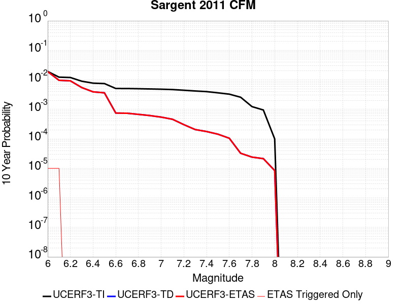 |

| Magnitude | 1 yr TI Prob | TD Prob | ETAS Prob | ETAS/TD Gain | ETAS Triggered Only | 10 yr TI Prob | TD Prob | ETAS Prob | ETAS/TD Gain | ETAS Triggered Only |
|-----|-----|-----|-----|-----|-----|-----|-----|-----|-----|-----|
| 6.0 | 0.0019458556 | 0.0019110322 | 0.0019210131 | 1.0052228 | 1.0E-5 | 0.01928905 | 0.019018179 | 0.01902799 | 1.0005158 | 1.0E-5 |
| 6.1 | 0.0012396075 | 9.6385385E-4 | 9.738442E-4 | 1.010365 | 1.0E-5 | 0.012327154 | 0.0096361395 | 0.009646043 | 1.0010277 | 1.0E-5 |
| 6.2 | 0.0012052758 | 9.237837E-4 | 9.237837E-4 | 1.0 | 0.0 | 0.011987597 | 0.009238791 | 0.009238791 | 1.0 | 0.0 |
| 6.3 | 9.015125E-4 | 5.456377E-4 | 5.456377E-4 | 1.0 | 0.0 | 0.008978641 | 0.0054791574 | 0.0054791574 | 1.0 | 0.0 |
| 6.4 | 7.7401294E-4 | 3.8900957E-4 | 3.8900957E-4 | 1.0 | 0.0 | 0.0077132257 | 0.0039186976 | 0.0039186976 | 1.0 | 0.0 |
| 6.5 | 7.48955E-4 | 3.5973624E-4 | 3.5973624E-4 | 1.0 | 0.0 | 0.0074643586 | 0.0036269464 | 0.0036269464 | 1.0 | 0.0 |
| 6.6 | 5.097923E-4 | 7.167294E-5 | 7.167294E-5 | 1.0 | 0.0 | 0.005086244 | 7.483337E-4 | 7.483337E-4 | 1.0 | 0.0 |
| 6.7 | 5.0875737E-4 | 7.056116E-5 | 7.056116E-5 | 1.0 | 0.0 | 0.005075942 | 7.3722337E-4 | 7.3722337E-4 | 1.0 | 0.0 |
| 6.8 | 5.012196E-4 | 6.450171E-5 | 6.450171E-5 | 1.0 | 0.0 | 0.005000906 | 6.7636394E-4 | 6.7636394E-4 | 1.0 | 0.0 |
| 6.9 | 4.9177726E-4 | 5.8489415E-5 | 5.8489415E-5 | 1.0 | 0.0 | 0.004906904 | 6.155945E-4 | 6.155945E-4 | 1.0 | 0.0 |
| 7.0 | 4.8241246E-4 | 5.1521736E-5 | 5.1521736E-5 | 1.0 | 0.0 | 0.0048136655 | 5.454469E-4 | 5.454469E-4 | 1.0 | 0.0 |
| 7.1 | 4.6926187E-4 | 4.315851E-5 | 4.315851E-5 | 1.0 | 0.0 | 0.004682722 | 4.609278E-4 | 4.609278E-4 | 1.0 | 0.0 |
| 7.2 | 4.445094E-4 | 2.7534068E-5 | 2.7534068E-5 | 1.0 | 0.0 | 0.004436213 | 3.029908E-4 | 3.029908E-4 | 1.0 | 0.0 |
| 7.3 | 4.196168E-4 | 1.803687E-5 | 1.803687E-5 | 1.0 | 0.0 | 0.004188253 | 2.0671384E-4 | 2.0671384E-4 | 1.0 | 0.0 |
| 7.4 | 3.9973034E-4 | 1.528412E-5 | 1.528412E-5 | 1.0 | 0.0 | 0.0039901207 | 1.7738083E-4 | 1.7738083E-4 | 1.0 | 0.0 |
| 7.5 | 3.6318362E-4 | 1.2301909E-5 | 1.2301909E-5 | 1.0 | 0.0 | 0.0036259065 | 1.4410685E-4 | 1.4410685E-4 | 1.0 | 0.0 |
| 7.6 | 3.2775043E-4 | 8.815362E-6 | 8.815362E-6 | 1.0 | 0.0 | 0.0032726745 | 1.0506114E-4 | 1.0506114E-4 | 1.0 | 0.0 |
| 7.7 | 2.5743784E-4 | 2.6097937E-6 | 2.6097937E-6 | 1.0 | 0.0 | 0.0025713982 | 3.2549317E-5 | 3.2549317E-5 | 1.0 | 0.0 |
| 7.8 | 1.238233E-4 | 1.8354963E-6 | 1.8354963E-6 | 1.0 | 0.0 | 0.0012375432 | 2.4128361E-5 | 2.4128361E-5 | 1.0 | 0.0 |
| 7.9 | 9.510558E-5 | 1.5978985E-6 | 1.5978985E-6 | 1.0 | 0.0 | 9.5064886E-4 | 2.1413467E-5 | 2.1413467E-5 | 1.0 | 0.0 |
| 8.0 | 9.963521E-6 | 6.92191E-7 | 6.92191E-7 | 1.0 | 0.0 | 9.963074E-5 | 8.46406E-6 | 8.46406E-6 | 1.0 | 0.0 |

## San Jacinto (Coyote Creek)
*[(top)](#table-of-contents)*

| 1 Year | 10 Year |
|-----|-----|
| 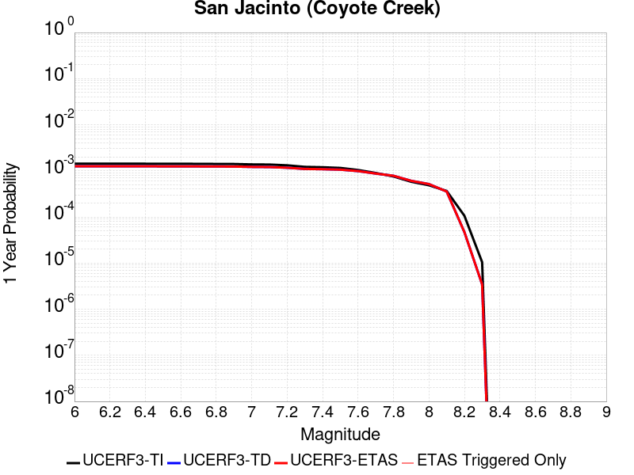 | 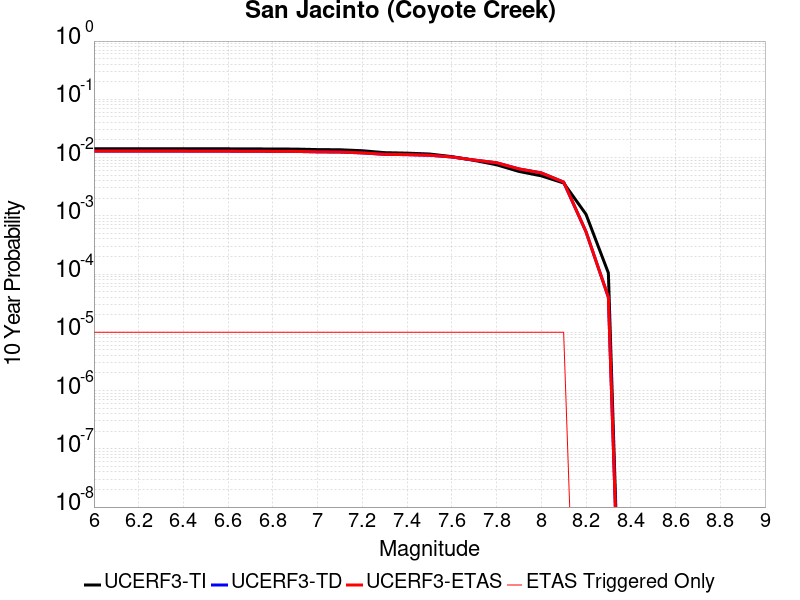 |

| Magnitude | 1 yr TI Prob | TD Prob | ETAS Prob | ETAS/TD Gain | ETAS Triggered Only | 10 yr TI Prob | TD Prob | ETAS Prob | ETAS/TD Gain | ETAS Triggered Only |
|-----|-----|-----|-----|-----|-----|-----|-----|-----|-----|-----|
| 6.0 | 0.0014273542 | 0.0012591315 | 0.0012591315 | 1.0 | 0.0 | 0.01418221 | 0.012928757 | 0.012938628 | 1.0007634 | 1.0E-5 |
| 6.1 | 0.0014273542 | 0.0012591315 | 0.0012591315 | 1.0 | 0.0 | 0.01418221 | 0.012928757 | 0.012938628 | 1.0007634 | 1.0E-5 |
| 6.2 | 0.0014273542 | 0.0012591315 | 0.0012591315 | 1.0 | 0.0 | 0.01418221 | 0.012928757 | 0.012938628 | 1.0007634 | 1.0E-5 |
| 6.3 | 0.0014273542 | 0.0012591315 | 0.0012591315 | 1.0 | 0.0 | 0.01418221 | 0.012928757 | 0.012938628 | 1.0007634 | 1.0E-5 |
| 6.4 | 0.0014273542 | 0.0012591315 | 0.0012591315 | 1.0 | 0.0 | 0.01418221 | 0.012928757 | 0.012938628 | 1.0007634 | 1.0E-5 |
| 6.5 | 0.0014225657 | 0.0012531945 | 0.0012531945 | 1.0 | 0.0 | 0.014134934 | 0.0128700845 | 0.012879956 | 1.000767 | 1.0E-5 |
| 6.6 | 0.0014225657 | 0.0012531945 | 0.0012531945 | 1.0 | 0.0 | 0.014134934 | 0.0128700845 | 0.012879956 | 1.000767 | 1.0E-5 |
| 6.7 | 0.0014191137 | 0.0012492923 | 0.0012492923 | 1.0 | 0.0 | 0.014100855 | 0.012831495 | 0.012841367 | 1.0007694 | 1.0E-5 |
| 6.8 | 0.001411945 | 0.001244978 | 0.001244978 | 1.0 | 0.0 | 0.014030075 | 0.012788638 | 0.01279851 | 1.000772 | 1.0E-5 |
| 6.9 | 0.0014069602 | 0.0012407834 | 0.0012407834 | 1.0 | 0.0 | 0.013980856 | 0.0127469525 | 0.012756825 | 1.0007745 | 1.0E-5 |
| 7.0 | 0.001379188 | 0.0012187394 | 0.0012187394 | 1.0 | 0.0 | 0.0137065975 | 0.012528314 | 0.012538189 | 1.0007882 | 1.0E-5 |
| 7.1 | 0.0013691769 | 0.0012096731 | 0.0012096731 | 1.0 | 0.0 | 0.013607717 | 0.012438179 | 0.012448054 | 1.0007939 | 1.0E-5 |
| 7.2 | 0.0013177024 | 0.0011677055 | 0.0011677055 | 1.0 | 0.0 | 0.013099162 | 0.012019212 | 0.012029092 | 1.000822 | 1.0E-5 |
| 7.3 | 0.001220092 | 0.001101608 | 0.001101608 | 1.0 | 0.0 | 0.012134149 | 0.011358125 | 0.011368012 | 1.0008705 | 1.0E-5 |
| 7.4 | 0.0011974899 | 0.0010875533 | 0.0010875533 | 1.0 | 0.0 | 0.011910575 | 0.011217237 | 0.011227125 | 1.0008814 | 1.0E-5 |
| 7.5 | 0.0011571277 | 0.0010626861 | 0.0010626861 | 1.0 | 0.0 | 0.011511209 | 0.010966853 | 0.010976744 | 1.0009018 | 1.0E-5 |
| 7.6 | 0.001043725 | 9.889927E-4 | 9.889927E-4 | 1.0 | 0.0 | 0.010388365 | 0.010224851 | 0.010234748 | 1.000968 | 1.0E-5 |
| 7.7 | 8.986819E-4 | 8.733303E-4 | 8.733303E-4 | 1.0 | 0.0 | 0.008950562 | 0.009063364 | 0.009073273 | 1.0010934 | 1.0E-5 |
| 7.8 | 7.552038E-4 | 7.8194804E-4 | 7.8194804E-4 | 1.0 | 0.0 | 0.0075264242 | 0.008141783 | 0.008151702 | 1.0012182 | 1.0E-5 |
| 7.9 | 5.797721E-4 | 6.074773E-4 | 6.074773E-4 | 1.0 | 0.0 | 0.0057826187 | 0.0063806563 | 0.0063905925 | 1.0015572 | 1.0E-5 |
| 8.0 | 4.8657437E-4 | 5.16423E-4 | 5.16423E-4 | 1.0 | 0.0 | 0.0048551033 | 0.005450249 | 0.005460195 | 1.0018247 | 1.0E-5 |
| 8.1 | 3.664147E-4 | 3.5620798E-4 | 3.5620798E-4 | 1.0 | 0.0 | 0.003658111 | 0.003787813 | 0.0037977751 | 1.00263 | 1.0E-5 |
| 8.2 | 1.06220665E-4 | 4.6935238E-5 | 4.6935238E-5 | 1.0 | 0.0 | 0.001061699 | 5.32586E-4 | 5.32586E-4 | 1.0 | 0.0 |
| 8.3 | 1.046241E-5 | 3.4531433E-6 | 3.4531433E-6 | 1.0 | 0.0 | 1.0461917E-4 | 4.014275E-5 | 4.014275E-5 | 1.0 | 0.0 |

## Elmore Ranch
*[(top)](#table-of-contents)*

| 1 Year | 10 Year |
|-----|-----|
|  | 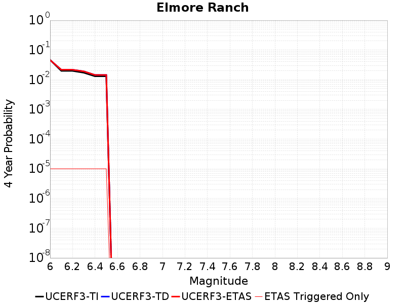 |

| Magnitude | 1 yr TI Prob | TD Prob | ETAS Prob | ETAS/TD Gain | ETAS Triggered Only | 10 yr TI Prob | TD Prob | ETAS Prob | ETAS/TD Gain | ETAS Triggered Only |
|-----|-----|-----|-----|-----|-----|-----|-----|-----|-----|-----|
| 6.0 | 0.0047383 | 0.004662037 | 0.004662037 | 1.0 | 0.0 | 0.046385348 | 0.0458712 | 0.04588074 | 1.000208 | 1.0E-5 |
| 6.1 | 0.0019968306 | 0.0021631494 | 0.0021631494 | 1.0 | 0.0 | 0.019789828 | 0.02162831 | 0.021638094 | 1.0004524 | 1.0E-5 |
| 6.2 | 0.0019968306 | 0.0021631494 | 0.0021631494 | 1.0 | 0.0 | 0.019789828 | 0.02162831 | 0.021638094 | 1.0004524 | 1.0E-5 |
| 6.3 | 0.0017307495 | 0.0019059251 | 0.0019059251 | 1.0 | 0.0 | 0.017173318 | 0.019090045 | 0.019099854 | 1.0005138 | 1.0E-5 |
| 6.4 | 0.0013113929 | 0.0014304564 | 0.0014304564 | 1.0 | 0.0 | 0.01303681 | 0.014387251 | 0.014397107 | 1.0006851 | 1.0E-5 |
| 6.5 | 0.0013113929 | 0.0014304564 | 0.0014304564 | 1.0 | 0.0 | 0.01303681 | 0.014387251 | 0.014397107 | 1.0006851 | 1.0E-5 |

