# Parent Section Magnitude-Probability Distributions

Only fault sections with at least one triggered aftershock are plotted. Sections are sorted by total supraseismogenic trigger rate (decreasing)

## Table Of Contents

* [Tank Canyon](#tank-canyon)
* [Garlock (Central)](#garlock-central)
* [Little Lake](#little-lake)
* [Airport Lake](#airport-lake)
* [Owl Lake](#owl-lake)
* [Panamint Valley](#panamint-valley)
* [Garlock (East)](#garlock-east)
* [Ash Hill](#ash-hill)
* [Blackwater](#blackwater)
* [Hunter Mountain-Saline Valley](#hunter-mountain-saline-valley)
* [McLean Lake](#mclean-lake)
* [Garlock (West)](#garlock-west)
* [Goldstone Lake](#goldstone-lake)
* [Gravel Hills-Harper Lk](#gravel-hills-harper-lk)
* [So Sierra Nevada](#so-sierra-nevada)
* [Coyote Canyon](#coyote-canyon)
* [Nelson Lake](#nelson-lake)
* [San Andreas (Mojave S)](#san-andreas-mojave-s)
* [Death Valley (So)](#death-valley-so)
* [Lenwood-Lockhart-Old Woman Springs](#lenwood-lockhart-old-woman-springs)
* [San Andreas (Mojave N)](#san-andreas-mojave-n)
* [Towne Pass](#towne-pass)
* [Paradise](#paradise)
* [Bicycle Lake](#bicycle-lake)
* [Garlic Springs](#garlic-springs)
* [San Andreas (San Bernardino N)](#san-andreas-san-bernardino-n)
* [Death Valley (Black Mtns Frontal)](#death-valley-black-mtns-frontal)
* [Coyote Lake](#coyote-lake)
* [Helendale-So Lockhart](#helendale-so-lockhart)
* [San Andreas (Big Bend)](#san-andreas-big-bend)
* [San Andreas (San Bernardino S)](#san-andreas-san-bernardino-s)
* [Sierra Nevada  (No Extension)](#sierra-nevada--no-extension)
* [Death Valley (No)](#death-valley-no)
* [Death Valley (Fish Lake Valley)](#death-valley-fish-lake-valley)
* [San Andreas (Parkfield)](#san-andreas-parkfield)
* [Manix-Afton Hills](#manix-afton-hills)
* [Elsinore (Glen Ivy) rev](#elsinore-glen-ivy-rev)
* [Baker](#baker)
* [Mission Ridge-Arroyo Parida-Santa Ana](#mission-ridge-arroyo-parida-santa-ana)
* [San Andreas (Carrizo) rev](#san-andreas-carrizo-rev)
* [San Andreas (San Gorgonio Pass-Garnet HIll)](#san-andreas-san-gorgonio-pass-garnet-hill)
* [Lake Isabella (Seismicity)](#lake-isabella-seismicity)
* [Cady](#cady)
* [Scodie Lineament](#scodie-lineament)
* [Red Pass](#red-pass)
* [San Andreas (Cholame) rev](#san-andreas-cholame-rev)
* [San Andreas (Creeping Section) 2011 CFM](#san-andreas-creeping-section-2011-cfm)
* [San Andreas (Coachella) rev](#san-andreas-coachella-rev)
* [White Wolf (Extension)](#white-wolf-extension)
* [Independence rev 2011](#independence-rev-2011)
* [Santa Ynez (West)](#santa-ynez-west)
* [Owens Valley](#owens-valley)
* [Red Mountain](#red-mountain)
* [Calico-Hidalgo](#calico-hidalgo)
* [Ludlow](#ludlow)
* [Santa Rosa Island](#santa-rosa-island)
* [San Diego Trough north alt1](#san-diego-trough-north-alt1)
* [Santa Ynez (East)](#santa-ynez-east)
* [Brawley (Seismic Zone) alt 1](#brawley-seismic-zone-alt-1)
* [Santa Cruz Island](#santa-cruz-island)
* [Big Pine (Central)](#big-pine-central)
* [Pisgah-Bullion Mtn-Mesquite Lk](#pisgah-bullion-mtn-mesquite-lk)
* [San Pedro Basin](#san-pedro-basin)
* [Pinto Mtn](#pinto-mtn)
* [Big Pine (East)](#big-pine-east)
* [Imperial](#imperial)
* [Rose Canyon](#rose-canyon)
* [Oceanic - West Huasna](#oceanic---west-huasna)
* [San Jacinto (San Bernardino)](#san-jacinto-san-bernardino)
* [Blue Cut](#blue-cut)
* [Lost Hills](#lost-hills)
* [Chino alt 1](#chino-alt-1)
* [White Mountains](#white-mountains)
* [Mission Creek](#mission-creek)
* [Camp Rock 2011](#camp-rock-2011)
* [Dry Mountain](#dry-mountain)
* [Channel Islands Thrust](#channel-islands-thrust)
* [Ventura-Pitas Point](#ventura-pitas-point)
* [Kern Canyon (North Kern) 2011](#kern-canyon-north-kern-2011)
* [Ortigalita (North)](#ortigalita-north)
* [San Diego Trough south](#san-diego-trough-south)
* [Coronado Bank alt1](#coronado-bank-alt1)
* [San Luis Range 2011 CFM](#san-luis-range-2011-cfm)
* [Great Valley 09 (Laguna Seca)](#great-valley-09-laguna-seca)
* [Whittier alt 1](#whittier-alt-1)
* [Cleghorn Pass](#cleghorn-pass)
* [Pitas Point (Lower West)](#pitas-point-lower-west)
* [San Clemente](#san-clemente)
* [Tin Mountain](#tin-mountain)
* [San Gabriel](#san-gabriel)
* [Deep Springs](#deep-springs)
* [Palos Verdes](#palos-verdes)
* [Pitas Point (Lower)-Montalvo](#pitas-point-lower-montalvo)
* [Pleito](#pleito)
* [Raymond](#raymond)
* [Hunting Creek - Berryessa 2011 CFM](#hunting-creek---berryessa-2011-cfm)
* [San Andreas (North Branch Mill Creek)](#san-andreas-north-branch-mill-creek)
* [Green Valley 2011 CFM](#green-valley-2011-cfm)
* [Santa Ynez River](#santa-ynez-river)
* [Cleghorn Lake](#cleghorn-lake)
* [Great Valley 07 (Orestimba)](#great-valley-07-orestimba)
* [Kern Canyon (South Kern) 2011](#kern-canyon-south-kern-2011)
* [Santa Cruz Catalina Ridge alt1](#santa-cruz-catalina-ridge-alt1)
* [Calaveras (So) - Paicines extension 2011 CFM](#calaveras-so---paicines-extension-2011-cfm)
* [Oak Ridge (Onshore)](#oak-ridge-onshore)
* [San Jacinto (San Jacinto Valley) rev](#san-jacinto-san-jacinto-valley-rev)
* [San Cayetano](#san-cayetano)
* [Kern Canyon (Lake Isabella) 2011](#kern-canyon-lake-isabella-2011)
* [Elysian Park (Upper)](#elysian-park-upper)
* [Robinson Creek](#robinson-creek)
* [Simi-Santa Rosa](#simi-santa-rosa)
* [San Andreas (Santa Cruz Mts) 2011 CFM](#san-andreas-santa-cruz-mts-2011-cfm)
* [San Jacinto (Stepovers Combined)](#san-jacinto-stepovers-combined)
* [San Jacinto (Anza) rev](#san-jacinto-anza-rev)
* [Calaveras (So) 2011 CFM](#calaveras-so-2011-cfm)
* [Northridge](#northridge)
* [Mono Lake 2011 CFM](#mono-lake-2011-cfm)
* [Calaveras (Central) 2011 CFM](#calaveras-central-2011-cfm)
* [Pine Mtn](#pine-mtn)
* [San Jacinto (Superstition Mtn)](#san-jacinto-superstition-mtn)
* [San Jacinto (Lytle Creek connector)](#san-jacinto-lytle-creek-connector)
* [Great Valley 03 Mysterious Ridge](#great-valley-03-mysterious-ridge)
* [South Klamath Lake East](#south-klamath-lake-east)
* [Ortigalita (South)](#ortigalita-south)
* [South Klamath Lake West](#south-klamath-lake-west)
* [Hunting Creek - Bartlett Springs connector 2011](#hunting-creek---bartlett-springs-connector-2011)
* [Sierra Madre](#sierra-madre)
* [Hayward (So) 2011 CFM](#hayward-so-2011-cfm)
* [Rinconada 2011 CFM](#rinconada-2011-cfm)
* [San Gregorio (South) 2011 CFM](#san-gregorio-south-2011-cfm)
* [Hosgri](#hosgri)
* [Shoreline](#shoreline)
* [White Wolf](#white-wolf)
* [Hollywood](#hollywood)
* [Monterey Bay-Tularcitos](#monterey-bay-tularcitos)
* [Hayward (So) extension 2011 CFM](#hayward-so-extension-2011-cfm)
* [Channel Islands Western Deep Ramp](#channel-islands-western-deep-ramp)
* [North Frontal  (East)](#north-frontal--east)
* [Great Valley 08 (Quinto)](#great-valley-08-quinto)
* [Great Valley 11](#great-valley-11)
* [Earthquake Valley (So Extension)](#earthquake-valley-so-extension)
* [Anaheim](#anaheim)
* [Honey Lake 2011 CFM](#honey-lake-2011-cfm)
* [Cedar Mtn-Mahogany Mtn](#cedar-mtn-mahogany-mtn)
* [Surprise Valley 2011 CFM](#surprise-valley-2011-cfm)
* [Los Alamos extension](#los-alamos-extension)
* [Hayward (No) 2011 CFM](#hayward-no-2011-cfm)
* [Great Valley 05 Pittsburg - Kirby Hills alt1](#great-valley-05-pittsburg---kirby-hills-alt1)
* [Johnson Valley (No) 2011 rev](#johnson-valley-no-2011-rev)
* [Great Valley 04b Gordon Valley](#great-valley-04b-gordon-valley)
* [Laguna Salada](#laguna-salada)
* [Sargent 2011 CFM](#sargent-2011-cfm)
* [Big Pine (West)](#big-pine-west)
* [Cucamonga](#cucamonga)
* [San Juan](#san-juan)
* [San Jacinto (Clark) rev](#san-jacinto-clark-rev)
* [Morales (East)](#morales-east)
* [Elsinore (Stepovers Combined)](#elsinore-stepovers-combined)
* [Malibu Coast (Extension) alt 1](#malibu-coast-extension-alt-1)
* [San Andreas (Peninsula) 2011 CFM](#san-andreas-peninsula-2011-cfm)
* [Bartlett Springs 2011 CFM](#bartlett-springs-2011-cfm)
* [Rodgers Creek - Healdsburg 2011 CFM](#rodgers-creek---healdsburg-2011-cfm)
* [Hosgri (Extension)](#hosgri-extension)
* [South Cuyama](#south-cuyama)
* [Silver Creek 2011 CFM](#silver-creek-2011-cfm)
* [Round Valley](#round-valley)
* [Elsinore (Julian)](#elsinore-julian)
* [San Luis Range - Pecho 2011 CFM](#san-luis-range---pecho-2011-cfm)
* [San Gregorio (North) 2011 CFM](#san-gregorio-north-2011-cfm)
* [Almanor 2011 CFM](#almanor-2011-cfm)
* [Elmore Ranch](#elmore-ranch)
* [San Gabriel (Extension)](#san-gabriel-extension)
* [Newport-Inglewood (Offshore)](#newport-inglewood-offshore)
* [Superstition Hills](#superstition-hills)
* [San Jacinto (Borrego)](#san-jacinto-borrego)
* [Mendocino](#mendocino)
* [West Napa 2011 CFM](#west-napa-2011-cfm)
* [Puente Hills](#puente-hills)
* [Bullion Mountains](#bullion-mountains)
* [Burnt Mtn](#burnt-mtn)
* [San Jacinto (Coyote Creek)](#san-jacinto-coyote-creek)
* [Los Osos 2011](#los-osos-2011)
* [Cerro Prieto](#cerro-prieto)
* [Elsinore (Temecula) rev](#elsinore-temecula-rev)
* [Clamshell-Sawpit](#clamshell-sawpit)
* [Thirty Mile Bank](#thirty-mile-bank)
* [Davis Creek](#davis-creek)
* [Great Valley 10 (Panoche)](#great-valley-10-panoche)
* [Newport-Inglewood alt 1](#newport-inglewood-alt-1)
* [Malibu Coast alt 1](#malibu-coast-alt-1)
* [San Gorgonio Pass](#san-gorgonio-pass)
* [Little Salmon (Offshore)](#little-salmon-offshore)
* [Eaton Roughs 2011 CFM](#eaton-roughs-2011-cfm)
* [Oceanside alt1](#oceanside-alt1)

## Tank Canyon
*[(top)](#table-of-contents)*

| 1 Week | 1 Month | 1 Year | 10 Year |
|-----|-----|-----|-----|
|  |  |  |  |

| Magnitude | 1 wk TI Prob | 1 wk TD Prob | 1 wk ETAS Prob | 1 wk ETAS/TD Gain | 1 wk ETAS Triggered Only | 1 mo TI Prob | 1 mo TD Prob | 1 mo ETAS Prob | 1 mo ETAS/TD Gain | 1 mo ETAS Triggered Only | 1 yr TI Prob | 1 yr TD Prob | 1 yr ETAS Prob | 1 yr ETAS/TD Gain | 1 yr ETAS Triggered Only | 10 yr TI Prob | 10 yr TD Prob | 10 yr ETAS Prob | 10 yr ETAS/TD Gain | 10 yr ETAS Triggered Only |
|-----|-----|-----|-----|-----|-----|-----|-----|-----|-----|-----|-----|-----|-----|-----|-----|-----|-----|-----|-----|-----|
| 6.0 | 4.8284557E-5 | 5.796459E-5 | 0.015207087 | 262.35132 | 0.01515 | 2.0691741E-4 | 2.4839985E-4 | 0.026131969 | 105.201225 | 0.02589 | 0.0025163088 | 0.0030207408 | 0.052819856 | 17.48573 | 0.04995 | 0.02488006 | 0.029863441 | 0.10334159 | 3.4604714 | 0.07574 |
| 6.1 | 1.7796336E-5 | 2.0873416E-5 | 0.005160766 | 247.24107 | 0.00514 | 7.626778E-5 | 8.945465E-5 | 0.009138645 | 102.15953 | 0.00905 | 9.281647E-4 | 0.0010886043 | 0.019468574 | 17.883976 | 0.0184 | 0.009242975 | 0.010836412 | 0.03949248 | 3.644424 | 0.02897 |
| 6.2 | 1.7796336E-5 | 2.0873416E-5 | 0.005160766 | 247.24107 | 0.00514 | 7.626778E-5 | 8.945465E-5 | 0.009138645 | 102.15953 | 0.00905 | 9.281647E-4 | 0.0010886043 | 0.019468574 | 17.883976 | 0.0184 | 0.009242975 | 0.010836412 | 0.03949248 | 3.644424 | 0.02897 |
| 6.3 | 1.3515912E-5 | 1.5759679E-5 | 0.0037857003 | 240.2143 | 0.00377 | 5.792405E-5 | 6.753986E-5 | 0.0067970855 | 100.63812 | 0.00673 | 7.049971E-4 | 8.2201126E-4 | 0.014171029 | 17.239458 | 0.01336 | 0.007027647 | 0.00819192 | 0.028851282 | 3.5219195 | 0.02083 |
| 6.4 | 1.0870146E-5 | 1.2618134E-5 | 0.0029325814 | 232.41006 | 0.00292 | 4.658551E-5 | 5.4076692E-5 | 0.005323792 | 98.44891 | 0.00527 | 5.67031E-4 | 6.5820257E-4 | 0.010951423 | 16.638378 | 0.0103 | 0.005655863 | 0.006564141 | 0.022250492 | 3.3897038 | 0.01579 |
| 6.5 | 7.964826E-6 | 9.196196E-6 | 0.0018391793 | 199.9935 | 0.00183 | 3.4134522E-5 | 3.9411734E-5 | 0.0033492814 | 84.981834 | 0.00331 | 4.1550855E-4 | 4.7974277E-4 | 0.007116557 | 14.834111 | 0.00664 | 0.0041473247 | 0.00478797 | 0.014919229 | 3.115982 | 0.01018 |
| 6.6 | 6.6317E-6 | 7.612387E-6 | 0.0013976018 | 183.59573 | 0.00139 | 2.8421264E-5 | 3.262416E-5 | 0.002462545 | 75.48225 | 0.00243 | 3.4597394E-4 | 3.9713582E-4 | 0.0051352535 | 12.930723 | 0.00474 | 0.0034543579 | 0.0039650104 | 0.011246026 | 2.836317 | 0.00731 |
| 6.7 | 4.793663E-6 | 5.430864E-6 | 7.354269E-4 | 135.41618 | 7.3E-4 | 2.0544108E-5 | 2.3274948E-5 | 0.001353244 | 58.141655 | 0.00133 | 2.500958E-4 | 2.8334002E-4 | 0.0030525553 | 10.77347 | 0.00277 | 0.0024981452 | 0.0028300753 | 0.0069783023 | 2.4657655 | 0.00416 |
| 6.8 | 4.382823E-6 | 4.96933E-6 | 6.349662E-4 | 127.77703 | 6.3E-4 | 1.8783392E-5 | 2.1296977E-5 | 0.0012112716 | 56.875282 | 0.00119 | 2.286638E-4 | 2.592641E-4 | 0.0027586159 | 10.640176 | 0.0025 | 0.0022842865 | 0.0025898803 | 0.00631022 | 2.436491 | 0.00373 |
| 6.9 | 2.729601E-6 | 3.0735869E-6 | 2.5307282E-4 | 82.337944 | 2.5E-4 | 1.1698237E-5 | 1.31724555E-5 | 5.2316574E-4 | 39.716644 | 5.1E-4 | 1.4241673E-4 | 1.6036407E-4 | 0.001270186 | 7.92064 | 0.00111 | 0.001423255 | 0.0016024811 | 0.003289773 | 2.0529246 | 0.00169 |
| 7.0 | 1.8987357E-6 | 2.1269716E-6 | 1.4212668E-4 | 66.821144 | 1.4E-4 | 8.137413E-6 | 9.115564E-6 | 2.3911346E-4 | 26.23134 | 2.3E-4 | 9.90685E-5 | 1.10977046E-4 | 6.2092044E-4 | 5.595035 | 5.1E-4 | 9.902435E-4 | 0.0011092849 | 0.001958342 | 1.7654094 | 8.5E-4 |
| 7.1 | 1.4928986E-6 | 1.6641529E-6 | 7.1664035E-5 | 43.063374 | 7.0E-5 | 6.398121E-6 | 7.132068E-6 | 1.271312E-4 | 17.825294 | 1.2E-4 | 7.789434E-5 | 8.6830056E-5 | 4.168014E-4 | 4.8001976 | 3.3E-4 | 7.786704E-4 | 8.680191E-4 | 0.0014774896 | 1.7021395 | 6.1E-4 |
| 7.2 | 1.069082E-6 | 1.182877E-6 | 2.1182854E-5 | 17.90791 | 2.0E-5 | 4.581772E-6 | 5.0694657E-6 | 4.5069264E-5 | 8.890338 | 4.0E-5 | 5.5781646E-5 | 6.171953E-5 | 2.1171027E-4 | 3.430199 | 1.5E-4 | 5.576765E-4 | 6.170762E-4 | 9.068972E-4 | 1.4696681 | 2.9E-4 |
| 7.3 | 8.776551E-7 | 9.770151E-7 | 2.0976995E-5 | 21.470491 | 2.0E-5 | 3.7613736E-6 | 4.187204E-6 | 3.418708E-5 | 8.164656 | 3.0E-5 | 4.579376E-5 | 5.0978535E-5 | 1.8097191E-4 | 3.5499628 | 1.3E-4 | 4.5784327E-4 | 5.097194E-4 | 7.196124E-4 | 1.4117813 | 2.1E-4 |
| 7.4 | 7.55721E-7 | 8.5103835E-7 | 8.5103835E-7 | 1.0 | 0.0 | 3.2388E-6 | 3.6473052E-6 | 1.3647269E-5 | 3.7417402 | 1.0E-5 | 3.9431678E-5 | 4.4405555E-5 | 1.4440111E-4 | 3.2518706 | 1.0E-4 | 3.942468E-4 | 4.4401767E-4 | 6.1394216E-4 | 1.3826977 | 1.7E-4 |
| 7.5 | 5.587665E-7 | 6.305732E-7 | 6.305732E-7 | 1.0 | 0.0 | 2.3947114E-6 | 2.7024564E-6 | 2.7024564E-6 | 1.0 | 0.0 | 2.915522E-5 | 3.2902408E-5 | 9.290043E-5 | 2.8235147 | 6.0E-5 | 2.9151395E-4 | 3.2902407E-4 | 4.289912E-4 | 1.3038291 | 1.0E-4 |

## Garlock (Central)
*[(top)](#table-of-contents)*

| 1 Week | 1 Month | 1 Year | 10 Year |
|-----|-----|-----|-----|
|  |  |  |  |

| Magnitude | 1 wk TI Prob | 1 wk TD Prob | 1 wk ETAS Prob | 1 wk ETAS/TD Gain | 1 wk ETAS Triggered Only | 1 mo TI Prob | 1 mo TD Prob | 1 mo ETAS Prob | 1 mo ETAS/TD Gain | 1 mo ETAS Triggered Only | 1 yr TI Prob | 1 yr TD Prob | 1 yr ETAS Prob | 1 yr ETAS/TD Gain | 1 yr ETAS Triggered Only | 10 yr TI Prob | 10 yr TD Prob | 10 yr ETAS Prob | 10 yr ETAS/TD Gain | 10 yr ETAS Triggered Only |
|-----|-----|-----|-----|-----|-----|-----|-----|-----|-----|-----|-----|-----|-----|-----|-----|-----|-----|-----|-----|-----|
| 6.0 | 5.5131142E-5 | 7.024807E-5 | 0.013779285 | 196.1518 | 0.01371 | 2.3625491E-4 | 3.0102878E-4 | 0.02291422 | 76.1197 | 0.02262 | 0.0028726095 | 0.0036589305 | 0.042287074 | 11.557222 | 0.03877 | 0.028357591 | 0.036138035 | 0.08927575 | 2.4704094 | 0.05513 |
| 6.1 | 5.5131142E-5 | 7.024807E-5 | 0.013779285 | 196.1518 | 0.01371 | 2.3625491E-4 | 3.0102878E-4 | 0.02291422 | 76.1197 | 0.02262 | 0.0028726095 | 0.0036589305 | 0.042287074 | 11.557222 | 0.03877 | 0.028357591 | 0.036138035 | 0.08927575 | 2.4704094 | 0.05513 |
| 6.2 | 4.216245E-5 | 5.166226E-5 | 0.008571222 | 165.90877 | 0.00852 | 1.806837E-4 | 2.2139108E-4 | 0.014068325 | 63.54513 | 0.01385 | 0.0021976046 | 0.002692136 | 0.02667739 | 9.909377 | 0.02405 | 0.021759989 | 0.026702708 | 0.06035933 | 2.2604198 | 0.03458 |
| 6.3 | 4.216245E-5 | 5.166226E-5 | 0.008571222 | 165.90877 | 0.00852 | 1.806837E-4 | 2.2139108E-4 | 0.014068325 | 63.54513 | 0.01385 | 0.0021976046 | 0.002692136 | 0.02667739 | 9.909377 | 0.02405 | 0.021759989 | 0.026702708 | 0.06035933 | 2.2604198 | 0.03458 |
| 6.4 | 3.6858168E-5 | 4.411072E-5 | 0.0067138164 | 152.20375 | 0.00667 | 1.5795401E-4 | 1.8903238E-4 | 0.011006987 | 58.228054 | 0.01082 | 0.0019213937 | 0.002299065 | 0.02106582 | 9.162777 | 0.01881 | 0.019048655 | 0.022867491 | 0.049494352 | 2.164398 | 0.02725 |
| 6.5 | 3.39199E-5 | 4.001888E-5 | 0.0059997803 | 149.92374 | 0.00596 | 1.453629E-4 | 1.7149834E-4 | 0.009919826 | 57.842113 | 0.00975 | 0.0017683565 | 0.0020860145 | 0.018970719 | 9.094241 | 0.01692 | 0.017543508 | 0.020760175 | 0.044869058 | 2.1613045 | 0.02462 |
| 6.6 | 3.3571985E-5 | 3.9473038E-5 | 0.0059992378 | 151.98318 | 0.00596 | 1.4387199E-4 | 1.691593E-4 | 0.009897513 | 58.510014 | 0.00973 | 0.0017502342 | 0.002057591 | 0.018922817 | 9.1965885 | 0.0169 | 0.017365133 | 0.020481437 | 0.04454821 | 2.175053 | 0.02457 |
| 6.7 | 3.2580007E-5 | 3.8089474E-5 | 0.0058078696 | 152.47964 | 0.00577 | 1.3962112E-4 | 1.6323052E-4 | 0.009551697 | 58.516617 | 0.00939 | 0.0016985617 | 0.0019855415 | 0.018243197 | 9.188021 | 0.01629 | 0.016856372 | 0.01977115 | 0.04298297 | 2.1740248 | 0.02368 |
| 6.8 | 3.2185937E-5 | 3.751667E-5 | 0.005687305 | 151.59407 | 0.00565 | 1.3793244E-4 | 1.6077595E-4 | 0.0093393 | 58.088913 | 0.00918 | 0.0016780337 | 0.0019557113 | 0.017854556 | 9.129444 | 0.01593 | 0.016654192 | 0.019478155 | 0.042216457 | 2.1673746 | 0.02319 |
| 6.9 | 3.165394E-5 | 3.6721205E-5 | 0.0055365195 | 150.77171 | 0.0055 | 1.3565269E-4 | 1.5736722E-4 | 0.0091559505 | 58.18207 | 0.009 | 0.0016503202 | 0.0019142836 | 0.017444497 | 9.112807 | 0.01556 | 0.01638118 | 0.019071817 | 0.041338887 | 2.167538 | 0.0227 |
| 7.0 | 3.0903822E-5 | 3.5626363E-5 | 0.005345437 | 150.04163 | 0.00531 | 1.3243823E-4 | 1.526756E-4 | 0.0088513475 | 57.97487 | 0.0087 | 0.0016112428 | 0.0018572618 | 0.01695916 | 9.131271 | 0.01513 | 0.015996104 | 0.018513754 | 0.04016534 | 2.1694865 | 0.02206 |
| 7.1 | 3.0069863E-5 | 3.4392626E-5 | 0.0051242174 | 148.99176 | 0.00509 | 1.2886449E-4 | 1.4738875E-4 | 0.00854615 | 57.983738 | 0.0084 | 0.0015677959 | 0.0017930021 | 0.016336879 | 9.111466 | 0.01457 | 0.01556781 | 0.017881267 | 0.038702186 | 2.1643982 | 0.0212 |
| 7.2 | 2.7957109E-5 | 3.1281852E-5 | 0.004341147 | 138.77527 | 0.00431 | 1.1981068E-4 | 1.340583E-4 | 0.0071431184 | 53.283676 | 0.00701 | 0.0014577188 | 0.0016309574 | 0.013811059 | 8.468069 | 0.0122 | 0.014481937 | 0.016284853 | 0.033785146 | 2.0746362 | 0.01779 |
| 7.3 | 2.4519275E-5 | 2.6715032E-5 | 0.0031166326 | 116.662125 | 0.00309 | 1.0507837E-4 | 1.1448805E-4 | 0.0051339134 | 44.84235 | 0.00502 | 0.0012785783 | 0.0013930155 | 0.010160785 | 7.294093 | 0.00878 | 0.012712469 | 0.013928781 | 0.02678715 | 1.923151 | 0.01304 |
| 7.4 | 2.3225532E-5 | 2.519959E-5 | 0.00278513 | 110.522835 | 0.00276 | 9.95342E-5 | 1.0799385E-4 | 0.004627506 | 42.849716 | 0.00452 | 0.0012111551 | 0.0013140464 | 0.009273574 | 7.0572643 | 0.00797 | 0.012045753 | 0.013146287 | 0.024682608 | 1.8775344 | 0.01169 |
| 7.5 | 2.097765E-5 | 2.2483784E-5 | 0.002332432 | 103.7384 | 0.00231 | 8.9901114E-5 | 9.635559E-5 | 0.003795999 | 39.395737 | 0.0037 | 0.0010939965 | 0.0011725097 | 0.0075450293 | 6.4349394 | 0.00638 | 0.010886264 | 0.011741077 | 0.020882472 | 1.7785823 | 0.00925 |
| 7.6 | 1.511254E-5 | 1.5991325E-5 | 0.0013659698 | 85.41942 | 0.00135 | 6.476642E-5 | 6.853249E-5 | 0.002188387 | 31.932112 | 0.00212 | 7.882459E-4 | 8.3407154E-4 | 0.0043711187 | 5.2407002 | 0.00354 | 0.007854558 | 0.008384414 | 0.013382156 | 1.5960754 | 0.00504 |
| 7.7 | 9.934069E-6 | 1.067886E-5 | 3.7067503E-4 | 34.711105 | 3.6E-4 | 4.2573887E-5 | 4.576574E-5 | 6.557378E-4 | 14.328137 | 6.1E-4 | 5.182138E-4 | 5.570558E-4 | 0.0015165211 | 2.7223861 | 9.6E-4 | 0.00517007 | 0.0056278184 | 0.007039827 | 1.250898 | 0.00142 |
| 7.8 | 6.7562896E-6 | 8.428649E-6 | 2.6842646E-4 | 31.846912 | 2.6E-4 | 2.8955206E-5 | 3.6122285E-5 | 4.3610783E-4 | 12.073097 | 4.0E-4 | 3.5247262E-4 | 4.397002E-4 | 9.99454E-4 | 2.273035 | 5.6E-4 | 0.0035191406 | 0.0044467556 | 0.005292976 | 1.1903006 | 8.5E-4 |
| 7.9 | 3.975453E-6 | 5.3712306E-6 | 1.3537053E-4 | 25.20289 | 1.3E-4 | 1.7037546E-5 | 2.3019356E-5 | 2.1301498E-4 | 9.253733 | 1.9E-4 | 2.0741238E-4 | 2.8022472E-4 | 5.7014346E-4 | 2.0345938 | 2.9E-4 | 0.002072189 | 0.0028337117 | 0.0032325783 | 1.1407576 | 4.0E-4 |
| 8.0 | 1.6729537E-6 | 2.0775801E-6 | 3.2077518E-5 | 15.439847 | 3.0E-5 | 7.169782E-6 | 8.903884E-6 | 4.8903526E-5 | 5.4923816 | 4.0E-5 | 8.7288594E-5 | 1.08399436E-4 | 1.8839077E-4 | 1.7379313 | 8.0E-5 | 8.7254314E-4 | 0.0010969047 | 0.001196795 | 1.0910656 | 1.0E-4 |
| 8.1 | 3.6733252E-7 | 3.1490467E-7 | 3.1490467E-7 | 1.0 | 0.0 | 1.5742813E-6 | 1.3495908E-6 | 1.3495908E-6 | 1.0 | 0.0 | 1.9166706E-5 | 1.643116E-5 | 1.643116E-5 | 1.0 | 0.0 | 1.9165053E-4 | 1.6631983E-4 | 1.6631983E-4 | 1.0 | 0.0 |

## Little Lake
*[(top)](#table-of-contents)*

| 1 Week | 1 Month | 1 Year | 10 Year |
|-----|-----|-----|-----|
|  | 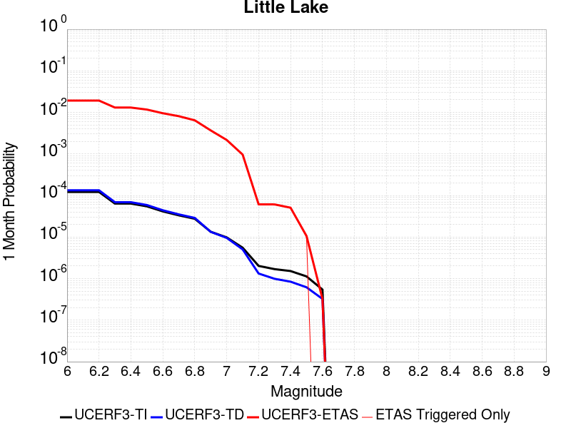 |  |  |

| Magnitude | 1 wk TI Prob | 1 wk TD Prob | 1 wk ETAS Prob | 1 wk ETAS/TD Gain | 1 wk ETAS Triggered Only | 1 mo TI Prob | 1 mo TD Prob | 1 mo ETAS Prob | 1 mo ETAS/TD Gain | 1 mo ETAS Triggered Only | 1 yr TI Prob | 1 yr TD Prob | 1 yr ETAS Prob | 1 yr ETAS/TD Gain | 1 yr ETAS Triggered Only | 10 yr TI Prob | 10 yr TD Prob | 10 yr ETAS Prob | 10 yr ETAS/TD Gain | 10 yr ETAS Triggered Only |
|-----|-----|-----|-----|-----|-----|-----|-----|-----|-----|-----|-----|-----|-----|-----|-----|-----|-----|-----|-----|-----|
| 6.0 | 2.8424427E-5 | 3.1205756E-5 | 0.012370821 | 396.42752 | 0.01234 | 1.2181328E-4 | 1.3373286E-4 | 0.019271173 | 144.10202 | 0.01914 | 0.0014820677 | 0.0016271146 | 0.033914495 | 20.843334 | 0.03234 | 0.014722223 | 0.016165419 | 0.06023137 | 3.7259393 | 0.04479 |
| 6.1 | 2.8424427E-5 | 3.1205756E-5 | 0.012370821 | 396.42752 | 0.01234 | 1.2181328E-4 | 1.3373286E-4 | 0.019271173 | 144.10202 | 0.01914 | 0.0014820677 | 0.0016271146 | 0.033914495 | 20.843334 | 0.03234 | 0.014722223 | 0.016165419 | 0.06023137 | 3.7259393 | 0.04479 |
| 6.2 | 2.8424427E-5 | 3.1205756E-5 | 0.012370821 | 396.42752 | 0.01234 | 1.2181328E-4 | 1.3373286E-4 | 0.019271173 | 144.10202 | 0.01914 | 0.0014820677 | 0.0016271146 | 0.033914495 | 20.843334 | 0.03234 | 0.014722223 | 0.016165419 | 0.06023137 | 3.7259393 | 0.04479 |
| 6.3 | 1.48860645E-5 | 1.6081403E-5 | 0.008535944 | 530.796 | 0.00852 | 6.379586E-5 | 6.8918634E-5 | 0.013068023 | 189.61522 | 0.013 | 7.7643775E-4 | 8.3878957E-4 | 0.022500604 | 26.825089 | 0.02168 | 0.007737305 | 0.008359055 | 0.038633853 | 4.6217966 | 0.03053 |
| 6.4 | 1.48860645E-5 | 1.6081403E-5 | 0.008535944 | 530.796 | 0.00852 | 6.379586E-5 | 6.8918634E-5 | 0.013068023 | 189.61522 | 0.013 | 7.7643775E-4 | 8.3878957E-4 | 0.022500604 | 26.825089 | 0.02168 | 0.007737305 | 0.008359055 | 0.038633853 | 4.6217966 | 0.03053 |
| 6.5 | 1.2797581E-5 | 1.3765575E-5 | 0.00766366 | 556.7265 | 0.00765 | 5.4845623E-5 | 5.8994134E-5 | 0.0116983075 | 198.29611 | 0.01164 | 6.675408E-4 | 7.180426E-4 | 0.019944228 | 27.77583 | 0.01924 | 0.006655392 | 0.0071597756 | 0.033946604 | 4.7412944 | 0.02698 |
| 6.6 | 9.661896E-6 | 1.02890435E-5 | 0.0061802254 | 600.6608 | 0.00617 | 4.1407468E-5 | 4.4095246E-5 | 0.009543676 | 216.43323 | 0.0095 | 5.040193E-4 | 5.367436E-4 | 0.016418215 | 30.58856 | 0.01589 | 0.005028777 | 0.0053560776 | 0.02752669 | 5.1393375 | 0.02229 |
| 6.7 | 7.767871E-6 | 8.19969E-6 | 0.0052781566 | 643.70197 | 0.00527 | 3.329045E-5 | 3.5141133E-5 | 0.008104858 | 230.63736 | 0.00807 | 4.0523586E-4 | 4.2777302E-4 | 0.013892011 | 32.475193 | 0.01347 | 0.004044977 | 0.0042708474 | 0.02330919 | 5.457743 | 0.01912 |
| 6.8 | 6.4235196E-6 | 6.735746E-6 | 0.004246707 | 630.4732 | 0.00424 | 2.752908E-5 | 2.8867236E-5 | 0.006448682 | 223.39104 | 0.00642 | 3.35115E-4 | 3.5141475E-4 | 0.011137623 | 31.69367 | 0.01079 | 0.003346101 | 0.0035098507 | 0.018955449 | 5.400642 | 0.0155 |
| 6.9 | 3.1283696E-6 | 3.1121774E-6 | 0.0024731045 | 794.65405 | 0.00247 | 1.3407229E-5 | 1.33378435E-5 | 0.0036832888 | 276.15326 | 0.00367 | 1.6322079E-4 | 1.6237765E-4 | 0.006441358 | 39.66899 | 0.00628 | 0.0016310095 | 0.0016227384 | 0.010558215 | 6.506418 | 0.00895 |
| 7.0 | 2.290603E-6 | 2.2286779E-6 | 0.0014522255 | 651.60846 | 0.00145 | 9.816834E-6 | 9.551448E-6 | 0.0021695308 | 227.14157 | 0.00216 | 1.19513395E-4 | 1.16283714E-4 | 0.0038158535 | 32.81503 | 0.0037 | 0.0011944914 | 0.0011623309 | 0.0064062285 | 5.511536 | 0.00525 |
| 7.1 | 1.293693E-6 | 1.1776784E-6 | 6.811769E-4 | 578.4065 | 6.8E-4 | 5.5443866E-6 | 5.0471876E-6 | 9.6504233E-4 | 191.20398 | 9.6E-4 | 6.750081E-5 | 6.1448474E-5 | 0.0017113471 | 27.850115 | 0.00165 | 6.7480316E-4 | 6.143833E-4 | 0.0030528842 | 4.969022 | 0.00244 |
| 7.2 | 4.715842E-7 | 3.0917366E-7 | 3.0309164E-5 | 98.032814 | 3.0E-5 | 2.0210737E-6 | 1.3250293E-6 | 6.132495E-5 | 46.281956 | 6.0E-5 | 2.4606294E-5 | 1.6132119E-5 | 1.5612986E-4 | 9.6782 | 1.4E-4 | 2.460357E-4 | 1.6131002E-4 | 3.5127936E-4 | 2.1776662 | 1.9E-4 |
| 7.3 | 3.9430947E-7 | 2.3096979E-7 | 3.0230964E-5 | 130.88708 | 3.0E-5 | 1.6898966E-6 | 9.898702E-7 | 6.0989812E-5 | 61.61395 | 6.0E-5 | 2.0574296E-5 | 1.2051603E-5 | 1.3205016E-4 | 10.957061 | 1.2E-4 | 2.0572392E-4 | 1.20509576E-4 | 2.704915E-4 | 2.2445643 | 1.5E-4 |
| 7.4 | 3.547123E-7 | 1.9678616E-7 | 2.0196781E-5 | 102.63314 | 2.0E-5 | 1.5201948E-6 | 8.4336904E-7 | 5.0843326E-5 | 60.28598 | 5.0E-5 | 1.8508214E-5 | 1.02679705E-5 | 1.1026694E-4 | 10.738923 | 1.0E-4 | 1.8506673E-4 | 1.0267502E-4 | 2.226627E-4 | 2.168616 | 1.2E-4 |
| 7.5 | 2.6354266E-7 | 1.4422751E-7 | 1.4422751E-7 | 1.0 | 0.0 | 1.129468E-6 | 6.181178E-7 | 1.0618111E-5 | 17.178137 | 1.0E-5 | 1.3751187E-5 | 7.5255584E-6 | 5.7525183E-5 | 7.6439753 | 5.0E-5 | 1.3750336E-4 | 7.525308E-5 | 1.4524782E-4 | 1.9301244 | 7.0E-5 |
| 7.6 | 1.269913E-7 | 7.57235E-8 | 7.57235E-8 | 1.0 | 0.0 | 5.4424834E-7 | 3.2452922E-7 | 3.2452922E-7 | 1.0 | 0.0 | 6.6262032E-6 | 3.9511365E-6 | 2.3951057E-5 | 6.061815 | 2.0E-5 | 6.626006E-5 | 3.9510698E-5 | 6.9509515E-5 | 1.759258 | 3.0E-5 |

## Airport Lake
*[(top)](#table-of-contents)*

| 1 Week | 1 Month | 1 Year | 10 Year |
|-----|-----|-----|-----|
|  |  | 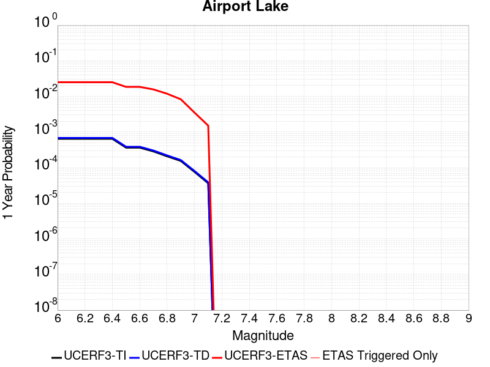 |  |

| Magnitude | 1 wk TI Prob | 1 wk TD Prob | 1 wk ETAS Prob | 1 wk ETAS/TD Gain | 1 wk ETAS Triggered Only | 1 mo TI Prob | 1 mo TD Prob | 1 mo ETAS Prob | 1 mo ETAS/TD Gain | 1 mo ETAS Triggered Only | 1 yr TI Prob | 1 yr TD Prob | 1 yr ETAS Prob | 1 yr ETAS/TD Gain | 1 yr ETAS Triggered Only | 10 yr TI Prob | 10 yr TD Prob | 10 yr ETAS Prob | 10 yr ETAS/TD Gain | 10 yr ETAS Triggered Only |
|-----|-----|-----|-----|-----|-----|-----|-----|-----|-----|-----|-----|-----|-----|-----|-----|-----|-----|-----|-----|-----|
| 6.0 | 1.2387061E-5 | 1.3103167E-5 | 0.009642977 | 735.92725 | 0.00963 | 5.3086325E-5 | 5.615538E-5 | 0.014945319 | 266.14227 | 0.01489 | 6.461343E-4 | 6.8350567E-4 | 0.02497689 | 36.54233 | 0.02431 | 0.0064425888 | 0.006816844 | 0.040386435 | 5.924506 | 0.0338 |
| 6.1 | 1.2387061E-5 | 1.3103167E-5 | 0.009642977 | 735.92725 | 0.00963 | 5.3086325E-5 | 5.615538E-5 | 0.014945319 | 266.14227 | 0.01489 | 6.461343E-4 | 6.8350567E-4 | 0.02497689 | 36.54233 | 0.02431 | 0.0064425888 | 0.006816844 | 0.040386435 | 5.924506 | 0.0338 |
| 6.2 | 1.2387061E-5 | 1.3103167E-5 | 0.009642977 | 735.92725 | 0.00963 | 5.3086325E-5 | 5.615538E-5 | 0.014945319 | 266.14227 | 0.01489 | 6.461343E-4 | 6.8350567E-4 | 0.02497689 | 36.54233 | 0.02431 | 0.0064425888 | 0.006816844 | 0.040386435 | 5.924506 | 0.0338 |
| 6.3 | 1.2387061E-5 | 1.3103167E-5 | 0.009642977 | 735.92725 | 0.00963 | 5.3086325E-5 | 5.615538E-5 | 0.014945319 | 266.14227 | 0.01489 | 6.461343E-4 | 6.8350567E-4 | 0.02497689 | 36.54233 | 0.02431 | 0.0064425888 | 0.006816844 | 0.040386435 | 5.924506 | 0.0338 |
| 6.4 | 1.2387061E-5 | 1.3103167E-5 | 0.009642977 | 735.92725 | 0.00963 | 5.3086325E-5 | 5.615538E-5 | 0.014945319 | 266.14227 | 0.01489 | 6.461343E-4 | 6.8350567E-4 | 0.02497689 | 36.54233 | 0.02431 | 0.0064425888 | 0.006816844 | 0.040386435 | 5.924506 | 0.0338 |
| 6.5 | 6.9922594E-6 | 7.38493E-6 | 0.0072773313 | 985.42993 | 0.00727 | 2.996648E-5 | 3.164935E-5 | 0.011121298 | 351.39108 | 0.01109 | 3.6478083E-4 | 3.852681E-4 | 0.018458303 | 47.91028 | 0.01808 | 0.003641826 | 0.0038465392 | 0.028760338 | 7.4769382 | 0.02501 |
| 6.6 | 6.9922594E-6 | 7.38493E-6 | 0.0072773313 | 985.42993 | 0.00727 | 2.996648E-5 | 3.164935E-5 | 0.011121298 | 351.39108 | 0.01109 | 3.6478083E-4 | 3.852681E-4 | 0.018458303 | 47.91028 | 0.01808 | 0.003641826 | 0.0038465392 | 0.028760338 | 7.4769382 | 0.02501 |
| 6.7 | 5.477277E-6 | 5.7860725E-6 | 0.0061557507 | 1063.891 | 0.00615 | 2.3473833E-5 | 2.479724E-5 | 0.009414565 | 379.6618 | 0.00939 | 2.8575645E-4 | 3.0186845E-4 | 0.015687224 | 51.967083 | 0.01539 | 0.0028538927 | 0.003014968 | 0.024320537 | 8.066599 | 0.02137 |
| 6.8 | 3.9950432E-6 | 4.21909E-6 | 0.0045841997 | 1086.5376 | 0.00458 | 1.7121502E-5 | 1.8081704E-5 | 0.0070479545 | 389.78375 | 0.00703 | 2.0843433E-4 | 2.2012526E-4 | 0.01186756 | 53.91276 | 0.01165 | 0.0020823893 | 0.0021993432 | 0.018553296 | 8.435835 | 0.01639 |
| 6.9 | 2.95695E-6 | 3.1230265E-6 | 0.003173113 | 1016.03784 | 0.00317 | 1.2672582E-5 | 1.3384343E-5 | 0.00482332 | 360.3703 | 0.00481 | 1.5427776E-4 | 1.6294446E-4 | 0.008281621 | 50.82481 | 0.00812 | 0.001541707 | 0.0016284722 | 0.013019891 | 7.995157 | 0.01141 |
| 7.0 | 1.456072E-6 | 1.5408131E-6 | 0.0013715387 | 890.1396 | 0.00137 | 6.2402937E-6 | 6.6034736E-6 | 0.0020365901 | 308.41193 | 0.00203 | 7.597293E-5 | 8.039534E-5 | 0.0035001205 | 43.53636 | 0.00342 | 7.594696E-4 | 8.037614E-4 | 0.005659855 | 7.0417104 | 0.00486 |
| 7.1 | 6.995192E-7 | 7.40898E-7 | 6.4074044E-4 | 864.816 | 6.4E-4 | 2.997936E-6 | 3.175277E-6 | 8.9317246E-4 | 281.2896 | 8.9E-4 | 3.649926E-5 | 3.8659E-5 | 0.0015086022 | 39.02331 | 0.00147 | 3.6493264E-4 | 3.8659E-4 | 0.0025957357 | 6.714441 | 0.00221 |

## Owl Lake
*[(top)](#table-of-contents)*

| 1 Week | 1 Month | 1 Year | 10 Year |
|-----|-----|-----|-----|
|  |  |  |  |

| Magnitude | 1 wk TI Prob | 1 wk TD Prob | 1 wk ETAS Prob | 1 wk ETAS/TD Gain | 1 wk ETAS Triggered Only | 1 mo TI Prob | 1 mo TD Prob | 1 mo ETAS Prob | 1 mo ETAS/TD Gain | 1 mo ETAS Triggered Only | 1 yr TI Prob | 1 yr TD Prob | 1 yr ETAS Prob | 1 yr ETAS/TD Gain | 1 yr ETAS Triggered Only | 10 yr TI Prob | 10 yr TD Prob | 10 yr ETAS Prob | 10 yr ETAS/TD Gain | 10 yr ETAS Triggered Only |
|-----|-----|-----|-----|-----|-----|-----|-----|-----|-----|-----|-----|-----|-----|-----|-----|-----|-----|-----|-----|-----|
| 6.0 | 5.0320643E-5 | 6.6358785E-5 | 0.0035061305 | 52.835964 | 0.00344 | 2.1564208E-4 | 2.843654E-4 | 0.0066625513 | 23.429543 | 0.00638 | 0.0026222812 | 0.0034575618 | 0.015485829 | 4.4788294 | 0.01207 | 0.02591553 | 0.03414153 | 0.052309327 | 1.5321319 | 0.01881 |
| 6.1 | 5.0320643E-5 | 6.6358785E-5 | 0.0035061305 | 52.835964 | 0.00344 | 2.1564208E-4 | 2.843654E-4 | 0.0066625513 | 23.429543 | 0.00638 | 0.0026222812 | 0.0034575618 | 0.015485829 | 4.4788294 | 0.01207 | 0.02591553 | 0.03414153 | 0.052309327 | 1.5321319 | 0.01881 |
| 6.2 | 2.4125871E-5 | 3.098066E-5 | 0.002600901 | 83.952415 | 0.00257 | 1.0339249E-4 | 1.3276865E-4 | 0.004912134 | 36.997696 | 0.00478 | 0.0012580766 | 0.0016154326 | 0.010540991 | 6.5251813 | 0.00894 | 0.012509781 | 0.01607092 | 0.029619623 | 1.8430572 | 0.01377 |
| 6.3 | 1.7433485E-5 | 2.2355658E-5 | 0.0023223043 | 103.87994 | 0.0023 | 7.471279E-5 | 9.580733E-5 | 0.004215413 | 43.99885 | 0.00412 | 9.0924866E-4 | 0.0011659678 | 0.00879706 | 7.544857 | 0.00764 | 0.009055373 | 0.011629296 | 0.023203116 | 1.9952297 | 0.01171 |
| 6.4 | 1.7433485E-5 | 2.2355658E-5 | 0.0023223043 | 103.87994 | 0.0023 | 7.471279E-5 | 9.580733E-5 | 0.004215413 | 43.99885 | 0.00412 | 9.0924866E-4 | 0.0011659678 | 0.00879706 | 7.544857 | 0.00764 | 0.009055373 | 0.011629296 | 0.023203116 | 1.9952297 | 0.01171 |
| 6.5 | 1.5182742E-5 | 1.9429379E-5 | 0.0022893853 | 117.83111 | 0.00227 | 6.506727E-5 | 8.326696E-5 | 0.0040629357 | 48.79409 | 0.00398 | 7.919061E-4 | 0.0010134396 | 0.008355991 | 8.245179 | 0.00735 | 0.0078909 | 0.010118817 | 0.02116589 | 2.0917356 | 0.01116 |
| 6.6 | 6.7271576E-6 | 8.547581E-6 | 0.0018985315 | 222.1133 | 0.00189 | 2.8830356E-5 | 3.663201E-5 | 0.0032165155 | 87.806145 | 0.00318 | 3.5095305E-4 | 4.459091E-4 | 0.005993434 | 13.440933 | 0.00555 | 0.0035039932 | 0.0044681444 | 0.012591684 | 2.8181016 | 0.00816 |
| 6.7 | 6.682835E-6 | 8.480024E-6 | 0.0018884641 | 222.6956 | 0.00188 | 2.8640408E-5 | 3.6342488E-5 | 0.0032062272 | 88.222565 | 0.00317 | 3.4864116E-4 | 4.423856E-4 | 0.0059699393 | 13.494877 | 0.00553 | 0.003480947 | 0.004433061 | 0.012536976 | 2.828063 | 0.00814 |
| 6.8 | 6.5774975E-6 | 8.32649E-6 | 0.0018883109 | 226.78352 | 0.00188 | 2.8188972E-5 | 3.56845E-5 | 0.003185572 | 89.27046 | 0.00315 | 3.4314668E-4 | 4.3437784E-4 | 0.005921993 | 13.633276 | 0.00549 | 0.0034261728 | 0.0043532355 | 0.012398061 | 2.8480105 | 0.00808 |
| 6.9 | 6.363419E-6 | 7.999653E-6 | 0.0018679848 | 233.50822 | 0.00186 | 2.727151E-5 | 3.4283807E-5 | 0.0031641766 | 92.29362 | 0.00313 | 3.3198006E-4 | 4.17331E-4 | 0.0058750524 | 14.077681 | 0.00546 | 0.0033148455 | 0.0041832146 | 0.012179623 | 2.9115465 | 0.00803 |
| 7.0 | 6.1342453E-6 | 7.631841E-6 | 0.0018576178 | 243.40363 | 0.00185 | 2.6289357E-5 | 3.270751E-5 | 0.0031426058 | 96.082085 | 0.00311 | 3.2002592E-4 | 3.9814666E-4 | 0.0058359806 | 14.6578665 | 0.00544 | 0.0031956544 | 0.0039919023 | 0.011910167 | 2.9835815 | 0.00795 |
| 7.1 | 5.842926E-6 | 7.1423724E-6 | 0.0017771297 | 248.81505 | 0.00177 | 2.504087E-5 | 3.0609837E-5 | 0.0030205182 | 98.678024 | 0.00299 | 3.0482994E-4 | 3.7261646E-4 | 0.0055506863 | 14.896514 | 0.00518 | 0.0030441214 | 0.0037373395 | 0.011229235 | 3.0046065 | 0.00752 |
| 7.2 | 4.77173E-6 | 5.3585304E-6 | 0.0011353525 | 211.87758 | 0.00113 | 2.045011E-5 | 2.296495E-5 | 0.0019229213 | 83.73287 | 0.0019 | 2.4895166E-4 | 2.7956645E-4 | 0.0036486243 | 13.051009 | 0.00337 | 0.0024867293 | 0.0028089795 | 0.0077051874 | 2.7430558 | 0.00491 |
| 7.3 | 3.0494948E-6 | 2.7104045E-6 | 2.7270967E-4 | 100.61585 | 2.7E-4 | 1.3069198E-5 | 1.1615969E-5 | 5.416098E-4 | 46.626312 | 5.3E-4 | 1.5910587E-4 | 1.4141541E-4 | 0.0011312754 | 7.999662 | 9.9E-4 | 0.0015899199 | 0.0014231396 | 0.0029210048 | 2.0525076 | 0.0015 |
| 7.4 | 2.7263884E-6 | 2.3056095E-6 | 1.7230521E-4 | 74.73305 | 1.7E-4 | 1.1684469E-5 | 9.881147E-6 | 3.5987768E-4 | 36.42064 | 3.5E-4 | 1.4224913E-4 | 1.2029642E-4 | 7.902158E-4 | 6.5689054 | 6.7E-4 | 0.0014215811 | 0.0012110875 | 0.0022498278 | 1.8576924 | 0.00104 |
| 7.5 | 2.6090431E-6 | 2.1655464E-6 | 1.4216524E-4 | 65.64867 | 1.4E-4 | 1.1181565E-5 | 9.280881E-6 | 2.8927828E-4 | 31.16927 | 2.8E-4 | 1.3612706E-4 | 1.12988964E-4 | 6.4292905E-4 | 5.6901937 | 5.3E-4 | 0.001360437 | 0.0011378612 | 0.0019769054 | 1.7373872 | 8.4E-4 |
| 7.6 | 2.3008756E-6 | 1.8727258E-6 | 1.0187254E-4 | 54.398003 | 1.0E-4 | 9.860858E-6 | 8.025943E-6 | 2.0802434E-4 | 25.91899 | 2.0E-4 | 1.20049335E-4 | 9.7711556E-5 | 4.8767345E-4 | 4.9909496 | 3.9E-4 | 0.001199845 | 9.848743E-4 | 0.0015842833 | 1.6086148 | 6.0E-4 |
| 7.7 | 1.7184348E-6 | 1.3418444E-6 | 6.1341765E-5 | 45.714516 | 6.0E-5 | 7.3646997E-6 | 5.750749E-6 | 1.1575012E-4 | 20.127832 | 1.1E-4 | 8.966153E-5 | 7.0013164E-5 | 2.5999986E-4 | 3.7135854 | 1.9E-4 | 8.962536E-4 | 7.0776645E-4 | 0.0010375329 | 1.4659255 | 3.3E-4 |
| 7.8 | 8.4612907E-7 | 8.4057245E-7 | 4.084054E-5 | 48.58658 | 4.0E-5 | 3.6262625E-6 | 3.6024485E-6 | 6.360223E-5 | 17.65528 | 6.0E-5 | 4.4148852E-5 | 4.385895E-5 | 1.0385632E-4 | 2.367962 | 6.0E-5 | 4.414008E-4 | 4.4393502E-4 | 5.638817E-4 | 1.2701899 | 1.2E-4 |
| 7.9 | 2.716738E-7 | 3.7682543E-7 | 2.0376818E-5 | 54.074955 | 2.0E-5 | 1.1643157E-6 | 1.6149652E-6 | 2.1614933E-5 | 13.384148 | 2.0E-5 | 1.4175452E-5 | 1.9662035E-5 | 3.966164E-5 | 2.0171688 | 2.0E-5 | 1.4174548E-4 | 1.9832826E-4 | 2.2832231E-4 | 1.1512344 | 3.0E-5 |
| 8.0 | 2.1995428E-8 | 3.385378E-8 | 3.385378E-8 | 1.0 | 0.0 | 9.426611E-8 | 1.4508763E-7 | 1.4508763E-7 | 1.0 | 0.0 | 1.1476893E-6 | 1.7664412E-6 | 1.7664412E-6 | 1.0 | 0.0 | 1.14768345E-5 | 1.7869113E-5 | 1.7869113E-5 | 1.0 | 0.0 |

## Panamint Valley
*[(top)](#table-of-contents)*

| 1 Week | 1 Month | 1 Year | 10 Year |
|-----|-----|-----|-----|
| 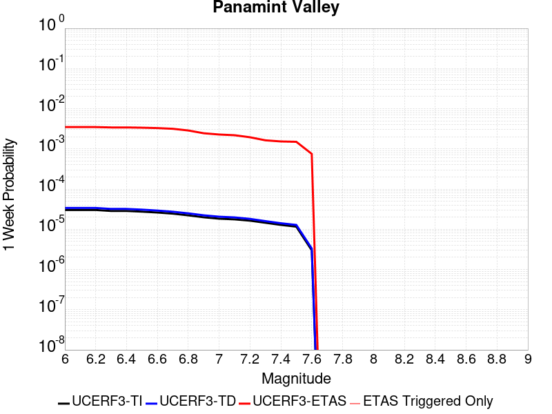 |  |  |  |

| Magnitude | 1 wk TI Prob | 1 wk TD Prob | 1 wk ETAS Prob | 1 wk ETAS/TD Gain | 1 wk ETAS Triggered Only | 1 mo TI Prob | 1 mo TD Prob | 1 mo ETAS Prob | 1 mo ETAS/TD Gain | 1 mo ETAS Triggered Only | 1 yr TI Prob | 1 yr TD Prob | 1 yr ETAS Prob | 1 yr ETAS/TD Gain | 1 yr ETAS Triggered Only | 10 yr TI Prob | 10 yr TD Prob | 10 yr ETAS Prob | 10 yr ETAS/TD Gain | 10 yr ETAS Triggered Only |
|-----|-----|-----|-----|-----|-----|-----|-----|-----|-----|-----|-----|-----|-----|-----|-----|-----|-----|-----|-----|-----|
| 6.0 | 3.0211835E-5 | 3.39843E-5 | 0.0034938667 | 102.80826 | 0.00346 | 1.2947287E-4 | 1.4563903E-4 | 0.006104771 | 41.917133 | 0.00596 | 0.0015751923 | 0.0017717426 | 0.013191474 | 7.44548 | 0.01144 | 0.015640736 | 0.017582808 | 0.034647394 | 1.9705268 | 0.01737 |
| 6.1 | 3.0211835E-5 | 3.39843E-5 | 0.0034938667 | 102.80826 | 0.00346 | 1.2947287E-4 | 1.4563903E-4 | 0.006104771 | 41.917133 | 0.00596 | 0.0015751923 | 0.0017717426 | 0.013191474 | 7.44548 | 0.01144 | 0.015640736 | 0.017582808 | 0.034647394 | 1.9705268 | 0.01737 |
| 6.2 | 3.0211835E-5 | 3.39843E-5 | 0.0034938667 | 102.80826 | 0.00346 | 1.2947287E-4 | 1.4563903E-4 | 0.006104771 | 41.917133 | 0.00596 | 0.0015751923 | 0.0017717426 | 0.013191474 | 7.44548 | 0.01144 | 0.015640736 | 0.017582808 | 0.034647394 | 1.9705268 | 0.01737 |
| 6.3 | 2.8573924E-5 | 3.2102478E-5 | 0.0034219937 | 106.59593 | 0.00339 | 1.2245393E-4 | 1.3757496E-4 | 0.00591678 | 43.007683 | 0.00578 | 0.001489857 | 0.001673716 | 0.012675271 | 7.5731316 | 0.01102 | 0.01479908 | 0.01661784 | 0.033079658 | 1.9906111 | 0.01674 |
| 6.4 | 2.8573924E-5 | 3.2102478E-5 | 0.0034219937 | 106.59593 | 0.00339 | 1.2245393E-4 | 1.3757496E-4 | 0.00591678 | 43.007683 | 0.00578 | 0.001489857 | 0.001673716 | 0.012675271 | 7.5731316 | 0.01102 | 0.01479908 | 0.01661784 | 0.033079658 | 1.9906111 | 0.01674 |
| 6.5 | 2.7468774E-5 | 3.082817E-5 | 0.0033707253 | 109.33912 | 0.00334 | 1.1771801E-4 | 1.321142E-4 | 0.0057913666 | 43.836063 | 0.00566 | 0.0014322745 | 0.001607331 | 0.012300116 | 7.65251 | 0.01071 | 0.014230782 | 0.01596369 | 0.031885397 | 1.9973701 | 0.01618 |
| 6.6 | 2.6135967E-5 | 2.9252182E-5 | 0.0032991564 | 112.783264 | 0.00327 | 1.1200648E-4 | 1.2536062E-4 | 0.005624671 | 44.867928 | 0.0055 | 0.0013628257 | 0.0015252235 | 0.011819499 | 7.749355 | 0.01031 | 0.013544982 | 0.01515415 | 0.030448806 | 2.0092719 | 0.01553 |
| 6.7 | 2.4498746E-5 | 2.7341075E-5 | 0.0031672553 | 115.842384 | 0.00314 | 1.04990395E-4 | 1.17170915E-4 | 0.0053765546 | 45.88643 | 0.00526 | 0.0012775084 | 0.0014256474 | 0.01120169 | 7.8572655 | 0.00979 | 0.012701893 | 0.014171398 | 0.028623646 | 2.019818 | 0.01466 |
| 6.8 | 2.2244329E-5 | 2.4935403E-5 | 0.0028748643 | 115.29247 | 0.00285 | 9.532935E-5 | 1.06861764E-4 | 0.004886351 | 45.725906 | 0.00478 | 0.0011600169 | 0.0013002872 | 0.01013878 | 7.7973385 | 0.00885 | 0.011539802 | 0.012932762 | 0.026001532 | 2.0105166 | 0.01324 |
| 6.9 | 1.9902658E-5 | 2.2290207E-5 | 0.0024522361 | 110.01405 | 0.00243 | 8.529431E-5 | 9.552606E-5 | 0.00413514 | 43.288082 | 0.00404 | 0.0010379635 | 0.0011624278 | 0.00846393 | 7.2812524 | 0.00731 | 0.010331288 | 0.011569071 | 0.02239239 | 1.9355391 | 0.01095 |
| 7.0 | 1.8353881E-5 | 2.0566074E-5 | 0.0022805196 | 110.88745 | 0.00226 | 7.865712E-5 | 8.813744E-5 | 0.003767813 | 42.74929 | 0.00368 | 9.5722964E-4 | 0.0010725629 | 0.0075755804 | 7.0630646 | 0.00651 | 0.009531168 | 0.010679445 | 0.020335214 | 1.9041451 | 0.00976 |
| 7.1 | 1.7667631E-5 | 1.9772458E-5 | 0.0021897296 | 110.74645 | 0.00217 | 7.571623E-5 | 8.473645E-5 | 0.0036044382 | 42.537045 | 0.00352 | 9.2145515E-4 | 0.0010311956 | 0.0072547714 | 7.0353007 | 0.00623 | 0.009176437 | 0.0102696465 | 0.019493934 | 1.8982087 | 0.00932 |
| 7.2 | 1.6381597E-5 | 1.8158062E-5 | 0.001948123 | 107.28695 | 0.00193 | 7.020495E-5 | 7.781804E-5 | 0.003187576 | 40.961914 | 0.00311 | 8.544101E-4 | 9.4704016E-4 | 0.0063419263 | 6.696576 | 0.0054 | 0.008511325 | 0.009435358 | 0.017478744 | 1.8524727 | 0.00812 |
| 7.3 | 1.4520491E-5 | 1.5966589E-5 | 0.0016359407 | 102.46025 | 0.00162 | 6.222919E-5 | 6.842653E-5 | 0.0026382506 | 38.555958 | 0.00257 | 7.57377E-4 | 8.3279086E-4 | 0.0053490265 | 6.423013 | 0.00452 | 0.0075480095 | 0.008300488 | 0.015113463 | 1.8207922 | 0.00687 |
| 7.4 | 1.2852287E-5 | 1.4145499E-5 | 0.001534124 | 108.45315 | 0.00152 | 5.5080065E-5 | 6.062225E-5 | 0.002470476 | 40.751972 | 0.00241 | 6.7039346E-4 | 7.3784176E-4 | 0.005024676 | 6.8099647 | 0.00429 | 0.0066837464 | 0.007357514 | 0.013720352 | 1.8648082 | 0.00641 |
| 7.5 | 1.1637851E-5 | 1.2836879E-5 | 0.0015028177 | 117.070335 | 0.00149 | 4.987555E-5 | 5.5014123E-5 | 0.0024148843 | 43.895714 | 0.00236 | 6.070656E-4 | 6.696068E-4 | 0.0048667947 | 7.268138 | 0.0042 | 0.006054099 | 0.0066794604 | 0.01287778 | 1.9279672 | 0.00624 |
| 7.6 | 3.0068115E-6 | 3.3330623E-6 | 7.533306E-4 | 226.01755 | 7.5E-4 | 1.2886271E-5 | 1.4284516E-5 | 0.0011342685 | 79.40546 | 0.00112 | 1.5687906E-4 | 1.7390738E-4 | 0.0020335838 | 11.693488 | 0.00186 | 0.0015676835 | 0.0017400066 | 0.0043853954 | 2.5203328 | 0.00265 |

## Garlock (East)
*[(top)](#table-of-contents)*

| 1 Week | 1 Month | 1 Year | 10 Year |
|-----|-----|-----|-----|
|  |  |  |  |

| Magnitude | 1 wk TI Prob | 1 wk TD Prob | 1 wk ETAS Prob | 1 wk ETAS/TD Gain | 1 wk ETAS Triggered Only | 1 mo TI Prob | 1 mo TD Prob | 1 mo ETAS Prob | 1 mo ETAS/TD Gain | 1 mo ETAS Triggered Only | 1 yr TI Prob | 1 yr TD Prob | 1 yr ETAS Prob | 1 yr ETAS/TD Gain | 1 yr ETAS Triggered Only | 10 yr TI Prob | 10 yr TD Prob | 10 yr ETAS Prob | 10 yr ETAS/TD Gain | 10 yr ETAS Triggered Only |
|-----|-----|-----|-----|-----|-----|-----|-----|-----|-----|-----|-----|-----|-----|-----|-----|-----|-----|-----|-----|-----|
| 6.0 | 4.5092507E-5 | 6.2905056E-5 | 0.0024827528 | 39.468254 | 0.00242 | 1.9323928E-4 | 2.6956777E-4 | 0.0044684354 | 16.576298 | 0.0042 | 0.0023501497 | 0.0032774943 | 0.0112413075 | 3.429848 | 0.00799 | 0.023254504 | 0.032353684 | 0.04464279 | 1.3798364 | 0.0127 |
| 6.1 | 4.5092507E-5 | 6.2905056E-5 | 0.0024827528 | 39.468254 | 0.00242 | 1.9323928E-4 | 2.6956777E-4 | 0.0044684354 | 16.576298 | 0.0042 | 0.0023501497 | 0.0032774943 | 0.0112413075 | 3.429848 | 0.00799 | 0.023254504 | 0.032353684 | 0.04464279 | 1.3798364 | 0.0127 |
| 6.2 | 2.6674514E-5 | 3.4511817E-5 | 0.0017244535 | 49.967045 | 0.00169 | 1.1431433E-4 | 1.4789958E-4 | 0.0030474707 | 20.604998 | 0.0029 | 0.0013908884 | 0.0017992232 | 0.0073092915 | 4.0624704 | 0.00552 | 0.01382215 | 0.017872695 | 0.026152028 | 1.4632392 | 0.00843 |
| 6.3 | 2.6674514E-5 | 3.4511817E-5 | 0.0017244535 | 49.967045 | 0.00169 | 1.1431433E-4 | 1.4789958E-4 | 0.0030474707 | 20.604998 | 0.0029 | 0.0013908884 | 0.0017992232 | 0.0073092915 | 4.0624704 | 0.00552 | 0.01382215 | 0.017872695 | 0.026152028 | 1.4632392 | 0.00843 |
| 6.4 | 2.5312667E-5 | 3.2340697E-5 | 0.0017022867 | 52.636055 | 0.00167 | 1.0847834E-4 | 1.3859579E-4 | 0.0030181967 | 21.776972 | 0.00288 | 0.0013199237 | 0.0016861272 | 0.0071269376 | 4.226809 | 0.00545 | 0.013121112 | 0.016772194 | 0.024903487 | 1.4848081 | 0.00827 |
| 6.5 | 2.5312667E-5 | 3.2340697E-5 | 0.0017022867 | 52.636055 | 0.00167 | 1.0847834E-4 | 1.3859579E-4 | 0.0030181967 | 21.776972 | 0.00288 | 0.0013199237 | 0.0016861272 | 0.0071269376 | 4.226809 | 0.00545 | 0.013121112 | 0.016772194 | 0.024903487 | 1.4848081 | 0.00827 |
| 6.6 | 2.246556E-5 | 2.813492E-5 | 0.0016280899 | 57.86723 | 0.0016 | 9.627742E-5 | 1.2057279E-4 | 0.0029002377 | 24.053831 | 0.00278 | 0.0011715472 | 0.0014670087 | 0.006709307 | 4.5734606 | 0.00525 | 0.011653901 | 0.014613113 | 0.02239767 | 1.5327103 | 0.0079 |
| 6.7 | 2.2241198E-5 | 2.780466E-5 | 0.0016277601 | 58.542713 | 0.0016 | 9.531594E-5 | 1.19157514E-4 | 0.0028988263 | 24.327682 | 0.00278 | 0.0011598538 | 0.0014498008 | 0.0066921893 | 4.615937 | 0.00525 | 0.011538187 | 0.01444276 | 0.022208951 | 1.5377221 | 0.00788 |
| 6.8 | 1.9528685E-5 | 2.3899196E-5 | 0.0015538626 | 65.01736 | 0.00153 | 8.369167E-5 | 1.0242122E-4 | 0.002732152 | 26.675644 | 0.00263 | 0.0010184698 | 0.0012462847 | 0.0061002276 | 4.8947306 | 0.00486 | 0.010138147 | 0.012436585 | 0.019537166 | 1.570943 | 0.00719 |
| 6.9 | 1.3318621E-5 | 1.5199035E-5 | 0.0013651785 | 89.820076 | 0.00135 | 5.7078556E-5 | 6.513713E-5 | 0.0024149842 | 37.075386 | 0.00235 | 6.9470983E-4 | 7.927617E-4 | 0.005059377 | 6.381964 | 0.00427 | 0.0069254204 | 0.007940654 | 0.014081501 | 1.7733428 | 0.00619 |
| 7.0 | 1.1760853E-5 | 1.3107861E-5 | 0.0013330906 | 101.70161 | 0.00132 | 5.0402683E-5 | 5.6175366E-5 | 0.0023360474 | 41.584904 | 0.00228 | 6.134799E-4 | 6.837255E-4 | 0.004780922 | 6.9924583 | 0.0041 | 0.0061178906 | 0.0068573374 | 0.0127864 | 1.8646303 | 0.00597 |
| 7.1 | 1.0064758E-5 | 1.0902962E-5 | 0.001300889 | 119.31519 | 0.00129 | 4.3133965E-5 | 4.672616E-5 | 0.0022466234 | 48.080635 | 0.0022 | 5.2502943E-4 | 5.68746E-4 | 0.0044865166 | 7.8884363 | 0.00392 | 0.005237907 | 0.0057132915 | 0.011370783 | 1.9902333 | 0.00569 |
| 7.2 | 9.768808E-6 | 1.0498828E-5 | 0.0013004853 | 123.86957 | 0.00129 | 4.186565E-5 | 4.499422E-5 | 0.002204897 | 49.004005 | 0.00216 | 5.095951E-4 | 5.476704E-4 | 0.0043955618 | 8.025925 | 0.00385 | 0.0050842804 | 0.0055035395 | 0.011052829 | 2.008313 | 0.00558 |
| 7.3 | 9.344516E-6 | 9.944467E-6 | 0.0012299323 | 123.68007 | 0.00122 | 4.004731E-5 | 4.2618467E-5 | 0.0020525327 | 48.160645 | 0.00201 | 4.8746695E-4 | 5.1875977E-4 | 0.004086908 | 7.878228 | 0.00357 | 0.0048639905 | 0.005215221 | 0.010427893 | 1.9995112 | 0.00524 |
| 7.4 | 9.023491E-6 | 9.490636E-6 | 0.0010694806 | 112.68797 | 0.00106 | 3.867153E-5 | 4.067354E-5 | 0.0018306008 | 45.007164 | 0.00179 | 4.7072413E-4 | 4.950912E-4 | 0.0036835119 | 7.4400673 | 0.00319 | 0.004697283 | 0.004978598 | 0.0095954975 | 1.9273493 | 0.00464 |
| 7.5 | 7.081253E-6 | 7.087553E-6 | 6.5708294E-4 | 92.70942 | 6.5E-4 | 3.0347876E-5 | 3.0374878E-5 | 0.0010703433 | 35.23778 | 0.00104 | 3.6942272E-4 | 3.6975212E-4 | 0.0021091087 | 5.7041154 | 0.00174 | 0.003688092 | 0.0037246586 | 0.0061157197 | 1.6419543 | 0.0024 |
| 7.6 | 6.116396E-6 | 5.959089E-6 | 3.7595688E-4 | 63.08966 | 3.7E-4 | 2.6212863E-5 | 2.5538704E-5 | 6.355231E-4 | 24.884706 | 6.1E-4 | 3.1909486E-4 | 3.1088962E-4 | 0.0013205756 | 4.2477317 | 0.00101 | 0.0031863707 | 0.0031360881 | 0.0045017917 | 1.43548 | 0.00137 |
| 7.7 | 4.797145E-6 | 4.7572516E-6 | 2.1475625E-4 | 45.14292 | 2.1E-4 | 2.055903E-5 | 2.0388063E-5 | 4.0038032E-4 | 19.637978 | 3.8E-4 | 2.5027743E-4 | 2.4819653E-4 | 8.1805506E-4 | 3.2959971 | 5.7E-4 | 0.0024999576 | 0.002509609 | 0.0032577268 | 1.2981013 | 7.5E-4 |
| 7.8 | 3.4028885E-6 | 3.9784977E-6 | 1.4397794E-4 | 36.189022 | 1.4E-4 | 1.4583726E-5 | 1.7050594E-5 | 2.4704667E-4 | 14.489037 | 2.3E-4 | 1.775424E-4 | 2.0757127E-4 | 5.2750483E-4 | 2.5413191 | 3.2E-4 | 0.0017740062 | 0.0021013715 | 0.00251051 | 1.1947007 | 4.1E-4 |
| 7.9 | 2.5928412E-6 | 3.3725432E-6 | 8.337227E-5 | 24.720892 | 8.0E-5 | 1.1112129E-5 | 1.4453676E-5 | 1.444518E-4 | 9.994122 | 1.3E-4 | 1.3528178E-4 | 1.7595937E-4 | 3.7592417E-4 | 2.136426 | 2.0E-4 | 0.0013519945 | 0.001781373 | 0.0020409098 | 1.1456949 | 2.6E-4 |
| 8.0 | 1.3743648E-6 | 1.6735202E-6 | 3.167347E-5 | 18.926256 | 3.0E-5 | 5.8901214E-6 | 7.1722093E-6 | 4.717192E-5 | 6.577042 | 4.0E-5 | 7.1709874E-5 | 8.731818E-5 | 1.5731207E-4 | 1.8015958 | 7.0E-5 | 7.1686733E-4 | 8.837978E-4 | 9.737183E-4 | 1.1017432 | 9.0E-5 |
| 8.1 | 3.6733252E-7 | 3.1490467E-7 | 3.1490467E-7 | 1.0 | 0.0 | 1.5742813E-6 | 1.3495908E-6 | 1.3495908E-6 | 1.0 | 0.0 | 1.9166706E-5 | 1.643116E-5 | 1.643116E-5 | 1.0 | 0.0 | 1.9165053E-4 | 1.6631983E-4 | 1.6631983E-4 | 1.0 | 0.0 |

## Ash Hill
*[(top)](#table-of-contents)*

| 1 Week | 1 Month | 1 Year | 10 Year |
|-----|-----|-----|-----|
|  |  | 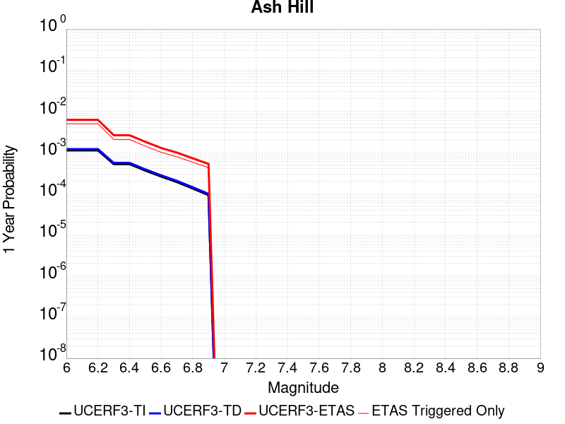 |  |

| Magnitude | 1 wk TI Prob | 1 wk TD Prob | 1 wk ETAS Prob | 1 wk ETAS/TD Gain | 1 wk ETAS Triggered Only | 1 mo TI Prob | 1 mo TD Prob | 1 mo ETAS Prob | 1 mo ETAS/TD Gain | 1 mo ETAS Triggered Only | 1 yr TI Prob | 1 yr TD Prob | 1 yr ETAS Prob | 1 yr ETAS/TD Gain | 1 yr ETAS Triggered Only | 10 yr TI Prob | 10 yr TD Prob | 10 yr ETAS Prob | 10 yr ETAS/TD Gain | 10 yr ETAS Triggered Only |
|-----|-----|-----|-----|-----|-----|-----|-----|-----|-----|-----|-----|-----|-----|-----|-----|-----|-----|-----|-----|-----|
| 6.0 | 2.1545662E-5 | 2.3194469E-5 | 0.0014031625 | 60.495564 | 0.00138 | 9.2335285E-5 | 9.940153E-5 | 0.002519161 | 25.343283 | 0.00242 | 0.0011236023 | 0.0012096217 | 0.0062035737 | 5.128524 | 0.005 | 0.011179381 | 0.01203836 | 0.020090247 | 1.6688526 | 0.00815 |
| 6.1 | 2.1545662E-5 | 2.3194469E-5 | 0.0014031625 | 60.495564 | 0.00138 | 9.2335285E-5 | 9.940153E-5 | 0.002519161 | 25.343283 | 0.00242 | 0.0011236023 | 0.0012096217 | 0.0062035737 | 5.128524 | 0.005 | 0.011179381 | 0.01203836 | 0.020090247 | 1.6688526 | 0.00815 |
| 6.2 | 2.1545662E-5 | 2.3194469E-5 | 0.0014031625 | 60.495564 | 0.00138 | 9.2335285E-5 | 9.940153E-5 | 0.002519161 | 25.343283 | 0.00242 | 0.0011236023 | 0.0012096217 | 0.0062035737 | 5.128524 | 0.005 | 0.011179381 | 0.01203836 | 0.020090247 | 1.6688526 | 0.00815 |
| 6.3 | 1.0025529E-5 | 1.0746944E-5 | 6.007406E-4 | 55.89874 | 5.9E-4 | 4.2965847E-5 | 4.6057594E-5 | 0.0010460116 | 22.710947 | 0.001 | 5.229836E-4 | 5.6062016E-4 | 0.0026294596 | 4.6902695 | 0.00207 | 0.005217545 | 0.005593371 | 0.008974354 | 1.6044624 | 0.0034 |
| 6.4 | 1.0025529E-5 | 1.0746944E-5 | 6.007406E-4 | 55.89874 | 5.9E-4 | 4.2965847E-5 | 4.6057594E-5 | 0.0010460116 | 22.710947 | 0.001 | 5.229836E-4 | 5.6062016E-4 | 0.0026294596 | 4.6902695 | 0.00207 | 0.005217545 | 0.005593371 | 0.008974354 | 1.6044624 | 0.0034 |
| 6.5 | 6.9617327E-6 | 7.4566406E-6 | 3.9745372E-4 | 53.301983 | 3.9E-4 | 2.9835655E-5 | 3.195669E-5 | 7.41934E-4 | 23.216862 | 7.1E-4 | 3.6318856E-4 | 3.890119E-4 | 0.0018184556 | 4.67455 | 0.00143 | 0.0036259557 | 0.0038841637 | 0.006155308 | 1.584719 | 0.00228 |
| 6.6 | 4.9919777E-6 | 5.346693E-6 | 2.9534515E-4 | 55.238846 | 2.9E-4 | 2.1394015E-5 | 2.2914235E-5 | 5.4290233E-4 | 23.692797 | 5.2E-4 | 2.60441E-4 | 2.789518E-4 | 0.0012886701 | 4.619687 | 0.00101 | 0.0026013597 | 0.002786675 | 0.0043523 | 1.5618254 | 0.00157 |
| 6.7 | 3.6630722E-6 | 3.924627E-6 | 1.8392393E-4 | 46.864048 | 1.8E-4 | 1.5698786E-5 | 1.6819755E-5 | 3.9681335E-4 | 23.592102 | 3.8E-4 | 1.9111596E-4 | 2.0476701E-4 | 9.946052E-4 | 4.8572536 | 7.9E-4 | 0.0019095168 | 0.0020463464 | 0.0032239316 | 1.5754575 | 0.00118 |
| 6.8 | 2.5599613E-6 | 2.7449275E-6 | 1.227446E-4 | 44.71688 | 1.2E-4 | 1.0971216E-5 | 1.176395E-5 | 3.0176053E-4 | 25.651293 | 2.9E-4 | 1.3356637E-4 | 1.4322162E-4 | 7.2313857E-4 | 5.049088 | 5.8E-4 | 0.0013348613 | 0.0014317782 | 0.0023205038 | 1.6207147 | 8.9E-4 |
| 6.9 | 1.7684905E-6 | 1.8968724E-6 | 9.1896705E-5 | 48.446434 | 9.0E-5 | 7.579223E-6 | 8.129453E-6 | 2.0812782E-4 | 25.6017 | 2.0E-4 | 9.2273134E-5 | 9.8976096E-5 | 5.2893354E-4 | 5.3440533 | 4.3E-4 | 9.223483E-4 | 9.89761E-4 | 0.0015991572 | 1.6157005 | 6.1E-4 |

## Blackwater
*[(top)](#table-of-contents)*

| 1 Week | 1 Month | 1 Year | 10 Year |
|-----|-----|-----|-----|
|  |  | 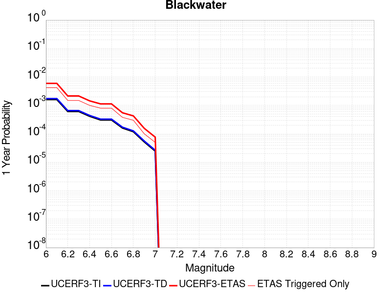 |  |

| Magnitude | 1 wk TI Prob | 1 wk TD Prob | 1 wk ETAS Prob | 1 wk ETAS/TD Gain | 1 wk ETAS Triggered Only | 1 mo TI Prob | 1 mo TD Prob | 1 mo ETAS Prob | 1 mo ETAS/TD Gain | 1 mo ETAS Triggered Only | 1 yr TI Prob | 1 yr TD Prob | 1 yr ETAS Prob | 1 yr ETAS/TD Gain | 1 yr ETAS Triggered Only | 10 yr TI Prob | 10 yr TD Prob | 10 yr ETAS Prob | 10 yr ETAS/TD Gain | 10 yr ETAS Triggered Only |
|-----|-----|-----|-----|-----|-----|-----|-----|-----|-----|-----|-----|-----|-----|-----|-----|-----|-----|-----|-----|-----|
| 6.0 | 3.0708583E-5 | 3.309588E-5 | 0.0012330562 | 37.25709 | 0.0012 | 1.3160157E-4 | 1.4183254E-4 | 0.0022615318 | 15.945085 | 0.00212 | 0.0016010714 | 0.0017255802 | 0.005928315 | 3.4355493 | 0.00421 | 0.015895851 | 0.01713565 | 0.023819126 | 1.3900335 | 0.0068 |
| 6.1 | 3.0708583E-5 | 3.309588E-5 | 0.0012330562 | 37.25709 | 0.0012 | 1.3160157E-4 | 1.4183254E-4 | 0.0022615318 | 15.945085 | 0.00212 | 0.0016010714 | 0.0017255802 | 0.005928315 | 3.4355493 | 0.00421 | 0.015895851 | 0.01713565 | 0.023819126 | 1.3900335 | 0.0068 |
| 6.2 | 1.1707779E-5 | 1.2545133E-5 | 3.6254074E-4 | 28.898914 | 3.5E-4 | 5.017523E-5 | 5.3763804E-5 | 7.5372617E-4 | 14.019212 | 7.0E-4 | 6.107122E-4 | 6.5438735E-4 | 0.0021434124 | 3.275449 | 0.00149 | 0.006090366 | 0.006525575 | 0.009178152 | 1.4064894 | 0.00267 |
| 6.3 | 1.1707779E-5 | 1.2545133E-5 | 3.6254074E-4 | 28.898914 | 3.5E-4 | 5.017523E-5 | 5.3763804E-5 | 7.5372617E-4 | 14.019212 | 7.0E-4 | 6.107122E-4 | 6.5438735E-4 | 0.0021434124 | 3.275449 | 0.00149 | 0.006090366 | 0.006525575 | 0.009178152 | 1.4064894 | 0.00267 |
| 6.4 | 7.929244E-6 | 8.480105E-6 | 2.3847815E-4 | 28.122074 | 2.3E-4 | 3.3982033E-5 | 3.6342826E-5 | 4.8632646E-4 | 13.381637 | 4.5E-4 | 4.136527E-4 | 4.423881E-4 | 0.0014419457 | 3.2594585 | 0.001 | 0.0041288356 | 0.00441548 | 0.006127885 | 1.3878187 | 0.00172 |
| 6.5 | 5.8832115E-6 | 6.2859963E-6 | 1.962848E-4 | 31.225727 | 1.9E-4 | 2.521352E-5 | 2.693972E-5 | 4.1692922E-4 | 15.476376 | 3.9E-4 | 3.0693135E-4 | 3.2794426E-4 | 0.0011276819 | 3.438639 | 8.0E-4 | 0.0030650778 | 0.0032748566 | 0.0045905337 | 1.401751 | 0.00132 |
| 6.6 | 5.8832115E-6 | 6.2859963E-6 | 1.962848E-4 | 31.225727 | 1.9E-4 | 2.521352E-5 | 2.693972E-5 | 4.1692922E-4 | 15.476376 | 3.9E-4 | 3.0693135E-4 | 3.2794426E-4 | 0.0011276819 | 3.438639 | 8.0E-4 | 0.0030650778 | 0.0032748566 | 0.0045905337 | 1.401751 | 0.00132 |
| 6.7 | 3.0715053E-6 | 3.281469E-6 | 1.1328111E-4 | 34.52146 | 1.1E-4 | 1.3163528E-5 | 1.4063369E-5 | 2.2406042E-4 | 15.9322 | 2.1E-4 | 1.6025416E-4 | 1.7120923E-4 | 5.511442E-4 | 3.2191265 | 3.8E-4 | 0.0016013865 | 0.0017108879 | 0.0024196731 | 1.4142792 | 7.1E-4 |
| 6.8 | 2.2722281E-6 | 2.4287558E-6 | 9.2428534E-5 | 38.05592 | 9.0E-5 | 9.738084E-6 | 1.0408917E-5 | 1.6040736E-4 | 15.410571 | 1.5E-4 | 1.1855473E-4 | 1.2672211E-4 | 4.266841E-4 | 3.3670847 | 3.0E-4 | 0.001184915 | 0.0012665887 | 0.0017959174 | 1.4179168 | 5.3E-4 |
| 6.9 | 9.952399E-7 | 1.0653498E-6 | 2.1065329E-5 | 19.773157 | 2.0E-5 | 4.265307E-6 | 4.56578E-6 | 6.456551E-5 | 14.141178 | 6.0E-5 | 5.1928873E-5 | 5.5587465E-5 | 1.555819E-4 | 2.7988667 | 1.0E-4 | 5.191674E-4 | 5.5578625E-4 | 7.556751E-4 | 1.3596506 | 2.0E-4 |
| 7.0 | 4.7385504E-7 | 5.0755636E-7 | 1.0507551E-5 | 20.702234 | 1.0E-5 | 2.0308057E-6 | 2.1752417E-6 | 3.2175176E-5 | 14.791541 | 3.0E-5 | 2.4724779E-5 | 2.6483567E-5 | 7.648224E-5 | 2.8879132 | 5.0E-5 | 2.4722028E-4 | 2.648357E-4 | 3.448145E-4 | 1.3019941 | 8.0E-5 |

## Hunter Mountain-Saline Valley
*[(top)](#table-of-contents)*

| 1 Week | 1 Month | 1 Year | 10 Year |
|-----|-----|-----|-----|
|  | 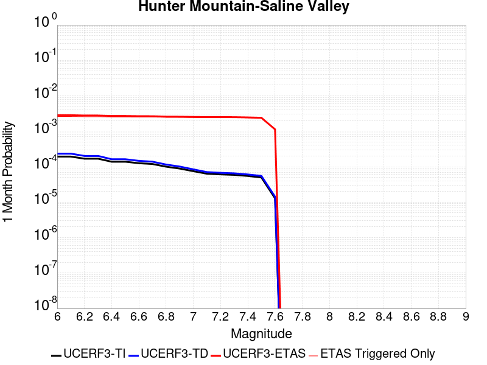 |  |  |

| Magnitude | 1 wk TI Prob | 1 wk TD Prob | 1 wk ETAS Prob | 1 wk ETAS/TD Gain | 1 wk ETAS Triggered Only | 1 mo TI Prob | 1 mo TD Prob | 1 mo ETAS Prob | 1 mo ETAS/TD Gain | 1 mo ETAS Triggered Only | 1 yr TI Prob | 1 yr TD Prob | 1 yr ETAS Prob | 1 yr ETAS/TD Gain | 1 yr ETAS Triggered Only | 10 yr TI Prob | 10 yr TD Prob | 10 yr ETAS Prob | 10 yr ETAS/TD Gain | 10 yr ETAS Triggered Only |
|-----|-----|-----|-----|-----|-----|-----|-----|-----|-----|-----|-----|-----|-----|-----|-----|-----|-----|-----|-----|-----|
| 6.0 | 4.5103672E-5 | 5.4569202E-5 | 0.0017144786 | 31.41843 | 0.00166 | 1.9328714E-4 | 2.338477E-4 | 0.0028432375 | 12.1585 | 0.00261 | 0.002350731 | 0.0028435532 | 0.0074404445 | 2.616601 | 0.00461 | 0.023260195 | 0.028092768 | 0.034857243 | 1.2407906 | 0.00696 |
| 6.1 | 4.5103672E-5 | 5.4569202E-5 | 0.0017144786 | 31.41843 | 0.00166 | 1.9328714E-4 | 2.338477E-4 | 0.0028432375 | 12.1585 | 0.00261 | 0.002350731 | 0.0028435532 | 0.0074404445 | 2.616601 | 0.00461 | 0.023260195 | 0.028092768 | 0.034857243 | 1.2407906 | 0.00696 |
| 6.2 | 3.9363465E-5 | 4.7062822E-5 | 0.0016969852 | 36.057873 | 0.00165 | 1.6868966E-4 | 2.0168308E-4 | 0.0027811627 | 13.789767 | 0.00258 | 0.002051862 | 0.002452859 | 0.007011649 | 2.858562 | 0.00457 | 0.020330196 | 0.024274318 | 0.030977553 | 1.2761452 | 0.00687 |
| 6.3 | 3.9363465E-5 | 4.7062822E-5 | 0.0016969852 | 36.057873 | 0.00165 | 1.6868966E-4 | 2.0168308E-4 | 0.0027811627 | 13.789767 | 0.00258 | 0.002051862 | 0.002452859 | 0.007011649 | 2.858562 | 0.00457 | 0.020330196 | 0.024274318 | 0.030977553 | 1.2761452 | 0.00687 |
| 6.4 | 3.2311684E-5 | 3.7951195E-5 | 0.0016678893 | 43.94827 | 0.00163 | 1.384713E-4 | 1.6263824E-4 | 0.0027022252 | 16.614943 | 0.00254 | 0.0016845843 | 0.001978391 | 0.006449528 | 3.2599864 | 0.00448 | 0.016718714 | 0.019617233 | 0.026234817 | 1.3373352 | 0.00675 |
| 6.5 | 3.2311684E-5 | 3.7951195E-5 | 0.0016678893 | 43.94827 | 0.00163 | 1.384713E-4 | 1.6263824E-4 | 0.0027022252 | 16.614943 | 0.00254 | 0.0016845843 | 0.001978391 | 0.006449528 | 3.2599864 | 0.00448 | 0.016718714 | 0.019617233 | 0.026234817 | 1.3373352 | 0.00675 |
| 6.6 | 2.9305844E-5 | 3.4182027E-5 | 0.0016541267 | 48.391705 | 0.00162 | 1.2559042E-4 | 1.4648653E-4 | 0.0026661174 | 18.200428 | 0.00252 | 0.0015279909 | 0.0017820761 | 0.0062241456 | 3.4926376 | 0.00445 | 0.015175272 | 0.017686432 | 0.02428758 | 1.3732322 | 0.00672 |
| 6.7 | 2.7826512E-5 | 3.2344415E-5 | 0.001652292 | 51.08431 | 0.00162 | 1.19251024E-4 | 1.386119E-4 | 0.0026582626 | 19.177738 | 0.00252 | 0.0014509142 | 0.0016863537 | 0.0061288495 | 3.6343796 | 0.00445 | 0.014414776 | 0.016743924 | 0.023351405 | 1.3946196 | 0.00672 |
| 6.8 | 2.3389874E-5 | 2.6866835E-5 | 0.0016168241 | 60.17918 | 0.00159 | 1.0023846E-4 | 1.1513876E-4 | 0.0025948533 | 22.536747 | 0.00248 | 0.00121972 | 0.0014009604 | 0.005794796 | 4.136303 | 0.0044 | 0.01213047 | 0.013928165 | 0.020475682 | 1.4700918 | 0.00664 |
| 6.9 | 2.069209E-5 | 2.3570145E-5 | 0.0016135327 | 68.45663 | 0.00159 | 8.867737E-5 | 1.01011196E-4 | 0.0025807607 | 25.549253 | 0.00248 | 0.0010791123 | 0.0012291536 | 0.0056237453 | 4.575299 | 0.0044 | 0.010738871 | 0.012229251 | 0.018788049 | 1.5363206 | 0.00664 |
| 7.0 | 1.7462342E-5 | 1.9633648E-5 | 0.0015896028 | 80.963196 | 0.00157 | 7.483646E-5 | 8.414162E-5 | 0.0025439346 | 30.233963 | 0.00246 | 9.1075303E-4 | 0.0010239654 | 0.0053894906 | 5.2633524 | 0.00437 | 0.009070295 | 0.010196775 | 0.016719578 | 1.6396928 | 0.00659 |
| 7.1 | 1.4807709E-5 | 1.6441843E-5 | 0.0015764162 | 95.87831 | 0.00156 | 6.3460066E-5 | 7.046323E-5 | 0.0025202907 | 35.767456 | 0.00245 | 7.723524E-4 | 8.575687E-4 | 0.0052038385 | 6.06813 | 0.00435 | 0.007696735 | 0.008546252 | 0.015050188 | 1.761028 | 0.00656 |
| 7.2 | 1.4180048E-5 | 1.5698428E-5 | 0.0015756739 | 100.371445 | 0.00156 | 6.077022E-5 | 6.727733E-5 | 0.0025171125 | 37.413975 | 0.00245 | 7.396263E-4 | 8.1880996E-4 | 0.0051552565 | 6.2960353 | 0.00434 | 0.0073716943 | 0.008161552 | 0.014628339 | 1.7923477 | 0.00652 |
| 7.3 | 1.3730402E-5 | 1.5172164E-5 | 0.0015751485 | 103.81831 | 0.00156 | 5.8843252E-5 | 6.502203E-5 | 0.0025048633 | 38.523304 | 0.00244 | 7.161811E-4 | 7.913718E-4 | 0.0051179454 | 6.4671817 | 0.00433 | 0.007138774 | 0.00788914 | 0.01432794 | 1.8161598 | 0.00649 |
| 7.4 | 1.2810095E-5 | 1.4109365E-5 | 0.0015340879 | 108.72835 | 0.00152 | 5.489925E-5 | 6.0467395E-5 | 0.0024603223 | 40.68841 | 0.0024 | 6.681934E-4 | 7.359577E-4 | 0.0050028153 | 6.797694 | 0.00427 | 0.006661878 | 0.0073387707 | 0.0136818765 | 1.864328 | 0.00639 |
| 7.5 | 1.1595659E-5 | 1.2800745E-5 | 0.0015027816 | 117.39799 | 0.00149 | 4.9694736E-5 | 5.485927E-5 | 0.0024047303 | 43.83453 | 0.00235 | 6.0486543E-4 | 6.677226E-4 | 0.0048449314 | 7.2559047 | 0.00418 | 0.006032217 | 0.0066607045 | 0.0128392745 | 1.9276152 | 0.00622 |
| 7.6 | 2.997694E-6 | 3.3251877E-6 | 7.533227E-4 | 226.55043 | 7.5E-4 | 1.28471975E-5 | 1.4250767E-5 | 0.0011342348 | 79.59114 | 0.00112 | 1.564034E-4 | 1.7349656E-4 | 0.0020331738 | 11.718814 | 0.00186 | 0.0015629337 | 0.0017359027 | 0.0043813027 | 2.5239332 | 0.00265 |

## McLean Lake
*[(top)](#table-of-contents)*

| 1 Week | 1 Month | 1 Year | 10 Year |
|-----|-----|-----|-----|
|  |  |  |  |

| Magnitude | 1 wk TI Prob | 1 wk TD Prob | 1 wk ETAS Prob | 1 wk ETAS/TD Gain | 1 wk ETAS Triggered Only | 1 mo TI Prob | 1 mo TD Prob | 1 mo ETAS Prob | 1 mo ETAS/TD Gain | 1 mo ETAS Triggered Only | 1 yr TI Prob | 1 yr TD Prob | 1 yr ETAS Prob | 1 yr ETAS/TD Gain | 1 yr ETAS Triggered Only | 10 yr TI Prob | 10 yr TD Prob | 10 yr ETAS Prob | 10 yr ETAS/TD Gain | 10 yr ETAS Triggered Only |
|-----|-----|-----|-----|-----|-----|-----|-----|-----|-----|-----|-----|-----|-----|-----|-----|-----|-----|-----|-----|-----|
| 6.0 | 1.7360222E-5 | 1.8501643E-5 | 4.2849407E-4 | 23.159784 | 4.1E-4 | 7.439883E-5 | 7.929062E-5 | 0.0010292153 | 12.980291 | 9.5E-4 | 9.0542925E-4 | 9.6498436E-4 | 0.0033326973 | 3.4536283 | 0.00237 | 0.009017491 | 0.009612782 | 0.013920967 | 1.4481725 | 0.00435 |
| 6.1 | 9.062689E-6 | 9.5922005E-6 | 2.1959019E-4 | 22.892576 | 2.1E-4 | 3.8839516E-5 | 4.1108833E-5 | 5.810866E-4 | 14.135324 | 5.4E-4 | 4.727685E-4 | 5.00394E-4 | 0.0017597635 | 3.5167558 | 0.00126 | 0.0047176396 | 0.004993555 | 0.0073019704 | 1.4622788 | 0.00232 |
| 6.2 | 9.062689E-6 | 9.5922005E-6 | 2.1959019E-4 | 22.892576 | 2.1E-4 | 3.8839516E-5 | 4.1108833E-5 | 5.810866E-4 | 14.135324 | 5.4E-4 | 4.727685E-4 | 5.00394E-4 | 0.0017597635 | 3.5167558 | 0.00126 | 0.0047176396 | 0.004993555 | 0.0073019704 | 1.4622788 | 0.00232 |
| 6.3 | 7.2575485E-6 | 7.667714E-6 | 1.7766641E-4 | 23.170712 | 1.7E-4 | 3.110341E-5 | 3.2861262E-5 | 4.728468E-4 | 14.389186 | 4.4E-4 | 3.786182E-4 | 4.0001952E-4 | 0.0014495995 | 3.6238217 | 0.00105 | 0.0037797375 | 0.0039936993 | 0.0058462713 | 1.4638736 | 0.00186 |
| 6.4 | 7.2575485E-6 | 7.667714E-6 | 1.7766641E-4 | 23.170712 | 1.7E-4 | 3.110341E-5 | 3.2861262E-5 | 4.728468E-4 | 14.389186 | 4.4E-4 | 3.786182E-4 | 4.0001952E-4 | 0.0014495995 | 3.6238217 | 0.00105 | 0.0037797375 | 0.0039936993 | 0.0058462713 | 1.4638736 | 0.00186 |
| 6.5 | 6.06582E-6 | 6.4038813E-6 | 1.4640299E-4 | 22.8616 | 1.4E-4 | 2.5996113E-5 | 2.7444954E-5 | 3.7743535E-4 | 13.752449 | 3.5E-4 | 3.164567E-4 | 3.3409757E-4 | 0.001173817 | 3.5133955 | 8.4E-4 | 0.0031600643 | 0.0033365914 | 0.004871453 | 1.4600089 | 0.00154 |
| 6.6 | 5.598744E-6 | 5.9102663E-6 | 1.4590943E-4 | 24.687456 | 1.4E-4 | 2.3994397E-5 | 2.5329502E-5 | 3.6532088E-4 | 14.422742 | 3.4E-4 | 2.9209262E-4 | 3.0834944E-4 | 0.001078112 | 3.4963968 | 7.7E-4 | 0.0029170897 | 0.003079845 | 0.0044954717 | 1.4596422 | 0.00142 |
| 6.7 | 5.246996E-6 | 5.539166E-6 | 1.4553839E-4 | 26.274424 | 1.4E-4 | 2.2486933E-5 | 2.3739101E-5 | 3.5373127E-4 | 14.900785 | 3.3E-4 | 2.73744E-4 | 2.8899158E-4 | 0.0010187806 | 3.5252953 | 7.3E-4 | 0.0027340704 | 0.0028867817 | 0.0042328844 | 1.4662988 | 0.00135 |
| 6.8 | 4.02324E-6 | 4.2469073E-6 | 1.0424648E-4 | 24.546446 | 1.0E-4 | 1.7242342E-5 | 1.8200939E-5 | 2.4819674E-4 | 13.636481 | 2.3E-4 | 2.099053E-4 | 2.2157984E-4 | 7.6146016E-4 | 3.4365048 | 5.4E-4 | 0.0020970714 | 0.0022141736 | 0.003311738 | 1.4956994 | 0.0011 |
| 6.9 | 6.835972E-7 | 7.1399324E-7 | 7.1399324E-7 | 1.0 | 0.0 | 2.9296991E-6 | 3.0599692E-6 | 6.3059786E-5 | 20.60798 | 6.0E-5 | 3.56685E-5 | 3.7254806E-5 | 1.3725107E-4 | 3.6841173 | 1.0E-4 | 3.5662777E-4 | 3.7251686E-4 | 5.2246096E-4 | 1.4025164 | 1.5E-4 |

## Garlock (West)
*[(top)](#table-of-contents)*

| 1 Week | 1 Month | 1 Year | 10 Year |
|-----|-----|-----|-----|
|  |  |  |  |

| Magnitude | 1 wk TI Prob | 1 wk TD Prob | 1 wk ETAS Prob | 1 wk ETAS/TD Gain | 1 wk ETAS Triggered Only | 1 mo TI Prob | 1 mo TD Prob | 1 mo ETAS Prob | 1 mo ETAS/TD Gain | 1 mo ETAS Triggered Only | 1 yr TI Prob | 1 yr TD Prob | 1 yr ETAS Prob | 1 yr ETAS/TD Gain | 1 yr ETAS Triggered Only | 10 yr TI Prob | 10 yr TD Prob | 10 yr ETAS Prob | 10 yr ETAS/TD Gain | 10 yr ETAS Triggered Only |
|-----|-----|-----|-----|-----|-----|-----|-----|-----|-----|-----|-----|-----|-----|-----|-----|-----|-----|-----|-----|-----|
| 6.0 | 2.5181727E-5 | 2.519761E-5 | 0.001005173 | 39.891598 | 9.8E-4 | 1.0791722E-4 | 1.0798531E-4 | 0.0018178007 | 16.833778 | 0.00171 | 0.0013131002 | 0.0013139317 | 0.0042500687 | 3.2346194 | 0.00294 | 0.013053683 | 0.013142181 | 0.0173758 | 1.3221399 | 0.00429 |
| 6.1 | 2.5077732E-5 | 2.5098652E-5 | 0.001005074 | 40.04494 | 9.8E-4 | 1.0747157E-4 | 1.0756124E-4 | 0.0018173773 | 16.89621 | 0.00171 | 0.001307681 | 0.0013087748 | 0.004244927 | 3.2434359 | 0.00294 | 0.013000126 | 0.0130912205 | 0.017325059 | 1.3234105 | 0.00429 |
| 6.2 | 2.494612E-5 | 2.4980343E-5 | 0.0010049558 | 40.229866 | 9.8E-4 | 1.0690756E-4 | 1.0705424E-4 | 0.0018168712 | 16.971502 | 0.00171 | 0.0013008224 | 0.0013026095 | 0.0042387797 | 3.254068 | 0.00294 | 0.012932341 | 0.013030292 | 0.017264392 | 1.3249428 | 0.00429 |
| 6.3 | 2.4733758E-5 | 2.4799705E-5 | 0.0010047754 | 40.51562 | 9.8E-4 | 1.0599751E-4 | 1.0628014E-4 | 0.0018160983 | 17.087845 | 0.00171 | 0.0012897556 | 0.001293196 | 0.004229394 | 3.2704973 | 0.00294 | 0.012822957 | 0.012937257 | 0.017171757 | 1.3273104 | 0.00429 |
| 6.4 | 2.3237335E-5 | 2.3179033E-5 | 0.0010031563 | 43.27861 | 9.8E-4 | 9.958477E-5 | 9.933494E-5 | 0.0018091651 | 18.212776 | 0.00171 | 0.0012117702 | 0.0012087347 | 0.0041351933 | 3.4210923 | 0.00293 | 0.012051838 | 0.012102115 | 0.016320439 | 1.3485609 | 0.00427 |
| 6.5 | 2.2732203E-5 | 2.2993401E-5 | 0.0010029709 | 43.619946 | 9.8E-4 | 9.742009E-5 | 9.8539436E-5 | 0.0018083709 | 18.351748 | 0.00171 | 0.0011854442 | 0.0011990601 | 0.004125547 | 3.4406505 | 0.00293 | 0.011791403 | 0.01200642 | 0.016225152 | 1.3513731 | 0.00427 |
| 6.6 | 2.1319436E-5 | 2.1773623E-5 | 0.0010017523 | 46.007607 | 9.8E-4 | 9.136581E-5 | 9.331221E-5 | 0.0018031526 | 19.323866 | 0.00171 | 0.001111811 | 0.0011354863 | 0.0040621595 | 3.5774622 | 0.00293 | 0.011062649 | 0.011377335 | 0.0155888675 | 1.3701687 | 0.00426 |
| 6.7 | 1.970802E-5 | 2.0393516E-5 | 0.0010003735 | 49.053513 | 9.8E-4 | 8.446021E-5 | 8.7397864E-5 | 0.0017972484 | 20.563986 | 0.00171 | 0.001027818 | 0.0010635513 | 0.0039804457 | 3.7425988 | 0.00292 | 0.010230771 | 0.01066507 | 0.014869744 | 1.3942472 | 0.00425 |
| 6.8 | 1.8744462E-5 | 1.9901196E-5 | 9.998817E-4 | 50.242294 | 9.8E-4 | 8.033094E-5 | 8.5288055E-5 | 0.0017951422 | 21.04799 | 0.00171 | 9.775903E-4 | 0.001037889 | 0.0039548585 | 3.8104827 | 0.00292 | 0.009733009 | 0.010410881 | 0.014616635 | 1.4039768 | 0.00425 |
| 6.9 | 1.7559682E-5 | 1.895357E-5 | 9.98935E-4 | 52.704323 | 9.8E-4 | 7.5253614E-5 | 8.122706E-5 | 0.0017910881 | 22.050388 | 0.00171 | 9.158276E-4 | 9.884923E-4 | 0.0039056058 | 3.951074 | 0.00292 | 0.0091206245 | 0.009921463 | 0.014109495 | 1.4221184 | 0.00423 |
| 7.0 | 1.6794445E-5 | 1.8216384E-5 | 9.981985E-4 | 54.79674 | 9.8E-4 | 7.197421E-5 | 7.806789E-5 | 0.0017679359 | 22.646133 | 0.00169 | 8.759337E-4 | 9.500635E-4 | 0.003837318 | 4.039012 | 0.00289 | 0.008724891 | 0.009540345 | 0.01369037 | 1.4349974 | 0.00419 |
| 7.1 | 1.6337795E-5 | 1.7717184E-5 | 9.976998E-4 | 56.312546 | 9.8E-4 | 7.0017246E-5 | 7.592859E-5 | 0.0017658003 | 23.256065 | 0.00169 | 8.521265E-4 | 9.2403986E-4 | 0.0038113694 | 4.1246805 | 0.00289 | 0.008488664 | 0.009282121 | 0.013423322 | 1.4461482 | 0.00418 |
| 7.2 | 1.5780008E-5 | 1.7165814E-5 | 9.97149E-4 | 58.089233 | 9.8E-4 | 6.762685E-5 | 7.356571E-5 | 0.0017634414 | 23.97097 | 0.00169 | 8.2304585E-4 | 8.9529576E-4 | 0.0037827084 | 4.225094 | 0.00289 | 0.008200042 | 0.008996956 | 0.013119528 | 1.4582186 | 0.00416 |
| 7.3 | 1.5058865E-5 | 1.6618897E-5 | 9.966026E-4 | 59.96804 | 9.8E-4 | 6.45364E-5 | 7.1221904E-5 | 0.0017511023 | 24.586569 | 0.00168 | 7.854473E-4 | 8.667829E-4 | 0.0037442865 | 4.3197513 | 0.00288 | 0.00782677 | 0.008713659 | 0.012817585 | 1.4709761 | 0.00414 |
| 7.4 | 1.4887923E-5 | 1.6454866E-5 | 9.7643904E-4 | 59.340446 | 9.6E-4 | 6.380382E-5 | 7.051895E-5 | 0.0017104032 | 24.25452 | 0.00164 | 7.7653467E-4 | 8.582312E-4 | 0.003695794 | 4.3062916 | 0.00284 | 0.0077382675 | 0.008628501 | 0.012673296 | 1.4687716 | 0.00408 |
| 7.5 | 1.4509299E-5 | 1.6046879E-5 | 9.360321E-4 | 58.331104 | 9.2E-4 | 6.218123E-5 | 6.877053E-5 | 0.0015986653 | 23.246372 | 0.00153 | 7.567935E-4 | 8.3696074E-4 | 0.0034647596 | 4.139692 | 0.00263 | 0.0075422134 | 0.008416821 | 0.012165006 | 1.4453206 | 0.00378 |
| 7.6 | 1.2756717E-5 | 1.4050923E-5 | 6.140425E-4 | 43.70122 | 6.0E-4 | 5.4670498E-5 | 6.0216855E-5 | 0.0010601566 | 17.605646 | 0.001 | 6.6541E-4 | 7.328943E-4 | 0.0024216557 | 3.3042362 | 0.00169 | 0.006634211 | 0.007381786 | 0.00976407 | 1.3227246 | 0.0024 |
| 7.7 | 1.0328985E-5 | 1.1460696E-5 | 3.7145658E-4 | 32.411343 | 3.6E-4 | 4.4266326E-5 | 4.911635E-5 | 6.590864E-4 | 13.41888 | 6.1E-4 | 5.388092E-4 | 5.9782784E-4 | 0.0015572539 | 2.6048534 | 9.6E-4 | 0.0053750467 | 0.006038695 | 0.00745012 | 1.2337302 | 0.00142 |
| 7.8 | 7.0306583E-6 | 8.899835E-6 | 2.688975E-4 | 30.213764 | 2.6E-4 | 3.0131043E-5 | 3.8141596E-5 | 4.3812633E-4 | 11.486838 | 4.0E-4 | 3.667837E-4 | 4.6427513E-4 | 0.0010240151 | 2.2056212 | 5.6E-4 | 0.003661789 | 0.0046954 | 0.0055414094 | 1.1801783 | 8.5E-4 |
| 7.9 | 4.060633E-6 | 5.4655957E-6 | 1.3546488E-4 | 24.785017 | 1.3E-4 | 1.7402595E-5 | 2.3423772E-5 | 2.1341932E-4 | 9.111228 | 1.9E-4 | 2.11856E-4 | 2.851472E-4 | 5.750645E-4 | 2.0167286 | 2.9E-4 | 0.0021165414 | 0.0028842795 | 0.0032831258 | 1.1382828 | 4.0E-4 |
| 8.0 | 1.6729537E-6 | 2.0775801E-6 | 3.2077518E-5 | 15.439847 | 3.0E-5 | 7.169782E-6 | 8.903884E-6 | 4.8903526E-5 | 5.4923816 | 4.0E-5 | 8.7288594E-5 | 1.08399436E-4 | 1.8839077E-4 | 1.7379313 | 8.0E-5 | 8.7254314E-4 | 0.0010969047 | 0.001196795 | 1.0910656 | 1.0E-4 |
| 8.1 | 3.6733252E-7 | 3.1490467E-7 | 3.1490467E-7 | 1.0 | 0.0 | 1.5742813E-6 | 1.3495908E-6 | 1.3495908E-6 | 1.0 | 0.0 | 1.9166706E-5 | 1.643116E-5 | 1.643116E-5 | 1.0 | 0.0 | 1.9165053E-4 | 1.6631983E-4 | 1.6631983E-4 | 1.0 | 0.0 |

## Goldstone Lake
*[(top)](#table-of-contents)*

| 1 Week | 1 Month | 1 Year | 10 Year |
|-----|-----|-----|-----|
|  |  | 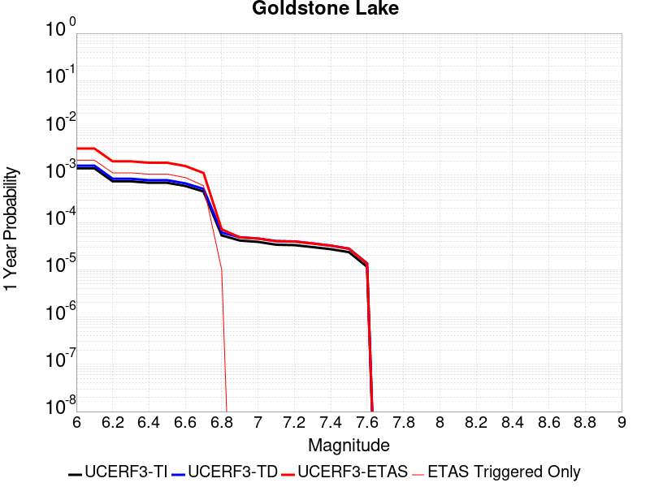 | 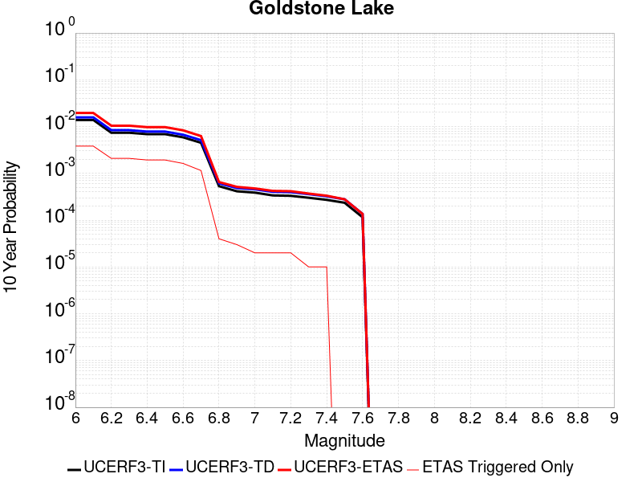 |

| Magnitude | 1 wk TI Prob | 1 wk TD Prob | 1 wk ETAS Prob | 1 wk ETAS/TD Gain | 1 wk ETAS Triggered Only | 1 mo TI Prob | 1 mo TD Prob | 1 mo ETAS Prob | 1 mo ETAS/TD Gain | 1 mo ETAS Triggered Only | 1 yr TI Prob | 1 yr TD Prob | 1 yr ETAS Prob | 1 yr ETAS/TD Gain | 1 yr ETAS Triggered Only | 10 yr TI Prob | 10 yr TD Prob | 10 yr ETAS Prob | 10 yr ETAS/TD Gain | 10 yr ETAS Triggered Only |
|-----|-----|-----|-----|-----|-----|-----|-----|-----|-----|-----|-----|-----|-----|-----|-----|-----|-----|-----|-----|-----|
| 6.0 | 2.671352E-5 | 3.0376154E-5 | 5.203613E-4 | 17.130585 | 4.9E-4 | 1.1448149E-4 | 1.3017813E-4 | 0.0011000518 | 8.450358 | 9.7E-4 | 0.001392921 | 0.0015839627 | 0.003650684 | 2.304779 | 0.00207 | 0.013842222 | 0.015746227 | 0.019506076 | 1.2387778 | 0.00382 |
| 6.1 | 2.671352E-5 | 3.0376154E-5 | 5.203613E-4 | 17.130585 | 4.9E-4 | 1.1448149E-4 | 1.3017813E-4 | 0.0011000518 | 8.450358 | 9.7E-4 | 0.001392921 | 0.0015839627 | 0.003650684 | 2.304779 | 0.00207 | 0.013842222 | 0.015746227 | 0.019506076 | 1.2387778 | 0.00382 |
| 6.2 | 1.4197047E-5 | 1.6096279E-5 | 2.6609225E-4 | 16.53129 | 2.5E-4 | 6.0843064E-5 | 6.898279E-5 | 5.089524E-4 | 7.3779626 | 4.4E-4 | 7.4051257E-4 | 8.3964044E-4 | 0.0019587001 | 2.3327844 | 0.00112 | 0.007380498 | 0.008374377 | 0.010446874 | 1.2474808 | 0.00209 |
| 6.3 | 1.4197047E-5 | 1.6096279E-5 | 2.6609225E-4 | 16.53129 | 2.5E-4 | 6.0843064E-5 | 6.898279E-5 | 5.089524E-4 | 7.3779626 | 4.4E-4 | 7.4051257E-4 | 8.3964044E-4 | 0.0019587001 | 2.3327844 | 0.00112 | 0.007380498 | 0.008374377 | 0.010446874 | 1.2474808 | 0.00209 |
| 6.4 | 1.3238931E-5 | 1.50084925E-5 | 2.4500504E-4 | 16.324427 | 2.3E-4 | 5.6737044E-5 | 6.432108E-5 | 4.8429405E-4 | 7.529321 | 4.2E-4 | 6.9055456E-4 | 7.8292575E-4 | 0.0018321037 | 2.3400733 | 0.00105 | 0.006884126 | 0.007811301 | 0.0097262245 | 1.245148 | 0.00193 |
| 6.5 | 1.3238931E-5 | 1.50084925E-5 | 2.4500504E-4 | 16.324427 | 2.3E-4 | 5.6737044E-5 | 6.432108E-5 | 4.8429405E-4 | 7.529321 | 4.2E-4 | 6.9055456E-4 | 7.8292575E-4 | 0.0018321037 | 2.3400733 | 0.00105 | 0.006884126 | 0.007811301 | 0.0097262245 | 1.245148 | 0.00193 |
| 6.6 | 1.1328278E-5 | 1.2855196E-5 | 2.1285262E-4 | 16.557713 | 2.0E-4 | 4.8548856E-5 | 5.509307E-5 | 4.2507268E-4 | 7.7155385 | 3.7E-4 | 5.90922E-4 | 6.7064737E-4 | 0.0015600505 | 2.326186 | 8.9E-4 | 0.0058935313 | 0.006695624 | 0.00831471 | 1.2418126 | 0.00163 |
| 6.7 | 8.651175E-6 | 9.824589E-6 | 9.982371E-5 | 10.160599 | 9.0E-5 | 3.707594E-5 | 4.2105214E-5 | 2.6209594E-4 | 6.2247863 | 2.2E-4 | 4.5130608E-4 | 5.1260093E-4 | 0.0011122933 | 2.1699011 | 6.0E-4 | 0.0045039062 | 0.005123064 | 0.0062671723 | 1.223325 | 0.00115 |
| 6.8 | 1.0215377E-6 | 1.1754806E-6 | 1.1754806E-6 | 1.0 | 0.0 | 4.378012E-6 | 5.0377653E-6 | 1.5037715E-5 | 2.9849973 | 1.0E-5 | 5.3300988E-5 | 6.133318E-5 | 7.1332564E-5 | 1.1630338 | 1.0E-5 | 5.3288206E-4 | 6.1317376E-4 | 6.5314927E-4 | 1.0651944 | 4.0E-5 |
| 6.9 | 7.9360774E-7 | 9.2834983E-7 | 9.2834983E-7 | 1.0 | 0.0 | 3.4011714E-6 | 3.9786364E-6 | 3.9786364E-6 | 1.0 | 0.0 | 4.1408475E-5 | 4.843889E-5 | 4.843889E-5 | 1.0 | 0.0 | 4.140076E-4 | 4.8429033E-4 | 5.142758E-4 | 1.0619164 | 3.0E-5 |
| 7.0 | 7.4382757E-7 | 8.7474297E-7 | 8.7474297E-7 | 1.0 | 0.0 | 3.1878285E-6 | 3.7488935E-6 | 3.7488935E-6 | 1.0 | 0.0 | 3.8811122E-5 | 4.564189E-5 | 4.564189E-5 | 1.0 | 0.0 | 3.8804344E-4 | 4.563318E-4 | 4.7632266E-4 | 1.0438077 | 2.0E-5 |
| 7.1 | 6.4709513E-7 | 7.7114004E-7 | 7.7114004E-7 | 1.0 | 0.0 | 2.773262E-6 | 3.3048818E-6 | 3.3048818E-6 | 1.0 | 0.0 | 3.376394E-5 | 4.0236257E-5 | 4.0236257E-5 | 1.0 | 0.0 | 3.375881E-4 | 4.0229564E-4 | 4.2228762E-4 | 1.0496947 | 2.0E-5 |
| 7.2 | 6.356704E-7 | 7.5884594E-7 | 7.5884594E-7 | 1.0 | 0.0 | 2.7242988E-6 | 3.2521932E-6 | 3.2521932E-6 | 1.0 | 0.0 | 3.3167835E-5 | 3.9594794E-5 | 3.9594794E-5 | 1.0 | 0.0 | 3.3162883E-4 | 3.9588334E-4 | 4.158754E-4 | 1.0504999 | 2.0E-5 |
| 7.3 | 5.7695723E-7 | 6.896649E-7 | 6.896649E-7 | 1.0 | 0.0 | 2.4726714E-6 | 2.9557036E-6 | 2.9557036E-6 | 1.0 | 0.0 | 3.0104358E-5 | 3.5985155E-5 | 3.5985155E-5 | 1.0 | 0.0 | 3.0100282E-4 | 3.59799E-4 | 3.697954E-4 | 1.0277833 | 1.0E-5 |
| 7.4 | 5.209647E-7 | 6.1935833E-7 | 6.1935833E-7 | 1.0 | 0.0 | 2.232704E-6 | 2.6543905E-6 | 2.6543905E-6 | 1.0 | 0.0 | 2.718283E-5 | 3.231678E-5 | 3.231678E-5 | 1.0 | 0.0 | 2.7179506E-4 | 3.2312638E-4 | 3.3312314E-4 | 1.0309377 | 1.0E-5 |
| 7.5 | 4.512955E-7 | 5.34895E-7 | 5.34895E-7 | 1.0 | 0.0 | 1.934122E-6 | 2.2924053E-6 | 2.2924053E-6 | 1.0 | 0.0 | 2.3547682E-5 | 2.7909731E-5 | 2.7909731E-5 | 1.0 | 0.0 | 2.3545188E-4 | 2.7906755E-4 | 2.7906755E-4 | 1.0 | 0.0 |
| 7.6 | 2.21172E-7 | 2.6040198E-7 | 2.6040198E-7 | 1.0 | 0.0 | 9.478797E-7 | 1.1160082E-6 | 1.1160082E-6 | 1.0 | 0.0 | 1.1540374E-5 | 1.3587343E-5 | 1.3587343E-5 | 1.0 | 0.0 | 1.1539775E-4 | 1.3586794E-4 | 1.3586794E-4 | 1.0 | 0.0 |

## Gravel Hills-Harper Lk
*[(top)](#table-of-contents)*

| 1 Week | 1 Month | 1 Year | 10 Year |
|-----|-----|-----|-----|
| 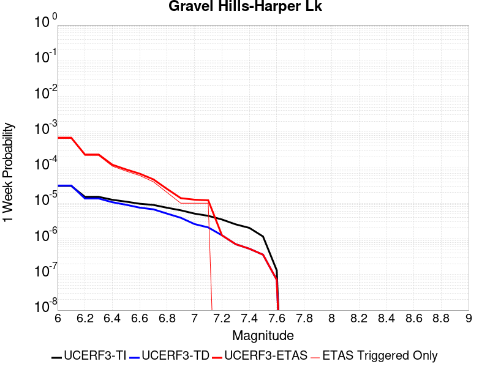 |  | 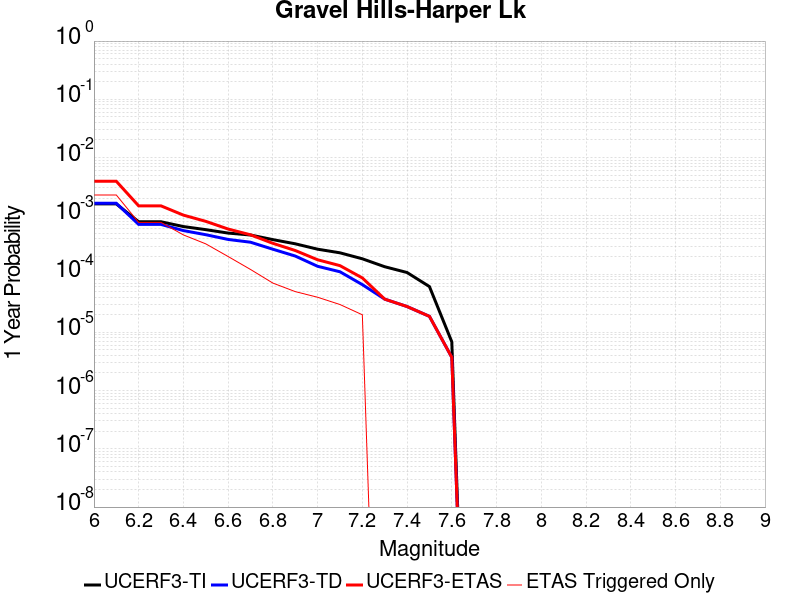 |  |

| Magnitude | 1 wk TI Prob | 1 wk TD Prob | 1 wk ETAS Prob | 1 wk ETAS/TD Gain | 1 wk ETAS Triggered Only | 1 mo TI Prob | 1 mo TD Prob | 1 mo ETAS Prob | 1 mo ETAS/TD Gain | 1 mo ETAS Triggered Only | 1 yr TI Prob | 1 yr TD Prob | 1 yr ETAS Prob | 1 yr ETAS/TD Gain | 1 yr ETAS Triggered Only | 10 yr TI Prob | 10 yr TD Prob | 10 yr ETAS Prob | 10 yr ETAS/TD Gain | 10 yr ETAS Triggered Only |
|-----|-----|-----|-----|-----|-----|-----|-----|-----|-----|-----|-----|-----|-----|-----|-----|-----|-----|-----|-----|-----|
| 6.0 | 3.0679566E-5 | 3.1464675E-5 | 6.914439E-4 | 21.975245 | 6.6E-4 | 1.3147724E-4 | 1.3484286E-4 | 0.0012346945 | 9.156544 | 0.0011 | 0.0015995599 | 0.0016406925 | 0.003916952 | 2.387377 | 0.00228 | 0.015880952 | 0.016307363 | 0.0199667 | 1.2243978 | 0.00372 |
| 6.1 | 3.0679566E-5 | 3.1464675E-5 | 6.914439E-4 | 21.975245 | 6.6E-4 | 1.3147724E-4 | 1.3484286E-4 | 0.0012346945 | 9.156544 | 0.0011 | 0.0015995599 | 0.0016406925 | 0.003916952 | 2.387377 | 0.00228 | 0.015880952 | 0.016307363 | 0.0199667 | 1.2243978 | 0.00372 |
| 6.2 | 1.514536E-5 | 1.3635216E-5 | 2.3363222E-4 | 17.13447 | 2.2E-4 | 6.490707E-5 | 5.84354E-5 | 3.9841552E-4 | 6.818051 | 3.4E-4 | 7.8995706E-4 | 7.112306E-4 | 0.001480683 | 2.0818605 | 7.7E-4 | 0.007871548 | 0.0070907455 | 0.008331882 | 1.1750361 | 0.00125 |
| 6.3 | 1.514536E-5 | 1.3635216E-5 | 2.3363222E-4 | 17.13447 | 2.2E-4 | 6.490707E-5 | 5.84354E-5 | 3.9841552E-4 | 6.818051 | 3.4E-4 | 7.8995706E-4 | 7.112306E-4 | 0.001480683 | 2.0818605 | 7.7E-4 | 0.007871548 | 0.0070907455 | 0.008331882 | 1.1750361 | 0.00125 |
| 6.4 | 1.2532521E-5 | 1.0689695E-5 | 1.2068852E-4 | 11.290174 | 1.1E-4 | 5.37097E-5 | 4.581221E-5 | 2.558026E-4 | 5.583721 | 2.1E-4 | 6.537194E-4 | 5.576267E-4 | 0.0010273646 | 1.8423878 | 4.7E-4 | 0.0065179965 | 0.005562865 | 0.006328582 | 1.1376479 | 7.7E-4 |
| 6.5 | 1.1094058E-5 | 9.083666E-6 | 8.908294E-5 | 9.806937 | 8.0E-5 | 4.7545094E-5 | 3.8929436E-5 | 1.889236E-4 | 4.8529754 | 1.5E-4 | 5.787078E-4 | 4.7386685E-4 | 8.037105E-4 | 1.6960682 | 3.3E-4 | 0.0057720304 | 0.0047289715 | 0.005256465 | 1.1115451 | 5.3E-4 |
| 6.6 | 9.688328E-6 | 7.5316952E-6 | 6.753124E-5 | 8.966274 | 6.0E-5 | 4.1520743E-5 | 3.227831E-5 | 1.222754E-4 | 3.78816 | 9.0E-5 | 5.053978E-4 | 3.929201E-4 | 5.9284153E-4 | 1.5088093 | 2.0E-4 | 0.0050424994 | 0.0039225104 | 0.004261177 | 1.0863392 | 3.4E-4 |
| 6.7 | 8.974824E-6 | 6.749412E-6 | 4.674914E-5 | 6.926402 | 4.0E-5 | 3.8462964E-5 | 2.8925744E-5 | 7.89243E-5 | 2.728514 | 5.0E-5 | 4.6818596E-4 | 3.521162E-4 | 4.7207397E-4 | 1.3406765 | 1.2E-4 | 0.004672008 | 0.003515804 | 0.0037449955 | 1.0651889 | 2.3E-4 |
| 6.8 | 7.4780046E-6 | 5.1161906E-6 | 2.511609E-5 | 4.9091387 | 2.0E-5 | 3.20482E-5 | 2.1926355E-5 | 4.1925916E-5 | 1.9121243 | 2.0E-5 | 3.9011694E-4 | 2.6692206E-4 | 3.3690338E-4 | 1.2621789 | 7.0E-5 | 0.0038943281 | 0.0026661528 | 0.002825726 | 1.0598515 | 1.6E-4 |
| 6.9 | 6.3409307E-6 | 3.907492E-6 | 1.3907453E-5 | 3.5591762 | 1.0E-5 | 2.7175134E-5 | 1.6746293E-5 | 2.6746126E-5 | 1.5971371 | 1.0E-5 | 3.3080703E-4 | 2.0386802E-4 | 2.5385784E-4 | 1.2452067 | 5.0E-5 | 0.0033031502 | 0.0020369082 | 0.0021566637 | 1.0587928 | 1.2E-4 |
| 7.0 | 5.1239335E-6 | 2.605851E-6 | 1.2605825E-5 | 4.837508 | 1.0E-5 | 2.195953E-5 | 1.1167886E-5 | 2.1167774E-5 | 1.8954146 | 1.0E-5 | 2.6732447E-4 | 1.3596078E-4 | 1.7595534E-4 | 1.2941625 | 4.0E-5 | 0.0026700313 | 0.0013588013 | 0.0014386926 | 1.0587955 | 8.0E-5 |
| 7.1 | 4.438899E-6 | 2.0984708E-6 | 1.209845E-5 | 5.765365 | 1.0E-5 | 1.9023713E-5 | 8.9934165E-6 | 1.8993325E-5 | 2.1119146 | 1.0E-5 | 2.315891E-4 | 1.0948956E-4 | 1.3948628E-4 | 1.2739687 | 3.0E-5 | 0.002313479 | 0.0010943781 | 0.0011543124 | 1.0547657 | 6.0E-5 |
| 7.2 | 3.50367E-6 | 1.2615724E-6 | 1.2615724E-6 | 1.0 | 0.0 | 1.5015643E-5 | 5.4067277E-6 | 5.4067277E-6 | 1.0 | 0.0 | 1.8280011E-4 | 6.582501E-5 | 8.582369E-5 | 1.3038158 | 2.0E-5 | 0.0018264982 | 6.5806333E-4 | 6.880436E-4 | 1.0455583 | 3.0E-5 |
| 7.3 | 2.561638E-6 | 7.1186946E-7 | 7.1186946E-7 | 1.0 | 0.0 | 1.0978401E-5 | 3.0508656E-6 | 3.0508656E-6 | 1.0 | 0.0 | 1.3365384E-4 | 3.7143676E-5 | 3.7143676E-5 | 1.0 | 0.0 | 0.0013357349 | 3.7137666E-4 | 3.7137666E-4 | 1.0 | 0.0 |
| 7.4 | 2.0368864E-6 | 5.304479E-7 | 5.304479E-7 | 1.0 | 0.0 | 8.729483E-6 | 2.2733461E-6 | 2.2733461E-6 | 1.0 | 0.0 | 1.06276275E-4 | 2.7677643E-5 | 2.7677643E-5 | 1.0 | 0.0 | 0.0010622547 | 2.7674247E-4 | 2.7674247E-4 | 1.0 | 0.0 |
| 7.5 | 1.1681728E-6 | 3.6028513E-7 | 3.6028513E-7 | 1.0 | 0.0 | 5.0064455E-6 | 1.5440783E-6 | 1.5440783E-6 | 1.0 | 0.0 | 6.0951766E-5 | 1.8798995E-5 | 1.8798995E-5 | 1.0 | 0.0 | 6.093505E-4 | 1.8797453E-4 | 1.8797453E-4 | 1.0 | 0.0 |
| 7.6 | 1.3154387E-7 | 7.1196716E-8 | 7.1196716E-8 | 1.0 | 0.0 | 5.6375933E-7 | 3.0512876E-7 | 3.0512876E-7 | 1.0 | 0.0 | 6.863748E-6 | 3.714938E-6 | 3.714938E-6 | 1.0 | 0.0 | 6.863536E-5 | 3.7148915E-5 | 3.7148915E-5 | 1.0 | 0.0 |

## So Sierra Nevada
*[(top)](#table-of-contents)*

| 1 Week | 1 Month | 1 Year | 10 Year |
|-----|-----|-----|-----|
| 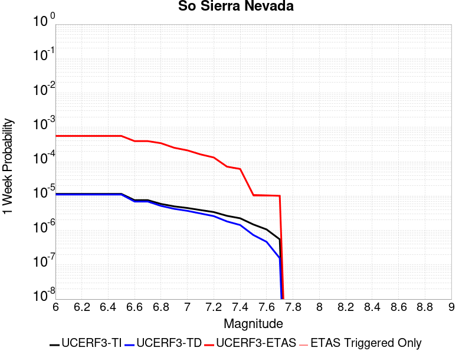 |  | 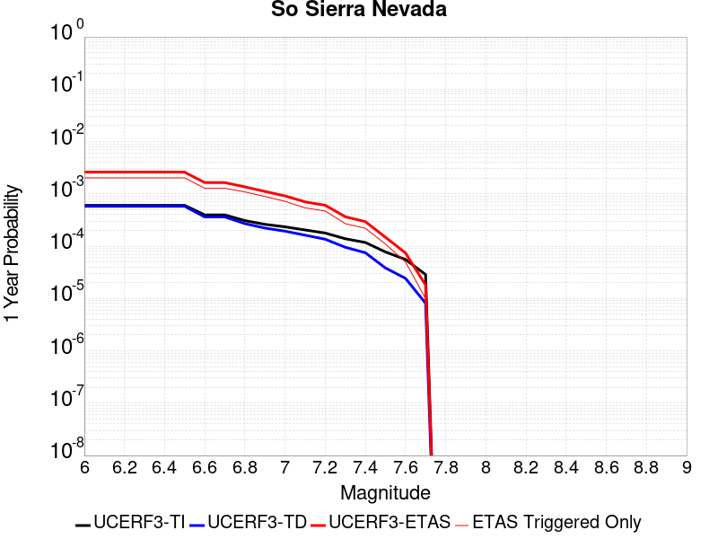 |  |

| Magnitude | 1 wk TI Prob | 1 wk TD Prob | 1 wk ETAS Prob | 1 wk ETAS/TD Gain | 1 wk ETAS Triggered Only | 1 mo TI Prob | 1 mo TD Prob | 1 mo ETAS Prob | 1 mo ETAS/TD Gain | 1 mo ETAS Triggered Only | 1 yr TI Prob | 1 yr TD Prob | 1 yr ETAS Prob | 1 yr ETAS/TD Gain | 1 yr ETAS Triggered Only | 10 yr TI Prob | 10 yr TD Prob | 10 yr ETAS Prob | 10 yr ETAS/TD Gain | 10 yr ETAS Triggered Only |
|-----|-----|-----|-----|-----|-----|-----|-----|-----|-----|-----|-----|-----|-----|-----|-----|-----|-----|-----|-----|-----|
| 6.0 | 1.15488665E-5 | 1.1079619E-5 | 5.6107354E-4 | 50.640144 | 5.5E-4 | 4.9494203E-5 | 4.748329E-5 | 0.0010074377 | 21.216679 | 9.6E-4 | 6.024253E-4 | 5.779685E-4 | 0.002596801 | 4.4929805 | 0.00202 | 0.006007948 | 0.005765922 | 0.009066779 | 1.5724769 | 0.00332 |
| 6.1 | 1.15488665E-5 | 1.1079619E-5 | 5.6107354E-4 | 50.640144 | 5.5E-4 | 4.9494203E-5 | 4.748329E-5 | 0.0010074377 | 21.216679 | 9.6E-4 | 6.024253E-4 | 5.779685E-4 | 0.002596801 | 4.4929805 | 0.00202 | 0.006007948 | 0.005765922 | 0.009066779 | 1.5724769 | 0.00332 |
| 6.2 | 1.15488665E-5 | 1.1079619E-5 | 5.6107354E-4 | 50.640144 | 5.5E-4 | 4.9494203E-5 | 4.748329E-5 | 0.0010074377 | 21.216679 | 9.6E-4 | 6.024253E-4 | 5.779685E-4 | 0.002596801 | 4.4929805 | 0.00202 | 0.006007948 | 0.005765922 | 0.009066779 | 1.5724769 | 0.00332 |
| 6.3 | 1.15488665E-5 | 1.1079619E-5 | 5.6107354E-4 | 50.640144 | 5.5E-4 | 4.9494203E-5 | 4.748329E-5 | 0.0010074377 | 21.216679 | 9.6E-4 | 6.024253E-4 | 5.779685E-4 | 0.002596801 | 4.4929805 | 0.00202 | 0.006007948 | 0.005765922 | 0.009066779 | 1.5724769 | 0.00332 |
| 6.4 | 1.15488665E-5 | 1.1079619E-5 | 5.6107354E-4 | 50.640144 | 5.5E-4 | 4.9494203E-5 | 4.748329E-5 | 0.0010074377 | 21.216679 | 9.6E-4 | 6.024253E-4 | 5.779685E-4 | 0.002596801 | 4.4929805 | 0.00202 | 0.006007948 | 0.005765922 | 0.009066779 | 1.5724769 | 0.00332 |
| 6.5 | 1.15488665E-5 | 1.1079619E-5 | 5.6107354E-4 | 50.640144 | 5.5E-4 | 4.9494203E-5 | 4.748329E-5 | 0.0010074377 | 21.216679 | 9.6E-4 | 6.024253E-4 | 5.779685E-4 | 0.002596801 | 4.4929805 | 0.00202 | 0.006007948 | 0.005765922 | 0.009066779 | 1.5724769 | 0.00332 |
| 6.6 | 7.587044E-6 | 6.9356097E-6 | 3.969329E-4 | 57.231148 | 3.9E-4 | 3.2515498E-5 | 2.9723718E-5 | 6.997038E-4 | 23.54025 | 6.7E-4 | 3.9580427E-4 | 3.6182912E-4 | 0.0016413659 | 4.5363016 | 0.00128 | 0.003951 | 0.0036126915 | 0.005605466 | 1.5516039 | 0.002 |
| 6.7 | 7.587044E-6 | 6.9356097E-6 | 3.969329E-4 | 57.231148 | 3.9E-4 | 3.2515498E-5 | 2.9723718E-5 | 6.997038E-4 | 23.54025 | 6.7E-4 | 3.9580427E-4 | 3.6182912E-4 | 0.0016413659 | 4.5363016 | 0.00128 | 0.003951 | 0.0036126915 | 0.005605466 | 1.5516039 | 0.002 |
| 6.8 | 5.9026956E-6 | 5.1793663E-6 | 3.451776E-4 | 66.64476 | 3.4E-4 | 2.5297022E-5 | 2.2197102E-5 | 6.12184E-4 | 27.579456 | 5.9E-4 | 3.0794772E-4 | 2.7021737E-4 | 0.0013599228 | 5.0326996 | 0.00109 | 0.0030752132 | 0.0026990043 | 0.004354524 | 1.6133816 | 0.00166 |
| 6.9 | 5.0118915E-6 | 4.2523984E-6 | 2.5425132E-4 | 59.790104 | 2.5E-4 | 2.1479358E-5 | 1.8224442E-5 | 4.6821625E-4 | 25.691666 | 4.5E-4 | 2.614798E-4 | 2.2186071E-4 | 0.0011116633 | 5.010636 | 8.9E-4 | 0.0026117235 | 0.0022164648 | 0.0035235612 | 1.5897213 | 0.00131 |
| 7.0 | 4.4924795E-6 | 3.7138905E-6 | 2.1371311E-4 | 57.54427 | 2.1E-4 | 1.925334E-5 | 1.591658E-5 | 3.5591118E-4 | 22.361032 | 3.4E-4 | 2.3438422E-4 | 1.9376776E-4 | 9.1362826E-4 | 4.7150683 | 7.2E-4 | 0.0023413717 | 0.0019360511 | 0.00301396 | 1.5567565 | 0.00108 |
| 7.1 | 3.9118436E-6 | 3.1119503E-6 | 1.6311146E-4 | 52.414543 | 1.6E-4 | 1.6764936E-5 | 1.3336865E-5 | 2.6333352E-4 | 19.744785 | 2.5E-4 | 2.0409399E-4 | 1.623648E-4 | 7.022771E-4 | 4.325304 | 5.4E-4 | 0.0020390663 | 0.0016225178 | 0.0024411874 | 1.5045674 | 8.2E-4 |
| 7.2 | 3.4200818E-6 | 2.6054267E-6 | 1.3260508E-4 | 50.89573 | 1.3E-4 | 1.4657411E-5 | 1.1166069E-5 | 2.2116372E-4 | 19.806767 | 2.1E-4 | 1.7843937E-4 | 1.3593891E-4 | 6.0587504E-4 | 4.456965 | 4.7E-4 | 0.0017829615 | 0.0013586073 | 0.002077629 | 1.5292344 | 7.2E-4 |
| 7.3 | 2.6593618E-6 | 1.8283924E-6 | 7.182826E-5 | 39.284927 | 7.0E-5 | 1.13972155E-5 | 7.835945E-6 | 1.3783493E-4 | 17.590082 | 1.3E-4 | 1.3875226E-4 | 9.5398755E-5 | 3.65373E-4 | 3.8299556 | 2.7E-4 | 0.0013866565 | 9.536069E-4 | 0.001363216 | 1.4295366 | 4.1E-4 |
| 7.4 | 2.2577992E-6 | 1.4364103E-6 | 6.143632E-5 | 42.770737 | 6.0E-5 | 9.676246E-6 | 6.156031E-6 | 1.06155414E-4 | 17.244133 | 1.0E-4 | 1.1780193E-4 | 7.4947355E-5 | 2.9493085E-4 | 3.9351737 | 2.2E-4 | 0.001177395 | 7.492458E-4 | 0.0010789986 | 1.4401128 | 3.3E-4 |
| 7.5 | 1.489319E-6 | 7.353682E-7 | 1.0735361E-5 | 14.59862 | 1.0E-5 | 6.3827797E-6 | 3.151574E-6 | 3.315148E-5 | 10.519023 | 3.0E-5 | 7.770758E-5 | 3.8369744E-5 | 1.4836552E-4 | 3.8667321 | 1.1E-4 | 7.7680405E-4 | 3.8363162E-4 | 5.4357026E-4 | 1.4169067 | 1.6E-4 |
| 7.6 | 1.0680322E-6 | 4.659426E-7 | 1.04659375E-5 | 22.46186 | 1.0E-5 | 4.577273E-6 | 1.9968952E-6 | 1.1996875E-5 | 6.007764 | 1.0E-5 | 5.5726876E-5 | 2.4311932E-5 | 7.4310716E-5 | 3.0565534 | 5.0E-5 | 5.5712904E-4 | 2.4309299E-4 | 3.2307353E-4 | 1.3290122 | 8.0E-5 |
| 7.7 | 5.509146E-7 | 1.557863E-7 | 1.0155784E-5 | 65.19049 | 1.0E-5 | 2.3610605E-6 | 6.676554E-7 | 1.0667649E-5 | 15.977777 | 1.0E-5 | 2.8745531E-5 | 8.128675E-6 | 1.8128594E-5 | 2.2302027 | 1.0E-5 | 2.8741814E-4 | 8.128389E-5 | 1.0128227E-4 | 1.2460312 | 2.0E-5 |

## Coyote Canyon
*[(top)](#table-of-contents)*

| 1 Week | 1 Month | 1 Year | 10 Year |
|-----|-----|-----|-----|
|  |  |  | 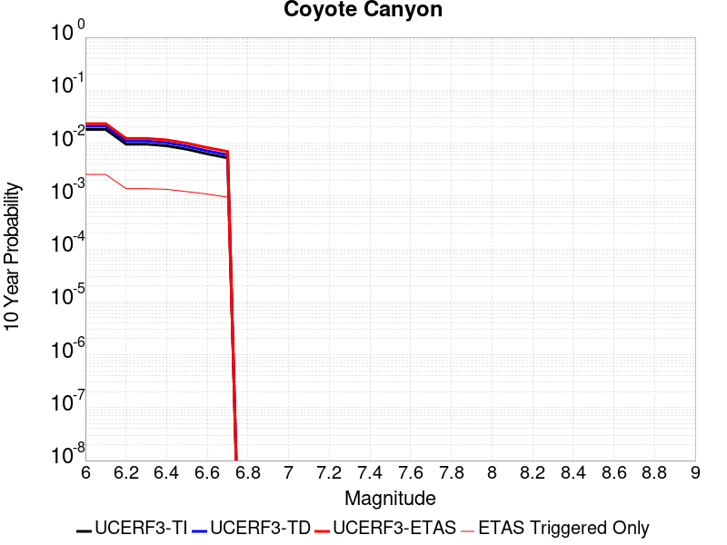 |

| Magnitude | 1 wk TI Prob | 1 wk TD Prob | 1 wk ETAS Prob | 1 wk ETAS/TD Gain | 1 wk ETAS Triggered Only | 1 mo TI Prob | 1 mo TD Prob | 1 mo ETAS Prob | 1 mo ETAS/TD Gain | 1 mo ETAS Triggered Only | 1 yr TI Prob | 1 yr TD Prob | 1 yr ETAS Prob | 1 yr ETAS/TD Gain | 1 yr ETAS Triggered Only | 10 yr TI Prob | 10 yr TD Prob | 10 yr ETAS Prob | 10 yr ETAS/TD Gain | 10 yr ETAS Triggered Only |
|-----|-----|-----|-----|-----|-----|-----|-----|-----|-----|-----|-----|-----|-----|-----|-----|-----|-----|-----|-----|-----|
| 6.0 | 3.5090034E-5 | 4.036439E-5 | 4.0034985E-4 | 9.918392 | 3.6E-4 | 1.503772E-4 | 1.7298023E-4 | 8.628609E-4 | 4.988205 | 6.9E-4 | 0.0018293047 | 0.0021042572 | 0.0034913323 | 1.6591756 | 0.00139 | 0.018143194 | 0.020869244 | 0.023375819 | 1.1201086 | 0.00256 |
| 6.1 | 3.5090034E-5 | 4.036439E-5 | 4.0034985E-4 | 9.918392 | 3.6E-4 | 1.503772E-4 | 1.7298023E-4 | 8.628609E-4 | 4.988205 | 6.9E-4 | 0.0018293047 | 0.0021042572 | 0.0034913323 | 1.6591756 | 0.00139 | 0.018143194 | 0.020869244 | 0.023375819 | 1.1201086 | 0.00256 |
| 6.2 | 1.841879E-5 | 2.105983E-5 | 2.0105604E-4 | 9.546897 | 1.8E-4 | 7.8935285E-5 | 9.025387E-5 | 4.202241E-4 | 4.656023 | 3.3E-4 | 9.606133E-4 | 0.0010983889 | 0.0018275871 | 1.6638798 | 7.3E-4 | 0.0095647145 | 0.010939687 | 0.01230459 | 1.1247662 | 0.00138 |
| 6.3 | 1.841879E-5 | 2.105983E-5 | 2.0105604E-4 | 9.546897 | 1.8E-4 | 7.8935285E-5 | 9.025387E-5 | 4.202241E-4 | 4.656023 | 3.3E-4 | 9.606133E-4 | 0.0010983889 | 0.0018275871 | 1.6638798 | 7.3E-4 | 0.0095647145 | 0.010939687 | 0.01230459 | 1.1247662 | 0.00138 |
| 6.4 | 1.712201E-5 | 1.9565246E-5 | 1.8956192E-4 | 9.688706 | 1.7E-4 | 7.337798E-5 | 8.384893E-5 | 3.9382293E-4 | 4.6968155 | 3.1E-4 | 8.930107E-4 | 0.0010204831 | 0.0017197689 | 1.6852496 | 7.0E-4 | 0.008894307 | 0.010167889 | 0.011494264 | 1.1304474 | 0.00134 |
| 6.5 | 1.4744935E-5 | 1.6837E-5 | 1.768343E-4 | 10.50272 | 1.6E-4 | 6.3191044E-5 | 7.2157105E-5 | 3.521369E-4 | 4.8801417 | 2.8E-4 | 7.6907943E-4 | 8.782522E-4 | 0.0015276814 | 1.7394563 | 6.5E-4 | 0.007664232 | 0.00875701 | 0.009956414 | 1.136965 | 0.00121 |
| 6.6 | 1.2017839E-5 | 1.3724113E-5 | 1.6372206E-4 | 11.929518 | 1.5E-4 | 5.150401E-5 | 5.88168E-5 | 3.188015E-4 | 5.4202456 | 2.6E-4 | 6.268809E-4 | 7.159479E-4 | 0.0013155183 | 1.8374499 | 6.0E-4 | 0.0062511545 | 0.0071451063 | 0.0082273185 | 1.151462 | 0.00109 |
| 6.7 | 1.00956095E-5 | 1.1533537E-5 | 1.3153216E-4 | 11.404321 | 1.2E-4 | 4.326618E-5 | 4.9428996E-5 | 2.7941764E-4 | 5.6529093 | 2.3E-4 | 5.266384E-4 | 6.0171884E-4 | 0.0011613818 | 1.9301072 | 5.6E-4 | 0.005253921 | 0.006009423 | 0.006953714 | 1.157135 | 9.5E-4 |

## Nelson Lake
*[(top)](#table-of-contents)*

| 1 Week | 1 Month | 1 Year | 10 Year |
|-----|-----|-----|-----|
|  | 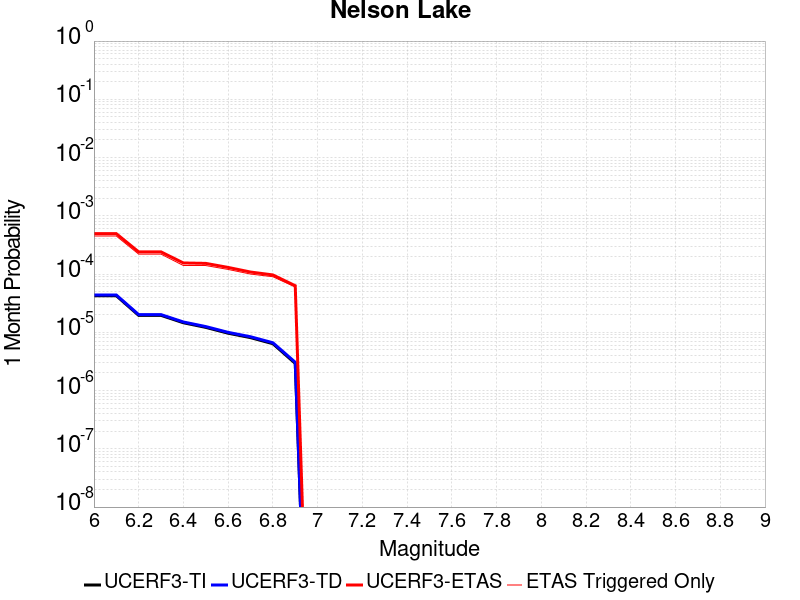 | 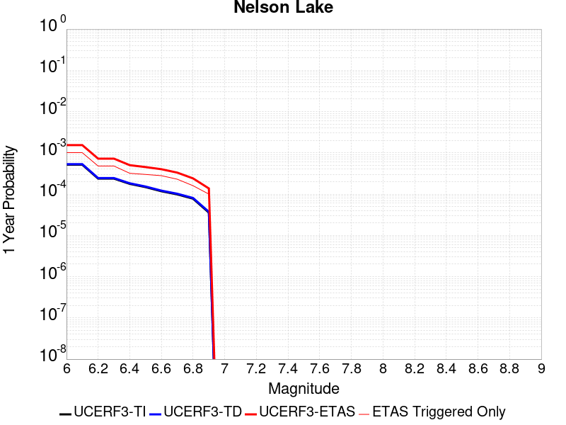 |  |

| Magnitude | 1 wk TI Prob | 1 wk TD Prob | 1 wk ETAS Prob | 1 wk ETAS/TD Gain | 1 wk ETAS Triggered Only | 1 mo TI Prob | 1 mo TD Prob | 1 mo ETAS Prob | 1 mo ETAS/TD Gain | 1 mo ETAS Triggered Only | 1 yr TI Prob | 1 yr TD Prob | 1 yr ETAS Prob | 1 yr ETAS/TD Gain | 1 yr ETAS Triggered Only | 10 yr TI Prob | 10 yr TD Prob | 10 yr ETAS Prob | 10 yr ETAS/TD Gain | 10 yr ETAS Triggered Only |
|-----|-----|-----|-----|-----|-----|-----|-----|-----|-----|-----|-----|-----|-----|-----|-----|-----|-----|-----|-----|-----|
| 6.0 | 9.913453E-6 | 1.0192259E-5 | 1.9019042E-4 | 18.660282 | 1.8E-4 | 4.2485535E-5 | 4.3680437E-5 | 4.936608E-4 | 11.301645 | 4.5E-4 | 5.1713863E-4 | 5.316899E-4 | 0.0015411528 | 2.8985937 | 0.00101 | 0.0051593683 | 0.005305206 | 0.0073940647 | 1.3937376 | 0.0021 |
| 6.1 | 9.913453E-6 | 1.0192259E-5 | 1.9019042E-4 | 18.660282 | 1.8E-4 | 4.2485535E-5 | 4.3680437E-5 | 4.936608E-4 | 11.301645 | 4.5E-4 | 5.1713863E-4 | 5.316899E-4 | 0.0015411528 | 2.8985937 | 0.00101 | 0.0051593683 | 0.005305206 | 0.0073940647 | 1.3937376 | 0.0021 |
| 6.2 | 4.5596407E-6 | 4.6963146E-6 | 5.469608E-5 | 11.646596 | 5.0E-5 | 1.954117E-5 | 2.0126916E-5 | 2.4012249E-4 | 11.930417 | 2.2E-4 | 2.3788778E-4 | 2.4501892E-4 | 7.249013E-4 | 2.9585524 | 4.8E-4 | 0.0023763329 | 0.0024476137 | 0.0033055088 | 1.3505026 | 8.6E-4 |
| 6.3 | 4.5596407E-6 | 4.6963146E-6 | 5.469608E-5 | 11.646596 | 5.0E-5 | 1.954117E-5 | 2.0126916E-5 | 2.4012249E-4 | 11.930417 | 2.2E-4 | 2.3788778E-4 | 2.4501892E-4 | 7.249013E-4 | 2.9585524 | 4.8E-4 | 0.0023763329 | 0.0024476137 | 0.0033055088 | 1.3505026 | 8.6E-4 |
| 6.4 | 3.4025713E-6 | 3.5098985E-6 | 3.3509794E-5 | 9.547225 | 3.0E-5 | 1.4582367E-5 | 1.504234E-5 | 1.5504024E-4 | 10.306922 | 1.4E-4 | 1.7752586E-4 | 1.8312594E-4 | 5.0306733E-4 | 2.7471113 | 3.2E-4 | 0.001773841 | 0.0018298334 | 0.002448699 | 1.3382087 | 6.2E-4 |
| 6.5 | 2.8352947E-6 | 2.9278574E-6 | 3.292777E-5 | 11.246371 | 3.0E-5 | 1.2151207E-5 | 1.2547904E-5 | 1.5254614E-4 | 12.157103 | 1.4E-4 | 1.479309E-4 | 1.5276077E-4 | 4.5271494E-4 | 2.963555 | 3.0E-4 | 0.0014783246 | 0.0015266314 | 0.0020957612 | 1.3728011 | 5.7E-4 |
| 6.6 | 2.251518E-6 | 2.3290686E-6 | 2.2329023E-5 | 9.587104 | 2.0E-5 | 9.649328E-6 | 9.981688E-6 | 1.2998049E-4 | 13.021895 | 1.2E-4 | 1.1747423E-4 | 1.215209E-4 | 4.0148688E-4 | 3.3038504 | 2.8E-4 | 0.0011741214 | 0.0012146062 | 0.0017040111 | 1.4029329 | 4.9E-4 |
| 6.7 | 1.8911853E-6 | 1.9591405E-6 | 2.1959102E-5 | 11.208538 | 2.0E-5 | 8.105055E-6 | 8.396293E-6 | 1.08395456E-4 | 12.909918 | 1.0E-4 | 9.867457E-5 | 1.02220656E-4 | 3.3219715E-4 | 3.2498045 | 2.3E-4 | 9.863076E-4 | 0.0010217939 | 0.0014213852 | 1.3910683 | 4.0E-4 |
| 6.8 | 1.4874814E-6 | 1.5438312E-6 | 2.15438E-5 | 13.954764 | 2.0E-5 | 6.374905E-6 | 6.6164057E-6 | 9.661581E-5 | 14.602462 | 9.0E-5 | 7.76117E-5 | 8.055228E-5 | 2.4053939E-4 | 2.9861276 | 1.6E-4 | 7.75846E-4 | 8.052819E-4 | 0.0011050403 | 1.3722403 | 3.0E-4 |
| 6.9 | 6.835972E-7 | 7.1399324E-7 | 7.1399324E-7 | 1.0 | 0.0 | 2.9296991E-6 | 3.0599692E-6 | 6.3059786E-5 | 20.60798 | 6.0E-5 | 3.56685E-5 | 3.7254806E-5 | 1.3725107E-4 | 3.6841173 | 1.0E-4 | 3.5662777E-4 | 3.7251686E-4 | 5.2246096E-4 | 1.4025164 | 1.5E-4 |

## San Andreas (Mojave S)
*[(top)](#table-of-contents)*

| 1 Week | 1 Month | 1 Year | 10 Year |
|-----|-----|-----|-----|
|  |  |  | 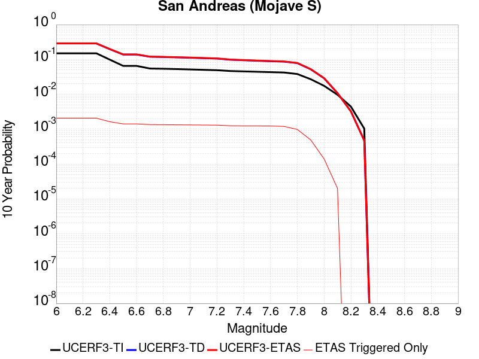 |

| Magnitude | 1 wk TI Prob | 1 wk TD Prob | 1 wk ETAS Prob | 1 wk ETAS/TD Gain | 1 wk ETAS Triggered Only | 1 mo TI Prob | 1 mo TD Prob | 1 mo ETAS Prob | 1 mo ETAS/TD Gain | 1 mo ETAS Triggered Only | 1 yr TI Prob | 1 yr TD Prob | 1 yr ETAS Prob | 1 yr ETAS/TD Gain | 1 yr ETAS Triggered Only | 10 yr TI Prob | 10 yr TD Prob | 10 yr ETAS Prob | 10 yr ETAS/TD Gain | 10 yr ETAS Triggered Only |
|-----|-----|-----|-----|-----|-----|-----|-----|-----|-----|-----|-----|-----|-----|-----|-----|-----|-----|-----|-----|-----|
| 6.0 | 3.1064058E-4 | 6.7463145E-4 | 0.0012042739 | 1.7850841 | 5.3E-4 | 0.0013306376 | 0.0028882022 | 0.0036659495 | 1.2692842 | 7.8E-4 | 0.016080605 | 0.03456595 | 0.03593687 | 1.0396609 | 0.00142 | 0.1496549 | 0.28655964 | 0.2880293 | 1.0051287 | 0.00206 |
| 6.1 | 3.1064058E-4 | 6.7463145E-4 | 0.0012042739 | 1.7850841 | 5.3E-4 | 0.0013306376 | 0.0028882022 | 0.0036659495 | 1.2692842 | 7.8E-4 | 0.016080605 | 0.03456595 | 0.03593687 | 1.0396609 | 0.00142 | 0.1496549 | 0.28655964 | 0.2880293 | 1.0051287 | 0.00206 |
| 6.2 | 3.1064058E-4 | 6.7463145E-4 | 0.0012042739 | 1.7850841 | 5.3E-4 | 0.0013306376 | 0.0028882022 | 0.0036659495 | 1.2692842 | 7.8E-4 | 0.016080605 | 0.03456595 | 0.03593687 | 1.0396609 | 0.00142 | 0.1496549 | 0.28655964 | 0.2880293 | 1.0051287 | 0.00206 |
| 6.3 | 3.1064058E-4 | 6.7463145E-4 | 0.0012042739 | 1.7850841 | 5.3E-4 | 0.0013306376 | 0.0028882022 | 0.0036659495 | 1.2692842 | 7.8E-4 | 0.016080605 | 0.03456595 | 0.03593687 | 1.0396609 | 0.00142 | 0.1496549 | 0.28655964 | 0.2880293 | 1.0051287 | 0.00206 |
| 6.4 | 1.9872203E-4 | 4.3181772E-4 | 8.816234E-4 | 2.0416565 | 4.5E-4 | 8.5138786E-4 | 0.001849363 | 0.0025081425 | 1.3562196 | 6.6E-4 | 0.010316478 | 0.022289673 | 0.023394486 | 1.0495661 | 0.00113 | 0.098504856 | 0.19688421 | 0.1981933 | 1.006649 | 0.00163 |
| 6.5 | 1.291105E-4 | 2.8754846E-4 | 6.974306E-4 | 2.4254365 | 4.1E-4 | 5.5321335E-4 | 0.0012317713 | 0.00184102 | 1.4946117 | 6.1E-4 | 0.006714592 | 0.014894519 | 0.015859922 | 1.064816 | 9.8E-4 | 0.065152965 | 0.13802491 | 0.1392403 | 1.0088055 | 0.00141 |
| 6.6 | 1.291105E-4 | 2.8754846E-4 | 6.974306E-4 | 2.4254365 | 4.1E-4 | 5.5321335E-4 | 0.0012317713 | 0.00184102 | 1.4946117 | 6.1E-4 | 0.006714592 | 0.014894519 | 0.015859922 | 1.064816 | 9.8E-4 | 0.065152965 | 0.13802491 | 0.1392403 | 1.0088055 | 0.00141 |
| 6.7 | 1.08001186E-4 | 2.4336061E-4 | 6.1327056E-4 | 2.5200076 | 3.7E-4 | 4.6278012E-4 | 0.0010425578 | 0.0016119635 | 1.5461624 | 5.7E-4 | 0.0056198016 | 0.012619565 | 0.013537829 | 1.0727651 | 9.3E-4 | 0.054797906 | 0.11918763 | 0.12037673 | 1.0099766 | 0.00135 |
| 6.8 | 1.0624356E-4 | 2.3853718E-4 | 6.084489E-4 | 2.550751 | 3.7E-4 | 4.5525006E-4 | 0.0010219022 | 0.0015913197 | 1.5572133 | 5.7E-4 | 0.0055285925 | 0.012370958 | 0.013279577 | 1.0734477 | 9.2E-4 | 0.053930566 | 0.1171363 | 0.11831933 | 1.0100996 | 0.00134 |
| 6.9 | 1.0393785E-4 | 2.3224046E-4 | 5.9215684E-4 | 2.5497575 | 3.6E-4 | 4.4537184E-4 | 9.949371E-4 | 0.0015543799 | 1.5622897 | 5.6E-4 | 0.0054089287 | 0.012046329 | 0.012945367 | 1.0746317 | 9.1E-4 | 0.05279156 | 0.11443668 | 0.115614474 | 1.0102922 | 0.00133 |
| 7.0 | 1.0155622E-4 | 2.2593615E-4 | 5.858548E-4 | 2.5930107 | 3.6E-4 | 4.3516833E-4 | 9.679388E-4 | 0.0015273967 | 1.577989 | 5.6E-4 | 0.005285311 | 0.011721203 | 0.012620537 | 1.076727 | 9.1E-4 | 0.05161361 | 0.11170072 | 0.11287328 | 1.0104973 | 0.00132 |
| 7.1 | 9.885595E-5 | 2.1882028E-4 | 5.787415E-4 | 2.6448257 | 3.6E-4 | 4.2359953E-4 | 9.374645E-4 | 0.0014969395 | 1.5967959 | 5.6E-4 | 0.0051451353 | 0.011354098 | 0.012253766 | 1.0792372 | 9.1E-4 | 0.05027629 | 0.10857789 | 0.10974566 | 1.0107551 | 0.00131 |
| 7.2 | 9.6411415E-5 | 2.1245005E-4 | 5.623757E-4 | 2.6470962 | 3.5E-4 | 4.1312634E-4 | 9.101828E-4 | 0.0014596821 | 1.6037242 | 5.5E-4 | 0.005018219 | 0.0110253515 | 0.0119154295 | 1.0807301 | 9.0E-4 | 0.049064007 | 0.1057714 | 0.1069339 | 1.0109906 | 0.0013 |
| 7.3 | 9.1180635E-5 | 1.947336E-4 | 5.4466544E-4 | 2.7969773 | 3.5E-4 | 3.907156E-4 | 8.3430577E-4 | 0.0013838469 | 1.6586808 | 5.5E-4 | 0.004746591 | 0.010110476 | 0.01097168 | 1.0851793 | 8.7E-4 | 0.046464786 | 0.09796358 | 0.09909112 | 1.0115099 | 0.00125 |
| 7.4 | 8.887388E-5 | 1.8721957E-4 | 5.3715403E-4 | 2.8691127 | 3.5E-4 | 3.8083247E-4 | 8.0212293E-4 | 0.0013516818 | 1.6851305 | 5.5E-4 | 0.0046267817 | 0.009722214 | 0.010573854 | 1.0875973 | 8.6E-4 | 0.045316286 | 0.094596125 | 0.09571883 | 1.0118684 | 0.00124 |
| 7.5 | 8.6750515E-5 | 1.8053487E-4 | 5.304717E-4 | 2.9383335 | 3.5E-4 | 3.7173493E-4 | 7.734915E-4 | 0.0013230661 | 1.7105114 | 5.5E-4 | 0.004516484 | 0.009376681 | 0.010228618 | 1.0908569 | 8.6E-4 | 0.04425787 | 0.09155888 | 0.09268534 | 1.0123032 | 0.00124 |
| 7.6 | 8.453092E-5 | 1.7441068E-4 | 5.243496E-4 | 3.0064077 | 3.5E-4 | 3.6222505E-4 | 7.472603E-4 | 0.0012968493 | 1.735472 | 5.5E-4 | 0.0044011753 | 0.009060017 | 0.009902316 | 1.0929688 | 8.5E-4 | 0.04315024 | 0.088716924 | 0.089837804 | 1.0126343 | 0.00123 |
| 7.7 | 8.259102E-5 | 1.6963173E-4 | 5.1957235E-4 | 3.0629432 | 3.5E-4 | 3.539135E-4 | 7.2679063E-4 | 0.0012464128 | 1.7149543 | 5.2E-4 | 0.004300386 | 0.008812844 | 0.0096256165 | 1.092226 | 8.2E-4 | 0.042181134 | 0.086468495 | 0.08756474 | 1.0126779 | 0.0012 |
| 7.8 | 7.444844E-5 | 1.5285307E-4 | 4.4280876E-4 | 2.8969567 | 2.9E-4 | 3.1902574E-4 | 6.549202E-4 | 0.0010946321 | 1.6713976 | 4.4E-4 | 0.0038772223 | 0.00794455 | 0.008599307 | 1.0824158 | 6.6E-4 | 0.03810269 | 0.07829683 | 0.079200104 | 1.0115365 | 9.8E-4 |
| 7.9 | 5.2586525E-5 | 1.00074794E-4 | 2.500598E-4 | 2.498729 | 1.5E-4 | 2.2535135E-4 | 4.2882148E-4 | 6.3873146E-4 | 1.4895042 | 2.1E-4 | 0.0027402006 | 0.0052084145 | 0.005556592 | 1.066849 | 3.5E-4 | 0.027066574 | 0.052203532 | 0.052667953 | 1.0088964 | 4.9E-4 |
| 8.0 | 3.379877E-5 | 5.4078217E-5 | 9.407605E-5 | 1.7396294 | 4.0E-5 | 1.4484383E-4 | 2.3174321E-4 | 2.8173163E-4 | 1.2157061 | 5.0E-5 | 0.0017620471 | 0.002817825 | 0.002917543 | 1.0353884 | 1.0E-4 | 0.017481409 | 0.02883697 | 0.028972931 | 1.0047148 | 1.4E-4 |
| 8.1 | 1.8668277E-5 | 1.9309364E-5 | 1.9309364E-5 | 1.0 | 0.0 | 8.000444E-5 | 8.2751794E-5 | 8.2751794E-5 | 1.0 | 0.0 | 9.736188E-4 | 0.001007038 | 0.001017028 | 1.0099201 | 1.0E-5 | 0.009693642 | 0.010799106 | 0.01081889 | 1.001832 | 2.0E-5 |
| 8.2 | 8.541571E-6 | 5.4600787E-6 | 5.4600787E-6 | 1.0 | 0.0 | 3.660622E-5 | 2.3400127E-5 | 2.3400127E-5 | 1.0 | 0.0 | 4.455896E-4 | 2.848594E-4 | 2.848594E-4 | 1.0 | 0.0 | 0.0044469717 | 0.0032405623 | 0.0032405623 | 1.0 | 0.0 |
| 8.3 | 1.983087E-6 | 7.65717E-7 | 7.65717E-7 | 1.0 | 0.0 | 8.498917E-6 | 3.2816401E-6 | 3.2816401E-6 | 1.0 | 0.0 | 1.034694E-4 | 3.9953255E-5 | 3.9953255E-5 | 1.0 | 0.0 | 0.0010342124 | 4.7185255E-4 | 4.7185255E-4 | 1.0 | 0.0 |

## Death Valley (So)
*[(top)](#table-of-contents)*

| 1 Week | 1 Month | 1 Year | 10 Year |
|-----|-----|-----|-----|
|  |  |  |  |

| Magnitude | 1 wk TI Prob | 1 wk TD Prob | 1 wk ETAS Prob | 1 wk ETAS/TD Gain | 1 wk ETAS Triggered Only | 1 mo TI Prob | 1 mo TD Prob | 1 mo ETAS Prob | 1 mo ETAS/TD Gain | 1 mo ETAS Triggered Only | 1 yr TI Prob | 1 yr TD Prob | 1 yr ETAS Prob | 1 yr ETAS/TD Gain | 1 yr ETAS Triggered Only | 10 yr TI Prob | 10 yr TD Prob | 10 yr ETAS Prob | 10 yr ETAS/TD Gain | 10 yr ETAS Triggered Only |
|-----|-----|-----|-----|-----|-----|-----|-----|-----|-----|-----|-----|-----|-----|-----|-----|-----|-----|-----|-----|-----|
| 6.0 | 2.0684236E-5 | 2.561836E-5 | 3.1561093E-4 | 12.319716 | 2.9E-4 | 8.864371E-5 | 1.09788445E-4 | 7.4971817E-4 | 6.828753 | 6.4E-4 | 0.0010787029 | 0.0013358716 | 0.002634135 | 1.9718474 | 0.0013 | 0.010734817 | 0.013279942 | 0.015371788 | 1.1575192 | 0.00212 |
| 6.1 | 2.0684236E-5 | 2.561836E-5 | 3.1561093E-4 | 12.319716 | 2.9E-4 | 8.864371E-5 | 1.09788445E-4 | 7.4971817E-4 | 6.828753 | 6.4E-4 | 0.0010787029 | 0.0013358716 | 0.002634135 | 1.9718474 | 0.0013 | 0.010734817 | 0.013279942 | 0.015371788 | 1.1575192 | 0.00212 |
| 6.2 | 2.0684236E-5 | 2.561836E-5 | 3.1561093E-4 | 12.319716 | 2.9E-4 | 8.864371E-5 | 1.09788445E-4 | 7.4971817E-4 | 6.828753 | 6.4E-4 | 0.0010787029 | 0.0013358716 | 0.002634135 | 1.9718474 | 0.0013 | 0.010734817 | 0.013279942 | 0.015371788 | 1.1575192 | 0.00212 |
| 6.3 | 2.0240292E-5 | 2.5118443E-5 | 2.9511165E-4 | 11.748803 | 2.7E-4 | 8.6741224E-5 | 1.0764613E-4 | 6.875837E-4 | 6.387445 | 5.8E-4 | 0.0010555626 | 0.0013098203 | 0.0025282225 | 1.9302055 | 0.00122 | 0.010505628 | 0.0130225 | 0.014986586 | 1.1508224 | 0.00199 |
| 6.4 | 2.0240292E-5 | 2.5118443E-5 | 2.9511165E-4 | 11.748803 | 2.7E-4 | 8.6741224E-5 | 1.0764613E-4 | 6.875837E-4 | 6.387445 | 5.8E-4 | 0.0010555626 | 0.0013098203 | 0.0025282225 | 1.9302055 | 0.00122 | 0.010505628 | 0.0130225 | 0.014986586 | 1.1508224 | 0.00199 |
| 6.5 | 1.9962767E-5 | 2.4807696E-5 | 2.7480148E-4 | 11.077268 | 2.5E-4 | 8.55519E-5 | 1.0631446E-4 | 6.362581E-4 | 5.9846807 | 5.3E-4 | 0.0010410968 | 0.0012936267 | 0.002422165 | 1.8723832 | 0.00113 | 0.010362327 | 0.012862447 | 0.014718265 | 1.144282 | 0.00188 |
| 6.6 | 1.8937297E-5 | 2.3311506E-5 | 2.5330615E-4 | 10.866142 | 2.3E-4 | 8.115732E-5 | 9.990271E-5 | 5.9985276E-4 | 6.0043693 | 5.0E-4 | 9.876423E-4 | 0.0012156514 | 0.0022743628 | 1.8709005 | 0.00106 | 0.009832645 | 0.012091499 | 0.0137907015 | 1.1405287 | 0.00172 |
| 6.7 | 1.8621096E-5 | 2.2912142E-5 | 2.5290687E-4 | 11.0381155 | 2.3E-4 | 7.980225E-5 | 9.8191274E-5 | 5.9814216E-4 | 6.091602 | 5.0E-4 | 9.711593E-4 | 0.0011948377 | 0.0022335951 | 1.8693712 | 0.00104 | 0.009669261 | 0.011885606 | 0.013535758 | 1.1388361 | 0.00167 |
| 6.8 | 1.7830353E-5 | 2.1806127E-5 | 2.3180155E-4 | 10.630111 | 2.1E-4 | 7.641356E-5 | 9.345156E-5 | 5.6340767E-4 | 6.0288734 | 4.7E-4 | 9.29938E-4 | 0.001137193 | 0.0021260672 | 1.8695747 | 9.9E-4 | 0.009260561 | 0.011316002 | 0.012878123 | 1.1380453 | 0.00158 |
| 6.9 | 1.3135183E-5 | 1.5304062E-5 | 1.2530238E-4 | 8.187524 | 1.1E-4 | 5.6292425E-5 | 6.558723E-5 | 3.6556754E-4 | 5.5737615 | 3.0E-4 | 6.8514474E-4 | 7.982384E-4 | 0.0014177435 | 1.7760904 | 6.2E-4 | 0.006830362 | 0.007955142 | 0.008947187 | 1.1247048 | 0.001 |
| 7.0 | 1.1507512E-5 | 1.3154262E-5 | 9.315321E-5 | 7.081599 | 8.0E-5 | 4.9316975E-5 | 5.637422E-5 | 2.7636182E-4 | 4.9022727 | 2.2E-4 | 6.002687E-4 | 6.861458E-4 | 0.0011158508 | 1.626259 | 4.3E-4 | 0.0059864987 | 0.0068414793 | 0.0075764167 | 1.1074238 | 7.4E-4 |
| 7.1 | 9.715903E-6 | 1.0865303E-5 | 6.086476E-5 | 5.6017547 | 5.0E-5 | 4.1638916E-5 | 4.6564775E-5 | 1.965578E-4 | 4.221169 | 1.5E-4 | 5.068359E-4 | 5.6678295E-4 | 8.1664126E-4 | 1.440836 | 2.5E-4 | 0.0050568148 | 0.005653832 | 0.0060913446 | 1.0773833 | 4.4E-4 |
| 7.2 | 9.233269E-6 | 1.0286329E-5 | 4.028602E-5 | 3.9164624 | 3.0E-5 | 3.9570554E-5 | 4.4083543E-5 | 1.4407914E-4 | 3.26832 | 1.0E-4 | 4.81665E-4 | 5.365892E-4 | 6.865087E-4 | 1.2793934 | 1.5E-4 | 0.0048062233 | 0.005353367 | 0.005641815 | 1.0538815 | 2.9E-4 |
| 7.3 | 8.8041315E-6 | 9.808178E-6 | 3.9807885E-5 | 4.058642 | 3.0E-5 | 3.7731446E-5 | 4.2034393E-5 | 1.4203019E-4 | 3.378904 | 1.0E-4 | 4.592835E-4 | 5.116528E-4 | 6.6157605E-4 | 1.2930175 | 1.5E-4 | 0.0045833546 | 0.0051051746 | 0.005373796 | 1.0526175 | 2.7E-4 |
| 7.4 | 8.708749E-6 | 9.707189E-6 | 3.9706898E-5 | 4.090463 | 3.0E-5 | 3.7322676E-5 | 4.1601597E-5 | 1.4159744E-4 | 3.4036539 | 1.0E-4 | 4.5430884E-4 | 5.063859E-4 | 6.5631E-4 | 1.2960668 | 1.5E-4 | 0.004533812 | 0.0050527467 | 0.005311433 | 1.0511972 | 2.6E-4 |
| 7.5 | 8.612678E-6 | 9.604831E-6 | 3.9604543E-5 | 4.1233983 | 3.0E-5 | 3.6910955E-5 | 4.1162937E-5 | 1.4115882E-4 | 3.42927 | 1.0E-4 | 4.492982E-4 | 5.010477E-4 | 6.409776E-4 | 1.2792745 | 1.4E-4 | 0.004483909 | 0.004999606 | 0.005248356 | 1.0497539 | 2.5E-4 |
| 7.6 | 8.319024E-6 | 9.28393E-6 | 3.9283652E-5 | 4.2313604 | 3.0E-5 | 3.5652476E-5 | 3.9787687E-5 | 1.397837E-4 | 3.5132403 | 1.0E-4 | 4.3398244E-4 | 4.8431163E-4 | 6.142487E-4 | 1.2682922 | 1.3E-4 | 0.0043313587 | 0.0048329853 | 0.0050718253 | 1.0494188 | 2.4E-4 |
| 7.7 | 7.4718328E-6 | 8.345182E-6 | 1.83451E-5 | 2.1982863 | 1.0E-5 | 3.2021748E-5 | 3.57646E-5 | 8.576281E-5 | 2.3979805 | 5.0E-5 | 3.8979502E-4 | 4.3535102E-4 | 5.0532055E-4 | 1.1607198 | 7.0E-5 | 0.00389112 | 0.0043453868 | 0.004524605 | 1.0412432 | 1.8E-4 |
| 7.8 | 3.4586725E-7 | 3.6482638E-7 | 3.6482638E-7 | 1.0 | 0.0 | 1.4822873E-6 | 1.5635408E-6 | 1.5635408E-6 | 1.0 | 0.0 | 1.80467E-5 | 1.9035946E-5 | 1.9035946E-5 | 1.0 | 0.0 | 1.8045233E-4 | 1.903436E-4 | 2.003417E-4 | 1.0525266 | 1.0E-5 |
| 7.9 | 2.5591178E-9 | 2.6696731E-9 | 2.6696731E-9 | 1.0 | 0.0 | 1.0967647E-8 | 1.1441457E-8 | 1.1441457E-8 | 1.0 | 0.0 | 1.335311E-7 | 1.3929973E-7 | 1.3929973E-7 | 1.0 | 0.0 | 1.3353102E-6 | 1.3929973E-6 | 1.3929973E-6 | 1.0 | 0.0 |

## Lenwood-Lockhart-Old Woman Springs
*[(top)](#table-of-contents)*

| 1 Week | 1 Month | 1 Year | 10 Year |
|-----|-----|-----|-----|
|  |  |  |  |

| Magnitude | 1 wk TI Prob | 1 wk TD Prob | 1 wk ETAS Prob | 1 wk ETAS/TD Gain | 1 wk ETAS Triggered Only | 1 mo TI Prob | 1 mo TD Prob | 1 mo ETAS Prob | 1 mo ETAS/TD Gain | 1 mo ETAS Triggered Only | 1 yr TI Prob | 1 yr TD Prob | 1 yr ETAS Prob | 1 yr ETAS/TD Gain | 1 yr ETAS Triggered Only | 10 yr TI Prob | 10 yr TD Prob | 10 yr ETAS Prob | 10 yr ETAS/TD Gain | 10 yr ETAS Triggered Only |
|-----|-----|-----|-----|-----|-----|-----|-----|-----|-----|-----|-----|-----|-----|-----|-----|-----|-----|-----|-----|-----|
| 6.0 | 3.744542E-5 | 4.3963522E-5 | 4.039477E-4 | 9.188247 | 3.6E-4 | 1.604705E-4 | 1.8840247E-4 | 8.1828376E-4 | 4.3432755 | 6.3E-4 | 0.0019519776 | 0.002291559 | 0.0034189697 | 1.491984 | 0.00113 | 0.019349206 | 0.0226973 | 0.024622586 | 1.0848244 | 0.00197 |
| 6.1 | 3.744542E-5 | 4.3963522E-5 | 4.039477E-4 | 9.188247 | 3.6E-4 | 1.604705E-4 | 1.8840247E-4 | 8.1828376E-4 | 4.3432755 | 6.3E-4 | 0.0019519776 | 0.002291559 | 0.0034189697 | 1.491984 | 0.00113 | 0.019349206 | 0.0226973 | 0.024622586 | 1.0848244 | 0.00197 |
| 6.2 | 3.744542E-5 | 4.3963522E-5 | 4.039477E-4 | 9.188247 | 3.6E-4 | 1.604705E-4 | 1.8840247E-4 | 8.1828376E-4 | 4.3432755 | 6.3E-4 | 0.0019519776 | 0.002291559 | 0.0034189697 | 1.491984 | 0.00113 | 0.019349206 | 0.0226973 | 0.024622586 | 1.0848244 | 0.00197 |
| 6.3 | 2.1079984E-5 | 2.5354393E-5 | 1.9535008E-4 | 7.7047825 | 1.7E-4 | 9.0339665E-5 | 1.08657274E-4 | 3.5863012E-4 | 3.3005624 | 2.5E-4 | 0.0010993304 | 0.0013221195 | 0.0017815112 | 1.3474662 | 4.6E-4 | 0.010939079 | 0.013144752 | 0.01397371 | 1.0630639 | 8.4E-4 |
| 6.4 | 2.1079984E-5 | 2.5354393E-5 | 1.9535008E-4 | 7.7047825 | 1.7E-4 | 9.0339665E-5 | 1.08657274E-4 | 3.5863012E-4 | 3.3005624 | 2.5E-4 | 0.0010993304 | 0.0013221195 | 0.0017815112 | 1.3474662 | 4.6E-4 | 0.010939079 | 0.013144752 | 0.01397371 | 1.0630639 | 8.4E-4 |
| 6.5 | 1.7397282E-5 | 2.0663292E-5 | 1.506606E-4 | 7.2912197 | 1.3E-4 | 7.455765E-5 | 8.855403E-5 | 2.6853808E-4 | 3.0324774 | 1.8E-4 | 9.073613E-4 | 0.0010776238 | 0.0014072681 | 1.3058994 | 3.3E-4 | 0.009036654 | 0.010725277 | 0.0112891635 | 1.0525755 | 5.7E-4 |
| 6.6 | 1.52050325E-5 | 1.7680091E-5 | 1.3767797E-4 | 7.787175 | 1.2E-4 | 6.51628E-5 | 7.576966E-5 | 2.257583E-4 | 2.9795341 | 1.5E-4 | 7.9306826E-4 | 9.2211313E-4 | 0.0011818734 | 1.2817011 | 2.6E-4 | 0.007902439 | 0.009183732 | 0.009639507 | 1.0496286 | 4.6E-4 |
| 6.7 | 1.332523E-5 | 1.5264384E-5 | 1.3526255E-4 | 8.861317 | 1.2E-4 | 5.7106878E-5 | 6.541718E-5 | 2.1540737E-4 | 3.2928255 | 1.5E-4 | 6.950544E-4 | 7.9616904E-4 | 0.00104597 | 1.3137537 | 2.5E-4 | 0.006928845 | 0.007933796 | 0.008380227 | 1.0562694 | 4.5E-4 |
| 6.8 | 1.1525329E-5 | 1.3031369E-5 | 1.03030194E-4 | 7.906322 | 9.0E-5 | 4.9393333E-5 | 5.584755E-5 | 1.6584141E-4 | 2.9695377 | 1.1E-4 | 6.011979E-4 | 6.797361E-4 | 8.796001E-4 | 1.2940319 | 2.0E-4 | 0.00599574 | 0.006777021 | 0.007154446 | 1.0556918 | 3.8E-4 |
| 6.9 | 1.0253909E-5 | 1.1514838E-5 | 9.151392E-5 | 7.947478 | 8.0E-5 | 4.3944583E-5 | 4.9348393E-5 | 1.2934445E-4 | 2.6210468 | 8.0E-5 | 5.3489394E-4 | 6.006547E-4 | 7.5056456E-4 | 1.2495775 | 1.5E-4 | 0.0053360825 | 0.0059906915 | 0.006269014 | 1.0464592 | 2.8E-4 |
| 7.0 | 8.104563E-6 | 8.991433E-6 | 6.899089E-5 | 7.672959 | 6.0E-5 | 3.4733377E-5 | 3.8534155E-5 | 9.853185E-5 | 2.5570002 | 6.0E-5 | 4.2279682E-4 | 4.6905476E-4 | 5.989938E-4 | 1.2770231 | 1.3E-4 | 0.0042199334 | 0.0046808957 | 0.004860053 | 1.0382742 | 1.8E-4 |
| 7.1 | 6.7986157E-6 | 7.5159815E-6 | 5.7515605E-5 | 7.652441 | 5.0E-5 | 2.91366E-5 | 3.2210963E-5 | 8.220935E-5 | 2.5522165 | 5.0E-5 | 3.5468035E-4 | 3.9210005E-4 | 4.620726E-4 | 1.1784558 | 7.0E-5 | 0.003541148 | 0.003914299 | 0.004013907 | 1.0254474 | 1.0E-4 |
| 7.2 | 5.6893327E-6 | 6.280133E-6 | 5.627982E-5 | 8.961564 | 5.0E-5 | 2.4382627E-5 | 2.6914591E-5 | 7.6913246E-5 | 2.8576784 | 5.0E-5 | 2.9681803E-4 | 3.2763786E-4 | 3.9761493E-4 | 1.2135805 | 7.0E-5 | 0.002964219 | 0.0032717467 | 0.0033714196 | 1.0304648 | 1.0E-4 |
| 7.3 | 4.253348E-6 | 4.7070753E-6 | 5.470684E-5 | 11.622257 | 5.0E-5 | 1.8228506E-5 | 2.0173034E-5 | 7.017203E-5 | 3.4785063 | 5.0E-5 | 2.2190946E-4 | 2.4558086E-4 | 3.1556367E-4 | 1.2849685 | 7.0E-5 | 0.00221688 | 0.0024532755 | 0.0025530302 | 1.0406618 | 1.0E-4 |
| 7.4 | 2.5448119E-6 | 2.8520597E-6 | 3.2851975E-5 | 11.518684 | 3.0E-5 | 1.0906291E-5 | 1.2223065E-5 | 4.22227E-5 | 3.4543462 | 3.0E-5 | 1.3277601E-4 | 1.488073E-4 | 1.8880135E-4 | 1.268764 | 4.0E-5 | 0.001326967 | 0.0014872388 | 0.0015571347 | 1.0469971 | 7.0E-5 |
| 7.5 | 4.3706837E-8 | 4.5629115E-8 | 4.5629115E-8 | 1.0 | 0.0 | 1.8731501E-7 | 1.9555334E-7 | 1.9555334E-7 | 1.0 | 0.0 | 2.2805577E-6 | 2.38086E-6 | 2.38086E-6 | 1.0 | 0.0 | 2.2805343E-5 | 2.38084E-5 | 2.38084E-5 | 1.0 | 0.0 |

## San Andreas (Mojave N)
*[(top)](#table-of-contents)*

| 1 Week | 1 Month | 1 Year | 10 Year |
|-----|-----|-----|-----|
| 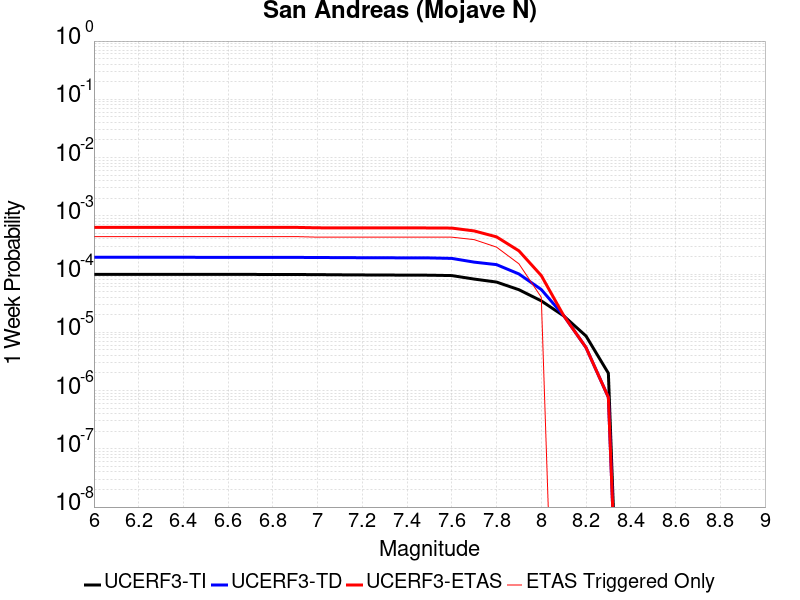 |  |  | 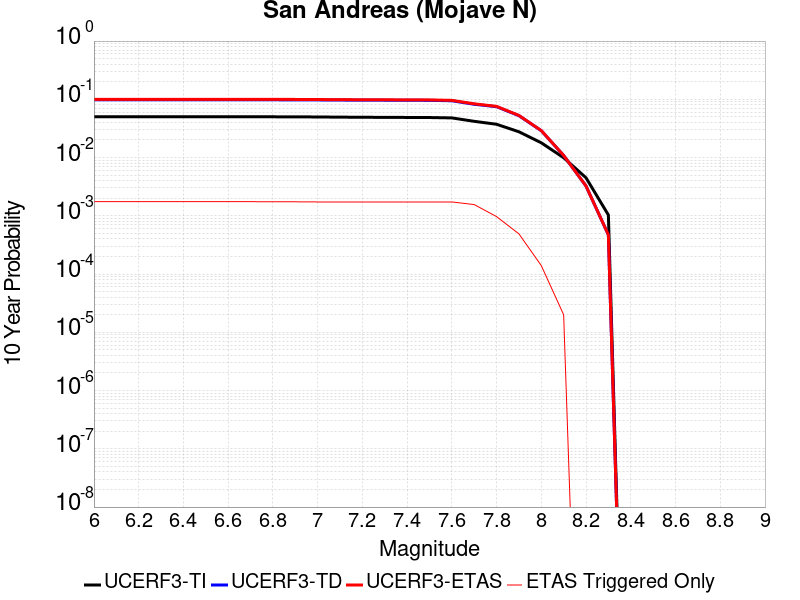 |

| Magnitude | 1 wk TI Prob | 1 wk TD Prob | 1 wk ETAS Prob | 1 wk ETAS/TD Gain | 1 wk ETAS Triggered Only | 1 mo TI Prob | 1 mo TD Prob | 1 mo ETAS Prob | 1 mo ETAS/TD Gain | 1 mo ETAS Triggered Only | 1 yr TI Prob | 1 yr TD Prob | 1 yr ETAS Prob | 1 yr ETAS/TD Gain | 1 yr ETAS Triggered Only | 10 yr TI Prob | 10 yr TD Prob | 10 yr ETAS Prob | 10 yr ETAS/TD Gain | 10 yr ETAS Triggered Only |
|-----|-----|-----|-----|-----|-----|-----|-----|-----|-----|-----|-----|-----|-----|-----|-----|-----|-----|-----|-----|-----|
| 6.0 | 9.877682E-5 | 1.9402859E-4 | 6.339432E-4 | 3.2672672 | 4.4E-4 | 4.2326056E-4 | 8.3128625E-4 | 0.0015806628 | 1.9014663 | 7.5E-4 | 0.0051410277 | 0.01007407 | 0.01128178 | 1.119883 | 0.00122 | 0.05023708 | 0.098324716 | 0.099902645 | 1.0160482 | 0.00175 |
| 6.1 | 9.877682E-5 | 1.9402859E-4 | 6.339432E-4 | 3.2672672 | 4.4E-4 | 4.2326056E-4 | 8.3128625E-4 | 0.0015806628 | 1.9014663 | 7.5E-4 | 0.0051410277 | 0.01007407 | 0.01128178 | 1.119883 | 0.00122 | 0.05023708 | 0.098324716 | 0.099902645 | 1.0160482 | 0.00175 |
| 6.2 | 9.877682E-5 | 1.9402859E-4 | 6.339432E-4 | 3.2672672 | 4.4E-4 | 4.2326056E-4 | 8.3128625E-4 | 0.0015806628 | 1.9014663 | 7.5E-4 | 0.0051410277 | 0.01007407 | 0.01128178 | 1.119883 | 0.00122 | 0.05023708 | 0.098324716 | 0.099902645 | 1.0160482 | 0.00175 |
| 6.3 | 9.877682E-5 | 1.9402859E-4 | 6.339432E-4 | 3.2672672 | 4.4E-4 | 4.2326056E-4 | 8.3128625E-4 | 0.0015806628 | 1.9014663 | 7.5E-4 | 0.0051410277 | 0.01007407 | 0.01128178 | 1.119883 | 0.00122 | 0.05023708 | 0.098324716 | 0.099902645 | 1.0160482 | 0.00175 |
| 6.4 | 9.877682E-5 | 1.9402859E-4 | 6.339432E-4 | 3.2672672 | 4.4E-4 | 4.2326056E-4 | 8.3128625E-4 | 0.0015806628 | 1.9014663 | 7.5E-4 | 0.0051410277 | 0.01007407 | 0.01128178 | 1.119883 | 0.00122 | 0.05023708 | 0.098324716 | 0.099902645 | 1.0160482 | 0.00175 |
| 6.5 | 9.861474E-5 | 1.9376622E-4 | 6.3368096E-4 | 3.2703376 | 4.4E-4 | 4.2256617E-4 | 8.3016255E-4 | 0.00157954 | 1.9026875 | 7.5E-4 | 0.0051326132 | 0.010060515 | 0.011268241 | 1.1200461 | 0.00122 | 0.050156746 | 0.0982026 | 0.09978075 | 1.0160702 | 0.00175 |
| 6.6 | 9.861474E-5 | 1.9376622E-4 | 6.3368096E-4 | 3.2703376 | 4.4E-4 | 4.2256617E-4 | 8.3016255E-4 | 0.00157954 | 1.9026875 | 7.5E-4 | 0.0051326132 | 0.010060515 | 0.011268241 | 1.1200461 | 0.00122 | 0.050156746 | 0.0982026 | 0.09978075 | 1.0160702 | 0.00175 |
| 6.7 | 9.8552715E-5 | 1.9366575E-4 | 6.3358055E-4 | 3.2715156 | 4.4E-4 | 4.223004E-4 | 8.297322E-4 | 0.0015791099 | 1.903156 | 7.5E-4 | 0.0051293927 | 0.010055325 | 0.011263058 | 1.1201087 | 0.00122 | 0.050125998 | 0.09815582 | 0.099734046 | 1.0160788 | 0.00175 |
| 6.8 | 9.8464974E-5 | 1.9351736E-4 | 6.3343224E-4 | 3.2732577 | 4.4E-4 | 4.219245E-4 | 8.290967E-4 | 0.0015784749 | 1.903849 | 7.5E-4 | 0.0051248376 | 0.010047658 | 0.0112554 | 1.1202013 | 0.00122 | 0.05008251 | 0.09808604 | 0.09965537 | 1.0159996 | 0.00174 |
| 6.9 | 9.825824E-5 | 1.9319744E-4 | 6.3311245E-4 | 3.2770228 | 4.4E-4 | 4.2103877E-4 | 8.2772644E-4 | 0.0015771057 | 1.9053464 | 7.5E-4 | 0.0051141046 | 0.010031129 | 0.011238892 | 1.1204014 | 0.00122 | 0.049980022 | 0.09793523 | 0.09950482 | 1.0160269 | 0.00174 |
| 7.0 | 9.781462E-5 | 1.9251107E-4 | 6.224283E-4 | 3.2332077 | 4.3E-4 | 4.1913814E-4 | 8.247868E-4 | 0.0015641764 | 1.8964616 | 7.4E-4 | 0.005091073 | 0.009995668 | 0.0111935735 | 1.1198424 | 0.00121 | 0.04976007 | 0.09761144 | 0.09917258 | 1.0159934 | 0.00173 |
| 7.1 | 9.7121134E-5 | 1.9152813E-4 | 6.2144577E-4 | 3.2446709 | 4.3E-4 | 4.1616702E-4 | 8.2057685E-4 | 0.0015599696 | 1.9010646 | 7.4E-4 | 0.005055068 | 0.009944881 | 0.011142848 | 1.1204606 | 0.00121 | 0.04941613 | 0.09714808 | 0.098710015 | 1.0160779 | 0.00173 |
| 7.2 | 9.663819E-5 | 1.9083597E-4 | 6.207539E-4 | 3.2528138 | 4.3E-4 | 4.1409794E-4 | 8.176123E-4 | 0.0015570073 | 1.9043344 | 7.4E-4 | 0.0050299936 | 0.009909117 | 0.011107126 | 1.1208998 | 0.00121 | 0.049176537 | 0.0968212 | 0.0983837 | 1.016138 | 0.00173 |
| 7.3 | 9.6277574E-5 | 1.9036105E-4 | 6.2027917E-4 | 3.2584355 | 4.3E-4 | 4.125529E-4 | 8.155782E-4 | 0.0015549747 | 1.9065918 | 7.4E-4 | 0.0050112694 | 0.009884576 | 0.011082616 | 1.121203 | 0.00121 | 0.04899759 | 0.096594654 | 0.09815755 | 1.0161799 | 0.00173 |
| 7.4 | 9.593308E-5 | 1.897589E-4 | 6.196773E-4 | 3.2656033 | 4.3E-4 | 4.1107697E-4 | 8.1299915E-4 | 0.0015523975 | 1.9094701 | 7.4E-4 | 0.0049933824 | 0.009853461 | 0.011051538 | 1.1215895 | 0.00121 | 0.04882661 | 0.09631222 | 0.0978756 | 1.0162324 | 0.00173 |
| 7.5 | 9.561707E-5 | 1.8921963E-4 | 6.191383E-4 | 3.2720613 | 4.3E-4 | 4.0972308E-4 | 8.1068947E-4 | 0.0015500896 | 1.9120632 | 7.4E-4 | 0.0049769743 | 0.009825595 | 0.011023706 | 1.1219378 | 0.00121 | 0.048669744 | 0.09605859 | 0.09762241 | 1.0162798 | 0.00173 |
| 7.6 | 9.418194E-5 | 1.857422E-4 | 6.156623E-4 | 3.3146067 | 4.3E-4 | 4.0357444E-4 | 7.9579535E-4 | 0.0015352065 | 1.9291474 | 7.4E-4 | 0.004902454 | 0.009645878 | 0.010844206 | 1.1242322 | 0.00121 | 0.047957025 | 0.0944398 | 0.096006416 | 1.0165886 | 0.00173 |
| 7.7 | 8.202141E-5 | 1.6023142E-4 | 5.501689E-4 | 3.4335897 | 3.9E-4 | 3.51473E-4 | 6.8652537E-4 | 0.0013360791 | 1.9461467 | 6.5E-4 | 0.00427079 | 0.00832647 | 0.0093776435 | 1.1262449 | 0.00106 | 0.04189639 | 0.082241096 | 0.0836728 | 1.0174086 | 0.00156 |
| 7.8 | 7.2859846E-5 | 1.4518172E-4 | 4.3513963E-4 | 2.9972067 | 2.9E-4 | 3.1221908E-4 | 6.2205904E-4 | 0.0010617854 | 1.7068883 | 4.4E-4 | 0.003794643 | 0.0075473106 | 0.008192405 | 1.0854734 | 6.5E-4 | 0.037304975 | 0.074730806 | 0.07562832 | 1.01201 | 9.7E-4 |
| 7.9 | 5.3874453E-5 | 1.00467245E-4 | 2.5045217E-4 | 2.492874 | 1.5E-4 | 2.3087008E-4 | 4.3050284E-4 | 6.4041244E-4 | 1.4875916 | 2.1E-4 | 0.0028072202 | 0.005228787 | 0.005576957 | 1.0665871 | 3.5E-4 | 0.02772022 | 0.05242784 | 0.05289215 | 1.0088562 | 4.9E-4 |
| 8.0 | 3.468538E-5 | 5.426422E-5 | 9.4262046E-5 | 1.7370939 | 4.0E-5 | 1.4864317E-4 | 2.3254022E-4 | 2.825286E-4 | 1.2149665 | 5.0E-5 | 0.0018082283 | 0.0028275033 | 0.0029272207 | 1.0352669 | 1.0E-4 | 0.017935853 | 0.028949518 | 0.029085465 | 1.004696 | 1.4E-4 |
| 8.1 | 1.9152367E-5 | 1.9402538E-5 | 1.9402538E-5 | 1.0 | 0.0 | 8.207899E-5 | 8.3151084E-5 | 8.3151084E-5 | 1.0 | 0.0 | 9.988535E-4 | 0.0010118949 | 0.0010218848 | 1.0098724 | 1.0E-5 | 0.009943757 | 0.010856433 | 0.010876216 | 1.0018222 | 2.0E-5 |
| 8.2 | 8.643924E-6 | 5.474112E-6 | 5.474112E-6 | 1.0 | 0.0 | 3.704486E-5 | 2.3460268E-5 | 2.3460268E-5 | 1.0 | 0.0 | 4.5092785E-4 | 2.8559144E-4 | 2.8559144E-4 | 1.0 | 0.0 | 0.0045001395 | 0.0032484592 | 0.0032484592 | 1.0 | 0.0 |
| 8.3 | 1.983087E-6 | 7.65717E-7 | 7.65717E-7 | 1.0 | 0.0 | 8.498917E-6 | 3.2816401E-6 | 3.2816401E-6 | 1.0 | 0.0 | 1.034694E-4 | 3.9953255E-5 | 3.9953255E-5 | 1.0 | 0.0 | 0.0010342124 | 4.7185255E-4 | 4.7185255E-4 | 1.0 | 0.0 |

## Towne Pass
*[(top)](#table-of-contents)*

| 1 Week | 1 Month | 1 Year | 10 Year |
|-----|-----|-----|-----|
|  |  | 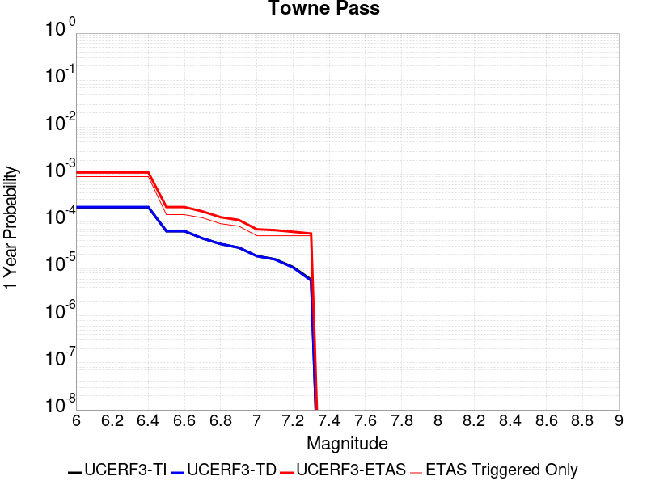 |  |

| Magnitude | 1 wk TI Prob | 1 wk TD Prob | 1 wk ETAS Prob | 1 wk ETAS/TD Gain | 1 wk ETAS Triggered Only | 1 mo TI Prob | 1 mo TD Prob | 1 mo ETAS Prob | 1 mo ETAS/TD Gain | 1 mo ETAS Triggered Only | 1 yr TI Prob | 1 yr TD Prob | 1 yr ETAS Prob | 1 yr ETAS/TD Gain | 1 yr ETAS Triggered Only | 10 yr TI Prob | 10 yr TD Prob | 10 yr ETAS Prob | 10 yr ETAS/TD Gain | 10 yr ETAS Triggered Only |
|-----|-----|-----|-----|-----|-----|-----|-----|-----|-----|-----|-----|-----|-----|-----|-----|-----|-----|-----|-----|-----|
| 6.0 | 3.849728E-6 | 3.8945427E-6 | 1.6389391E-4 | 42.08297 | 1.6E-4 | 1.649873E-5 | 1.6690814E-5 | 3.9668448E-4 | 23.766634 | 3.8E-4 | 2.0085352E-4 | 2.0319609E-4 | 0.0011030132 | 5.428319 | 9.0E-4 | 0.0020067208 | 0.002030532 | 0.0035474456 | 1.7470523 | 0.00152 |
| 6.1 | 3.849728E-6 | 3.8945427E-6 | 1.6389391E-4 | 42.08297 | 1.6E-4 | 1.649873E-5 | 1.6690814E-5 | 3.9668448E-4 | 23.766634 | 3.8E-4 | 2.0085352E-4 | 2.0319609E-4 | 0.0011030132 | 5.428319 | 9.0E-4 | 0.0020067208 | 0.002030532 | 0.0035474456 | 1.7470523 | 0.00152 |
| 6.2 | 3.849728E-6 | 3.8945427E-6 | 1.6389391E-4 | 42.08297 | 1.6E-4 | 1.649873E-5 | 1.6690814E-5 | 3.9668448E-4 | 23.766634 | 3.8E-4 | 2.0085352E-4 | 2.0319609E-4 | 0.0011030132 | 5.428319 | 9.0E-4 | 0.0020067208 | 0.002030532 | 0.0035474456 | 1.7470523 | 0.00152 |
| 6.3 | 3.849728E-6 | 3.8945427E-6 | 1.6389391E-4 | 42.08297 | 1.6E-4 | 1.649873E-5 | 1.6690814E-5 | 3.9668448E-4 | 23.766634 | 3.8E-4 | 2.0085352E-4 | 2.0319609E-4 | 0.0011030132 | 5.428319 | 9.0E-4 | 0.0020067208 | 0.002030532 | 0.0035474456 | 1.7470523 | 0.00152 |
| 6.4 | 3.849728E-6 | 3.8945427E-6 | 1.6389391E-4 | 42.08297 | 1.6E-4 | 1.649873E-5 | 1.6690814E-5 | 3.9668448E-4 | 23.766634 | 3.8E-4 | 2.0085352E-4 | 2.0319609E-4 | 0.0011030132 | 5.428319 | 9.0E-4 | 0.0020067208 | 0.002030532 | 0.0035474456 | 1.7470523 | 0.00152 |
| 6.5 | 1.1953545E-6 | 1.2030528E-6 | 3.1203017E-5 | 25.936531 | 3.0E-5 | 5.1229376E-6 | 5.155931E-6 | 5.5155673E-5 | 10.697519 | 5.0E-5 | 6.236998E-5 | 6.277177E-5 | 2.0276298E-4 | 3.230162 | 1.4E-4 | 6.235248E-4 | 6.275521E-4 | 9.073764E-4 | 1.445898 | 2.8E-4 |
| 6.6 | 1.1953545E-6 | 1.2030528E-6 | 3.1203017E-5 | 25.936531 | 3.0E-5 | 5.1229376E-6 | 5.155931E-6 | 5.5155673E-5 | 10.697519 | 5.0E-5 | 6.236998E-5 | 6.277177E-5 | 2.0276298E-4 | 3.230162 | 1.4E-4 | 6.235248E-4 | 6.275521E-4 | 9.073764E-4 | 1.445898 | 2.8E-4 |
| 6.7 | 8.375951E-7 | 8.4106773E-7 | 3.084104E-5 | 36.668915 | 3.0E-5 | 3.5896885E-6 | 3.6045715E-6 | 4.360443E-5 | 12.09698 | 4.0E-5 | 4.370358E-5 | 4.3884833E-5 | 1.6387957E-4 | 3.73431 | 1.2E-4 | 4.3694986E-4 | 4.3876737E-4 | 6.5867085E-4 | 1.5011847 | 2.2E-4 |
| 6.8 | 6.38041E-7 | 6.392163E-7 | 3.0639196E-5 | 47.932438 | 3.0E-5 | 2.7344586E-6 | 2.7394958E-6 | 4.2739386E-5 | 15.601187 | 4.0E-5 | 3.3291526E-5 | 3.335289E-5 | 1.2334989E-4 | 3.6983268 | 9.0E-5 | 3.3286537E-4 | 3.3348266E-4 | 4.934293E-4 | 1.4796251 | 1.6E-4 |
| 6.9 | 5.3460053E-7 | 5.3453397E-7 | 2.0534524E-5 | 38.41575 | 2.0E-5 | 2.2911431E-6 | 2.290858E-6 | 3.229079E-5 | 14.0955 | 3.0E-5 | 2.789431E-5 | 2.7890874E-5 | 1.0788864E-4 | 3.8682418 | 8.0E-5 | 2.789081E-4 | 2.7887707E-4 | 4.088408E-4 | 1.4660252 | 1.3E-4 |
| 7.0 | 3.557783E-7 | 3.5324288E-7 | 1.0353239E-5 | 29.309122 | 1.0E-5 | 1.5247632E-6 | 1.5138972E-6 | 2.1513866E-5 | 14.210916 | 2.0E-5 | 1.8563835E-5 | 1.8431552E-5 | 6.843063E-5 | 3.7126894 | 5.0E-5 | 1.8562283E-4 | 1.8430108E-4 | 2.6428633E-4 | 1.4339924 | 8.0E-5 |
| 7.1 | 3.037942E-7 | 3.000228E-7 | 1.030002E-5 | 34.33079 | 1.0E-5 | 1.3019744E-6 | 1.2858114E-6 | 2.1285785E-5 | 16.554361 | 2.0E-5 | 1.5851423E-5 | 1.5654648E-5 | 6.565387E-5 | 4.193889 | 5.0E-5 | 1.5850292E-4 | 1.5653622E-4 | 2.2652526E-4 | 1.4471109 | 7.0E-5 |
| 7.2 | 2.0808248E-7 | 2.0217736E-7 | 1.0202175E-5 | 50.461514 | 1.0E-5 | 8.917818E-7 | 8.664741E-7 | 2.0866457E-5 | 24.082031 | 2.0E-5 | 1.0857389E-5 | 1.0549276E-5 | 6.0548748E-5 | 5.7396116 | 5.0E-5 | 1.0856859E-4 | 1.05488216E-4 | 1.6548189E-4 | 1.5687239 | 6.0E-5 |
| 7.3 | 1.1162073E-7 | 1.0636902E-7 | 1.0106368E-5 | 95.01232 | 1.0E-5 | 4.7837443E-7 | 4.5586717E-7 | 2.0455858E-5 | 44.87241 | 2.0E-5 | 5.8241935E-6 | 5.5501705E-6 | 5.5549892E-5 | 10.008682 | 5.0E-5 | 5.8240406E-5 | 5.550052E-5 | 1.1549719E-4 | 2.0810108 | 6.0E-5 |

## Paradise
*[(top)](#table-of-contents)*

| 1 Week | 1 Month | 1 Year | 10 Year |
|-----|-----|-----|-----|
|  |  |  |  |

| Magnitude | 1 wk TI Prob | 1 wk TD Prob | 1 wk ETAS Prob | 1 wk ETAS/TD Gain | 1 wk ETAS Triggered Only | 1 mo TI Prob | 1 mo TD Prob | 1 mo ETAS Prob | 1 mo ETAS/TD Gain | 1 mo ETAS Triggered Only | 1 yr TI Prob | 1 yr TD Prob | 1 yr ETAS Prob | 1 yr ETAS/TD Gain | 1 yr ETAS Triggered Only | 10 yr TI Prob | 10 yr TD Prob | 10 yr ETAS Prob | 10 yr ETAS/TD Gain | 10 yr ETAS Triggered Only |
|-----|-----|-----|-----|-----|-----|-----|-----|-----|-----|-----|-----|-----|-----|-----|-----|-----|-----|-----|-----|-----|
| 6.0 | 1.4851273E-5 | 1.6694783E-5 | 1.9669178E-4 | 11.781631 | 1.8E-4 | 6.364676E-5 | 7.1547234E-5 | 4.3152148E-4 | 6.031281 | 3.6E-4 | 7.7462377E-4 | 8.707631E-4 | 0.00162011 | 1.8605635 | 7.5E-4 | 0.0077192914 | 0.008675891 | 0.009944786 | 1.1462553 | 0.00128 |
| 6.1 | 1.4851273E-5 | 1.6694783E-5 | 1.9669178E-4 | 11.781631 | 1.8E-4 | 6.364676E-5 | 7.1547234E-5 | 4.3152148E-4 | 6.031281 | 3.6E-4 | 7.7462377E-4 | 8.707631E-4 | 0.00162011 | 1.8605635 | 7.5E-4 | 0.0077192914 | 0.008675891 | 0.009944786 | 1.1462553 | 0.00128 |
| 6.2 | 1.4851273E-5 | 1.6694783E-5 | 1.9669178E-4 | 11.781631 | 1.8E-4 | 6.364676E-5 | 7.1547234E-5 | 4.3152148E-4 | 6.031281 | 3.6E-4 | 7.7462377E-4 | 8.707631E-4 | 0.00162011 | 1.8605635 | 7.5E-4 | 0.0077192914 | 0.008675891 | 0.009944786 | 1.1462553 | 0.00128 |
| 6.3 | 1.0426831E-5 | 1.1888706E-5 | 1.11887515E-4 | 9.411244 | 1.0E-4 | 4.4685654E-5 | 5.0950635E-5 | 2.8093893E-4 | 5.513943 | 2.3E-4 | 5.43912E-4 | 6.201534E-4 | 0.0010099115 | 1.6284868 | 3.9E-4 | 0.0054258266 | 0.006184836 | 0.0068308157 | 1.1044457 | 6.5E-4 |
| 6.4 | 1.0426831E-5 | 1.1888706E-5 | 1.11887515E-4 | 9.411244 | 1.0E-4 | 4.4685654E-5 | 5.0950635E-5 | 2.8093893E-4 | 5.513943 | 2.3E-4 | 5.43912E-4 | 6.201534E-4 | 0.0010099115 | 1.6284868 | 3.9E-4 | 0.0054258266 | 0.006184836 | 0.0068308157 | 1.1044457 | 6.5E-4 |
| 6.5 | 9.25027E-6 | 1.0620044E-5 | 1.1061898E-4 | 10.416057 | 1.0E-4 | 3.964341E-5 | 4.551371E-5 | 2.455046E-4 | 5.3940806 | 2.0E-4 | 4.8255164E-4 | 5.539934E-4 | 8.9380506E-4 | 1.6133857 | 3.4E-4 | 0.0048150513 | 0.005526623 | 0.0060735834 | 1.0989683 | 5.5E-4 |
| 6.6 | 7.904275E-6 | 9.1596075E-6 | 6.915906E-5 | 7.550439 | 6.0E-5 | 3.3875025E-5 | 3.9254894E-5 | 1.5925018E-4 | 4.0568237 | 1.2E-4 | 4.1235037E-4 | 4.7782745E-4 | 6.677367E-4 | 1.397443 | 1.9E-4 | 0.0041158604 | 0.0047683977 | 0.005076919 | 1.0647013 | 3.1E-4 |
| 6.7 | 7.2061953E-6 | 8.407331E-6 | 5.840691E-5 | 6.9471407 | 5.0E-5 | 3.088333E-5 | 3.603094E-5 | 1.0602842E-4 | 2.9427047 | 7.0E-5 | 3.7593965E-4 | 4.3859208E-4 | 5.585394E-4 | 1.2734828 | 1.2E-4 | 0.003753043 | 0.004377634 | 0.0045668017 | 1.0432124 | 1.9E-4 |
| 6.8 | 6.6948724E-6 | 7.842246E-6 | 3.784201E-5 | 4.8254046 | 3.0E-5 | 2.8691995E-5 | 3.3609213E-5 | 7.3607865E-5 | 2.1901097 | 4.0E-5 | 3.4926904E-4 | 4.0911892E-4 | 4.890862E-4 | 1.1954622 | 8.0E-5 | 0.003487206 | 0.004084015 | 0.004213484 | 1.0317014 | 1.3E-4 |
| 6.9 | 6.0421025E-6 | 7.1307E-6 | 2.7130558E-5 | 3.8047538 | 2.0E-5 | 2.5894467E-5 | 3.0559804E-5 | 5.0559192E-5 | 1.6544344 | 2.0E-5 | 3.1521954E-4 | 3.7200548E-4 | 4.119906E-4 | 1.1074853 | 4.0E-5 | 0.0031477278 | 0.0037141659 | 0.0038038315 | 1.0241416 | 9.0E-5 |
| 7.0 | 4.134091E-6 | 5.0803847E-6 | 1.50803335E-5 | 2.968345 | 1.0E-5 | 1.7717413E-5 | 2.1772903E-5 | 3.1772684E-5 | 1.4592764 | 1.0E-5 | 2.1568815E-4 | 2.650544E-4 | 2.850491E-4 | 1.0754362 | 2.0E-5 | 0.0021547892 | 0.0026475359 | 0.0026974033 | 1.0188355 | 5.0E-5 |
| 7.1 | 3.7674888E-6 | 4.631938E-6 | 1.4631892E-5 | 3.1589136 | 1.0E-5 | 1.6146281E-5 | 1.985102E-5 | 2.9850822E-5 | 1.5037425 | 1.0E-5 | 1.9656324E-4 | 2.4166089E-4 | 2.6165607E-4 | 1.0827405 | 2.0E-5 | 0.0019638946 | 0.0024141315 | 0.0024640108 | 1.0206614 | 5.0E-5 |
| 7.2 | 3.4065345E-6 | 4.1567837E-6 | 1.41567425E-5 | 3.4056962 | 1.0E-5 | 1.4599351E-5 | 1.7814675E-5 | 2.7814496E-5 | 1.561325 | 1.0E-5 | 1.777326E-4 | 2.1687358E-4 | 2.3686924E-4 | 1.0921997 | 2.0E-5 | 0.0017759053 | 0.0021667676 | 0.0022166593 | 1.0230259 | 5.0E-5 |
| 7.3 | 2.9934936E-6 | 3.6293688E-6 | 3.6293688E-6 | 1.0 | 0.0 | 1.2829195E-5 | 1.5554353E-5 | 1.5554353E-5 | 1.0 | 0.0 | 1.5618425E-4 | 1.8935927E-4 | 1.9935738E-4 | 1.0527997 | 1.0E-5 | 0.0015607453 | 0.0018921247 | 0.0019220678 | 1.0158252 | 3.0E-5 |
| 7.4 | 2.4049796E-6 | 2.8890192E-6 | 2.8890192E-6 | 1.0 | 0.0 | 1.0307015E-5 | 1.2381461E-5 | 1.2381461E-5 | 1.0 | 0.0 | 1.2548068E-4 | 1.5073529E-4 | 1.6073379E-4 | 1.0663315 | 1.0E-5 | 0.0012540985 | 0.001506472 | 0.0015264418 | 1.0132561 | 2.0E-5 |
| 7.5 | 1.2710091E-6 | 1.513486E-6 | 1.513486E-6 | 1.0 | 0.0 | 5.44717E-6 | 6.4863593E-6 | 6.4863593E-6 | 1.0 | 0.0 | 6.631728E-5 | 7.896982E-5 | 8.896903E-5 | 1.1266207 | 1.0E-5 | 6.6297496E-4 | 7.895402E-4 | 7.995323E-4 | 1.0126556 | 1.0E-5 |
| 7.6 | 2.21172E-7 | 2.6040198E-7 | 2.6040198E-7 | 1.0 | 0.0 | 9.478797E-7 | 1.1160082E-6 | 1.1160082E-6 | 1.0 | 0.0 | 1.1540374E-5 | 1.3587343E-5 | 1.3587343E-5 | 1.0 | 0.0 | 1.1539775E-4 | 1.3586794E-4 | 1.3586794E-4 | 1.0 | 0.0 |

## Bicycle Lake
*[(top)](#table-of-contents)*

| 1 Week | 1 Month | 1 Year | 10 Year |
|-----|-----|-----|-----|
|  |  |  | 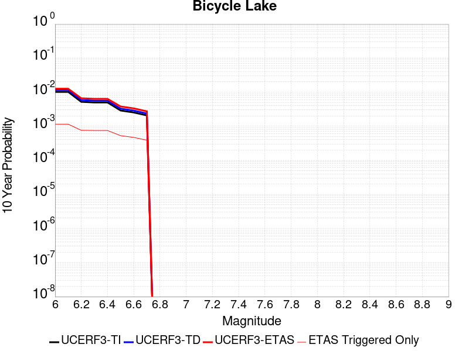 |

| Magnitude | 1 wk TI Prob | 1 wk TD Prob | 1 wk ETAS Prob | 1 wk ETAS/TD Gain | 1 wk ETAS Triggered Only | 1 mo TI Prob | 1 mo TD Prob | 1 mo ETAS Prob | 1 mo ETAS/TD Gain | 1 mo ETAS Triggered Only | 1 yr TI Prob | 1 yr TD Prob | 1 yr ETAS Prob | 1 yr ETAS/TD Gain | 1 yr ETAS Triggered Only | 10 yr TI Prob | 10 yr TD Prob | 10 yr ETAS Prob | 10 yr ETAS/TD Gain | 10 yr ETAS Triggered Only |
|-----|-----|-----|-----|-----|-----|-----|-----|-----|-----|-----|-----|-----|-----|-----|-----|-----|-----|-----|-----|-----|
| 6.0 | 1.9621975E-5 | 2.2097112E-5 | 1.5209425E-4 | 6.882992 | 1.3E-4 | 8.4091465E-5 | 9.469924E-5 | 4.1466893E-4 | 4.3787994 | 3.2E-4 | 0.0010233327 | 0.0011524883 | 0.0018017392 | 1.563347 | 6.5E-4 | 0.01018633 | 0.011478426 | 0.012615226 | 1.099038 | 0.00115 |
| 6.1 | 1.9621975E-5 | 2.2097112E-5 | 1.5209425E-4 | 6.882992 | 1.3E-4 | 8.4091465E-5 | 9.469924E-5 | 4.1466893E-4 | 4.3787994 | 3.2E-4 | 0.0010233327 | 0.0011524883 | 0.0018017392 | 1.563347 | 6.5E-4 | 0.01018633 | 0.011478426 | 0.012615226 | 1.099038 | 0.00115 |
| 6.2 | 9.9971285E-6 | 1.1255657E-5 | 1.1125453E-4 | 9.884321 | 1.0E-4 | 4.2844134E-5 | 4.8237933E-5 | 2.3822876E-4 | 4.938619 | 1.9E-4 | 5.2150246E-4 | 5.8719056E-4 | 0.001006944 | 1.7148503 | 4.2E-4 | 0.0052028033 | 0.0058614956 | 0.006617041 | 1.1288997 | 7.6E-4 |
| 6.3 | 9.589428E-6 | 1.0798363E-5 | 1.10797286E-4 | 10.260563 | 1.0E-4 | 4.10969E-5 | 4.627817E-5 | 2.3626938E-4 | 5.1054173 | 1.9E-4 | 5.002399E-4 | 5.6334294E-4 | 9.831063E-4 | 1.7451295 | 4.2E-4 | 0.0049911533 | 0.0056242384 | 0.00637002 | 1.1326014 | 7.5E-4 |
| 6.4 | 9.589428E-6 | 1.0798363E-5 | 1.10797286E-4 | 10.260563 | 1.0E-4 | 4.10969E-5 | 4.627817E-5 | 2.3626938E-4 | 5.1054173 | 1.9E-4 | 5.002399E-4 | 5.6334294E-4 | 9.831063E-4 | 1.7451295 | 4.2E-4 | 0.0049911533 | 0.0056242384 | 0.00637002 | 1.1326014 | 7.5E-4 |
| 6.5 | 5.557707E-6 | 6.2856116E-6 | 9.6285046E-5 | 15.318325 | 9.0E-5 | 2.3818526E-5 | 2.6938209E-5 | 1.869339E-4 | 6.9393587 | 1.6E-4 | 2.8995197E-4 | 3.2795023E-4 | 6.5784197E-4 | 2.0059202 | 3.3E-4 | 0.0028957394 | 0.0032772988 | 0.0038055617 | 1.1611886 | 5.3E-4 |
| 6.6 | 4.8742945E-6 | 5.5132987E-6 | 8.551286E-5 | 15.510289 | 8.0E-5 | 2.0889667E-5 | 2.3628356E-5 | 1.6362505E-4 | 6.924944 | 1.4E-4 | 2.54302E-4 | 2.8766345E-4 | 5.875772E-4 | 2.0425854 | 3.0E-4 | 0.002540112 | 0.0028754799 | 0.0033441284 | 1.162981 | 4.7E-4 |
| 6.7 | 3.991108E-6 | 4.5159177E-6 | 7.45156E-5 | 16.500656 | 7.0E-5 | 1.7104636E-5 | 1.9353933E-5 | 1.4935141E-4 | 7.716851 | 1.3E-4 | 2.0822904E-4 | 2.3563413E-4 | 5.255658E-4 | 2.2304316 | 2.9E-4 | 0.0020803404 | 0.0023563413 | 0.0027454223 | 1.1651208 | 3.9E-4 |

## Garlic Springs
*[(top)](#table-of-contents)*

| 1 Week | 1 Month | 1 Year | 10 Year |
|-----|-----|-----|-----|
| 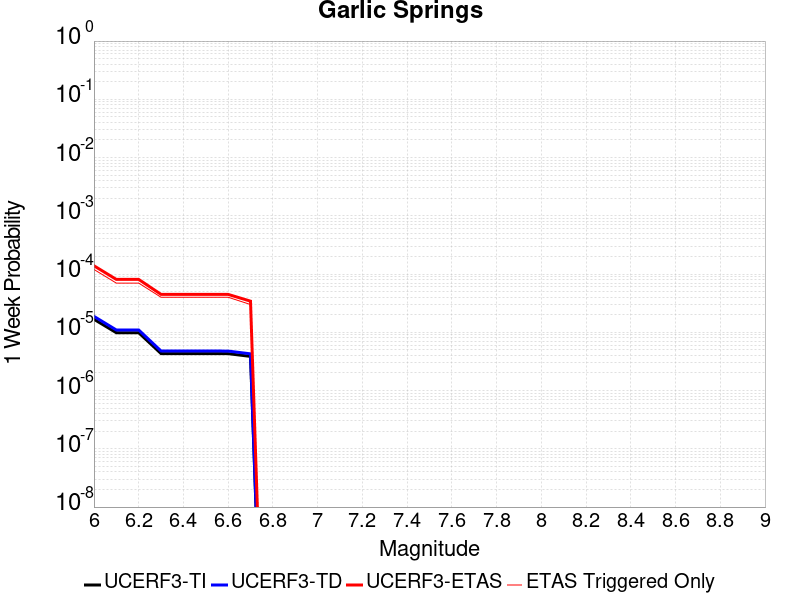 |  |  |  |

| Magnitude | 1 wk TI Prob | 1 wk TD Prob | 1 wk ETAS Prob | 1 wk ETAS/TD Gain | 1 wk ETAS Triggered Only | 1 mo TI Prob | 1 mo TD Prob | 1 mo ETAS Prob | 1 mo ETAS/TD Gain | 1 mo ETAS Triggered Only | 1 yr TI Prob | 1 yr TD Prob | 1 yr ETAS Prob | 1 yr ETAS/TD Gain | 1 yr ETAS Triggered Only | 10 yr TI Prob | 10 yr TD Prob | 10 yr ETAS Prob | 10 yr ETAS/TD Gain | 10 yr ETAS Triggered Only |
|-----|-----|-----|-----|-----|-----|-----|-----|-----|-----|-----|-----|-----|-----|-----|-----|-----|-----|-----|-----|-----|
| 6.0 | 1.6760017E-5 | 1.877686E-5 | 1.387746E-4 | 7.3907247 | 1.2E-4 | 7.182667E-5 | 8.047044E-5 | 3.904455E-4 | 4.8520365 | 3.1E-4 | 8.7413884E-4 | 9.794047E-4 | 0.001578817 | 1.612017 | 6.0E-4 | 0.008707083 | 0.009762428 | 0.010762568 | 1.1024479 | 0.00101 |
| 6.1 | 9.852767E-6 | 1.0973602E-5 | 8.097284E-5 | 7.3788743 | 7.0E-5 | 4.222546E-5 | 4.7029276E-5 | 2.270208E-4 | 4.8272233 | 1.8E-4 | 5.139737E-4 | 5.72502E-4 | 9.422902E-4 | 1.645916 | 3.7E-4 | 0.005127866 | 0.0057172296 | 0.0063237417 | 1.1060851 | 6.1E-4 |
| 6.2 | 9.852767E-6 | 1.0973602E-5 | 8.097284E-5 | 7.3788743 | 7.0E-5 | 4.222546E-5 | 4.7029276E-5 | 2.270208E-4 | 4.8272233 | 1.8E-4 | 5.139737E-4 | 5.72502E-4 | 9.422902E-4 | 1.645916 | 3.7E-4 | 0.005127866 | 0.0057172296 | 0.0063237417 | 1.1060851 | 6.1E-4 |
| 6.3 | 4.3167724E-6 | 4.778035E-6 | 4.4777844E-5 | 9.371602 | 4.0E-5 | 1.8500323E-5 | 2.0477262E-5 | 1.30475E-4 | 6.371702 | 1.1E-4 | 2.2521814E-4 | 2.4930516E-4 | 4.392578E-4 | 1.7619282 | 1.9E-4 | 0.0022499003 | 0.0024925133 | 0.0027817904 | 1.1160585 | 2.9E-4 |
| 6.4 | 4.3167724E-6 | 4.778035E-6 | 4.4777844E-5 | 9.371602 | 4.0E-5 | 1.8500323E-5 | 2.0477262E-5 | 1.30475E-4 | 6.371702 | 1.1E-4 | 2.2521814E-4 | 2.4930516E-4 | 4.392578E-4 | 1.7619282 | 1.9E-4 | 0.0022499003 | 0.0024925133 | 0.0027817904 | 1.1160585 | 2.9E-4 |
| 6.5 | 4.3167724E-6 | 4.778035E-6 | 4.4777844E-5 | 9.371602 | 4.0E-5 | 1.8500323E-5 | 2.0477262E-5 | 1.30475E-4 | 6.371702 | 1.1E-4 | 2.2521814E-4 | 2.4930516E-4 | 4.392578E-4 | 1.7619282 | 1.9E-4 | 0.0022499003 | 0.0024925133 | 0.0027817904 | 1.1160585 | 2.9E-4 |
| 6.6 | 4.301311E-6 | 4.7609033E-6 | 4.4760713E-5 | 9.401727 | 4.0E-5 | 1.8434059E-5 | 2.0403842E-5 | 1.304016E-4 | 6.3910317 | 1.1E-4 | 2.2441156E-4 | 2.484115E-4 | 4.3836428E-4 | 1.76467 | 1.9E-4 | 0.0022418506 | 0.0024835963 | 0.002772876 | 1.1164762 | 2.9E-4 |
| 6.7 | 3.8599724E-6 | 4.2710653E-6 | 3.427094E-5 | 8.023978 | 3.0E-5 | 1.6542634E-5 | 1.8304567E-5 | 1.0830292E-4 | 5.916716 | 9.0E-5 | 2.0138794E-4 | 2.228581E-4 | 3.8282244E-4 | 1.7177856 | 1.6E-4 | 0.0020120554 | 0.0022285809 | 0.0024580683 | 1.1029747 | 2.3E-4 |

## San Andreas (San Bernardino N)
*[(top)](#table-of-contents)*

| 1 Week | 1 Month | 1 Year | 10 Year |
|-----|-----|-----|-----|
|  | 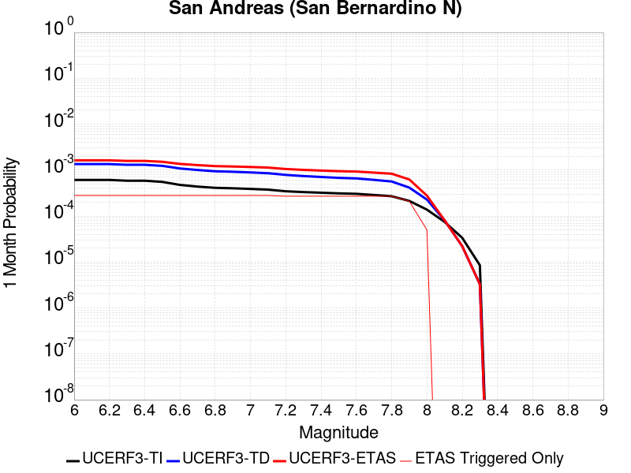 |  |  |

| Magnitude | 1 wk TI Prob | 1 wk TD Prob | 1 wk ETAS Prob | 1 wk ETAS/TD Gain | 1 wk ETAS Triggered Only | 1 mo TI Prob | 1 mo TD Prob | 1 mo ETAS Prob | 1 mo ETAS/TD Gain | 1 mo ETAS Triggered Only | 1 yr TI Prob | 1 yr TD Prob | 1 yr ETAS Prob | 1 yr ETAS/TD Gain | 1 yr ETAS Triggered Only | 10 yr TI Prob | 10 yr TD Prob | 10 yr ETAS Prob | 10 yr ETAS/TD Gain | 10 yr ETAS Triggered Only |
|-----|-----|-----|-----|-----|-----|-----|-----|-----|-----|-----|-----|-----|-----|-----|-----|-----|-----|-----|-----|-----|
| 6.0 | 1.4273766E-4 | 3.160852E-4 | 5.0602516E-4 | 1.6009138 | 1.9E-4 | 6.115894E-4 | 0.0013539536 | 0.0016335745 | 1.2065217 | 2.8E-4 | 0.0074207084 | 0.016361289 | 0.016853109 | 1.0300599 | 5.0E-4 | 0.07177748 | 0.15020812 | 0.15087944 | 1.0044694 | 7.9E-4 |
| 6.1 | 1.4273766E-4 | 3.160852E-4 | 5.0602516E-4 | 1.6009138 | 1.9E-4 | 6.115894E-4 | 0.0013539536 | 0.0016335745 | 1.2065217 | 2.8E-4 | 0.0074207084 | 0.016361289 | 0.016853109 | 1.0300599 | 5.0E-4 | 0.07177748 | 0.15020812 | 0.15087944 | 1.0044694 | 7.9E-4 |
| 6.2 | 1.4273766E-4 | 3.160852E-4 | 5.0602516E-4 | 1.6009138 | 1.9E-4 | 6.115894E-4 | 0.0013539536 | 0.0016335745 | 1.2065217 | 2.8E-4 | 0.0074207084 | 0.016361289 | 0.016853109 | 1.0300599 | 5.0E-4 | 0.07177748 | 0.15020812 | 0.15087944 | 1.0044694 | 7.9E-4 |
| 6.3 | 1.3730655E-4 | 3.051335E-4 | 4.950755E-4 | 1.6224883 | 1.9E-4 | 5.883239E-4 | 0.0013070652 | 0.0015866993 | 1.2139404 | 2.8E-4 | 0.0071393442 | 0.015798805 | 0.016290905 | 1.031148 | 5.0E-4 | 0.06914291 | 0.14550997 | 0.14617647 | 1.0045805 | 7.8E-4 |
| 6.4 | 1.3730655E-4 | 3.051335E-4 | 4.950755E-4 | 1.6224883 | 1.9E-4 | 5.883239E-4 | 0.0013070652 | 0.0015866993 | 1.2139404 | 2.8E-4 | 0.0071393442 | 0.015798805 | 0.016290905 | 1.031148 | 5.0E-4 | 0.06914291 | 0.14550997 | 0.14617647 | 1.0045805 | 7.8E-4 |
| 6.5 | 1.2942807E-4 | 2.8927825E-4 | 4.792233E-4 | 1.656617 | 1.9E-4 | 5.545738E-4 | 0.00123918 | 0.0015188331 | 1.2256758 | 2.8E-4 | 0.0067310524 | 0.014983897 | 0.015476406 | 1.0328691 | 5.0E-4 | 0.06530788 | 0.13864732 | 0.13931917 | 1.0048457 | 7.8E-4 |
| 6.6 | 1.1125901E-4 | 2.5366608E-4 | 4.4361787E-4 | 1.7488263 | 1.9E-4 | 4.767372E-4 | 0.0010866896 | 0.0013663854 | 1.2573832 | 2.8E-4 | 0.005788839 | 0.013150819 | 0.013624506 | 1.0360197 | 4.8E-4 | 0.056403454 | 0.12300133 | 0.12366784 | 1.0054188 | 7.6E-4 |
| 6.7 | 1.02209575E-4 | 2.3501618E-4 | 4.2497154E-4 | 1.808265 | 1.9E-4 | 4.3796748E-4 | 0.0010068248 | 0.0012865429 | 1.277822 | 2.8E-4 | 0.0053192247 | 0.012189618 | 0.012663767 | 1.0388978 | 4.8E-4 | 0.051936906 | 0.114789106 | 0.11546186 | 1.0058608 | 7.6E-4 |
| 6.8 | 9.610582E-5 | 2.2027476E-4 | 4.102329E-4 | 1.8623691 | 1.9E-4 | 4.1181705E-4 | 9.4369386E-4 | 0.0012234296 | 1.2964264 | 2.8E-4 | 0.0050023515 | 0.01142921 | 0.011903724 | 1.0415176 | 4.8E-4 | 0.048912346 | 0.108201 | 0.108860925 | 1.0060991 | 7.4E-4 |
| 6.9 | 9.3877505E-5 | 2.148302E-4 | 4.0478937E-4 | 1.8842294 | 1.9E-4 | 4.0227012E-4 | 9.203766E-4 | 0.0012001189 | 1.3039433 | 2.8E-4 | 0.0048866454 | 0.011148258 | 0.011622907 | 1.0425761 | 4.8E-4 | 0.04780577 | 0.10579403 | 0.10645574 | 1.0062547 | 7.4E-4 |
| 7.0 | 9.1019785E-5 | 2.0809923E-4 | 3.980597E-4 | 1.912836 | 1.9E-4 | 3.900265E-4 | 8.9154963E-4 | 0.0011713 | 1.31378 | 2.8E-4 | 0.0047382377 | 0.010800818 | 0.011275634 | 1.043961 | 4.8E-4 | 0.046384744 | 0.10277054 | 0.10342552 | 1.0063732 | 7.3E-4 |
| 7.1 | 8.771155E-5 | 1.9984458E-4 | 3.898066E-4 | 1.9505488 | 1.9E-4 | 3.758525E-4 | 8.5619616E-4 | 0.0011359564 | 1.3267479 | 2.8E-4 | 0.0045664064 | 0.010374562 | 0.010849582 | 1.045787 | 4.8E-4 | 0.044737056 | 0.0990774 | 0.09972607 | 1.0065471 | 7.2E-4 |
| 7.2 | 8.0830236E-5 | 1.8390059E-4 | 3.6386747E-4 | 1.9786097 | 1.8E-4 | 3.4636928E-4 | 7.8790745E-4 | 0.0010576947 | 1.3424098 | 2.7E-4 | 0.0042088944 | 0.009550686 | 0.010016197 | 1.0487411 | 4.7E-4 | 0.041300658 | 0.09180623 | 0.09245105 | 1.0070237 | 7.1E-4 |
| 7.3 | 7.7668235E-5 | 1.7333617E-4 | 3.5330496E-4 | 2.0382645 | 1.8E-4 | 3.328214E-4 | 7.426579E-4 | 0.0010124574 | 1.363289 | 2.7E-4 | 0.0040445733 | 0.009004453 | 0.009460311 | 1.0506258 | 4.6E-4 | 0.03971748 | 0.08706883 | 0.08769876 | 1.0072348 | 6.9E-4 |
| 7.4 | 7.520177E-5 | 1.655372E-4 | 3.455074E-4 | 2.087189 | 1.8E-4 | 3.2225347E-4 | 7.092523E-4 | 9.790608E-4 | 1.3804126 | 2.7E-4 | 0.0039163795 | 0.008601024 | 0.009047153 | 1.0518694 | 4.5E-4 | 0.038480744 | 0.08352327 | 0.08414648 | 1.0074614 | 6.8E-4 |
| 7.5 | 7.274697E-5 | 1.5841342E-4 | 3.383849E-4 | 2.1360874 | 1.8E-4 | 3.1173544E-4 | 6.7873806E-4 | 9.485548E-4 | 1.3975271 | 2.7E-4 | 0.003788775 | 0.008232382 | 0.0086786775 | 1.0542122 | 4.5E-4 | 0.03724827 | 0.080238804 | 0.080864236 | 1.0077947 | 6.8E-4 |
| 7.6 | 7.1185845E-5 | 1.5411174E-4 | 3.34084E-4 | 2.1678038 | 1.8E-4 | 3.0504653E-4 | 6.603117E-4 | 9.3013345E-4 | 1.4086277 | 2.7E-4 | 0.0037076178 | 0.008009714 | 0.00844619 | 1.0544933 | 4.4E-4 | 0.036463667 | 0.07822845 | 0.07884604 | 1.0078946 | 6.7E-4 |
| 7.7 | 6.709961E-5 | 1.4319982E-4 | 3.2317406E-4 | 2.2568047 | 1.8E-4 | 2.8753807E-4 | 6.135692E-4 | 8.834035E-4 | 1.4397782 | 2.7E-4 | 0.003495157 | 0.007444657 | 0.007881382 | 1.0586628 | 4.4E-4 | 0.034406938 | 0.07305789 | 0.07367895 | 1.0085008 | 6.7E-4 |
| 7.8 | 6.300812E-5 | 1.3203965E-4 | 3.1201588E-4 | 2.363047 | 1.8E-4 | 2.7000686E-4 | 5.657616E-4 | 8.356088E-4 | 1.4769628 | 2.7E-4 | 0.0032823787 | 0.0068664206 | 0.0073033995 | 1.06364 | 4.4E-4 | 0.032343175 | 0.06771614 | 0.06834077 | 1.0092243 | 6.7E-4 |
| 7.9 | 4.983037E-5 | 9.724542E-5 | 2.4723084E-4 | 2.542339 | 1.5E-4 | 2.1354125E-4 | 4.1669956E-4 | 6.2661205E-4 | 1.5037502 | 2.1E-4 | 0.0025967648 | 0.005061526 | 0.005409754 | 1.0687991 | 3.5E-4 | 0.025666296 | 0.050652348 | 0.05111753 | 1.0091838 | 4.9E-4 |
| 8.0 | 3.2211527E-5 | 5.3308813E-5 | 9.330668E-5 | 1.7503049 | 4.0E-5 | 1.380421E-4 | 2.2844634E-4 | 2.7843492E-4 | 1.2188197 | 5.0E-5 | 0.0016793669 | 0.0027777886 | 0.0028775106 | 1.0358999 | 1.0E-4 | 0.016667323 | 0.02836355 | 0.028499579 | 1.0047959 | 1.4E-4 |
| 8.1 | 1.743376E-5 | 1.8824574E-5 | 1.8824574E-5 | 1.0 | 0.0 | 7.471398E-5 | 8.0674254E-5 | 8.0674254E-5 | 1.0 | 0.0 | 9.0926304E-4 | 9.817671E-4 | 9.917573E-4 | 1.0101757 | 1.0E-5 | 0.009055517 | 0.0104843965 | 0.010504187 | 1.0018876 | 2.0E-5 |
| 8.2 | 7.831616E-6 | 5.1544685E-6 | 5.1544685E-6 | 1.0 | 0.0 | 3.3563636E-5 | 2.2090391E-5 | 2.2090391E-5 | 1.0 | 0.0 | 4.0856065E-4 | 2.689174E-4 | 2.689174E-4 | 1.0 | 0.0 | 0.004078103 | 0.0030415943 | 0.0030415943 | 1.0 | 0.0 |
| 8.3 | 1.983087E-6 | 7.65717E-7 | 7.65717E-7 | 1.0 | 0.0 | 8.498917E-6 | 3.2816401E-6 | 3.2816401E-6 | 1.0 | 0.0 | 1.034694E-4 | 3.9953255E-5 | 3.9953255E-5 | 1.0 | 0.0 | 0.0010342124 | 4.7185255E-4 | 4.7185255E-4 | 1.0 | 0.0 |

## Death Valley (Black Mtns Frontal)
*[(top)](#table-of-contents)*

| 1 Week | 1 Month | 1 Year | 10 Year |
|-----|-----|-----|-----|
|  |  | 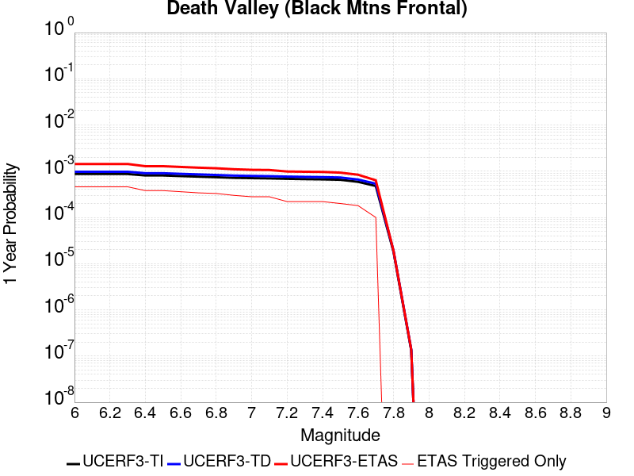 |  |

| Magnitude | 1 wk TI Prob | 1 wk TD Prob | 1 wk ETAS Prob | 1 wk ETAS/TD Gain | 1 wk ETAS Triggered Only | 1 mo TI Prob | 1 mo TD Prob | 1 mo ETAS Prob | 1 mo ETAS/TD Gain | 1 mo ETAS Triggered Only | 1 yr TI Prob | 1 yr TD Prob | 1 yr ETAS Prob | 1 yr ETAS/TD Gain | 1 yr ETAS Triggered Only | 10 yr TI Prob | 10 yr TD Prob | 10 yr ETAS Prob | 10 yr ETAS/TD Gain | 10 yr ETAS Triggered Only |
|-----|-----|-----|-----|-----|-----|-----|-----|-----|-----|-----|-----|-----|-----|-----|-----|-----|-----|-----|-----|-----|
| 6.0 | 1.6707214E-5 | 1.8670296E-5 | 1.3866805E-4 | 7.4272017 | 1.2E-4 | 7.160038E-5 | 8.0013146E-5 | 3.0999474E-4 | 3.8742979 | 2.3E-4 | 8.71386E-4 | 9.7373227E-4 | 0.0014332844 | 1.4719491 | 4.6E-4 | 0.00867977 | 0.009695511 | 0.01040853 | 1.0735412 | 7.2E-4 |
| 6.1 | 1.6707214E-5 | 1.8670296E-5 | 1.3866805E-4 | 7.4272017 | 1.2E-4 | 7.160038E-5 | 8.0013146E-5 | 3.0999474E-4 | 3.8742979 | 2.3E-4 | 8.71386E-4 | 9.7373227E-4 | 0.0014332844 | 1.4719491 | 4.6E-4 | 0.00867977 | 0.009695511 | 0.01040853 | 1.0735412 | 7.2E-4 |
| 6.2 | 1.6707214E-5 | 1.8670296E-5 | 1.3866805E-4 | 7.4272017 | 1.2E-4 | 7.160038E-5 | 8.0013146E-5 | 3.0999474E-4 | 3.8742979 | 2.3E-4 | 8.71386E-4 | 9.7373227E-4 | 0.0014332844 | 1.4719491 | 4.6E-4 | 0.00867977 | 0.009695511 | 0.01040853 | 1.0735412 | 7.2E-4 |
| 6.3 | 1.6707214E-5 | 1.8670296E-5 | 1.3866805E-4 | 7.4272017 | 1.2E-4 | 7.160038E-5 | 8.0013146E-5 | 3.0999474E-4 | 3.8742979 | 2.3E-4 | 8.71386E-4 | 9.7373227E-4 | 0.0014332844 | 1.4719491 | 4.6E-4 | 0.00867977 | 0.009695511 | 0.01040853 | 1.0735412 | 7.2E-4 |
| 6.4 | 1.5515609E-5 | 1.7338238E-5 | 1.0733668E-4 | 6.1907487 | 9.0E-5 | 6.649377E-5 | 7.4304655E-5 | 2.6429055E-4 | 3.5568504 | 1.9E-4 | 8.0926094E-4 | 9.0428983E-4 | 0.0012839462 | 1.4198393 | 3.8E-4 | 0.008063202 | 0.009006786 | 0.009601382 | 1.0660164 | 6.0E-4 |
| 6.5 | 1.5515609E-5 | 1.7338238E-5 | 1.0733668E-4 | 6.1907487 | 9.0E-5 | 6.649377E-5 | 7.4304655E-5 | 2.6429055E-4 | 3.5568504 | 1.9E-4 | 8.0926094E-4 | 9.0428983E-4 | 0.0012839462 | 1.4198393 | 3.8E-4 | 0.008063202 | 0.009006786 | 0.009601382 | 1.0660164 | 6.0E-4 |
| 6.6 | 1.5041828E-5 | 1.6809168E-5 | 1.0680766E-4 | 6.3541307 | 9.0E-5 | 6.4463384E-5 | 7.203734E-5 | 2.6202365E-4 | 3.637331 | 1.9E-4 | 7.8455906E-4 | 8.767076E-4 | 0.001236392 | 1.4102672 | 3.6E-4 | 0.00781795 | 0.008733145 | 0.009298167 | 1.0646986 | 5.7E-4 |
| 6.7 | 1.4634985E-5 | 1.635604E-5 | 1.0635457E-4 | 6.5024643 | 9.0E-5 | 6.271985E-5 | 7.009546E-5 | 2.5008284E-4 | 3.5677464 | 1.8E-4 | 7.6334673E-4 | 8.530839E-4 | 0.0011927938 | 1.398214 | 3.4E-4 | 0.007607299 | 0.008498728 | 0.009034139 | 1.0629989 | 5.4E-4 |
| 6.8 | 1.4209158E-5 | 1.5882071E-5 | 1.05880645E-4 | 6.6666775 | 9.0E-5 | 6.089497E-5 | 6.806428E-5 | 2.4805203E-4 | 3.6443791 | 1.8E-4 | 7.4114406E-4 | 8.283731E-4 | 0.0011580997 | 1.3980412 | 3.3E-4 | 0.007386771 | 0.008253468 | 0.008779094 | 1.0636854 | 5.3E-4 |
| 6.9 | 1.3780098E-5 | 1.5404616E-5 | 8.540354E-5 | 5.5440226 | 7.0E-5 | 5.9056227E-5 | 6.601814E-5 | 2.2600757E-4 | 3.4234164 | 1.6E-4 | 7.1877235E-4 | 8.034799E-4 | 0.0011032389 | 1.3730758 | 3.0E-4 | 0.0071645193 | 0.008006345 | 0.008482501 | 1.0594724 | 4.8E-4 |
| 7.0 | 1.3585064E-5 | 1.5188178E-5 | 8.5187115E-5 | 5.608778 | 7.0E-5 | 5.8220405E-5 | 6.509059E-5 | 2.2508018E-4 | 3.4579523 | 1.6E-4 | 7.086029E-4 | 7.921953E-4 | 0.0010719735 | 1.3531681 | 2.8E-4 | 0.007063476 | 0.0078943055 | 0.008340753 | 1.0565531 | 4.5E-4 |
| 7.1 | 1.3398601E-5 | 1.4981361E-5 | 8.498031E-5 | 5.6724024 | 7.0E-5 | 5.742131E-5 | 6.420429E-5 | 2.2419401E-4 | 3.4918854 | 1.6E-4 | 6.9888023E-4 | 7.814123E-4 | 0.0010611935 | 1.3580456 | 2.8E-4 | 0.0069668638 | 0.0077872355 | 0.008213887 | 1.0547886 | 4.3E-4 |
| 7.2 | 1.3126312E-5 | 1.4679582E-5 | 6.467885E-5 | 4.4060416 | 5.0E-5 | 5.6254412E-5 | 6.291101E-5 | 1.9290284E-4 | 3.066281 | 1.3E-4 | 6.846822E-4 | 7.6567783E-4 | 9.855094E-4 | 1.2871071 | 2.2E-4 | 0.006825765 | 0.007630981 | 0.007978311 | 1.0455157 | 3.5E-4 |
| 7.3 | 1.2922429E-5 | 1.4453809E-5 | 6.445309E-5 | 4.4592457 | 5.0E-5 | 5.5380664E-5 | 6.194346E-5 | 1.9193541E-4 | 3.0985582 | 1.3E-4 | 6.74051E-4 | 7.539061E-4 | 9.737402E-4 | 1.2915936 | 2.2E-4 | 0.006720101 | 0.0075140656 | 0.007861435 | 1.0462294 | 3.5E-4 |
| 7.4 | 1.2768878E-5 | 1.4283793E-5 | 6.428308E-5 | 4.500421 | 5.0E-5 | 5.4722615E-5 | 6.121485E-5 | 1.9120688E-4 | 3.1235378 | 1.3E-4 | 6.660441E-4 | 7.4504135E-4 | 9.648774E-4 | 1.2950656 | 2.2E-4 | 0.0066405144 | 0.007426014 | 0.007773415 | 1.0467817 | 3.5E-4 |
| 7.5 | 1.2521929E-5 | 1.40120355E-5 | 5.4011474E-5 | 3.8546486 | 4.0E-5 | 5.366431E-5 | 6.005023E-5 | 1.8004302E-4 | 2.998207 | 1.2E-4 | 6.531671E-4 | 7.3087175E-4 | 9.3072554E-4 | 1.2734458 | 2.0E-4 | 0.006512506 | 0.0072852564 | 0.0076128524 | 1.0449669 | 3.3E-4 |
| 7.6 | 1.1301089E-5 | 1.2648167E-5 | 5.264766E-5 | 4.1624737 | 4.0E-5 | 4.8432343E-5 | 5.4205335E-5 | 1.7419884E-4 | 3.213684 | 1.2E-4 | 5.895042E-4 | 6.5975543E-4 | 8.3963666E-4 | 1.2726483 | 1.8E-4 | 0.0058794282 | 0.00657852 | 0.006886481 | 1.046813 | 3.1E-4 |
| 7.7 | 9.189108E-6 | 1.0283374E-5 | 3.0283169E-5 | 2.9448671 | 2.0E-5 | 3.93813E-5 | 4.4070886E-5 | 1.140678E-4 | 2.5882802 | 7.0E-5 | 4.7936183E-4 | 5.36436E-4 | 6.363823E-4 | 1.1863155 | 1.0E-4 | 0.004783291 | 0.0053519215 | 0.005570744 | 1.0408868 | 2.2E-4 |
| 7.8 | 3.4586725E-7 | 3.6482638E-7 | 3.6482638E-7 | 1.0 | 0.0 | 1.4822873E-6 | 1.5635408E-6 | 1.5635408E-6 | 1.0 | 0.0 | 1.80467E-5 | 1.9035946E-5 | 1.9035946E-5 | 1.0 | 0.0 | 1.8045233E-4 | 1.903436E-4 | 2.003417E-4 | 1.0525266 | 1.0E-5 |
| 7.9 | 2.5591178E-9 | 2.6696731E-9 | 2.6696731E-9 | 1.0 | 0.0 | 1.0967647E-8 | 1.1441457E-8 | 1.1441457E-8 | 1.0 | 0.0 | 1.335311E-7 | 1.3929973E-7 | 1.3929973E-7 | 1.0 | 0.0 | 1.3353102E-6 | 1.3929973E-6 | 1.3929973E-6 | 1.0 | 0.0 |

## Coyote Lake
*[(top)](#table-of-contents)*

| 1 Week | 1 Month | 1 Year | 10 Year |
|-----|-----|-----|-----|
|  | 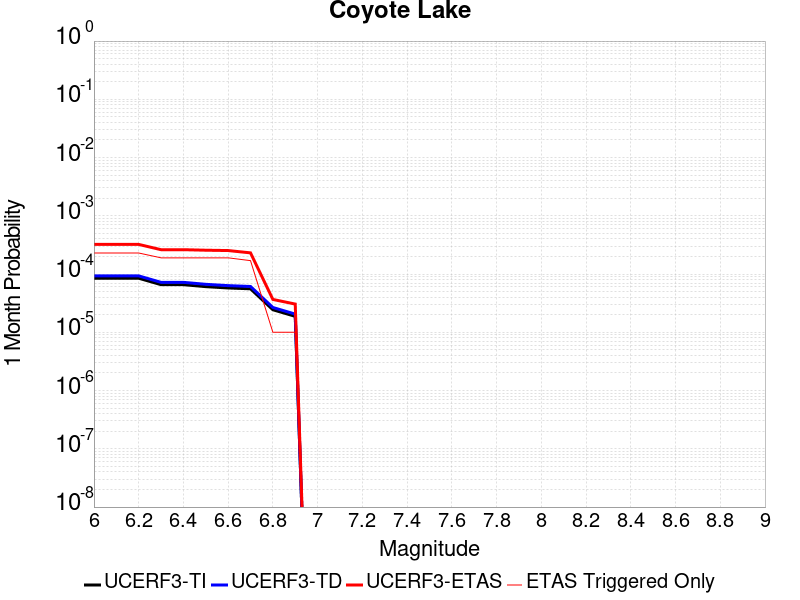 |  |  |

| Magnitude | 1 wk TI Prob | 1 wk TD Prob | 1 wk ETAS Prob | 1 wk ETAS/TD Gain | 1 wk ETAS Triggered Only | 1 mo TI Prob | 1 mo TD Prob | 1 mo ETAS Prob | 1 mo ETAS/TD Gain | 1 mo ETAS Triggered Only | 1 yr TI Prob | 1 yr TD Prob | 1 yr ETAS Prob | 1 yr ETAS/TD Gain | 1 yr ETAS Triggered Only | 10 yr TI Prob | 10 yr TD Prob | 10 yr ETAS Prob | 10 yr ETAS/TD Gain | 10 yr ETAS Triggered Only |
|-----|-----|-----|-----|-----|-----|-----|-----|-----|-----|-----|-----|-----|-----|-----|-----|-----|-----|-----|-----|-----|
| 6.0 | 1.980352E-5 | 2.170677E-5 | 1.217046E-4 | 5.6067576 | 1.0E-4 | 8.486947E-5 | 9.302611E-5 | 3.230047E-4 | 3.4721942 | 2.3E-4 | 0.0010327959 | 0.0011320764 | 0.0015416122 | 1.3617563 | 4.1E-4 | 0.010280091 | 0.011270272 | 0.011952495 | 1.060533 | 6.9E-4 |
| 6.1 | 1.980352E-5 | 2.170677E-5 | 1.217046E-4 | 5.6067576 | 1.0E-4 | 8.486947E-5 | 9.302611E-5 | 3.230047E-4 | 3.4721942 | 2.3E-4 | 0.0010327959 | 0.0011320764 | 0.0015416122 | 1.3617563 | 4.1E-4 | 0.010280091 | 0.011270272 | 0.011952495 | 1.060533 | 6.9E-4 |
| 6.2 | 1.980352E-5 | 2.170677E-5 | 1.217046E-4 | 5.6067576 | 1.0E-4 | 8.486947E-5 | 9.302611E-5 | 3.230047E-4 | 3.4721942 | 2.3E-4 | 0.0010327959 | 0.0011320764 | 0.0015416122 | 1.3617563 | 4.1E-4 | 0.010280091 | 0.011270272 | 0.011952495 | 1.060533 | 6.9E-4 |
| 6.3 | 1.5344787E-5 | 1.682069E-5 | 1.0681918E-4 | 6.350464 | 9.0E-5 | 6.576172E-5 | 7.208702E-5 | 2.6207333E-4 | 3.6355133 | 1.9E-4 | 8.003548E-4 | 8.773673E-4 | 0.0011870953 | 1.3530198 | 3.1E-4 | 0.007974784 | 0.00874508 | 0.009220882 | 1.054408 | 4.8E-4 |
| 6.4 | 1.5344787E-5 | 1.682069E-5 | 1.0681918E-4 | 6.350464 | 9.0E-5 | 6.576172E-5 | 7.208702E-5 | 2.6207333E-4 | 3.6355133 | 1.9E-4 | 8.003548E-4 | 8.773673E-4 | 0.0011870953 | 1.3530198 | 3.1E-4 | 0.007974784 | 0.00874508 | 0.009220882 | 1.054408 | 4.8E-4 |
| 6.5 | 1.4189697E-5 | 1.5558006E-5 | 1.055566E-4 | 6.7847133 | 9.0E-5 | 6.081157E-5 | 6.66758E-5 | 2.5666313E-4 | 3.8494196 | 1.9E-4 | 7.401293E-4 | 8.1153587E-4 | 0.0011212843 | 1.3816818 | 3.1E-4 | 0.0073766913 | 0.008091666 | 0.008567781 | 1.0588403 | 4.8E-4 |
| 6.6 | 1.3469301E-5 | 1.4771595E-5 | 1.0477027E-4 | 7.0926847 | 9.0E-5 | 5.7724297E-5 | 6.330564E-5 | 2.532936E-4 | 4.0011225 | 1.9E-4 | 7.025667E-4 | 7.705336E-4 | 0.0010802947 | 1.4020087 | 3.1E-4 | 0.0070034964 | 0.0076845232 | 0.008160835 | 1.0619832 | 4.8E-4 |
| 6.7 | 1.3027966E-5 | 1.4281762E-5 | 9.428062E-5 | 6.6014695 | 8.0E-5 | 5.5832945E-5 | 6.1206454E-5 | 2.3119604E-4 | 3.777315 | 1.7E-4 | 6.7955407E-4 | 7.449935E-4 | 0.0010247849 | 1.3755622 | 2.8E-4 | 0.006774798 | 0.0074308375 | 0.007847717 | 1.0561012 | 4.2E-4 |
| 6.8 | 5.695434E-6 | 6.224425E-6 | 1.6224363E-5 | 2.606564 | 1.0E-5 | 2.4408775E-5 | 2.6676003E-5 | 3.6675738E-5 | 1.3748587 | 1.0E-5 | 2.971363E-4 | 3.2476193E-4 | 3.6474894E-4 | 1.1231271 | 4.0E-5 | 0.0029673933 | 0.0032458142 | 0.003335522 | 1.0276381 | 9.0E-5 |
| 6.9 | 4.385688E-6 | 4.7930607E-6 | 1.4793013E-5 | 3.0863395 | 1.0E-5 | 1.879567E-5 | 2.0541689E-5 | 3.0541483E-5 | 1.4868048 | 1.0E-5 | 2.2881327E-4 | 2.5009506E-4 | 2.9008507E-4 | 1.1598992 | 4.0E-5 | 0.002285778 | 0.0025009506 | 0.0025707756 | 1.0279194 | 7.0E-5 |

## Helendale-So Lockhart
*[(top)](#table-of-contents)*

| 1 Week | 1 Month | 1 Year | 10 Year |
|-----|-----|-----|-----|
|  | 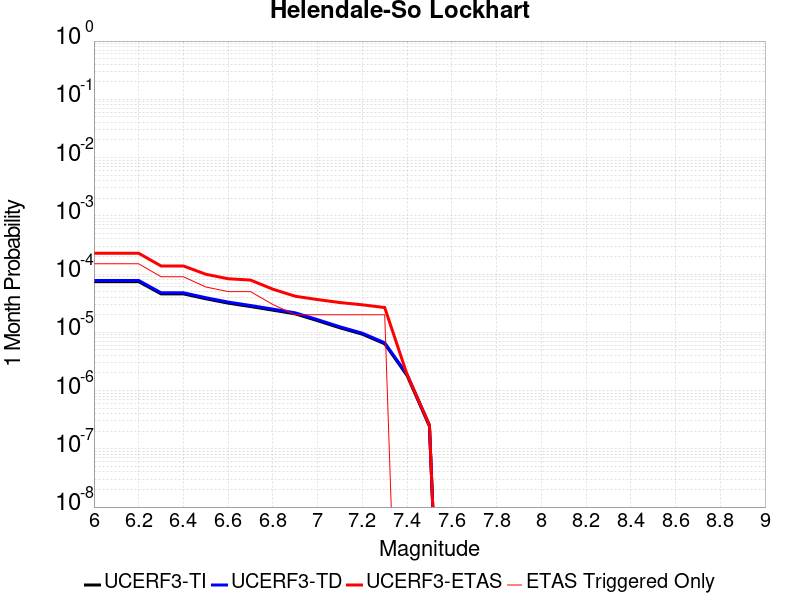 | 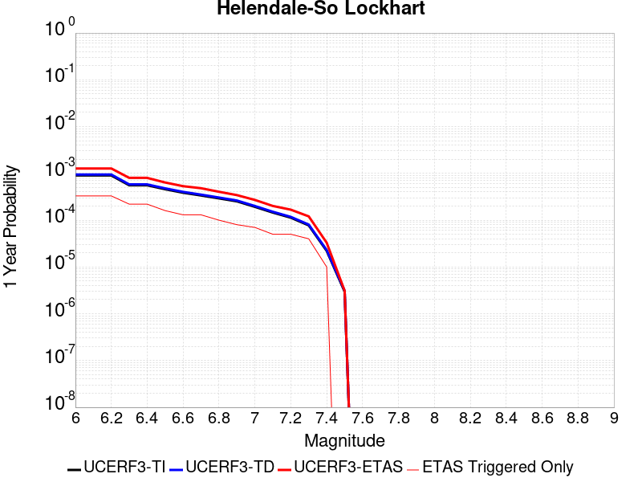 |  |

| Magnitude | 1 wk TI Prob | 1 wk TD Prob | 1 wk ETAS Prob | 1 wk ETAS/TD Gain | 1 wk ETAS Triggered Only | 1 mo TI Prob | 1 mo TD Prob | 1 mo ETAS Prob | 1 mo ETAS/TD Gain | 1 mo ETAS Triggered Only | 1 yr TI Prob | 1 yr TD Prob | 1 yr ETAS Prob | 1 yr ETAS/TD Gain | 1 yr ETAS Triggered Only | 10 yr TI Prob | 10 yr TD Prob | 10 yr ETAS Prob | 10 yr ETAS/TD Gain | 10 yr ETAS Triggered Only |
|-----|-----|-----|-----|-----|-----|-----|-----|-----|-----|-----|-----|-----|-----|-----|-----|-----|-----|-----|-----|-----|
| 6.0 | 1.7296055E-5 | 1.810374E-5 | 1.3810156E-4 | 7.6283445 | 1.2E-4 | 7.412385E-5 | 7.758527E-5 | 2.2757363E-4 | 2.9332068 | 1.5E-4 | 9.0208417E-4 | 9.4421196E-4 | 0.0012739004 | 1.3491678 | 3.3E-4 | 0.008984311 | 0.009404122 | 0.009968761 | 1.0600417 | 5.7E-4 |
| 6.1 | 1.7296055E-5 | 1.810374E-5 | 1.3810156E-4 | 7.6283445 | 1.2E-4 | 7.412385E-5 | 7.758527E-5 | 2.2757363E-4 | 2.9332068 | 1.5E-4 | 9.0208417E-4 | 9.4421196E-4 | 0.0012739004 | 1.3491678 | 3.3E-4 | 0.008984311 | 0.009404122 | 0.009968761 | 1.0600417 | 5.7E-4 |
| 6.2 | 1.7296055E-5 | 1.810374E-5 | 1.3810156E-4 | 7.6283445 | 1.2E-4 | 7.412385E-5 | 7.758527E-5 | 2.2757363E-4 | 2.9332068 | 1.5E-4 | 9.0208417E-4 | 9.4421196E-4 | 0.0012739004 | 1.3491678 | 3.3E-4 | 0.008984311 | 0.009404122 | 0.009968761 | 1.0600417 | 5.7E-4 |
| 6.3 | 1.0669118E-5 | 1.113543E-5 | 8.1134654E-5 | 7.286171 | 7.0E-5 | 4.5723988E-5 | 4.7722417E-5 | 1.3771812E-4 | 2.885816 | 9.0E-5 | 5.5654737E-4 | 5.8086833E-4 | 8.007405E-4 | 1.3785233 | 2.2E-4 | 0.0055515557 | 0.005793797 | 0.006171595 | 1.0652074 | 3.8E-4 |
| 6.4 | 1.0669118E-5 | 1.113543E-5 | 8.1134654E-5 | 7.286171 | 7.0E-5 | 4.5723988E-5 | 4.7722417E-5 | 1.3771812E-4 | 2.885816 | 9.0E-5 | 5.5654737E-4 | 5.8086833E-4 | 8.007405E-4 | 1.3785233 | 2.2E-4 | 0.0055515557 | 0.005793797 | 0.006171595 | 1.0652074 | 3.8E-4 |
| 6.5 | 8.790038E-6 | 9.170201E-6 | 4.9169834E-5 | 5.361914 | 4.0E-5 | 3.767105E-5 | 3.930028E-5 | 9.9297926E-5 | 2.5266466 | 6.0E-5 | 4.585485E-4 | 4.7837742E-4 | 6.383009E-4 | 1.334304 | 1.6E-4 | 0.0045760344 | 0.004773641 | 0.0050622565 | 1.0604603 | 2.9E-4 |
| 6.6 | 7.396949E-6 | 7.715541E-6 | 4.771523E-5 | 6.1843014 | 4.0E-5 | 3.1700827E-5 | 3.306619E-5 | 8.306454E-5 | 2.5120685 | 5.0E-5 | 3.858892E-4 | 4.0250752E-4 | 5.324552E-4 | 1.3228453 | 1.3E-4 | 0.003852198 | 0.004017892 | 0.004246968 | 1.057014 | 2.3E-4 |
| 6.7 | 6.4600285E-6 | 6.7380347E-6 | 4.6737765E-5 | 6.936409 | 4.0E-5 | 2.7685543E-5 | 2.8876975E-5 | 7.8875535E-5 | 2.7314332 | 5.0E-5 | 3.3701936E-4 | 3.5152124E-4 | 4.8147555E-4 | 1.3696911 | 1.3E-4 | 0.0033650869 | 0.0035097338 | 0.0037389265 | 1.065302 | 2.3E-4 |
| 6.8 | 5.600104E-6 | 5.8360124E-6 | 2.5835896E-5 | 4.4269776 | 2.0E-5 | 2.4000226E-5 | 2.5011246E-5 | 5.5010496E-5 | 2.1994305 | 3.0E-5 | 2.9216358E-4 | 3.0446996E-4 | 4.0443952E-4 | 1.3283396 | 1.0E-4 | 0.0029177975 | 0.0030405896 | 0.0032100726 | 1.0557402 | 1.7E-4 |
| 6.9 | 4.839122E-6 | 5.039512E-6 | 2.5039411E-5 | 4.9686184 | 2.0E-5 | 2.0738931E-5 | 2.1597732E-5 | 4.15973E-5 | 1.9260032 | 2.0E-5 | 2.5246723E-4 | 2.6292112E-4 | 3.4290008E-4 | 1.3041937 | 8.0E-5 | 0.002521806 | 0.002626148 | 0.0027558068 | 1.0493722 | 1.3E-4 |
| 7.0 | 3.6937633E-6 | 3.84521E-6 | 2.3845134E-5 | 6.2012563 | 2.0E-5 | 1.5830317E-5 | 1.647937E-5 | 3.647904E-5 | 2.2136188 | 2.0E-5 | 1.9271708E-4 | 2.0061816E-4 | 2.7060413E-4 | 1.3488516 | 7.0E-5 | 0.0019255003 | 0.002004402 | 0.0020842417 | 1.0398321 | 8.0E-5 |
| 7.1 | 2.7858857E-6 | 2.8978552E-6 | 2.2897797E-5 | 7.901636 | 2.0E-5 | 1.1939455E-5 | 1.2419322E-5 | 3.2419073E-5 | 2.610374 | 2.0E-5 | 1.4535317E-4 | 1.5119497E-4 | 2.011874E-4 | 1.3306489 | 5.0E-5 | 0.0014525814 | 0.0015109425 | 0.0015708519 | 1.0396503 | 6.0E-5 |
| 7.2 | 2.1672065E-6 | 2.254014E-6 | 2.225397E-5 | 9.87304 | 2.0E-5 | 9.2879945E-6 | 9.660025E-6 | 2.9659832E-5 | 3.070368 | 2.0E-5 | 1.1307546E-4 | 1.17604635E-4 | 1.6759876E-4 | 1.4251033 | 5.0E-5 | 0.0011301794 | 0.0011754422 | 0.0012353717 | 1.0509846 | 6.0E-5 |
| 7.3 | 1.4823496E-6 | 1.542211E-6 | 2.154218E-5 | 13.968374 | 2.0E-5 | 6.3529114E-6 | 6.60946E-6 | 2.6609328E-5 | 4.025946 | 2.0E-5 | 7.734395E-5 | 8.0467355E-5 | 1.2046414E-4 | 1.497056 | 4.0E-5 | 7.731704E-4 | 8.043973E-4 | 8.543571E-4 | 1.0621084 | 5.0E-5 |
| 7.4 | 4.2321457E-7 | 4.4108788E-7 | 4.4108788E-7 | 1.0 | 0.0 | 1.8137755E-6 | 1.8903755E-6 | 1.8903755E-6 | 1.0 | 0.0 | 2.2082493E-5 | 2.3015125E-5 | 3.3014894E-5 | 1.4344869 | 1.0E-5 | 2.2080299E-4 | 2.3013195E-4 | 2.5012734E-4 | 1.0868866 | 2.0E-5 |
| 7.5 | 5.6942316E-8 | 5.941568E-8 | 5.941568E-8 | 1.0 | 0.0 | 2.440385E-7 | 2.546386E-7 | 2.546386E-7 | 1.0 | 0.0 | 2.9711643E-6 | 3.1002214E-6 | 3.1002214E-6 | 1.0 | 0.0 | 2.9711247E-5 | 3.100186E-5 | 3.100186E-5 | 1.0 | 0.0 |

## San Andreas (Big Bend)
*[(top)](#table-of-contents)*

| 1 Week | 1 Month | 1 Year | 10 Year |
|-----|-----|-----|-----|
| 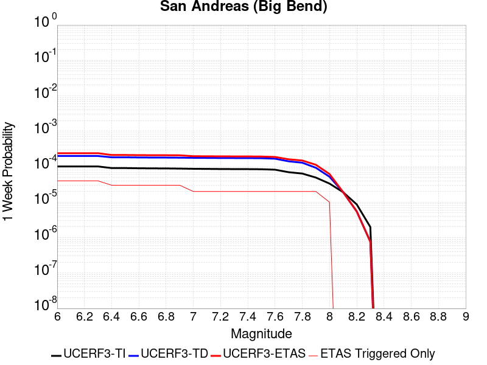 | 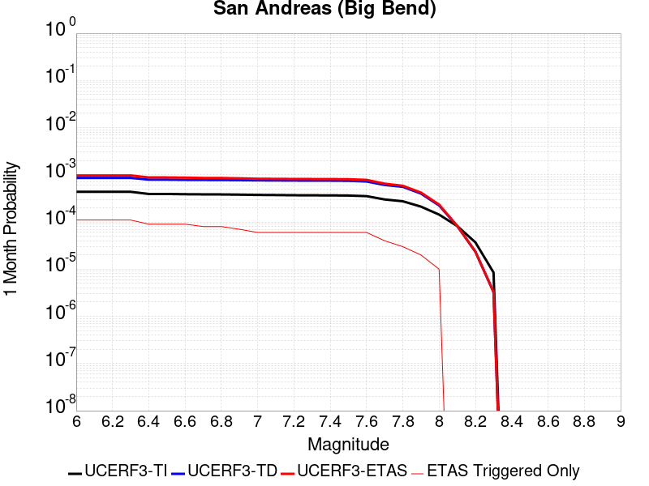 |  | 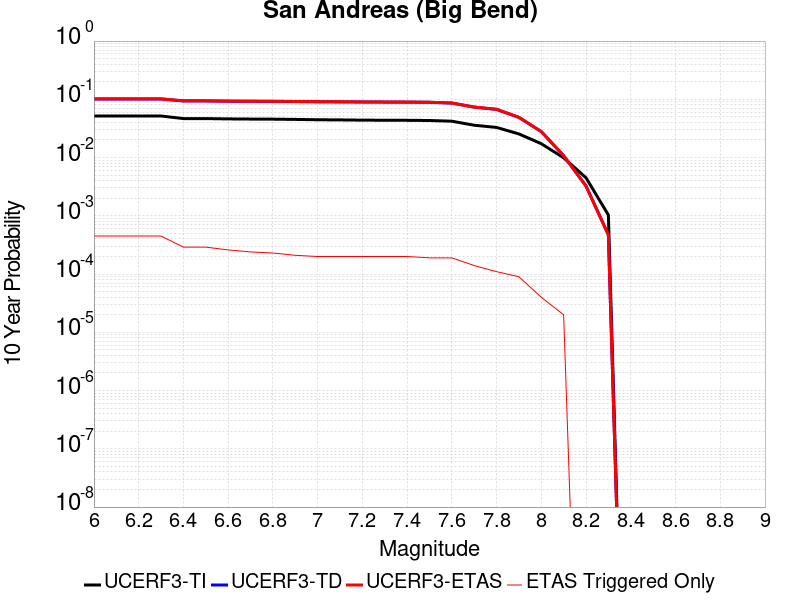 |

| Magnitude | 1 wk TI Prob | 1 wk TD Prob | 1 wk ETAS Prob | 1 wk ETAS/TD Gain | 1 wk ETAS Triggered Only | 1 mo TI Prob | 1 mo TD Prob | 1 mo ETAS Prob | 1 mo ETAS/TD Gain | 1 mo ETAS Triggered Only | 1 yr TI Prob | 1 yr TD Prob | 1 yr ETAS Prob | 1 yr ETAS/TD Gain | 1 yr ETAS Triggered Only | 10 yr TI Prob | 10 yr TD Prob | 10 yr ETAS Prob | 10 yr ETAS/TD Gain | 10 yr ETAS Triggered Only |
|-----|-----|-----|-----|-----|-----|-----|-----|-----|-----|-----|-----|-----|-----|-----|-----|-----|-----|-----|-----|-----|
| 6.0 | 1.0179969E-4 | 2.0074622E-4 | 2.4073818E-4 | 1.1992166 | 4.0E-5 | 4.362114E-4 | 8.600583E-4 | 9.699637E-4 | 1.1277883 | 1.1E-4 | 0.0052979486 | 0.010421219 | 0.010678509 | 1.0246891 | 2.6E-4 | 0.051734097 | 0.101457916 | 0.10186226 | 1.0039853 | 4.5E-4 |
| 6.1 | 1.0179969E-4 | 2.0074622E-4 | 2.4073818E-4 | 1.1992166 | 4.0E-5 | 4.362114E-4 | 8.600583E-4 | 9.699637E-4 | 1.1277883 | 1.1E-4 | 0.0052979486 | 0.010421219 | 0.010678509 | 1.0246891 | 2.6E-4 | 0.051734097 | 0.101457916 | 0.10186226 | 1.0039853 | 4.5E-4 |
| 6.2 | 1.0179969E-4 | 2.0074622E-4 | 2.4073818E-4 | 1.1992166 | 4.0E-5 | 4.362114E-4 | 8.600583E-4 | 9.699637E-4 | 1.1277883 | 1.1E-4 | 0.0052979486 | 0.010421219 | 0.010678509 | 1.0246891 | 2.6E-4 | 0.051734097 | 0.101457916 | 0.10186226 | 1.0039853 | 4.5E-4 |
| 6.3 | 1.0179969E-4 | 2.0074622E-4 | 2.4073818E-4 | 1.1992166 | 4.0E-5 | 4.362114E-4 | 8.600583E-4 | 9.699637E-4 | 1.1277883 | 1.1E-4 | 0.0052979486 | 0.010421219 | 0.010678509 | 1.0246891 | 2.6E-4 | 0.051734097 | 0.101457916 | 0.10186226 | 1.0039853 | 4.5E-4 |
| 6.4 | 9.1639464E-5 | 1.8431614E-4 | 2.1431061E-4 | 1.1627338 | 3.0E-5 | 3.9268145E-4 | 7.896874E-4 | 8.796163E-4 | 1.1138792 | 9.0E-5 | 0.0047704205 | 0.009572178 | 0.009750456 | 1.0186245 | 1.8E-4 | 0.046693064 | 0.093788974 | 0.09405178 | 1.002802 | 2.9E-4 |
| 6.5 | 9.1639464E-5 | 1.8431614E-4 | 2.1431061E-4 | 1.1627338 | 3.0E-5 | 3.9268145E-4 | 7.896874E-4 | 8.796163E-4 | 1.1138792 | 9.0E-5 | 0.0047704205 | 0.009572178 | 0.009750456 | 1.0186245 | 1.8E-4 | 0.046693064 | 0.093788974 | 0.09405178 | 1.002802 | 2.9E-4 |
| 6.6 | 9.042622E-5 | 1.8238708E-4 | 2.1238161E-4 | 1.1644553 | 3.0E-5 | 3.8748336E-4 | 7.81425E-4 | 8.7135466E-4 | 1.1150842 | 9.0E-5 | 0.0047074095 | 0.0094724605 | 0.009650755 | 1.0188224 | 1.8E-4 | 0.046089325 | 0.092879236 | 0.09311509 | 1.0025393 | 2.6E-4 |
| 6.7 | 8.9836685E-5 | 1.8153043E-4 | 2.1152498E-4 | 1.1652316 | 3.0E-5 | 3.8495753E-4 | 7.7775575E-4 | 8.5769355E-4 | 1.1027801 | 8.0E-5 | 0.00467679 | 0.009428174 | 0.009596571 | 1.017861 | 1.7E-4 | 0.045795817 | 0.09247351 | 0.09269131 | 1.0023553 | 2.4E-4 |
| 6.8 | 8.9471854E-5 | 1.8099815E-4 | 2.1099272E-4 | 1.1657176 | 3.0E-5 | 3.8339442E-4 | 7.75476E-4 | 8.554139E-4 | 1.1030824 | 8.0E-5 | 0.004657841 | 0.009400657 | 0.009559154 | 1.0168601 | 1.6E-4 | 0.04561414 | 0.09222123 | 0.09243002 | 1.002264 | 2.3E-4 |
| 6.9 | 8.858234E-5 | 1.7981787E-4 | 2.0981247E-4 | 1.1668055 | 3.0E-5 | 3.7958333E-4 | 7.704206E-4 | 8.4036664E-4 | 1.0907894 | 7.0E-5 | 0.004611638 | 0.009339637 | 0.00947833 | 1.0148499 | 1.4E-4 | 0.04517103 | 0.091661125 | 0.091851875 | 1.002081 | 2.1E-4 |
| 7.0 | 8.7433385E-5 | 1.7820584E-4 | 1.9820228E-4 | 1.1122098 | 2.0E-5 | 3.746607E-4 | 7.6351594E-4 | 8.234701E-4 | 1.0785239 | 6.0E-5 | 0.004551957 | 0.00925629 | 0.009385087 | 1.0139145 | 1.3E-4 | 0.044598386 | 0.09089522 | 0.09107704 | 1.0020003 | 2.0E-4 |
| 7.1 | 8.684964E-5 | 1.7732533E-4 | 1.9732179E-4 | 1.112767 | 2.0E-5 | 3.7215967E-4 | 7.597446E-4 | 8.19699E-4 | 1.0789139 | 6.0E-5 | 0.0045216335 | 0.009210763 | 0.009339565 | 1.013984 | 1.3E-4 | 0.04430731 | 0.09047678 | 0.09065869 | 1.0020105 | 2.0E-4 |
| 7.2 | 8.606521E-5 | 1.7623145E-4 | 1.9622792E-4 | 1.1134671 | 2.0E-5 | 3.6879873E-4 | 7.5505924E-4 | 8.150139E-4 | 1.079404 | 6.0E-5 | 0.0044808835 | 0.0091542 | 0.009283009 | 1.0140711 | 1.3E-4 | 0.043916024 | 0.08995718 | 0.09013919 | 1.0020233 | 2.0E-4 |
| 7.3 | 8.568266E-5 | 1.7565145E-4 | 1.9564794E-4 | 1.1138419 | 2.0E-5 | 3.6715972E-4 | 7.5257494E-4 | 8.1252976E-4 | 1.0796663 | 6.0E-5 | 0.0044610105 | 0.009124207 | 0.00925302 | 1.0141178 | 1.3E-4 | 0.043725148 | 0.08967824 | 0.089860305 | 1.0020303 | 2.0E-4 |
| 7.4 | 8.5432206E-5 | 1.752773E-4 | 1.9527378E-4 | 1.114085 | 2.0E-5 | 3.6608664E-4 | 7.509723E-4 | 8.1092725E-4 | 1.0798364 | 6.0E-5 | 0.004447999 | 0.009104858 | 0.009233675 | 1.0141481 | 1.3E-4 | 0.043600157 | 0.08949842 | 0.08968052 | 1.0020347 | 2.0E-4 |
| 7.5 | 8.4791965E-5 | 1.739707E-4 | 1.9396722E-4 | 1.1149418 | 2.0E-5 | 3.633435E-4 | 7.453758E-4 | 8.053311E-4 | 1.0804363 | 6.0E-5 | 0.0044147377 | 0.009037289 | 0.009166114 | 1.0142548 | 1.3E-4 | 0.043280575 | 0.08887409 | 0.0890472 | 1.0019479 | 1.9E-4 |
| 7.6 | 8.241105E-5 | 1.6842417E-4 | 1.884208E-4 | 1.1187278 | 2.0E-5 | 3.531424E-4 | 7.2161836E-4 | 7.8157504E-4 | 1.0830865 | 6.0E-5 | 0.0042910352 | 0.0087504 | 0.008879262 | 1.0147265 | 1.3E-4 | 0.042091176 | 0.086252384 | 0.086426 | 1.0020128 | 1.9E-4 |
| 7.7 | 7.00432E-5 | 1.4206221E-4 | 1.6205938E-4 | 1.1407634 | 2.0E-5 | 3.001506E-4 | 6.086961E-4 | 6.486717E-4 | 1.0656742 | 4.0E-5 | 0.0036482112 | 0.007385732 | 0.0074849934 | 1.0134397 | 1.0E-4 | 0.035888977 | 0.07352595 | 0.07365566 | 1.001764 | 1.4E-4 |
| 7.8 | 6.415362E-5 | 1.2970525E-4 | 1.4970265E-4 | 1.1541758 | 2.0E-5 | 2.749151E-4 | 5.557612E-4 | 5.8574456E-4 | 1.0539501 | 3.0E-5 | 0.0033419547 | 0.00674543 | 0.0068248906 | 1.0117799 | 8.0E-5 | 0.03292141 | 0.06725808 | 0.067360684 | 1.0015255 | 1.1E-4 |
| 7.9 | 4.939911E-5 | 9.342159E-5 | 1.1341972E-4 | 1.2140633 | 2.0E-5 | 2.116933E-4 | 4.003168E-4 | 4.2030882E-4 | 1.0499405 | 2.0E-5 | 0.0025743195 | 0.0048629744 | 0.004922683 | 1.0122781 | 6.0E-5 | 0.025447013 | 0.04891769 | 0.049003284 | 1.0017499 | 9.0E-5 |
| 8.0 | 3.344983E-5 | 5.223063E-5 | 6.223011E-5 | 1.1914486 | 1.0E-5 | 1.4334853E-4 | 2.2382636E-4 | 2.3382412E-4 | 1.0446675 | 1.0E-5 | 0.0017438711 | 0.0027216822 | 0.0027416279 | 1.0073284 | 2.0E-5 | 0.017302496 | 0.02792419 | 0.027963072 | 1.0013925 | 4.0E-5 |
| 8.1 | 1.9104898E-5 | 1.9172894E-5 | 1.9172894E-5 | 1.0 | 0.0 | 8.1875565E-5 | 8.216696E-5 | 8.216696E-5 | 1.0 | 0.0 | 9.963791E-4 | 9.999243E-4 | 0.0010099142 | 1.0099908 | 1.0E-5 | 0.009919235 | 0.0107500255 | 0.0107698105 | 1.0018405 | 2.0E-5 |
| 8.2 | 8.643924E-6 | 5.474112E-6 | 5.474112E-6 | 1.0 | 0.0 | 3.704486E-5 | 2.3460268E-5 | 2.3460268E-5 | 1.0 | 0.0 | 4.5092785E-4 | 2.8559144E-4 | 2.8559144E-4 | 1.0 | 0.0 | 0.0045001395 | 0.0032484592 | 0.0032484592 | 1.0 | 0.0 |
| 8.3 | 1.983087E-6 | 7.65717E-7 | 7.65717E-7 | 1.0 | 0.0 | 8.498917E-6 | 3.2816401E-6 | 3.2816401E-6 | 1.0 | 0.0 | 1.034694E-4 | 3.9953255E-5 | 3.9953255E-5 | 1.0 | 0.0 | 0.0010342124 | 4.7185255E-4 | 4.7185255E-4 | 1.0 | 0.0 |

## San Andreas (San Bernardino S)
*[(top)](#table-of-contents)*

| 1 Week | 1 Month | 1 Year | 10 Year |
|-----|-----|-----|-----|
|  |  |  |  |

| Magnitude | 1 wk TI Prob | 1 wk TD Prob | 1 wk ETAS Prob | 1 wk ETAS/TD Gain | 1 wk ETAS Triggered Only | 1 mo TI Prob | 1 mo TD Prob | 1 mo ETAS Prob | 1 mo ETAS/TD Gain | 1 mo ETAS Triggered Only | 1 yr TI Prob | 1 yr TD Prob | 1 yr ETAS Prob | 1 yr ETAS/TD Gain | 1 yr ETAS Triggered Only | 10 yr TI Prob | 10 yr TD Prob | 10 yr ETAS Prob | 10 yr ETAS/TD Gain | 10 yr ETAS Triggered Only |
|-----|-----|-----|-----|-----|-----|-----|-----|-----|-----|-----|-----|-----|-----|-----|-----|-----|-----|-----|-----|-----|
| 6.0 | 1.2336002E-4 | 3.0005645E-4 | 4.3001742E-4 | 1.4331218 | 1.3E-4 | 5.2857865E-4 | 0.0012853484 | 0.0014651171 | 1.1398598 | 1.8E-4 | 0.006416472 | 0.015541786 | 0.015856814 | 1.0202696 | 3.2E-4 | 0.06234337 | 0.14294094 | 0.14332663 | 1.0026982 | 4.5E-4 |
| 6.1 | 1.2336002E-4 | 3.0005645E-4 | 4.3001742E-4 | 1.4331218 | 1.3E-4 | 5.2857865E-4 | 0.0012853484 | 0.0014651171 | 1.1398598 | 1.8E-4 | 0.006416472 | 0.015541786 | 0.015856814 | 1.0202696 | 3.2E-4 | 0.06234337 | 0.14294094 | 0.14332663 | 1.0026982 | 4.5E-4 |
| 6.2 | 1.2336002E-4 | 3.0005645E-4 | 4.3001742E-4 | 1.4331218 | 1.3E-4 | 5.2857865E-4 | 0.0012853484 | 0.0014651171 | 1.1398598 | 1.8E-4 | 0.006416472 | 0.015541786 | 0.015856814 | 1.0202696 | 3.2E-4 | 0.06234337 | 0.14294094 | 0.14332663 | 1.0026982 | 4.5E-4 |
| 6.3 | 1.1712257E-4 | 2.8793915E-4 | 4.0790462E-4 | 1.4166347 | 1.2E-4 | 5.018573E-4 | 0.001233467 | 0.001413245 | 1.1457502 | 1.8E-4 | 0.006093008 | 0.014918897 | 0.015234124 | 1.0211293 | 3.2E-4 | 0.059286322 | 0.1376517 | 0.13803975 | 1.0028191 | 4.5E-4 |
| 6.4 | 1.1712257E-4 | 2.8793915E-4 | 4.0790462E-4 | 1.4166347 | 1.2E-4 | 5.018573E-4 | 0.001233467 | 0.001413245 | 1.1457502 | 1.8E-4 | 0.006093008 | 0.014918897 | 0.015234124 | 1.0211293 | 3.2E-4 | 0.059286322 | 0.1376517 | 0.13803975 | 1.0028191 | 4.5E-4 |
| 6.5 | 1.0689076E-4 | 2.6806866E-4 | 3.8803648E-4 | 1.4475265 | 1.2E-4 | 4.5802278E-4 | 0.0011483846 | 0.001328178 | 1.1565619 | 1.8E-4 | 0.0055621783 | 0.013896568 | 0.01421212 | 1.0227072 | 3.2E-4 | 0.05425003 | 0.12889275 | 0.12928475 | 1.0030413 | 4.5E-4 |
| 6.6 | 9.7648895E-5 | 2.5051742E-4 | 3.7048737E-4 | 1.4788886 | 1.2E-4 | 4.1842813E-4 | 0.001073228 | 0.0012530348 | 1.1675383 | 1.8E-4 | 0.005082469 | 0.012992631 | 0.013308473 | 1.0243094 | 3.2E-4 | 0.049677886 | 0.12107154 | 0.12146706 | 1.0032668 | 4.5E-4 |
| 6.7 | 8.757013E-5 | 2.3122627E-4 | 3.511985E-4 | 1.5188522 | 1.2E-4 | 3.7524657E-4 | 9.906156E-4 | 0.0011704373 | 1.1815252 | 1.8E-4 | 0.00455906 | 0.011998135 | 0.012314294 | 1.0263509 | 3.2E-4 | 0.04466656 | 0.11236674 | 0.112766184 | 1.0035547 | 4.5E-4 |
| 6.8 | 8.562978E-5 | 2.2682508E-4 | 3.4679787E-4 | 1.5289221 | 1.2E-4 | 3.6693315E-4 | 9.717675E-4 | 0.0011515926 | 1.1850495 | 1.8E-4 | 0.004458263 | 0.011771154 | 0.012087387 | 1.0268651 | 3.2E-4 | 0.043698758 | 0.11037227 | 0.110763706 | 1.0035465 | 4.4E-4 |
| 6.9 | 6.124075E-5 | 1.7067335E-4 | 2.8065458E-4 | 1.6443961 | 1.1E-4 | 2.6243398E-4 | 7.31253E-4 | 9.011287E-4 | 1.2323077 | 1.7E-4 | 0.0031904527 | 0.008866869 | 0.0091642095 | 1.0335338 | 3.0E-4 | 0.031450346 | 0.084195524 | 0.08458016 | 1.0045683 | 4.2E-4 |
| 7.0 | 5.8598747E-5 | 1.6496322E-4 | 2.7494508E-4 | 1.6667054 | 1.1E-4 | 2.5111332E-4 | 7.0679444E-4 | 8.766743E-4 | 1.2403525 | 1.7E-4 | 0.0030530186 | 0.0085714655 | 0.008868894 | 1.0346998 | 3.0E-4 | 0.03011414 | 0.08151506 | 0.08190082 | 1.0047324 | 4.2E-4 |
| 7.1 | 5.613814E-5 | 1.5914837E-4 | 2.6913086E-4 | 1.6910689 | 1.1E-4 | 2.4056983E-4 | 6.818869E-4 | 8.5177104E-4 | 1.2491382 | 1.7E-4 | 0.0029250039 | 0.008270552 | 0.008568072 | 1.0359733 | 3.0E-4 | 0.028868021 | 0.07881213 | 0.07919903 | 1.0049092 | 4.2E-4 |
| 7.2 | 4.991222E-5 | 1.4521317E-4 | 2.551972E-4 | 1.757397 | 1.1E-4 | 2.1389198E-4 | 6.221941E-4 | 7.9208834E-4 | 1.2730566 | 1.7E-4 | 0.002601025 | 0.007549005 | 0.00784674 | 1.0394404 | 3.0E-4 | 0.025707912 | 0.07226131 | 0.07265096 | 1.0053922 | 4.2E-4 |
| 7.3 | 4.7410045E-5 | 1.3715512E-4 | 2.4714004E-4 | 1.8019016 | 1.1E-4 | 2.0317009E-4 | 5.8767555E-4 | 7.575757E-4 | 1.2891053 | 1.7E-4 | 0.0024707897 | 0.007131563 | 0.0074294233 | 1.0417665 | 3.0E-4 | 0.024434982 | 0.06854142 | 0.06892332 | 1.0055718 | 4.1E-4 |
| 7.4 | 4.5556746E-5 | 1.3123408E-4 | 2.4121963E-4 | 1.838087 | 1.1E-4 | 1.952286E-4 | 5.623108E-4 | 7.2222087E-4 | 1.2843802 | 1.6E-4 | 0.002374317 | 0.0068247225 | 0.0071028117 | 1.0407473 | 2.8E-4 | 0.023491086 | 0.06579139 | 0.06615573 | 1.0055379 | 3.9E-4 |
| 7.5 | 4.3084514E-5 | 1.2358704E-4 | 2.3357346E-4 | 1.8899509 | 1.1E-4 | 1.8463485E-4 | 5.295516E-4 | 6.8946683E-4 | 1.3019824 | 1.6E-4 | 0.0022456115 | 0.0064283027 | 0.0067065028 | 1.0432774 | 2.8E-4 | 0.022230545 | 0.06219075 | 0.06255649 | 1.0058811 | 3.9E-4 |
| 7.6 | 3.408608E-5 | 9.83681E-5 | 2.0835728E-4 | 2.1181388 | 1.1E-4 | 1.4607502E-4 | 4.2150955E-4 | 5.714463E-4 | 1.3557138 | 1.5E-4 | 0.0017770125 | 0.005119829 | 0.0053784978 | 1.0505229 | 2.6E-4 | 0.017628696 | 0.050022535 | 0.050374024 | 1.0070267 | 3.7E-4 |
| 7.7 | 2.8315713E-5 | 8.24987E-5 | 1.9248962E-4 | 2.3332443 | 1.1E-4 | 1.2134742E-4 | 3.5351797E-4 | 5.0346495E-4 | 1.4241565 | 1.5E-4 | 0.0014764034 | 0.0042955964 | 0.0045544794 | 1.0602671 | 2.6E-4 | 0.01466633 | 0.04227355 | 0.042627912 | 1.0083826 | 3.7E-4 |
| 7.8 | 2.6222975E-5 | 7.4641765E-5 | 1.8463355E-4 | 2.4735959 | 1.1E-4 | 1.1237934E-4 | 3.198541E-4 | 4.698061E-4 | 1.4688139 | 1.5E-4 | 0.0013673597 | 0.003887276 | 0.0041462653 | 1.0666249 | 2.6E-4 | 0.013589768 | 0.038438596 | 0.038794376 | 1.0092558 | 3.7E-4 |
| 7.9 | 2.1469694E-5 | 5.7887064E-5 | 1.5788128E-4 | 2.7274017 | 1.0E-4 | 9.200973E-5 | 2.4806385E-4 | 3.780316E-4 | 1.5239286 | 1.3E-4 | 0.0011196428 | 0.0030159976 | 0.0032453039 | 1.07603 | 2.3E-4 | 0.011140184 | 0.030154152 | 0.030464504 | 1.0102922 | 3.2E-4 |
| 8.0 | 1.2420249E-5 | 3.1322958E-5 | 6.132202E-5 | 1.957734 | 3.0E-5 | 5.322855E-5 | 1.3423435E-4 | 1.6423031E-4 | 1.2234597 | 3.0E-5 | 6.478649E-4 | 0.0016330789 | 0.001692981 | 1.0366805 | 6.0E-5 | 0.0064597935 | 0.016524311 | 0.016612824 | 1.0053566 | 9.0E-5 |
| 8.1 | 4.9197724E-6 | 7.822983E-6 | 7.822983E-6 | 1.0 | 0.0 | 2.1084568E-5 | 3.352664E-5 | 3.352664E-5 | 1.0 | 0.0 | 2.566744E-4 | 4.0811053E-4 | 4.1810644E-4 | 1.0244932 | 1.0E-5 | 0.002563781 | 0.0043847896 | 0.004394746 | 1.0022706 | 1.0E-5 |
| 8.2 | 2.5634774E-6 | 2.906786E-6 | 2.906786E-6 | 1.0 | 0.0 | 1.0986286E-5 | 1.24575945E-5 | 1.24575945E-5 | 1.0 | 0.0 | 1.3374983E-4 | 1.516607E-4 | 1.516607E-4 | 1.0 | 0.0 | 0.0013366934 | 0.0017050453 | 0.0017050453 | 1.0 | 0.0 |
| 8.3 | 5.2850464E-7 | 3.2083184E-7 | 3.2083184E-7 | 1.0 | 0.0 | 2.2650179E-6 | 1.374993E-6 | 1.374993E-6 | 1.0 | 0.0 | 2.7576245E-5 | 1.6740423E-5 | 1.6740423E-5 | 1.0 | 0.0 | 2.7572823E-4 | 1.9868193E-4 | 1.9868193E-4 | 1.0 | 0.0 |

## Sierra Nevada  (No Extension)
*[(top)](#table-of-contents)*

| 1 Week | 1 Month | 1 Year | 10 Year |
|-----|-----|-----|-----|
| 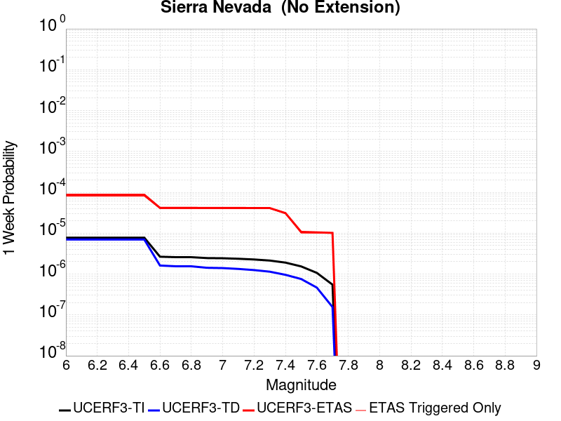 |  |  |  |

| Magnitude | 1 wk TI Prob | 1 wk TD Prob | 1 wk ETAS Prob | 1 wk ETAS/TD Gain | 1 wk ETAS Triggered Only | 1 mo TI Prob | 1 mo TD Prob | 1 mo ETAS Prob | 1 mo ETAS/TD Gain | 1 mo ETAS Triggered Only | 1 yr TI Prob | 1 yr TD Prob | 1 yr ETAS Prob | 1 yr ETAS/TD Gain | 1 yr ETAS Triggered Only | 10 yr TI Prob | 10 yr TD Prob | 10 yr ETAS Prob | 10 yr ETAS/TD Gain | 10 yr ETAS Triggered Only |
|-----|-----|-----|-----|-----|-----|-----|-----|-----|-----|-----|-----|-----|-----|-----|-----|-----|-----|-----|-----|-----|
| 6.0 | 7.7690465E-6 | 6.9762946E-6 | 8.6975735E-5 | 12.467326 | 8.0E-5 | 3.329549E-5 | 2.9898265E-5 | 1.4989468E-4 | 5.0134907 | 1.2E-4 | 4.0529718E-4 | 3.6398642E-4 | 6.538809E-4 | 1.796443 | 2.9E-4 | 0.004045588 | 0.0036374186 | 0.0040359637 | 1.1095681 | 4.0E-4 |
| 6.1 | 7.7690465E-6 | 6.9762946E-6 | 8.6975735E-5 | 12.467326 | 8.0E-5 | 3.329549E-5 | 2.9898265E-5 | 1.4989468E-4 | 5.0134907 | 1.2E-4 | 4.0529718E-4 | 3.6398642E-4 | 6.538809E-4 | 1.796443 | 2.9E-4 | 0.004045588 | 0.0036374186 | 0.0040359637 | 1.1095681 | 4.0E-4 |
| 6.2 | 7.7690465E-6 | 6.9762946E-6 | 8.6975735E-5 | 12.467326 | 8.0E-5 | 3.329549E-5 | 2.9898265E-5 | 1.4989468E-4 | 5.0134907 | 1.2E-4 | 4.0529718E-4 | 3.6398642E-4 | 6.538809E-4 | 1.796443 | 2.9E-4 | 0.004045588 | 0.0036374186 | 0.0040359637 | 1.1095681 | 4.0E-4 |
| 6.3 | 7.7690465E-6 | 6.9762946E-6 | 8.6975735E-5 | 12.467326 | 8.0E-5 | 3.329549E-5 | 2.9898265E-5 | 1.4989468E-4 | 5.0134907 | 1.2E-4 | 4.0529718E-4 | 3.6398642E-4 | 6.538809E-4 | 1.796443 | 2.9E-4 | 0.004045588 | 0.0036374186 | 0.0040359637 | 1.1095681 | 4.0E-4 |
| 6.4 | 7.7690465E-6 | 6.9762946E-6 | 8.6975735E-5 | 12.467326 | 8.0E-5 | 3.329549E-5 | 2.9898265E-5 | 1.4989468E-4 | 5.0134907 | 1.2E-4 | 4.0529718E-4 | 3.6398642E-4 | 6.538809E-4 | 1.796443 | 2.9E-4 | 0.004045588 | 0.0036374186 | 0.0040359637 | 1.1095681 | 4.0E-4 |
| 6.5 | 7.7690465E-6 | 6.9762946E-6 | 8.6975735E-5 | 12.467326 | 8.0E-5 | 3.329549E-5 | 2.9898265E-5 | 1.4989468E-4 | 5.0134907 | 1.2E-4 | 4.0529718E-4 | 3.6398642E-4 | 6.538809E-4 | 1.796443 | 2.9E-4 | 0.004045588 | 0.0036374186 | 0.0040359637 | 1.1095681 | 4.0E-4 |
| 6.6 | 2.653E-6 | 1.6148236E-6 | 4.161476E-5 | 25.770468 | 4.0E-5 | 1.136995E-5 | 6.9206544E-6 | 8.69201E-5 | 12.559521 | 8.0E-5 | 1.3842035E-4 | 8.425574E-5 | 2.7423975E-4 | 3.2548492 | 1.9E-4 | 0.0013833415 | 8.4224145E-4 | 0.001112014 | 1.3203032 | 2.7E-4 |
| 6.7 | 2.5902466E-6 | 1.5501571E-6 | 4.1550094E-5 | 26.803797 | 4.0E-5 | 1.11010095E-5 | 6.6435136E-6 | 8.6642984E-5 | 13.04174 | 8.0E-5 | 1.351464E-4 | 8.088181E-5 | 2.7086644E-4 | 3.3489168 | 1.9E-4 | 0.0013506424 | 8.085267E-4 | 0.0010783083 | 1.3336707 | 2.7E-4 |
| 6.8 | 2.5853892E-6 | 1.5469574E-6 | 4.1546897E-5 | 26.857168 | 4.0E-5 | 1.1080193E-5 | 6.6298007E-6 | 8.662927E-5 | 13.066648 | 8.0E-5 | 1.34893E-4 | 8.071486E-5 | 2.7069953E-4 | 3.3537755 | 1.9E-4 | 0.0013481114 | 8.068585E-4 | 0.0010766406 | 1.3343612 | 2.7E-4 |
| 6.9 | 2.458257E-6 | 1.4220316E-6 | 4.1421976E-5 | 29.12873 | 4.0E-5 | 1.0535345E-5 | 6.094407E-6 | 8.609392E-5 | 14.12671 | 8.0E-5 | 1.2826028E-4 | 7.41969E-5 | 2.641828E-4 | 3.5605638 | 1.9E-4 | 0.0012818627 | 7.417232E-4 | 0.0010015303 | 1.350275 | 2.6E-4 |
| 7.0 | 2.4341468E-6 | 1.3989954E-6 | 4.139894E-5 | 29.591904 | 4.0E-5 | 1.0432016E-5 | 5.995681E-6 | 8.59952E-5 | 14.342858 | 8.0E-5 | 1.270024E-4 | 7.299499E-5 | 2.6298114E-4 | 3.6027284 | 1.9E-4 | 0.0012692984 | 7.297121E-4 | 9.895223E-4 | 1.3560449 | 2.6E-4 |
| 7.1 | 2.3652476E-6 | 1.3339453E-6 | 4.1333893E-5 | 30.986197 | 4.0E-5 | 1.0136736E-5 | 5.716896E-6 | 8.571644E-5 | 14.993527 | 8.0E-5 | 1.2340778E-4 | 6.9601E-5 | 2.4958848E-4 | 3.5859897 | 1.8E-4 | 0.0012333926 | 6.957937E-4 | 9.456198E-4 | 1.3590518 | 2.5E-4 |
| 7.2 | 2.272158E-6 | 1.2502522E-6 | 4.12502E-5 | 32.993504 | 4.0E-5 | 9.737784E-6 | 5.358213E-6 | 8.535779E-5 | 15.930271 | 8.0E-5 | 1.1855107E-4 | 6.52343E-5 | 2.4522256E-4 | 3.7591045 | 1.8E-4 | 0.0011848784 | 6.5215304E-4 | 9.0199E-4 | 1.3830956 | 2.5E-4 |
| 7.3 | 2.1382127E-6 | 1.1419407E-6 | 4.1141895E-5 | 36.02805 | 4.0E-5 | 9.163737E-6 | 4.8940224E-6 | 8.489363E-5 | 17.346392 | 8.0E-5 | 1.1156279E-4 | 5.9583104E-5 | 2.3957239E-4 | 4.0208106 | 1.8E-4 | 0.001115068 | 5.9567246E-4 | 8.355295E-4 | 1.402666 | 2.4E-4 |
| 7.4 | 1.9048055E-6 | 9.574952E-7 | 3.0957468E-5 | 32.33172 | 3.0E-5 | 8.163426E-6 | 4.1035446E-6 | 7.4103256E-5 | 18.058353 | 7.0E-5 | 9.9385186E-5 | 4.9959515E-5 | 2.0995153E-4 | 4.202433 | 1.6E-4 | 9.934074E-4 | 4.9948355E-4 | 7.093786E-4 | 1.4202243 | 2.1E-4 |
| 7.5 | 1.5373403E-6 | 7.559785E-7 | 1.0755971E-5 | 14.22788 | 1.0E-5 | 6.5885843E-6 | 3.2399037E-6 | 3.3239805E-5 | 10.259504 | 3.0E-5 | 8.021306E-5 | 3.944512E-5 | 1.4944078E-4 | 3.7885747 | 1.1E-4 | 8.0184115E-4 | 3.9438164E-4 | 5.5431854E-4 | 1.4055384 | 1.6E-4 |
| 7.6 | 1.0680322E-6 | 4.659426E-7 | 1.04659375E-5 | 22.46186 | 1.0E-5 | 4.577273E-6 | 1.9968952E-6 | 1.1996875E-5 | 6.007764 | 1.0E-5 | 5.5726876E-5 | 2.4311932E-5 | 7.4310716E-5 | 3.0565534 | 5.0E-5 | 5.5712904E-4 | 2.4309299E-4 | 3.2307353E-4 | 1.3290122 | 8.0E-5 |
| 7.7 | 5.509146E-7 | 1.557863E-7 | 1.0155784E-5 | 65.19049 | 1.0E-5 | 2.3610605E-6 | 6.676554E-7 | 1.0667649E-5 | 15.977777 | 1.0E-5 | 2.8745531E-5 | 8.128675E-6 | 1.8128594E-5 | 2.2302027 | 1.0E-5 | 2.8741814E-4 | 8.128389E-5 | 1.0128227E-4 | 1.2460312 | 2.0E-5 |

## Death Valley (No)
*[(top)](#table-of-contents)*

| 1 Week | 1 Month | 1 Year | 10 Year |
|-----|-----|-----|-----|
|  | 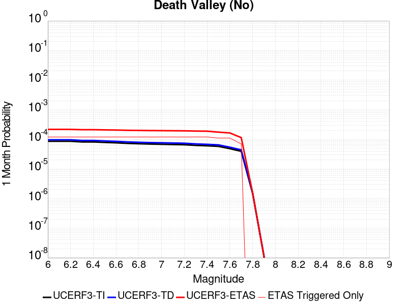 |  |  |

| Magnitude | 1 wk TI Prob | 1 wk TD Prob | 1 wk ETAS Prob | 1 wk ETAS/TD Gain | 1 wk ETAS Triggered Only | 1 mo TI Prob | 1 mo TD Prob | 1 mo ETAS Prob | 1 mo ETAS/TD Gain | 1 mo ETAS Triggered Only | 1 yr TI Prob | 1 yr TD Prob | 1 yr ETAS Prob | 1 yr ETAS/TD Gain | 1 yr ETAS Triggered Only | 10 yr TI Prob | 10 yr TD Prob | 10 yr ETAS Prob | 10 yr ETAS/TD Gain | 10 yr ETAS Triggered Only |
|-----|-----|-----|-----|-----|-----|-----|-----|-----|-----|-----|-----|-----|-----|-----|-----|-----|-----|-----|-----|-----|
| 6.0 | 2.0074807E-5 | 2.2500117E-5 | 6.249922E-5 | 2.7777286 | 4.0E-5 | 8.603206E-5 | 9.642555E-5 | 2.1641399E-4 | 2.2443633 | 1.2E-4 | 0.001046937 | 0.0011733562 | 0.0013831098 | 1.1787637 | 2.1E-4 | 0.010420183 | 0.011672524 | 0.012057972 | 1.0330218 | 3.9E-4 |
| 6.1 | 2.0074807E-5 | 2.2500117E-5 | 6.249922E-5 | 2.7777286 | 4.0E-5 | 8.603206E-5 | 9.642555E-5 | 2.1641399E-4 | 2.2443633 | 1.2E-4 | 0.001046937 | 0.0011733562 | 0.0013831098 | 1.1787637 | 2.1E-4 | 0.010420183 | 0.011672524 | 0.012057972 | 1.0330218 | 3.9E-4 |
| 6.2 | 2.0074807E-5 | 2.2500117E-5 | 6.249922E-5 | 2.7777286 | 4.0E-5 | 8.603206E-5 | 9.642555E-5 | 2.1641399E-4 | 2.2443633 | 1.2E-4 | 0.001046937 | 0.0011733562 | 0.0013831098 | 1.1787637 | 2.1E-4 | 0.010420183 | 0.011672524 | 0.012057972 | 1.0330218 | 3.9E-4 |
| 6.3 | 1.9050609E-5 | 2.1336979E-5 | 6.1336126E-5 | 2.8746395 | 4.0E-5 | 8.164292E-5 | 9.144103E-5 | 2.1143006E-4 | 2.3122013 | 1.2E-4 | 9.935491E-4 | 0.0011127327 | 0.001322499 | 1.1885146 | 2.1E-4 | 0.009891188 | 0.011072435 | 0.011448228 | 1.0339395 | 3.8E-4 |
| 6.4 | 1.9050609E-5 | 2.1336979E-5 | 6.1336126E-5 | 2.8746395 | 4.0E-5 | 8.164292E-5 | 9.144103E-5 | 2.1143006E-4 | 2.3122013 | 1.2E-4 | 9.935491E-4 | 0.0011127327 | 0.001322499 | 1.1885146 | 2.1E-4 | 0.009891188 | 0.011072435 | 0.011448228 | 1.0339395 | 3.8E-4 |
| 6.5 | 1.8367004E-5 | 2.056104E-5 | 6.0560218E-5 | 2.945387 | 4.0E-5 | 7.8713354E-5 | 8.81158E-5 | 2.0810522E-4 | 2.3617244 | 1.2E-4 | 9.5791375E-4 | 0.0010722884 | 0.0012820632 | 1.1956328 | 2.1E-4 | 0.009537951 | 0.010671931 | 0.0110478755 | 1.0352274 | 3.8E-4 |
| 6.6 | 1.779439E-5 | 1.9910958E-5 | 5.9910162E-5 | 3.008904 | 4.0E-5 | 7.625944E-5 | 8.532992E-5 | 2.0531968E-4 | 2.4061863 | 1.2E-4 | 9.280632E-4 | 0.001038403 | 0.0012481849 | 1.2020236 | 2.1E-4 | 0.009241969 | 0.010336268 | 0.0107123405 | 1.0363837 | 3.8E-4 |
| 6.7 | 1.7025437E-5 | 1.9043453E-5 | 5.9042693E-5 | 3.1004193 | 4.0E-5 | 7.296412E-5 | 8.1612285E-5 | 2.016025E-4 | 2.470247 | 1.2E-4 | 8.87976E-4 | 9.931828E-4 | 0.0012029742 | 1.2112315 | 2.1E-4 | 0.008844362 | 0.00988816 | 0.010254501 | 1.0370485 | 3.7E-4 |
| 6.8 | 1.6545107E-5 | 1.8512574E-5 | 5.8511832E-5 | 3.1606538 | 4.0E-5 | 7.090568E-5 | 7.933722E-5 | 1.993277E-4 | 2.5124109 | 1.2E-4 | 8.629347E-4 | 9.655087E-4 | 0.0011753059 | 1.217292 | 2.1E-4 | 0.008595915 | 0.009613843 | 0.009980286 | 1.0381162 | 3.7E-4 |
| 6.9 | 1.615478E-5 | 1.8087621E-5 | 5.80869E-5 | 3.2114172 | 4.0E-5 | 6.9232934E-5 | 7.75161E-5 | 1.975068E-4 | 2.5479455 | 1.2E-4 | 8.4258494E-4 | 9.433561E-4 | 0.0011531579 | 1.2223995 | 2.1E-4 | 0.008393973 | 0.00939421 | 0.009750827 | 1.0379615 | 3.6E-4 |
| 7.0 | 1.5894311E-5 | 1.7805576E-5 | 5.7804864E-5 | 3.2464473 | 4.0E-5 | 6.81167E-5 | 7.630741E-5 | 1.9629826E-4 | 2.5724664 | 1.2E-4 | 8.2900526E-4 | 9.286529E-4 | 0.0011284671 | 1.2151657 | 2.0E-4 | 0.008259195 | 0.009248411 | 0.009585267 | 1.0364231 | 3.4E-4 |
| 7.1 | 1.5602263E-5 | 1.748353E-5 | 5.748283E-5 | 3.2878275 | 4.0E-5 | 6.6865134E-5 | 7.4927295E-5 | 1.949183E-4 | 2.6014326 | 1.2E-4 | 8.137789E-4 | 9.118641E-4 | 0.0011116817 | 1.2191309 | 2.0E-4 | 0.008108052 | 0.009081908 | 0.009418819 | 1.0370971 | 3.4E-4 |
| 7.2 | 1.5323829E-5 | 1.7170656E-5 | 5.7169967E-5 | 3.3295157 | 4.0E-5 | 6.56719E-5 | 7.358648E-5 | 1.9357765E-4 | 2.6306143 | 1.2E-4 | 7.99262E-4 | 8.9555327E-4 | 0.0010953741 | 1.2231257 | 2.0E-4 | 0.007963934 | 0.00892012 | 0.0092570875 | 1.0377761 | 3.4E-4 |
| 7.3 | 1.4556212E-5 | 1.630248E-5 | 5.6301826E-5 | 3.4535744 | 4.0E-5 | 6.238227E-5 | 6.9865935E-5 | 1.8985754E-4 | 2.7174554 | 1.2E-4 | 7.592395E-4 | 8.5029163E-4 | 0.0010501215 | 1.2350134 | 2.0E-4 | 0.0075665074 | 0.008471027 | 0.008798231 | 1.0386263 | 3.3E-4 |
| 7.4 | 1.411725E-5 | 1.5807984E-5 | 5.580735E-5 | 3.530327 | 4.0E-5 | 6.0501097E-5 | 6.7746776E-5 | 1.8773864E-4 | 2.771182 | 1.2E-4 | 7.363519E-4 | 8.2451064E-4 | 0.0010243458 | 1.2423681 | 2.0E-4 | 0.0073391674 | 0.008215151 | 0.008542439 | 1.0398396 | 3.3E-4 |
| 7.5 | 1.3503312E-5 | 1.5126312E-5 | 4.5125857E-5 | 2.983269 | 3.0E-5 | 5.7870053E-5 | 6.482547E-5 | 1.7481834E-4 | 2.6967537 | 1.1E-4 | 7.043401E-4 | 7.8897015E-4 | 9.688281E-4 | 1.2279655 | 1.8E-4 | 0.007021119 | 0.0078623155 | 0.008169878 | 1.0391185 | 3.1E-4 |
| 7.6 | 1.1279839E-5 | 1.2626346E-5 | 4.262597E-5 | 3.3759544 | 3.0E-5 | 4.834127E-5 | 5.4111817E-5 | 1.6410586E-4 | 3.0327177 | 1.1E-4 | 5.88396E-4 | 6.5861753E-4 | 8.2850555E-4 | 1.2579464 | 1.7E-4 | 0.005868405 | 0.006567208 | 0.0068652383 | 1.0453815 | 3.0E-4 |
| 7.7 | 9.189108E-6 | 1.0283374E-5 | 3.0283169E-5 | 2.9448671 | 2.0E-5 | 3.93813E-5 | 4.4070886E-5 | 1.140678E-4 | 2.5882802 | 7.0E-5 | 4.7936183E-4 | 5.36436E-4 | 6.363823E-4 | 1.1863155 | 1.0E-4 | 0.004783291 | 0.0053519215 | 0.005570744 | 1.0408868 | 2.2E-4 |
| 7.8 | 3.4586725E-7 | 3.6482638E-7 | 3.6482638E-7 | 1.0 | 0.0 | 1.4822873E-6 | 1.5635408E-6 | 1.5635408E-6 | 1.0 | 0.0 | 1.80467E-5 | 1.9035946E-5 | 1.9035946E-5 | 1.0 | 0.0 | 1.8045233E-4 | 1.903436E-4 | 2.003417E-4 | 1.0525266 | 1.0E-5 |
| 7.9 | 2.5591178E-9 | 2.6696731E-9 | 2.6696731E-9 | 1.0 | 0.0 | 1.0967647E-8 | 1.1441457E-8 | 1.1441457E-8 | 1.0 | 0.0 | 1.335311E-7 | 1.3929973E-7 | 1.3929973E-7 | 1.0 | 0.0 | 1.3353102E-6 | 1.3929973E-6 | 1.3929973E-6 | 1.0 | 0.0 |

## Death Valley (Fish Lake Valley)
*[(top)](#table-of-contents)*

| 1 Week | 1 Month | 1 Year | 10 Year |
|-----|-----|-----|-----|
|  | 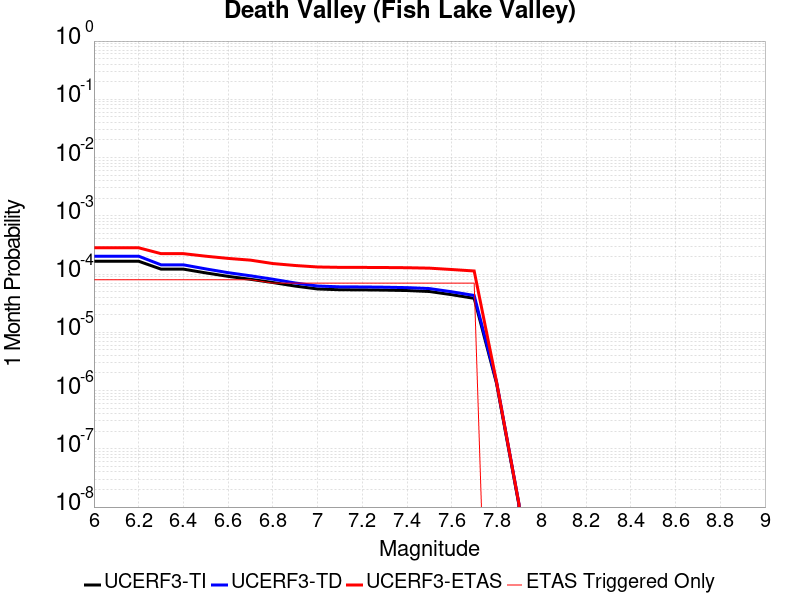 |  |  |

| Magnitude | 1 wk TI Prob | 1 wk TD Prob | 1 wk ETAS Prob | 1 wk ETAS/TD Gain | 1 wk ETAS Triggered Only | 1 mo TI Prob | 1 mo TD Prob | 1 mo ETAS Prob | 1 mo ETAS/TD Gain | 1 mo ETAS Triggered Only | 1 yr TI Prob | 1 yr TD Prob | 1 yr ETAS Prob | 1 yr ETAS/TD Gain | 1 yr ETAS Triggered Only | 10 yr TI Prob | 10 yr TD Prob | 10 yr ETAS Prob | 10 yr ETAS/TD Gain | 10 yr ETAS Triggered Only |
|-----|-----|-----|-----|-----|-----|-----|-----|-----|-----|-----|-----|-----|-----|-----|-----|-----|-----|-----|-----|-----|
| 6.0 | 3.872328E-5 | 4.7265836E-5 | 7.726442E-5 | 1.6346779 | 3.0E-5 | 1.6594635E-4 | 2.0255381E-4 | 2.825376E-4 | 1.3948767 | 8.0E-5 | 0.0020185246 | 0.0024635673 | 0.002643124 | 1.0728848 | 1.8E-4 | 0.02000288 | 0.024388403 | 0.024700599 | 1.0128009 | 3.2E-4 |
| 6.1 | 3.872328E-5 | 4.7265836E-5 | 7.726442E-5 | 1.6346779 | 3.0E-5 | 1.6594635E-4 | 2.0255381E-4 | 2.825376E-4 | 1.3948767 | 8.0E-5 | 0.0020185246 | 0.0024635673 | 0.002643124 | 1.0728848 | 1.8E-4 | 0.02000288 | 0.024388403 | 0.024700599 | 1.0128009 | 3.2E-4 |
| 6.2 | 3.872328E-5 | 4.7265836E-5 | 7.726442E-5 | 1.6346779 | 3.0E-5 | 1.6594635E-4 | 2.0255381E-4 | 2.825376E-4 | 1.3948767 | 8.0E-5 | 0.0020185246 | 0.0024635673 | 0.002643124 | 1.0728848 | 1.8E-4 | 0.02000288 | 0.024388403 | 0.024700599 | 1.0128009 | 3.2E-4 |
| 6.3 | 2.8356371E-5 | 3.3609867E-5 | 6.360886E-5 | 1.892565 | 3.0E-5 | 1.2152165E-4 | 1.4403477E-4 | 2.2402324E-4 | 1.5553415 | 8.0E-5 | 0.0014785219 | 0.0017522828 | 0.0019319674 | 1.1025431 | 1.8E-4 | 0.014687235 | 0.017391857 | 0.01770629 | 1.0180794 | 3.2E-4 |
| 6.4 | 2.8356371E-5 | 3.3609867E-5 | 6.360886E-5 | 1.892565 | 3.0E-5 | 1.2152165E-4 | 1.4403477E-4 | 2.2402324E-4 | 1.5553415 | 8.0E-5 | 0.0014785219 | 0.0017522828 | 0.0019319674 | 1.1025431 | 1.8E-4 | 0.014687235 | 0.017391857 | 0.01770629 | 1.0180794 | 3.2E-4 |
| 6.5 | 2.4448687E-5 | 2.8607647E-5 | 5.8606787E-5 | 2.0486407 | 3.0E-5 | 1.0477588E-4 | 1.225987E-4 | 2.025889E-4 | 1.6524554 | 8.0E-5 | 0.0012748998 | 0.0014916649 | 0.0016713963 | 1.1204906 | 1.8E-4 | 0.012676105 | 0.014821423 | 0.015126828 | 1.0206057 | 3.1E-4 |
| 6.6 | 2.1298161E-5 | 2.4660132E-5 | 5.465939E-5 | 2.2165084 | 3.0E-5 | 9.127464E-5 | 1.0568217E-4 | 1.8567372E-4 | 1.7569067 | 8.0E-5 | 0.0011107022 | 0.0012859538 | 0.0014657223 | 1.1397939 | 1.8E-4 | 0.011051672 | 0.012788556 | 0.013094591 | 1.0239304 | 3.1E-4 |
| 6.7 | 1.8959729E-5 | 2.1781067E-5 | 5.1780415E-5 | 2.3773131 | 3.0E-5 | 8.125345E-5 | 9.3344235E-5 | 1.7333677E-4 | 1.8569628 | 8.0E-5 | 9.888117E-4 | 0.0011358991 | 0.0013156947 | 1.1582848 | 1.8E-4 | 0.009844234 | 0.011303591 | 0.011610087 | 1.0271149 | 3.1E-4 |
| 6.8 | 1.6691629E-5 | 1.9018386E-5 | 3.9018003E-5 | 2.051594 | 2.0E-5 | 7.153359E-5 | 8.150491E-5 | 1.514992E-4 | 1.858774 | 7.0E-5 | 8.7057345E-4 | 9.918874E-4 | 0.0011617187 | 1.1712204 | 1.7E-4 | 0.008671708 | 0.009876361 | 0.010163496 | 1.029073 | 2.9E-4 |
| 6.9 | 1.450505E-5 | 1.6389566E-5 | 3.638924E-5 | 2.2202685 | 2.0E-5 | 6.216302E-5 | 7.0239155E-5 | 1.4023425E-4 | 1.9965252 | 7.0E-5 | 7.5657194E-4 | 8.5483503E-4 | 0.0010146982 | 1.1870106 | 1.6E-4 | 0.007540013 | 0.008516399 | 0.008794014 | 1.0325978 | 2.8E-4 |
| 7.0 | 1.2940855E-5 | 1.45379945E-5 | 3.4537705E-5 | 2.3756857 | 2.0E-5 | 5.545963E-5 | 6.2304236E-5 | 1.3229987E-4 | 2.123449 | 7.0E-5 | 6.750118E-4 | 7.582958E-4 | 9.181745E-4 | 1.2108394 | 1.6E-4 | 0.006729651 | 0.0075577013 | 0.007835586 | 1.0367683 | 2.8E-4 |
| 7.1 | 1.2544658E-5 | 1.4078229E-5 | 3.4077948E-5 | 2.4206133 | 2.0E-5 | 5.3761712E-5 | 6.0333903E-5 | 1.3032967E-4 | 2.16014 | 7.0E-5 | 6.5435225E-4 | 7.343233E-4 | 8.8421314E-4 | 1.2041197 | 1.5E-4 | 0.006524288 | 0.007319562 | 0.0075875856 | 1.0366174 | 2.7E-4 |
| 7.2 | 1.2489416E-5 | 1.4015695E-5 | 3.4015415E-5 | 2.4269516 | 2.0E-5 | 5.3524967E-5 | 6.0065915E-5 | 1.3006172E-4 | 2.1653163 | 7.0E-5 | 6.514716E-4 | 7.310627E-4 | 8.809531E-4 | 1.2050308 | 1.5E-4 | 0.006495651 | 0.0072871707 | 0.007555203 | 1.0367814 | 2.7E-4 |
| 7.3 | 1.2368307E-5 | 1.3879833E-5 | 3.3879554E-5 | 2.4409194 | 2.0E-5 | 5.3005948E-5 | 5.9483675E-5 | 1.2947951E-4 | 2.1767235 | 7.0E-5 | 6.451563E-4 | 7.2397874E-4 | 8.738701E-4 | 1.2070384 | 1.5E-4 | 0.0064328653 | 0.0072167926 | 0.007484844 | 1.0371428 | 2.7E-4 |
| 7.4 | 1.2161707E-5 | 1.3647888E-5 | 3.3647615E-5 | 2.465408 | 2.0E-5 | 5.212056E-5 | 5.848967E-5 | 1.2848558E-4 | 2.1967225 | 7.0E-5 | 6.3438306E-4 | 7.118847E-4 | 8.6177787E-4 | 1.2105583 | 1.5E-4 | 0.006325751 | 0.0070966315 | 0.007364715 | 1.0377762 | 2.7E-4 |
| 7.5 | 1.1707948E-5 | 1.3145535E-5 | 3.3145272E-5 | 2.521409 | 2.0E-5 | 5.0175953E-5 | 5.6336823E-5 | 1.2633287E-4 | 2.2424567 | 7.0E-5 | 6.10721E-4 | 6.8569055E-4 | 8.255945E-4 | 1.2040337 | 1.4E-4 | 0.0060904534 | 0.0068363314 | 0.007094554 | 1.037772 | 2.6E-4 |
| 7.6 | 1.0319538E-5 | 1.157964E-5 | 3.157941E-5 | 2.7271495 | 2.0E-5 | 4.4225842E-5 | 4.9626113E-5 | 1.1962264E-4 | 2.4104776 | 7.0E-5 | 5.383166E-4 | 6.040356E-4 | 7.339571E-4 | 1.2150891 | 1.3E-4 | 0.0053701443 | 0.0060244696 | 0.0062729632 | 1.0412475 | 2.5E-4 |
| 7.7 | 8.937764E-6 | 1.0022794E-5 | 3.0022593E-5 | 2.9954314 | 2.0E-5 | 3.830414E-5 | 4.2954154E-5 | 1.12951144E-4 | 2.6295745 | 7.0E-5 | 4.6625308E-4 | 5.2284636E-4 | 6.227941E-4 | 1.1911608 | 1.0E-4 | 0.0046527605 | 0.005216672 | 0.0054255766 | 1.0400455 | 2.1E-4 |
| 7.8 | 3.108007E-7 | 3.2846563E-7 | 3.2846563E-7 | 1.0 | 0.0 | 1.3320023E-6 | 1.4077091E-6 | 1.4077091E-6 | 1.0 | 0.0 | 1.6217007E-5 | 1.7138727E-5 | 1.7138727E-5 | 1.0 | 0.0 | 1.6215823E-4 | 1.7137444E-4 | 1.8137273E-4 | 1.0583417 | 1.0E-5 |
| 7.9 | 2.5591178E-9 | 2.6696731E-9 | 2.6696731E-9 | 1.0 | 0.0 | 1.0967647E-8 | 1.1441457E-8 | 1.1441457E-8 | 1.0 | 0.0 | 1.335311E-7 | 1.3929973E-7 | 1.3929973E-7 | 1.0 | 0.0 | 1.3353102E-6 | 1.3929973E-6 | 1.3929973E-6 | 1.0 | 0.0 |

## San Andreas (Parkfield)
*[(top)](#table-of-contents)*

| 1 Week | 1 Month | 1 Year | 10 Year |
|-----|-----|-----|-----|
|  |  | 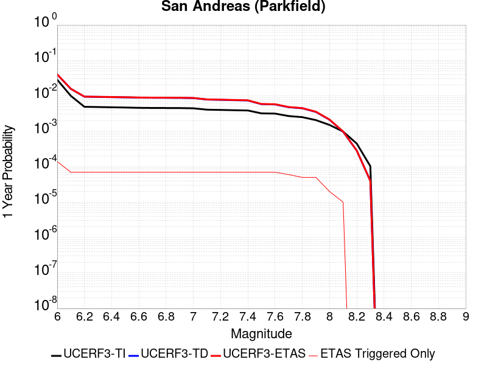 |  |

| Magnitude | 1 wk TI Prob | 1 wk TD Prob | 1 wk ETAS Prob | 1 wk ETAS/TD Gain | 1 wk ETAS Triggered Only | 1 mo TI Prob | 1 mo TD Prob | 1 mo ETAS Prob | 1 mo ETAS/TD Gain | 1 mo ETAS Triggered Only | 1 yr TI Prob | 1 yr TD Prob | 1 yr ETAS Prob | 1 yr ETAS/TD Gain | 1 yr ETAS Triggered Only | 10 yr TI Prob | 10 yr TD Prob | 10 yr ETAS Prob | 10 yr ETAS/TD Gain | 10 yr ETAS Triggered Only |
|-----|-----|-----|-----|-----|-----|-----|-----|-----|-----|-----|-----|-----|-----|-----|-----|-----|-----|-----|-----|-----|
| 6.0 | 5.556969E-4 | 7.778659E-4 | 7.978503E-4 | 1.0256914 | 2.0E-5 | 0.0023793848 | 0.0033299993 | 0.0033698662 | 1.0119721 | 4.0E-5 | 0.028586963 | 0.040236454 | 0.040370822 | 1.0033394 | 1.4E-4 | 0.25176284 | 0.33727366 | 0.33744597 | 1.0005109 | 2.6E-4 |
| 6.1 | 1.925858E-4 | 3.0278973E-4 | 3.127867E-4 | 1.0330162 | 1.0E-5 | 8.2510663E-4 | 0.0012971186 | 0.0013170927 | 1.0153987 | 2.0E-5 | 0.0099994885 | 0.015774338 | 0.015843233 | 1.0043676 | 7.0E-5 | 0.095613256 | 0.14975367 | 0.1498727 | 1.0007949 | 1.4E-4 |
| 6.2 | 9.4306815E-5 | 1.8244657E-4 | 1.9244474E-4 | 1.0548005 | 1.0E-5 | 4.0410945E-4 | 7.816808E-4 | 8.016652E-4 | 1.0255659 | 2.0E-5 | 0.0049089384 | 0.009475638 | 0.009544975 | 1.0073174 | 7.0E-5 | 0.048019063 | 0.091851585 | 0.09196965 | 1.0012853 | 1.3E-4 |
| 6.3 | 9.283051E-5 | 1.7941177E-4 | 1.8940998E-4 | 1.0557277 | 1.0E-5 | 3.9778434E-4 | 7.686822E-4 | 7.886669E-4 | 1.0259986 | 2.0E-5 | 0.0048322747 | 0.009318747 | 0.009388095 | 1.0074418 | 7.0E-5 | 0.047285385 | 0.09050457 | 0.090622805 | 1.0013064 | 1.3E-4 |
| 6.4 | 9.138826E-5 | 1.770335E-4 | 1.8703172E-4 | 1.0564765 | 1.0E-5 | 3.916052E-4 | 7.5849553E-4 | 7.784804E-4 | 1.026348 | 2.0E-5 | 0.0047573745 | 0.009195783 | 0.00926514 | 1.0075421 | 7.0E-5 | 0.046568092 | 0.08940868 | 0.08952706 | 1.0013239 | 1.3E-4 |
| 6.5 | 9.000255E-5 | 1.7461405E-4 | 1.846123E-4 | 1.0572592 | 1.0E-5 | 3.8566816E-4 | 7.481325E-4 | 7.681175E-4 | 1.0267133 | 2.0E-5 | 0.0046854047 | 0.009070679 | 0.0091400435 | 1.0076472 | 7.0E-5 | 0.045878403 | 0.08829115 | 0.08840968 | 1.0013424 | 1.3E-4 |
| 6.6 | 8.8109264E-5 | 1.7142571E-4 | 1.81424E-4 | 1.0583243 | 1.0E-5 | 3.7755648E-4 | 7.344759E-4 | 7.544612E-4 | 1.0272104 | 2.0E-5 | 0.0045870654 | 0.0089057945 | 0.008975171 | 1.0077901 | 7.0E-5 | 0.04493529 | 0.08682233 | 0.08694104 | 1.0013673 | 1.3E-4 |
| 6.7 | 8.738073E-5 | 1.7009654E-4 | 1.8009484E-4 | 1.0587802 | 1.0E-5 | 3.7443507E-4 | 7.287827E-4 | 7.487681E-4 | 1.027423 | 2.0E-5 | 0.0045492216 | 0.008837086 | 0.008906468 | 1.0078511 | 7.0E-5 | 0.04457213 | 0.08622207 | 0.08634085 | 1.0013777 | 1.3E-4 |
| 6.8 | 8.710195E-5 | 1.6955155E-4 | 1.7954985E-4 | 1.0589691 | 1.0E-5 | 3.7324068E-4 | 7.264483E-4 | 7.464338E-4 | 1.0275112 | 2.0E-5 | 0.0045347405 | 0.008808903 | 0.008878287 | 1.0078765 | 7.0E-5 | 0.04443313 | 0.08596963 | 0.08608845 | 1.0013821 | 1.3E-4 |
| 6.9 | 8.6801556E-5 | 1.689611E-4 | 1.789594E-4 | 1.0591753 | 1.0E-5 | 3.7195362E-4 | 7.2391913E-4 | 7.439047E-4 | 1.0276074 | 2.0E-5 | 0.0045191357 | 0.00877836 | 0.008847745 | 1.0079042 | 7.0E-5 | 0.044283327 | 0.085695684 | 0.08581454 | 1.001387 | 1.3E-4 |
| 7.0 | 8.5571606E-5 | 1.664894E-4 | 1.7648774E-4 | 1.060054 | 1.0E-5 | 3.6668387E-4 | 7.1333203E-4 | 7.3331775E-4 | 1.0280174 | 2.0E-5 | 0.004455241 | 0.008650491 | 0.008719886 | 1.0080221 | 7.0E-5 | 0.043669727 | 0.08454359 | 0.08466261 | 1.0014076 | 1.3E-4 |
| 7.1 | 7.82589E-5 | 1.5129644E-4 | 1.6129493E-4 | 1.0660855 | 1.0E-5 | 3.3535215E-4 | 6.482529E-4 | 6.6823995E-4 | 1.0308322 | 2.0E-5 | 0.0040752706 | 0.007864088 | 0.0079335375 | 1.0088313 | 7.0E-5 | 0.040013418 | 0.077459246 | 0.07757917 | 1.0015483 | 1.3E-4 |
| 7.2 | 7.690929E-5 | 1.4866884E-4 | 1.5866736E-4 | 1.0672536 | 1.0E-5 | 3.2956956E-4 | 6.3699734E-4 | 6.5698463E-4 | 1.0313773 | 2.0E-5 | 0.004005129 | 0.0077280314 | 0.0077974903 | 1.0089879 | 7.0E-5 | 0.0393371 | 0.07623216 | 0.076352246 | 1.0015754 | 1.3E-4 |
| 7.3 | 7.5543794E-5 | 1.4563397E-4 | 1.5563252E-4 | 1.0686553 | 1.0E-5 | 3.2371894E-4 | 6.23997E-4 | 6.4398453E-4 | 1.0320314 | 2.0E-5 | 0.003934157 | 0.007570862 | 0.007640332 | 1.009176 | 7.0E-5 | 0.038652334 | 0.07479721 | 0.07491749 | 1.001608 | 1.3E-4 |
| 7.4 | 7.4214564E-5 | 1.4264353E-4 | 1.526421E-4 | 1.0700948 | 1.0E-5 | 3.1802364E-4 | 6.111869E-4 | 6.3117465E-4 | 1.0327032 | 2.0E-5 | 0.003865065 | 0.007415971 | 0.0074854516 | 1.0093691 | 7.0E-5 | 0.03798529 | 0.07337103 | 0.07349149 | 1.0016419 | 1.3E-4 |
| 7.5 | 6.149578E-5 | 1.1191976E-4 | 1.21918645E-4 | 1.0893397 | 1.0E-5 | 2.6352672E-4 | 4.7956806E-4 | 4.9955846E-4 | 1.0416842 | 2.0E-5 | 0.0032037178 | 0.0058231414 | 0.005892734 | 1.011951 | 7.0E-5 | 0.03157923 | 0.058560845 | 0.058673818 | 1.0019292 | 1.2E-4 |
| 7.6 | 6.0643448E-5 | 1.1020619E-4 | 1.20205084E-4 | 1.090729 | 1.0E-5 | 2.598746E-4 | 4.7222685E-4 | 4.9221737E-4 | 1.0423325 | 2.0E-5 | 0.0031593828 | 0.0057342364 | 0.005803835 | 1.0121374 | 7.0E-5 | 0.031148417 | 0.05772179 | 0.057834864 | 1.001959 | 1.2E-4 |
| 7.7 | 5.1652263E-5 | 9.1757334E-5 | 1.0175642E-4 | 1.1089731 | 1.0E-5 | 2.2134806E-4 | 3.931865E-4 | 4.131786E-4 | 1.0508465 | 2.0E-5 | 0.002691582 | 0.004776548 | 0.0048362613 | 1.0125014 | 6.0E-5 | 0.026592141 | 0.048538048 | 0.04862368 | 1.0017642 | 9.0E-5 |
| 7.8 | 4.8090482E-5 | 8.560593E-5 | 9.560507E-5 | 1.1168044 | 1.0E-5 | 2.060858E-4 | 3.66831E-4 | 3.7682732E-4 | 1.0272505 | 1.0E-5 | 0.0025062072 | 0.0044570295 | 0.0045068064 | 1.0111682 | 5.0E-5 | 0.024781305 | 0.04530393 | 0.045370758 | 1.0014751 | 7.0E-5 |
| 7.9 | 3.970278E-5 | 6.751086E-5 | 7.751018E-5 | 1.1481143 | 1.0E-5 | 1.7014367E-4 | 2.8930017E-4 | 2.9929727E-4 | 1.0345562 | 1.0E-5 | 0.002069531 | 0.0035165448 | 0.003566369 | 1.0141685 | 5.0E-5 | 0.020503636 | 0.03588324 | 0.035950728 | 1.0018808 | 7.0E-5 |
| 8.0 | 2.8982335E-5 | 4.0700386E-5 | 5.069998E-5 | 1.245688 | 1.0E-5 | 1.2420409E-4 | 1.7441857E-4 | 1.8441683E-4 | 1.0573233 | 1.0E-5 | 0.0015111357 | 0.0021214793 | 0.0021414368 | 1.0094074 | 2.0E-5 | 0.015009012 | 0.022011925 | 0.022041265 | 1.0013329 | 3.0E-5 |
| 8.1 | 1.8836186E-5 | 1.8680952E-5 | 1.8680952E-5 | 1.0 | 0.0 | 8.0724014E-5 | 8.005877E-5 | 8.005877E-5 | 1.0 | 0.0 | 9.823717E-4 | 9.7428024E-4 | 9.842705E-4 | 1.010254 | 1.0E-5 | 0.009780403 | 0.010488175 | 0.0105079645 | 1.001887 | 2.0E-5 |
| 8.2 | 8.643924E-6 | 5.474112E-6 | 5.474112E-6 | 1.0 | 0.0 | 3.704486E-5 | 2.3460268E-5 | 2.3460268E-5 | 1.0 | 0.0 | 4.5092785E-4 | 2.8559144E-4 | 2.8559144E-4 | 1.0 | 0.0 | 0.0045001395 | 0.0032484592 | 0.0032484592 | 1.0 | 0.0 |
| 8.3 | 1.983087E-6 | 7.65717E-7 | 7.65717E-7 | 1.0 | 0.0 | 8.498917E-6 | 3.2816401E-6 | 3.2816401E-6 | 1.0 | 0.0 | 1.034694E-4 | 3.9953255E-5 | 3.9953255E-5 | 1.0 | 0.0 | 0.0010342124 | 4.7185255E-4 | 4.7185255E-4 | 1.0 | 0.0 |

## Manix-Afton Hills
*[(top)](#table-of-contents)*

| 1 Week | 1 Month | 1 Year | 10 Year |
|-----|-----|-----|-----|
| 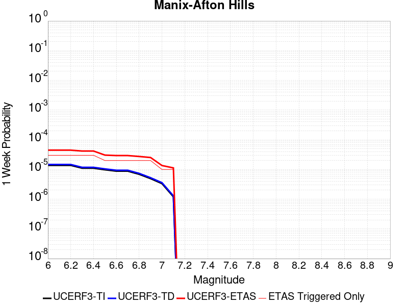 | 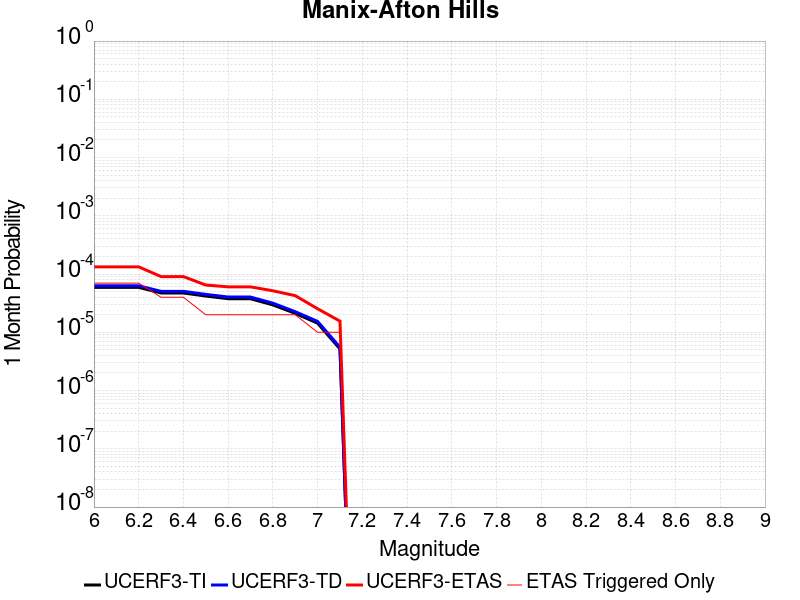 |  |  |

| Magnitude | 1 wk TI Prob | 1 wk TD Prob | 1 wk ETAS Prob | 1 wk ETAS/TD Gain | 1 wk ETAS Triggered Only | 1 mo TI Prob | 1 mo TD Prob | 1 mo ETAS Prob | 1 mo ETAS/TD Gain | 1 mo ETAS Triggered Only | 1 yr TI Prob | 1 yr TD Prob | 1 yr ETAS Prob | 1 yr ETAS/TD Gain | 1 yr ETAS Triggered Only | 10 yr TI Prob | 10 yr TD Prob | 10 yr ETAS Prob | 10 yr ETAS/TD Gain | 10 yr ETAS Triggered Only |
|-----|-----|-----|-----|-----|-----|-----|-----|-----|-----|-----|-----|-----|-----|-----|-----|-----|-----|-----|-----|-----|
| 6.0 | 1.3783202E-5 | 1.4711102E-5 | 4.471066E-5 | 3.039246 | 3.0E-5 | 5.906953E-5 | 6.304616E-5 | 1.3304174E-4 | 2.1102276 | 7.0E-5 | 7.189342E-4 | 7.673341E-4 | 9.17219E-4 | 1.195332 | 1.5E-4 | 0.0071661277 | 0.007648602 | 0.00786692 | 1.0285435 | 2.2E-4 |
| 6.1 | 1.3783202E-5 | 1.4711102E-5 | 4.471066E-5 | 3.039246 | 3.0E-5 | 5.906953E-5 | 6.304616E-5 | 1.3304174E-4 | 2.1102276 | 7.0E-5 | 7.189342E-4 | 7.673341E-4 | 9.17219E-4 | 1.195332 | 1.5E-4 | 0.0071661277 | 0.007648602 | 0.00786692 | 1.0285435 | 2.2E-4 |
| 6.2 | 1.3783202E-5 | 1.4711102E-5 | 4.471066E-5 | 3.039246 | 3.0E-5 | 5.906953E-5 | 6.304616E-5 | 1.3304174E-4 | 2.1102276 | 7.0E-5 | 7.189342E-4 | 7.673341E-4 | 9.17219E-4 | 1.195332 | 1.5E-4 | 0.0071661277 | 0.007648602 | 0.00786692 | 1.0285435 | 2.2E-4 |
| 6.3 | 1.10494875E-5 | 1.1793146E-5 | 4.179279E-5 | 3.5438206 | 3.0E-5 | 4.7354086E-5 | 5.054113E-5 | 9.0539106E-5 | 1.7913946 | 4.0E-5 | 5.763835E-4 | 6.1517494E-4 | 7.151134E-4 | 1.1624554 | 1.0E-4 | 0.005748908 | 0.006135761 | 0.006274902 | 1.0226771 | 1.4E-4 |
| 6.4 | 1.10494875E-5 | 1.1793146E-5 | 4.179279E-5 | 3.5438206 | 3.0E-5 | 4.7354086E-5 | 5.054113E-5 | 9.0539106E-5 | 1.7913946 | 4.0E-5 | 5.763835E-4 | 6.1517494E-4 | 7.151134E-4 | 1.1624554 | 1.0E-4 | 0.005748908 | 0.006135761 | 0.006274902 | 1.0226771 | 1.4E-4 |
| 6.5 | 9.788949E-6 | 1.0454329E-5 | 3.0454119E-5 | 2.9130633 | 2.0E-5 | 4.1951964E-5 | 4.4803546E-5 | 6.4802654E-5 | 1.4463732 | 2.0E-5 | 5.1064545E-4 | 5.4535596E-4 | 6.253123E-4 | 1.1466132 | 8.0E-5 | 0.0050947363 | 0.005441103 | 0.0055604503 | 1.0219344 | 1.2E-4 |
| 6.6 | 8.810006E-6 | 9.413636E-6 | 2.9413448E-5 | 3.1245575 | 2.0E-5 | 3.775662E-5 | 4.034358E-5 | 6.0342772E-5 | 1.4957218 | 2.0E-5 | 4.5958988E-4 | 4.910813E-4 | 5.71042E-4 | 1.1628258 | 8.0E-5 | 0.0045864056 | 0.0049008434 | 0.005020255 | 1.0243655 | 1.2E-4 |
| 6.7 | 8.80128E-6 | 9.404116E-6 | 2.9403927E-5 | 3.1267083 | 2.0E-5 | 3.7719226E-5 | 4.030278E-5 | 6.0301976E-5 | 1.4962237 | 2.0E-5 | 4.591348E-4 | 4.9058476E-4 | 5.7054556E-4 | 1.1629907 | 8.0E-5 | 0.004581874 | 0.0048959 | 0.0050153127 | 1.0243903 | 1.2E-4 |
| 6.8 | 6.8994877E-6 | 7.3800825E-6 | 2.7379934E-5 | 3.709977 | 2.0E-5 | 2.9568899E-5 | 3.1628588E-5 | 5.1627954E-5 | 1.6323193 | 2.0E-5 | 3.5994186E-4 | 3.8501818E-4 | 4.4499506E-4 | 1.1557769 | 6.0E-5 | 0.003593594 | 0.0038443161 | 0.0039240085 | 1.0207299 | 8.0E-5 |
| 6.9 | 4.9328037E-6 | 5.270966E-6 | 2.527086E-5 | 4.794351 | 2.0E-5 | 2.1140417E-5 | 2.2589693E-5 | 4.258924E-5 | 1.8853395 | 2.0E-5 | 2.5735417E-4 | 2.7500096E-4 | 3.2498722E-4 | 1.1817676 | 5.0E-5 | 0.0025705635 | 0.0027472118 | 0.002807047 | 1.0217804 | 6.0E-5 |
| 7.0 | 3.347973E-6 | 3.5900332E-6 | 1.3589997E-5 | 3.7854795 | 1.0E-5 | 1.4348378E-5 | 1.5385789E-5 | 2.5385636E-5 | 1.6499404 | 1.0E-5 | 1.746775E-4 | 1.8730998E-4 | 2.1730436E-4 | 1.1601323 | 3.0E-5 | 0.0017454025 | 0.0018719237 | 0.0019018675 | 1.0159963 | 3.0E-5 |
| 7.1 | 1.2073567E-6 | 1.2934831E-6 | 1.129347E-5 | 8.731053 | 1.0E-5 | 5.1743755E-6 | 5.5434966E-6 | 1.554344E-5 | 2.8039055 | 1.0E-5 | 6.29962E-5 | 6.7491615E-5 | 8.749027E-5 | 1.296313 | 2.0E-5 | 6.297835E-4 | 6.748713E-4 | 6.9485785E-4 | 1.0296153 | 2.0E-5 |

## Elsinore (Glen Ivy) rev
*[(top)](#table-of-contents)*

| 1 Week | 1 Month | 1 Year | 10 Year |
|-----|-----|-----|-----|
|  |  |  |  |

| Magnitude | 1 wk TI Prob | 1 wk TD Prob | 1 wk ETAS Prob | 1 wk ETAS/TD Gain | 1 wk ETAS Triggered Only | 1 mo TI Prob | 1 mo TD Prob | 1 mo ETAS Prob | 1 mo ETAS/TD Gain | 1 mo ETAS Triggered Only | 1 yr TI Prob | 1 yr TD Prob | 1 yr ETAS Prob | 1 yr ETAS/TD Gain | 1 yr ETAS Triggered Only | 10 yr TI Prob | 10 yr TD Prob | 10 yr ETAS Prob | 10 yr ETAS/TD Gain | 10 yr ETAS Triggered Only |
|-----|-----|-----|-----|-----|-----|-----|-----|-----|-----|-----|-----|-----|-----|-----|-----|-----|-----|-----|-----|-----|
| 6.0 | 1.6204086E-4 | 2.9372794E-4 | 3.337162E-4 | 1.1361405 | 4.0E-5 | 6.94276E-4 | 0.0012583815 | 0.0013482682 | 1.0714304 | 9.0E-5 | 0.008420097 | 0.015234638 | 0.01535281 | 1.0077568 | 1.2E-4 | 0.081081145 | 0.13962431 | 0.13980499 | 1.001294 | 2.1E-4 |
| 6.1 | 1.6204086E-4 | 2.9372794E-4 | 3.337162E-4 | 1.1361405 | 4.0E-5 | 6.94276E-4 | 0.0012583815 | 0.0013482682 | 1.0714304 | 9.0E-5 | 0.008420097 | 0.015234638 | 0.01535281 | 1.0077568 | 1.2E-4 | 0.081081145 | 0.13962431 | 0.13980499 | 1.001294 | 2.1E-4 |
| 6.2 | 1.6204086E-4 | 2.9372794E-4 | 3.337162E-4 | 1.1361405 | 4.0E-5 | 6.94276E-4 | 0.0012583815 | 0.0013482682 | 1.0714304 | 9.0E-5 | 0.008420097 | 0.015234638 | 0.01535281 | 1.0077568 | 1.2E-4 | 0.081081145 | 0.13962431 | 0.13980499 | 1.001294 | 2.1E-4 |
| 6.3 | 1.0111737E-4 | 1.7703477E-4 | 1.9703123E-4 | 1.1129521 | 2.0E-5 | 4.332882E-4 | 7.586165E-4 | 7.985862E-4 | 1.0526875 | 4.0E-5 | 0.005262531 | 0.009217729 | 0.009277175 | 1.0064492 | 6.0E-5 | 0.0513964 | 0.08707359 | 0.08717401 | 1.0011533 | 1.1E-4 |
| 6.4 | 1.0111737E-4 | 1.7703477E-4 | 1.9703123E-4 | 1.1129521 | 2.0E-5 | 4.332882E-4 | 7.586165E-4 | 7.985862E-4 | 1.0526875 | 4.0E-5 | 0.005262531 | 0.009217729 | 0.009277175 | 1.0064492 | 6.0E-5 | 0.0513964 | 0.08707359 | 0.08717401 | 1.0011533 | 1.1E-4 |
| 6.5 | 3.6624708E-5 | 4.6392135E-5 | 4.6392135E-5 | 1.0 | 0.0 | 1.569536E-4 | 1.9881032E-4 | 1.9881032E-4 | 1.0 | 0.0 | 0.001909235 | 0.002418189 | 0.002428165 | 1.0041254 | 1.0E-5 | 0.01892915 | 0.023696693 | 0.023725983 | 1.001236 | 3.0E-5 |
| 6.6 | 2.5051324E-5 | 2.6147582E-5 | 2.6147582E-5 | 1.0 | 0.0 | 1.073584E-4 | 1.120565E-4 | 1.120565E-4 | 1.0 | 0.0 | 0.0013063047 | 0.0013634786 | 0.0013734649 | 1.0073242 | 1.0E-5 | 0.012986525 | 0.013565684 | 0.013585412 | 1.0014544 | 2.0E-5 |
| 6.7 | 2.2189772E-5 | 2.2072556E-5 | 2.2072556E-5 | 1.0 | 0.0 | 9.509556E-5 | 9.459344E-5 | 9.459344E-5 | 1.0 | 0.0 | 0.0011571734 | 0.0011511031 | 0.0011610915 | 1.0086774 | 1.0E-5 | 0.011511663 | 0.011466395 | 0.011486166 | 1.0017242 | 2.0E-5 |
| 6.8 | 1.6654378E-5 | 1.443766E-5 | 1.443766E-5 | 1.0 | 0.0 | 7.137396E-5 | 6.187425E-5 | 6.187425E-5 | 1.0 | 0.0 | 8.686314E-4 | 7.5306377E-4 | 7.630562E-4 | 1.0132691 | 1.0E-5 | 0.008652439 | 0.007510068 | 0.0075299176 | 1.0026431 | 2.0E-5 |
| 6.9 | 1.5042909E-5 | 1.2331941E-5 | 1.2331941E-5 | 1.0 | 0.0 | 6.446802E-5 | 5.2850126E-5 | 5.2850126E-5 | 1.0 | 0.0 | 7.8461546E-4 | 6.4326345E-4 | 6.4326345E-4 | 1.0 | 0.0 | 0.007818509 | 0.0064179692 | 0.006427905 | 1.0015482 | 1.0E-5 |
| 7.0 | 1.4361385E-5 | 1.1451226E-5 | 1.1451226E-5 | 1.0 | 0.0 | 6.154734E-5 | 4.9075777E-5 | 4.9075777E-5 | 1.0 | 0.0 | 7.490812E-4 | 5.973367E-4 | 5.973367E-4 | 1.0 | 0.0 | 0.007465612 | 0.0059610247 | 0.005970965 | 1.0016676 | 1.0E-5 |
| 7.1 | 1.3265571E-5 | 1.0244784E-5 | 1.0244784E-5 | 1.0 | 0.0 | 5.6851208E-5 | 4.3905493E-5 | 4.3905493E-5 | 1.0 | 0.0 | 6.919436E-4 | 5.3442083E-4 | 5.3442083E-4 | 1.0 | 0.0 | 0.006897931 | 0.0053346455 | 0.005344592 | 1.0018646 | 1.0E-5 |
| 7.2 | 1.1596403E-5 | 8.504888E-6 | 8.504888E-6 | 1.0 | 0.0 | 4.9697923E-5 | 3.644902E-5 | 3.644902E-5 | 1.0 | 0.0 | 6.049042E-4 | 4.4367815E-4 | 4.4367815E-4 | 1.0 | 0.0 | 0.006032603 | 0.0044293557 | 0.0044393116 | 1.0022477 | 1.0E-5 |
| 7.3 | 1.0150827E-5 | 7.2385756E-6 | 7.2385756E-6 | 1.0 | 0.0 | 4.3502816E-5 | 3.1022104E-5 | 3.1022104E-5 | 1.0 | 0.0 | 5.2951806E-4 | 3.7763012E-4 | 3.7763012E-4 | 1.0 | 0.0 | 0.005282581 | 0.0037702844 | 0.0037802465 | 1.0026423 | 1.0E-5 |
| 7.4 | 9.080705E-6 | 6.352344E-6 | 6.352344E-6 | 1.0 | 0.0 | 3.8916725E-5 | 2.7224054E-5 | 2.7224054E-5 | 1.0 | 0.0 | 4.7370812E-4 | 3.314038E-4 | 3.314038E-4 | 1.0 | 0.0 | 0.004726996 | 0.0033092424 | 0.0033192094 | 1.0030118 | 1.0E-5 |
| 7.5 | 7.671649E-6 | 5.225451E-6 | 5.225451E-6 | 1.0 | 0.0 | 3.287808E-5 | 2.2394604E-5 | 2.2394604E-5 | 1.0 | 0.0 | 4.0021708E-4 | 2.7262146E-4 | 2.7262146E-4 | 1.0 | 0.0 | 0.0039949706 | 0.0027229951 | 0.0027229951 | 1.0 | 0.0 |
| 7.6 | 6.990086E-6 | 4.687362E-6 | 4.687362E-6 | 1.0 | 0.0 | 2.9957167E-5 | 2.0088546E-5 | 2.0088546E-5 | 1.0 | 0.0 | 3.6466747E-4 | 2.4455177E-4 | 2.4455177E-4 | 1.0 | 0.0 | 0.0036406964 | 0.0024429427 | 0.0024429427 | 1.0 | 0.0 |
| 7.7 | 4.163505E-6 | 2.329347E-6 | 2.329347E-6 | 1.0 | 0.0 | 1.7843471E-5 | 9.982881E-6 | 9.982881E-6 | 1.0 | 0.0 | 2.172226E-4 | 1.21535544E-4 | 1.21535544E-4 | 1.0 | 0.0 | 0.0021701038 | 0.0012147637 | 0.0012147637 | 1.0 | 0.0 |
| 7.8 | 2.2692414E-7 | 9.384503E-8 | 9.384503E-8 | 1.0 | 0.0 | 9.725317E-7 | 4.0219294E-7 | 4.0219294E-7 | 1.0 | 0.0 | 1.1840509E-5 | 4.8966913E-6 | 4.8966913E-6 | 1.0 | 0.0 | 1.1839878E-4 | 4.896616E-5 | 4.896616E-5 | 1.0 | 0.0 |
| 7.9 | 6.676829E-9 | 3.4397292E-9 | 3.4397292E-9 | 1.0 | 0.0 | 2.861498E-8 | 1.4741697E-8 | 1.4741697E-8 | 1.0 | 0.0 | 3.4838732E-7 | 1.7948015E-7 | 1.7948015E-7 | 1.0 | 0.0 | 3.4838679E-6 | 1.7948001E-6 | 1.7948001E-6 | 1.0 | 0.0 |

## Baker
*[(top)](#table-of-contents)*

| 1 Week | 1 Month | 1 Year | 10 Year |
|-----|-----|-----|-----|
|  | 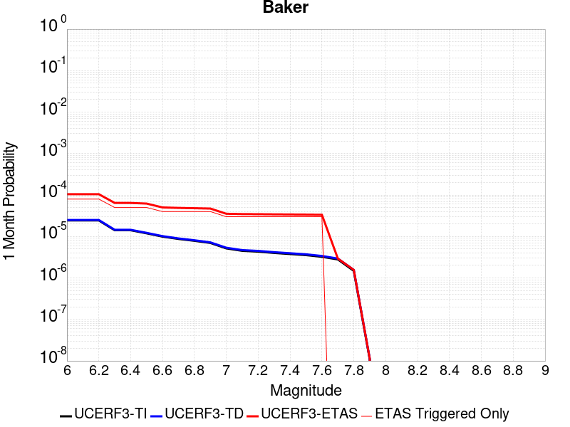 |  | 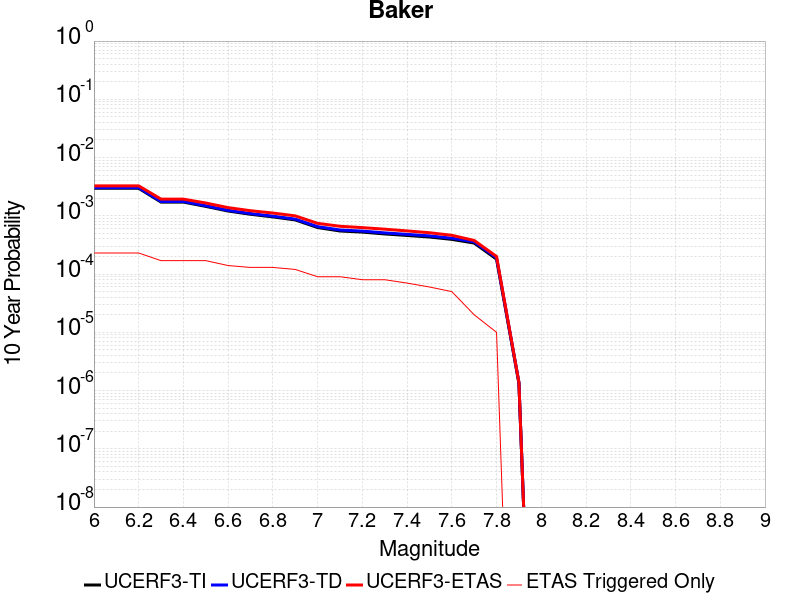 |

| Magnitude | 1 wk TI Prob | 1 wk TD Prob | 1 wk ETAS Prob | 1 wk ETAS/TD Gain | 1 wk ETAS Triggered Only | 1 mo TI Prob | 1 mo TD Prob | 1 mo ETAS Prob | 1 mo ETAS/TD Gain | 1 mo ETAS Triggered Only | 1 yr TI Prob | 1 yr TD Prob | 1 yr ETAS Prob | 1 yr ETAS/TD Gain | 1 yr ETAS Triggered Only | 10 yr TI Prob | 10 yr TD Prob | 10 yr ETAS Prob | 10 yr ETAS/TD Gain | 10 yr ETAS Triggered Only |
|-----|-----|-----|-----|-----|-----|-----|-----|-----|-----|-----|-----|-----|-----|-----|-----|-----|-----|-----|-----|-----|
| 6.0 | 5.695525E-6 | 5.8348387E-6 | 4.5834604E-5 | 7.8553333 | 4.0E-5 | 2.4409164E-5 | 2.5006235E-5 | 1.05004234E-4 | 4.199122 | 8.0E-5 | 2.9714106E-4 | 3.044124E-4 | 4.643637E-4 | 1.5254428 | 1.6E-4 | 0.0029674405 | 0.0030403496 | 0.0032696503 | 1.0754192 | 2.3E-4 |
| 6.1 | 5.695525E-6 | 5.8348387E-6 | 4.5834604E-5 | 7.8553333 | 4.0E-5 | 2.4409164E-5 | 2.5006235E-5 | 1.05004234E-4 | 4.199122 | 8.0E-5 | 2.9714106E-4 | 3.044124E-4 | 4.643637E-4 | 1.5254428 | 1.6E-4 | 0.0029674405 | 0.0030403496 | 0.0032696503 | 1.0754192 | 2.3E-4 |
| 6.2 | 5.695525E-6 | 5.8348387E-6 | 4.5834604E-5 | 7.8553333 | 4.0E-5 | 2.4409164E-5 | 2.5006235E-5 | 1.05004234E-4 | 4.199122 | 8.0E-5 | 2.9714106E-4 | 3.044124E-4 | 4.643637E-4 | 1.5254428 | 1.6E-4 | 0.0029674405 | 0.0030403496 | 0.0032696503 | 1.0754192 | 2.3E-4 |
| 6.3 | 3.2995713E-6 | 3.3836682E-6 | 2.33836E-5 | 6.910725 | 2.0E-5 | 1.4140943E-5 | 1.4501357E-5 | 6.450063E-5 | 4.447903 | 5.0E-5 | 1.7215237E-4 | 1.765402E-4 | 2.9651902E-4 | 1.6796119 | 1.2E-4 | 0.0017201907 | 0.0017640466 | 0.0019337467 | 1.0961994 | 1.7E-4 |
| 6.4 | 3.2995713E-6 | 3.3836682E-6 | 2.33836E-5 | 6.910725 | 2.0E-5 | 1.4140943E-5 | 1.4501357E-5 | 6.450063E-5 | 4.447903 | 5.0E-5 | 1.7215237E-4 | 1.765402E-4 | 2.9651902E-4 | 1.6796119 | 1.2E-4 | 0.0017201907 | 0.0017640466 | 0.0019337467 | 1.0961994 | 1.7E-4 |
| 6.5 | 2.782202E-6 | 2.8558413E-6 | 2.2855784E-5 | 8.00317 | 2.0E-5 | 1.1923668E-5 | 1.2239265E-5 | 6.223865E-5 | 5.0851626 | 5.0E-5 | 1.4516099E-4 | 1.4900319E-4 | 2.689853E-4 | 1.8052319 | 1.2E-4 | 0.001450662 | 0.0014890656 | 0.0016588124 | 1.1139956 | 1.7E-4 |
| 6.6 | 2.3163404E-6 | 2.3809207E-6 | 1.2380897E-5 | 5.2000456 | 1.0E-5 | 9.927136E-6 | 1.0203908E-5 | 5.02035E-5 | 4.920027 | 4.0E-5 | 1.20856166E-4 | 1.242257E-4 | 2.2421328E-4 | 1.8048865 | 1.0E-4 | 0.0012079047 | 0.0012415828 | 0.0013814089 | 1.1126193 | 1.4E-4 |
| 6.7 | 2.037056E-6 | 2.0965012E-6 | 1.20964805E-5 | 5.7698417 | 1.0E-5 | 8.7302105E-6 | 8.9849755E-6 | 4.8984617E-5 | 5.4518366 | 4.0E-5 | 1.0628513E-4 | 1.0938675E-4 | 1.993769E-4 | 1.8226788 | 9.0E-5 | 0.0010623431 | 0.0010933451 | 0.001223203 | 1.1187712 | 1.3E-4 |
| 6.8 | 1.8356744E-6 | 1.8915293E-6 | 1.189151E-5 | 6.2867174 | 1.0E-5 | 7.867153E-6 | 8.10653E-6 | 4.8106205E-5 | 5.9342537 | 4.0E-5 | 9.577837E-5 | 9.8692675E-5 | 1.886838E-4 | 1.9118317 | 9.0E-5 | 9.57371E-4 | 9.865024E-4 | 0.0011163742 | 1.1316487 | 1.3E-4 |
| 6.9 | 1.6310546E-6 | 1.6832079E-6 | 1.1683191E-5 | 6.9410267 | 1.0E-5 | 6.9902153E-6 | 7.2137286E-6 | 4.721344E-5 | 6.5449424 | 4.0E-5 | 8.510255E-5 | 8.782372E-5 | 1.6781669E-4 | 1.9108356 | 8.0E-5 | 8.5069967E-4 | 8.779014E-4 | 9.977961E-4 | 1.1365696 | 1.2E-4 |
| 7.0 | 1.2058036E-6 | 1.2508672E-6 | 1.1250854E-5 | 8.994444 | 1.0E-5 | 5.1677193E-6 | 5.3608483E-6 | 3.536069E-5 | 6.5960994 | 3.0E-5 | 6.291517E-5 | 6.5266395E-5 | 1.1526313E-4 | 1.766041 | 5.0E-5 | 6.289736E-4 | 6.524746E-4 | 7.424159E-4 | 1.1378464 | 9.0E-5 |
| 7.1 | 1.052382E-6 | 1.0951615E-6 | 1.10951505E-5 | 10.131064 | 1.0E-5 | 4.5102006E-6 | 4.6935406E-6 | 3.46934E-5 | 7.391733 | 3.0E-5 | 5.491031E-5 | 5.7142366E-5 | 1.0713951E-4 | 1.8749576 | 5.0E-5 | 5.4896745E-4 | 5.7127763E-4 | 6.612262E-4 | 1.1574516 | 9.0E-5 |
| 7.2 | 1.0067454E-6 | 1.0487717E-6 | 1.1048761E-5 | 10.534954 | 1.0E-5 | 4.3146156E-6 | 4.494728E-6 | 3.4494595E-5 | 7.6744566 | 3.0E-5 | 5.252918E-5 | 5.4721946E-5 | 1.04719205E-4 | 1.9136602 | 5.0E-5 | 5.251676E-4 | 5.4708554E-4 | 6.270418E-4 | 1.1461494 | 8.0E-5 |
| 7.3 | 9.3596316E-7 | 9.767729E-7 | 1.0976763E-5 | 11.237784 | 1.0E-5 | 4.0112645E-6 | 4.1861626E-6 | 3.4186036E-5 | 8.166438 | 3.0E-5 | 4.8836053E-5 | 5.0965347E-5 | 1.00962796E-4 | 1.9810088 | 5.0E-5 | 4.8825322E-4 | 5.0953735E-4 | 5.8949663E-4 | 1.1569252 | 8.0E-5 |
| 7.4 | 8.8117395E-7 | 9.2076687E-7 | 1.0920758E-5 | 11.860502 | 1.0E-5 | 3.7764542E-6 | 3.946138E-6 | 3.394602E-5 | 8.602341 | 3.0E-5 | 4.5977362E-5 | 4.8043174E-5 | 9.804077E-5 | 2.0406806 | 5.0E-5 | 4.596785E-4 | 4.8032866E-4 | 5.5029505E-4 | 1.1456635 | 7.0E-5 |
| 7.5 | 8.292386E-7 | 8.674601E-7 | 1.0867451E-5 | 12.527898 | 1.0E-5 | 3.5538749E-6 | 3.7176808E-6 | 3.371757E-5 | 9.069517 | 3.0E-5 | 4.326757E-5 | 4.526183E-5 | 8.526002E-5 | 1.8837068 | 4.0E-5 | 4.3259145E-4 | 4.5252685E-4 | 5.124997E-4 | 1.1325288 | 6.0E-5 |
| 7.6 | 7.553842E-7 | 7.914475E-7 | 1.0791439E-5 | 13.635066 | 1.0E-5 | 3.2373566E-6 | 3.3919137E-6 | 3.339181E-5 | 9.844535 | 3.0E-5 | 3.9414106E-5 | 4.129577E-5 | 7.129453E-5 | 1.7264366 | 3.0E-5 | 3.9407116E-4 | 4.128817E-4 | 4.6286106E-4 | 1.1210501 | 5.0E-5 |
| 7.7 | 6.5285366E-7 | 6.852801E-7 | 6.852801E-7 | 1.0 | 0.0 | 2.797941E-6 | 2.9369114E-6 | 2.9369114E-6 | 1.0 | 0.0 | 3.40644E-5 | 3.575632E-5 | 3.575632E-5 | 1.0 | 0.0 | 3.405918E-4 | 3.575063E-4 | 3.7749915E-4 | 1.0559231 | 2.0E-5 |
| 7.8 | 3.4586725E-7 | 3.6482638E-7 | 3.6482638E-7 | 1.0 | 0.0 | 1.4822873E-6 | 1.5635408E-6 | 1.5635408E-6 | 1.0 | 0.0 | 1.80467E-5 | 1.9035946E-5 | 1.9035946E-5 | 1.0 | 0.0 | 1.8045233E-4 | 1.903436E-4 | 2.003417E-4 | 1.0525266 | 1.0E-5 |
| 7.9 | 2.5591178E-9 | 2.6696731E-9 | 2.6696731E-9 | 1.0 | 0.0 | 1.0967647E-8 | 1.1441457E-8 | 1.1441457E-8 | 1.0 | 0.0 | 1.335311E-7 | 1.3929973E-7 | 1.3929973E-7 | 1.0 | 0.0 | 1.3353102E-6 | 1.3929973E-6 | 1.3929973E-6 | 1.0 | 0.0 |

## Mission Ridge-Arroyo Parida-Santa Ana
*[(top)](#table-of-contents)*

| 1 Week | 1 Month | 1 Year | 10 Year |
|-----|-----|-----|-----|
| 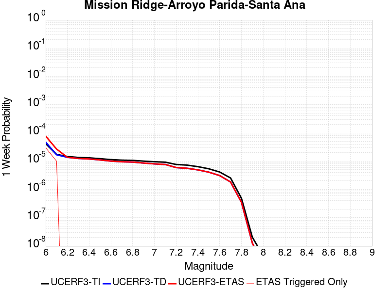 |  |  | 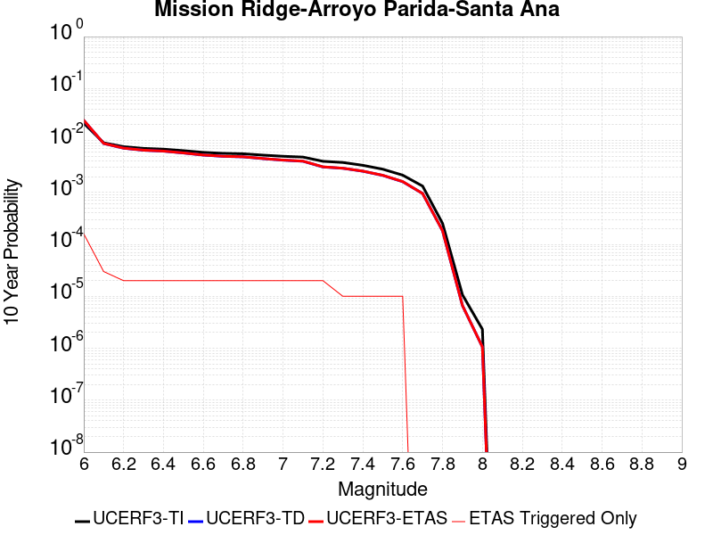 |

| Magnitude | 1 wk TI Prob | 1 wk TD Prob | 1 wk ETAS Prob | 1 wk ETAS/TD Gain | 1 wk ETAS Triggered Only | 1 mo TI Prob | 1 mo TD Prob | 1 mo ETAS Prob | 1 mo ETAS/TD Gain | 1 mo ETAS Triggered Only | 1 yr TI Prob | 1 yr TD Prob | 1 yr ETAS Prob | 1 yr ETAS/TD Gain | 1 yr ETAS Triggered Only | 10 yr TI Prob | 10 yr TD Prob | 10 yr ETAS Prob | 10 yr ETAS/TD Gain | 10 yr ETAS Triggered Only |
|-----|-----|-----|-----|-----|-----|-----|-----|-----|-----|-----|-----|-----|-----|-----|-----|-----|-----|-----|-----|-----|
| 6.0 | 4.169034E-5 | 4.7137164E-5 | 7.713575E-5 | 1.6364105 | 3.0E-5 | 1.7866064E-4 | 2.0200564E-4 | 2.4199755E-4 | 1.1979743 | 4.0E-5 | 0.0021730233 | 0.0024574718 | 0.0025672014 | 1.0446515 | 1.1E-4 | 0.021518968 | 0.024384888 | 0.024540985 | 1.0064014 | 1.6E-4 |
| 6.1 | 1.73813E-5 | 1.6854226E-5 | 2.6854059E-5 | 1.593313 | 1.0E-5 | 7.4489166E-5 | 7.223046E-5 | 8.2229744E-5 | 1.1384357 | 1.0E-5 | 9.065282E-4 | 8.7906176E-4 | 8.9904416E-4 | 1.0227315 | 2.0E-5 | 0.009028391 | 0.00875714 | 0.008786877 | 1.0033958 | 3.0E-5 |
| 6.2 | 1.4622182E-5 | 1.3673281E-5 | 1.3673281E-5 | 1.0 | 0.0 | 6.2664985E-5 | 5.859848E-5 | 5.859848E-5 | 1.0 | 0.0 | 7.6267915E-4 | 7.132068E-4 | 7.231997E-4 | 1.0140111 | 1.0E-5 | 0.007600669 | 0.0071097747 | 0.0071296324 | 1.0027931 | 2.0E-5 |
| 6.3 | 1.3552434E-5 | 1.248219E-5 | 1.248219E-5 | 1.0 | 0.0 | 5.8080568E-5 | 5.349402E-5 | 5.349402E-5 | 1.0 | 0.0 | 7.069015E-4 | 6.510982E-4 | 6.610917E-4 | 1.0153487 | 1.0E-5 | 0.00704657 | 0.0064924215 | 0.0065122917 | 1.0030605 | 2.0E-5 |
| 6.4 | 1.30977305E-5 | 1.1979145E-5 | 1.1979145E-5 | 1.0 | 0.0 | 5.613192E-5 | 5.1338196E-5 | 5.1338196E-5 | 1.0 | 0.0 | 6.831918E-4 | 6.248663E-4 | 6.348601E-4 | 1.0159935 | 1.0E-5 | 0.006810953 | 0.0062315906 | 0.006251466 | 1.0031894 | 2.0E-5 |
| 6.5 | 1.225205E-5 | 1.104879E-5 | 1.104879E-5 | 1.0 | 0.0 | 5.2507727E-5 | 4.7351114E-5 | 4.7351114E-5 | 1.0 | 0.0 | 6.3909404E-4 | 5.7635E-4 | 5.863443E-4 | 1.0173405 | 1.0E-5 | 0.006372592 | 0.0057490147 | 0.0057689 | 1.0034589 | 2.0E-5 |
| 6.6 | 1.1352241E-5 | 1.0063521E-5 | 1.0063521E-5 | 1.0 | 0.0 | 4.8651553E-5 | 4.3128675E-5 | 4.3128675E-5 | 1.0 | 0.0 | 5.921717E-4 | 5.249672E-4 | 5.34962E-4 | 1.0190388 | 1.0E-5 | 0.0059059616 | 0.0052376697 | 0.0052575646 | 1.0037985 | 2.0E-5 |
| 6.7 | 1.0864116E-5 | 9.517013E-6 | 9.517013E-6 | 1.0 | 0.0 | 4.6559664E-5 | 4.078657E-5 | 4.078657E-5 | 1.0 | 0.0 | 5.667165E-4 | 4.9646536E-4 | 5.064604E-4 | 1.0201324 | 1.0E-5 | 0.005652734 | 0.004953949 | 0.0049738493 | 1.0040172 | 2.0E-5 |
| 6.8 | 1.0666365E-5 | 9.299764E-6 | 9.299764E-6 | 1.0 | 0.0 | 4.571219E-5 | 3.9855535E-5 | 3.9855535E-5 | 1.0 | 0.0 | 5.564038E-4 | 4.851351E-4 | 4.9513025E-4 | 1.0206028 | 1.0E-5 | 0.005550127 | 0.0048411447 | 0.004861048 | 1.0041113 | 2.0E-5 |
| 6.9 | 1.0038665E-5 | 8.592029E-6 | 8.592029E-6 | 1.0 | 0.0 | 4.302214E-5 | 3.6822476E-5 | 3.6822476E-5 | 1.0 | 0.0 | 5.236687E-4 | 4.482232E-4 | 4.5821874E-4 | 1.0223004 | 1.0E-5 | 0.005224364 | 0.004473555 | 0.0044934656 | 1.0044507 | 2.0E-5 |
| 7.0 | 9.5379955E-6 | 8.025057E-6 | 8.025057E-6 | 1.0 | 0.0 | 4.0876483E-5 | 3.4392655E-5 | 3.4392655E-5 | 1.0 | 0.0 | 4.975576E-4 | 4.1865182E-4 | 4.2864765E-4 | 1.0238762 | 1.0E-5 | 0.00496445 | 0.004178983 | 0.0041989 | 1.0047659 | 2.0E-5 |
| 7.1 | 9.207389E-6 | 7.652357E-6 | 7.652357E-6 | 1.0 | 0.0 | 3.945964E-5 | 3.2795415E-5 | 3.2795415E-5 | 1.0 | 0.0 | 4.803152E-4 | 3.992127E-4 | 4.092087E-4 | 1.0250393 | 1.0E-5 | 0.004792784 | 0.0039853044 | 0.0040052244 | 1.0049984 | 2.0E-5 |
| 7.2 | 7.638091E-6 | 5.9310987E-6 | 5.9310987E-6 | 1.0 | 0.0 | 3.2734264E-5 | 2.5418749E-5 | 2.5418749E-5 | 1.0 | 0.0 | 3.984668E-4 | 3.0942963E-4 | 3.1942653E-4 | 1.0323075 | 1.0E-5 | 0.0039775306 | 0.0030901972 | 0.0031101354 | 1.0064521 | 2.0E-5 |
| 7.3 | 7.2500147E-6 | 5.596137E-6 | 5.596137E-6 | 1.0 | 0.0 | 3.1071122E-5 | 2.3983224E-5 | 2.3983224E-5 | 1.0 | 0.0 | 3.7822526E-4 | 2.9195694E-4 | 3.0195402E-4 | 1.0342417 | 1.0E-5 | 0.0037758215 | 0.0029159416 | 0.0029259126 | 1.0034194 | 1.0E-5 |
| 7.4 | 6.3899715E-6 | 4.9184914E-6 | 4.9184914E-6 | 1.0 | 0.0 | 2.7385306E-5 | 2.107908E-5 | 2.107908E-5 | 1.0 | 0.0 | 3.3336508E-4 | 2.5660777E-4 | 2.666052E-4 | 1.03896 | 1.0E-5 | 0.0033286542 | 0.002563312 | 0.0025732862 | 1.0038912 | 1.0E-5 |
| 7.5 | 5.379025E-6 | 4.0838518E-6 | 4.0838518E-6 | 1.0 | 0.0 | 2.305276E-5 | 1.7502105E-5 | 1.7502105E-5 | 1.0 | 0.0 | 2.806312E-4 | 2.130674E-4 | 2.2306526E-4 | 1.0469235 | 1.0E-5 | 0.0028027708 | 0.0021286425 | 0.0021386212 | 1.0046878 | 1.0E-5 |
| 7.6 | 4.1270696E-6 | 3.08834E-6 | 3.08834E-6 | 1.0 | 0.0 | 1.768732E-5 | 1.3235676E-5 | 1.3235676E-5 | 1.0 | 0.0 | 2.1532185E-4 | 1.6113251E-4 | 1.711309E-4 | 1.0620507 | 1.0E-5 | 0.0021511333 | 0.0016101649 | 0.0016201488 | 1.0062006 | 1.0E-5 |
| 7.7 | 2.5406805E-6 | 1.8282059E-6 | 1.8282059E-6 | 1.0 | 0.0 | 1.0888585E-5 | 7.835145E-6 | 7.835145E-6 | 1.0 | 0.0 | 1.3256045E-4 | 9.538877E-5 | 9.538877E-5 | 1.0 | 0.0 | 0.0013248142 | 9.534845E-4 | 9.534845E-4 | 1.0 | 0.0 |
| 7.8 | 4.8608285E-7 | 3.5098665E-7 | 3.5098665E-7 | 1.0 | 0.0 | 2.0832106E-6 | 1.5042276E-6 | 1.5042276E-6 | 1.0 | 0.0 | 2.5362791E-5 | 1.8313818E-5 | 1.8313818E-5 | 1.0 | 0.0 | 2.5359896E-4 | 1.8312322E-4 | 1.8312322E-4 | 1.0 | 0.0 |
| 7.9 | 2.0472514E-8 | 1.2688735E-8 | 1.2688735E-8 | 1.0 | 0.0 | 8.7739345E-8 | 5.4380294E-8 | 5.4380294E-8 | 1.0 | 0.0 | 1.068226E-6 | 6.6207986E-7 | 6.6207986E-7 | 1.0 | 0.0 | 1.0682209E-5 | 6.62078E-6 | 6.62078E-6 | 1.0 | 0.0 |
| 8.0 | 4.443582E-9 | 2.0320683E-9 | 2.0320683E-9 | 1.0 | 0.0 | 1.9043922E-8 | 8.708865E-9 | 8.708865E-9 | 1.0 | 0.0 | 2.3185973E-7 | 1.0603042E-7 | 1.0603042E-7 | 1.0 | 0.0 | 2.3185949E-6 | 1.0603038E-6 | 1.0603038E-6 | 1.0 | 0.0 |

## San Andreas (Carrizo) rev
*[(top)](#table-of-contents)*

| 1 Week | 1 Month | 1 Year | 10 Year |
|-----|-----|-----|-----|
| 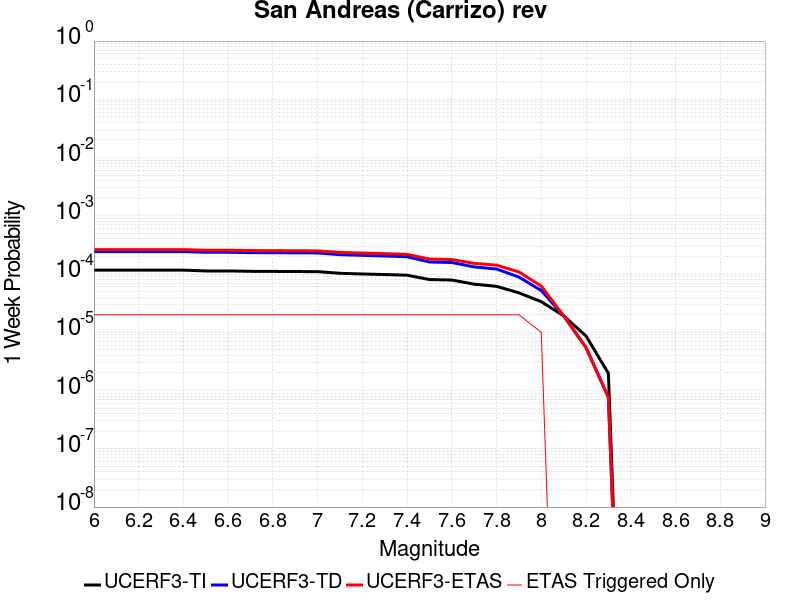 | 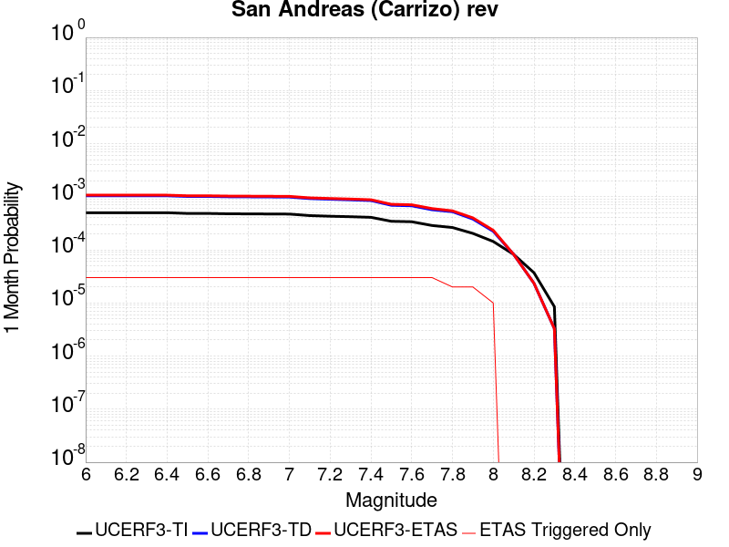 | 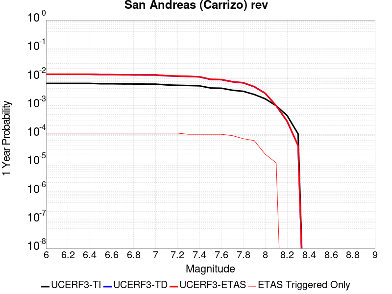 | 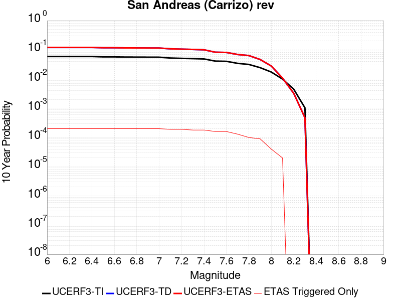 |

| Magnitude | 1 wk TI Prob | 1 wk TD Prob | 1 wk ETAS Prob | 1 wk ETAS/TD Gain | 1 wk ETAS Triggered Only | 1 mo TI Prob | 1 mo TD Prob | 1 mo ETAS Prob | 1 mo ETAS/TD Gain | 1 mo ETAS Triggered Only | 1 yr TI Prob | 1 yr TD Prob | 1 yr ETAS Prob | 1 yr ETAS/TD Gain | 1 yr ETAS Triggered Only | 10 yr TI Prob | 10 yr TD Prob | 10 yr ETAS Prob | 10 yr ETAS/TD Gain | 10 yr ETAS Triggered Only |
|-----|-----|-----|-----|-----|-----|-----|-----|-----|-----|-----|-----|-----|-----|-----|-----|-----|-----|-----|-----|-----|
| 6.0 | 1.1674632E-4 | 2.432528E-4 | 2.6324793E-4 | 1.082199 | 2.0E-5 | 5.002454E-4 | 0.0010420971 | 0.0010720658 | 1.028758 | 3.0E-5 | 0.006073493 | 0.012614206 | 0.012722819 | 1.0086104 | 1.1E-4 | 0.0591016 | 0.12063012 | 0.12080599 | 1.0014579 | 2.0E-4 |
| 6.1 | 1.1674632E-4 | 2.432528E-4 | 2.6324793E-4 | 1.082199 | 2.0E-5 | 5.002454E-4 | 0.0010420971 | 0.0010720658 | 1.028758 | 3.0E-5 | 0.006073493 | 0.012614206 | 0.012722819 | 1.0086104 | 1.1E-4 | 0.0591016 | 0.12063012 | 0.12080599 | 1.0014579 | 2.0E-4 |
| 6.2 | 1.1674632E-4 | 2.432528E-4 | 2.6324793E-4 | 1.082199 | 2.0E-5 | 5.002454E-4 | 0.0010420971 | 0.0010720658 | 1.028758 | 3.0E-5 | 0.006073493 | 0.012614206 | 0.012722819 | 1.0086104 | 1.1E-4 | 0.0591016 | 0.12063012 | 0.12080599 | 1.0014579 | 2.0E-4 |
| 6.3 | 1.1674632E-4 | 2.432528E-4 | 2.6324793E-4 | 1.082199 | 2.0E-5 | 5.002454E-4 | 0.0010420971 | 0.0010720658 | 1.028758 | 3.0E-5 | 0.006073493 | 0.012614206 | 0.012722819 | 1.0086104 | 1.1E-4 | 0.0591016 | 0.12063012 | 0.12080599 | 1.0014579 | 2.0E-4 |
| 6.4 | 1.1674632E-4 | 2.432528E-4 | 2.6324793E-4 | 1.082199 | 2.0E-5 | 5.002454E-4 | 0.0010420971 | 0.0010720658 | 1.028758 | 3.0E-5 | 0.006073493 | 0.012614206 | 0.012722819 | 1.0086104 | 1.1E-4 | 0.0591016 | 0.12063012 | 0.12080599 | 1.0014579 | 2.0E-4 |
| 6.5 | 1.13136164E-4 | 2.3645231E-4 | 2.564476E-4 | 1.0845636 | 2.0E-5 | 4.847792E-4 | 0.001012975 | 0.0010429446 | 1.0295857 | 3.0E-5 | 0.0058862255 | 0.012263677 | 0.012372329 | 1.0088596 | 1.1E-4 | 0.057327334 | 0.11761097 | 0.11778744 | 1.0015005 | 2.0E-4 |
| 6.6 | 1.13136164E-4 | 2.3645231E-4 | 2.564476E-4 | 1.0845636 | 2.0E-5 | 4.847792E-4 | 0.001012975 | 0.0010429446 | 1.0295857 | 3.0E-5 | 0.0058862255 | 0.012263677 | 0.012372329 | 1.0088596 | 1.1E-4 | 0.057327334 | 0.11761097 | 0.11778744 | 1.0015005 | 2.0E-4 |
| 6.7 | 1.1149675E-4 | 2.3336476E-4 | 2.533601E-4 | 1.0856827 | 2.0E-5 | 4.777557E-4 | 9.997529E-4 | 0.0010297229 | 1.0299774 | 3.0E-5 | 0.0058011734 | 0.0121044945 | 0.012213163 | 1.0089775 | 1.1E-4 | 0.05652051 | 0.11622949 | 0.11640624 | 1.0015208 | 2.0E-4 |
| 6.8 | 1.1103589E-4 | 2.3238639E-4 | 2.5238175E-4 | 1.0860436 | 2.0E-5 | 4.7578133E-4 | 9.955631E-4 | 0.0010255332 | 1.0301037 | 3.0E-5 | 0.005777263 | 0.012054049 | 0.012162724 | 1.0090156 | 1.1E-4 | 0.056293584 | 0.115789324 | 0.11596616 | 1.0015273 | 2.0E-4 |
| 6.9 | 1.1053259E-4 | 2.3131022E-4 | 2.5130558E-4 | 1.086444 | 2.0E-5 | 4.7362508E-4 | 9.909543E-4 | 0.0010209247 | 1.0302439 | 3.0E-5 | 0.0057511497 | 0.011998558 | 0.012107239 | 1.0090578 | 1.1E-4 | 0.05604569 | 0.11530451 | 0.11548144 | 1.0015346 | 2.0E-4 |
| 7.0 | 1.1005377E-4 | 2.3031865E-4 | 2.5031404E-4 | 1.0868162 | 2.0E-5 | 4.7157376E-4 | 9.86708E-4 | 0.0010166784 | 1.0303742 | 3.0E-5 | 0.0057263062 | 0.011947428 | 0.012056113 | 1.009097 | 1.1E-4 | 0.055809796 | 0.11485664 | 0.115033664 | 1.0015413 | 2.0E-4 |
| 7.1 | 1.0308142E-4 | 2.1541664E-4 | 2.3541234E-4 | 1.0928234 | 2.0E-5 | 4.417027E-4 | 9.228886E-4 | 9.5286086E-4 | 1.0324767 | 3.0E-5 | 0.0053644776 | 0.011178595 | 0.011287365 | 1.0097302 | 1.1E-4 | 0.052368138 | 0.10809048 | 0.108259946 | 1.0015678 | 1.9E-4 |
| 7.2 | 1.0027479E-4 | 2.0949548E-4 | 2.2949128E-4 | 1.0954474 | 2.0E-5 | 4.296783E-4 | 8.975298E-4 | 9.2750293E-4 | 1.033395 | 3.0E-5 | 0.0052187922 | 0.010872973 | 0.010981777 | 1.0100068 | 1.1E-4 | 0.050979212 | 0.105390884 | 0.105560854 | 1.0016128 | 1.9E-4 |
| 7.3 | 9.816942E-5 | 2.0424643E-4 | 2.2424235E-4 | 1.097901 | 2.0E-5 | 4.2065824E-4 | 8.750492E-4 | 9.0502296E-4 | 1.0342538 | 3.0E-5 | 0.005109493 | 0.010601967 | 0.010700907 | 1.0093322 | 1.0E-4 | 0.049935985 | 0.10297614 | 0.103137605 | 1.001568 | 1.8E-4 |
| 7.4 | 9.5634205E-5 | 1.979405E-4 | 2.1793654E-4 | 1.1010205 | 2.0E-5 | 4.0979648E-4 | 8.4804156E-4 | 8.780161E-4 | 1.0353457 | 3.0E-5 | 0.0049778637 | 0.01027629 | 0.010375262 | 1.0096312 | 1.0E-4 | 0.048678253 | 0.10006864 | 0.100230634 | 1.0016187 | 1.8E-4 |
| 7.5 | 8.052417E-5 | 1.6114564E-4 | 1.8114242E-4 | 1.1240914 | 2.0E-5 | 3.4505792E-4 | 6.904416E-4 | 7.2042085E-4 | 1.0434204 | 3.0E-5 | 0.0041929903 | 0.008373807 | 0.00847297 | 1.011842 | 1.0E-4 | 0.04114753 | 0.08281786 | 0.08296461 | 1.0017719 | 1.6E-4 |
| 7.6 | 7.897024E-5 | 1.5767729E-4 | 1.7767414E-4 | 1.1268214 | 2.0E-5 | 3.384E-4 | 6.75585E-4 | 7.0556474E-4 | 1.044376 | 3.0E-5 | 0.0041122385 | 0.008194303 | 0.008293483 | 1.0121036 | 1.0E-4 | 0.040369697 | 0.08116132 | 0.081308335 | 1.0018114 | 1.6E-4 |
| 7.7 | 6.707427E-5 | 1.3277703E-4 | 1.5277437E-4 | 1.1506084 | 2.0E-5 | 2.8742946E-4 | 5.6892034E-4 | 5.989033E-4 | 1.0527015 | 3.0E-5 | 0.003493839 | 0.0069046393 | 0.006994018 | 1.0129447 | 9.0E-5 | 0.034394164 | 0.06905632 | 0.06917734 | 1.0017525 | 1.3E-4 |
| 7.8 | 6.147705E-5 | 1.2198981E-4 | 1.4198737E-4 | 1.1639282 | 2.0E-5 | 2.6344648E-4 | 5.2270875E-4 | 5.426983E-4 | 1.0382422 | 2.0E-5 | 0.0032027436 | 0.006345434 | 0.00641499 | 1.0109615 | 7.0E-5 | 0.031569764 | 0.06352004 | 0.06361368 | 1.0014743 | 1.0E-4 |
| 7.9 | 4.7636717E-5 | 8.88072E-5 | 1.0880543E-4 | 1.225187 | 2.0E-5 | 2.0414138E-4 | 3.805468E-4 | 4.0053917E-4 | 1.052536 | 2.0E-5 | 0.0024825884 | 0.0046233223 | 0.0046830447 | 1.0129176 | 6.0E-5 | 0.024550365 | 0.04663116 | 0.046716966 | 1.00184 | 9.0E-5 |
| 8.0 | 3.3554235E-5 | 5.214066E-5 | 6.2140134E-5 | 1.1917789 | 1.0E-5 | 1.4379594E-4 | 2.2344083E-4 | 2.334386E-4 | 1.0447446 | 1.0E-5 | 0.0017493097 | 0.002717 | 0.0027369456 | 1.007341 | 2.0E-5 | 0.017356034 | 0.027882932 | 0.027921816 | 1.0013945 | 4.0E-5 |
| 8.1 | 1.9175432E-5 | 1.9184798E-5 | 1.9184798E-5 | 1.0 | 0.0 | 8.217783E-5 | 8.221797E-5 | 8.221797E-5 | 1.0 | 0.0 | 0.0010000558 | 0.0010005448 | 0.0010105347 | 1.0099846 | 1.0E-5 | 0.009955673 | 0.010758244 | 0.010778029 | 1.001839 | 2.0E-5 |
| 8.2 | 8.643924E-6 | 5.474112E-6 | 5.474112E-6 | 1.0 | 0.0 | 3.704486E-5 | 2.3460268E-5 | 2.3460268E-5 | 1.0 | 0.0 | 4.5092785E-4 | 2.8559144E-4 | 2.8559144E-4 | 1.0 | 0.0 | 0.0045001395 | 0.0032484592 | 0.0032484592 | 1.0 | 0.0 |
| 8.3 | 1.983087E-6 | 7.65717E-7 | 7.65717E-7 | 1.0 | 0.0 | 8.498917E-6 | 3.2816401E-6 | 3.2816401E-6 | 1.0 | 0.0 | 1.034694E-4 | 3.9953255E-5 | 3.9953255E-5 | 1.0 | 0.0 | 0.0010342124 | 4.7185255E-4 | 4.7185255E-4 | 1.0 | 0.0 |

## San Andreas (San Gorgonio Pass-Garnet HIll)
*[(top)](#table-of-contents)*

| 1 Week | 1 Month | 1 Year | 10 Year |
|-----|-----|-----|-----|
|  | 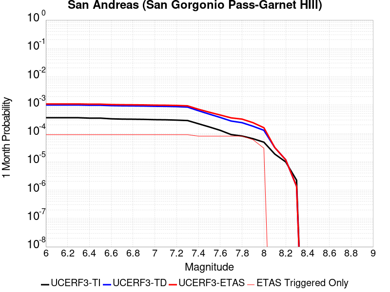 |  | 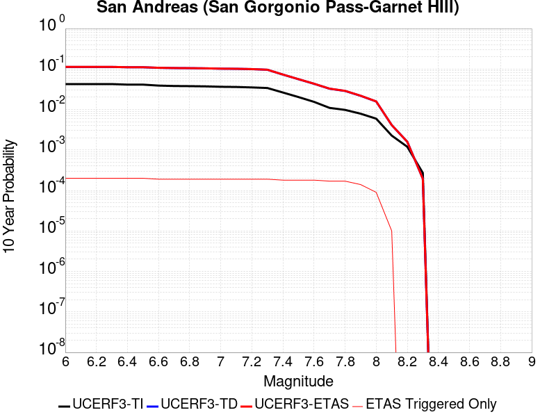 |

| Magnitude | 1 wk TI Prob | 1 wk TD Prob | 1 wk ETAS Prob | 1 wk ETAS/TD Gain | 1 wk ETAS Triggered Only | 1 mo TI Prob | 1 mo TD Prob | 1 mo ETAS Prob | 1 mo ETAS/TD Gain | 1 mo ETAS Triggered Only | 1 yr TI Prob | 1 yr TD Prob | 1 yr ETAS Prob | 1 yr ETAS/TD Gain | 1 yr ETAS Triggered Only | 10 yr TI Prob | 10 yr TD Prob | 10 yr ETAS Prob | 10 yr ETAS/TD Gain | 10 yr ETAS Triggered Only |
|-----|-----|-----|-----|-----|-----|-----|-----|-----|-----|-----|-----|-----|-----|-----|-----|-----|-----|-----|-----|-----|
| 6.0 | 8.31567E-5 | 2.3384758E-4 | 3.038312E-4 | 1.2992703 | 7.0E-5 | 3.5633717E-4 | 0.0010018179 | 0.0010917276 | 1.0897467 | 9.0E-5 | 0.004329778 | 0.012128806 | 0.012267107 | 1.0114027 | 1.4E-4 | 0.042463828 | 0.11258265 | 0.112760134 | 1.0015764 | 2.0E-4 |
| 6.1 | 8.31567E-5 | 2.3384758E-4 | 3.038312E-4 | 1.2992703 | 7.0E-5 | 3.5633717E-4 | 0.0010018179 | 0.0010917276 | 1.0897467 | 9.0E-5 | 0.004329778 | 0.012128806 | 0.012267107 | 1.0114027 | 1.4E-4 | 0.042463828 | 0.11258265 | 0.112760134 | 1.0015764 | 2.0E-4 |
| 6.2 | 8.31567E-5 | 2.3384758E-4 | 3.038312E-4 | 1.2992703 | 7.0E-5 | 3.5633717E-4 | 0.0010018179 | 0.0010917276 | 1.0897467 | 9.0E-5 | 0.004329778 | 0.012128806 | 0.012267107 | 1.0114027 | 1.4E-4 | 0.042463828 | 0.11258265 | 0.112760134 | 1.0015764 | 2.0E-4 |
| 6.3 | 8.31567E-5 | 2.3384758E-4 | 3.038312E-4 | 1.2992703 | 7.0E-5 | 3.5633717E-4 | 0.0010018179 | 0.0010917276 | 1.0897467 | 9.0E-5 | 0.004329778 | 0.012128806 | 0.012267107 | 1.0114027 | 1.4E-4 | 0.042463828 | 0.11258265 | 0.112760134 | 1.0015764 | 2.0E-4 |
| 6.4 | 8.059055E-5 | 2.294225E-4 | 2.9940644E-4 | 1.3050439 | 7.0E-5 | 3.4534236E-4 | 9.828713E-4 | 0.0010727828 | 1.0914785 | 9.0E-5 | 0.0041964394 | 0.011901001 | 0.012039335 | 1.0116237 | 1.4E-4 | 0.041180745 | 0.11056373 | 0.11074162 | 1.001609 | 2.0E-4 |
| 6.5 | 8.059055E-5 | 2.294225E-4 | 2.9940644E-4 | 1.3050439 | 7.0E-5 | 3.4534236E-4 | 9.828713E-4 | 0.0010727828 | 1.0914785 | 9.0E-5 | 0.0041964394 | 0.011901001 | 0.012039335 | 1.0116237 | 1.4E-4 | 0.041180745 | 0.11056373 | 0.11074162 | 1.001609 | 2.0E-4 |
| 6.6 | 7.619237E-5 | 2.2186819E-4 | 2.9185266E-4 | 1.3154327 | 7.0E-5 | 3.2649786E-4 | 9.5051946E-4 | 0.0010404339 | 1.0945951 | 9.0E-5 | 0.0039678677 | 0.011511715 | 0.011650103 | 1.0120215 | 1.4E-4 | 0.03897764 | 0.10710017 | 0.107269816 | 1.001584 | 1.9E-4 |
| 6.7 | 7.440636E-5 | 2.1862632E-4 | 2.8861102E-4 | 1.320111 | 7.0E-5 | 3.188454E-4 | 9.3663577E-4 | 0.0010265515 | 1.0959985 | 9.0E-5 | 0.0038750346 | 0.011344449 | 0.011482861 | 1.0122008 | 1.4E-4 | 0.038081564 | 0.10560867 | 0.105778605 | 1.0016091 | 1.9E-4 |
| 6.8 | 7.3735864E-5 | 2.1709796E-4 | 2.8708274E-4 | 1.322365 | 7.0E-5 | 3.1597257E-4 | 9.300903E-4 | 0.0010200066 | 1.0966748 | 9.0E-5 | 0.0038401815 | 0.011265587 | 0.0114040105 | 1.0122873 | 1.4E-4 | 0.03774495 | 0.104910135 | 0.1050802 | 1.0016211 | 1.9E-4 |
| 6.9 | 7.27575E-5 | 2.1478764E-4 | 2.847726E-4 | 1.3258333 | 7.0E-5 | 3.117806E-4 | 9.2019595E-4 | 0.0010101132 | 1.0977153 | 9.0E-5 | 0.003789323 | 0.011146363 | 0.011284802 | 1.0124202 | 1.4E-4 | 0.037253562 | 0.10385802 | 0.104028285 | 1.0016394 | 1.9E-4 |
| 7.0 | 7.102591E-5 | 2.10628E-4 | 2.8061325E-4 | 1.3322694 | 7.0E-5 | 3.0436125E-4 | 9.0238143E-4 | 9.923002E-4 | 1.0996461 | 9.0E-5 | 0.003699303 | 0.010931665 | 0.011070134 | 1.0126668 | 1.4E-4 | 0.03638325 | 0.10195981 | 0.102130435 | 1.0016735 | 1.9E-4 |
| 7.1 | 7.028513E-5 | 2.0898443E-4 | 2.789698E-4 | 1.3348832 | 7.0E-5 | 3.0118722E-4 | 8.953424E-4 | 9.852618E-4 | 1.1004303 | 9.0E-5 | 0.0036607897 | 0.010846822 | 0.010985303 | 1.012767 | 1.4E-4 | 0.036010686 | 0.10120273 | 0.10137349 | 1.0016874 | 1.9E-4 |
| 7.2 | 6.8498244E-5 | 2.0506307E-4 | 2.7504872E-4 | 1.3412883 | 7.0E-5 | 2.9353087E-4 | 8.7854796E-4 | 9.684689E-4 | 1.1023518 | 9.0E-5 | 0.003567883 | 0.010644363 | 0.010782872 | 1.0130125 | 1.4E-4 | 0.035111405 | 0.09939473 | 0.09956585 | 1.0017216 | 1.9E-4 |
| 7.3 | 6.622592E-5 | 1.9733577E-4 | 2.6732197E-4 | 1.3546554 | 7.0E-5 | 2.8379448E-4 | 8.454528E-4 | 9.3537674E-4 | 1.1063619 | 9.0E-5 | 0.0034497243 | 0.010245288 | 0.010383853 | 1.0135248 | 1.4E-4 | 0.033966612 | 0.09589143 | 0.09606321 | 1.0017914 | 1.9E-4 |
| 7.4 | 5.1050705E-5 | 1.4690358E-4 | 2.168933E-4 | 1.476433 | 7.0E-5 | 2.1877038E-4 | 6.2943576E-4 | 7.093854E-4 | 1.127018 | 8.0E-5 | 0.002660276 | 0.0076366453 | 0.0077656526 | 1.0168931 | 1.3E-4 | 0.02628654 | 0.07286533 | 0.073032215 | 1.0022904 | 1.8E-4 |
| 7.5 | 3.9302922E-5 | 1.1130988E-4 | 1.8130208E-4 | 1.628805 | 7.0E-5 | 1.6843023E-4 | 4.7695544E-4 | 5.569173E-4 | 1.1676506 | 8.0E-5 | 0.0020487092 | 0.0057915407 | 0.005920788 | 1.0223166 | 1.3E-4 | 0.020299247 | 0.056011632 | 0.05618155 | 1.0030336 | 1.8E-4 |
| 7.6 | 2.9851626E-5 | 8.495949E-5 | 1.5495354E-4 | 1.8238521 | 7.0E-5 | 1.2792926E-4 | 3.6406142E-4 | 4.4403228E-4 | 1.2196631 | 8.0E-5 | 0.0015564259 | 0.0044234646 | 0.0045528896 | 1.0292587 | 1.3E-4 | 0.0154556995 | 0.043196134 | 0.04336836 | 1.0039871 | 1.8E-4 |
| 7.7 | 2.1135214E-5 | 6.353745E-5 | 1.33533E-4 | 2.1016424 | 7.0E-5 | 9.0576345E-5 | 2.7227498E-4 | 3.522532E-4 | 1.2937406 | 8.0E-5 | 0.0011022091 | 0.0033099146 | 0.0034394842 | 1.039146 | 1.3E-4 | 0.010967582 | 0.032585192 | 0.032749653 | 1.0050471 | 1.7E-4 |
| 7.8 | 1.883379E-5 | 5.5647757E-5 | 1.2564387E-4 | 2.2578423 | 7.0E-5 | 8.0713755E-5 | 2.3846861E-4 | 3.1844954E-4 | 1.3353939 | 8.0E-5 | 9.822468E-4 | 0.002899493 | 0.003029116 | 1.0447054 | 1.3E-4 | 0.0097791655 | 0.028697597 | 0.028862718 | 1.0057539 | 1.7E-4 |
| 7.9 | 1.5156185E-5 | 4.1664003E-5 | 1.01661506E-4 | 2.440032 | 6.0E-5 | 6.495346E-5 | 1.7854781E-4 | 2.3853709E-4 | 1.3359845 | 6.0E-5 | 7.9052144E-4 | 0.0021716536 | 0.0022714364 | 1.0459479 | 1.0E-4 | 0.007877152 | 0.021761738 | 0.02189869 | 1.0062933 | 1.4E-4 |
| 8.0 | 1.1405907E-5 | 2.9978135E-5 | 5.9977236E-5 | 2.0006993 | 3.0E-5 | 4.8881542E-5 | 1.2847141E-4 | 1.5846755E-4 | 1.233485 | 3.0E-5 | 5.9497025E-4 | 0.0015630181 | 0.0016229243 | 1.0383272 | 6.0E-5 | 0.005933798 | 0.015774572 | 0.015863152 | 1.0056154 | 9.0E-5 |
| 8.1 | 4.3511436E-6 | 7.369886E-6 | 7.369886E-6 | 1.0 | 0.0 | 1.8647626E-5 | 3.1584845E-5 | 3.1584845E-5 | 1.0 | 0.0 | 2.2701119E-4 | 3.8447778E-4 | 3.9447393E-4 | 1.0259993 | 1.0E-5 | 0.0022677942 | 0.0041167503 | 0.004126709 | 1.0024191 | 1.0E-5 |
| 8.2 | 2.3042528E-6 | 2.733029E-6 | 2.733029E-6 | 1.0 | 0.0 | 9.875332E-6 | 1.1712929E-5 | 1.1712929E-5 | 1.0 | 0.0 | 1.2022553E-4 | 1.4259563E-4 | 1.4259563E-4 | 1.0 | 0.0 | 0.0012016051 | 0.0015980469 | 0.0015980469 | 1.0 | 0.0 |
| 8.3 | 5.202968E-7 | 3.1592953E-7 | 3.1592953E-7 | 1.0 | 0.0 | 2.2298414E-6 | 1.3539831E-6 | 1.3539831E-6 | 1.0 | 0.0 | 2.714798E-5 | 1.6484631E-5 | 1.6484631E-5 | 1.0 | 0.0 | 2.7144665E-4 | 1.9560498E-4 | 1.9560498E-4 | 1.0 | 0.0 |

## Lake Isabella (Seismicity)
*[(top)](#table-of-contents)*

| 1 Week | 1 Month | 1 Year | 10 Year |
|-----|-----|-----|-----|
|  |  | 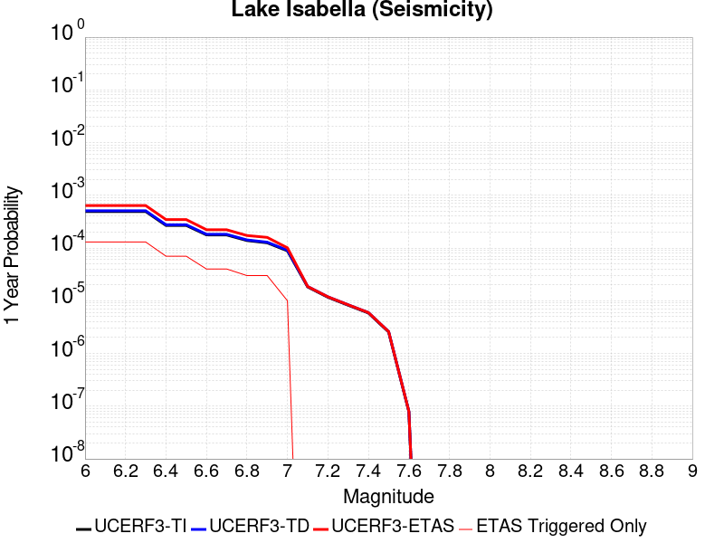 |  |

| Magnitude | 1 wk TI Prob | 1 wk TD Prob | 1 wk ETAS Prob | 1 wk ETAS/TD Gain | 1 wk ETAS Triggered Only | 1 mo TI Prob | 1 mo TD Prob | 1 mo ETAS Prob | 1 mo ETAS/TD Gain | 1 mo ETAS Triggered Only | 1 yr TI Prob | 1 yr TD Prob | 1 yr ETAS Prob | 1 yr ETAS/TD Gain | 1 yr ETAS Triggered Only | 10 yr TI Prob | 10 yr TD Prob | 10 yr ETAS Prob | 10 yr ETAS/TD Gain | 10 yr ETAS Triggered Only |
|-----|-----|-----|-----|-----|-----|-----|-----|-----|-----|-----|-----|-----|-----|-----|-----|-----|-----|-----|-----|-----|
| 6.0 | 9.431637E-6 | 9.741656E-6 | 1.9741557E-5 | 2.0265095 | 1.0E-5 | 4.0420677E-5 | 4.1749357E-5 | 1.0174685E-4 | 2.4370878 | 6.0E-5 | 4.920106E-4 | 5.08193E-4 | 6.381269E-4 | 1.2556783 | 1.3E-4 | 0.004909227 | 0.005071601 | 0.0052606375 | 1.0372735 | 1.9E-4 |
| 6.1 | 9.431637E-6 | 9.741656E-6 | 1.9741557E-5 | 2.0265095 | 1.0E-5 | 4.0420677E-5 | 4.1749357E-5 | 1.0174685E-4 | 2.4370878 | 6.0E-5 | 4.920106E-4 | 5.08193E-4 | 6.381269E-4 | 1.2556783 | 1.3E-4 | 0.004909227 | 0.005071601 | 0.0052606375 | 1.0372735 | 1.9E-4 |
| 6.2 | 9.431637E-6 | 9.741656E-6 | 1.9741557E-5 | 2.0265095 | 1.0E-5 | 4.0420677E-5 | 4.1749357E-5 | 1.0174685E-4 | 2.4370878 | 6.0E-5 | 4.920106E-4 | 5.08193E-4 | 6.381269E-4 | 1.2556783 | 1.3E-4 | 0.004909227 | 0.005071601 | 0.0052606375 | 1.0372735 | 1.9E-4 |
| 6.3 | 9.431637E-6 | 9.741656E-6 | 1.9741557E-5 | 2.0265095 | 1.0E-5 | 4.0420677E-5 | 4.1749357E-5 | 1.0174685E-4 | 2.4370878 | 6.0E-5 | 4.920106E-4 | 5.08193E-4 | 6.381269E-4 | 1.2556783 | 1.3E-4 | 0.004909227 | 0.005071601 | 0.0052606375 | 1.0372735 | 1.9E-4 |
| 6.4 | 5.144063E-6 | 5.300078E-6 | 5.300078E-6 | 1.0 | 0.0 | 2.2045799E-5 | 2.2714443E-5 | 5.271376E-5 | 2.3207157 | 3.0E-5 | 2.6837454E-4 | 2.765167E-4 | 3.4649734E-4 | 1.2530793 | 7.0E-5 | 0.0026805066 | 0.0027620667 | 0.0028518182 | 1.0324943 | 9.0E-5 |
| 6.5 | 5.144063E-6 | 5.300078E-6 | 5.300078E-6 | 1.0 | 0.0 | 2.2045799E-5 | 2.2714443E-5 | 5.271376E-5 | 2.3207157 | 3.0E-5 | 2.6837454E-4 | 2.765167E-4 | 3.4649734E-4 | 1.2530793 | 7.0E-5 | 0.0026805066 | 0.0027620667 | 0.0028518182 | 1.0324943 | 9.0E-5 |
| 6.6 | 3.4009804E-6 | 3.4987875E-6 | 3.4987875E-6 | 1.0 | 0.0 | 1.4575549E-5 | 1.4994726E-5 | 3.4994428E-5 | 2.3337822 | 2.0E-5 | 1.7744285E-4 | 1.825471E-4 | 2.2253979E-4 | 1.2190815 | 4.0E-5 | 0.0017730123 | 0.0018241293 | 0.001874038 | 1.0273603 | 5.0E-5 |
| 6.7 | 3.3880428E-6 | 3.4856541E-6 | 3.4856541E-6 | 1.0 | 0.0 | 1.4520103E-5 | 1.49384405E-5 | 3.493814E-5 | 2.3388078 | 2.0E-5 | 1.767679E-4 | 1.8186193E-4 | 2.2185467E-4 | 1.219907 | 4.0E-5 | 0.0017662736 | 0.0018172888 | 0.001867198 | 1.0274636 | 5.0E-5 |
| 6.8 | 2.6582E-6 | 2.7337012E-6 | 2.7337012E-6 | 1.0 | 0.0 | 1.1392236E-5 | 1.1715817E-5 | 3.1715583E-5 | 2.707074 | 2.0E-5 | 1.3869164E-4 | 1.4263208E-4 | 1.726278E-4 | 1.2103014 | 3.0E-5 | 0.0013860512 | 0.0014255374 | 0.0014654804 | 1.0280195 | 4.0E-5 |
| 6.9 | 2.406011E-6 | 2.4743297E-6 | 2.4743297E-6 | 1.0 | 0.0 | 1.0311434E-5 | 1.0604234E-5 | 3.0604024E-5 | 2.886019 | 2.0E-5 | 1.2553448E-4 | 1.2910023E-4 | 1.5909635E-4 | 1.2323476 | 3.0E-5 | 0.0012546359 | 0.0012903819 | 0.0013203431 | 1.023219 | 3.0E-5 |
| 7.0 | 1.6953097E-6 | 1.7429378E-6 | 1.7429378E-6 | 1.0 | 0.0 | 7.265593E-6 | 7.4697177E-6 | 7.4697177E-6 | 1.0 | 0.0 | 8.8455E-5 | 9.094107E-5 | 1.0094016E-4 | 1.1099514 | 1.0E-5 | 8.84198E-4 | 9.0914126E-4 | 9.191322E-4 | 1.0109894 | 1.0E-5 |
| 7.1 | 3.5013824E-7 | 3.571483E-7 | 3.571483E-7 | 1.0 | 0.0 | 1.5005916E-6 | 1.5306348E-6 | 1.5306348E-6 | 1.0 | 0.0 | 1.826955E-5 | 1.863532E-5 | 1.863532E-5 | 1.0 | 0.0 | 1.8268047E-4 | 1.8633784E-4 | 1.8633784E-4 | 1.0 | 0.0 |
| 7.2 | 2.2321095E-7 | 2.275058E-7 | 2.275058E-7 | 1.0 | 0.0 | 9.56618E-7 | 9.750245E-7 | 9.750245E-7 | 1.0 | 0.0 | 1.1646762E-5 | 1.1870859E-5 | 1.1870859E-5 | 1.0 | 0.0 | 1.1646151E-4 | 1.1870235E-4 | 1.1870235E-4 | 1.0 | 0.0 |
| 7.3 | 1.5760406E-7 | 1.6060926E-7 | 1.6060926E-7 | 1.0 | 0.0 | 6.7544585E-7 | 6.883252E-7 | 6.883252E-7 | 1.0 | 0.0 | 8.223522E-6 | 8.380328E-6 | 8.380328E-6 | 1.0 | 0.0 | 8.2232174E-5 | 8.380018E-5 | 8.380018E-5 | 1.0 | 0.0 |
| 7.4 | 1.1216497E-7 | 1.1431709E-7 | 1.1431709E-7 | 1.0 | 0.0 | 4.8070694E-7 | 4.899303E-7 | 4.899303E-7 | 1.0 | 0.0 | 5.852591E-6 | 5.9648855E-6 | 5.9648855E-6 | 1.0 | 0.0 | 5.8524372E-5 | 5.9647296E-5 | 5.9647296E-5 | 1.0 | 0.0 |
| 7.5 | 4.885185E-8 | 4.978775E-8 | 4.978775E-8 | 1.0 | 0.0 | 2.0936506E-7 | 2.1337605E-7 | 2.1337605E-7 | 1.0 | 0.0 | 2.5490165E-6 | 2.5978504E-6 | 2.5978504E-6 | 1.0 | 0.0 | 2.5489873E-5 | 2.597822E-5 | 2.597822E-5 | 1.0 | 0.0 |
| 7.6 | 1.504641E-9 | 1.5317906E-9 | 1.5317906E-9 | 1.0 | 0.0 | 6.4484613E-9 | 6.564817E-9 | 6.564817E-9 | 1.0 | 0.0 | 7.851001E-8 | 7.992665E-8 | 7.992665E-8 | 1.0 | 0.0 | 7.8509987E-7 | 7.9926645E-7 | 7.9926645E-7 | 1.0 | 0.0 |

## Cady
*[(top)](#table-of-contents)*

| 1 Week | 1 Month | 1 Year | 10 Year |
|-----|-----|-----|-----|
| 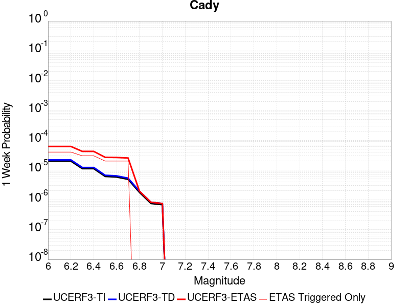 |  | 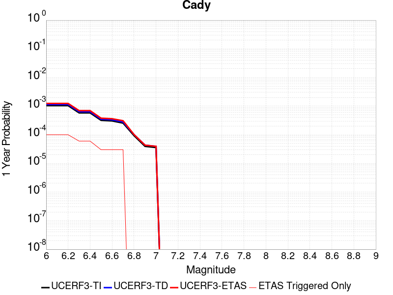 |  |

| Magnitude | 1 wk TI Prob | 1 wk TD Prob | 1 wk ETAS Prob | 1 wk ETAS/TD Gain | 1 wk ETAS Triggered Only | 1 mo TI Prob | 1 mo TD Prob | 1 mo ETAS Prob | 1 mo ETAS/TD Gain | 1 mo ETAS Triggered Only | 1 yr TI Prob | 1 yr TD Prob | 1 yr ETAS Prob | 1 yr ETAS/TD Gain | 1 yr ETAS Triggered Only | 10 yr TI Prob | 10 yr TD Prob | 10 yr ETAS Prob | 10 yr ETAS/TD Gain | 10 yr ETAS Triggered Only |
|-----|-----|-----|-----|-----|-----|-----|-----|-----|-----|-----|-----|-----|-----|-----|-----|-----|-----|-----|-----|-----|
| 6.0 | 1.9892565E-5 | 2.1858756E-5 | 6.1857885E-5 | 2.8298903 | 4.0E-5 | 8.525106E-5 | 9.367753E-5 | 1.3367378E-4 | 1.4269568 | 4.0E-5 | 0.0010374374 | 0.0011400181 | 0.0012399041 | 1.0876179 | 1.0E-4 | 0.010326075 | 0.011350715 | 0.011528671 | 1.015678 | 1.8E-4 |
| 6.1 | 1.9892565E-5 | 2.1858756E-5 | 6.1857885E-5 | 2.8298903 | 4.0E-5 | 8.525106E-5 | 9.367753E-5 | 1.3367378E-4 | 1.4269568 | 4.0E-5 | 0.0010374374 | 0.0011400181 | 0.0012399041 | 1.0876179 | 1.0E-4 | 0.010326075 | 0.011350715 | 0.011528671 | 1.015678 | 1.8E-4 |
| 6.2 | 1.9892565E-5 | 2.1858756E-5 | 6.1857885E-5 | 2.8298903 | 4.0E-5 | 8.525106E-5 | 9.367753E-5 | 1.3367378E-4 | 1.4269568 | 4.0E-5 | 0.0010374374 | 0.0011400181 | 0.0012399041 | 1.0876179 | 1.0E-4 | 0.010326075 | 0.011350715 | 0.011528671 | 1.015678 | 1.8E-4 |
| 6.3 | 1.1117327E-5 | 1.2176598E-5 | 4.2176234E-5 | 3.4637125 | 3.0E-5 | 4.764482E-5 | 5.2184554E-5 | 8.218299E-5 | 1.5748527 | 3.0E-5 | 5.7992124E-4 | 6.3519325E-4 | 6.951551E-4 | 1.0943995 | 6.0E-5 | 0.0057841022 | 0.0063368827 | 0.006446186 | 1.0172487 | 1.1E-4 |
| 6.4 | 1.1117327E-5 | 1.2176598E-5 | 4.2176234E-5 | 3.4637125 | 3.0E-5 | 4.764482E-5 | 5.2184554E-5 | 8.218299E-5 | 1.5748527 | 3.0E-5 | 5.7992124E-4 | 6.3519325E-4 | 6.951551E-4 | 1.0943995 | 6.0E-5 | 0.0057841022 | 0.0063368827 | 0.006446186 | 1.0172487 | 1.1E-4 |
| 6.5 | 6.103093E-6 | 6.6720286E-6 | 2.6671894E-5 | 3.997569 | 2.0E-5 | 2.615585E-5 | 2.8594164E-5 | 4.8593593E-5 | 1.6994234 | 2.0E-5 | 3.1840094E-4 | 3.480909E-4 | 3.7808047E-4 | 1.0861543 | 3.0E-5 | 0.0031794512 | 0.0034766907 | 0.0035464473 | 1.0200641 | 7.0E-5 |
| 6.6 | 5.817237E-6 | 6.365666E-6 | 2.6365538E-5 | 4.141835 | 2.0E-5 | 2.4930776E-5 | 2.728121E-5 | 4.7280664E-5 | 1.7330853 | 2.0E-5 | 3.034899E-4 | 3.3211056E-4 | 3.621006E-4 | 1.0903014 | 3.0E-5 | 0.0030307577 | 0.0033173645 | 0.0033871322 | 1.0210311 | 7.0E-5 |
| 6.7 | 4.8846314E-6 | 5.3405743E-6 | 2.5340467E-5 | 4.7448955 | 2.0E-5 | 2.0933967E-5 | 2.2888042E-5 | 4.2887583E-5 | 1.8737987 | 2.0E-5 | 2.5484123E-4 | 2.7863804E-4 | 3.0862968E-4 | 1.1076366 | 3.0E-5 | 0.0025454918 | 0.0027840424 | 0.0028438752 | 1.0214914 | 6.0E-5 |
| 6.8 | 1.7788773E-6 | 1.9399101E-6 | 1.9399101E-6 | 1.0 | 0.0 | 7.6237375E-6 | 8.313883E-6 | 8.313883E-6 | 1.0 | 0.0 | 9.281505E-5 | 1.012184E-4 | 1.012184E-4 | 1.0 | 0.0 | 9.2776294E-4 | 0.0010118776 | 0.0010218675 | 1.0098727 | 1.0E-5 |
| 6.9 | 7.5455404E-7 | 8.2971025E-7 | 8.2971025E-7 | 1.0 | 0.0 | 3.233799E-6 | 3.555898E-6 | 3.555898E-6 | 1.0 | 0.0 | 3.937079E-5 | 4.3292534E-5 | 4.3292534E-5 | 1.0 | 0.0 | 3.9363815E-4 | 4.3287396E-4 | 4.3287396E-4 | 1.0 | 0.0 |
| 7.0 | 6.8578805E-7 | 7.5418257E-7 | 7.5418257E-7 | 1.0 | 0.0 | 2.9390883E-6 | 3.2322087E-6 | 3.2322087E-6 | 1.0 | 0.0 | 3.578281E-5 | 3.9351762E-5 | 3.9351762E-5 | 1.0 | 0.0 | 3.577705E-4 | 3.934804E-4 | 3.934804E-4 | 1.0 | 0.0 |

## Scodie Lineament
*[(top)](#table-of-contents)*

| 1 Week | 1 Month | 1 Year | 10 Year |
|-----|-----|-----|-----|
| 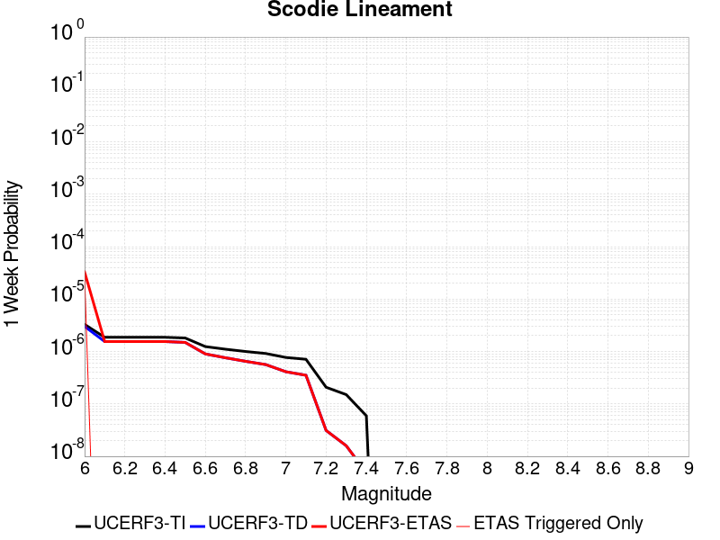 | 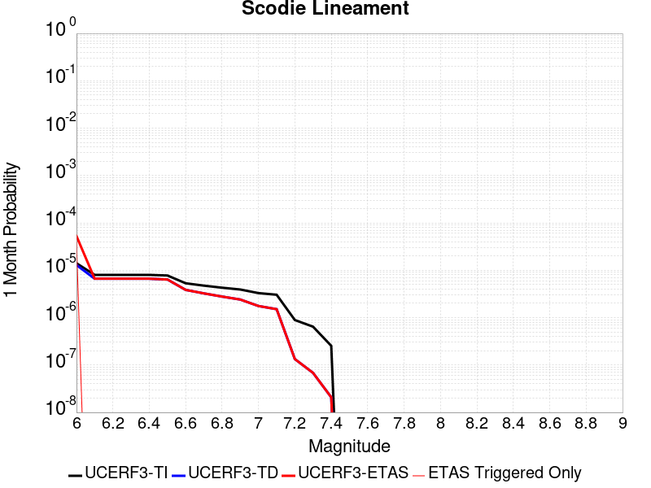 |  |  |

| Magnitude | 1 wk TI Prob | 1 wk TD Prob | 1 wk ETAS Prob | 1 wk ETAS/TD Gain | 1 wk ETAS Triggered Only | 1 mo TI Prob | 1 mo TD Prob | 1 mo ETAS Prob | 1 mo ETAS/TD Gain | 1 mo ETAS Triggered Only | 1 yr TI Prob | 1 yr TD Prob | 1 yr ETAS Prob | 1 yr ETAS/TD Gain | 1 yr ETAS Triggered Only | 10 yr TI Prob | 10 yr TD Prob | 10 yr ETAS Prob | 10 yr ETAS/TD Gain | 10 yr ETAS Triggered Only |
|-----|-----|-----|-----|-----|-----|-----|-----|-----|-----|-----|-----|-----|-----|-----|-----|-----|-----|-----|-----|-----|
| 6.0 | 3.2919327E-6 | 3.0133317E-6 | 3.3013243E-5 | 10.955728 | 3.0E-5 | 1.4108206E-5 | 1.2914233E-5 | 5.2913714E-5 | 4.097318 | 4.0E-5 | 1.7175387E-4 | 1.572226E-4 | 2.6720532E-4 | 1.6995349 | 1.1E-4 | 0.0017162118 | 0.0015714254 | 0.0017611268 | 1.1207193 | 1.9E-4 |
| 6.1 | 1.8663811E-6 | 1.5490388E-6 | 1.5490388E-6 | 1.0 | 0.0 | 7.998751E-6 | 6.638724E-6 | 6.638724E-6 | 1.0 | 0.0 | 9.738045E-5 | 8.082396E-5 | 1.0082234E-4 | 1.2474314 | 2.0E-5 | 9.7337784E-4 | 8.0799445E-4 | 8.3797023E-4 | 1.037099 | 3.0E-5 |
| 6.2 | 1.8663811E-6 | 1.5490388E-6 | 1.5490388E-6 | 1.0 | 0.0 | 7.998751E-6 | 6.638724E-6 | 6.638724E-6 | 1.0 | 0.0 | 9.738045E-5 | 8.082396E-5 | 1.0082234E-4 | 1.2474314 | 2.0E-5 | 9.7337784E-4 | 8.0799445E-4 | 8.3797023E-4 | 1.037099 | 3.0E-5 |
| 6.3 | 1.8663811E-6 | 1.5490388E-6 | 1.5490388E-6 | 1.0 | 0.0 | 7.998751E-6 | 6.638724E-6 | 6.638724E-6 | 1.0 | 0.0 | 9.738045E-5 | 8.082396E-5 | 1.0082234E-4 | 1.2474314 | 2.0E-5 | 9.7337784E-4 | 8.0799445E-4 | 8.3797023E-4 | 1.037099 | 3.0E-5 |
| 6.4 | 1.8663811E-6 | 1.5490388E-6 | 1.5490388E-6 | 1.0 | 0.0 | 7.998751E-6 | 6.638724E-6 | 6.638724E-6 | 1.0 | 0.0 | 9.738045E-5 | 8.082396E-5 | 1.0082234E-4 | 1.2474314 | 2.0E-5 | 9.7337784E-4 | 8.0799445E-4 | 8.3797023E-4 | 1.037099 | 3.0E-5 |
| 6.5 | 1.8106311E-6 | 1.4909727E-6 | 1.4909727E-6 | 1.0 | 0.0 | 7.759824E-6 | 6.3898706E-6 | 6.3898706E-6 | 1.0 | 0.0 | 9.447177E-5 | 7.779439E-5 | 9.7792836E-5 | 1.2570679 | 2.0E-5 | 9.4431615E-4 | 7.7772024E-4 | 8.0769695E-4 | 1.0385443 | 3.0E-5 |
| 6.6 | 1.2414679E-6 | 8.9974435E-7 | 8.9974435E-7 | 1.0 | 0.0 | 5.320566E-6 | 3.856042E-6 | 3.856042E-6 | 1.0 | 0.0 | 6.477596E-5 | 4.694639E-5 | 6.6945446E-5 | 1.4259979 | 2.0E-5 | 6.475708E-4 | 4.6937334E-4 | 4.8936397E-4 | 1.04259 | 2.0E-5 |
| 6.7 | 1.1062215E-6 | 7.594196E-7 | 7.594196E-7 | 1.0 | 0.0 | 4.7409408E-6 | 3.2546518E-6 | 3.2546518E-6 | 1.0 | 0.0 | 5.7719422E-5 | 3.9624734E-5 | 5.9623944E-5 | 1.5047152 | 2.0E-5 | 5.770443E-4 | 3.961837E-4 | 4.1617578E-4 | 1.0504616 | 2.0E-5 |
| 6.8 | 1.0006736E-6 | 6.5002814E-7 | 6.5002814E-7 | 1.0 | 0.0 | 4.288594E-6 | 2.785832E-6 | 2.785832E-6 | 1.0 | 0.0 | 5.221238E-5 | 3.391704E-5 | 5.3916363E-5 | 1.5896541 | 2.0E-5 | 5.220012E-4 | 3.3912473E-4 | 3.5911793E-4 | 1.0589553 | 2.0E-5 |
| 6.9 | 9.167364E-7 | 5.631509E-7 | 5.631509E-7 | 1.0 | 0.0 | 3.9288643E-6 | 2.4135018E-6 | 2.4135018E-6 | 1.0 | 0.0 | 4.7832873E-5 | 2.9384048E-5 | 3.9383754E-5 | 1.3403107 | 1.0E-5 | 4.782258E-4 | 2.938073E-4 | 3.0380435E-4 | 1.0340259 | 1.0E-5 |
| 7.0 | 7.6987664E-7 | 4.1132665E-7 | 4.1132665E-7 | 1.0 | 0.0 | 3.2994672E-6 | 1.7628275E-6 | 1.7628275E-6 | 1.0 | 0.0 | 4.0170275E-5 | 2.1462252E-5 | 3.1462037E-5 | 1.4659243 | 1.0E-5 | 4.0163012E-4 | 2.1460565E-4 | 2.2460351E-4 | 1.0465871 | 1.0E-5 |
| 7.1 | 7.1038727E-7 | 3.5210317E-7 | 3.5210317E-7 | 1.0 | 0.0 | 3.0445133E-6 | 1.5090129E-6 | 1.5090129E-6 | 1.0 | 0.0 | 3.706632E-5 | 1.8372113E-5 | 2.837193E-5 | 1.5442932 | 1.0E-5 | 3.7060137E-4 | 1.8370943E-4 | 1.937076E-4 | 1.0544238 | 1.0E-5 |
| 7.2 | 2.0799602E-7 | 3.1178534E-8 | 3.1178534E-8 | 1.0 | 0.0 | 8.914113E-7 | 1.3362228E-7 | 1.3362228E-7 | 1.0 | 0.0 | 1.0852878E-5 | 1.6268501E-6 | 1.6268501E-6 | 1.0 | 0.0 | 1.08523476E-4 | 1.626839E-5 | 1.626839E-5 | 1.0 | 0.0 |
| 7.3 | 1.5048182E-7 | 1.5939106E-8 | 1.5939106E-8 | 1.0 | 0.0 | 6.449219E-7 | 6.8310456E-8 | 6.8310456E-8 | 1.0 | 0.0 | 7.851896E-6 | 8.3167953E-7 | 8.3167953E-7 | 1.0 | 0.0 | 7.851618E-5 | 8.316767E-6 | 8.316767E-6 | 1.0 | 0.0 |
| 7.4 | 5.9334678E-8 | 4.8638475E-9 | 4.8638475E-9 | 1.0 | 0.0 | 2.5429145E-7 | 2.084506E-8 | 2.084506E-8 | 1.0 | 0.0 | 3.095994E-6 | 2.5378858E-7 | 2.5378858E-7 | 1.0 | 0.0 | 3.095951E-5 | 2.5378843E-6 | 2.5378843E-6 | 1.0 | 0.0 |

## Red Pass
*[(top)](#table-of-contents)*

| 1 Week | 1 Month | 1 Year | 10 Year |
|-----|-----|-----|-----|
|  |  |  |  |

| Magnitude | 1 wk TI Prob | 1 wk TD Prob | 1 wk ETAS Prob | 1 wk ETAS/TD Gain | 1 wk ETAS Triggered Only | 1 mo TI Prob | 1 mo TD Prob | 1 mo ETAS Prob | 1 mo ETAS/TD Gain | 1 mo ETAS Triggered Only | 1 yr TI Prob | 1 yr TD Prob | 1 yr ETAS Prob | 1 yr ETAS/TD Gain | 1 yr ETAS Triggered Only | 10 yr TI Prob | 10 yr TD Prob | 10 yr ETAS Prob | 10 yr ETAS/TD Gain | 10 yr ETAS Triggered Only |
|-----|-----|-----|-----|-----|-----|-----|-----|-----|-----|-----|-----|-----|-----|-----|-----|-----|-----|-----|-----|-----|
| 6.0 | 8.258278E-6 | 8.551268E-6 | 3.8551014E-5 | 4.508221 | 3.0E-5 | 3.539214E-5 | 3.664788E-5 | 7.6646415E-5 | 2.0914283 | 4.0E-5 | 4.308141E-4 | 4.4611446E-4 | 5.6606095E-4 | 1.2688693 | 1.2E-4 | 0.0042997985 | 0.004453947 | 0.0046431003 | 1.0424688 | 1.9E-4 |
| 6.1 | 3.649988E-6 | 3.7753177E-6 | 3.3775206E-5 | 8.9463215 | 3.0E-5 | 1.5642712E-5 | 1.617986E-5 | 5.617921E-5 | 3.4721694 | 4.0E-5 | 1.9043336E-4 | 1.9697675E-4 | 2.5696494E-4 | 1.3045444 | 6.0E-5 | 0.0019027026 | 0.0019684888 | 0.0020483313 | 1.0405604 | 8.0E-5 |
| 6.2 | 3.649988E-6 | 3.7753177E-6 | 3.3775206E-5 | 8.9463215 | 3.0E-5 | 1.5642712E-5 | 1.617986E-5 | 5.617921E-5 | 3.4721694 | 4.0E-5 | 1.9043336E-4 | 1.9697675E-4 | 2.5696494E-4 | 1.3045444 | 6.0E-5 | 0.0019027026 | 0.0019684888 | 0.0020483313 | 1.0405604 | 8.0E-5 |
| 6.3 | 1.3924937E-6 | 1.4411172E-6 | 2.1441088E-5 | 14.878101 | 2.0E-5 | 5.9678164E-6 | 6.1762103E-6 | 2.6176087E-5 | 4.2382116 | 2.0E-5 | 7.265574E-5 | 7.519418E-5 | 9.519268E-5 | 1.2659581 | 2.0E-5 | 7.263199E-4 | 7.518261E-4 | 7.718111E-4 | 1.0265819 | 2.0E-5 |
| 6.4 | 1.3924937E-6 | 1.4411172E-6 | 2.1441088E-5 | 14.878101 | 2.0E-5 | 5.9678164E-6 | 6.1762103E-6 | 2.6176087E-5 | 4.2382116 | 2.0E-5 | 7.265574E-5 | 7.519418E-5 | 9.519268E-5 | 1.2659581 | 2.0E-5 | 7.263199E-4 | 7.518261E-4 | 7.718111E-4 | 1.0265819 | 2.0E-5 |
| 6.5 | 9.876812E-7 | 1.0221917E-6 | 1.1022182E-5 | 10.782891 | 1.0E-5 | 4.2329125E-6 | 4.3808213E-6 | 1.4380777E-5 | 3.282667 | 1.0E-5 | 5.153449E-5 | 5.3336502E-5 | 6.333597E-5 | 1.1874789 | 1.0E-5 | 5.1522546E-4 | 5.33365E-4 | 5.4335967E-4 | 1.0187389 | 1.0E-5 |

## San Andreas (Cholame) rev
*[(top)](#table-of-contents)*

| 1 Week | 1 Month | 1 Year | 10 Year |
|-----|-----|-----|-----|
| 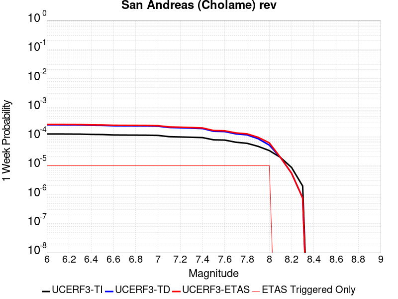 |  | 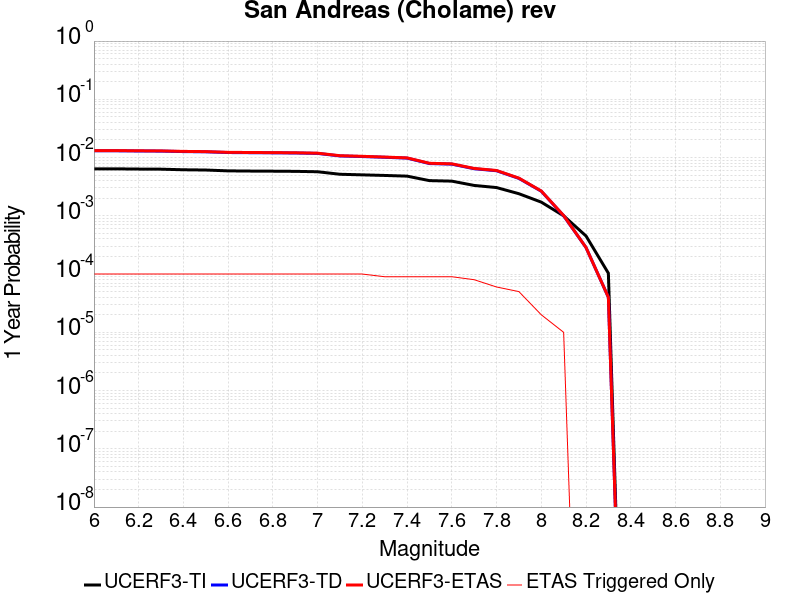 | 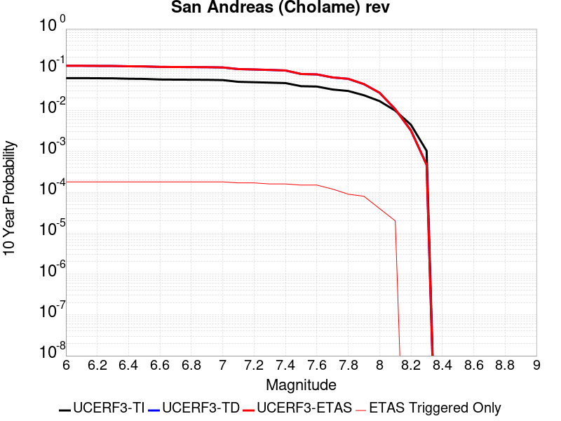 |

| Magnitude | 1 wk TI Prob | 1 wk TD Prob | 1 wk ETAS Prob | 1 wk ETAS/TD Gain | 1 wk ETAS Triggered Only | 1 mo TI Prob | 1 mo TD Prob | 1 mo ETAS Prob | 1 mo ETAS/TD Gain | 1 mo ETAS Triggered Only | 1 yr TI Prob | 1 yr TD Prob | 1 yr ETAS Prob | 1 yr ETAS/TD Gain | 1 yr ETAS Triggered Only | 10 yr TI Prob | 10 yr TD Prob | 10 yr ETAS Prob | 10 yr ETAS/TD Gain | 10 yr ETAS Triggered Only |
|-----|-----|-----|-----|-----|-----|-----|-----|-----|-----|-----|-----|-----|-----|-----|-----|-----|-----|-----|-----|-----|
| 6.0 | 1.2302514E-4 | 2.520685E-4 | 2.62066E-4 | 1.0396618 | 1.0E-5 | 5.27144E-4 | 0.001079848 | 0.0010998264 | 1.0185012 | 2.0E-5 | 0.0063991086 | 0.013068403 | 0.013167096 | 1.007552 | 1.0E-4 | 0.06217949 | 0.12437864 | 0.124536246 | 1.0012672 | 1.8E-4 |
| 6.1 | 1.2302514E-4 | 2.520685E-4 | 2.62066E-4 | 1.0396618 | 1.0E-5 | 5.27144E-4 | 0.001079848 | 0.0010998264 | 1.0185012 | 2.0E-5 | 0.0063991086 | 0.013068403 | 0.013167096 | 1.007552 | 1.0E-4 | 0.06217949 | 0.12437864 | 0.124536246 | 1.0012672 | 1.8E-4 |
| 6.2 | 1.2203569E-4 | 2.5023633E-4 | 2.6023385E-4 | 1.0399523 | 1.0E-5 | 5.2290526E-4 | 0.0010720023 | 0.0010919808 | 1.0186367 | 2.0E-5 | 0.006347804 | 0.012974024 | 0.013072726 | 1.0076077 | 1.0E-4 | 0.061695136 | 0.12356582 | 0.12372358 | 1.0012767 | 1.8E-4 |
| 6.3 | 1.2142645E-4 | 2.4909602E-4 | 2.5909353E-4 | 1.0401351 | 1.0E-5 | 5.202953E-4 | 0.0010671193 | 0.0010870979 | 1.018722 | 2.0E-5 | 0.006316212 | 0.012915279 | 0.013013988 | 1.0076427 | 1.0E-4 | 0.06139677 | 0.12305904 | 0.12321689 | 1.0012827 | 1.8E-4 |
| 6.4 | 1.1865206E-4 | 2.4415087E-4 | 2.5414844E-4 | 1.0409483 | 1.0E-5 | 5.0840975E-4 | 0.0010459429 | 0.001065922 | 1.0191015 | 2.0E-5 | 0.006172335 | 0.012660478 | 0.0127592115 | 1.0077986 | 1.0E-4 | 0.060036868 | 0.120855525 | 0.12101377 | 1.0013094 | 1.8E-4 |
| 6.5 | 1.17443946E-4 | 2.4208416E-4 | 2.5208175E-4 | 1.0412979 | 1.0E-5 | 5.032341E-4 | 0.0010370926 | 0.0010570718 | 1.0192647 | 2.0E-5 | 0.006109677 | 0.012553969 | 0.012652715 | 1.0078657 | 1.0E-4 | 0.059444077 | 0.11992656 | 0.12008497 | 1.001321 | 1.8E-4 |
| 6.6 | 1.13579066E-4 | 2.3517397E-4 | 2.451716E-4 | 1.0425117 | 1.0E-5 | 4.866766E-4 | 0.0010075006 | 0.0010274805 | 1.0198311 | 2.0E-5 | 0.0059092017 | 0.012197774 | 0.012296555 | 1.0080982 | 1.0E-4 | 0.057545185 | 0.11684585 | 0.11700482 | 1.0013605 | 1.8E-4 |
| 6.7 | 1.1271412E-4 | 2.3361712E-4 | 2.4361478E-4 | 1.0427951 | 1.0E-5 | 4.829711E-4 | 0.0010008336 | 0.0010208136 | 1.0199634 | 2.0E-5 | 0.005864331 | 0.012117509 | 0.012216297 | 1.0081525 | 1.0E-4 | 0.057119697 | 0.11614941 | 0.1163085 | 1.0013697 | 1.8E-4 |
| 6.8 | 1.1217975E-4 | 2.3250144E-4 | 2.4249911E-4 | 1.0430005 | 1.0E-5 | 4.8068175E-4 | 9.960558E-4 | 0.0010160358 | 1.0200592 | 2.0E-5 | 0.005836608 | 0.012059984 | 0.012158778 | 1.008192 | 1.0E-4 | 0.056856725 | 0.115647264 | 0.115806445 | 1.0013765 | 1.8E-4 |
| 6.9 | 1.1146753E-4 | 2.309889E-4 | 2.4098658E-4 | 1.0432822 | 1.0E-5 | 4.7763053E-4 | 9.895783E-4 | 0.0010095586 | 1.0201906 | 2.0E-5 | 0.0057996577 | 0.011981992 | 0.012080794 | 1.0082458 | 1.0E-4 | 0.056506127 | 0.114966914 | 0.11512622 | 1.0013857 | 1.8E-4 |
| 7.0 | 1.0965793E-4 | 2.272224E-4 | 2.3722013E-4 | 1.0439998 | 1.0E-5 | 4.698779E-4 | 9.7344833E-4 | 9.934289E-4 | 1.0205256 | 2.0E-5 | 0.005705768 | 0.011787751 | 0.0118865715 | 1.0083834 | 1.0E-4 | 0.055614736 | 0.11326673 | 0.11342634 | 1.0014092 | 1.8E-4 |
| 7.1 | 9.927982E-5 | 2.0541086E-4 | 2.1540881E-4 | 1.0486729 | 1.0E-5 | 4.2541555E-4 | 8.8003627E-4 | 9.0001867E-4 | 1.0227064 | 2.0E-5 | 0.0051671406 | 0.010662098 | 0.010761032 | 1.009279 | 1.0E-4 | 0.05048634 | 0.103365906 | 0.10351834 | 1.0014746 | 1.7E-4 |
| 7.2 | 9.696786E-5 | 2.0045337E-4 | 2.1045137E-4 | 1.0498769 | 1.0E-5 | 4.1551032E-4 | 8.5880404E-4 | 8.7878684E-4 | 1.0232682 | 2.0E-5 | 0.00504711 | 0.010406093 | 0.010505052 | 1.0095098 | 1.0E-4 | 0.04934009 | 0.101102516 | 0.10125533 | 1.0015115 | 1.7E-4 |
| 7.3 | 9.4727984E-5 | 1.9474492E-4 | 2.0474297E-4 | 1.0513393 | 1.0E-5 | 4.0591392E-4 | 8.343551E-4 | 8.543384E-4 | 1.0239506 | 2.0E-5 | 0.0049308087 | 0.010111228 | 0.010200318 | 1.008811 | 9.0E-5 | 0.048228268 | 0.09847499 | 0.09861923 | 1.0014647 | 1.6E-4 |
| 7.4 | 9.220358E-5 | 1.8844973E-4 | 1.9844786E-4 | 1.0530546 | 1.0E-5 | 3.9509835E-4 | 8.0739264E-4 | 8.273765E-4 | 1.0247511 | 2.0E-5 | 0.004799717 | 0.009785947 | 0.009875067 | 1.0091069 | 9.0E-5 | 0.046973653 | 0.09555924 | 0.09570395 | 1.0015143 | 1.6E-4 |
| 7.5 | 7.71631E-5 | 1.5179768E-4 | 1.6179615E-4 | 1.0658672 | 1.0E-5 | 3.306571E-4 | 6.503994E-4 | 6.703864E-4 | 1.0307304 | 2.0E-5 | 0.0040183207 | 0.007889934 | 0.0079792235 | 1.0113169 | 9.0E-5 | 0.03946433 | 0.078292 | 0.07843025 | 1.0017658 | 1.5E-4 |
| 7.6 | 7.5634416E-5 | 1.4839163E-4 | 1.5839015E-4 | 1.0673792 | 1.0E-5 | 3.241072E-4 | 6.3580927E-4 | 6.5579655E-4 | 1.031436 | 2.0E-5 | 0.0039388672 | 0.00771357 | 0.0078028757 | 1.0115777 | 9.0E-5 | 0.038697794 | 0.07665772 | 0.07679622 | 1.0018067 | 1.5E-4 |
| 7.7 | 6.3783E-5 | 1.2360167E-4 | 1.3360044E-4 | 1.0808951 | 1.0E-5 | 2.7332708E-4 | 5.296139E-4 | 5.4960337E-4 | 1.0377433 | 2.0E-5 | 0.0033226798 | 0.0064290124 | 0.0065084985 | 1.0123636 | 8.0E-5 | 0.032734364 | 0.06454798 | 0.06466023 | 1.001739 | 1.2E-4 |
| 7.8 | 5.863422E-5 | 1.1417469E-4 | 1.2417354E-4 | 1.0875751 | 1.0E-5 | 2.512653E-4 | 4.8922835E-4 | 4.992235E-4 | 1.0204303 | 1.0E-5 | 0.003054864 | 0.005940109 | 0.0059997523 | 1.0100409 | 6.0E-5 | 0.030132094 | 0.059664637 | 0.059749268 | 1.0014185 | 9.0E-5 |
| 7.9 | 4.595283E-5 | 8.427224E-5 | 9.427139E-5 | 1.118653 | 1.0E-5 | 1.9692584E-4 | 3.6111675E-4 | 3.7111313E-4 | 1.0276818 | 1.0E-5 | 0.0023949358 | 0.0043877396 | 0.00443752 | 1.0113454 | 5.0E-5 | 0.023692891 | 0.044364896 | 0.04444135 | 1.0017232 | 8.0E-5 |
| 8.0 | 3.2950178E-5 | 5.0776536E-5 | 6.0776027E-5 | 1.1969314 | 1.0E-5 | 1.412074E-4 | 2.1759559E-4 | 2.2759341E-4 | 1.0459468 | 1.0E-5 | 0.0017178444 | 0.0026460094 | 0.0026659565 | 1.0075386 | 2.0E-5 | 0.017046256 | 0.027182076 | 0.027220989 | 1.0014316 | 4.0E-5 |
| 8.1 | 1.9177472E-5 | 1.9184967E-5 | 1.9184967E-5 | 1.0 | 0.0 | 8.218658E-5 | 8.22187E-5 | 8.22187E-5 | 1.0 | 0.0 | 0.0010001622 | 0.0010005536 | 0.0010105436 | 1.0099845 | 1.0E-5 | 0.009956728 | 0.010758361 | 0.010778145 | 1.001839 | 2.0E-5 |
| 8.2 | 8.643924E-6 | 5.474112E-6 | 5.474112E-6 | 1.0 | 0.0 | 3.704486E-5 | 2.3460268E-5 | 2.3460268E-5 | 1.0 | 0.0 | 4.5092785E-4 | 2.8559144E-4 | 2.8559144E-4 | 1.0 | 0.0 | 0.0045001395 | 0.0032484592 | 0.0032484592 | 1.0 | 0.0 |
| 8.3 | 1.983087E-6 | 7.65717E-7 | 7.65717E-7 | 1.0 | 0.0 | 8.498917E-6 | 3.2816401E-6 | 3.2816401E-6 | 1.0 | 0.0 | 1.034694E-4 | 3.9953255E-5 | 3.9953255E-5 | 1.0 | 0.0 | 0.0010342124 | 4.7185255E-4 | 4.7185255E-4 | 1.0 | 0.0 |

## San Andreas (Creeping Section) 2011 CFM
*[(top)](#table-of-contents)*

| 1 Week | 1 Month | 1 Year | 10 Year |
|-----|-----|-----|-----|
|  | 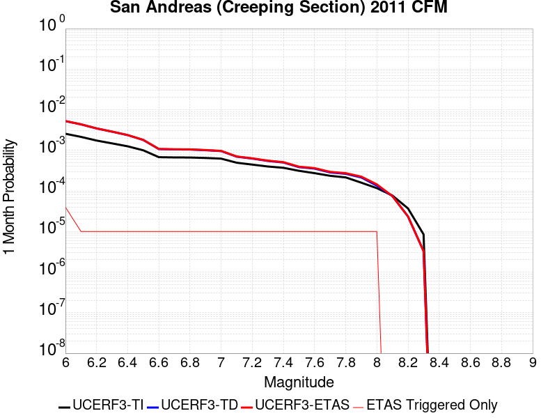 |  |  |

| Magnitude | 1 wk TI Prob | 1 wk TD Prob | 1 wk ETAS Prob | 1 wk ETAS/TD Gain | 1 wk ETAS Triggered Only | 1 mo TI Prob | 1 mo TD Prob | 1 mo ETAS Prob | 1 mo ETAS/TD Gain | 1 mo ETAS Triggered Only | 1 yr TI Prob | 1 yr TD Prob | 1 yr ETAS Prob | 1 yr ETAS/TD Gain | 1 yr ETAS Triggered Only | 10 yr TI Prob | 10 yr TD Prob | 10 yr ETAS Prob | 10 yr ETAS/TD Gain | 10 yr ETAS Triggered Only |
|-----|-----|-----|-----|-----|-----|-----|-----|-----|-----|-----|-----|-----|-----|-----|-----|-----|-----|-----|-----|-----|
| 6.0 | 5.986481E-4 | 0.0012276083 | 0.0012575715 | 1.0244077 | 3.0E-5 | 0.0025631124 | 0.0052455943 | 0.005285384 | 1.0075854 | 4.0E-5 | 0.030762846 | 0.06120632 | 0.061281424 | 1.001227 | 8.0E-5 | 0.26835477 | 0.42593485 | 0.42600948 | 1.0001752 | 1.3E-4 |
| 6.1 | 5.015945E-4 | 0.0010218146 | 0.0010318045 | 1.0097765 | 1.0E-5 | 0.00214792 | 0.0043679033 | 0.0043778596 | 1.0022794 | 1.0E-5 | 0.025839351 | 0.051248793 | 0.05129623 | 1.0009257 | 5.0E-5 | 0.23032776 | 0.3728559 | 0.3729186 | 1.0001682 | 1.0E-4 |
| 6.2 | 4.073338E-4 | 8.107503E-4 | 8.2074216E-4 | 1.0123242 | 1.0E-5 | 0.0017445484 | 0.0034671926 | 0.0034771578 | 1.0028741 | 1.0E-5 | 0.021034058 | 0.040933583 | 0.040981535 | 1.0011715 | 5.0E-5 | 0.19150782 | 0.3130326 | 0.3131013 | 1.0002195 | 1.0E-4 |
| 6.3 | 3.464099E-4 | 6.7393086E-4 | 6.839241E-4 | 1.0148283 | 1.0E-5 | 0.0014837692 | 0.002883002 | 0.002892973 | 1.0034586 | 1.0E-5 | 0.017915873 | 0.03419 | 0.03423829 | 1.0014124 | 5.0E-5 | 0.16538359 | 0.2713157 | 0.27138856 | 1.0002686 | 1.0E-4 |
| 6.4 | 2.935057E-4 | 5.544408E-4 | 5.644352E-4 | 1.0180262 | 1.0E-5 | 0.0012572751 | 0.0023725776 | 0.0023825539 | 1.0042049 | 1.0E-5 | 0.015200248 | 0.028264936 | 0.028313523 | 1.001719 | 5.0E-5 | 0.14201577 | 0.23298436 | 0.23306106 | 1.0003293 | 1.0E-4 |
| 6.5 | 2.3409708E-4 | 4.2094532E-4 | 4.3094112E-4 | 1.023746 | 1.0E-5 | 0.0010028875 | 0.001802007 | 0.0018119889 | 1.0055394 | 1.0E-5 | 0.012141965 | 0.021587888 | 0.021636808 | 1.0022662 | 5.0E-5 | 0.11499573 | 0.18682276 | 0.18689595 | 1.0003917 | 9.0E-5 |
| 6.6 | 1.5842178E-4 | 2.5070168E-4 | 2.6069916E-4 | 1.039878 | 1.0E-5 | 6.7877385E-4 | 0.0010739854 | 0.0010839746 | 1.0093011 | 1.0E-5 | 0.0082328 | 0.012995997 | 0.013045348 | 1.0037973 | 5.0E-5 | 0.07934396 | 0.12314567 | 0.123224586 | 1.0006409 | 9.0E-5 |
| 6.7 | 1.5616413E-4 | 2.4606715E-4 | 2.560647E-4 | 1.0406293 | 1.0E-5 | 6.691031E-4 | 0.0010541424 | 0.0010641317 | 1.0094764 | 1.0E-5 | 0.0081159435 | 0.012757865 | 0.012807227 | 1.0038692 | 5.0E-5 | 0.0782586 | 0.121172786 | 0.12125188 | 1.0006528 | 9.0E-5 |
| 6.8 | 1.5538467E-4 | 2.4430576E-4 | 2.543033E-4 | 1.0409223 | 1.0E-5 | 6.6576427E-4 | 0.0010465999 | 0.0010565895 | 1.0095447 | 1.0E-5 | 0.008075596 | 0.012667264 | 0.0127166305 | 1.0038972 | 5.0E-5 | 0.07788358 | 0.120403625 | 0.12048279 | 1.0006574 | 9.0E-5 |
| 6.9 | 1.5153569E-4 | 2.3539852E-4 | 2.4539616E-4 | 1.0424712 | 1.0E-5 | 6.49277E-4 | 0.0010084626 | 0.0010184526 | 1.009906 | 1.0E-5 | 0.007876333 | 0.012209433 | 0.012258822 | 1.0040452 | 5.0E-5 | 0.07602952 | 0.116473705 | 0.116553225 | 1.0006827 | 9.0E-5 |
| 7.0 | 1.4588932E-4 | 2.2397061E-4 | 2.3396837E-4 | 1.0446388 | 1.0E-5 | 6.250901E-4 | 9.595229E-4 | 9.695133E-4 | 1.0104119 | 1.0E-5 | 0.0075839474 | 0.011620114 | 0.011669532 | 1.0042529 | 5.0E-5 | 0.073302895 | 0.111319825 | 0.111390926 | 1.0006386 | 8.0E-5 |
| 7.1 | 1.1565079E-4 | 1.6282457E-4 | 1.7282294E-4 | 1.0614058 | 1.0E-5 | 4.955521E-4 | 6.976338E-4 | 7.076268E-4 | 1.0143242 | 1.0E-5 | 0.006016669 | 0.008460815 | 0.008510392 | 1.0058596 | 5.0E-5 | 0.058563538 | 0.083670385 | 0.08374369 | 1.0008762 | 8.0E-5 |
| 7.2 | 1.0393792E-4 | 1.4616452E-4 | 1.5616305E-4 | 1.0684061 | 1.0E-5 | 4.4537216E-4 | 6.262697E-4 | 6.3626346E-4 | 1.0159576 | 1.0E-5 | 0.005408933 | 0.0075983466 | 0.0076479665 | 1.0065304 | 5.0E-5 | 0.052791595 | 0.075619645 | 0.0756936 | 1.0009779 | 8.0E-5 |
| 7.3 | 9.332884E-5 | 1.2781512E-4 | 1.3781384E-4 | 1.078228 | 1.0E-5 | 3.999194E-4 | 5.476647E-4 | 5.576592E-4 | 1.0182494 | 1.0E-5 | 0.0048581534 | 0.006647567 | 0.0066972347 | 1.0074716 | 5.0E-5 | 0.047533102 | 0.06648299 | 0.066557676 | 1.0011233 | 8.0E-5 |
| 7.4 | 8.670252E-5 | 1.17038246E-4 | 1.2703707E-4 | 1.0854322 | 1.0E-5 | 3.715293E-4 | 5.0149666E-4 | 5.114917E-4 | 1.0199304 | 1.0E-5 | 0.004513991 | 0.006088749 | 0.006138445 | 1.0081619 | 5.0E-5 | 0.044233937 | 0.06115138 | 0.06122649 | 1.0012282 | 8.0E-5 |
| 7.5 | 7.3036405E-5 | 9.006337E-5 | 1.0006247E-4 | 1.111023 | 1.0E-5 | 3.129756E-4 | 3.8592887E-4 | 3.95925E-4 | 1.0259016 | 1.0E-5 | 0.0038038217 | 0.004688582 | 0.0047383476 | 1.0106142 | 5.0E-5 | 0.03739367 | 0.047879256 | 0.047955427 | 1.0015908 | 8.0E-5 |
| 7.6 | 6.3935775E-5 | 8.2808314E-5 | 9.280749E-5 | 1.1207508 | 1.0E-5 | 2.7398168E-4 | 3.5484458E-4 | 3.6484105E-4 | 1.0281713 | 1.0E-5 | 0.0033306254 | 0.0043116934 | 0.0043614777 | 1.0115464 | 5.0E-5 | 0.032811474 | 0.043993566 | 0.044070046 | 1.0017384 | 8.0E-5 |
| 7.7 | 5.5050095E-5 | 6.6622284E-5 | 7.662162E-5 | 1.15009 | 1.0E-5 | 2.3590765E-4 | 2.8549286E-4 | 2.9549E-4 | 1.0350171 | 1.0E-5 | 0.0028683927 | 0.0034703398 | 0.003510201 | 1.0114863 | 4.0E-5 | 0.0283165 | 0.035797697 | 0.035855547 | 1.0016161 | 6.0E-5 |
| 7.8 | 5.027131E-5 | 6.1632316E-5 | 7.16317E-5 | 1.1622425 | 1.0E-5 | 2.1543067E-4 | 2.6411176E-4 | 2.7410913E-4 | 1.0378528 | 1.0E-5 | 0.0026197135 | 0.0032108228 | 0.0032506944 | 1.0124179 | 4.0E-5 | 0.025890453 | 0.03312809 | 0.033176433 | 1.0014592 | 5.0E-5 |
| 7.9 | 3.7271806E-5 | 5.0228038E-5 | 6.0227536E-5 | 1.199082 | 1.0E-5 | 1.5972654E-4 | 2.1524528E-4 | 2.2524313E-4 | 1.0464486 | 1.0E-5 | 0.0019429359 | 0.002617464 | 0.0026573592 | 1.015242 | 4.0E-5 | 0.019260362 | 0.027068522 | 0.027117169 | 1.0017972 | 5.0E-5 |
| 8.0 | 2.7310243E-5 | 3.1429598E-5 | 4.1429284E-5 | 1.3181615 | 1.0E-5 | 1.17038646E-4 | 1.3469132E-4 | 1.4468998E-4 | 1.0742339 | 1.0E-5 | 0.0014240141 | 0.0016386342 | 0.0016586015 | 1.0121853 | 2.0E-5 | 0.014149235 | 0.017214483 | 0.017243966 | 1.0017127 | 3.0E-5 |
| 8.1 | 1.7940547E-5 | 1.7400525E-5 | 1.7400525E-5 | 1.0 | 0.0 | 7.688579E-5 | 7.4571544E-5 | 7.4571544E-5 | 1.0 | 0.0 | 9.3568244E-4 | 9.0753095E-4 | 9.175219E-4 | 1.0110089 | 1.0E-5 | 0.009317525 | 0.009799091 | 0.009818895 | 1.002021 | 2.0E-5 |
| 8.2 | 8.643924E-6 | 5.474112E-6 | 5.474112E-6 | 1.0 | 0.0 | 3.704486E-5 | 2.3460268E-5 | 2.3460268E-5 | 1.0 | 0.0 | 4.5092785E-4 | 2.8559144E-4 | 2.8559144E-4 | 1.0 | 0.0 | 0.0045001395 | 0.0032484592 | 0.0032484592 | 1.0 | 0.0 |
| 8.3 | 1.983087E-6 | 7.65717E-7 | 7.65717E-7 | 1.0 | 0.0 | 8.498917E-6 | 3.2816401E-6 | 3.2816401E-6 | 1.0 | 0.0 | 1.034694E-4 | 3.9953255E-5 | 3.9953255E-5 | 1.0 | 0.0 | 0.0010342124 | 4.7185255E-4 | 4.7185255E-4 | 1.0 | 0.0 |

## San Andreas (Coachella) rev
*[(top)](#table-of-contents)*

| 1 Week | 1 Month | 1 Year | 10 Year |
|-----|-----|-----|-----|
| 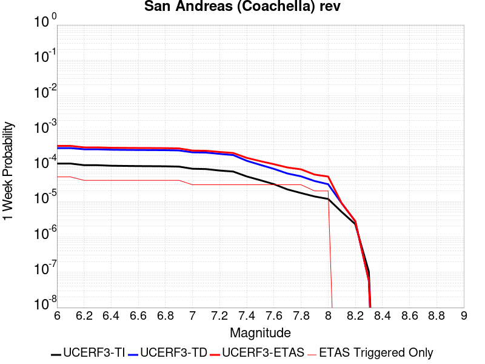 |  | 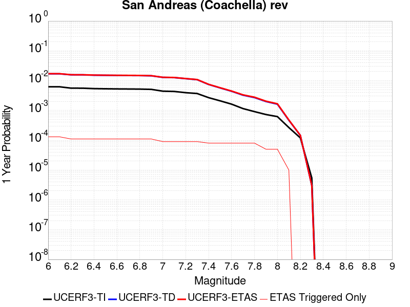 |  |

| Magnitude | 1 wk TI Prob | 1 wk TD Prob | 1 wk ETAS Prob | 1 wk ETAS/TD Gain | 1 wk ETAS Triggered Only | 1 mo TI Prob | 1 mo TD Prob | 1 mo ETAS Prob | 1 mo ETAS/TD Gain | 1 mo ETAS Triggered Only | 1 yr TI Prob | 1 yr TD Prob | 1 yr ETAS Prob | 1 yr ETAS/TD Gain | 1 yr ETAS Triggered Only | 10 yr TI Prob | 10 yr TD Prob | 10 yr ETAS Prob | 10 yr ETAS/TD Gain | 10 yr ETAS Triggered Only |
|-----|-----|-----|-----|-----|-----|-----|-----|-----|-----|-----|-----|-----|-----|-----|-----|-----|-----|-----|-----|-----|
| 6.0 | 1.1925945E-4 | 3.2731172E-4 | 3.7729534E-4 | 1.1527096 | 5.0E-5 | 5.110118E-4 | 0.0014020151 | 0.0014719169 | 1.0498581 | 7.0E-5 | 0.0062038354 | 0.016937273 | 0.01706507 | 1.0075454 | 1.3E-4 | 0.060334753 | 0.15267897 | 0.15281454 | 1.000888 | 1.6E-4 |
| 6.1 | 1.1925945E-4 | 3.2731172E-4 | 3.7729534E-4 | 1.1527096 | 5.0E-5 | 5.110118E-4 | 0.0014020151 | 0.0014719169 | 1.0498581 | 7.0E-5 | 0.0062038354 | 0.016937273 | 0.01706507 | 1.0075454 | 1.3E-4 | 0.060334753 | 0.15267897 | 0.15281454 | 1.000888 | 1.6E-4 |
| 6.2 | 1.07432395E-4 | 3.0231962E-4 | 3.4230752E-4 | 1.1322703 | 4.0E-5 | 4.603433E-4 | 0.0012950161 | 0.0013549385 | 1.0462714 | 6.0E-5 | 0.005590286 | 0.015653936 | 0.015762214 | 1.006917 | 1.1E-4 | 0.05451731 | 0.14182664 | 0.1419468 | 1.0008471 | 1.4E-4 |
| 6.3 | 1.0718766E-4 | 3.0177267E-4 | 3.417606E-4 | 1.1325101 | 4.0E-5 | 4.592948E-4 | 0.0012926745 | 0.0013525969 | 1.0463554 | 6.0E-5 | 0.005577586 | 0.015625834 | 0.015734116 | 1.0069296 | 1.1E-4 | 0.054396555 | 0.14159487 | 0.14171505 | 1.0008488 | 1.4E-4 |
| 6.4 | 1.0355944E-4 | 2.9385355E-4 | 3.338418E-4 | 1.1360822 | 4.0E-5 | 4.4375064E-4 | 0.0012587685 | 0.0013186929 | 1.0476056 | 6.0E-5 | 0.0053892885 | 0.015218868 | 0.015327194 | 1.0071179 | 1.1E-4 | 0.052604496 | 0.13815682 | 0.13827747 | 1.0008733 | 1.4E-4 |
| 6.5 | 1.0227914E-4 | 2.9104785E-4 | 3.310362E-4 | 1.1373944 | 4.0E-5 | 4.382655E-4 | 0.0012467556 | 0.0013066807 | 1.048065 | 6.0E-5 | 0.0053228354 | 0.015074644 | 0.015182986 | 1.007187 | 1.1E-4 | 0.051971316 | 0.13694122 | 0.13706206 | 1.0008824 | 1.4E-4 |
| 6.6 | 1.0116757E-4 | 2.8870534E-4 | 3.286938E-4 | 1.1385095 | 4.0E-5 | 4.3350324E-4 | 0.0012367258 | 0.0012966517 | 1.0484552 | 6.0E-5 | 0.0052651367 | 0.014954214 | 0.015062569 | 1.0072458 | 1.1E-4 | 0.051421247 | 0.13591862 | 0.1360396 | 1.00089 | 1.4E-4 |
| 6.7 | 1.0050676E-4 | 2.8729098E-4 | 3.2727947E-4 | 1.1391916 | 4.0E-5 | 4.3067214E-4 | 0.0012306699 | 0.0012905961 | 1.0486939 | 6.0E-5 | 0.005230834 | 0.0148814935 | 0.014989857 | 1.0072818 | 1.1E-4 | 0.051094085 | 0.1353035 | 0.13542455 | 1.0008947 | 1.4E-4 |
| 6.8 | 9.976819E-5 | 2.8532752E-4 | 3.253161E-4 | 1.1401498 | 4.0E-5 | 4.2750788E-4 | 0.0012222631 | 0.0012821897 | 1.0490292 | 6.0E-5 | 0.0051924936 | 0.0147805335 | 0.014888907 | 1.0073322 | 1.1E-4 | 0.050728295 | 0.13445508 | 0.13457626 | 1.0009012 | 1.4E-4 |
| 6.9 | 9.77719E-5 | 2.8029655E-4 | 3.2028533E-4 | 1.142666 | 4.0E-5 | 4.1895514E-4 | 0.0012007217 | 0.0012606496 | 1.04991 | 6.0E-5 | 0.0050888555 | 0.014521793 | 0.014630196 | 1.0074648 | 1.1E-4 | 0.049738888 | 0.13228355 | 0.13240504 | 1.0009184 | 1.4E-4 |
| 7.0 | 8.500761E-5 | 2.4764193E-4 | 2.7763448E-4 | 1.1211127 | 3.0E-5 | 3.6426744E-4 | 0.0010608941 | 0.001110841 | 1.04708 | 5.0E-5 | 0.0044259406 | 0.012840665 | 0.012929509 | 1.006919 | 9.0E-5 | 0.04338823 | 0.11813489 | 0.118240714 | 1.0008957 | 1.2E-4 |
| 7.1 | 8.319876E-5 | 2.4366927E-4 | 2.7366195E-4 | 1.1230876 | 3.0E-5 | 3.5651738E-4 | 0.0010438821 | 0.00109383 | 1.0478481 | 5.0E-5 | 0.004331963 | 0.012635966 | 0.012724829 | 1.0070325 | 9.0E-5 | 0.042484846 | 0.11635495 | 0.11646099 | 1.0009114 | 1.2E-4 |
| 7.2 | 7.563917E-5 | 2.2415337E-4 | 2.5414664E-4 | 1.133807 | 3.0E-5 | 3.2412758E-4 | 9.603067E-4 | 0.0010102587 | 1.0520167 | 5.0E-5 | 0.0039391145 | 0.011629746 | 0.0117187 | 1.0076488 | 9.0E-5 | 0.03870018 | 0.10776101 | 0.10786808 | 1.0009936 | 1.2E-4 |
| 7.3 | 7.082985E-5 | 2.0731447E-4 | 2.3730825E-4 | 1.1446776 | 3.0E-5 | 3.0352117E-4 | 8.88191E-4 | 9.3814655E-4 | 1.0562443 | 5.0E-5 | 0.0036891096 | 0.010760733 | 0.010849765 | 1.0082737 | 9.0E-5 | 0.03628465 | 0.1002835 | 0.10039147 | 1.0010766 | 1.2E-4 |
| 7.4 | 5.146215E-5 | 1.4275059E-4 | 1.7274631E-4 | 1.2101268 | 3.0E-5 | 2.2053342E-4 | 6.116457E-4 | 6.516212E-4 | 1.0653573 | 4.0E-5 | 0.0026816884 | 0.0074215485 | 0.0075009544 | 1.0106994 | 8.0E-5 | 0.02649557 | 0.07085042 | 0.07094333 | 1.0013114 | 1.0E-4 |
| 7.5 | 4.0285166E-5 | 1.09426845E-4 | 1.3942356E-4 | 1.2741258 | 3.0E-5 | 1.7263928E-4 | 4.688882E-4 | 5.088695E-4 | 1.0852681 | 4.0E-5 | 0.002099857 | 0.005693841 | 0.005773385 | 1.0139703 | 8.0E-5 | 0.020801254 | 0.055013213 | 0.055107713 | 1.0017177 | 1.0E-4 |
| 7.6 | 3.1168736E-5 | 8.439833E-5 | 1.143958E-4 | 1.3554273 | 3.0E-5 | 1.3357346E-4 | 3.6165712E-4 | 4.0164264E-4 | 1.110562 | 4.0E-5 | 0.0016250437 | 0.0043943124 | 0.0044739605 | 1.0181253 | 8.0E-5 | 0.016132116 | 0.042812467 | 0.042908184 | 1.0022358 | 1.0E-4 |
| 7.7 | 2.2100989E-5 | 6.239546E-5 | 9.2393595E-5 | 1.4807742 | 3.0E-5 | 9.4715084E-5 | 2.6738175E-4 | 3.0737105E-4 | 1.1495588 | 4.0E-5 | 0.001152546 | 0.00325052 | 0.0033302598 | 1.0245315 | 8.0E-5 | 0.011465867 | 0.031902805 | 0.031989932 | 1.0027311 | 9.0E-5 |
| 7.8 | 1.7484861E-5 | 5.1802595E-5 | 8.1801045E-5 | 1.5790915 | 3.0E-5 | 7.493296E-5 | 2.2199225E-4 | 2.6198337E-4 | 1.1801465 | 4.0E-5 | 9.1192697E-4 | 0.0026994087 | 0.0027791928 | 1.0295562 | 8.0E-5 | 0.009081938 | 0.026642337 | 0.02672994 | 1.003288 | 9.0E-5 |
| 7.9 | 1.3967285E-5 | 3.8227605E-5 | 5.822684E-5 | 1.5231621 | 2.0E-5 | 5.985842E-5 | 1.638223E-4 | 1.8381904E-4 | 1.1220635 | 2.0E-5 | 7.2853256E-4 | 0.0019927132 | 0.0020426137 | 1.0250415 | 5.0E-5 | 0.0072614877 | 0.019911656 | 0.019970462 | 1.0029533 | 6.0E-5 |
| 8.0 | 1.1887396E-5 | 3.1069234E-5 | 5.106861E-5 | 1.6437036 | 2.0E-5 | 5.094499E-5 | 1.3314707E-4 | 1.531444E-4 | 1.1501899 | 2.0E-5 | 6.200787E-4 | 0.0016198611 | 0.0016697801 | 1.0308168 | 5.0E-5 | 0.006183513 | 0.016281154 | 0.016340178 | 1.0036253 | 6.0E-5 |
| 8.1 | 5.100864E-6 | 8.9742625E-6 | 8.9742625E-6 | 1.0 | 0.0 | 2.1860664E-5 | 3.846056E-5 | 3.846056E-5 | 1.0 | 0.0 | 2.6612106E-4 | 4.6815682E-4 | 4.7815213E-4 | 1.0213504 | 1.0E-5 | 0.002658026 | 0.0049183206 | 0.0049282713 | 1.0020232 | 1.0E-5 |
| 8.2 | 2.3004484E-6 | 2.7865499E-6 | 2.7865499E-6 | 1.0 | 0.0 | 9.859027E-6 | 1.1942302E-5 | 1.1942302E-5 | 1.0 | 0.0 | 1.2002704E-4 | 1.4538786E-4 | 1.4538786E-4 | 1.0 | 0.0 | 0.0011996223 | 0.001597465 | 0.001597465 | 1.0 | 0.0 |
| 8.3 | 1.0424446E-7 | 5.8149546E-8 | 5.8149546E-8 | 1.0 | 0.0 | 4.4676187E-7 | 2.4921232E-7 | 2.4921232E-7 | 1.0 | 0.0 | 5.439312E-6 | 3.034156E-6 | 3.034156E-6 | 1.0 | 0.0 | 5.4391792E-5 | 3.190319E-5 | 3.190319E-5 | 1.0 | 0.0 |

## White Wolf (Extension)
*[(top)](#table-of-contents)*

| 1 Week | 1 Month | 1 Year | 10 Year |
|-----|-----|-----|-----|
| 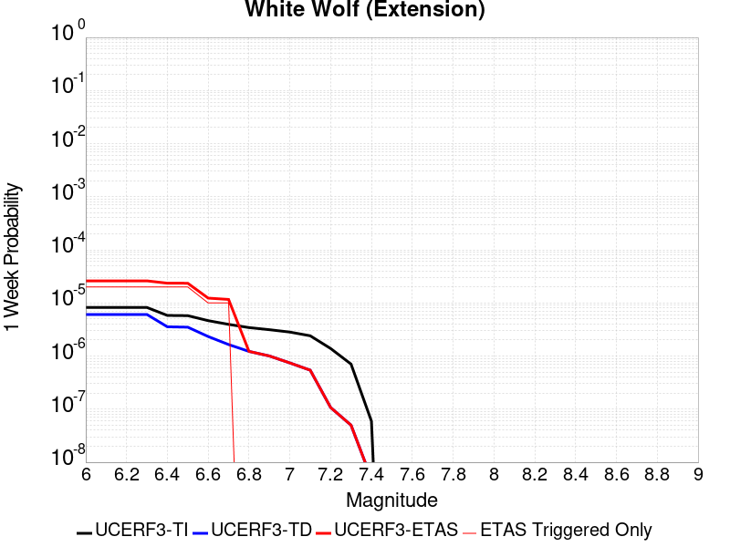 |  |  | 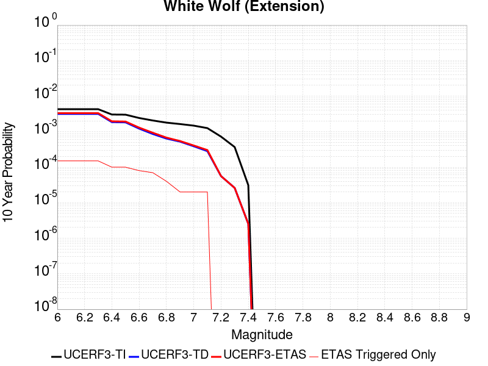 |

| Magnitude | 1 wk TI Prob | 1 wk TD Prob | 1 wk ETAS Prob | 1 wk ETAS/TD Gain | 1 wk ETAS Triggered Only | 1 mo TI Prob | 1 mo TD Prob | 1 mo ETAS Prob | 1 mo ETAS/TD Gain | 1 mo ETAS Triggered Only | 1 yr TI Prob | 1 yr TD Prob | 1 yr ETAS Prob | 1 yr ETAS/TD Gain | 1 yr ETAS Triggered Only | 10 yr TI Prob | 10 yr TD Prob | 10 yr ETAS Prob | 10 yr ETAS/TD Gain | 10 yr ETAS Triggered Only |
|-----|-----|-----|-----|-----|-----|-----|-----|-----|-----|-----|-----|-----|-----|-----|-----|-----|-----|-----|-----|-----|
| 6.0 | 8.222555E-6 | 6.0666184E-6 | 2.6066497E-5 | 4.2967095 | 2.0E-5 | 3.5239045E-5 | 2.599957E-5 | 6.599853E-5 | 2.538447 | 4.0E-5 | 4.289509E-4 | 3.165054E-4 | 4.1647378E-4 | 1.3158504 | 1.0E-4 | 0.0042812387 | 0.0031611985 | 0.0033107242 | 1.0473003 | 1.5E-4 |
| 6.1 | 8.222555E-6 | 6.0666184E-6 | 2.6066497E-5 | 4.2967095 | 2.0E-5 | 3.5239045E-5 | 2.599957E-5 | 6.599853E-5 | 2.538447 | 4.0E-5 | 4.289509E-4 | 3.165054E-4 | 4.1647378E-4 | 1.3158504 | 1.0E-4 | 0.0042812387 | 0.0031611985 | 0.0033107242 | 1.0473003 | 1.5E-4 |
| 6.2 | 8.222555E-6 | 6.0666184E-6 | 2.6066497E-5 | 4.2967095 | 2.0E-5 | 3.5239045E-5 | 2.599957E-5 | 6.599853E-5 | 2.538447 | 4.0E-5 | 4.289509E-4 | 3.165054E-4 | 4.1647378E-4 | 1.3158504 | 1.0E-4 | 0.0042812387 | 0.0031611985 | 0.0033107242 | 1.0473003 | 1.5E-4 |
| 6.3 | 8.222555E-6 | 6.0666184E-6 | 2.6066497E-5 | 4.2967095 | 2.0E-5 | 3.5239045E-5 | 2.599957E-5 | 6.599853E-5 | 2.538447 | 4.0E-5 | 4.289509E-4 | 3.165054E-4 | 4.1647378E-4 | 1.3158504 | 1.0E-4 | 0.0042812387 | 0.0031611985 | 0.0033107242 | 1.0473003 | 1.5E-4 |
| 6.4 | 5.821773E-6 | 3.5571277E-6 | 2.3557057E-5 | 6.6224937 | 2.0E-5 | 2.4950215E-5 | 1.524475E-5 | 4.5244295E-5 | 2.9678605 | 3.0E-5 | 3.0372653E-4 | 1.8559012E-4 | 2.45579E-4 | 1.323233 | 6.0E-5 | 0.0030331176 | 0.0018544596 | 0.0019542743 | 1.0538241 | 1.0E-4 |
| 6.5 | 5.766023E-6 | 3.499062E-6 | 2.3498991E-5 | 6.715798 | 2.0E-5 | 2.4711293E-5 | 1.49959E-5 | 4.499545E-5 | 3.000517 | 3.0E-5 | 3.0081844E-4 | 1.8256088E-4 | 2.4254993E-4 | 1.3285975 | 6.0E-5 | 0.0030041158 | 0.0018242171 | 0.0019240348 | 1.054718 | 1.0E-4 |
| 6.6 | 4.643576E-6 | 2.3325747E-6 | 1.2332552E-5 | 5.287098 | 1.0E-5 | 1.9900888E-5 | 9.996713E-6 | 2.9996512E-5 | 3.0006378 | 2.0E-5 | 2.4226638E-4 | 1.2170361E-4 | 1.7169752E-4 | 1.4107841 | 5.0E-5 | 0.0024200242 | 0.001216412 | 0.0012963148 | 1.0656872 | 8.0E-5 |
| 6.7 | 3.9529173E-6 | 1.6482986E-6 | 1.1648282E-5 | 7.0668516 | 1.0E-5 | 1.6940963E-5 | 7.064119E-6 | 1.7064049E-5 | 2.4155946 | 1.0E-5 | 2.0623671E-4 | 8.6002445E-5 | 1.2599901E-4 | 1.4650631 | 4.0E-5 | 0.002060454 | 8.597101E-4 | 9.296499E-4 | 1.0813528 | 7.0E-5 |
| 6.8 | 3.4377522E-6 | 1.2244773E-6 | 1.2244773E-6 | 1.0 | 0.0 | 1.473314E-5 | 5.24775E-6 | 5.24775E-6 | 1.0 | 0.0 | 1.7936122E-4 | 6.388957E-5 | 8.38883E-5 | 1.3130201 | 2.0E-5 | 0.0017921652 | 6.3872116E-4 | 6.786956E-4 | 1.0625851 | 4.0E-5 |
| 6.9 | 3.1367306E-6 | 1.0033324E-6 | 1.0033324E-6 | 1.0 | 0.0 | 1.3443062E-5 | 4.2999895E-6 | 4.2999895E-6 | 1.0 | 0.0 | 1.63657E-4 | 5.235119E-5 | 6.235067E-5 | 1.1910076 | 1.0E-5 | 0.0016353652 | 5.2339624E-4 | 5.4338574E-4 | 1.0381919 | 2.0E-5 |
| 7.0 | 2.8298145E-6 | 7.4282406E-7 | 7.4282406E-7 | 1.0 | 0.0 | 1.2127721E-5 | 3.1835282E-6 | 3.1835282E-6 | 1.0 | 0.0 | 1.47645E-4 | 3.8758815E-5 | 4.875843E-5 | 1.2579958 | 1.0E-5 | 0.0014754693 | 3.8752556E-4 | 4.075178E-4 | 1.0515895 | 2.0E-5 |
| 7.1 | 2.4091064E-6 | 5.422388E-7 | 5.422388E-7 | 1.0 | 0.0 | 1.03247E-5 | 2.3238788E-6 | 2.3238788E-6 | 1.0 | 0.0 | 1.2569598E-4 | 2.8292898E-5 | 3.8292615E-5 | 1.3534356 | 1.0E-5 | 0.001256249 | 2.82897E-4 | 3.0289133E-4 | 1.0706772 | 2.0E-5 |
| 7.2 | 1.3875518E-6 | 1.074027E-7 | 1.074027E-7 | 1.0 | 0.0 | 5.9466374E-6 | 4.602972E-7 | 4.602972E-7 | 1.0 | 0.0 | 7.23979E-5 | 5.604105E-6 | 5.604105E-6 | 1.0 | 0.0 | 7.2374323E-4 | 5.6039753E-5 | 5.6039753E-5 | 1.0 | 0.0 |
| 7.3 | 7.056077E-7 | 5.0002964E-8 | 5.0002964E-8 | 1.0 | 0.0 | 3.0240296E-6 | 2.142984E-7 | 2.142984E-7 | 1.0 | 0.0 | 3.681694E-5 | 2.6090804E-6 | 2.6090804E-6 | 1.0 | 0.0 | 3.681084E-4 | 2.6090544E-5 | 2.6090544E-5 | 1.0 | 0.0 |
| 7.4 | 5.9334678E-8 | 4.8638475E-9 | 4.8638475E-9 | 1.0 | 0.0 | 2.5429145E-7 | 2.084506E-8 | 2.084506E-8 | 1.0 | 0.0 | 3.095994E-6 | 2.5378858E-7 | 2.5378858E-7 | 1.0 | 0.0 | 3.095951E-5 | 2.5378843E-6 | 2.5378843E-6 | 1.0 | 0.0 |

## Independence rev 2011
*[(top)](#table-of-contents)*

| 1 Week | 1 Month | 1 Year | 10 Year |
|-----|-----|-----|-----|
|  |  |  |  |

| Magnitude | 1 wk TI Prob | 1 wk TD Prob | 1 wk ETAS Prob | 1 wk ETAS/TD Gain | 1 wk ETAS Triggered Only | 1 mo TI Prob | 1 mo TD Prob | 1 mo ETAS Prob | 1 mo ETAS/TD Gain | 1 mo ETAS Triggered Only | 1 yr TI Prob | 1 yr TD Prob | 1 yr ETAS Prob | 1 yr ETAS/TD Gain | 1 yr ETAS Triggered Only | 10 yr TI Prob | 10 yr TD Prob | 10 yr ETAS Prob | 10 yr ETAS/TD Gain | 10 yr ETAS Triggered Only |
|-----|-----|-----|-----|-----|-----|-----|-----|-----|-----|-----|-----|-----|-----|-----|-----|-----|-----|-----|-----|-----|
| 6.0 | 4.422171E-6 | 4.326227E-6 | 3.4326098E-5 | 7.934419 | 3.0E-5 | 1.8952025E-5 | 1.8540857E-5 | 6.853993E-5 | 3.696697 | 5.0E-5 | 2.3071647E-4 | 2.2571454E-4 | 3.1569423E-4 | 1.3986437 | 9.0E-5 | 0.0023047708 | 0.0022551464 | 0.0023948308 | 1.0619402 | 1.4E-4 |
| 6.1 | 4.422171E-6 | 4.326227E-6 | 3.4326098E-5 | 7.934419 | 3.0E-5 | 1.8952025E-5 | 1.8540857E-5 | 6.853993E-5 | 3.696697 | 5.0E-5 | 2.3071647E-4 | 2.2571454E-4 | 3.1569423E-4 | 1.3986437 | 9.0E-5 | 0.0023047708 | 0.0022551464 | 0.0023948308 | 1.0619402 | 1.4E-4 |
| 6.2 | 4.422171E-6 | 4.326227E-6 | 3.4326098E-5 | 7.934419 | 3.0E-5 | 1.8952025E-5 | 1.8540857E-5 | 6.853993E-5 | 3.696697 | 5.0E-5 | 2.3071647E-4 | 2.2571454E-4 | 3.1569423E-4 | 1.3986437 | 9.0E-5 | 0.0023047708 | 0.0022551464 | 0.0023948308 | 1.0619402 | 1.4E-4 |
| 6.3 | 4.422171E-6 | 4.326227E-6 | 3.4326098E-5 | 7.934419 | 3.0E-5 | 1.8952025E-5 | 1.8540857E-5 | 6.853993E-5 | 3.696697 | 5.0E-5 | 2.3071647E-4 | 2.2571454E-4 | 3.1569423E-4 | 1.3986437 | 9.0E-5 | 0.0023047708 | 0.0022551464 | 0.0023948308 | 1.0619402 | 1.4E-4 |
| 6.4 | 4.422171E-6 | 4.326227E-6 | 3.4326098E-5 | 7.934419 | 3.0E-5 | 1.8952025E-5 | 1.8540857E-5 | 6.853993E-5 | 3.696697 | 5.0E-5 | 2.3071647E-4 | 2.2571454E-4 | 3.1569423E-4 | 1.3986437 | 9.0E-5 | 0.0023047708 | 0.0022551464 | 0.0023948308 | 1.0619402 | 1.4E-4 |
| 6.5 | 4.422171E-6 | 4.326227E-6 | 3.4326098E-5 | 7.934419 | 3.0E-5 | 1.8952025E-5 | 1.8540857E-5 | 6.853993E-5 | 3.696697 | 5.0E-5 | 2.3071647E-4 | 2.2571454E-4 | 3.1569423E-4 | 1.3986437 | 9.0E-5 | 0.0023047708 | 0.0022551464 | 0.0023948308 | 1.0619402 | 1.4E-4 |
| 6.6 | 2.663744E-6 | 2.5319857E-6 | 3.253191E-5 | 12.848378 | 3.0E-5 | 1.1415996E-5 | 1.0851325E-5 | 6.0850783E-5 | 5.607682 | 5.0E-5 | 1.3898089E-4 | 1.3210737E-4 | 2.2209546E-4 | 1.681174 | 9.0E-5 | 0.0013889399 | 0.0013203365 | 0.0014501648 | 1.0983298 | 1.3E-4 |
| 6.7 | 2.663744E-6 | 2.5319857E-6 | 3.253191E-5 | 12.848378 | 3.0E-5 | 1.1415996E-5 | 1.0851325E-5 | 6.0850783E-5 | 5.607682 | 5.0E-5 | 1.3898089E-4 | 1.3210737E-4 | 2.2209546E-4 | 1.681174 | 9.0E-5 | 0.0013889399 | 0.0013203365 | 0.0014501648 | 1.0983298 | 1.3E-4 |
| 6.8 | 1.9716529E-6 | 1.8322576E-6 | 3.18322E-5 | 17.373215 | 3.0E-5 | 8.449913E-6 | 7.85251E-6 | 5.7852118E-5 | 7.367341 | 5.0E-5 | 1.0287284E-4 | 9.560024E-5 | 1.8559163E-4 | 1.9413302 | 9.0E-5 | 0.0010282523 | 9.55604E-4 | 0.0010854799 | 1.1359096 | 1.3E-4 |
| 6.9 | 1.8788617E-6 | 1.7429985E-6 | 3.1742948E-5 | 18.211689 | 3.0E-5 | 8.0522395E-6 | 7.469973E-6 | 5.74696E-5 | 7.6934147 | 5.0E-5 | 9.80316E-5 | 9.094325E-5 | 1.8093507E-4 | 1.9895382 | 9.0E-5 | 9.798837E-4 | 9.0907235E-4 | 0.0010289632 | 1.1318827 | 1.2E-4 |
| 7.0 | 1.5045488E-6 | 1.3849503E-6 | 3.138491E-5 | 22.661396 | 3.0E-5 | 6.44805E-6 | 5.9354884E-6 | 5.593519E-5 | 9.423857 | 5.0E-5 | 7.8502184E-5 | 7.226223E-5 | 1.6225572E-4 | 2.245374 | 9.0E-5 | 7.8474457E-4 | 7.223924E-4 | 8.423057E-4 | 1.1659946 | 1.2E-4 |
| 7.1 | 1.272341E-6 | 1.1625094E-6 | 3.1162475E-5 | 26.806211 | 3.0E-5 | 5.4528787E-6 | 4.9821742E-6 | 5.4981923E-5 | 11.035729 | 5.0E-5 | 6.6386776E-5 | 6.0656315E-5 | 1.4065146E-4 | 2.3188264 | 8.0E-5 | 6.636695E-4 | 6.064008E-4 | 7.163341E-4 | 1.1812882 | 1.1E-4 |
| 7.2 | 1.0416892E-6 | 9.4098766E-7 | 3.094096E-5 | 32.881367 | 3.0E-5 | 4.464375E-6 | 4.032798E-6 | 5.4032596E-5 | 13.39829 | 5.0E-5 | 5.4352407E-5 | 4.909823E-5 | 1.290943E-4 | 2.6293066 | 8.0E-5 | 5.4339116E-4 | 4.908757E-4 | 6.008217E-4 | 1.2239794 | 1.1E-4 |
| 7.3 | 7.9450155E-7 | 7.235008E-7 | 2.0723486E-5 | 28.643349 | 2.0E-5 | 3.4050022E-6 | 3.1007141E-6 | 4.310059E-5 | 13.900214 | 4.0E-5 | 4.1455114E-5 | 3.7750553E-5 | 1.0774791E-4 | 2.8542075 | 7.0E-5 | 4.144738E-4 | 3.774425E-4 | 4.7740477E-4 | 1.264841 | 1.0E-4 |
| 7.4 | 5.3893444E-7 | 5.019519E-7 | 2.0501942E-5 | 40.844433 | 2.0E-5 | 2.309717E-6 | 2.1512208E-6 | 4.2151136E-5 | 19.594053 | 4.0E-5 | 2.8120441E-5 | 2.6190803E-5 | 9.618897E-5 | 3.6726239 | 7.0E-5 | 2.8116882E-4 | 2.618776E-4 | 3.6185142E-4 | 1.3817577 | 1.0E-4 |
| 7.5 | 3.8852085E-7 | 3.6825645E-7 | 1.0368252E-5 | 28.154978 | 1.0E-5 | 1.6650882E-6 | 1.578241E-6 | 2.157821E-5 | 13.672316 | 2.0E-5 | 2.027226E-5 | 1.9214916E-5 | 6.921396E-5 | 3.602095 | 5.0E-5 | 2.0270412E-4 | 1.9213278E-4 | 2.721174E-4 | 1.4162987 | 8.0E-5 |
| 7.6 | 2.414929E-7 | 2.3457625E-7 | 1.0234574E-5 | 43.630054 | 1.0E-5 | 1.0349692E-6 | 1.0053263E-6 | 1.1005316E-5 | 10.947008 | 1.0E-5 | 1.2600677E-5 | 1.2239781E-5 | 3.2239535E-5 | 2.6339962 | 2.0E-5 | 1.2599962E-4 | 1.223912E-4 | 1.6238629E-4 | 1.3267809 | 4.0E-5 |
| 7.7 | 6.8298014E-8 | 6.8589806E-8 | 1.0068589E-5 | 146.79425 | 1.0E-5 | 2.9270575E-7 | 2.9395628E-7 | 1.0293953E-5 | 35.018658 | 1.0E-5 | 3.5636867E-6 | 3.5789121E-6 | 1.3578876E-5 | 3.794135 | 1.0E-5 | 3.5636294E-5 | 3.5788595E-5 | 4.5788234E-5 | 1.2794087 | 1.0E-5 |

## Santa Ynez (West)
*[(top)](#table-of-contents)*

| 1 Week | 1 Month | 1 Year | 10 Year |
|-----|-----|-----|-----|
| 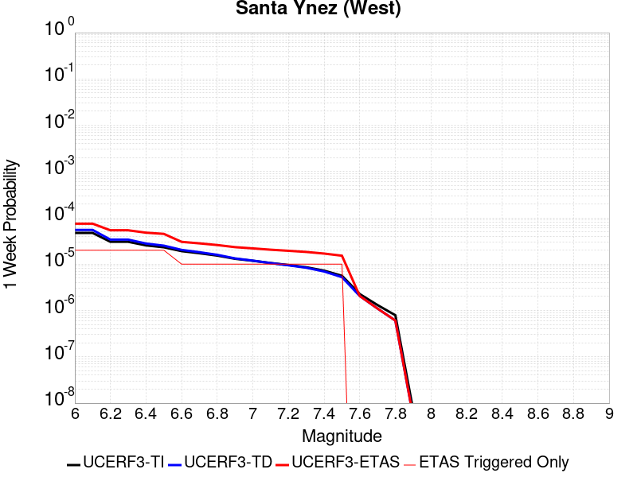 |  |  |  |

| Magnitude | 1 wk TI Prob | 1 wk TD Prob | 1 wk ETAS Prob | 1 wk ETAS/TD Gain | 1 wk ETAS Triggered Only | 1 mo TI Prob | 1 mo TD Prob | 1 mo ETAS Prob | 1 mo ETAS/TD Gain | 1 mo ETAS Triggered Only | 1 yr TI Prob | 1 yr TD Prob | 1 yr ETAS Prob | 1 yr ETAS/TD Gain | 1 yr ETAS Triggered Only | 10 yr TI Prob | 10 yr TD Prob | 10 yr ETAS Prob | 10 yr ETAS/TD Gain | 10 yr ETAS Triggered Only |
|-----|-----|-----|-----|-----|-----|-----|-----|-----|-----|-----|-----|-----|-----|-----|-----|-----|-----|-----|-----|-----|
| 6.0 | 4.7352758E-5 | 5.4970966E-5 | 7.496987E-5 | 1.3638084 | 2.0E-5 | 2.0292461E-4 | 2.3557022E-4 | 2.755608E-4 | 1.1697607 | 4.0E-5 | 0.0024678076 | 0.0028645643 | 0.002964278 | 1.0348094 | 1.0E-4 | 0.024405818 | 0.028304517 | 0.028440556 | 1.0048062 | 1.4E-4 |
| 6.1 | 4.7352758E-5 | 5.4970966E-5 | 7.496987E-5 | 1.3638084 | 2.0E-5 | 2.0292461E-4 | 2.3557022E-4 | 2.755608E-4 | 1.1697607 | 4.0E-5 | 0.0024678076 | 0.0028645643 | 0.0029543065 | 1.0313284 | 9.0E-5 | 0.024405818 | 0.028304517 | 0.02842112 | 1.0041196 | 1.2E-4 |
| 6.2 | 3.0415853E-5 | 3.3925062E-5 | 5.3924385E-5 | 1.5895146 | 2.0E-5 | 1.3034715E-4 | 1.4538522E-4 | 1.7538085E-4 | 1.2063184 | 3.0E-5 | 0.0015858212 | 0.0017686624 | 0.0018385386 | 1.039508 | 7.0E-5 | 0.015745522 | 0.01754981 | 0.017628405 | 1.0044785 | 8.0E-5 |
| 6.3 | 3.0415853E-5 | 3.3925062E-5 | 5.3924385E-5 | 1.5895146 | 2.0E-5 | 1.3034715E-4 | 1.4538522E-4 | 1.7538085E-4 | 1.2063184 | 3.0E-5 | 0.0015858212 | 0.0017686624 | 0.0018385386 | 1.039508 | 7.0E-5 | 0.015745522 | 0.01754981 | 0.017628405 | 1.0044785 | 8.0E-5 |
| 6.4 | 2.5452082E-5 | 2.7912363E-5 | 4.7911806E-5 | 1.7165084 | 2.0E-5 | 1.09075794E-4 | 1.1961904E-4 | 1.4961546E-4 | 1.2507662 | 3.0E-5 | 0.0013271887 | 0.0014554079 | 0.001525306 | 1.0480264 | 7.0E-5 | 0.013192902 | 0.014460933 | 0.014539776 | 1.0054522 | 8.0E-5 |
| 6.5 | 2.3143784E-5 | 2.512817E-5 | 4.512767E-5 | 1.7958995 | 2.0E-5 | 9.9183875E-5 | 1.07687796E-4 | 1.3768456E-4 | 1.2785531 | 3.0E-5 | 0.0012068948 | 0.0013103249 | 0.0013802332 | 1.0533519 | 7.0E-5 | 0.012003611 | 0.013027658 | 0.013096745 | 1.0053031 | 7.0E-5 |
| 6.6 | 1.9118515E-5 | 2.0354271E-5 | 3.0354067E-5 | 1.4912874 | 1.0E-5 | 8.193392E-5 | 8.722972E-5 | 1.0722798E-4 | 1.2292596 | 2.0E-5 | 9.97089E-4 | 0.0010615124 | 0.0011214487 | 1.0564631 | 6.0E-5 | 0.00992627 | 0.01056533 | 0.0106246965 | 1.0056189 | 6.0E-5 |
| 6.7 | 1.722807E-5 | 1.8146275E-5 | 2.8146094E-5 | 1.5510672 | 1.0E-5 | 7.3832496E-5 | 7.7767465E-5 | 8.776668E-5 | 1.1285784 | 1.0E-5 | 8.985399E-4 | 9.4641314E-4 | 9.963658E-4 | 1.0527811 | 5.0E-5 | 0.008949154 | 0.009424472 | 0.009474001 | 1.0052553 | 5.0E-5 |
| 6.8 | 1.5317364E-5 | 1.592641E-5 | 2.5926249E-5 | 1.627878 | 1.0E-5 | 6.56442E-5 | 6.8254274E-5 | 7.825359E-5 | 1.146501 | 1.0E-5 | 7.98925E-4 | 8.306833E-4 | 8.8064175E-4 | 1.0601414 | 5.0E-5 | 0.007960589 | 0.00827627 | 0.008325856 | 1.0059913 | 5.0E-5 |
| 6.9 | 1.3071226E-5 | 1.33295425E-5 | 2.3329409E-5 | 1.7502033 | 1.0E-5 | 5.6018336E-5 | 5.7125373E-5 | 6.71248E-5 | 1.1750436 | 1.0E-5 | 6.8180985E-4 | 6.952817E-4 | 7.4524694E-4 | 1.0718633 | 5.0E-5 | 0.0067972173 | 0.006931325 | 0.0069809784 | 1.0071636 | 5.0E-5 |
| 7.0 | 1.1836986E-5 | 1.1932698E-5 | 2.1932578E-5 | 1.8380234 | 1.0E-5 | 5.0728955E-5 | 5.113914E-5 | 6.113863E-5 | 1.195535 | 1.0E-5 | 6.1745E-4 | 6.2244287E-4 | 6.724117E-4 | 1.0802786 | 5.0E-5 | 0.006157372 | 0.0062071877 | 0.006256877 | 1.0080051 | 5.0E-5 |
| 7.1 | 1.0597169E-5 | 1.0542115E-5 | 2.054201E-5 | 1.9485663 | 1.0E-5 | 4.541565E-5 | 4.5179717E-5 | 5.5179265E-5 | 1.2213283 | 1.0E-5 | 5.5279525E-4 | 5.499254E-4 | 5.998979E-4 | 1.0908715 | 5.0E-5 | 0.0055142213 | 0.0054857763 | 0.005535502 | 1.0090644 | 5.0E-5 |
| 7.2 | 9.59113E-6 | 9.459057E-6 | 1.9458963E-5 | 2.0571778 | 1.0E-5 | 4.11042E-5 | 4.053819E-5 | 5.0537787E-5 | 1.246671 | 1.0E-5 | 5.0032866E-4 | 4.9344177E-4 | 5.3342205E-4 | 1.0810232 | 4.0E-5 | 0.004992037 | 0.00492358 | 0.004963383 | 1.0080842 | 4.0E-5 |
| 7.3 | 8.586084E-6 | 8.379495E-6 | 1.837941E-5 | 2.1933794 | 1.0E-5 | 3.679698E-5 | 3.5911635E-5 | 4.5911274E-5 | 1.2784513 | 1.0E-5 | 4.4791115E-4 | 4.3713747E-4 | 4.7711996E-4 | 1.0914644 | 4.0E-5 | 0.004470094 | 0.0043628872 | 0.0044027125 | 1.0091282 | 4.0E-5 |
| 7.4 | 7.2622997E-6 | 6.951453E-6 | 1.6951384E-5 | 2.438538 | 1.0E-5 | 3.112377E-5 | 2.9791607E-5 | 3.979131E-5 | 1.335655 | 1.0E-5 | 3.78866E-4 | 3.626534E-4 | 4.0263892E-4 | 1.1102581 | 4.0E-5 | 0.0037822074 | 0.0036207163 | 0.0036605715 | 1.0110075 | 4.0E-5 |
| 7.5 | 5.627296E-6 | 5.251501E-6 | 1.52514485E-5 | 2.9042075 | 1.0E-5 | 2.411676E-5 | 2.2506243E-5 | 3.2506017E-5 | 1.4443111 | 1.0E-5 | 2.9358198E-4 | 2.7397976E-4 | 3.0397155E-4 | 1.1094671 | 3.0E-5 | 0.0029319443 | 0.0027364918 | 0.0027664097 | 1.0109329 | 3.0E-5 |
| 7.6 | 2.265244E-6 | 2.0608643E-6 | 2.0608643E-6 | 1.0 | 0.0 | 9.708152E-6 | 8.832247E-6 | 8.832247E-6 | 1.0 | 0.0 | 1.18190335E-4 | 1.0752738E-4 | 1.2752523E-4 | 1.1859791 | 2.0E-5 | 0.001181275 | 0.0010747621 | 0.0010947407 | 1.0185888 | 2.0E-5 |
| 7.7 | 1.3099874E-6 | 1.1016236E-6 | 1.1016236E-6 | 1.0 | 0.0 | 5.61422E-6 | 4.721236E-6 | 4.721236E-6 | 1.0 | 0.0 | 6.8350986E-5 | 5.7479556E-5 | 6.7478984E-5 | 1.1739649 | 1.0E-5 | 6.832996E-4 | 5.7464925E-4 | 5.846435E-4 | 1.0173919 | 1.0E-5 |
| 7.8 | 7.903951E-7 | 6.0710715E-7 | 6.0710715E-7 | 1.0 | 0.0 | 3.3874032E-6 | 2.6018854E-6 | 2.6018854E-6 | 1.0 | 0.0 | 4.1240855E-5 | 3.1677508E-5 | 4.167719E-5 | 1.3156714 | 1.0E-5 | 4.12332E-4 | 3.1673125E-4 | 3.2672807E-4 | 1.0315626 | 1.0E-5 |
| 7.9 | 7.0753297E-9 | 5.0900923E-9 | 5.0900923E-9 | 1.0 | 0.0 | 3.032284E-8 | 2.1814682E-8 | 2.1814682E-8 | 1.0 | 0.0 | 3.6918053E-7 | 2.655937E-7 | 2.655937E-7 | 1.0 | 0.0 | 3.691799E-6 | 2.655935E-6 | 2.655935E-6 | 1.0 | 0.0 |

## Owens Valley
*[(top)](#table-of-contents)*

| 1 Week | 1 Month | 1 Year | 10 Year |
|-----|-----|-----|-----|
| 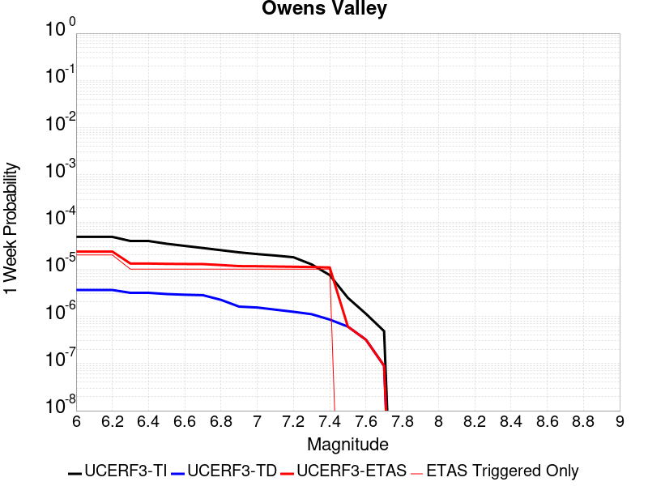 |  | 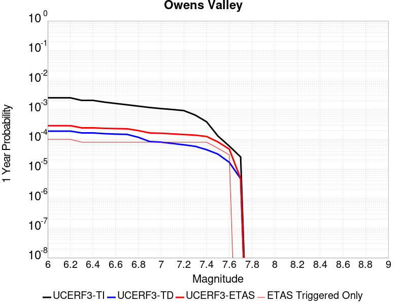 | 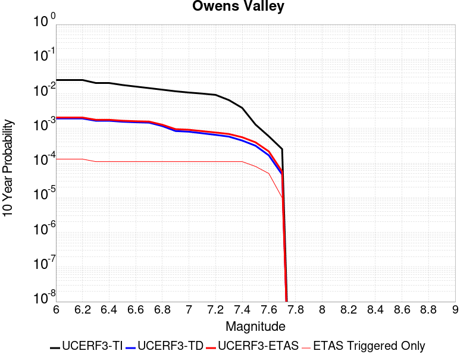 |

| Magnitude | 1 wk TI Prob | 1 wk TD Prob | 1 wk ETAS Prob | 1 wk ETAS/TD Gain | 1 wk ETAS Triggered Only | 1 mo TI Prob | 1 mo TD Prob | 1 mo ETAS Prob | 1 mo ETAS/TD Gain | 1 mo ETAS Triggered Only | 1 yr TI Prob | 1 yr TD Prob | 1 yr ETAS Prob | 1 yr ETAS/TD Gain | 1 yr ETAS Triggered Only | 10 yr TI Prob | 10 yr TD Prob | 10 yr ETAS Prob | 10 yr ETAS/TD Gain | 10 yr ETAS Triggered Only |
|-----|-----|-----|-----|-----|-----|-----|-----|-----|-----|-----|-----|-----|-----|-----|-----|-----|-----|-----|-----|-----|
| 6.0 | 4.83821E-5 | 3.621063E-6 | 2.362099E-5 | 6.52322 | 2.0E-5 | 2.0733538E-4 | 1.5518754E-5 | 4.551829E-5 | 2.9331148 | 3.0E-5 | 0.002521386 | 1.8892545E-4 | 2.8890654E-4 | 1.5292094 | 1.0E-4 | 0.024929691 | 0.0019297374 | 0.0020594865 | 1.0672367 | 1.3E-4 |
| 6.1 | 4.83821E-5 | 3.621063E-6 | 2.362099E-5 | 6.52322 | 2.0E-5 | 2.0733538E-4 | 1.5518754E-5 | 4.551829E-5 | 2.9331148 | 3.0E-5 | 0.002521386 | 1.8892545E-4 | 2.8890654E-4 | 1.5292094 | 1.0E-4 | 0.024929691 | 0.0019297374 | 0.0020594865 | 1.0672367 | 1.3E-4 |
| 6.2 | 4.83821E-5 | 3.621063E-6 | 2.362099E-5 | 6.52322 | 2.0E-5 | 2.0733538E-4 | 1.5518754E-5 | 4.551829E-5 | 2.9331148 | 3.0E-5 | 0.002521386 | 1.8892545E-4 | 2.8890654E-4 | 1.5292094 | 1.0E-4 | 0.024929691 | 0.0019297374 | 0.0020594865 | 1.0672367 | 1.3E-4 |
| 6.3 | 3.953008E-5 | 3.1531065E-6 | 1.3153075E-5 | 4.1714654 | 1.0E-5 | 1.6940363E-4 | 1.3513248E-5 | 3.3512977E-5 | 2.480009 | 2.0E-5 | 0.002060538 | 1.645121E-4 | 2.4449895E-4 | 1.4862064 | 8.0E-5 | 0.020415364 | 0.0016621816 | 0.0017719987 | 1.066068 | 1.1E-4 |
| 6.4 | 3.953008E-5 | 3.1531065E-6 | 1.3153075E-5 | 4.1714654 | 1.0E-5 | 1.6940363E-4 | 1.3513248E-5 | 3.3512977E-5 | 2.480009 | 2.0E-5 | 0.002060538 | 1.645121E-4 | 2.4449895E-4 | 1.4862064 | 8.0E-5 | 0.020415364 | 0.0016621816 | 0.0017719987 | 1.066068 | 1.1E-4 |
| 6.5 | 3.457342E-5 | 2.9707494E-6 | 1.297072E-5 | 4.366144 | 1.0E-5 | 1.4816338E-4 | 1.2731724E-5 | 3.273147E-5 | 2.5708592 | 2.0E-5 | 0.0018023965 | 1.5499842E-4 | 2.3498602E-4 | 1.5160543 | 8.0E-5 | 0.017878477 | 0.0015563306 | 0.0016661594 | 1.070569 | 1.1E-4 |
| 6.6 | 3.1127765E-5 | 2.873741E-6 | 1.2873713E-5 | 4.4797745 | 1.0E-5 | 1.3339789E-4 | 1.2315979E-5 | 3.2315733E-5 | 2.6238866 | 2.0E-5 | 0.0016229092 | 1.4993742E-4 | 2.2992543E-4 | 1.533476 | 8.0E-5 | 0.016111081 | 0.0015013593 | 0.0016111941 | 1.073157 | 1.1E-4 |
| 6.7 | 2.806885E-5 | 2.810171E-6 | 1.2810143E-5 | 4.558492 | 1.0E-5 | 1.2028952E-4 | 1.2043538E-5 | 3.20433E-5 | 2.6606216 | 2.0E-5 | 0.001463541 | 1.4662089E-4 | 2.2660916E-4 | 1.5455449 | 8.0E-5 | 0.014539397 | 0.0014656242 | 0.001575463 | 1.0749433 | 1.1E-4 |
| 6.8 | 2.524524E-5 | 2.2351496E-6 | 1.22351275E-5 | 5.4739633 | 1.0E-5 | 1.0818939E-4 | 9.579179E-6 | 2.9578987E-5 | 3.0878415 | 2.0E-5 | 0.0013164099 | 1.1662057E-4 | 1.9661123E-4 | 1.6859053 | 8.0E-5 | 0.01308639 | 0.0011658425 | 0.0012757143 | 1.0942423 | 1.1E-4 |
| 6.9 | 2.2704568E-5 | 1.6079814E-6 | 1.16079655E-5 | 7.218967 | 1.0E-5 | 9.730166E-5 | 6.891331E-6 | 2.6891194E-5 | 3.902177 | 2.0E-5 | 0.0011840039 | 8.389874E-5 | 1.6389204E-4 | 1.9534503 | 8.0E-5 | 0.011777153 | 8.3886785E-4 | 9.487756E-4 | 1.1310191 | 1.1E-4 |
| 7.0 | 2.0871712E-5 | 1.5393719E-6 | 1.1539357E-5 | 7.496146 | 1.0E-5 | 8.944713E-5 | 6.5972913E-6 | 2.659716E-5 | 4.031527 | 2.0E-5 | 0.0010884746 | 8.031908E-5 | 1.6031266E-4 | 1.9959474 | 8.0E-5 | 0.010831586 | 8.030537E-4 | 9.129654E-4 | 1.1368672 | 1.1E-4 |
| 7.1 | 1.944928E-5 | 1.3862632E-6 | 1.138625E-5 | 8.213627 | 1.0E-5 | 8.335139E-5 | 5.9411145E-6 | 2.5940995E-5 | 4.3663516 | 2.0E-5 | 0.0010143308 | 7.233068E-5 | 1.523249E-4 | 2.1059513 | 8.0E-5 | 0.010097133 | 7.2321086E-4 | 8.331313E-4 | 1.1519895 | 1.1E-4 |
| 7.2 | 1.7876306E-5 | 1.248776E-6 | 1.1248763E-5 | 9.007832 | 1.0E-5 | 7.6610486E-5 | 5.351886E-6 | 2.535178E-5 | 4.7369804 | 2.0E-5 | 9.3233347E-4 | 6.515727E-5 | 1.4515207E-4 | 2.2277184 | 8.0E-5 | 0.009284316 | 6.5148954E-4 | 7.6141785E-4 | 1.1687338 | 1.1E-4 |
| 7.3 | 1.2618672E-5 | 1.1113908E-6 | 1.11113795E-5 | 9.997725 | 1.0E-5 | 5.40789E-5 | 4.763095E-6 | 2.4763E-5 | 5.1989303 | 2.0E-5 | 6.582117E-4 | 5.7989146E-5 | 1.379845E-4 | 2.3794885 | 8.0E-5 | 0.0065626553 | 5.798436E-4 | 6.897798E-4 | 1.1895963 | 1.1E-4 |
| 7.4 | 7.4874442E-6 | 8.547575E-7 | 1.0854749E-5 | 12.699215 | 1.0E-5 | 3.208865E-5 | 3.6632412E-6 | 2.3663168E-5 | 6.459626 | 2.0E-5 | 3.906093E-4 | 4.459905E-5 | 1.2459549E-4 | 2.79368 | 8.0E-5 | 0.003899234 | 4.459632E-4 | 5.559141E-4 | 1.2465471 | 1.1E-4 |
| 7.5 | 2.4734156E-6 | 6.0680395E-7 | 6.0680395E-7 | 1.0 | 0.0 | 1.060031E-5 | 2.6005857E-6 | 2.6005857E-6 | 1.0 | 0.0 | 1.2905113E-4 | 3.1661675E-5 | 8.1660095E-5 | 2.5791464 | 5.0E-5 | 0.0012897621 | 3.1657197E-4 | 3.9654665E-4 | 1.2526271 | 8.0E-5 |
| 7.6 | 1.1328841E-6 | 3.1962216E-7 | 3.1962216E-7 | 1.0 | 0.0 | 4.8552088E-6 | 1.3698086E-6 | 1.3698086E-6 | 1.0 | 0.0 | 5.9110564E-5 | 1.6677293E-5 | 4.6676792E-5 | 2.798823 | 3.0E-5 | 5.9094845E-4 | 1.6676061E-4 | 2.1675228E-4 | 1.299781 | 5.0E-5 |
| 7.7 | 4.8613185E-7 | 8.962831E-8 | 8.962831E-8 | 1.0 | 0.0 | 2.0834207E-6 | 3.8412128E-7 | 3.8412128E-7 | 1.0 | 0.0 | 2.536535E-5 | 4.6766672E-6 | 4.6766672E-6 | 1.0 | 0.0 | 2.5362454E-4 | 4.6765756E-5 | 5.676529E-5 | 1.2138216 | 1.0E-5 |

## Red Mountain
*[(top)](#table-of-contents)*

| 1 Week | 1 Month | 1 Year | 10 Year |
|-----|-----|-----|-----|
|  |  | 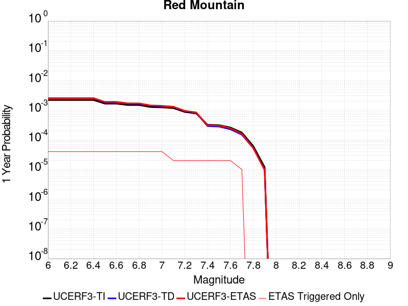 |  |

| Magnitude | 1 wk TI Prob | 1 wk TD Prob | 1 wk ETAS Prob | 1 wk ETAS/TD Gain | 1 wk ETAS Triggered Only | 1 mo TI Prob | 1 mo TD Prob | 1 mo ETAS Prob | 1 mo ETAS/TD Gain | 1 mo ETAS Triggered Only | 1 yr TI Prob | 1 yr TD Prob | 1 yr ETAS Prob | 1 yr ETAS/TD Gain | 1 yr ETAS Triggered Only | 10 yr TI Prob | 10 yr TD Prob | 10 yr ETAS Prob | 10 yr ETAS/TD Gain | 10 yr ETAS Triggered Only |
|-----|-----|-----|-----|-----|-----|-----|-----|-----|-----|-----|-----|-----|-----|-----|-----|-----|-----|-----|-----|-----|
| 6.0 | 4.1810763E-5 | 4.7590114E-5 | 6.7589164E-5 | 1.4202354 | 2.0E-5 | 1.7917668E-4 | 2.0394262E-4 | 2.2393854E-4 | 1.0980468 | 2.0E-5 | 0.0021792934 | 0.0024803386 | 0.0025202392 | 1.0160868 | 4.0E-5 | 0.021580452 | 0.02454416 | 0.024631951 | 1.0035769 | 9.0E-5 |
| 6.1 | 4.1810763E-5 | 4.7590114E-5 | 6.7589164E-5 | 1.4202354 | 2.0E-5 | 1.7917668E-4 | 2.0394262E-4 | 2.2393854E-4 | 1.0980468 | 2.0E-5 | 0.0021792934 | 0.0024803386 | 0.0025202392 | 1.0160868 | 4.0E-5 | 0.021580452 | 0.02454416 | 0.024631951 | 1.0035769 | 9.0E-5 |
| 6.2 | 4.1810763E-5 | 4.7590114E-5 | 6.7589164E-5 | 1.4202354 | 2.0E-5 | 1.7917668E-4 | 2.0394262E-4 | 2.2393854E-4 | 1.0980468 | 2.0E-5 | 0.0021792934 | 0.0024803386 | 0.0025202392 | 1.0160868 | 4.0E-5 | 0.021580452 | 0.02454416 | 0.024631951 | 1.0035769 | 9.0E-5 |
| 6.3 | 4.1810763E-5 | 4.7590114E-5 | 6.7589164E-5 | 1.4202354 | 2.0E-5 | 1.7917668E-4 | 2.0394262E-4 | 2.2393854E-4 | 1.0980468 | 2.0E-5 | 0.0021792934 | 0.0024803386 | 0.0025202392 | 1.0160868 | 4.0E-5 | 0.021580452 | 0.02454416 | 0.024631951 | 1.0035769 | 9.0E-5 |
| 6.4 | 4.1810763E-5 | 4.7590114E-5 | 6.7589164E-5 | 1.4202354 | 2.0E-5 | 1.7917668E-4 | 2.0394262E-4 | 2.2393854E-4 | 1.0980468 | 2.0E-5 | 0.0021792934 | 0.0024803386 | 0.0025202392 | 1.0160868 | 4.0E-5 | 0.021580452 | 0.02454416 | 0.024631951 | 1.0035769 | 9.0E-5 |
| 6.5 | 3.154503E-5 | 3.5359826E-5 | 5.535912E-5 | 1.5655936 | 2.0E-5 | 1.3518598E-4 | 1.5153382E-4 | 1.715308E-4 | 1.1319637 | 2.0E-5 | 0.0016446467 | 0.0018434554 | 0.0018833816 | 1.0216584 | 4.0E-5 | 0.01632528 | 0.01829128 | 0.018379634 | 1.0048304 | 9.0E-5 |
| 6.6 | 3.1535834E-5 | 3.5349207E-5 | 5.53485E-5 | 1.5657636 | 2.0E-5 | 1.3514658E-4 | 1.5148833E-4 | 1.714853E-4 | 1.1320034 | 2.0E-5 | 0.0016441676 | 0.0018429023 | 0.0018828285 | 1.0216649 | 4.0E-5 | 0.01632056 | 0.01828584 | 0.018374195 | 1.0048318 | 9.0E-5 |
| 6.7 | 2.8267326E-5 | 3.1469415E-5 | 5.1468785E-5 | 1.6355177 | 2.0E-5 | 1.2114006E-4 | 1.3486244E-4 | 1.5485974E-4 | 1.1482793 | 2.0E-5 | 0.0014738824 | 0.0016407985 | 0.0016807328 | 1.0243384 | 4.0E-5 | 0.014641452 | 0.016295603 | 0.016384136 | 1.005433 | 9.0E-5 |
| 6.8 | 2.8212884E-5 | 3.14073E-5 | 5.140667E-5 | 1.6367747 | 2.0E-5 | 1.20906756E-4 | 1.3459625E-4 | 1.5459357E-4 | 1.1485726 | 2.0E-5 | 0.0014710457 | 0.0016375626 | 0.0016774972 | 1.0243865 | 4.0E-5 | 0.014613459 | 0.016263718 | 0.016352255 | 1.0054438 | 9.0E-5 |
| 6.9 | 2.4227871E-5 | 2.6707043E-5 | 4.6706507E-5 | 1.7488462 | 2.0E-5 | 1.03829596E-4 | 1.1445416E-4 | 1.3445187E-4 | 1.1747224 | 2.0E-5 | 0.0012633923 | 0.0013926646 | 0.0014326089 | 1.0286819 | 4.0E-5 | 0.012562336 | 0.01384706 | 0.013925951 | 1.0056974 | 8.0E-5 |
| 7.0 | 2.348524E-5 | 2.5835825E-5 | 4.583531E-5 | 1.7740989 | 2.0E-5 | 1.0064714E-4 | 1.1072069E-4 | 1.3071849E-4 | 1.1806147 | 2.0E-5 | 0.0012246901 | 0.0013472665 | 0.0013872127 | 1.0296497 | 4.0E-5 | 0.012179627 | 0.013398622 | 0.01347755 | 1.0058907 | 8.0E-5 |
| 7.1 | 2.2311642E-5 | 2.4462888E-5 | 3.4462646E-5 | 1.4087725 | 1.0E-5 | 9.561782E-5 | 1.0483716E-4 | 1.1483611E-4 | 1.095376 | 1.0E-5 | 0.0011635252 | 0.0012757198 | 0.0012956944 | 1.0156574 | 2.0E-5 | 0.01157452 | 0.012691482 | 0.012750721 | 1.0046676 | 6.0E-5 |
| 7.2 | 1.6533986E-5 | 1.7670392E-5 | 2.7670216E-5 | 1.5659084 | 1.0E-5 | 7.085802E-5 | 7.5728414E-5 | 8.5727654E-5 | 1.1320409 | 1.0E-5 | 8.623549E-4 | 9.2166685E-4 | 9.4164844E-4 | 1.0216798 | 2.0E-5 | 0.008590161 | 0.009184722 | 0.009224355 | 1.004315 | 4.0E-5 |
| 7.3 | 1.4703092E-5 | 1.5559563E-5 | 2.5559406E-5 | 1.6426816 | 1.0E-5 | 6.301173E-5 | 6.668248E-5 | 7.668181E-5 | 1.1499544 | 1.0E-5 | 7.668978E-4 | 8.116184E-4 | 8.316022E-4 | 1.0246221 | 2.0E-5 | 0.0076425658 | 0.008092618 | 0.008132294 | 1.0049027 | 4.0E-5 |
| 7.4 | 6.1331984E-6 | 5.5288915E-6 | 1.5528836E-5 | 2.8086708 | 1.0E-5 | 2.6284872E-5 | 2.3695038E-5 | 3.36948E-5 | 1.4220192 | 1.0E-5 | 3.199713E-4 | 2.8844943E-4 | 3.0844365E-4 | 1.0693163 | 2.0E-5 | 0.0031951098 | 0.0028808047 | 0.0029206893 | 1.013845 | 4.0E-5 |
| 7.5 | 5.954766E-6 | 5.338521E-6 | 1.5338468E-5 | 2.873168 | 1.0E-5 | 2.5520176E-5 | 2.287918E-5 | 3.287895E-5 | 1.4370686 | 1.0E-5 | 3.1066386E-4 | 2.785189E-4 | 2.9851336E-4 | 1.0717884 | 2.0E-5 | 0.003102299 | 0.0027817525 | 0.0028216413 | 1.0143394 | 4.0E-5 |
| 7.6 | 4.9726646E-6 | 4.3153123E-6 | 1.4315269E-5 | 3.3173194 | 1.0E-5 | 2.1311245E-5 | 1.8494065E-5 | 2.8493881E-5 | 1.540704 | 1.0E-5 | 2.5943352E-4 | 2.2514233E-4 | 2.4513784E-4 | 1.0888127 | 2.0E-5 | 0.0025913084 | 0.002249177 | 0.002289087 | 1.0177443 | 4.0E-5 |
| 7.7 | 3.3613894E-6 | 2.8526904E-6 | 1.2852662E-5 | 4.5054526 | 1.0E-5 | 1.4405875E-5 | 1.2225761E-5 | 2.2225639E-5 | 1.817935 | 1.0E-5 | 1.7537741E-4 | 1.4883874E-4 | 1.5883724E-4 | 1.0671768 | 1.0E-5 | 0.0017523908 | 0.0014874167 | 0.0015173721 | 1.0201392 | 3.0E-5 |
| 7.8 | 1.1828961E-6 | 1.0122939E-6 | 1.0122939E-6 | 1.0 | 0.0 | 5.069545E-6 | 4.3383952E-6 | 4.3383952E-6 | 1.0 | 0.0 | 6.171996E-5 | 5.281871E-5 | 5.281871E-5 | 1.0 | 0.0 | 6.170282E-4 | 5.280645E-4 | 5.280645E-4 | 1.0 | 0.0 |
| 7.9 | 2.2967266E-7 | 1.8619195E-7 | 1.8619195E-7 | 1.0 | 0.0 | 9.843111E-7 | 7.9796524E-7 | 7.9796524E-7 | 1.0 | 0.0 | 1.19839215E-5 | 9.715187E-6 | 9.715187E-6 | 1.0 | 0.0 | 1.1983275E-4 | 9.714791E-5 | 9.714791E-5 | 1.0 | 0.0 |

## Calico-Hidalgo
*[(top)](#table-of-contents)*

| 1 Week | 1 Month | 1 Year | 10 Year |
|-----|-----|-----|-----|
| 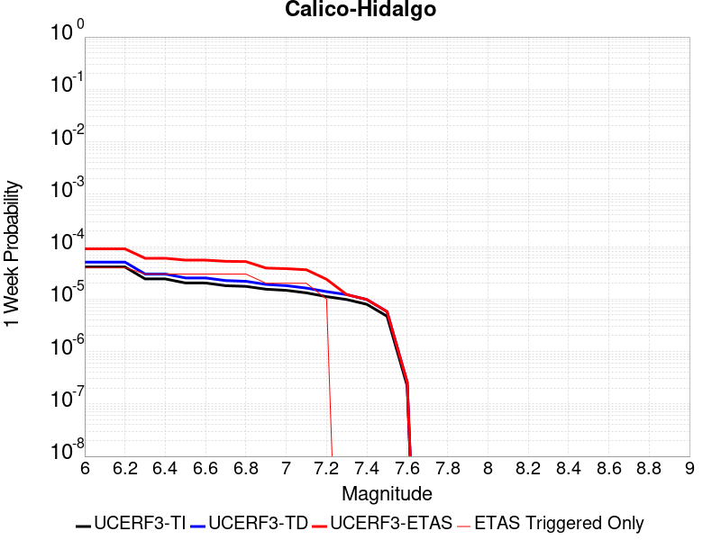 |  |  |  |

| Magnitude | 1 wk TI Prob | 1 wk TD Prob | 1 wk ETAS Prob | 1 wk ETAS/TD Gain | 1 wk ETAS Triggered Only | 1 mo TI Prob | 1 mo TD Prob | 1 mo ETAS Prob | 1 mo ETAS/TD Gain | 1 mo ETAS Triggered Only | 1 yr TI Prob | 1 yr TD Prob | 1 yr ETAS Prob | 1 yr ETAS/TD Gain | 1 yr ETAS Triggered Only | 10 yr TI Prob | 10 yr TD Prob | 10 yr ETAS Prob | 10 yr ETAS/TD Gain | 10 yr ETAS Triggered Only |
|-----|-----|-----|-----|-----|-----|-----|-----|-----|-----|-----|-----|-----|-----|-----|-----|-----|-----|-----|-----|-----|
| 6.0 | 4.0906612E-5 | 5.070444E-5 | 9.070241E-5 | 1.7888455 | 4.0E-5 | 1.7530227E-4 | 2.1728892E-4 | 2.6727805E-4 | 1.2300584 | 5.0E-5 | 0.0021322158 | 0.0026426823 | 0.0027124973 | 1.0264182 | 7.0E-5 | 0.02111873 | 0.026152855 | 0.026269717 | 1.0044684 | 1.2E-4 |
| 6.1 | 4.0906612E-5 | 5.070444E-5 | 9.070241E-5 | 1.7888455 | 4.0E-5 | 1.7530227E-4 | 2.1728892E-4 | 2.6727805E-4 | 1.2300584 | 5.0E-5 | 0.0021322158 | 0.0026426823 | 0.0027124973 | 1.0264182 | 7.0E-5 | 0.02111873 | 0.026152855 | 0.026269717 | 1.0044684 | 1.2E-4 |
| 6.2 | 4.0906612E-5 | 5.070444E-5 | 9.070241E-5 | 1.7888455 | 4.0E-5 | 1.7530227E-4 | 2.1728892E-4 | 2.6727805E-4 | 1.2300584 | 5.0E-5 | 0.0021322158 | 0.0026426823 | 0.0027124973 | 1.0264182 | 7.0E-5 | 0.02111873 | 0.026152855 | 0.026269717 | 1.0044684 | 1.2E-4 |
| 6.3 | 2.4242801E-5 | 3.0090992E-5 | 6.009009E-5 | 1.9969461 | 3.0E-5 | 1.0389358E-4 | 1.2895522E-4 | 1.5895134E-4 | 1.2326089 | 3.0E-5 | 0.0012641704 | 0.0015689324 | 0.001618854 | 1.0318187 | 5.0E-5 | 0.01257003 | 0.015582242 | 0.01567084 | 1.0056858 | 9.0E-5 |
| 6.4 | 2.4242801E-5 | 3.0090992E-5 | 6.009009E-5 | 1.9969461 | 3.0E-5 | 1.0389358E-4 | 1.2895522E-4 | 1.5895134E-4 | 1.2326089 | 3.0E-5 | 0.0012641704 | 0.0015689324 | 0.001618854 | 1.0318187 | 5.0E-5 | 0.01257003 | 0.015582242 | 0.01567084 | 1.0056858 | 9.0E-5 |
| 6.5 | 2.0286952E-5 | 2.5316069E-5 | 5.531531E-5 | 2.184988 | 3.0E-5 | 8.694118E-5 | 1.08493026E-4 | 1.3848976E-4 | 1.2764854 | 3.0E-5 | 0.0010579949 | 0.0013201192 | 0.0013700533 | 1.0378253 | 5.0E-5 | 0.010529719 | 0.013124708 | 0.013203658 | 1.0060154 | 8.0E-5 |
| 6.6 | 2.0269223E-5 | 2.5297019E-5 | 5.529626E-5 | 2.1858804 | 3.0E-5 | 8.6865206E-5 | 1.0841138E-4 | 1.3840813E-4 | 1.2766937 | 3.0E-5 | 0.0010570707 | 0.0013191266 | 0.0013690606 | 1.0378538 | 5.0E-5 | 0.010520565 | 0.0131148975 | 0.013193849 | 1.00602 | 8.0E-5 |
| 6.7 | 1.799852E-5 | 2.2540944E-5 | 5.254027E-5 | 2.3308814 | 3.0E-5 | 7.713423E-5 | 9.6600554E-5 | 1.2659766E-4 | 1.3105272 | 3.0E-5 | 9.3870464E-4 | 0.0011754917 | 0.001225433 | 1.0424854 | 5.0E-5 | 0.009347493 | 0.011694351 | 0.011773416 | 1.006761 | 8.0E-5 |
| 6.8 | 1.7458793E-5 | 2.184259E-5 | 5.1841937E-5 | 2.3734336 | 3.0E-5 | 7.4821255E-5 | 9.360782E-5 | 1.2360502E-4 | 1.320456 | 3.0E-5 | 9.10568E-4 | 0.0011390939 | 0.0011890369 | 1.0438446 | 5.0E-5 | 0.009068459 | 0.011334136 | 0.011413229 | 1.0069783 | 8.0E-5 |
| 6.9 | 1.542884E-5 | 1.9026294E-5 | 3.9025912E-5 | 2.0511568 | 2.0E-5 | 6.612192E-5 | 8.153878E-5 | 1.0153715E-4 | 1.245262 | 2.0E-5 | 8.04737E-4 | 9.922957E-4 | 0.001032256 | 1.0402706 | 4.0E-5 | 0.008018291 | 0.009880047 | 0.009949355 | 1.007015 | 7.0E-5 |
| 7.0 | 1.468253E-5 | 1.80311E-5 | 3.803074E-5 | 2.1091747 | 2.0E-5 | 6.292361E-5 | 7.727393E-5 | 9.727238E-5 | 1.2587996 | 2.0E-5 | 7.658257E-4 | 9.40417E-4 | 9.803794E-4 | 1.0424943 | 4.0E-5 | 0.0076319184 | 0.00936574 | 0.009435085 | 1.0074041 | 7.0E-5 |
| 7.1 | 1.3139281E-5 | 1.6201397E-5 | 3.6201072E-5 | 2.2344415 | 2.0E-5 | 5.6309986E-5 | 6.9432775E-5 | 8.943139E-5 | 1.2880284 | 2.0E-5 | 6.853584E-4 | 8.450288E-4 | 8.84995E-4 | 1.0472957 | 4.0E-5 | 0.0068324856 | 0.008419453 | 0.008488864 | 1.008244 | 7.0E-5 |
| 7.2 | 1.1127404E-5 | 1.3867044E-5 | 2.3866905E-5 | 1.7211242 | 1.0E-5 | 4.7688E-5 | 5.9428898E-5 | 6.94283E-5 | 1.1682583 | 1.0E-5 | 5.8044674E-4 | 7.233175E-4 | 7.4330304E-4 | 1.0276303 | 2.0E-5 | 0.0057893298 | 0.00721074 | 0.0072603794 | 1.0068841 | 5.0E-5 |
| 7.3 | 9.808154E-6 | 1.2176591E-5 | 1.2176591E-5 | 1.0 | 0.0 | 4.2034266E-5 | 5.2184405E-5 | 5.2184405E-5 | 1.0 | 0.0 | 5.11647E-4 | 6.351706E-4 | 6.451643E-4 | 1.0157338 | 1.0E-5 | 0.0051047057 | 0.006334628 | 0.0063644378 | 1.0047059 | 3.0E-5 |
| 7.4 | 7.942452E-6 | 9.792352E-6 | 9.792352E-6 | 1.0 | 0.0 | 3.4038632E-5 | 4.19666E-5 | 4.19666E-5 | 1.0 | 0.0 | 4.1434157E-4 | 5.1083305E-4 | 5.2082795E-4 | 1.0195658 | 1.0E-5 | 0.0041356985 | 0.0050975294 | 0.0051174276 | 1.0039035 | 2.0E-5 |
| 7.5 | 4.7121216E-6 | 5.7729717E-6 | 5.7729717E-6 | 1.0 | 0.0 | 2.019465E-5 | 2.4741117E-5 | 2.4741117E-5 | 1.0 | 0.0 | 2.4584212E-4 | 3.011891E-4 | 3.111861E-4 | 1.0331917 | 1.0E-5 | 0.0024557032 | 0.0030085617 | 0.0030185315 | 1.0033139 | 1.0E-5 |
| 7.6 | 2.21172E-7 | 2.6040198E-7 | 2.6040198E-7 | 1.0 | 0.0 | 9.478797E-7 | 1.1160082E-6 | 1.1160082E-6 | 1.0 | 0.0 | 1.1540374E-5 | 1.3587343E-5 | 1.3587343E-5 | 1.0 | 0.0 | 1.1539775E-4 | 1.3586794E-4 | 1.3586794E-4 | 1.0 | 0.0 |

## Ludlow
*[(top)](#table-of-contents)*

| 1 Week | 1 Month | 1 Year | 10 Year |
|-----|-----|-----|-----|
|  |  |  |  |

| Magnitude | 1 wk TI Prob | 1 wk TD Prob | 1 wk ETAS Prob | 1 wk ETAS/TD Gain | 1 wk ETAS Triggered Only | 1 mo TI Prob | 1 mo TD Prob | 1 mo ETAS Prob | 1 mo ETAS/TD Gain | 1 mo ETAS Triggered Only | 1 yr TI Prob | 1 yr TD Prob | 1 yr ETAS Prob | 1 yr ETAS/TD Gain | 1 yr ETAS Triggered Only | 10 yr TI Prob | 10 yr TD Prob | 10 yr ETAS Prob | 10 yr ETAS/TD Gain | 10 yr ETAS Triggered Only |
|-----|-----|-----|-----|-----|-----|-----|-----|-----|-----|-----|-----|-----|-----|-----|-----|-----|-----|-----|-----|-----|
| 6.0 | 2.2407607E-5 | 2.365727E-5 | 4.3656797E-5 | 1.8453861 | 2.0E-5 | 9.602906E-5 | 1.01384605E-4 | 1.3138157E-4 | 1.2958729 | 3.0E-5 | 0.0011685267 | 0.0012337028 | 0.0013036164 | 1.0566697 | 7.0E-5 | 0.011624013 | 0.012273051 | 0.0123915775 | 1.0096575 | 1.2E-4 |
| 6.1 | 2.2407607E-5 | 2.365727E-5 | 4.3656797E-5 | 1.8453861 | 2.0E-5 | 9.602906E-5 | 1.01384605E-4 | 1.3138157E-4 | 1.2958729 | 3.0E-5 | 0.0011685267 | 0.0012337028 | 0.0013036164 | 1.0566697 | 7.0E-5 | 0.011624013 | 0.012273051 | 0.0123915775 | 1.0096575 | 1.2E-4 |
| 6.2 | 1.0781252E-5 | 1.13656715E-5 | 1.13656715E-5 | 1.0 | 0.0 | 4.620455E-5 | 4.870913E-5 | 4.870913E-5 | 1.0 | 0.0 | 5.623952E-4 | 5.9287634E-4 | 6.128645E-4 | 1.0337138 | 2.0E-5 | 0.00560974 | 0.005913365 | 0.0059630694 | 1.0084054 | 5.0E-5 |
| 6.3 | 1.0781252E-5 | 1.13656715E-5 | 1.13656715E-5 | 1.0 | 0.0 | 4.620455E-5 | 4.870913E-5 | 4.870913E-5 | 1.0 | 0.0 | 5.623952E-4 | 5.9287634E-4 | 6.128645E-4 | 1.0337138 | 2.0E-5 | 0.00560974 | 0.005913365 | 0.0059630694 | 1.0084054 | 5.0E-5 |
| 6.4 | 7.814439E-6 | 8.237735E-6 | 8.237735E-6 | 1.0 | 0.0 | 3.3490025E-5 | 3.5304107E-5 | 3.5304107E-5 | 1.0 | 0.0 | 4.0766477E-4 | 4.297441E-4 | 4.3973982E-4 | 1.0232596 | 1.0E-5 | 0.0040691774 | 0.0042892774 | 0.0043191486 | 1.0069642 | 3.0E-5 |
| 6.5 | 6.4986366E-6 | 6.8509244E-6 | 6.8509244E-6 | 1.0 | 0.0 | 2.7851002E-5 | 2.9360779E-5 | 2.9360779E-5 | 1.0 | 0.0 | 3.390332E-4 | 3.5740976E-4 | 3.674062E-4 | 1.0279691 | 1.0E-5 | 0.003385164 | 0.0035684456 | 0.0035983387 | 1.0083771 | 3.0E-5 |
| 6.6 | 5.582177E-6 | 5.8860096E-6 | 5.8860096E-6 | 1.0 | 0.0 | 2.3923398E-5 | 2.5225516E-5 | 2.5225516E-5 | 1.0 | 0.0 | 2.9122844E-4 | 3.0707807E-4 | 3.0707807E-4 | 1.0 | 0.0 | 0.0029084706 | 0.003066611 | 0.0030865497 | 1.0065019 | 2.0E-5 |
| 6.7 | 4.6858763E-6 | 4.9404307E-6 | 4.9404307E-6 | 1.0 | 0.0 | 2.0082172E-5 | 2.1173106E-5 | 2.1173106E-5 | 1.0 | 0.0 | 2.4447302E-4 | 2.577526E-4 | 2.577526E-4 | 1.0 | 0.0 | 0.0024420423 | 0.002574593 | 0.0025845673 | 1.0038741 | 1.0E-5 |
| 6.8 | 3.5584908E-6 | 3.7520208E-6 | 3.7520208E-6 | 1.0 | 0.0 | 1.5250586E-5 | 1.6079992E-5 | 1.6079992E-5 | 1.0 | 0.0 | 1.8566006E-4 | 1.9575673E-4 | 1.9575673E-4 | 1.0 | 0.0 | 0.0018550502 | 0.001955884 | 0.001955884 | 1.0 | 0.0 |
| 6.9 | 2.532834E-6 | 2.6710052E-6 | 2.6710052E-6 | 1.0 | 0.0 | 1.0854958E-5 | 1.1447117E-5 | 1.1447117E-5 | 1.0 | 0.0 | 1.3215111E-4 | 1.3936001E-4 | 1.3936001E-4 | 1.0 | 0.0 | 0.0013207254 | 0.0013927538 | 0.0013927538 | 1.0 | 0.0 |
| 7.0 | 1.7083285E-6 | 1.801945E-6 | 1.801945E-6 | 1.0 | 0.0 | 7.3213873E-6 | 7.7226E-6 | 7.7226E-6 | 1.0 | 0.0 | 8.913424E-5 | 9.401876E-5 | 9.401876E-5 | 1.0 | 0.0 | 8.9098496E-4 | 9.398064E-4 | 9.398064E-4 | 1.0 | 0.0 |
| 7.1 | 1.0905424E-6 | 1.1497627E-6 | 1.1497627E-6 | 1.0 | 0.0 | 4.6737446E-6 | 4.927546E-6 | 4.927546E-6 | 1.0 | 0.0 | 5.6901354E-5 | 5.999132E-5 | 5.999132E-5 | 1.0 | 0.0 | 5.6886784E-4 | 5.99761E-4 | 5.99761E-4 | 1.0 | 0.0 |
| 7.2 | 6.06668E-7 | 6.387282E-7 | 6.387282E-7 | 1.0 | 0.0 | 2.600003E-6 | 2.737404E-6 | 2.737404E-6 | 1.0 | 0.0 | 3.1654577E-5 | 3.3327455E-5 | 3.3327455E-5 | 1.0 | 0.0 | 3.1650066E-4 | 3.332314E-4 | 3.332314E-4 | 1.0 | 0.0 |

## Santa Rosa Island
*[(top)](#table-of-contents)*

| 1 Week | 1 Month | 1 Year | 10 Year |
|-----|-----|-----|-----|
|  |  |  |  |

| Magnitude | 1 wk TI Prob | 1 wk TD Prob | 1 wk ETAS Prob | 1 wk ETAS/TD Gain | 1 wk ETAS Triggered Only | 1 mo TI Prob | 1 mo TD Prob | 1 mo ETAS Prob | 1 mo ETAS/TD Gain | 1 mo ETAS Triggered Only | 1 yr TI Prob | 1 yr TD Prob | 1 yr ETAS Prob | 1 yr ETAS/TD Gain | 1 yr ETAS Triggered Only | 10 yr TI Prob | 10 yr TD Prob | 10 yr ETAS Prob | 10 yr ETAS/TD Gain | 10 yr ETAS Triggered Only |
|-----|-----|-----|-----|-----|-----|-----|-----|-----|-----|-----|-----|-----|-----|-----|-----|-----|-----|-----|-----|-----|
| 6.0 | 4.1143165E-5 | 4.7091213E-5 | 5.7090743E-5 | 1.2123438 | 1.0E-5 | 1.7631594E-4 | 2.0180499E-4 | 2.4179691E-4 | 1.1981711 | 4.0E-5 | 0.002144533 | 0.0024544036 | 0.0025142562 | 1.0243858 | 6.0E-5 | 0.021239553 | 0.0242936 | 0.024381414 | 1.0036147 | 9.0E-5 |
| 6.1 | 2.1061249E-5 | 2.3865E-5 | 2.3865E-5 | 1.0 | 0.0 | 9.0259375E-5 | 1.02274724E-4 | 1.02274724E-4 | 1.0 | 0.0 | 0.0010983539 | 0.0012445124 | 0.0012545 | 1.0080253 | 1.0E-5 | 0.01092941 | 0.01237847 | 0.012388347 | 1.0007979 | 1.0E-5 |
| 6.2 | 2.1061249E-5 | 2.3865E-5 | 2.3865E-5 | 1.0 | 0.0 | 9.0259375E-5 | 1.02274724E-4 | 1.02274724E-4 | 1.0 | 0.0 | 0.0010983539 | 0.0012445124 | 0.0012545 | 1.0080253 | 1.0E-5 | 0.01092941 | 0.01237847 | 0.012388347 | 1.0007979 | 1.0E-5 |
| 6.3 | 1.5158236E-5 | 1.7074446E-5 | 1.7074446E-5 | 1.0 | 0.0 | 6.496225E-5 | 7.317421E-5 | 7.317421E-5 | 1.0 | 0.0 | 7.906284E-4 | 8.9054386E-4 | 9.00535E-4 | 1.0112191 | 1.0E-5 | 0.007878214 | 0.008871004 | 0.008880915 | 1.0011172 | 1.0E-5 |
| 6.4 | 1.2341918E-5 | 1.3852938E-5 | 1.3852938E-5 | 1.0 | 0.0 | 5.2892858E-5 | 5.9368427E-5 | 5.9368427E-5 | 1.0 | 0.0 | 6.437803E-4 | 7.22579E-4 | 7.325718E-4 | 1.0138294 | 1.0E-5 | 0.006419184 | 0.0072031324 | 0.0072130607 | 1.0013783 | 1.0E-5 |
| 6.5 | 9.061158E-6 | 1.0117046E-5 | 1.0117046E-5 | 1.0 | 0.0 | 3.883296E-5 | 4.335808E-5 | 4.335808E-5 | 1.0 | 0.0 | 4.726887E-4 | 5.2776205E-4 | 5.377568E-4 | 1.018938 | 1.0E-5 | 0.004716845 | 0.005265625 | 0.0052755727 | 1.0018891 | 1.0E-5 |
| 6.6 | 7.5461685E-6 | 8.400746E-6 | 8.400746E-6 | 1.0 | 0.0 | 3.2340322E-5 | 3.6002722E-5 | 3.6002722E-5 | 1.0 | 0.0 | 3.936723E-4 | 4.382493E-4 | 4.4824491E-4 | 1.0228081 | 1.0E-5 | 0.003929756 | 0.00437428 | 0.0043842364 | 1.0022761 | 1.0E-5 |
| 6.7 | 5.5023775E-6 | 6.087389E-6 | 6.087389E-6 | 1.0 | 0.0 | 2.3581404E-5 | 2.6088568E-5 | 2.6088568E-5 | 1.0 | 0.0 | 2.8706578E-4 | 3.1758525E-4 | 3.1758525E-4 | 1.0 | 0.0 | 0.0028669522 | 0.0031716358 | 0.003181604 | 1.003143 | 1.0E-5 |
| 6.8 | 3.7351679E-6 | 4.0831455E-6 | 4.0831455E-6 | 1.0 | 0.0 | 1.6007763E-5 | 1.7499091E-5 | 1.7499091E-5 | 1.0 | 0.0 | 1.948771E-4 | 2.130331E-4 | 2.130331E-4 | 1.0 | 0.0 | 0.0019470629 | 0.002128534 | 0.0021385127 | 1.004688 | 1.0E-5 |
| 6.9 | 2.456366E-6 | 2.629273E-6 | 2.629273E-6 | 1.0 | 0.0 | 1.0527241E-5 | 1.1268265E-5 | 1.1268265E-5 | 1.0 | 0.0 | 1.2816161E-4 | 1.371825E-4 | 1.371825E-4 | 1.0 | 0.0 | 0.0012808773 | 0.0013709812 | 0.0013809674 | 1.007284 | 1.0E-5 |
| 7.0 | 2.3245157E-6 | 2.4827805E-6 | 2.4827805E-6 | 1.0 | 0.0 | 9.962172E-6 | 1.0640445E-5 | 1.0640445E-5 | 1.0 | 0.0 | 1.2128269E-4 | 1.2953974E-4 | 1.2953974E-4 | 1.0 | 0.0 | 0.0012121652 | 0.0012946445 | 0.0013046316 | 1.0077142 | 1.0E-5 |
| 7.1 | 2.2248344E-6 | 2.373252E-6 | 2.373252E-6 | 1.0 | 0.0 | 9.53497E-6 | 1.0171041E-5 | 1.0171041E-5 | 1.0 | 0.0 | 1.1608207E-4 | 1.238254E-4 | 1.238254E-4 | 1.0 | 0.0 | 0.0011602144 | 0.0012375661 | 0.0012475537 | 1.0080703 | 1.0E-5 |
| 7.2 | 2.1350402E-6 | 2.276156E-6 | 2.276156E-6 | 1.0 | 0.0 | 9.150141E-6 | 9.754917E-6 | 9.754917E-6 | 1.0 | 0.0 | 1.1139726E-4 | 1.18759664E-4 | 1.18759664E-4 | 1.0 | 0.0 | 0.0011134144 | 0.001186964 | 0.0011969521 | 1.0084149 | 1.0E-5 |
| 7.3 | 1.9793572E-6 | 2.108721E-6 | 2.108721E-6 | 1.0 | 0.0 | 8.482932E-6 | 9.037344E-6 | 9.037344E-6 | 1.0 | 0.0 | 1.032748E-4 | 1.1002413E-4 | 1.1002413E-4 | 1.0 | 0.0 | 0.0010322682 | 0.0010996984 | 0.0011096874 | 1.0090834 | 1.0E-5 |
| 7.4 | 1.6951194E-6 | 1.8045749E-6 | 1.8045749E-6 | 1.0 | 0.0 | 7.264777E-6 | 7.73387E-6 | 7.73387E-6 | 1.0 | 0.0 | 8.844508E-5 | 9.415581E-5 | 9.415581E-5 | 1.0 | 0.0 | 8.840988E-4 | 9.411609E-4 | 9.511515E-4 | 1.0106152 | 1.0E-5 |
| 7.5 | 8.987207E-7 | 9.512223E-7 | 9.512223E-7 | 1.0 | 0.0 | 3.8516546E-6 | 4.076661E-6 | 4.076661E-6 | 1.0 | 0.0 | 4.6892885E-5 | 4.9632225E-5 | 4.9632225E-5 | 1.0 | 0.0 | 4.688299E-4 | 4.9621257E-4 | 5.0620764E-4 | 1.0201427 | 1.0E-5 |
| 7.6 | 3.8783037E-7 | 4.052936E-7 | 4.052936E-7 | 1.0 | 0.0 | 1.6621291E-6 | 1.7369714E-6 | 1.7369714E-6 | 1.0 | 0.0 | 2.0236233E-5 | 2.1147429E-5 | 2.1147429E-5 | 1.0 | 0.0 | 2.023439E-4 | 2.1145481E-4 | 2.1145481E-4 | 1.0 | 0.0 |
| 7.7 | 6.181804E-8 | 6.33905E-8 | 6.33905E-8 | 1.0 | 0.0 | 2.6493444E-7 | 2.7167354E-7 | 2.7167354E-7 | 1.0 | 0.0 | 3.225572E-6 | 3.3076203E-6 | 3.3076203E-6 | 1.0 | 0.0 | 3.225525E-5 | 3.3075718E-5 | 3.3075718E-5 | 1.0 | 0.0 |
| 7.8 | 1.3704449E-9 | 1.3964156E-9 | 1.3964156E-9 | 1.0 | 0.0 | 5.873335E-9 | 5.9846386E-9 | 5.9846386E-9 | 1.0 | 0.0 | 7.1507856E-8 | 7.2862974E-8 | 7.2862974E-8 | 1.0 | 0.0 | 7.1507833E-7 | 7.286296E-7 | 7.286296E-7 | 1.0 | 0.0 |

## San Diego Trough north alt1
*[(top)](#table-of-contents)*

| 1 Week | 1 Month | 1 Year | 10 Year |
|-----|-----|-----|-----|
| 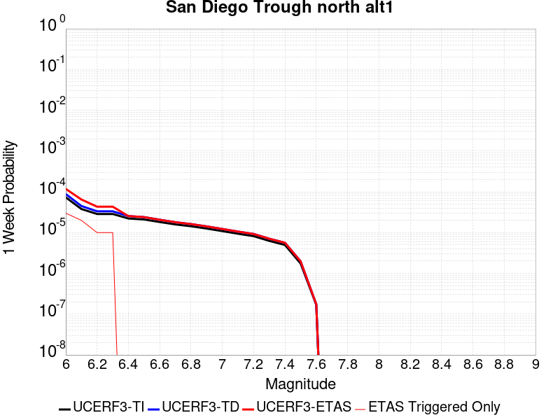 | 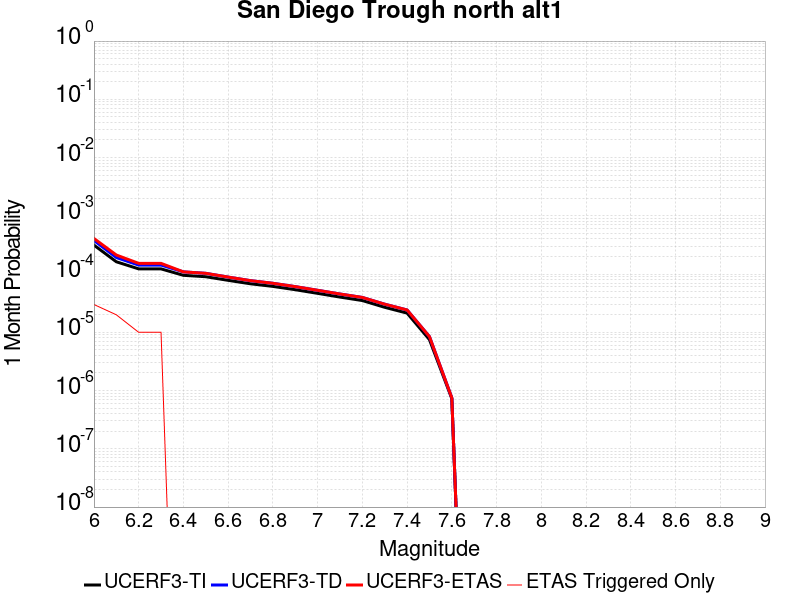 |  |  |

| Magnitude | 1 wk TI Prob | 1 wk TD Prob | 1 wk ETAS Prob | 1 wk ETAS/TD Gain | 1 wk ETAS Triggered Only | 1 mo TI Prob | 1 mo TD Prob | 1 mo ETAS Prob | 1 mo ETAS/TD Gain | 1 mo ETAS Triggered Only | 1 yr TI Prob | 1 yr TD Prob | 1 yr ETAS Prob | 1 yr ETAS/TD Gain | 1 yr ETAS Triggered Only | 10 yr TI Prob | 10 yr TD Prob | 10 yr ETAS Prob | 10 yr ETAS/TD Gain | 10 yr ETAS Triggered Only |
|-----|-----|-----|-----|-----|-----|-----|-----|-----|-----|-----|-----|-----|-----|-----|-----|-----|-----|-----|-----|-----|
| 6.0 | 7.329252E-5 | 8.8212924E-5 | 1.1821028E-4 | 1.3400562 | 3.0E-5 | 3.14073E-4 | 3.7800425E-4 | 4.079929E-4 | 1.0793341 | 3.0E-5 | 0.0038171355 | 0.0045930604 | 0.0046627386 | 1.0151703 | 7.0E-5 | 0.03752231 | 0.04504525 | 0.045140743 | 1.00212 | 1.0E-4 |
| 6.1 | 3.7940346E-5 | 4.488501E-5 | 6.4884116E-5 | 1.4455631 | 2.0E-5 | 1.6259136E-4 | 1.9235071E-4 | 2.1234686E-4 | 1.1039567 | 2.0E-5 | 0.0019777524 | 0.0023394364 | 0.0023693661 | 1.0127937 | 3.0E-5 | 0.019602431 | 0.023156784 | 0.023195859 | 1.0016874 | 4.0E-5 |
| 6.2 | 2.8645263E-5 | 3.329679E-5 | 4.3296455E-5 | 1.3003193 | 1.0E-5 | 1.2275964E-4 | 1.4269288E-4 | 1.5269144E-4 | 1.0700706 | 1.0E-5 | 0.0014935739 | 0.001735924 | 0.0017459068 | 1.0057507 | 1.0E-5 | 0.0148357535 | 0.017226301 | 0.017245958 | 1.0011411 | 2.0E-5 |
| 6.3 | 2.8645263E-5 | 3.329679E-5 | 4.3296455E-5 | 1.3003193 | 1.0E-5 | 1.2275964E-4 | 1.4269288E-4 | 1.5269144E-4 | 1.0700706 | 1.0E-5 | 0.0014935739 | 0.001735924 | 0.0017459068 | 1.0057507 | 1.0E-5 | 0.0148357535 | 0.017226301 | 0.017245958 | 1.0011411 | 2.0E-5 |
| 6.4 | 2.2204576E-5 | 2.5448366E-5 | 2.5448366E-5 | 1.0 | 0.0 | 9.5159E-5 | 1.09059925E-4 | 1.09059925E-4 | 1.0 | 0.0 | 0.001157945 | 0.0013270052 | 0.0013270052 | 1.0 | 0.0 | 0.011519298 | 0.013191982 | 0.0132018505 | 1.000748 | 1.0E-5 |
| 6.5 | 2.1004838E-5 | 2.402474E-5 | 2.402474E-5 | 1.0 | 0.0 | 9.0017624E-5 | 1.0295916E-4 | 1.0295916E-4 | 1.0 | 0.0 | 0.0010954136 | 0.0012528157 | 0.0012528157 | 1.0 | 0.0 | 0.010900296 | 0.012458614 | 0.012468489 | 1.0007926 | 1.0E-5 |
| 6.6 | 1.820557E-5 | 2.0704825E-5 | 2.0704825E-5 | 1.0 | 0.0 | 7.802154E-5 | 8.873198E-5 | 8.873198E-5 | 1.0 | 0.0 | 9.4949827E-4 | 0.0010797818 | 0.0010797818 | 1.0 | 0.0 | 0.009454516 | 0.010746024 | 0.010755916 | 1.0009205 | 1.0E-5 |
| 6.7 | 1.5884485E-5 | 1.7983675E-5 | 1.7983675E-5 | 1.0 | 0.0 | 6.807459E-5 | 7.707064E-5 | 7.707064E-5 | 1.0 | 0.0 | 8.284929E-4 | 9.379338E-4 | 9.379338E-4 | 1.0 | 0.0 | 0.008254109 | 0.009340119 | 0.009350025 | 1.0010606 | 1.0E-5 |
| 6.8 | 1.4331171E-5 | 1.6201091E-5 | 1.6201091E-5 | 1.0 | 0.0 | 6.141786E-5 | 6.943141E-5 | 6.943141E-5 | 1.0 | 0.0 | 7.4750587E-4 | 8.4500154E-4 | 8.4500154E-4 | 1.0 | 0.0 | 0.0074499645 | 0.008418153 | 0.008428069 | 1.0011779 | 1.0E-5 |
| 6.9 | 1.2574203E-5 | 1.4205858E-5 | 1.4205858E-5 | 1.0 | 0.0 | 5.3888325E-5 | 6.0880833E-5 | 6.0880833E-5 | 1.0 | 0.0 | 6.558929E-4 | 7.409735E-4 | 7.409735E-4 | 1.0 | 0.0 | 0.0065396037 | 0.0073852153 | 0.0073951413 | 1.0013441 | 1.0E-5 |
| 7.0 | 1.0883844E-5 | 1.2289282E-5 | 1.2289282E-5 | 1.0 | 0.0 | 4.664421E-5 | 5.266729E-5 | 5.266729E-5 | 1.0 | 0.0 | 5.677453E-4 | 6.410366E-4 | 6.410366E-4 | 1.0 | 0.0 | 0.00566297 | 0.006392003 | 0.006401939 | 1.0015545 | 1.0E-5 |
| 7.1 | 9.393088E-6 | 1.06070365E-5 | 1.06070365E-5 | 1.0 | 0.0 | 4.025547E-5 | 4.5457942E-5 | 4.5457942E-5 | 1.0 | 0.0 | 4.900001E-4 | 5.533107E-4 | 5.533107E-4 | 1.0 | 0.0 | 0.0048892107 | 0.005519427 | 0.0055293716 | 1.0018017 | 1.0E-5 |
| 7.2 | 8.190791E-6 | 9.258641E-6 | 9.258641E-6 | 1.0 | 0.0 | 3.510292E-5 | 3.967929E-5 | 3.967929E-5 | 1.0 | 0.0 | 4.2729423E-4 | 4.8298892E-4 | 4.8298892E-4 | 1.0 | 0.0 | 0.0042647356 | 0.0048194723 | 0.0048194723 | 1.0 | 0.0 |
| 7.3 | 6.268162E-6 | 7.089727E-6 | 7.089727E-6 | 1.0 | 0.0 | 2.6863276E-5 | 3.0384193E-5 | 3.0384193E-5 | 1.0 | 0.0 | 3.2701128E-4 | 3.6986519E-4 | 3.6986519E-4 | 1.0 | 0.0 | 0.003265305 | 0.003692542 | 0.003692542 | 1.0 | 0.0 |
| 7.4 | 4.985186E-6 | 5.6426907E-6 | 5.6426907E-6 | 1.0 | 0.0 | 2.1364907E-5 | 2.4182738E-5 | 2.4182738E-5 | 1.0 | 0.0 | 2.600867E-4 | 2.9438545E-4 | 2.9438545E-4 | 1.0 | 0.0 | 0.002597825 | 0.0029399963 | 0.0029399963 | 1.0 | 0.0 |
| 7.5 | 1.7489613E-6 | 1.969681E-6 | 1.969681E-6 | 1.0 | 0.0 | 7.495527E-6 | 8.441464E-6 | 8.441464E-6 | 1.0 | 0.0 | 9.125422E-5 | 1.027702E-4 | 1.027702E-4 | 1.0 | 0.0 | 9.1216754E-4 | 0.0010272488 | 0.0010272488 | 1.0 | 0.0 |
| 7.6 | 1.6988751E-7 | 1.753383E-7 | 1.753383E-7 | 1.0 | 0.0 | 7.2808916E-7 | 7.5144965E-7 | 7.5144965E-7 | 1.0 | 0.0 | 8.864449E-6 | 9.148864E-6 | 9.148864E-6 | 1.0 | 0.0 | 8.8640954E-5 | 9.148506E-5 | 9.148506E-5 | 1.0 | 0.0 |

## Santa Ynez (East)
*[(top)](#table-of-contents)*

| 1 Week | 1 Month | 1 Year | 10 Year |
|-----|-----|-----|-----|
|  |  |  |  |

| Magnitude | 1 wk TI Prob | 1 wk TD Prob | 1 wk ETAS Prob | 1 wk ETAS/TD Gain | 1 wk ETAS Triggered Only | 1 mo TI Prob | 1 mo TD Prob | 1 mo ETAS Prob | 1 mo ETAS/TD Gain | 1 mo ETAS Triggered Only | 1 yr TI Prob | 1 yr TD Prob | 1 yr ETAS Prob | 1 yr ETAS/TD Gain | 1 yr ETAS Triggered Only | 10 yr TI Prob | 10 yr TD Prob | 10 yr ETAS Prob | 10 yr ETAS/TD Gain | 10 yr ETAS Triggered Only |
|-----|-----|-----|-----|-----|-----|-----|-----|-----|-----|-----|-----|-----|-----|-----|-----|-----|-----|-----|-----|-----|
| 6.0 | 3.2269712E-5 | 3.675085E-5 | 6.6749744E-5 | 1.8162776 | 3.0E-5 | 1.3829143E-4 | 1.5749746E-4 | 1.9749116E-4 | 1.2539324 | 4.0E-5 | 0.0016823979 | 0.0019164293 | 0.001996276 | 1.0416642 | 8.0E-5 | 0.016697178 | 0.019056477 | 0.019154571 | 1.0051476 | 1.0E-4 |
| 6.1 | 3.2269712E-5 | 3.675085E-5 | 6.6749744E-5 | 1.8162776 | 3.0E-5 | 1.3829143E-4 | 1.5749746E-4 | 1.9749116E-4 | 1.2539324 | 4.0E-5 | 0.0016823979 | 0.0019164293 | 0.001996276 | 1.0416642 | 8.0E-5 | 0.016697178 | 0.019056477 | 0.019154571 | 1.0051476 | 1.0E-4 |
| 6.2 | 3.2269712E-5 | 3.675085E-5 | 6.6749744E-5 | 1.8162776 | 3.0E-5 | 1.3829143E-4 | 1.5749746E-4 | 1.9749116E-4 | 1.2539324 | 4.0E-5 | 0.0016823979 | 0.0019164293 | 0.001996276 | 1.0416642 | 8.0E-5 | 0.016697178 | 0.019056477 | 0.019154571 | 1.0051476 | 1.0E-4 |
| 6.3 | 3.2269712E-5 | 3.675085E-5 | 6.6749744E-5 | 1.8162776 | 3.0E-5 | 1.3829143E-4 | 1.5749746E-4 | 1.9749116E-4 | 1.2539324 | 4.0E-5 | 0.0016823979 | 0.0019164293 | 0.001996276 | 1.0416642 | 8.0E-5 | 0.016697178 | 0.019056477 | 0.019154571 | 1.0051476 | 1.0E-4 |
| 6.4 | 1.4404779E-5 | 1.4849309E-5 | 3.484901E-5 | 2.346844 | 2.0E-5 | 6.1733306E-5 | 6.363837E-5 | 8.36371E-5 | 1.3142558 | 2.0E-5 | 7.513438E-4 | 7.7452685E-4 | 8.1449584E-4 | 1.0516044 | 4.0E-5 | 0.0074880854 | 0.0077188243 | 0.007758516 | 1.0051421 | 4.0E-5 |
| 6.5 | 1.4404779E-5 | 1.4849309E-5 | 3.484901E-5 | 2.346844 | 2.0E-5 | 6.1733306E-5 | 6.363837E-5 | 8.36371E-5 | 1.3142558 | 2.0E-5 | 7.513438E-4 | 7.7452685E-4 | 8.1449584E-4 | 1.0516044 | 4.0E-5 | 0.0074880854 | 0.0077188243 | 0.007758516 | 1.0051421 | 4.0E-5 |
| 6.6 | 1.280208E-5 | 1.30118715E-5 | 3.3011613E-5 | 2.5370378 | 2.0E-5 | 5.4864904E-5 | 5.576398E-5 | 7.5762866E-5 | 1.3586345 | 2.0E-5 | 6.6777546E-4 | 6.7871675E-4 | 7.186896E-4 | 1.0588948 | 4.0E-5 | 0.006657724 | 0.006766649 | 0.0068063787 | 1.0058713 | 4.0E-5 |
| 6.7 | 1.2457027E-5 | 1.2628391E-5 | 3.2628137E-5 | 2.583713 | 2.0E-5 | 5.3386164E-5 | 5.4120563E-5 | 7.411948E-5 | 1.3695253 | 2.0E-5 | 6.497827E-4 | 6.587203E-4 | 6.9869397E-4 | 1.0606838 | 4.0E-5 | 0.00647886 | 0.0065678754 | 0.0066076126 | 1.0060502 | 4.0E-5 |
| 6.8 | 1.2095134E-5 | 1.22308375E-5 | 3.2230593E-5 | 2.635191 | 2.0E-5 | 5.1835254E-5 | 5.241683E-5 | 7.241578E-5 | 1.3815368 | 2.0E-5 | 6.309115E-4 | 6.3798967E-4 | 6.779641E-4 | 1.062657 | 4.0E-5 | 0.0062912325 | 0.006361769 | 0.0064015146 | 1.0062475 | 4.0E-5 |
| 6.9 | 1.1104036E-5 | 1.1157269E-5 | 3.1157047E-5 | 2.7925334 | 2.0E-5 | 4.758786E-5 | 4.7815996E-5 | 6.781504E-5 | 1.4182501 | 2.0E-5 | 5.7922816E-4 | 5.8200554E-4 | 6.2198227E-4 | 1.0686879 | 4.0E-5 | 0.005777207 | 0.0058049588 | 0.005844726 | 1.0068507 | 4.0E-5 |
| 7.0 | 1.0577444E-5 | 1.0581602E-5 | 3.058139E-5 | 2.890053 | 2.0E-5 | 4.5331115E-5 | 4.5348937E-5 | 6.534803E-5 | 1.4410046 | 2.0E-5 | 5.5176654E-4 | 5.5198465E-4 | 5.919626E-4 | 1.0724257 | 4.0E-5 | 0.0055039856 | 0.0055062748 | 0.0055460543 | 1.0072244 | 4.0E-5 |
| 7.1 | 1.0021775E-5 | 9.980908E-6 | 2.9980709E-5 | 3.0038056 | 2.0E-5 | 4.294976E-5 | 4.2774627E-5 | 6.277377E-5 | 1.4675469 | 2.0E-5 | 5.2278786E-4 | 5.206578E-4 | 5.60637E-4 | 1.0767859 | 4.0E-5 | 0.0052155964 | 0.005194512 | 0.0052343043 | 1.0076604 | 4.0E-5 |
| 7.2 | 8.874109E-6 | 8.748713E-6 | 1.8748626E-5 | 2.1430151 | 1.0E-5 | 3.8031343E-5 | 3.7493952E-5 | 4.7493577E-5 | 1.2666997 | 1.0E-5 | 4.629332E-4 | 4.5639434E-4 | 4.763852E-4 | 1.0438018 | 2.0E-5 | 0.0046197 | 0.0045546885 | 0.0045745973 | 1.004371 | 2.0E-5 |
| 7.3 | 7.5504267E-6 | 7.5050298E-6 | 1.7504955E-5 | 2.3324296 | 1.0E-5 | 3.235857E-5 | 3.2164022E-5 | 4.21637E-5 | 1.3108964 | 1.0E-5 | 3.9389438E-4 | 3.9152763E-4 | 4.115198E-4 | 1.051062 | 2.0E-5 | 0.0039319694 | 0.003908485 | 0.003928407 | 1.005097 | 2.0E-5 |
| 7.4 | 6.309394E-6 | 6.183066E-6 | 1.6183005E-5 | 2.6173105 | 1.0E-5 | 2.703998E-5 | 2.6498592E-5 | 3.6498324E-5 | 1.3773686 | 1.0E-5 | 3.2916202E-4 | 3.2257353E-4 | 3.425671E-4 | 1.0619813 | 2.0E-5 | 0.003286749 | 0.0032211505 | 0.0032410861 | 1.006189 | 2.0E-5 |
| 7.5 | 4.6103073E-6 | 4.440804E-6 | 1.44407595E-5 | 3.2518346 | 1.0E-5 | 1.975831E-5 | 1.903188E-5 | 2.9031691E-5 | 1.5254241 | 1.0E-5 | 2.4053088E-4 | 2.316892E-4 | 2.416869E-4 | 1.0431513 | 1.0E-5 | 0.002402707 | 0.002314546 | 0.002324523 | 1.0043105 | 1.0E-5 |
| 7.6 | 1.2858658E-6 | 1.3008203E-6 | 1.3008203E-6 | 1.0 | 0.0 | 5.5108417E-6 | 5.5749324E-6 | 5.5749324E-6 | 1.0 | 0.0 | 6.7092435E-5 | 6.787276E-5 | 6.787276E-5 | 1.0 | 0.0 | 6.707218E-4 | 6.7852717E-4 | 6.7852717E-4 | 1.0 | 0.0 |
| 7.7 | 5.3302307E-7 | 5.612142E-7 | 5.612142E-7 | 1.0 | 0.0 | 2.2843826E-6 | 2.4052017E-6 | 2.4052017E-6 | 1.0 | 0.0 | 2.7812002E-5 | 2.9282974E-5 | 2.9282974E-5 | 1.0 | 0.0 | 2.7808524E-4 | 2.9279472E-4 | 2.9279472E-4 | 1.0 | 0.0 |
| 7.8 | 4.613933E-8 | 4.8030124E-8 | 4.8030124E-8 | 1.0 | 0.0 | 1.9773998E-7 | 2.0584336E-7 | 2.0584336E-7 | 1.0 | 0.0 | 2.4074816E-6 | 2.5061402E-6 | 2.5061402E-6 | 1.0 | 0.0 | 2.4074554E-5 | 2.5061128E-5 | 2.5061128E-5 | 1.0 | 0.0 |

## Brawley (Seismic Zone) alt 1
*[(top)](#table-of-contents)*

| 1 Week | 1 Month | 1 Year | 10 Year |
|-----|-----|-----|-----|
|  |  |  |  |

| Magnitude | 1 wk TI Prob | 1 wk TD Prob | 1 wk ETAS Prob | 1 wk ETAS/TD Gain | 1 wk ETAS Triggered Only | 1 mo TI Prob | 1 mo TD Prob | 1 mo ETAS Prob | 1 mo ETAS/TD Gain | 1 mo ETAS Triggered Only | 1 yr TI Prob | 1 yr TD Prob | 1 yr ETAS Prob | 1 yr ETAS/TD Gain | 1 yr ETAS Triggered Only | 10 yr TI Prob | 10 yr TD Prob | 10 yr ETAS Prob | 10 yr ETAS/TD Gain | 10 yr ETAS Triggered Only |
|-----|-----|-----|-----|-----|-----|-----|-----|-----|-----|-----|-----|-----|-----|-----|-----|-----|-----|-----|-----|-----|
| 6.0 | 2.2521618E-4 | 4.763518E-4 | 4.9634225E-4 | 1.0419657 | 2.0E-5 | 9.6485513E-4 | 0.0020399475 | 0.002079866 | 1.0195683 | 4.0E-5 | 0.011683988 | 0.024543403 | 0.024621438 | 1.0031796 | 8.0E-5 | 0.11088423 | 0.21349744 | 0.2135761 | 1.0003684 | 1.0E-4 |
| 6.1 | 2.2521618E-4 | 4.763518E-4 | 4.9634225E-4 | 1.0419657 | 2.0E-5 | 9.6485513E-4 | 0.0020399475 | 0.002079866 | 1.0195683 | 4.0E-5 | 0.011683988 | 0.024543403 | 0.024611685 | 1.0027821 | 7.0E-5 | 0.11088423 | 0.21349744 | 0.21356823 | 1.0003315 | 9.0E-5 |
| 6.2 | 2.198148E-4 | 4.6719742E-4 | 4.8718808E-4 | 1.0427885 | 2.0E-5 | 9.417233E-4 | 0.002000775 | 0.002040695 | 1.0199523 | 4.0E-5 | 0.011405343 | 0.024077624 | 0.02414594 | 1.0028373 | 7.0E-5 | 0.10837428 | 0.20993395 | 0.21000506 | 1.0003387 | 9.0E-5 |
| 6.3 | 2.1704129E-4 | 4.6155418E-4 | 4.8154496E-4 | 1.0433118 | 2.0E-5 | 9.298453E-4 | 0.0019766265 | 0.0020165474 | 1.0201966 | 4.0E-5 | 0.011262234 | 0.023791097 | 0.023859432 | 1.0028722 | 7.0E-5 | 0.107082725 | 0.20782505 | 0.20789634 | 1.0003431 | 9.0E-5 |
| 6.4 | 1.876142E-4 | 4.004747E-4 | 4.2046668E-4 | 1.0499207 | 2.0E-5 | 8.038131E-4 | 0.0017152055 | 0.0017551369 | 1.0232809 | 4.0E-5 | 0.00974259 | 0.02067897 | 0.020747522 | 1.0033151 | 7.0E-5 | 0.093263686 | 0.18457665 | 0.18465003 | 1.0003976 | 9.0E-5 |
| 6.5 | 1.7390939E-4 | 3.7479575E-4 | 3.9478825E-4 | 1.0533423 | 2.0E-5 | 7.45113E-4 | 0.0016052909 | 0.0016352427 | 1.0186582 | 3.0E-5 | 0.009034078 | 0.019367682 | 0.01942652 | 1.0030379 | 6.0E-5 | 0.086755216 | 0.1743989 | 0.17446496 | 1.0003787 | 8.0E-5 |
| 6.6 | 1.591791E-4 | 3.4894363E-4 | 3.6893666E-4 | 1.0572958 | 2.0E-5 | 6.8201777E-4 | 0.0014946257 | 0.0015245809 | 1.020042 | 3.0E-5 | 0.008271996 | 0.018045632 | 0.01810455 | 1.0032649 | 6.0E-5 | 0.07970774 | 0.16380616 | 0.16387305 | 1.0004084 | 8.0E-5 |
| 6.7 | 1.4268003E-4 | 3.206047E-4 | 3.405983E-4 | 1.0623621 | 2.0E-5 | 6.1134255E-4 | 0.0013733049 | 0.0014032637 | 1.0218151 | 3.0E-5 | 0.007417723 | 0.016592208 | 0.016651211 | 1.0035561 | 6.0E-5 | 0.07174956 | 0.15193379 | 0.15200163 | 1.0004466 | 8.0E-5 |
| 6.8 | 1.239713E-4 | 2.905556E-4 | 3.1054977E-4 | 1.0688137 | 2.0E-5 | 5.3119735E-4 | 0.0012446501 | 0.0012746127 | 1.0240731 | 3.0E-5 | 0.0064481674 | 0.015049755 | 0.015108852 | 1.0039268 | 6.0E-5 | 0.06264243 | 0.13838072 | 0.13844965 | 1.000498 | 8.0E-5 |
| 6.9 | 1.0180238E-4 | 2.6256076E-4 | 2.825555E-4 | 1.0761528 | 2.0E-5 | 4.3622297E-4 | 0.0011247793 | 0.0011547456 | 1.0266418 | 3.0E-5 | 0.005298089 | 0.013609203 | 0.013668386 | 1.0043488 | 6.0E-5 | 0.05173543 | 0.124963865 | 0.12503387 | 1.0005602 | 8.0E-5 |
| 7.0 | 7.6619996E-5 | 2.2400808E-4 | 2.3400583E-4 | 1.0446312 | 1.0E-5 | 3.283301E-4 | 9.5968455E-4 | 9.796653E-4 | 1.0208201 | 2.0E-5 | 0.0039900932 | 0.011622273 | 0.011661808 | 1.0034016 | 4.0E-5 | 0.039192066 | 0.1072681 | 0.107321665 | 1.0004994 | 6.0E-5 |
| 7.1 | 7.5127435E-5 | 2.208396E-4 | 2.308374E-4 | 1.0452718 | 1.0E-5 | 3.2193496E-4 | 9.4611535E-4 | 9.660964E-4 | 1.0211191 | 2.0E-5 | 0.0039125155 | 0.011458817 | 0.011498358 | 1.0034508 | 4.0E-5 | 0.038443442 | 0.105831936 | 0.10588558 | 1.0005069 | 6.0E-5 |
| 7.2 | 6.788582E-5 | 2.021165E-4 | 2.1211448E-4 | 1.0494664 | 1.0E-5 | 2.9090676E-4 | 8.6592906E-4 | 8.8591175E-4 | 1.0230765 | 2.0E-5 | 0.0035360386 | 0.010492363 | 0.010531943 | 1.0037723 | 4.0E-5 | 0.034803 | 0.09750225 | 0.0975564 | 1.0005554 | 6.0E-5 |
| 7.3 | 6.399602E-5 | 1.8842533E-4 | 1.9842346E-4 | 1.0530614 | 1.0E-5 | 2.7423984E-4 | 8.072901E-4 | 8.2727394E-4 | 1.0247543 | 2.0E-5 | 0.0033337586 | 0.009785052 | 0.009824662 | 1.0040479 | 4.0E-5 | 0.03284188 | 0.09139716 | 0.091451675 | 1.0005965 | 6.0E-5 |
| 7.4 | 4.506759E-5 | 1.2530293E-4 | 1.3530169E-4 | 1.0797966 | 1.0E-5 | 1.9313251E-4 | 5.369029E-4 | 5.568922E-4 | 1.0372307 | 2.0E-5 | 0.0023488526 | 0.006517376 | 0.0065571154 | 1.0060974 | 4.0E-5 | 0.023241805 | 0.062364057 | 0.06241094 | 1.0007517 | 5.0E-5 |
| 7.5 | 3.43289E-5 | 9.336321E-5 | 1.03362276E-4 | 1.1070986 | 1.0E-5 | 1.4711556E-4 | 4.0006702E-4 | 4.20059E-4 | 1.0499716 | 2.0E-5 | 0.0017896603 | 0.0048599998 | 0.0048998054 | 1.0081905 | 4.0E-5 | 0.01775316 | 0.047056835 | 0.04710448 | 1.0010126 | 5.0E-5 |
| 7.6 | 2.5980507E-5 | 7.0538634E-5 | 8.0537924E-5 | 1.1417563 | 1.0E-5 | 1.1134028E-4 | 3.0227352E-4 | 3.2226747E-4 | 1.0661452 | 2.0E-5 | 0.001354725 | 0.003673994 | 0.0037138471 | 1.0108473 | 4.0E-5 | 0.013464959 | 0.035842713 | 0.035890922 | 1.001345 | 5.0E-5 |
| 7.7 | 1.7292105E-5 | 4.941363E-5 | 5.9413134E-5 | 1.2023634 | 1.0E-5 | 7.4106916E-5 | 2.1175554E-4 | 2.317513E-4 | 1.0944285 | 2.0E-5 | 9.018782E-4 | 0.0025750813 | 0.0026149782 | 1.0154935 | 4.0E-5 | 0.008982267 | 0.025292467 | 0.025331456 | 1.0015415 | 4.0E-5 |
| 7.8 | 1.2927471E-5 | 3.9698665E-5 | 4.969827E-5 | 1.2518877 | 1.0E-5 | 5.5402274E-5 | 1.7012605E-4 | 1.9012265E-4 | 1.1175399 | 2.0E-5 | 6.743139E-4 | 0.0020693196 | 0.0021092368 | 1.01929 | 4.0E-5 | 0.0067227143 | 0.020433411 | 0.020472594 | 1.0019176 | 4.0E-5 |
| 7.9 | 1.0200774E-5 | 2.8749579E-5 | 3.874929E-5 | 1.3478212 | 1.0E-5 | 4.371687E-5 | 1.2320667E-4 | 1.3320544E-4 | 1.0811545 | 1.0E-5 | 5.321229E-4 | 0.0014990101 | 0.0015189801 | 1.0133221 | 2.0E-5 | 0.005308505 | 0.014993372 | 0.015013073 | 1.0013139 | 2.0E-5 |
| 8.0 | 8.650396E-6 | 2.328046E-5 | 3.3280226E-5 | 1.4295348 | 1.0E-5 | 3.70726E-5 | 9.976959E-5 | 1.0976859E-4 | 1.1002209 | 1.0E-5 | 4.5126543E-4 | 0.0012140187 | 0.0012339945 | 1.0164542 | 2.0E-5 | 0.0045035016 | 0.0122126 | 0.012232356 | 1.0016177 | 2.0E-5 |
| 8.1 | 3.9368224E-6 | 7.328729E-6 | 7.328729E-6 | 1.0 | 0.0 | 1.6871985E-5 | 3.140846E-5 | 3.140846E-5 | 1.0 | 0.0 | 2.0539707E-4 | 3.8233105E-4 | 3.9232723E-4 | 1.0261453 | 1.0E-5 | 0.0020520731 | 0.004001709 | 0.004011669 | 1.002489 | 1.0E-5 |
| 8.2 | 1.7101195E-6 | 2.2179925E-6 | 2.2179925E-6 | 1.0 | 0.0 | 7.329063E-6 | 9.5056475E-6 | 9.5056475E-6 | 1.0 | 0.0 | 8.922769E-5 | 1.15725146E-4 | 1.15725146E-4 | 1.0 | 0.0 | 8.9191867E-4 | 0.0012667503 | 0.0012667503 | 1.0 | 0.0 |
| 8.3 | 3.0346666E-8 | 1.7212624E-8 | 1.7212624E-8 | 1.0 | 0.0 | 1.3005713E-7 | 7.376838E-8 | 7.376838E-8 | 1.0 | 0.0 | 1.5834444E-6 | 8.9813E-7 | 8.9813E-7 | 1.0 | 0.0 | 1.5834332E-5 | 9.366338E-6 | 9.366338E-6 | 1.0 | 0.0 |

## Santa Cruz Island
*[(top)](#table-of-contents)*

| 1 Week | 1 Month | 1 Year | 10 Year |
|-----|-----|-----|-----|
|  |  |  |  |

| Magnitude | 1 wk TI Prob | 1 wk TD Prob | 1 wk ETAS Prob | 1 wk ETAS/TD Gain | 1 wk ETAS Triggered Only | 1 mo TI Prob | 1 mo TD Prob | 1 mo ETAS Prob | 1 mo ETAS/TD Gain | 1 mo ETAS Triggered Only | 1 yr TI Prob | 1 yr TD Prob | 1 yr ETAS Prob | 1 yr ETAS/TD Gain | 1 yr ETAS Triggered Only | 10 yr TI Prob | 10 yr TD Prob | 10 yr ETAS Prob | 10 yr ETAS/TD Gain | 10 yr ETAS Triggered Only |
|-----|-----|-----|-----|-----|-----|-----|-----|-----|-----|-----|-----|-----|-----|-----|-----|-----|-----|-----|-----|-----|
| 6.0 | 2.9164563E-5 | 3.159978E-5 | 4.1599462E-5 | 1.316448 | 1.0E-5 | 1.2498499E-4 | 1.3542136E-4 | 1.4542E-4 | 1.0738336 | 1.0E-5 | 0.0015206301 | 0.0016476442 | 0.0016676113 | 1.0121186 | 2.0E-5 | 0.015102667 | 0.016368017 | 0.016446708 | 1.0048076 | 8.0E-5 |
| 6.1 | 2.9164563E-5 | 3.159978E-5 | 4.1599462E-5 | 1.316448 | 1.0E-5 | 1.2498499E-4 | 1.3542136E-4 | 1.4542E-4 | 1.0738336 | 1.0E-5 | 0.0015206301 | 0.0016476442 | 0.0016676113 | 1.0121186 | 2.0E-5 | 0.015102667 | 0.016368017 | 0.016446708 | 1.0048076 | 8.0E-5 |
| 6.2 | 2.9164563E-5 | 3.159978E-5 | 4.1599462E-5 | 1.316448 | 1.0E-5 | 1.2498499E-4 | 1.3542136E-4 | 1.4542E-4 | 1.0738336 | 1.0E-5 | 0.0015206301 | 0.0016476442 | 0.0016676113 | 1.0121186 | 2.0E-5 | 0.015102667 | 0.016368017 | 0.016446708 | 1.0048076 | 8.0E-5 |
| 6.3 | 1.6635553E-5 | 1.7804374E-5 | 2.7804197E-5 | 1.5616497 | 1.0E-5 | 7.1293274E-5 | 7.6302334E-5 | 8.6301574E-5 | 1.1310476 | 1.0E-5 | 8.6765E-4 | 9.2860323E-4 | 9.4858464E-4 | 1.0215178 | 2.0E-5 | 0.008642701 | 0.009249101 | 0.009288732 | 1.0042847 | 4.0E-5 |
| 6.4 | 1.6635553E-5 | 1.7804374E-5 | 2.7804197E-5 | 1.5616497 | 1.0E-5 | 7.1293274E-5 | 7.6302334E-5 | 8.6301574E-5 | 1.1310476 | 1.0E-5 | 8.6765E-4 | 9.2860323E-4 | 9.4858464E-4 | 1.0215178 | 2.0E-5 | 0.008642701 | 0.009249101 | 0.009288732 | 1.0042847 | 4.0E-5 |
| 6.5 | 1.2238748E-5 | 1.3043006E-5 | 1.3043006E-5 | 1.0 | 0.0 | 5.2450723E-5 | 5.5897424E-5 | 5.5897424E-5 | 1.0 | 0.0 | 6.3840044E-4 | 6.803423E-4 | 6.903355E-4 | 1.0146885 | 1.0E-5 | 0.0063656955 | 0.0067829937 | 0.00681279 | 1.0043929 | 3.0E-5 |
| 6.6 | 1.0489767E-5 | 1.1156645E-5 | 1.1156645E-5 | 1.0 | 0.0 | 4.495537E-5 | 4.781333E-5 | 4.781333E-5 | 1.0 | 0.0 | 5.4719415E-4 | 5.8197405E-4 | 5.919682E-4 | 1.0171729 | 1.0E-5 | 0.005458487 | 0.0058047404 | 0.0058345664 | 1.0051382 | 3.0E-5 |
| 6.7 | 8.699222E-6 | 9.236789E-6 | 9.236789E-6 | 1.0 | 0.0 | 3.7281847E-5 | 3.9585644E-5 | 3.9585644E-5 | 1.0 | 0.0 | 4.5381195E-4 | 4.818492E-4 | 4.918444E-4 | 1.0207434 | 1.0E-5 | 0.0045288634 | 0.0048081116 | 0.0048379675 | 1.0062095 | 3.0E-5 |
| 6.8 | 8.307732E-6 | 8.816911E-6 | 8.816911E-6 | 1.0 | 0.0 | 3.560408E-5 | 3.7786216E-5 | 3.7786216E-5 | 1.0 | 0.0 | 4.3339343E-4 | 4.599505E-4 | 4.6994592E-4 | 1.0217315 | 1.0E-5 | 0.004325492 | 0.004590039 | 0.004619901 | 1.0065058 | 3.0E-5 |
| 6.9 | 8.073121E-6 | 8.564946E-6 | 8.564946E-6 | 1.0 | 0.0 | 3.459863E-5 | 3.6706395E-5 | 3.6706395E-5 | 1.0 | 0.0 | 4.2115687E-4 | 4.4680916E-4 | 4.5680467E-4 | 1.0223709 | 1.0E-5 | 0.004203596 | 0.0044591594 | 0.004489026 | 1.0066978 | 3.0E-5 |
| 7.0 | 7.617019E-6 | 8.07467E-6 | 8.07467E-6 | 1.0 | 0.0 | 3.264396E-5 | 3.4605273E-5 | 3.4605273E-5 | 1.0 | 0.0 | 3.9736772E-4 | 4.2123816E-4 | 4.2123816E-4 | 1.0 | 0.0 | 0.003966579 | 0.0042044446 | 0.0042243605 | 1.0047369 | 2.0E-5 |
| 7.1 | 7.1224836E-6 | 7.545794E-6 | 7.545794E-6 | 1.0 | 0.0 | 3.052457E-5 | 3.2338718E-5 | 3.2338718E-5 | 1.0 | 0.0 | 3.715733E-4 | 3.936531E-4 | 3.936531E-4 | 1.0 | 0.0 | 0.003709526 | 0.003929601 | 0.0039495225 | 1.0050696 | 2.0E-5 |
| 7.2 | 6.441115E-6 | 6.827389E-6 | 6.827389E-6 | 1.0 | 0.0 | 2.7604487E-5 | 2.925991E-5 | 2.925991E-5 | 1.0 | 0.0 | 3.360328E-4 | 3.561814E-4 | 3.561814E-4 | 1.0 | 0.0 | 0.0033552512 | 0.003556134 | 0.0035760626 | 1.005604 | 2.0E-5 |
| 7.3 | 5.494274E-6 | 5.819999E-6 | 5.819999E-6 | 1.0 | 0.0 | 2.3546674E-5 | 2.4942616E-5 | 2.4942616E-5 | 1.0 | 0.0 | 2.8664304E-4 | 3.0363424E-4 | 3.0363424E-4 | 1.0 | 0.0 | 0.002862736 | 0.0030322168 | 0.0030521562 | 1.0065758 | 2.0E-5 |
| 7.4 | 4.0802624E-6 | 4.3122595E-6 | 4.3122595E-6 | 1.0 | 0.0 | 1.7486722E-5 | 1.8480981E-5 | 1.8480981E-5 | 1.0 | 0.0 | 2.1288003E-4 | 2.249828E-4 | 2.249828E-4 | 1.0 | 0.0 | 0.0021267622 | 0.0022475594 | 0.0022575369 | 1.0044392 | 1.0E-5 |
| 7.5 | 2.3584746E-6 | 2.4753115E-6 | 2.4753115E-6 | 1.0 | 0.0 | 1.0107709E-5 | 1.0608435E-5 | 1.0608435E-5 | 1.0 | 0.0 | 1.2305441E-4 | 1.291501E-4 | 1.291501E-4 | 1.0 | 0.0 | 0.0012298629 | 0.0012907553 | 0.0013007425 | 1.0077374 | 1.0E-5 |
| 7.6 | 9.4981914E-7 | 9.860938E-7 | 9.860938E-7 | 1.0 | 0.0 | 4.0706473E-6 | 4.22611E-6 | 4.22611E-6 | 1.0 | 0.0 | 4.9559E-5 | 5.1451683E-5 | 5.1451683E-5 | 1.0 | 0.0 | 4.954795E-4 | 5.14399E-4 | 5.14399E-4 | 1.0 | 0.0 |
| 7.7 | 2.6013532E-7 | 2.6416643E-7 | 2.6416643E-7 | 1.0 | 0.0 | 1.1148652E-6 | 1.1321414E-6 | 1.1321414E-6 | 1.0 | 0.0 | 1.3573399E-5 | 1.3783734E-5 | 1.3783734E-5 | 1.0 | 0.0 | 1.357257E-4 | 1.3782886E-4 | 1.3782886E-4 | 1.0 | 0.0 |
| 7.8 | 4.1522263E-8 | 3.9657003E-8 | 3.9657003E-8 | 1.0 | 0.0 | 1.7795254E-7 | 1.6995857E-7 | 1.6995857E-7 | 1.0 | 0.0 | 2.16657E-6 | 2.069244E-6 | 2.069244E-6 | 1.0 | 0.0 | 2.1665488E-5 | 2.0692267E-5 | 2.0692267E-5 | 1.0 | 0.0 |
| 7.9 | 7.7242046E-10 | 5.9475225E-10 | 5.9475225E-10 | 1.0 | 0.0 | 3.3103735E-9 | 2.5489382E-9 | 2.5489382E-9 | 1.0 | 0.0 | 4.0303796E-8 | 3.1033323E-8 | 3.1033323E-8 | 1.0 | 0.0 | 4.030379E-7 | 3.103332E-7 | 3.103332E-7 | 1.0 | 0.0 |

## Big Pine (Central)
*[(top)](#table-of-contents)*

| 1 Week | 1 Month | 1 Year | 10 Year |
|-----|-----|-----|-----|
| 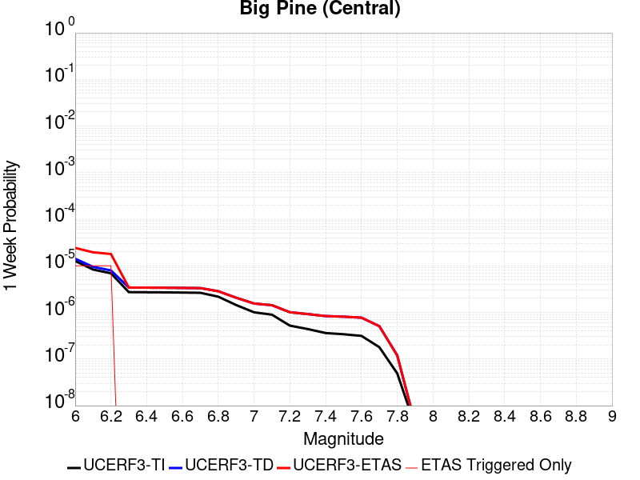 |  | 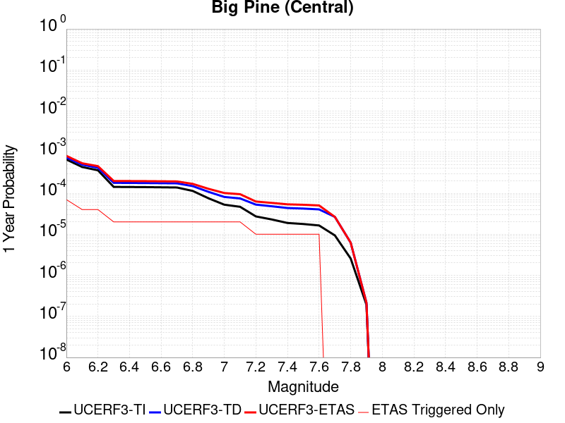 | 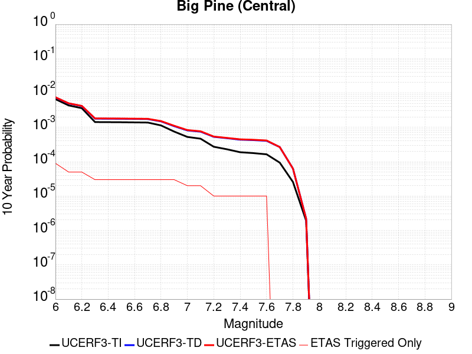 |

| Magnitude | 1 wk TI Prob | 1 wk TD Prob | 1 wk ETAS Prob | 1 wk ETAS/TD Gain | 1 wk ETAS Triggered Only | 1 mo TI Prob | 1 mo TD Prob | 1 mo ETAS Prob | 1 mo ETAS/TD Gain | 1 mo ETAS Triggered Only | 1 yr TI Prob | 1 yr TD Prob | 1 yr ETAS Prob | 1 yr ETAS/TD Gain | 1 yr ETAS Triggered Only | 10 yr TI Prob | 10 yr TD Prob | 10 yr ETAS Prob | 10 yr ETAS/TD Gain | 10 yr ETAS Triggered Only |
|-----|-----|-----|-----|-----|-----|-----|-----|-----|-----|-----|-----|-----|-----|-----|-----|-----|-----|-----|-----|-----|
| 6.0 | 1.2706755E-5 | 1.4250647E-5 | 2.4250505E-5 | 1.7017125 | 1.0E-5 | 5.4456385E-5 | 6.107298E-5 | 1.0107054E-4 | 1.6549141 | 4.0E-5 | 6.628048E-4 | 7.433464E-4 | 8.132944E-4 | 1.0940988 | 7.0E-5 | 0.006608314 | 0.0074136425 | 0.0075029754 | 1.0120498 | 9.0E-5 |
| 6.1 | 8.342579E-6 | 9.510875E-6 | 1.951078E-5 | 2.0514178 | 1.0E-5 | 3.5753423E-5 | 4.076038E-5 | 6.0759565E-5 | 1.4906526 | 2.0E-5 | 4.3521097E-4 | 4.9616635E-4 | 5.361465E-4 | 1.0805781 | 4.0E-5 | 0.0043435963 | 0.0049541555 | 0.0050039077 | 1.0100425 | 5.0E-5 |
| 6.2 | 6.923899E-6 | 7.967259E-6 | 1.796718E-5 | 2.2551267 | 1.0E-5 | 2.9673516E-5 | 3.4145058E-5 | 5.4144377E-5 | 1.5857162 | 2.0E-5 | 3.6121515E-4 | 4.1565605E-4 | 4.556394E-4 | 1.0961934 | 4.0E-5 | 0.003606286 | 0.004152109 | 0.0042019016 | 1.0119921 | 5.0E-5 |
| 6.3 | 2.728396E-6 | 3.4243983E-6 | 3.4243983E-6 | 1.0 | 0.0 | 1.1693074E-5 | 1.4675915E-5 | 2.4675768E-5 | 1.6813785 | 1.0E-5 | 1.4235388E-4 | 1.7866549E-4 | 1.9866192E-4 | 1.1119211 | 2.0E-5 | 0.0014226272 | 0.0017867406 | 0.0018166869 | 1.0167603 | 3.0E-5 |
| 6.4 | 2.7136944E-6 | 3.4086916E-6 | 3.4086916E-6 | 1.0 | 0.0 | 1.1630066E-5 | 1.4608601E-5 | 2.4608455E-5 | 1.6845182 | 1.0E-5 | 1.4158686E-4 | 1.7784607E-4 | 1.9784251E-4 | 1.1124368 | 2.0E-5 | 0.0014149669 | 0.0017785596 | 0.0018085063 | 1.0168376 | 3.0E-5 |
| 6.5 | 2.6971882E-6 | 3.3910367E-6 | 3.3910367E-6 | 1.0 | 0.0 | 1.1559327E-5 | 1.4532939E-5 | 2.4532794E-5 | 1.6880821 | 1.0E-5 | 1.4072572E-4 | 1.7692502E-4 | 1.969215E-4 | 1.1130222 | 2.0E-5 | 0.0014063664 | 0.0017693639 | 0.0017993108 | 1.0169252 | 3.0E-5 |
| 6.6 | 2.669092E-6 | 3.3610572E-6 | 3.3610572E-6 | 1.0 | 0.0 | 1.1438916E-5 | 1.4404456E-5 | 2.4404311E-5 | 1.6942196 | 1.0E-5 | 1.3925991E-4 | 1.7536101E-4 | 1.953575E-4 | 1.1140305 | 2.0E-5 | 0.0013917267 | 0.0017537484 | 0.0017836958 | 1.0170763 | 3.0E-5 |
| 6.7 | 2.6408059E-6 | 3.3310828E-6 | 3.3310828E-6 | 1.0 | 0.0 | 1.1317691E-5 | 1.4275995E-5 | 2.4275852E-5 | 1.7004665 | 1.0E-5 | 1.3778417E-4 | 1.7379725E-4 | 1.9379378E-4 | 1.1150566 | 2.0E-5 | 0.0013769877 | 0.0017381354 | 0.0017680832 | 1.0172299 | 3.0E-5 |
| 6.8 | 2.1786943E-6 | 2.8545398E-6 | 2.8545398E-6 | 1.0 | 0.0 | 9.337228E-6 | 1.2233689E-5 | 2.2233568E-5 | 1.8174049 | 1.0E-5 | 1.1367482E-4 | 1.4893571E-4 | 1.6893273E-4 | 1.1342661 | 2.0E-5 | 0.0011361669 | 0.0014898676 | 0.0015198229 | 1.0201061 | 3.0E-5 |
| 6.9 | 1.4411696E-6 | 2.0686007E-6 | 2.0686007E-6 | 1.0 | 0.0 | 6.1764263E-6 | 8.865403E-6 | 1.8865314E-5 | 2.1279702 | 1.0E-5 | 7.51954E-5 | 1.07931206E-4 | 1.2792904E-4 | 1.1852832 | 2.0E-5 | 7.5169955E-4 | 0.0010802519 | 0.0011102194 | 1.0277413 | 3.0E-5 |
| 7.0 | 1.0073411E-6 | 1.554355E-6 | 1.554355E-6 | 1.0 | 0.0 | 4.317169E-6 | 6.6615053E-6 | 1.6661439E-5 | 2.5011523 | 1.0E-5 | 5.2560266E-5 | 8.110096E-5 | 1.0109934E-4 | 1.2465862 | 2.0E-5 | 5.2547833E-4 | 8.1216637E-4 | 8.321501E-4 | 1.0246055 | 2.0E-5 |
| 7.1 | 8.947104E-7 | 1.4303428E-6 | 1.4303428E-6 | 1.0 | 0.0 | 3.834468E-6 | 6.130027E-6 | 1.6129965E-5 | 2.6313043 | 1.0E-5 | 4.6683643E-5 | 7.4630676E-5 | 9.4629184E-5 | 1.2679663 | 2.0E-5 | 4.6673836E-4 | 7.475086E-4 | 7.674937E-4 | 1.0267355 | 2.0E-5 |
| 7.2 | 5.215166E-7 | 1.011254E-6 | 1.011254E-6 | 1.0 | 0.0 | 2.2350691E-6 | 4.3339383E-6 | 1.4333895E-5 | 3.3073602 | 1.0E-5 | 2.7211627E-5 | 5.2764466E-5 | 6.276394E-5 | 1.1895115 | 1.0E-5 | 2.7208295E-4 | 5.2896177E-4 | 5.3895643E-4 | 1.0188949 | 1.0E-5 |
| 7.3 | 4.4024807E-7 | 9.22043E-7 | 9.22043E-7 | 1.0 | 0.0 | 1.8867761E-6 | 3.951607E-6 | 1.3951568E-5 | 3.530606 | 1.0E-5 | 2.2971257E-5 | 4.8109796E-5 | 5.8109315E-5 | 1.2078478 | 1.0E-5 | 2.2968883E-4 | 4.824358E-4 | 4.92431E-4 | 1.0207181 | 1.0E-5 |
| 7.4 | 3.6130905E-7 | 8.3593386E-7 | 8.3593386E-7 | 1.0 | 0.0 | 1.5484665E-6 | 3.582569E-6 | 1.3582533E-5 | 3.791283 | 1.0E-5 | 1.8852415E-5 | 4.3616943E-5 | 5.361651E-5 | 1.2292587 | 1.0E-5 | 1.8850817E-4 | 4.375168E-4 | 4.4751243E-4 | 1.0228462 | 1.0E-5 |
| 7.5 | 3.408184E-7 | 8.1089485E-7 | 8.1089485E-7 | 1.0 | 0.0 | 1.4606494E-6 | 3.475259E-6 | 1.34752245E-5 | 3.8774734 | 1.0E-5 | 1.7783263E-5 | 4.2310498E-5 | 5.2310075E-5 | 1.236338 | 1.0E-5 | 1.778184E-4 | 4.244371E-4 | 4.3443285E-4 | 1.0235506 | 1.0E-5 |
| 7.6 | 3.1428627E-7 | 7.7323784E-7 | 7.7323784E-7 | 1.0 | 0.0 | 1.3469405E-6 | 3.3138724E-6 | 1.3313839E-5 | 4.0176077 | 1.0E-5 | 1.6398877E-5 | 4.0345687E-5 | 5.0345283E-5 | 1.2478479 | 1.0E-5 | 1.6397667E-4 | 4.047681E-4 | 4.1476404E-4 | 1.0246955 | 1.0E-5 |
| 7.7 | 1.7972785E-7 | 5.0784223E-7 | 5.0784223E-7 | 1.0 | 0.0 | 7.70262E-7 | 2.176465E-6 | 2.176465E-6 | 1.0 | 0.0 | 9.377899E-6 | 2.649815E-5 | 2.649815E-5 | 1.0 | 0.0 | 9.377503E-5 | 2.663423E-4 | 2.663423E-4 | 1.0 | 0.0 |
| 7.8 | 4.9230927E-8 | 1.1982038E-7 | 1.1982038E-7 | 1.0 | 0.0 | 2.1098968E-7 | 5.1351583E-7 | 5.1351583E-7 | 1.0 | 0.0 | 2.5687964E-6 | 6.252039E-6 | 6.252039E-6 | 1.0 | 0.0 | 2.5687666E-5 | 6.297546E-5 | 6.297546E-5 | 1.0 | 0.0 |
| 7.9 | 3.6805972E-9 | 4.1052814E-9 | 4.1052814E-9 | 1.0 | 0.0 | 1.5773987E-8 | 1.7594061E-8 | 1.7594061E-8 | 1.0 | 0.0 | 1.9204828E-7 | 2.1420767E-7 | 2.1420767E-7 | 1.0 | 0.0 | 1.920481E-6 | 2.1904857E-6 | 2.1904857E-6 | 1.0 | 0.0 |

## Pisgah-Bullion Mtn-Mesquite Lk
*[(top)](#table-of-contents)*

| 1 Week | 1 Month | 1 Year | 10 Year |
|-----|-----|-----|-----|
|  |  |  |  |

| Magnitude | 1 wk TI Prob | 1 wk TD Prob | 1 wk ETAS Prob | 1 wk ETAS/TD Gain | 1 wk ETAS Triggered Only | 1 mo TI Prob | 1 mo TD Prob | 1 mo ETAS Prob | 1 mo ETAS/TD Gain | 1 mo ETAS Triggered Only | 1 yr TI Prob | 1 yr TD Prob | 1 yr ETAS Prob | 1 yr ETAS/TD Gain | 1 yr ETAS Triggered Only | 10 yr TI Prob | 10 yr TD Prob | 10 yr ETAS Prob | 10 yr ETAS/TD Gain | 10 yr ETAS Triggered Only |
|-----|-----|-----|-----|-----|-----|-----|-----|-----|-----|-----|-----|-----|-----|-----|-----|-----|-----|-----|-----|-----|
| 6.0 | 3.0240792E-5 | 2.4090928E-5 | 3.4090688E-5 | 1.415084 | 1.0E-5 | 1.2959696E-4 | 1.0324332E-4 | 1.1324229E-4 | 1.0968486 | 1.0E-5 | 0.0015767008 | 0.0012563633 | 0.0012863256 | 1.0238484 | 3.0E-5 | 0.015655609 | 0.012502628 | 0.012581628 | 1.0063187 | 8.0E-5 |
| 6.1 | 3.0240792E-5 | 2.4090928E-5 | 3.4090688E-5 | 1.415084 | 1.0E-5 | 1.2959696E-4 | 1.0324332E-4 | 1.1324229E-4 | 1.0968486 | 1.0E-5 | 0.0015767008 | 0.0012563633 | 0.0012863256 | 1.0238484 | 3.0E-5 | 0.015655609 | 0.012502628 | 0.012581628 | 1.0063187 | 8.0E-5 |
| 6.2 | 3.0240792E-5 | 2.4090928E-5 | 3.4090688E-5 | 1.415084 | 1.0E-5 | 1.2959696E-4 | 1.0324332E-4 | 1.1324229E-4 | 1.0968486 | 1.0E-5 | 0.0015767008 | 0.0012563633 | 0.0012863256 | 1.0238484 | 3.0E-5 | 0.015655609 | 0.012502628 | 0.012581628 | 1.0063187 | 8.0E-5 |
| 6.3 | 2.0498217E-5 | 1.3638065E-5 | 2.363793E-5 | 1.7332318 | 1.0E-5 | 8.784654E-5 | 5.8447633E-5 | 6.844705E-5 | 1.1710833 | 1.0E-5 | 0.0010690069 | 7.113838E-4 | 7.313696E-4 | 1.0280942 | 2.0E-5 | 0.01063879 | 0.0070926924 | 0.007142338 | 1.0069995 | 5.0E-5 |
| 6.4 | 2.0498217E-5 | 1.3638065E-5 | 2.363793E-5 | 1.7332318 | 1.0E-5 | 8.784654E-5 | 5.8447633E-5 | 6.844705E-5 | 1.1710833 | 1.0E-5 | 0.0010690069 | 7.113838E-4 | 7.313696E-4 | 1.0280942 | 2.0E-5 | 0.01063879 | 0.0070926924 | 0.007142338 | 1.0069995 | 5.0E-5 |
| 6.5 | 1.7316182E-5 | 1.0476979E-5 | 1.0476979E-5 | 1.0 | 0.0 | 7.42101E-5 | 4.4900622E-5 | 4.4900622E-5 | 1.0 | 0.0 | 9.0313336E-4 | 5.465379E-4 | 5.5653247E-4 | 1.018287 | 1.0E-5 | 0.008994718 | 0.0054529337 | 0.0054927156 | 1.0072955 | 4.0E-5 |
| 6.6 | 1.5251077E-5 | 8.4141375E-6 | 8.4141375E-6 | 1.0 | 0.0 | 6.536012E-5 | 3.606013E-5 | 3.606013E-5 | 1.0 | 0.0 | 7.9546886E-4 | 4.389509E-4 | 4.389509E-4 | 1.0 | 0.0 | 0.007926274 | 0.004381556 | 0.004391512 | 1.0022722 | 1.0E-5 |
| 6.7 | 1.2997425E-5 | 6.411217E-6 | 6.411217E-6 | 1.0 | 0.0 | 5.570206E-5 | 2.747638E-5 | 2.747638E-5 | 1.0 | 0.0 | 6.7796157E-4 | 3.3447825E-4 | 3.3447825E-4 | 1.0 | 0.0 | 0.0067589693 | 0.0033402082 | 0.0033501748 | 1.0029838 | 1.0E-5 |
| 6.8 | 1.035386E-5 | 4.333147E-6 | 4.333147E-6 | 1.0 | 0.0 | 4.437293E-5 | 1.8570503E-5 | 1.8570503E-5 | 1.0 | 0.0 | 5.401065E-4 | 2.2607329E-4 | 2.2607329E-4 | 1.0 | 0.0 | 0.0053879567 | 0.0022585199 | 0.0022684974 | 1.0044177 | 1.0E-5 |
| 6.9 | 8.816252E-6 | 3.5805895E-6 | 3.5805895E-6 | 1.0 | 0.0 | 3.778339E-5 | 1.5345297E-5 | 1.5345297E-5 | 1.0 | 0.0 | 4.5991567E-4 | 1.8681356E-4 | 1.8681356E-4 | 1.0 | 0.0 | 0.00458965 | 0.0018666236 | 0.0018666236 | 1.0 | 0.0 |
| 7.0 | 6.8232207E-6 | 2.5674412E-6 | 2.5674412E-6 | 1.0 | 0.0 | 2.9242048E-5 | 1.1003274E-5 | 1.1003274E-5 | 1.0 | 0.0 | 3.5596377E-4 | 1.3395694E-4 | 1.3395694E-4 | 1.0 | 0.0 | 0.0035539411 | 0.0013387931 | 0.0013387931 | 1.0 | 0.0 |
| 7.1 | 5.837013E-6 | 2.2273155E-6 | 2.2273155E-6 | 1.0 | 0.0 | 2.501553E-5 | 9.545604E-6 | 9.545604E-6 | 1.0 | 0.0 | 3.045215E-4 | 1.1621183E-4 | 1.1621183E-4 | 1.0 | 0.0 | 0.0030410455 | 0.0011615396 | 0.0011615396 | 1.0 | 0.0 |
| 7.2 | 4.278052E-6 | 1.6275075E-6 | 1.6275075E-6 | 1.0 | 0.0 | 1.833438E-5 | 6.9750145E-6 | 6.9750145E-6 | 1.0 | 0.0 | 2.231982E-4 | 8.491773E-5 | 8.491773E-5 | 1.0 | 0.0 | 0.0022297418 | 8.48876E-4 | 8.48876E-4 | 1.0 | 0.0 |
| 7.3 | 1.8803692E-6 | 8.3447975E-7 | 8.3447975E-7 | 1.0 | 0.0 | 8.0587E-6 | 3.5763376E-6 | 3.5763376E-6 | 1.0 | 0.0 | 9.811026E-5 | 4.354119E-5 | 4.354119E-5 | 1.0 | 0.0 | 9.806695E-4 | 4.3534103E-4 | 4.3534103E-4 | 1.0 | 0.0 |

## San Pedro Basin
*[(top)](#table-of-contents)*

| 1 Week | 1 Month | 1 Year | 10 Year |
|-----|-----|-----|-----|
| 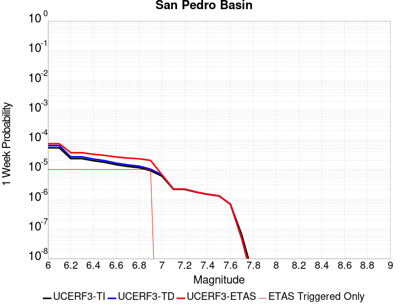 | 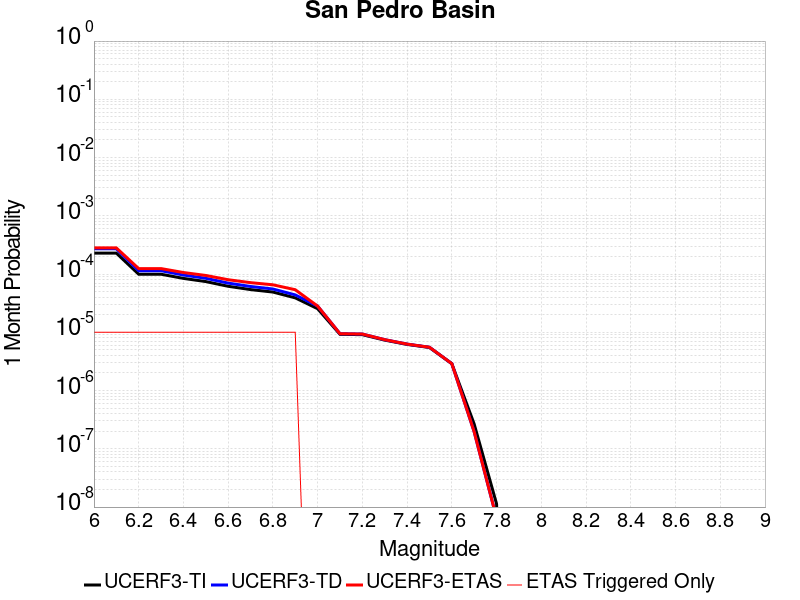 |  |  |

| Magnitude | 1 wk TI Prob | 1 wk TD Prob | 1 wk ETAS Prob | 1 wk ETAS/TD Gain | 1 wk ETAS Triggered Only | 1 mo TI Prob | 1 mo TD Prob | 1 mo ETAS Prob | 1 mo ETAS/TD Gain | 1 mo ETAS Triggered Only | 1 yr TI Prob | 1 yr TD Prob | 1 yr ETAS Prob | 1 yr ETAS/TD Gain | 1 yr ETAS Triggered Only | 10 yr TI Prob | 10 yr TD Prob | 10 yr ETAS Prob | 10 yr ETAS/TD Gain | 10 yr ETAS Triggered Only |
|-----|-----|-----|-----|-----|-----|-----|-----|-----|-----|-----|-----|-----|-----|-----|-----|-----|-----|-----|-----|-----|
| 6.0 | 5.3449043E-5 | 6.337033E-5 | 7.3369694E-5 | 1.1577926 | 1.0E-5 | 2.2904722E-4 | 2.715623E-4 | 2.815596E-4 | 1.036814 | 1.0E-5 | 0.0027850836 | 0.0033018591 | 0.00333176 | 1.0090557 | 3.0E-5 | 0.027504366 | 0.032589555 | 0.032676622 | 1.0026716 | 9.0E-5 |
| 6.1 | 5.3449043E-5 | 6.337033E-5 | 7.3369694E-5 | 1.1577926 | 1.0E-5 | 2.2904722E-4 | 2.715623E-4 | 2.815596E-4 | 1.036814 | 1.0E-5 | 0.0027850836 | 0.0033018591 | 0.00333176 | 1.0090557 | 3.0E-5 | 0.027504366 | 0.032589555 | 0.032676622 | 1.0026716 | 9.0E-5 |
| 6.2 | 2.3189454E-5 | 2.664288E-5 | 3.6642614E-5 | 1.3753248 | 1.0E-5 | 9.9379584E-5 | 1.1417903E-4 | 1.2417788E-4 | 1.0875717 | 1.0E-5 | 0.0012092749 | 0.0013892902 | 0.0013992763 | 1.007188 | 1.0E-5 | 0.012027155 | 0.013810916 | 0.013830639 | 1.0014281 | 2.0E-5 |
| 6.3 | 2.3189454E-5 | 2.664288E-5 | 3.6642614E-5 | 1.3753248 | 1.0E-5 | 9.9379584E-5 | 1.1417903E-4 | 1.2417788E-4 | 1.0875717 | 1.0E-5 | 0.0012092749 | 0.0013892902 | 0.0013992763 | 1.007188 | 1.0E-5 | 0.012027155 | 0.013810916 | 0.013830639 | 1.0014281 | 2.0E-5 |
| 6.4 | 1.966056E-5 | 2.246346E-5 | 3.2463235E-5 | 1.4451574 | 1.0E-5 | 8.425682E-5 | 9.6268646E-5 | 1.0626769E-4 | 1.103866 | 1.0E-5 | 0.001025344 | 0.0011714807 | 0.0011814691 | 1.0085262 | 1.0E-5 | 0.010206259 | 0.01165714 | 0.011676907 | 1.0016956 | 2.0E-5 |
| 6.5 | 1.7342953E-5 | 1.9745186E-5 | 2.974499E-5 | 1.5064425 | 1.0E-5 | 7.4324824E-5 | 8.461969E-5 | 9.4618845E-5 | 1.1181659 | 1.0E-5 | 9.04529E-4 | 0.0010297948 | 0.0010397845 | 1.0097007 | 1.0E-5 | 0.009008561 | 0.010253951 | 0.010273745 | 1.0019305 | 2.0E-5 |
| 6.6 | 1.439804E-5 | 1.6322745E-5 | 2.6322581E-5 | 1.612632 | 1.0E-5 | 6.170443E-5 | 6.995293E-5 | 7.9952224E-5 | 1.1429433 | 1.0E-5 | 7.509924E-4 | 8.5137616E-4 | 8.613677E-4 | 1.0117357 | 1.0E-5 | 0.0074845953 | 0.008484348 | 0.008504177 | 1.0023373 | 2.0E-5 |
| 6.7 | 1.2634884E-5 | 1.4285322E-5 | 2.4285178E-5 | 1.7000092 | 1.0E-5 | 5.414838E-5 | 6.1221544E-5 | 7.122093E-5 | 1.1633312 | 1.0E-5 | 6.590571E-4 | 7.451479E-4 | 7.551404E-4 | 1.0134102 | 1.0E-5 | 0.006571059 | 0.007429514 | 0.0074493657 | 1.002672 | 2.0E-5 |
| 6.8 | 1.146091E-5 | 1.2933214E-5 | 2.2933085E-5 | 1.773193 | 1.0E-5 | 4.911726E-5 | 5.5427052E-5 | 6.5426495E-5 | 1.1804073 | 1.0E-5 | 5.9783855E-4 | 6.746451E-4 | 6.846384E-4 | 1.0148126 | 1.0E-5 | 0.0059623276 | 0.006728911 | 0.006748776 | 1.0029522 | 2.0E-5 |
| 6.9 | 9.109035E-6 | 1.023503E-5 | 2.0234927E-5 | 1.9770268 | 1.0E-5 | 3.9038136E-5 | 4.386383E-5 | 5.3863394E-5 | 1.2279682 | 1.0E-5 | 4.7518566E-4 | 5.339393E-4 | 5.4393394E-4 | 1.0187187 | 1.0E-5 | 0.0047417083 | 0.005329318 | 0.0053492114 | 1.0037328 | 2.0E-5 |
| 7.0 | 5.9351028E-6 | 6.583975E-6 | 6.583975E-6 | 1.0 | 0.0 | 2.5435906E-5 | 2.8216862E-5 | 2.8216862E-5 | 1.0 | 0.0 | 3.0963816E-4 | 3.4350978E-4 | 3.4350978E-4 | 1.0 | 0.0 | 0.0030920706 | 0.0034321048 | 0.0034321048 | 1.0 | 0.0 |
| 7.1 | 2.1557585E-6 | 2.2096503E-6 | 2.2096503E-6 | 1.0 | 0.0 | 9.238933E-6 | 9.469896E-6 | 9.469896E-6 | 1.0 | 0.0 | 1.1247819E-4 | 1.15290044E-4 | 1.15290044E-4 | 1.0 | 0.0 | 0.0011242128 | 0.0011523177 | 0.0011523177 | 1.0 | 0.0 |
| 7.2 | 2.1251979E-6 | 2.1779965E-6 | 2.1779965E-6 | 1.0 | 0.0 | 9.107958E-6 | 9.334239E-6 | 9.334239E-6 | 1.0 | 0.0 | 1.1088375E-4 | 1.1363858E-4 | 1.1363858E-4 | 1.0 | 0.0 | 0.0011082845 | 0.00113582 | 0.00113582 | 1.0 | 0.0 |
| 7.3 | 1.7145798E-6 | 1.7442893E-6 | 1.7442893E-6 | 1.0 | 0.0 | 7.3481783E-6 | 7.475505E-6 | 7.475505E-6 | 1.0 | 0.0 | 8.94604E-5 | 9.101056E-5 | 9.101056E-5 | 1.0 | 0.0 | 8.9424395E-4 | 9.09742E-4 | 9.09742E-4 | 1.0 | 0.0 |
| 7.4 | 1.4467993E-6 | 1.4641885E-6 | 1.4641885E-6 | 1.0 | 0.0 | 6.200554E-6 | 6.2750787E-6 | 6.2750787E-6 | 1.0 | 0.0 | 7.548913E-5 | 7.639648E-5 | 7.639648E-5 | 1.0 | 0.0 | 7.546349E-4 | 7.637094E-4 | 7.637094E-4 | 1.0 | 0.0 |
| 7.5 | 1.2803735E-6 | 1.2931512E-6 | 1.2931512E-6 | 1.0 | 0.0 | 5.487303E-6 | 5.5420646E-6 | 5.5420646E-6 | 1.0 | 0.0 | 6.680587E-5 | 6.7472625E-5 | 6.7472625E-5 | 1.0 | 0.0 | 6.678579E-4 | 6.745284E-4 | 6.745284E-4 | 1.0 | 0.0 |
| 7.6 | 6.755009E-7 | 6.769473E-7 | 6.769473E-7 | 1.0 | 0.0 | 2.8950008E-6 | 2.9011999E-6 | 2.9011999E-6 | 1.0 | 0.0 | 3.5246063E-5 | 3.5321595E-5 | 3.5321595E-5 | 1.0 | 0.0 | 3.5240475E-4 | 3.5316552E-4 | 3.5316552E-4 | 1.0 | 0.0 |
| 7.7 | 6.211885E-8 | 4.5699714E-8 | 4.5699714E-8 | 1.0 | 0.0 | 2.6622362E-7 | 1.9585592E-7 | 1.9585592E-7 | 1.0 | 0.0 | 3.2412677E-6 | 2.3845432E-6 | 2.3845432E-6 | 1.0 | 0.0 | 3.2412205E-5 | 2.3845198E-5 | 2.3845198E-5 | 1.0 | 0.0 |
| 7.8 | 2.6580573E-9 | 1.5138054E-9 | 1.5138054E-9 | 1.0 | 0.0 | 1.1391674E-8 | 6.4877375E-9 | 6.4877375E-9 | 1.0 | 0.0 | 1.3869362E-7 | 7.89882E-8 | 7.89882E-8 | 1.0 | 0.0 | 1.3869354E-6 | 7.89882E-7 | 7.89882E-7 | 1.0 | 0.0 |

## Pinto Mtn
*[(top)](#table-of-contents)*

| 1 Week | 1 Month | 1 Year | 10 Year |
|-----|-----|-----|-----|
| 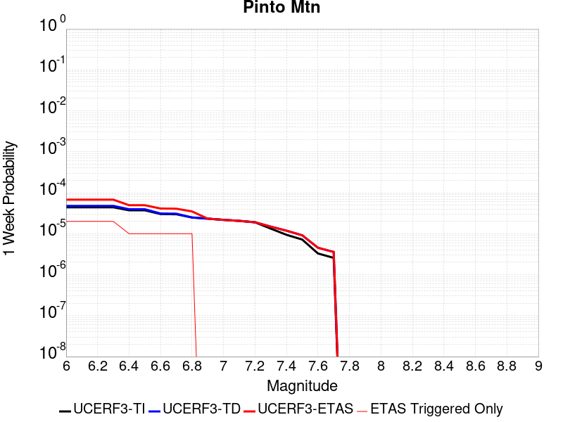 |  |  |  |

| Magnitude | 1 wk TI Prob | 1 wk TD Prob | 1 wk ETAS Prob | 1 wk ETAS/TD Gain | 1 wk ETAS Triggered Only | 1 mo TI Prob | 1 mo TD Prob | 1 mo ETAS Prob | 1 mo ETAS/TD Gain | 1 mo ETAS Triggered Only | 1 yr TI Prob | 1 yr TD Prob | 1 yr ETAS Prob | 1 yr ETAS/TD Gain | 1 yr ETAS Triggered Only | 10 yr TI Prob | 10 yr TD Prob | 10 yr ETAS Prob | 10 yr ETAS/TD Gain | 10 yr ETAS Triggered Only |
|-----|-----|-----|-----|-----|-----|-----|-----|-----|-----|-----|-----|-----|-----|-----|-----|-----|-----|-----|-----|-----|
| 6.0 | 4.4194956E-5 | 4.7854057E-5 | 6.78531E-5 | 1.4179174 | 2.0E-5 | 1.893932E-4 | 2.0507361E-4 | 2.3506745E-4 | 1.146259 | 3.0E-5 | 0.0023034236 | 0.0024940756 | 0.002543951 | 1.0199975 | 5.0E-5 | 0.022796938 | 0.024678372 | 0.02476615 | 1.003557 | 9.0E-5 |
| 6.1 | 4.4194956E-5 | 4.7854057E-5 | 6.78531E-5 | 1.4179174 | 2.0E-5 | 1.893932E-4 | 2.0507361E-4 | 2.3506745E-4 | 1.146259 | 3.0E-5 | 0.0023034236 | 0.0024940756 | 0.002543951 | 1.0199975 | 5.0E-5 | 0.022796938 | 0.024678372 | 0.02476615 | 1.003557 | 9.0E-5 |
| 6.2 | 4.4194956E-5 | 4.7854057E-5 | 6.78531E-5 | 1.4179174 | 2.0E-5 | 1.893932E-4 | 2.0507361E-4 | 2.3506745E-4 | 1.146259 | 3.0E-5 | 0.0023034236 | 0.0024940756 | 0.002543951 | 1.0199975 | 5.0E-5 | 0.022796938 | 0.024678372 | 0.02476615 | 1.003557 | 9.0E-5 |
| 6.3 | 4.4194956E-5 | 4.7854057E-5 | 6.78531E-5 | 1.4179174 | 2.0E-5 | 1.893932E-4 | 2.0507361E-4 | 2.3506745E-4 | 1.146259 | 3.0E-5 | 0.0023034236 | 0.0024940756 | 0.002543951 | 1.0199975 | 5.0E-5 | 0.022796938 | 0.024678372 | 0.02476615 | 1.003557 | 9.0E-5 |
| 6.4 | 3.729929E-5 | 3.96036E-5 | 4.9603204E-5 | 1.2524923 | 1.0E-5 | 1.5984432E-4 | 1.697192E-4 | 1.897158E-4 | 1.1178217 | 2.0E-5 | 0.0019443673 | 0.0020644662 | 0.0021043837 | 1.0193355 | 4.0E-5 | 0.019274427 | 0.020462906 | 0.020521678 | 1.0028721 | 6.0E-5 |
| 6.5 | 3.729929E-5 | 3.96036E-5 | 4.9603204E-5 | 1.2524923 | 1.0E-5 | 1.5984432E-4 | 1.697192E-4 | 1.897158E-4 | 1.1178217 | 2.0E-5 | 0.0019443673 | 0.0020644662 | 0.0021043837 | 1.0193355 | 4.0E-5 | 0.019274427 | 0.020462906 | 0.020521678 | 1.0028721 | 6.0E-5 |
| 6.6 | 3.0204548E-5 | 3.120569E-5 | 4.120538E-5 | 1.3204443 | 1.0E-5 | 1.2944164E-4 | 1.3373203E-4 | 1.4373068E-4 | 1.0747664 | 1.0E-5 | 0.0015748127 | 0.001627006 | 0.0016469734 | 1.0122725 | 2.0E-5 | 0.015636992 | 0.01615481 | 0.016174488 | 1.0012181 | 2.0E-5 |
| 6.7 | 2.9857754E-5 | 3.0815077E-5 | 4.0814768E-5 | 1.3245065 | 1.0E-5 | 1.2795553E-4 | 1.3205812E-4 | 1.420568E-4 | 1.0757142 | 1.0E-5 | 0.0015567453 | 0.0016066565 | 0.0016266244 | 1.0124282 | 2.0E-5 | 0.015458848 | 0.01595425 | 0.015973931 | 1.0012336 | 2.0E-5 |
| 6.8 | 2.4819734E-5 | 2.5009746E-5 | 3.5009496E-5 | 1.3998342 | 1.0E-5 | 1.0636595E-4 | 1.0718034E-4 | 1.17179276E-4 | 1.0932907 | 1.0E-5 | 0.0012942362 | 0.0013041612 | 0.0013141482 | 1.0076578 | 1.0E-5 | 0.012867244 | 0.012967444 | 0.012977315 | 1.0007612 | 1.0E-5 |
| 6.9 | 2.331124E-5 | 2.3338023E-5 | 2.3338023E-5 | 1.0 | 0.0 | 9.990149E-5 | 1.0001638E-4 | 1.0001638E-4 | 1.0 | 0.0 | 0.001215622 | 0.0012170395 | 0.0012170395 | 1.0 | 0.0 | 0.012089936 | 0.012105937 | 0.012105937 | 1.0 | 0.0 |
| 7.0 | 2.1818534E-5 | 2.176115E-5 | 2.176115E-5 | 1.0 | 0.0 | 9.3504656E-5 | 9.325885E-5 | 9.325885E-5 | 1.0 | 0.0 | 0.0011378246 | 0.0011348549 | 0.0011348549 | 1.0 | 0.0 | 0.011320163 | 0.011292699 | 0.011292699 | 1.0 | 0.0 |
| 7.1 | 2.066081E-5 | 2.0540792E-5 | 2.0540792E-5 | 1.0 | 0.0 | 8.854332E-5 | 8.8029105E-5 | 8.8029105E-5 | 1.0 | 0.0 | 0.0010774818 | 0.001071247 | 0.001071247 | 1.0 | 0.0 | 0.010722724 | 0.010662882 | 0.010662882 | 1.0 | 0.0 |
| 7.2 | 1.8990233E-5 | 1.9054076E-5 | 1.9054076E-5 | 1.0 | 0.0 | 8.138417E-5 | 8.1657876E-5 | 8.1657876E-5 | 1.0 | 0.0 | 9.904018E-4 | 9.937505E-4 | 9.937505E-4 | 1.0 | 0.0 | 0.009859995 | 0.009895067 | 0.009895067 | 1.0 | 0.0 |
| 7.3 | 1.3335872E-5 | 1.490678E-5 | 1.490678E-5 | 1.0 | 0.0 | 5.7152483E-5 | 6.3884705E-5 | 6.3884705E-5 | 1.0 | 0.0 | 6.956093E-4 | 7.7753153E-4 | 7.7753153E-4 | 1.0 | 0.0 | 0.006934359 | 0.007749411 | 0.007749411 | 1.0 | 0.0 |
| 7.4 | 9.414066E-6 | 1.1861024E-5 | 1.1861024E-5 | 1.0 | 0.0 | 4.0345374E-5 | 5.0832023E-5 | 5.0832023E-5 | 1.0 | 0.0 | 4.910942E-4 | 6.1871356E-4 | 6.1871356E-4 | 1.0 | 0.0 | 0.0049001034 | 0.0061708586 | 0.0061708586 | 1.0 | 0.0 |
| 7.5 | 7.2101157E-6 | 9.158253E-6 | 9.158253E-6 | 1.0 | 0.0 | 3.090013E-5 | 3.924911E-5 | 3.924911E-5 | 1.0 | 0.0 | 3.7614413E-4 | 4.7776094E-4 | 4.7776094E-4 | 1.0 | 0.0 | 0.0037550807 | 0.0047681136 | 0.0047681136 | 1.0 | 0.0 |
| 7.6 | 3.296375E-6 | 4.5455613E-6 | 4.5455613E-6 | 1.0 | 0.0 | 1.4127245E-5 | 1.948084E-5 | 1.948084E-5 | 1.0 | 0.0 | 1.7198564E-4 | 2.371548E-4 | 2.371548E-4 | 1.0 | 0.0 | 0.0017185259 | 0.0023691545 | 0.0023691545 | 1.0 | 0.0 |
| 7.7 | 2.5741092E-6 | 3.5844635E-6 | 3.5844635E-6 | 1.0 | 0.0 | 1.103185E-5 | 1.5361904E-5 | 1.5361904E-5 | 1.0 | 0.0 | 1.3430449E-4 | 1.8701644E-4 | 1.8701644E-4 | 1.0 | 0.0 | 0.0013422335 | 0.0018687204 | 0.0018687204 | 1.0 | 0.0 |

## Big Pine (East)
*[(top)](#table-of-contents)*

| 1 Week | 1 Month | 1 Year | 10 Year |
|-----|-----|-----|-----|
| 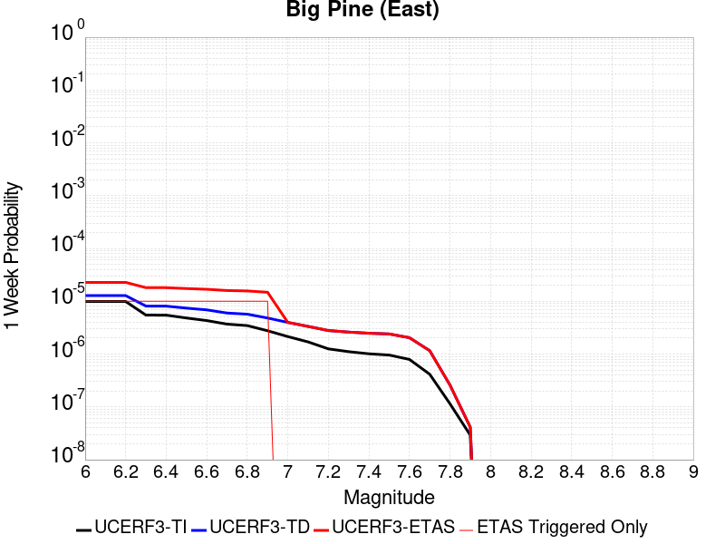 |  |  |  |

| Magnitude | 1 wk TI Prob | 1 wk TD Prob | 1 wk ETAS Prob | 1 wk ETAS/TD Gain | 1 wk ETAS Triggered Only | 1 mo TI Prob | 1 mo TD Prob | 1 mo ETAS Prob | 1 mo ETAS/TD Gain | 1 mo ETAS Triggered Only | 1 yr TI Prob | 1 yr TD Prob | 1 yr ETAS Prob | 1 yr ETAS/TD Gain | 1 yr ETAS Triggered Only | 10 yr TI Prob | 10 yr TD Prob | 10 yr ETAS Prob | 10 yr ETAS/TD Gain | 10 yr ETAS Triggered Only |
|-----|-----|-----|-----|-----|-----|-----|-----|-----|-----|-----|-----|-----|-----|-----|-----|-----|-----|-----|-----|-----|
| 6.0 | 9.916913E-6 | 1.2817389E-5 | 2.2817261E-5 | 1.7801801 | 1.0E-5 | 4.250036E-5 | 5.4930635E-5 | 9.492844E-5 | 1.7281511 | 4.0E-5 | 5.173191E-4 | 6.685974E-4 | 7.2855724E-4 | 1.0896801 | 6.0E-5 | 0.0051611643 | 0.0066704396 | 0.0067499056 | 1.0119132 | 8.0E-5 |
| 6.1 | 9.916913E-6 | 1.2817389E-5 | 2.2817261E-5 | 1.7801801 | 1.0E-5 | 4.250036E-5 | 5.4930635E-5 | 9.492844E-5 | 1.7281511 | 4.0E-5 | 5.173191E-4 | 6.685974E-4 | 7.2855724E-4 | 1.0896801 | 6.0E-5 | 0.0051611643 | 0.0066704396 | 0.0067499056 | 1.0119132 | 8.0E-5 |
| 6.2 | 9.916913E-6 | 1.2817389E-5 | 2.2817261E-5 | 1.7801801 | 1.0E-5 | 4.250036E-5 | 5.4930635E-5 | 9.492844E-5 | 1.7281511 | 4.0E-5 | 5.173191E-4 | 6.685974E-4 | 7.2855724E-4 | 1.0896801 | 6.0E-5 | 0.0051611643 | 0.0066704396 | 0.0067499056 | 1.0119132 | 8.0E-5 |
| 6.3 | 5.479711E-6 | 8.113353E-6 | 1.8113271E-5 | 2.232526 | 1.0E-5 | 2.3484265E-5 | 3.4771067E-5 | 7.4769676E-5 | 2.1503417 | 4.0E-5 | 2.858834E-4 | 4.232587E-4 | 4.8323328E-4 | 1.1416973 | 6.0E-5 | 0.0028551589 | 0.00422724 | 0.004306902 | 1.0188448 | 8.0E-5 |
| 6.4 | 5.465009E-6 | 8.097646E-6 | 1.8097566E-5 | 2.2349167 | 1.0E-5 | 2.3421257E-5 | 3.4703753E-5 | 7.4702366E-5 | 2.152573 | 4.0E-5 | 2.851165E-4 | 4.2243948E-4 | 4.8241412E-4 | 1.1419722 | 6.0E-5 | 0.0028475097 | 0.0042190794 | 0.0042987415 | 1.0188814 | 8.0E-5 |
| 6.5 | 4.826767E-6 | 7.422702E-6 | 1.7422628E-5 | 2.3472083 | 1.0E-5 | 2.068598E-5 | 3.1811207E-5 | 7.180993E-5 | 2.2573786 | 4.0E-5 | 2.518227E-4 | 3.872354E-4 | 4.4721217E-4 | 1.1548845 | 6.0E-5 | 0.0025153751 | 0.0038682793 | 0.0039479695 | 1.020601 | 8.0E-5 |
| 6.6 | 4.3146847E-6 | 6.8826375E-6 | 1.6882568E-5 | 2.4529214 | 1.0E-5 | 1.8491375E-5 | 2.9496698E-5 | 6.9495516E-5 | 2.356044 | 4.0E-5 | 2.2510924E-4 | 3.5906557E-4 | 4.1904402E-4 | 1.1670403 | 6.0E-5 | 0.0022488134 | 0.0035874946 | 0.0036672077 | 1.0222197 | 8.0E-5 |
| 6.7 | 3.6968106E-6 | 5.995851E-6 | 1.599579E-5 | 2.66781 | 1.0E-5 | 1.5843378E-5 | 2.5696261E-5 | 5.569549E-5 | 2.167455 | 3.0E-5 | 1.9287605E-4 | 3.1280858E-4 | 3.6279295E-4 | 1.1597922 | 5.0E-5 | 0.0019270873 | 0.003126233 | 0.0031860452 | 1.0191324 | 6.0E-5 |
| 6.8 | 3.4671132E-6 | 5.7025504E-6 | 1.5702493E-5 | 2.7535913 | 1.0E-5 | 1.4858972E-5 | 2.4439281E-5 | 5.4438548E-5 | 2.227502 | 3.0E-5 | 1.8089297E-4 | 2.9750908E-4 | 3.474942E-4 | 1.1680121 | 5.0E-5 | 0.0018074579 | 0.0029736492 | 0.0030334708 | 1.0201173 | 6.0E-5 |
| 6.9 | 2.7686972E-6 | 4.8255743E-6 | 1.4825526E-5 | 3.0722823 | 1.0E-5 | 1.1865792E-5 | 2.0680873E-5 | 4.0680457E-5 | 1.9670572 | 2.0E-5 | 1.4445644E-4 | 2.517613E-4 | 2.8175375E-4 | 1.1191305 | 3.0E-5 | 0.0014436257 | 0.002517234 | 0.0025571336 | 1.0158504 | 4.0E-5 |
| 7.0 | 2.1472624E-6 | 3.9853603E-6 | 3.9853603E-6 | 1.0 | 0.0 | 9.20252E-6 | 1.7080007E-5 | 2.7079837E-5 | 1.5854698 | 1.0E-5 | 1.12034926E-4 | 2.0792978E-4 | 2.2792563E-4 | 1.0961664 | 2.0E-5 | 0.0011197845 | 0.002079813 | 0.0020997713 | 1.0095962 | 2.0E-5 |
| 7.1 | 1.7018335E-6 | 3.3451643E-6 | 3.3451643E-6 | 1.0 | 0.0 | 7.293552E-6 | 1.4336341E-5 | 2.4336197E-5 | 1.697518 | 1.0E-5 | 8.879537E-5 | 1.7453133E-4 | 1.9452783E-4 | 1.1145726 | 2.0E-5 | 8.87599E-4 | 0.001746369 | 0.001766334 | 1.0114323 | 2.0E-5 |
| 7.2 | 1.25603E-6 | 2.7947585E-6 | 2.7947585E-6 | 1.0 | 0.0 | 5.3829745E-6 | 1.1977482E-5 | 2.1977363E-5 | 1.83489 | 1.0E-5 | 6.553574E-5 | 1.4581632E-4 | 1.5581487E-4 | 1.0685694 | 1.0E-5 | 6.551642E-4 | 0.00145961 | 0.0014695954 | 1.0068412 | 1.0E-5 |
| 7.3 | 1.112297E-6 | 2.6105952E-6 | 2.6105952E-6 | 1.0 | 0.0 | 4.7669787E-6 | 1.1188218E-5 | 2.1188105E-5 | 1.8937874 | 1.0E-5 | 5.803642E-5 | 1.3620825E-4 | 1.4620689E-4 | 1.0734069 | 1.0E-5 | 5.802127E-4 | 0.0013634788 | 0.0013734652 | 1.0073242 | 1.0E-5 |
| 7.4 | 1.0137181E-6 | 2.4837486E-6 | 2.4837486E-6 | 1.0 | 0.0 | 4.3444993E-6 | 1.0644594E-5 | 2.0644487E-5 | 1.9394339 | 1.0E-5 | 5.2892992E-5 | 1.2959045E-4 | 1.3958914E-4 | 1.0771562 | 1.0E-5 | 5.288041E-4 | 0.0012971647 | 0.0013071517 | 1.0076991 | 1.0E-5 |
| 7.5 | 9.598608E-7 | 2.4073993E-6 | 2.4073993E-6 | 1.0 | 0.0 | 4.1136827E-6 | 1.0317386E-5 | 2.0317282E-5 | 1.9692278 | 1.0E-5 | 5.0082934E-5 | 1.2560714E-4 | 1.356059E-4 | 1.0796033 | 1.0E-5 | 5.007165E-4 | 0.0012571859 | 0.0012671733 | 1.0079442 | 1.0E-5 |
| 7.6 | 7.929459E-7 | 2.0450777E-6 | 2.0450777E-6 | 1.0 | 0.0 | 3.3983351E-6 | 8.764591E-6 | 1.8764504E-5 | 2.1409445 | 1.0E-5 | 4.1373947E-5 | 1.0670385E-4 | 1.1670277E-4 | 1.0937073 | 1.0E-5 | 4.1366243E-4 | 0.0010685701 | 0.0010785593 | 1.0093483 | 1.0E-5 |
| 7.7 | 4.155788E-7 | 1.1607221E-6 | 1.1607221E-6 | 1.0 | 0.0 | 1.7810507E-6 | 4.974514E-6 | 4.974514E-6 | 1.0 | 0.0 | 2.1684076E-5 | 6.0563067E-5 | 6.0563067E-5 | 1.0 | 0.0 | 2.1681961E-4 | 6.0857774E-4 | 6.0857774E-4 | 1.0 | 0.0 |
| 7.8 | 1.14666925E-7 | 2.5922853E-7 | 2.5922853E-7 | 1.0 | 0.0 | 4.914296E-7 | 1.110979E-6 | 1.110979E-6 | 1.0 | 0.0 | 5.9831386E-6 | 1.352609E-5 | 1.352609E-5 | 1.0 | 0.0 | 5.9829777E-5 | 1.3636563E-4 | 1.3636563E-4 | 1.0 | 0.0 |
| 7.9 | 2.9231824E-8 | 4.1463966E-8 | 4.1463966E-8 | 1.0 | 0.0 | 1.2527924E-7 | 1.777027E-7 | 1.777027E-7 | 1.0 | 0.0 | 1.5252737E-6 | 2.1635285E-6 | 2.1635285E-6 | 1.0 | 0.0 | 1.5252632E-5 | 2.1973032E-5 | 2.1973032E-5 | 1.0 | 0.0 |

## Imperial
*[(top)](#table-of-contents)*

| 1 Week | 1 Month | 1 Year | 10 Year |
|-----|-----|-----|-----|
| 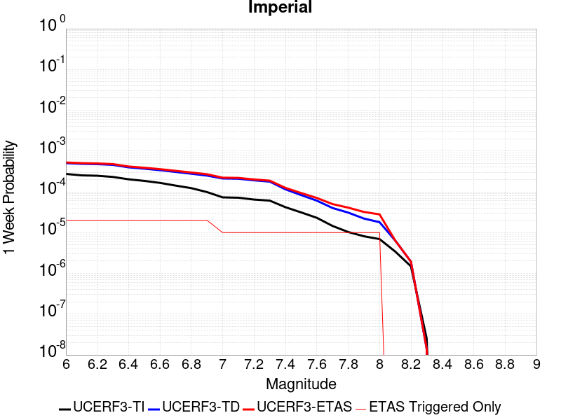 | 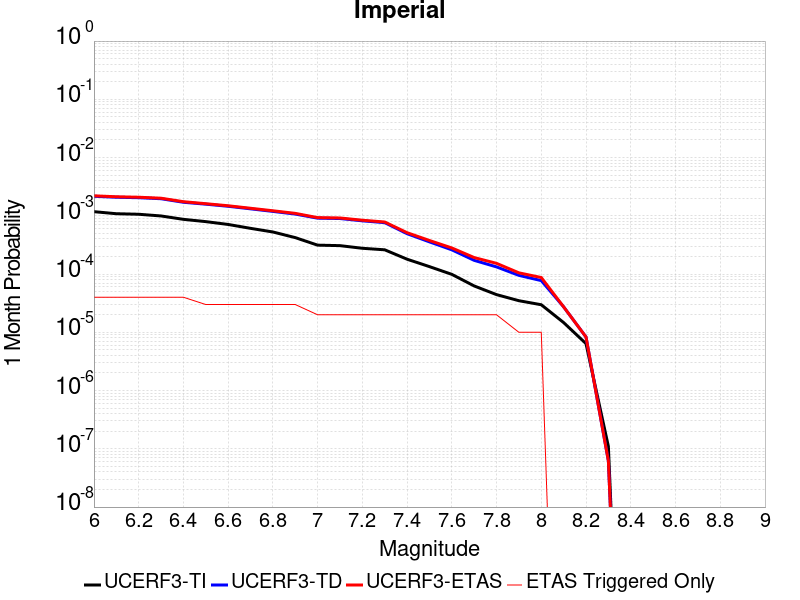 | 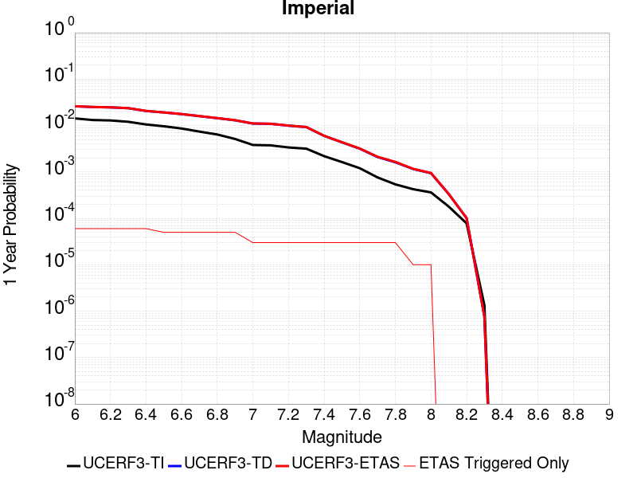 |  |

| Magnitude | 1 wk TI Prob | 1 wk TD Prob | 1 wk ETAS Prob | 1 wk ETAS/TD Gain | 1 wk ETAS Triggered Only | 1 mo TI Prob | 1 mo TD Prob | 1 mo ETAS Prob | 1 mo ETAS/TD Gain | 1 mo ETAS Triggered Only | 1 yr TI Prob | 1 yr TD Prob | 1 yr ETAS Prob | 1 yr ETAS/TD Gain | 1 yr ETAS Triggered Only | 10 yr TI Prob | 10 yr TD Prob | 10 yr ETAS Prob | 10 yr ETAS/TD Gain | 10 yr ETAS Triggered Only |
|-----|-----|-----|-----|-----|-----|-----|-----|-----|-----|-----|-----|-----|-----|-----|-----|-----|-----|-----|-----|-----|
| 6.0 | 2.7496446E-4 | 5.0557696E-4 | 5.2556687E-4 | 1.0395387 | 2.0E-5 | 0.0011778869 | 0.0021649986 | 0.0022049118 | 1.0184357 | 4.0E-5 | 0.0142467655 | 0.026006926 | 0.026065366 | 1.0022471 | 6.0E-5 | 0.13367249 | 0.22804134 | 0.2281031 | 1.0002708 | 8.0E-5 |
| 6.1 | 2.5356023E-4 | 4.866049E-4 | 5.065952E-4 | 1.0410811 | 2.0E-5 | 0.001086234 | 0.0020838212 | 0.0021237377 | 1.0191555 | 4.0E-5 | 0.013144928 | 0.025048045 | 0.025106542 | 1.0023354 | 6.0E-5 | 0.123940155 | 0.21947905 | 0.2195415 | 1.0002846 | 8.0E-5 |
| 6.2 | 2.4820742E-4 | 4.7755873E-4 | 4.975492E-4 | 1.0418596 | 2.0E-5 | 0.0010633124 | 0.0020451127 | 0.002085031 | 1.0195189 | 4.0E-5 | 0.01286919 | 0.024588011 | 0.024646537 | 1.0023803 | 6.0E-5 | 0.12148927 | 0.21598473 | 0.21604745 | 1.0002904 | 8.0E-5 |
| 6.3 | 2.3205351E-4 | 4.5892928E-4 | 4.789201E-4 | 1.0435597 | 2.0E-5 | 9.94136E-4 | 0.001965394 | 0.0020053154 | 1.0203122 | 4.0E-5 | 0.012036599 | 0.023660269 | 0.023718849 | 1.0024759 | 6.0E-5 | 0.11405133 | 0.20793681 | 0.20800017 | 1.0003047 | 8.0E-5 |
| 6.4 | 2.0304754E-4 | 3.9878892E-4 | 4.1878092E-4 | 1.0501318 | 2.0E-5 | 8.6991355E-4 | 0.0017079905 | 0.0017479222 | 1.0233793 | 4.0E-5 | 0.010539869 | 0.020595744 | 0.020654509 | 1.0028533 | 6.0E-5 | 0.100537635 | 0.18507019 | 0.18513538 | 1.0003523 | 8.0E-5 |
| 6.5 | 1.854992E-4 | 3.6991312E-4 | 3.899057E-4 | 1.0540468 | 2.0E-5 | 7.9475436E-4 | 0.0015843911 | 0.0016143435 | 1.0189047 | 3.0E-5 | 0.009633281 | 0.019114837 | 0.01916388 | 1.0025657 | 5.0E-5 | 0.0922623 | 0.17330295 | 0.17336081 | 1.0003339 | 7.0E-5 |
| 6.6 | 1.6586106E-4 | 3.4036982E-4 | 3.6036302E-4 | 1.0587397 | 2.0E-5 | 7.106394E-4 | 0.0014579224 | 0.0014878787 | 1.0205473 | 3.0E-5 | 0.008617763 | 0.017608268 | 0.017657388 | 1.0027896 | 5.0E-5 | 0.08291132 | 0.16077913 | 0.16083787 | 1.0003654 | 7.0E-5 |
| 6.7 | 1.4224656E-4 | 3.0768907E-4 | 3.276829E-4 | 1.0649806 | 2.0E-5 | 6.094856E-4 | 0.0013180092 | 0.0013479698 | 1.0227315 | 3.0E-5 | 0.0073952693 | 0.015929038 | 0.015978241 | 1.003089 | 5.0E-5 | 0.07153955 | 0.14648615 | 0.14654589 | 1.0004078 | 7.0E-5 |
| 6.8 | 1.2317259E-4 | 2.7792813E-4 | 2.9792255E-4 | 1.071941 | 2.0E-5 | 5.2777573E-4 | 0.001190583 | 0.0012205472 | 1.0251677 | 3.0E-5 | 0.0064067547 | 0.01440039 | 0.01444967 | 1.0034221 | 5.0E-5 | 0.06225166 | 0.13294105 | 0.13300174 | 1.0004566 | 7.0E-5 |
| 6.9 | 9.859898E-5 | 2.5015854E-4 | 2.7015354E-4 | 1.0799294 | 2.0E-5 | 4.2249862E-4 | 0.0010716718 | 0.0011016397 | 1.0279636 | 3.0E-5 | 0.0051317946 | 0.01297051 | 0.013019862 | 1.0038049 | 5.0E-5 | 0.05014893 | 0.11940795 | 0.11946959 | 1.0005162 | 7.0E-5 |
| 7.0 | 7.3191884E-5 | 2.1268151E-4 | 2.2267939E-4 | 1.0470086 | 1.0E-5 | 3.136418E-4 | 9.1117696E-4 | 9.311587E-4 | 1.0219296 | 2.0E-5 | 0.003811904 | 0.011037838 | 0.011067506 | 1.0026879 | 3.0E-5 | 0.037471764 | 0.10206576 | 0.102110654 | 1.0004399 | 5.0E-5 |
| 7.1 | 7.1760296E-5 | 2.0969506E-4 | 2.1969297E-4 | 1.0476784 | 1.0E-5 | 3.0750787E-4 | 8.983868E-4 | 9.183688E-4 | 1.0222421 | 2.0E-5 | 0.003737482 | 0.010883682 | 0.010913356 | 1.0027264 | 3.0E-5 | 0.03675245 | 0.10070214 | 0.1007471 | 1.0004466 | 5.0E-5 |
| 7.2 | 6.46614E-5 | 1.9138011E-4 | 2.0137819E-4 | 1.052242 | 1.0E-5 | 2.7709085E-4 | 8.1994565E-4 | 8.399293E-4 | 1.0243719 | 2.0E-5 | 0.0033683628 | 0.009937766 | 0.009967468 | 1.0029888 | 3.0E-5 | 0.033177625 | 0.092509486 | 0.09255486 | 1.0004904 | 5.0E-5 |
| 7.3 | 6.088115E-5 | 1.7809666E-4 | 1.8809487E-4 | 1.0561392 | 1.0E-5 | 2.6089314E-4 | 7.63051E-4 | 7.830357E-4 | 1.0261905 | 2.0E-5 | 0.0031717476 | 0.009251148 | 0.009280871 | 1.0032128 | 3.0E-5 | 0.031268585 | 0.08656045 | 0.08660612 | 1.0005276 | 5.0E-5 |
| 7.4 | 4.199346E-5 | 1.1511322E-4 | 1.2511207E-4 | 1.086861 | 1.0E-5 | 1.7995955E-4 | 4.9325E-4 | 5.132401E-4 | 1.0405273 | 2.0E-5 | 0.0021888057 | 0.005988952 | 0.0060187723 | 1.0049793 | 3.0E-5 | 0.02167372 | 0.0574397 | 0.0574774 | 1.0006564 | 4.0E-5 |
| 7.5 | 3.130448E-5 | 8.334062E-5 | 9.333979E-5 | 1.1199795 | 1.0E-5 | 1.3415517E-4 | 3.571255E-4 | 3.7711835E-4 | 1.0559827 | 2.0E-5 | 0.0016321153 | 0.004339394 | 0.004369264 | 1.0068834 | 3.0E-5 | 0.016201803 | 0.0421332 | 0.042171516 | 1.0009093 | 4.0E-5 |
| 7.6 | 2.3074248E-5 | 6.085099E-5 | 7.085039E-5 | 1.1643258 | 1.0E-5 | 9.888588E-5 | 2.6076403E-4 | 2.807588E-4 | 1.0766777 | 2.0E-5 | 0.0012032706 | 0.0031702034 | 0.0032001082 | 1.0094332 | 3.0E-5 | 0.011967761 | 0.031027833 | 0.03106659 | 1.0012492 | 4.0E-5 |
| 7.7 | 1.45864815E-5 | 4.0129777E-5 | 5.0129373E-5 | 1.2491815 | 1.0E-5 | 6.2511994E-5 | 1.7197344E-4 | 1.9197E-4 | 1.116277 | 2.0E-5 | 7.608177E-4 | 0.0020917715 | 0.0021217088 | 1.0143119 | 3.0E-5 | 0.007582182 | 0.020629402 | 0.020658782 | 1.0014242 | 3.0E-5 |
| 7.8 | 1.0352979E-5 | 3.09651E-5 | 4.096479E-5 | 1.3229343 | 1.0E-5 | 4.4369157E-5 | 1.3270084E-4 | 1.5269818E-4 | 1.150695 | 2.0E-5 | 5.400606E-4 | 0.0016144377 | 0.0016443892 | 1.0185523 | 3.0E-5 | 0.0053875 | 0.016018089 | 0.016047608 | 1.0018429 | 3.0E-5 |
| 7.9 | 8.137906E-6 | 2.2152088E-5 | 3.2151867E-5 | 1.4514147 | 1.0E-5 | 3.4876273E-5 | 9.493407E-5 | 1.0493312E-4 | 1.1053263 | 1.0E-5 | 4.2453592E-4 | 0.0011552104 | 0.0011651989 | 1.0086465 | 1.0E-5 | 0.004237258 | 0.0116192475 | 0.011629132 | 1.0008507 | 1.0E-5 |
| 8.0 | 6.93792E-6 | 1.8011126E-5 | 2.8010945E-5 | 1.5552024 | 1.0E-5 | 2.9733603E-5 | 7.718826E-5 | 8.718749E-5 | 1.1295434 | 1.0E-5 | 3.6194647E-4 | 9.393627E-4 | 9.4935327E-4 | 1.0106355 | 1.0E-5 | 0.0036135751 | 0.009502796 | 0.009512701 | 1.0010424 | 1.0E-5 |
| 8.1 | 3.4286315E-6 | 6.380524E-6 | 6.380524E-6 | 1.0 | 0.0 | 1.4694053E-5 | 2.7344817E-5 | 2.7344817E-5 | 1.0 | 0.0 | 1.7888541E-4 | 3.328724E-4 | 3.328724E-4 | 1.0 | 0.0 | 0.0017874148 | 0.0034865174 | 0.0034865174 | 1.0 | 0.0 |
| 8.2 | 1.4906886E-6 | 1.936769E-6 | 1.936769E-6 | 1.0 | 0.0 | 6.3886496E-6 | 8.300412E-6 | 8.300412E-6 | 1.0 | 0.0 | 7.7779034E-5 | 1.0105286E-4 | 1.0105286E-4 | 1.0 | 0.0 | 7.775182E-4 | 0.0011075957 | 0.0011075957 | 1.0 | 0.0 |
| 8.3 | 2.5758007E-8 | 1.4497417E-8 | 1.4497417E-8 | 1.0 | 0.0 | 1.10391454E-7 | 6.213178E-8 | 6.213178E-8 | 1.0 | 0.0 | 1.3440151E-6 | 7.564545E-7 | 7.564545E-7 | 1.0 | 0.0 | 1.344007E-5 | 7.88679E-6 | 7.88679E-6 | 1.0 | 0.0 |

## Rose Canyon
*[(top)](#table-of-contents)*

| 1 Week | 1 Month | 1 Year | 10 Year |
|-----|-----|-----|-----|
|  |  | 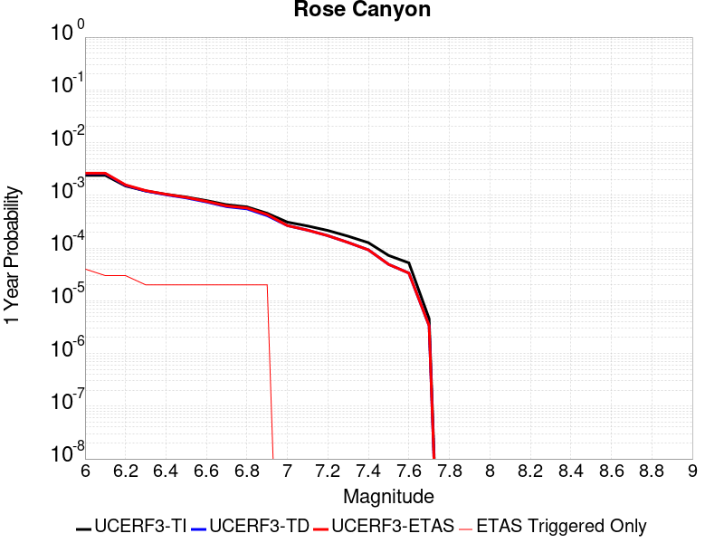 |  |

| Magnitude | 1 wk TI Prob | 1 wk TD Prob | 1 wk ETAS Prob | 1 wk ETAS/TD Gain | 1 wk ETAS Triggered Only | 1 mo TI Prob | 1 mo TD Prob | 1 mo ETAS Prob | 1 mo ETAS/TD Gain | 1 mo ETAS Triggered Only | 1 yr TI Prob | 1 yr TD Prob | 1 yr ETAS Prob | 1 yr ETAS/TD Gain | 1 yr ETAS Triggered Only | 10 yr TI Prob | 10 yr TD Prob | 10 yr ETAS Prob | 10 yr ETAS/TD Gain | 10 yr ETAS Triggered Only |
|-----|-----|-----|-----|-----|-----|-----|-----|-----|-----|-----|-----|-----|-----|-----|-----|-----|-----|-----|-----|-----|
| 6.0 | 4.5923203E-5 | 4.971469E-5 | 4.971469E-5 | 1.0 | 0.0 | 1.9679888E-4 | 2.1304691E-4 | 2.1304691E-4 | 1.0 | 0.0 | 0.0023933933 | 0.002590952 | 0.0026308482 | 1.0153984 | 4.0E-5 | 0.023677798 | 0.025627252 | 0.025705202 | 1.0030416 | 8.0E-5 |
| 6.1 | 4.5923203E-5 | 4.971469E-5 | 4.971469E-5 | 1.0 | 0.0 | 1.9679888E-4 | 2.1304691E-4 | 2.1304691E-4 | 1.0 | 0.0 | 0.0023933933 | 0.002590952 | 0.0026208742 | 1.0115488 | 3.0E-5 | 0.023677798 | 0.025627252 | 0.025666228 | 1.0015209 | 4.0E-5 |
| 6.2 | 2.8844734E-5 | 2.9669702E-5 | 2.9669702E-5 | 1.0 | 0.0 | 1.2361443E-4 | 1.2714986E-4 | 1.2714986E-4 | 1.0 | 0.0 | 0.0015039665 | 0.0015469773 | 0.0015769309 | 1.0193627 | 3.0E-5 | 0.0149382865 | 0.015364885 | 0.015394424 | 1.0019225 | 3.0E-5 |
| 6.3 | 2.3171577E-5 | 2.316243E-5 | 2.316243E-5 | 1.0 | 0.0 | 9.9302975E-5 | 9.926386E-5 | 9.926386E-5 | 1.0 | 0.0 | 0.0012083431 | 0.0012078808 | 0.0012278566 | 1.0165379 | 2.0E-5 | 0.012017938 | 0.012012156 | 0.012031916 | 1.001645 | 2.0E-5 |
| 6.4 | 2.0066604E-5 | 1.9668072E-5 | 1.9668072E-5 | 1.0 | 0.0 | 8.599689E-5 | 8.428907E-5 | 8.428907E-5 | 1.0 | 0.0 | 0.0010465092 | 0.0010257463 | 0.0010457258 | 1.019478 | 2.0E-5 | 0.010415946 | 0.010211482 | 0.010231277 | 1.0019386 | 2.0E-5 |
| 6.5 | 1.776989E-5 | 1.7115406E-5 | 1.7115406E-5 | 1.0 | 0.0 | 7.615444E-5 | 7.3349715E-5 | 7.3349715E-5 | 1.0 | 0.0 | 9.267859E-4 | 8.9267385E-4 | 9.12656E-4 | 1.0223846 | 2.0E-5 | 0.009229303 | 0.008874666 | 0.008894488 | 1.0022336 | 2.0E-5 |
| 6.6 | 1.5227364E-5 | 1.4340876E-5 | 1.4340876E-5 | 1.0 | 0.0 | 6.52585E-5 | 6.145948E-5 | 6.145948E-5 | 1.0 | 0.0 | 7.942326E-4 | 7.4801745E-4 | 7.6800253E-4 | 1.0267173 | 2.0E-5 | 0.007914 | 0.0074410355 | 0.0074608866 | 1.0026678 | 2.0E-5 |
| 6.7 | 1.2703898E-5 | 1.167428E-5 | 1.167428E-5 | 1.0 | 0.0 | 5.4444143E-5 | 5.0031696E-5 | 5.0031696E-5 | 1.0 | 0.0 | 6.626558E-4 | 6.089699E-4 | 6.289577E-4 | 1.0328224 | 2.0E-5 | 0.006606833 | 0.006062311 | 0.0060821897 | 1.0032791 | 2.0E-5 |
| 6.8 | 1.1554917E-5 | 1.0610388E-5 | 1.0610388E-5 | 1.0 | 0.0 | 4.9520135E-5 | 4.547232E-5 | 4.547232E-5 | 1.0 | 0.0 | 6.0274085E-4 | 5.534889E-4 | 5.734779E-4 | 1.0361145 | 2.0E-5 | 0.0060110865 | 0.005504416 | 0.0055243056 | 1.0036135 | 2.0E-5 |
| 6.9 | 8.732078E-6 | 7.882289E-6 | 7.882289E-6 | 1.0 | 0.0 | 3.7422655E-5 | 3.3780816E-5 | 3.3780816E-5 | 1.0 | 0.0 | 4.5552556E-4 | 4.1120674E-4 | 4.3119854E-4 | 1.0486174 | 2.0E-5 | 0.0045459294 | 0.0040895166 | 0.004109435 | 1.0048705 | 2.0E-5 |
| 7.0 | 5.9337494E-6 | 5.107439E-6 | 5.107439E-6 | 1.0 | 0.0 | 2.5430107E-5 | 2.1888842E-5 | 2.1888842E-5 | 1.0 | 0.0 | 3.0956755E-4 | 2.664642E-4 | 2.664642E-4 | 1.0 | 0.0 | 0.0030913667 | 0.0026614624 | 0.0026614624 | 1.0 | 0.0 |
| 7.1 | 5.013409E-6 | 4.1773424E-6 | 4.1773424E-6 | 1.0 | 0.0 | 2.1485863E-5 | 1.7902774E-5 | 1.7902774E-5 | 1.0 | 0.0 | 2.6155898E-4 | 2.1794457E-4 | 2.1794457E-4 | 1.0 | 0.0 | 0.0026125133 | 0.00217732 | 0.00217732 | 1.0 | 0.0 |
| 7.2 | 4.120763E-6 | 3.2820935E-6 | 3.2820935E-6 | 1.0 | 0.0 | 1.7660293E-5 | 1.406604E-5 | 1.406604E-5 | 1.0 | 0.0 | 2.1499286E-4 | 1.7124067E-4 | 1.7124067E-4 | 1.0 | 0.0 | 0.0021478499 | 0.0017110967 | 0.0017110967 | 1.0 | 0.0 |
| 7.3 | 3.2081239E-6 | 2.4404974E-6 | 2.4404974E-6 | 1.0 | 0.0 | 1.374903E-5 | 1.0459234E-5 | 1.0459234E-5 | 1.0 | 0.0 | 1.6738157E-4 | 1.273338E-4 | 1.273338E-4 | 1.0 | 0.0 | 0.0016725556 | 0.0012726153 | 0.0012726153 | 1.0 | 0.0 |
| 7.4 | 2.4194755E-6 | 1.7680328E-6 | 1.7680328E-6 | 1.0 | 0.0 | 1.0369139E-5 | 7.577262E-6 | 7.577262E-6 | 1.0 | 0.0 | 1.2623696E-4 | 9.2249305E-5 | 9.2249305E-5 | 1.0 | 0.0 | 0.0012616527 | 9.221155E-4 | 9.221155E-4 | 1.0 | 0.0 |
| 7.5 | 1.3842889E-6 | 9.378297E-7 | 9.378297E-7 | 1.0 | 0.0 | 5.9326535E-6 | 4.0192645E-6 | 4.0192645E-6 | 1.0 | 0.0 | 7.222766E-5 | 4.8933478E-5 | 4.8933478E-5 | 1.0 | 0.0 | 7.220419E-4 | 4.8923056E-4 | 4.8923056E-4 | 1.0 | 0.0 |
| 7.6 | 1.0021575E-6 | 6.4113505E-7 | 6.4113505E-7 | 1.0 | 0.0 | 4.2949537E-6 | 2.7477188E-6 | 2.7477188E-6 | 1.0 | 0.0 | 5.2289808E-5 | 3.3452983E-5 | 3.3452983E-5 | 1.0 | 0.0 | 5.2277505E-4 | 3.3448162E-4 | 3.3448162E-4 | 1.0 | 0.0 |
| 7.7 | 8.7620116E-8 | 6.449304E-8 | 6.449304E-8 | 1.0 | 0.0 | 3.7551473E-7 | 2.763987E-7 | 2.763987E-7 | 1.0 | 0.0 | 4.5718825E-6 | 3.3651493E-6 | 3.3651493E-6 | 1.0 | 0.0 | 4.5717883E-5 | 3.3651013E-5 | 3.3651013E-5 | 1.0 | 0.0 |

## Oceanic - West Huasna
*[(top)](#table-of-contents)*

| 1 Week | 1 Month | 1 Year | 10 Year |
|-----|-----|-----|-----|
| 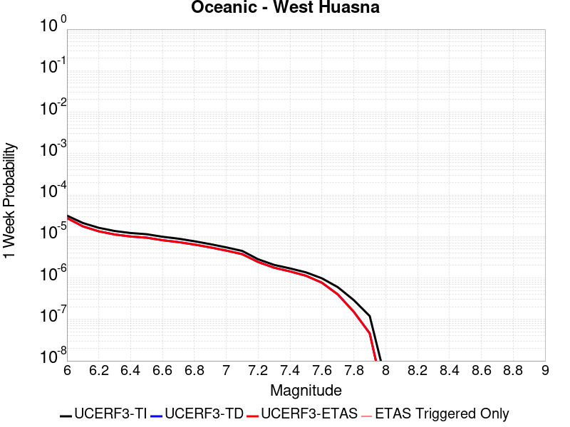 | 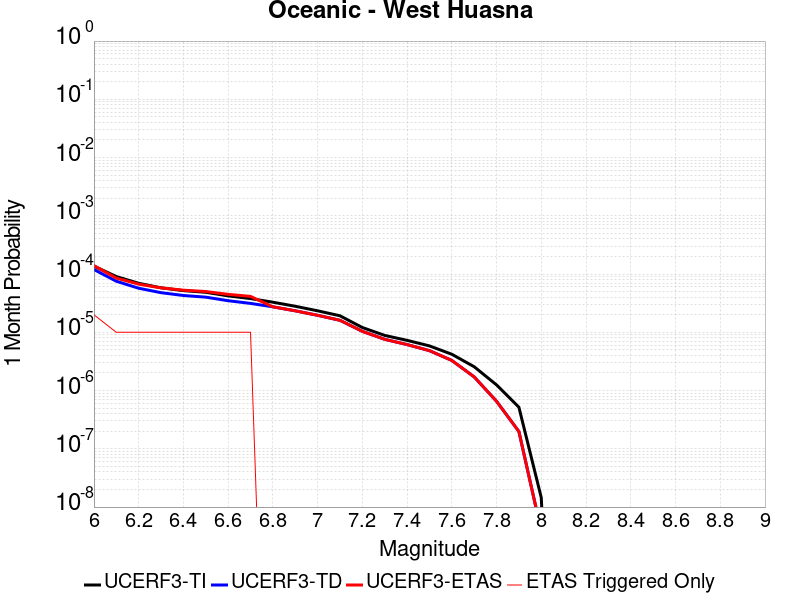 |  | 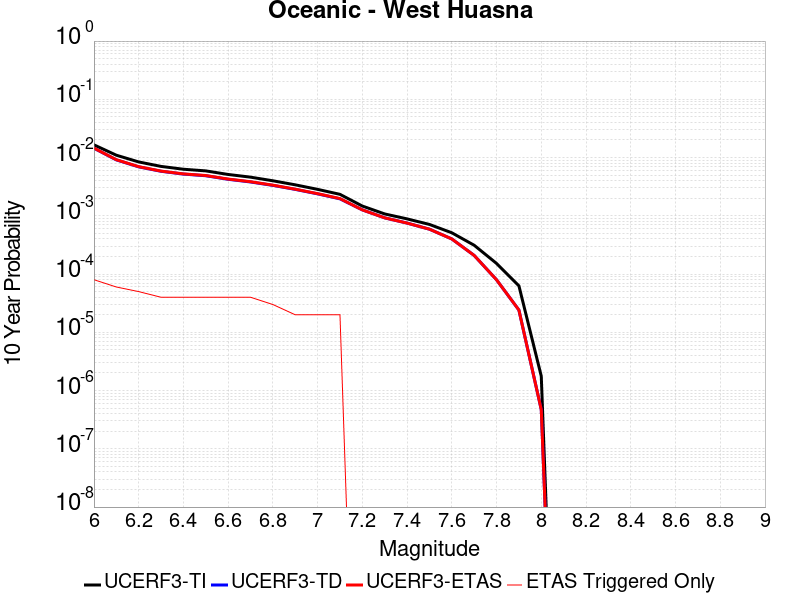 |

| Magnitude | 1 wk TI Prob | 1 wk TD Prob | 1 wk ETAS Prob | 1 wk ETAS/TD Gain | 1 wk ETAS Triggered Only | 1 mo TI Prob | 1 mo TD Prob | 1 mo ETAS Prob | 1 mo ETAS/TD Gain | 1 mo ETAS Triggered Only | 1 yr TI Prob | 1 yr TD Prob | 1 yr ETAS Prob | 1 yr ETAS/TD Gain | 1 yr ETAS Triggered Only | 10 yr TI Prob | 10 yr TD Prob | 10 yr ETAS Prob | 10 yr ETAS/TD Gain | 10 yr ETAS Triggered Only |
|-----|-----|-----|-----|-----|-----|-----|-----|-----|-----|-----|-----|-----|-----|-----|-----|-----|-----|-----|-----|-----|
| 6.0 | 3.195567E-5 | 2.7926391E-5 | 2.7926391E-5 | 1.0 | 0.0 | 1.3694567E-4 | 1.1967928E-4 | 1.396769E-4 | 1.1670933 | 2.0E-5 | 0.0016660384 | 0.0014561645 | 0.0015060917 | 1.0342867 | 5.0E-5 | 0.016536033 | 0.014470782 | 0.014549624 | 1.0054483 | 8.0E-5 |
| 6.1 | 2.1156782E-5 | 1.757313E-5 | 1.757313E-5 | 1.0 | 0.0 | 9.066878E-5 | 7.531129E-5 | 8.531054E-5 | 1.1327722 | 1.0E-5 | 0.0011033333 | 9.1653864E-4 | 9.465111E-4 | 1.0327018 | 3.0E-5 | 0.010978713 | 0.009128593 | 0.009188046 | 1.0065128 | 6.0E-5 |
| 6.2 | 1.6195117E-5 | 1.3327236E-5 | 1.3327236E-5 | 1.0 | 0.0 | 6.9405796E-5 | 5.711549E-5 | 6.711492E-5 | 1.1750739 | 1.0E-5 | 8.44688E-4 | 6.951618E-4 | 7.251409E-4 | 1.0431254 | 3.0E-5 | 0.008414844 | 0.0069301664 | 0.00697982 | 1.0071648 | 5.0E-5 |
| 6.3 | 1.3559345E-5 | 1.117902E-5 | 1.117902E-5 | 1.0 | 0.0 | 5.811018E-5 | 4.7909212E-5 | 5.7908732E-5 | 1.2087182 | 1.0E-5 | 7.072618E-4 | 5.831395E-4 | 6.031278E-4 | 1.0342771 | 2.0E-5 | 0.0070501505 | 0.0058162115 | 0.005855979 | 1.0068374 | 4.0E-5 |
| 6.4 | 1.2120619E-5 | 1.0000879E-5 | 1.0000879E-5 | 1.0 | 0.0 | 5.1944477E-5 | 4.286021E-5 | 5.285978E-5 | 1.2333066 | 1.0E-5 | 6.322405E-4 | 5.216986E-4 | 5.416882E-4 | 1.0383164 | 2.0E-5 | 0.006304447 | 0.0052048066 | 0.0052445983 | 1.0076452 | 4.0E-5 |
| 6.5 | 1.13511915E-5 | 9.367383E-6 | 9.367383E-6 | 1.0 | 0.0 | 4.8647056E-5 | 4.0145314E-5 | 5.0144914E-5 | 1.2490851 | 1.0E-5 | 5.9211696E-4 | 4.8866E-4 | 5.0865026E-4 | 1.0409082 | 2.0E-5 | 0.0059054173 | 0.004875914 | 0.004915719 | 1.0081636 | 4.0E-5 |
| 6.6 | 9.850605E-6 | 8.13532E-6 | 8.13532E-6 | 1.0 | 0.0 | 4.2216197E-5 | 3.4865192E-5 | 4.4864842E-5 | 1.286809 | 1.0E-5 | 5.1386096E-4 | 4.2440125E-4 | 4.4439276E-4 | 1.0471052 | 2.0E-5 | 0.0051267436 | 0.00423594 | 0.0042757704 | 1.009403 | 4.0E-5 |
| 6.7 | 8.8558645E-6 | 7.318345E-6 | 7.318345E-6 | 1.0 | 0.0 | 3.7953152E-5 | 3.1363958E-5 | 4.1363644E-5 | 1.3188273 | 1.0E-5 | 4.6198163E-4 | 3.8178946E-4 | 4.0178184E-4 | 1.052365 | 2.0E-5 | 0.004610224 | 0.003811361 | 0.0038512086 | 1.0104549 | 4.0E-5 |
| 6.8 | 7.67136E-6 | 6.3916937E-6 | 6.3916937E-6 | 1.0 | 0.0 | 3.2876844E-5 | 2.7392685E-5 | 2.7392685E-5 | 1.0 | 0.0 | 4.0020206E-4 | 3.3345507E-4 | 3.434517E-4 | 1.029979 | 1.0E-5 | 0.003994821 | 0.003329568 | 0.0033594682 | 1.0089802 | 3.0E-5 |
| 6.9 | 6.534529E-6 | 5.458264E-6 | 5.458264E-6 | 1.0 | 0.0 | 2.8004823E-5 | 2.3392351E-5 | 2.3392351E-5 | 1.0 | 0.0 | 3.4090536E-4 | 2.8476477E-4 | 2.9476194E-4 | 1.0351067 | 1.0E-5 | 0.0034038287 | 0.0028440156 | 0.0028639587 | 1.0070124 | 2.0E-5 |
| 7.0 | 5.460525E-6 | 4.5699226E-6 | 4.5699226E-6 | 1.0 | 0.0 | 2.3402039E-5 | 1.9585237E-5 | 1.9585237E-5 | 1.0 | 0.0 | 2.8488258E-4 | 2.3842428E-4 | 2.484219E-4 | 1.041932 | 1.0E-5 | 0.0028451765 | 0.0023816987 | 0.0024016509 | 1.0083773 | 2.0E-5 |
| 7.1 | 4.4825083E-6 | 3.7524178E-6 | 3.7524178E-6 | 1.0 | 0.0 | 1.9210609E-5 | 1.6081693E-5 | 1.6081693E-5 | 1.0 | 0.0 | 2.3386406E-4 | 1.957771E-4 | 2.0577516E-4 | 1.0510685 | 1.0E-5 | 0.002336181 | 0.0019560582 | 0.0019760192 | 1.0102047 | 2.0E-5 |
| 7.2 | 2.821708E-6 | 2.4249432E-6 | 2.4249432E-6 | 1.0 | 0.0 | 1.2092979E-5 | 1.0392572E-5 | 1.0392572E-5 | 1.0 | 0.0 | 1.4722206E-4 | 1.2652222E-4 | 1.2652222E-4 | 1.0 | 0.0 | 0.0014712457 | 0.0012645044 | 0.0012645044 | 1.0 | 0.0 |
| 7.3 | 2.0644757E-6 | 1.7687522E-6 | 1.7687522E-6 | 1.0 | 0.0 | 8.847723E-6 | 7.5803446E-6 | 7.5803446E-6 | 1.0 | 0.0 | 1.0771569E-4 | 9.2286784E-5 | 9.2286784E-5 | 1.0 | 0.0 | 0.001076635 | 9.2248636E-4 | 9.2248636E-4 | 1.0 | 0.0 |
| 7.4 | 1.6980367E-6 | 1.4379985E-6 | 1.4379985E-6 | 1.0 | 0.0 | 7.27728E-6 | 6.1628366E-6 | 6.1628366E-6 | 1.0 | 0.0 | 8.8597284E-5 | 7.502995E-5 | 7.502995E-5 | 1.0 | 0.0 | 8.8561967E-4 | 7.500478E-4 | 7.500478E-4 | 1.0 | 0.0 |
| 7.5 | 1.3637683E-6 | 1.1302715E-6 | 1.1302715E-6 | 1.0 | 0.0 | 5.844708E-6 | 4.8440115E-6 | 4.8440115E-6 | 1.0 | 0.0 | 7.1156996E-5 | 5.8974245E-5 | 5.8974245E-5 | 1.0 | 0.0 | 7.1134215E-4 | 5.8958743E-4 | 5.8958743E-4 | 1.0 | 0.0 |
| 7.6 | 9.802994E-7 | 7.6773017E-7 | 7.6773017E-7 | 1.0 | 0.0 | 4.2012766E-6 | 3.2902678E-6 | 3.2902678E-6 | 1.0 | 0.0 | 5.1149345E-5 | 4.0058276E-5 | 4.0058276E-5 | 1.0 | 0.0 | 5.113757E-4 | 4.0051196E-4 | 4.0051196E-4 | 1.0 | 0.0 |
| 7.7 | 5.986191E-7 | 4.005086E-7 | 4.005086E-7 | 1.0 | 0.0 | 2.5655079E-6 | 1.7164643E-6 | 1.7164643E-6 | 1.0 | 0.0 | 3.1234613E-5 | 2.0897753E-5 | 2.0897753E-5 | 1.0 | 0.0 | 3.123022E-4 | 2.0895919E-4 | 2.0895919E-4 | 1.0 | 0.0 |
| 7.8 | 2.9189815E-7 | 1.5285337E-7 | 1.5285337E-7 | 1.0 | 0.0 | 1.2509914E-6 | 6.550857E-7 | 6.550857E-7 | 1.0 | 0.0 | 1.5230714E-5 | 7.975639E-6 | 7.975639E-6 | 1.0 | 0.0 | 1.522967E-4 | 7.9754805E-5 | 7.9754805E-5 | 1.0 | 0.0 |
| 7.9 | 1.2057845E-7 | 4.620874E-8 | 4.620874E-8 | 1.0 | 0.0 | 5.1676466E-7 | 1.9803744E-7 | 1.9803744E-7 | 1.0 | 0.0 | 6.2915915E-6 | 2.411103E-6 | 2.411103E-6 | 1.0 | 0.0 | 6.2914136E-5 | 2.4112038E-5 | 2.4112038E-5 | 1.0 | 0.0 |
| 8.0 | 3.3806387E-9 | 9.009721E-10 | 9.009721E-10 | 1.0 | 0.0 | 1.4488451E-8 | 3.861309E-9 | 3.861309E-9 | 1.0 | 0.0 | 1.7639688E-7 | 4.7011437E-8 | 4.7011437E-8 | 1.0 | 0.0 | 1.7639674E-6 | 4.7119124E-7 | 4.7119124E-7 | 1.0 | 0.0 |

## San Jacinto (San Bernardino)
*[(top)](#table-of-contents)*

| 1 Week | 1 Month | 1 Year | 10 Year |
|-----|-----|-----|-----|
| 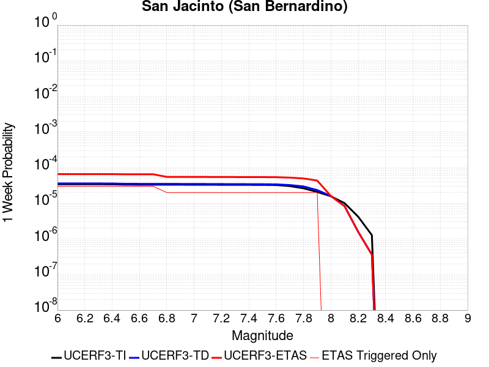 |  | 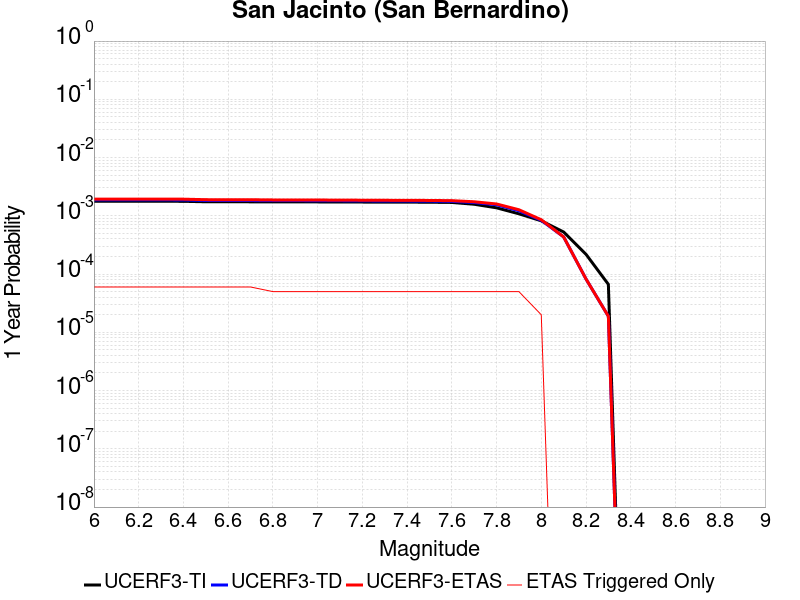 | 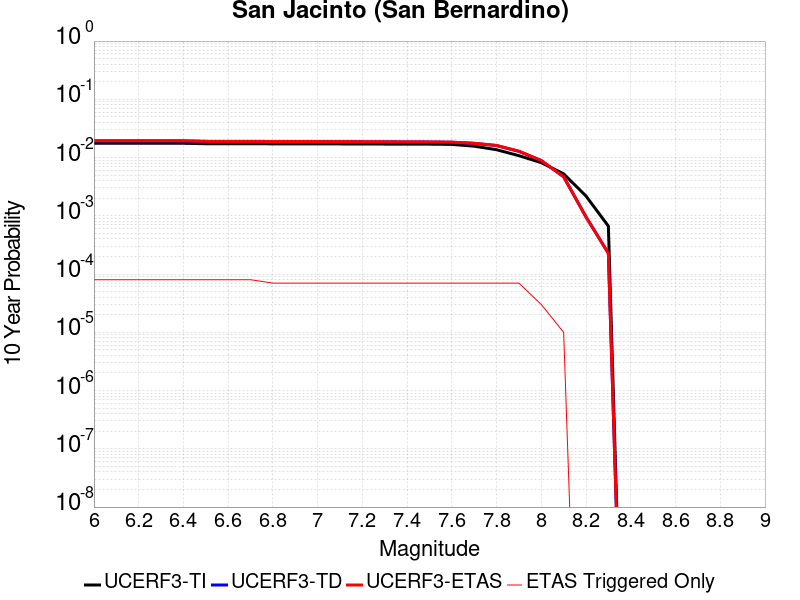 |

| Magnitude | 1 wk TI Prob | 1 wk TD Prob | 1 wk ETAS Prob | 1 wk ETAS/TD Gain | 1 wk ETAS Triggered Only | 1 mo TI Prob | 1 mo TD Prob | 1 mo ETAS Prob | 1 mo ETAS/TD Gain | 1 mo ETAS Triggered Only | 1 yr TI Prob | 1 yr TD Prob | 1 yr ETAS Prob | 1 yr ETAS/TD Gain | 1 yr ETAS Triggered Only | 10 yr TI Prob | 10 yr TD Prob | 10 yr ETAS Prob | 10 yr ETAS/TD Gain | 10 yr ETAS Triggered Only |
|-----|-----|-----|-----|-----|-----|-----|-----|-----|-----|-----|-----|-----|-----|-----|-----|-----|-----|-----|-----|-----|
| 6.0 | 3.409352E-5 | 3.5987265E-5 | 6.598618E-5 | 1.8335983 | 3.0E-5 | 1.461069E-4 | 1.5422203E-4 | 1.9421586E-4 | 1.2593263 | 4.0E-5 | 0.0017774 | 0.0018760377 | 0.0019359252 | 1.0319223 | 6.0E-5 | 0.01763251 | 0.019350618 | 0.01942907 | 1.0040542 | 8.0E-5 |
| 6.1 | 3.409352E-5 | 3.5987265E-5 | 6.598618E-5 | 1.8335983 | 3.0E-5 | 1.461069E-4 | 1.5422203E-4 | 1.9421586E-4 | 1.2593263 | 4.0E-5 | 0.0017774 | 0.0018760377 | 0.0019359252 | 1.0319223 | 6.0E-5 | 0.01763251 | 0.019350618 | 0.01942907 | 1.0040542 | 8.0E-5 |
| 6.2 | 3.409352E-5 | 3.5987265E-5 | 6.598618E-5 | 1.8335983 | 3.0E-5 | 1.461069E-4 | 1.5422203E-4 | 1.9421586E-4 | 1.2593263 | 4.0E-5 | 0.0017774 | 0.0018760377 | 0.0019359252 | 1.0319223 | 6.0E-5 | 0.01763251 | 0.019350618 | 0.01942907 | 1.0040542 | 8.0E-5 |
| 6.3 | 3.409352E-5 | 3.5987265E-5 | 6.598618E-5 | 1.8335983 | 3.0E-5 | 1.461069E-4 | 1.5422203E-4 | 1.9421586E-4 | 1.2593263 | 4.0E-5 | 0.0017774 | 0.0018760377 | 0.0019359252 | 1.0319223 | 6.0E-5 | 0.01763251 | 0.019350618 | 0.01942907 | 1.0040542 | 8.0E-5 |
| 6.4 | 3.400795E-5 | 3.587993E-5 | 6.5878856E-5 | 1.8360921 | 3.0E-5 | 1.4574021E-4 | 1.5376207E-4 | 1.9375591E-4 | 1.2601022 | 4.0E-5 | 0.0017729428 | 0.0018704475 | 0.0019303353 | 1.0320178 | 6.0E-5 | 0.017588645 | 0.0192957 | 0.019374156 | 1.004066 | 8.0E-5 |
| 6.5 | 3.341482E-5 | 3.5140558E-5 | 6.51395E-5 | 1.8536844 | 3.0E-5 | 1.4319851E-4 | 1.505937E-4 | 1.9058767E-4 | 1.2655754 | 4.0E-5 | 0.0017420477 | 0.0018319378 | 0.0018918279 | 1.0326922 | 6.0E-5 | 0.017284546 | 0.01891724 | 0.018995728 | 1.004149 | 8.0E-5 |
| 6.6 | 3.3364955E-5 | 3.5077774E-5 | 6.5076725E-5 | 1.8552125 | 3.0E-5 | 1.4298483E-4 | 1.5032466E-4 | 1.9031865E-4 | 1.2660507 | 4.0E-5 | 0.0017394501 | 0.0018286678 | 0.0018885582 | 1.0327507 | 6.0E-5 | 0.017258976 | 0.018885106 | 0.018963594 | 1.0041561 | 8.0E-5 |
| 6.7 | 3.335922E-5 | 3.5067547E-5 | 6.5066495E-5 | 1.8554618 | 3.0E-5 | 1.4296026E-4 | 1.5028084E-4 | 1.9027483E-4 | 1.2661283 | 4.0E-5 | 0.0017391514 | 0.0018281352 | 0.0018880256 | 1.0327604 | 6.0E-5 | 0.017256035 | 0.018879896 | 0.018958386 | 1.0041573 | 8.0E-5 |
| 6.8 | 3.327683E-5 | 3.4961613E-5 | 5.4960914E-5 | 1.572036 | 2.0E-5 | 1.4260718E-4 | 1.498269E-4 | 1.798224E-4 | 1.200201 | 3.0E-5 | 0.0017348597 | 0.0018226176 | 0.0018725265 | 1.0273831 | 5.0E-5 | 0.017213784 | 0.018825669 | 0.01889435 | 1.0036483 | 7.0E-5 |
| 6.9 | 3.3235785E-5 | 3.490257E-5 | 5.490187E-5 | 1.5730038 | 2.0E-5 | 1.4243131E-4 | 1.4957387E-4 | 1.7956938E-4 | 1.2005398 | 3.0E-5 | 0.0017327217 | 0.0018195421 | 0.0018694511 | 1.0274295 | 5.0E-5 | 0.017192734 | 0.018795537 | 0.01886422 | 1.0036542 | 7.0E-5 |
| 7.0 | 3.3197095E-5 | 3.48425E-5 | 5.48418E-5 | 1.5739917 | 2.0E-5 | 1.422655E-4 | 1.4931645E-4 | 1.7931197E-4 | 1.2008855 | 3.0E-5 | 0.0017307063 | 0.0018164134 | 0.0018663225 | 1.0274768 | 5.0E-5 | 0.017172894 | 0.018764915 | 0.0188336 | 1.0036603 | 7.0E-5 |
| 7.1 | 3.3129716E-5 | 3.4722703E-5 | 5.472201E-5 | 1.575972 | 2.0E-5 | 1.4197677E-4 | 1.4880311E-4 | 1.7879865E-4 | 1.2015787 | 3.0E-5 | 0.0017271966 | 0.0018101739 | 0.0018600833 | 1.0275717 | 5.0E-5 | 0.017138338 | 0.018703993 | 0.018772684 | 1.0036725 | 7.0E-5 |
| 7.2 | 3.3034008E-5 | 3.459015E-5 | 5.4589458E-5 | 1.5781792 | 2.0E-5 | 1.4156665E-4 | 1.4823509E-4 | 1.7823064E-4 | 1.2023512 | 3.0E-5 | 0.0017222111 | 0.0018032697 | 0.0018531795 | 1.0276774 | 5.0E-5 | 0.017089253 | 0.018636376 | 0.018705072 | 1.0036861 | 7.0E-5 |
| 7.3 | 3.2956614E-5 | 3.4457906E-5 | 5.4457218E-5 | 1.5803983 | 2.0E-5 | 1.4123498E-4 | 1.4766838E-4 | 1.7766395E-4 | 1.2031279 | 3.0E-5 | 0.0017181796 | 0.0017963814 | 0.0018462916 | 1.0277838 | 5.0E-5 | 0.017049557 | 0.01856912 | 0.01863782 | 1.0036997 | 7.0E-5 |
| 7.4 | 3.2915937E-5 | 3.43796E-5 | 5.437891E-5 | 1.5817204 | 2.0E-5 | 1.4106068E-4 | 1.4733282E-4 | 1.773284E-4 | 1.2035906 | 3.0E-5 | 0.0017160608 | 0.0017923026 | 0.001842213 | 1.027847 | 5.0E-5 | 0.017028693 | 0.01852939 | 0.018598095 | 1.0037078 | 7.0E-5 |
| 7.5 | 3.281791E-5 | 3.4244506E-5 | 5.424382E-5 | 1.5840153 | 2.0E-5 | 1.406406E-4 | 1.4675393E-4 | 1.7674953E-4 | 1.2043939 | 3.0E-5 | 0.0017109542 | 0.0017852662 | 0.001835177 | 1.0279571 | 5.0E-5 | 0.016978411 | 0.018460272 | 0.018528981 | 1.003722 | 7.0E-5 |
| 7.6 | 3.2521442E-5 | 3.3969452E-5 | 5.3968775E-5 | 1.5887443 | 2.0E-5 | 1.3937015E-4 | 1.4557526E-4 | 1.755709E-4 | 1.206049 | 3.0E-5 | 0.0016955109 | 0.0017709393 | 0.0018208508 | 1.0281836 | 5.0E-5 | 0.016826328 | 0.018317914 | 0.01838663 | 1.0037514 | 7.0E-5 |
| 7.7 | 3.0287873E-5 | 3.245354E-5 | 5.245289E-5 | 1.6162456 | 2.0E-5 | 1.297987E-4 | 1.3907919E-4 | 1.6907502E-4 | 1.2156744 | 3.0E-5 | 0.0015791537 | 0.001691975 | 0.0017418904 | 1.0295013 | 5.0E-5 | 0.01567979 | 0.017528756 | 0.017597528 | 1.0039234 | 7.0E-5 |
| 7.8 | 2.6316151E-5 | 2.966443E-5 | 4.9663835E-5 | 1.6741881 | 2.0E-5 | 1.1277862E-4 | 1.2712707E-4 | 1.5712327E-4 | 1.2359543 | 3.0E-5 | 0.0013722149 | 0.0015466743 | 0.0015965969 | 1.0322775 | 5.0E-5 | 0.013637724 | 0.016070386 | 0.016139261 | 1.0042858 | 7.0E-5 |
| 7.9 | 2.0761147E-5 | 2.3418645E-5 | 4.3418175E-5 | 1.8540004 | 2.0E-5 | 8.897331E-5 | 1.0036176E-4 | 1.3035875E-4 | 1.2988887 | 3.0E-5 | 0.0010827117 | 0.0012212204 | 0.0012711593 | 1.0408926 | 5.0E-5 | 0.010774517 | 0.012793707 | 0.012862812 | 1.0054015 | 7.0E-5 |
| 8.0 | 1.5738568E-5 | 1.6033422E-5 | 1.6033422E-5 | 1.0 | 0.0 | 6.744926E-5 | 6.871286E-5 | 7.8712175E-5 | 1.1455232 | 1.0E-5 | 8.2088535E-4 | 8.3625864E-4 | 8.562419E-4 | 1.0238961 | 2.0E-5 | 0.008178596 | 0.008866016 | 0.00889575 | 1.0033537 | 3.0E-5 |
| 8.1 | 1.0105832E-5 | 8.329996E-6 | 8.329996E-6 | 1.0 | 0.0 | 4.3309992E-5 | 3.5699497E-5 | 3.5699497E-5 | 1.0 | 0.0 | 5.2717153E-4 | 4.345552E-4 | 4.345552E-4 | 1.0 | 0.0 | 0.005259227 | 0.0046770144 | 0.0046869675 | 1.0021281 | 1.0E-5 |
| 8.2 | 4.189207E-6 | 1.5778486E-6 | 1.5778486E-6 | 1.0 | 0.0 | 1.7953622E-5 | 6.762191E-6 | 6.762191E-6 | 1.0 | 0.0 | 2.1856341E-4 | 8.2326595E-5 | 8.2326595E-5 | 1.0 | 0.0 | 0.0021834858 | 9.5634896E-4 | 9.5634896E-4 | 1.0 | 0.0 |
| 8.3 | 1.2758221E-6 | 3.613034E-7 | 3.613034E-7 | 1.0 | 0.0 | 5.4677976E-6 | 1.5484422E-6 | 1.5484422E-6 | 1.0 | 0.0 | 6.65684E-5 | 1.8852126E-5 | 1.8852126E-5 | 1.0 | 0.0 | 6.6548464E-4 | 2.274264E-4 | 2.274264E-4 | 1.0 | 0.0 |

## Blue Cut
*[(top)](#table-of-contents)*

| 1 Week | 1 Month | 1 Year | 10 Year |
|-----|-----|-----|-----|
|  |  |  |  |

| Magnitude | 1 wk TI Prob | 1 wk TD Prob | 1 wk ETAS Prob | 1 wk ETAS/TD Gain | 1 wk ETAS Triggered Only | 1 mo TI Prob | 1 mo TD Prob | 1 mo ETAS Prob | 1 mo ETAS/TD Gain | 1 mo ETAS Triggered Only | 1 yr TI Prob | 1 yr TD Prob | 1 yr ETAS Prob | 1 yr ETAS/TD Gain | 1 yr ETAS Triggered Only | 10 yr TI Prob | 10 yr TD Prob | 10 yr ETAS Prob | 10 yr ETAS/TD Gain | 10 yr ETAS Triggered Only |
|-----|-----|-----|-----|-----|-----|-----|-----|-----|-----|-----|-----|-----|-----|-----|-----|-----|-----|-----|-----|-----|
| 6.0 | 2.1227985E-5 | 2.2719594E-5 | 2.2719594E-5 | 1.0 | 0.0 | 9.097391E-5 | 9.7366385E-5 | 1.17364434E-4 | 1.2053897 | 2.0E-5 | 0.0011070445 | 0.0011848492 | 0.0012347898 | 1.0421494 | 5.0E-5 | 0.011015458 | 0.011791162 | 0.011870218 | 1.0067047 | 8.0E-5 |
| 6.1 | 2.1227985E-5 | 2.2719594E-5 | 2.2719594E-5 | 1.0 | 0.0 | 9.097391E-5 | 9.7366385E-5 | 1.17364434E-4 | 1.2053897 | 2.0E-5 | 0.0011070445 | 0.0011848492 | 0.0012347898 | 1.0421494 | 5.0E-5 | 0.011015458 | 0.011791162 | 0.011870218 | 1.0067047 | 8.0E-5 |
| 6.2 | 2.1227985E-5 | 2.2719594E-5 | 2.2719594E-5 | 1.0 | 0.0 | 9.097391E-5 | 9.7366385E-5 | 1.17364434E-4 | 1.2053897 | 2.0E-5 | 0.0011070445 | 0.0011848492 | 0.0012347898 | 1.0421494 | 5.0E-5 | 0.011015458 | 0.011791162 | 0.011870218 | 1.0067047 | 8.0E-5 |
| 6.3 | 1.1613981E-5 | 1.2353552E-5 | 1.2353552E-5 | 1.0 | 0.0 | 4.9773254E-5 | 5.294279E-5 | 6.294226E-5 | 1.1888732 | 1.0E-5 | 6.0582085E-4 | 6.4440025E-4 | 6.6438736E-4 | 1.0310166 | 2.0E-5 | 0.0060417196 | 0.0064265644 | 0.006466307 | 1.0061842 | 4.0E-5 |
| 6.4 | 1.1613981E-5 | 1.2353552E-5 | 1.2353552E-5 | 1.0 | 0.0 | 4.9773254E-5 | 5.294279E-5 | 6.294226E-5 | 1.1888732 | 1.0E-5 | 6.0582085E-4 | 6.4440025E-4 | 6.6438736E-4 | 1.0310166 | 2.0E-5 | 0.0060417196 | 0.0064265644 | 0.006466307 | 1.0061842 | 4.0E-5 |
| 6.5 | 8.931326E-6 | 9.481607E-6 | 9.481607E-6 | 1.0 | 0.0 | 3.8276554E-5 | 4.0634877E-5 | 4.0634877E-5 | 1.0 | 0.0 | 4.6591737E-4 | 4.9462647E-4 | 5.0462154E-4 | 1.0202073 | 1.0E-5 | 0.0046494175 | 0.0049361647 | 0.004966017 | 1.0060476 | 3.0E-5 |
| 6.6 | 7.345353E-6 | 7.790285E-6 | 7.790285E-6 | 1.0 | 0.0 | 3.1479703E-5 | 3.3386554E-5 | 3.3386554E-5 | 1.0 | 0.0 | 3.83198E-4 | 4.0641348E-4 | 4.0641348E-4 | 1.0 | 0.0 | 0.0038253788 | 0.004057494 | 0.004067453 | 1.0024545 | 1.0E-5 |
| 6.7 | 6.2775666E-6 | 6.655154E-6 | 6.655154E-6 | 1.0 | 0.0 | 2.690358E-5 | 2.852182E-5 | 2.852182E-5 | 1.0 | 0.0 | 3.2750185E-4 | 3.4720535E-4 | 3.4720535E-4 | 1.0 | 0.0 | 0.0032701963 | 0.0034673696 | 0.003477335 | 1.002874 | 1.0E-5 |
| 6.8 | 5.5234095E-6 | 5.8551154E-6 | 5.8551154E-6 | 1.0 | 0.0 | 2.367154E-5 | 2.5093152E-5 | 2.5093152E-5 | 1.0 | 0.0 | 2.8816288E-4 | 3.0547357E-4 | 3.0547357E-4 | 1.0 | 0.0 | 0.002877895 | 0.0030512528 | 0.0030612224 | 1.0032673 | 1.0E-5 |
| 6.9 | 4.7780054E-6 | 5.0654244E-6 | 5.0654244E-6 | 1.0 | 0.0 | 2.0477004E-5 | 2.170882E-5 | 2.170882E-5 | 1.0 | 0.0 | 2.4927902E-4 | 2.6427986E-4 | 2.6427986E-4 | 1.0 | 0.0 | 0.0024899957 | 0.0026403482 | 0.0026403482 | 1.0 | 0.0 |
| 7.0 | 3.883171E-6 | 4.1184903E-6 | 4.1184903E-6 | 1.0 | 0.0 | 1.6642054E-5 | 1.7650591E-5 | 1.7650591E-5 | 1.0 | 0.0 | 2.0259817E-4 | 2.1488166E-4 | 2.1488166E-4 | 1.0 | 0.0 | 0.0020241356 | 0.0021474145 | 0.0021474145 | 1.0 | 0.0 |
| 7.1 | 2.8358215E-6 | 3.009718E-6 | 3.009718E-6 | 1.0 | 0.0 | 1.2153464E-5 | 1.2898766E-5 | 1.2898766E-5 | 1.0 | 0.0 | 1.4795837E-4 | 1.5703774E-4 | 1.5703774E-4 | 1.0 | 0.0 | 0.001478599 | 0.0015699128 | 0.0015699128 | 1.0 | 0.0 |

## Lost Hills
*[(top)](#table-of-contents)*

| 1 Week | 1 Month | 1 Year | 10 Year |
|-----|-----|-----|-----|
| 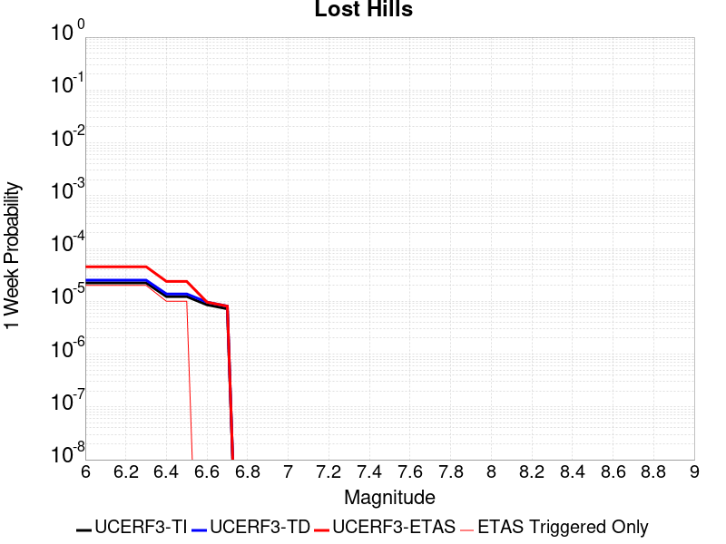 | 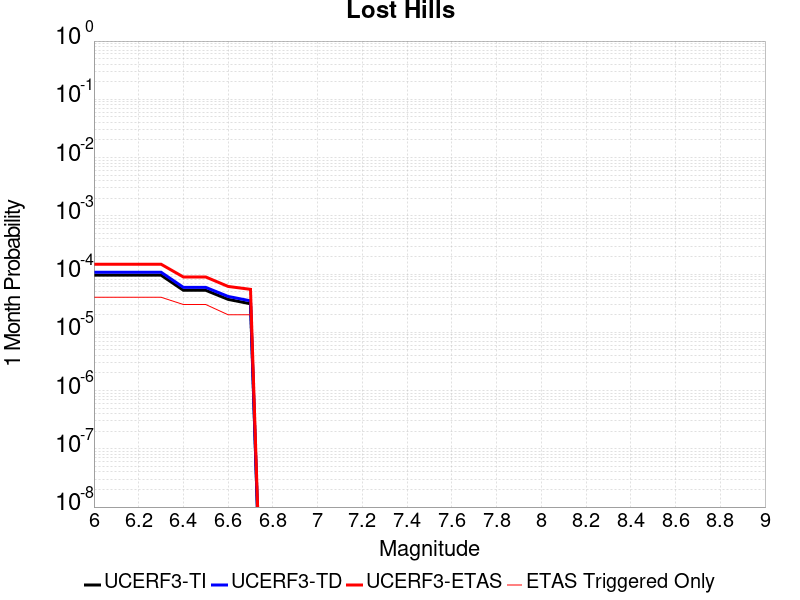 |  |  |

| Magnitude | 1 wk TI Prob | 1 wk TD Prob | 1 wk ETAS Prob | 1 wk ETAS/TD Gain | 1 wk ETAS Triggered Only | 1 mo TI Prob | 1 mo TD Prob | 1 mo ETAS Prob | 1 mo ETAS/TD Gain | 1 mo ETAS Triggered Only | 1 yr TI Prob | 1 yr TD Prob | 1 yr ETAS Prob | 1 yr ETAS/TD Gain | 1 yr ETAS Triggered Only | 10 yr TI Prob | 10 yr TD Prob | 10 yr ETAS Prob | 10 yr ETAS/TD Gain | 10 yr ETAS Triggered Only |
|-----|-----|-----|-----|-----|-----|-----|-----|-----|-----|-----|-----|-----|-----|-----|-----|-----|-----|-----|-----|-----|
| 6.0 | 2.233523E-5 | 2.5106621E-5 | 4.510612E-5 | 1.7965826 | 2.0E-5 | 9.571891E-5 | 1.07596316E-4 | 1.4759201E-4 | 1.37172 | 4.0E-5 | 0.0011647546 | 0.0013093661 | 0.0013692875 | 1.0457637 | 6.0E-5 | 0.011586686 | 0.013033111 | 0.013112068 | 1.0060582 | 8.0E-5 |
| 6.1 | 2.233523E-5 | 2.5106621E-5 | 4.510612E-5 | 1.7965826 | 2.0E-5 | 9.571891E-5 | 1.07596316E-4 | 1.4759201E-4 | 1.37172 | 4.0E-5 | 0.0011647546 | 0.0013093661 | 0.0013692875 | 1.0457637 | 6.0E-5 | 0.011586686 | 0.013033111 | 0.013112068 | 1.0060582 | 8.0E-5 |
| 6.2 | 2.233523E-5 | 2.5106621E-5 | 4.510612E-5 | 1.7965826 | 2.0E-5 | 9.571891E-5 | 1.07596316E-4 | 1.4759201E-4 | 1.37172 | 4.0E-5 | 0.0011647546 | 0.0013093661 | 0.0013692875 | 1.0457637 | 6.0E-5 | 0.011586686 | 0.013033111 | 0.013112068 | 1.0060582 | 8.0E-5 |
| 6.3 | 2.233523E-5 | 2.5106621E-5 | 4.510612E-5 | 1.7965826 | 2.0E-5 | 9.571891E-5 | 1.07596316E-4 | 1.4759201E-4 | 1.37172 | 4.0E-5 | 0.0011647546 | 0.0013093661 | 0.0013692875 | 1.0457637 | 6.0E-5 | 0.011586686 | 0.013033111 | 0.013112068 | 1.0060582 | 8.0E-5 |
| 6.4 | 1.2288092E-5 | 1.37811285E-5 | 2.378099E-5 | 1.72562 | 1.0E-5 | 5.2662188E-5 | 5.906117E-5 | 8.9059395E-5 | 1.507918 | 3.0E-5 | 6.409735E-4 | 7.189263E-4 | 7.588976E-4 | 1.0555985 | 4.0E-5 | 0.006391279 | 0.0071752113 | 0.007234781 | 1.0083021 | 6.0E-5 |
| 6.5 | 1.2288092E-5 | 1.37811285E-5 | 2.378099E-5 | 1.72562 | 1.0E-5 | 5.2662188E-5 | 5.906117E-5 | 8.9059395E-5 | 1.507918 | 3.0E-5 | 6.409735E-4 | 7.189263E-4 | 7.588976E-4 | 1.0555985 | 4.0E-5 | 0.006391279 | 0.0071752113 | 0.007234781 | 1.0083021 | 6.0E-5 |
| 6.6 | 8.58281E-6 | 9.633784E-6 | 9.633784E-6 | 1.0 | 0.0 | 3.6782953E-5 | 4.1287465E-5 | 6.1286635E-5 | 1.4843886 | 2.0E-5 | 4.4774043E-4 | 5.026421E-4 | 5.3262705E-4 | 1.0596546 | 3.0E-5 | 0.0044683935 | 0.0050232126 | 0.005063012 | 1.007923 | 4.0E-5 |
| 6.7 | 7.205685E-6 | 8.088314E-6 | 8.088314E-6 | 1.0 | 0.0 | 3.088114E-5 | 3.46642E-5 | 5.466351E-5 | 1.5769441 | 2.0E-5 | 3.7591302E-4 | 4.2203668E-4 | 4.4202822E-4 | 1.0473692 | 2.0E-5 | 0.0037527776 | 0.0042203665 | 0.00425024 | 1.0070784 | 3.0E-5 |

## Chino alt 1
*[(top)](#table-of-contents)*

| 1 Week | 1 Month | 1 Year | 10 Year |
|-----|-----|-----|-----|
|  |  | 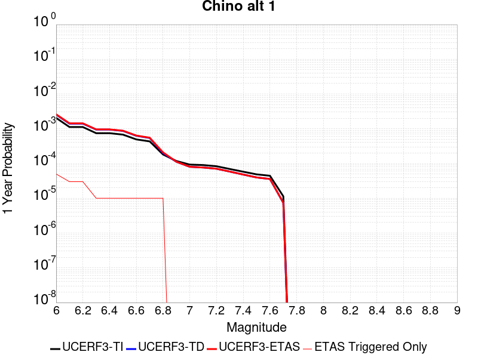 | 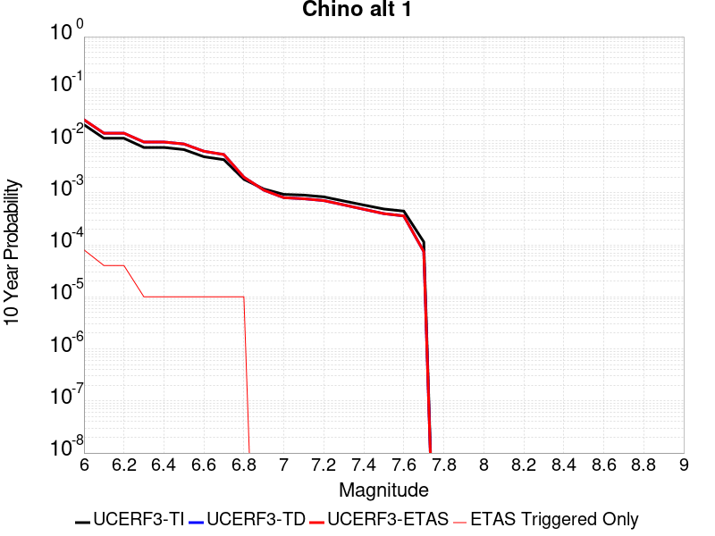 |

| Magnitude | 1 wk TI Prob | 1 wk TD Prob | 1 wk ETAS Prob | 1 wk ETAS/TD Gain | 1 wk ETAS Triggered Only | 1 mo TI Prob | 1 mo TD Prob | 1 mo ETAS Prob | 1 mo ETAS/TD Gain | 1 mo ETAS Triggered Only | 1 yr TI Prob | 1 yr TD Prob | 1 yr ETAS Prob | 1 yr ETAS/TD Gain | 1 yr ETAS Triggered Only | 10 yr TI Prob | 10 yr TD Prob | 10 yr ETAS Prob | 10 yr ETAS/TD Gain | 10 yr ETAS Triggered Only |
|-----|-----|-----|-----|-----|-----|-----|-----|-----|-----|-----|-----|-----|-----|-----|-----|-----|-----|-----|-----|-----|
| 6.0 | 3.939946E-5 | 4.8948128E-5 | 5.894764E-5 | 1.2042879 | 1.0E-5 | 1.6884391E-4 | 2.0976376E-4 | 2.2975956E-4 | 1.0953254 | 2.0E-5 | 0.0020537362 | 0.0025513927 | 0.0026012652 | 1.0195471 | 5.0E-5 | 0.020348595 | 0.025279913 | 0.02535789 | 1.0030845 | 8.0E-5 |
| 6.1 | 2.1505624E-5 | 2.6878906E-5 | 3.687864E-5 | 1.372029 | 1.0E-5 | 9.2163704E-5 | 1.1519086E-4 | 1.251897E-4 | 1.0868025 | 1.0E-5 | 0.0011215154 | 0.001401656 | 0.0014316139 | 1.0213733 | 3.0E-5 | 0.011158722 | 0.013947135 | 0.013986576 | 1.002828 | 4.0E-5 |
| 6.2 | 2.1505624E-5 | 2.6878906E-5 | 3.687864E-5 | 1.372029 | 1.0E-5 | 9.2163704E-5 | 1.1519086E-4 | 1.251897E-4 | 1.0868025 | 1.0E-5 | 0.0011215154 | 0.001401656 | 0.0014316139 | 1.0213733 | 3.0E-5 | 0.011158722 | 0.013947135 | 0.013986576 | 1.002828 | 4.0E-5 |
| 6.3 | 1.4290785E-5 | 1.8164894E-5 | 1.8164894E-5 | 1.0 | 0.0 | 6.1244784E-5 | 7.784748E-5 | 7.784748E-5 | 1.0 | 0.0 | 7.454001E-4 | 9.4742613E-4 | 9.5741666E-4 | 1.0105449 | 1.0E-5 | 0.007429048 | 0.009446437 | 0.009456342 | 1.0010486 | 1.0E-5 |
| 6.4 | 1.4290785E-5 | 1.8164894E-5 | 1.8164894E-5 | 1.0 | 0.0 | 6.1244784E-5 | 7.784748E-5 | 7.784748E-5 | 1.0 | 0.0 | 7.454001E-4 | 9.4742613E-4 | 9.5741666E-4 | 1.0105449 | 1.0E-5 | 0.007429048 | 0.009446437 | 0.009456342 | 1.0010486 | 1.0E-5 |
| 6.5 | 1.3017944E-5 | 1.6651851E-5 | 1.6651851E-5 | 1.0 | 0.0 | 5.5789995E-5 | 7.136337E-5 | 7.136337E-5 | 1.0 | 0.0 | 6.790315E-4 | 8.6854637E-4 | 8.785377E-4 | 1.0115035 | 1.0E-5 | 0.0067696036 | 0.008663927 | 0.00867384 | 1.0011442 | 1.0E-5 |
| 6.6 | 9.470016E-6 | 1.2039233E-5 | 1.2039233E-5 | 1.0 | 0.0 | 4.058515E-5 | 5.1595885E-5 | 5.1595885E-5 | 1.0 | 0.0 | 4.940122E-4 | 6.280328E-4 | 6.380265E-4 | 1.0159128 | 1.0E-5 | 0.004929154 | 0.006273236 | 0.0062831733 | 1.001584 | 1.0E-5 |
| 6.7 | 8.314155E-6 | 1.0407502E-5 | 1.0407502E-5 | 1.0 | 0.0 | 3.5631605E-5 | 4.4602995E-5 | 4.4602995E-5 | 1.0 | 0.0 | 4.3372845E-4 | 5.429384E-4 | 5.5293296E-4 | 1.0184083 | 1.0E-5 | 0.004328829 | 0.005427145 | 0.0054370905 | 1.0018326 | 1.0E-5 |
| 6.8 | 3.4856364E-6 | 3.8134133E-6 | 3.8134133E-6 | 1.0 | 0.0 | 1.4938357E-5 | 1.6343109E-5 | 1.6343109E-5 | 1.0 | 0.0 | 1.8185932E-4 | 1.9896126E-4 | 2.0895927E-4 | 1.050251 | 1.0E-5 | 0.0018171056 | 0.001989398 | 0.0019993782 | 1.0050167 | 1.0E-5 |
| 6.9 | 2.2645952E-6 | 2.1529154E-6 | 2.1529154E-6 | 1.0 | 0.0 | 9.705372E-6 | 9.226749E-6 | 9.226749E-6 | 1.0 | 0.0 | 1.18156495E-4 | 1.1233009E-4 | 1.1233009E-4 | 1.0 | 0.0 | 0.0011809369 | 0.0011233166 | 0.0011233166 | 1.0 | 0.0 |
| 7.0 | 1.7864003E-6 | 1.5430803E-6 | 1.5430803E-6 | 1.0 | 0.0 | 7.655979E-6 | 6.6131847E-6 | 6.6131847E-6 | 1.0 | 0.0 | 9.3207556E-5 | 8.051261E-5 | 8.051261E-5 | 1.0 | 0.0 | 9.316847E-4 | 8.052829E-4 | 8.052829E-4 | 1.0 | 0.0 |
| 7.1 | 1.7315456E-6 | 1.4733525E-6 | 1.4733525E-6 | 1.0 | 0.0 | 7.420889E-6 | 6.3143534E-6 | 6.3143534E-6 | 1.0 | 0.0 | 9.034557E-5 | 7.6874596E-5 | 7.6874596E-5 | 1.0 | 0.0 | 9.0308854E-4 | 7.689259E-4 | 7.689259E-4 | 1.0 | 0.0 |
| 7.2 | 1.6008337E-6 | 1.3574235E-6 | 1.3574235E-6 | 1.0 | 0.0 | 6.860698E-6 | 5.8175165E-6 | 5.8175165E-6 | 1.0 | 0.0 | 8.352579E-5 | 7.082601E-5 | 7.082601E-5 | 1.0 | 0.0 | 8.34944E-4 | 7.084656E-4 | 7.084656E-4 | 1.0 | 0.0 |
| 7.3 | 1.3320939E-6 | 1.1217846E-6 | 1.1217846E-6 | 1.0 | 0.0 | 5.7089615E-6 | 4.80764E-6 | 4.80764E-6 | 1.0 | 0.0 | 6.9504385E-5 | 5.8531492E-5 | 5.8531492E-5 | 1.0 | 0.0 | 6.9482654E-4 | 5.853078E-4 | 5.853078E-4 | 1.0 | 0.0 |
| 7.4 | 1.114294E-6 | 9.2371357E-7 | 9.2371357E-7 | 1.0 | 0.0 | 4.775537E-6 | 3.9587667E-6 | 3.9587667E-6 | 1.0 | 0.0 | 5.8140613E-5 | 4.8196955E-5 | 4.8196955E-5 | 1.0 | 0.0 | 5.81254E-4 | 4.8187736E-4 | 4.8187736E-4 | 1.0 | 0.0 |
| 7.5 | 9.354081E-7 | 7.623432E-7 | 7.623432E-7 | 1.0 | 0.0 | 4.0088858E-6 | 3.267181E-6 | 3.267181E-6 | 1.0 | 0.0 | 4.8807087E-5 | 3.977724E-5 | 3.977724E-5 | 1.0 | 0.0 | 4.879637E-4 | 3.9770457E-4 | 3.9770457E-4 | 1.0 | 0.0 |
| 7.6 | 8.521771E-7 | 6.880718E-7 | 6.880718E-7 | 1.0 | 0.0 | 3.6521824E-6 | 2.948876E-6 | 2.948876E-6 | 1.0 | 0.0 | 4.4464414E-5 | 3.5902005E-5 | 3.5902005E-5 | 1.0 | 0.0 | 4.4455516E-4 | 3.5896525E-4 | 3.5896525E-4 | 1.0 | 0.0 |
| 7.7 | 2.1803626E-7 | 1.4186374E-7 | 1.4186374E-7 | 1.0 | 0.0 | 9.344408E-7 | 6.079873E-7 | 6.079873E-7 | 1.0 | 0.0 | 1.1376757E-5 | 7.4022305E-6 | 7.4022305E-6 | 1.0 | 0.0 | 1.13761744E-4 | 7.40208E-5 | 7.40208E-5 | 1.0 | 0.0 |

## White Mountains
*[(top)](#table-of-contents)*

| 1 Week | 1 Month | 1 Year | 10 Year |
|-----|-----|-----|-----|
|  | 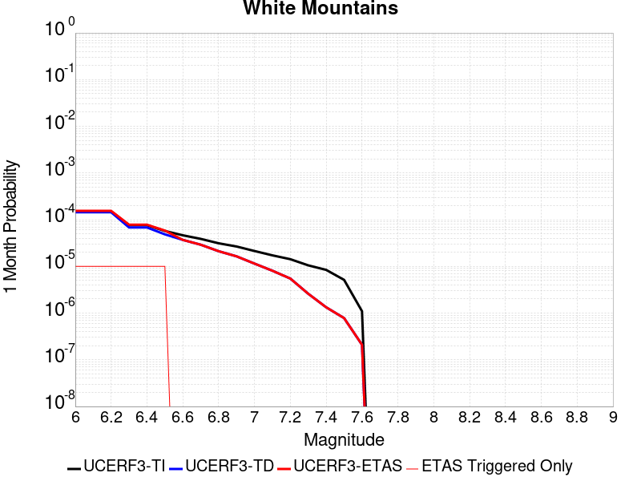 |  |  |

| Magnitude | 1 wk TI Prob | 1 wk TD Prob | 1 wk ETAS Prob | 1 wk ETAS/TD Gain | 1 wk ETAS Triggered Only | 1 mo TI Prob | 1 mo TD Prob | 1 mo ETAS Prob | 1 mo ETAS/TD Gain | 1 mo ETAS Triggered Only | 1 yr TI Prob | 1 yr TD Prob | 1 yr ETAS Prob | 1 yr ETAS/TD Gain | 1 yr ETAS Triggered Only | 10 yr TI Prob | 10 yr TD Prob | 10 yr ETAS Prob | 10 yr ETAS/TD Gain | 10 yr ETAS Triggered Only |
|-----|-----|-----|-----|-----|-----|-----|-----|-----|-----|-----|-----|-----|-----|-----|-----|-----|-----|-----|-----|-----|
| 6.0 | 3.503579E-5 | 3.378416E-5 | 4.3783824E-5 | 1.2959867 | 1.0E-5 | 1.5014476E-4 | 1.4478191E-4 | 1.5478046E-4 | 1.0690594 | 1.0E-5 | 0.0018264796 | 0.0017614153 | 0.0018113272 | 1.0283363 | 5.0E-5 | 0.018115403 | 0.017486874 | 0.017565476 | 1.0044949 | 8.0E-5 |
| 6.1 | 3.503579E-5 | 3.378416E-5 | 4.3783824E-5 | 1.2959867 | 1.0E-5 | 1.5014476E-4 | 1.4478191E-4 | 1.5478046E-4 | 1.0690594 | 1.0E-5 | 0.0018264796 | 0.0017614153 | 0.0018113272 | 1.0283363 | 5.0E-5 | 0.018115403 | 0.017486874 | 0.017565476 | 1.0044949 | 8.0E-5 |
| 6.2 | 3.503579E-5 | 3.378416E-5 | 4.3783824E-5 | 1.2959867 | 1.0E-5 | 1.5014476E-4 | 1.4478191E-4 | 1.5478046E-4 | 1.0690594 | 1.0E-5 | 0.0018264796 | 0.0017614153 | 0.0018113272 | 1.0283363 | 5.0E-5 | 0.018115403 | 0.017486874 | 0.017565476 | 1.0044949 | 8.0E-5 |
| 6.3 | 1.7818425E-5 | 1.5916175E-5 | 2.5916017E-5 | 1.6282816 | 1.0E-5 | 7.636245E-5 | 6.821048E-5 | 7.820979E-5 | 1.146595 | 1.0E-5 | 9.293162E-4 | 8.301604E-4 | 8.601355E-4 | 1.0361075 | 3.0E-5 | 0.009254395 | 0.008272051 | 0.008321637 | 1.0059944 | 5.0E-5 |
| 6.4 | 1.7818425E-5 | 1.5916175E-5 | 2.5916017E-5 | 1.6282816 | 1.0E-5 | 7.636245E-5 | 6.821048E-5 | 7.820979E-5 | 1.146595 | 1.0E-5 | 9.293162E-4 | 8.301604E-4 | 8.601355E-4 | 1.0361075 | 3.0E-5 | 0.009254395 | 0.008272051 | 0.008321637 | 1.0059944 | 5.0E-5 |
| 6.5 | 1.3397557E-5 | 1.1336386E-5 | 2.1336273E-5 | 1.8821054 | 1.0E-5 | 5.741684E-5 | 4.8583646E-5 | 5.858316E-5 | 1.2058206 | 1.0E-5 | 6.988258E-4 | 5.913523E-4 | 6.213346E-4 | 1.0507011 | 3.0E-5 | 0.006966323 | 0.005898493 | 0.0059481976 | 1.0084268 | 5.0E-5 |
| 6.6 | 1.0818695E-5 | 8.625443E-6 | 8.625443E-6 | 1.0 | 0.0 | 4.6365014E-5 | 3.6965685E-5 | 3.6965685E-5 | 1.0 | 0.0 | 5.6434784E-4 | 4.4996865E-4 | 4.6995963E-4 | 1.0444275 | 2.0E-5 | 0.005629168 | 0.004491012 | 0.0045308326 | 1.0088667 | 4.0E-5 |
| 6.7 | 9.067908E-6 | 6.8024833E-6 | 6.8024833E-6 | 1.0 | 0.0 | 3.8861883E-5 | 2.9153192E-5 | 2.9153192E-5 | 1.0 | 0.0 | 4.7304068E-4 | 3.548855E-4 | 3.6488194E-4 | 1.0281681 | 1.0E-5 | 0.00472035 | 0.0035435047 | 0.003563434 | 1.0056242 | 2.0E-5 |
| 6.8 | 7.295947E-6 | 4.936434E-6 | 4.936434E-6 | 1.0 | 0.0 | 3.126797E-5 | 2.115598E-5 | 2.115598E-5 | 1.0 | 0.0 | 3.8062103E-4 | 2.5754474E-4 | 2.5754474E-4 | 1.0 | 0.0 | 0.0037996976 | 0.0025725758 | 0.00258255 | 1.0038772 | 1.0E-5 |
| 6.9 | 6.2243444E-6 | 3.8322596E-6 | 3.8322596E-6 | 1.0 | 0.0 | 2.6675489E-5 | 1.6423868E-5 | 1.6423868E-5 | 1.0 | 0.0 | 3.2472567E-4 | 1.9994278E-4 | 1.9994278E-4 | 1.0 | 0.0 | 0.0032425157 | 0.0019976816 | 0.0020076616 | 1.0049958 | 1.0E-5 |
| 7.0 | 4.9878413E-6 | 2.6795685E-6 | 2.6795685E-6 | 1.0 | 0.0 | 2.1376287E-5 | 1.1483816E-5 | 1.1483816E-5 | 1.0 | 0.0 | 2.602252E-4 | 1.3980675E-4 | 1.3980675E-4 | 1.0 | 0.0 | 0.002599207 | 0.0013972142 | 0.0014072002 | 1.0071471 | 1.0E-5 |
| 7.1 | 4.0252844E-6 | 1.8857064E-6 | 1.8857064E-6 | 1.0 | 0.0 | 1.7251105E-5 | 8.081574E-6 | 8.081574E-6 | 1.0 | 0.0 | 2.1001195E-4 | 9.838885E-5 | 9.838885E-5 | 1.0 | 0.0 | 0.0020981359 | 9.834657E-4 | 9.934559E-4 | 1.0101582 | 1.0E-5 |
| 7.2 | 3.3284066E-6 | 1.281897E-6 | 1.281897E-6 | 1.0 | 0.0 | 1.4264522E-5 | 5.493833E-6 | 5.493833E-6 | 1.0 | 0.0 | 1.736567E-4 | 6.688547E-5 | 6.688547E-5 | 1.0 | 0.0 | 0.0017352107 | 6.686634E-4 | 6.686634E-4 | 1.0 | 0.0 |
| 7.3 | 2.458226E-6 | 6.056723E-7 | 6.056723E-7 | 1.0 | 0.0 | 1.0535211E-5 | 2.5957363E-6 | 2.5957363E-6 | 1.0 | 0.0 | 1.2825865E-4 | 3.1602667E-5 | 3.1602667E-5 | 1.0 | 0.0 | 0.0012818464 | 3.159855E-4 | 3.159855E-4 | 1.0 | 0.0 |
| 7.4 | 1.965953E-6 | 3.1085025E-7 | 3.1085025E-7 | 1.0 | 0.0 | 8.425486E-6 | 1.3322147E-6 | 1.3322147E-6 | 1.0 | 0.0 | 1.0257547E-4 | 1.6219594E-5 | 1.6219594E-5 | 1.0 | 0.0 | 0.0010252813 | 1.6218424E-4 | 1.6218424E-4 | 1.0 | 0.0 |
| 7.5 | 1.2014192E-6 | 1.8241249E-7 | 1.8241249E-7 | 1.0 | 0.0 | 5.148929E-6 | 7.817676E-7 | 7.817676E-7 | 1.0 | 0.0 | 6.2686406E-5 | 9.51798E-6 | 9.51798E-6 | 1.0 | 0.0 | 6.266873E-4 | 9.5175805E-5 | 9.5175805E-5 | 1.0 | 0.0 |
| 7.6 | 2.5612175E-7 | 4.893854E-8 | 4.893854E-8 | 1.0 | 0.0 | 1.0976642E-6 | 2.0973658E-7 | 2.0973658E-7 | 1.0 | 0.0 | 1.3363979E-5 | 2.5535403E-6 | 2.5535403E-6 | 1.0 | 0.0 | 1.3363175E-4 | 2.5535146E-5 | 2.5535146E-5 | 1.0 | 0.0 |

## Mission Creek
*[(top)](#table-of-contents)*

| 1 Week | 1 Month | 1 Year | 10 Year |
|-----|-----|-----|-----|
| 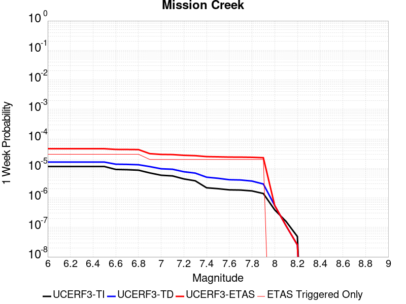 |  |  |  |

| Magnitude | 1 wk TI Prob | 1 wk TD Prob | 1 wk ETAS Prob | 1 wk ETAS/TD Gain | 1 wk ETAS Triggered Only | 1 mo TI Prob | 1 mo TD Prob | 1 mo ETAS Prob | 1 mo ETAS/TD Gain | 1 mo ETAS Triggered Only | 1 yr TI Prob | 1 yr TD Prob | 1 yr ETAS Prob | 1 yr ETAS/TD Gain | 1 yr ETAS Triggered Only | 10 yr TI Prob | 10 yr TD Prob | 10 yr ETAS Prob | 10 yr ETAS/TD Gain | 10 yr ETAS Triggered Only |
|-----|-----|-----|-----|-----|-----|-----|-----|-----|-----|-----|-----|-----|-----|-----|-----|-----|-----|-----|-----|-----|
| 6.0 | 1.1549387E-5 | 1.6323012E-5 | 4.6322522E-5 | 2.837866 | 3.0E-5 | 4.9496433E-5 | 6.9953974E-5 | 1.0995118E-4 | 1.5717646 | 4.0E-5 | 6.0245243E-4 | 8.5137185E-4 | 9.113208E-4 | 1.0704145 | 6.0E-5 | 0.006008218 | 0.008510141 | 0.0085894605 | 1.0093205 | 8.0E-5 |
| 6.1 | 1.1549387E-5 | 1.6323012E-5 | 4.6322522E-5 | 2.837866 | 3.0E-5 | 4.9496433E-5 | 6.9953974E-5 | 1.0995118E-4 | 1.5717646 | 4.0E-5 | 6.0245243E-4 | 8.5137185E-4 | 9.113208E-4 | 1.0704145 | 6.0E-5 | 0.006008218 | 0.008510141 | 0.0085894605 | 1.0093205 | 8.0E-5 |
| 6.2 | 1.1549387E-5 | 1.6323012E-5 | 4.6322522E-5 | 2.837866 | 3.0E-5 | 4.9496433E-5 | 6.9953974E-5 | 1.0995118E-4 | 1.5717646 | 4.0E-5 | 6.0245243E-4 | 8.5137185E-4 | 9.113208E-4 | 1.0704145 | 6.0E-5 | 0.006008218 | 0.008510141 | 0.0085894605 | 1.0093205 | 8.0E-5 |
| 6.3 | 1.1549387E-5 | 1.6323012E-5 | 4.6322522E-5 | 2.837866 | 3.0E-5 | 4.9496433E-5 | 6.9953974E-5 | 1.0995118E-4 | 1.5717646 | 4.0E-5 | 6.0245243E-4 | 8.5137185E-4 | 9.113208E-4 | 1.0704145 | 6.0E-5 | 0.006008218 | 0.008510141 | 0.0085894605 | 1.0093205 | 8.0E-5 |
| 6.4 | 1.1549387E-5 | 1.6323012E-5 | 4.6322522E-5 | 2.837866 | 3.0E-5 | 4.9496433E-5 | 6.9953974E-5 | 1.0995118E-4 | 1.5717646 | 4.0E-5 | 6.0245243E-4 | 8.5137185E-4 | 9.113208E-4 | 1.0704145 | 6.0E-5 | 0.006008218 | 0.008510141 | 0.0085894605 | 1.0093205 | 8.0E-5 |
| 6.5 | 1.1549387E-5 | 1.6323012E-5 | 4.6322522E-5 | 2.837866 | 3.0E-5 | 4.9496433E-5 | 6.9953974E-5 | 1.0995118E-4 | 1.5717646 | 4.0E-5 | 6.0245243E-4 | 8.5137185E-4 | 9.113208E-4 | 1.0704145 | 6.0E-5 | 0.006008218 | 0.008510141 | 0.0085894605 | 1.0093205 | 8.0E-5 |
| 6.6 | 9.202681E-6 | 1.38462865E-5 | 4.384587E-5 | 3.166616 | 3.0E-5 | 3.9439463E-5 | 5.933993E-5 | 9.933756E-5 | 1.6740423 | 4.0E-5 | 4.800697E-4 | 7.222332E-4 | 7.821899E-4 | 1.0830157 | 6.0E-5 | 0.004790339 | 0.007227324 | 0.0073067457 | 1.0109891 | 8.0E-5 |
| 6.7 | 9.019164E-6 | 1.3651957E-5 | 4.3651547E-5 | 3.1974573 | 3.0E-5 | 3.8652986E-5 | 5.850712E-5 | 9.850478E-5 | 1.6836375 | 4.0E-5 | 4.7049852E-4 | 7.121004E-4 | 7.720577E-4 | 1.0841978 | 6.0E-5 | 0.004695036 | 0.007126648 | 0.007206078 | 1.0111455 | 8.0E-5 |
| 6.8 | 8.673558E-6 | 1.3274066E-5 | 4.3273667E-5 | 3.260016 | 3.0E-5 | 3.717186E-5 | 5.6887664E-5 | 9.6885386E-5 | 1.7031001 | 4.0E-5 | 4.524734E-4 | 6.923961E-4 | 7.523545E-4 | 1.0865957 | 6.0E-5 | 0.0045155324 | 0.006930836 | 0.0070102816 | 1.0114626 | 8.0E-5 |
| 6.9 | 7.002255E-6 | 1.1478294E-5 | 3.1478063E-5 | 2.7423992 | 2.0E-5 | 3.000932E-5 | 4.91918E-5 | 7.919032E-5 | 1.6098278 | 3.0E-5 | 3.653022E-4 | 5.987524E-4 | 6.4872246E-4 | 1.083457 | 5.0E-5 | 0.0036470229 | 0.0059996583 | 0.0060692383 | 1.0115973 | 7.0E-5 |
| 7.0 | 5.84644E-6 | 9.675566E-6 | 2.9675373E-5 | 3.0670426 | 2.0E-5 | 2.5055931E-5 | 4.146608E-5 | 7.1464834E-5 | 1.7234529 | 3.0E-5 | 3.0501327E-4 | 5.0473714E-4 | 5.547119E-4 | 1.0990114 | 5.0E-5 | 0.0030459496 | 0.005063967 | 0.0051336125 | 1.0137532 | 7.0E-5 |
| 7.1 | 5.54703E-6 | 9.3300405E-6 | 2.9329854E-5 | 3.1435935 | 2.0E-5 | 2.377277E-5 | 3.9985298E-5 | 6.99841E-5 | 1.7502457 | 3.0E-5 | 2.8939504E-4 | 4.8671672E-4 | 5.366924E-4 | 1.1026791 | 5.0E-5 | 0.0028901845 | 0.0048845597 | 0.004954218 | 1.0142609 | 7.0E-5 |
| 7.2 | 4.384709E-6 | 7.6821225E-6 | 2.7681968E-5 | 3.6034272 | 2.0E-5 | 1.8791474E-5 | 3.2922988E-5 | 6.2922E-5 | 1.9111874 | 3.0E-5 | 2.2876218E-4 | 4.007673E-4 | 4.507473E-4 | 1.1247107 | 5.0E-5 | 0.0022852682 | 0.004028504 | 0.0040982217 | 1.0173062 | 7.0E-5 |
| 7.3 | 3.7888456E-6 | 6.915991E-6 | 2.6915852E-5 | 3.8918288 | 2.0E-5 | 1.623781E-5 | 2.9639643E-5 | 5.9638754E-5 | 2.0121279 | 3.0E-5 | 1.9767738E-4 | 3.6080624E-4 | 4.107882E-4 | 1.1385286 | 5.0E-5 | 0.0019750162 | 0.0036302328 | 0.0036999786 | 1.0192125 | 7.0E-5 |
| 7.4 | 2.1982462E-6 | 5.024299E-6 | 2.50242E-5 | 4.9806347 | 2.0E-5 | 9.421021E-6 | 2.1532533E-5 | 5.1531886E-5 | 2.3932106 | 3.0E-5 | 1.1469489E-4 | 2.6212723E-4 | 3.1211413E-4 | 1.1906971 | 5.0E-5 | 0.0011463572 | 0.0026459948 | 0.0027158097 | 1.0263851 | 7.0E-5 |
| 7.5 | 2.051923E-6 | 4.6155114E-6 | 2.461542E-5 | 5.3331943 | 2.0E-5 | 8.793926E-6 | 1.9780615E-5 | 4.978002E-5 | 2.5166063 | 3.0E-5 | 1.0706078E-4 | 2.408025E-4 | 2.9079046E-4 | 1.207589 | 5.0E-5 | 0.0010700922 | 0.0024337743 | 0.002503604 | 1.0286919 | 7.0E-5 |
| 7.6 | 1.8733427E-6 | 4.1238404E-6 | 2.4123758E-5 | 5.849828 | 2.0E-5 | 8.028587E-6 | 1.7673483E-5 | 4.7672955E-5 | 2.6974282 | 3.0E-5 | 9.774366E-5 | 2.151535E-4 | 2.6514273E-4 | 1.2323422 | 5.0E-5 | 9.770069E-4 | 0.0021782813 | 0.0022481289 | 1.0320654 | 7.0E-5 |
| 7.7 | 1.8411953E-6 | 4.04351E-6 | 2.404343E-5 | 5.9461775 | 2.0E-5 | 7.890813E-6 | 1.7329216E-5 | 4.7328696E-5 | 2.7311506 | 3.0E-5 | 9.606641E-5 | 2.1096284E-4 | 2.609523E-4 | 1.2369585 | 5.0E-5 | 9.6024893E-4 | 0.0021365585 | 0.0022064091 | 1.0326929 | 7.0E-5 |
| 7.8 | 1.7194251E-6 | 3.7108448E-6 | 2.371077E-5 | 6.3895884 | 2.0E-5 | 7.368944E-6 | 1.5903524E-5 | 4.5903045E-5 | 2.8863444 | 3.0E-5 | 8.97132E-5 | 1.9360827E-4 | 2.435986E-4 | 1.2582034 | 5.0E-5 | 8.967699E-4 | 0.0019625 | 0.0020323624 | 1.0355988 | 7.0E-5 |
| 7.9 | 1.4035052E-6 | 2.950393E-6 | 2.2950335E-5 | 7.7787375 | 2.0E-5 | 6.0150082E-6 | 1.2644481E-5 | 4.26441E-5 | 3.3725467 | 3.0E-5 | 7.3230265E-5 | 1.5393575E-4 | 2.0392805E-4 | 1.3247608 | 5.0E-5 | 7.3206134E-4 | 0.001563156 | 0.0016330465 | 1.0447112 | 7.0E-5 |
| 8.0 | 3.9318823E-7 | 5.528756E-7 | 5.528756E-7 | 1.0 | 0.0 | 1.6850913E-6 | 2.3694645E-6 | 2.3694645E-6 | 1.0 | 0.0 | 2.0515794E-5 | 2.8847855E-5 | 2.8847855E-5 | 1.0 | 0.0 | 2.0513899E-4 | 2.9911872E-4 | 2.9911872E-4 | 1.0 | 0.0 |
| 8.1 | 1.596793E-7 | 1.13784964E-7 | 1.13784964E-7 | 1.0 | 0.0 | 6.8433974E-7 | 4.8764974E-7 | 4.8764974E-7 | 1.0 | 0.0 | 8.331805E-6 | 5.93712E-6 | 5.93712E-6 | 1.0 | 0.0 | 8.331492E-5 | 6.549818E-5 | 6.549818E-5 | 1.0 | 0.0 |
| 8.2 | 4.9003038E-8 | 2.5438382E-8 | 2.5438382E-8 | 1.0 | 0.0 | 2.10013E-7 | 1.0902163E-7 | 1.0902163E-7 | 1.0 | 0.0 | 2.5569052E-6 | 1.3273376E-6 | 1.3273376E-6 | 1.0 | 0.0 | 2.556876E-5 | 1.4954236E-5 | 1.4954236E-5 | 1.0 | 0.0 |

## Camp Rock 2011
*[(top)](#table-of-contents)*

| 1 Week | 1 Month | 1 Year | 10 Year |
|-----|-----|-----|-----|
|  | 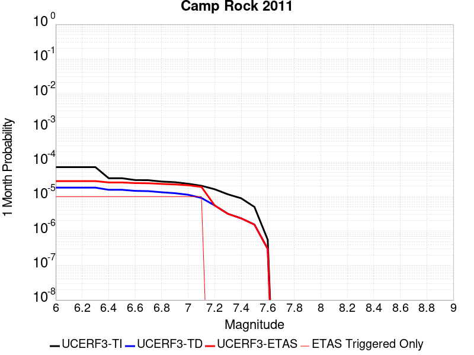 | 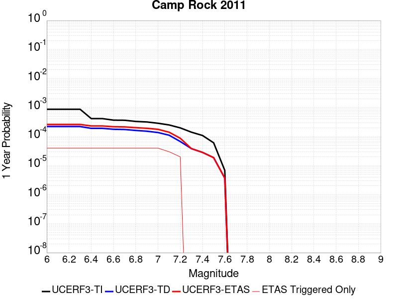 |  |

| Magnitude | 1 wk TI Prob | 1 wk TD Prob | 1 wk ETAS Prob | 1 wk ETAS/TD Gain | 1 wk ETAS Triggered Only | 1 mo TI Prob | 1 mo TD Prob | 1 mo ETAS Prob | 1 mo ETAS/TD Gain | 1 mo ETAS Triggered Only | 1 yr TI Prob | 1 yr TD Prob | 1 yr ETAS Prob | 1 yr ETAS/TD Gain | 1 yr ETAS Triggered Only | 10 yr TI Prob | 10 yr TD Prob | 10 yr ETAS Prob | 10 yr ETAS/TD Gain | 10 yr ETAS Triggered Only |
|-----|-----|-----|-----|-----|-----|-----|-----|-----|-----|-----|-----|-----|-----|-----|-----|-----|-----|-----|-----|-----|
| 6.0 | 1.6710783E-5 | 4.250002E-6 | 1.4249959E-5 | 3.35293 | 1.0E-5 | 7.161568E-5 | 1.821417E-5 | 2.8213988E-5 | 1.5490131 | 1.0E-5 | 8.7157206E-4 | 2.2173548E-4 | 2.6172661E-4 | 1.1803551 | 4.0E-5 | 0.008681616 | 0.0022151952 | 0.002295018 | 1.0360342 | 8.0E-5 |
| 6.1 | 1.6710783E-5 | 4.250002E-6 | 1.4249959E-5 | 3.35293 | 1.0E-5 | 7.161568E-5 | 1.821417E-5 | 2.8213988E-5 | 1.5490131 | 1.0E-5 | 8.7157206E-4 | 2.2173548E-4 | 2.6172661E-4 | 1.1803551 | 4.0E-5 | 0.008681616 | 0.0022151952 | 0.002295018 | 1.0360342 | 8.0E-5 |
| 6.2 | 1.6710783E-5 | 4.250002E-6 | 1.4249959E-5 | 3.35293 | 1.0E-5 | 7.161568E-5 | 1.821417E-5 | 2.8213988E-5 | 1.5490131 | 1.0E-5 | 8.7157206E-4 | 2.2173548E-4 | 2.6172661E-4 | 1.1803551 | 4.0E-5 | 0.008681616 | 0.0022151952 | 0.002295018 | 1.0360342 | 8.0E-5 |
| 6.3 | 1.6710783E-5 | 4.250002E-6 | 1.4249959E-5 | 3.35293 | 1.0E-5 | 7.161568E-5 | 1.821417E-5 | 2.8213988E-5 | 1.5490131 | 1.0E-5 | 8.7157206E-4 | 2.2173548E-4 | 2.6172661E-4 | 1.1803551 | 4.0E-5 | 0.008681616 | 0.0022151952 | 0.002295018 | 1.0360342 | 8.0E-5 |
| 6.4 | 7.982846E-6 | 3.6820384E-6 | 1.3682002E-5 | 3.715877 | 1.0E-5 | 3.421175E-5 | 1.5780071E-5 | 2.5779913E-5 | 1.6337007 | 1.0E-5 | 4.1644843E-4 | 1.9210577E-4 | 2.3209809E-4 | 1.2081786 | 4.0E-5 | 0.0041566887 | 0.0019194318 | 0.0019992783 | 1.041599 | 8.0E-5 |
| 6.5 | 7.982846E-6 | 3.6820384E-6 | 1.3682002E-5 | 3.715877 | 1.0E-5 | 3.421175E-5 | 1.5780071E-5 | 2.5779913E-5 | 1.6337007 | 1.0E-5 | 4.1644843E-4 | 1.9210577E-4 | 2.3209809E-4 | 1.2081786 | 4.0E-5 | 0.0041566887 | 0.0019194318 | 0.0019992783 | 1.041599 | 8.0E-5 |
| 6.6 | 7.048869E-6 | 3.4243021E-6 | 1.3424268E-5 | 3.920293 | 1.0E-5 | 3.0209088E-5 | 1.46755E-5 | 2.4675353E-5 | 1.6813978 | 1.0E-5 | 3.677336E-4 | 1.7865987E-4 | 2.1865273E-4 | 1.223849 | 4.0E-5 | 0.0036712566 | 0.0017851942 | 0.0018650513 | 1.044733 | 8.0E-5 |
| 6.7 | 6.987307E-6 | 3.3622796E-6 | 1.3362246E-5 | 3.9741626 | 1.0E-5 | 2.9945259E-5 | 1.4409692E-5 | 2.4409548E-5 | 1.6939673 | 1.0E-5 | 3.6452254E-4 | 1.754242E-4 | 2.1541717E-4 | 1.2279787 | 4.0E-5 | 0.0036392517 | 0.0017528883 | 0.0018327481 | 1.0455589 | 8.0E-5 |
| 6.8 | 6.3737602E-6 | 3.1178695E-6 | 1.31178385E-5 | 4.2073083 | 1.0E-5 | 2.731583E-5 | 1.3362231E-5 | 2.3362098E-5 | 1.748368 | 1.0E-5 | 3.3251947E-4 | 1.626733E-4 | 2.026668E-4 | 1.2458516 | 4.0E-5 | 0.0033202237 | 0.0016255708 | 0.0017054408 | 1.0491335 | 8.0E-5 |
| 6.9 | 6.112211E-6 | 2.93308E-6 | 1.2933051E-5 | 4.409375 | 1.0E-5 | 2.6194928E-5 | 1.2570284E-5 | 2.2570159E-5 | 1.795517 | 1.0E-5 | 3.1887658E-4 | 1.5303274E-4 | 1.9302662E-4 | 1.2613419 | 4.0E-5 | 0.003184194 | 0.0015293013 | 0.001609179 | 1.0522314 | 8.0E-5 |
| 7.0 | 5.5140117E-6 | 2.6419118E-6 | 1.2641885E-5 | 4.7851276 | 1.0E-5 | 2.3631264E-5 | 1.1322431E-5 | 2.1322317E-5 | 1.8831925 | 1.0E-5 | 2.8767265E-4 | 1.3784214E-4 | 1.7783663E-4 | 1.2901471 | 4.0E-5 | 0.0028730053 | 0.0013775916 | 0.0014574814 | 1.0579923 | 8.0E-5 |
| 7.1 | 4.8151105E-6 | 2.1342628E-6 | 1.2134242E-5 | 5.6854486 | 1.0E-5 | 2.0636026E-5 | 9.14681E-6 | 1.9146719E-5 | 2.0932674 | 1.0E-5 | 2.5121463E-4 | 1.1135694E-4 | 1.413536E-4 | 1.269374 | 3.0E-5 | 0.0025093083 | 0.0011130333 | 0.0011729666 | 1.0538467 | 6.0E-5 |
| 7.2 | 3.818335E-6 | 1.2937384E-6 | 1.2937384E-6 | 1.0 | 0.0 | 1.6364189E-5 | 5.5445817E-6 | 5.5445817E-6 | 1.0 | 0.0 | 1.9921579E-4 | 6.750328E-5 | 8.7501925E-5 | 1.2962619 | 2.0E-5 | 0.0019903728 | 6.7483593E-4 | 7.0481567E-4 | 1.0444252 | 3.0E-5 |
| 7.3 | 2.7166698E-6 | 7.383088E-7 | 7.383088E-7 | 1.0 | 0.0 | 1.1642818E-5 | 3.164177E-6 | 3.164177E-6 | 1.0 | 0.0 | 1.4174209E-4 | 3.8523194E-5 | 3.8523194E-5 | 1.0 | 0.0 | 0.0014165172 | 3.8516716E-4 | 3.8516716E-4 | 1.0 | 0.0 |
| 7.4 | 2.0893426E-6 | 5.4614685E-7 | 5.4614685E-7 | 1.0 | 0.0 | 8.954295E-6 | 2.3406271E-6 | 2.3406271E-6 | 1.0 | 0.0 | 1.0901308E-4 | 2.849677E-5 | 2.849677E-5 | 1.0 | 0.0 | 0.0010895962 | 2.8493168E-4 | 2.8493168E-4 | 1.0 | 0.0 |
| 7.5 | 1.1681728E-6 | 3.6028513E-7 | 3.6028513E-7 | 1.0 | 0.0 | 5.0064455E-6 | 1.5440783E-6 | 1.5440783E-6 | 1.0 | 0.0 | 6.0951766E-5 | 1.8798995E-5 | 1.8798995E-5 | 1.0 | 0.0 | 6.093505E-4 | 1.8797453E-4 | 1.8797453E-4 | 1.0 | 0.0 |
| 7.6 | 1.3154387E-7 | 7.1196716E-8 | 7.1196716E-8 | 1.0 | 0.0 | 5.6375933E-7 | 3.0512876E-7 | 3.0512876E-7 | 1.0 | 0.0 | 6.863748E-6 | 3.714938E-6 | 3.714938E-6 | 1.0 | 0.0 | 6.863536E-5 | 3.7148915E-5 | 3.7148915E-5 | 1.0 | 0.0 |

## Dry Mountain
*[(top)](#table-of-contents)*

| 1 Week | 1 Month | 1 Year | 10 Year |
|-----|-----|-----|-----|
|  |  |  |  |

| Magnitude | 1 wk TI Prob | 1 wk TD Prob | 1 wk ETAS Prob | 1 wk ETAS/TD Gain | 1 wk ETAS Triggered Only | 1 mo TI Prob | 1 mo TD Prob | 1 mo ETAS Prob | 1 mo ETAS/TD Gain | 1 mo ETAS Triggered Only | 1 yr TI Prob | 1 yr TD Prob | 1 yr ETAS Prob | 1 yr ETAS/TD Gain | 1 yr ETAS Triggered Only | 10 yr TI Prob | 10 yr TD Prob | 10 yr ETAS Prob | 10 yr ETAS/TD Gain | 10 yr ETAS Triggered Only |
|-----|-----|-----|-----|-----|-----|-----|-----|-----|-----|-----|-----|-----|-----|-----|-----|-----|-----|-----|-----|-----|
| 6.0 | 6.222801E-6 | 6.439384E-6 | 1.643932E-5 | 2.5529335 | 1.0E-5 | 2.6668875E-5 | 2.7597158E-5 | 5.759633E-5 | 2.0870385 | 3.0E-5 | 3.2464517E-4 | 3.359595E-4 | 3.7594608E-4 | 1.119022 | 4.0E-5 | 0.0032417132 | 0.0033560784 | 0.0034258433 | 1.0207877 | 7.0E-5 |
| 6.1 | 6.222801E-6 | 6.439384E-6 | 1.643932E-5 | 2.5529335 | 1.0E-5 | 2.6668875E-5 | 2.7597158E-5 | 5.759633E-5 | 2.0870385 | 3.0E-5 | 3.2464517E-4 | 3.359595E-4 | 3.7594608E-4 | 1.119022 | 4.0E-5 | 0.0032417132 | 0.0033560784 | 0.0034258433 | 1.0207877 | 7.0E-5 |
| 6.2 | 6.222801E-6 | 6.439384E-6 | 1.643932E-5 | 2.5529335 | 1.0E-5 | 2.6668875E-5 | 2.7597158E-5 | 5.759633E-5 | 2.0870385 | 3.0E-5 | 3.2464517E-4 | 3.359595E-4 | 3.7594608E-4 | 1.119022 | 4.0E-5 | 0.0032417132 | 0.0033560784 | 0.0034258433 | 1.0207877 | 7.0E-5 |
| 6.3 | 6.222801E-6 | 6.439384E-6 | 1.643932E-5 | 2.5529335 | 1.0E-5 | 2.6668875E-5 | 2.7597158E-5 | 5.759633E-5 | 2.0870385 | 3.0E-5 | 3.2464517E-4 | 3.359595E-4 | 3.7594608E-4 | 1.119022 | 4.0E-5 | 0.0032417132 | 0.0033560784 | 0.0034258433 | 1.0207877 | 7.0E-5 |
| 6.4 | 6.222801E-6 | 6.439384E-6 | 1.643932E-5 | 2.5529335 | 1.0E-5 | 2.6668875E-5 | 2.7597158E-5 | 5.759633E-5 | 2.0870385 | 3.0E-5 | 3.2464517E-4 | 3.359595E-4 | 3.7594608E-4 | 1.119022 | 4.0E-5 | 0.0032417132 | 0.0033560784 | 0.0034258433 | 1.0207877 | 7.0E-5 |
| 6.5 | 2.8528623E-6 | 2.9521696E-6 | 2.9521696E-6 | 1.0 | 0.0 | 1.22264955E-5 | 1.2652144E-5 | 1.2652144E-5 | 1.0 | 0.0 | 1.4884741E-4 | 1.5403765E-4 | 1.5403765E-4 | 1.0 | 0.0 | 0.0014874774 | 0.0015401623 | 0.0015401623 | 1.0 | 0.0 |
| 6.6 | 2.8528623E-6 | 2.9521696E-6 | 2.9521696E-6 | 1.0 | 0.0 | 1.22264955E-5 | 1.2652144E-5 | 1.2652144E-5 | 1.0 | 0.0 | 1.4884741E-4 | 1.5403765E-4 | 1.5403765E-4 | 1.0 | 0.0 | 0.0014874774 | 0.0015401623 | 0.0015401623 | 1.0 | 0.0 |
| 6.7 | 2.541E-6 | 2.629359E-6 | 2.629359E-6 | 1.0 | 0.0 | 1.0889954E-5 | 1.1268681E-5 | 1.1268681E-5 | 1.0 | 0.0 | 1.3257713E-4 | 1.371962E-4 | 1.371962E-4 | 1.0 | 0.0 | 0.0013249806 | 0.001371962 | 0.001371962 | 1.0 | 0.0 |

## Channel Islands Thrust
*[(top)](#table-of-contents)*

| 1 Week | 1 Month | 1 Year | 10 Year |
|-----|-----|-----|-----|
|  |  | 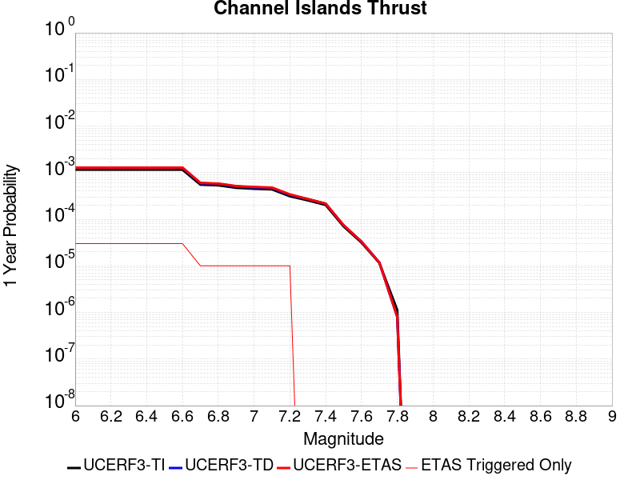 |  |

| Magnitude | 1 wk TI Prob | 1 wk TD Prob | 1 wk ETAS Prob | 1 wk ETAS/TD Gain | 1 wk ETAS Triggered Only | 1 mo TI Prob | 1 mo TD Prob | 1 mo ETAS Prob | 1 mo ETAS/TD Gain | 1 mo ETAS Triggered Only | 1 yr TI Prob | 1 yr TD Prob | 1 yr ETAS Prob | 1 yr ETAS/TD Gain | 1 yr ETAS Triggered Only | 10 yr TI Prob | 10 yr TD Prob | 10 yr ETAS Prob | 10 yr ETAS/TD Gain | 10 yr ETAS Triggered Only |
|-----|-----|-----|-----|-----|-----|-----|-----|-----|-----|-----|-----|-----|-----|-----|-----|-----|-----|-----|-----|-----|
| 6.0 | 2.2156251E-5 | 2.4092049E-5 | 3.409181E-5 | 1.4150647 | 1.0E-5 | 9.495191E-5 | 1.0324815E-4 | 1.13247115E-4 | 1.0968441 | 1.0E-5 | 0.0011554264 | 0.0012564278 | 0.0012863902 | 1.0238472 | 3.0E-5 | 0.011494373 | 0.012503834 | 0.012572959 | 1.0055283 | 7.0E-5 |
| 6.1 | 2.2156251E-5 | 2.4092049E-5 | 3.409181E-5 | 1.4150647 | 1.0E-5 | 9.495191E-5 | 1.0324815E-4 | 1.13247115E-4 | 1.0968441 | 1.0E-5 | 0.0011554264 | 0.0012564278 | 0.0012863902 | 1.0238472 | 3.0E-5 | 0.011494373 | 0.012503834 | 0.012572959 | 1.0055283 | 7.0E-5 |
| 6.2 | 2.2156251E-5 | 2.4092049E-5 | 3.409181E-5 | 1.4150647 | 1.0E-5 | 9.495191E-5 | 1.0324815E-4 | 1.13247115E-4 | 1.0968441 | 1.0E-5 | 0.0011554264 | 0.0012564278 | 0.0012863902 | 1.0238472 | 3.0E-5 | 0.011494373 | 0.012503834 | 0.012572959 | 1.0055283 | 7.0E-5 |
| 6.3 | 2.2156251E-5 | 2.4092049E-5 | 3.409181E-5 | 1.4150647 | 1.0E-5 | 9.495191E-5 | 1.0324815E-4 | 1.13247115E-4 | 1.0968441 | 1.0E-5 | 0.0011554264 | 0.0012564278 | 0.0012863902 | 1.0238472 | 3.0E-5 | 0.011494373 | 0.012503834 | 0.012572959 | 1.0055283 | 7.0E-5 |
| 6.4 | 2.2156251E-5 | 2.4092049E-5 | 3.409181E-5 | 1.4150647 | 1.0E-5 | 9.495191E-5 | 1.0324815E-4 | 1.13247115E-4 | 1.0968441 | 1.0E-5 | 0.0011554264 | 0.0012564278 | 0.0012863902 | 1.0238472 | 3.0E-5 | 0.011494373 | 0.012503834 | 0.012572959 | 1.0055283 | 7.0E-5 |
| 6.5 | 2.2156251E-5 | 2.4092049E-5 | 3.409181E-5 | 1.4150647 | 1.0E-5 | 9.495191E-5 | 1.0324815E-4 | 1.13247115E-4 | 1.0968441 | 1.0E-5 | 0.0011554264 | 0.0012564278 | 0.0012863902 | 1.0238472 | 3.0E-5 | 0.011494373 | 0.012503834 | 0.012572959 | 1.0055283 | 7.0E-5 |
| 6.6 | 2.2156251E-5 | 2.4092049E-5 | 3.409181E-5 | 1.4150647 | 1.0E-5 | 9.495191E-5 | 1.0324815E-4 | 1.13247115E-4 | 1.0968441 | 1.0E-5 | 0.0011554264 | 0.0012564278 | 0.0012863902 | 1.0238472 | 3.0E-5 | 0.011494373 | 0.012503834 | 0.012572959 | 1.0055283 | 7.0E-5 |
| 6.7 | 1.0601296E-5 | 1.1379554E-5 | 1.1379554E-5 | 1.0 | 0.0 | 4.5433335E-5 | 4.8768634E-5 | 4.8768634E-5 | 1.0 | 0.0 | 5.5301044E-4 | 5.9360126E-4 | 6.0359534E-4 | 1.0168363 | 1.0E-5 | 0.005516363 | 0.005920659 | 0.005950481 | 1.005037 | 3.0E-5 |
| 6.8 | 1.0246747E-5 | 1.09966795E-5 | 1.09966795E-5 | 1.0 | 0.0 | 4.391389E-5 | 4.71278E-5 | 4.71278E-5 | 1.0 | 0.0 | 5.345204E-4 | 5.736347E-4 | 5.8362895E-4 | 1.0174227 | 1.0E-5 | 0.0053323656 | 0.00572203 | 0.0057518585 | 1.0052129 | 3.0E-5 |
| 6.9 | 9.049551E-6 | 9.699654E-6 | 9.699654E-6 | 1.0 | 0.0 | 3.878322E-5 | 4.1569303E-5 | 4.1569303E-5 | 1.0 | 0.0 | 4.7208337E-4 | 5.0599285E-4 | 5.159878E-4 | 1.0197531 | 1.0E-5 | 0.0047108172 | 0.005048825 | 0.0050786734 | 1.005912 | 3.0E-5 |
| 7.0 | 8.6542195E-6 | 9.274611E-6 | 9.274611E-6 | 1.0 | 0.0 | 3.7088983E-5 | 3.9747752E-5 | 3.9747752E-5 | 1.0 | 0.0 | 4.5146482E-4 | 4.838255E-4 | 4.938207E-4 | 1.0206586 | 1.0E-5 | 0.004505487 | 0.0048281336 | 0.0048579886 | 1.0061836 | 3.0E-5 |
| 7.1 | 8.391028E-6 | 8.9929335E-6 | 8.9929335E-6 | 1.0 | 0.0 | 3.5961057E-5 | 3.8540595E-5 | 3.8540595E-5 | 1.0 | 0.0 | 4.3773788E-4 | 4.691348E-4 | 4.791301E-4 | 1.0213058 | 1.0E-5 | 0.004368766 | 0.0046818545 | 0.004711714 | 1.0063777 | 3.0E-5 |
| 7.2 | 5.965188E-6 | 6.371701E-6 | 6.371701E-6 | 1.0 | 0.0 | 2.556484E-5 | 2.7307007E-5 | 2.7307007E-5 | 1.0 | 0.0 | 3.1120746E-4 | 3.3241263E-4 | 3.4240933E-4 | 1.030073 | 1.0E-5 | 0.00310772 | 0.0033192122 | 0.0033391458 | 1.0060055 | 2.0E-5 |
| 7.3 | 4.877518E-6 | 5.2060113E-6 | 5.2060113E-6 | 1.0 | 0.0 | 2.0903482E-5 | 2.2311287E-5 | 2.2311287E-5 | 1.0 | 0.0 | 2.5447016E-4 | 2.7160652E-4 | 2.7160652E-4 | 1.0 | 0.0 | 0.0025417898 | 0.002712792 | 0.0027227649 | 1.0036763 | 1.0E-5 |
| 7.4 | 3.8829853E-6 | 4.1418666E-6 | 4.1418666E-6 | 1.0 | 0.0 | 1.664126E-5 | 1.7750739E-5 | 1.7750739E-5 | 1.0 | 0.0 | 2.0258849E-4 | 2.1609422E-4 | 2.1609422E-4 | 1.0 | 0.0 | 0.002024039 | 0.0021588826 | 0.002168861 | 1.004622 | 1.0E-5 |
| 7.5 | 1.3489616E-6 | 1.4277916E-6 | 1.4277916E-6 | 1.0 | 0.0 | 5.7812517E-6 | 6.119093E-6 | 6.119093E-6 | 1.0 | 0.0 | 7.038446E-5 | 7.449745E-5 | 7.449745E-5 | 1.0 | 0.0 | 7.036218E-4 | 7.447287E-4 | 7.547213E-4 | 1.0134177 | 1.0E-5 |
| 7.6 | 6.058192E-7 | 6.353785E-7 | 6.353785E-7 | 1.0 | 0.0 | 2.5963652E-6 | 2.723048E-6 | 2.723048E-6 | 1.0 | 0.0 | 3.161029E-5 | 3.315262E-5 | 3.315262E-5 | 1.0 | 0.0 | 3.1605794E-4 | 3.3147837E-4 | 3.3147837E-4 | 1.0 | 0.0 |
| 7.7 | 2.2170494E-7 | 2.260794E-7 | 2.260794E-7 | 1.0 | 0.0 | 9.5016367E-7 | 9.689114E-7 | 9.689114E-7 | 1.0 | 0.0 | 1.1568181E-5 | 1.1796444E-5 | 1.1796444E-5 | 1.0 | 0.0 | 1.1567579E-4 | 1.1795928E-4 | 1.1795928E-4 | 1.0 | 0.0 |
| 7.8 | 2.1613102E-8 | 1.5466837E-8 | 1.5466837E-8 | 1.0 | 0.0 | 9.262757E-8 | 6.628645E-8 | 6.628645E-8 | 1.0 | 0.0 | 1.1277401E-6 | 8.070372E-7 | 8.070372E-7 | 1.0 | 0.0 | 1.1277344E-5 | 8.07035E-6 | 8.07035E-6 | 1.0 | 0.0 |

## Ventura-Pitas Point
*[(top)](#table-of-contents)*

| 1 Week | 1 Month | 1 Year | 10 Year |
|-----|-----|-----|-----|
|  |  |  |  |

| Magnitude | 1 wk TI Prob | 1 wk TD Prob | 1 wk ETAS Prob | 1 wk ETAS/TD Gain | 1 wk ETAS Triggered Only | 1 mo TI Prob | 1 mo TD Prob | 1 mo ETAS Prob | 1 mo ETAS/TD Gain | 1 mo ETAS Triggered Only | 1 yr TI Prob | 1 yr TD Prob | 1 yr ETAS Prob | 1 yr ETAS/TD Gain | 1 yr ETAS Triggered Only | 10 yr TI Prob | 10 yr TD Prob | 10 yr ETAS Prob | 10 yr ETAS/TD Gain | 10 yr ETAS Triggered Only |
|-----|-----|-----|-----|-----|-----|-----|-----|-----|-----|-----|-----|-----|-----|-----|-----|-----|-----|-----|-----|-----|
| 6.0 | 3.3179622E-5 | 3.373524E-5 | 3.373524E-5 | 1.0 | 0.0 | 1.4219063E-4 | 1.4457303E-4 | 1.4457303E-4 | 1.0 | 0.0 | 0.0017297962 | 0.0017590123 | 0.001798942 | 1.0227001 | 4.0E-5 | 0.017163932 | 0.017476523 | 0.0175453 | 1.0039353 | 7.0E-5 |
| 6.1 | 3.3179622E-5 | 3.373524E-5 | 3.373524E-5 | 1.0 | 0.0 | 1.4219063E-4 | 1.4457303E-4 | 1.4457303E-4 | 1.0 | 0.0 | 0.0017297962 | 0.0017590123 | 0.001798942 | 1.0227001 | 4.0E-5 | 0.017163932 | 0.017476523 | 0.0175453 | 1.0039353 | 7.0E-5 |
| 6.2 | 3.3179622E-5 | 3.373524E-5 | 3.373524E-5 | 1.0 | 0.0 | 1.4219063E-4 | 1.4457303E-4 | 1.4457303E-4 | 1.0 | 0.0 | 0.0017297962 | 0.0017590123 | 0.001798942 | 1.0227001 | 4.0E-5 | 0.017163932 | 0.017476523 | 0.0175453 | 1.0039353 | 7.0E-5 |
| 6.3 | 3.3179622E-5 | 3.373524E-5 | 3.373524E-5 | 1.0 | 0.0 | 1.4219063E-4 | 1.4457303E-4 | 1.4457303E-4 | 1.0 | 0.0 | 0.0017297962 | 0.0017590123 | 0.001798942 | 1.0227001 | 4.0E-5 | 0.017163932 | 0.017476523 | 0.0175453 | 1.0039353 | 7.0E-5 |
| 6.4 | 1.8754668E-5 | 1.7019613E-5 | 1.7019613E-5 | 1.0 | 0.0 | 8.037467E-5 | 7.2939285E-5 | 7.2939285E-5 | 1.0 | 0.0 | 9.781223E-4 | 8.876971E-4 | 8.976882E-4 | 1.0112551 | 1.0E-5 | 0.009738282 | 0.008843952 | 0.008873686 | 1.0033622 | 3.0E-5 |
| 6.5 | 1.8754668E-5 | 1.7019613E-5 | 1.7019613E-5 | 1.0 | 0.0 | 8.037467E-5 | 7.2939285E-5 | 7.2939285E-5 | 1.0 | 0.0 | 9.781223E-4 | 8.876971E-4 | 8.976882E-4 | 1.0112551 | 1.0E-5 | 0.009738282 | 0.008843952 | 0.008873686 | 1.0033622 | 3.0E-5 |
| 6.6 | 1.4361558E-5 | 1.2122269E-5 | 1.2122269E-5 | 1.0 | 0.0 | 6.154808E-5 | 5.195156E-5 | 5.195156E-5 | 1.0 | 0.0 | 7.490902E-4 | 6.3232897E-4 | 6.4232264E-4 | 1.0158045 | 1.0E-5 | 0.0074657016 | 0.0063056583 | 0.006325532 | 1.0031518 | 2.0E-5 |
| 6.7 | 1.4361558E-5 | 1.2122269E-5 | 1.2122269E-5 | 1.0 | 0.0 | 6.154808E-5 | 5.195156E-5 | 5.195156E-5 | 1.0 | 0.0 | 7.490902E-4 | 6.3232897E-4 | 6.4232264E-4 | 1.0158045 | 1.0E-5 | 0.0074657016 | 0.0063056583 | 0.006325532 | 1.0031518 | 2.0E-5 |
| 6.8 | 1.3663846E-5 | 1.1344411E-5 | 1.1344411E-5 | 1.0 | 0.0 | 5.8558027E-5 | 4.861801E-5 | 4.861801E-5 | 1.0 | 0.0 | 7.127108E-4 | 5.9176545E-4 | 6.0175953E-4 | 1.0168886 | 1.0E-5 | 0.007104293 | 0.0059022163 | 0.005922098 | 1.0033686 | 2.0E-5 |
| 6.9 | 1.3644157E-5 | 1.1322512E-5 | 1.1322512E-5 | 1.0 | 0.0 | 5.8473648E-5 | 4.8524158E-5 | 4.8524158E-5 | 1.0 | 0.0 | 7.116841E-4 | 5.906234E-4 | 6.0061755E-4 | 1.0169213 | 1.0E-5 | 0.007094092 | 0.0058908565 | 0.005910739 | 1.003375 | 2.0E-5 |
| 7.0 | 1.3568845E-5 | 1.12420785E-5 | 1.12420785E-5 | 1.0 | 0.0 | 5.8150898E-5 | 4.817946E-5 | 4.817946E-5 | 1.0 | 0.0 | 7.077572E-4 | 5.8642897E-4 | 5.964231E-4 | 1.0170424 | 1.0E-5 | 0.007055073 | 0.0058491332 | 0.0058690165 | 1.0033993 | 2.0E-5 |
| 7.1 | 1.306572E-5 | 1.0720531E-5 | 1.0720531E-5 | 1.0 | 0.0 | 5.599474E-5 | 4.5944333E-5 | 4.5944333E-5 | 1.0 | 0.0 | 6.815227E-4 | 5.592305E-4 | 5.6922494E-4 | 1.0178717 | 1.0E-5 | 0.0067943637 | 0.0055785407 | 0.0055984296 | 1.0035652 | 2.0E-5 |
| 7.2 | 1.232604E-5 | 9.99513E-6 | 9.99513E-6 | 1.0 | 0.0 | 5.2824813E-5 | 4.2835578E-5 | 4.2835578E-5 | 1.0 | 0.0 | 6.429523E-4 | 5.214001E-4 | 5.313949E-4 | 1.0191691 | 1.0E-5 | 0.0064109527 | 0.0052020634 | 0.0052219597 | 1.0038246 | 2.0E-5 |
| 7.3 | 1.0917261E-5 | 8.843819E-6 | 8.843819E-6 | 1.0 | 0.0 | 4.678742E-5 | 3.790154E-5 | 3.790154E-5 | 1.0 | 0.0 | 5.69488E-4 | 4.6135508E-4 | 4.7135047E-4 | 1.0216653 | 1.0E-5 | 0.0056803077 | 0.0046042423 | 0.00462415 | 1.0043238 | 2.0E-5 |
| 7.4 | 1.039959E-5 | 8.423546E-6 | 8.423546E-6 | 1.0 | 0.0 | 4.456891E-5 | 3.610042E-5 | 3.610042E-5 | 1.0 | 0.0 | 5.424914E-4 | 4.3943553E-4 | 4.4943113E-4 | 1.0227464 | 1.0E-5 | 0.0054116896 | 0.004385931 | 0.004405843 | 1.0045401 | 2.0E-5 |
| 7.5 | 9.015877E-6 | 7.297525E-6 | 7.297525E-6 | 1.0 | 0.0 | 3.86389E-5 | 3.127474E-5 | 3.127474E-5 | 1.0 | 0.0 | 4.7032707E-4 | 3.8070482E-4 | 3.9070103E-4 | 1.026257 | 1.0E-5 | 0.004693329 | 0.0038007745 | 0.0038206985 | 1.0052421 | 2.0E-5 |
| 7.6 | 4.900162E-6 | 3.874121E-6 | 3.874121E-6 | 1.0 | 0.0 | 2.1000526E-5 | 1.6603271E-5 | 1.6603271E-5 | 1.0 | 0.0 | 2.556514E-4 | 2.021262E-4 | 2.1212419E-4 | 1.049464 | 1.0E-5 | 0.0025535747 | 0.0020194373 | 0.002039397 | 1.0098838 | 2.0E-5 |
| 7.7 | 3.8850626E-6 | 3.1267616E-6 | 3.1267616E-6 | 1.0 | 0.0 | 1.6650163E-5 | 1.34003385E-5 | 1.34003385E-5 | 1.0 | 0.0 | 2.0269687E-4 | 1.63137E-4 | 1.7313537E-4 | 1.0612881 | 1.0E-5 | 0.002025121 | 0.0016301817 | 0.0016501491 | 1.0122485 | 2.0E-5 |
| 7.8 | 2.4654719E-6 | 2.0299026E-6 | 2.0299026E-6 | 1.0 | 0.0 | 1.0566265E-5 | 8.699554E-6 | 8.699554E-6 | 1.0 | 0.0 | 1.2863669E-4 | 1.0591197E-4 | 1.1591091E-4 | 1.094408 | 1.0E-5 | 0.0012856225 | 0.0010586196 | 0.0010686091 | 1.0094362 | 1.0E-5 |
| 7.9 | 4.095894E-7 | 3.276509E-7 | 3.276509E-7 | 1.0 | 0.0 | 1.7553821E-6 | 1.4042174E-6 | 1.4042174E-6 | 1.0 | 0.0 | 2.1371567E-5 | 1.7096216E-5 | 1.7096216E-5 | 1.0 | 0.0 | 2.1369511E-4 | 1.7094932E-4 | 1.7094932E-4 | 1.0 | 0.0 |
| 8.0 | 7.791402E-9 | 5.683606E-9 | 5.683606E-9 | 1.0 | 0.0 | 3.3391725E-8 | 2.4358311E-8 | 2.4358311E-8 | 1.0 | 0.0 | 4.0654416E-7 | 2.9656243E-7 | 2.9656243E-7 | 1.0 | 0.0 | 4.065434E-6 | 2.9656223E-6 | 2.9656223E-6 | 1.0 | 0.0 |

## Kern Canyon (North Kern) 2011
*[(top)](#table-of-contents)*

| 1 Week | 1 Month | 1 Year | 10 Year |
|-----|-----|-----|-----|
|  |  |  | 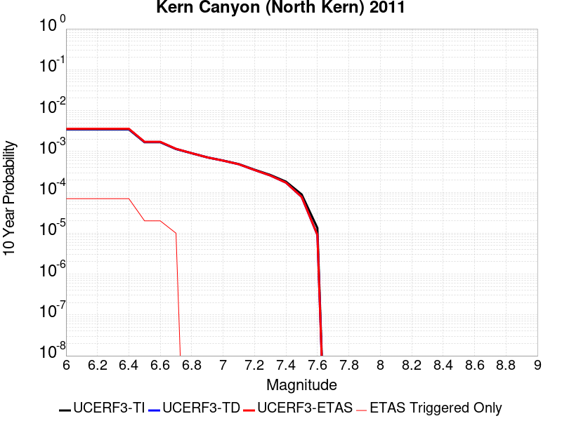 |

| Magnitude | 1 wk TI Prob | 1 wk TD Prob | 1 wk ETAS Prob | 1 wk ETAS/TD Gain | 1 wk ETAS Triggered Only | 1 mo TI Prob | 1 mo TD Prob | 1 mo ETAS Prob | 1 mo ETAS/TD Gain | 1 mo ETAS Triggered Only | 1 yr TI Prob | 1 yr TD Prob | 1 yr ETAS Prob | 1 yr ETAS/TD Gain | 1 yr ETAS Triggered Only | 10 yr TI Prob | 10 yr TD Prob | 10 yr ETAS Prob | 10 yr ETAS/TD Gain | 10 yr ETAS Triggered Only |
|-----|-----|-----|-----|-----|-----|-----|-----|-----|-----|-----|-----|-----|-----|-----|-----|-----|-----|-----|-----|-----|
| 6.0 | 6.6264497E-6 | 6.7573324E-6 | 6.7573324E-6 | 1.0 | 0.0 | 2.8398761E-5 | 2.895972E-5 | 2.895972E-5 | 1.0 | 0.0 | 3.4570007E-4 | 3.5253554E-4 | 3.62532E-4 | 1.028356 | 1.0E-5 | 0.0034516277 | 0.0035205514 | 0.0035903049 | 1.0198133 | 7.0E-5 |
| 6.1 | 6.6264497E-6 | 6.7573324E-6 | 6.7573324E-6 | 1.0 | 0.0 | 2.8398761E-5 | 2.895972E-5 | 2.895972E-5 | 1.0 | 0.0 | 3.4570007E-4 | 3.5253554E-4 | 3.62532E-4 | 1.028356 | 1.0E-5 | 0.0034516277 | 0.0035205514 | 0.0035903049 | 1.0198133 | 7.0E-5 |
| 6.2 | 6.6264497E-6 | 6.7573324E-6 | 6.7573324E-6 | 1.0 | 0.0 | 2.8398761E-5 | 2.895972E-5 | 2.895972E-5 | 1.0 | 0.0 | 3.4570007E-4 | 3.5253554E-4 | 3.62532E-4 | 1.028356 | 1.0E-5 | 0.0034516277 | 0.0035205514 | 0.0035903049 | 1.0198133 | 7.0E-5 |
| 6.3 | 6.6264497E-6 | 6.7573324E-6 | 6.7573324E-6 | 1.0 | 0.0 | 2.8398761E-5 | 2.895972E-5 | 2.895972E-5 | 1.0 | 0.0 | 3.4570007E-4 | 3.5253554E-4 | 3.62532E-4 | 1.028356 | 1.0E-5 | 0.0034516277 | 0.0035205514 | 0.0035903049 | 1.0198133 | 7.0E-5 |
| 6.4 | 6.6264497E-6 | 6.7573324E-6 | 6.7573324E-6 | 1.0 | 0.0 | 2.8398761E-5 | 2.895972E-5 | 2.895972E-5 | 1.0 | 0.0 | 3.4570007E-4 | 3.5253554E-4 | 3.62532E-4 | 1.028356 | 1.0E-5 | 0.0034516277 | 0.0035205514 | 0.0035903049 | 1.0198133 | 7.0E-5 |
| 6.5 | 3.2162225E-6 | 3.2570924E-6 | 3.2570924E-6 | 1.0 | 0.0 | 1.3783738E-5 | 1.3958897E-5 | 1.3958897E-5 | 1.0 | 0.0 | 1.6780409E-4 | 1.6993712E-4 | 1.7993542E-4 | 1.0588353 | 1.0E-5 | 0.0016767744 | 0.0016981515 | 0.0017181175 | 1.0117575 | 2.0E-5 |
| 6.6 | 3.2162225E-6 | 3.2570924E-6 | 3.2570924E-6 | 1.0 | 0.0 | 1.3783738E-5 | 1.3958897E-5 | 1.3958897E-5 | 1.0 | 0.0 | 1.6780409E-4 | 1.6993712E-4 | 1.7993542E-4 | 1.0588353 | 1.0E-5 | 0.0016767744 | 0.0016981515 | 0.0017181175 | 1.0117575 | 2.0E-5 |
| 6.7 | 2.1908265E-6 | 2.2071229E-6 | 2.2071229E-6 | 1.0 | 0.0 | 9.389223E-6 | 9.459064E-6 | 9.459064E-6 | 1.0 | 0.0 | 1.1430779E-4 | 1.1515822E-4 | 1.2515706E-4 | 1.086827 | 1.0E-5 | 0.0011424901 | 0.0011510049 | 0.0011609934 | 1.0086781 | 1.0E-5 |
| 6.8 | 1.7303895E-6 | 1.7365534E-6 | 1.7365534E-6 | 1.0 | 0.0 | 7.415934E-6 | 7.442351E-6 | 7.442351E-6 | 1.0 | 0.0 | 9.028525E-5 | 9.0606954E-5 | 9.0606954E-5 | 1.0 | 0.0 | 9.024858E-4 | 9.0570987E-4 | 9.0570987E-4 | 1.0 | 0.0 |
| 6.9 | 1.3700314E-6 | 1.3688626E-6 | 1.3688626E-6 | 1.0 | 0.0 | 5.87155E-6 | 5.8665414E-6 | 5.8665414E-6 | 1.0 | 0.0 | 7.148377E-5 | 7.1422844E-5 | 7.1422844E-5 | 1.0 | 0.0 | 7.146078E-4 | 7.1400346E-4 | 7.1400346E-4 | 1.0 | 0.0 |
| 7.0 | 1.1467797E-6 | 1.1413808E-6 | 1.1413808E-6 | 1.0 | 0.0 | 4.9147607E-6 | 4.891623E-6 | 4.891623E-6 | 1.0 | 0.0 | 5.983557E-5 | 5.9553913E-5 | 5.9553913E-5 | 1.0 | 0.0 | 5.981946E-4 | 5.953827E-4 | 5.953827E-4 | 1.0 | 0.0 |
| 7.1 | 9.3952065E-7 | 9.302694E-7 | 9.302694E-7 | 1.0 | 0.0 | 4.026511E-6 | 3.986863E-6 | 3.986863E-6 | 1.0 | 0.0 | 4.9021666E-5 | 4.853899E-5 | 4.853899E-5 | 1.0 | 0.0 | 4.901085E-4 | 4.8528565E-4 | 4.8528565E-4 | 1.0 | 0.0 |
| 7.2 | 6.858055E-7 | 6.719303E-7 | 6.719303E-7 | 1.0 | 0.0 | 2.939163E-6 | 2.8796983E-6 | 2.8796983E-6 | 1.0 | 0.0 | 3.5783723E-5 | 3.505977E-5 | 3.505977E-5 | 1.0 | 0.0 | 3.5777962E-4 | 3.5054327E-4 | 3.5054327E-4 | 1.0 | 0.0 |
| 7.3 | 5.1101983E-7 | 4.939302E-7 | 4.939302E-7 | 1.0 | 0.0 | 2.1900833E-6 | 2.116842E-6 | 2.116842E-6 | 1.0 | 0.0 | 2.6663936E-5 | 2.5772251E-5 | 2.5772251E-5 | 1.0 | 0.0 | 2.6660739E-4 | 2.5769311E-4 | 2.5769311E-4 | 1.0 | 0.0 |
| 7.4 | 3.4999414E-7 | 3.2995925E-7 | 3.2995925E-7 | 1.0 | 0.0 | 1.499974E-6 | 1.4141102E-6 | 1.4141102E-6 | 1.0 | 0.0 | 1.8262032E-5 | 1.7216658E-5 | 1.7216658E-5 | 1.0 | 0.0 | 1.826053E-4 | 1.721535E-4 | 1.721535E-4 | 1.0 | 0.0 |
| 7.5 | 1.7021522E-7 | 1.4750057E-7 | 1.4750057E-7 | 1.0 | 0.0 | 7.2949354E-7 | 6.321452E-7 | 6.321452E-7 | 1.0 | 0.0 | 8.881548E-6 | 7.6963415E-6 | 7.6963415E-6 | 1.0 | 0.0 | 8.8811925E-5 | 7.696083E-5 | 7.696083E-5 | 1.0 | 0.0 |
| 7.6 | 2.572245E-8 | 1.735264E-8 | 1.735264E-8 | 1.0 | 0.0 | 1.10239064E-7 | 7.436845E-8 | 7.436845E-8 | 1.0 | 0.0 | 1.3421597E-6 | 9.0543557E-7 | 9.0543557E-7 | 1.0 | 0.0 | 1.3421517E-5 | 9.054324E-6 | 9.054324E-6 | 1.0 | 0.0 |

## Ortigalita (North)
*[(top)](#table-of-contents)*

| 1 Week | 1 Month | 1 Year | 10 Year |
|-----|-----|-----|-----|
| 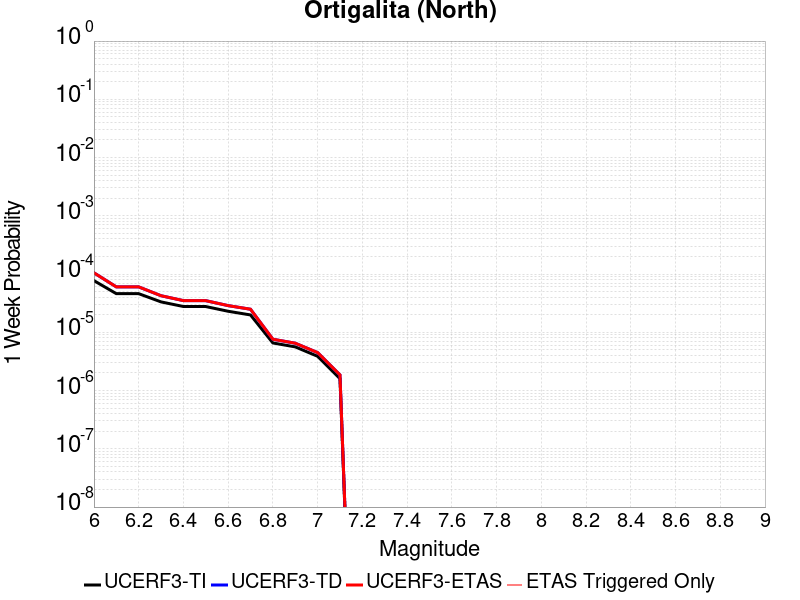 |  |  |  |

| Magnitude | 1 wk TI Prob | 1 wk TD Prob | 1 wk ETAS Prob | 1 wk ETAS/TD Gain | 1 wk ETAS Triggered Only | 1 mo TI Prob | 1 mo TD Prob | 1 mo ETAS Prob | 1 mo ETAS/TD Gain | 1 mo ETAS Triggered Only | 1 yr TI Prob | 1 yr TD Prob | 1 yr ETAS Prob | 1 yr ETAS/TD Gain | 1 yr ETAS Triggered Only | 10 yr TI Prob | 10 yr TD Prob | 10 yr ETAS Prob | 10 yr ETAS/TD Gain | 10 yr ETAS Triggered Only |
|-----|-----|-----|-----|-----|-----|-----|-----|-----|-----|-----|-----|-----|-----|-----|-----|-----|-----|-----|-----|-----|
| 6.0 | 7.711876E-5 | 1.05053565E-4 | 1.05053565E-4 | 1.0 | 0.0 | 3.3046713E-4 | 4.5016213E-4 | 4.6015764E-4 | 1.0222042 | 1.0E-5 | 0.004016016 | 0.005468077 | 0.0055078585 | 1.0072752 | 4.0E-5 | 0.039442103 | 0.053455822 | 0.053512618 | 1.0010624 | 6.0E-5 |
| 6.1 | 4.607858E-5 | 6.0240123E-5 | 6.0240123E-5 | 1.0 | 0.0 | 1.9746469E-4 | 2.581486E-4 | 2.6814602E-4 | 1.0387274 | 1.0E-5 | 0.0024014818 | 0.0031387482 | 0.0031586855 | 1.006352 | 2.0E-5 | 0.023756953 | 0.030975424 | 0.030994803 | 1.0006257 | 2.0E-5 |
| 6.2 | 4.607858E-5 | 6.0240123E-5 | 6.0240123E-5 | 1.0 | 0.0 | 1.9746469E-4 | 2.581486E-4 | 2.6814602E-4 | 1.0387274 | 1.0E-5 | 0.0024014818 | 0.0031387482 | 0.0031586855 | 1.006352 | 2.0E-5 | 0.023756953 | 0.030975424 | 0.030994803 | 1.0006257 | 2.0E-5 |
| 6.3 | 3.327423E-5 | 4.2476273E-5 | 4.2476273E-5 | 1.0 | 0.0 | 1.4259605E-4 | 1.8203018E-4 | 1.9202837E-4 | 1.0549259 | 1.0E-5 | 0.0017347244 | 0.0022142136 | 0.0022341693 | 1.0090126 | 2.0E-5 | 0.017212452 | 0.021945814 | 0.021965373 | 1.0008913 | 2.0E-5 |
| 6.4 | 2.7732503E-5 | 3.499912E-5 | 3.499912E-5 | 1.0 | 0.0 | 1.1884817E-4 | 1.499891E-4 | 1.599876E-4 | 1.0666615 | 1.0E-5 | 0.001446016 | 0.0018248218 | 0.0018348035 | 1.00547 | 1.0E-5 | 0.014366428 | 0.018121356 | 0.018131174 | 1.0005418 | 1.0E-5 |
| 6.5 | 2.7689714E-5 | 3.4948935E-5 | 3.4948935E-5 | 1.0 | 0.0 | 1.186648E-4 | 1.4977403E-4 | 1.5977253E-4 | 1.0667572 | 1.0E-5 | 0.0014437864 | 0.0018222078 | 0.0018321896 | 1.0054779 | 1.0E-5 | 0.014344421 | 0.018095642 | 0.018105462 | 1.0005426 | 1.0E-5 |
| 6.6 | 2.2976905E-5 | 2.8718381E-5 | 2.8718381E-5 | 1.0 | 0.0 | 9.846873E-5 | 1.230744E-4 | 1.3307316E-4 | 1.0812417 | 1.0E-5 | 0.0011981975 | 0.0014976396 | 0.0015076246 | 1.0066671 | 1.0E-5 | 0.011917574 | 0.014898781 | 0.014908631 | 1.0006613 | 1.0E-5 |
| 6.7 | 1.9871539E-5 | 2.4904717E-5 | 2.4904717E-5 | 1.0 | 0.0 | 8.516096E-5 | 1.0673154E-4 | 1.1673047E-4 | 1.093683 | 1.0E-5 | 0.0010363415 | 0.0012989241 | 0.0013089111 | 1.0076886 | 1.0E-5 | 0.010315218 | 0.0129369795 | 0.01294685 | 1.0007629 | 1.0E-5 |
| 6.8 | 6.5640475E-6 | 7.605507E-6 | 7.605507E-6 | 1.0 | 0.0 | 2.813133E-5 | 3.259464E-5 | 3.259464E-5 | 1.0 | 0.0 | 3.424451E-4 | 3.9677034E-4 | 3.9677034E-4 | 1.0 | 0.0 | 0.0034191788 | 0.0039609065 | 0.0039609065 | 1.0 | 0.0 |
| 6.9 | 5.6219683E-6 | 6.5018503E-6 | 6.5018503E-6 | 1.0 | 0.0 | 2.4093928E-5 | 2.786479E-5 | 2.786479E-5 | 1.0 | 0.0 | 2.933041E-4 | 3.3920357E-4 | 3.3920357E-4 | 1.0 | 0.0 | 0.0029291727 | 0.0033871154 | 0.0033871154 | 1.0 | 0.0 |
| 7.0 | 3.875591E-6 | 4.484764E-6 | 4.484764E-6 | 1.0 | 0.0 | 1.6609569E-5 | 1.9220286E-5 | 1.9220286E-5 | 1.0 | 0.0 | 2.0220275E-4 | 2.3398397E-4 | 2.3398397E-4 | 1.0 | 0.0 | 0.0020201886 | 0.0023375843 | 0.0023375843 | 1.0 | 0.0 |
| 7.1 | 1.6017933E-6 | 1.8570454E-6 | 1.8570454E-6 | 1.0 | 0.0 | 6.8648105E-6 | 7.958748E-6 | 7.958748E-6 | 1.0 | 0.0 | 8.357586E-5 | 9.689451E-5 | 9.689451E-5 | 1.0 | 0.0 | 8.3544437E-4 | 9.6862734E-4 | 9.6862734E-4 | 1.0 | 0.0 |

## San Diego Trough south
*[(top)](#table-of-contents)*

| 1 Week | 1 Month | 1 Year | 10 Year |
|-----|-----|-----|-----|
|  |  | 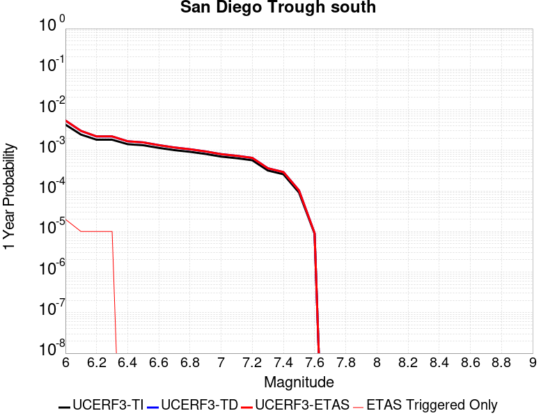 |  |

| Magnitude | 1 wk TI Prob | 1 wk TD Prob | 1 wk ETAS Prob | 1 wk ETAS/TD Gain | 1 wk ETAS Triggered Only | 1 mo TI Prob | 1 mo TD Prob | 1 mo ETAS Prob | 1 mo ETAS/TD Gain | 1 mo ETAS Triggered Only | 1 yr TI Prob | 1 yr TD Prob | 1 yr ETAS Prob | 1 yr ETAS/TD Gain | 1 yr ETAS Triggered Only | 10 yr TI Prob | 10 yr TD Prob | 10 yr ETAS Prob | 10 yr ETAS/TD Gain | 10 yr ETAS Triggered Only |
|-----|-----|-----|-----|-----|-----|-----|-----|-----|-----|-----|-----|-----|-----|-----|-----|-----|-----|-----|-----|-----|
| 6.0 | 8.279495E-5 | 1.0425574E-4 | 1.142547E-4 | 1.0959079 | 1.0E-5 | 3.5478722E-4 | 4.4673638E-4 | 4.6672745E-4 | 1.0447491 | 2.0E-5 | 0.004310982 | 0.0054259305 | 0.0054458217 | 1.003666 | 2.0E-5 | 0.042283054 | 0.05299319 | 0.053050008 | 1.0010722 | 6.0E-5 |
| 6.1 | 4.6961468E-5 | 5.773039E-5 | 6.7729816E-5 | 1.173209 | 1.0E-5 | 2.0124791E-4 | 2.4739112E-4 | 2.5738866E-4 | 1.0404118 | 1.0E-5 | 0.00244744 | 0.0030078944 | 0.0030178642 | 1.0033146 | 1.0E-5 | 0.024206603 | 0.029679717 | 0.029708827 | 1.0009807 | 3.0E-5 |
| 6.2 | 3.5079658E-5 | 4.2142667E-5 | 5.2142244E-5 | 1.2372792 | 1.0E-5 | 1.5033272E-4 | 1.8059873E-4 | 1.9059693E-4 | 1.0553614 | 1.0E-5 | 0.0018287642 | 0.0021965925 | 0.0022065705 | 1.0045425 | 1.0E-5 | 0.018137876 | 0.02175124 | 0.021770805 | 1.0008994 | 2.0E-5 |
| 6.3 | 3.5079658E-5 | 4.2142667E-5 | 5.2142244E-5 | 1.2372792 | 1.0E-5 | 1.5033272E-4 | 1.8059873E-4 | 1.9059693E-4 | 1.0553614 | 1.0E-5 | 0.0018287642 | 0.0021965925 | 0.0022065705 | 1.0045425 | 1.0E-5 | 0.018137876 | 0.02175124 | 0.021770805 | 1.0008994 | 2.0E-5 |
| 6.4 | 2.7196904E-5 | 3.2087224E-5 | 3.2087224E-5 | 1.0 | 0.0 | 1.16552954E-4 | 1.3750941E-4 | 1.3750941E-4 | 1.0 | 0.0 | 0.0014181085 | 0.0016729032 | 0.0016729032 | 1.0 | 0.0 | 0.014090929 | 0.016604703 | 0.016614536 | 1.0005922 | 1.0E-5 |
| 6.5 | 2.5584688E-5 | 3.0101699E-5 | 3.0101699E-5 | 1.0 | 0.0 | 1.0964406E-4 | 1.2900088E-4 | 1.2900088E-4 | 1.0 | 0.0 | 0.0013340989 | 0.0015694661 | 0.0015694661 | 1.0 | 0.0 | 0.013261181 | 0.015585366 | 0.01559521 | 1.0006316 | 1.0E-5 |
| 6.6 | 2.2034688E-5 | 2.5742764E-5 | 2.5742764E-5 | 1.0 | 0.0 | 9.443096E-5 | 1.103215E-4 | 1.103215E-4 | 1.0 | 0.0 | 0.0011490905 | 0.001342344 | 0.001342344 | 1.0 | 0.0 | 0.011431668 | 0.013343353 | 0.013353219 | 1.0007395 | 1.0E-5 |
| 6.7 | 1.9394853E-5 | 2.2541806E-5 | 2.2541806E-5 | 1.0 | 0.0 | 8.311815E-5 | 9.660419E-5 | 9.660419E-5 | 1.0 | 0.0 | 0.0010114936 | 0.0011755268 | 0.0011755268 | 1.0 | 0.0 | 0.01006902 | 0.01169379 | 0.011703673 | 1.0008452 | 1.0E-5 |
| 6.8 | 1.7615313E-5 | 2.0403222E-5 | 2.0403222E-5 | 1.0 | 0.0 | 7.549201E-5 | 8.7439475E-5 | 8.7439475E-5 | 1.0 | 0.0 | 9.1872766E-4 | 0.00106406 | 0.00106406 | 1.0 | 0.0 | 0.009149387 | 0.010590219 | 0.010600113 | 1.0009342 | 1.0E-5 |
| 6.9 | 1.5621423E-5 | 1.8026149E-5 | 1.8026149E-5 | 1.0 | 0.0 | 6.6947236E-5 | 7.7252655E-5 | 7.7252655E-5 | 1.0 | 0.0 | 8.147778E-4 | 9.401488E-4 | 9.401488E-4 | 1.0 | 0.0 | 0.008117969 | 0.009362159 | 0.009362159 | 1.0 | 0.0 |
| 7.0 | 1.3444376E-5 | 1.5448117E-5 | 1.5448117E-5 | 1.0 | 0.0 | 5.7617483E-5 | 6.620455E-5 | 6.620455E-5 | 1.0 | 0.0 | 7.0126704E-4 | 8.0574513E-4 | 8.0574513E-4 | 1.0 | 0.0 | 0.006990582 | 0.00802857 | 0.00802857 | 1.0 | 0.0 |
| 7.1 | 1.2268361E-5 | 1.4073055E-5 | 1.4073055E-5 | 1.0 | 0.0 | 5.2577634E-5 | 6.0311715E-5 | 6.0311715E-5 | 1.0 | 0.0 | 6.399447E-4 | 7.340504E-4 | 7.340504E-4 | 1.0 | 0.0 | 0.0063810493 | 0.0073165623 | 0.0073165623 | 1.0 | 0.0 |
| 7.2 | 1.0922655E-5 | 1.2513586E-5 | 1.2513586E-5 | 1.0 | 0.0 | 4.681054E-5 | 5.3628566E-5 | 5.3628566E-5 | 1.0 | 0.0 | 5.697693E-4 | 6.527347E-4 | 6.527347E-4 | 1.0 | 0.0 | 0.0056831064 | 0.0065084556 | 0.0065084556 | 1.0 | 0.0 |
| 7.3 | 6.1106753E-6 | 6.9289363E-6 | 6.9289363E-6 | 1.0 | 0.0 | 2.6188345E-5 | 2.9695106E-5 | 2.9695106E-5 | 1.0 | 0.0 | 3.1879646E-4 | 3.6147833E-4 | 3.6147833E-4 | 1.0 | 0.0 | 0.0031833951 | 0.003608949 | 0.003608949 | 1.0 | 0.0 |
| 7.4 | 4.933187E-6 | 5.5895616E-6 | 5.5895616E-6 | 1.0 | 0.0 | 2.114206E-5 | 2.3955046E-5 | 2.3955046E-5 | 1.0 | 0.0 | 2.5737417E-4 | 2.9161407E-4 | 2.9161407E-4 | 1.0 | 0.0 | 0.002570763 | 0.0029123551 | 0.0029123551 | 1.0 | 0.0 |
| 7.5 | 1.7489613E-6 | 1.969681E-6 | 1.969681E-6 | 1.0 | 0.0 | 7.495527E-6 | 8.441464E-6 | 8.441464E-6 | 1.0 | 0.0 | 9.125422E-5 | 1.027702E-4 | 1.027702E-4 | 1.0 | 0.0 | 9.1216754E-4 | 0.0010272488 | 0.0010272488 | 1.0 | 0.0 |
| 7.6 | 1.6988751E-7 | 1.753383E-7 | 1.753383E-7 | 1.0 | 0.0 | 7.2808916E-7 | 7.5144965E-7 | 7.5144965E-7 | 1.0 | 0.0 | 8.864449E-6 | 9.148864E-6 | 9.148864E-6 | 1.0 | 0.0 | 8.8640954E-5 | 9.148506E-5 | 9.148506E-5 | 1.0 | 0.0 |

## Coronado Bank alt1
*[(top)](#table-of-contents)*

| 1 Week | 1 Month | 1 Year | 10 Year |
|-----|-----|-----|-----|
| 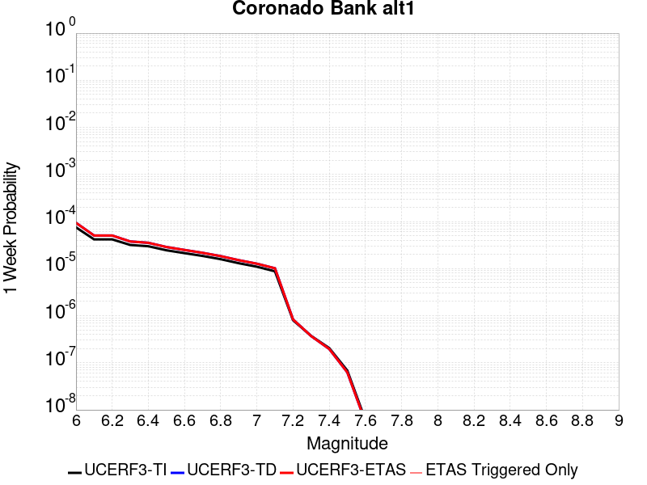 |  |  |  |

| Magnitude | 1 wk TI Prob | 1 wk TD Prob | 1 wk ETAS Prob | 1 wk ETAS/TD Gain | 1 wk ETAS Triggered Only | 1 mo TI Prob | 1 mo TD Prob | 1 mo ETAS Prob | 1 mo ETAS/TD Gain | 1 mo ETAS Triggered Only | 1 yr TI Prob | 1 yr TD Prob | 1 yr ETAS Prob | 1 yr ETAS/TD Gain | 1 yr ETAS Triggered Only | 10 yr TI Prob | 10 yr TD Prob | 10 yr ETAS Prob | 10 yr ETAS/TD Gain | 10 yr ETAS Triggered Only |
|-----|-----|-----|-----|-----|-----|-----|-----|-----|-----|-----|-----|-----|-----|-----|-----|-----|-----|-----|-----|-----|
| 6.0 | 7.533492E-5 | 9.3952E-5 | 9.3952E-5 | 1.0 | 0.0 | 3.22824E-4 | 4.0259148E-4 | 4.0259148E-4 | 1.0 | 0.0 | 0.0039233007 | 0.0048911357 | 0.004920989 | 1.0061035 | 3.0E-5 | 0.03854755 | 0.04790414 | 0.04796127 | 1.0011925 | 6.0E-5 |
| 6.1 | 4.1807285E-5 | 5.0493236E-5 | 5.0493236E-5 | 1.0 | 0.0 | 1.7916178E-4 | 2.1638192E-4 | 2.1638192E-4 | 1.0 | 0.0 | 0.0021791123 | 0.0026313432 | 0.0026612643 | 1.011371 | 3.0E-5 | 0.021578677 | 0.02601119 | 0.02605989 | 1.0018723 | 5.0E-5 |
| 6.2 | 4.1807285E-5 | 5.0493236E-5 | 5.0493236E-5 | 1.0 | 0.0 | 1.7916178E-4 | 2.1638192E-4 | 2.1638192E-4 | 1.0 | 0.0 | 0.0021791123 | 0.0026313432 | 0.0026612643 | 1.011371 | 3.0E-5 | 0.021578677 | 0.02601119 | 0.02605989 | 1.0018723 | 5.0E-5 |
| 6.3 | 3.1793104E-5 | 3.7711216E-5 | 3.7711216E-5 | 1.0 | 0.0 | 1.3624904E-4 | 1.6160964E-4 | 1.6160964E-4 | 1.0 | 0.0 | 0.0016575698 | 0.0019658536 | 0.0019957945 | 1.0152305 | 3.0E-5 | 0.016452603 | 0.01948854 | 0.019537566 | 1.0025156 | 5.0E-5 |
| 6.4 | 2.9878007E-5 | 3.5335877E-5 | 3.5335877E-5 | 1.0 | 0.0 | 1.2804232E-4 | 1.5143088E-4 | 1.5143088E-4 | 1.0 | 0.0 | 0.0015578003 | 0.0018421437 | 0.0018720884 | 1.0162554 | 3.0E-5 | 0.015469253 | 0.018272506 | 0.018321592 | 1.0026864 | 5.0E-5 |
| 6.5 | 2.4512565E-5 | 2.8764163E-5 | 2.8764163E-5 | 1.0 | 0.0 | 1.0504962E-4 | 1.2326932E-4 | 1.2326932E-4 | 1.0 | 0.0 | 0.0012782287 | 0.0014997976 | 0.0015197676 | 1.0133151 | 2.0E-5 | 0.012709012 | 0.014899725 | 0.014939128 | 1.0026447 | 4.0E-5 |
| 6.6 | 2.1317413E-5 | 2.4906722E-5 | 2.4906722E-5 | 1.0 | 0.0 | 9.135714E-5 | 1.0673886E-4 | 1.0673886E-4 | 1.0 | 0.0 | 0.0011117056 | 0.0012987931 | 0.0013187671 | 1.015379 | 2.0E-5 | 0.011061605 | 0.012914434 | 0.0129539175 | 1.0030574 | 4.0E-5 |
| 6.7 | 1.8585655E-5 | 2.1634925E-5 | 2.1634925E-5 | 1.0 | 0.0 | 7.9650374E-5 | 9.271793E-5 | 9.271793E-5 | 1.0 | 0.0 | 9.6931186E-4 | 0.0011282767 | 0.0011482541 | 1.0177062 | 2.0E-5 | 0.0096509475 | 0.011227646 | 0.011267196 | 1.0035226 | 4.0E-5 |
| 6.8 | 1.5862879E-5 | 1.8419512E-5 | 1.8419512E-5 | 1.0 | 0.0 | 6.798199E-5 | 7.8938494E-5 | 7.8938494E-5 | 1.0 | 0.0 | 8.273665E-4 | 9.6067163E-4 | 9.806524E-4 | 1.0207988 | 2.0E-5 | 0.008242928 | 0.0095671695 | 0.009606787 | 1.004141 | 4.0E-5 |
| 6.9 | 1.3021509E-5 | 1.5095296E-5 | 1.5095296E-5 | 1.0 | 0.0 | 5.5805274E-5 | 6.469262E-5 | 6.469262E-5 | 1.0 | 0.0 | 6.792174E-4 | 7.873662E-4 | 8.0735044E-4 | 1.0253811 | 2.0E-5 | 0.006771452 | 0.0078475885 | 0.007887275 | 1.0050571 | 4.0E-5 |
| 7.0 | 1.0974371E-5 | 1.272013E-5 | 1.272013E-5 | 1.0 | 0.0 | 4.7032172E-5 | 5.4513806E-5 | 5.4513806E-5 | 1.0 | 0.0 | 5.7246623E-4 | 6.6352106E-4 | 6.8350777E-4 | 1.0301223 | 2.0E-5 | 0.0057099373 | 0.0066171484 | 0.0066568838 | 1.0060049 | 4.0E-5 |
| 7.1 | 8.766221E-6 | 1.0163853E-5 | 1.0163853E-5 | 1.0 | 0.0 | 3.7568978E-5 | 4.3558743E-5 | 4.3558743E-5 | 1.0 | 0.0 | 4.573063E-4 | 5.3021585E-4 | 5.5020524E-4 | 1.0377005 | 2.0E-5 | 0.0045636636 | 0.0052912077 | 0.005330996 | 1.0075197 | 4.0E-5 |
| 7.2 | 8.026024E-7 | 8.331782E-7 | 8.331782E-7 | 1.0 | 0.0 | 3.43972E-6 | 3.570759E-6 | 3.570759E-6 | 1.0 | 0.0 | 4.1877785E-5 | 4.3473134E-5 | 4.3473134E-5 | 1.0 | 0.0 | 4.1869894E-4 | 4.346474E-4 | 4.346474E-4 | 1.0 | 0.0 |
| 7.3 | 3.7293114E-7 | 3.700108E-7 | 3.700108E-7 | 1.0 | 0.0 | 1.5982754E-6 | 1.5857596E-6 | 1.5857596E-6 | 1.0 | 0.0 | 1.9458828E-5 | 1.9306453E-5 | 1.9306453E-5 | 1.0 | 0.0 | 1.9457124E-4 | 1.9304783E-4 | 1.9304783E-4 | 1.0 | 0.0 |
| 7.4 | 2.0557036E-7 | 1.9674448E-7 | 1.9674448E-7 | 1.0 | 0.0 | 8.810155E-7 | 8.431904E-7 | 8.431904E-7 | 1.0 | 0.0 | 1.0726311E-5 | 1.0265794E-5 | 1.0265794E-5 | 1.0 | 0.0 | 1.0725793E-4 | 1.0265323E-4 | 1.0265323E-4 | 1.0 | 0.0 |
| 7.5 | 6.845446E-8 | 6.279409E-8 | 6.279409E-8 | 1.0 | 0.0 | 2.9337625E-7 | 2.691175E-7 | 2.691175E-7 | 1.0 | 0.0 | 3.5718497E-6 | 3.2765008E-6 | 3.2765008E-6 | 1.0 | 0.0 | 3.5717923E-5 | 3.2764532E-5 | 3.2764532E-5 | 1.0 | 0.0 |
| 7.6 | 6.0975145E-9 | 5.531901E-9 | 5.531901E-9 | 1.0 | 0.0 | 2.6132206E-8 | 2.3708148E-8 | 2.3708148E-8 | 1.0 | 0.0 | 3.1815955E-7 | 2.8864667E-7 | 2.8864667E-7 | 1.0 | 0.0 | 3.181591E-6 | 2.886464E-6 | 2.886464E-6 | 1.0 | 0.0 |

## San Luis Range 2011 CFM
*[(top)](#table-of-contents)*

| 1 Week | 1 Month | 1 Year | 10 Year |
|-----|-----|-----|-----|
|  |  |  |  |

| Magnitude | 1 wk TI Prob | 1 wk TD Prob | 1 wk ETAS Prob | 1 wk ETAS/TD Gain | 1 wk ETAS Triggered Only | 1 mo TI Prob | 1 mo TD Prob | 1 mo ETAS Prob | 1 mo ETAS/TD Gain | 1 mo ETAS Triggered Only | 1 yr TI Prob | 1 yr TD Prob | 1 yr ETAS Prob | 1 yr ETAS/TD Gain | 1 yr ETAS Triggered Only | 10 yr TI Prob | 10 yr TD Prob | 10 yr ETAS Prob | 10 yr ETAS/TD Gain | 10 yr ETAS Triggered Only |
|-----|-----|-----|-----|-----|-----|-----|-----|-----|-----|-----|-----|-----|-----|-----|-----|-----|-----|-----|-----|-----|
| 6.0 | 8.8368415E-6 | 8.965457E-6 | 8.965457E-6 | 1.0 | 0.0 | 3.787163E-5 | 3.8422866E-5 | 4.842248E-5 | 1.2602516 | 1.0E-5 | 4.609895E-4 | 4.6770586E-4 | 4.976918E-4 | 1.0641129 | 3.0E-5 | 0.0046003438 | 0.004667998 | 0.0047177644 | 1.0106612 | 5.0E-5 |
| 6.1 | 8.8368415E-6 | 8.965457E-6 | 8.965457E-6 | 1.0 | 0.0 | 3.787163E-5 | 3.8422866E-5 | 4.842248E-5 | 1.2602516 | 1.0E-5 | 4.609895E-4 | 4.6770586E-4 | 4.976918E-4 | 1.0641129 | 3.0E-5 | 0.0046003438 | 0.004667998 | 0.0047177644 | 1.0106612 | 5.0E-5 |
| 6.2 | 8.8368415E-6 | 8.965457E-6 | 8.965457E-6 | 1.0 | 0.0 | 3.787163E-5 | 3.8422866E-5 | 4.842248E-5 | 1.2602516 | 1.0E-5 | 4.609895E-4 | 4.6770586E-4 | 4.976918E-4 | 1.0641129 | 3.0E-5 | 0.0046003438 | 0.004667998 | 0.0047177644 | 1.0106612 | 5.0E-5 |
| 6.3 | 8.8368415E-6 | 8.965457E-6 | 8.965457E-6 | 1.0 | 0.0 | 3.787163E-5 | 3.8422866E-5 | 4.842248E-5 | 1.2602516 | 1.0E-5 | 4.609895E-4 | 4.6770586E-4 | 4.976918E-4 | 1.0641129 | 3.0E-5 | 0.0046003438 | 0.004667998 | 0.0047177644 | 1.0106612 | 5.0E-5 |
| 6.4 | 3.9094193E-6 | 3.941205E-6 | 3.941205E-6 | 1.0 | 0.0 | 1.6754546E-5 | 1.689077E-5 | 1.689077E-5 | 1.0 | 0.0 | 2.039675E-4 | 2.05626E-4 | 2.1562394E-4 | 1.048622 | 1.0E-5 | 0.0020378039 | 0.002054386 | 0.002074345 | 1.0097153 | 2.0E-5 |
| 6.5 | 3.9094193E-6 | 3.941205E-6 | 3.941205E-6 | 1.0 | 0.0 | 1.6754546E-5 | 1.689077E-5 | 1.689077E-5 | 1.0 | 0.0 | 2.039675E-4 | 2.05626E-4 | 2.1562394E-4 | 1.048622 | 1.0E-5 | 0.0020378039 | 0.002054386 | 0.002074345 | 1.0097153 | 2.0E-5 |
| 6.6 | 3.0587726E-6 | 3.0753902E-6 | 3.0753902E-6 | 1.0 | 0.0 | 1.3108959E-5 | 1.3180177E-5 | 1.3180177E-5 | 1.0 | 0.0 | 1.595899E-4 | 1.6045696E-4 | 1.7045536E-4 | 1.062312 | 1.0E-5 | 0.0015947534 | 0.001603423 | 0.0016233909 | 1.0124533 | 2.0E-5 |
| 6.7 | 2.6160574E-6 | 2.6251291E-6 | 2.6251291E-6 | 1.0 | 0.0 | 1.1211626E-5 | 1.1250505E-5 | 1.1250505E-5 | 1.0 | 0.0 | 1.3649299E-4 | 1.3696635E-4 | 1.4696497E-4 | 1.0730007 | 1.0E-5 | 0.0013640919 | 0.0013688254 | 0.0013887981 | 1.0145911 | 2.0E-5 |
| 6.8 | 2.5110312E-6 | 2.5181419E-6 | 2.5181419E-6 | 1.0 | 0.0 | 1.0761518E-5 | 1.0791992E-5 | 1.0791992E-5 | 1.0 | 0.0 | 1.310136E-4 | 1.3138464E-4 | 1.4138332E-4 | 1.0761024 | 1.0E-5 | 0.0013093639 | 0.0013130755 | 0.0013330493 | 1.0152115 | 2.0E-5 |
| 6.9 | 1.8564405E-6 | 1.8524886E-6 | 1.8524886E-6 | 1.0 | 0.0 | 7.95615E-6 | 7.939213E-6 | 7.939213E-6 | 1.0 | 0.0 | 9.686181E-5 | 9.665565E-5 | 1.06654676E-4 | 1.1034501 | 1.0E-5 | 9.68196E-4 | 9.661381E-4 | 9.7612845E-4 | 1.0103405 | 1.0E-5 |
| 7.0 | 1.546127E-6 | 1.5369552E-6 | 1.5369552E-6 | 1.0 | 0.0 | 6.626242E-6 | 6.5869344E-6 | 6.5869344E-6 | 1.0 | 0.0 | 8.06715E-5 | 8.0192985E-5 | 9.019218E-5 | 1.1246892 | 1.0E-5 | 8.0642226E-4 | 8.0164114E-4 | 8.1163313E-4 | 1.0124644 | 1.0E-5 |
| 7.1 | 1.3368208E-6 | 1.3235341E-6 | 1.3235341E-6 | 1.0 | 0.0 | 5.7292195E-6 | 5.6722765E-6 | 5.6722765E-6 | 1.0 | 0.0 | 6.975101E-5 | 6.905778E-5 | 7.905709E-5 | 1.1447963 | 1.0E-5 | 6.972912E-4 | 6.903637E-4 | 7.003568E-4 | 1.0144751 | 1.0E-5 |
| 7.2 | 1.0623363E-6 | 1.045438E-6 | 1.045438E-6 | 1.0 | 0.0 | 4.5528623E-6 | 4.480441E-6 | 4.480441E-6 | 1.0 | 0.0 | 5.5429686E-5 | 5.4548007E-5 | 5.4548007E-5 | 1.0 | 0.0 | 5.5415864E-4 | 5.4534647E-4 | 5.4534647E-4 | 1.0 | 0.0 |
| 7.3 | 7.831679E-7 | 7.727402E-7 | 7.727402E-7 | 1.0 | 0.0 | 3.3564295E-6 | 3.3117394E-6 | 3.3117394E-6 | 1.0 | 0.0 | 4.086376E-5 | 4.0319683E-5 | 4.0319683E-5 | 1.0 | 0.0 | 4.0856248E-4 | 4.0312382E-4 | 4.0312382E-4 | 1.0 | 0.0 |
| 7.4 | 5.9558846E-7 | 5.910648E-7 | 5.910648E-7 | 1.0 | 0.0 | 2.5525194E-6 | 2.5331324E-6 | 2.5331324E-6 | 1.0 | 0.0 | 3.107648E-5 | 3.0840452E-5 | 3.0840452E-5 | 1.0 | 0.0 | 3.1072134E-4 | 3.083618E-4 | 3.083618E-4 | 1.0 | 0.0 |
| 7.5 | 4.1616502E-7 | 4.1196424E-7 | 4.1196424E-7 | 1.0 | 0.0 | 1.7835631E-6 | 1.7655598E-6 | 1.7655598E-6 | 1.0 | 0.0 | 2.1714664E-5 | 2.1495478E-5 | 2.1495478E-5 | 1.0 | 0.0 | 2.1712543E-4 | 2.1493404E-4 | 2.1493404E-4 | 1.0 | 0.0 |
| 7.6 | 2.3816014E-7 | 2.3376629E-7 | 2.3376629E-7 | 1.0 | 0.0 | 1.0206859E-6 | 1.0018551E-6 | 1.0018551E-6 | 1.0 | 0.0 | 1.242678E-5 | 1.2197518E-5 | 1.2197518E-5 | 1.0 | 0.0 | 1.2426086E-4 | 1.2196851E-4 | 1.2196851E-4 | 1.0 | 0.0 |
| 7.7 | 9.918777E-8 | 9.3868216E-8 | 9.3868216E-8 | 1.0 | 0.0 | 4.2509038E-7 | 4.0229227E-7 | 4.0229227E-7 | 1.0 | 0.0 | 5.1754632E-6 | 4.8978977E-6 | 4.8978977E-6 | 1.0 | 0.0 | 5.1753424E-5 | 4.89779E-5 | 4.89779E-5 | 1.0 | 0.0 |
| 7.8 | 3.4982556E-8 | 2.968682E-8 | 2.968682E-8 | 1.0 | 0.0 | 1.4992524E-7 | 1.2722923E-7 | 1.2722923E-7 | 1.0 | 0.0 | 1.8253382E-6 | 1.5490147E-6 | 1.5490147E-6 | 1.0 | 0.0 | 1.8253233E-5 | 1.5490039E-5 | 1.5490039E-5 | 1.0 | 0.0 |
| 7.9 | 1.6624908E-8 | 1.1477086E-8 | 1.1477086E-8 | 1.0 | 0.0 | 7.12496E-8 | 4.918751E-8 | 4.918751E-8 | 1.0 | 0.0 | 8.6746354E-7 | 5.9885775E-7 | 5.9885775E-7 | 1.0 | 0.0 | 8.674601E-6 | 5.9885615E-6 | 5.9885615E-6 | 1.0 | 0.0 |
| 8.0 | 6.3352315E-9 | 3.088739E-9 | 3.088739E-9 | 1.0 | 0.0 | 2.715099E-8 | 1.3237452E-8 | 1.3237452E-8 | 1.0 | 0.0 | 3.3056327E-7 | 1.6116596E-7 | 1.6116596E-7 | 1.0 | 0.0 | 3.3056278E-6 | 1.6116585E-6 | 1.6116585E-6 | 1.0 | 0.0 |

## Great Valley 09 (Laguna Seca)
*[(top)](#table-of-contents)*

| 1 Week | 1 Month | 1 Year | 10 Year |
|-----|-----|-----|-----|
|  |  |  | 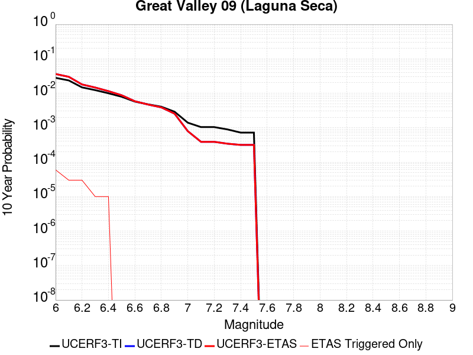 |

| Magnitude | 1 wk TI Prob | 1 wk TD Prob | 1 wk ETAS Prob | 1 wk ETAS/TD Gain | 1 wk ETAS Triggered Only | 1 mo TI Prob | 1 mo TD Prob | 1 mo ETAS Prob | 1 mo ETAS/TD Gain | 1 mo ETAS Triggered Only | 1 yr TI Prob | 1 yr TD Prob | 1 yr ETAS Prob | 1 yr ETAS/TD Gain | 1 yr ETAS Triggered Only | 10 yr TI Prob | 10 yr TD Prob | 10 yr ETAS Prob | 10 yr ETAS/TD Gain | 10 yr ETAS Triggered Only |
|-----|-----|-----|-----|-----|-----|-----|-----|-----|-----|-----|-----|-----|-----|-----|-----|-----|-----|-----|-----|-----|
| 6.0 | 5.4353277E-5 | 7.050048E-5 | 7.050048E-5 | 1.0 | 0.0 | 2.3292181E-4 | 3.021113E-4 | 3.021113E-4 | 1.0 | 0.0 | 0.0028321352 | 0.0036720196 | 0.0037118727 | 1.0108532 | 4.0E-5 | 0.02796312 | 0.036115978 | 0.03617381 | 1.0016013 | 6.0E-5 |
| 6.1 | 4.5578287E-5 | 5.8220776E-5 | 5.8220776E-5 | 1.0 | 0.0 | 1.953209E-4 | 2.4949448E-4 | 2.4949448E-4 | 1.0 | 0.0 | 0.0023754383 | 0.0030333663 | 0.0030632752 | 1.00986 | 3.0E-5 | 0.023502063 | 0.029919999 | 0.0299491 | 1.0009726 | 3.0E-5 |
| 6.2 | 2.8536782E-5 | 3.4736542E-5 | 3.4736542E-5 | 1.0 | 0.0 | 1.2229476E-4 | 1.4886209E-4 | 1.4886209E-4 | 1.0 | 0.0 | 0.0014879217 | 0.0018108636 | 0.0018408092 | 1.0165367 | 3.0E-5 | 0.014779986 | 0.017958334 | 0.017987795 | 1.0016406 | 3.0E-5 |
| 6.3 | 2.3698774E-5 | 2.8213439E-5 | 2.8213439E-5 | 1.0 | 0.0 | 1.01562226E-4 | 1.2090868E-4 | 1.2090868E-4 | 1.0 | 0.0 | 0.0012358186 | 0.0014710557 | 0.001481041 | 1.0067879 | 1.0E-5 | 0.012289686 | 0.014611499 | 0.014621354 | 1.0006744 | 1.0E-5 |
| 6.4 | 1.9191197E-5 | 2.2122957E-5 | 2.2122957E-5 | 1.0 | 0.0 | 8.2245395E-5 | 9.4809075E-5 | 9.4809075E-5 | 1.0 | 0.0 | 0.0010008777 | 0.001153694 | 0.0011636824 | 1.0086578 | 1.0E-5 | 0.009963818 | 0.011477055 | 0.01148694 | 1.0008613 | 1.0E-5 |
| 6.5 | 1.5203241E-5 | 1.6801343E-5 | 1.6801343E-5 | 1.0 | 0.0 | 6.5155116E-5 | 7.200355E-5 | 7.200355E-5 | 1.0 | 0.0 | 7.9297484E-4 | 8.7630324E-4 | 8.7630324E-4 | 1.0 | 0.0 | 0.007901512 | 0.008729603 | 0.008729603 | 1.0 | 0.0 |
| 6.6 | 1.0984925E-5 | 1.1242582E-5 | 1.1242582E-5 | 1.0 | 0.0 | 4.70774E-5 | 4.818163E-5 | 4.818163E-5 | 1.0 | 0.0 | 5.730166E-4 | 5.864572E-4 | 5.864572E-4 | 1.0 | 0.0 | 0.005715413 | 0.005849487 | 0.005849487 | 1.0 | 0.0 |
| 6.7 | 9.134616E-6 | 9.0198855E-6 | 9.0198855E-6 | 1.0 | 0.0 | 3.9147766E-5 | 3.8656093E-5 | 3.8656093E-5 | 1.0 | 0.0 | 4.7651984E-4 | 4.7053865E-4 | 4.7053865E-4 | 1.0 | 0.0 | 0.004754993 | 0.004695669 | 0.004695669 | 1.0 | 0.0 |
| 6.8 | 7.785589E-6 | 7.4519326E-6 | 7.4519326E-6 | 1.0 | 0.0 | 3.3366385E-5 | 3.1936474E-5 | 3.1936474E-5 | 1.0 | 0.0 | 4.0616E-4 | 3.8875922E-4 | 3.8875922E-4 | 1.0 | 0.0 | 0.0040541845 | 0.0038809953 | 0.0038809953 | 1.0 | 0.0 |
| 6.9 | 5.579095E-6 | 4.8984753E-6 | 4.8984753E-6 | 1.0 | 0.0 | 2.3910188E-5 | 2.0993304E-5 | 2.0993304E-5 | 1.0 | 0.0 | 2.9106764E-4 | 2.555649E-4 | 2.555649E-4 | 1.0 | 0.0 | 0.002906867 | 0.0025528471 | 0.0025528471 | 1.0 | 0.0 |
| 7.0 | 2.6816688E-6 | 1.5215887E-6 | 1.5215887E-6 | 1.0 | 0.0 | 1.1492816E-5 | 6.521079E-6 | 6.521079E-6 | 1.0 | 0.0 | 1.3991605E-4 | 7.939133E-5 | 7.939133E-5 | 1.0 | 0.0 | 0.0013982799 | 7.936384E-4 | 7.936384E-4 | 1.0 | 0.0 |
| 7.1 | 1.9951021E-6 | 7.453575E-7 | 7.453575E-7 | 1.0 | 0.0 | 8.55041E-6 | 3.1943857E-6 | 3.1943857E-6 | 1.0 | 0.0 | 1.0409627E-4 | 3.8890994E-5 | 3.8890994E-5 | 1.0 | 0.0 | 0.0010404752 | 3.8884603E-4 | 3.8884603E-4 | 1.0 | 0.0 |
| 7.2 | 1.9951021E-6 | 7.453575E-7 | 7.453575E-7 | 1.0 | 0.0 | 8.55041E-6 | 3.1943857E-6 | 3.1943857E-6 | 1.0 | 0.0 | 1.0409627E-4 | 3.8890994E-5 | 3.8890994E-5 | 1.0 | 0.0 | 0.0010404752 | 3.8884603E-4 | 3.8884603E-4 | 1.0 | 0.0 |
| 7.3 | 1.7087556E-6 | 6.578663E-7 | 6.578663E-7 | 1.0 | 0.0 | 7.3232177E-6 | 2.819424E-6 | 2.819424E-6 | 1.0 | 0.0 | 8.915652E-5 | 3.432599E-5 | 3.432599E-5 | 1.0 | 0.0 | 8.9120766E-4 | 3.432109E-4 | 3.432109E-4 | 1.0 | 0.0 |
| 7.4 | 1.3804846E-6 | 6.0737113E-7 | 6.0737113E-7 | 1.0 | 0.0 | 5.916349E-6 | 2.6030168E-6 | 2.6030168E-6 | 1.0 | 0.0 | 7.2029165E-5 | 3.169131E-5 | 3.169131E-5 | 1.0 | 0.0 | 7.200583E-4 | 3.168719E-4 | 3.168719E-4 | 1.0 | 0.0 |
| 7.5 | 1.3804846E-6 | 6.0737113E-7 | 6.0737113E-7 | 1.0 | 0.0 | 5.916349E-6 | 2.6030168E-6 | 2.6030168E-6 | 1.0 | 0.0 | 7.2029165E-5 | 3.169131E-5 | 3.169131E-5 | 1.0 | 0.0 | 7.200583E-4 | 3.168719E-4 | 3.168719E-4 | 1.0 | 0.0 |

## Whittier alt 1
*[(top)](#table-of-contents)*

| 1 Week | 1 Month | 1 Year | 10 Year |
|-----|-----|-----|-----|
|  |  |  |  |

| Magnitude | 1 wk TI Prob | 1 wk TD Prob | 1 wk ETAS Prob | 1 wk ETAS/TD Gain | 1 wk ETAS Triggered Only | 1 mo TI Prob | 1 mo TD Prob | 1 mo ETAS Prob | 1 mo ETAS/TD Gain | 1 mo ETAS Triggered Only | 1 yr TI Prob | 1 yr TD Prob | 1 yr ETAS Prob | 1 yr ETAS/TD Gain | 1 yr ETAS Triggered Only | 10 yr TI Prob | 10 yr TD Prob | 10 yr ETAS Prob | 10 yr ETAS/TD Gain | 10 yr ETAS Triggered Only |
|-----|-----|-----|-----|-----|-----|-----|-----|-----|-----|-----|-----|-----|-----|-----|-----|-----|-----|-----|-----|-----|
| 6.0 | 4.2554693E-5 | 4.7252288E-5 | 5.725182E-5 | 1.21162 | 1.0E-5 | 1.8236451E-4 | 2.024959E-4 | 2.1249388E-4 | 1.0493737 | 1.0E-5 | 0.002218027 | 0.002462922 | 0.0024728973 | 1.0040503 | 1.0E-5 | 0.02196019 | 0.024390316 | 0.024448853 | 1.0024 | 6.0E-5 |
| 6.1 | 4.2554693E-5 | 4.7252288E-5 | 5.725182E-5 | 1.21162 | 1.0E-5 | 1.8236451E-4 | 2.024959E-4 | 2.1249388E-4 | 1.0493737 | 1.0E-5 | 0.002218027 | 0.002462922 | 0.0024728973 | 1.0040503 | 1.0E-5 | 0.02196019 | 0.024390316 | 0.024448853 | 1.0024 | 6.0E-5 |
| 6.2 | 4.2554693E-5 | 4.7252288E-5 | 5.725182E-5 | 1.21162 | 1.0E-5 | 1.8236451E-4 | 2.024959E-4 | 2.1249388E-4 | 1.0493737 | 1.0E-5 | 0.002218027 | 0.002462922 | 0.0024728973 | 1.0040503 | 1.0E-5 | 0.02196019 | 0.024390316 | 0.024448853 | 1.0024 | 6.0E-5 |
| 6.3 | 1.9617712E-5 | 1.8268467E-5 | 1.8268467E-5 | 1.0 | 0.0 | 8.40732E-5 | 7.829119E-5 | 7.829119E-5 | 1.0 | 0.0 | 0.0010231105 | 9.5279736E-4 | 9.5279736E-4 | 1.0 | 0.0 | 0.01018413 | 0.009490427 | 0.009510237 | 1.0020874 | 2.0E-5 |
| 6.4 | 1.5611336E-5 | 1.3604136E-5 | 1.3604136E-5 | 1.0 | 0.0 | 6.690401E-5 | 5.8302172E-5 | 5.8302172E-5 | 1.0 | 0.0 | 8.142519E-4 | 7.096038E-4 | 7.096038E-4 | 1.0 | 0.0 | 0.008112748 | 0.00707536 | 0.0070852893 | 1.0014033 | 1.0E-5 |
| 6.5 | 1.5150166E-5 | 1.310079E-5 | 1.310079E-5 | 1.0 | 0.0 | 6.492767E-5 | 5.614507E-5 | 5.614507E-5 | 1.0 | 0.0 | 7.9020765E-4 | 6.833577E-4 | 6.833577E-4 | 1.0 | 0.0 | 0.007874036 | 0.0068145297 | 0.0068244617 | 1.0014575 | 1.0E-5 |
| 6.6 | 1.295588E-5 | 1.0380588E-5 | 1.0380588E-5 | 1.0 | 0.0 | 5.552402E-5 | 4.4487486E-5 | 4.4487486E-5 | 1.0 | 0.0 | 6.7579525E-4 | 5.415025E-4 | 5.415025E-4 | 1.0 | 0.0 | 0.006737438 | 0.0054033673 | 0.005413313 | 1.0018407 | 1.0E-5 |
| 6.7 | 1.2542085E-5 | 9.8992305E-6 | 9.8992305E-6 | 1.0 | 0.0 | 5.3750682E-5 | 4.2424595E-5 | 4.2424595E-5 | 1.0 | 0.0 | 6.542181E-4 | 5.163989E-4 | 5.163989E-4 | 1.0 | 0.0 | 0.006522954 | 0.0051535256 | 0.005163474 | 1.0019305 | 1.0E-5 |
| 6.8 | 1.2195878E-5 | 9.495272E-6 | 9.495272E-6 | 1.0 | 0.0 | 5.2267E-5 | 4.0693398E-5 | 4.0693398E-5 | 1.0 | 0.0 | 6.36165E-4 | 4.9533136E-4 | 4.9533136E-4 | 1.0 | 0.0 | 0.0063434686 | 0.0049437014 | 0.004953652 | 1.0020127 | 1.0E-5 |
| 6.9 | 1.1580298E-5 | 8.77278E-6 | 8.77278E-6 | 1.0 | 0.0 | 4.9628903E-5 | 3.7597096E-5 | 3.7597096E-5 | 1.0 | 0.0 | 6.040644E-4 | 4.5765017E-4 | 4.5765017E-4 | 1.0 | 0.0 | 0.00602425 | 0.0045684697 | 0.0045784237 | 1.0021789 | 1.0E-5 |
| 7.0 | 1.0964795E-5 | 8.083834E-6 | 8.083834E-6 | 1.0 | 0.0 | 4.6991136E-5 | 3.4644552E-5 | 3.4644552E-5 | 1.0 | 0.0 | 5.7196687E-4 | 4.217173E-4 | 4.217173E-4 | 1.0 | 0.0 | 0.0057049696 | 0.0042104577 | 0.004220416 | 1.002365 | 1.0E-5 |
| 7.1 | 1.0230601E-5 | 7.3264996E-6 | 7.3264996E-6 | 1.0 | 0.0 | 4.3844695E-5 | 3.1398915E-5 | 3.1398915E-5 | 1.0 | 0.0 | 5.336784E-4 | 3.82216E-4 | 3.82216E-4 | 1.0 | 0.0 | 0.005323986 | 0.0038167643 | 0.003826726 | 1.00261 | 1.0E-5 |
| 7.2 | 9.40865E-6 | 6.54312E-6 | 6.54312E-6 | 1.0 | 0.0 | 4.032216E-5 | 2.8041648E-5 | 2.8041648E-5 | 1.0 | 0.0 | 4.908117E-4 | 3.413548E-4 | 3.413548E-4 | 1.0 | 0.0 | 0.0048972913 | 0.0034094022 | 0.003419368 | 1.002923 | 1.0E-5 |
| 7.3 | 8.237384E-6 | 5.5975784E-6 | 5.5975784E-6 | 1.0 | 0.0 | 3.5302593E-5 | 2.3989407E-5 | 2.3989407E-5 | 1.0 | 0.0 | 4.2972428E-4 | 2.9203293E-4 | 2.9203293E-4 | 1.0 | 0.0 | 0.0042889426 | 0.0029168164 | 0.0029267871 | 1.0034184 | 1.0E-5 |
| 7.4 | 7.5316966E-6 | 5.027649E-6 | 5.027649E-6 | 1.0 | 0.0 | 3.2278298E-5 | 2.1546895E-5 | 2.1546895E-5 | 1.0 | 0.0 | 3.9291743E-4 | 2.6230287E-4 | 2.6230287E-4 | 1.0 | 0.0 | 0.0039222343 | 0.0026200407 | 0.0026300144 | 1.0038067 | 1.0E-5 |
| 7.5 | 6.149649E-6 | 3.933665E-6 | 3.933665E-6 | 1.0 | 0.0 | 2.6355372E-5 | 1.6858461E-5 | 1.6858461E-5 | 1.0 | 0.0 | 3.208294E-4 | 2.0523333E-4 | 2.0523333E-4 | 1.0 | 0.0 | 0.003203666 | 0.0020505271 | 0.0020505271 | 1.0 | 0.0 |
| 7.6 | 5.457711E-6 | 3.395203E-6 | 3.395203E-6 | 1.0 | 0.0 | 2.338998E-5 | 1.4550794E-5 | 1.4550794E-5 | 1.0 | 0.0 | 2.8473578E-4 | 1.7714233E-4 | 1.7714233E-4 | 1.0 | 0.0 | 0.0028437122 | 0.001770092 | 0.001770092 | 1.0 | 0.0 |
| 7.7 | 4.1676276E-6 | 2.333008E-6 | 2.333008E-6 | 1.0 | 0.0 | 1.7861139E-5 | 9.998572E-6 | 9.998572E-6 | 1.0 | 0.0 | 2.1743766E-4 | 1.2172656E-4 | 1.2172656E-4 | 1.0 | 0.0 | 0.0021722503 | 0.0012166719 | 0.0012166719 | 1.0 | 0.0 |
| 7.8 | 2.2692414E-7 | 9.384503E-8 | 9.384503E-8 | 1.0 | 0.0 | 9.725317E-7 | 4.0219294E-7 | 4.0219294E-7 | 1.0 | 0.0 | 1.1840509E-5 | 4.8966913E-6 | 4.8966913E-6 | 1.0 | 0.0 | 1.1839878E-4 | 4.896616E-5 | 4.896616E-5 | 1.0 | 0.0 |
| 7.9 | 6.676829E-9 | 3.4397292E-9 | 3.4397292E-9 | 1.0 | 0.0 | 2.861498E-8 | 1.4741697E-8 | 1.4741697E-8 | 1.0 | 0.0 | 3.4838732E-7 | 1.7948015E-7 | 1.7948015E-7 | 1.0 | 0.0 | 3.4838679E-6 | 1.7948001E-6 | 1.7948001E-6 | 1.0 | 0.0 |

## Cleghorn Pass
*[(top)](#table-of-contents)*

| 1 Week | 1 Month | 1 Year | 10 Year |
|-----|-----|-----|-----|
|  |  |  |  |

| Magnitude | 1 wk TI Prob | 1 wk TD Prob | 1 wk ETAS Prob | 1 wk ETAS/TD Gain | 1 wk ETAS Triggered Only | 1 mo TI Prob | 1 mo TD Prob | 1 mo ETAS Prob | 1 mo ETAS/TD Gain | 1 mo ETAS Triggered Only | 1 yr TI Prob | 1 yr TD Prob | 1 yr ETAS Prob | 1 yr ETAS/TD Gain | 1 yr ETAS Triggered Only | 10 yr TI Prob | 10 yr TD Prob | 10 yr ETAS Prob | 10 yr ETAS/TD Gain | 10 yr ETAS Triggered Only |
|-----|-----|-----|-----|-----|-----|-----|-----|-----|-----|-----|-----|-----|-----|-----|-----|-----|-----|-----|-----|-----|
| 6.0 | 1.0522846E-5 | 1.1040648E-5 | 2.1040538E-5 | 1.905734 | 1.0E-5 | 4.509713E-5 | 4.7316502E-5 | 5.731603E-5 | 1.2113328 | 1.0E-5 | 5.4891926E-4 | 5.759788E-4 | 6.0596154E-4 | 1.0520552 | 3.0E-5 | 0.0054756533 | 0.005750025 | 0.00580968 | 1.0103748 | 6.0E-5 |
| 6.1 | 1.0522846E-5 | 1.1040648E-5 | 2.1040538E-5 | 1.905734 | 1.0E-5 | 4.509713E-5 | 4.7316502E-5 | 5.731603E-5 | 1.2113328 | 1.0E-5 | 5.4891926E-4 | 5.759788E-4 | 6.0596154E-4 | 1.0520552 | 3.0E-5 | 0.0054756533 | 0.005750025 | 0.00580968 | 1.0103748 | 6.0E-5 |
| 6.2 | 2.1045846E-6 | 2.2082038E-6 | 2.2082038E-6 | 1.0 | 0.0 | 9.019617E-6 | 9.46372E-6 | 9.46372E-6 | 1.0 | 0.0 | 1.098083E-4 | 1.1521889E-4 | 1.1521889E-4 | 1.0 | 0.0 | 0.0010975406 | 0.001152003 | 0.0011619914 | 1.0086706 | 1.0E-5 |
| 6.3 | 2.1045846E-6 | 2.2082038E-6 | 2.2082038E-6 | 1.0 | 0.0 | 9.019617E-6 | 9.46372E-6 | 9.46372E-6 | 1.0 | 0.0 | 1.098083E-4 | 1.1521889E-4 | 1.1521889E-4 | 1.0 | 0.0 | 0.0010975406 | 0.001152003 | 0.0011619914 | 1.0086706 | 1.0E-5 |
| 6.4 | 1.7259927E-6 | 1.8108782E-6 | 1.8108782E-6 | 1.0 | 0.0 | 7.3970905E-6 | 7.760907E-6 | 7.760907E-6 | 1.0 | 0.0 | 9.005586E-5 | 9.4489034E-5 | 9.4489034E-5 | 1.0 | 0.0 | 9.001937E-4 | 9.448904E-4 | 9.548809E-4 | 1.0105733 | 1.0E-5 |

## Pitas Point (Lower West)
*[(top)](#table-of-contents)*

| 1 Week | 1 Month | 1 Year | 10 Year |
|-----|-----|-----|-----|
|  |  |  |  |

| Magnitude | 1 wk TI Prob | 1 wk TD Prob | 1 wk ETAS Prob | 1 wk ETAS/TD Gain | 1 wk ETAS Triggered Only | 1 mo TI Prob | 1 mo TD Prob | 1 mo ETAS Prob | 1 mo ETAS/TD Gain | 1 mo ETAS Triggered Only | 1 yr TI Prob | 1 yr TD Prob | 1 yr ETAS Prob | 1 yr ETAS/TD Gain | 1 yr ETAS Triggered Only | 10 yr TI Prob | 10 yr TD Prob | 10 yr ETAS Prob | 10 yr ETAS/TD Gain | 10 yr ETAS Triggered Only |
|-----|-----|-----|-----|-----|-----|-----|-----|-----|-----|-----|-----|-----|-----|-----|-----|-----|-----|-----|-----|-----|
| 6.0 | 8.151497E-6 | 7.855801E-6 | 1.7855724E-5 | 2.2729347 | 1.0E-5 | 3.493452E-5 | 3.366729E-5 | 4.3666954E-5 | 1.2970142 | 1.0E-5 | 4.252448E-4 | 4.098229E-4 | 4.3981062E-4 | 1.0731723 | 3.0E-5 | 0.0042443196 | 0.004090752 | 0.0041505066 | 1.0146072 | 6.0E-5 |
| 6.1 | 8.151497E-6 | 7.855801E-6 | 1.7855724E-5 | 2.2729347 | 1.0E-5 | 3.493452E-5 | 3.366729E-5 | 4.3666954E-5 | 1.2970142 | 1.0E-5 | 4.252448E-4 | 4.098229E-4 | 4.3981062E-4 | 1.0731723 | 3.0E-5 | 0.0042443196 | 0.004090752 | 0.0041505066 | 1.0146072 | 6.0E-5 |
| 6.2 | 8.151497E-6 | 7.855801E-6 | 1.7855724E-5 | 2.2729347 | 1.0E-5 | 3.493452E-5 | 3.366729E-5 | 4.3666954E-5 | 1.2970142 | 1.0E-5 | 4.252448E-4 | 4.098229E-4 | 4.3981062E-4 | 1.0731723 | 3.0E-5 | 0.0042443196 | 0.004090752 | 0.0041505066 | 1.0146072 | 6.0E-5 |
| 6.3 | 8.151497E-6 | 7.855801E-6 | 1.7855724E-5 | 2.2729347 | 1.0E-5 | 3.493452E-5 | 3.366729E-5 | 4.3666954E-5 | 1.2970142 | 1.0E-5 | 4.252448E-4 | 4.098229E-4 | 4.3981062E-4 | 1.0731723 | 3.0E-5 | 0.0042443196 | 0.004090752 | 0.0041505066 | 1.0146072 | 6.0E-5 |
| 6.4 | 8.151497E-6 | 7.855801E-6 | 1.7855724E-5 | 2.2729347 | 1.0E-5 | 3.493452E-5 | 3.366729E-5 | 4.3666954E-5 | 1.2970142 | 1.0E-5 | 4.252448E-4 | 4.098229E-4 | 4.3981062E-4 | 1.0731723 | 3.0E-5 | 0.0042443196 | 0.004090752 | 0.0041505066 | 1.0146072 | 6.0E-5 |
| 6.5 | 8.151497E-6 | 7.855801E-6 | 1.7855724E-5 | 2.2729347 | 1.0E-5 | 3.493452E-5 | 3.366729E-5 | 4.3666954E-5 | 1.2970142 | 1.0E-5 | 4.252448E-4 | 4.098229E-4 | 4.3981062E-4 | 1.0731723 | 3.0E-5 | 0.0042443196 | 0.004090752 | 0.0041505066 | 1.0146072 | 6.0E-5 |
| 6.6 | 8.151497E-6 | 7.855801E-6 | 1.7855724E-5 | 2.2729347 | 1.0E-5 | 3.493452E-5 | 3.366729E-5 | 4.3666954E-5 | 1.2970142 | 1.0E-5 | 4.252448E-4 | 4.098229E-4 | 4.3981062E-4 | 1.0731723 | 3.0E-5 | 0.0042443196 | 0.004090752 | 0.0041505066 | 1.0146072 | 6.0E-5 |
| 6.7 | 8.151497E-6 | 7.855801E-6 | 1.7855724E-5 | 2.2729347 | 1.0E-5 | 3.493452E-5 | 3.366729E-5 | 4.3666954E-5 | 1.2970142 | 1.0E-5 | 4.252448E-4 | 4.098229E-4 | 4.3981062E-4 | 1.0731723 | 3.0E-5 | 0.0042443196 | 0.004090752 | 0.0041505066 | 1.0146072 | 6.0E-5 |
| 6.8 | 8.151497E-6 | 7.855801E-6 | 1.7855724E-5 | 2.2729347 | 1.0E-5 | 3.493452E-5 | 3.366729E-5 | 4.3666954E-5 | 1.2970142 | 1.0E-5 | 4.252448E-4 | 4.098229E-4 | 4.3981062E-4 | 1.0731723 | 3.0E-5 | 0.0042443196 | 0.004090752 | 0.0041505066 | 1.0146072 | 6.0E-5 |
| 6.9 | 8.151497E-6 | 7.855801E-6 | 1.7855724E-5 | 2.2729347 | 1.0E-5 | 3.493452E-5 | 3.366729E-5 | 4.3666954E-5 | 1.2970142 | 1.0E-5 | 4.252448E-4 | 4.098229E-4 | 4.3981062E-4 | 1.0731723 | 3.0E-5 | 0.0042443196 | 0.004090752 | 0.0041505066 | 1.0146072 | 6.0E-5 |
| 7.0 | 8.103535E-6 | 7.805232E-6 | 1.7805154E-5 | 2.281182 | 1.0E-5 | 3.4728975E-5 | 3.3450568E-5 | 4.3450233E-5 | 1.2989386 | 1.0E-5 | 4.2274324E-4 | 4.071853E-4 | 4.3717306E-4 | 1.0736465 | 3.0E-5 | 0.0042193993 | 0.0040644724 | 0.0041242284 | 1.0147021 | 6.0E-5 |
| 7.1 | 7.853298E-6 | 7.540922E-6 | 1.7540848E-5 | 2.3260877 | 1.0E-5 | 3.3656554E-5 | 3.2317843E-5 | 4.231752E-5 | 1.3094167 | 1.0E-5 | 4.096915E-4 | 3.933994E-4 | 4.233876E-4 | 1.0762284 | 3.0E-5 | 0.00408937 | 0.003927106 | 0.0039868704 | 1.0152184 | 6.0E-5 |
| 7.2 | 7.771102E-6 | 7.453204E-6 | 1.7453129E-5 | 2.3416948 | 1.0E-5 | 3.33043E-5 | 3.1941916E-5 | 4.1941596E-5 | 1.3130583 | 1.0E-5 | 4.0540437E-4 | 3.8882412E-4 | 4.1881247E-4 | 1.0771257 | 3.0E-5 | 0.0040466557 | 0.0038815138 | 0.003941281 | 1.0153979 | 6.0E-5 |
| 7.3 | 7.3945344E-6 | 7.0493084E-6 | 1.7049239E-5 | 2.4185688 | 1.0E-5 | 3.1690477E-5 | 3.0210975E-5 | 4.021067E-5 | 1.3309956 | 1.0E-5 | 3.8576324E-4 | 3.6775717E-4 | 3.9774613E-4 | 1.0815456 | 3.0E-5 | 0.0038509427 | 0.0036715535 | 0.00372137 | 1.0135682 | 5.0E-5 |
| 7.4 | 6.964645E-6 | 6.5901568E-6 | 1.6590091E-5 | 2.5174046 | 1.0E-5 | 2.9848137E-5 | 2.8243227E-5 | 3.8242943E-5 | 1.3540572 | 1.0E-5 | 3.6334046E-4 | 3.438075E-4 | 3.737972E-4 | 1.0872282 | 3.0E-5 | 0.0036274698 | 0.0034328094 | 0.003482638 | 1.0145153 | 5.0E-5 |
| 7.5 | 6.6525035E-6 | 6.2591953E-6 | 1.6259133E-5 | 2.5976396 | 1.0E-5 | 2.851042E-5 | 2.682485E-5 | 3.6824582E-5 | 1.3727787 | 1.0E-5 | 3.4705905E-4 | 3.2654408E-4 | 3.565343E-4 | 1.0918412 | 3.0E-5 | 0.0034651754 | 0.003260694 | 0.003310531 | 1.0152842 | 5.0E-5 |
| 7.6 | 5.613338E-6 | 5.151423E-6 | 1.5151371E-5 | 2.9412012 | 1.0E-5 | 2.405694E-5 | 2.2077342E-5 | 3.207712E-5 | 1.4529431 | 1.0E-5 | 2.928539E-4 | 2.6875877E-4 | 2.987507E-4 | 1.1115943 | 3.0E-5 | 0.0029246826 | 0.0026843692 | 0.0027342348 | 1.0185764 | 5.0E-5 |
| 7.7 | 4.494704E-6 | 3.9969473E-6 | 1.3996907E-5 | 3.5018995 | 1.0E-5 | 1.9262876E-5 | 1.7129663E-5 | 2.7129492E-5 | 1.5837727 | 1.0E-5 | 2.3450027E-4 | 2.0853392E-4 | 2.2852975E-4 | 1.0958877 | 2.0E-5 | 0.0023425296 | 0.0020834066 | 0.002123323 | 1.0191593 | 4.0E-5 |
| 7.8 | 2.6075882E-6 | 2.1836672E-6 | 2.1836672E-6 | 1.0 | 0.0 | 1.117533E-5 | 9.358541E-6 | 9.358541E-6 | 1.0 | 0.0 | 1.3605114E-4 | 1.1393432E-4 | 1.2393319E-4 | 1.0877599 | 1.0E-5 | 0.0013596788 | 0.0011387639 | 0.0011487524 | 1.0087714 | 1.0E-5 |
| 7.9 | 4.045984E-7 | 3.242407E-7 | 3.242407E-7 | 1.0 | 0.0 | 1.733992E-6 | 1.3896022E-6 | 1.3896022E-6 | 1.0 | 0.0 | 2.1111147E-5 | 1.6918279E-5 | 1.6918279E-5 | 1.0 | 0.0 | 2.1109142E-4 | 1.6917022E-4 | 1.6917022E-4 | 1.0 | 0.0 |
| 8.0 | 7.791402E-9 | 5.683606E-9 | 5.683606E-9 | 1.0 | 0.0 | 3.3391725E-8 | 2.4358311E-8 | 2.4358311E-8 | 1.0 | 0.0 | 4.0654416E-7 | 2.9656243E-7 | 2.9656243E-7 | 1.0 | 0.0 | 4.065434E-6 | 2.9656223E-6 | 2.9656223E-6 | 1.0 | 0.0 |

## San Clemente
*[(top)](#table-of-contents)*

| 1 Week | 1 Month | 1 Year | 10 Year |
|-----|-----|-----|-----|
|  |  | 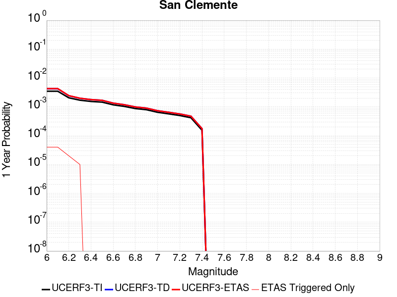 | 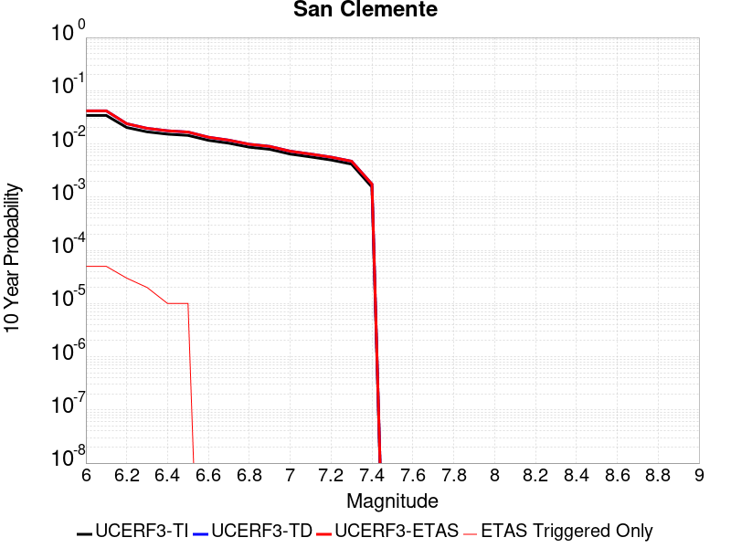 |

| Magnitude | 1 wk TI Prob | 1 wk TD Prob | 1 wk ETAS Prob | 1 wk ETAS/TD Gain | 1 wk ETAS Triggered Only | 1 mo TI Prob | 1 mo TD Prob | 1 mo ETAS Prob | 1 mo ETAS/TD Gain | 1 mo ETAS Triggered Only | 1 yr TI Prob | 1 yr TD Prob | 1 yr ETAS Prob | 1 yr ETAS/TD Gain | 1 yr ETAS Triggered Only | 10 yr TI Prob | 10 yr TD Prob | 10 yr ETAS Prob | 10 yr ETAS/TD Gain | 10 yr ETAS Triggered Only |
|-----|-----|-----|-----|-----|-----|-----|-----|-----|-----|-----|-----|-----|-----|-----|-----|-----|-----|-----|-----|-----|
| 6.0 | 6.681379E-5 | 8.1638565E-5 | 1.01636935E-4 | 1.2449622 | 2.0E-5 | 2.8631336E-4 | 3.4983584E-4 | 3.7982536E-4 | 1.0857245 | 3.0E-5 | 0.003480294 | 0.0042514214 | 0.0042912513 | 1.0093687 | 4.0E-5 | 0.03426291 | 0.041756142 | 0.041804053 | 1.0011474 | 5.0E-5 |
| 6.1 | 6.681379E-5 | 8.1638565E-5 | 1.01636935E-4 | 1.2449622 | 2.0E-5 | 2.8631336E-4 | 3.4983584E-4 | 3.7982536E-4 | 1.0857245 | 3.0E-5 | 0.003480294 | 0.0042514214 | 0.0042912513 | 1.0093687 | 4.0E-5 | 0.03426291 | 0.041756142 | 0.041804053 | 1.0011474 | 5.0E-5 |
| 6.2 | 3.9400576E-5 | 4.645248E-5 | 5.6452012E-5 | 1.2152637 | 1.0E-5 | 1.6884868E-4 | 1.990672E-4 | 2.0906521E-4 | 1.0502243 | 1.0E-5 | 0.0020537945 | 0.002421004 | 0.0024409555 | 1.008241 | 2.0E-5 | 0.020349167 | 0.023952955 | 0.023982238 | 1.0012225 | 3.0E-5 |
| 6.3 | 3.2590255E-5 | 3.7929196E-5 | 3.7929196E-5 | 1.0 | 0.0 | 1.3966505E-4 | 1.6254374E-4 | 1.6254374E-4 | 1.0 | 0.0 | 0.0016990956 | 0.001977204 | 0.0019871844 | 1.0050477 | 1.0E-5 | 0.01686163 | 0.019599922 | 0.01961953 | 1.0010004 | 2.0E-5 |
| 6.4 | 2.9454652E-5 | 3.409783E-5 | 3.409783E-5 | 1.0 | 0.0 | 1.2622811E-4 | 1.4612552E-4 | 1.4612552E-4 | 1.0 | 0.0 | 0.0015357438 | 0.0017776528 | 0.0017776528 | 1.0 | 0.0 | 0.015251739 | 0.017637504 | 0.017647328 | 1.000557 | 1.0E-5 |
| 6.5 | 2.790836E-5 | 3.2247524E-5 | 3.2247524E-5 | 1.0 | 0.0 | 1.1960178E-4 | 1.381965E-4 | 1.381965E-4 | 1.0 | 0.0 | 0.001455179 | 0.0016812695 | 0.0016812695 | 1.0 | 0.0 | 0.014456868 | 0.016688516 | 0.01669835 | 1.0005893 | 1.0E-5 |
| 6.6 | 2.2492153E-5 | 2.5762749E-5 | 2.5762749E-5 | 1.0 | 0.0 | 9.639138E-5 | 1.10407185E-4 | 1.10407185E-4 | 1.0 | 0.0 | 0.0011729331 | 0.0013433933 | 0.0013433933 | 1.0 | 0.0 | 0.011667615 | 0.01335444 | 0.01335444 | 1.0 | 0.0 |
| 6.7 | 1.9862755E-5 | 2.2666462E-5 | 2.2666462E-5 | 1.0 | 0.0 | 8.512331E-5 | 9.713843E-5 | 9.713843E-5 | 1.0 | 0.0 | 0.0010358836 | 0.00118203 | 0.00118203 | 1.0 | 0.0 | 0.010310682 | 0.011758721 | 0.011758721 | 1.0 | 0.0 |
| 6.8 | 1.6697575E-5 | 1.8977742E-5 | 1.8977742E-5 | 1.0 | 0.0 | 7.155907E-5 | 8.133069E-5 | 8.133069E-5 | 1.0 | 0.0 | 8.7088346E-4 | 9.897607E-4 | 9.897607E-4 | 1.0 | 0.0 | 0.008674784 | 0.009854553 | 0.009854553 | 1.0 | 0.0 |
| 6.9 | 1.5218415E-5 | 1.7269429E-5 | 1.7269429E-5 | 1.0 | 0.0 | 6.522015E-5 | 7.400979E-5 | 7.400979E-5 | 1.0 | 0.0 | 7.93766E-4 | 9.007055E-4 | 9.007055E-4 | 1.0 | 0.0 | 0.007909367 | 0.008971496 | 0.008971496 | 1.0 | 0.0 |
| 7.0 | 1.2392958E-5 | 1.40330385E-5 | 1.40330385E-5 | 1.0 | 0.0 | 5.3111595E-5 | 6.014025E-5 | 6.014025E-5 | 1.0 | 0.0 | 6.4644177E-4 | 7.3196914E-4 | 7.3196914E-4 | 1.0 | 0.0 | 0.0064456454 | 0.0072963685 | 0.0072963685 | 1.0 | 0.0 |
| 7.1 | 1.0934128E-5 | 1.2375158E-5 | 1.2375158E-5 | 1.0 | 0.0 | 4.6859706E-5 | 5.3035354E-5 | 5.3035354E-5 | 1.0 | 0.0 | 5.7036756E-4 | 6.4552145E-4 | 6.4552145E-4 | 1.0 | 0.0 | 0.0056890585 | 0.0064372104 | 0.0064372104 | 1.0 | 0.0 |
| 7.2 | 9.5798805E-6 | 1.0844953E-5 | 1.0844953E-5 | 1.0 | 0.0 | 4.1055984E-5 | 4.6477584E-5 | 4.6477584E-5 | 1.0 | 0.0 | 4.9974193E-4 | 5.6572485E-4 | 5.6572485E-4 | 1.0 | 0.0 | 0.0049861963 | 0.005643571 | 0.005643571 | 1.0 | 0.0 |
| 7.3 | 8.0167365E-6 | 9.083932E-6 | 9.083932E-6 | 1.0 | 0.0 | 3.4356988E-5 | 3.8930597E-5 | 3.8930597E-5 | 1.0 | 0.0 | 4.1821605E-4 | 4.73884E-4 | 4.73884E-4 | 1.0 | 0.0 | 0.0041742986 | 0.0047294376 | 0.0047294376 | 1.0 | 0.0 |
| 7.4 | 2.9581017E-6 | 3.3623849E-6 | 3.3623849E-6 | 1.0 | 0.0 | 1.2677518E-5 | 1.441017E-5 | 1.441017E-5 | 1.0 | 0.0 | 1.5433785E-4 | 1.7543475E-4 | 1.7543475E-4 | 1.0 | 0.0 | 0.001542307 | 0.0017534576 | 0.0017534576 | 1.0 | 0.0 |

## Tin Mountain
*[(top)](#table-of-contents)*

| 1 Week | 1 Month | 1 Year | 10 Year |
|-----|-----|-----|-----|
|  | 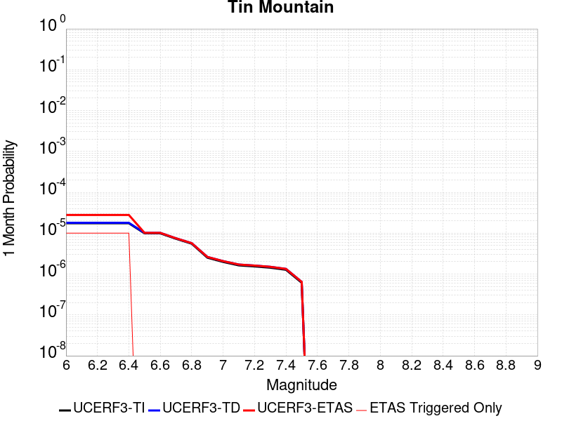 | 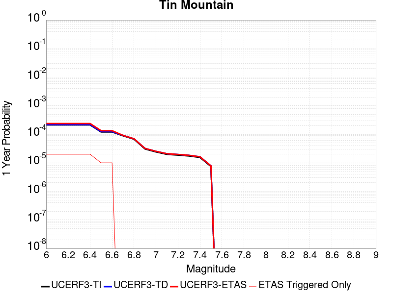 |  |

| Magnitude | 1 wk TI Prob | 1 wk TD Prob | 1 wk ETAS Prob | 1 wk ETAS/TD Gain | 1 wk ETAS Triggered Only | 1 mo TI Prob | 1 mo TD Prob | 1 mo ETAS Prob | 1 mo ETAS/TD Gain | 1 mo ETAS Triggered Only | 1 yr TI Prob | 1 yr TD Prob | 1 yr ETAS Prob | 1 yr ETAS/TD Gain | 1 yr ETAS Triggered Only | 10 yr TI Prob | 10 yr TD Prob | 10 yr ETAS Prob | 10 yr ETAS/TD Gain | 10 yr ETAS Triggered Only |
|-----|-----|-----|-----|-----|-----|-----|-----|-----|-----|-----|-----|-----|-----|-----|-----|-----|-----|-----|-----|-----|
| 6.0 | 4.083776E-6 | 4.181538E-6 | 1.4181496E-5 | 3.3914547 | 1.0E-5 | 1.750178E-5 | 1.7920775E-5 | 2.7920596E-5 | 1.5580016 | 1.0E-5 | 2.1306332E-4 | 2.181673E-4 | 2.3816295E-4 | 1.0916528 | 2.0E-5 | 0.0021285915 | 0.002179897 | 0.002229788 | 1.0228869 | 5.0E-5 |
| 6.1 | 4.083776E-6 | 4.181538E-6 | 1.4181496E-5 | 3.3914547 | 1.0E-5 | 1.750178E-5 | 1.7920775E-5 | 2.7920596E-5 | 1.5580016 | 1.0E-5 | 2.1306332E-4 | 2.181673E-4 | 2.3816295E-4 | 1.0916528 | 2.0E-5 | 0.0021285915 | 0.002179897 | 0.002229788 | 1.0228869 | 5.0E-5 |
| 6.2 | 4.083776E-6 | 4.181538E-6 | 1.4181496E-5 | 3.3914547 | 1.0E-5 | 1.750178E-5 | 1.7920775E-5 | 2.7920596E-5 | 1.5580016 | 1.0E-5 | 2.1306332E-4 | 2.181673E-4 | 2.3816295E-4 | 1.0916528 | 2.0E-5 | 0.0021285915 | 0.002179897 | 0.002229788 | 1.0228869 | 5.0E-5 |
| 6.3 | 4.083776E-6 | 4.181538E-6 | 1.4181496E-5 | 3.3914547 | 1.0E-5 | 1.750178E-5 | 1.7920775E-5 | 2.7920596E-5 | 1.5580016 | 1.0E-5 | 2.1306332E-4 | 2.181673E-4 | 2.3816295E-4 | 1.0916528 | 2.0E-5 | 0.0021285915 | 0.002179897 | 0.002229788 | 1.0228869 | 5.0E-5 |
| 6.4 | 4.083776E-6 | 4.181538E-6 | 1.4181496E-5 | 3.3914547 | 1.0E-5 | 1.750178E-5 | 1.7920775E-5 | 2.7920596E-5 | 1.5580016 | 1.0E-5 | 2.1306332E-4 | 2.181673E-4 | 2.3816295E-4 | 1.0916528 | 2.0E-5 | 0.0021285915 | 0.002179897 | 0.002229788 | 1.0228869 | 5.0E-5 |
| 6.5 | 2.3143427E-6 | 2.373158E-6 | 2.373158E-6 | 1.0 | 0.0 | 9.9185745E-6 | 1.0170642E-5 | 1.0170642E-5 | 1.0 | 0.0 | 1.2075195E-4 | 1.238213E-4 | 1.3382005E-4 | 1.0807515 | 1.0E-5 | 0.0012068636 | 0.0012375991 | 0.0012575743 | 1.0161403 | 2.0E-5 |
| 6.6 | 2.3143427E-6 | 2.373158E-6 | 2.373158E-6 | 1.0 | 0.0 | 9.9185745E-6 | 1.0170642E-5 | 1.0170642E-5 | 1.0 | 0.0 | 1.2075195E-4 | 1.238213E-4 | 1.3382005E-4 | 1.0807515 | 1.0E-5 | 0.0012068636 | 0.0012375991 | 0.0012575743 | 1.0161403 | 2.0E-5 |
| 6.7 | 1.7029532E-6 | 1.7497921E-6 | 1.7497921E-6 | 1.0 | 0.0 | 7.2983503E-6 | 7.4990903E-6 | 7.4990903E-6 | 1.0 | 0.0 | 8.885379E-5 | 9.1298134E-5 | 9.1298134E-5 | 1.0 | 0.0 | 8.881827E-4 | 9.126589E-4 | 9.126589E-4 | 1.0 | 0.0 |
| 6.8 | 1.2914646E-6 | 1.3299384E-6 | 1.3299384E-6 | 1.0 | 0.0 | 5.534837E-6 | 5.699726E-6 | 5.699726E-6 | 1.0 | 0.0 | 6.738455E-5 | 6.9392394E-5 | 6.9392394E-5 | 1.0 | 0.0 | 6.736412E-4 | 6.937506E-4 | 6.937506E-4 | 1.0 | 0.0 |
| 6.9 | 5.8708974E-7 | 6.116997E-7 | 6.116997E-7 | 1.0 | 0.0 | 2.5160964E-6 | 2.6215678E-6 | 2.6215678E-6 | 1.0 | 0.0 | 3.0633044E-5 | 3.191716E-5 | 3.191716E-5 | 1.0 | 0.0 | 3.0628822E-4 | 3.1912987E-4 | 3.1912987E-4 | 1.0 | 0.0 |
| 7.0 | 4.6248786E-7 | 4.832018E-7 | 4.832018E-7 | 1.0 | 0.0 | 1.9820893E-6 | 2.0708635E-6 | 2.0708635E-6 | 1.0 | 0.0 | 2.413167E-5 | 2.5212508E-5 | 2.5212508E-5 | 1.0 | 0.0 | 2.412905E-4 | 2.5210017E-4 | 2.5210017E-4 | 1.0 | 0.0 |
| 7.1 | 3.804606E-7 | 3.9871495E-7 | 3.9871495E-7 | 1.0 | 0.0 | 1.6305444E-6 | 1.7087774E-6 | 1.7087774E-6 | 1.0 | 0.0 | 1.9851697E-5 | 2.08042E-5 | 2.08042E-5 | 1.0 | 0.0 | 1.9849923E-4 | 2.0802589E-4 | 2.0802589E-4 | 1.0 | 0.0 |
| 7.2 | 3.5864858E-7 | 3.7616886E-7 | 3.7616886E-7 | 1.0 | 0.0 | 1.5370645E-6 | 1.6121514E-6 | 1.6121514E-6 | 1.0 | 0.0 | 1.87136E-5 | 1.9627802E-5 | 1.9627802E-5 | 1.0 | 0.0 | 1.8712023E-4 | 1.9626398E-4 | 1.9626398E-4 | 1.0 | 0.0 |
| 7.3 | 3.342063E-7 | 3.5063493E-7 | 3.5063493E-7 | 1.0 | 0.0 | 1.4323119E-6 | 1.5027205E-6 | 1.5027205E-6 | 1.0 | 0.0 | 1.7438259E-5 | 1.8295501E-5 | 1.8295501E-5 | 1.0 | 0.0 | 1.743689E-4 | 1.8294326E-4 | 1.8294326E-4 | 1.0 | 0.0 |
| 7.4 | 2.971242E-7 | 3.1165837E-7 | 3.1165837E-7 | 1.0 | 0.0 | 1.2733886E-6 | 1.3356782E-6 | 1.3356782E-6 | 1.0 | 0.0 | 1.5503398E-5 | 1.6261794E-5 | 1.6261794E-5 | 1.0 | 0.0 | 1.5502315E-4 | 1.6260933E-4 | 1.6260933E-4 | 1.0 | 0.0 |
| 7.5 | 1.4326713E-7 | 1.5012533E-7 | 1.5012533E-7 | 1.0 | 0.0 | 6.140018E-7 | 6.433943E-7 | 6.433943E-7 | 1.0 | 0.0 | 7.4754466E-6 | 7.833325E-6 | 7.833325E-6 | 1.0 | 0.0 | 7.475195E-5 | 7.833325E-5 | 7.833325E-5 | 1.0 | 0.0 |

## San Gabriel
*[(top)](#table-of-contents)*

| 1 Week | 1 Month | 1 Year | 10 Year |
|-----|-----|-----|-----|
| 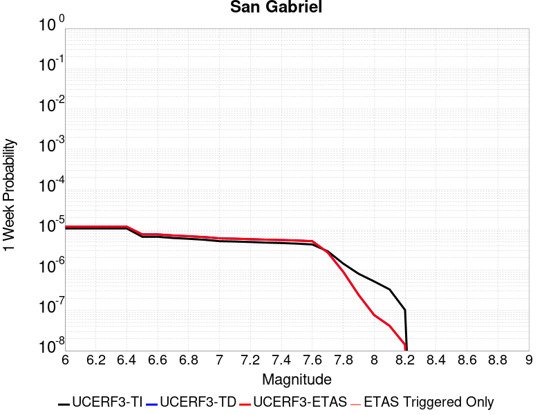 | 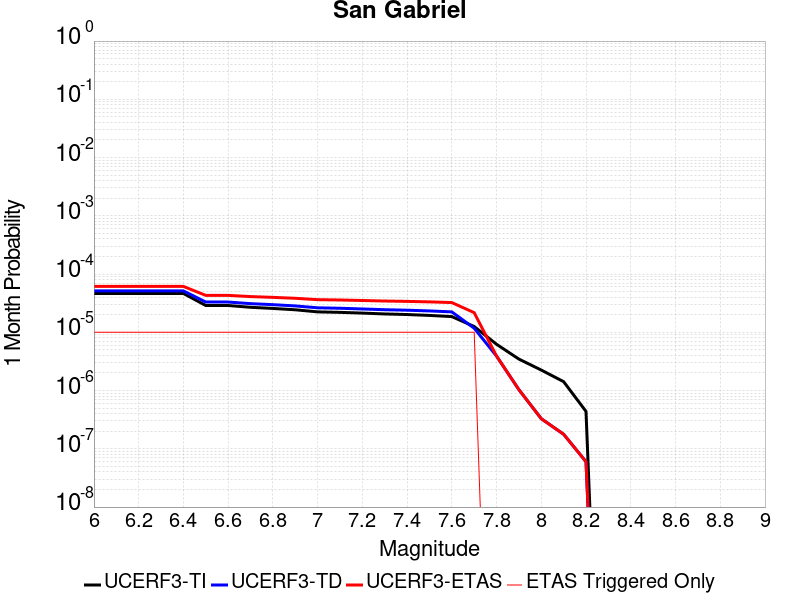 |  |  |

| Magnitude | 1 wk TI Prob | 1 wk TD Prob | 1 wk ETAS Prob | 1 wk ETAS/TD Gain | 1 wk ETAS Triggered Only | 1 mo TI Prob | 1 mo TD Prob | 1 mo ETAS Prob | 1 mo ETAS/TD Gain | 1 mo ETAS Triggered Only | 1 yr TI Prob | 1 yr TD Prob | 1 yr ETAS Prob | 1 yr ETAS/TD Gain | 1 yr ETAS Triggered Only | 10 yr TI Prob | 10 yr TD Prob | 10 yr ETAS Prob | 10 yr ETAS/TD Gain | 10 yr ETAS Triggered Only |
|-----|-----|-----|-----|-----|-----|-----|-----|-----|-----|-----|-----|-----|-----|-----|-----|-----|-----|-----|-----|-----|
| 6.0 | 1.083775E-5 | 1.1985447E-5 | 1.1985447E-5 | 1.0 | 0.0 | 4.6446676E-5 | 5.1365252E-5 | 6.136474E-5 | 1.1946741 | 1.0E-5 | 5.653415E-4 | 6.2520383E-4 | 6.551851E-4 | 1.0479543 | 3.0E-5 | 0.0056390543 | 0.006246477 | 0.006296165 | 1.0079545 | 5.0E-5 |
| 6.1 | 1.083775E-5 | 1.1985447E-5 | 1.1985447E-5 | 1.0 | 0.0 | 4.6446676E-5 | 5.1365252E-5 | 6.136474E-5 | 1.1946741 | 1.0E-5 | 5.653415E-4 | 6.2520383E-4 | 6.551851E-4 | 1.0479543 | 3.0E-5 | 0.0056390543 | 0.006246477 | 0.006296165 | 1.0079545 | 5.0E-5 |
| 6.2 | 1.083775E-5 | 1.1985447E-5 | 1.1985447E-5 | 1.0 | 0.0 | 4.6446676E-5 | 5.1365252E-5 | 6.136474E-5 | 1.1946741 | 1.0E-5 | 5.653415E-4 | 6.2520383E-4 | 6.551851E-4 | 1.0479543 | 3.0E-5 | 0.0056390543 | 0.006246477 | 0.006296165 | 1.0079545 | 5.0E-5 |
| 6.3 | 1.083775E-5 | 1.1985447E-5 | 1.1985447E-5 | 1.0 | 0.0 | 4.6446676E-5 | 5.1365252E-5 | 6.136474E-5 | 1.1946741 | 1.0E-5 | 5.653415E-4 | 6.2520383E-4 | 6.551851E-4 | 1.0479543 | 3.0E-5 | 0.0056390543 | 0.006246477 | 0.006296165 | 1.0079545 | 5.0E-5 |
| 6.4 | 1.083775E-5 | 1.1985447E-5 | 1.1985447E-5 | 1.0 | 0.0 | 4.6446676E-5 | 5.1365252E-5 | 6.136474E-5 | 1.1946741 | 1.0E-5 | 5.653415E-4 | 6.2520383E-4 | 6.551851E-4 | 1.0479543 | 3.0E-5 | 0.0056390543 | 0.006246477 | 0.006296165 | 1.0079545 | 5.0E-5 |
| 6.5 | 6.7317824E-6 | 7.717202E-6 | 7.717202E-6 | 1.0 | 0.0 | 2.8850178E-5 | 3.307331E-5 | 4.3072978E-5 | 1.3023486 | 1.0E-5 | 3.511943E-4 | 4.025942E-4 | 4.2258613E-4 | 1.0496578 | 2.0E-5 | 0.003506398 | 0.004029677 | 0.0040595555 | 1.0074148 | 3.0E-5 |
| 6.6 | 6.7317824E-6 | 7.717202E-6 | 7.717202E-6 | 1.0 | 0.0 | 2.8850178E-5 | 3.307331E-5 | 4.3072978E-5 | 1.3023486 | 1.0E-5 | 3.511943E-4 | 4.025942E-4 | 4.2258613E-4 | 1.0496578 | 2.0E-5 | 0.003506398 | 0.004029677 | 0.0040595555 | 1.0074148 | 3.0E-5 |
| 6.7 | 6.274881E-6 | 7.2461216E-6 | 7.2461216E-6 | 1.0 | 0.0 | 2.6892068E-5 | 3.1054442E-5 | 4.1054132E-5 | 1.3220052 | 1.0E-5 | 3.2736175E-4 | 3.7802322E-4 | 3.9801566E-4 | 1.0528868 | 2.0E-5 | 0.0032687993 | 0.0037848232 | 0.0038147096 | 1.0078964 | 3.0E-5 |
| 6.8 | 5.996209E-6 | 6.958842E-6 | 6.958842E-6 | 1.0 | 0.0 | 2.5697784E-5 | 2.9823272E-5 | 3.9822975E-5 | 1.3352987 | 1.0E-5 | 3.128256E-4 | 3.6303877E-4 | 3.8303153E-4 | 1.0550705 | 2.0E-5 | 0.003123856 | 0.003635476 | 0.003665367 | 1.008222 | 3.0E-5 |
| 6.9 | 5.686331E-6 | 6.623885E-6 | 6.623885E-6 | 1.0 | 0.0 | 2.4369761E-5 | 2.8387774E-5 | 3.838749E-5 | 1.3522543 | 1.0E-5 | 2.9666146E-4 | 3.4556727E-4 | 3.6556035E-4 | 1.0578558 | 2.0E-5 | 0.0029626573 | 0.0034613165 | 0.0034912126 | 1.0086372 | 3.0E-5 |
| 7.0 | 5.2329838E-6 | 6.147769E-6 | 6.147769E-6 | 1.0 | 0.0 | 2.242688E-5 | 2.634732E-5 | 3.6347057E-5 | 1.3795352 | 1.0E-5 | 2.7301308E-4 | 3.2073216E-4 | 3.4072573E-4 | 1.0623373 | 2.0E-5 | 0.002726779 | 0.0032136978 | 0.0032436014 | 1.009305 | 3.0E-5 |
| 7.1 | 5.135671E-6 | 6.037893E-6 | 6.037893E-6 | 1.0 | 0.0 | 2.2009834E-5 | 2.5876432E-5 | 3.587617E-5 | 1.3864421 | 1.0E-5 | 2.6793676E-4 | 3.1500077E-4 | 3.3499446E-4 | 1.0634719 | 2.0E-5 | 0.0026761394 | 0.0031565481 | 0.0031864536 | 1.009474 | 3.0E-5 |
| 7.2 | 4.989062E-6 | 5.8712712E-6 | 5.8712712E-6 | 1.0 | 0.0 | 2.1381518E-5 | 2.5162351E-5 | 3.5162102E-5 | 1.3974091 | 1.0E-5 | 2.6028889E-4 | 3.0630932E-4 | 3.263032E-4 | 1.0652735 | 2.0E-5 | 0.0025998424 | 0.0030698767 | 0.0030898151 | 1.0064949 | 2.0E-5 |
| 7.3 | 4.8219395E-6 | 5.7028237E-6 | 5.7028237E-6 | 1.0 | 0.0 | 2.0665291E-5 | 2.4440447E-5 | 3.4440203E-5 | 1.4091479 | 1.0E-5 | 2.5157086E-4 | 2.9752258E-4 | 3.1751662E-4 | 1.0672017 | 2.0E-5 | 0.0025128627 | 0.0029822483 | 0.0030021886 | 1.0066863 | 2.0E-5 |
| 7.4 | 4.7118383E-6 | 5.5913797E-6 | 5.5913797E-6 | 1.0 | 0.0 | 2.0193436E-5 | 2.396284E-5 | 3.3962602E-5 | 1.4173028 | 1.0E-5 | 2.4582737E-4 | 2.9170926E-4 | 3.1170345E-4 | 1.0685414 | 2.0E-5 | 0.002455556 | 0.0029242688 | 0.0029442103 | 1.0068194 | 2.0E-5 |
| 7.5 | 4.5506545E-6 | 5.436745E-6 | 5.436745E-6 | 1.0 | 0.0 | 1.9502659E-5 | 2.3300132E-5 | 3.32999E-5 | 1.4291722 | 1.0E-5 | 2.37419E-4 | 2.8364293E-4 | 3.0363727E-4 | 1.0704912 | 2.0E-5 | 0.002371655 | 0.0028438133 | 0.0028637564 | 1.0070128 | 2.0E-5 |
| 7.6 | 4.343636E-6 | 5.2296214E-6 | 5.2296214E-6 | 1.0 | 0.0 | 1.861545E-5 | 2.2412474E-5 | 3.2412252E-5 | 1.4461701 | 1.0E-5 | 2.2661954E-4 | 2.7283846E-4 | 2.92833E-4 | 1.0732834 | 2.0E-5 | 0.0022638857 | 0.002736031 | 0.0027559763 | 1.0072899 | 2.0E-5 |
| 7.7 | 2.936235E-6 | 2.7440717E-6 | 2.7440717E-6 | 1.0 | 0.0 | 1.2583803E-5 | 1.1760254E-5 | 2.1760137E-5 | 1.8503118 | 1.0E-5 | 1.5319703E-4 | 1.4317172E-4 | 1.5317029E-4 | 1.0698361 | 1.0E-5 | 0.0015309147 | 0.0014380639 | 0.0014480496 | 1.0069438 | 1.0E-5 |
| 7.8 | 1.4541639E-6 | 9.123055E-7 | 9.123055E-7 | 1.0 | 0.0 | 6.232116E-6 | 3.909875E-6 | 3.909875E-6 | 1.0 | 0.0 | 7.587337E-5 | 4.760169E-5 | 4.760169E-5 | 1.0 | 0.0 | 7.584747E-4 | 4.8080768E-4 | 4.8080768E-4 | 1.0 | 0.0 |
| 7.9 | 8.098958E-7 | 2.4167934E-7 | 2.4167934E-7 | 1.0 | 0.0 | 3.4709774E-6 | 1.0357682E-6 | 1.0357682E-6 | 1.0 | 0.0 | 4.225833E-5 | 1.2610404E-5 | 1.2610404E-5 | 1.0 | 0.0 | 4.2250296E-4 | 1.2917932E-4 | 1.2917932E-4 | 1.0 | 0.0 |
| 8.0 | 5.2473234E-7 | 7.6736384E-8 | 7.6736384E-8 | 1.0 | 0.0 | 2.248851E-6 | 3.288702E-7 | 3.288702E-7 | 1.0 | 0.0 | 2.7379416E-5 | 4.003987E-6 | 4.003987E-6 | 1.0 | 0.0 | 2.7376044E-4 | 4.216261E-5 | 4.216261E-5 | 1.0 | 0.0 |
| 8.1 | 3.3162388E-7 | 4.146195E-8 | 4.146195E-8 | 1.0 | 0.0 | 1.4212444E-6 | 1.7769405E-7 | 1.7769405E-7 | 1.0 | 0.0 | 1.7303513E-5 | 2.1634228E-6 | 2.1634228E-6 | 1.0 | 0.0 | 1.7302166E-4 | 2.2946977E-5 | 2.2946977E-5 | 1.0 | 0.0 |
| 8.2 | 1.0235345E-7 | 1.4033544E-8 | 1.4033544E-8 | 1.0 | 0.0 | 4.3865757E-7 | 6.0143755E-8 | 6.0143755E-8 | 1.0 | 0.0 | 5.340643E-6 | 7.3225E-7 | 7.3225E-7 | 1.0 | 0.0 | 5.3405143E-5 | 7.922545E-6 | 7.922545E-6 | 1.0 | 0.0 |

## Deep Springs
*[(top)](#table-of-contents)*

| 1 Week | 1 Month | 1 Year | 10 Year |
|-----|-----|-----|-----|
|  |  |  |  |

| Magnitude | 1 wk TI Prob | 1 wk TD Prob | 1 wk ETAS Prob | 1 wk ETAS/TD Gain | 1 wk ETAS Triggered Only | 1 mo TI Prob | 1 mo TD Prob | 1 mo ETAS Prob | 1 mo ETAS/TD Gain | 1 mo ETAS Triggered Only | 1 yr TI Prob | 1 yr TD Prob | 1 yr ETAS Prob | 1 yr ETAS/TD Gain | 1 yr ETAS Triggered Only | 10 yr TI Prob | 10 yr TD Prob | 10 yr ETAS Prob | 10 yr ETAS/TD Gain | 10 yr ETAS Triggered Only |
|-----|-----|-----|-----|-----|-----|-----|-----|-----|-----|-----|-----|-----|-----|-----|-----|-----|-----|-----|-----|-----|
| 6.0 | 1.9810619E-5 | 2.3112567E-5 | 4.3112104E-5 | 1.8653101 | 2.0E-5 | 8.489989E-5 | 9.905296E-5 | 1.1905098E-4 | 1.2018921 | 2.0E-5 | 0.001033166 | 0.0012058103 | 0.0012457621 | 1.0331327 | 4.0E-5 | 0.010283757 | 0.012042454 | 0.012091853 | 1.004102 | 5.0E-5 |
| 6.1 | 1.9810619E-5 | 2.3112567E-5 | 4.3112104E-5 | 1.8653101 | 2.0E-5 | 8.489989E-5 | 9.905296E-5 | 1.1905098E-4 | 1.2018921 | 2.0E-5 | 0.001033166 | 0.0012058103 | 0.0012457621 | 1.0331327 | 4.0E-5 | 0.010283757 | 0.012042454 | 0.012091853 | 1.004102 | 5.0E-5 |
| 6.2 | 1.9810619E-5 | 2.3112567E-5 | 4.3112104E-5 | 1.8653101 | 2.0E-5 | 8.489989E-5 | 9.905296E-5 | 1.1905098E-4 | 1.2018921 | 2.0E-5 | 0.001033166 | 0.0012058103 | 0.0012457621 | 1.0331327 | 4.0E-5 | 0.010283757 | 0.012042454 | 0.012091853 | 1.004102 | 5.0E-5 |
| 6.3 | 1.9810619E-5 | 2.3112567E-5 | 4.3112104E-5 | 1.8653101 | 2.0E-5 | 8.489989E-5 | 9.905296E-5 | 1.1905098E-4 | 1.2018921 | 2.0E-5 | 0.001033166 | 0.0012058103 | 0.0012457621 | 1.0331327 | 4.0E-5 | 0.010283757 | 0.012042454 | 0.012091853 | 1.004102 | 5.0E-5 |
| 6.4 | 1.9810619E-5 | 2.3112567E-5 | 4.3112104E-5 | 1.8653101 | 2.0E-5 | 8.489989E-5 | 9.905296E-5 | 1.1905098E-4 | 1.2018921 | 2.0E-5 | 0.001033166 | 0.0012058103 | 0.0012457621 | 1.0331327 | 4.0E-5 | 0.010283757 | 0.012042454 | 0.012091853 | 1.004102 | 5.0E-5 |
| 6.5 | 1.7190405E-5 | 2.0050598E-5 | 4.00502E-5 | 1.9974564 | 2.0E-5 | 7.367108E-5 | 8.593114E-5 | 1.05929415E-4 | 1.2327245 | 2.0E-5 | 8.9657627E-4 | 0.0010462113 | 0.0010861695 | 1.0381932 | 4.0E-5 | 0.008929676 | 0.010462082 | 0.010511559 | 1.0047292 | 5.0E-5 |
| 6.6 | 1.7190405E-5 | 2.0050598E-5 | 4.00502E-5 | 1.9974564 | 2.0E-5 | 7.367108E-5 | 8.593114E-5 | 1.05929415E-4 | 1.2327245 | 2.0E-5 | 8.9657627E-4 | 0.0010462113 | 0.0010861695 | 1.0381932 | 4.0E-5 | 0.008929676 | 0.010462082 | 0.010511559 | 1.0047292 | 5.0E-5 |

## Palos Verdes
*[(top)](#table-of-contents)*

| 1 Week | 1 Month | 1 Year | 10 Year |
|-----|-----|-----|-----|
| 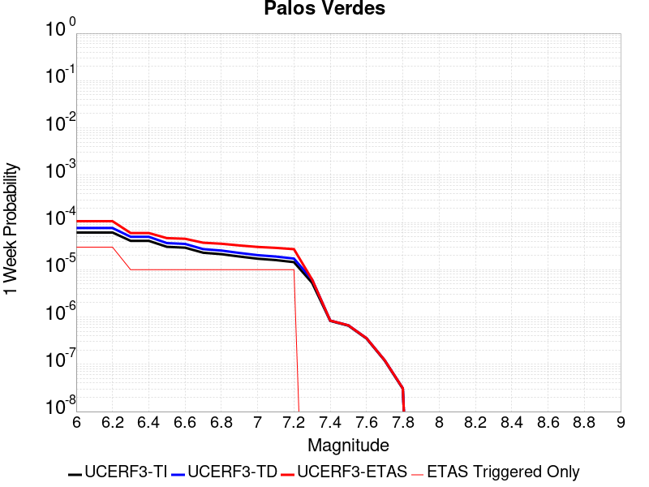 |  |  |  |

| Magnitude | 1 wk TI Prob | 1 wk TD Prob | 1 wk ETAS Prob | 1 wk ETAS/TD Gain | 1 wk ETAS Triggered Only | 1 mo TI Prob | 1 mo TD Prob | 1 mo ETAS Prob | 1 mo ETAS/TD Gain | 1 mo ETAS Triggered Only | 1 yr TI Prob | 1 yr TD Prob | 1 yr ETAS Prob | 1 yr ETAS/TD Gain | 1 yr ETAS Triggered Only | 10 yr TI Prob | 10 yr TD Prob | 10 yr ETAS Prob | 10 yr ETAS/TD Gain | 10 yr ETAS Triggered Only |
|-----|-----|-----|-----|-----|-----|-----|-----|-----|-----|-----|-----|-----|-----|-----|-----|-----|-----|-----|-----|-----|
| 6.0 | 6.126063E-5 | 7.622596E-5 | 1.0622367E-4 | 1.3935367 | 3.0E-5 | 2.6251914E-4 | 3.2664512E-4 | 3.566353E-4 | 1.0918128 | 3.0E-5 | 0.0031914865 | 0.0039701858 | 0.004010027 | 1.010035 | 4.0E-5 | 0.031460393 | 0.039049204 | 0.03909725 | 1.0012305 | 5.0E-5 |
| 6.1 | 6.126063E-5 | 7.622596E-5 | 1.0622367E-4 | 1.3935367 | 3.0E-5 | 2.6251914E-4 | 3.2664512E-4 | 3.566353E-4 | 1.0918128 | 3.0E-5 | 0.0031914865 | 0.0039701858 | 0.004010027 | 1.010035 | 4.0E-5 | 0.031460393 | 0.039049204 | 0.03909725 | 1.0012305 | 5.0E-5 |
| 6.2 | 6.126063E-5 | 7.622596E-5 | 1.0622367E-4 | 1.3935367 | 3.0E-5 | 2.6251914E-4 | 3.2664512E-4 | 3.566353E-4 | 1.0918128 | 3.0E-5 | 0.0031914865 | 0.0039701858 | 0.004010027 | 1.010035 | 4.0E-5 | 0.031460393 | 0.039049204 | 0.03909725 | 1.0012305 | 5.0E-5 |
| 6.3 | 4.0838047E-5 | 4.9749142E-5 | 5.9748643E-5 | 1.2009985 | 1.0E-5 | 1.7500846E-4 | 2.1319446E-4 | 2.2319233E-4 | 1.0468955 | 1.0E-5 | 0.0021286458 | 0.0025927613 | 0.0026027353 | 1.0038469 | 1.0E-5 | 0.021083709 | 0.025646815 | 0.025666302 | 1.0007598 | 2.0E-5 |
| 6.4 | 4.0838047E-5 | 4.9749142E-5 | 5.9748643E-5 | 1.2009985 | 1.0E-5 | 1.7500846E-4 | 2.1319446E-4 | 2.2319233E-4 | 1.0468955 | 1.0E-5 | 0.0021286458 | 0.0025927613 | 0.0026027353 | 1.0038469 | 1.0E-5 | 0.021083709 | 0.025646815 | 0.025666302 | 1.0007598 | 2.0E-5 |
| 6.5 | 3.0512005E-5 | 3.6561683E-5 | 4.656132E-5 | 1.2735003 | 1.0E-5 | 1.3075917E-4 | 1.566842E-4 | 1.6668263E-4 | 1.0638126 | 1.0E-5 | 0.0015908304 | 0.0019060767 | 0.0019160577 | 1.0052364 | 1.0E-5 | 0.015794903 | 0.01890922 | 0.01892884 | 1.0010377 | 2.0E-5 |
| 6.6 | 2.9255087E-5 | 3.515448E-5 | 4.5154127E-5 | 1.2844487 | 1.0E-5 | 1.2537291E-4 | 1.5065401E-4 | 1.606525E-4 | 1.0663673 | 1.0E-5 | 0.0015253464 | 0.0018327828 | 0.0018427644 | 1.0054462 | 1.0E-5 | 0.015149189 | 0.018188288 | 0.018207924 | 1.0010796 | 2.0E-5 |
| 6.7 | 2.287198E-5 | 2.7248343E-5 | 3.724807E-5 | 1.3669847 | 1.0E-5 | 9.801909E-5 | 1.1677391E-4 | 1.2677273E-4 | 1.0856255 | 1.0E-5 | 0.001192729 | 0.0014208867 | 0.0014308726 | 1.0070279 | 1.0E-5 | 0.011863477 | 0.014127251 | 0.014146969 | 1.0013957 | 2.0E-5 |
| 6.8 | 2.1325764E-5 | 2.5431938E-5 | 3.5431684E-5 | 1.3931963 | 1.0E-5 | 9.139293E-5 | 1.0898998E-4 | 1.18988886E-4 | 1.0917416 | 1.0E-5 | 0.001112141 | 0.0013262355 | 0.0013362222 | 1.0075301 | 1.0E-5 | 0.011065915 | 0.013192243 | 0.013211979 | 1.0014961 | 2.0E-5 |
| 6.9 | 1.9009392E-5 | 2.2613602E-5 | 3.2613374E-5 | 1.4422017 | 1.0E-5 | 8.1466285E-5 | 9.691233E-5 | 1.0691136E-4 | 1.103176 | 1.0E-5 | 9.914007E-4 | 0.0011793562 | 0.0011893444 | 1.0084692 | 1.0E-5 | 0.009869894 | 0.01173966 | 0.0117594255 | 1.0016836 | 2.0E-5 |
| 7.0 | 1.7098473E-5 | 2.0319403E-5 | 3.03192E-5 | 1.4921304 | 1.0E-5 | 7.3277115E-5 | 8.708073E-5 | 9.707986E-5 | 1.114826 | 1.0E-5 | 8.917837E-4 | 0.0010597775 | 0.0010697668 | 1.009426 | 1.0E-5 | 0.008882134 | 0.0105556715 | 0.01057546 | 1.0018747 | 2.0E-5 |
| 7.1 | 1.5982785E-5 | 1.8994804E-5 | 2.8994615E-5 | 1.5264497 | 1.0E-5 | 6.849585E-5 | 8.140424E-5 | 9.140343E-5 | 1.1228337 | 1.0E-5 | 8.336179E-4 | 9.907307E-4 | 0.0010007208 | 1.0100836 | 1.0E-5 | 0.008304977 | 0.009871502 | 0.009891305 | 1.002006 | 2.0E-5 |
| 7.2 | 1.4468002E-5 | 1.7197277E-5 | 2.7197104E-5 | 1.5814774 | 1.0E-5 | 6.200425E-5 | 7.3701005E-5 | 8.3700266E-5 | 1.1356734 | 1.0E-5 | 7.546402E-4 | 8.9702435E-4 | 9.0701535E-4 | 1.011138 | 1.0E-5 | 0.007520827 | 0.008942305 | 0.008952215 | 1.0011083 | 1.0E-5 |
| 7.3 | 5.288233E-6 | 6.2036884E-6 | 6.2036884E-6 | 1.0 | 0.0 | 2.2663658E-5 | 2.658716E-5 | 2.658716E-5 | 1.0 | 0.0 | 2.7589512E-4 | 3.236855E-4 | 3.236855E-4 | 1.0 | 0.0 | 0.0027555283 | 0.0032355632 | 0.0032355632 | 1.0 | 0.0 |
| 7.4 | 8.279556E-7 | 8.4083484E-7 | 8.4083484E-7 | 1.0 | 0.0 | 3.5483763E-6 | 3.6035733E-6 | 3.6035733E-6 | 1.0 | 0.0 | 4.3200624E-5 | 4.3872693E-5 | 4.3872693E-5 | 1.0 | 0.0 | 4.3192226E-4 | 4.3864755E-4 | 4.3864755E-4 | 1.0 | 0.0 |
| 7.5 | 6.559831E-7 | 6.66723E-7 | 6.66723E-7 | 1.0 | 0.0 | 2.8113532E-6 | 2.8573816E-6 | 2.8573816E-6 | 1.0 | 0.0 | 3.4227687E-5 | 3.4788132E-5 | 3.4788132E-5 | 1.0 | 0.0 | 3.4222414E-4 | 3.478335E-4 | 3.478335E-4 | 1.0 | 0.0 |
| 7.6 | 3.5018968E-7 | 3.5620036E-7 | 3.5620036E-7 | 1.0 | 0.0 | 1.500812E-6 | 1.5265723E-6 | 1.5265723E-6 | 1.0 | 0.0 | 1.8272232E-5 | 1.8585906E-5 | 1.8585906E-5 | 1.0 | 0.0 | 1.8270731E-4 | 1.8584813E-4 | 1.8584813E-4 | 1.0 | 0.0 |
| 7.7 | 1.1986104E-7 | 1.2198379E-7 | 1.2198379E-7 | 1.0 | 0.0 | 5.1369005E-7 | 5.2278756E-7 | 5.2278756E-7 | 1.0 | 0.0 | 6.2541585E-6 | 6.3649204E-6 | 6.3649204E-6 | 1.0 | 0.0 | 6.2539824E-5 | 6.364742E-5 | 6.364742E-5 | 1.0 | 0.0 |
| 7.8 | 3.0445005E-8 | 3.102759E-8 | 3.102759E-8 | 1.0 | 0.0 | 1.3047858E-7 | 1.3297539E-7 | 1.3297539E-7 | 1.0 | 0.0 | 1.5885756E-6 | 1.6189744E-6 | 1.6189744E-6 | 1.0 | 0.0 | 1.5885644E-5 | 1.6189646E-5 | 1.6189646E-5 | 1.0 | 0.0 |

## Pitas Point (Lower)-Montalvo
*[(top)](#table-of-contents)*

| 1 Week | 1 Month | 1 Year | 10 Year |
|-----|-----|-----|-----|
|  |  | 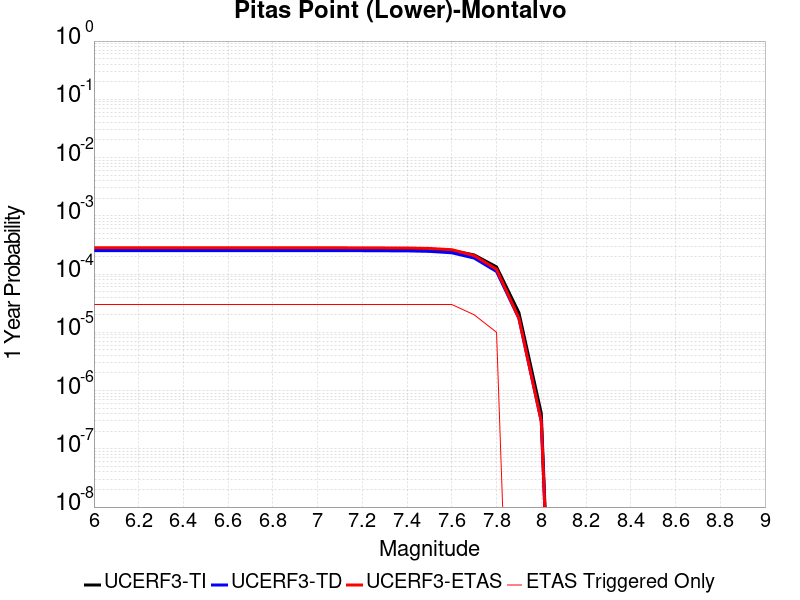 |  |

| Magnitude | 1 wk TI Prob | 1 wk TD Prob | 1 wk ETAS Prob | 1 wk ETAS/TD Gain | 1 wk ETAS Triggered Only | 1 mo TI Prob | 1 mo TD Prob | 1 mo ETAS Prob | 1 mo ETAS/TD Gain | 1 mo ETAS Triggered Only | 1 yr TI Prob | 1 yr TD Prob | 1 yr ETAS Prob | 1 yr ETAS/TD Gain | 1 yr ETAS Triggered Only | 10 yr TI Prob | 10 yr TD Prob | 10 yr ETAS Prob | 10 yr ETAS/TD Gain | 10 yr ETAS Triggered Only |
|-----|-----|-----|-----|-----|-----|-----|-----|-----|-----|-----|-----|-----|-----|-----|-----|-----|-----|-----|-----|-----|
| 6.0 | 5.2543637E-6 | 4.8379056E-6 | 1.4837858E-5 | 3.0670002 | 1.0E-5 | 2.2518509E-5 | 2.0733718E-5 | 3.073351E-5 | 1.4822961 | 1.0E-5 | 2.7412834E-4 | 2.524041E-4 | 2.8239653E-4 | 1.118827 | 3.0E-5 | 0.0027379042 | 0.0025212066 | 0.0025710806 | 1.0197818 | 5.0E-5 |
| 6.1 | 5.2543637E-6 | 4.8379056E-6 | 1.4837858E-5 | 3.0670002 | 1.0E-5 | 2.2518509E-5 | 2.0733718E-5 | 3.073351E-5 | 1.4822961 | 1.0E-5 | 2.7412834E-4 | 2.524041E-4 | 2.8239653E-4 | 1.118827 | 3.0E-5 | 0.0027379042 | 0.0025212066 | 0.0025710806 | 1.0197818 | 5.0E-5 |
| 6.2 | 5.2543637E-6 | 4.8379056E-6 | 1.4837858E-5 | 3.0670002 | 1.0E-5 | 2.2518509E-5 | 2.0733718E-5 | 3.073351E-5 | 1.4822961 | 1.0E-5 | 2.7412834E-4 | 2.524041E-4 | 2.8239653E-4 | 1.118827 | 3.0E-5 | 0.0027379042 | 0.0025212066 | 0.0025710806 | 1.0197818 | 5.0E-5 |
| 6.3 | 5.2543637E-6 | 4.8379056E-6 | 1.4837858E-5 | 3.0670002 | 1.0E-5 | 2.2518509E-5 | 2.0733718E-5 | 3.073351E-5 | 1.4822961 | 1.0E-5 | 2.7412834E-4 | 2.524041E-4 | 2.8239653E-4 | 1.118827 | 3.0E-5 | 0.0027379042 | 0.0025212066 | 0.0025710806 | 1.0197818 | 5.0E-5 |
| 6.4 | 5.2543637E-6 | 4.8379056E-6 | 1.4837858E-5 | 3.0670002 | 1.0E-5 | 2.2518509E-5 | 2.0733718E-5 | 3.073351E-5 | 1.4822961 | 1.0E-5 | 2.7412834E-4 | 2.524041E-4 | 2.8239653E-4 | 1.118827 | 3.0E-5 | 0.0027379042 | 0.0025212066 | 0.0025710806 | 1.0197818 | 5.0E-5 |
| 6.5 | 5.2543637E-6 | 4.8379056E-6 | 1.4837858E-5 | 3.0670002 | 1.0E-5 | 2.2518509E-5 | 2.0733718E-5 | 3.073351E-5 | 1.4822961 | 1.0E-5 | 2.7412834E-4 | 2.524041E-4 | 2.8239653E-4 | 1.118827 | 3.0E-5 | 0.0027379042 | 0.0025212066 | 0.0025710806 | 1.0197818 | 5.0E-5 |
| 6.6 | 5.2543637E-6 | 4.8379056E-6 | 1.4837858E-5 | 3.0670002 | 1.0E-5 | 2.2518509E-5 | 2.0733718E-5 | 3.073351E-5 | 1.4822961 | 1.0E-5 | 2.7412834E-4 | 2.524041E-4 | 2.8239653E-4 | 1.118827 | 3.0E-5 | 0.0027379042 | 0.0025212066 | 0.0025710806 | 1.0197818 | 5.0E-5 |
| 6.7 | 5.2543637E-6 | 4.8379056E-6 | 1.4837858E-5 | 3.0670002 | 1.0E-5 | 2.2518509E-5 | 2.0733718E-5 | 3.073351E-5 | 1.4822961 | 1.0E-5 | 2.7412834E-4 | 2.524041E-4 | 2.8239653E-4 | 1.118827 | 3.0E-5 | 0.0027379042 | 0.0025212066 | 0.0025710806 | 1.0197818 | 5.0E-5 |
| 6.8 | 5.2543637E-6 | 4.8379056E-6 | 1.4837858E-5 | 3.0670002 | 1.0E-5 | 2.2518509E-5 | 2.0733718E-5 | 3.073351E-5 | 1.4822961 | 1.0E-5 | 2.7412834E-4 | 2.524041E-4 | 2.8239653E-4 | 1.118827 | 3.0E-5 | 0.0027379042 | 0.0025212066 | 0.0025710806 | 1.0197818 | 5.0E-5 |
| 6.9 | 5.2543637E-6 | 4.8379056E-6 | 1.4837858E-5 | 3.0670002 | 1.0E-5 | 2.2518509E-5 | 2.0733718E-5 | 3.073351E-5 | 1.4822961 | 1.0E-5 | 2.7412834E-4 | 2.524041E-4 | 2.8239653E-4 | 1.118827 | 3.0E-5 | 0.0027379042 | 0.0025212066 | 0.0025710806 | 1.0197818 | 5.0E-5 |
| 7.0 | 5.2543637E-6 | 4.8379056E-6 | 1.4837858E-5 | 3.0670002 | 1.0E-5 | 2.2518509E-5 | 2.0733718E-5 | 3.073351E-5 | 1.4822961 | 1.0E-5 | 2.7412834E-4 | 2.524041E-4 | 2.8239653E-4 | 1.118827 | 3.0E-5 | 0.0027379042 | 0.0025212066 | 0.0025710806 | 1.0197818 | 5.0E-5 |
| 7.1 | 5.2543637E-6 | 4.8379056E-6 | 1.4837858E-5 | 3.0670002 | 1.0E-5 | 2.2518509E-5 | 2.0733718E-5 | 3.073351E-5 | 1.4822961 | 1.0E-5 | 2.7412834E-4 | 2.524041E-4 | 2.8239653E-4 | 1.118827 | 3.0E-5 | 0.0027379042 | 0.0025212066 | 0.0025710806 | 1.0197818 | 5.0E-5 |
| 7.2 | 5.2458695E-6 | 4.8290594E-6 | 1.4829011E-5 | 3.0707867 | 1.0E-5 | 2.2482105E-5 | 2.0695807E-5 | 3.06956E-5 | 1.4831797 | 1.0E-5 | 2.7368523E-4 | 2.5194263E-4 | 2.8193506E-4 | 1.1190448 | 3.0E-5 | 0.0027334841 | 0.0025166024 | 0.0025664766 | 1.0198181 | 5.0E-5 |
| 7.3 | 5.22665E-6 | 4.808977E-6 | 1.4808928E-5 | 3.0794344 | 1.0E-5 | 2.2399736E-5 | 2.060974E-5 | 3.060953E-5 | 1.4851975 | 1.0E-5 | 2.7268266E-4 | 2.5089498E-4 | 2.8088747E-4 | 1.1195419 | 3.0E-5 | 0.002723483 | 0.00250615 | 0.0025560246 | 1.0199009 | 5.0E-5 |
| 7.4 | 5.210642E-6 | 4.792189E-6 | 1.4792141E-5 | 3.086719 | 1.0E-5 | 2.233113E-5 | 2.0537793E-5 | 3.0537587E-5 | 1.4868972 | 1.0E-5 | 2.718476E-4 | 2.5001925E-4 | 2.8001177E-4 | 1.1199608 | 3.0E-5 | 0.002715153 | 0.0024974123 | 0.0025472874 | 1.0199708 | 5.0E-5 |
| 7.5 | 5.1226016E-6 | 4.700076E-6 | 1.4700029E-5 | 3.1276152 | 1.0E-5 | 2.1953823E-5 | 2.0143028E-5 | 3.0142826E-5 | 1.4964397 | 1.0E-5 | 2.67255E-4 | 2.4521406E-4 | 2.7520672E-4 | 1.1223121 | 3.0E-5 | 0.0026693381 | 0.0024494666 | 0.002499344 | 1.0203626 | 5.0E-5 |
| 7.6 | 4.8796987E-6 | 4.4449753E-6 | 1.4444931E-5 | 3.2497213 | 1.0E-5 | 2.0912828E-5 | 1.9049758E-5 | 2.9049566E-5 | 1.5249311 | 1.0E-5 | 2.5458392E-4 | 2.3190641E-4 | 2.6189946E-4 | 1.1293325 | 3.0E-5 | 0.0025429246 | 0.0023166747 | 0.0023665589 | 1.0215327 | 5.0E-5 |
| 7.7 | 4.0834398E-6 | 3.6091465E-6 | 1.360911E-5 | 3.770728 | 1.0E-5 | 1.7500339E-5 | 1.546768E-5 | 2.5467525E-5 | 1.6464994 | 1.0E-5 | 2.1304579E-4 | 1.8830298E-4 | 2.082992E-4 | 1.1061918 | 2.0E-5 | 0.0021284167 | 0.0018814579 | 0.0019213826 | 1.0212201 | 4.0E-5 |
| 7.8 | 2.5445438E-6 | 2.1212575E-6 | 2.1212575E-6 | 1.0 | 0.0 | 1.0905142E-5 | 9.091072E-6 | 9.091072E-6 | 1.0 | 0.0 | 1.3276201E-4 | 1.1067822E-4 | 1.2067712E-4 | 1.090342 | 1.0E-5 | 0.0013268272 | 0.0011062357 | 0.0011162247 | 1.0090296 | 1.0E-5 |
| 7.9 | 4.1677114E-7 | 3.329403E-7 | 3.329403E-7 | 1.0 | 0.0 | 1.7861609E-6 | 1.4268861E-6 | 1.4268861E-6 | 1.0 | 0.0 | 2.1746291E-5 | 1.7372204E-5 | 1.7372204E-5 | 1.0 | 0.0 | 2.1744163E-4 | 1.7370877E-4 | 1.7370877E-4 | 1.0 | 0.0 |
| 8.0 | 7.791402E-9 | 5.683606E-9 | 5.683606E-9 | 1.0 | 0.0 | 3.3391725E-8 | 2.4358311E-8 | 2.4358311E-8 | 1.0 | 0.0 | 4.0654416E-7 | 2.9656243E-7 | 2.9656243E-7 | 1.0 | 0.0 | 4.065434E-6 | 2.9656223E-6 | 2.9656223E-6 | 1.0 | 0.0 |

## Pleito
*[(top)](#table-of-contents)*

| 1 Week | 1 Month | 1 Year | 10 Year |
|-----|-----|-----|-----|
|  | 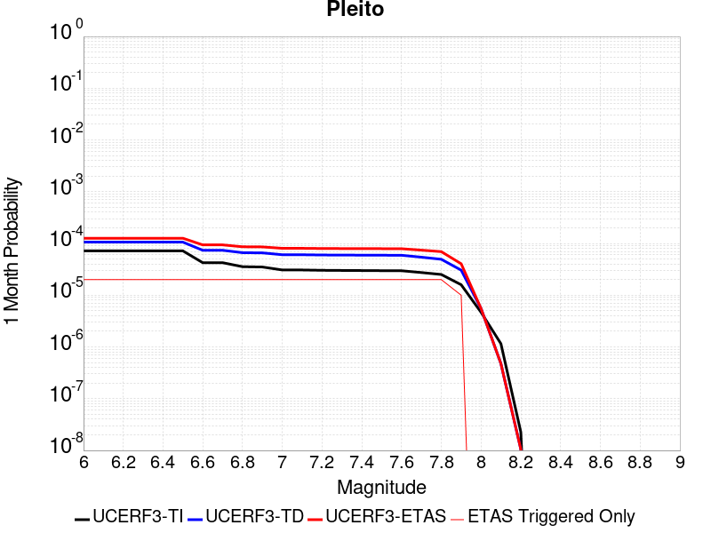 |  | 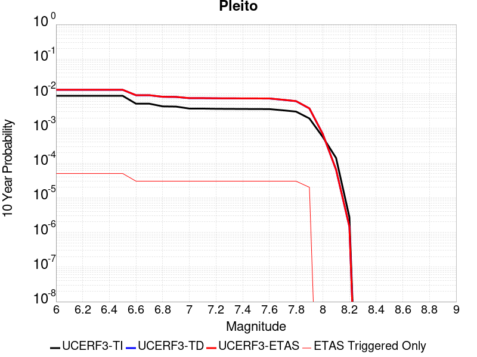 |

| Magnitude | 1 wk TI Prob | 1 wk TD Prob | 1 wk ETAS Prob | 1 wk ETAS/TD Gain | 1 wk ETAS Triggered Only | 1 mo TI Prob | 1 mo TD Prob | 1 mo ETAS Prob | 1 mo ETAS/TD Gain | 1 mo ETAS Triggered Only | 1 yr TI Prob | 1 yr TD Prob | 1 yr ETAS Prob | 1 yr ETAS/TD Gain | 1 yr ETAS Triggered Only | 10 yr TI Prob | 10 yr TD Prob | 10 yr ETAS Prob | 10 yr ETAS/TD Gain | 10 yr ETAS Triggered Only |
|-----|-----|-----|-----|-----|-----|-----|-----|-----|-----|-----|-----|-----|-----|-----|-----|-----|-----|-----|-----|-----|
| 6.0 | 1.6763008E-5 | 2.4765366E-5 | 4.476487E-5 | 1.8075594 | 2.0E-5 | 7.183948E-5 | 1.0613337E-4 | 1.2613124E-4 | 1.1884222 | 2.0E-5 | 8.742947E-4 | 0.0012914799 | 0.0013214411 | 1.0231992 | 3.0E-5 | 0.00870863 | 0.012954689 | 0.013004041 | 1.0038096 | 5.0E-5 |
| 6.1 | 1.6763008E-5 | 2.4765366E-5 | 4.476487E-5 | 1.8075594 | 2.0E-5 | 7.183948E-5 | 1.0613337E-4 | 1.2613124E-4 | 1.1884222 | 2.0E-5 | 8.742947E-4 | 0.0012914799 | 0.0013214411 | 1.0231992 | 3.0E-5 | 0.00870863 | 0.012954689 | 0.013004041 | 1.0038096 | 5.0E-5 |
| 6.2 | 1.6763008E-5 | 2.4765366E-5 | 4.476487E-5 | 1.8075594 | 2.0E-5 | 7.183948E-5 | 1.0613337E-4 | 1.2613124E-4 | 1.1884222 | 2.0E-5 | 8.742947E-4 | 0.0012914799 | 0.0013214411 | 1.0231992 | 3.0E-5 | 0.00870863 | 0.012954689 | 0.013004041 | 1.0038096 | 5.0E-5 |
| 6.3 | 1.6763008E-5 | 2.4765366E-5 | 4.476487E-5 | 1.8075594 | 2.0E-5 | 7.183948E-5 | 1.0613337E-4 | 1.2613124E-4 | 1.1884222 | 2.0E-5 | 8.742947E-4 | 0.0012914799 | 0.0013214411 | 1.0231992 | 3.0E-5 | 0.00870863 | 0.012954689 | 0.013004041 | 1.0038096 | 5.0E-5 |
| 6.4 | 1.6763008E-5 | 2.4765366E-5 | 4.476487E-5 | 1.8075594 | 2.0E-5 | 7.183948E-5 | 1.0613337E-4 | 1.2613124E-4 | 1.1884222 | 2.0E-5 | 8.742947E-4 | 0.0012914799 | 0.0013214411 | 1.0231992 | 3.0E-5 | 0.00870863 | 0.012954689 | 0.013004041 | 1.0038096 | 5.0E-5 |
| 6.5 | 1.6763008E-5 | 2.4765366E-5 | 4.476487E-5 | 1.8075594 | 2.0E-5 | 7.183948E-5 | 1.0613337E-4 | 1.2613124E-4 | 1.1884222 | 2.0E-5 | 8.742947E-4 | 0.0012914799 | 0.0013214411 | 1.0231992 | 3.0E-5 | 0.00870863 | 0.012954689 | 0.013004041 | 1.0038096 | 5.0E-5 |
| 6.6 | 9.910213E-6 | 1.7216142E-5 | 3.7215796E-5 | 2.1616805 | 2.0E-5 | 4.247165E-5 | 7.37814E-5 | 9.377992E-5 | 1.271051 | 2.0E-5 | 5.169696E-4 | 8.9792203E-4 | 9.278951E-4 | 1.0333805 | 3.0E-5 | 0.0051576863 | 0.009051499 | 0.009081228 | 1.0032843 | 3.0E-5 |
| 6.7 | 9.910213E-6 | 1.7216142E-5 | 3.7215796E-5 | 2.1616805 | 2.0E-5 | 4.247165E-5 | 7.37814E-5 | 9.377992E-5 | 1.271051 | 2.0E-5 | 5.169696E-4 | 8.9792203E-4 | 9.278951E-4 | 1.0333805 | 3.0E-5 | 0.0051576863 | 0.009051499 | 0.009081228 | 1.0032843 | 3.0E-5 |
| 6.8 | 8.300162E-6 | 1.5475749E-5 | 3.5475437E-5 | 2.2923245 | 2.0E-5 | 3.557164E-5 | 6.632296E-5 | 8.6321634E-5 | 1.3015347 | 2.0E-5 | 4.3299864E-4 | 8.071843E-4 | 8.371601E-4 | 1.0371362 | 3.0E-5 | 0.004321559 | 0.008150935 | 0.008180691 | 1.0036505 | 3.0E-5 |
| 6.9 | 8.183114E-6 | 1.5346963E-5 | 3.5346657E-5 | 2.3031695 | 2.0E-5 | 3.5070017E-5 | 6.577105E-5 | 8.576973E-5 | 1.3040651 | 2.0E-5 | 4.2689382E-4 | 8.004698E-4 | 8.3044573E-4 | 1.037448 | 3.0E-5 | 0.0042607468 | 0.00808428 | 0.008114038 | 1.003681 | 3.0E-5 |
| 7.0 | 7.1748823E-6 | 1.41339215E-5 | 3.4133638E-5 | 2.4150155 | 2.0E-5 | 3.0749135E-5 | 6.0572544E-5 | 8.0571335E-5 | 1.3301626 | 2.0E-5 | 3.743064E-4 | 7.3722174E-4 | 7.671996E-4 | 1.0406634 | 3.0E-5 | 0.0037367654 | 0.0074556028 | 0.007485379 | 1.0039939 | 3.0E-5 |
| 7.1 | 7.1671807E-6 | 1.4124291E-5 | 3.412401E-5 | 2.4159803 | 2.0E-5 | 3.0716128E-5 | 6.0531274E-5 | 8.0530066E-5 | 1.3303877 | 2.0E-5 | 3.7390468E-4 | 7.367196E-4 | 7.666975E-4 | 1.040691 | 3.0E-5 | 0.0037327618 | 0.007450615 | 0.0074803913 | 1.0039965 | 3.0E-5 |
| 7.2 | 7.0649667E-6 | 1.3971575E-5 | 3.3971297E-5 | 2.4314578 | 2.0E-5 | 3.0278077E-5 | 5.9876806E-5 | 7.987561E-5 | 1.3339992 | 2.0E-5 | 3.6857324E-4 | 7.287568E-4 | 7.5873494E-4 | 1.041136 | 3.0E-5 | 0.0036796255 | 0.0073713637 | 0.0074011427 | 1.0040398 | 3.0E-5 |
| 7.3 | 7.02082E-6 | 1.3915027E-5 | 3.391475E-5 | 2.4372752 | 2.0E-5 | 3.008888E-5 | 5.963447E-5 | 7.9633275E-5 | 1.3353565 | 2.0E-5 | 3.6627054E-4 | 7.258083E-4 | 7.5578655E-4 | 1.0413033 | 3.0E-5 | 0.0036566744 | 0.007341863 | 0.0073716426 | 1.0040562 | 3.0E-5 |
| 7.4 | 6.987146E-6 | 1.3874587E-5 | 3.387431E-5 | 2.4414644 | 2.0E-5 | 2.9944567E-5 | 5.9461163E-5 | 7.945998E-5 | 1.336334 | 2.0E-5 | 3.6451413E-4 | 7.236997E-4 | 7.53678E-4 | 1.0414237 | 3.0E-5 | 0.0036391679 | 0.007320797 | 0.007350577 | 1.0040679 | 3.0E-5 |
| 7.5 | 6.9494554E-6 | 1.3831491E-5 | 3.3831213E-5 | 2.4459558 | 2.0E-5 | 2.9783041E-5 | 5.9276474E-5 | 7.927529E-5 | 1.337382 | 2.0E-5 | 3.625482E-4 | 7.2145264E-4 | 7.51431E-4 | 1.0415528 | 3.0E-5 | 0.0036195726 | 0.0072984244 | 0.0073282053 | 1.0040805 | 3.0E-5 |
| 7.6 | 6.92694E-6 | 1.3790602E-5 | 3.3790326E-5 | 2.450243 | 2.0E-5 | 2.9686547E-5 | 5.9101243E-5 | 7.9100064E-5 | 1.3383824 | 2.0E-5 | 3.6137376E-4 | 7.193206E-4 | 7.49299E-4 | 1.041676 | 3.0E-5 | 0.0036078666 | 0.007277177 | 0.0073069585 | 1.0040925 | 3.0E-5 |
| 7.7 | 6.395867E-6 | 1.2669592E-5 | 3.2669337E-5 | 2.5785627 | 2.0E-5 | 2.741057E-5 | 5.429712E-5 | 7.429604E-5 | 1.3683237 | 2.0E-5 | 3.336726E-4 | 6.6086726E-4 | 6.9084746E-4 | 1.0453649 | 3.0E-5 | 0.0033317201 | 0.00669582 | 0.006725619 | 1.0044504 | 3.0E-5 |
| 7.8 | 5.8664327E-6 | 1.1537111E-5 | 3.153688E-5 | 2.7335162 | 2.0E-5 | 2.5141611E-5 | 4.9443825E-5 | 6.944284E-5 | 1.4044795 | 2.0E-5 | 3.060561E-4 | 6.0181256E-4 | 6.3179445E-4 | 1.0498195 | 3.0E-5 | 0.0030563495 | 0.0061013014 | 0.0061311186 | 1.004887 | 3.0E-5 |
| 7.9 | 3.7167474E-6 | 7.1148306E-6 | 1.7114759E-5 | 2.405505 | 1.0E-5 | 1.592882E-5 | 3.0491774E-5 | 4.0491468E-5 | 1.3279473 | 1.0E-5 | 1.9391612E-4 | 3.7117428E-4 | 3.9116686E-4 | 1.053863 | 2.0E-5 | 0.0019374699 | 0.0037678422 | 0.003787767 | 1.0052881 | 2.0E-5 |
| 8.0 | 1.0903841E-6 | 1.2879804E-6 | 1.2879804E-6 | 1.0 | 0.0 | 4.6730665E-6 | 5.5199043E-6 | 5.5199043E-6 | 1.0 | 0.0 | 5.68931E-5 | 6.7202775E-5 | 6.7202775E-5 | 1.0 | 0.0 | 5.6878536E-4 | 6.942452E-4 | 6.942452E-4 | 1.0 | 0.0 |
| 8.1 | 2.6894583E-7 | 1.10573154E-7 | 1.10573154E-7 | 1.0 | 0.0 | 1.1526245E-6 | 4.7388485E-7 | 4.7388485E-7 | 1.0 | 0.0 | 1.4033113E-5 | 5.769533E-6 | 5.769533E-6 | 1.0 | 0.0 | 1.4032227E-4 | 6.455374E-5 | 6.455374E-5 | 1.0 | 0.0 |
| 8.2 | 5.2967013E-9 | 2.4572007E-9 | 2.4572007E-9 | 1.0 | 0.0 | 2.2700148E-8 | 1.0530861E-8 | 1.0530861E-8 | 1.0 | 0.0 | 2.7637427E-7 | 1.2821323E-7 | 1.2821323E-7 | 1.0 | 0.0 | 2.7637393E-6 | 1.4587273E-6 | 1.4587273E-6 | 1.0 | 0.0 |

## Raymond
*[(top)](#table-of-contents)*

| 1 Week | 1 Month | 1 Year | 10 Year |
|-----|-----|-----|-----|
|  | 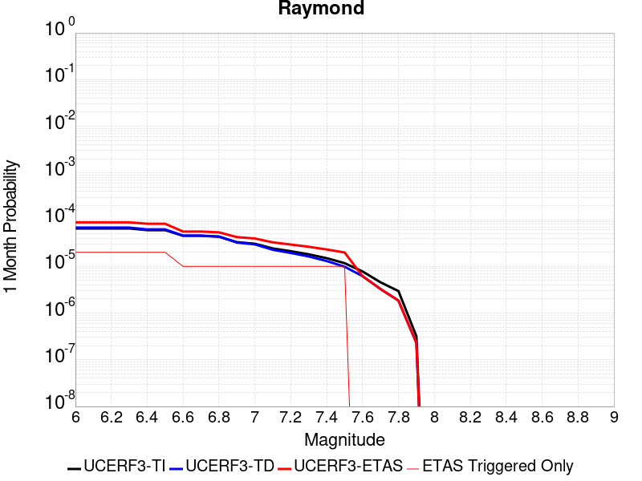 | 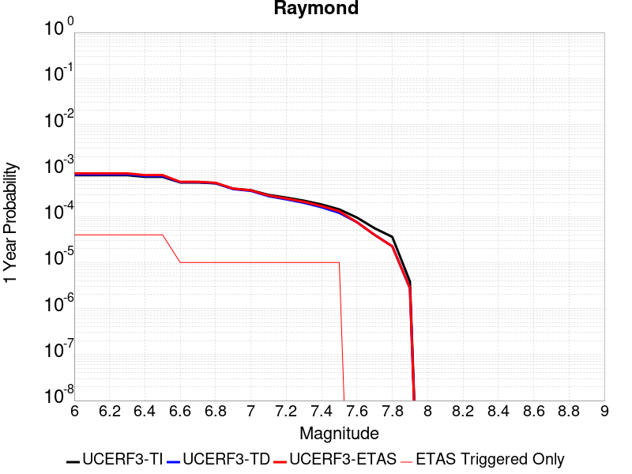 |  |

| Magnitude | 1 wk TI Prob | 1 wk TD Prob | 1 wk ETAS Prob | 1 wk ETAS/TD Gain | 1 wk ETAS Triggered Only | 1 mo TI Prob | 1 mo TD Prob | 1 mo ETAS Prob | 1 mo ETAS/TD Gain | 1 mo ETAS Triggered Only | 1 yr TI Prob | 1 yr TD Prob | 1 yr ETAS Prob | 1 yr ETAS/TD Gain | 1 yr ETAS Triggered Only | 10 yr TI Prob | 10 yr TD Prob | 10 yr ETAS Prob | 10 yr ETAS/TD Gain | 10 yr ETAS Triggered Only |
|-----|-----|-----|-----|-----|-----|-----|-----|-----|-----|-----|-----|-----|-----|-----|-----|-----|-----|-----|-----|-----|
| 6.0 | 1.5157413E-5 | 1.5810147E-5 | 1.5810147E-5 | 1.0 | 0.0 | 6.4958724E-5 | 6.7756155E-5 | 8.77548E-5 | 1.2951561 | 2.0E-5 | 7.905855E-4 | 8.24644E-4 | 8.64611E-4 | 1.0484657 | 4.0E-5 | 0.007877788 | 0.008218365 | 0.008267954 | 1.0060339 | 5.0E-5 |
| 6.1 | 1.5157413E-5 | 1.5810147E-5 | 1.5810147E-5 | 1.0 | 0.0 | 6.4958724E-5 | 6.7756155E-5 | 8.77548E-5 | 1.2951561 | 2.0E-5 | 7.905855E-4 | 8.24644E-4 | 8.64611E-4 | 1.0484657 | 4.0E-5 | 0.007877788 | 0.008218365 | 0.008267954 | 1.0060339 | 5.0E-5 |
| 6.2 | 1.5157413E-5 | 1.5810147E-5 | 1.5810147E-5 | 1.0 | 0.0 | 6.4958724E-5 | 6.7756155E-5 | 8.77548E-5 | 1.2951561 | 2.0E-5 | 7.905855E-4 | 8.24644E-4 | 8.64611E-4 | 1.0484657 | 4.0E-5 | 0.007877788 | 0.008218365 | 0.008267954 | 1.0060339 | 5.0E-5 |
| 6.3 | 1.5157413E-5 | 1.5810147E-5 | 1.5810147E-5 | 1.0 | 0.0 | 6.4958724E-5 | 6.7756155E-5 | 8.77548E-5 | 1.2951561 | 2.0E-5 | 7.905855E-4 | 8.24644E-4 | 8.64611E-4 | 1.0484657 | 4.0E-5 | 0.007877788 | 0.008218365 | 0.008267954 | 1.0060339 | 5.0E-5 |
| 6.4 | 1.3941944E-5 | 1.44547075E-5 | 1.44547075E-5 | 1.0 | 0.0 | 5.9749822E-5 | 6.194741E-5 | 8.1946164E-5 | 1.3228345 | 2.0E-5 | 7.2721124E-4 | 7.5397204E-4 | 7.9394184E-4 | 1.0530124 | 4.0E-5 | 0.007248361 | 0.007516481 | 0.007566105 | 1.006602 | 5.0E-5 |
| 6.5 | 1.3941944E-5 | 1.44547075E-5 | 1.44547075E-5 | 1.0 | 0.0 | 5.9749822E-5 | 6.194741E-5 | 8.1946164E-5 | 1.3228345 | 2.0E-5 | 7.2721124E-4 | 7.5397204E-4 | 7.9394184E-4 | 1.0530124 | 4.0E-5 | 0.007248361 | 0.007516481 | 0.007566105 | 1.006602 | 5.0E-5 |
| 6.6 | 1.0542609E-5 | 1.0671124E-5 | 1.0671124E-5 | 1.0 | 0.0 | 4.5181827E-5 | 4.573262E-5 | 5.5732162E-5 | 1.2186524 | 1.0E-5 | 5.499499E-4 | 5.5665785E-4 | 5.666523E-4 | 1.0179543 | 1.0E-5 | 0.005485909 | 0.0055532036 | 0.0055730925 | 1.0035815 | 2.0E-5 |
| 6.7 | 1.0542609E-5 | 1.0671124E-5 | 1.0671124E-5 | 1.0 | 0.0 | 4.5181827E-5 | 4.573262E-5 | 5.5732162E-5 | 1.2186524 | 1.0E-5 | 5.499499E-4 | 5.5665785E-4 | 5.666523E-4 | 1.0179543 | 1.0E-5 | 0.005485909 | 0.0055532036 | 0.0055730925 | 1.0035815 | 2.0E-5 |
| 6.8 | 1.0079132E-5 | 1.0176657E-5 | 1.0176657E-5 | 1.0 | 0.0 | 4.3195567E-5 | 4.3613545E-5 | 5.361311E-5 | 1.2292765 | 1.0E-5 | 5.257791E-4 | 5.308709E-4 | 5.408656E-4 | 1.018827 | 1.0E-5 | 0.0052453685 | 0.005296584 | 0.0053164787 | 1.003756 | 2.0E-5 |
| 6.9 | 7.721598E-6 | 7.548912E-6 | 7.548912E-6 | 1.0 | 0.0 | 3.3092143E-5 | 3.2352084E-5 | 4.2351763E-5 | 1.3090891 | 1.0E-5 | 4.0282236E-4 | 3.9381665E-4 | 4.0381274E-4 | 1.0253825 | 1.0E-5 | 0.0040209293 | 0.0039313287 | 0.00395125 | 1.0050673 | 2.0E-5 |
| 7.0 | 7.137566E-6 | 6.911312E-6 | 6.911312E-6 | 1.0 | 0.0 | 3.058921E-5 | 2.961958E-5 | 3.961928E-5 | 1.3376045 | 1.0E-5 | 3.7236E-4 | 3.605598E-4 | 3.7055617E-4 | 1.0277246 | 1.0E-5 | 0.0037173668 | 0.0035998735 | 0.0036098375 | 1.0027679 | 1.0E-5 |
| 7.1 | 5.654976E-6 | 5.299545E-6 | 5.299545E-6 | 1.0 | 0.0 | 2.4235387E-5 | 2.271214E-5 | 3.2711912E-5 | 1.4402832 | 1.0E-5 | 2.9502588E-4 | 2.7648543E-4 | 2.8648265E-4 | 1.0361583 | 1.0E-5 | 0.0029463451 | 0.002761453 | 0.0027714253 | 1.0036113 | 1.0E-5 |
| 7.2 | 4.9358455E-6 | 4.5266615E-6 | 4.5266615E-6 | 1.0 | 0.0 | 2.1153453E-5 | 1.9399835E-5 | 2.939964E-5 | 1.5154583 | 1.0E-5 | 2.5751285E-4 | 2.3616753E-4 | 2.4616515E-4 | 1.0423328 | 1.0E-5 | 0.0025721465 | 0.002359195 | 0.0023691715 | 1.0042287 | 1.0E-5 |
| 7.3 | 4.2368597E-6 | 3.8056187E-6 | 3.8056187E-6 | 1.0 | 0.0 | 1.8157843E-5 | 1.6309694E-5 | 2.630953E-5 | 1.6131223 | 1.0E-5 | 2.2104931E-4 | 1.9855253E-4 | 2.0855054E-4 | 1.0503545 | 1.0E-5 | 0.0022082955 | 0.0019837774 | 0.0019937577 | 1.0050309 | 1.0E-5 |
| 7.4 | 3.4999923E-6 | 3.0437452E-6 | 3.0437452E-6 | 1.0 | 0.0 | 1.49998805E-5 | 1.3044558E-5 | 2.3044428E-5 | 1.7665932 | 1.0E-5 | 1.8260824E-4 | 1.58806E-4 | 1.6880441E-4 | 1.0629599 | 1.0E-5 | 0.0018245826 | 0.0015869483 | 0.0015969324 | 1.0062914 | 1.0E-5 |
| 7.5 | 2.738017E-6 | 2.3020443E-6 | 2.3020443E-6 | 1.0 | 0.0 | 1.1734306E-5 | 9.8658675E-6 | 1.9865769E-5 | 2.0135856 | 1.0E-5 | 1.428558E-4 | 1.2011038E-4 | 1.3010918E-4 | 1.0832467 | 1.0E-5 | 0.0014276401 | 0.0012004764 | 0.0012104645 | 1.00832 | 1.0E-5 |
| 7.6 | 1.8186392E-6 | 1.4423048E-6 | 1.4423048E-6 | 1.0 | 0.0 | 7.794145E-6 | 6.1812916E-6 | 6.1812916E-6 | 1.0 | 0.0 | 9.488958E-5 | 7.525467E-5 | 7.525467E-5 | 1.0 | 0.0 | 9.4849075E-4 | 7.523108E-4 | 7.523108E-4 | 1.0 | 0.0 |
| 7.7 | 1.0660348E-6 | 7.643713E-7 | 7.643713E-7 | 1.0 | 0.0 | 4.5687125E-6 | 3.275873E-6 | 3.275873E-6 | 1.0 | 0.0 | 5.5622655E-5 | 3.988304E-5 | 3.988304E-5 | 1.0 | 0.0 | 5.5608735E-4 | 3.9877542E-4 | 3.9877542E-4 | 1.0 | 0.0 |
| 7.8 | 6.913602E-7 | 4.320301E-7 | 4.320301E-7 | 1.0 | 0.0 | 2.962969E-6 | 1.8515562E-6 | 1.8515562E-6 | 1.0 | 0.0 | 3.607355E-5 | 2.254247E-5 | 2.254247E-5 | 1.0 | 0.0 | 3.6067693E-4 | 2.2541721E-4 | 2.2541721E-4 | 1.0 | 0.0 |
| 7.9 | 7.425201E-8 | 5.322272E-8 | 5.322272E-8 | 1.0 | 0.0 | 3.1822285E-7 | 2.2809736E-7 | 2.2809736E-7 | 1.0 | 0.0 | 3.874356E-6 | 2.7770832E-6 | 2.7770832E-6 | 1.0 | 0.0 | 3.8742884E-5 | 2.7770615E-5 | 2.7770615E-5 | 1.0 | 0.0 |

## Hunting Creek - Berryessa 2011 CFM
*[(top)](#table-of-contents)*

| 1 Week | 1 Month | 1 Year | 10 Year |
|-----|-----|-----|-----|
|  |  |  |  |

| Magnitude | 1 wk TI Prob | 1 wk TD Prob | 1 wk ETAS Prob | 1 wk ETAS/TD Gain | 1 wk ETAS Triggered Only | 1 mo TI Prob | 1 mo TD Prob | 1 mo ETAS Prob | 1 mo ETAS/TD Gain | 1 mo ETAS Triggered Only | 1 yr TI Prob | 1 yr TD Prob | 1 yr ETAS Prob | 1 yr ETAS/TD Gain | 1 yr ETAS Triggered Only | 10 yr TI Prob | 10 yr TD Prob | 10 yr ETAS Prob | 10 yr ETAS/TD Gain | 10 yr ETAS Triggered Only |
|-----|-----|-----|-----|-----|-----|-----|-----|-----|-----|-----|-----|-----|-----|-----|-----|-----|-----|-----|-----|-----|
| 6.0 | 1.1270982E-4 | 2.0028514E-4 | 2.0028514E-4 | 1.0 | 0.0 | 4.8295266E-4 | 8.5799367E-4 | 8.5799367E-4 | 1.0 | 0.0 | 0.0058641075 | 0.010386214 | 0.010406006 | 1.0019057 | 2.0E-5 | 0.057117578 | 0.09804108 | 0.098077156 | 1.000368 | 4.0E-5 |
| 6.1 | 1.1239393E-4 | 1.9976655E-4 | 1.9976655E-4 | 1.0 | 0.0 | 4.8159933E-4 | 8.557727E-4 | 8.557727E-4 | 1.0 | 0.0 | 0.0058477195 | 0.010359458 | 0.010369355 | 1.0009553 | 1.0E-5 | 0.056962132 | 0.09779955 | 0.097826615 | 1.0002768 | 3.0E-5 |
| 6.2 | 7.596265E-5 | 1.2933681E-4 | 1.2933681E-4 | 1.0 | 0.0 | 3.2551357E-4 | 5.54158E-4 | 5.54158E-4 | 1.0 | 0.0 | 0.0039559277 | 0.0067213844 | 0.0067313174 | 1.0014778 | 1.0E-5 | 0.038862433 | 0.064592786 | 0.064620845 | 1.0004344 | 3.0E-5 |
| 6.3 | 6.78794E-5 | 1.1448392E-4 | 1.1448392E-4 | 1.0 | 0.0 | 2.9087928E-4 | 4.905274E-4 | 4.905274E-4 | 1.0 | 0.0 | 0.003535705 | 0.005952683 | 0.0059626233 | 1.0016699 | 1.0E-5 | 0.034799766 | 0.057466682 | 0.057494957 | 1.0004921 | 3.0E-5 |
| 6.4 | 6.2165134E-5 | 1.04348306E-4 | 1.04348306E-4 | 1.0 | 0.0 | 2.6639478E-4 | 4.471117E-4 | 4.471117E-4 | 1.0 | 0.0 | 0.0032385332 | 0.0054274388 | 0.0054373844 | 1.0018325 | 1.0E-5 | 0.03191742 | 0.05255184 | 0.052580263 | 1.0005409 | 3.0E-5 |
| 6.5 | 5.4368087E-5 | 9.070254E-5 | 9.070254E-5 | 1.0 | 0.0 | 2.3298527E-4 | 3.8865488E-4 | 3.8865488E-4 | 1.0 | 0.0 | 0.0028329059 | 0.0047197193 | 0.0047197193 | 1.0 | 0.0 | 0.027970633 | 0.045881614 | 0.04589116 | 1.0002079 | 1.0E-5 |
| 6.6 | 4.729947E-5 | 7.847091E-5 | 7.847091E-5 | 1.0 | 0.0 | 2.0269625E-4 | 3.3624802E-4 | 3.3624802E-4 | 1.0 | 0.0 | 0.002465034 | 0.004084761 | 0.004084761 | 1.0 | 0.0 | 0.02437869 | 0.039853036 | 0.039862636 | 1.0002409 | 1.0E-5 |
| 6.7 | 3.6875328E-5 | 6.0443337E-5 | 6.0443337E-5 | 1.0 | 0.0 | 1.5802756E-4 | 2.5901047E-4 | 2.5901047E-4 | 1.0 | 0.0 | 0.0019222875 | 0.0031482843 | 0.0031482843 | 1.0 | 0.0 | 0.019057442 | 0.03089403 | 0.030903721 | 1.0003136 | 1.0E-5 |
| 6.8 | 2.0292036E-5 | 2.897678E-5 | 2.897678E-5 | 1.0 | 0.0 | 8.6962966E-5 | 1.2418022E-4 | 1.2418022E-4 | 1.0 | 0.0 | 0.0010582599 | 0.0015108332 | 0.0015108332 | 1.0 | 0.0 | 0.010532344 | 0.014979127 | 0.0149889765 | 1.0006576 | 1.0E-5 |
| 6.9 | 1.7871042E-5 | 2.4472698E-5 | 2.4472698E-5 | 1.0 | 0.0 | 7.658793E-5 | 1.0487878E-4 | 1.0487878E-4 | 1.0 | 0.0 | 9.320591E-4 | 0.0012761509 | 0.0012761509 | 1.0 | 0.0 | 0.009281595 | 0.012680538 | 0.012690412 | 1.0007786 | 1.0E-5 |
| 7.0 | 1.6415532E-5 | 2.1906608E-5 | 2.1906608E-5 | 1.0 | 0.0 | 7.035038E-5 | 9.388209E-5 | 9.388209E-5 | 1.0 | 0.0 | 8.561793E-4 | 0.0011424166 | 0.0011424166 | 1.0 | 0.0 | 0.008528882 | 0.011365031 | 0.011374918 | 1.0008699 | 1.0E-5 |
| 7.1 | 1.5409885E-5 | 2.0346628E-5 | 2.0346628E-5 | 1.0 | 0.0 | 6.6040695E-5 | 8.719693E-5 | 8.719693E-5 | 1.0 | 0.0 | 8.0374884E-4 | 0.0010611083 | 0.0010611083 | 1.0 | 0.0 | 0.00800848 | 0.010560937 | 0.010560937 | 1.0 | 0.0 |
| 7.2 | 1.4497423E-5 | 1.9055227E-5 | 1.9055227E-5 | 1.0 | 0.0 | 6.213033E-5 | 8.166272E-5 | 8.166272E-5 | 1.0 | 0.0 | 7.5617427E-4 | 9.937932E-4 | 9.937932E-4 | 1.0 | 0.0 | 0.0075360634 | 0.009894263 | 0.009894263 | 1.0 | 0.0 |
| 7.3 | 1.3615175E-5 | 1.7826384E-5 | 1.7826384E-5 | 1.0 | 0.0 | 5.8349444E-5 | 7.6396565E-5 | 7.6396565E-5 | 1.0 | 0.0 | 7.101729E-4 | 9.297342E-4 | 9.297342E-4 | 1.0 | 0.0 | 0.0070790765 | 0.0092591345 | 0.0092591345 | 1.0 | 0.0 |
| 7.4 | 1.2252825E-5 | 1.6026486E-5 | 1.6026486E-5 | 1.0 | 0.0 | 5.251105E-5 | 6.8683155E-5 | 6.8683155E-5 | 1.0 | 0.0 | 6.391345E-4 | 8.358994E-4 | 8.358994E-4 | 1.0 | 0.0 | 0.0063729943 | 0.00832818 | 0.00832818 | 1.0 | 0.0 |
| 7.5 | 1.0913301E-5 | 1.42413155E-5 | 1.42413155E-5 | 1.0 | 0.0 | 4.6770452E-5 | 6.10328E-5 | 6.10328E-5 | 1.0 | 0.0 | 5.6928146E-4 | 7.428237E-4 | 7.428237E-4 | 1.0 | 0.0 | 0.0056782532 | 0.007403993 | 0.007403993 | 1.0 | 0.0 |
| 7.6 | 8.623192E-6 | 1.1234806E-5 | 1.1234806E-5 | 1.0 | 0.0 | 3.6956015E-5 | 4.8148297E-5 | 4.8148297E-5 | 1.0 | 0.0 | 4.4984656E-4 | 5.860504E-4 | 5.860504E-4 | 1.0 | 0.0 | 0.00448937 | 0.0058455095 | 0.0058455095 | 1.0 | 0.0 |
| 7.7 | 2.0993634E-6 | 2.662645E-6 | 2.662645E-6 | 1.0 | 0.0 | 8.997241E-6 | 1.1411286E-5 | 1.1411286E-5 | 1.0 | 0.0 | 1.09535904E-4 | 1.3892363E-4 | 1.3892363E-4 | 1.0 | 0.0 | 0.0010948193 | 0.0013884011 | 0.0013884011 | 1.0 | 0.0 |
| 7.8 | 1.8428308E-7 | 2.167466E-7 | 2.167466E-7 | 1.0 | 0.0 | 7.897844E-7 | 9.2891366E-7 | 9.2891366E-7 | 1.0 | 0.0 | 9.615583E-6 | 1.1309469E-5 | 1.1309469E-5 | 1.0 | 0.0 | 9.615166E-5 | 1.13081915E-4 | 1.13081915E-4 | 1.0 | 0.0 |

## San Andreas (North Branch Mill Creek)
*[(top)](#table-of-contents)*

| 1 Week | 1 Month | 1 Year | 10 Year |
|-----|-----|-----|-----|
|  |  |  | 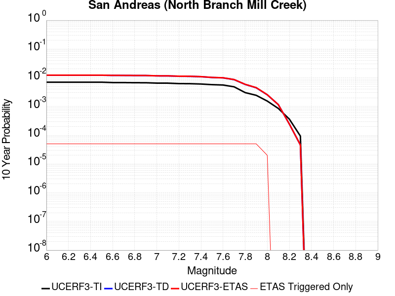 |

| Magnitude | 1 wk TI Prob | 1 wk TD Prob | 1 wk ETAS Prob | 1 wk ETAS/TD Gain | 1 wk ETAS Triggered Only | 1 mo TI Prob | 1 mo TD Prob | 1 mo ETAS Prob | 1 mo ETAS/TD Gain | 1 mo ETAS Triggered Only | 1 yr TI Prob | 1 yr TD Prob | 1 yr ETAS Prob | 1 yr ETAS/TD Gain | 1 yr ETAS Triggered Only | 10 yr TI Prob | 10 yr TD Prob | 10 yr ETAS Prob | 10 yr ETAS/TD Gain | 10 yr ETAS Triggered Only |
|-----|-----|-----|-----|-----|-----|-----|-----|-----|-----|-----|-----|-----|-----|-----|-----|-----|-----|-----|-----|-----|
| 6.0 | 1.3461156E-5 | 2.3501632E-5 | 4.3501164E-5 | 1.8509847 | 2.0E-5 | 5.7689394E-5 | 1.00717414E-4 | 1.207154E-4 | 1.1985554 | 2.0E-5 | 7.02142E-4 | 0.001225548 | 0.001265499 | 1.0325985 | 4.0E-5 | 0.0069992766 | 0.012229232 | 0.01227862 | 1.0040386 | 5.0E-5 |
| 6.1 | 1.3461156E-5 | 2.3501632E-5 | 4.3501164E-5 | 1.8509847 | 2.0E-5 | 5.7689394E-5 | 1.00717414E-4 | 1.207154E-4 | 1.1985554 | 2.0E-5 | 7.02142E-4 | 0.001225548 | 0.001265499 | 1.0325985 | 4.0E-5 | 0.0069992766 | 0.012229232 | 0.01227862 | 1.0040386 | 5.0E-5 |
| 6.2 | 1.3461156E-5 | 2.3501632E-5 | 4.3501164E-5 | 1.8509847 | 2.0E-5 | 5.7689394E-5 | 1.00717414E-4 | 1.207154E-4 | 1.1985554 | 2.0E-5 | 7.02142E-4 | 0.001225548 | 0.001265499 | 1.0325985 | 4.0E-5 | 0.0069992766 | 0.012229232 | 0.01227862 | 1.0040386 | 5.0E-5 |
| 6.3 | 1.3461156E-5 | 2.3501632E-5 | 4.3501164E-5 | 1.8509847 | 2.0E-5 | 5.7689394E-5 | 1.00717414E-4 | 1.207154E-4 | 1.1985554 | 2.0E-5 | 7.02142E-4 | 0.001225548 | 0.001265499 | 1.0325985 | 4.0E-5 | 0.0069992766 | 0.012229232 | 0.01227862 | 1.0040386 | 5.0E-5 |
| 6.4 | 1.3461156E-5 | 2.3501632E-5 | 4.3501164E-5 | 1.8509847 | 2.0E-5 | 5.7689394E-5 | 1.00717414E-4 | 1.207154E-4 | 1.1985554 | 2.0E-5 | 7.02142E-4 | 0.001225548 | 0.001265499 | 1.0325985 | 4.0E-5 | 0.0069992766 | 0.012229232 | 0.01227862 | 1.0040386 | 5.0E-5 |
| 6.5 | 1.3450706E-5 | 2.3490593E-5 | 4.3490123E-5 | 1.8513846 | 2.0E-5 | 5.764461E-5 | 1.006701E-4 | 1.2066809E-4 | 1.1986487 | 2.0E-5 | 7.0159714E-4 | 0.0012249727 | 0.0012649237 | 1.0326138 | 4.0E-5 | 0.006993862 | 0.012223542 | 0.012272931 | 1.0040405 | 5.0E-5 |
| 6.6 | 1.3074523E-5 | 2.3104876E-5 | 4.3104414E-5 | 1.8655981 | 2.0E-5 | 5.6032466E-5 | 9.901716E-5 | 1.19015174E-4 | 1.2019652 | 2.0E-5 | 6.8198174E-4 | 0.0012048704 | 0.0012448223 | 1.0331585 | 4.0E-5 | 0.006798926 | 0.012024707 | 0.012074105 | 1.0041081 | 5.0E-5 |
| 6.7 | 1.3050216E-5 | 2.3080172E-5 | 4.307971E-5 | 1.8665246 | 2.0E-5 | 5.59283E-5 | 9.8911296E-5 | 1.1890932E-4 | 1.2021813 | 2.0E-5 | 6.8071426E-4 | 0.001203583 | 0.0012435348 | 1.0331941 | 4.0E-5 | 0.0067863287 | 0.012011972 | 0.0120613715 | 1.0041125 | 5.0E-5 |
| 6.8 | 1.29049395E-5 | 2.2928582E-5 | 4.292812E-5 | 1.8722538 | 2.0E-5 | 5.530571E-5 | 9.826166E-5 | 1.182597E-4 | 1.2035182 | 2.0E-5 | 6.73139E-4 | 0.0011956824 | 0.0012356346 | 1.0334136 | 4.0E-5 | 0.0067110364 | 0.011933817 | 0.0119832195 | 1.0041398 | 5.0E-5 |
| 6.9 | 1.2867369E-5 | 2.2887984E-5 | 4.2887525E-5 | 1.873801 | 2.0E-5 | 5.51447E-5 | 9.808769E-5 | 1.1808573E-4 | 1.2038792 | 2.0E-5 | 6.711799E-4 | 0.0011935666 | 0.0012335188 | 1.033473 | 4.0E-5 | 0.006691564 | 0.011912885 | 0.01196229 | 1.0041472 | 5.0E-5 |
| 7.0 | 1.2495996E-5 | 2.2288059E-5 | 4.2287615E-5 | 1.8973215 | 2.0E-5 | 5.3553173E-5 | 9.551678E-5 | 1.15514864E-4 | 1.2093673 | 2.0E-5 | 6.518148E-4 | 0.0011622992 | 0.0012022527 | 1.0343746 | 4.0E-5 | 0.0064990623 | 0.011603488 | 0.011652907 | 1.004259 | 5.0E-5 |
| 7.1 | 1.2452067E-5 | 2.2233131E-5 | 4.223269E-5 | 1.8995384 | 2.0E-5 | 5.3364907E-5 | 9.5281386E-5 | 1.1527948E-4 | 1.2098846 | 2.0E-5 | 6.4952404E-4 | 0.0011594364 | 0.00119939 | 1.0344595 | 4.0E-5 | 0.0064762887 | 0.011575159 | 0.011624579 | 1.0042696 | 5.0E-5 |
| 7.2 | 1.2002777E-5 | 2.1611651E-5 | 4.161122E-5 | 1.9254068 | 2.0E-5 | 5.143946E-5 | 9.261809E-5 | 1.1261623E-4 | 1.2159206 | 2.0E-5 | 6.2609545E-4 | 0.0011270446 | 0.0011669995 | 1.035451 | 4.0E-5 | 0.006243344 | 0.011254541 | 0.011303978 | 1.0043926 | 5.0E-5 |
| 7.3 | 1.1923425E-5 | 2.148149E-5 | 4.148106E-5 | 1.9310141 | 2.0E-5 | 5.109939E-5 | 9.20603E-5 | 1.1205846E-4 | 1.2172289 | 2.0E-5 | 6.219575E-4 | 0.0011202605 | 0.0011602156 | 1.035666 | 4.0E-5 | 0.0062021962 | 0.011187422 | 0.011236863 | 1.0044193 | 5.0E-5 |
| 7.4 | 1.16105175E-5 | 2.085544E-5 | 4.0855022E-5 | 1.9589624 | 2.0E-5 | 4.975841E-5 | 8.937741E-5 | 1.0937562E-4 | 1.2237502 | 2.0E-5 | 6.0564023E-4 | 0.0010876294 | 0.0011275858 | 1.0367372 | 4.0E-5 | 0.006039923 | 0.010864897 | 0.010914354 | 1.004552 | 5.0E-5 |
| 7.5 | 1.1037265E-5 | 1.955545E-5 | 3.9555056E-5 | 2.022713 | 2.0E-5 | 4.7301706E-5 | 8.3806386E-5 | 1.0380471E-4 | 1.2386253 | 2.0E-5 | 5.757461E-4 | 0.0010198674 | 0.0010598265 | 1.0391808 | 4.0E-5 | 0.005742567 | 0.010195893 | 0.010245384 | 1.004854 | 5.0E-5 |
| 7.6 | 1.0720915E-5 | 1.8997325E-5 | 3.8996946E-5 | 2.05276 | 2.0E-5 | 4.5945973E-5 | 8.141458E-5 | 1.0141295E-4 | 1.2456362 | 2.0E-5 | 5.592486E-4 | 9.907739E-4 | 0.0010307343 | 1.0403324 | 4.0E-5 | 0.005578433 | 0.0099076 | 0.009957105 | 1.0049967 | 5.0E-5 |
| 7.7 | 9.276279E-6 | 1.644303E-5 | 3.64427E-5 | 2.2163007 | 2.0E-5 | 3.9754876E-5 | 7.046823E-5 | 9.046683E-5 | 1.2837958 | 2.0E-5 | 4.839081E-4 | 8.576147E-4 | 8.975804E-4 | 1.0466009 | 4.0E-5 | 0.0048285574 | 0.008586958 | 0.008636529 | 1.0057728 | 5.0E-5 |
| 7.8 | 5.8346777E-6 | 1.11560485E-5 | 3.1155825E-5 | 2.7927294 | 2.0E-5 | 2.5005522E-5 | 4.781076E-5 | 6.78098E-5 | 1.4182959 | 2.0E-5 | 3.043997E-4 | 5.8194064E-4 | 6.2191737E-4 | 1.0686955 | 4.0E-5 | 0.0030398308 | 0.0058476753 | 0.0058973827 | 1.0085005 | 5.0E-5 |
| 7.9 | 4.690204E-6 | 8.50986E-6 | 2.850969E-5 | 3.350195 | 2.0E-5 | 2.0100719E-5 | 3.647032E-5 | 5.646959E-5 | 1.5483712 | 2.0E-5 | 2.4469878E-4 | 4.4393577E-4 | 4.83918E-4 | 1.0900631 | 4.0E-5 | 0.002444295 | 0.004471413 | 0.0045211893 | 1.0111321 | 5.0E-5 |
| 8.0 | 2.9570454E-6 | 4.847313E-6 | 1.48472645E-5 | 3.0629888 | 1.0E-5 | 1.267299E-5 | 2.0774032E-5 | 3.0773826E-5 | 1.4813602 | 1.0E-5 | 1.5428272E-4 | 2.5289453E-4 | 2.7288948E-4 | 1.0790644 | 2.0E-5 | 0.0015417566 | 0.002550004 | 0.002569953 | 1.0078231 | 2.0E-5 |
| 8.1 | 1.6376824E-6 | 2.1969927E-6 | 2.1969927E-6 | 1.0 | 0.0 | 7.01862E-6 | 9.415649E-6 | 9.415649E-6 | 1.0 | 0.0 | 8.544835E-5 | 1.1462952E-4 | 1.1462952E-4 | 1.0 | 0.0 | 8.54155E-4 | 0.0011607946 | 0.0011607946 | 1.0 | 0.0 |
| 8.2 | 6.9631557E-7 | 4.5353926E-7 | 4.5353926E-7 | 1.0 | 0.0 | 2.984206E-6 | 1.9437382E-6 | 1.9437382E-6 | 1.0 | 0.0 | 3.63321E-5 | 2.3664757E-5 | 2.3664757E-5 | 1.0 | 0.0 | 3.6326164E-4 | 2.451259E-4 | 2.451259E-4 | 1.0 | 0.0 |
| 8.3 | 1.7876137E-7 | 8.358191E-8 | 8.358191E-8 | 1.0 | 0.0 | 7.661199E-7 | 3.5820813E-7 | 3.5820813E-7 | 1.0 | 0.0 | 9.32747E-6 | 4.3611753E-6 | 4.3611753E-6 | 1.0 | 0.0 | 9.3270784E-5 | 4.5808913E-5 | 4.5808913E-5 | 1.0 | 0.0 |

## Green Valley 2011 CFM
*[(top)](#table-of-contents)*

| 1 Week | 1 Month | 1 Year | 10 Year |
|-----|-----|-----|-----|
|  |  |  |  |

| Magnitude | 1 wk TI Prob | 1 wk TD Prob | 1 wk ETAS Prob | 1 wk ETAS/TD Gain | 1 wk ETAS Triggered Only | 1 mo TI Prob | 1 mo TD Prob | 1 mo ETAS Prob | 1 mo ETAS/TD Gain | 1 mo ETAS Triggered Only | 1 yr TI Prob | 1 yr TD Prob | 1 yr ETAS Prob | 1 yr ETAS/TD Gain | 1 yr ETAS Triggered Only | 10 yr TI Prob | 10 yr TD Prob | 10 yr ETAS Prob | 10 yr ETAS/TD Gain | 10 yr ETAS Triggered Only |
|-----|-----|-----|-----|-----|-----|-----|-----|-----|-----|-----|-----|-----|-----|-----|-----|-----|-----|-----|-----|-----|
| 6.0 | 9.9629346E-5 | 1.7302878E-4 | 1.7302878E-4 | 1.0 | 0.0 | 4.2691303E-4 | 7.413278E-4 | 7.413278E-4 | 1.0 | 0.0 | 0.0051852856 | 0.008986944 | 0.009006764 | 1.0022055 | 2.0E-5 | 0.050659515 | 0.085539445 | 0.08556688 | 1.0003207 | 3.0E-5 |
| 6.1 | 9.88615E-5 | 1.7150177E-4 | 1.7150177E-4 | 1.0 | 0.0 | 4.2362334E-4 | 7.3478726E-4 | 7.3478726E-4 | 1.0 | 0.0 | 0.0051454236 | 0.008907971 | 0.008927793 | 1.0022252 | 2.0E-5 | 0.050279044 | 0.0848271 | 0.08485456 | 1.0003237 | 3.0E-5 |
| 6.2 | 9.696895E-5 | 1.6789223E-4 | 1.6789223E-4 | 1.0 | 0.0 | 4.15515E-4 | 7.1932725E-4 | 7.1932725E-4 | 1.0 | 0.0 | 0.0050471667 | 0.0087213535 | 0.0087411795 | 1.0022732 | 2.0E-5 | 0.04934063 | 0.08313577 | 0.08316328 | 1.0003308 | 3.0E-5 |
| 6.3 | 9.275224E-5 | 1.5968556E-4 | 1.5968556E-4 | 1.0 | 0.0 | 3.9744904E-4 | 6.8417453E-4 | 6.8417453E-4 | 1.0 | 0.0 | 0.0048282105 | 0.008296675 | 0.008306593 | 1.0011953 | 1.0E-5 | 0.047246475 | 0.07927486 | 0.07930249 | 1.0003484 | 3.0E-5 |
| 6.4 | 8.391499E-5 | 1.4365892E-4 | 1.4365892E-4 | 1.0 | 0.0 | 3.595861E-4 | 6.155255E-4 | 6.155255E-4 | 1.0 | 0.0 | 0.004369175 | 0.007467204 | 0.007477129 | 1.0013292 | 1.0E-5 | 0.04284265 | 0.07164602 | 0.07167387 | 1.0003887 | 3.0E-5 |
| 6.5 | 5.9519385E-5 | 9.932609E-5 | 9.932609E-5 | 1.0 | 0.0 | 2.5505814E-4 | 4.256048E-4 | 4.256048E-4 | 1.0 | 0.0 | 0.0031009112 | 0.0051683546 | 0.0051683546 | 1.0 | 0.0 | 0.030579966 | 0.05014733 | 0.050156824 | 1.0001894 | 1.0E-5 |
| 6.6 | 4.5361558E-5 | 7.4019605E-5 | 7.4019605E-5 | 1.0 | 0.0 | 1.9439218E-4 | 3.171781E-4 | 3.171781E-4 | 1.0 | 0.0 | 0.0023641558 | 0.0038538794 | 0.0038538794 | 1.0 | 0.0 | 0.023391623 | 0.0376676 | 0.03767722 | 1.0002555 | 1.0E-5 |
| 6.7 | 3.8808106E-5 | 6.2643565E-5 | 6.2643565E-5 | 1.0 | 0.0 | 1.6630985E-4 | 2.6843822E-4 | 2.6843822E-4 | 1.0 | 0.0 | 0.0020229418 | 0.0032627417 | 0.0032627417 | 1.0 | 0.0 | 0.020046256 | 0.03200773 | 0.032017414 | 1.0003024 | 1.0E-5 |
| 6.8 | 2.2284667E-5 | 3.1285766E-5 | 3.1285766E-5 | 1.0 | 0.0 | 9.550222E-5 | 1.3407497E-4 | 1.3407497E-4 | 1.0 | 0.0 | 0.0011621192 | 0.0016311395 | 0.0016311395 | 1.0 | 0.0 | 0.011560607 | 0.016166767 | 0.016176606 | 1.0006086 | 1.0E-5 |
| 6.9 | 1.8050168E-5 | 2.444855E-5 | 2.444855E-5 | 1.0 | 0.0 | 7.735557E-5 | 1.0477533E-4 | 1.0477533E-4 | 1.0 | 0.0 | 9.4139716E-4 | 0.0012748962 | 0.0012748962 | 1.0 | 0.0 | 0.009374191 | 0.01266921 | 0.012679083 | 1.0007793 | 1.0E-5 |
| 7.0 | 1.4763166E-5 | 1.958325E-5 | 1.958325E-5 | 1.0 | 0.0 | 6.326917E-5 | 8.392553E-5 | 8.392553E-5 | 1.0 | 0.0 | 7.7002996E-4 | 0.0010213158 | 0.0010213158 | 1.0 | 0.0 | 0.007673672 | 0.010166257 | 0.010176155 | 1.0009737 | 1.0E-5 |
| 7.1 | 1.2399713E-5 | 1.6304055E-5 | 1.6304055E-5 | 1.0 | 0.0 | 5.3140546E-5 | 6.987266E-5 | 6.987266E-5 | 1.0 | 0.0 | 6.467941E-4 | 8.503696E-4 | 8.503696E-4 | 1.0 | 0.0 | 0.006449148 | 0.008471783 | 0.008471783 | 1.0 | 0.0 |
| 7.2 | 1.0584195E-5 | 1.3922058E-5 | 1.3922058E-5 | 1.0 | 0.0 | 4.5360044E-5 | 5.966461E-5 | 5.966461E-5 | 1.0 | 0.0 | 5.521186E-4 | 7.2617613E-4 | 7.2617613E-4 | 1.0 | 0.0 | 0.0055074887 | 0.0072386134 | 0.0072386134 | 1.0 | 0.0 |
| 7.3 | 7.998173E-6 | 1.0544262E-5 | 1.0544262E-5 | 1.0 | 0.0 | 3.4277433E-5 | 4.518892E-5 | 4.518892E-5 | 1.0 | 0.0 | 4.1724785E-4 | 5.500373E-4 | 5.500373E-4 | 1.0 | 0.0 | 0.004164653 | 0.0054871165 | 0.0054871165 | 1.0 | 0.0 |
| 7.4 | 6.7571127E-6 | 8.932909E-6 | 8.932909E-6 | 1.0 | 0.0 | 2.8958733E-5 | 3.828334E-5 | 3.828334E-5 | 1.0 | 0.0 | 3.5251552E-4 | 4.6600093E-4 | 4.6600093E-4 | 1.0 | 0.0 | 0.0035195686 | 0.004650627 | 0.004650627 | 1.0 | 0.0 |
| 7.5 | 5.69878E-6 | 7.516488E-6 | 7.516488E-6 | 1.0 | 0.0 | 2.4423114E-5 | 3.2213127E-5 | 3.2213127E-5 | 1.0 | 0.0 | 2.9731085E-4 | 3.9212513E-4 | 3.9212513E-4 | 1.0 | 0.0 | 0.002969134 | 0.0039146957 | 0.0039146957 | 1.0 | 0.0 |
| 7.6 | 4.503664E-6 | 5.9358263E-6 | 5.9358263E-6 | 1.0 | 0.0 | 1.9301275E-5 | 2.5439012E-5 | 2.5439012E-5 | 1.0 | 0.0 | 2.3496768E-4 | 3.0967678E-4 | 3.0967678E-4 | 1.0 | 0.0 | 0.002347194 | 0.0030927241 | 0.0030927241 | 1.0 | 0.0 |
| 7.7 | 1.0873546E-6 | 1.4107552E-6 | 1.4107552E-6 | 1.0 | 0.0 | 4.6600826E-6 | 6.04608E-6 | 6.04608E-6 | 1.0 | 0.0 | 5.6735033E-5 | 7.3608564E-5 | 7.3608564E-5 | 1.0 | 0.0 | 5.672055E-4 | 7.358708E-4 | 7.358708E-4 | 1.0 | 0.0 |
| 7.8 | 4.9373917E-8 | 6.177974E-8 | 6.177974E-8 | 1.0 | 0.0 | 2.1160248E-7 | 2.6477028E-7 | 2.6477028E-7 | 1.0 | 0.0 | 2.5762572E-6 | 3.2235748E-6 | 3.2235748E-6 | 1.0 | 0.0 | 2.5762274E-5 | 3.2228036E-5 | 3.2228036E-5 | 1.0 | 0.0 |

## Santa Ynez River
*[(top)](#table-of-contents)*

| 1 Week | 1 Month | 1 Year | 10 Year |
|-----|-----|-----|-----|
|  |  |  | 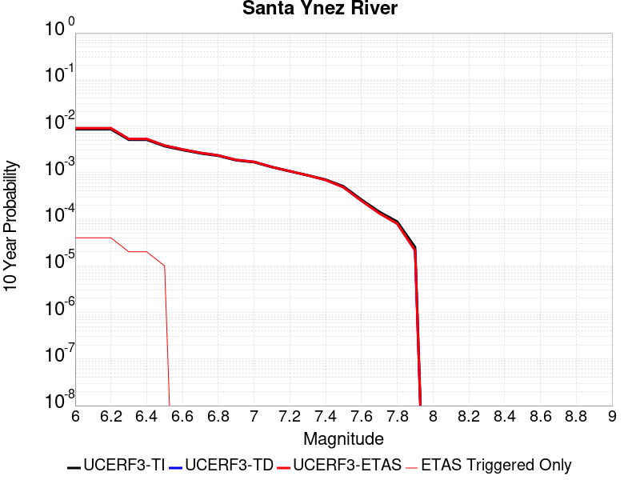 |

| Magnitude | 1 wk TI Prob | 1 wk TD Prob | 1 wk ETAS Prob | 1 wk ETAS/TD Gain | 1 wk ETAS Triggered Only | 1 mo TI Prob | 1 mo TD Prob | 1 mo ETAS Prob | 1 mo ETAS/TD Gain | 1 mo ETAS Triggered Only | 1 yr TI Prob | 1 yr TD Prob | 1 yr ETAS Prob | 1 yr ETAS/TD Gain | 1 yr ETAS Triggered Only | 10 yr TI Prob | 10 yr TD Prob | 10 yr ETAS Prob | 10 yr ETAS/TD Gain | 10 yr ETAS Triggered Only |
|-----|-----|-----|-----|-----|-----|-----|-----|-----|-----|-----|-----|-----|-----|-----|-----|-----|-----|-----|-----|-----|
| 6.0 | 1.6396456E-5 | 1.7209457E-5 | 4.720894E-5 | 2.7431977 | 3.0E-5 | 7.026863E-5 | 7.3752926E-5 | 1.0375072E-4 | 1.4067335 | 3.0E-5 | 8.551848E-4 | 8.9760753E-4 | 9.3757163E-4 | 1.0445229 | 4.0E-5 | 0.0085190125 | 0.008943369 | 0.008983011 | 1.0044326 | 4.0E-5 |
| 6.1 | 1.6396456E-5 | 1.7209457E-5 | 4.720894E-5 | 2.7431977 | 3.0E-5 | 7.026863E-5 | 7.3752926E-5 | 1.0375072E-4 | 1.4067335 | 3.0E-5 | 8.551848E-4 | 8.9760753E-4 | 9.3757163E-4 | 1.0445229 | 4.0E-5 | 0.0085190125 | 0.008943369 | 0.008983011 | 1.0044326 | 4.0E-5 |
| 6.2 | 1.6396456E-5 | 1.7209457E-5 | 4.720894E-5 | 2.7431977 | 3.0E-5 | 7.026863E-5 | 7.3752926E-5 | 1.0375072E-4 | 1.4067335 | 3.0E-5 | 8.551848E-4 | 8.9760753E-4 | 9.3757163E-4 | 1.0445229 | 4.0E-5 | 0.0085190125 | 0.008943369 | 0.008983011 | 1.0044326 | 4.0E-5 |
| 6.3 | 9.736976E-6 | 1.0122345E-5 | 2.0122245E-5 | 1.9879034 | 1.0E-5 | 4.172923E-5 | 4.3380787E-5 | 5.3380354E-5 | 1.2305068 | 1.0E-5 | 5.0793495E-4 | 5.280381E-4 | 5.480275E-4 | 1.0378561 | 2.0E-5 | 0.005067755 | 0.00526834 | 0.0052882344 | 1.0037763 | 2.0E-5 |
| 6.4 | 9.736976E-6 | 1.0122345E-5 | 2.0122245E-5 | 1.9879034 | 1.0E-5 | 4.172923E-5 | 4.3380787E-5 | 5.3380354E-5 | 1.2305068 | 1.0E-5 | 5.0793495E-4 | 5.280381E-4 | 5.480275E-4 | 1.0378561 | 2.0E-5 | 0.005067755 | 0.00526834 | 0.0052882344 | 1.0037763 | 2.0E-5 |
| 6.5 | 7.081964E-6 | 7.3299097E-6 | 1.7329836E-5 | 2.3642633 | 1.0E-5 | 3.035092E-5 | 3.141353E-5 | 4.1413216E-5 | 1.3183242 | 1.0E-5 | 3.694598E-4 | 3.8239418E-4 | 3.9239036E-4 | 1.026141 | 1.0E-5 | 0.0036884616 | 0.0038175236 | 0.0038274855 | 1.0026095 | 1.0E-5 |
| 6.6 | 5.873247E-6 | 6.0597554E-6 | 6.0597554E-6 | 1.0 | 0.0 | 2.5170815E-5 | 2.5970126E-5 | 2.5970126E-5 | 1.0 | 0.0 | 3.064116E-4 | 3.1614126E-4 | 3.1614126E-4 | 1.0 | 0.0 | 0.0030598943 | 0.0031570029 | 0.0031570029 | 1.0 | 0.0 |
| 6.7 | 4.973277E-6 | 5.1159127E-6 | 5.1159127E-6 | 1.0 | 0.0 | 2.1313872E-5 | 2.192516E-5 | 2.192516E-5 | 1.0 | 0.0 | 2.5946548E-4 | 2.669066E-4 | 2.669066E-4 | 1.0 | 0.0 | 0.0025916274 | 0.0026659092 | 0.0026659092 | 1.0 | 0.0 |
| 6.8 | 4.396492E-6 | 4.510989E-6 | 4.510989E-6 | 1.0 | 0.0 | 1.884197E-5 | 1.933267E-5 | 1.933267E-5 | 1.0 | 0.0 | 2.2937685E-4 | 2.3535018E-4 | 2.3535018E-4 | 1.0 | 0.0 | 0.0022914023 | 0.0023510447 | 0.0023510447 | 1.0 | 0.0 |
| 6.9 | 3.5255632E-6 | 3.6013444E-6 | 3.6013444E-6 | 1.0 | 0.0 | 1.5109469E-5 | 1.5434242E-5 | 1.5434242E-5 | 1.0 | 0.0 | 1.8394225E-4 | 1.8789586E-4 | 1.8789586E-4 | 1.0 | 0.0 | 0.0018379007 | 0.001877386 | 0.001877386 | 1.0 | 0.0 |
| 7.0 | 3.211603E-6 | 3.2736648E-6 | 3.2736648E-6 | 1.0 | 0.0 | 1.376394E-5 | 1.4029918E-5 | 1.4029918E-5 | 1.0 | 0.0 | 1.6756308E-4 | 1.70801E-4 | 1.70801E-4 | 1.0 | 0.0 | 0.0016743679 | 0.0017067114 | 0.0017067114 | 1.0 | 0.0 |
| 7.1 | 2.5094619E-6 | 2.5409308E-6 | 2.5409308E-6 | 1.0 | 0.0 | 1.0754793E-5 | 1.0889658E-5 | 1.0889658E-5 | 1.0 | 0.0 | 1.3093173E-4 | 1.3257358E-4 | 1.3257358E-4 | 1.0 | 0.0 | 0.0013085462 | 0.001324951 | 0.001324951 | 1.0 | 0.0 |
| 7.2 | 2.0515774E-6 | 2.0619477E-6 | 2.0619477E-6 | 1.0 | 0.0 | 8.792445E-6 | 8.836889E-6 | 8.836889E-6 | 1.0 | 0.0 | 1.0704277E-4 | 1.0758385E-4 | 1.0758385E-4 | 1.0 | 0.0 | 0.0010699122 | 0.001075322 | 0.001075322 | 1.0 | 0.0 |
| 7.3 | 1.6845745E-6 | 1.6774005E-6 | 1.6774005E-6 | 1.0 | 0.0 | 7.219585E-6 | 7.18884E-6 | 7.18884E-6 | 1.0 | 0.0 | 8.78949E-5 | 8.752064E-5 | 8.752064E-5 | 1.0 | 0.0 | 8.7860145E-4 | 8.748646E-4 | 8.748646E-4 | 1.0 | 0.0 |
| 7.4 | 1.3600285E-6 | 1.3333454E-6 | 1.3333454E-6 | 1.0 | 0.0 | 5.82868E-6 | 5.7143247E-6 | 5.7143247E-6 | 1.0 | 0.0 | 7.096187E-5 | 6.956971E-5 | 6.956971E-5 | 1.0 | 0.0 | 7.0939213E-4 | 6.954815E-4 | 6.954815E-4 | 1.0 | 0.0 |
| 7.5 | 9.735342E-7 | 9.2901934E-7 | 9.2901934E-7 | 1.0 | 0.0 | 4.172283E-6 | 3.9815054E-6 | 3.9815054E-6 | 1.0 | 0.0 | 5.079636E-5 | 4.847377E-5 | 4.847377E-5 | 1.0 | 0.0 | 5.0784746E-4 | 4.8463367E-4 | 4.8463367E-4 | 1.0 | 0.0 |
| 7.6 | 5.067187E-7 | 4.7786114E-7 | 4.7786114E-7 | 1.0 | 0.0 | 2.1716498E-6 | 2.0479747E-6 | 2.0479747E-6 | 1.0 | 0.0 | 2.6439517E-5 | 2.4933814E-5 | 2.4933814E-5 | 1.0 | 0.0 | 2.643637E-4 | 2.4931092E-4 | 2.4931092E-4 | 1.0 | 0.0 |
| 7.7 | 2.769089E-7 | 2.575936E-7 | 2.575936E-7 | 1.0 | 0.0 | 1.1867519E-6 | 1.1039721E-6 | 1.1039721E-6 | 1.0 | 0.0 | 1.4448608E-5 | 1.3440778E-5 | 1.3440778E-5 | 1.0 | 0.0 | 1.444767E-4 | 1.3439968E-4 | 1.3439968E-4 | 1.0 | 0.0 |
| 7.8 | 1.7044663E-7 | 1.5449217E-7 | 1.5449217E-7 | 1.0 | 0.0 | 7.3048534E-7 | 6.621091E-7 | 6.621091E-7 | 1.0 | 0.0 | 8.893623E-6 | 8.061149E-6 | 8.061149E-6 | 1.0 | 0.0 | 8.893267E-5 | 8.060858E-5 | 8.060858E-5 | 1.0 | 0.0 |
| 7.9 | 4.8344287E-8 | 4.0911164E-8 | 4.0911164E-8 | 1.0 | 0.0 | 2.0718979E-7 | 1.7533354E-7 | 1.7533354E-7 | 1.0 | 0.0 | 2.5225327E-6 | 2.1346839E-6 | 2.1346839E-6 | 1.0 | 0.0 | 2.5225041E-5 | 2.1346637E-5 | 2.1346637E-5 | 1.0 | 0.0 |

## Cleghorn Lake
*[(top)](#table-of-contents)*

| 1 Week | 1 Month | 1 Year | 10 Year |
|-----|-----|-----|-----|
|  |  |  | 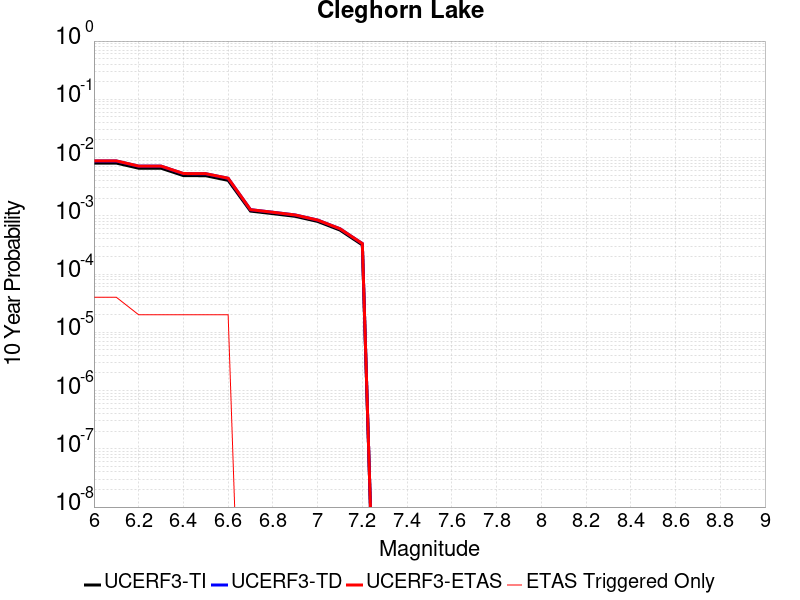 |

| Magnitude | 1 wk TI Prob | 1 wk TD Prob | 1 wk ETAS Prob | 1 wk ETAS/TD Gain | 1 wk ETAS Triggered Only | 1 mo TI Prob | 1 mo TD Prob | 1 mo ETAS Prob | 1 mo ETAS/TD Gain | 1 mo ETAS Triggered Only | 1 yr TI Prob | 1 yr TD Prob | 1 yr ETAS Prob | 1 yr ETAS/TD Gain | 1 yr ETAS Triggered Only | 10 yr TI Prob | 10 yr TD Prob | 10 yr ETAS Prob | 10 yr ETAS/TD Gain | 10 yr ETAS Triggered Only |
|-----|-----|-----|-----|-----|-----|-----|-----|-----|-----|-----|-----|-----|-----|-----|-----|-----|-----|-----|-----|-----|
| 6.0 | 1.5467183E-5 | 1.6794222E-5 | 2.6794054E-5 | 1.5954329 | 1.0E-5 | 6.6286244E-5 | 7.197356E-5 | 8.197284E-5 | 1.13893 | 1.0E-5 | 8.067362E-4 | 8.7598065E-4 | 8.859719E-4 | 1.0114058 | 1.0E-5 | 0.008038137 | 0.008730705 | 0.008770356 | 1.0045415 | 4.0E-5 |
| 6.1 | 1.5467183E-5 | 1.6794222E-5 | 2.6794054E-5 | 1.5954329 | 1.0E-5 | 6.6286244E-5 | 7.197356E-5 | 8.197284E-5 | 1.13893 | 1.0E-5 | 8.067362E-4 | 8.7598065E-4 | 8.859719E-4 | 1.0114058 | 1.0E-5 | 0.008038137 | 0.008730705 | 0.008770356 | 1.0045415 | 4.0E-5 |
| 6.2 | 1.2624631E-5 | 1.3681559E-5 | 1.3681559E-5 | 1.0 | 0.0 | 5.410444E-5 | 5.863421E-5 | 5.863421E-5 | 1.0 | 0.0 | 6.585225E-4 | 7.1368634E-4 | 7.1368634E-4 | 1.0 | 0.0 | 0.0065657445 | 0.007118739 | 0.007138597 | 1.0027895 | 2.0E-5 |
| 6.3 | 1.2624631E-5 | 1.3681559E-5 | 1.3681559E-5 | 1.0 | 0.0 | 5.410444E-5 | 5.863421E-5 | 5.863421E-5 | 1.0 | 0.0 | 6.585225E-4 | 7.1368634E-4 | 7.1368634E-4 | 1.0 | 0.0 | 0.0065657445 | 0.007118739 | 0.007138597 | 1.0027895 | 2.0E-5 |
| 6.4 | 9.417684E-6 | 1.0170128E-5 | 1.0170128E-5 | 1.0 | 0.0 | 4.036088E-5 | 4.3585766E-5 | 4.3585766E-5 | 1.0 | 0.0 | 4.912829E-4 | 5.305686E-4 | 5.305686E-4 | 1.0 | 0.0 | 0.004901982 | 0.005297054 | 0.0053169485 | 1.0037557 | 2.0E-5 |
| 6.5 | 9.368219E-6 | 1.0117555E-5 | 1.0117555E-5 | 1.0 | 0.0 | 4.014889E-5 | 4.336046E-5 | 4.336046E-5 | 1.0 | 0.0 | 4.8870314E-4 | 5.278268E-4 | 5.278268E-4 | 1.0 | 0.0 | 0.004876298 | 0.005269767 | 0.005289661 | 1.0037752 | 2.0E-5 |
| 6.6 | 7.803798E-6 | 8.44184E-6 | 8.44184E-6 | 1.0 | 0.0 | 3.3444423E-5 | 3.6179037E-5 | 3.6179037E-5 | 1.0 | 0.0 | 4.0710976E-4 | 4.4043065E-4 | 4.4043065E-4 | 1.0 | 0.0 | 0.0040636472 | 0.0043994947 | 0.004419407 | 1.004526 | 2.0E-5 |
| 6.7 | 2.3108669E-6 | 2.4438355E-6 | 2.4438355E-6 | 1.0 | 0.0 | 9.903678E-6 | 1.0473539E-5 | 1.0473539E-5 | 1.0 | 0.0 | 1.205706E-4 | 1.2750807E-4 | 1.2750807E-4 | 1.0 | 0.0 | 0.001205052 | 0.0012743677 | 0.0012743677 | 1.0 | 0.0 |
| 6.8 | 2.0882828E-6 | 2.2062836E-6 | 2.2062836E-6 | 1.0 | 0.0 | 8.949753E-6 | 9.455468E-6 | 9.455468E-6 | 1.0 | 0.0 | 1.08957785E-4 | 1.1511442E-4 | 1.1511442E-4 | 1.0 | 0.0 | 0.0010890438 | 0.0011505648 | 0.0011505648 | 1.0 | 0.0 |
| 6.9 | 1.876935E-6 | 1.9810523E-6 | 1.9810523E-6 | 1.0 | 0.0 | 8.043982E-6 | 8.490198E-6 | 8.490198E-6 | 1.0 | 0.0 | 9.7931086E-5 | 1.0336342E-4 | 1.0336342E-4 | 1.0 | 0.0 | 9.788794E-4 | 0.0010331693 | 0.0010331693 | 1.0 | 0.0 |
| 7.0 | 1.5357559E-6 | 1.6202819E-6 | 1.6202819E-6 | 1.0 | 0.0 | 6.5817944E-6 | 6.944047E-6 | 6.944047E-6 | 1.0 | 0.0 | 8.01304E-5 | 8.454062E-5 | 8.454062E-5 | 1.0 | 0.0 | 8.010151E-4 | 8.4509706E-4 | 8.4509706E-4 | 1.0 | 0.0 |
| 7.1 | 1.0905424E-6 | 1.1497627E-6 | 1.1497627E-6 | 1.0 | 0.0 | 4.6737446E-6 | 4.927546E-6 | 4.927546E-6 | 1.0 | 0.0 | 5.6901354E-5 | 5.999132E-5 | 5.999132E-5 | 1.0 | 0.0 | 5.6886784E-4 | 5.99761E-4 | 5.99761E-4 | 1.0 | 0.0 |
| 7.2 | 6.06668E-7 | 6.387282E-7 | 6.387282E-7 | 1.0 | 0.0 | 2.600003E-6 | 2.737404E-6 | 2.737404E-6 | 1.0 | 0.0 | 3.1654577E-5 | 3.3327455E-5 | 3.3327455E-5 | 1.0 | 0.0 | 3.1650066E-4 | 3.332314E-4 | 3.332314E-4 | 1.0 | 0.0 |

## Great Valley 07 (Orestimba)
*[(top)](#table-of-contents)*

| 1 Week | 1 Month | 1 Year | 10 Year |
|-----|-----|-----|-----|
|  |  |  |  |

| Magnitude | 1 wk TI Prob | 1 wk TD Prob | 1 wk ETAS Prob | 1 wk ETAS/TD Gain | 1 wk ETAS Triggered Only | 1 mo TI Prob | 1 mo TD Prob | 1 mo ETAS Prob | 1 mo ETAS/TD Gain | 1 mo ETAS Triggered Only | 1 yr TI Prob | 1 yr TD Prob | 1 yr ETAS Prob | 1 yr ETAS/TD Gain | 1 yr ETAS Triggered Only | 10 yr TI Prob | 10 yr TD Prob | 10 yr ETAS Prob | 10 yr ETAS/TD Gain | 10 yr ETAS Triggered Only |
|-----|-----|-----|-----|-----|-----|-----|-----|-----|-----|-----|-----|-----|-----|-----|-----|-----|-----|-----|-----|-----|
| 6.0 | 2.9687902E-5 | 3.275754E-5 | 4.2757212E-5 | 1.3052632 | 1.0E-5 | 1.2722766E-4 | 1.4038231E-4 | 1.503809E-4 | 1.0712241 | 1.0E-5 | 0.0015478961 | 0.0017078866 | 0.0017378354 | 1.0175356 | 3.0E-5 | 0.015371585 | 0.016955158 | 0.016984649 | 1.0017394 | 3.0E-5 |
| 6.1 | 2.9687902E-5 | 3.275754E-5 | 4.2757212E-5 | 1.3052632 | 1.0E-5 | 1.2722766E-4 | 1.4038231E-4 | 1.503809E-4 | 1.0712241 | 1.0E-5 | 0.0015478961 | 0.0017078866 | 0.0017378354 | 1.0175356 | 3.0E-5 | 0.015371585 | 0.016955158 | 0.016984649 | 1.0017394 | 3.0E-5 |
| 6.2 | 1.9231524E-5 | 2.1159192E-5 | 2.1159192E-5 | 1.0 | 0.0 | 8.2418206E-5 | 9.0679234E-5 | 9.0679234E-5 | 1.0 | 0.0 | 0.0010029797 | 0.0011034836 | 0.0011234615 | 1.0181044 | 2.0E-5 | 0.00998465 | 0.010982454 | 0.011002234 | 1.0018011 | 2.0E-5 |
| 6.3 | 1.324766E-5 | 1.4548551E-5 | 1.4548551E-5 | 1.0 | 0.0 | 5.6774446E-5 | 6.234949E-5 | 6.234949E-5 | 1.0 | 0.0 | 6.910097E-4 | 7.588499E-4 | 7.788347E-4 | 1.0263357 | 2.0E-5 | 0.006888649 | 0.007563533 | 0.0075833816 | 1.0026243 | 2.0E-5 |
| 6.4 | 7.818645E-6 | 8.572851E-6 | 8.572851E-6 | 1.0 | 0.0 | 3.3508048E-5 | 3.674029E-5 | 3.674029E-5 | 1.0 | 0.0 | 4.078841E-4 | 4.4722456E-4 | 4.4722456E-4 | 1.0 | 0.0 | 0.004071363 | 0.004463586 | 0.004463586 | 1.0 | 0.0 |
| 6.5 | 5.3076565E-6 | 5.8178075E-6 | 5.8178075E-6 | 1.0 | 0.0 | 2.27469E-5 | 2.4933235E-5 | 2.4933235E-5 | 1.0 | 0.0 | 2.7690834E-4 | 3.0352196E-4 | 3.0352196E-4 | 1.0 | 0.0 | 0.0027656353 | 0.0030312836 | 0.0030312836 | 1.0 | 0.0 |
| 6.6 | 3.6003578E-6 | 3.9485003E-6 | 3.9485003E-6 | 1.0 | 0.0 | 1.5430012E-5 | 1.6922042E-5 | 1.6922042E-5 | 1.0 | 0.0 | 1.8784421E-4 | 2.0600796E-4 | 2.0600796E-4 | 1.0 | 0.0 | 0.0018768552 | 0.002058324 | 0.002058324 | 1.0 | 0.0 |
| 6.7 | 2.5361826E-6 | 2.7834712E-6 | 2.7834712E-6 | 1.0 | 0.0 | 1.0869308E-5 | 1.1929115E-5 | 1.1929115E-5 | 1.0 | 0.0 | 1.3232579E-4 | 1.4522862E-4 | 1.4522862E-4 | 1.0 | 0.0 | 0.0013224703 | 0.001451467 | 0.001451467 | 1.0 | 0.0 |
| 6.8 | 1.2115831E-6 | 1.3313814E-6 | 1.3313814E-6 | 1.0 | 0.0 | 5.1924885E-6 | 5.7059133E-6 | 5.7059133E-6 | 1.0 | 0.0 | 6.3216714E-5 | 6.946825E-5 | 6.946825E-5 | 1.0 | 0.0 | 6.3198735E-4 | 6.9456047E-4 | 6.9456047E-4 | 1.0 | 0.0 |

## Kern Canyon (South Kern) 2011
*[(top)](#table-of-contents)*

| 1 Week | 1 Month | 1 Year | 10 Year |
|-----|-----|-----|-----|
|  |  | 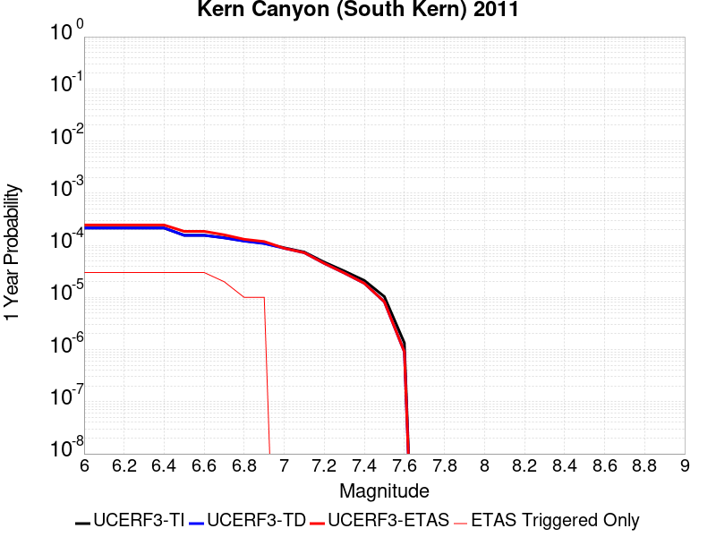 |  |

| Magnitude | 1 wk TI Prob | 1 wk TD Prob | 1 wk ETAS Prob | 1 wk ETAS/TD Gain | 1 wk ETAS Triggered Only | 1 mo TI Prob | 1 mo TD Prob | 1 mo ETAS Prob | 1 mo ETAS/TD Gain | 1 mo ETAS Triggered Only | 1 yr TI Prob | 1 yr TD Prob | 1 yr ETAS Prob | 1 yr ETAS/TD Gain | 1 yr ETAS Triggered Only | 10 yr TI Prob | 10 yr TD Prob | 10 yr ETAS Prob | 10 yr ETAS/TD Gain | 10 yr ETAS Triggered Only |
|-----|-----|-----|-----|-----|-----|-----|-----|-----|-----|-----|-----|-----|-----|-----|-----|-----|-----|-----|-----|-----|
| 6.0 | 4.105075E-6 | 4.113727E-6 | 2.4113644E-5 | 5.8617516 | 2.0E-5 | 1.7593058E-5 | 1.7630142E-5 | 4.762961E-5 | 2.7016013 | 3.0E-5 | 2.1417443E-4 | 2.1462647E-4 | 2.4462005E-4 | 1.1397477 | 3.0E-5 | 0.0021396813 | 0.002144256 | 0.00218417 | 1.0186145 | 4.0E-5 |
| 6.1 | 4.105075E-6 | 4.113727E-6 | 2.4113644E-5 | 5.8617516 | 2.0E-5 | 1.7593058E-5 | 1.7630142E-5 | 4.762961E-5 | 2.7016013 | 3.0E-5 | 2.1417443E-4 | 2.1462647E-4 | 2.4462005E-4 | 1.1397477 | 3.0E-5 | 0.0021396813 | 0.002144256 | 0.00218417 | 1.0186145 | 4.0E-5 |
| 6.2 | 4.105075E-6 | 4.113727E-6 | 2.4113644E-5 | 5.8617516 | 2.0E-5 | 1.7593058E-5 | 1.7630142E-5 | 4.762961E-5 | 2.7016013 | 3.0E-5 | 2.1417443E-4 | 2.1462647E-4 | 2.4462005E-4 | 1.1397477 | 3.0E-5 | 0.0021396813 | 0.002144256 | 0.00218417 | 1.0186145 | 4.0E-5 |
| 6.3 | 4.105075E-6 | 4.113727E-6 | 2.4113644E-5 | 5.8617516 | 2.0E-5 | 1.7593058E-5 | 1.7630142E-5 | 4.762961E-5 | 2.7016013 | 3.0E-5 | 2.1417443E-4 | 2.1462647E-4 | 2.4462005E-4 | 1.1397477 | 3.0E-5 | 0.0021396813 | 0.002144256 | 0.00218417 | 1.0186145 | 4.0E-5 |
| 6.4 | 4.105075E-6 | 4.113727E-6 | 2.4113644E-5 | 5.8617516 | 2.0E-5 | 1.7593058E-5 | 1.7630142E-5 | 4.762961E-5 | 2.7016013 | 3.0E-5 | 2.1417443E-4 | 2.1462647E-4 | 2.4462005E-4 | 1.1397477 | 3.0E-5 | 0.0021396813 | 0.002144256 | 0.00218417 | 1.0186145 | 4.0E-5 |
| 6.5 | 2.9849807E-6 | 2.9731548E-6 | 2.2973096E-5 | 7.7268414 | 2.0E-5 | 1.2792712E-5 | 1.2742031E-5 | 4.274165E-5 | 3.3543828 | 3.0E-5 | 1.5574014E-4 | 1.5512333E-4 | 1.8511868E-4 | 1.1933645 | 3.0E-5 | 0.0015563103 | 0.0015501657 | 0.0015801191 | 1.0193228 | 3.0E-5 |
| 6.6 | 2.9849807E-6 | 2.9731548E-6 | 2.2973096E-5 | 7.7268414 | 2.0E-5 | 1.2792712E-5 | 1.2742031E-5 | 4.274165E-5 | 3.3543828 | 3.0E-5 | 1.5574014E-4 | 1.5512333E-4 | 1.8511868E-4 | 1.1933645 | 3.0E-5 | 0.0015563103 | 0.0015501657 | 0.0015801191 | 1.0193228 | 3.0E-5 |
| 6.7 | 2.6756725E-6 | 2.6582209E-6 | 2.2658167E-5 | 8.523809 | 2.0E-5 | 1.1467117E-5 | 1.1392325E-5 | 3.1392097E-5 | 2.7555478 | 2.0E-5 | 1.396032E-4 | 1.3869285E-4 | 1.5869008E-4 | 1.1441835 | 2.0E-5 | 0.0013951553 | 0.0013860738 | 0.0014060461 | 1.0144093 | 2.0E-5 |
| 6.8 | 2.3283721E-6 | 2.3047787E-6 | 1.2304756E-5 | 5.3388014 | 1.0E-5 | 9.9787E-6 | 9.877586E-6 | 1.9877487E-5 | 2.012383 | 1.0E-5 | 1.214839E-4 | 1.2025305E-4 | 1.3025185E-4 | 1.083148 | 1.0E-5 | 0.001214175 | 0.0012018873 | 0.0012118752 | 1.0083102 | 1.0E-5 |
| 6.9 | 2.0972677E-6 | 2.069641E-6 | 1.206962E-5 | 5.831746 | 1.0E-5 | 8.988259E-6 | 8.86986E-6 | 1.8869772E-5 | 2.1274035 | 1.0E-5 | 1.0942656E-4 | 1.0798525E-4 | 1.1798417E-4 | 1.0925952 | 1.0E-5 | 0.0010937268 | 0.0010793336 | 0.0010893228 | 1.0092549 | 1.0E-5 |
| 7.0 | 1.7132242E-6 | 1.6787034E-6 | 1.6787034E-6 | 1.0 | 0.0 | 7.3423685E-6 | 7.1944232E-6 | 7.1944232E-6 | 1.0 | 0.0 | 8.938967E-5 | 8.758862E-5 | 8.758862E-5 | 1.0 | 0.0 | 8.935372E-4 | 8.7554485E-4 | 8.7554485E-4 | 1.0 | 0.0 |
| 7.1 | 1.4215541E-6 | 1.381575E-6 | 1.381575E-6 | 1.0 | 0.0 | 6.0923603E-6 | 5.921022E-6 | 5.921022E-6 | 1.0 | 0.0 | 7.417196E-5 | 7.2086084E-5 | 7.2086084E-5 | 1.0 | 0.0 | 7.414721E-4 | 7.206297E-4 | 7.206297E-4 | 1.0 | 0.0 |
| 7.2 | 9.097853E-7 | 8.6037716E-7 | 8.6037716E-7 | 1.0 | 0.0 | 3.899074E-6 | 3.6873255E-6 | 3.6873255E-6 | 1.0 | 0.0 | 4.7470192E-5 | 4.4892273E-5 | 4.4892273E-5 | 1.0 | 0.0 | 4.7460053E-4 | 4.4883313E-4 | 4.4883313E-4 | 1.0 | 0.0 |
| 7.3 | 6.144169E-7 | 5.6282005E-7 | 5.6282005E-7 | 1.0 | 0.0 | 2.6332125E-6 | 2.4120836E-6 | 2.4120836E-6 | 1.0 | 0.0 | 3.205889E-5 | 2.9366727E-5 | 2.9366727E-5 | 1.0 | 0.0 | 3.2054266E-4 | 2.9362898E-4 | 2.9362898E-4 | 1.0 | 0.0 |
| 7.4 | 4.049844E-7 | 3.572826E-7 | 3.572826E-7 | 1.0 | 0.0 | 1.7356463E-6 | 1.5312103E-6 | 1.5312103E-6 | 1.0 | 0.0 | 2.1131287E-5 | 1.8642328E-5 | 1.8642328E-5 | 1.0 | 0.0 | 2.1129279E-4 | 1.8640788E-4 | 1.8640788E-4 | 1.0 | 0.0 |
| 7.5 | 1.9871162E-7 | 1.5830388E-7 | 1.5830388E-7 | 1.0 | 0.0 | 8.5162094E-7 | 6.78445E-7 | 6.78445E-7 | 1.0 | 0.0 | 1.0368436E-5 | 8.260037E-6 | 8.260037E-6 | 1.0 | 0.0 | 1.0367952E-4 | 8.259739E-5 | 8.259739E-5 | 1.0 | 0.0 |
| 7.6 | 2.572245E-8 | 1.735264E-8 | 1.735264E-8 | 1.0 | 0.0 | 1.10239064E-7 | 7.436845E-8 | 7.436845E-8 | 1.0 | 0.0 | 1.3421597E-6 | 9.0543557E-7 | 9.0543557E-7 | 1.0 | 0.0 | 1.3421517E-5 | 9.054324E-6 | 9.054324E-6 | 1.0 | 0.0 |

## Santa Cruz Catalina Ridge alt1
*[(top)](#table-of-contents)*

| 1 Week | 1 Month | 1 Year | 10 Year |
|-----|-----|-----|-----|
|  |  |  | 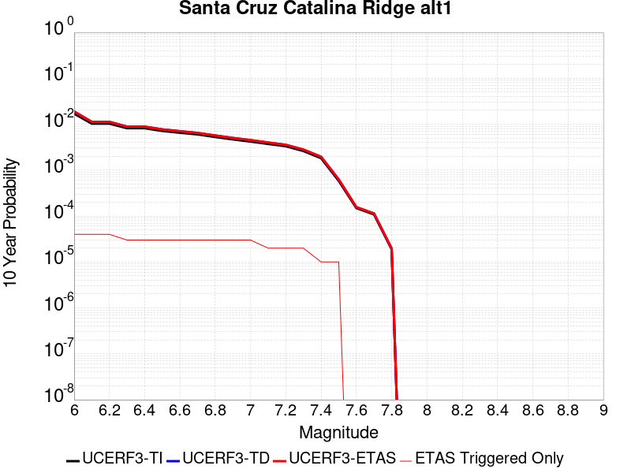 |

| Magnitude | 1 wk TI Prob | 1 wk TD Prob | 1 wk ETAS Prob | 1 wk ETAS/TD Gain | 1 wk ETAS Triggered Only | 1 mo TI Prob | 1 mo TD Prob | 1 mo ETAS Prob | 1 mo ETAS/TD Gain | 1 mo ETAS Triggered Only | 1 yr TI Prob | 1 yr TD Prob | 1 yr ETAS Prob | 1 yr ETAS/TD Gain | 1 yr ETAS Triggered Only | 10 yr TI Prob | 10 yr TD Prob | 10 yr ETAS Prob | 10 yr ETAS/TD Gain | 10 yr ETAS Triggered Only |
|-----|-----|-----|-----|-----|-----|-----|-----|-----|-----|-----|-----|-----|-----|-----|-----|-----|-----|-----|-----|-----|
| 6.0 | 3.2833184E-5 | 3.6558453E-5 | 3.6558453E-5 | 1.0 | 0.0 | 1.4070606E-4 | 1.566706E-4 | 1.566706E-4 | 1.0 | 0.0 | 0.00171175 | 0.0019059621 | 0.001925924 | 1.0104734 | 2.0E-5 | 0.016986247 | 0.01891306 | 0.018952303 | 1.002075 | 4.0E-5 |
| 6.1 | 1.9835548E-5 | 2.165953E-5 | 2.165953E-5 | 1.0 | 0.0 | 8.500672E-5 | 9.282337E-5 | 9.282337E-5 | 1.0 | 0.0 | 0.0010344655 | 0.0011295588 | 0.0011495362 | 1.017686 | 2.0E-5 | 0.010296632 | 0.011240308 | 0.011279859 | 1.0035186 | 4.0E-5 |
| 6.2 | 1.9835548E-5 | 2.165953E-5 | 2.165953E-5 | 1.0 | 0.0 | 8.500672E-5 | 9.282337E-5 | 9.282337E-5 | 1.0 | 0.0 | 0.0010344655 | 0.0011295588 | 0.0011495362 | 1.017686 | 2.0E-5 | 0.010296632 | 0.011240308 | 0.011279859 | 1.0035186 | 4.0E-5 |
| 6.3 | 1.5728183E-5 | 1.7033966E-5 | 1.7033966E-5 | 1.0 | 0.0 | 6.7404755E-5 | 7.300071E-5 | 7.300071E-5 | 1.0 | 0.0 | 8.2034385E-4 | 8.884273E-4 | 8.984184E-4 | 1.0112458 | 1.0E-5 | 0.008173222 | 0.0088494355 | 0.008879171 | 1.00336 | 3.0E-5 |
| 6.4 | 1.5728183E-5 | 1.7033966E-5 | 1.7033966E-5 | 1.0 | 0.0 | 6.7404755E-5 | 7.300071E-5 | 7.300071E-5 | 1.0 | 0.0 | 8.2034385E-4 | 8.884273E-4 | 8.984184E-4 | 1.0112458 | 1.0E-5 | 0.008173222 | 0.0088494355 | 0.008879171 | 1.00336 | 3.0E-5 |
| 6.5 | 1.3707734E-5 | 1.4794537E-5 | 1.4794537E-5 | 1.0 | 0.0 | 5.8746107E-5 | 6.340363E-5 | 6.340363E-5 | 1.0 | 0.0 | 7.1499916E-4 | 7.716694E-4 | 7.8166166E-4 | 1.0129489 | 1.0E-5 | 0.0071270303 | 0.007690297 | 0.0077200667 | 1.003871 | 3.0E-5 |
| 6.6 | 1.2539813E-5 | 1.3510233E-5 | 1.3510233E-5 | 1.0 | 0.0 | 5.3740947E-5 | 5.7899724E-5 | 5.7899724E-5 | 1.0 | 0.0 | 6.540996E-4 | 7.0470385E-4 | 7.1469677E-4 | 1.0141803 | 1.0E-5 | 0.0065217763 | 0.007024995 | 0.0070547843 | 1.0042405 | 3.0E-5 |
| 6.7 | 1.1504083E-5 | 1.2377386E-5 | 1.2377386E-5 | 1.0 | 0.0 | 4.930228E-5 | 5.3044874E-5 | 5.3044874E-5 | 1.0 | 0.0 | 6.0008996E-4 | 6.45632E-4 | 6.5562554E-4 | 1.0154787 | 1.0E-5 | 0.005984721 | 0.006437792 | 0.006467599 | 1.00463 | 3.0E-5 |
| 6.8 | 1.012739E-5 | 1.0877081E-5 | 1.0877081E-5 | 1.0 | 0.0 | 4.340238E-5 | 4.6615238E-5 | 4.6615238E-5 | 1.0 | 0.0 | 5.282958E-4 | 5.6739425E-4 | 5.7738856E-4 | 1.0176145 | 1.0E-5 | 0.0052704164 | 0.005659625 | 0.005689455 | 1.0052707 | 3.0E-5 |
| 6.9 | 8.9607865E-6 | 9.609126E-6 | 9.609126E-6 | 1.0 | 0.0 | 3.8402806E-5 | 4.1181323E-5 | 4.1181323E-5 | 1.0 | 0.0 | 4.6745385E-4 | 5.0126837E-4 | 5.112633E-4 | 1.0199394 | 1.0E-5 | 0.0046647177 | 0.005001496 | 0.0050313463 | 1.0059682 | 3.0E-5 |
| 7.0 | 8.046829E-6 | 8.619753E-6 | 8.619753E-6 | 1.0 | 0.0 | 3.4485955E-5 | 3.694128E-5 | 3.694128E-5 | 1.0 | 0.0 | 4.1978562E-4 | 4.496681E-4 | 4.596636E-4 | 1.0222286 | 1.0E-5 | 0.004189935 | 0.004487673 | 0.004517538 | 1.006655 | 3.0E-5 |
| 7.1 | 7.136131E-6 | 7.637663E-6 | 7.637663E-6 | 1.0 | 0.0 | 3.0583058E-5 | 3.2732434E-5 | 3.2732434E-5 | 1.0 | 0.0 | 3.7228514E-4 | 3.984452E-4 | 3.984452E-4 | 1.0 | 0.0 | 0.0037166206 | 0.003977385 | 0.003997305 | 1.0050085 | 2.0E-5 |
| 7.2 | 6.362014E-6 | 6.8049644E-6 | 6.8049644E-6 | 1.0 | 0.0 | 2.726549E-5 | 2.9163812E-5 | 2.9163812E-5 | 1.0 | 0.0 | 3.3190678E-4 | 3.550122E-4 | 3.550122E-4 | 1.0 | 0.0 | 0.0033141149 | 0.0035445192 | 0.003564448 | 1.0056225 | 2.0E-5 |
| 7.3 | 5.004101E-6 | 5.3517197E-6 | 5.3517197E-6 | 1.0 | 0.0 | 2.1445969E-5 | 2.2935743E-5 | 2.2935743E-5 | 1.0 | 0.0 | 2.6107338E-4 | 2.7920742E-4 | 2.7920742E-4 | 1.0 | 0.0 | 0.002607669 | 0.002788621 | 0.0028085653 | 1.007152 | 2.0E-5 |
| 7.4 | 3.4901443E-6 | 3.7320558E-6 | 3.7320558E-6 | 1.0 | 0.0 | 1.4957676E-5 | 1.5994428E-5 | 1.5994428E-5 | 1.0 | 0.0 | 1.8209449E-4 | 1.9471515E-4 | 1.9471515E-4 | 1.0 | 0.0 | 0.0018194534 | 0.0019454841 | 0.0019554645 | 1.00513 | 1.0E-5 |
| 7.5 | 1.1215045E-6 | 1.189388E-6 | 1.189388E-6 | 1.0 | 0.0 | 4.806439E-6 | 5.097367E-6 | 5.097367E-6 | 1.0 | 0.0 | 5.851682E-5 | 6.205871E-5 | 6.205871E-5 | 1.0 | 0.0 | 5.850142E-4 | 6.2041683E-4 | 6.304106E-4 | 1.0161082 | 1.0E-5 |
| 7.6 | 2.8599047E-7 | 2.995201E-7 | 2.995201E-7 | 1.0 | 0.0 | 1.2256729E-6 | 1.283657E-6 | 1.283657E-6 | 1.0 | 0.0 | 1.4922465E-5 | 1.5628413E-5 | 1.5628413E-5 | 1.0 | 0.0 | 1.4921463E-4 | 1.5627328E-4 | 1.5627328E-4 | 1.0 | 0.0 |
| 7.7 | 2.0781519E-7 | 2.1744336E-7 | 2.1744336E-7 | 1.0 | 0.0 | 8.906362E-7 | 9.3189976E-7 | 9.3189976E-7 | 1.0 | 0.0 | 1.08434415E-5 | 1.1345822E-5 | 1.1345822E-5 | 1.0 | 0.0 | 1.0842913E-4 | 1.13452516E-4 | 1.13452516E-4 | 1.0 | 0.0 |
| 7.8 | 3.614776E-8 | 3.7641037E-8 | 3.7641037E-8 | 1.0 | 0.0 | 1.5491896E-7 | 1.6131872E-7 | 1.6131872E-7 | 1.0 | 0.0 | 1.8861368E-6 | 1.9640538E-6 | 1.9640538E-6 | 1.0 | 0.0 | 1.8861208E-5 | 1.9640376E-5 | 1.9640376E-5 | 1.0 | 0.0 |

## Calaveras (So) - Paicines extension 2011 CFM
*[(top)](#table-of-contents)*

| 1 Week | 1 Month | 1 Year | 10 Year |
|-----|-----|-----|-----|
| 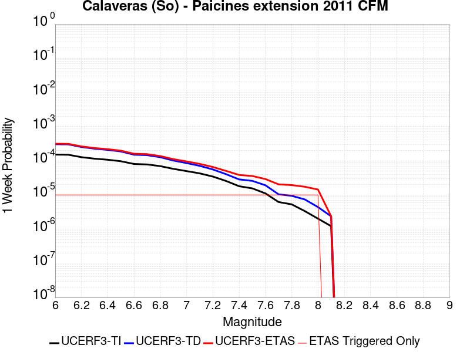 | 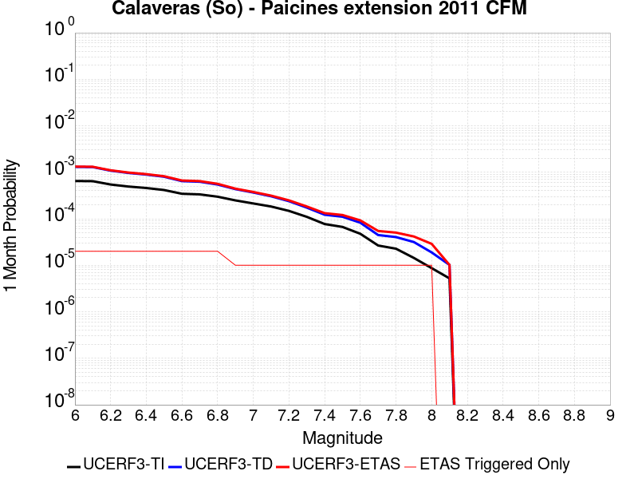 | 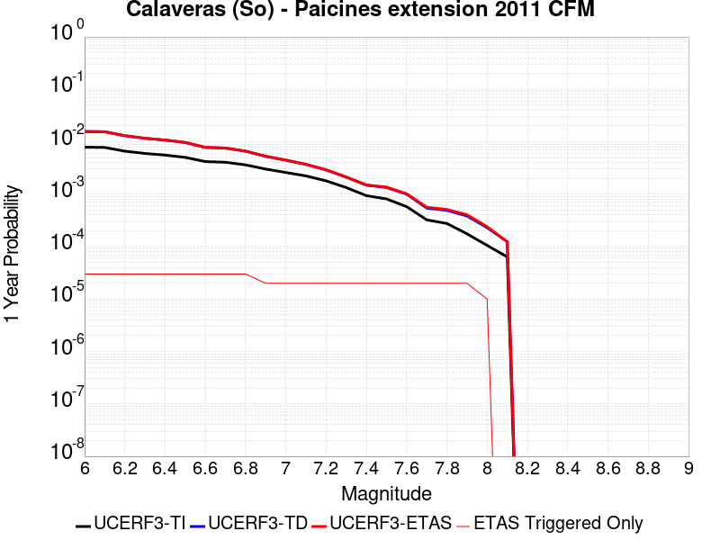 |  |

| Magnitude | 1 wk TI Prob | 1 wk TD Prob | 1 wk ETAS Prob | 1 wk ETAS/TD Gain | 1 wk ETAS Triggered Only | 1 mo TI Prob | 1 mo TD Prob | 1 mo ETAS Prob | 1 mo ETAS/TD Gain | 1 mo ETAS Triggered Only | 1 yr TI Prob | 1 yr TD Prob | 1 yr ETAS Prob | 1 yr ETAS/TD Gain | 1 yr ETAS Triggered Only | 10 yr TI Prob | 10 yr TD Prob | 10 yr ETAS Prob | 10 yr ETAS/TD Gain | 10 yr ETAS Triggered Only |
|-----|-----|-----|-----|-----|-----|-----|-----|-----|-----|-----|-----|-----|-----|-----|-----|-----|-----|-----|-----|-----|
| 6.0 | 1.5183659E-4 | 3.0520928E-4 | 3.152062E-4 | 1.0327544 | 1.0E-5 | 6.5056595E-4 | 0.0013068258 | 0.0013267996 | 1.0152843 | 2.0E-5 | 0.007891912 | 0.015696283 | 0.015725812 | 1.0018812 | 3.0E-5 | 0.076174594 | 0.13849075 | 0.13851659 | 1.0001866 | 3.0E-5 |
| 6.1 | 1.5024997E-4 | 3.0215114E-4 | 3.121481E-4 | 1.0330861 | 1.0E-5 | 6.437695E-4 | 0.0012937348 | 0.0013137088 | 1.0154392 | 2.0E-5 | 0.0078097614 | 0.015539674 | 0.015569208 | 1.0019006 | 3.0E-5 | 0.075409345 | 0.13716033 | 0.13718621 | 1.0001887 | 3.0E-5 |
| 6.2 | 1.2743923E-4 | 2.5313982E-4 | 2.6313728E-4 | 1.0394939 | 1.0E-5 | 5.460538E-4 | 0.001084008 | 0.0011039863 | 1.01843 | 2.0E-5 | 0.0066279583 | 0.0130469585 | 0.013076567 | 1.0022694 | 3.0E-5 | 0.064337276 | 0.11725779 | 0.11728427 | 1.0002259 | 3.0E-5 |
| 6.3 | 1.1525114E-4 | 2.2599289E-4 | 2.3599062E-4 | 1.0442392 | 1.0E-5 | 4.9383997E-4 | 9.6787856E-4 | 9.878592E-4 | 1.0206437 | 2.0E-5 | 0.0059959386 | 0.011668155 | 0.011697805 | 1.0025411 | 3.0E-5 | 0.058367174 | 0.106373854 | 0.10640067 | 1.000252 | 3.0E-5 |
| 6.4 | 1.07200925E-4 | 2.0840655E-4 | 2.1840446E-4 | 1.0479732 | 1.0E-5 | 4.5935164E-4 | 8.926198E-4 | 9.1260194E-4 | 1.022386 | 2.0E-5 | 0.0055782744 | 0.010773035 | 0.010802712 | 1.0027547 | 3.0E-5 | 0.0544031 | 0.09919651 | 0.09922353 | 1.0002724 | 3.0E-5 |
| 6.5 | 9.69631E-5 | 1.873486E-4 | 1.9734673E-4 | 1.0533664 | 1.0E-5 | 4.1548995E-4 | 8.0247055E-4 | 8.224545E-4 | 1.024903 | 2.0E-5 | 0.0050468626 | 0.009694915 | 0.009724624 | 1.0030644 | 3.0E-5 | 0.04933773 | 0.09008831 | 0.0901156 | 1.000303 | 3.0E-5 |
| 6.6 | 8.0552316E-5 | 1.5070825E-4 | 1.6070674E-4 | 1.0663434 | 1.0E-5 | 3.4517853E-4 | 6.456969E-4 | 6.65684E-4 | 1.0309542 | 2.0E-5 | 0.0041944524 | 0.007826581 | 0.007856346 | 1.0038031 | 3.0E-5 | 0.04116161 | 0.07485806 | 0.074885815 | 1.0003707 | 3.0E-5 |
| 6.7 | 7.815757E-5 | 1.4611418E-4 | 1.5611271E-4 | 1.0684296 | 1.0E-5 | 3.34918E-4 | 6.2602E-4 | 6.4600754E-4 | 1.0319278 | 2.0E-5 | 0.004070005 | 0.0075893835 | 0.0076191556 | 1.0039229 | 3.0E-5 | 0.039962657 | 0.07270757 | 0.07273539 | 1.0003827 | 3.0E-5 |
| 6.8 | 6.965264E-5 | 1.2722885E-4 | 1.3722759E-4 | 1.0785885 | 1.0E-5 | 2.9847719E-4 | 5.4513826E-4 | 5.6512735E-4 | 1.036668 | 2.0E-5 | 0.0036279052 | 0.006613659 | 0.006643461 | 1.0045061 | 3.0E-5 | 0.03569247 | 0.063802786 | 0.063830875 | 1.0004402 | 3.0E-5 |
| 6.9 | 5.8000453E-5 | 1.014401E-4 | 1.1143909E-4 | 1.0985703 | 1.0E-5 | 2.4854968E-4 | 4.3467132E-4 | 4.4466698E-4 | 1.0229958 | 1.0E-5 | 0.0030218933 | 0.0052793794 | 0.005299274 | 1.0037683 | 2.0E-5 | 0.029811295 | 0.051503543 | 0.051522512 | 1.0003684 | 2.0E-5 |
| 7.0 | 4.9865852E-5 | 8.568134E-5 | 9.568049E-5 | 1.1167015 | 1.0E-5 | 2.1369329E-4 | 3.6715454E-4 | 3.771509E-4 | 1.0272264 | 1.0E-5 | 0.0025986114 | 0.0044610337 | 0.0044809445 | 1.0044633 | 2.0E-5 | 0.025684336 | 0.04378278 | 0.043801907 | 1.0004368 | 2.0E-5 |
| 7.1 | 4.283875E-5 | 7.112561E-5 | 8.112489E-5 | 1.1405864 | 1.0E-5 | 1.8358172E-4 | 3.047887E-4 | 3.1478566E-4 | 1.0327996 | 1.0E-5 | 0.0022328163 | 0.0037045449 | 0.0037244707 | 1.0053787 | 2.0E-5 | 0.022105146 | 0.036736436 | 0.036755703 | 1.0005244 | 2.0E-5 |
| 7.2 | 3.450115E-5 | 5.5779514E-5 | 6.577896E-5 | 1.1792673 | 1.0E-5 | 1.478537E-4 | 2.3903332E-4 | 2.4903094E-4 | 1.0418252 | 1.0E-5 | 0.0017986323 | 0.0029063758 | 0.0029263177 | 1.0068614 | 2.0E-5 | 0.017841442 | 0.029079614 | 0.029099032 | 1.0006678 | 2.0E-5 |
| 7.3 | 2.5709045E-5 | 4.0590865E-5 | 5.0590457E-5 | 1.2463509 | 1.0E-5 | 1.1017697E-4 | 1.7394933E-4 | 1.839476E-4 | 1.057478 | 1.0E-5 | 0.0013405791 | 0.002115793 | 0.0021357506 | 1.0094327 | 2.0E-5 | 0.013325208 | 0.021297462 | 0.021317037 | 1.0009191 | 2.0E-5 |
| 7.4 | 1.8003093E-5 | 2.8512157E-5 | 3.8511873E-5 | 1.3507175 | 1.0E-5 | 7.715383E-5 | 1.2218925E-4 | 1.3218803E-4 | 1.0818303 | 1.0E-5 | 9.3894306E-4 | 0.0014866412 | 0.0015066115 | 1.0134331 | 2.0E-5 | 0.009349857 | 0.015052119 | 0.015071818 | 1.0013087 | 2.0E-5 |
| 7.5 | 1.5595824E-5 | 2.582451E-5 | 3.5824254E-5 | 1.3872191 | 1.0E-5 | 6.683753E-5 | 1.1067179E-4 | 1.2067069E-4 | 1.0903473 | 1.0E-5 | 8.134431E-4 | 0.0013465985 | 0.0013665715 | 1.0148323 | 2.0E-5 | 0.008104719 | 0.013652085 | 0.013671812 | 1.0014449 | 2.0E-5 |
| 7.6 | 1.1110309E-5 | 1.922386E-5 | 2.9223667E-5 | 1.5201769 | 1.0E-5 | 4.761474E-5 | 8.238538E-5 | 9.238455E-5 | 1.1213708 | 1.0E-5 | 5.795553E-4 | 0.0010025818 | 0.0010225617 | 1.0199285 | 2.0E-5 | 0.0057804612 | 0.010203932 | 0.010223729 | 1.00194 | 2.0E-5 |
| 7.7 | 6.2140443E-6 | 1.0438274E-5 | 2.043817E-5 | 1.9580028 | 1.0E-5 | 2.6631347E-5 | 4.4734694E-5 | 5.473425E-5 | 1.2235302 | 1.0E-5 | 3.241884E-4 | 5.445089E-4 | 5.64498E-4 | 1.0367104 | 2.0E-5 | 0.0032371588 | 0.0056204414 | 0.005640329 | 1.0035385 | 2.0E-5 |
| 7.8 | 5.305533E-6 | 9.434172E-6 | 1.9434077E-5 | 2.0599663 | 1.0E-5 | 2.27378E-5 | 4.043154E-5 | 5.0431136E-5 | 1.2473216 | 1.0E-5 | 2.7679754E-4 | 4.921429E-4 | 5.1213306E-4 | 1.0406187 | 2.0E-5 | 0.0027645302 | 0.0050749285 | 0.005094827 | 1.0039209 | 2.0E-5 |
| 7.9 | 3.363505E-6 | 7.3858596E-6 | 1.7385786E-5 | 2.3539286 | 1.0E-5 | 1.4414942E-5 | 3.16533E-5 | 4.1652984E-5 | 1.3159128 | 1.0E-5 | 1.7548777E-4 | 3.8531088E-4 | 4.0530317E-4 | 1.0518861 | 2.0E-5 | 0.0017534926 | 0.0039490177 | 0.0039689387 | 1.0050446 | 2.0E-5 |
| 8.0 | 2.0271132E-6 | 4.4136114E-6 | 1.4413567E-5 | 3.2657084 | 1.0E-5 | 8.687599E-6 | 1.891534E-5 | 2.891515E-5 | 1.5286615 | 1.0E-5 | 1.05766376E-4 | 2.3026997E-4 | 2.4026768E-4 | 1.0434173 | 1.0E-5 | 0.0010571606 | 0.0023513006 | 0.0023612771 | 1.004243 | 1.0E-5 |
| 8.1 | 1.2206116E-6 | 2.3753705E-6 | 2.3753705E-6 | 1.0 | 0.0 | 5.2311816E-6 | 1.018012E-5 | 1.018012E-5 | 1.0 | 0.0 | 6.3687774E-5 | 1.2393594E-4 | 1.2393594E-4 | 1.0 | 0.0 | 6.366953E-4 | 0.001270627 | 0.001270627 | 1.0 | 0.0 |

## Oak Ridge (Onshore)
*[(top)](#table-of-contents)*

| 1 Week | 1 Month | 1 Year | 10 Year |
|-----|-----|-----|-----|
|  |  |  |  |

| Magnitude | 1 wk TI Prob | 1 wk TD Prob | 1 wk ETAS Prob | 1 wk ETAS/TD Gain | 1 wk ETAS Triggered Only | 1 mo TI Prob | 1 mo TD Prob | 1 mo ETAS Prob | 1 mo ETAS/TD Gain | 1 mo ETAS Triggered Only | 1 yr TI Prob | 1 yr TD Prob | 1 yr ETAS Prob | 1 yr ETAS/TD Gain | 1 yr ETAS Triggered Only | 10 yr TI Prob | 10 yr TD Prob | 10 yr ETAS Prob | 10 yr ETAS/TD Gain | 10 yr ETAS Triggered Only |
|-----|-----|-----|-----|-----|-----|-----|-----|-----|-----|-----|-----|-----|-----|-----|-----|-----|-----|-----|-----|-----|
| 6.0 | 3.155064E-5 | 2.952613E-5 | 2.952613E-5 | 1.0 | 0.0 | 1.3521002E-4 | 1.2653464E-4 | 1.3653337E-4 | 1.0790198 | 1.0E-5 | 0.001644939 | 0.0015395086 | 0.0015694625 | 1.0194567 | 3.0E-5 | 0.01632816 | 0.015293081 | 0.015332469 | 1.0025755 | 4.0E-5 |
| 6.1 | 3.155064E-5 | 2.952613E-5 | 2.952613E-5 | 1.0 | 0.0 | 1.3521002E-4 | 1.2653464E-4 | 1.3653337E-4 | 1.0790198 | 1.0E-5 | 0.001644939 | 0.0015395086 | 0.0015694625 | 1.0194567 | 3.0E-5 | 0.01632816 | 0.015293081 | 0.015332469 | 1.0025755 | 4.0E-5 |
| 6.2 | 3.155064E-5 | 2.952613E-5 | 2.952613E-5 | 1.0 | 0.0 | 1.3521002E-4 | 1.2653464E-4 | 1.3653337E-4 | 1.0790198 | 1.0E-5 | 0.001644939 | 0.0015395086 | 0.0015694625 | 1.0194567 | 3.0E-5 | 0.01632816 | 0.015293081 | 0.015332469 | 1.0025755 | 4.0E-5 |
| 6.3 | 3.155064E-5 | 2.952613E-5 | 2.952613E-5 | 1.0 | 0.0 | 1.3521002E-4 | 1.2653464E-4 | 1.3653337E-4 | 1.0790198 | 1.0E-5 | 0.001644939 | 0.0015395086 | 0.0015694625 | 1.0194567 | 3.0E-5 | 0.01632816 | 0.015293081 | 0.015332469 | 1.0025755 | 4.0E-5 |
| 6.4 | 3.155064E-5 | 2.952613E-5 | 2.952613E-5 | 1.0 | 0.0 | 1.3521002E-4 | 1.2653464E-4 | 1.3653337E-4 | 1.0790198 | 1.0E-5 | 0.001644939 | 0.0015395086 | 0.0015694625 | 1.0194567 | 3.0E-5 | 0.01632816 | 0.015293081 | 0.015332469 | 1.0025755 | 4.0E-5 |
| 6.5 | 3.155064E-5 | 2.952613E-5 | 2.952613E-5 | 1.0 | 0.0 | 1.3521002E-4 | 1.2653464E-4 | 1.3653337E-4 | 1.0790198 | 1.0E-5 | 0.001644939 | 0.0015395086 | 0.0015694625 | 1.0194567 | 3.0E-5 | 0.01632816 | 0.015293081 | 0.015332469 | 1.0025755 | 4.0E-5 |
| 6.6 | 3.155064E-5 | 2.952613E-5 | 2.952613E-5 | 1.0 | 0.0 | 1.3521002E-4 | 1.2653464E-4 | 1.3653337E-4 | 1.0790198 | 1.0E-5 | 0.001644939 | 0.0015395086 | 0.0015694625 | 1.0194567 | 3.0E-5 | 0.01632816 | 0.015293081 | 0.015332469 | 1.0025755 | 4.0E-5 |
| 6.7 | 3.098897E-5 | 2.8864331E-5 | 2.8864331E-5 | 1.0 | 0.0 | 1.328031E-4 | 1.2369863E-4 | 1.336974E-4 | 1.0808316 | 1.0E-5 | 0.0016156785 | 0.001505028 | 0.0015349828 | 1.0199032 | 3.0E-5 | 0.016039822 | 0.014952935 | 0.014992337 | 1.002635 | 4.0E-5 |
| 6.8 | 3.0449872E-5 | 2.8239529E-5 | 2.8239529E-5 | 1.0 | 0.0 | 1.3049292E-4 | 1.2102114E-4 | 1.3101993E-4 | 1.0826201 | 1.0E-5 | 0.0015875935 | 0.0014724737 | 0.0015024296 | 1.0203439 | 3.0E-5 | 0.015762992 | 0.014631682 | 0.0146710975 | 1.0026938 | 4.0E-5 |
| 6.9 | 2.697928E-5 | 2.421992E-5 | 2.421992E-5 | 1.0 | 0.0 | 1.15620365E-4 | 1.0379565E-4 | 1.1379462E-4 | 1.0963331 | 1.0E-5 | 0.0014067689 | 0.001263001 | 0.0012929632 | 1.023723 | 3.0E-5 | 0.0139789665 | 0.012561087 | 0.012600585 | 1.0031444 | 4.0E-5 |
| 7.0 | 2.4893961E-5 | 2.1862186E-5 | 2.1862186E-5 | 1.0 | 0.0 | 1.0668404E-4 | 9.3691815E-5 | 1.0369088E-4 | 1.106723 | 1.0E-5 | 0.0012981043 | 0.0011401187 | 0.0011700845 | 1.026283 | 3.0E-5 | 0.012905477 | 0.011345121 | 0.011384667 | 1.0034858 | 4.0E-5 |
| 7.1 | 2.0945363E-5 | 1.7354623E-5 | 1.7354623E-5 | 1.0 | 0.0 | 8.976275E-5 | 7.437487E-5 | 8.437412E-5 | 1.134444 | 1.0E-5 | 0.0010923136 | 9.051426E-4 | 9.351154E-4 | 1.033114 | 3.0E-5 | 0.0108696 | 0.009015635 | 0.009055275 | 1.0043968 | 4.0E-5 |
| 7.2 | 2.0439404E-5 | 1.680956E-5 | 1.680956E-5 | 1.0 | 0.0 | 8.7594504E-5 | 7.203901E-5 | 8.203829E-5 | 1.1388037 | 1.0E-5 | 0.0010659413 | 8.767267E-4 | 9.067004E-4 | 1.0341882 | 3.0E-5 | 0.010608427 | 0.008733737 | 0.008773388 | 1.00454 | 4.0E-5 |
| 7.3 | 1.8463334E-5 | 1.5381962E-5 | 1.5381962E-5 | 1.0 | 0.0 | 7.912617E-5 | 6.592106E-5 | 6.592106E-5 | 1.0 | 0.0 | 9.6293533E-4 | 8.0229767E-4 | 8.222816E-4 | 1.0249084 | 2.0E-5 | 0.009587734 | 0.007995015 | 0.008024775 | 1.0037223 | 3.0E-5 |
| 7.4 | 1.763139E-5 | 1.4516991E-5 | 1.4516991E-5 | 1.0 | 0.0 | 7.556091E-5 | 6.221421E-5 | 6.221421E-5 | 1.0 | 0.0 | 9.1956573E-4 | 7.571988E-4 | 7.771836E-4 | 1.0263932 | 2.0E-5 | 0.009157699 | 0.0075471317 | 0.007576905 | 1.003945 | 3.0E-5 |
| 7.5 | 1.3594944E-5 | 1.1163367E-5 | 1.1163367E-5 | 1.0 | 0.0 | 5.8262744E-5 | 4.784214E-5 | 4.784214E-5 | 1.0 | 0.0 | 7.0911803E-4 | 5.8232486E-4 | 6.0231326E-4 | 1.0343251 | 2.0E-5 | 0.007068595 | 0.005808364 | 0.0058381897 | 1.0051349 | 3.0E-5 |
| 7.6 | 6.9889534E-6 | 5.6367217E-6 | 5.6367217E-6 | 1.0 | 0.0 | 2.9952313E-5 | 2.4157156E-5 | 2.4157156E-5 | 1.0 | 0.0 | 3.646084E-4 | 2.940741E-4 | 3.1406822E-4 | 1.0679901 | 2.0E-5 | 0.0036401073 | 0.0029368936 | 0.0029668056 | 1.0101849 | 3.0E-5 |
| 7.7 | 4.0824193E-6 | 3.2832745E-6 | 3.2832745E-6 | 1.0 | 0.0 | 1.7495966E-5 | 1.4071102E-5 | 1.4071102E-5 | 1.0 | 0.0 | 2.1299256E-4 | 1.7130232E-4 | 1.8130061E-4 | 1.0583663 | 1.0E-5 | 0.0021278851 | 0.0017117162 | 0.001731682 | 1.0116642 | 2.0E-5 |
| 7.8 | 1.7023609E-6 | 1.4370605E-6 | 1.4370605E-6 | 1.0 | 0.0 | 7.295812E-6 | 6.1588166E-6 | 6.1588166E-6 | 1.0 | 0.0 | 8.882289E-5 | 7.4981035E-5 | 8.498029E-5 | 1.133357 | 1.0E-5 | 8.8787393E-4 | 7.495602E-4 | 7.595527E-4 | 1.0133312 | 1.0E-5 |
| 7.9 | 2.721225E-7 | 2.2616935E-7 | 2.2616935E-7 | 1.0 | 0.0 | 1.1662388E-6 | 9.692968E-7 | 9.692968E-7 | 1.0 | 0.0 | 1.4198865E-5 | 1.1801128E-5 | 1.1801128E-5 | 1.0 | 0.0 | 1.4197957E-4 | 1.1800529E-4 | 1.1800529E-4 | 1.0 | 0.0 |
| 8.0 | 9.364255E-9 | 5.120522E-9 | 5.120522E-9 | 1.0 | 0.0 | 4.0132523E-8 | 2.1945093E-8 | 2.1945093E-8 | 1.0 | 0.0 | 4.8861335E-7 | 2.6718146E-7 | 2.6718146E-7 | 1.0 | 0.0 | 4.8861225E-6 | 2.671812E-6 | 2.671812E-6 | 1.0 | 0.0 |

## San Jacinto (San Jacinto Valley) rev
*[(top)](#table-of-contents)*

| 1 Week | 1 Month | 1 Year | 10 Year |
|-----|-----|-----|-----|
| 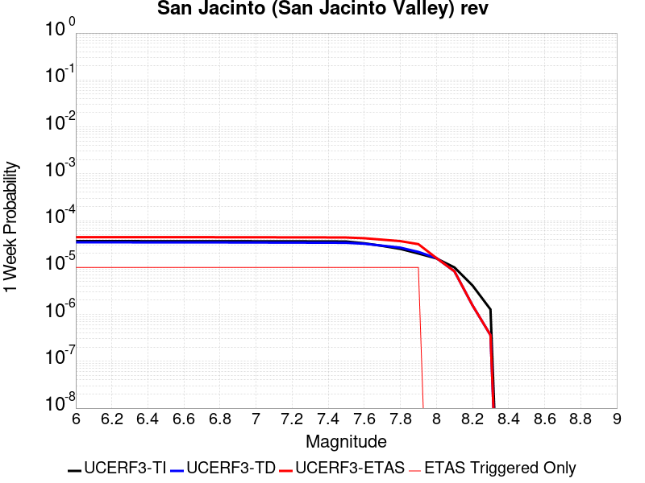 | 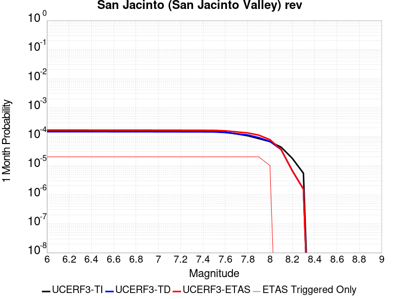 |  | 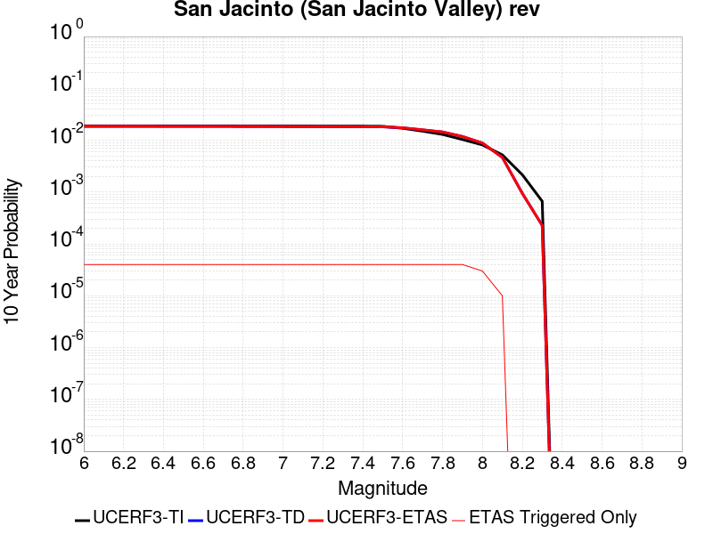 |

| Magnitude | 1 wk TI Prob | 1 wk TD Prob | 1 wk ETAS Prob | 1 wk ETAS/TD Gain | 1 wk ETAS Triggered Only | 1 mo TI Prob | 1 mo TD Prob | 1 mo ETAS Prob | 1 mo ETAS/TD Gain | 1 mo ETAS Triggered Only | 1 yr TI Prob | 1 yr TD Prob | 1 yr ETAS Prob | 1 yr ETAS/TD Gain | 1 yr ETAS Triggered Only | 10 yr TI Prob | 10 yr TD Prob | 10 yr ETAS Prob | 10 yr ETAS/TD Gain | 10 yr ETAS Triggered Only |
|-----|-----|-----|-----|-----|-----|-----|-----|-----|-----|-----|-----|-----|-----|-----|-----|-----|-----|-----|-----|-----|
| 6.0 | 3.652694E-5 | 3.4402536E-5 | 4.440219E-5 | 1.2906662 | 1.0E-5 | 1.5653463E-4 | 1.4743111E-4 | 1.6742817E-4 | 1.1356366 | 2.0E-5 | 0.0019041431 | 0.0017934978 | 0.001823444 | 1.016697 | 3.0E-5 | 0.018879099 | 0.018527009 | 0.018566268 | 1.0021191 | 4.0E-5 |
| 6.1 | 3.652694E-5 | 3.4402536E-5 | 4.440219E-5 | 1.2906662 | 1.0E-5 | 1.5653463E-4 | 1.4743111E-4 | 1.6742817E-4 | 1.1356366 | 2.0E-5 | 0.0019041431 | 0.0017934978 | 0.001823444 | 1.016697 | 3.0E-5 | 0.018879099 | 0.018527009 | 0.018566268 | 1.0021191 | 4.0E-5 |
| 6.2 | 3.652694E-5 | 3.4402536E-5 | 4.440219E-5 | 1.2906662 | 1.0E-5 | 1.5653463E-4 | 1.4743111E-4 | 1.6742817E-4 | 1.1356366 | 2.0E-5 | 0.0019041431 | 0.0017934978 | 0.001823444 | 1.016697 | 3.0E-5 | 0.018879099 | 0.018527009 | 0.018566268 | 1.0021191 | 4.0E-5 |
| 6.3 | 3.652694E-5 | 3.4402536E-5 | 4.440219E-5 | 1.2906662 | 1.0E-5 | 1.5653463E-4 | 1.4743111E-4 | 1.6742817E-4 | 1.1356366 | 2.0E-5 | 0.0019041431 | 0.0017934978 | 0.001823444 | 1.016697 | 3.0E-5 | 0.018879099 | 0.018527009 | 0.018566268 | 1.0021191 | 4.0E-5 |
| 6.4 | 3.646941E-5 | 3.4324108E-5 | 4.4323766E-5 | 1.2913305 | 1.0E-5 | 1.5628811E-4 | 1.4709504E-4 | 1.6709209E-4 | 1.1359465 | 2.0E-5 | 0.0019011468 | 0.0017894133 | 0.0018193596 | 1.0167353 | 3.0E-5 | 0.018849645 | 0.01848689 | 0.01852615 | 1.0021237 | 4.0E-5 |
| 6.5 | 3.646941E-5 | 3.4324108E-5 | 4.4323766E-5 | 1.2913305 | 1.0E-5 | 1.5628811E-4 | 1.4709504E-4 | 1.6709209E-4 | 1.1359465 | 2.0E-5 | 0.0019011468 | 0.0017894133 | 0.0018193596 | 1.0167353 | 3.0E-5 | 0.018849645 | 0.01848689 | 0.01852615 | 1.0021237 | 4.0E-5 |
| 6.6 | 3.6442503E-5 | 3.4287496E-5 | 4.4287153E-5 | 1.2916415 | 1.0E-5 | 1.561728E-4 | 1.4693815E-4 | 1.669352E-4 | 1.1360917 | 2.0E-5 | 0.0018997455 | 0.0017875064 | 0.0018174527 | 1.0167532 | 3.0E-5 | 0.018835869 | 0.018468158 | 0.01850742 | 1.0021259 | 4.0E-5 |
| 6.7 | 3.6432113E-5 | 3.427307E-5 | 4.427273E-5 | 1.2917643 | 1.0E-5 | 1.5612828E-4 | 1.4687634E-4 | 1.6687339E-4 | 1.1361489 | 2.0E-5 | 0.0018992044 | 0.001786755 | 0.0018167015 | 1.0167602 | 3.0E-5 | 0.018830549 | 0.018460782 | 0.018500043 | 1.0021268 | 4.0E-5 |
| 6.8 | 3.6409598E-5 | 3.4242126E-5 | 4.4241784E-5 | 1.292028 | 1.0E-5 | 1.560318E-4 | 1.4674373E-4 | 1.6674079E-4 | 1.1362721 | 2.0E-5 | 0.0018980318 | 0.0017851433 | 0.0018150897 | 1.0167754 | 3.0E-5 | 0.018819023 | 0.018444937 | 0.018484198 | 1.0021286 | 4.0E-5 |
| 6.9 | 3.638078E-5 | 3.420255E-5 | 4.4202206E-5 | 1.2923659 | 1.0E-5 | 1.5590832E-4 | 1.4657414E-4 | 1.665712E-4 | 1.1364297 | 2.0E-5 | 0.0018965311 | 0.0017830819 | 0.0018130285 | 1.0167948 | 3.0E-5 | 0.018804269 | 0.01842467 | 0.018463932 | 1.002131 | 4.0E-5 |
| 7.0 | 3.6294874E-5 | 3.4084565E-5 | 4.4084227E-5 | 1.2933779 | 1.0E-5 | 1.5554018E-4 | 1.4606855E-4 | 1.6606563E-4 | 1.136902 | 2.0E-5 | 0.0018920569 | 0.0017769366 | 0.0018068834 | 1.016853 | 3.0E-5 | 0.018760284 | 0.01836425 | 0.018403517 | 1.0021381 | 4.0E-5 |
| 7.1 | 3.6260717E-5 | 3.404085E-5 | 4.404051E-5 | 1.2937547 | 1.0E-5 | 1.5539382E-4 | 1.4588122E-4 | 1.658783E-4 | 1.1370778 | 2.0E-5 | 0.001890278 | 0.0017746595 | 0.0018046063 | 1.0168747 | 3.0E-5 | 0.018742796 | 0.018341845 | 0.018381111 | 1.0021408 | 4.0E-5 |
| 7.2 | 3.6210204E-5 | 3.397507E-5 | 4.3974727E-5 | 1.2943234 | 1.0E-5 | 1.5517735E-4 | 1.4559932E-4 | 1.6559642E-4 | 1.1373433 | 2.0E-5 | 0.001887647 | 0.0017712332 | 0.00180118 | 1.0169073 | 3.0E-5 | 0.01871693 | 0.018308114 | 0.018347383 | 1.0021448 | 4.0E-5 |
| 7.3 | 3.6119454E-5 | 3.3863354E-5 | 4.3863016E-5 | 1.2952945 | 1.0E-5 | 1.5478847E-4 | 1.451206E-4 | 1.651177E-4 | 1.1377964 | 2.0E-5 | 0.0018829206 | 0.0017654141 | 0.0017953612 | 1.0169631 | 3.0E-5 | 0.018670462 | 0.018250665 | 0.018289935 | 1.0021517 | 4.0E-5 |
| 7.4 | 3.607848E-5 | 3.3810855E-5 | 4.3810516E-5 | 1.295753 | 1.0E-5 | 1.5461289E-4 | 1.4489563E-4 | 1.6489273E-4 | 1.1380104 | 2.0E-5 | 0.0018807866 | 0.0017626794 | 0.0017926266 | 1.0169896 | 3.0E-5 | 0.018649481 | 0.01822366 | 0.01826293 | 1.002155 | 4.0E-5 |
| 7.5 | 3.5856774E-5 | 3.362063E-5 | 4.362029E-5 | 1.2974265 | 1.0E-5 | 1.5366284E-4 | 1.4408046E-4 | 1.6407757E-4 | 1.1387913 | 2.0E-5 | 0.0018692396 | 0.0017527709 | 0.0017827182 | 1.0170858 | 3.0E-5 | 0.018535944 | 0.018124763 | 0.018164039 | 1.0021669 | 4.0E-5 |
| 7.6 | 3.286655E-5 | 3.2143696E-5 | 4.2143376E-5 | 1.311093 | 1.0E-5 | 1.4084904E-4 | 1.3775144E-4 | 1.5774868E-4 | 1.145169 | 2.0E-5 | 0.001713488 | 0.0016758357 | 0.0017057854 | 1.0178715 | 3.0E-5 | 0.017003361 | 0.017344464 | 0.01738377 | 1.0022662 | 4.0E-5 |
| 7.7 | 2.8882527E-5 | 2.9236606E-5 | 3.9236314E-5 | 1.342027 | 1.0E-5 | 1.237764E-4 | 1.2529372E-4 | 1.4529123E-4 | 1.1596049 | 2.0E-5 | 0.0015059357 | 0.0015243847 | 0.0015543391 | 1.0196501 | 3.0E-5 | 0.014957713 | 0.01583079 | 0.015870158 | 1.0024867 | 4.0E-5 |
| 7.8 | 2.4950225E-5 | 2.6527588E-5 | 3.6527323E-5 | 1.376956 | 1.0E-5 | 1.0692515E-4 | 1.1368471E-4 | 1.3368244E-4 | 1.1759051 | 2.0E-5 | 0.0013010362 | 0.0013832335 | 0.001413192 | 1.0216583 | 3.0E-5 | 0.012934455 | 0.0144121675 | 0.014451591 | 1.0027354 | 4.0E-5 |
| 7.9 | 1.9881603E-5 | 2.1507672E-5 | 3.1507458E-5 | 1.4649403 | 1.0E-5 | 8.520408E-5 | 9.2172486E-5 | 1.12170645E-4 | 1.2169645 | 2.0E-5 | 0.001036866 | 0.0011216231 | 0.0011515894 | 1.026717 | 3.0E-5 | 0.010320415 | 0.01177735 | 0.011816879 | 1.0033563 | 4.0E-5 |
| 8.0 | 1.563292E-5 | 1.5937196E-5 | 1.5937196E-5 | 1.0 | 0.0 | 6.6996516E-5 | 6.8300484E-5 | 7.82998E-5 | 1.1464019 | 1.0E-5 | 8.153773E-4 | 8.3124184E-4 | 8.512252E-4 | 1.0240403 | 2.0E-5 | 0.00812392 | 0.008810602 | 0.008840337 | 1.0033749 | 3.0E-5 |
| 8.1 | 1.0045313E-5 | 8.301307E-6 | 8.301307E-6 | 1.0 | 0.0 | 4.305063E-5 | 3.557655E-5 | 3.557655E-5 | 1.0 | 0.0 | 5.2401534E-4 | 4.3305894E-4 | 4.3305894E-4 | 1.0 | 0.0 | 0.0052278144 | 0.004658899 | 0.0046688523 | 1.0021365 | 1.0E-5 |
| 8.2 | 4.1554413E-6 | 1.5649777E-6 | 1.5649777E-6 | 1.0 | 0.0 | 1.7808914E-5 | 6.7070296E-6 | 6.7070296E-6 | 1.0 | 0.0 | 2.1680194E-4 | 8.165505E-5 | 8.165505E-5 | 1.0 | 0.0 | 0.0021659054 | 9.4805553E-4 | 9.4805553E-4 | 1.0 | 0.0 |
| 8.3 | 1.2758221E-6 | 3.613034E-7 | 3.613034E-7 | 1.0 | 0.0 | 5.4677976E-6 | 1.5484422E-6 | 1.5484422E-6 | 1.0 | 0.0 | 6.65684E-5 | 1.8852126E-5 | 1.8852126E-5 | 1.0 | 0.0 | 6.6548464E-4 | 2.274264E-4 | 2.274264E-4 | 1.0 | 0.0 |

## San Cayetano
*[(top)](#table-of-contents)*

| 1 Week | 1 Month | 1 Year | 10 Year |
|-----|-----|-----|-----|
|  |  |  |  |

| Magnitude | 1 wk TI Prob | 1 wk TD Prob | 1 wk ETAS Prob | 1 wk ETAS/TD Gain | 1 wk ETAS Triggered Only | 1 mo TI Prob | 1 mo TD Prob | 1 mo ETAS Prob | 1 mo ETAS/TD Gain | 1 mo ETAS Triggered Only | 1 yr TI Prob | 1 yr TD Prob | 1 yr ETAS Prob | 1 yr ETAS/TD Gain | 1 yr ETAS Triggered Only | 10 yr TI Prob | 10 yr TD Prob | 10 yr ETAS Prob | 10 yr ETAS/TD Gain | 10 yr ETAS Triggered Only |
|-----|-----|-----|-----|-----|-----|-----|-----|-----|-----|-----|-----|-----|-----|-----|-----|-----|-----|-----|-----|-----|
| 6.0 | 2.3476267E-5 | 1.8169232E-5 | 3.816887E-5 | 2.1007419 | 2.0E-5 | 1.0060869E-4 | 7.7865836E-5 | 9.786428E-5 | 1.256832 | 2.0E-5 | 0.0012242225 | 9.476079E-4 | 9.8757E-4 | 1.0421716 | 4.0E-5 | 0.012175002 | 0.009436757 | 0.0094763795 | 1.0041988 | 4.0E-5 |
| 6.1 | 2.3476267E-5 | 1.8169232E-5 | 3.816887E-5 | 2.1007419 | 2.0E-5 | 1.0060869E-4 | 7.7865836E-5 | 9.786428E-5 | 1.256832 | 2.0E-5 | 0.0012242225 | 9.476079E-4 | 9.8757E-4 | 1.0421716 | 4.0E-5 | 0.012175002 | 0.009436757 | 0.0094763795 | 1.0041988 | 4.0E-5 |
| 6.2 | 2.3476267E-5 | 1.8169232E-5 | 3.816887E-5 | 2.1007419 | 2.0E-5 | 1.0060869E-4 | 7.7865836E-5 | 9.786428E-5 | 1.256832 | 2.0E-5 | 0.0012242225 | 9.476079E-4 | 9.8757E-4 | 1.0421716 | 4.0E-5 | 0.012175002 | 0.009436757 | 0.0094763795 | 1.0041988 | 4.0E-5 |
| 6.3 | 2.3476267E-5 | 1.8169232E-5 | 3.816887E-5 | 2.1007419 | 2.0E-5 | 1.0060869E-4 | 7.7865836E-5 | 9.786428E-5 | 1.256832 | 2.0E-5 | 0.0012242225 | 9.476079E-4 | 9.8757E-4 | 1.0421716 | 4.0E-5 | 0.012175002 | 0.009436757 | 0.0094763795 | 1.0041988 | 4.0E-5 |
| 6.4 | 2.3476267E-5 | 1.8169232E-5 | 3.816887E-5 | 2.1007419 | 2.0E-5 | 1.0060869E-4 | 7.7865836E-5 | 9.786428E-5 | 1.256832 | 2.0E-5 | 0.0012242225 | 9.476079E-4 | 9.8757E-4 | 1.0421716 | 4.0E-5 | 0.012175002 | 0.009436757 | 0.0094763795 | 1.0041988 | 4.0E-5 |
| 6.5 | 2.3476267E-5 | 1.8169232E-5 | 3.816887E-5 | 2.1007419 | 2.0E-5 | 1.0060869E-4 | 7.7865836E-5 | 9.786428E-5 | 1.256832 | 2.0E-5 | 0.0012242225 | 9.476079E-4 | 9.8757E-4 | 1.0421716 | 4.0E-5 | 0.012175002 | 0.009436757 | 0.0094763795 | 1.0041988 | 4.0E-5 |
| 6.6 | 2.3476267E-5 | 1.8169232E-5 | 3.816887E-5 | 2.1007419 | 2.0E-5 | 1.0060869E-4 | 7.7865836E-5 | 9.786428E-5 | 1.256832 | 2.0E-5 | 0.0012242225 | 9.476079E-4 | 9.8757E-4 | 1.0421716 | 4.0E-5 | 0.012175002 | 0.009436757 | 0.0094763795 | 1.0041988 | 4.0E-5 |
| 6.7 | 2.3476267E-5 | 1.8169232E-5 | 3.816887E-5 | 2.1007419 | 2.0E-5 | 1.0060869E-4 | 7.7865836E-5 | 9.786428E-5 | 1.256832 | 2.0E-5 | 0.0012242225 | 9.476079E-4 | 9.8757E-4 | 1.0421716 | 4.0E-5 | 0.012175002 | 0.009436757 | 0.0094763795 | 1.0041988 | 4.0E-5 |
| 6.8 | 2.3241924E-5 | 1.7936962E-5 | 3.7936603E-5 | 2.114996 | 2.0E-5 | 9.960445E-5 | 7.687045E-5 | 9.686891E-5 | 1.260158 | 2.0E-5 | 0.0012120095 | 9.354995E-4 | 9.754621E-4 | 1.0427179 | 4.0E-5 | 0.012054204 | 0.009316626 | 0.009356253 | 1.0042534 | 4.0E-5 |
| 6.9 | 2.2761007E-5 | 1.74324E-5 | 3.743205E-5 | 2.147269 | 2.0E-5 | 9.7543525E-5 | 7.4708165E-5 | 9.470667E-5 | 1.2676884 | 2.0E-5 | 0.0011869454 | 9.091958E-4 | 9.4915944E-4 | 1.043955 | 4.0E-5 | 0.011806256 | 0.009055748 | 0.009095386 | 1.0043771 | 4.0E-5 |
| 7.0 | 2.240283E-5 | 1.7066153E-5 | 3.7065813E-5 | 2.1718903 | 2.0E-5 | 9.600859E-5 | 7.3138624E-5 | 9.313716E-5 | 1.2734333 | 2.0E-5 | 0.0011682777 | 8.9010235E-4 | 9.3006674E-4 | 1.0448986 | 4.0E-5 | 0.011621549 | 0.008866343 | 0.008905988 | 1.0044714 | 4.0E-5 |
| 7.1 | 2.1871154E-5 | 1.6586035E-5 | 3.6585705E-5 | 2.2058136 | 2.0E-5 | 9.373015E-5 | 7.1081085E-5 | 9.1079666E-5 | 1.2813488 | 2.0E-5 | 0.0011405671 | 8.65072E-4 | 9.050374E-4 | 1.046199 | 4.0E-5 | 0.011347309 | 0.008618003 | 0.008657658 | 1.0046015 | 4.0E-5 |
| 7.2 | 2.0714133E-5 | 1.5564576E-5 | 2.556442E-5 | 1.6424745 | 1.0E-5 | 8.8771834E-5 | 6.6703644E-5 | 7.670297E-5 | 1.1499069 | 1.0E-5 | 0.0010802611 | 8.118175E-4 | 8.4179314E-4 | 1.0369241 | 3.0E-5 | 0.010750249 | 0.008089448 | 0.008119206 | 1.0036786 | 3.0E-5 |
| 7.3 | 1.8408395E-5 | 1.39968415E-5 | 2.3996701E-5 | 1.7144369 | 1.0E-5 | 7.8890735E-5 | 5.99851E-5 | 6.9984504E-5 | 1.1666981 | 1.0E-5 | 9.600714E-4 | 7.3007686E-4 | 7.60055E-4 | 1.0410615 | 3.0E-5 | 0.009559342 | 0.00727765 | 0.007307431 | 1.0040922 | 3.0E-5 |
| 7.4 | 1.6856795E-5 | 1.285007E-5 | 2.2849941E-5 | 1.7781959 | 1.0E-5 | 7.2241404E-5 | 5.507058E-5 | 6.507003E-5 | 1.1815752 | 1.0E-5 | 8.7918417E-4 | 6.7028095E-4 | 7.002608E-4 | 1.0447273 | 3.0E-5 | 0.00875714 | 0.006683413 | 0.0067132125 | 1.0044587 | 3.0E-5 |
| 7.5 | 1.2822778E-5 | 9.577422E-6 | 1.9577326E-5 | 2.0441122 | 1.0E-5 | 5.495361E-5 | 4.1045456E-5 | 5.1045048E-5 | 1.2436223 | 1.0E-5 | 6.688548E-4 | 4.9961545E-4 | 5.1960547E-4 | 1.0400108 | 2.0E-5 | 0.006668452 | 0.004985196 | 0.0050050966 | 1.0039918 | 2.0E-5 |
| 7.6 | 5.6272684E-6 | 3.8549038E-6 | 3.8549038E-6 | 1.0 | 0.0 | 2.4116642E-5 | 1.6520911E-5 | 1.6520911E-5 | 1.0 | 0.0 | 2.9358055E-4 | 2.0112364E-4 | 2.1112162E-4 | 1.0497106 | 1.0E-5 | 0.0029319301 | 0.002009427 | 0.002019407 | 1.0049665 | 1.0E-5 |
| 7.7 | 3.5261346E-6 | 2.3407122E-6 | 2.3407122E-6 | 1.0 | 0.0 | 1.5111918E-5 | 1.0031586E-5 | 1.0031586E-5 | 1.0 | 0.0 | 1.8397206E-4 | 1.2212778E-4 | 1.2212778E-4 | 1.0 | 0.0 | 0.0018381984 | 0.001220614 | 0.001220614 | 1.0 | 0.0 |
| 7.8 | 1.4826929E-6 | 1.0564404E-6 | 1.0564404E-6 | 1.0 | 0.0 | 6.354383E-6 | 4.5275942E-6 | 4.5275942E-6 | 1.0 | 0.0 | 7.736187E-5 | 5.5122084E-5 | 5.5122084E-5 | 1.0 | 0.0 | 7.733494E-4 | 5.5108615E-4 | 5.5108615E-4 | 1.0 | 0.0 |
| 7.9 | 2.7568166E-7 | 1.6977921E-7 | 1.6977921E-7 | 1.0 | 0.0 | 1.1814923E-6 | 7.2762504E-7 | 7.2762504E-7 | 1.0 | 0.0 | 1.4384574E-5 | 8.8587985E-6 | 8.8587985E-6 | 1.0 | 0.0 | 1.4383643E-4 | 8.858449E-5 | 8.858449E-5 | 1.0 | 0.0 |
| 8.0 | 5.407832E-8 | 2.6886951E-8 | 2.6886951E-8 | 1.0 | 0.0 | 2.3176422E-7 | 1.1522979E-7 | 1.1522979E-7 | 1.0 | 0.0 | 2.8217257E-6 | 1.4029218E-6 | 1.4029218E-6 | 1.0 | 0.0 | 2.8216898E-5 | 1.4029133E-5 | 1.4029133E-5 | 1.0 | 0.0 |

## Kern Canyon (Lake Isabella) 2011
*[(top)](#table-of-contents)*

| 1 Week | 1 Month | 1 Year | 10 Year |
|-----|-----|-----|-----|
|  |  |  |  |

| Magnitude | 1 wk TI Prob | 1 wk TD Prob | 1 wk ETAS Prob | 1 wk ETAS/TD Gain | 1 wk ETAS Triggered Only | 1 mo TI Prob | 1 mo TD Prob | 1 mo ETAS Prob | 1 mo ETAS/TD Gain | 1 mo ETAS Triggered Only | 1 yr TI Prob | 1 yr TD Prob | 1 yr ETAS Prob | 1 yr ETAS/TD Gain | 1 yr ETAS Triggered Only | 10 yr TI Prob | 10 yr TD Prob | 10 yr ETAS Prob | 10 yr ETAS/TD Gain | 10 yr ETAS Triggered Only |
|-----|-----|-----|-----|-----|-----|-----|-----|-----|-----|-----|-----|-----|-----|-----|-----|-----|-----|-----|-----|-----|
| 6.0 | 4.2387383E-6 | 4.0016353E-6 | 3.4001514E-5 | 8.496904 | 3.0E-5 | 1.8165894E-5 | 1.7149763E-5 | 4.714925E-5 | 2.7492652 | 3.0E-5 | 2.2114732E-4 | 2.0878024E-4 | 2.487719E-4 | 1.1915491 | 4.0E-5 | 0.0022092736 | 0.0020860247 | 0.0021259414 | 1.0191352 | 4.0E-5 |
| 6.1 | 4.2387383E-6 | 4.0016353E-6 | 3.4001514E-5 | 8.496904 | 3.0E-5 | 1.8165894E-5 | 1.7149763E-5 | 4.714925E-5 | 2.7492652 | 3.0E-5 | 2.2114732E-4 | 2.0878024E-4 | 2.487719E-4 | 1.1915491 | 4.0E-5 | 0.0022092736 | 0.0020860247 | 0.0021259414 | 1.0191352 | 4.0E-5 |
| 6.2 | 4.2387383E-6 | 4.0016353E-6 | 3.4001514E-5 | 8.496904 | 3.0E-5 | 1.8165894E-5 | 1.7149763E-5 | 4.714925E-5 | 2.7492652 | 3.0E-5 | 2.2114732E-4 | 2.0878024E-4 | 2.487719E-4 | 1.1915491 | 4.0E-5 | 0.0022092736 | 0.0020860247 | 0.0021259414 | 1.0191352 | 4.0E-5 |
| 6.3 | 4.2387383E-6 | 4.0016353E-6 | 3.4001514E-5 | 8.496904 | 3.0E-5 | 1.8165894E-5 | 1.7149763E-5 | 4.714925E-5 | 2.7492652 | 3.0E-5 | 2.2114732E-4 | 2.0878024E-4 | 2.487719E-4 | 1.1915491 | 4.0E-5 | 0.0022092736 | 0.0020860247 | 0.0021259414 | 1.0191352 | 4.0E-5 |
| 6.4 | 4.2387383E-6 | 4.0016353E-6 | 3.4001514E-5 | 8.496904 | 3.0E-5 | 1.8165894E-5 | 1.7149763E-5 | 4.714925E-5 | 2.7492652 | 3.0E-5 | 2.2114732E-4 | 2.0878024E-4 | 2.487719E-4 | 1.1915491 | 4.0E-5 | 0.0022092736 | 0.0020860247 | 0.0021259414 | 1.0191352 | 4.0E-5 |
| 6.5 | 2.7857532E-6 | 2.5178633E-6 | 3.2517786E-5 | 12.914835 | 3.0E-5 | 1.1938888E-5 | 1.07908E-5 | 4.0790477E-5 | 3.780116 | 3.0E-5 | 1.4534626E-4 | 1.313704E-4 | 1.7136514E-4 | 1.3044426 | 4.0E-5 | 0.0014525123 | 0.0013129602 | 0.0013529076 | 1.0304255 | 4.0E-5 |
| 6.6 | 2.2233348E-6 | 1.9441197E-6 | 2.194408E-5 | 11.287412 | 2.0E-5 | 9.528543E-6 | 8.331916E-6 | 2.833175E-5 | 3.4003882 | 2.0E-5 | 1.1600384E-4 | 1.0143644E-4 | 1.21434416E-4 | 1.1971478 | 2.0E-5 | 0.001159433 | 0.00101391 | 0.0010338897 | 1.0197057 | 2.0E-5 |
| 6.7 | 2.1635126E-6 | 1.8834999E-6 | 2.1883463E-5 | 11.61851 | 2.0E-5 | 9.272164E-6 | 8.072117E-6 | 2.8071956E-5 | 3.4776447 | 2.0E-5 | 1.1288274E-4 | 9.827368E-5 | 1.1827172E-4 | 1.2034932 | 2.0E-5 | 0.0011282542 | 9.823104E-4 | 0.0010022908 | 1.0203402 | 2.0E-5 |
| 6.8 | 1.8685711E-6 | 1.5831387E-6 | 1.1583123E-5 | 7.316556 | 1.0E-5 | 8.008137E-6 | 6.7848628E-6 | 1.6784796E-5 | 2.473859 | 1.0E-5 | 9.74947E-5 | 8.260262E-5 | 9.26018E-5 | 1.1210515 | 1.0E-5 | 9.745194E-4 | 8.257241E-4 | 8.3571585E-4 | 1.0121006 | 1.0E-5 |
| 6.9 | 1.5815071E-6 | 1.3064894E-6 | 1.1306476E-5 | 8.65409 | 1.0E-5 | 6.77787E-6 | 5.599228E-6 | 1.5599173E-5 | 2.7859504 | 1.0E-5 | 8.251744E-5 | 6.81685E-5 | 7.816782E-5 | 1.1466854 | 1.0E-5 | 8.248681E-4 | 6.814786E-4 | 6.9147174E-4 | 1.0146639 | 1.0E-5 |
| 7.0 | 1.3772564E-6 | 1.1210685E-6 | 1.1210685E-6 | 1.0 | 0.0 | 5.9025137E-6 | 4.8045704E-6 | 4.8045704E-6 | 1.0 | 0.0 | 7.186073E-5 | 5.8494094E-5 | 5.8494094E-5 | 1.0 | 0.0 | 7.18375E-4 | 5.84789E-4 | 5.84789E-4 | 1.0 | 0.0 |
| 7.1 | 1.0916998E-6 | 8.7637534E-7 | 8.7637534E-7 | 1.0 | 0.0 | 4.678705E-6 | 3.7558889E-6 | 3.7558889E-6 | 1.0 | 0.0 | 5.6961744E-5 | 4.5727003E-5 | 4.5727003E-5 | 1.0 | 0.0 | 5.6947145E-4 | 4.571773E-4 | 4.571773E-4 | 1.0 | 0.0 |
| 7.2 | 7.6277024E-7 | 5.90144E-7 | 5.90144E-7 | 1.0 | 0.0 | 3.2690114E-6 | 2.529186E-6 | 2.529186E-6 | 1.0 | 0.0 | 3.9799485E-5 | 3.0792413E-5 | 3.0792413E-5 | 1.0 | 0.0 | 3.9792358E-4 | 3.0788206E-4 | 3.0788206E-4 | 1.0 | 0.0 |
| 7.3 | 5.3265916E-7 | 4.3824272E-7 | 4.3824272E-7 | 1.0 | 0.0 | 2.282823E-6 | 1.8781818E-6 | 1.8781818E-6 | 1.0 | 0.0 | 2.7793016E-5 | 2.2866627E-5 | 2.2866627E-5 | 1.0 | 0.0 | 2.778954E-4 | 2.2864313E-4 | 2.2864313E-4 | 1.0 | 0.0 |
| 7.4 | 3.4946007E-7 | 3.0065652E-7 | 3.0065652E-7 | 1.0 | 0.0 | 1.497685E-6 | 1.2885274E-6 | 1.2885274E-6 | 1.0 | 0.0 | 1.8234163E-5 | 1.568771E-5 | 1.568771E-5 | 1.0 | 0.0 | 1.8232666E-4 | 1.5686626E-4 | 1.5686626E-4 | 1.0 | 0.0 |
| 7.5 | 1.8317026E-7 | 1.4244759E-7 | 1.4244759E-7 | 1.0 | 0.0 | 7.850152E-7 | 6.104895E-7 | 6.104895E-7 | 1.0 | 0.0 | 9.557518E-6 | 7.4326854E-6 | 7.4326854E-6 | 1.0 | 0.0 | 9.5571064E-5 | 7.4324445E-5 | 7.4324445E-5 | 1.0 | 0.0 |
| 7.6 | 2.572245E-8 | 1.735264E-8 | 1.735264E-8 | 1.0 | 0.0 | 1.10239064E-7 | 7.436845E-8 | 7.436845E-8 | 1.0 | 0.0 | 1.3421597E-6 | 9.0543557E-7 | 9.0543557E-7 | 1.0 | 0.0 | 1.3421517E-5 | 9.054324E-6 | 9.054324E-6 | 1.0 | 0.0 |

## Elysian Park (Upper)
*[(top)](#table-of-contents)*

| 1 Week | 1 Month | 1 Year | 10 Year |
|-----|-----|-----|-----|
|  | 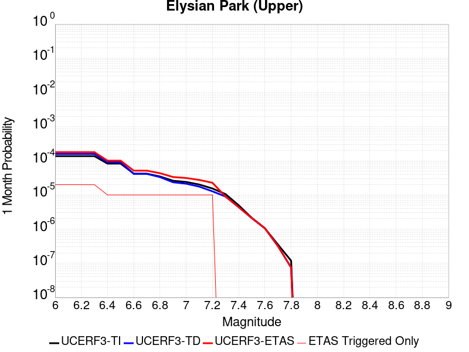 |  |  |

| Magnitude | 1 wk TI Prob | 1 wk TD Prob | 1 wk ETAS Prob | 1 wk ETAS/TD Gain | 1 wk ETAS Triggered Only | 1 mo TI Prob | 1 mo TD Prob | 1 mo ETAS Prob | 1 mo ETAS/TD Gain | 1 mo ETAS Triggered Only | 1 yr TI Prob | 1 yr TD Prob | 1 yr ETAS Prob | 1 yr ETAS/TD Gain | 1 yr ETAS Triggered Only | 10 yr TI Prob | 10 yr TD Prob | 10 yr ETAS Prob | 10 yr ETAS/TD Gain | 10 yr ETAS Triggered Only |
|-----|-----|-----|-----|-----|-----|-----|-----|-----|-----|-----|-----|-----|-----|-----|-----|-----|-----|-----|-----|-----|
| 6.0 | 3.1876025E-5 | 3.703537E-5 | 3.703537E-5 | 1.0 | 0.0 | 1.3660437E-4 | 1.587161E-4 | 1.7871293E-4 | 1.1259911 | 2.0E-5 | 0.0016618895 | 0.0019311269 | 0.001961069 | 1.015505 | 3.0E-5 | 0.016495159 | 0.019189911 | 0.019219335 | 1.0015333 | 3.0E-5 |
| 6.1 | 3.1876025E-5 | 3.703537E-5 | 3.703537E-5 | 1.0 | 0.0 | 1.3660437E-4 | 1.587161E-4 | 1.7871293E-4 | 1.1259911 | 2.0E-5 | 0.0016618895 | 0.0019311269 | 0.001961069 | 1.015505 | 3.0E-5 | 0.016495159 | 0.019189911 | 0.019219335 | 1.0015333 | 3.0E-5 |
| 6.2 | 3.1876025E-5 | 3.703537E-5 | 3.703537E-5 | 1.0 | 0.0 | 1.3660437E-4 | 1.587161E-4 | 1.7871293E-4 | 1.1259911 | 2.0E-5 | 0.0016618895 | 0.0019311269 | 0.001961069 | 1.015505 | 3.0E-5 | 0.016495159 | 0.019189911 | 0.019219335 | 1.0015333 | 3.0E-5 |
| 6.3 | 3.1876025E-5 | 3.703537E-5 | 3.703537E-5 | 1.0 | 0.0 | 1.3660437E-4 | 1.587161E-4 | 1.7871293E-4 | 1.1259911 | 2.0E-5 | 0.0016618895 | 0.0019311269 | 0.001961069 | 1.015505 | 3.0E-5 | 0.016495159 | 0.019189911 | 0.019219335 | 1.0015333 | 3.0E-5 |
| 6.4 | 1.9273462E-5 | 2.1202486E-5 | 2.1202486E-5 | 1.0 | 0.0 | 8.259794E-5 | 9.0865615E-5 | 1.0086471E-4 | 1.1100427 | 1.0E-5 | 0.001005166 | 0.0011058991 | 0.001125877 | 1.0180649 | 2.0E-5 | 0.010006315 | 0.0110207675 | 0.011040547 | 1.0017948 | 2.0E-5 |
| 6.5 | 1.9273462E-5 | 2.1202486E-5 | 2.1202486E-5 | 1.0 | 0.0 | 8.259794E-5 | 9.0865615E-5 | 1.0086471E-4 | 1.1100427 | 1.0E-5 | 0.001005166 | 0.0011058991 | 0.001125877 | 1.0180649 | 2.0E-5 | 0.010006315 | 0.0110207675 | 0.011040547 | 1.0017948 | 2.0E-5 |
| 6.6 | 9.813258E-6 | 9.665602E-6 | 9.665602E-6 | 1.0 | 0.0 | 4.205614E-5 | 4.1423395E-5 | 5.142298E-5 | 1.2413995 | 1.0E-5 | 5.119132E-4 | 5.0422037E-4 | 5.142153E-4 | 1.0198226 | 1.0E-5 | 0.005107356 | 0.005031487 | 0.0050414368 | 1.0019774 | 1.0E-5 |
| 6.7 | 9.801478E-6 | 9.653172E-6 | 9.653172E-6 | 1.0 | 0.0 | 4.2005657E-5 | 4.137012E-5 | 5.136971E-5 | 1.2417103 | 1.0E-5 | 5.112989E-4 | 5.0357205E-4 | 5.1356707E-4 | 1.0198481 | 1.0E-5 | 0.0051012407 | 0.0050250334 | 0.005034983 | 1.0019801 | 1.0E-5 |
| 6.8 | 8.102489E-6 | 7.773006E-6 | 7.773006E-6 | 1.0 | 0.0 | 3.4724493E-5 | 3.3312484E-5 | 4.331215E-5 | 1.3001778 | 1.0E-5 | 4.2268867E-4 | 4.0550897E-4 | 4.1550494E-4 | 1.0246503 | 1.0E-5 | 0.004218856 | 0.0040481845 | 0.004058144 | 1.0024602 | 1.0E-5 |
| 6.9 | 6.08275E-6 | 5.481449E-6 | 5.481449E-6 | 1.0 | 0.0 | 2.6068668E-5 | 2.3491717E-5 | 3.3491484E-5 | 1.4256719 | 1.0E-5 | 3.173398E-4 | 2.8597488E-4 | 2.9597202E-4 | 1.0349581 | 1.0E-5 | 0.0031688702 | 0.0028561465 | 0.002866118 | 1.0034912 | 1.0E-5 |
| 7.0 | 5.5995934E-6 | 4.9827763E-6 | 4.9827763E-6 | 1.0 | 0.0 | 2.3998036E-5 | 2.1354585E-5 | 3.135437E-5 | 1.4682735 | 1.0E-5 | 2.9213692E-4 | 2.599617E-4 | 2.699591E-4 | 1.0384572 | 1.0E-5 | 0.0029175316 | 0.0025966433 | 0.0026066175 | 1.0038412 | 1.0E-5 |
| 7.1 | 4.709881E-6 | 4.087397E-6 | 4.087397E-6 | 1.0 | 0.0 | 2.0185047E-5 | 1.75173E-5 | 2.7517124E-5 | 1.5708542 | 1.0E-5 | 2.4572524E-4 | 2.1325267E-4 | 2.2325054E-4 | 1.0468827 | 1.0E-5 | 0.002454537 | 0.0021305217 | 0.0021405003 | 1.0046837 | 1.0E-5 |
| 7.2 | 3.6063436E-6 | 2.9779467E-6 | 2.9779467E-6 | 1.0 | 0.0 | 1.5455667E-5 | 1.2762566E-5 | 2.2762439E-5 | 1.7835314 | 1.0E-5 | 1.881565E-4 | 1.5537327E-4 | 1.6537172E-4 | 1.0643511 | 1.0E-5 | 0.0018799726 | 0.0015526577 | 0.0015626422 | 1.0064306 | 1.0E-5 |
| 7.3 | 2.471135E-6 | 2.0954606E-6 | 2.0954606E-6 | 1.0 | 0.0 | 1.0590536E-5 | 8.980514E-6 | 8.980514E-6 | 1.0 | 0.0 | 1.2893214E-4 | 1.0933235E-4 | 1.0933235E-4 | 1.0 | 0.0 | 0.0012885736 | 0.0010927928 | 0.0010927928 | 1.0 | 0.0 |
| 7.4 | 1.163943E-6 | 1.0275096E-6 | 1.0275096E-6 | 1.0 | 0.0 | 4.988318E-6 | 4.4036055E-6 | 4.4036055E-6 | 1.0 | 0.0 | 6.0731076E-5 | 5.3612606E-5 | 5.3612606E-5 | 1.0 | 0.0 | 6.071448E-4 | 5.359997E-4 | 5.359997E-4 | 1.0 | 0.0 |
| 7.5 | 4.99459E-7 | 4.9176066E-7 | 4.9176066E-7 | 1.0 | 0.0 | 2.140537E-6 | 2.107544E-6 | 2.107544E-6 | 1.0 | 0.0 | 2.6060725E-5 | 2.5659063E-5 | 2.5659063E-5 | 1.0 | 0.0 | 2.605767E-4 | 2.5656258E-4 | 2.5656258E-4 | 1.0 | 0.0 |
| 7.6 | 2.4667852E-7 | 2.4778356E-7 | 2.4778356E-7 | 1.0 | 0.0 | 1.0571932E-6 | 1.0619291E-6 | 1.0619291E-6 | 1.0 | 0.0 | 1.2871251E-5 | 1.2928914E-5 | 1.2928914E-5 | 1.0 | 0.0 | 1.2870505E-4 | 1.29282E-4 | 1.29282E-4 | 1.0 | 0.0 |
| 7.7 | 8.2312795E-8 | 7.3864484E-8 | 7.3864484E-8 | 1.0 | 0.0 | 3.527691E-7 | 3.1656202E-7 | 3.1656202E-7 | 1.0 | 0.0 | 4.294955E-6 | 3.854137E-6 | 3.854137E-6 | 1.0 | 0.0 | 4.2948723E-5 | 3.8540817E-5 | 3.8540817E-5 | 1.0 | 0.0 |
| 7.8 | 2.7819295E-8 | 1.7565805E-8 | 1.7565805E-8 | 1.0 | 0.0 | 1.1922555E-7 | 7.528202E-8 | 7.528202E-8 | 1.0 | 0.0 | 1.45157E-6 | 9.1655835E-7 | 9.1655835E-7 | 1.0 | 0.0 | 1.45156055E-5 | 9.165561E-6 | 9.165561E-6 | 1.0 | 0.0 |

## Robinson Creek
*[(top)](#table-of-contents)*

| 1 Week | 1 Month | 1 Year | 10 Year |
|-----|-----|-----|-----|
|  |  |  |  |

| Magnitude | 1 wk TI Prob | 1 wk TD Prob | 1 wk ETAS Prob | 1 wk ETAS/TD Gain | 1 wk ETAS Triggered Only | 1 mo TI Prob | 1 mo TD Prob | 1 mo ETAS Prob | 1 mo ETAS/TD Gain | 1 mo ETAS Triggered Only | 1 yr TI Prob | 1 yr TD Prob | 1 yr ETAS Prob | 1 yr ETAS/TD Gain | 1 yr ETAS Triggered Only | 10 yr TI Prob | 10 yr TD Prob | 10 yr ETAS Prob | 10 yr ETAS/TD Gain | 10 yr ETAS Triggered Only |
|-----|-----|-----|-----|-----|-----|-----|-----|-----|-----|-----|-----|-----|-----|-----|-----|-----|-----|-----|-----|-----|
| 6.0 | 1.3705327E-5 | 1.5285035E-5 | 2.5284882E-5 | 1.6542246 | 1.0E-5 | 5.8735794E-5 | 6.5507294E-5 | 8.5505984E-5 | 1.3052895 | 2.0E-5 | 7.1487366E-4 | 7.975513E-4 | 8.175353E-4 | 1.0250567 | 2.0E-5 | 0.0071257832 | 0.007975513 | 0.0080052735 | 1.0037315 | 3.0E-5 |
| 6.1 | 1.3705327E-5 | 1.5285035E-5 | 2.5284882E-5 | 1.6542246 | 1.0E-5 | 5.8735794E-5 | 6.5507294E-5 | 8.5505984E-5 | 1.3052895 | 2.0E-5 | 7.1487366E-4 | 7.975513E-4 | 8.175353E-4 | 1.0250567 | 2.0E-5 | 0.0071257832 | 0.007975513 | 0.0080052735 | 1.0037315 | 3.0E-5 |
| 6.2 | 1.3705327E-5 | 1.5285035E-5 | 2.5284882E-5 | 1.6542246 | 1.0E-5 | 5.8735794E-5 | 6.5507294E-5 | 8.5505984E-5 | 1.3052895 | 2.0E-5 | 7.1487366E-4 | 7.975513E-4 | 8.175353E-4 | 1.0250567 | 2.0E-5 | 0.0071257832 | 0.007975513 | 0.0080052735 | 1.0037315 | 3.0E-5 |
| 6.3 | 1.3705327E-5 | 1.5285035E-5 | 2.5284882E-5 | 1.6542246 | 1.0E-5 | 5.8735794E-5 | 6.5507294E-5 | 8.5505984E-5 | 1.3052895 | 2.0E-5 | 7.1487366E-4 | 7.975513E-4 | 8.175353E-4 | 1.0250567 | 2.0E-5 | 0.0071257832 | 0.007975513 | 0.0080052735 | 1.0037315 | 3.0E-5 |
| 6.4 | 1.3705327E-5 | 1.5285035E-5 | 2.5284882E-5 | 1.6542246 | 1.0E-5 | 5.8735794E-5 | 6.5507294E-5 | 8.5505984E-5 | 1.3052895 | 2.0E-5 | 7.1487366E-4 | 7.975513E-4 | 8.175353E-4 | 1.0250567 | 2.0E-5 | 0.0071257832 | 0.007975513 | 0.0080052735 | 1.0037315 | 3.0E-5 |

## Simi-Santa Rosa
*[(top)](#table-of-contents)*

| 1 Week | 1 Month | 1 Year | 10 Year |
|-----|-----|-----|-----|
|  |  |  | 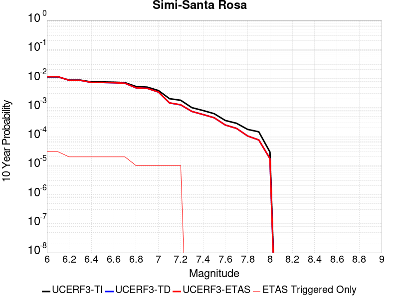 |

| Magnitude | 1 wk TI Prob | 1 wk TD Prob | 1 wk ETAS Prob | 1 wk ETAS/TD Gain | 1 wk ETAS Triggered Only | 1 mo TI Prob | 1 mo TD Prob | 1 mo ETAS Prob | 1 mo ETAS/TD Gain | 1 mo ETAS Triggered Only | 1 yr TI Prob | 1 yr TD Prob | 1 yr ETAS Prob | 1 yr ETAS/TD Gain | 1 yr ETAS Triggered Only | 10 yr TI Prob | 10 yr TD Prob | 10 yr ETAS Prob | 10 yr ETAS/TD Gain | 10 yr ETAS Triggered Only |
|-----|-----|-----|-----|-----|-----|-----|-----|-----|-----|-----|-----|-----|-----|-----|-----|-----|-----|-----|-----|-----|
| 6.0 | 2.198912E-5 | 2.2275482E-5 | 2.2275482E-5 | 1.0 | 0.0 | 9.4235686E-5 | 9.546311E-5 | 1.0546215E-4 | 1.1047425 | 1.0E-5 | 0.0011467156 | 0.0011616874 | 0.0011916526 | 1.0257945 | 3.0E-5 | 0.011408163 | 0.011560596 | 0.011590249 | 1.002565 | 3.0E-5 |
| 6.1 | 2.198912E-5 | 2.2275482E-5 | 2.2275482E-5 | 1.0 | 0.0 | 9.4235686E-5 | 9.546311E-5 | 1.0546215E-4 | 1.1047425 | 1.0E-5 | 0.0011467156 | 0.0011616874 | 0.0011916526 | 1.0257945 | 3.0E-5 | 0.011408163 | 0.011560596 | 0.011590249 | 1.002565 | 3.0E-5 |
| 6.2 | 1.69983E-5 | 1.6668591E-5 | 1.6668591E-5 | 1.0 | 0.0 | 7.284782E-5 | 7.1435024E-5 | 8.1434315E-5 | 1.1399773 | 1.0E-5 | 8.865613E-4 | 8.694036E-4 | 8.893862E-4 | 1.0229843 | 2.0E-5 | 0.008830327 | 0.008662944 | 0.008682771 | 1.0022887 | 2.0E-5 |
| 6.3 | 1.69983E-5 | 1.6668591E-5 | 1.6668591E-5 | 1.0 | 0.0 | 7.284782E-5 | 7.1435024E-5 | 8.1434315E-5 | 1.1399773 | 1.0E-5 | 8.865613E-4 | 8.694036E-4 | 8.893862E-4 | 1.0229843 | 2.0E-5 | 0.008830327 | 0.008662944 | 0.008682771 | 1.0022887 | 2.0E-5 |
| 6.4 | 1.4666188E-5 | 1.4052571E-5 | 1.4052571E-5 | 1.0 | 0.0 | 6.285358E-5 | 6.022405E-5 | 7.022345E-5 | 1.1660366 | 1.0E-5 | 7.6497364E-4 | 7.3300605E-4 | 7.529914E-4 | 1.027265 | 2.0E-5 | 0.0076234564 | 0.0073083583 | 0.0073282123 | 1.0027165 | 2.0E-5 |
| 6.5 | 1.4666188E-5 | 1.4052571E-5 | 1.4052571E-5 | 1.0 | 0.0 | 6.285358E-5 | 6.022405E-5 | 7.022345E-5 | 1.1660366 | 1.0E-5 | 7.6497364E-4 | 7.3300605E-4 | 7.529914E-4 | 1.027265 | 2.0E-5 | 0.0076234564 | 0.0073083583 | 0.0073282123 | 1.0027165 | 2.0E-5 |
| 6.6 | 1.4377586E-5 | 1.3729609E-5 | 1.3729609E-5 | 1.0 | 0.0 | 6.1616774E-5 | 5.8839996E-5 | 6.883941E-5 | 1.1699424 | 1.0E-5 | 7.4992597E-4 | 7.1616634E-4 | 7.3615205E-4 | 1.0279064 | 2.0E-5 | 0.007474003 | 0.0071410523 | 0.0071609095 | 1.0027807 | 2.0E-5 |
| 6.7 | 1.3881404E-5 | 1.32075775E-5 | 1.32075775E-5 | 1.0 | 0.0 | 5.9490372E-5 | 5.6602814E-5 | 6.6602246E-5 | 1.1766597 | 1.0E-5 | 7.240546E-4 | 6.8894605E-4 | 7.089323E-4 | 1.0290098 | 2.0E-5 | 0.007217 | 0.006870552 | 0.0068904147 | 1.002891 | 2.0E-5 |
| 6.8 | 1.0176516E-5 | 9.154173E-6 | 9.154173E-6 | 1.0 | 0.0 | 4.3612912E-5 | 3.9231672E-5 | 4.9231283E-5 | 1.254886 | 1.0E-5 | 5.308578E-4 | 4.7755754E-4 | 4.8755275E-4 | 1.0209299 | 1.0E-5 | 0.0052959146 | 0.004766946 | 0.0047768983 | 1.0020878 | 1.0E-5 |
| 6.9 | 9.699797E-6 | 8.774744E-6 | 8.774744E-6 | 1.0 | 0.0 | 4.15699E-5 | 3.7605598E-5 | 4.7605223E-5 | 1.2659079 | 1.0E-5 | 5.05996E-4 | 4.577684E-4 | 4.6776384E-4 | 1.0218351 | 1.0E-5 | 0.005048454 | 0.0045698723 | 0.0045798267 | 1.0021782 | 1.0E-5 |
| 7.0 | 7.4049476E-6 | 6.5593586E-6 | 6.5593586E-6 | 1.0 | 0.0 | 3.1735104E-5 | 2.8111304E-5 | 3.8111022E-5 | 1.3557187 | 1.0E-5 | 3.8630638E-4 | 3.4221404E-4 | 3.522106E-4 | 1.0292115 | 1.0E-5 | 0.0038563553 | 0.0034181129 | 0.0034280787 | 1.0029156 | 1.0E-5 |
| 7.1 | 3.873439E-6 | 2.7595343E-6 | 2.7595343E-6 | 1.0 | 0.0 | 1.6600346E-5 | 1.18265225E-5 | 2.1826405E-5 | 1.8455471 | 1.0E-5 | 2.0209046E-4 | 1.4397864E-4 | 1.539772E-4 | 1.0694448 | 1.0E-5 | 0.0020190678 | 0.0014388771 | 0.0014488627 | 1.0069399 | 1.0E-5 |
| 7.2 | 3.417706E-6 | 2.3676766E-6 | 2.3676766E-6 | 1.0 | 0.0 | 1.4647229E-5 | 1.0147148E-5 | 2.0147047E-5 | 1.9854887 | 1.0E-5 | 1.7831543E-4 | 1.2353474E-4 | 1.3353351E-4 | 1.0809389 | 1.0E-5 | 0.0017817242 | 0.001234683 | 0.0012446706 | 1.0080893 | 1.0E-5 |
| 7.3 | 1.90225E-6 | 1.4074224E-6 | 1.4074224E-6 | 1.0 | 0.0 | 8.152474E-6 | 6.031796E-6 | 6.031796E-6 | 1.0 | 0.0 | 9.9251854E-5 | 7.343467E-5 | 7.343467E-5 | 1.0 | 0.0 | 9.920754E-4 | 7.3410623E-4 | 7.3410623E-4 | 1.0 | 0.0 |
| 7.4 | 1.5170556E-6 | 1.1025257E-6 | 1.1025257E-6 | 1.0 | 0.0 | 6.5016507E-6 | 4.725102E-6 | 4.725102E-6 | 1.0 | 0.0 | 7.915472E-5 | 5.7526606E-5 | 5.7526606E-5 | 1.0 | 0.0 | 7.9126534E-4 | 5.751183E-4 | 5.751183E-4 | 1.0 | 0.0 |
| 7.5 | 1.178732E-6 | 8.535577E-7 | 8.535577E-7 | 1.0 | 0.0 | 5.0516987E-6 | 3.6580993E-6 | 3.6580993E-6 | 1.0 | 0.0 | 6.1502695E-5 | 4.453646E-5 | 4.453646E-5 | 1.0 | 0.0 | 6.148568E-4 | 4.452763E-4 | 4.452763E-4 | 1.0 | 0.0 |
| 7.6 | 6.8722386E-7 | 4.7936726E-7 | 4.7936726E-7 | 1.0 | 0.0 | 2.9452417E-6 | 2.0544296E-6 | 2.0544296E-6 | 1.0 | 0.0 | 3.5857727E-5 | 2.5012394E-5 | 2.5012394E-5 | 1.0 | 0.0 | 3.5851944E-4 | 2.500959E-4 | 2.500959E-4 | 1.0 | 0.0 |
| 7.7 | 5.5126515E-7 | 3.673573E-7 | 3.673573E-7 | 1.0 | 0.0 | 2.3625628E-6 | 1.5743875E-6 | 1.5743875E-6 | 1.0 | 0.0 | 2.8763823E-5 | 1.9168E-5 | 1.9168E-5 | 1.0 | 0.0 | 2.87601E-4 | 1.9166357E-4 | 1.9166357E-4 | 1.0 | 0.0 |
| 7.8 | 3.3860243E-7 | 2.008008E-7 | 2.008008E-7 | 1.0 | 0.0 | 1.4511525E-6 | 8.605746E-7 | 8.605746E-7 | 1.0 | 0.0 | 1.7667637E-5 | 1.0477445E-5 | 1.0477445E-5 | 1.0 | 0.0 | 1.7666233E-4 | 1.0476957E-4 | 1.0476957E-4 | 1.0 | 0.0 |
| 7.9 | 2.7955386E-7 | 1.4653287E-7 | 1.4653287E-7 | 1.0 | 0.0 | 1.1980875E-6 | 6.2799785E-7 | 6.2799785E-7 | 1.0 | 0.0 | 1.4586617E-5 | 7.645847E-6 | 7.645847E-6 | 1.0 | 0.0 | 1.458566E-4 | 7.6455886E-5 | 7.6455886E-5 | 1.0 | 0.0 |
| 8.0 | 5.6259015E-8 | 3.335318E-8 | 3.335318E-8 | 1.0 | 0.0 | 2.4111003E-7 | 1.429422E-7 | 1.429422E-7 | 1.0 | 0.0 | 2.9355108E-6 | 1.7403199E-6 | 1.7403199E-6 | 1.0 | 0.0 | 2.935472E-5 | 1.7403077E-5 | 1.7403077E-5 | 1.0 | 0.0 |

## San Andreas (Santa Cruz Mts) 2011 CFM
*[(top)](#table-of-contents)*

| 1 Week | 1 Month | 1 Year | 10 Year |
|-----|-----|-----|-----|
| 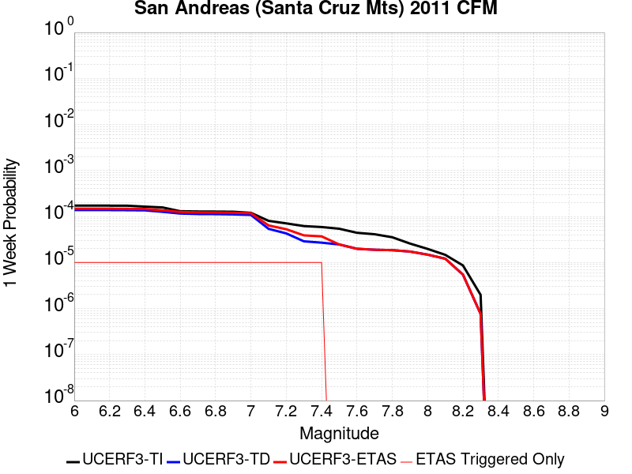 | 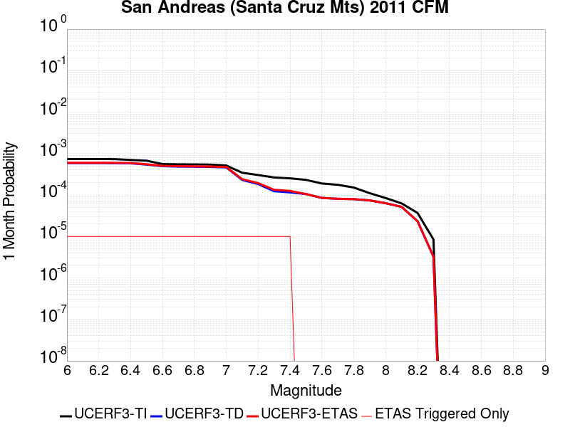 | 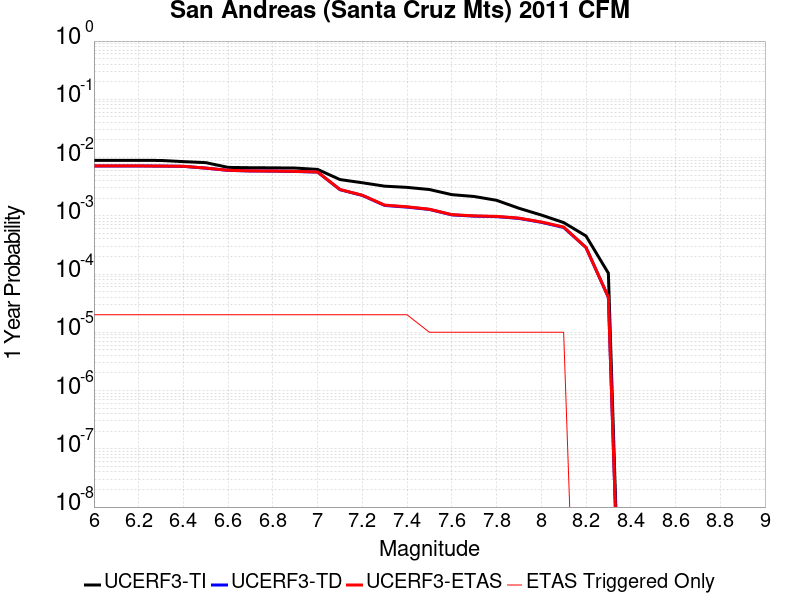 |  |

| Magnitude | 1 wk TI Prob | 1 wk TD Prob | 1 wk ETAS Prob | 1 wk ETAS/TD Gain | 1 wk ETAS Triggered Only | 1 mo TI Prob | 1 mo TD Prob | 1 mo ETAS Prob | 1 mo ETAS/TD Gain | 1 mo ETAS Triggered Only | 1 yr TI Prob | 1 yr TD Prob | 1 yr ETAS Prob | 1 yr ETAS/TD Gain | 1 yr ETAS Triggered Only | 10 yr TI Prob | 10 yr TD Prob | 10 yr ETAS Prob | 10 yr ETAS/TD Gain | 10 yr ETAS Triggered Only |
|-----|-----|-----|-----|-----|-----|-----|-----|-----|-----|-----|-----|-----|-----|-----|-----|-----|-----|-----|-----|-----|
| 6.0 | 1.7221631E-4 | 1.379298E-4 | 1.4792843E-4 | 1.0724907 | 1.0E-5 | 7.378611E-4 | 5.909958E-4 | 6.0098997E-4 | 1.0169106 | 1.0E-5 | 0.008946515 | 0.007172008 | 0.007191865 | 1.0027686 | 2.0E-5 | 0.08594794 | 0.0705481 | 0.07057599 | 1.0003953 | 3.0E-5 |
| 6.1 | 1.7221631E-4 | 1.379298E-4 | 1.4792843E-4 | 1.0724907 | 1.0E-5 | 7.378611E-4 | 5.909958E-4 | 6.0098997E-4 | 1.0169106 | 1.0E-5 | 0.008946515 | 0.007172008 | 0.007191865 | 1.0027686 | 2.0E-5 | 0.08594794 | 0.0705481 | 0.07057599 | 1.0003953 | 3.0E-5 |
| 6.2 | 1.7221631E-4 | 1.379298E-4 | 1.4792843E-4 | 1.0724907 | 1.0E-5 | 7.378611E-4 | 5.909958E-4 | 6.0098997E-4 | 1.0169106 | 1.0E-5 | 0.008946515 | 0.007172008 | 0.007191865 | 1.0027686 | 2.0E-5 | 0.08594794 | 0.0705481 | 0.07057599 | 1.0003953 | 3.0E-5 |
| 6.3 | 1.716926E-4 | 1.3712433E-4 | 1.4712296E-4 | 1.0729165 | 1.0E-5 | 7.3561794E-4 | 5.875454E-4 | 5.9753953E-4 | 1.01701 | 1.0E-5 | 0.008919428 | 0.0071302736 | 0.0071501313 | 1.002785 | 2.0E-5 | 0.08569809 | 0.07016007 | 0.07018796 | 1.0003976 | 3.0E-5 |
| 6.4 | 1.6392978E-4 | 1.3588462E-4 | 1.4588326E-4 | 1.0735818 | 1.0E-5 | 7.02367E-4 | 5.822347E-4 | 5.922289E-4 | 1.0171652 | 1.0E-5 | 0.008517839 | 0.0070660366 | 0.007085895 | 1.0028105 | 2.0E-5 | 0.08198654 | 0.06939512 | 0.069423035 | 1.0004023 | 3.0E-5 |
| 6.5 | 1.5742714E-4 | 1.2648347E-4 | 1.3648221E-4 | 1.0790517 | 1.0E-5 | 6.745133E-4 | 5.419611E-4 | 5.519557E-4 | 1.0184416 | 1.0E-5 | 0.00818132 | 0.006578721 | 0.0065985895 | 1.00302 | 2.0E-5 | 0.078865945 | 0.06486113 | 0.064889185 | 1.0004325 | 3.0E-5 |
| 6.6 | 1.3038084E-4 | 1.1588376E-4 | 1.2588261E-4 | 1.0862833 | 1.0E-5 | 5.5865536E-4 | 4.9655145E-4 | 5.065465E-4 | 1.0201288 | 1.0E-5 | 0.006780438 | 0.006028981 | 0.0060488605 | 1.0032973 | 2.0E-5 | 0.0657725 | 0.05933125 | 0.05935947 | 1.0004756 | 3.0E-5 |
| 6.7 | 1.2867592E-4 | 1.1314875E-4 | 1.2314762E-4 | 1.0883693 | 1.0E-5 | 5.5135164E-4 | 4.8483437E-4 | 4.948295E-4 | 1.0206156 | 1.0E-5 | 0.0066920654 | 0.0058871037 | 0.005906986 | 1.0033772 | 2.0E-5 | 0.06494093 | 0.058042105 | 0.058070365 | 1.0004869 | 3.0E-5 |
| 6.8 | 1.2801298E-4 | 1.1252432E-4 | 1.225232E-4 | 1.0888597 | 1.0E-5 | 5.485117E-4 | 4.8215926E-4 | 4.9215445E-4 | 1.02073 | 1.0E-5 | 0.0066577005 | 0.0058547272 | 0.00587461 | 1.003396 | 2.0E-5 | 0.06461738 | 0.057755943 | 0.05778421 | 1.0004895 | 3.0E-5 |
| 6.9 | 1.269149E-4 | 1.1094634E-4 | 1.2094523E-4 | 1.0901237 | 1.0E-5 | 5.4380763E-4 | 4.7539896E-4 | 4.853942E-4 | 1.021025 | 1.0E-5 | 0.006600777 | 0.00577286 | 0.005792744 | 1.0034444 | 2.0E-5 | 0.06408122 | 0.05702782 | 0.05705611 | 1.000496 | 3.0E-5 |
| 7.0 | 1.2030331E-4 | 1.0824731E-4 | 1.1824623E-4 | 1.0923711 | 1.0E-5 | 5.154837E-4 | 4.6383584E-4 | 4.738312E-4 | 1.0215493 | 1.0E-5 | 0.006257969 | 0.0056328145 | 0.005652702 | 1.0035306 | 2.0E-5 | 0.06084648 | 0.05570061 | 0.0557195 | 1.000339 | 2.0E-5 |
| 7.1 | 8.049617E-5 | 5.392725E-5 | 6.392671E-5 | 1.185425 | 1.0E-5 | 3.4493793E-4 | 2.310965E-4 | 2.410942E-4 | 1.043262 | 1.0E-5 | 0.0041915346 | 0.0028100046 | 0.0028299484 | 1.0070975 | 2.0E-5 | 0.041133516 | 0.029619923 | 0.02963933 | 1.0006552 | 2.0E-5 |
| 7.2 | 7.093979E-5 | 4.2938034E-5 | 5.2937605E-5 | 1.2328838 | 1.0E-5 | 3.0399222E-4 | 1.840073E-4 | 1.9400545E-4 | 1.0543357 | 1.0E-5 | 0.0036948253 | 0.0022380098 | 0.002257965 | 1.0089165 | 2.0E-5 | 0.03633994 | 0.023942228 | 0.02396175 | 1.0008154 | 2.0E-5 |
| 7.3 | 6.193693E-5 | 2.8893048E-5 | 3.889276E-5 | 1.346094 | 1.0E-5 | 2.6541698E-4 | 1.2382148E-4 | 1.3382024E-4 | 1.0807514 | 1.0E-5 | 0.0032266637 | 0.0015064857 | 0.0015264556 | 1.013256 | 2.0E-5 | 0.031802133 | 0.016498575 | 0.016518246 | 1.0011922 | 2.0E-5 |
| 7.4 | 5.906492E-5 | 2.702227E-5 | 3.7022E-5 | 1.3700552 | 1.0E-5 | 2.5311083E-4 | 1.1580459E-4 | 1.2580343E-4 | 1.0863423 | 1.0E-5 | 0.0030772698 | 0.0014090105 | 0.0014289822 | 1.0141743 | 2.0E-5 | 0.030350044 | 0.015470383 | 0.015490074 | 1.0012728 | 2.0E-5 |
| 7.5 | 5.424296E-5 | 2.4676912E-5 | 2.4676912E-5 | 1.0 | 0.0 | 2.324491E-4 | 1.0575392E-4 | 1.0575392E-4 | 1.0 | 0.0 | 0.002826395 | 0.0012867947 | 0.0012967817 | 1.0077612 | 1.0E-5 | 0.027907165 | 0.014162545 | 0.014172404 | 1.0006961 | 1.0E-5 |
| 7.6 | 4.43084E-5 | 1.9903022E-5 | 1.9903022E-5 | 1.0 | 0.0 | 1.8987931E-4 | 8.529588E-5 | 8.529588E-5 | 1.0 | 0.0 | 0.0023093296 | 0.0010379828 | 0.0010479725 | 1.0096241 | 1.0E-5 | 0.022854783 | 0.011411919 | 0.011421805 | 1.0008663 | 1.0E-5 |
| 7.7 | 4.118098E-5 | 1.8935307E-5 | 1.8935307E-5 | 1.0 | 0.0 | 1.7647797E-4 | 8.114879E-5 | 8.114879E-5 | 1.0 | 0.0 | 0.002146502 | 9.87539E-4 | 9.975291E-4 | 1.0101162 | 1.0E-5 | 0.021258866 | 0.010869747 | 0.010879638 | 1.00091 | 1.0E-5 |
| 7.8 | 3.5408906E-5 | 1.8563444E-5 | 1.8563444E-5 | 1.0 | 0.0 | 1.5174363E-4 | 7.955519E-5 | 7.955519E-5 | 1.0 | 0.0 | 0.0018459131 | 9.681542E-4 | 9.781446E-4 | 1.0103189 | 1.0E-5 | 0.018306552 | 0.010651375 | 0.010661269 | 1.0009289 | 1.0E-5 |
| 7.9 | 2.5860836E-5 | 1.731528E-5 | 1.731528E-5 | 1.0 | 0.0 | 1.10827445E-4 | 7.420623E-5 | 7.420623E-5 | 1.0 | 0.0 | 0.001348489 | 9.030867E-4 | 9.130777E-4 | 1.0110631 | 1.0E-5 | 0.013403354 | 0.0099072475 | 0.009917148 | 1.0009993 | 1.0E-5 |
| 8.0 | 1.9777332E-5 | 1.4838979E-5 | 1.4838979E-5 | 1.0 | 0.0 | 8.4757245E-5 | 6.3594074E-5 | 6.3594074E-5 | 1.0 | 0.0 | 0.0010314309 | 7.73983E-4 | 7.839753E-4 | 1.0129101 | 1.0E-5 | 0.010266567 | 0.008508656 | 0.008518571 | 1.0011653 | 1.0E-5 |
| 8.1 | 1.468494E-5 | 1.2106721E-5 | 1.2106721E-5 | 1.0 | 0.0 | 6.293394E-5 | 5.188492E-5 | 5.188492E-5 | 1.0 | 0.0 | 7.6595135E-4 | 6.31516E-4 | 6.4150966E-4 | 1.0158249 | 1.0E-5 | 0.0076331664 | 0.0069689834 | 0.0069789137 | 1.0014249 | 1.0E-5 |
| 8.2 | 8.63836E-6 | 5.4683105E-6 | 5.4683105E-6 | 1.0 | 0.0 | 3.7021015E-5 | 2.3435405E-5 | 2.3435405E-5 | 1.0 | 0.0 | 4.5063766E-4 | 2.8528878E-4 | 2.8528878E-4 | 1.0 | 0.0 | 0.004497249 | 0.0032454417 | 0.0032454417 | 1.0 | 0.0 |
| 8.3 | 1.983087E-6 | 7.65717E-7 | 7.65717E-7 | 1.0 | 0.0 | 8.498917E-6 | 3.2816401E-6 | 3.2816401E-6 | 1.0 | 0.0 | 1.034694E-4 | 3.9953255E-5 | 3.9953255E-5 | 1.0 | 0.0 | 0.0010342124 | 4.7185255E-4 | 4.7185255E-4 | 1.0 | 0.0 |

## San Jacinto (Stepovers Combined)
*[(top)](#table-of-contents)*

| 1 Week | 1 Month | 1 Year | 10 Year |
|-----|-----|-----|-----|
|  |  |  |  |

| Magnitude | 1 wk TI Prob | 1 wk TD Prob | 1 wk ETAS Prob | 1 wk ETAS/TD Gain | 1 wk ETAS Triggered Only | 1 mo TI Prob | 1 mo TD Prob | 1 mo ETAS Prob | 1 mo ETAS/TD Gain | 1 mo ETAS Triggered Only | 1 yr TI Prob | 1 yr TD Prob | 1 yr ETAS Prob | 1 yr ETAS/TD Gain | 1 yr ETAS Triggered Only | 10 yr TI Prob | 10 yr TD Prob | 10 yr ETAS Prob | 10 yr ETAS/TD Gain | 10 yr ETAS Triggered Only |
|-----|-----|-----|-----|-----|-----|-----|-----|-----|-----|-----|-----|-----|-----|-----|-----|-----|-----|-----|-----|-----|
| 6.0 | 4.0667746E-5 | 3.5272493E-5 | 3.5272493E-5 | 1.0 | 0.0 | 1.742787E-4 | 1.511591E-4 | 1.6115757E-4 | 1.0661454 | 1.0E-5 | 0.0021197782 | 0.0018388097 | 0.0018587728 | 1.0108566 | 2.0E-5 | 0.020996714 | 0.018987192 | 0.019016622 | 1.00155 | 3.0E-5 |
| 6.1 | 4.0667746E-5 | 3.5272493E-5 | 3.5272493E-5 | 1.0 | 0.0 | 1.742787E-4 | 1.511591E-4 | 1.6115757E-4 | 1.0661454 | 1.0E-5 | 0.0021197782 | 0.0018388097 | 0.0018587728 | 1.0108566 | 2.0E-5 | 0.020996714 | 0.018987192 | 0.019016622 | 1.00155 | 3.0E-5 |
| 6.2 | 4.0667746E-5 | 3.5272493E-5 | 3.5272493E-5 | 1.0 | 0.0 | 1.742787E-4 | 1.511591E-4 | 1.6115757E-4 | 1.0661454 | 1.0E-5 | 0.0021197782 | 0.0018388097 | 0.0018587728 | 1.0108566 | 2.0E-5 | 0.020996714 | 0.018987192 | 0.019016622 | 1.00155 | 3.0E-5 |
| 6.3 | 4.0667746E-5 | 3.5272493E-5 | 3.5272493E-5 | 1.0 | 0.0 | 1.742787E-4 | 1.511591E-4 | 1.6115757E-4 | 1.0661454 | 1.0E-5 | 0.0021197782 | 0.0018388097 | 0.0018587728 | 1.0108566 | 2.0E-5 | 0.020996714 | 0.018987192 | 0.019016622 | 1.00155 | 3.0E-5 |
| 6.4 | 4.0577226E-5 | 3.5144403E-5 | 3.5144403E-5 | 1.0 | 0.0 | 1.738908E-4 | 1.506102E-4 | 1.6060869E-4 | 1.0663866 | 1.0E-5 | 0.0021150648 | 0.0018321393 | 0.0018521027 | 1.0108962 | 2.0E-5 | 0.020950472 | 0.018921759 | 0.01895119 | 1.0015554 | 3.0E-5 |
| 6.5 | 4.0577226E-5 | 3.5144403E-5 | 3.5144403E-5 | 1.0 | 0.0 | 1.738908E-4 | 1.506102E-4 | 1.6060869E-4 | 1.0663866 | 1.0E-5 | 0.0021150648 | 0.0018321393 | 0.0018521027 | 1.0108962 | 2.0E-5 | 0.020950472 | 0.018921759 | 0.01895119 | 1.0015554 | 3.0E-5 |
| 6.6 | 4.053861E-5 | 3.5089746E-5 | 3.5089746E-5 | 1.0 | 0.0 | 1.7372532E-4 | 1.5037597E-4 | 1.6037447E-4 | 1.0664899 | 1.0E-5 | 0.0021130538 | 0.001829293 | 0.0018492565 | 1.0109131 | 2.0E-5 | 0.020930743 | 0.018893836 | 0.01892327 | 1.0015578 | 3.0E-5 |
| 6.7 | 4.0516545E-5 | 3.505882E-5 | 3.505882E-5 | 1.0 | 0.0 | 1.7363077E-4 | 1.5024345E-4 | 1.6024195E-4 | 1.0665486 | 1.0E-5 | 0.002111905 | 0.0018276824 | 0.0018476458 | 1.0109228 | 2.0E-5 | 0.020919468 | 0.018878033 | 0.018907467 | 1.0015591 | 3.0E-5 |
| 6.8 | 4.049434E-5 | 3.503038E-5 | 3.503038E-5 | 1.0 | 0.0 | 1.7353562E-4 | 1.5012159E-4 | 1.601201E-4 | 1.0666027 | 1.0E-5 | 0.0021107488 | 0.0018262012 | 0.0018461647 | 1.0109317 | 2.0E-5 | 0.020908125 | 0.018863445 | 0.018892879 | 1.0015603 | 3.0E-5 |
| 6.9 | 4.046386E-5 | 3.4992943E-5 | 3.4992943E-5 | 1.0 | 0.0 | 1.73405E-4 | 1.4996115E-4 | 1.5995966E-4 | 1.066674 | 1.0E-5 | 0.0021091616 | 0.0018242513 | 0.0018442147 | 1.0109434 | 2.0E-5 | 0.020892553 | 0.018844217 | 0.018873652 | 1.001562 | 3.0E-5 |
| 7.0 | 4.036382E-5 | 3.4873512E-5 | 3.4873512E-5 | 1.0 | 0.0 | 1.7297632E-4 | 1.4944936E-4 | 1.5944788E-4 | 1.0669023 | 1.0E-5 | 0.0021039525 | 0.0018180308 | 0.0018379944 | 1.010981 | 2.0E-5 | 0.02084144 | 0.018782832 | 0.018812269 | 1.0015672 | 3.0E-5 |
| 7.1 | 4.0343282E-5 | 3.4851975E-5 | 3.4851975E-5 | 1.0 | 0.0 | 1.7288832E-4 | 1.4935707E-4 | 1.5935558E-4 | 1.0669436 | 1.0E-5 | 0.002102883 | 0.0018169091 | 0.0018368727 | 1.0109878 | 2.0E-5 | 0.020830948 | 0.018771702 | 0.01880114 | 1.0015682 | 3.0E-5 |
| 7.2 | 4.0257353E-5 | 3.4756475E-5 | 3.4756475E-5 | 1.0 | 0.0 | 1.725201E-4 | 1.4894783E-4 | 1.5894635E-4 | 1.0671276 | 1.0E-5 | 0.0020984085 | 0.0018119349 | 0.0018318986 | 1.0110179 | 2.0E-5 | 0.020787042 | 0.018722443 | 0.01875188 | 1.0015724 | 3.0E-5 |
| 7.3 | 3.9940667E-5 | 3.4584144E-5 | 3.4584144E-5 | 1.0 | 0.0 | 1.7116306E-4 | 1.4820936E-4 | 1.5820788E-4 | 1.0674621 | 1.0E-5 | 0.0020819185 | 0.0018029588 | 0.0018229227 | 1.0110729 | 2.0E-5 | 0.020625217 | 0.01863108 | 0.018660521 | 1.0015802 | 3.0E-5 |
| 7.4 | 3.9721202E-5 | 3.446955E-5 | 3.446955E-5 | 1.0 | 0.0 | 1.7022261E-4 | 1.477183E-4 | 1.5771682E-4 | 1.0676864 | 1.0E-5 | 0.0020704903 | 0.0017969899 | 0.001816954 | 1.0111097 | 2.0E-5 | 0.020513052 | 0.01857021 | 0.018599654 | 1.0015855 | 3.0E-5 |
| 7.5 | 3.7036873E-5 | 3.3537144E-5 | 3.3537144E-5 | 1.0 | 0.0 | 1.5871979E-4 | 1.437227E-4 | 1.5372127E-4 | 1.0695684 | 1.0E-5 | 0.0019307006 | 0.0017484225 | 0.0017683876 | 1.0114189 | 2.0E-5 | 0.019140124 | 0.01807181 | 0.018101268 | 1.0016301 | 3.0E-5 |
| 7.6 | 3.2940967E-5 | 3.1318064E-5 | 3.1318064E-5 | 1.0 | 0.0 | 1.4116794E-4 | 1.3421338E-4 | 1.4421204E-4 | 1.0744982 | 1.0E-5 | 0.0017173645 | 0.0016328255 | 0.0016527928 | 1.0122287 | 2.0E-5 | 0.01704153 | 0.016904691 | 0.016934184 | 1.0017446 | 3.0E-5 |
| 7.7 | 2.8236149E-5 | 2.7884034E-5 | 2.7884034E-5 | 1.0 | 0.0 | 1.2100645E-4 | 1.19497534E-4 | 1.2949634E-4 | 1.0836737 | 1.0E-5 | 0.0014722579 | 0.0014539126 | 0.0014738835 | 1.013736 | 2.0E-5 | 0.014625421 | 0.015115355 | 0.015144901 | 1.0019548 | 3.0E-5 |
| 7.8 | 2.4329287E-5 | 2.5207757E-5 | 2.5207757E-5 | 1.0 | 0.0 | 1.042642E-4 | 1.0802878E-4 | 1.18027696E-4 | 1.0925579 | 1.0E-5 | 0.0012686774 | 0.0013144576 | 0.0013344313 | 1.0151954 | 2.0E-5 | 0.012614589 | 0.013712738 | 0.013742327 | 1.0021577 | 3.0E-5 |
| 7.9 | 1.9370926E-5 | 2.0421547E-5 | 2.0421547E-5 | 1.0 | 0.0 | 8.301561E-5 | 8.751798E-5 | 9.7517106E-5 | 1.1142522 | 1.0E-5 | 0.0010102465 | 0.0010650114 | 0.00108499 | 1.0187591 | 2.0E-5 | 0.0100566605 | 0.011199737 | 0.011229401 | 1.0026486 | 3.0E-5 |
| 8.0 | 1.5583017E-5 | 1.588632E-5 | 1.588632E-5 | 1.0 | 0.0 | 6.6782646E-5 | 6.808245E-5 | 7.808177E-5 | 1.1468707 | 1.0E-5 | 8.127754E-4 | 8.285893E-4 | 8.4857276E-4 | 1.0241174 | 2.0E-5 | 0.008098091 | 0.008781905 | 0.008811642 | 1.0033861 | 3.0E-5 |
| 8.1 | 1.0024873E-5 | 8.291912E-6 | 8.291912E-6 | 1.0 | 0.0 | 4.2963035E-5 | 3.5536283E-5 | 3.5536283E-5 | 1.0 | 0.0 | 5.229494E-4 | 4.3256886E-4 | 4.3256886E-4 | 1.0 | 0.0 | 0.0052172043 | 0.0046531972 | 0.0046631508 | 1.0021391 | 1.0E-5 |
| 8.2 | 4.142796E-6 | 1.5604234E-6 | 1.5604234E-6 | 1.0 | 0.0 | 1.775472E-5 | 6.6875114E-6 | 6.6875114E-6 | 1.0 | 0.0 | 2.1614227E-4 | 8.141744E-5 | 8.141744E-5 | 1.0 | 0.0 | 0.0021593217 | 9.4523106E-4 | 9.4523106E-4 | 1.0 | 0.0 |
| 8.3 | 1.2750878E-6 | 3.6101733E-7 | 3.6101733E-7 | 1.0 | 0.0 | 5.4646503E-6 | 1.5472162E-6 | 1.5472162E-6 | 1.0 | 0.0 | 6.653009E-5 | 1.88372E-5 | 1.88372E-5 | 1.0 | 0.0 | 6.6510175E-4 | 2.2725605E-4 | 2.2725605E-4 | 1.0 | 0.0 |

## San Jacinto (Anza) rev
*[(top)](#table-of-contents)*

| 1 Week | 1 Month | 1 Year | 10 Year |
|-----|-----|-----|-----|
|  |  | 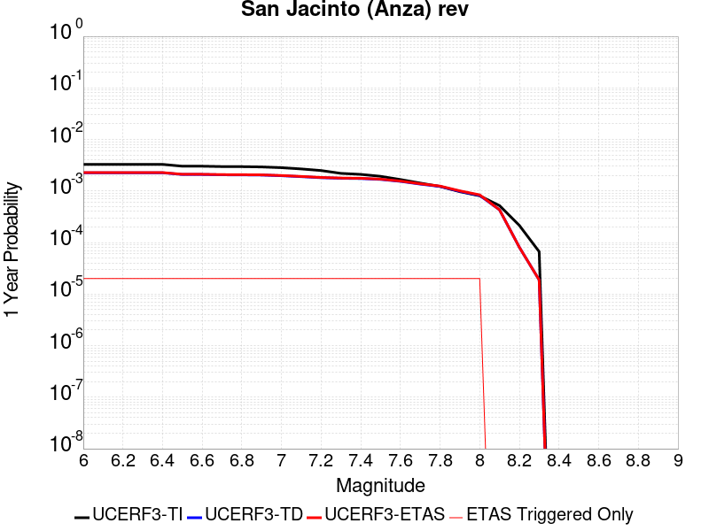 |  |

| Magnitude | 1 wk TI Prob | 1 wk TD Prob | 1 wk ETAS Prob | 1 wk ETAS/TD Gain | 1 wk ETAS Triggered Only | 1 mo TI Prob | 1 mo TD Prob | 1 mo ETAS Prob | 1 mo ETAS/TD Gain | 1 mo ETAS Triggered Only | 1 yr TI Prob | 1 yr TD Prob | 1 yr ETAS Prob | 1 yr ETAS/TD Gain | 1 yr ETAS Triggered Only | 10 yr TI Prob | 10 yr TD Prob | 10 yr ETAS Prob | 10 yr ETAS/TD Gain | 10 yr ETAS Triggered Only |
|-----|-----|-----|-----|-----|-----|-----|-----|-----|-----|-----|-----|-----|-----|-----|-----|-----|-----|-----|-----|-----|
| 6.0 | 6.3015636E-5 | 4.3299682E-5 | 4.3299682E-5 | 1.0 | 0.0 | 2.7003905E-4 | 1.8555693E-4 | 1.9555508E-4 | 1.0538818 | 1.0E-5 | 0.0032827691 | 0.002256827 | 0.0022767817 | 1.008842 | 2.0E-5 | 0.032346968 | 0.023294332 | 0.023323633 | 1.0012579 | 3.0E-5 |
| 6.1 | 6.3015636E-5 | 4.3299682E-5 | 4.3299682E-5 | 1.0 | 0.0 | 2.7003905E-4 | 1.8555693E-4 | 1.9555508E-4 | 1.0538818 | 1.0E-5 | 0.0032827691 | 0.002256827 | 0.0022767817 | 1.008842 | 2.0E-5 | 0.032346968 | 0.023294332 | 0.023323633 | 1.0012579 | 3.0E-5 |
| 6.2 | 6.3015636E-5 | 4.3299682E-5 | 4.3299682E-5 | 1.0 | 0.0 | 2.7003905E-4 | 1.8555693E-4 | 1.9555508E-4 | 1.0538818 | 1.0E-5 | 0.0032827691 | 0.002256827 | 0.0022767817 | 1.008842 | 2.0E-5 | 0.032346968 | 0.023294332 | 0.023323633 | 1.0012579 | 3.0E-5 |
| 6.3 | 6.3015636E-5 | 4.3299682E-5 | 4.3299682E-5 | 1.0 | 0.0 | 2.7003905E-4 | 1.8555693E-4 | 1.9555508E-4 | 1.0538818 | 1.0E-5 | 0.0032827691 | 0.002256827 | 0.0022767817 | 1.008842 | 2.0E-5 | 0.032346968 | 0.023294332 | 0.023323633 | 1.0012579 | 3.0E-5 |
| 6.4 | 6.3015636E-5 | 4.3299682E-5 | 4.3299682E-5 | 1.0 | 0.0 | 2.7003905E-4 | 1.8555693E-4 | 1.9555508E-4 | 1.0538818 | 1.0E-5 | 0.0032827691 | 0.002256827 | 0.0022767817 | 1.008842 | 2.0E-5 | 0.032346968 | 0.023294332 | 0.023323633 | 1.0012579 | 3.0E-5 |
| 6.5 | 5.811017E-5 | 4.008162E-5 | 4.008162E-5 | 1.0 | 0.0 | 2.4901982E-4 | 1.7176708E-4 | 1.8176537E-4 | 1.0582083 | 1.0E-5 | 0.0030276014 | 0.002089264 | 0.0021092223 | 1.0095527 | 2.0E-5 | 0.02986684 | 0.021591555 | 0.021620907 | 1.0013595 | 3.0E-5 |
| 6.6 | 5.811017E-5 | 4.008162E-5 | 4.008162E-5 | 1.0 | 0.0 | 2.4901982E-4 | 1.7176708E-4 | 1.8176537E-4 | 1.0582083 | 1.0E-5 | 0.0030276014 | 0.002089264 | 0.0021092223 | 1.0095527 | 2.0E-5 | 0.02986684 | 0.021591555 | 0.021620907 | 1.0013595 | 3.0E-5 |
| 6.7 | 5.712442E-5 | 3.9504346E-5 | 3.9504346E-5 | 1.0 | 0.0 | 2.4479596E-4 | 1.6929339E-4 | 1.7929169E-4 | 1.059059 | 1.0E-5 | 0.0029763177 | 0.002059204 | 0.0020791627 | 1.0096925 | 2.0E-5 | 0.029367693 | 0.021283602 | 0.021312963 | 1.0013795 | 3.0E-5 |
| 6.8 | 5.6967532E-5 | 3.936063E-5 | 3.936063E-5 | 1.0 | 0.0 | 2.4412372E-4 | 1.6867755E-4 | 1.7867587E-4 | 1.0592747 | 1.0E-5 | 0.0029681553 | 0.0020517204 | 0.0020716793 | 1.009728 | 2.0E-5 | 0.029288229 | 0.021209203 | 0.021238567 | 1.0013845 | 3.0E-5 |
| 6.9 | 5.6211324E-5 | 3.906555E-5 | 3.906555E-5 | 1.0 | 0.0 | 2.4088343E-4 | 1.6741308E-4 | 1.7741139E-4 | 1.0597225 | 1.0E-5 | 0.0029288116 | 0.0020363543 | 0.0020563134 | 1.0098015 | 2.0E-5 | 0.028905109 | 0.021048212 | 0.02107758 | 1.0013953 | 3.0E-5 |
| 7.0 | 5.4383527E-5 | 3.7926344E-5 | 3.7926344E-5 | 1.0 | 0.0 | 2.3305144E-4 | 1.6253137E-4 | 1.7252975E-4 | 1.0615165 | 1.0E-5 | 0.0028337094 | 0.0019770283 | 0.001996989 | 1.0100962 | 2.0E-5 | 0.027978465 | 0.020441635 | 0.020471022 | 1.0014375 | 3.0E-5 |
| 7.1 | 5.1393665E-5 | 3.6389203E-5 | 3.6389203E-5 | 1.0 | 0.0 | 2.2023996E-4 | 1.5594444E-4 | 1.6594287E-4 | 1.0641154 | 1.0E-5 | 0.0026781242 | 0.0018969743 | 0.0019169364 | 1.0105231 | 2.0E-5 | 0.026460782 | 0.019616762 | 0.019646173 | 1.0014993 | 3.0E-5 |
| 7.2 | 4.785222E-5 | 3.4740173E-5 | 3.4740173E-5 | 1.0 | 0.0 | 2.0506482E-4 | 1.4887798E-4 | 1.5887649E-4 | 1.067159 | 1.0E-5 | 0.0024938055 | 0.001811086 | 0.0018310497 | 1.011023 | 2.0E-5 | 0.024660049 | 0.01872946 | 0.018758899 | 1.0015718 | 3.0E-5 |
| 7.3 | 4.2143256E-5 | 3.3835735E-5 | 3.3835735E-5 | 1.0 | 0.0 | 1.8060145E-4 | 1.4500225E-4 | 1.550008E-4 | 1.0689545 | 1.0E-5 | 0.002196605 | 0.0017639763 | 0.001783941 | 1.011318 | 2.0E-5 | 0.02175019 | 0.018237343 | 0.018266795 | 1.0016149 | 3.0E-5 |
| 7.4 | 4.0264713E-5 | 3.3474E-5 | 3.3474E-5 | 1.0 | 0.0 | 1.7255165E-4 | 1.4345214E-4 | 1.534507E-4 | 1.0696996 | 1.0E-5 | 0.002098792 | 0.001745134 | 0.0017650991 | 1.0114404 | 2.0E-5 | 0.020790804 | 0.018042043 | 0.0180715 | 1.0016328 | 3.0E-5 |
| 7.5 | 3.694492E-5 | 3.2188196E-5 | 3.2188196E-5 | 1.0 | 0.0 | 1.5832575E-4 | 1.3794213E-4 | 1.4794075E-4 | 1.0724841 | 1.0E-5 | 0.0019259118 | 0.0016781548 | 0.0016981212 | 1.0118978 | 2.0E-5 | 0.01909306 | 0.017358547 | 0.017388025 | 1.0016983 | 3.0E-5 |
| 7.6 | 3.200565E-5 | 2.9503984E-5 | 2.9503984E-5 | 1.0 | 0.0 | 1.3715986E-4 | 1.2643953E-4 | 1.3643826E-4 | 1.0790792 | 1.0E-5 | 0.001668642 | 0.0015383165 | 0.0015582857 | 1.0129812 | 2.0E-5 | 0.01656168 | 0.015946597 | 0.015976118 | 1.0018513 | 3.0E-5 |
| 7.7 | 2.731642E-5 | 2.6092732E-5 | 2.6092732E-5 | 1.0 | 0.0 | 1.1706512E-4 | 1.118212E-4 | 1.21820085E-4 | 1.0894185 | 1.0E-5 | 0.001424336 | 0.0013605739 | 0.0013805467 | 1.0146797 | 2.0E-5 | 0.014152412 | 0.014167223 | 0.014196798 | 1.0020876 | 3.0E-5 |
| 7.8 | 2.3466424E-5 | 2.3504845E-5 | 2.3504845E-5 | 1.0 | 0.0 | 1.0056651E-4 | 1.00731166E-4 | 1.1073016E-4 | 1.0992641 | 1.0E-5 | 0.0012237094 | 0.0012257128 | 0.0012456883 | 1.016297 | 2.0E-5 | 0.012169928 | 0.012809171 | 0.0128387865 | 1.0023121 | 3.0E-5 |
| 7.9 | 1.8611925E-5 | 1.890804E-5 | 1.890804E-5 | 1.0 | 0.0 | 7.9762955E-5 | 8.103195E-5 | 9.1031136E-5 | 1.1233981 | 1.0E-5 | 9.7068126E-4 | 9.861181E-4 | 0.0010060985 | 1.0202615 | 2.0E-5 | 0.0096645225 | 0.010394019 | 0.010423707 | 1.0028563 | 3.0E-5 |
| 8.0 | 1.5460775E-5 | 1.5740812E-5 | 1.5740812E-5 | 1.0 | 0.0 | 6.6258784E-5 | 6.745889E-5 | 7.745821E-5 | 1.1482284 | 1.0E-5 | 8.0640207E-4 | 8.210031E-4 | 8.4098673E-4 | 1.0243404 | 2.0E-5 | 0.008034821 | 0.008702973 | 0.008732712 | 1.0034171 | 3.0E-5 |
| 8.1 | 9.983884E-6 | 8.269464E-6 | 8.269464E-6 | 1.0 | 0.0 | 4.2787375E-5 | 3.5440084E-5 | 3.5440084E-5 | 1.0 | 0.0 | 5.2081177E-4 | 4.313981E-4 | 4.313981E-4 | 1.0 | 0.0 | 0.0051959283 | 0.004639811 | 0.0046497644 | 1.0021453 | 1.0E-5 |
| 8.2 | 4.1226E-6 | 1.5524012E-6 | 1.5524012E-6 | 1.0 | 0.0 | 1.7668166E-5 | 6.653131E-6 | 6.653131E-6 | 1.0 | 0.0 | 2.1508869E-4 | 8.0998885E-5 | 8.0998885E-5 | 1.0 | 0.0 | 0.0021488064 | 9.40269E-4 | 9.40269E-4 | 1.0 | 0.0 |
| 8.3 | 1.2750878E-6 | 3.6101733E-7 | 3.6101733E-7 | 1.0 | 0.0 | 5.4646503E-6 | 1.5472162E-6 | 1.5472162E-6 | 1.0 | 0.0 | 6.653009E-5 | 1.88372E-5 | 1.88372E-5 | 1.0 | 0.0 | 6.6510175E-4 | 2.2725605E-4 | 2.2725605E-4 | 1.0 | 0.0 |

## Calaveras (So) 2011 CFM
*[(top)](#table-of-contents)*

| 1 Week | 1 Month | 1 Year | 10 Year |
|-----|-----|-----|-----|
|  | 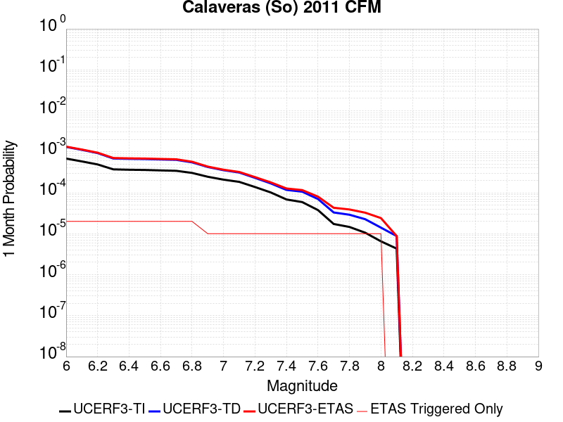 | 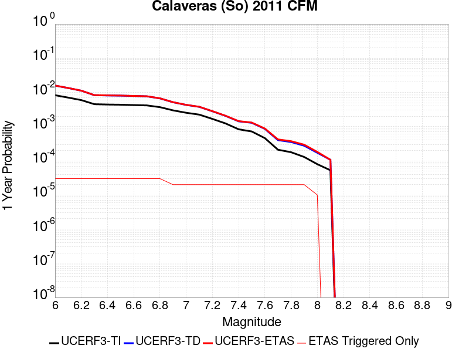 | 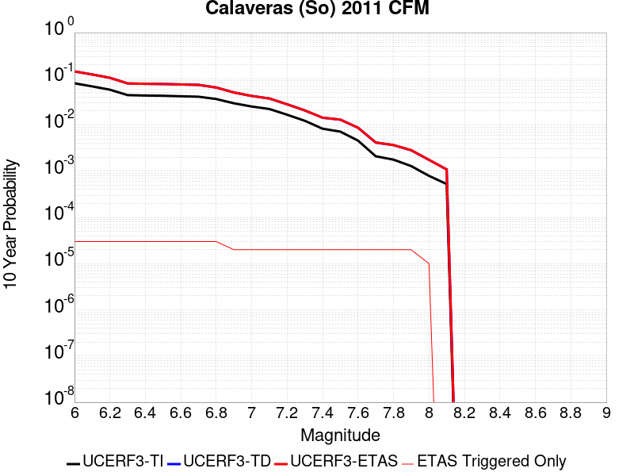 |

| Magnitude | 1 wk TI Prob | 1 wk TD Prob | 1 wk ETAS Prob | 1 wk ETAS/TD Gain | 1 wk ETAS Triggered Only | 1 mo TI Prob | 1 mo TD Prob | 1 mo ETAS Prob | 1 mo ETAS/TD Gain | 1 mo ETAS Triggered Only | 1 yr TI Prob | 1 yr TD Prob | 1 yr ETAS Prob | 1 yr ETAS/TD Gain | 1 yr ETAS Triggered Only | 10 yr TI Prob | 10 yr TD Prob | 10 yr ETAS Prob | 10 yr ETAS/TD Gain | 10 yr ETAS Triggered Only |
|-----|-----|-----|-----|-----|-----|-----|-----|-----|-----|-----|-----|-----|-----|-----|-----|-----|-----|-----|-----|-----|
| 6.0 | 1.5950744E-4 | 3.0713595E-4 | 3.171329E-4 | 1.0325489 | 1.0E-5 | 6.834242E-4 | 0.0013154168 | 0.0013353905 | 1.0151843 | 2.0E-5 | 0.00828899 | 0.015858417 | 0.01588794 | 1.0018617 | 3.0E-5 | 0.079865426 | 0.14440334 | 0.144429 | 1.0001777 | 3.0E-5 |
| 6.1 | 1.3584697E-4 | 2.6035408E-4 | 2.7035148E-4 | 1.0383992 | 1.0E-5 | 5.8207137E-4 | 0.0011151831 | 0.0011351608 | 1.0179143 | 2.0E-5 | 0.007063716 | 0.013461467 | 0.013491063 | 1.0021986 | 3.0E-5 | 0.06843361 | 0.124031454 | 0.12405773 | 1.0002118 | 3.0E-5 |
| 6.2 | 1.14676266E-4 | 2.1714676E-4 | 2.271446E-4 | 1.0460418 | 1.0E-5 | 4.9137714E-4 | 9.302301E-4 | 9.502114E-4 | 1.0214801 | 2.0E-5 | 0.0059661185 | 0.011245134 | 0.011274797 | 1.0026379 | 3.0E-5 | 0.058084648 | 0.105022006 | 0.10504886 | 1.0002557 | 3.0E-5 |
| 6.3 | 8.691518E-5 | 1.5988073E-4 | 1.6987913E-4 | 1.0625366 | 1.0E-5 | 3.7244044E-4 | 6.849863E-4 | 7.049726E-4 | 1.0291777 | 2.0E-5 | 0.004525038 | 0.00830119 | 0.008330941 | 1.0035839 | 3.0E-5 | 0.044339992 | 0.07933792 | 0.07936554 | 1.0003481 | 3.0E-5 |
| 6.4 | 8.50982E-5 | 1.5694466E-4 | 1.669431E-4 | 1.0637068 | 1.0E-5 | 3.646556E-4 | 6.724097E-4 | 6.9239625E-4 | 1.0297238 | 2.0E-5 | 0.0044306475 | 0.008149222 | 0.008178977 | 1.0036514 | 3.0E-5 | 0.04343345 | 0.077944115 | 0.07797177 | 1.0003549 | 3.0E-5 |
| 6.5 | 8.4062965E-5 | 1.5518875E-4 | 1.651872E-4 | 1.0644276 | 1.0E-5 | 3.602201E-4 | 6.648888E-4 | 6.8487553E-4 | 1.0300602 | 2.0E-5 | 0.004376863 | 0.00805843 | 0.008088188 | 1.0036929 | 3.0E-5 | 0.042916555 | 0.07711546 | 0.07714315 | 1.000359 | 3.0E-5 |
| 6.6 | 8.194716E-5 | 1.515468E-4 | 1.6154528E-4 | 1.0659763 | 1.0E-5 | 3.5115483E-4 | 6.492896E-4 | 6.6927663E-4 | 1.0307829 | 2.0E-5 | 0.0042669317 | 0.007870273 | 0.007900037 | 1.0037818 | 3.0E-5 | 0.04185927 | 0.07540083 | 0.07542857 | 1.0003679 | 3.0E-5 |
| 6.7 | 8.012326E-5 | 1.4822604E-4 | 1.5822456E-4 | 1.0674546 | 1.0E-5 | 3.433402E-4 | 6.350665E-4 | 6.5505377E-4 | 1.0314728 | 2.0E-5 | 0.004172157 | 0.007698764 | 0.0077285334 | 1.0038667 | 3.0E-5 | 0.040946912 | 0.07384295 | 0.07387073 | 1.0003762 | 3.0E-5 |
| 6.8 | 7.119773E-5 | 1.288199E-4 | 1.388186E-4 | 1.0776178 | 1.0E-5 | 3.0509746E-4 | 5.51954E-4 | 5.71943E-4 | 1.036215 | 2.0E-5 | 0.0037082357 | 0.006696122 | 0.0067259213 | 1.0044502 | 3.0E-5 | 0.036469642 | 0.06468733 | 0.064715385 | 1.0004338 | 3.0E-5 |
| 6.9 | 5.7343088E-5 | 9.9193705E-5 | 1.0919271E-4 | 1.1008029 | 1.0E-5 | 2.4573295E-4 | 4.2504695E-4 | 4.350427E-4 | 1.0235168 | 1.0E-5 | 0.0029876942 | 0.005162742 | 0.0051826388 | 1.0038539 | 2.0E-5 | 0.02947844 | 0.05051081 | 0.050529797 | 1.000376 | 2.0E-5 |
| 7.0 | 4.8746577E-5 | 8.2851606E-5 | 9.285078E-5 | 1.1206877 | 1.0E-5 | 2.0889717E-4 | 3.5503035E-4 | 3.650268E-4 | 1.0281566 | 1.0E-5 | 0.0025403565 | 0.0043139937 | 0.0043339073 | 1.004616 | 2.0E-5 | 0.025115121 | 0.042485867 | 0.042505015 | 1.0004507 | 2.0E-5 |
| 7.1 | 4.2998014E-5 | 7.265286E-5 | 8.265213E-5 | 1.1376308 | 1.0E-5 | 1.8426418E-4 | 3.1133255E-4 | 3.2132945E-4 | 1.03211 | 1.0E-5 | 0.002241108 | 0.0037839462 | 0.0038038704 | 1.0052655 | 2.0E-5 | 0.022186412 | 0.03742416 | 0.037443407 | 1.0005144 | 2.0E-5 |
| 7.2 | 3.221292E-5 | 5.39087E-5 | 6.390816E-5 | 1.1854888 | 1.0E-5 | 1.3804805E-4 | 2.3101698E-4 | 2.4101467E-4 | 1.0432769 | 1.0E-5 | 0.0016794393 | 0.002809032 | 0.002828976 | 1.0070999 | 2.0E-5 | 0.016668037 | 0.02803653 | 0.028055968 | 1.0006933 | 2.0E-5 |
| 7.3 | 2.3756531E-5 | 3.947412E-5 | 4.947372E-5 | 1.2533206 | 1.0E-5 | 1.0180973E-4 | 1.691639E-4 | 1.7916222E-4 | 1.0591042 | 1.0E-5 | 0.0012388286 | 0.0020576422 | 0.002077601 | 1.0096998 | 2.0E-5 | 0.012319452 | 0.020643665 | 0.02066325 | 1.0009488 | 2.0E-5 |
| 7.4 | 1.5997684E-5 | 2.7342798E-5 | 3.7342525E-5 | 1.365717 | 1.0E-5 | 6.8559704E-5 | 1.1717816E-4 | 1.2717699E-4 | 1.0853301 | 1.0E-5 | 8.343947E-4 | 0.001425713 | 0.0014456845 | 1.014008 | 2.0E-5 | 0.008312687 | 0.014376445 | 0.014396157 | 1.0013711 | 2.0E-5 |
| 7.5 | 1.3814293E-5 | 2.4784495E-5 | 3.4784247E-5 | 1.403468 | 1.0E-5 | 5.9202768E-5 | 1.0621495E-4 | 1.1621389E-4 | 1.0941387 | 1.0E-5 | 7.205553E-4 | 0.0012924023 | 0.0013123765 | 1.015455 | 2.0E-5 | 0.007182234 | 0.013055509 | 0.013075247 | 1.0015119 | 2.0E-5 |
| 7.6 | 8.817309E-6 | 1.6431297E-5 | 2.6431133E-5 | 1.6085846 | 1.0E-5 | 3.7787922E-5 | 7.041795E-5 | 8.0417245E-5 | 1.1419992 | 1.0E-5 | 4.5997082E-4 | 8.570026E-4 | 8.769855E-4 | 1.0233171 | 2.0E-5 | 0.004590199 | 0.008719688 | 0.008739514 | 1.0022737 | 2.0E-5 |
| 7.7 | 4.0352206E-6 | 7.707772E-6 | 1.7707694E-5 | 2.2973819 | 1.0E-5 | 1.7293689E-5 | 3.303289E-5 | 4.303256E-5 | 1.3027185 | 1.0E-5 | 2.1053031E-4 | 4.0210132E-4 | 4.2209326E-4 | 1.0497187 | 2.0E-5 | 0.0021033096 | 0.004165422 | 0.004185339 | 1.0047815 | 2.0E-5 |
| 7.8 | 3.413169E-6 | 6.7876895E-6 | 1.6787622E-5 | 2.4732454 | 1.0E-5 | 1.4627784E-5 | 2.9089775E-5 | 3.9089482E-5 | 1.3437535 | 1.0E-5 | 1.7807873E-4 | 3.5411053E-4 | 3.7410343E-4 | 1.0564595 | 2.0E-5 | 0.0017793609 | 0.0036667373 | 0.003686664 | 1.0054344 | 2.0E-5 |
| 7.9 | 2.4740732E-6 | 5.2795103E-6 | 1.5279458E-5 | 2.8941052 | 1.0E-5 | 1.06031275E-5 | 2.2626276E-5 | 3.262605E-5 | 1.441954 | 1.0E-5 | 1.2908543E-4 | 2.7544014E-4 | 2.9543464E-4 | 1.0725911 | 2.0E-5 | 0.0012901047 | 0.002834961 | 0.0028549044 | 1.0070348 | 2.0E-5 |
| 8.0 | 1.5231818E-6 | 3.289096E-6 | 1.3289063E-5 | 4.040339 | 1.0E-5 | 6.527906E-6 | 1.4096049E-5 | 2.4095909E-5 | 1.7094086 | 1.0E-5 | 7.9474354E-5 | 1.7160592E-4 | 1.816042E-4 | 1.0582631 | 1.0E-5 | 7.944594E-4 | 0.0017565031 | 0.0017664856 | 1.0056832 | 1.0E-5 |
| 8.1 | 1.0104524E-6 | 2.0458713E-6 | 2.0458713E-6 | 1.0 | 0.0 | 4.330503E-6 | 8.76799E-6 | 8.76799E-6 | 1.0 | 0.0 | 5.2722597E-5 | 1.0674508E-4 | 1.0674508E-4 | 1.0 | 0.0 | 5.271009E-4 | 0.0010929795 | 0.0010929795 | 1.0 | 0.0 |

## Northridge
*[(top)](#table-of-contents)*

| 1 Week | 1 Month | 1 Year | 10 Year |
|-----|-----|-----|-----|
|  |  |  | 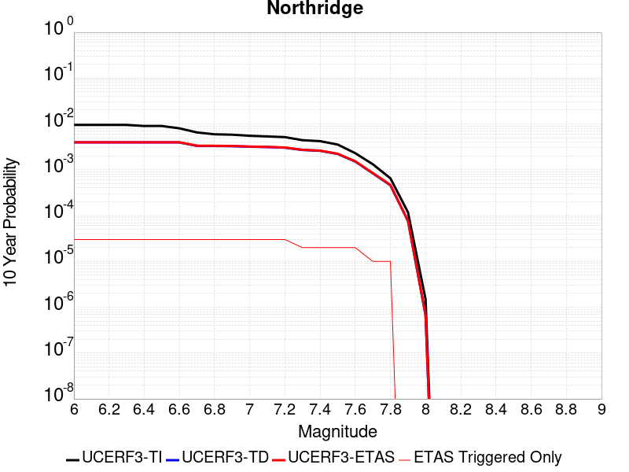 |

| Magnitude | 1 wk TI Prob | 1 wk TD Prob | 1 wk ETAS Prob | 1 wk ETAS/TD Gain | 1 wk ETAS Triggered Only | 1 mo TI Prob | 1 mo TD Prob | 1 mo ETAS Prob | 1 mo ETAS/TD Gain | 1 mo ETAS Triggered Only | 1 yr TI Prob | 1 yr TD Prob | 1 yr ETAS Prob | 1 yr ETAS/TD Gain | 1 yr ETAS Triggered Only | 10 yr TI Prob | 10 yr TD Prob | 10 yr ETAS Prob | 10 yr ETAS/TD Gain | 10 yr ETAS Triggered Only |
|-----|-----|-----|-----|-----|-----|-----|-----|-----|-----|-----|-----|-----|-----|-----|-----|-----|-----|-----|-----|-----|
| 6.0 | 1.8340852E-5 | 7.5879116E-6 | 7.5879116E-6 | 1.0 | 0.0 | 7.860128E-5 | 3.2519227E-5 | 4.2518903E-5 | 1.3075004 | 1.0E-5 | 9.565505E-4 | 3.9585188E-4 | 4.2584E-4 | 1.075756 | 3.0E-5 | 0.009524435 | 0.003951713 | 0.0039815945 | 1.0075617 | 3.0E-5 |
| 6.1 | 1.8340852E-5 | 7.5879116E-6 | 7.5879116E-6 | 1.0 | 0.0 | 7.860128E-5 | 3.2519227E-5 | 4.2518903E-5 | 1.3075004 | 1.0E-5 | 9.565505E-4 | 3.9585188E-4 | 4.2584E-4 | 1.075756 | 3.0E-5 | 0.009524435 | 0.003951713 | 0.0039815945 | 1.0075617 | 3.0E-5 |
| 6.2 | 1.8340852E-5 | 7.5879116E-6 | 7.5879116E-6 | 1.0 | 0.0 | 7.860128E-5 | 3.2519227E-5 | 4.2518903E-5 | 1.3075004 | 1.0E-5 | 9.565505E-4 | 3.9585188E-4 | 4.2584E-4 | 1.075756 | 3.0E-5 | 0.009524435 | 0.003951713 | 0.0039815945 | 1.0075617 | 3.0E-5 |
| 6.3 | 1.8340852E-5 | 7.5879116E-6 | 7.5879116E-6 | 1.0 | 0.0 | 7.860128E-5 | 3.2519227E-5 | 4.2518903E-5 | 1.3075004 | 1.0E-5 | 9.565505E-4 | 3.9585188E-4 | 4.2584E-4 | 1.075756 | 3.0E-5 | 0.009524435 | 0.003951713 | 0.0039815945 | 1.0075617 | 3.0E-5 |
| 6.4 | 1.7361892E-5 | 7.5879116E-6 | 7.5879116E-6 | 1.0 | 0.0 | 7.440598E-5 | 3.2519227E-5 | 4.2518903E-5 | 1.3075004 | 1.0E-5 | 9.055163E-4 | 3.9585188E-4 | 4.2584E-4 | 1.075756 | 3.0E-5 | 0.009018354 | 0.003951713 | 0.0039815945 | 1.0075617 | 3.0E-5 |
| 6.5 | 1.7361892E-5 | 7.5879116E-6 | 7.5879116E-6 | 1.0 | 0.0 | 7.440598E-5 | 3.2519227E-5 | 4.2518903E-5 | 1.3075004 | 1.0E-5 | 9.055163E-4 | 3.9585188E-4 | 4.2584E-4 | 1.075756 | 3.0E-5 | 0.009018354 | 0.003951713 | 0.0039815945 | 1.0075617 | 3.0E-5 |
| 6.6 | 1.5458201E-5 | 7.5879116E-6 | 7.5879116E-6 | 1.0 | 0.0 | 6.624775E-5 | 3.2519227E-5 | 4.2518903E-5 | 1.3075004 | 1.0E-5 | 8.0626784E-4 | 3.9585188E-4 | 4.2584E-4 | 1.075756 | 3.0E-5 | 0.008033488 | 0.003951713 | 0.0039815945 | 1.0075617 | 3.0E-5 |
| 6.7 | 1.2538368E-5 | 6.3815173E-6 | 6.3815173E-6 | 1.0 | 0.0 | 5.3734755E-5 | 2.7349077E-5 | 3.7348804E-5 | 1.365633 | 1.0E-5 | 6.5402425E-4 | 3.3292457E-4 | 3.6291458E-4 | 1.0900805 | 3.0E-5 | 0.0065210275 | 0.0033243292 | 0.0033542295 | 1.0089943 | 3.0E-5 |
| 6.8 | 1.1438097E-5 | 6.350176E-6 | 6.350176E-6 | 1.0 | 0.0 | 4.9019498E-5 | 2.7214759E-5 | 3.7214486E-5 | 1.3674377 | 1.0E-5 | 5.9664896E-4 | 3.3128975E-4 | 3.6127982E-4 | 1.0905252 | 3.0E-5 | 0.005950495 | 0.0033080298 | 0.0033379307 | 1.0090388 | 3.0E-5 |
| 6.9 | 1.1204891E-5 | 6.286631E-6 | 6.286631E-6 | 1.0 | 0.0 | 4.8020076E-5 | 2.6942429E-5 | 3.6942158E-5 | 1.3711518 | 1.0E-5 | 5.8448757E-4 | 3.2797514E-4 | 3.579653E-4 | 1.0914403 | 3.0E-5 | 0.0058295266 | 0.0032749816 | 0.0033048834 | 1.0091304 | 3.0E-5 |
| 7.0 | 1.061046E-5 | 6.1152878E-6 | 6.1152878E-6 | 1.0 | 0.0 | 4.5472607E-5 | 2.6208114E-5 | 3.6207854E-5 | 1.3815513 | 1.0E-5 | 5.534883E-4 | 3.190375E-4 | 3.4902792E-4 | 1.0940028 | 3.0E-5 | 0.0055211177 | 0.0031858415 | 0.0032157458 | 1.0093867 | 3.0E-5 |
| 7.1 | 1.0266979E-5 | 6.0042094E-6 | 6.0042094E-6 | 1.0 | 0.0 | 4.40006E-5 | 2.5732073E-5 | 3.5731817E-5 | 1.38861 | 1.0E-5 | 5.355756E-4 | 3.132434E-4 | 3.43234E-4 | 1.0957422 | 3.0E-5 | 0.0053428668 | 0.0031280646 | 0.0031579707 | 1.0095606 | 3.0E-5 |
| 7.2 | 9.91273E-6 | 5.8199244E-6 | 5.8199244E-6 | 1.0 | 0.0 | 4.248244E-5 | 2.4942297E-5 | 3.4942048E-5 | 1.4009154 | 1.0E-5 | 5.171009E-4 | 3.0363057E-4 | 3.3362146E-4 | 1.0987743 | 3.0E-5 | 0.0051589934 | 0.0030322024 | 0.0030621113 | 1.0098639 | 3.0E-5 |
| 7.3 | 8.4959265E-6 | 5.1930233E-6 | 5.1930233E-6 | 1.0 | 0.0 | 3.6410605E-5 | 2.2255625E-5 | 2.2255625E-5 | 1.0 | 0.0 | 4.4320893E-4 | 2.7092878E-4 | 2.9092337E-4 | 1.0738001 | 2.0E-5 | 0.00442326 | 0.0027060113 | 0.0027259572 | 1.007371 | 2.0E-5 |
| 7.4 | 8.0847185E-6 | 4.9819023E-6 | 4.9819023E-6 | 1.0 | 0.0 | 3.4648332E-5 | 2.1350837E-5 | 2.1350837E-5 | 1.0 | 0.0 | 4.2176177E-4 | 2.599157E-4 | 2.7991048E-4 | 1.076928 | 2.0E-5 | 0.0042096223 | 0.0025961427 | 0.002616091 | 1.0076838 | 2.0E-5 |
| 7.5 | 6.8220684E-6 | 4.2532683E-6 | 4.2532683E-6 | 1.0 | 0.0 | 2.9237108E-5 | 1.8228167E-5 | 1.8228167E-5 | 1.0 | 0.0 | 3.5590364E-4 | 2.2190555E-4 | 2.419011E-4 | 1.0901084 | 2.0E-5 | 0.0035533418 | 0.0022168607 | 0.002236816 | 1.0090017 | 2.0E-5 |
| 7.6 | 4.4224143E-6 | 2.8999314E-6 | 2.8999314E-6 | 1.0 | 0.0 | 1.8953066E-5 | 1.2428218E-5 | 1.2428218E-5 | 1.0 | 0.0 | 2.3072914E-4 | 1.5130316E-4 | 1.7130014E-4 | 1.132165 | 2.0E-5 | 0.0023048974 | 0.0015120131 | 0.0015319829 | 1.0132074 | 2.0E-5 |
| 7.7 | 2.5297056E-6 | 1.6045954E-6 | 1.6045954E-6 | 1.0 | 0.0 | 1.0841551E-5 | 6.8768195E-6 | 6.8768195E-6 | 1.0 | 0.0 | 1.319879E-4 | 8.372211E-5 | 9.372127E-5 | 1.1194328 | 1.0E-5 | 0.0013190953 | 8.3691033E-4 | 8.4690197E-4 | 1.0119387 | 1.0E-5 |
| 7.8 | 1.2508156E-6 | 8.780151E-7 | 8.780151E-7 | 1.0 | 0.0 | 5.3606273E-6 | 3.7629165E-6 | 3.7629165E-6 | 1.0 | 0.0 | 6.526368E-5 | 4.5812558E-5 | 5.5812103E-5 | 1.2182708 | 1.0E-5 | 6.524452E-4 | 4.5803245E-4 | 4.6802787E-4 | 1.0218226 | 1.0E-5 |
| 7.9 | 2.262199E-7 | 1.4664914E-7 | 1.4664914E-7 | 1.0 | 0.0 | 9.695135E-7 | 6.284962E-7 | 6.284962E-7 | 1.0 | 0.0 | 1.1803763E-5 | 7.651915E-6 | 7.651915E-6 | 1.0 | 0.0 | 1.1803136E-4 | 7.65166E-5 | 7.65166E-5 | 1.0 | 0.0 |
| 8.0 | 2.865362E-9 | 1.27525E-9 | 1.27525E-9 | 1.0 | 0.0 | 1.2280123E-8 | 5.465357E-9 | 5.465357E-9 | 1.0 | 0.0 | 1.4951048E-7 | 6.654073E-8 | 6.654073E-8 | 1.0 | 0.0 | 1.4951038E-6 | 6.6540724E-7 | 6.6540724E-7 | 1.0 | 0.0 |

## Mono Lake 2011 CFM
*[(top)](#table-of-contents)*

| 1 Week | 1 Month | 1 Year | 10 Year |
|-----|-----|-----|-----|
|  |  |  | 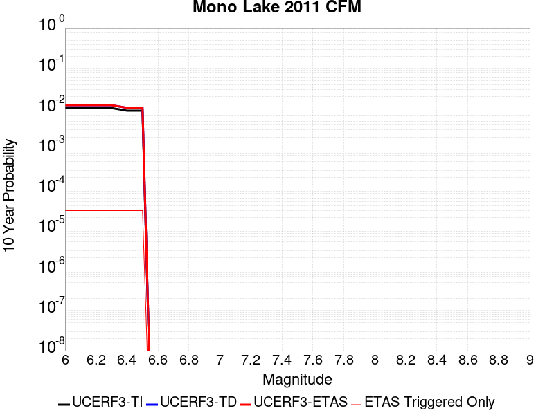 |

| Magnitude | 1 wk TI Prob | 1 wk TD Prob | 1 wk ETAS Prob | 1 wk ETAS/TD Gain | 1 wk ETAS Triggered Only | 1 mo TI Prob | 1 mo TD Prob | 1 mo ETAS Prob | 1 mo ETAS/TD Gain | 1 mo ETAS Triggered Only | 1 yr TI Prob | 1 yr TD Prob | 1 yr ETAS Prob | 1 yr ETAS/TD Gain | 1 yr ETAS Triggered Only | 10 yr TI Prob | 10 yr TD Prob | 10 yr ETAS Prob | 10 yr ETAS/TD Gain | 10 yr ETAS Triggered Only |
|-----|-----|-----|-----|-----|-----|-----|-----|-----|-----|-----|-----|-----|-----|-----|-----|-----|-----|-----|-----|-----|
| 6.0 | 2.0341662E-5 | 2.3828241E-5 | 2.3828241E-5 | 1.0 | 0.0 | 8.717564E-5 | 1.0212003E-4 | 1.0212003E-4 | 1.0 | 0.0 | 0.0010608466 | 0.0012431334 | 0.001253121 | 1.0080342 | 1.0E-5 | 0.010557966 | 0.012413868 | 0.012443495 | 1.0023867 | 3.0E-5 |
| 6.1 | 2.0341662E-5 | 2.3828241E-5 | 2.3828241E-5 | 1.0 | 0.0 | 8.717564E-5 | 1.0212003E-4 | 1.0212003E-4 | 1.0 | 0.0 | 0.0010608466 | 0.0012431334 | 0.001253121 | 1.0080342 | 1.0E-5 | 0.010557966 | 0.012413868 | 0.012443495 | 1.0023867 | 3.0E-5 |
| 6.2 | 2.0341662E-5 | 2.3828241E-5 | 2.3828241E-5 | 1.0 | 0.0 | 8.717564E-5 | 1.0212003E-4 | 1.0212003E-4 | 1.0 | 0.0 | 0.0010608466 | 0.0012431334 | 0.001253121 | 1.0080342 | 1.0E-5 | 0.010557966 | 0.012413868 | 0.012443495 | 1.0023867 | 3.0E-5 |
| 6.3 | 2.0341662E-5 | 2.3828241E-5 | 2.3828241E-5 | 1.0 | 0.0 | 8.717564E-5 | 1.0212003E-4 | 1.0212003E-4 | 1.0 | 0.0 | 0.0010608466 | 0.0012431334 | 0.001253121 | 1.0080342 | 1.0E-5 | 0.010557966 | 0.012413868 | 0.012443495 | 1.0023867 | 3.0E-5 |
| 6.4 | 1.749821E-5 | 2.0491054E-5 | 2.0491054E-5 | 1.0 | 0.0 | 7.499018E-5 | 8.78188E-5 | 8.78188E-5 | 1.0 | 0.0 | 9.1262296E-4 | 0.0010691936 | 0.001079183 | 1.0093428 | 1.0E-5 | 0.009088841 | 0.010691893 | 0.010721572 | 1.0027759 | 3.0E-5 |
| 6.5 | 1.749821E-5 | 2.0491054E-5 | 2.0491054E-5 | 1.0 | 0.0 | 7.499018E-5 | 8.78188E-5 | 8.78188E-5 | 1.0 | 0.0 | 9.1262296E-4 | 0.0010691936 | 0.001079183 | 1.0093428 | 1.0E-5 | 0.009088841 | 0.010691893 | 0.010721572 | 1.0027759 | 3.0E-5 |

## Calaveras (Central) 2011 CFM
*[(top)](#table-of-contents)*

| 1 Week | 1 Month | 1 Year | 10 Year |
|-----|-----|-----|-----|
|  |  |  |  |

| Magnitude | 1 wk TI Prob | 1 wk TD Prob | 1 wk ETAS Prob | 1 wk ETAS/TD Gain | 1 wk ETAS Triggered Only | 1 mo TI Prob | 1 mo TD Prob | 1 mo ETAS Prob | 1 mo ETAS/TD Gain | 1 mo ETAS Triggered Only | 1 yr TI Prob | 1 yr TD Prob | 1 yr ETAS Prob | 1 yr ETAS/TD Gain | 1 yr ETAS Triggered Only | 10 yr TI Prob | 10 yr TD Prob | 10 yr ETAS Prob | 10 yr ETAS/TD Gain | 10 yr ETAS Triggered Only |
|-----|-----|-----|-----|-----|-----|-----|-----|-----|-----|-----|-----|-----|-----|-----|-----|-----|-----|-----|-----|-----|
| 6.0 | 1.5010907E-4 | 2.480439E-4 | 2.5804143E-4 | 1.0403055 | 1.0E-5 | 6.4316596E-4 | 0.0010625053 | 0.001082484 | 1.0188035 | 2.0E-5 | 0.0078024664 | 0.012850537 | 0.012880152 | 1.0023046 | 3.0E-5 | 0.07534136 | 0.12041182 | 0.12043821 | 1.0002191 | 3.0E-5 |
| 6.1 | 1.4521465E-4 | 2.3965817E-4 | 2.4965577E-4 | 1.0417161 | 1.0E-5 | 6.222001E-4 | 0.0010266015 | 0.001046581 | 1.0194618 | 2.0E-5 | 0.0075490056 | 0.012419855 | 0.012449482 | 1.0023855 | 3.0E-5 | 0.07297657 | 0.11668332 | 0.11670982 | 1.0002271 | 3.0E-5 |
| 6.2 | 1.429998E-4 | 2.389706E-4 | 2.4896822E-4 | 1.0418361 | 1.0E-5 | 6.127123E-4 | 0.0010236573 | 0.0010436368 | 1.0195178 | 2.0E-5 | 0.007434286 | 0.012384463 | 0.012414091 | 1.0023924 | 3.0E-5 | 0.07190444 | 0.11633737 | 0.116363876 | 1.0002279 | 3.0E-5 |
| 6.3 | 1.3536277E-4 | 2.3228188E-4 | 2.4227955E-4 | 1.0430411 | 1.0E-5 | 5.799972E-4 | 9.950198E-4 | 0.0010149999 | 1.0200801 | 2.0E-5 | 0.0070386264 | 0.012040623 | 0.012070263 | 1.0024616 | 3.0E-5 | 0.0681982 | 0.11325001 | 0.113276616 | 1.0002348 | 3.0E-5 |
| 6.4 | 1.2993296E-4 | 2.2651743E-4 | 2.3651516E-4 | 1.0441368 | 1.0E-5 | 5.5673666E-4 | 9.703341E-4 | 9.903146E-4 | 1.0205915 | 2.0E-5 | 0.006757223 | 0.01174342 | 0.0117730675 | 1.0025246 | 3.0E-5 | 0.06555412 | 0.110527985 | 0.11055467 | 1.0002414 | 3.0E-5 |
| 6.5 | 1.0498927E-4 | 1.7982107E-4 | 1.7982107E-4 | 1.0 | 0.0 | 4.498764E-4 | 7.7043276E-4 | 7.8042503E-4 | 1.0129697 | 1.0E-5 | 0.005463498 | 0.009339592 | 0.009359405 | 1.0021214 | 2.0E-5 | 0.053311124 | 0.089207955 | 0.089226164 | 1.0002042 | 2.0E-5 |
| 6.6 | 1.0157505E-4 | 1.7469631E-4 | 1.7469631E-4 | 1.0 | 0.0 | 4.35249E-4 | 7.4848253E-4 | 7.5847504E-4 | 1.0133504 | 1.0E-5 | 0.0052862884 | 0.009074638 | 0.009094456 | 1.0021839 | 2.0E-5 | 0.05162293 | 0.08678548 | 0.08680374 | 1.0002104 | 2.0E-5 |
| 6.7 | 9.660386E-5 | 1.6728915E-4 | 1.6728915E-4 | 1.0 | 0.0 | 4.1395082E-4 | 7.167553E-4 | 7.2674814E-4 | 1.0139418 | 1.0E-5 | 0.0050282106 | 0.008691542 | 0.008711368 | 1.0022811 | 2.0E-5 | 0.049159497 | 0.083274886 | 0.08329322 | 1.0002202 | 2.0E-5 |
| 6.8 | 9.089927E-5 | 1.5643363E-4 | 1.5643363E-4 | 1.0 | 0.0 | 3.8951015E-4 | 6.702563E-4 | 6.8024965E-4 | 1.0149096 | 1.0E-5 | 0.0047319788 | 0.008129805 | 0.0081496425 | 1.0024401 | 2.0E-5 | 0.046324775 | 0.078164354 | 0.07818279 | 1.0002359 | 2.0E-5 |
| 6.9 | 7.353187E-5 | 1.2295878E-4 | 1.2295878E-4 | 1.0 | 0.0 | 3.150985E-4 | 5.2686036E-4 | 5.2686036E-4 | 1.0 | 0.0 | 0.0038295772 | 0.0063957796 | 0.0064057154 | 1.0015535 | 1.0E-5 | 0.037642512 | 0.062189694 | 0.062199075 | 1.0001508 | 1.0E-5 |
| 7.0 | 5.746064E-5 | 9.3891744E-5 | 9.3891744E-5 | 1.0 | 0.0 | 2.4623662E-4 | 4.023315E-4 | 4.023315E-4 | 1.0 | 0.0 | 0.0029938098 | 0.004887455 | 0.0048974063 | 1.0020361 | 1.0E-5 | 0.02953797 | 0.047987908 | 0.04799743 | 1.0001984 | 1.0E-5 |
| 7.1 | 4.9557195E-5 | 8.0528414E-5 | 8.0528414E-5 | 1.0 | 0.0 | 2.123707E-4 | 3.4507646E-4 | 3.4507646E-4 | 1.0 | 0.0 | 0.0025825473 | 0.0041932752 | 0.0042032334 | 1.0023748 | 1.0E-5 | 0.0255274 | 0.041374184 | 0.04138377 | 1.0002317 | 1.0E-5 |
| 7.2 | 3.687595E-5 | 5.9527636E-5 | 5.9527636E-5 | 1.0 | 0.0 | 1.5803022E-4 | 2.5509365E-4 | 2.5509365E-4 | 1.0 | 0.0 | 0.0019223199 | 0.0031013712 | 0.00311134 | 1.0032144 | 1.0E-5 | 0.01905776 | 0.030884469 | 0.03089416 | 1.0003138 | 1.0E-5 |
| 7.3 | 2.5846984E-5 | 4.2474516E-5 | 4.2474516E-5 | 1.0 | 0.0 | 1.1076809E-4 | 1.8202103E-4 | 1.8202103E-4 | 1.0 | 0.0 | 0.0013477671 | 0.002213871 | 0.002223849 | 1.004507 | 1.0E-5 | 0.013396223 | 0.022175768 | 0.022185545 | 1.000441 | 1.0E-5 |
| 7.4 | 1.7747854E-5 | 2.9938114E-5 | 2.9938114E-5 | 1.0 | 0.0 | 7.6060016E-5 | 1.2829991E-4 | 1.2829991E-4 | 1.0 | 0.0 | 9.2563726E-4 | 0.001560935 | 0.0015709194 | 1.0063964 | 1.0E-5 | 0.009217911 | 0.015709154 | 0.015718997 | 1.0006266 | 1.0E-5 |
| 7.5 | 1.4883479E-5 | 2.6245167E-5 | 2.6245167E-5 | 1.0 | 0.0 | 6.378478E-5 | 1.1247445E-4 | 1.1247445E-4 | 1.0 | 0.0 | 7.76303E-4 | 0.001368519 | 0.0013785054 | 1.0072972 | 1.0E-5 | 0.0077359667 | 0.0138021475 | 0.013812009 | 1.0007145 | 1.0E-5 |
| 7.6 | 8.166975E-6 | 1.4964679E-5 | 1.4964679E-5 | 1.0 | 0.0 | 3.5000852E-5 | 6.413277E-5 | 6.413277E-5 | 1.0 | 0.0 | 4.2605202E-4 | 7.805381E-4 | 7.905303E-4 | 1.0128016 | 1.0E-5 | 0.004252361 | 0.007939555 | 0.007949475 | 1.0012496 | 1.0E-5 |
| 7.7 | 3.3858064E-6 | 6.254545E-6 | 6.254545E-6 | 1.0 | 0.0 | 1.4510518E-5 | 2.6804919E-5 | 2.6804919E-5 | 1.0 | 0.0 | 1.7665124E-4 | 3.2630106E-4 | 3.3629782E-4 | 1.0306365 | 1.0E-5 | 0.0017651088 | 0.0033885583 | 0.0033985244 | 1.0029411 | 1.0E-5 |
| 7.8 | 2.7721615E-6 | 5.3669455E-6 | 5.3669455E-6 | 1.0 | 0.0 | 1.1880637E-5 | 2.3000994E-5 | 2.3000994E-5 | 1.0 | 0.0 | 1.4463716E-4 | 2.8000117E-4 | 2.8999837E-4 | 1.0357041 | 1.0E-5 | 0.0014454306 | 0.0029077919 | 0.0029177628 | 1.003429 | 1.0E-5 |
| 7.9 | 1.9736292E-6 | 4.1288895E-6 | 4.1288895E-6 | 1.0 | 0.0 | 8.4583835E-6 | 1.769512E-5 | 1.769512E-5 | 1.0 | 0.0 | 1.0297595E-4 | 2.1541683E-4 | 2.2541468E-4 | 1.0464116 | 1.0E-5 | 0.0010292825 | 0.0022238542 | 0.002233832 | 1.0044867 | 1.0E-5 |
| 8.0 | 1.1767289E-6 | 2.5547688E-6 | 2.5547688E-6 | 1.0 | 0.0 | 5.0431145E-6 | 1.0948963E-5 | 1.0948963E-5 | 1.0 | 0.0 | 6.139818E-5 | 1.332955E-4 | 1.332955E-4 | 1.0 | 0.0 | 6.1381224E-4 | 0.001366212 | 0.001366212 | 1.0 | 0.0 |
| 8.1 | 7.5112825E-7 | 1.54114E-6 | 1.54114E-6 | 1.0 | 0.0 | 3.2191172E-6 | 6.604869E-6 | 6.604869E-6 | 1.0 | 0.0 | 3.9192048E-5 | 8.041134E-5 | 8.041134E-5 | 1.0 | 0.0 | 3.9185135E-4 | 8.236125E-4 | 8.236125E-4 | 1.0 | 0.0 |

## Pine Mtn
*[(top)](#table-of-contents)*

| 1 Week | 1 Month | 1 Year | 10 Year |
|-----|-----|-----|-----|
|  | 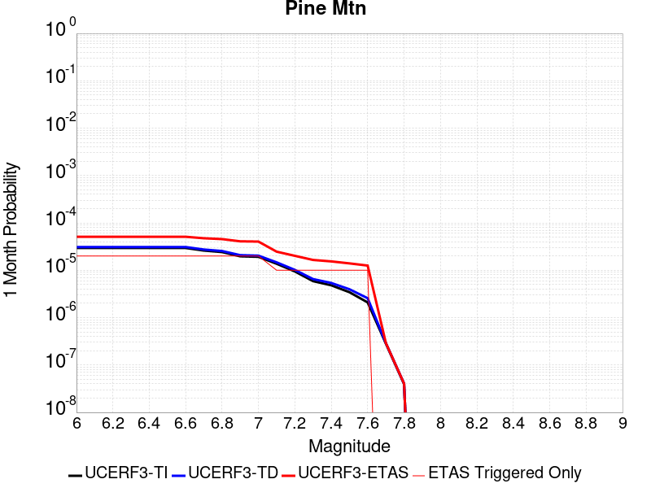 |  |  |

| Magnitude | 1 wk TI Prob | 1 wk TD Prob | 1 wk ETAS Prob | 1 wk ETAS/TD Gain | 1 wk ETAS Triggered Only | 1 mo TI Prob | 1 mo TD Prob | 1 mo ETAS Prob | 1 mo ETAS/TD Gain | 1 mo ETAS Triggered Only | 1 yr TI Prob | 1 yr TD Prob | 1 yr ETAS Prob | 1 yr ETAS/TD Gain | 1 yr ETAS Triggered Only | 10 yr TI Prob | 10 yr TD Prob | 10 yr ETAS Prob | 10 yr ETAS/TD Gain | 10 yr ETAS Triggered Only |
|-----|-----|-----|-----|-----|-----|-----|-----|-----|-----|-----|-----|-----|-----|-----|-----|-----|-----|-----|-----|-----|
| 6.0 | 6.894797E-6 | 7.2254784E-6 | 7.2254784E-6 | 1.0 | 0.0 | 2.9548795E-5 | 3.0965984E-5 | 5.0965366E-5 | 1.64585 | 2.0E-5 | 3.596972E-4 | 3.7694862E-4 | 4.0693732E-4 | 1.0795565 | 3.0E-5 | 0.0035911554 | 0.00376339 | 0.003793277 | 1.0079415 | 3.0E-5 |
| 6.1 | 6.894797E-6 | 7.2254784E-6 | 7.2254784E-6 | 1.0 | 0.0 | 2.9548795E-5 | 3.0965984E-5 | 5.0965366E-5 | 1.64585 | 2.0E-5 | 3.596972E-4 | 3.7694862E-4 | 4.0693732E-4 | 1.0795565 | 3.0E-5 | 0.0035911554 | 0.00376339 | 0.003793277 | 1.0079415 | 3.0E-5 |
| 6.2 | 6.894797E-6 | 7.2254784E-6 | 7.2254784E-6 | 1.0 | 0.0 | 2.9548795E-5 | 3.0965984E-5 | 5.0965366E-5 | 1.64585 | 2.0E-5 | 3.596972E-4 | 3.7694862E-4 | 4.0693732E-4 | 1.0795565 | 3.0E-5 | 0.0035911554 | 0.00376339 | 0.003793277 | 1.0079415 | 3.0E-5 |
| 6.3 | 6.894797E-6 | 7.2254784E-6 | 7.2254784E-6 | 1.0 | 0.0 | 2.9548795E-5 | 3.0965984E-5 | 5.0965366E-5 | 1.64585 | 2.0E-5 | 3.596972E-4 | 3.7694862E-4 | 4.0693732E-4 | 1.0795565 | 3.0E-5 | 0.0035911554 | 0.00376339 | 0.003793277 | 1.0079415 | 3.0E-5 |
| 6.4 | 6.894797E-6 | 7.2254784E-6 | 7.2254784E-6 | 1.0 | 0.0 | 2.9548795E-5 | 3.0965984E-5 | 5.0965366E-5 | 1.64585 | 2.0E-5 | 3.596972E-4 | 3.7694862E-4 | 4.0693732E-4 | 1.0795565 | 3.0E-5 | 0.0035911554 | 0.00376339 | 0.003793277 | 1.0079415 | 3.0E-5 |
| 6.5 | 6.894797E-6 | 7.2254784E-6 | 7.2254784E-6 | 1.0 | 0.0 | 2.9548795E-5 | 3.0965984E-5 | 5.0965366E-5 | 1.64585 | 2.0E-5 | 3.596972E-4 | 3.7694862E-4 | 4.0693732E-4 | 1.0795565 | 3.0E-5 | 0.0035911554 | 0.00376339 | 0.003793277 | 1.0079415 | 3.0E-5 |
| 6.6 | 6.894797E-6 | 7.2254784E-6 | 7.2254784E-6 | 1.0 | 0.0 | 2.9548795E-5 | 3.0965984E-5 | 5.0965366E-5 | 1.64585 | 2.0E-5 | 3.596972E-4 | 3.7694862E-4 | 4.0693732E-4 | 1.0795565 | 3.0E-5 | 0.0035911554 | 0.00376339 | 0.003793277 | 1.0079415 | 3.0E-5 |
| 6.7 | 6.0867933E-6 | 6.39713E-6 | 6.39713E-6 | 1.0 | 0.0 | 2.6085996E-5 | 2.7415997E-5 | 4.7415448E-5 | 1.7294811 | 2.0E-5 | 3.1755073E-4 | 3.3374084E-4 | 3.6373083E-4 | 1.0898601 | 3.0E-5 | 0.0031709734 | 0.0033326154 | 0.0033625152 | 1.0089719 | 3.0E-5 |
| 6.8 | 5.6530425E-6 | 5.9506124E-6 | 5.9506124E-6 | 1.0 | 0.0 | 2.42271E-5 | 2.5502388E-5 | 4.5501878E-5 | 1.7842203 | 2.0E-5 | 2.94925E-4 | 3.1044937E-4 | 3.4044008E-4 | 1.0966041 | 3.0E-5 | 0.002945339 | 0.0031003617 | 0.0031302685 | 1.0096463 | 3.0E-5 |
| 6.9 | 4.6015225E-6 | 4.8638503E-6 | 4.8638503E-6 | 1.0 | 0.0 | 1.9720663E-5 | 2.0844915E-5 | 4.0844498E-5 | 1.9594467 | 2.0E-5 | 2.4007261E-4 | 2.5375874E-4 | 2.837511E-4 | 1.1181926 | 3.0E-5 | 0.0023981342 | 0.002534834 | 0.0025647578 | 1.011805 | 3.0E-5 |
| 7.0 | 4.4875965E-6 | 4.7474896E-6 | 4.7474896E-6 | 1.0 | 0.0 | 1.9232413E-5 | 2.0346233E-5 | 4.0345825E-5 | 1.982963 | 2.0E-5 | 2.3412947E-4 | 2.4768867E-4 | 2.7768125E-4 | 1.1210898 | 3.0E-5 | 0.0023388295 | 0.0024742698 | 0.0025041958 | 1.0120947 | 3.0E-5 |
| 7.1 | 3.203907E-6 | 3.4294255E-6 | 3.4294255E-6 | 1.0 | 0.0 | 1.3730958E-5 | 1.4697459E-5 | 2.4697312E-5 | 1.6803797 | 1.0E-5 | 1.6716159E-4 | 1.7892754E-4 | 1.9892395E-4 | 1.111757 | 2.0E-5 | 0.0016703589 | 0.0017879008 | 0.0018078651 | 1.0111663 | 2.0E-5 |
| 7.2 | 2.2060601E-6 | 2.3784926E-6 | 2.3784926E-6 | 1.0 | 0.0 | 9.4545085E-6 | 1.0193502E-5 | 2.01934E-5 | 1.9810071 | 1.0E-5 | 1.15102564E-4 | 1.2409927E-4 | 1.3409804E-4 | 1.0805707 | 1.0E-5 | 0.0011504296 | 0.0012403446 | 0.0012503321 | 1.0080522 | 1.0E-5 |
| 7.3 | 1.3765207E-6 | 1.5216575E-6 | 1.5216575E-6 | 1.0 | 0.0 | 5.899361E-6 | 6.5213735E-6 | 1.6521308E-5 | 2.5334094 | 1.0E-5 | 7.182235E-5 | 7.939492E-5 | 8.9394125E-5 | 1.1259426 | 1.0E-5 | 7.1799144E-4 | 7.9367467E-4 | 8.036667E-4 | 1.0125896 | 1.0E-5 |
| 7.4 | 1.1245983E-6 | 1.258715E-6 | 1.258715E-6 | 1.0 | 0.0 | 4.819698E-6 | 5.3944823E-6 | 1.5394427E-5 | 2.8537362 | 1.0E-5 | 5.8678244E-5 | 6.567592E-5 | 7.567527E-5 | 1.1522528 | 1.0E-5 | 5.866275E-4 | 6.5657345E-4 | 6.665669E-4 | 1.0152206 | 1.0E-5 |
| 7.5 | 8.031682E-7 | 9.277018E-7 | 9.277018E-7 | 1.0 | 0.0 | 3.4421448E-6 | 3.9758593E-6 | 1.39758195E-5 | 3.5151696 | 1.0E-5 | 4.1907308E-5 | 4.840508E-5 | 5.8404596E-5 | 1.2065799 | 1.0E-5 | 4.1899405E-4 | 4.839521E-4 | 4.939473E-4 | 1.0206532 | 1.0E-5 |
| 7.6 | 4.8953444E-7 | 6.0030663E-7 | 6.0030663E-7 | 1.0 | 0.0 | 2.098003E-6 | 2.5727406E-6 | 1.2572715E-5 | 4.8868957 | 1.0E-5 | 2.5542888E-5 | 3.1322714E-5 | 4.13224E-5 | 1.3192471 | 1.0E-5 | 2.5539953E-4 | 3.1318786E-4 | 3.2318474E-4 | 1.0319197 | 1.0E-5 |
| 7.7 | 6.634529E-8 | 6.788828E-8 | 6.788828E-8 | 1.0 | 0.0 | 2.843369E-7 | 2.9094974E-7 | 2.9094974E-7 | 1.0 | 0.0 | 3.4617963E-6 | 3.5423077E-6 | 3.5423077E-6 | 1.0 | 0.0 | 3.4617424E-5 | 3.542256E-5 | 3.542256E-5 | 1.0 | 0.0 |
| 7.8 | 9.235578E-9 | 9.48857E-9 | 9.48857E-9 | 1.0 | 0.0 | 3.9581046E-8 | 4.06653E-8 | 4.06653E-8 | 1.0 | 0.0 | 4.818991E-7 | 4.9509987E-7 | 4.9509987E-7 | 1.0 | 0.0 | 4.8189804E-6 | 4.9509895E-6 | 4.9509895E-6 | 1.0 | 0.0 |

## San Jacinto (Superstition Mtn)
*[(top)](#table-of-contents)*

| 1 Week | 1 Month | 1 Year | 10 Year |
|-----|-----|-----|-----|
|  | 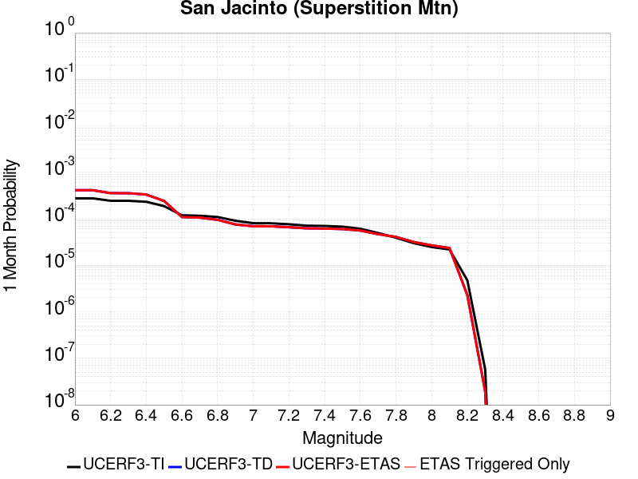 |  |  |

| Magnitude | 1 wk TI Prob | 1 wk TD Prob | 1 wk ETAS Prob | 1 wk ETAS/TD Gain | 1 wk ETAS Triggered Only | 1 mo TI Prob | 1 mo TD Prob | 1 mo ETAS Prob | 1 mo ETAS/TD Gain | 1 mo ETAS Triggered Only | 1 yr TI Prob | 1 yr TD Prob | 1 yr ETAS Prob | 1 yr ETAS/TD Gain | 1 yr ETAS Triggered Only | 10 yr TI Prob | 10 yr TD Prob | 10 yr ETAS Prob | 10 yr ETAS/TD Gain | 10 yr ETAS Triggered Only |
|-----|-----|-----|-----|-----|-----|-----|-----|-----|-----|-----|-----|-----|-----|-----|-----|-----|-----|-----|-----|-----|
| 6.0 | 6.4193904E-5 | 9.599638E-5 | 9.599638E-5 | 1.0 | 0.0 | 2.7508775E-4 | 4.1135785E-4 | 4.1135785E-4 | 1.0 | 0.0 | 0.0033440501 | 0.0049982104 | 0.0050081606 | 1.0019907 | 1.0E-5 | 0.03294174 | 0.048818074 | 0.048846606 | 1.0005845 | 3.0E-5 |
| 6.1 | 6.4193904E-5 | 9.599638E-5 | 9.599638E-5 | 1.0 | 0.0 | 2.7508775E-4 | 4.1135785E-4 | 4.1135785E-4 | 1.0 | 0.0 | 0.0033440501 | 0.0049982104 | 0.0050081606 | 1.0019907 | 1.0E-5 | 0.03294174 | 0.048818074 | 0.048846606 | 1.0005845 | 3.0E-5 |
| 6.2 | 5.7023593E-5 | 8.314535E-5 | 8.314535E-5 | 1.0 | 0.0 | 2.4436394E-4 | 3.5629782E-4 | 3.5629782E-4 | 1.0 | 0.0 | 0.002971072 | 0.0043309443 | 0.0043309443 | 1.0 | 0.0 | 0.029316625 | 0.042500447 | 0.042519595 | 1.0004506 | 2.0E-5 |
| 6.3 | 5.6940098E-5 | 8.2990715E-5 | 8.2990715E-5 | 1.0 | 0.0 | 2.4400617E-4 | 3.5563527E-4 | 3.5563527E-4 | 1.0 | 0.0 | 0.002966728 | 0.0043229093 | 0.0043229093 | 1.0 | 0.0 | 0.029274331 | 0.042423815 | 0.042442966 | 1.0004514 | 2.0E-5 |
| 6.4 | 5.4171585E-5 | 7.748466E-5 | 7.748466E-5 | 1.0 | 0.0 | 2.3214328E-4 | 3.3204415E-4 | 3.3204415E-4 | 1.0 | 0.0 | 0.0028226813 | 0.004036792 | 0.004036792 | 1.0 | 0.0 | 0.02787096 | 0.039713096 | 0.039732303 | 1.0004836 | 2.0E-5 |
| 6.5 | 4.375144E-5 | 5.642216E-5 | 5.642216E-5 | 1.0 | 0.0 | 1.874927E-4 | 2.4179347E-4 | 2.4179347E-4 | 1.0 | 0.0 | 0.0022803338 | 0.0029410373 | 0.0029410373 | 1.0 | 0.0 | 0.022570757 | 0.02923445 | 0.029253865 | 1.0006641 | 2.0E-5 |
| 6.6 | 2.772192E-5 | 2.5488655E-5 | 2.5488655E-5 | 1.0 | 0.0 | 1.1880282E-4 | 1.0923263E-4 | 1.0923263E-4 | 1.0 | 0.0 | 0.0014454646 | 0.0013291152 | 0.0013291152 | 1.0 | 0.0 | 0.014360986 | 0.0135407 | 0.013550565 | 1.0007285 | 1.0E-5 |
| 6.7 | 2.7124124E-5 | 2.469968E-5 | 2.469968E-5 | 1.0 | 0.0 | 1.1624106E-4 | 1.05851585E-4 | 1.05851585E-4 | 1.0 | 0.0 | 0.0014143161 | 0.0012880004 | 0.0012880004 | 1.0 | 0.0 | 0.014053487 | 0.01313407 | 0.013143938 | 1.0007514 | 1.0E-5 |
| 6.8 | 2.5475807E-5 | 2.2164639E-5 | 2.2164639E-5 | 1.0 | 0.0 | 1.0917746E-4 | 9.498792E-5 | 9.498792E-5 | 1.0 | 0.0 | 0.001328425 | 0.0011558763 | 0.0011558763 | 1.0 | 0.0 | 0.0132051185 | 0.011821821 | 0.011831703 | 1.0008359 | 1.0E-5 |
| 6.9 | 2.1162023E-5 | 1.7626206E-5 | 1.7626206E-5 | 1.0 | 0.0 | 9.069123E-5 | 7.5538715E-5 | 7.5538715E-5 | 1.0 | 0.0 | 0.0011036064 | 9.192996E-4 | 9.192996E-4 | 1.0 | 0.0 | 0.010981417 | 0.009446717 | 0.009456622 | 1.0010486 | 1.0E-5 |
| 7.0 | 1.8754288E-5 | 1.6161528E-5 | 1.6161528E-5 | 1.0 | 0.0 | 8.037304E-5 | 6.926186E-5 | 6.926186E-5 | 1.0 | 0.0 | 9.781026E-4 | 8.429394E-4 | 8.429394E-4 | 1.0 | 0.0 | 0.009738087 | 0.008670068 | 0.008679981 | 1.0011433 | 1.0E-5 |
| 7.1 | 1.8678527E-5 | 1.6086673E-5 | 1.6086673E-5 | 1.0 | 0.0 | 8.0048376E-5 | 6.894107E-5 | 6.894107E-5 | 1.0 | 0.0 | 9.7415317E-4 | 8.3903683E-4 | 8.3903683E-4 | 1.0 | 0.0 | 0.009698939 | 0.00863108 | 0.008640994 | 1.0011486 | 1.0E-5 |
| 7.2 | 1.7804578E-5 | 1.5381236E-5 | 1.5381236E-5 | 1.0 | 0.0 | 7.6303106E-5 | 6.5917935E-5 | 6.5917935E-5 | 1.0 | 0.0 | 9.285943E-4 | 8.022576E-4 | 8.022576E-4 | 1.0 | 0.0 | 0.009247236 | 0.008262504 | 0.008272422 | 1.0012003 | 1.0E-5 |
| 7.3 | 1.6583685E-5 | 1.453035E-5 | 1.453035E-5 | 1.0 | 0.0 | 7.1070994E-5 | 6.227146E-5 | 6.227146E-5 | 1.0 | 0.0 | 8.649459E-4 | 7.5789326E-4 | 7.5789326E-4 | 1.0 | 0.0 | 0.00861587 | 0.007817805 | 0.007827726 | 1.0012691 | 1.0E-5 |
| 7.4 | 1.6387552E-5 | 1.4395241E-5 | 1.4395241E-5 | 1.0 | 0.0 | 7.023047E-5 | 6.1692444E-5 | 6.1692444E-5 | 1.0 | 0.0 | 8.5472054E-4 | 7.508486E-4 | 7.508486E-4 | 1.0 | 0.0 | 0.008514405 | 0.0077471756 | 0.0077570984 | 1.0012808 | 1.0E-5 |
| 7.5 | 1.5790754E-5 | 1.4035942E-5 | 1.4035942E-5 | 1.0 | 0.0 | 6.767291E-5 | 6.015266E-5 | 6.015266E-5 | 1.0 | 0.0 | 8.236062E-4 | 7.3211454E-4 | 7.3211454E-4 | 1.0 | 0.0 | 0.008205604 | 0.007557753 | 0.0075676776 | 1.0013131 | 1.0E-5 |
| 7.6 | 1.4248672E-5 | 1.3054951E-5 | 1.3054951E-5 | 1.0 | 0.0 | 6.106431E-5 | 5.5948596E-5 | 5.5948596E-5 | 1.0 | 0.0 | 7.432043E-4 | 6.80963E-4 | 6.80963E-4 | 1.0 | 0.0 | 0.007407237 | 0.0070403097 | 0.007050239 | 1.0014104 | 1.0E-5 |
| 7.7 | 1.15449975E-5 | 1.0903708E-5 | 1.0903708E-5 | 1.0 | 0.0 | 4.947762E-5 | 4.6729347E-5 | 4.6729347E-5 | 1.0 | 0.0 | 6.022235E-4 | 5.6878204E-4 | 5.6878204E-4 | 1.0 | 0.0 | 0.006005941 | 0.005910283 | 0.005920224 | 1.0016819 | 1.0E-5 |
| 7.8 | 9.1391985E-6 | 9.514394E-6 | 9.514394E-6 | 1.0 | 0.0 | 3.9167408E-5 | 4.077534E-5 | 4.077534E-5 | 1.0 | 0.0 | 4.767588E-4 | 4.963273E-4 | 4.963273E-4 | 1.0 | 0.0 | 0.0047573727 | 0.0051768366 | 0.005186785 | 1.0019217 | 1.0E-5 |
| 7.9 | 6.973017E-6 | 7.3821643E-6 | 7.3821643E-6 | 1.0 | 0.0 | 2.9884017E-5 | 3.1637464E-5 | 3.1637464E-5 | 1.0 | 0.0 | 3.6377716E-4 | 3.851186E-4 | 3.851186E-4 | 1.0 | 0.0 | 0.0036318225 | 0.0040519917 | 0.0040619513 | 1.002458 | 1.0E-5 |
| 8.0 | 5.7638235E-6 | 6.2599615E-6 | 6.2599615E-6 | 1.0 | 0.0 | 2.4701867E-5 | 2.6828135E-5 | 2.6828135E-5 | 1.0 | 0.0 | 3.0070372E-4 | 3.265841E-4 | 3.265841E-4 | 1.0 | 0.0 | 0.0030029714 | 0.0034535625 | 0.003463528 | 1.0028856 | 1.0E-5 |
| 8.1 | 5.1124434E-6 | 5.4956586E-6 | 5.4956586E-6 | 1.0 | 0.0 | 2.1910288E-5 | 2.3552611E-5 | 2.3552611E-5 | 1.0 | 0.0 | 2.6672508E-4 | 2.867158E-4 | 2.867158E-4 | 1.0 | 0.0 | 0.0026640517 | 0.0030403738 | 0.0030503434 | 1.0032791 | 1.0E-5 |
| 8.2 | 1.1075938E-6 | 5.3352375E-7 | 5.3352375E-7 | 1.0 | 0.0 | 4.7468216E-6 | 2.2865286E-6 | 2.2865286E-6 | 1.0 | 0.0 | 5.779102E-5 | 2.783815E-5 | 2.783815E-5 | 1.0 | 0.0 | 5.777599E-4 | 3.134184E-4 | 3.134184E-4 | 1.0 | 0.0 |
| 8.3 | 1.3584393E-8 | 4.4718784E-9 | 4.4718784E-9 | 1.0 | 0.0 | 5.8218827E-8 | 1.9165192E-8 | 1.9165192E-8 | 1.0 | 0.0 | 7.0881396E-7 | 2.3333622E-7 | 2.3333622E-7 | 1.0 | 0.0 | 7.0881174E-6 | 2.6161604E-6 | 2.6161604E-6 | 1.0 | 0.0 |

## San Jacinto (Lytle Creek connector)
*[(top)](#table-of-contents)*

| 1 Week | 1 Month | 1 Year | 10 Year |
|-----|-----|-----|-----|
|  | 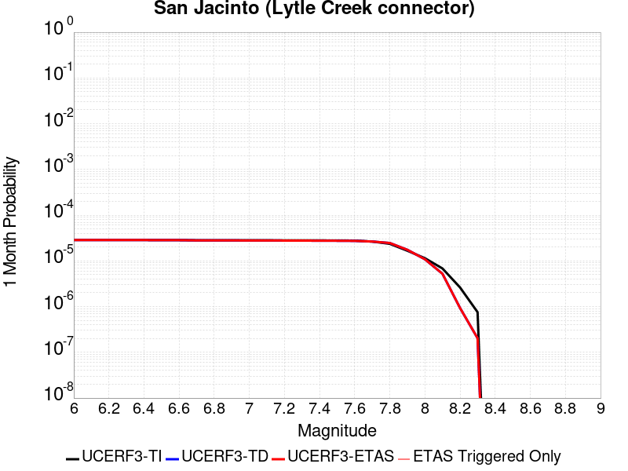 |  |  |

| Magnitude | 1 wk TI Prob | 1 wk TD Prob | 1 wk ETAS Prob | 1 wk ETAS/TD Gain | 1 wk ETAS Triggered Only | 1 mo TI Prob | 1 mo TD Prob | 1 mo ETAS Prob | 1 mo ETAS/TD Gain | 1 mo ETAS Triggered Only | 1 yr TI Prob | 1 yr TD Prob | 1 yr ETAS Prob | 1 yr ETAS/TD Gain | 1 yr ETAS Triggered Only | 10 yr TI Prob | 10 yr TD Prob | 10 yr ETAS Prob | 10 yr ETAS/TD Gain | 10 yr ETAS Triggered Only |
|-----|-----|-----|-----|-----|-----|-----|-----|-----|-----|-----|-----|-----|-----|-----|-----|-----|-----|-----|-----|-----|
| 6.0 | 6.693995E-6 | 6.660424E-6 | 6.660424E-6 | 1.0 | 0.0 | 2.8688235E-5 | 2.8544362E-5 | 2.8544362E-5 | 1.0 | 0.0 | 3.492233E-4 | 3.4747226E-4 | 3.4747226E-4 | 1.0 | 0.0 | 0.00348675 | 0.0035492762 | 0.0035791697 | 1.0084224 | 3.0E-5 |
| 6.1 | 6.693995E-6 | 6.660424E-6 | 6.660424E-6 | 1.0 | 0.0 | 2.8688235E-5 | 2.8544362E-5 | 2.8544362E-5 | 1.0 | 0.0 | 3.492233E-4 | 3.4747226E-4 | 3.4747226E-4 | 1.0 | 0.0 | 0.00348675 | 0.0035492762 | 0.0035791697 | 1.0084224 | 3.0E-5 |
| 6.2 | 6.693995E-6 | 6.660424E-6 | 6.660424E-6 | 1.0 | 0.0 | 2.8688235E-5 | 2.8544362E-5 | 2.8544362E-5 | 1.0 | 0.0 | 3.492233E-4 | 3.4747226E-4 | 3.4747226E-4 | 1.0 | 0.0 | 0.00348675 | 0.0035492762 | 0.0035791697 | 1.0084224 | 3.0E-5 |
| 6.3 | 6.693995E-6 | 6.660424E-6 | 6.660424E-6 | 1.0 | 0.0 | 2.8688235E-5 | 2.8544362E-5 | 2.8544362E-5 | 1.0 | 0.0 | 3.492233E-4 | 3.4747226E-4 | 3.4747226E-4 | 1.0 | 0.0 | 0.00348675 | 0.0035492762 | 0.0035791697 | 1.0084224 | 3.0E-5 |
| 6.4 | 6.693995E-6 | 6.660424E-6 | 6.660424E-6 | 1.0 | 0.0 | 2.8688235E-5 | 2.8544362E-5 | 2.8544362E-5 | 1.0 | 0.0 | 3.492233E-4 | 3.4747226E-4 | 3.4747226E-4 | 1.0 | 0.0 | 0.00348675 | 0.0035492762 | 0.0035791697 | 1.0084224 | 3.0E-5 |
| 6.5 | 6.6561875E-6 | 6.6206417E-6 | 6.6206417E-6 | 1.0 | 0.0 | 2.8526205E-5 | 2.837387E-5 | 2.837387E-5 | 1.0 | 0.0 | 3.472512E-4 | 3.453972E-4 | 3.453972E-4 | 1.0 | 0.0 | 0.0034670907 | 0.0035285917 | 0.0035584858 | 1.008472 | 3.0E-5 |
| 6.6 | 6.6561875E-6 | 6.6206417E-6 | 6.6206417E-6 | 1.0 | 0.0 | 2.8526205E-5 | 2.837387E-5 | 2.837387E-5 | 1.0 | 0.0 | 3.472512E-4 | 3.453972E-4 | 3.453972E-4 | 1.0 | 0.0 | 0.0034670907 | 0.0035285917 | 0.0035584858 | 1.008472 | 3.0E-5 |
| 6.7 | 6.5802237E-6 | 6.5398185E-6 | 6.5398185E-6 | 1.0 | 0.0 | 2.8200653E-5 | 2.8027493E-5 | 2.8027493E-5 | 1.0 | 0.0 | 3.4328885E-4 | 3.4118135E-4 | 3.4118135E-4 | 1.0 | 0.0 | 0.0034275902 | 0.003486566 | 0.0035164615 | 1.0085745 | 3.0E-5 |
| 6.8 | 6.575632E-6 | 6.534308E-6 | 6.534308E-6 | 1.0 | 0.0 | 2.8180975E-5 | 2.8003877E-5 | 2.8003877E-5 | 1.0 | 0.0 | 3.4304935E-4 | 3.4089392E-4 | 3.4089392E-4 | 1.0 | 0.0 | 0.0034252026 | 0.0034837008 | 0.0035135963 | 1.0085815 | 3.0E-5 |
| 6.9 | 6.570433E-6 | 6.5257022E-6 | 6.5257022E-6 | 1.0 | 0.0 | 2.8158694E-5 | 2.7966995E-5 | 2.7966995E-5 | 1.0 | 0.0 | 3.4277816E-4 | 3.4044503E-4 | 3.4044503E-4 | 1.0 | 0.0 | 0.0034224992 | 0.003479226 | 0.0035091215 | 1.0085926 | 3.0E-5 |
| 7.0 | 6.5643826E-6 | 6.515823E-6 | 6.515823E-6 | 1.0 | 0.0 | 2.8132765E-5 | 2.7924656E-5 | 2.7924656E-5 | 1.0 | 0.0 | 3.424626E-4 | 3.3992974E-4 | 3.3992974E-4 | 1.0 | 0.0 | 0.0034193532 | 0.003474089 | 0.0035039848 | 1.0086054 | 3.0E-5 |
| 7.1 | 6.557402E-6 | 6.5045347E-6 | 6.5045347E-6 | 1.0 | 0.0 | 2.8102848E-5 | 2.787628E-5 | 2.787628E-5 | 1.0 | 0.0 | 3.4209844E-4 | 3.393409E-4 | 3.393409E-4 | 1.0 | 0.0 | 0.0034157229 | 0.0034682204 | 0.0034981163 | 1.00862 | 3.0E-5 |
| 7.2 | 6.546394E-6 | 6.486501E-6 | 6.486501E-6 | 1.0 | 0.0 | 2.8055672E-5 | 2.7798995E-5 | 2.7798995E-5 | 1.0 | 0.0 | 3.4152428E-4 | 3.3840025E-4 | 3.3840025E-4 | 1.0 | 0.0 | 0.0034099987 | 0.0034588475 | 0.003488744 | 1.0086434 | 3.0E-5 |
| 7.3 | 6.5364216E-6 | 6.467286E-6 | 6.467286E-6 | 1.0 | 0.0 | 2.8012933E-5 | 2.7716645E-5 | 2.7716645E-5 | 1.0 | 0.0 | 3.4100408E-4 | 3.37398E-4 | 3.37398E-4 | 1.0 | 0.0 | 0.003404813 | 0.0034488689 | 0.0034787655 | 1.0086685 | 3.0E-5 |
| 7.4 | 6.5269523E-6 | 6.4483725E-6 | 6.4483725E-6 | 1.0 | 0.0 | 2.7972354E-5 | 2.763559E-5 | 2.763559E-5 | 1.0 | 0.0 | 3.4051016E-4 | 3.3641144E-4 | 3.3641144E-4 | 1.0 | 0.0 | 0.0033998888 | 0.0034390509 | 0.0034689477 | 1.0086933 | 3.0E-5 |
| 7.5 | 6.5111835E-6 | 6.424646E-6 | 6.424646E-6 | 1.0 | 0.0 | 2.7904773E-5 | 2.7533906E-5 | 2.7533906E-5 | 1.0 | 0.0 | 3.3968766E-4 | 3.3517383E-4 | 3.3517383E-4 | 1.0 | 0.0 | 0.0033916887 | 0.0034267223 | 0.0034566196 | 1.0087247 | 3.0E-5 |
| 7.6 | 6.4768806E-6 | 6.383754E-6 | 6.383754E-6 | 1.0 | 0.0 | 2.7757764E-5 | 2.735866E-5 | 2.735866E-5 | 1.0 | 0.0 | 3.3789838E-4 | 3.3304084E-4 | 3.3304084E-4 | 1.0 | 0.0 | 0.0033738504 | 0.0034054543 | 0.0034353524 | 1.0087794 | 3.0E-5 |
| 7.7 | 6.1655364E-6 | 6.176244E-6 | 6.176244E-6 | 1.0 | 0.0 | 2.642346E-5 | 2.6469348E-5 | 2.6469348E-5 | 1.0 | 0.0 | 3.2165812E-4 | 3.222167E-4 | 3.222167E-4 | 1.0 | 0.0 | 0.0032119295 | 0.0032970824 | 0.0033269837 | 1.009069 | 3.0E-5 |
| 7.8 | 5.5043524E-6 | 5.7373104E-6 | 5.7373104E-6 | 1.0 | 0.0 | 2.3589868E-5 | 2.4588242E-5 | 2.4588242E-5 | 1.0 | 0.0 | 2.871688E-4 | 2.9932076E-4 | 2.9932076E-4 | 1.0 | 0.0 | 0.0028679797 | 0.0030671996 | 0.0030971076 | 1.009751 | 3.0E-5 |
| 7.9 | 3.889249E-6 | 4.076889E-6 | 4.076889E-6 | 1.0 | 0.0 | 1.6668104E-5 | 1.7472265E-5 | 1.7472265E-5 | 1.0 | 0.0 | 2.0291525E-4 | 2.127041E-4 | 2.127041E-4 | 1.0 | 0.0 | 0.0020273007 | 0.0021942323 | 0.0022141882 | 1.0090948 | 2.0E-5 |
| 8.0 | 2.668535E-6 | 2.531486E-6 | 2.531486E-6 | 1.0 | 0.0 | 1.1436528E-5 | 1.084918E-5 | 1.084918E-5 | 1.0 | 0.0 | 1.3923083E-4 | 1.320808E-4 | 1.320808E-4 | 1.0 | 0.0 | 0.0013914363 | 0.0013756256 | 0.0013756256 | 1.0 | 0.0 |
| 8.1 | 1.5911459E-6 | 1.2185861E-6 | 1.2185861E-6 | 1.0 | 0.0 | 6.8191785E-6 | 5.2225014E-6 | 5.2225014E-6 | 1.0 | 0.0 | 8.3020335E-5 | 6.358212E-5 | 6.358212E-5 | 1.0 | 0.0 | 8.298933E-4 | 6.691472E-4 | 6.691472E-4 | 1.0 | 0.0 |
| 8.2 | 6.1294963E-7 | 2.1804237E-7 | 2.1804237E-7 | 1.0 | 0.0 | 2.6269242E-6 | 9.34467E-7 | 9.34467E-7 | 1.0 | 0.0 | 3.1982334E-5 | 1.1377077E-5 | 1.1377077E-5 | 1.0 | 0.0 | 3.1977732E-4 | 1.2780314E-4 | 1.2780314E-4 | 1.0 | 0.0 |
| 8.3 | 1.762871E-7 | 4.7522395E-8 | 4.7522395E-8 | 1.0 | 0.0 | 7.5551594E-7 | 2.0366738E-7 | 2.0366738E-7 | 1.0 | 0.0 | 9.1983675E-6 | 2.4796477E-6 | 2.4796477E-6 | 1.0 | 0.0 | 9.197987E-5 | 2.8675044E-5 | 2.8675044E-5 | 1.0 | 0.0 |

## Great Valley 03 Mysterious Ridge
*[(top)](#table-of-contents)*

| 1 Week | 1 Month | 1 Year | 10 Year |
|-----|-----|-----|-----|
|  |  |  | 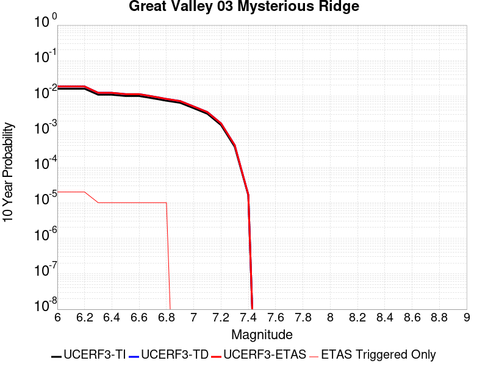 |

| Magnitude | 1 wk TI Prob | 1 wk TD Prob | 1 wk ETAS Prob | 1 wk ETAS/TD Gain | 1 wk ETAS Triggered Only | 1 mo TI Prob | 1 mo TD Prob | 1 mo ETAS Prob | 1 mo ETAS/TD Gain | 1 mo ETAS Triggered Only | 1 yr TI Prob | 1 yr TD Prob | 1 yr ETAS Prob | 1 yr ETAS/TD Gain | 1 yr ETAS Triggered Only | 10 yr TI Prob | 10 yr TD Prob | 10 yr ETAS Prob | 10 yr ETAS/TD Gain | 10 yr ETAS Triggered Only |
|-----|-----|-----|-----|-----|-----|-----|-----|-----|-----|-----|-----|-----|-----|-----|-----|-----|-----|-----|-----|-----|
| 6.0 | 3.1182444E-5 | 3.6034202E-5 | 3.6034202E-5 | 1.0 | 0.0 | 1.336322E-4 | 1.544242E-4 | 1.6442266E-4 | 1.0647467 | 1.0E-5 | 0.0016257578 | 0.0018786788 | 0.00188866 | 1.0053129 | 1.0E-5 | 0.016139153 | 0.018646708 | 0.018666334 | 1.0010526 | 2.0E-5 |
| 6.1 | 3.1182444E-5 | 3.6034202E-5 | 3.6034202E-5 | 1.0 | 0.0 | 1.336322E-4 | 1.544242E-4 | 1.6442266E-4 | 1.0647467 | 1.0E-5 | 0.0016257578 | 0.0018786788 | 0.00188866 | 1.0053129 | 1.0E-5 | 0.016139153 | 0.018646708 | 0.018666334 | 1.0010526 | 2.0E-5 |
| 6.2 | 3.1182444E-5 | 3.6034202E-5 | 3.6034202E-5 | 1.0 | 0.0 | 1.336322E-4 | 1.544242E-4 | 1.6442266E-4 | 1.0647467 | 1.0E-5 | 0.0016257578 | 0.0018786788 | 0.00188866 | 1.0053129 | 1.0E-5 | 0.016139153 | 0.018646708 | 0.018666334 | 1.0010526 | 2.0E-5 |
| 6.3 | 2.106934E-5 | 2.3850343E-5 | 2.3850343E-5 | 1.0 | 0.0 | 9.0294045E-5 | 1.02211925E-4 | 1.122109E-4 | 1.0978259 | 1.0E-5 | 0.0010987755 | 0.0012437509 | 0.0012537384 | 1.0080302 | 1.0E-5 | 0.010933585 | 0.012371148 | 0.012381024 | 1.0007983 | 1.0E-5 |
| 6.4 | 2.106934E-5 | 2.3850343E-5 | 2.3850343E-5 | 1.0 | 0.0 | 9.0294045E-5 | 1.02211925E-4 | 1.122109E-4 | 1.0978259 | 1.0E-5 | 0.0010987755 | 0.0012437509 | 0.0012537384 | 1.0080302 | 1.0E-5 | 0.010933585 | 0.012371148 | 0.012381024 | 1.0007983 | 1.0E-5 |
| 6.5 | 1.9389783E-5 | 2.1885016E-5 | 2.1885016E-5 | 1.0 | 0.0 | 8.309642E-5 | 9.378971E-5 | 1.0378877E-4 | 1.1066115 | 1.0E-5 | 0.0010112294 | 0.0011413193 | 0.001151308 | 1.0087517 | 1.0E-5 | 0.010066401 | 0.011357453 | 0.011367339 | 1.0008705 | 1.0E-5 |
| 6.6 | 1.9370193E-5 | 2.1864937E-5 | 2.1864937E-5 | 1.0 | 0.0 | 8.301247E-5 | 9.370367E-5 | 1.03702725E-4 | 1.1067094 | 1.0E-5 | 0.0010102082 | 0.0011402728 | 0.0011502614 | 1.0087599 | 1.0E-5 | 0.010056281 | 0.011347095 | 0.011356981 | 1.0008713 | 1.0E-5 |
| 6.7 | 1.6723505E-5 | 1.879931E-5 | 1.879931E-5 | 1.0 | 0.0 | 7.16702E-5 | 8.05661E-5 | 9.056529E-5 | 1.1241117 | 1.0E-5 | 8.722353E-4 | 9.804703E-4 | 9.904605E-4 | 1.0101892 | 1.0E-5 | 0.008688197 | 0.009763454 | 0.009773357 | 1.0010142 | 1.0E-5 |
| 6.8 | 1.426937E-5 | 1.5997233E-5 | 1.5997233E-5 | 1.0 | 0.0 | 6.115301E-5 | 6.855785E-5 | 7.855717E-5 | 1.1458522 | 1.0E-5 | 7.4428355E-4 | 8.343867E-4 | 8.443783E-4 | 1.0119748 | 1.0E-5 | 0.007417957 | 0.008314017 | 0.008323934 | 1.0011928 | 1.0E-5 |
| 6.9 | 1.2469891E-5 | 1.3956949E-5 | 1.3956949E-5 | 1.0 | 0.0 | 5.3441294E-5 | 5.9814192E-5 | 5.9814192E-5 | 1.0 | 0.0 | 6.504535E-4 | 7.2800653E-4 | 7.2800653E-4 | 1.0 | 0.0 | 0.006485529 | 0.0072574406 | 0.0072574406 | 1.0 | 0.0 |
| 7.0 | 8.7746275E-6 | 9.791747E-6 | 9.791747E-6 | 1.0 | 0.0 | 3.7605005E-5 | 4.1964E-5 | 4.1964E-5 | 1.0 | 0.0 | 4.5774475E-4 | 5.1079923E-4 | 5.1079923E-4 | 1.0 | 0.0 | 0.00456803 | 0.0050969846 | 0.0050969846 | 1.0 | 0.0 |
| 7.1 | 6.1067153E-6 | 6.813735E-6 | 6.813735E-6 | 1.0 | 0.0 | 2.6171374E-5 | 2.9201427E-5 | 2.9201427E-5 | 1.0 | 0.0 | 3.1858988E-4 | 3.5547494E-4 | 3.5547494E-4 | 1.0 | 0.0 | 0.0031813353 | 0.0035496142 | 0.0035496142 | 1.0 | 0.0 |
| 7.2 | 2.939283E-6 | 3.2741104E-6 | 3.2741104E-6 | 1.0 | 0.0 | 1.2596866E-5 | 1.4031836E-5 | 1.4031836E-5 | 1.0 | 0.0 | 1.5335606E-4 | 1.7082597E-4 | 1.7082597E-4 | 1.0 | 0.0 | 0.0015325027 | 0.0017071185 | 0.0017071185 | 1.0 | 0.0 |
| 7.3 | 7.2387763E-7 | 8.008516E-7 | 8.008516E-7 | 1.0 | 0.0 | 3.102329E-6 | 3.432219E-6 | 3.432219E-6 | 1.0 | 0.0 | 3.77702E-5 | 4.1786923E-5 | 4.1786923E-5 | 1.0 | 0.0 | 3.7763783E-4 | 4.1783563E-4 | 4.1783563E-4 | 1.0 | 0.0 |
| 7.4 | 3.112171E-8 | 3.2068378E-8 | 3.2068378E-8 | 1.0 | 0.0 | 1.3337875E-7 | 1.374359E-7 | 1.374359E-7 | 1.0 | 0.0 | 1.6238852E-6 | 1.6732808E-6 | 1.6732808E-6 | 1.0 | 0.0 | 1.6238733E-5 | 1.673269E-5 | 1.673269E-5 | 1.0 | 0.0 |

## South Klamath Lake East
*[(top)](#table-of-contents)*

| 1 Week | 1 Month | 1 Year | 10 Year |
|-----|-----|-----|-----|
|  |  |  |  |

| Magnitude | 1 wk TI Prob | 1 wk TD Prob | 1 wk ETAS Prob | 1 wk ETAS/TD Gain | 1 wk ETAS Triggered Only | 1 mo TI Prob | 1 mo TD Prob | 1 mo ETAS Prob | 1 mo ETAS/TD Gain | 1 mo ETAS Triggered Only | 1 yr TI Prob | 1 yr TD Prob | 1 yr ETAS Prob | 1 yr ETAS/TD Gain | 1 yr ETAS Triggered Only | 10 yr TI Prob | 10 yr TD Prob | 10 yr ETAS Prob | 10 yr ETAS/TD Gain | 10 yr ETAS Triggered Only |
|-----|-----|-----|-----|-----|-----|-----|-----|-----|-----|-----|-----|-----|-----|-----|-----|-----|-----|-----|-----|-----|
| 6.0 | 2.3539369E-5 | 2.5047328E-5 | 2.5047328E-5 | 1.0 | 0.0 | 1.0087911E-4 | 1.0734174E-4 | 1.1734066E-4 | 1.0931504 | 1.0E-5 | 0.0012275111 | 0.0013061854 | 0.0013161723 | 1.0076458 | 1.0E-5 | 0.012207527 | 0.012993427 | 0.013003297 | 1.0007596 | 1.0E-5 |
| 6.1 | 2.3539369E-5 | 2.5047328E-5 | 2.5047328E-5 | 1.0 | 0.0 | 1.0087911E-4 | 1.0734174E-4 | 1.1734066E-4 | 1.0931504 | 1.0E-5 | 0.0012275111 | 0.0013061854 | 0.0013161723 | 1.0076458 | 1.0E-5 | 0.012207527 | 0.012993427 | 0.013003297 | 1.0007596 | 1.0E-5 |
| 6.2 | 2.3539369E-5 | 2.5047328E-5 | 2.5047328E-5 | 1.0 | 0.0 | 1.0087911E-4 | 1.0734174E-4 | 1.1734066E-4 | 1.0931504 | 1.0E-5 | 0.0012275111 | 0.0013061854 | 0.0013161723 | 1.0076458 | 1.0E-5 | 0.012207527 | 0.012993427 | 0.013003297 | 1.0007596 | 1.0E-5 |
| 6.3 | 9.807823E-6 | 1.0396051E-5 | 1.0396051E-5 | 1.0 | 0.0 | 4.2032847E-5 | 4.455379E-5 | 5.4553344E-5 | 1.2244378 | 1.0E-5 | 5.1162974E-4 | 5.4231577E-4 | 5.523104E-4 | 1.0184294 | 1.0E-5 | 0.005104534 | 0.00541076 | 0.005420706 | 1.0018382 | 1.0E-5 |
| 6.4 | 9.807823E-6 | 1.0396051E-5 | 1.0396051E-5 | 1.0 | 0.0 | 4.2032847E-5 | 4.455379E-5 | 5.4553344E-5 | 1.2244378 | 1.0E-5 | 5.1162974E-4 | 5.4231577E-4 | 5.523104E-4 | 1.0184294 | 1.0E-5 | 0.005104534 | 0.00541076 | 0.005420706 | 1.0018382 | 1.0E-5 |
| 6.5 | 6.191981E-6 | 6.550845E-6 | 6.550845E-6 | 1.0 | 0.0 | 2.653679E-5 | 2.8074763E-5 | 3.8074482E-5 | 1.3561817 | 1.0E-5 | 3.2303753E-4 | 3.417594E-4 | 3.51756E-4 | 1.0292504 | 1.0E-5 | 0.0032256835 | 0.0034126164 | 0.0034225823 | 1.0029203 | 1.0E-5 |
| 6.6 | 4.3693776E-6 | 4.6165605E-6 | 4.6165605E-6 | 1.0 | 0.0 | 1.8725768E-5 | 1.9785117E-5 | 1.9785117E-5 | 1.0 | 0.0 | 2.2796239E-4 | 2.408583E-4 | 2.408583E-4 | 1.0 | 0.0 | 0.0022772867 | 0.002406085 | 0.002406085 | 1.0 | 0.0 |
| 6.7 | 3.360834E-6 | 3.5512428E-6 | 3.5512428E-6 | 1.0 | 0.0 | 1.4403494E-5 | 1.5219527E-5 | 1.5219527E-5 | 1.0 | 0.0 | 1.7534842E-4 | 1.852828E-4 | 1.852828E-4 | 1.0 | 0.0 | 0.0017521014 | 0.0018513631 | 0.0018513631 | 1.0 | 0.0 |
| 6.8 | 2.57873E-6 | 2.7251726E-6 | 2.7251726E-6 | 1.0 | 0.0 | 1.1051653E-5 | 1.1679263E-5 | 1.1679263E-5 | 1.0 | 0.0 | 1.3454557E-4 | 1.4218637E-4 | 1.4218637E-4 | 1.0 | 0.0 | 0.0013446413 | 0.0014210145 | 0.0014210145 | 1.0 | 0.0 |
| 6.9 | 9.987825E-7 | 1.0566221E-6 | 1.0566221E-6 | 1.0 | 0.0 | 4.2804895E-6 | 4.528374E-6 | 4.528374E-6 | 1.0 | 0.0 | 5.211371E-5 | 5.5131888E-5 | 5.5131888E-5 | 1.0 | 0.0 | 5.210149E-4 | 5.5121427E-4 | 5.5121427E-4 | 1.0 | 0.0 |

## Ortigalita (South)
*[(top)](#table-of-contents)*

| 1 Week | 1 Month | 1 Year | 10 Year |
|-----|-----|-----|-----|
|  |  |  |  |

| Magnitude | 1 wk TI Prob | 1 wk TD Prob | 1 wk ETAS Prob | 1 wk ETAS/TD Gain | 1 wk ETAS Triggered Only | 1 mo TI Prob | 1 mo TD Prob | 1 mo ETAS Prob | 1 mo ETAS/TD Gain | 1 mo ETAS Triggered Only | 1 yr TI Prob | 1 yr TD Prob | 1 yr ETAS Prob | 1 yr ETAS/TD Gain | 1 yr ETAS Triggered Only | 10 yr TI Prob | 10 yr TD Prob | 10 yr ETAS Prob | 10 yr ETAS/TD Gain | 10 yr ETAS Triggered Only |
|-----|-----|-----|-----|-----|-----|-----|-----|-----|-----|-----|-----|-----|-----|-----|-----|-----|-----|-----|-----|-----|
| 6.0 | 3.72394E-5 | 4.3255688E-5 | 4.3255688E-5 | 1.0 | 0.0 | 1.5958765E-4 | 1.8536922E-4 | 1.8536922E-4 | 1.0 | 0.0 | 0.0019412481 | 0.0022546907 | 0.0022646682 | 1.0044252 | 1.0E-5 | 0.019243775 | 0.022334546 | 0.0223541 | 1.0008755 | 2.0E-5 |
| 6.1 | 2.7299884E-5 | 3.1492094E-5 | 3.1492094E-5 | 1.0 | 0.0 | 1.16994255E-4 | 1.3495945E-4 | 1.3495945E-4 | 1.0 | 0.0 | 0.0014234743 | 0.0016419488 | 0.0016519324 | 1.0060803 | 1.0E-5 | 0.014143906 | 0.016304104 | 0.016323777 | 1.0012066 | 2.0E-5 |
| 6.2 | 2.7299884E-5 | 3.1492094E-5 | 3.1492094E-5 | 1.0 | 0.0 | 1.16994255E-4 | 1.3495945E-4 | 1.3495945E-4 | 1.0 | 0.0 | 0.0014234743 | 0.0016419488 | 0.0016519324 | 1.0060803 | 1.0E-5 | 0.014143906 | 0.016304104 | 0.016323777 | 1.0012066 | 2.0E-5 |
| 6.3 | 2.0546433E-5 | 2.3631497E-5 | 2.3631497E-5 | 1.0 | 0.0 | 8.805317E-5 | 1.0127402E-4 | 1.0127402E-4 | 1.0 | 0.0 | 0.00107152 | 0.0012323327 | 0.0012423204 | 1.0081047 | 1.0E-5 | 0.010663681 | 0.0122570535 | 0.012276809 | 1.0016117 | 2.0E-5 |
| 6.4 | 2.0546433E-5 | 2.3631497E-5 | 2.3631497E-5 | 1.0 | 0.0 | 8.805317E-5 | 1.0127402E-4 | 1.0127402E-4 | 1.0 | 0.0 | 0.00107152 | 0.0012323327 | 0.0012423204 | 1.0081047 | 1.0E-5 | 0.010663681 | 0.0122570535 | 0.012276809 | 1.0016117 | 2.0E-5 |
| 6.5 | 1.7779594E-5 | 2.0447013E-5 | 2.0447013E-5 | 1.0 | 0.0 | 7.619603E-5 | 8.762719E-5 | 8.762719E-5 | 1.0 | 0.0 | 9.272918E-4 | 0.0010663525 | 0.0010663525 | 1.0 | 0.0 | 0.009234319 | 0.010613823 | 0.010623718 | 1.0009322 | 1.0E-5 |
| 6.6 | 1.6272212E-5 | 1.8715002E-5 | 1.8715002E-5 | 1.0 | 0.0 | 6.973618E-5 | 8.020476E-5 | 8.020476E-5 | 1.0 | 0.0 | 8.487073E-4 | 9.760677E-4 | 9.760677E-4 | 1.0 | 0.0 | 0.008454733 | 0.009719108 | 0.009729011 | 1.0010189 | 1.0E-5 |
| 6.7 | 1.3051484E-5 | 1.5038786E-5 | 1.5038786E-5 | 1.0 | 0.0 | 5.593373E-5 | 6.44504E-5 | 6.44504E-5 | 1.0 | 0.0 | 6.807804E-4 | 7.8441063E-4 | 7.8441063E-4 | 1.0 | 0.0 | 0.006786986 | 0.0078174025 | 0.007827324 | 1.0012692 | 1.0E-5 |
| 6.8 | 1.04277415E-5 | 1.19872575E-5 | 1.19872575E-5 | 1.0 | 0.0 | 4.4689557E-5 | 5.137299E-5 | 5.137299E-5 | 1.0 | 0.0 | 5.439595E-4 | 6.252941E-4 | 6.252941E-4 | 1.0 | 0.0 | 0.0054262993 | 0.0062361015 | 0.006246039 | 1.0015936 | 1.0E-5 |
| 6.9 | 7.639968E-6 | 8.79152E-6 | 8.79152E-6 | 1.0 | 0.0 | 3.274231E-5 | 3.767743E-5 | 3.767743E-5 | 1.0 | 0.0 | 3.9856473E-4 | 4.5863204E-4 | 4.5863204E-4 | 1.0 | 0.0 | 0.003978506 | 0.0045774416 | 0.004587396 | 1.0021746 | 1.0E-5 |
| 7.0 | 3.919831E-6 | 4.53341E-6 | 4.53341E-6 | 1.0 | 0.0 | 1.679917E-5 | 1.9428768E-5 | 1.9428768E-5 | 1.0 | 0.0 | 2.045107E-4 | 2.3652168E-4 | 2.3652168E-4 | 1.0 | 0.0 | 0.0020432258 | 0.002362908 | 0.002362908 | 1.0 | 0.0 |
| 7.1 | 1.6017933E-6 | 1.8570454E-6 | 1.8570454E-6 | 1.0 | 0.0 | 6.8648105E-6 | 7.958748E-6 | 7.958748E-6 | 1.0 | 0.0 | 8.357586E-5 | 9.689451E-5 | 9.689451E-5 | 1.0 | 0.0 | 8.3544437E-4 | 9.6862734E-4 | 9.6862734E-4 | 1.0 | 0.0 |

## South Klamath Lake West
*[(top)](#table-of-contents)*

| 1 Week | 1 Month | 1 Year | 10 Year |
|-----|-----|-----|-----|
|  |  |  |  |

| Magnitude | 1 wk TI Prob | 1 wk TD Prob | 1 wk ETAS Prob | 1 wk ETAS/TD Gain | 1 wk ETAS Triggered Only | 1 mo TI Prob | 1 mo TD Prob | 1 mo ETAS Prob | 1 mo ETAS/TD Gain | 1 mo ETAS Triggered Only | 1 yr TI Prob | 1 yr TD Prob | 1 yr ETAS Prob | 1 yr ETAS/TD Gain | 1 yr ETAS Triggered Only | 10 yr TI Prob | 10 yr TD Prob | 10 yr ETAS Prob | 10 yr ETAS/TD Gain | 10 yr ETAS Triggered Only |
|-----|-----|-----|-----|-----|-----|-----|-----|-----|-----|-----|-----|-----|-----|-----|-----|-----|-----|-----|-----|-----|
| 6.0 | 2.174025E-5 | 2.3042043E-5 | 2.3042043E-5 | 1.0 | 0.0 | 9.3169176E-5 | 9.874824E-5 | 1.08747256E-4 | 1.1012577 | 1.0E-5 | 0.0011337444 | 0.0012016626 | 0.0012116506 | 1.0083117 | 1.0E-5 | 0.011279777 | 0.011958249 | 0.011968129 | 1.0008262 | 1.0E-5 |
| 6.1 | 2.174025E-5 | 2.3042043E-5 | 2.3042043E-5 | 1.0 | 0.0 | 9.3169176E-5 | 9.874824E-5 | 1.08747256E-4 | 1.1012577 | 1.0E-5 | 0.0011337444 | 0.0012016626 | 0.0012116506 | 1.0083117 | 1.0E-5 | 0.011279777 | 0.011958249 | 0.011968129 | 1.0008262 | 1.0E-5 |
| 6.2 | 9.834929E-6 | 1.0393848E-5 | 1.0393848E-5 | 1.0 | 0.0 | 4.2149015E-5 | 4.4544355E-5 | 4.4544355E-5 | 1.0 | 0.0 | 5.1304343E-4 | 5.422016E-4 | 5.422016E-4 | 1.0 | 0.0 | 0.0051186057 | 0.005409689 | 0.005419635 | 1.0018386 | 1.0E-5 |
| 6.3 | 9.834929E-6 | 1.0393848E-5 | 1.0393848E-5 | 1.0 | 0.0 | 4.2149015E-5 | 4.4544355E-5 | 4.4544355E-5 | 1.0 | 0.0 | 5.1304343E-4 | 5.422016E-4 | 5.422016E-4 | 1.0 | 0.0 | 0.0051186057 | 0.005409689 | 0.005419635 | 1.0018386 | 1.0E-5 |
| 6.4 | 6.066321E-6 | 6.4004344E-6 | 6.4004344E-6 | 1.0 | 0.0 | 2.5998259E-5 | 2.7430158E-5 | 2.7430158E-5 | 1.0 | 0.0 | 3.1648282E-4 | 3.3391372E-4 | 3.3391372E-4 | 1.0 | 0.0 | 0.0031603249 | 0.0033343905 | 0.0033343905 | 1.0 | 0.0 |
| 6.5 | 6.066321E-6 | 6.4004344E-6 | 6.4004344E-6 | 1.0 | 0.0 | 2.5998259E-5 | 2.7430158E-5 | 2.7430158E-5 | 1.0 | 0.0 | 3.1648282E-4 | 3.3391372E-4 | 3.3391372E-4 | 1.0 | 0.0 | 0.0031603249 | 0.0033343905 | 0.0033343905 | 1.0 | 0.0 |
| 6.6 | 4.2321803E-6 | 4.4612943E-6 | 4.4612943E-6 | 1.0 | 0.0 | 1.8137789E-5 | 1.9119698E-5 | 1.9119698E-5 | 1.0 | 0.0 | 2.208052E-4 | 2.3275848E-4 | 2.3275848E-4 | 1.0 | 0.0 | 0.0022058594 | 0.002325249 | 0.002325249 | 1.0 | 0.0 |
| 6.7 | 3.186646E-6 | 3.3603073E-6 | 3.3603073E-6 | 1.0 | 0.0 | 1.3656982E-5 | 1.4401242E-5 | 1.4401242E-5 | 1.0 | 0.0 | 1.6626107E-4 | 1.753217E-4 | 1.753217E-4 | 1.0 | 0.0 | 0.0016613674 | 0.0017519009 | 0.0017519009 | 1.0 | 0.0 |
| 6.8 | 2.380121E-6 | 2.5109086E-6 | 2.5109086E-6 | 1.0 | 0.0 | 1.0200479E-5 | 1.0760996E-5 | 1.0760996E-5 | 1.0 | 0.0 | 1.2418375E-4 | 1.310077E-4 | 1.310077E-4 | 1.0 | 0.0 | 0.0012411437 | 0.0013093506 | 0.0013093506 | 1.0 | 0.0 |
| 6.9 | 8.928287E-7 | 9.4302567E-7 | 9.4302567E-7 | 1.0 | 0.0 | 3.826403E-6 | 4.0415334E-6 | 4.0415334E-6 | 1.0 | 0.0 | 4.658546E-5 | 4.920478E-5 | 4.920478E-5 | 1.0 | 0.0 | 4.6575698E-4 | 4.919605E-4 | 4.919605E-4 | 1.0 | 0.0 |

## Hunting Creek - Bartlett Springs connector 2011
*[(top)](#table-of-contents)*

| 1 Week | 1 Month | 1 Year | 10 Year |
|-----|-----|-----|-----|
|  |  |  |  |

| Magnitude | 1 wk TI Prob | 1 wk TD Prob | 1 wk ETAS Prob | 1 wk ETAS/TD Gain | 1 wk ETAS Triggered Only | 1 mo TI Prob | 1 mo TD Prob | 1 mo ETAS Prob | 1 mo ETAS/TD Gain | 1 mo ETAS Triggered Only | 1 yr TI Prob | 1 yr TD Prob | 1 yr ETAS Prob | 1 yr ETAS/TD Gain | 1 yr ETAS Triggered Only | 10 yr TI Prob | 10 yr TD Prob | 10 yr ETAS Prob | 10 yr ETAS/TD Gain | 10 yr ETAS Triggered Only |
|-----|-----|-----|-----|-----|-----|-----|-----|-----|-----|-----|-----|-----|-----|-----|-----|-----|-----|-----|-----|-----|
| 6.0 | 4.940016E-5 | 6.7871035E-5 | 6.7871035E-5 | 1.0 | 0.0 | 2.1169778E-4 | 2.90843E-4 | 2.90843E-4 | 1.0 | 0.0 | 0.002574374 | 0.0035350944 | 0.0035450591 | 1.0028188 | 1.0E-5 | 0.025447546 | 0.034774862 | 0.034794167 | 1.0005552 | 2.0E-5 |
| 6.1 | 4.940016E-5 | 6.7871035E-5 | 6.7871035E-5 | 1.0 | 0.0 | 2.1169778E-4 | 2.90843E-4 | 2.90843E-4 | 1.0 | 0.0 | 0.002574374 | 0.0035350944 | 0.0035450591 | 1.0028188 | 1.0E-5 | 0.025447546 | 0.034774862 | 0.034794167 | 1.0005552 | 2.0E-5 |
| 6.2 | 4.472471E-5 | 6.1005947E-5 | 6.1005947E-5 | 1.0 | 0.0 | 1.9166325E-4 | 2.614274E-4 | 2.614274E-4 | 1.0 | 0.0 | 0.0023310026 | 0.003178133 | 0.003188101 | 1.0031365 | 1.0E-5 | 0.02306703 | 0.0313179 | 0.031337272 | 1.0006186 | 2.0E-5 |
| 6.3 | 4.472471E-5 | 6.1005947E-5 | 6.1005947E-5 | 1.0 | 0.0 | 1.9166325E-4 | 2.614274E-4 | 2.614274E-4 | 1.0 | 0.0 | 0.0023310026 | 0.003178133 | 0.003188101 | 1.0031365 | 1.0E-5 | 0.02306703 | 0.0313179 | 0.031337272 | 1.0006186 | 2.0E-5 |
| 6.4 | 4.0001003E-5 | 5.4105345E-5 | 5.4105345E-5 | 1.0 | 0.0 | 1.714216E-4 | 2.3185868E-4 | 2.3185868E-4 | 1.0 | 0.0 | 0.0020850603 | 0.002819178 | 0.0028291496 | 1.0035372 | 1.0E-5 | 0.02065605 | 0.027829276 | 0.02784872 | 1.0006987 | 2.0E-5 |
| 6.5 | 3.8033053E-5 | 5.126666E-5 | 5.126666E-5 | 1.0 | 0.0 | 1.6298861E-4 | 2.1969594E-4 | 2.1969594E-4 | 1.0 | 0.0 | 0.0019825802 | 0.0026714935 | 0.0026714935 | 1.0 | 0.0 | 0.019649856 | 0.026391346 | 0.026401082 | 1.000369 | 1.0E-5 |
| 6.6 | 3.653754E-5 | 4.912971E-5 | 4.912971E-5 | 1.0 | 0.0 | 1.5658008E-4 | 2.1053909E-4 | 2.1053909E-4 | 1.0 | 0.0 | 0.0019046954 | 0.0025602968 | 0.0025602968 | 1.0 | 0.0 | 0.018884527 | 0.025307266 | 0.025317013 | 1.0003852 | 1.0E-5 |
| 6.7 | 3.372024E-5 | 4.5140354E-5 | 4.5140354E-5 | 1.0 | 0.0 | 1.4450731E-4 | 1.9344447E-4 | 1.9344447E-4 | 1.0 | 0.0 | 0.0017579567 | 0.0023526608 | 0.0023526608 | 1.0 | 0.0 | 0.017441148 | 0.02327892 | 0.023288686 | 1.0004196 | 1.0E-5 |
| 6.8 | 2.9650024E-5 | 3.9411756E-5 | 3.9411756E-5 | 1.0 | 0.0 | 1.2706534E-4 | 1.6889653E-4 | 1.6889653E-4 | 1.0 | 0.0 | 0.0015459227 | 0.0020543663 | 0.0020543663 | 1.0 | 0.0 | 0.015352124 | 0.020352006 | 0.020361802 | 1.0004814 | 1.0E-5 |
| 6.9 | 2.860775E-5 | 3.7812988E-5 | 3.7812988E-5 | 1.0 | 0.0 | 1.2259888E-4 | 1.6204563E-4 | 1.6204563E-4 | 1.0 | 0.0 | 0.0014916194 | 0.001971127 | 0.001971127 | 1.0 | 0.0 | 0.014816469 | 0.019536594 | 0.019546399 | 1.0005019 | 1.0E-5 |
| 7.0 | 2.6696067E-5 | 3.5067635E-5 | 3.5067635E-5 | 1.0 | 0.0 | 1.144067E-4 | 1.5028125E-4 | 1.5028125E-4 | 1.0 | 0.0 | 0.0013920115 | 0.0018281473 | 0.0018281473 | 1.0 | 0.0 | 0.013833242 | 0.018131873 | 0.01814169 | 1.0005416 | 1.0E-5 |
| 7.1 | 2.456087E-5 | 3.201341E-5 | 3.201341E-5 | 1.0 | 0.0 | 1.0525662E-4 | 1.3719316E-4 | 1.3719316E-4 | 1.0 | 0.0 | 0.001280746 | 0.0016690559 | 0.0016690559 | 1.0 | 0.0 | 0.012733897 | 0.016566701 | 0.016566701 | 1.0 | 0.0 |
| 7.2 | 2.295761E-5 | 2.9823224E-5 | 2.9823224E-5 | 1.0 | 0.0 | 9.8386045E-5 | 1.2780761E-4 | 1.2780761E-4 | 1.0 | 0.0 | 0.0011971919 | 0.0015549561 | 0.0015549561 | 1.0 | 0.0 | 0.011907627 | 0.015442405 | 0.015442405 | 1.0 | 0.0 |
| 7.3 | 2.1256936E-5 | 2.7542193E-5 | 2.7542193E-5 | 1.0 | 0.0 | 9.109797E-5 | 1.1803269E-4 | 1.1803269E-4 | 1.0 | 0.0 | 0.0011085535 | 0.0014361094 | 0.0014361094 | 1.0 | 0.0 | 0.011030397 | 0.014269765 | 0.014269765 | 1.0 | 0.0 |
| 7.4 | 1.8784336E-5 | 2.430703E-5 | 2.430703E-5 | 1.0 | 0.0 | 8.050181E-5 | 1.0416887E-4 | 1.0416887E-4 | 1.0 | 0.0 | 9.796688E-4 | 0.0012675257 | 0.0012675257 | 1.0 | 0.0 | 0.009753612 | 0.012604215 | 0.012604215 | 1.0 | 0.0 |
| 7.5 | 1.7248298E-5 | 2.2269112E-5 | 2.2269112E-5 | 1.0 | 0.0 | 7.391918E-5 | 9.543561E-5 | 9.543561E-5 | 1.0 | 0.0 | 8.9959445E-4 | 0.0011613166 | 0.0011613166 | 1.0 | 0.0 | 0.008959615 | 0.011553666 | 0.011553666 | 1.0 | 0.0 |
| 7.6 | 1.0653709E-5 | 1.372229E-5 | 1.372229E-5 | 1.0 | 0.0 | 4.5657955E-5 | 5.8808502E-5 | 5.8808502E-5 | 1.0 | 0.0 | 5.557438E-4 | 7.15761E-4 | 7.15761E-4 | 1.0 | 0.0 | 0.0055435603 | 0.007135051 | 0.007135051 | 1.0 | 0.0 |
| 7.7 | 3.286316E-6 | 4.0904083E-6 | 4.0904083E-6 | 1.0 | 0.0 | 1.4084137E-5 | 1.7530205E-5 | 1.7530205E-5 | 1.0 | 0.0 | 1.7146087E-4 | 2.134095E-4 | 2.134095E-4 | 1.0 | 0.0 | 0.0017132863 | 0.0021320882 | 0.0021320882 | 1.0 | 0.0 |
| 7.8 | 5.1855085E-7 | 5.972105E-7 | 5.972105E-7 | 1.0 | 0.0 | 2.222359E-6 | 2.559471E-6 | 2.559471E-6 | 1.0 | 0.0 | 2.7056883E-5 | 3.1161126E-5 | 3.1161126E-5 | 1.0 | 0.0 | 2.705359E-4 | 3.1156116E-4 | 3.1156116E-4 | 1.0 | 0.0 |

## Sierra Madre
*[(top)](#table-of-contents)*

| 1 Week | 1 Month | 1 Year | 10 Year |
|-----|-----|-----|-----|
|  |  |  |  |

| Magnitude | 1 wk TI Prob | 1 wk TD Prob | 1 wk ETAS Prob | 1 wk ETAS/TD Gain | 1 wk ETAS Triggered Only | 1 mo TI Prob | 1 mo TD Prob | 1 mo ETAS Prob | 1 mo ETAS/TD Gain | 1 mo ETAS Triggered Only | 1 yr TI Prob | 1 yr TD Prob | 1 yr ETAS Prob | 1 yr ETAS/TD Gain | 1 yr ETAS Triggered Only | 10 yr TI Prob | 10 yr TD Prob | 10 yr ETAS Prob | 10 yr ETAS/TD Gain | 10 yr ETAS Triggered Only |
|-----|-----|-----|-----|-----|-----|-----|-----|-----|-----|-----|-----|-----|-----|-----|-----|-----|-----|-----|-----|-----|
| 6.0 | 1.3379373E-5 | 1.1000896E-5 | 1.1000896E-5 | 1.0 | 0.0 | 5.7338908E-5 | 4.7145855E-5 | 5.7145382E-5 | 1.2120978 | 1.0E-5 | 6.978776E-4 | 5.7385105E-4 | 5.8384537E-4 | 1.0174161 | 1.0E-5 | 0.0069569005 | 0.0057239025 | 0.005743788 | 1.0034741 | 2.0E-5 |
| 6.1 | 1.3379373E-5 | 1.1000896E-5 | 1.1000896E-5 | 1.0 | 0.0 | 5.7338908E-5 | 4.7145855E-5 | 5.7145382E-5 | 1.2120978 | 1.0E-5 | 6.978776E-4 | 5.7385105E-4 | 5.8384537E-4 | 1.0174161 | 1.0E-5 | 0.0069569005 | 0.0057239025 | 0.005743788 | 1.0034741 | 2.0E-5 |
| 6.2 | 1.3379373E-5 | 1.1000896E-5 | 1.1000896E-5 | 1.0 | 0.0 | 5.7338908E-5 | 4.7145855E-5 | 5.7145382E-5 | 1.2120978 | 1.0E-5 | 6.978776E-4 | 5.7385105E-4 | 5.8384537E-4 | 1.0174161 | 1.0E-5 | 0.0069569005 | 0.0057239025 | 0.005743788 | 1.0034741 | 2.0E-5 |
| 6.3 | 1.3379373E-5 | 1.1000896E-5 | 1.1000896E-5 | 1.0 | 0.0 | 5.7338908E-5 | 4.7145855E-5 | 5.7145382E-5 | 1.2120978 | 1.0E-5 | 6.978776E-4 | 5.7385105E-4 | 5.8384537E-4 | 1.0174161 | 1.0E-5 | 0.0069569005 | 0.0057239025 | 0.005743788 | 1.0034741 | 2.0E-5 |
| 6.4 | 1.3379373E-5 | 1.1000896E-5 | 1.1000896E-5 | 1.0 | 0.0 | 5.7338908E-5 | 4.7145855E-5 | 5.7145382E-5 | 1.2120978 | 1.0E-5 | 6.978776E-4 | 5.7385105E-4 | 5.8384537E-4 | 1.0174161 | 1.0E-5 | 0.0069569005 | 0.0057239025 | 0.005743788 | 1.0034741 | 2.0E-5 |
| 6.5 | 1.26563245E-5 | 1.0230351E-5 | 1.0230351E-5 | 1.0 | 0.0 | 5.4240263E-5 | 4.3843633E-5 | 5.3843196E-5 | 1.2280732 | 1.0E-5 | 6.601751E-4 | 5.336666E-4 | 5.4366124E-4 | 1.0187283 | 1.0E-5 | 0.006582173 | 0.0053240177 | 0.0053339647 | 1.0018682 | 1.0E-5 |
| 6.6 | 1.26563245E-5 | 1.0230351E-5 | 1.0230351E-5 | 1.0 | 0.0 | 5.4240263E-5 | 4.3843633E-5 | 5.3843196E-5 | 1.2280732 | 1.0E-5 | 6.601751E-4 | 5.336666E-4 | 5.4366124E-4 | 1.0187283 | 1.0E-5 | 0.006582173 | 0.0053240177 | 0.0053339647 | 1.0018682 | 1.0E-5 |
| 6.7 | 1.2502474E-5 | 1.0066496E-5 | 1.0066496E-5 | 1.0 | 0.0 | 5.3580934E-5 | 4.3141416E-5 | 5.3140986E-5 | 1.2317858 | 1.0E-5 | 6.521526E-4 | 5.251212E-4 | 5.3511595E-4 | 1.0190332 | 1.0E-5 | 0.0065024206 | 0.005238969 | 0.0052489163 | 1.0018988 | 1.0E-5 |
| 6.8 | 1.2454966E-5 | 1.0018781E-5 | 1.0018781E-5 | 1.0 | 0.0 | 5.3377335E-5 | 4.2936932E-5 | 5.2936502E-5 | 1.2328898 | 1.0E-5 | 6.4967526E-4 | 5.226328E-4 | 5.326276E-4 | 1.0191239 | 1.0E-5 | 0.006477792 | 0.0052142018 | 0.0052241497 | 1.0019078 | 1.0E-5 |
| 6.9 | 1.2225574E-5 | 9.792758E-6 | 9.792758E-6 | 1.0 | 0.0 | 5.2394265E-5 | 4.196829E-5 | 5.1967872E-5 | 1.2382652 | 1.0E-5 | 6.3771347E-4 | 5.108452E-4 | 5.208401E-4 | 1.0195653 | 1.0E-5 | 0.006358865 | 0.005096871 | 0.0051068203 | 1.0019519 | 1.0E-5 |
| 7.0 | 1.182946E-5 | 9.3992985E-6 | 9.3992985E-6 | 1.0 | 0.0 | 5.06967E-5 | 4.028209E-5 | 5.0281687E-5 | 1.2482393 | 1.0E-5 | 6.1705755E-4 | 4.903251E-4 | 5.003202E-4 | 1.0203847 | 1.0E-5 | 0.006153469 | 0.0048925905 | 0.004902541 | 1.002034 | 1.0E-5 |
| 7.1 | 1.14369095E-5 | 8.986312E-6 | 8.986312E-6 | 1.0 | 0.0 | 4.9014405E-5 | 3.8512208E-5 | 4.851182E-5 | 1.259648 | 1.0E-5 | 5.9658696E-4 | 4.687862E-4 | 4.7878153E-4 | 1.0213217 | 1.0E-5 | 0.005949879 | 0.0046781246 | 0.004688078 | 1.0021276 | 1.0E-5 |
| 7.2 | 1.0836419E-5 | 8.399707E-6 | 8.399707E-6 | 1.0 | 0.0 | 4.644097E-5 | 3.5998255E-5 | 4.5997895E-5 | 1.2777812 | 1.0E-5 | 5.652721E-4 | 4.3819152E-4 | 4.4818714E-4 | 1.022811 | 1.0E-5 | 0.0056383642 | 0.004373418 | 0.0043833745 | 1.0022765 | 1.0E-5 |
| 7.3 | 1.0403439E-5 | 8.020971E-6 | 8.020971E-6 | 1.0 | 0.0 | 4.4585406E-5 | 3.4375145E-5 | 4.43748E-5 | 1.2908978 | 1.0E-5 | 5.426921E-4 | 4.184379E-4 | 4.2843373E-4 | 1.0238883 | 1.0E-5 | 0.005413687 | 0.0041766413 | 0.0041865995 | 1.0023843 | 1.0E-5 |
| 7.4 | 9.768864E-6 | 7.414602E-6 | 7.414602E-6 | 1.0 | 0.0 | 4.186589E-5 | 3.1776483E-5 | 4.1776166E-5 | 1.3146881 | 1.0E-5 | 5.09598E-4 | 3.868109E-4 | 3.96807E-4 | 1.0258424 | 1.0E-5 | 0.0050843097 | 0.0038615135 | 0.0038714749 | 1.0025797 | 1.0E-5 |
| 7.5 | 8.687089E-6 | 6.4502983E-6 | 6.4502983E-6 | 1.0 | 0.0 | 3.722985E-5 | 2.7643848E-5 | 3.764357E-5 | 1.3617342 | 1.0E-5 | 4.5317915E-4 | 3.3651272E-4 | 3.4650936E-4 | 1.0297066 | 1.0E-5 | 0.004522561 | 0.0033601646 | 0.003370131 | 1.002966 | 1.0E-5 |
| 7.6 | 6.3506063E-6 | 4.430443E-6 | 4.430443E-6 | 1.0 | 0.0 | 2.72166E-5 | 1.8987475E-5 | 1.8987475E-5 | 1.0 | 0.0 | 3.3131172E-4 | 2.3114825E-4 | 2.3114825E-4 | 1.0 | 0.0 | 0.003308182 | 0.0023091484 | 0.0023091484 | 1.0 | 0.0 |
| 7.7 | 4.62223E-6 | 2.9330665E-6 | 2.9330665E-6 | 1.0 | 0.0 | 1.9809406E-5 | 1.25702245E-5 | 1.25702245E-5 | 1.0 | 0.0 | 2.4115283E-4 | 1.5303175E-4 | 1.5303175E-4 | 1.0 | 0.0 | 0.0024089129 | 0.0015293116 | 0.0015293116 | 1.0 | 0.0 |
| 7.8 | 3.2145008E-6 | 1.9495196E-6 | 1.9495196E-6 | 1.0 | 0.0 | 1.3776359E-5 | 8.355058E-6 | 8.355058E-6 | 1.0 | 0.0 | 1.6771426E-4 | 1.0171809E-4 | 1.0171809E-4 | 1.0 | 0.0 | 0.0016758774 | 0.0010167325 | 0.0010167325 | 1.0 | 0.0 |
| 7.9 | 1.0391769E-6 | 5.6029626E-7 | 5.6029626E-7 | 1.0 | 0.0 | 4.4536077E-6 | 2.4012675E-6 | 2.4012675E-6 | 1.0 | 0.0 | 5.4221324E-5 | 2.9235043E-5 | 2.9235043E-5 | 1.0 | 0.0 | 5.4208096E-4 | 2.9231238E-4 | 2.9231238E-4 | 1.0 | 0.0 |
| 8.0 | 1.210983E-7 | 6.6135186E-8 | 6.6135186E-8 | 1.0 | 0.0 | 5.1899264E-7 | 2.8343646E-7 | 2.8343646E-7 | 1.0 | 0.0 | 6.3187167E-6 | 3.4508337E-6 | 3.4508337E-6 | 1.0 | 0.0 | 6.318537E-5 | 3.450782E-5 | 3.450782E-5 | 1.0 | 0.0 |

## Hayward (So) 2011 CFM
*[(top)](#table-of-contents)*

| 1 Week | 1 Month | 1 Year | 10 Year |
|-----|-----|-----|-----|
| 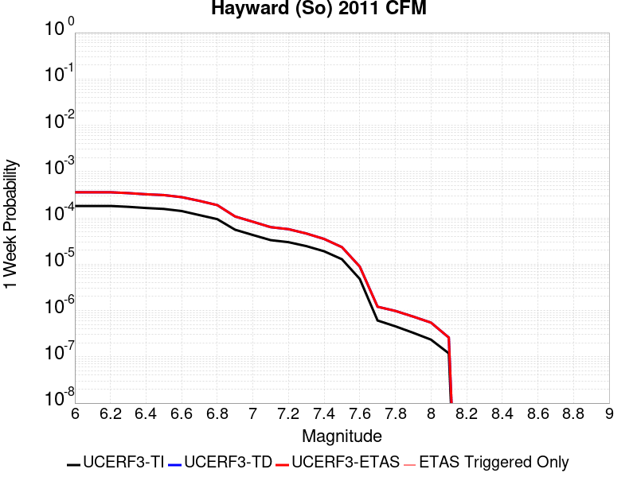 |  |  |  |

| Magnitude | 1 wk TI Prob | 1 wk TD Prob | 1 wk ETAS Prob | 1 wk ETAS/TD Gain | 1 wk ETAS Triggered Only | 1 mo TI Prob | 1 mo TD Prob | 1 mo ETAS Prob | 1 mo ETAS/TD Gain | 1 mo ETAS Triggered Only | 1 yr TI Prob | 1 yr TD Prob | 1 yr ETAS Prob | 1 yr ETAS/TD Gain | 1 yr ETAS Triggered Only | 10 yr TI Prob | 10 yr TD Prob | 10 yr ETAS Prob | 10 yr ETAS/TD Gain | 10 yr ETAS Triggered Only |
|-----|-----|-----|-----|-----|-----|-----|-----|-----|-----|-----|-----|-----|-----|-----|-----|-----|-----|-----|-----|-----|
| 6.0 | 1.8091932E-4 | 3.5707132E-4 | 3.5707132E-4 | 1.0 | 0.0 | 7.751381E-4 | 0.001529418 | 0.001529418 | 1.0 | 0.0 | 0.00939654 | 0.01846409 | 0.01846409 | 1.0 | 0.0 | 0.090090066 | 0.16670774 | 0.1667244 | 1.0001 | 2.0E-5 |
| 6.1 | 1.8091932E-4 | 3.5707132E-4 | 3.5707132E-4 | 1.0 | 0.0 | 7.751381E-4 | 0.001529418 | 0.001529418 | 1.0 | 0.0 | 0.00939654 | 0.01846409 | 0.01846409 | 1.0 | 0.0 | 0.090090066 | 0.16670774 | 0.1667244 | 1.0001 | 2.0E-5 |
| 6.2 | 1.8091932E-4 | 3.5707132E-4 | 3.5707132E-4 | 1.0 | 0.0 | 7.751381E-4 | 0.001529418 | 0.001529418 | 1.0 | 0.0 | 0.00939654 | 0.01846409 | 0.01846409 | 1.0 | 0.0 | 0.090090066 | 0.16670774 | 0.1667244 | 1.0001 | 2.0E-5 |
| 6.3 | 1.7322872E-4 | 3.4263916E-4 | 3.4263916E-4 | 1.0 | 0.0 | 7.4219756E-4 | 0.0014676368 | 0.0014676368 | 1.0 | 0.0 | 0.0089988755 | 0.017724354 | 0.017724354 | 1.0 | 0.0 | 0.08643075 | 0.16065879 | 0.16066718 | 1.0000522 | 1.0E-5 |
| 6.4 | 1.6334097E-4 | 3.2345566E-4 | 3.2345566E-4 | 1.0 | 0.0 | 6.998449E-4 | 0.0013855108 | 0.0013855108 | 1.0 | 0.0 | 0.008487372 | 0.016740132 | 0.016740132 | 1.0 | 0.0 | 0.081704415 | 0.15256529 | 0.15256529 | 1.0 | 0.0 |
| 6.5 | 1.5600289E-4 | 3.102022E-4 | 3.102022E-4 | 1.0 | 0.0 | 6.684125E-4 | 0.0013287689 | 0.0013287689 | 1.0 | 0.0 | 0.008107598 | 0.01605965 | 0.01605965 | 1.0 | 0.0 | 0.078181036 | 0.14684206 | 0.14684206 | 1.0 | 0.0 |
| 6.6 | 1.4046066E-4 | 2.8034206E-4 | 2.8034206E-4 | 1.0 | 0.0 | 6.018354E-4 | 0.0012009195 | 0.0012009195 | 1.0 | 0.0 | 0.0073027555 | 0.014524674 | 0.014524674 | 1.0 | 0.0 | 0.07067384 | 0.13395296 | 0.13395296 | 1.0 | 0.0 |
| 6.7 | 1.14696966E-4 | 2.327266E-4 | 2.327266E-4 | 1.0 | 0.0 | 4.914658E-4 | 9.970235E-4 | 9.970235E-4 | 1.0 | 0.0 | 0.0059671924 | 0.012072263 | 0.012072263 | 1.0 | 0.0 | 0.058094822 | 0.11274161 | 0.11274161 | 1.0 | 0.0 |
| 6.8 | 9.3874296E-5 | 1.8862607E-4 | 1.8862607E-4 | 1.0 | 0.0 | 4.0225635E-4 | 8.081507E-4 | 8.081507E-4 | 1.0 | 0.0 | 0.0048864787 | 0.00979558 | 0.00979558 | 1.0 | 0.0 | 0.047804173 | 0.09259326 | 0.09259326 | 1.0 | 0.0 |
| 6.9 | 5.551852E-5 | 1.0729982E-4 | 1.0729982E-4 | 1.0 | 0.0 | 2.3791482E-4 | 4.5977594E-4 | 4.5977594E-4 | 1.0 | 0.0 | 0.0028927654 | 0.005583523 | 0.005583523 | 1.0 | 0.0 | 0.028553981 | 0.05424756 | 0.05424756 | 1.0 | 0.0 |
| 7.0 | 4.2662363E-5 | 8.246871E-5 | 8.246871E-5 | 1.0 | 0.0 | 1.8282588E-4 | 3.5338986E-4 | 3.5338986E-4 | 1.0 | 0.0 | 0.0022236328 | 0.0042941067 | 0.0042941067 | 1.0 | 0.0 | 0.022015138 | 0.042066373 | 0.042066373 | 1.0 | 0.0 |
| 7.1 | 3.305886E-5 | 6.302249E-5 | 6.302249E-5 | 1.0 | 0.0 | 1.4167312E-4 | 2.700685E-4 | 2.700685E-4 | 1.0 | 0.0 | 0.0017235056 | 0.0032831454 | 0.0032831454 | 1.0 | 0.0 | 0.017101998 | 0.032454573 | 0.032454573 | 1.0 | 0.0 |
| 7.2 | 2.9856887E-5 | 5.7016838E-5 | 5.7016838E-5 | 1.0 | 0.0 | 1.2795182E-4 | 2.4433507E-4 | 2.4433507E-4 | 1.0 | 0.0 | 0.0015567001 | 0.0029707383 | 0.0029707383 | 1.0 | 0.0 | 0.015458403 | 0.029455377 | 0.029455377 | 1.0 | 0.0 |
| 7.3 | 2.4559737E-5 | 4.5993387E-5 | 4.5993387E-5 | 1.0 | 0.0 | 1.0525176E-4 | 1.970997E-4 | 1.970997E-4 | 1.0 | 0.0 | 0.0012806869 | 0.0023970609 | 0.0023970609 | 1.0 | 0.0 | 0.012733313 | 0.023858935 | 0.023858935 | 1.0 | 0.0 |
| 7.4 | 1.9002231E-5 | 3.5051242E-5 | 3.5051242E-5 | 1.0 | 0.0 | 8.143559E-5 | 1.5021101E-4 | 1.5021101E-4 | 1.0 | 0.0 | 9.910273E-4 | 0.0018272948 | 0.0018272948 | 1.0 | 0.0 | 0.009866194 | 0.01825927 | 0.01825927 | 1.0 | 0.0 |
| 7.5 | 1.2783333E-5 | 2.3331453E-5 | 2.3331453E-5 | 1.0 | 0.0 | 5.4784563E-5 | 9.9988145E-5 | 9.9988145E-5 | 1.0 | 0.0 | 6.667979E-4 | 0.0012166816 | 0.0012166816 | 1.0 | 0.0 | 0.006648007 | 0.012209817 | 0.012209817 | 1.0 | 0.0 |
| 7.6 | 4.8149627E-6 | 8.8881625E-6 | 8.8881625E-6 | 1.0 | 0.0 | 2.063539E-5 | 3.8091577E-5 | 3.8091577E-5 | 1.0 | 0.0 | 2.5120692E-4 | 4.636675E-4 | 4.636675E-4 | 1.0 | 0.0 | 0.0025092314 | 0.004680714 | 0.004680714 | 1.0 | 0.0 |
| 7.7 | 6.0838227E-7 | 1.2058039E-6 | 1.2058039E-6 | 1.0 | 0.0 | 2.6073499E-6 | 5.1677207E-6 | 5.1677207E-6 | 1.0 | 0.0 | 3.174402E-5 | 6.2915184E-5 | 6.2915184E-5 | 1.0 | 0.0 | 3.1739488E-4 | 6.529886E-4 | 6.529886E-4 | 1.0 | 0.0 |
| 7.8 | 4.5542808E-7 | 9.793379E-7 | 9.793379E-7 | 1.0 | 0.0 | 1.9518332E-6 | 4.1971552E-6 | 4.1971552E-6 | 1.0 | 0.0 | 2.376331E-5 | 5.1099174E-5 | 5.1099174E-5 | 1.0 | 0.0 | 2.3760769E-4 | 5.3219224E-4 | 5.3219224E-4 | 1.0 | 0.0 |
| 7.9 | 3.3016747E-7 | 7.387277E-7 | 7.387277E-7 | 1.0 | 0.0 | 1.4150027E-6 | 3.165972E-6 | 3.165972E-6 | 1.0 | 0.0 | 1.7227521E-5 | 3.854503E-5 | 3.854503E-5 | 1.0 | 0.0 | 1.7226185E-4 | 3.993412E-4 | 3.993412E-4 | 1.0 | 0.0 |
| 8.0 | 2.347038E-7 | 5.4721994E-7 | 5.4721994E-7 | 1.0 | 0.0 | 1.0058731E-6 | 2.345226E-6 | 2.345226E-6 | 1.0 | 0.0 | 1.2246436E-5 | 2.8552755E-5 | 2.8552755E-5 | 1.0 | 0.0 | 1.2245761E-4 | 2.9357884E-4 | 2.9357884E-4 | 1.0 | 0.0 |
| 8.1 | 1.18822804E-7 | 2.6062025E-7 | 2.6062025E-7 | 1.0 | 0.0 | 5.092405E-7 | 1.1169434E-6 | 1.1169434E-6 | 1.0 | 0.0 | 6.1999854E-6 | 1.3598702E-5 | 1.3598702E-5 | 1.0 | 0.0 | 6.199812E-5 | 1.3918418E-4 | 1.3918418E-4 | 1.0 | 0.0 |

## Rinconada 2011 CFM
*[(top)](#table-of-contents)*

| 1 Week | 1 Month | 1 Year | 10 Year |
|-----|-----|-----|-----|
| 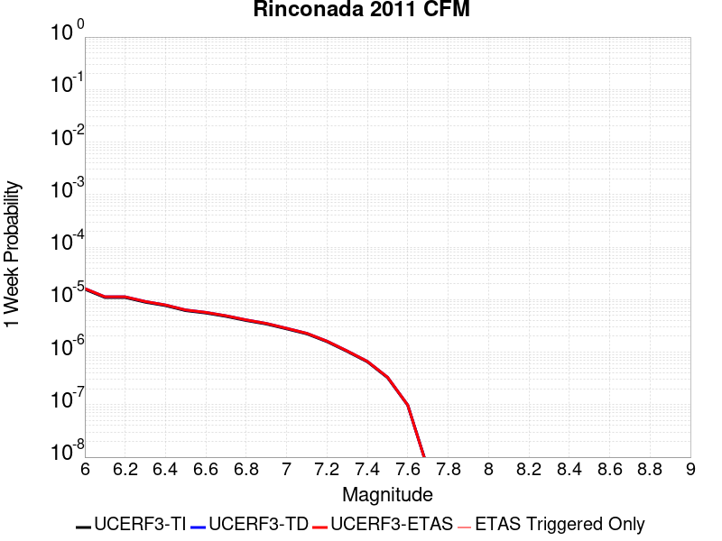 |  |  | 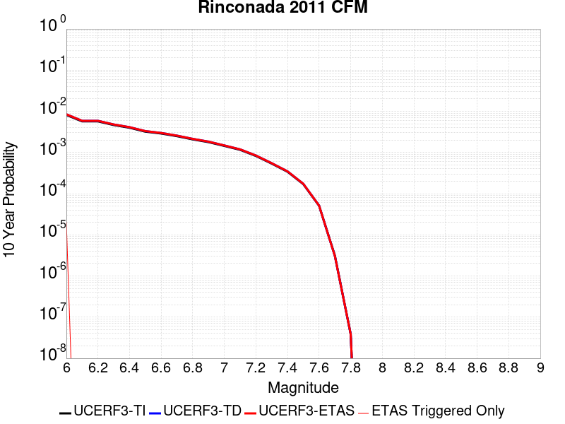 |

| Magnitude | 1 wk TI Prob | 1 wk TD Prob | 1 wk ETAS Prob | 1 wk ETAS/TD Gain | 1 wk ETAS Triggered Only | 1 mo TI Prob | 1 mo TD Prob | 1 mo ETAS Prob | 1 mo ETAS/TD Gain | 1 mo ETAS Triggered Only | 1 yr TI Prob | 1 yr TD Prob | 1 yr ETAS Prob | 1 yr ETAS/TD Gain | 1 yr ETAS Triggered Only | 10 yr TI Prob | 10 yr TD Prob | 10 yr ETAS Prob | 10 yr ETAS/TD Gain | 10 yr ETAS Triggered Only |
|-----|-----|-----|-----|-----|-----|-----|-----|-----|-----|-----|-----|-----|-----|-----|-----|-----|-----|-----|-----|-----|
| 6.0 | 1.5752368E-5 | 1.6274722E-5 | 1.6274722E-5 | 1.0 | 0.0 | 6.75084E-5 | 6.9746966E-5 | 6.9746966E-5 | 1.0 | 0.0 | 8.2160486E-4 | 8.488416E-4 | 8.488416E-4 | 1.0 | 0.0 | 0.008185739 | 0.008456374 | 0.008476204 | 1.0023451 | 2.0E-5 |
| 6.1 | 1.0966133E-5 | 1.13230335E-5 | 1.13230335E-5 | 1.0 | 0.0 | 4.6996865E-5 | 4.8526388E-5 | 4.8526388E-5 | 1.0 | 0.0 | 5.720366E-4 | 5.906494E-4 | 5.906494E-4 | 1.0 | 0.0 | 0.0057056635 | 0.0058908914 | 0.0058908914 | 1.0 | 0.0 |
| 6.2 | 1.0966133E-5 | 1.13230335E-5 | 1.13230335E-5 | 1.0 | 0.0 | 4.6996865E-5 | 4.8526388E-5 | 4.8526388E-5 | 1.0 | 0.0 | 5.720366E-4 | 5.906494E-4 | 5.906494E-4 | 1.0 | 0.0 | 0.0057056635 | 0.0058908914 | 0.0058908914 | 1.0 | 0.0 |
| 6.3 | 8.926149E-6 | 9.212776E-6 | 9.212776E-6 | 1.0 | 0.0 | 3.8254362E-5 | 3.948273E-5 | 3.948273E-5 | 1.0 | 0.0 | 4.6564735E-4 | 4.805965E-4 | 4.805965E-4 | 1.0 | 0.0 | 0.0046467283 | 0.0047956165 | 0.0047956165 | 1.0 | 0.0 |
| 6.4 | 7.676955E-6 | 7.920195E-6 | 7.920195E-6 | 1.0 | 0.0 | 3.290082E-5 | 3.3943248E-5 | 3.3943248E-5 | 1.0 | 0.0 | 4.0049385E-4 | 4.1318088E-4 | 4.1318088E-4 | 1.0 | 0.0 | 0.0039977287 | 0.004124153 | 0.004124153 | 1.0 | 0.0 |
| 6.5 | 6.1671026E-6 | 6.3589573E-6 | 6.3589573E-6 | 1.0 | 0.0 | 2.6430173E-5 | 2.725239E-5 | 2.725239E-5 | 1.0 | 0.0 | 3.2173982E-4 | 3.3174743E-4 | 3.3174743E-4 | 1.0 | 0.0 | 0.003212744 | 0.003312534 | 0.003312534 | 1.0 | 0.0 |
| 6.6 | 5.553456E-6 | 5.724815E-6 | 5.724815E-6 | 1.0 | 0.0 | 2.3800309E-5 | 2.4534691E-5 | 2.4534691E-5 | 1.0 | 0.0 | 2.897302E-4 | 2.9866898E-4 | 2.9866898E-4 | 1.0 | 0.0 | 0.0028935277 | 0.0029826844 | 0.0029826844 | 1.0 | 0.0 |
| 6.7 | 4.787857E-6 | 4.9333116E-6 | 4.9333116E-6 | 1.0 | 0.0 | 2.0519226E-5 | 2.1142592E-5 | 2.1142592E-5 | 1.0 | 0.0 | 2.4979294E-4 | 2.573807E-4 | 2.573807E-4 | 1.0 | 0.0 | 0.0024951235 | 0.002570832 | 0.002570832 | 1.0 | 0.0 |
| 6.8 | 3.9955166E-6 | 4.113478E-6 | 4.113478E-6 | 1.0 | 0.0 | 1.7123532E-5 | 1.7629072E-5 | 1.7629072E-5 | 1.0 | 0.0 | 2.0845905E-4 | 2.1461284E-4 | 2.1461284E-4 | 1.0 | 0.0 | 0.002082636 | 0.0021440594 | 0.0021440594 | 1.0 | 0.0 |
| 6.9 | 3.4250072E-6 | 3.5224477E-6 | 3.5224477E-6 | 1.0 | 0.0 | 1.46785205E-5 | 1.5096118E-5 | 1.5096118E-5 | 1.0 | 0.0 | 1.7869633E-4 | 1.8377975E-4 | 1.8377975E-4 | 1.0 | 0.0 | 0.001785527 | 0.0018362802 | 0.0018362802 | 1.0 | 0.0 |
| 7.0 | 2.7712713E-6 | 2.8467011E-6 | 2.8467011E-6 | 1.0 | 0.0 | 1.1876823E-5 | 1.2200091E-5 | 1.2200091E-5 | 1.0 | 0.0 | 1.4459073E-4 | 1.48526E-4 | 1.48526E-4 | 1.0 | 0.0 | 0.0014449668 | 0.0014842688 | 0.0014842688 | 1.0 | 0.0 |
| 7.1 | 2.227358E-6 | 2.2856996E-6 | 2.2856996E-6 | 1.0 | 0.0 | 9.545785E-6 | 9.795818E-6 | 9.795818E-6 | 1.0 | 0.0 | 1.16213734E-4 | 1.19257566E-4 | 1.19257566E-4 | 1.0 | 0.0 | 0.0011615298 | 0.0011919368 | 0.0011919368 | 1.0 | 0.0 |
| 7.2 | 1.581796E-6 | 1.6209019E-6 | 1.6209019E-6 | 1.0 | 0.0 | 6.779108E-6 | 6.946704E-6 | 6.946704E-6 | 1.0 | 0.0 | 8.253252E-5 | 8.457284E-5 | 8.457284E-5 | 1.0 | 0.0 | 8.250187E-4 | 8.4540714E-4 | 8.4540714E-4 | 1.0 | 0.0 |
| 7.3 | 1.0306567E-6 | 1.0546482E-6 | 1.0546482E-6 | 1.0 | 0.0 | 4.4170924E-6 | 4.5199135E-6 | 4.5199135E-6 | 1.0 | 0.0 | 5.3776774E-5 | 5.502856E-5 | 5.502856E-5 | 1.0 | 0.0 | 5.376376E-4 | 5.5014953E-4 | 5.5014953E-4 | 1.0 | 0.0 |
| 7.4 | 6.535541E-7 | 6.6827465E-7 | 6.6827465E-7 | 1.0 | 0.0 | 2.800943E-6 | 2.864031E-6 | 2.864031E-6 | 1.0 | 0.0 | 3.4100947E-5 | 3.4869023E-5 | 3.4869023E-5 | 1.0 | 0.0 | 3.4095717E-4 | 3.4863563E-4 | 3.4863563E-4 | 1.0 | 0.0 |
| 7.5 | 3.2656962E-7 | 3.3316724E-7 | 3.3316724E-7 | 1.0 | 0.0 | 1.3995833E-6 | 1.4278587E-6 | 1.4278587E-6 | 1.0 | 0.0 | 1.7039794E-5 | 1.7384042E-5 | 1.7384042E-5 | 1.0 | 0.0 | 1.7038487E-4 | 1.7382686E-4 | 1.7382686E-4 | 1.0 | 0.0 |
| 7.6 | 9.754343E-8 | 9.8210194E-8 | 9.8210194E-8 | 1.0 | 0.0 | 4.180432E-7 | 4.2090073E-7 | 4.2090073E-7 | 1.0 | 0.0 | 5.089664E-6 | 5.1244547E-6 | 5.1244547E-6 | 1.0 | 0.0 | 5.0895473E-5 | 5.1243373E-5 | 5.1243373E-5 | 1.0 | 0.0 |
| 7.7 | 6.0001453E-9 | 5.849121E-9 | 5.849121E-9 | 1.0 | 0.0 | 2.5714908E-8 | 2.5067664E-8 | 2.5067664E-8 | 1.0 | 0.0 | 3.1307894E-7 | 3.0519877E-7 | 3.0519877E-7 | 1.0 | 0.0 | 3.1307852E-6 | 3.0519834E-6 | 3.0519834E-6 | 1.0 | 0.0 |
| 7.8 | 7.400003E-11 | 7.4654505E-11 | 7.4654505E-11 | 1.0 | 0.0 | 3.171432E-10 | 3.1994773E-10 | 3.1994773E-10 | 1.0 | 0.0 | 3.861218E-9 | 3.8953636E-9 | 3.8953636E-9 | 1.0 | 0.0 | 3.861218E-8 | 3.8953637E-8 | 3.8953637E-8 | 1.0 | 0.0 |

## San Gregorio (South) 2011 CFM
*[(top)](#table-of-contents)*

| 1 Week | 1 Month | 1 Year | 10 Year |
|-----|-----|-----|-----|
|  | 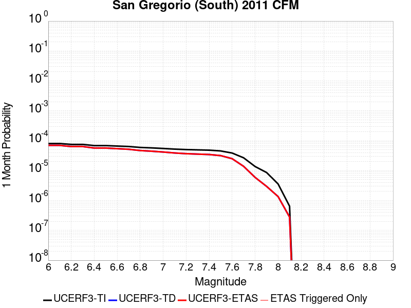 |  | 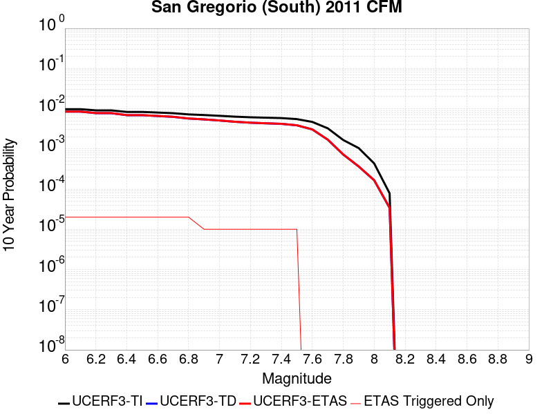 |

| Magnitude | 1 wk TI Prob | 1 wk TD Prob | 1 wk ETAS Prob | 1 wk ETAS/TD Gain | 1 wk ETAS Triggered Only | 1 mo TI Prob | 1 mo TD Prob | 1 mo ETAS Prob | 1 mo ETAS/TD Gain | 1 mo ETAS Triggered Only | 1 yr TI Prob | 1 yr TD Prob | 1 yr ETAS Prob | 1 yr ETAS/TD Gain | 1 yr ETAS Triggered Only | 10 yr TI Prob | 10 yr TD Prob | 10 yr ETAS Prob | 10 yr ETAS/TD Gain | 10 yr ETAS Triggered Only |
|-----|-----|-----|-----|-----|-----|-----|-----|-----|-----|-----|-----|-----|-----|-----|-----|-----|-----|-----|-----|-----|
| 6.0 | 1.8770423E-5 | 1.6279622E-5 | 1.6279622E-5 | 1.0 | 0.0 | 8.044219E-5 | 6.976797E-5 | 6.976797E-5 | 1.0 | 0.0 | 9.789435E-4 | 8.490978E-4 | 8.5908925E-4 | 1.0117671 | 1.0E-5 | 0.009746423 | 0.008471499 | 0.00849133 | 1.0023409 | 2.0E-5 |
| 6.1 | 1.8770423E-5 | 1.6279622E-5 | 1.6279622E-5 | 1.0 | 0.0 | 8.044219E-5 | 6.976797E-5 | 6.976797E-5 | 1.0 | 0.0 | 9.789435E-4 | 8.490978E-4 | 8.5908925E-4 | 1.0117671 | 1.0E-5 | 0.009746423 | 0.008471499 | 0.00849133 | 1.0023409 | 2.0E-5 |
| 6.2 | 1.7508692E-5 | 1.4899127E-5 | 1.4899127E-5 | 1.0 | 0.0 | 7.5035096E-5 | 6.3851854E-5 | 6.3851854E-5 | 1.0 | 0.0 | 9.1316935E-4 | 7.771221E-4 | 7.871143E-4 | 1.012858 | 1.0E-5 | 0.00909426 | 0.007756927 | 0.007776772 | 1.0025584 | 2.0E-5 |
| 6.3 | 1.7508692E-5 | 1.4899127E-5 | 1.4899127E-5 | 1.0 | 0.0 | 7.5035096E-5 | 6.3851854E-5 | 6.3851854E-5 | 1.0 | 0.0 | 9.1316935E-4 | 7.771221E-4 | 7.871143E-4 | 1.012858 | 1.0E-5 | 0.00909426 | 0.007756927 | 0.007776772 | 1.0025584 | 2.0E-5 |
| 6.4 | 1.6004591E-5 | 1.3248962E-5 | 1.3248962E-5 | 1.0 | 0.0 | 6.85893E-5 | 5.6780038E-5 | 5.6780038E-5 | 1.0 | 0.0 | 8.347548E-4 | 6.910787E-4 | 7.010718E-4 | 1.0144601 | 1.0E-5 | 0.008316261 | 0.006901977 | 0.0069218394 | 1.0028777 | 2.0E-5 |
| 6.5 | 1.6004591E-5 | 1.3248962E-5 | 1.3248962E-5 | 1.0 | 0.0 | 6.85893E-5 | 5.6780038E-5 | 5.6780038E-5 | 1.0 | 0.0 | 8.347548E-4 | 6.910787E-4 | 7.010718E-4 | 1.0144601 | 1.0E-5 | 0.008316261 | 0.006901977 | 0.0069218394 | 1.0028777 | 2.0E-5 |
| 6.6 | 1.5442201E-5 | 1.2633593E-5 | 1.2633593E-5 | 1.0 | 0.0 | 6.617918E-5 | 5.414285E-5 | 5.414285E-5 | 1.0 | 0.0 | 8.0543366E-4 | 6.589907E-4 | 6.689841E-4 | 1.0151647 | 1.0E-5 | 0.008025207 | 0.0065830285 | 0.006602897 | 1.0030181 | 2.0E-5 |
| 6.7 | 1.489921E-5 | 1.2042101E-5 | 1.2042101E-5 | 1.0 | 0.0 | 6.3852196E-5 | 5.160799E-5 | 5.160799E-5 | 1.0 | 0.0 | 7.7712315E-4 | 6.281468E-4 | 6.3814054E-4 | 1.0159098 | 1.0E-5 | 0.0077441116 | 0.0062763616 | 0.006296236 | 1.0031666 | 2.0E-5 |
| 6.8 | 1.3876024E-5 | 1.09210505E-5 | 1.09210505E-5 | 1.0 | 0.0 | 5.9467322E-5 | 4.6803663E-5 | 4.6803663E-5 | 1.0 | 0.0 | 7.237741E-4 | 5.6968594E-4 | 5.7968026E-4 | 1.0175436 | 1.0E-5 | 0.0072142133 | 0.00569487 | 0.005714756 | 1.0034919 | 2.0E-5 |
| 6.9 | 1.33922495E-5 | 1.0392552E-5 | 1.0392552E-5 | 1.0 | 0.0 | 5.7394092E-5 | 4.453875E-5 | 4.453875E-5 | 1.0 | 0.0 | 6.9854903E-4 | 5.421246E-4 | 5.521192E-4 | 1.018436 | 1.0E-5 | 0.0069635725 | 0.005420627 | 0.005430573 | 1.0018348 | 1.0E-5 |
| 7.0 | 1.2807324E-5 | 9.752513E-6 | 9.752513E-6 | 1.0 | 0.0 | 5.4887376E-5 | 4.1795814E-5 | 4.1795814E-5 | 1.0 | 0.0 | 6.680489E-4 | 5.0874543E-4 | 5.1874033E-4 | 1.0196462 | 1.0E-5 | 0.006660442 | 0.005088405 | 0.005098354 | 1.0019553 | 1.0E-5 |
| 7.1 | 1.2191438E-5 | 9.061399E-6 | 9.061399E-6 | 1.0 | 0.0 | 5.224797E-5 | 3.883399E-5 | 3.883399E-5 | 1.0 | 0.0 | 6.3593336E-4 | 4.7270136E-4 | 4.8269663E-4 | 1.021145 | 1.0E-5 | 0.0063411663 | 0.0047295485 | 0.004739501 | 1.0021044 | 1.0E-5 |
| 7.2 | 1.1769438E-5 | 8.581594E-6 | 8.581594E-6 | 1.0 | 0.0 | 5.0439474E-5 | 3.677774E-5 | 3.677774E-5 | 1.0 | 0.0 | 6.1392755E-4 | 4.4767704E-4 | 4.5767258E-4 | 1.0223275 | 1.0E-5 | 0.0061223423 | 0.004480341 | 0.004490296 | 1.002222 | 1.0E-5 |
| 7.3 | 1.150374E-5 | 8.29702E-6 | 8.29702E-6 | 1.0 | 0.0 | 4.9300812E-5 | 3.5558176E-5 | 3.5558176E-5 | 1.0 | 0.0 | 6.0007203E-4 | 4.3283484E-4 | 4.428305E-4 | 1.0230935 | 1.0E-5 | 0.0059845424 | 0.004332489 | 0.0043424456 | 1.0022981 | 1.0E-5 |
| 7.4 | 1.12514E-5 | 8.042761E-6 | 8.042761E-6 | 1.0 | 0.0 | 4.8219394E-5 | 3.446852E-5 | 3.446852E-5 | 1.0 | 0.0 | 5.8691297E-4 | 4.1957348E-4 | 4.2956928E-4 | 1.0238237 | 1.0E-5 | 0.005853653 | 0.004200379 | 0.004210337 | 1.0023707 | 1.0E-5 |
| 7.5 | 1.059696E-5 | 7.3930423E-6 | 7.3930423E-6 | 1.0 | 0.0 | 4.5414752E-5 | 3.168408E-5 | 3.168408E-5 | 1.0 | 0.0 | 5.5278436E-4 | 3.8568547E-4 | 3.9568162E-4 | 1.0259179 | 1.0E-5 | 0.0055141128 | 0.0038626385 | 0.0038726 | 1.0025789 | 1.0E-5 |
| 7.6 | 9.018592E-6 | 5.836801E-6 | 5.836801E-6 | 1.0 | 0.0 | 3.8650534E-5 | 2.5014622E-5 | 2.5014622E-5 | 1.0 | 0.0 | 4.7046866E-4 | 3.045105E-4 | 3.045105E-4 | 1.0 | 0.0 | 0.004694739 | 0.0030530337 | 0.0030530337 | 1.0 | 0.0 |
| 7.7 | 6.243489E-6 | 3.2393905E-6 | 3.2393905E-6 | 1.0 | 0.0 | 2.6757538E-5 | 1.3883028E-5 | 1.3883028E-5 | 1.0 | 0.0 | 3.257243E-4 | 1.6901277E-4 | 1.6901277E-4 | 1.0 | 0.0 | 0.003252473 | 0.0016990675 | 0.0016990675 | 1.0 | 0.0 |
| 7.8 | 3.1941963E-6 | 1.3809001E-6 | 1.3809001E-6 | 1.0 | 0.0 | 1.368934E-5 | 5.91813E-6 | 5.91813E-6 | 1.0 | 0.0 | 1.6665498E-4 | 7.2050854E-5 | 7.2050854E-5 | 1.0 | 0.0 | 0.0016653005 | 7.26271E-4 | 7.26271E-4 | 1.0 | 0.0 |
| 7.9 | 2.0098398E-6 | 6.915249E-7 | 6.915249E-7 | 1.0 | 0.0 | 8.6135715E-6 | 2.9636747E-6 | 2.9636747E-6 | 1.0 | 0.0 | 1.0486518E-4 | 3.6082143E-5 | 3.6082143E-5 | 1.0 | 0.0 | 0.0010481571 | 3.6567423E-4 | 3.6567423E-4 | 1.0 | 0.0 |
| 8.0 | 8.353119E-7 | 3.161996E-7 | 3.161996E-7 | 1.0 | 0.0 | 3.579903E-6 | 1.3551404E-6 | 1.3551404E-6 | 1.0 | 0.0 | 4.358445E-5 | 1.649871E-5 | 1.649871E-5 | 1.0 | 0.0 | 4.3575902E-4 | 1.6617302E-4 | 1.6617302E-4 | 1.0 | 0.0 |
| 8.1 | 1.5033264E-7 | 6.527079E-8 | 6.527079E-8 | 1.0 | 0.0 | 6.442826E-7 | 2.7973192E-7 | 2.7973192E-7 | 1.0 | 0.0 | 7.844113E-6 | 3.405731E-6 | 3.405731E-6 | 1.0 | 0.0 | 7.843835E-5 | 3.407063E-5 | 3.407063E-5 | 1.0 | 0.0 |

## Hosgri
*[(top)](#table-of-contents)*

| 1 Week | 1 Month | 1 Year | 10 Year |
|-----|-----|-----|-----|
| 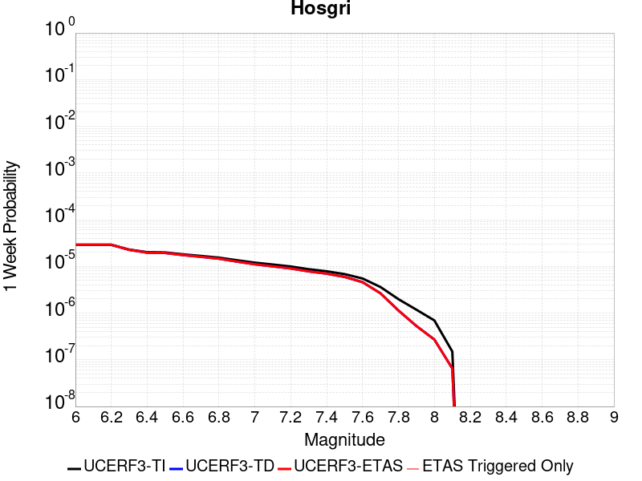 |  | 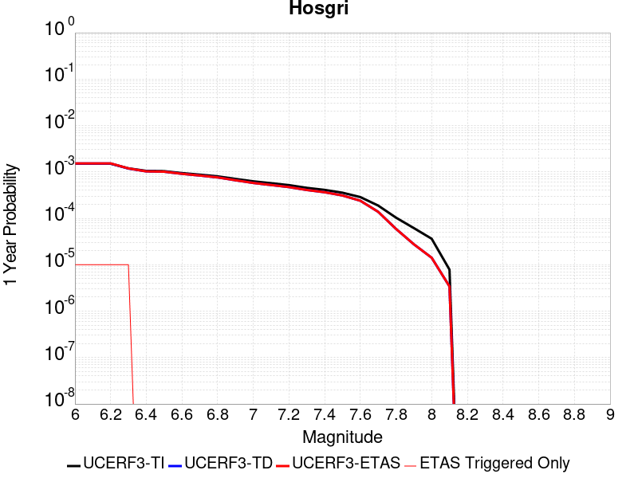 | 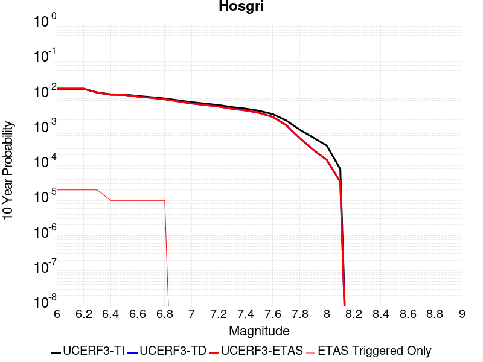 |

| Magnitude | 1 wk TI Prob | 1 wk TD Prob | 1 wk ETAS Prob | 1 wk ETAS/TD Gain | 1 wk ETAS Triggered Only | 1 mo TI Prob | 1 mo TD Prob | 1 mo ETAS Prob | 1 mo ETAS/TD Gain | 1 mo ETAS Triggered Only | 1 yr TI Prob | 1 yr TD Prob | 1 yr ETAS Prob | 1 yr ETAS/TD Gain | 1 yr ETAS Triggered Only | 10 yr TI Prob | 10 yr TD Prob | 10 yr ETAS Prob | 10 yr ETAS/TD Gain | 10 yr ETAS Triggered Only |
|-----|-----|-----|-----|-----|-----|-----|-----|-----|-----|-----|-----|-----|-----|-----|-----|-----|-----|-----|-----|-----|
| 6.0 | 2.883978E-5 | 2.9128441E-5 | 2.9128441E-5 | 1.0 | 0.0 | 1.235932E-4 | 1.2483036E-4 | 1.2483036E-4 | 1.0 | 0.0 | 0.0015037085 | 0.0015187773 | 0.0015287622 | 1.0065743 | 1.0E-5 | 0.01493574 | 0.015087744 | 0.015107443 | 1.0013056 | 2.0E-5 |
| 6.1 | 2.883978E-5 | 2.9128441E-5 | 2.9128441E-5 | 1.0 | 0.0 | 1.235932E-4 | 1.2483036E-4 | 1.2483036E-4 | 1.0 | 0.0 | 0.0015037085 | 0.0015187773 | 0.0015287622 | 1.0065743 | 1.0E-5 | 0.01493574 | 0.015087744 | 0.015107443 | 1.0013056 | 2.0E-5 |
| 6.2 | 2.883978E-5 | 2.9128441E-5 | 2.9128441E-5 | 1.0 | 0.0 | 1.235932E-4 | 1.2483036E-4 | 1.2483036E-4 | 1.0 | 0.0 | 0.0015037085 | 0.0015187773 | 0.0015287622 | 1.0065743 | 1.0E-5 | 0.01493574 | 0.015087744 | 0.015107443 | 1.0013056 | 2.0E-5 |
| 6.3 | 2.2914428E-5 | 2.2641987E-5 | 2.2641987E-5 | 1.0 | 0.0 | 9.8200995E-5 | 9.703351E-5 | 9.703351E-5 | 1.0 | 0.0 | 0.0011949413 | 0.0011807476 | 0.0011907358 | 1.0084592 | 1.0E-5 | 0.011885363 | 0.011746134 | 0.011765898 | 1.0016826 | 2.0E-5 |
| 6.4 | 2.0195741E-5 | 1.9696576E-5 | 1.9696576E-5 | 1.0 | 0.0 | 8.65503E-5 | 8.441117E-5 | 8.441117E-5 | 1.0 | 0.0 | 0.0010532405 | 0.0010272235 | 0.0010272235 | 1.0 | 0.0 | 0.010482626 | 0.0102257915 | 0.01023569 | 1.0009679 | 1.0E-5 |
| 6.5 | 1.9924333E-5 | 1.9408995E-5 | 1.9408995E-5 | 1.0 | 0.0 | 8.53872E-5 | 8.317877E-5 | 8.317877E-5 | 1.0 | 0.0 | 0.0010390934 | 0.001012233 | 0.001012233 | 1.0 | 0.0 | 0.010342481 | 0.010077252 | 0.010087151 | 1.0009823 | 1.0E-5 |
| 6.6 | 1.809694E-5 | 1.7458313E-5 | 1.7458313E-5 | 1.0 | 0.0 | 7.7556004E-5 | 7.48192E-5 | 7.48192E-5 | 1.0 | 0.0 | 9.438353E-4 | 9.105444E-4 | 9.105444E-4 | 1.0 | 0.0 | 0.009398366 | 0.009069071 | 0.00907898 | 1.0010927 | 1.0E-5 |
| 6.7 | 1.675989E-5 | 1.6042777E-5 | 1.6042777E-5 | 1.0 | 0.0 | 7.182612E-5 | 6.8752954E-5 | 6.8752954E-5 | 1.0 | 0.0 | 8.7413215E-4 | 8.367469E-4 | 8.367469E-4 | 1.0 | 0.0 | 0.008707017 | 0.008336861 | 0.008346777 | 1.0011895 | 1.0E-5 |
| 6.8 | 1.5401129E-5 | 1.4614094E-5 | 1.4614094E-5 | 1.0 | 0.0 | 6.6003166E-5 | 6.263033E-5 | 6.263033E-5 | 1.0 | 0.0 | 8.032922E-4 | 7.6225837E-4 | 7.6225837E-4 | 1.0 | 0.0 | 0.008003947 | 0.0075972932 | 0.007607217 | 1.0013063 | 1.0E-5 |
| 6.9 | 1.356559E-5 | 1.2689977E-5 | 1.2689977E-5 | 1.0 | 0.0 | 5.8136946E-5 | 5.4384484E-5 | 5.4384484E-5 | 1.0 | 0.0 | 7.0758746E-4 | 6.619304E-4 | 6.619304E-4 | 1.0 | 0.0 | 0.007053386 | 0.006600384 | 0.006600384 | 1.0 | 0.0 |
| 7.0 | 1.2030819E-5 | 1.109597E-5 | 1.109597E-5 | 1.0 | 0.0 | 5.155963E-5 | 4.755329E-5 | 4.755329E-5 | 1.0 | 0.0 | 6.275577E-4 | 5.788076E-4 | 5.788076E-4 | 1.0 | 0.0 | 0.006257884 | 0.005773753 | 0.005773753 | 1.0 | 0.0 |
| 7.1 | 1.0972698E-5 | 1.0022188E-5 | 1.0022188E-5 | 1.0 | 0.0 | 4.7025E-5 | 4.2951524E-5 | 4.2951524E-5 | 1.0 | 0.0 | 5.72379E-4 | 5.228094E-4 | 5.228094E-4 | 1.0 | 0.0 | 0.0057090693 | 0.005216538 | 0.005216538 | 1.0 | 0.0 |
| 7.2 | 9.961926E-6 | 9.034752E-6 | 9.034752E-6 | 1.0 | 0.0 | 4.2693267E-5 | 3.871979E-5 | 3.871979E-5 | 1.0 | 0.0 | 5.1966653E-4 | 4.7131156E-4 | 4.7131156E-4 | 1.0 | 0.0 | 0.00518453 | 0.004703857 | 0.004703857 | 1.0 | 0.0 |
| 7.3 | 8.700929E-6 | 7.828108E-6 | 7.828108E-6 | 1.0 | 0.0 | 3.7289166E-5 | 3.3548604E-5 | 3.3548604E-5 | 1.0 | 0.0 | 4.53901E-4 | 4.083777E-4 | 4.083777E-4 | 1.0 | 0.0 | 0.00452975 | 0.0040770033 | 0.0040770033 | 1.0 | 0.0 |
| 7.4 | 7.866285E-6 | 6.9987445E-6 | 6.9987445E-6 | 1.0 | 0.0 | 3.3712215E-5 | 2.9994275E-5 | 2.9994275E-5 | 1.0 | 0.0 | 4.103689E-4 | 3.6511914E-4 | 3.6511914E-4 | 1.0 | 0.0 | 0.004096119 | 0.003645921 | 0.003645921 | 1.0 | 0.0 |
| 7.5 | 6.8381305E-6 | 5.959699E-6 | 5.959699E-6 | 1.0 | 0.0 | 2.9305946E-5 | 2.5541318E-5 | 2.5541318E-5 | 1.0 | 0.0 | 3.5674145E-4 | 3.109212E-4 | 3.109212E-4 | 1.0 | 0.0 | 0.0035616932 | 0.0031055878 | 0.0031055878 | 1.0 | 0.0 |
| 7.6 | 5.503376E-6 | 4.5952443E-6 | 4.5952443E-6 | 1.0 | 0.0 | 2.3585684E-5 | 1.9693754E-5 | 1.9693754E-5 | 1.0 | 0.0 | 2.8711787E-4 | 2.397451E-4 | 2.397451E-4 | 1.0 | 0.0 | 0.002867472 | 0.0023955887 | 0.0023955887 | 1.0 | 0.0 |
| 7.7 | 3.6144982E-6 | 2.6522055E-6 | 2.6522055E-6 | 1.0 | 0.0 | 1.5490614E-5 | 1.1366546E-5 | 1.1366546E-5 | 1.0 | 0.0 | 1.8858191E-4 | 1.383789E-4 | 1.383789E-4 | 1.0 | 0.0 | 0.0018842196 | 0.0013836495 | 0.0013836495 | 1.0 | 0.0 |
| 7.8 | 1.9853494E-6 | 1.1360913E-6 | 1.1360913E-6 | 1.0 | 0.0 | 8.508612E-6 | 4.8689535E-6 | 4.8689535E-6 | 1.0 | 0.0 | 1.0358743E-4 | 5.92779E-5 | 5.92779E-5 | 1.0 | 0.0 | 0.0010353916 | 5.933433E-4 | 5.933433E-4 | 1.0 | 0.0 |
| 7.9 | 1.1818757E-6 | 5.294868E-7 | 5.294868E-7 | 1.0 | 0.0 | 5.0651715E-6 | 2.269227E-6 | 2.269227E-6 | 1.0 | 0.0 | 6.1666724E-5 | 2.762749E-5 | 2.762749E-5 | 1.0 | 0.0 | 6.1649614E-4 | 2.7691788E-4 | 2.7691788E-4 | 1.0 | 0.0 |
| 8.0 | 6.962958E-7 | 2.7137142E-7 | 2.7137142E-7 | 1.0 | 0.0 | 2.9841215E-6 | 1.1630199E-6 | 1.1630199E-6 | 1.0 | 0.0 | 3.6331072E-5 | 1.4159675E-5 | 1.4159675E-5 | 1.0 | 0.0 | 3.6325134E-4 | 1.421536E-4 | 1.421536E-4 | 1.0 | 0.0 |
| 8.1 | 1.5033264E-7 | 6.527079E-8 | 6.527079E-8 | 1.0 | 0.0 | 6.442826E-7 | 2.7973192E-7 | 2.7973192E-7 | 1.0 | 0.0 | 7.844113E-6 | 3.405731E-6 | 3.405731E-6 | 1.0 | 0.0 | 7.843835E-5 | 3.407063E-5 | 3.407063E-5 | 1.0 | 0.0 |

## Shoreline
*[(top)](#table-of-contents)*

| 1 Week | 1 Month | 1 Year | 10 Year |
|-----|-----|-----|-----|
|  |  |  |  |

| Magnitude | 1 wk TI Prob | 1 wk TD Prob | 1 wk ETAS Prob | 1 wk ETAS/TD Gain | 1 wk ETAS Triggered Only | 1 mo TI Prob | 1 mo TD Prob | 1 mo ETAS Prob | 1 mo ETAS/TD Gain | 1 mo ETAS Triggered Only | 1 yr TI Prob | 1 yr TD Prob | 1 yr ETAS Prob | 1 yr ETAS/TD Gain | 1 yr ETAS Triggered Only | 10 yr TI Prob | 10 yr TD Prob | 10 yr ETAS Prob | 10 yr ETAS/TD Gain | 10 yr ETAS Triggered Only |
|-----|-----|-----|-----|-----|-----|-----|-----|-----|-----|-----|-----|-----|-----|-----|-----|-----|-----|-----|-----|-----|
| 6.0 | 3.9888673E-6 | 4.04793E-6 | 4.04793E-6 | 1.0 | 0.0 | 1.7095033E-5 | 1.7348188E-5 | 1.7348188E-5 | 1.0 | 0.0 | 2.0811215E-4 | 2.111993E-4 | 2.2119719E-4 | 1.0473386 | 1.0E-5 | 0.0020791737 | 0.0021105346 | 0.0021304924 | 1.0094563 | 2.0E-5 |
| 6.1 | 3.9888673E-6 | 4.04793E-6 | 4.04793E-6 | 1.0 | 0.0 | 1.7095033E-5 | 1.7348188E-5 | 1.7348188E-5 | 1.0 | 0.0 | 2.0811215E-4 | 2.111993E-4 | 2.2119719E-4 | 1.0473386 | 1.0E-5 | 0.0020791737 | 0.0021105346 | 0.0021304924 | 1.0094563 | 2.0E-5 |
| 6.2 | 1.4039653E-6 | 1.4100893E-6 | 1.4100893E-6 | 1.0 | 0.0 | 6.0169805E-6 | 6.043226E-6 | 6.043226E-6 | 1.0 | 0.0 | 7.325427E-5 | 7.357386E-5 | 7.357386E-5 | 1.0 | 0.0 | 7.3230127E-4 | 7.35501E-4 | 7.35501E-4 | 1.0 | 0.0 |
| 6.3 | 1.4039653E-6 | 1.4100893E-6 | 1.4100893E-6 | 1.0 | 0.0 | 6.0169805E-6 | 6.043226E-6 | 6.043226E-6 | 1.0 | 0.0 | 7.325427E-5 | 7.357386E-5 | 7.357386E-5 | 1.0 | 0.0 | 7.3230127E-4 | 7.35501E-4 | 7.35501E-4 | 1.0 | 0.0 |
| 6.4 | 1.3314152E-6 | 1.3361607E-6 | 1.3361607E-6 | 1.0 | 0.0 | 5.7060524E-6 | 5.726391E-6 | 5.726391E-6 | 1.0 | 0.0 | 6.946897E-5 | 6.971663E-5 | 6.971663E-5 | 1.0 | 0.0 | 6.9447263E-4 | 6.96953E-4 | 6.96953E-4 | 1.0 | 0.0 |
| 6.5 | 1.1187026E-6 | 1.1203641E-6 | 1.1203641E-6 | 1.0 | 0.0 | 4.794431E-6 | 4.801552E-6 | 4.801552E-6 | 1.0 | 0.0 | 5.8370628E-5 | 5.8457354E-5 | 5.8457354E-5 | 1.0 | 0.0 | 5.83553E-4 | 5.8442226E-4 | 5.8442226E-4 | 1.0 | 0.0 |
| 6.6 | 9.793089E-7 | 9.784922E-7 | 9.784922E-7 | 1.0 | 0.0 | 4.1970316E-6 | 4.193531E-6 | 4.193531E-6 | 1.0 | 0.0 | 5.1097657E-5 | 5.1055056E-5 | 5.1055056E-5 | 1.0 | 0.0 | 5.108591E-4 | 5.1043456E-4 | 5.1043456E-4 | 1.0 | 0.0 |
| 6.7 | 8.995986E-7 | 8.9728013E-7 | 8.9728013E-7 | 1.0 | 0.0 | 3.8554167E-6 | 3.8454805E-6 | 3.8454805E-6 | 1.0 | 0.0 | 4.693869E-5 | 4.681773E-5 | 4.681773E-5 | 1.0 | 0.0 | 4.6928777E-4 | 4.6807964E-4 | 4.6807964E-4 | 1.0 | 0.0 |
| 6.8 | 7.931612E-7 | 7.880404E-7 | 7.880404E-7 | 1.0 | 0.0 | 3.3992578E-6 | 3.3773115E-6 | 3.3773115E-6 | 1.0 | 0.0 | 4.1385178E-5 | 4.1117997E-5 | 4.1117997E-5 | 1.0 | 0.0 | 4.1377472E-4 | 4.1110444E-4 | 4.1110444E-4 | 1.0 | 0.0 |
| 6.9 | 7.1465956E-7 | 7.0780067E-7 | 7.0780067E-7 | 1.0 | 0.0 | 3.062823E-6 | 3.033428E-6 | 3.033428E-6 | 1.0 | 0.0 | 3.7289232E-5 | 3.6931364E-5 | 3.6931364E-5 | 1.0 | 0.0 | 3.7282976E-4 | 3.692526E-4 | 3.692526E-4 | 1.0 | 0.0 |
| 7.0 | 6.389046E-7 | 6.299459E-7 | 6.299459E-7 | 1.0 | 0.0 | 2.7381598E-6 | 2.6997652E-6 | 2.6997652E-6 | 1.0 | 0.0 | 3.3336586E-5 | 3.286915E-5 | 3.286915E-5 | 1.0 | 0.0 | 3.3331584E-4 | 3.286431E-4 | 3.286431E-4 | 1.0 | 0.0 |
| 7.1 | 5.4300875E-7 | 5.3111313E-7 | 5.3111313E-7 | 1.0 | 0.0 | 2.3271782E-6 | 2.2761972E-6 | 2.2761972E-6 | 1.0 | 0.0 | 2.8333026E-5 | 2.7712349E-5 | 2.7712349E-5 | 1.0 | 0.0 | 2.8329415E-4 | 2.7708904E-4 | 2.7708904E-4 | 1.0 | 0.0 |
| 7.2 | 4.6768855E-7 | 4.5348952E-7 | 4.5348952E-7 | 1.0 | 0.0 | 2.0043778E-6 | 1.943525E-6 | 1.943525E-6 | 1.0 | 0.0 | 2.4403027E-5 | 2.366216E-5 | 2.366216E-5 | 1.0 | 0.0 | 2.4400349E-4 | 2.3659648E-4 | 2.3659648E-4 | 1.0 | 0.0 |
| 7.3 | 4.0966103E-7 | 3.938566E-7 | 3.938566E-7 | 1.0 | 0.0 | 1.7556889E-6 | 1.6879558E-6 | 1.6879558E-6 | 1.0 | 0.0 | 2.1375303E-5 | 2.0550668E-5 | 2.0550668E-5 | 1.0 | 0.0 | 2.1373246E-4 | 2.0548771E-4 | 2.0548771E-4 | 1.0 | 0.0 |
| 7.4 | 3.5105785E-7 | 3.336397E-7 | 3.336397E-7 | 1.0 | 0.0 | 1.5045327E-6 | 1.4298836E-6 | 1.4298836E-6 | 1.0 | 0.0 | 1.8317533E-5 | 1.7408693E-5 | 1.7408693E-5 | 1.0 | 0.0 | 1.8316023E-4 | 1.7407333E-4 | 1.7407333E-4 | 1.0 | 0.0 |
| 7.5 | 2.8737534E-7 | 2.6820032E-7 | 2.6820032E-7 | 1.0 | 0.0 | 1.2316079E-6 | 1.1494294E-6 | 1.1494294E-6 | 1.0 | 0.0 | 1.4994724E-5 | 1.3994213E-5 | 1.3994213E-5 | 1.0 | 0.0 | 1.4993713E-4 | 1.3993334E-4 | 1.3993334E-4 | 1.0 | 0.0 |
| 7.6 | 2.0924051E-7 | 1.8778978E-7 | 1.8778978E-7 | 1.0 | 0.0 | 8.967448E-7 | 8.0481306E-7 | 8.0481306E-7 | 1.0 | 0.0 | 1.0917813E-5 | 9.798555E-6 | 9.798555E-6 | 1.0 | 0.0 | 1.0917276E-4 | 9.798124E-5 | 9.798124E-5 | 1.0 | 0.0 |
| 7.7 | 1.392265E-7 | 1.1543377E-7 | 1.1543377E-7 | 1.0 | 0.0 | 5.9668486E-7 | 4.9471606E-7 | 4.9471606E-7 | 1.0 | 0.0 | 7.2646135E-6 | 6.0231514E-6 | 6.0231514E-6 | 1.0 | 0.0 | 7.2643765E-5 | 6.0229886E-5 | 6.0229886E-5 | 1.0 | 0.0 |
| 7.8 | 8.1080074E-8 | 5.5866696E-8 | 5.5866696E-8 | 1.0 | 0.0 | 3.4748598E-7 | 2.394287E-7 | 2.394287E-7 | 1.0 | 0.0 | 4.2306337E-6 | 2.9150403E-6 | 2.9150403E-6 | 1.0 | 0.0 | 4.230553E-5 | 2.9150022E-5 | 2.9150022E-5 | 1.0 | 0.0 |
| 7.9 | 5.0859036E-8 | 2.724372E-8 | 2.724372E-8 | 1.0 | 0.0 | 2.1796728E-7 | 1.167588E-7 | 1.167588E-7 | 1.0 | 0.0 | 2.6537484E-6 | 1.4215374E-6 | 1.4215374E-6 | 1.0 | 0.0 | 2.6537167E-5 | 1.4215284E-5 | 1.4215284E-5 | 1.0 | 0.0 |
| 8.0 | 3.1760536E-8 | 1.3576261E-8 | 1.3576261E-8 | 1.0 | 0.0 | 1.3611657E-7 | 5.8183975E-8 | 5.8183975E-8 | 1.0 | 0.0 | 1.6572179E-6 | 7.083897E-7 | 7.083897E-7 | 1.0 | 0.0 | 1.6572056E-5 | 7.083874E-6 | 7.083874E-6 | 1.0 | 0.0 |
| 8.1 | 1.2947896E-8 | 5.662617E-9 | 5.662617E-9 | 1.0 | 0.0 | 5.5490982E-8 | 2.4268358E-8 | 2.4268358E-8 | 1.0 | 0.0 | 6.756025E-7 | 2.9546723E-7 | 2.9546723E-7 | 1.0 | 0.0 | 6.7560045E-6 | 2.9546684E-6 | 2.9546684E-6 | 1.0 | 0.0 |

## White Wolf
*[(top)](#table-of-contents)*

| 1 Week | 1 Month | 1 Year | 10 Year |
|-----|-----|-----|-----|
|  |  | 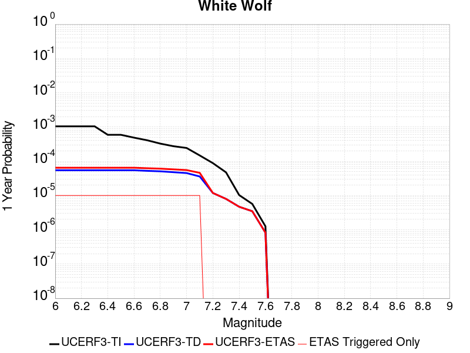 |  |

| Magnitude | 1 wk TI Prob | 1 wk TD Prob | 1 wk ETAS Prob | 1 wk ETAS/TD Gain | 1 wk ETAS Triggered Only | 1 mo TI Prob | 1 mo TD Prob | 1 mo ETAS Prob | 1 mo ETAS/TD Gain | 1 mo ETAS Triggered Only | 1 yr TI Prob | 1 yr TD Prob | 1 yr ETAS Prob | 1 yr ETAS/TD Gain | 1 yr ETAS Triggered Only | 10 yr TI Prob | 10 yr TD Prob | 10 yr ETAS Prob | 10 yr ETAS/TD Gain | 10 yr ETAS Triggered Only |
|-----|-----|-----|-----|-----|-----|-----|-----|-----|-----|-----|-----|-----|-----|-----|-----|-----|-----|-----|-----|-----|
| 6.0 | 2.0037822E-5 | 1.0468596E-6 | 1.0468596E-6 | 1.0 | 0.0 | 8.587355E-5 | 4.4865337E-6 | 4.4865337E-6 | 1.0 | 0.0 | 0.001045009 | 5.462223E-5 | 6.462168E-5 | 1.1830657 | 1.0E-5 | 0.010401085 | 5.460931E-4 | 5.660822E-4 | 1.0366038 | 2.0E-5 |
| 6.1 | 2.0037822E-5 | 1.0468596E-6 | 1.0468596E-6 | 1.0 | 0.0 | 8.587355E-5 | 4.4865337E-6 | 4.4865337E-6 | 1.0 | 0.0 | 0.001045009 | 5.462223E-5 | 6.462168E-5 | 1.1830657 | 1.0E-5 | 0.010401085 | 5.460931E-4 | 5.660822E-4 | 1.0366038 | 2.0E-5 |
| 6.2 | 2.0037822E-5 | 1.0468596E-6 | 1.0468596E-6 | 1.0 | 0.0 | 8.587355E-5 | 4.4865337E-6 | 4.4865337E-6 | 1.0 | 0.0 | 0.001045009 | 5.462223E-5 | 6.462168E-5 | 1.1830657 | 1.0E-5 | 0.010401085 | 5.460931E-4 | 5.660822E-4 | 1.0366038 | 2.0E-5 |
| 6.3 | 2.0037822E-5 | 1.0468596E-6 | 1.0468596E-6 | 1.0 | 0.0 | 8.587355E-5 | 4.4865337E-6 | 4.4865337E-6 | 1.0 | 0.0 | 0.001045009 | 5.462223E-5 | 6.462168E-5 | 1.1830657 | 1.0E-5 | 0.010401085 | 5.460931E-4 | 5.660822E-4 | 1.0366038 | 2.0E-5 |
| 6.4 | 1.132487E-5 | 1.0468596E-6 | 1.0468596E-6 | 1.0 | 0.0 | 4.8534253E-5 | 4.4865337E-6 | 4.4865337E-6 | 1.0 | 0.0 | 5.907443E-4 | 5.462223E-5 | 6.462168E-5 | 1.1830657 | 1.0E-5 | 0.005891764 | 5.460931E-4 | 5.660822E-4 | 1.0366038 | 2.0E-5 |
| 6.5 | 1.132487E-5 | 1.0468596E-6 | 1.0468596E-6 | 1.0 | 0.0 | 4.8534253E-5 | 4.4865337E-6 | 4.4865337E-6 | 1.0 | 0.0 | 5.907443E-4 | 5.462223E-5 | 6.462168E-5 | 1.1830657 | 1.0E-5 | 0.005891764 | 5.460931E-4 | 5.660822E-4 | 1.0366038 | 2.0E-5 |
| 6.6 | 9.347473E-6 | 1.0468596E-6 | 1.0468596E-6 | 1.0 | 0.0 | 4.0059982E-5 | 4.4865337E-6 | 4.4865337E-6 | 1.0 | 0.0 | 4.8762115E-4 | 5.462223E-5 | 6.462168E-5 | 1.1830657 | 1.0E-5 | 0.0048655253 | 5.460931E-4 | 5.660822E-4 | 1.0366038 | 2.0E-5 |
| 6.7 | 7.842647E-6 | 1.0047786E-6 | 1.0047786E-6 | 1.0 | 0.0 | 3.361091E-5 | 4.306187E-6 | 4.306187E-6 | 1.0 | 0.0 | 4.0913603E-4 | 5.2426618E-5 | 6.2426094E-5 | 1.1907328 | 1.0E-5 | 0.004083836 | 5.241474E-4 | 5.44137E-4 | 1.0381372 | 2.0E-5 |
| 6.8 | 6.26597E-6 | 9.7343E-7 | 9.7343E-7 | 1.0 | 0.0 | 2.685388E-5 | 4.1718367E-6 | 4.1718367E-6 | 1.0 | 0.0 | 3.2689696E-4 | 5.0790975E-5 | 6.079047E-5 | 1.1968753 | 1.0E-5 | 0.003264165 | 5.0779857E-4 | 5.277884E-4 | 1.0393656 | 2.0E-5 |
| 6.9 | 5.258436E-6 | 9.182746E-7 | 9.182746E-7 | 1.0 | 0.0 | 2.2535958E-5 | 3.935457E-6 | 3.935457E-6 | 1.0 | 0.0 | 2.7434074E-4 | 4.7913185E-5 | 5.7912705E-5 | 1.2087008 | 1.0E-5 | 0.0027400232 | 4.7903333E-4 | 4.9902376E-4 | 1.0417308 | 2.0E-5 |
| 7.0 | 4.675028E-6 | 8.660714E-7 | 8.660714E-7 | 1.0 | 0.0 | 2.003568E-5 | 3.7117295E-6 | 3.7117295E-6 | 1.0 | 0.0 | 2.4390711E-4 | 4.5189416E-5 | 5.5188964E-5 | 1.2212807 | 1.0E-5 | 0.0024363957 | 4.51807E-4 | 4.7179795E-4 | 1.0442467 | 2.0E-5 |
| 7.1 | 2.8270078E-6 | 6.8737774E-7 | 6.8737774E-7 | 1.0 | 0.0 | 1.2115692E-5 | 2.9459015E-6 | 2.9459015E-6 | 1.0 | 0.0 | 1.4749856E-4 | 3.5865804E-5 | 4.5865443E-5 | 1.2788072 | 1.0E-5 | 0.001474007 | 3.5860424E-4 | 3.7859706E-4 | 1.0557518 | 2.0E-5 |
| 7.2 | 1.6881406E-6 | 2.2703436E-7 | 2.2703436E-7 | 1.0 | 0.0 | 7.2348685E-6 | 9.73004E-7 | 9.73004E-7 | 1.0 | 0.0 | 8.808096E-5 | 1.1846261E-5 | 1.1846261E-5 | 1.0 | 0.0 | 8.8046055E-4 | 1.1845645E-4 | 1.1845645E-4 | 1.0 | 0.0 |
| 7.3 | 9.086107E-7 | 1.5264499E-7 | 1.5264499E-7 | 1.0 | 0.0 | 3.8940398E-6 | 6.5419266E-7 | 6.5419266E-7 | 1.0 | 0.0 | 4.7408903E-5 | 7.964767E-6 | 7.964767E-6 | 1.0 | 0.0 | 4.739879E-4 | 7.96449E-5 | 7.96449E-5 | 1.0 | 0.0 |
| 7.4 | 1.9717383E-7 | 9.003402E-8 | 9.003402E-8 | 1.0 | 0.0 | 8.450304E-7 | 3.8586003E-7 | 3.8586003E-7 | 1.0 | 0.0 | 1.0288197E-5 | 4.697836E-6 | 4.697836E-6 | 1.0 | 0.0 | 1.028772E-4 | 4.69774E-5 | 4.69774E-5 | 1.0 | 0.0 |
| 7.5 | 1.086975E-7 | 6.659665E-8 | 6.659665E-8 | 1.0 | 0.0 | 4.6584634E-7 | 2.8541416E-7 | 2.8541416E-7 | 1.0 | 0.0 | 5.6716644E-6 | 3.4749123E-6 | 3.4749123E-6 | 1.0 | 0.0 | 5.6715195E-5 | 3.4748602E-5 | 3.4748602E-5 | 1.0 | 0.0 |
| 7.6 | 2.4217808E-8 | 1.5820849E-8 | 1.5820849E-8 | 1.0 | 0.0 | 1.03790605E-7 | 6.780364E-8 | 6.780364E-8 | 1.0 | 0.0 | 1.2636499E-6 | 8.25509E-7 | 8.25509E-7 | 1.0 | 0.0 | 1.2636427E-5 | 8.255064E-6 | 8.255064E-6 | 1.0 | 0.0 |

## Hollywood
*[(top)](#table-of-contents)*

| 1 Week | 1 Month | 1 Year | 10 Year |
|-----|-----|-----|-----|
| 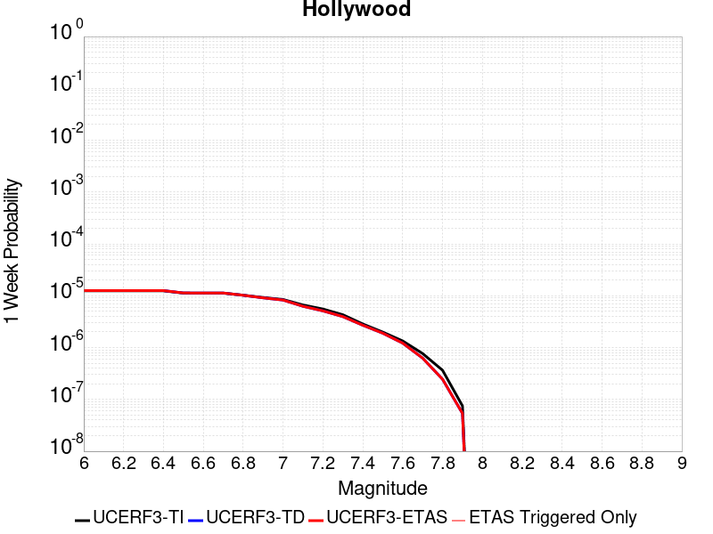 |  | 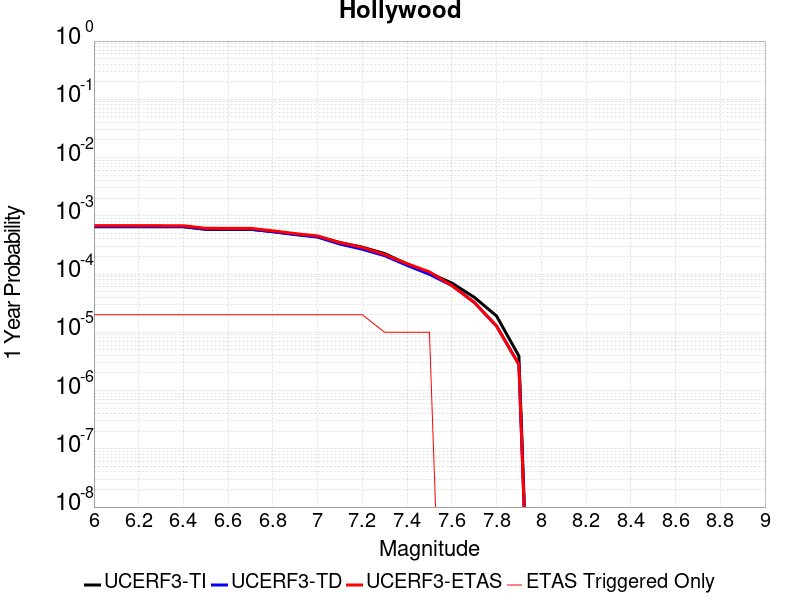 |  |

| Magnitude | 1 wk TI Prob | 1 wk TD Prob | 1 wk ETAS Prob | 1 wk ETAS/TD Gain | 1 wk ETAS Triggered Only | 1 mo TI Prob | 1 mo TD Prob | 1 mo ETAS Prob | 1 mo ETAS/TD Gain | 1 mo ETAS Triggered Only | 1 yr TI Prob | 1 yr TD Prob | 1 yr ETAS Prob | 1 yr ETAS/TD Gain | 1 yr ETAS Triggered Only | 10 yr TI Prob | 10 yr TD Prob | 10 yr ETAS Prob | 10 yr ETAS/TD Gain | 10 yr ETAS Triggered Only |
|-----|-----|-----|-----|-----|-----|-----|-----|-----|-----|-----|-----|-----|-----|-----|-----|-----|-----|-----|-----|-----|
| 6.0 | 1.24487615E-5 | 1.2593243E-5 | 1.2593243E-5 | 1.0 | 0.0 | 5.3350745E-5 | 5.396995E-5 | 7.396887E-5 | 1.3705566 | 2.0E-5 | 6.4935174E-4 | 6.568907E-4 | 6.7687756E-4 | 1.0304265 | 2.0E-5 | 0.0064745755 | 0.0065499777 | 0.0065698465 | 1.0030334 | 2.0E-5 |
| 6.1 | 1.24487615E-5 | 1.2593243E-5 | 1.2593243E-5 | 1.0 | 0.0 | 5.3350745E-5 | 5.396995E-5 | 7.396887E-5 | 1.3705566 | 2.0E-5 | 6.4935174E-4 | 6.568907E-4 | 6.7687756E-4 | 1.0304265 | 2.0E-5 | 0.0064745755 | 0.0065499777 | 0.0065698465 | 1.0030334 | 2.0E-5 |
| 6.2 | 1.24487615E-5 | 1.2593243E-5 | 1.2593243E-5 | 1.0 | 0.0 | 5.3350745E-5 | 5.396995E-5 | 7.396887E-5 | 1.3705566 | 2.0E-5 | 6.4935174E-4 | 6.568907E-4 | 6.7687756E-4 | 1.0304265 | 2.0E-5 | 0.0064745755 | 0.0065499777 | 0.0065698465 | 1.0030334 | 2.0E-5 |
| 6.3 | 1.24487615E-5 | 1.2593243E-5 | 1.2593243E-5 | 1.0 | 0.0 | 5.3350745E-5 | 5.396995E-5 | 7.396887E-5 | 1.3705566 | 2.0E-5 | 6.4935174E-4 | 6.568907E-4 | 6.7687756E-4 | 1.0304265 | 2.0E-5 | 0.0064745755 | 0.0065499777 | 0.0065698465 | 1.0030334 | 2.0E-5 |
| 6.4 | 1.2431024E-5 | 1.2573856E-5 | 1.2573856E-5 | 1.0 | 0.0 | 5.327473E-5 | 5.388687E-5 | 7.388579E-5 | 1.371128 | 2.0E-5 | 6.4842677E-4 | 6.558798E-4 | 6.758667E-4 | 1.0304734 | 2.0E-5 | 0.0064653796 | 0.0065399283 | 0.0065597976 | 1.0030382 | 2.0E-5 |
| 6.5 | 1.1242222E-5 | 1.1317817E-5 | 1.1317817E-5 | 1.0 | 0.0 | 4.8180063E-5 | 4.850404E-5 | 6.850307E-5 | 1.4123168 | 2.0E-5 | 5.864344E-4 | 5.9037935E-4 | 6.1036757E-4 | 1.0338565 | 2.0E-5 | 0.0058488925 | 0.0058883964 | 0.0059082787 | 1.0033765 | 2.0E-5 |
| 6.6 | 1.1234066E-5 | 1.130893E-5 | 1.130893E-5 | 1.0 | 0.0 | 4.8145106E-5 | 4.8465958E-5 | 6.8464986E-5 | 1.4126408 | 2.0E-5 | 5.86009E-4 | 5.8991596E-4 | 6.099042E-4 | 1.0338831 | 2.0E-5 | 0.005844661 | 0.005883787 | 0.005903669 | 1.0033792 | 2.0E-5 |
| 6.7 | 1.12294E-5 | 1.1303674E-5 | 1.1303674E-5 | 1.0 | 0.0 | 4.812511E-5 | 4.844343E-5 | 6.844246E-5 | 1.4128326 | 2.0E-5 | 5.857657E-4 | 5.8964186E-4 | 6.096301E-4 | 1.033899 | 2.0E-5 | 0.0058422405 | 0.00588106 | 0.0059009427 | 1.0033808 | 2.0E-5 |
| 6.8 | 1.0252819E-5 | 1.02184595E-5 | 1.02184595E-5 | 1.0 | 0.0 | 4.3939912E-5 | 4.3792672E-5 | 6.37918E-5 | 1.4566774 | 2.0E-5 | 5.3483713E-4 | 5.330475E-4 | 5.530368E-4 | 1.0375001 | 2.0E-5 | 0.005335517 | 0.005317915 | 0.0053378087 | 1.0037409 | 2.0E-5 |
| 6.9 | 9.252289E-6 | 9.110319E-6 | 9.110319E-6 | 1.0 | 0.0 | 3.9652066E-5 | 3.904365E-5 | 5.9042868E-5 | 1.5122272 | 2.0E-5 | 4.8265693E-4 | 4.752544E-4 | 4.9524487E-4 | 1.0420628 | 2.0E-5 | 0.0048161 | 0.0047425535 | 0.0047624586 | 1.0041971 | 2.0E-5 |
| 7.0 | 8.474604E-6 | 8.258269E-6 | 8.258269E-6 | 1.0 | 0.0 | 3.6319227E-5 | 3.539211E-5 | 5.5391403E-5 | 1.5650777 | 2.0E-5 | 4.4209688E-4 | 4.3081518E-4 | 4.5080655E-4 | 1.0464036 | 2.0E-5 | 0.004412184 | 0.0042999503 | 0.0043198643 | 1.0046312 | 2.0E-5 |
| 7.1 | 6.643643E-6 | 6.2683766E-6 | 6.2683766E-6 | 1.0 | 0.0 | 2.8472443E-5 | 2.6864198E-5 | 4.686366E-5 | 1.7444652 | 2.0E-5 | 3.4659685E-4 | 3.2702295E-4 | 3.470164E-4 | 1.0611378 | 2.0E-5 | 0.0034605677 | 0.003265463 | 0.0032853978 | 1.0061047 | 2.0E-5 |
| 7.2 | 5.549002E-6 | 5.1087136E-6 | 5.1087136E-6 | 1.0 | 0.0 | 2.378122E-5 | 2.1894304E-5 | 4.1893865E-5 | 1.9134597 | 2.0E-5 | 2.8949787E-4 | 2.665307E-4 | 2.8652535E-4 | 1.0750183 | 2.0E-5 | 0.0028912104 | 0.0026621267 | 0.0026820735 | 1.0074928 | 2.0E-5 |
| 7.3 | 4.3059727E-6 | 3.959896E-6 | 3.959896E-6 | 1.0 | 0.0 | 1.8454039E-5 | 1.6970871E-5 | 2.6970702E-5 | 1.589235 | 1.0E-5 | 2.2465475E-4 | 2.0660086E-4 | 2.165988E-4 | 1.0483925 | 1.0E-5 | 0.0022442779 | 0.002064098 | 0.0020740773 | 1.0048348 | 1.0E-5 |
| 7.4 | 2.8550733E-6 | 2.7013034E-6 | 2.7013034E-6 | 1.0 | 0.0 | 1.2235971E-5 | 1.15769635E-5 | 2.1576849E-5 | 1.8637743 | 1.0E-5 | 1.4896276E-4 | 1.4094046E-4 | 1.5093906E-4 | 1.0709419 | 1.0E-5 | 0.0014886294 | 0.0014085158 | 0.0014185017 | 1.0070896 | 1.0E-5 |
| 7.5 | 1.9927045E-6 | 1.8976416E-6 | 1.8976416E-6 | 1.0 | 0.0 | 8.540134E-6 | 8.132724E-6 | 1.8132643E-5 | 2.2295902 | 1.0E-5 | 1.0397117E-4 | 9.901146E-5 | 1.0901047E-4 | 1.1009884 | 1.0E-5 | 0.0010392254 | 9.89677E-4 | 9.996672E-4 | 1.0100943 | 1.0E-5 |
| 7.6 | 1.345084E-6 | 1.2216036E-6 | 1.2216036E-6 | 1.0 | 0.0 | 5.764633E-6 | 5.2354335E-6 | 5.2354335E-6 | 1.0 | 0.0 | 7.018215E-5 | 6.373956E-5 | 6.373956E-5 | 1.0 | 0.0 | 7.0159987E-4 | 6.3721475E-4 | 6.3721475E-4 | 1.0 | 0.0 |
| 7.7 | 7.6835164E-7 | 6.277708E-7 | 6.277708E-7 | 1.0 | 0.0 | 3.2929315E-6 | 2.6904436E-6 | 2.6904436E-6 | 1.0 | 0.0 | 4.00907E-5 | 3.2755674E-5 | 3.2755674E-5 | 1.0 | 0.0 | 4.0083472E-4 | 3.2750994E-4 | 3.2750994E-4 | 1.0 | 0.0 |
| 7.8 | 3.6562128E-7 | 2.4534793E-7 | 2.4534793E-7 | 1.0 | 0.0 | 1.5669474E-6 | 1.0514907E-6 | 1.0514907E-6 | 1.0 | 0.0 | 1.9077417E-5 | 1.2801828E-5 | 1.2801828E-5 | 1.0 | 0.0 | 1.907578E-4 | 1.2801128E-4 | 1.2801128E-4 | 1.0 | 0.0 |
| 7.9 | 7.5024424E-8 | 5.3817473E-8 | 5.3817473E-8 | 1.0 | 0.0 | 3.215332E-7 | 2.3064631E-7 | 2.3064631E-7 | 1.0 | 0.0 | 3.91466E-6 | 2.8081165E-6 | 2.8081165E-6 | 1.0 | 0.0 | 3.9145907E-5 | 2.808094E-5 | 2.808094E-5 | 1.0 | 0.0 |

## Monterey Bay-Tularcitos
*[(top)](#table-of-contents)*

| 1 Week | 1 Month | 1 Year | 10 Year |
|-----|-----|-----|-----|
|  |  |  |  |

| Magnitude | 1 wk TI Prob | 1 wk TD Prob | 1 wk ETAS Prob | 1 wk ETAS/TD Gain | 1 wk ETAS Triggered Only | 1 mo TI Prob | 1 mo TD Prob | 1 mo ETAS Prob | 1 mo ETAS/TD Gain | 1 mo ETAS Triggered Only | 1 yr TI Prob | 1 yr TD Prob | 1 yr ETAS Prob | 1 yr ETAS/TD Gain | 1 yr ETAS Triggered Only | 10 yr TI Prob | 10 yr TD Prob | 10 yr ETAS Prob | 10 yr ETAS/TD Gain | 10 yr ETAS Triggered Only |
|-----|-----|-----|-----|-----|-----|-----|-----|-----|-----|-----|-----|-----|-----|-----|-----|-----|-----|-----|-----|-----|
| 6.0 | 3.0131365E-5 | 3.2798805E-5 | 4.2798478E-5 | 1.3048792 | 1.0E-5 | 1.2912804E-4 | 1.4055934E-4 | 1.5055793E-4 | 1.0711343 | 1.0E-5 | 0.001571 | 0.0017100722 | 0.001720055 | 1.0058377 | 1.0E-5 | 0.015599402 | 0.016979935 | 0.016999597 | 1.0011579 | 2.0E-5 |
| 6.1 | 3.0131365E-5 | 3.2798805E-5 | 4.2798478E-5 | 1.3048792 | 1.0E-5 | 1.2912804E-4 | 1.4055934E-4 | 1.5055793E-4 | 1.0711343 | 1.0E-5 | 0.001571 | 0.0017100722 | 0.001720055 | 1.0058377 | 1.0E-5 | 0.015599402 | 0.016979935 | 0.016999597 | 1.0011579 | 2.0E-5 |
| 6.2 | 3.0131365E-5 | 3.2798805E-5 | 4.2798478E-5 | 1.3048792 | 1.0E-5 | 1.2912804E-4 | 1.4055934E-4 | 1.5055793E-4 | 1.0711343 | 1.0E-5 | 0.001571 | 0.0017100722 | 0.001720055 | 1.0058377 | 1.0E-5 | 0.015599402 | 0.016979935 | 0.016999597 | 1.0011579 | 2.0E-5 |
| 6.3 | 1.6998249E-5 | 1.8330817E-5 | 1.8330817E-5 | 1.0 | 0.0 | 7.28476E-5 | 7.855838E-5 | 7.855838E-5 | 1.0 | 0.0 | 8.865586E-4 | 9.5604727E-4 | 9.5604727E-4 | 1.0 | 0.0 | 0.0088303005 | 0.009521267 | 0.009521267 | 1.0 | 0.0 |
| 6.4 | 1.6998249E-5 | 1.8330817E-5 | 1.8330817E-5 | 1.0 | 0.0 | 7.28476E-5 | 7.855838E-5 | 7.855838E-5 | 1.0 | 0.0 | 8.865586E-4 | 9.5604727E-4 | 9.5604727E-4 | 1.0 | 0.0 | 0.0088303005 | 0.009521267 | 0.009521267 | 1.0 | 0.0 |
| 6.5 | 1.27470785E-5 | 1.3693326E-5 | 1.3693326E-5 | 1.0 | 0.0 | 5.4629192E-5 | 5.8684418E-5 | 5.8684418E-5 | 1.0 | 0.0 | 6.649074E-4 | 7.1425893E-4 | 7.1425893E-4 | 1.0 | 0.0 | 0.0066292146 | 0.007120685 | 0.007120685 | 1.0 | 0.0 |
| 6.6 | 1.2739422E-5 | 1.3685412E-5 | 1.3685412E-5 | 1.0 | 0.0 | 5.4596385E-5 | 5.865051E-5 | 5.865051E-5 | 1.0 | 0.0 | 6.645082E-4 | 7.1384636E-4 | 7.1384636E-4 | 1.0 | 0.0 | 0.0066252467 | 0.0071165855 | 0.0071165855 | 1.0 | 0.0 |
| 6.7 | 1.0160109E-5 | 1.0885765E-5 | 1.0885765E-5 | 1.0 | 0.0 | 4.35426E-5 | 4.6652483E-5 | 4.6652483E-5 | 1.0 | 0.0 | 5.300022E-4 | 5.67853E-4 | 5.67853E-4 | 1.0 | 0.0 | 0.005287399 | 0.0056647314 | 0.0056647314 | 1.0 | 0.0 |
| 6.8 | 8.349859E-6 | 8.932595E-6 | 8.932595E-6 | 1.0 | 0.0 | 3.578462E-5 | 3.8282018E-5 | 3.8282018E-5 | 1.0 | 0.0 | 4.3559066E-4 | 4.6598958E-4 | 4.6598958E-4 | 1.0 | 0.0 | 0.004347378 | 0.004650689 | 0.004650689 | 1.0 | 0.0 |
| 6.9 | 5.193639E-6 | 5.536435E-6 | 5.536435E-6 | 1.0 | 0.0 | 2.2258262E-5 | 2.372738E-5 | 2.372738E-5 | 1.0 | 0.0 | 2.7096065E-4 | 2.8884583E-4 | 2.8884583E-4 | 1.0 | 0.0 | 0.0027063051 | 0.0028850248 | 0.0028850248 | 1.0 | 0.0 |
| 7.0 | 4.359381E-6 | 4.64337E-6 | 4.64337E-6 | 1.0 | 0.0 | 1.8682927E-5 | 1.9900022E-5 | 1.9900022E-5 | 1.0 | 0.0 | 2.274409E-4 | 2.422588E-4 | 2.422588E-4 | 1.0 | 0.0 | 0.0022720827 | 0.00242024 | 0.00242024 | 1.0 | 0.0 |
| 7.1 | 3.0398533E-6 | 3.2310454E-6 | 3.2310454E-6 | 1.0 | 0.0 | 1.3027877E-5 | 1.3847279E-5 | 1.3847279E-5 | 1.0 | 0.0 | 1.5860285E-4 | 1.685802E-4 | 1.685802E-4 | 1.0 | 0.0 | 0.001584897 | 0.0016847808 | 0.0016847808 | 1.0 | 0.0 |
| 7.2 | 1.642335E-6 | 1.7333168E-6 | 1.7333168E-6 | 1.0 | 0.0 | 7.0385595E-6 | 7.4284912E-6 | 7.4284912E-6 | 1.0 | 0.0 | 8.569109E-5 | 9.04402E-5 | 9.04402E-5 | 1.0 | 0.0 | 8.5658056E-4 | 9.0423663E-4 | 9.0423663E-4 | 1.0 | 0.0 |
| 7.3 | 3.356842E-7 | 3.295241E-7 | 3.295241E-7 | 1.0 | 0.0 | 1.4386458E-6 | 1.4122454E-6 | 1.4122454E-6 | 1.0 | 0.0 | 1.7515373E-5 | 1.7193954E-5 | 1.7193954E-5 | 1.0 | 0.0 | 1.7513991E-4 | 1.7192632E-4 | 1.7192632E-4 | 1.0 | 0.0 |
| 7.4 | 2.1973483E-7 | 2.1006431E-7 | 2.1006431E-7 | 1.0 | 0.0 | 9.417204E-7 | 9.002753E-7 | 9.002753E-7 | 1.0 | 0.0 | 1.1465385E-5 | 1.0960797E-5 | 1.0960797E-5 | 1.0 | 0.0 | 1.1464794E-4 | 1.096026E-4 | 1.096026E-4 | 1.0 | 0.0 |
| 7.5 | 1.1944135E-7 | 1.06960485E-7 | 1.06960485E-7 | 1.0 | 0.0 | 5.118914E-7 | 4.58402E-7 | 4.58402E-7 | 1.0 | 0.0 | 6.23226E-6 | 5.58103E-6 | 5.58103E-6 | 1.0 | 0.0 | 6.2320854E-5 | 5.5808912E-5 | 5.5808912E-5 | 1.0 | 0.0 |
| 7.6 | 4.636058E-8 | 3.3364543E-8 | 3.3364543E-8 | 1.0 | 0.0 | 1.9868818E-7 | 1.429909E-7 | 1.429909E-7 | 1.0 | 0.0 | 2.419026E-6 | 1.7409128E-6 | 1.7409128E-6 | 1.0 | 0.0 | 2.4189996E-5 | 1.7408995E-5 | 1.7408995E-5 | 1.0 | 0.0 |
| 7.7 | 1.8588572E-8 | 8.003237E-9 | 8.003237E-9 | 1.0 | 0.0 | 7.9665305E-8 | 3.4299585E-8 | 3.4299585E-8 | 1.0 | 0.0 | 9.699246E-7 | 4.175974E-7 | 4.175974E-7 | 1.0 | 0.0 | 9.699204E-6 | 4.1759663E-6 | 4.1759663E-6 | 1.0 | 0.0 |
| 7.8 | 2.7960154E-9 | 7.608676E-10 | 7.608676E-10 | 1.0 | 0.0 | 1.1982923E-8 | 3.2608616E-9 | 3.2608616E-9 | 1.0 | 0.0 | 1.4589209E-7 | 3.970099E-8 | 3.970099E-8 | 1.0 | 0.0 | 1.4589199E-6 | 3.9700987E-7 | 3.9700987E-7 | 1.0 | 0.0 |

## Hayward (So) extension 2011 CFM
*[(top)](#table-of-contents)*

| 1 Week | 1 Month | 1 Year | 10 Year |
|-----|-----|-----|-----|
|  |  | 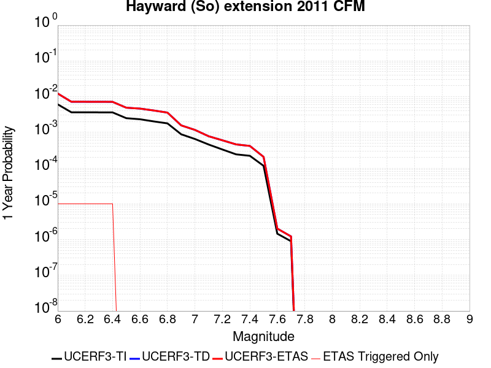 |  |

| Magnitude | 1 wk TI Prob | 1 wk TD Prob | 1 wk ETAS Prob | 1 wk ETAS/TD Gain | 1 wk ETAS Triggered Only | 1 mo TI Prob | 1 mo TD Prob | 1 mo ETAS Prob | 1 mo ETAS/TD Gain | 1 mo ETAS Triggered Only | 1 yr TI Prob | 1 yr TD Prob | 1 yr ETAS Prob | 1 yr ETAS/TD Gain | 1 yr ETAS Triggered Only | 10 yr TI Prob | 10 yr TD Prob | 10 yr ETAS Prob | 10 yr ETAS/TD Gain | 10 yr ETAS Triggered Only |
|-----|-----|-----|-----|-----|-----|-----|-----|-----|-----|-----|-----|-----|-----|-----|-----|-----|-----|-----|-----|-----|
| 6.0 | 1.1721256E-4 | 2.3670816E-4 | 2.467058E-4 | 1.0422361 | 1.0E-5 | 5.022428E-4 | 0.0010138851 | 0.001023875 | 1.009853 | 1.0E-5 | 0.0060976758 | 0.012250669 | 0.012260547 | 1.0008063 | 1.0E-5 | 0.0593305 | 0.11284459 | 0.112862326 | 1.0001572 | 2.0E-5 |
| 6.1 | 6.99169E-5 | 1.3808318E-4 | 1.480818E-4 | 1.0724101 | 1.0E-5 | 2.9960944E-4 | 5.915603E-4 | 6.0155446E-4 | 1.0168945 | 1.0E-5 | 0.0036416445 | 0.0071723936 | 0.007182322 | 1.0013843 | 1.0E-5 | 0.035825435 | 0.06780445 | 0.06781377 | 1.0001374 | 1.0E-5 |
| 6.2 | 6.99169E-5 | 1.3808318E-4 | 1.480818E-4 | 1.0724101 | 1.0E-5 | 2.9960944E-4 | 5.915603E-4 | 6.0155446E-4 | 1.0168945 | 1.0E-5 | 0.0036416445 | 0.0071723936 | 0.007182322 | 1.0013843 | 1.0E-5 | 0.035825435 | 0.06780445 | 0.06781377 | 1.0001374 | 1.0E-5 |
| 6.3 | 6.970908E-5 | 1.3776461E-4 | 1.4776323E-4 | 1.0725776 | 1.0E-5 | 2.9871898E-4 | 5.9019594E-4 | 6.001901E-4 | 1.0169336 | 1.0E-5 | 0.0036308395 | 0.00715593 | 0.0071658585 | 1.0013875 | 1.0E-5 | 0.035720866 | 0.06765341 | 0.06766273 | 1.0001378 | 1.0E-5 |
| 6.4 | 6.9517155E-5 | 1.3743383E-4 | 1.4743245E-4 | 1.0727522 | 1.0E-5 | 2.9789665E-4 | 5.8877916E-4 | 5.987733E-4 | 1.0169743 | 1.0E-5 | 0.0036208609 | 0.007138843 | 0.007148772 | 1.0013908 | 1.0E-5 | 0.03562429 | 0.06749745 | 0.067506775 | 1.0001382 | 1.0E-5 |
| 6.5 | 4.786248E-5 | 9.415307E-5 | 9.415307E-5 | 1.0 | 0.0 | 2.0510878E-4 | 4.0345316E-4 | 4.0345316E-4 | 1.0 | 0.0 | 0.0024943394 | 0.0049014175 | 0.0049014175 | 1.0 | 0.0 | 0.02466527 | 0.046900682 | 0.046900682 | 1.0 | 0.0 |
| 6.6 | 4.4662214E-5 | 8.881998E-5 | 8.881998E-5 | 1.0 | 0.0 | 1.9139545E-4 | 3.8060415E-4 | 3.8060415E-4 | 1.0 | 0.0 | 0.0023277493 | 0.004624474 | 0.004624474 | 1.0 | 0.0 | 0.02303517 | 0.044291954 | 0.044291954 | 1.0 | 0.0 |
| 6.7 | 3.884542E-5 | 7.865139E-5 | 7.865139E-5 | 1.0 | 0.0 | 1.6646975E-4 | 3.3703636E-4 | 3.3703636E-4 | 1.0 | 0.0 | 0.002024885 | 0.0040961416 | 0.0040961416 | 1.0 | 0.0 | 0.020065336 | 0.039331738 | 0.039331738 | 1.0 | 0.0 |
| 6.8 | 3.4221863E-5 | 6.855951E-5 | 6.855951E-5 | 1.0 | 0.0 | 1.4665688E-4 | 2.9379575E-4 | 2.9379575E-4 | 1.0 | 0.0 | 0.0017840851 | 0.0035715173 | 0.0035715173 | 1.0 | 0.0 | 0.017698295 | 0.034418967 | 0.034418967 | 1.0 | 0.0 |
| 6.9 | 1.6927712E-5 | 3.0062887E-5 | 3.0062887E-5 | 1.0 | 0.0 | 7.2545314E-5 | 1.288349E-4 | 1.288349E-4 | 1.0 | 0.0 | 8.828813E-4 | 0.0015674933 | 0.0015674933 | 1.0 | 0.0 | 0.008793819 | 0.01546391 | 0.01546391 | 1.0 | 0.0 |
| 7.0 | 1.2509653E-5 | 2.24636E-5 | 2.24636E-5 | 1.0 | 0.0 | 5.3611697E-5 | 9.626927E-5 | 9.626927E-5 | 1.0 | 0.0 | 6.525269E-4 | 0.0011714922 | 0.0011714922 | 1.0 | 0.0 | 0.0065061417 | 0.011583302 | 0.011583302 | 1.0 | 0.0 |
| 7.1 | 8.751583E-6 | 1.4926332E-5 | 1.4926332E-5 | 1.0 | 0.0 | 3.750624E-5 | 6.396846E-5 | 6.396846E-5 | 1.0 | 0.0 | 4.5654282E-4 | 7.7854353E-4 | 7.7854353E-4 | 1.0 | 0.0 | 0.0045560603 | 0.007764545 | 0.007764545 | 1.0 | 0.0 |
| 7.2 | 6.354379E-6 | 1.1499251E-5 | 1.1499251E-5 | 1.0 | 0.0 | 2.7232769E-5 | 4.92816E-5 | 4.92816E-5 | 1.0 | 0.0 | 3.3150852E-4 | 5.998431E-4 | 5.998431E-4 | 1.0 | 0.0 | 0.0033101442 | 0.0060013747 | 0.0060013747 | 1.0 | 0.0 |
| 7.3 | 4.645554E-6 | 8.818567E-6 | 8.818567E-6 | 1.0 | 0.0 | 1.9909365E-5 | 3.7793332E-5 | 3.7793332E-5 | 1.0 | 0.0 | 2.4236954E-4 | 4.600406E-4 | 4.600406E-4 | 1.0 | 0.0 | 0.0024210536 | 0.0046115434 | 0.0046115434 | 1.0 | 0.0 |
| 7.4 | 4.23437E-6 | 7.992877E-6 | 7.992877E-6 | 1.0 | 0.0 | 1.8147173E-5 | 3.4254757E-5 | 3.4254757E-5 | 1.0 | 0.0 | 2.2091944E-4 | 4.1697573E-4 | 4.1697573E-4 | 1.0 | 0.0 | 0.0022069993 | 0.004182783 | 0.004182783 | 1.0 | 0.0 |
| 7.5 | 2.2187417E-6 | 3.952384E-6 | 3.952384E-6 | 1.0 | 0.0 | 9.508858E-6 | 1.6938691E-5 | 1.6938691E-5 | 1.0 | 0.0 | 1.157642E-4 | 2.0621167E-4 | 2.0621167E-4 | 1.0 | 0.0 | 0.0011570391 | 0.0020740323 | 0.0020740323 | 1.0 | 0.0 |
| 7.6 | 2.7952495E-8 | 3.8786112E-8 | 3.8786112E-8 | 1.0 | 0.0 | 1.1979641E-7 | 1.6622619E-7 | 1.6622619E-7 | 1.0 | 0.0 | 1.4585203E-6 | 2.023802E-6 | 2.023802E-6 | 1.0 | 0.0 | 1.4585107E-5 | 2.031746E-5 | 2.031746E-5 | 1.0 | 0.0 |
| 7.7 | 1.7192724E-8 | 2.3436794E-8 | 2.3436794E-8 | 1.0 | 0.0 | 7.36831E-8 | 1.00443394E-7 | 1.00443394E-7 | 1.0 | 0.0 | 8.9709135E-7 | 1.2228977E-6 | 1.2228977E-6 | 1.0 | 0.0 | 8.970877E-6 | 1.2286566E-5 | 1.2286566E-5 | 1.0 | 0.0 |

## Channel Islands Western Deep Ramp
*[(top)](#table-of-contents)*

| 1 Week | 1 Month | 1 Year | 10 Year |
|-----|-----|-----|-----|
|  | 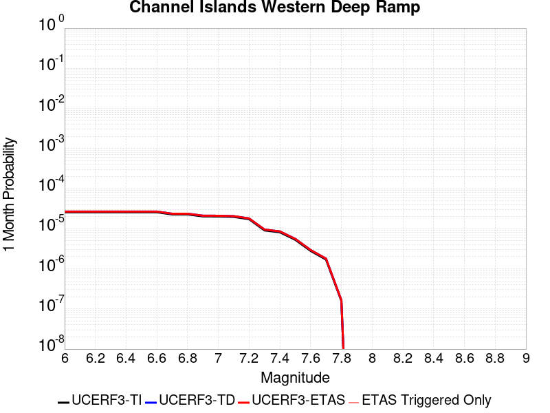 |  |  |

| Magnitude | 1 wk TI Prob | 1 wk TD Prob | 1 wk ETAS Prob | 1 wk ETAS/TD Gain | 1 wk ETAS Triggered Only | 1 mo TI Prob | 1 mo TD Prob | 1 mo ETAS Prob | 1 mo ETAS/TD Gain | 1 mo ETAS Triggered Only | 1 yr TI Prob | 1 yr TD Prob | 1 yr ETAS Prob | 1 yr ETAS/TD Gain | 1 yr ETAS Triggered Only | 10 yr TI Prob | 10 yr TD Prob | 10 yr ETAS Prob | 10 yr ETAS/TD Gain | 10 yr ETAS Triggered Only |
|-----|-----|-----|-----|-----|-----|-----|-----|-----|-----|-----|-----|-----|-----|-----|-----|-----|-----|-----|-----|-----|
| 6.0 | 6.0213506E-6 | 6.2548716E-6 | 6.2548716E-6 | 1.0 | 0.0 | 2.5805533E-5 | 2.6806341E-5 | 2.6806341E-5 | 1.0 | 0.0 | 3.1413708E-4 | 3.263228E-4 | 3.3631953E-4 | 1.0306345 | 1.0E-5 | 0.0031369338 | 0.003258878 | 0.0032788126 | 1.0061171 | 2.0E-5 |
| 6.1 | 6.0213506E-6 | 6.2548716E-6 | 6.2548716E-6 | 1.0 | 0.0 | 2.5805533E-5 | 2.6806341E-5 | 2.6806341E-5 | 1.0 | 0.0 | 3.1413708E-4 | 3.263228E-4 | 3.3631953E-4 | 1.0306345 | 1.0E-5 | 0.0031369338 | 0.003258878 | 0.0032788126 | 1.0061171 | 2.0E-5 |
| 6.2 | 6.0213506E-6 | 6.2548716E-6 | 6.2548716E-6 | 1.0 | 0.0 | 2.5805533E-5 | 2.6806341E-5 | 2.6806341E-5 | 1.0 | 0.0 | 3.1413708E-4 | 3.263228E-4 | 3.3631953E-4 | 1.0306345 | 1.0E-5 | 0.0031369338 | 0.003258878 | 0.0032788126 | 1.0061171 | 2.0E-5 |
| 6.3 | 6.0213506E-6 | 6.2548716E-6 | 6.2548716E-6 | 1.0 | 0.0 | 2.5805533E-5 | 2.6806341E-5 | 2.6806341E-5 | 1.0 | 0.0 | 3.1413708E-4 | 3.263228E-4 | 3.3631953E-4 | 1.0306345 | 1.0E-5 | 0.0031369338 | 0.003258878 | 0.0032788126 | 1.0061171 | 2.0E-5 |
| 6.4 | 6.0213506E-6 | 6.2548716E-6 | 6.2548716E-6 | 1.0 | 0.0 | 2.5805533E-5 | 2.6806341E-5 | 2.6806341E-5 | 1.0 | 0.0 | 3.1413708E-4 | 3.263228E-4 | 3.3631953E-4 | 1.0306345 | 1.0E-5 | 0.0031369338 | 0.003258878 | 0.0032788126 | 1.0061171 | 2.0E-5 |
| 6.5 | 6.0213506E-6 | 6.2548716E-6 | 6.2548716E-6 | 1.0 | 0.0 | 2.5805533E-5 | 2.6806341E-5 | 2.6806341E-5 | 1.0 | 0.0 | 3.1413708E-4 | 3.263228E-4 | 3.3631953E-4 | 1.0306345 | 1.0E-5 | 0.0031369338 | 0.003258878 | 0.0032788126 | 1.0061171 | 2.0E-5 |
| 6.6 | 6.0213506E-6 | 6.2548716E-6 | 6.2548716E-6 | 1.0 | 0.0 | 2.5805533E-5 | 2.6806341E-5 | 2.6806341E-5 | 1.0 | 0.0 | 3.1413708E-4 | 3.263228E-4 | 3.3631953E-4 | 1.0306345 | 1.0E-5 | 0.0031369338 | 0.003258878 | 0.0032788126 | 1.0061171 | 2.0E-5 |
| 6.7 | 5.313309E-6 | 5.525243E-6 | 5.525243E-6 | 1.0 | 0.0 | 2.2771126E-5 | 2.3679422E-5 | 2.3679422E-5 | 1.0 | 0.0 | 2.772032E-4 | 2.882629E-4 | 2.9826004E-4 | 1.0346806 | 1.0E-5 | 0.0027685766 | 0.0028792932 | 0.0028992356 | 1.0069262 | 2.0E-5 |
| 6.8 | 5.313309E-6 | 5.525243E-6 | 5.525243E-6 | 1.0 | 0.0 | 2.2771126E-5 | 2.3679422E-5 | 2.3679422E-5 | 1.0 | 0.0 | 2.772032E-4 | 2.882629E-4 | 2.9826004E-4 | 1.0346806 | 1.0E-5 | 0.0027685766 | 0.0028792932 | 0.0028992356 | 1.0069262 | 2.0E-5 |
| 6.9 | 4.744377E-6 | 4.939433E-6 | 4.939433E-6 | 1.0 | 0.0 | 2.0332885E-5 | 2.1168848E-5 | 2.1168848E-5 | 1.0 | 0.0 | 2.4752476E-4 | 2.5770397E-4 | 2.677014E-4 | 1.0387942 | 1.0E-5 | 0.0024724922 | 0.0025744187 | 0.0025943674 | 1.0077487 | 2.0E-5 |
| 7.0 | 4.722209E-6 | 4.9164755E-6 | 4.9164755E-6 | 1.0 | 0.0 | 2.0237881E-5 | 2.107046E-5 | 2.107046E-5 | 1.0 | 0.0 | 2.4636835E-4 | 2.565064E-4 | 2.6650383E-4 | 1.0389754 | 1.0E-5 | 0.002460954 | 0.0025624707 | 0.0025824194 | 1.007785 | 2.0E-5 |
| 7.1 | 4.611174E-6 | 4.8014113E-6 | 4.8014113E-6 | 1.0 | 0.0 | 1.9762025E-5 | 2.0577336E-5 | 2.0577336E-5 | 1.0 | 0.0 | 2.4057609E-4 | 2.50504E-4 | 2.605015E-4 | 1.0399095 | 1.0E-5 | 0.002403158 | 0.0025025832 | 0.002522533 | 1.0079718 | 2.0E-5 |
| 7.2 | 4.043994E-6 | 4.2120287E-6 | 4.2120287E-6 | 1.0 | 0.0 | 1.7331287E-5 | 1.8051447E-5 | 1.8051447E-5 | 1.0 | 0.0 | 2.10988E-4 | 2.1975777E-4 | 2.2975558E-4 | 1.0454947 | 1.0E-5 | 0.002107878 | 0.0021957553 | 0.0022157114 | 1.0090885 | 2.0E-5 |
| 7.3 | 2.1233036E-6 | 2.2297888E-6 | 2.2297888E-6 | 1.0 | 0.0 | 9.099841E-6 | 9.556203E-6 | 9.556203E-6 | 1.0 | 0.0 | 1.1078493E-4 | 1.1634062E-4 | 1.1634062E-4 | 1.0 | 0.0 | 0.0011072971 | 0.0011628027 | 0.001172791 | 1.0085899 | 1.0E-5 |
| 7.4 | 1.9051884E-6 | 2.0014986E-6 | 2.0014986E-6 | 1.0 | 0.0 | 8.165067E-6 | 8.577823E-6 | 8.577823E-6 | 1.0 | 0.0 | 9.940516E-5 | 1.04430044E-4 | 1.04430044E-4 | 1.0 | 0.0 | 9.93607E-4 | 0.0010438149 | 0.0010538045 | 1.0095702 | 1.0E-5 |
| 7.5 | 1.2408497E-6 | 1.3038847E-6 | 1.3038847E-6 | 1.0 | 0.0 | 5.317916E-6 | 5.5880655E-6 | 5.5880655E-6 | 1.0 | 0.0 | 6.4743705E-5 | 6.80326E-5 | 6.80326E-5 | 1.0 | 0.0 | 6.4724847E-4 | 6.8011985E-4 | 6.9011305E-4 | 1.0146933 | 1.0E-5 |
| 7.6 | 6.5440025E-7 | 6.8867223E-7 | 6.8867223E-7 | 1.0 | 0.0 | 2.8045695E-6 | 2.9514492E-6 | 2.9514492E-6 | 1.0 | 0.0 | 3.4145098E-5 | 3.5933317E-5 | 3.5933317E-5 | 1.0 | 0.0 | 3.4139853E-4 | 3.5927648E-4 | 3.5927648E-4 | 1.0 | 0.0 |
| 7.7 | 3.985963E-7 | 4.1930815E-7 | 4.1930815E-7 | 1.0 | 0.0 | 1.7082689E-6 | 1.7970337E-6 | 1.7970337E-6 | 1.0 | 0.0 | 2.0797976E-5 | 2.1878677E-5 | 2.1878677E-5 | 1.0 | 0.0 | 2.0796029E-4 | 2.187664E-4 | 2.187664E-4 | 1.0 | 0.0 |
| 7.8 | 3.706329E-8 | 3.8591814E-8 | 3.8591814E-8 | 1.0 | 0.0 | 1.5884267E-7 | 1.6539347E-7 | 1.6539347E-7 | 1.0 | 0.0 | 1.9339077E-6 | 2.0136638E-6 | 2.0136638E-6 | 1.0 | 0.0 | 1.933891E-5 | 2.013647E-5 | 2.013647E-5 | 1.0 | 0.0 |

## North Frontal  (East)
*[(top)](#table-of-contents)*

| 1 Week | 1 Month | 1 Year | 10 Year |
|-----|-----|-----|-----|
|  |  |  |  |

| Magnitude | 1 wk TI Prob | 1 wk TD Prob | 1 wk ETAS Prob | 1 wk ETAS/TD Gain | 1 wk ETAS Triggered Only | 1 mo TI Prob | 1 mo TD Prob | 1 mo ETAS Prob | 1 mo ETAS/TD Gain | 1 mo ETAS Triggered Only | 1 yr TI Prob | 1 yr TD Prob | 1 yr ETAS Prob | 1 yr ETAS/TD Gain | 1 yr ETAS Triggered Only | 10 yr TI Prob | 10 yr TD Prob | 10 yr ETAS Prob | 10 yr ETAS/TD Gain | 10 yr ETAS Triggered Only |
|-----|-----|-----|-----|-----|-----|-----|-----|-----|-----|-----|-----|-----|-----|-----|-----|-----|-----|-----|-----|-----|
| 6.0 | 7.135738E-6 | 7.477181E-6 | 7.477181E-6 | 1.0 | 0.0 | 3.0581377E-5 | 3.204478E-5 | 4.204446E-5 | 1.3120533 | 1.0E-5 | 3.7226462E-4 | 3.900953E-4 | 4.100875E-4 | 1.0512495 | 2.0E-5 | 0.0037164164 | 0.0038960632 | 0.003915985 | 1.0051134 | 2.0E-5 |
| 6.1 | 7.135738E-6 | 7.477181E-6 | 7.477181E-6 | 1.0 | 0.0 | 3.0581377E-5 | 3.204478E-5 | 4.204446E-5 | 1.3120533 | 1.0E-5 | 3.7226462E-4 | 3.900953E-4 | 4.100875E-4 | 1.0512495 | 2.0E-5 | 0.0037164164 | 0.0038960632 | 0.003915985 | 1.0051134 | 2.0E-5 |
| 6.2 | 7.135738E-6 | 7.477181E-6 | 7.477181E-6 | 1.0 | 0.0 | 3.0581377E-5 | 3.204478E-5 | 4.204446E-5 | 1.3120533 | 1.0E-5 | 3.7226462E-4 | 3.900953E-4 | 4.100875E-4 | 1.0512495 | 2.0E-5 | 0.0037164164 | 0.0038960632 | 0.003915985 | 1.0051134 | 2.0E-5 |
| 6.3 | 7.135738E-6 | 7.477181E-6 | 7.477181E-6 | 1.0 | 0.0 | 3.0581377E-5 | 3.204478E-5 | 4.204446E-5 | 1.3120533 | 1.0E-5 | 3.7226462E-4 | 3.900953E-4 | 4.100875E-4 | 1.0512495 | 2.0E-5 | 0.0037164164 | 0.0038960632 | 0.003915985 | 1.0051134 | 2.0E-5 |
| 6.4 | 7.135738E-6 | 7.477181E-6 | 7.477181E-6 | 1.0 | 0.0 | 3.0581377E-5 | 3.204478E-5 | 4.204446E-5 | 1.3120533 | 1.0E-5 | 3.7226462E-4 | 3.900953E-4 | 4.100875E-4 | 1.0512495 | 2.0E-5 | 0.0037164164 | 0.0038960632 | 0.003915985 | 1.0051134 | 2.0E-5 |
| 6.5 | 7.135738E-6 | 7.477181E-6 | 7.477181E-6 | 1.0 | 0.0 | 3.0581377E-5 | 3.204478E-5 | 4.204446E-5 | 1.3120533 | 1.0E-5 | 3.7226462E-4 | 3.900953E-4 | 4.100875E-4 | 1.0512495 | 2.0E-5 | 0.0037164164 | 0.0038960632 | 0.003915985 | 1.0051134 | 2.0E-5 |
| 6.6 | 7.135738E-6 | 7.477181E-6 | 7.477181E-6 | 1.0 | 0.0 | 3.0581377E-5 | 3.204478E-5 | 4.204446E-5 | 1.3120533 | 1.0E-5 | 3.7226462E-4 | 3.900953E-4 | 4.100875E-4 | 1.0512495 | 2.0E-5 | 0.0037164164 | 0.0038960632 | 0.003915985 | 1.0051134 | 2.0E-5 |
| 6.7 | 7.135738E-6 | 7.477181E-6 | 7.477181E-6 | 1.0 | 0.0 | 3.0581377E-5 | 3.204478E-5 | 4.204446E-5 | 1.3120533 | 1.0E-5 | 3.7226462E-4 | 3.900953E-4 | 4.100875E-4 | 1.0512495 | 2.0E-5 | 0.0037164164 | 0.0038960632 | 0.003915985 | 1.0051134 | 2.0E-5 |
| 6.8 | 5.959142E-6 | 6.236686E-6 | 6.236686E-6 | 1.0 | 0.0 | 2.553893E-5 | 2.6728485E-5 | 3.6728215E-5 | 1.3741227 | 1.0E-5 | 3.108921E-4 | 3.2538877E-4 | 3.4538226E-4 | 1.0614449 | 2.0E-5 | 0.0031045752 | 0.0032508967 | 0.0032708317 | 1.0061321 | 2.0E-5 |
| 6.9 | 2.2946929E-6 | 2.3824616E-6 | 2.3824616E-6 | 1.0 | 0.0 | 9.834361E-6 | 1.0210512E-5 | 1.0210512E-5 | 1.0 | 0.0 | 1.1972676E-4 | 1.2430637E-4 | 1.2430637E-4 | 1.0 | 0.0 | 0.0011966228 | 0.0012424148 | 0.0012424148 | 1.0 | 0.0 |
| 7.0 | 2.2468673E-6 | 2.332155E-6 | 2.332155E-6 | 1.0 | 0.0 | 9.629396E-6 | 9.994914E-6 | 9.994914E-6 | 1.0 | 0.0 | 1.1723159E-4 | 1.2168175E-4 | 1.2168175E-4 | 1.0 | 0.0 | 0.0011716976 | 0.0012161975 | 0.0012161975 | 1.0 | 0.0 |
| 7.1 | 1.9921076E-6 | 2.0646041E-6 | 2.0646041E-6 | 1.0 | 0.0 | 8.537577E-6 | 8.848276E-6 | 8.848276E-6 | 1.0 | 0.0 | 1.0394004E-4 | 1.07722866E-4 | 1.07722866E-4 | 1.0 | 0.0 | 0.0010389143 | 0.0010767493 | 0.0010767493 | 1.0 | 0.0 |
| 7.2 | 1.4524545E-6 | 1.5045155E-6 | 1.5045155E-6 | 1.0 | 0.0 | 6.2247905E-6 | 6.447909E-6 | 6.447909E-6 | 1.0 | 0.0 | 7.5784184E-5 | 7.8500714E-5 | 7.8500714E-5 | 1.0 | 0.0 | 7.575835E-4 | 7.847543E-4 | 7.847543E-4 | 1.0 | 0.0 |
| 7.3 | 8.9802575E-7 | 9.308732E-7 | 9.308732E-7 | 1.0 | 0.0 | 3.848676E-6 | 3.989451E-6 | 3.989451E-6 | 1.0 | 0.0 | 4.685662E-5 | 4.85706E-5 | 4.85706E-5 | 1.0 | 0.0 | 4.6846745E-4 | 4.8561115E-4 | 4.8561115E-4 | 1.0 | 0.0 |
| 7.4 | 7.776139E-7 | 8.0604786E-7 | 8.0604786E-7 | 1.0 | 0.0 | 3.3326266E-6 | 3.454487E-6 | 3.454487E-6 | 1.0 | 0.0 | 4.0573974E-5 | 4.2057676E-5 | 4.2057676E-5 | 1.0 | 0.0 | 4.0566566E-4 | 4.2050792E-4 | 4.2050792E-4 | 1.0 | 0.0 |
| 7.5 | 5.244417E-7 | 5.441222E-7 | 5.441222E-7 | 1.0 | 0.0 | 2.2476054E-6 | 2.3319506E-6 | 2.3319506E-6 | 1.0 | 0.0 | 2.7364253E-5 | 2.8391194E-5 | 2.8391194E-5 | 1.0 | 0.0 | 2.7360884E-4 | 2.8388217E-4 | 2.8388217E-4 | 1.0 | 0.0 |
| 7.6 | 1.5489647E-7 | 1.6089511E-7 | 1.6089511E-7 | 1.0 | 0.0 | 6.6384183E-7 | 6.8955046E-7 | 6.8955046E-7 | 1.0 | 0.0 | 8.082245E-6 | 8.395265E-6 | 8.395265E-6 | 1.0 | 0.0 | 8.08195E-5 | 8.395147E-5 | 8.395147E-5 | 1.0 | 0.0 |

## Great Valley 08 (Quinto)
*[(top)](#table-of-contents)*

| 1 Week | 1 Month | 1 Year | 10 Year |
|-----|-----|-----|-----|
|  |  |  |  |

| Magnitude | 1 wk TI Prob | 1 wk TD Prob | 1 wk ETAS Prob | 1 wk ETAS/TD Gain | 1 wk ETAS Triggered Only | 1 mo TI Prob | 1 mo TD Prob | 1 mo ETAS Prob | 1 mo ETAS/TD Gain | 1 mo ETAS Triggered Only | 1 yr TI Prob | 1 yr TD Prob | 1 yr ETAS Prob | 1 yr ETAS/TD Gain | 1 yr ETAS Triggered Only | 10 yr TI Prob | 10 yr TD Prob | 10 yr ETAS Prob | 10 yr ETAS/TD Gain | 10 yr ETAS Triggered Only |
|-----|-----|-----|-----|-----|-----|-----|-----|-----|-----|-----|-----|-----|-----|-----|-----|-----|-----|-----|-----|-----|
| 6.0 | 7.737697E-6 | 8.253045E-6 | 8.253045E-6 | 1.0 | 0.0 | 3.3161137E-5 | 3.536982E-5 | 4.5369467E-5 | 1.2827169 | 1.0E-5 | 4.0366207E-4 | 4.305613E-4 | 4.4055702E-4 | 1.0232155 | 1.0E-5 | 0.004029296 | 0.0042991242 | 0.0043190382 | 1.0046321 | 2.0E-5 |
| 6.1 | 7.737697E-6 | 8.253045E-6 | 8.253045E-6 | 1.0 | 0.0 | 3.3161137E-5 | 3.536982E-5 | 4.5369467E-5 | 1.2827169 | 1.0E-5 | 4.0366207E-4 | 4.305613E-4 | 4.4055702E-4 | 1.0232155 | 1.0E-5 | 0.004029296 | 0.0042991242 | 0.0043190382 | 1.0046321 | 2.0E-5 |
| 6.2 | 7.737697E-6 | 8.253045E-6 | 8.253045E-6 | 1.0 | 0.0 | 3.3161137E-5 | 3.536982E-5 | 4.5369467E-5 | 1.2827169 | 1.0E-5 | 4.0366207E-4 | 4.305613E-4 | 4.4055702E-4 | 1.0232155 | 1.0E-5 | 0.004029296 | 0.0042991242 | 0.0043190382 | 1.0046321 | 2.0E-5 |
| 6.3 | 5.374012E-6 | 5.7505786E-6 | 5.7505786E-6 | 1.0 | 0.0 | 2.3031276E-5 | 2.4645167E-5 | 2.4645167E-5 | 1.0 | 0.0 | 2.803697E-4 | 3.0002472E-4 | 3.0002472E-4 | 1.0 | 0.0 | 0.0028001624 | 0.00299729 | 0.0030072602 | 1.0033263 | 1.0E-5 |
| 6.4 | 5.374012E-6 | 5.7505786E-6 | 5.7505786E-6 | 1.0 | 0.0 | 2.3031276E-5 | 2.4645167E-5 | 2.4645167E-5 | 1.0 | 0.0 | 2.803697E-4 | 3.0002472E-4 | 3.0002472E-4 | 1.0 | 0.0 | 0.0028001624 | 0.00299729 | 0.0030072602 | 1.0033263 | 1.0E-5 |
| 6.5 | 3.65427E-6 | 3.9413276E-6 | 3.9413276E-6 | 1.0 | 0.0 | 1.5661062E-5 | 1.6891336E-5 | 1.6891336E-5 | 1.0 | 0.0 | 1.9065675E-4 | 2.0563965E-4 | 2.0563965E-4 | 1.0 | 0.0 | 0.0019049325 | 0.0020551854 | 0.0020551854 | 1.0 | 0.0 |
| 6.6 | 3.6143538E-6 | 3.8985145E-6 | 3.8985145E-6 | 1.0 | 0.0 | 1.5489995E-5 | 1.670785E-5 | 1.670785E-5 | 1.0 | 0.0 | 1.8857437E-4 | 2.0340615E-4 | 2.0340615E-4 | 1.0 | 0.0 | 0.0018841444 | 0.0020328914 | 0.0020328914 | 1.0 | 0.0 |
| 6.7 | 2.4821015E-6 | 2.6857094E-6 | 2.6857094E-6 | 1.0 | 0.0 | 1.0637535E-5 | 1.1510165E-5 | 1.1510165E-5 | 1.0 | 0.0 | 1.2950429E-4 | 1.401329E-4 | 1.401329E-4 | 1.0 | 0.0 | 0.0012942884 | 0.0014010003 | 0.0014010003 | 1.0 | 0.0 |
| 6.8 | 4.7110538E-7 | 5.193028E-7 | 5.193028E-7 | 1.0 | 0.0 | 2.0190216E-6 | 2.2255815E-6 | 2.2255815E-6 | 1.0 | 0.0 | 2.458131E-5 | 2.7096135E-5 | 2.7096135E-5 | 1.0 | 0.0 | 2.457859E-4 | 2.7093012E-4 | 2.7093012E-4 | 1.0 | 0.0 |
| 6.9 | 3.958685E-7 | 4.3703508E-7 | 4.3703508E-7 | 1.0 | 0.0 | 1.6965782E-6 | 1.8730062E-6 | 1.8730062E-6 | 1.0 | 0.0 | 2.0655643E-5 | 2.280363E-5 | 2.280363E-5 | 1.0 | 0.0 | 2.0653724E-4 | 2.2801451E-4 | 2.2801451E-4 | 1.0 | 0.0 |
| 7.0 | 2.70294E-7 | 2.9920048E-7 | 2.9920048E-7 | 1.0 | 0.0 | 1.1584025E-6 | 1.2822873E-6 | 1.2822873E-6 | 1.0 | 0.0 | 1.4103458E-5 | 1.5611748E-5 | 1.5611748E-5 | 1.0 | 0.0 | 1.4102564E-4 | 1.561078E-4 | 1.561078E-4 | 1.0 | 0.0 |
| 7.1 | 1.4828602E-7 | 1.646913E-7 | 1.646913E-7 | 1.0 | 0.0 | 6.3551136E-7 | 7.058197E-7 | 7.058197E-7 | 1.0 | 0.0 | 7.737323E-6 | 8.593329E-6 | 8.593329E-6 | 1.0 | 0.0 | 7.737054E-5 | 8.593077E-5 | 8.593077E-5 | 1.0 | 0.0 |

## Great Valley 11
*[(top)](#table-of-contents)*

| 1 Week | 1 Month | 1 Year | 10 Year |
|-----|-----|-----|-----|
|  |  | 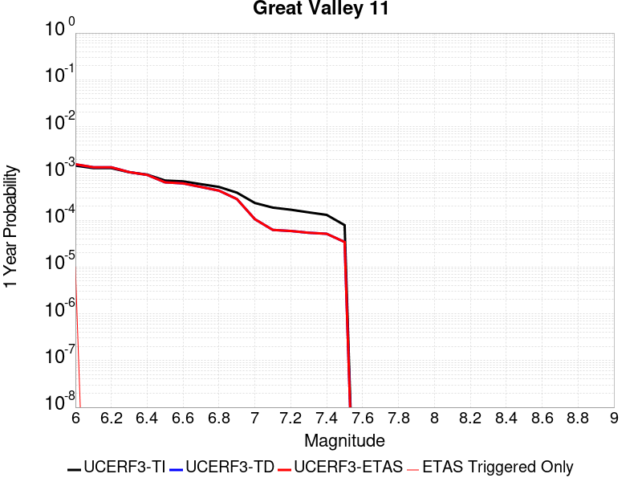 |  |

| Magnitude | 1 wk TI Prob | 1 wk TD Prob | 1 wk ETAS Prob | 1 wk ETAS/TD Gain | 1 wk ETAS Triggered Only | 1 mo TI Prob | 1 mo TD Prob | 1 mo ETAS Prob | 1 mo ETAS/TD Gain | 1 mo ETAS Triggered Only | 1 yr TI Prob | 1 yr TD Prob | 1 yr ETAS Prob | 1 yr ETAS/TD Gain | 1 yr ETAS Triggered Only | 10 yr TI Prob | 10 yr TD Prob | 10 yr ETAS Prob | 10 yr ETAS/TD Gain | 10 yr ETAS Triggered Only |
|-----|-----|-----|-----|-----|-----|-----|-----|-----|-----|-----|-----|-----|-----|-----|-----|-----|-----|-----|-----|-----|
| 6.0 | 2.8099583E-5 | 2.9832203E-5 | 2.9832203E-5 | 1.0 | 0.0 | 1.20421224E-4 | 1.2784645E-4 | 1.2784645E-4 | 1.0 | 0.0 | 0.0014651422 | 0.0015554928 | 0.0015654772 | 1.0064188 | 1.0E-5 | 0.0145552 | 0.015453579 | 0.01547327 | 1.0012742 | 2.0E-5 |
| 6.1 | 2.483194E-5 | 2.5907197E-5 | 2.5907197E-5 | 1.0 | 0.0 | 1.0641825E-4 | 1.1102648E-4 | 1.1102648E-4 | 1.0 | 0.0 | 0.0012948721 | 0.0013509726 | 0.0013509726 | 1.0 | 0.0 | 0.012873529 | 0.013434006 | 0.013434006 | 1.0 | 0.0 |
| 6.2 | 2.483194E-5 | 2.5907197E-5 | 2.5907197E-5 | 1.0 | 0.0 | 1.0641825E-4 | 1.1102648E-4 | 1.1102648E-4 | 1.0 | 0.0 | 0.0012948721 | 0.0013509726 | 0.0013509726 | 1.0 | 0.0 | 0.012873529 | 0.013434006 | 0.013434006 | 1.0 | 0.0 |
| 6.3 | 2.0257901E-5 | 2.0398953E-5 | 2.0398953E-5 | 1.0 | 0.0 | 8.681669E-5 | 8.7421395E-5 | 8.7421395E-5 | 1.0 | 0.0 | 0.0010564806 | 0.0010638774 | 0.0010638774 | 1.0 | 0.0 | 0.01051472 | 0.0105920145 | 0.0105920145 | 1.0 | 0.0 |
| 6.4 | 1.8054898E-5 | 1.7780885E-5 | 1.7780885E-5 | 1.0 | 0.0 | 7.737584E-5 | 7.620178E-5 | 7.620178E-5 | 1.0 | 0.0 | 9.416436E-4 | 9.273994E-4 | 9.273994E-4 | 1.0 | 0.0 | 0.009376635 | 0.009239033 | 0.009239033 | 1.0 | 0.0 |
| 6.5 | 1.34804895E-5 | 1.2321025E-5 | 1.2321025E-5 | 1.0 | 0.0 | 5.777225E-5 | 5.280335E-5 | 5.280335E-5 | 1.0 | 0.0 | 7.031501E-4 | 6.426953E-4 | 6.426953E-4 | 1.0 | 0.0 | 0.007009294 | 0.006408803 | 0.006408803 | 1.0 | 0.0 |
| 6.6 | 1.294883E-5 | 1.1732281E-5 | 1.1732281E-5 | 1.0 | 0.0 | 5.5493805E-5 | 5.0280258E-5 | 5.0280258E-5 | 1.0 | 0.0 | 6.754276E-4 | 6.119943E-4 | 6.119943E-4 | 1.0 | 0.0 | 0.006733784 | 0.0061035147 | 0.0061035147 | 1.0 | 0.0 |
| 6.7 | 1.1272237E-5 | 9.811852E-6 | 9.811852E-6 | 1.0 | 0.0 | 4.8308695E-5 | 4.205013E-5 | 4.205013E-5 | 1.0 | 0.0 | 5.879996E-4 | 5.1184284E-4 | 5.1184284E-4 | 1.0 | 0.0 | 0.005864462 | 0.0051069236 | 0.0051069236 | 1.0 | 0.0 |
| 6.8 | 9.8337505E-6 | 8.193733E-6 | 8.193733E-6 | 1.0 | 0.0 | 4.2143965E-5 | 3.511554E-5 | 3.511554E-5 | 1.0 | 0.0 | 5.1298196E-4 | 4.2744985E-4 | 4.2744985E-4 | 1.0 | 0.0 | 0.005117994 | 0.0042664865 | 0.0042664865 | 1.0 | 0.0 |
| 6.9 | 7.4224813E-6 | 5.413093E-6 | 5.413093E-6 | 1.0 | 0.0 | 3.1810247E-5 | 2.319877E-5 | 2.319877E-5 | 1.0 | 0.0 | 3.872209E-4 | 2.8240983E-4 | 2.8240983E-4 | 1.0 | 0.0 | 0.0038654688 | 0.0028206503 | 0.0028206503 | 1.0 | 0.0 |
| 7.0 | 4.4628923E-6 | 2.0110315E-6 | 2.0110315E-6 | 1.0 | 0.0 | 1.912654E-5 | 8.618678E-6 | 8.618678E-6 | 1.0 | 0.0 | 2.3284076E-4 | 1.0492747E-4 | 1.0492747E-4 | 1.0 | 0.0 | 0.0023259693 | 0.0010487909 | 0.0010487909 | 1.0 | 0.0 |
| 7.1 | 3.5546527E-6 | 1.1855391E-6 | 1.1855391E-6 | 1.0 | 0.0 | 1.5234136E-5 | 5.080872E-6 | 5.080872E-6 | 1.0 | 0.0 | 1.8545982E-4 | 6.185793E-5 | 6.185793E-5 | 1.0 | 0.0 | 0.0018530512 | 6.184139E-4 | 6.184139E-4 | 1.0 | 0.0 |
| 7.2 | 3.2039936E-6 | 1.1253733E-6 | 1.1253733E-6 | 1.0 | 0.0 | 1.3731329E-5 | 4.82302E-6 | 4.82302E-6 | 1.0 | 0.0 | 1.671661E-4 | 5.8718753E-5 | 5.8718753E-5 | 1.0 | 0.0 | 0.0016704041 | 5.870391E-4 | 5.870391E-4 | 1.0 | 0.0 |
| 7.3 | 2.8120473E-6 | 1.0305271E-6 | 1.0305271E-6 | 1.0 | 0.0 | 1.2051575E-5 | 4.4165376E-6 | 4.4165376E-6 | 1.0 | 0.0 | 1.4671806E-4 | 5.3770087E-5 | 5.3770087E-5 | 1.0 | 0.0 | 0.0014662122 | 5.375774E-4 | 5.375774E-4 | 1.0 | 0.0 |
| 7.4 | 2.4837766E-6 | 9.80032E-7 | 9.80032E-7 | 1.0 | 0.0 | 1.0644713E-5 | 4.2001307E-6 | 4.2001307E-6 | 1.0 | 0.0 | 1.2959167E-4 | 5.113546E-5 | 5.113546E-5 | 1.0 | 0.0 | 0.0012951613 | 5.1124353E-4 | 5.1124353E-4 | 1.0 | 0.0 |
| 7.5 | 1.5002679E-6 | 6.545985E-7 | 6.545985E-7 | 1.0 | 0.0 | 6.4297037E-6 | 2.8054194E-6 | 2.8054194E-6 | 1.0 | 0.0 | 7.827883E-5 | 3.4155488E-5 | 3.4155488E-5 | 1.0 | 0.0 | 7.825126E-4 | 3.4150656E-4 | 3.4150656E-4 | 1.0 | 0.0 |

## Earthquake Valley (So Extension)
*[(top)](#table-of-contents)*

| 1 Week | 1 Month | 1 Year | 10 Year |
|-----|-----|-----|-----|
|  |  |  | 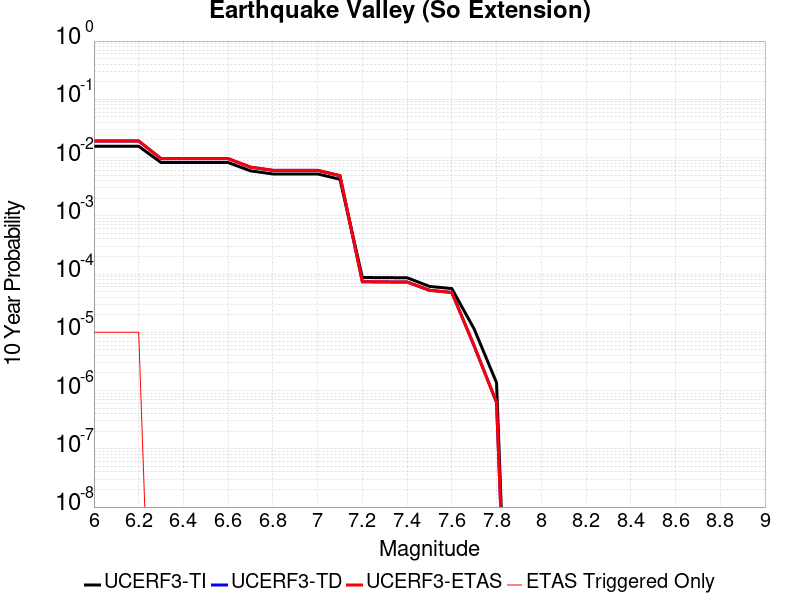 |

| Magnitude | 1 wk TI Prob | 1 wk TD Prob | 1 wk ETAS Prob | 1 wk ETAS/TD Gain | 1 wk ETAS Triggered Only | 1 mo TI Prob | 1 mo TD Prob | 1 mo ETAS Prob | 1 mo ETAS/TD Gain | 1 mo ETAS Triggered Only | 1 yr TI Prob | 1 yr TD Prob | 1 yr ETAS Prob | 1 yr ETAS/TD Gain | 1 yr ETAS Triggered Only | 10 yr TI Prob | 10 yr TD Prob | 10 yr ETAS Prob | 10 yr ETAS/TD Gain | 10 yr ETAS Triggered Only |
|-----|-----|-----|-----|-----|-----|-----|-----|-----|-----|-----|-----|-----|-----|-----|-----|-----|-----|-----|-----|-----|
| 6.0 | 3.0194888E-5 | 3.707219E-5 | 3.707219E-5 | 1.0 | 0.0 | 1.2940024E-4 | 1.588742E-4 | 1.588742E-4 | 1.0 | 0.0 | 0.0015743093 | 0.0019330932 | 0.0019430739 | 1.0051631 | 1.0E-5 | 0.01563203 | 0.019213155 | 0.019222964 | 1.0005105 | 1.0E-5 |
| 6.1 | 3.0194888E-5 | 3.707219E-5 | 3.707219E-5 | 1.0 | 0.0 | 1.2940024E-4 | 1.588742E-4 | 1.588742E-4 | 1.0 | 0.0 | 0.0015743093 | 0.0019330932 | 0.0019430739 | 1.0051631 | 1.0E-5 | 0.01563203 | 0.019213155 | 0.019222964 | 1.0005105 | 1.0E-5 |
| 6.2 | 3.0194888E-5 | 3.707219E-5 | 3.707219E-5 | 1.0 | 0.0 | 1.2940024E-4 | 1.588742E-4 | 1.588742E-4 | 1.0 | 0.0 | 0.0015743093 | 0.0019330932 | 0.0019430739 | 1.0051631 | 1.0E-5 | 0.01563203 | 0.019213155 | 0.019222964 | 1.0005105 | 1.0E-5 |
| 6.3 | 1.5795305E-5 | 1.8446652E-5 | 1.8446652E-5 | 1.0 | 0.0 | 6.769241E-5 | 7.905531E-5 | 7.905531E-5 | 1.0 | 0.0 | 8.238434E-4 | 9.6218433E-4 | 9.6218433E-4 | 1.0 | 0.0 | 0.008207959 | 0.009591083 | 0.009591083 | 1.0 | 0.0 |
| 6.4 | 1.5795305E-5 | 1.8446652E-5 | 1.8446652E-5 | 1.0 | 0.0 | 6.769241E-5 | 7.905531E-5 | 7.905531E-5 | 1.0 | 0.0 | 8.238434E-4 | 9.6218433E-4 | 9.6218433E-4 | 1.0 | 0.0 | 0.008207959 | 0.009591083 | 0.009591083 | 1.0 | 0.0 |
| 6.5 | 1.5795305E-5 | 1.8446652E-5 | 1.8446652E-5 | 1.0 | 0.0 | 6.769241E-5 | 7.905531E-5 | 7.905531E-5 | 1.0 | 0.0 | 8.238434E-4 | 9.6218433E-4 | 9.6218433E-4 | 1.0 | 0.0 | 0.008207959 | 0.009591083 | 0.009591083 | 1.0 | 0.0 |
| 6.6 | 1.5795305E-5 | 1.8446652E-5 | 1.8446652E-5 | 1.0 | 0.0 | 6.769241E-5 | 7.905531E-5 | 7.905531E-5 | 1.0 | 0.0 | 8.238434E-4 | 9.6218433E-4 | 9.6218433E-4 | 1.0 | 0.0 | 0.008207959 | 0.009591083 | 0.009591083 | 1.0 | 0.0 |
| 6.7 | 1.1363076E-5 | 1.3138314E-5 | 1.3138314E-5 | 1.0 | 0.0 | 4.8697988E-5 | 5.6306275E-5 | 5.6306275E-5 | 1.0 | 0.0 | 5.927367E-4 | 6.853894E-4 | 6.853894E-4 | 1.0 | 0.0 | 0.0059115817 | 0.0068402286 | 0.0068402286 | 1.0 | 0.0 |
| 6.8 | 1.0049611E-5 | 1.159435E-5 | 1.159435E-5 | 1.0 | 0.0 | 4.306905E-5 | 4.9689537E-5 | 4.9689537E-5 | 1.0 | 0.0 | 5.242395E-4 | 6.048754E-4 | 6.048754E-4 | 1.0 | 0.0 | 0.0052300454 | 0.0060394667 | 0.0060394667 | 1.0 | 0.0 |
| 6.9 | 1.0049611E-5 | 1.159435E-5 | 1.159435E-5 | 1.0 | 0.0 | 4.306905E-5 | 4.9689537E-5 | 4.9689537E-5 | 1.0 | 0.0 | 5.242395E-4 | 6.048754E-4 | 6.048754E-4 | 1.0 | 0.0 | 0.0052300454 | 0.0060394667 | 0.0060394667 | 1.0 | 0.0 |
| 7.0 | 1.0049611E-5 | 1.159435E-5 | 1.159435E-5 | 1.0 | 0.0 | 4.306905E-5 | 4.9689537E-5 | 4.9689537E-5 | 1.0 | 0.0 | 5.242395E-4 | 6.048754E-4 | 6.048754E-4 | 1.0 | 0.0 | 0.0052300454 | 0.0060394667 | 0.0060394667 | 1.0 | 0.0 |
| 7.1 | 8.140254E-6 | 9.38347E-6 | 9.38347E-6 | 1.0 | 0.0 | 3.4886336E-5 | 4.021463E-5 | 4.021463E-5 | 1.0 | 0.0 | 4.2465836E-4 | 4.895702E-4 | 4.895702E-4 | 1.0 | 0.0 | 0.0042384774 | 0.004891493 | 0.004891493 | 1.0 | 0.0 |
| 7.2 | 1.673835E-7 | 1.4153517E-7 | 1.4153517E-7 | 1.0 | 0.0 | 7.173577E-7 | 6.065792E-7 | 6.065792E-7 | 1.0 | 0.0 | 8.733795E-6 | 7.38508E-6 | 7.38508E-6 | 1.0 | 0.0 | 8.733451E-5 | 7.38487E-5 | 7.38487E-5 | 1.0 | 0.0 |
| 7.3 | 1.6632116E-7 | 1.4051747E-7 | 1.4051747E-7 | 1.0 | 0.0 | 7.1280476E-7 | 6.022176E-7 | 6.022176E-7 | 1.0 | 0.0 | 8.678364E-6 | 7.3319784E-6 | 7.3319784E-6 | 1.0 | 0.0 | 8.6780245E-5 | 7.331772E-5 | 7.331772E-5 | 1.0 | 0.0 |
| 7.4 | 1.6569169E-7 | 1.3996376E-7 | 1.3996376E-7 | 1.0 | 0.0 | 7.1010703E-7 | 5.9984455E-7 | 5.9984455E-7 | 1.0 | 0.0 | 8.645519E-6 | 7.3030865E-6 | 7.3030865E-6 | 1.0 | 0.0 | 8.645182E-5 | 7.302882E-5 | 7.302882E-5 | 1.0 | 0.0 |
| 7.5 | 1.1764555E-7 | 1.0095268E-7 | 1.0095268E-7 | 1.0 | 0.0 | 5.041951E-7 | 4.326543E-7 | 4.326543E-7 | 1.0 | 0.0 | 6.138558E-6 | 5.2675555E-6 | 5.2675555E-6 | 1.0 | 0.0 | 6.1383886E-5 | 5.267452E-5 | 5.267452E-5 | 1.0 | 0.0 |
| 7.6 | 1.07927605E-7 | 9.260089E-8 | 9.260089E-8 | 1.0 | 0.0 | 4.6254678E-7 | 3.968609E-7 | 3.968609E-7 | 1.0 | 0.0 | 5.6314925E-6 | 4.8317734E-6 | 4.8317734E-6 | 1.0 | 0.0 | 5.63135E-5 | 4.831689E-5 | 4.831689E-5 | 1.0 | 0.0 |
| 7.7 | 2.1826905E-8 | 1.1180113E-8 | 1.1180113E-8 | 1.0 | 0.0 | 9.3543875E-8 | 4.7914767E-8 | 4.7914767E-8 | 1.0 | 0.0 | 1.1388961E-6 | 5.833622E-7 | 5.833622E-7 | 1.0 | 0.0 | 1.1388902E-5 | 5.833612E-6 | 5.833612E-6 | 1.0 | 0.0 |
| 7.8 | 2.6169649E-9 | 1.1968753E-9 | 1.1968753E-9 | 1.0 | 0.0 | 1.1215564E-8 | 5.1294657E-9 | 5.1294657E-9 | 1.0 | 0.0 | 1.3654947E-7 | 6.245124E-8 | 6.245124E-8 | 1.0 | 0.0 | 1.365494E-6 | 6.2451244E-7 | 6.2451244E-7 | 1.0 | 0.0 |

## Anaheim
*[(top)](#table-of-contents)*

| 1 Week | 1 Month | 1 Year | 10 Year |
|-----|-----|-----|-----|
|  |  |  | 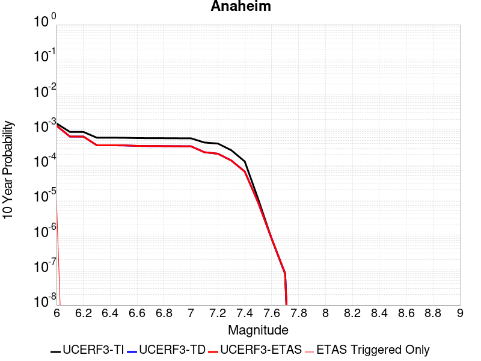 |

| Magnitude | 1 wk TI Prob | 1 wk TD Prob | 1 wk ETAS Prob | 1 wk ETAS/TD Gain | 1 wk ETAS Triggered Only | 1 mo TI Prob | 1 mo TD Prob | 1 mo ETAS Prob | 1 mo ETAS/TD Gain | 1 mo ETAS Triggered Only | 1 yr TI Prob | 1 yr TD Prob | 1 yr ETAS Prob | 1 yr ETAS/TD Gain | 1 yr ETAS Triggered Only | 10 yr TI Prob | 10 yr TD Prob | 10 yr ETAS Prob | 10 yr ETAS/TD Gain | 10 yr ETAS Triggered Only |
|-----|-----|-----|-----|-----|-----|-----|-----|-----|-----|-----|-----|-----|-----|-----|-----|-----|-----|-----|-----|-----|
| 6.0 | 2.9254998E-6 | 2.5122704E-6 | 2.5122704E-6 | 1.0 | 0.0 | 1.25377965E-5 | 1.0766842E-5 | 1.0766842E-5 | 1.0 | 0.0 | 1.5263697E-4 | 1.3108076E-4 | 1.3108076E-4 | 1.0 | 0.0 | 0.0015253217 | 0.0013102646 | 0.0013202515 | 1.007622 | 1.0E-5 |
| 6.1 | 1.6729715E-6 | 1.2337185E-6 | 1.2337185E-6 | 1.0 | 0.0 | 7.1698582E-6 | 5.287357E-6 | 5.287357E-6 | 1.0 | 0.0 | 8.7289525E-5 | 6.4372085E-5 | 6.4372085E-5 | 1.0 | 0.0 | 8.7255245E-4 | 6.4357533E-4 | 6.4357533E-4 | 1.0 | 0.0 |
| 6.2 | 1.6729715E-6 | 1.2337185E-6 | 1.2337185E-6 | 1.0 | 0.0 | 7.1698582E-6 | 5.287357E-6 | 5.287357E-6 | 1.0 | 0.0 | 8.7289525E-5 | 6.4372085E-5 | 6.4372085E-5 | 1.0 | 0.0 | 8.7255245E-4 | 6.4357533E-4 | 6.4357533E-4 | 1.0 | 0.0 |
| 6.3 | 1.1444064E-6 | 6.959504E-7 | 6.959504E-7 | 1.0 | 0.0 | 4.9045893E-6 | 2.9826415E-6 | 2.9826415E-6 | 1.0 | 0.0 | 5.971174E-5 | 3.631311E-5 | 3.631311E-5 | 1.0 | 0.0 | 5.96957E-4 | 3.6307727E-4 | 3.6307727E-4 | 1.0 | 0.0 |
| 6.4 | 1.1444064E-6 | 6.959504E-7 | 6.959504E-7 | 1.0 | 0.0 | 4.9045893E-6 | 2.9826415E-6 | 2.9826415E-6 | 1.0 | 0.0 | 5.971174E-5 | 3.631311E-5 | 3.631311E-5 | 1.0 | 0.0 | 5.96957E-4 | 3.6307727E-4 | 3.6307727E-4 | 1.0 | 0.0 |
| 6.5 | 1.1385318E-6 | 6.9001874E-7 | 6.9001874E-7 | 1.0 | 0.0 | 4.879413E-6 | 2.9572202E-6 | 2.9572202E-6 | 1.0 | 0.0 | 5.9405233E-5 | 3.6003617E-5 | 3.6003617E-5 | 1.0 | 0.0 | 5.938936E-4 | 3.5998333E-4 | 3.5998333E-4 | 1.0 | 0.0 |
| 6.6 | 1.1165511E-6 | 6.6780586E-7 | 6.6780586E-7 | 1.0 | 0.0 | 4.78521E-6 | 2.8620223E-6 | 2.8620223E-6 | 1.0 | 0.0 | 5.8258374E-5 | 3.484462E-5 | 3.484462E-5 | 1.0 | 0.0 | 5.8243104E-4 | 3.48397E-4 | 3.48397E-4 | 1.0 | 0.0 |
| 6.7 | 1.1098243E-6 | 6.610253E-7 | 6.610253E-7 | 1.0 | 0.0 | 4.7563813E-6 | 2.8329628E-6 | 2.8329628E-6 | 1.0 | 0.0 | 5.7907404E-5 | 3.4490833E-5 | 3.4490833E-5 | 1.0 | 0.0 | 5.7892315E-4 | 3.4486022E-4 | 3.4486022E-4 | 1.0 | 0.0 |
| 6.8 | 1.1077587E-6 | 6.589456E-7 | 6.589456E-7 | 1.0 | 0.0 | 4.7475287E-6 | 2.8240497E-6 | 2.8240497E-6 | 1.0 | 0.0 | 5.779963E-5 | 3.438232E-5 | 3.438232E-5 | 1.0 | 0.0 | 5.77846E-4 | 3.4377543E-4 | 3.4377543E-4 | 1.0 | 0.0 |
| 6.9 | 1.1024468E-6 | 6.536033E-7 | 6.536033E-7 | 1.0 | 0.0 | 4.7247636E-6 | 2.8011543E-6 | 2.8011543E-6 | 1.0 | 0.0 | 5.752248E-5 | 3.4103574E-5 | 3.4103574E-5 | 1.0 | 0.0 | 5.750759E-4 | 3.4098886E-4 | 3.4098886E-4 | 1.0 | 0.0 |
| 7.0 | 1.0993066E-6 | 6.5101403E-7 | 6.5101403E-7 | 1.0 | 0.0 | 4.7113053E-6 | 2.7900574E-6 | 2.7900574E-6 | 1.0 | 0.0 | 5.7358633E-5 | 3.3968474E-5 | 3.3968474E-5 | 1.0 | 0.0 | 5.734383E-4 | 3.3963827E-4 | 3.3963827E-4 | 1.0 | 0.0 |
| 7.1 | 8.334877E-7 | 4.404716E-7 | 4.404716E-7 | 1.0 | 0.0 | 3.5720855E-6 | 1.8877342E-6 | 1.8877342E-6 | 1.0 | 0.0 | 4.348927E-5 | 2.2982946E-5 | 2.2982946E-5 | 1.0 | 0.0 | 4.3480762E-4 | 2.2980792E-4 | 2.2980792E-4 | 1.0 | 0.0 |
| 7.2 | 7.794411E-7 | 3.9974518E-7 | 3.9974518E-7 | 1.0 | 0.0 | 3.3404576E-6 | 1.7131925E-6 | 1.7131925E-6 | 1.0 | 0.0 | 4.0669314E-5 | 2.085794E-5 | 2.085794E-5 | 1.0 | 0.0 | 4.066187E-4 | 2.0856188E-4 | 2.0856188E-4 | 1.0 | 0.0 |
| 7.3 | 5.01704E-7 | 2.557209E-7 | 2.557209E-7 | 1.0 | 0.0 | 2.150158E-6 | 1.0959463E-6 | 1.0959463E-6 | 1.0 | 0.0 | 2.617786E-5 | 1.3343078E-5 | 1.3343078E-5 | 1.0 | 0.0 | 2.6174777E-4 | 1.3342401E-4 | 1.3342401E-4 | 1.0 | 0.0 |
| 7.4 | 2.4008182E-7 | 1.2367252E-7 | 1.2367252E-7 | 1.0 | 0.0 | 1.0289217E-6 | 5.3002503E-7 | 5.3002503E-7 | 1.0 | 0.0 | 1.252705E-5 | 6.453043E-6 | 6.453043E-6 | 1.0 | 0.0 | 1.2526344E-4 | 6.452932E-5 | 6.452932E-5 | 1.0 | 0.0 |
| 7.5 | 2.0263876E-8 | 1.6121012E-8 | 1.6121012E-8 | 1.0 | 0.0 | 8.684518E-8 | 6.909005E-8 | 6.909005E-8 | 1.0 | 0.0 | 1.0573395E-6 | 8.4117113E-7 | 8.4117113E-7 | 1.0 | 0.0 | 1.0573345E-5 | 8.411689E-6 | 8.411689E-6 | 1.0 | 0.0 |
| 7.6 | 1.4871431E-9 | 1.5084183E-9 | 1.5084183E-9 | 1.0 | 0.0 | 6.37347E-9 | 6.4646493E-9 | 6.4646493E-9 | 1.0 | 0.0 | 7.7596994E-8 | 7.87071E-8 | 7.87071E-8 | 1.0 | 0.0 | 7.759697E-7 | 7.870708E-7 | 7.870708E-7 | 1.0 | 0.0 |
| 7.7 | 1.5093293E-10 | 1.5333512E-10 | 1.5333512E-10 | 1.0 | 0.0 | 6.4685546E-10 | 6.571511E-10 | 6.571511E-10 | 1.0 | 0.0 | 7.875465E-9 | 8.000814E-9 | 8.000814E-9 | 1.0 | 0.0 | 7.8754645E-8 | 8.000814E-8 | 8.000814E-8 | 1.0 | 0.0 |

## Honey Lake 2011 CFM
*[(top)](#table-of-contents)*

| 1 Week | 1 Month | 1 Year | 10 Year |
|-----|-----|-----|-----|
|  | 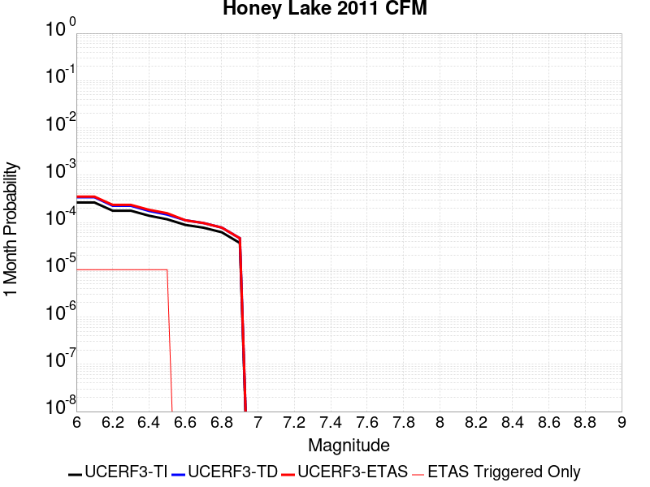 |  |  |

| Magnitude | 1 wk TI Prob | 1 wk TD Prob | 1 wk ETAS Prob | 1 wk ETAS/TD Gain | 1 wk ETAS Triggered Only | 1 mo TI Prob | 1 mo TD Prob | 1 mo ETAS Prob | 1 mo ETAS/TD Gain | 1 mo ETAS Triggered Only | 1 yr TI Prob | 1 yr TD Prob | 1 yr ETAS Prob | 1 yr ETAS/TD Gain | 1 yr ETAS Triggered Only | 10 yr TI Prob | 10 yr TD Prob | 10 yr ETAS Prob | 10 yr ETAS/TD Gain | 10 yr ETAS Triggered Only |
|-----|-----|-----|-----|-----|-----|-----|-----|-----|-----|-----|-----|-----|-----|-----|-----|-----|-----|-----|-----|-----|
| 6.0 | 6.155506E-5 | 7.954732E-5 | 7.954732E-5 | 1.0 | 0.0 | 2.6378073E-4 | 3.4087442E-4 | 3.50871E-4 | 1.0293263 | 1.0E-5 | 0.0032068014 | 0.0041426914 | 0.0041526495 | 1.0024039 | 1.0E-5 | 0.03160919 | 0.040703192 | 0.040712785 | 1.0002357 | 1.0E-5 |
| 6.1 | 6.155506E-5 | 7.954732E-5 | 7.954732E-5 | 1.0 | 0.0 | 2.6378073E-4 | 3.4087442E-4 | 3.50871E-4 | 1.0293263 | 1.0E-5 | 0.0032068014 | 0.0041426914 | 0.0041526495 | 1.0024039 | 1.0E-5 | 0.03160919 | 0.040703192 | 0.040712785 | 1.0002357 | 1.0E-5 |
| 6.2 | 4.1335024E-5 | 5.25767E-5 | 5.25767E-5 | 1.0 | 0.0 | 1.7713808E-4 | 2.253103E-4 | 2.3530805E-4 | 1.0443733 | 1.0E-5 | 0.0021545228 | 0.0027398535 | 0.002749826 | 1.0036398 | 1.0E-5 | 0.021337535 | 0.027076896 | 0.027086625 | 1.0003593 | 1.0E-5 |
| 6.3 | 4.1335024E-5 | 5.25767E-5 | 5.25767E-5 | 1.0 | 0.0 | 1.7713808E-4 | 2.253103E-4 | 2.3530805E-4 | 1.0443733 | 1.0E-5 | 0.0021545228 | 0.0027398535 | 0.002749826 | 1.0036398 | 1.0E-5 | 0.021337535 | 0.027076896 | 0.027086625 | 1.0003593 | 1.0E-5 |
| 6.4 | 3.2393702E-5 | 4.0887408E-5 | 4.0887408E-5 | 1.0 | 0.0 | 1.3882275E-4 | 1.7522063E-4 | 1.8521887E-4 | 1.057061 | 1.0E-5 | 0.0016888566 | 0.0021313303 | 0.002141309 | 1.004682 | 1.0E-5 | 0.016760793 | 0.021119934 | 0.021129722 | 1.0004635 | 1.0E-5 |
| 6.5 | 2.7205504E-5 | 3.4211876E-5 | 3.4211876E-5 | 1.0 | 0.0 | 1.1658981E-4 | 1.4661464E-4 | 1.5661317E-4 | 1.068196 | 1.0E-5 | 0.0014185566 | 0.0017836652 | 0.0017936473 | 1.0055964 | 1.0E-5 | 0.014095354 | 0.01770302 | 0.01771284 | 1.0005549 | 1.0E-5 |
| 6.6 | 2.069265E-5 | 2.5955498E-5 | 2.5955498E-5 | 1.0 | 0.0 | 8.867977E-5 | 1.1123359E-4 | 1.1123359E-4 | 1.0 | 0.0 | 0.0010791414 | 0.0013535116 | 0.0013535116 | 1.0 | 0.0 | 0.010739161 | 0.013461052 | 0.013461052 | 1.0 | 0.0 |
| 6.7 | 1.8060919E-5 | 2.2656903E-5 | 2.2656903E-5 | 1.0 | 0.0 | 7.7401644E-5 | 9.709785E-5 | 9.709785E-5 | 1.0 | 0.0 | 9.419576E-4 | 0.0011816062 | 0.0011816062 | 1.0 | 0.0 | 0.009379748 | 0.011761279 | 0.011761279 | 1.0 | 0.0 |
| 6.8 | 1.4474663E-5 | 1.8181332E-5 | 1.8181332E-5 | 1.0 | 0.0 | 6.203279E-5 | 7.79181E-5 | 7.79181E-5 | 1.0 | 0.0 | 7.5498753E-4 | 9.483164E-4 | 9.483164E-4 | 1.0 | 0.0 | 0.007524277 | 0.009450225 | 0.009450225 | 1.0 | 0.0 |
| 6.9 | 8.564552E-6 | 1.0802347E-5 | 1.0802347E-5 | 1.0 | 0.0 | 3.6704707E-5 | 4.6295325E-5 | 4.6295325E-5 | 1.0 | 0.0 | 4.4678818E-4 | 5.635662E-4 | 5.635662E-4 | 1.0 | 0.0 | 0.0044589094 | 0.0056278687 | 0.0056278687 | 1.0 | 0.0 |

## Cedar Mtn-Mahogany Mtn
*[(top)](#table-of-contents)*

| 1 Week | 1 Month | 1 Year | 10 Year |
|-----|-----|-----|-----|
|  |  |  | 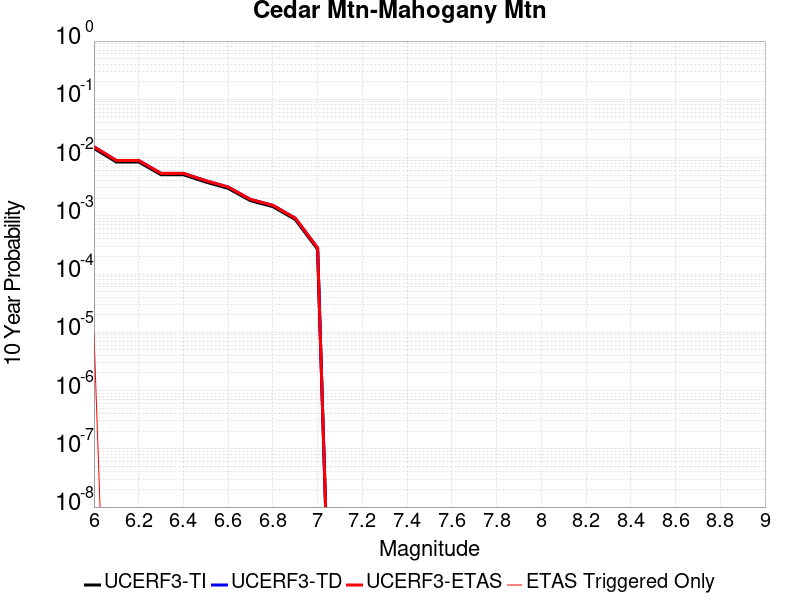 |

| Magnitude | 1 wk TI Prob | 1 wk TD Prob | 1 wk ETAS Prob | 1 wk ETAS/TD Gain | 1 wk ETAS Triggered Only | 1 mo TI Prob | 1 mo TD Prob | 1 mo ETAS Prob | 1 mo ETAS/TD Gain | 1 mo ETAS Triggered Only | 1 yr TI Prob | 1 yr TD Prob | 1 yr ETAS Prob | 1 yr ETAS/TD Gain | 1 yr ETAS Triggered Only | 10 yr TI Prob | 10 yr TD Prob | 10 yr ETAS Prob | 10 yr ETAS/TD Gain | 10 yr ETAS Triggered Only |
|-----|-----|-----|-----|-----|-----|-----|-----|-----|-----|-----|-----|-----|-----|-----|-----|-----|-----|-----|-----|-----|
| 6.0 | 2.7763876E-5 | 2.958889E-5 | 2.958889E-5 | 1.0 | 0.0 | 1.1898261E-4 | 1.2680376E-4 | 1.2680376E-4 | 1.0 | 0.0 | 0.0014476506 | 0.0015428124 | 0.0015428124 | 1.0 | 0.0 | 0.0143825635 | 0.015328238 | 0.015338085 | 1.0006424 | 1.0E-5 |
| 6.1 | 1.6162443E-5 | 1.7142978E-5 | 1.7142978E-5 | 1.0 | 0.0 | 6.926578E-5 | 7.346794E-5 | 7.346794E-5 | 1.0 | 0.0 | 8.4298453E-4 | 8.941228E-4 | 8.941228E-4 | 1.0 | 0.0 | 0.008397939 | 0.008907066 | 0.008907066 | 1.0 | 0.0 |
| 6.2 | 1.6162443E-5 | 1.7142978E-5 | 1.7142978E-5 | 1.0 | 0.0 | 6.926578E-5 | 7.346794E-5 | 7.346794E-5 | 1.0 | 0.0 | 8.4298453E-4 | 8.941228E-4 | 8.941228E-4 | 1.0 | 0.0 | 0.008397939 | 0.008907066 | 0.008907066 | 1.0 | 0.0 |
| 6.3 | 9.746053E-6 | 1.0303159E-5 | 1.0303159E-5 | 1.0 | 0.0 | 4.1768133E-5 | 4.4155673E-5 | 4.4155673E-5 | 1.0 | 0.0 | 5.0840835E-4 | 5.374668E-4 | 5.374668E-4 | 1.0 | 0.0 | 0.0050724675 | 0.0053620883 | 0.0053620883 | 1.0 | 0.0 |
| 6.4 | 9.746053E-6 | 1.0303159E-5 | 1.0303159E-5 | 1.0 | 0.0 | 4.1768133E-5 | 4.4155673E-5 | 4.4155673E-5 | 1.0 | 0.0 | 5.0840835E-4 | 5.374668E-4 | 5.374668E-4 | 1.0 | 0.0 | 0.0050724675 | 0.0053620883 | 0.0053620883 | 1.0 | 0.0 |
| 6.5 | 7.290083E-6 | 7.69533E-6 | 7.69533E-6 | 1.0 | 0.0 | 3.124284E-5 | 3.297958E-5 | 3.297958E-5 | 1.0 | 0.0 | 3.8031515E-4 | 4.0145457E-4 | 4.0145457E-4 | 1.0 | 0.0 | 0.0037966494 | 0.0040075136 | 0.0040075136 | 1.0 | 0.0 |
| 6.6 | 5.67907E-6 | 5.9891568E-6 | 5.9891568E-6 | 1.0 | 0.0 | 2.4338644E-5 | 2.566757E-5 | 2.566757E-5 | 1.0 | 0.0 | 2.962827E-4 | 3.1245922E-4 | 3.1245922E-4 | 1.0 | 0.0 | 0.0029588798 | 0.003120335 | 0.003120335 | 1.0 | 0.0 |
| 6.7 | 3.4853963E-6 | 3.6726335E-6 | 3.6726335E-6 | 1.0 | 0.0 | 1.4937327E-5 | 1.5739766E-5 | 1.5739766E-5 | 1.0 | 0.0 | 1.8184677E-4 | 1.9161543E-4 | 1.9161543E-4 | 1.0 | 0.0 | 0.0018169804 | 0.001914564 | 0.001914564 | 1.0 | 0.0 |
| 6.8 | 2.7535168E-6 | 2.9015782E-6 | 2.9015782E-6 | 1.0 | 0.0 | 1.1800733E-5 | 1.2435279E-5 | 1.2435279E-5 | 1.0 | 0.0 | 1.4366445E-4 | 1.5138948E-4 | 1.5138948E-4 | 1.0 | 0.0 | 0.0014357162 | 0.0015129107 | 0.0015129107 | 1.0 | 0.0 |
| 6.9 | 1.6594106E-6 | 1.7496998E-6 | 1.7496998E-6 | 1.0 | 0.0 | 7.1117406E-6 | 7.4986933E-6 | 7.4986933E-6 | 1.0 | 0.0 | 8.6582E-5 | 9.129308E-5 | 9.129308E-5 | 1.0 | 0.0 | 8.654827E-4 | 9.125862E-4 | 9.125862E-4 | 1.0 | 0.0 |
| 7.0 | 5.10215E-7 | 5.3892575E-7 | 5.3892575E-7 | 1.0 | 0.0 | 2.186634E-6 | 2.3096804E-6 | 2.3096804E-6 | 1.0 | 0.0 | 2.6621943E-5 | 2.8120125E-5 | 2.8120125E-5 | 1.0 | 0.0 | 2.6618753E-4 | 2.8117822E-4 | 2.8117822E-4 | 1.0 | 0.0 |

## Surprise Valley 2011 CFM
*[(top)](#table-of-contents)*

| 1 Week | 1 Month | 1 Year | 10 Year |
|-----|-----|-----|-----|
|  |  |  |  |

| Magnitude | 1 wk TI Prob | 1 wk TD Prob | 1 wk ETAS Prob | 1 wk ETAS/TD Gain | 1 wk ETAS Triggered Only | 1 mo TI Prob | 1 mo TD Prob | 1 mo ETAS Prob | 1 mo ETAS/TD Gain | 1 mo ETAS Triggered Only | 1 yr TI Prob | 1 yr TD Prob | 1 yr ETAS Prob | 1 yr ETAS/TD Gain | 1 yr ETAS Triggered Only | 10 yr TI Prob | 10 yr TD Prob | 10 yr ETAS Prob | 10 yr ETAS/TD Gain | 10 yr ETAS Triggered Only |
|-----|-----|-----|-----|-----|-----|-----|-----|-----|-----|-----|-----|-----|-----|-----|-----|-----|-----|-----|-----|-----|
| 6.0 | 4.0396248E-5 | 4.485137E-5 | 4.485137E-5 | 1.0 | 0.0 | 1.7311527E-4 | 1.9220718E-4 | 1.9220718E-4 | 1.0 | 0.0 | 0.002105641 | 0.0023378208 | 0.0023477974 | 1.0042675 | 1.0E-5 | 0.020858008 | 0.023153998 | 0.023163766 | 1.0004219 | 1.0E-5 |
| 6.1 | 4.0396248E-5 | 4.485137E-5 | 4.485137E-5 | 1.0 | 0.0 | 1.7311527E-4 | 1.9220718E-4 | 1.9220718E-4 | 1.0 | 0.0 | 0.002105641 | 0.0023378208 | 0.0023477974 | 1.0042675 | 1.0E-5 | 0.020858008 | 0.023153998 | 0.023163766 | 1.0004219 | 1.0E-5 |
| 6.2 | 2.2295266E-5 | 2.4401277E-5 | 2.4401277E-5 | 1.0 | 0.0 | 9.554764E-5 | 1.04572886E-4 | 1.04572886E-4 | 1.0 | 0.0 | 0.0011626717 | 0.0012724621 | 0.0012724621 | 1.0 | 0.0 | 0.011566074 | 0.012654996 | 0.012654996 | 1.0 | 0.0 |
| 6.3 | 1.572643E-5 | 1.7096825E-5 | 1.7096825E-5 | 1.0 | 0.0 | 6.7397246E-5 | 7.327011E-5 | 7.327011E-5 | 1.0 | 0.0 | 8.202525E-4 | 8.91709E-4 | 8.91709E-4 | 1.0 | 0.0 | 0.008172315 | 0.008882416 | 0.008882416 | 1.0 | 0.0 |
| 6.4 | 1.5714395E-5 | 1.7084647E-5 | 1.7084647E-5 | 1.0 | 0.0 | 6.734567E-5 | 7.321792E-5 | 7.321792E-5 | 1.0 | 0.0 | 8.1962504E-4 | 8.9107413E-4 | 8.9107413E-4 | 1.0 | 0.0 | 0.008166086 | 0.008876118 | 0.008876118 | 1.0 | 0.0 |
| 6.5 | 1.2733495E-5 | 1.3801615E-5 | 1.3801615E-5 | 1.0 | 0.0 | 5.457098E-5 | 5.9148475E-5 | 5.9148475E-5 | 1.0 | 0.0 | 6.641992E-4 | 7.199014E-4 | 7.199014E-4 | 1.0 | 0.0 | 0.0066221743 | 0.007176387 | 0.007176387 | 1.0 | 0.0 |
| 6.6 | 1.0983784E-5 | 1.18865655E-5 | 1.18865655E-5 | 1.0 | 0.0 | 4.7072506E-5 | 5.094146E-5 | 5.094146E-5 | 1.0 | 0.0 | 5.7295704E-4 | 6.200411E-4 | 6.200411E-4 | 1.0 | 0.0 | 0.0057148207 | 0.006183661 | 0.006183661 | 1.0 | 0.0 |
| 6.7 | 9.104806E-6 | 9.839501E-6 | 9.839501E-6 | 1.0 | 0.0 | 3.902001E-5 | 4.216863E-5 | 4.216863E-5 | 1.0 | 0.0 | 4.7496508E-4 | 5.1328604E-4 | 5.1328604E-4 | 1.0 | 0.0 | 0.004739512 | 0.005121402 | 0.005121402 | 1.0 | 0.0 |
| 6.8 | 6.2162403E-6 | 6.70414E-6 | 6.70414E-6 | 1.0 | 0.0 | 2.6640759E-5 | 2.8731725E-5 | 2.8731725E-5 | 1.0 | 0.0 | 3.2430296E-4 | 3.4975485E-4 | 3.4975485E-4 | 1.0 | 0.0 | 0.003238301 | 0.003492267 | 0.003492267 | 1.0 | 0.0 |
| 6.9 | 4.1792696E-6 | 4.5032343E-6 | 4.5032343E-6 | 1.0 | 0.0 | 1.7911032E-5 | 1.9299441E-5 | 1.9299441E-5 | 1.0 | 0.0 | 2.1804498E-4 | 2.3494691E-4 | 2.3494691E-4 | 1.0 | 0.0 | 0.0021783116 | 0.0023471385 | 0.0023471385 | 1.0 | 0.0 |
| 7.0 | 2.7478413E-6 | 2.9622454E-6 | 2.9622454E-6 | 1.0 | 0.0 | 1.177641E-5 | 1.2695283E-5 | 1.2695283E-5 | 1.0 | 0.0 | 1.4336836E-4 | 1.5455535E-4 | 1.5455535E-4 | 1.0 | 0.0 | 0.001432759 | 0.001544601 | 0.001544601 | 1.0 | 0.0 |
| 7.1 | 8.128648E-7 | 8.72493E-7 | 8.72493E-7 | 1.0 | 0.0 | 3.4837017E-6 | 3.7392535E-6 | 3.7392535E-6 | 1.0 | 0.0 | 4.2413245E-5 | 4.5525063E-5 | 4.5525063E-5 | 1.0 | 0.0 | 4.2405148E-4 | 4.5521616E-4 | 4.5521616E-4 | 1.0 | 0.0 |
| 7.2 | 4.8641045E-8 | 4.9402075E-8 | 4.9402075E-8 | 1.0 | 0.0 | 2.084616E-7 | 2.1172316E-7 | 2.1172316E-7 | 1.0 | 0.0 | 2.538017E-6 | 2.5777267E-6 | 2.5777267E-6 | 1.0 | 0.0 | 2.537988E-5 | 2.5776979E-5 | 2.5776979E-5 | 1.0 | 0.0 |
| 7.3 | 5.3911844E-9 | 5.4758154E-9 | 5.4758154E-9 | 1.0 | 0.0 | 2.3105075E-8 | 2.346778E-8 | 2.346778E-8 | 1.0 | 0.0 | 2.8130427E-7 | 2.857202E-7 | 2.857202E-7 | 1.0 | 0.0 | 2.8130391E-6 | 2.8572E-6 | 2.8572E-6 | 1.0 | 0.0 |

## Los Alamos extension
*[(top)](#table-of-contents)*

| 1 Week | 1 Month | 1 Year | 10 Year |
|-----|-----|-----|-----|
|  | 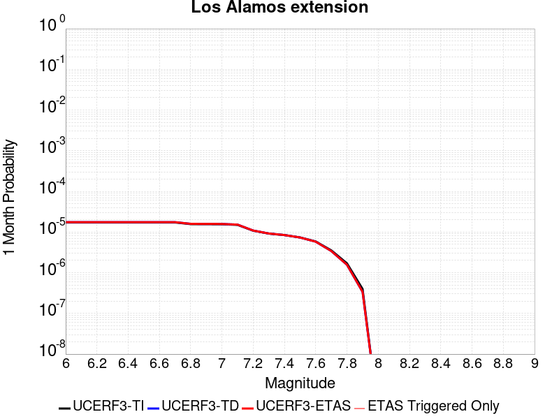 |  |  |

| Magnitude | 1 wk TI Prob | 1 wk TD Prob | 1 wk ETAS Prob | 1 wk ETAS/TD Gain | 1 wk ETAS Triggered Only | 1 mo TI Prob | 1 mo TD Prob | 1 mo ETAS Prob | 1 mo ETAS/TD Gain | 1 mo ETAS Triggered Only | 1 yr TI Prob | 1 yr TD Prob | 1 yr ETAS Prob | 1 yr ETAS/TD Gain | 1 yr ETAS Triggered Only | 10 yr TI Prob | 10 yr TD Prob | 10 yr ETAS Prob | 10 yr ETAS/TD Gain | 10 yr ETAS Triggered Only |
|-----|-----|-----|-----|-----|-----|-----|-----|-----|-----|-----|-----|-----|-----|-----|-----|-----|-----|-----|-----|-----|
| 6.0 | 4.0146506E-6 | 4.086166E-6 | 4.086166E-6 | 1.0 | 0.0 | 1.7205533E-5 | 1.751203E-5 | 1.751203E-5 | 1.0 | 0.0 | 2.0945723E-4 | 2.131892E-4 | 2.131892E-4 | 1.0 | 0.0 | 0.0020925992 | 0.002129956 | 0.0021399348 | 1.0046849 | 1.0E-5 |
| 6.1 | 4.0146506E-6 | 4.086166E-6 | 4.086166E-6 | 1.0 | 0.0 | 1.7205533E-5 | 1.751203E-5 | 1.751203E-5 | 1.0 | 0.0 | 2.0945723E-4 | 2.131892E-4 | 2.131892E-4 | 1.0 | 0.0 | 0.0020925992 | 0.002129956 | 0.0021399348 | 1.0046849 | 1.0E-5 |
| 6.2 | 4.0146506E-6 | 4.086166E-6 | 4.086166E-6 | 1.0 | 0.0 | 1.7205533E-5 | 1.751203E-5 | 1.751203E-5 | 1.0 | 0.0 | 2.0945723E-4 | 2.131892E-4 | 2.131892E-4 | 1.0 | 0.0 | 0.0020925992 | 0.002129956 | 0.0021399348 | 1.0046849 | 1.0E-5 |
| 6.3 | 4.0146506E-6 | 4.086166E-6 | 4.086166E-6 | 1.0 | 0.0 | 1.7205533E-5 | 1.751203E-5 | 1.751203E-5 | 1.0 | 0.0 | 2.0945723E-4 | 2.131892E-4 | 2.131892E-4 | 1.0 | 0.0 | 0.0020925992 | 0.002129956 | 0.0021399348 | 1.0046849 | 1.0E-5 |
| 6.4 | 4.0146506E-6 | 4.086166E-6 | 4.086166E-6 | 1.0 | 0.0 | 1.7205533E-5 | 1.751203E-5 | 1.751203E-5 | 1.0 | 0.0 | 2.0945723E-4 | 2.131892E-4 | 2.131892E-4 | 1.0 | 0.0 | 0.0020925992 | 0.002129956 | 0.0021399348 | 1.0046849 | 1.0E-5 |
| 6.5 | 4.0146506E-6 | 4.086166E-6 | 4.086166E-6 | 1.0 | 0.0 | 1.7205533E-5 | 1.751203E-5 | 1.751203E-5 | 1.0 | 0.0 | 2.0945723E-4 | 2.131892E-4 | 2.131892E-4 | 1.0 | 0.0 | 0.0020925992 | 0.002129956 | 0.0021399348 | 1.0046849 | 1.0E-5 |
| 6.6 | 4.0146506E-6 | 4.086166E-6 | 4.086166E-6 | 1.0 | 0.0 | 1.7205533E-5 | 1.751203E-5 | 1.751203E-5 | 1.0 | 0.0 | 2.0945723E-4 | 2.131892E-4 | 2.131892E-4 | 1.0 | 0.0 | 0.0020925992 | 0.002129956 | 0.0021399348 | 1.0046849 | 1.0E-5 |
| 6.7 | 4.0146506E-6 | 4.086166E-6 | 4.086166E-6 | 1.0 | 0.0 | 1.7205533E-5 | 1.751203E-5 | 1.751203E-5 | 1.0 | 0.0 | 2.0945723E-4 | 2.131892E-4 | 2.131892E-4 | 1.0 | 0.0 | 0.0020925992 | 0.002129956 | 0.0021399348 | 1.0046849 | 1.0E-5 |
| 6.8 | 3.6584688E-6 | 3.7188652E-6 | 3.7188652E-6 | 1.0 | 0.0 | 1.5679057E-5 | 1.5937901E-5 | 1.5937901E-5 | 1.0 | 0.0 | 1.9087581E-4 | 1.9402761E-4 | 1.9402761E-4 | 1.0 | 0.0 | 0.0019071194 | 0.0019386745 | 0.0019486551 | 1.0051482 | 1.0E-5 |
| 6.9 | 3.644631E-6 | 3.7045752E-6 | 3.7045752E-6 | 1.0 | 0.0 | 1.5619753E-5 | 1.587666E-5 | 1.587666E-5 | 1.0 | 0.0 | 1.901539E-4 | 1.9328212E-4 | 1.9328212E-4 | 1.0 | 0.0 | 0.0018999127 | 0.0019312325 | 0.0019412133 | 1.0051681 | 1.0E-5 |
| 7.0 | 3.6318522E-6 | 3.6913357E-6 | 3.6913357E-6 | 1.0 | 0.0 | 1.5564989E-5 | 1.581992E-5 | 1.581992E-5 | 1.0 | 0.0 | 1.8948725E-4 | 1.9259144E-4 | 1.9259144E-4 | 1.0 | 0.0 | 0.0018932576 | 0.0019243377 | 0.0019343185 | 1.0051866 | 1.0E-5 |
| 7.1 | 3.5001724E-6 | 3.5554062E-6 | 3.5554062E-6 | 1.0 | 0.0 | 1.5000653E-5 | 1.5237371E-5 | 1.5237371E-5 | 1.0 | 0.0 | 1.8261763E-4 | 1.8550013E-4 | 1.8550013E-4 | 1.0 | 0.0 | 0.0018246764 | 0.0018535435 | 0.001863525 | 1.005385 | 1.0E-5 |
| 7.2 | 2.5204702E-6 | 2.5437E-6 | 2.5437E-6 | 1.0 | 0.0 | 1.080197E-5 | 1.0901526E-5 | 1.0901526E-5 | 1.0 | 0.0 | 1.3150605E-4 | 1.3271805E-4 | 1.3271805E-4 | 1.0 | 0.0 | 0.0013142825 | 0.0013263936 | 0.0013363804 | 1.0075293 | 1.0E-5 |
| 7.3 | 2.1399692E-6 | 2.1501373E-6 | 2.1501373E-6 | 1.0 | 0.0 | 9.1712645E-6 | 9.214842E-6 | 9.214842E-6 | 1.0 | 0.0 | 1.1165442E-4 | 1.1218496E-4 | 1.1218496E-4 | 1.0 | 0.0 | 0.0011159834 | 0.0011212865 | 0.0011212865 | 1.0 | 0.0 |
| 7.4 | 1.9660122E-6 | 1.970242E-6 | 1.970242E-6 | 1.0 | 0.0 | 8.42574E-6 | 8.443867E-6 | 8.443867E-6 | 1.0 | 0.0 | 1.0257855E-4 | 1.0279926E-4 | 1.0279926E-4 | 1.0 | 0.0 | 0.0010253121 | 0.0010275202 | 0.0010275202 | 1.0 | 0.0 |
| 7.5 | 1.7204633E-6 | 1.7151038E-6 | 1.7151038E-6 | 1.0 | 0.0 | 7.373393E-6 | 7.3504243E-6 | 7.3504243E-6 | 1.0 | 0.0 | 8.976737E-5 | 8.948777E-5 | 8.948777E-5 | 1.0 | 0.0 | 8.9731114E-4 | 8.945203E-4 | 8.945203E-4 | 1.0 | 0.0 |
| 7.6 | 1.3717638E-6 | 1.3535879E-6 | 1.3535879E-6 | 1.0 | 0.0 | 5.878974E-6 | 5.801078E-6 | 5.801078E-6 | 1.0 | 0.0 | 7.157416E-5 | 7.0625865E-5 | 7.0625865E-5 | 1.0 | 0.0 | 7.1551115E-4 | 7.060368E-4 | 7.060368E-4 | 1.0 | 0.0 |
| 7.7 | 8.272564E-7 | 7.9576773E-7 | 7.9576773E-7 | 1.0 | 0.0 | 3.5453797E-6 | 3.4104287E-6 | 3.4104287E-6 | 1.0 | 0.0 | 4.3164142E-5 | 4.152118E-5 | 4.152118E-5 | 1.0 | 0.0 | 4.315576E-4 | 4.1513442E-4 | 4.1513442E-4 | 1.0 | 0.0 |
| 7.8 | 3.9708277E-7 | 3.671939E-7 | 3.671939E-7 | 1.0 | 0.0 | 1.7017821E-6 | 1.5736872E-6 | 1.5736872E-6 | 1.0 | 0.0 | 2.0719E-5 | 1.9159474E-5 | 1.9159474E-5 | 1.0 | 0.0 | 2.071707E-4 | 1.9157829E-4 | 1.9157829E-4 | 1.0 | 0.0 |
| 7.9 | 9.292528E-8 | 7.8891745E-8 | 7.8891745E-8 | 1.0 | 0.0 | 3.9825116E-7 | 3.3810744E-7 | 3.3810744E-7 | 1.0 | 0.0 | 4.848697E-6 | 4.1164503E-6 | 4.1164503E-6 | 1.0 | 0.0 | 4.8485912E-5 | 4.1163752E-5 | 4.1163752E-5 | 1.0 | 0.0 |
| 8.0 | 7.880441E-11 | 8.2353235E-11 | 8.2353235E-11 | 1.0 | 0.0 | 3.3773329E-10 | 3.5294223E-10 | 3.5294223E-10 | 1.0 | 0.0 | 4.1119033E-9 | 4.297072E-9 | 4.297072E-9 | 1.0 | 0.0 | 4.1119034E-8 | 4.297072E-8 | 4.297072E-8 | 1.0 | 0.0 |

## Hayward (No) 2011 CFM
*[(top)](#table-of-contents)*

| 1 Week | 1 Month | 1 Year | 10 Year |
|-----|-----|-----|-----|
|  |  |  |  |

| Magnitude | 1 wk TI Prob | 1 wk TD Prob | 1 wk ETAS Prob | 1 wk ETAS/TD Gain | 1 wk ETAS Triggered Only | 1 mo TI Prob | 1 mo TD Prob | 1 mo ETAS Prob | 1 mo ETAS/TD Gain | 1 mo ETAS Triggered Only | 1 yr TI Prob | 1 yr TD Prob | 1 yr ETAS Prob | 1 yr ETAS/TD Gain | 1 yr ETAS Triggered Only | 10 yr TI Prob | 10 yr TD Prob | 10 yr ETAS Prob | 10 yr ETAS/TD Gain | 10 yr ETAS Triggered Only |
|-----|-----|-----|-----|-----|-----|-----|-----|-----|-----|-----|-----|-----|-----|-----|-----|-----|-----|-----|-----|-----|
| 6.0 | 9.3068506E-5 | 1.7396537E-4 | 1.7396537E-4 | 1.0 | 0.0 | 3.9880406E-4 | 7.453519E-4 | 7.453519E-4 | 1.0 | 0.0 | 0.0048446343 | 0.009036781 | 0.009036781 | 1.0 | 0.0 | 0.047403704 | 0.08639814 | 0.086407274 | 1.0001057 | 1.0E-5 |
| 6.1 | 9.055486E-5 | 1.6947741E-4 | 1.6947741E-4 | 1.0 | 0.0 | 3.880345E-4 | 7.261297E-4 | 7.261297E-4 | 1.0 | 0.0 | 0.0047140904 | 0.008804867 | 0.008804867 | 1.0 | 0.0 | 0.046153355 | 0.084287204 | 0.08429636 | 1.0001086 | 1.0E-5 |
| 6.2 | 9.006742E-5 | 1.6868334E-4 | 1.6868334E-4 | 1.0 | 0.0 | 3.859461E-4 | 7.22729E-4 | 7.22729E-4 | 1.0 | 0.0 | 0.0046887742 | 0.008763832 | 0.008763832 | 1.0 | 0.0 | 0.0459107 | 0.083911434 | 0.0839206 | 1.0001092 | 1.0E-5 |
| 6.3 | 8.8336754E-5 | 1.6547884E-4 | 1.6547884E-4 | 1.0 | 0.0 | 3.7853114E-4 | 7.0900307E-4 | 7.0900307E-4 | 1.0 | 0.0 | 0.004598882 | 0.008598104 | 0.008598104 | 1.0 | 0.0 | 0.04504866 | 0.08240347 | 0.08241265 | 1.0001113 | 1.0E-5 |
| 6.4 | 8.526157E-5 | 1.5974896E-4 | 1.5974896E-4 | 1.0 | 0.0 | 3.6535555E-4 | 6.844595E-4 | 6.844595E-4 | 1.0 | 0.0 | 0.0044391346 | 0.008301612 | 0.008301612 | 1.0 | 0.0 | 0.043514993 | 0.07968627 | 0.07969547 | 1.0001155 | 1.0E-5 |
| 6.5 | 8.152396E-5 | 1.5307301E-4 | 1.5307301E-4 | 1.0 | 0.0 | 3.493416E-4 | 6.558629E-4 | 6.558629E-4 | 1.0 | 0.0 | 0.0042449418 | 0.007956045 | 0.007956045 | 1.0 | 0.0 | 0.04164765 | 0.076516084 | 0.076525316 | 1.0001206 | 1.0E-5 |
| 6.6 | 7.987405E-5 | 1.5011513E-4 | 1.5011513E-4 | 1.0 | 0.0 | 3.4227243E-4 | 6.431926E-4 | 6.431926E-4 | 1.0 | 0.0 | 0.0041592065 | 0.00780291 | 0.00780291 | 1.0 | 0.0 | 0.04082218 | 0.07510746 | 0.07511671 | 1.0001231 | 1.0E-5 |
| 6.7 | 7.777665E-5 | 1.4650771E-4 | 1.4650771E-4 | 1.0 | 0.0 | 3.332859E-4 | 6.2773976E-4 | 6.2773976E-4 | 1.0 | 0.0 | 0.004050208 | 0.007616104 | 0.007616104 | 1.0 | 0.0 | 0.039771806 | 0.07338407 | 0.07339333 | 1.0001262 | 1.0E-5 |
| 6.8 | 7.3284005E-5 | 1.3801381E-4 | 1.3801381E-4 | 1.0 | 0.0 | 3.140365E-4 | 5.9135427E-4 | 5.9135427E-4 | 1.0 | 0.0 | 0.0038166929 | 0.007176108 | 0.007176108 | 1.0 | 0.0 | 0.037518036 | 0.06929757 | 0.06930688 | 1.0001343 | 1.0E-5 |
| 6.9 | 6.458263E-5 | 1.2131999E-4 | 1.2131999E-4 | 1.0 | 0.0 | 2.7675333E-4 | 5.1983964E-4 | 5.1983964E-4 | 1.0 | 0.0 | 0.0033642664 | 0.0063107824 | 0.0063107824 | 1.0 | 0.0 | 0.033137884 | 0.061226036 | 0.061235424 | 1.0001533 | 1.0E-5 |
| 7.0 | 5.3853604E-5 | 1.0025535E-4 | 1.0025535E-4 | 1.0 | 0.0 | 2.3078074E-4 | 4.2959533E-4 | 4.2959533E-4 | 1.0 | 0.0 | 0.0028061352 | 0.005217844 | 0.005217844 | 1.0 | 0.0 | 0.027709642 | 0.050958015 | 0.050967507 | 1.0001862 | 1.0E-5 |
| 7.1 | 4.4308683E-5 | 8.171043E-5 | 8.171043E-5 | 1.0 | 0.0 | 1.8988053E-4 | 3.501408E-4 | 3.501408E-4 | 1.0 | 0.0 | 0.0023093442 | 0.0042546727 | 0.0042546727 | 1.0 | 0.0 | 0.022854926 | 0.041824985 | 0.041834567 | 1.0002291 | 1.0E-5 |
| 7.2 | 3.295973E-5 | 6.0774586E-5 | 6.0774586E-5 | 1.0 | 0.0 | 1.4124835E-4 | 2.6043662E-4 | 2.6043662E-4 | 1.0 | 0.0 | 0.0017183421 | 0.0031662283 | 0.0031662283 | 1.0 | 0.0 | 0.017051157 | 0.03137054 | 0.03137054 | 1.0 | 0.0 |
| 7.3 | 2.452256E-5 | 4.51827E-5 | 4.51827E-5 | 1.0 | 0.0 | 1.05092455E-4 | 1.9362585E-4 | 1.9362585E-4 | 1.0 | 0.0 | 0.0012787496 | 0.0023548598 | 0.0023548598 | 1.0 | 0.0 | 0.0127141625 | 0.023442496 | 0.023442496 | 1.0 | 0.0 |
| 7.4 | 1.8829967E-5 | 3.4604418E-5 | 3.4604418E-5 | 1.0 | 0.0 | 8.069736E-5 | 1.4829627E-4 | 1.4829627E-4 | 1.0 | 0.0 | 9.820475E-4 | 0.0018040218 | 0.0018040218 | 1.0 | 0.0 | 0.009777189 | 0.01802048 | 0.01802048 | 1.0 | 0.0 |
| 7.5 | 1.26374125E-5 | 2.2922435E-5 | 2.2922435E-5 | 1.0 | 0.0 | 5.4159216E-5 | 9.823534E-5 | 9.823534E-5 | 1.0 | 0.0 | 6.5918895E-4 | 0.0011953649 | 0.0011953649 | 1.0 | 0.0 | 0.00657237 | 0.011989065 | 0.011989065 | 1.0 | 0.0 |
| 7.6 | 4.666429E-6 | 8.4797175E-6 | 8.4797175E-6 | 1.0 | 0.0 | 1.9998828E-5 | 3.634115E-5 | 3.634115E-5 | 1.0 | 0.0 | 2.4345852E-4 | 4.4236486E-4 | 4.4236486E-4 | 1.0 | 0.0 | 0.0024319198 | 0.0044585704 | 0.0044585704 | 1.0 | 0.0 |
| 7.7 | 3.8399318E-7 | 7.1345863E-7 | 7.1345863E-7 | 1.0 | 0.0 | 1.6456839E-6 | 3.0576762E-6 | 3.0576762E-6 | 1.0 | 0.0 | 2.003602E-5 | 3.722657E-5 | 3.722657E-5 | 1.0 | 0.0 | 2.0034213E-4 | 3.861805E-4 | 3.861805E-4 | 1.0 | 0.0 |
| 7.8 | 2.5637698E-7 | 5.366847E-7 | 5.366847E-7 | 1.0 | 0.0 | 1.098758E-6 | 2.300075E-6 | 2.300075E-6 | 1.0 | 0.0 | 1.3377297E-5 | 2.8003056E-5 | 2.8003056E-5 | 1.0 | 0.0 | 1.3376492E-4 | 2.924778E-4 | 2.924778E-4 | 1.0 | 0.0 |
| 7.9 | 1.7141245E-7 | 3.7295231E-7 | 3.7295231E-7 | 1.0 | 0.0 | 7.3462456E-7 | 1.5983661E-6 | 1.5983661E-6 | 1.0 | 0.0 | 8.944017E-6 | 1.9459934E-5 | 1.9459934E-5 | 1.0 | 0.0 | 8.943657E-5 | 2.0247161E-4 | 2.0247161E-4 | 1.0 | 0.0 |
| 8.0 | 1.1808895E-7 | 2.751343E-7 | 2.751343E-7 | 1.0 | 0.0 | 5.060954E-7 | 1.1791465E-6 | 1.1791465E-6 | 1.0 | 0.0 | 6.161694E-6 | 1.4356015E-5 | 1.4356015E-5 | 1.0 | 0.0 | 6.161523E-5 | 1.4817654E-4 | 1.4817654E-4 | 1.0 | 0.0 |
| 8.1 | 5.138535E-8 | 1.1231242E-7 | 1.1231242E-7 | 1.0 | 0.0 | 2.2022292E-7 | 4.813389E-7 | 4.813389E-7 | 1.0 | 0.0 | 2.6812106E-6 | 5.860285E-6 | 5.860285E-6 | 1.0 | 0.0 | 2.6811784E-5 | 6.0158807E-5 | 6.0158807E-5 | 1.0 | 0.0 |

## Great Valley 05 Pittsburg - Kirby Hills alt1
*[(top)](#table-of-contents)*

| 1 Week | 1 Month | 1 Year | 10 Year |
|-----|-----|-----|-----|
|  |  |  |  |

| Magnitude | 1 wk TI Prob | 1 wk TD Prob | 1 wk ETAS Prob | 1 wk ETAS/TD Gain | 1 wk ETAS Triggered Only | 1 mo TI Prob | 1 mo TD Prob | 1 mo ETAS Prob | 1 mo ETAS/TD Gain | 1 mo ETAS Triggered Only | 1 yr TI Prob | 1 yr TD Prob | 1 yr ETAS Prob | 1 yr ETAS/TD Gain | 1 yr ETAS Triggered Only | 10 yr TI Prob | 10 yr TD Prob | 10 yr ETAS Prob | 10 yr ETAS/TD Gain | 10 yr ETAS Triggered Only |
|-----|-----|-----|-----|-----|-----|-----|-----|-----|-----|-----|-----|-----|-----|-----|-----|-----|-----|-----|-----|-----|
| 6.0 | 4.187212E-5 | 5.3443076E-5 | 5.3443076E-5 | 1.0 | 0.0 | 1.794396E-4 | 2.290274E-4 | 2.290274E-4 | 1.0 | 0.0 | 0.002182488 | 0.002785809 | 0.002785809 | 1.0 | 0.0 | 0.021611776 | 0.02760331 | 0.027613033 | 1.0003523 | 1.0E-5 |
| 6.1 | 4.187212E-5 | 5.3443076E-5 | 5.3443076E-5 | 1.0 | 0.0 | 1.794396E-4 | 2.290274E-4 | 2.290274E-4 | 1.0 | 0.0 | 0.002182488 | 0.002785809 | 0.002785809 | 1.0 | 0.0 | 0.021611776 | 0.02760331 | 0.027613033 | 1.0003523 | 1.0E-5 |
| 6.2 | 1.7353306E-5 | 2.2154747E-5 | 2.2154747E-5 | 1.0 | 0.0 | 7.436919E-5 | 9.494778E-5 | 9.494778E-5 | 1.0 | 0.0 | 9.050688E-4 | 0.0011557612 | 0.0011557612 | 1.0 | 0.0 | 0.009013915 | 0.0115352385 | 0.0115352385 | 1.0 | 0.0 |
| 6.3 | 1.7353306E-5 | 2.2154747E-5 | 2.2154747E-5 | 1.0 | 0.0 | 7.436919E-5 | 9.494778E-5 | 9.494778E-5 | 1.0 | 0.0 | 9.050688E-4 | 0.0011557612 | 0.0011557612 | 1.0 | 0.0 | 0.009013915 | 0.0115352385 | 0.0115352385 | 1.0 | 0.0 |
| 6.4 | 1.4028824E-5 | 1.7901122E-5 | 1.7901122E-5 | 1.0 | 0.0 | 6.0122147E-5 | 7.6719094E-5 | 7.6719094E-5 | 1.0 | 0.0 | 7.3174125E-4 | 9.340334E-4 | 9.340334E-4 | 1.0 | 0.0 | 0.0072933645 | 0.009338243 | 0.009338243 | 1.0 | 0.0 |

## Johnson Valley (No) 2011 rev
*[(top)](#table-of-contents)*

| 1 Week | 1 Month | 1 Year | 10 Year |
|-----|-----|-----|-----|
|  | 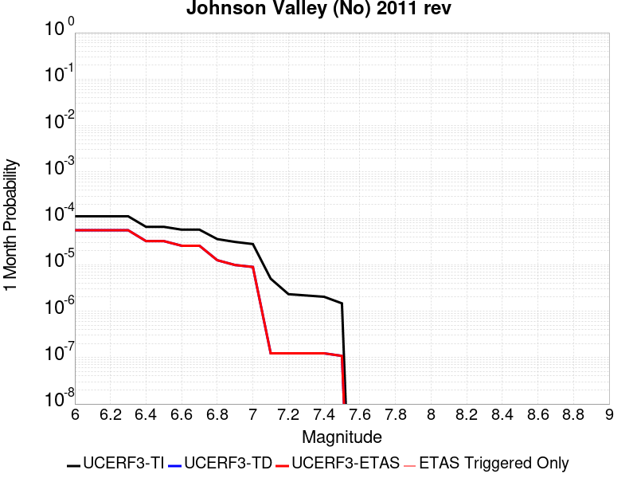 |  | 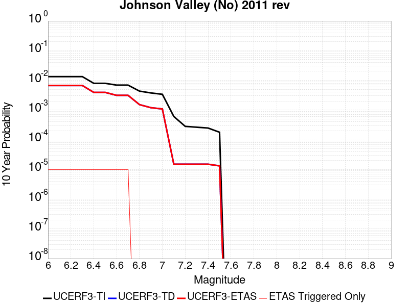 |

| Magnitude | 1 wk TI Prob | 1 wk TD Prob | 1 wk ETAS Prob | 1 wk ETAS/TD Gain | 1 wk ETAS Triggered Only | 1 mo TI Prob | 1 mo TD Prob | 1 mo ETAS Prob | 1 mo ETAS/TD Gain | 1 mo ETAS Triggered Only | 1 yr TI Prob | 1 yr TD Prob | 1 yr ETAS Prob | 1 yr ETAS/TD Gain | 1 yr ETAS Triggered Only | 10 yr TI Prob | 10 yr TD Prob | 10 yr ETAS Prob | 10 yr ETAS/TD Gain | 10 yr ETAS Triggered Only |
|-----|-----|-----|-----|-----|-----|-----|-----|-----|-----|-----|-----|-----|-----|-----|-----|-----|-----|-----|-----|-----|
| 6.0 | 2.577707E-5 | 1.290122E-5 | 1.290122E-5 | 1.0 | 0.0 | 1.1046848E-4 | 5.5289995E-5 | 5.5289995E-5 | 1.0 | 0.0 | 0.0013441239 | 6.729875E-4 | 6.8298075E-4 | 1.0148491 | 1.0E-5 | 0.013360229 | 0.0067134034 | 0.0067233364 | 1.0014795 | 1.0E-5 |
| 6.1 | 2.577707E-5 | 1.290122E-5 | 1.290122E-5 | 1.0 | 0.0 | 1.1046848E-4 | 5.5289995E-5 | 5.5289995E-5 | 1.0 | 0.0 | 0.0013441239 | 6.729875E-4 | 6.8298075E-4 | 1.0148491 | 1.0E-5 | 0.013360229 | 0.0067134034 | 0.0067233364 | 1.0014795 | 1.0E-5 |
| 6.2 | 2.577707E-5 | 1.290122E-5 | 1.290122E-5 | 1.0 | 0.0 | 1.1046848E-4 | 5.5289995E-5 | 5.5289995E-5 | 1.0 | 0.0 | 0.0013441239 | 6.729875E-4 | 6.8298075E-4 | 1.0148491 | 1.0E-5 | 0.013360229 | 0.0067134034 | 0.0067233364 | 1.0014795 | 1.0E-5 |
| 6.3 | 2.577707E-5 | 1.290122E-5 | 1.290122E-5 | 1.0 | 0.0 | 1.1046848E-4 | 5.5289995E-5 | 5.5289995E-5 | 1.0 | 0.0 | 0.0013441239 | 6.729875E-4 | 6.8298075E-4 | 1.0148491 | 1.0E-5 | 0.013360229 | 0.0067134034 | 0.0067233364 | 1.0014795 | 1.0E-5 |
| 6.4 | 1.5296591E-5 | 7.536979E-6 | 7.536979E-6 | 1.0 | 0.0 | 6.555518E-5 | 3.2301043E-5 | 3.2301043E-5 | 1.0 | 0.0 | 7.97842E-4 | 3.93213E-4 | 4.0320907E-4 | 1.0254215 | 1.0E-5 | 0.007949836 | 0.003927014 | 0.003936975 | 1.0025364 | 1.0E-5 |
| 6.5 | 1.5296591E-5 | 7.536979E-6 | 7.536979E-6 | 1.0 | 0.0 | 6.555518E-5 | 3.2301043E-5 | 3.2301043E-5 | 1.0 | 0.0 | 7.97842E-4 | 3.93213E-4 | 4.0320907E-4 | 1.0254215 | 1.0E-5 | 0.007949836 | 0.003927014 | 0.003936975 | 1.0025364 | 1.0E-5 |
| 6.6 | 1.3289383E-5 | 5.9919357E-6 | 5.9919357E-6 | 1.0 | 0.0 | 5.6953253E-5 | 2.5679567E-5 | 2.5679567E-5 | 1.0 | 0.0 | 6.9318525E-4 | 3.1262083E-4 | 3.226177E-4 | 1.0319777 | 1.0E-5 | 0.0069102696 | 0.003123475 | 0.0031334439 | 1.0031916 | 1.0E-5 |
| 6.7 | 1.3289383E-5 | 5.9919357E-6 | 5.9919357E-6 | 1.0 | 0.0 | 5.6953253E-5 | 2.5679567E-5 | 2.5679567E-5 | 1.0 | 0.0 | 6.9318525E-4 | 3.1262083E-4 | 3.226177E-4 | 1.0319777 | 1.0E-5 | 0.0069102696 | 0.003123475 | 0.0031334439 | 1.0031916 | 1.0E-5 |
| 6.8 | 8.330789E-6 | 2.9214577E-6 | 2.9214577E-6 | 1.0 | 0.0 | 3.570289E-5 | 1.2520506E-5 | 1.2520506E-5 | 1.0 | 0.0 | 4.34596E-4 | 1.524322E-4 | 1.524322E-4 | 1.0 | 0.0 | 0.0043374705 | 0.0015238365 | 0.0015238365 | 1.0 | 0.0 |
| 6.9 | 7.2359003E-6 | 2.3014702E-6 | 2.3014702E-6 | 1.0 | 0.0 | 3.1010633E-5 | 9.863436E-6 | 9.863436E-6 | 1.0 | 0.0 | 3.7748902E-4 | 1.2008605E-4 | 1.2008605E-4 | 1.0 | 0.0 | 0.0037684843 | 0.0012007345 | 0.0012007345 | 1.0 | 0.0 |
| 7.0 | 6.5149957E-6 | 2.0886398E-6 | 2.0886398E-6 | 1.0 | 0.0 | 2.792111E-5 | 8.951313E-6 | 8.951313E-6 | 1.0 | 0.0 | 3.398865E-4 | 1.0898209E-4 | 1.0898209E-4 | 1.0 | 0.0 | 0.003393671 | 0.0010898062 | 0.0010898062 | 1.0 | 0.0 |
| 7.1 | 1.1662233E-6 | 2.879316E-8 | 2.879316E-8 | 1.0 | 0.0 | 4.9980904E-6 | 1.2339925E-7 | 1.2339925E-7 | 1.0 | 0.0 | 6.0850052E-5 | 1.502385E-6 | 1.502385E-6 | 1.0 | 0.0 | 6.083339E-4 | 1.5023765E-5 | 1.5023765E-5 | 1.0 | 0.0 |
| 7.2 | 5.413881E-7 | 2.879316E-8 | 2.879316E-8 | 1.0 | 0.0 | 2.3202326E-6 | 1.2339925E-7 | 1.2339925E-7 | 1.0 | 0.0 | 2.8248465E-5 | 1.502385E-6 | 1.502385E-6 | 1.0 | 0.0 | 2.8244875E-4 | 1.5023765E-5 | 1.5023765E-5 | 1.0 | 0.0 |
| 7.3 | 5.076821E-7 | 2.879316E-8 | 2.879316E-8 | 1.0 | 0.0 | 2.1757785E-6 | 1.2339925E-7 | 1.2339925E-7 | 1.0 | 0.0 | 2.648978E-5 | 1.502385E-6 | 1.502385E-6 | 1.0 | 0.0 | 2.6486625E-4 | 1.5023765E-5 | 1.5023765E-5 | 1.0 | 0.0 |
| 7.4 | 4.7568687E-7 | 2.8775107E-8 | 2.8775107E-8 | 1.0 | 0.0 | 2.0386565E-6 | 1.2332188E-7 | 1.2332188E-7 | 1.0 | 0.0 | 2.482036E-5 | 1.5014431E-6 | 1.5014431E-6 | 1.0 | 0.0 | 2.4817587E-4 | 1.5014345E-5 | 1.5014345E-5 | 1.0 | 0.0 |
| 7.5 | 3.435626E-7 | 2.5350424E-8 | 2.5350424E-8 | 1.0 | 0.0 | 1.4724103E-6 | 1.0864467E-7 | 1.0864467E-7 | 1.0 | 0.0 | 1.7926448E-5 | 1.3227482E-6 | 1.3227482E-6 | 1.0 | 0.0 | 1.7925001E-4 | 1.3227419E-5 | 1.3227419E-5 | 1.0 | 0.0 |

## Great Valley 04b Gordon Valley
*[(top)](#table-of-contents)*

| 1 Week | 1 Month | 1 Year | 10 Year |
|-----|-----|-----|-----|
|  | 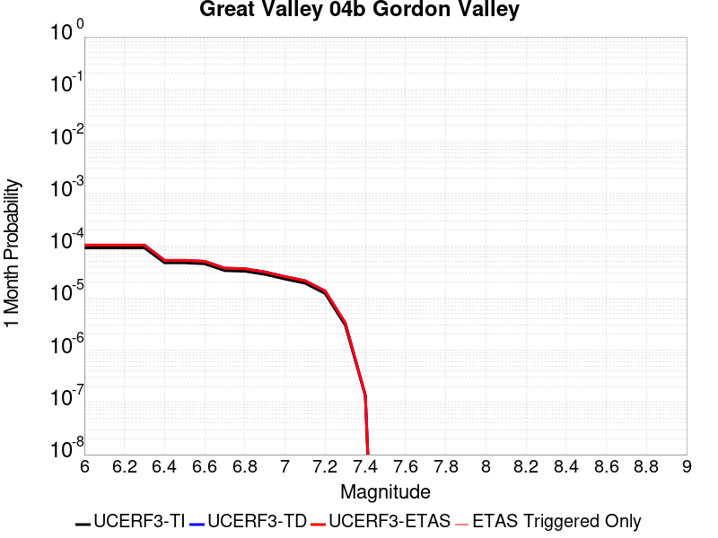 |  |  |

| Magnitude | 1 wk TI Prob | 1 wk TD Prob | 1 wk ETAS Prob | 1 wk ETAS/TD Gain | 1 wk ETAS Triggered Only | 1 mo TI Prob | 1 mo TD Prob | 1 mo ETAS Prob | 1 mo ETAS/TD Gain | 1 mo ETAS Triggered Only | 1 yr TI Prob | 1 yr TD Prob | 1 yr ETAS Prob | 1 yr ETAS/TD Gain | 1 yr ETAS Triggered Only | 10 yr TI Prob | 10 yr TD Prob | 10 yr ETAS Prob | 10 yr ETAS/TD Gain | 10 yr ETAS Triggered Only |
|-----|-----|-----|-----|-----|-----|-----|-----|-----|-----|-----|-----|-----|-----|-----|-----|-----|-----|-----|-----|-----|
| 6.0 | 2.1181217E-5 | 2.3981991E-5 | 2.3981991E-5 | 1.0 | 0.0 | 9.077348E-5 | 1.0277685E-4 | 1.0277685E-4 | 1.0 | 0.0 | 0.0011046068 | 0.0012507566 | 0.0012607441 | 1.0079851 | 1.0E-5 | 0.010991322 | 0.01245362 | 0.012463496 | 1.000793 | 1.0E-5 |
| 6.1 | 2.1181217E-5 | 2.3981991E-5 | 2.3981991E-5 | 1.0 | 0.0 | 9.077348E-5 | 1.0277685E-4 | 1.0277685E-4 | 1.0 | 0.0 | 0.0011046068 | 0.0012507566 | 0.0012607441 | 1.0079851 | 1.0E-5 | 0.010991322 | 0.01245362 | 0.012463496 | 1.000793 | 1.0E-5 |
| 6.2 | 2.1181217E-5 | 2.3981991E-5 | 2.3981991E-5 | 1.0 | 0.0 | 9.077348E-5 | 1.0277685E-4 | 1.0277685E-4 | 1.0 | 0.0 | 0.0011046068 | 0.0012507566 | 0.0012607441 | 1.0079851 | 1.0E-5 | 0.010991322 | 0.01245362 | 0.012463496 | 1.000793 | 1.0E-5 |
| 6.3 | 2.1181217E-5 | 2.3981991E-5 | 2.3981991E-5 | 1.0 | 0.0 | 9.077348E-5 | 1.0277685E-4 | 1.0277685E-4 | 1.0 | 0.0 | 0.0011046068 | 0.0012507566 | 0.0012607441 | 1.0079851 | 1.0E-5 | 0.010991322 | 0.01245362 | 0.012463496 | 1.000793 | 1.0E-5 |
| 6.4 | 1.0988268E-5 | 1.2254516E-5 | 1.2254516E-5 | 1.0 | 0.0 | 4.7091726E-5 | 5.2518386E-5 | 5.2518386E-5 | 1.0 | 0.0 | 5.731909E-4 | 6.3923973E-4 | 6.492333E-4 | 1.0156336 | 1.0E-5 | 0.005717147 | 0.0063755964 | 0.0063855327 | 1.0015584 | 1.0E-5 |
| 6.5 | 1.0988268E-5 | 1.2254516E-5 | 1.2254516E-5 | 1.0 | 0.0 | 4.7091726E-5 | 5.2518386E-5 | 5.2518386E-5 | 1.0 | 0.0 | 5.731909E-4 | 6.3923973E-4 | 6.492333E-4 | 1.0156336 | 1.0E-5 | 0.005717147 | 0.0063755964 | 0.0063855327 | 1.0015584 | 1.0E-5 |
| 6.6 | 1.0517822E-5 | 1.1724079E-5 | 1.1724079E-5 | 1.0 | 0.0 | 4.5075605E-5 | 5.024517E-5 | 5.024517E-5 | 1.0 | 0.0 | 5.4865726E-4 | 6.115789E-4 | 6.215728E-4 | 1.0163411 | 1.0E-5 | 0.0054730466 | 0.0061005116 | 0.0061104507 | 1.0016292 | 1.0E-5 |
| 6.7 | 7.789219E-6 | 8.677656E-6 | 8.677656E-6 | 1.0 | 0.0 | 3.3381937E-5 | 3.7189457E-5 | 3.7189457E-5 | 1.0 | 0.0 | 4.063493E-4 | 4.5269274E-4 | 4.5269274E-4 | 1.0 | 0.0 | 0.004056071 | 0.004518223 | 0.004518223 | 1.0 | 0.0 |
| 6.8 | 7.5850853E-6 | 8.452401E-6 | 8.452401E-6 | 1.0 | 0.0 | 3.2507105E-5 | 3.62241E-5 | 3.62241E-5 | 1.0 | 0.0 | 3.957021E-4 | 4.409443E-4 | 4.409443E-4 | 1.0 | 0.0 | 0.0039499826 | 0.0044012065 | 0.0044012065 | 1.0 | 0.0 |
| 6.9 | 6.604105E-6 | 7.3585597E-6 | 7.3585597E-6 | 1.0 | 0.0 | 2.8303E-5 | 3.1536325E-5 | 3.1536325E-5 | 1.0 | 0.0 | 3.4453452E-4 | 3.83891E-4 | 3.83891E-4 | 1.0 | 0.0 | 0.0034400085 | 0.0038326648 | 0.0038326648 | 1.0 | 0.0 |
| 7.0 | 5.3701115E-6 | 5.988427E-6 | 5.988427E-6 | 1.0 | 0.0 | 2.301456E-5 | 2.566445E-5 | 2.566445E-5 | 1.0 | 0.0 | 2.8016625E-4 | 3.1242278E-4 | 3.1242278E-4 | 1.0 | 0.0 | 0.0027981328 | 0.0031201243 | 0.0031201243 | 1.0 | 0.0 |
| 7.1 | 4.4685607E-6 | 4.9864852E-6 | 4.9864852E-6 | 1.0 | 0.0 | 1.9150835E-5 | 2.137049E-5 | 2.137049E-5 | 1.0 | 0.0 | 2.3313647E-4 | 2.6015713E-4 | 2.6015713E-4 | 1.0 | 0.0 | 0.0023289204 | 0.0025987704 | 0.0025987704 | 1.0 | 0.0 |
| 7.2 | 2.833378E-6 | 3.1644236E-6 | 3.1644236E-6 | 1.0 | 0.0 | 1.2142991E-5 | 1.3561755E-5 | 1.3561755E-5 | 1.0 | 0.0 | 1.4783088E-4 | 1.651036E-4 | 1.651036E-4 | 1.0 | 0.0 | 0.0014773258 | 0.0016499812 | 0.0016499812 | 1.0 | 0.0 |
| 7.3 | 7.0087293E-7 | 7.772826E-7 | 7.772826E-7 | 1.0 | 0.0 | 3.0037377E-6 | 3.3312094E-6 | 3.3312094E-6 | 1.0 | 0.0 | 3.656989E-5 | 4.055718E-5 | 4.055718E-5 | 1.0 | 0.0 | 3.6563876E-4 | 4.0554276E-4 | 4.0554276E-4 | 1.0 | 0.0 |
| 7.4 | 3.112171E-8 | 3.2068378E-8 | 3.2068378E-8 | 1.0 | 0.0 | 1.3337875E-7 | 1.374359E-7 | 1.374359E-7 | 1.0 | 0.0 | 1.6238852E-6 | 1.6732808E-6 | 1.6732808E-6 | 1.0 | 0.0 | 1.6238733E-5 | 1.673269E-5 | 1.673269E-5 | 1.0 | 0.0 |

## Laguna Salada
*[(top)](#table-of-contents)*

| 1 Week | 1 Month | 1 Year | 10 Year |
|-----|-----|-----|-----|
| 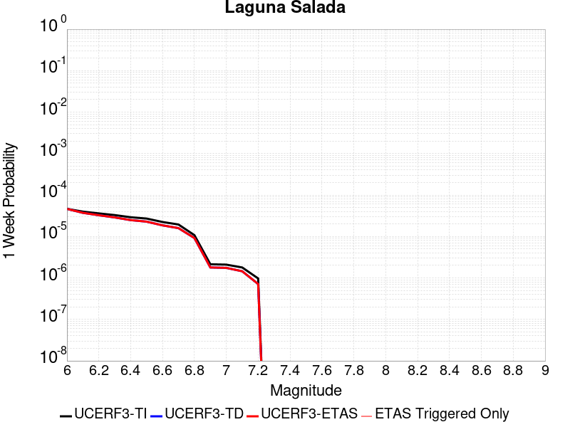 |  |  |  |

| Magnitude | 1 wk TI Prob | 1 wk TD Prob | 1 wk ETAS Prob | 1 wk ETAS/TD Gain | 1 wk ETAS Triggered Only | 1 mo TI Prob | 1 mo TD Prob | 1 mo ETAS Prob | 1 mo ETAS/TD Gain | 1 mo ETAS Triggered Only | 1 yr TI Prob | 1 yr TD Prob | 1 yr ETAS Prob | 1 yr ETAS/TD Gain | 1 yr ETAS Triggered Only | 10 yr TI Prob | 10 yr TD Prob | 10 yr ETAS Prob | 10 yr ETAS/TD Gain | 10 yr ETAS Triggered Only |
|-----|-----|-----|-----|-----|-----|-----|-----|-----|-----|-----|-----|-----|-----|-----|-----|-----|-----|-----|-----|-----|
| 6.0 | 4.6465593E-5 | 4.6345147E-5 | 4.6345147E-5 | 1.0 | 0.0 | 1.9912305E-4 | 1.9860783E-4 | 1.9860783E-4 | 1.0 | 0.0 | 0.0024216278 | 0.002415446 | 0.002425422 | 1.00413 | 1.0E-5 | 0.02395408 | 0.023965426 | 0.023975186 | 1.0004072 | 1.0E-5 |
| 6.1 | 3.982297E-5 | 3.724491E-5 | 3.724491E-5 | 1.0 | 0.0 | 1.706587E-4 | 1.5961195E-4 | 1.5961195E-4 | 1.0 | 0.0 | 0.0020757897 | 0.0019416404 | 0.0019416404 | 1.0 | 0.0 | 0.020565065 | 0.019322066 | 0.019322066 | 1.0 | 0.0 |
| 6.2 | 3.6067784E-5 | 3.2600183E-5 | 3.2600183E-5 | 1.0 | 0.0 | 1.5456705E-4 | 1.397082E-4 | 1.397082E-4 | 1.0 | 0.0 | 0.0018802295 | 0.0016997148 | 0.0016997148 | 1.0 | 0.0 | 0.018644003 | 0.016963206 | 0.016963206 | 1.0 | 0.0 |
| 6.3 | 3.2859112E-5 | 2.8847244E-5 | 2.8847244E-5 | 1.0 | 0.0 | 1.4081717E-4 | 1.2362574E-4 | 1.2362574E-4 | 1.0 | 0.0 | 0.0017131006 | 0.0015041974 | 0.0015041974 | 1.0 | 0.0 | 0.016999546 | 0.015031846 | 0.015031846 | 1.0 | 0.0 |
| 6.4 | 2.9132116E-5 | 2.4851885E-5 | 2.4851885E-5 | 1.0 | 0.0 | 1.2484594E-4 | 1.0650424E-4 | 1.0650424E-4 | 1.0 | 0.0 | 0.0015189396 | 0.0012960065 | 0.0012960065 | 1.0 | 0.0 | 0.015085992 | 0.0129651325 | 0.0129651325 | 1.0 | 0.0 |
| 6.5 | 2.7075037E-5 | 2.282468E-5 | 2.282468E-5 | 1.0 | 0.0 | 1.1603071E-4 | 9.781689E-5 | 9.781689E-5 | 1.0 | 0.0 | 0.0014117584 | 0.0011903583 | 0.0011903583 | 1.0 | 0.0 | 0.014028233 | 0.011916273 | 0.011916273 | 1.0 | 0.0 |
| 6.6 | 2.2367465E-5 | 1.857285E-5 | 1.857285E-5 | 1.0 | 0.0 | 9.5857045E-5 | 7.9595964E-5 | 7.9595964E-5 | 1.0 | 0.0 | 0.0011664346 | 9.6873235E-4 | 9.6873235E-4 | 1.0 | 0.0 | 0.011603311 | 0.009708808 | 0.009708808 | 1.0 | 0.0 |
| 6.7 | 1.9458053E-5 | 1.591361E-5 | 1.591361E-5 | 1.0 | 0.0 | 8.338899E-5 | 6.819986E-5 | 6.819986E-5 | 1.0 | 0.0 | 0.001014788 | 8.300973E-4 | 8.300973E-4 | 1.0 | 0.0 | 0.010101665 | 0.008315947 | 0.008315947 | 1.0 | 0.0 |
| 6.8 | 1.0767866E-5 | 9.18335E-6 | 9.18335E-6 | 1.0 | 0.0 | 4.614718E-5 | 3.9357008E-5 | 3.9357008E-5 | 1.0 | 0.0 | 5.6169706E-4 | 4.7913485E-4 | 4.7913485E-4 | 1.0 | 0.0 | 0.0056027942 | 0.004808534 | 0.004808534 | 1.0 | 0.0 |
| 6.9 | 2.1384765E-6 | 1.7913994E-6 | 1.7913994E-6 | 1.0 | 0.0 | 9.164866E-6 | 7.677406E-6 | 7.677406E-6 | 1.0 | 0.0 | 1.1157654E-4 | 9.34688E-5 | 9.34688E-5 | 1.0 | 0.0 | 0.0011152053 | 9.3433313E-4 | 9.3433313E-4 | 1.0 | 0.0 |
| 7.0 | 2.0952946E-6 | 1.7493367E-6 | 1.7493367E-6 | 1.0 | 0.0 | 8.979802E-6 | 7.4971376E-6 | 7.4971376E-6 | 1.0 | 0.0 | 1.0932361E-4 | 9.127422E-5 | 9.127422E-5 | 1.0 | 0.0 | 0.0010926984 | 9.1240543E-4 | 9.1240543E-4 | 1.0 | 0.0 |
| 7.1 | 1.7887576E-6 | 1.4500572E-6 | 1.4500572E-6 | 1.0 | 0.0 | 7.666081E-6 | 6.2145177E-6 | 6.2145177E-6 | 1.0 | 0.0 | 9.333054E-5 | 7.565944E-5 | 7.565944E-5 | 1.0 | 0.0 | 9.329135E-4 | 7.5636717E-4 | 7.5636717E-4 | 1.0 | 0.0 |
| 7.2 | 9.723109E-7 | 7.135859E-7 | 7.135859E-7 | 1.0 | 0.0 | 4.16704E-6 | 3.0582228E-6 | 3.0582228E-6 | 1.0 | 0.0 | 5.073253E-5 | 3.7233393E-5 | 3.7233393E-5 | 1.0 | 0.0 | 5.072095E-4 | 3.722878E-4 | 3.722878E-4 | 1.0 | 0.0 |

## Sargent 2011 CFM
*[(top)](#table-of-contents)*

| 1 Week | 1 Month | 1 Year | 10 Year |
|-----|-----|-----|-----|
| 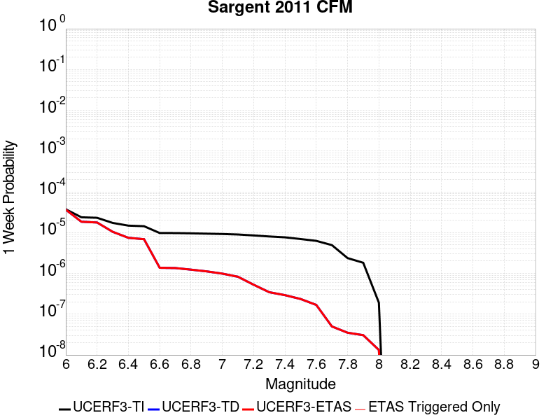 |  |  |  |

| Magnitude | 1 wk TI Prob | 1 wk TD Prob | 1 wk ETAS Prob | 1 wk ETAS/TD Gain | 1 wk ETAS Triggered Only | 1 mo TI Prob | 1 mo TD Prob | 1 mo ETAS Prob | 1 mo ETAS/TD Gain | 1 mo ETAS Triggered Only | 1 yr TI Prob | 1 yr TD Prob | 1 yr ETAS Prob | 1 yr ETAS/TD Gain | 1 yr ETAS Triggered Only | 10 yr TI Prob | 10 yr TD Prob | 10 yr ETAS Prob | 10 yr ETAS/TD Gain | 10 yr ETAS Triggered Only |
|-----|-----|-----|-----|-----|-----|-----|-----|-----|-----|-----|-----|-----|-----|-----|-----|-----|-----|-----|-----|-----|
| 6.0 | 3.7327867E-5 | 3.6650814E-5 | 3.6650814E-5 | 1.0 | 0.0 | 1.5996677E-4 | 1.570678E-4 | 1.570678E-4 | 1.0 | 0.0 | 0.0019458556 | 0.0019110349 | 0.0019210158 | 1.0052228 | 1.0E-5 | 0.01928905 | 0.019018088 | 0.019027898 | 1.0005158 | 1.0E-5 |
| 6.1 | 2.3771476E-5 | 1.847881E-5 | 1.847881E-5 | 1.0 | 0.0 | 1.01873775E-4 | 7.9192985E-5 | 7.9192985E-5 | 1.0 | 0.0 | 0.0012396075 | 9.6382835E-4 | 9.738187E-4 | 1.0103652 | 1.0E-5 | 0.012327154 | 0.009635958 | 0.009645862 | 1.0010278 | 1.0E-5 |
| 6.2 | 2.3112721E-5 | 1.7710167E-5 | 1.7710167E-5 | 1.0 | 0.0 | 9.9050754E-5 | 7.589899E-5 | 7.589899E-5 | 1.0 | 0.0 | 0.0012052758 | 9.2375814E-4 | 9.2375814E-4 | 1.0 | 0.0 | 0.011987597 | 0.009238609 | 0.009238609 | 1.0 | 0.0 |
| 6.3 | 1.728509E-5 | 1.0458575E-5 | 1.0458575E-5 | 1.0 | 0.0 | 7.407686E-5 | 4.482196E-5 | 4.482196E-5 | 1.0 | 0.0 | 9.015125E-4 | 5.4561684E-4 | 5.4561684E-4 | 1.0 | 0.0 | 0.008978641 | 0.005478954 | 0.005478954 | 1.0 | 0.0 |
| 6.4 | 1.48395575E-5 | 7.4556333E-6 | 7.4556333E-6 | 1.0 | 0.0 | 6.3596555E-5 | 3.1952535E-5 | 3.1952535E-5 | 1.0 | 0.0 | 7.7401294E-4 | 3.889902E-4 | 3.889902E-4 | 1.0 | 0.0 | 0.0077132257 | 0.003918489 | 0.003918489 | 1.0 | 0.0 |
| 6.5 | 1.4358964E-5 | 6.894408E-6 | 6.894408E-6 | 1.0 | 0.0 | 6.1536964E-5 | 2.9547342E-5 | 2.9547342E-5 | 1.0 | 0.0 | 7.48955E-4 | 3.5971685E-4 | 3.5971685E-4 | 1.0 | 0.0 | 0.0074643586 | 0.0036267375 | 0.0036267375 | 1.0 | 0.0 |
| 6.6 | 9.772591E-6 | 1.3732761E-6 | 1.3732761E-6 | 1.0 | 0.0 | 4.188186E-5 | 5.8854553E-6 | 5.8854553E-6 | 1.0 | 0.0 | 5.097923E-4 | 7.165309E-5 | 7.165309E-5 | 1.0 | 0.0 | 0.005086244 | 7.4811856E-4 | 7.4811856E-4 | 1.0 | 0.0 |
| 6.7 | 9.752745E-6 | 1.3519673E-6 | 1.3519673E-6 | 1.0 | 0.0 | 4.179681E-5 | 5.794133E-6 | 5.794133E-6 | 1.0 | 0.0 | 5.0875737E-4 | 7.054131E-5 | 7.054131E-5 | 1.0 | 0.0 | 0.005075942 | 7.3700823E-4 | 7.3700823E-4 | 1.0 | 0.0 |
| 6.8 | 9.608213E-6 | 1.2358333E-6 | 1.2358333E-6 | 1.0 | 0.0 | 4.1177405E-5 | 5.2964183E-6 | 5.2964183E-6 | 1.0 | 0.0 | 5.012196E-4 | 6.448201E-5 | 6.448201E-5 | 1.0 | 0.0 | 0.005000906 | 6.761486E-4 | 6.761486E-4 | 1.0 | 0.0 |
| 6.9 | 9.427164E-6 | 1.1206157E-6 | 1.1206157E-6 | 1.0 | 0.0 | 4.04015E-5 | 4.80263E-6 | 4.80263E-6 | 1.0 | 0.0 | 4.9177726E-4 | 5.8470472E-5 | 5.8470472E-5 | 1.0 | 0.0 | 0.004906904 | 6.153886E-4 | 6.153886E-4 | 1.0 | 0.0 |
| 7.0 | 9.247601E-6 | 9.870762E-7 | 9.870762E-7 | 1.0 | 0.0 | 3.9631974E-5 | 4.2303195E-6 | 4.2303195E-6 | 1.0 | 0.0 | 4.8241246E-4 | 5.150294E-5 | 5.150294E-5 | 1.0 | 0.0 | 0.0048136655 | 5.452397E-4 | 5.452397E-4 | 1.0 | 0.0 |
| 7.1 | 8.995454E-6 | 8.267928E-7 | 8.267928E-7 | 1.0 | 0.0 | 3.8551374E-5 | 3.543393E-6 | 3.543393E-6 | 1.0 | 0.0 | 4.6926187E-4 | 4.3139968E-5 | 4.3139968E-5 | 1.0 | 0.0 | 0.004682722 | 4.6072243E-4 | 4.6072243E-4 | 1.0 | 0.0 |
| 7.2 | 8.520861E-6 | 5.2734924E-7 | 5.2734924E-7 | 1.0 | 0.0 | 3.6517464E-5 | 2.2600664E-6 | 2.2600664E-6 | 1.0 | 0.0 | 4.445094E-4 | 2.7515967E-5 | 2.7515967E-5 | 1.0 | 0.0 | 0.004436213 | 3.027907E-4 | 3.027907E-4 | 1.0 | 0.0 |
| 7.3 | 8.043592E-6 | 3.453484E-7 | 3.453484E-7 | 1.0 | 0.0 | 3.4472083E-5 | 1.4800638E-6 | 1.4800638E-6 | 1.0 | 0.0 | 4.196168E-4 | 1.8019628E-5 | 1.8019628E-5 | 1.0 | 0.0 | 0.004188253 | 2.0652391E-4 | 2.0652391E-4 | 1.0 | 0.0 |
| 7.4 | 7.662316E-6 | 2.9261398E-7 | 2.9261398E-7 | 1.0 | 0.0 | 3.2838085E-5 | 1.2540593E-6 | 1.2540593E-6 | 1.0 | 0.0 | 3.9973034E-4 | 1.5268066E-5 | 1.5268066E-5 | 1.0 | 0.0 | 0.0039901207 | 1.7720174E-4 | 1.7720174E-4 | 1.0 | 0.0 |
| 7.5 | 6.961638E-6 | 2.3551058E-7 | 2.3551058E-7 | 1.0 | 0.0 | 2.9835252E-5 | 1.0093307E-6 | 1.0093307E-6 | 1.0 | 0.0 | 3.6318362E-4 | 1.2288533E-5 | 1.2288533E-5 | 1.0 | 0.0 | 0.0036259065 | 1.4394961E-4 | 1.4394961E-4 | 1.0 | 0.0 |
| 7.6 | 6.282332E-6 | 1.6873504E-7 | 1.6873504E-7 | 1.0 | 0.0 | 2.6924003E-5 | 7.2315E-7 | 7.2315E-7 | 1.0 | 0.0 | 3.2775043E-4 | 8.804316E-6 | 8.804316E-6 | 1.0 | 0.0 | 0.0032726745 | 1.0493906E-4 | 1.0493906E-4 | 1.0 | 0.0 |
| 7.7 | 4.934408E-6 | 4.9924335E-8 | 4.9924335E-8 | 1.0 | 0.0 | 2.114729E-5 | 2.1396143E-7 | 2.1396143E-7 | 1.0 | 0.0 | 2.5743784E-4 | 2.6049772E-6 | 2.6049772E-6 | 1.0 | 0.0 | 0.0025713982 | 3.248444E-5 | 3.248444E-5 | 1.0 | 0.0 |
| 7.8 | 2.373212E-6 | 3.510547E-8 | 3.510547E-8 | 1.0 | 0.0 | 1.0170869E-5 | 1.5045201E-7 | 1.5045201E-7 | 1.0 | 0.0 | 1.238233E-4 | 1.8317517E-6 | 1.8317517E-6 | 1.0 | 0.0 | 0.0012375432 | 2.407819E-5 | 2.407819E-5 | 1.0 | 0.0 |
| 7.9 | 1.8227792E-6 | 3.0560397E-8 | 3.0560397E-8 | 1.0 | 0.0 | 7.811887E-6 | 1.3097312E-7 | 1.3097312E-7 | 1.0 | 0.0 | 9.510558E-5 | 1.5945966E-6 | 1.5945966E-6 | 1.0 | 0.0 | 9.5064886E-4 | 2.1369211E-5 | 2.1369211E-5 | 1.0 | 0.0 |
| 8.0 | 1.9095137E-7 | 1.3251689E-8 | 1.3251689E-8 | 1.0 | 0.0 | 8.1836276E-7 | 5.6792953E-8 | 5.6792953E-8 | 1.0 | 0.0 | 9.963521E-6 | 6.91454E-7 | 6.91454E-7 | 1.0 | 0.0 | 9.963074E-5 | 8.4557405E-6 | 8.4557405E-6 | 1.0 | 0.0 |

## Big Pine (West)
*[(top)](#table-of-contents)*

| 1 Week | 1 Month | 1 Year | 10 Year |
|-----|-----|-----|-----|
|  |  |  |  |

| Magnitude | 1 wk TI Prob | 1 wk TD Prob | 1 wk ETAS Prob | 1 wk ETAS/TD Gain | 1 wk ETAS Triggered Only | 1 mo TI Prob | 1 mo TD Prob | 1 mo ETAS Prob | 1 mo ETAS/TD Gain | 1 mo ETAS Triggered Only | 1 yr TI Prob | 1 yr TD Prob | 1 yr ETAS Prob | 1 yr ETAS/TD Gain | 1 yr ETAS Triggered Only | 10 yr TI Prob | 10 yr TD Prob | 10 yr ETAS Prob | 10 yr ETAS/TD Gain | 10 yr ETAS Triggered Only |
|-----|-----|-----|-----|-----|-----|-----|-----|-----|-----|-----|-----|-----|-----|-----|-----|-----|-----|-----|-----|-----|
| 6.0 | 6.8306974E-7 | 6.881831E-7 | 6.881831E-7 | 1.0 | 0.0 | 2.9274386E-6 | 2.9493533E-6 | 2.9493533E-6 | 1.0 | 0.0 | 3.564098E-5 | 3.590788E-5 | 4.590752E-5 | 1.2784804 | 1.0E-5 | 3.5635266E-4 | 3.5903018E-4 | 3.690266E-4 | 1.0278428 | 1.0E-5 |
| 6.1 | 6.8306974E-7 | 6.881831E-7 | 6.881831E-7 | 1.0 | 0.0 | 2.9274386E-6 | 2.9493533E-6 | 2.9493533E-6 | 1.0 | 0.0 | 3.564098E-5 | 3.590788E-5 | 4.590752E-5 | 1.2784804 | 1.0E-5 | 3.5635266E-4 | 3.5903018E-4 | 3.690266E-4 | 1.0278428 | 1.0E-5 |
| 6.2 | 6.8306974E-7 | 6.881831E-7 | 6.881831E-7 | 1.0 | 0.0 | 2.9274386E-6 | 2.9493533E-6 | 2.9493533E-6 | 1.0 | 0.0 | 3.564098E-5 | 3.590788E-5 | 4.590752E-5 | 1.2784804 | 1.0E-5 | 3.5635266E-4 | 3.5903018E-4 | 3.690266E-4 | 1.0278428 | 1.0E-5 |
| 6.3 | 4.227652E-7 | 4.266561E-7 | 4.266561E-7 | 1.0 | 0.0 | 1.8118495E-6 | 1.8285249E-6 | 1.8285249E-6 | 1.0 | 0.0 | 2.2059045E-5 | 2.2262082E-5 | 3.2261858E-5 | 1.4491843 | 1.0E-5 | 2.2056856E-4 | 2.2260034E-4 | 2.3259812E-4 | 1.0449135 | 1.0E-5 |
| 6.4 | 4.227652E-7 | 4.266561E-7 | 4.266561E-7 | 1.0 | 0.0 | 1.8118495E-6 | 1.8285249E-6 | 1.8285249E-6 | 1.0 | 0.0 | 2.2059045E-5 | 2.2262082E-5 | 3.2261858E-5 | 1.4491843 | 1.0E-5 | 2.2056856E-4 | 2.2260034E-4 | 2.3259812E-4 | 1.0449135 | 1.0E-5 |
| 6.5 | 3.1538403E-7 | 3.188453E-7 | 3.188453E-7 | 1.0 | 0.0 | 1.3516451E-6 | 1.3664792E-6 | 1.3664792E-6 | 1.0 | 0.0 | 1.6456155E-5 | 1.663676E-5 | 2.6636595E-5 | 1.6010685 | 1.0E-5 | 1.6454936E-4 | 1.6635556E-4 | 1.763539E-4 | 1.0601022 | 1.0E-5 |
| 6.6 | 3.1538403E-7 | 3.188453E-7 | 3.188453E-7 | 1.0 | 0.0 | 1.3516451E-6 | 1.3664792E-6 | 1.3664792E-6 | 1.0 | 0.0 | 1.6456155E-5 | 1.663676E-5 | 2.6636595E-5 | 1.6010685 | 1.0E-5 | 1.6454936E-4 | 1.6635556E-4 | 1.763539E-4 | 1.0601022 | 1.0E-5 |
| 6.7 | 3.1538403E-7 | 3.188453E-7 | 3.188453E-7 | 1.0 | 0.0 | 1.3516451E-6 | 1.3664792E-6 | 1.3664792E-6 | 1.0 | 0.0 | 1.6456155E-5 | 1.663676E-5 | 2.6636595E-5 | 1.6010685 | 1.0E-5 | 1.6454936E-4 | 1.6635556E-4 | 1.763539E-4 | 1.0601022 | 1.0E-5 |
| 6.8 | 3.1538403E-7 | 3.188453E-7 | 3.188453E-7 | 1.0 | 0.0 | 1.3516451E-6 | 1.3664792E-6 | 1.3664792E-6 | 1.0 | 0.0 | 1.6456155E-5 | 1.663676E-5 | 2.6636595E-5 | 1.6010685 | 1.0E-5 | 1.6454936E-4 | 1.6635556E-4 | 1.763539E-4 | 1.0601022 | 1.0E-5 |
| 6.9 | 3.0402092E-7 | 3.07398E-7 | 3.07398E-7 | 1.0 | 0.0 | 1.3029462E-6 | 1.3174194E-6 | 1.3174194E-6 | 1.0 | 0.0 | 1.5863254E-5 | 1.6039468E-5 | 2.6039308E-5 | 1.6234521 | 1.0E-5 | 1.5862122E-4 | 1.603835E-4 | 1.7038189E-4 | 1.0623405 | 1.0E-5 |
| 7.0 | 2.3673063E-7 | 2.3944318E-7 | 2.3944318E-7 | 1.0 | 0.0 | 1.0145594E-6 | 1.0261847E-6 | 1.0261847E-6 | 1.0 | 0.0 | 1.235219E-5 | 1.249373E-5 | 2.2493605E-5 | 1.8003916 | 1.0E-5 | 1.2351504E-4 | 1.2493055E-4 | 1.349293E-4 | 1.0800345 | 1.0E-5 |
| 7.1 | 1.632138E-7 | 1.6514514E-7 | 1.6514514E-7 | 1.0 | 0.0 | 6.9948754E-7 | 7.077647E-7 | 7.077647E-7 | 1.0 | 0.0 | 8.516227E-6 | 8.617003E-6 | 1.8616916E-5 | 2.1604862 | 1.0E-5 | 8.5159016E-5 | 8.616686E-5 | 9.6166E-5 | 1.1160439 | 1.0E-5 |
| 7.2 | 1.1523723E-7 | 1.1657166E-7 | 1.1657166E-7 | 1.0 | 0.0 | 4.9387376E-7 | 4.995928E-7 | 4.995928E-7 | 1.0 | 0.0 | 6.0128964E-6 | 6.082526E-6 | 6.082526E-6 | 1.0 | 0.0 | 6.0127335E-5 | 6.0823702E-5 | 6.0823702E-5 | 1.0 | 0.0 |
| 7.3 | 7.777805E-8 | 7.862447E-8 | 7.862447E-8 | 1.0 | 0.0 | 3.3333444E-7 | 3.3696196E-7 | 3.3696196E-7 | 1.0 | 0.0 | 4.0583395E-6 | 4.102505E-6 | 4.102505E-6 | 1.0 | 0.0 | 4.0582654E-5 | 4.102435E-5 | 4.102435E-5 | 1.0 | 0.0 |
| 7.4 | 4.609946E-8 | 4.652214E-8 | 4.652214E-8 | 1.0 | 0.0 | 1.975691E-7 | 1.9938058E-7 | 1.9938058E-7 | 1.0 | 0.0 | 2.4054011E-6 | 2.4274561E-6 | 2.4274561E-6 | 1.0 | 0.0 | 2.405375E-5 | 2.4274314E-5 | 2.4274314E-5 | 1.0 | 0.0 |
| 7.5 | 2.3439137E-8 | 2.3608287E-8 | 2.3608287E-8 | 1.0 | 0.0 | 1.00453434E-7 | 1.01178365E-7 | 1.01178365E-7 | 1.0 | 0.0 | 1.2230199E-6 | 1.2318459E-6 | 1.2318459E-6 | 1.0 | 0.0 | 1.2230132E-5 | 1.2318394E-5 | 1.2318394E-5 | 1.0 | 0.0 |
| 7.6 | 1.6699769E-8 | 1.6817074E-8 | 1.6817074E-8 | 1.0 | 0.0 | 7.157044E-8 | 7.207317E-8 | 7.207317E-8 | 1.0 | 0.0 | 8.713697E-7 | 8.7749055E-7 | 8.7749055E-7 | 1.0 | 0.0 | 8.713663E-6 | 8.774872E-6 | 8.774872E-6 | 1.0 | 0.0 |
| 7.7 | 7.4061512E-9 | 7.454164E-9 | 7.454164E-9 | 1.0 | 0.0 | 3.1740647E-8 | 3.1946417E-8 | 3.1946417E-8 | 1.0 | 0.0 | 3.864423E-7 | 3.8894757E-7 | 3.8894757E-7 | 1.0 | 0.0 | 3.8644166E-6 | 3.8894696E-6 | 3.8894696E-6 | 1.0 | 0.0 |
| 7.8 | 1.2189427E-9 | 1.2270764E-9 | 1.2270764E-9 | 1.0 | 0.0 | 5.2240403E-9 | 5.2588986E-9 | 5.2588986E-9 | 1.0 | 0.0 | 6.3602684E-8 | 6.402709E-8 | 6.402709E-8 | 1.0 | 0.0 | 6.360267E-7 | 6.402708E-7 | 6.402708E-7 | 1.0 | 0.0 |

## Cucamonga
*[(top)](#table-of-contents)*

| 1 Week | 1 Month | 1 Year | 10 Year |
|-----|-----|-----|-----|
| 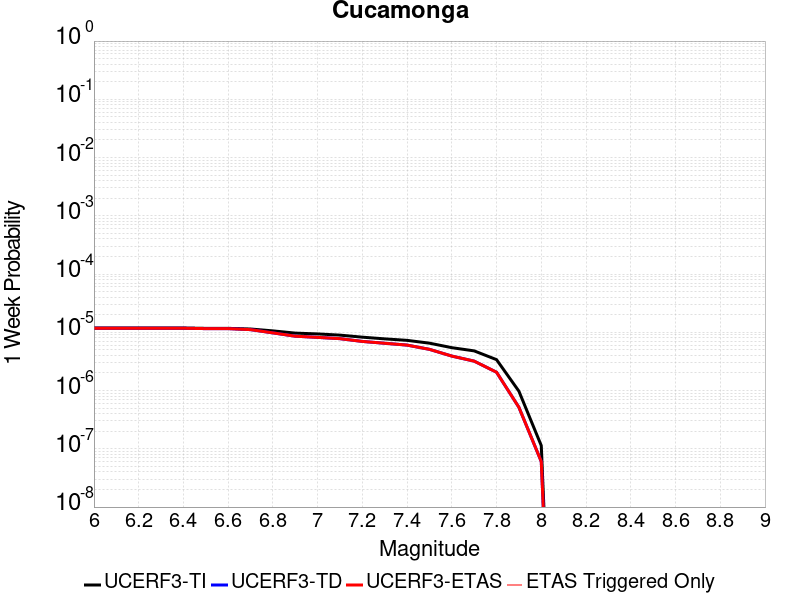 | 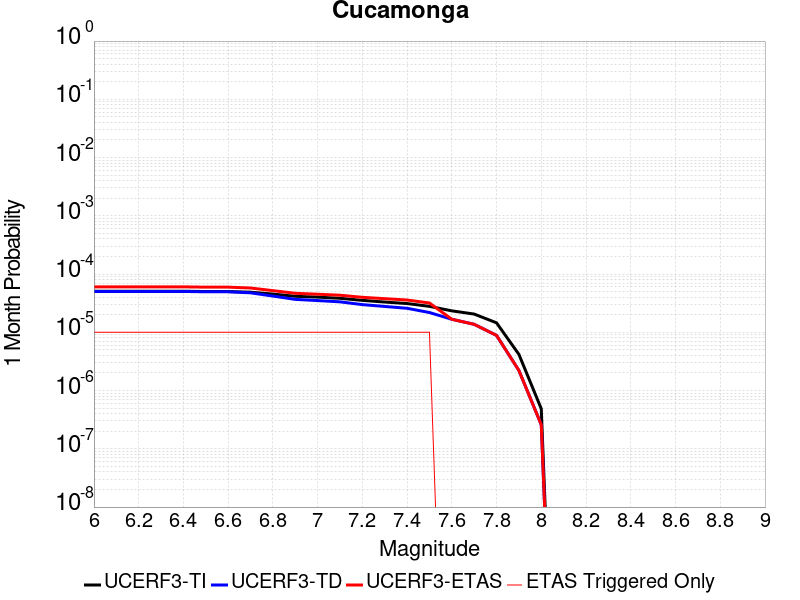 |  |  |

| Magnitude | 1 wk TI Prob | 1 wk TD Prob | 1 wk ETAS Prob | 1 wk ETAS/TD Gain | 1 wk ETAS Triggered Only | 1 mo TI Prob | 1 mo TD Prob | 1 mo ETAS Prob | 1 mo ETAS/TD Gain | 1 mo ETAS Triggered Only | 1 yr TI Prob | 1 yr TD Prob | 1 yr ETAS Prob | 1 yr ETAS/TD Gain | 1 yr ETAS Triggered Only | 10 yr TI Prob | 10 yr TD Prob | 10 yr ETAS Prob | 10 yr ETAS/TD Gain | 10 yr ETAS Triggered Only |
|-----|-----|-----|-----|-----|-----|-----|-----|-----|-----|-----|-----|-----|-----|-----|-----|-----|-----|-----|-----|-----|
| 6.0 | 1.1848348E-5 | 1.1737251E-5 | 1.1737251E-5 | 1.0 | 0.0 | 5.0777642E-5 | 5.030155E-5 | 6.030105E-5 | 1.198791 | 1.0E-5 | 6.180424E-4 | 6.12252E-4 | 6.222459E-4 | 1.0163231 | 1.0E-5 | 0.0061632637 | 0.0061068307 | 0.0061167697 | 1.0016276 | 1.0E-5 |
| 6.1 | 1.1848348E-5 | 1.1737251E-5 | 1.1737251E-5 | 1.0 | 0.0 | 5.0777642E-5 | 5.030155E-5 | 6.030105E-5 | 1.198791 | 1.0E-5 | 6.180424E-4 | 6.12252E-4 | 6.222459E-4 | 1.0163231 | 1.0E-5 | 0.0061632637 | 0.0061068307 | 0.0061167697 | 1.0016276 | 1.0E-5 |
| 6.2 | 1.1848348E-5 | 1.1737251E-5 | 1.1737251E-5 | 1.0 | 0.0 | 5.0777642E-5 | 5.030155E-5 | 6.030105E-5 | 1.198791 | 1.0E-5 | 6.180424E-4 | 6.12252E-4 | 6.222459E-4 | 1.0163231 | 1.0E-5 | 0.0061632637 | 0.0061068307 | 0.0061167697 | 1.0016276 | 1.0E-5 |
| 6.3 | 1.1848348E-5 | 1.1737251E-5 | 1.1737251E-5 | 1.0 | 0.0 | 5.0777642E-5 | 5.030155E-5 | 6.030105E-5 | 1.198791 | 1.0E-5 | 6.180424E-4 | 6.12252E-4 | 6.222459E-4 | 1.0163231 | 1.0E-5 | 0.0061632637 | 0.0061068307 | 0.0061167697 | 1.0016276 | 1.0E-5 |
| 6.4 | 1.1848348E-5 | 1.1737251E-5 | 1.1737251E-5 | 1.0 | 0.0 | 5.0777642E-5 | 5.030155E-5 | 6.030105E-5 | 1.198791 | 1.0E-5 | 6.180424E-4 | 6.12252E-4 | 6.222459E-4 | 1.0163231 | 1.0E-5 | 0.0061632637 | 0.0061068307 | 0.0061167697 | 1.0016276 | 1.0E-5 |
| 6.5 | 1.16988695E-5 | 1.1576282E-5 | 1.1576282E-5 | 1.0 | 0.0 | 5.013705E-5 | 4.9611706E-5 | 5.961121E-5 | 1.2015554 | 1.0E-5 | 6.102476E-4 | 6.038578E-4 | 6.1385176E-4 | 1.0165502 | 1.0E-5 | 0.006085745 | 0.006023345 | 0.006033285 | 1.0016502 | 1.0E-5 |
| 6.6 | 1.16988695E-5 | 1.1576282E-5 | 1.1576282E-5 | 1.0 | 0.0 | 5.013705E-5 | 4.9611706E-5 | 5.961121E-5 | 1.2015554 | 1.0E-5 | 6.102476E-4 | 6.038578E-4 | 6.1385176E-4 | 1.0165502 | 1.0E-5 | 0.006085745 | 0.006023345 | 0.006033285 | 1.0016502 | 1.0E-5 |
| 6.7 | 1.1397107E-5 | 1.111518E-5 | 1.111518E-5 | 1.0 | 0.0 | 4.884383E-5 | 4.7635633E-5 | 5.7635156E-5 | 1.209917 | 1.0E-5 | 5.9451134E-4 | 5.79812E-4 | 5.898062E-4 | 1.017237 | 1.0E-5 | 0.005929234 | 0.0057841465 | 0.005794089 | 1.0017189 | 1.0E-5 |
| 6.8 | 1.058387E-5 | 9.785173E-6 | 9.785173E-6 | 1.0 | 0.0 | 4.5358654E-5 | 4.1935786E-5 | 5.1935367E-5 | 1.2384498 | 1.0E-5 | 5.521017E-4 | 5.104497E-4 | 5.204446E-4 | 1.0195806 | 1.0E-5 | 0.00550732 | 0.0050937845 | 0.005103734 | 1.0019531 | 1.0E-5 |
| 6.9 | 9.690046E-6 | 8.579637E-6 | 8.579637E-6 | 1.0 | 0.0 | 4.1528107E-5 | 3.6769357E-5 | 4.676899E-5 | 1.2719556 | 1.0E-5 | 5.054874E-4 | 4.4757538E-4 | 4.5757092E-4 | 1.0223325 | 1.0E-5 | 0.005043391 | 0.0044676797 | 0.004477635 | 1.0022283 | 1.0E-5 |
| 7.0 | 9.381461E-6 | 8.187253E-6 | 8.187253E-6 | 1.0 | 0.0 | 4.020564E-5 | 3.5087756E-5 | 4.5087407E-5 | 1.2849897 | 1.0E-5 | 4.893937E-4 | 4.2711006E-4 | 4.371058E-4 | 1.0234032 | 1.0E-5 | 0.0048831734 | 0.0042638313 | 0.0042737885 | 1.0023353 | 1.0E-5 |
| 7.1 | 8.946492E-6 | 7.782037E-6 | 7.782037E-6 | 1.0 | 0.0 | 3.8341543E-5 | 3.335116E-5 | 4.335083E-5 | 1.2998296 | 1.0E-5 | 4.667083E-4 | 4.0597506E-4 | 4.15971E-4 | 1.0246221 | 1.0E-5 | 0.0046572937 | 0.004053274 | 0.0040632337 | 1.0024571 | 1.0E-5 |
| 7.2 | 8.251016E-6 | 6.975418E-6 | 6.975418E-6 | 1.0 | 0.0 | 3.5361016E-5 | 2.9894305E-5 | 3.9894006E-5 | 1.3345019 | 1.0E-5 | 4.3043532E-4 | 3.6390263E-4 | 3.7389898E-4 | 1.0274699 | 1.0E-5 | 0.0042960253 | 0.0036340037 | 0.0036439672 | 1.0027418 | 1.0E-5 |
| 7.3 | 7.717881E-6 | 6.4864867E-6 | 6.4864867E-6 | 1.0 | 0.0 | 3.3076216E-5 | 2.7798933E-5 | 3.7798654E-5 | 1.359716 | 1.0E-5 | 4.026285E-4 | 3.3839967E-4 | 3.4839628E-4 | 1.0295409 | 1.0E-5 | 0.004018998 | 0.0033797873 | 0.0033897536 | 1.0029488 | 1.0E-5 |
| 7.4 | 7.275623E-6 | 6.0321304E-6 | 6.0321304E-6 | 1.0 | 0.0 | 3.118087E-5 | 2.5851732E-5 | 3.5851474E-5 | 1.3868113 | 1.0E-5 | 3.7956095E-4 | 3.146996E-4 | 3.2469645E-4 | 1.0317663 | 1.0E-5 | 0.0037891332 | 0.0031434803 | 0.003153449 | 1.0031712 | 1.0E-5 |
| 7.5 | 6.5109502E-6 | 5.1007164E-6 | 5.1007164E-6 | 1.0 | 0.0 | 2.7903774E-5 | 2.186003E-5 | 3.1859814E-5 | 1.4574459 | 1.0E-5 | 3.3967546E-4 | 2.6611352E-4 | 2.7611086E-4 | 1.037568 | 1.0E-5 | 0.0033915674 | 0.002658876 | 0.0026688492 | 1.003751 | 1.0E-5 |
| 7.6 | 5.4495326E-6 | 3.9086676E-6 | 3.9086676E-6 | 1.0 | 0.0 | 2.335493E-5 | 1.6751326E-5 | 1.6751326E-5 | 1.0 | 0.0 | 2.8430918E-4 | 2.0392837E-4 | 2.0392837E-4 | 1.0 | 0.0 | 0.0028394572 | 0.0020383345 | 0.0020383345 | 1.0 | 0.0 |
| 7.7 | 4.7997164E-6 | 3.2003438E-6 | 3.2003438E-6 | 1.0 | 0.0 | 2.057005E-5 | 1.3715687E-5 | 1.3715687E-5 | 1.0 | 0.0 | 2.504116E-4 | 1.6697573E-4 | 1.6697573E-4 | 1.0 | 0.0 | 0.002501296 | 0.0016694356 | 0.0016694356 | 1.0 | 0.0 |
| 7.8 | 3.3941733E-6 | 2.0642779E-6 | 2.0642779E-6 | 1.0 | 0.0 | 1.4546376E-5 | 8.846875E-6 | 8.846875E-6 | 1.0 | 0.0 | 1.7708774E-4 | 1.077054E-4 | 1.077054E-4 | 1.0 | 0.0 | 0.0017694668 | 0.001076659 | 0.001076659 | 1.0 | 0.0 |
| 7.9 | 9.750552E-7 | 5.156278E-7 | 5.156278E-7 | 1.0 | 0.0 | 4.178801E-6 | 2.2098316E-6 | 2.2098316E-6 | 1.0 | 0.0 | 5.0875715E-5 | 2.690437E-5 | 2.690437E-5 | 1.0 | 0.0 | 5.086407E-4 | 2.6901154E-4 | 2.6901154E-4 | 1.0 | 0.0 |
| 8.0 | 1.133857E-7 | 6.053393E-8 | 6.053393E-8 | 1.0 | 0.0 | 4.8593864E-7 | 2.5943112E-7 | 2.5943112E-7 | 1.0 | 0.0 | 5.9162867E-6 | 3.1585694E-6 | 3.1585694E-6 | 1.0 | 0.0 | 5.916129E-5 | 3.158526E-5 | 3.158526E-5 | 1.0 | 0.0 |

## San Juan
*[(top)](#table-of-contents)*

| 1 Week | 1 Month | 1 Year | 10 Year |
|-----|-----|-----|-----|
| 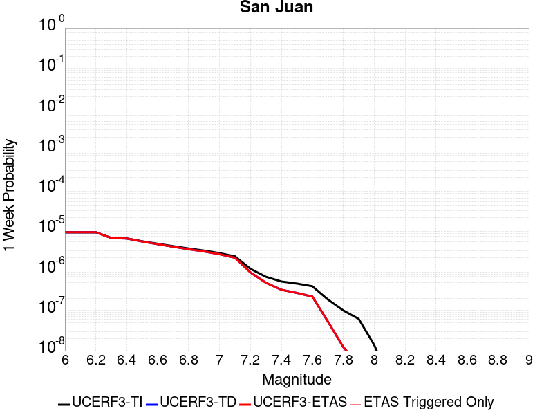 |  |  | 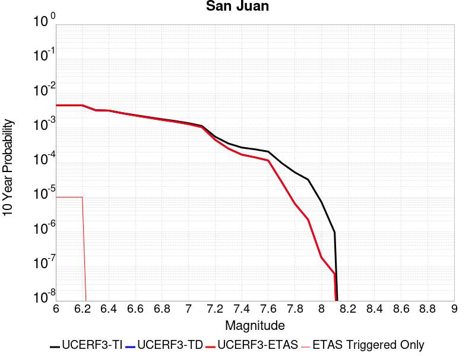 |

| Magnitude | 1 wk TI Prob | 1 wk TD Prob | 1 wk ETAS Prob | 1 wk ETAS/TD Gain | 1 wk ETAS Triggered Only | 1 mo TI Prob | 1 mo TD Prob | 1 mo ETAS Prob | 1 mo ETAS/TD Gain | 1 mo ETAS Triggered Only | 1 yr TI Prob | 1 yr TD Prob | 1 yr ETAS Prob | 1 yr ETAS/TD Gain | 1 yr ETAS Triggered Only | 10 yr TI Prob | 10 yr TD Prob | 10 yr ETAS Prob | 10 yr ETAS/TD Gain | 10 yr ETAS Triggered Only |
|-----|-----|-----|-----|-----|-----|-----|-----|-----|-----|-----|-----|-----|-----|-----|-----|-----|-----|-----|-----|-----|
| 6.0 | 8.682808E-6 | 8.749215E-6 | 8.749215E-6 | 1.0 | 0.0 | 3.72115E-5 | 3.7496124E-5 | 3.7496124E-5 | 1.0 | 0.0 | 4.5295584E-4 | 4.5642452E-4 | 4.6641997E-4 | 1.0218995 | 1.0E-5 | 0.004520337 | 0.004555412 | 0.0045653665 | 1.0021852 | 1.0E-5 |
| 6.1 | 8.682808E-6 | 8.749215E-6 | 8.749215E-6 | 1.0 | 0.0 | 3.72115E-5 | 3.7496124E-5 | 3.7496124E-5 | 1.0 | 0.0 | 4.5295584E-4 | 4.5642452E-4 | 4.6641997E-4 | 1.0218995 | 1.0E-5 | 0.004520337 | 0.004555412 | 0.0045653665 | 1.0021852 | 1.0E-5 |
| 6.2 | 8.682808E-6 | 8.749215E-6 | 8.749215E-6 | 1.0 | 0.0 | 3.72115E-5 | 3.7496124E-5 | 3.7496124E-5 | 1.0 | 0.0 | 4.5295584E-4 | 4.5642452E-4 | 4.6641997E-4 | 1.0218995 | 1.0E-5 | 0.004520337 | 0.004555412 | 0.0045653665 | 1.0021852 | 1.0E-5 |
| 6.3 | 6.3054235E-6 | 6.2826357E-6 | 6.2826357E-6 | 1.0 | 0.0 | 2.7022963E-5 | 2.692531E-5 | 2.692531E-5 | 1.0 | 0.0 | 3.2895492E-4 | 3.2776775E-4 | 3.2776775E-4 | 1.0 | 0.0 | 0.003284684 | 0.0032730435 | 0.0032730435 | 1.0 | 0.0 |
| 6.4 | 6.1490473E-6 | 6.1145092E-6 | 6.1145092E-6 | 1.0 | 0.0 | 2.6352795E-5 | 2.6204783E-5 | 2.6204783E-5 | 1.0 | 0.0 | 3.2079802E-4 | 3.1899792E-4 | 3.1899792E-4 | 1.0 | 0.0 | 0.0032033534 | 0.0031855968 | 0.0031855968 | 1.0 | 0.0 |
| 6.5 | 5.204848E-6 | 5.137276E-6 | 5.137276E-6 | 1.0 | 0.0 | 2.23063E-5 | 2.2016715E-5 | 2.2016715E-5 | 1.0 | 0.0 | 2.7154534E-4 | 2.680215E-4 | 2.680215E-4 | 1.0 | 0.0 | 0.0027121378 | 0.002677137 | 0.002677137 | 1.0 | 0.0 |
| 6.6 | 4.5179986E-6 | 4.4150593E-6 | 4.4150593E-6 | 1.0 | 0.0 | 1.9362706E-5 | 1.892155E-5 | 1.892155E-5 | 1.0 | 0.0 | 2.3571544E-4 | 2.3034631E-4 | 2.3034631E-4 | 1.0 | 0.0 | 0.0023546559 | 0.002301213 | 0.002301213 | 1.0 | 0.0 |
| 6.7 | 3.9442616E-6 | 3.8198546E-6 | 3.8198546E-6 | 1.0 | 0.0 | 1.6903869E-5 | 1.6370706E-5 | 1.6370706E-5 | 1.0 | 0.0 | 2.0578515E-4 | 1.9929578E-4 | 1.9929578E-4 | 1.0 | 0.0 | 0.002055947 | 0.001991296 | 0.001991296 | 1.0 | 0.0 |
| 6.8 | 3.4536245E-6 | 3.3163608E-6 | 3.3163608E-6 | 1.0 | 0.0 | 1.4801163E-5 | 1.4212901E-5 | 1.4212901E-5 | 1.0 | 0.0 | 1.8018926E-4 | 1.7302894E-4 | 1.7302894E-4 | 1.0 | 0.0 | 0.0018004322 | 0.0017290615 | 0.0017290615 | 1.0 | 0.0 |
| 6.9 | 3.059865E-6 | 2.9120556E-6 | 2.9120556E-6 | 1.0 | 0.0 | 1.3113641E-5 | 1.2480182E-5 | 1.2480182E-5 | 1.0 | 0.0 | 1.596469E-4 | 1.5193618E-4 | 1.5193618E-4 | 1.0 | 0.0 | 0.0015953224 | 0.0015184381 | 0.0015184381 | 1.0 | 0.0 |
| 7.0 | 2.6504351E-6 | 2.4920232E-6 | 2.4920232E-6 | 1.0 | 0.0 | 1.1358958E-5 | 1.0680058E-5 | 1.0680058E-5 | 1.0 | 0.0 | 1.3828653E-4 | 1.300225E-4 | 1.300225E-4 | 1.0 | 0.0 | 0.0013820052 | 0.0012995765 | 0.0012995765 | 1.0 | 0.0 |
| 7.1 | 2.2039317E-6 | 2.033851E-6 | 2.033851E-6 | 1.0 | 0.0 | 9.445387E-6 | 8.716477E-6 | 8.716477E-6 | 1.0 | 0.0 | 1.1499152E-4 | 1.06118474E-4 | 1.06118474E-4 | 1.0 | 0.0 | 0.0011493203 | 0.0010607884 | 0.0010607884 | 1.0 | 0.0 |
| 7.2 | 1.0786707E-6 | 8.770363E-7 | 8.770363E-7 | 1.0 | 0.0 | 4.622866E-6 | 3.7587215E-6 | 3.7587215E-6 | 1.0 | 0.0 | 5.628194E-5 | 4.5761484E-5 | 4.5761484E-5 | 1.0 | 0.0 | 5.6267687E-4 | 4.5758014E-4 | 4.5758014E-4 | 1.0 | 0.0 |
| 7.3 | 6.846433E-7 | 4.868888E-7 | 4.868888E-7 | 1.0 | 0.0 | 2.9341822E-6 | 2.0866646E-6 | 2.0866646E-6 | 1.0 | 0.0 | 3.5723086E-5 | 2.5404846E-5 | 2.5404846E-5 | 1.0 | 0.0 | 3.571734E-4 | 2.5405423E-4 | 2.5405423E-4 | 1.0 | 0.0 |
| 7.4 | 5.23043E-7 | 3.262844E-7 | 3.262844E-7 | 1.0 | 0.0 | 2.2416111E-6 | 1.398361E-6 | 1.398361E-6 | 1.0 | 0.0 | 2.7291273E-5 | 1.7024911E-5 | 1.7024911E-5 | 1.0 | 0.0 | 2.7287923E-4 | 1.7026912E-4 | 1.7026912E-4 | 1.0 | 0.0 |
| 7.5 | 4.648444E-7 | 2.7235117E-7 | 2.7235117E-7 | 1.0 | 0.0 | 1.9921886E-6 | 1.1672188E-6 | 1.1672188E-6 | 1.0 | 0.0 | 2.4254627E-5 | 1.42107965E-5 | 1.42107965E-5 | 1.0 | 0.0 | 2.425198E-4 | 1.4212955E-4 | 1.4212955E-4 | 1.0 | 0.0 |
| 7.6 | 3.9906567E-7 | 2.2083397E-7 | 2.2083397E-7 | 1.0 | 0.0 | 1.7102802E-6 | 9.4643093E-7 | 9.4643093E-7 | 1.0 | 0.0 | 2.0822463E-5 | 1.1522736E-5 | 1.1522736E-5 | 1.0 | 0.0 | 2.0820512E-4 | 1.15246614E-4 | 1.15246614E-4 | 1.0 | 0.0 |
| 7.7 | 1.8784601E-7 | 5.366427E-8 | 5.366427E-8 | 1.0 | 0.0 | 8.0505407E-7 | 2.2998971E-7 | 2.2998971E-7 | 1.0 | 0.0 | 9.80149E-6 | 2.8001211E-6 | 2.8001211E-6 | 1.0 | 0.0 | 9.801057E-5 | 2.8010289E-5 | 2.8010289E-5 | 1.0 | 0.0 |
| 7.8 | 1.00154914E-7 | 1.241339E-8 | 1.241339E-8 | 1.0 | 0.0 | 4.2923529E-7 | 5.320024E-8 | 5.320024E-8 | 1.0 | 0.0 | 5.225927E-6 | 6.4771274E-7 | 6.4771274E-7 | 1.0 | 0.0 | 5.225804E-5 | 6.482959E-6 | 6.482959E-6 | 1.0 | 0.0 |
| 7.9 | 6.171429E-8 | 4.29491E-9 | 4.29491E-9 | 1.0 | 0.0 | 2.6448978E-7 | 1.8406753E-8 | 1.8406753E-8 | 1.0 | 0.0 | 3.2201583E-6 | 2.2410224E-7 | 2.2410224E-7 | 1.0 | 0.0 | 3.2201115E-5 | 2.246273E-6 | 2.246273E-6 | 1.0 | 0.0 |
| 8.0 | 1.3974572E-8 | 3.3745273E-10 | 3.3745273E-10 | 1.0 | 0.0 | 5.989102E-8 | 1.4462198E-9 | 1.4462198E-9 | 1.0 | 0.0 | 7.2917294E-7 | 1.7607718E-8 | 1.7607718E-8 | 1.0 | 0.0 | 7.2917055E-6 | 1.8034679E-7 | 1.8034679E-7 | 1.0 | 0.0 |
| 8.1 | 1.8403477E-9 | 1.1294765E-10 | 1.1294765E-10 | 1.0 | 0.0 | 7.887204E-9 | 4.840627E-10 | 4.840627E-10 | 1.0 | 0.0 | 9.602671E-8 | 5.8934595E-9 | 5.8934595E-9 | 1.0 | 0.0 | 9.602667E-7 | 6.015635E-8 | 6.015635E-8 | 1.0 | 0.0 |

## San Jacinto (Clark) rev
*[(top)](#table-of-contents)*

| 1 Week | 1 Month | 1 Year | 10 Year |
|-----|-----|-----|-----|
|  | 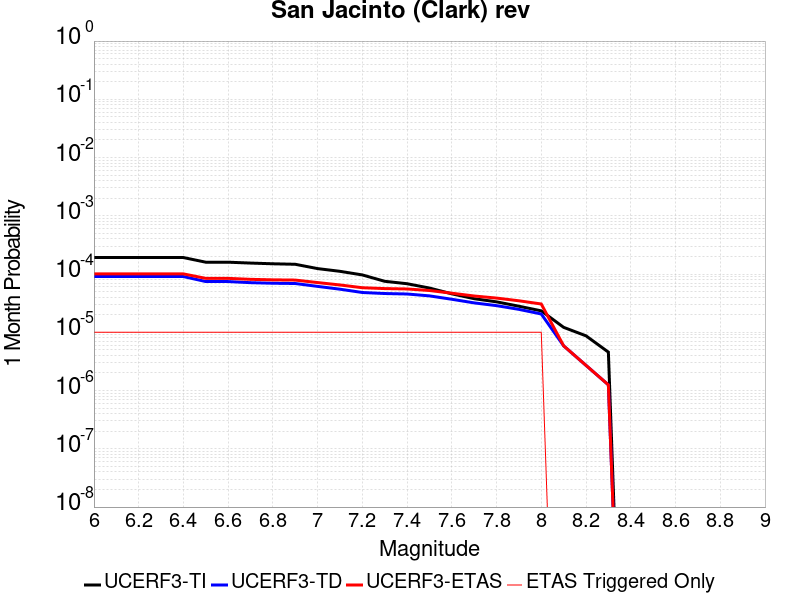 | 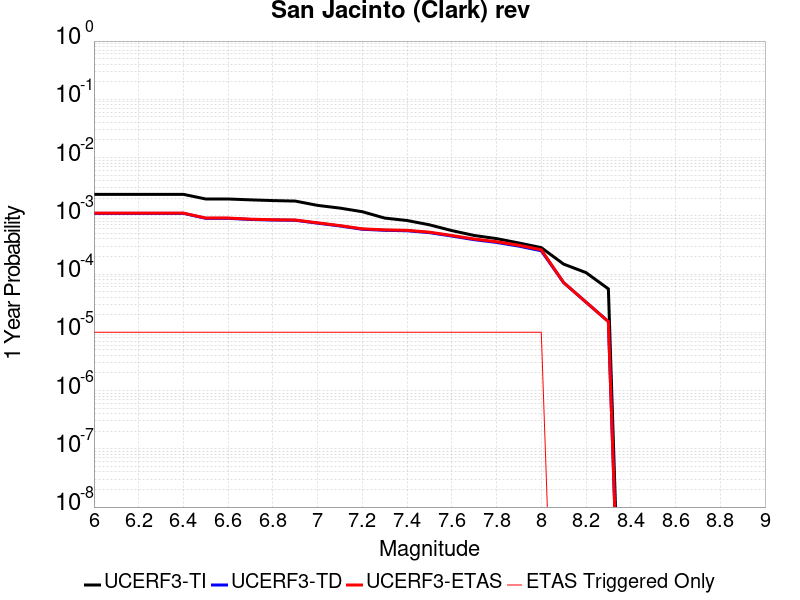 |  |

| Magnitude | 1 wk TI Prob | 1 wk TD Prob | 1 wk ETAS Prob | 1 wk ETAS/TD Gain | 1 wk ETAS Triggered Only | 1 mo TI Prob | 1 mo TD Prob | 1 mo ETAS Prob | 1 mo ETAS/TD Gain | 1 mo ETAS Triggered Only | 1 yr TI Prob | 1 yr TD Prob | 1 yr ETAS Prob | 1 yr ETAS/TD Gain | 1 yr ETAS Triggered Only | 10 yr TI Prob | 10 yr TD Prob | 10 yr ETAS Prob | 10 yr ETAS/TD Gain | 10 yr ETAS Triggered Only |
|-----|-----|-----|-----|-----|-----|-----|-----|-----|-----|-----|-----|-----|-----|-----|-----|-----|-----|-----|-----|-----|
| 6.0 | 4.482615E-5 | 2.1153503E-5 | 2.1153503E-5 | 1.0 | 0.0 | 1.9209793E-4 | 9.0654765E-5 | 1.0065386E-4 | 1.1102986 | 1.0E-5 | 0.0023362834 | 0.0011031722 | 0.0011131611 | 1.0090548 | 1.0E-5 | 0.02311874 | 0.011488781 | 0.011498666 | 1.0008605 | 1.0E-5 |
| 6.1 | 4.482615E-5 | 2.1153503E-5 | 2.1153503E-5 | 1.0 | 0.0 | 1.9209793E-4 | 9.0654765E-5 | 1.0065386E-4 | 1.1102986 | 1.0E-5 | 0.0023362834 | 0.0011031722 | 0.0011131611 | 1.0090548 | 1.0E-5 | 0.02311874 | 0.011488781 | 0.011498666 | 1.0008605 | 1.0E-5 |
| 6.2 | 4.482615E-5 | 2.1153503E-5 | 2.1153503E-5 | 1.0 | 0.0 | 1.9209793E-4 | 9.0654765E-5 | 1.0065386E-4 | 1.1102986 | 1.0E-5 | 0.0023362834 | 0.0011031722 | 0.0011131611 | 1.0090548 | 1.0E-5 | 0.02311874 | 0.011488781 | 0.011498666 | 1.0008605 | 1.0E-5 |
| 6.3 | 4.482615E-5 | 2.1153503E-5 | 2.1153503E-5 | 1.0 | 0.0 | 1.9209793E-4 | 9.0654765E-5 | 1.0065386E-4 | 1.1102986 | 1.0E-5 | 0.0023362834 | 0.0011031722 | 0.0011131611 | 1.0090548 | 1.0E-5 | 0.02311874 | 0.011488781 | 0.011498666 | 1.0008605 | 1.0E-5 |
| 6.4 | 4.482615E-5 | 2.1153503E-5 | 2.1153503E-5 | 1.0 | 0.0 | 1.9209793E-4 | 9.0654765E-5 | 1.0065386E-4 | 1.1102986 | 1.0E-5 | 0.0023362834 | 0.0011031722 | 0.0011131611 | 1.0090548 | 1.0E-5 | 0.02311874 | 0.011488781 | 0.011498666 | 1.0008605 | 1.0E-5 |
| 6.5 | 3.7294863E-5 | 1.7355109E-5 | 1.7355109E-5 | 1.0 | 0.0 | 1.5982533E-4 | 7.437694E-5 | 8.4376195E-5 | 1.1344403 | 1.0E-5 | 0.0019441366 | 9.0516754E-4 | 9.151585E-4 | 1.0110377 | 1.0E-5 | 0.01927216 | 0.009488981 | 0.009498886 | 1.0010438 | 1.0E-5 |
| 6.6 | 3.7294863E-5 | 1.7355109E-5 | 1.7355109E-5 | 1.0 | 0.0 | 1.5982533E-4 | 7.437694E-5 | 8.4376195E-5 | 1.1344403 | 1.0E-5 | 0.0019441366 | 9.0516754E-4 | 9.151585E-4 | 1.0110377 | 1.0E-5 | 0.01927216 | 0.009488981 | 0.009498886 | 1.0010438 | 1.0E-5 |
| 6.7 | 3.6039248E-5 | 1.6603126E-5 | 1.6603126E-5 | 1.0 | 0.0 | 1.5444479E-4 | 7.115434E-5 | 8.115362E-5 | 1.1405295 | 1.0E-5 | 0.0018787434 | 8.6596387E-4 | 8.759552E-4 | 1.0115378 | 1.0E-5 | 0.01862939 | 0.009088451 | 0.00909836 | 1.0010903 | 1.0E-5 |
| 6.8 | 3.5031844E-5 | 1.6231565E-5 | 1.6231565E-5 | 1.0 | 0.0 | 1.5012783E-4 | 6.956202E-5 | 7.956132E-5 | 1.1437466 | 1.0E-5 | 0.0018262739 | 8.465926E-4 | 8.565841E-4 | 1.0118021 | 1.0E-5 | 0.01811338 | 0.00888905 | 0.008898961 | 1.001115 | 1.0E-5 |
| 6.9 | 3.435112E-5 | 1.60621E-5 | 1.60621E-5 | 1.0 | 0.0 | 1.4721078E-4 | 6.883578E-5 | 7.8835095E-5 | 1.1452633 | 1.0E-5 | 0.0017908178 | 8.377575E-4 | 8.477491E-4 | 1.0119267 | 1.0E-5 | 0.017764548 | 0.008796774 | 0.008806686 | 1.0011268 | 1.0E-5 |
| 7.0 | 2.8959772E-5 | 1.43359675E-5 | 1.43359675E-5 | 1.0 | 0.0 | 1.241074E-4 | 6.143843E-5 | 7.143782E-5 | 1.1627545 | 1.0E-5 | 0.0015099603 | 7.4775895E-4 | 7.5775146E-4 | 1.0133632 | 1.0E-5 | 0.014997416 | 0.007868594 | 0.007878515 | 1.0012609 | 1.0E-5 |
| 7.1 | 2.6002877E-5 | 1.2828142E-5 | 1.2828142E-5 | 1.0 | 0.0 | 1.11436144E-4 | 5.49766E-5 | 6.4976055E-5 | 1.1818856 | 1.0E-5 | 0.0013558907 | 6.691367E-4 | 6.7913E-4 | 1.0149347 | 1.0E-5 | 0.013476475 | 0.0070486064 | 0.0070585357 | 1.0014087 | 1.0E-5 |
| 7.2 | 2.2544838E-5 | 1.12607695E-5 | 1.12607695E-5 | 1.0 | 0.0 | 9.661716E-5 | 4.8259557E-5 | 5.8259076E-5 | 1.2072028 | 1.0E-5 | 0.001175679 | 5.8740313E-4 | 5.973973E-4 | 1.017014 | 1.0E-5 | 0.011694785 | 0.0061928146 | 0.0062027527 | 1.0016048 | 1.0E-5 |
| 7.3 | 1.75334E-5 | 1.0811019E-5 | 1.0811019E-5 | 1.0 | 0.0 | 7.514098E-5 | 4.6332123E-5 | 5.633166E-5 | 1.2158229 | 1.0E-5 | 9.144575E-4 | 5.63949E-4 | 5.7394337E-4 | 1.0177221 | 1.0E-5 | 0.009107036 | 0.00593347 | 0.005943411 | 1.0016754 | 1.0E-5 |
| 7.4 | 1.5924552E-5 | 1.0610895E-5 | 1.0610895E-5 | 1.0 | 0.0 | 6.82463E-5 | 4.547448E-5 | 5.5474025E-5 | 1.2198936 | 1.0E-5 | 8.305819E-4 | 5.5351254E-4 | 5.6350697E-4 | 1.0180564 | 1.0E-5 | 0.008274844 | 0.005820844 | 0.0058307857 | 1.0017079 | 1.0E-5 |
| 7.5 | 1.3428931E-5 | 9.85145E-6 | 9.85145E-6 | 1.0 | 0.0 | 5.7551293E-5 | 4.2219825E-5 | 5.2219402E-5 | 1.2368455 | 1.0E-5 | 7.004617E-4 | 5.1390624E-4 | 5.239011E-4 | 1.0194488 | 1.0E-5 | 0.006982579 | 0.0054064603 | 0.005416406 | 1.0018396 | 1.0E-5 |
| 7.6 | 1.0688787E-5 | 8.614494E-6 | 8.614494E-6 | 1.0 | 0.0 | 4.5808283E-5 | 3.6918736E-5 | 4.691837E-5 | 1.2708552 | 1.0E-5 | 5.5757316E-4 | 4.493934E-4 | 4.5938892E-4 | 1.0222422 | 1.0E-5 | 0.005561762 | 0.0047415644 | 0.004751517 | 1.002099 | 1.0E-5 |
| 7.7 | 8.81236E-6 | 7.4677364E-6 | 7.4677364E-6 | 1.0 | 0.0 | 3.776671E-5 | 3.2004195E-5 | 4.2003874E-5 | 1.3124491 | 1.0E-5 | 4.597127E-4 | 3.8958158E-4 | 3.995777E-4 | 1.0256586 | 1.0E-5 | 0.0045876284 | 0.0041345726 | 0.004144531 | 1.0024086 | 1.0E-5 |
| 7.8 | 7.780431E-6 | 6.6963144E-6 | 6.6963144E-6 | 1.0 | 0.0 | 3.3344273E-5 | 2.8698176E-5 | 3.869789E-5 | 1.3484442 | 1.0E-5 | 4.0589093E-4 | 3.4934445E-4 | 3.5934098E-4 | 1.028615 | 1.0E-5 | 0.0040515037 | 0.0037227406 | 0.0037327032 | 1.0026762 | 1.0E-5 |
| 7.9 | 6.5437994E-6 | 5.7801444E-6 | 5.7801444E-6 | 1.0 | 0.0 | 2.8044553E-5 | 2.4771813E-5 | 3.4771565E-5 | 1.4036746 | 1.0E-5 | 3.4138895E-4 | 3.0155526E-4 | 3.1155226E-4 | 1.0331514 | 1.0E-5 | 0.0034086495 | 0.0032344195 | 0.0032443872 | 1.0030818 | 1.0E-5 |
| 8.0 | 5.4488164E-6 | 4.8131174E-6 | 4.8131174E-6 | 1.0 | 0.0 | 2.3351862E-5 | 2.0627484E-5 | 3.0627278E-5 | 1.4847801 | 1.0E-5 | 2.8427184E-4 | 2.5111082E-4 | 2.611083E-4 | 1.039813 | 1.0E-5 | 0.0028390845 | 0.0027107936 | 0.0027207667 | 1.0036789 | 1.0E-5 |
| 8.1 | 2.8397242E-6 | 1.3666903E-6 | 1.3666903E-6 | 1.0 | 0.0 | 1.217019E-5 | 5.857231E-6 | 5.857231E-6 | 1.0 | 0.0 | 1.4816198E-4 | 7.130946E-5 | 7.130946E-5 | 1.0 | 0.0 | 0.0014806325 | 8.1141584E-4 | 8.1141584E-4 | 1.0 | 0.0 |
| 8.2 | 2.030244E-6 | 6.315818E-7 | 6.315818E-7 | 1.0 | 0.0 | 8.701017E-6 | 2.7067765E-6 | 2.7067765E-6 | 1.0 | 0.0 | 1.05929736E-4 | 3.295451E-5 | 3.295451E-5 | 1.0 | 0.0 | 0.0010587925 | 3.9474614E-4 | 3.9474614E-4 | 1.0 | 0.0 |
| 8.3 | 1.0659804E-6 | 2.9233507E-7 | 2.9233507E-7 | 1.0 | 0.0 | 4.568479E-6 | 1.2528641E-6 | 1.2528641E-6 | 1.0 | 0.0 | 5.5619817E-5 | 1.5253517E-5 | 1.5253517E-5 | 1.0 | 0.0 | 5.5605895E-4 | 1.8559067E-4 | 1.8559067E-4 | 1.0 | 0.0 |

## Morales (East)
*[(top)](#table-of-contents)*

| 1 Week | 1 Month | 1 Year | 10 Year |
|-----|-----|-----|-----|
| 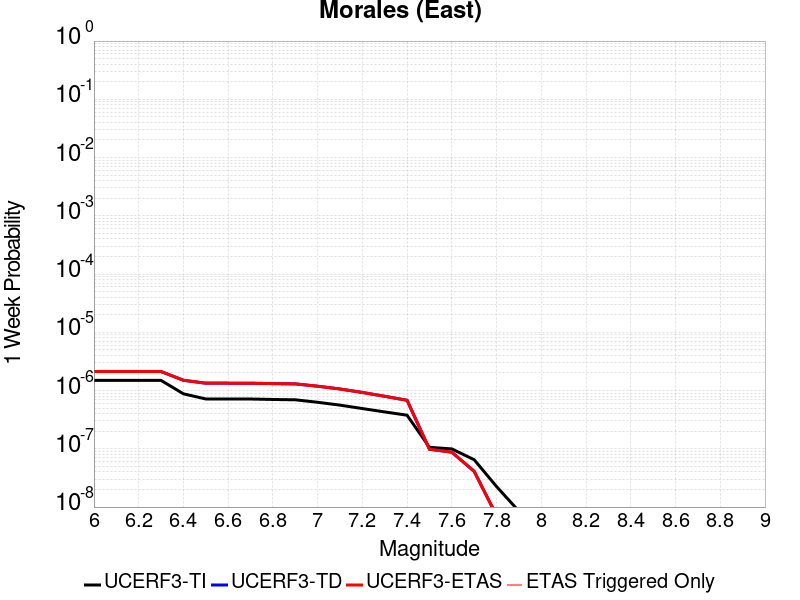 | 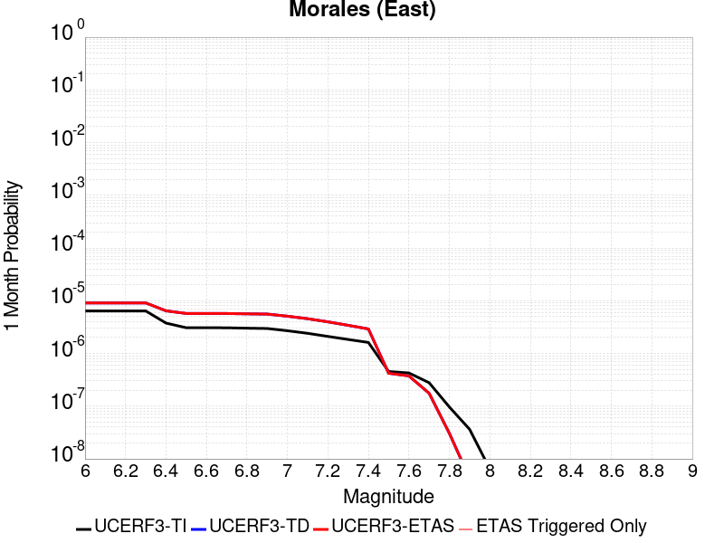 | 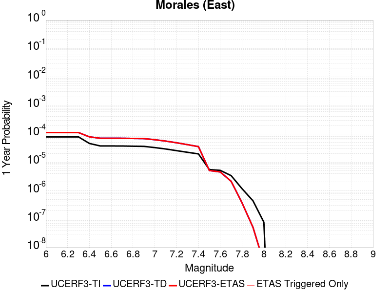 |  |

| Magnitude | 1 wk TI Prob | 1 wk TD Prob | 1 wk ETAS Prob | 1 wk ETAS/TD Gain | 1 wk ETAS Triggered Only | 1 mo TI Prob | 1 mo TD Prob | 1 mo ETAS Prob | 1 mo ETAS/TD Gain | 1 mo ETAS Triggered Only | 1 yr TI Prob | 1 yr TD Prob | 1 yr ETAS Prob | 1 yr ETAS/TD Gain | 1 yr ETAS Triggered Only | 10 yr TI Prob | 10 yr TD Prob | 10 yr ETAS Prob | 10 yr ETAS/TD Gain | 10 yr ETAS Triggered Only |
|-----|-----|-----|-----|-----|-----|-----|-----|-----|-----|-----|-----|-----|-----|-----|-----|-----|-----|-----|-----|-----|
| 6.0 | 1.4942771E-6 | 2.1235758E-6 | 2.1235758E-6 | 1.0 | 0.0 | 6.404029E-6 | 9.10101E-6 | 9.10101E-6 | 1.0 | 0.0 | 7.7966266E-5 | 1.10799745E-4 | 1.10799745E-4 | 1.0 | 0.0 | 7.793892E-4 | 0.0011075048 | 0.0011174937 | 1.0090193 | 1.0E-5 |
| 6.1 | 1.4942771E-6 | 2.1235758E-6 | 2.1235758E-6 | 1.0 | 0.0 | 6.404029E-6 | 9.10101E-6 | 9.10101E-6 | 1.0 | 0.0 | 7.7966266E-5 | 1.10799745E-4 | 1.10799745E-4 | 1.0 | 0.0 | 7.793892E-4 | 0.0011075048 | 0.0011174937 | 1.0090193 | 1.0E-5 |
| 6.2 | 1.4942771E-6 | 2.1235758E-6 | 2.1235758E-6 | 1.0 | 0.0 | 6.404029E-6 | 9.10101E-6 | 9.10101E-6 | 1.0 | 0.0 | 7.7966266E-5 | 1.10799745E-4 | 1.10799745E-4 | 1.0 | 0.0 | 7.793892E-4 | 0.0011075048 | 0.0011174937 | 1.0090193 | 1.0E-5 |
| 6.3 | 1.4942771E-6 | 2.1235758E-6 | 2.1235758E-6 | 1.0 | 0.0 | 6.404029E-6 | 9.10101E-6 | 9.10101E-6 | 1.0 | 0.0 | 7.7966266E-5 | 1.10799745E-4 | 1.10799745E-4 | 1.0 | 0.0 | 7.793892E-4 | 0.0011075048 | 0.0011174937 | 1.0090193 | 1.0E-5 |
| 6.4 | 8.798845E-7 | 1.5023697E-6 | 1.5023697E-6 | 1.0 | 0.0 | 3.7709283E-6 | 6.438712E-6 | 6.438712E-6 | 1.0 | 0.0 | 4.5910085E-5 | 7.8388606E-5 | 7.8388606E-5 | 1.0 | 0.0 | 4.59006E-4 | 7.83623E-4 | 7.83623E-4 | 1.0 | 0.0 |
| 6.5 | 7.1751725E-7 | 1.3385195E-6 | 1.3385195E-6 | 1.0 | 0.0 | 3.0750705E-6 | 5.7365E-6 | 5.7365E-6 | 1.0 | 0.0 | 3.7438338E-5 | 6.983973E-5 | 6.983973E-5 | 1.0 | 0.0 | 3.743203E-4 | 6.981879E-4 | 6.981879E-4 | 1.0 | 0.0 |
| 6.6 | 7.1751725E-7 | 1.3385195E-6 | 1.3385195E-6 | 1.0 | 0.0 | 3.0750705E-6 | 5.7365E-6 | 5.7365E-6 | 1.0 | 0.0 | 3.7438338E-5 | 6.983973E-5 | 6.983973E-5 | 1.0 | 0.0 | 3.743203E-4 | 6.981879E-4 | 6.981879E-4 | 1.0 | 0.0 |
| 6.7 | 7.159057E-7 | 1.3359854E-6 | 1.3359854E-6 | 1.0 | 0.0 | 3.0681638E-6 | 5.7256398E-6 | 5.7256398E-6 | 1.0 | 0.0 | 3.7354253E-5 | 6.970751E-5 | 6.970751E-5 | 1.0 | 0.0 | 3.7347974E-4 | 6.968666E-4 | 6.968666E-4 | 1.0 | 0.0 |
| 6.8 | 7.032203E-7 | 1.3175402E-6 | 1.3175402E-6 | 1.0 | 0.0 | 3.0137978E-6 | 5.6465888E-6 | 5.6465888E-6 | 1.0 | 0.0 | 3.669237E-5 | 6.8745125E-5 | 6.8745125E-5 | 1.0 | 0.0 | 3.6686313E-4 | 6.872487E-4 | 6.872487E-4 | 1.0 | 0.0 |
| 6.9 | 6.941549E-7 | 1.302601E-6 | 1.302601E-6 | 1.0 | 0.0 | 2.974946E-6 | 5.5825644E-6 | 5.5825644E-6 | 1.0 | 0.0 | 3.6219368E-5 | 6.796567E-5 | 6.796567E-5 | 1.0 | 0.0 | 3.6213463E-4 | 6.79459E-4 | 6.79459E-4 | 1.0 | 0.0 |
| 7.0 | 6.2932247E-7 | 1.187829E-6 | 1.187829E-6 | 1.0 | 0.0 | 2.6970936E-6 | 5.0906856E-6 | 5.0906856E-6 | 1.0 | 0.0 | 3.283662E-5 | 6.19774E-5 | 6.19774E-5 | 1.0 | 0.0 | 3.283177E-4 | 6.1961E-4 | 6.1961E-4 | 1.0 | 0.0 |
| 7.1 | 5.6200963E-7 | 1.0641205E-6 | 1.0641205E-6 | 1.0 | 0.0 | 2.4086105E-6 | 4.560509E-6 | 4.560509E-6 | 1.0 | 0.0 | 2.9324437E-5 | 5.552283E-5 | 5.552283E-5 | 1.0 | 0.0 | 2.9320567E-4 | 5.550968E-4 | 5.550968E-4 | 1.0 | 0.0 |
| 7.2 | 4.91044E-7 | 9.286476E-7 | 9.286476E-7 | 1.0 | 0.0 | 2.1044725E-6 | 3.9799124E-6 | 3.9799124E-6 | 1.0 | 0.0 | 2.5621652E-5 | 4.8454393E-5 | 4.8454393E-5 | 1.0 | 0.0 | 2.56187E-4 | 4.8444458E-4 | 4.8444458E-4 | 1.0 | 0.0 |
| 7.3 | 4.2978448E-7 | 7.9746394E-7 | 7.9746394E-7 | 1.0 | 0.0 | 1.8419321E-6 | 3.4176983E-6 | 3.4176983E-6 | 1.0 | 0.0 | 2.2425293E-5 | 4.1609714E-5 | 4.1609714E-5 | 1.0 | 0.0 | 2.242303E-4 | 4.1602485E-4 | 4.1602485E-4 | 1.0 | 0.0 |
| 7.4 | 3.774317E-7 | 6.807301E-7 | 6.807301E-7 | 1.0 | 0.0 | 1.6175634E-6 | 2.9174118E-6 | 2.9174118E-6 | 1.0 | 0.0 | 1.9693656E-5 | 3.5518937E-5 | 3.5518937E-5 | 1.0 | 0.0 | 1.969191E-4 | 3.551379E-4 | 3.551379E-4 | 1.0 | 0.0 |
| 7.5 | 1.0603232E-7 | 9.8410446E-8 | 9.8410446E-8 | 1.0 | 0.0 | 4.5442414E-7 | 4.2175898E-7 | 4.2175898E-7 | 1.0 | 0.0 | 5.5326E-6 | 5.1349034E-6 | 5.1349034E-6 | 1.0 | 0.0 | 5.532462E-5 | 5.135042E-5 | 5.135042E-5 | 1.0 | 0.0 |
| 7.6 | 9.960384E-8 | 8.755396E-8 | 8.755396E-8 | 1.0 | 0.0 | 4.2687353E-7 | 3.752312E-7 | 3.752312E-7 | 1.0 | 0.0 | 5.197173E-6 | 4.56843E-6 | 4.56843E-6 | 1.0 | 0.0 | 5.1970514E-5 | 4.568593E-5 | 4.568593E-5 | 1.0 | 0.0 |
| 7.7 | 6.499468E-8 | 4.103587E-8 | 4.103587E-8 | 1.0 | 0.0 | 2.785486E-7 | 1.7586801E-7 | 1.7586801E-7 | 1.0 | 0.0 | 3.3913238E-6 | 2.141191E-6 | 2.141191E-6 | 1.0 | 0.0 | 3.3912722E-5 | 2.1414264E-5 | 2.1414264E-5 | 1.0 | 0.0 |
| 7.8 | 2.2517119E-8 | 7.129848E-9 | 7.129848E-9 | 1.0 | 0.0 | 9.6501935E-8 | 3.055649E-8 | 3.055649E-8 | 1.0 | 0.0 | 1.1749105E-6 | 3.720252E-7 | 3.720252E-7 | 1.0 | 0.0 | 1.1749043E-5 | 3.722781E-6 | 3.722781E-6 | 1.0 | 0.0 |
| 7.9 | 8.493023E-9 | 9.963903E-10 | 9.963903E-10 | 1.0 | 0.0 | 3.639867E-8 | 4.270241E-9 | 4.270241E-9 | 1.0 | 0.0 | 4.4315374E-7 | 5.1990185E-8 | 5.1990185E-8 | 1.0 | 0.0 | 4.4315284E-6 | 5.220168E-7 | 5.220168E-7 | 1.0 | 0.0 |
| 8.0 | 1.4971842E-9 | 5.535339E-11 | 5.535339E-11 | 1.0 | 0.0 | 6.4165038E-9 | 2.3722846E-10 | 2.3722846E-10 | 1.0 | 0.0 | 7.812093E-8 | 2.8882516E-9 | 2.8882516E-9 | 1.0 | 0.0 | 7.81209E-7 | 3.0143536E-8 | 3.0143536E-8 | 1.0 | 0.0 |

## Elsinore (Stepovers Combined)
*[(top)](#table-of-contents)*

| 1 Week | 1 Month | 1 Year | 10 Year |
|-----|-----|-----|-----|
|  | 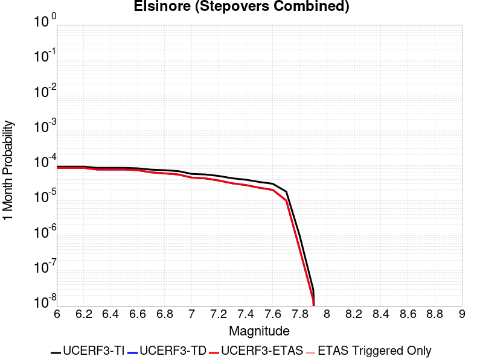 |  |  |

| Magnitude | 1 wk TI Prob | 1 wk TD Prob | 1 wk ETAS Prob | 1 wk ETAS/TD Gain | 1 wk ETAS Triggered Only | 1 mo TI Prob | 1 mo TD Prob | 1 mo ETAS Prob | 1 mo ETAS/TD Gain | 1 mo ETAS Triggered Only | 1 yr TI Prob | 1 yr TD Prob | 1 yr ETAS Prob | 1 yr ETAS/TD Gain | 1 yr ETAS Triggered Only | 10 yr TI Prob | 10 yr TD Prob | 10 yr ETAS Prob | 10 yr ETAS/TD Gain | 10 yr ETAS Triggered Only |
|-----|-----|-----|-----|-----|-----|-----|-----|-----|-----|-----|-----|-----|-----|-----|-----|-----|-----|-----|-----|-----|
| 6.0 | 2.144392E-5 | 1.9760177E-5 | 1.9760177E-5 | 1.0 | 0.0 | 9.189928E-5 | 8.468383E-5 | 8.468383E-5 | 1.0 | 0.0 | 0.0011182994 | 0.0010305571 | 0.0010305571 | 1.0 | 0.0 | 0.011126885 | 0.010264241 | 0.010274138 | 1.0009643 | 1.0E-5 |
| 6.1 | 2.144392E-5 | 1.9760177E-5 | 1.9760177E-5 | 1.0 | 0.0 | 9.189928E-5 | 8.468383E-5 | 8.468383E-5 | 1.0 | 0.0 | 0.0011182994 | 0.0010305571 | 0.0010305571 | 1.0 | 0.0 | 0.011126885 | 0.010264241 | 0.010274138 | 1.0009643 | 1.0E-5 |
| 6.2 | 2.144392E-5 | 1.9760177E-5 | 1.9760177E-5 | 1.0 | 0.0 | 9.189928E-5 | 8.468383E-5 | 8.468383E-5 | 1.0 | 0.0 | 0.0011182994 | 0.0010305571 | 0.0010305571 | 1.0 | 0.0 | 0.011126885 | 0.010264241 | 0.010274138 | 1.0009643 | 1.0E-5 |
| 6.3 | 1.9751555E-5 | 1.7741428E-5 | 1.7741428E-5 | 1.0 | 0.0 | 8.4646774E-5 | 7.603255E-5 | 7.603255E-5 | 1.0 | 0.0 | 0.0010300872 | 9.253173E-4 | 9.253173E-4 | 1.0 | 0.0 | 0.010253254 | 0.0092205955 | 0.009230503 | 1.0010746 | 1.0E-5 |
| 6.4 | 1.9751555E-5 | 1.7741428E-5 | 1.7741428E-5 | 1.0 | 0.0 | 8.4646774E-5 | 7.603255E-5 | 7.603255E-5 | 1.0 | 0.0 | 0.0010300872 | 9.253173E-4 | 9.253173E-4 | 1.0 | 0.0 | 0.010253254 | 0.0092205955 | 0.009230503 | 1.0010746 | 1.0E-5 |
| 6.5 | 1.9751555E-5 | 1.7741428E-5 | 1.7741428E-5 | 1.0 | 0.0 | 8.4646774E-5 | 7.603255E-5 | 7.603255E-5 | 1.0 | 0.0 | 0.0010300872 | 9.253173E-4 | 9.253173E-4 | 1.0 | 0.0 | 0.010253254 | 0.0092205955 | 0.009230503 | 1.0010746 | 1.0E-5 |
| 6.6 | 1.9188685E-5 | 1.7003345E-5 | 1.7003345E-5 | 1.0 | 0.0 | 8.2234634E-5 | 7.286954E-5 | 7.286954E-5 | 1.0 | 0.0 | 0.0010007467 | 8.868417E-4 | 8.868417E-4 | 1.0 | 0.0 | 0.00996252 | 0.008839166 | 0.008849077 | 1.0011213 | 1.0E-5 |
| 6.7 | 1.7608272E-5 | 1.47324645E-5 | 1.47324645E-5 | 1.0 | 0.0 | 7.546184E-5 | 6.313766E-5 | 6.313766E-5 | 1.0 | 0.0 | 9.183606E-4 | 7.6843967E-4 | 7.6843967E-4 | 1.0 | 0.0 | 0.009145746 | 0.007664096 | 0.0076740193 | 1.0012947 | 1.0E-5 |
| 6.8 | 1.697165E-5 | 1.3783185E-5 | 1.3783185E-5 | 1.0 | 0.0 | 7.273361E-5 | 5.90695E-5 | 5.90695E-5 | 1.0 | 0.0 | 8.8517193E-4 | 7.1894255E-4 | 7.1894255E-4 | 1.0 | 0.0 | 0.008816543 | 0.0071719526 | 0.007181881 | 1.0013844 | 1.0E-5 |
| 6.9 | 1.600365E-5 | 1.2846488E-5 | 1.2846488E-5 | 1.0 | 0.0 | 6.858527E-5 | 5.5055258E-5 | 5.5055258E-5 | 1.0 | 0.0 | 8.347058E-4 | 6.700994E-4 | 6.700994E-4 | 1.0 | 0.0 | 0.008315775 | 0.006686159 | 0.006696092 | 1.0014856 | 1.0E-5 |
| 7.0 | 1.3314581E-5 | 1.0447428E-5 | 1.0447428E-5 | 1.0 | 0.0 | 5.7061243E-5 | 4.477394E-5 | 4.477394E-5 | 1.0 | 0.0 | 6.944992E-4 | 5.449891E-4 | 5.449891E-4 | 1.0 | 0.0 | 0.006923327 | 0.0054401034 | 0.005450049 | 1.0018282 | 1.0E-5 |
| 7.1 | 1.2865345E-5 | 9.937384E-6 | 9.937384E-6 | 1.0 | 0.0 | 5.5136024E-5 | 4.2588108E-5 | 4.2588108E-5 | 1.0 | 0.0 | 6.710743E-4 | 5.183894E-4 | 5.183894E-4 | 1.0 | 0.0 | 0.0066905143 | 0.005175064 | 0.0051850122 | 1.0019224 | 1.0E-5 |
| 7.2 | 1.1650051E-5 | 8.633622E-6 | 8.633622E-6 | 1.0 | 0.0 | 4.9927836E-5 | 3.7000722E-5 | 3.7000722E-5 | 1.0 | 0.0 | 6.0770183E-4 | 4.5039243E-4 | 4.5039243E-4 | 1.0 | 0.0 | 0.0060604266 | 0.0044962373 | 0.004506192 | 1.0022141 | 1.0E-5 |
| 7.3 | 1.0008533E-5 | 7.2008565E-6 | 7.2008565E-6 | 1.0 | 0.0 | 4.2893007E-5 | 3.0860458E-5 | 3.0860458E-5 | 1.0 | 0.0 | 5.220972E-4 | 3.7566276E-4 | 3.7566276E-4 | 1.0 | 0.0 | 0.005208723 | 0.003750678 | 0.0037606405 | 1.0026562 | 1.0E-5 |
| 7.4 | 9.116759E-6 | 6.409888E-6 | 6.409888E-6 | 1.0 | 0.0 | 3.907124E-5 | 2.7470667E-5 | 2.7470667E-5 | 1.0 | 0.0 | 4.7558855E-4 | 3.3440543E-4 | 3.3440543E-4 | 1.0 | 0.0 | 0.00474572 | 0.0033391698 | 0.0033491363 | 1.0029848 | 1.0E-5 |
| 7.5 | 7.870524E-6 | 5.382348E-6 | 5.382348E-6 | 1.0 | 0.0 | 3.3730383E-5 | 2.3067008E-5 | 2.3067008E-5 | 1.0 | 0.0 | 4.1059E-4 | 2.808059E-4 | 2.808059E-4 | 1.0 | 0.0 | 0.0040983222 | 0.0028046372 | 0.0028046372 | 1.0 | 0.0 |
| 7.6 | 6.9774537E-6 | 4.6774244E-6 | 4.6774244E-6 | 1.0 | 0.0 | 2.990303E-5 | 2.0045956E-5 | 2.0045956E-5 | 1.0 | 0.0 | 3.640086E-4 | 2.4403336E-4 | 2.4403336E-4 | 1.0 | 0.0 | 0.003634129 | 0.0024377701 | 0.0024377701 | 1.0 | 0.0 |
| 7.7 | 4.1616954E-6 | 2.328153E-6 | 2.328153E-6 | 1.0 | 0.0 | 1.7835715E-5 | 9.977764E-6 | 9.977764E-6 | 1.0 | 0.0 | 2.171282E-4 | 1.2147325E-4 | 1.2147325E-4 | 1.0 | 0.0 | 0.0021691616 | 0.0012141415 | 0.0012141415 | 1.0 | 0.0 |
| 7.8 | 2.2692414E-7 | 9.384503E-8 | 9.384503E-8 | 1.0 | 0.0 | 9.725317E-7 | 4.0219294E-7 | 4.0219294E-7 | 1.0 | 0.0 | 1.1840509E-5 | 4.8966913E-6 | 4.8966913E-6 | 1.0 | 0.0 | 1.1839878E-4 | 4.896616E-5 | 4.896616E-5 | 1.0 | 0.0 |
| 7.9 | 6.676829E-9 | 3.4397292E-9 | 3.4397292E-9 | 1.0 | 0.0 | 2.861498E-8 | 1.4741697E-8 | 1.4741697E-8 | 1.0 | 0.0 | 3.4838732E-7 | 1.7948015E-7 | 1.7948015E-7 | 1.0 | 0.0 | 3.4838679E-6 | 1.7948001E-6 | 1.7948001E-6 | 1.0 | 0.0 |

## Malibu Coast (Extension) alt 1
*[(top)](#table-of-contents)*

| 1 Week | 1 Month | 1 Year | 10 Year |
|-----|-----|-----|-----|
|  |  |  | 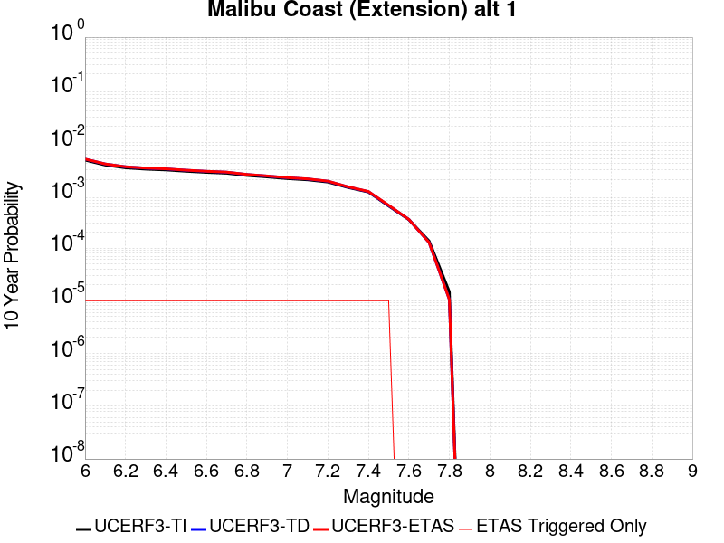 |

| Magnitude | 1 wk TI Prob | 1 wk TD Prob | 1 wk ETAS Prob | 1 wk ETAS/TD Gain | 1 wk ETAS Triggered Only | 1 mo TI Prob | 1 mo TD Prob | 1 mo ETAS Prob | 1 mo ETAS/TD Gain | 1 mo ETAS Triggered Only | 1 yr TI Prob | 1 yr TD Prob | 1 yr ETAS Prob | 1 yr ETAS/TD Gain | 1 yr ETAS Triggered Only | 10 yr TI Prob | 10 yr TD Prob | 10 yr ETAS Prob | 10 yr ETAS/TD Gain | 10 yr ETAS Triggered Only |
|-----|-----|-----|-----|-----|-----|-----|-----|-----|-----|-----|-----|-----|-----|-----|-----|-----|-----|-----|-----|-----|
| 6.0 | 8.930738E-6 | 9.329283E-6 | 9.329283E-6 | 1.0 | 0.0 | 3.827403E-5 | 3.998204E-5 | 3.998204E-5 | 1.0 | 0.0 | 4.6588664E-4 | 4.866743E-4 | 4.866743E-4 | 1.0 | 0.0 | 0.0046491115 | 0.004856268 | 0.004866219 | 1.0020492 | 1.0E-5 |
| 6.1 | 7.199952E-6 | 7.530303E-6 | 7.530303E-6 | 1.0 | 0.0 | 3.0856572E-5 | 3.227233E-5 | 3.227233E-5 | 1.0 | 0.0 | 3.75614E-4 | 3.928454E-4 | 3.928454E-4 | 1.0 | 0.0 | 0.0037497976 | 0.0039215754 | 0.0039315363 | 1.00254 | 1.0E-5 |
| 6.2 | 6.3721413E-6 | 6.6667976E-6 | 6.6667976E-6 | 1.0 | 0.0 | 2.7308892E-5 | 2.8571678E-5 | 2.8571678E-5 | 1.0 | 0.0 | 3.3243504E-4 | 3.47805E-4 | 3.47805E-4 | 1.0 | 0.0 | 0.0033193815 | 0.0034726467 | 0.003482612 | 1.0028696 | 1.0E-5 |
| 6.3 | 6.016345E-6 | 6.295164E-6 | 6.295164E-6 | 1.0 | 0.0 | 2.578408E-5 | 2.6978996E-5 | 2.6978996E-5 | 1.0 | 0.0 | 3.1387596E-4 | 3.284201E-4 | 3.284201E-4 | 1.0 | 0.0 | 0.00313433 | 0.0032793838 | 0.0032893508 | 1.0030394 | 1.0E-5 |
| 6.4 | 5.8104883E-6 | 6.07955E-6 | 6.07955E-6 | 1.0 | 0.0 | 2.4901856E-5 | 2.6054957E-5 | 2.6054957E-5 | 1.0 | 0.0 | 3.031379E-4 | 3.1717322E-4 | 3.1717322E-4 | 1.0 | 0.0 | 0.0030272473 | 0.0031672402 | 0.0031772086 | 1.0031474 | 1.0E-5 |
| 6.5 | 5.476925E-6 | 5.7275183E-6 | 5.7275183E-6 | 1.0 | 0.0 | 2.3472323E-5 | 2.4546278E-5 | 2.4546278E-5 | 1.0 | 0.0 | 2.8573806E-4 | 2.9881025E-4 | 2.9881025E-4 | 1.0 | 0.0 | 0.0028537093 | 0.0029841168 | 0.0029940868 | 1.0033411 | 1.0E-5 |
| 6.6 | 5.222387E-6 | 5.458585E-6 | 5.458585E-6 | 1.0 | 0.0 | 2.2381464E-5 | 2.3393726E-5 | 2.3393726E-5 | 1.0 | 0.0 | 2.7246025E-4 | 2.8478168E-4 | 2.8478168E-4 | 1.0 | 0.0 | 0.0027212645 | 0.0028441981 | 0.0028541698 | 1.003506 | 1.0E-5 |
| 6.7 | 5.0337076E-6 | 5.259108E-6 | 5.259108E-6 | 1.0 | 0.0 | 2.1572854E-5 | 2.2538841E-5 | 2.2538841E-5 | 1.0 | 0.0 | 2.6261783E-4 | 2.7437613E-4 | 2.7437613E-4 | 1.0 | 0.0 | 0.002623077 | 0.0027404036 | 0.0027503762 | 1.0036391 | 1.0E-5 |
| 6.8 | 4.5675624E-6 | 4.758721E-6 | 4.758721E-6 | 1.0 | 0.0 | 1.9575122E-5 | 2.039436E-5 | 2.039436E-5 | 1.0 | 0.0 | 2.3830103E-4 | 2.4827322E-4 | 2.4827322E-4 | 1.0 | 0.0 | 0.0023804565 | 0.0024799784 | 0.0024899535 | 1.0040222 | 1.0E-5 |
| 6.9 | 4.2802412E-6 | 4.4520248E-6 | 4.4520248E-6 | 1.0 | 0.0 | 1.8343762E-5 | 1.9079967E-5 | 1.9079967E-5 | 1.0 | 0.0 | 2.2331243E-4 | 2.32274E-4 | 2.32274E-4 | 1.0 | 0.0 | 0.0022308815 | 0.002320329 | 0.0023303058 | 1.0042998 | 1.0E-5 |
| 7.0 | 3.9794063E-6 | 4.130103E-6 | 4.130103E-6 | 1.0 | 0.0 | 1.7054486E-5 | 1.7700322E-5 | 1.7700322E-5 | 1.0 | 0.0 | 2.0761859E-4 | 2.1548024E-4 | 2.1548024E-4 | 1.0 | 0.0 | 0.0020742472 | 0.0021527265 | 0.002162705 | 1.0046352 | 1.0E-5 |
| 7.1 | 3.7730424E-6 | 3.911221E-6 | 3.911221E-6 | 1.0 | 0.0 | 1.6170083E-5 | 1.6762267E-5 | 1.6762267E-5 | 1.0 | 0.0 | 1.9685295E-4 | 2.0406162E-4 | 2.0406162E-4 | 1.0 | 0.0 | 0.0019667868 | 0.0020387552 | 0.002048735 | 1.004895 | 1.0E-5 |
| 7.2 | 3.424985E-6 | 3.5413407E-6 | 3.5413407E-6 | 1.0 | 0.0 | 1.4678424E-5 | 1.5177086E-5 | 1.5177086E-5 | 1.0 | 0.0 | 1.7869516E-4 | 1.8476548E-4 | 1.8476548E-4 | 1.0 | 0.0 | 0.0017855153 | 0.0018461306 | 0.0018561122 | 1.0054067 | 1.0E-5 |
| 7.3 | 2.6966375E-6 | 2.7596561E-6 | 2.7596561E-6 | 1.0 | 0.0 | 1.15569665E-5 | 1.1827045E-5 | 1.1827045E-5 | 1.0 | 0.0 | 1.4069698E-4 | 1.4398478E-4 | 1.4398478E-4 | 1.0 | 0.0 | 0.0014060794 | 0.0014389191 | 0.0014489047 | 1.0069396 | 1.0E-5 |
| 7.4 | 2.215957E-6 | 2.2493805E-6 | 2.2493805E-6 | 1.0 | 0.0 | 9.496924E-6 | 9.640166E-6 | 9.640166E-6 | 1.0 | 0.0 | 1.1561892E-4 | 1.17362746E-4 | 1.17362746E-4 | 1.0 | 0.0 | 0.0011555878 | 0.0011730114 | 0.0011829996 | 1.0085151 | 1.0E-5 |
| 7.5 | 1.2040218E-6 | 1.2219076E-6 | 1.2219076E-6 | 1.0 | 0.0 | 5.160083E-6 | 5.2367363E-6 | 5.2367363E-6 | 1.0 | 0.0 | 6.2822204E-5 | 6.375542E-5 | 6.375542E-5 | 1.0 | 0.0 | 6.280445E-4 | 6.3737313E-4 | 6.473668E-4 | 1.0156794 | 1.0E-5 |
| 7.6 | 6.6157446E-7 | 6.6789806E-7 | 6.6789806E-7 | 1.0 | 0.0 | 2.835316E-6 | 2.8624172E-6 | 2.8624172E-6 | 1.0 | 0.0 | 3.4519428E-5 | 3.484939E-5 | 3.484939E-5 | 1.0 | 0.0 | 3.4514067E-4 | 3.4844075E-4 | 3.4844075E-4 | 1.0 | 0.0 |
| 7.7 | 2.6012302E-7 | 2.4357598E-7 | 2.4357598E-7 | 1.0 | 0.0 | 1.1148124E-6 | 1.0438968E-6 | 1.0438968E-6 | 1.0 | 0.0 | 1.3572758E-5 | 1.270938E-5 | 1.270938E-5 | 1.0 | 0.0 | 1.3571928E-4 | 1.270876E-4 | 1.270876E-4 | 1.0 | 0.0 |
| 7.8 | 2.8323132E-8 | 2.0266645E-8 | 2.0266645E-8 | 1.0 | 0.0 | 1.2138484E-7 | 8.685705E-8 | 8.685705E-8 | 1.0 | 0.0 | 1.4778595E-6 | 1.0574842E-6 | 1.0574842E-6 | 1.0 | 0.0 | 1.4778497E-5 | 1.05747995E-5 | 1.05747995E-5 | 1.0 | 0.0 |

## San Andreas (Peninsula) 2011 CFM
*[(top)](#table-of-contents)*

| 1 Week | 1 Month | 1 Year | 10 Year |
|-----|-----|-----|-----|
|  |  | 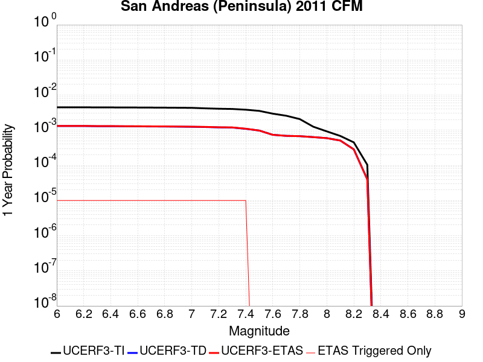 | 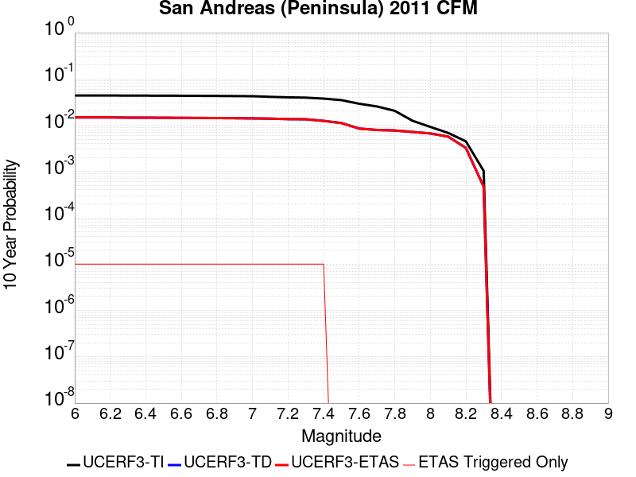 |

| Magnitude | 1 wk TI Prob | 1 wk TD Prob | 1 wk ETAS Prob | 1 wk ETAS/TD Gain | 1 wk ETAS Triggered Only | 1 mo TI Prob | 1 mo TD Prob | 1 mo ETAS Prob | 1 mo ETAS/TD Gain | 1 mo ETAS Triggered Only | 1 yr TI Prob | 1 yr TD Prob | 1 yr ETAS Prob | 1 yr ETAS/TD Gain | 1 yr ETAS Triggered Only | 10 yr TI Prob | 10 yr TD Prob | 10 yr ETAS Prob | 10 yr ETAS/TD Gain | 10 yr ETAS Triggered Only |
|-----|-----|-----|-----|-----|-----|-----|-----|-----|-----|-----|-----|-----|-----|-----|-----|-----|-----|-----|-----|-----|
| 6.0 | 8.6200685E-5 | 2.5209923E-5 | 3.5209672E-5 | 1.3966591 | 1.0E-5 | 3.6937918E-4 | 1.0803807E-4 | 1.1803699E-4 | 1.0925499 | 1.0E-5 | 0.0044879215 | 0.0013145714 | 0.0013245583 | 1.0075971 | 1.0E-5 | 0.043983612 | 0.014773085 | 0.014782937 | 1.0006669 | 1.0E-5 |
| 6.1 | 8.6200685E-5 | 2.5209923E-5 | 3.5209672E-5 | 1.3966591 | 1.0E-5 | 3.6937918E-4 | 1.0803807E-4 | 1.1803699E-4 | 1.0925499 | 1.0E-5 | 0.0044879215 | 0.0013145714 | 0.0013245583 | 1.0075971 | 1.0E-5 | 0.043983612 | 0.014773085 | 0.014782937 | 1.0006669 | 1.0E-5 |
| 6.2 | 8.6200685E-5 | 2.5209923E-5 | 3.5209672E-5 | 1.3966591 | 1.0E-5 | 3.6937918E-4 | 1.0803807E-4 | 1.1803699E-4 | 1.0925499 | 1.0E-5 | 0.0044879215 | 0.0013145714 | 0.0013245583 | 1.0075971 | 1.0E-5 | 0.043983612 | 0.014773085 | 0.014782937 | 1.0006669 | 1.0E-5 |
| 6.3 | 8.551163E-5 | 2.4901852E-5 | 3.4901605E-5 | 1.4015665 | 1.0E-5 | 3.6642692E-4 | 1.0671787E-4 | 1.167168E-4 | 1.093695 | 1.0E-5 | 0.004452125 | 0.0012985172 | 0.0013085043 | 1.0076911 | 1.0E-5 | 0.043639794 | 0.014599826 | 0.01460968 | 1.000675 | 1.0E-5 |
| 6.4 | 8.551163E-5 | 2.4901852E-5 | 3.4901605E-5 | 1.4015665 | 1.0E-5 | 3.6642692E-4 | 1.0671787E-4 | 1.167168E-4 | 1.093695 | 1.0E-5 | 0.004452125 | 0.0012985172 | 0.0013085043 | 1.0076911 | 1.0E-5 | 0.043639794 | 0.014599826 | 0.01460968 | 1.000675 | 1.0E-5 |
| 6.5 | 8.511146E-5 | 2.4723253E-5 | 3.4723005E-5 | 1.4044675 | 1.0E-5 | 3.647124E-4 | 1.059525E-4 | 1.1595144E-4 | 1.0943719 | 1.0E-5 | 0.004431336 | 0.00128921 | 0.0012991971 | 1.0077467 | 1.0E-5 | 0.04344007 | 0.014499869 | 0.014509724 | 1.0006796 | 1.0E-5 |
| 6.6 | 8.4985084E-5 | 2.4653935E-5 | 3.4653687E-5 | 1.4056047 | 1.0E-5 | 3.6417096E-4 | 1.05655454E-4 | 1.15654395E-4 | 1.0946373 | 1.0E-5 | 0.0044247704 | 0.0012855977 | 0.0012955848 | 1.0077685 | 1.0E-5 | 0.043376986 | 0.014461838 | 0.014471693 | 1.0006815 | 1.0E-5 |
| 6.7 | 8.462618E-5 | 2.448244E-5 | 3.4482196E-5 | 1.408446 | 1.0E-5 | 3.6263323E-4 | 1.0492053E-4 | 1.1491949E-4 | 1.0953002 | 1.0E-5 | 0.004406125 | 0.0012766606 | 0.0012866477 | 1.007823 | 1.0E-5 | 0.043197807 | 0.014366537 | 0.0143763935 | 1.000686 | 1.0E-5 |
| 6.8 | 8.42337E-5 | 2.4378212E-5 | 3.437797E-5 | 1.4101924 | 1.0E-5 | 3.6095164E-4 | 1.04473875E-4 | 1.1447283E-4 | 1.0957077 | 1.0E-5 | 0.004385734 | 0.0012712289 | 0.0012812162 | 1.0078564 | 1.0E-5 | 0.043001823 | 0.014307187 | 0.014317043 | 1.0006889 | 1.0E-5 |
| 6.9 | 8.365989E-5 | 2.4182831E-5 | 3.418259E-5 | 1.4135065 | 1.0E-5 | 3.5849313E-4 | 1.03636594E-4 | 1.1363556E-4 | 1.096481 | 1.0E-5 | 0.004355922 | 0.0012610469 | 0.0012710342 | 1.0079199 | 1.0E-5 | 0.04271523 | 0.014199706 | 0.014209564 | 1.0006943 | 1.0E-5 |
| 7.0 | 8.30936E-5 | 2.3944356E-5 | 3.3944118E-5 | 1.417625 | 1.0E-5 | 3.560668E-4 | 1.0261464E-4 | 1.1261362E-4 | 1.097442 | 1.0E-5 | 0.004326499 | 0.0012486188 | 0.0012586064 | 1.0079988 | 1.0E-5 | 0.042432297 | 0.014070737 | 0.014080596 | 1.0007007 | 1.0E-5 |
| 7.1 | 8.041264E-5 | 2.3630791E-5 | 3.3630557E-5 | 1.4231666 | 1.0E-5 | 3.4458007E-4 | 1.01270896E-4 | 1.1126988E-4 | 1.0987351 | 1.0E-5 | 0.0041871946 | 0.0012322774 | 0.0012422651 | 1.008105 | 1.0E-5 | 0.041091725 | 0.013893737 | 0.013903598 | 1.0007098 | 1.0E-5 |
| 7.2 | 7.8427016E-5 | 2.3054576E-5 | 3.3054344E-5 | 1.4337434 | 1.0E-5 | 3.3607247E-4 | 9.880159E-5 | 1.088006E-4 | 1.101203 | 1.0E-5 | 0.004084008 | 0.0012022471 | 0.0012122351 | 1.0083078 | 1.0E-5 | 0.040097635 | 0.0135775795 | 0.013587444 | 1.0007265 | 1.0E-5 |
| 7.3 | 7.721087E-5 | 2.2839438E-5 | 3.283921E-5 | 1.4378291 | 1.0E-5 | 3.3086175E-4 | 9.7879645E-5 | 1.07878666E-4 | 1.1021563 | 1.0E-5 | 0.004020803 | 0.0011910348 | 0.0012010229 | 1.008386 | 1.0E-5 | 0.03948827 | 0.013461282 | 0.013471147 | 1.0007329 | 1.0E-5 |
| 7.4 | 7.3536525E-5 | 2.0957023E-5 | 3.0956813E-5 | 1.477157 | 1.0E-5 | 3.1511846E-4 | 8.9812725E-5 | 9.981183E-5 | 1.1113328 | 1.0E-5 | 0.0038298194 | 0.0010929226 | 0.0011029118 | 1.0091398 | 1.0E-5 | 0.037644852 | 0.012418064 | 0.01242794 | 1.0007952 | 1.0E-5 |
| 7.5 | 6.806207E-5 | 1.8763243E-5 | 1.8763243E-5 | 1.0 | 0.0 | 2.9166197E-4 | 8.0411424E-5 | 8.0411424E-5 | 1.0 | 0.0 | 0.0035452035 | 9.785704E-4 | 9.785704E-4 | 1.0 | 0.0 | 0.034891766 | 0.011171072 | 0.011171072 | 1.0 | 0.0 |
| 7.6 | 5.6731416E-5 | 1.4174589E-5 | 1.4174589E-5 | 1.0 | 0.0 | 2.43112E-4 | 6.074682E-5 | 6.074682E-5 | 1.0 | 0.0 | 0.0029558712 | 7.393417E-4 | 7.393417E-4 | 1.0 | 0.0 | 0.02916862 | 0.008483913 | 0.008483913 | 1.0 | 0.0 |
| 7.7 | 4.946994E-5 | 1.3243582E-5 | 1.3243582E-5 | 1.0 | 0.0 | 2.1199681E-4 | 5.6756973E-5 | 5.6756973E-5 | 1.0 | 0.0 | 0.002578006 | 6.9079717E-4 | 6.9079717E-4 | 1.0 | 0.0 | 0.02548303 | 0.007906397 | 0.007906397 | 1.0 | 0.0 |
| 7.8 | 3.9718198E-5 | 1.2980297E-5 | 1.2980297E-5 | 1.0 | 0.0 | 1.7020974E-4 | 5.5628654E-5 | 5.5628654E-5 | 1.0 | 0.0 | 0.0020703338 | 6.7706854E-4 | 6.7706854E-4 | 1.0 | 0.0 | 0.020511515 | 0.007717187 | 0.007717187 | 1.0 | 0.0 |
| 7.9 | 2.4115114E-5 | 1.2184272E-5 | 1.2184272E-5 | 1.0 | 0.0 | 1.0334639E-4 | 5.2217263E-5 | 5.2217263E-5 | 1.0 | 0.0 | 0.001257516 | 6.355599E-4 | 6.355599E-4 | 1.0 | 0.0 | 0.012504238 | 0.0071584038 | 0.0071584038 | 1.0 | 0.0 |
| 8.0 | 1.7756569E-5 | 1.1409111E-5 | 1.1409111E-5 | 1.0 | 0.0 | 7.6097356E-5 | 4.8895272E-5 | 4.8895272E-5 | 1.0 | 0.0 | 9.260915E-4 | 5.951375E-4 | 5.951375E-4 | 1.0 | 0.0 | 0.009222416 | 0.0066590435 | 0.0066590435 | 1.0 | 0.0 |
| 8.1 | 1.3159258E-5 | 9.745386E-6 | 9.745386E-6 | 1.0 | 0.0 | 5.6395602E-5 | 4.176527E-5 | 4.176527E-5 | 1.0 | 0.0 | 6.864001E-4 | 5.0837366E-4 | 5.0837366E-4 | 1.0 | 0.0 | 0.0068428386 | 0.005689297 | 0.005689297 | 1.0 | 0.0 |
| 8.2 | 8.635426E-6 | 5.466162E-6 | 5.466162E-6 | 1.0 | 0.0 | 3.700844E-5 | 2.3426197E-5 | 2.3426197E-5 | 1.0 | 0.0 | 4.5048463E-4 | 2.851767E-4 | 2.851767E-4 | 1.0 | 0.0 | 0.004495725 | 0.003244254 | 0.003244254 | 1.0 | 0.0 |
| 8.3 | 1.983087E-6 | 7.65717E-7 | 7.65717E-7 | 1.0 | 0.0 | 8.498917E-6 | 3.2816401E-6 | 3.2816401E-6 | 1.0 | 0.0 | 1.034694E-4 | 3.9953255E-5 | 3.9953255E-5 | 1.0 | 0.0 | 0.0010342124 | 4.7185255E-4 | 4.7185255E-4 | 1.0 | 0.0 |

## Bartlett Springs 2011 CFM
*[(top)](#table-of-contents)*

| 1 Week | 1 Month | 1 Year | 10 Year |
|-----|-----|-----|-----|
|  | 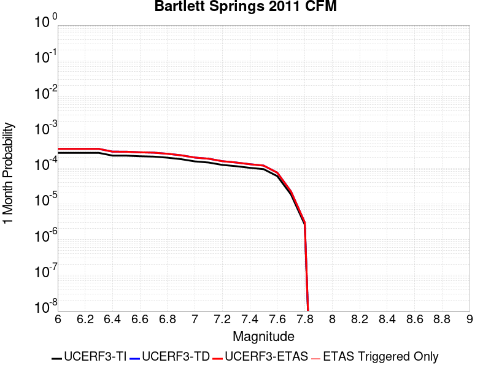 |  |  |

| Magnitude | 1 wk TI Prob | 1 wk TD Prob | 1 wk ETAS Prob | 1 wk ETAS/TD Gain | 1 wk ETAS Triggered Only | 1 mo TI Prob | 1 mo TD Prob | 1 mo ETAS Prob | 1 mo ETAS/TD Gain | 1 mo ETAS Triggered Only | 1 yr TI Prob | 1 yr TD Prob | 1 yr ETAS Prob | 1 yr ETAS/TD Gain | 1 yr ETAS Triggered Only | 10 yr TI Prob | 10 yr TD Prob | 10 yr ETAS Prob | 10 yr ETAS/TD Gain | 10 yr ETAS Triggered Only |
|-----|-----|-----|-----|-----|-----|-----|-----|-----|-----|-----|-----|-----|-----|-----|-----|-----|-----|-----|-----|-----|
| 6.0 | 6.2326144E-5 | 8.060694E-5 | 8.060694E-5 | 1.0 | 0.0 | 2.6708472E-4 | 3.4541317E-4 | 3.4541317E-4 | 1.0 | 0.0 | 0.003246908 | 0.004197389 | 0.004197389 | 1.0 | 0.0 | 0.031998757 | 0.041198224 | 0.041207813 | 1.0002327 | 1.0E-5 |
| 6.1 | 6.227657E-5 | 8.0544436E-5 | 8.0544436E-5 | 1.0 | 0.0 | 2.668723E-4 | 3.4514538E-4 | 3.4514538E-4 | 1.0 | 0.0 | 0.0032443295 | 0.004194141 | 0.004194141 | 1.0 | 0.0 | 0.031973712 | 0.041166957 | 0.041176546 | 1.0002329 | 1.0E-5 |
| 6.2 | 6.22452E-5 | 8.0505044E-5 | 8.0505044E-5 | 1.0 | 0.0 | 2.6673786E-4 | 3.4497658E-4 | 3.4497658E-4 | 1.0 | 0.0 | 0.0032426978 | 0.004192094 | 0.004192094 | 1.0 | 0.0 | 0.03195787 | 0.04114725 | 0.04115684 | 1.000233 | 1.0E-5 |
| 6.3 | 6.219006E-5 | 8.043488E-5 | 8.043488E-5 | 1.0 | 0.0 | 2.6650162E-4 | 3.4467597E-4 | 3.4467597E-4 | 1.0 | 0.0 | 0.00323983 | 0.004188448 | 0.004188448 | 1.0 | 0.0 | 0.031930014 | 0.04111215 | 0.04112174 | 1.0002333 | 1.0E-5 |
| 6.4 | 5.2175856E-5 | 6.72542E-5 | 6.72542E-5 | 1.0 | 0.0 | 2.2359163E-4 | 2.882007E-4 | 2.882007E-4 | 1.0 | 0.0 | 0.0027188298 | 0.003503247 | 0.003503247 | 1.0 | 0.0 | 0.026858058 | 0.034489654 | 0.034489654 | 1.0 | 0.0 |
| 6.5 | 5.205166E-5 | 6.7096866E-5 | 6.7096866E-5 | 1.0 | 0.0 | 2.2305945E-4 | 2.8752658E-4 | 2.8752658E-4 | 1.0 | 0.0 | 0.0027123666 | 0.0034950657 | 0.0034950657 | 1.0 | 0.0 | 0.026794989 | 0.0344104 | 0.0344104 | 1.0 | 0.0 |
| 6.6 | 5.0085426E-5 | 6.449322E-5 | 6.449322E-5 | 1.0 | 0.0 | 2.1463417E-4 | 2.763705E-4 | 2.763705E-4 | 1.0 | 0.0 | 0.0026100394 | 0.0033596696 | 0.0033596696 | 1.0 | 0.0 | 0.025795965 | 0.03309798 | 0.03309798 | 1.0 | 0.0 |
| 6.7 | 4.8930866E-5 | 6.301789E-5 | 6.301789E-5 | 1.0 | 0.0 | 2.0968684E-4 | 2.7004897E-4 | 2.7004897E-4 | 1.0 | 0.0 | 0.0025499484 | 0.0032829395 | 0.0032829395 | 1.0 | 0.0 | 0.025208864 | 0.032353338 | 0.032353338 | 1.0 | 0.0 |
| 6.8 | 4.5679535E-5 | 5.8742302E-5 | 5.8742302E-5 | 1.0 | 0.0 | 1.9575475E-4 | 2.5172863E-4 | 2.5172863E-4 | 1.0 | 0.0 | 0.002380709 | 0.0030605267 | 0.0030605267 | 1.0 | 0.0 | 0.023553653 | 0.030190807 | 0.030190807 | 1.0 | 0.0 |
| 6.9 | 4.1439176E-5 | 5.3220494E-5 | 5.3220494E-5 | 1.0 | 0.0 | 1.7758438E-4 | 2.2806802E-4 | 2.2806802E-4 | 1.0 | 0.0 | 0.002159946 | 0.0027732179 | 0.0027732179 | 1.0 | 0.0 | 0.021390721 | 0.027391147 | 0.027391147 | 1.0 | 0.0 |
| 7.0 | 3.5920104E-5 | 4.6009085E-5 | 4.6009085E-5 | 1.0 | 0.0 | 1.5393422E-4 | 1.9716697E-4 | 1.9716697E-4 | 1.0 | 0.0 | 0.001872538 | 0.002397881 | 0.002397881 | 1.0 | 0.0 | 0.018568378 | 0.02372336 | 0.02372336 | 1.0 | 0.0 |
| 7.1 | 3.338812E-5 | 4.2689928E-5 | 4.2689928E-5 | 1.0 | 0.0 | 1.430841E-4 | 1.8294407E-4 | 1.8294407E-4 | 1.0 | 0.0 | 0.0017406568 | 0.0022250833 | 0.0022250833 | 1.0 | 0.0 | 0.017270854 | 0.022030888 | 0.022030888 | 1.0 | 0.0 |
| 7.2 | 2.8619615E-5 | 3.640195E-5 | 3.640195E-5 | 1.0 | 0.0 | 1.2264973E-4 | 1.5599909E-4 | 1.5599909E-4 | 1.0 | 0.0 | 0.0014922376 | 0.0018976441 | 0.0018976441 | 1.0 | 0.0 | 0.014822568 | 0.018816449 | 0.018816449 | 1.0 | 0.0 |
| 7.3 | 2.6376783E-5 | 3.3423046E-5 | 3.3423046E-5 | 1.0 | 0.0 | 1.13038455E-4 | 1.4323382E-4 | 1.4323382E-4 | 1.0 | 0.0 | 0.0013753743 | 0.001742486 | 0.001742486 | 1.0 | 0.0 | 0.01366893 | 0.017290017 | 0.017290017 | 1.0 | 0.0 |
| 7.4 | 2.3738676E-5 | 2.9979245E-5 | 2.9979245E-5 | 1.0 | 0.0 | 1.0173322E-4 | 1.284762E-4 | 1.284762E-4 | 1.0 | 0.0 | 0.0012378981 | 0.0015630834 | 0.0015630834 | 1.0 | 0.0 | 0.012310251 | 0.015522389 | 0.015522389 | 1.0 | 0.0 |
| 7.5 | 2.1789481E-5 | 2.743962E-5 | 2.743962E-5 | 1.0 | 0.0 | 9.338015E-5 | 1.1759312E-4 | 1.1759312E-4 | 1.0 | 0.0 | 0.0011363103 | 0.0014307639 | 0.0014307639 | 1.0 | 0.0 | 0.011305175 | 0.014216901 | 0.014216901 | 1.0 | 0.0 |
| 7.6 | 1.3895281E-5 | 1.7368602E-5 | 1.7368602E-5 | 1.0 | 0.0 | 5.9549846E-5 | 7.443476E-5 | 7.443476E-5 | 1.0 | 0.0 | 7.2477816E-4 | 9.058693E-4 | 9.058693E-4 | 1.0 | 0.0 | 0.0072241887 | 0.009022322 | 0.009022322 | 1.0 | 0.0 |
| 7.7 | 4.245981E-6 | 5.162534E-6 | 5.162534E-6 | 1.0 | 0.0 | 1.8196934E-5 | 2.2124957E-5 | 2.2124957E-5 | 1.0 | 0.0 | 2.2152514E-4 | 2.6933826E-4 | 2.6933826E-4 | 1.0 | 0.0 | 0.0022130446 | 0.0026901646 | 0.0026901646 | 1.0 | 0.0 |
| 7.8 | 6.145192E-7 | 7.047043E-7 | 7.047043E-7 | 1.0 | 0.0 | 2.633651E-6 | 3.020158E-6 | 3.020158E-6 | 1.0 | 0.0 | 3.206423E-5 | 3.6769816E-5 | 3.6769816E-5 | 1.0 | 0.0 | 3.2059604E-4 | 3.676311E-4 | 3.676311E-4 | 1.0 | 0.0 |

## Rodgers Creek - Healdsburg 2011 CFM
*[(top)](#table-of-contents)*

| 1 Week | 1 Month | 1 Year | 10 Year |
|-----|-----|-----|-----|
|  | 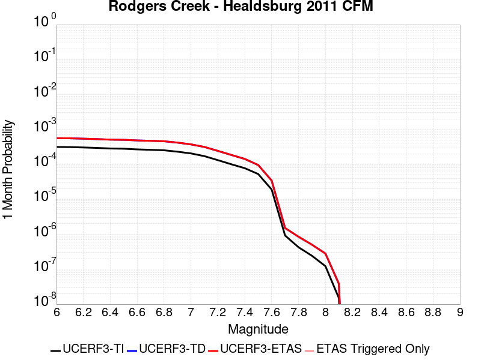 |  |  |

| Magnitude | 1 wk TI Prob | 1 wk TD Prob | 1 wk ETAS Prob | 1 wk ETAS/TD Gain | 1 wk ETAS Triggered Only | 1 mo TI Prob | 1 mo TD Prob | 1 mo ETAS Prob | 1 mo ETAS/TD Gain | 1 mo ETAS Triggered Only | 1 yr TI Prob | 1 yr TD Prob | 1 yr ETAS Prob | 1 yr ETAS/TD Gain | 1 yr ETAS Triggered Only | 10 yr TI Prob | 10 yr TD Prob | 10 yr ETAS Prob | 10 yr ETAS/TD Gain | 10 yr ETAS Triggered Only |
|-----|-----|-----|-----|-----|-----|-----|-----|-----|-----|-----|-----|-----|-----|-----|-----|-----|-----|-----|-----|-----|
| 6.0 | 7.390182E-5 | 1.3137363E-4 | 1.3137363E-4 | 1.0 | 0.0 | 3.1668364E-4 | 5.6290865E-4 | 5.6290865E-4 | 1.0 | 0.0 | 0.0038488081 | 0.0068318434 | 0.0068318434 | 1.0 | 0.0 | 0.037828278 | 0.06618431 | 0.06619365 | 1.0001411 | 1.0E-5 |
| 6.1 | 7.318768E-5 | 1.3035377E-4 | 1.3035377E-4 | 1.0 | 0.0 | 3.1362378E-4 | 5.585398E-4 | 5.585398E-4 | 1.0 | 0.0 | 0.0038116854 | 0.0067790016 | 0.0067790016 | 1.0 | 0.0 | 0.037469655 | 0.0656889 | 0.06569824 | 1.0001422 | 1.0E-5 |
| 6.2 | 7.1379836E-5 | 1.2728218E-4 | 1.2728218E-4 | 1.0 | 0.0 | 3.058777E-4 | 5.4538145E-4 | 5.4538145E-4 | 1.0 | 0.0 | 0.003717703 | 0.006619781 | 0.006619781 | 1.0 | 0.0 | 0.0365612 | 0.064210966 | 0.064220324 | 1.0001458 | 1.0E-5 |
| 6.3 | 6.9255926E-5 | 1.2382549E-4 | 1.2382549E-4 | 1.0 | 0.0 | 2.9677735E-4 | 5.305732E-4 | 5.305732E-4 | 1.0 | 0.0 | 0.0036072785 | 0.0064406455 | 0.0064406455 | 1.0 | 0.0 | 0.035492823 | 0.06254216 | 0.062551536 | 1.0001498 | 1.0E-5 |
| 6.4 | 6.6757144E-5 | 1.1959257E-4 | 1.1959257E-4 | 1.0 | 0.0 | 2.8607066E-4 | 5.124393E-4 | 5.124393E-4 | 1.0 | 0.0 | 0.0034773487 | 0.0062211747 | 0.0062211747 | 1.0 | 0.0 | 0.034234364 | 0.060491923 | 0.06050132 | 1.0001553 | 1.0E-5 |
| 6.5 | 6.5735134E-5 | 1.1808556E-4 | 1.1808556E-4 | 1.0 | 0.0 | 2.8169158E-4 | 5.0598325E-4 | 5.0598325E-4 | 1.0 | 0.0 | 0.003424202 | 0.006143029 | 0.006143029 | 1.0 | 0.0 | 0.03371918 | 0.059756014 | 0.059765413 | 1.0001574 | 1.0E-5 |
| 6.6 | 6.289601E-5 | 1.1344302E-4 | 1.1344302E-4 | 1.0 | 0.0 | 2.6952647E-4 | 4.8609416E-4 | 4.8609416E-4 | 1.0 | 0.0 | 0.0032765474 | 0.005902217 | 0.005902217 | 1.0 | 0.0 | 0.032286562 | 0.057495173 | 0.057504598 | 1.0001639 | 1.0E-5 |
| 6.7 | 6.115274E-5 | 1.10613844E-4 | 1.10613844E-4 | 1.0 | 0.0 | 2.6205686E-4 | 4.7397357E-4 | 4.7397357E-4 | 1.0 | 0.0 | 0.0031858748 | 0.005755439 | 0.005755439 | 1.0 | 0.0 | 0.031405866 | 0.056113765 | 0.0561232 | 1.0001682 | 1.0E-5 |
| 6.8 | 5.9232367E-5 | 1.07287204E-4 | 1.07287204E-4 | 1.0 | 0.0 | 2.538283E-4 | 4.5972163E-4 | 4.5972163E-4 | 1.0 | 0.0 | 0.0030859804 | 0.0055828234 | 0.0055828234 | 1.0 | 0.0 | 0.030434765 | 0.05448065 | 0.054490104 | 1.0001736 | 1.0E-5 |
| 6.9 | 5.4030377E-5 | 9.822887E-5 | 9.822887E-5 | 1.0 | 0.0 | 2.315382E-4 | 4.209133E-4 | 4.209133E-4 | 1.0 | 0.0 | 0.0028153337 | 0.005112644 | 0.005112644 | 1.0 | 0.0 | 0.027799325 | 0.050015952 | 0.050025456 | 1.0001899 | 1.0E-5 |
| 7.0 | 4.8260714E-5 | 8.7409484E-5 | 8.7409484E-5 | 1.0 | 0.0 | 2.0681522E-4 | 3.7455856E-4 | 3.7455856E-4 | 1.0 | 0.0 | 0.0025150678 | 0.0045507695 | 0.0045507695 | 1.0 | 0.0 | 0.024867928 | 0.0446674 | 0.044676956 | 1.0002139 | 1.0E-5 |
| 7.1 | 4.0294493E-5 | 7.389416E-5 | 7.389416E-5 | 1.0 | 0.0 | 1.7267925E-4 | 3.16651E-4 | 3.16651E-4 | 1.0 | 0.0 | 0.0021003427 | 0.003848449 | 0.003848449 | 1.0 | 0.0 | 0.02080602 | 0.037923567 | 0.037933186 | 1.0002537 | 1.0E-5 |
| 7.2 | 3.096388E-5 | 5.6980713E-5 | 5.6980713E-5 | 1.0 | 0.0 | 1.326956E-4 | 2.4418032E-4 | 2.4418032E-4 | 1.0 | 0.0 | 0.0016143717 | 0.0029688645 | 0.0029688645 | 1.0 | 0.0 | 0.01602694 | 0.029437514 | 0.029437514 | 1.0 | 0.0 |
| 7.3 | 2.3615226E-5 | 4.3630258E-5 | 4.3630258E-5 | 1.0 | 0.0 | 1.0120418E-4 | 1.8697348E-4 | 1.8697348E-4 | 1.0 | 0.0 | 0.0012314644 | 0.0022740394 | 0.0022740394 | 1.0 | 0.0 | 0.0122466255 | 0.022638336 | 0.022638336 | 1.0 | 0.0 |
| 7.4 | 1.8251132E-5 | 3.3542827E-5 | 3.3542827E-5 | 1.0 | 0.0 | 7.821679E-5 | 1.4374711E-4 | 1.4374711E-4 | 1.0 | 0.0 | 9.518733E-4 | 0.0017487259 | 0.0017487259 | 1.0 | 0.0 | 0.009478063 | 0.017466474 | 0.017466474 | 1.0 | 0.0 |
| 7.5 | 1.2411432E-5 | 2.2461296E-5 | 2.2461296E-5 | 1.0 | 0.0 | 5.3190768E-5 | 9.625918E-5 | 9.625918E-5 | 1.0 | 0.0 | 6.4740516E-4 | 0.0011713313 | 0.0011713313 | 1.0 | 0.0 | 0.006455223 | 0.01174349 | 0.01174349 | 1.0 | 0.0 |
| 7.6 | 4.4771446E-6 | 8.084496E-6 | 8.084496E-6 | 1.0 | 0.0 | 1.918762E-5 | 3.4647383E-5 | 3.4647383E-5 | 1.0 | 0.0 | 2.3358424E-4 | 4.2175147E-4 | 4.2175147E-4 | 1.0 | 0.0 | 0.0023333887 | 0.004245514 | 0.004245514 | 1.0 | 0.0 |
| 7.7 | 2.157941E-7 | 3.5352014E-7 | 3.5352014E-7 | 1.0 | 0.0 | 9.248315E-7 | 1.5150853E-6 | 1.5150853E-6 | 1.0 | 0.0 | 1.1259765E-5 | 1.8446008E-5 | 1.8446008E-5 | 1.0 | 0.0 | 1.1259195E-4 | 1.9070263E-4 | 1.9070263E-4 | 1.0 | 0.0 |
| 7.8 | 9.9623286E-8 | 1.9901812E-7 | 1.9901812E-7 | 1.0 | 0.0 | 4.269569E-7 | 8.529345E-7 | 8.529345E-7 | 1.0 | 0.0 | 5.1981874E-6 | 1.0384429E-5 | 1.0384429E-5 | 1.0 | 0.0 | 5.198066E-5 | 1.09033645E-4 | 1.09033645E-4 | 1.0 | 0.0 |
| 7.9 | 5.6745257E-8 | 1.1775233E-7 | 1.1775233E-7 | 1.0 | 0.0 | 2.4319394E-7 | 5.0465275E-7 | 5.0465275E-7 | 1.0 | 0.0 | 2.960882E-6 | 6.1441297E-6 | 6.1441297E-6 | 1.0 | 0.0 | 2.9608427E-5 | 6.471617E-5 | 6.471617E-5 | 1.0 | 0.0 |
| 8.0 | 2.8614323E-8 | 6.5792776E-8 | 6.5792776E-8 | 1.0 | 0.0 | 1.2263281E-7 | 2.81969E-7 | 2.81969E-7 | 1.0 | 0.0 | 1.4930534E-6 | 3.432967E-6 | 3.432967E-6 | 1.0 | 0.0 | 1.4930434E-5 | 3.5830366E-5 | 3.5830366E-5 | 1.0 | 0.0 |
| 8.1 | 3.5045191E-9 | 8.966893E-9 | 8.966893E-9 | 1.0 | 0.0 | 1.5019367E-8 | 3.842954E-8 | 3.842954E-8 | 1.0 | 0.0 | 1.8286079E-7 | 4.6787957E-7 | 4.6787957E-7 | 1.0 | 0.0 | 1.8286064E-6 | 4.8339093E-6 | 4.8339093E-6 | 1.0 | 0.0 |

## Hosgri (Extension)
*[(top)](#table-of-contents)*

| 1 Week | 1 Month | 1 Year | 10 Year |
|-----|-----|-----|-----|
|  |  |  |  |

| Magnitude | 1 wk TI Prob | 1 wk TD Prob | 1 wk ETAS Prob | 1 wk ETAS/TD Gain | 1 wk ETAS Triggered Only | 1 mo TI Prob | 1 mo TD Prob | 1 mo ETAS Prob | 1 mo ETAS/TD Gain | 1 mo ETAS Triggered Only | 1 yr TI Prob | 1 yr TD Prob | 1 yr ETAS Prob | 1 yr ETAS/TD Gain | 1 yr ETAS Triggered Only | 10 yr TI Prob | 10 yr TD Prob | 10 yr ETAS Prob | 10 yr ETAS/TD Gain | 10 yr ETAS Triggered Only |
|-----|-----|-----|-----|-----|-----|-----|-----|-----|-----|-----|-----|-----|-----|-----|-----|-----|-----|-----|-----|-----|
| 6.0 | 1.1369135E-5 | 1.2083085E-5 | 2.2082964E-5 | 1.8275932 | 1.0E-5 | 4.8723956E-5 | 5.178375E-5 | 6.1783234E-5 | 1.1931008 | 1.0E-5 | 5.9305265E-4 | 6.303075E-4 | 6.403012E-4 | 1.0158553 | 1.0E-5 | 0.005914725 | 0.0062874462 | 0.0062973835 | 1.0015805 | 1.0E-5 |
| 6.1 | 6.934979E-6 | 7.3245637E-6 | 7.3245637E-6 | 1.0 | 0.0 | 2.9721E-5 | 3.139063E-5 | 3.139063E-5 | 1.0 | 0.0 | 3.617931E-4 | 3.8211807E-4 | 3.8211807E-4 | 1.0 | 0.0 | 0.0036120464 | 0.003815023 | 0.003815023 | 1.0 | 0.0 |
| 6.2 | 6.934979E-6 | 7.3245637E-6 | 7.3245637E-6 | 1.0 | 0.0 | 2.9721E-5 | 3.139063E-5 | 3.139063E-5 | 1.0 | 0.0 | 3.617931E-4 | 3.8211807E-4 | 3.8211807E-4 | 1.0 | 0.0 | 0.0036120464 | 0.003815023 | 0.003815023 | 1.0 | 0.0 |
| 6.3 | 4.5484676E-6 | 4.7693366E-6 | 4.7693366E-6 | 1.0 | 0.0 | 1.9493287E-5 | 2.0439857E-5 | 2.0439857E-5 | 1.0 | 0.0 | 2.3730492E-4 | 2.4882724E-4 | 2.4882724E-4 | 1.0 | 0.0 | 0.0023705168 | 0.002485529 | 0.002485529 | 1.0 | 0.0 |
| 6.4 | 4.218095E-6 | 4.416868E-6 | 4.416868E-6 | 1.0 | 0.0 | 1.8077424E-5 | 1.8929297E-5 | 1.8929297E-5 | 1.0 | 0.0 | 2.2007042E-4 | 2.3044014E-4 | 2.3044014E-4 | 1.0 | 0.0 | 0.002198526 | 0.0023020455 | 0.0023020455 | 1.0 | 0.0 |
| 6.5 | 3.717374E-6 | 3.8838834E-6 | 3.8838834E-6 | 1.0 | 0.0 | 1.5931506E-5 | 1.6645108E-5 | 1.6645108E-5 | 1.0 | 0.0 | 1.9394881E-4 | 2.0263554E-4 | 2.0263554E-4 | 1.0 | 0.0 | 0.0019377962 | 0.0020245265 | 0.0020245265 | 1.0 | 0.0 |
| 6.6 | 3.4605036E-6 | 3.6083115E-6 | 3.6083115E-6 | 1.0 | 0.0 | 1.4830645E-5 | 1.5464102E-5 | 1.5464102E-5 | 1.0 | 0.0 | 1.8054814E-4 | 1.882593E-4 | 1.882593E-4 | 1.0 | 0.0 | 0.0018040152 | 0.0018810129 | 0.0018810129 | 1.0 | 0.0 |
| 6.7 | 3.123439E-6 | 3.246574E-6 | 3.246574E-6 | 1.0 | 0.0 | 1.33860985E-5 | 1.3913814E-5 | 1.3913814E-5 | 1.0 | 0.0 | 1.6296357E-4 | 1.6938763E-4 | 1.6938763E-4 | 1.0 | 0.0 | 0.001628441 | 0.0016925961 | 0.0016925961 | 1.0 | 0.0 |
| 6.8 | 2.8290783E-6 | 2.9305452E-6 | 2.9305452E-6 | 1.0 | 0.0 | 1.2124565E-5 | 1.255942E-5 | 1.255942E-5 | 1.0 | 0.0 | 1.4760658E-4 | 1.5290029E-4 | 1.5290029E-4 | 1.0 | 0.0 | 0.0014750857 | 0.0015279596 | 0.0015279596 | 1.0 | 0.0 |
| 6.9 | 2.454112E-6 | 2.528324E-6 | 2.528324E-6 | 1.0 | 0.0 | 1.0517581E-5 | 1.083563E-5 | 1.083563E-5 | 1.0 | 0.0 | 1.2804402E-4 | 1.3191586E-4 | 1.3191586E-4 | 1.0 | 0.0 | 0.0012797028 | 0.0013183816 | 0.0013183816 | 1.0 | 0.0 |
| 7.0 | 2.1008145E-6 | 2.1498745E-6 | 2.1498745E-6 | 1.0 | 0.0 | 9.003459E-6 | 9.213715E-6 | 9.213715E-6 | 1.0 | 0.0 | 1.096116E-4 | 1.1217125E-4 | 1.1217125E-4 | 1.0 | 0.0 | 0.0010955755 | 0.00112115 | 0.00112115 | 1.0 | 0.0 |
| 7.1 | 1.744384E-6 | 1.7686391E-6 | 1.7686391E-6 | 1.0 | 0.0 | 7.47591E-6 | 7.57986E-6 | 7.57986E-6 | 1.0 | 0.0 | 9.1015405E-5 | 9.22809E-5 | 9.22809E-5 | 1.0 | 0.0 | 9.097813E-4 | 9.224275E-4 | 9.224275E-4 | 1.0 | 0.0 |
| 7.2 | 1.5456587E-6 | 1.5562919E-6 | 1.5562919E-6 | 1.0 | 0.0 | 6.6242346E-6 | 6.6698053E-6 | 6.6698053E-6 | 1.0 | 0.0 | 8.064707E-5 | 8.120187E-5 | 8.120187E-5 | 1.0 | 0.0 | 8.0617814E-4 | 8.117232E-4 | 8.117232E-4 | 1.0 | 0.0 |
| 7.3 | 1.3775123E-6 | 1.3766116E-6 | 1.3766116E-6 | 1.0 | 0.0 | 5.9036106E-6 | 5.899751E-6 | 5.899751E-6 | 1.0 | 0.0 | 7.187409E-5 | 7.182711E-5 | 7.182711E-5 | 1.0 | 0.0 | 7.185085E-4 | 7.1804E-4 | 7.1804E-4 | 1.0 | 0.0 |
| 7.4 | 1.214491E-6 | 1.2023494E-6 | 1.2023494E-6 | 1.0 | 0.0 | 5.2049513E-6 | 5.152916E-6 | 5.152916E-6 | 1.0 | 0.0 | 6.336844E-5 | 6.273495E-5 | 6.273495E-5 | 1.0 | 0.0 | 6.335037E-4 | 6.271732E-4 | 6.271732E-4 | 1.0 | 0.0 |
| 7.5 | 1.0101123E-6 | 9.842277E-7 | 9.842277E-7 | 1.0 | 0.0 | 4.3290456E-6 | 4.218112E-6 | 4.218112E-6 | 1.0 | 0.0 | 5.2704854E-5 | 5.135431E-5 | 5.135431E-5 | 1.0 | 0.0 | 5.2692357E-4 | 5.13425E-4 | 5.13425E-4 | 1.0 | 0.0 |
| 7.6 | 8.1558215E-7 | 7.7659956E-7 | 7.7659956E-7 | 1.0 | 0.0 | 3.4953473E-6 | 3.3282797E-6 | 3.3282797E-6 | 1.0 | 0.0 | 4.255502E-5 | 4.0521056E-5 | 4.0521056E-5 | 1.0 | 0.0 | 4.2546875E-4 | 4.0513714E-4 | 4.0513714E-4 | 1.0 | 0.0 |
| 7.7 | 4.757816E-7 | 4.1309153E-7 | 4.1309153E-7 | 1.0 | 0.0 | 2.0390623E-6 | 1.7703911E-6 | 1.7703911E-6 | 1.0 | 0.0 | 2.4825302E-5 | 2.1554299E-5 | 2.1554299E-5 | 1.0 | 0.0 | 2.482253E-4 | 2.1552222E-4 | 2.1552222E-4 | 1.0 | 0.0 |
| 7.8 | 2.782787E-7 | 2.0047968E-7 | 2.0047968E-7 | 1.0 | 0.0 | 1.1926223E-6 | 8.591983E-7 | 8.591983E-7 | 1.0 | 0.0 | 1.452008E-5 | 1.0460689E-5 | 1.0460689E-5 | 1.0 | 0.0 | 1.4519131E-4 | 1.04602004E-4 | 1.04602004E-4 | 1.0 | 0.0 |
| 7.9 | 1.6948086E-7 | 9.24407E-8 | 9.24407E-8 | 1.0 | 0.0 | 7.2634634E-7 | 3.9617436E-7 | 3.9617436E-7 | 1.0 | 0.0 | 8.843231E-6 | 4.8234124E-6 | 4.8234124E-6 | 1.0 | 0.0 | 8.842879E-5 | 4.8233083E-5 | 4.8233083E-5 | 1.0 | 0.0 |
| 8.0 | 1.0225492E-7 | 4.473588E-8 | 4.473588E-8 | 1.0 | 0.0 | 4.382353E-7 | 1.9172519E-7 | 1.9172519E-7 | 1.0 | 0.0 | 5.335502E-6 | 2.3342516E-6 | 2.3342516E-6 | 1.0 | 0.0 | 5.335374E-5 | 2.3342274E-5 | 2.3342274E-5 | 1.0 | 0.0 |
| 8.1 | 1.43711345E-8 | 5.7873666E-9 | 5.7873666E-9 | 1.0 | 0.0 | 6.1590576E-8 | 2.4802999E-8 | 2.4802999E-8 | 1.0 | 0.0 | 7.4986497E-7 | 3.0197648E-7 | 3.0197648E-7 | 1.0 | 0.0 | 7.4986247E-6 | 3.0197612E-6 | 3.0197612E-6 | 1.0 | 0.0 |

## South Cuyama
*[(top)](#table-of-contents)*

| 1 Week | 1 Month | 1 Year | 10 Year |
|-----|-----|-----|-----|
| 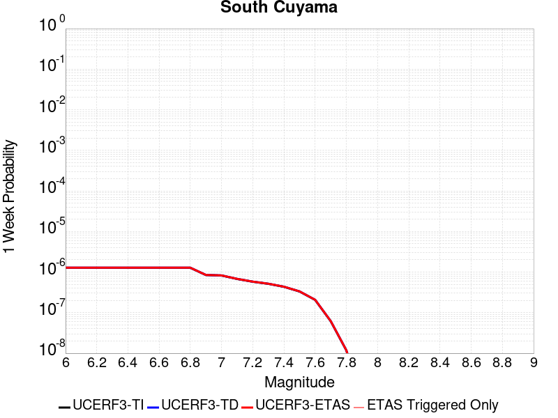 |  | 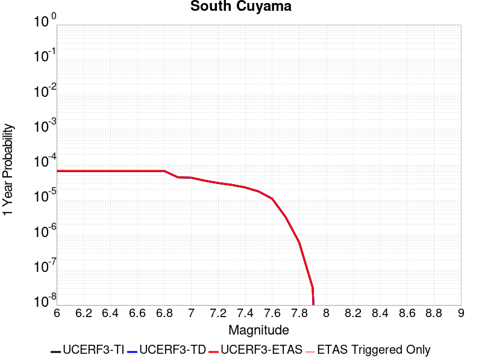 |  |

| Magnitude | 1 wk TI Prob | 1 wk TD Prob | 1 wk ETAS Prob | 1 wk ETAS/TD Gain | 1 wk ETAS Triggered Only | 1 mo TI Prob | 1 mo TD Prob | 1 mo ETAS Prob | 1 mo ETAS/TD Gain | 1 mo ETAS Triggered Only | 1 yr TI Prob | 1 yr TD Prob | 1 yr ETAS Prob | 1 yr ETAS/TD Gain | 1 yr ETAS Triggered Only | 10 yr TI Prob | 10 yr TD Prob | 10 yr ETAS Prob | 10 yr ETAS/TD Gain | 10 yr ETAS Triggered Only |
|-----|-----|-----|-----|-----|-----|-----|-----|-----|-----|-----|-----|-----|-----|-----|-----|-----|-----|-----|-----|-----|
| 6.0 | 1.2747308E-6 | 1.2818698E-6 | 1.2818698E-6 | 1.0 | 0.0 | 5.4631205E-6 | 5.4937163E-6 | 5.4937163E-6 | 1.0 | 0.0 | 6.6511464E-5 | 6.6884015E-5 | 6.6884015E-5 | 1.0 | 0.0 | 6.649156E-4 | 6.6864584E-4 | 6.7863916E-4 | 1.0149456 | 1.0E-5 |
| 6.1 | 1.2747308E-6 | 1.2818698E-6 | 1.2818698E-6 | 1.0 | 0.0 | 5.4631205E-6 | 5.4937163E-6 | 5.4937163E-6 | 1.0 | 0.0 | 6.6511464E-5 | 6.6884015E-5 | 6.6884015E-5 | 1.0 | 0.0 | 6.649156E-4 | 6.6864584E-4 | 6.7863916E-4 | 1.0149456 | 1.0E-5 |
| 6.2 | 1.2747308E-6 | 1.2818698E-6 | 1.2818698E-6 | 1.0 | 0.0 | 5.4631205E-6 | 5.4937163E-6 | 5.4937163E-6 | 1.0 | 0.0 | 6.6511464E-5 | 6.6884015E-5 | 6.6884015E-5 | 1.0 | 0.0 | 6.649156E-4 | 6.6864584E-4 | 6.7863916E-4 | 1.0149456 | 1.0E-5 |
| 6.3 | 1.2747308E-6 | 1.2818698E-6 | 1.2818698E-6 | 1.0 | 0.0 | 5.4631205E-6 | 5.4937163E-6 | 5.4937163E-6 | 1.0 | 0.0 | 6.6511464E-5 | 6.6884015E-5 | 6.6884015E-5 | 1.0 | 0.0 | 6.649156E-4 | 6.6864584E-4 | 6.7863916E-4 | 1.0149456 | 1.0E-5 |
| 6.4 | 1.2747308E-6 | 1.2818698E-6 | 1.2818698E-6 | 1.0 | 0.0 | 5.4631205E-6 | 5.4937163E-6 | 5.4937163E-6 | 1.0 | 0.0 | 6.6511464E-5 | 6.6884015E-5 | 6.6884015E-5 | 1.0 | 0.0 | 6.649156E-4 | 6.6864584E-4 | 6.7863916E-4 | 1.0149456 | 1.0E-5 |
| 6.5 | 1.2747308E-6 | 1.2818698E-6 | 1.2818698E-6 | 1.0 | 0.0 | 5.4631205E-6 | 5.4937163E-6 | 5.4937163E-6 | 1.0 | 0.0 | 6.6511464E-5 | 6.6884015E-5 | 6.6884015E-5 | 1.0 | 0.0 | 6.649156E-4 | 6.6864584E-4 | 6.7863916E-4 | 1.0149456 | 1.0E-5 |
| 6.6 | 1.2747308E-6 | 1.2818698E-6 | 1.2818698E-6 | 1.0 | 0.0 | 5.4631205E-6 | 5.4937163E-6 | 5.4937163E-6 | 1.0 | 0.0 | 6.6511464E-5 | 6.6884015E-5 | 6.6884015E-5 | 1.0 | 0.0 | 6.649156E-4 | 6.6864584E-4 | 6.7863916E-4 | 1.0149456 | 1.0E-5 |
| 6.7 | 1.2747308E-6 | 1.2818698E-6 | 1.2818698E-6 | 1.0 | 0.0 | 5.4631205E-6 | 5.4937163E-6 | 5.4937163E-6 | 1.0 | 0.0 | 6.6511464E-5 | 6.6884015E-5 | 6.6884015E-5 | 1.0 | 0.0 | 6.649156E-4 | 6.6864584E-4 | 6.7863916E-4 | 1.0149456 | 1.0E-5 |
| 6.8 | 1.2747308E-6 | 1.2818698E-6 | 1.2818698E-6 | 1.0 | 0.0 | 5.4631205E-6 | 5.4937163E-6 | 5.4937163E-6 | 1.0 | 0.0 | 6.6511464E-5 | 6.6884015E-5 | 6.6884015E-5 | 1.0 | 0.0 | 6.649156E-4 | 6.6864584E-4 | 6.7863916E-4 | 1.0149456 | 1.0E-5 |
| 6.9 | 8.4566324E-7 | 8.5078835E-7 | 8.5078835E-7 | 1.0 | 0.0 | 3.624266E-6 | 3.6462307E-6 | 3.6462307E-6 | 1.0 | 0.0 | 4.4124543E-5 | 4.4391963E-5 | 4.4391963E-5 | 1.0 | 0.0 | 4.4115784E-4 | 4.43832E-4 | 4.43832E-4 | 1.0 | 0.0 |
| 7.0 | 8.2277904E-7 | 8.2778206E-7 | 8.2778206E-7 | 1.0 | 0.0 | 3.526191E-6 | 3.5476326E-6 | 3.5476326E-6 | 1.0 | 0.0 | 4.293053E-5 | 4.319158E-5 | 4.319158E-5 | 1.0 | 0.0 | 4.292224E-4 | 4.3183286E-4 | 4.3183286E-4 | 1.0 | 0.0 |
| 7.1 | 6.7661887E-7 | 6.8091305E-7 | 6.8091305E-7 | 1.0 | 0.0 | 2.899792E-6 | 2.9181956E-6 | 2.9181956E-6 | 1.0 | 0.0 | 3.5304394E-5 | 3.5528457E-5 | 3.5528457E-5 | 1.0 | 0.0 | 3.5298787E-4 | 3.5522814E-4 | 3.5522814E-4 | 1.0 | 0.0 |
| 7.2 | 5.783336E-7 | 5.821191E-7 | 5.821191E-7 | 1.0 | 0.0 | 2.4785702E-6 | 2.4947938E-6 | 2.4947938E-6 | 1.0 | 0.0 | 3.0176174E-5 | 3.0373694E-5 | 3.0373694E-5 | 1.0 | 0.0 | 3.0172078E-4 | 3.0369568E-4 | 3.0369568E-4 | 1.0 | 0.0 |
| 7.3 | 5.136759E-7 | 5.1709384E-7 | 5.1709384E-7 | 1.0 | 0.0 | 2.2014663E-6 | 2.2161146E-6 | 2.2161146E-6 | 1.0 | 0.0 | 2.6802521E-5 | 2.6980862E-5 | 2.6980862E-5 | 1.0 | 0.0 | 2.679929E-4 | 2.6977606E-4 | 2.6977606E-4 | 1.0 | 0.0 |
| 7.4 | 4.3370295E-7 | 4.3665366E-7 | 4.3665366E-7 | 1.0 | 0.0 | 1.8587256E-6 | 1.8713715E-6 | 1.8713715E-6 | 1.0 | 0.0 | 2.2629749E-5 | 2.2783712E-5 | 2.2783712E-5 | 1.0 | 0.0 | 2.2627445E-4 | 2.2781393E-4 | 2.2781393E-4 | 1.0 | 0.0 |
| 7.5 | 3.3242574E-7 | 3.3476468E-7 | 3.3476468E-7 | 1.0 | 0.0 | 1.4246809E-6 | 1.4347049E-6 | 1.4347049E-6 | 1.0 | 0.0 | 1.7345352E-5 | 1.7467395E-5 | 1.7467395E-5 | 1.0 | 0.0 | 1.7343998E-4 | 1.7466034E-4 | 1.7466034E-4 | 1.0 | 0.0 |
| 7.6 | 2.0627535E-7 | 2.0778901E-7 | 2.0778901E-7 | 1.0 | 0.0 | 8.840369E-7 | 8.9052406E-7 | 8.9052406E-7 | 1.0 | 0.0 | 1.0763096E-5 | 1.0842077E-5 | 1.0842077E-5 | 1.0 | 0.0 | 1.0762575E-4 | 1.0841557E-4 | 1.0841557E-4 | 1.0 | 0.0 |
| 7.7 | 6.15236E-8 | 6.198305E-8 | 6.198305E-8 | 1.0 | 0.0 | 2.6367252E-7 | 2.6564163E-7 | 2.6564163E-7 | 1.0 | 0.0 | 3.2102084E-6 | 3.234182E-6 | 3.234182E-6 | 1.0 | 0.0 | 3.210162E-5 | 3.234136E-5 | 3.234136E-5 | 1.0 | 0.0 |
| 7.8 | 1.1765573E-8 | 1.1873416E-8 | 1.1873416E-8 | 1.0 | 0.0 | 5.0423886E-8 | 5.0886065E-8 | 5.0886065E-8 | 1.0 | 0.0 | 6.1391063E-7 | 6.195377E-7 | 6.195377E-7 | 1.0 | 0.0 | 6.1390897E-6 | 6.1953606E-6 | 6.1953606E-6 | 1.0 | 0.0 |
| 7.9 | 6.0381755E-10 | 6.100581E-10 | 6.100581E-10 | 1.0 | 0.0 | 2.5877895E-9 | 2.6145344E-9 | 2.6145344E-9 | 1.0 | 0.0 | 3.1506335E-8 | 3.1831956E-8 | 3.1831956E-8 | 1.0 | 0.0 | 3.1506332E-7 | 3.1831954E-7 | 3.1831954E-7 | 1.0 | 0.0 |

## Silver Creek 2011 CFM
*[(top)](#table-of-contents)*

| 1 Week | 1 Month | 1 Year | 10 Year |
|-----|-----|-----|-----|
|  |  |  | 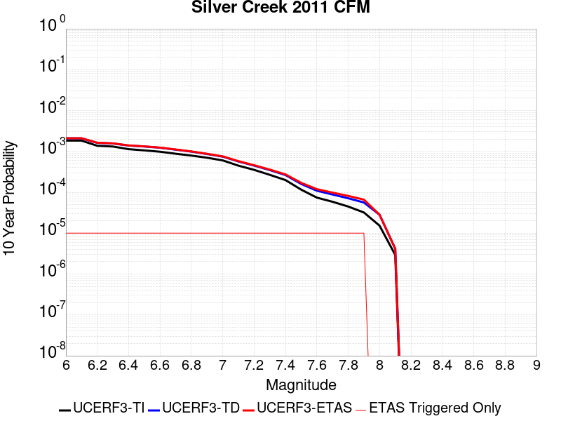 |

| Magnitude | 1 wk TI Prob | 1 wk TD Prob | 1 wk ETAS Prob | 1 wk ETAS/TD Gain | 1 wk ETAS Triggered Only | 1 mo TI Prob | 1 mo TD Prob | 1 mo ETAS Prob | 1 mo ETAS/TD Gain | 1 mo ETAS Triggered Only | 1 yr TI Prob | 1 yr TD Prob | 1 yr ETAS Prob | 1 yr ETAS/TD Gain | 1 yr ETAS Triggered Only | 10 yr TI Prob | 10 yr TD Prob | 10 yr ETAS Prob | 10 yr ETAS/TD Gain | 10 yr ETAS Triggered Only |
|-----|-----|-----|-----|-----|-----|-----|-----|-----|-----|-----|-----|-----|-----|-----|-----|-----|-----|-----|-----|-----|
| 6.0 | 3.5229125E-6 | 4.0081713E-6 | 4.0081713E-6 | 1.0 | 0.0 | 1.5098109E-5 | 1.7177766E-5 | 1.7177766E-5 | 1.0 | 0.0 | 1.8380396E-4 | 2.091196E-4 | 2.1911752E-4 | 1.0478095 | 1.0E-5 | 0.0018365202 | 0.002089586 | 0.0020995652 | 1.0047756 | 1.0E-5 |
| 6.1 | 3.5229125E-6 | 4.0081713E-6 | 4.0081713E-6 | 1.0 | 0.0 | 1.5098109E-5 | 1.7177766E-5 | 1.7177766E-5 | 1.0 | 0.0 | 1.8380396E-4 | 2.091196E-4 | 2.1911752E-4 | 1.0478095 | 1.0E-5 | 0.0018365202 | 0.002089586 | 0.0020995652 | 1.0047756 | 1.0E-5 |
| 6.2 | 2.6363234E-6 | 3.1105574E-6 | 3.1105574E-6 | 1.0 | 0.0 | 1.129848E-5 | 1.3330892E-5 | 1.3330892E-5 | 1.0 | 0.0 | 1.375503E-4 | 1.6229159E-4 | 1.7228996E-4 | 1.0616075 | 1.0E-5 | 0.0013746519 | 0.0016220578 | 0.0016320415 | 1.006155 | 1.0E-5 |
| 6.3 | 2.5275126E-6 | 3.000196E-6 | 3.000196E-6 | 1.0 | 0.0 | 1.0832152E-5 | 1.285792E-5 | 1.285792E-5 | 1.0 | 0.0 | 1.3187347E-4 | 1.5653399E-4 | 1.6653242E-4 | 1.0638739 | 1.0E-5 | 0.0013179524 | 0.0015645635 | 0.0015745478 | 1.0063815 | 1.0E-5 |
| 6.4 | 2.178732E-6 | 2.6707596E-6 | 2.6707596E-6 | 1.0 | 0.0 | 9.337389E-6 | 1.1446063E-5 | 1.1446063E-5 | 1.0 | 0.0 | 1.1367678E-4 | 1.3934693E-4 | 1.4934553E-4 | 1.0717534 | 1.0E-5 | 0.0011361865 | 0.0013929193 | 0.0014029054 | 1.0071691 | 1.0E-5 |
| 6.5 | 2.0341574E-6 | 2.5298498E-6 | 2.5298498E-6 | 1.0 | 0.0 | 8.717788E-6 | 1.0842168E-5 | 1.0842168E-5 | 1.0 | 0.0 | 1.061339E-4 | 1.3199543E-4 | 1.4199411E-4 | 1.0757502 | 1.0E-5 | 0.0010608323 | 0.0013194936 | 0.0013294804 | 1.0075687 | 1.0E-5 |
| 6.6 | 1.8856827E-6 | 2.3614264E-6 | 2.3614264E-6 | 1.0 | 0.0 | 8.0814725E-6 | 1.012036E-5 | 1.012036E-5 | 1.0 | 0.0 | 9.838748E-5 | 1.2320843E-4 | 1.332072E-4 | 1.0811533 | 1.0E-5 | 9.834393E-4 | 0.0012317242 | 0.0012417118 | 1.0081087 | 1.0E-5 |
| 6.7 | 1.6844668E-6 | 2.1198152E-6 | 2.1198152E-6 | 1.0 | 0.0 | 7.2191233E-6 | 9.084891E-6 | 9.084891E-6 | 1.0 | 0.0 | 8.788928E-5 | 1.10602945E-4 | 1.2060184E-4 | 1.0904036 | 1.0E-5 | 8.785453E-4 | 0.0011058012 | 0.0011157902 | 1.0090332 | 1.0E-5 |
| 6.8 | 1.5177161E-6 | 1.8954208E-6 | 1.8954208E-6 | 1.0 | 0.0 | 6.504481E-6 | 8.1232065E-6 | 8.1232065E-6 | 1.0 | 0.0 | 7.918918E-5 | 9.8895565E-5 | 1.0889457E-4 | 1.1011068 | 1.0E-5 | 7.9160964E-4 | 9.888372E-4 | 9.988273E-4 | 1.0101029 | 1.0E-5 |
| 6.9 | 1.3437394E-6 | 1.6561878E-6 | 1.6561878E-6 | 1.0 | 0.0 | 5.7588704E-6 | 7.0979286E-6 | 7.0979286E-6 | 1.0 | 0.0 | 7.011199E-5 | 8.641386E-5 | 9.6412994E-5 | 1.1157122 | 1.0E-5 | 7.0089876E-4 | 8.6412375E-4 | 8.7411515E-4 | 1.0115625 | 1.0E-5 |
| 7.0 | 1.1563575E-6 | 1.4313599E-6 | 1.4313599E-6 | 1.0 | 0.0 | 4.9558084E-6 | 6.134385E-6 | 6.134385E-6 | 1.0 | 0.0 | 6.03353E-5 | 7.468358E-5 | 8.468283E-5 | 1.1338882 | 1.0E-5 | 6.0318917E-4 | 7.469059E-4 | 7.568985E-4 | 1.0133786 | 1.0E-5 |
| 7.1 | 8.602183E-7 | 1.0891855E-6 | 1.0891855E-6 | 1.0 | 0.0 | 3.6866445E-6 | 4.6679293E-6 | 4.6679293E-6 | 1.0 | 0.0 | 4.4883975E-5 | 5.6830562E-5 | 6.682999E-5 | 1.1759517 | 1.0E-5 | 4.4874908E-4 | 5.684812E-4 | 5.7847553E-4 | 1.0175807 | 1.0E-5 |
| 7.2 | 6.788407E-7 | 8.6223383E-7 | 8.6223383E-7 | 1.0 | 0.0 | 2.9093142E-6 | 3.6952824E-6 | 3.6952824E-6 | 1.0 | 0.0 | 3.5420322E-5 | 4.4989138E-5 | 5.4988686E-5 | 1.2222658 | 1.0E-5 | 3.541468E-4 | 4.5012115E-4 | 4.6011666E-4 | 1.0222062 | 1.0E-5 |
| 7.3 | 5.1292045E-7 | 6.694115E-7 | 6.694115E-7 | 1.0 | 0.0 | 2.1982287E-6 | 2.8689033E-6 | 2.8689033E-6 | 1.0 | 0.0 | 2.6763106E-5 | 3.4928336E-5 | 4.4927987E-5 | 1.2862905 | 1.0E-5 | 2.6759884E-4 | 3.4954934E-4 | 3.5954584E-4 | 1.0285983 | 1.0E-5 |
| 7.4 | 3.820994E-7 | 5.0625835E-7 | 5.0625835E-7 | 1.0 | 0.0 | 1.6375678E-6 | 2.1696767E-6 | 2.1696767E-6 | 1.0 | 0.0 | 1.9937206E-5 | 2.6415495E-5 | 3.641523E-5 | 1.3785557 | 1.0E-5 | 1.9935417E-4 | 2.6444442E-4 | 2.744418E-4 | 1.0378051 | 1.0E-5 |
| 7.5 | 2.2292595E-7 | 3.0668934E-7 | 3.0668934E-7 | 1.0 | 0.0 | 9.553966E-7 | 1.3143822E-6 | 1.3143822E-6 | 1.0 | 0.0 | 1.16318915E-5 | 1.6002487E-5 | 2.6002326E-5 | 1.624893 | 1.0E-5 | 1.16312825E-4 | 1.603342E-4 | 1.703326E-4 | 1.0623597 | 1.0E-5 |
| 7.6 | 1.420587E-7 | 2.0914455E-7 | 2.0914455E-7 | 1.0 | 0.0 | 6.088228E-7 | 8.963334E-7 | 8.963334E-7 | 1.0 | 0.0 | 7.4123927E-6 | 1.0912805E-5 | 2.0912696E-5 | 1.9163448 | 1.0E-5 | 7.412145E-5 | 1.09443405E-4 | 1.1944232E-4 | 1.0913614 | 1.0E-5 |
| 7.7 | 1.1250075E-7 | 1.6872775E-7 | 1.6872775E-7 | 1.0 | 0.0 | 4.82146E-7 | 7.231187E-7 | 7.231187E-7 | 1.0 | 0.0 | 5.8701116E-6 | 8.803935E-6 | 1.8803847E-5 | 2.1358457 | 1.0E-5 | 5.8699567E-5 | 8.835141E-5 | 9.835052E-5 | 1.1131744 | 1.0E-5 |
| 7.8 | 8.592761E-8 | 1.3650926E-7 | 1.3650926E-7 | 1.0 | 0.0 | 3.682611E-7 | 5.850395E-7 | 5.850395E-7 | 1.0 | 0.0 | 4.48357E-6 | 7.122833E-6 | 1.7122762E-5 | 2.403926 | 1.0E-5 | 4.4834796E-5 | 7.1530834E-5 | 8.153012E-5 | 1.1397898 | 1.0E-5 |
| 7.9 | 6.156529E-8 | 1.07436605E-7 | 1.07436605E-7 | 1.0 | 0.0 | 2.638512E-7 | 4.6044252E-7 | 4.6044252E-7 | 1.0 | 0.0 | 3.212384E-6 | 5.6058734E-6 | 1.5605818E-5 | 2.7838335 | 1.0E-5 | 3.2123375E-5 | 5.6317156E-5 | 6.631659E-5 | 1.1775558 | 1.0E-5 |
| 8.0 | 2.9230547E-8 | 5.3895363E-8 | 5.3895363E-8 | 1.0 | 0.0 | 1.2527377E-7 | 2.309801E-7 | 2.309801E-7 | 1.0 | 0.0 | 1.525207E-6 | 2.8121792E-6 | 2.8121792E-6 | 1.0 | 0.0 | 1.5251966E-5 | 2.8258084E-5 | 2.8258084E-5 | 1.0 | 0.0 |
| 8.1 | 5.6062213E-9 | 7.903695E-9 | 7.903695E-9 | 1.0 | 0.0 | 2.4026663E-8 | 3.3872976E-8 | 3.3872976E-8 | 1.0 | 0.0 | 2.925246E-7 | 4.124034E-7 | 4.124034E-7 | 1.0 | 0.0 | 2.925242E-6 | 4.1624335E-6 | 4.1624335E-6 | 1.0 | 0.0 |

## Round Valley
*[(top)](#table-of-contents)*

| 1 Week | 1 Month | 1 Year | 10 Year |
|-----|-----|-----|-----|
|  |  |  |  |

| Magnitude | 1 wk TI Prob | 1 wk TD Prob | 1 wk ETAS Prob | 1 wk ETAS/TD Gain | 1 wk ETAS Triggered Only | 1 mo TI Prob | 1 mo TD Prob | 1 mo ETAS Prob | 1 mo ETAS/TD Gain | 1 mo ETAS Triggered Only | 1 yr TI Prob | 1 yr TD Prob | 1 yr ETAS Prob | 1 yr ETAS/TD Gain | 1 yr ETAS Triggered Only | 10 yr TI Prob | 10 yr TD Prob | 10 yr ETAS Prob | 10 yr ETAS/TD Gain | 10 yr ETAS Triggered Only |
|-----|-----|-----|-----|-----|-----|-----|-----|-----|-----|-----|-----|-----|-----|-----|-----|-----|-----|-----|-----|-----|
| 6.0 | 1.588152E-5 | 1.3670552E-5 | 1.3670552E-5 | 1.0 | 0.0 | 6.806188E-5 | 5.858699E-5 | 5.858699E-5 | 1.0 | 0.0 | 8.283384E-4 | 7.131025E-4 | 7.230954E-4 | 1.0140132 | 1.0E-5 | 0.008252576 | 0.0071120304 | 0.0071219592 | 1.0013961 | 1.0E-5 |
| 6.1 | 1.588152E-5 | 1.3670552E-5 | 1.3670552E-5 | 1.0 | 0.0 | 6.806188E-5 | 5.858699E-5 | 5.858699E-5 | 1.0 | 0.0 | 8.283384E-4 | 7.131025E-4 | 7.230954E-4 | 1.0140132 | 1.0E-5 | 0.008252576 | 0.0071120304 | 0.0071219592 | 1.0013961 | 1.0E-5 |
| 6.2 | 1.588152E-5 | 1.3670552E-5 | 1.3670552E-5 | 1.0 | 0.0 | 6.806188E-5 | 5.858699E-5 | 5.858699E-5 | 1.0 | 0.0 | 8.283384E-4 | 7.131025E-4 | 7.230954E-4 | 1.0140132 | 1.0E-5 | 0.008252576 | 0.0071120304 | 0.0071219592 | 1.0013961 | 1.0E-5 |
| 6.3 | 1.588152E-5 | 1.3670552E-5 | 1.3670552E-5 | 1.0 | 0.0 | 6.806188E-5 | 5.858699E-5 | 5.858699E-5 | 1.0 | 0.0 | 8.283384E-4 | 7.131025E-4 | 7.230954E-4 | 1.0140132 | 1.0E-5 | 0.008252576 | 0.0071120304 | 0.0071219592 | 1.0013961 | 1.0E-5 |
| 6.4 | 1.588152E-5 | 1.3670552E-5 | 1.3670552E-5 | 1.0 | 0.0 | 6.806188E-5 | 5.858699E-5 | 5.858699E-5 | 1.0 | 0.0 | 8.283384E-4 | 7.131025E-4 | 7.230954E-4 | 1.0140132 | 1.0E-5 | 0.008252576 | 0.0071120304 | 0.0071219592 | 1.0013961 | 1.0E-5 |
| 6.5 | 1.0646776E-5 | 7.952868E-6 | 7.952868E-6 | 1.0 | 0.0 | 4.5628243E-5 | 3.408332E-5 | 3.408332E-5 | 1.0 | 0.0 | 5.553823E-4 | 4.1489382E-4 | 4.2488967E-4 | 1.0240926 | 1.0E-5 | 0.005539963 | 0.004142021 | 0.0041519795 | 1.0024043 | 1.0E-5 |
| 6.6 | 8.632956E-6 | 5.76857E-6 | 5.76857E-6 | 1.0 | 0.0 | 3.6997862E-5 | 2.472223E-5 | 2.472223E-5 | 1.0 | 0.0 | 4.5035584E-4 | 3.0095543E-4 | 3.1095243E-4 | 1.0332175 | 1.0E-5 | 0.0044944426 | 0.0030058566 | 0.0030158265 | 1.0033169 | 1.0E-5 |
| 6.7 | 8.632956E-6 | 5.76857E-6 | 5.76857E-6 | 1.0 | 0.0 | 3.6997862E-5 | 2.472223E-5 | 2.472223E-5 | 1.0 | 0.0 | 4.5035584E-4 | 3.0095543E-4 | 3.1095243E-4 | 1.0332175 | 1.0E-5 | 0.0044944426 | 0.0030058566 | 0.0030158265 | 1.0033169 | 1.0E-5 |
| 6.8 | 7.143895E-6 | 4.201661E-6 | 4.201661E-6 | 1.0 | 0.0 | 3.0616335E-5 | 1.8007004E-5 | 1.8007004E-5 | 1.0 | 0.0 | 3.726901E-4 | 2.1921488E-4 | 2.1921488E-4 | 1.0 | 0.0 | 0.0037206567 | 0.0021901513 | 0.0021901513 | 1.0 | 0.0 |
| 6.9 | 6.5120694E-6 | 3.6642973E-6 | 3.6642973E-6 | 1.0 | 0.0 | 2.790857E-5 | 1.5704045E-5 | 1.5704045E-5 | 1.0 | 0.0 | 3.3973387E-4 | 1.9118149E-4 | 1.9118149E-4 | 1.0 | 0.0 | 0.0033921495 | 0.0019103192 | 0.0019103192 | 1.0 | 0.0 |
| 7.0 | 5.0614435E-6 | 2.6835028E-6 | 2.6835028E-6 | 1.0 | 0.0 | 2.169172E-5 | 1.15006815E-5 | 1.15006815E-5 | 1.0 | 0.0 | 2.6406467E-4 | 1.4001284E-4 | 1.4001284E-4 | 1.0 | 0.0 | 0.0026375111 | 0.0013993476 | 0.0013993476 | 1.0 | 0.0 |
| 7.1 | 4.41728E-6 | 2.3573402E-6 | 2.3573402E-6 | 1.0 | 0.0 | 1.8931061E-5 | 1.0102853E-5 | 1.0102853E-5 | 1.0 | 0.0 | 2.304613E-4 | 1.2299628E-4 | 1.2299628E-4 | 1.0 | 0.0 | 0.0023022245 | 0.0012293785 | 0.0012293785 | 1.0 | 0.0 |
| 7.2 | 2.535495E-6 | 1.1207998E-6 | 1.1207998E-6 | 1.0 | 0.0 | 1.0866362E-5 | 4.8034217E-6 | 4.8034217E-6 | 1.0 | 0.0 | 1.3228992E-4 | 5.8480615E-5 | 5.8480615E-5 | 1.0 | 0.0 | 0.0013221119 | 5.8470346E-4 | 5.8470346E-4 | 1.0 | 0.0 |
| 7.3 | 7.900015E-7 | 4.088974E-7 | 4.088974E-7 | 1.0 | 0.0 | 3.3857161E-6 | 1.7524175E-6 | 1.7524175E-6 | 1.0 | 0.0 | 4.1220315E-5 | 2.1335682E-5 | 2.1335682E-5 | 1.0 | 0.0 | 4.121267E-4 | 2.1335682E-4 | 2.1335682E-4 | 1.0 | 0.0 |

## Elsinore (Julian)
*[(top)](#table-of-contents)*

| 1 Week | 1 Month | 1 Year | 10 Year |
|-----|-----|-----|-----|
|  | 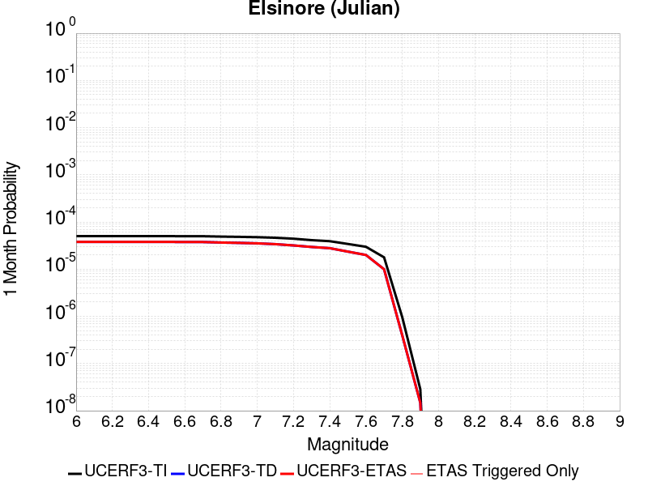 |  |  |

| Magnitude | 1 wk TI Prob | 1 wk TD Prob | 1 wk ETAS Prob | 1 wk ETAS/TD Gain | 1 wk ETAS Triggered Only | 1 mo TI Prob | 1 mo TD Prob | 1 mo ETAS Prob | 1 mo ETAS/TD Gain | 1 mo ETAS Triggered Only | 1 yr TI Prob | 1 yr TD Prob | 1 yr ETAS Prob | 1 yr ETAS/TD Gain | 1 yr ETAS Triggered Only | 10 yr TI Prob | 10 yr TD Prob | 10 yr ETAS Prob | 10 yr ETAS/TD Gain | 10 yr ETAS Triggered Only |
|-----|-----|-----|-----|-----|-----|-----|-----|-----|-----|-----|-----|-----|-----|-----|-----|-----|-----|-----|-----|-----|
| 6.0 | 1.1710231E-5 | 8.845353E-6 | 8.845353E-6 | 1.0 | 0.0 | 5.0185736E-5 | 3.7908114E-5 | 3.7908114E-5 | 1.0 | 0.0 | 6.1084004E-4 | 4.6143524E-4 | 4.6143524E-4 | 1.0 | 0.0 | 0.006091637 | 0.004604984 | 0.004614938 | 1.0021615 | 1.0E-5 |
| 6.1 | 1.1710231E-5 | 8.845353E-6 | 8.845353E-6 | 1.0 | 0.0 | 5.0185736E-5 | 3.7908114E-5 | 3.7908114E-5 | 1.0 | 0.0 | 6.1084004E-4 | 4.6143524E-4 | 4.6143524E-4 | 1.0 | 0.0 | 0.006091637 | 0.004604984 | 0.004614938 | 1.0021615 | 1.0E-5 |
| 6.2 | 1.1710231E-5 | 8.845353E-6 | 8.845353E-6 | 1.0 | 0.0 | 5.0185736E-5 | 3.7908114E-5 | 3.7908114E-5 | 1.0 | 0.0 | 6.1084004E-4 | 4.6143524E-4 | 4.6143524E-4 | 1.0 | 0.0 | 0.006091637 | 0.004604984 | 0.004614938 | 1.0021615 | 1.0E-5 |
| 6.3 | 1.1710231E-5 | 8.845353E-6 | 8.845353E-6 | 1.0 | 0.0 | 5.0185736E-5 | 3.7908114E-5 | 3.7908114E-5 | 1.0 | 0.0 | 6.1084004E-4 | 4.6143524E-4 | 4.6143524E-4 | 1.0 | 0.0 | 0.006091637 | 0.004604984 | 0.004614938 | 1.0021615 | 1.0E-5 |
| 6.4 | 1.1710231E-5 | 8.845353E-6 | 8.845353E-6 | 1.0 | 0.0 | 5.0185736E-5 | 3.7908114E-5 | 3.7908114E-5 | 1.0 | 0.0 | 6.1084004E-4 | 4.6143524E-4 | 4.6143524E-4 | 1.0 | 0.0 | 0.006091637 | 0.004604984 | 0.004614938 | 1.0021615 | 1.0E-5 |
| 6.5 | 1.1710231E-5 | 8.845353E-6 | 8.845353E-6 | 1.0 | 0.0 | 5.0185736E-5 | 3.7908114E-5 | 3.7908114E-5 | 1.0 | 0.0 | 6.1084004E-4 | 4.6143524E-4 | 4.6143524E-4 | 1.0 | 0.0 | 0.006091637 | 0.004604984 | 0.004614938 | 1.0021615 | 1.0E-5 |
| 6.6 | 1.1650619E-5 | 8.777729E-6 | 8.777729E-6 | 1.0 | 0.0 | 4.993027E-5 | 3.76183E-5 | 3.76183E-5 | 1.0 | 0.0 | 6.0773146E-4 | 4.579083E-4 | 4.579083E-4 | 1.0 | 0.0 | 0.0060607214 | 0.0045698597 | 0.004579814 | 1.0021782 | 1.0E-5 |
| 6.7 | 1.1650619E-5 | 8.777729E-6 | 8.777729E-6 | 1.0 | 0.0 | 4.993027E-5 | 3.76183E-5 | 3.76183E-5 | 1.0 | 0.0 | 6.0773146E-4 | 4.579083E-4 | 4.579083E-4 | 1.0 | 0.0 | 0.0060607214 | 0.0045698597 | 0.004579814 | 1.0021782 | 1.0E-5 |
| 6.8 | 1.1442698E-5 | 8.560878E-6 | 8.560878E-6 | 1.0 | 0.0 | 4.9039216E-5 | 3.6688973E-5 | 3.6688973E-5 | 1.0 | 0.0 | 5.968889E-4 | 4.4659837E-4 | 4.4659837E-4 | 1.0 | 0.0 | 0.0059528816 | 0.0044572186 | 0.0044671744 | 1.0022335 | 1.0E-5 |
| 6.9 | 1.1300589E-5 | 8.408745E-6 | 8.408745E-6 | 1.0 | 0.0 | 4.8430196E-5 | 3.603699E-5 | 3.603699E-5 | 1.0 | 0.0 | 5.894781E-4 | 4.3866367E-4 | 4.3866367E-4 | 1.0 | 0.0 | 0.005879169 | 0.004378186 | 0.0043881424 | 1.002274 | 1.0E-5 |
| 7.0 | 1.1117729E-5 | 8.225906E-6 | 8.225906E-6 | 1.0 | 0.0 | 4.764654E-5 | 3.5253415E-5 | 3.5253415E-5 | 1.0 | 0.0 | 5.799422E-4 | 4.2912745E-4 | 4.2912745E-4 | 1.0 | 0.0 | 0.0057843104 | 0.004283195 | 0.004293152 | 1.0023247 | 1.0E-5 |
| 7.1 | 1.08053955E-5 | 7.911534E-6 | 7.911534E-6 | 1.0 | 0.0 | 4.6308014E-5 | 3.3906144E-5 | 3.3906144E-5 | 1.0 | 0.0 | 5.6365423E-4 | 4.1273076E-4 | 4.1273076E-4 | 1.0 | 0.0 | 0.005622267 | 0.004119846 | 0.0041298047 | 1.0024173 | 1.0E-5 |
| 7.2 | 1.032804E-5 | 7.432787E-6 | 7.432787E-6 | 1.0 | 0.0 | 4.4262277E-5 | 3.185442E-5 | 3.185442E-5 | 1.0 | 0.0 | 5.387599E-4 | 3.877601E-4 | 3.877601E-4 | 1.0 | 0.0 | 0.0053745564 | 0.003871031 | 0.0038809923 | 1.0025733 | 1.0E-5 |
| 7.3 | 9.622426E-6 | 6.897623E-6 | 6.897623E-6 | 1.0 | 0.0 | 4.1238312E-5 | 2.9560915E-5 | 2.9560915E-5 | 1.0 | 0.0 | 5.019608E-4 | 3.5984613E-4 | 3.5984613E-4 | 1.0 | 0.0 | 0.005008285 | 0.0035928146 | 0.0036027785 | 1.0027733 | 1.0E-5 |
| 7.4 | 9.144434E-6 | 6.496177E-6 | 6.496177E-6 | 1.0 | 0.0 | 3.9189843E-5 | 2.784047E-5 | 2.784047E-5 | 1.0 | 0.0 | 4.7703186E-4 | 3.3890636E-4 | 3.3890636E-4 | 1.0 | 0.0 | 0.0047600917 | 0.0033840367 | 0.0033940028 | 1.0029451 | 1.0E-5 |
| 7.5 | 7.988981E-6 | 5.498138E-6 | 5.498138E-6 | 1.0 | 0.0 | 3.4238044E-5 | 2.3563241E-5 | 2.3563241E-5 | 1.0 | 0.0 | 4.1676845E-4 | 2.8684599E-4 | 2.8684599E-4 | 1.0 | 0.0 | 0.0041598766 | 0.0028648844 | 0.0028648844 | 1.0 | 0.0 |
| 7.6 | 6.9554876E-6 | 4.662352E-6 | 4.662352E-6 | 1.0 | 0.0 | 2.9808893E-5 | 1.998136E-5 | 1.998136E-5 | 1.0 | 0.0 | 3.6286283E-4 | 2.4324708E-4 | 2.4324708E-4 | 1.0 | 0.0 | 0.0036227088 | 0.0024299244 | 0.0024299244 | 1.0 | 0.0 |
| 7.7 | 4.1557314E-6 | 2.3244586E-6 | 2.3244586E-6 | 1.0 | 0.0 | 1.7810156E-5 | 9.961932E-6 | 9.961932E-6 | 1.0 | 0.0 | 2.1681708E-4 | 1.21280515E-4 | 1.21280515E-4 | 1.0 | 0.0 | 0.0021660565 | 0.0012122163 | 0.0012122163 | 1.0 | 0.0 |
| 7.8 | 2.2597293E-7 | 9.33195E-8 | 9.33195E-8 | 1.0 | 0.0 | 9.684551E-7 | 3.9994066E-7 | 3.9994066E-7 | 1.0 | 0.0 | 1.1790877E-5 | 4.86927E-6 | 4.86927E-6 | 1.0 | 0.0 | 1.17902506E-4 | 4.869196E-5 | 4.869196E-5 | 1.0 | 0.0 |
| 7.9 | 6.676829E-9 | 3.4397292E-9 | 3.4397292E-9 | 1.0 | 0.0 | 2.861498E-8 | 1.4741697E-8 | 1.4741697E-8 | 1.0 | 0.0 | 3.4838732E-7 | 1.7948015E-7 | 1.7948015E-7 | 1.0 | 0.0 | 3.4838679E-6 | 1.7948001E-6 | 1.7948001E-6 | 1.0 | 0.0 |

## San Luis Range - Pecho 2011 CFM
*[(top)](#table-of-contents)*

| 1 Week | 1 Month | 1 Year | 10 Year |
|-----|-----|-----|-----|
| 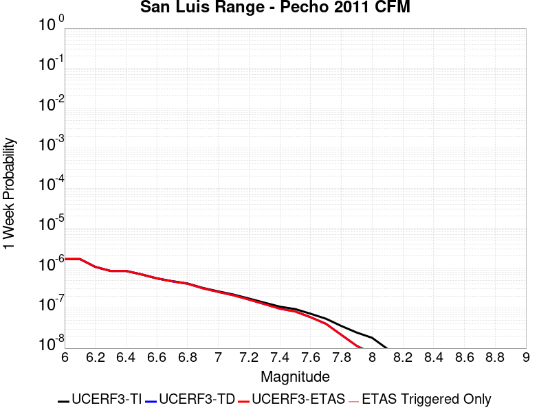 |  | 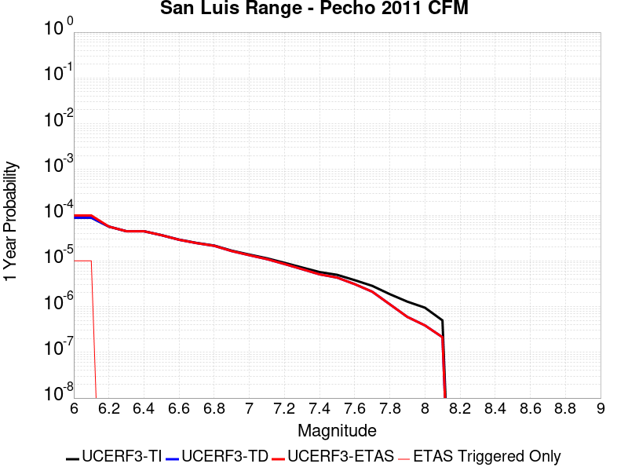 |  |

| Magnitude | 1 wk TI Prob | 1 wk TD Prob | 1 wk ETAS Prob | 1 wk ETAS/TD Gain | 1 wk ETAS Triggered Only | 1 mo TI Prob | 1 mo TD Prob | 1 mo ETAS Prob | 1 mo ETAS/TD Gain | 1 mo ETAS Triggered Only | 1 yr TI Prob | 1 yr TD Prob | 1 yr ETAS Prob | 1 yr ETAS/TD Gain | 1 yr ETAS Triggered Only | 10 yr TI Prob | 10 yr TD Prob | 10 yr ETAS Prob | 10 yr ETAS/TD Gain | 10 yr ETAS Triggered Only |
|-----|-----|-----|-----|-----|-----|-----|-----|-----|-----|-----|-----|-----|-----|-----|-----|-----|-----|-----|-----|-----|
| 6.0 | 1.687423E-6 | 1.6921948E-6 | 1.6921948E-6 | 1.0 | 0.0 | 7.231793E-6 | 7.252245E-6 | 7.252245E-6 | 1.0 | 0.0 | 8.804352E-5 | 8.829274E-5 | 9.8291865E-5 | 1.1132495 | 1.0E-5 | 8.8008645E-4 | 8.8260055E-4 | 8.925917E-4 | 1.0113201 | 1.0E-5 |
| 6.1 | 1.687423E-6 | 1.6921948E-6 | 1.6921948E-6 | 1.0 | 0.0 | 7.231793E-6 | 7.252245E-6 | 7.252245E-6 | 1.0 | 0.0 | 8.804352E-5 | 8.829274E-5 | 9.8291865E-5 | 1.1132495 | 1.0E-5 | 8.8008645E-4 | 8.8260055E-4 | 8.925917E-4 | 1.0113201 | 1.0E-5 |
| 6.2 | 1.0765672E-6 | 1.0770544E-6 | 1.0770544E-6 | 1.0 | 0.0 | 4.613851E-6 | 4.61594E-6 | 4.61594E-6 | 1.0 | 0.0 | 5.617219E-5 | 5.619768E-5 | 5.619768E-5 | 1.0 | 0.0 | 5.6157995E-4 | 5.6184095E-4 | 5.6184095E-4 | 1.0 | 0.0 |
| 6.3 | 8.523104E-7 | 8.513025E-7 | 8.513025E-7 | 1.0 | 0.0 | 3.6527538E-6 | 3.6484344E-6 | 3.6484344E-6 | 1.0 | 0.0 | 4.447137E-5 | 4.4418815E-5 | 4.4418815E-5 | 1.0 | 0.0 | 4.4462472E-4 | 4.4410257E-4 | 4.4410257E-4 | 1.0 | 0.0 |
| 6.4 | 8.523104E-7 | 8.513025E-7 | 8.513025E-7 | 1.0 | 0.0 | 3.6527538E-6 | 3.6484344E-6 | 3.6484344E-6 | 1.0 | 0.0 | 4.447137E-5 | 4.4418815E-5 | 4.4418815E-5 | 1.0 | 0.0 | 4.4462472E-4 | 4.4410257E-4 | 4.4410257E-4 | 1.0 | 0.0 |
| 6.5 | 7.0029404E-7 | 6.9764417E-7 | 6.9764417E-7 | 1.0 | 0.0 | 3.0012568E-6 | 2.9899002E-6 | 2.9899002E-6 | 1.0 | 0.0 | 3.6539688E-5 | 3.6401445E-5 | 3.6401445E-5 | 1.0 | 0.0 | 3.653368E-4 | 3.639565E-4 | 3.639565E-4 | 1.0 | 0.0 |
| 6.6 | 5.583906E-7 | 5.5428325E-7 | 5.5428325E-7 | 1.0 | 0.0 | 2.3931002E-6 | 2.3754976E-6 | 2.3754976E-6 | 1.0 | 0.0 | 2.9135606E-5 | 2.8921306E-5 | 2.8921306E-5 | 1.0 | 0.0 | 2.9131788E-4 | 2.8917615E-4 | 2.8917615E-4 | 1.0 | 0.0 |
| 6.7 | 4.73441E-7 | 4.683069E-7 | 4.683069E-7 | 1.0 | 0.0 | 2.0290313E-6 | 2.0070281E-6 | 2.0070281E-6 | 1.0 | 0.0 | 2.4703175E-5 | 2.4435298E-5 | 2.4435298E-5 | 1.0 | 0.0 | 2.470043E-4 | 2.4432654E-4 | 2.4432654E-4 | 1.0 | 0.0 |
| 6.8 | 4.1466086E-7 | 4.0877978E-7 | 4.0877978E-7 | 1.0 | 0.0 | 1.7771167E-6 | 1.7519122E-6 | 1.7519122E-6 | 1.0 | 0.0 | 2.1636182E-5 | 2.1329326E-5 | 2.1329326E-5 | 1.0 | 0.0 | 2.1634075E-4 | 2.1327313E-4 | 2.1327313E-4 | 1.0 | 0.0 |
| 6.9 | 3.2056641E-7 | 3.1329327E-7 | 3.1329327E-7 | 1.0 | 0.0 | 1.3738553E-6 | 1.3426848E-6 | 1.3426848E-6 | 1.0 | 0.0 | 1.6726559E-5 | 1.6347067E-5 | 1.6347067E-5 | 1.0 | 0.0 | 1.67253E-4 | 1.634588E-4 | 1.634588E-4 | 1.0 | 0.0 |
| 7.0 | 2.6315942E-7 | 2.54897E-7 | 2.54897E-7 | 1.0 | 0.0 | 1.1278256E-6 | 1.0924152E-6 | 1.0924152E-6 | 1.0 | 0.0 | 1.3731191E-5 | 1.3300076E-5 | 1.3300076E-5 | 1.0 | 0.0 | 1.3730342E-4 | 1.3299288E-4 | 1.3299288E-4 | 1.0 | 0.0 |
| 7.1 | 2.1832436E-7 | 2.0917338E-7 | 2.0917338E-7 | 1.0 | 0.0 | 9.356755E-7 | 8.9645704E-7 | 8.9645704E-7 | 1.0 | 0.0 | 1.13917895E-5 | 1.091431E-5 | 1.091431E-5 | 1.0 | 0.0 | 1.1391206E-4 | 1.0913779E-4 | 1.0913779E-4 | 1.0 | 0.0 |
| 7.2 | 1.7393015E-7 | 1.6376616E-7 | 1.6376616E-7 | 1.0 | 0.0 | 7.454147E-7 | 7.018548E-7 | 7.018548E-7 | 1.0 | 0.0 | 9.075386E-6 | 8.545048E-6 | 8.545048E-6 | 1.0 | 0.0 | 9.075015E-5 | 8.5447224E-5 | 8.5447224E-5 | 1.0 | 0.0 |
| 7.3 | 1.3744894E-7 | 1.2638642E-7 | 1.2638642E-7 | 1.0 | 0.0 | 5.890667E-7 | 5.41656E-7 | 5.41656E-7 | 1.0 | 0.0 | 7.1718637E-6 | 6.594642E-6 | 6.594642E-6 | 1.0 | 0.0 | 7.171632E-5 | 6.594448E-5 | 6.594448E-5 | 1.0 | 0.0 |
| 7.4 | 1.0915278E-7 | 9.727556E-8 | 9.727556E-8 | 1.0 | 0.0 | 4.6779755E-7 | 4.1689518E-7 | 4.1689518E-7 | 1.0 | 0.0 | 5.6954204E-6 | 5.075687E-6 | 5.075687E-6 | 1.0 | 0.0 | 5.6952744E-5 | 5.075572E-5 | 5.075572E-5 | 1.0 | 0.0 |
| 7.5 | 9.490291E-8 | 8.257153E-8 | 8.257153E-8 | 1.0 | 0.0 | 4.0672668E-7 | 3.5387794E-7 | 3.5387794E-7 | 1.0 | 0.0 | 4.9518862E-6 | 4.3084556E-6 | 4.3084556E-6 | 1.0 | 0.0 | 4.951776E-5 | 4.3083724E-5 | 4.3083724E-5 | 1.0 | 0.0 |
| 7.6 | 7.256678E-8 | 5.9425496E-8 | 5.9425496E-8 | 1.0 | 0.0 | 3.1100043E-7 | 2.5468069E-7 | 2.5468069E-7 | 1.0 | 0.0 | 3.7864236E-6 | 3.1007328E-6 | 3.1007328E-6 | 1.0 | 0.0 | 3.7863592E-5 | 3.1006897E-5 | 3.1006897E-5 | 1.0 | 0.0 |
| 7.7 | 5.446273E-8 | 4.0579565E-8 | 4.0579565E-8 | 1.0 | 0.0 | 2.3341168E-7 | 1.7391241E-7 | 1.7391241E-7 | 1.0 | 0.0 | 2.8417835E-6 | 2.1173814E-6 | 2.1173814E-6 | 1.0 | 0.0 | 2.8417471E-5 | 2.1173615E-5 | 2.1173615E-5 | 1.0 | 0.0 |
| 7.8 | 3.5850867E-8 | 2.152055E-8 | 2.152055E-8 | 1.0 | 0.0 | 1.5364655E-7 | 9.2230934E-8 | 9.2230934E-8 | 1.0 | 0.0 | 1.8706452E-6 | 1.122911E-6 | 1.122911E-6 | 1.0 | 0.0 | 1.8706294E-5 | 1.1229054E-5 | 1.1229054E-5 | 1.0 | 0.0 |
| 7.9 | 2.45879E-8 | 1.1394279E-8 | 1.1394279E-8 | 1.0 | 0.0 | 1.0537671E-7 | 4.8832625E-8 | 4.8832625E-8 | 1.0 | 0.0 | 1.2829606E-6 | 5.94537E-7 | 5.94537E-7 | 1.0 | 0.0 | 1.2829532E-5 | 5.9453546E-6 | 5.9453546E-6 | 1.0 | 0.0 |
| 8.0 | 1.8151761E-8 | 7.4405815E-9 | 7.4405815E-9 | 1.0 | 0.0 | 7.779326E-8 | 3.188821E-8 | 3.188821E-8 | 1.0 | 0.0 | 9.4713255E-7 | 3.8823887E-7 | 3.8823887E-7 | 1.0 | 0.0 | 9.471285E-6 | 3.882382E-6 | 3.882382E-6 | 1.0 | 0.0 |
| 8.1 | 9.559205E-9 | 4.1001837E-9 | 4.1001837E-9 | 1.0 | 0.0 | 4.096802E-8 | 1.7572216E-8 | 1.7572216E-8 | 1.0 | 0.0 | 4.9878554E-7 | 2.1394172E-7 | 2.1394172E-7 | 1.0 | 0.0 | 4.987844E-6 | 2.139415E-6 | 2.139415E-6 | 1.0 | 0.0 |

## San Gregorio (North) 2011 CFM
*[(top)](#table-of-contents)*

| 1 Week | 1 Month | 1 Year | 10 Year |
|-----|-----|-----|-----|
|  |  |  | 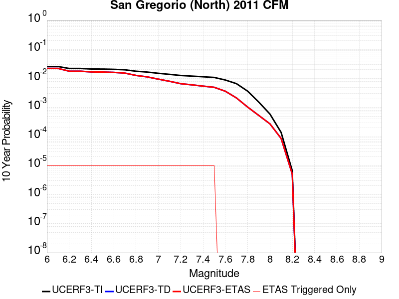 |

| Magnitude | 1 wk TI Prob | 1 wk TD Prob | 1 wk ETAS Prob | 1 wk ETAS/TD Gain | 1 wk ETAS Triggered Only | 1 mo TI Prob | 1 mo TD Prob | 1 mo ETAS Prob | 1 mo ETAS/TD Gain | 1 mo ETAS Triggered Only | 1 yr TI Prob | 1 yr TD Prob | 1 yr ETAS Prob | 1 yr ETAS/TD Gain | 1 yr ETAS Triggered Only | 10 yr TI Prob | 10 yr TD Prob | 10 yr ETAS Prob | 10 yr ETAS/TD Gain | 10 yr ETAS Triggered Only |
|-----|-----|-----|-----|-----|-----|-----|-----|-----|-----|-----|-----|-----|-----|-----|-----|-----|-----|-----|-----|-----|
| 6.0 | 5.0283932E-5 | 4.3057364E-5 | 4.3057364E-5 | 1.0 | 0.0 | 2.1548476E-4 | 1.8451859E-4 | 1.8451859E-4 | 1.0 | 0.0 | 0.0026203706 | 0.002244213 | 0.0022541904 | 1.0044459 | 1.0E-5 | 0.02589687 | 0.022296015 | 0.022305792 | 1.0004385 | 1.0E-5 |
| 6.1 | 5.0283932E-5 | 4.3057364E-5 | 4.3057364E-5 | 1.0 | 0.0 | 2.1548476E-4 | 1.8451859E-4 | 1.8451859E-4 | 1.0 | 0.0 | 0.0026203706 | 0.002244213 | 0.0022541904 | 1.0044459 | 1.0E-5 | 0.02589687 | 0.022296015 | 0.022305792 | 1.0004385 | 1.0E-5 |
| 6.2 | 4.2998647E-5 | 3.444111E-5 | 3.444111E-5 | 1.0 | 0.0 | 1.842669E-4 | 1.4759648E-4 | 1.4759648E-4 | 1.0 | 0.0 | 0.0022411412 | 0.0017955184 | 0.0018055005 | 1.0055594 | 1.0E-5 | 0.022186736 | 0.01788497 | 0.017894791 | 1.0005491 | 1.0E-5 |
| 6.3 | 4.2998647E-5 | 3.444111E-5 | 3.444111E-5 | 1.0 | 0.0 | 1.842669E-4 | 1.4759648E-4 | 1.4759648E-4 | 1.0 | 0.0 | 0.0022411412 | 0.0017955184 | 0.0018055005 | 1.0055594 | 1.0E-5 | 0.022186736 | 0.01788497 | 0.017894791 | 1.0005491 | 1.0E-5 |
| 6.4 | 4.1101295E-5 | 3.232631E-5 | 3.232631E-5 | 1.0 | 0.0 | 1.7613651E-4 | 1.3853403E-4 | 1.3853403E-4 | 1.0 | 0.0 | 0.0021423528 | 0.0016853603 | 0.0016953434 | 1.0059234 | 1.0E-5 | 0.02121817 | 0.016800702 | 0.016810533 | 1.0005852 | 1.0E-5 |
| 6.5 | 4.1032585E-5 | 3.224434E-5 | 3.224434E-5 | 1.0 | 0.0 | 1.7584208E-4 | 1.3818279E-4 | 1.3818279E-4 | 1.0 | 0.0 | 0.0021387753 | 0.0016810906 | 0.0016910738 | 1.0059385 | 1.0E-5 | 0.021183075 | 0.016758654 | 0.016768487 | 1.0005867 | 1.0E-5 |
| 6.6 | 4.011629E-5 | 3.1265947E-5 | 3.1265947E-5 | 1.0 | 0.0 | 1.7191563E-4 | 1.339901E-4 | 1.339901E-4 | 1.0 | 0.0 | 0.0020910634 | 0.0016301227 | 0.0016401063 | 1.0061245 | 1.0E-5 | 0.020714961 | 0.016257448 | 0.016267287 | 1.0006051 | 1.0E-5 |
| 6.7 | 3.8583938E-5 | 2.945298E-5 | 2.945298E-5 | 1.0 | 0.0 | 1.6534925E-4 | 1.2622103E-4 | 1.2622103E-4 | 1.0 | 0.0 | 0.0020112682 | 0.001535672 | 0.0015456567 | 1.0065018 | 1.0E-5 | 0.019931622 | 0.015326141 | 0.015335988 | 1.0006425 | 1.0E-5 |
| 6.8 | 3.44341E-5 | 2.4450235E-5 | 2.4450235E-5 | 1.0 | 0.0 | 1.4756636E-4 | 1.0478257E-4 | 1.0478257E-4 | 1.0 | 0.0 | 0.0017951399 | 0.0012749918 | 0.001284979 | 1.0078332 | 1.0E-5 | 0.017807078 | 0.012751591 | 0.012761463 | 1.0007743 | 1.0E-5 |
| 6.9 | 3.221199E-5 | 2.1777396E-5 | 2.1777396E-5 | 1.0 | 0.0 | 1.3804408E-4 | 9.33284E-5 | 9.33284E-5 | 1.0 | 0.0 | 0.0016793909 | 0.0011356892 | 0.0011456779 | 1.0087953 | 1.0E-5 | 0.01666756 | 0.011372628 | 0.011382514 | 1.0008693 | 1.0E-5 |
| 7.0 | 2.9186718E-5 | 1.814623E-5 | 1.814623E-5 | 1.0 | 0.0 | 1.2507994E-4 | 7.776726E-5 | 7.776726E-5 | 1.0 | 0.0 | 0.0015217843 | 9.464096E-4 | 9.564001E-4 | 1.0105562 | 1.0E-5 | 0.015114053 | 0.009496726 | 0.009506632 | 1.001043 | 1.0E-5 |
| 7.1 | 2.6840138E-5 | 1.5283857E-5 | 1.5283857E-5 | 1.0 | 0.0 | 1.1502409E-4 | 6.550061E-5 | 6.550061E-5 | 1.0 | 0.0 | 0.0013995186 | 7.9718005E-4 | 8.071721E-4 | 1.0125343 | 1.0E-5 | 0.013907375 | 0.008015611 | 0.008025531 | 1.0012375 | 1.0E-5 |
| 7.2 | 2.453002E-5 | 1.2606001E-5 | 1.2606001E-5 | 1.0 | 0.0 | 1.05124425E-4 | 5.4024604E-5 | 5.4024604E-5 | 1.0 | 0.0 | 0.0012791384 | 6.575517E-4 | 6.675451E-4 | 1.0151979 | 1.0E-5 | 0.012718005 | 0.006627464 | 0.0066373977 | 1.0014988 | 1.0E-5 |
| 7.3 | 2.3330727E-5 | 1.1488007E-5 | 1.1488007E-5 | 1.0 | 0.0 | 9.9985E-5 | 4.9233386E-5 | 4.9233386E-5 | 1.0 | 0.0 | 0.0012166376 | 5.9925206E-4 | 6.092461E-4 | 1.0166775 | 1.0E-5 | 0.012099981 | 0.006046337 | 0.0060562766 | 1.0016439 | 1.0E-5 |
| 7.4 | 2.2136466E-5 | 1.0368308E-5 | 1.0368308E-5 | 1.0 | 0.0 | 9.486712E-5 | 4.4434848E-5 | 4.4434848E-5 | 1.0 | 0.0 | 0.0011543952 | 5.4086023E-4 | 5.5085483E-4 | 1.0184791 | 1.0E-5 | 0.011484168 | 0.00546406 | 0.0054740054 | 1.0018201 | 1.0E-5 |
| 7.5 | 2.0994974E-5 | 9.42654E-6 | 9.42654E-6 | 1.0 | 0.0 | 8.997535E-5 | 4.039883E-5 | 4.039883E-5 | 1.0 | 0.0 | 0.0010948994 | 4.9174496E-4 | 5.017401E-4 | 1.0203258 | 1.0E-5 | 0.010895205 | 0.0049731764 | 0.0049831267 | 1.0020008 | 1.0E-5 |
| 7.6 | 1.7091823E-5 | 6.8931317E-6 | 6.8931317E-6 | 1.0 | 0.0 | 7.3248615E-5 | 2.954166E-5 | 2.954166E-5 | 1.0 | 0.0 | 8.9143694E-4 | 3.5961045E-4 | 3.5961045E-4 | 1.0 | 0.0 | 0.008878695 | 0.003648138 | 0.003648138 | 1.0 | 0.0 |
| 7.7 | 1.2772179E-5 | 4.0203245E-6 | 4.0203245E-6 | 1.0 | 0.0 | 5.473676E-5 | 1.7229848E-5 | 1.7229848E-5 | 1.0 | 0.0 | 6.6621625E-4 | 2.0975323E-4 | 2.0975323E-4 | 1.0 | 0.0 | 0.006642225 | 0.002136608 | 0.002136608 | 1.0 | 0.0 |
| 7.8 | 7.041923E-6 | 1.940301E-6 | 1.940301E-6 | 1.0 | 0.0 | 3.017932E-5 | 8.315549E-6 | 8.315549E-6 | 1.0 | 0.0 | 3.6737128E-4 | 1.0123711E-4 | 1.0123711E-4 | 1.0 | 0.0 | 0.0036676454 | 0.0010377198 | 0.0010377198 | 1.0 | 0.0 |
| 7.9 | 2.946768E-6 | 1.0032213E-6 | 1.0032213E-6 | 1.0 | 0.0 | 1.2628945E-5 | 4.2995125E-6 | 4.2995125E-6 | 1.0 | 0.0 | 1.5374656E-4 | 5.234531E-5 | 5.234531E-5 | 1.0 | 0.0 | 0.0015364023 | 5.339231E-4 | 5.339231E-4 | 1.0 | 0.0 |
| 8.0 | 1.1433375E-6 | 5.1810326E-7 | 5.1810326E-7 | 1.0 | 0.0 | 4.9000087E-6 | 2.2204406E-6 | 2.2204406E-6 | 1.0 | 0.0 | 5.965597E-5 | 2.703353E-5 | 2.703353E-5 | 1.0 | 0.0 | 5.963996E-4 | 2.7395724E-4 | 2.7395724E-4 | 1.0 | 0.0 |
| 8.1 | 2.6675295E-7 | 1.6288914E-7 | 1.6288914E-7 | 1.0 | 0.0 | 1.1432264E-6 | 6.9809613E-7 | 6.9809613E-7 | 1.0 | 0.0 | 1.3918692E-5 | 8.499287E-6 | 8.499287E-6 | 1.0 | 0.0 | 1.391782E-4 | 8.636855E-5 | 8.636855E-5 | 1.0 | 0.0 |
| 8.2 | 1.2704569E-8 | 9.4304795E-9 | 9.4304795E-9 | 1.0 | 0.0 | 5.444815E-8 | 4.041634E-8 | 4.041634E-8 | 1.0 | 0.0 | 6.629061E-7 | 4.920688E-7 | 4.920688E-7 | 1.0 | 0.0 | 6.629041E-6 | 5.1111956E-6 | 5.1111956E-6 | 1.0 | 0.0 |

## Almanor 2011 CFM
*[(top)](#table-of-contents)*

| 1 Week | 1 Month | 1 Year | 10 Year |
|-----|-----|-----|-----|
| 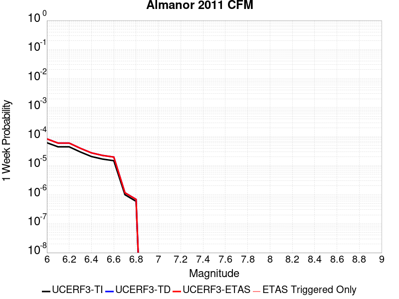 |  |  |  |

| Magnitude | 1 wk TI Prob | 1 wk TD Prob | 1 wk ETAS Prob | 1 wk ETAS/TD Gain | 1 wk ETAS Triggered Only | 1 mo TI Prob | 1 mo TD Prob | 1 mo ETAS Prob | 1 mo ETAS/TD Gain | 1 mo ETAS Triggered Only | 1 yr TI Prob | 1 yr TD Prob | 1 yr ETAS Prob | 1 yr ETAS/TD Gain | 1 yr ETAS Triggered Only | 10 yr TI Prob | 10 yr TD Prob | 10 yr ETAS Prob | 10 yr ETAS/TD Gain | 10 yr ETAS Triggered Only |
|-----|-----|-----|-----|-----|-----|-----|-----|-----|-----|-----|-----|-----|-----|-----|-----|-----|-----|-----|-----|-----|
| 6.0 | 6.1479834E-5 | 8.327275E-5 | 8.327275E-5 | 1.0 | 0.0 | 2.6345838E-4 | 3.5683662E-4 | 3.5683662E-4 | 1.0 | 0.0 | 0.0032028882 | 0.0043365126 | 0.0043464694 | 1.002296 | 1.0E-5 | 0.031571172 | 0.042586748 | 0.04259632 | 1.0002248 | 1.0E-5 |
| 6.1 | 4.4387216E-5 | 5.976769E-5 | 5.976769E-5 | 1.0 | 0.0 | 1.9021705E-4 | 2.5612462E-4 | 2.5612462E-4 | 1.0 | 0.0 | 0.0023134327 | 0.0031143634 | 0.0031243323 | 1.0032009 | 1.0E-5 | 0.022894967 | 0.030755702 | 0.030765396 | 1.0003152 | 1.0E-5 |
| 6.2 | 4.4387216E-5 | 5.976769E-5 | 5.976769E-5 | 1.0 | 0.0 | 1.9021705E-4 | 2.5612462E-4 | 2.5612462E-4 | 1.0 | 0.0 | 0.0023134327 | 0.0031143634 | 0.0031243323 | 1.0032009 | 1.0E-5 | 0.022894967 | 0.030755702 | 0.030765396 | 1.0003152 | 1.0E-5 |
| 6.3 | 2.9523822E-5 | 3.9547132E-5 | 3.9547132E-5 | 1.0 | 0.0 | 1.2652454E-4 | 1.6947792E-4 | 1.6947792E-4 | 1.0 | 0.0 | 0.0015393476 | 0.002061801 | 0.002061801 | 1.0 | 0.0 | 0.015287281 | 0.020461192 | 0.020461192 | 1.0 | 0.0 |
| 6.4 | 2.0512744E-5 | 2.7430755E-5 | 2.7430755E-5 | 1.0 | 0.0 | 8.79088E-5 | 1.1755609E-4 | 1.1755609E-4 | 1.0 | 0.0 | 0.001069764 | 0.0014306227 | 0.0014306227 | 1.0 | 0.0 | 0.010646289 | 0.014244635 | 0.014244635 | 1.0 | 0.0 |
| 6.5 | 1.6750226E-5 | 2.2390459E-5 | 2.2390459E-5 | 1.0 | 0.0 | 7.178471E-5 | 9.595651E-5 | 9.595651E-5 | 1.0 | 0.0 | 8.7362836E-4 | 0.0011679651 | 0.0011679651 | 1.0 | 0.0 | 0.008702018 | 0.011649241 | 0.011649241 | 1.0 | 0.0 |
| 6.6 | 1.4745303E-5 | 1.9706944E-5 | 1.9706944E-5 | 1.0 | 0.0 | 6.319262E-5 | 8.445667E-5 | 8.445667E-5 | 1.0 | 0.0 | 7.690986E-4 | 0.0010281025 | 0.0010281025 | 1.0 | 0.0 | 0.0076644225 | 0.01026517 | 0.01026517 | 1.0 | 0.0 |
| 6.7 | 9.951145E-7 | 1.1616371E-6 | 1.1616371E-6 | 1.0 | 0.0 | 4.26477E-6 | 4.978436E-6 | 4.978436E-6 | 1.0 | 0.0 | 5.1922336E-5 | 6.061095E-5 | 6.061095E-5 | 1.0 | 0.0 | 5.1910203E-4 | 6.059614E-4 | 6.059614E-4 | 1.0 | 0.0 |
| 6.8 | 5.866312E-7 | 6.8493983E-7 | 6.8493983E-7 | 1.0 | 0.0 | 2.5141312E-6 | 2.935454E-6 | 2.935454E-6 | 1.0 | 0.0 | 3.0609117E-5 | 3.5738696E-5 | 3.5738696E-5 | 1.0 | 0.0 | 3.06049E-4 | 3.573423E-4 | 3.573423E-4 | 1.0 | 0.0 |

## Elmore Ranch
*[(top)](#table-of-contents)*

| 1 Week | 1 Month | 1 Year | 10 Year |
|-----|-----|-----|-----|
|  |  |  |  |

| Magnitude | 1 wk TI Prob | 1 wk TD Prob | 1 wk ETAS Prob | 1 wk ETAS/TD Gain | 1 wk ETAS Triggered Only | 1 mo TI Prob | 1 mo TD Prob | 1 mo ETAS Prob | 1 mo ETAS/TD Gain | 1 mo ETAS Triggered Only | 1 yr TI Prob | 1 yr TD Prob | 1 yr ETAS Prob | 1 yr ETAS/TD Gain | 1 yr ETAS Triggered Only | 10 yr TI Prob | 10 yr TD Prob | 10 yr ETAS Prob | 10 yr ETAS/TD Gain | 10 yr ETAS Triggered Only |
|-----|-----|-----|-----|-----|-----|-----|-----|-----|-----|-----|-----|-----|-----|-----|-----|-----|-----|-----|-----|-----|
| 6.0 | 9.102099E-5 | 8.953882E-5 | 8.953882E-5 | 1.0 | 0.0 | 3.9003167E-4 | 3.8369134E-4 | 3.8369134E-4 | 1.0 | 0.0 | 0.0047383 | 0.0046621473 | 0.0046621473 | 1.0 | 0.0 | 0.046385348 | 0.045838013 | 0.045847554 | 1.0002081 | 1.0E-5 |
| 6.1 | 3.8306698E-5 | 4.1492094E-5 | 4.1492094E-5 | 1.0 | 0.0 | 1.6416123E-4 | 1.7781384E-4 | 1.7781384E-4 | 1.0 | 0.0 | 0.0019968306 | 0.0021632211 | 0.0021632211 | 1.0 | 0.0 | 0.019789828 | 0.021595031 | 0.021604815 | 1.0004531 | 1.0E-5 |
| 6.2 | 3.8306698E-5 | 4.1492094E-5 | 4.1492094E-5 | 1.0 | 0.0 | 1.6416123E-4 | 1.7781384E-4 | 1.7781384E-4 | 1.0 | 0.0 | 0.0019968306 | 0.0021632211 | 0.0021632211 | 1.0 | 0.0 | 0.019789828 | 0.021595031 | 0.021604815 | 1.0004531 | 1.0E-5 |
| 6.3 | 3.3197924E-5 | 3.655041E-5 | 3.655041E-5 | 1.0 | 0.0 | 1.4226905E-4 | 1.5663917E-4 | 1.5663917E-4 | 1.0 | 0.0 | 0.0017307495 | 0.0019059788 | 0.0019059788 | 1.0 | 0.0 | 0.017173318 | 0.0190574 | 0.01906721 | 1.0005147 | 1.0E-5 |
| 6.4 | 2.5148964E-5 | 2.7420736E-5 | 2.7420736E-5 | 1.0 | 0.0 | 1.0777682E-4 | 1.17515796E-4 | 1.17515796E-4 | 1.0 | 0.0 | 0.0013113929 | 0.0014304637 | 0.0014304637 | 1.0 | 0.0 | 0.01303681 | 0.014365338 | 0.014375194 | 1.0006862 | 1.0E-5 |
| 6.5 | 2.5148964E-5 | 2.7420736E-5 | 2.7420736E-5 | 1.0 | 0.0 | 1.0777682E-4 | 1.17515796E-4 | 1.17515796E-4 | 1.0 | 0.0 | 0.0013113929 | 0.0014304637 | 0.0014304637 | 1.0 | 0.0 | 0.01303681 | 0.014365338 | 0.014375194 | 1.0006862 | 1.0E-5 |

## San Gabriel (Extension)
*[(top)](#table-of-contents)*

| 1 Week | 1 Month | 1 Year | 10 Year |
|-----|-----|-----|-----|
| 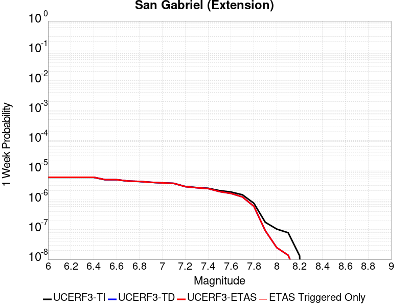 |  |  |  |

| Magnitude | 1 wk TI Prob | 1 wk TD Prob | 1 wk ETAS Prob | 1 wk ETAS/TD Gain | 1 wk ETAS Triggered Only | 1 mo TI Prob | 1 mo TD Prob | 1 mo ETAS Prob | 1 mo ETAS/TD Gain | 1 mo ETAS Triggered Only | 1 yr TI Prob | 1 yr TD Prob | 1 yr ETAS Prob | 1 yr ETAS/TD Gain | 1 yr ETAS Triggered Only | 10 yr TI Prob | 10 yr TD Prob | 10 yr ETAS Prob | 10 yr ETAS/TD Gain | 10 yr ETAS Triggered Only |
|-----|-----|-----|-----|-----|-----|-----|-----|-----|-----|-----|-----|-----|-----|-----|-----|-----|-----|-----|-----|-----|
| 6.0 | 5.6486106E-6 | 5.716865E-6 | 5.716865E-6 | 1.0 | 0.0 | 2.4208108E-5 | 2.4500627E-5 | 2.4500627E-5 | 1.0 | 0.0 | 2.9469383E-4 | 2.9825556E-4 | 2.9825556E-4 | 1.0 | 0.0 | 0.0029430336 | 0.0029786804 | 0.0029886505 | 1.0033472 | 1.0E-5 |
| 6.1 | 5.6486106E-6 | 5.716865E-6 | 5.716865E-6 | 1.0 | 0.0 | 2.4208108E-5 | 2.4500627E-5 | 2.4500627E-5 | 1.0 | 0.0 | 2.9469383E-4 | 2.9825556E-4 | 2.9825556E-4 | 1.0 | 0.0 | 0.0029430336 | 0.0029786804 | 0.0029886505 | 1.0033472 | 1.0E-5 |
| 6.2 | 5.6486106E-6 | 5.716865E-6 | 5.716865E-6 | 1.0 | 0.0 | 2.4208108E-5 | 2.4500627E-5 | 2.4500627E-5 | 1.0 | 0.0 | 2.9469383E-4 | 2.9825556E-4 | 2.9825556E-4 | 1.0 | 0.0 | 0.0029430336 | 0.0029786804 | 0.0029886505 | 1.0033472 | 1.0E-5 |
| 6.3 | 5.6486106E-6 | 5.716865E-6 | 5.716865E-6 | 1.0 | 0.0 | 2.4208108E-5 | 2.4500627E-5 | 2.4500627E-5 | 1.0 | 0.0 | 2.9469383E-4 | 2.9825556E-4 | 2.9825556E-4 | 1.0 | 0.0 | 0.0029430336 | 0.0029786804 | 0.0029886505 | 1.0033472 | 1.0E-5 |
| 6.4 | 5.6486106E-6 | 5.716865E-6 | 5.716865E-6 | 1.0 | 0.0 | 2.4208108E-5 | 2.4500627E-5 | 2.4500627E-5 | 1.0 | 0.0 | 2.9469383E-4 | 2.9825556E-4 | 2.9825556E-4 | 1.0 | 0.0 | 0.0029430336 | 0.0029786804 | 0.0029886505 | 1.0033472 | 1.0E-5 |
| 6.5 | 4.7134554E-6 | 4.7542885E-6 | 4.7542885E-6 | 1.0 | 0.0 | 2.0200367E-5 | 2.0375368E-5 | 2.0375368E-5 | 1.0 | 0.0 | 2.459117E-4 | 2.4804272E-4 | 2.4804272E-4 | 1.0 | 0.0 | 0.0024563975 | 0.0024777441 | 0.0024877193 | 1.0040259 | 1.0E-5 |
| 6.6 | 4.7134554E-6 | 4.7542885E-6 | 4.7542885E-6 | 1.0 | 0.0 | 2.0200367E-5 | 2.0375368E-5 | 2.0375368E-5 | 1.0 | 0.0 | 2.459117E-4 | 2.4804272E-4 | 2.4804272E-4 | 1.0 | 0.0 | 0.0024563975 | 0.0024777441 | 0.0024877193 | 1.0040259 | 1.0E-5 |
| 6.7 | 4.2468837E-6 | 4.274106E-6 | 4.274106E-6 | 1.0 | 0.0 | 1.8200803E-5 | 1.8317472E-5 | 1.8317472E-5 | 1.0 | 0.0 | 2.2157225E-4 | 2.2299313E-4 | 2.2299313E-4 | 1.0 | 0.0 | 0.0022135144 | 0.0022277667 | 0.0022377444 | 1.0044788 | 1.0E-5 |
| 6.8 | 4.1180615E-6 | 4.1414955E-6 | 4.1414955E-6 | 1.0 | 0.0 | 1.7648716E-5 | 1.774915E-5 | 1.774915E-5 | 1.0 | 0.0 | 2.1485193E-4 | 2.1607519E-4 | 2.1607519E-4 | 1.0 | 0.0 | 0.0021464431 | 0.002158723 | 0.0021687015 | 1.0046223 | 1.0E-5 |
| 6.9 | 3.863861E-6 | 3.8798107E-6 | 3.8798107E-6 | 1.0 | 0.0 | 1.65593E-5 | 1.6627657E-5 | 1.6627657E-5 | 1.0 | 0.0 | 2.0159081E-4 | 2.0242362E-4 | 2.0242362E-4 | 1.0 | 0.0 | 0.0020140803 | 0.0020224608 | 0.0020324406 | 1.0049344 | 1.0E-5 |
| 7.0 | 3.6947372E-6 | 3.7057098E-6 | 3.7057098E-6 | 1.0 | 0.0 | 1.5834492E-5 | 1.588152E-5 | 1.588152E-5 | 1.0 | 0.0 | 1.9276788E-4 | 1.9334102E-4 | 1.9334102E-4 | 1.0 | 0.0 | 0.0019260074 | 0.0019317956 | 0.0019317956 | 1.0 | 0.0 |
| 7.1 | 3.5686835E-6 | 3.5729302E-6 | 3.5729302E-6 | 1.0 | 0.0 | 1.5294268E-5 | 1.5312471E-5 | 1.5312471E-5 | 1.0 | 0.0 | 1.861918E-4 | 1.8641405E-4 | 1.8641405E-4 | 1.0 | 0.0 | 0.0018603588 | 0.0018626436 | 0.0018626436 | 1.0 | 0.0 |
| 7.2 | 2.8023446E-6 | 2.7768212E-6 | 2.7768212E-6 | 1.0 | 0.0 | 1.2009994E-5 | 1.1900608E-5 | 1.1900608E-5 | 1.0 | 0.0 | 1.4621185E-4 | 1.4488038E-4 | 1.4488038E-4 | 1.0 | 0.0 | 0.001461157 | 0.0014478711 | 0.0014478711 | 1.0 | 0.0 |
| 7.3 | 2.5843012E-6 | 2.545996E-6 | 2.545996E-6 | 1.0 | 0.0 | 1.1075529E-5 | 1.0911367E-5 | 1.0911367E-5 | 1.0 | 0.0 | 1.3483623E-4 | 1.328379E-4 | 1.328379E-4 | 1.0 | 0.0 | 0.0013475444 | 0.0013275956 | 0.0013275956 | 1.0 | 0.0 |
| 7.4 | 2.4464468E-6 | 2.3966954E-6 | 2.3966954E-6 | 1.0 | 0.0 | 1.04847295E-5 | 1.0271512E-5 | 1.0271512E-5 | 1.0 | 0.0 | 1.276441E-4 | 1.2504858E-4 | 1.2504858E-4 | 1.0 | 0.0 | 0.0012757082 | 0.0012497926 | 0.0012497926 | 1.0 | 0.0 |
| 7.5 | 2.0420266E-6 | 1.8910624E-6 | 1.8910624E-6 | 1.0 | 0.0 | 8.751514E-6 | 8.104528E-6 | 8.104528E-6 | 1.0 | 0.0 | 1.0654447E-4 | 9.86682E-5 | 9.86682E-5 | 1.0 | 0.0 | 0.001064934 | 9.862483E-4 | 9.862483E-4 | 1.0 | 0.0 |
| 7.6 | 1.8326596E-6 | 1.6398471E-6 | 1.6398471E-6 | 1.0 | 0.0 | 7.854232E-6 | 7.0278975E-6 | 7.0278975E-6 | 1.0 | 0.0 | 9.562107E-5 | 8.556132E-5 | 8.556132E-5 | 1.0 | 0.0 | 9.5579936E-4 | 8.552869E-4 | 8.552869E-4 | 1.0 | 0.0 |
| 7.7 | 1.4786998E-6 | 1.2523893E-6 | 1.2523893E-6 | 1.0 | 0.0 | 6.3372695E-6 | 5.3673716E-6 | 5.3673716E-6 | 1.0 | 0.0 | 7.715353E-5 | 6.5345805E-5 | 6.5345805E-5 | 1.0 | 0.0 | 7.7126746E-4 | 6.532719E-4 | 6.532719E-4 | 1.0 | 0.0 |
| 7.8 | 7.6975533E-7 | 6.0693935E-7 | 6.0693935E-7 | 1.0 | 0.0 | 3.2989474E-6 | 2.601166E-6 | 2.601166E-6 | 1.0 | 0.0 | 4.0163945E-5 | 3.166874E-5 | 3.166874E-5 | 1.0 | 0.0 | 4.0156685E-4 | 3.1664647E-4 | 3.1664647E-4 | 1.0 | 0.0 |
| 7.9 | 1.7645915E-7 | 9.2123884E-8 | 9.2123884E-8 | 1.0 | 0.0 | 7.562533E-7 | 3.948166E-7 | 3.948166E-7 | 1.0 | 0.0 | 9.207345E-6 | 4.8068814E-6 | 4.8068814E-6 | 1.0 | 0.0 | 9.206964E-5 | 4.807158E-5 | 4.807158E-5 | 1.0 | 0.0 |
| 8.0 | 1.0463461E-7 | 2.4939393E-8 | 2.4939393E-8 | 1.0 | 0.0 | 4.4843398E-7 | 1.06883114E-7 | 1.06883114E-7 | 1.0 | 0.0 | 5.45967E-6 | 1.3013012E-6 | 1.3013012E-6 | 1.0 | 0.0 | 5.459536E-5 | 1.3016733E-5 | 1.3016733E-5 | 1.0 | 0.0 |
| 8.1 | 7.875717E-8 | 1.3858832E-8 | 1.3858832E-8 | 1.0 | 0.0 | 3.3753068E-7 | 5.9394996E-8 | 5.9394996E-8 | 1.0 | 0.0 | 4.109428E-6 | 7.2313384E-7 | 7.2313384E-7 | 1.0 | 0.0 | 4.109352E-5 | 7.2351127E-6 | 7.2351127E-6 | 1.0 | 0.0 |
| 8.2 | 1.33163E-8 | 1.7722606E-9 | 1.7722606E-9 | 1.0 | 0.0 | 5.7069855E-8 | 7.5954025E-9 | 7.5954025E-9 | 1.0 | 0.0 | 6.9482525E-7 | 9.2474025E-8 | 9.2474025E-8 | 1.0 | 0.0 | 6.9482307E-6 | 9.2669507E-7 | 9.2669507E-7 | 1.0 | 0.0 |

## Newport-Inglewood (Offshore)
*[(top)](#table-of-contents)*

| 1 Week | 1 Month | 1 Year | 10 Year |
|-----|-----|-----|-----|
|  |  | 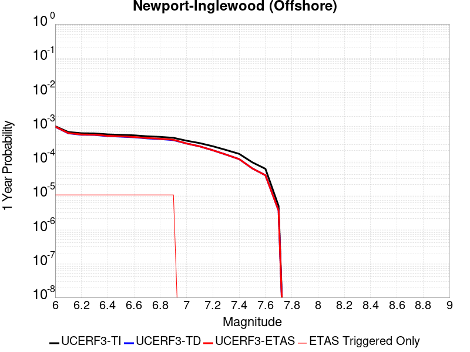 |  |

| Magnitude | 1 wk TI Prob | 1 wk TD Prob | 1 wk ETAS Prob | 1 wk ETAS/TD Gain | 1 wk ETAS Triggered Only | 1 mo TI Prob | 1 mo TD Prob | 1 mo ETAS Prob | 1 mo ETAS/TD Gain | 1 mo ETAS Triggered Only | 1 yr TI Prob | 1 yr TD Prob | 1 yr ETAS Prob | 1 yr ETAS/TD Gain | 1 yr ETAS Triggered Only | 10 yr TI Prob | 10 yr TD Prob | 10 yr ETAS Prob | 10 yr ETAS/TD Gain | 10 yr ETAS Triggered Only |
|-----|-----|-----|-----|-----|-----|-----|-----|-----|-----|-----|-----|-----|-----|-----|-----|-----|-----|-----|-----|-----|
| 6.0 | 1.9626508E-5 | 1.8965404E-5 | 1.8965404E-5 | 1.0 | 0.0 | 8.411089E-5 | 8.127784E-5 | 8.127784E-5 | 1.0 | 0.0 | 0.001023569 | 9.89121E-4 | 9.991111E-4 | 1.0101 | 1.0E-5 | 0.010188672 | 0.009848528 | 0.009858429 | 1.0010054 | 1.0E-5 |
| 6.1 | 1.331886E-5 | 1.2218134E-5 | 1.2218134E-5 | 1.0 | 0.0 | 5.707958E-5 | 5.2362386E-5 | 5.2362386E-5 | 1.0 | 0.0 | 6.947222E-4 | 6.373271E-4 | 6.473207E-4 | 1.0156806 | 1.0E-5 | 0.006925544 | 0.0063551706 | 0.006365107 | 1.0015635 | 1.0E-5 |
| 6.2 | 1.2250852E-5 | 1.1076069E-5 | 1.1076069E-5 | 1.0 | 0.0 | 5.2502597E-5 | 4.7468013E-5 | 4.7468013E-5 | 1.0 | 0.0 | 6.3903164E-4 | 5.777708E-4 | 5.87765E-4 | 1.0172979 | 1.0E-5 | 0.006371971 | 0.0057628076 | 0.00577275 | 1.0017253 | 1.0E-5 |
| 6.3 | 1.2106258E-5 | 1.0918931E-5 | 1.0918931E-5 | 1.0 | 0.0 | 5.1882926E-5 | 4.6794587E-5 | 4.6794587E-5 | 1.0 | 0.0 | 6.3149154E-4 | 5.695761E-4 | 5.795704E-4 | 1.0175469 | 1.0E-5 | 0.0062970007 | 0.00568128 | 0.0056912233 | 1.0017501 | 1.0E-5 |
| 6.4 | 1.1348758E-5 | 1.0109401E-5 | 1.0109401E-5 | 1.0 | 0.0 | 4.8636626E-5 | 4.332529E-5 | 4.332529E-5 | 1.0 | 0.0 | 5.919901E-4 | 5.2735856E-4 | 5.373533E-4 | 1.0189525 | 1.0E-5 | 0.005904155 | 0.005261167 | 0.0052711144 | 1.0018908 | 1.0E-5 |
| 6.5 | 1.100837E-5 | 9.743428E-6 | 9.743428E-6 | 1.0 | 0.0 | 4.7177873E-5 | 4.1756884E-5 | 4.1756884E-5 | 1.0 | 0.0 | 5.7423924E-4 | 5.0827226E-4 | 5.1826716E-4 | 1.0196645 | 1.0E-5 | 0.005727576 | 0.005071189 | 0.005081138 | 1.001962 | 1.0E-5 |
| 6.6 | 1.0634696E-5 | 9.345582E-6 | 9.345582E-6 | 1.0 | 0.0 | 4.557647E-5 | 4.0051884E-5 | 4.0051884E-5 | 1.0 | 0.0 | 5.5475225E-4 | 4.8752333E-4 | 4.9751846E-4 | 1.0205019 | 1.0E-5 | 0.0055336943 | 0.0048646247 | 0.004874576 | 1.0020456 | 1.0E-5 |
| 6.7 | 9.9780855E-6 | 8.66795E-6 | 8.66795E-6 | 1.0 | 0.0 | 4.276252E-5 | 3.7147835E-5 | 3.7147835E-5 | 1.0 | 0.0 | 5.205093E-4 | 4.521817E-4 | 4.6217718E-4 | 1.022105 | 1.0E-5 | 0.0051929182 | 0.0045126956 | 0.0045226505 | 1.002206 | 1.0E-5 |
| 6.8 | 9.59546E-6 | 8.272984E-6 | 8.272984E-6 | 1.0 | 0.0 | 4.1122752E-5 | 3.5455167E-5 | 3.5455167E-5 | 1.0 | 0.0 | 5.0055445E-4 | 4.3158184E-4 | 4.4157752E-4 | 1.0231606 | 1.0E-5 | 0.004994285 | 0.0043075127 | 0.0043174694 | 1.0023115 | 1.0E-5 |
| 6.9 | 9.000614E-6 | 7.706874E-6 | 7.706874E-6 | 1.0 | 0.0 | 3.857349E-5 | 3.3029046E-5 | 3.3029046E-5 | 1.0 | 0.0 | 4.6953102E-4 | 4.020551E-4 | 4.1205107E-4 | 1.0248622 | 1.0E-5 | 0.004685402 | 0.0040133484 | 0.0040233084 | 1.0024817 | 1.0E-5 |
| 7.0 | 7.4070194E-6 | 6.148915E-6 | 6.148915E-6 | 1.0 | 0.0 | 3.1743984E-5 | 2.6352229E-5 | 2.6352229E-5 | 1.0 | 0.0 | 3.8641447E-4 | 3.207913E-4 | 3.207913E-4 | 1.0 | 0.0 | 0.0038574322 | 0.0032033022 | 0.0032033022 | 1.0 | 0.0 |
| 7.1 | 6.299615E-6 | 5.0566114E-6 | 5.0566114E-6 | 1.0 | 0.0 | 2.699807E-5 | 2.1671012E-5 | 2.1671012E-5 | 1.0 | 0.0 | 3.2865192E-4 | 2.6381275E-4 | 2.6381275E-4 | 1.0 | 0.0 | 0.003281663 | 0.0026350105 | 0.0026350105 | 1.0 | 0.0 |
| 7.2 | 5.096653E-6 | 3.892782E-6 | 3.892782E-6 | 1.0 | 0.0 | 2.1842614E-5 | 1.6683245E-5 | 1.6683245E-5 | 1.0 | 0.0 | 2.6590136E-4 | 2.0309968E-4 | 2.0309968E-4 | 1.0 | 0.0 | 0.0026558342 | 0.002029152 | 0.002029152 | 1.0 | 0.0 |
| 7.3 | 3.9753018E-6 | 2.9098799E-6 | 2.9098799E-6 | 1.0 | 0.0 | 1.7036897E-5 | 1.2470854E-5 | 1.2470854E-5 | 1.0 | 0.0 | 2.0740448E-4 | 1.5182215E-4 | 1.5182215E-4 | 1.0 | 0.0 | 0.00207211 | 0.0015171923 | 0.0015171923 | 1.0 | 0.0 |
| 7.4 | 3.0568392E-6 | 2.144974E-6 | 2.144974E-6 | 1.0 | 0.0 | 1.3100675E-5 | 9.192714E-6 | 9.192714E-6 | 1.0 | 0.0 | 1.5948903E-4 | 1.119156E-4 | 1.119156E-4 | 1.0 | 0.0 | 0.0015937461 | 0.0011185987 | 0.0011185987 | 1.0 | 0.0 |
| 7.5 | 1.7279019E-6 | 1.1469651E-6 | 1.1469651E-6 | 1.0 | 0.0 | 7.405273E-6 | 4.915556E-6 | 4.915556E-6 | 1.0 | 0.0 | 9.015547E-5 | 5.984529E-5 | 5.984529E-5 | 1.0 | 0.0 | 9.01189E-4 | 5.9829565E-4 | 5.9829565E-4 | 1.0 | 0.0 |
| 7.6 | 1.1156416E-6 | 7.2229625E-7 | 7.2229625E-7 | 1.0 | 0.0 | 4.7813123E-6 | 3.0955518E-6 | 3.0955518E-6 | 1.0 | 0.0 | 5.821092E-5 | 3.7687714E-5 | 3.7687714E-5 | 1.0 | 0.0 | 5.8195676E-4 | 3.7681556E-4 | 3.7681556E-4 | 1.0 | 0.0 |
| 7.7 | 9.117973E-8 | 6.7342256E-8 | 6.7342256E-8 | 1.0 | 0.0 | 3.907702E-7 | 2.8860964E-7 | 2.8860964E-7 | 1.0 | 0.0 | 4.757617E-6 | 3.5138169E-6 | 3.5138169E-6 | 1.0 | 0.0 | 4.7575148E-5 | 3.5137644E-5 | 3.5137644E-5 | 1.0 | 0.0 |

## Superstition Hills
*[(top)](#table-of-contents)*

| 1 Week | 1 Month | 1 Year | 10 Year |
|-----|-----|-----|-----|
|  |  |  |  |

| Magnitude | 1 wk TI Prob | 1 wk TD Prob | 1 wk ETAS Prob | 1 wk ETAS/TD Gain | 1 wk ETAS Triggered Only | 1 mo TI Prob | 1 mo TD Prob | 1 mo ETAS Prob | 1 mo ETAS/TD Gain | 1 mo ETAS Triggered Only | 1 yr TI Prob | 1 yr TD Prob | 1 yr ETAS Prob | 1 yr ETAS/TD Gain | 1 yr ETAS Triggered Only | 10 yr TI Prob | 10 yr TD Prob | 10 yr ETAS Prob | 10 yr ETAS/TD Gain | 10 yr ETAS Triggered Only |
|-----|-----|-----|-----|-----|-----|-----|-----|-----|-----|-----|-----|-----|-----|-----|-----|-----|-----|-----|-----|-----|
| 6.0 | 6.6865185E-5 | 1.4137964E-5 | 1.4137964E-5 | 1.0 | 0.0 | 2.8653358E-4 | 6.0589962E-5 | 6.0589962E-5 | 1.0 | 0.0 | 0.0034829667 | 7.374493E-4 | 7.374493E-4 | 1.0 | 0.0 | 0.03428881 | 0.007520324 | 0.0075302487 | 1.0013198 | 1.0E-5 |
| 6.1 | 6.544851E-5 | 1.4137964E-5 | 1.4137964E-5 | 1.0 | 0.0 | 2.8046346E-4 | 6.0589962E-5 | 6.0589962E-5 | 1.0 | 0.0 | 0.0034092965 | 7.3744927E-4 | 7.3744927E-4 | 1.0 | 0.0 | 0.033574644 | 0.007520323 | 0.0075302483 | 1.0013198 | 1.0E-5 |
| 6.2 | 6.544851E-5 | 1.4137964E-5 | 1.4137964E-5 | 1.0 | 0.0 | 2.8046346E-4 | 6.0589962E-5 | 6.0589962E-5 | 1.0 | 0.0 | 0.0034092965 | 7.3744927E-4 | 7.3744927E-4 | 1.0 | 0.0 | 0.033574644 | 0.007520323 | 0.0075302483 | 1.0013198 | 1.0E-5 |
| 6.3 | 5.2402065E-5 | 1.4137963E-5 | 1.4137963E-5 | 1.0 | 0.0 | 2.2456095E-4 | 6.0589955E-5 | 6.0589955E-5 | 1.0 | 0.0 | 0.0027306017 | 7.3744927E-4 | 7.3744927E-4 | 1.0 | 0.0 | 0.02697292 | 0.0075203185 | 0.007530243 | 1.0013198 | 1.0E-5 |
| 6.4 | 4.542238E-5 | 1.4137963E-5 | 1.4137963E-5 | 1.0 | 0.0 | 1.9465282E-4 | 6.0589955E-5 | 6.0589955E-5 | 1.0 | 0.0 | 0.0023673223 | 7.374492E-4 | 7.374492E-4 | 1.0 | 0.0 | 0.023422617 | 0.007520316 | 0.007530241 | 1.0013198 | 1.0E-5 |
| 6.5 | 2.9672969E-5 | 1.4137962E-5 | 1.4137962E-5 | 1.0 | 0.0 | 1.2716366E-4 | 6.058995E-5 | 6.058995E-5 | 1.0 | 0.0 | 0.0015471181 | 7.3744915E-4 | 7.3744915E-4 | 1.0 | 0.0 | 0.015363912 | 0.0075203106 | 0.007530235 | 1.0013198 | 1.0E-5 |
| 6.6 | 2.6056105E-5 | 1.3803733E-5 | 1.3803733E-5 | 1.0 | 0.0 | 1.1166424E-4 | 5.9157603E-5 | 5.9157603E-5 | 1.0 | 0.0 | 0.0013586642 | 7.200219E-4 | 7.200219E-4 | 1.0 | 0.0 | 0.013503874 | 0.0073447023 | 0.0073546288 | 1.0013515 | 1.0E-5 |
| 6.7 | 1.4611248E-5 | 1.33836265E-5 | 1.33836265E-5 | 1.0 | 0.0 | 6.261813E-5 | 5.735723E-5 | 5.735723E-5 | 1.0 | 0.0 | 7.6210906E-4 | 6.9811643E-4 | 6.9811643E-4 | 1.0 | 0.0 | 0.0075950073 | 0.0071258806 | 0.0071358094 | 1.0013933 | 1.0E-5 |
| 6.8 | 1.30607E-5 | 1.0978952E-5 | 1.0978952E-5 | 1.0 | 0.0 | 5.597323E-5 | 4.705185E-5 | 4.705185E-5 | 1.0 | 0.0 | 6.8126095E-4 | 5.7271443E-4 | 5.7271443E-4 | 1.0 | 0.0 | 0.006791762 | 0.0058737816 | 0.0058837226 | 1.0016925 | 1.0E-5 |
| 6.9 | 1.0443096E-5 | 8.195309E-6 | 8.195309E-6 | 1.0 | 0.0 | 4.4755358E-5 | 3.5122295E-5 | 3.5122295E-5 | 1.0 | 0.0 | 5.447602E-4 | 4.2753236E-4 | 4.2753236E-4 | 1.0 | 0.0 | 0.005434267 | 0.004409312 | 0.0044192676 | 1.002258 | 1.0E-5 |
| 7.0 | 8.045912E-6 | 6.7396586E-6 | 6.7396586E-6 | 1.0 | 0.0 | 3.4482026E-5 | 2.8883936E-5 | 2.8883936E-5 | 1.0 | 0.0 | 4.197378E-4 | 3.5160623E-4 | 3.5160623E-4 | 1.0 | 0.0 | 0.0041894587 | 0.003633458 | 0.0036434217 | 1.0027422 | 1.0E-5 |
| 7.1 | 8.045912E-6 | 6.7396586E-6 | 6.7396586E-6 | 1.0 | 0.0 | 3.4482026E-5 | 2.8883936E-5 | 2.8883936E-5 | 1.0 | 0.0 | 4.197378E-4 | 3.5160623E-4 | 3.5160623E-4 | 1.0 | 0.0 | 0.0041894587 | 0.003633458 | 0.0036434217 | 1.0027422 | 1.0E-5 |
| 7.2 | 7.375506E-6 | 6.2465865E-6 | 6.2465865E-6 | 1.0 | 0.0 | 3.1608928E-5 | 2.6770816E-5 | 2.6770816E-5 | 1.0 | 0.0 | 3.8477074E-4 | 3.258868E-4 | 3.258868E-4 | 1.0 | 0.0 | 0.003841052 | 0.0033740315 | 0.0033839978 | 1.0029538 | 1.0E-5 |
| 7.3 | 6.6063913E-6 | 5.7990214E-6 | 5.7990214E-6 | 1.0 | 0.0 | 2.8312797E-5 | 2.4852716E-5 | 2.4852716E-5 | 1.0 | 0.0 | 3.446538E-4 | 3.0254052E-4 | 3.0254052E-4 | 1.0 | 0.0 | 0.0034411973 | 0.003138291 | 0.0031482596 | 1.0031765 | 1.0E-5 |
| 7.4 | 6.4313126E-6 | 5.6804492E-6 | 5.6804492E-6 | 1.0 | 0.0 | 2.7562477E-5 | 2.434456E-5 | 2.434456E-5 | 1.0 | 0.0 | 3.355215E-4 | 2.963554E-4 | 2.963554E-4 | 1.0 | 0.0 | 0.0033501536 | 0.0030760434 | 0.0030860128 | 1.003241 | 1.0E-5 |
| 7.5 | 6.0742927E-6 | 5.476284E-6 | 5.476284E-6 | 1.0 | 0.0 | 2.6032423E-5 | 2.3469582E-5 | 2.3469582E-5 | 1.0 | 0.0 | 3.1689866E-4 | 2.8570538E-4 | 2.8570538E-4 | 1.0 | 0.0 | 0.0031644711 | 0.0029679 | 0.0029778702 | 1.0033594 | 1.0E-5 |
| 7.6 | 5.6987187E-6 | 5.2945084E-6 | 5.2945084E-6 | 1.0 | 0.0 | 2.4422852E-5 | 2.2690558E-5 | 2.2690558E-5 | 1.0 | 0.0 | 2.9730765E-4 | 2.7622317E-4 | 2.7622317E-4 | 1.0 | 0.0 | 0.002969102 | 0.00287116 | 0.0028811314 | 1.0034729 | 1.0E-5 |
| 7.7 | 5.1658035E-6 | 4.9255273E-6 | 4.9255273E-6 | 1.0 | 0.0 | 2.2138971E-5 | 2.1109236E-5 | 2.1109236E-5 | 1.0 | 0.0 | 2.6950863E-4 | 2.5697524E-4 | 2.5697524E-4 | 1.0 | 0.0 | 0.00269182 | 0.0026762488 | 0.0026862219 | 1.0037266 | 1.0E-5 |
| 7.8 | 3.6864697E-6 | 4.196543E-6 | 4.196543E-6 | 1.0 | 0.0 | 1.579906E-5 | 1.7985063E-5 | 1.7985063E-5 | 1.0 | 0.0 | 1.9233658E-4 | 2.189466E-4 | 2.189466E-4 | 1.0 | 0.0 | 0.0019217018 | 0.0022895061 | 0.0022994832 | 1.0043577 | 1.0E-5 |
| 7.9 | 3.0265903E-6 | 3.5637727E-6 | 3.5637727E-6 | 1.0 | 0.0 | 1.2971037E-5 | 1.5273225E-5 | 1.5273225E-5 | 1.0 | 0.0 | 1.5791094E-4 | 1.8593608E-4 | 1.8593608E-4 | 1.0 | 0.0 | 0.0015779877 | 0.0019536712 | 0.0019636517 | 1.0051086 | 1.0E-5 |
| 8.0 | 2.5271493E-6 | 3.0867945E-6 | 3.0867945E-6 | 1.0 | 0.0 | 1.0830595E-5 | 1.3229055E-5 | 1.3229055E-5 | 1.0 | 0.0 | 1.3185451E-4 | 1.6105226E-4 | 1.6105226E-4 | 1.0 | 0.0 | 0.0013177631 | 0.0016975091 | 0.0017074922 | 1.005881 | 1.0E-5 |
| 8.1 | 2.3749135E-6 | 2.9174341E-6 | 2.9174341E-6 | 1.0 | 0.0 | 1.0178161E-5 | 1.2503231E-5 | 1.2503231E-5 | 1.0 | 0.0 | 1.2391206E-4 | 1.5221661E-4 | 1.5221661E-4 | 1.0 | 0.0 | 0.0012384299 | 0.0016050766 | 0.0016150605 | 1.0062202 | 1.0E-5 |
| 8.2 | 1.7186406E-9 | 1.1439097E-9 | 1.1439097E-9 | 1.0 | 0.0 | 7.3656024E-9 | 4.9024704E-9 | 4.9024704E-9 | 1.0 | 0.0 | 8.9676206E-8 | 5.968758E-8 | 5.968758E-8 | 1.0 | 0.0 | 8.9676166E-7 | 6.387546E-7 | 6.387546E-7 | 1.0 | 0.0 |

## San Jacinto (Borrego)
*[(top)](#table-of-contents)*

| 1 Week | 1 Month | 1 Year | 10 Year |
|-----|-----|-----|-----|
|  | 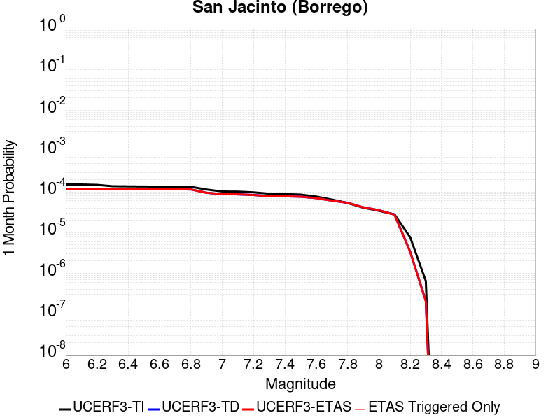 | 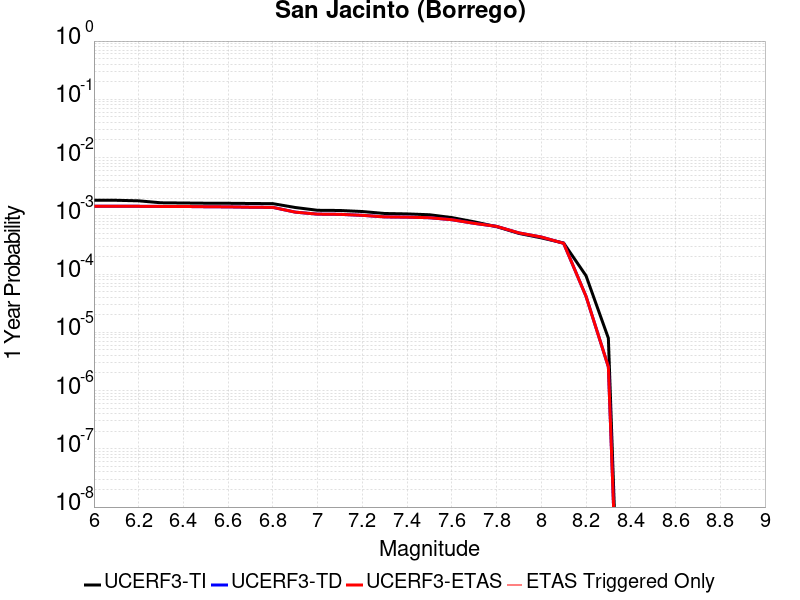 |  |

| Magnitude | 1 wk TI Prob | 1 wk TD Prob | 1 wk ETAS Prob | 1 wk ETAS/TD Gain | 1 wk ETAS Triggered Only | 1 mo TI Prob | 1 mo TD Prob | 1 mo ETAS Prob | 1 mo ETAS/TD Gain | 1 mo ETAS Triggered Only | 1 yr TI Prob | 1 yr TD Prob | 1 yr ETAS Prob | 1 yr ETAS/TD Gain | 1 yr ETAS Triggered Only | 10 yr TI Prob | 10 yr TD Prob | 10 yr ETAS Prob | 10 yr ETAS/TD Gain | 10 yr ETAS Triggered Only |
|-----|-----|-----|-----|-----|-----|-----|-----|-----|-----|-----|-----|-----|-----|-----|-----|-----|-----|-----|-----|-----|
| 6.0 | 3.543992E-5 | 2.7926695E-5 | 2.7926695E-5 | 1.0 | 0.0 | 1.5187653E-4 | 1.19680415E-4 | 1.19680415E-4 | 1.0 | 0.0 | 0.0018475284 | 0.0014561474 | 0.0014561474 | 1.0 | 0.0 | 0.018322436 | 0.014868264 | 0.014878116 | 1.0006626 | 1.0E-5 |
| 6.1 | 3.542281E-5 | 2.7926695E-5 | 2.7926695E-5 | 1.0 | 0.0 | 1.5180321E-4 | 1.19680415E-4 | 1.19680415E-4 | 1.0 | 0.0 | 0.0018466372 | 0.0014561474 | 0.0014561474 | 1.0 | 0.0 | 0.018313672 | 0.014868264 | 0.014878116 | 1.0006626 | 1.0E-5 |
| 6.2 | 3.4688688E-5 | 2.7926695E-5 | 2.7926695E-5 | 1.0 | 0.0 | 1.4865733E-4 | 1.19680415E-4 | 1.19680415E-4 | 1.0 | 0.0 | 0.0018084005 | 0.0014561473 | 0.0014561473 | 1.0 | 0.0 | 0.017937548 | 0.014868263 | 0.014878115 | 1.0006626 | 1.0E-5 |
| 6.3 | 3.2087122E-5 | 2.7772045E-5 | 2.7772045E-5 | 1.0 | 0.0 | 1.3750899E-4 | 1.19017684E-4 | 1.19017684E-4 | 1.0 | 0.0 | 0.0016728862 | 0.0014480894 | 0.0014480894 | 1.0 | 0.0 | 0.016603488 | 0.014789421 | 0.014799274 | 1.0006661 | 1.0E-5 |
| 6.4 | 3.1828724E-5 | 2.773902E-5 | 2.773902E-5 | 1.0 | 0.0 | 1.364017E-4 | 1.18876174E-4 | 1.18876174E-4 | 1.0 | 0.0 | 0.0016594254 | 0.0014463688 | 0.0014463688 | 1.0 | 0.0 | 0.016470885 | 0.014772614 | 0.014782467 | 1.000667 | 1.0E-5 |
| 6.5 | 3.1563577E-5 | 2.7478707E-5 | 2.7478707E-5 | 1.0 | 0.0 | 1.3526545E-4 | 1.1776064E-4 | 1.1776064E-4 | 1.0 | 0.0 | 0.0016456128 | 0.001432805 | 0.001432805 | 1.0 | 0.0 | 0.0163348 | 0.014640023 | 0.014649876 | 1.000673 | 1.0E-5 |
| 6.6 | 3.1467625E-5 | 2.7322927E-5 | 2.7322927E-5 | 1.0 | 0.0 | 1.3485427E-4 | 1.1709307E-4 | 1.1709307E-4 | 1.0 | 0.0 | 0.0016406142 | 0.001424688 | 0.001424688 | 1.0 | 0.0 | 0.016285548 | 0.0145603465 | 0.014570201 | 1.0006768 | 1.0E-5 |
| 6.7 | 3.1223695E-5 | 2.6940948E-5 | 2.6940948E-5 | 1.0 | 0.0 | 1.3380898E-4 | 1.1545616E-4 | 1.1545616E-4 | 1.0 | 0.0 | 0.0016279068 | 0.0014047845 | 0.0014047845 | 1.0 | 0.0 | 0.01616033 | 0.014364648 | 0.014374504 | 1.0006862 | 1.0E-5 |
| 6.8 | 3.1015585E-5 | 2.676195E-5 | 2.676195E-5 | 1.0 | 0.0 | 1.3291716E-4 | 1.146891E-4 | 1.146891E-4 | 1.0 | 0.0 | 0.001617065 | 0.0013954574 | 0.0013954574 | 1.0 | 0.0 | 0.016053487 | 0.014271904 | 0.014281761 | 1.0006907 | 1.0E-5 |
| 6.9 | 2.6641965E-5 | 2.218416E-5 | 2.218416E-5 | 1.0 | 0.0 | 1.1417485E-4 | 9.5071526E-5 | 9.5071526E-5 | 1.0 | 0.0 | 0.0013891924 | 0.0011568852 | 0.0011568852 | 1.0 | 0.0 | 0.0138054015 | 0.011882273 | 0.011892154 | 1.0008316 | 1.0E-5 |
| 7.0 | 2.3854353E-5 | 2.0478948E-5 | 2.0478948E-5 | 1.0 | 0.0 | 1.02228936E-4 | 8.776398E-5 | 8.776398E-5 | 1.0 | 0.0 | 0.0012439266 | 0.0010680052 | 0.0010680052 | 1.0 | 0.0 | 0.012369866 | 0.010982832 | 0.010992723 | 1.0009005 | 1.0E-5 |
| 7.1 | 2.3672901E-5 | 2.0315438E-5 | 2.0315438E-5 | 1.0 | 0.0 | 1.0145135E-4 | 8.706327E-5 | 8.706327E-5 | 1.0 | 0.0 | 0.0012344702 | 0.0010594825 | 0.0010594825 | 1.0 | 0.0 | 0.0122763505 | 0.010898065 | 0.010907956 | 1.0009075 | 1.0E-5 |
| 7.2 | 2.2717244E-5 | 1.9542804E-5 | 1.9542804E-5 | 1.0 | 0.0 | 9.735599E-5 | 8.37522E-5 | 8.37522E-5 | 1.0 | 0.0 | 0.0011846646 | 0.0010192083 | 0.0010192083 | 1.0 | 0.0 | 0.01178369 | 0.0104955435 | 0.010505439 | 1.0009428 | 1.0E-5 |
| 7.3 | 2.1016205E-5 | 1.8384444E-5 | 1.8384444E-5 | 1.0 | 0.0 | 9.006634E-5 | 7.878811E-5 | 7.878811E-5 | 1.0 | 0.0 | 0.001096006 | 9.588251E-4 | 9.588251E-4 | 1.0 | 0.0 | 0.010906163 | 0.00989118 | 0.009901081 | 1.001001 | 1.0E-5 |
| 7.4 | 2.0683625E-5 | 1.8186973E-5 | 1.8186973E-5 | 1.0 | 0.0 | 8.86411E-5 | 7.7941855E-5 | 7.7941855E-5 | 1.0 | 0.0 | 0.001078671 | 9.48531E-4 | 9.48531E-4 | 1.0 | 0.0 | 0.010734501 | 0.009787904 | 0.009797806 | 1.0010116 | 1.0E-5 |
| 7.5 | 1.9993966E-5 | 1.7782017E-5 | 1.7782017E-5 | 1.0 | 0.0 | 8.568561E-5 | 7.620643E-5 | 7.620643E-5 | 1.0 | 0.0 | 0.001042723 | 9.2742033E-4 | 9.2742033E-4 | 1.0 | 0.0 | 0.010378438 | 0.009574839 | 0.0095847435 | 1.0010344 | 1.0E-5 |
| 7.6 | 1.788966E-5 | 1.643528E-5 | 1.643528E-5 | 1.0 | 0.0 | 7.666772E-5 | 7.0435024E-5 | 7.0435024E-5 | 1.0 | 0.0 | 9.3302975E-4 | 8.5721083E-4 | 8.5721083E-4 | 1.0 | 0.0 | 0.00929122 | 0.008866674 | 0.008876585 | 1.0011178 | 1.0E-5 |
| 7.7 | 1.5125781E-5 | 1.4237382E-5 | 1.4237382E-5 | 1.0 | 0.0 | 6.4823165E-5 | 6.1015926E-5 | 6.1015926E-5 | 1.0 | 0.0 | 7.889362E-4 | 7.4261654E-4 | 7.4261654E-4 | 1.0 | 0.0 | 0.007861412 | 0.007714312 | 0.007724235 | 1.0012863 | 1.0E-5 |
| 7.8 | 1.250089E-5 | 1.26305695E-5 | 1.26305695E-5 | 1.0 | 0.0 | 5.3574146E-5 | 5.412989E-5 | 5.412989E-5 | 1.0 | 0.0 | 6.5207E-4 | 6.588328E-4 | 6.588328E-4 | 1.0 | 0.0 | 0.006501599 | 0.0068679084 | 0.00687784 | 1.001446 | 1.0E-5 |
| 7.9 | 9.561E-6 | 9.754574E-6 | 9.754574E-6 | 1.0 | 0.0 | 4.0975072E-5 | 4.180465E-5 | 4.180465E-5 | 1.0 | 0.0 | 4.987573E-4 | 5.0885335E-4 | 5.0885335E-4 | 1.0 | 0.0 | 0.0049763937 | 0.0053524836 | 0.00536243 | 1.0018582 | 1.0E-5 |
| 8.0 | 8.01699E-6 | 8.293423E-6 | 8.293423E-6 | 1.0 | 0.0 | 3.4358076E-5 | 3.554276E-5 | 3.554276E-5 | 1.0 | 0.0 | 4.1822926E-4 | 4.3264768E-4 | 4.3264768E-4 | 1.0 | 0.0 | 0.0041744304 | 0.004573428 | 0.0045833825 | 1.0021765 | 1.0E-5 |
| 8.1 | 6.541947E-6 | 6.4621295E-6 | 6.4621295E-6 | 1.0 | 0.0 | 2.8036617E-5 | 2.769455E-5 | 2.769455E-5 | 1.0 | 0.0 | 3.4129233E-4 | 3.371295E-4 | 3.371295E-4 | 1.0 | 0.0 | 0.0034076865 | 0.0035806268 | 0.003590591 | 1.0027828 | 1.0E-5 |
| 8.2 | 1.7968189E-6 | 7.969102E-7 | 7.969102E-7 | 1.0 | 0.0 | 7.70063E-6 | 3.415325E-6 | 3.415325E-6 | 1.0 | 0.0 | 9.3751136E-5 | 4.158081E-5 | 4.158081E-5 | 1.0 | 0.0 | 9.371159E-4 | 4.7111412E-4 | 4.7111412E-4 | 1.0 | 0.0 |
| 8.3 | 1.5167889E-7 | 4.8955105E-8 | 4.8955105E-8 | 1.0 | 0.0 | 6.500522E-7 | 2.0980757E-7 | 2.0980757E-7 | 1.0 | 0.0 | 7.9143565E-6 | 2.5544045E-6 | 2.5544045E-6 | 1.0 | 0.0 | 7.914075E-5 | 2.9684858E-5 | 2.9684858E-5 | 1.0 | 0.0 |

## Mendocino
*[(top)](#table-of-contents)*

| 1 Week | 1 Month | 1 Year | 10 Year |
|-----|-----|-----|-----|
|  | 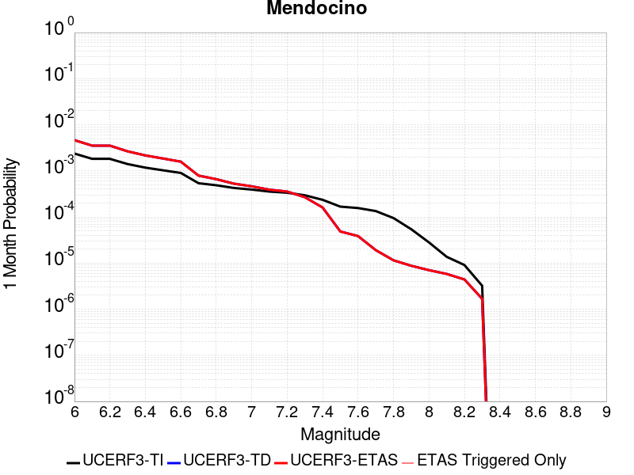 | 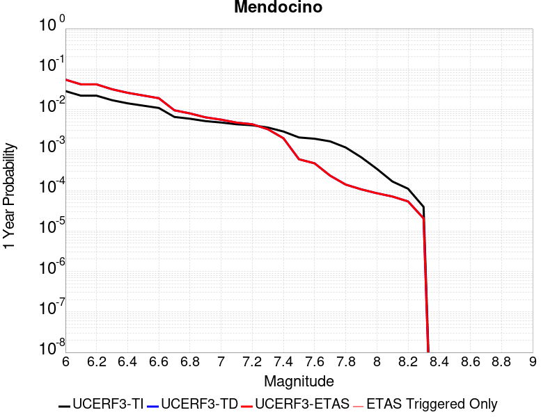 | 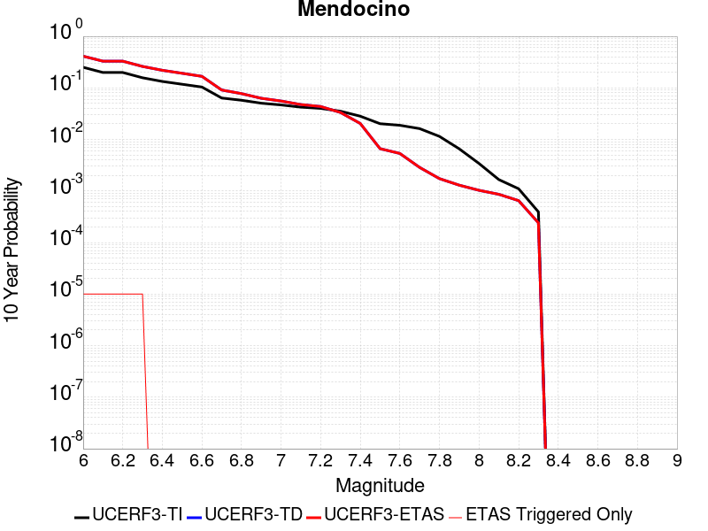 |

| Magnitude | 1 wk TI Prob | 1 wk TD Prob | 1 wk ETAS Prob | 1 wk ETAS/TD Gain | 1 wk ETAS Triggered Only | 1 mo TI Prob | 1 mo TD Prob | 1 mo ETAS Prob | 1 mo ETAS/TD Gain | 1 mo ETAS Triggered Only | 1 yr TI Prob | 1 yr TD Prob | 1 yr ETAS Prob | 1 yr ETAS/TD Gain | 1 yr ETAS Triggered Only | 10 yr TI Prob | 10 yr TD Prob | 10 yr ETAS Prob | 10 yr ETAS/TD Gain | 10 yr ETAS Triggered Only |
|-----|-----|-----|-----|-----|-----|-----|-----|-----|-----|-----|-----|-----|-----|-----|-----|-----|-----|-----|-----|-----|
| 6.0 | 5.5409013E-4 | 0.0010841053 | 0.0010841053 | 1.0 | 0.0 | 0.0023725112 | 0.004635728 | 0.004635728 | 1.0 | 0.0 | 0.028505474 | 0.05467803 | 0.05467803 | 1.0 | 0.0 | 0.25113493 | 0.41188535 | 0.41189125 | 1.0000143 | 1.0E-5 |
| 6.1 | 4.2515888E-4 | 8.2291657E-4 | 8.2291657E-4 | 1.0 | 0.0 | 0.0018208373 | 0.0035201686 | 0.0035201686 | 1.0 | 0.0 | 0.021944538 | 0.041751742 | 0.041751742 | 1.0 | 0.0 | 0.19899574 | 0.3299563 | 0.329963 | 1.0000203 | 1.0E-5 |
| 6.2 | 4.2515888E-4 | 8.2291657E-4 | 8.2291657E-4 | 1.0 | 0.0 | 0.0018208373 | 0.0035201686 | 0.0035201686 | 1.0 | 0.0 | 0.021944538 | 0.041751742 | 0.041751742 | 1.0 | 0.0 | 0.19899574 | 0.3299563 | 0.329963 | 1.0000203 | 1.0E-5 |
| 6.3 | 3.2773745E-4 | 6.193665E-4 | 6.193665E-4 | 1.0 | 0.0 | 0.0014038329 | 0.0026503887 | 0.0026503887 | 1.0 | 0.0 | 0.016958237 | 0.03159371 | 0.03159371 | 1.0 | 0.0 | 0.1572094 | 0.26077905 | 0.26078644 | 1.0000284 | 1.0E-5 |
| 6.4 | 2.7417165E-4 | 5.0479337E-4 | 5.0479337E-4 | 1.0 | 0.0 | 0.0011744922 | 0.0021605701 | 0.0021605701 | 1.0 | 0.0 | 0.014205975 | 0.025839 | 0.025839 | 1.0 | 0.0 | 0.13331394 | 0.21948124 | 0.21948124 | 1.0 | 0.0 |
| 6.5 | 2.3984899E-4 | 4.3236572E-4 | 4.3236572E-4 | 1.0 | 0.0 | 0.0010275192 | 0.0018508453 | 0.0018508453 | 1.0 | 0.0 | 0.012438473 | 0.02218179 | 0.02218179 | 1.0 | 0.0 | 0.11764851 | 0.19203834 | 0.19203834 | 1.0 | 0.0 |
| 6.6 | 2.1023539E-4 | 3.693632E-4 | 3.693632E-4 | 1.0 | 0.0 | 9.0069766E-4 | 0.0015813538 | 0.0015813538 | 1.0 | 0.0 | 0.010910975 | 0.018990852 | 0.018990852 | 1.0 | 0.0 | 0.10390546 | 0.16749473 | 0.16749473 | 1.0 | 0.0 |
| 6.7 | 1.2592976E-4 | 1.8426252E-4 | 1.8426252E-4 | 1.0 | 0.0 | 5.395873E-4 | 7.893839E-4 | 7.893839E-4 | 1.0 | 0.0 | 0.006549705 | 0.009556955 | 0.009556955 | 1.0 | 0.0 | 0.063599944 | 0.09097023 | 0.09097023 | 1.0 | 0.0 |
| 6.8 | 1.13663555E-4 | 1.5401767E-4 | 1.5401767E-4 | 1.0 | 0.0 | 4.8703855E-4 | 6.5987965E-4 | 6.5987965E-4 | 1.0 | 0.0 | 0.0059135845 | 0.008000315 | 0.008000315 | 1.0 | 0.0 | 0.057586733 | 0.07739345 | 0.07739345 | 1.0 | 0.0 |
| 6.9 | 9.926894E-5 | 1.2300492E-4 | 1.2300492E-4 | 1.0 | 0.0 | 4.2536893E-4 | 5.2705227E-4 | 5.2705227E-4 | 1.0 | 0.0 | 0.0051665753 | 0.00639703 | 0.00639703 | 1.0 | 0.0 | 0.050480947 | 0.062860414 | 0.062860414 | 1.0 | 0.0 |
| 7.0 | 9.168125E-5 | 1.0784296E-4 | 1.0784296E-4 | 1.0 | 0.0 | 3.9286047E-4 | 4.6209813E-4 | 4.6209813E-4 | 1.0 | 0.0 | 0.004772591 | 0.005611175 | 0.005611175 | 1.0 | 0.0 | 0.04671385 | 0.055621635 | 0.055621635 | 1.0 | 0.0 |
| 7.1 | 8.2854116E-5 | 9.1052825E-5 | 9.1052825E-5 | 1.0 | 0.0 | 3.5504074E-4 | 3.901682E-4 | 3.901682E-4 | 1.0 | 0.0 | 0.004314056 | 0.0047400165 | 0.0047400165 | 1.0 | 0.0 | 0.042312626 | 0.047481276 | 0.047481276 | 1.0 | 0.0 |
| 7.2 | 7.8255274E-5 | 8.300528E-5 | 8.300528E-5 | 1.0 | 0.0 | 3.3533663E-4 | 3.5568923E-4 | 3.5568923E-4 | 1.0 | 0.0 | 0.0040750825 | 0.004322065 | 0.004322065 | 1.0 | 0.0 | 0.040011603 | 0.043525673 | 0.043525673 | 1.0 | 0.0 |
| 7.3 | 6.887904E-5 | 6.258893E-5 | 6.258893E-5 | 1.0 | 0.0 | 2.9516246E-4 | 2.682112E-4 | 2.682112E-4 | 1.0 | 0.0 | 0.0035876823 | 0.003260679 | 0.003260679 | 1.0 | 0.0 | 0.035303112 | 0.033351097 | 0.033351097 | 1.0 | 0.0 |
| 7.4 | 5.4898497E-5 | 3.739854E-5 | 3.739854E-5 | 1.0 | 0.0 | 2.3525805E-4 | 1.602699E-4 | 1.602699E-4 | 1.0 | 0.0 | 0.0028605047 | 0.0019495962 | 0.0019495962 | 1.0 | 0.0 | 0.02823963 | 0.02040789 | 0.02040789 | 1.0 | 0.0 |
| 7.5 | 3.9103943E-5 | 1.1304653E-5 | 1.1304653E-5 | 1.0 | 0.0 | 1.6757756E-4 | 4.844762E-5 | 4.844762E-5 | 1.0 | 0.0 | 0.0020383475 | 5.8969174E-4 | 5.8969174E-4 | 1.0 | 0.0 | 0.020197518 | 0.0066234814 | 0.0066234814 | 1.0 | 0.0 |
| 7.6 | 3.641042E-5 | 8.981683E-6 | 8.981683E-6 | 1.0 | 0.0 | 1.5603533E-4 | 3.849237E-5 | 3.849237E-5 | 1.0 | 0.0 | 0.0018980748 | 4.685452E-4 | 4.685452E-4 | 1.0 | 0.0 | 0.018819444 | 0.005347256 | 0.005347256 | 1.0 | 0.0 |
| 7.7 | 3.1318774E-5 | 4.4525227E-6 | 4.4525227E-6 | 1.0 | 0.0 | 1.342164E-4 | 1.9082101E-5 | 1.9082101E-5 | 1.0 | 0.0 | 0.0016328598 | 2.3230001E-4 | 2.3230001E-4 | 1.0 | 0.0 | 0.016209139 | 0.0028643955 | 0.0028643955 | 1.0 | 0.0 |
| 7.8 | 2.209241E-5 | 2.6796654E-6 | 2.6796654E-6 | 1.0 | 0.0 | 9.467832E-5 | 1.148423E-5 | 1.148423E-5 | 1.0 | 0.0 | 0.001152099 | 1.3981156E-4 | 1.3981156E-4 | 1.0 | 0.0 | 0.011461443 | 0.0017368431 | 0.0017368431 | 1.0 | 0.0 |
| 7.9 | 1.2640477E-5 | 2.041251E-6 | 2.041251E-6 | 1.0 | 0.0 | 5.4172346E-5 | 8.748189E-6 | 8.748189E-6 | 1.0 | 0.0 | 6.593487E-4 | 1.0650403E-4 | 1.0650403E-4 | 1.0 | 0.0 | 0.006573958 | 0.0012975836 | 0.0012975836 | 1.0 | 0.0 |
| 8.0 | 6.5548907E-6 | 1.6380953E-6 | 1.6380953E-6 | 1.0 | 0.0 | 2.8092087E-5 | 7.02039E-6 | 7.02039E-6 | 1.0 | 0.0 | 3.4196748E-4 | 8.546992E-5 | 8.546992E-5 | 1.0 | 0.0 | 0.0034144172 | 0.0010307364 | 0.0010307364 | 1.0 | 0.0 |
| 8.1 | 3.1916707E-6 | 1.3578508E-6 | 1.3578508E-6 | 1.0 | 0.0 | 1.3678517E-5 | 5.8193477E-6 | 5.8193477E-6 | 1.0 | 0.0 | 1.6652321E-4 | 7.084828E-5 | 7.084828E-5 | 1.0 | 0.0 | 0.0016639848 | 8.625486E-4 | 8.625486E-4 | 1.0 | 0.0 |
| 8.2 | 2.1193785E-6 | 1.0298376E-6 | 1.0298376E-6 | 1.0 | 0.0 | 9.083019E-6 | 4.4135822E-6 | 4.4135822E-6 | 1.0 | 0.0 | 1.1058014E-4 | 5.3734057E-5 | 5.3734057E-5 | 1.0 | 0.0 | 0.0011052513 | 6.501868E-4 | 6.501868E-4 | 1.0 | 0.0 |
| 8.3 | 7.536878E-7 | 3.9264737E-7 | 3.9264737E-7 | 1.0 | 0.0 | 3.2300866E-6 | 1.6827735E-6 | 1.6827735E-6 | 1.0 | 0.0 | 3.9325594E-5 | 2.0487587E-5 | 2.0487587E-5 | 1.0 | 0.0 | 3.9318635E-4 | 2.412677E-4 | 2.412677E-4 | 1.0 | 0.0 |

## West Napa 2011 CFM
*[(top)](#table-of-contents)*

| 1 Week | 1 Month | 1 Year | 10 Year |
|-----|-----|-----|-----|
|  |  |  | 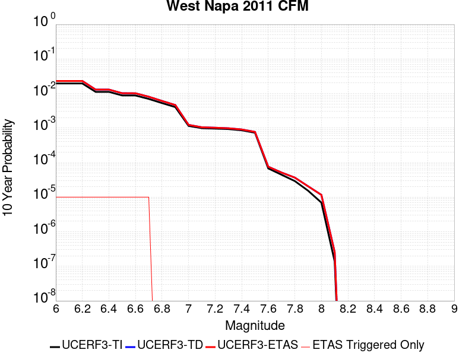 |

| Magnitude | 1 wk TI Prob | 1 wk TD Prob | 1 wk ETAS Prob | 1 wk ETAS/TD Gain | 1 wk ETAS Triggered Only | 1 mo TI Prob | 1 mo TD Prob | 1 mo ETAS Prob | 1 mo ETAS/TD Gain | 1 mo ETAS Triggered Only | 1 yr TI Prob | 1 yr TD Prob | 1 yr ETAS Prob | 1 yr ETAS/TD Gain | 1 yr ETAS Triggered Only | 10 yr TI Prob | 10 yr TD Prob | 10 yr ETAS Prob | 10 yr ETAS/TD Gain | 10 yr ETAS Triggered Only |
|-----|-----|-----|-----|-----|-----|-----|-----|-----|-----|-----|-----|-----|-----|-----|-----|-----|-----|-----|-----|-----|
| 6.0 | 3.773104E-5 | 4.4528606E-5 | 4.4528606E-5 | 1.0 | 0.0 | 1.6169442E-4 | 1.9082474E-4 | 1.9082474E-4 | 1.0 | 0.0 | 0.001966852 | 0.0023211332 | 0.0023211332 | 1.0 | 0.0 | 0.019495348 | 0.02300208 | 0.02301185 | 1.0004247 | 1.0E-5 |
| 6.1 | 3.773104E-5 | 4.4528606E-5 | 4.4528606E-5 | 1.0 | 0.0 | 1.6169442E-4 | 1.9082474E-4 | 1.9082474E-4 | 1.0 | 0.0 | 0.001966852 | 0.0023211332 | 0.0023211332 | 1.0 | 0.0 | 0.019495348 | 0.02300208 | 0.02301185 | 1.0004247 | 1.0E-5 |
| 6.2 | 3.773104E-5 | 4.4528606E-5 | 4.4528606E-5 | 1.0 | 0.0 | 1.6169442E-4 | 1.9082474E-4 | 1.9082474E-4 | 1.0 | 0.0 | 0.001966852 | 0.0023211332 | 0.0023211332 | 1.0 | 0.0 | 0.019495348 | 0.02300208 | 0.02301185 | 1.0004247 | 1.0E-5 |
| 6.3 | 2.147964E-5 | 2.4987121E-5 | 2.4987121E-5 | 1.0 | 0.0 | 9.2052345E-5 | 1.0708379E-4 | 1.0708379E-4 | 1.0 | 0.0 | 0.001120161 | 0.0013030571 | 0.0013030571 | 1.0 | 0.0 | 0.011145315 | 0.012964528 | 0.012974398 | 1.0007614 | 1.0E-5 |
| 6.4 | 2.147964E-5 | 2.4987121E-5 | 2.4987121E-5 | 1.0 | 0.0 | 9.2052345E-5 | 1.0708379E-4 | 1.0708379E-4 | 1.0 | 0.0 | 0.001120161 | 0.0013030571 | 0.0013030571 | 1.0 | 0.0 | 0.011145315 | 0.012964528 | 0.012974398 | 1.0007614 | 1.0E-5 |
| 6.5 | 1.688201E-5 | 1.9547415E-5 | 1.9547415E-5 | 1.0 | 0.0 | 7.234947E-5 | 8.377236E-5 | 8.377236E-5 | 1.0 | 0.0 | 8.804988E-4 | 0.001019524 | 0.001019524 | 1.0 | 0.0 | 0.008770182 | 0.010156879 | 0.010166777 | 1.0009745 | 1.0E-5 |
| 6.6 | 1.6846381E-5 | 1.9507108E-5 | 1.9507108E-5 | 1.0 | 0.0 | 7.219678E-5 | 8.359962E-5 | 8.359962E-5 | 1.0 | 0.0 | 8.7864127E-4 | 0.0010174229 | 0.0010174229 | 1.0 | 0.0 | 0.008751754 | 0.0101360595 | 0.0101459585 | 1.0009766 | 1.0E-5 |
| 6.7 | 1.3396501E-5 | 1.5467718E-5 | 1.5467718E-5 | 1.0 | 0.0 | 5.7412315E-5 | 6.62889E-5 | 6.62889E-5 | 1.0 | 0.0 | 6.9877075E-4 | 8.06832E-4 | 8.06832E-4 | 1.0 | 0.0 | 0.0069657755 | 0.008046494 | 0.008056413 | 1.0012327 | 1.0E-5 |
| 6.8 | 1.0139058E-5 | 1.1672206E-5 | 1.1672206E-5 | 1.0 | 0.0 | 4.3452383E-5 | 5.0023093E-5 | 5.0023093E-5 | 1.0 | 0.0 | 5.289043E-4 | 6.0891645E-4 | 6.0891645E-4 | 1.0 | 0.0 | 0.005276473 | 0.0060791434 | 0.0060791434 | 1.0 | 0.0 |
| 6.9 | 7.761281E-6 | 8.890744E-6 | 8.890744E-6 | 1.0 | 0.0 | 3.326221E-5 | 3.810292E-5 | 3.810292E-5 | 1.0 | 0.0 | 4.0489217E-4 | 4.638557E-4 | 4.638557E-4 | 1.0 | 0.0 | 0.0040415525 | 0.00463513 | 0.00463513 | 1.0 | 0.0 |
| 7.0 | 2.2109202E-6 | 2.3666385E-6 | 2.3666385E-6 | 1.0 | 0.0 | 9.475338E-6 | 1.0142698E-5 | 1.0142698E-5 | 1.0 | 0.0 | 1.1535613E-4 | 1.2348042E-4 | 1.2348042E-4 | 1.0 | 0.0 | 0.0011529627 | 0.0012353443 | 0.0012353443 | 1.0 | 0.0 |
| 7.1 | 1.9008926E-6 | 2.0133266E-6 | 2.0133266E-6 | 1.0 | 0.0 | 8.146657E-6 | 8.6285145E-6 | 8.6285145E-6 | 1.0 | 0.0 | 9.918104E-5 | 1.05047126E-4 | 1.05047126E-4 | 1.0 | 0.0 | 9.913679E-4 | 0.0010511958 | 0.0010511958 | 1.0 | 0.0 |
| 7.2 | 1.8495944E-6 | 1.9561332E-6 | 1.9561332E-6 | 1.0 | 0.0 | 7.926808E-6 | 8.383402E-6 | 8.383402E-6 | 1.0 | 0.0 | 9.650462E-5 | 1.0206316E-4 | 1.0206316E-4 | 1.0 | 0.0 | 9.6462725E-4 | 0.0010213839 | 0.0010213839 | 1.0 | 0.0 |
| 7.3 | 1.7883189E-6 | 1.8880957E-6 | 1.8880957E-6 | 1.0 | 0.0 | 7.664201E-6 | 8.0918135E-6 | 8.0918135E-6 | 1.0 | 0.0 | 9.330765E-5 | 9.85134E-5 | 9.85134E-5 | 1.0 | 0.0 | 9.3268487E-4 | 9.859175E-4 | 9.859175E-4 | 1.0 | 0.0 |
| 7.4 | 1.6520572E-6 | 1.7415169E-6 | 1.7415169E-6 | 1.0 | 0.0 | 7.0802257E-6 | 7.4636228E-6 | 7.4636228E-6 | 1.0 | 0.0 | 8.6198335E-5 | 9.086584E-5 | 9.086584E-5 | 1.0 | 0.0 | 8.616491E-4 | 9.095071E-4 | 9.095071E-4 | 1.0 | 0.0 |
| 7.5 | 1.4040345E-6 | 1.4800324E-6 | 1.4800324E-6 | 1.0 | 0.0 | 6.0172765E-6 | 6.3429807E-6 | 6.3429807E-6 | 1.0 | 0.0 | 7.325788E-5 | 7.722308E-5 | 7.722308E-5 | 1.0 | 0.0 | 7.3233736E-4 | 7.73137E-4 | 7.73137E-4 | 1.0 | 0.0 |
| 7.6 | 1.3013842E-7 | 1.4416543E-7 | 1.4416543E-7 | 1.0 | 0.0 | 5.57736E-7 | 6.178517E-7 | 6.178517E-7 | 1.0 | 0.0 | 6.790414E-6 | 7.5223184E-6 | 7.5223184E-6 | 1.0 | 0.0 | 6.790207E-5 | 7.615054E-5 | 7.615054E-5 | 1.0 | 0.0 |
| 7.7 | 8.541512E-8 | 9.716815E-8 | 9.716815E-8 | 1.0 | 0.0 | 3.6606474E-7 | 4.1643486E-7 | 4.1643486E-7 | 1.0 | 0.0 | 4.456829E-6 | 5.0700824E-6 | 5.0700824E-6 | 1.0 | 0.0 | 4.4567398E-5 | 5.1604275E-5 | 5.1604275E-5 | 1.0 | 0.0 |
| 7.8 | 5.6074793E-8 | 6.895743E-8 | 6.895743E-8 | 1.0 | 0.0 | 2.403205E-7 | 2.955318E-7 | 2.955318E-7 | 1.0 | 0.0 | 2.9258983E-6 | 3.5980938E-6 | 3.5980938E-6 | 1.0 | 0.0 | 2.9258597E-5 | 3.6814006E-5 | 3.6814006E-5 | 1.0 | 0.0 |
| 7.9 | 2.9475839E-8 | 3.8569127E-8 | 3.8569127E-8 | 1.0 | 0.0 | 1.2632502E-7 | 1.6529624E-7 | 1.6529624E-7 | 1.0 | 0.0 | 1.538006E-6 | 2.0124799E-6 | 2.0124799E-6 | 1.0 | 0.0 | 1.5379954E-5 | 2.0664571E-5 | 2.0664571E-5 | 1.0 | 0.0 |
| 8.0 | 1.3337122E-8 | 2.163397E-8 | 2.163397E-8 | 1.0 | 0.0 | 5.7159088E-8 | 9.2717016E-8 | 9.2717016E-8 | 1.0 | 0.0 | 6.959117E-7 | 1.128829E-6 | 1.128829E-6 | 1.0 | 0.0 | 6.959095E-6 | 1.1644583E-5 | 1.1644583E-5 | 1.0 | 0.0 |
| 8.1 | 2.6589986E-10 | 4.861974E-10 | 4.861974E-10 | 1.0 | 0.0 | 1.1395708E-9 | 2.0837034E-9 | 2.0837034E-9 | 1.0 | 0.0 | 1.3874274E-8 | 2.5369086E-8 | 2.5369086E-8 | 1.0 | 0.0 | 1.3874273E-7 | 2.6039422E-7 | 2.6039422E-7 | 1.0 | 0.0 |

## Puente Hills
*[(top)](#table-of-contents)*

| 1 Week | 1 Month | 1 Year | 10 Year |
|-----|-----|-----|-----|
|  | 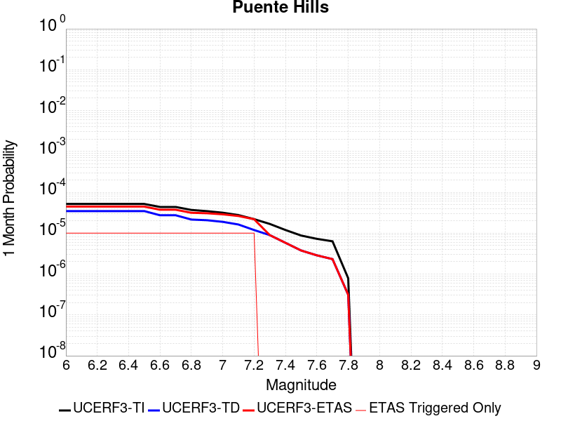 |  |  |

| Magnitude | 1 wk TI Prob | 1 wk TD Prob | 1 wk ETAS Prob | 1 wk ETAS/TD Gain | 1 wk ETAS Triggered Only | 1 mo TI Prob | 1 mo TD Prob | 1 mo ETAS Prob | 1 mo ETAS/TD Gain | 1 mo ETAS Triggered Only | 1 yr TI Prob | 1 yr TD Prob | 1 yr ETAS Prob | 1 yr ETAS/TD Gain | 1 yr ETAS Triggered Only | 10 yr TI Prob | 10 yr TD Prob | 10 yr ETAS Prob | 10 yr ETAS/TD Gain | 10 yr ETAS Triggered Only |
|-----|-----|-----|-----|-----|-----|-----|-----|-----|-----|-----|-----|-----|-----|-----|-----|-----|-----|-----|-----|-----|
| 6.0 | 1.2101656E-5 | 8.09846E-6 | 8.09846E-6 | 1.0 | 0.0 | 5.1863204E-5 | 3.4707256E-5 | 4.4706907E-5 | 1.2881142 | 1.0E-5 | 6.312516E-4 | 4.2248453E-4 | 4.3248033E-4 | 1.0236595 | 1.0E-5 | 0.0062946146 | 0.0042173737 | 0.0042273314 | 1.0023612 | 1.0E-5 |
| 6.1 | 1.2101656E-5 | 8.09846E-6 | 8.09846E-6 | 1.0 | 0.0 | 5.1863204E-5 | 3.4707256E-5 | 4.4706907E-5 | 1.2881142 | 1.0E-5 | 6.312516E-4 | 4.2248453E-4 | 4.3248033E-4 | 1.0236595 | 1.0E-5 | 0.0062946146 | 0.0042173737 | 0.0042273314 | 1.0023612 | 1.0E-5 |
| 6.2 | 1.2101656E-5 | 8.09846E-6 | 8.09846E-6 | 1.0 | 0.0 | 5.1863204E-5 | 3.4707256E-5 | 4.4706907E-5 | 1.2881142 | 1.0E-5 | 6.312516E-4 | 4.2248453E-4 | 4.3248033E-4 | 1.0236595 | 1.0E-5 | 0.0062946146 | 0.0042173737 | 0.0042273314 | 1.0023612 | 1.0E-5 |
| 6.3 | 1.2101656E-5 | 8.09846E-6 | 8.09846E-6 | 1.0 | 0.0 | 5.1863204E-5 | 3.4707256E-5 | 4.4706907E-5 | 1.2881142 | 1.0E-5 | 6.312516E-4 | 4.2248453E-4 | 4.3248033E-4 | 1.0236595 | 1.0E-5 | 0.0062946146 | 0.0042173737 | 0.0042273314 | 1.0023612 | 1.0E-5 |
| 6.4 | 1.2101656E-5 | 8.09846E-6 | 8.09846E-6 | 1.0 | 0.0 | 5.1863204E-5 | 3.4707256E-5 | 4.4706907E-5 | 1.2881142 | 1.0E-5 | 6.312516E-4 | 4.2248453E-4 | 4.3248033E-4 | 1.0236595 | 1.0E-5 | 0.0062946146 | 0.0042173737 | 0.0042273314 | 1.0023612 | 1.0E-5 |
| 6.5 | 1.2101656E-5 | 8.09846E-6 | 8.09846E-6 | 1.0 | 0.0 | 5.1863204E-5 | 3.4707256E-5 | 4.4706907E-5 | 1.2881142 | 1.0E-5 | 6.312516E-4 | 4.2248453E-4 | 4.3248033E-4 | 1.0236595 | 1.0E-5 | 0.0062946146 | 0.0042173737 | 0.0042273314 | 1.0023612 | 1.0E-5 |
| 6.6 | 1.0222488E-5 | 6.3990897E-6 | 6.3990897E-6 | 1.0 | 0.0 | 4.3809923E-5 | 2.7424396E-5 | 3.742412E-5 | 1.3646288 | 1.0E-5 | 5.332553E-4 | 3.3384332E-4 | 3.4384E-4 | 1.0299442 | 1.0E-5 | 0.0053197746 | 0.0033336633 | 0.00334363 | 1.0029896 | 1.0E-5 |
| 6.7 | 1.0222488E-5 | 6.3990897E-6 | 6.3990897E-6 | 1.0 | 0.0 | 4.3809923E-5 | 2.7424396E-5 | 3.742412E-5 | 1.3646288 | 1.0E-5 | 5.332553E-4 | 3.3384332E-4 | 3.4384E-4 | 1.0299442 | 1.0E-5 | 0.0053197746 | 0.0033336633 | 0.00334363 | 1.0029896 | 1.0E-5 |
| 6.8 | 8.6367845E-6 | 5.0281383E-6 | 5.0281383E-6 | 1.0 | 0.0 | 3.7014266E-5 | 2.1548989E-5 | 3.1548774E-5 | 1.4640489 | 1.0E-5 | 4.505555E-4 | 2.623279E-4 | 2.723253E-4 | 1.0381103 | 1.0E-5 | 0.004496431 | 0.0026202388 | 0.0026302126 | 1.0038065 | 1.0E-5 |
| 6.9 | 8.066481E-6 | 4.8360207E-6 | 4.8360207E-6 | 1.0 | 0.0 | 3.4570177E-5 | 2.0725642E-5 | 3.0725434E-5 | 1.4824841 | 1.0E-5 | 4.2081063E-4 | 2.52306E-4 | 2.6230348E-4 | 1.0396245 | 1.0E-5 | 0.0042001465 | 0.0025202492 | 0.002530224 | 1.0039579 | 1.0E-5 |
| 7.0 | 7.393828E-6 | 4.4172366E-6 | 4.4172366E-6 | 1.0 | 0.0 | 3.168745E-5 | 1.893088E-5 | 2.893069E-5 | 1.5282274 | 1.0E-5 | 3.857264E-4 | 2.3045953E-4 | 2.4045722E-4 | 1.0433816 | 1.0E-5 | 0.0038505755 | 0.0023022508 | 0.0023122276 | 1.0043336 | 1.0E-5 |
| 7.1 | 6.4660953E-6 | 3.8043945E-6 | 3.8043945E-6 | 1.0 | 0.0 | 2.7711543E-5 | 1.6304448E-5 | 2.6304284E-5 | 1.6133196 | 1.0E-5 | 3.373358E-4 | 1.9848892E-4 | 2.0848693E-4 | 1.0503707 | 1.0E-5 | 0.0033682417 | 0.0019831522 | 0.0019931325 | 1.0050324 | 1.0E-5 |
| 7.2 | 5.143232E-6 | 2.786496E-6 | 2.786496E-6 | 1.0 | 0.0 | 2.2042237E-5 | 1.1942071E-5 | 2.1941953E-5 | 1.8373657 | 1.0E-5 | 2.6833118E-4 | 1.4538511E-4 | 1.5538366E-4 | 1.0687728 | 1.0E-5 | 0.002680074 | 0.0014529098 | 0.0014628952 | 1.0068728 | 1.0E-5 |
| 7.3 | 3.928255E-6 | 2.0913426E-6 | 2.0913426E-6 | 1.0 | 0.0 | 1.683527E-5 | 8.962867E-6 | 8.962867E-6 | 1.0 | 0.0 | 2.0495013E-4 | 1.091175E-4 | 1.091175E-4 | 1.0 | 0.0 | 0.002047612 | 0.0010906459 | 0.0010906459 | 1.0 | 0.0 |
| 7.4 | 2.7894434E-6 | 1.3546468E-6 | 1.3546468E-6 | 1.0 | 0.0 | 1.1954703E-5 | 5.805616E-6 | 5.805616E-6 | 1.0 | 0.0 | 1.4553878E-4 | 7.0681126E-5 | 7.0681126E-5 | 1.0 | 0.0 | 0.001454435 | 7.065909E-4 | 7.065909E-4 | 1.0 | 0.0 |
| 7.5 | 2.041735E-6 | 8.787007E-7 | 8.787007E-7 | 1.0 | 0.0 | 8.750263E-6 | 3.765855E-6 | 3.765855E-6 | 1.0 | 0.0 | 1.06529245E-4 | 4.5848352E-5 | 4.5848352E-5 | 1.0 | 0.0 | 0.0010647819 | 4.583923E-4 | 4.583923E-4 | 1.0 | 0.0 |
| 7.6 | 1.6959062E-6 | 6.698349E-7 | 6.698349E-7 | 1.0 | 0.0 | 7.268149E-6 | 2.870718E-6 | 2.870718E-6 | 1.0 | 0.0 | 8.848612E-5 | 3.495046E-5 | 3.495046E-5 | 1.0 | 0.0 | 8.84509E-4 | 3.4945252E-4 | 3.4945252E-4 | 1.0 | 0.0 |
| 7.7 | 1.4767965E-6 | 5.4071546E-7 | 5.4071546E-7 | 1.0 | 0.0 | 6.3291122E-6 | 2.31735E-6 | 2.31735E-6 | 1.0 | 0.0 | 7.705422E-5 | 2.8213399E-5 | 2.8213399E-5 | 1.0 | 0.0 | 7.702751E-4 | 2.8210072E-4 | 2.8210072E-4 | 1.0 | 0.0 |
| 7.8 | 1.8432911E-7 | 7.281192E-8 | 7.281192E-8 | 1.0 | 0.0 | 7.8998164E-7 | 3.1205107E-7 | 3.1205107E-7 | 1.0 | 0.0 | 9.617985E-6 | 3.7992186E-6 | 3.7992186E-6 | 1.0 | 0.0 | 9.617568E-5 | 3.7991864E-5 | 3.7991864E-5 | 1.0 | 0.0 |

## Bullion Mountains
*[(top)](#table-of-contents)*

| 1 Week | 1 Month | 1 Year | 10 Year |
|-----|-----|-----|-----|
|  | 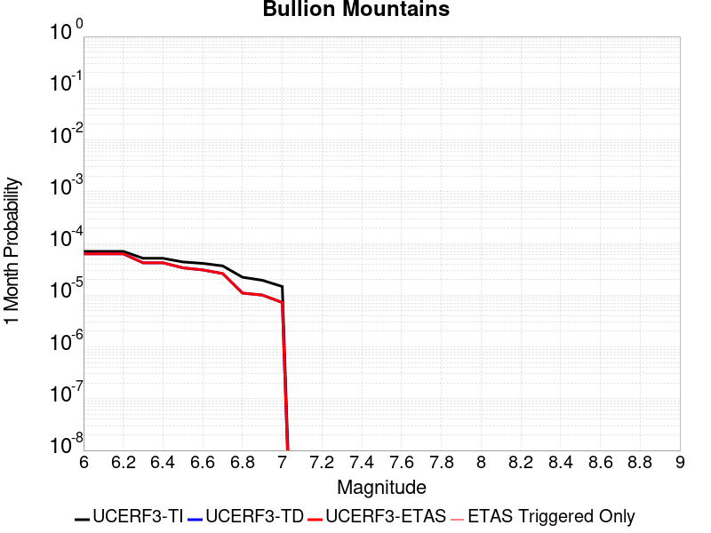 |  |  |

| Magnitude | 1 wk TI Prob | 1 wk TD Prob | 1 wk ETAS Prob | 1 wk ETAS/TD Gain | 1 wk ETAS Triggered Only | 1 mo TI Prob | 1 mo TD Prob | 1 mo ETAS Prob | 1 mo ETAS/TD Gain | 1 mo ETAS Triggered Only | 1 yr TI Prob | 1 yr TD Prob | 1 yr ETAS Prob | 1 yr ETAS/TD Gain | 1 yr ETAS Triggered Only | 10 yr TI Prob | 10 yr TD Prob | 10 yr ETAS Prob | 10 yr ETAS/TD Gain | 10 yr ETAS Triggered Only |
|-----|-----|-----|-----|-----|-----|-----|-----|-----|-----|-----|-----|-----|-----|-----|-----|-----|-----|-----|-----|-----|
| 6.0 | 1.6420427E-5 | 1.4692031E-5 | 1.4692031E-5 | 1.0 | 0.0 | 7.037136E-5 | 6.2964544E-5 | 6.2964544E-5 | 1.0 | 0.0 | 8.5643446E-4 | 7.6636206E-4 | 7.6636206E-4 | 1.0 | 0.0 | 0.008531413 | 0.007640986 | 0.0076509095 | 1.0012988 | 1.0E-5 |
| 6.1 | 1.6420427E-5 | 1.4692031E-5 | 1.4692031E-5 | 1.0 | 0.0 | 7.037136E-5 | 6.2964544E-5 | 6.2964544E-5 | 1.0 | 0.0 | 8.5643446E-4 | 7.6636206E-4 | 7.6636206E-4 | 1.0 | 0.0 | 0.008531413 | 0.007640986 | 0.0076509095 | 1.0012988 | 1.0E-5 |
| 6.2 | 1.6420427E-5 | 1.4692031E-5 | 1.4692031E-5 | 1.0 | 0.0 | 7.037136E-5 | 6.2964544E-5 | 6.2964544E-5 | 1.0 | 0.0 | 8.5643446E-4 | 7.6636206E-4 | 7.6636206E-4 | 1.0 | 0.0 | 0.008531413 | 0.007640986 | 0.0076509095 | 1.0012988 | 1.0E-5 |
| 6.3 | 1.2046778E-5 | 9.86227E-6 | 9.86227E-6 | 1.0 | 0.0 | 5.1628023E-5 | 4.2266318E-5 | 4.2266318E-5 | 1.0 | 0.0 | 6.283899E-4 | 5.144941E-4 | 5.144941E-4 | 1.0 | 0.0 | 0.0062661595 | 0.0051353113 | 0.00514526 | 1.0019373 | 1.0E-5 |
| 6.4 | 1.2046778E-5 | 9.86227E-6 | 9.86227E-6 | 1.0 | 0.0 | 5.1628023E-5 | 4.2266318E-5 | 4.2266318E-5 | 1.0 | 0.0 | 6.283899E-4 | 5.144941E-4 | 5.144941E-4 | 1.0 | 0.0 | 0.0062661595 | 0.0051353113 | 0.00514526 | 1.0019373 | 1.0E-5 |
| 6.5 | 1.0244343E-5 | 7.879391E-6 | 7.879391E-6 | 1.0 | 0.0 | 4.390359E-5 | 3.3768498E-5 | 3.3768498E-5 | 1.0 | 0.0 | 5.343951E-4 | 4.1107458E-4 | 4.1107458E-4 | 1.0 | 0.0 | 0.005331118 | 0.004105173 | 0.004115132 | 1.0024259 | 1.0E-5 |
| 6.6 | 9.605408E-6 | 7.1774284E-6 | 7.1774284E-6 | 1.0 | 0.0 | 4.1165385E-5 | 3.076016E-5 | 3.076016E-5 | 1.0 | 0.0 | 5.010733E-4 | 3.7446094E-4 | 3.7446094E-4 | 1.0 | 0.0 | 0.00499945 | 0.0037402967 | 0.0037502593 | 1.0026636 | 1.0E-5 |
| 6.7 | 8.60418E-6 | 6.1239366E-6 | 6.1239366E-6 | 1.0 | 0.0 | 3.687454E-5 | 2.6245289E-5 | 2.6245289E-5 | 1.0 | 0.0 | 4.48855E-4 | 3.1950904E-4 | 3.1950904E-4 | 1.0 | 0.0 | 0.004479495 | 0.0031924085 | 0.0032023764 | 1.0031224 | 1.0E-5 |
| 6.8 | 5.187994E-6 | 2.5631227E-6 | 2.5631227E-6 | 1.0 | 0.0 | 2.223407E-5 | 1.0984788E-5 | 1.0984788E-5 | 1.0 | 0.0 | 2.7066618E-4 | 1.3373558E-4 | 1.3373558E-4 | 1.0 | 0.0 | 0.0027033675 | 0.0013369425 | 0.0013369425 | 1.0 | 0.0 |
| 6.9 | 4.5302368E-6 | 2.3442826E-6 | 2.3442826E-6 | 1.0 | 0.0 | 1.9415156E-5 | 1.0046909E-5 | 1.0046909E-5 | 1.0 | 0.0 | 2.3635388E-4 | 1.2231822E-4 | 1.2231822E-4 | 1.0 | 0.0 | 0.0023610266 | 0.001222898 | 0.001222898 | 1.0 | 0.0 |
| 7.0 | 3.431668E-6 | 1.6882177E-6 | 1.6882177E-6 | 1.0 | 0.0 | 1.4707065E-5 | 7.2352186E-6 | 7.2352186E-6 | 1.0 | 0.0 | 1.7904381E-4 | 8.808879E-5 | 8.808879E-5 | 1.0 | 0.0 | 0.0017889962 | 8.8088785E-4 | 8.8088785E-4 | 1.0 | 0.0 |

## Burnt Mtn
*[(top)](#table-of-contents)*

| 1 Week | 1 Month | 1 Year | 10 Year |
|-----|-----|-----|-----|
|  |  |  |  |

| Magnitude | 1 wk TI Prob | 1 wk TD Prob | 1 wk ETAS Prob | 1 wk ETAS/TD Gain | 1 wk ETAS Triggered Only | 1 mo TI Prob | 1 mo TD Prob | 1 mo ETAS Prob | 1 mo ETAS/TD Gain | 1 mo ETAS Triggered Only | 1 yr TI Prob | 1 yr TD Prob | 1 yr ETAS Prob | 1 yr ETAS/TD Gain | 1 yr ETAS Triggered Only | 10 yr TI Prob | 10 yr TD Prob | 10 yr ETAS Prob | 10 yr ETAS/TD Gain | 10 yr ETAS Triggered Only |
|-----|-----|-----|-----|-----|-----|-----|-----|-----|-----|-----|-----|-----|-----|-----|-----|-----|-----|-----|-----|-----|
| 6.0 | 1.5673151E-5 | 1.1749249E-5 | 1.1749249E-5 | 1.0 | 0.0 | 6.716892E-5 | 5.035368E-5 | 5.035368E-5 | 1.0 | 0.0 | 8.1747473E-4 | 6.1301247E-4 | 6.230064E-4 | 1.0163028 | 1.0E-5 | 0.008144741 | 0.0061258557 | 0.0061357943 | 1.0016224 | 1.0E-5 |
| 6.1 | 1.5673151E-5 | 1.1749249E-5 | 1.1749249E-5 | 1.0 | 0.0 | 6.716892E-5 | 5.035368E-5 | 5.035368E-5 | 1.0 | 0.0 | 8.1747473E-4 | 6.1301247E-4 | 6.230064E-4 | 1.0163028 | 1.0E-5 | 0.008144741 | 0.0061258557 | 0.0061357943 | 1.0016224 | 1.0E-5 |
| 6.2 | 1.5673151E-5 | 1.1749249E-5 | 1.1749249E-5 | 1.0 | 0.0 | 6.716892E-5 | 5.035368E-5 | 5.035368E-5 | 1.0 | 0.0 | 8.1747473E-4 | 6.1301247E-4 | 6.230064E-4 | 1.0163028 | 1.0E-5 | 0.008144741 | 0.0061258557 | 0.0061357943 | 1.0016224 | 1.0E-5 |
| 6.3 | 1.5673151E-5 | 1.1749249E-5 | 1.1749249E-5 | 1.0 | 0.0 | 6.716892E-5 | 5.035368E-5 | 5.035368E-5 | 1.0 | 0.0 | 8.1747473E-4 | 6.1301247E-4 | 6.230064E-4 | 1.0163028 | 1.0E-5 | 0.008144741 | 0.0061258557 | 0.0061357943 | 1.0016224 | 1.0E-5 |
| 6.4 | 1.5673151E-5 | 1.1749249E-5 | 1.1749249E-5 | 1.0 | 0.0 | 6.716892E-5 | 5.035368E-5 | 5.035368E-5 | 1.0 | 0.0 | 8.1747473E-4 | 6.1301247E-4 | 6.230064E-4 | 1.0163028 | 1.0E-5 | 0.008144741 | 0.0061258557 | 0.0061357943 | 1.0016224 | 1.0E-5 |
| 6.5 | 1.36191375E-5 | 1.007816E-5 | 1.007816E-5 | 1.0 | 0.0 | 5.8366426E-5 | 4.319211E-5 | 4.319211E-5 | 1.0 | 0.0 | 7.103795E-4 | 5.2586396E-4 | 5.358587E-4 | 1.0190064 | 1.0E-5 | 0.0070811296 | 0.00525864 | 0.0052685873 | 1.0018916 | 1.0E-5 |

## San Jacinto (Coyote Creek)
*[(top)](#table-of-contents)*

| 1 Week | 1 Month | 1 Year | 10 Year |
|-----|-----|-----|-----|
|  |  |  |  |

| Magnitude | 1 wk TI Prob | 1 wk TD Prob | 1 wk ETAS Prob | 1 wk ETAS/TD Gain | 1 wk ETAS Triggered Only | 1 mo TI Prob | 1 mo TD Prob | 1 mo ETAS Prob | 1 mo ETAS/TD Gain | 1 mo ETAS Triggered Only | 1 yr TI Prob | 1 yr TD Prob | 1 yr ETAS Prob | 1 yr ETAS/TD Gain | 1 yr ETAS Triggered Only | 10 yr TI Prob | 10 yr TD Prob | 10 yr ETAS Prob | 10 yr ETAS/TD Gain | 10 yr ETAS Triggered Only |
|-----|-----|-----|-----|-----|-----|-----|-----|-----|-----|-----|-----|-----|-----|-----|-----|-----|-----|-----|-----|-----|
| 6.0 | 2.7374346E-5 | 2.414523E-5 | 2.414523E-5 | 1.0 | 0.0 | 1.1731335E-4 | 1.03475475E-4 | 1.03475475E-4 | 1.0 | 0.0 | 0.0014273542 | 0.0012590884 | 0.0012590884 | 1.0 | 0.0 | 0.01418221 | 0.012928466 | 0.0129383365 | 1.0007635 | 1.0E-5 |
| 6.1 | 2.7374346E-5 | 2.414523E-5 | 2.414523E-5 | 1.0 | 0.0 | 1.1731335E-4 | 1.03475475E-4 | 1.03475475E-4 | 1.0 | 0.0 | 0.0014273542 | 0.0012590884 | 0.0012590884 | 1.0 | 0.0 | 0.01418221 | 0.012928466 | 0.0129383365 | 1.0007635 | 1.0E-5 |
| 6.2 | 2.7374346E-5 | 2.414523E-5 | 2.414523E-5 | 1.0 | 0.0 | 1.1731335E-4 | 1.03475475E-4 | 1.03475475E-4 | 1.0 | 0.0 | 0.0014273542 | 0.0012590884 | 0.0012590884 | 1.0 | 0.0 | 0.01418221 | 0.012928466 | 0.0129383365 | 1.0007635 | 1.0E-5 |
| 6.3 | 2.7374346E-5 | 2.414523E-5 | 2.414523E-5 | 1.0 | 0.0 | 1.1731335E-4 | 1.03475475E-4 | 1.03475475E-4 | 1.0 | 0.0 | 0.0014273542 | 0.0012590884 | 0.0012590884 | 1.0 | 0.0 | 0.01418221 | 0.012928466 | 0.0129383365 | 1.0007635 | 1.0E-5 |
| 6.4 | 2.7374346E-5 | 2.414523E-5 | 2.414523E-5 | 1.0 | 0.0 | 1.1731335E-4 | 1.03475475E-4 | 1.03475475E-4 | 1.0 | 0.0 | 0.0014273542 | 0.0012590884 | 0.0012590884 | 1.0 | 0.0 | 0.01418221 | 0.012928466 | 0.0129383365 | 1.0007635 | 1.0E-5 |
| 6.5 | 2.7282445E-5 | 2.403131E-5 | 2.403131E-5 | 1.0 | 0.0 | 1.16919524E-4 | 1.0298727E-4 | 1.0298727E-4 | 1.0 | 0.0 | 0.0014225657 | 0.0012531515 | 0.0012531515 | 1.0 | 0.0 | 0.014134934 | 0.012869794 | 0.012879665 | 1.000767 | 1.0E-5 |
| 6.6 | 2.7282445E-5 | 2.403131E-5 | 2.403131E-5 | 1.0 | 0.0 | 1.16919524E-4 | 1.0298727E-4 | 1.0298727E-4 | 1.0 | 0.0 | 0.0014225657 | 0.0012531515 | 0.0012531515 | 1.0 | 0.0 | 0.014134934 | 0.012869794 | 0.012879665 | 1.000767 | 1.0E-5 |
| 6.7 | 2.7216198E-5 | 2.3956429E-5 | 2.3956429E-5 | 1.0 | 0.0 | 1.1663563E-4 | 1.0266639E-4 | 1.0266639E-4 | 1.0 | 0.0 | 0.0014191137 | 0.0012492492 | 0.0012492492 | 1.0 | 0.0 | 0.014100855 | 0.0128312055 | 0.012841077 | 1.0007694 | 1.0E-5 |
| 6.8 | 2.7078617E-5 | 2.3873647E-5 | 2.3873647E-5 | 1.0 | 0.0 | 1.1604605E-4 | 1.02311635E-4 | 1.02311635E-4 | 1.0 | 0.0 | 0.001411945 | 0.001244935 | 0.001244935 | 1.0 | 0.0 | 0.014030075 | 0.0127883535 | 0.0127982255 | 1.000772 | 1.0E-5 |
| 6.9 | 2.6982952E-5 | 2.379316E-5 | 2.379316E-5 | 1.0 | 0.0 | 1.15636096E-4 | 1.0196672E-4 | 1.0196672E-4 | 1.0 | 0.0 | 0.0014069602 | 0.0012407404 | 0.0012407404 | 1.0 | 0.0 | 0.013980856 | 0.012746648 | 0.01275652 | 1.0007745 | 1.0E-5 |
| 7.0 | 2.6449972E-5 | 2.3370187E-5 | 2.3370187E-5 | 1.0 | 0.0 | 1.1335209E-4 | 1.0015411E-4 | 1.0015411E-4 | 1.0 | 0.0 | 0.001379188 | 0.0012186968 | 0.0012186968 | 1.0 | 0.0 | 0.0137065975 | 0.012528015 | 0.01253789 | 1.0007882 | 1.0E-5 |
| 7.1 | 2.6257849E-5 | 2.3196226E-5 | 2.3196226E-5 | 1.0 | 0.0 | 1.1252879E-4 | 9.940862E-5 | 9.940862E-5 | 1.0 | 0.0 | 0.0013691769 | 0.0012096306 | 0.0012096306 | 1.0 | 0.0 | 0.013607717 | 0.012437937 | 0.012447813 | 1.0007939 | 1.0E-5 |
| 7.2 | 2.5270041E-5 | 2.2390974E-5 | 2.2390974E-5 | 1.0 | 0.0 | 1.0829568E-4 | 9.59578E-5 | 9.59578E-5 | 1.0 | 0.0 | 0.0013177024 | 0.0011676624 | 0.0011676624 | 1.0 | 0.0 | 0.013099162 | 0.01201908 | 0.0120289605 | 1.0008221 | 1.0E-5 |
| 7.3 | 2.339701E-5 | 2.112283E-5 | 2.112283E-5 | 1.0 | 0.0 | 1.0026905E-4 | 9.052329E-5 | 9.052329E-5 | 1.0 | 0.0 | 0.001220092 | 0.0011015659 | 0.0011015659 | 1.0 | 0.0 | 0.012134149 | 0.011357986 | 0.011367873 | 1.0008705 | 1.0E-5 |
| 7.4 | 2.296333E-5 | 2.0853196E-5 | 2.0853196E-5 | 1.0 | 0.0 | 9.841056E-5 | 8.936779E-5 | 8.936779E-5 | 1.0 | 0.0 | 0.0011974899 | 0.0010875119 | 0.0010875119 | 1.0 | 0.0 | 0.011910575 | 0.011217098 | 0.011226986 | 1.0008816 | 1.0E-5 |
| 7.5 | 2.2188895E-5 | 2.0376141E-5 | 2.0376141E-5 | 1.0 | 0.0 | 9.50918E-5 | 8.732341E-5 | 8.732341E-5 | 1.0 | 0.0 | 0.0011571277 | 0.0010626459 | 0.0010626459 | 1.0 | 0.0 | 0.011511209 | 0.010966725 | 0.010976615 | 1.0009018 | 1.0E-5 |
| 7.6 | 2.0013189E-5 | 1.8962459E-5 | 1.8962459E-5 | 1.0 | 0.0 | 8.5767984E-5 | 8.1265156E-5 | 8.1265156E-5 | 1.0 | 0.0 | 0.001043725 | 9.88956E-4 | 9.88956E-4 | 1.0 | 0.0 | 0.010388365 | 0.010224695 | 0.0102345925 | 1.000968 | 1.0E-5 |
| 7.7 | 1.7230794E-5 | 1.6743816E-5 | 1.6743816E-5 | 1.0 | 0.0 | 7.384417E-5 | 7.175725E-5 | 7.175725E-5 | 1.0 | 0.0 | 8.986819E-4 | 8.7329507E-4 | 8.7329507E-4 | 1.0 | 0.0 | 0.008950562 | 0.009063136 | 0.009073045 | 1.0010934 | 1.0E-5 |
| 7.8 | 1.4478809E-5 | 1.4991146E-5 | 1.4991146E-5 | 1.0 | 0.0 | 6.205057E-5 | 6.424619E-5 | 6.424619E-5 | 1.0 | 0.0 | 7.552038E-4 | 7.819173E-4 | 7.819173E-4 | 1.0 | 0.0 | 0.0075264242 | 0.008141596 | 0.008151514 | 1.0012183 | 1.0E-5 |
| 7.9 | 1.1114467E-5 | 1.1645143E-5 | 1.1645143E-5 | 1.0 | 0.0 | 4.7632562E-5 | 4.9906805E-5 | 4.9906805E-5 | 1.0 | 0.0 | 5.797721E-4 | 6.0744653E-4 | 6.0744653E-4 | 1.0 | 0.0 | 0.0057826187 | 0.0063805245 | 0.0063904608 | 1.0015572 | 1.0E-5 |
| 8.0 | 9.327402E-6 | 9.899179E-6 | 9.899179E-6 | 1.0 | 0.0 | 3.9973966E-5 | 4.2424363E-5 | 4.2424363E-5 | 1.0 | 0.0 | 4.8657437E-4 | 5.1639474E-4 | 5.1639474E-4 | 1.0 | 0.0 | 0.0048551033 | 0.0054500867 | 0.005460032 | 1.0018249 | 1.0E-5 |
| 8.1 | 7.0235833E-6 | 6.8273653E-6 | 6.8273653E-6 | 1.0 | 0.0 | 3.0100724E-5 | 2.9259812E-5 | 2.9259812E-5 | 1.0 | 0.0 | 3.664147E-4 | 3.5618048E-4 | 3.5618048E-4 | 1.0 | 0.0 | 0.003658111 | 0.0037875248 | 0.003797487 | 1.0026302 | 1.0E-5 |
| 8.2 | 2.0358202E-6 | 8.991984E-7 | 8.991984E-7 | 1.0 | 0.0 | 8.724915E-6 | 3.853702E-6 | 3.853702E-6 | 1.0 | 0.0 | 1.06220665E-4 | 4.6917834E-5 | 4.6917834E-5 | 1.0 | 0.0 | 0.001061699 | 5.324328E-4 | 5.324328E-4 | 1.0 | 0.0 |
| 8.3 | 2.0051264E-7 | 6.614368E-8 | 6.614368E-8 | 1.0 | 0.0 | 8.5933965E-7 | 2.8347287E-7 | 2.8347287E-7 | 1.0 | 0.0 | 1.046241E-5 | 3.4512773E-6 | 3.4512773E-6 | 1.0 | 0.0 | 1.0461917E-4 | 4.012467E-5 | 4.012467E-5 | 1.0 | 0.0 |

## Los Osos 2011
*[(top)](#table-of-contents)*

| 1 Week | 1 Month | 1 Year | 10 Year |
|-----|-----|-----|-----|
|  |  |  |  |

| Magnitude | 1 wk TI Prob | 1 wk TD Prob | 1 wk ETAS Prob | 1 wk ETAS/TD Gain | 1 wk ETAS Triggered Only | 1 mo TI Prob | 1 mo TD Prob | 1 mo ETAS Prob | 1 mo ETAS/TD Gain | 1 mo ETAS Triggered Only | 1 yr TI Prob | 1 yr TD Prob | 1 yr ETAS Prob | 1 yr ETAS/TD Gain | 1 yr ETAS Triggered Only | 10 yr TI Prob | 10 yr TD Prob | 10 yr ETAS Prob | 10 yr ETAS/TD Gain | 10 yr ETAS Triggered Only |
|-----|-----|-----|-----|-----|-----|-----|-----|-----|-----|-----|-----|-----|-----|-----|-----|-----|-----|-----|-----|-----|
| 6.0 | 4.8871775E-6 | 4.981485E-6 | 4.981485E-6 | 1.0 | 0.0 | 2.0944879E-5 | 2.1349062E-5 | 2.1349062E-5 | 1.0 | 0.0 | 2.5497406E-4 | 2.598966E-4 | 2.69894E-4 | 1.0384668 | 1.0E-5 | 0.002546817 | 0.002596201 | 0.0026061751 | 1.0038418 | 1.0E-5 |
| 6.1 | 4.8871775E-6 | 4.981485E-6 | 4.981485E-6 | 1.0 | 0.0 | 2.0944879E-5 | 2.1349062E-5 | 2.1349062E-5 | 1.0 | 0.0 | 2.5497406E-4 | 2.598966E-4 | 2.69894E-4 | 1.0384668 | 1.0E-5 | 0.002546817 | 0.002596201 | 0.0026061751 | 1.0038418 | 1.0E-5 |
| 6.2 | 4.8871775E-6 | 4.981485E-6 | 4.981485E-6 | 1.0 | 0.0 | 2.0944879E-5 | 2.1349062E-5 | 2.1349062E-5 | 1.0 | 0.0 | 2.5497406E-4 | 2.598966E-4 | 2.69894E-4 | 1.0384668 | 1.0E-5 | 0.002546817 | 0.002596201 | 0.0026061751 | 1.0038418 | 1.0E-5 |
| 6.3 | 4.8871775E-6 | 4.981485E-6 | 4.981485E-6 | 1.0 | 0.0 | 2.0944879E-5 | 2.1349062E-5 | 2.1349062E-5 | 1.0 | 0.0 | 2.5497406E-4 | 2.598966E-4 | 2.69894E-4 | 1.0384668 | 1.0E-5 | 0.002546817 | 0.002596201 | 0.0026061751 | 1.0038418 | 1.0E-5 |
| 6.4 | 4.8871775E-6 | 4.981485E-6 | 4.981485E-6 | 1.0 | 0.0 | 2.0944879E-5 | 2.1349062E-5 | 2.1349062E-5 | 1.0 | 0.0 | 2.5497406E-4 | 2.598966E-4 | 2.69894E-4 | 1.0384668 | 1.0E-5 | 0.002546817 | 0.002596201 | 0.0026061751 | 1.0038418 | 1.0E-5 |
| 6.5 | 3.1724062E-6 | 3.2233957E-6 | 3.2233957E-6 | 1.0 | 0.0 | 1.3595956E-5 | 1.3814481E-5 | 1.3814481E-5 | 1.0 | 0.0 | 1.6551818E-4 | 1.6817845E-4 | 1.7817678E-4 | 1.0594506 | 1.0E-5 | 0.0016539496 | 0.0016805253 | 0.0016905084 | 1.0059406 | 1.0E-5 |
| 6.6 | 3.1022591E-6 | 3.1511051E-6 | 3.1511051E-6 | 1.0 | 0.0 | 1.3295328E-5 | 1.3504668E-5 | 1.3504668E-5 | 1.0 | 0.0 | 1.618586E-4 | 1.6440704E-4 | 1.744054E-4 | 1.0608146 | 1.0E-5 | 0.0016174077 | 0.001642867 | 0.0016528505 | 1.0060769 | 1.0E-5 |
| 6.7 | 2.611518E-6 | 2.649184E-6 | 2.649184E-6 | 1.0 | 0.0 | 1.1192172E-5 | 1.1353596E-5 | 1.1353596E-5 | 1.0 | 0.0 | 1.3625617E-4 | 1.3822131E-4 | 1.4821993E-4 | 1.0723377 | 1.0E-5 | 0.0013617266 | 0.0013813579 | 0.001391344 | 1.0072292 | 1.0E-5 |
| 6.8 | 2.4780884E-6 | 2.5121599E-6 | 2.5121599E-6 | 1.0 | 0.0 | 1.0620336E-5 | 1.0766355E-5 | 1.0766355E-5 | 1.0 | 0.0 | 1.2929492E-4 | 1.3107253E-4 | 1.4107121E-4 | 1.0762837 | 1.0E-5 | 0.0012921972 | 0.0013099563 | 0.0013199432 | 1.0076238 | 1.0E-5 |
| 6.9 | 2.1376322E-6 | 2.163506E-6 | 2.163506E-6 | 1.0 | 0.0 | 9.161248E-6 | 9.272137E-6 | 9.272137E-6 | 1.0 | 0.0 | 1.1153249E-4 | 1.1288243E-4 | 1.228813E-4 | 1.0885777 | 1.0E-5 | 0.0011147653 | 0.0011282528 | 0.0011382415 | 1.0088533 | 1.0E-5 |
| 7.0 | 1.9282882E-6 | 1.949459E-6 | 1.949459E-6 | 1.0 | 0.0 | 8.264066E-6 | 8.3547975E-6 | 8.3547975E-6 | 1.0 | 0.0 | 1.0061036E-4 | 1.01714926E-4 | 1.117139E-4 | 1.098304 | 1.0E-5 | 0.0010056482 | 0.001016685 | 0.0010266749 | 1.009826 | 1.0E-5 |
| 7.1 | 1.6353226E-6 | 1.6501122E-6 | 1.6501122E-6 | 1.0 | 0.0 | 7.0085066E-6 | 7.07189E-6 | 7.07189E-6 | 1.0 | 0.0 | 8.532523E-5 | 8.6096865E-5 | 9.6096E-5 | 1.1161382 | 1.0E-5 | 8.529247E-4 | 8.606359E-4 | 8.706273E-4 | 1.0116093 | 1.0E-5 |
| 7.2 | 1.4446276E-6 | 1.4553344E-6 | 1.4553344E-6 | 1.0 | 0.0 | 6.191247E-6 | 6.2371328E-6 | 6.2371328E-6 | 1.0 | 0.0 | 7.537582E-5 | 7.593445E-5 | 7.593445E-5 | 1.0 | 0.0 | 7.535026E-4 | 7.590856E-4 | 7.590856E-4 | 1.0 | 0.0 |
| 7.3 | 1.2014582E-6 | 1.2069075E-6 | 1.2069075E-6 | 1.0 | 0.0 | 5.149096E-6 | 5.1724505E-6 | 5.1724505E-6 | 1.0 | 0.0 | 6.268844E-5 | 6.2972766E-5 | 6.2972766E-5 | 1.0 | 0.0 | 6.267076E-4 | 6.295497E-4 | 6.295497E-4 | 1.0 | 0.0 |
| 7.4 | 9.707733E-7 | 9.709775E-7 | 9.709775E-7 | 1.0 | 0.0 | 4.16045E-6 | 4.1613253E-6 | 4.1613253E-6 | 1.0 | 0.0 | 5.0652303E-5 | 5.0662962E-5 | 5.0662962E-5 | 1.0 | 0.0 | 5.064076E-4 | 5.065144E-4 | 5.065144E-4 | 1.0 | 0.0 |
| 7.5 | 7.174908E-7 | 7.1149145E-7 | 7.1149145E-7 | 1.0 | 0.0 | 3.074957E-6 | 3.0492456E-6 | 3.0492456E-6 | 1.0 | 0.0 | 3.743696E-5 | 3.7123933E-5 | 3.7123933E-5 | 1.0 | 0.0 | 3.7430652E-4 | 3.711775E-4 | 3.711775E-4 | 1.0 | 0.0 |
| 7.6 | 4.5535776E-7 | 4.4207923E-7 | 4.4207923E-7 | 1.0 | 0.0 | 1.9515319E-6 | 1.8946239E-6 | 1.8946239E-6 | 1.0 | 0.0 | 2.3759641E-5 | 2.3066803E-5 | 2.3066803E-5 | 1.0 | 0.0 | 2.37571E-4 | 2.3064417E-4 | 2.3064417E-4 | 1.0 | 0.0 |
| 7.7 | 2.1173553E-7 | 1.9060788E-7 | 1.9060788E-7 | 1.0 | 0.0 | 9.0743765E-7 | 8.1689063E-7 | 8.1689063E-7 | 1.0 | 0.0 | 1.1047998E-5 | 9.945598E-6 | 9.945598E-6 | 1.0 | 0.0 | 1.1047449E-4 | 9.945156E-5 | 9.945156E-5 | 1.0 | 0.0 |
| 7.8 | 9.873608E-8 | 7.367506E-8 | 7.367506E-8 | 1.0 | 0.0 | 4.2315455E-7 | 3.157502E-7 | 3.157502E-7 | 1.0 | 0.0 | 5.1518946E-6 | 3.844252E-6 | 3.844252E-6 | 1.0 | 0.0 | 5.1517753E-5 | 3.8441864E-5 | 3.8441864E-5 | 1.0 | 0.0 |
| 7.9 | 5.4399106E-8 | 3.1879825E-8 | 3.1879825E-8 | 1.0 | 0.0 | 2.33139E-7 | 1.366278E-7 | 1.366278E-7 | 1.0 | 0.0 | 2.8384638E-6 | 1.6634423E-6 | 1.6634423E-6 | 1.0 | 0.0 | 2.8384275E-5 | 1.66343E-5 | 1.66343E-5 | 1.0 | 0.0 |
| 8.0 | 1.817203E-8 | 8.420177E-9 | 8.420177E-9 | 1.0 | 0.0 | 7.7880124E-8 | 3.608647E-8 | 3.608647E-8 | 1.0 | 0.0 | 9.481901E-7 | 4.3935268E-7 | 4.3935268E-7 | 1.0 | 0.0 | 9.481861E-6 | 4.3935183E-6 | 4.3935183E-6 | 1.0 | 0.0 |

## Cerro Prieto
*[(top)](#table-of-contents)*

| 1 Week | 1 Month | 1 Year | 10 Year |
|-----|-----|-----|-----|
|  |  |  | 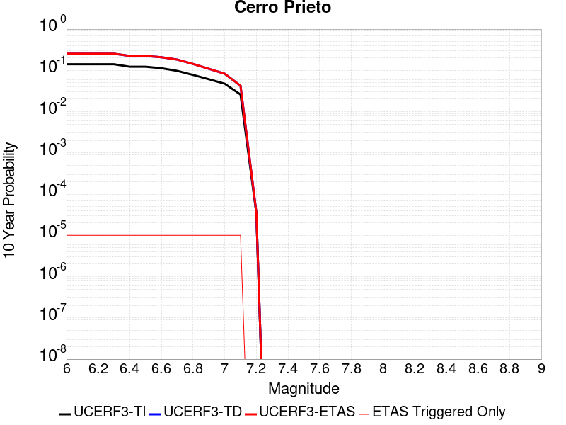 |

| Magnitude | 1 wk TI Prob | 1 wk TD Prob | 1 wk ETAS Prob | 1 wk ETAS/TD Gain | 1 wk ETAS Triggered Only | 1 mo TI Prob | 1 mo TD Prob | 1 mo ETAS Prob | 1 mo ETAS/TD Gain | 1 mo ETAS Triggered Only | 1 yr TI Prob | 1 yr TD Prob | 1 yr ETAS Prob | 1 yr ETAS/TD Gain | 1 yr ETAS Triggered Only | 10 yr TI Prob | 10 yr TD Prob | 10 yr ETAS Prob | 10 yr ETAS/TD Gain | 10 yr ETAS Triggered Only |
|-----|-----|-----|-----|-----|-----|-----|-----|-----|-----|-----|-----|-----|-----|-----|-----|-----|-----|-----|-----|-----|
| 6.0 | 2.9101528E-4 | 5.9654476E-4 | 5.9654476E-4 | 1.0 | 0.0 | 0.0012466122 | 0.0025543578 | 0.0025543578 | 1.0 | 0.0 | 0.015072231 | 0.030800486 | 0.030800486 | 1.0 | 0.0 | 0.14089979 | 0.2538609 | 0.25386834 | 1.0000294 | 1.0E-5 |
| 6.1 | 2.9101528E-4 | 5.9654476E-4 | 5.9654476E-4 | 1.0 | 0.0 | 0.0012466122 | 0.0025543578 | 0.0025543578 | 1.0 | 0.0 | 0.015072231 | 0.030800486 | 0.030800486 | 1.0 | 0.0 | 0.14089979 | 0.2538609 | 0.25386834 | 1.0000294 | 1.0E-5 |
| 6.2 | 2.9101528E-4 | 5.9654476E-4 | 5.9654476E-4 | 1.0 | 0.0 | 0.0012466122 | 0.0025543578 | 0.0025543578 | 1.0 | 0.0 | 0.015072231 | 0.030800486 | 0.030800486 | 1.0 | 0.0 | 0.14089979 | 0.2538609 | 0.25386834 | 1.0000294 | 1.0E-5 |
| 6.3 | 2.9101528E-4 | 5.9654476E-4 | 5.9654476E-4 | 1.0 | 0.0 | 0.0012466122 | 0.0025543578 | 0.0025543578 | 1.0 | 0.0 | 0.015072231 | 0.030800486 | 0.030800486 | 1.0 | 0.0 | 0.14089979 | 0.2538609 | 0.25386834 | 1.0000294 | 1.0E-5 |
| 6.4 | 2.508648E-4 | 5.1404146E-4 | 5.1404146E-4 | 1.0 | 0.0 | 0.0010746918 | 0.0022013735 | 0.0022013735 | 1.0 | 0.0 | 0.013006088 | 0.026626633 | 0.026626633 | 1.0 | 0.0 | 0.12270685 | 0.22422044 | 0.2242282 | 1.0000346 | 1.0E-5 |
| 6.5 | 2.508648E-4 | 5.1404146E-4 | 5.1404146E-4 | 1.0 | 0.0 | 0.0010746918 | 0.0022013735 | 0.0022013735 | 1.0 | 0.0 | 0.013006088 | 0.026626633 | 0.026626633 | 1.0 | 0.0 | 0.12270685 | 0.22422044 | 0.2242282 | 1.0000346 | 1.0E-5 |
| 6.6 | 2.294914E-4 | 4.712365E-4 | 4.712365E-4 | 1.0 | 0.0 | 9.831638E-4 | 0.0020182093 | 0.0020182093 | 1.0 | 0.0 | 0.011904482 | 0.024393763 | 0.024393763 | 1.0 | 0.0 | 0.11286586 | 0.20837535 | 0.20838326 | 1.000038 | 1.0E-5 |
| 6.7 | 1.9621674E-4 | 4.0426268E-4 | 4.0426268E-4 | 1.0 | 0.0 | 8.4065786E-4 | 0.0017315624 | 0.0017315624 | 1.0 | 0.0 | 0.010187071 | 0.020888962 | 0.020888962 | 1.0 | 0.0 | 0.09732539 | 0.18264732 | 0.18265548 | 1.0000447 | 1.0E-5 |
| 6.8 | 1.5476145E-4 | 3.0572579E-4 | 3.0572579E-4 | 1.0 | 0.0 | 6.6309475E-4 | 0.0013096977 | 0.0013096977 | 1.0 | 0.0 | 0.008043335 | 0.015826825 | 0.015826825 | 1.0 | 0.0 | 0.07758363 | 0.14310057 | 0.14310914 | 1.0000598 | 1.0E-5 |
| 6.9 | 1.20509176E-4 | 2.2588465E-4 | 2.2588465E-4 | 1.0 | 0.0 | 5.1636563E-4 | 9.6778123E-4 | 9.6778123E-4 | 1.0 | 0.0 | 0.006268645 | 0.011734025 | 0.011734025 | 1.0 | 0.0 | 0.060947374 | 0.10917958 | 0.10918849 | 1.0000815 | 1.0E-5 |
| 7.0 | 9.3269155E-5 | 1.6721459E-4 | 1.6721459E-4 | 1.0 | 0.0 | 3.9966372E-4 | 7.1648025E-4 | 7.1648025E-4 | 1.0 | 0.0 | 0.0048550544 | 0.008695914 | 0.008695914 | 1.0 | 0.0 | 0.04750344 | 0.082943216 | 0.08295239 | 1.0001105 | 1.0E-5 |
| 7.1 | 5.029709E-5 | 8.174011E-5 | 8.174011E-5 | 1.0 | 0.0 | 2.1554115E-4 | 3.50287E-4 | 3.50287E-4 | 1.0 | 0.0 | 0.0026210553 | 0.004259821 | 0.004259821 | 1.0 | 0.0 | 0.025903556 | 0.04226813 | 0.04227771 | 1.0002266 | 1.0E-5 |
| 7.2 | 6.5445185E-8 | 6.824737E-8 | 6.824737E-8 | 1.0 | 0.0 | 2.8047933E-7 | 2.9248872E-7 | 2.9248872E-7 | 1.0 | 0.0 | 3.4148304E-6 | 3.56105E-6 | 3.56105E-6 | 1.0 | 0.0 | 3.414778E-5 | 3.56105E-5 | 3.56105E-5 | 1.0 | 0.0 |

## Elsinore (Temecula) rev
*[(top)](#table-of-contents)*

| 1 Week | 1 Month | 1 Year | 10 Year |
|-----|-----|-----|-----|
| 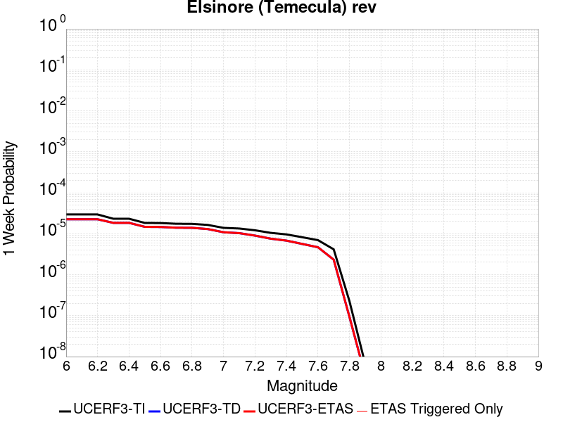 | 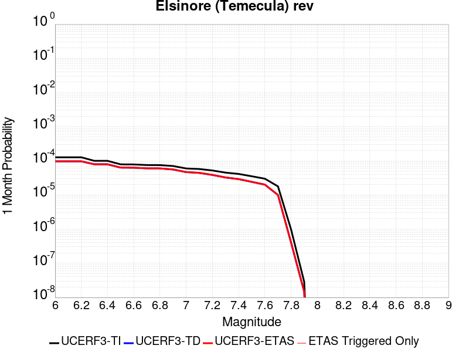 |  |  |

| Magnitude | 1 wk TI Prob | 1 wk TD Prob | 1 wk ETAS Prob | 1 wk ETAS/TD Gain | 1 wk ETAS Triggered Only | 1 mo TI Prob | 1 mo TD Prob | 1 mo ETAS Prob | 1 mo ETAS/TD Gain | 1 mo ETAS Triggered Only | 1 yr TI Prob | 1 yr TD Prob | 1 yr ETAS Prob | 1 yr ETAS/TD Gain | 1 yr ETAS Triggered Only | 10 yr TI Prob | 10 yr TD Prob | 10 yr ETAS Prob | 10 yr ETAS/TD Gain | 10 yr ETAS Triggered Only |
|-----|-----|-----|-----|-----|-----|-----|-----|-----|-----|-----|-----|-----|-----|-----|-----|-----|-----|-----|-----|-----|
| 6.0 | 2.9514995E-5 | 2.2518941E-5 | 2.2518941E-5 | 1.0 | 0.0 | 1.264867E-4 | 9.65063E-5 | 9.65063E-5 | 1.0 | 0.0 | 0.0015388876 | 0.0011743528 | 0.0011743528 | 1.0 | 0.0 | 0.015282745 | 0.01168788 | 0.011697764 | 1.0008456 | 1.0E-5 |
| 6.1 | 2.9514995E-5 | 2.2518941E-5 | 2.2518941E-5 | 1.0 | 0.0 | 1.264867E-4 | 9.65063E-5 | 9.65063E-5 | 1.0 | 0.0 | 0.0015388876 | 0.0011743528 | 0.0011743528 | 1.0 | 0.0 | 0.015282745 | 0.01168788 | 0.011697764 | 1.0008456 | 1.0E-5 |
| 6.2 | 2.9514995E-5 | 2.2518941E-5 | 2.2518941E-5 | 1.0 | 0.0 | 1.264867E-4 | 9.65063E-5 | 9.65063E-5 | 1.0 | 0.0 | 0.0015388876 | 0.0011743528 | 0.0011743528 | 1.0 | 0.0 | 0.015282745 | 0.01168788 | 0.011697764 | 1.0008456 | 1.0E-5 |
| 6.3 | 2.3223649E-5 | 1.8408286E-5 | 1.8408286E-5 | 1.0 | 0.0 | 9.952613E-5 | 7.889036E-5 | 7.889036E-5 | 1.0 | 0.0 | 0.001211057 | 9.6008414E-4 | 9.6008414E-4 | 1.0 | 0.0 | 0.012044783 | 0.009551027 | 0.0095609315 | 1.001037 | 1.0E-5 |
| 6.4 | 2.3223649E-5 | 1.8408286E-5 | 1.8408286E-5 | 1.0 | 0.0 | 9.952613E-5 | 7.889036E-5 | 7.889036E-5 | 1.0 | 0.0 | 0.001211057 | 9.6008414E-4 | 9.6008414E-4 | 1.0 | 0.0 | 0.012044783 | 0.009551027 | 0.0095609315 | 1.001037 | 1.0E-5 |
| 6.5 | 1.8338875E-5 | 1.4750134E-5 | 1.4750134E-5 | 1.0 | 0.0 | 7.8592806E-5 | 6.321338E-5 | 6.321338E-5 | 1.0 | 0.0 | 9.5644733E-4 | 7.693599E-4 | 7.693599E-4 | 1.0 | 0.0 | 0.009523412 | 0.007669707 | 0.00767963 | 1.0012938 | 1.0E-5 |
| 6.6 | 1.8223333E-5 | 1.461269E-5 | 1.461269E-5 | 1.0 | 0.0 | 7.809766E-5 | 6.262436E-5 | 6.262436E-5 | 1.0 | 0.0 | 9.504242E-4 | 7.6219364E-4 | 7.6219364E-4 | 1.0 | 0.0 | 0.009463696 | 0.007598535 | 0.0076084593 | 1.001306 | 1.0E-5 |
| 6.7 | 1.7512752E-5 | 1.4027023E-5 | 1.4027023E-5 | 1.0 | 0.0 | 7.505249E-5 | 6.0114475E-5 | 6.0114475E-5 | 1.0 | 0.0 | 9.13381E-4 | 7.3165656E-4 | 7.3165656E-4 | 1.0 | 0.0 | 0.00909636 | 0.0072980705 | 0.0073079974 | 1.0013602 | 1.0E-5 |
| 6.8 | 1.7417142E-5 | 1.395099E-5 | 1.395099E-5 | 1.0 | 0.0 | 7.4642754E-5 | 5.9788636E-5 | 5.9788636E-5 | 1.0 | 0.0 | 9.083966E-4 | 7.276921E-4 | 7.276921E-4 | 1.0 | 0.0 | 0.009046922 | 0.0072590983 | 0.007269026 | 1.0013676 | 1.0E-5 |
| 6.9 | 1.6402591E-5 | 1.29884265E-5 | 1.29884265E-5 | 1.0 | 0.0 | 7.0294926E-5 | 5.5663542E-5 | 5.5663542E-5 | 1.0 | 0.0 | 8.5550465E-4 | 6.7750056E-4 | 6.7750056E-4 | 1.0 | 0.0 | 0.008522186 | 0.0067595984 | 0.006769531 | 1.0014694 | 1.0E-5 |
| 7.0 | 1.3912486E-5 | 1.0878118E-5 | 1.0878118E-5 | 1.0 | 0.0 | 5.9623577E-5 | 4.6619687E-5 | 4.6619687E-5 | 1.0 | 0.0 | 7.2567526E-4 | 5.674496E-4 | 5.674496E-4 | 1.0 | 0.0 | 0.0072331014 | 0.0056635765 | 0.0056735203 | 1.0017557 | 1.0E-5 |
| 7.1 | 1.3405147E-5 | 1.0327238E-5 | 1.0327238E-5 | 1.0 | 0.0 | 5.7449364E-5 | 4.4258853E-5 | 4.4258853E-5 | 1.0 | 0.0 | 6.9922156E-4 | 5.3872087E-4 | 5.3872087E-4 | 1.0 | 0.0 | 0.0069702556 | 0.005377408 | 0.005387354 | 1.0018497 | 1.0E-5 |
| 7.2 | 1.21402E-5 | 8.996517E-6 | 8.996517E-6 | 1.0 | 0.0 | 5.202839E-5 | 3.855594E-5 | 3.855594E-5 | 1.0 | 0.0 | 6.332616E-4 | 4.6931926E-4 | 4.6931926E-4 | 1.0 | 0.0 | 0.0063146 | 0.004684723 | 0.004694676 | 1.0021245 | 1.0E-5 |
| 7.3 | 1.05047775E-5 | 7.5715525E-6 | 7.5715525E-6 | 1.0 | 0.0 | 4.5019697E-5 | 3.2449116E-5 | 3.2449116E-5 | 1.0 | 0.0 | 5.4797693E-4 | 3.949978E-4 | 3.949978E-4 | 1.0 | 0.0 | 0.005466277 | 0.00394336 | 0.003953321 | 1.0025259 | 1.0E-5 |
| 7.4 | 9.624483E-6 | 6.7866563E-6 | 6.7866563E-6 | 1.0 | 0.0 | 4.124713E-5 | 2.9085353E-5 | 2.9085353E-5 | 1.0 | 0.0 | 5.0206814E-4 | 3.5405802E-4 | 3.5405802E-4 | 1.0 | 0.0 | 0.005009353 | 0.0035350889 | 0.0035450535 | 1.0028188 | 1.0E-5 |
| 7.5 | 8.215151E-6 | 5.635346E-6 | 5.635346E-6 | 1.0 | 0.0 | 3.5207315E-5 | 2.4151266E-5 | 2.4151266E-5 | 1.0 | 0.0 | 4.2856473E-4 | 2.9400326E-4 | 2.9400326E-4 | 1.0 | 0.0 | 0.004277392 | 0.002936271 | 0.002936271 | 1.0 | 0.0 |
| 7.6 | 6.975058E-6 | 4.6758623E-6 | 4.6758623E-6 | 1.0 | 0.0 | 2.9892764E-5 | 2.0039262E-5 | 2.0039262E-5 | 1.0 | 0.0 | 3.6388362E-4 | 2.4395187E-4 | 2.4395187E-4 | 1.0 | 0.0 | 0.0036328835 | 0.002436957 | 0.002436957 | 1.0 | 0.0 |
| 7.7 | 4.159604E-6 | 2.3268049E-6 | 2.3268049E-6 | 1.0 | 0.0 | 1.7826753E-5 | 9.971987E-6 | 9.971987E-6 | 1.0 | 0.0 | 2.1701909E-4 | 1.21402925E-4 | 1.21402925E-4 | 1.0 | 0.0 | 0.0021680726 | 0.001213439 | 0.001213439 | 1.0 | 0.0 |
| 7.8 | 2.2692414E-7 | 9.384503E-8 | 9.384503E-8 | 1.0 | 0.0 | 9.725317E-7 | 4.0219294E-7 | 4.0219294E-7 | 1.0 | 0.0 | 1.1840509E-5 | 4.8966913E-6 | 4.8966913E-6 | 1.0 | 0.0 | 1.1839878E-4 | 4.896616E-5 | 4.896616E-5 | 1.0 | 0.0 |
| 7.9 | 6.676829E-9 | 3.4397292E-9 | 3.4397292E-9 | 1.0 | 0.0 | 2.861498E-8 | 1.4741697E-8 | 1.4741697E-8 | 1.0 | 0.0 | 3.4838732E-7 | 1.7948015E-7 | 1.7948015E-7 | 1.0 | 0.0 | 3.4838679E-6 | 1.7948001E-6 | 1.7948001E-6 | 1.0 | 0.0 |

## Clamshell-Sawpit
*[(top)](#table-of-contents)*

| 1 Week | 1 Month | 1 Year | 10 Year |
|-----|-----|-----|-----|
|  |  |  |  |

| Magnitude | 1 wk TI Prob | 1 wk TD Prob | 1 wk ETAS Prob | 1 wk ETAS/TD Gain | 1 wk ETAS Triggered Only | 1 mo TI Prob | 1 mo TD Prob | 1 mo ETAS Prob | 1 mo ETAS/TD Gain | 1 mo ETAS Triggered Only | 1 yr TI Prob | 1 yr TD Prob | 1 yr ETAS Prob | 1 yr ETAS/TD Gain | 1 yr ETAS Triggered Only | 10 yr TI Prob | 10 yr TD Prob | 10 yr ETAS Prob | 10 yr ETAS/TD Gain | 10 yr ETAS Triggered Only |
|-----|-----|-----|-----|-----|-----|-----|-----|-----|-----|-----|-----|-----|-----|-----|-----|-----|-----|-----|-----|-----|
| 6.0 | 3.202998E-6 | 3.0127658E-6 | 3.0127658E-6 | 1.0 | 0.0 | 1.3727062E-5 | 1.2911793E-5 | 1.2911793E-5 | 1.0 | 0.0 | 1.6711417E-4 | 1.5719056E-4 | 1.5719056E-4 | 1.0 | 0.0 | 0.0016698855 | 0.0015708731 | 0.0015808573 | 1.0063559 | 1.0E-5 |
| 6.1 | 3.202998E-6 | 3.0127658E-6 | 3.0127658E-6 | 1.0 | 0.0 | 1.3727062E-5 | 1.2911793E-5 | 1.2911793E-5 | 1.0 | 0.0 | 1.6711417E-4 | 1.5719056E-4 | 1.5719056E-4 | 1.0 | 0.0 | 0.0016698855 | 0.0015708731 | 0.0015808573 | 1.0063559 | 1.0E-5 |
| 6.2 | 3.202998E-6 | 3.0127658E-6 | 3.0127658E-6 | 1.0 | 0.0 | 1.3727062E-5 | 1.2911793E-5 | 1.2911793E-5 | 1.0 | 0.0 | 1.6711417E-4 | 1.5719056E-4 | 1.5719056E-4 | 1.0 | 0.0 | 0.0016698855 | 0.0015708731 | 0.0015808573 | 1.0063559 | 1.0E-5 |
| 6.3 | 3.202998E-6 | 3.0127658E-6 | 3.0127658E-6 | 1.0 | 0.0 | 1.3727062E-5 | 1.2911793E-5 | 1.2911793E-5 | 1.0 | 0.0 | 1.6711417E-4 | 1.5719056E-4 | 1.5719056E-4 | 1.0 | 0.0 | 0.0016698855 | 0.0015708731 | 0.0015808573 | 1.0063559 | 1.0E-5 |
| 6.4 | 3.202998E-6 | 3.0127658E-6 | 3.0127658E-6 | 1.0 | 0.0 | 1.3727062E-5 | 1.2911793E-5 | 1.2911793E-5 | 1.0 | 0.0 | 1.6711417E-4 | 1.5719056E-4 | 1.5719056E-4 | 1.0 | 0.0 | 0.0016698855 | 0.0015708731 | 0.0015808573 | 1.0063559 | 1.0E-5 |
| 6.5 | 2.5862723E-6 | 2.380776E-6 | 2.380776E-6 | 1.0 | 0.0 | 1.1083977E-5 | 1.0203288E-5 | 1.0203288E-5 | 1.0 | 0.0 | 1.3493907E-4 | 1.2421826E-4 | 1.2421826E-4 | 1.0 | 0.0 | 0.0013485716 | 0.0012415185 | 0.0012515062 | 1.0080446 | 1.0E-5 |
| 6.6 | 2.5862723E-6 | 2.380776E-6 | 2.380776E-6 | 1.0 | 0.0 | 1.1083977E-5 | 1.0203288E-5 | 1.0203288E-5 | 1.0 | 0.0 | 1.3493907E-4 | 1.2421826E-4 | 1.2421826E-4 | 1.0 | 0.0 | 0.0013485716 | 0.0012415185 | 0.0012515062 | 1.0080446 | 1.0E-5 |
| 6.7 | 2.5862723E-6 | 2.380776E-6 | 2.380776E-6 | 1.0 | 0.0 | 1.1083977E-5 | 1.0203288E-5 | 1.0203288E-5 | 1.0 | 0.0 | 1.3493907E-4 | 1.2421826E-4 | 1.2421826E-4 | 1.0 | 0.0 | 0.0013485716 | 0.0012415185 | 0.0012515062 | 1.0080446 | 1.0E-5 |
| 6.8 | 2.4098806E-6 | 2.1977319E-6 | 2.1977319E-6 | 1.0 | 0.0 | 1.0328019E-5 | 9.418819E-6 | 9.418819E-6 | 1.0 | 0.0 | 1.2573638E-4 | 1.1466835E-4 | 1.1466835E-4 | 1.0 | 0.0 | 0.0012566525 | 0.0011461184 | 0.0011561069 | 1.0087152 | 1.0E-5 |
| 6.9 | 2.0073985E-6 | 1.7784257E-6 | 1.7784257E-6 | 1.0 | 0.0 | 8.603109E-6 | 7.621803E-6 | 7.621803E-6 | 1.0 | 0.0 | 1.0473781E-4 | 9.279162E-5 | 9.279162E-5 | 1.0 | 0.0 | 0.0010468846 | 9.275406E-4 | 9.375313E-4 | 1.0107712 | 1.0E-5 |
| 7.0 | 1.8166766E-6 | 1.5807103E-6 | 1.5807103E-6 | 1.0 | 0.0 | 7.785734E-6 | 6.774456E-6 | 6.774456E-6 | 1.0 | 0.0 | 9.478718E-5 | 8.247598E-5 | 8.247598E-5 | 1.0 | 0.0 | 9.4746763E-4 | 8.244638E-4 | 8.244638E-4 | 1.0 | 0.0 |
| 7.1 | 1.5471421E-6 | 1.3052968E-6 | 1.3052968E-6 | 1.0 | 0.0 | 6.6305925E-6 | 5.5941173E-6 | 5.5941173E-6 | 1.0 | 0.0 | 8.072447E-5 | 6.810631E-5 | 6.810631E-5 | 1.0 | 0.0 | 8.0695155E-4 | 6.8085984E-4 | 6.8085984E-4 | 1.0 | 0.0 |
| 7.2 | 1.3608037E-6 | 1.1153448E-6 | 1.1153448E-6 | 1.0 | 0.0 | 5.8320024E-6 | 4.780041E-6 | 4.780041E-6 | 1.0 | 0.0 | 7.1002316E-5 | 5.819549E-5 | 5.819549E-5 | 1.0 | 0.0 | 7.097964E-4 | 5.818071E-4 | 5.818071E-4 | 1.0 | 0.0 |
| 7.3 | 1.0749634E-6 | 8.3842593E-7 | 8.3842593E-7 | 1.0 | 0.0 | 4.6069777E-6 | 3.5932492E-6 | 3.5932492E-6 | 1.0 | 0.0 | 5.608851E-5 | 4.374696E-5 | 4.374696E-5 | 1.0 | 0.0 | 5.6074356E-4 | 4.373863E-4 | 4.373863E-4 | 1.0 | 0.0 |
| 7.4 | 8.416856E-7 | 6.200056E-7 | 6.200056E-7 | 1.0 | 0.0 | 3.607219E-6 | 2.6571643E-6 | 2.6571643E-6 | 1.0 | 0.0 | 4.3917007E-5 | 3.2350516E-5 | 3.2350516E-5 | 1.0 | 0.0 | 4.390833E-4 | 3.2346003E-4 | 3.2346003E-4 | 1.0 | 0.0 |
| 7.5 | 6.2779594E-7 | 4.4968925E-7 | 4.4968925E-7 | 1.0 | 0.0 | 2.6905511E-6 | 1.9272384E-6 | 1.9272384E-6 | 1.0 | 0.0 | 3.275697E-5 | 2.3463892E-5 | 2.3463892E-5 | 1.0 | 0.0 | 3.275214E-4 | 2.3461603E-4 | 2.3461603E-4 | 1.0 | 0.0 |
| 7.6 | 4.3822078E-7 | 3.0595518E-7 | 3.0595518E-7 | 1.0 | 0.0 | 1.8780877E-6 | 1.3112359E-6 | 1.3112359E-6 | 1.0 | 0.0 | 2.2865479E-5 | 1.5964197E-5 | 1.5964197E-5 | 1.0 | 0.0 | 2.2863125E-4 | 1.5963205E-4 | 1.5963205E-4 | 1.0 | 0.0 |
| 7.7 | 1.8704569E-7 | 1.1237907E-7 | 1.1237907E-7 | 1.0 | 0.0 | 8.0162414E-7 | 4.8162445E-7 | 4.8162445E-7 | 1.0 | 0.0 | 9.75973E-6 | 5.863763E-6 | 5.863763E-6 | 1.0 | 0.0 | 9.7593016E-5 | 5.8636146E-5 | 5.8636146E-5 | 1.0 | 0.0 |
| 7.8 | 3.5378733E-8 | 2.1838002E-8 | 2.1838002E-8 | 1.0 | 0.0 | 1.5162313E-7 | 9.359143E-8 | 9.359143E-8 | 1.0 | 0.0 | 1.84601E-6 | 1.1394751E-6 | 1.1394751E-6 | 1.0 | 0.0 | 1.8459947E-5 | 1.1394695E-5 | 1.1394695E-5 | 1.0 | 0.0 |
| 7.9 | 7.504945E-9 | 5.1921663E-9 | 5.1921663E-9 | 1.0 | 0.0 | 3.2164053E-8 | 2.2252141E-8 | 2.2252141E-8 | 1.0 | 0.0 | 3.9159727E-7 | 2.709198E-7 | 2.709198E-7 | 1.0 | 0.0 | 3.915966E-6 | 2.7091953E-6 | 2.7091953E-6 | 1.0 | 0.0 |
| 8.0 | 1.6554036E-10 | 1.418149E-10 | 1.418149E-10 | 1.0 | 0.0 | 7.0945894E-10 | 6.0777794E-10 | 6.0777794E-10 | 1.0 | 0.0 | 8.637662E-9 | 7.3996964E-9 | 7.3996964E-9 | 1.0 | 0.0 | 8.6376616E-8 | 7.3996965E-8 | 7.3996965E-8 | 1.0 | 0.0 |

## Thirty Mile Bank
*[(top)](#table-of-contents)*

| 1 Week | 1 Month | 1 Year | 10 Year |
|-----|-----|-----|-----|
|  | 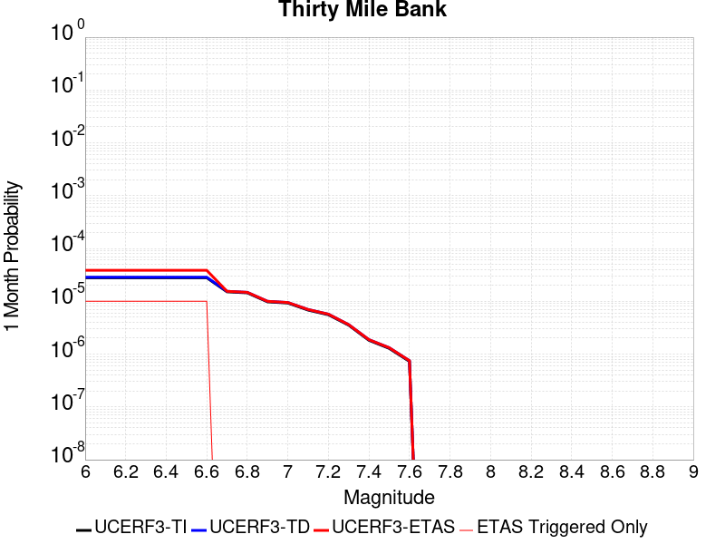 |  |  |

| Magnitude | 1 wk TI Prob | 1 wk TD Prob | 1 wk ETAS Prob | 1 wk ETAS/TD Gain | 1 wk ETAS Triggered Only | 1 mo TI Prob | 1 mo TD Prob | 1 mo ETAS Prob | 1 mo ETAS/TD Gain | 1 mo ETAS Triggered Only | 1 yr TI Prob | 1 yr TD Prob | 1 yr ETAS Prob | 1 yr ETAS/TD Gain | 1 yr ETAS Triggered Only | 10 yr TI Prob | 10 yr TD Prob | 10 yr ETAS Prob | 10 yr ETAS/TD Gain | 10 yr ETAS Triggered Only |
|-----|-----|-----|-----|-----|-----|-----|-----|-----|-----|-----|-----|-----|-----|-----|-----|-----|-----|-----|-----|-----|
| 6.0 | 6.5124755E-6 | 6.659266E-6 | 6.659266E-6 | 1.0 | 0.0 | 2.791031E-5 | 2.8539425E-5 | 3.853914E-5 | 1.3503824 | 1.0E-5 | 3.3975503E-4 | 3.4741647E-4 | 3.57413E-4 | 1.0287739 | 1.0E-5 | 0.0033923604 | 0.003469165 | 0.0034791303 | 1.0028726 | 1.0E-5 |
| 6.1 | 6.5124755E-6 | 6.659266E-6 | 6.659266E-6 | 1.0 | 0.0 | 2.791031E-5 | 2.8539425E-5 | 3.853914E-5 | 1.3503824 | 1.0E-5 | 3.3975503E-4 | 3.4741647E-4 | 3.57413E-4 | 1.0287739 | 1.0E-5 | 0.0033923604 | 0.003469165 | 0.0034791303 | 1.0028726 | 1.0E-5 |
| 6.2 | 6.5124755E-6 | 6.659266E-6 | 6.659266E-6 | 1.0 | 0.0 | 2.791031E-5 | 2.8539425E-5 | 3.853914E-5 | 1.3503824 | 1.0E-5 | 3.3975503E-4 | 3.4741647E-4 | 3.57413E-4 | 1.0287739 | 1.0E-5 | 0.0033923604 | 0.003469165 | 0.0034791303 | 1.0028726 | 1.0E-5 |
| 6.3 | 6.5124755E-6 | 6.659266E-6 | 6.659266E-6 | 1.0 | 0.0 | 2.791031E-5 | 2.8539425E-5 | 3.853914E-5 | 1.3503824 | 1.0E-5 | 3.3975503E-4 | 3.4741647E-4 | 3.57413E-4 | 1.0287739 | 1.0E-5 | 0.0033923604 | 0.003469165 | 0.0034791303 | 1.0028726 | 1.0E-5 |
| 6.4 | 6.5124755E-6 | 6.659266E-6 | 6.659266E-6 | 1.0 | 0.0 | 2.791031E-5 | 2.8539425E-5 | 3.853914E-5 | 1.3503824 | 1.0E-5 | 3.3975503E-4 | 3.4741647E-4 | 3.57413E-4 | 1.0287739 | 1.0E-5 | 0.0033923604 | 0.003469165 | 0.0034791303 | 1.0028726 | 1.0E-5 |
| 6.5 | 6.5124755E-6 | 6.659266E-6 | 6.659266E-6 | 1.0 | 0.0 | 2.791031E-5 | 2.8539425E-5 | 3.853914E-5 | 1.3503824 | 1.0E-5 | 3.3975503E-4 | 3.4741647E-4 | 3.57413E-4 | 1.0287739 | 1.0E-5 | 0.0033923604 | 0.003469165 | 0.0034791303 | 1.0028726 | 1.0E-5 |
| 6.6 | 6.5124755E-6 | 6.659266E-6 | 6.659266E-6 | 1.0 | 0.0 | 2.791031E-5 | 2.8539425E-5 | 3.853914E-5 | 1.3503824 | 1.0E-5 | 3.3975503E-4 | 3.4741647E-4 | 3.57413E-4 | 1.0287739 | 1.0E-5 | 0.0033923604 | 0.003469165 | 0.0034791303 | 1.0028726 | 1.0E-5 |
| 6.7 | 3.5261137E-6 | 3.6099007E-6 | 3.6099007E-6 | 1.0 | 0.0 | 1.5111828E-5 | 1.5470914E-5 | 1.5470914E-5 | 1.0 | 0.0 | 1.8397097E-4 | 1.8834276E-4 | 1.8834276E-4 | 1.0 | 0.0 | 0.0018381875 | 0.0018818964 | 0.0018818964 | 1.0 | 0.0 |
| 6.8 | 3.370743E-6 | 3.4509367E-6 | 3.4509367E-6 | 1.0 | 0.0 | 1.4445961E-5 | 1.4789648E-5 | 1.4789648E-5 | 1.0 | 0.0 | 1.7586538E-4 | 1.8004971E-4 | 1.8004971E-4 | 1.0 | 0.0 | 0.0017572626 | 0.0017991002 | 0.0017991002 | 1.0 | 0.0 |
| 6.9 | 2.2756835E-6 | 2.3331618E-6 | 2.3331618E-6 | 1.0 | 0.0 | 9.752893E-6 | 9.999228E-6 | 9.999228E-6 | 1.0 | 0.0 | 1.18735006E-4 | 1.2173405E-4 | 1.2173405E-4 | 1.0 | 0.0 | 0.0011867158 | 0.0012166982 | 0.0012166982 | 1.0 | 0.0 |
| 7.0 | 2.1617404E-6 | 2.2159807E-6 | 2.2159807E-6 | 1.0 | 0.0 | 9.264569E-6 | 9.497026E-6 | 9.497026E-6 | 1.0 | 0.0 | 1.1279029E-4 | 1.1562041E-4 | 1.1562041E-4 | 1.0 | 0.0 | 0.0011273306 | 0.0011556266 | 0.0011556266 | 1.0 | 0.0 |
| 7.1 | 1.5900777E-6 | 1.6327019E-6 | 1.6327019E-6 | 1.0 | 0.0 | 6.814601E-6 | 6.997276E-6 | 6.997276E-6 | 1.0 | 0.0 | 8.296461E-5 | 8.5188636E-5 | 8.5188636E-5 | 1.0 | 0.0 | 8.293364E-4 | 8.5157255E-4 | 8.5157255E-4 | 1.0 | 0.0 |
| 7.2 | 1.2971728E-6 | 1.3328996E-6 | 1.3328996E-6 | 1.0 | 0.0 | 5.5593005E-6 | 5.712415E-6 | 5.712415E-6 | 1.0 | 0.0 | 6.768238E-5 | 6.9546535E-5 | 6.9546535E-5 | 1.0 | 0.0 | 6.7661767E-4 | 6.952581E-4 | 6.952581E-4 | 1.0 | 0.0 |
| 7.3 | 8.2454284E-7 | 8.4488937E-7 | 8.4488937E-7 | 1.0 | 0.0 | 3.5337503E-6 | 3.6209497E-6 | 3.6209497E-6 | 1.0 | 0.0 | 4.302256E-5 | 4.4084234E-5 | 4.4084234E-5 | 1.0 | 0.0 | 4.301423E-4 | 4.4076092E-4 | 4.4076092E-4 | 1.0 | 0.0 |
| 7.4 | 4.2619024E-7 | 4.3863483E-7 | 4.3863483E-7 | 1.0 | 0.0 | 1.8265283E-6 | 1.8798622E-6 | 1.8798622E-6 | 1.0 | 0.0 | 2.2237757E-5 | 2.2887087E-5 | 2.2887087E-5 | 1.0 | 0.0 | 2.223553E-4 | 2.2884768E-4 | 2.2884768E-4 | 1.0 | 0.0 |
| 7.5 | 2.993922E-7 | 3.086454E-7 | 3.086454E-7 | 1.0 | 0.0 | 1.2831089E-6 | 1.3227655E-6 | 1.3227655E-6 | 1.0 | 0.0 | 1.5621737E-5 | 1.6104552E-5 | 1.6104552E-5 | 1.0 | 0.0 | 1.562064E-4 | 1.6103411E-4 | 1.6103411E-4 | 1.0 | 0.0 |
| 7.6 | 1.6988751E-7 | 1.753383E-7 | 1.753383E-7 | 1.0 | 0.0 | 7.2808916E-7 | 7.5144965E-7 | 7.5144965E-7 | 1.0 | 0.0 | 8.864449E-6 | 9.148864E-6 | 9.148864E-6 | 1.0 | 0.0 | 8.8640954E-5 | 9.148506E-5 | 9.148506E-5 | 1.0 | 0.0 |

## Davis Creek
*[(top)](#table-of-contents)*

| 1 Week | 1 Month | 1 Year | 10 Year |
|-----|-----|-----|-----|
|  | 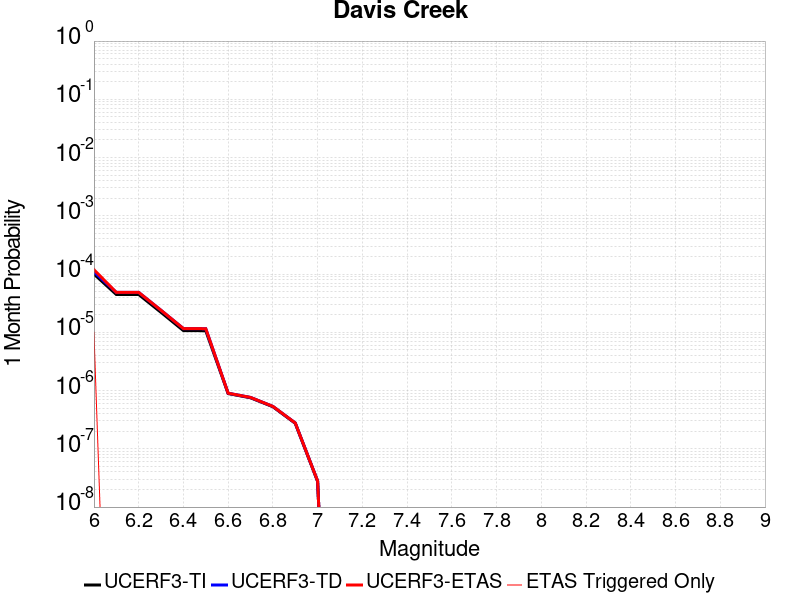 |  |  |

| Magnitude | 1 wk TI Prob | 1 wk TD Prob | 1 wk ETAS Prob | 1 wk ETAS/TD Gain | 1 wk ETAS Triggered Only | 1 mo TI Prob | 1 mo TD Prob | 1 mo ETAS Prob | 1 mo ETAS/TD Gain | 1 mo ETAS Triggered Only | 1 yr TI Prob | 1 yr TD Prob | 1 yr ETAS Prob | 1 yr ETAS/TD Gain | 1 yr ETAS Triggered Only | 10 yr TI Prob | 10 yr TD Prob | 10 yr ETAS Prob | 10 yr ETAS/TD Gain | 10 yr ETAS Triggered Only |
|-----|-----|-----|-----|-----|-----|-----|-----|-----|-----|-----|-----|-----|-----|-----|-----|-----|-----|-----|-----|-----|
| 6.0 | 2.331472E-5 | 2.5417243E-5 | 3.5416986E-5 | 1.3934237 | 1.0E-5 | 9.99164E-5 | 1.0892716E-4 | 1.18926066E-4 | 1.0917945 | 1.0E-5 | 0.0012158032 | 0.0013254998 | 0.0013354865 | 1.0075343 | 1.0E-5 | 0.01209173 | 0.013187719 | 0.013197587 | 1.0007483 | 1.0E-5 |
| 6.1 | 1.0407654E-5 | 1.1316999E-5 | 1.1316999E-5 | 1.0 | 0.0 | 4.4603472E-5 | 4.8500675E-5 | 4.8500675E-5 | 1.0 | 0.0 | 5.4291193E-4 | 5.903629E-4 | 5.903629E-4 | 1.0 | 0.0 | 0.0054158745 | 0.0058906176 | 0.0058906176 | 1.0 | 0.0 |
| 6.2 | 1.0407654E-5 | 1.1316999E-5 | 1.1316999E-5 | 1.0 | 0.0 | 4.4603472E-5 | 4.8500675E-5 | 4.8500675E-5 | 1.0 | 0.0 | 5.4291193E-4 | 5.903629E-4 | 5.903629E-4 | 1.0 | 0.0 | 0.0054158745 | 0.0058906176 | 0.0058906176 | 1.0 | 0.0 |
| 6.3 | 5.1323277E-6 | 5.568562E-6 | 5.568562E-6 | 1.0 | 0.0 | 2.1995505E-5 | 2.3865095E-5 | 2.3865095E-5 | 1.0 | 0.0 | 2.6776237E-4 | 2.9052742E-4 | 2.9052742E-4 | 1.0 | 0.0 | 0.0026743996 | 0.0029023222 | 0.0029023222 | 1.0 | 0.0 |
| 6.4 | 2.4985154E-6 | 2.704541E-6 | 2.704541E-6 | 1.0 | 0.0 | 1.07078795E-5 | 1.1590859E-5 | 1.1590859E-5 | 1.0 | 0.0 | 1.3036063E-4 | 1.4111318E-4 | 1.4111318E-4 | 1.0 | 0.0 | 0.0013028418 | 0.0014105905 | 0.0014105905 | 1.0 | 0.0 |
| 6.5 | 2.4846438E-6 | 2.690475E-6 | 2.690475E-6 | 1.0 | 0.0 | 1.064843E-5 | 1.1530577E-5 | 1.1530577E-5 | 1.0 | 0.0 | 1.2963692E-4 | 1.4037934E-4 | 1.4037934E-4 | 1.0 | 0.0 | 0.0012956132 | 0.0014032614 | 0.0014032614 | 1.0 | 0.0 |
| 6.6 | 2.072566E-7 | 2.1018091E-7 | 2.1018091E-7 | 1.0 | 0.0 | 8.882423E-7 | 9.0077504E-7 | 9.0077504E-7 | 1.0 | 0.0 | 1.0814296E-5 | 1.0966883E-5 | 1.0966883E-5 | 1.0 | 0.0 | 1.081377E-4 | 1.096636E-4 | 1.096636E-4 | 1.0 | 0.0 |
| 6.7 | 1.7544528E-7 | 1.7790829E-7 | 1.7790829E-7 | 1.0 | 0.0 | 7.5190815E-7 | 7.6246386E-7 | 7.6246386E-7 | 1.0 | 0.0 | 9.154443E-6 | 9.28296E-6 | 9.28296E-6 | 1.0 | 0.0 | 9.1540656E-5 | 9.2825874E-5 | 9.2825874E-5 | 1.0 | 0.0 |
| 6.8 | 1.2320395E-7 | 1.248114E-7 | 1.248114E-7 | 1.0 | 0.0 | 5.280168E-7 | 5.349059E-7 | 5.349059E-7 | 1.0 | 0.0 | 6.428586E-6 | 6.512461E-6 | 6.512461E-6 | 1.0 | 0.0 | 6.4284E-5 | 6.512281E-5 | 6.512281E-5 | 1.0 | 0.0 |
| 6.9 | 6.399997E-8 | 6.4860586E-8 | 6.4860586E-8 | 1.0 | 0.0 | 2.7428555E-7 | 2.7797392E-7 | 2.7797392E-7 | 1.0 | 0.0 | 3.3394215E-6 | 3.384328E-6 | 3.384328E-6 | 1.0 | 0.0 | 3.3393713E-5 | 3.384283E-5 | 3.384283E-5 | 1.0 | 0.0 |
| 7.0 | 6.4455685E-9 | 6.535265E-9 | 6.535265E-9 | 1.0 | 0.0 | 2.7623864E-8 | 2.800828E-8 | 2.800828E-8 | 1.0 | 0.0 | 3.3632048E-7 | 3.410008E-7 | 3.410008E-7 | 1.0 | 0.0 | 3.3631998E-6 | 3.410008E-6 | 3.410008E-6 | 1.0 | 0.0 |

## Great Valley 10 (Panoche)
*[(top)](#table-of-contents)*

| 1 Week | 1 Month | 1 Year | 10 Year |
|-----|-----|-----|-----|
|  |  |  | 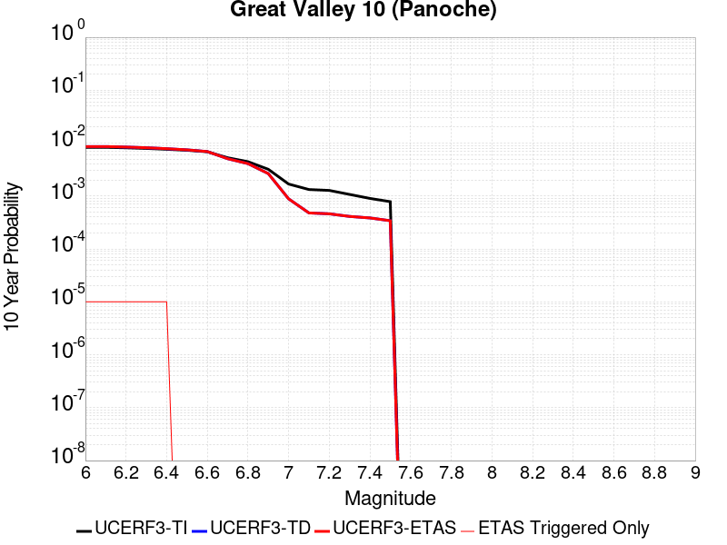 |

| Magnitude | 1 wk TI Prob | 1 wk TD Prob | 1 wk ETAS Prob | 1 wk ETAS/TD Gain | 1 wk ETAS Triggered Only | 1 mo TI Prob | 1 mo TD Prob | 1 mo ETAS Prob | 1 mo ETAS/TD Gain | 1 mo ETAS Triggered Only | 1 yr TI Prob | 1 yr TD Prob | 1 yr ETAS Prob | 1 yr ETAS/TD Gain | 1 yr ETAS Triggered Only | 10 yr TI Prob | 10 yr TD Prob | 10 yr ETAS Prob | 10 yr ETAS/TD Gain | 10 yr ETAS Triggered Only |
|-----|-----|-----|-----|-----|-----|-----|-----|-----|-----|-----|-----|-----|-----|-----|-----|-----|-----|-----|-----|-----|
| 6.0 | 1.6014626E-5 | 1.6575388E-5 | 1.6575388E-5 | 1.0 | 0.0 | 6.863231E-5 | 7.103548E-5 | 7.103548E-5 | 1.0 | 0.0 | 8.35278E-4 | 8.6451933E-4 | 8.745107E-4 | 1.0115571 | 1.0E-5 | 0.008321454 | 0.008612175 | 0.0086220885 | 1.0011512 | 1.0E-5 |
| 6.1 | 1.6014626E-5 | 1.6575388E-5 | 1.6575388E-5 | 1.0 | 0.0 | 6.863231E-5 | 7.103548E-5 | 7.103548E-5 | 1.0 | 0.0 | 8.35278E-4 | 8.6451933E-4 | 8.745107E-4 | 1.0115571 | 1.0E-5 | 0.008321454 | 0.008612175 | 0.0086220885 | 1.0011512 | 1.0E-5 |
| 6.2 | 1.56782E-5 | 1.6198435E-5 | 1.6198435E-5 | 1.0 | 0.0 | 6.719056E-5 | 6.942005E-5 | 6.942005E-5 | 1.0 | 0.0 | 8.17738E-4 | 8.4486685E-4 | 8.548584E-4 | 1.0118262 | 1.0E-5 | 0.008147354 | 0.00841715 | 0.008427066 | 1.001178 | 1.0E-5 |
| 6.3 | 1.5263338E-5 | 1.5723503E-5 | 1.5723503E-5 | 1.0 | 0.0 | 6.541267E-5 | 6.738473E-5 | 6.738473E-5 | 1.0 | 0.0 | 7.961082E-4 | 8.2010566E-4 | 8.300975E-4 | 1.0121835 | 1.0E-5 | 0.007932622 | 0.008171379 | 0.008181297 | 1.0012138 | 1.0E-5 |
| 6.4 | 1.4720723E-5 | 1.5099363E-5 | 1.5099363E-5 | 1.0 | 0.0 | 6.308728E-5 | 6.470998E-5 | 6.470998E-5 | 1.0 | 0.0 | 7.67817E-4 | 7.8756455E-4 | 7.9755666E-4 | 1.0126873 | 1.0E-5 | 0.007651695 | 0.007848305 | 0.007858226 | 1.0012642 | 1.0E-5 |
| 6.5 | 1.408264E-5 | 1.4355956E-5 | 1.4355956E-5 | 1.0 | 0.0 | 6.0352773E-5 | 6.152411E-5 | 6.152411E-5 | 1.0 | 0.0 | 7.3454727E-4 | 7.488037E-4 | 7.488037E-4 | 1.0 | 0.0 | 0.0073212404 | 0.0074633565 | 0.0074633565 | 1.0 | 0.0 |
| 6.6 | 1.3197086E-5 | 1.3321872E-5 | 1.3321872E-5 | 1.0 | 0.0 | 5.6557717E-5 | 5.7092515E-5 | 5.7092515E-5 | 1.0 | 0.0 | 6.8837265E-4 | 6.9488474E-4 | 6.9488474E-4 | 1.0 | 0.0 | 0.006862442 | 0.0069276528 | 0.0069276528 | 1.0 | 0.0 |
| 6.7 | 1.017583E-5 | 9.745366E-6 | 9.745366E-6 | 1.0 | 0.0 | 4.360997E-5 | 4.1765197E-5 | 4.1765197E-5 | 1.0 | 0.0 | 5.30822E-4 | 5.0837506E-4 | 5.0837506E-4 | 1.0 | 0.0 | 0.0052955584 | 0.005072373 | 0.005072373 | 1.0 | 0.0 |
| 6.8 | 8.557912E-6 | 7.872687E-6 | 7.872687E-6 | 1.0 | 0.0 | 3.667625E-5 | 3.3739663E-5 | 3.3739663E-5 | 1.0 | 0.0 | 4.4644187E-4 | 4.10705E-4 | 4.10705E-4 | 1.0 | 0.0 | 0.0044554602 | 0.0040996666 | 0.0040996666 | 1.0 | 0.0 |
| 6.9 | 6.14664E-6 | 5.0920457E-6 | 5.0920457E-6 | 1.0 | 0.0 | 2.6342475E-5 | 2.1822878E-5 | 2.1822878E-5 | 1.0 | 0.0 | 3.2067244E-4 | 2.6566253E-4 | 2.6566253E-4 | 1.0 | 0.0 | 0.003202101 | 0.0026535878 | 0.0026535878 | 1.0 | 0.0 |
| 7.0 | 3.2310581E-6 | 1.6950892E-6 | 1.6950892E-6 | 1.0 | 0.0 | 1.3847319E-5 | 7.264648E-6 | 7.264648E-6 | 1.0 | 0.0 | 1.6857806E-4 | 8.8443594E-5 | 8.8443594E-5 | 1.0 | 0.0 | 0.0016845023 | 8.8409334E-4 | 8.8409334E-4 | 1.0 | 0.0 |
| 7.1 | 2.544492E-6 | 9.18858E-7 | 9.18858E-7 | 1.0 | 0.0 | 1.090492E-5 | 3.9379574E-6 | 3.9379574E-6 | 1.0 | 0.0 | 1.327593E-4 | 4.7943624E-5 | 4.7943624E-5 | 1.0 | 0.0 | 0.0013268003 | 4.7933758E-4 | 4.7933758E-4 | 1.0 | 0.0 |
| 7.2 | 2.4479045E-6 | 8.840983E-7 | 8.840983E-7 | 1.0 | 0.0 | 1.0490977E-5 | 3.7889874E-6 | 3.7889874E-6 | 1.0 | 0.0 | 1.2772017E-4 | 4.6129993E-5 | 4.6129993E-5 | 1.0 | 0.0 | 0.0012764678 | 4.6120893E-4 | 4.6120893E-4 | 1.0 | 0.0 |
| 7.3 | 2.0559578E-6 | 7.892521E-7 | 7.892521E-7 | 1.0 | 0.0 | 8.811218E-6 | 3.382505E-6 | 3.382505E-6 | 1.0 | 0.0 | 1.072713E-4 | 4.1181265E-5 | 4.1181265E-5 | 1.0 | 0.0 | 0.0010721954 | 4.1174097E-4 | 4.1174097E-4 | 1.0 | 0.0 |
| 7.4 | 1.727687E-6 | 7.3875697E-7 | 7.3875697E-7 | 1.0 | 0.0 | 7.404352E-6 | 3.1660977E-6 | 3.1660977E-6 | 1.0 | 0.0 | 9.0144255E-5 | 3.8546605E-5 | 3.8546605E-5 | 1.0 | 0.0 | 9.0107694E-4 | 3.854038E-4 | 3.854038E-4 | 1.0 | 0.0 |
| 7.5 | 1.5002679E-6 | 6.545985E-7 | 6.545985E-7 | 1.0 | 0.0 | 6.4297037E-6 | 2.8054194E-6 | 2.8054194E-6 | 1.0 | 0.0 | 7.827883E-5 | 3.4155488E-5 | 3.4155488E-5 | 1.0 | 0.0 | 7.825126E-4 | 3.4150656E-4 | 3.4150656E-4 | 1.0 | 0.0 |

## Newport-Inglewood alt 1
*[(top)](#table-of-contents)*

| 1 Week | 1 Month | 1 Year | 10 Year |
|-----|-----|-----|-----|
| 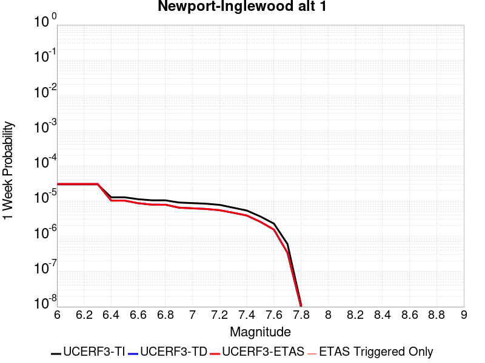 |  | 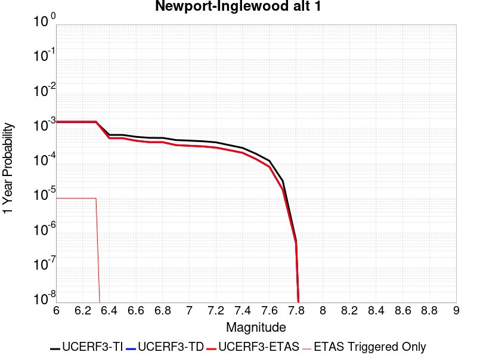 |  |

| Magnitude | 1 wk TI Prob | 1 wk TD Prob | 1 wk ETAS Prob | 1 wk ETAS/TD Gain | 1 wk ETAS Triggered Only | 1 mo TI Prob | 1 mo TD Prob | 1 mo ETAS Prob | 1 mo ETAS/TD Gain | 1 mo ETAS Triggered Only | 1 yr TI Prob | 1 yr TD Prob | 1 yr ETAS Prob | 1 yr ETAS/TD Gain | 1 yr ETAS Triggered Only | 10 yr TI Prob | 10 yr TD Prob | 10 yr ETAS Prob | 10 yr ETAS/TD Gain | 10 yr ETAS Triggered Only |
|-----|-----|-----|-----|-----|-----|-----|-----|-----|-----|-----|-----|-----|-----|-----|-----|-----|-----|-----|-----|-----|
| 6.0 | 2.9668912E-5 | 3.0404935E-5 | 3.0404935E-5 | 1.0 | 0.0 | 1.2714628E-4 | 1.303031E-4 | 1.403018E-4 | 1.0767342 | 1.0E-5 | 0.0015469068 | 0.001585771 | 0.0015957551 | 1.006296 | 1.0E-5 | 0.015361829 | 0.015792165 | 0.015802007 | 1.0006232 | 1.0E-5 |
| 6.1 | 2.9668912E-5 | 3.0404935E-5 | 3.0404935E-5 | 1.0 | 0.0 | 1.2714628E-4 | 1.303031E-4 | 1.403018E-4 | 1.0767342 | 1.0E-5 | 0.0015469068 | 0.001585771 | 0.0015957551 | 1.006296 | 1.0E-5 | 0.015361829 | 0.015792165 | 0.015802007 | 1.0006232 | 1.0E-5 |
| 6.2 | 2.9668912E-5 | 3.0404935E-5 | 3.0404935E-5 | 1.0 | 0.0 | 1.2714628E-4 | 1.303031E-4 | 1.403018E-4 | 1.0767342 | 1.0E-5 | 0.0015469068 | 0.001585771 | 0.0015957551 | 1.006296 | 1.0E-5 | 0.015361829 | 0.015792165 | 0.015802007 | 1.0006232 | 1.0E-5 |
| 6.3 | 2.9668912E-5 | 3.0404935E-5 | 3.0404935E-5 | 1.0 | 0.0 | 1.2714628E-4 | 1.303031E-4 | 1.403018E-4 | 1.0767342 | 1.0E-5 | 0.0015469068 | 0.001585771 | 0.0015957551 | 1.006296 | 1.0E-5 | 0.015361829 | 0.015792165 | 0.015802007 | 1.0006232 | 1.0E-5 |
| 6.4 | 1.275942E-5 | 1.0272589E-5 | 1.0272589E-5 | 1.0 | 0.0 | 5.4682085E-5 | 4.4024662E-5 | 4.4024662E-5 | 1.0 | 0.0 | 6.65551E-4 | 5.358726E-4 | 5.358726E-4 | 1.0 | 0.0 | 0.0066356123 | 0.0053462293 | 0.0053462293 | 1.0 | 0.0 |
| 6.5 | 1.275942E-5 | 1.0272589E-5 | 1.0272589E-5 | 1.0 | 0.0 | 5.4682085E-5 | 4.4024662E-5 | 4.4024662E-5 | 1.0 | 0.0 | 6.65551E-4 | 5.358726E-4 | 5.358726E-4 | 1.0 | 0.0 | 0.0066356123 | 0.0053462293 | 0.0053462293 | 1.0 | 0.0 |
| 6.6 | 1.1255358E-5 | 8.661965E-6 | 8.661965E-6 | 1.0 | 0.0 | 4.8236358E-5 | 3.7122187E-5 | 3.7122187E-5 | 1.0 | 0.0 | 5.871194E-4 | 4.518706E-4 | 4.518706E-4 | 1.0 | 0.0 | 0.005855706 | 0.0045096953 | 0.0045096953 | 1.0 | 0.0 |
| 6.7 | 1.0504745E-5 | 7.899898E-6 | 7.899898E-6 | 1.0 | 0.0 | 4.5019555E-5 | 3.3856275E-5 | 3.3856275E-5 | 1.0 | 0.0 | 5.4797524E-4 | 4.1212342E-4 | 4.1212342E-4 | 1.0 | 0.0 | 0.0054662596 | 0.004113721 | 0.004113721 | 1.0 | 0.0 |
| 6.8 | 1.0476007E-5 | 7.88128E-6 | 7.88128E-6 | 1.0 | 0.0 | 4.4896402E-5 | 3.3776483E-5 | 3.3776483E-5 | 1.0 | 0.0 | 5.464766E-4 | 4.1115232E-4 | 4.1115232E-4 | 1.0 | 0.0 | 0.005451347 | 0.004104046 | 0.004104046 | 1.0 | 0.0 |
| 6.9 | 9.076797E-6 | 6.489708E-6 | 6.489708E-6 | 1.0 | 0.0 | 3.889998E-5 | 2.7812739E-5 | 2.7812739E-5 | 1.0 | 0.0 | 4.7350433E-4 | 3.3856783E-4 | 3.3856783E-4 | 1.0 | 0.0 | 0.004724967 | 0.0033805575 | 0.0033805575 | 1.0 | 0.0 |
| 7.0 | 8.73795E-6 | 6.212101E-6 | 6.212101E-6 | 1.0 | 0.0 | 3.7447822E-5 | 2.6623022E-5 | 2.6623022E-5 | 1.0 | 0.0 | 4.5583185E-4 | 3.2408736E-4 | 3.2408736E-4 | 1.0 | 0.0 | 0.0045489795 | 0.0032361788 | 0.0032361788 | 1.0 | 0.0 |
| 7.1 | 8.391299E-6 | 5.955804E-6 | 5.955804E-6 | 1.0 | 0.0 | 3.5962214E-5 | 2.5524627E-5 | 2.5524627E-5 | 1.0 | 0.0 | 4.37752E-4 | 3.107183E-4 | 3.107183E-4 | 1.0 | 0.0 | 0.004368907 | 0.003102868 | 0.003102868 | 1.0 | 0.0 |
| 7.2 | 7.796882E-6 | 5.4965335E-6 | 5.4965335E-6 | 1.0 | 0.0 | 3.341478E-5 | 2.3556362E-5 | 2.3556362E-5 | 1.0 | 0.0 | 4.06749E-4 | 2.8676118E-4 | 2.8676118E-4 | 1.0 | 0.0 | 0.0040600533 | 0.0028639354 | 0.0028639354 | 1.0 | 0.0 |
| 7.3 | 6.4738833E-6 | 4.647777E-6 | 4.647777E-6 | 1.0 | 0.0 | 2.774492E-5 | 1.9918894E-5 | 1.9918894E-5 | 1.0 | 0.0 | 3.3774204E-4 | 2.424857E-4 | 2.424857E-4 | 1.0 | 0.0 | 0.0033722918 | 0.0024222278 | 0.0024222278 | 1.0 | 0.0 |
| 7.4 | 5.382145E-6 | 3.885723E-6 | 3.885723E-6 | 1.0 | 0.0 | 2.3066134E-5 | 1.6652994E-5 | 1.6652994E-5 | 1.0 | 0.0 | 2.8079396E-4 | 2.0273146E-4 | 2.0273146E-4 | 1.0 | 0.0 | 0.0028043943 | 0.0020254797 | 0.0020254797 | 1.0 | 0.0 |
| 7.5 | 3.648244E-6 | 2.5737638E-6 | 2.5737638E-6 | 1.0 | 0.0 | 1.5635238E-5 | 1.103037E-5 | 1.103037E-5 | 1.0 | 0.0 | 1.9034238E-4 | 1.3428659E-4 | 1.3428659E-4 | 1.0 | 0.0 | 0.0019017943 | 0.0013420648 | 0.0013420648 | 1.0 | 0.0 |
| 7.6 | 2.2906888E-6 | 1.5479861E-6 | 1.5479861E-6 | 1.0 | 0.0 | 9.817201E-6 | 6.63421E-6 | 6.63421E-6 | 1.0 | 0.0 | 1.1951787E-4 | 8.076858E-5 | 8.076858E-5 | 1.0 | 0.0 | 0.0011945361 | 8.07399E-4 | 8.07399E-4 | 1.0 | 0.0 |
| 7.7 | 6.0479874E-7 | 3.397468E-7 | 3.397468E-7 | 1.0 | 0.0 | 2.5919921E-6 | 1.456057E-6 | 1.456057E-6 | 1.0 | 0.0 | 3.1557047E-5 | 1.7727363E-5 | 1.7727363E-5 | 1.0 | 0.0 | 3.1552566E-4 | 1.7726087E-4 | 1.7726087E-4 | 1.0 | 0.0 |
| 7.8 | 1.16056995E-8 | 9.782997E-9 | 9.782997E-9 | 1.0 | 0.0 | 4.9738713E-8 | 4.1927127E-8 | 4.1927127E-8 | 1.0 | 0.0 | 6.0556863E-7 | 5.1046277E-7 | 5.1046277E-7 | 1.0 | 0.0 | 6.05567E-6 | 5.1046277E-6 | 5.1046277E-6 | 1.0 | 0.0 |

## Malibu Coast alt 1
*[(top)](#table-of-contents)*

| 1 Week | 1 Month | 1 Year | 10 Year |
|-----|-----|-----|-----|
|  | 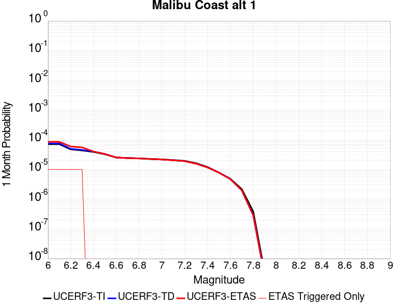 |  |  |

| Magnitude | 1 wk TI Prob | 1 wk TD Prob | 1 wk ETAS Prob | 1 wk ETAS/TD Gain | 1 wk ETAS Triggered Only | 1 mo TI Prob | 1 mo TD Prob | 1 mo ETAS Prob | 1 mo ETAS/TD Gain | 1 mo ETAS Triggered Only | 1 yr TI Prob | 1 yr TD Prob | 1 yr ETAS Prob | 1 yr ETAS/TD Gain | 1 yr ETAS Triggered Only | 10 yr TI Prob | 10 yr TD Prob | 10 yr ETAS Prob | 10 yr ETAS/TD Gain | 10 yr ETAS Triggered Only |
|-----|-----|-----|-----|-----|-----|-----|-----|-----|-----|-----|-----|-----|-----|-----|-----|-----|-----|-----|-----|-----|
| 6.0 | 1.6572556E-5 | 1.7598088E-5 | 1.7598088E-5 | 1.0 | 0.0 | 7.102331E-5 | 7.5418306E-5 | 8.541755E-5 | 1.1325839 | 1.0E-5 | 8.6436566E-4 | 9.1784995E-4 | 9.2784077E-4 | 1.010885 | 1.0E-5 | 0.0086101135 | 0.009142524 | 0.009152433 | 1.0010837 | 1.0E-5 |
| 6.1 | 1.6572556E-5 | 1.7598088E-5 | 1.7598088E-5 | 1.0 | 0.0 | 7.102331E-5 | 7.5418306E-5 | 8.541755E-5 | 1.1325839 | 1.0E-5 | 8.6436566E-4 | 9.1784995E-4 | 9.2784077E-4 | 1.010885 | 1.0E-5 | 0.0086101135 | 0.009142524 | 0.009152433 | 1.0010837 | 1.0E-5 |
| 6.2 | 1.1085717E-5 | 1.1557162E-5 | 1.1557162E-5 | 1.0 | 0.0 | 4.750935E-5 | 4.952977E-5 | 5.9529277E-5 | 1.2018888 | 1.0E-5 | 5.782728E-4 | 6.0286163E-4 | 6.128556E-4 | 1.0165776 | 1.0E-5 | 0.0057677035 | 0.0060126334 | 0.006022573 | 1.0016532 | 1.0E-5 |
| 6.3 | 1.0208568E-5 | 1.0592251E-5 | 1.0592251E-5 | 1.0 | 0.0 | 4.375027E-5 | 4.5394587E-5 | 5.539413E-5 | 1.2202805 | 1.0E-5 | 5.325294E-4 | 5.5254187E-4 | 5.6253636E-4 | 1.0180882 | 1.0E-5 | 0.0053125503 | 0.0055119884 | 0.0055219335 | 1.0018042 | 1.0E-5 |
| 6.4 | 9.0682315E-6 | 9.342649E-6 | 9.342649E-6 | 1.0 | 0.0 | 3.8863272E-5 | 4.0039322E-5 | 4.0039322E-5 | 1.0 | 0.0 | 4.730576E-4 | 4.8737176E-4 | 4.8737176E-4 | 1.0 | 0.0 | 0.0047205184 | 0.0048632426 | 0.0048632426 | 1.0 | 0.0 |
| 6.5 | 7.605796E-6 | 7.748597E-6 | 7.748597E-6 | 1.0 | 0.0 | 3.259586E-5 | 3.320786E-5 | 3.320786E-5 | 1.0 | 0.0 | 3.9678233E-4 | 4.04232E-4 | 4.04232E-4 | 1.0 | 0.0 | 0.0039607463 | 0.004035105 | 0.004035105 | 1.0 | 0.0 |
| 6.6 | 5.889873E-6 | 5.8795467E-6 | 5.8795467E-6 | 1.0 | 0.0 | 2.5242069E-5 | 2.5197814E-5 | 2.5197814E-5 | 1.0 | 0.0 | 3.0727885E-4 | 3.067403E-4 | 3.067403E-4 | 1.0 | 0.0 | 0.003068543 | 0.0030631819 | 0.0030631819 | 1.0 | 0.0 |
| 6.7 | 5.66586E-6 | 5.641649E-6 | 5.641649E-6 | 1.0 | 0.0 | 2.428203E-5 | 2.4178273E-5 | 2.4178273E-5 | 1.0 | 0.0 | 2.955936E-4 | 2.943308E-4 | 2.943308E-4 | 1.0 | 0.0 | 0.0029520073 | 0.0029394217 | 0.0029394217 | 1.0 | 0.0 |
| 6.8 | 5.521556E-6 | 5.4894344E-6 | 5.4894344E-6 | 1.0 | 0.0 | 2.3663597E-5 | 2.3525936E-5 | 2.3525936E-5 | 1.0 | 0.0 | 2.880662E-4 | 2.863907E-4 | 2.863907E-4 | 1.0 | 0.0 | 0.0028769306 | 0.002860228 | 0.002860228 | 1.0 | 0.0 |
| 6.9 | 5.29752E-6 | 5.249939E-6 | 5.249939E-6 | 1.0 | 0.0 | 2.270346E-5 | 2.2499546E-5 | 2.2499546E-5 | 1.0 | 0.0 | 2.7637955E-4 | 2.738976E-4 | 2.738976E-4 | 1.0 | 0.0 | 0.0027603607 | 0.0027356106 | 0.0027356106 | 1.0 | 0.0 |
| 7.0 | 5.106743E-6 | 5.047686E-6 | 5.047686E-6 | 1.0 | 0.0 | 2.1885859E-5 | 2.163276E-5 | 2.163276E-5 | 1.0 | 0.0 | 2.6642776E-4 | 2.6334712E-4 | 2.6334712E-4 | 1.0 | 0.0 | 0.0026610855 | 0.00263036 | 0.00263036 | 1.0 | 0.0 |
| 7.1 | 4.8469647E-6 | 4.77038E-6 | 4.77038E-6 | 1.0 | 0.0 | 2.0772539E-5 | 2.0444326E-5 | 2.0444326E-5 | 1.0 | 0.0 | 2.528763E-4 | 2.488813E-4 | 2.488813E-4 | 1.0 | 0.0 | 0.0025258875 | 0.0024860338 | 0.0024860338 | 1.0 | 0.0 |
| 7.2 | 4.545514E-6 | 4.4482003E-6 | 4.4482003E-6 | 1.0 | 0.0 | 1.9480629E-5 | 1.9063576E-5 | 1.9063576E-5 | 1.0 | 0.0 | 2.3715083E-4 | 2.320744E-4 | 2.320744E-4 | 1.0 | 0.0 | 0.0023689792 | 0.0023183278 | 0.0023183278 | 1.0 | 0.0 |
| 7.3 | 3.794097E-6 | 3.6519402E-6 | 3.6519402E-6 | 1.0 | 0.0 | 1.6260314E-5 | 1.565108E-5 | 1.565108E-5 | 1.0 | 0.0 | 1.9795135E-4 | 1.9053525E-4 | 1.9053525E-4 | 1.0 | 0.0 | 0.001977751 | 0.0019037237 | 0.0019037237 | 1.0 | 0.0 |
| 7.4 | 2.808217E-6 | 2.71908E-6 | 2.71908E-6 | 1.0 | 0.0 | 1.203516E-5 | 1.1653148E-5 | 1.1653148E-5 | 1.0 | 0.0 | 1.4651821E-4 | 1.4186786E-4 | 1.4186786E-4 | 1.0 | 0.0 | 0.0014642165 | 0.0014177756 | 0.0014177756 | 1.0 | 0.0 |
| 7.5 | 1.83809E-6 | 1.8190718E-6 | 1.8190718E-6 | 1.0 | 0.0 | 7.877505E-6 | 7.7959985E-6 | 7.7959985E-6 | 1.0 | 0.0 | 9.59044E-5 | 9.4912175E-5 | 9.4912175E-5 | 1.0 | 0.0 | 9.5863023E-4 | 9.487184E-4 | 9.487184E-4 | 1.0 | 0.0 |
| 7.6 | 1.1292672E-6 | 1.1001466E-6 | 1.1001466E-6 | 1.0 | 0.0 | 4.839708E-6 | 4.7149056E-6 | 4.7149056E-6 | 1.0 | 0.0 | 5.8921847E-5 | 5.740248E-5 | 5.740248E-5 | 1.0 | 0.0 | 5.890623E-4 | 5.738782E-4 | 5.738782E-4 | 1.0 | 0.0 |
| 7.7 | 5.065272E-7 | 4.6091594E-7 | 4.6091594E-7 | 1.0 | 0.0 | 2.170829E-6 | 1.9753527E-6 | 1.9753527E-6 | 1.0 | 0.0 | 2.6429525E-5 | 2.4049665E-5 | 2.4049665E-5 | 1.0 | 0.0 | 2.642638E-4 | 2.4047174E-4 | 2.4047174E-4 | 1.0 | 0.0 |
| 7.8 | 8.952991E-8 | 6.707886E-8 | 6.707886E-8 | 1.0 | 0.0 | 3.8369956E-7 | 2.874808E-7 | 2.874808E-7 | 1.0 | 0.0 | 4.671532E-6 | 3.500073E-6 | 3.500073E-6 | 1.0 | 0.0 | 4.671434E-5 | 3.5000197E-5 | 3.5000197E-5 | 1.0 | 0.0 |
| 7.9 | 8.007447E-10 | 6.161581E-10 | 6.161581E-10 | 1.0 | 0.0 | 3.4317629E-9 | 2.640678E-9 | 2.640678E-9 | 1.0 | 0.0 | 4.1781714E-8 | 3.2150254E-8 | 3.2150254E-8 | 1.0 | 0.0 | 4.1781706E-7 | 3.2150248E-7 | 3.2150248E-7 | 1.0 | 0.0 |

## San Gorgonio Pass
*[(top)](#table-of-contents)*

| 1 Week | 1 Month | 1 Year | 10 Year |
|-----|-----|-----|-----|
| 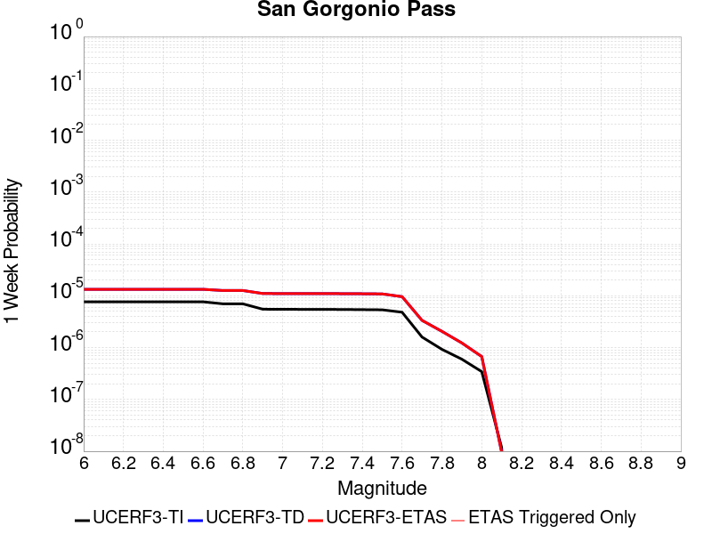 |  | 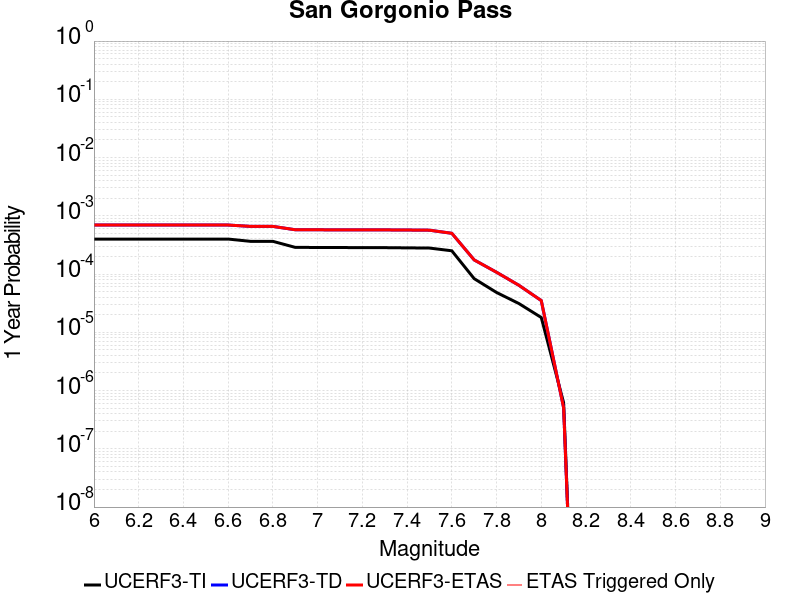 |  |

| Magnitude | 1 wk TI Prob | 1 wk TD Prob | 1 wk ETAS Prob | 1 wk ETAS/TD Gain | 1 wk ETAS Triggered Only | 1 mo TI Prob | 1 mo TD Prob | 1 mo ETAS Prob | 1 mo ETAS/TD Gain | 1 mo ETAS Triggered Only | 1 yr TI Prob | 1 yr TD Prob | 1 yr ETAS Prob | 1 yr ETAS/TD Gain | 1 yr ETAS Triggered Only | 10 yr TI Prob | 10 yr TD Prob | 10 yr ETAS Prob | 10 yr ETAS/TD Gain | 10 yr ETAS Triggered Only |
|-----|-----|-----|-----|-----|-----|-----|-----|-----|-----|-----|-----|-----|-----|-----|-----|-----|-----|-----|-----|-----|
| 6.0 | 7.644328E-6 | 1.3314975E-5 | 1.3314975E-5 | 1.0 | 0.0 | 3.2760996E-5 | 5.706298E-5 | 5.706298E-5 | 1.0 | 0.0 | 3.987921E-4 | 6.945289E-4 | 6.945289E-4 | 1.0 | 0.0 | 0.003980772 | 0.0069299014 | 0.006939832 | 1.001433 | 1.0E-5 |
| 6.1 | 7.644328E-6 | 1.3314975E-5 | 1.3314975E-5 | 1.0 | 0.0 | 3.2760996E-5 | 5.706298E-5 | 5.706298E-5 | 1.0 | 0.0 | 3.987921E-4 | 6.945289E-4 | 6.945289E-4 | 1.0 | 0.0 | 0.003980772 | 0.0069299014 | 0.006939832 | 1.001433 | 1.0E-5 |
| 6.2 | 7.644328E-6 | 1.3314975E-5 | 1.3314975E-5 | 1.0 | 0.0 | 3.2760996E-5 | 5.706298E-5 | 5.706298E-5 | 1.0 | 0.0 | 3.987921E-4 | 6.945289E-4 | 6.945289E-4 | 1.0 | 0.0 | 0.003980772 | 0.0069299014 | 0.006939832 | 1.001433 | 1.0E-5 |
| 6.3 | 7.644328E-6 | 1.3314975E-5 | 1.3314975E-5 | 1.0 | 0.0 | 3.2760996E-5 | 5.706298E-5 | 5.706298E-5 | 1.0 | 0.0 | 3.987921E-4 | 6.945289E-4 | 6.945289E-4 | 1.0 | 0.0 | 0.003980772 | 0.0069299014 | 0.006939832 | 1.001433 | 1.0E-5 |
| 6.4 | 7.644328E-6 | 1.3314975E-5 | 1.3314975E-5 | 1.0 | 0.0 | 3.2760996E-5 | 5.706298E-5 | 5.706298E-5 | 1.0 | 0.0 | 3.987921E-4 | 6.945289E-4 | 6.945289E-4 | 1.0 | 0.0 | 0.003980772 | 0.0069299014 | 0.006939832 | 1.001433 | 1.0E-5 |
| 6.5 | 7.644328E-6 | 1.3314975E-5 | 1.3314975E-5 | 1.0 | 0.0 | 3.2760996E-5 | 5.706298E-5 | 5.706298E-5 | 1.0 | 0.0 | 3.987921E-4 | 6.945289E-4 | 6.945289E-4 | 1.0 | 0.0 | 0.003980772 | 0.0069299014 | 0.006939832 | 1.001433 | 1.0E-5 |
| 6.6 | 7.644328E-6 | 1.3314975E-5 | 1.3314975E-5 | 1.0 | 0.0 | 3.2760996E-5 | 5.706298E-5 | 5.706298E-5 | 1.0 | 0.0 | 3.987921E-4 | 6.945289E-4 | 6.945289E-4 | 1.0 | 0.0 | 0.003980772 | 0.0069299014 | 0.006939832 | 1.001433 | 1.0E-5 |
| 6.7 | 6.987586E-6 | 1.2619249E-5 | 1.2619249E-5 | 1.0 | 0.0 | 2.9946454E-5 | 5.408142E-5 | 5.408142E-5 | 1.0 | 0.0 | 3.645371E-4 | 6.582505E-4 | 6.582505E-4 | 1.0 | 0.0 | 0.0036393967 | 0.006569277 | 0.0065792114 | 1.0015123 | 1.0E-5 |
| 6.8 | 6.987586E-6 | 1.2619249E-5 | 1.2619249E-5 | 1.0 | 0.0 | 2.9946454E-5 | 5.408142E-5 | 5.408142E-5 | 1.0 | 0.0 | 3.645371E-4 | 6.582505E-4 | 6.582505E-4 | 1.0 | 0.0 | 0.0036393967 | 0.006569277 | 0.0065792114 | 1.0015123 | 1.0E-5 |
| 6.9 | 5.504702E-6 | 1.1050111E-5 | 1.1050111E-5 | 1.0 | 0.0 | 2.3591367E-5 | 4.735679E-5 | 4.735679E-5 | 1.0 | 0.0 | 2.8718702E-4 | 5.7642144E-4 | 5.7642144E-4 | 1.0 | 0.0 | 0.0028681618 | 0.005755229 | 0.0057651713 | 1.0017276 | 1.0E-5 |
| 7.0 | 5.4825764E-6 | 1.1026452E-5 | 1.1026452E-5 | 1.0 | 0.0 | 2.3496545E-5 | 4.7255395E-5 | 4.7255395E-5 | 1.0 | 0.0 | 2.8603288E-4 | 5.751876E-4 | 5.751876E-4 | 1.0 | 0.0 | 0.00285665 | 0.0057429546 | 0.0057528974 | 1.0017313 | 1.0E-5 |
| 7.1 | 5.4692787E-6 | 1.1012162E-5 | 1.1012162E-5 | 1.0 | 0.0 | 2.3439556E-5 | 4.7194153E-5 | 4.7194153E-5 | 1.0 | 0.0 | 2.8533922E-4 | 5.744424E-4 | 5.744424E-4 | 1.0 | 0.0 | 0.0028497311 | 0.0057355408 | 0.0057454836 | 1.0017335 | 1.0E-5 |
| 7.2 | 5.453661E-6 | 1.0995189E-5 | 1.0995189E-5 | 1.0 | 0.0 | 2.3372622E-5 | 4.7121415E-5 | 4.7121415E-5 | 1.0 | 0.0 | 2.8452452E-4 | 5.735573E-4 | 5.735573E-4 | 1.0 | 0.0 | 0.002841605 | 0.005726735 | 0.005736678 | 1.0017362 | 1.0E-5 |
| 7.3 | 5.4422303E-6 | 1.0982111E-5 | 1.0982111E-5 | 1.0 | 0.0 | 2.3323635E-5 | 4.7065372E-5 | 4.7065372E-5 | 1.0 | 0.0 | 2.8392827E-4 | 5.728753E-4 | 5.728753E-4 | 1.0 | 0.0 | 0.0028356577 | 0.005719951 | 0.0057298937 | 1.0017383 | 1.0E-5 |
| 7.4 | 5.398595E-6 | 1.0929476E-5 | 1.0929476E-5 | 1.0 | 0.0 | 2.313663E-5 | 4.68398E-5 | 4.68398E-5 | 1.0 | 0.0 | 2.8165206E-4 | 5.7013036E-4 | 5.7013036E-4 | 1.0 | 0.0 | 0.0028129534 | 0.0056926426 | 0.005702586 | 1.0017467 | 1.0E-5 |
| 7.5 | 5.3578788E-6 | 1.0856019E-5 | 1.0856019E-5 | 1.0 | 0.0 | 2.2962136E-5 | 4.6524994E-5 | 4.6524994E-5 | 1.0 | 0.0 | 2.7952815E-4 | 5.6629966E-4 | 5.6629966E-4 | 1.0 | 0.0 | 0.002791768 | 0.005654564 | 0.005664508 | 1.0017585 | 1.0E-5 |
| 7.6 | 4.8091474E-6 | 9.604357E-6 | 9.604357E-6 | 1.0 | 0.0 | 2.0610469E-5 | 4.1160907E-5 | 4.1160907E-5 | 1.0 | 0.0 | 2.5090357E-4 | 5.010236E-4 | 5.010236E-4 | 1.0 | 0.0 | 0.0025062046 | 0.005005218 | 0.005015168 | 1.0019879 | 1.0E-5 |
| 7.7 | 1.5991155E-6 | 3.3531553E-6 | 3.3531553E-6 | 1.0 | 0.0 | 6.853334E-6 | 1.4370587E-5 | 1.4370587E-5 | 1.0 | 0.0 | 8.343615E-5 | 1.7494812E-4 | 1.7494812E-4 | 1.0 | 0.0 | 8.340483E-4 | 0.0017536386 | 0.0017536386 | 1.0 | 0.0 |
| 7.8 | 9.258398E-7 | 2.0581886E-6 | 2.0581886E-6 | 1.0 | 0.0 | 3.967879E-6 | 8.820778E-6 | 8.820778E-6 | 1.0 | 0.0 | 4.8307855E-5 | 1.073877E-4 | 1.073877E-4 | 1.0 | 0.0 | 4.8297356E-4 | 0.0010788542 | 0.0010788542 | 1.0 | 0.0 |
| 7.9 | 5.975575E-7 | 1.2292926E-6 | 1.2292926E-6 | 1.0 | 0.0 | 2.5609581E-6 | 5.2683863E-6 | 5.2683863E-6 | 1.0 | 0.0 | 3.117922E-5 | 6.4140724E-5 | 6.4140724E-5 | 1.0 | 0.0 | 3.1174847E-4 | 6.4648164E-4 | 6.4648164E-4 | 1.0 | 0.0 |
| 8.0 | 3.4413725E-7 | 6.715411E-7 | 6.715411E-7 | 1.0 | 0.0 | 1.4748731E-6 | 2.87803E-6 | 2.87803E-6 | 1.0 | 0.0 | 1.7956432E-5 | 3.503946E-5 | 3.503946E-5 | 1.0 | 0.0 | 1.7954981E-4 | 3.538981E-4 | 3.538981E-4 | 1.0 | 0.0 |
| 8.1 | 1.1787731E-8 | 9.633972E-9 | 9.633972E-9 | 1.0 | 0.0 | 5.0518846E-8 | 4.128845E-8 | 4.128845E-8 | 1.0 | 0.0 | 6.1506677E-7 | 5.0268676E-7 | 5.0268676E-7 | 1.0 | 0.0 | 6.1506507E-6 | 5.242316E-6 | 5.242316E-6 | 1.0 | 0.0 |

## Little Salmon (Offshore)
*[(top)](#table-of-contents)*

| 1 Week | 1 Month | 1 Year | 10 Year |
|-----|-----|-----|-----|
|  |  | 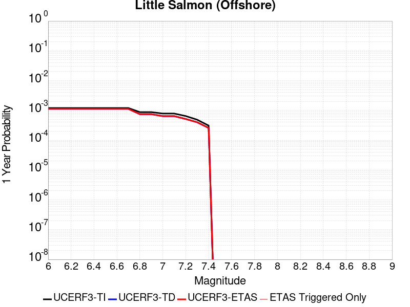 |  |

| Magnitude | 1 wk TI Prob | 1 wk TD Prob | 1 wk ETAS Prob | 1 wk ETAS/TD Gain | 1 wk ETAS Triggered Only | 1 mo TI Prob | 1 mo TD Prob | 1 mo ETAS Prob | 1 mo ETAS/TD Gain | 1 mo ETAS Triggered Only | 1 yr TI Prob | 1 yr TD Prob | 1 yr ETAS Prob | 1 yr ETAS/TD Gain | 1 yr ETAS Triggered Only | 10 yr TI Prob | 10 yr TD Prob | 10 yr ETAS Prob | 10 yr ETAS/TD Gain | 10 yr ETAS Triggered Only |
|-----|-----|-----|-----|-----|-----|-----|-----|-----|-----|-----|-----|-----|-----|-----|-----|-----|-----|-----|-----|-----|
| 6.0 | 2.3052053E-5 | 2.1605043E-5 | 2.1605043E-5 | 1.0 | 0.0 | 9.879077E-5 | 9.25904E-5 | 9.25904E-5 | 1.0 | 0.0 | 0.0012021139 | 0.0011268201 | 0.0011268201 | 1.0 | 0.0 | 0.011956319 | 0.011243371 | 0.011253259 | 1.0008794 | 1.0E-5 |
| 6.1 | 2.3052053E-5 | 2.1605043E-5 | 2.1605043E-5 | 1.0 | 0.0 | 9.879077E-5 | 9.25904E-5 | 9.25904E-5 | 1.0 | 0.0 | 0.0012021139 | 0.0011268201 | 0.0011268201 | 1.0 | 0.0 | 0.011956319 | 0.011243371 | 0.011253259 | 1.0008794 | 1.0E-5 |
| 6.2 | 2.3052053E-5 | 2.1605043E-5 | 2.1605043E-5 | 1.0 | 0.0 | 9.879077E-5 | 9.25904E-5 | 9.25904E-5 | 1.0 | 0.0 | 0.0012021139 | 0.0011268201 | 0.0011268201 | 1.0 | 0.0 | 0.011956319 | 0.011243371 | 0.011253259 | 1.0008794 | 1.0E-5 |
| 6.3 | 2.3052053E-5 | 2.1605043E-5 | 2.1605043E-5 | 1.0 | 0.0 | 9.879077E-5 | 9.25904E-5 | 9.25904E-5 | 1.0 | 0.0 | 0.0012021139 | 0.0011268201 | 0.0011268201 | 1.0 | 0.0 | 0.011956319 | 0.011243371 | 0.011253259 | 1.0008794 | 1.0E-5 |
| 6.4 | 2.3052053E-5 | 2.1605043E-5 | 2.1605043E-5 | 1.0 | 0.0 | 9.879077E-5 | 9.25904E-5 | 9.25904E-5 | 1.0 | 0.0 | 0.0012021139 | 0.0011268201 | 0.0011268201 | 1.0 | 0.0 | 0.011956319 | 0.011243371 | 0.011253259 | 1.0008794 | 1.0E-5 |
| 6.5 | 2.3052053E-5 | 2.1605043E-5 | 2.1605043E-5 | 1.0 | 0.0 | 9.879077E-5 | 9.25904E-5 | 9.25904E-5 | 1.0 | 0.0 | 0.0012021139 | 0.0011268201 | 0.0011268201 | 1.0 | 0.0 | 0.011956319 | 0.011243371 | 0.011253259 | 1.0008794 | 1.0E-5 |
| 6.6 | 2.3052053E-5 | 2.1605043E-5 | 2.1605043E-5 | 1.0 | 0.0 | 9.879077E-5 | 9.25904E-5 | 9.25904E-5 | 1.0 | 0.0 | 0.0012021139 | 0.0011268201 | 0.0011268201 | 1.0 | 0.0 | 0.011956319 | 0.011243371 | 0.011253259 | 1.0008794 | 1.0E-5 |
| 6.7 | 2.3052053E-5 | 2.1605043E-5 | 2.1605043E-5 | 1.0 | 0.0 | 9.879077E-5 | 9.25904E-5 | 9.25904E-5 | 1.0 | 0.0 | 0.0012021139 | 0.0011268201 | 0.0011268201 | 1.0 | 0.0 | 0.011956319 | 0.011243371 | 0.011253259 | 1.0008794 | 1.0E-5 |
| 6.8 | 1.683878E-5 | 1.4384318E-5 | 1.4384318E-5 | 1.0 | 0.0 | 7.21642E-5 | 6.164591E-5 | 6.164591E-5 | 1.0 | 0.0 | 8.78245E-4 | 7.503314E-4 | 7.503314E-4 | 1.0 | 0.0 | 0.008747822 | 0.007504037 | 0.007513962 | 1.0013226 | 1.0E-5 |
| 6.9 | 1.683878E-5 | 1.4384318E-5 | 1.4384318E-5 | 1.0 | 0.0 | 7.21642E-5 | 6.164591E-5 | 6.164591E-5 | 1.0 | 0.0 | 8.78245E-4 | 7.503314E-4 | 7.503314E-4 | 1.0 | 0.0 | 0.008747822 | 0.007504037 | 0.007513962 | 1.0013226 | 1.0E-5 |
| 7.0 | 1.5051273E-5 | 1.2332373E-5 | 1.2332373E-5 | 1.0 | 0.0 | 6.450386E-5 | 5.2852218E-5 | 5.2852218E-5 | 1.0 | 0.0 | 7.8505155E-4 | 6.4333173E-4 | 6.4333173E-4 | 1.0 | 0.0 | 0.00782284 | 0.0064402744 | 0.0064402744 | 1.0 | 0.0 |
| 7.1 | 1.5051273E-5 | 1.2332373E-5 | 1.2332373E-5 | 1.0 | 0.0 | 6.450386E-5 | 5.2852218E-5 | 5.2852218E-5 | 1.0 | 0.0 | 7.8505155E-4 | 6.4333173E-4 | 6.4333173E-4 | 1.0 | 0.0 | 0.00782284 | 0.0064402744 | 0.0064402744 | 1.0 | 0.0 |
| 7.2 | 1.24301405E-5 | 9.902441E-6 | 9.902441E-6 | 1.0 | 0.0 | 5.3270942E-5 | 4.2438565E-5 | 4.2438565E-5 | 1.0 | 0.0 | 6.483807E-4 | 5.166071E-4 | 5.166071E-4 | 1.0 | 0.0 | 0.006464922 | 0.0051786415 | 0.0051786415 | 1.0 | 0.0 |
| 7.3 | 9.3599865E-6 | 7.694729E-6 | 7.694729E-6 | 1.0 | 0.0 | 4.011361E-5 | 3.2977194E-5 | 3.2977194E-5 | 1.0 | 0.0 | 4.8827377E-4 | 4.01459E-4 | 4.01459E-4 | 1.0 | 0.0 | 0.004872023 | 0.0040236805 | 0.0040236805 | 1.0 | 0.0 |
| 7.4 | 5.941556E-6 | 4.9509913E-6 | 4.9509913E-6 | 1.0 | 0.0 | 2.5463563E-5 | 2.1218535E-5 | 2.1218535E-5 | 1.0 | 0.0 | 3.0997477E-4 | 2.5833567E-4 | 2.5833567E-4 | 1.0 | 0.0 | 0.0030954275 | 0.0025914172 | 0.0025914172 | 1.0 | 0.0 |

## Eaton Roughs 2011 CFM
*[(top)](#table-of-contents)*

| 1 Week | 1 Month | 1 Year | 10 Year |
|-----|-----|-----|-----|
|  |  |  |  |

| Magnitude | 1 wk TI Prob | 1 wk TD Prob | 1 wk ETAS Prob | 1 wk ETAS/TD Gain | 1 wk ETAS Triggered Only | 1 mo TI Prob | 1 mo TD Prob | 1 mo ETAS Prob | 1 mo ETAS/TD Gain | 1 mo ETAS Triggered Only | 1 yr TI Prob | 1 yr TD Prob | 1 yr ETAS Prob | 1 yr ETAS/TD Gain | 1 yr ETAS Triggered Only | 10 yr TI Prob | 10 yr TD Prob | 10 yr ETAS Prob | 10 yr ETAS/TD Gain | 10 yr ETAS Triggered Only |
|-----|-----|-----|-----|-----|-----|-----|-----|-----|-----|-----|-----|-----|-----|-----|-----|-----|-----|-----|-----|-----|
| 6.0 | 6.8044945E-5 | 8.8434994E-5 | 8.8434994E-5 | 1.0 | 0.0 | 2.9158857E-4 | 3.7895862E-4 | 3.7895862E-4 | 1.0 | 0.0 | 0.0035443127 | 0.0046047 | 0.0046047 | 1.0 | 0.0 | 0.03488314 | 0.04516383 | 0.045173377 | 1.0002114 | 1.0E-5 |
| 6.1 | 6.8044945E-5 | 8.8434994E-5 | 8.8434994E-5 | 1.0 | 0.0 | 2.9158857E-4 | 3.7895862E-4 | 3.7895862E-4 | 1.0 | 0.0 | 0.0035443127 | 0.0046047 | 0.0046047 | 1.0 | 0.0 | 0.03488314 | 0.04516383 | 0.045173377 | 1.0002114 | 1.0E-5 |
| 6.2 | 6.8044945E-5 | 8.8434994E-5 | 8.8434994E-5 | 1.0 | 0.0 | 2.9158857E-4 | 3.7895862E-4 | 3.7895862E-4 | 1.0 | 0.0 | 0.0035443127 | 0.0046047 | 0.0046047 | 1.0 | 0.0 | 0.03488314 | 0.04516383 | 0.045173377 | 1.0002114 | 1.0E-5 |
| 6.3 | 6.8044945E-5 | 8.8434994E-5 | 8.8434994E-5 | 1.0 | 0.0 | 2.9158857E-4 | 3.7895862E-4 | 3.7895862E-4 | 1.0 | 0.0 | 0.0035443127 | 0.0046047 | 0.0046047 | 1.0 | 0.0 | 0.03488314 | 0.04516383 | 0.045173377 | 1.0002114 | 1.0E-5 |
| 6.4 | 4.5830013E-5 | 5.715548E-5 | 5.715548E-5 | 1.0 | 0.0 | 1.9639956E-4 | 2.449321E-4 | 2.449321E-4 | 1.0 | 0.0 | 0.0023885423 | 0.0029783507 | 0.0029783507 | 1.0 | 0.0 | 0.023630321 | 0.02942203 | 0.029431736 | 1.0003299 | 1.0E-5 |
| 6.5 | 4.5830013E-5 | 5.715548E-5 | 5.715548E-5 | 1.0 | 0.0 | 1.9639956E-4 | 2.449321E-4 | 2.449321E-4 | 1.0 | 0.0 | 0.0023885423 | 0.0029783507 | 0.0029783507 | 1.0 | 0.0 | 0.023630321 | 0.02942203 | 0.029431736 | 1.0003299 | 1.0E-5 |
| 6.6 | 3.222194E-5 | 3.8263053E-5 | 3.8263053E-5 | 1.0 | 0.0 | 1.3808672E-4 | 1.6397484E-4 | 1.6397484E-4 | 1.0 | 0.0 | 0.0016799092 | 0.0019946531 | 0.0019946531 | 1.0 | 0.0 | 0.016672665 | 0.019776797 | 0.019776797 | 1.0 | 0.0 |
| 6.7 | 2.4155654E-5 | 2.7786324E-5 | 2.7786324E-5 | 1.0 | 0.0 | 1.0352012E-4 | 1.1907886E-4 | 1.1907886E-4 | 1.0 | 0.0 | 0.0012596287 | 0.0014488291 | 0.0014488291 | 1.0 | 0.0 | 0.012525126 | 0.0143950125 | 0.0143950125 | 1.0 | 0.0 |
| 6.8 | 2.1814667E-5 | 2.4940948E-5 | 2.4940948E-5 | 1.0 | 0.0 | 9.348808E-5 | 1.0688542E-4 | 1.0688542E-4 | 1.0 | 0.0 | 0.001137623 | 0.0013005568 | 0.0013005568 | 1.0 | 0.0 | 0.011318169 | 0.0129301045 | 0.0129301045 | 1.0 | 0.0 |
| 6.9 | 2.0700467E-5 | 2.362901E-5 | 2.362901E-5 | 1.0 | 0.0 | 8.871327E-5 | 1.0126327E-4 | 1.0126327E-4 | 1.0 | 0.0 | 0.0010795488 | 0.0012321862 | 0.0012321862 | 1.0 | 0.0 | 0.010743194 | 0.012254099 | 0.012254099 | 1.0 | 0.0 |
| 7.0 | 2.0104066E-5 | 2.2936574E-5 | 2.2936574E-5 | 1.0 | 0.0 | 8.615744E-5 | 9.829592E-5 | 9.829592E-5 | 1.0 | 0.0 | 0.0010484619 | 0.0011960989 | 0.0011960989 | 1.0 | 0.0 | 0.010435291 | 0.011897136 | 0.011897136 | 1.0 | 0.0 |
| 7.1 | 1.8225232E-5 | 2.0773117E-5 | 2.0773117E-5 | 1.0 | 0.0 | 7.81058E-5 | 8.9024616E-5 | 8.9024616E-5 | 1.0 | 0.0 | 9.5052324E-4 | 0.0010833374 | 0.0010833374 | 1.0 | 0.0 | 0.009464677 | 0.010780887 | 0.010780887 | 1.0 | 0.0 |
| 7.2 | 1.7526572E-5 | 1.9993558E-5 | 1.9993558E-5 | 1.0 | 0.0 | 7.511172E-5 | 8.5683874E-5 | 8.5683874E-5 | 1.0 | 0.0 | 9.141015E-4 | 0.0010427034 | 0.0010427034 | 1.0 | 0.0 | 0.009103506 | 0.010378412 | 0.010378412 | 1.0 | 0.0 |
| 7.3 | 1.5727232E-5 | 1.8021574E-5 | 1.8021574E-5 | 1.0 | 0.0 | 6.740067E-5 | 7.723304E-5 | 7.723304E-5 | 1.0 | 0.0 | 8.2029426E-4 | 9.3990786E-4 | 9.3990786E-4 | 1.0 | 0.0 | 0.008172729 | 0.009359571 | 0.009359571 | 1.0 | 0.0 |
| 7.4 | 1.4457361E-5 | 1.6598424E-5 | 1.6598424E-5 | 1.0 | 0.0 | 6.195865E-5 | 7.113417E-5 | 7.113417E-5 | 1.0 | 0.0 | 7.540854E-4 | 8.6571526E-4 | 8.6571526E-4 | 1.0 | 0.0 | 0.007515317 | 0.008623614 | 0.008623614 | 1.0 | 0.0 |
| 7.5 | 1.33280955E-5 | 1.5345498E-5 | 1.5345498E-5 | 1.0 | 0.0 | 5.711916E-5 | 6.576477E-5 | 6.576477E-5 | 1.0 | 0.0 | 6.9520384E-4 | 8.0039277E-4 | 8.0039277E-4 | 1.0 | 0.0 | 0.00693033 | 0.007975266 | 0.007975266 | 1.0 | 0.0 |
| 7.6 | 1.0699478E-5 | 1.23878735E-5 | 1.23878735E-5 | 1.0 | 0.0 | 4.5854096E-5 | 5.308981E-5 | 5.308981E-5 | 1.0 | 0.0 | 5.581306E-4 | 6.461773E-4 | 6.461773E-4 | 1.0 | 0.0 | 0.005567309 | 0.0064430907 | 0.0064430907 | 1.0 | 0.0 |
| 7.7 | 5.9390236E-6 | 6.8529966E-6 | 6.8529966E-6 | 1.0 | 0.0 | 2.545271E-5 | 2.9369656E-5 | 2.9369656E-5 | 1.0 | 0.0 | 3.0984267E-4 | 3.5751716E-4 | 3.5751716E-4 | 1.0 | 0.0 | 0.0030941102 | 0.0035694446 | 0.0035694446 | 1.0 | 0.0 |
| 7.8 | 2.1622036E-6 | 2.329704E-6 | 2.329704E-6 | 1.0 | 0.0 | 9.266554E-6 | 9.984408E-6 | 9.984408E-6 | 1.0 | 0.0 | 1.1281446E-4 | 1.21553465E-4 | 1.21553465E-4 | 1.0 | 0.0 | 0.001127572 | 0.0012148699 | 0.0012148699 | 1.0 | 0.0 |
| 7.9 | 4.9586197E-7 | 5.2189245E-7 | 5.2189245E-7 | 1.0 | 0.0 | 2.125121E-6 | 2.2366803E-6 | 2.2366803E-6 | 1.0 | 0.0 | 2.5873042E-5 | 2.7231263E-5 | 2.7231263E-5 | 1.0 | 0.0 | 2.5870028E-4 | 2.7228135E-4 | 2.7228135E-4 | 1.0 | 0.0 |

## Oceanside alt1
*[(top)](#table-of-contents)*

| 1 Week | 1 Month | 1 Year | 10 Year |
|-----|-----|-----|-----|
|  |  |  | 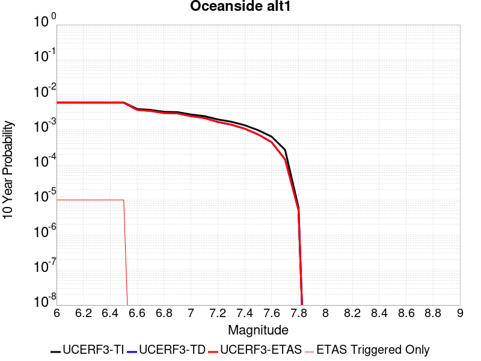 |

| Magnitude | 1 wk TI Prob | 1 wk TD Prob | 1 wk ETAS Prob | 1 wk ETAS/TD Gain | 1 wk ETAS Triggered Only | 1 mo TI Prob | 1 mo TD Prob | 1 mo ETAS Prob | 1 mo ETAS/TD Gain | 1 mo ETAS Triggered Only | 1 yr TI Prob | 1 yr TD Prob | 1 yr ETAS Prob | 1 yr ETAS/TD Gain | 1 yr ETAS Triggered Only | 10 yr TI Prob | 10 yr TD Prob | 10 yr ETAS Prob | 10 yr ETAS/TD Gain | 10 yr ETAS Triggered Only |
|-----|-----|-----|-----|-----|-----|-----|-----|-----|-----|-----|-----|-----|-----|-----|-----|-----|-----|-----|-----|-----|
| 6.0 | 1.1617542E-5 | 1.1423491E-5 | 1.1423491E-5 | 1.0 | 0.0 | 4.9788516E-5 | 4.895699E-5 | 4.895699E-5 | 1.0 | 0.0 | 6.060066E-4 | 5.959045E-4 | 5.959045E-4 | 1.0 | 0.0 | 0.0060435664 | 0.0059446637 | 0.005954604 | 1.0016721 | 1.0E-5 |
| 6.1 | 1.1617542E-5 | 1.1423491E-5 | 1.1423491E-5 | 1.0 | 0.0 | 4.9788516E-5 | 4.895699E-5 | 4.895699E-5 | 1.0 | 0.0 | 6.060066E-4 | 5.959045E-4 | 5.959045E-4 | 1.0 | 0.0 | 0.0060435664 | 0.0059446637 | 0.005954604 | 1.0016721 | 1.0E-5 |
| 6.2 | 1.1617542E-5 | 1.1423491E-5 | 1.1423491E-5 | 1.0 | 0.0 | 4.9788516E-5 | 4.895699E-5 | 4.895699E-5 | 1.0 | 0.0 | 6.060066E-4 | 5.959045E-4 | 5.959045E-4 | 1.0 | 0.0 | 0.0060435664 | 0.0059446637 | 0.005954604 | 1.0016721 | 1.0E-5 |
| 6.3 | 1.1617542E-5 | 1.1423491E-5 | 1.1423491E-5 | 1.0 | 0.0 | 4.9788516E-5 | 4.895699E-5 | 4.895699E-5 | 1.0 | 0.0 | 6.060066E-4 | 5.959045E-4 | 5.959045E-4 | 1.0 | 0.0 | 0.0060435664 | 0.0059446637 | 0.005954604 | 1.0016721 | 1.0E-5 |
| 6.4 | 1.1617542E-5 | 1.1423491E-5 | 1.1423491E-5 | 1.0 | 0.0 | 4.9788516E-5 | 4.895699E-5 | 4.895699E-5 | 1.0 | 0.0 | 6.060066E-4 | 5.959045E-4 | 5.959045E-4 | 1.0 | 0.0 | 0.0060435664 | 0.0059446637 | 0.005954604 | 1.0016721 | 1.0E-5 |
| 6.5 | 1.1617542E-5 | 1.1423491E-5 | 1.1423491E-5 | 1.0 | 0.0 | 4.9788516E-5 | 4.895699E-5 | 4.895699E-5 | 1.0 | 0.0 | 6.060066E-4 | 5.959045E-4 | 5.959045E-4 | 1.0 | 0.0 | 0.0060435664 | 0.0059446637 | 0.005954604 | 1.0016721 | 1.0E-5 |
| 6.6 | 7.561768E-6 | 7.1336112E-6 | 7.1336112E-6 | 1.0 | 0.0 | 3.2407173E-5 | 3.0572268E-5 | 3.0572268E-5 | 1.0 | 0.0 | 3.9448592E-4 | 3.7215487E-4 | 3.7215487E-4 | 1.0 | 0.0 | 0.0039378637 | 0.0037154278 | 0.0037154278 | 1.0 | 0.0 |
| 6.7 | 7.1042605E-6 | 6.6556813E-6 | 6.6556813E-6 | 1.0 | 0.0 | 3.0446476E-5 | 2.852404E-5 | 2.852404E-5 | 1.0 | 0.0 | 3.706228E-4 | 3.4722566E-4 | 3.4722566E-4 | 1.0 | 0.0 | 0.0037000529 | 0.0034669146 | 0.0034669146 | 1.0 | 0.0 |
| 6.8 | 6.285554E-6 | 5.799701E-6 | 5.799701E-6 | 1.0 | 0.0 | 2.693781E-5 | 2.4855628E-5 | 2.4855628E-5 | 1.0 | 0.0 | 3.2791847E-4 | 3.025758E-4 | 3.025758E-4 | 1.0 | 0.0 | 0.0032743502 | 0.0030216957 | 0.0030216957 | 1.0 | 0.0 |
| 6.9 | 6.148883E-6 | 5.6565395E-6 | 5.6565395E-6 | 1.0 | 0.0 | 2.635209E-5 | 2.424209E-5 | 2.424209E-5 | 1.0 | 0.0 | 3.2078946E-4 | 2.95108E-4 | 2.95108E-4 | 1.0 | 0.0 | 0.003203268 | 0.0029472183 | 0.0029472183 | 1.0 | 0.0 |
| 7.0 | 5.253857E-6 | 4.7223984E-6 | 4.7223984E-6 | 1.0 | 0.0 | 2.2516335E-5 | 2.0238695E-5 | 2.0238695E-5 | 1.0 | 0.0 | 2.7410188E-4 | 2.4637856E-4 | 2.4637856E-4 | 1.0 | 0.0 | 0.0027376404 | 0.0024610856 | 0.0024610856 | 1.0 | 0.0 |
| 7.1 | 4.730754E-6 | 4.178504E-6 | 4.178504E-6 | 1.0 | 0.0 | 2.0274503E-5 | 1.7907752E-5 | 1.7907752E-5 | 1.0 | 0.0 | 2.468141E-4 | 2.1800533E-4 | 2.1800533E-4 | 1.0 | 0.0 | 0.0024654015 | 0.0021779411 | 0.0021779411 | 1.0 | 0.0 |
| 7.2 | 3.7998386E-6 | 3.2140174E-6 | 3.2140174E-6 | 1.0 | 0.0 | 1.6284921E-5 | 1.3774288E-5 | 1.3774288E-5 | 1.0 | 0.0 | 1.9825088E-4 | 1.6768917E-4 | 1.6768917E-4 | 1.0 | 0.0 | 0.001980741 | 0.0016756386 | 0.0016756386 | 1.0 | 0.0 |
| 7.3 | 3.2656465E-6 | 2.6983676E-6 | 2.6983676E-6 | 1.0 | 0.0 | 1.3995553E-5 | 1.1564382E-5 | 1.1564382E-5 | 1.0 | 0.0 | 1.7038253E-4 | 1.4078736E-4 | 1.4078736E-4 | 1.0 | 0.0 | 0.0017025196 | 0.0014069928 | 0.0014069928 | 1.0 | 0.0 |
| 7.4 | 2.593703E-6 | 2.0680234E-6 | 2.0680234E-6 | 1.0 | 0.0 | 1.1115822E-5 | 8.862928E-6 | 8.862928E-6 | 1.0 | 0.0 | 1.3532673E-4 | 1.07900894E-4 | 1.07900894E-4 | 1.0 | 0.0 | 0.0013524436 | 0.0010784939 | 0.0010784939 | 1.0 | 0.0 |
| 7.5 | 1.8715585E-6 | 1.4137279E-6 | 1.4137279E-6 | 1.0 | 0.0 | 8.020941E-6 | 6.05882E-6 | 6.05882E-6 | 1.0 | 0.0 | 9.7650576E-5 | 7.3763695E-5 | 7.3763695E-5 | 1.0 | 0.0 | 9.7607676E-4 | 7.373982E-4 | 7.373982E-4 | 1.0 | 0.0 |
| 7.6 | 1.2246786E-6 | 8.526947E-7 | 8.526947E-7 | 1.0 | 0.0 | 5.248612E-6 | 3.654401E-6 | 3.654401E-6 | 1.0 | 0.0 | 6.389998E-5 | 4.449147E-5 | 4.449147E-5 | 1.0 | 0.0 | 6.3881604E-4 | 4.4483013E-4 | 4.4483013E-4 | 1.0 | 0.0 |
| 7.7 | 5.140719E-7 | 2.7346528E-7 | 2.7346528E-7 | 1.0 | 0.0 | 2.2031636E-6 | 1.1719936E-6 | 1.1719936E-6 | 1.0 | 0.0 | 2.6823185E-5 | 1.4268943E-5 | 1.4268943E-5 | 1.0 | 0.0 | 2.6819948E-4 | 1.4268162E-4 | 1.4268162E-4 | 1.0 | 0.0 |
| 7.8 | 1.16056995E-8 | 9.782997E-9 | 9.782997E-9 | 1.0 | 0.0 | 4.9738713E-8 | 4.1927127E-8 | 4.1927127E-8 | 1.0 | 0.0 | 6.0556863E-7 | 5.1046277E-7 | 5.1046277E-7 | 1.0 | 0.0 | 6.05567E-6 | 5.1046277E-6 | 5.1046277E-6 | 1.0 | 0.0 |

