# ComCat M7.1 (ci38457511), 5.9 Days After, Finite Surface Results

|   | ComCat M7.1 (ci38457511), 5.9 Days After, Finite Surface |
|-----|-----|
| Num Simulations | 100000 |
| Start Time | 2019/07/12 01:00:36 UTC |
| Start Time Epoch Milliseconds | 1562893236533 |
| Duration | 10 Years |
| Includes Spontaneous? | false |
| Trigger Ruptures | 1344 Trigger Ruptures |
|   | First: M3.98 at 2019/07/04 17:02:55 UTC |
|   | Last: M3.09 at 2019/07/12 00:08:06 UTC |
|   | Largest: M7.1 at 2019/07/06 03:19:53 UTC |
| Historical Ruptures | *(none)* |

## Table Of Contents

* [Probabilities Summary Table](#probabilities-summary-table)
* [Magnitude Number Distribution](#magnitude-number-distribution)
  * [10 Year Magnitude Number Distribution](#10-year-magnitude-number-distribution)
  * [1 Year Magnitude Number Distribution](#1-year-magnitude-number-distribution)
  * [1 Month Magnitude Number Distribution](#1-month-magnitude-number-distribution)
  * [1 Week Magnitude Number Distribution](#1-week-magnitude-number-distribution)
  * [1 Day Magnitude Number Distribution](#1-day-magnitude-number-distribution)
  * [1 Hour Magnitude Number Distribution](#1-hour-magnitude-number-distribution)
* [Hazard Change Over Time](#hazard-change-over-time)
  * [M&ge;5.0 Hazard Change Over Time](#m50-hazard-change-over-time)
  * [M&ge;6.0 Hazard Change Over Time](#m60-hazard-change-over-time)
  * [M&ge;7.0 Hazard Change Over Time](#m70-hazard-change-over-time)
  * [M&ge;8.0 Hazard Change Over Time](#m80-hazard-change-over-time)
* [Trigger Rupture Fault Map](#trigger-rupture-fault-map)
* [Trigger Rupture Depth Map](#trigger-rupture-depth-map)
* [Fault Distances To Triggers](#fault-distances-to-triggers)
* [Individual Simulated Catalog Maps](#individual-simulated-catalog-maps)
* [ComCat Data Comparisons](#comcat-data-comparisons)
  * [ComCat Magnitude-Number Distribution](#comcat-magnitude-number-distribution)
  * [ComCat Cumulative Number Vs Time](#comcat-cumulative-number-vs-time)
  * [ComCat Mean Spatial Distribution](#comcat-mean-spatial-distribution)
  * [ComCat Depth Distribution](#comcat-depth-distribution)
* [Section Participation](#section-participation)
  * [Section Participation Plots](#section-participation-plots)
  * [Supra-Seismogenic Parent Sections Table](#supra-seismogenic-parent-sections-table)
  * [M≥6.5 Parent Sections Table](#m65-parent-sections-table)
  * [M≥7 Parent Sections Table](#m7-parent-sections-table)
  * [M≥7.5 Parent Sections Table](#m75-parent-sections-table)
  * [M≥8 Parent Sections Table](#m8-parent-sections-table)
  * [Fault Magnitude-Probability Distributions](#fault-magnitude-probability-distributions)
* [Gridded Nucleation](#gridded-nucleation)
* [JSON Input File](#json-input-file)

## Probabilities Summary Table
*[(top)](#table-of-contents)*

| Magnitude | 1 Hour Prob | 1 Day Prob | 1 Week Prob | 1 Month Prob | 1 Year Prob | 10 Year Prob |
|-----|-----|-----|-----|-----|-----|-----|
| **M&ge;4** | 0.063 (6.33%) | 0.745 (74.48%) | 0.998 (99.84%) | 1.000 (100.00%) | 1.000 (100.00%) | 1.000 (100.00%) |
| **M&ge;4.5** | 0.021 (2.08%) | 0.356 (35.61%) | 0.880 (88.03%) | 0.992 (99.19%) | 1.000 (100.00%) | 1.000 (100.00%) |
| **M&ge;5** | 6.51E-3 (0.65%) | 0.131 (13.10%) | 0.500 (50.00%) | 0.797 (79.69%) | 0.973 (97.27%) | 0.996 (99.55%) |
| **M&ge;5.5** | 1.94E-3 (0.19%) | 0.042 (4.19%) | 0.196 (19.62%) | 0.398 (39.77%) | 0.688 (68.83%) | 0.836 (83.59%) |
| **M&ge;6** | 6.00E-4 (0.06%) | 0.012 (1.16%) | 0.060 (6.02%) | 0.136 (13.63%) | 0.290 (29.04%) | 0.416 (41.61%) |
| **M&ge;6.5** | 1.40E-4 (0.01%) | 2.43E-3 (0.24%) | 0.014 (1.39%) | 0.033 (3.33%) | 0.077 (7.65%) | 0.118 (11.84%) |
| **M&ge;7** | 6.00E-5 (0.01%) | 8.80E-4 (0.09%) | 5.26E-3 (0.53%) | 0.012 (1.24%) | 0.029 (2.86%) | 0.045 (4.49%) |
| **M&ge;7.1** | 5.00E-5 (0.01%) | 7.60E-4 (0.08%) | 4.53E-3 (0.45%) | 0.011 (1.08%) | 0.025 (2.46%) | 0.039 (3.88%) |
| **M&ge;7.5** | 1.00E-5 (0.00%) | 2.50E-4 (0.03%) | 1.67E-3 (0.17%) | 3.93E-3 (0.39%) | 9.38E-3 (0.94%) | 0.015 (1.49%) |
| **M&ge;8** | 0.000 (0.00%) | 1.00E-5 (0.00%) | 1.00E-5 (0.00%) | 6.00E-5 (0.01%) | 1.70E-4 (0.02%) | 2.70E-4 (0.03%) |

## Magnitude Number Distribution
*[(top)](#table-of-contents)*

### 10 Year Magnitude Number Distribution
*[(top)](#table-of-contents)*

**Legend**
* **Mean** (thick black line): mean expected number across all 100000 catalogs
* **2.5%,97.5%** (thin black lines): expected number percentiles across all 100000 catalogs
* **Median** (thin blue line): median expected number across all 100000 catalogs
* **Mode** (thin cyan line): modal expected number across all 100000 catalogs
* **10 yr Probability** (thin red line): 10 year probability calculated as the fraction of catalogs with at least 1 occurrence
* **10 yr Supraseismogenic Probability** (thin dashed red line): same as above, but only for supraseismogenic ruptures on explicitly modeled UCERF3 faults
* **95% Conf** (light red shaded region): binomial 95% confidence bounds on probability
* **Primary** (thin green line): mean expected number from primary triggered aftershocks only (no secondary, tertiary, etc...) across all 100000 catalogs


| Mag | Mean | 2.5 %ile | 97.5 %ile | Median | Mode | 10 yr Probability | 10 yr Supra-Seis Prob | Primary Aftershocks Mean |
|-----|-----|-----|-----|-----|-----|-----|-----|-----|
| **M&ge;2.5** | 2861.073 | 1768.000 | 9019.000 | 2270.000 | 1989.000 | 1.000 (100.00%) | 0.194 (19.41%) | 1226.680 |
| **M&ge;2.6** | 2272.605 | 1400.000 | 7172.000 | 1803.000 | 1631.000 | 1.000 (100.00%) | 0.194 (19.41%) | 974.458 |
| **M&ge;2.7** | 1805.218 | 1108.000 | 5691.000 | 1434.000 | 1290.000 | 1.000 (100.00%) | 0.194 (19.41%) | 774.074 |
| **M&ge;2.8** | 1433.898 | 877.000 | 4527.000 | 1139.000 | 1040.000 | 1.000 (100.00%) | 0.194 (19.41%) | 614.858 |
| **M&ge;2.9** | 1139.005 | 693.000 | 3595.000 | 905.000 | 819.000 | 1.000 (100.00%) | 0.194 (19.41%) | 488.383 |
| **M&ge;3** | 904.732 | 546.000 | 2855.000 | 720.000 | 654.000 | 1.000 (100.00%) | 0.194 (19.41%) | 387.962 |
| **M&ge;3.1** | 718.536 | 431.000 | 2271.000 | 572.000 | 522.000 | 1.000 (100.00%) | 0.194 (19.41%) | 308.135 |
| **M&ge;3.2** | 570.763 | 339.000 | 1806.000 | 455.000 | 400.000 | 1.000 (100.00%) | 0.194 (19.41%) | 244.755 |
| **M&ge;3.3** | 453.341 | 266.000 | 1431.000 | 361.000 | 327.000 | 1.000 (100.00%) | 0.194 (19.41%) | 194.410 |
| **M&ge;3.4** | 360.073 | 209.000 | 1137.000 | 288.000 | 263.000 | 1.000 (100.00%) | 0.194 (19.41%) | 154.413 |
| **M&ge;3.5** | 285.980 | 164.000 | 902.000 | 229.000 | 207.000 | 1.000 (100.00%) | 0.194 (19.41%) | 122.644 |
| **M&ge;3.6** | 227.116 | 127.000 | 718.000 | 182.000 | 164.000 | 1.000 (100.00%) | 0.194 (19.41%) | 97.388 |
| **M&ge;3.7** | 180.374 | 99.000 | 569.000 | 145.000 | 131.000 | 1.000 (100.00%) | 0.194 (19.41%) | 77.336 |
| **M&ge;3.8** | 143.248 | 77.000 | 454.000 | 115.000 | 102.000 | 1.000 (100.00%) | 0.194 (19.41%) | 61.430 |
| **M&ge;3.9** | 113.749 | 59.000 | 361.000 | 91.000 | 83.000 | 1.000 (100.00%) | 0.194 (19.41%) | 48.782 |
| **M&ge;4** | 90.294 | 46.000 | 287.000 | 73.000 | 65.000 | 1.000 (100.00%) | 0.194 (19.41%) | 38.733 |
| **M&ge;4.1** | 71.662 | 35.000 | 229.000 | 58.000 | 49.000 | 1.000 (100.00%) | 0.194 (19.41%) | 30.741 |
| **M&ge;4.2** | 56.885 | 26.000 | 183.000 | 46.000 | 41.000 | 1.000 (100.00%) | 0.194 (19.41%) | 24.396 |
| **M&ge;4.3** | 45.130 | 20.000 | 145.000 | 36.000 | 32.000 | 1.000 (100.00%) | 0.194 (19.41%) | 19.341 |
| **M&ge;4.4** | 35.804 | 15.000 | 116.000 | 29.000 | 26.000 | 1.000 (100.00%) | 0.194 (19.41%) | 15.351 |
| **M&ge;4.5** | 28.390 | 11.000 | 93.000 | 23.000 | 19.000 | 1.000 (100.00%) | 0.194 (19.41%) | 12.172 |
| **M&ge;4.6** | 22.501 | 8.000 | 74.000 | 18.000 | 15.000 | 1.000 (100.00%) | 0.194 (19.41%) | 9.647 |
| **M&ge;4.7** | 17.829 | 5.000 | 59.000 | 14.000 | 12.000 | 1.000 (100.00%) | 0.194 (19.41%) | 7.648 |
| **M&ge;4.8** | 14.117 | 4.000 | 47.000 | 11.000 | 9.000 | 1.000 (99.97%) | 0.194 (19.41%) | 6.060 |
| **M&ge;4.9** | 11.169 | 3.000 | 38.000 | 9.000 | 7.000 | 0.999 (99.88%) | 0.194 (19.41%) | 4.793 |
| **M&ge;5** | 8.820 | 2.000 | 30.000 | 7.000 | 6.000 | 0.996 (99.55%) | 0.194 (19.41%) | 3.787 |
| **M&ge;5.1** | 6.963 | 1.000 | 25.000 | 5.000 | 4.000 | 0.988 (98.75%) | 0.194 (19.41%) | 2.991 |
| **M&ge;5.2** | 5.485 | 0.000 | 20.000 | 4.000 | 3.000 | 0.971 (97.08%) | 0.194 (19.41%) | 2.362 |
| **M&ge;5.3** | 4.310 | 0.000 | 16.000 | 3.000 | 2.000 | 0.942 (94.19%) | 0.194 (19.41%) | 1.857 |
| **M&ge;5.4** | 3.377 | 0.000 | 13.000 | 3.000 | 2.000 | 0.897 (89.66%) | 0.194 (19.41%) | 1.455 |
| **M&ge;5.5** | 2.637 | 0.000 | 10.000 | 2.000 | 1.000 | 0.836 (83.59%) | 0.194 (19.41%) | 1.137 |
| **M&ge;5.6** | 2.046 | 0.000 | 8.000 | 1.000 | 1.000 | 0.760 (76.00%) | 0.194 (19.41%) | 0.883 |
| **M&ge;5.7** | 1.579 | 0.000 | 7.000 | 1.000 | 0.000 | 0.675 (67.51%) | 0.194 (19.41%) | 0.682 |
| **M&ge;5.8** | 1.205 | 0.000 | 6.000 | 1.000 | 0.000 | 0.585 (58.47%) | 0.194 (19.41%) | 0.523 |
| **M&ge;5.9** | 0.909 | 0.000 | 5.000 | 0.000 | 0.000 | 0.494 (49.38%) | 0.194 (19.41%) | 0.395 |
| **M&ge;6** | 0.707 | 0.000 | 4.000 | 0.000 | 0.000 | 0.416 (41.61%) | 0.194 (19.39%) | 0.306 |
| **M&ge;6.1** | 0.518 | 0.000 | 3.000 | 0.000 | 0.000 | 0.333 (33.31%) | 0.166 (16.60%) | 0.228 |
| **M&ge;6.2** | 0.342 | 0.000 | 2.000 | 0.000 | 0.000 | 0.242 (24.23%) | 0.131 (13.06%) | 0.152 |
| **M&ge;6.3** | 0.256 | 0.000 | 2.000 | 0.000 | 0.000 | 0.191 (19.12%) | 0.110 (11.03%) | 0.115 |
| **M&ge;6.4** | 0.196 | 0.000 | 2.000 | 0.000 | 0.000 | 0.149 (14.95%) | 0.095 (9.47%) | 0.087 |
| **M&ge;6.5** | 0.151 | 0.000 | 1.000 | 0.000 | 0.000 | 0.118 (11.84%) | 0.081 (8.09%) | 0.067 |
| **M&ge;6.6** | 0.120 | 0.000 | 1.000 | 0.000 | 0.000 | 0.100 (9.97%) | 0.073 (7.34%) | 0.057 |
| **M&ge;6.7** | 0.098 | 0.000 | 1.000 | 0.000 | 0.000 | 0.083 (8.32%) | 0.064 (6.43%) | 0.047 |
| **M&ge;6.8** | 0.079 | 0.000 | 1.000 | 0.000 | 0.000 | 0.069 (6.93%) | 0.056 (5.62%) | 0.039 |
| **M&ge;6.9** | 0.060 | 0.000 | 1.000 | 0.000 | 0.000 | 0.055 (5.50%) | 0.046 (4.65%) | 0.031 |
| **M&ge;7** | 0.048 | 0.000 | 1.000 | 0.000 | 0.000 | 0.045 (4.49%) | 0.039 (3.94%) | 0.025 |
| **M&ge;7.1** | 0.041 | 0.000 | 1.000 | 0.000 | 0.000 | 0.039 (3.88%) | 0.036 (3.56%) | 0.022 |
| **M&ge;7.2** | 0.031 | 0.000 | 1.000 | 0.000 | 0.000 | 0.030 (2.99%) | 0.028 (2.81%) | 0.016 |
| **M&ge;7.3** | 0.022 | 0.000 | 0.000 | 0.000 | 0.000 | 0.022 (2.18%) | 0.021 (2.09%) | 0.011 |
| **M&ge;7.4** | 0.020 | 0.000 | 0.000 | 0.000 | 0.000 | 0.019 (1.92%) | 0.019 (1.88%) | 0.010 |
| **M&ge;7.5** | 0.015 | 0.000 | 0.000 | 0.000 | 0.000 | 0.015 (1.49%) | 0.015 (1.47%) | 7.98E-3 |
| **M&ge;7.6** | 8.07E-3 | 0.000 | 0.000 | 0.000 | 0.000 | 7.86E-3 (0.79%) | 7.79E-3 (0.78%) | 4.16E-3 |
| **M&ge;7.7** | 2.60E-3 | 0.000 | 0.000 | 0.000 | 0.000 | 2.56E-3 (0.26%) | 2.54E-3 (0.25%) | 1.26E-3 |
| **M&ge;7.8** | 1.67E-3 | 0.000 | 0.000 | 0.000 | 0.000 | 1.66E-3 (0.17%) | 1.64E-3 (0.16%) | 8.20E-4 |
| **M&ge;7.9** | 1.05E-3 | 0.000 | 0.000 | 0.000 | 0.000 | 1.05E-3 (0.10%) | 1.05E-3 (0.10%) | 5.20E-4 |
| **M&ge;8** | 2.70E-4 | 0.000 | 0.000 | 0.000 | 0.000 | 2.70E-4 (0.03%) | 2.70E-4 (0.03%) | 1.30E-4 |
| **M&ge;8.1** | 4.00E-5 | 0.000 | 0.000 | 0.000 | 0.000 | 4.00E-5 (0.00%) | 4.00E-5 (0.00%) | 1.00E-5 |
| **M&ge;8.2** | 0.000 | 0.000 | 0.000 | 0.000 | 0.000 | 0.000 (0.00%) | 0.000 (0.00%) | 0.000 |
| **M&ge;8.3** | 0.000 | 0.000 | 0.000 | 0.000 | 0.000 | 0.000 (0.00%) | 0.000 (0.00%) | 0.000 |
| **M&ge;8.4** | 0.000 | 0.000 | 0.000 | 0.000 | 0.000 | 0.000 (0.00%) | 0.000 (0.00%) | 0.000 |
| **M&ge;8.5** | 0.000 | 0.000 | 0.000 | 0.000 | 0.000 | 0.000 (0.00%) | 0.000 (0.00%) | 0.000 |
| **M&ge;8.6** | 0.000 | 0.000 | 0.000 | 0.000 | 0.000 | 0.000 (0.00%) | 0.000 (0.00%) | 0.000 |
| **M&ge;8.7** | 0.000 | 0.000 | 0.000 | 0.000 | 0.000 | 0.000 (0.00%) | 0.000 (0.00%) | 0.000 |
| **M&ge;8.8** | 0.000 | 0.000 | 0.000 | 0.000 | 0.000 | 0.000 (0.00%) | 0.000 (0.00%) | 0.000 |
| **M&ge;8.9** | 0.000 | 0.000 | 0.000 | 0.000 | 0.000 | 0.000 (0.00%) | 0.000 (0.00%) | 0.000 |
| **M&ge;9** | 0.000 | 0.000 | 0.000 | 0.000 | 0.000 | 0.000 (0.00%) | 0.000 (0.00%) | 0.000 |

### 1 Year Magnitude Number Distribution
*[(top)](#table-of-contents)*

**Legend**
* **Mean** (thick black line): mean expected number across all 100000 catalogs
* **2.5%,97.5%** (thin black lines): expected number percentiles across all 100000 catalogs
* **Median** (thin blue line): median expected number across all 100000 catalogs
* **Mode** (thin cyan line): modal expected number across all 100000 catalogs
* **1 yr Probability** (thin red line): 1 year probability calculated as the fraction of catalogs with at least 1 occurrence
* **1 yr Supraseismogenic Probability** (thin dashed red line): same as above, but only for supraseismogenic ruptures on explicitly modeled UCERF3 faults
* **95% Conf** (light red shaded region): binomial 95% confidence bounds on probability
* **Primary** (thin green line): mean expected number from primary triggered aftershocks only (no secondary, tertiary, etc...) across all 100000 catalogs


| Mag | Mean | 2.5 %ile | 97.5 %ile | Median | Mode | 1 yr Probability | 1 yr Supra-Seis Prob | Primary Aftershocks Mean |
|-----|-----|-----|-----|-----|-----|-----|-----|-----|
| **M&ge;2.5** | 1713.829 | 1123.000 | 4680.000 | 1397.000 | 1283.000 | 1.000 (100.00%) | 0.126 (12.60%) | 853.007 |
| **M&ge;2.6** | 1361.333 | 887.000 | 3719.000 | 1110.000 | 1009.000 | 1.000 (100.00%) | 0.126 (12.60%) | 677.636 |
| **M&ge;2.7** | 1081.361 | 702.000 | 2953.000 | 883.000 | 812.000 | 1.000 (100.00%) | 0.126 (12.60%) | 538.285 |
| **M&ge;2.8** | 858.957 | 553.000 | 2348.000 | 702.000 | 637.000 | 1.000 (100.00%) | 0.126 (12.60%) | 427.600 |
| **M&ge;2.9** | 682.298 | 436.000 | 1870.000 | 558.000 | 519.000 | 1.000 (100.00%) | 0.126 (12.60%) | 339.640 |
| **M&ge;3** | 541.936 | 343.000 | 1486.000 | 444.000 | 412.000 | 1.000 (100.00%) | 0.126 (12.60%) | 269.791 |
| **M&ge;3.1** | 430.408 | 269.000 | 1177.000 | 353.000 | 326.000 | 1.000 (100.00%) | 0.126 (12.60%) | 214.283 |
| **M&ge;3.2** | 341.876 | 211.000 | 938.000 | 280.000 | 251.000 | 1.000 (100.00%) | 0.126 (12.60%) | 170.200 |
| **M&ge;3.3** | 271.528 | 165.000 | 743.000 | 223.000 | 205.000 | 1.000 (100.00%) | 0.126 (12.60%) | 135.196 |
| **M&ge;3.4** | 215.687 | 129.000 | 591.000 | 177.000 | 167.000 | 1.000 (100.00%) | 0.126 (12.60%) | 107.406 |
| **M&ge;3.5** | 171.307 | 100.000 | 468.000 | 141.000 | 133.000 | 1.000 (100.00%) | 0.126 (12.60%) | 85.316 |
| **M&ge;3.6** | 136.056 | 78.000 | 374.000 | 112.000 | 102.000 | 1.000 (100.00%) | 0.126 (12.60%) | 67.753 |
| **M&ge;3.7** | 108.068 | 60.000 | 297.000 | 89.000 | 79.000 | 1.000 (100.00%) | 0.126 (12.60%) | 53.811 |
| **M&ge;3.8** | 85.825 | 46.000 | 236.000 | 71.000 | 64.000 | 1.000 (100.00%) | 0.126 (12.60%) | 42.745 |
| **M&ge;3.9** | 68.153 | 35.000 | 188.000 | 57.000 | 50.000 | 1.000 (100.00%) | 0.126 (12.60%) | 33.946 |
| **M&ge;4** | 54.098 | 27.000 | 150.000 | 45.000 | 40.000 | 1.000 (100.00%) | 0.126 (12.60%) | 26.946 |
| **M&ge;4.1** | 42.930 | 20.000 | 119.000 | 36.000 | 32.000 | 1.000 (100.00%) | 0.126 (12.60%) | 21.385 |
| **M&ge;4.2** | 34.075 | 15.000 | 95.000 | 28.000 | 24.000 | 1.000 (100.00%) | 0.126 (12.60%) | 16.968 |
| **M&ge;4.3** | 27.035 | 11.000 | 76.000 | 22.000 | 20.000 | 1.000 (100.00%) | 0.126 (12.60%) | 13.455 |
| **M&ge;4.4** | 21.454 | 8.000 | 61.000 | 18.000 | 16.000 | 1.000 (100.00%) | 0.126 (12.60%) | 10.679 |
| **M&ge;4.5** | 17.012 | 6.000 | 49.000 | 14.000 | 12.000 | 1.000 (100.00%) | 0.126 (12.60%) | 8.467 |
| **M&ge;4.6** | 13.480 | 4.000 | 39.000 | 11.000 | 10.000 | 1.000 (99.98%) | 0.126 (12.60%) | 6.709 |
| **M&ge;4.7** | 10.681 | 3.000 | 31.000 | 9.000 | 7.000 | 0.999 (99.90%) | 0.126 (12.60%) | 5.320 |
| **M&ge;4.8** | 8.459 | 2.000 | 25.000 | 7.000 | 6.000 | 0.996 (99.60%) | 0.126 (12.60%) | 4.216 |
| **M&ge;4.9** | 6.691 | 1.000 | 21.000 | 5.000 | 4.000 | 0.989 (98.88%) | 0.126 (12.60%) | 3.335 |
| **M&ge;5** | 5.288 | 0.000 | 17.000 | 4.000 | 3.000 | 0.973 (97.27%) | 0.126 (12.60%) | 2.636 |
| **M&ge;5.1** | 4.178 | 0.000 | 14.000 | 3.000 | 2.000 | 0.944 (94.40%) | 0.126 (12.60%) | 2.084 |
| **M&ge;5.2** | 3.292 | 0.000 | 11.000 | 3.000 | 2.000 | 0.901 (90.08%) | 0.126 (12.60%) | 1.645 |
| **M&ge;5.3** | 2.586 | 0.000 | 9.000 | 2.000 | 1.000 | 0.843 (84.26%) | 0.126 (12.60%) | 1.293 |
| **M&ge;5.4** | 2.024 | 0.000 | 8.000 | 1.000 | 1.000 | 0.770 (77.00%) | 0.126 (12.60%) | 1.013 |
| **M&ge;5.5** | 1.580 | 0.000 | 6.000 | 1.000 | 0.000 | 0.688 (68.83%) | 0.126 (12.60%) | 0.791 |
| **M&ge;5.6** | 1.224 | 0.000 | 5.000 | 1.000 | 0.000 | 0.601 (60.10%) | 0.126 (12.60%) | 0.614 |
| **M&ge;5.7** | 0.946 | 0.000 | 4.000 | 1.000 | 0.000 | 0.515 (51.49%) | 0.126 (12.60%) | 0.475 |
| **M&ge;5.8** | 0.723 | 0.000 | 4.000 | 0.000 | 0.000 | 0.431 (43.09%) | 0.126 (12.60%) | 0.364 |
| **M&ge;5.9** | 0.546 | 0.000 | 3.000 | 0.000 | 0.000 | 0.354 (35.37%) | 0.126 (12.60%) | 0.276 |
| **M&ge;6** | 0.424 | 0.000 | 3.000 | 0.000 | 0.000 | 0.290 (29.04%) | 0.126 (12.59%) | 0.213 |
| **M&ge;6.1** | 0.312 | 0.000 | 2.000 | 0.000 | 0.000 | 0.227 (22.73%) | 0.107 (10.74%) | 0.159 |
| **M&ge;6.2** | 0.206 | 0.000 | 2.000 | 0.000 | 0.000 | 0.161 (16.05%) | 0.084 (8.37%) | 0.106 |
| **M&ge;6.3** | 0.155 | 0.000 | 1.000 | 0.000 | 0.000 | 0.126 (12.57%) | 0.071 (7.11%) | 0.081 |
| **M&ge;6.4** | 0.118 | 0.000 | 1.000 | 0.000 | 0.000 | 0.097 (9.72%) | 0.061 (6.09%) | 0.061 |
| **M&ge;6.5** | 0.092 | 0.000 | 1.000 | 0.000 | 0.000 | 0.077 (7.65%) | 0.052 (5.18%) | 0.047 |
| **M&ge;6.6** | 0.073 | 0.000 | 1.000 | 0.000 | 0.000 | 0.064 (6.43%) | 0.047 (4.70%) | 0.040 |
| **M&ge;6.7** | 0.060 | 0.000 | 1.000 | 0.000 | 0.000 | 0.054 (5.37%) | 0.041 (4.14%) | 0.033 |
| **M&ge;6.8** | 0.049 | 0.000 | 1.000 | 0.000 | 0.000 | 0.045 (4.47%) | 0.036 (3.62%) | 0.027 |
| **M&ge;6.9** | 0.037 | 0.000 | 1.000 | 0.000 | 0.000 | 0.035 (3.51%) | 0.030 (2.97%) | 0.022 |
| **M&ge;7** | 0.030 | 0.000 | 1.000 | 0.000 | 0.000 | 0.029 (2.86%) | 0.025 (2.51%) | 0.018 |
| **M&ge;7.1** | 0.025 | 0.000 | 0.000 | 0.000 | 0.000 | 0.025 (2.46%) | 0.023 (2.26%) | 0.015 |
| **M&ge;7.2** | 0.019 | 0.000 | 0.000 | 0.000 | 0.000 | 0.019 (1.87%) | 0.018 (1.76%) | 0.011 |
| **M&ge;7.3** | 0.014 | 0.000 | 0.000 | 0.000 | 0.000 | 0.014 (1.35%) | 0.013 (1.30%) | 8.03E-3 |
| **M&ge;7.4** | 0.012 | 0.000 | 0.000 | 0.000 | 0.000 | 0.012 (1.20%) | 0.012 (1.18%) | 7.19E-3 |
| **M&ge;7.5** | 9.61E-3 | 0.000 | 0.000 | 0.000 | 0.000 | 9.38E-3 (0.94%) | 9.27E-3 (0.93%) | 5.65E-3 |
| **M&ge;7.6** | 4.93E-3 | 0.000 | 0.000 | 0.000 | 0.000 | 4.81E-3 (0.48%) | 4.78E-3 (0.48%) | 2.92E-3 |
| **M&ge;7.7** | 1.56E-3 | 0.000 | 0.000 | 0.000 | 0.000 | 1.55E-3 (0.15%) | 1.54E-3 (0.15%) | 8.60E-4 |
| **M&ge;7.8** | 1.01E-3 | 0.000 | 0.000 | 0.000 | 0.000 | 1.01E-3 (0.10%) | 1.00E-3 (0.10%) | 5.60E-4 |
| **M&ge;7.9** | 6.90E-4 | 0.000 | 0.000 | 0.000 | 0.000 | 6.90E-4 (0.07%) | 6.90E-4 (0.07%) | 3.70E-4 |
| **M&ge;8** | 1.70E-4 | 0.000 | 0.000 | 0.000 | 0.000 | 1.70E-4 (0.02%) | 1.70E-4 (0.02%) | 9.00E-5 |
| **M&ge;8.1** | 3.00E-5 | 0.000 | 0.000 | 0.000 | 0.000 | 3.00E-5 (0.00%) | 3.00E-5 (0.00%) | 1.00E-5 |
| **M&ge;8.2** | 0.000 | 0.000 | 0.000 | 0.000 | 0.000 | 0.000 (0.00%) | 0.000 (0.00%) | 0.000 |
| **M&ge;8.3** | 0.000 | 0.000 | 0.000 | 0.000 | 0.000 | 0.000 (0.00%) | 0.000 (0.00%) | 0.000 |
| **M&ge;8.4** | 0.000 | 0.000 | 0.000 | 0.000 | 0.000 | 0.000 (0.00%) | 0.000 (0.00%) | 0.000 |
| **M&ge;8.5** | 0.000 | 0.000 | 0.000 | 0.000 | 0.000 | 0.000 (0.00%) | 0.000 (0.00%) | 0.000 |
| **M&ge;8.6** | 0.000 | 0.000 | 0.000 | 0.000 | 0.000 | 0.000 (0.00%) | 0.000 (0.00%) | 0.000 |
| **M&ge;8.7** | 0.000 | 0.000 | 0.000 | 0.000 | 0.000 | 0.000 (0.00%) | 0.000 (0.00%) | 0.000 |
| **M&ge;8.8** | 0.000 | 0.000 | 0.000 | 0.000 | 0.000 | 0.000 (0.00%) | 0.000 (0.00%) | 0.000 |
| **M&ge;8.9** | 0.000 | 0.000 | 0.000 | 0.000 | 0.000 | 0.000 (0.00%) | 0.000 (0.00%) | 0.000 |
| **M&ge;9** | 0.000 | 0.000 | 0.000 | 0.000 | 0.000 | 0.000 (0.00%) | 0.000 (0.00%) | 0.000 |

### 1 Month Magnitude Number Distribution
*[(top)](#table-of-contents)*

**Legend**
* **Mean** (thick black line): mean expected number across all 100000 catalogs
* **2.5%,97.5%** (thin black lines): expected number percentiles across all 100000 catalogs
* **Median** (thin blue line): median expected number across all 100000 catalogs
* **Mode** (thin cyan line): modal expected number across all 100000 catalogs
* **1 mo Probability** (thin red line): 1 month probability calculated as the fraction of catalogs with at least 1 occurrence
* **1 mo Supraseismogenic Probability** (thin dashed red line): same as above, but only for supraseismogenic ruptures on explicitly modeled UCERF3 faults
* **95% Conf** (light red shaded region): binomial 95% confidence bounds on probability
* **Primary** (thin green line): mean expected number from primary triggered aftershocks only (no secondary, tertiary, etc...) across all 100000 catalogs


| Mag | Mean | 2.5 %ile | 97.5 %ile | Median | Mode | 1 mo Probability | 1 mo Supra-Seis Prob | Primary Aftershocks Mean |
|-----|-----|-----|-----|-----|-----|-----|-----|-----|
| **M&ge;2.5** | 682.832 | 469.000 | 1459.000 | 572.000 | 535.000 | 1.000 (100.00%) | 0.055 (5.50%) | 404.901 |
| **M&ge;2.6** | 542.398 | 368.000 | 1161.000 | 455.000 | 430.000 | 1.000 (100.00%) | 0.055 (5.50%) | 321.651 |
| **M&ge;2.7** | 430.871 | 289.000 | 922.000 | 362.000 | 349.000 | 1.000 (100.00%) | 0.055 (5.50%) | 255.494 |
| **M&ge;2.8** | 342.263 | 227.000 | 734.000 | 288.000 | 268.000 | 1.000 (100.00%) | 0.055 (5.50%) | 202.980 |
| **M&ge;2.9** | 271.853 | 178.000 | 581.000 | 229.000 | 212.000 | 1.000 (100.00%) | 0.055 (5.50%) | 161.221 |
| **M&ge;3** | 215.946 | 138.000 | 462.000 | 182.000 | 169.000 | 1.000 (100.00%) | 0.055 (5.50%) | 128.078 |
| **M&ge;3.1** | 171.500 | 108.000 | 368.000 | 145.000 | 136.000 | 1.000 (100.00%) | 0.055 (5.50%) | 101.714 |
| **M&ge;3.2** | 136.239 | 84.000 | 293.000 | 115.000 | 110.000 | 1.000 (100.00%) | 0.055 (5.50%) | 80.799 |
| **M&ge;3.3** | 108.218 | 65.000 | 233.000 | 92.000 | 88.000 | 1.000 (100.00%) | 0.055 (5.50%) | 64.188 |
| **M&ge;3.4** | 85.958 | 50.000 | 186.000 | 73.000 | 68.000 | 1.000 (100.00%) | 0.055 (5.50%) | 50.995 |
| **M&ge;3.5** | 68.275 | 38.000 | 147.000 | 58.000 | 55.000 | 1.000 (100.00%) | 0.055 (5.50%) | 40.508 |
| **M&ge;3.6** | 54.224 | 29.000 | 119.000 | 46.000 | 43.000 | 1.000 (100.00%) | 0.055 (5.50%) | 32.174 |
| **M&ge;3.7** | 43.061 | 22.000 | 95.000 | 37.000 | 34.000 | 1.000 (100.00%) | 0.055 (5.50%) | 25.548 |
| **M&ge;3.8** | 34.202 | 16.000 | 76.000 | 29.000 | 27.000 | 1.000 (100.00%) | 0.055 (5.50%) | 20.296 |
| **M&ge;3.9** | 27.169 | 12.000 | 61.000 | 23.000 | 22.000 | 1.000 (100.00%) | 0.055 (5.50%) | 16.124 |
| **M&ge;4** | 21.561 | 9.000 | 49.000 | 18.000 | 17.000 | 1.000 (100.00%) | 0.055 (5.50%) | 12.796 |
| **M&ge;4.1** | 17.111 | 6.000 | 40.000 | 15.000 | 13.000 | 1.000 (100.00%) | 0.055 (5.50%) | 10.158 |
| **M&ge;4.2** | 13.580 | 4.000 | 32.000 | 11.000 | 11.000 | 1.000 (100.00%) | 0.055 (5.50%) | 8.058 |
| **M&ge;4.3** | 10.774 | 3.000 | 26.000 | 9.000 | 8.000 | 0.999 (99.94%) | 0.055 (5.50%) | 6.387 |
| **M&ge;4.4** | 8.551 | 2.000 | 21.000 | 7.000 | 6.000 | 0.998 (99.75%) | 0.055 (5.50%) | 5.069 |
| **M&ge;4.5** | 6.780 | 1.000 | 18.000 | 6.000 | 4.000 | 0.992 (99.19%) | 0.055 (5.50%) | 4.018 |
| **M&ge;4.6** | 5.374 | 1.000 | 15.000 | 4.000 | 3.000 | 0.979 (97.94%) | 0.055 (5.50%) | 3.184 |
| **M&ge;4.7** | 4.259 | 0.000 | 12.000 | 3.000 | 3.000 | 0.955 (95.53%) | 0.055 (5.50%) | 2.526 |
| **M&ge;4.8** | 3.376 | 0.000 | 10.000 | 3.000 | 2.000 | 0.918 (91.76%) | 0.055 (5.50%) | 2.004 |
| **M&ge;4.9** | 2.668 | 0.000 | 8.000 | 2.000 | 1.000 | 0.863 (86.33%) | 0.055 (5.50%) | 1.583 |
| **M&ge;5** | 2.109 | 0.000 | 7.000 | 2.000 | 1.000 | 0.797 (79.69%) | 0.055 (5.50%) | 1.252 |
| **M&ge;5.1** | 1.666 | 0.000 | 6.000 | 1.000 | 1.000 | 0.721 (72.06%) | 0.055 (5.50%) | 0.989 |
| **M&ge;5.2** | 1.314 | 0.000 | 5.000 | 1.000 | 0.000 | 0.638 (63.82%) | 0.055 (5.50%) | 0.782 |
| **M&ge;5.3** | 1.033 | 0.000 | 4.000 | 1.000 | 0.000 | 0.555 (55.46%) | 0.055 (5.50%) | 0.614 |
| **M&ge;5.4** | 0.809 | 0.000 | 4.000 | 0.000 | 0.000 | 0.473 (47.32%) | 0.055 (5.50%) | 0.482 |
| **M&ge;5.5** | 0.632 | 0.000 | 3.000 | 0.000 | 0.000 | 0.398 (39.77%) | 0.055 (5.50%) | 0.376 |
| **M&ge;5.6** | 0.491 | 0.000 | 3.000 | 0.000 | 0.000 | 0.330 (32.98%) | 0.055 (5.50%) | 0.292 |
| **M&ge;5.7** | 0.381 | 0.000 | 2.000 | 0.000 | 0.000 | 0.269 (26.93%) | 0.055 (5.50%) | 0.226 |
| **M&ge;5.8** | 0.292 | 0.000 | 2.000 | 0.000 | 0.000 | 0.217 (21.70%) | 0.055 (5.50%) | 0.174 |
| **M&ge;5.9** | 0.221 | 0.000 | 2.000 | 0.000 | 0.000 | 0.172 (17.17%) | 0.055 (5.50%) | 0.132 |
| **M&ge;6** | 0.171 | 0.000 | 1.000 | 0.000 | 0.000 | 0.136 (13.63%) | 0.055 (5.50%) | 0.102 |
| **M&ge;6.1** | 0.126 | 0.000 | 1.000 | 0.000 | 0.000 | 0.104 (10.40%) | 0.047 (4.71%) | 0.076 |
| **M&ge;6.2** | 0.083 | 0.000 | 1.000 | 0.000 | 0.000 | 0.071 (7.12%) | 0.036 (3.63%) | 0.051 |
| **M&ge;6.3** | 0.063 | 0.000 | 1.000 | 0.000 | 0.000 | 0.055 (5.54%) | 0.031 (3.08%) | 0.039 |
| **M&ge;6.4** | 0.048 | 0.000 | 1.000 | 0.000 | 0.000 | 0.042 (4.23%) | 0.026 (2.64%) | 0.029 |
| **M&ge;6.5** | 0.038 | 0.000 | 1.000 | 0.000 | 0.000 | 0.033 (3.33%) | 0.023 (2.26%) | 0.023 |
| **M&ge;6.6** | 0.030 | 0.000 | 1.000 | 0.000 | 0.000 | 0.028 (2.78%) | 0.020 (2.05%) | 0.019 |
| **M&ge;6.7** | 0.025 | 0.000 | 0.000 | 0.000 | 0.000 | 0.023 (2.30%) | 0.018 (1.80%) | 0.016 |
| **M&ge;6.8** | 0.020 | 0.000 | 0.000 | 0.000 | 0.000 | 0.019 (1.92%) | 0.016 (1.58%) | 0.013 |
| **M&ge;6.9** | 0.016 | 0.000 | 0.000 | 0.000 | 0.000 | 0.015 (1.53%) | 0.013 (1.31%) | 0.011 |
| **M&ge;7** | 0.013 | 0.000 | 0.000 | 0.000 | 0.000 | 0.012 (1.24%) | 0.011 (1.10%) | 8.78E-3 |
| **M&ge;7.1** | 0.011 | 0.000 | 0.000 | 0.000 | 0.000 | 0.011 (1.07%) | 9.97E-3 (1.00%) | 7.65E-3 |
| **M&ge;7.2** | 8.23E-3 | 0.000 | 0.000 | 0.000 | 0.000 | 8.10E-3 (0.81%) | 7.63E-3 (0.76%) | 5.70E-3 |
| **M&ge;7.3** | 5.87E-3 | 0.000 | 0.000 | 0.000 | 0.000 | 5.79E-3 (0.58%) | 5.55E-3 (0.56%) | 4.00E-3 |
| **M&ge;7.4** | 5.21E-3 | 0.000 | 0.000 | 0.000 | 0.000 | 5.13E-3 (0.51%) | 5.02E-3 (0.50%) | 3.60E-3 |
| **M&ge;7.5** | 3.99E-3 | 0.000 | 0.000 | 0.000 | 0.000 | 3.93E-3 (0.39%) | 3.88E-3 (0.39%) | 2.73E-3 |
| **M&ge;7.6** | 2.07E-3 | 0.000 | 0.000 | 0.000 | 0.000 | 2.05E-3 (0.21%) | 2.03E-3 (0.20%) | 1.44E-3 |
| **M&ge;7.7** | 5.80E-4 | 0.000 | 0.000 | 0.000 | 0.000 | 5.80E-4 (0.06%) | 5.70E-4 (0.06%) | 4.10E-4 |
| **M&ge;7.8** | 3.70E-4 | 0.000 | 0.000 | 0.000 | 0.000 | 3.70E-4 (0.04%) | 3.60E-4 (0.04%) | 2.50E-4 |
| **M&ge;7.9** | 2.50E-4 | 0.000 | 0.000 | 0.000 | 0.000 | 2.50E-4 (0.03%) | 2.50E-4 (0.03%) | 1.60E-4 |
| **M&ge;8** | 6.00E-5 | 0.000 | 0.000 | 0.000 | 0.000 | 6.00E-5 (0.01%) | 6.00E-5 (0.01%) | 3.00E-5 |
| **M&ge;8.1** | 2.00E-5 | 0.000 | 0.000 | 0.000 | 0.000 | 2.00E-5 (0.00%) | 2.00E-5 (0.00%) | 1.00E-5 |
| **M&ge;8.2** | 0.000 | 0.000 | 0.000 | 0.000 | 0.000 | 0.000 (0.00%) | 0.000 (0.00%) | 0.000 |
| **M&ge;8.3** | 0.000 | 0.000 | 0.000 | 0.000 | 0.000 | 0.000 (0.00%) | 0.000 (0.00%) | 0.000 |
| **M&ge;8.4** | 0.000 | 0.000 | 0.000 | 0.000 | 0.000 | 0.000 (0.00%) | 0.000 (0.00%) | 0.000 |
| **M&ge;8.5** | 0.000 | 0.000 | 0.000 | 0.000 | 0.000 | 0.000 (0.00%) | 0.000 (0.00%) | 0.000 |
| **M&ge;8.6** | 0.000 | 0.000 | 0.000 | 0.000 | 0.000 | 0.000 (0.00%) | 0.000 (0.00%) | 0.000 |
| **M&ge;8.7** | 0.000 | 0.000 | 0.000 | 0.000 | 0.000 | 0.000 (0.00%) | 0.000 (0.00%) | 0.000 |
| **M&ge;8.8** | 0.000 | 0.000 | 0.000 | 0.000 | 0.000 | 0.000 (0.00%) | 0.000 (0.00%) | 0.000 |
| **M&ge;8.9** | 0.000 | 0.000 | 0.000 | 0.000 | 0.000 | 0.000 (0.00%) | 0.000 (0.00%) | 0.000 |
| **M&ge;9** | 0.000 | 0.000 | 0.000 | 0.000 | 0.000 | 0.000 (0.00%) | 0.000 (0.00%) | 0.000 |

### 1 Week Magnitude Number Distribution
*[(top)](#table-of-contents)*

**Legend**
* **Mean** (thick black line): mean expected number across all 100000 catalogs
* **2.5%,97.5%** (thin black lines): expected number percentiles across all 100000 catalogs
* **Median** (thin blue line): median expected number across all 100000 catalogs
* **Mode** (thin cyan line): modal expected number across all 100000 catalogs
* **1 wk Probability** (thin red line): 1 week probability calculated as the fraction of catalogs with at least 1 occurrence
* **1 wk Supraseismogenic Probability** (thin dashed red line): same as above, but only for supraseismogenic ruptures on explicitly modeled UCERF3 faults
* **95% Conf** (light red shaded region): binomial 95% confidence bounds on probability
* **Primary** (thin green line): mean expected number from primary triggered aftershocks only (no secondary, tertiary, etc...) across all 100000 catalogs


| Mag | Mean | 2.5 %ile | 97.5 %ile | Median | Mode | 1 wk Probability | 1 wk Supra-Seis Prob | Primary Aftershocks Mean |
|-----|-----|-----|-----|-----|-----|-----|-----|-----|
| **M&ge;2.5** | 278.619 | 190.000 | 523.000 | 238.000 | 226.000 | 1.000 (100.00%) | 0.024 (2.35%) | 184.362 |
| **M&ge;2.6** | 221.340 | 148.000 | 417.000 | 189.000 | 182.000 | 1.000 (100.00%) | 0.024 (2.35%) | 146.454 |
| **M&ge;2.7** | 175.823 | 116.000 | 331.000 | 151.000 | 141.000 | 1.000 (100.00%) | 0.024 (2.35%) | 116.316 |
| **M&ge;2.8** | 139.669 | 90.000 | 264.000 | 120.000 | 116.000 | 1.000 (100.00%) | 0.024 (2.35%) | 92.403 |
| **M&ge;2.9** | 110.940 | 69.000 | 211.000 | 95.000 | 90.000 | 1.000 (100.00%) | 0.024 (2.35%) | 73.403 |
| **M&ge;3** | 88.125 | 53.000 | 169.000 | 76.000 | 71.000 | 1.000 (100.00%) | 0.024 (2.35%) | 58.306 |
| **M&ge;3.1** | 69.992 | 41.000 | 135.000 | 60.000 | 58.000 | 1.000 (100.00%) | 0.024 (2.35%) | 46.307 |
| **M&ge;3.2** | 55.613 | 31.000 | 108.000 | 48.000 | 45.000 | 1.000 (100.00%) | 0.024 (2.35%) | 36.791 |
| **M&ge;3.3** | 44.163 | 24.000 | 87.000 | 38.000 | 36.000 | 1.000 (100.00%) | 0.024 (2.35%) | 29.215 |
| **M&ge;3.4** | 35.080 | 18.000 | 69.000 | 30.000 | 29.000 | 1.000 (100.00%) | 0.024 (2.35%) | 23.211 |
| **M&ge;3.5** | 27.856 | 13.000 | 56.000 | 24.000 | 22.000 | 1.000 (100.00%) | 0.024 (2.35%) | 18.435 |
| **M&ge;3.6** | 22.126 | 10.000 | 45.000 | 19.000 | 18.000 | 1.000 (100.00%) | 0.024 (2.35%) | 14.644 |
| **M&ge;3.7** | 17.572 | 7.000 | 37.000 | 15.000 | 14.000 | 1.000 (100.00%) | 0.024 (2.35%) | 11.624 |
| **M&ge;3.8** | 13.959 | 5.000 | 30.000 | 12.000 | 11.000 | 1.000 (99.99%) | 0.024 (2.35%) | 9.235 |
| **M&ge;3.9** | 11.086 | 3.000 | 24.000 | 9.000 | 9.000 | 1.000 (99.97%) | 0.024 (2.35%) | 7.334 |
| **M&ge;4** | 8.801 | 2.000 | 20.000 | 7.000 | 7.000 | 0.998 (99.84%) | 0.024 (2.35%) | 5.821 |
| **M&ge;4.1** | 6.988 | 1.000 | 17.000 | 6.000 | 5.000 | 0.994 (99.43%) | 0.024 (2.35%) | 4.623 |
| **M&ge;4.2** | 5.546 | 1.000 | 14.000 | 5.000 | 4.000 | 0.984 (98.42%) | 0.024 (2.35%) | 3.666 |
| **M&ge;4.3** | 4.400 | 0.000 | 11.000 | 4.000 | 3.000 | 0.964 (96.38%) | 0.024 (2.35%) | 2.908 |
| **M&ge;4.4** | 3.494 | 0.000 | 10.000 | 3.000 | 2.000 | 0.930 (92.99%) | 0.024 (2.35%) | 2.307 |
| **M&ge;4.5** | 2.772 | 0.000 | 8.000 | 2.000 | 2.000 | 0.880 (88.03%) | 0.024 (2.35%) | 1.831 |
| **M&ge;4.6** | 2.196 | 0.000 | 7.000 | 2.000 | 1.000 | 0.817 (81.73%) | 0.024 (2.35%) | 1.451 |
| **M&ge;4.7** | 1.742 | 0.000 | 6.000 | 1.000 | 1.000 | 0.744 (74.37%) | 0.024 (2.35%) | 1.152 |
| **M&ge;4.8** | 1.379 | 0.000 | 5.000 | 1.000 | 0.000 | 0.663 (66.34%) | 0.024 (2.35%) | 0.913 |
| **M&ge;4.9** | 1.090 | 0.000 | 4.000 | 1.000 | 0.000 | 0.580 (58.03%) | 0.024 (2.35%) | 0.720 |
| **M&ge;5** | 0.861 | 0.000 | 4.000 | 1.000 | 0.000 | 0.500 (50.00%) | 0.024 (2.35%) | 0.570 |
| **M&ge;5.1** | 0.682 | 0.000 | 3.000 | 0.000 | 0.000 | 0.426 (42.55%) | 0.024 (2.35%) | 0.451 |
| **M&ge;5.2** | 0.538 | 0.000 | 3.000 | 0.000 | 0.000 | 0.357 (35.66%) | 0.024 (2.35%) | 0.356 |
| **M&ge;5.3** | 0.423 | 0.000 | 2.000 | 0.000 | 0.000 | 0.295 (29.47%) | 0.024 (2.35%) | 0.280 |
| **M&ge;5.4** | 0.332 | 0.000 | 2.000 | 0.000 | 0.000 | 0.242 (24.22%) | 0.024 (2.35%) | 0.220 |
| **M&ge;5.5** | 0.259 | 0.000 | 2.000 | 0.000 | 0.000 | 0.196 (19.62%) | 0.024 (2.35%) | 0.172 |
| **M&ge;5.6** | 0.202 | 0.000 | 2.000 | 0.000 | 0.000 | 0.158 (15.82%) | 0.024 (2.35%) | 0.134 |
| **M&ge;5.7** | 0.156 | 0.000 | 1.000 | 0.000 | 0.000 | 0.126 (12.57%) | 0.024 (2.35%) | 0.103 |
| **M&ge;5.8** | 0.119 | 0.000 | 1.000 | 0.000 | 0.000 | 0.098 (9.84%) | 0.024 (2.35%) | 0.079 |
| **M&ge;5.9** | 0.090 | 0.000 | 1.000 | 0.000 | 0.000 | 0.077 (7.68%) | 0.024 (2.35%) | 0.060 |
| **M&ge;6** | 0.070 | 0.000 | 1.000 | 0.000 | 0.000 | 0.060 (6.02%) | 0.024 (2.35%) | 0.046 |
| **M&ge;6.1** | 0.051 | 0.000 | 1.000 | 0.000 | 0.000 | 0.045 (4.54%) | 0.020 (2.00%) | 0.035 |
| **M&ge;6.2** | 0.034 | 0.000 | 1.000 | 0.000 | 0.000 | 0.031 (3.08%) | 0.015 (1.54%) | 0.023 |
| **M&ge;6.3** | 0.026 | 0.000 | 0.000 | 0.000 | 0.000 | 0.024 (2.36%) | 0.013 (1.31%) | 0.018 |
| **M&ge;6.4** | 0.020 | 0.000 | 0.000 | 0.000 | 0.000 | 0.018 (1.79%) | 0.011 (1.14%) | 0.013 |
| **M&ge;6.5** | 0.015 | 0.000 | 0.000 | 0.000 | 0.000 | 0.014 (1.39%) | 9.66E-3 (0.97%) | 0.011 |
| **M&ge;6.6** | 0.012 | 0.000 | 0.000 | 0.000 | 0.000 | 0.012 (1.17%) | 8.84E-3 (0.88%) | 9.01E-3 |
| **M&ge;6.7** | 0.010 | 0.000 | 0.000 | 0.000 | 0.000 | 9.53E-3 (0.95%) | 7.71E-3 (0.77%) | 7.34E-3 |
| **M&ge;6.8** | 8.42E-3 | 0.000 | 0.000 | 0.000 | 0.000 | 8.09E-3 (0.81%) | 6.80E-3 (0.68%) | 6.31E-3 |
| **M&ge;6.9** | 6.70E-3 | 0.000 | 0.000 | 0.000 | 0.000 | 6.53E-3 (0.65%) | 5.73E-3 (0.57%) | 5.14E-3 |
| **M&ge;7** | 5.34E-3 | 0.000 | 0.000 | 0.000 | 0.000 | 5.26E-3 (0.53%) | 4.69E-3 (0.47%) | 4.15E-3 |
| **M&ge;7.1** | 4.58E-3 | 0.000 | 0.000 | 0.000 | 0.000 | 4.53E-3 (0.45%) | 4.21E-3 (0.42%) | 3.60E-3 |
| **M&ge;7.2** | 3.43E-3 | 0.000 | 0.000 | 0.000 | 0.000 | 3.39E-3 (0.34%) | 3.17E-3 (0.32%) | 2.69E-3 |
| **M&ge;7.3** | 2.40E-3 | 0.000 | 0.000 | 0.000 | 0.000 | 2.39E-3 (0.24%) | 2.27E-3 (0.23%) | 1.88E-3 |
| **M&ge;7.4** | 2.11E-3 | 0.000 | 0.000 | 0.000 | 0.000 | 2.10E-3 (0.21%) | 2.06E-3 (0.21%) | 1.67E-3 |
| **M&ge;7.5** | 1.67E-3 | 0.000 | 0.000 | 0.000 | 0.000 | 1.67E-3 (0.17%) | 1.65E-3 (0.17%) | 1.33E-3 |
| **M&ge;7.6** | 7.70E-4 | 0.000 | 0.000 | 0.000 | 0.000 | 7.70E-4 (0.08%) | 7.70E-4 (0.08%) | 6.10E-4 |
| **M&ge;7.7** | 1.90E-4 | 0.000 | 0.000 | 0.000 | 0.000 | 1.90E-4 (0.02%) | 1.90E-4 (0.02%) | 1.40E-4 |
| **M&ge;7.8** | 1.00E-4 | 0.000 | 0.000 | 0.000 | 0.000 | 1.00E-4 (0.01%) | 1.00E-4 (0.01%) | 7.00E-5 |
| **M&ge;7.9** | 6.00E-5 | 0.000 | 0.000 | 0.000 | 0.000 | 6.00E-5 (0.01%) | 6.00E-5 (0.01%) | 4.00E-5 |
| **M&ge;8** | 1.00E-5 | 0.000 | 0.000 | 0.000 | 0.000 | 1.00E-5 (0.00%) | 1.00E-5 (0.00%) | 1.00E-5 |
| **M&ge;8.1** | 1.00E-5 | 0.000 | 0.000 | 0.000 | 0.000 | 1.00E-5 (0.00%) | 1.00E-5 (0.00%) | 1.00E-5 |
| **M&ge;8.2** | 0.000 | 0.000 | 0.000 | 0.000 | 0.000 | 0.000 (0.00%) | 0.000 (0.00%) | 0.000 |
| **M&ge;8.3** | 0.000 | 0.000 | 0.000 | 0.000 | 0.000 | 0.000 (0.00%) | 0.000 (0.00%) | 0.000 |
| **M&ge;8.4** | 0.000 | 0.000 | 0.000 | 0.000 | 0.000 | 0.000 (0.00%) | 0.000 (0.00%) | 0.000 |
| **M&ge;8.5** | 0.000 | 0.000 | 0.000 | 0.000 | 0.000 | 0.000 (0.00%) | 0.000 (0.00%) | 0.000 |
| **M&ge;8.6** | 0.000 | 0.000 | 0.000 | 0.000 | 0.000 | 0.000 (0.00%) | 0.000 (0.00%) | 0.000 |
| **M&ge;8.7** | 0.000 | 0.000 | 0.000 | 0.000 | 0.000 | 0.000 (0.00%) | 0.000 (0.00%) | 0.000 |
| **M&ge;8.8** | 0.000 | 0.000 | 0.000 | 0.000 | 0.000 | 0.000 (0.00%) | 0.000 (0.00%) | 0.000 |
| **M&ge;8.9** | 0.000 | 0.000 | 0.000 | 0.000 | 0.000 | 0.000 (0.00%) | 0.000 (0.00%) | 0.000 |
| **M&ge;9** | 0.000 | 0.000 | 0.000 | 0.000 | 0.000 | 0.000 (0.00%) | 0.000 (0.00%) | 0.000 |

### 1 Day Magnitude Number Distribution
*[(top)](#table-of-contents)*

**Legend**
* **Mean** (thick black line): mean expected number across all 100000 catalogs
* **2.5%,97.5%** (thin black lines): expected number percentiles across all 100000 catalogs
* **Median** (thin blue line): median expected number across all 100000 catalogs
* **Mode** (thin cyan line): modal expected number across all 100000 catalogs
* **1 d Probability** (thin red line): 1 day probability calculated as the fraction of catalogs with at least 1 occurrence
* **1 d Supraseismogenic Probability** (thin dashed red line): same as above, but only for supraseismogenic ruptures on explicitly modeled UCERF3 faults
* **95% Conf** (light red shaded region): binomial 95% confidence bounds on probability
* **Primary** (thin green line): mean expected number from primary triggered aftershocks only (no secondary, tertiary, etc...) across all 100000 catalogs


| Mag | Mean | 2.5 %ile | 97.5 %ile | Median | Mode | 1 d Probability | 1 d Supra-Seis Prob | Primary Aftershocks Mean |
|-----|-----|-----|-----|-----|-----|-----|-----|-----|
| **M&ge;2.5** | 52.034 | 31.000 | 93.000 | 46.000 | 44.000 | 1.000 (100.00%) | 4.28E-3 (0.43%) | 39.775 |
| **M&ge;2.6** | 41.331 | 23.000 | 75.000 | 37.000 | 35.000 | 1.000 (100.00%) | 4.28E-3 (0.43%) | 31.594 |
| **M&ge;2.7** | 32.826 | 18.000 | 60.000 | 29.000 | 27.000 | 1.000 (100.00%) | 4.28E-3 (0.43%) | 25.090 |
| **M&ge;2.8** | 26.074 | 13.000 | 49.000 | 23.000 | 22.000 | 1.000 (100.00%) | 4.28E-3 (0.43%) | 19.927 |
| **M&ge;2.9** | 20.714 | 10.000 | 39.000 | 18.000 | 17.000 | 1.000 (100.00%) | 4.28E-3 (0.43%) | 15.830 |
| **M&ge;3** | 16.452 | 7.000 | 32.000 | 15.000 | 14.000 | 1.000 (100.00%) | 4.28E-3 (0.43%) | 12.574 |
| **M&ge;3.1** | 13.069 | 5.000 | 26.000 | 12.000 | 11.000 | 1.000 (100.00%) | 4.28E-3 (0.43%) | 9.988 |
| **M&ge;3.2** | 10.384 | 3.000 | 21.000 | 9.000 | 8.000 | 1.000 (99.97%) | 4.28E-3 (0.43%) | 7.938 |
| **M&ge;3.3** | 8.250 | 2.000 | 18.000 | 7.000 | 6.000 | 0.999 (99.85%) | 4.28E-3 (0.43%) | 6.305 |
| **M&ge;3.4** | 6.557 | 1.000 | 15.000 | 6.000 | 5.000 | 0.995 (99.48%) | 4.28E-3 (0.43%) | 5.011 |
| **M&ge;3.5** | 5.204 | 1.000 | 12.000 | 4.000 | 4.000 | 0.985 (98.49%) | 4.28E-3 (0.43%) | 3.976 |
| **M&ge;3.6** | 4.135 | 0.000 | 10.000 | 4.000 | 3.000 | 0.965 (96.53%) | 4.28E-3 (0.43%) | 3.162 |
| **M&ge;3.7** | 3.287 | 0.000 | 9.000 | 3.000 | 2.000 | 0.933 (93.27%) | 4.28E-3 (0.43%) | 2.512 |
| **M&ge;3.8** | 2.609 | 0.000 | 7.000 | 2.000 | 2.000 | 0.884 (88.35%) | 4.28E-3 (0.43%) | 1.995 |
| **M&ge;3.9** | 2.074 | 0.000 | 6.000 | 2.000 | 1.000 | 0.819 (81.90%) | 4.28E-3 (0.43%) | 1.585 |
| **M&ge;4** | 1.647 | 0.000 | 5.000 | 1.000 | 1.000 | 0.745 (74.48%) | 4.28E-3 (0.43%) | 1.257 |
| **M&ge;4.1** | 1.307 | 0.000 | 5.000 | 1.000 | 0.000 | 0.664 (66.38%) | 4.28E-3 (0.43%) | 0.997 |
| **M&ge;4.2** | 1.036 | 0.000 | 4.000 | 1.000 | 0.000 | 0.580 (58.00%) | 4.28E-3 (0.43%) | 0.790 |
| **M&ge;4.3** | 0.821 | 0.000 | 3.000 | 0.000 | 0.000 | 0.498 (49.84%) | 4.28E-3 (0.43%) | 0.626 |
| **M&ge;4.4** | 0.652 | 0.000 | 3.000 | 0.000 | 0.000 | 0.424 (42.42%) | 4.28E-3 (0.43%) | 0.497 |
| **M&ge;4.5** | 0.517 | 0.000 | 3.000 | 0.000 | 0.000 | 0.356 (35.61%) | 4.28E-3 (0.43%) | 0.394 |
| **M&ge;4.6** | 0.410 | 0.000 | 2.000 | 0.000 | 0.000 | 0.296 (29.60%) | 4.28E-3 (0.43%) | 0.313 |
| **M&ge;4.7** | 0.325 | 0.000 | 2.000 | 0.000 | 0.000 | 0.244 (24.39%) | 4.28E-3 (0.43%) | 0.248 |
| **M&ge;4.8** | 0.257 | 0.000 | 2.000 | 0.000 | 0.000 | 0.200 (20.01%) | 4.28E-3 (0.43%) | 0.197 |
| **M&ge;4.9** | 0.204 | 0.000 | 2.000 | 0.000 | 0.000 | 0.163 (16.28%) | 4.28E-3 (0.43%) | 0.156 |
| **M&ge;5** | 0.161 | 0.000 | 1.000 | 0.000 | 0.000 | 0.131 (13.10%) | 4.28E-3 (0.43%) | 0.123 |
| **M&ge;5.1** | 0.127 | 0.000 | 1.000 | 0.000 | 0.000 | 0.106 (10.56%) | 4.28E-3 (0.43%) | 0.097 |
| **M&ge;5.2** | 0.101 | 0.000 | 1.000 | 0.000 | 0.000 | 0.085 (8.50%) | 4.28E-3 (0.43%) | 0.077 |
| **M&ge;5.3** | 0.078 | 0.000 | 1.000 | 0.000 | 0.000 | 0.067 (6.70%) | 4.28E-3 (0.43%) | 0.059 |
| **M&ge;5.4** | 0.061 | 0.000 | 1.000 | 0.000 | 0.000 | 0.054 (5.37%) | 4.28E-3 (0.43%) | 0.047 |
| **M&ge;5.5** | 0.047 | 0.000 | 1.000 | 0.000 | 0.000 | 0.042 (4.19%) | 4.28E-3 (0.43%) | 0.036 |
| **M&ge;5.6** | 0.037 | 0.000 | 1.000 | 0.000 | 0.000 | 0.033 (3.30%) | 4.28E-3 (0.43%) | 0.028 |
| **M&ge;5.7** | 0.028 | 0.000 | 1.000 | 0.000 | 0.000 | 0.026 (2.55%) | 4.28E-3 (0.43%) | 0.022 |
| **M&ge;5.8** | 0.021 | 0.000 | 0.000 | 0.000 | 0.000 | 0.020 (1.96%) | 4.28E-3 (0.43%) | 0.016 |
| **M&ge;5.9** | 0.017 | 0.000 | 0.000 | 0.000 | 0.000 | 0.015 (1.52%) | 4.28E-3 (0.43%) | 0.013 |
| **M&ge;6** | 0.013 | 0.000 | 0.000 | 0.000 | 0.000 | 0.012 (1.16%) | 4.28E-3 (0.43%) | 9.37E-3 |
| **M&ge;6.1** | 9.25E-3 | 0.000 | 0.000 | 0.000 | 0.000 | 8.60E-3 (0.86%) | 3.63E-3 (0.36%) | 7.04E-3 |
| **M&ge;6.2** | 6.18E-3 | 0.000 | 0.000 | 0.000 | 0.000 | 5.85E-3 (0.58%) | 2.84E-3 (0.28%) | 4.78E-3 |
| **M&ge;6.3** | 4.60E-3 | 0.000 | 0.000 | 0.000 | 0.000 | 4.40E-3 (0.44%) | 2.37E-3 (0.24%) | 3.54E-3 |
| **M&ge;6.4** | 3.29E-3 | 0.000 | 0.000 | 0.000 | 0.000 | 3.14E-3 (0.31%) | 1.96E-3 (0.20%) | 2.46E-3 |
| **M&ge;6.5** | 2.54E-3 | 0.000 | 0.000 | 0.000 | 0.000 | 2.43E-3 (0.24%) | 1.58E-3 (0.16%) | 1.95E-3 |
| **M&ge;6.6** | 2.13E-3 | 0.000 | 0.000 | 0.000 | 0.000 | 2.07E-3 (0.21%) | 1.48E-3 (0.15%) | 1.67E-3 |
| **M&ge;6.7** | 1.67E-3 | 0.000 | 0.000 | 0.000 | 0.000 | 1.64E-3 (0.16%) | 1.27E-3 (0.13%) | 1.29E-3 |
| **M&ge;6.8** | 1.46E-3 | 0.000 | 0.000 | 0.000 | 0.000 | 1.45E-3 (0.14%) | 1.15E-3 (0.11%) | 1.14E-3 |
| **M&ge;6.9** | 1.12E-3 | 0.000 | 0.000 | 0.000 | 0.000 | 1.12E-3 (0.11%) | 9.50E-4 (0.10%) | 9.00E-4 |
| **M&ge;7** | 8.80E-4 | 0.000 | 0.000 | 0.000 | 0.000 | 8.80E-4 (0.09%) | 7.60E-4 (0.08%) | 7.20E-4 |
| **M&ge;7.1** | 7.60E-4 | 0.000 | 0.000 | 0.000 | 0.000 | 7.60E-4 (0.08%) | 7.10E-4 (0.07%) | 6.20E-4 |
| **M&ge;7.2** | 5.80E-4 | 0.000 | 0.000 | 0.000 | 0.000 | 5.80E-4 (0.06%) | 5.40E-4 (0.05%) | 4.80E-4 |
| **M&ge;7.3** | 3.70E-4 | 0.000 | 0.000 | 0.000 | 0.000 | 3.70E-4 (0.04%) | 3.50E-4 (0.03%) | 3.10E-4 |
| **M&ge;7.4** | 3.20E-4 | 0.000 | 0.000 | 0.000 | 0.000 | 3.20E-4 (0.03%) | 3.20E-4 (0.03%) | 2.60E-4 |
| **M&ge;7.5** | 2.50E-4 | 0.000 | 0.000 | 0.000 | 0.000 | 2.50E-4 (0.03%) | 2.50E-4 (0.03%) | 2.10E-4 |
| **M&ge;7.6** | 1.30E-4 | 0.000 | 0.000 | 0.000 | 0.000 | 1.30E-4 (0.01%) | 1.30E-4 (0.01%) | 1.00E-4 |
| **M&ge;7.7** | 2.00E-5 | 0.000 | 0.000 | 0.000 | 0.000 | 2.00E-5 (0.00%) | 2.00E-5 (0.00%) | 2.00E-5 |
| **M&ge;7.8** | 2.00E-5 | 0.000 | 0.000 | 0.000 | 0.000 | 2.00E-5 (0.00%) | 2.00E-5 (0.00%) | 2.00E-5 |
| **M&ge;7.9** | 1.00E-5 | 0.000 | 0.000 | 0.000 | 0.000 | 1.00E-5 (0.00%) | 1.00E-5 (0.00%) | 1.00E-5 |
| **M&ge;8** | 1.00E-5 | 0.000 | 0.000 | 0.000 | 0.000 | 1.00E-5 (0.00%) | 1.00E-5 (0.00%) | 1.00E-5 |
| **M&ge;8.1** | 1.00E-5 | 0.000 | 0.000 | 0.000 | 0.000 | 1.00E-5 (0.00%) | 1.00E-5 (0.00%) | 1.00E-5 |
| **M&ge;8.2** | 0.000 | 0.000 | 0.000 | 0.000 | 0.000 | 0.000 (0.00%) | 0.000 (0.00%) | 0.000 |
| **M&ge;8.3** | 0.000 | 0.000 | 0.000 | 0.000 | 0.000 | 0.000 (0.00%) | 0.000 (0.00%) | 0.000 |
| **M&ge;8.4** | 0.000 | 0.000 | 0.000 | 0.000 | 0.000 | 0.000 (0.00%) | 0.000 (0.00%) | 0.000 |
| **M&ge;8.5** | 0.000 | 0.000 | 0.000 | 0.000 | 0.000 | 0.000 (0.00%) | 0.000 (0.00%) | 0.000 |
| **M&ge;8.6** | 0.000 | 0.000 | 0.000 | 0.000 | 0.000 | 0.000 (0.00%) | 0.000 (0.00%) | 0.000 |
| **M&ge;8.7** | 0.000 | 0.000 | 0.000 | 0.000 | 0.000 | 0.000 (0.00%) | 0.000 (0.00%) | 0.000 |
| **M&ge;8.8** | 0.000 | 0.000 | 0.000 | 0.000 | 0.000 | 0.000 (0.00%) | 0.000 (0.00%) | 0.000 |
| **M&ge;8.9** | 0.000 | 0.000 | 0.000 | 0.000 | 0.000 | 0.000 (0.00%) | 0.000 (0.00%) | 0.000 |
| **M&ge;9** | 0.000 | 0.000 | 0.000 | 0.000 | 0.000 | 0.000 (0.00%) | 0.000 (0.00%) | 0.000 |

### 1 Hour Magnitude Number Distribution
*[(top)](#table-of-contents)*

**Legend**
* **Mean** (thick black line): mean expected number across all 100000 catalogs
* **2.5%,97.5%** (thin black lines): expected number percentiles across all 100000 catalogs
* **Median** (thin blue line): median expected number across all 100000 catalogs
* **Mode** (thin cyan line): modal expected number across all 100000 catalogs
* **1 hr Probability** (thin red line): 1 hour probability calculated as the fraction of catalogs with at least 1 occurrence
* **1 hr Supraseismogenic Probability** (thin dashed red line): same as above, but only for supraseismogenic ruptures on explicitly modeled UCERF3 faults
* **95% Conf** (light red shaded region): binomial 95% confidence bounds on probability
* **Primary** (thin green line): mean expected number from primary triggered aftershocks only (no secondary, tertiary, etc...) across all 100000 catalogs


| Mag | Mean | 2.5 %ile | 97.5 %ile | Median | Mode | 1 hr Probability | 1 hr Supra-Seis Prob | Primary Aftershocks Mean |
|-----|-----|-----|-----|-----|-----|-----|-----|-----|
| **M&ge;2.5** | 2.196 | 0.000 | 6.000 | 2.000 | 1.000 | 0.868 (86.80%) | 2.30E-4 (0.02%) | 2.018 |
| **M&ge;2.6** | 1.744 | 0.000 | 5.000 | 1.000 | 1.000 | 0.800 (79.98%) | 2.30E-4 (0.02%) | 1.603 |
| **M&ge;2.7** | 1.385 | 0.000 | 4.000 | 1.000 | 1.000 | 0.723 (72.30%) | 2.30E-4 (0.02%) | 1.273 |
| **M&ge;2.8** | 1.099 | 0.000 | 4.000 | 1.000 | 0.000 | 0.639 (63.91%) | 2.30E-4 (0.02%) | 1.009 |
| **M&ge;2.9** | 0.871 | 0.000 | 3.000 | 1.000 | 0.000 | 0.554 (55.36%) | 2.30E-4 (0.02%) | 0.800 |
| **M&ge;3** | 0.692 | 0.000 | 3.000 | 0.000 | 0.000 | 0.473 (47.33%) | 2.30E-4 (0.02%) | 0.636 |
| **M&ge;3.1** | 0.546 | 0.000 | 2.000 | 0.000 | 0.000 | 0.397 (39.73%) | 2.30E-4 (0.02%) | 0.502 |
| **M&ge;3.2** | 0.434 | 0.000 | 2.000 | 0.000 | 0.000 | 0.332 (33.16%) | 2.30E-4 (0.02%) | 0.399 |
| **M&ge;3.3** | 0.345 | 0.000 | 2.000 | 0.000 | 0.000 | 0.274 (27.42%) | 2.30E-4 (0.02%) | 0.316 |
| **M&ge;3.4** | 0.273 | 0.000 | 2.000 | 0.000 | 0.000 | 0.224 (22.42%) | 2.30E-4 (0.02%) | 0.250 |
| **M&ge;3.5** | 0.216 | 0.000 | 1.000 | 0.000 | 0.000 | 0.182 (18.24%) | 2.30E-4 (0.02%) | 0.198 |
| **M&ge;3.6** | 0.172 | 0.000 | 1.000 | 0.000 | 0.000 | 0.149 (14.89%) | 2.30E-4 (0.02%) | 0.158 |
| **M&ge;3.7** | 0.137 | 0.000 | 1.000 | 0.000 | 0.000 | 0.121 (12.14%) | 2.30E-4 (0.02%) | 0.126 |
| **M&ge;3.8** | 0.109 | 0.000 | 1.000 | 0.000 | 0.000 | 0.098 (9.77%) | 2.30E-4 (0.02%) | 0.100 |
| **M&ge;3.9** | 0.087 | 0.000 | 1.000 | 0.000 | 0.000 | 0.079 (7.91%) | 2.30E-4 (0.02%) | 0.080 |
| **M&ge;4** | 0.069 | 0.000 | 1.000 | 0.000 | 0.000 | 0.063 (6.33%) | 2.30E-4 (0.02%) | 0.063 |
| **M&ge;4.1** | 0.055 | 0.000 | 1.000 | 0.000 | 0.000 | 0.051 (5.07%) | 2.30E-4 (0.02%) | 0.050 |
| **M&ge;4.2** | 0.044 | 0.000 | 1.000 | 0.000 | 0.000 | 0.040 (4.02%) | 2.30E-4 (0.02%) | 0.040 |
| **M&ge;4.3** | 0.035 | 0.000 | 1.000 | 0.000 | 0.000 | 0.032 (3.23%) | 2.30E-4 (0.02%) | 0.032 |
| **M&ge;4.4** | 0.028 | 0.000 | 1.000 | 0.000 | 0.000 | 0.026 (2.59%) | 2.30E-4 (0.02%) | 0.025 |
| **M&ge;4.5** | 0.022 | 0.000 | 0.000 | 0.000 | 0.000 | 0.021 (2.08%) | 2.30E-4 (0.02%) | 0.020 |
| **M&ge;4.6** | 0.018 | 0.000 | 0.000 | 0.000 | 0.000 | 0.017 (1.68%) | 2.30E-4 (0.02%) | 0.016 |
| **M&ge;4.7** | 0.014 | 0.000 | 0.000 | 0.000 | 0.000 | 0.013 (1.29%) | 2.30E-4 (0.02%) | 0.012 |
| **M&ge;4.8** | 0.011 | 0.000 | 0.000 | 0.000 | 0.000 | 0.010 (1.03%) | 2.30E-4 (0.02%) | 9.89E-3 |
| **M&ge;4.9** | 8.46E-3 | 0.000 | 0.000 | 0.000 | 0.000 | 8.14E-3 (0.81%) | 2.30E-4 (0.02%) | 7.75E-3 |
| **M&ge;5** | 6.76E-3 | 0.000 | 0.000 | 0.000 | 0.000 | 6.51E-3 (0.65%) | 2.30E-4 (0.02%) | 6.20E-3 |
| **M&ge;5.1** | 5.35E-3 | 0.000 | 0.000 | 0.000 | 0.000 | 5.17E-3 (0.52%) | 2.30E-4 (0.02%) | 4.90E-3 |
| **M&ge;5.2** | 4.33E-3 | 0.000 | 0.000 | 0.000 | 0.000 | 4.18E-3 (0.42%) | 2.30E-4 (0.02%) | 3.93E-3 |
| **M&ge;5.3** | 3.31E-3 | 0.000 | 0.000 | 0.000 | 0.000 | 3.22E-3 (0.32%) | 2.30E-4 (0.02%) | 3.00E-3 |
| **M&ge;5.4** | 2.63E-3 | 0.000 | 0.000 | 0.000 | 0.000 | 2.56E-3 (0.26%) | 2.30E-4 (0.02%) | 2.37E-3 |
| **M&ge;5.5** | 1.96E-3 | 0.000 | 0.000 | 0.000 | 0.000 | 1.94E-3 (0.19%) | 2.30E-4 (0.02%) | 1.80E-3 |
| **M&ge;5.6** | 1.46E-3 | 0.000 | 0.000 | 0.000 | 0.000 | 1.45E-3 (0.14%) | 2.30E-4 (0.02%) | 1.32E-3 |
| **M&ge;5.7** | 1.15E-3 | 0.000 | 0.000 | 0.000 | 0.000 | 1.14E-3 (0.11%) | 2.30E-4 (0.02%) | 1.03E-3 |
| **M&ge;5.8** | 9.40E-4 | 0.000 | 0.000 | 0.000 | 0.000 | 9.30E-4 (0.09%) | 2.30E-4 (0.02%) | 8.30E-4 |
| **M&ge;5.9** | 7.90E-4 | 0.000 | 0.000 | 0.000 | 0.000 | 7.80E-4 (0.08%) | 2.30E-4 (0.02%) | 6.90E-4 |
| **M&ge;6** | 6.10E-4 | 0.000 | 0.000 | 0.000 | 0.000 | 6.00E-4 (0.06%) | 2.30E-4 (0.02%) | 5.40E-4 |
| **M&ge;6.1** | 4.70E-4 | 0.000 | 0.000 | 0.000 | 0.000 | 4.70E-4 (0.05%) | 2.20E-4 (0.02%) | 4.20E-4 |
| **M&ge;6.2** | 3.60E-4 | 0.000 | 0.000 | 0.000 | 0.000 | 3.60E-4 (0.04%) | 2.10E-4 (0.02%) | 3.10E-4 |
| **M&ge;6.3** | 2.70E-4 | 0.000 | 0.000 | 0.000 | 0.000 | 2.70E-4 (0.03%) | 1.80E-4 (0.02%) | 2.30E-4 |
| **M&ge;6.4** | 1.70E-4 | 0.000 | 0.000 | 0.000 | 0.000 | 1.70E-4 (0.02%) | 1.20E-4 (0.01%) | 1.50E-4 |
| **M&ge;6.5** | 1.40E-4 | 0.000 | 0.000 | 0.000 | 0.000 | 1.40E-4 (0.01%) | 1.00E-4 (0.01%) | 1.20E-4 |
| **M&ge;6.6** | 1.30E-4 | 0.000 | 0.000 | 0.000 | 0.000 | 1.30E-4 (0.01%) | 1.00E-4 (0.01%) | 1.10E-4 |
| **M&ge;6.7** | 1.20E-4 | 0.000 | 0.000 | 0.000 | 0.000 | 1.20E-4 (0.01%) | 9.00E-5 (0.01%) | 1.00E-4 |
| **M&ge;6.8** | 1.20E-4 | 0.000 | 0.000 | 0.000 | 0.000 | 1.20E-4 (0.01%) | 9.00E-5 (0.01%) | 1.00E-4 |
| **M&ge;6.9** | 8.00E-5 | 0.000 | 0.000 | 0.000 | 0.000 | 8.00E-5 (0.01%) | 7.00E-5 (0.01%) | 7.00E-5 |
| **M&ge;7** | 6.00E-5 | 0.000 | 0.000 | 0.000 | 0.000 | 6.00E-5 (0.01%) | 5.00E-5 (0.01%) | 6.00E-5 |
| **M&ge;7.1** | 5.00E-5 | 0.000 | 0.000 | 0.000 | 0.000 | 5.00E-5 (0.01%) | 5.00E-5 (0.01%) | 5.00E-5 |
| **M&ge;7.2** | 2.00E-5 | 0.000 | 0.000 | 0.000 | 0.000 | 2.00E-5 (0.00%) | 2.00E-5 (0.00%) | 2.00E-5 |
| **M&ge;7.3** | 1.00E-5 | 0.000 | 0.000 | 0.000 | 0.000 | 1.00E-5 (0.00%) | 1.00E-5 (0.00%) | 1.00E-5 |
| **M&ge;7.4** | 1.00E-5 | 0.000 | 0.000 | 0.000 | 0.000 | 1.00E-5 (0.00%) | 1.00E-5 (0.00%) | 1.00E-5 |
| **M&ge;7.5** | 1.00E-5 | 0.000 | 0.000 | 0.000 | 0.000 | 1.00E-5 (0.00%) | 1.00E-5 (0.00%) | 1.00E-5 |
| **M&ge;7.6** | 1.00E-5 | 0.000 | 0.000 | 0.000 | 0.000 | 1.00E-5 (0.00%) | 1.00E-5 (0.00%) | 1.00E-5 |
| **M&ge;7.7** | 0.000 | 0.000 | 0.000 | 0.000 | 0.000 | 0.000 (0.00%) | 0.000 (0.00%) | 0.000 |
| **M&ge;7.8** | 0.000 | 0.000 | 0.000 | 0.000 | 0.000 | 0.000 (0.00%) | 0.000 (0.00%) | 0.000 |
| **M&ge;7.9** | 0.000 | 0.000 | 0.000 | 0.000 | 0.000 | 0.000 (0.00%) | 0.000 (0.00%) | 0.000 |
| **M&ge;8** | 0.000 | 0.000 | 0.000 | 0.000 | 0.000 | 0.000 (0.00%) | 0.000 (0.00%) | 0.000 |
| **M&ge;8.1** | 0.000 | 0.000 | 0.000 | 0.000 | 0.000 | 0.000 (0.00%) | 0.000 (0.00%) | 0.000 |
| **M&ge;8.2** | 0.000 | 0.000 | 0.000 | 0.000 | 0.000 | 0.000 (0.00%) | 0.000 (0.00%) | 0.000 |
| **M&ge;8.3** | 0.000 | 0.000 | 0.000 | 0.000 | 0.000 | 0.000 (0.00%) | 0.000 (0.00%) | 0.000 |
| **M&ge;8.4** | 0.000 | 0.000 | 0.000 | 0.000 | 0.000 | 0.000 (0.00%) | 0.000 (0.00%) | 0.000 |
| **M&ge;8.5** | 0.000 | 0.000 | 0.000 | 0.000 | 0.000 | 0.000 (0.00%) | 0.000 (0.00%) | 0.000 |
| **M&ge;8.6** | 0.000 | 0.000 | 0.000 | 0.000 | 0.000 | 0.000 (0.00%) | 0.000 (0.00%) | 0.000 |
| **M&ge;8.7** | 0.000 | 0.000 | 0.000 | 0.000 | 0.000 | 0.000 (0.00%) | 0.000 (0.00%) | 0.000 |
| **M&ge;8.8** | 0.000 | 0.000 | 0.000 | 0.000 | 0.000 | 0.000 (0.00%) | 0.000 (0.00%) | 0.000 |
| **M&ge;8.9** | 0.000 | 0.000 | 0.000 | 0.000 | 0.000 | 0.000 (0.00%) | 0.000 (0.00%) | 0.000 |
| **M&ge;9** | 0.000 | 0.000 | 0.000 | 0.000 | 0.000 | 0.000 (0.00%) | 0.000 (0.00%) | 0.000 |


## Hazard Change Over Time
*[(top)](#table-of-contents)*

These plots show how the probability of ruptures of various magnitudes within 100km of any scenario rupture changes over time

### M&ge;5.0 Hazard Change Over Time
*[(top)](#table-of-contents)*


| Forecast Duration | UCERF3-ETAS [95% Conf] | UCERF3-ETAS Triggered Only | UCERF3-TD | UCERF3-ETAS/TD Gain | UCERF3-TI |
|-----|-----|-----|-----|-----|-----|
| 1 Hour | 6.56E-3 [6.07E-3 - 7.08E-3] | 6.47E-3 | 8.84E-5 | 74.21 | 8.77E-5 |
| 1 Day | 0.132 [0.130 - 0.134] | 0.130 | 2.12E-3 | 62.41 | 2.10E-3 |
| 1 Week | 0.506 [0.502 - 0.509] | 0.498 | 0.015 | 34.31 | 0.015 |
| 1 Month | 0.808 [0.805 - 0.810] | 0.795 | 0.062 | 13.1 | 0.061 |
| 1 Year | 0.987 [0.987 - 0.988] | 0.972 | 0.539 | 1.83 | 0.537 |
| 10 Years | 1.000 [1.000 - 1.000] | 0.995 | 1.000 | 1 | 1.000 |
| 30 Years | 1.000 [1.000 - 1.000] \* | \* | 1.000 | 1 \* | 1.000 |
| 100 Years | 1.000 [1.000 - 1.000] \* | \* | 1.000 | 1 \* | 1.000 |

\* *forecast duration is longer than simulation length, only ETAS ruptures from the first 10 years are included*
### M&ge;6.0 Hazard Change Over Time
*[(top)](#table-of-contents)*


| Forecast Duration | UCERF3-ETAS [95% Conf] | UCERF3-ETAS Triggered Only | UCERF3-TD | UCERF3-ETAS/TD Gain | UCERF3-TI |
|-----|-----|-----|-----|-----|-----|
| 1 Hour | 6.11E-4 [4.72E-4 - 7.88E-4] | 6.00E-4 | 1.05E-5 | 57.89 | 9.92E-6 |
| 1 Day | 0.012 [0.011 - 0.012] | 0.011 | 2.53E-4 | 46.35 | 2.38E-4 |
| 1 Week | 0.061 [0.060 - 0.063] | 0.060 | 1.77E-3 | 34.71 | 1.67E-3 |
| 1 Month | 0.142 [0.140 - 0.144] | 0.135 | 7.56E-3 | 18.76 | 7.12E-3 |
| 1 Year | 0.351 [0.349 - 0.354] | 0.288 | 0.088 | 3.98 | 0.083 |
| 10 Years | 0.767 [0.766 - 0.768] | 0.413 | 0.603 | 1.27 | 0.581 |
| 30 Years | 0.963 [0.963 - 0.963] \* | \* | 0.937 | 1.03 \* | 0.926 |
| 100 Years | 1.000 [1.000 - 1.000] \* | \* | 1.000 | 1 \* | 1.000 |

\* *forecast duration is longer than simulation length, only ETAS ruptures from the first 10 years are included*
### M&ge;7.0 Hazard Change Over Time
*[(top)](#table-of-contents)*


| Forecast Duration | UCERF3-ETAS [95% Conf] | UCERF3-ETAS Triggered Only | UCERF3-TD | UCERF3-ETAS/TD Gain | UCERF3-TI |
|-----|-----|-----|-----|-----|-----|
| 1 Hour | 6.20E-5 [2.63E-5 - 1.40E-4] | 6.00E-5 | 1.95E-6 | 31.73 | 1.78E-6 |
| 1 Day | 9.27E-4 [7.57E-4 - 1.14E-3] | 8.80E-4 | 4.69E-5 | 19.78 | 4.28E-5 |
| 1 Week | 5.55E-3 [5.11E-3 - 6.02E-3] | 5.22E-3 | 3.28E-4 | 16.91 | 3.00E-4 |
| 1 Month | 0.014 [0.013 - 0.014] | 0.012 | 1.40E-3 | 9.78 | 1.28E-3 |
| 1 Year | 0.045 [0.044 - 0.046] | 0.028 | 0.017 | 2.64 | 0.016 |
| 10 Years | 0.196 [0.195 - 0.197] | 0.045 | 0.158 | 1.24 | 0.145 |
| 30 Years | 0.432 [0.431 - 0.433] \* | \* | 0.405 | 1.07 \* | 0.375 |
| 100 Years | 0.801 [0.801 - 0.801] \* | \* | 0.792 | 1.01 \* | 0.791 |

\* *forecast duration is longer than simulation length, only ETAS ruptures from the first 10 years are included*
### M&ge;8.0 Hazard Change Over Time
*[(top)](#table-of-contents)*


| Forecast Duration | UCERF3-ETAS [95% Conf] | UCERF3-ETAS Triggered Only | UCERF3-TD | UCERF3-ETAS/TD Gain | UCERF3-TI |
|-----|-----|-----|-----|-----|-----|
| 1 Hour | 3.22E-7 [3.22E-7 - 4.82E-5] | 0.000 | 3.22E-7 | 1 | 2.73E-7 |
| 1 Day | 1.77E-5 [8.26E-6 - 7.27E-5] | 1.00E-5 | 7.74E-6 | 2.29 | 6.54E-6 |
| 1 Week | 6.42E-5 [5.47E-5 - 1.19E-4] | 1.00E-5 | 5.42E-5 | 1.18 | 4.58E-5 |
| 1 Month | 2.92E-4 [2.57E-4 - 3.70E-4] | 6.00E-5 | 2.32E-4 | 1.26 | 1.96E-4 |
| 1 Year | 2.99E-3 [2.92E-3 - 3.10E-3] | 1.70E-4 | 2.82E-3 | 1.06 | 2.39E-3 |
| 10 Years | 0.029 [0.029 - 0.029] | 2.70E-4 | 0.029 | 1.01 | 0.024 |
| 30 Years | 0.091 [0.091 - 0.091] \* | \* | 0.091 | 1 \* | 0.069 |
| 100 Years | 0.277 [0.277 - 0.277] \* | \* | 0.276 | 1 \* | 0.213 |

\* *forecast duration is longer than simulation length, only ETAS ruptures from the first 10 years are included*

## Trigger Rupture Fault Map
*[(top)](#table-of-contents)*


## Trigger Rupture Depth Map
*[(top)](#table-of-contents)*


## Fault Distances To Triggers
*[(top)](#table-of-contents)*

| Section Name | Strike, Dip, Rake | # Hypos In Poly | Max Mag w/ Hypo In Poly | # Surfs In Poly | Max Mag w/ Surf In Poly | Min Dist To Any (km) | Min Poly Dist To Any (km) | Min Dist To Largest (km) | Min Poly Dist To Largest (km) | Min Hypo Dist To Largest (km) | Min Hypo Poly Dist To Largest (km) |
|-----|-----|-----|-----|-----|-----|-----|-----|-----|-----|-----|-----|
| Airport Lake | 359, 50, -90 | 763 | 7.1 | 763 | 7.1 | 0.145 | 0.000 | 0.223 | 0.000 | 5.612 | 0.000 |
| Little Lake | 327, 90, 180 | 266 | 5.5 | 267 | 7.1 | 1.937 | 0.000 | 9.788 | 0.000 | 13.471 | 1.469 |
| Garlock (Central) | 71, 90, 0 | 91 | 4.49 | 92 | 7.1 | 0.225 | 0.000 | 5.697 | 0.000 | 31.947 | 19.940 |
| So Sierra Nevada | 2, 50, -90 | 55 | 4.52 | 55 | 4.52 | 1.134 | 0.000 | 2.504 | 1.926 | 16.191 | 15.188 |
| Ash Hill | 162, 90, 180 | 14 | 3.57 | 14 | 3.57 | 0.563 | 0.000 | 35.296 | 24.239 | 36.003 | 25.242 |
| Panamint Valley | 334, 90, -150 | 14 | 3.57 | 14 | 3.57 | 6.408 | 0.000 | 30.387 | 18.415 | 40.236 | 28.550 |
| Tank Canyon | 189, 50, -90 | 1 | 3.0 | 1 | 3.0 | 1.252 | 0.000 | 9.884 | 9.195 | 23.737 | 23.674 |
| Blackwater | 323, 90, 180 | 1 | 3.54 | 1 | 3.54 | 5.396 | 0.000 | 13.591 | 9.547 | 39.380 | 38.300 |
| Sierra Nevada  (No Extension) | 344, 50, -90 | 0 |  | 0 |  | 5.696 | 3.696 | 37.968 | 37.565 | 58.680 | 58.391 |
| Owens Valley | 346, 90, 180 | 0 |  | 0 |  | 13.873 | 12.581 | 46.826 | 46.453 | 68.299 | 66.819 |
| Scodie Lineament | 221, 68, 0 | 0 |  | 0 |  | 16.722 | 15.781 | 27.685 | 26.537 | 36.559 | 32.668 |
| Lenwood-Lockhart-Old Woman Springs | 301, 90, 180 | 0 |  | 0 |  | 18.692 | 16.534 | 52.126 | 40.302 | 63.646 | 53.437 |
| Garlock (West) | 56, 90, 0 | 0 |  | 0 |  | 19.042 | 18.949 | 64.104 | 62.040 | 66.727 | 62.627 |

## Individual Simulated Catalog Maps
*[(top)](#table-of-contents)*

These are map plots of individual catalogs from the simulations, selected as the closest catalog to each of the given percentiles in terms of total number of events.

| Duration | p0.0 %-ile | p25.0 %-ile | p50.0 %-ile | p75.0 %-ile | p90.0 %-ile | p95.0 %-ile | p97.5 %-ile | p98.0 %-ile | p99.0 %-ile | p99.5 %-ile | p99.9 %-ile | p100.0 %-ile |
|-----|-----|-----|-----|-----|-----|-----|-----|-----|-----|-----|-----|-----|
| **1 Week** |  |  |  |  |  |  |  |  |  |  |  |  |
| **1 Month** |  |  |  |  |  |  |  |  |  |  |  |  |
| **1 Year** |  |  |  |  |  |  |  |  |  |  |  | 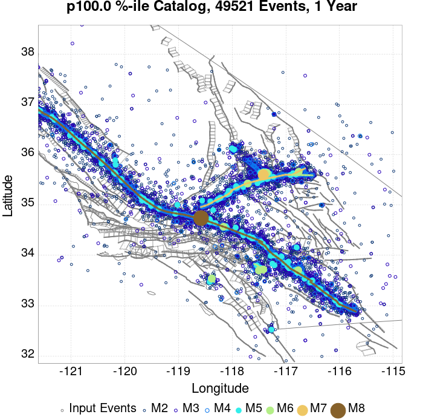 |
| **10 Year** |  |  | 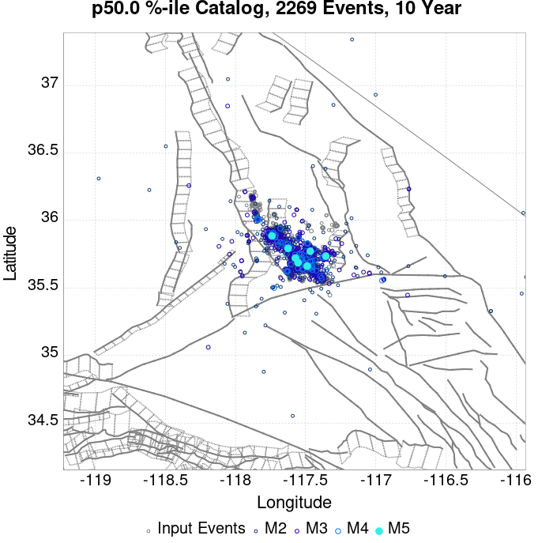 |  |  |  |  |  |  |  |  |  |

## ComCat Data Comparisons
*[(top)](#table-of-contents)*

These plots compare simulated sequences with data from ComCat. All plots only consider events with hypocenters inside the ComCat region defined in the JSON input file, and consider ruptures above Mc=3.0

### ComCat Magnitude-Number Distribution
*[(top)](#table-of-contents)*


### ComCat Cumulative Number Vs Time
*[(top)](#table-of-contents)*

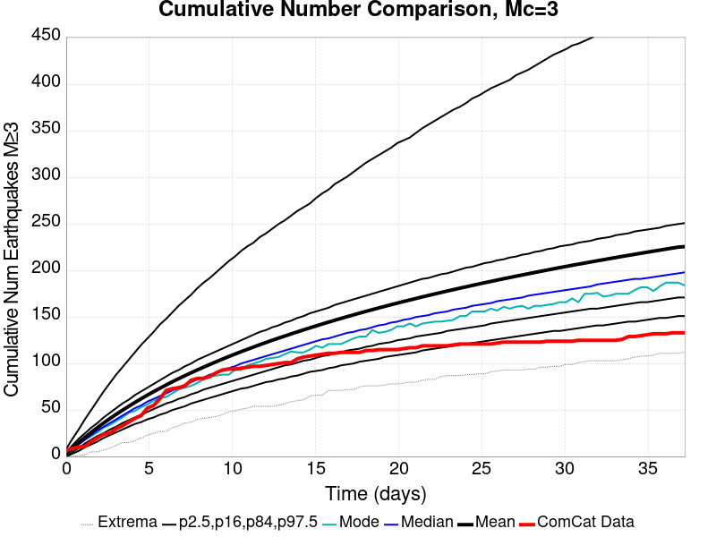

### ComCat Mean Spatial Distribution
*[(top)](#table-of-contents)*

|  | 1 Day | 1 Week | 23 Day |
|-----|-----|-----|-----|
| **M≥3** | 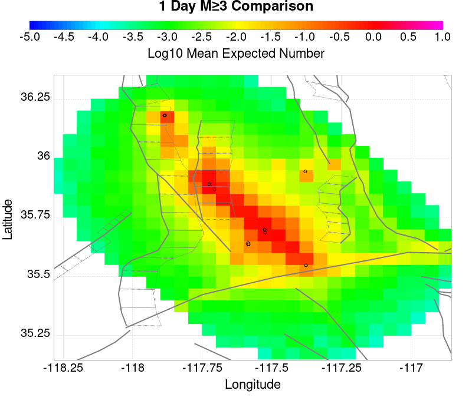 |  |  |
| **M≥4** |  |  |  |
| **M≥5** |  |  |  |
| **M≥6** |  |  |  |
| **M≥7** |  |  |  |
| **M≥8** | 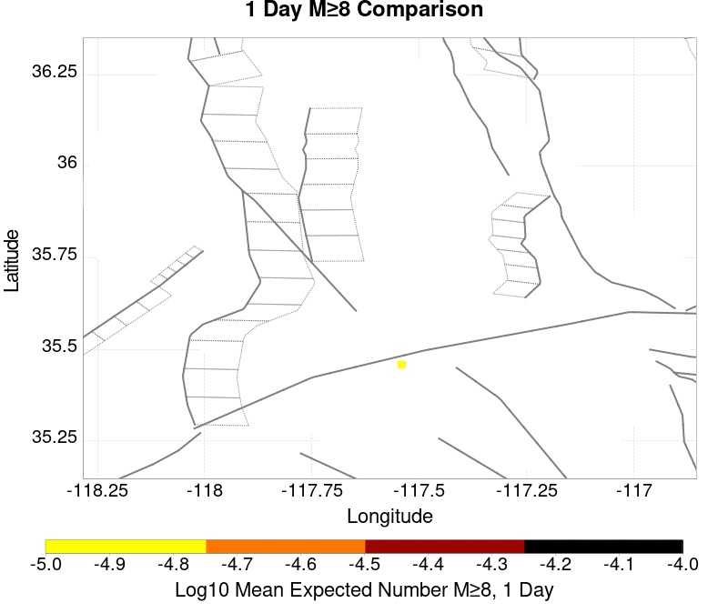 |  |  |

### ComCat Depth Distribution
*[(top)](#table-of-contents)*

| M&ge;3 | M&ge;4 | M&ge;5 | M&ge;6 | M&ge;7 | M&ge;8 |
|-----|-----|-----|-----|-----|-----|
|  |  | 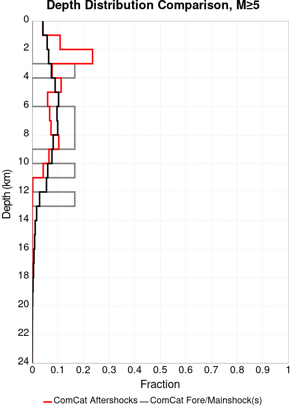 | 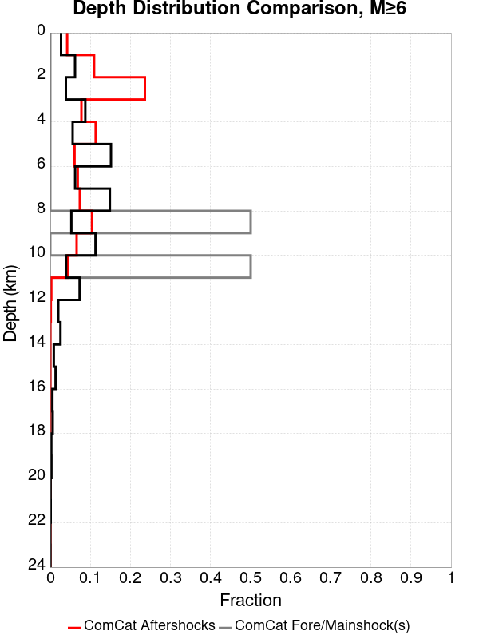 |  |  |

## Section Participation
*[(top)](#table-of-contents)*

### Section Participation Plots
*[(top)](#table-of-contents)*

| Min Mag | 1 yr Triggered Ruptures (no spontaneous) | 10 yr Triggered Ruptures (no spontaneous) | 10 yr Triggered Ruptures (primary aftershocks only) |
|-----|-----|-----|-----|
| **All Supra. Seis.** |  | 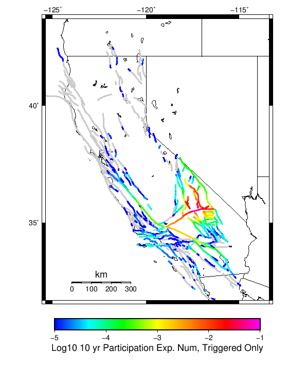 |  |
| **M&ge;6.5** |  |  |  |
| **M&ge;7** |  |  |  |
| **M&ge;7.5** | 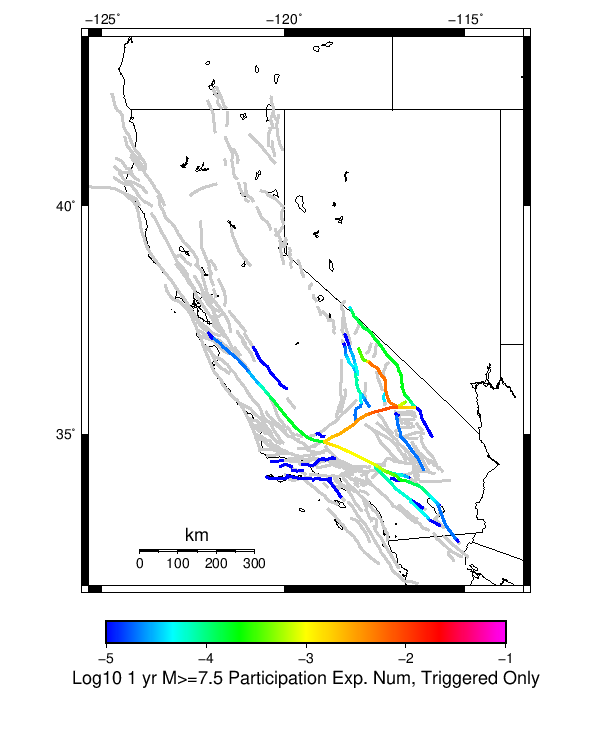 |  |  |
| **M&ge;8** |  |  |  |

### Supra-Seismogenic Parent Sections Table
*[(top)](#table-of-contents)*

*First 10 of 195 with matching ruptures shown*

| Parent Name | Triggered 10 Year Mean Count | Triggered 1 Day Prob | Triggered 1 Week Prob | Triggered 1 Month Prob | Triggered 1 Year Prob | Triggered 10 Year Prob | Triggered 10 Year Primary Mean Count |
|-----|-----|-----|-----|-----|-----|-----|-----|
| Garlock (Central) | 0.08709 | 0.00184 | 0.01031 | 0.02384 | 0.05452 | 0.08394 | 0.05061 |
| Tank Canyon | 0.07067 | 9.2E-4 | 0.0055 | 0.01367 | 0.03567 | 0.06029 | 0.01844 |
| Little Lake | 0.03613 | 6.3E-4 | 0.00417 | 0.00973 | 0.02287 | 0.0354 | 0.02149 |
| Owl Lake | 0.02879 | 3.8E-4 | 0.00231 | 0.00622 | 0.01543 | 0.02534 | 0.00768 |
| Airport Lake | 0.02454 | 5.9E-4 | 0.00335 | 0.00732 | 0.016 | 0.02448 | 0.01615 |
| Panamint Valley | 0.02036 | 3.0E-4 | 0.00214 | 0.00497 | 0.01204 | 0.01989 | 0.00787 |
| Garlock (East) | 0.01913 | 2.2E-4 | 0.00143 | 0.00381 | 0.00981 | 0.01719 | 0.00513 |
| Hunter Mountain-Saline Valley | 0.00944 | 1.5E-4 | 0.00109 | 0.00243 | 0.00588 | 0.00928 | 0.0047 |
| Ash Hill | 0.00905 | 2.9E-4 | 9.7E-4 | 0.00206 | 0.00489 | 0.00861 | 0.00212 |
| Blackwater | 0.00716 | 8.0E-5 | 3.6E-4 | 0.00132 | 0.00372 | 0.00689 | 0.00162 |

### M≥6.5 Parent Sections Table
*[(top)](#table-of-contents)*

*First 10 of 166 with matching ruptures shown*

| Parent Name | Triggered 10 Year Mean Count | Triggered 1 Day Prob | Triggered 1 Week Prob | Triggered 1 Month Prob | Triggered 1 Year Prob | Triggered 10 Year Prob | Triggered 10 Year Primary Mean Count |
|-----|-----|-----|-----|-----|-----|-----|-----|
| Garlock (Central) | 0.03718 | 7.0E-4 | 0.00429 | 0.01019 | 0.02359 | 0.03653 | 0.02089 |
| Little Lake | 0.02083 | 3.7E-4 | 0.00252 | 0.0058 | 0.01349 | 0.02057 | 0.01314 |
| Panamint Valley | 0.01856 | 2.8E-4 | 0.00201 | 0.0046 | 0.01117 | 0.0182 | 0.00773 |
| Airport Lake | 0.01834 | 4.3E-4 | 0.00256 | 0.00549 | 0.01202 | 0.01834 | 0.01225 |
| Owl Lake | 0.01591 | 2.8E-4 | 0.00167 | 0.00419 | 0.01 | 0.01588 | 0.00688 |
| Garlock (East) | 0.01267 | 1.7E-4 | 0.00111 | 0.0029 | 0.00711 | 0.01198 | 0.00493 |
| Hunter Mountain-Saline Valley | 0.00924 | 1.5E-4 | 0.00108 | 0.00239 | 0.00579 | 0.00914 | 0.00468 |
| Tank Canyon | 0.0078 | 1.0E-4 | 6.9E-4 | 0.00176 | 0.00459 | 0.00776 | 0.00195 |
| Garlock (West) | 0.0063 | 1.1E-4 | 6.4E-4 | 0.00163 | 0.00387 | 0.00629 | 0.00351 |
| So Sierra Nevada | 0.00345 | 8.0E-5 | 3.3E-4 | 7.3E-4 | 0.00183 | 0.00344 | 7.2E-4 |

### M≥7 Parent Sections Table
*[(top)](#table-of-contents)*

*First 10 of 121 with matching ruptures shown*

| Parent Name | Triggered 10 Year Mean Count | Triggered 1 Day Prob | Triggered 1 Week Prob | Triggered 1 Month Prob | Triggered 1 Year Prob | Triggered 10 Year Prob | Triggered 10 Year Primary Mean Count |
|-----|-----|-----|-----|-----|-----|-----|-----|
| Garlock (Central) | 0.03307 | 6.2E-4 | 0.00387 | 0.00906 | 0.02088 | 0.03266 | 0.0185 |
| Panamint Valley | 0.01274 | 2.2E-4 | 0.00151 | 0.00328 | 0.00794 | 0.0127 | 0.00656 |
| Owl Lake | 0.01156 | 2.5E-4 | 0.00141 | 0.00339 | 0.00755 | 0.01156 | 0.00664 |
| Garlock (East) | 0.00908 | 1.4E-4 | 9.3E-4 | 0.00241 | 0.00552 | 0.00902 | 0.00477 |
| Hunter Mountain-Saline Valley | 0.00894 | 1.5E-4 | 0.00105 | 0.00232 | 0.00566 | 0.00892 | 0.00459 |
| Garlock (West) | 0.00624 | 1.1E-4 | 6.4E-4 | 0.00162 | 0.00384 | 0.00624 | 0.0035 |
| Little Lake | 0.00394 | 7.0E-5 | 4.6E-4 | 0.00112 | 0.00258 | 0.00394 | 0.00256 |
| Airport Lake | 0.00354 | 7.0E-5 | 4.4E-4 | 0.00106 | 0.00235 | 0.00354 | 0.00234 |
| San Andreas (Mojave N) | 0.00265 | 2.0E-5 | 1.7E-4 | 5.8E-4 | 0.00159 | 0.00259 | 0.00136 |
| San Andreas (Mojave S) | 0.00196 | 3.0E-5 | 1.3E-4 | 4.0E-4 | 0.00116 | 0.00193 | 9.4E-4 |

### M≥7.5 Parent Sections Table
*[(top)](#table-of-contents)*

*First 10 of 79 with matching ruptures shown*

| Parent Name | Triggered 10 Year Mean Count | Triggered 1 Day Prob | Triggered 1 Week Prob | Triggered 1 Month Prob | Triggered 1 Year Prob | Triggered 10 Year Prob | Triggered 10 Year Primary Mean Count |
|-----|-----|-----|-----|-----|-----|-----|-----|
| Garlock (Central) | 0.01356 | 2.3E-4 | 0.00152 | 0.00352 | 0.00854 | 0.01347 | 0.00755 |
| Panamint Valley | 0.00866 | 1.4E-4 | 0.00101 | 0.00226 | 0.0055 | 0.00866 | 0.00455 |
| Hunter Mountain-Saline Valley | 0.00863 | 1.4E-4 | 0.00101 | 0.00226 | 0.00549 | 0.00863 | 0.00452 |
| Garlock (West) | 0.00559 | 1.0E-4 | 5.8E-4 | 0.00146 | 0.00347 | 0.00559 | 0.00317 |
| Garlock (East) | 0.00337 | 7.0E-5 | 3.8E-4 | 9.1E-4 | 0.00206 | 0.00337 | 0.00206 |
| San Andreas (Mojave N) | 0.00264 | 2.0E-5 | 1.7E-4 | 5.8E-4 | 0.00159 | 0.00259 | 0.00136 |
| San Andreas (Mojave S) | 0.0019 | 2.0E-5 | 1.2E-4 | 3.9E-4 | 0.00114 | 0.00188 | 9.2E-4 |
| Owl Lake | 0.00131 | 1.0E-5 | 1.0E-4 | 3.0E-4 | 7.7E-4 | 0.00131 | 6.6E-4 |
| San Andreas (San Bernardino N) | 0.00129 | 1.0E-5 | 7.0E-5 | 3.0E-4 | 8.4E-4 | 0.00128 | 6.3E-4 |
| San Andreas (San Bernardino S) | 6.4E-4 | 0.0 | 2.0E-5 | 1.6E-4 | 4.3E-4 | 6.4E-4 | 3.0E-4 |

### M≥8 Parent Sections Table
*[(top)](#table-of-contents)*

*First 10 of 33 with matching ruptures shown*

| Parent Name | Triggered 10 Year Mean Count | Triggered 1 Day Prob | Triggered 1 Week Prob | Triggered 1 Month Prob | Triggered 1 Year Prob | Triggered 10 Year Prob | Triggered 10 Year Primary Mean Count |
|-----|-----|-----|-----|-----|-----|-----|-----|
| San Andreas (Mojave N) | 2.7E-4 | 1.0E-5 | 1.0E-5 | 6.0E-5 | 1.7E-4 | 2.7E-4 | 1.3E-4 |
| San Andreas (Mojave S) | 2.7E-4 | 1.0E-5 | 1.0E-5 | 6.0E-5 | 1.7E-4 | 2.7E-4 | 1.3E-4 |
| San Andreas (San Bernardino N) | 2.7E-4 | 1.0E-5 | 1.0E-5 | 6.0E-5 | 1.7E-4 | 2.7E-4 | 1.3E-4 |
| Garlock (Central) | 2.1E-4 | 1.0E-5 | 1.0E-5 | 5.0E-5 | 1.4E-4 | 2.1E-4 | 1.3E-4 |
| Garlock (West) | 2.1E-4 | 1.0E-5 | 1.0E-5 | 5.0E-5 | 1.4E-4 | 2.1E-4 | 1.3E-4 |
| Garlock (East) | 1.6E-4 | 1.0E-5 | 1.0E-5 | 4.0E-5 | 1.0E-4 | 1.6E-4 | 1.1E-4 |
| San Andreas (San Bernardino S) | 1.5E-4 | 0.0 | 0.0 | 3.0E-5 | 1.0E-4 | 1.5E-4 | 7.0E-5 |
| San Andreas (San Gorgonio Pass-Garnet HIll) | 1.5E-4 | 0.0 | 0.0 | 2.0E-5 | 1.0E-4 | 1.5E-4 | 6.0E-5 |
| San Andreas (Coachella) rev | 1.1E-4 | 0.0 | 0.0 | 1.0E-5 | 6.0E-5 | 1.1E-4 | 4.0E-5 |
| San Jacinto (San Bernardino) | 8.0E-5 | 1.0E-5 | 1.0E-5 | 2.0E-5 | 5.0E-5 | 8.0E-5 | 4.0E-5 |

### Fault Magnitude-Probability Distributions
*[(top)](#table-of-contents)*

The first 5 sections (sorted by trigger rate) are plotted below. All fault MPDs are available [here](plots/parent_sect_mpds/README.md)

| 1 Week | 1 Month | 1 Year | 10 Year |
|-----|-----|-----|-----|
|  |  |  |  |
|  |  |  |  |
|  |  |  |  |
|  |  |  |  |
|  |  |  |  |

## Gridded Nucleation
*[(top)](#table-of-contents)*

| Min Mag | Triggered Ruptures (no spontaneous) | Triggered Ruptures (primary aftershocks only) |
|-----|-----|-----|
| **M&ge;2.5** | 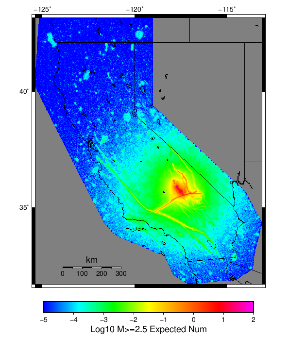 |  |
| **M&ge;5** |  |  |
| **M&ge;6** |  | 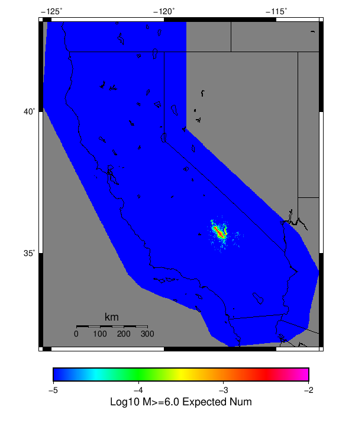 |
| **M&ge;7** |  |  |


## JSON Input File
*[(top)](#table-of-contents)*

```
{
  "numSimulations": 100000,
  "duration": 10.0,
  "startTimeMillis": 1562893236533,
  "includeSpontaneous": false,
  "randomSeed": 1562893237148,
  "binaryOutput": true,
  "binaryOutputFilters": [
    {
      "prefix": "results_complete",
      "descendantsOnly": false
    },
    {
      "prefix": "results_m5_preserve_chain",
      "minMag": 5.0,
      "preserveChainBelowMag": true,
      "descendantsOnly": false
    }
  ],
  "forceRecalc": false,
  "simulationName": "ComCat M7.1 (ci38457511), 5.9 Days After, Finite Surface",
  "numRetries": 3,
  "outputDir": "${ETAS_SIM_DIR}/2019_07_11-ComCatM7p1_ci38457511_5p9DaysAfter_FiniteSurface-noSpont-full_td-scale1.14",
  "triggerRuptures": [
    {
      "occurrenceTimeMillis": 1562259775360,
      "mag": 3.98,
      "latitude": 35.707,
      "longitude": -117.50583329999999,
      "depth": 10.28
    },
    {
      "occurrenceTimeMillis": 1562261629040,
      "mag": 6.4,
      "latitude": 35.7051667,
      "longitude": -117.506,
      "depth": 10.71
    },
    {
      "occurrenceTimeMillis": 1562261701660,
      "mag": 4.49,
      "latitude": 35.644,
      "longitude": -117.56716670000002,
      "depth": 4.64
    },
    {
      "occurrenceTimeMillis": 1562261845670,
      "mag": 3.0,
      "latitude": 35.6785,
      "longitude": -117.45250000000001,
      "depth": 15.76
    },
    {
      "occurrenceTimeMillis": 1562261875590,
      "mag": 3.91,
      "latitude": 35.7421667,
      "longitude": -117.5531667,
      "depth": 4.15
    },
    {
      "occurrenceTimeMillis": 1562261975120,
      "mag": 4.0,
      "latitude": 35.6233,
      "longitude": -117.5795,
      "depth": 12.18
    },
    {
      "occurrenceTimeMillis": 1562262002270,
      "mag": 4.0,
      "latitude": 35.7258333,
      "longitude": -117.57183330000001,
      "depth": 6.82
    },
    {
      "occurrenceTimeMillis": 1562262018530,
      "mag": 4.13,
      "latitude": 35.7063333,
      "longitude": -117.52200000000002,
      "depth": 2.65
    },
    {
      "occurrenceTimeMillis": 1562262173890,
      "mag": 3.31,
      "latitude": 35.7285004,
      "longitude": -117.55982969999998,
      "depth": 1.83
    },
    {
      "occurrenceTimeMillis": 1562262209450,
      "mag": 3.56,
      "latitude": 35.6578331,
      "longitude": -117.5543365,
      "depth": 1.27
    },
    {
      "occurrenceTimeMillis": 1562262272880,
      "mag": 3.85,
      "latitude": 35.6828346,
      "longitude": -117.51183320000001,
      "depth": 1.0
    },
    {
      "occurrenceTimeMillis": 1562262363730,
      "mag": 3.39,
      "latitude": 35.6414986,
      "longitude": -117.6100006,
      "depth": 10.16
    },
    {
      "occurrenceTimeMillis": 1562262410080,
      "mag": 3.38,
      "latitude": 35.63916780000001,
      "longitude": -117.6186676,
      "depth": 7.61
    },
    {
      "occurrenceTimeMillis": 1562262437570,
      "mag": 3.59,
      "latitude": 35.7443352,
      "longitude": -117.54966740000002,
      "depth": 1.49
    },
    {
      "occurrenceTimeMillis": 1562262706450,
      "mag": 3.39,
      "latitude": 35.690834,
      "longitude": -117.53916930000001,
      "depth": 0.16
    },
    {
      "occurrenceTimeMillis": 1562262761530,
      "mag": 2.94,
      "latitude": 35.7188333,
      "longitude": -117.5401667,
      "depth": 1.44
    },
    {
      "occurrenceTimeMillis": 1562263051430,
      "mag": 2.91,
      "latitude": 35.661,
      "longitude": -117.52500000000002,
      "depth": 1.44
    },
    {
      "occurrenceTimeMillis": 1562263082620,
      "mag": 3.29,
      "latitude": 35.7008324,
      "longitude": -117.5169983,
      "depth": 2.77
    },
    {
      "occurrenceTimeMillis": 1562263240220,
      "mag": 2.67,
      "latitude": 35.63,
      "longitude": -117.5688333,
      "depth": 1.0
    },
    {
      "occurrenceTimeMillis": 1562263374030,
      "mag": 2.67,
      "latitude": 35.611,
      "longitude": -117.5921667,
      "depth": 1.33
    },
    {
      "occurrenceTimeMillis": 1562263398440,
      "mag": 3.02,
      "latitude": 35.7481651,
      "longitude": -117.54183200000001,
      "depth": 2.26
    },
    {
      "occurrenceTimeMillis": 1562263541530,
      "mag": 2.75,
      "latitude": 35.7135,
      "longitude": -117.5318333,
      "depth": 0.33
    },
    {
      "occurrenceTimeMillis": 1562263576110,
      "mag": 3.78,
      "latitude": 35.6599998,
      "longitude": -117.52783199999999,
      "depth": 1.18
    },
    {
      "occurrenceTimeMillis": 1562263629180,
      "mag": 3.5,
      "latitude": 35.5998344,
      "longitude": -117.6226654,
      "depth": 0.0
    },
    {
      "occurrenceTimeMillis": 1562263832740,
      "mag": 3.46,
      "latitude": 35.6593323,
      "longitude": -117.53816990000001,
      "depth": 8.47
    },
    {
      "occurrenceTimeMillis": 1562263882750,
      "mag": 2.79,
      "latitude": 35.603666700000005,
      "longitude": -117.60866670000001,
      "depth": 2.04
    },
    {
      "occurrenceTimeMillis": 1562263972040,
      "mag": 3.44,
      "latitude": 35.6723333,
      "longitude": -117.561,
      "depth": 6.91
    },
    {
      "occurrenceTimeMillis": 1562264031370,
      "mag": 3.5,
      "latitude": 35.7048333,
      "longitude": -117.4808333,
      "depth": 8.5
    },
    {
      "occurrenceTimeMillis": 1562264193510,
      "mag": 3.04,
      "latitude": 35.7233315,
      "longitude": -117.5403366,
      "depth": 1.22
    },
    {
      "occurrenceTimeMillis": 1562264235140,
      "mag": 2.85,
      "latitude": 35.7171667,
      "longitude": -117.54566669999998,
      "depth": 1.43
    },
    {
      "occurrenceTimeMillis": 1562264325740,
      "mag": 3.28,
      "latitude": 35.6375008,
      "longitude": -117.6143341,
      "depth": 5.97
    },
    {
      "occurrenceTimeMillis": 1562264485340,
      "mag": 2.61,
      "latitude": 35.6793333,
      "longitude": -117.5173333,
      "depth": 1.99
    },
    {
      "occurrenceTimeMillis": 1562264763680,
      "mag": 3.12,
      "latitude": 35.6646652,
      "longitude": -117.5261688,
      "depth": 1.2
    },
    {
      "occurrenceTimeMillis": 1562264846710,
      "mag": 3.29,
      "latitude": 35.6738319,
      "longitude": -117.51750180000002,
      "depth": 1.57
    },
    {
      "occurrenceTimeMillis": 1562264879190,
      "mag": 4.14,
      "latitude": 35.7426667,
      "longitude": -117.5565,
      "depth": 1.45
    },
    {
      "occurrenceTimeMillis": 1562264923610,
      "mag": 3.85,
      "latitude": 35.6661667,
      "longitude": -117.5723333,
      "depth": 4.05
    },
    {
      "occurrenceTimeMillis": 1562265344040,
      "mag": 2.5,
      "latitude": 35.7215,
      "longitude": -117.56550000000001,
      "depth": 0.16
    },
    {
      "occurrenceTimeMillis": 1562265451500,
      "mag": 2.64,
      "latitude": 35.72,
      "longitude": -117.5723333,
      "depth": 1.34
    },
    {
      "occurrenceTimeMillis": 1562265525650,
      "mag": 2.69,
      "latitude": 35.7046661,
      "longitude": -117.49666600000002,
      "depth": 3.96
    },
    {
      "occurrenceTimeMillis": 1562265584440,
      "mag": 4.59,
      "latitude": 35.6013333,
      "longitude": -117.59700000000001,
      "depth": 2.81
    },
    {
      "occurrenceTimeMillis": 1562265674300,
      "mag": 3.24,
      "latitude": 35.6751671,
      "longitude": -117.5148315,
      "depth": 1.73
    },
    {
      "occurrenceTimeMillis": 1562265864830,
      "mag": 3.01,
      "latitude": 35.7186661,
      "longitude": -117.56266780000001,
      "depth": 0.0
    },
    {
      "occurrenceTimeMillis": 1562266026590,
      "mag": 4.34,
      "latitude": 35.6758333,
      "longitude": -117.48533330000001,
      "depth": 8.53
    },
    {
      "occurrenceTimeMillis": 1562266207160,
      "mag": 2.73,
      "latitude": 35.641,
      "longitude": -117.56266670000001,
      "depth": 8.95
    },
    {
      "occurrenceTimeMillis": 1562266216010,
      "mag": 3.55,
      "latitude": 35.6764984,
      "longitude": -117.5,
      "depth": 0.91
    },
    {
      "occurrenceTimeMillis": 1562266333530,
      "mag": 2.78,
      "latitude": 35.6543333,
      "longitude": -117.53983330000001,
      "depth": 0.88
    },
    {
      "occurrenceTimeMillis": 1562266376130,
      "mag": 2.93,
      "latitude": 35.741,
      "longitude": -117.561,
      "depth": 0.23
    },
    {
      "occurrenceTimeMillis": 1562266407460,
      "mag": 3.34,
      "latitude": 35.7276649,
      "longitude": -117.56416320000001,
      "depth": 1.62
    },
    {
      "occurrenceTimeMillis": 1562266454010,
      "mag": 4.07,
      "latitude": 35.5971667,
      "longitude": -117.60016669999999,
      "depth": 5.55
    },
    {
      "occurrenceTimeMillis": 1562266527790,
      "mag": 3.07,
      "latitude": 35.6738333,
      "longitude": -117.4893333,
      "depth": 9.23
    },
    {
      "occurrenceTimeMillis": 1562266566420,
      "mag": 4.58,
      "latitude": 35.716,
      "longitude": -117.56000000000002,
      "depth": 1.92
    },
    {
      "occurrenceTimeMillis": 1562266687790,
      "mag": 2.85,
      "latitude": 35.7266667,
      "longitude": -117.56516670000002,
      "depth": 0.09
    },
    {
      "occurrenceTimeMillis": 1562266809510,
      "mag": 3.21,
      "latitude": 35.7099991,
      "longitude": -117.55616759999998,
      "depth": 0.1
    },
    {
      "occurrenceTimeMillis": 1562266944640,
      "mag": 2.56,
      "latitude": 35.645,
      "longitude": -117.5373333,
      "depth": 0.01
    },
    {
      "occurrenceTimeMillis": 1562267419790,
      "mag": 3.26,
      "latitude": 35.6938324,
      "longitude": -117.49449920000002,
      "depth": 0.97
    },
    {
      "occurrenceTimeMillis": 1562267699490,
      "mag": 3.0,
      "latitude": 35.652668,
      "longitude": -117.5393295,
      "depth": 1.65
    },
    {
      "occurrenceTimeMillis": 1562267766200,
      "mag": 2.5,
      "latitude": 35.721,
      "longitude": -117.56650000000002,
      "depth": 0.12
    },
    {
      "occurrenceTimeMillis": 1562267871400,
      "mag": 3.23,
      "latitude": 35.6911659,
      "longitude": -117.51216889999999,
      "depth": 1.03
    },
    {
      "occurrenceTimeMillis": 1562268051750,
      "mag": 2.8,
      "latitude": 35.6389999,
      "longitude": -117.5526657,
      "depth": 1.11
    },
    {
      "occurrenceTimeMillis": 1562268092090,
      "mag": 4.5,
      "latitude": 35.6715,
      "longitude": -117.4788333,
      "depth": 5.16
    },
    {
      "occurrenceTimeMillis": 1562268380340,
      "mag": 2.69,
      "latitude": 35.7086667,
      "longitude": -117.48333330000001,
      "depth": 1.39
    },
    {
      "occurrenceTimeMillis": 1562268438340,
      "mag": 2.81,
      "latitude": 35.6696667,
      "longitude": -117.47999999999999,
      "depth": 6.24
    },
    {
      "occurrenceTimeMillis": 1562269189760,
      "mag": 2.63,
      "latitude": 35.683,
      "longitude": -117.5195,
      "depth": 5.84
    },
    {
      "occurrenceTimeMillis": 1562269229180,
      "mag": 2.65,
      "latitude": 35.6556667,
      "longitude": -117.5158333,
      "depth": 1.76
    },
    {
      "occurrenceTimeMillis": 1562269744960,
      "mag": 3.18,
      "latitude": 35.6828346,
      "longitude": -117.49183650000002,
      "depth": 0.0
    },
    {
      "occurrenceTimeMillis": 1562269876850,
      "mag": 3.34,
      "latitude": 35.7094994,
      "longitude": -117.55666349999998,
      "depth": 0.34
    },
    {
      "occurrenceTimeMillis": 1562269933070,
      "mag": 3.02,
      "latitude": 35.6086655,
      "longitude": -117.590332,
      "depth": 4.83
    },
    {
      "occurrenceTimeMillis": 1562270160500,
      "mag": 4.16,
      "latitude": 35.6623333,
      "longitude": -117.524,
      "depth": 1.49
    },
    {
      "occurrenceTimeMillis": 1562270280220,
      "mag": 2.65,
      "latitude": 35.7131667,
      "longitude": -117.5561667,
      "depth": 0.16
    },
    {
      "occurrenceTimeMillis": 1562270492930,
      "mag": 2.5,
      "latitude": 35.678,
      "longitude": -117.589,
      "depth": 7.89
    },
    {
      "occurrenceTimeMillis": 1562270655500,
      "mag": 2.56,
      "latitude": 35.7048333,
      "longitude": -117.48683330000001,
      "depth": 1.23
    },
    {
      "occurrenceTimeMillis": 1562270768270,
      "mag": 3.38,
      "latitude": 35.6980019,
      "longitude": -117.4881668,
      "depth": 8.77
    },
    {
      "occurrenceTimeMillis": 1562271091460,
      "mag": 2.61,
      "latitude": 35.683,
      "longitude": -117.50483330000002,
      "depth": 1.69
    },
    {
      "occurrenceTimeMillis": 1562271290340,
      "mag": 3.99,
      "latitude": 35.6991667,
      "longitude": -117.5125,
      "depth": 5.75
    },
    {
      "occurrenceTimeMillis": 1562271456830,
      "mag": 3.06,
      "latitude": 35.699501,
      "longitude": -117.4838333,
      "depth": 1.03
    },
    {
      "occurrenceTimeMillis": 1562271789990,
      "mag": 3.4,
      "latitude": 35.6403351,
      "longitude": -117.5996704,
      "depth": 9.92
    },
    {
      "occurrenceTimeMillis": 1562271838650,
      "mag": 2.53,
      "latitude": 35.6583333,
      "longitude": -117.56233329999999,
      "depth": 4.39
    },
    {
      "occurrenceTimeMillis": 1562272472100,
      "mag": 2.61,
      "latitude": 35.640667,
      "longitude": -117.5833359,
      "depth": 8.68
    },
    {
      "occurrenceTimeMillis": 1562273126620,
      "mag": 3.09,
      "latitude": 35.7008324,
      "longitude": -117.47766879999999,
      "depth": 0.04
    },
    {
      "occurrenceTimeMillis": 1562273724820,
      "mag": 3.37,
      "latitude": 35.7088318,
      "longitude": -117.4771652,
      "depth": 0.2
    },
    {
      "occurrenceTimeMillis": 1562273832360,
      "mag": 2.54,
      "latitude": 35.6585,
      "longitude": -117.53199999999998,
      "depth": 8.73
    },
    {
      "occurrenceTimeMillis": 1562274175860,
      "mag": 3.56,
      "latitude": 35.689666700000004,
      "longitude": -117.4853363,
      "depth": 7.08
    },
    {
      "occurrenceTimeMillis": 1562274428600,
      "mag": 2.52,
      "latitude": 35.5995,
      "longitude": -117.59783330000002,
      "depth": 4.74
    },
    {
      "occurrenceTimeMillis": 1562275395050,
      "mag": 2.8,
      "latitude": 35.6951667,
      "longitude": -117.4893333,
      "depth": 1.65
    },
    {
      "occurrenceTimeMillis": 1562275595090,
      "mag": 3.0,
      "latitude": 35.67666630000001,
      "longitude": -117.52749630000001,
      "depth": 7.39
    },
    {
      "occurrenceTimeMillis": 1562275966060,
      "mag": 2.62,
      "latitude": 35.725,
      "longitude": -117.56916670000001,
      "depth": 2.03
    },
    {
      "occurrenceTimeMillis": 1562276014350,
      "mag": 3.08,
      "latitude": 35.6155014,
      "longitude": -117.5893326,
      "depth": 5.43
    },
    {
      "occurrenceTimeMillis": 1562276433450,
      "mag": 3.42,
      "latitude": 35.6691666,
      "longitude": -117.518837,
      "depth": 2.04
    },
    {
      "occurrenceTimeMillis": 1562276519830,
      "mag": 2.74,
      "latitude": 35.7193333,
      "longitude": -117.53216670000002,
      "depth": 2.19
    },
    {
      "occurrenceTimeMillis": 1562276794030,
      "mag": 2.5,
      "latitude": 35.7011667,
      "longitude": -117.47866669999999,
      "depth": 0.93
    },
    {
      "occurrenceTimeMillis": 1562276824410,
      "mag": 3.25,
      "latitude": 35.6321678,
      "longitude": -117.60717010000002,
      "depth": 9.0
    },
    {
      "occurrenceTimeMillis": 1562277755090,
      "mag": 3.35,
      "latitude": 35.6775017,
      "longitude": -117.5148315,
      "depth": 2.85
    },
    {
      "occurrenceTimeMillis": 1562277922570,
      "mag": 3.3,
      "latitude": 35.6534,
      "longitude": -117.442,
      "depth": 8.97
    },
    {
      "occurrenceTimeMillis": 1562278328280,
      "mag": 4.47,
      "latitude": 35.7443333,
      "longitude": -117.56633329999998,
      "depth": 1.97
    },
    {
      "occurrenceTimeMillis": 1562279346560,
      "mag": 2.51,
      "latitude": 35.7038333,
      "longitude": -117.49499999999999,
      "depth": 9.8
    },
    {
      "occurrenceTimeMillis": 1562279407880,
      "mag": 2.62,
      "latitude": 35.7008333,
      "longitude": -117.4893333,
      "depth": 1.85
    },
    {
      "occurrenceTimeMillis": 1562280141650,
      "mag": 3.2,
      "latitude": 35.7211685,
      "longitude": -117.52400210000002,
      "depth": 2.21
    },
    {
      "occurrenceTimeMillis": 1562281630780,
      "mag": 2.59,
      "latitude": 35.7041667,
      "longitude": -117.4886667,
      "depth": 1.92
    },
    {
      "occurrenceTimeMillis": 1562281960410,
      "mag": 3.49,
      "latitude": 35.6711655,
      "longitude": -117.47166440000001,
      "depth": 7.11
    },
    {
      "occurrenceTimeMillis": 1562281984910,
      "mag": 3.06,
      "latitude": 35.7470016,
      "longitude": -117.5784988,
      "depth": 2.13
    },
    {
      "occurrenceTimeMillis": 1562283240630,
      "mag": 3.82,
      "latitude": 35.6623333,
      "longitude": -117.5245,
      "depth": 2.61
    },
    {
      "occurrenceTimeMillis": 1562283242380,
      "mag": 4.04,
      "latitude": 35.6011667,
      "longitude": -117.61066670000001,
      "depth": 4.75
    },
    {
      "occurrenceTimeMillis": 1562283753710,
      "mag": 3.72,
      "latitude": 35.7470016,
      "longitude": -117.5681686,
      "depth": 2.42
    },
    {
      "occurrenceTimeMillis": 1562284476440,
      "mag": 3.33,
      "latitude": 35.6571655,
      "longitude": -117.52183530000002,
      "depth": 1.67
    },
    {
      "occurrenceTimeMillis": 1562285645640,
      "mag": 2.76,
      "latitude": 35.6458333,
      "longitude": -117.54716670000002,
      "depth": 0.29
    },
    {
      "occurrenceTimeMillis": 1562285881410,
      "mag": 4.04,
      "latitude": 35.7718333,
      "longitude": -117.61783330000002,
      "depth": 2.59
    },
    {
      "occurrenceTimeMillis": 1562286529030,
      "mag": 2.8,
      "latitude": 35.7215,
      "longitude": -117.5465,
      "depth": 7.03
    },
    {
      "occurrenceTimeMillis": 1562286726670,
      "mag": 4.02,
      "latitude": 35.7033333,
      "longitude": -117.4828333,
      "depth": 1.0
    },
    {
      "occurrenceTimeMillis": 1562286799610,
      "mag": 2.66,
      "latitude": 35.7436676,
      "longitude": -117.55566409999999,
      "depth": 5.42
    },
    {
      "occurrenceTimeMillis": 1562287539420,
      "mag": 3.95,
      "latitude": 35.6910019,
      "longitude": -117.50966640000001,
      "depth": 3.68
    },
    {
      "occurrenceTimeMillis": 1562287780920,
      "mag": 2.52,
      "latitude": 35.7096667,
      "longitude": -117.47866669999999,
      "depth": 1.91
    },
    {
      "occurrenceTimeMillis": 1562288933460,
      "mag": 2.99,
      "latitude": 35.7254982,
      "longitude": -117.55117030000001,
      "depth": 1.29
    },
    {
      "occurrenceTimeMillis": 1562289493410,
      "mag": 3.12,
      "latitude": 35.6580009,
      "longitude": -117.52216339999998,
      "depth": 1.38
    },
    {
      "occurrenceTimeMillis": 1562291154030,
      "mag": 2.55,
      "latitude": 35.5946655,
      "longitude": -117.5978317,
      "depth": 4.1
    },
    {
      "occurrenceTimeMillis": 1562291887280,
      "mag": 2.68,
      "latitude": 35.7118333,
      "longitude": -117.46816670000001,
      "depth": 0.68
    },
    {
      "occurrenceTimeMillis": 1562292100910,
      "mag": 3.21,
      "latitude": 35.7734985,
      "longitude": -117.6149979,
      "depth": 0.22
    },
    {
      "occurrenceTimeMillis": 1562292119010,
      "mag": 3.98,
      "latitude": 35.6401667,
      "longitude": -117.5461667,
      "depth": 11.3
    },
    {
      "occurrenceTimeMillis": 1562292319160,
      "mag": 3.34,
      "latitude": 35.6558342,
      "longitude": -117.5234985,
      "depth": 1.57
    },
    {
      "occurrenceTimeMillis": 1562292831940,
      "mag": 2.65,
      "latitude": 35.6405,
      "longitude": -117.55783329999998,
      "depth": 10.3
    },
    {
      "occurrenceTimeMillis": 1562293181860,
      "mag": 3.25,
      "latitude": 35.7746658,
      "longitude": -117.6169968,
      "depth": 2.35
    },
    {
      "occurrenceTimeMillis": 1562293435650,
      "mag": 2.8,
      "latitude": 35.7128333,
      "longitude": -117.4743333,
      "depth": 0.81
    },
    {
      "occurrenceTimeMillis": 1562295589610,
      "mag": 2.81,
      "latitude": 35.661,
      "longitude": -117.519,
      "depth": 0.21
    },
    {
      "occurrenceTimeMillis": 1562295673270,
      "mag": 2.72,
      "latitude": 35.744,
      "longitude": -117.5648333,
      "depth": 5.49
    },
    {
      "occurrenceTimeMillis": 1562296518720,
      "mag": 3.27,
      "latitude": 35.6286659,
      "longitude": -117.5633316,
      "depth": 3.95
    },
    {
      "occurrenceTimeMillis": 1562296793710,
      "mag": 3.32,
      "latitude": 35.6426659,
      "longitude": -117.529335,
      "depth": 0.61
    },
    {
      "occurrenceTimeMillis": 1562296893030,
      "mag": 2.53,
      "latitude": 35.7783333,
      "longitude": -117.6173333,
      "depth": 1.76
    },
    {
      "occurrenceTimeMillis": 1562297120610,
      "mag": 2.54,
      "latitude": 35.6911667,
      "longitude": -117.5123333,
      "depth": 4.17
    },
    {
      "occurrenceTimeMillis": 1562298372730,
      "mag": 2.56,
      "latitude": 35.698,
      "longitude": -117.48033330000001,
      "depth": 1.34
    },
    {
      "occurrenceTimeMillis": 1562298414390,
      "mag": 3.07,
      "latitude": 35.6823349,
      "longitude": -117.5,
      "depth": 0.59
    },
    {
      "occurrenceTimeMillis": 1562298613940,
      "mag": 2.52,
      "latitude": 35.7093333,
      "longitude": -117.4758333,
      "depth": 0.41
    },
    {
      "occurrenceTimeMillis": 1562299898470,
      "mag": 3.53,
      "latitude": 35.7226677,
      "longitude": -117.55300139999999,
      "depth": 1.02
    },
    {
      "occurrenceTimeMillis": 1562299981170,
      "mag": 2.62,
      "latitude": 35.6773333,
      "longitude": -117.551,
      "depth": 7.07
    },
    {
      "occurrenceTimeMillis": 1562300085340,
      "mag": 3.48,
      "latitude": 35.6983337,
      "longitude": -117.481163,
      "depth": 1.26
    },
    {
      "occurrenceTimeMillis": 1562301184910,
      "mag": 2.54,
      "latitude": 35.6588333,
      "longitude": -117.51783330000002,
      "depth": 2.08
    },
    {
      "occurrenceTimeMillis": 1562302565260,
      "mag": 2.52,
      "latitude": 35.6596667,
      "longitude": -117.54183330000001,
      "depth": 7.89
    },
    {
      "occurrenceTimeMillis": 1562302899770,
      "mag": 2.61,
      "latitude": 35.5718333,
      "longitude": -117.6181667,
      "depth": 4.86
    },
    {
      "occurrenceTimeMillis": 1562303437620,
      "mag": 3.19,
      "latitude": 35.7073326,
      "longitude": -117.47533420000002,
      "depth": 6.11
    },
    {
      "occurrenceTimeMillis": 1562303905370,
      "mag": 3.45,
      "latitude": 35.7700005,
      "longitude": -117.61250310000001,
      "depth": 2.34
    },
    {
      "occurrenceTimeMillis": 1562304556070,
      "mag": 2.64,
      "latitude": 35.636,
      "longitude": -117.58783330000001,
      "depth": 6.71
    },
    {
      "occurrenceTimeMillis": 1562305212140,
      "mag": 2.82,
      "latitude": 35.6776667,
      "longitude": -117.51066670000002,
      "depth": 2.02
    },
    {
      "occurrenceTimeMillis": 1562305958100,
      "mag": 2.5,
      "latitude": 35.70283330000001,
      "longitude": -117.4845,
      "depth": 0.25
    },
    {
      "occurrenceTimeMillis": 1562306963130,
      "mag": 3.65,
      "latitude": 35.6223335,
      "longitude": -117.57333369999999,
      "depth": 6.19
    },
    {
      "occurrenceTimeMillis": 1562308842510,
      "mag": 3.2,
      "latitude": 35.7036667,
      "longitude": -117.50849909999998,
      "depth": 2.33
    },
    {
      "occurrenceTimeMillis": 1562309940440,
      "mag": 2.64,
      "latitude": 35.7166667,
      "longitude": -117.54133330000002,
      "depth": 0.35
    },
    {
      "occurrenceTimeMillis": 1562309973610,
      "mag": 2.58,
      "latitude": 35.6706667,
      "longitude": -117.4831667,
      "depth": 6.7
    },
    {
      "occurrenceTimeMillis": 1562310142290,
      "mag": 3.17,
      "latitude": 35.7268333,
      "longitude": -117.56416320000001,
      "depth": 1.54
    },
    {
      "occurrenceTimeMillis": 1562311657020,
      "mag": 3.72,
      "latitude": 35.75,
      "longitude": -117.56416320000001,
      "depth": 3.38
    },
    {
      "occurrenceTimeMillis": 1562312353540,
      "mag": 3.46,
      "latitude": 35.68600080000001,
      "longitude": -117.4801636,
      "depth": 9.49
    },
    {
      "occurrenceTimeMillis": 1562313643330,
      "mag": 2.9,
      "latitude": 35.7501667,
      "longitude": -117.56216670000002,
      "depth": 7.07
    },
    {
      "occurrenceTimeMillis": 1562314864840,
      "mag": 3.46,
      "latitude": 35.6011658,
      "longitude": -117.6039963,
      "depth": 4.2
    },
    {
      "occurrenceTimeMillis": 1562316409740,
      "mag": 3.09,
      "latitude": 35.6926651,
      "longitude": -117.49099730000002,
      "depth": 7.04
    },
    {
      "occurrenceTimeMillis": 1562316842500,
      "mag": 3.55,
      "latitude": 35.7039986,
      "longitude": -117.50250240000001,
      "depth": 7.27
    },
    {
      "occurrenceTimeMillis": 1562317880610,
      "mag": 2.9,
      "latitude": 35.6663333,
      "longitude": -117.52766670000001,
      "depth": 6.61
    },
    {
      "occurrenceTimeMillis": 1562319989260,
      "mag": 3.51,
      "latitude": 35.6479988,
      "longitude": -117.54533390000002,
      "depth": 3.76
    },
    {
      "occurrenceTimeMillis": 1562321794490,
      "mag": 3.1,
      "latitude": 35.663166,
      "longitude": -117.50299840000001,
      "depth": 6.09
    },
    {
      "occurrenceTimeMillis": 1562322437720,
      "mag": 2.53,
      "latitude": 35.7246667,
      "longitude": -117.5358333,
      "depth": 6.6
    },
    {
      "occurrenceTimeMillis": 1562322796080,
      "mag": 2.75,
      "latitude": 35.68050000000001,
      "longitude": -117.4775,
      "depth": 0.83
    },
    {
      "occurrenceTimeMillis": 1562324246570,
      "mag": 2.89,
      "latitude": 35.7433333,
      "longitude": -117.54933329999999,
      "depth": 10.81
    },
    {
      "occurrenceTimeMillis": 1562324378860,
      "mag": 3.54,
      "latitude": 35.6041679,
      "longitude": -117.5926666,
      "depth": 1.97
    },
    {
      "occurrenceTimeMillis": 1562324873040,
      "mag": 5.36,
      "latitude": 35.7603333,
      "longitude": -117.57500000000002,
      "depth": 6.95
    },
    {
      "occurrenceTimeMillis": 1562325009580,
      "mag": 3.44,
      "latitude": 35.746666,
      "longitude": -117.59333039999999,
      "depth": 6.49
    },
    {
      "occurrenceTimeMillis": 1562325091820,
      "mag": 2.96,
      "latitude": 35.7498333,
      "longitude": -117.56949999999999,
      "depth": 4.28
    },
    {
      "occurrenceTimeMillis": 1562325139080,
      "mag": 2.93,
      "latitude": 35.7505,
      "longitude": -117.5688333,
      "depth": 3.62
    },
    {
      "occurrenceTimeMillis": 1562325439580,
      "mag": 2.55,
      "latitude": 35.777,
      "longitude": -117.56699999999998,
      "depth": 4.93
    },
    {
      "occurrenceTimeMillis": 1562325624920,
      "mag": 2.56,
      "latitude": 35.7588333,
      "longitude": -117.57466670000001,
      "depth": 7.08
    },
    {
      "occurrenceTimeMillis": 1562325908730,
      "mag": 2.6,
      "latitude": 35.6436667,
      "longitude": -117.5891667,
      "depth": 8.26
    },
    {
      "occurrenceTimeMillis": 1562326154790,
      "mag": 3.05,
      "latitude": 35.7718315,
      "longitude": -117.5686646,
      "depth": 3.75
    },
    {
      "occurrenceTimeMillis": 1562326291390,
      "mag": 2.52,
      "latitude": 35.758,
      "longitude": -117.58216670000002,
      "depth": 7.12
    },
    {
      "occurrenceTimeMillis": 1562326563920,
      "mag": 3.19,
      "latitude": 35.7631667,
      "longitude": -117.5838333,
      "depth": 7.91
    },
    {
      "occurrenceTimeMillis": 1562327510810,
      "mag": 2.72,
      "latitude": 35.6008333,
      "longitude": -117.60383329999999,
      "depth": 4.64
    },
    {
      "occurrenceTimeMillis": 1562327929210,
      "mag": 2.88,
      "latitude": 35.648,
      "longitude": -117.585,
      "depth": 6.77
    },
    {
      "occurrenceTimeMillis": 1562329437990,
      "mag": 3.26,
      "latitude": 35.7228317,
      "longitude": -117.52850340000002,
      "depth": 3.14
    },
    {
      "occurrenceTimeMillis": 1562330310020,
      "mag": 4.09,
      "latitude": 35.7716667,
      "longitude": -117.57066670000002,
      "depth": 6.82
    },
    {
      "occurrenceTimeMillis": 1562331000450,
      "mag": 2.65,
      "latitude": 35.758,
      "longitude": -117.57366670000002,
      "depth": 6.92
    },
    {
      "occurrenceTimeMillis": 1562331304830,
      "mag": 3.65,
      "latitude": 35.7508316,
      "longitude": -117.5633316,
      "depth": 6.9
    },
    {
      "occurrenceTimeMillis": 1562332343380,
      "mag": 2.75,
      "latitude": 35.7586667,
      "longitude": -117.5676667,
      "depth": 5.07
    },
    {
      "occurrenceTimeMillis": 1562334063040,
      "mag": 2.75,
      "latitude": 35.7051667,
      "longitude": -117.5111667,
      "depth": 6.82
    },
    {
      "occurrenceTimeMillis": 1562334453490,
      "mag": 2.61,
      "latitude": 35.7465,
      "longitude": -117.5656667,
      "depth": 3.19
    },
    {
      "occurrenceTimeMillis": 1562334941070,
      "mag": 2.63,
      "latitude": 35.7153333,
      "longitude": -117.5081667,
      "depth": 9.68
    },
    {
      "occurrenceTimeMillis": 1562335307420,
      "mag": 2.53,
      "latitude": 35.7918333,
      "longitude": -117.61550000000001,
      "depth": 1.03
    },
    {
      "occurrenceTimeMillis": 1562337573410,
      "mag": 3.94,
      "latitude": 35.7428322,
      "longitude": -117.56749730000001,
      "depth": 2.33
    },
    {
      "occurrenceTimeMillis": 1562337629890,
      "mag": 3.21,
      "latitude": 35.5613327,
      "longitude": -117.6133347,
      "depth": 3.28
    },
    {
      "occurrenceTimeMillis": 1562338809210,
      "mag": 2.78,
      "latitude": 35.6818333,
      "longitude": -117.59733329999999,
      "depth": 0.27
    },
    {
      "occurrenceTimeMillis": 1562339017620,
      "mag": 2.76,
      "latitude": 35.663000000000004,
      "longitude": -117.5275,
      "depth": 2.81
    },
    {
      "occurrenceTimeMillis": 1562339537840,
      "mag": 2.57,
      "latitude": 35.7438316,
      "longitude": -117.5596695,
      "depth": 1.17
    },
    {
      "occurrenceTimeMillis": 1562339943630,
      "mag": 2.55,
      "latitude": 35.7223333,
      "longitude": -117.551,
      "depth": 0.33
    },
    {
      "occurrenceTimeMillis": 1562341563870,
      "mag": 2.98,
      "latitude": 35.6993332,
      "longitude": -117.48300170000002,
      "depth": 1.21
    },
    {
      "occurrenceTimeMillis": 1562346156530,
      "mag": 3.84,
      "latitude": 35.6175003,
      "longitude": -117.5821686,
      "depth": 9.91
    },
    {
      "occurrenceTimeMillis": 1562349432530,
      "mag": 2.51,
      "latitude": 35.7163333,
      "longitude": -117.47483329999999,
      "depth": 1.51
    },
    {
      "occurrenceTimeMillis": 1562349596220,
      "mag": 3.42,
      "latitude": 35.7924995,
      "longitude": -117.6153336,
      "depth": 3.33
    },
    {
      "occurrenceTimeMillis": 1562350192590,
      "mag": 2.71,
      "latitude": 35.6693333,
      "longitude": -117.5243333,
      "depth": 2.25
    },
    {
      "occurrenceTimeMillis": 1562352030950,
      "mag": 2.6,
      "latitude": 35.7251667,
      "longitude": -117.56066670000001,
      "depth": 2.79
    },
    {
      "occurrenceTimeMillis": 1562356776960,
      "mag": 2.74,
      "latitude": 35.7391667,
      "longitude": -117.5648333,
      "depth": 2.68
    },
    {
      "occurrenceTimeMillis": 1562359878730,
      "mag": 2.74,
      "latitude": 35.6678333,
      "longitude": -117.51833329999998,
      "depth": 4.44
    },
    {
      "occurrenceTimeMillis": 1562359898360,
      "mag": 2.64,
      "latitude": 35.6696667,
      "longitude": -117.51499999999999,
      "depth": 2.7
    },
    {
      "occurrenceTimeMillis": 1562361217630,
      "mag": 2.82,
      "latitude": 35.7436667,
      "longitude": -117.551,
      "depth": 6.78
    },
    {
      "occurrenceTimeMillis": 1562361451180,
      "mag": 2.83,
      "latitude": 35.717,
      "longitude": -117.52466670000001,
      "depth": 4.96
    },
    {
      "occurrenceTimeMillis": 1562362226100,
      "mag": 2.77,
      "latitude": 35.6113333,
      "longitude": -117.59233330000002,
      "depth": 7.55
    },
    {
      "occurrenceTimeMillis": 1562364310410,
      "mag": 2.83,
      "latitude": 35.6968333,
      "longitude": -117.51066670000002,
      "depth": 2.59
    },
    {
      "occurrenceTimeMillis": 1562364448340,
      "mag": 2.8,
      "latitude": 35.6841667,
      "longitude": -117.49983330000002,
      "depth": 6.8
    },
    {
      "occurrenceTimeMillis": 1562364622690,
      "mag": 2.57,
      "latitude": 35.7351667,
      "longitude": -117.5451667,
      "depth": 4.51
    },
    {
      "occurrenceTimeMillis": 1562366303380,
      "mag": 3.03,
      "latitude": 35.7750015,
      "longitude": -117.6006699,
      "depth": 2.38
    },
    {
      "occurrenceTimeMillis": 1562367667890,
      "mag": 2.51,
      "latitude": 35.683,
      "longitude": -117.50616670000001,
      "depth": 0.73
    },
    {
      "occurrenceTimeMillis": 1562368051440,
      "mag": 2.63,
      "latitude": 35.7975,
      "longitude": -117.611,
      "depth": 4.21
    },
    {
      "occurrenceTimeMillis": 1562371859260,
      "mag": 2.58,
      "latitude": 35.7625,
      "longitude": -117.5686667,
      "depth": 4.19
    },
    {
      "occurrenceTimeMillis": 1562371982560,
      "mag": 3.46,
      "latitude": 35.7248344,
      "longitude": -117.55516819999998,
      "depth": 2.11
    },
    {
      "occurrenceTimeMillis": 1562372032500,
      "mag": 2.78,
      "latitude": 35.7443333,
      "longitude": -117.5468333,
      "depth": 10.57
    },
    {
      "occurrenceTimeMillis": 1562372081700,
      "mag": 2.8,
      "latitude": 35.771,
      "longitude": -117.60016669999999,
      "depth": 2.52
    },
    {
      "occurrenceTimeMillis": 1562372139190,
      "mag": 2.97,
      "latitude": 35.7733345,
      "longitude": -117.60250090000001,
      "depth": 2.91
    },
    {
      "occurrenceTimeMillis": 1562372337740,
      "mag": 2.68,
      "latitude": 35.7708333,
      "longitude": -117.6183333,
      "depth": 2.46
    },
    {
      "occurrenceTimeMillis": 1562372410300,
      "mag": 2.75,
      "latitude": 35.88850000000001,
      "longitude": -117.9086667,
      "depth": 1.93
    },
    {
      "occurrenceTimeMillis": 1562374285720,
      "mag": 3.63,
      "latitude": 35.7471657,
      "longitude": -117.58049770000001,
      "depth": 4.9
    },
    {
      "occurrenceTimeMillis": 1562374313780,
      "mag": 3.01,
      "latitude": 35.68650050000001,
      "longitude": -117.4781647,
      "depth": 6.98
    },
    {
      "occurrenceTimeMillis": 1562378010760,
      "mag": 2.8,
      "latitude": 35.716,
      "longitude": -117.53350000000002,
      "depth": 4.66
    },
    {
      "occurrenceTimeMillis": 1562379072280,
      "mag": 2.53,
      "latitude": 35.6246667,
      "longitude": -117.59700000000001,
      "depth": 7.04
    },
    {
      "occurrenceTimeMillis": 1562380934090,
      "mag": 2.63,
      "latitude": 35.5985,
      "longitude": -117.5873333,
      "depth": 4.32
    },
    {
      "occurrenceTimeMillis": 1562381713060,
      "mag": 2.81,
      "latitude": 35.7715,
      "longitude": -117.6006667,
      "depth": 2.2
    },
    {
      "occurrenceTimeMillis": 1562382992480,
      "mag": 4.97,
      "latitude": 35.7253333,
      "longitude": -117.55350000000001,
      "depth": 0.88
    },
    {
      "occurrenceTimeMillis": 1562383193040,
      "mag": 7.1,
      "latitude": 35.7695,
      "longitude": -117.59933329999998,
      "depth": 8.0,
      "ruptureSurfaces": [
        {
          "dip": 85.0,
          "upperDepth": 0.0,
          "lowerDepth": 12.0,
          "trace": [
            {
              "latitude": 35.92284279864912,
              "longitude": -117.75376500872244,
              "depth": 0.0
            },
            {
              "latitude": 35.773629374775204,
              "longitude": -117.593478163178,
              "depth": 0.0
            },
            {
              "latitude": 35.576615540127804,
              "longitude": -117.38310820766546,
              "depth": 0.0
            }
          ]
        }
      ]
    },
    {
      "occurrenceTimeMillis": 1562383323550,
      "mag": 4.64,
      "latitude": 35.9221667,
      "longitude": -117.7258333,
      "depth": 9.14
    },
    {
      "occurrenceTimeMillis": 1562383368320,
      "mag": 4.98,
      "latitude": 35.8945,
      "longitude": -117.7395,
      "depth": 9.46
    },
    {
      "occurrenceTimeMillis": 1562383430550,
      "mag": 5.37,
      "latitude": 35.8001667,
      "longitude": -117.6051667,
      "depth": 12.43
    },
    {
      "occurrenceTimeMillis": 1562383462390,
      "mag": 4.34,
      "latitude": 35.9045,
      "longitude": -117.7335,
      "depth": 6.64
    },
    {
      "occurrenceTimeMillis": 1562383527870,
      "mag": 4.97,
      "latitude": 35.8598333,
      "longitude": -117.66800000000002,
      "depth": 11.21
    },
    {
      "occurrenceTimeMillis": 1562383626250,
      "mag": 4.73,
      "latitude": 35.9356667,
      "longitude": -117.7033333,
      "depth": 13.04
    },
    {
      "occurrenceTimeMillis": 1562383680710,
      "mag": 4.09,
      "latitude": 35.912,
      "longitude": -117.73283330000001,
      "depth": 8.18
    },
    {
      "occurrenceTimeMillis": 1562383726540,
      "mag": 4.27,
      "latitude": 35.9023333,
      "longitude": -117.7228333,
      "depth": 4.7
    },
    {
      "occurrenceTimeMillis": 1562383769120,
      "mag": 4.51,
      "latitude": 35.7043333,
      "longitude": -117.5108333,
      "depth": 11.13
    },
    {
      "occurrenceTimeMillis": 1562383825010,
      "mag": 4.49,
      "latitude": 35.5545,
      "longitude": -117.3611667,
      "depth": 9.13
    },
    {
      "occurrenceTimeMillis": 1562383966890,
      "mag": 4.23,
      "latitude": 35.8951683,
      "longitude": -117.73500060000002,
      "depth": 4.7
    },
    {
      "occurrenceTimeMillis": 1562384176450,
      "mag": 4.24,
      "latitude": 35.901165,
      "longitude": -117.72850039999999,
      "depth": 5.67
    },
    {
      "occurrenceTimeMillis": 1562384336090,
      "mag": 3.61,
      "latitude": 35.6508331,
      "longitude": -117.4618301,
      "depth": 4.26
    },
    {
      "occurrenceTimeMillis": 1562384354690,
      "mag": 3.85,
      "latitude": 35.6126667,
      "longitude": -117.433,
      "depth": 9.8
    },
    {
      "occurrenceTimeMillis": 1562384374110,
      "mag": 3.74,
      "latitude": 35.9021667,
      "longitude": -117.74250000000002,
      "depth": 8.84
    },
    {
      "occurrenceTimeMillis": 1562384404160,
      "mag": 3.66,
      "latitude": 35.909832,
      "longitude": -117.697998,
      "depth": 4.82
    },
    {
      "occurrenceTimeMillis": 1562384498650,
      "mag": 3.99,
      "latitude": 35.882,
      "longitude": -117.71666670000002,
      "depth": 5.41
    },
    {
      "occurrenceTimeMillis": 1562384572540,
      "mag": 3.94,
      "latitude": 35.8838348,
      "longitude": -117.6920013,
      "depth": 4.52
    },
    {
      "occurrenceTimeMillis": 1562384641620,
      "mag": 3.99,
      "latitude": 35.923,
      "longitude": -117.733,
      "depth": 7.39
    },
    {
      "occurrenceTimeMillis": 1562384709240,
      "mag": 3.48,
      "latitude": 35.9216652,
      "longitude": -117.7320023,
      "depth": 2.63
    },
    {
      "occurrenceTimeMillis": 1562384786900,
      "mag": 4.17,
      "latitude": 35.6783333,
      "longitude": -117.4748306,
      "depth": 2.81
    },
    {
      "occurrenceTimeMillis": 1562384873400,
      "mag": 5.5,
      "latitude": 35.903,
      "longitude": -117.74583330000002,
      "depth": 3.37
    },
    {
      "occurrenceTimeMillis": 1562384992210,
      "mag": 3.82,
      "latitude": 35.83083340000001,
      "longitude": -117.67766569999999,
      "depth": 3.47
    },
    {
      "occurrenceTimeMillis": 1562385059850,
      "mag": 4.86,
      "latitude": 35.9001656,
      "longitude": -117.7056656,
      "depth": 6.64
    },
    {
      "occurrenceTimeMillis": 1562385219630,
      "mag": 3.46,
      "latitude": 35.8419991,
      "longitude": -117.66049959999998,
      "depth": 3.61
    },
    {
      "occurrenceTimeMillis": 1562385286680,
      "mag": 3.54,
      "latitude": 35.7818336,
      "longitude": -117.5895004,
      "depth": 1.58
    },
    {
      "occurrenceTimeMillis": 1562385320060,
      "mag": 4.07,
      "latitude": 35.9025002,
      "longitude": -117.6855011,
      "depth": 3.04
    },
    {
      "occurrenceTimeMillis": 1562385471660,
      "mag": 4.32,
      "latitude": 35.9085,
      "longitude": -117.6755,
      "depth": 2.34
    },
    {
      "occurrenceTimeMillis": 1562385588810,
      "mag": 3.64,
      "latitude": 35.876667,
      "longitude": -117.7200012,
      "depth": 3.11
    },
    {
      "occurrenceTimeMillis": 1562385974590,
      "mag": 3.79,
      "latitude": 35.5783333,
      "longitude": -117.3741667,
      "depth": 6.35
    },
    {
      "occurrenceTimeMillis": 1562386024720,
      "mag": 4.35,
      "latitude": 35.5556679,
      "longitude": -117.52400210000002,
      "depth": 3.73
    },
    {
      "occurrenceTimeMillis": 1562386115890,
      "mag": 3.57,
      "latitude": 35.8691667,
      "longitude": -117.66099999999999,
      "depth": 5.48
    },
    {
      "occurrenceTimeMillis": 1562386237510,
      "mag": 3.45,
      "latitude": 35.8283348,
      "longitude": -117.67733000000001,
      "depth": 1.54
    },
    {
      "occurrenceTimeMillis": 1562386334170,
      "mag": 3.52,
      "latitude": 35.6808319,
      "longitude": -117.49500270000001,
      "depth": 2.42
    },
    {
      "occurrenceTimeMillis": 1562386387090,
      "mag": 4.8,
      "latitude": 35.5871667,
      "longitude": -117.61650000000002,
      "depth": 7.94
    },
    {
      "occurrenceTimeMillis": 1562386562310,
      "mag": 3.39,
      "latitude": 35.9263344,
      "longitude": -117.72566990000001,
      "depth": 8.79
    },
    {
      "occurrenceTimeMillis": 1562386577340,
      "mag": 3.54,
      "latitude": 35.8255005,
      "longitude": -117.67150119999998,
      "depth": 6.42
    },
    {
      "occurrenceTimeMillis": 1562386688030,
      "mag": 3.48,
      "latitude": 35.661335,
      "longitude": -117.4836655,
      "depth": 4.17
    },
    {
      "occurrenceTimeMillis": 1562386735790,
      "mag": 5.44,
      "latitude": 35.9101667,
      "longitude": -117.68483330000001,
      "depth": 7.41
    },
    {
      "occurrenceTimeMillis": 1562386794920,
      "mag": 4.22,
      "latitude": 35.8893333,
      "longitude": -117.712,
      "depth": 3.86
    },
    {
      "occurrenceTimeMillis": 1562387057410,
      "mag": 3.36,
      "latitude": 35.5786667,
      "longitude": -117.58083340000002,
      "depth": 0.0
    },
    {
      "occurrenceTimeMillis": 1562387080610,
      "mag": 3.74,
      "latitude": 35.8914986,
      "longitude": -117.6880035,
      "depth": 4.64
    },
    {
      "occurrenceTimeMillis": 1562387230430,
      "mag": 3.58,
      "latitude": 35.8873329,
      "longitude": -117.7128296,
      "depth": 3.9
    },
    {
      "occurrenceTimeMillis": 1562387342060,
      "mag": 3.54,
      "latitude": 35.8019981,
      "longitude": -117.63166809999998,
      "depth": 1.43
    },
    {
      "occurrenceTimeMillis": 1562387444030,
      "mag": 3.26,
      "latitude": 35.8726667,
      "longitude": -117.67466669999999,
      "depth": 8.67
    },
    {
      "occurrenceTimeMillis": 1562387465190,
      "mag": 3.48,
      "latitude": 35.8328323,
      "longitude": -117.6681671,
      "depth": 1.54
    },
    {
      "occurrenceTimeMillis": 1562387604450,
      "mag": 3.45,
      "latitude": 35.9231682,
      "longitude": -117.7166672,
      "depth": 1.9
    },
    {
      "occurrenceTimeMillis": 1562387790480,
      "mag": 3.25,
      "latitude": 35.7075,
      "longitude": -117.5111667,
      "depth": 2.25
    },
    {
      "occurrenceTimeMillis": 1562387815310,
      "mag": 4.89,
      "latitude": 35.9,
      "longitude": -117.73766669999999,
      "depth": 1.9
    },
    {
      "occurrenceTimeMillis": 1562387950060,
      "mag": 3.13,
      "latitude": 35.8891678,
      "longitude": -117.7418365,
      "depth": 6.92
    },
    {
      "occurrenceTimeMillis": 1562388016040,
      "mag": 4.16,
      "latitude": 35.6401672,
      "longitude": -117.44683070000002,
      "depth": 2.31
    },
    {
      "occurrenceTimeMillis": 1562388063100,
      "mag": 3.66,
      "latitude": 35.8996658,
      "longitude": -117.7268295,
      "depth": 4.5
    },
    {
      "occurrenceTimeMillis": 1562388109130,
      "mag": 3.45,
      "latitude": 35.8791656,
      "longitude": -117.68949890000002,
      "depth": 1.47
    },
    {
      "occurrenceTimeMillis": 1562388174680,
      "mag": 3.37,
      "latitude": 35.7154999,
      "longitude": -117.6273346,
      "depth": 5.42
    },
    {
      "occurrenceTimeMillis": 1562388249300,
      "mag": 3.08,
      "latitude": 35.8883324,
      "longitude": -117.7268295,
      "depth": 5.01
    },
    {
      "occurrenceTimeMillis": 1562388272370,
      "mag": 3.33,
      "latitude": 35.6259995,
      "longitude": -117.57583620000001,
      "depth": 5.05
    },
    {
      "occurrenceTimeMillis": 1562388336510,
      "mag": 3.55,
      "latitude": 35.9034996,
      "longitude": -117.7268295,
      "depth": 3.64
    },
    {
      "occurrenceTimeMillis": 1562388451220,
      "mag": 3.32,
      "latitude": 35.74966810000001,
      "longitude": -117.55733490000001,
      "depth": 4.66
    },
    {
      "occurrenceTimeMillis": 1562388582660,
      "mag": 3.59,
      "latitude": 35.8763351,
      "longitude": -117.7343369,
      "depth": 4.77
    },
    {
      "occurrenceTimeMillis": 1562388615535,
      "mag": 3.8,
      "latitude": 35.8318,
      "longitude": -117.7852,
      "depth": 1.98
    },
    {
      "occurrenceTimeMillis": 1562388724170,
      "mag": 3.5,
      "latitude": 35.8908348,
      "longitude": -117.7440033,
      "depth": 4.48
    },
    {
      "occurrenceTimeMillis": 1562388737730,
      "mag": 4.36,
      "latitude": 35.8746681,
      "longitude": -117.69882970000002,
      "depth": 1.95
    },
    {
      "occurrenceTimeMillis": 1562388822020,
      "mag": 3.76,
      "latitude": 35.8673325,
      "longitude": -117.6634979,
      "depth": 3.91
    },
    {
      "occurrenceTimeMillis": 1562388875210,
      "mag": 3.02,
      "latitude": 35.9251667,
      "longitude": -117.7286667,
      "depth": 0.0
    },
    {
      "occurrenceTimeMillis": 1562388921970,
      "mag": 3.17,
      "latitude": 35.7099991,
      "longitude": -117.55066680000002,
      "depth": 2.61
    },
    {
      "occurrenceTimeMillis": 1562388947020,
      "mag": 3.04,
      "latitude": 35.8773333,
      "longitude": -117.70449999999998,
      "depth": 10.99
    },
    {
      "occurrenceTimeMillis": 1562388962360,
      "mag": 3.06,
      "latitude": 35.871666,
      "longitude": -117.6653366,
      "depth": 4.25
    },
    {
      "occurrenceTimeMillis": 1562389043590,
      "mag": 3.14,
      "latitude": 35.7763333,
      "longitude": -117.59299999999999,
      "depth": 9.4
    },
    {
      "occurrenceTimeMillis": 1562389092070,
      "mag": 3.49,
      "latitude": 35.6300011,
      "longitude": -117.43183140000001,
      "depth": 3.07
    },
    {
      "occurrenceTimeMillis": 1562389116780,
      "mag": 3.88,
      "latitude": 35.6990013,
      "longitude": -117.5739975,
      "depth": 2.06
    },
    {
      "occurrenceTimeMillis": 1562389229060,
      "mag": 3.38,
      "latitude": 35.8821678,
      "longitude": -117.70500180000002,
      "depth": 2.44
    },
    {
      "occurrenceTimeMillis": 1562389416770,
      "mag": 3.51,
      "latitude": 35.8875,
      "longitude": -117.697,
      "depth": 4.11
    },
    {
      "occurrenceTimeMillis": 1562389459750,
      "mag": 3.6,
      "latitude": 35.8768349,
      "longitude": -117.6906662,
      "depth": 6.83
    },
    {
      "occurrenceTimeMillis": 1562389494010,
      "mag": 3.07,
      "latitude": 35.8806667,
      "longitude": -117.7161667,
      "depth": 2.9
    },
    {
      "occurrenceTimeMillis": 1562389569170,
      "mag": 2.88,
      "latitude": 35.8985,
      "longitude": -117.6438333,
      "depth": 7.45
    },
    {
      "occurrenceTimeMillis": 1562389613470,
      "mag": 2.7,
      "latitude": 35.7671667,
      "longitude": -117.73116669999999,
      "depth": 0.93
    },
    {
      "occurrenceTimeMillis": 1562389616210,
      "mag": 3.24,
      "latitude": 35.916832,
      "longitude": -117.7531662,
      "depth": 3.08
    },
    {
      "occurrenceTimeMillis": 1562389691300,
      "mag": 3.65,
      "latitude": 35.715168,
      "longitude": -117.5666656,
      "depth": 6.62
    },
    {
      "occurrenceTimeMillis": 1562389771850,
      "mag": 3.55,
      "latitude": 35.7501678,
      "longitude": -117.5780029,
      "depth": 2.28
    },
    {
      "occurrenceTimeMillis": 1562389836660,
      "mag": 3.36,
      "latitude": 35.8006667,
      "longitude": -117.566,
      "depth": 3.04
    },
    {
      "occurrenceTimeMillis": 1562389893230,
      "mag": 2.62,
      "latitude": 35.8838333,
      "longitude": -117.73216670000001,
      "depth": 5.63
    },
    {
      "occurrenceTimeMillis": 1562389932340,
      "mag": 2.99,
      "latitude": 35.8846664,
      "longitude": -117.73716740000002,
      "depth": 1.54
    },
    {
      "occurrenceTimeMillis": 1562389975340,
      "mag": 2.65,
      "latitude": 35.907,
      "longitude": -117.70950000000002,
      "depth": 8.99
    },
    {
      "occurrenceTimeMillis": 1562389995040,
      "mag": 3.96,
      "latitude": 35.8728333,
      "longitude": -117.6608353,
      "depth": 3.35
    },
    {
      "occurrenceTimeMillis": 1562390061290,
      "mag": 2.95,
      "latitude": 35.86616670000001,
      "longitude": -117.66783330000001,
      "depth": 0.13
    },
    {
      "occurrenceTimeMillis": 1562390097090,
      "mag": 3.37,
      "latitude": 35.7456665,
      "longitude": -117.5664978,
      "depth": 8.0
    },
    {
      "occurrenceTimeMillis": 1562390137350,
      "mag": 3.52,
      "latitude": 35.9166679,
      "longitude": -117.7553329,
      "depth": 9.06
    },
    {
      "occurrenceTimeMillis": 1562390377500,
      "mag": 3.04,
      "latitude": 35.7039986,
      "longitude": -117.55616759999998,
      "depth": 7.16
    },
    {
      "occurrenceTimeMillis": 1562390443770,
      "mag": 2.7,
      "latitude": 35.8516667,
      "longitude": -117.63583330000002,
      "depth": 7.48
    },
    {
      "occurrenceTimeMillis": 1562390464130,
      "mag": 2.9,
      "latitude": 35.719,
      "longitude": -117.67866669999998,
      "depth": 3.7
    },
    {
      "occurrenceTimeMillis": 1562390469730,
      "mag": 3.3,
      "latitude": 35.6621667,
      "longitude": -117.4253333,
      "depth": 3.51
    },
    {
      "occurrenceTimeMillis": 1562390549460,
      "mag": 3.4,
      "latitude": 35.7084999,
      "longitude": -117.36816409999999,
      "depth": 1.31
    },
    {
      "occurrenceTimeMillis": 1562390601790,
      "mag": 2.84,
      "latitude": 35.8903333,
      "longitude": -117.6633333,
      "depth": 1.58
    },
    {
      "occurrenceTimeMillis": 1562390629750,
      "mag": 3.08,
      "latitude": 35.8935,
      "longitude": -117.7013333,
      "depth": 6.66
    },
    {
      "occurrenceTimeMillis": 1562390629880,
      "mag": 3.08,
      "latitude": 35.89066700000001,
      "longitude": -117.70749659999998,
      "depth": 5.77
    },
    {
      "occurrenceTimeMillis": 1562390704590,
      "mag": 4.18,
      "latitude": 35.8310013,
      "longitude": -117.67749790000002,
      "depth": 0.62
    },
    {
      "occurrenceTimeMillis": 1562390766060,
      "mag": 3.28,
      "latitude": 35.9049988,
      "longitude": -117.7188339,
      "depth": 4.21
    },
    {
      "occurrenceTimeMillis": 1562390812970,
      "mag": 3.74,
      "latitude": 35.6493333,
      "longitude": -117.45783329999999,
      "depth": 2.37
    },
    {
      "occurrenceTimeMillis": 1562390919240,
      "mag": 3.55,
      "latitude": 35.9026667,
      "longitude": -117.7276667,
      "depth": 5.3
    },
    {
      "occurrenceTimeMillis": 1562390980340,
      "mag": 3.04,
      "latitude": 35.8904991,
      "longitude": -117.7296677,
      "depth": 2.48
    },
    {
      "occurrenceTimeMillis": 1562391040000,
      "mag": 2.92,
      "latitude": 35.9115,
      "longitude": -117.70366670000001,
      "depth": 6.69
    },
    {
      "occurrenceTimeMillis": 1562391116730,
      "mag": 3.4,
      "latitude": 35.8486671,
      "longitude": -117.68383030000001,
      "depth": 5.47
    },
    {
      "occurrenceTimeMillis": 1562391180080,
      "mag": 3.63,
      "latitude": 35.841835,
      "longitude": -117.68383030000001,
      "depth": 7.09
    },
    {
      "occurrenceTimeMillis": 1562391248200,
      "mag": 3.06,
      "latitude": 35.6699982,
      "longitude": -117.51633449999999,
      "depth": 1.69
    },
    {
      "occurrenceTimeMillis": 1562391305060,
      "mag": 2.64,
      "latitude": 35.9156667,
      "longitude": -117.733,
      "depth": 3.08
    },
    {
      "occurrenceTimeMillis": 1562391406460,
      "mag": 2.8,
      "latitude": 35.736,
      "longitude": -117.568,
      "depth": 2.26
    },
    {
      "occurrenceTimeMillis": 1562391450540,
      "mag": 3.3,
      "latitude": 35.8776665,
      "longitude": -117.7248306,
      "depth": 2.95
    },
    {
      "occurrenceTimeMillis": 1562391554390,
      "mag": 3.49,
      "latitude": 35.7988319,
      "longitude": -117.6275024,
      "depth": 7.77
    },
    {
      "occurrenceTimeMillis": 1562391608400,
      "mag": 3.28,
      "latitude": 35.8863335,
      "longitude": -117.67400359999999,
      "depth": 11.0
    },
    {
      "occurrenceTimeMillis": 1562391692220,
      "mag": 3.56,
      "latitude": 35.7804985,
      "longitude": -117.5891647,
      "depth": 5.15
    },
    {
      "occurrenceTimeMillis": 1562391803000,
      "mag": 3.45,
      "latitude": 35.8675003,
      "longitude": -117.7241669,
      "depth": 9.66
    },
    {
      "occurrenceTimeMillis": 1562391830060,
      "mag": 2.97,
      "latitude": 35.8683333,
      "longitude": -117.71299999999998,
      "depth": 5.08
    },
    {
      "occurrenceTimeMillis": 1562391848910,
      "mag": 3.38,
      "latitude": 35.921833,
      "longitude": -117.7145004,
      "depth": 2.42
    },
    {
      "occurrenceTimeMillis": 1562391926270,
      "mag": 3.02,
      "latitude": 35.9278336,
      "longitude": -117.7030029,
      "depth": 2.14
    },
    {
      "occurrenceTimeMillis": 1562391966870,
      "mag": 3.1,
      "latitude": 35.706665,
      "longitude": -117.5501633,
      "depth": 1.62
    },
    {
      "occurrenceTimeMillis": 1562392028050,
      "mag": 2.68,
      "latitude": 35.8716667,
      "longitude": -117.65016669999999,
      "depth": 14.35
    },
    {
      "occurrenceTimeMillis": 1562392309670,
      "mag": 3.39,
      "latitude": 35.9121667,
      "longitude": -117.712,
      "depth": 2.1
    },
    {
      "occurrenceTimeMillis": 1562392325420,
      "mag": 3.46,
      "latitude": 35.6063347,
      "longitude": -117.39983370000002,
      "depth": 4.57
    },
    {
      "occurrenceTimeMillis": 1562392507190,
      "mag": 2.7,
      "latitude": 35.8963333,
      "longitude": -117.7355,
      "depth": 4.01
    },
    {
      "occurrenceTimeMillis": 1562392521910,
      "mag": 2.86,
      "latitude": 35.6845,
      "longitude": -117.54266670000001,
      "depth": 2.43
    },
    {
      "occurrenceTimeMillis": 1562392562410,
      "mag": 2.56,
      "latitude": 35.8816667,
      "longitude": -117.71866670000001,
      "depth": 2.21
    },
    {
      "occurrenceTimeMillis": 1562392589310,
      "mag": 2.59,
      "latitude": 35.8723333,
      "longitude": -117.68150000000001,
      "depth": 8.93
    },
    {
      "occurrenceTimeMillis": 1562392604230,
      "mag": 2.64,
      "latitude": 35.8183333,
      "longitude": -117.6513333,
      "depth": 9.53
    },
    {
      "occurrenceTimeMillis": 1562392624470,
      "mag": 2.6,
      "latitude": 35.6561667,
      "longitude": -117.5316667,
      "depth": 10.89
    },
    {
      "occurrenceTimeMillis": 1562392697850,
      "mag": 4.17,
      "latitude": 35.9263344,
      "longitude": -117.6968307,
      "depth": 2.15
    },
    {
      "occurrenceTimeMillis": 1562392784200,
      "mag": 3.63,
      "latitude": 35.7363333,
      "longitude": -117.5693333,
      "depth": 2.74
    },
    {
      "occurrenceTimeMillis": 1562392857840,
      "mag": 3.55,
      "latitude": 35.5563316,
      "longitude": -117.34317020000002,
      "depth": 3.18
    },
    {
      "occurrenceTimeMillis": 1562392911780,
      "mag": 4.63,
      "latitude": 35.9111667,
      "longitude": -117.7388333,
      "depth": 5.14
    },
    {
      "occurrenceTimeMillis": 1562392950240,
      "mag": 3.19,
      "latitude": 35.8125,
      "longitude": -117.63783330000001,
      "depth": 7.717
    },
    {
      "occurrenceTimeMillis": 1562393074140,
      "mag": 3.53,
      "latitude": 35.8855019,
      "longitude": -117.7105026,
      "depth": 2.84
    },
    {
      "occurrenceTimeMillis": 1562393135710,
      "mag": 2.88,
      "latitude": 35.9025,
      "longitude": -117.7306667,
      "depth": 4.52
    },
    {
      "occurrenceTimeMillis": 1562393159700,
      "mag": 2.78,
      "latitude": 35.8963333,
      "longitude": -117.734,
      "depth": 3.8
    },
    {
      "occurrenceTimeMillis": 1562393190910,
      "mag": 3.19,
      "latitude": 35.6876678,
      "longitude": -117.3170013,
      "depth": 0.0
    },
    {
      "occurrenceTimeMillis": 1562393228740,
      "mag": 3.48,
      "latitude": 35.57600020000001,
      "longitude": -117.36216740000002,
      "depth": 2.96
    },
    {
      "occurrenceTimeMillis": 1562393260020,
      "mag": 3.38,
      "latitude": 35.6228333,
      "longitude": -117.4206667,
      "depth": 6.71
    },
    {
      "occurrenceTimeMillis": 1562393281520,
      "mag": 2.75,
      "latitude": 35.8976667,
      "longitude": -117.7051667,
      "depth": 8.6
    },
    {
      "occurrenceTimeMillis": 1562393348100,
      "mag": 3.06,
      "latitude": 35.9023323,
      "longitude": -117.7088318,
      "depth": 7.59
    },
    {
      "occurrenceTimeMillis": 1562393500780,
      "mag": 2.54,
      "latitude": 35.9133333,
      "longitude": -117.70800000000001,
      "depth": 6.08
    },
    {
      "occurrenceTimeMillis": 1562393571980,
      "mag": 4.09,
      "latitude": 35.5769997,
      "longitude": -117.3731689,
      "depth": 3.82
    },
    {
      "occurrenceTimeMillis": 1562393655720,
      "mag": 3.35,
      "latitude": 35.6743317,
      "longitude": -117.4693298,
      "depth": 6.38
    },
    {
      "occurrenceTimeMillis": 1562393761130,
      "mag": 3.23,
      "latitude": 35.8556667,
      "longitude": -117.6741667,
      "depth": 5.66
    },
    {
      "occurrenceTimeMillis": 1562393830200,
      "mag": 2.96,
      "latitude": 35.6360016,
      "longitude": -117.59400180000002,
      "depth": 9.01
    },
    {
      "occurrenceTimeMillis": 1562393840630,
      "mag": 3.46,
      "latitude": 35.8743324,
      "longitude": -117.69716640000001,
      "depth": 0.0
    },
    {
      "occurrenceTimeMillis": 1562393872980,
      "mag": 2.91,
      "latitude": 35.8331667,
      "longitude": -117.6963333,
      "depth": 0.29
    },
    {
      "occurrenceTimeMillis": 1562393891330,
      "mag": 3.56,
      "latitude": 35.9208336,
      "longitude": -117.67849730000002,
      "depth": 7.69
    },
    {
      "occurrenceTimeMillis": 1562393982500,
      "mag": 3.23,
      "latitude": 35.8834991,
      "longitude": -117.72183230000002,
      "depth": 4.67
    },
    {
      "occurrenceTimeMillis": 1562394033190,
      "mag": 2.8,
      "latitude": 35.8935,
      "longitude": -117.7226667,
      "depth": 3.59
    },
    {
      "occurrenceTimeMillis": 1562394155560,
      "mag": 2.56,
      "latitude": 35.8991667,
      "longitude": -117.6823333,
      "depth": 3.68
    },
    {
      "occurrenceTimeMillis": 1562394358190,
      "mag": 2.92,
      "latitude": 35.6715,
      "longitude": -117.46300000000001,
      "depth": 9.31
    },
    {
      "occurrenceTimeMillis": 1562394378680,
      "mag": 3.01,
      "latitude": 35.7076683,
      "longitude": -117.5070038,
      "depth": 4.47
    },
    {
      "occurrenceTimeMillis": 1562394413530,
      "mag": 3.44,
      "latitude": 35.8713341,
      "longitude": -117.7136688,
      "depth": 5.05
    },
    {
      "occurrenceTimeMillis": 1562394453030,
      "mag": 2.94,
      "latitude": 35.8835,
      "longitude": -117.69533329999999,
      "depth": 1.63
    },
    {
      "occurrenceTimeMillis": 1562394524320,
      "mag": 3.1,
      "latitude": 35.5536667,
      "longitude": -117.43416670000002,
      "depth": 1.77
    },
    {
      "occurrenceTimeMillis": 1562394532170,
      "mag": 2.93,
      "latitude": 35.8966667,
      "longitude": -117.6741667,
      "depth": 5.99
    },
    {
      "occurrenceTimeMillis": 1562394645760,
      "mag": 3.31,
      "latitude": 35.8691673,
      "longitude": -117.6531677,
      "depth": 7.7
    },
    {
      "occurrenceTimeMillis": 1562394660640,
      "mag": 3.61,
      "latitude": 35.871498100000004,
      "longitude": -117.68583680000002,
      "depth": 1.69
    },
    {
      "occurrenceTimeMillis": 1562394709620,
      "mag": 2.76,
      "latitude": 35.7304993,
      "longitude": -117.5358353,
      "depth": 5.27
    },
    {
      "occurrenceTimeMillis": 1562394715450,
      "mag": 3.45,
      "latitude": 35.8925018,
      "longitude": -117.7231674,
      "depth": 4.35
    },
    {
      "occurrenceTimeMillis": 1562394744170,
      "mag": 3.21,
      "latitude": 35.937,
      "longitude": -117.65583329999998,
      "depth": 0.0
    },
    {
      "occurrenceTimeMillis": 1562394789920,
      "mag": 2.74,
      "latitude": 35.6958333,
      "longitude": -117.4876667,
      "depth": 10.5
    },
    {
      "occurrenceTimeMillis": 1562394858790,
      "mag": 2.58,
      "latitude": 35.8666667,
      "longitude": -117.7198333,
      "depth": 5.15
    },
    {
      "occurrenceTimeMillis": 1562394887460,
      "mag": 4.1,
      "latitude": 35.8951683,
      "longitude": -117.72666930000001,
      "depth": 7.47
    },
    {
      "occurrenceTimeMillis": 1562394998720,
      "mag": 2.74,
      "latitude": 35.7711667,
      "longitude": -117.61133330000001,
      "depth": 6.41
    },
    {
      "occurrenceTimeMillis": 1562395149970,
      "mag": 2.95,
      "latitude": 35.7303352,
      "longitude": -117.54416659999998,
      "depth": 2.42
    },
    {
      "occurrenceTimeMillis": 1562395202060,
      "mag": 2.97,
      "latitude": 35.8989983,
      "longitude": -117.72716520000002,
      "depth": 4.5
    },
    {
      "occurrenceTimeMillis": 1562395275080,
      "mag": 3.9,
      "latitude": 35.8008347,
      "longitude": -117.63349910000001,
      "depth": 6.55
    },
    {
      "occurrenceTimeMillis": 1562395396860,
      "mag": 2.72,
      "latitude": 35.741,
      "longitude": -117.5543333,
      "depth": 2.29
    },
    {
      "occurrenceTimeMillis": 1562395426890,
      "mag": 2.76,
      "latitude": 35.6793333,
      "longitude": -117.7306667,
      "depth": 3.06
    },
    {
      "occurrenceTimeMillis": 1562395448620,
      "mag": 2.69,
      "latitude": 35.8986667,
      "longitude": -117.73800000000001,
      "depth": 7.83
    },
    {
      "occurrenceTimeMillis": 1562395500270,
      "mag": 2.66,
      "latitude": 35.67016670000001,
      "longitude": -117.48483330000002,
      "depth": 1.28
    },
    {
      "occurrenceTimeMillis": 1562395530810,
      "mag": 2.84,
      "latitude": 35.8638333,
      "longitude": -117.69000000000001,
      "depth": 7.52
    },
    {
      "occurrenceTimeMillis": 1562395557670,
      "mag": 2.89,
      "latitude": 35.6458333,
      "longitude": -117.4831667,
      "depth": 2.61
    },
    {
      "occurrenceTimeMillis": 1562395628090,
      "mag": 3.68,
      "latitude": 35.787,
      "longitude": -117.6193333,
      "depth": 3.01
    },
    {
      "occurrenceTimeMillis": 1562395674880,
      "mag": 3.05,
      "latitude": 35.7315,
      "longitude": -117.5673333,
      "depth": 8.29
    },
    {
      "occurrenceTimeMillis": 1562395768890,
      "mag": 3.32,
      "latitude": 35.9226685,
      "longitude": -117.6924973,
      "depth": 2.29
    },
    {
      "occurrenceTimeMillis": 1562395812090,
      "mag": 2.82,
      "latitude": 35.752,
      "longitude": -117.5795,
      "depth": 12.81
    },
    {
      "occurrenceTimeMillis": 1562395836470,
      "mag": 3.39,
      "latitude": 35.6875,
      "longitude": -117.48199999999999,
      "depth": 8.41
    },
    {
      "occurrenceTimeMillis": 1562395945840,
      "mag": 3.63,
      "latitude": 35.5620003,
      "longitude": -117.3945007,
      "depth": 1.34
    },
    {
      "occurrenceTimeMillis": 1562395989890,
      "mag": 3.46,
      "latitude": 35.6705017,
      "longitude": -117.49299620000001,
      "depth": 1.35
    },
    {
      "occurrenceTimeMillis": 1562396181220,
      "mag": 3.18,
      "latitude": 35.68600080000001,
      "longitude": -117.4814987,
      "depth": 6.83
    },
    {
      "occurrenceTimeMillis": 1562396267640,
      "mag": 3.33,
      "latitude": 35.8600006,
      "longitude": -117.71083070000002,
      "depth": 8.26
    },
    {
      "occurrenceTimeMillis": 1562396291210,
      "mag": 2.8,
      "latitude": 35.9033333,
      "longitude": -117.74033330000002,
      "depth": 3.34
    },
    {
      "occurrenceTimeMillis": 1562396399460,
      "mag": 3.45,
      "latitude": 35.675499,
      "longitude": -117.5455017,
      "depth": 1.09
    },
    {
      "occurrenceTimeMillis": 1562396460090,
      "mag": 3.13,
      "latitude": 35.8833351,
      "longitude": -117.7054977,
      "depth": 5.02
    },
    {
      "occurrenceTimeMillis": 1562396511780,
      "mag": 2.71,
      "latitude": 35.89883330000001,
      "longitude": -117.72666669999998,
      "depth": 1.55
    },
    {
      "occurrenceTimeMillis": 1562396594780,
      "mag": 3.45,
      "latitude": 35.652832,
      "longitude": -117.5366669,
      "depth": 7.99
    },
    {
      "occurrenceTimeMillis": 1562396662240,
      "mag": 3.16,
      "latitude": 35.7405014,
      "longitude": -117.56517030000002,
      "depth": 2.1
    },
    {
      "occurrenceTimeMillis": 1562396682210,
      "mag": 3.91,
      "latitude": 35.8824997,
      "longitude": -117.74349980000001,
      "depth": 3.6
    },
    {
      "occurrenceTimeMillis": 1562396721070,
      "mag": 3.56,
      "latitude": 35.8881683,
      "longitude": -117.73266599999998,
      "depth": 5.76
    },
    {
      "occurrenceTimeMillis": 1562396797260,
      "mag": 2.71,
      "latitude": 35.8946667,
      "longitude": -117.7098333,
      "depth": 4.22
    },
    {
      "occurrenceTimeMillis": 1562396857160,
      "mag": 2.66,
      "latitude": 35.8861667,
      "longitude": -117.72950000000002,
      "depth": 4.37
    },
    {
      "occurrenceTimeMillis": 1562396965810,
      "mag": 2.67,
      "latitude": 35.8921667,
      "longitude": -117.72883330000002,
      "depth": 5.16
    },
    {
      "occurrenceTimeMillis": 1562396980620,
      "mag": 2.84,
      "latitude": 35.8421667,
      "longitude": -117.667,
      "depth": 2.69
    },
    {
      "occurrenceTimeMillis": 1562396996850,
      "mag": 3.24,
      "latitude": 35.9039993,
      "longitude": -117.7531662,
      "depth": 5.24
    },
    {
      "occurrenceTimeMillis": 1562397060610,
      "mag": 2.52,
      "latitude": 35.8615,
      "longitude": -117.6948333,
      "depth": 5.69
    },
    {
      "occurrenceTimeMillis": 1562397092250,
      "mag": 2.83,
      "latitude": 35.7396667,
      "longitude": -117.5336667,
      "depth": 9.91
    },
    {
      "occurrenceTimeMillis": 1562397147950,
      "mag": 2.58,
      "latitude": 35.858,
      "longitude": -117.65216669999998,
      "depth": 3.69
    },
    {
      "occurrenceTimeMillis": 1562397216130,
      "mag": 3.12,
      "latitude": 35.9464989,
      "longitude": -117.72283170000001,
      "depth": 1.22
    },
    {
      "occurrenceTimeMillis": 1562397326440,
      "mag": 3.3,
      "latitude": 35.7034988,
      "longitude": -117.50516510000001,
      "depth": 4.53
    },
    {
      "occurrenceTimeMillis": 1562397362481,
      "mag": 3.8,
      "latitude": 35.9021,
      "longitude": -117.75890000000001,
      "depth": 4.81
    },
    {
      "occurrenceTimeMillis": 1562397417590,
      "mag": 2.77,
      "latitude": 35.8255,
      "longitude": -117.6636667,
      "depth": 9.45
    },
    {
      "occurrenceTimeMillis": 1562397642340,
      "mag": 2.73,
      "latitude": 35.7106667,
      "longitude": -117.5118333,
      "depth": 6.47
    },
    {
      "occurrenceTimeMillis": 1562397802900,
      "mag": 2.6,
      "latitude": 35.8945,
      "longitude": -117.7051667,
      "depth": 2.94
    },
    {
      "occurrenceTimeMillis": 1562397823880,
      "mag": 2.65,
      "latitude": 35.87816670000001,
      "longitude": -117.6928333,
      "depth": 4.13
    },
    {
      "occurrenceTimeMillis": 1562397855870,
      "mag": 2.87,
      "latitude": 35.6718333,
      "longitude": -117.5595,
      "depth": 1.5
    },
    {
      "occurrenceTimeMillis": 1562397887400,
      "mag": 2.83,
      "latitude": 35.8766667,
      "longitude": -117.6963333,
      "depth": 9.13
    },
    {
      "occurrenceTimeMillis": 1562397923530,
      "mag": 2.99,
      "latitude": 35.760334,
      "longitude": -117.5858307,
      "depth": 7.04
    },
    {
      "occurrenceTimeMillis": 1562397986400,
      "mag": 2.76,
      "latitude": 35.7038333,
      "longitude": -117.48533330000001,
      "depth": 2.32
    },
    {
      "occurrenceTimeMillis": 1562398090450,
      "mag": 2.92,
      "latitude": 35.6415,
      "longitude": -117.43983330000002,
      "depth": 3.05
    },
    {
      "occurrenceTimeMillis": 1562398128300,
      "mag": 3.02,
      "latitude": 35.9066667,
      "longitude": -117.6846667,
      "depth": 1.94
    },
    {
      "occurrenceTimeMillis": 1562398204550,
      "mag": 2.7,
      "latitude": 35.8745,
      "longitude": -117.70433330000002,
      "depth": 2.95
    },
    {
      "occurrenceTimeMillis": 1562398251280,
      "mag": 2.8,
      "latitude": 35.677,
      "longitude": -117.51983330000002,
      "depth": 4.31
    },
    {
      "occurrenceTimeMillis": 1562398274480,
      "mag": 3.5,
      "latitude": 35.7013321,
      "longitude": -117.5028305,
      "depth": 1.8
    },
    {
      "occurrenceTimeMillis": 1562398463950,
      "mag": 2.9,
      "latitude": 35.8928333,
      "longitude": -117.7118333,
      "depth": 5.05
    },
    {
      "occurrenceTimeMillis": 1562398495490,
      "mag": 3.19,
      "latitude": 35.9353333,
      "longitude": -117.71516420000002,
      "depth": 2.36
    },
    {
      "occurrenceTimeMillis": 1562398524820,
      "mag": 2.87,
      "latitude": 35.695,
      "longitude": -117.54983330000002,
      "depth": 4.54
    },
    {
      "occurrenceTimeMillis": 1562398569700,
      "mag": 2.67,
      "latitude": 35.6568333,
      "longitude": -117.48100000000001,
      "depth": 1.76
    },
    {
      "occurrenceTimeMillis": 1562398583510,
      "mag": 3.44,
      "latitude": 35.7305,
      "longitude": -117.5823333,
      "depth": 8.24
    },
    {
      "occurrenceTimeMillis": 1562398620170,
      "mag": 2.79,
      "latitude": 35.7533333,
      "longitude": -117.5811667,
      "depth": 5.97
    },
    {
      "occurrenceTimeMillis": 1562398768490,
      "mag": 2.51,
      "latitude": 35.67016670000001,
      "longitude": -117.458,
      "depth": 10.12
    },
    {
      "occurrenceTimeMillis": 1562398828210,
      "mag": 2.75,
      "latitude": 35.8376667,
      "longitude": -117.6391667,
      "depth": 13.06
    },
    {
      "occurrenceTimeMillis": 1562398932390,
      "mag": 2.79,
      "latitude": 35.538,
      "longitude": -117.42016670000001,
      "depth": 1.19
    },
    {
      "occurrenceTimeMillis": 1562399005370,
      "mag": 2.61,
      "latitude": 35.7321667,
      "longitude": -117.6905,
      "depth": 10.34
    },
    {
      "occurrenceTimeMillis": 1562399141330,
      "mag": 2.65,
      "latitude": 35.646,
      "longitude": -117.4825,
      "depth": 1.59
    },
    {
      "occurrenceTimeMillis": 1562399176870,
      "mag": 3.06,
      "latitude": 35.7816658,
      "longitude": -117.5934982,
      "depth": 8.02
    },
    {
      "occurrenceTimeMillis": 1562399339980,
      "mag": 3.08,
      "latitude": 35.6018333,
      "longitude": -117.3955,
      "depth": 7.39
    },
    {
      "occurrenceTimeMillis": 1562399402070,
      "mag": 3.22,
      "latitude": 35.7026672,
      "longitude": -117.55783080000002,
      "depth": 3.71
    },
    {
      "occurrenceTimeMillis": 1562399490970,
      "mag": 2.62,
      "latitude": 35.6331667,
      "longitude": -117.435,
      "depth": 4.32
    },
    {
      "occurrenceTimeMillis": 1562399531640,
      "mag": 3.14,
      "latitude": 35.8041649,
      "longitude": -117.62816620000001,
      "depth": 1.93
    },
    {
      "occurrenceTimeMillis": 1562399544550,
      "mag": 3.75,
      "latitude": 35.885334,
      "longitude": -117.7301636,
      "depth": 4.46
    },
    {
      "occurrenceTimeMillis": 1562399606070,
      "mag": 2.64,
      "latitude": 35.9161667,
      "longitude": -117.6818333,
      "depth": 1.22
    },
    {
      "occurrenceTimeMillis": 1562399686600,
      "mag": 3.91,
      "latitude": 35.7039986,
      "longitude": -117.5579987,
      "depth": 7.06
    },
    {
      "occurrenceTimeMillis": 1562399763680,
      "mag": 3.68,
      "latitude": 35.6728325,
      "longitude": -117.4743347,
      "depth": 1.86
    },
    {
      "occurrenceTimeMillis": 1562399941810,
      "mag": 2.63,
      "latitude": 35.735,
      "longitude": -117.50833330000002,
      "depth": 11.99
    },
    {
      "occurrenceTimeMillis": 1562399987780,
      "mag": 2.72,
      "latitude": 35.6978333,
      "longitude": -117.5131667,
      "depth": 1.34
    },
    {
      "occurrenceTimeMillis": 1562400059320,
      "mag": 3.19,
      "latitude": 35.7543335,
      "longitude": -117.4781647,
      "depth": 0.0
    },
    {
      "occurrenceTimeMillis": 1562400241640,
      "mag": 2.59,
      "latitude": 35.9486667,
      "longitude": -117.6758333,
      "depth": 6.17
    },
    {
      "occurrenceTimeMillis": 1562400282270,
      "mag": 2.54,
      "latitude": 35.8918333,
      "longitude": -117.72,
      "depth": 2.03
    },
    {
      "occurrenceTimeMillis": 1562400323070,
      "mag": 2.61,
      "latitude": 35.6195,
      "longitude": -117.44250000000001,
      "depth": 0.17
    },
    {
      "occurrenceTimeMillis": 1562400355530,
      "mag": 2.57,
      "latitude": 35.885,
      "longitude": -117.72433330000001,
      "depth": 7.09
    },
    {
      "occurrenceTimeMillis": 1562400425210,
      "mag": 2.7,
      "latitude": 35.889,
      "longitude": -117.7096667,
      "depth": 3.67
    },
    {
      "occurrenceTimeMillis": 1562400544260,
      "mag": 2.7,
      "latitude": 35.8483315,
      "longitude": -117.64450070000001,
      "depth": 12.05
    },
    {
      "occurrenceTimeMillis": 1562400600720,
      "mag": 2.59,
      "latitude": 35.8811667,
      "longitude": -117.7098333,
      "depth": 2.26
    },
    {
      "occurrenceTimeMillis": 1562400650060,
      "mag": 3.62,
      "latitude": 35.9143333,
      "longitude": -117.71749879999999,
      "depth": 2.35
    },
    {
      "occurrenceTimeMillis": 1562400775220,
      "mag": 2.66,
      "latitude": 35.72783330000001,
      "longitude": -117.4638333,
      "depth": 16.13
    },
    {
      "occurrenceTimeMillis": 1562400820560,
      "mag": 2.7,
      "latitude": 35.7896667,
      "longitude": -117.6231667,
      "depth": 8.1
    },
    {
      "occurrenceTimeMillis": 1562400876860,
      "mag": 2.56,
      "latitude": 35.86183330000001,
      "longitude": -117.67149999999998,
      "depth": 0.85
    },
    {
      "occurrenceTimeMillis": 1562401076220,
      "mag": 2.63,
      "latitude": 35.9155,
      "longitude": -117.7261667,
      "depth": 1.6
    },
    {
      "occurrenceTimeMillis": 1562401109010,
      "mag": 2.76,
      "latitude": 35.6885,
      "longitude": -117.53133330000001,
      "depth": 4.84
    },
    {
      "occurrenceTimeMillis": 1562401229690,
      "mag": 2.67,
      "latitude": 35.90316670000001,
      "longitude": -117.6955,
      "depth": 5.11
    },
    {
      "occurrenceTimeMillis": 1562401323710,
      "mag": 2.83,
      "latitude": 35.67,
      "longitude": -117.5503333,
      "depth": 4.46
    },
    {
      "occurrenceTimeMillis": 1562401444440,
      "mag": 2.74,
      "latitude": 35.892,
      "longitude": -117.7303333,
      "depth": 3.13
    },
    {
      "occurrenceTimeMillis": 1562401609730,
      "mag": 3.42,
      "latitude": 35.6543333,
      "longitude": -117.33300000000001,
      "depth": 6.91
    },
    {
      "occurrenceTimeMillis": 1562401652220,
      "mag": 2.77,
      "latitude": 35.7996667,
      "longitude": -117.58516669999999,
      "depth": 12.05
    },
    {
      "occurrenceTimeMillis": 1562401673060,
      "mag": 2.79,
      "latitude": 35.89883330000001,
      "longitude": -117.71966670000002,
      "depth": 3.71
    },
    {
      "occurrenceTimeMillis": 1562401673200,
      "mag": 2.7,
      "latitude": 35.8945,
      "longitude": -117.72599999999998,
      "depth": 4.27
    },
    {
      "occurrenceTimeMillis": 1562401713730,
      "mag": 3.51,
      "latitude": 35.6311684,
      "longitude": -117.4071655,
      "depth": 2.52
    },
    {
      "occurrenceTimeMillis": 1562401750930,
      "mag": 2.97,
      "latitude": 35.9263333,
      "longitude": -117.6915,
      "depth": 0.5
    },
    {
      "occurrenceTimeMillis": 1562401820280,
      "mag": 2.51,
      "latitude": 35.6931667,
      "longitude": -117.47483329999999,
      "depth": 0.36
    },
    {
      "occurrenceTimeMillis": 1562401869330,
      "mag": 3.23,
      "latitude": 35.8951683,
      "longitude": -117.72283170000001,
      "depth": 4.18
    },
    {
      "occurrenceTimeMillis": 1562401952930,
      "mag": 2.64,
      "latitude": 35.6201667,
      "longitude": -117.435,
      "depth": 6.42
    },
    {
      "occurrenceTimeMillis": 1562401969880,
      "mag": 2.63,
      "latitude": 35.7176667,
      "longitude": -117.5425,
      "depth": 7.25
    },
    {
      "occurrenceTimeMillis": 1562401977550,
      "mag": 4.56,
      "latitude": 35.639,
      "longitude": -117.4913333,
      "depth": 3.14
    },
    {
      "occurrenceTimeMillis": 1562402125880,
      "mag": 2.83,
      "latitude": 35.8133333,
      "longitude": -117.637,
      "depth": 6.09
    },
    {
      "occurrenceTimeMillis": 1562402208940,
      "mag": 3.08,
      "latitude": 35.6776657,
      "longitude": -117.49233249999999,
      "depth": 1.31
    },
    {
      "occurrenceTimeMillis": 1562402321520,
      "mag": 2.57,
      "latitude": 35.9675,
      "longitude": -117.312,
      "depth": 3.97
    },
    {
      "occurrenceTimeMillis": 1562402382800,
      "mag": 3.12,
      "latitude": 35.9226685,
      "longitude": -117.71150210000002,
      "depth": 1.84
    },
    {
      "occurrenceTimeMillis": 1562402430700,
      "mag": 3.22,
      "latitude": 35.6071667,
      "longitude": -117.41750000000002,
      "depth": 4.23
    },
    {
      "occurrenceTimeMillis": 1562402445670,
      "mag": 2.82,
      "latitude": 35.8996667,
      "longitude": -117.7041667,
      "depth": 5.62
    },
    {
      "occurrenceTimeMillis": 1562402493060,
      "mag": 3.42,
      "latitude": 35.7029991,
      "longitude": -117.5076675,
      "depth": 2.43
    },
    {
      "occurrenceTimeMillis": 1562402566950,
      "mag": 2.73,
      "latitude": 35.6465,
      "longitude": -117.4338333,
      "depth": 8.38
    },
    {
      "occurrenceTimeMillis": 1562402589830,
      "mag": 2.64,
      "latitude": 35.7006667,
      "longitude": -117.5088333,
      "depth": 10.49
    },
    {
      "occurrenceTimeMillis": 1562402792640,
      "mag": 3.3,
      "latitude": 35.6778336,
      "longitude": -117.5970001,
      "depth": 5.47
    },
    {
      "occurrenceTimeMillis": 1562403053360,
      "mag": 2.57,
      "latitude": 35.6341667,
      "longitude": -117.4318333,
      "depth": 5.92
    },
    {
      "occurrenceTimeMillis": 1562403393220,
      "mag": 2.64,
      "latitude": 35.6463333,
      "longitude": -117.43816670000001,
      "depth": 7.28
    },
    {
      "occurrenceTimeMillis": 1562403402890,
      "mag": 2.54,
      "latitude": 35.9248333,
      "longitude": -117.7128333,
      "depth": 4.26
    },
    {
      "occurrenceTimeMillis": 1562403428370,
      "mag": 2.76,
      "latitude": 35.667,
      "longitude": -117.4226667,
      "depth": 8.64
    },
    {
      "occurrenceTimeMillis": 1562403470250,
      "mag": 2.71,
      "latitude": 35.6738333,
      "longitude": -117.5416667,
      "depth": 8.86
    },
    {
      "occurrenceTimeMillis": 1562403538940,
      "mag": 2.51,
      "latitude": 35.9103333,
      "longitude": -117.73016670000001,
      "depth": 2.89
    },
    {
      "occurrenceTimeMillis": 1562403549280,
      "mag": 3.26,
      "latitude": 35.8633333,
      "longitude": -117.67283329999998,
      "depth": 2.74
    },
    {
      "occurrenceTimeMillis": 1562403595970,
      "mag": 4.09,
      "latitude": 35.6183319,
      "longitude": -117.4166641,
      "depth": 2.77
    },
    {
      "occurrenceTimeMillis": 1562403597440,
      "mag": 3.96,
      "latitude": 35.551,
      "longitude": -117.38599999999998,
      "depth": 4.7
    },
    {
      "occurrenceTimeMillis": 1562403656150,
      "mag": 3.22,
      "latitude": 35.8981667,
      "longitude": -117.7336667,
      "depth": 2.83
    },
    {
      "occurrenceTimeMillis": 1562403728840,
      "mag": 2.56,
      "latitude": 35.5836667,
      "longitude": -117.6823333,
      "depth": 8.88
    },
    {
      "occurrenceTimeMillis": 1562403742200,
      "mag": 3.03,
      "latitude": 35.5708333,
      "longitude": -117.362,
      "depth": 4.34
    },
    {
      "occurrenceTimeMillis": 1562403778400,
      "mag": 2.8,
      "latitude": 35.9196667,
      "longitude": -117.76099999999998,
      "depth": 7.79
    },
    {
      "occurrenceTimeMillis": 1562403788730,
      "mag": 3.0,
      "latitude": 35.6666679,
      "longitude": -117.30200200000002,
      "depth": 0.0
    },
    {
      "occurrenceTimeMillis": 1562403843090,
      "mag": 2.5,
      "latitude": 35.7068333,
      "longitude": -117.55766670000001,
      "depth": 11.01
    },
    {
      "occurrenceTimeMillis": 1562403850730,
      "mag": 2.59,
      "latitude": 35.8473333,
      "longitude": -117.6775,
      "depth": 3.58
    },
    {
      "occurrenceTimeMillis": 1562403981770,
      "mag": 3.38,
      "latitude": 35.6713333,
      "longitude": -117.47200010000002,
      "depth": 2.85
    },
    {
      "occurrenceTimeMillis": 1562404030470,
      "mag": 2.66,
      "latitude": 35.7366667,
      "longitude": -117.5683333,
      "depth": 6.85
    },
    {
      "occurrenceTimeMillis": 1562404083370,
      "mag": 3.41,
      "latitude": 35.882,
      "longitude": -117.72983550000001,
      "depth": 4.56
    },
    {
      "occurrenceTimeMillis": 1562404318680,
      "mag": 2.5,
      "latitude": 35.9113333,
      "longitude": -117.7466667,
      "depth": 4.46
    },
    {
      "occurrenceTimeMillis": 1562404359550,
      "mag": 2.97,
      "latitude": 35.7693329,
      "longitude": -117.4974976,
      "depth": 6.86
    },
    {
      "occurrenceTimeMillis": 1562404491090,
      "mag": 2.81,
      "latitude": 35.9125,
      "longitude": -117.73466670000002,
      "depth": 3.13
    },
    {
      "occurrenceTimeMillis": 1562404595070,
      "mag": 2.56,
      "latitude": 35.9146667,
      "longitude": -117.71250000000002,
      "depth": 2.98
    },
    {
      "occurrenceTimeMillis": 1562404664770,
      "mag": 2.74,
      "latitude": 35.7126667,
      "longitude": -117.52766670000001,
      "depth": 12.19
    },
    {
      "occurrenceTimeMillis": 1562404758600,
      "mag": 2.71,
      "latitude": 35.825833300000006,
      "longitude": -117.65,
      "depth": 4.2
    },
    {
      "occurrenceTimeMillis": 1562404859370,
      "mag": 3.07,
      "latitude": 35.8741684,
      "longitude": -117.7236633,
      "depth": 6.69
    },
    {
      "occurrenceTimeMillis": 1562404883010,
      "mag": 3.13,
      "latitude": 35.7475014,
      "longitude": -117.5709991,
      "depth": 3.99
    },
    {
      "occurrenceTimeMillis": 1562405021610,
      "mag": 3.01,
      "latitude": 36.0616684,
      "longitude": -117.8525009,
      "depth": 1.1
    },
    {
      "occurrenceTimeMillis": 1562405063270,
      "mag": 3.59,
      "latitude": 35.7999992,
      "longitude": -117.6315002,
      "depth": 3.21
    },
    {
      "occurrenceTimeMillis": 1562405217910,
      "mag": 2.74,
      "latitude": 35.8928333,
      "longitude": -117.71650000000001,
      "depth": 1.8
    },
    {
      "occurrenceTimeMillis": 1562405228530,
      "mag": 3.53,
      "latitude": 35.6155014,
      "longitude": -117.5846634,
      "depth": 9.91
    },
    {
      "occurrenceTimeMillis": 1562405279860,
      "mag": 2.95,
      "latitude": 35.947834,
      "longitude": -117.74266819999998,
      "depth": 2.65
    },
    {
      "occurrenceTimeMillis": 1562405308980,
      "mag": 4.89,
      "latitude": 35.898,
      "longitude": -117.72716670000001,
      "depth": 3.95
    },
    {
      "occurrenceTimeMillis": 1562405360970,
      "mag": 4.7,
      "latitude": 35.8815,
      "longitude": -117.7173333,
      "depth": 5.64
    },
    {
      "occurrenceTimeMillis": 1562405441240,
      "mag": 4.49,
      "latitude": 35.9098333,
      "longitude": -117.7323333,
      "depth": 4.15
    },
    {
      "occurrenceTimeMillis": 1562405605100,
      "mag": 3.33,
      "latitude": 35.8751678,
      "longitude": -117.7220001,
      "depth": 7.68
    },
    {
      "occurrenceTimeMillis": 1562405639770,
      "mag": 3.57,
      "latitude": 35.8903333,
      "longitude": -117.72500000000001,
      "depth": 3.78
    },
    {
      "occurrenceTimeMillis": 1562405667970,
      "mag": 3.51,
      "latitude": 35.8846667,
      "longitude": -117.7108333,
      "depth": 4.61
    },
    {
      "occurrenceTimeMillis": 1562405749750,
      "mag": 2.7,
      "latitude": 35.9011667,
      "longitude": -117.70166670000002,
      "depth": 2.66
    },
    {
      "occurrenceTimeMillis": 1562405799400,
      "mag": 3.24,
      "latitude": 35.86883160000001,
      "longitude": -117.70500180000002,
      "depth": 4.32
    },
    {
      "occurrenceTimeMillis": 1562405910700,
      "mag": 2.66,
      "latitude": 35.8566667,
      "longitude": -117.62833330000001,
      "depth": 6.47
    },
    {
      "occurrenceTimeMillis": 1562405946540,
      "mag": 2.54,
      "latitude": 35.825833300000006,
      "longitude": -117.65150000000001,
      "depth": 1.63
    },
    {
      "occurrenceTimeMillis": 1562405966300,
      "mag": 2.83,
      "latitude": 35.5745,
      "longitude": -117.5125,
      "depth": 6.67
    },
    {
      "occurrenceTimeMillis": 1562406044830,
      "mag": 2.57,
      "latitude": 35.9023333,
      "longitude": -117.72816670000002,
      "depth": 2.85
    },
    {
      "occurrenceTimeMillis": 1562406111050,
      "mag": 2.6,
      "latitude": 35.9128333,
      "longitude": -117.7306667,
      "depth": 4.33
    },
    {
      "occurrenceTimeMillis": 1562406182070,
      "mag": 2.73,
      "latitude": 35.8251667,
      "longitude": -117.6466667,
      "depth": 7.88
    },
    {
      "occurrenceTimeMillis": 1562406377720,
      "mag": 2.52,
      "latitude": 35.7393333,
      "longitude": -117.4785,
      "depth": 3.88
    },
    {
      "occurrenceTimeMillis": 1562406399950,
      "mag": 3.34,
      "latitude": 35.8063316,
      "longitude": -117.6275024,
      "depth": 2.8
    },
    {
      "occurrenceTimeMillis": 1562406436610,
      "mag": 2.63,
      "latitude": 35.746334100000006,
      "longitude": -117.57583620000001,
      "depth": 1.99
    },
    {
      "occurrenceTimeMillis": 1562406509770,
      "mag": 3.41,
      "latitude": 35.8779984,
      "longitude": -117.71616360000002,
      "depth": 2.09
    },
    {
      "occurrenceTimeMillis": 1562406573340,
      "mag": 3.3,
      "latitude": 35.8921661,
      "longitude": -117.71932980000001,
      "depth": 6.94
    },
    {
      "occurrenceTimeMillis": 1562406637560,
      "mag": 2.63,
      "latitude": 35.905,
      "longitude": -117.6926667,
      "depth": 3.04
    },
    {
      "occurrenceTimeMillis": 1562406643330,
      "mag": 3.07,
      "latitude": 35.7021675,
      "longitude": -117.5913315,
      "depth": 2.88
    },
    {
      "occurrenceTimeMillis": 1562406676600,
      "mag": 3.14,
      "latitude": 35.7803345,
      "longitude": -117.60150150000001,
      "depth": 16.97
    },
    {
      "occurrenceTimeMillis": 1562406732710,
      "mag": 2.68,
      "latitude": 35.8968333,
      "longitude": -117.7198333,
      "depth": 6.76
    },
    {
      "occurrenceTimeMillis": 1562406816030,
      "mag": 2.58,
      "latitude": 35.9288333,
      "longitude": -117.3335,
      "depth": 12.03
    },
    {
      "occurrenceTimeMillis": 1562406882480,
      "mag": 2.75,
      "latitude": 35.9076667,
      "longitude": -117.73016670000001,
      "depth": 4.38
    },
    {
      "occurrenceTimeMillis": 1562407054860,
      "mag": 3.08,
      "latitude": 35.9511681,
      "longitude": -117.704834,
      "depth": 1.92
    },
    {
      "occurrenceTimeMillis": 1562407166640,
      "mag": 3.75,
      "latitude": 35.8773346,
      "longitude": -117.7083359,
      "depth": 5.91
    },
    {
      "occurrenceTimeMillis": 1562407270450,
      "mag": 2.85,
      "latitude": 35.925,
      "longitude": -117.71033329999999,
      "depth": 3.62
    },
    {
      "occurrenceTimeMillis": 1562407357250,
      "mag": 3.22,
      "latitude": 35.7281685,
      "longitude": -117.59866330000001,
      "depth": 7.67
    },
    {
      "occurrenceTimeMillis": 1562407402400,
      "mag": 2.97,
      "latitude": 35.651165,
      "longitude": -117.45400239999998,
      "depth": 2.67
    },
    {
      "occurrenceTimeMillis": 1562407472030,
      "mag": 2.72,
      "latitude": 35.7395,
      "longitude": -117.57149999999999,
      "depth": 2.26
    },
    {
      "occurrenceTimeMillis": 1562407520260,
      "mag": 3.09,
      "latitude": 35.6723328,
      "longitude": -117.5426636,
      "depth": 4.1
    },
    {
      "occurrenceTimeMillis": 1562407532650,
      "mag": 3.43,
      "latitude": 35.8983345,
      "longitude": -117.7286682,
      "depth": 2.67
    },
    {
      "occurrenceTimeMillis": 1562407648090,
      "mag": 2.74,
      "latitude": 35.9303333,
      "longitude": -117.7171667,
      "depth": 0.53
    },
    {
      "occurrenceTimeMillis": 1562407677630,
      "mag": 2.74,
      "latitude": 35.8896667,
      "longitude": -117.5975,
      "depth": 0.0
    },
    {
      "occurrenceTimeMillis": 1562407682580,
      "mag": 3.2,
      "latitude": 35.8541679,
      "longitude": -117.67983249999999,
      "depth": 8.54
    },
    {
      "occurrenceTimeMillis": 1562407707030,
      "mag": 3.02,
      "latitude": 35.7895012,
      "longitude": -117.6169968,
      "depth": 8.54
    },
    {
      "occurrenceTimeMillis": 1562407758170,
      "mag": 3.52,
      "latitude": 35.57049940000001,
      "longitude": -117.5198364,
      "depth": 8.9
    },
    {
      "occurrenceTimeMillis": 1562407820740,
      "mag": 2.72,
      "latitude": 35.9006667,
      "longitude": -117.72750000000002,
      "depth": 3.15
    },
    {
      "occurrenceTimeMillis": 1562407860630,
      "mag": 2.7,
      "latitude": 35.8983333,
      "longitude": -117.7213333,
      "depth": 5.5
    },
    {
      "occurrenceTimeMillis": 1562408101290,
      "mag": 2.83,
      "latitude": 35.618,
      "longitude": -117.4396667,
      "depth": 3.66
    },
    {
      "occurrenceTimeMillis": 1562408167050,
      "mag": 2.57,
      "latitude": 35.6500015,
      "longitude": -117.45733640000002,
      "depth": 0.0
    },
    {
      "occurrenceTimeMillis": 1562408358240,
      "mag": 2.89,
      "latitude": 35.8801667,
      "longitude": -117.71683329999999,
      "depth": 5.86
    },
    {
      "occurrenceTimeMillis": 1562408398790,
      "mag": 2.73,
      "latitude": 35.8813333,
      "longitude": -117.6918333,
      "depth": 2.73
    },
    {
      "occurrenceTimeMillis": 1562408575870,
      "mag": 2.88,
      "latitude": 35.8791667,
      "longitude": -117.7225,
      "depth": 1.91
    },
    {
      "occurrenceTimeMillis": 1562408707030,
      "mag": 3.23,
      "latitude": 35.8876648,
      "longitude": -117.69400020000002,
      "depth": 2.62
    },
    {
      "occurrenceTimeMillis": 1562408723970,
      "mag": 3.19,
      "latitude": 35.8979988,
      "longitude": -117.7268295,
      "depth": 4.04
    },
    {
      "occurrenceTimeMillis": 1562408879540,
      "mag": 3.21,
      "latitude": 35.68600080000001,
      "longitude": -117.5531693,
      "depth": 8.61
    },
    {
      "occurrenceTimeMillis": 1562408923080,
      "mag": 3.03,
      "latitude": 35.902668000000006,
      "longitude": -117.72883610000001,
      "depth": 4.29
    },
    {
      "occurrenceTimeMillis": 1562409103920,
      "mag": 3.53,
      "latitude": 35.6488342,
      "longitude": -117.45449829999998,
      "depth": 2.99
    },
    {
      "occurrenceTimeMillis": 1562409163530,
      "mag": 2.72,
      "latitude": 35.71483330000001,
      "longitude": -117.536,
      "depth": 3.57
    },
    {
      "occurrenceTimeMillis": 1562409272760,
      "mag": 2.53,
      "latitude": 35.8735,
      "longitude": -117.7105,
      "depth": 1.76
    },
    {
      "occurrenceTimeMillis": 1562409296680,
      "mag": 2.71,
      "latitude": 35.9181667,
      "longitude": -117.74516670000001,
      "depth": 1.96
    },
    {
      "occurrenceTimeMillis": 1562409314290,
      "mag": 2.95,
      "latitude": 35.5766667,
      "longitude": -117.3483333,
      "depth": 2.18
    },
    {
      "occurrenceTimeMillis": 1562409318100,
      "mag": 3.36,
      "latitude": 35.5565,
      "longitude": -117.35616669999999,
      "depth": 9.21
    },
    {
      "occurrenceTimeMillis": 1562409370610,
      "mag": 3.1,
      "latitude": 35.6829987,
      "longitude": -117.5230026,
      "depth": 1.17
    },
    {
      "occurrenceTimeMillis": 1562409429190,
      "mag": 3.13,
      "latitude": 35.8838348,
      "longitude": -117.69716640000001,
      "depth": 3.09
    },
    {
      "occurrenceTimeMillis": 1562409447910,
      "mag": 3.82,
      "latitude": 35.6108322,
      "longitude": -117.3811646,
      "depth": 0.0
    },
    {
      "occurrenceTimeMillis": 1562409511310,
      "mag": 2.95,
      "latitude": 35.9111671,
      "longitude": -117.73332980000002,
      "depth": 5.28
    },
    {
      "occurrenceTimeMillis": 1562409624670,
      "mag": 3.4,
      "latitude": 35.6730003,
      "longitude": -117.5513306,
      "depth": 1.15
    },
    {
      "occurrenceTimeMillis": 1562409686380,
      "mag": 3.19,
      "latitude": 35.8856659,
      "longitude": -117.69833370000002,
      "depth": 7.01
    },
    {
      "occurrenceTimeMillis": 1562409810600,
      "mag": 2.98,
      "latitude": 35.8983345,
      "longitude": -117.7269974,
      "depth": 3.68
    },
    {
      "occurrenceTimeMillis": 1562409906450,
      "mag": 2.93,
      "latitude": 35.8965,
      "longitude": -117.66216670000001,
      "depth": 9.54
    },
    {
      "occurrenceTimeMillis": 1562410104400,
      "mag": 4.04,
      "latitude": 35.5776672,
      "longitude": -117.37300110000001,
      "depth": 3.59
    },
    {
      "occurrenceTimeMillis": 1562410188610,
      "mag": 3.47,
      "latitude": 35.9248352,
      "longitude": -117.7026672,
      "depth": 1.12
    },
    {
      "occurrenceTimeMillis": 1562410230380,
      "mag": 2.6,
      "latitude": 35.85,
      "longitude": -117.6748333,
      "depth": 4.81
    },
    {
      "occurrenceTimeMillis": 1562410246620,
      "mag": 3.51,
      "latitude": 35.8631668,
      "longitude": -117.7088318,
      "depth": 7.44
    },
    {
      "occurrenceTimeMillis": 1562410300310,
      "mag": 2.61,
      "latitude": 35.6483333,
      "longitude": -117.435,
      "depth": 2.43
    },
    {
      "occurrenceTimeMillis": 1562410328240,
      "mag": 2.62,
      "latitude": 35.7266667,
      "longitude": -117.5233333,
      "depth": 0.33
    },
    {
      "occurrenceTimeMillis": 1562410351140,
      "mag": 2.61,
      "latitude": 35.6765,
      "longitude": -117.52366670000002,
      "depth": 8.14
    },
    {
      "occurrenceTimeMillis": 1562410674180,
      "mag": 2.54,
      "latitude": 35.769,
      "longitude": -117.59850000000002,
      "depth": 8.98
    },
    {
      "occurrenceTimeMillis": 1562410764200,
      "mag": 3.19,
      "latitude": 35.8211667,
      "longitude": -117.6305,
      "depth": 11.24
    },
    {
      "occurrenceTimeMillis": 1562410806530,
      "mag": 2.78,
      "latitude": 35.8406667,
      "longitude": -117.65733330000002,
      "depth": 8.4
    },
    {
      "occurrenceTimeMillis": 1562410949210,
      "mag": 2.66,
      "latitude": 35.8848333,
      "longitude": -117.73183330000002,
      "depth": 8.13
    },
    {
      "occurrenceTimeMillis": 1562411160690,
      "mag": 2.92,
      "latitude": 35.8018333,
      "longitude": -117.6275,
      "depth": 5.5
    },
    {
      "occurrenceTimeMillis": 1562411190810,
      "mag": 2.56,
      "latitude": 35.885,
      "longitude": -117.70583329999998,
      "depth": 1.92
    },
    {
      "occurrenceTimeMillis": 1562411203350,
      "mag": 3.84,
      "latitude": 35.792667400000006,
      "longitude": -117.62283329999998,
      "depth": 3.7
    },
    {
      "occurrenceTimeMillis": 1562411290750,
      "mag": 2.89,
      "latitude": 35.9061667,
      "longitude": -117.7313333,
      "depth": 2.84
    },
    {
      "occurrenceTimeMillis": 1562411424050,
      "mag": 2.84,
      "latitude": 35.922,
      "longitude": -117.70816670000002,
      "depth": 1.74
    },
    {
      "occurrenceTimeMillis": 1562411439630,
      "mag": 2.95,
      "latitude": 35.899,
      "longitude": -117.72500000000001,
      "depth": 4.34
    },
    {
      "occurrenceTimeMillis": 1562411479730,
      "mag": 2.56,
      "latitude": 35.8953333,
      "longitude": -117.704,
      "depth": 5.73
    },
    {
      "occurrenceTimeMillis": 1562411501910,
      "mag": 3.03,
      "latitude": 35.8926659,
      "longitude": -117.71466830000001,
      "depth": 1.7
    },
    {
      "occurrenceTimeMillis": 1562411713150,
      "mag": 2.9,
      "latitude": 35.8758333,
      "longitude": -117.6998333,
      "depth": 6.67
    },
    {
      "occurrenceTimeMillis": 1562411720780,
      "mag": 3.68,
      "latitude": 35.6463318,
      "longitude": -117.4651642,
      "depth": 0.0
    },
    {
      "occurrenceTimeMillis": 1562411883300,
      "mag": 2.95,
      "latitude": 35.6866684,
      "longitude": -117.54149629999999,
      "depth": 1.5
    },
    {
      "occurrenceTimeMillis": 1562412190030,
      "mag": 2.55,
      "latitude": 35.8673333,
      "longitude": -117.69500000000001,
      "depth": 7.36
    },
    {
      "occurrenceTimeMillis": 1562412261470,
      "mag": 2.57,
      "latitude": 35.8961667,
      "longitude": -117.72816670000002,
      "depth": 4.14
    },
    {
      "occurrenceTimeMillis": 1562412315410,
      "mag": 2.8,
      "latitude": 35.7036667,
      "longitude": -117.5015,
      "depth": 1.09
    },
    {
      "occurrenceTimeMillis": 1562412669900,
      "mag": 3.17,
      "latitude": 35.9249992,
      "longitude": -117.7020035,
      "depth": 1.38
    },
    {
      "occurrenceTimeMillis": 1562412891880,
      "mag": 2.66,
      "latitude": 35.5699997,
      "longitude": -117.4018326,
      "depth": 5.83
    },
    {
      "occurrenceTimeMillis": 1562413046170,
      "mag": 2.59,
      "latitude": 35.907,
      "longitude": -117.7116667,
      "depth": 1.69
    },
    {
      "occurrenceTimeMillis": 1562413252660,
      "mag": 2.72,
      "latitude": 35.8751667,
      "longitude": -117.704,
      "depth": 2.13
    },
    {
      "occurrenceTimeMillis": 1562413476640,
      "mag": 2.61,
      "latitude": 35.9233322,
      "longitude": -117.6498337,
      "depth": 7.59
    },
    {
      "occurrenceTimeMillis": 1562413511460,
      "mag": 3.35,
      "latitude": 35.8344994,
      "longitude": -117.6654968,
      "depth": 4.46
    },
    {
      "occurrenceTimeMillis": 1562413576120,
      "mag": 2.71,
      "latitude": 35.7046667,
      "longitude": -117.50683330000001,
      "depth": 1.53
    },
    {
      "occurrenceTimeMillis": 1562413809860,
      "mag": 2.69,
      "latitude": 35.6143333,
      "longitude": -117.59733329999999,
      "depth": 9.2
    },
    {
      "occurrenceTimeMillis": 1562413871620,
      "mag": 2.93,
      "latitude": 35.8693333,
      "longitude": -117.8106667,
      "depth": 8.21
    },
    {
      "occurrenceTimeMillis": 1562413946830,
      "mag": 2.62,
      "latitude": 35.734333,
      "longitude": -117.53866580000002,
      "depth": 6.02
    },
    {
      "occurrenceTimeMillis": 1562413988060,
      "mag": 4.12,
      "latitude": 35.8964996,
      "longitude": -117.734169,
      "depth": 1.76
    },
    {
      "occurrenceTimeMillis": 1562414094020,
      "mag": 3.22,
      "latitude": 35.8998333,
      "longitude": -117.73516669999998,
      "depth": 1.72
    },
    {
      "occurrenceTimeMillis": 1562414180120,
      "mag": 2.52,
      "latitude": 35.9103333,
      "longitude": -117.7421667,
      "depth": 2.89
    },
    {
      "occurrenceTimeMillis": 1562414234110,
      "mag": 2.9,
      "latitude": 35.8481667,
      "longitude": -117.68966669999999,
      "depth": 4.91
    },
    {
      "occurrenceTimeMillis": 1562414629780,
      "mag": 2.52,
      "latitude": 35.7471667,
      "longitude": -117.5731667,
      "depth": 7.91
    },
    {
      "occurrenceTimeMillis": 1562414699420,
      "mag": 3.48,
      "latitude": 35.8861667,
      "longitude": -117.731,
      "depth": 5.13
    },
    {
      "occurrenceTimeMillis": 1562414721400,
      "mag": 3.28,
      "latitude": 35.7879982,
      "longitude": -117.6278305,
      "depth": 7.39
    },
    {
      "occurrenceTimeMillis": 1562414942950,
      "mag": 2.59,
      "latitude": 35.9021667,
      "longitude": -117.7446667,
      "depth": 0.84
    },
    {
      "occurrenceTimeMillis": 1562414991390,
      "mag": 2.79,
      "latitude": 35.7363333,
      "longitude": -117.5441667,
      "depth": 6.79
    },
    {
      "occurrenceTimeMillis": 1562415133400,
      "mag": 2.59,
      "latitude": 35.8186667,
      "longitude": -117.65766670000001,
      "depth": 4.24
    },
    {
      "occurrenceTimeMillis": 1562415155730,
      "mag": 3.03,
      "latitude": 35.7818333,
      "longitude": -117.5891667,
      "depth": 8.6
    },
    {
      "occurrenceTimeMillis": 1562415208170,
      "mag": 2.73,
      "latitude": 35.9261665,
      "longitude": -117.7058334,
      "depth": 2.02
    },
    {
      "occurrenceTimeMillis": 1562415616240,
      "mag": 2.76,
      "latitude": 35.7541667,
      "longitude": -117.57700000000001,
      "depth": 8.89
    },
    {
      "occurrenceTimeMillis": 1562415659070,
      "mag": 3.54,
      "latitude": 35.7599983,
      "longitude": -117.5814972,
      "depth": 7.74
    },
    {
      "occurrenceTimeMillis": 1562415809020,
      "mag": 2.6,
      "latitude": 35.8981667,
      "longitude": -117.7051667,
      "depth": 8.23
    },
    {
      "occurrenceTimeMillis": 1562416159930,
      "mag": 3.5,
      "latitude": 35.8074989,
      "longitude": -117.59366610000001,
      "depth": 6.51
    },
    {
      "occurrenceTimeMillis": 1562416492650,
      "mag": 2.68,
      "latitude": 35.7345,
      "longitude": -117.54533330000001,
      "depth": 3.44
    },
    {
      "occurrenceTimeMillis": 1562416550250,
      "mag": 2.72,
      "latitude": 35.8268333,
      "longitude": -117.6596667,
      "depth": 7.55
    },
    {
      "occurrenceTimeMillis": 1562416590380,
      "mag": 2.97,
      "latitude": 35.618,
      "longitude": -117.43766779999999,
      "depth": 8.1
    },
    {
      "occurrenceTimeMillis": 1562416607200,
      "mag": 2.66,
      "latitude": 35.8701667,
      "longitude": -117.6895,
      "depth": 3.04
    },
    {
      "occurrenceTimeMillis": 1562416624350,
      "mag": 2.82,
      "latitude": 35.9355,
      "longitude": -117.701,
      "depth": 1.47
    },
    {
      "occurrenceTimeMillis": 1562416831180,
      "mag": 2.73,
      "latitude": 35.816,
      "longitude": -117.64099999999999,
      "depth": 6.53
    },
    {
      "occurrenceTimeMillis": 1562416846010,
      "mag": 3.29,
      "latitude": 35.9020004,
      "longitude": -117.6558304,
      "depth": 7.31
    },
    {
      "occurrenceTimeMillis": 1562417145500,
      "mag": 2.84,
      "latitude": 35.8761667,
      "longitude": -117.70666670000001,
      "depth": 2.39
    },
    {
      "occurrenceTimeMillis": 1562417322950,
      "mag": 3.06,
      "latitude": 35.8536682,
      "longitude": -117.67150119999998,
      "depth": 7.78
    },
    {
      "occurrenceTimeMillis": 1562417379220,
      "mag": 3.2,
      "latitude": 35.6026649,
      "longitude": -117.3945007,
      "depth": 7.08
    },
    {
      "occurrenceTimeMillis": 1562417427760,
      "mag": 2.81,
      "latitude": 35.9345,
      "longitude": -117.7235,
      "depth": 2.63
    },
    {
      "occurrenceTimeMillis": 1562417724810,
      "mag": 3.22,
      "latitude": 35.89666750000001,
      "longitude": -117.7268295,
      "depth": 3.58
    },
    {
      "occurrenceTimeMillis": 1562417898180,
      "mag": 2.67,
      "latitude": 35.6678333,
      "longitude": -117.472,
      "depth": 7.11
    },
    {
      "occurrenceTimeMillis": 1562418044220,
      "mag": 2.98,
      "latitude": 35.8748322,
      "longitude": -117.70716860000002,
      "depth": 4.23
    },
    {
      "occurrenceTimeMillis": 1562418415260,
      "mag": 4.5,
      "latitude": 35.9283333,
      "longitude": -117.70500000000001,
      "depth": 2.37
    },
    {
      "occurrenceTimeMillis": 1562418491940,
      "mag": 3.1,
      "latitude": 35.6073341,
      "longitude": -117.44983670000002,
      "depth": 10.13
    },
    {
      "occurrenceTimeMillis": 1562418559920,
      "mag": 3.05,
      "latitude": 35.7966652,
      "longitude": -117.6256638,
      "depth": 2.63
    },
    {
      "occurrenceTimeMillis": 1562419017790,
      "mag": 3.17,
      "latitude": 35.6489983,
      "longitude": -117.5178299,
      "depth": 9.86
    },
    {
      "occurrenceTimeMillis": 1562419059580,
      "mag": 2.82,
      "latitude": 35.8823333,
      "longitude": -117.69716670000001,
      "depth": 8.59
    },
    {
      "occurrenceTimeMillis": 1562419467310,
      "mag": 2.79,
      "latitude": 35.8718333,
      "longitude": -117.696,
      "depth": 3.97
    },
    {
      "occurrenceTimeMillis": 1562419545010,
      "mag": 2.51,
      "latitude": 35.9015,
      "longitude": -117.7411667,
      "depth": 0.11
    },
    {
      "occurrenceTimeMillis": 1562419658700,
      "mag": 2.92,
      "latitude": 35.7088333,
      "longitude": -117.56066670000001,
      "depth": 0.96
    },
    {
      "occurrenceTimeMillis": 1562419711230,
      "mag": 2.59,
      "latitude": 35.678,
      "longitude": -117.48066669999999,
      "depth": 1.12
    },
    {
      "occurrenceTimeMillis": 1562419741930,
      "mag": 2.56,
      "latitude": 35.859,
      "longitude": -117.6408333,
      "depth": 1.41
    },
    {
      "occurrenceTimeMillis": 1562419807160,
      "mag": 2.68,
      "latitude": 36.1155,
      "longitude": -117.84216669999999,
      "depth": 2.4
    },
    {
      "occurrenceTimeMillis": 1562419953470,
      "mag": 2.59,
      "latitude": 35.889,
      "longitude": -117.7156667,
      "depth": 6.34
    },
    {
      "occurrenceTimeMillis": 1562419979560,
      "mag": 3.65,
      "latitude": 35.6744995,
      "longitude": -117.487999,
      "depth": 1.31
    },
    {
      "occurrenceTimeMillis": 1562420086240,
      "mag": 3.23,
      "latitude": 35.8995018,
      "longitude": -117.69000240000001,
      "depth": 0.85
    },
    {
      "occurrenceTimeMillis": 1562420186860,
      "mag": 3.43,
      "latitude": 35.862335200000004,
      "longitude": -117.68482970000001,
      "depth": 7.45
    },
    {
      "occurrenceTimeMillis": 1562420392790,
      "mag": 2.88,
      "latitude": 35.5525,
      "longitude": -117.4301667,
      "depth": 2.58
    },
    {
      "occurrenceTimeMillis": 1562420502790,
      "mag": 3.17,
      "latitude": 35.5873337,
      "longitude": -117.42283630000001,
      "depth": 5.8
    },
    {
      "occurrenceTimeMillis": 1562420598770,
      "mag": 3.64,
      "latitude": 35.6176682,
      "longitude": -117.4788361,
      "depth": 7.36
    },
    {
      "occurrenceTimeMillis": 1562420719100,
      "mag": 2.6,
      "latitude": 35.6263333,
      "longitude": -117.4265,
      "depth": 7.74
    },
    {
      "occurrenceTimeMillis": 1562420730250,
      "mag": 2.85,
      "latitude": 35.8905,
      "longitude": -117.6718333,
      "depth": 9.18
    },
    {
      "occurrenceTimeMillis": 1562420982490,
      "mag": 2.55,
      "latitude": 35.6733333,
      "longitude": -117.49333330000002,
      "depth": 2.72
    },
    {
      "occurrenceTimeMillis": 1562421057790,
      "mag": 2.66,
      "latitude": 35.8726667,
      "longitude": -117.6881667,
      "depth": 2.06
    },
    {
      "occurrenceTimeMillis": 1562421080170,
      "mag": 2.51,
      "latitude": 35.8691667,
      "longitude": -117.70800000000001,
      "depth": 9.62
    },
    {
      "occurrenceTimeMillis": 1562421291720,
      "mag": 2.73,
      "latitude": 35.8873333,
      "longitude": -117.7213333,
      "depth": 2.95
    },
    {
      "occurrenceTimeMillis": 1562421351170,
      "mag": 3.54,
      "latitude": 35.8631668,
      "longitude": -117.7030029,
      "depth": 6.99
    },
    {
      "occurrenceTimeMillis": 1562421432260,
      "mag": 2.82,
      "latitude": 35.9385,
      "longitude": -117.68083330000002,
      "depth": 0.0
    },
    {
      "occurrenceTimeMillis": 1562421481100,
      "mag": 2.59,
      "latitude": 35.8133333,
      "longitude": -117.6455,
      "depth": 3.75
    },
    {
      "occurrenceTimeMillis": 1562421561040,
      "mag": 2.82,
      "latitude": 35.939,
      "longitude": -117.7051667,
      "depth": 1.3
    },
    {
      "occurrenceTimeMillis": 1562421932540,
      "mag": 2.72,
      "latitude": 35.8756667,
      "longitude": -117.6968333,
      "depth": 4.45
    },
    {
      "occurrenceTimeMillis": 1562422175280,
      "mag": 2.79,
      "latitude": 35.9085,
      "longitude": -117.74950000000001,
      "depth": 7.76
    },
    {
      "occurrenceTimeMillis": 1562422282600,
      "mag": 2.61,
      "latitude": 35.8071667,
      "longitude": -117.63966669999999,
      "depth": 7.99
    },
    {
      "occurrenceTimeMillis": 1562422303740,
      "mag": 2.7,
      "latitude": 35.627,
      "longitude": -117.45,
      "depth": 1.72
    },
    {
      "occurrenceTimeMillis": 1562422792470,
      "mag": 2.64,
      "latitude": 35.7063333,
      "longitude": -117.526,
      "depth": 4.02
    },
    {
      "occurrenceTimeMillis": 1562422859720,
      "mag": 2.56,
      "latitude": 35.6528333,
      "longitude": -117.5165,
      "depth": 10.88
    },
    {
      "occurrenceTimeMillis": 1562423075150,
      "mag": 2.79,
      "latitude": 35.9335,
      "longitude": -117.74683330000002,
      "depth": 7.38
    },
    {
      "occurrenceTimeMillis": 1562423105330,
      "mag": 2.64,
      "latitude": 35.9118333,
      "longitude": -117.71666670000002,
      "depth": 4.1
    },
    {
      "occurrenceTimeMillis": 1562423407680,
      "mag": 3.03,
      "latitude": 35.8163338,
      "longitude": -117.633667,
      "depth": 6.38
    },
    {
      "occurrenceTimeMillis": 1562423480360,
      "mag": 2.51,
      "latitude": 35.8055,
      "longitude": -117.37883329999998,
      "depth": 0.35
    },
    {
      "occurrenceTimeMillis": 1562423598090,
      "mag": 2.72,
      "latitude": 35.7883333,
      "longitude": -117.6045,
      "depth": 0.19
    },
    {
      "occurrenceTimeMillis": 1562423610680,
      "mag": 3.12,
      "latitude": 35.6344986,
      "longitude": -117.43183140000001,
      "depth": 2.85
    },
    {
      "occurrenceTimeMillis": 1562423725640,
      "mag": 2.57,
      "latitude": 36.1011667,
      "longitude": -117.828,
      "depth": 4.59
    },
    {
      "occurrenceTimeMillis": 1562423726240,
      "mag": 2.54,
      "latitude": 36.0775,
      "longitude": -117.5591667,
      "depth": 18.77
    },
    {
      "occurrenceTimeMillis": 1562423929400,
      "mag": 2.53,
      "latitude": 35.7626667,
      "longitude": -117.6166667,
      "depth": 1.11
    },
    {
      "occurrenceTimeMillis": 1562424008910,
      "mag": 2.74,
      "latitude": 35.6718333,
      "longitude": -117.51616670000001,
      "depth": 6.74
    },
    {
      "occurrenceTimeMillis": 1562424257260,
      "mag": 2.52,
      "latitude": 35.9496667,
      "longitude": -117.69133330000001,
      "depth": 1.61
    },
    {
      "occurrenceTimeMillis": 1562424925690,
      "mag": 2.5,
      "latitude": 35.8165,
      "longitude": -117.6268333,
      "depth": 2.12
    },
    {
      "occurrenceTimeMillis": 1562424946450,
      "mag": 2.79,
      "latitude": 35.7986667,
      "longitude": -117.62799999999999,
      "depth": 2.55
    },
    {
      "occurrenceTimeMillis": 1562425568860,
      "mag": 2.66,
      "latitude": 35.8806667,
      "longitude": -117.72083329999998,
      "depth": 3.12
    },
    {
      "occurrenceTimeMillis": 1562425626010,
      "mag": 3.3,
      "latitude": 35.6676674,
      "longitude": -117.51683039999999,
      "depth": 6.94
    },
    {
      "occurrenceTimeMillis": 1562425702030,
      "mag": 3.04,
      "latitude": 35.6623344,
      "longitude": -117.4701691,
      "depth": 5.27
    },
    {
      "occurrenceTimeMillis": 1562425755280,
      "mag": 3.3,
      "latitude": 35.8833351,
      "longitude": -117.7243347,
      "depth": 3.78
    },
    {
      "occurrenceTimeMillis": 1562425827690,
      "mag": 2.82,
      "latitude": 35.8778343,
      "longitude": -117.71749879999999,
      "depth": 2.97
    },
    {
      "occurrenceTimeMillis": 1562425851400,
      "mag": 2.87,
      "latitude": 35.876,
      "longitude": -117.59366669999999,
      "depth": 0.03
    },
    {
      "occurrenceTimeMillis": 1562425869950,
      "mag": 2.77,
      "latitude": 35.934,
      "longitude": -117.7241667,
      "depth": 2.33
    },
    {
      "occurrenceTimeMillis": 1562425921460,
      "mag": 3.08,
      "latitude": 35.651165,
      "longitude": -117.56266780000001,
      "depth": 3.6
    },
    {
      "occurrenceTimeMillis": 1562426393400,
      "mag": 2.84,
      "latitude": 35.8893333,
      "longitude": -117.7265,
      "depth": 3.99
    },
    {
      "occurrenceTimeMillis": 1562426467830,
      "mag": 2.65,
      "latitude": 36.1135,
      "longitude": -117.8758333,
      "depth": 6.33
    },
    {
      "occurrenceTimeMillis": 1562426522200,
      "mag": 2.64,
      "latitude": 35.7125,
      "longitude": -117.561,
      "depth": 1.9
    },
    {
      "occurrenceTimeMillis": 1562426546680,
      "mag": 3.46,
      "latitude": 35.9016685,
      "longitude": -117.7358322,
      "depth": 2.34
    },
    {
      "occurrenceTimeMillis": 1562426608590,
      "mag": 3.15,
      "latitude": 35.8458328,
      "longitude": -117.6636658,
      "depth": 8.15
    },
    {
      "occurrenceTimeMillis": 1562426758270,
      "mag": 2.83,
      "latitude": 35.711,
      "longitude": -117.5648333,
      "depth": 0.72
    },
    {
      "occurrenceTimeMillis": 1562426842510,
      "mag": 2.61,
      "latitude": 35.7715,
      "longitude": -117.5895,
      "depth": 12.49
    },
    {
      "occurrenceTimeMillis": 1562426959950,
      "mag": 2.72,
      "latitude": 35.8785,
      "longitude": -117.7181667,
      "depth": 3.65
    },
    {
      "occurrenceTimeMillis": 1562426982800,
      "mag": 2.55,
      "latitude": 35.8605,
      "longitude": -117.6946667,
      "depth": 10.25
    },
    {
      "occurrenceTimeMillis": 1562426993470,
      "mag": 2.73,
      "latitude": 35.8636667,
      "longitude": -117.69816669999999,
      "depth": 7.36
    },
    {
      "occurrenceTimeMillis": 1562427049940,
      "mag": 3.35,
      "latitude": 35.6931648,
      "longitude": -117.5540009,
      "depth": 8.29
    },
    {
      "occurrenceTimeMillis": 1562427163790,
      "mag": 3.19,
      "latitude": 35.8803329,
      "longitude": -117.7083359,
      "depth": 4.05
    },
    {
      "occurrenceTimeMillis": 1562427443360,
      "mag": 2.71,
      "latitude": 35.9336667,
      "longitude": -117.698,
      "depth": 1.82
    },
    {
      "occurrenceTimeMillis": 1562427644810,
      "mag": 2.76,
      "latitude": 35.807,
      "longitude": -117.6426667,
      "depth": 4.21
    },
    {
      "occurrenceTimeMillis": 1562427910890,
      "mag": 3.07,
      "latitude": 36.1101667,
      "longitude": -117.8831667,
      "depth": 7.19
    },
    {
      "occurrenceTimeMillis": 1562427946020,
      "mag": 3.58,
      "latitude": 36.097168,
      "longitude": -117.82783510000002,
      "depth": 1.74
    },
    {
      "occurrenceTimeMillis": 1562428156960,
      "mag": 2.84,
      "latitude": 35.9003333,
      "longitude": -117.6826667,
      "depth": 2.59
    },
    {
      "occurrenceTimeMillis": 1562428769270,
      "mag": 3.53,
      "latitude": 35.8806648,
      "longitude": -117.70066829999999,
      "depth": 2.13
    },
    {
      "occurrenceTimeMillis": 1562428868230,
      "mag": 3.32,
      "latitude": 35.5923347,
      "longitude": -117.3939972,
      "depth": 4.07
    },
    {
      "occurrenceTimeMillis": 1562428954230,
      "mag": 2.53,
      "latitude": 35.6566667,
      "longitude": -117.48066669999999,
      "depth": 9.24
    },
    {
      "occurrenceTimeMillis": 1562429166620,
      "mag": 2.56,
      "latitude": 35.8351667,
      "longitude": -117.6731667,
      "depth": 5.21
    },
    {
      "occurrenceTimeMillis": 1562429245710,
      "mag": 3.37,
      "latitude": 35.68600080000001,
      "longitude": -117.5456696,
      "depth": 2.93
    },
    {
      "occurrenceTimeMillis": 1562429287320,
      "mag": 2.67,
      "latitude": 35.7,
      "longitude": -117.5415,
      "depth": 9.58
    },
    {
      "occurrenceTimeMillis": 1562429410240,
      "mag": 3.11,
      "latitude": 36.0786667,
      "longitude": -117.841835,
      "depth": 0.6
    },
    {
      "occurrenceTimeMillis": 1562429545210,
      "mag": 3.16,
      "latitude": 35.6091652,
      "longitude": -117.4148331,
      "depth": 3.02
    },
    {
      "occurrenceTimeMillis": 1562429733000,
      "mag": 2.6,
      "latitude": 35.9101667,
      "longitude": -117.69433330000001,
      "depth": 2.51
    },
    {
      "occurrenceTimeMillis": 1562429958720,
      "mag": 2.5,
      "latitude": 35.905,
      "longitude": -117.6998333,
      "depth": 7.92
    },
    {
      "occurrenceTimeMillis": 1562430710730,
      "mag": 3.06,
      "latitude": 35.6795006,
      "longitude": -117.53182980000001,
      "depth": 4.69
    },
    {
      "occurrenceTimeMillis": 1562430965820,
      "mag": 4.06,
      "latitude": 35.5705,
      "longitude": -117.523,
      "depth": 10.05
    },
    {
      "occurrenceTimeMillis": 1562431081350,
      "mag": 3.46,
      "latitude": 35.5953331,
      "longitude": -117.37599949999999,
      "depth": 3.92
    },
    {
      "occurrenceTimeMillis": 1562431114720,
      "mag": 2.65,
      "latitude": 35.8118333,
      "longitude": -117.632,
      "depth": 7.84
    },
    {
      "occurrenceTimeMillis": 1562431246390,
      "mag": 2.92,
      "latitude": 36.0835,
      "longitude": -117.90033330000001,
      "depth": 0.26
    },
    {
      "occurrenceTimeMillis": 1562431270680,
      "mag": 2.64,
      "latitude": 35.7808333,
      "longitude": -117.57266670000001,
      "depth": 2.01
    },
    {
      "occurrenceTimeMillis": 1562431325130,
      "mag": 3.51,
      "latitude": 35.8773333,
      "longitude": -117.71650000000001,
      "depth": 2.99
    },
    {
      "occurrenceTimeMillis": 1562431381560,
      "mag": 2.72,
      "latitude": 35.8906667,
      "longitude": -117.7211667,
      "depth": 5.07
    },
    {
      "occurrenceTimeMillis": 1562431615700,
      "mag": 2.65,
      "latitude": 35.899,
      "longitude": -117.68316669999999,
      "depth": 2.71
    },
    {
      "occurrenceTimeMillis": 1562431641470,
      "mag": 2.97,
      "latitude": 35.8846667,
      "longitude": -117.73116669999999,
      "depth": 5.24
    },
    {
      "occurrenceTimeMillis": 1562431687010,
      "mag": 2.7,
      "latitude": 35.6465,
      "longitude": -117.4423333,
      "depth": 6.06
    },
    {
      "occurrenceTimeMillis": 1562431718280,
      "mag": 2.71,
      "latitude": 35.5701667,
      "longitude": -117.5111667,
      "depth": 6.06
    },
    {
      "occurrenceTimeMillis": 1562432698240,
      "mag": 2.75,
      "latitude": 35.694,
      "longitude": -117.55683330000001,
      "depth": 1.72
    },
    {
      "occurrenceTimeMillis": 1562432941490,
      "mag": 3.27,
      "latitude": 35.9608345,
      "longitude": -117.27300260000001,
      "depth": 2.87
    },
    {
      "occurrenceTimeMillis": 1562433257330,
      "mag": 3.07,
      "latitude": 35.6365,
      "longitude": -117.43399999999998,
      "depth": 2.72
    },
    {
      "occurrenceTimeMillis": 1562433344780,
      "mag": 2.54,
      "latitude": 35.5526667,
      "longitude": -117.4383333,
      "depth": 0.42
    },
    {
      "occurrenceTimeMillis": 1562433399920,
      "mag": 2.63,
      "latitude": 35.5603333,
      "longitude": -117.3586667,
      "depth": 3.5
    },
    {
      "occurrenceTimeMillis": 1562433474020,
      "mag": 2.71,
      "latitude": 35.6678333,
      "longitude": -117.48983330000002,
      "depth": 1.86
    },
    {
      "occurrenceTimeMillis": 1562433501440,
      "mag": 3.02,
      "latitude": 35.5719986,
      "longitude": -117.36000060000002,
      "depth": 2.24
    },
    {
      "occurrenceTimeMillis": 1562433727370,
      "mag": 2.75,
      "latitude": 35.7915001,
      "longitude": -117.5941696,
      "depth": 3.83
    },
    {
      "occurrenceTimeMillis": 1562434282200,
      "mag": 3.07,
      "latitude": 35.7808342,
      "longitude": -117.6158371,
      "depth": 7.33
    },
    {
      "occurrenceTimeMillis": 1562434721400,
      "mag": 2.75,
      "latitude": 35.8136667,
      "longitude": -117.6545,
      "depth": 5.85
    },
    {
      "occurrenceTimeMillis": 1562434893210,
      "mag": 3.98,
      "latitude": 35.8708344,
      "longitude": -117.71383669999999,
      "depth": 6.77
    },
    {
      "occurrenceTimeMillis": 1562434958320,
      "mag": 2.86,
      "latitude": 35.8666667,
      "longitude": -117.7026667,
      "depth": 10.76
    },
    {
      "occurrenceTimeMillis": 1562435010360,
      "mag": 2.66,
      "latitude": 36.102,
      "longitude": -117.8588333,
      "depth": 5.01
    },
    {
      "occurrenceTimeMillis": 1562435045460,
      "mag": 2.58,
      "latitude": 36.0786667,
      "longitude": -117.8193333,
      "depth": 2.3
    },
    {
      "occurrenceTimeMillis": 1562435674750,
      "mag": 2.52,
      "latitude": 35.6328333,
      "longitude": -117.4713333,
      "depth": 8.25
    },
    {
      "occurrenceTimeMillis": 1562435954840,
      "mag": 3.9,
      "latitude": 35.8996658,
      "longitude": -117.7346649,
      "depth": 3.01
    },
    {
      "occurrenceTimeMillis": 1562436796120,
      "mag": 3.27,
      "latitude": 35.9178352,
      "longitude": -117.71566770000001,
      "depth": 2.11
    },
    {
      "occurrenceTimeMillis": 1562437179620,
      "mag": 3.54,
      "latitude": 35.4471667,
      "longitude": -117.327,
      "depth": 4.0
    },
    {
      "occurrenceTimeMillis": 1562437324580,
      "mag": 2.56,
      "latitude": 35.7183333,
      "longitude": -117.4978333,
      "depth": 0.83
    },
    {
      "occurrenceTimeMillis": 1562437368070,
      "mag": 2.66,
      "latitude": 35.7975,
      "longitude": -117.5853333,
      "depth": 9.68
    },
    {
      "occurrenceTimeMillis": 1562437388680,
      "mag": 3.11,
      "latitude": 35.5966682,
      "longitude": -117.3891678,
      "depth": 2.09
    },
    {
      "occurrenceTimeMillis": 1562437659830,
      "mag": 2.71,
      "latitude": 35.7791667,
      "longitude": -117.5951667,
      "depth": 1.96
    },
    {
      "occurrenceTimeMillis": 1562437733500,
      "mag": 2.74,
      "latitude": 35.7466667,
      "longitude": -117.5445,
      "depth": 0.79
    },
    {
      "occurrenceTimeMillis": 1562437839790,
      "mag": 3.32,
      "latitude": 35.7158318,
      "longitude": -117.5581665,
      "depth": 5.46
    },
    {
      "occurrenceTimeMillis": 1562438031560,
      "mag": 2.92,
      "latitude": 35.8866667,
      "longitude": -117.71966670000002,
      "depth": 2.92
    },
    {
      "occurrenceTimeMillis": 1562438109150,
      "mag": 2.56,
      "latitude": 35.8535,
      "longitude": -117.66216670000001,
      "depth": 7.68
    },
    {
      "occurrenceTimeMillis": 1562438210000,
      "mag": 3.72,
      "latitude": 35.9063339,
      "longitude": -117.73916630000001,
      "depth": 2.23
    },
    {
      "occurrenceTimeMillis": 1562438397660,
      "mag": 2.76,
      "latitude": 35.7525,
      "longitude": -117.55800000000002,
      "depth": 4.35
    },
    {
      "occurrenceTimeMillis": 1562438786290,
      "mag": 3.87,
      "latitude": 35.6515007,
      "longitude": -117.46450039999999,
      "depth": 3.95
    },
    {
      "occurrenceTimeMillis": 1562438866380,
      "mag": 3.19,
      "latitude": 35.6976662,
      "longitude": -117.4824982,
      "depth": 3.62
    },
    {
      "occurrenceTimeMillis": 1562439197390,
      "mag": 2.71,
      "latitude": 35.916,
      "longitude": -117.7013333,
      "depth": 1.36
    },
    {
      "occurrenceTimeMillis": 1562439399210,
      "mag": 3.28,
      "latitude": 35.6285019,
      "longitude": -117.5821686,
      "depth": 9.15
    },
    {
      "occurrenceTimeMillis": 1562439539290,
      "mag": 3.07,
      "latitude": 35.9001656,
      "longitude": -117.67716979999999,
      "depth": 3.25
    },
    {
      "occurrenceTimeMillis": 1562439581600,
      "mag": 3.0,
      "latitude": 35.5699997,
      "longitude": -117.4066696,
      "depth": 6.49
    },
    {
      "occurrenceTimeMillis": 1562439819520,
      "mag": 2.52,
      "latitude": 35.9838333,
      "longitude": -117.5001667,
      "depth": 0.0
    },
    {
      "occurrenceTimeMillis": 1562439915690,
      "mag": 2.64,
      "latitude": 35.7765,
      "longitude": -117.59333330000001,
      "depth": 1.93
    },
    {
      "occurrenceTimeMillis": 1562439948060,
      "mag": 2.51,
      "latitude": 35.883,
      "longitude": -117.7146667,
      "depth": 7.86
    },
    {
      "occurrenceTimeMillis": 1562440563040,
      "mag": 2.76,
      "latitude": 35.728,
      "longitude": -117.59299999999999,
      "depth": 11.91
    },
    {
      "occurrenceTimeMillis": 1562441710600,
      "mag": 2.87,
      "latitude": 36.111166700000005,
      "longitude": -117.8375,
      "depth": 3.33
    },
    {
      "occurrenceTimeMillis": 1562441853160,
      "mag": 3.03,
      "latitude": 35.901165,
      "longitude": -117.6786652,
      "depth": 2.06
    },
    {
      "occurrenceTimeMillis": 1562441879750,
      "mag": 2.96,
      "latitude": 35.658,
      "longitude": -117.5026667,
      "depth": 2.6
    },
    {
      "occurrenceTimeMillis": 1562442383810,
      "mag": 3.34,
      "latitude": 35.8918343,
      "longitude": -117.7231674,
      "depth": 3.87
    },
    {
      "occurrenceTimeMillis": 1562442451360,
      "mag": 2.65,
      "latitude": 35.91083330000001,
      "longitude": -117.7433333,
      "depth": 2.2
    },
    {
      "occurrenceTimeMillis": 1562442488940,
      "mag": 2.8,
      "latitude": 35.8946667,
      "longitude": -117.72433330000001,
      "depth": 2.69
    },
    {
      "occurrenceTimeMillis": 1562442544560,
      "mag": 3.47,
      "latitude": 35.8610001,
      "longitude": -117.68399809999998,
      "depth": 6.74
    },
    {
      "occurrenceTimeMillis": 1562442611980,
      "mag": 2.55,
      "latitude": 35.8796667,
      "longitude": -117.7163333,
      "depth": 7.46
    },
    {
      "occurrenceTimeMillis": 1562442843460,
      "mag": 2.56,
      "latitude": 35.8361667,
      "longitude": -117.67,
      "depth": 2.08
    },
    {
      "occurrenceTimeMillis": 1562442869840,
      "mag": 3.3,
      "latitude": 35.8959999,
      "longitude": -117.72666930000001,
      "depth": 4.39
    },
    {
      "occurrenceTimeMillis": 1562443570690,
      "mag": 2.63,
      "latitude": 35.7753333,
      "longitude": -117.59716670000002,
      "depth": 3.99
    },
    {
      "occurrenceTimeMillis": 1562443863430,
      "mag": 2.7,
      "latitude": 35.902,
      "longitude": -117.72750000000002,
      "depth": 3.13
    },
    {
      "occurrenceTimeMillis": 1562443895580,
      "mag": 2.55,
      "latitude": 35.901,
      "longitude": -117.72799999999998,
      "depth": 3.59
    },
    {
      "occurrenceTimeMillis": 1562444197170,
      "mag": 2.87,
      "latitude": 35.91083330000001,
      "longitude": -117.7035,
      "depth": 6.12
    },
    {
      "occurrenceTimeMillis": 1562444554170,
      "mag": 3.06,
      "latitude": 35.8105011,
      "longitude": -117.63733669999999,
      "depth": 6.64
    },
    {
      "occurrenceTimeMillis": 1562444673370,
      "mag": 2.69,
      "latitude": 35.6316667,
      "longitude": -117.45900000000002,
      "depth": 6.02
    },
    {
      "occurrenceTimeMillis": 1562445031920,
      "mag": 2.58,
      "latitude": 35.6743333,
      "longitude": -117.4758333,
      "depth": 8.69
    },
    {
      "occurrenceTimeMillis": 1562445252230,
      "mag": 2.84,
      "latitude": 35.9276667,
      "longitude": -117.7278333,
      "depth": 2.03
    },
    {
      "occurrenceTimeMillis": 1562445377550,
      "mag": 2.8,
      "latitude": 35.8743333,
      "longitude": -117.6718333,
      "depth": 6.64
    },
    {
      "occurrenceTimeMillis": 1562445690690,
      "mag": 3.37,
      "latitude": 35.6915016,
      "longitude": -117.51300050000002,
      "depth": 1.73
    },
    {
      "occurrenceTimeMillis": 1562446136970,
      "mag": 2.55,
      "latitude": 35.8535,
      "longitude": -117.6933333,
      "depth": 4.79
    },
    {
      "occurrenceTimeMillis": 1562446628560,
      "mag": 2.5,
      "latitude": 35.8863333,
      "longitude": -117.7401667,
      "depth": 6.16
    },
    {
      "occurrenceTimeMillis": 1562446968510,
      "mag": 2.89,
      "latitude": 35.9101667,
      "longitude": -117.7205,
      "depth": 1.87
    },
    {
      "occurrenceTimeMillis": 1562447124700,
      "mag": 3.52,
      "latitude": 35.7276649,
      "longitude": -117.60866550000001,
      "depth": 5.92
    },
    {
      "occurrenceTimeMillis": 1562447264770,
      "mag": 3.19,
      "latitude": 35.9638333,
      "longitude": -117.277,
      "depth": 1.82
    },
    {
      "occurrenceTimeMillis": 1562447574960,
      "mag": 2.87,
      "latitude": 35.9145,
      "longitude": -117.71250000000002,
      "depth": 7.21
    },
    {
      "occurrenceTimeMillis": 1562447675530,
      "mag": 2.71,
      "latitude": 35.5621667,
      "longitude": -117.33166670000001,
      "depth": 1.67
    },
    {
      "occurrenceTimeMillis": 1562447699810,
      "mag": 3.13,
      "latitude": 35.9020004,
      "longitude": -117.6713333,
      "depth": 2.57
    },
    {
      "occurrenceTimeMillis": 1562448521920,
      "mag": 3.0,
      "latitude": 35.8946648,
      "longitude": -117.68116760000001,
      "depth": 2.04
    },
    {
      "occurrenceTimeMillis": 1562448900510,
      "mag": 2.58,
      "latitude": 35.9611667,
      "longitude": -117.2976667,
      "depth": 5.33
    },
    {
      "occurrenceTimeMillis": 1562449285310,
      "mag": 2.95,
      "latitude": 35.6911659,
      "longitude": -117.479332,
      "depth": 5.1
    },
    {
      "occurrenceTimeMillis": 1562450040180,
      "mag": 2.73,
      "latitude": 35.7051667,
      "longitude": -117.5281667,
      "depth": 9.97
    },
    {
      "occurrenceTimeMillis": 1562450238610,
      "mag": 2.51,
      "latitude": 35.8801667,
      "longitude": -117.68516669999998,
      "depth": 2.91
    },
    {
      "occurrenceTimeMillis": 1562450482160,
      "mag": 2.74,
      "latitude": 35.6203333,
      "longitude": -117.45783329999999,
      "depth": 2.4
    },
    {
      "occurrenceTimeMillis": 1562450649600,
      "mag": 3.03,
      "latitude": 35.6288333,
      "longitude": -117.45883330000001,
      "depth": 2.68
    },
    {
      "occurrenceTimeMillis": 1562451763810,
      "mag": 2.89,
      "latitude": 36.0285,
      "longitude": -117.85616670000002,
      "depth": 2.02
    },
    {
      "occurrenceTimeMillis": 1562451829850,
      "mag": 2.68,
      "latitude": 35.6178333,
      "longitude": -117.43849999999999,
      "depth": 0.19
    },
    {
      "occurrenceTimeMillis": 1562452019370,
      "mag": 2.86,
      "latitude": 35.712,
      "longitude": -117.49499999999999,
      "depth": 1.88
    },
    {
      "occurrenceTimeMillis": 1562452248170,
      "mag": 2.78,
      "latitude": 35.9101667,
      "longitude": -117.72,
      "depth": 1.42
    },
    {
      "occurrenceTimeMillis": 1562452886380,
      "mag": 2.64,
      "latitude": 35.6431667,
      "longitude": -117.5275,
      "depth": 10.62
    },
    {
      "occurrenceTimeMillis": 1562453495800,
      "mag": 3.08,
      "latitude": 35.6343346,
      "longitude": -117.45133209999999,
      "depth": 3.1
    },
    {
      "occurrenceTimeMillis": 1562453969910,
      "mag": 2.66,
      "latitude": 35.9766667,
      "longitude": -117.2883333,
      "depth": 4.55
    },
    {
      "occurrenceTimeMillis": 1562454428310,
      "mag": 2.6,
      "latitude": 35.653,
      "longitude": -117.458,
      "depth": 2.2
    },
    {
      "occurrenceTimeMillis": 1562455056000,
      "mag": 2.71,
      "latitude": 35.9078333,
      "longitude": -117.70733330000002,
      "depth": 2.6
    },
    {
      "occurrenceTimeMillis": 1562455294180,
      "mag": 3.71,
      "latitude": 35.7003326,
      "longitude": -117.5093307,
      "depth": 6.85
    },
    {
      "occurrenceTimeMillis": 1562455378330,
      "mag": 2.79,
      "latitude": 35.8733333,
      "longitude": -117.70283330000001,
      "depth": 4.19
    },
    {
      "occurrenceTimeMillis": 1562455582060,
      "mag": 3.24,
      "latitude": 35.7768326,
      "longitude": -117.5898361,
      "depth": 1.0
    },
    {
      "occurrenceTimeMillis": 1562455953270,
      "mag": 2.93,
      "latitude": 35.886833300000006,
      "longitude": -117.7323333,
      "depth": 2.92
    },
    {
      "occurrenceTimeMillis": 1562456049840,
      "mag": 3.49,
      "latitude": 35.8736649,
      "longitude": -117.6623306,
      "depth": 5.25
    },
    {
      "occurrenceTimeMillis": 1562456286080,
      "mag": 2.52,
      "latitude": 35.874833300000006,
      "longitude": -117.7055,
      "depth": 5.12
    },
    {
      "occurrenceTimeMillis": 1562456311950,
      "mag": 3.37,
      "latitude": 36.0338326,
      "longitude": -117.8464966,
      "depth": 0.0
    },
    {
      "occurrenceTimeMillis": 1562456724470,
      "mag": 2.53,
      "latitude": 36.027,
      "longitude": -117.798,
      "depth": 1.6
    },
    {
      "occurrenceTimeMillis": 1562456933700,
      "mag": 2.54,
      "latitude": 35.6148333,
      "longitude": -117.41833329999999,
      "depth": 5.38
    },
    {
      "occurrenceTimeMillis": 1562457041990,
      "mag": 4.5,
      "latitude": 35.8235,
      "longitude": -117.66299999999998,
      "depth": 6.51
    },
    {
      "occurrenceTimeMillis": 1562457394620,
      "mag": 3.5,
      "latitude": 35.8203316,
      "longitude": -117.6586685,
      "depth": 5.84
    },
    {
      "occurrenceTimeMillis": 1562458136770,
      "mag": 2.95,
      "latitude": 35.6829987,
      "longitude": -117.52416989999999,
      "depth": 8.43
    },
    {
      "occurrenceTimeMillis": 1562458242090,
      "mag": 2.58,
      "latitude": 35.6258333,
      "longitude": -117.4273333,
      "depth": 5.02
    },
    {
      "occurrenceTimeMillis": 1562458742340,
      "mag": 2.55,
      "latitude": 35.7908333,
      "longitude": -117.61550000000001,
      "depth": 4.06
    },
    {
      "occurrenceTimeMillis": 1562458908570,
      "mag": 2.56,
      "latitude": 35.7206667,
      "longitude": -117.574,
      "depth": 8.96
    },
    {
      "occurrenceTimeMillis": 1562459880370,
      "mag": 2.71,
      "latitude": 35.6615,
      "longitude": -117.50700000000002,
      "depth": 5.97
    },
    {
      "occurrenceTimeMillis": 1562460112070,
      "mag": 3.47,
      "latitude": 35.8266678,
      "longitude": -117.6643295,
      "depth": 3.02
    },
    {
      "occurrenceTimeMillis": 1562460216590,
      "mag": 2.54,
      "latitude": 35.914,
      "longitude": -117.734,
      "depth": 1.27
    },
    {
      "occurrenceTimeMillis": 1562460359530,
      "mag": 2.55,
      "latitude": 35.8348333,
      "longitude": -117.67533329999999,
      "depth": 2.67
    },
    {
      "occurrenceTimeMillis": 1562460769590,
      "mag": 2.73,
      "latitude": 35.7738333,
      "longitude": -117.61416670000001,
      "depth": 2.01
    },
    {
      "occurrenceTimeMillis": 1562460831270,
      "mag": 3.05,
      "latitude": 35.6474991,
      "longitude": -117.45066830000002,
      "depth": 9.84
    },
    {
      "occurrenceTimeMillis": 1562461506940,
      "mag": 3.42,
      "latitude": 35.6693344,
      "longitude": -117.5116653,
      "depth": 2.28
    },
    {
      "occurrenceTimeMillis": 1562462358440,
      "mag": 2.81,
      "latitude": 35.889,
      "longitude": -117.7226667,
      "depth": 2.84
    },
    {
      "occurrenceTimeMillis": 1562462554960,
      "mag": 2.7,
      "latitude": 35.6441667,
      "longitude": -117.458,
      "depth": 2.43
    },
    {
      "occurrenceTimeMillis": 1562462635550,
      "mag": 3.29,
      "latitude": 35.9151649,
      "longitude": -117.73266599999998,
      "depth": 2.63
    },
    {
      "occurrenceTimeMillis": 1562462710130,
      "mag": 2.5,
      "latitude": 35.6606667,
      "longitude": -117.4846667,
      "depth": 1.89
    },
    {
      "occurrenceTimeMillis": 1562463052520,
      "mag": 3.25,
      "latitude": 35.6884995,
      "longitude": -117.53433230000002,
      "depth": 6.54
    },
    {
      "occurrenceTimeMillis": 1562463142980,
      "mag": 2.98,
      "latitude": 35.9511681,
      "longitude": -117.71183010000001,
      "depth": 1.57
    },
    {
      "occurrenceTimeMillis": 1562464116200,
      "mag": 2.75,
      "latitude": 35.724,
      "longitude": -117.56516670000002,
      "depth": 6.52
    },
    {
      "occurrenceTimeMillis": 1562465164400,
      "mag": 3.6,
      "latitude": 35.7916679,
      "longitude": -117.5934982,
      "depth": 6.98
    },
    {
      "occurrenceTimeMillis": 1562465448870,
      "mag": 3.24,
      "latitude": 35.5976677,
      "longitude": -117.4046631,
      "depth": 6.09
    },
    {
      "occurrenceTimeMillis": 1562465507850,
      "mag": 2.52,
      "latitude": 35.91083330000001,
      "longitude": -117.7181667,
      "depth": 2.22
    },
    {
      "occurrenceTimeMillis": 1562465821890,
      "mag": 3.64,
      "latitude": 35.6028328,
      "longitude": -117.4693298,
      "depth": 4.27
    },
    {
      "occurrenceTimeMillis": 1562466568350,
      "mag": 2.85,
      "latitude": 35.979,
      "longitude": -117.2865,
      "depth": 2.96
    },
    {
      "occurrenceTimeMillis": 1562467337280,
      "mag": 2.83,
      "latitude": 35.6551667,
      "longitude": -117.4846667,
      "depth": 2.95
    },
    {
      "occurrenceTimeMillis": 1562467907950,
      "mag": 2.7,
      "latitude": 35.6645,
      "longitude": -117.50616670000001,
      "depth": 2.49
    },
    {
      "occurrenceTimeMillis": 1562468270730,
      "mag": 2.56,
      "latitude": 35.9113333,
      "longitude": -117.7326667,
      "depth": 2.83
    },
    {
      "occurrenceTimeMillis": 1562468357480,
      "mag": 3.39,
      "latitude": 35.8030014,
      "longitude": -117.63349910000001,
      "depth": 2.64
    },
    {
      "occurrenceTimeMillis": 1562469192490,
      "mag": 3.62,
      "latitude": 35.7473335,
      "longitude": -117.5910034,
      "depth": 6.51
    },
    {
      "occurrenceTimeMillis": 1562469646610,
      "mag": 2.78,
      "latitude": 35.8816667,
      "longitude": -117.69583330000002,
      "depth": 1.88
    },
    {
      "occurrenceTimeMillis": 1562469806720,
      "mag": 3.36,
      "latitude": 35.8731651,
      "longitude": -117.71383669999999,
      "depth": 6.82
    },
    {
      "occurrenceTimeMillis": 1562470444050,
      "mag": 2.53,
      "latitude": 35.767334,
      "longitude": -117.59333039999999,
      "depth": 1.59
    },
    {
      "occurrenceTimeMillis": 1562471450450,
      "mag": 2.96,
      "latitude": 35.9491653,
      "longitude": -117.69499969999998,
      "depth": 1.23
    },
    {
      "occurrenceTimeMillis": 1562473617600,
      "mag": 3.29,
      "latitude": 35.5803337,
      "longitude": -117.6121674,
      "depth": 9.61
    },
    {
      "occurrenceTimeMillis": 1562474897400,
      "mag": 2.89,
      "latitude": 35.781,
      "longitude": -117.61550000000001,
      "depth": 2.92
    },
    {
      "occurrenceTimeMillis": 1562475391320,
      "mag": 3.12,
      "latitude": 35.6948318,
      "longitude": -117.5253296,
      "depth": 6.39
    },
    {
      "occurrenceTimeMillis": 1562476248290,
      "mag": 2.77,
      "latitude": 35.912,
      "longitude": -117.7361667,
      "depth": 0.37
    },
    {
      "occurrenceTimeMillis": 1562477895480,
      "mag": 4.52,
      "latitude": 35.76816670000001,
      "longitude": -117.5778333,
      "depth": 10.57
    },
    {
      "occurrenceTimeMillis": 1562478111930,
      "mag": 2.65,
      "latitude": 36.0421667,
      "longitude": -117.8393333,
      "depth": 2.13
    },
    {
      "occurrenceTimeMillis": 1562478147920,
      "mag": 2.55,
      "latitude": 35.8756667,
      "longitude": -117.71516670000001,
      "depth": 9.93
    },
    {
      "occurrenceTimeMillis": 1562479626510,
      "mag": 3.45,
      "latitude": 35.6656685,
      "longitude": -117.52383420000001,
      "depth": 7.01
    },
    {
      "occurrenceTimeMillis": 1562479776790,
      "mag": 2.63,
      "latitude": 35.8131667,
      "longitude": -117.64716670000001,
      "depth": 2.8
    },
    {
      "occurrenceTimeMillis": 1562479814660,
      "mag": 2.74,
      "latitude": 36.1121667,
      "longitude": -117.9208333,
      "depth": 4.94
    },
    {
      "occurrenceTimeMillis": 1562480108130,
      "mag": 2.73,
      "latitude": 35.6993333,
      "longitude": -117.5451667,
      "depth": 2.64
    },
    {
      "occurrenceTimeMillis": 1562480192810,
      "mag": 2.97,
      "latitude": 35.753334,
      "longitude": -117.57199860000001,
      "depth": 4.16
    },
    {
      "occurrenceTimeMillis": 1562480436740,
      "mag": 2.53,
      "latitude": 35.7273333,
      "longitude": -117.5595,
      "depth": 5.09
    },
    {
      "occurrenceTimeMillis": 1562480667630,
      "mag": 2.56,
      "latitude": 35.632,
      "longitude": -117.4231644,
      "depth": 3.02
    },
    {
      "occurrenceTimeMillis": 1562481673510,
      "mag": 2.69,
      "latitude": 35.8168335,
      "longitude": -117.6603317,
      "depth": 8.17
    },
    {
      "occurrenceTimeMillis": 1562481884670,
      "mag": 2.8,
      "latitude": 35.9193333,
      "longitude": -117.73600000000002,
      "depth": 1.67
    },
    {
      "occurrenceTimeMillis": 1562481984470,
      "mag": 2.5,
      "latitude": 35.9528333,
      "longitude": -117.69616669999999,
      "depth": 1.57
    },
    {
      "occurrenceTimeMillis": 1562482647880,
      "mag": 3.24,
      "latitude": 35.6455002,
      "longitude": -117.4541702,
      "depth": 2.69
    },
    {
      "occurrenceTimeMillis": 1562482719840,
      "mag": 2.5,
      "latitude": 35.8371667,
      "longitude": -117.6926667,
      "depth": 13.67
    },
    {
      "occurrenceTimeMillis": 1562483378840,
      "mag": 3.55,
      "latitude": 35.6166649,
      "longitude": -117.4384995,
      "depth": 2.98
    },
    {
      "occurrenceTimeMillis": 1562483582640,
      "mag": 3.18,
      "latitude": 35.9088326,
      "longitude": -117.70866390000002,
      "depth": 1.76
    },
    {
      "occurrenceTimeMillis": 1562483954440,
      "mag": 3.44,
      "latitude": 35.7801666,
      "longitude": -117.6419983,
      "depth": 8.24
    },
    {
      "occurrenceTimeMillis": 1562484026150,
      "mag": 3.45,
      "latitude": 35.690834,
      "longitude": -117.5393295,
      "depth": 6.63
    },
    {
      "occurrenceTimeMillis": 1562484141820,
      "mag": 2.78,
      "latitude": 35.7541667,
      "longitude": -117.58716669999998,
      "depth": 3.47
    },
    {
      "occurrenceTimeMillis": 1562484334870,
      "mag": 2.78,
      "latitude": 35.9078333,
      "longitude": -117.7006667,
      "depth": 2.28
    },
    {
      "occurrenceTimeMillis": 1562484666700,
      "mag": 3.0,
      "latitude": 35.8269997,
      "longitude": -117.6443329,
      "depth": 6.96
    },
    {
      "occurrenceTimeMillis": 1562485071690,
      "mag": 2.77,
      "latitude": 36.165,
      "longitude": -117.8756667,
      "depth": 2.86
    },
    {
      "occurrenceTimeMillis": 1562485431590,
      "mag": 2.58,
      "latitude": 35.6041667,
      "longitude": -117.4706667,
      "depth": 10.43
    },
    {
      "occurrenceTimeMillis": 1562486537280,
      "mag": 2.55,
      "latitude": 35.8536667,
      "longitude": -117.672,
      "depth": 4.9
    },
    {
      "occurrenceTimeMillis": 1562486605590,
      "mag": 3.68,
      "latitude": 36.0854988,
      "longitude": -117.8518295,
      "depth": 0.46
    },
    {
      "occurrenceTimeMillis": 1562487216590,
      "mag": 2.57,
      "latitude": 35.868,
      "longitude": -117.6583333,
      "depth": 6.87
    },
    {
      "occurrenceTimeMillis": 1562487349000,
      "mag": 2.56,
      "latitude": 35.8898333,
      "longitude": -117.71516670000001,
      "depth": 2.09
    },
    {
      "occurrenceTimeMillis": 1562487482060,
      "mag": 2.77,
      "latitude": 35.5948333,
      "longitude": -117.34600000000002,
      "depth": 1.51
    },
    {
      "occurrenceTimeMillis": 1562488123760,
      "mag": 2.59,
      "latitude": 35.6705,
      "longitude": -117.48066669999999,
      "depth": 1.42
    },
    {
      "occurrenceTimeMillis": 1562488205310,
      "mag": 2.57,
      "latitude": 35.9201667,
      "longitude": -117.716,
      "depth": 2.51
    },
    {
      "occurrenceTimeMillis": 1562488707410,
      "mag": 3.16,
      "latitude": 35.5573349,
      "longitude": -117.38666530000002,
      "depth": 0.0
    },
    {
      "occurrenceTimeMillis": 1562488745560,
      "mag": 2.95,
      "latitude": 35.67666630000001,
      "longitude": -117.5425034,
      "depth": 0.4
    },
    {
      "occurrenceTimeMillis": 1562489658590,
      "mag": 3.06,
      "latitude": 35.9174995,
      "longitude": -117.72066499999998,
      "depth": 2.37
    },
    {
      "occurrenceTimeMillis": 1562489800130,
      "mag": 3.22,
      "latitude": 35.6814995,
      "longitude": -117.49400330000002,
      "depth": 1.15
    },
    {
      "occurrenceTimeMillis": 1562490001850,
      "mag": 2.6,
      "latitude": 35.9783333,
      "longitude": -117.72950000000002,
      "depth": 1.47
    },
    {
      "occurrenceTimeMillis": 1562490131550,
      "mag": 2.67,
      "latitude": 35.695,
      "longitude": -117.55133329999998,
      "depth": 9.54
    },
    {
      "occurrenceTimeMillis": 1562490371020,
      "mag": 2.6,
      "latitude": 35.871,
      "longitude": -117.6948333,
      "depth": 3.76
    },
    {
      "occurrenceTimeMillis": 1562490565100,
      "mag": 3.06,
      "latitude": 35.6731682,
      "longitude": -117.5208359,
      "depth": 7.0
    },
    {
      "occurrenceTimeMillis": 1562490601720,
      "mag": 3.5,
      "latitude": 35.9328346,
      "longitude": -117.70249940000001,
      "depth": 2.36
    },
    {
      "occurrenceTimeMillis": 1562490622300,
      "mag": 3.12,
      "latitude": 35.7594986,
      "longitude": -117.57250210000001,
      "depth": 6.25
    },
    {
      "occurrenceTimeMillis": 1562490695930,
      "mag": 2.85,
      "latitude": 35.935,
      "longitude": -117.70700000000001,
      "depth": 2.61
    },
    {
      "occurrenceTimeMillis": 1562490719860,
      "mag": 3.05,
      "latitude": 35.9306667,
      "longitude": -117.7021667,
      "depth": 3.05
    },
    {
      "occurrenceTimeMillis": 1562492483040,
      "mag": 3.45,
      "latitude": 35.7468338,
      "longitude": -117.5461655,
      "depth": 8.5
    },
    {
      "occurrenceTimeMillis": 1562492809760,
      "mag": 2.96,
      "latitude": 35.6706657,
      "longitude": -117.51283260000001,
      "depth": 3.42
    },
    {
      "occurrenceTimeMillis": 1562493172910,
      "mag": 2.75,
      "latitude": 35.9146667,
      "longitude": -117.737,
      "depth": 3.04
    },
    {
      "occurrenceTimeMillis": 1562493747530,
      "mag": 3.33,
      "latitude": 35.7168333,
      "longitude": -117.49600000000001,
      "depth": 3.16
    },
    {
      "occurrenceTimeMillis": 1562493770510,
      "mag": 2.86,
      "latitude": 35.6746667,
      "longitude": -117.52416669999998,
      "depth": 7.92
    },
    {
      "occurrenceTimeMillis": 1562493973030,
      "mag": 3.47,
      "latitude": 35.9118347,
      "longitude": -117.73600010000001,
      "depth": 2.06
    },
    {
      "occurrenceTimeMillis": 1562494291060,
      "mag": 2.52,
      "latitude": 35.8521667,
      "longitude": -117.6901667,
      "depth": 3.34
    },
    {
      "occurrenceTimeMillis": 1562494887230,
      "mag": 3.48,
      "latitude": 35.6590004,
      "longitude": -117.46633150000001,
      "depth": 7.83
    },
    {
      "occurrenceTimeMillis": 1562494928880,
      "mag": 2.65,
      "latitude": 35.6618333,
      "longitude": -117.46133330000002,
      "depth": 1.72
    },
    {
      "occurrenceTimeMillis": 1562495076460,
      "mag": 2.79,
      "latitude": 35.802,
      "longitude": -117.56216670000002,
      "depth": 3.1
    },
    {
      "occurrenceTimeMillis": 1562495574690,
      "mag": 3.38,
      "latitude": 35.7973328,
      "longitude": -117.6226654,
      "depth": 6.39
    },
    {
      "occurrenceTimeMillis": 1562495865690,
      "mag": 3.15,
      "latitude": 35.7574997,
      "longitude": -117.59116359999999,
      "depth": 2.77
    },
    {
      "occurrenceTimeMillis": 1562496224180,
      "mag": 2.53,
      "latitude": 35.635,
      "longitude": -117.61000000000001,
      "depth": 8.93
    },
    {
      "occurrenceTimeMillis": 1562496900040,
      "mag": 2.53,
      "latitude": 35.897,
      "longitude": -117.7198333,
      "depth": 4.2
    },
    {
      "occurrenceTimeMillis": 1562497317210,
      "mag": 2.83,
      "latitude": 35.60483330000001,
      "longitude": -117.39833330000002,
      "depth": 3.09
    },
    {
      "occurrenceTimeMillis": 1562497444810,
      "mag": 2.86,
      "latitude": 35.5363333,
      "longitude": -117.3743333,
      "depth": 4.0
    },
    {
      "occurrenceTimeMillis": 1562498171520,
      "mag": 2.57,
      "latitude": 35.9831667,
      "longitude": -117.9345,
      "depth": 3.64
    },
    {
      "occurrenceTimeMillis": 1562498250190,
      "mag": 2.69,
      "latitude": 35.678,
      "longitude": -117.5118333,
      "depth": 8.69
    },
    {
      "occurrenceTimeMillis": 1562498536270,
      "mag": 4.15,
      "latitude": 35.8058319,
      "longitude": -117.59166720000002,
      "depth": 9.84
    },
    {
      "occurrenceTimeMillis": 1562498971150,
      "mag": 2.64,
      "latitude": 35.9158333,
      "longitude": -117.7333333,
      "depth": 3.0
    },
    {
      "occurrenceTimeMillis": 1562499230060,
      "mag": 3.49,
      "latitude": 35.5675011,
      "longitude": -117.3501663,
      "depth": 1.21
    },
    {
      "occurrenceTimeMillis": 1562499664160,
      "mag": 3.22,
      "latitude": 35.9169998,
      "longitude": -117.70933530000002,
      "depth": 1.42
    },
    {
      "occurrenceTimeMillis": 1562500586230,
      "mag": 2.73,
      "latitude": 35.9055,
      "longitude": -117.6888333,
      "depth": 1.7
    },
    {
      "occurrenceTimeMillis": 1562502098240,
      "mag": 2.66,
      "latitude": 35.6758333,
      "longitude": -117.48816670000001,
      "depth": 0.27
    },
    {
      "occurrenceTimeMillis": 1562502941230,
      "mag": 2.68,
      "latitude": 35.6981659,
      "longitude": -117.52183530000002,
      "depth": 9.86
    },
    {
      "occurrenceTimeMillis": 1562503188530,
      "mag": 3.25,
      "latitude": 35.64566800000001,
      "longitude": -117.48133089999999,
      "depth": 3.36
    },
    {
      "occurrenceTimeMillis": 1562503683220,
      "mag": 2.8,
      "latitude": 36.1756667,
      "longitude": -117.97583329999999,
      "depth": 4.04
    },
    {
      "occurrenceTimeMillis": 1562504715410,
      "mag": 2.54,
      "latitude": 35.8818333,
      "longitude": -117.6733333,
      "depth": 1.07
    },
    {
      "occurrenceTimeMillis": 1562505194070,
      "mag": 2.72,
      "latitude": 35.8751667,
      "longitude": -117.69733329999998,
      "depth": 3.1
    },
    {
      "occurrenceTimeMillis": 1562505832330,
      "mag": 3.26,
      "latitude": 35.89616780000001,
      "longitude": -117.6920013,
      "depth": 6.51
    },
    {
      "occurrenceTimeMillis": 1562505946360,
      "mag": 2.73,
      "latitude": 35.6318333,
      "longitude": -117.45900000000002,
      "depth": 6.13
    },
    {
      "occurrenceTimeMillis": 1562508856310,
      "mag": 2.67,
      "latitude": 35.6906667,
      "longitude": -117.55250000000001,
      "depth": 9.45
    },
    {
      "occurrenceTimeMillis": 1562509295000,
      "mag": 3.29,
      "latitude": 35.6446648,
      "longitude": -117.4235001,
      "depth": 4.2
    },
    {
      "occurrenceTimeMillis": 1562509698850,
      "mag": 3.18,
      "latitude": 35.6566658,
      "longitude": -117.5846634,
      "depth": 7.83
    },
    {
      "occurrenceTimeMillis": 1562509923310,
      "mag": 2.76,
      "latitude": 35.674,
      "longitude": -117.5221667,
      "depth": 9.58
    },
    {
      "occurrenceTimeMillis": 1562509971480,
      "mag": 2.6,
      "latitude": 35.8933333,
      "longitude": -117.6876667,
      "depth": 11.29
    },
    {
      "occurrenceTimeMillis": 1562510013560,
      "mag": 2.63,
      "latitude": 35.8728333,
      "longitude": -117.7283333,
      "depth": 6.98
    },
    {
      "occurrenceTimeMillis": 1562510800520,
      "mag": 3.6,
      "latitude": 35.9138336,
      "longitude": -117.71166989999999,
      "depth": 1.81
    },
    {
      "occurrenceTimeMillis": 1562511293620,
      "mag": 2.9,
      "latitude": 35.8936667,
      "longitude": -117.69516670000002,
      "depth": 4.51
    },
    {
      "occurrenceTimeMillis": 1562511905000,
      "mag": 2.92,
      "latitude": 35.5726667,
      "longitude": -117.41616670000002,
      "depth": 7.22
    },
    {
      "occurrenceTimeMillis": 1562512321500,
      "mag": 2.58,
      "latitude": 35.9146667,
      "longitude": -117.70300000000002,
      "depth": 1.81
    },
    {
      "occurrenceTimeMillis": 1562513257870,
      "mag": 2.55,
      "latitude": 35.982,
      "longitude": -117.735,
      "depth": 1.25
    },
    {
      "occurrenceTimeMillis": 1562513452530,
      "mag": 2.62,
      "latitude": 35.8403333,
      "longitude": -117.66949999999999,
      "depth": 4.26
    },
    {
      "occurrenceTimeMillis": 1562513689790,
      "mag": 2.57,
      "latitude": 35.7523333,
      "longitude": -117.5808333,
      "depth": 3.56
    },
    {
      "occurrenceTimeMillis": 1562514491760,
      "mag": 3.45,
      "latitude": 35.8203316,
      "longitude": -117.6618347,
      "depth": 3.84
    },
    {
      "occurrenceTimeMillis": 1562514555090,
      "mag": 3.3,
      "latitude": 35.86833190000001,
      "longitude": -117.69882970000002,
      "depth": 3.2
    },
    {
      "occurrenceTimeMillis": 1562514649840,
      "mag": 2.89,
      "latitude": 35.68,
      "longitude": -117.5168333,
      "depth": 9.85
    },
    {
      "occurrenceTimeMillis": 1562515680610,
      "mag": 3.05,
      "latitude": 35.6725006,
      "longitude": -117.5258331,
      "depth": 7.66
    },
    {
      "occurrenceTimeMillis": 1562517104310,
      "mag": 2.5,
      "latitude": 35.6351667,
      "longitude": -117.42866670000001,
      "depth": 4.81
    },
    {
      "occurrenceTimeMillis": 1562517641280,
      "mag": 2.71,
      "latitude": 35.9035,
      "longitude": -117.662,
      "depth": 0.11
    },
    {
      "occurrenceTimeMillis": 1562518846040,
      "mag": 2.61,
      "latitude": 35.7618333,
      "longitude": -117.5753333,
      "depth": 9.61
    },
    {
      "occurrenceTimeMillis": 1562520802890,
      "mag": 2.77,
      "latitude": 35.8528333,
      "longitude": -117.69366669999998,
      "depth": 6.06
    },
    {
      "occurrenceTimeMillis": 1562521449420,
      "mag": 2.87,
      "latitude": 35.6416667,
      "longitude": -117.471,
      "depth": 5.72
    },
    {
      "occurrenceTimeMillis": 1562521645130,
      "mag": 2.8,
      "latitude": 35.8916667,
      "longitude": -117.6816667,
      "depth": 8.52
    },
    {
      "occurrenceTimeMillis": 1562522757730,
      "mag": 2.99,
      "latitude": 35.9306679,
      "longitude": -117.7166672,
      "depth": 1.78
    },
    {
      "occurrenceTimeMillis": 1562522856300,
      "mag": 2.63,
      "latitude": 35.874,
      "longitude": -117.687,
      "depth": 2.52
    },
    {
      "occurrenceTimeMillis": 1562523559960,
      "mag": 3.28,
      "latitude": 35.8876648,
      "longitude": -117.731163,
      "depth": 4.5
    },
    {
      "occurrenceTimeMillis": 1562524078820,
      "mag": 2.52,
      "latitude": 35.9163322,
      "longitude": -117.71133420000001,
      "depth": 4.27
    },
    {
      "occurrenceTimeMillis": 1562524835890,
      "mag": 2.59,
      "latitude": 36.0821667,
      "longitude": -117.8406667,
      "depth": 3.69
    },
    {
      "occurrenceTimeMillis": 1562525402340,
      "mag": 3.59,
      "latitude": 35.5955009,
      "longitude": -117.4304962,
      "depth": 5.63
    },
    {
      "occurrenceTimeMillis": 1562526051320,
      "mag": 3.25,
      "latitude": 35.6541672,
      "longitude": -117.4726639,
      "depth": 2.95
    },
    {
      "occurrenceTimeMillis": 1562526755660,
      "mag": 2.59,
      "latitude": 35.8168333,
      "longitude": -117.633,
      "depth": 2.3
    },
    {
      "occurrenceTimeMillis": 1562527460500,
      "mag": 2.67,
      "latitude": 35.915,
      "longitude": -117.729,
      "depth": 2.84
    },
    {
      "occurrenceTimeMillis": 1562527494550,
      "mag": 2.68,
      "latitude": 35.8776667,
      "longitude": -117.70600000000002,
      "depth": 5.07
    },
    {
      "occurrenceTimeMillis": 1562527689990,
      "mag": 2.58,
      "latitude": 35.8318333,
      "longitude": -117.6656667,
      "depth": 3.95
    },
    {
      "occurrenceTimeMillis": 1562528230220,
      "mag": 3.19,
      "latitude": 35.6549988,
      "longitude": -117.52600100000001,
      "depth": 9.76
    },
    {
      "occurrenceTimeMillis": 1562528916840,
      "mag": 2.97,
      "latitude": 35.93750000000001,
      "longitude": -117.7021667,
      "depth": 1.48
    },
    {
      "occurrenceTimeMillis": 1562529090620,
      "mag": 2.77,
      "latitude": 35.6686667,
      "longitude": -117.4975,
      "depth": 10.44
    },
    {
      "occurrenceTimeMillis": 1562530148130,
      "mag": 2.55,
      "latitude": 35.795,
      "longitude": -117.6278333,
      "depth": 2.69
    },
    {
      "occurrenceTimeMillis": 1562530441250,
      "mag": 2.52,
      "latitude": 35.90316670000001,
      "longitude": -117.702,
      "depth": 1.8
    },
    {
      "occurrenceTimeMillis": 1562531436090,
      "mag": 2.65,
      "latitude": 35.6393333,
      "longitude": -117.46716670000002,
      "depth": 2.55
    },
    {
      "occurrenceTimeMillis": 1562532372220,
      "mag": 2.68,
      "latitude": 35.5905,
      "longitude": -117.3798333,
      "depth": 4.13
    },
    {
      "occurrenceTimeMillis": 1562532401240,
      "mag": 3.25,
      "latitude": 35.8149986,
      "longitude": -117.5978317,
      "depth": 7.54
    },
    {
      "occurrenceTimeMillis": 1562533371730,
      "mag": 3.45,
      "latitude": 35.7753334,
      "longitude": -117.60116579999999,
      "depth": 7.87
    },
    {
      "occurrenceTimeMillis": 1562534129560,
      "mag": 3.79,
      "latitude": 35.947834,
      "longitude": -117.69183349999999,
      "depth": 1.42
    },
    {
      "occurrenceTimeMillis": 1562534451450,
      "mag": 2.74,
      "latitude": 35.939,
      "longitude": -117.69099999999999,
      "depth": 2.38
    },
    {
      "occurrenceTimeMillis": 1562535671230,
      "mag": 2.52,
      "latitude": 35.948,
      "longitude": -117.7255,
      "depth": 1.61
    },
    {
      "occurrenceTimeMillis": 1562535684710,
      "mag": 2.72,
      "latitude": 35.8571667,
      "longitude": -117.6875,
      "depth": 9.51
    },
    {
      "occurrenceTimeMillis": 1562536851020,
      "mag": 2.83,
      "latitude": 35.9416667,
      "longitude": -117.6915,
      "depth": 1.87
    },
    {
      "occurrenceTimeMillis": 1562537268580,
      "mag": 2.79,
      "latitude": 35.6501667,
      "longitude": -117.453,
      "depth": 2.87
    },
    {
      "occurrenceTimeMillis": 1562538188550,
      "mag": 2.8,
      "latitude": 35.5725,
      "longitude": -117.51850000000002,
      "depth": 9.75
    },
    {
      "occurrenceTimeMillis": 1562538454470,
      "mag": 2.76,
      "latitude": 35.9285,
      "longitude": -117.6796667,
      "depth": 1.6
    },
    {
      "occurrenceTimeMillis": 1562538801380,
      "mag": 3.26,
      "latitude": 35.6838341,
      "longitude": -117.53099819999998,
      "depth": 1.15
    },
    {
      "occurrenceTimeMillis": 1562538923510,
      "mag": 2.8,
      "latitude": 35.8211667,
      "longitude": -117.6583333,
      "depth": 5.89
    },
    {
      "occurrenceTimeMillis": 1562539367350,
      "mag": 2.5,
      "latitude": 35.6068333,
      "longitude": -117.46,
      "depth": 2.05
    },
    {
      "occurrenceTimeMillis": 1562539972870,
      "mag": 3.38,
      "latitude": 35.6414986,
      "longitude": -117.55333710000001,
      "depth": 7.12
    },
    {
      "occurrenceTimeMillis": 1562540544450,
      "mag": 2.98,
      "latitude": 35.5458336,
      "longitude": -117.40966800000001,
      "depth": 2.31
    },
    {
      "occurrenceTimeMillis": 1562541695660,
      "mag": 2.73,
      "latitude": 35.8705,
      "longitude": -117.7098333,
      "depth": 6.95
    },
    {
      "occurrenceTimeMillis": 1562542408360,
      "mag": 2.52,
      "latitude": 35.6848333,
      "longitude": -117.541,
      "depth": 9.65
    },
    {
      "occurrenceTimeMillis": 1562542616970,
      "mag": 3.93,
      "latitude": 35.8284988,
      "longitude": -117.6713333,
      "depth": 4.0
    },
    {
      "occurrenceTimeMillis": 1562543097600,
      "mag": 3.41,
      "latitude": 35.5563316,
      "longitude": -117.38449860000001,
      "depth": 7.8
    },
    {
      "occurrenceTimeMillis": 1562543125600,
      "mag": 3.2,
      "latitude": 35.6735001,
      "longitude": -117.48950200000002,
      "depth": 2.61
    },
    {
      "occurrenceTimeMillis": 1562544805840,
      "mag": 3.01,
      "latitude": 35.830165900000004,
      "longitude": -117.66483310000001,
      "depth": 4.28
    },
    {
      "occurrenceTimeMillis": 1562545771480,
      "mag": 2.76,
      "latitude": 35.5765,
      "longitude": -117.36899999999999,
      "depth": 0.17
    },
    {
      "occurrenceTimeMillis": 1562549818200,
      "mag": 3.76,
      "latitude": 36.1124992,
      "longitude": -117.8828354,
      "depth": 1.93
    },
    {
      "occurrenceTimeMillis": 1562549901110,
      "mag": 2.78,
      "latitude": 36.108,
      "longitude": -117.8746667,
      "depth": 5.18
    },
    {
      "occurrenceTimeMillis": 1562551040300,
      "mag": 2.54,
      "latitude": 35.8883333,
      "longitude": -117.7296667,
      "depth": 2.31
    },
    {
      "occurrenceTimeMillis": 1562552655680,
      "mag": 2.81,
      "latitude": 35.7313333,
      "longitude": -117.5435,
      "depth": 6.89
    },
    {
      "occurrenceTimeMillis": 1562553749080,
      "mag": 2.64,
      "latitude": 35.67016670000001,
      "longitude": -117.4961667,
      "depth": 6.91
    },
    {
      "occurrenceTimeMillis": 1562553982330,
      "mag": 2.68,
      "latitude": 35.8875,
      "longitude": -117.73049999999999,
      "depth": 3.45
    },
    {
      "occurrenceTimeMillis": 1562555546650,
      "mag": 3.11,
      "latitude": 35.6650009,
      "longitude": -117.503334,
      "depth": 7.29
    },
    {
      "occurrenceTimeMillis": 1562555715010,
      "mag": 2.67,
      "latitude": 35.3745,
      "longitude": -117.8428333,
      "depth": 3.01
    },
    {
      "occurrenceTimeMillis": 1562557022590,
      "mag": 2.5,
      "latitude": 35.7158333,
      "longitude": -117.52833330000001,
      "depth": 1.84
    },
    {
      "occurrenceTimeMillis": 1562557896220,
      "mag": 2.58,
      "latitude": 35.9001667,
      "longitude": -117.69950000000001,
      "depth": 2.09
    },
    {
      "occurrenceTimeMillis": 1562557921810,
      "mag": 2.58,
      "latitude": 35.6591667,
      "longitude": -117.52700000000002,
      "depth": 1.32
    },
    {
      "occurrenceTimeMillis": 1562558054460,
      "mag": 2.73,
      "latitude": 36.113,
      "longitude": -117.8786667,
      "depth": 5.31
    },
    {
      "occurrenceTimeMillis": 1562558587860,
      "mag": 3.01,
      "latitude": 35.6078339,
      "longitude": -117.3874969,
      "depth": 2.33
    },
    {
      "occurrenceTimeMillis": 1562560149650,
      "mag": 2.69,
      "latitude": 36.1176667,
      "longitude": -117.8831667,
      "depth": 5.65
    },
    {
      "occurrenceTimeMillis": 1562560789310,
      "mag": 2.82,
      "latitude": 36.1258333,
      "longitude": -117.8641667,
      "depth": 3.77
    },
    {
      "occurrenceTimeMillis": 1562560996140,
      "mag": 2.56,
      "latitude": 36.0208333,
      "longitude": -117.84683330000001,
      "depth": 1.89
    },
    {
      "occurrenceTimeMillis": 1562561388160,
      "mag": 2.83,
      "latitude": 35.6445,
      "longitude": -117.4226667,
      "depth": 5.02
    },
    {
      "occurrenceTimeMillis": 1562561638400,
      "mag": 2.5,
      "latitude": 36.1178333,
      "longitude": -117.8858333,
      "depth": 0.0
    },
    {
      "occurrenceTimeMillis": 1562561994530,
      "mag": 2.82,
      "latitude": 35.9586667,
      "longitude": -117.28466669999999,
      "depth": 5.03
    },
    {
      "occurrenceTimeMillis": 1562562130470,
      "mag": 3.13,
      "latitude": 35.871498100000004,
      "longitude": -117.72283170000001,
      "depth": 6.27
    },
    {
      "occurrenceTimeMillis": 1562562818180,
      "mag": 2.51,
      "latitude": 35.8921667,
      "longitude": -117.73,
      "depth": 1.85
    },
    {
      "occurrenceTimeMillis": 1562562902760,
      "mag": 3.09,
      "latitude": 35.6763344,
      "longitude": -117.5473328,
      "depth": 3.95
    },
    {
      "occurrenceTimeMillis": 1562563134440,
      "mag": 2.68,
      "latitude": 35.914,
      "longitude": -117.73866670000001,
      "depth": 2.64
    },
    {
      "occurrenceTimeMillis": 1562563456760,
      "mag": 3.19,
      "latitude": 35.9496651,
      "longitude": -117.72233580000001,
      "depth": 2.05
    },
    {
      "occurrenceTimeMillis": 1562564590600,
      "mag": 2.72,
      "latitude": 35.8715,
      "longitude": -117.72083329999998,
      "depth": 0.13
    },
    {
      "occurrenceTimeMillis": 1562565245190,
      "mag": 3.55,
      "latitude": 35.8720016,
      "longitude": -117.7131653,
      "depth": 7.88
    },
    {
      "occurrenceTimeMillis": 1562566221030,
      "mag": 2.51,
      "latitude": 36.166,
      "longitude": -117.875,
      "depth": 2.68
    },
    {
      "occurrenceTimeMillis": 1562566688290,
      "mag": 3.04,
      "latitude": 35.9613342,
      "longitude": -117.27566530000001,
      "depth": 0.41
    },
    {
      "occurrenceTimeMillis": 1562568316620,
      "mag": 3.15,
      "latitude": 35.7290001,
      "longitude": -117.56749730000001,
      "depth": 6.24
    },
    {
      "occurrenceTimeMillis": 1562568440570,
      "mag": 2.67,
      "latitude": 35.893,
      "longitude": -117.72633330000001,
      "depth": 2.38
    },
    {
      "occurrenceTimeMillis": 1562570314640,
      "mag": 3.4,
      "latitude": 35.5458336,
      "longitude": -117.3785019,
      "depth": 2.02
    },
    {
      "occurrenceTimeMillis": 1562570912090,
      "mag": 2.59,
      "latitude": 35.6833333,
      "longitude": -117.48983330000002,
      "depth": 8.4
    },
    {
      "occurrenceTimeMillis": 1562571118410,
      "mag": 3.54,
      "latitude": 36.158000900000005,
      "longitude": -117.8755035,
      "depth": 2.62
    },
    {
      "occurrenceTimeMillis": 1562571740920,
      "mag": 2.59,
      "latitude": 35.638,
      "longitude": -117.4445,
      "depth": 6.42
    },
    {
      "occurrenceTimeMillis": 1562572348120,
      "mag": 2.78,
      "latitude": 36.0525,
      "longitude": -117.8515,
      "depth": 1.51
    },
    {
      "occurrenceTimeMillis": 1562573258290,
      "mag": 2.89,
      "latitude": 35.69083330000001,
      "longitude": -117.5516667,
      "depth": 0.27
    },
    {
      "occurrenceTimeMillis": 1562573553340,
      "mag": 2.5,
      "latitude": 35.5655,
      "longitude": -117.40550000000002,
      "depth": 3.21
    },
    {
      "occurrenceTimeMillis": 1562573888640,
      "mag": 2.62,
      "latitude": 36.1263333,
      "longitude": -117.85533330000001,
      "depth": 4.68
    },
    {
      "occurrenceTimeMillis": 1562574002420,
      "mag": 3.9,
      "latitude": 36.1191673,
      "longitude": -117.8598328,
      "depth": 2.88
    },
    {
      "occurrenceTimeMillis": 1562576420790,
      "mag": 2.73,
      "latitude": 35.5348333,
      "longitude": -117.34900000000002,
      "depth": 2.0
    },
    {
      "occurrenceTimeMillis": 1562577448080,
      "mag": 2.71,
      "latitude": 35.7641667,
      "longitude": -117.5696667,
      "depth": 6.71
    },
    {
      "occurrenceTimeMillis": 1562578627270,
      "mag": 2.68,
      "latitude": 35.6835,
      "longitude": -117.478,
      "depth": 2.35
    },
    {
      "occurrenceTimeMillis": 1562579831030,
      "mag": 3.5,
      "latitude": 35.6506653,
      "longitude": -117.46416470000001,
      "depth": 8.76
    },
    {
      "occurrenceTimeMillis": 1562580435700,
      "mag": 2.52,
      "latitude": 35.567,
      "longitude": -117.3933333,
      "depth": 4.84
    },
    {
      "occurrenceTimeMillis": 1562580682900,
      "mag": 2.71,
      "latitude": 36.118,
      "longitude": -117.85266879999999,
      "depth": 4.92
    },
    {
      "occurrenceTimeMillis": 1562582652710,
      "mag": 2.8,
      "latitude": 35.9013333,
      "longitude": -117.731,
      "depth": 5.26
    },
    {
      "occurrenceTimeMillis": 1562585002660,
      "mag": 3.21,
      "latitude": 35.9066658,
      "longitude": -117.7083359,
      "depth": 4.59
    },
    {
      "occurrenceTimeMillis": 1562585148210,
      "mag": 2.89,
      "latitude": 36.0308333,
      "longitude": -117.8473333,
      "depth": 1.93
    },
    {
      "occurrenceTimeMillis": 1562585696010,
      "mag": 2.95,
      "latitude": 35.9430008,
      "longitude": -117.7198334,
      "depth": 1.88
    },
    {
      "occurrenceTimeMillis": 1562586302810,
      "mag": 2.78,
      "latitude": 35.8983333,
      "longitude": -117.7341667,
      "depth": 2.58
    },
    {
      "occurrenceTimeMillis": 1562587658790,
      "mag": 2.61,
      "latitude": 35.6225,
      "longitude": -117.43616670000002,
      "depth": 8.07
    },
    {
      "occurrenceTimeMillis": 1562588097880,
      "mag": 3.55,
      "latitude": 35.6246681,
      "longitude": -117.435997,
      "depth": 7.14
    },
    {
      "occurrenceTimeMillis": 1562588488520,
      "mag": 3.26,
      "latitude": 35.6711655,
      "longitude": -117.52383420000001,
      "depth": 8.98
    },
    {
      "occurrenceTimeMillis": 1562589516170,
      "mag": 2.65,
      "latitude": 36.0586667,
      "longitude": -117.86183330000001,
      "depth": 0.0
    },
    {
      "occurrenceTimeMillis": 1562589758190,
      "mag": 3.07,
      "latitude": 35.7156677,
      "longitude": -117.5686646,
      "depth": 6.1
    },
    {
      "occurrenceTimeMillis": 1562590768640,
      "mag": 2.62,
      "latitude": 36.0276667,
      "longitude": -117.84550000000002,
      "depth": 1.98
    },
    {
      "occurrenceTimeMillis": 1562591028910,
      "mag": 2.64,
      "latitude": 35.9285,
      "longitude": -117.6856667,
      "depth": 2.7
    },
    {
      "occurrenceTimeMillis": 1562593146960,
      "mag": 2.67,
      "latitude": 35.5506667,
      "longitude": -117.37683329999999,
      "depth": 2.75
    },
    {
      "occurrenceTimeMillis": 1562594299250,
      "mag": 3.02,
      "latitude": 35.5589981,
      "longitude": -117.3939972,
      "depth": 2.06
    },
    {
      "occurrenceTimeMillis": 1562594959620,
      "mag": 2.85,
      "latitude": 35.5846667,
      "longitude": -117.374,
      "depth": 2.69
    },
    {
      "occurrenceTimeMillis": 1562596040220,
      "mag": 2.61,
      "latitude": 35.7741667,
      "longitude": -117.6045,
      "depth": 8.72
    },
    {
      "occurrenceTimeMillis": 1562596261360,
      "mag": 3.18,
      "latitude": 35.6590004,
      "longitude": -117.48616790000001,
      "depth": 3.71
    },
    {
      "occurrenceTimeMillis": 1562597574750,
      "mag": 2.61,
      "latitude": 36.0381667,
      "longitude": -117.3536667,
      "depth": 4.1
    },
    {
      "occurrenceTimeMillis": 1562600147970,
      "mag": 2.6,
      "latitude": 35.9118333,
      "longitude": -117.73666670000001,
      "depth": 2.31
    },
    {
      "occurrenceTimeMillis": 1562601868110,
      "mag": 3.83,
      "latitude": 35.6790009,
      "longitude": -117.51216889999999,
      "depth": 1.91
    },
    {
      "occurrenceTimeMillis": 1562602197620,
      "mag": 3.33,
      "latitude": 35.6204987,
      "longitude": -117.4311676,
      "depth": 2.31
    },
    {
      "occurrenceTimeMillis": 1562602292540,
      "mag": 2.66,
      "latitude": 35.8743333,
      "longitude": -117.6856667,
      "depth": 8.43
    },
    {
      "occurrenceTimeMillis": 1562602512040,
      "mag": 2.54,
      "latitude": 35.9353333,
      "longitude": -117.6986667,
      "depth": 2.23
    },
    {
      "occurrenceTimeMillis": 1562602956680,
      "mag": 2.88,
      "latitude": 35.8916667,
      "longitude": -117.72716670000001,
      "depth": 4.11
    },
    {
      "occurrenceTimeMillis": 1562602973220,
      "mag": 2.95,
      "latitude": 35.8918343,
      "longitude": -117.7246704,
      "depth": 3.64
    },
    {
      "occurrenceTimeMillis": 1562603468800,
      "mag": 3.04,
      "latitude": 35.7438316,
      "longitude": -117.5646667,
      "depth": 7.04
    },
    {
      "occurrenceTimeMillis": 1562604326190,
      "mag": 2.78,
      "latitude": 35.8683333,
      "longitude": -117.6823333,
      "depth": 3.03
    },
    {
      "occurrenceTimeMillis": 1562604910250,
      "mag": 2.54,
      "latitude": 35.6703333,
      "longitude": -117.50116670000001,
      "depth": 1.46
    },
    {
      "occurrenceTimeMillis": 1562605353940,
      "mag": 2.55,
      "latitude": 35.6986667,
      "longitude": -117.54433330000002,
      "depth": 1.97
    },
    {
      "occurrenceTimeMillis": 1562605503360,
      "mag": 2.55,
      "latitude": 35.6586667,
      "longitude": -117.45983329999999,
      "depth": 2.14
    },
    {
      "occurrenceTimeMillis": 1562607003560,
      "mag": 2.54,
      "latitude": 35.8958333,
      "longitude": -117.73049999999999,
      "depth": 2.67
    },
    {
      "occurrenceTimeMillis": 1562608082600,
      "mag": 2.73,
      "latitude": 36.1271667,
      "longitude": -117.8593333,
      "depth": 3.82
    },
    {
      "occurrenceTimeMillis": 1562608201350,
      "mag": 3.52,
      "latitude": 35.6688347,
      "longitude": -117.50216669999999,
      "depth": 0.89
    },
    {
      "occurrenceTimeMillis": 1562608248550,
      "mag": 2.87,
      "latitude": 36.0548333,
      "longitude": -117.8548333,
      "depth": 1.44
    },
    {
      "occurrenceTimeMillis": 1562608427190,
      "mag": 3.81,
      "latitude": 35.5540009,
      "longitude": -117.31066890000001,
      "depth": 7.36
    },
    {
      "occurrenceTimeMillis": 1562609034630,
      "mag": 3.04,
      "latitude": 35.7401657,
      "longitude": -117.56400299999999,
      "depth": 3.04
    },
    {
      "occurrenceTimeMillis": 1562609419670,
      "mag": 3.03,
      "latitude": 35.6715012,
      "longitude": -117.4948349,
      "depth": 1.73
    },
    {
      "occurrenceTimeMillis": 1562610057690,
      "mag": 2.94,
      "latitude": 35.9166667,
      "longitude": -117.6883333,
      "depth": 2.45
    },
    {
      "occurrenceTimeMillis": 1562610087210,
      "mag": 2.93,
      "latitude": 35.9213333,
      "longitude": -117.68666670000002,
      "depth": 2.51
    },
    {
      "occurrenceTimeMillis": 1562615121990,
      "mag": 3.2,
      "latitude": 35.9313316,
      "longitude": -117.73332980000002,
      "depth": 7.71
    },
    {
      "occurrenceTimeMillis": 1562615276620,
      "mag": 2.77,
      "latitude": 36.0528333,
      "longitude": -117.85033330000002,
      "depth": 1.86
    },
    {
      "occurrenceTimeMillis": 1562617794850,
      "mag": 2.72,
      "latitude": 35.771,
      "longitude": -117.5876667,
      "depth": 3.31
    },
    {
      "occurrenceTimeMillis": 1562618535650,
      "mag": 2.62,
      "latitude": 35.912,
      "longitude": -117.73666670000001,
      "depth": 2.38
    },
    {
      "occurrenceTimeMillis": 1562618974030,
      "mag": 2.81,
      "latitude": 35.5958333,
      "longitude": -117.3995,
      "depth": 0.17
    },
    {
      "occurrenceTimeMillis": 1562619958700,
      "mag": 2.66,
      "latitude": 35.9113333,
      "longitude": -117.69750000000002,
      "depth": 2.29
    },
    {
      "occurrenceTimeMillis": 1562621617000,
      "mag": 2.62,
      "latitude": 35.8131667,
      "longitude": -117.63966669999999,
      "depth": 4.12
    },
    {
      "occurrenceTimeMillis": 1562622533380,
      "mag": 2.89,
      "latitude": 35.646,
      "longitude": -117.44966669999998,
      "depth": 2.73
    },
    {
      "occurrenceTimeMillis": 1562624329280,
      "mag": 3.15,
      "latitude": 35.929,
      "longitude": -117.3113333,
      "depth": 6.05
    },
    {
      "occurrenceTimeMillis": 1562624739700,
      "mag": 2.74,
      "latitude": 35.6273333,
      "longitude": -117.43316670000002,
      "depth": 4.51
    },
    {
      "occurrenceTimeMillis": 1562625383760,
      "mag": 2.67,
      "latitude": 35.8903333,
      "longitude": -117.69533329999999,
      "depth": 4.43
    },
    {
      "occurrenceTimeMillis": 1562626655280,
      "mag": 3.1,
      "latitude": 35.6233333,
      "longitude": -117.58350000000002,
      "depth": 11.06
    },
    {
      "occurrenceTimeMillis": 1562626660970,
      "mag": 3.46,
      "latitude": 36.0485001,
      "longitude": -117.847168,
      "depth": 1.67
    },
    {
      "occurrenceTimeMillis": 1562628221620,
      "mag": 3.15,
      "latitude": 35.6246681,
      "longitude": -117.4301682,
      "depth": 3.77
    },
    {
      "occurrenceTimeMillis": 1562629858960,
      "mag": 2.63,
      "latitude": 35.8545,
      "longitude": -117.6986667,
      "depth": 4.41
    },
    {
      "occurrenceTimeMillis": 1562630401040,
      "mag": 3.31,
      "latitude": 35.6806679,
      "longitude": -117.51300050000002,
      "depth": 5.73
    },
    {
      "occurrenceTimeMillis": 1562631618820,
      "mag": 2.78,
      "latitude": 35.6616667,
      "longitude": -117.4771667,
      "depth": 3.07
    },
    {
      "occurrenceTimeMillis": 1562633850760,
      "mag": 3.2,
      "latitude": 35.862999,
      "longitude": -117.69400020000002,
      "depth": 7.84
    },
    {
      "occurrenceTimeMillis": 1562635270440,
      "mag": 2.53,
      "latitude": 35.5336667,
      "longitude": -117.35883330000001,
      "depth": 3.66
    },
    {
      "occurrenceTimeMillis": 1562635706360,
      "mag": 2.65,
      "latitude": 36.1103333,
      "longitude": -117.83333330000002,
      "depth": 2.55
    },
    {
      "occurrenceTimeMillis": 1562636518120,
      "mag": 2.54,
      "latitude": 35.6431667,
      "longitude": -117.443,
      "depth": 4.57
    },
    {
      "occurrenceTimeMillis": 1562644974100,
      "mag": 3.56,
      "latitude": 35.9216652,
      "longitude": -117.45966340000001,
      "depth": 7.1
    },
    {
      "occurrenceTimeMillis": 1562646731350,
      "mag": 2.92,
      "latitude": 35.7108333,
      "longitude": -117.5503333,
      "depth": 4.26
    },
    {
      "occurrenceTimeMillis": 1562649465870,
      "mag": 2.57,
      "latitude": 35.7698333,
      "longitude": -117.60783329999998,
      "depth": 7.6
    },
    {
      "occurrenceTimeMillis": 1562649913850,
      "mag": 2.67,
      "latitude": 35.9021667,
      "longitude": -117.7323333,
      "depth": 3.36
    },
    {
      "occurrenceTimeMillis": 1562650095830,
      "mag": 3.0,
      "latitude": 35.683666200000005,
      "longitude": -117.538002,
      "depth": 9.75
    },
    {
      "occurrenceTimeMillis": 1562651115740,
      "mag": 2.79,
      "latitude": 35.9293333,
      "longitude": -117.69583330000002,
      "depth": 2.03
    },
    {
      "occurrenceTimeMillis": 1562651626230,
      "mag": 2.8,
      "latitude": 35.7115,
      "longitude": -117.46333330000002,
      "depth": 15.45
    },
    {
      "occurrenceTimeMillis": 1562651644480,
      "mag": 2.84,
      "latitude": 36.1118333,
      "longitude": -117.8321667,
      "depth": 2.17
    },
    {
      "occurrenceTimeMillis": 1562652348630,
      "mag": 2.55,
      "latitude": 35.651,
      "longitude": -117.5101667,
      "depth": 2.37
    },
    {
      "occurrenceTimeMillis": 1562653450860,
      "mag": 3.01,
      "latitude": 35.897167200000005,
      "longitude": -117.6869965,
      "depth": 1.9
    },
    {
      "occurrenceTimeMillis": 1562654186430,
      "mag": 2.68,
      "latitude": 35.7138333,
      "longitude": -117.50683330000001,
      "depth": 0.33
    },
    {
      "occurrenceTimeMillis": 1562654427580,
      "mag": 2.59,
      "latitude": 35.8578339,
      "longitude": -117.69000240000001,
      "depth": 5.68
    },
    {
      "occurrenceTimeMillis": 1562655660460,
      "mag": 2.53,
      "latitude": 35.8746667,
      "longitude": -117.69950000000001,
      "depth": 2.15
    },
    {
      "occurrenceTimeMillis": 1562655856320,
      "mag": 3.17,
      "latitude": 35.9003334,
      "longitude": -117.67316440000002,
      "depth": 8.07
    },
    {
      "occurrenceTimeMillis": 1562658846210,
      "mag": 2.83,
      "latitude": 35.7376667,
      "longitude": -117.573,
      "depth": 1.95
    },
    {
      "occurrenceTimeMillis": 1562658884420,
      "mag": 2.52,
      "latitude": 35.8961667,
      "longitude": -117.6843333,
      "depth": 4.29
    },
    {
      "occurrenceTimeMillis": 1562660251640,
      "mag": 3.58,
      "latitude": 35.78066640000001,
      "longitude": -117.61350250000001,
      "depth": 7.73
    },
    {
      "occurrenceTimeMillis": 1562660288340,
      "mag": 2.96,
      "latitude": 35.8470001,
      "longitude": -117.67016600000001,
      "depth": 3.19
    },
    {
      "occurrenceTimeMillis": 1562660626920,
      "mag": 3.15,
      "latitude": 36.026165,
      "longitude": -117.8698349,
      "depth": 1.46
    },
    {
      "occurrenceTimeMillis": 1562662198600,
      "mag": 2.86,
      "latitude": 35.6716667,
      "longitude": -117.5316667,
      "depth": 7.41
    },
    {
      "occurrenceTimeMillis": 1562663475480,
      "mag": 3.11,
      "latitude": 35.6624985,
      "longitude": -117.54516599999998,
      "depth": 7.98
    },
    {
      "occurrenceTimeMillis": 1562664152010,
      "mag": 3.16,
      "latitude": 35.8778343,
      "longitude": -117.68733220000001,
      "depth": 2.66
    },
    {
      "occurrenceTimeMillis": 1562664196180,
      "mag": 2.57,
      "latitude": 35.6841667,
      "longitude": -117.556,
      "depth": 8.57
    },
    {
      "occurrenceTimeMillis": 1562664662070,
      "mag": 2.63,
      "latitude": 35.6668333,
      "longitude": -117.502,
      "depth": 3.53
    },
    {
      "occurrenceTimeMillis": 1562667641300,
      "mag": 2.71,
      "latitude": 35.7198333,
      "longitude": -117.4986667,
      "depth": 0.64
    },
    {
      "occurrenceTimeMillis": 1562667712290,
      "mag": 3.54,
      "latitude": 35.9560013,
      "longitude": -117.6778336,
      "depth": 0.76
    },
    {
      "occurrenceTimeMillis": 1562668891890,
      "mag": 3.0,
      "latitude": 35.683666200000005,
      "longitude": -117.5411682,
      "depth": 4.58
    },
    {
      "occurrenceTimeMillis": 1562669446860,
      "mag": 2.65,
      "latitude": 35.75,
      "longitude": -117.56916670000001,
      "depth": 7.93
    },
    {
      "occurrenceTimeMillis": 1562672364420,
      "mag": 2.56,
      "latitude": 35.9801667,
      "longitude": -117.3856667,
      "depth": 2.68
    },
    {
      "occurrenceTimeMillis": 1562673402040,
      "mag": 2.73,
      "latitude": 35.8201675,
      "longitude": -117.64733119999998,
      "depth": 2.95
    },
    {
      "occurrenceTimeMillis": 1562674656970,
      "mag": 2.6,
      "latitude": 35.86616670000001,
      "longitude": -117.699,
      "depth": 4.26
    },
    {
      "occurrenceTimeMillis": 1562677101670,
      "mag": 3.47,
      "latitude": 35.6741676,
      "longitude": -117.48449709999998,
      "depth": 2.11
    },
    {
      "occurrenceTimeMillis": 1562678927730,
      "mag": 3.22,
      "latitude": 35.5453339,
      "longitude": -117.38566590000002,
      "depth": 0.0
    },
    {
      "occurrenceTimeMillis": 1562681913350,
      "mag": 2.77,
      "latitude": 35.6936667,
      "longitude": -117.5288333,
      "depth": 6.92
    },
    {
      "occurrenceTimeMillis": 1562682057200,
      "mag": 2.57,
      "latitude": 35.9508333,
      "longitude": -117.7025,
      "depth": 3.52
    },
    {
      "occurrenceTimeMillis": 1562684967080,
      "mag": 2.8,
      "latitude": 35.6588333,
      "longitude": -117.5401667,
      "depth": 9.01
    },
    {
      "occurrenceTimeMillis": 1562685059020,
      "mag": 2.9,
      "latitude": 35.9241667,
      "longitude": -117.73583330000001,
      "depth": 8.68
    },
    {
      "occurrenceTimeMillis": 1562685801020,
      "mag": 2.67,
      "latitude": 35.9533333,
      "longitude": -117.6905,
      "depth": 3.25
    },
    {
      "occurrenceTimeMillis": 1562686845400,
      "mag": 3.49,
      "latitude": 35.572834,
      "longitude": -117.3615036,
      "depth": 1.82
    },
    {
      "occurrenceTimeMillis": 1562690823150,
      "mag": 3.46,
      "latitude": 35.8921661,
      "longitude": -117.70933530000002,
      "depth": 7.02
    },
    {
      "occurrenceTimeMillis": 1562692288690,
      "mag": 3.55,
      "latitude": 35.7008324,
      "longitude": -117.49283599999998,
      "depth": 8.64
    },
    {
      "occurrenceTimeMillis": 1562694247050,
      "mag": 2.56,
      "latitude": 35.656,
      "longitude": -117.48533330000001,
      "depth": 1.27
    },
    {
      "occurrenceTimeMillis": 1562697457410,
      "mag": 3.47,
      "latitude": 35.7278328,
      "longitude": -117.5481644,
      "depth": 9.11
    },
    {
      "occurrenceTimeMillis": 1562697676060,
      "mag": 3.0,
      "latitude": 35.9211655,
      "longitude": -117.68849950000002,
      "depth": 6.15
    },
    {
      "occurrenceTimeMillis": 1562701466860,
      "mag": 2.52,
      "latitude": 35.6818333,
      "longitude": -117.4966667,
      "depth": 4.83
    },
    {
      "occurrenceTimeMillis": 1562701790570,
      "mag": 3.12,
      "latitude": 35.9016685,
      "longitude": -117.71817020000002,
      "depth": 2.3
    },
    {
      "occurrenceTimeMillis": 1562701882740,
      "mag": 2.57,
      "latitude": 36.0865,
      "longitude": -117.8463333,
      "depth": 1.28
    },
    {
      "occurrenceTimeMillis": 1562702210420,
      "mag": 2.59,
      "latitude": 35.6771667,
      "longitude": -117.5668333,
      "depth": 0.27
    },
    {
      "occurrenceTimeMillis": 1562702648200,
      "mag": 2.69,
      "latitude": 35.9636667,
      "longitude": -117.6776667,
      "depth": 1.99
    },
    {
      "occurrenceTimeMillis": 1562705959320,
      "mag": 2.61,
      "latitude": 35.6658325,
      "longitude": -117.5471649,
      "depth": 2.89
    },
    {
      "occurrenceTimeMillis": 1562708107660,
      "mag": 2.88,
      "latitude": 35.8116667,
      "longitude": -117.6278333,
      "depth": 1.63
    },
    {
      "occurrenceTimeMillis": 1562708139250,
      "mag": 3.25,
      "latitude": 35.8938333,
      "longitude": -117.72716670000001,
      "depth": 7.66
    },
    {
      "occurrenceTimeMillis": 1562708866110,
      "mag": 2.78,
      "latitude": 36.2121667,
      "longitude": -117.86566670000002,
      "depth": 1.72
    },
    {
      "occurrenceTimeMillis": 1562709169350,
      "mag": 3.33,
      "latitude": 35.8863335,
      "longitude": -117.70149990000002,
      "depth": 4.97
    },
    {
      "occurrenceTimeMillis": 1562712299640,
      "mag": 2.52,
      "latitude": 35.923833300000005,
      "longitude": -117.73166670000002,
      "depth": 1.91
    },
    {
      "occurrenceTimeMillis": 1562712842910,
      "mag": 2.67,
      "latitude": 35.8636667,
      "longitude": -117.70383329999999,
      "depth": 4.44
    },
    {
      "occurrenceTimeMillis": 1562713497670,
      "mag": 2.84,
      "latitude": 35.8888333,
      "longitude": -117.6551667,
      "depth": 2.7
    },
    {
      "occurrenceTimeMillis": 1562713926170,
      "mag": 2.54,
      "latitude": 35.889,
      "longitude": -117.7171667,
      "depth": 4.94
    },
    {
      "occurrenceTimeMillis": 1562714161140,
      "mag": 2.7,
      "latitude": 35.9191667,
      "longitude": -117.70566670000001,
      "depth": 0.0
    },
    {
      "occurrenceTimeMillis": 1562714161960,
      "mag": 2.73,
      "latitude": 35.889,
      "longitude": -117.7245,
      "depth": 3.16
    },
    {
      "occurrenceTimeMillis": 1562714536710,
      "mag": 2.7,
      "latitude": 35.9106667,
      "longitude": -117.71549999999999,
      "depth": 2.02
    },
    {
      "occurrenceTimeMillis": 1562715847240,
      "mag": 2.6,
      "latitude": 36.0553333,
      "longitude": -117.8446667,
      "depth": 1.18
    },
    {
      "occurrenceTimeMillis": 1562716050220,
      "mag": 2.52,
      "latitude": 35.7658348,
      "longitude": -117.58516690000002,
      "depth": 3.15
    },
    {
      "occurrenceTimeMillis": 1562716333350,
      "mag": 2.71,
      "latitude": 35.7208333,
      "longitude": -117.57349999999998,
      "depth": 8.72
    },
    {
      "occurrenceTimeMillis": 1562718082480,
      "mag": 2.66,
      "latitude": 35.8775,
      "longitude": -117.67633330000001,
      "depth": 2.73
    },
    {
      "occurrenceTimeMillis": 1562718258250,
      "mag": 2.5,
      "latitude": 36.0636667,
      "longitude": -117.8521667,
      "depth": 0.0
    },
    {
      "occurrenceTimeMillis": 1562719071460,
      "mag": 2.52,
      "latitude": 35.68216670000001,
      "longitude": -117.5238333,
      "depth": 8.47
    },
    {
      "occurrenceTimeMillis": 1562719697580,
      "mag": 4.07,
      "latitude": 36.0571671,
      "longitude": -117.8508301,
      "depth": 0.54
    },
    {
      "occurrenceTimeMillis": 1562720005760,
      "mag": 2.71,
      "latitude": 36.0535,
      "longitude": -117.8556667,
      "depth": 1.77
    },
    {
      "occurrenceTimeMillis": 1562720318300,
      "mag": 2.89,
      "latitude": 36.0595,
      "longitude": -117.847,
      "depth": 1.98
    },
    {
      "occurrenceTimeMillis": 1562721402210,
      "mag": 2.53,
      "latitude": 35.633,
      "longitude": -117.4508333,
      "depth": 1.47
    },
    {
      "occurrenceTimeMillis": 1562722982550,
      "mag": 3.96,
      "latitude": 35.903167700000004,
      "longitude": -117.6930008,
      "depth": 0.78
    },
    {
      "occurrenceTimeMillis": 1562723094900,
      "mag": 2.56,
      "latitude": 35.9071667,
      "longitude": -117.68649999999998,
      "depth": 2.55
    },
    {
      "occurrenceTimeMillis": 1562723238750,
      "mag": 2.88,
      "latitude": 35.9068333,
      "longitude": -117.687,
      "depth": 2.57
    },
    {
      "occurrenceTimeMillis": 1562726023690,
      "mag": 2.67,
      "latitude": 35.6953333,
      "longitude": -117.5268333,
      "depth": 9.59
    },
    {
      "occurrenceTimeMillis": 1562730174950,
      "mag": 3.56,
      "latitude": 35.6421661,
      "longitude": -117.45283510000002,
      "depth": 10.95
    },
    {
      "occurrenceTimeMillis": 1562732051790,
      "mag": 3.03,
      "latitude": 35.9456673,
      "longitude": -117.682663,
      "depth": 3.41
    },
    {
      "occurrenceTimeMillis": 1562739573550,
      "mag": 2.55,
      "latitude": 35.613,
      "longitude": -117.46049999999998,
      "depth": 9.4
    },
    {
      "occurrenceTimeMillis": 1562739605770,
      "mag": 2.82,
      "latitude": 36.118,
      "longitude": -117.8816667,
      "depth": 4.03
    },
    {
      "occurrenceTimeMillis": 1562739705580,
      "mag": 2.56,
      "latitude": 35.9075,
      "longitude": -117.7065,
      "depth": 2.12
    },
    {
      "occurrenceTimeMillis": 1562739856010,
      "mag": 2.99,
      "latitude": 36.052166,
      "longitude": -117.85583499999998,
      "depth": 1.53
    },
    {
      "occurrenceTimeMillis": 1562742326250,
      "mag": 3.69,
      "latitude": 36.0571671,
      "longitude": -117.8486633,
      "depth": 1.68
    },
    {
      "occurrenceTimeMillis": 1562743363000,
      "mag": 3.03,
      "latitude": 35.9420013,
      "longitude": -117.7231674,
      "depth": 2.48
    },
    {
      "occurrenceTimeMillis": 1562743408620,
      "mag": 2.6,
      "latitude": 35.8263333,
      "longitude": -117.62599999999999,
      "depth": 2.48
    },
    {
      "occurrenceTimeMillis": 1562746892670,
      "mag": 2.88,
      "latitude": 36.0593333,
      "longitude": -117.842,
      "depth": 1.6
    },
    {
      "occurrenceTimeMillis": 1562746948480,
      "mag": 2.53,
      "latitude": 35.5648333,
      "longitude": -117.33533330000002,
      "depth": 4.1
    },
    {
      "occurrenceTimeMillis": 1562748693550,
      "mag": 2.76,
      "latitude": 35.6413333,
      "longitude": -117.54833330000001,
      "depth": 8.19
    },
    {
      "occurrenceTimeMillis": 1562749717440,
      "mag": 2.66,
      "latitude": 35.7646667,
      "longitude": -117.5905,
      "depth": 5.99
    },
    {
      "occurrenceTimeMillis": 1562749791990,
      "mag": 2.53,
      "latitude": 35.6141667,
      "longitude": -117.4566667,
      "depth": 8.05
    },
    {
      "occurrenceTimeMillis": 1562750015500,
      "mag": 2.54,
      "latitude": 35.7228333,
      "longitude": -117.5486667,
      "depth": 8.1
    },
    {
      "occurrenceTimeMillis": 1562750478110,
      "mag": 3.01,
      "latitude": 35.7915001,
      "longitude": -117.6159973,
      "depth": 6.9
    },
    {
      "occurrenceTimeMillis": 1562751128300,
      "mag": 3.08,
      "latitude": 35.6633339,
      "longitude": -117.4980011,
      "depth": 3.3
    },
    {
      "occurrenceTimeMillis": 1562751952730,
      "mag": 2.65,
      "latitude": 35.8828333,
      "longitude": -117.7051667,
      "depth": 8.05
    },
    {
      "occurrenceTimeMillis": 1562753060770,
      "mag": 3.15,
      "latitude": 36.0333328,
      "longitude": -117.7614975,
      "depth": 2.14
    },
    {
      "occurrenceTimeMillis": 1562753589650,
      "mag": 2.62,
      "latitude": 35.6233333,
      "longitude": -117.569,
      "depth": 6.18
    },
    {
      "occurrenceTimeMillis": 1562753907430,
      "mag": 2.6,
      "latitude": 35.8538333,
      "longitude": -117.55900000000001,
      "depth": 0.22
    },
    {
      "occurrenceTimeMillis": 1562756285010,
      "mag": 3.44,
      "latitude": 35.8636665,
      "longitude": -117.68466950000001,
      "depth": 2.87
    },
    {
      "occurrenceTimeMillis": 1562758134320,
      "mag": 2.51,
      "latitude": 35.603,
      "longitude": -117.3821667,
      "depth": 2.69
    },
    {
      "occurrenceTimeMillis": 1562758557410,
      "mag": 2.63,
      "latitude": 35.8883333,
      "longitude": -117.727,
      "depth": 2.81
    },
    {
      "occurrenceTimeMillis": 1562760005100,
      "mag": 3.81,
      "latitude": 35.8764992,
      "longitude": -117.70683290000001,
      "depth": 4.43
    },
    {
      "occurrenceTimeMillis": 1562760034750,
      "mag": 2.74,
      "latitude": 35.8751678,
      "longitude": -117.7089996,
      "depth": 3.79
    },
    {
      "occurrenceTimeMillis": 1562760618010,
      "mag": 2.55,
      "latitude": 35.6498333,
      "longitude": -117.52149999999999,
      "depth": 2.82
    },
    {
      "occurrenceTimeMillis": 1562761736970,
      "mag": 4.13,
      "latitude": 36.0499992,
      "longitude": -117.85683439999998,
      "depth": 1.42
    },
    {
      "occurrenceTimeMillis": 1562762952080,
      "mag": 2.51,
      "latitude": 35.6783333,
      "longitude": -117.45483330000002,
      "depth": 9.33
    },
    {
      "occurrenceTimeMillis": 1562762966790,
      "mag": 3.11,
      "latitude": 36.0555,
      "longitude": -117.85233310000001,
      "depth": 1.5
    },
    {
      "occurrenceTimeMillis": 1562763738710,
      "mag": 3.23,
      "latitude": 35.724498700000005,
      "longitude": -117.5301666,
      "depth": 8.66
    },
    {
      "occurrenceTimeMillis": 1562764202440,
      "mag": 2.71,
      "latitude": 35.8878333,
      "longitude": -117.7006667,
      "depth": 7.97
    },
    {
      "occurrenceTimeMillis": 1562764989180,
      "mag": 3.24,
      "latitude": 35.6425018,
      "longitude": -117.4831696,
      "depth": 3.22
    },
    {
      "occurrenceTimeMillis": 1562765937410,
      "mag": 3.28,
      "latitude": 35.7654991,
      "longitude": -117.55783080000002,
      "depth": 8.33
    },
    {
      "occurrenceTimeMillis": 1562767398430,
      "mag": 2.58,
      "latitude": 35.8296661,
      "longitude": -117.67800140000001,
      "depth": 7.54
    },
    {
      "occurrenceTimeMillis": 1562770386020,
      "mag": 3.52,
      "latitude": 36.0481682,
      "longitude": -117.8619995,
      "depth": 1.0
    },
    {
      "occurrenceTimeMillis": 1562770440390,
      "mag": 3.05,
      "latitude": 36.050499,
      "longitude": -117.8610001,
      "depth": 1.72
    },
    {
      "occurrenceTimeMillis": 1562770924400,
      "mag": 3.56,
      "latitude": 35.871498100000004,
      "longitude": -117.68416600000002,
      "depth": 2.74
    },
    {
      "occurrenceTimeMillis": 1562770988030,
      "mag": 2.82,
      "latitude": 35.9643333,
      "longitude": -117.4828333,
      "depth": 4.19
    },
    {
      "occurrenceTimeMillis": 1562771364650,
      "mag": 3.2,
      "latitude": 35.6706657,
      "longitude": -117.51300050000002,
      "depth": 7.42
    },
    {
      "occurrenceTimeMillis": 1562773952280,
      "mag": 2.85,
      "latitude": 35.561,
      "longitude": -117.36083330000001,
      "depth": 8.66
    },
    {
      "occurrenceTimeMillis": 1562774498130,
      "mag": 3.41,
      "latitude": 35.8226662,
      "longitude": -117.6393356,
      "depth": 2.81
    },
    {
      "occurrenceTimeMillis": 1562777520650,
      "mag": 2.79,
      "latitude": 35.6768333,
      "longitude": -117.55500000000002,
      "depth": 7.06
    },
    {
      "occurrenceTimeMillis": 1562777715760,
      "mag": 2.81,
      "latitude": 36.051,
      "longitude": -117.8471667,
      "depth": 2.33
    },
    {
      "occurrenceTimeMillis": 1562777815210,
      "mag": 2.61,
      "latitude": 36.0478333,
      "longitude": -117.84683330000001,
      "depth": 2.29
    },
    {
      "occurrenceTimeMillis": 1562780601520,
      "mag": 3.24,
      "latitude": 35.9846667,
      "longitude": -117.7806667,
      "depth": 7.46
    },
    {
      "occurrenceTimeMillis": 1562780601710,
      "mag": 2.92,
      "latitude": 35.9803333,
      "longitude": -117.7806667,
      "depth": 4.54
    },
    {
      "occurrenceTimeMillis": 1562780775860,
      "mag": 2.76,
      "latitude": 35.6396667,
      "longitude": -117.44633330000002,
      "depth": 6.44
    },
    {
      "occurrenceTimeMillis": 1562784478070,
      "mag": 2.53,
      "latitude": 36.2145004,
      "longitude": -117.8625031,
      "depth": 1.01
    },
    {
      "occurrenceTimeMillis": 1562784541410,
      "mag": 4.09,
      "latitude": 36.1621666,
      "longitude": -117.88249969999998,
      "depth": 0.0
    },
    {
      "occurrenceTimeMillis": 1562784695270,
      "mag": 3.7,
      "latitude": 36.1676674,
      "longitude": -117.87483220000001,
      "depth": 1.54
    },
    {
      "occurrenceTimeMillis": 1562784804770,
      "mag": 2.61,
      "latitude": 36.152,
      "longitude": -117.8746667,
      "depth": 3.32
    },
    {
      "occurrenceTimeMillis": 1562786102480,
      "mag": 3.3,
      "latitude": 36.1208344,
      "longitude": -117.82599639999998,
      "depth": 2.18
    },
    {
      "occurrenceTimeMillis": 1562786942930,
      "mag": 2.58,
      "latitude": 35.8945,
      "longitude": -117.716,
      "depth": 2.2
    },
    {
      "occurrenceTimeMillis": 1562787851250,
      "mag": 2.71,
      "latitude": 36.1143333,
      "longitude": -117.8278333,
      "depth": 2.45
    },
    {
      "occurrenceTimeMillis": 1562789391960,
      "mag": 4.17,
      "latitude": 35.6655,
      "longitude": -117.5238333,
      "depth": 9.29
    },
    {
      "occurrenceTimeMillis": 1562789441820,
      "mag": 2.67,
      "latitude": 35.6515,
      "longitude": -117.5051667,
      "depth": 3.11
    },
    {
      "occurrenceTimeMillis": 1562791185470,
      "mag": 2.89,
      "latitude": 35.6138333,
      "longitude": -117.4631667,
      "depth": 2.14
    },
    {
      "occurrenceTimeMillis": 1562792496780,
      "mag": 2.78,
      "latitude": 35.8636667,
      "longitude": -117.6935,
      "depth": 5.03
    },
    {
      "occurrenceTimeMillis": 1562794858470,
      "mag": 2.98,
      "latitude": 35.5695,
      "longitude": -117.5216675,
      "depth": 9.74
    },
    {
      "occurrenceTimeMillis": 1562795545450,
      "mag": 2.98,
      "latitude": 35.9099998,
      "longitude": -117.7080002,
      "depth": 1.91
    },
    {
      "occurrenceTimeMillis": 1562796939050,
      "mag": 3.14,
      "latitude": 35.6713333,
      "longitude": -117.4565,
      "depth": 5.08
    },
    {
      "occurrenceTimeMillis": 1562796948260,
      "mag": 3.87,
      "latitude": 36.1728333,
      "longitude": -117.8843333,
      "depth": 0.81
    },
    {
      "occurrenceTimeMillis": 1562797316110,
      "mag": 2.59,
      "latitude": 35.6693333,
      "longitude": -117.4141667,
      "depth": 9.01
    },
    {
      "occurrenceTimeMillis": 1562800599540,
      "mag": 2.68,
      "latitude": 35.71750000000001,
      "longitude": -117.5395,
      "depth": 6.49
    },
    {
      "occurrenceTimeMillis": 1562801454990,
      "mag": 2.5,
      "latitude": 36.0703333,
      "longitude": -117.8313333,
      "depth": 0.34
    },
    {
      "occurrenceTimeMillis": 1562801625640,
      "mag": 2.78,
      "latitude": 35.9121667,
      "longitude": -117.73516669999998,
      "depth": 2.71
    },
    {
      "occurrenceTimeMillis": 1562801653670,
      "mag": 2.83,
      "latitude": 35.6745,
      "longitude": -117.5118333,
      "depth": 9.64
    },
    {
      "occurrenceTimeMillis": 1562801743650,
      "mag": 3.0,
      "latitude": 35.9575005,
      "longitude": -117.2848358,
      "depth": 4.51
    },
    {
      "occurrenceTimeMillis": 1562802523340,
      "mag": 3.26,
      "latitude": 35.616333,
      "longitude": -117.4383316,
      "depth": 7.65
    },
    {
      "occurrenceTimeMillis": 1562803139130,
      "mag": 3.62,
      "latitude": 35.6725006,
      "longitude": -117.48983000000001,
      "depth": 3.06
    },
    {
      "occurrenceTimeMillis": 1562803734460,
      "mag": 3.09,
      "latitude": 36.1739998,
      "longitude": -117.88416290000002,
      "depth": 0.42
    },
    {
      "occurrenceTimeMillis": 1562803854850,
      "mag": 2.57,
      "latitude": 35.5733333,
      "longitude": -117.51499999999999,
      "depth": 10.56
    },
    {
      "occurrenceTimeMillis": 1562803901590,
      "mag": 2.68,
      "latitude": 36.1565,
      "longitude": -117.86616669999998,
      "depth": 1.97
    },
    {
      "occurrenceTimeMillis": 1562804077330,
      "mag": 4.52,
      "latitude": 36.1763333,
      "longitude": -117.88333330000002,
      "depth": 0.78
    },
    {
      "occurrenceTimeMillis": 1562804139320,
      "mag": 4.37,
      "latitude": 36.1495,
      "longitude": -117.87550000000002,
      "depth": 1.93
    },
    {
      "occurrenceTimeMillis": 1562804417420,
      "mag": 3.23,
      "latitude": 35.6593333,
      "longitude": -117.5551667,
      "depth": 8.08
    },
    {
      "occurrenceTimeMillis": 1562804419890,
      "mag": 3.4,
      "latitude": 36.1764984,
      "longitude": -117.8896637,
      "depth": 0.0
    },
    {
      "occurrenceTimeMillis": 1562805344360,
      "mag": 2.95,
      "latitude": 35.8851662,
      "longitude": -117.72149660000001,
      "depth": 2.3
    },
    {
      "occurrenceTimeMillis": 1562805969520,
      "mag": 3.35,
      "latitude": 36.0443344,
      "longitude": -117.7231674,
      "depth": 0.43
    },
    {
      "occurrenceTimeMillis": 1562807648590,
      "mag": 2.74,
      "latitude": 35.9428333,
      "longitude": -117.72500000000001,
      "depth": 0.0
    },
    {
      "occurrenceTimeMillis": 1562808110780,
      "mag": 3.21,
      "latitude": 36.0341682,
      "longitude": -117.85666660000001,
      "depth": 1.68
    },
    {
      "occurrenceTimeMillis": 1562808332920,
      "mag": 2.53,
      "latitude": 35.8923333,
      "longitude": -117.6843333,
      "depth": 2.47
    },
    {
      "occurrenceTimeMillis": 1562812522460,
      "mag": 3.51,
      "latitude": 35.9445,
      "longitude": -117.7211685,
      "depth": 2.44
    },
    {
      "occurrenceTimeMillis": 1562813856330,
      "mag": 2.77,
      "latitude": 35.87650000000001,
      "longitude": -117.66583330000002,
      "depth": 10.34
    },
    {
      "occurrenceTimeMillis": 1562813856570,
      "mag": 2.67,
      "latitude": 35.8666667,
      "longitude": -117.6755,
      "depth": 6.38
    },
    {
      "occurrenceTimeMillis": 1562815164580,
      "mag": 2.57,
      "latitude": 36.1596667,
      "longitude": -117.8675,
      "depth": 2.35
    },
    {
      "occurrenceTimeMillis": 1562816753460,
      "mag": 2.74,
      "latitude": 36.052,
      "longitude": -117.84616669999998,
      "depth": 2.4
    },
    {
      "occurrenceTimeMillis": 1562818201350,
      "mag": 4.3,
      "latitude": 36.0583344,
      "longitude": -117.85016630000001,
      "depth": 1.3
    },
    {
      "occurrenceTimeMillis": 1562818535480,
      "mag": 2.51,
      "latitude": 35.946167,
      "longitude": -117.72250370000002,
      "depth": 2.54
    },
    {
      "occurrenceTimeMillis": 1562818729310,
      "mag": 3.45,
      "latitude": 36.0621681,
      "longitude": -117.8509979,
      "depth": 0.89
    },
    {
      "occurrenceTimeMillis": 1562819394490,
      "mag": 2.98,
      "latitude": 36.1776657,
      "longitude": -117.878334,
      "depth": 2.2
    },
    {
      "occurrenceTimeMillis": 1562820331100,
      "mag": 3.57,
      "latitude": 35.9584999,
      "longitude": -117.2825012,
      "depth": 5.05
    },
    {
      "occurrenceTimeMillis": 1562820385250,
      "mag": 2.84,
      "latitude": 35.9591667,
      "longitude": -117.28083329999998,
      "depth": 4.16
    },
    {
      "occurrenceTimeMillis": 1562820404650,
      "mag": 2.71,
      "latitude": 35.9623333,
      "longitude": -117.28166670000002,
      "depth": 6.03
    },
    {
      "occurrenceTimeMillis": 1562821426190,
      "mag": 3.55,
      "latitude": 35.9613342,
      "longitude": -117.2843323,
      "depth": 4.14
    },
    {
      "occurrenceTimeMillis": 1562823753130,
      "mag": 2.56,
      "latitude": 36.059,
      "longitude": -117.86999999999999,
      "depth": 2.23
    },
    {
      "occurrenceTimeMillis": 1562823757490,
      "mag": 2.7,
      "latitude": 35.6445,
      "longitude": -117.4843333,
      "depth": 8.89
    },
    {
      "occurrenceTimeMillis": 1562823816080,
      "mag": 2.81,
      "latitude": 36.0386667,
      "longitude": -117.34966669999999,
      "depth": 2.14
    },
    {
      "occurrenceTimeMillis": 1562824352820,
      "mag": 2.74,
      "latitude": 35.8918333,
      "longitude": -117.6928333,
      "depth": 2.46
    },
    {
      "occurrenceTimeMillis": 1562824376250,
      "mag": 2.7,
      "latitude": 35.6415,
      "longitude": -117.43266669999998,
      "depth": 1.54
    },
    {
      "occurrenceTimeMillis": 1562828645720,
      "mag": 4.02,
      "latitude": 36.1780014,
      "longitude": -117.8866653,
      "depth": 0.0
    },
    {
      "occurrenceTimeMillis": 1562829575370,
      "mag": 2.69,
      "latitude": 35.7176667,
      "longitude": -117.4958333,
      "depth": 2.79
    },
    {
      "occurrenceTimeMillis": 1562829590010,
      "mag": 3.53,
      "latitude": 36.1790009,
      "longitude": -117.8830032,
      "depth": 1.58
    },
    {
      "occurrenceTimeMillis": 1562830087410,
      "mag": 2.85,
      "latitude": 35.6111667,
      "longitude": -117.4631667,
      "depth": 9.53
    },
    {
      "occurrenceTimeMillis": 1562830342430,
      "mag": 2.59,
      "latitude": 35.6698333,
      "longitude": -117.50983329999998,
      "depth": 6.12
    },
    {
      "occurrenceTimeMillis": 1562831756400,
      "mag": 3.28,
      "latitude": 35.6586685,
      "longitude": -117.4639969,
      "depth": 3.29
    },
    {
      "occurrenceTimeMillis": 1562834882410,
      "mag": 3.48,
      "latitude": 35.8978348,
      "longitude": -117.7089996,
      "depth": 9.11
    },
    {
      "occurrenceTimeMillis": 1562840789870,
      "mag": 3.48,
      "latitude": 36.0485001,
      "longitude": -117.7229996,
      "depth": 0.52
    },
    {
      "occurrenceTimeMillis": 1562840844420,
      "mag": 3.17,
      "latitude": 36.0436668,
      "longitude": -117.7201691,
      "depth": 0.23
    },
    {
      "occurrenceTimeMillis": 1562841815390,
      "mag": 3.55,
      "latitude": 36.046833,
      "longitude": -117.72716520000002,
      "depth": 0.77
    },
    {
      "occurrenceTimeMillis": 1562842319680,
      "mag": 2.65,
      "latitude": 35.8258324,
      "longitude": -117.6258316,
      "depth": 1.97
    },
    {
      "occurrenceTimeMillis": 1562842785720,
      "mag": 3.67,
      "latitude": 35.9445,
      "longitude": -117.37733460000001,
      "depth": 0.0
    },
    {
      "occurrenceTimeMillis": 1562843803100,
      "mag": 2.75,
      "latitude": 35.7093333,
      "longitude": -117.4961667,
      "depth": 2.34
    },
    {
      "occurrenceTimeMillis": 1562843847630,
      "mag": 3.13,
      "latitude": 36.1565018,
      "longitude": -117.87933349999999,
      "depth": 0.93
    },
    {
      "occurrenceTimeMillis": 1562845053850,
      "mag": 2.99,
      "latitude": 35.6173325,
      "longitude": -117.4213333,
      "depth": 2.45
    },
    {
      "occurrenceTimeMillis": 1562845178060,
      "mag": 2.72,
      "latitude": 36.1855,
      "longitude": -117.88499999999999,
      "depth": 1.44
    },
    {
      "occurrenceTimeMillis": 1562846876140,
      "mag": 2.66,
      "latitude": 35.542,
      "longitude": -117.3805,
      "depth": 4.29
    },
    {
      "occurrenceTimeMillis": 1562847604600,
      "mag": 2.97,
      "latitude": 36.0833333,
      "longitude": -117.87983330000002,
      "depth": 1.1
    },
    {
      "occurrenceTimeMillis": 1562847642160,
      "mag": 3.52,
      "latitude": 35.9459991,
      "longitude": -117.379837,
      "depth": 0.14
    },
    {
      "occurrenceTimeMillis": 1562847713250,
      "mag": 2.67,
      "latitude": 35.9464989,
      "longitude": -117.3828354,
      "depth": 1.63
    },
    {
      "occurrenceTimeMillis": 1562849651420,
      "mag": 2.68,
      "latitude": 36.1773333,
      "longitude": -117.87766670000002,
      "depth": 2.78
    },
    {
      "occurrenceTimeMillis": 1562850793570,
      "mag": 3.14,
      "latitude": 35.8213348,
      "longitude": -117.6425018,
      "depth": 7.09
    },
    {
      "occurrenceTimeMillis": 1562853952000,
      "mag": 2.51,
      "latitude": 35.9481667,
      "longitude": -117.37383330000002,
      "depth": 2.45
    },
    {
      "occurrenceTimeMillis": 1562858172630,
      "mag": 2.71,
      "latitude": 35.933,
      "longitude": -117.677,
      "depth": 2.13
    },
    {
      "occurrenceTimeMillis": 1562858571210,
      "mag": 2.75,
      "latitude": 36.152,
      "longitude": -117.86966670000001,
      "depth": 0.0
    },
    {
      "occurrenceTimeMillis": 1562859164930,
      "mag": 3.81,
      "latitude": 35.6888333,
      "longitude": -117.51499999999999,
      "depth": 7.14
    },
    {
      "occurrenceTimeMillis": 1562859172120,
      "mag": 3.87,
      "latitude": 36.152832,
      "longitude": -117.87883,
      "depth": 0.14
    },
    {
      "occurrenceTimeMillis": 1562860260370,
      "mag": 3.12,
      "latitude": 35.7533333,
      "longitude": -117.55900000000001,
      "depth": 10.56
    },
    {
      "occurrenceTimeMillis": 1562860266290,
      "mag": 3.26,
      "latitude": 36.1828346,
      "longitude": -117.8830032,
      "depth": 0.0
    },
    {
      "occurrenceTimeMillis": 1562861948670,
      "mag": 3.72,
      "latitude": 36.1813316,
      "longitude": -117.8816681,
      "depth": 0.0
    },
    {
      "occurrenceTimeMillis": 1562863248160,
      "mag": 3.19,
      "latitude": 36.1836667,
      "longitude": -117.85550000000002,
      "depth": 0.0
    },
    {
      "occurrenceTimeMillis": 1562863268430,
      "mag": 3.53,
      "latitude": 35.7023315,
      "longitude": -117.50916290000002,
      "depth": 1.31
    },
    {
      "occurrenceTimeMillis": 1562865804900,
      "mag": 2.64,
      "latitude": 35.9373333,
      "longitude": -117.69066670000001,
      "depth": 2.35
    },
    {
      "occurrenceTimeMillis": 1562866263910,
      "mag": 3.06,
      "latitude": 35.963501,
      "longitude": -117.48200230000002,
      "depth": 0.55
    },
    {
      "occurrenceTimeMillis": 1562867273560,
      "mag": 2.5,
      "latitude": 35.8665,
      "longitude": -117.7418333,
      "depth": 8.42
    },
    {
      "occurrenceTimeMillis": 1562868745720,
      "mag": 2.54,
      "latitude": 35.9658333,
      "longitude": -117.47266670000002,
      "depth": 0.44
    },
    {
      "occurrenceTimeMillis": 1562868781350,
      "mag": 2.54,
      "latitude": 35.7581667,
      "longitude": -117.35650000000001,
      "depth": 0.27
    },
    {
      "occurrenceTimeMillis": 1562872053960,
      "mag": 2.61,
      "latitude": 36.18800000000001,
      "longitude": -117.8751667,
      "depth": 2.35
    },
    {
      "occurrenceTimeMillis": 1562872413230,
      "mag": 2.62,
      "latitude": 36.044,
      "longitude": -117.714,
      "depth": 0.7
    },
    {
      "occurrenceTimeMillis": 1562872497440,
      "mag": 2.64,
      "latitude": 35.945,
      "longitude": -117.3741667,
      "depth": 2.8
    },
    {
      "occurrenceTimeMillis": 1562874654150,
      "mag": 2.77,
      "latitude": 35.8496667,
      "longitude": -117.67233330000002,
      "depth": 7.93
    },
    {
      "occurrenceTimeMillis": 1562880999520,
      "mag": 2.66,
      "latitude": 35.7291667,
      "longitude": -117.55183330000001,
      "depth": 4.18
    },
    {
      "occurrenceTimeMillis": 1562881363360,
      "mag": 2.54,
      "latitude": 36.1901667,
      "longitude": -117.893,
      "depth": 0.71
    },
    {
      "occurrenceTimeMillis": 1562884677130,
      "mag": 2.65,
      "latitude": 36.1821667,
      "longitude": -117.8895,
      "depth": 0.0
    },
    {
      "occurrenceTimeMillis": 1562887272780,
      "mag": 2.56,
      "latitude": 36.1756667,
      "longitude": -117.888,
      "depth": 0.84
    },
    {
      "occurrenceTimeMillis": 1562888247260,
      "mag": 2.96,
      "latitude": 35.9416667,
      "longitude": -117.7511667,
      "depth": 1.13
    },
    {
      "occurrenceTimeMillis": 1562888718630,
      "mag": 4.13,
      "latitude": 35.9481659,
      "longitude": -117.7056656,
      "depth": 1.54
    },
    {
      "occurrenceTimeMillis": 1562888821470,
      "mag": 3.02,
      "latitude": 35.5523333,
      "longitude": -117.3243333,
      "depth": 4.78
    },
    {
      "occurrenceTimeMillis": 1562889069000,
      "mag": 3.29,
      "latitude": 35.538333900000005,
      "longitude": -117.38616940000001,
      "depth": 4.2
    },
    {
      "occurrenceTimeMillis": 1562889152250,
      "mag": 3.64,
      "latitude": 35.9451675,
      "longitude": -117.70050050000002,
      "depth": 2.82
    },
    {
      "occurrenceTimeMillis": 1562890086460,
      "mag": 3.09,
      "latitude": 35.9459991,
      "longitude": -117.37566380000001,
      "depth": 0.0
    }
  ],
  "cacheDir": "${ETAS_LAUNCHER}/inputs/cache_fm3p1_ba",
  "fssFile": "${ETAS_LAUNCHER}/inputs/2013_05_10-ucerf3p3-production-10runs_COMPOUND_SOL_FM3_1_SpatSeisU3_MEAN_BRANCH_AVG_SOL.zip",
  "probModel": "FULL_TD",
  "applySubSeisForSupraNucl": true,
  "totRateScaleFactor": 1.14,
  "gridSeisCorr": true,
  "timeIndependentERF": false,
  "griddedOnly": false,
  "imposeGR": false,
  "includeIndirectTriggering": true,
  "gridSeisDiscr": 0.1,
  "catalogCompletenessModel": "RELAXED",
  "comcatRegion": {
    "border": [
      {
        "latitude": 35.15365355751595,
        "longitude": -117.47431647544391
      },
      {
        "latitude": 35.17292919266466,
        "longitude": -117.56279622540113
      },
      {
        "latitude": 35.20441365753836,
        "longitude": -117.64589681007877
      },
      {
        "latitude": 35.247163831132916,
        "longitude": -117.72112153036954
      },
      {
        "latitude": 35.29525064505718,
        "longitude": -117.7804655306864
      },
      {
        "latitude": 35.29525064505718,
        "longitude": -117.78046553068643
      },
      {
        "latitude": 35.294910012166454,
        "longitude": -117.78094941705682
      },
      {
        "latitude": 35.49122688423643,
        "longitude": -117.99154900574608
      },
      {
        "latitude": 35.63990795882754,
        "longitude": -118.15200662653803
      },
      {
        "latitude": 35.64032426188452,
        "longitude": -118.15141718539137
      },
      {
        "latitude": 35.64611607407896,
        "longitude": -118.1585963723887
      },
      {
        "latitude": 35.707246203129905,
        "longitude": -118.21178506881394
      },
      {
        "latitude": 35.77493510098581,
        "longitude": -118.25116955733948
      },
      {
        "latitude": 35.84714014891358,
        "longitude": -118.27552506861608
      },
      {
        "latitude": 35.9216767898344,
        "longitude": -118.28407317178913
      },
      {
        "latitude": 35.996283744303874,
        "longitude": -118.27650995778652
      },
      {
        "latitude": 36.06869125389667,
        "longitude": -118.25302056201666
      },
      {
        "latitude": 36.13669034640615,
        "longitude": -118.21427895886944
      },
      {
        "latitude": 36.198200994433115,
        "longitude": -118.16143237281163
      },
      {
        "latitude": 36.25133698031536,
        "longitude": -118.09607016464517
      },
      {
        "latitude": 36.294465299576835,
        "longitude": -118.0201776503243
      },
      {
        "latitude": 36.32625804278775,
        "longitude": -117.93607596331218
      },
      {
        "latitude": 36.34573489750426,
        "longitude": -117.84634973691836
      },
      {
        "latitude": 36.35229470657559,
        "longitude": -117.75376500872244
      },
      {
        "latitude": 36.34573489750426,
        "longitude": -117.66118028052652
      },
      {
        "latitude": 36.32625804278775,
        "longitude": -117.5714540541327
      },
      {
        "latitude": 36.294465299576835,
        "longitude": -117.4873523671206
      },
      {
        "latitude": 36.25133698031536,
        "longitude": -117.41145985279971
      },
      {
        "latitude": 36.20403058624469,
        "longitude": -117.3532685851397
      },
      {
        "latitude": 36.20403058624469,
        "longitude": -117.35326858513967
      },
      {
        "latitude": 36.20445309173357,
        "longitude": -117.35267036200473
      },
      {
        "latitude": 36.05471080180231,
        "longitude": -117.19257652351865
      },
      {
        "latitude": 36.05432119796899,
        "longitude": -117.1931289487647
      },
      {
        "latitude": 36.05432119796898,
        "longitude": -117.19312894876467
      },
      {
        "latitude": 36.054710801802294,
        "longitude": -117.19257652351865
      },
      {
        "latitude": 35.85700467786706,
        "longitude": -116.98246531579865
      },
      {
        "latitude": 35.85665904527172,
        "longitude": -116.9829563045041
      },
      {
        "latitude": 35.85665904527172,
        "longitude": -116.98295630450413
      },
      {
        "latitude": 35.85198246130413,
        "longitude": -116.97722835985853
      },
      {
        "latitude": 35.79047422217307,
        "longitude": -116.92460894402117
      },
      {
        "latitude": 35.7224770819815,
        "longitude": -116.88603138928738
      },
      {
        "latitude": 35.65007083293463,
        "longitude": -116.86263844672311
      },
      {
        "latitude": 35.57546429679895,
        "longitude": -116.85510183642072
      },
      {
        "latitude": 35.50092718387484,
        "longitude": -116.86360664347356
      },
      {
        "latitude": 35.42872083282417,
        "longitude": -116.88785102192868
      },
      {
        "latitude": 35.36102995938701,
        "longitude": -116.92706056551566
      },
      {
        "latitude": 35.299897420734375,
        "longitude": -116.98001629266898
      },
      {
        "latitude": 35.247163831132916,
        "longitude": -117.04509488496139
      },
      {
        "latitude": 35.20441365753836,
        "longitude": -117.12031960525216
      },
      {
        "latitude": 35.17292919266466,
        "longitude": -117.2034201899298
      },
      {
        "latitude": 35.15365355751595,
        "longitude": -117.29189993988702
      },
      {
        "latitude": 35.147163632201334,
        "longitude": -117.38310820766546
      }
    ]
  }
}
```

