# Parent Section Magnitude-Probability Distributions

Only fault sections with at least one triggered aftershock are plotted. Sections are sorted by total supraseismogenic trigger rate (decreasing)

## Table Of Contents

* [Garlock (Central)](#garlock-central)
* [Tank Canyon](#tank-canyon)
* [Little Lake](#little-lake)
* [Owl Lake](#owl-lake)
* [Airport Lake](#airport-lake)
* [Panamint Valley](#panamint-valley)
* [Garlock (East)](#garlock-east)
* [Hunter Mountain-Saline Valley](#hunter-mountain-saline-valley)
* [Ash Hill](#ash-hill)
* [Blackwater](#blackwater)
* [Garlock (West)](#garlock-west)
* [McLean Lake](#mclean-lake)
* [Gravel Hills-Harper Lk](#gravel-hills-harper-lk)
* [Goldstone Lake](#goldstone-lake)
* [So Sierra Nevada](#so-sierra-nevada)
* [Coyote Canyon](#coyote-canyon)
* [Death Valley (So)](#death-valley-so)
* [San Andreas (Mojave S)](#san-andreas-mojave-s)
* [San Andreas (Mojave N)](#san-andreas-mojave-n)
* [Nelson Lake](#nelson-lake)
* [Towne Pass](#towne-pass)
* [Lenwood-Lockhart-Old Woman Springs](#lenwood-lockhart-old-woman-springs)
* [San Andreas (San Bernardino N)](#san-andreas-san-bernardino-n)
* [Bicycle Lake](#bicycle-lake)
* [Paradise](#paradise)
* [Garlic Springs](#garlic-springs)
* [San Andreas (San Bernardino S)](#san-andreas-san-bernardino-s)
* [Death Valley (Black Mtns Frontal)](#death-valley-black-mtns-frontal)
* [San Andreas (Big Bend)](#san-andreas-big-bend)
* [Helendale-So Lockhart](#helendale-so-lockhart)
* [Coyote Lake](#coyote-lake)
* [San Andreas (Parkfield)](#san-andreas-parkfield)
* [San Andreas (Carrizo) rev](#san-andreas-carrizo-rev)
* [San Andreas (Cholame) rev](#san-andreas-cholame-rev)
* [Death Valley (No)](#death-valley-no)
* [Elsinore (Glen Ivy) rev](#elsinore-glen-ivy-rev)
* [San Andreas (San Gorgonio Pass-Garnet HIll)](#san-andreas-san-gorgonio-pass-garnet-hill)
* [Death Valley (Fish Lake Valley)](#death-valley-fish-lake-valley)
* [Sierra Nevada  (No Extension)](#sierra-nevada--no-extension)
* [Manix-Afton Hills](#manix-afton-hills)
* [San Andreas (Coachella) rev](#san-andreas-coachella-rev)
* [San Jacinto (San Bernardino)](#san-jacinto-san-bernardino)
* [San Andreas (Creeping Section) 2011 CFM](#san-andreas-creeping-section-2011-cfm)
* [Red Pass](#red-pass)
* [Calico-Hidalgo](#calico-hidalgo)
* [Baker](#baker)
* [Cady](#cady)
* [White Wolf (Extension)](#white-wolf-extension)
* [Santa Ynez (West)](#santa-ynez-west)
* [San Andreas (North Branch Mill Creek)](#san-andreas-north-branch-mill-creek)
* [Lake Isabella (Seismicity)](#lake-isabella-seismicity)
* [San Jacinto (San Jacinto Valley) rev](#san-jacinto-san-jacinto-valley-rev)
* [Ludlow](#ludlow)
* [Lost Hills](#lost-hills)
* [Mission Ridge-Arroyo Parida-Santa Ana](#mission-ridge-arroyo-parida-santa-ana)
* [San Jacinto (Stepovers Combined)](#san-jacinto-stepovers-combined)
* [Santa Cruz Island](#santa-cruz-island)
* [Scodie Lineament](#scodie-lineament)
* [San Jacinto (Lytle Creek connector)](#san-jacinto-lytle-creek-connector)
* [Rose Canyon](#rose-canyon)
* [Kern Canyon (North Kern) 2011](#kern-canyon-north-kern-2011)
* [Red Mountain](#red-mountain)
* [San Jacinto (Anza) rev](#san-jacinto-anza-rev)
* [Independence rev 2011](#independence-rev-2011)
* [Pleito](#pleito)
* [Cleghorn Lake](#cleghorn-lake)
* [Mission Creek](#mission-creek)
* [Deep Springs](#deep-springs)
* [Santa Rosa Island](#santa-rosa-island)
* [Big Pine (East)](#big-pine-east)
* [San Jacinto (Coyote Creek)](#san-jacinto-coyote-creek)
* [Cleghorn](#cleghorn)
* [Owens Valley](#owens-valley)
* [Channel Islands Thrust](#channel-islands-thrust)
* [San Jacinto (Borrego)](#san-jacinto-borrego)
* [Chino alt 1](#chino-alt-1)
* [San Clemente](#san-clemente)
* [Great Valley 09 (Laguna Seca)](#great-valley-09-laguna-seca)
* [Tin Mountain](#tin-mountain)
* [Cleghorn Pass](#cleghorn-pass)
* [Big Pine (Central)](#big-pine-central)
* [San Pedro Basin](#san-pedro-basin)
* [Brawley (Seismic Zone) alt 1](#brawley-seismic-zone-alt-1)
* [Coronado Bank alt1](#coronado-bank-alt1)
* [Ortigalita (North)](#ortigalita-north)
* [Whittier alt 1](#whittier-alt-1)
* [Santa Ynez (East)](#santa-ynez-east)
* [Kern Canyon (South Kern) 2011](#kern-canyon-south-kern-2011)
* [White Mountains](#white-mountains)
* [Imperial](#imperial)
* [San Jacinto (Superstition Mtn)](#san-jacinto-superstition-mtn)
* [Calaveras (So) - Paicines extension 2011 CFM](#calaveras-so---paicines-extension-2011-cfm)
* [Dry Mountain](#dry-mountain)
* [Camp Rock 2011](#camp-rock-2011)
* [Pisgah-Bullion Mtn-Mesquite Lk](#pisgah-bullion-mtn-mesquite-lk)
* [Sheephole](#sheephole)
* [Calaveras (So) 2011 CFM](#calaveras-so-2011-cfm)
* [San Juan](#san-juan)
* [Bullion Mountains](#bullion-mountains)
* [Rinconada 2011 CFM](#rinconada-2011-cfm)
* [Great Valley 03a Dunnigan Hills](#great-valley-03a-dunnigan-hills)
* [Santa Ynez River](#santa-ynez-river)
* [Malibu Coast alt 1](#malibu-coast-alt-1)
* [Santa Cruz Catalina Ridge alt1](#santa-cruz-catalina-ridge-alt1)
* [Ventura-Pitas Point](#ventura-pitas-point)
* [Anacapa-Dume alt 1](#anacapa-dume-alt-1)
* [Pine Mtn](#pine-mtn)
* [Monterey Bay-Tularcitos](#monterey-bay-tularcitos)
* [Elysian Park (Upper)](#elysian-park-upper)
* [Great Valley 11](#great-valley-11)
* [Pitas Point (Lower West)](#pitas-point-lower-west)
* [Robinson Creek](#robinson-creek)
* [La Panza 2011](#la-panza-2011)
* [Holser alt 1](#holser-alt-1)
* [Calaveras (Central) 2011 CFM](#calaveras-central-2011-cfm)
* [Palos Verdes](#palos-verdes)
* [North Frontal  (East)](#north-frontal--east)
* [San Cayetano](#san-cayetano)
* [Oceanic - West Huasna](#oceanic---west-huasna)
* [Peralta Hills](#peralta-hills)
* [Newport-Inglewood (Offshore)](#newport-inglewood-offshore)
* [Gillem - Big Crack 2011 CFM](#gillem---big-crack-2011-cfm)
* [Channel Islands Western Deep Ramp](#channel-islands-western-deep-ramp)
* [San Gabriel](#san-gabriel)
* [Great Valley 06 (Midland) 2011 CFM alt1](#great-valley-06-midland-2011-cfm-alt1)
* [Emerson-Copper Mtn 2011](#emerson-copper-mtn-2011)
* [San Diego Trough north alt1](#san-diego-trough-north-alt1)
* [Surprise Valley 2011 CFM](#surprise-valley-2011-cfm)
* [Verdugo](#verdugo)
* [Los Alamos 2011 CFM](#los-alamos-2011-cfm)
* [Pitas Point (Lower)-Montalvo](#pitas-point-lower-montalvo)
* [Cucamonga](#cucamonga)
* [Ozena](#ozena)
* [Hosgri](#hosgri)
* [Great Valley 14 (Kettleman Hills)](#great-valley-14-kettleman-hills)
* [Pinto Mtn](#pinto-mtn)
* [Hayward (So) 2011 CFM](#hayward-so-2011-cfm)
* [San Andreas (Santa Cruz Mts) 2011 CFM](#san-andreas-santa-cruz-mts-2011-cfm)
* [San Diego Trough south](#san-diego-trough-south)
* [Mount Diablo Thrust South](#mount-diablo-thrust-south)
* [Sierra Madre](#sierra-madre)
* [Cerro Prieto](#cerro-prieto)
* [Silver Creek 2011 CFM](#silver-creek-2011-cfm)
* [Simi-Santa Rosa](#simi-santa-rosa)
* [Oceanside alt1](#oceanside-alt1)
* [Redondo Canyon alt 1](#redondo-canyon-alt-1)
* [Antelope Valley 2011](#antelope-valley-2011)
* [White Wolf](#white-wolf)
* [Carson Range (Genoa)](#carson-range-genoa)
* [Great Valley 08 (Quinto)](#great-valley-08-quinto)
* [Santa Monica alt 1](#santa-monica-alt-1)
* [San Andreas (Peninsula) 2011 CFM](#san-andreas-peninsula-2011-cfm)
* [Blue Cut](#blue-cut)
* [Earthquake Valley (No  Extension)](#earthquake-valley-no--extension)
* [Great Valley 07 (Orestimba)](#great-valley-07-orestimba)
* [South Klamath Lake East](#south-klamath-lake-east)
* [Likely 2011 CFM](#likely-2011-cfm)
* [Northridge Hills](#northridge-hills)
* [Great Valley 13 (Coalinga)](#great-valley-13-coalinga)
* [East Huasna 2011 CFM](#east-huasna-2011-cfm)
* [Green Valley 2011 CFM](#green-valley-2011-cfm)
* [Cedar Mtn-Mahogany Mtn](#cedar-mtn-mahogany-mtn)
* [Earthquake Valley (So Extension)](#earthquake-valley-so-extension)
* [South Cuyama](#south-cuyama)
* [Elmore Ranch](#elmore-ranch)
* [Raymond](#raymond)
* [Great Valley 10 (Panoche)](#great-valley-10-panoche)
* [Great Valley 12](#great-valley-12)
* [San Luis Range - Oceano 2011 CFM](#san-luis-range---oceano-2011-cfm)
* [Mission Hills 2011](#mission-hills-2011)
* [Superstition Hills](#superstition-hills)
* [Newport-Inglewood alt 1](#newport-inglewood-alt-1)
* [Swain Ravine - Spenceville](#swain-ravine---spenceville)
* [Greenville (So) 2011 CFM](#greenville-so-2011-cfm)
* [San Jacinto (Clark) rev](#san-jacinto-clark-rev)
* [San Luis Range 2011 CFM](#san-luis-range-2011-cfm)
* [Hat Creek-McArthur-Mayfield](#hat-creek-mcarthur-mayfield)
* [San Gorgonio Pass](#san-gorgonio-pass)
* [Hosgri (Extension)](#hosgri-extension)
* [Hector Mine](#hector-mine)
* [Carlsbad](#carlsbad)
* [Elsinore (Temecula) rev](#elsinore-temecula-rev)
* [Big Lagoon - Bald Mtn 2011 CFM](#big-lagoon---bald-mtn-2011-cfm)
* [Hunting Creek - Berryessa 2011 CFM](#hunting-creek---berryessa-2011-cfm)
* [Concord 2011 CFM](#concord-2011-cfm)
* [Almanor 2011 CFM](#almanor-2011-cfm)
* [Puente Hills](#puente-hills)
* [Quien Sabe 2011 CFM](#quien-sabe-2011-cfm)
* [Ortigalita (South)](#ortigalita-south)
* [Earthquake Valley](#earthquake-valley)
* [Hartley Springs 2011 CFM](#hartley-springs-2011-cfm)
* [Butano 2011 CFM](#butano-2011-cfm)
* [Morales (West)](#morales-west)
* [North Frontal  (West)](#north-frontal--west)
* [Hollywood](#hollywood)

## Garlock (Central)
*[(top)](#table-of-contents)*

| 1 Week | 1 Month | 1 Year | 10 Year |
|-----|-----|-----|-----|
|  |  |  |  |

| Magnitude | 1 wk TI Prob | 1 wk TD Prob | 1 wk ETAS Prob | 1 wk ETAS/TD Gain | 1 wk ETAS Triggered Only | 1 mo TI Prob | 1 mo TD Prob | 1 mo ETAS Prob | 1 mo ETAS/TD Gain | 1 mo ETAS Triggered Only | 1 yr TI Prob | 1 yr TD Prob | 1 yr ETAS Prob | 1 yr ETAS/TD Gain | 1 yr ETAS Triggered Only | 10 yr TI Prob | 10 yr TD Prob | 10 yr ETAS Prob | 10 yr ETAS/TD Gain | 10 yr ETAS Triggered Only |
|-----|-----|-----|-----|-----|-----|-----|-----|-----|-----|-----|-----|-----|-----|-----|-----|-----|-----|-----|-----|-----|
| 6.0 | 5.5131142E-5 | 7.025196E-5 | 0.010379528 | 147.74716 | 0.01031 | 2.3625491E-4 | 3.0104545E-4 | 0.024133869 | 80.16686 | 0.02384 | 0.0028726095 | 0.003659134 | 0.05797964 | 15.8451805 | 0.05452 | 0.028357591 | 0.03608241 | 0.11699365 | 3.2424014 | 0.08394 |
| 6.1 | 5.5131142E-5 | 7.025196E-5 | 0.010379528 | 147.74716 | 0.01031 | 2.3625491E-4 | 3.0104545E-4 | 0.024133869 | 80.16686 | 0.02384 | 0.0028726095 | 0.003659134 | 0.05797964 | 15.8451805 | 0.05452 | 0.028357591 | 0.03608241 | 0.11699365 | 3.2424014 | 0.08394 |
| 6.2 | 4.216245E-5 | 5.1666153E-5 | 0.006191349 | 119.833755 | 0.00614 | 1.806837E-4 | 2.2140775E-4 | 0.014678206 | 66.29491 | 0.01446 | 0.0021976046 | 0.0026923388 | 0.03624177 | 13.461073 | 0.03364 | 0.021759989 | 0.02669214 | 0.07708029 | 2.887752 | 0.05177 |
| 6.3 | 4.216245E-5 | 5.1666153E-5 | 0.006191349 | 119.833755 | 0.00614 | 1.806837E-4 | 2.2140775E-4 | 0.014678206 | 66.29491 | 0.01446 | 0.0021976046 | 0.0026923388 | 0.03624177 | 13.461073 | 0.03364 | 0.021759989 | 0.02669214 | 0.07708029 | 2.887752 | 0.05177 |
| 6.4 | 3.6858168E-5 | 4.411501E-5 | 0.004893901 | 110.93505 | 0.00485 | 1.5795401E-4 | 1.8905077E-4 | 0.011526907 | 60.972546 | 0.01134 | 0.0019213937 | 0.0022992888 | 0.028389161 | 12.346932 | 0.02615 | 0.019048655 | 0.022851218 | 0.06227917 | 2.7254202 | 0.04035 |
| 6.5 | 3.39199E-5 | 4.002247E-5 | 0.004329851 | 108.18549 | 0.00429 | 1.453629E-4 | 1.7151372E-4 | 0.010359766 | 60.401966 | 0.01019 | 0.0017683565 | 0.0020862014 | 0.025626987 | 12.284043 | 0.02359 | 0.017543508 | 0.020762105 | 0.056533664 | 2.7229257 | 0.03653 |
| 6.6 | 3.3571985E-5 | 3.9476647E-5 | 0.0043293075 | 109.66755 | 0.00429 | 1.4387199E-4 | 1.6917479E-4 | 0.010357451 | 61.223373 | 0.01019 | 0.0017502342 | 0.0020577789 | 0.025579277 | 12.430527 | 0.02357 | 0.017365133 | 0.020483414 | 0.05621618 | 2.7444732 | 0.03648 |
| 6.7 | 3.2580007E-5 | 3.8093047E-5 | 0.0041979346 | 110.20212 | 0.00416 | 1.3962112E-4 | 1.6324583E-4 | 0.009951647 | 60.961113 | 0.00979 | 0.0016985617 | 0.0019857276 | 0.024670592 | 12.423956 | 0.02273 | 0.016856372 | 0.019776035 | 0.054358337 | 2.7486973 | 0.03528 |
| 6.8 | 3.2185937E-5 | 3.752025E-5 | 0.0041373665 | 110.270226 | 0.0041 | 1.3793244E-4 | 1.6079129E-4 | 0.009789242 | 60.881676 | 0.00963 | 0.0016780337 | 0.0019558975 | 0.024132438 | 12.338293 | 0.02222 | 0.016654192 | 0.019482829 | 0.05333028 | 2.7372966 | 0.03452 |
| 6.9 | 3.165394E-5 | 3.672481E-5 | 0.0040965755 | 111.547905 | 0.00406 | 1.3565269E-4 | 1.5738267E-4 | 0.009565902 | 60.781162 | 0.00941 | 0.0016503202 | 0.0019144714 | 0.02347312 | 12.260887 | 0.0216 | 0.01638118 | 0.01907545 | 0.052063942 | 2.7293692 | 0.03363 |
| 7.0 | 3.0903822E-5 | 3.563004E-5 | 0.0039054921 | 109.61234 | 0.00387 | 1.3243823E-4 | 1.5269135E-4 | 0.009211308 | 60.32632 | 0.00906 | 0.0016112428 | 0.0018574534 | 0.02269867 | 12.220318 | 0.02088 | 0.015996104 | 0.018514602 | 0.050569914 | 2.731353 | 0.03266 |
| 7.1 | 3.0069863E-5 | 3.439631E-5 | 0.003734269 | 108.56598 | 0.0037 | 1.2886449E-4 | 1.4740454E-4 | 0.0088561205 | 60.080376 | 0.00871 | 0.0015677959 | 0.0017931941 | 0.021787276 | 12.1499815 | 0.02003 | 0.01556781 | 0.017882247 | 0.048622534 | 2.7190394 | 0.0313 |
| 7.2 | 2.7957109E-5 | 3.12856E-5 | 0.002991193 | 95.60927 | 0.00296 | 1.1981068E-4 | 1.3407435E-4 | 0.0071431347 | 53.277412 | 0.00701 | 0.0014577188 | 0.0016311525 | 0.0179445 | 11.001117 | 0.01634 | 0.014481937 | 0.01628582 | 0.04179353 | 2.5662525 | 0.02593 |
| 7.3 | 2.4519275E-5 | 2.6718688E-5 | 0.002106663 | 78.846054 | 0.00208 | 1.0507837E-4 | 1.1450372E-4 | 0.0051139314 | 44.661705 | 0.005 | 0.0012785783 | 0.001393206 | 0.013276626 | 9.529551 | 0.0119 | 0.012712469 | 0.013930056 | 0.032635804 | 2.3428335 | 0.01897 |
| 7.4 | 2.3225532E-5 | 2.5203213E-5 | 0.0019151556 | 75.98855 | 0.00189 | 9.95342E-5 | 1.0800938E-4 | 0.004667517 | 43.213993 | 0.00456 | 0.0012111551 | 0.0013142354 | 0.0121300025 | 9.229703 | 0.01083 | 0.012045753 | 0.0131476885 | 0.030151153 | 2.2932665 | 0.01723 |
| 7.5 | 2.097765E-5 | 2.2487311E-5 | 0.0015424532 | 68.592155 | 0.00152 | 8.9901114E-5 | 9.63707E-5 | 0.0036160315 | 37.522102 | 0.00352 | 0.0010939965 | 0.0011726936 | 0.009702679 | 8.27384 | 0.00854 | 0.010886264 | 0.011742233 | 0.025054066 | 2.1336713 | 0.01347 |
| 7.6 | 1.511254E-5 | 1.5994707E-5 | 7.359832E-4 | 46.01417 | 7.2E-4 | 6.476642E-5 | 6.8546986E-5 | 0.0019584175 | 28.570438 | 0.00189 | 7.882459E-4 | 8.3424785E-4 | 0.005290527 | 6.341673 | 0.00446 | 0.007854558 | 0.008385304 | 0.015564594 | 1.8561753 | 0.00724 |
| 7.7 | 9.934069E-6 | 1.0681926E-5 | 1.6068033E-4 | 15.042261 | 1.5E-4 | 4.2573887E-5 | 4.577888E-5 | 4.9575826E-4 | 10.829411 | 4.5E-4 | 5.182138E-4 | 5.572157E-4 | 0.0017965247 | 3.22411 | 0.00124 | 0.00517007 | 0.0056293085 | 0.007657825 | 1.360349 | 0.00204 |
| 7.8 | 6.7562896E-6 | 8.431002E-6 | 8.843033E-5 | 10.4887085 | 8.0E-5 | 2.8955206E-5 | 3.6132365E-5 | 3.3612153E-4 | 9.3025055 | 3.0E-4 | 3.5247262E-4 | 4.3982294E-4 | 0.001289449 | 2.931746 | 8.5E-4 | 0.0035191406 | 0.0044479794 | 0.0058118855 | 1.306635 | 0.00137 |
| 7.9 | 3.975453E-6 | 5.37259E-6 | 5.5372322E-5 | 10.306449 | 5.0E-5 | 1.7037546E-5 | 2.3025183E-5 | 2.4302011E-4 | 10.554536 | 2.2E-4 | 2.0741238E-4 | 2.8029564E-4 | 8.801275E-4 | 3.139997 | 6.0E-4 | 0.002072189 | 0.0028344383 | 0.0037318873 | 1.3166232 | 9.0E-4 |
| 8.0 | 1.6729537E-6 | 2.0780546E-6 | 1.2078034E-5 | 5.812183 | 1.0E-5 | 7.169782E-6 | 8.905919E-6 | 5.8905473E-5 | 6.6141944 | 5.0E-5 | 8.7288594E-5 | 1.08424196E-4 | 2.4840902E-4 | 2.2910848 | 1.4E-4 | 8.7254314E-4 | 0.0010972149 | 0.0013069845 | 1.1911837 | 2.1E-4 |
| 8.1 | 3.6733252E-7 | 3.1497743E-7 | 1.0314974E-5 | 32.7483 | 1.0E-5 | 1.5742813E-6 | 1.3499026E-6 | 1.1349889E-5 | 8.407932 | 1.0E-5 | 1.9166706E-5 | 1.6434957E-5 | 3.6434627E-5 | 2.2168984 | 2.0E-5 | 1.9165053E-4 | 1.6642833E-4 | 1.8642501E-4 | 1.1201519 | 2.0E-5 |

## Tank Canyon
*[(top)](#table-of-contents)*

| 1 Week | 1 Month | 1 Year | 10 Year |
|-----|-----|-----|-----|
|  | 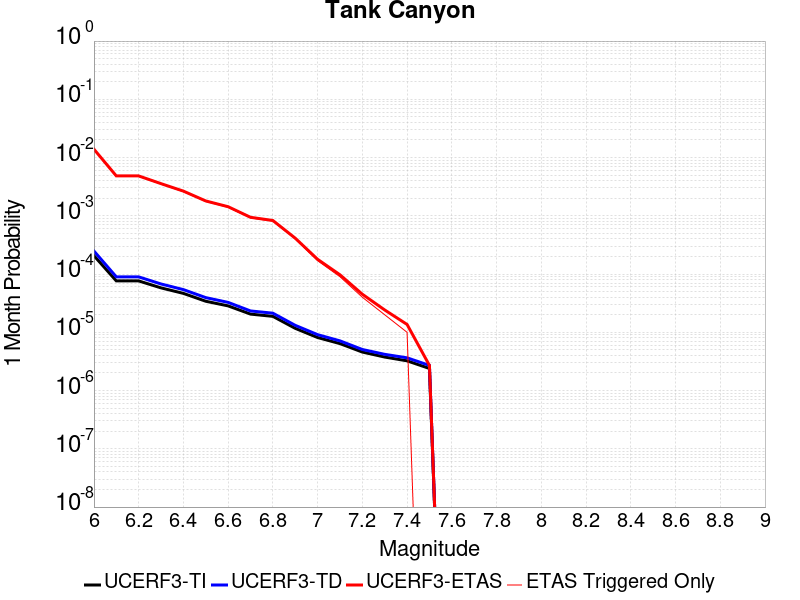 |  |  |

| Magnitude | 1 wk TI Prob | 1 wk TD Prob | 1 wk ETAS Prob | 1 wk ETAS/TD Gain | 1 wk ETAS Triggered Only | 1 mo TI Prob | 1 mo TD Prob | 1 mo ETAS Prob | 1 mo ETAS/TD Gain | 1 mo ETAS Triggered Only | 1 yr TI Prob | 1 yr TD Prob | 1 yr ETAS Prob | 1 yr ETAS/TD Gain | 1 yr ETAS Triggered Only | 10 yr TI Prob | 10 yr TD Prob | 10 yr ETAS Prob | 10 yr ETAS/TD Gain | 10 yr ETAS Triggered Only |
|-----|-----|-----|-----|-----|-----|-----|-----|-----|-----|-----|-----|-----|-----|-----|-----|-----|-----|-----|-----|-----|
| 6.0 | 4.8284557E-5 | 5.796611E-5 | 0.0055576474 | 95.877525 | 0.0055 | 2.0691741E-4 | 2.4840637E-4 | 0.013915011 | 56.017124 | 0.01367 | 0.0025163088 | 0.003020825 | 0.038583074 | 12.772362 | 0.03567 | 0.02488006 | 0.029864283 | 0.08835377 | 2.9585094 | 0.06029 |
| 6.1 | 1.7796336E-5 | 2.0873693E-5 | 0.0018408357 | 88.18927 | 0.00182 | 7.626778E-5 | 8.945584E-5 | 0.004839031 | 54.094074 | 0.00475 | 9.281647E-4 | 0.0010886178 | 0.013844716 | 12.717701 | 0.01277 | 0.009242975 | 0.010836938 | 0.033063434 | 3.0509937 | 0.02247 |
| 6.2 | 1.7796336E-5 | 2.0873693E-5 | 0.0018408357 | 88.18927 | 0.00182 | 7.626778E-5 | 8.945584E-5 | 0.004839031 | 54.094074 | 0.00475 | 9.281647E-4 | 0.0010886178 | 0.013844716 | 12.717701 | 0.01277 | 0.009242975 | 0.010836938 | 0.033063434 | 3.0509937 | 0.02247 |
| 6.3 | 1.3515912E-5 | 1.5759832E-5 | 0.0013657386 | 86.65946 | 0.00135 | 5.792405E-5 | 6.7540524E-5 | 0.0035673042 | 52.81724 | 0.0035 | 7.049971E-4 | 8.2201965E-4 | 0.010264251 | 12.486626 | 0.00945 | 0.007027647 | 0.008192402 | 0.02428944 | 2.9648738 | 0.01623 |
| 6.4 | 1.0870146E-5 | 1.2618221E-5 | 0.0010126056 | 80.24947 | 0.001 | 4.658551E-5 | 5.407707E-5 | 0.0026539364 | 49.076927 | 0.0026 | 5.67031E-4 | 6.5820734E-4 | 0.007663593 | 11.643129 | 0.00701 | 0.005655863 | 0.0065645943 | 0.01848582 | 2.815988 | 0.012 |
| 6.5 | 7.964826E-6 | 9.1962265E-6 | 6.991899E-4 | 76.03008 | 6.9E-4 | 3.4134522E-5 | 3.9411865E-5 | 0.0017993425 | 45.654842 | 0.00176 | 4.1550855E-4 | 4.7974449E-4 | 0.0050675427 | 10.563004 | 0.00459 | 0.0041473247 | 0.00478839 | 0.012511232 | 2.6128266 | 0.00776 |
| 6.6 | 6.6317E-6 | 7.6123997E-6 | 6.1760773E-4 | 81.131805 | 6.1E-4 | 2.8421264E-5 | 3.2624215E-5 | 0.0014325785 | 43.91151 | 0.0014 | 3.4597394E-4 | 3.9713652E-4 | 0.003915739 | 9.85993 | 0.00352 | 0.0034543579 | 0.00396542 | 0.009861945 | 2.486986 | 0.00592 |
| 6.7 | 4.793663E-6 | 5.4308434E-6 | 3.9542874E-4 | 72.81166 | 3.9E-4 | 2.0544108E-5 | 2.327486E-5 | 9.4325346E-4 | 40.526707 | 9.2E-4 | 2.500958E-4 | 2.8333897E-4 | 0.0024427269 | 8.621218 | 0.00216 | 0.0024981452 | 0.0028304697 | 0.006190931 | 2.1872451 | 0.00337 |
| 6.8 | 4.382823E-6 | 4.9693067E-6 | 3.7496747E-4 | 75.456696 | 3.7E-4 | 1.8783392E-5 | 2.1296879E-5 | 8.312796E-4 | 39.032932 | 8.1E-4 | 2.286638E-4 | 2.5926292E-4 | 0.0021887626 | 8.442251 | 0.00193 | 0.0022842865 | 0.0025902789 | 0.00561243 | 2.1667283 | 0.00303 |
| 6.9 | 2.729601E-6 | 3.073565E-6 | 1.9307298E-4 | 62.817276 | 1.9E-4 | 1.1698237E-5 | 1.3172362E-5 | 4.131671E-4 | 31.366213 | 4.0E-4 | 1.4241673E-4 | 1.6036292E-4 | 0.0010502202 | 6.5490212 | 8.9E-4 | 0.001423255 | 0.0016026379 | 0.0030003942 | 1.8721597 | 0.0014 |
| 7.0 | 1.8987357E-6 | 2.1269516E-6 | 7.21268E-5 | 33.91088 | 7.0E-5 | 8.137413E-6 | 9.115479E-6 | 1.7911394E-4 | 19.649426 | 1.7E-4 | 9.90685E-5 | 1.10976005E-4 | 5.0093274E-4 | 4.513883 | 3.9E-4 | 9.902435E-4 | 0.0011092746 | 0.0017685425 | 1.5943234 | 6.6E-4 |
| 7.1 | 1.4928986E-6 | 1.6641359E-6 | 2.1664102E-5 | 13.0182295 | 2.0E-5 | 6.398121E-6 | 7.1319946E-6 | 9.713135E-5 | 13.619101 | 9.0E-5 | 7.789434E-5 | 8.682917E-5 | 2.9681093E-4 | 3.418332 | 2.1E-4 | 7.786704E-4 | 8.680103E-4 | 0.0012476804 | 1.4374028 | 3.8E-4 |
| 7.2 | 1.069082E-6 | 1.1828628E-6 | 1.1182851E-5 | 9.454056 | 1.0E-5 | 4.581772E-6 | 5.0694052E-6 | 4.5069202E-5 | 8.890432 | 4.0E-5 | 5.5781646E-5 | 6.171879E-5 | 1.71712E-4 | 2.7821672 | 1.1E-4 | 5.576765E-4 | 6.170688E-4 | 8.1694534E-4 | 1.323913 | 2.0E-4 |
| 7.3 | 8.776551E-7 | 9.770044E-7 | 1.0976994E-5 | 11.235357 | 1.0E-5 | 3.7613736E-6 | 4.1871585E-6 | 2.4187075E-5 | 5.7764893 | 2.0E-5 | 4.579376E-5 | 5.097798E-5 | 1.20974415E-4 | 2.373072 | 7.0E-5 | 4.5784327E-4 | 5.097139E-4 | 6.5963744E-4 | 1.2941327 | 1.5E-4 |
| 7.4 | 7.55721E-7 | 8.510278E-7 | 1.0851019E-5 | 12.750488 | 1.0E-5 | 3.2388E-6 | 3.6472597E-6 | 1.3647224E-5 | 3.7417746 | 1.0E-5 | 3.9431678E-5 | 4.4405002E-5 | 9.440278E-5 | 2.1259494 | 5.0E-5 | 3.942468E-4 | 4.440121E-4 | 5.6395883E-4 | 1.2701429 | 1.2E-4 |
| 7.5 | 5.587665E-7 | 6.305643E-7 | 6.305643E-7 | 1.0 | 0.0 | 2.3947114E-6 | 2.7024184E-6 | 2.7024184E-6 | 1.0 | 0.0 | 2.915522E-5 | 3.2901946E-5 | 7.290063E-5 | 2.2156937 | 4.0E-5 | 2.9151395E-4 | 3.2901944E-4 | 4.1898983E-4 | 1.27345 | 9.0E-5 |

## Little Lake
*[(top)](#table-of-contents)*

| 1 Week | 1 Month | 1 Year | 10 Year |
|-----|-----|-----|-----|
|  |  |  |  |

| Magnitude | 1 wk TI Prob | 1 wk TD Prob | 1 wk ETAS Prob | 1 wk ETAS/TD Gain | 1 wk ETAS Triggered Only | 1 mo TI Prob | 1 mo TD Prob | 1 mo ETAS Prob | 1 mo ETAS/TD Gain | 1 mo ETAS Triggered Only | 1 yr TI Prob | 1 yr TD Prob | 1 yr ETAS Prob | 1 yr ETAS/TD Gain | 1 yr ETAS Triggered Only | 10 yr TI Prob | 10 yr TD Prob | 10 yr ETAS Prob | 10 yr ETAS/TD Gain | 10 yr ETAS Triggered Only |
|-----|-----|-----|-----|-----|-----|-----|-----|-----|-----|-----|-----|-----|-----|-----|-----|-----|-----|-----|-----|-----|
| 6.0 | 2.8424427E-5 | 3.120609E-5 | 0.004201076 | 134.62358 | 0.00417 | 1.2181328E-4 | 1.3373428E-4 | 0.009862433 | 73.74648 | 0.00973 | 0.0014820677 | 0.0016271321 | 0.024459919 | 15.032536 | 0.02287 | 0.014722223 | 0.016165592 | 0.05099333 | 3.1544363 | 0.0354 |
| 6.1 | 2.8424427E-5 | 3.120609E-5 | 0.004201076 | 134.62358 | 0.00417 | 1.2181328E-4 | 1.3373428E-4 | 0.009862433 | 73.74648 | 0.00973 | 0.0014820677 | 0.0016271321 | 0.024459919 | 15.032536 | 0.02287 | 0.014722223 | 0.016165592 | 0.05099333 | 3.1544363 | 0.0354 |
| 6.2 | 2.8424427E-5 | 3.120609E-5 | 0.004201076 | 134.62358 | 0.00417 | 1.2181328E-4 | 1.3373428E-4 | 0.009862433 | 73.74648 | 0.00973 | 0.0014820677 | 0.0016271321 | 0.024459919 | 15.032536 | 0.02287 | 0.014722223 | 0.016165592 | 0.05099333 | 3.1544363 | 0.0354 |
| 6.3 | 1.48860645E-5 | 1.6081562E-5 | 0.002856036 | 177.59692 | 0.00284 | 6.379586E-5 | 6.891932E-5 | 0.006558472 | 95.1616 | 0.00649 | 7.7643775E-4 | 8.3879783E-4 | 0.015866183 | 18.915382 | 0.01504 | 0.007737305 | 0.008359137 | 0.031117294 | 3.7225487 | 0.02295 |
| 6.4 | 1.48860645E-5 | 1.6081562E-5 | 0.002856036 | 177.59692 | 0.00284 | 6.379586E-5 | 6.891932E-5 | 0.006558472 | 95.1616 | 0.00649 | 7.7643775E-4 | 8.3879783E-4 | 0.015866183 | 18.915382 | 0.01504 | 0.007737305 | 0.008359137 | 0.031117294 | 3.7225487 | 0.02295 |
| 6.5 | 1.2797581E-5 | 1.3765709E-5 | 0.002533731 | 184.06107 | 0.00252 | 5.4845623E-5 | 5.8994705E-5 | 0.0058586528 | 99.308105 | 0.0058 | 6.675408E-4 | 7.1804953E-4 | 0.014198363 | 19.773516 | 0.01349 | 0.006655392 | 0.0071598445 | 0.027582567 | 3.8523974 | 0.02057 |
| 6.6 | 9.661896E-6 | 1.0289139E-5 | 0.002070268 | 201.20905 | 0.00206 | 4.1407468E-5 | 4.4095657E-5 | 0.00470389 | 106.67468 | 0.00466 | 5.040193E-4 | 5.367486E-4 | 0.011380925 | 21.203455 | 0.01085 | 0.005028777 | 0.005356127 | 0.021907002 | 4.090082 | 0.01664 |
| 6.7 | 7.767871E-6 | 8.199764E-6 | 0.001688186 | 205.88226 | 0.00168 | 3.329045E-5 | 3.514145E-5 | 0.003885006 | 110.55338 | 0.00385 | 4.0523586E-4 | 4.277769E-4 | 0.009693812 | 22.660906 | 0.00927 | 0.004044977 | 0.004270886 | 0.018240966 | 4.2710023 | 0.01403 |
| 6.8 | 6.4235196E-6 | 6.7358073E-6 | 0.0013367268 | 198.45088 | 0.00133 | 2.752908E-5 | 2.8867498E-5 | 0.0030787794 | 106.65211 | 0.00305 | 3.35115E-4 | 3.5141793E-4 | 0.0076888385 | 21.87947 | 0.00734 | 0.003346101 | 0.0035098826 | 0.014590853 | 4.157077 | 0.01112 |
| 6.9 | 3.1283696E-6 | 3.1122026E-6 | 8.4310956E-4 | 270.90445 | 8.4E-4 | 1.3407229E-5 | 1.3337952E-5 | 0.0018633133 | 139.7001 | 0.00185 | 1.6322079E-4 | 1.6237897E-4 | 0.0044916756 | 27.661684 | 0.00433 | 0.0016310095 | 0.0016227516 | 0.008152138 | 5.0236516 | 0.00654 |
| 7.0 | 2.290603E-6 | 2.2286983E-6 | 4.6222768E-4 | 207.39804 | 4.6E-4 | 9.816834E-6 | 9.551535E-6 | 0.0011295408 | 118.257515 | 0.00112 | 1.19513395E-4 | 1.1628478E-4 | 0.0026959847 | 23.18433 | 0.00258 | 0.0011944914 | 0.0011623414 | 0.0050977618 | 4.3857694 | 0.00394 |
| 7.1 | 1.293693E-6 | 1.1776932E-6 | 2.511774E-4 | 213.27914 | 2.5E-4 | 5.5443866E-6 | 5.047251E-6 | 6.1504415E-4 | 121.85726 | 6.1E-4 | 6.750081E-5 | 6.1449246E-5 | 0.00135137 | 21.991646 | 0.00129 | 6.7480316E-4 | 6.14391E-4 | 0.0026131622 | 4.253256 | 0.002 |
| 7.2 | 4.715842E-7 | 3.0918352E-7 | 3.0918352E-7 | 1.0 | 0.0 | 2.0210737E-6 | 1.3250715E-6 | 3.132503E-5 | 23.640257 | 3.0E-5 | 2.4606294E-5 | 1.6132632E-5 | 1.0613118E-4 | 6.578665 | 9.0E-5 | 2.460357E-4 | 1.6131515E-4 | 3.1129096E-4 | 1.9297068 | 1.5E-4 |
| 7.3 | 3.9430947E-7 | 2.3097941E-7 | 2.3097941E-7 | 1.0 | 0.0 | 1.6898966E-6 | 9.899114E-7 | 2.0989892E-5 | 21.203808 | 2.0E-5 | 2.0574296E-5 | 1.2052105E-5 | 6.2051506E-5 | 5.148603 | 5.0E-5 | 2.0572392E-4 | 1.2051459E-4 | 2.0050495E-4 | 1.66374 | 8.0E-5 |
| 7.4 | 3.547123E-7 | 1.9679557E-7 | 1.9679557E-7 | 1.0 | 0.0 | 1.5201948E-6 | 8.434093E-7 | 1.0843401E-5 | 12.856629 | 1.0E-5 | 1.8508214E-5 | 1.0268461E-5 | 5.026805E-5 | 4.8953834 | 4.0E-5 | 1.8506673E-4 | 1.0267992E-4 | 1.7267274E-4 | 1.6816602 | 7.0E-5 |
| 7.5 | 2.6354266E-7 | 1.4423433E-7 | 1.4423433E-7 | 1.0 | 0.0 | 1.129468E-6 | 6.18147E-7 | 1.0618141E-5 | 17.177372 | 1.0E-5 | 1.3751187E-5 | 7.525914E-6 | 3.752569E-5 | 4.986197 | 3.0E-5 | 1.3750336E-4 | 7.525664E-5 | 1.3525214E-4 | 1.7972118 | 6.0E-5 |
| 7.6 | 1.269913E-7 | 7.572681E-8 | 7.572681E-8 | 1.0 | 0.0 | 5.4424834E-7 | 3.2454344E-7 | 3.2454344E-7 | 1.0 | 0.0 | 6.6262032E-6 | 3.9513097E-6 | 3.9513097E-6 | 1.0 | 0.0 | 6.626006E-5 | 3.951243E-5 | 4.9512033E-5 | 1.2530749 | 1.0E-5 |

## Owl Lake
*[(top)](#table-of-contents)*

| 1 Week | 1 Month | 1 Year | 10 Year |
|-----|-----|-----|-----|
|  |  |  |  |

| Magnitude | 1 wk TI Prob | 1 wk TD Prob | 1 wk ETAS Prob | 1 wk ETAS/TD Gain | 1 wk ETAS Triggered Only | 1 mo TI Prob | 1 mo TD Prob | 1 mo ETAS Prob | 1 mo ETAS/TD Gain | 1 mo ETAS Triggered Only | 1 yr TI Prob | 1 yr TD Prob | 1 yr ETAS Prob | 1 yr ETAS/TD Gain | 1 yr ETAS Triggered Only | 10 yr TI Prob | 10 yr TD Prob | 10 yr ETAS Prob | 10 yr ETAS/TD Gain | 10 yr ETAS Triggered Only |
|-----|-----|-----|-----|-----|-----|-----|-----|-----|-----|-----|-----|-----|-----|-----|-----|-----|-----|-----|-----|-----|
| 6.0 | 5.0320643E-5 | 6.636097E-5 | 0.0023762076 | 35.80731 | 0.00231 | 2.1564208E-4 | 2.8437944E-4 | 0.0065026106 | 22.865967 | 0.00622 | 0.0026222812 | 0.0034578831 | 0.018834528 | 5.4468374 | 0.01543 | 0.02591553 | 0.03414205 | 0.05861689 | 1.7168533 | 0.02534 |
| 6.1 | 5.0320643E-5 | 6.636097E-5 | 0.0023762076 | 35.80731 | 0.00231 | 2.1564208E-4 | 2.8437944E-4 | 0.0065026106 | 22.865967 | 0.00622 | 0.0026222812 | 0.0034578831 | 0.018834528 | 5.4468374 | 0.01543 | 0.02591553 | 0.03414205 | 0.05861689 | 1.7168533 | 0.02534 |
| 6.2 | 2.4125871E-5 | 3.098243E-5 | 0.0019009245 | 61.354916 | 0.00187 | 1.0339249E-4 | 1.3277626E-4 | 0.0049421377 | 37.221546 | 0.00481 | 0.0012580766 | 0.0016155096 | 0.0133565115 | 8.267676 | 0.01176 | 0.012509781 | 0.016071167 | 0.034775656 | 2.1638536 | 0.01901 |
| 6.3 | 1.7433485E-5 | 2.235663E-5 | 0.0017723175 | 79.27481 | 0.00175 | 7.471279E-5 | 9.58115E-5 | 0.004435396 | 46.29294 | 0.00434 | 9.0924866E-4 | 0.0011660319 | 0.011593859 | 9.943003 | 0.01044 | 0.009055373 | 0.011629464 | 0.028016647 | 2.409109 | 0.01658 |
| 6.4 | 1.7433485E-5 | 2.235663E-5 | 0.0017723175 | 79.27481 | 0.00175 | 7.471279E-5 | 9.58115E-5 | 0.004435396 | 46.29294 | 0.00434 | 9.0924866E-4 | 0.0011660319 | 0.011593859 | 9.943003 | 0.01044 | 0.009055373 | 0.011629464 | 0.028016647 | 2.409109 | 0.01658 |
| 6.5 | 1.5182742E-5 | 1.9430163E-5 | 0.0016893977 | 86.94717 | 0.00167 | 6.506727E-5 | 8.327032E-5 | 0.0042729215 | 51.313858 | 0.00419 | 7.919061E-4 | 0.001013496 | 0.011003361 | 10.856837 | 0.01 | 0.0078909 | 0.01011895 | 0.025838261 | 2.5534527 | 0.01588 |
| 6.6 | 6.7271576E-6 | 8.548032E-6 | 0.001418536 | 165.94884 | 0.00141 | 2.8830356E-5 | 3.663394E-5 | 0.0034465091 | 94.079666 | 0.00341 | 3.5095305E-4 | 4.4593262E-4 | 0.008142499 | 18.259483 | 0.0077 | 0.0035039932 | 0.004468161 | 0.01618557 | 3.6224232 | 0.01177 |
| 6.7 | 6.682835E-6 | 8.480477E-6 | 0.0014184685 | 167.26282 | 0.00141 | 2.8640408E-5 | 3.6344427E-5 | 0.0034462204 | 94.82115 | 0.00341 | 3.4864116E-4 | 4.4240922E-4 | 0.008119011 | 18.351814 | 0.00768 | 0.003480947 | 0.004433087 | 0.016130999 | 3.6387732 | 0.01175 |
| 6.8 | 6.5774975E-6 | 8.326948E-6 | 0.0014183152 | 170.32835 | 0.00141 | 2.8188972E-5 | 3.5686462E-5 | 0.0034355652 | 96.27083 | 0.0034 | 3.4314668E-4 | 4.3440168E-4 | 0.008101069 | 18.6488 | 0.00767 | 0.0034261728 | 0.0043532313 | 0.016012255 | 3.678246 | 0.01171 |
| 6.9 | 6.363419E-6 | 8.000114E-6 | 0.0014179888 | 177.2461 | 0.00141 | 2.727151E-5 | 3.4285782E-5 | 0.003434169 | 100.16308 | 0.0034 | 3.3198006E-4 | 4.17355E-4 | 0.008054166 | 19.298119 | 0.00764 | 0.0033148455 | 0.004183219 | 0.0158044 | 3.7780478 | 0.01167 |
| 7.0 | 6.1342453E-6 | 7.632303E-6 | 0.0014176215 | 185.73967 | 0.00141 | 2.6289357E-5 | 3.2709493E-5 | 0.0034225986 | 104.636246 | 0.00339 | 3.2002592E-4 | 3.981708E-4 | 0.007945165 | 19.95416 | 0.00755 | 0.0031956544 | 0.0039919075 | 0.015505761 | 3.8842988 | 0.01156 |
| 7.1 | 5.842926E-6 | 7.1428435E-6 | 0.0013771331 | 192.799 | 0.00137 | 2.504087E-5 | 3.0611856E-5 | 0.0032905121 | 107.491425 | 0.00326 | 3.0482994E-4 | 3.7264105E-4 | 0.007639932 | 20.502121 | 0.00727 | 0.0030441214 | 0.0037373616 | 0.014805839 | 3.9615753 | 0.01111 |
| 7.2 | 4.77173E-6 | 5.3590566E-6 | 7.753549E-4 | 144.68123 | 7.7E-4 | 2.045011E-5 | 2.2967206E-5 | 0.0019529229 | 85.03093 | 0.00193 | 2.4895166E-4 | 2.7959392E-4 | 0.004678364 | 16.73271 | 0.0044 | 0.0024867293 | 0.0028089439 | 0.009779309 | 3.4814897 | 0.00699 |
| 7.3 | 3.0494948E-6 | 2.710886E-6 | 1.5271048E-4 | 56.33231 | 1.5E-4 | 1.3069198E-5 | 1.1618033E-5 | 4.916125E-4 | 42.314606 | 4.8E-4 | 1.5910587E-4 | 1.4144053E-4 | 0.0014012624 | 9.907078 | 0.00126 | 0.0015899199 | 0.0014234623 | 0.003560416 | 2.5012367 | 0.00214 |
| 7.4 | 2.7263884E-6 | 2.3060736E-6 | 1.2230579E-4 | 53.03638 | 1.2E-4 | 1.1684469E-5 | 9.883135E-6 | 3.498798E-4 | 35.4017 | 3.4E-4 | 1.4224913E-4 | 1.20320634E-4 | 0.0010002147 | 8.312911 | 8.8E-4 | 0.0014215811 | 0.0012114312 | 0.002719602 | 2.2449496 | 0.00151 |
| 7.5 | 2.6090431E-6 | 2.1660032E-6 | 1.0216579E-4 | 47.16788 | 1.0E-4 | 1.1181565E-5 | 9.282839E-6 | 3.0928006E-4 | 33.3174 | 3.0E-4 | 1.3612706E-4 | 1.1301279E-4 | 8.8292576E-4 | 7.812618 | 7.7E-4 | 0.001360437 | 0.0011381842 | 0.0024466934 | 2.149646 | 0.00131 |
| 7.6 | 2.3008756E-6 | 1.873168E-6 | 6.1873056E-5 | 33.03124 | 6.0E-5 | 9.860858E-6 | 8.027839E-6 | 1.8802639E-4 | 23.421795 | 1.8E-4 | 1.20049335E-4 | 9.7734635E-5 | 6.076848E-4 | 6.2177014 | 5.1E-4 | 0.001199845 | 9.851889E-4 | 0.0018643219 | 1.8923498 | 8.8E-4 |
| 7.7 | 1.7184348E-6 | 1.3422638E-6 | 4.134221E-5 | 30.800362 | 4.0E-5 | 7.3646997E-6 | 5.7525467E-6 | 9.575203E-5 | 16.645155 | 9.0E-5 | 8.966153E-5 | 7.003504E-5 | 3.1001825E-4 | 4.4266157 | 2.4E-4 | 8.962536E-4 | 7.080158E-4 | 0.0010977397 | 1.5504451 | 3.9E-4 |
| 7.8 | 8.4612907E-7 | 8.4083325E-7 | 8.4083325E-7 | 1.0 | 0.0 | 3.6262625E-6 | 3.6035663E-6 | 3.3603457E-5 | 9.325056 | 3.0E-5 | 4.4148852E-5 | 4.387256E-5 | 1.5386773E-4 | 3.507152 | 1.1E-4 | 4.414008E-4 | 4.441131E-4 | 6.2403316E-4 | 1.4051222 | 1.8E-4 |
| 7.9 | 2.716738E-7 | 3.7691993E-7 | 3.7691993E-7 | 1.0 | 0.0 | 1.1643157E-6 | 1.6153703E-6 | 2.1615338E-5 | 13.3810425 | 2.0E-5 | 1.4175452E-5 | 1.9666966E-5 | 6.9665984E-5 | 3.5422843 | 5.0E-5 | 1.4174548E-4 | 1.9842383E-4 | 2.5841192E-4 | 1.302323 | 6.0E-5 |
| 8.0 | 2.1995428E-8 | 3.3858353E-8 | 3.3858353E-8 | 1.0 | 0.0 | 9.426611E-8 | 1.4510721E-7 | 1.0145106E-5 | 69.91455 | 1.0E-5 | 1.1476893E-6 | 1.7666796E-6 | 1.1766662E-5 | 6.660326 | 1.0E-5 | 1.14768345E-5 | 1.7968063E-5 | 2.7967882E-5 | 1.556533 | 1.0E-5 |

## Airport Lake
*[(top)](#table-of-contents)*

| 1 Week | 1 Month | 1 Year | 10 Year |
|-----|-----|-----|-----|
|  |  | 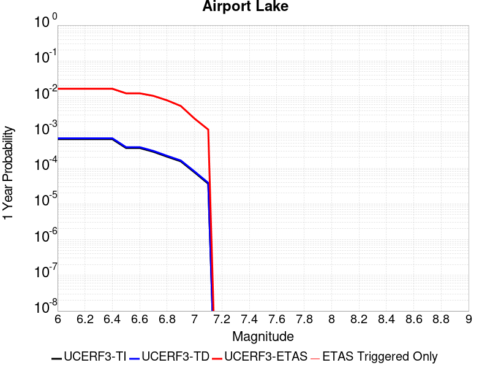 |  |

| Magnitude | 1 wk TI Prob | 1 wk TD Prob | 1 wk ETAS Prob | 1 wk ETAS/TD Gain | 1 wk ETAS Triggered Only | 1 mo TI Prob | 1 mo TD Prob | 1 mo ETAS Prob | 1 mo ETAS/TD Gain | 1 mo ETAS Triggered Only | 1 yr TI Prob | 1 yr TD Prob | 1 yr ETAS Prob | 1 yr ETAS/TD Gain | 1 yr ETAS Triggered Only | 10 yr TI Prob | 10 yr TD Prob | 10 yr ETAS Prob | 10 yr ETAS/TD Gain | 10 yr ETAS Triggered Only |
|-----|-----|-----|-----|-----|-----|-----|-----|-----|-----|-----|-----|-----|-----|-----|-----|-----|-----|-----|-----|-----|
| 6.0 | 1.2387061E-5 | 1.3103241E-5 | 0.0033630594 | 256.65857 | 0.00335 | 5.3086325E-5 | 5.61557E-5 | 0.0073757446 | 131.34454 | 0.00732 | 6.461343E-4 | 6.8350957E-4 | 0.016672574 | 24.392595 | 0.016 | 0.0064425888 | 0.006816883 | 0.031130007 | 4.566604 | 0.02448 |
| 6.1 | 1.2387061E-5 | 1.3103241E-5 | 0.0033630594 | 256.65857 | 0.00335 | 5.3086325E-5 | 5.61557E-5 | 0.0073757446 | 131.34454 | 0.00732 | 6.461343E-4 | 6.8350957E-4 | 0.016672574 | 24.392595 | 0.016 | 0.0064425888 | 0.006816883 | 0.031130007 | 4.566604 | 0.02448 |
| 6.2 | 1.2387061E-5 | 1.3103241E-5 | 0.0033630594 | 256.65857 | 0.00335 | 5.3086325E-5 | 5.61557E-5 | 0.0073757446 | 131.34454 | 0.00732 | 6.461343E-4 | 6.8350957E-4 | 0.016672574 | 24.392595 | 0.016 | 0.0064425888 | 0.006816883 | 0.031130007 | 4.566604 | 0.02448 |
| 6.3 | 1.2387061E-5 | 1.3103241E-5 | 0.0033630594 | 256.65857 | 0.00335 | 5.3086325E-5 | 5.61557E-5 | 0.0073757446 | 131.34454 | 0.00732 | 6.461343E-4 | 6.8350957E-4 | 0.016672574 | 24.392595 | 0.016 | 0.0064425888 | 0.006816883 | 0.031130007 | 4.566604 | 0.02448 |
| 6.4 | 1.2387061E-5 | 1.3103241E-5 | 0.0033630594 | 256.65857 | 0.00335 | 5.3086325E-5 | 5.61557E-5 | 0.0073757446 | 131.34454 | 0.00732 | 6.461343E-4 | 6.8350957E-4 | 0.016672574 | 24.392595 | 0.016 | 0.0064425888 | 0.006816883 | 0.031130007 | 4.566604 | 0.02448 |
| 6.5 | 6.9922594E-6 | 7.3849715E-6 | 0.002567366 | 347.6474 | 0.00256 | 2.996648E-5 | 3.1649524E-5 | 0.005521476 | 174.45683 | 0.00549 | 3.6478083E-4 | 3.8527025E-4 | 0.012400639 | 32.18686 | 0.01202 | 0.003641826 | 0.0038465608 | 0.022116015 | 5.7495556 | 0.01834 |
| 6.6 | 6.9922594E-6 | 7.3849715E-6 | 0.002567366 | 347.6474 | 0.00256 | 2.996648E-5 | 3.1649524E-5 | 0.005521476 | 174.45683 | 0.00549 | 3.6478083E-4 | 3.8527025E-4 | 0.012400639 | 32.18686 | 0.01202 | 0.003641826 | 0.0038465608 | 0.022116015 | 5.7495556 | 0.01834 |
| 6.7 | 5.477277E-6 | 5.786105E-6 | 0.0021457737 | 370.84943 | 0.00214 | 2.3473833E-5 | 2.4797379E-5 | 0.0046546827 | 187.70865 | 0.00463 | 2.8575645E-4 | 3.0187014E-4 | 0.010508788 | 34.81228 | 0.01021 | 0.0028538927 | 0.0030149848 | 0.01862777 | 6.1783957 | 0.01566 |
| 6.8 | 3.9950432E-6 | 4.2191136E-6 | 0.0015942124 | 377.85483 | 0.00159 | 1.7121502E-5 | 1.8081806E-5 | 0.0034480197 | 190.69002 | 0.00343 | 2.0843433E-4 | 2.201265E-4 | 0.00787844 | 35.790512 | 0.00766 | 0.0020823893 | 0.0021993555 | 0.013843689 | 6.29443 | 0.01167 |
| 6.9 | 2.95695E-6 | 3.1230438E-6 | 0.0011131195 | 356.42136 | 0.00111 | 1.2672582E-5 | 1.3384418E-5 | 0.0024033524 | 179.56346 | 0.00239 | 1.5427776E-4 | 1.6294538E-4 | 0.0054720803 | 33.5823 | 0.00531 | 0.001541707 | 0.0016284813 | 0.009815128 | 6.0271664 | 0.0082 |
| 7.0 | 1.456072E-6 | 1.540822E-6 | 4.4154015E-4 | 286.56143 | 4.4E-4 | 6.2402937E-6 | 6.603512E-6 | 0.0010665965 | 161.51959 | 0.00106 | 7.597293E-5 | 8.03958E-5 | 0.0024302069 | 30.228033 | 0.00235 | 7.594696E-4 | 8.037661E-4 | 0.0043409206 | 5.400727 | 0.00354 |
| 7.1 | 6.995192E-7 | 7.4090235E-7 | 2.4074073E-4 | 324.92908 | 2.4E-4 | 2.997936E-6 | 3.1752957E-6 | 5.731735E-4 | 180.51027 | 5.7E-4 | 3.649926E-5 | 3.8659226E-5 | 0.0011986144 | 31.004614 | 0.00116 | 3.6493264E-4 | 3.8659226E-4 | 0.002155908 | 5.5766973 | 0.00177 |

## Panamint Valley
*[(top)](#table-of-contents)*

| 1 Week | 1 Month | 1 Year | 10 Year |
|-----|-----|-----|-----|
| 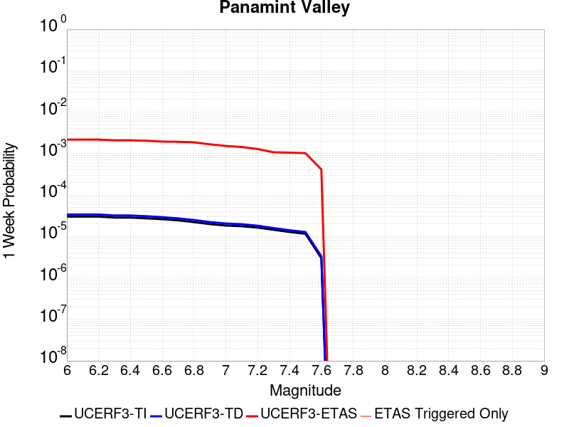 |  | 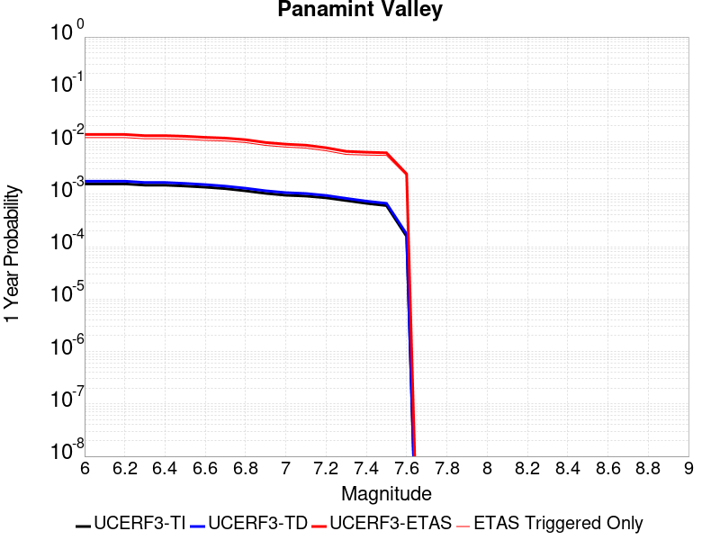 | 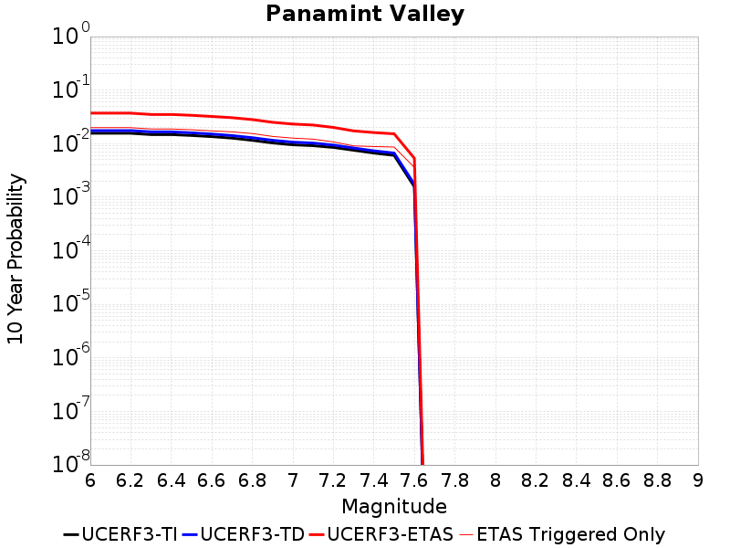 |

| Magnitude | 1 wk TI Prob | 1 wk TD Prob | 1 wk ETAS Prob | 1 wk ETAS/TD Gain | 1 wk ETAS Triggered Only | 1 mo TI Prob | 1 mo TD Prob | 1 mo ETAS Prob | 1 mo ETAS/TD Gain | 1 mo ETAS Triggered Only | 1 yr TI Prob | 1 yr TD Prob | 1 yr ETAS Prob | 1 yr ETAS/TD Gain | 1 yr ETAS Triggered Only | 10 yr TI Prob | 10 yr TD Prob | 10 yr ETAS Prob | 10 yr ETAS/TD Gain | 10 yr ETAS Triggered Only |
|-----|-----|-----|-----|-----|-----|-----|-----|-----|-----|-----|-----|-----|-----|-----|-----|-----|-----|-----|-----|-----|
| 6.0 | 3.0211835E-5 | 3.398527E-5 | 0.0021739125 | 63.966312 | 0.00214 | 1.2947287E-4 | 1.456432E-4 | 0.0051149195 | 35.119522 | 0.00497 | 0.0015751923 | 0.0017717932 | 0.013790461 | 7.783335 | 0.01204 | 0.015640736 | 0.017583527 | 0.03712379 | 2.1112823 | 0.01989 |
| 6.1 | 3.0211835E-5 | 3.398527E-5 | 0.0021739125 | 63.966312 | 0.00214 | 1.2947287E-4 | 1.456432E-4 | 0.0051149195 | 35.119522 | 0.00497 | 0.0015751923 | 0.0017717932 | 0.013790461 | 7.783335 | 0.01204 | 0.015640736 | 0.017583527 | 0.03712379 | 2.1112823 | 0.01989 |
| 6.2 | 3.0211835E-5 | 3.398527E-5 | 0.0021739125 | 63.966312 | 0.00214 | 1.2947287E-4 | 1.456432E-4 | 0.0051149195 | 35.119522 | 0.00497 | 0.0015751923 | 0.0017717932 | 0.013790461 | 7.783335 | 0.01204 | 0.015640736 | 0.017583527 | 0.03712379 | 2.1112823 | 0.01989 |
| 6.3 | 2.8573924E-5 | 3.2103402E-5 | 0.0020920373 | 65.165596 | 0.00206 | 1.2245393E-4 | 1.3757891E-4 | 0.0048569296 | 35.302864 | 0.00472 | 0.001489857 | 0.0016737641 | 0.013094616 | 7.823454 | 0.01144 | 0.01479908 | 0.016618172 | 0.035115585 | 2.1130836 | 0.01881 |
| 6.4 | 2.8573924E-5 | 3.2103402E-5 | 0.0020920373 | 65.165596 | 0.00206 | 1.2245393E-4 | 1.3757891E-4 | 0.0048569296 | 35.302864 | 0.00472 | 0.001489857 | 0.0016737641 | 0.013094616 | 7.823454 | 0.01144 | 0.01479908 | 0.016618172 | 0.035115585 | 2.1130836 | 0.01881 |
| 6.5 | 2.7468774E-5 | 3.082913E-5 | 0.002040767 | 66.19607 | 0.00201 | 1.1771801E-4 | 1.3211831E-4 | 0.0047315108 | 35.81268 | 0.0046 | 0.0014322745 | 0.0016073809 | 0.012759427 | 7.938023 | 0.01117 | 0.014230782 | 0.015964033 | 0.033873487 | 2.1218626 | 0.0182 |
| 6.6 | 2.6135967E-5 | 2.9253148E-5 | 0.001949197 | 66.63204 | 0.00192 | 1.1200648E-4 | 1.2536476E-4 | 0.0044848183 | 35.774155 | 0.00436 | 0.0013628257 | 0.0015252738 | 0.01215903 | 7.971703 | 0.01065 | 0.013544982 | 0.015154387 | 0.032241456 | 2.127533 | 0.01735 |
| 6.7 | 2.4498746E-5 | 2.7341983E-5 | 0.00192729 | 70.488304 | 0.0019 | 1.04990395E-4 | 1.171748E-4 | 0.004366677 | 37.266346 | 0.00425 | 0.0012775084 | 0.0014256947 | 0.011760939 | 8.249269 | 0.01035 | 0.012701893 | 0.014171608 | 0.030556075 | 2.1561475 | 0.01662 |
| 6.8 | 2.2244329E-5 | 2.4936033E-5 | 0.0018648901 | 74.786964 | 0.00184 | 9.532935E-5 | 1.0686446E-4 | 0.004116436 | 38.520157 | 0.00401 | 0.0011600169 | 0.00130032 | 0.010957746 | 8.426961 | 0.00967 | 0.011539802 | 0.012932832 | 0.02819289 | 2.1799471 | 0.01546 |
| 6.9 | 1.9902658E-5 | 2.2290833E-5 | 0.0016722541 | 75.019806 | 0.00165 | 8.529431E-5 | 9.552875E-5 | 0.0036651876 | 38.36738 | 0.00357 | 0.0010379635 | 0.0011624604 | 0.009692533 | 8.337947 | 0.00854 | 0.010331288 | 0.0115689 | 0.025070868 | 2.1670918 | 0.01366 |
| 7.0 | 1.8353881E-5 | 2.0566724E-5 | 0.0015305356 | 74.41806 | 0.00151 | 7.865712E-5 | 8.814022E-5 | 0.003367851 | 38.210148 | 0.00328 | 9.5722964E-4 | 0.0010725966 | 0.009004081 | 8.394656 | 0.00794 | 0.009531168 | 0.010679127 | 0.023243502 | 2.1765358 | 0.0127 |
| 7.1 | 1.7667631E-5 | 1.9773139E-5 | 0.0014397451 | 72.81317 | 0.00142 | 7.571623E-5 | 8.4739375E-5 | 0.0032244732 | 38.051655 | 0.00314 | 9.2145515E-4 | 0.0010312311 | 0.008613404 | 8.352545 | 0.00759 | 0.009176437 | 0.010269345 | 0.02230447 | 2.1719468 | 0.01216 |
| 7.2 | 1.6381597E-5 | 1.8158746E-5 | 0.0012881357 | 70.93748 | 0.00127 | 7.020495E-5 | 7.782097E-5 | 0.0028176077 | 36.206276 | 0.00274 | 8.544101E-4 | 9.4707584E-4 | 0.007690683 | 8.120451 | 0.00675 | 0.008511325 | 0.009435048 | 0.02011334 | 2.1317685 | 0.01078 |
| 7.3 | 1.4520491E-5 | 1.59669E-5 | 0.00107595 | 67.38628 | 0.00106 | 6.222919E-5 | 6.8427864E-5 | 0.0024282665 | 35.48651 | 0.00236 | 7.57377E-4 | 8.3280704E-4 | 0.0065680267 | 7.886613 | 0.00574 | 0.0075480095 | 0.00829997 | 0.01732444 | 2.0872896 | 0.0091 |
| 7.4 | 1.2852287E-5 | 1.41457995E-5 | 0.0010541311 | 74.51902 | 0.00104 | 5.5080065E-5 | 6.0623533E-5 | 0.002360484 | 38.93676 | 0.0023 | 6.7039346E-4 | 7.3785736E-4 | 0.0063337255 | 8.583942 | 0.0056 | 0.0066837464 | 0.0073569957 | 0.01613196 | 2.1927373 | 0.00884 |
| 7.5 | 1.1637851E-5 | 1.2837095E-5 | 0.0010228241 | 79.67723 | 0.00101 | 4.987555E-5 | 5.5015047E-5 | 0.0023148907 | 42.07741 | 0.00226 | 6.070656E-4 | 6.69618E-4 | 0.006165935 | 9.2081375 | 0.0055 | 0.006054099 | 0.0066789 | 0.015281061 | 2.2879608 | 0.00866 |
| 7.6 | 3.0068115E-6 | 3.3331473E-6 | 4.1333179E-4 | 124.006454 | 4.1E-4 | 1.2886271E-5 | 1.4284879E-5 | 0.0010442701 | 73.10318 | 0.00103 | 1.5687906E-4 | 1.7391182E-4 | 0.002443517 | 14.050323 | 0.00227 | 0.0015676835 | 0.0017391967 | 0.0053329356 | 3.0663211 | 0.0036 |

## Garlock (East)
*[(top)](#table-of-contents)*

| 1 Week | 1 Month | 1 Year | 10 Year |
|-----|-----|-----|-----|
| 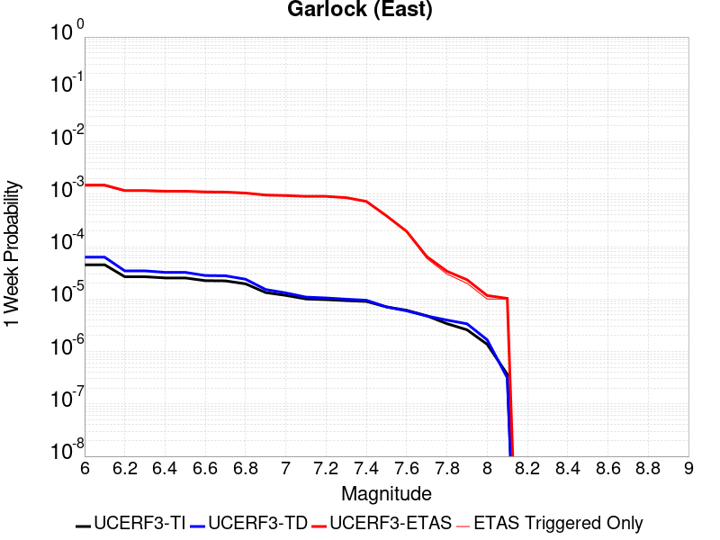 | 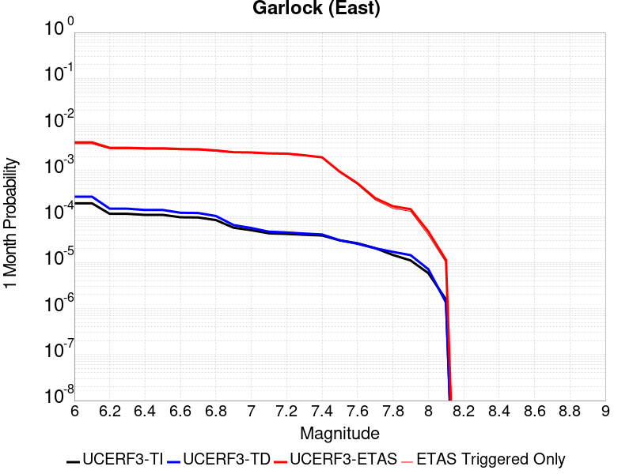 | 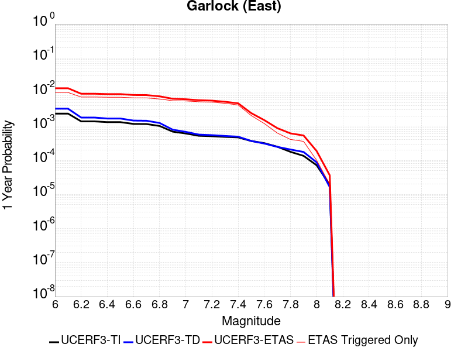 | 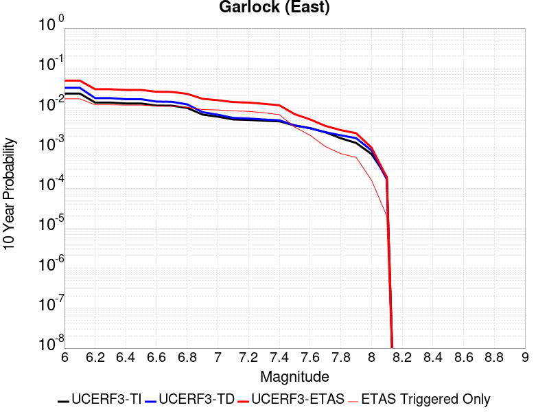 |

| Magnitude | 1 wk TI Prob | 1 wk TD Prob | 1 wk ETAS Prob | 1 wk ETAS/TD Gain | 1 wk ETAS Triggered Only | 1 mo TI Prob | 1 mo TD Prob | 1 mo ETAS Prob | 1 mo ETAS/TD Gain | 1 mo ETAS Triggered Only | 1 yr TI Prob | 1 yr TD Prob | 1 yr ETAS Prob | 1 yr ETAS/TD Gain | 1 yr ETAS Triggered Only | 10 yr TI Prob | 10 yr TD Prob | 10 yr ETAS Prob | 10 yr ETAS/TD Gain | 10 yr ETAS Triggered Only |
|-----|-----|-----|-----|-----|-----|-----|-----|-----|-----|-----|-----|-----|-----|-----|-----|-----|-----|-----|-----|-----|
| 6.0 | 4.5092507E-5 | 6.290624E-5 | 0.0014928163 | 23.730814 | 0.00143 | 1.9323928E-4 | 2.6957283E-4 | 0.0040785456 | 15.1296625 | 0.00381 | 0.0023501497 | 0.0032775553 | 0.013055403 | 3.9832745 | 0.00981 | 0.023254504 | 0.03235336 | 0.048987206 | 1.5141304 | 0.01719 |
| 6.1 | 4.5092507E-5 | 6.290624E-5 | 0.0014928163 | 23.730814 | 0.00143 | 1.9323928E-4 | 2.6957283E-4 | 0.0040785456 | 15.1296625 | 0.00381 | 0.0023501497 | 0.0032775553 | 0.013055403 | 3.9832745 | 0.00981 | 0.023254504 | 0.03235336 | 0.048987206 | 1.5141304 | 0.01719 |
| 6.2 | 2.6674514E-5 | 3.4512042E-5 | 0.0011744727 | 34.030807 | 0.00114 | 1.1431433E-4 | 1.4790056E-4 | 0.0031074628 | 21.010487 | 0.00296 | 0.0013908884 | 0.0017992351 | 0.008996262 | 5.0000486 | 0.00721 | 0.01382215 | 0.017891508 | 0.029833946 | 1.667492 | 0.01216 |
| 6.3 | 2.6674514E-5 | 3.4512042E-5 | 0.0011744727 | 34.030807 | 0.00114 | 1.1431433E-4 | 1.4790056E-4 | 0.0031074628 | 21.010487 | 0.00296 | 0.0013908884 | 0.0017992351 | 0.008996262 | 5.0000486 | 0.00721 | 0.01382215 | 0.017891508 | 0.029833946 | 1.667492 | 0.01216 |
| 6.4 | 2.5312667E-5 | 3.2341246E-5 | 0.0011423053 | 35.32039 | 0.00111 | 1.0847834E-4 | 1.3859813E-4 | 0.0030381961 | 21.920902 | 0.0029 | 0.0013199237 | 0.0016861557 | 0.0087841675 | 5.209583 | 0.00711 | 0.013121112 | 0.01677952 | 0.0285585 | 1.7019856 | 0.01198 |
| 6.5 | 2.5312667E-5 | 3.2341246E-5 | 0.0011423053 | 35.32039 | 0.00111 | 1.0847834E-4 | 1.3859813E-4 | 0.0030381961 | 21.920902 | 0.0029 | 0.0013199237 | 0.0016861557 | 0.0087841675 | 5.209583 | 0.00711 | 0.013121112 | 0.01677952 | 0.0285585 | 1.7019856 | 0.01198 |
| 6.6 | 2.246556E-5 | 2.8136004E-5 | 0.0011081056 | 39.3839 | 0.00108 | 9.627742E-5 | 1.2057744E-4 | 0.0029302386 | 24.301716 | 0.00281 | 0.0011715472 | 0.0014670653 | 0.008257089 | 5.628304 | 0.0068 | 0.011653901 | 0.014619803 | 0.025754599 | 1.7616242 | 0.0113 |
| 6.7 | 2.2241198E-5 | 2.7805741E-5 | 0.001097776 | 39.48019 | 0.00107 | 9.531594E-5 | 1.1916215E-4 | 0.002898831 | 24.326775 | 0.00278 | 0.0011598538 | 0.0014498571 | 0.008210042 | 5.6626554 | 0.00677 | 0.011538187 | 0.014449993 | 0.025547286 | 1.7679791 | 0.01126 |
| 6.8 | 1.9528685E-5 | 2.3900267E-5 | 0.0010538757 | 44.094723 | 0.00103 | 8.369167E-5 | 1.024258E-4 | 0.0027221574 | 26.576872 | 0.00262 | 0.0010184698 | 0.0012463405 | 0.007548476 | 6.0565124 | 0.00631 | 0.010138147 | 0.012437495 | 0.022826653 | 1.8353095 | 0.01052 |
| 6.9 | 1.3318621E-5 | 1.5200674E-5 | 9.651862E-4 | 63.496277 | 9.5E-4 | 5.7078556E-5 | 6.514415E-5 | 0.002494986 | 38.29946 | 0.00243 | 6.9470983E-4 | 7.9284713E-4 | 0.0063983994 | 8.070155 | 0.00561 | 0.0069254204 | 0.007940814 | 0.017127281 | 2.1568673 | 0.00926 |
| 7.0 | 1.1760853E-5 | 1.3109518E-5 | 9.4309734E-4 | 71.939896 | 9.3E-4 | 5.0402683E-5 | 5.6182464E-5 | 0.002466047 | 43.893536 | 0.00241 | 6.134799E-4 | 6.8381184E-4 | 0.0062000374 | 9.066876 | 0.00552 | 0.0061178906 | 0.006857415 | 0.015815562 | 2.3063443 | 0.00902 |
| 7.1 | 1.0064758E-5 | 1.09046E-5 | 9.1089477E-4 | 83.53308 | 9.0E-4 | 4.3133965E-5 | 4.673318E-5 | 0.0023566252 | 50.42724 | 0.00231 | 5.2502943E-4 | 5.6883146E-4 | 0.005815845 | 10.224197 | 0.00525 | 0.005237907 | 0.005713864 | 0.014215011 | 2.4878104 | 0.00855 |
| 7.2 | 9.768808E-6 | 1.0500465E-5 | 9.1049104E-4 | 86.709595 | 9.0E-4 | 4.186565E-5 | 4.5001234E-5 | 0.0023248987 | 51.663 | 0.00228 | 5.095951E-4 | 5.4775574E-4 | 0.005644962 | 10.305619 | 0.0051 | 0.0050842804 | 0.0055041243 | 0.01379822 | 2.5068874 | 0.00834 |
| 7.3 | 9.344516E-6 | 9.946093E-6 | 8.5993763E-4 | 86.45984 | 8.5E-4 | 4.004731E-5 | 4.2625437E-5 | 0.002142536 | 50.264256 | 0.0021 | 4.8746695E-4 | 5.188446E-4 | 0.0052264007 | 10.073153 | 0.00471 | 0.0048639905 | 0.0052157883 | 0.012855731 | 2.4647725 | 0.00768 |
| 7.4 | 9.023491E-6 | 9.492254E-6 | 7.294854E-4 | 76.8506 | 7.2E-4 | 3.867153E-5 | 4.0680472E-5 | 0.0019306036 | 47.457745 | 0.00189 | 4.7072413E-4 | 4.9517554E-4 | 0.004713086 | 9.51801 | 0.00422 | 0.004697283 | 0.0049792244 | 0.011834918 | 2.3768597 | 0.00689 |
| 7.5 | 7.081253E-6 | 7.089089E-6 | 3.870864E-4 | 54.603123 | 3.8E-4 | 3.0347876E-5 | 3.0381461E-5 | 9.4035384E-4 | 30.951567 | 9.1E-4 | 3.6942272E-4 | 3.6983224E-4 | 0.0024290704 | 6.568033 | 0.00206 | 0.003688092 | 0.003725051 | 0.0070824977 | 1.9013156 | 0.00337 |
| 7.6 | 6.116396E-6 | 5.9605914E-6 | 1.9595945E-4 | 32.875843 | 1.9E-4 | 2.6212863E-5 | 2.5545143E-5 | 5.2553235E-4 | 20.572693 | 5.0E-4 | 3.1909486E-4 | 3.10968E-4 | 0.0015105949 | 4.857718 | 0.0012 | 0.0031863707 | 0.0031364558 | 0.005239838 | 1.6706239 | 0.00211 |
| 7.7 | 4.797145E-6 | 4.7585554E-6 | 6.475827E-5 | 13.6088085 | 6.0E-5 | 2.055903E-5 | 2.039365E-5 | 2.5038896E-4 | 12.27779 | 2.3E-4 | 2.5027743E-4 | 2.4826452E-4 | 8.7810814E-4 | 3.5369859 | 6.3E-4 | 0.0024999576 | 0.0025100107 | 0.0036072496 | 1.4371451 | 0.0011 |
| 7.8 | 3.4028885E-6 | 3.979598E-6 | 3.397948E-5 | 8.53842 | 3.0E-5 | 1.4583726E-5 | 1.705531E-5 | 1.6705276E-4 | 9.794765 | 1.5E-4 | 1.775424E-4 | 2.0762869E-4 | 6.175436E-4 | 2.974269 | 4.1E-4 | 0.0017740062 | 0.0021018146 | 0.0028302802 | 1.346589 | 7.3E-4 |
| 7.9 | 2.5928412E-6 | 3.3734095E-6 | 2.3373343E-5 | 6.9287 | 2.0E-5 | 1.1112129E-5 | 1.445739E-5 | 1.4445551E-4 | 9.991812 | 1.3E-4 | 1.3528178E-4 | 1.7600456E-4 | 5.359412E-4 | 3.0450416 | 3.6E-4 | 0.0013519945 | 0.0017817405 | 0.0023706893 | 1.3305469 | 5.9E-4 |
| 8.0 | 1.3743648E-6 | 1.6739101E-6 | 1.1673894E-5 | 6.974026 | 1.0E-5 | 5.8901214E-6 | 7.173881E-6 | 4.7173595E-5 | 6.5757422 | 4.0E-5 | 7.1709874E-5 | 8.733853E-5 | 1.873298E-4 | 2.14487 | 1.0E-4 | 7.1686733E-4 | 8.8395004E-4 | 0.0010438086 | 1.1808457 | 1.6E-4 |
| 8.1 | 3.6733252E-7 | 3.1497743E-7 | 1.0314974E-5 | 32.7483 | 1.0E-5 | 1.5742813E-6 | 1.3499026E-6 | 1.1349889E-5 | 8.407932 | 1.0E-5 | 1.9166706E-5 | 1.6434957E-5 | 3.6434627E-5 | 2.2168984 | 2.0E-5 | 1.9165053E-4 | 1.6642833E-4 | 1.8642501E-4 | 1.1201519 | 2.0E-5 |

## Hunter Mountain-Saline Valley
*[(top)](#table-of-contents)*

| 1 Week | 1 Month | 1 Year | 10 Year |
|-----|-----|-----|-----|
| 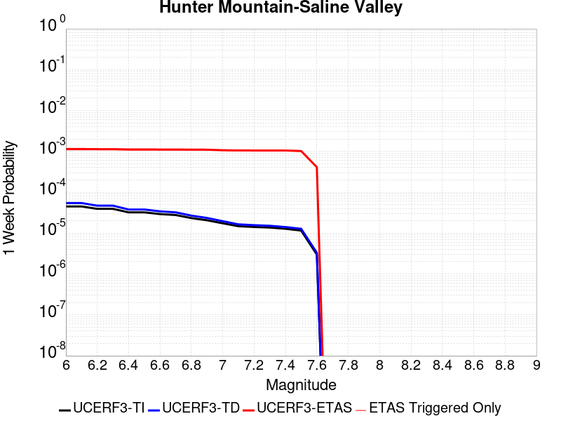 | 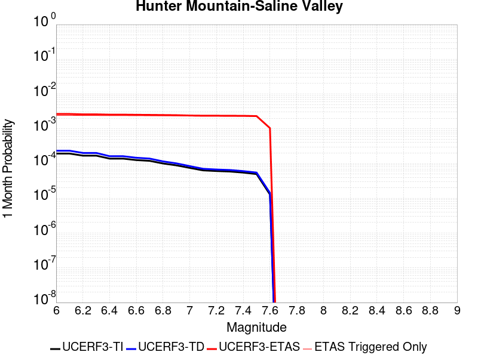 |  | 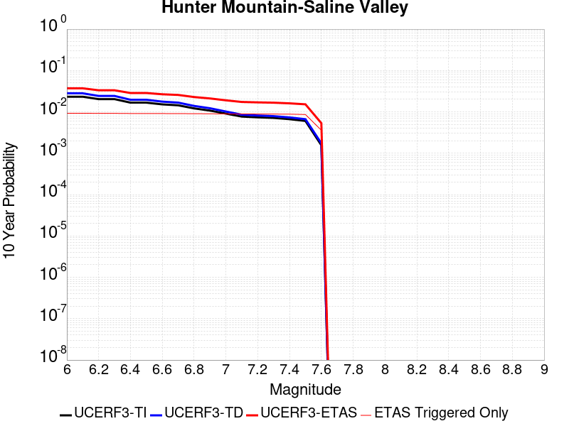 |

| Magnitude | 1 wk TI Prob | 1 wk TD Prob | 1 wk ETAS Prob | 1 wk ETAS/TD Gain | 1 wk ETAS Triggered Only | 1 mo TI Prob | 1 mo TD Prob | 1 mo ETAS Prob | 1 mo ETAS/TD Gain | 1 mo ETAS Triggered Only | 1 yr TI Prob | 1 yr TD Prob | 1 yr ETAS Prob | 1 yr ETAS/TD Gain | 1 yr ETAS Triggered Only | 10 yr TI Prob | 10 yr TD Prob | 10 yr ETAS Prob | 10 yr ETAS/TD Gain | 10 yr ETAS Triggered Only |
|-----|-----|-----|-----|-----|-----|-----|-----|-----|-----|-----|-----|-----|-----|-----|-----|-----|-----|-----|-----|-----|
| 6.0 | 4.5103672E-5 | 5.457172E-5 | 0.0011445122 | 20.972626 | 0.00109 | 1.9328714E-4 | 2.3385823E-4 | 0.00266329 | 11.388481 | 0.00243 | 0.002350731 | 0.002843592 | 0.008706871 | 3.061927 | 0.00588 | 0.023260195 | 0.028092653 | 0.037111953 | 1.3210555 | 0.00928 |
| 6.1 | 4.5103672E-5 | 5.457172E-5 | 0.0011445122 | 20.972626 | 0.00109 | 1.9328714E-4 | 2.3385823E-4 | 0.00266329 | 11.388481 | 0.00243 | 0.002350731 | 0.002843592 | 0.008706871 | 3.061927 | 0.00588 | 0.023260195 | 0.028092653 | 0.037111953 | 1.3210555 | 0.00928 |
| 6.2 | 3.9363465E-5 | 4.7064652E-5 | 0.0011370133 | 24.15854 | 0.00109 | 1.6868966E-4 | 2.0169013E-4 | 0.002601206 | 12.897042 | 0.0024 | 0.002051862 | 0.0024528827 | 0.008278558 | 3.3750322 | 0.00584 | 0.020330196 | 0.024274126 | 0.03326056 | 1.3702064 | 0.00921 |
| 6.3 | 3.9363465E-5 | 4.7064652E-5 | 0.0011370133 | 24.15854 | 0.00109 | 1.6868966E-4 | 2.0169013E-4 | 0.002601206 | 12.897042 | 0.0024 | 0.002051862 | 0.0024528827 | 0.008278558 | 3.3750322 | 0.00584 | 0.020330196 | 0.024274126 | 0.03326056 | 1.3702064 | 0.00921 |
| 6.4 | 3.2311684E-5 | 3.7951973E-5 | 0.001117911 | 29.455938 | 0.00108 | 1.384713E-4 | 1.6264158E-4 | 0.002552253 | 15.692499 | 0.00239 | 0.0016845843 | 0.0019784356 | 0.0077569806 | 3.9207647 | 0.00579 | 0.016718714 | 0.019616976 | 0.028577676 | 1.4567829 | 0.00914 |
| 6.5 | 3.2311684E-5 | 3.7951973E-5 | 0.001117911 | 29.455938 | 0.00108 | 1.384713E-4 | 1.6264158E-4 | 0.002552253 | 15.692499 | 0.00239 | 0.0016845843 | 0.0019784356 | 0.0077569806 | 3.9207647 | 0.00579 | 0.016718714 | 0.019616976 | 0.028577676 | 1.4567829 | 0.00914 |
| 6.6 | 2.9305844E-5 | 3.4182707E-5 | 0.0011141457 | 32.593845 | 0.00108 | 1.2559042E-4 | 1.4648944E-4 | 0.0025261408 | 17.244524 | 0.00238 | 0.0015279909 | 0.0017821126 | 0.0075418297 | 4.2319603 | 0.00577 | 0.015175272 | 0.01768614 | 0.02663502 | 1.5059826 | 0.00911 |
| 6.7 | 2.7826512E-5 | 3.23451E-5 | 0.0011123102 | 34.388832 | 0.00108 | 1.19251024E-4 | 1.3861484E-4 | 0.0025082864 | 18.095367 | 0.00237 | 0.0014509142 | 0.0016863894 | 0.007436676 | 4.409821 | 0.00576 | 0.014414776 | 0.01674361 | 0.025671577 | 1.5332165 | 0.00908 |
| 6.8 | 2.3389874E-5 | 2.6867396E-5 | 0.0011068383 | 41.196342 | 0.00108 | 1.0023846E-4 | 1.1514116E-4 | 0.0024848683 | 21.581059 | 0.00237 | 0.00121972 | 0.0014009895 | 0.0071429336 | 5.098492 | 0.00575 | 0.01213047 | 0.013927785 | 0.022841878 | 1.6400223 | 0.00904 |
| 6.9 | 2.069209E-5 | 2.357063E-5 | 0.0011035452 | 46.818653 | 0.00108 | 8.867737E-5 | 1.01013284E-4 | 0.002460775 | 24.360905 | 0.00236 | 0.0010791123 | 0.001229179 | 0.0069421483 | 5.647793 | 0.00572 | 0.010738871 | 0.012228833 | 0.021108896 | 1.7261579 | 0.00899 |
| 7.0 | 1.7462342E-5 | 1.9634048E-5 | 0.0010696134 | 54.477478 | 0.00105 | 7.483646E-5 | 8.4143336E-5 | 0.0024039482 | 28.56968 | 0.00232 | 9.1075303E-4 | 0.0010239863 | 0.0066781905 | 6.5217576 | 0.00566 | 0.009070295 | 0.010196312 | 0.019025361 | 1.8659061 | 0.00892 |
| 7.1 | 1.4807709E-5 | 1.644218E-5 | 0.001056425 | 64.250916 | 0.00104 | 6.3460066E-5 | 7.046467E-5 | 0.002380302 | 33.780075 | 0.00231 | 7.723524E-4 | 8.575862E-4 | 0.0064927493 | 7.570958 | 0.00564 | 0.007696735 | 0.0085457545 | 0.017359782 | 2.0313926 | 0.00889 |
| 7.2 | 1.4180048E-5 | 1.5698752E-5 | 0.0010556824 | 67.24627 | 0.00104 | 6.077022E-5 | 6.727872E-5 | 0.0023771233 | 35.33247 | 0.00231 | 7.396263E-4 | 8.188268E-4 | 0.0064442167 | 7.870061 | 0.00563 | 0.0073716943 | 0.008161048 | 0.016968578 | 2.0792155 | 0.00888 |
| 7.3 | 1.3730402E-5 | 1.5172481E-5 | 0.0010551567 | 69.54411 | 0.00104 | 5.8843252E-5 | 6.5023385E-5 | 0.002364874 | 36.36959 | 0.0023 | 7.161811E-4 | 7.913883E-4 | 0.0063869567 | 8.070573 | 0.0056 | 0.007138774 | 0.007888633 | 0.016668819 | 2.1130176 | 0.00885 |
| 7.4 | 1.2810095E-5 | 1.4109663E-5 | 0.001054095 | 74.707306 | 0.00104 | 5.489925E-5 | 6.0468672E-5 | 0.0023603295 | 39.033924 | 0.0023 | 6.681934E-4 | 7.3597324E-4 | 0.006321859 | 8.589795 | 0.00559 | 0.006661878 | 0.0073382533 | 0.016083604 | 2.1917481 | 0.00881 |
| 7.5 | 1.1595659E-5 | 1.2800959E-5 | 0.001022788 | 79.89933 | 0.00101 | 4.9694736E-5 | 5.4860186E-5 | 0.0023147361 | 42.19337 | 0.00226 | 6.0486543E-4 | 6.677337E-4 | 0.006154068 | 9.21635 | 0.00549 | 0.006032217 | 0.0066601452 | 0.015232668 | 2.2871375 | 0.00863 |
| 7.6 | 2.997694E-6 | 3.3252732E-6 | 4.133239E-4 | 124.29773 | 4.1E-4 | 1.28471975E-5 | 1.4251134E-5 | 0.0010442365 | 73.27392 | 0.00103 | 1.564034E-4 | 1.7350103E-4 | 0.002443107 | 14.081226 | 0.00227 | 0.0015629337 | 0.0017350912 | 0.0053288448 | 3.0712187 | 0.0036 |

## Ash Hill
*[(top)](#table-of-contents)*

| 1 Week | 1 Month | 1 Year | 10 Year |
|-----|-----|-----|-----|
| 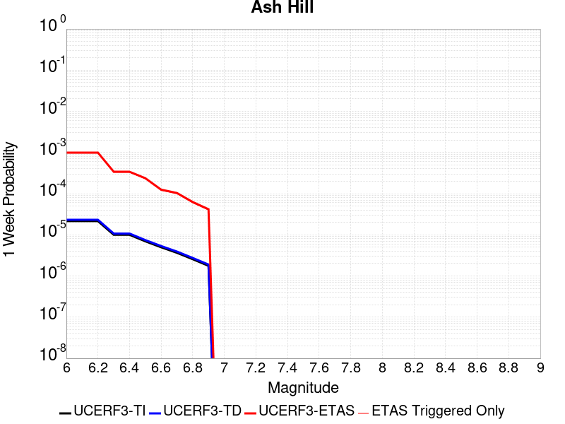 | 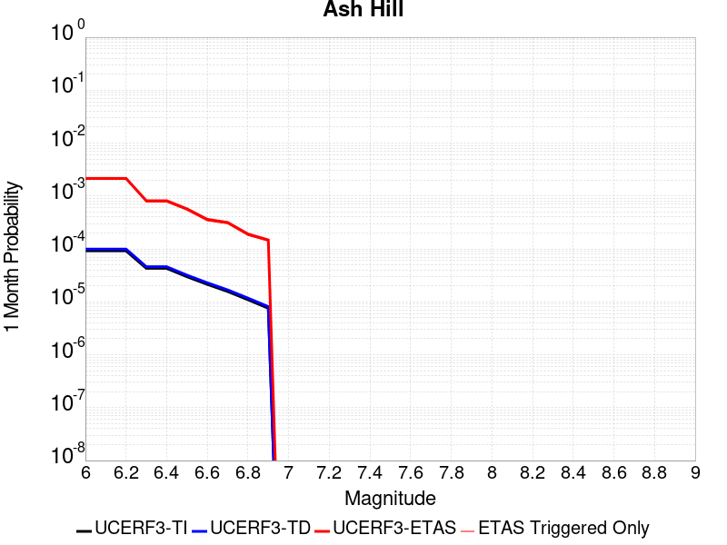 | 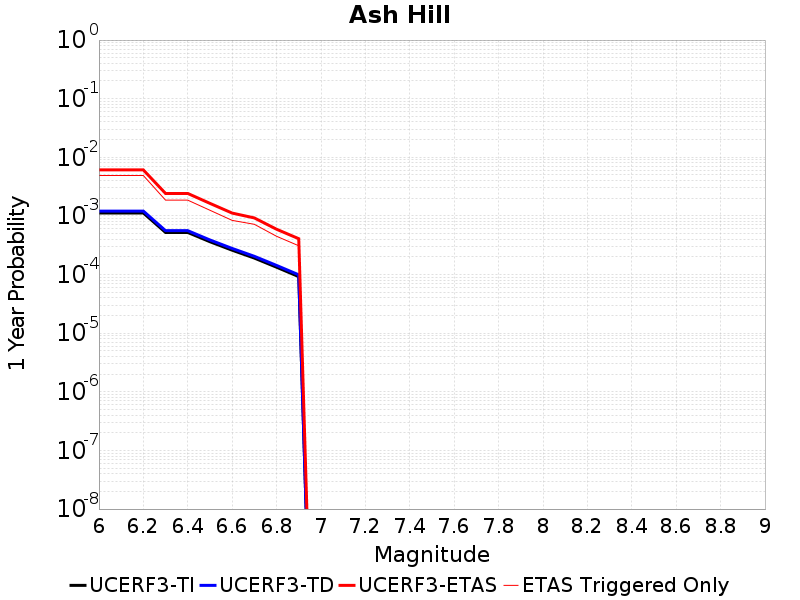 | 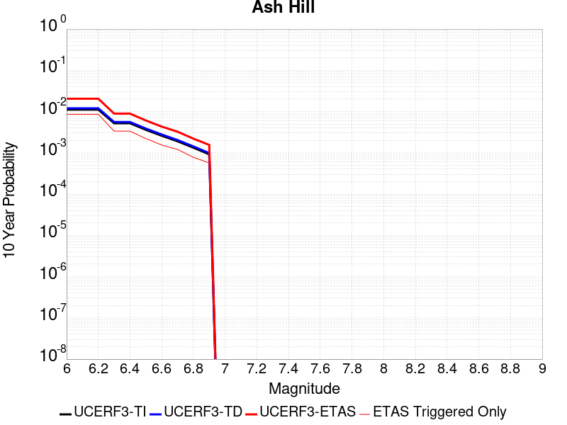 |

| Magnitude | 1 wk TI Prob | 1 wk TD Prob | 1 wk ETAS Prob | 1 wk ETAS/TD Gain | 1 wk ETAS Triggered Only | 1 mo TI Prob | 1 mo TD Prob | 1 mo ETAS Prob | 1 mo ETAS/TD Gain | 1 mo ETAS Triggered Only | 1 yr TI Prob | 1 yr TD Prob | 1 yr ETAS Prob | 1 yr ETAS/TD Gain | 1 yr ETAS Triggered Only | 10 yr TI Prob | 10 yr TD Prob | 10 yr ETAS Prob | 10 yr ETAS/TD Gain | 10 yr ETAS Triggered Only |
|-----|-----|-----|-----|-----|-----|-----|-----|-----|-----|-----|-----|-----|-----|-----|-----|-----|-----|-----|-----|-----|
| 6.0 | 2.1545662E-5 | 2.3194645E-5 | 9.931722E-4 | 42.819027 | 9.7E-4 | 9.2335285E-5 | 9.9402285E-5 | 0.0021591976 | 21.72181 | 0.00206 | 0.0011236023 | 0.001209631 | 0.006093716 | 5.0376654 | 0.00489 | 0.011179381 | 0.012038452 | 0.0205448 | 1.7065983 | 0.00861 |
| 6.1 | 2.1545662E-5 | 2.3194645E-5 | 9.931722E-4 | 42.819027 | 9.7E-4 | 9.2335285E-5 | 9.9402285E-5 | 0.0021591976 | 21.72181 | 0.00206 | 0.0011236023 | 0.001209631 | 0.006093716 | 5.0376654 | 0.00489 | 0.011179381 | 0.012038452 | 0.0205448 | 1.7065983 | 0.00861 |
| 6.2 | 2.1545662E-5 | 2.3194645E-5 | 9.931722E-4 | 42.819027 | 9.7E-4 | 9.2335285E-5 | 9.9402285E-5 | 0.0021591976 | 21.72181 | 0.00206 | 0.0011236023 | 0.001209631 | 0.006093716 | 5.0376654 | 0.00489 | 0.011179381 | 0.012038452 | 0.0205448 | 1.7065983 | 0.00861 |
| 6.3 | 1.0025529E-5 | 1.07470205E-5 | 3.4074349E-4 | 31.705854 | 3.3E-4 | 4.2965847E-5 | 4.605792E-5 | 8.1602245E-4 | 17.71731 | 7.7E-4 | 5.229836E-4 | 5.606242E-4 | 0.0024195814 | 4.315871 | 0.00186 | 0.005217545 | 0.005593411 | 0.008934617 | 1.5973468 | 0.00336 |
| 6.4 | 1.0025529E-5 | 1.07470205E-5 | 3.4074349E-4 | 31.705854 | 3.3E-4 | 4.2965847E-5 | 4.605792E-5 | 8.1602245E-4 | 17.71731 | 7.7E-4 | 5.229836E-4 | 5.606242E-4 | 0.0024195814 | 4.315871 | 0.00186 | 0.005217545 | 0.005593411 | 0.008934617 | 1.5973468 | 0.00336 |
| 6.5 | 6.9617327E-6 | 7.4566933E-6 | 2.3745498E-4 | 31.844542 | 2.3E-4 | 2.9835655E-5 | 3.1956915E-5 | 5.719397E-4 | 17.897211 | 5.4E-4 | 3.6318856E-4 | 3.8901463E-4 | 0.0016385284 | 4.2119966 | 0.00125 | 0.0036259557 | 0.0038841912 | 0.006095568 | 1.5693276 | 0.00222 |
| 6.6 | 4.9919777E-6 | 5.3467306E-6 | 1.253461E-4 | 23.4435 | 1.2E-4 | 2.1394015E-5 | 2.2914397E-5 | 3.629066E-4 | 15.837493 | 3.4E-4 | 2.60441E-4 | 2.7895378E-4 | 0.0011187195 | 4.0104117 | 8.4E-4 | 0.0026013597 | 0.0027866948 | 0.0043323752 | 1.5546645 | 0.00155 |
| 6.7 | 3.6630722E-6 | 3.924655E-6 | 1.0392426E-4 | 26.479847 | 1.0E-4 | 1.5698786E-5 | 1.6819875E-5 | 3.1681484E-4 | 18.835743 | 3.0E-4 | 1.9111596E-4 | 2.0476845E-4 | 9.24621E-4 | 4.5154467 | 7.2E-4 | 0.0019095168 | 0.0020463609 | 0.0032538848 | 1.5900836 | 0.00121 |
| 6.8 | 2.5599613E-6 | 2.7449473E-6 | 6.274478E-5 | 22.858284 | 6.0E-5 | 1.0971216E-5 | 1.1764035E-5 | 1.9176192E-4 | 16.300694 | 1.8E-4 | 1.3356637E-4 | 1.4322266E-4 | 5.931582E-4 | 4.141511 | 4.5E-4 | 0.0013348613 | 0.0014317884 | 0.0022106718 | 1.5439932 | 7.8E-4 |
| 6.9 | 1.7684905E-6 | 1.8968861E-6 | 4.1896812E-5 | 22.08715 | 4.0E-5 | 7.579223E-6 | 8.129512E-6 | 1.4812837E-4 | 18.221066 | 1.4E-4 | 9.2273134E-5 | 9.897681E-5 | 4.0894613E-4 | 4.1317368 | 3.1E-4 | 9.223483E-4 | 9.897681E-4 | 0.001559204 | 1.5753225 | 5.7E-4 |

## Blackwater
*[(top)](#table-of-contents)*

| 1 Week | 1 Month | 1 Year | 10 Year |
|-----|-----|-----|-----|
| 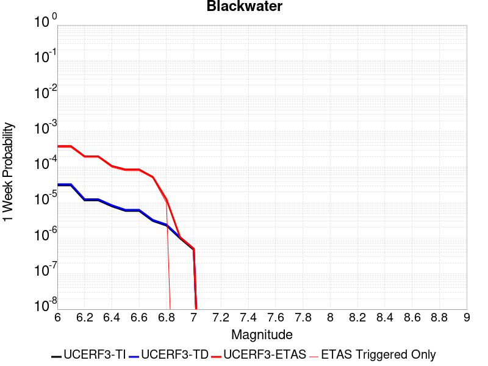 | 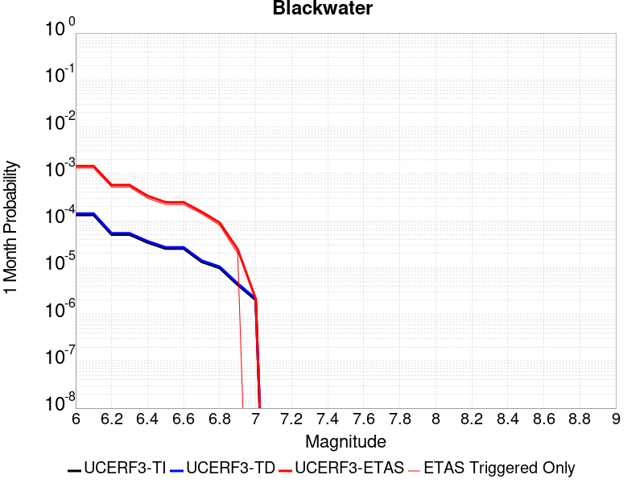 | 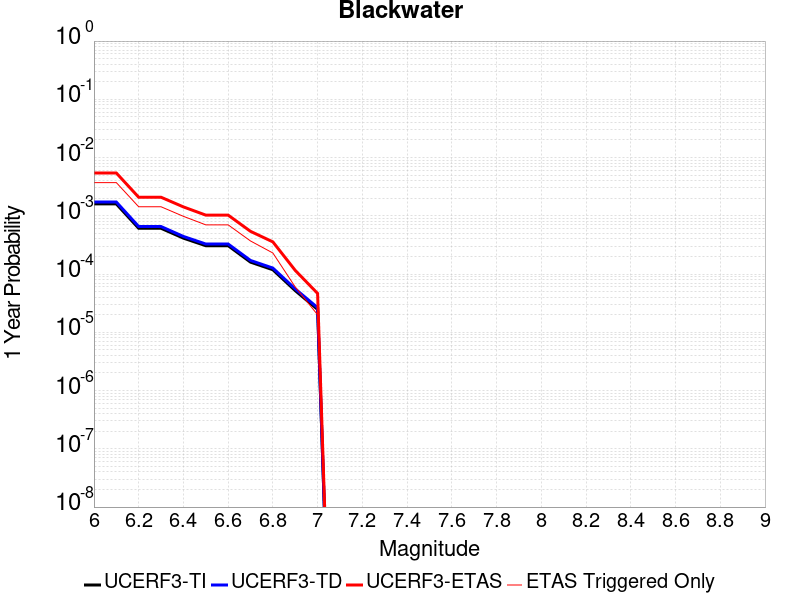 | 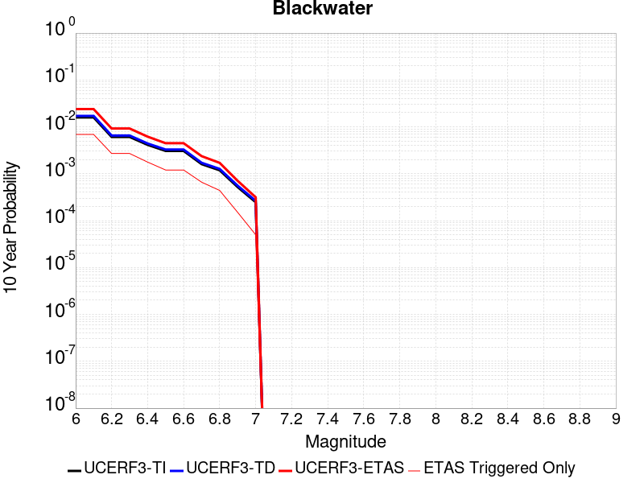 |

| Magnitude | 1 wk TI Prob | 1 wk TD Prob | 1 wk ETAS Prob | 1 wk ETAS/TD Gain | 1 wk ETAS Triggered Only | 1 mo TI Prob | 1 mo TD Prob | 1 mo ETAS Prob | 1 mo ETAS/TD Gain | 1 mo ETAS Triggered Only | 1 yr TI Prob | 1 yr TD Prob | 1 yr ETAS Prob | 1 yr ETAS/TD Gain | 1 yr ETAS Triggered Only | 10 yr TI Prob | 10 yr TD Prob | 10 yr ETAS Prob | 10 yr ETAS/TD Gain | 10 yr ETAS Triggered Only |
|-----|-----|-----|-----|-----|-----|-----|-----|-----|-----|-----|-----|-----|-----|-----|-----|-----|-----|-----|-----|-----|
| 6.0 | 3.0708583E-5 | 3.3096137E-5 | 3.9308422E-4 | 11.877043 | 3.6E-4 | 1.3160157E-4 | 1.4183365E-4 | 0.0014616464 | 10.305358 | 0.00132 | 0.0016010714 | 0.0017255935 | 0.0054391744 | 3.15206 | 0.00372 | 0.015895851 | 0.017135782 | 0.023907715 | 1.3951926 | 0.00689 |
| 6.1 | 3.0708583E-5 | 3.3096137E-5 | 3.9308422E-4 | 11.877043 | 3.6E-4 | 1.3160157E-4 | 1.4183365E-4 | 0.0014616464 | 10.305358 | 0.00132 | 0.0016010714 | 0.0017255935 | 0.0054391744 | 3.15206 | 0.00372 | 0.015895851 | 0.017135782 | 0.023907715 | 1.3951926 | 0.00689 |
| 6.2 | 1.1707779E-5 | 1.25452225E-5 | 2.0254284E-4 | 16.145018 | 1.9E-4 | 5.017523E-5 | 5.3764186E-5 | 5.737362E-4 | 10.671346 | 5.2E-4 | 6.107122E-4 | 6.54392E-4 | 0.0020834561 | 3.1838045 | 0.00143 | 0.006090366 | 0.0065256217 | 0.009208002 | 1.4110537 | 0.0027 |
| 6.3 | 1.1707779E-5 | 1.25452225E-5 | 2.0254284E-4 | 16.145018 | 1.9E-4 | 5.017523E-5 | 5.3764186E-5 | 5.737362E-4 | 10.671346 | 5.2E-4 | 6.107122E-4 | 6.54392E-4 | 0.0020834561 | 3.1838045 | 0.00143 | 0.006090366 | 0.0065256217 | 0.009208002 | 1.4110537 | 0.0027 |
| 6.4 | 7.929244E-6 | 8.480164E-6 | 1.0847932E-4 | 12.792125 | 1.0E-4 | 3.3982033E-5 | 3.6343077E-5 | 3.3633216E-4 | 9.254367 | 3.0E-4 | 4.136527E-4 | 4.4239115E-4 | 0.0014219576 | 3.2142541 | 9.8E-4 | 0.0041288356 | 0.00441551 | 0.006177695 | 1.3990897 | 0.00177 |
| 6.5 | 5.8832115E-6 | 6.286039E-6 | 8.628554E-5 | 13.726535 | 8.0E-5 | 2.521352E-5 | 2.6939904E-5 | 2.4693398E-4 | 9.166104 | 2.2E-4 | 3.0693135E-4 | 3.279465E-4 | 0.0010277169 | 3.1337945 | 7.0E-4 | 0.0030650778 | 0.0032748787 | 0.004470949 | 1.3652258 | 0.0012 |
| 6.6 | 5.8832115E-6 | 6.286039E-6 | 8.628554E-5 | 13.726535 | 8.0E-5 | 2.521352E-5 | 2.6939904E-5 | 2.4693398E-4 | 9.166104 | 2.2E-4 | 3.0693135E-4 | 3.279465E-4 | 0.0010277169 | 3.1337945 | 7.0E-4 | 0.0030650778 | 0.0032748787 | 0.004470949 | 1.3652258 | 0.0012 |
| 6.7 | 3.0715053E-6 | 3.2814912E-6 | 5.328133E-5 | 16.236925 | 5.0E-5 | 1.3163528E-5 | 1.4063465E-5 | 1.5406149E-4 | 10.954733 | 1.4E-4 | 1.6025416E-4 | 1.712104E-4 | 5.41147E-4 | 3.1607137 | 3.7E-4 | 0.0016013865 | 0.0017108994 | 0.0023697703 | 1.385102 | 6.6E-4 |
| 6.8 | 2.2722281E-6 | 2.4287724E-6 | 1.2428748E-5 | 5.117296 | 1.0E-5 | 9.738084E-6 | 1.0408988E-5 | 9.040815E-5 | 8.685585 | 8.0E-5 | 1.1855473E-4 | 1.2672298E-4 | 3.5669384E-4 | 2.8147526 | 2.3E-4 | 0.001184915 | 0.0012665973 | 0.00170604 | 1.3469474 | 4.4E-4 |
| 6.9 | 9.952399E-7 | 1.0653573E-6 | 1.0653573E-6 | 1.0 | 0.0 | 4.265307E-6 | 4.5658117E-6 | 2.4565721E-5 | 5.380362 | 2.0E-5 | 5.1928873E-5 | 5.5587854E-5 | 1.15584524E-4 | 2.0793126 | 6.0E-5 | 5.191674E-4 | 5.5579015E-4 | 7.0570677E-4 | 1.269736 | 1.5E-4 |
| 7.0 | 4.7385504E-7 | 5.0756E-7 | 5.0756E-7 | 1.0 | 0.0 | 2.0308057E-6 | 2.1752571E-6 | 2.1752571E-6 | 1.0 | 0.0 | 2.4724779E-5 | 2.6483754E-5 | 4.6483226E-5 | 1.75516 | 2.0E-5 | 2.4722028E-4 | 2.6483755E-4 | 3.148243E-4 | 1.188745 | 5.0E-5 |

## Garlock (West)
*[(top)](#table-of-contents)*

| 1 Week | 1 Month | 1 Year | 10 Year |
|-----|-----|-----|-----|
| 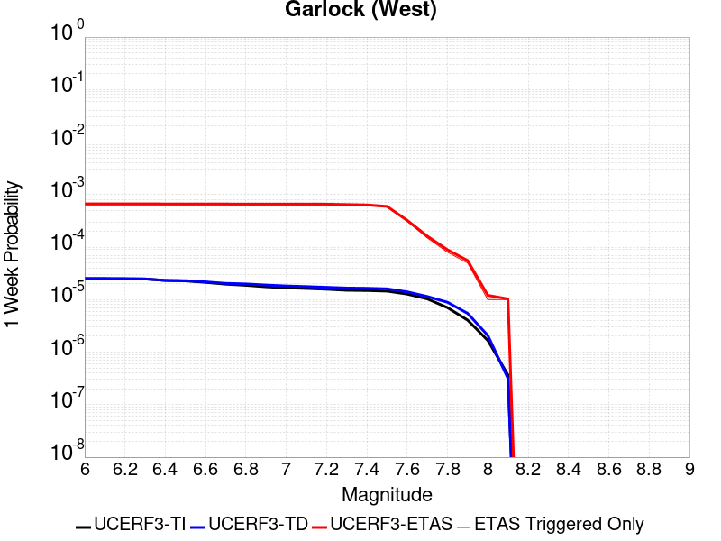 | 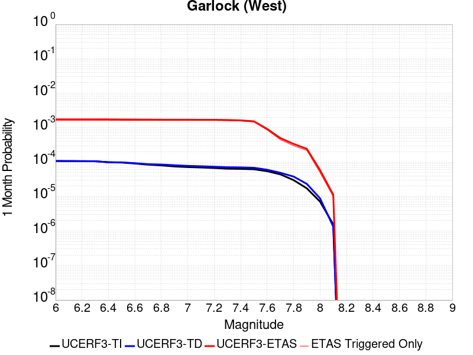 | 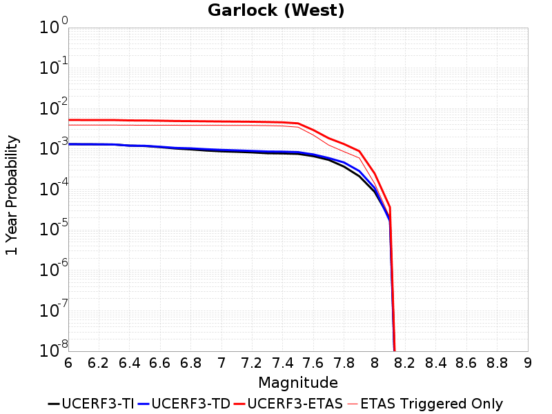 | 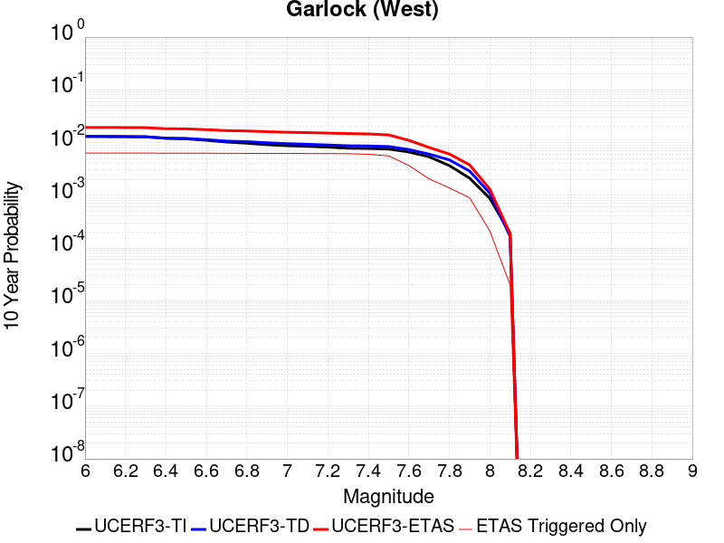 |

| Magnitude | 1 wk TI Prob | 1 wk TD Prob | 1 wk ETAS Prob | 1 wk ETAS/TD Gain | 1 wk ETAS Triggered Only | 1 mo TI Prob | 1 mo TD Prob | 1 mo ETAS Prob | 1 mo ETAS/TD Gain | 1 mo ETAS Triggered Only | 1 yr TI Prob | 1 yr TD Prob | 1 yr ETAS Prob | 1 yr ETAS/TD Gain | 1 yr ETAS Triggered Only | 10 yr TI Prob | 10 yr TD Prob | 10 yr ETAS Prob | 10 yr ETAS/TD Gain | 10 yr ETAS Triggered Only |
|-----|-----|-----|-----|-----|-----|-----|-----|-----|-----|-----|-----|-----|-----|-----|-----|-----|-----|-----|-----|-----|
| 6.0 | 2.5181727E-5 | 2.5201378E-5 | 6.651853E-4 | 26.394798 | 6.4E-4 | 1.0791722E-4 | 1.0800145E-4 | 0.0017478244 | 16.183342 | 0.00164 | 0.0013131002 | 0.0013141279 | 0.0052090026 | 3.9638476 | 0.0039 | 0.013053683 | 0.013144068 | 0.019390866 | 1.4752561 | 0.00633 |
| 6.1 | 2.5077732E-5 | 2.5102448E-5 | 6.650864E-4 | 26.494883 | 6.4E-4 | 1.0747157E-4 | 1.075775E-4 | 0.0017474011 | 16.243183 | 0.00164 | 0.001307681 | 0.0013089726 | 0.005203868 | 3.9755359 | 0.0039 | 0.013000126 | 0.013093124 | 0.019340245 | 1.4771299 | 0.00633 |
| 6.2 | 2.494612E-5 | 2.4984123E-5 | 6.6496816E-4 | 26.61563 | 6.4E-4 | 1.0690756E-4 | 1.0707044E-4 | 0.0017468948 | 16.31538 | 0.00164 | 0.0013008224 | 0.0013028064 | 0.0051977257 | 3.9896376 | 0.0039 | 0.012932341 | 0.013032187 | 0.019279692 | 1.4793905 | 0.00633 |
| 6.3 | 2.4733758E-5 | 2.4803487E-5 | 6.647876E-4 | 26.802183 | 6.4E-4 | 1.0599751E-4 | 1.0629635E-4 | 0.001746122 | 16.426924 | 0.00164 | 0.0012897556 | 0.0012933931 | 0.0051883487 | 4.0114245 | 0.0039 | 0.012822957 | 0.012939154 | 0.01918725 | 1.4828829 | 0.00633 |
| 6.4 | 2.3237335E-5 | 2.3182769E-5 | 6.631679E-4 | 28.606071 | 6.4E-4 | 9.958477E-5 | 9.935096E-5 | 0.001739188 | 17.505499 | 0.00164 | 0.0012117702 | 0.0012089295 | 0.005084239 | 4.205571 | 0.00388 | 0.012051838 | 0.01210399 | 0.018327735 | 1.5141895 | 0.0063 |
| 6.5 | 2.2732203E-5 | 2.2997316E-5 | 6.629826E-4 | 28.828695 | 6.4E-4 | 9.742009E-5 | 9.8556215E-5 | 0.0017283956 | 17.537153 | 0.00163 | 0.0011854442 | 0.0011992642 | 0.005064623 | 4.223109 | 0.00387 | 0.011791403 | 0.012008387 | 0.018222854 | 1.5175107 | 0.00629 |
| 6.6 | 2.1319436E-5 | 2.1777483E-5 | 6.6176354E-4 | 30.387514 | 6.4E-4 | 9.136581E-5 | 9.3328745E-5 | 0.0017231766 | 18.463514 | 0.00163 | 0.001111811 | 0.0011356875 | 0.0050012926 | 4.4037576 | 0.00387 | 0.011062649 | 0.011379274 | 0.017597698 | 1.5464693 | 0.00629 |
| 6.7 | 1.970802E-5 | 2.0397338E-5 | 6.603843E-4 | 32.376003 | 6.4E-4 | 8.446021E-5 | 8.741424E-5 | 0.0017172717 | 19.645218 | 0.00163 | 0.001027818 | 0.0010637505 | 0.0049196444 | 4.6248107 | 0.00386 | 0.010230771 | 0.010666992 | 0.01687011 | 1.5815246 | 0.00627 |
| 6.8 | 1.8744462E-5 | 1.9904963E-5 | 6.598922E-4 | 33.152145 | 6.4E-4 | 8.033094E-5 | 8.530421E-5 | 0.0017051661 | 19.989237 | 0.00162 | 9.775903E-4 | 0.0010380856 | 0.004884089 | 4.7049003 | 0.00385 | 0.009733009 | 0.010412767 | 0.016597686 | 1.5939747 | 0.00625 |
| 6.9 | 1.7559682E-5 | 1.8957307E-5 | 6.589452E-4 | 34.75943 | 6.4E-4 | 7.5253614E-5 | 8.124308E-5 | 0.0017011114 | 20.93854 | 0.00162 | 9.158276E-4 | 9.88687E-4 | 0.0048348806 | 4.890203 | 0.00385 | 0.0091206245 | 0.009923235 | 0.016111214 | 1.623585 | 0.00625 |
| 7.0 | 1.6794445E-5 | 1.82201E-5 | 6.5820845E-4 | 36.1254 | 6.4E-4 | 7.197421E-5 | 7.8083816E-5 | 0.0016979573 | 21.745317 | 0.00162 | 8.759337E-4 | 9.5025724E-4 | 0.0047866083 | 5.037171 | 0.00384 | 0.008724891 | 0.00954213 | 0.015722588 | 1.6477021 | 0.00624 |
| 7.1 | 1.6337795E-5 | 1.7720888E-5 | 6.5770955E-4 | 37.114933 | 6.4E-4 | 7.0017246E-5 | 7.594446E-5 | 0.0016958214 | 22.32976 | 0.00162 | 8.521265E-4 | 9.242329E-4 | 0.004750693 | 5.140147 | 0.00383 | 0.008488664 | 0.009283975 | 0.015446229 | 1.6637516 | 0.00622 |
| 7.2 | 1.5780008E-5 | 1.7169514E-5 | 6.571585E-4 | 38.27473 | 6.4E-4 | 6.762685E-5 | 7.358156E-5 | 0.0016934624 | 23.014765 | 0.00162 | 8.2304585E-4 | 8.954886E-4 | 0.004712068 | 5.2620077 | 0.00382 | 0.008200042 | 0.00899881 | 0.0151529275 | 1.6838813 | 0.00621 |
| 7.3 | 1.5058865E-5 | 1.662256E-5 | 6.466121E-4 | 38.89967 | 6.3E-4 | 6.45364E-5 | 7.1237606E-5 | 0.0016711237 | 23.458448 | 0.0016 | 7.854473E-4 | 8.6697395E-4 | 0.004643697 | 5.3562126 | 0.00378 | 0.00782677 | 0.0087154955 | 0.014821809 | 1.7006271 | 0.00616 |
| 7.4 | 1.4887923E-5 | 1.6458518E-5 | 6.364483E-4 | 38.669846 | 6.2E-4 | 6.380382E-5 | 7.05346E-5 | 0.0016304245 | 23.115244 | 0.00156 | 7.7653467E-4 | 8.5842167E-4 | 0.0045552454 | 5.306536 | 0.0037 | 0.0077382675 | 0.00863035 | 0.014588482 | 1.6903696 | 0.00601 |
| 7.5 | 1.4509299E-5 | 1.605051E-5 | 5.960412E-4 | 37.135345 | 5.8E-4 | 6.218123E-5 | 6.878609E-5 | 0.0015286857 | 22.223763 | 0.00146 | 7.567935E-4 | 8.3715003E-4 | 0.004304245 | 5.141546 | 0.00347 | 0.0075422134 | 0.008418643 | 0.013961582 | 1.6584125 | 0.00559 |
| 7.6 | 1.2756717E-5 | 1.4054459E-5 | 3.240501E-4 | 23.056747 | 3.1E-4 | 5.4670498E-5 | 6.0232007E-5 | 9.2018023E-4 | 15.277263 | 8.6E-4 | 6.6541E-4 | 7.3307863E-4 | 0.0029414585 | 4.0124736 | 0.00221 | 0.006634211 | 0.0073835514 | 0.01103638 | 1.4947251 | 0.00368 |
| 7.7 | 1.0328985E-5 | 1.1463943E-5 | 1.6146223E-4 | 14.0843525 | 1.5E-4 | 4.4266326E-5 | 4.9130264E-5 | 4.9910817E-4 | 10.1588745 | 4.5E-4 | 5.388092E-4 | 5.9799716E-4 | 0.0018472497 | 3.0890608 | 0.00125 | 0.0053750467 | 0.0060402644 | 0.008077882 | 1.3373392 | 0.00205 |
| 7.8 | 7.0306583E-6 | 8.90231E-6 | 8.8901594E-5 | 9.986352 | 8.0E-5 | 3.0131043E-5 | 3.8152197E-5 | 3.3814076E-4 | 8.862943 | 3.0E-4 | 3.667837E-4 | 4.6440418E-4 | 0.0013240047 | 2.8509753 | 8.6E-4 | 0.003661789 | 0.004696677 | 0.006070195 | 1.2924448 | 0.00138 |
| 7.9 | 4.060633E-6 | 5.466983E-6 | 5.546671E-5 | 10.145762 | 5.0E-5 | 1.7402595E-5 | 2.3429717E-5 | 2.4342457E-4 | 10.3895645 | 2.2E-4 | 2.11856E-4 | 2.8521958E-4 | 8.850484E-4 | 3.1030426 | 6.0E-4 | 0.0021165414 | 0.0028850264 | 0.00378243 | 1.3110555 | 9.0E-4 |
| 8.0 | 1.6729537E-6 | 2.0780546E-6 | 1.2078034E-5 | 5.812183 | 1.0E-5 | 7.169782E-6 | 8.905919E-6 | 5.8905473E-5 | 6.6141944 | 5.0E-5 | 8.7288594E-5 | 1.08424196E-4 | 2.4840902E-4 | 2.2910848 | 1.4E-4 | 8.7254314E-4 | 0.0010972149 | 0.0013069845 | 1.1911837 | 2.1E-4 |
| 8.1 | 3.6733252E-7 | 3.1497743E-7 | 1.0314974E-5 | 32.7483 | 1.0E-5 | 1.5742813E-6 | 1.3499026E-6 | 1.1349889E-5 | 8.407932 | 1.0E-5 | 1.9166706E-5 | 1.6434957E-5 | 3.6434627E-5 | 2.2168984 | 2.0E-5 | 1.9165053E-4 | 1.6642833E-4 | 1.8642501E-4 | 1.1201519 | 2.0E-5 |

## McLean Lake
*[(top)](#table-of-contents)*

| 1 Week | 1 Month | 1 Year | 10 Year |
|-----|-----|-----|-----|
| 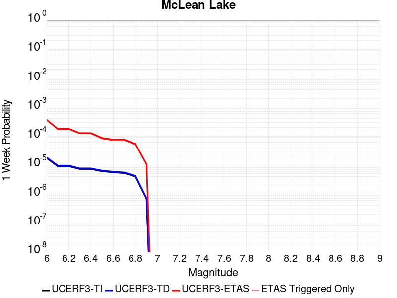 | 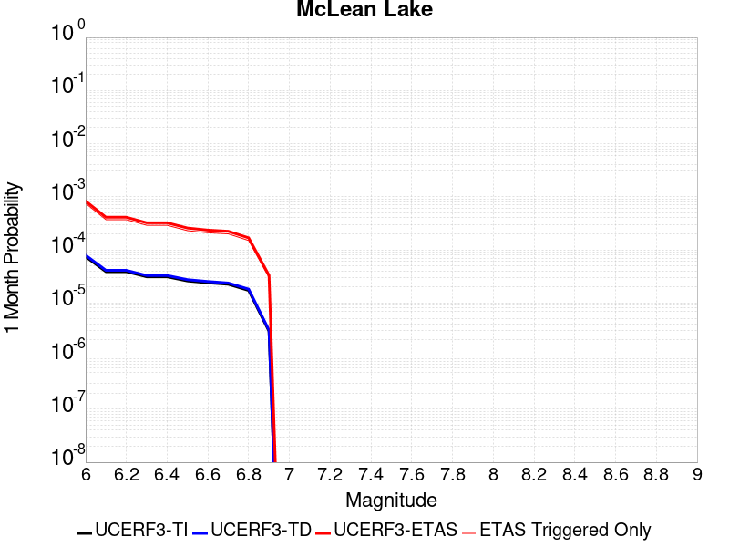 | 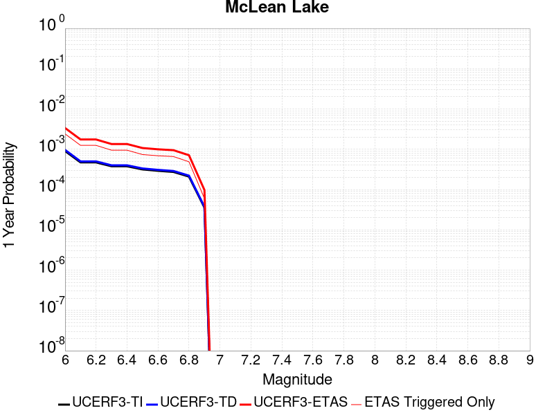 | 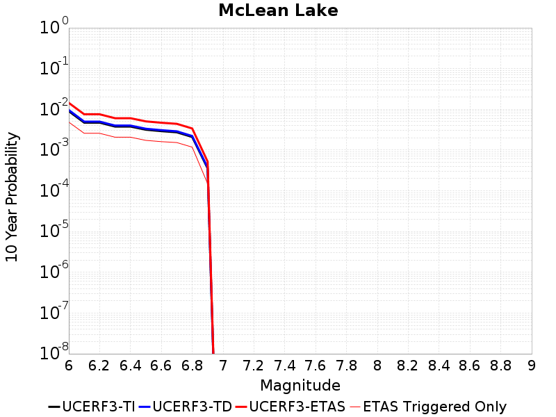 |

| Magnitude | 1 wk TI Prob | 1 wk TD Prob | 1 wk ETAS Prob | 1 wk ETAS/TD Gain | 1 wk ETAS Triggered Only | 1 mo TI Prob | 1 mo TD Prob | 1 mo ETAS Prob | 1 mo ETAS/TD Gain | 1 mo ETAS Triggered Only | 1 yr TI Prob | 1 yr TD Prob | 1 yr ETAS Prob | 1 yr ETAS/TD Gain | 1 yr ETAS Triggered Only | 10 yr TI Prob | 10 yr TD Prob | 10 yr ETAS Prob | 10 yr ETAS/TD Gain | 10 yr ETAS Triggered Only |
|-----|-----|-----|-----|-----|-----|-----|-----|-----|-----|-----|-----|-----|-----|-----|-----|-----|-----|-----|-----|-----|
| 6.0 | 1.7360222E-5 | 1.8501763E-5 | 3.684953E-4 | 19.916765 | 3.5E-4 | 7.439883E-5 | 7.929114E-5 | 8.292317E-4 | 10.458062 | 7.5E-4 | 9.0542925E-4 | 9.6499064E-4 | 0.003372665 | 3.4950235 | 0.00241 | 0.009017491 | 0.009612845 | 0.014416222 | 1.4996833 | 0.00485 |
| 6.1 | 9.062689E-6 | 9.592256E-6 | 1.7959063E-4 | 18.72246 | 1.7E-4 | 3.8839516E-5 | 4.1109073E-5 | 4.1109388E-4 | 10.000076 | 3.7E-4 | 4.727685E-4 | 5.003969E-4 | 0.0017497714 | 3.496767 | 0.00125 | 0.0047176396 | 0.0049935845 | 0.0075607006 | 1.5140829 | 0.00258 |
| 6.2 | 9.062689E-6 | 9.592256E-6 | 1.7959063E-4 | 18.72246 | 1.7E-4 | 3.8839516E-5 | 4.1109073E-5 | 4.1109388E-4 | 10.000076 | 3.7E-4 | 4.727685E-4 | 5.003969E-4 | 0.0017497714 | 3.496767 | 0.00125 | 0.0047176396 | 0.0049935845 | 0.0075607006 | 1.5140829 | 0.00258 |
| 6.3 | 7.2575485E-6 | 7.667758E-6 | 1.2766683E-4 | 16.649826 | 1.2E-4 | 3.110341E-5 | 3.2861444E-5 | 3.228519E-4 | 9.824641 | 2.9E-4 | 3.786182E-4 | 4.000218E-4 | 0.0013496417 | 3.3739207 | 9.5E-4 | 0.0037797375 | 0.003993722 | 0.006055455 | 1.5162435 | 0.00207 |
| 6.4 | 7.2575485E-6 | 7.667758E-6 | 1.2766683E-4 | 16.649826 | 1.2E-4 | 3.110341E-5 | 3.2861444E-5 | 3.228519E-4 | 9.824641 | 2.9E-4 | 3.786182E-4 | 4.000218E-4 | 0.0013496417 | 3.3739207 | 9.5E-4 | 0.0037797375 | 0.003993722 | 0.006055455 | 1.5162435 | 0.00207 |
| 6.5 | 6.06582E-6 | 6.4039173E-6 | 8.640341E-5 | 13.492274 | 8.0E-5 | 2.5996113E-5 | 2.7445107E-5 | 2.574388E-4 | 9.380135 | 2.3E-4 | 3.164567E-4 | 3.3409943E-4 | 0.0010738522 | 3.2141695 | 7.4E-4 | 0.0031600643 | 0.00333661 | 0.0050608376 | 1.5167603 | 0.00173 |
| 6.6 | 5.598744E-6 | 5.910299E-6 | 7.5909884E-5 | 12.843662 | 7.0E-5 | 2.3994397E-5 | 2.5329644E-5 | 2.3532432E-4 | 9.290471 | 2.1E-4 | 2.9209262E-4 | 3.0835115E-4 | 9.981385E-4 | 3.2370186 | 6.9E-4 | 0.0029170897 | 0.0030798623 | 0.0046849037 | 1.5211407 | 0.00161 |
| 6.7 | 5.246996E-6 | 5.5391965E-6 | 7.553881E-5 | 13.637142 | 7.0E-5 | 2.2486933E-5 | 2.3739234E-5 | 2.2373449E-4 | 9.424672 | 2.0E-4 | 2.73744E-4 | 2.8899318E-4 | 9.4880245E-4 | 3.283131 | 6.6E-4 | 0.0027340704 | 0.0028867975 | 0.004412381 | 1.5284691 | 0.00153 |
| 6.8 | 4.02324E-6 | 4.246931E-6 | 5.4246717E-5 | 12.773158 | 5.0E-5 | 1.7242342E-5 | 1.8201039E-5 | 1.6819831E-4 | 9.2411375 | 1.5E-4 | 2.099053E-4 | 2.2158107E-4 | 7.114725E-4 | 3.2108903 | 4.9E-4 | 0.0020970714 | 0.0022141857 | 0.003391573 | 1.5317473 | 0.00118 |
| 6.9 | 6.835972E-7 | 7.1399637E-7 | 1.07139895E-5 | 15.005663 | 1.0E-5 | 2.9296991E-6 | 3.0599826E-6 | 3.3059892E-5 | 10.803947 | 3.0E-5 | 3.56685E-5 | 3.725497E-5 | 9.7252734E-5 | 2.6104634 | 6.0E-5 | 3.5662777E-4 | 3.7251852E-4 | 5.2246265E-4 | 1.4025146 | 1.5E-4 |

## Gravel Hills-Harper Lk
*[(top)](#table-of-contents)*

| 1 Week | 1 Month | 1 Year | 10 Year |
|-----|-----|-----|-----|
| 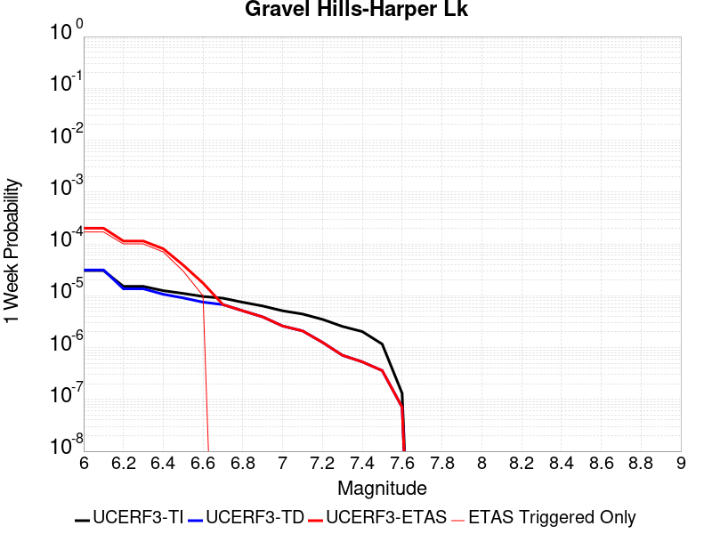 | 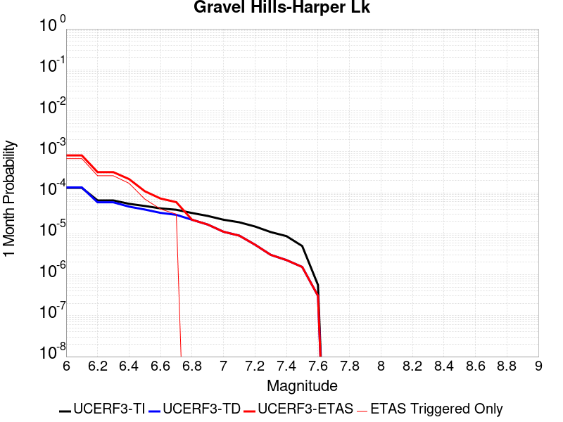 | 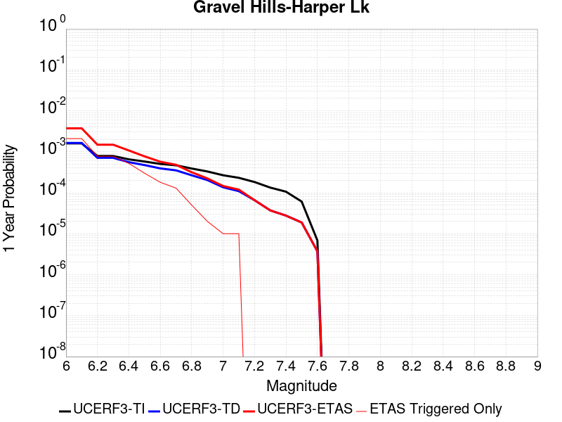 | 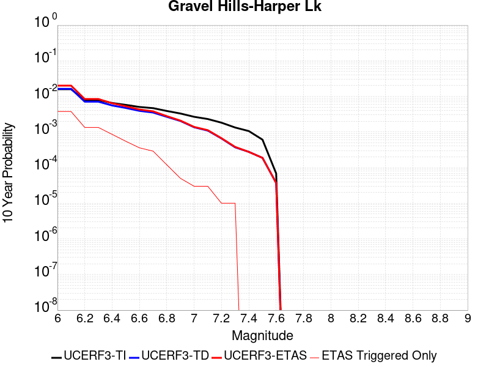 |

| Magnitude | 1 wk TI Prob | 1 wk TD Prob | 1 wk ETAS Prob | 1 wk ETAS/TD Gain | 1 wk ETAS Triggered Only | 1 mo TI Prob | 1 mo TD Prob | 1 mo ETAS Prob | 1 mo ETAS/TD Gain | 1 mo ETAS Triggered Only | 1 yr TI Prob | 1 yr TD Prob | 1 yr ETAS Prob | 1 yr ETAS/TD Gain | 1 yr ETAS Triggered Only | 10 yr TI Prob | 10 yr TD Prob | 10 yr ETAS Prob | 10 yr ETAS/TD Gain | 10 yr ETAS Triggered Only |
|-----|-----|-----|-----|-----|-----|-----|-----|-----|-----|-----|-----|-----|-----|-----|-----|-----|-----|-----|-----|-----|
| 6.0 | 3.0679566E-5 | 3.14651E-5 | 2.0145976E-4 | 6.4026413 | 1.7E-4 | 1.3147724E-4 | 1.3484468E-4 | 8.14753E-4 | 6.0421586 | 6.8E-4 | 0.0015995599 | 0.0016407142 | 0.0037372687 | 2.2778304 | 0.0021 | 0.015880952 | 0.016307572 | 0.020006256 | 1.2268077 | 0.00376 |
| 6.1 | 3.0679566E-5 | 3.14651E-5 | 2.0145976E-4 | 6.4026413 | 1.7E-4 | 1.3147724E-4 | 1.3484468E-4 | 8.14753E-4 | 6.0421586 | 6.8E-4 | 0.0015995599 | 0.0016407142 | 0.0037372687 | 2.2778304 | 0.0021 | 0.015880952 | 0.016307572 | 0.020006256 | 1.2268077 | 0.00376 |
| 6.2 | 1.514536E-5 | 1.3635363E-5 | 1.13634E-4 | 8.333772 | 1.0E-4 | 6.490707E-5 | 5.8436028E-5 | 3.1842085E-4 | 5.44905 | 2.6E-4 | 7.8995706E-4 | 7.112383E-4 | 0.0014906835 | 2.0958989 | 7.8E-4 | 0.007871548 | 0.0070908214 | 0.00842132 | 1.1876367 | 0.00134 |
| 6.3 | 1.514536E-5 | 1.3635363E-5 | 1.13634E-4 | 8.333772 | 1.0E-4 | 6.490707E-5 | 5.8436028E-5 | 3.1842085E-4 | 5.44905 | 2.6E-4 | 7.8995706E-4 | 7.112383E-4 | 0.0014906835 | 2.0958989 | 7.8E-4 | 0.007871548 | 0.0070908214 | 0.00842132 | 1.1876367 | 0.00134 |
| 6.4 | 1.2532521E-5 | 1.0689805E-5 | 8.068905E-5 | 7.5482254 | 7.0E-5 | 5.37097E-5 | 4.5812678E-5 | 2.1580489E-4 | 4.710593 | 1.7E-4 | 6.537194E-4 | 5.576324E-4 | 0.0010773424 | 1.931994 | 5.2E-4 | 0.0065179965 | 0.005562922 | 0.006418138 | 1.153735 | 8.6E-4 |
| 6.5 | 1.1094058E-5 | 9.083757E-6 | 3.9083483E-5 | 4.3025684 | 3.0E-5 | 4.7545094E-5 | 3.8929826E-5 | 1.089271E-4 | 2.7980373 | 7.0E-5 | 5.787078E-4 | 4.738716E-4 | 7.737294E-4 | 1.6327829 | 3.0E-4 | 0.0057720304 | 0.0047290185 | 0.005276418 | 1.1157532 | 5.5E-4 |
| 6.6 | 9.688328E-6 | 7.53177E-6 | 1.7531695E-5 | 2.3276992 | 1.0E-5 | 4.1520743E-5 | 3.227863E-5 | 7.227734E-5 | 2.23917 | 4.0E-5 | 5.053978E-4 | 3.92924E-4 | 5.7285326E-4 | 1.4579239 | 1.8E-4 | 0.0050424994 | 0.0039225495 | 0.004281137 | 1.0914171 | 3.6E-4 |
| 6.7 | 8.974824E-6 | 6.7494793E-6 | 6.7494793E-6 | 1.0 | 0.0 | 3.8462964E-5 | 2.8926032E-5 | 5.8925165E-5 | 2.0370982 | 3.0E-5 | 4.6818596E-4 | 3.5211974E-4 | 4.8207396E-4 | 1.3690627 | 1.3E-4 | 0.004672008 | 0.003515839 | 0.0038048194 | 1.0821939 | 2.9E-4 |
| 6.8 | 7.4780046E-6 | 5.116243E-6 | 5.116243E-6 | 1.0 | 0.0 | 3.20482E-5 | 2.1926578E-5 | 2.1926578E-5 | 1.0 | 0.0 | 3.9011694E-4 | 2.669248E-4 | 3.1691144E-4 | 1.1872687 | 5.0E-5 | 0.0038943281 | 0.00266618 | 0.00278586 | 1.0448883 | 1.2E-4 |
| 6.9 | 6.3409307E-6 | 3.9075353E-6 | 3.9075353E-6 | 1.0 | 0.0 | 2.7175134E-5 | 1.6746479E-5 | 1.6746479E-5 | 1.0 | 0.0 | 3.3080703E-4 | 2.038703E-4 | 2.2386621E-4 | 1.0980816 | 2.0E-5 | 0.0033031502 | 0.0020369308 | 0.002086829 | 1.0244968 | 5.0E-5 |
| 7.0 | 5.1239335E-6 | 2.6058835E-6 | 2.6058835E-6 | 1.0 | 0.0 | 2.195953E-5 | 1.1168026E-5 | 1.1168026E-5 | 1.0 | 0.0 | 2.6732447E-4 | 1.3596249E-4 | 1.4596112E-4 | 1.0735397 | 1.0E-5 | 0.0026700313 | 0.0013588183 | 0.0013887775 | 1.022048 | 3.0E-5 |
| 7.1 | 4.438899E-6 | 2.0984953E-6 | 2.0984953E-6 | 1.0 | 0.0 | 1.9023713E-5 | 8.993521E-6 | 8.993521E-6 | 1.0 | 0.0 | 2.315891E-4 | 1.09490844E-4 | 1.1948975E-4 | 1.0913218 | 1.0E-5 | 0.002313479 | 0.0010943909 | 0.001124358 | 1.0273825 | 3.0E-5 |
| 7.2 | 3.50367E-6 | 1.2615881E-6 | 1.2615881E-6 | 1.0 | 0.0 | 1.5015643E-5 | 5.4067955E-6 | 5.4067955E-6 | 1.0 | 0.0 | 1.8280011E-4 | 6.582583E-5 | 6.582583E-5 | 1.0 | 0.0 | 0.0018264982 | 6.580715E-4 | 6.680649E-4 | 1.015186 | 1.0E-5 |
| 7.3 | 2.561638E-6 | 7.1192835E-7 | 7.1192835E-7 | 1.0 | 0.0 | 1.0978401E-5 | 3.0511183E-6 | 3.0511183E-6 | 1.0 | 0.0 | 1.3365384E-4 | 3.714675E-5 | 3.714675E-5 | 1.0 | 0.0 | 0.0013357349 | 3.714074E-4 | 3.814037E-4 | 1.0269146 | 1.0E-5 |
| 7.4 | 2.0368864E-6 | 5.304937E-7 | 5.304937E-7 | 1.0 | 0.0 | 8.729483E-6 | 2.2735423E-6 | 2.2735423E-6 | 1.0 | 0.0 | 1.06276275E-4 | 2.7680033E-5 | 2.7680033E-5 | 1.0 | 0.0 | 0.0010622547 | 2.767664E-4 | 2.767664E-4 | 1.0 | 0.0 |
| 7.5 | 1.1681728E-6 | 3.6031176E-7 | 3.6031176E-7 | 1.0 | 0.0 | 5.0064455E-6 | 1.5441924E-6 | 1.5441924E-6 | 1.0 | 0.0 | 6.0951766E-5 | 1.8800385E-5 | 1.8800385E-5 | 1.0 | 0.0 | 6.093505E-4 | 1.8798841E-4 | 1.8798841E-4 | 1.0 | 0.0 |
| 7.6 | 1.3154387E-7 | 7.119812E-8 | 7.119812E-8 | 1.0 | 0.0 | 5.6375933E-7 | 3.051348E-7 | 3.051348E-7 | 1.0 | 0.0 | 6.863748E-6 | 3.7150114E-6 | 3.7150114E-6 | 1.0 | 0.0 | 6.863536E-5 | 3.714965E-5 | 3.714965E-5 | 1.0 | 0.0 |

## Goldstone Lake
*[(top)](#table-of-contents)*

| 1 Week | 1 Month | 1 Year | 10 Year |
|-----|-----|-----|-----|
| 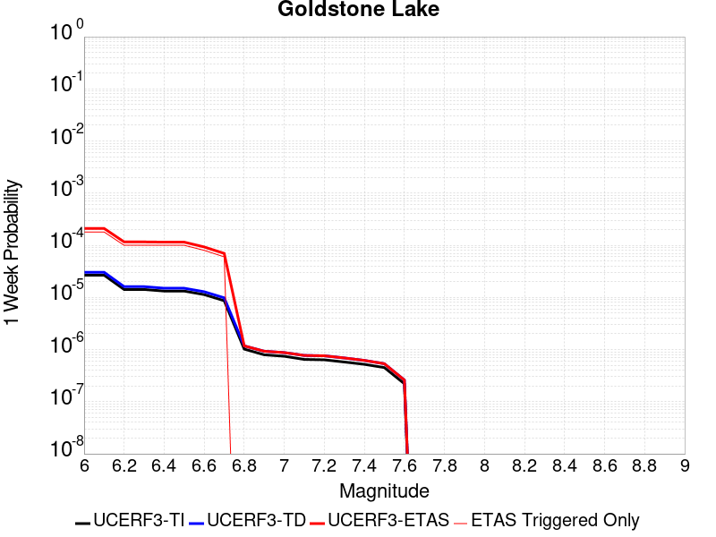 | 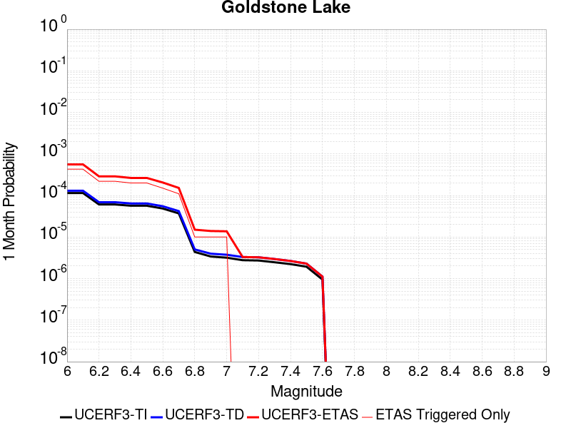 | 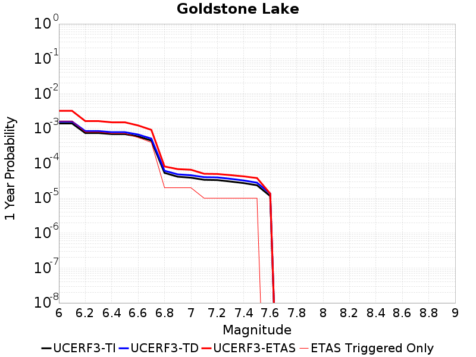 | 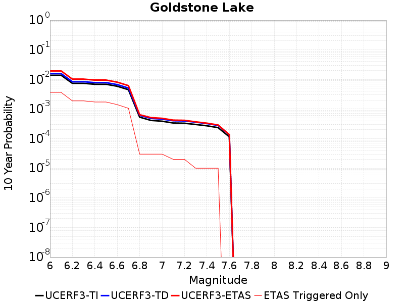 |

| Magnitude | 1 wk TI Prob | 1 wk TD Prob | 1 wk ETAS Prob | 1 wk ETAS/TD Gain | 1 wk ETAS Triggered Only | 1 mo TI Prob | 1 mo TD Prob | 1 mo ETAS Prob | 1 mo ETAS/TD Gain | 1 mo ETAS Triggered Only | 1 yr TI Prob | 1 yr TD Prob | 1 yr ETAS Prob | 1 yr ETAS/TD Gain | 1 yr ETAS Triggered Only | 10 yr TI Prob | 10 yr TD Prob | 10 yr ETAS Prob | 10 yr ETAS/TD Gain | 10 yr ETAS Triggered Only |
|-----|-----|-----|-----|-----|-----|-----|-----|-----|-----|-----|-----|-----|-----|-----|-----|-----|-----|-----|-----|-----|
| 6.0 | 2.671352E-5 | 3.0376543E-5 | 2.1037107E-4 | 6.9254446 | 1.8E-4 | 1.1448149E-4 | 1.301798E-4 | 5.601238E-4 | 4.302694 | 4.3E-4 | 0.001392921 | 0.0015839831 | 0.0032014172 | 2.0211182 | 0.00162 | 0.013842222 | 0.01574643 | 0.019329112 | 1.2275236 | 0.00364 |
| 6.1 | 2.671352E-5 | 3.0376543E-5 | 2.1037107E-4 | 6.9254446 | 1.8E-4 | 1.1448149E-4 | 1.301798E-4 | 5.601238E-4 | 4.302694 | 4.3E-4 | 0.001392921 | 0.0015839831 | 0.0032014172 | 2.0211182 | 0.00162 | 0.013842222 | 0.01574643 | 0.019329112 | 1.2275236 | 0.00364 |
| 6.2 | 1.4197047E-5 | 1.6096474E-5 | 1.1609487E-4 | 7.212441 | 1.0E-4 | 6.0843064E-5 | 6.8983616E-5 | 2.8896844E-4 | 4.188943 | 2.2E-4 | 7.4051257E-4 | 8.396506E-4 | 0.0016289873 | 1.9400777 | 7.9E-4 | 0.007380498 | 0.008374478 | 0.01024865 | 1.2237958 | 0.00189 |
| 6.3 | 1.4197047E-5 | 1.6096474E-5 | 1.1609487E-4 | 7.212441 | 1.0E-4 | 6.0843064E-5 | 6.8983616E-5 | 2.8896844E-4 | 4.188943 | 2.2E-4 | 7.4051257E-4 | 8.396506E-4 | 0.0016289873 | 1.9400777 | 7.9E-4 | 0.007380498 | 0.008374478 | 0.01024865 | 1.2237958 | 0.00189 |
| 6.4 | 1.3238931E-5 | 1.5008672E-5 | 1.1500717E-4 | 7.662715 | 1.0E-4 | 5.6737044E-5 | 6.4321845E-5 | 2.6430897E-4 | 4.1091638 | 2.0E-4 | 6.9055456E-4 | 7.829351E-4 | 0.0015023714 | 1.9188964 | 7.2E-4 | 0.006884126 | 0.0078113936 | 0.00952788 | 1.2197413 | 0.00173 |
| 6.5 | 1.3238931E-5 | 1.5008672E-5 | 1.1500717E-4 | 7.662715 | 1.0E-4 | 5.6737044E-5 | 6.4321845E-5 | 2.6430897E-4 | 4.1091638 | 2.0E-4 | 6.9055456E-4 | 7.829351E-4 | 0.0015023714 | 1.9188964 | 7.2E-4 | 0.006884126 | 0.0078113936 | 0.00952788 | 1.2197413 | 0.00173 |
| 6.6 | 1.1328278E-5 | 1.2855347E-5 | 9.2854316E-5 | 7.2230115 | 8.0E-5 | 4.8548856E-5 | 5.5093722E-5 | 2.0508545E-4 | 3.7224834 | 1.5E-4 | 5.90922E-4 | 6.706553E-4 | 0.0012202865 | 1.8195434 | 5.5E-4 | 0.0058935313 | 0.006695703 | 0.008096262 | 1.2091728 | 0.00141 |
| 6.7 | 8.651175E-6 | 9.824701E-6 | 6.982411E-5 | 7.106996 | 6.0E-5 | 3.707594E-5 | 4.2105694E-5 | 1.5210106E-4 | 3.6123633 | 1.1E-4 | 4.5130608E-4 | 5.1260676E-4 | 9.124017E-4 | 1.7799252 | 4.0E-4 | 0.0045039062 | 0.0051231226 | 0.0061776917 | 1.2058451 | 0.00106 |
| 6.8 | 1.0215377E-6 | 1.1754778E-6 | 1.1754778E-6 | 1.0 | 0.0 | 4.378012E-6 | 5.037753E-6 | 1.5037703E-5 | 2.985002 | 1.0E-5 | 5.3300988E-5 | 6.1333034E-5 | 8.1331804E-5 | 1.3260685 | 2.0E-5 | 5.3288206E-4 | 6.131723E-4 | 6.431539E-4 | 1.0488958 | 3.0E-5 |
| 6.9 | 7.9360774E-7 | 9.283449E-7 | 9.283449E-7 | 1.0 | 0.0 | 3.4011714E-6 | 3.9786155E-6 | 1.3978575E-5 | 3.5134273 | 1.0E-5 | 4.1408475E-5 | 4.8438636E-5 | 6.8437665E-5 | 1.4128735 | 2.0E-5 | 4.140076E-4 | 4.8428777E-4 | 5.1427324E-4 | 1.0619166 | 3.0E-5 |
| 7.0 | 7.4382757E-7 | 8.747376E-7 | 8.747376E-7 | 1.0 | 0.0 | 3.1878285E-6 | 3.7488705E-6 | 1.3748833E-5 | 3.66746 | 1.0E-5 | 3.8811122E-5 | 4.5641613E-5 | 6.56407E-5 | 1.4381766 | 2.0E-5 | 3.8804344E-4 | 4.5632903E-4 | 4.8631532E-4 | 1.0657121 | 3.0E-5 |
| 7.1 | 6.4709513E-7 | 7.7113395E-7 | 7.7113395E-7 | 1.0 | 0.0 | 2.773262E-6 | 3.304856E-6 | 3.304856E-6 | 1.0 | 0.0 | 3.376394E-5 | 4.023594E-5 | 5.0235536E-5 | 1.2485241 | 1.0E-5 | 3.375881E-4 | 4.022925E-4 | 4.2228444E-4 | 1.049695 | 2.0E-5 |
| 7.2 | 6.356704E-7 | 7.588398E-7 | 7.588398E-7 | 1.0 | 0.0 | 2.7242988E-6 | 3.2521668E-6 | 3.2521668E-6 | 1.0 | 0.0 | 3.3167835E-5 | 3.9594473E-5 | 4.9594077E-5 | 1.2525505 | 1.0E-5 | 3.3162883E-4 | 3.9588014E-4 | 4.158722E-4 | 1.0505004 | 2.0E-5 |
| 7.3 | 5.7695723E-7 | 6.896601E-7 | 6.896601E-7 | 1.0 | 0.0 | 2.4726714E-6 | 2.9556832E-6 | 2.9556832E-6 | 1.0 | 0.0 | 3.0104358E-5 | 3.5984907E-5 | 4.5984547E-5 | 1.2778842 | 1.0E-5 | 3.0100282E-4 | 3.597965E-4 | 3.6979292E-4 | 1.0277835 | 1.0E-5 |
| 7.4 | 5.209647E-7 | 6.193544E-7 | 6.193544E-7 | 1.0 | 0.0 | 2.232704E-6 | 2.6543735E-6 | 2.6543735E-6 | 1.0 | 0.0 | 2.718283E-5 | 3.2316577E-5 | 4.2316253E-5 | 1.3094287 | 1.0E-5 | 2.7179506E-4 | 3.2312432E-4 | 3.3312108E-4 | 1.0309378 | 1.0E-5 |
| 7.5 | 4.512955E-7 | 5.34891E-7 | 5.34891E-7 | 1.0 | 0.0 | 1.934122E-6 | 2.2923882E-6 | 2.2923882E-6 | 1.0 | 0.0 | 2.3547682E-5 | 2.7909522E-5 | 3.7909245E-5 | 1.3582907 | 1.0E-5 | 2.3545188E-4 | 2.7906548E-4 | 2.8906268E-4 | 1.035824 | 1.0E-5 |
| 7.6 | 2.21172E-7 | 2.6039717E-7 | 2.6039717E-7 | 1.0 | 0.0 | 9.478797E-7 | 1.1159875E-6 | 1.1159875E-6 | 1.0 | 0.0 | 1.1540374E-5 | 1.3587092E-5 | 1.3587092E-5 | 1.0 | 0.0 | 1.1539775E-4 | 1.3586543E-4 | 1.3586543E-4 | 1.0 | 0.0 |

## So Sierra Nevada
*[(top)](#table-of-contents)*

| 1 Week | 1 Month | 1 Year | 10 Year |
|-----|-----|-----|-----|
| 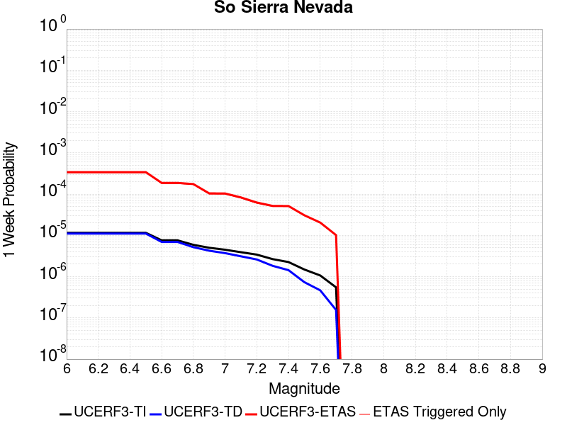 | 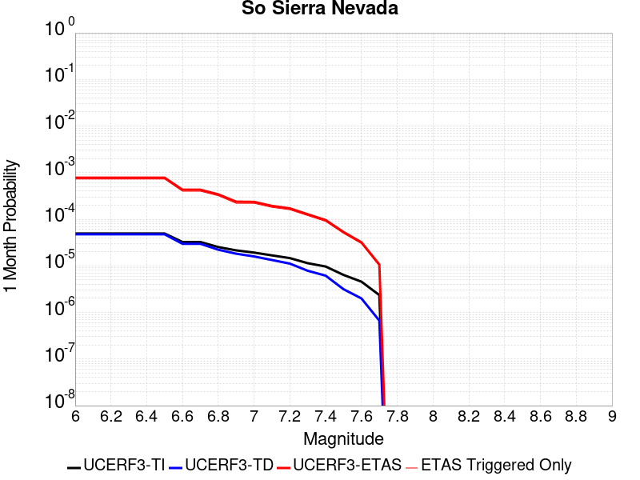 | 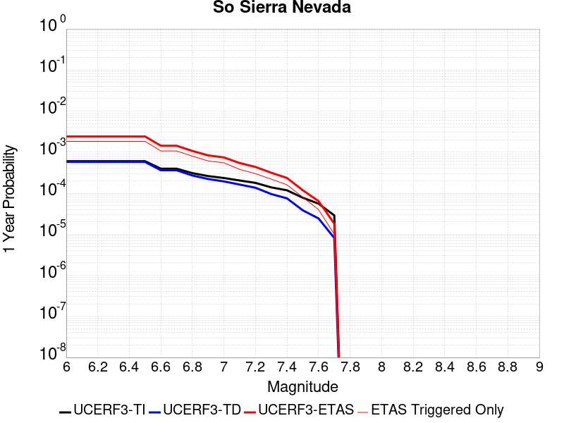 |  |

| Magnitude | 1 wk TI Prob | 1 wk TD Prob | 1 wk ETAS Prob | 1 wk ETAS/TD Gain | 1 wk ETAS Triggered Only | 1 mo TI Prob | 1 mo TD Prob | 1 mo ETAS Prob | 1 mo ETAS/TD Gain | 1 mo ETAS Triggered Only | 1 yr TI Prob | 1 yr TD Prob | 1 yr ETAS Prob | 1 yr ETAS/TD Gain | 1 yr ETAS Triggered Only | 10 yr TI Prob | 10 yr TD Prob | 10 yr ETAS Prob | 10 yr ETAS/TD Gain | 10 yr ETAS Triggered Only |
|-----|-----|-----|-----|-----|-----|-----|-----|-----|-----|-----|-----|-----|-----|-----|-----|-----|-----|-----|-----|-----|
| 6.0 | 1.15488665E-5 | 1.1079709E-5 | 3.4107605E-4 | 30.783846 | 3.3E-4 | 4.9494203E-5 | 4.7483674E-5 | 7.77449E-4 | 16.372974 | 7.3E-4 | 6.024253E-4 | 5.7797314E-4 | 0.0024069154 | 4.1644073 | 0.00183 | 0.006007948 | 0.0057659685 | 0.009186134 | 1.593164 | 0.00344 |
| 6.1 | 1.15488665E-5 | 1.1079709E-5 | 3.4107605E-4 | 30.783846 | 3.3E-4 | 4.9494203E-5 | 4.7483674E-5 | 7.77449E-4 | 16.372974 | 7.3E-4 | 6.024253E-4 | 5.7797314E-4 | 0.0024069154 | 4.1644073 | 0.00183 | 0.006007948 | 0.0057659685 | 0.009186134 | 1.593164 | 0.00344 |
| 6.2 | 1.15488665E-5 | 1.1079709E-5 | 3.4107605E-4 | 30.783846 | 3.3E-4 | 4.9494203E-5 | 4.7483674E-5 | 7.77449E-4 | 16.372974 | 7.3E-4 | 6.024253E-4 | 5.7797314E-4 | 0.0024069154 | 4.1644073 | 0.00183 | 0.006007948 | 0.0057659685 | 0.009186134 | 1.593164 | 0.00344 |
| 6.3 | 1.15488665E-5 | 1.1079709E-5 | 3.4107605E-4 | 30.783846 | 3.3E-4 | 4.9494203E-5 | 4.7483674E-5 | 7.77449E-4 | 16.372974 | 7.3E-4 | 6.024253E-4 | 5.7797314E-4 | 0.0024069154 | 4.1644073 | 0.00183 | 0.006007948 | 0.0057659685 | 0.009186134 | 1.593164 | 0.00344 |
| 6.4 | 1.15488665E-5 | 1.1079709E-5 | 3.4107605E-4 | 30.783846 | 3.3E-4 | 4.9494203E-5 | 4.7483674E-5 | 7.77449E-4 | 16.372974 | 7.3E-4 | 6.024253E-4 | 5.7797314E-4 | 0.0024069154 | 4.1644073 | 0.00183 | 0.006007948 | 0.0057659685 | 0.009186134 | 1.593164 | 0.00344 |
| 6.5 | 1.15488665E-5 | 1.1079709E-5 | 3.4107605E-4 | 30.783846 | 3.3E-4 | 4.9494203E-5 | 4.7483674E-5 | 7.77449E-4 | 16.372974 | 7.3E-4 | 6.024253E-4 | 5.7797314E-4 | 0.0024069154 | 4.1644073 | 0.00183 | 0.006007948 | 0.0057659685 | 0.009186134 | 1.593164 | 0.00344 |
| 6.6 | 7.587044E-6 | 6.9356806E-6 | 1.8693443E-4 | 26.952572 | 1.8E-4 | 3.2515498E-5 | 2.9724022E-5 | 4.2971212E-4 | 14.456729 | 4.0E-4 | 3.9580427E-4 | 3.6183282E-4 | 0.0014314456 | 3.956097 | 0.00107 | 0.003951 | 0.0036127283 | 0.005605503 | 1.5515982 | 0.002 |
| 6.7 | 7.587044E-6 | 6.9356806E-6 | 1.8693443E-4 | 26.952572 | 1.8E-4 | 3.2515498E-5 | 2.9724022E-5 | 4.2971212E-4 | 14.456729 | 4.0E-4 | 3.9580427E-4 | 3.6183282E-4 | 0.0014314456 | 3.956097 | 0.00107 | 0.003951 | 0.0036127283 | 0.005605503 | 1.5515982 | 0.002 |
| 6.8 | 5.9026956E-6 | 5.1794295E-6 | 1.7517855E-4 | 33.821976 | 1.7E-4 | 2.5297022E-5 | 2.2197373E-5 | 3.4219027E-4 | 15.4158 | 3.2E-4 | 3.0794772E-4 | 2.7022068E-4 | 0.0010700045 | 3.9597433 | 8.0E-4 | 0.0030752132 | 0.002699037 | 0.0040852856 | 1.5136085 | 0.00139 |
| 6.9 | 5.0118915E-6 | 4.252458E-6 | 1.0425203E-4 | 24.51571 | 1.0E-4 | 2.1479358E-5 | 1.8224697E-5 | 2.3822069E-4 | 13.071311 | 2.2E-4 | 2.614798E-4 | 2.2186383E-4 | 8.317285E-4 | 3.7488244 | 6.1E-4 | 0.0026117235 | 0.0022164958 | 0.0032841242 | 1.481674 | 0.00107 |
| 7.0 | 4.4924795E-6 | 3.7139482E-6 | 1.0371357E-4 | 27.925425 | 1.0E-4 | 1.925334E-5 | 1.5916827E-5 | 2.3591332E-4 | 14.8216305 | 2.2E-4 | 2.3438422E-4 | 1.9377077E-4 | 7.436642E-4 | 3.8378553 | 5.5E-4 | 0.0023413717 | 0.0019360811 | 0.0029241643 | 1.5103523 | 9.9E-4 |
| 7.1 | 3.9118436E-6 | 3.1120055E-6 | 8.311176E-5 | 26.706816 | 8.0E-5 | 1.6764936E-5 | 1.3337101E-5 | 1.933347E-4 | 14.496006 | 1.8E-4 | 2.0409399E-4 | 1.6236768E-4 | 5.42306E-4 | 3.3399873 | 3.8E-4 | 0.0020390663 | 0.0016225465 | 0.0023613458 | 1.4553332 | 7.4E-4 |
| 7.2 | 3.4200818E-6 | 2.60548E-6 | 6.260532E-5 | 24.028326 | 6.0E-5 | 1.4657411E-5 | 1.1166298E-5 | 1.7116452E-4 | 15.328671 | 1.6E-4 | 1.7843937E-4 | 1.359417E-4 | 4.359009E-4 | 3.2065284 | 3.0E-4 | 0.0017829615 | 0.0013586351 | 0.0019478336 | 1.4336693 | 5.9E-4 |
| 7.3 | 2.6593618E-6 | 1.8284427E-6 | 5.1828352E-5 | 28.345625 | 5.0E-5 | 1.13972155E-5 | 7.836161E-6 | 1.2783521E-4 | 16.313501 | 1.2E-4 | 1.3875226E-4 | 9.5401374E-5 | 3.153804E-4 | 3.3058264 | 2.2E-4 | 0.0013866565 | 9.5363316E-4 | 0.0013232803 | 1.3876199 | 3.7E-4 |
| 7.4 | 2.2577992E-6 | 1.4364584E-6 | 5.1436386E-5 | 35.807777 | 5.0E-5 | 9.676246E-6 | 6.1562373E-6 | 9.615568E-5 | 15.619229 | 9.0E-5 | 1.1780193E-4 | 7.4949865E-5 | 2.3493788E-4 | 3.1346004 | 1.6E-4 | 0.001177395 | 7.4927096E-4 | 9.990836E-4 | 1.3334076 | 2.5E-4 |
| 7.5 | 1.489319E-6 | 7.354096E-7 | 3.0735388E-5 | 41.79356 | 3.0E-5 | 6.3827797E-6 | 3.1517518E-6 | 5.3151594E-5 | 16.864143 | 5.0E-5 | 7.770758E-5 | 3.837191E-5 | 1.1836884E-4 | 3.0847785 | 8.0E-5 | 7.7680405E-4 | 3.8365324E-4 | 5.036072E-4 | 1.3126625 | 1.2E-4 |
| 7.6 | 1.0680322E-6 | 4.659774E-7 | 2.0465968E-5 | 43.920517 | 2.0E-5 | 4.577273E-6 | 1.9970446E-6 | 3.1996984E-5 | 16.02217 | 3.0E-5 | 5.5726876E-5 | 2.4313747E-5 | 6.431278E-5 | 2.6451197 | 4.0E-5 | 5.5712904E-4 | 2.4311115E-4 | 2.93099E-4 | 1.2056172 | 5.0E-5 |
| 7.7 | 5.509146E-7 | 1.5581088E-7 | 1.0155809E-5 | 65.18036 | 1.0E-5 | 2.3610605E-6 | 6.6776073E-7 | 1.0667754E-5 | 15.975413 | 1.0E-5 | 2.8745531E-5 | 8.129958E-6 | 1.8129876E-5 | 2.2300086 | 1.0E-5 | 2.8741814E-4 | 8.129672E-5 | 9.129591E-5 | 1.1229962 | 1.0E-5 |

## Coyote Canyon
*[(top)](#table-of-contents)*

| 1 Week | 1 Month | 1 Year | 10 Year |
|-----|-----|-----|-----|
| 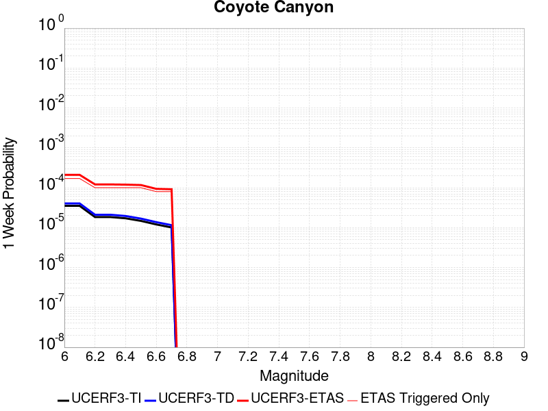 | 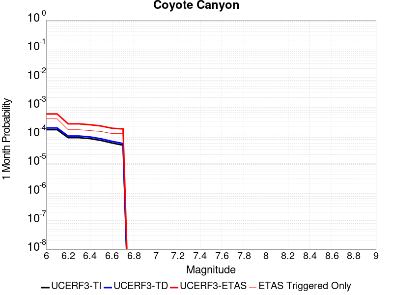 | 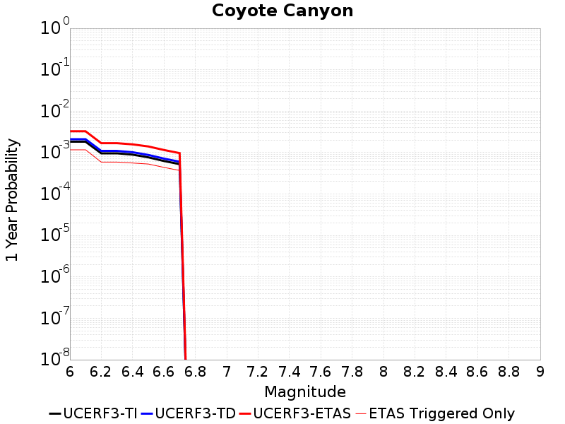 | 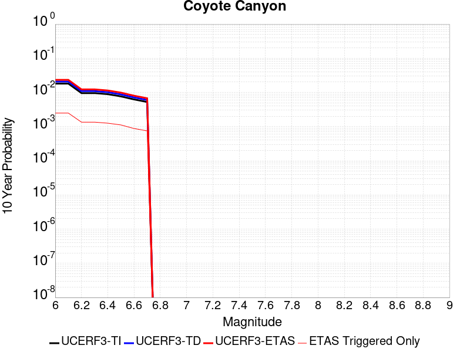 |

| Magnitude | 1 wk TI Prob | 1 wk TD Prob | 1 wk ETAS Prob | 1 wk ETAS/TD Gain | 1 wk ETAS Triggered Only | 1 mo TI Prob | 1 mo TD Prob | 1 mo ETAS Prob | 1 mo ETAS/TD Gain | 1 mo ETAS Triggered Only | 1 yr TI Prob | 1 yr TD Prob | 1 yr ETAS Prob | 1 yr ETAS/TD Gain | 1 yr ETAS Triggered Only | 10 yr TI Prob | 10 yr TD Prob | 10 yr ETAS Prob | 10 yr ETAS/TD Gain | 10 yr ETAS Triggered Only |
|-----|-----|-----|-----|-----|-----|-----|-----|-----|-----|-----|-----|-----|-----|-----|-----|-----|-----|-----|-----|-----|
| 6.0 | 3.5090034E-5 | 4.0365005E-5 | 2.1035814E-4 | 5.211399 | 1.7E-4 | 1.503772E-4 | 1.7298285E-4 | 5.329206E-4 | 3.0807712 | 3.6E-4 | 0.0018293047 | 0.0021042882 | 0.003271826 | 1.5548375 | 0.00117 | 0.018143194 | 0.02086955 | 0.023307584 | 1.1168226 | 0.00249 |
| 6.1 | 3.5090034E-5 | 4.0365005E-5 | 2.1035814E-4 | 5.211399 | 1.7E-4 | 1.503772E-4 | 1.7298285E-4 | 5.329206E-4 | 3.0807712 | 3.6E-4 | 0.0018293047 | 0.0021042882 | 0.003271826 | 1.5548375 | 0.00117 | 0.018143194 | 0.02086955 | 0.023307584 | 1.1168226 | 0.00249 |
| 6.2 | 1.841879E-5 | 2.1060132E-5 | 1.2105802E-4 | 5.7482085 | 1.0E-4 | 7.8935285E-5 | 9.025516E-5 | 2.4024161E-4 | 2.661805 | 1.5E-4 | 9.606133E-4 | 0.0010984045 | 0.0016877565 | 1.5365527 | 5.9E-4 | 0.0095647145 | 0.010939842 | 0.012275073 | 1.1220522 | 0.00135 |
| 6.3 | 1.841879E-5 | 2.1060132E-5 | 1.2105802E-4 | 5.7482085 | 1.0E-4 | 7.8935285E-5 | 9.025516E-5 | 2.4024161E-4 | 2.661805 | 1.5E-4 | 9.606133E-4 | 0.0010984045 | 0.0016877565 | 1.5365527 | 5.9E-4 | 0.0095647145 | 0.010939842 | 0.012275073 | 1.1220522 | 0.00135 |
| 6.4 | 1.712201E-5 | 1.9565525E-5 | 1.1956357E-4 | 6.110931 | 1.0E-4 | 7.337798E-5 | 8.3850115E-5 | 2.2383837E-4 | 2.6695058 | 1.4E-4 | 8.930107E-4 | 0.0010204976 | 0.0015799261 | 1.5481919 | 5.6E-4 | 0.008894307 | 0.010168032 | 0.011415221 | 1.1226578 | 0.00126 |
| 6.5 | 1.4744935E-5 | 1.6837239E-5 | 1.1683555E-4 | 6.939116 | 1.0E-4 | 6.3191044E-5 | 7.2158124E-5 | 2.0214875E-4 | 2.8014688 | 1.3E-4 | 7.6907943E-4 | 8.782646E-4 | 0.0014077991 | 1.6029328 | 5.3E-4 | 0.007664232 | 0.008757133 | 0.0098673245 | 1.1267757 | 0.00112 |
| 6.6 | 1.2017839E-5 | 1.3724307E-5 | 9.372321E-5 | 6.828994 | 8.0E-5 | 5.150401E-5 | 5.8817634E-5 | 1.6881117E-4 | 2.8700774 | 1.1E-4 | 6.268809E-4 | 7.1595795E-4 | 0.0011556429 | 1.6141212 | 4.4E-4 | 0.0062511545 | 0.007145207 | 0.008018919 | 1.1222795 | 8.8E-4 |
| 6.7 | 1.00956095E-5 | 1.1533701E-5 | 9.153278E-5 | 7.9361153 | 8.0E-5 | 4.326618E-5 | 4.94297E-5 | 1.5942426E-4 | 3.225273 | 1.1E-4 | 5.266384E-4 | 6.017274E-4 | 9.715047E-4 | 1.6145264 | 3.7E-4 | 0.005253921 | 0.006009508 | 0.006755001 | 1.1240523 | 7.5E-4 |

## Death Valley (So)
*[(top)](#table-of-contents)*

| 1 Week | 1 Month | 1 Year | 10 Year |
|-----|-----|-----|-----|
| 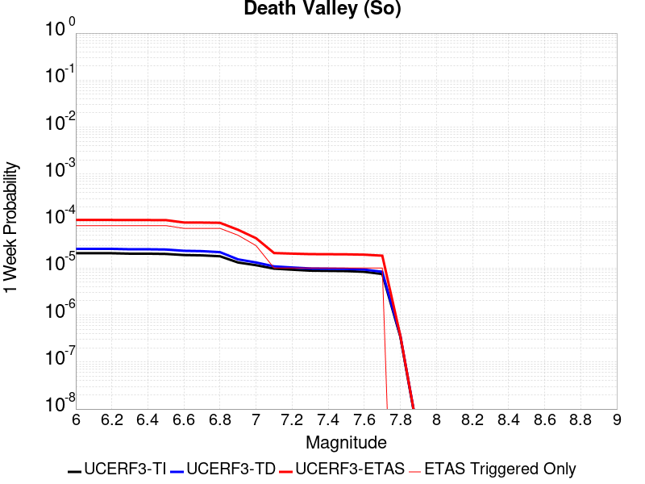 | 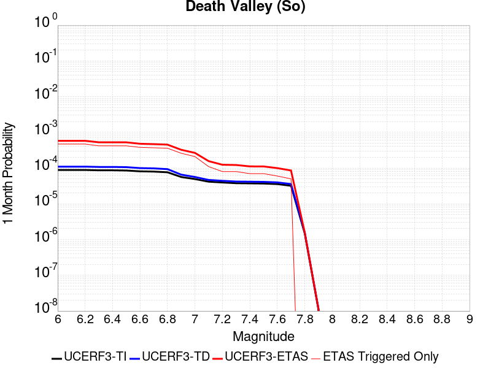 | 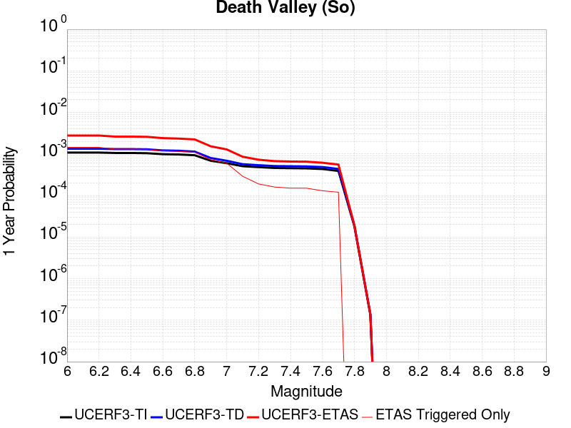 | 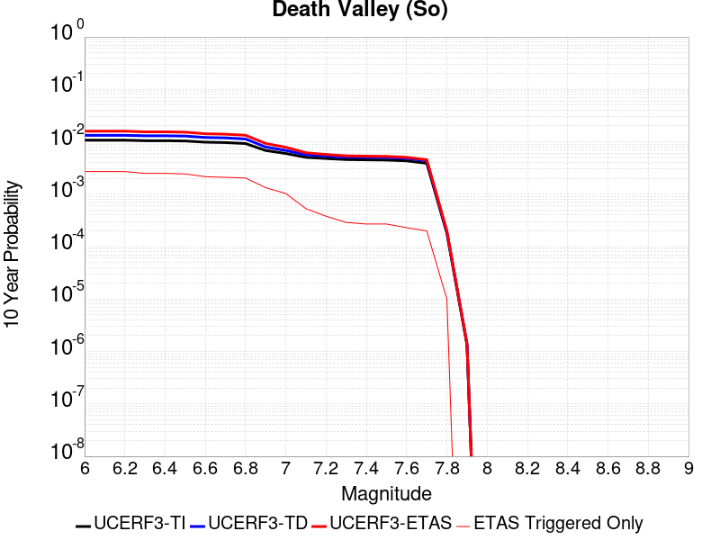 |

| Magnitude | 1 wk TI Prob | 1 wk TD Prob | 1 wk ETAS Prob | 1 wk ETAS/TD Gain | 1 wk ETAS Triggered Only | 1 mo TI Prob | 1 mo TD Prob | 1 mo ETAS Prob | 1 mo ETAS/TD Gain | 1 mo ETAS Triggered Only | 1 yr TI Prob | 1 yr TD Prob | 1 yr ETAS Prob | 1 yr ETAS/TD Gain | 1 yr ETAS Triggered Only | 10 yr TI Prob | 10 yr TD Prob | 10 yr ETAS Prob | 10 yr ETAS/TD Gain | 10 yr ETAS Triggered Only |
|-----|-----|-----|-----|-----|-----|-----|-----|-----|-----|-----|-----|-----|-----|-----|-----|-----|-----|-----|-----|-----|
| 6.0 | 2.0684236E-5 | 2.5618321E-5 | 1.0561627E-4 | 4.122685 | 8.0E-5 | 8.864371E-5 | 1.0978828E-4 | 5.7973666E-4 | 5.280497 | 4.7E-4 | 0.0010787029 | 0.0013358695 | 0.002773946 | 2.0765095 | 0.00144 | 0.010734817 | 0.013281677 | 0.015945816 | 1.2005876 | 0.0027 |
| 6.1 | 2.0684236E-5 | 2.5618321E-5 | 1.0561627E-4 | 4.122685 | 8.0E-5 | 8.864371E-5 | 1.0978828E-4 | 5.7973666E-4 | 5.280497 | 4.7E-4 | 0.0010787029 | 0.0013358695 | 0.002773946 | 2.0765095 | 0.00144 | 0.010734817 | 0.013281677 | 0.015945816 | 1.2005876 | 0.0027 |
| 6.2 | 2.0684236E-5 | 2.5618321E-5 | 1.0561627E-4 | 4.122685 | 8.0E-5 | 8.864371E-5 | 1.0978828E-4 | 5.7973666E-4 | 5.280497 | 4.7E-4 | 0.0010787029 | 0.0013358695 | 0.002773946 | 2.0765095 | 0.00144 | 0.010734817 | 0.013281677 | 0.015945816 | 1.2005876 | 0.0027 |
| 6.3 | 2.0240292E-5 | 2.51184E-5 | 1.05116385E-4 | 4.1848364 | 8.0E-5 | 8.6741224E-5 | 1.0764593E-4 | 5.276007E-4 | 4.9012604 | 4.2E-4 | 0.0010555626 | 0.001309818 | 0.0026181021 | 1.9988289 | 0.00131 | 0.010505628 | 0.013024232 | 0.015491672 | 1.1894499 | 0.0025 |
| 6.4 | 2.0240292E-5 | 2.51184E-5 | 1.05116385E-4 | 4.1848364 | 8.0E-5 | 8.6741224E-5 | 1.0764593E-4 | 5.276007E-4 | 4.9012604 | 4.2E-4 | 0.0010555626 | 0.001309818 | 0.0026181021 | 1.9988289 | 0.00131 | 0.010505628 | 0.013024232 | 0.015491672 | 1.1894499 | 0.0025 |
| 6.5 | 1.9962767E-5 | 2.4807647E-5 | 1.04805666E-4 | 4.224732 | 8.0E-5 | 8.55519E-5 | 1.0631425E-4 | 5.262696E-4 | 4.9501324 | 4.2E-4 | 0.0010410968 | 0.0012936242 | 0.0025819554 | 1.9959085 | 0.00129 | 0.010362327 | 0.012864177 | 0.015272789 | 1.187234 | 0.00244 |
| 6.6 | 1.8937297E-5 | 2.3311473E-5 | 9.330984E-5 | 4.0027432 | 7.0E-5 | 8.115732E-5 | 9.990257E-5 | 4.798646E-4 | 4.8033257 | 3.8E-4 | 9.876423E-4 | 0.0012156497 | 0.0024042032 | 1.9777104 | 0.00119 | 0.009832645 | 0.01209305 | 0.014226929 | 1.176455 | 0.00216 |
| 6.7 | 1.8621096E-5 | 2.291211E-5 | 9.291051E-5 | 4.055083 | 7.0E-5 | 7.980225E-5 | 9.819114E-5 | 4.6815482E-4 | 4.767791 | 3.7E-4 | 9.711593E-4 | 0.0011948361 | 0.002343462 | 1.9613252 | 0.00115 | 0.009669261 | 0.011887163 | 0.0139622 | 1.1745611 | 0.0021 |
| 6.8 | 1.7830353E-5 | 2.180616E-5 | 9.1804635E-5 | 4.210032 | 7.0E-5 | 7.641356E-5 | 9.34517E-5 | 4.5341806E-4 | 4.8518972 | 3.6E-4 | 9.29938E-4 | 0.0011371947 | 0.0022359437 | 1.9661926 | 0.0011 | 0.009260561 | 0.011316597 | 0.013333512 | 1.1782262 | 0.00204 |
| 6.9 | 1.3135183E-5 | 1.5304191E-5 | 6.530343E-5 | 4.267029 | 5.0E-5 | 5.6292425E-5 | 6.558778E-5 | 3.2557073E-4 | 4.963893 | 2.6E-4 | 6.8514474E-4 | 7.9824514E-4 | 0.0015276624 | 1.913776 | 7.3E-4 | 0.006830362 | 0.0079547865 | 0.009274207 | 1.165865 | 0.00133 |
| 7.0 | 1.1507512E-5 | 1.3154406E-5 | 4.315401E-5 | 3.2805748 | 3.0E-5 | 4.9316975E-5 | 5.637484E-5 | 2.66363E-4 | 4.724856 | 2.1E-4 | 6.002687E-4 | 6.861533E-4 | 0.0012857416 | 1.8738402 | 6.0E-4 | 0.0059864987 | 0.0068410486 | 0.007864002 | 1.1495317 | 0.00103 |
| 7.1 | 9.715903E-6 | 1.0865427E-5 | 2.0865318E-5 | 1.9203404 | 1.0E-5 | 4.1638916E-5 | 4.6565307E-5 | 1.5656019E-4 | 3.3621638 | 1.1E-4 | 5.068359E-4 | 5.6678936E-4 | 8.5662503E-4 | 1.5113639 | 2.9E-4 | 0.0050568148 | 0.0056538917 | 0.006180895 | 1.0932107 | 5.3E-4 |
| 7.2 | 9.233269E-6 | 1.0286448E-5 | 2.0286345E-5 | 1.9721429 | 1.0E-5 | 3.9570554E-5 | 4.4084052E-5 | 1.2408053E-4 | 2.814635 | 8.0E-5 | 4.81665E-4 | 5.365954E-4 | 7.264934E-4 | 1.3538942 | 1.9E-4 | 0.0048062233 | 0.005353429 | 0.0057313945 | 1.0706025 | 3.8E-4 |
| 7.3 | 8.8041315E-6 | 9.80829E-6 | 1.980819E-5 | 2.0195358 | 1.0E-5 | 3.7731446E-5 | 4.2034873E-5 | 1.2203151E-4 | 2.9031017 | 8.0E-5 | 4.592835E-4 | 5.116586E-4 | 6.7157677E-4 | 1.3125485 | 1.6E-4 | 0.0045833546 | 0.0051052324 | 0.005393752 | 1.0565145 | 2.9E-4 |
| 7.4 | 8.708749E-6 | 9.7073E-6 | 1.9707202E-5 | 2.0301425 | 1.0E-5 | 3.7322676E-5 | 4.1602074E-5 | 1.1159916E-4 | 2.6825385 | 7.0E-5 | 4.5430884E-4 | 5.0639175E-4 | 6.5631577E-4 | 1.2960633 | 1.5E-4 | 0.004533812 | 0.0050528045 | 0.0053214403 | 1.0531657 | 2.7E-4 |
| 7.5 | 8.612678E-6 | 9.604942E-6 | 1.9604846E-5 | 2.0411208 | 1.0E-5 | 3.6910955E-5 | 4.116341E-5 | 1.1116053E-4 | 2.7004695 | 7.0E-5 | 4.492982E-4 | 5.0105347E-4 | 6.509783E-4 | 1.2992193 | 1.5E-4 | 0.004483909 | 0.004999663 | 0.0052683135 | 1.0537336 | 2.7E-4 |
| 7.6 | 8.319024E-6 | 9.284037E-6 | 1.9283945E-5 | 2.0771077 | 1.0E-5 | 3.5652476E-5 | 3.978815E-5 | 9.9785764E-5 | 2.5079267 | 6.0E-5 | 4.3398244E-4 | 4.8431722E-4 | 6.1425427E-4 | 1.2682891 | 1.3E-4 | 0.0043313587 | 0.004833041 | 0.0050619296 | 1.0473591 | 2.3E-4 |
| 7.7 | 7.4718328E-6 | 8.34528E-6 | 1.8345196E-5 | 2.1982722 | 1.0E-5 | 3.2021748E-5 | 3.5765017E-5 | 8.5763226E-5 | 2.3979642 | 5.0E-5 | 3.8979502E-4 | 4.353561E-4 | 5.553039E-4 | 1.2755164 | 1.2E-4 | 0.00389112 | 0.0043454375 | 0.0045445682 | 1.0458252 | 2.0E-4 |
| 7.8 | 3.4586725E-7 | 3.648284E-7 | 3.648284E-7 | 1.0 | 0.0 | 1.4822873E-6 | 1.5635493E-6 | 1.5635493E-6 | 1.0 | 0.0 | 1.80467E-5 | 1.9036052E-5 | 1.9036052E-5 | 1.0 | 0.0 | 1.8045233E-4 | 1.9034464E-4 | 2.0034274E-4 | 1.0525262 | 1.0E-5 |
| 7.9 | 2.5591178E-9 | 2.6696847E-9 | 2.6696847E-9 | 1.0 | 0.0 | 1.0967647E-8 | 1.14415055E-8 | 1.14415055E-8 | 1.0 | 0.0 | 1.335311E-7 | 1.3930033E-7 | 1.3930033E-7 | 1.0 | 0.0 | 1.3353102E-6 | 1.3930033E-6 | 1.3930033E-6 | 1.0 | 0.0 |

## San Andreas (Mojave S)
*[(top)](#table-of-contents)*

| 1 Week | 1 Month | 1 Year | 10 Year |
|-----|-----|-----|-----|
| 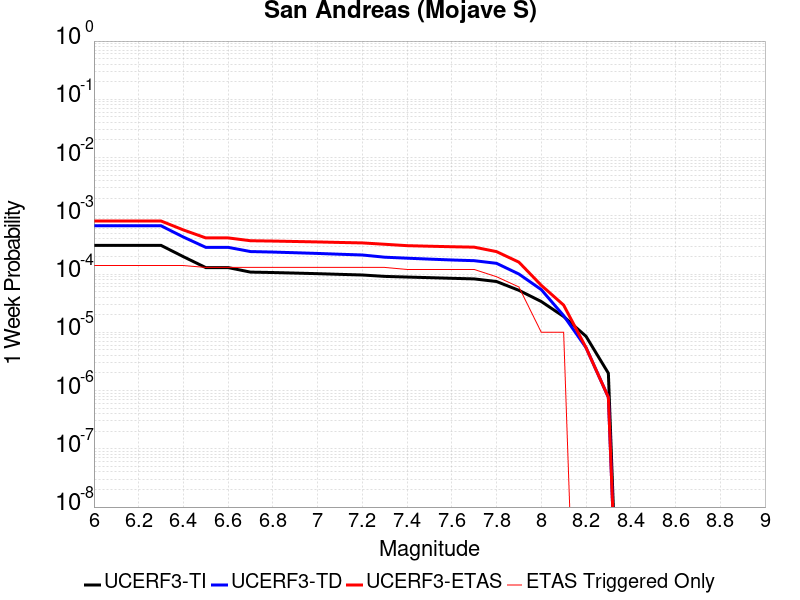 | 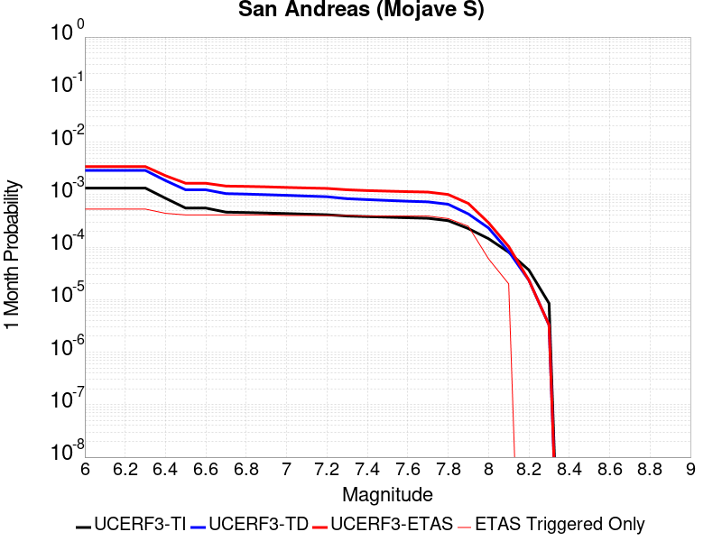 | 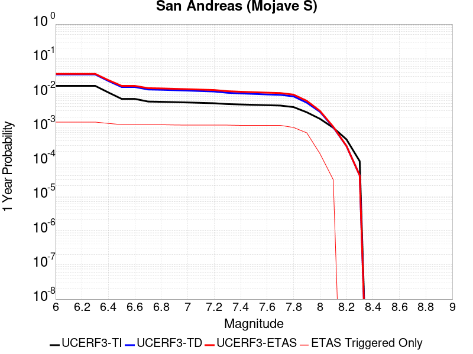 | 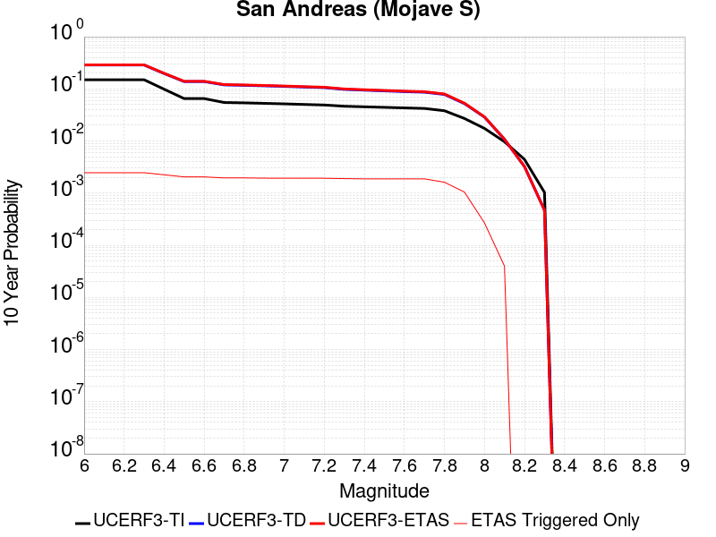 |

| Magnitude | 1 wk TI Prob | 1 wk TD Prob | 1 wk ETAS Prob | 1 wk ETAS/TD Gain | 1 wk ETAS Triggered Only | 1 mo TI Prob | 1 mo TD Prob | 1 mo ETAS Prob | 1 mo ETAS/TD Gain | 1 mo ETAS Triggered Only | 1 yr TI Prob | 1 yr TD Prob | 1 yr ETAS Prob | 1 yr ETAS/TD Gain | 1 yr ETAS Triggered Only | 10 yr TI Prob | 10 yr TD Prob | 10 yr ETAS Prob | 10 yr ETAS/TD Gain | 10 yr ETAS Triggered Only |
|-----|-----|-----|-----|-----|-----|-----|-----|-----|-----|-----|-----|-----|-----|-----|-----|-----|-----|-----|-----|-----|
| 6.0 | 3.1064058E-4 | 6.746892E-4 | 8.1459474E-4 | 1.2073629 | 1.4E-4 | 0.0013306376 | 0.0028884492 | 0.0034169185 | 1.1829594 | 5.3E-4 | 0.016080605 | 0.03462595 | 0.035996784 | 1.0395896 | 0.00142 | 0.1496549 | 0.28663182 | 0.28839386 | 1.0061474 | 0.00247 |
| 6.1 | 3.1064058E-4 | 6.746892E-4 | 8.1459474E-4 | 1.2073629 | 1.4E-4 | 0.0013306376 | 0.0028884492 | 0.0034169185 | 1.1829594 | 5.3E-4 | 0.016080605 | 0.03462595 | 0.035996784 | 1.0395896 | 0.00142 | 0.1496549 | 0.28663182 | 0.28839386 | 1.0061474 | 0.00247 |
| 6.2 | 3.1064058E-4 | 6.746892E-4 | 8.1459474E-4 | 1.2073629 | 1.4E-4 | 0.0013306376 | 0.0028884492 | 0.0034169185 | 1.1829594 | 5.3E-4 | 0.016080605 | 0.03462595 | 0.035996784 | 1.0395896 | 0.00142 | 0.1496549 | 0.28663182 | 0.28839386 | 1.0061474 | 0.00247 |
| 6.3 | 3.1064058E-4 | 6.746892E-4 | 8.1459474E-4 | 1.2073629 | 1.4E-4 | 0.0013306376 | 0.0028884492 | 0.0034169185 | 1.1829594 | 5.3E-4 | 0.016080605 | 0.03462595 | 0.035996784 | 1.0395896 | 0.00142 | 0.1496549 | 0.28663182 | 0.28839386 | 1.0061474 | 0.00247 |
| 6.4 | 1.9872203E-4 | 4.3187046E-4 | 5.7181E-4 | 1.3240312 | 1.4E-4 | 8.5138786E-4 | 0.0018495887 | 0.0022887748 | 1.2374507 | 4.4E-4 | 0.010316478 | 0.022292364 | 0.023563383 | 1.0570159 | 0.0013 | 0.098504856 | 0.19702691 | 0.1988336 | 1.0091698 | 0.00225 |
| 6.5 | 1.291105E-4 | 2.875996E-4 | 4.175622E-4 | 1.4518874 | 1.3E-4 | 5.5321335E-4 | 0.0012319902 | 0.0016414851 | 1.3323848 | 4.1E-4 | 0.006714592 | 0.014897148 | 0.016079271 | 1.0793524 | 0.0012 | 0.065152965 | 0.13806453 | 0.1398315 | 1.0127981 | 0.00205 |
| 6.6 | 1.291105E-4 | 2.875996E-4 | 4.175622E-4 | 1.4518874 | 1.3E-4 | 5.5321335E-4 | 0.0012319902 | 0.0016414851 | 1.3323848 | 4.1E-4 | 0.006714592 | 0.014897148 | 0.016079271 | 1.0793524 | 0.0012 | 0.065152965 | 0.13806453 | 0.1398315 | 1.0127981 | 0.00205 |
| 6.7 | 1.08001186E-4 | 2.4341064E-4 | 3.73379E-4 | 1.5339469 | 1.3E-4 | 4.6278012E-4 | 0.001042772 | 0.0014523445 | 1.3927728 | 4.1E-4 | 0.0056198016 | 0.012622144 | 0.013797124 | 1.0930887 | 0.00119 | 0.054797906 | 0.11920722 | 0.12093357 | 1.0144819 | 0.00196 |
| 6.8 | 1.0624356E-4 | 2.385871E-4 | 3.685561E-4 | 1.5447444 | 1.3E-4 | 4.5525006E-4 | 0.0010221159 | 0.0014316969 | 1.4007187 | 4.1E-4 | 0.0055285925 | 0.012373531 | 0.013548807 | 1.094983 | 0.00119 | 0.053930566 | 0.117156364 | 0.11888674 | 1.0147698 | 0.00196 |
| 6.9 | 1.0393785E-4 | 2.3229026E-4 | 3.6226006E-4 | 1.5595146 | 1.3E-4 | 4.4537184E-4 | 9.951503E-4 | 0.0014047422 | 1.4115881 | 4.1E-4 | 0.0054089287 | 0.012048896 | 0.013204799 | 1.0959343 | 0.00117 | 0.05279156 | 0.11445379 | 0.11617175 | 1.0150101 | 0.00194 |
| 7.0 | 1.0155622E-4 | 2.2598571E-4 | 3.5595632E-4 | 1.5751276 | 1.3E-4 | 4.3516833E-4 | 9.681511E-4 | 0.0013677638 | 1.4127587 | 4.0E-4 | 0.005285311 | 0.01172376 | 0.01287016 | 1.0977844 | 0.00116 | 0.05161361 | 0.111714154 | 0.11342855 | 1.0153463 | 0.00193 |
| 7.1 | 9.885595E-5 | 2.1886945E-4 | 3.48841E-4 | 1.5938314 | 1.3E-4 | 4.2359953E-4 | 9.3767507E-4 | 0.0013373 | 1.426187 | 4.0E-4 | 0.0051451353 | 0.011356635 | 0.012503462 | 1.1009829 | 0.00116 | 0.05027629 | 0.10859858 | 0.11031899 | 1.0158418 | 0.00193 |
| 7.2 | 9.6411415E-5 | 2.1249906E-4 | 3.4247144E-4 | 1.6116374 | 1.3E-4 | 4.1312634E-4 | 9.1039273E-4 | 0.0013100286 | 1.4389708 | 4.0E-4 | 0.005018219 | 0.011027882 | 0.01217509 | 1.1040279 | 0.00116 | 0.049064007 | 0.10578834 | 0.10751417 | 1.016314 | 0.00193 |
| 7.3 | 9.1180635E-5 | 1.9478094E-4 | 3.2475562E-4 | 1.6672864 | 1.3E-4 | 3.907156E-4 | 8.345085E-4 | 0.0012341747 | 1.478924 | 4.0E-4 | 0.004746591 | 0.010112922 | 0.01126119 | 1.1135447 | 0.00116 | 0.046464786 | 0.09798102 | 0.099694856 | 1.0174915 | 0.0019 |
| 7.4 | 8.887388E-5 | 1.8726634E-4 | 3.0724387E-4 | 1.6406785 | 1.2E-4 | 3.8083247E-4 | 8.023233E-4 | 0.0011920104 | 1.4856983 | 3.9E-4 | 0.0046267817 | 0.009724632 | 0.010853546 | 1.116088 | 0.00114 | 0.045316286 | 0.0946158 | 0.096317925 | 1.0179899 | 0.00188 |
| 7.5 | 8.6750515E-5 | 1.8058141E-4 | 3.0055974E-4 | 1.6644002 | 1.2E-4 | 3.7173493E-4 | 7.736909E-4 | 0.0011633891 | 1.5036873 | 3.9E-4 | 0.004516484 | 0.009379088 | 0.010508396 | 1.120407 | 0.00114 | 0.04425787 | 0.091579355 | 0.093287185 | 1.0186486 | 0.00188 |
| 7.6 | 8.453092E-5 | 1.744567E-4 | 2.9443577E-4 | 1.6877298 | 1.2E-4 | 3.6222505E-4 | 7.474574E-4 | 0.0011371658 | 1.5213789 | 3.9E-4 | 0.0044011753 | 0.009062396 | 0.0101920655 | 1.1246545 | 0.00114 | 0.04315024 | 0.08873817 | 0.090451345 | 1.019306 | 0.00188 |
| 7.7 | 8.259102E-5 | 1.6967738E-4 | 2.89657E-4 | 1.7071044 | 1.2E-4 | 3.539135E-4 | 7.2698615E-4 | 0.0011167027 | 1.5360714 | 3.9E-4 | 0.004300386 | 0.008815205 | 0.009945155 | 1.128182 | 0.00114 | 0.042181134 | 0.08648876 | 0.088206165 | 1.0198569 | 0.00188 |
| 7.8 | 7.444844E-5 | 1.5289443E-4 | 2.4288066E-4 | 1.5885515 | 9.0E-5 | 3.1902574E-4 | 6.550973E-4 | 0.0010048681 | 1.5339217 | 3.5E-4 | 0.0038772223 | 0.0079466915 | 0.008928824 | 1.1235901 | 9.9E-4 | 0.03810269 | 0.078317344 | 0.07981047 | 1.019065 | 0.00162 |
| 7.9 | 5.2586525E-5 | 1.0010477E-4 | 1.6009876E-4 | 1.5993121 | 6.0E-5 | 2.2535135E-4 | 4.2894992E-4 | 6.788427E-4 | 1.5825686 | 2.5E-4 | 0.0027402006 | 0.0052099708 | 0.005896376 | 1.1317483 | 6.9E-4 | 0.027066574 | 0.052218966 | 0.053214137 | 1.0190576 | 0.00105 |
| 8.0 | 3.379877E-5 | 5.4097534E-5 | 6.4096996E-5 | 1.1848413 | 1.0E-5 | 1.4484383E-4 | 2.3182598E-4 | 2.9181206E-4 | 1.2587548 | 6.0E-5 | 0.0017620471 | 0.0028188298 | 0.0029883508 | 1.0601387 | 1.7E-4 | 0.017481409 | 0.02884634 | 0.02910855 | 1.00909 | 2.7E-4 |
| 8.1 | 1.8668277E-5 | 1.932039E-5 | 2.9320197E-5 | 1.5175779 | 1.0E-5 | 8.000444E-5 | 8.2799044E-5 | 1.0279739E-4 | 1.2415286 | 2.0E-5 | 9.736188E-4 | 0.0010076128 | 0.0010375826 | 1.0297433 | 3.0E-5 | 0.009693642 | 0.010804634 | 0.010844202 | 1.0036621 | 4.0E-5 |
| 8.2 | 8.541571E-6 | 5.46501E-6 | 5.46501E-6 | 1.0 | 0.0 | 3.660622E-5 | 2.342126E-5 | 2.342126E-5 | 1.0 | 0.0 | 4.455896E-4 | 2.851166E-4 | 2.851166E-4 | 1.0 | 0.0 | 0.0044469717 | 0.0032430957 | 0.0032430957 | 1.0 | 0.0 |
| 8.3 | 1.983087E-6 | 7.666981E-7 | 7.666981E-7 | 1.0 | 0.0 | 8.498917E-6 | 3.285845E-6 | 3.285845E-6 | 1.0 | 0.0 | 1.034694E-4 | 4.0004445E-5 | 4.0004445E-5 | 1.0 | 0.0 | 0.0010342124 | 4.723745E-4 | 4.723745E-4 | 1.0 | 0.0 |

## San Andreas (Mojave N)
*[(top)](#table-of-contents)*

| 1 Week | 1 Month | 1 Year | 10 Year |
|-----|-----|-----|-----|
| 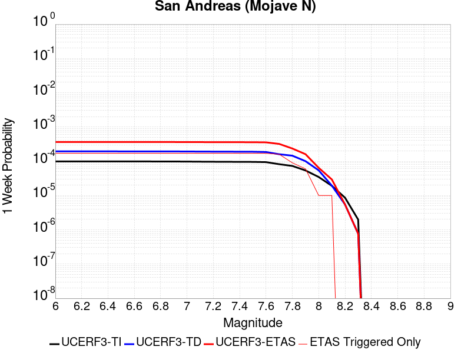 | 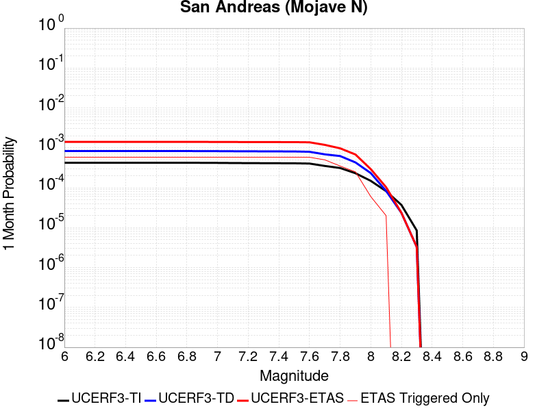 | 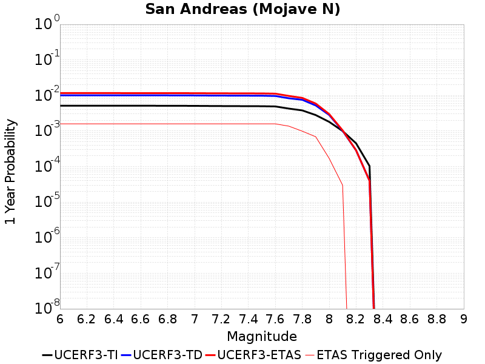 | 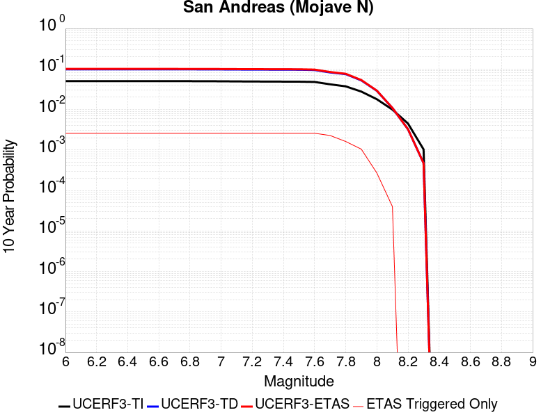 |

| Magnitude | 1 wk TI Prob | 1 wk TD Prob | 1 wk ETAS Prob | 1 wk ETAS/TD Gain | 1 wk ETAS Triggered Only | 1 mo TI Prob | 1 mo TD Prob | 1 mo ETAS Prob | 1 mo ETAS/TD Gain | 1 mo ETAS Triggered Only | 1 yr TI Prob | 1 yr TD Prob | 1 yr ETAS Prob | 1 yr ETAS/TD Gain | 1 yr ETAS Triggered Only | 10 yr TI Prob | 10 yr TD Prob | 10 yr ETAS Prob | 10 yr ETAS/TD Gain | 10 yr ETAS Triggered Only |
|-----|-----|-----|-----|-----|-----|-----|-----|-----|-----|-----|-----|-----|-----|-----|-----|-----|-----|-----|-----|-----|
| 6.0 | 9.877682E-5 | 1.9407959E-4 | 3.640466E-4 | 1.8757592 | 1.7E-4 | 4.2326056E-4 | 8.315047E-4 | 0.0014110225 | 1.6969506 | 5.8E-4 | 0.0051410277 | 0.010076705 | 0.011650683 | 1.1561997 | 0.00159 | 0.05023708 | 0.09834606 | 0.10068134 | 1.0237455 | 0.00259 |
| 6.1 | 9.877682E-5 | 1.9407959E-4 | 3.640466E-4 | 1.8757592 | 1.7E-4 | 4.2326056E-4 | 8.315047E-4 | 0.0014110225 | 1.6969506 | 5.8E-4 | 0.0051410277 | 0.010076705 | 0.011650683 | 1.1561997 | 0.00159 | 0.05023708 | 0.09834606 | 0.10068134 | 1.0237455 | 0.00259 |
| 6.2 | 9.877682E-5 | 1.9407959E-4 | 3.640466E-4 | 1.8757592 | 1.7E-4 | 4.2326056E-4 | 8.315047E-4 | 0.0014110225 | 1.6969506 | 5.8E-4 | 0.0051410277 | 0.010076705 | 0.011650683 | 1.1561997 | 0.00159 | 0.05023708 | 0.09834606 | 0.10068134 | 1.0237455 | 0.00259 |
| 6.3 | 9.877682E-5 | 1.9407959E-4 | 3.640466E-4 | 1.8757592 | 1.7E-4 | 4.2326056E-4 | 8.315047E-4 | 0.0014110225 | 1.6969506 | 5.8E-4 | 0.0051410277 | 0.010076705 | 0.011650683 | 1.1561997 | 0.00159 | 0.05023708 | 0.09834606 | 0.10068134 | 1.0237455 | 0.00259 |
| 6.4 | 9.877682E-5 | 1.9407959E-4 | 3.640466E-4 | 1.8757592 | 1.7E-4 | 4.2326056E-4 | 8.315047E-4 | 0.0014110225 | 1.6969506 | 5.8E-4 | 0.0051410277 | 0.010076705 | 0.011650683 | 1.1561997 | 0.00159 | 0.05023708 | 0.09834606 | 0.10068134 | 1.0237455 | 0.00259 |
| 6.5 | 9.861474E-5 | 1.9381724E-4 | 3.637843E-4 | 1.876945 | 1.7E-4 | 4.2256617E-4 | 8.3038106E-4 | 0.0014098994 | 1.6978946 | 5.8E-4 | 0.0051326132 | 0.010063151 | 0.01163715 | 1.1564122 | 0.00159 | 0.050156746 | 0.09822385 | 0.10055945 | 1.0237783 | 0.00259 |
| 6.6 | 9.861474E-5 | 1.9381724E-4 | 3.637843E-4 | 1.876945 | 1.7E-4 | 4.2256617E-4 | 8.3038106E-4 | 0.0014098994 | 1.6978946 | 5.8E-4 | 0.0051326132 | 0.010063151 | 0.01163715 | 1.1564122 | 0.00159 | 0.050156746 | 0.09822385 | 0.10055945 | 1.0237783 | 0.00259 |
| 6.7 | 9.8552715E-5 | 1.9371675E-4 | 3.6368382E-4 | 1.8773999 | 1.7E-4 | 4.223004E-4 | 8.299507E-4 | 0.0014094693 | 1.6982567 | 5.8E-4 | 0.0051293927 | 0.01005796 | 0.0116319675 | 1.1564938 | 0.00159 | 0.050125998 | 0.09817704 | 0.10051276 | 1.023791 | 0.00259 |
| 6.8 | 9.8464974E-5 | 1.9356837E-4 | 3.6353545E-4 | 1.8780727 | 1.7E-4 | 4.219245E-4 | 8.2931516E-4 | 0.0014088341 | 1.6987922 | 5.8E-4 | 0.0051248376 | 0.010050293 | 0.011624314 | 1.1566143 | 0.00159 | 0.05008251 | 0.098107055 | 0.10044295 | 1.0238098 | 0.00259 |
| 6.9 | 9.825824E-5 | 1.9324842E-4 | 3.6321557E-4 | 1.8795267 | 1.7E-4 | 4.2103877E-4 | 8.2794484E-4 | 0.0014074646 | 1.6999497 | 5.8E-4 | 0.0051141046 | 0.010033764 | 0.01160781 | 1.156875 | 0.00159 | 0.049980022 | 0.097956136 | 0.10029243 | 1.0238504 | 0.00259 |
| 7.0 | 9.781462E-5 | 1.92562E-4 | 3.6252927E-4 | 1.8826625 | 1.7E-4 | 4.1913814E-4 | 8.250049E-4 | 0.0014045264 | 1.7024461 | 5.8E-4 | 0.005091073 | 0.009998299 | 0.011572402 | 1.1574371 | 0.00159 | 0.04976007 | 0.097632505 | 0.09996963 | 1.0239381 | 0.00259 |
| 7.1 | 9.7121134E-5 | 1.91579E-4 | 3.6154644E-4 | 1.8871924 | 1.7E-4 | 4.1616702E-4 | 8.2079467E-4 | 0.0014003186 | 1.7060523 | 5.8E-4 | 0.005055068 | 0.009947509 | 0.011521692 | 1.158249 | 0.00159 | 0.04941613 | 0.097168975 | 0.09950731 | 1.0240645 | 0.00259 |
| 7.2 | 9.663819E-5 | 1.9088677E-4 | 3.6085432E-4 | 1.8904103 | 1.7E-4 | 4.1409794E-4 | 8.1782986E-4 | 0.0013973555 | 1.708614 | 5.8E-4 | 0.0050299936 | 0.009911741 | 0.011485982 | 1.1588258 | 0.00159 | 0.049176537 | 0.096842214 | 0.09918139 | 1.0241545 | 0.00259 |
| 7.3 | 9.6277574E-5 | 1.904118E-4 | 3.6037943E-4 | 1.8926319 | 1.7E-4 | 4.125529E-4 | 8.157955E-4 | 0.0013953224 | 1.7103825 | 5.8E-4 | 0.0050112694 | 0.009887198 | 0.011461478 | 1.159224 | 0.00159 | 0.04899759 | 0.096615635 | 0.0989554 | 1.0242172 | 0.00259 |
| 7.4 | 9.593308E-5 | 1.8980949E-4 | 3.5977722E-4 | 1.8954649 | 1.7E-4 | 4.1107697E-4 | 8.132158E-4 | 0.0013927441 | 1.7126378 | 5.8E-4 | 0.0049933824 | 0.009856075 | 0.011430404 | 1.1597319 | 0.00159 | 0.04882661 | 0.09633377 | 0.09867427 | 1.0242957 | 0.00259 |
| 7.5 | 9.561707E-5 | 1.892702E-4 | 3.59238E-4 | 1.8980168 | 1.7E-4 | 4.0972308E-4 | 8.10906E-4 | 0.0013904356 | 1.7146693 | 5.8E-4 | 0.0049769743 | 0.009828207 | 0.01140258 | 1.1601893 | 0.00159 | 0.048669744 | 0.096079916 | 0.09842107 | 1.0243667 | 0.00259 |
| 7.6 | 9.418194E-5 | 1.8579232E-4 | 3.5576074E-4 | 1.9148302 | 1.7E-4 | 4.0357444E-4 | 7.9600996E-4 | 0.0013755483 | 1.728054 | 5.8E-4 | 0.004902454 | 0.009648468 | 0.011223127 | 1.163203 | 0.00159 | 0.047957025 | 0.094462045 | 0.09680738 | 1.0248284 | 0.00259 |
| 7.7 | 8.202141E-5 | 1.6027821E-4 | 3.2025258E-4 | 1.9981042 | 1.6E-4 | 3.51473E-4 | 6.8672583E-4 | 0.0011863825 | 1.7275926 | 5.0E-4 | 0.00427079 | 0.008328892 | 0.009687481 | 1.1631176 | 0.00137 | 0.04189639 | 0.0822613 | 0.084353745 | 1.0254365 | 0.00228 |
| 7.8 | 7.2859846E-5 | 1.452232E-4 | 2.3521013E-4 | 1.6196457 | 9.0E-5 | 3.1221908E-4 | 6.222367E-4 | 9.720189E-4 | 1.5621369 | 3.5E-4 | 0.003794643 | 0.007549458 | 0.008531984 | 1.1301452 | 9.9E-4 | 0.037304975 | 0.07475104 | 0.07624994 | 1.020052 | 0.00162 |
| 7.9 | 5.3874453E-5 | 1.0049776E-4 | 1.6049173E-4 | 1.5969682 | 6.0E-5 | 2.3087008E-4 | 4.306336E-4 | 6.8052596E-4 | 1.58029 | 2.5E-4 | 0.0028072202 | 0.0052303714 | 0.0059167626 | 1.1312318 | 6.9E-4 | 0.02772022 | 0.05244358 | 0.053438514 | 1.0189716 | 0.00105 |
| 8.0 | 3.468538E-5 | 5.4283853E-5 | 6.428331E-5 | 1.1842068 | 1.0E-5 | 1.4864317E-4 | 2.3262436E-4 | 2.926104E-4 | 1.2578666 | 6.0E-5 | 0.0018082283 | 0.002828525 | 0.002998044 | 1.059932 | 1.7E-4 | 0.017935853 | 0.02895907 | 0.02922125 | 1.0090535 | 2.7E-4 |
| 8.1 | 1.9152367E-5 | 1.941373E-5 | 2.9413535E-5 | 1.5150894 | 1.0E-5 | 8.207899E-5 | 8.319905E-5 | 1.0319738E-4 | 1.2403674 | 2.0E-5 | 9.988535E-4 | 0.0010124784 | 0.001042448 | 1.0296003 | 3.0E-5 | 0.009943757 | 0.010862057 | 0.0109016225 | 1.0036426 | 4.0E-5 |
| 8.2 | 8.643924E-6 | 5.479068E-6 | 5.479068E-6 | 1.0 | 0.0 | 3.704486E-5 | 2.3481509E-5 | 2.3481509E-5 | 1.0 | 0.0 | 4.5092785E-4 | 2.8584994E-4 | 2.8584994E-4 | 1.0 | 0.0 | 0.0045001395 | 0.0032510054 | 0.0032510054 | 1.0 | 0.0 |
| 8.3 | 1.983087E-6 | 7.666981E-7 | 7.666981E-7 | 1.0 | 0.0 | 8.498917E-6 | 3.285845E-6 | 3.285845E-6 | 1.0 | 0.0 | 1.034694E-4 | 4.0004445E-5 | 4.0004445E-5 | 1.0 | 0.0 | 0.0010342124 | 4.723745E-4 | 4.723745E-4 | 1.0 | 0.0 |

## Nelson Lake
*[(top)](#table-of-contents)*

| 1 Week | 1 Month | 1 Year | 10 Year |
|-----|-----|-----|-----|
| 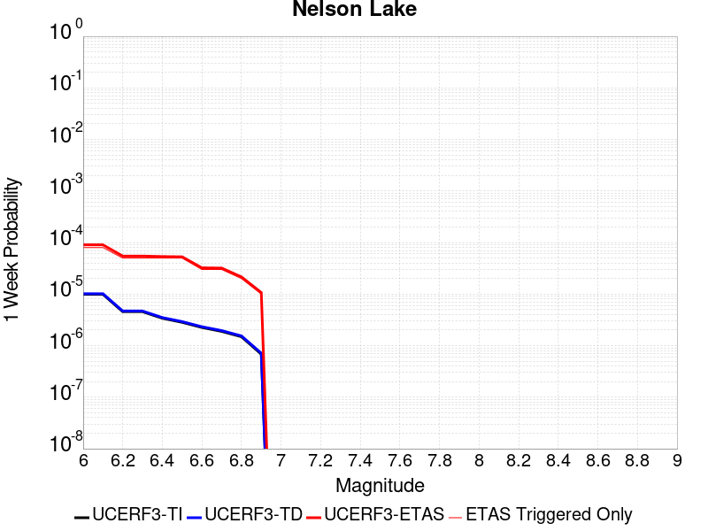 | 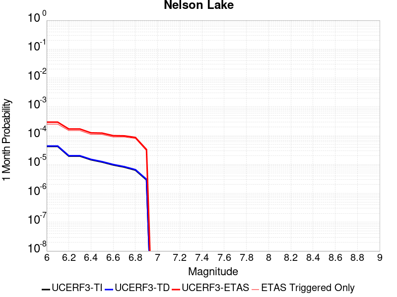 | 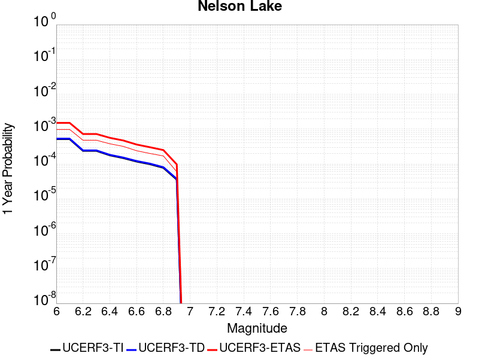 | 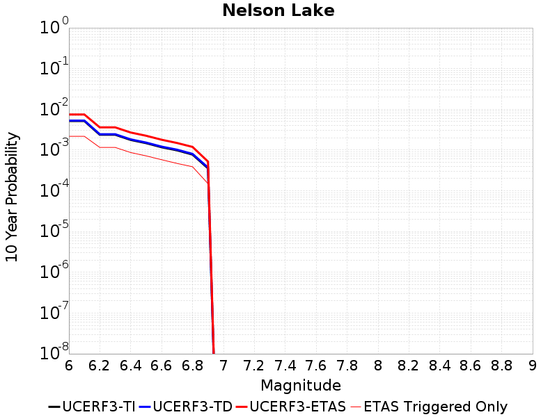 |

| Magnitude | 1 wk TI Prob | 1 wk TD Prob | 1 wk ETAS Prob | 1 wk ETAS/TD Gain | 1 wk ETAS Triggered Only | 1 mo TI Prob | 1 mo TD Prob | 1 mo ETAS Prob | 1 mo ETAS/TD Gain | 1 mo ETAS Triggered Only | 1 yr TI Prob | 1 yr TD Prob | 1 yr ETAS Prob | 1 yr ETAS/TD Gain | 1 yr ETAS Triggered Only | 10 yr TI Prob | 10 yr TD Prob | 10 yr ETAS Prob | 10 yr ETAS/TD Gain | 10 yr ETAS Triggered Only |
|-----|-----|-----|-----|-----|-----|-----|-----|-----|-----|-----|-----|-----|-----|-----|-----|-----|-----|-----|-----|-----|
| 6.0 | 9.913453E-6 | 1.0192288E-5 | 9.0191475E-5 | 8.848992 | 8.0E-5 | 4.2485535E-5 | 4.368056E-5 | 2.9366964E-4 | 6.72312 | 2.5E-4 | 5.1713863E-4 | 5.3169136E-4 | 0.0015111703 | 2.8421946 | 9.8E-4 | 0.0051593683 | 0.005305221 | 0.007473655 | 1.408736 | 0.00218 |
| 6.1 | 9.913453E-6 | 1.0192288E-5 | 9.0191475E-5 | 8.848992 | 8.0E-5 | 4.2485535E-5 | 4.368056E-5 | 2.9366964E-4 | 6.72312 | 2.5E-4 | 5.1713863E-4 | 5.3169136E-4 | 0.0015111703 | 2.8421946 | 9.8E-4 | 0.0051593683 | 0.005305221 | 0.007473655 | 1.408736 | 0.00218 |
| 6.2 | 4.5596407E-6 | 4.6963287E-6 | 5.4696095E-5 | 11.646564 | 5.0E-5 | 1.954117E-5 | 2.0126976E-5 | 1.7012395E-4 | 8.452535 | 1.5E-4 | 2.3788778E-4 | 2.4501965E-4 | 7.24902E-4 | 2.9585466 | 4.8E-4 | 0.0023763329 | 0.002447621 | 0.0036047818 | 1.4727696 | 0.00116 |
| 6.3 | 4.5596407E-6 | 4.6963287E-6 | 5.4696095E-5 | 11.646564 | 5.0E-5 | 1.954117E-5 | 2.0126976E-5 | 1.7012395E-4 | 8.452535 | 1.5E-4 | 2.3788778E-4 | 2.4501965E-4 | 7.24902E-4 | 2.9585466 | 4.8E-4 | 0.0023763329 | 0.002447621 | 0.0036047818 | 1.4727696 | 0.00116 |
| 6.4 | 3.4025713E-6 | 3.5099097E-6 | 5.3509735E-5 | 15.245331 | 5.0E-5 | 1.4582367E-5 | 1.50423875E-5 | 1.2504074E-4 | 8.312559 | 1.1E-4 | 1.7752586E-4 | 1.8312653E-4 | 5.630569E-4 | 3.0746882 | 3.8E-4 | 0.001773841 | 0.0018298391 | 0.002698247 | 1.4745816 | 8.7E-4 |
| 6.5 | 2.8352947E-6 | 2.9278667E-6 | 5.292772E-5 | 18.07723 | 5.0E-5 | 1.2151207E-5 | 1.2547945E-5 | 1.2254657E-4 | 9.766266 | 1.1E-4 | 1.479309E-4 | 1.5276126E-4 | 4.727124E-4 | 3.094452 | 3.2E-4 | 0.0014783246 | 0.0015266364 | 0.0022455372 | 1.4709051 | 7.2E-4 |
| 6.6 | 2.251518E-6 | 2.3290766E-6 | 3.2329008E-5 | 13.880611 | 3.0E-5 | 9.649328E-6 | 9.981722E-6 | 9.9980825E-5 | 10.01639 | 9.0E-5 | 1.1747423E-4 | 1.2152132E-4 | 3.6149216E-4 | 2.9747221 | 2.4E-4 | 0.0011741214 | 0.0012146104 | 0.001793906 | 1.4769393 | 5.8E-4 |
| 6.7 | 1.8911853E-6 | 1.9591475E-6 | 3.1959087E-5 | 16.312752 | 3.0E-5 | 8.105055E-6 | 8.396323E-6 | 9.839557E-5 | 11.718888 | 9.0E-5 | 9.867457E-5 | 1.0222102E-4 | 3.0220058E-4 | 2.9563446 | 2.0E-4 | 9.863076E-4 | 0.0010217975 | 0.0014913173 | 1.4595037 | 4.7E-4 |
| 6.8 | 1.4874814E-6 | 1.543837E-6 | 2.1543807E-5 | 13.954715 | 2.0E-5 | 6.374905E-6 | 6.6164307E-6 | 8.66159E-5 | 13.091031 | 8.0E-5 | 7.76117E-5 | 8.0552585E-5 | 2.505389E-4 | 3.1102526 | 1.7E-4 | 7.75846E-4 | 8.0528494E-4 | 0.0011949709 | 1.4839106 | 3.9E-4 |
| 6.9 | 6.835972E-7 | 7.1399637E-7 | 1.07139895E-5 | 15.005663 | 1.0E-5 | 2.9296991E-6 | 3.0599826E-6 | 3.3059892E-5 | 10.803947 | 3.0E-5 | 3.56685E-5 | 3.725497E-5 | 9.7252734E-5 | 2.6104634 | 6.0E-5 | 3.5662777E-4 | 3.7251852E-4 | 5.2246265E-4 | 1.4025146 | 1.5E-4 |

## Towne Pass
*[(top)](#table-of-contents)*

| 1 Week | 1 Month | 1 Year | 10 Year |
|-----|-----|-----|-----|
| 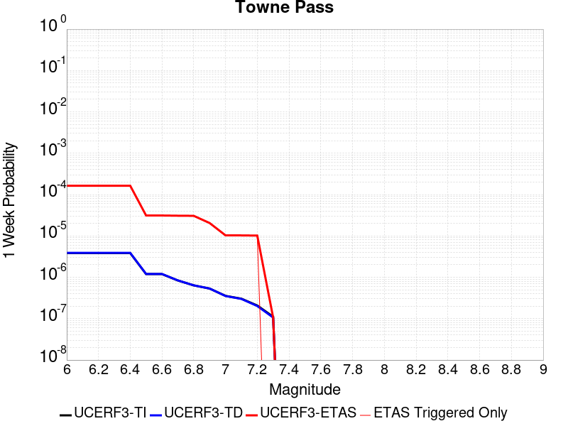 | 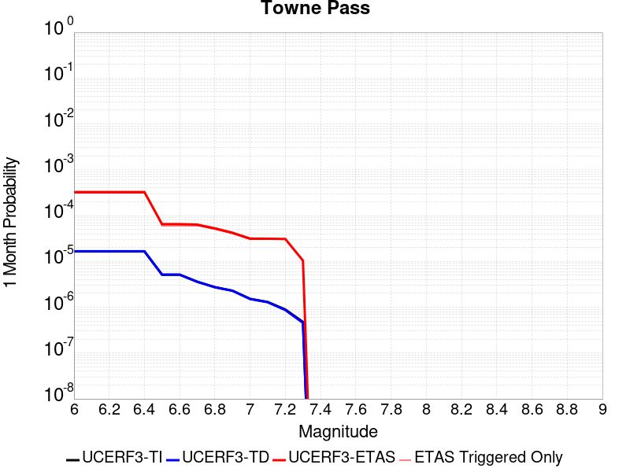 | 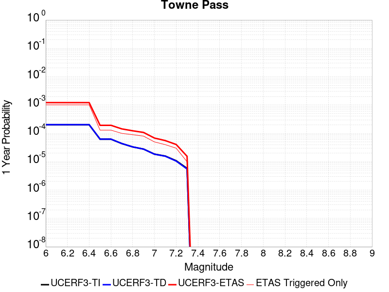 | 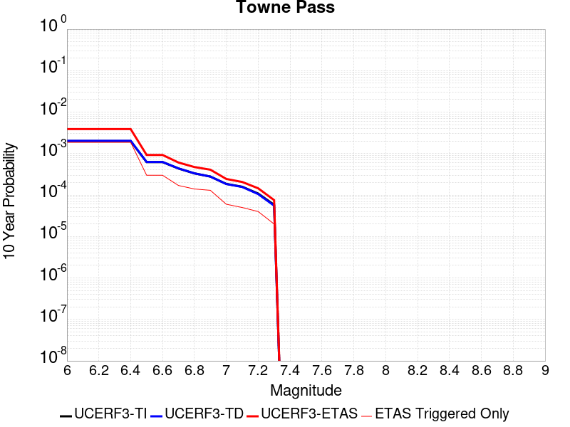 |

| Magnitude | 1 wk TI Prob | 1 wk TD Prob | 1 wk ETAS Prob | 1 wk ETAS/TD Gain | 1 wk ETAS Triggered Only | 1 mo TI Prob | 1 mo TD Prob | 1 mo ETAS Prob | 1 mo ETAS/TD Gain | 1 mo ETAS Triggered Only | 1 yr TI Prob | 1 yr TD Prob | 1 yr ETAS Prob | 1 yr ETAS/TD Gain | 1 yr ETAS Triggered Only | 10 yr TI Prob | 10 yr TD Prob | 10 yr ETAS Prob | 10 yr ETAS/TD Gain | 10 yr ETAS Triggered Only |
|-----|-----|-----|-----|-----|-----|-----|-----|-----|-----|-----|-----|-----|-----|-----|-----|-----|-----|-----|-----|-----|
| 6.0 | 3.849728E-6 | 3.894548E-6 | 1.6389393E-4 | 42.08291 | 1.6E-4 | 1.649873E-5 | 1.669084E-5 | 3.2668567E-4 | 19.572752 | 3.1E-4 | 2.0085352E-4 | 2.031964E-4 | 0.0012129912 | 5.9695506 | 0.00101 | 0.0020067208 | 0.0020305351 | 0.003896738 | 1.9190695 | 0.00187 |
| 6.1 | 3.849728E-6 | 3.894548E-6 | 1.6389393E-4 | 42.08291 | 1.6E-4 | 1.649873E-5 | 1.669084E-5 | 3.2668567E-4 | 19.572752 | 3.1E-4 | 2.0085352E-4 | 2.031964E-4 | 0.0012129912 | 5.9695506 | 0.00101 | 0.0020067208 | 0.0020305351 | 0.003896738 | 1.9190695 | 0.00187 |
| 6.2 | 3.849728E-6 | 3.894548E-6 | 1.6389393E-4 | 42.08291 | 1.6E-4 | 1.649873E-5 | 1.669084E-5 | 3.2668567E-4 | 19.572752 | 3.1E-4 | 2.0085352E-4 | 2.031964E-4 | 0.0012129912 | 5.9695506 | 0.00101 | 0.0020067208 | 0.0020305351 | 0.003896738 | 1.9190695 | 0.00187 |
| 6.3 | 3.849728E-6 | 3.894548E-6 | 1.6389393E-4 | 42.08291 | 1.6E-4 | 1.649873E-5 | 1.669084E-5 | 3.2668567E-4 | 19.572752 | 3.1E-4 | 2.0085352E-4 | 2.031964E-4 | 0.0012129912 | 5.9695506 | 0.00101 | 0.0020067208 | 0.0020305351 | 0.003896738 | 1.9190695 | 0.00187 |
| 6.4 | 3.849728E-6 | 3.894548E-6 | 1.6389393E-4 | 42.08291 | 1.6E-4 | 1.649873E-5 | 1.669084E-5 | 3.2668567E-4 | 19.572752 | 3.1E-4 | 2.0085352E-4 | 2.031964E-4 | 0.0012129912 | 5.9695506 | 0.00101 | 0.0020067208 | 0.0020305351 | 0.003896738 | 1.9190695 | 0.00187 |
| 6.5 | 1.1953545E-6 | 1.2030548E-6 | 3.1203017E-5 | 25.936491 | 3.0E-5 | 5.1229376E-6 | 5.1559396E-6 | 6.515563E-5 | 12.637005 | 6.0E-5 | 6.236998E-5 | 6.277188E-5 | 1.9276372E-4 | 3.0708613 | 1.3E-4 | 6.235248E-4 | 6.2755315E-4 | 9.2736486E-4 | 1.4777472 | 3.0E-4 |
| 6.6 | 1.1953545E-6 | 1.2030548E-6 | 3.1203017E-5 | 25.936491 | 3.0E-5 | 5.1229376E-6 | 5.1559396E-6 | 6.515563E-5 | 12.637005 | 6.0E-5 | 6.236998E-5 | 6.277188E-5 | 1.9276372E-4 | 3.0708613 | 1.3E-4 | 6.235248E-4 | 6.2755315E-4 | 9.2736486E-4 | 1.4777472 | 3.0E-4 |
| 6.7 | 8.375951E-7 | 8.410693E-7 | 3.0841045E-5 | 36.66885 | 3.0E-5 | 3.5896885E-6 | 3.604578E-6 | 6.360436E-5 | 17.64544 | 6.0E-5 | 4.370358E-5 | 4.3884913E-5 | 1.4388052E-4 | 3.2785873 | 1.0E-4 | 4.3694986E-4 | 4.3876818E-4 | 6.086936E-4 | 1.3872783 | 1.7E-4 |
| 6.8 | 6.38041E-7 | 6.3921766E-7 | 3.06392E-5 | 47.932343 | 3.0E-5 | 2.7344586E-6 | 2.7395015E-6 | 5.2739364E-5 | 19.251446 | 5.0E-5 | 3.3291526E-5 | 3.335296E-5 | 1.2334996E-4 | 3.698321 | 9.0E-5 | 3.3286537E-4 | 3.3348336E-4 | 4.7343667E-4 | 1.419671 | 1.4E-4 |
| 6.9 | 5.3460053E-7 | 5.3453516E-7 | 2.0534524E-5 | 38.415665 | 2.0E-5 | 2.2911431E-6 | 2.2908632E-6 | 4.2290772E-5 | 18.460627 | 4.0E-5 | 2.789431E-5 | 2.7890936E-5 | 1.0788871E-4 | 3.8682353 | 8.0E-5 | 2.789081E-4 | 2.7887768E-4 | 4.088414E-4 | 1.4660242 | 1.3E-4 |
| 7.0 | 3.557783E-7 | 3.5324385E-7 | 1.035324E-5 | 29.309046 | 1.0E-5 | 1.5247632E-6 | 1.5139013E-6 | 3.1513857E-5 | 20.81632 | 3.0E-5 | 1.8563835E-5 | 1.8431601E-5 | 6.843068E-5 | 3.7126822 | 5.0E-5 | 1.8562283E-4 | 1.8430158E-4 | 2.442905E-4 | 1.3254933 | 6.0E-5 |
| 7.1 | 3.037942E-7 | 3.0002363E-7 | 1.030002E-5 | 34.3307 | 1.0E-5 | 1.3019744E-6 | 1.285815E-6 | 3.1285777E-5 | 24.331476 | 3.0E-5 | 1.5851423E-5 | 1.5654692E-5 | 5.5654065E-5 | 3.5551045 | 4.0E-5 | 1.5850292E-4 | 1.5653664E-4 | 2.0652881E-4 | 1.3193641 | 5.0E-5 |
| 7.2 | 2.0808248E-7 | 2.0217807E-7 | 1.0202176E-5 | 50.461338 | 1.0E-5 | 8.917818E-7 | 8.664772E-7 | 3.0866453E-5 | 35.622925 | 3.0E-5 | 1.0857389E-5 | 1.0549314E-5 | 4.0548995E-5 | 3.843757 | 3.0E-5 | 1.0856859E-4 | 1.05488594E-4 | 1.4548437E-4 | 1.3791479 | 4.0E-5 |
| 7.3 | 1.1162073E-7 | 1.0636969E-7 | 1.0636969E-7 | 1.0 | 0.0 | 4.7837443E-7 | 4.5587004E-7 | 1.0455866E-5 | 22.936068 | 1.0E-5 | 5.8241935E-6 | 5.5502055E-6 | 1.555015E-5 | 2.8017251 | 1.0E-5 | 5.8240406E-5 | 5.550087E-5 | 7.549976E-5 | 1.3603348 | 2.0E-5 |

## Lenwood-Lockhart-Old Woman Springs
*[(top)](#table-of-contents)*

| 1 Week | 1 Month | 1 Year | 10 Year |
|-----|-----|-----|-----|
| 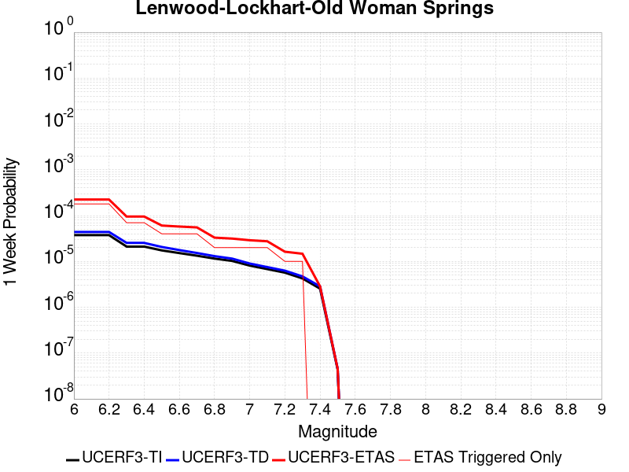 | 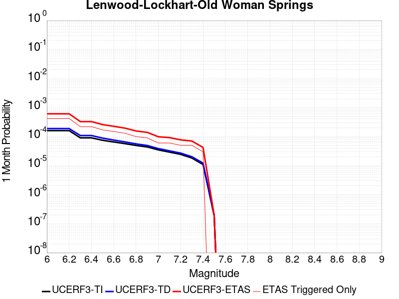 | 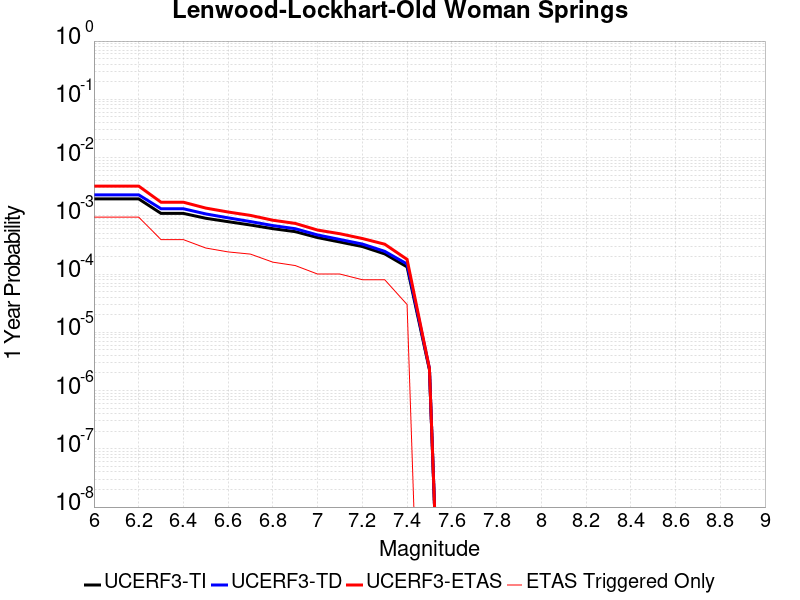 | 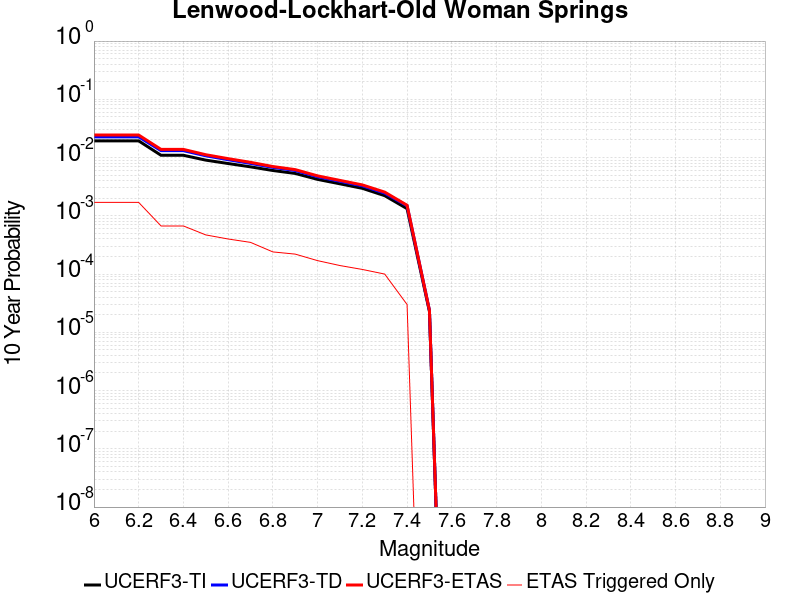 |

| Magnitude | 1 wk TI Prob | 1 wk TD Prob | 1 wk ETAS Prob | 1 wk ETAS/TD Gain | 1 wk ETAS Triggered Only | 1 mo TI Prob | 1 mo TD Prob | 1 mo ETAS Prob | 1 mo ETAS/TD Gain | 1 mo ETAS Triggered Only | 1 yr TI Prob | 1 yr TD Prob | 1 yr ETAS Prob | 1 yr ETAS/TD Gain | 1 yr ETAS Triggered Only | 10 yr TI Prob | 10 yr TD Prob | 10 yr ETAS Prob | 10 yr ETAS/TD Gain | 10 yr ETAS Triggered Only |
|-----|-----|-----|-----|-----|-----|-----|-----|-----|-----|-----|-----|-----|-----|-----|-----|-----|-----|-----|-----|-----|
| 6.0 | 3.744542E-5 | 4.3962897E-5 | 2.2395498E-4 | 5.0941815 | 1.8E-4 | 1.604705E-4 | 1.8839978E-4 | 6.0832064E-4 | 3.228882 | 4.2E-4 | 0.0019519776 | 0.0022915264 | 0.0032393495 | 1.4136208 | 9.5E-4 | 0.019349206 | 0.02269698 | 0.024358395 | 1.0731999 | 0.0017 |
| 6.1 | 3.744542E-5 | 4.3962897E-5 | 2.2395498E-4 | 5.0941815 | 1.8E-4 | 1.604705E-4 | 1.8839978E-4 | 6.0832064E-4 | 3.228882 | 4.2E-4 | 0.0019519776 | 0.0022915264 | 0.0032393495 | 1.4136208 | 9.5E-4 | 0.019349206 | 0.02269698 | 0.024358395 | 1.0731999 | 0.0017 |
| 6.2 | 3.744542E-5 | 4.3962897E-5 | 2.2395498E-4 | 5.0941815 | 1.8E-4 | 1.604705E-4 | 1.8839978E-4 | 6.0832064E-4 | 3.228882 | 4.2E-4 | 0.0019519776 | 0.0022915264 | 0.0032393495 | 1.4136208 | 9.5E-4 | 0.019349206 | 0.02269698 | 0.024358395 | 1.0731999 | 0.0017 |
| 6.3 | 2.1079984E-5 | 2.535357E-5 | 9.5351796E-5 | 3.7608824 | 7.0E-5 | 9.0339665E-5 | 1.0865375E-4 | 3.2862983E-4 | 3.0245607 | 2.2E-4 | 0.0010993304 | 0.0013220765 | 0.001711561 | 1.2946005 | 3.9E-4 | 0.010939079 | 0.013144328 | 0.013805522 | 1.0503025 | 6.7E-4 |
| 6.4 | 2.1079984E-5 | 2.535357E-5 | 9.5351796E-5 | 3.7608824 | 7.0E-5 | 9.0339665E-5 | 1.0865375E-4 | 3.2862983E-4 | 3.0245607 | 2.2E-4 | 0.0010993304 | 0.0013220765 | 0.001711561 | 1.2946005 | 3.9E-4 | 0.010939079 | 0.013144328 | 0.013805522 | 1.0503025 | 6.7E-4 |
| 6.5 | 1.7397282E-5 | 2.0662515E-5 | 6.066169E-5 | 2.9358327 | 4.0E-5 | 7.455765E-5 | 8.85507E-5 | 2.5853564E-4 | 2.919634 | 1.7E-4 | 9.073613E-4 | 0.0010775833 | 0.0013572816 | 1.2595607 | 2.8E-4 | 0.009036654 | 0.010724876 | 0.011189835 | 1.0433533 | 4.7E-4 |
| 6.6 | 1.52050325E-5 | 1.7679782E-5 | 5.7679077E-5 | 3.2624311 | 4.0E-5 | 6.51628E-5 | 7.5768345E-5 | 2.2575697E-4 | 2.9795687 | 1.5E-4 | 7.9306826E-4 | 9.2209707E-4 | 0.0011618758 | 1.2600363 | 2.4E-4 | 0.007902439 | 0.009183573 | 0.009579899 | 1.043156 | 4.0E-4 |
| 6.7 | 1.332523E-5 | 1.5264077E-5 | 5.5263466E-5 | 3.6204917 | 4.0E-5 | 5.7106878E-5 | 6.5415865E-5 | 1.9540737E-4 | 2.9871554 | 1.3E-4 | 6.950544E-4 | 7.9615304E-4 | 0.0010159778 | 1.2761087 | 2.2E-4 | 0.006928845 | 0.007933638 | 0.008280861 | 1.0437659 | 3.5E-4 |
| 6.8 | 1.1525329E-5 | 1.3031039E-5 | 3.3030778E-5 | 2.5347772 | 2.0E-5 | 4.9393333E-5 | 5.5846136E-5 | 1.5584055E-4 | 2.7905343 | 1.0E-4 | 6.011979E-4 | 6.7971885E-4 | 8.396101E-4 | 1.2352314 | 1.6E-4 | 0.00599574 | 0.00677685 | 0.0070152236 | 1.0351747 | 2.4E-4 |
| 6.9 | 1.0253909E-5 | 1.15144885E-5 | 3.1514257E-5 | 2.736922 | 2.0E-5 | 4.3944583E-5 | 4.9346898E-5 | 1.3934246E-4 | 2.8237329 | 9.0E-5 | 5.3489394E-4 | 6.006365E-4 | 7.405524E-4 | 1.232946 | 1.4E-4 | 0.0053360825 | 0.0059905103 | 0.0062091923 | 1.0365047 | 2.2E-4 |
| 7.0 | 8.104563E-6 | 8.991314E-6 | 2.8991135E-5 | 3.224349 | 2.0E-5 | 3.4733377E-5 | 3.8533646E-5 | 9.853134E-5 | 2.5570207 | 6.0E-5 | 4.2279682E-4 | 4.690486E-4 | 5.6900166E-4 | 1.2130976 | 1.0E-4 | 0.0042199334 | 0.004680834 | 0.0048500383 | 1.0361483 | 1.7E-4 |
| 7.1 | 6.7986157E-6 | 7.515843E-6 | 2.7515693E-5 | 3.6610253 | 2.0E-5 | 2.91366E-5 | 3.221037E-5 | 9.220844E-5 | 2.862694 | 6.0E-5 | 3.5468035E-4 | 3.9209283E-4 | 4.9205363E-4 | 1.2549416 | 1.0E-4 | 0.003541148 | 0.003914227 | 0.004053679 | 1.035627 | 1.4E-4 |
| 7.2 | 5.6893327E-6 | 6.280035E-6 | 1.6279972E-5 | 2.5923378 | 1.0E-5 | 2.4382627E-5 | 2.691417E-5 | 7.6912824E-5 | 2.8577075 | 5.0E-5 | 2.9681803E-4 | 3.2763273E-4 | 4.0760654E-4 | 1.2440958 | 8.0E-5 | 0.002964219 | 0.0032716957 | 0.0033913031 | 1.0365583 | 1.2E-4 |
| 7.3 | 4.253348E-6 | 4.7069243E-6 | 1.4706878E-5 | 3.1245196 | 1.0E-5 | 1.8228506E-5 | 2.0172387E-5 | 7.017138E-5 | 3.4785857 | 5.0E-5 | 2.2190946E-4 | 2.4557297E-4 | 3.2555332E-4 | 1.3256887 | 8.0E-5 | 0.00221688 | 0.002453197 | 0.0025529517 | 1.0406631 | 1.0E-4 |
| 7.4 | 2.5448119E-6 | 2.8520521E-6 | 2.8520521E-6 | 1.0 | 0.0 | 1.0906291E-5 | 1.2223032E-5 | 4.2222666E-5 | 3.4543529 | 3.0E-5 | 1.3277601E-4 | 1.4880691E-4 | 1.7880244E-4 | 1.2015735 | 3.0E-5 | 0.001326967 | 0.0014872348 | 0.0015171902 | 1.0201417 | 3.0E-5 |
| 7.5 | 4.3706837E-8 | 4.5629317E-8 | 4.5629317E-8 | 1.0 | 0.0 | 1.8731501E-7 | 1.955542E-7 | 1.955542E-7 | 1.0 | 0.0 | 2.2805577E-6 | 2.3808702E-6 | 2.3808702E-6 | 1.0 | 0.0 | 2.2805343E-5 | 2.3808503E-5 | 2.3808503E-5 | 1.0 | 0.0 |

## San Andreas (San Bernardino N)
*[(top)](#table-of-contents)*

| 1 Week | 1 Month | 1 Year | 10 Year |
|-----|-----|-----|-----|
| 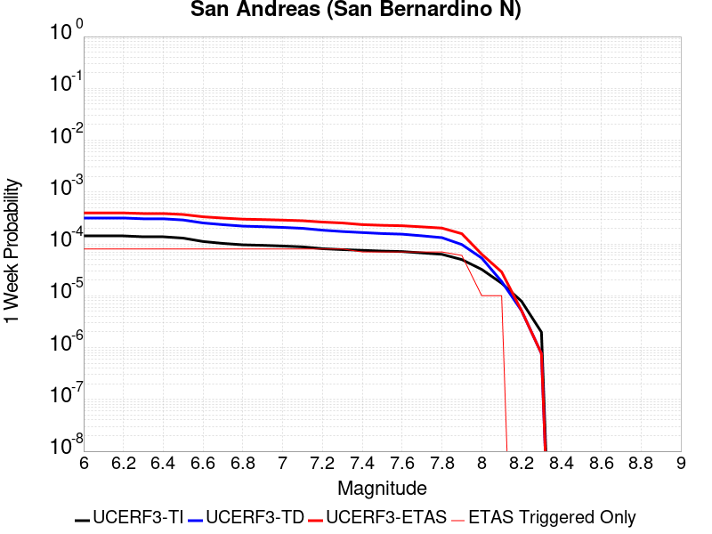 | 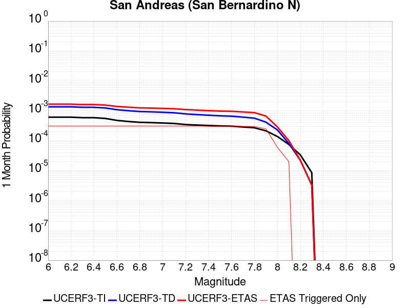 | 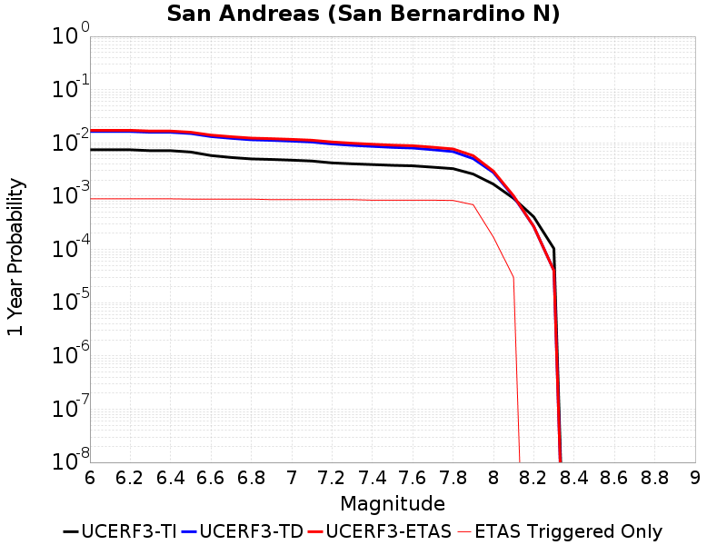 | 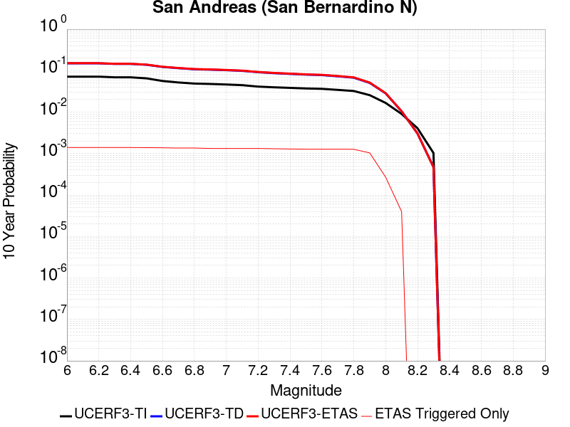 |

| Magnitude | 1 wk TI Prob | 1 wk TD Prob | 1 wk ETAS Prob | 1 wk ETAS/TD Gain | 1 wk ETAS Triggered Only | 1 mo TI Prob | 1 mo TD Prob | 1 mo ETAS Prob | 1 mo ETAS/TD Gain | 1 mo ETAS Triggered Only | 1 yr TI Prob | 1 yr TD Prob | 1 yr ETAS Prob | 1 yr ETAS/TD Gain | 1 yr ETAS Triggered Only | 10 yr TI Prob | 10 yr TD Prob | 10 yr ETAS Prob | 10 yr ETAS/TD Gain | 10 yr ETAS Triggered Only |
|-----|-----|-----|-----|-----|-----|-----|-----|-----|-----|-----|-----|-----|-----|-----|-----|-----|-----|-----|-----|-----|
| 6.0 | 1.4273766E-4 | 3.1612613E-4 | 3.9610083E-4 | 1.2529836 | 8.0E-5 | 6.115894E-4 | 0.0013541287 | 0.001663709 | 1.2286195 | 3.1E-4 | 0.0074207084 | 0.01636339 | 0.017238826 | 1.0534997 | 8.9E-4 | 0.07177748 | 0.1502919 | 0.1514815 | 1.0079153 | 0.0014 |
| 6.1 | 1.4273766E-4 | 3.1612613E-4 | 3.9610083E-4 | 1.2529836 | 8.0E-5 | 6.115894E-4 | 0.0013541287 | 0.001663709 | 1.2286195 | 3.1E-4 | 0.0074207084 | 0.01636339 | 0.017238826 | 1.0534997 | 8.9E-4 | 0.07177748 | 0.1502919 | 0.1514815 | 1.0079153 | 0.0014 |
| 6.2 | 1.4273766E-4 | 3.1612613E-4 | 3.9610083E-4 | 1.2529836 | 8.0E-5 | 6.115894E-4 | 0.0013541287 | 0.001663709 | 1.2286195 | 3.1E-4 | 0.0074207084 | 0.01636339 | 0.017238826 | 1.0534997 | 8.9E-4 | 0.07177748 | 0.1502919 | 0.1514815 | 1.0079153 | 0.0014 |
| 6.3 | 1.3730655E-4 | 3.0517436E-4 | 3.8514994E-4 | 1.2620653 | 8.0E-5 | 5.883239E-4 | 0.0013072401 | 0.0016168349 | 1.2368308 | 3.1E-4 | 0.0071393442 | 0.015800904 | 0.016676841 | 1.0554359 | 8.9E-4 | 0.06914291 | 0.14559178 | 0.14678796 | 1.0082159 | 0.0014 |
| 6.4 | 1.3730655E-4 | 3.0517436E-4 | 3.8514994E-4 | 1.2620653 | 8.0E-5 | 5.883239E-4 | 0.0013072401 | 0.0016168349 | 1.2368308 | 3.1E-4 | 0.0071393442 | 0.015800904 | 0.016676841 | 1.0554359 | 8.9E-4 | 0.06914291 | 0.14559178 | 0.14678796 | 1.0082159 | 0.0014 |
| 6.5 | 1.2942807E-4 | 2.8931856E-4 | 3.6929542E-4 | 1.2764318 | 8.0E-5 | 5.545738E-4 | 0.0012393526 | 0.0015489685 | 1.2498206 | 3.1E-4 | 0.0067310524 | 0.01498597 | 0.015852783 | 1.0578415 | 8.8E-4 | 0.06530788 | 0.13873444 | 0.1399316 | 1.0086291 | 0.00139 |
| 6.6 | 1.1125901E-4 | 2.5370647E-4 | 3.3368618E-4 | 1.315245 | 8.0E-5 | 4.767372E-4 | 0.0010868628 | 0.0013965258 | 1.2849146 | 3.1E-4 | 0.005788839 | 0.013152901 | 0.014021326 | 1.0660254 | 8.8E-4 | 0.056403454 | 0.12302429 | 0.12423452 | 1.0098373 | 0.00138 |
| 6.7 | 1.02209575E-4 | 2.3505584E-4 | 3.1503703E-4 | 1.3402647 | 8.0E-5 | 4.3796748E-4 | 0.0010069946 | 0.0013166824 | 1.3075367 | 3.1E-4 | 0.0053192247 | 0.012191663 | 0.013060934 | 1.0713005 | 8.8E-4 | 0.051936906 | 0.11481599 | 0.11601984 | 1.010485 | 0.00136 |
| 6.8 | 9.610582E-5 | 2.203132E-4 | 3.0029556E-4 | 1.3630394 | 8.0E-5 | 4.1181705E-4 | 9.4385847E-4 | 0.0012535659 | 1.328129 | 3.1E-4 | 0.0050023515 | 0.011431194 | 0.012301134 | 1.0761024 | 8.8E-4 | 0.048912346 | 0.108217835 | 0.109430656 | 1.0112072 | 0.00136 |
| 6.9 | 9.3877505E-5 | 2.1486852E-4 | 2.948513E-4 | 1.3722407 | 8.0E-5 | 4.0227012E-4 | 9.2054077E-4 | 0.0012302554 | 1.3364486 | 3.1E-4 | 0.0048866454 | 0.011150235 | 0.012000646 | 1.0762684 | 8.6E-4 | 0.04780577 | 0.10580813 | 0.1069974 | 1.0112399 | 0.00133 |
| 7.0 | 9.1019785E-5 | 2.0813759E-4 | 2.8812094E-4 | 1.3842812 | 8.0E-5 | 3.900265E-4 | 8.917139E-4 | 0.0012014374 | 1.3473351 | 3.1E-4 | 0.0047382377 | 0.010802799 | 0.011653508 | 1.078749 | 8.6E-4 | 0.046384744 | 0.10277854 | 0.10397184 | 1.0116104 | 0.00133 |
| 7.1 | 8.771155E-5 | 1.9988288E-4 | 2.798669E-4 | 1.4001544 | 8.0E-5 | 3.758525E-4 | 8.563602E-4 | 0.0011660947 | 1.3616872 | 3.1E-4 | 0.0045664064 | 0.01037654 | 0.011227616 | 1.0820192 | 8.6E-4 | 0.044737056 | 0.099090025 | 0.100288235 | 1.0120921 | 0.00133 |
| 7.2 | 8.0830236E-5 | 1.83938E-4 | 2.6392328E-4 | 1.4348491 | 8.0E-5 | 3.4636928E-4 | 7.880677E-4 | 0.0010978234 | 1.3930572 | 3.1E-4 | 0.0042088944 | 0.00955262 | 0.010404405 | 1.0891677 | 8.6E-4 | 0.041300658 | 0.0918207 | 0.09302858 | 1.0131547 | 0.00133 |
| 7.3 | 7.7668235E-5 | 1.7337265E-4 | 2.5335877E-4 | 1.4613538 | 8.0E-5 | 3.328214E-4 | 7.4281415E-4 | 0.0010525839 | 1.4170219 | 3.1E-4 | 0.0040445733 | 0.00900634 | 0.009858594 | 1.0946283 | 8.6E-4 | 0.03971748 | 0.08708757 | 0.08828349 | 1.0137323 | 0.00131 |
| 7.4 | 7.520177E-5 | 1.6557323E-4 | 2.3556165E-4 | 1.4227036 | 7.0E-5 | 3.2225347E-4 | 7.094067E-4 | 0.0010091938 | 1.4225886 | 3.0E-4 | 0.0039163795 | 0.008602888 | 0.009435662 | 1.0968016 | 8.4E-4 | 0.038480744 | 0.08354363 | 0.084725864 | 1.014151 | 0.00129 |
| 7.5 | 7.274697E-5 | 1.584492E-4 | 2.284381E-4 | 1.441712 | 7.0E-5 | 3.1173544E-4 | 6.788913E-4 | 9.786877E-4 | 1.441597 | 3.0E-4 | 0.003788775 | 0.008234234 | 0.0090673175 | 1.1011732 | 8.4E-4 | 0.03724827 | 0.08026018 | 0.08143745 | 1.0146681 | 0.00128 |
| 7.6 | 7.1185845E-5 | 1.5414739E-4 | 2.241366E-4 | 1.4540409 | 7.0E-5 | 3.0504653E-4 | 6.6046446E-4 | 9.6026633E-4 | 1.4539258 | 3.0E-4 | 0.0037076178 | 0.008011559 | 0.00884483 | 1.1040086 | 8.4E-4 | 0.036463667 | 0.07824971 | 0.07942955 | 1.0150778 | 0.00128 |
| 7.7 | 6.709961E-5 | 1.4323492E-4 | 2.132249E-4 | 1.4886376 | 7.0E-5 | 2.8753807E-4 | 6.137196E-4 | 9.135355E-4 | 1.4885226 | 3.0E-4 | 0.003495157 | 0.0074464753 | 0.00828022 | 1.1119651 | 8.4E-4 | 0.034406938 | 0.073078 | 0.07426446 | 1.0162356 | 0.00128 |
| 7.8 | 6.300812E-5 | 1.3207326E-4 | 2.0206401E-4 | 1.5299389 | 7.0E-5 | 2.7000686E-4 | 5.659055E-4 | 8.657357E-4 | 1.5298239 | 3.0E-4 | 0.0032823787 | 0.0068681617 | 0.007692461 | 1.1200175 | 8.3E-4 | 0.032343175 | 0.0677358 | 0.06891977 | 1.0174793 | 0.00127 |
| 7.9 | 4.983037E-5 | 9.727363E-5 | 1.5726779E-4 | 1.6167567 | 6.0E-5 | 2.1354125E-4 | 4.168204E-4 | 6.667162E-4 | 1.5995287 | 2.5E-4 | 0.0025967648 | 0.00506299 | 0.0057494966 | 1.135593 | 6.9E-4 | 0.025666296 | 0.050666906 | 0.051654212 | 1.0194862 | 0.00104 |
| 8.0 | 3.2211527E-5 | 5.3327218E-5 | 6.332668E-5 | 1.1875114 | 1.0E-5 | 1.380421E-4 | 2.2852521E-4 | 2.8851148E-4 | 1.2624931 | 6.0E-5 | 0.0016793669 | 0.0027787462 | 0.002948274 | 1.0610087 | 1.7E-4 | 0.016667323 | 0.028372409 | 0.028634747 | 1.0092462 | 2.7E-4 |
| 8.1 | 1.743376E-5 | 1.8834906E-5 | 2.8834718E-5 | 1.5309191 | 1.0E-5 | 7.471398E-5 | 8.0718535E-5 | 1.0071692E-4 | 1.2477546 | 2.0E-5 | 9.0926304E-4 | 9.823057E-4 | 0.0010122763 | 1.0305104 | 3.0E-5 | 0.009055517 | 0.010489552 | 0.010529133 | 1.0037733 | 4.0E-5 |
| 8.2 | 7.831616E-6 | 5.1589855E-6 | 5.1589855E-6 | 1.0 | 0.0 | 3.3563636E-5 | 2.210975E-5 | 2.210975E-5 | 1.0 | 0.0 | 4.0856065E-4 | 2.6915304E-4 | 2.6915304E-4 | 1.0 | 0.0 | 0.004078103 | 0.0030439228 | 0.0030439228 | 1.0 | 0.0 |
| 8.3 | 1.983087E-6 | 7.666981E-7 | 7.666981E-7 | 1.0 | 0.0 | 8.498917E-6 | 3.285845E-6 | 3.285845E-6 | 1.0 | 0.0 | 1.034694E-4 | 4.0004445E-5 | 4.0004445E-5 | 1.0 | 0.0 | 0.0010342124 | 4.723745E-4 | 4.723745E-4 | 1.0 | 0.0 |

## Bicycle Lake
*[(top)](#table-of-contents)*

| 1 Week | 1 Month | 1 Year | 10 Year |
|-----|-----|-----|-----|
| 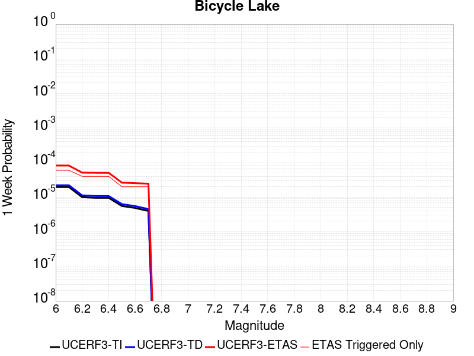 | 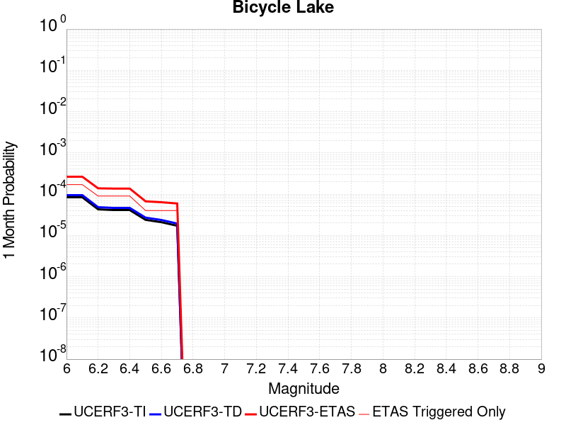 | 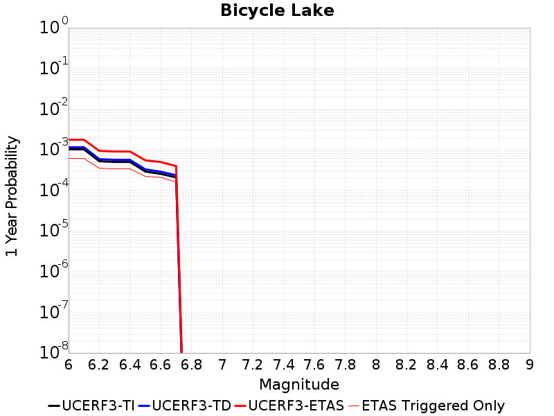 | 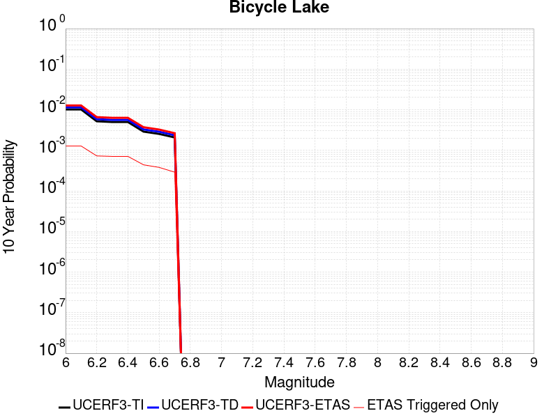 |

| Magnitude | 1 wk TI Prob | 1 wk TD Prob | 1 wk ETAS Prob | 1 wk ETAS/TD Gain | 1 wk ETAS Triggered Only | 1 mo TI Prob | 1 mo TD Prob | 1 mo ETAS Prob | 1 mo ETAS/TD Gain | 1 mo ETAS Triggered Only | 1 yr TI Prob | 1 yr TD Prob | 1 yr ETAS Prob | 1 yr ETAS/TD Gain | 1 yr ETAS Triggered Only | 10 yr TI Prob | 10 yr TD Prob | 10 yr ETAS Prob | 10 yr ETAS/TD Gain | 10 yr ETAS Triggered Only |
|-----|-----|-----|-----|-----|-----|-----|-----|-----|-----|-----|-----|-----|-----|-----|-----|-----|-----|-----|-----|-----|
| 6.0 | 1.9621975E-5 | 2.209739E-5 | 8.209606E-5 | 3.7151928 | 6.0E-5 | 8.4091465E-5 | 9.470042E-5 | 2.6468432E-4 | 2.7949646 | 1.7E-4 | 0.0010233327 | 0.0011525028 | 0.0017617998 | 1.5286729 | 6.1E-4 | 0.01018633 | 0.011478569 | 0.012743876 | 1.1102321 | 0.00128 |
| 6.1 | 1.9621975E-5 | 2.209739E-5 | 8.209606E-5 | 3.7151928 | 6.0E-5 | 8.4091465E-5 | 9.470042E-5 | 2.6468432E-4 | 2.7949646 | 1.7E-4 | 0.0010233327 | 0.0011525028 | 0.0017617998 | 1.5286729 | 6.1E-4 | 0.01018633 | 0.011478569 | 0.012743876 | 1.1102321 | 0.00128 |
| 6.2 | 9.9971285E-6 | 1.1255798E-5 | 5.125535E-5 | 4.553684 | 4.0E-5 | 4.2844134E-5 | 4.8238537E-5 | 1.3823419E-4 | 2.8656383 | 9.0E-5 | 5.2150246E-4 | 5.871979E-4 | 9.369924E-4 | 1.5957011 | 3.5E-4 | 0.0052028033 | 0.005861569 | 0.00658729 | 1.12381 | 7.3E-4 |
| 6.3 | 9.589428E-6 | 1.0798498E-5 | 5.0798066E-5 | 4.704179 | 4.0E-5 | 4.10969E-5 | 4.627875E-5 | 1.3627458E-4 | 2.944647 | 9.0E-5 | 5.002399E-4 | 5.6335E-4 | 9.0315845E-4 | 1.6031924 | 3.4E-4 | 0.0049911533 | 0.0056243087 | 0.0063303155 | 1.1255277 | 7.1E-4 |
| 6.4 | 9.589428E-6 | 1.0798498E-5 | 5.0798066E-5 | 4.704179 | 4.0E-5 | 4.10969E-5 | 4.627875E-5 | 1.3627458E-4 | 2.944647 | 9.0E-5 | 5.002399E-4 | 5.6335E-4 | 9.0315845E-4 | 1.6031924 | 3.4E-4 | 0.0049911533 | 0.0056243087 | 0.0063303155 | 1.1255277 | 7.1E-4 |
| 6.5 | 5.557707E-6 | 6.2856934E-6 | 2.6285568E-5 | 4.1818085 | 2.0E-5 | 2.3818526E-5 | 2.693856E-5 | 6.6937486E-5 | 2.4848204 | 4.0E-5 | 2.8995197E-4 | 3.2795448E-4 | 5.4788234E-4 | 1.6706048 | 2.2E-4 | 0.0028957394 | 0.0032773414 | 0.0037158993 | 1.1338152 | 4.4E-4 |
| 6.6 | 4.8742945E-6 | 5.5133705E-6 | 2.551326E-5 | 4.627525 | 2.0E-5 | 2.0889667E-5 | 2.3628665E-5 | 6.362772E-5 | 2.692819 | 4.0E-5 | 2.54302E-4 | 2.876672E-4 | 4.976068E-4 | 1.7298002 | 2.1E-4 | 0.002540112 | 0.0028755174 | 0.0032544245 | 1.1317701 | 3.8E-4 |
| 6.7 | 3.991108E-6 | 4.515977E-6 | 2.4515886E-5 | 5.428701 | 2.0E-5 | 1.7104636E-5 | 1.9354185E-5 | 5.9353413E-5 | 3.0666964 | 4.0E-5 | 2.0822904E-4 | 2.3563721E-4 | 3.9559952E-4 | 1.6788499 | 1.6E-4 | 0.0020803404 | 0.002356372 | 0.0026456888 | 1.1227806 | 2.9E-4 |

## Paradise
*[(top)](#table-of-contents)*

| 1 Week | 1 Month | 1 Year | 10 Year |
|-----|-----|-----|-----|
| 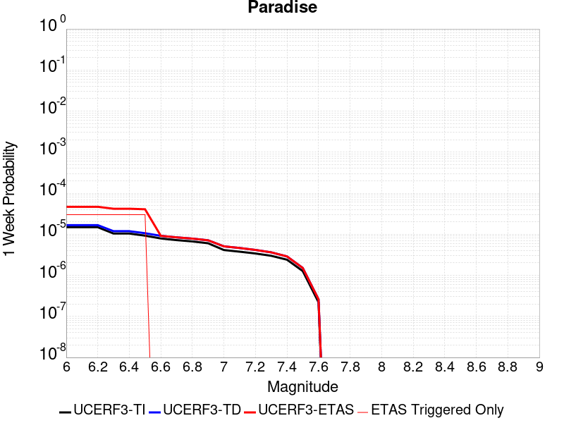 | 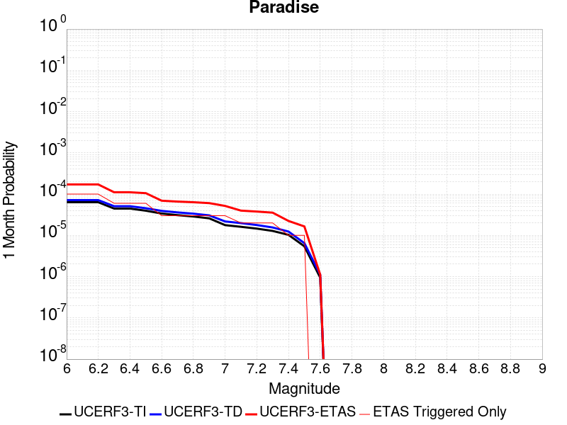 | 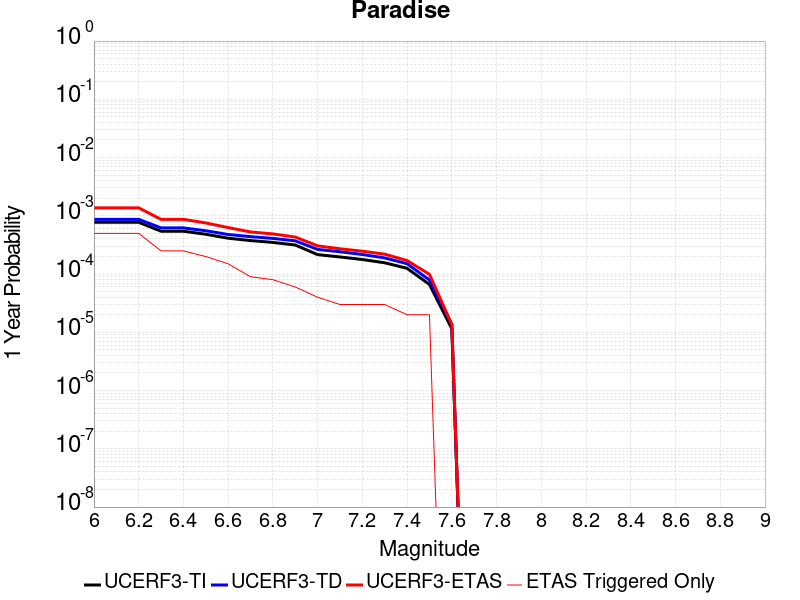 | 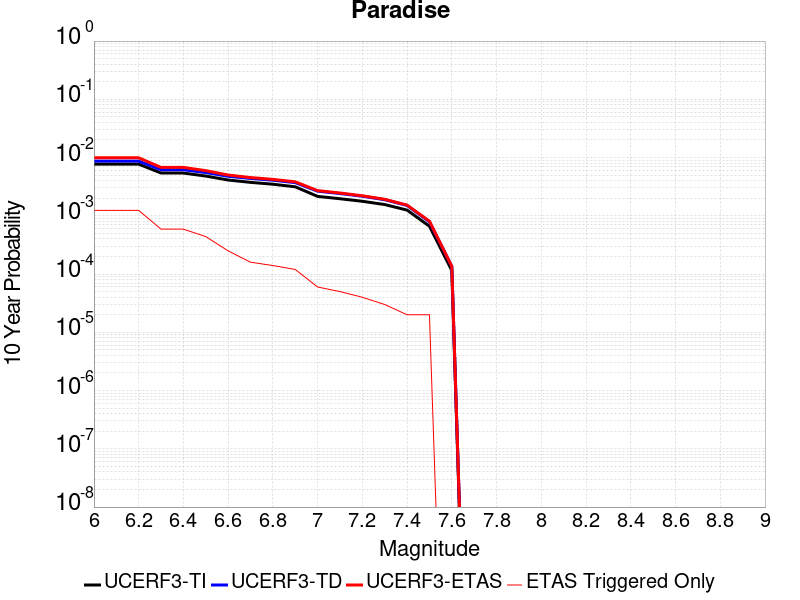 |

| Magnitude | 1 wk TI Prob | 1 wk TD Prob | 1 wk ETAS Prob | 1 wk ETAS/TD Gain | 1 wk ETAS Triggered Only | 1 mo TI Prob | 1 mo TD Prob | 1 mo ETAS Prob | 1 mo ETAS/TD Gain | 1 mo ETAS Triggered Only | 1 yr TI Prob | 1 yr TD Prob | 1 yr ETAS Prob | 1 yr ETAS/TD Gain | 1 yr ETAS Triggered Only | 10 yr TI Prob | 10 yr TD Prob | 10 yr ETAS Prob | 10 yr ETAS/TD Gain | 10 yr ETAS Triggered Only |
|-----|-----|-----|-----|-----|-----|-----|-----|-----|-----|-----|-----|-----|-----|-----|-----|-----|-----|-----|-----|-----|
| 6.0 | 1.4851273E-5 | 1.6694828E-5 | 4.6694327E-5 | 2.7969337 | 3.0E-5 | 6.364676E-5 | 7.154744E-5 | 1.7154028E-4 | 2.3975742 | 1.0E-4 | 7.7462377E-4 | 8.707655E-4 | 0.0013703301 | 1.5737075 | 5.0E-4 | 0.0077192914 | 0.008675915 | 0.009905157 | 1.1416844 | 0.00124 |
| 6.1 | 1.4851273E-5 | 1.6694828E-5 | 4.6694327E-5 | 2.7969337 | 3.0E-5 | 6.364676E-5 | 7.154744E-5 | 1.7154028E-4 | 2.3975742 | 1.0E-4 | 7.7462377E-4 | 8.707655E-4 | 0.0013703301 | 1.5737075 | 5.0E-4 | 0.0077192914 | 0.008675915 | 0.009905157 | 1.1416844 | 0.00124 |
| 6.2 | 1.4851273E-5 | 1.6694828E-5 | 4.6694327E-5 | 2.7969337 | 3.0E-5 | 6.364676E-5 | 7.154744E-5 | 1.7154028E-4 | 2.3975742 | 1.0E-4 | 7.7462377E-4 | 8.707655E-4 | 0.0013703301 | 1.5737075 | 5.0E-4 | 0.0077192914 | 0.008675915 | 0.009905157 | 1.1416844 | 0.00124 |
| 6.3 | 1.0426831E-5 | 1.1888711E-5 | 4.1888354E-5 | 3.5233724 | 3.0E-5 | 4.4685654E-5 | 5.0950657E-5 | 1.109476E-4 | 2.17755 | 6.0E-5 | 5.43912E-4 | 6.201536E-4 | 8.699986E-4 | 1.4028759 | 2.5E-4 | 0.0054258266 | 0.0061848387 | 0.0067711896 | 1.0948045 | 5.9E-4 |
| 6.4 | 1.0426831E-5 | 1.1888711E-5 | 4.1888354E-5 | 3.5233724 | 3.0E-5 | 4.4685654E-5 | 5.0950657E-5 | 1.109476E-4 | 2.17755 | 6.0E-5 | 5.43912E-4 | 6.201536E-4 | 8.699986E-4 | 1.4028759 | 2.5E-4 | 0.0054258266 | 0.0061848387 | 0.0067711896 | 1.0948045 | 5.9E-4 |
| 6.5 | 9.25027E-6 | 1.0620039E-5 | 4.061972E-5 | 3.8248184 | 3.0E-5 | 3.964341E-5 | 4.5513687E-5 | 1.0551095E-4 | 2.3182247 | 6.0E-5 | 4.8255164E-4 | 5.5399316E-4 | 7.5388234E-4 | 1.3608153 | 2.0E-4 | 0.0048150513 | 0.0055266204 | 0.005964189 | 1.0791746 | 4.4E-4 |
| 6.6 | 7.904275E-6 | 9.15959E-6 | 9.15959E-6 | 1.0 | 0.0 | 3.3875025E-5 | 3.925482E-5 | 6.925364E-5 | 1.7642074 | 3.0E-5 | 4.1235037E-4 | 4.7782654E-4 | 6.277549E-4 | 1.3137715 | 1.5E-4 | 0.0041158604 | 0.0047683883 | 0.0050171963 | 1.0521786 | 2.5E-4 |
| 6.7 | 7.2061953E-6 | 8.407307E-6 | 8.407307E-6 | 1.0 | 0.0 | 3.088333E-5 | 3.603084E-5 | 6.602976E-5 | 1.8325901 | 3.0E-5 | 3.7593965E-4 | 4.3859085E-4 | 5.2855135E-4 | 1.2051127 | 9.0E-5 | 0.003753043 | 0.0043776217 | 0.004536921 | 1.0363895 | 1.6E-4 |
| 6.8 | 6.6948724E-6 | 7.84222E-6 | 7.84222E-6 | 1.0 | 0.0 | 2.8691995E-5 | 3.3609103E-5 | 6.3608095E-5 | 1.8925854 | 3.0E-5 | 3.4926904E-4 | 4.0911755E-4 | 4.890848E-4 | 1.1954628 | 8.0E-5 | 0.003487206 | 0.0040840013 | 0.0042234296 | 1.0341401 | 1.4E-4 |
| 6.9 | 6.0421025E-6 | 7.1306695E-6 | 7.1306695E-6 | 1.0 | 0.0 | 2.5894467E-5 | 3.0559673E-5 | 6.0558756E-5 | 1.981656 | 3.0E-5 | 3.1521954E-4 | 3.7200388E-4 | 4.3198158E-4 | 1.1612287 | 6.0E-5 | 0.0031477278 | 0.0037141498 | 0.0038337042 | 1.0321889 | 1.2E-4 |
| 7.0 | 4.134091E-6 | 5.080343E-6 | 5.080343E-6 | 1.0 | 0.0 | 1.7717413E-5 | 2.1772723E-5 | 5.177207E-5 | 2.3778408 | 3.0E-5 | 2.1568815E-4 | 2.6505222E-4 | 3.050416E-4 | 1.1508737 | 4.0E-5 | 0.0021547892 | 0.002647514 | 0.002707355 | 1.0226028 | 6.0E-5 |
| 7.1 | 3.7674888E-6 | 4.6318996E-6 | 4.6318996E-6 | 1.0 | 0.0 | 1.6146281E-5 | 1.9850857E-5 | 3.985046E-5 | 2.0074933 | 2.0E-5 | 1.9656324E-4 | 2.416589E-4 | 2.7165163E-4 | 1.1241119 | 3.0E-5 | 0.0019638946 | 0.0024141117 | 0.002463991 | 1.0206616 | 5.0E-5 |
| 7.2 | 3.4065345E-6 | 4.15675E-6 | 4.15675E-6 | 1.0 | 0.0 | 1.4599351E-5 | 1.7814531E-5 | 3.7814174E-5 | 2.122659 | 2.0E-5 | 1.777326E-4 | 2.1687182E-4 | 2.4686533E-4 | 1.1383005 | 3.0E-5 | 0.0017759053 | 0.00216675 | 0.0022066634 | 1.0184208 | 4.0E-5 |
| 7.3 | 2.9934936E-6 | 3.629339E-6 | 3.629339E-6 | 1.0 | 0.0 | 1.2829195E-5 | 1.5554226E-5 | 3.5553916E-5 | 2.2858043 | 2.0E-5 | 1.5618425E-4 | 1.8935773E-4 | 2.1935203E-4 | 1.1584003 | 3.0E-5 | 0.0015607453 | 0.001892109 | 0.0019220524 | 1.0158253 | 3.0E-5 |
| 7.4 | 2.4049796E-6 | 2.8890006E-6 | 2.8890006E-6 | 1.0 | 0.0 | 1.0307015E-5 | 1.2381381E-5 | 2.2381257E-5 | 1.8076544 | 1.0E-5 | 1.2548068E-4 | 1.5073431E-4 | 1.707313E-4 | 1.1326638 | 2.0E-5 | 0.0012540985 | 0.0015064622 | 0.0015264321 | 1.0132562 | 2.0E-5 |
| 7.5 | 1.2710091E-6 | 1.513476E-6 | 1.513476E-6 | 1.0 | 0.0 | 5.44717E-6 | 6.486317E-6 | 1.6486252E-5 | 2.541697 | 1.0E-5 | 6.631728E-5 | 7.896929E-5 | 9.8967714E-5 | 1.253243 | 2.0E-5 | 6.6297496E-4 | 7.89535E-4 | 8.095192E-4 | 1.0253114 | 2.0E-5 |
| 7.6 | 2.21172E-7 | 2.6039717E-7 | 2.6039717E-7 | 1.0 | 0.0 | 9.478797E-7 | 1.1159875E-6 | 1.1159875E-6 | 1.0 | 0.0 | 1.1540374E-5 | 1.3587092E-5 | 1.3587092E-5 | 1.0 | 0.0 | 1.1539775E-4 | 1.3586543E-4 | 1.3586543E-4 | 1.0 | 0.0 |

## Garlic Springs
*[(top)](#table-of-contents)*

| 1 Week | 1 Month | 1 Year | 10 Year |
|-----|-----|-----|-----|
| 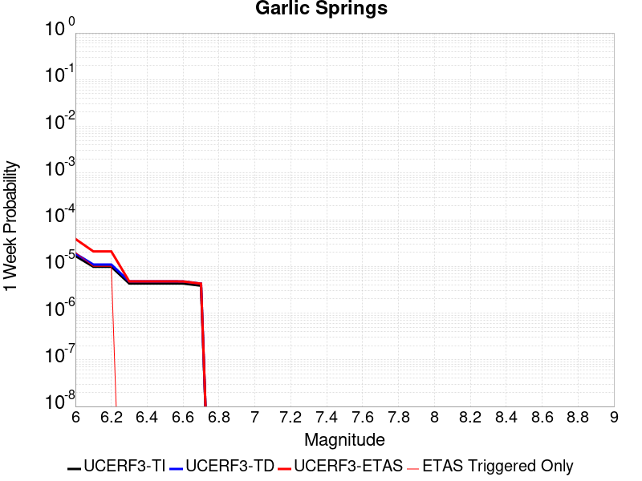 | 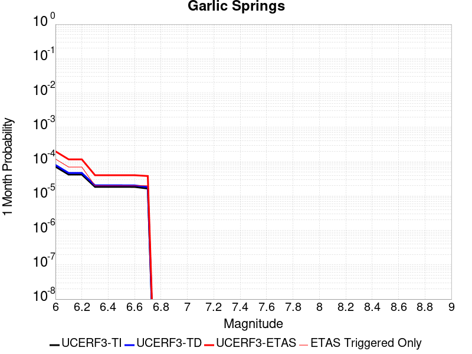 | 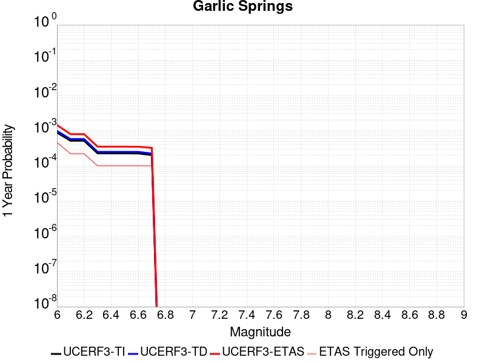 | 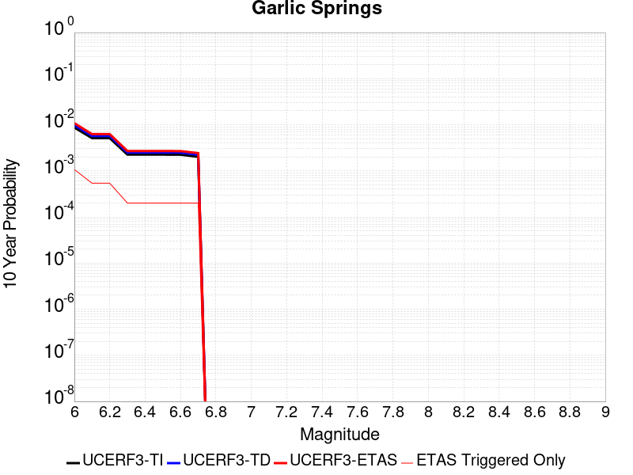 |

| Magnitude | 1 wk TI Prob | 1 wk TD Prob | 1 wk ETAS Prob | 1 wk ETAS/TD Gain | 1 wk ETAS Triggered Only | 1 mo TI Prob | 1 mo TD Prob | 1 mo ETAS Prob | 1 mo ETAS/TD Gain | 1 mo ETAS Triggered Only | 1 yr TI Prob | 1 yr TD Prob | 1 yr ETAS Prob | 1 yr ETAS/TD Gain | 1 yr ETAS Triggered Only | 10 yr TI Prob | 10 yr TD Prob | 10 yr ETAS Prob | 10 yr ETAS/TD Gain | 10 yr ETAS Triggered Only |
|-----|-----|-----|-----|-----|-----|-----|-----|-----|-----|-----|-----|-----|-----|-----|-----|-----|-----|-----|-----|-----|
| 6.0 | 1.6760017E-5 | 1.8777086E-5 | 3.877671E-5 | 2.065108 | 2.0E-5 | 7.182667E-5 | 8.04714E-5 | 2.0046174E-4 | 2.491093 | 1.2E-4 | 8.7413884E-4 | 9.794163E-4 | 0.0014389658 | 1.4692075 | 4.6E-4 | 0.008707083 | 0.009762544 | 0.010822098 | 1.1085325 | 0.00107 |
| 6.1 | 9.852767E-6 | 1.0973727E-5 | 2.0973617E-5 | 1.9112575 | 1.0E-5 | 4.222546E-5 | 4.7029807E-5 | 1.1702652E-4 | 2.4883478 | 7.0E-5 | 5.139737E-4 | 5.7250843E-4 | 7.923825E-4 | 1.3840538 | 2.2E-4 | 0.005127866 | 0.005717294 | 0.006254207 | 1.0939102 | 5.4E-4 |
| 6.2 | 9.852767E-6 | 1.0973727E-5 | 2.0973617E-5 | 1.9112575 | 1.0E-5 | 4.222546E-5 | 4.7029807E-5 | 1.1702652E-4 | 2.4883478 | 7.0E-5 | 5.139737E-4 | 5.7250843E-4 | 7.923825E-4 | 1.3840538 | 2.2E-4 | 0.005127866 | 0.005717294 | 0.006254207 | 1.0939102 | 5.4E-4 |
| 6.3 | 4.3167724E-6 | 4.778086E-6 | 4.778086E-6 | 1.0 | 0.0 | 1.8500323E-5 | 2.0477479E-5 | 4.047707E-5 | 1.9766628 | 2.0E-5 | 2.2521814E-4 | 2.493078E-4 | 3.492829E-4 | 1.4010105 | 1.0E-4 | 0.0022499003 | 0.0024925398 | 0.0026920412 | 1.0800395 | 2.0E-4 |
| 6.4 | 4.3167724E-6 | 4.778086E-6 | 4.778086E-6 | 1.0 | 0.0 | 1.8500323E-5 | 2.0477479E-5 | 4.047707E-5 | 1.9766628 | 2.0E-5 | 2.2521814E-4 | 2.493078E-4 | 3.492829E-4 | 1.4010105 | 1.0E-4 | 0.0022499003 | 0.0024925398 | 0.0026920412 | 1.0800395 | 2.0E-4 |
| 6.5 | 4.3167724E-6 | 4.778086E-6 | 4.778086E-6 | 1.0 | 0.0 | 1.8500323E-5 | 2.0477479E-5 | 4.047707E-5 | 1.9766628 | 2.0E-5 | 2.2521814E-4 | 2.493078E-4 | 3.492829E-4 | 1.4010105 | 1.0E-4 | 0.0022499003 | 0.0024925398 | 0.0026920412 | 1.0800395 | 2.0E-4 |
| 6.6 | 4.301311E-6 | 4.7609537E-6 | 4.7609537E-6 | 1.0 | 0.0 | 1.8434059E-5 | 2.0404059E-5 | 4.040365E-5 | 1.9801772 | 2.0E-5 | 2.2441156E-4 | 2.4841412E-4 | 3.483893E-4 | 1.4024535 | 1.0E-4 | 0.0022418506 | 0.0024836229 | 0.0026831261 | 1.0803275 | 2.0E-4 |
| 6.7 | 3.8599724E-6 | 4.271111E-6 | 4.271111E-6 | 1.0 | 0.0 | 1.6542634E-5 | 1.830476E-5 | 3.8304395E-5 | 2.092592 | 2.0E-5 | 2.0138794E-4 | 2.2286046E-4 | 3.2283817E-4 | 1.4486113 | 1.0E-4 | 0.0020120554 | 0.0022286046 | 0.002428159 | 1.0895423 | 2.0E-4 |

## San Andreas (San Bernardino S)
*[(top)](#table-of-contents)*

| 1 Week | 1 Month | 1 Year | 10 Year |
|-----|-----|-----|-----|
| 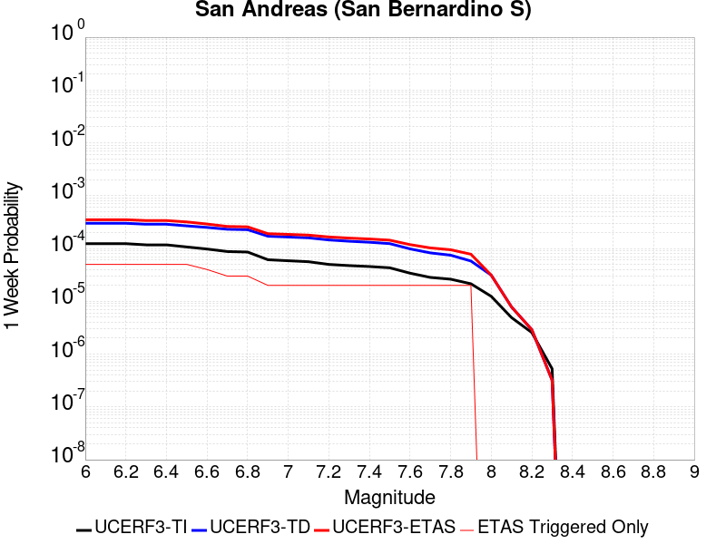 | 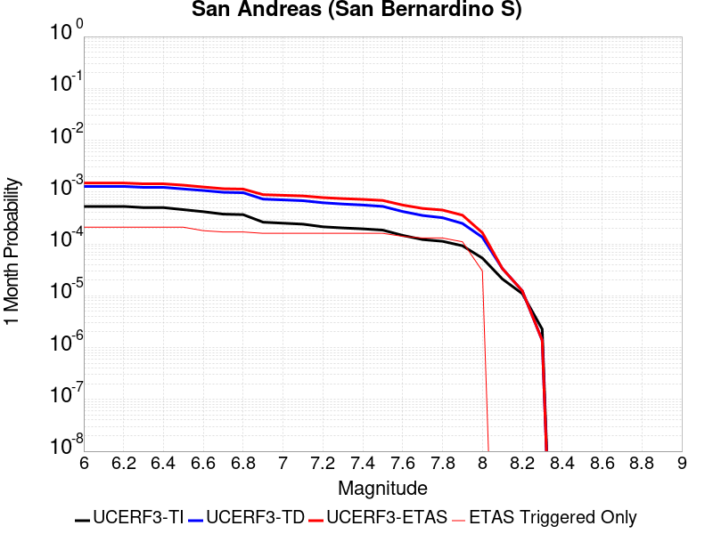 | 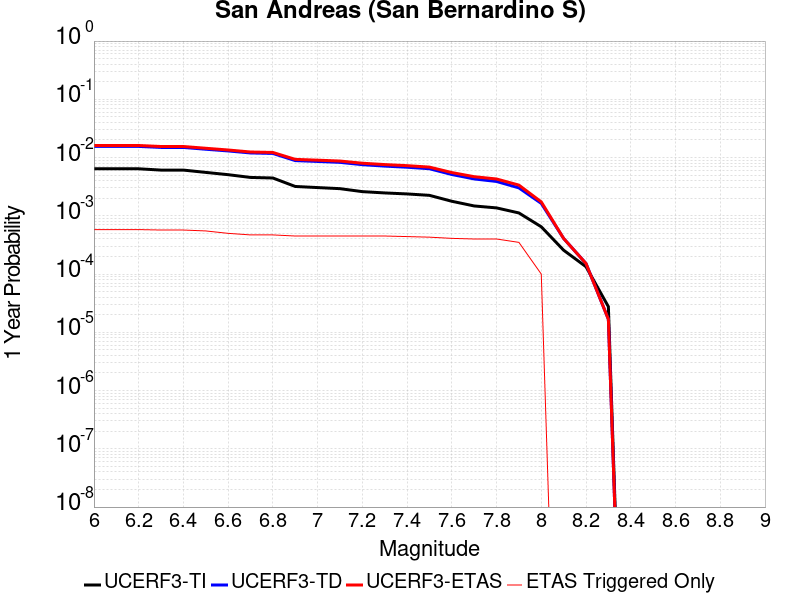 | 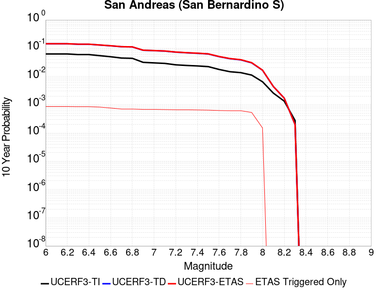 |

| Magnitude | 1 wk TI Prob | 1 wk TD Prob | 1 wk ETAS Prob | 1 wk ETAS/TD Gain | 1 wk ETAS Triggered Only | 1 mo TI Prob | 1 mo TD Prob | 1 mo ETAS Prob | 1 mo ETAS/TD Gain | 1 mo ETAS Triggered Only | 1 yr TI Prob | 1 yr TD Prob | 1 yr ETAS Prob | 1 yr ETAS/TD Gain | 1 yr ETAS Triggered Only | 10 yr TI Prob | 10 yr TD Prob | 10 yr ETAS Prob | 10 yr ETAS/TD Gain | 10 yr ETAS Triggered Only |
|-----|-----|-----|-----|-----|-----|-----|-----|-----|-----|-----|-----|-----|-----|-----|-----|-----|-----|-----|-----|-----|
| 6.0 | 1.2336002E-4 | 3.0008188E-4 | 3.500669E-4 | 1.1665711 | 5.0E-5 | 5.2857865E-4 | 0.0012854574 | 0.0014951875 | 1.1631559 | 2.1E-4 | 0.006416472 | 0.015543095 | 0.01611408 | 1.0367357 | 5.8E-4 | 0.06234337 | 0.14285327 | 0.14359044 | 1.0051602 | 8.6E-4 |
| 6.1 | 1.2336002E-4 | 3.0008188E-4 | 3.500669E-4 | 1.1665711 | 5.0E-5 | 5.2857865E-4 | 0.0012854574 | 0.0014951875 | 1.1631559 | 2.1E-4 | 0.006416472 | 0.015543095 | 0.01611408 | 1.0367357 | 5.8E-4 | 0.06234337 | 0.14285327 | 0.14359044 | 1.0051602 | 8.6E-4 |
| 6.2 | 1.2336002E-4 | 3.0008188E-4 | 3.500669E-4 | 1.1665711 | 5.0E-5 | 5.2857865E-4 | 0.0012854574 | 0.0014951875 | 1.1631559 | 2.1E-4 | 0.006416472 | 0.015543095 | 0.01611408 | 1.0367357 | 5.8E-4 | 0.06234337 | 0.14285327 | 0.14359044 | 1.0051602 | 8.6E-4 |
| 6.3 | 1.1712257E-4 | 2.8796456E-4 | 3.3795016E-4 | 1.1735824 | 5.0E-5 | 5.018573E-4 | 0.0012335759 | 0.0014433168 | 1.1700268 | 2.1E-4 | 0.006093008 | 0.014920204 | 0.015481699 | 1.0376332 | 5.7E-4 | 0.059286322 | 0.1375617 | 0.13829476 | 1.005329 | 8.5E-4 |
| 6.4 | 1.1712257E-4 | 2.8796456E-4 | 3.3795016E-4 | 1.1735824 | 5.0E-5 | 5.018573E-4 | 0.0012335759 | 0.0014433168 | 1.1700268 | 2.1E-4 | 0.006093008 | 0.014920204 | 0.015481699 | 1.0376332 | 5.7E-4 | 0.059286322 | 0.1375617 | 0.13829476 | 1.005329 | 8.5E-4 |
| 6.5 | 1.0689076E-4 | 2.680925E-4 | 3.180791E-4 | 1.1864527 | 5.0E-5 | 4.5802278E-4 | 0.0011484867 | 0.0013582455 | 1.1826394 | 2.1E-4 | 0.0055621783 | 0.013897794 | 0.014440151 | 1.0390246 | 5.5E-4 | 0.05425003 | 0.12880887 | 0.12952325 | 1.005546 | 8.2E-4 |
| 6.6 | 9.7648895E-5 | 2.5054E-4 | 2.9053E-4 | 1.1596152 | 4.0E-5 | 4.1842813E-4 | 0.0010733247 | 0.0012531315 | 1.1675233 | 1.8E-4 | 0.005082469 | 0.012993795 | 0.013487298 | 1.03798 | 5.0E-4 | 0.049677886 | 0.120968685 | 0.12163675 | 1.0055226 | 7.6E-4 |
| 6.7 | 8.757013E-5 | 2.3124735E-4 | 2.612404E-4 | 1.1297013 | 3.0E-5 | 3.7524657E-4 | 9.907059E-4 | 0.0011605375 | 1.1714249 | 1.7E-4 | 0.00455906 | 0.0119992215 | 0.012463582 | 1.0386992 | 4.7E-4 | 0.04466656 | 0.112276904 | 0.11289831 | 1.0055345 | 7.0E-4 |
| 6.8 | 8.562978E-5 | 2.2684586E-4 | 2.5683906E-4 | 1.1322184 | 3.0E-5 | 3.6693315E-4 | 9.718565E-4 | 0.0011416913 | 1.174753 | 1.7E-4 | 0.004458263 | 0.011772226 | 0.012236693 | 1.0394545 | 4.7E-4 | 0.043698758 | 0.11028712 | 0.110909924 | 1.0056471 | 7.0E-4 |
| 6.9 | 6.124075E-5 | 1.7069177E-4 | 1.9068836E-4 | 1.1171503 | 2.0E-5 | 2.6243398E-4 | 7.313319E-4 | 8.912149E-4 | 1.2186189 | 1.6E-4 | 0.0031904527 | 0.008867822 | 0.009313831 | 1.0502952 | 4.5E-4 | 0.031450346 | 0.08419722 | 0.08481997 | 1.0073962 | 6.8E-4 |
| 7.0 | 5.8598747E-5 | 1.6498158E-4 | 1.8497829E-4 | 1.1212057 | 2.0E-5 | 2.5111332E-4 | 7.0687314E-4 | 8.6676003E-4 | 1.2261889 | 1.6E-4 | 0.0030530186 | 0.008572415 | 0.009018558 | 1.0520439 | 4.5E-4 | 0.03011414 | 0.08151485 | 0.08213942 | 1.007662 | 6.8E-4 |
| 7.1 | 5.613814E-5 | 1.5916677E-4 | 1.7916359E-4 | 1.1256344 | 2.0E-5 | 2.4056983E-4 | 6.819657E-4 | 8.418566E-4 | 1.234456 | 1.6E-4 | 0.0029250039 | 0.008271504 | 0.008717782 | 1.0539536 | 4.5E-4 | 0.028868021 | 0.07881369 | 0.079430886 | 1.0078311 | 6.7E-4 |
| 7.2 | 4.991222E-5 | 1.4523068E-4 | 1.6522777E-4 | 1.137692 | 2.0E-5 | 2.1389198E-4 | 6.222691E-4 | 7.821696E-4 | 1.2569635 | 1.6E-4 | 0.002601025 | 0.007549912 | 0.007996514 | 1.0591533 | 4.5E-4 | 0.025707912 | 0.07226731 | 0.07287961 | 1.0084728 | 6.6E-4 |
| 7.3 | 4.7410045E-5 | 1.3717203E-4 | 1.5716928E-4 | 1.1457824 | 2.0E-5 | 2.0317009E-4 | 5.87748E-4 | 7.4765395E-4 | 1.2720655 | 1.6E-4 | 0.0024707897 | 0.0071324394 | 0.00757923 | 1.062642 | 4.5E-4 | 0.024434982 | 0.068549454 | 0.06916422 | 1.0089681 | 6.6E-4 |
| 7.4 | 4.5556746E-5 | 1.3125056E-4 | 1.5124794E-4 | 1.1523603 | 2.0E-5 | 1.952286E-4 | 5.623814E-4 | 7.222915E-4 | 1.2843444 | 1.6E-4 | 0.002374317 | 0.006825577 | 0.0072625736 | 1.0640234 | 4.4E-4 | 0.023491086 | 0.065801695 | 0.066408925 | 1.0092281 | 6.5E-4 |
| 7.5 | 4.3084514E-5 | 1.2360324E-4 | 1.4360076E-4 | 1.1617881 | 2.0E-5 | 1.8463485E-4 | 5.296209E-4 | 6.8953616E-4 | 1.3019428 | 1.6E-4 | 0.0022456115 | 0.006429142 | 0.0068563772 | 1.066453 | 4.3E-4 | 0.022230545 | 0.062202238 | 0.06280243 | 1.009649 | 6.4E-4 |
| 7.6 | 3.408608E-5 | 9.838344E-5 | 1.1838147E-4 | 1.2032663 | 2.0E-5 | 1.4607502E-4 | 4.2157527E-4 | 5.6151627E-4 | 1.3319478 | 1.4E-4 | 0.0017770125 | 0.0051206253 | 0.005528526 | 1.0796584 | 4.1E-4 | 0.017628696 | 0.050032794 | 0.050621774 | 1.0117719 | 6.2E-4 |
| 7.7 | 2.8315713E-5 | 8.251331E-5 | 1.0251166E-4 | 1.2423651 | 2.0E-5 | 1.2134742E-4 | 3.5358057E-4 | 4.8353462E-4 | 1.3675373 | 1.3E-4 | 0.0014764034 | 0.0042963554 | 0.004694637 | 1.0927022 | 4.0E-4 | 0.01466633 | 0.042283237 | 0.042867444 | 1.0138165 | 6.1E-4 |
| 7.8 | 2.6222975E-5 | 7.4655676E-5 | 9.4654184E-5 | 1.2678766 | 2.0E-5 | 1.1237934E-4 | 3.1991367E-4 | 4.4987208E-4 | 1.4062296 | 1.3E-4 | 0.0013673597 | 0.0038879989 | 0.004286444 | 1.1024806 | 4.0E-4 | 0.013589768 | 0.038447864 | 0.03903441 | 1.0152557 | 6.1E-4 |
| 7.9 | 2.1469694E-5 | 5.7899328E-5 | 7.789817E-5 | 1.3454071 | 2.0E-5 | 9.200973E-5 | 2.4811638E-4 | 3.580891E-4 | 1.4432303 | 1.1E-4 | 0.0011196428 | 0.0030166355 | 0.0033655798 | 1.1156733 | 3.5E-4 | 0.011140184 | 0.030161513 | 0.030675529 | 1.017042 | 5.3E-4 |
| 8.0 | 1.2420249E-5 | 3.13304E-5 | 3.13304E-5 | 1.0 | 0.0 | 5.322855E-5 | 1.3426624E-4 | 1.6426221E-4 | 1.2234067 | 3.0E-5 | 6.478649E-4 | 0.0016334667 | 0.0017333034 | 1.0611194 | 1.0E-4 | 0.0064597935 | 0.01652784 | 0.016675362 | 1.0089256 | 1.5E-4 |
| 8.1 | 4.9197724E-6 | 7.826499E-6 | 7.826499E-6 | 1.0 | 0.0 | 2.1084568E-5 | 3.354171E-5 | 3.354171E-5 | 1.0 | 0.0 | 2.566744E-4 | 4.082939E-4 | 4.082939E-4 | 1.0 | 0.0 | 0.002563781 | 0.0043864558 | 0.0043864558 | 1.0 | 0.0 |
| 8.2 | 2.5634774E-6 | 2.9086386E-6 | 2.9086386E-6 | 1.0 | 0.0 | 1.0986286E-5 | 1.2465535E-5 | 1.2465535E-5 | 1.0 | 0.0 | 1.3374983E-4 | 1.5175737E-4 | 1.5175737E-4 | 1.0 | 0.0 | 0.0013366934 | 0.0017059813 | 0.0017059813 | 1.0 | 0.0 |
| 8.3 | 5.2850464E-7 | 3.2114642E-7 | 3.2114642E-7 | 1.0 | 0.0 | 2.2650179E-6 | 1.3763412E-6 | 1.3763412E-6 | 1.0 | 0.0 | 2.7576245E-5 | 1.6756836E-5 | 1.6756836E-5 | 1.0 | 0.0 | 2.7572823E-4 | 1.9884938E-4 | 1.9884938E-4 | 1.0 | 0.0 |

## Death Valley (Black Mtns Frontal)
*[(top)](#table-of-contents)*

| 1 Week | 1 Month | 1 Year | 10 Year |
|-----|-----|-----|-----|
| 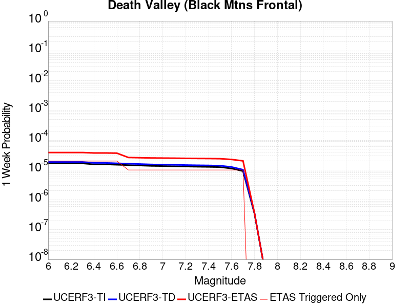 | 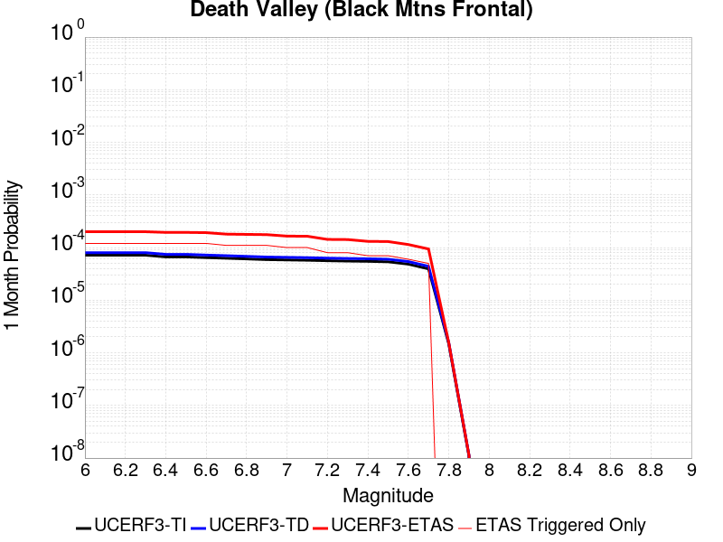 | 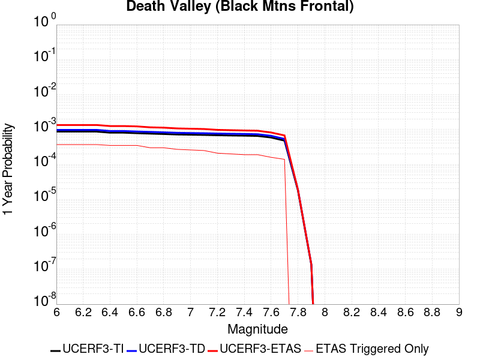 | 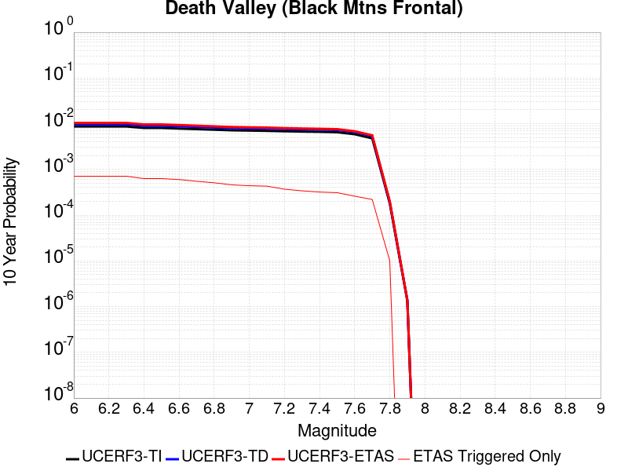 |

| Magnitude | 1 wk TI Prob | 1 wk TD Prob | 1 wk ETAS Prob | 1 wk ETAS/TD Gain | 1 wk ETAS Triggered Only | 1 mo TI Prob | 1 mo TD Prob | 1 mo ETAS Prob | 1 mo ETAS/TD Gain | 1 mo ETAS Triggered Only | 1 yr TI Prob | 1 yr TD Prob | 1 yr ETAS Prob | 1 yr ETAS/TD Gain | 1 yr ETAS Triggered Only | 10 yr TI Prob | 10 yr TD Prob | 10 yr ETAS Prob | 10 yr ETAS/TD Gain | 10 yr ETAS Triggered Only |
|-----|-----|-----|-----|-----|-----|-----|-----|-----|-----|-----|-----|-----|-----|-----|-----|-----|-----|-----|-----|-----|
| 6.0 | 1.6707214E-5 | 1.8670515E-5 | 3.867014E-5 | 2.0711877 | 2.0E-5 | 7.160038E-5 | 8.001408E-5 | 2.0000448E-4 | 2.4996161 | 1.2E-4 | 8.71386E-4 | 9.737437E-4 | 0.0013433833 | 1.3796068 | 3.7E-4 | 0.00867977 | 0.009695624 | 0.01039874 | 1.072519 | 7.1E-4 |
| 6.1 | 1.6707214E-5 | 1.8670515E-5 | 3.867014E-5 | 2.0711877 | 2.0E-5 | 7.160038E-5 | 8.001408E-5 | 2.0000448E-4 | 2.4996161 | 1.2E-4 | 8.71386E-4 | 9.737437E-4 | 0.0013433833 | 1.3796068 | 3.7E-4 | 0.00867977 | 0.009695624 | 0.01039874 | 1.072519 | 7.1E-4 |
| 6.2 | 1.6707214E-5 | 1.8670515E-5 | 3.867014E-5 | 2.0711877 | 2.0E-5 | 7.160038E-5 | 8.001408E-5 | 2.0000448E-4 | 2.4996161 | 1.2E-4 | 8.71386E-4 | 9.737437E-4 | 0.0013433833 | 1.3796068 | 3.7E-4 | 0.00867977 | 0.009695624 | 0.01039874 | 1.072519 | 7.1E-4 |
| 6.3 | 1.6707214E-5 | 1.8670515E-5 | 3.867014E-5 | 2.0711877 | 2.0E-5 | 7.160038E-5 | 8.001408E-5 | 2.0000448E-4 | 2.4996161 | 1.2E-4 | 8.71386E-4 | 9.737437E-4 | 0.0013433833 | 1.3796068 | 3.7E-4 | 0.00867977 | 0.009695624 | 0.01039874 | 1.072519 | 7.1E-4 |
| 6.4 | 1.5515609E-5 | 1.7338441E-5 | 3.7338094E-5 | 2.1534863 | 2.0E-5 | 6.649377E-5 | 7.430553E-5 | 1.942966E-4 | 2.6148338 | 1.2E-4 | 8.0926094E-4 | 9.043004E-4 | 0.0012539839 | 1.3866895 | 3.5E-4 | 0.008063202 | 0.009006891 | 0.0096312165 | 1.0693164 | 6.3E-4 |
| 6.5 | 1.5515609E-5 | 1.7338441E-5 | 3.7338094E-5 | 2.1534863 | 2.0E-5 | 6.649377E-5 | 7.430553E-5 | 1.942966E-4 | 2.6148338 | 1.2E-4 | 8.0926094E-4 | 9.043004E-4 | 0.0012539839 | 1.3866895 | 3.5E-4 | 0.008063202 | 0.009006891 | 0.0096312165 | 1.0693164 | 6.3E-4 |
| 6.6 | 1.5041828E-5 | 1.6809367E-5 | 3.680903E-5 | 2.1897929 | 2.0E-5 | 6.4463384E-5 | 7.203819E-5 | 1.9202955E-4 | 2.6656632 | 1.2E-4 | 7.8455906E-4 | 8.7671785E-4 | 0.001226411 | 1.3988662 | 3.5E-4 | 0.00781795 | 0.008733247 | 0.009328007 | 1.068103 | 6.0E-4 |
| 6.7 | 1.4634985E-5 | 1.6356233E-5 | 2.6356069E-5 | 1.6113777 | 1.0E-5 | 6.271985E-5 | 7.0096285E-5 | 1.8008858E-4 | 2.56916 | 1.1E-4 | 7.6334673E-4 | 8.530939E-4 | 0.001152838 | 1.3513612 | 3.0E-4 | 0.007607299 | 0.008498827 | 0.009044153 | 1.0641648 | 5.5E-4 |
| 6.8 | 1.4209158E-5 | 1.5882257E-5 | 2.5882098E-5 | 1.6296234 | 1.0E-5 | 6.089497E-5 | 6.806507E-5 | 1.7805758E-4 | 2.6159904 | 1.1E-4 | 7.4114406E-4 | 8.283828E-4 | 0.0011281343 | 1.3618515 | 3.0E-4 | 0.007386771 | 0.008253565 | 0.008759355 | 1.0612814 | 5.1E-4 |
| 6.9 | 1.3780098E-5 | 1.5404798E-5 | 2.5404643E-5 | 1.6491385 | 1.0E-5 | 5.9056227E-5 | 6.601892E-5 | 1.7601166E-4 | 2.666079 | 1.1E-4 | 7.1877235E-4 | 8.0348935E-4 | 0.0010732724 | 1.3357643 | 2.7E-4 | 0.0071645193 | 0.008006439 | 0.008462755 | 1.0569937 | 4.6E-4 |
| 7.0 | 1.3585064E-5 | 1.5188357E-5 | 2.5188205E-5 | 1.6583891 | 1.0E-5 | 5.8220405E-5 | 6.5091364E-5 | 1.6508486E-4 | 2.5362022 | 1.0E-4 | 7.086029E-4 | 7.9220464E-4 | 0.0010519987 | 1.327938 | 2.6E-4 | 0.007063476 | 0.007894398 | 0.008330924 | 1.0552957 | 4.4E-4 |
| 7.1 | 1.3398601E-5 | 1.4981538E-5 | 2.4981387E-5 | 1.6674782 | 1.0E-5 | 5.742131E-5 | 6.420504E-5 | 1.6419862E-4 | 2.55741 | 1.0E-4 | 6.9888023E-4 | 7.814215E-4 | 0.0010312261 | 1.3196797 | 2.5E-4 | 0.0069668638 | 0.007787327 | 0.008213978 | 1.0547879 | 4.3E-4 |
| 7.2 | 1.3126312E-5 | 1.4679756E-5 | 2.4679608E-5 | 1.6812003 | 1.0E-5 | 5.6254412E-5 | 6.291175E-5 | 1.4290672E-4 | 2.2715425 | 8.0E-5 | 6.846822E-4 | 7.6568685E-4 | 9.7552605E-4 | 1.2740536 | 2.1E-4 | 0.006825765 | 0.007631071 | 0.007998248 | 1.048116 | 3.7E-4 |
| 7.3 | 1.2922429E-5 | 1.445398E-5 | 2.4453835E-5 | 1.691841 | 1.0E-5 | 5.5380664E-5 | 6.194419E-5 | 1.4193924E-4 | 2.2914052 | 8.0E-5 | 6.74051E-4 | 7.53915E-4 | 9.537642E-4 | 1.2650819 | 2.0E-4 | 0.006720101 | 0.0075141545 | 0.0078516 | 1.0449079 | 3.4E-4 |
| 7.4 | 1.2768878E-5 | 1.4283962E-5 | 2.4283818E-5 | 1.7000759 | 1.0E-5 | 5.4722615E-5 | 6.121557E-5 | 1.3121129E-4 | 2.14343 | 7.0E-5 | 6.660441E-4 | 7.4505014E-4 | 9.3490863E-4 | 1.2548264 | 1.9E-4 | 0.0066405144 | 0.007426102 | 0.0077437256 | 1.0427712 | 3.2E-4 |
| 7.5 | 1.2521929E-5 | 1.4012202E-5 | 2.4012063E-5 | 1.7136537 | 1.0E-5 | 5.366431E-5 | 6.0050945E-5 | 1.3004674E-4 | 2.165607 | 7.0E-5 | 6.531671E-4 | 7.308804E-4 | 9.207415E-4 | 1.2597704 | 1.9E-4 | 0.006512506 | 0.0072853426 | 0.007593084 | 1.0422412 | 3.1E-4 |
| 7.6 | 1.1301089E-5 | 1.2648318E-5 | 2.2648192E-5 | 1.790609 | 1.0E-5 | 4.8432343E-5 | 5.420598E-5 | 1.14202725E-4 | 2.106829 | 6.0E-5 | 5.895042E-4 | 6.597633E-4 | 8.196577E-4 | 1.2423512 | 1.6E-4 | 0.0058794282 | 0.006578598 | 0.0068368874 | 1.039262 | 2.6E-4 |
| 7.7 | 9.189108E-6 | 1.0283496E-5 | 2.0283393E-5 | 1.972422 | 1.0E-5 | 3.93813E-5 | 4.4071407E-5 | 9.4069204E-5 | 2.1344724 | 5.0E-5 | 4.7936183E-4 | 5.364423E-4 | 6.7636726E-4 | 1.2608386 | 1.4E-4 | 0.004783291 | 0.0053519853 | 0.005570808 | 1.0408863 | 2.2E-4 |
| 7.8 | 3.4586725E-7 | 3.648284E-7 | 3.648284E-7 | 1.0 | 0.0 | 1.4822873E-6 | 1.5635493E-6 | 1.5635493E-6 | 1.0 | 0.0 | 1.80467E-5 | 1.9036052E-5 | 1.9036052E-5 | 1.0 | 0.0 | 1.8045233E-4 | 1.9034464E-4 | 2.0034274E-4 | 1.0525262 | 1.0E-5 |
| 7.9 | 2.5591178E-9 | 2.6696847E-9 | 2.6696847E-9 | 1.0 | 0.0 | 1.0967647E-8 | 1.14415055E-8 | 1.14415055E-8 | 1.0 | 0.0 | 1.335311E-7 | 1.3930033E-7 | 1.3930033E-7 | 1.0 | 0.0 | 1.3353102E-6 | 1.3930033E-6 | 1.3930033E-6 | 1.0 | 0.0 |

## San Andreas (Big Bend)
*[(top)](#table-of-contents)*

| 1 Week | 1 Month | 1 Year | 10 Year |
|-----|-----|-----|-----|
| 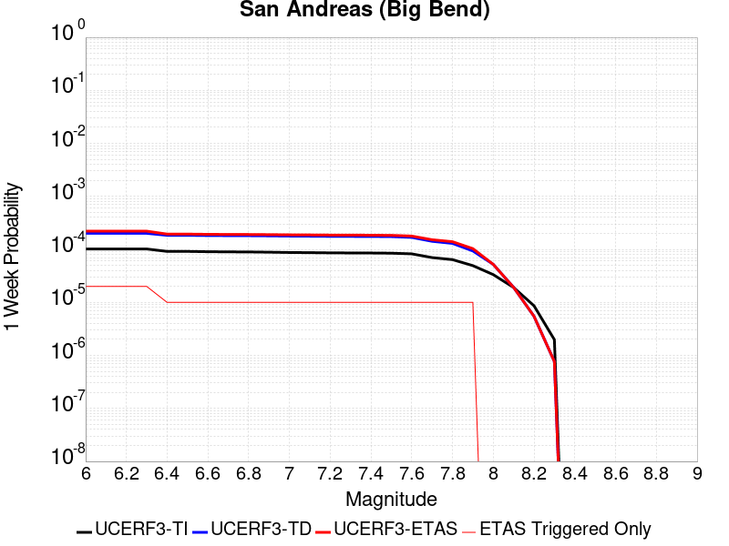 | 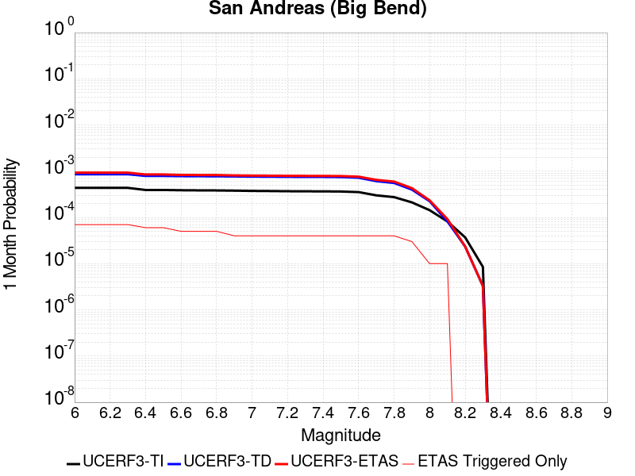 | 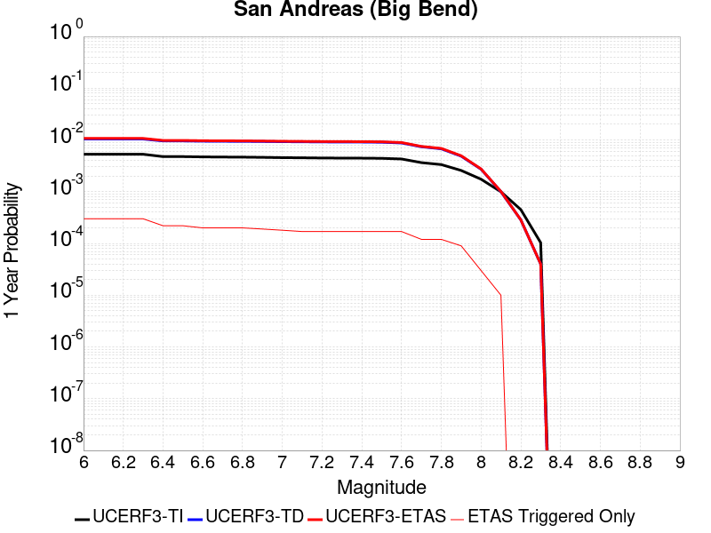 | 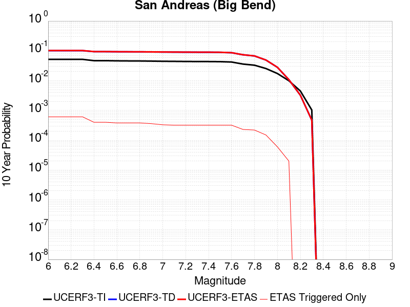 |

| Magnitude | 1 wk TI Prob | 1 wk TD Prob | 1 wk ETAS Prob | 1 wk ETAS/TD Gain | 1 wk ETAS Triggered Only | 1 mo TI Prob | 1 mo TD Prob | 1 mo ETAS Prob | 1 mo ETAS/TD Gain | 1 mo ETAS Triggered Only | 1 yr TI Prob | 1 yr TD Prob | 1 yr ETAS Prob | 1 yr ETAS/TD Gain | 1 yr ETAS Triggered Only | 10 yr TI Prob | 10 yr TD Prob | 10 yr ETAS Prob | 10 yr ETAS/TD Gain | 10 yr ETAS Triggered Only |
|-----|-----|-----|-----|-----|-----|-----|-----|-----|-----|-----|-----|-----|-----|-----|-----|-----|-----|-----|-----|-----|
| 6.0 | 1.0179969E-4 | 2.007936E-4 | 2.2078957E-4 | 1.0995848 | 2.0E-5 | 4.362114E-4 | 8.602612E-4 | 9.30201E-4 | 1.0813006 | 7.0E-5 | 0.0052979486 | 0.010423666 | 0.010720539 | 1.0284806 | 3.0E-4 | 0.051734097 | 0.10147992 | 0.10202801 | 1.005401 | 6.1E-4 |
| 6.1 | 1.0179969E-4 | 2.007936E-4 | 2.2078957E-4 | 1.0995848 | 2.0E-5 | 4.362114E-4 | 8.602612E-4 | 9.30201E-4 | 1.0813006 | 7.0E-5 | 0.0052979486 | 0.010423666 | 0.010720539 | 1.0284806 | 3.0E-4 | 0.051734097 | 0.10147992 | 0.10202801 | 1.005401 | 6.1E-4 |
| 6.2 | 1.0179969E-4 | 2.007936E-4 | 2.2078957E-4 | 1.0995848 | 2.0E-5 | 4.362114E-4 | 8.602612E-4 | 9.30201E-4 | 1.0813006 | 7.0E-5 | 0.0052979486 | 0.010423666 | 0.010720539 | 1.0284806 | 3.0E-4 | 0.051734097 | 0.10147992 | 0.10202801 | 1.005401 | 6.1E-4 |
| 6.3 | 1.0179969E-4 | 2.007936E-4 | 2.2078957E-4 | 1.0995848 | 2.0E-5 | 4.362114E-4 | 8.602612E-4 | 9.30201E-4 | 1.0813006 | 7.0E-5 | 0.0052979486 | 0.010423666 | 0.010720539 | 1.0284806 | 3.0E-4 | 0.051734097 | 0.10147992 | 0.10202801 | 1.005401 | 6.1E-4 |
| 6.4 | 9.1639464E-5 | 1.8436491E-4 | 1.9436306E-4 | 1.0542302 | 1.0E-5 | 3.9268145E-4 | 7.898963E-4 | 8.498489E-4 | 1.0758994 | 6.0E-5 | 0.0047704205 | 0.009574699 | 0.009792592 | 1.0227572 | 2.2E-4 | 0.046693064 | 0.09380581 | 0.09416829 | 1.0038642 | 4.0E-4 |
| 6.5 | 9.1639464E-5 | 1.8436491E-4 | 1.9436306E-4 | 1.0542302 | 1.0E-5 | 3.9268145E-4 | 7.898963E-4 | 8.498489E-4 | 1.0758994 | 6.0E-5 | 0.0047704205 | 0.009574699 | 0.009792592 | 1.0227572 | 2.2E-4 | 0.046693064 | 0.09380581 | 0.09416829 | 1.0038642 | 4.0E-4 |
| 6.6 | 9.042622E-5 | 1.8243532E-4 | 1.924335E-4 | 1.054804 | 1.0E-5 | 3.8748336E-4 | 7.8163156E-4 | 8.315925E-4 | 1.0639187 | 5.0E-5 | 0.0047074095 | 0.009474954 | 0.009673059 | 1.0209082 | 2.0E-4 | 0.046089325 | 0.09289978 | 0.09324447 | 1.0037104 | 3.8E-4 |
| 6.7 | 8.9836685E-5 | 1.8157862E-4 | 1.9157681E-4 | 1.0550625 | 1.0E-5 | 3.8495753E-4 | 7.779622E-4 | 8.279233E-4 | 1.0642204 | 5.0E-5 | 0.00467679 | 0.0094306655 | 0.009628779 | 1.0210074 | 2.0E-4 | 0.045795817 | 0.09249403 | 0.09283888 | 1.0037284 | 3.8E-4 |
| 6.8 | 8.9471854E-5 | 1.8104639E-4 | 1.9104457E-4 | 1.0552244 | 1.0E-5 | 3.8339442E-4 | 7.756825E-4 | 8.256438E-4 | 1.0644094 | 5.0E-5 | 0.004657841 | 0.0094031505 | 0.00960127 | 1.0210694 | 2.0E-4 | 0.04561414 | 0.09224122 | 0.09258617 | 1.0037396 | 3.8E-4 |
| 6.9 | 8.858234E-5 | 1.79866E-4 | 1.898642E-4 | 1.0555869 | 1.0E-5 | 3.7958333E-4 | 7.706267E-4 | 8.1059587E-4 | 1.0518658 | 4.0E-5 | 0.004611638 | 0.009342126 | 0.009530351 | 1.020148 | 1.9E-4 | 0.04517103 | 0.0916813 | 0.0920083 | 1.0035666 | 3.6E-4 |
| 7.0 | 8.7433385E-5 | 1.7825382E-4 | 1.8825203E-4 | 1.0560898 | 1.0E-5 | 3.746607E-4 | 7.637214E-4 | 8.0369087E-4 | 1.0523351 | 4.0E-5 | 0.004551957 | 0.00925877 | 0.009437104 | 1.019261 | 1.8E-4 | 0.044598386 | 0.09091569 | 0.091215685 | 1.0032997 | 3.3E-4 |
| 7.1 | 8.684964E-5 | 1.7737324E-4 | 1.8737146E-4 | 1.0563682 | 1.0E-5 | 3.7215967E-4 | 7.5994973E-4 | 7.9991936E-4 | 1.052595 | 4.0E-5 | 0.0045216335 | 0.00921324 | 0.009381673 | 1.0182817 | 1.7E-4 | 0.04430731 | 0.090497196 | 0.09078824 | 1.003216 | 3.2E-4 |
| 7.2 | 8.606521E-5 | 1.7627928E-4 | 1.8627751E-4 | 1.0567181 | 1.0E-5 | 3.6879873E-4 | 7.552641E-4 | 7.952339E-4 | 1.0529217 | 4.0E-5 | 0.0044808835 | 0.009156672 | 0.009325116 | 1.0183957 | 1.7E-4 | 0.043916024 | 0.08997767 | 0.09026888 | 1.0032364 | 3.2E-4 |
| 7.3 | 8.568266E-5 | 1.7569921E-4 | 1.8569746E-4 | 1.0569055 | 1.0E-5 | 3.6715972E-4 | 7.527795E-4 | 7.927494E-4 | 1.0530964 | 4.0E-5 | 0.0044610105 | 0.009126677 | 0.0092951255 | 1.0184567 | 1.7E-4 | 0.043725148 | 0.08969878 | 0.08999007 | 1.0032475 | 3.2E-4 |
| 7.4 | 8.5432206E-5 | 1.75325E-4 | 1.8532325E-4 | 1.057027 | 1.0E-5 | 3.6608664E-4 | 7.511767E-4 | 7.9114665E-4 | 1.0532098 | 4.0E-5 | 0.004447999 | 0.009107326 | 0.009275777 | 1.0184963 | 1.7E-4 | 0.043600157 | 0.08951893 | 0.08981028 | 1.0032547 | 3.2E-4 |
| 7.5 | 8.4791965E-5 | 1.74018E-4 | 1.8401626E-4 | 1.0574553 | 1.0E-5 | 3.633435E-4 | 7.455785E-4 | 7.8554865E-4 | 1.0536096 | 4.0E-5 | 0.0044147377 | 0.009039735 | 0.009208199 | 1.0186359 | 1.7E-4 | 0.043280575 | 0.08889646 | 0.08918802 | 1.0032797 | 3.2E-4 |
| 7.6 | 8.241105E-5 | 1.6847115E-4 | 1.7846946E-4 | 1.0593474 | 1.0E-5 | 3.531424E-4 | 7.218196E-4 | 7.617907E-4 | 1.0553755 | 4.0E-5 | 0.0042910352 | 0.00875283 | 0.008921343 | 1.0192523 | 1.7E-4 | 0.042091176 | 0.086273015 | 0.08656541 | 1.0033891 | 3.2E-4 |
| 7.7 | 7.00432E-5 | 1.421055E-4 | 1.521041E-4 | 1.0703603 | 1.0E-5 | 3.001506E-4 | 6.088815E-4 | 6.4885715E-4 | 1.0656543 | 4.0E-5 | 0.0036482112 | 0.0073879748 | 0.007507088 | 1.0161226 | 1.2E-4 | 0.035888977 | 0.07354461 | 0.073757686 | 1.0028974 | 2.3E-4 |
| 7.8 | 6.415362E-5 | 1.297439E-4 | 1.397426E-4 | 1.0770649 | 1.0E-5 | 2.749151E-4 | 5.559268E-4 | 5.9590454E-4 | 1.0719119 | 4.0E-5 | 0.0033419547 | 0.0067474335 | 0.0068666236 | 1.0176646 | 1.2E-4 | 0.03292141 | 0.06727707 | 0.06748226 | 1.0030501 | 2.2E-4 |
| 7.9 | 4.939911E-5 | 9.345066E-5 | 1.03449725E-4 | 1.1069983 | 1.0E-5 | 2.116933E-4 | 4.0044138E-4 | 4.3042935E-4 | 1.0748873 | 3.0E-5 | 0.0025743195 | 0.004864484 | 0.0049540466 | 1.0184114 | 9.0E-5 | 0.025447013 | 0.04893275 | 0.04907541 | 1.0029154 | 1.5E-4 |
| 8.0 | 3.344983E-5 | 5.2250023E-5 | 5.2250023E-5 | 1.0 | 0.0 | 1.4334853E-4 | 2.2390946E-4 | 2.3390722E-4 | 1.0446509 | 1.0E-5 | 0.0017438711 | 0.0027226915 | 0.0027526098 | 1.0109885 | 3.0E-5 | 0.017302496 | 0.027933566 | 0.027991889 | 1.002088 | 6.0E-5 |
| 8.1 | 1.9104898E-5 | 1.918419E-5 | 1.918419E-5 | 1.0 | 0.0 | 8.1875565E-5 | 8.221537E-5 | 9.221455E-5 | 1.1216217 | 1.0E-5 | 9.963791E-4 | 0.0010005131 | 0.001010503 | 1.0099849 | 1.0E-5 | 0.009919235 | 0.010755631 | 0.010775416 | 1.0018395 | 2.0E-5 |
| 8.2 | 8.643924E-6 | 5.479068E-6 | 5.479068E-6 | 1.0 | 0.0 | 3.704486E-5 | 2.3481509E-5 | 2.3481509E-5 | 1.0 | 0.0 | 4.5092785E-4 | 2.8584994E-4 | 2.8584994E-4 | 1.0 | 0.0 | 0.0045001395 | 0.0032510054 | 0.0032510054 | 1.0 | 0.0 |
| 8.3 | 1.983087E-6 | 7.666981E-7 | 7.666981E-7 | 1.0 | 0.0 | 8.498917E-6 | 3.285845E-6 | 3.285845E-6 | 1.0 | 0.0 | 1.034694E-4 | 4.0004445E-5 | 4.0004445E-5 | 1.0 | 0.0 | 0.0010342124 | 4.723745E-4 | 4.723745E-4 | 1.0 | 0.0 |

## Helendale-So Lockhart
*[(top)](#table-of-contents)*

| 1 Week | 1 Month | 1 Year | 10 Year |
|-----|-----|-----|-----|
| 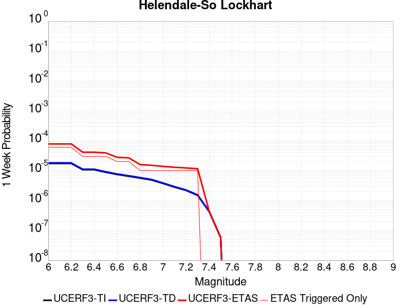 |  | 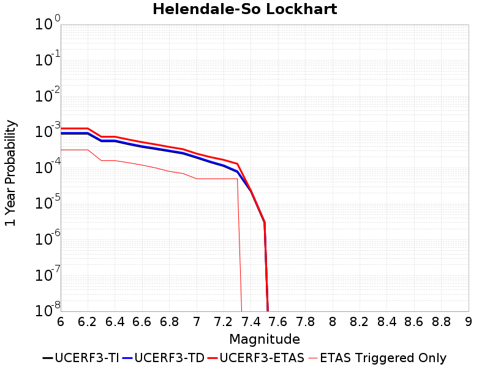 | 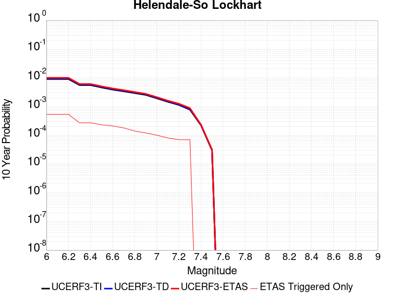 |

| Magnitude | 1 wk TI Prob | 1 wk TD Prob | 1 wk ETAS Prob | 1 wk ETAS/TD Gain | 1 wk ETAS Triggered Only | 1 mo TI Prob | 1 mo TD Prob | 1 mo ETAS Prob | 1 mo ETAS/TD Gain | 1 mo ETAS Triggered Only | 1 yr TI Prob | 1 yr TD Prob | 1 yr ETAS Prob | 1 yr ETAS/TD Gain | 1 yr ETAS Triggered Only | 10 yr TI Prob | 10 yr TD Prob | 10 yr ETAS Prob | 10 yr ETAS/TD Gain | 10 yr ETAS Triggered Only |
|-----|-----|-----|-----|-----|-----|-----|-----|-----|-----|-----|-----|-----|-----|-----|-----|-----|-----|-----|-----|-----|
| 6.0 | 1.7296055E-5 | 1.8103825E-5 | 7.810274E-5 | 4.314157 | 6.0E-5 | 7.412385E-5 | 7.7585624E-5 | 2.1757476E-4 | 2.804318 | 1.4E-4 | 9.0208417E-4 | 9.442164E-4 | 0.0012639143 | 1.3385854 | 3.2E-4 | 0.008984311 | 0.009404166 | 0.009929181 | 1.055828 | 5.3E-4 |
| 6.1 | 1.7296055E-5 | 1.8103825E-5 | 7.810274E-5 | 4.314157 | 6.0E-5 | 7.412385E-5 | 7.7585624E-5 | 2.1757476E-4 | 2.804318 | 1.4E-4 | 9.0208417E-4 | 9.442164E-4 | 0.0012639143 | 1.3385854 | 3.2E-4 | 0.008984311 | 0.009404166 | 0.009929181 | 1.055828 | 5.3E-4 |
| 6.2 | 1.7296055E-5 | 1.8103825E-5 | 7.810274E-5 | 4.314157 | 6.0E-5 | 7.412385E-5 | 7.7585624E-5 | 2.1757476E-4 | 2.804318 | 1.4E-4 | 9.0208417E-4 | 9.442164E-4 | 0.0012639143 | 1.3385854 | 3.2E-4 | 0.008984311 | 0.009404166 | 0.009929181 | 1.055828 | 5.3E-4 |
| 6.3 | 1.0669118E-5 | 1.1135479E-5 | 4.1135147E-5 | 3.6940615 | 3.0E-5 | 4.5723988E-5 | 4.7722624E-5 | 1.0771976E-4 | 2.2572052 | 6.0E-5 | 5.5654737E-4 | 5.8087084E-4 | 7.4077793E-4 | 1.2752885 | 1.6E-4 | 0.0055515557 | 0.005793822 | 0.0060622576 | 1.0463314 | 2.7E-4 |
| 6.4 | 1.0669118E-5 | 1.1135479E-5 | 4.1135147E-5 | 3.6940615 | 3.0E-5 | 4.5723988E-5 | 4.7722624E-5 | 1.0771976E-4 | 2.2572052 | 6.0E-5 | 5.5654737E-4 | 5.8087084E-4 | 7.4077793E-4 | 1.2752885 | 1.6E-4 | 0.0055515557 | 0.005793822 | 0.0060622576 | 1.0463314 | 2.7E-4 |
| 6.5 | 8.790038E-6 | 9.170241E-6 | 3.9169965E-5 | 4.2714214 | 3.0E-5 | 3.767105E-5 | 3.9300452E-5 | 9.929809E-5 | 2.52664 | 6.0E-5 | 4.585485E-4 | 4.783795E-4 | 6.183125E-4 | 1.2925147 | 1.4E-4 | 0.0045760344 | 0.0047736615 | 0.0050025634 | 1.0479511 | 2.3E-4 |
| 6.6 | 7.396949E-6 | 7.715575E-6 | 2.771542E-5 | 3.5921397 | 2.0E-5 | 3.1700827E-5 | 3.306633E-5 | 8.306468E-5 | 2.512062 | 5.0E-5 | 3.858892E-4 | 4.0250926E-4 | 5.2246096E-4 | 1.2980098 | 1.2E-4 | 0.003852198 | 0.004017909 | 0.0042270655 | 1.052056 | 2.1E-4 |
| 6.7 | 6.4600285E-6 | 6.7380633E-6 | 2.673793E-5 | 3.9681919 | 2.0E-5 | 2.7685543E-5 | 2.8877099E-5 | 7.887566E-5 | 2.7314258 | 5.0E-5 | 3.3701936E-4 | 3.5152276E-4 | 4.514876E-4 | 1.2843766 | 1.0E-4 | 0.0033650869 | 0.0035097487 | 0.003689117 | 1.0511057 | 1.8E-4 |
| 6.8 | 5.600104E-6 | 5.836037E-6 | 1.5835978E-5 | 2.7134817 | 1.0E-5 | 2.4000226E-5 | 2.501135E-5 | 6.501035E-5 | 2.5992339 | 4.0E-5 | 2.9216358E-4 | 3.0447124E-4 | 3.8444687E-4 | 1.2626706 | 8.0E-5 | 0.0029177975 | 0.0030406024 | 0.0031801767 | 1.0459036 | 1.4E-4 |
| 6.9 | 4.839122E-6 | 5.0395324E-6 | 1.5039483E-5 | 2.984301 | 1.0E-5 | 2.0738931E-5 | 2.1597822E-5 | 5.1597173E-5 | 2.388999 | 3.0E-5 | 2.5246723E-4 | 2.629222E-4 | 3.329038E-4 | 1.2661685 | 7.0E-5 | 0.002521806 | 0.002626159 | 0.0027458437 | 1.0455741 | 1.2E-4 |
| 7.0 | 3.6937633E-6 | 3.845226E-6 | 1.3845187E-5 | 3.6006176 | 1.0E-5 | 1.5830317E-5 | 1.6479436E-5 | 3.6479105E-5 | 2.2136137 | 2.0E-5 | 1.9271708E-4 | 2.0061898E-4 | 2.5060895E-4 | 1.2491786 | 5.0E-5 | 0.0019255003 | 0.0020044101 | 0.0021042097 | 1.04979 | 1.0E-4 |
| 7.1 | 2.7858857E-6 | 2.8978668E-6 | 1.2897838E-5 | 4.450804 | 1.0E-5 | 1.1939455E-5 | 1.2419371E-5 | 3.2419124E-5 | 2.6103675 | 2.0E-5 | 1.4535317E-4 | 1.5119556E-4 | 2.0118801E-4 | 1.3306475 | 5.0E-5 | 0.0014525814 | 0.0015109485 | 0.0015908277 | 1.0528668 | 8.0E-5 |
| 7.2 | 2.1672065E-6 | 2.2540228E-6 | 1.22540005E-5 | 5.436502 | 1.0E-5 | 9.2879945E-6 | 9.660063E-6 | 2.965987E-5 | 3.0703597 | 2.0E-5 | 1.1307546E-4 | 1.1760511E-4 | 1.6759922E-4 | 1.4251016 | 5.0E-5 | 0.0011301794 | 0.0011754469 | 0.0012453647 | 1.0594819 | 7.0E-5 |
| 7.3 | 1.4823496E-6 | 1.5422172E-6 | 1.1542202E-5 | 7.484161 | 1.0E-5 | 6.3529114E-6 | 6.6094863E-6 | 2.6609354E-5 | 4.0259337 | 2.0E-5 | 7.734395E-5 | 8.0467675E-5 | 1.3046365E-4 | 1.6213175 | 5.0E-5 | 7.731704E-4 | 8.0440054E-4 | 8.743442E-4 | 1.0869514 | 7.0E-5 |
| 7.4 | 4.2321457E-7 | 4.4108972E-7 | 4.4108972E-7 | 1.0 | 0.0 | 1.8137755E-6 | 1.8903835E-6 | 1.8903835E-6 | 1.0 | 0.0 | 2.2082493E-5 | 2.3015222E-5 | 2.3015222E-5 | 1.0 | 0.0 | 2.2080299E-4 | 2.3013291E-4 | 2.3013291E-4 | 1.0 | 0.0 |
| 7.5 | 5.6942316E-8 | 5.9415935E-8 | 5.9415935E-8 | 1.0 | 0.0 | 2.440385E-7 | 2.546397E-7 | 2.546397E-7 | 1.0 | 0.0 | 2.9711643E-6 | 3.1002348E-6 | 3.1002348E-6 | 1.0 | 0.0 | 2.9711247E-5 | 3.1001993E-5 | 3.1001993E-5 | 1.0 | 0.0 |

## Coyote Lake
*[(top)](#table-of-contents)*

| 1 Week | 1 Month | 1 Year | 10 Year |
|-----|-----|-----|-----|
| 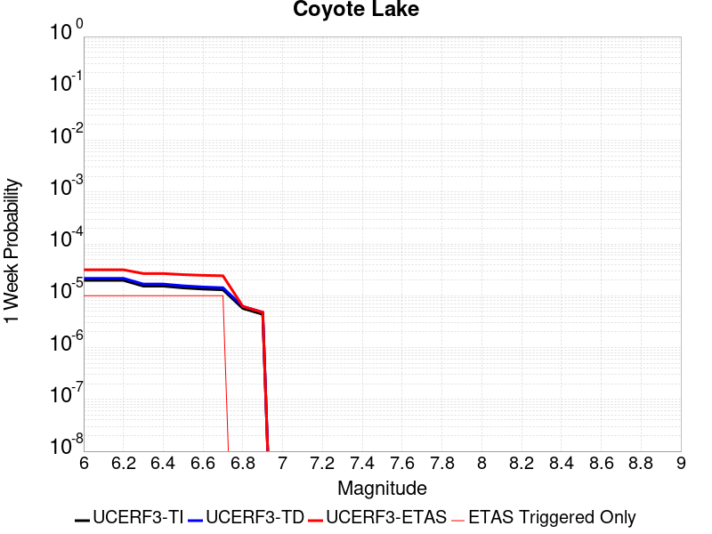 | 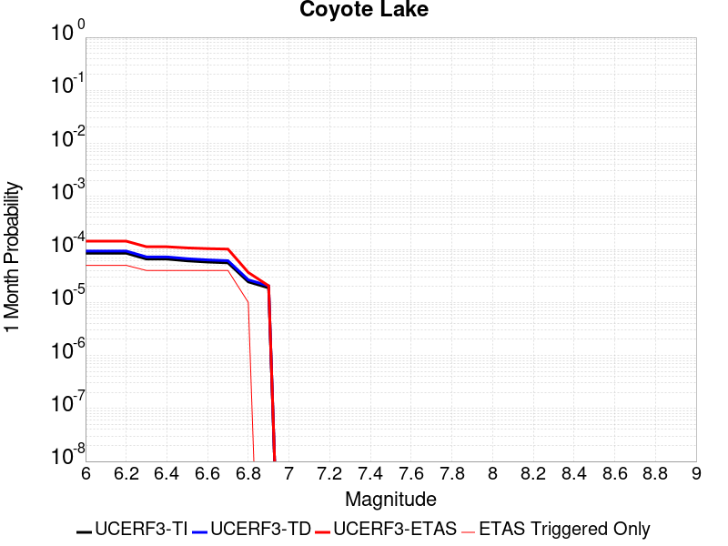 | 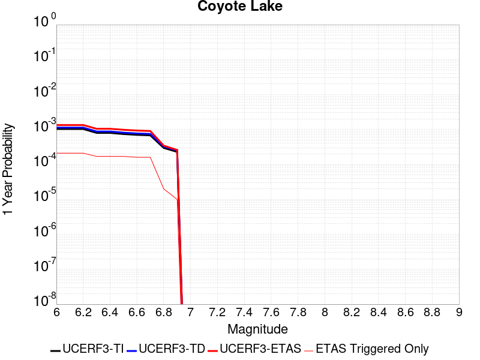 |  |

| Magnitude | 1 wk TI Prob | 1 wk TD Prob | 1 wk ETAS Prob | 1 wk ETAS/TD Gain | 1 wk ETAS Triggered Only | 1 mo TI Prob | 1 mo TD Prob | 1 mo ETAS Prob | 1 mo ETAS/TD Gain | 1 mo ETAS Triggered Only | 1 yr TI Prob | 1 yr TD Prob | 1 yr ETAS Prob | 1 yr ETAS/TD Gain | 1 yr ETAS Triggered Only | 10 yr TI Prob | 10 yr TD Prob | 10 yr ETAS Prob | 10 yr ETAS/TD Gain | 10 yr ETAS Triggered Only |
|-----|-----|-----|-----|-----|-----|-----|-----|-----|-----|-----|-----|-----|-----|-----|-----|-----|-----|-----|-----|-----|
| 6.0 | 1.980352E-5 | 2.1706977E-5 | 3.170676E-5 | 1.4606713 | 1.0E-5 | 8.486947E-5 | 9.3026996E-5 | 1.4302235E-4 | 1.5374284 | 5.0E-5 | 0.0010327959 | 0.0011320872 | 0.0013418494 | 1.1852881 | 2.1E-4 | 0.010280091 | 0.011270379 | 0.011744969 | 1.0421095 | 4.8E-4 |
| 6.1 | 1.980352E-5 | 2.1706977E-5 | 3.170676E-5 | 1.4606713 | 1.0E-5 | 8.486947E-5 | 9.3026996E-5 | 1.4302235E-4 | 1.5374284 | 5.0E-5 | 0.0010327959 | 0.0011320872 | 0.0013418494 | 1.1852881 | 2.1E-4 | 0.010280091 | 0.011270379 | 0.011744969 | 1.0421095 | 4.8E-4 |
| 6.2 | 1.980352E-5 | 2.1706977E-5 | 3.170676E-5 | 1.4606713 | 1.0E-5 | 8.486947E-5 | 9.3026996E-5 | 1.4302235E-4 | 1.5374284 | 5.0E-5 | 0.0010327959 | 0.0011320872 | 0.0013418494 | 1.1852881 | 2.1E-4 | 0.010280091 | 0.011270379 | 0.011744969 | 1.0421095 | 4.8E-4 |
| 6.3 | 1.5344787E-5 | 1.682085E-5 | 2.6820682E-5 | 1.5944903 | 1.0E-5 | 6.576172E-5 | 7.2087714E-5 | 1.12084825E-4 | 1.5548396 | 4.0E-5 | 8.003548E-4 | 8.773757E-4 | 0.0010472265 | 1.1935897 | 1.7E-4 | 0.007974784 | 0.008745163 | 0.00912184 | 1.0430726 | 3.8E-4 |
| 6.4 | 1.5344787E-5 | 1.682085E-5 | 2.6820682E-5 | 1.5944903 | 1.0E-5 | 6.576172E-5 | 7.2087714E-5 | 1.12084825E-4 | 1.5548396 | 4.0E-5 | 8.003548E-4 | 8.773757E-4 | 0.0010472265 | 1.1935897 | 1.7E-4 | 0.007974784 | 0.008745163 | 0.00912184 | 1.0430726 | 3.8E-4 |
| 6.5 | 1.4189697E-5 | 1.5558155E-5 | 2.5558E-5 | 1.6427398 | 1.0E-5 | 6.081157E-5 | 6.667644E-5 | 1.06673775E-4 | 1.599872 | 4.0E-5 | 7.401293E-4 | 8.115436E-4 | 9.814057E-4 | 1.2093073 | 1.7E-4 | 0.0073766913 | 0.008091743 | 0.008468668 | 1.0465815 | 3.8E-4 |
| 6.6 | 1.3469301E-5 | 1.4771737E-5 | 2.4771589E-5 | 1.6769584 | 1.0E-5 | 5.7724297E-5 | 6.3306245E-5 | 1.0330371E-4 | 1.6318092 | 4.0E-5 | 7.025667E-4 | 7.7054097E-4 | 9.304177E-4 | 1.2074863 | 1.6E-4 | 0.0070034964 | 0.0076845973 | 0.008051754 | 1.0477782 | 3.7E-4 |
| 6.7 | 1.3027966E-5 | 1.4281899E-5 | 2.4281757E-5 | 1.700177 | 1.0E-5 | 5.5832945E-5 | 6.1207036E-5 | 1.0120459E-4 | 1.6534796 | 4.0E-5 | 6.7955407E-4 | 7.4500067E-4 | 9.0488145E-4 | 1.2146049 | 1.6E-4 | 0.006774798 | 0.0074309087 | 0.007798159 | 1.049422 | 3.7E-4 |
| 6.8 | 5.695434E-6 | 6.2244826E-6 | 6.2244826E-6 | 1.0 | 0.0 | 2.4408775E-5 | 2.6676249E-5 | 3.667598E-5 | 1.3748553 | 1.0E-5 | 2.971363E-4 | 3.2476493E-4 | 3.4475842E-4 | 1.061563 | 2.0E-5 | 0.0029673933 | 0.003245844 | 0.003295682 | 1.0153543 | 5.0E-5 |
| 6.9 | 4.385688E-6 | 4.7931053E-6 | 4.7931053E-6 | 1.0 | 0.0 | 1.879567E-5 | 2.054188E-5 | 2.054188E-5 | 1.0 | 0.0 | 2.2881327E-4 | 2.500974E-4 | 2.6009488E-4 | 1.0399745 | 1.0E-5 | 0.002285778 | 0.0025009739 | 0.0025308987 | 1.0119653 | 3.0E-5 |

## San Andreas (Parkfield)
*[(top)](#table-of-contents)*

| 1 Week | 1 Month | 1 Year | 10 Year |
|-----|-----|-----|-----|
| 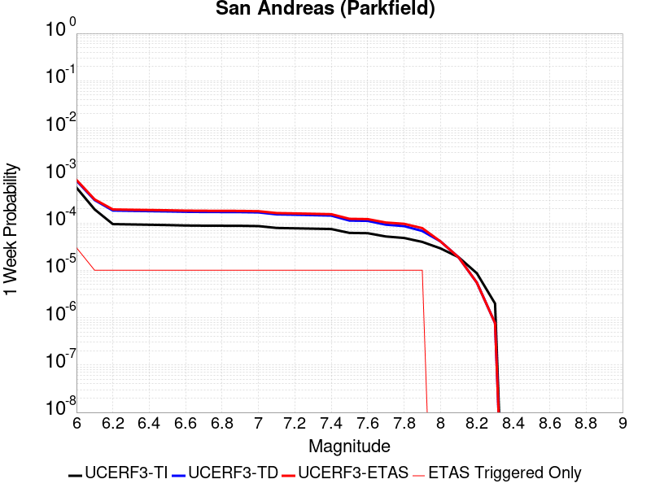 | 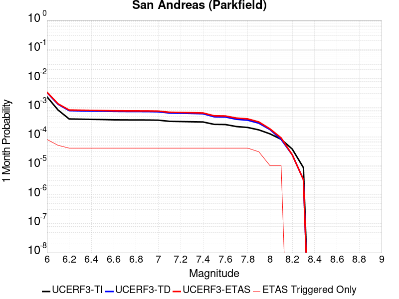 | 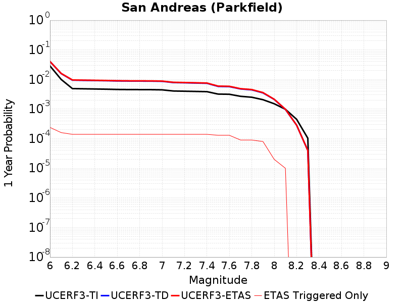 | 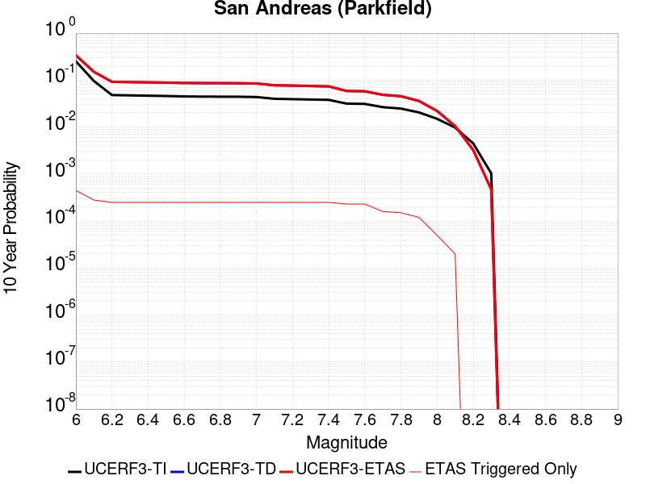 |

| Magnitude | 1 wk TI Prob | 1 wk TD Prob | 1 wk ETAS Prob | 1 wk ETAS/TD Gain | 1 wk ETAS Triggered Only | 1 mo TI Prob | 1 mo TD Prob | 1 mo ETAS Prob | 1 mo ETAS/TD Gain | 1 mo ETAS Triggered Only | 1 yr TI Prob | 1 yr TD Prob | 1 yr ETAS Prob | 1 yr ETAS/TD Gain | 1 yr ETAS Triggered Only | 10 yr TI Prob | 10 yr TD Prob | 10 yr ETAS Prob | 10 yr ETAS/TD Gain | 10 yr ETAS Triggered Only |
|-----|-----|-----|-----|-----|-----|-----|-----|-----|-----|-----|-----|-----|-----|-----|-----|-----|-----|-----|-----|-----|
| 6.0 | 5.556969E-4 | 7.786838E-4 | 8.086604E-4 | 1.0384965 | 3.0E-5 | 0.0023793848 | 0.0033334973 | 0.0034132306 | 1.0239189 | 8.0E-5 | 0.028586963 | 0.040232275 | 0.04046262 | 1.0057254 | 2.4E-4 | 0.25176284 | 0.33729252 | 0.33759075 | 1.0008842 | 4.5E-4 |
| 6.1 | 1.925858E-4 | 3.0300335E-4 | 3.1300032E-4 | 1.032993 | 1.0E-5 | 8.2510663E-4 | 0.0012980336 | 0.0013479687 | 1.0384698 | 5.0E-5 | 0.0099994885 | 0.015789967 | 0.01594744 | 1.009973 | 1.6E-4 | 0.095613256 | 0.14978145 | 0.15001951 | 1.0015894 | 2.8E-4 |
| 6.2 | 9.4306815E-5 | 1.8249144E-4 | 1.924896E-4 | 1.054787 | 1.0E-5 | 4.0410945E-4 | 7.8187295E-4 | 8.218417E-4 | 1.0511192 | 4.0E-5 | 0.0049089384 | 0.009477962 | 0.009616635 | 1.0146312 | 1.4E-4 | 0.048019063 | 0.09188159 | 0.092108615 | 1.0024709 | 2.5E-4 |
| 6.3 | 9.283051E-5 | 1.7945649E-4 | 1.8945469E-4 | 1.0557138 | 1.0E-5 | 3.9778434E-4 | 7.688737E-4 | 8.08843E-4 | 1.0519842 | 4.0E-5 | 0.0048322747 | 0.009321061 | 0.009459755 | 1.0148797 | 1.4E-4 | 0.047285385 | 0.09053451 | 0.09076187 | 1.0025114 | 2.5E-4 |
| 6.4 | 9.138826E-5 | 1.7707815E-4 | 1.8707638E-4 | 1.0564623 | 1.0E-5 | 3.916052E-4 | 7.586868E-4 | 7.9865643E-4 | 1.0526826 | 4.0E-5 | 0.0047573745 | 0.009198089 | 0.009336801 | 1.0150806 | 1.4E-4 | 0.046568092 | 0.089436606 | 0.08966425 | 1.0025452 | 2.5E-4 |
| 6.5 | 9.000255E-5 | 1.7465823E-4 | 1.8465647E-4 | 1.0572447 | 1.0E-5 | 3.8566816E-4 | 7.4832165E-4 | 7.8829174E-4 | 1.0534129 | 4.0E-5 | 0.0046854047 | 0.009072962 | 0.009211692 | 1.0152905 | 1.4E-4 | 0.045878403 | 0.088322274 | 0.088550195 | 1.0025805 | 2.5E-4 |
| 6.6 | 8.8109264E-5 | 1.7146915E-4 | 1.8146743E-4 | 1.0583096 | 1.0E-5 | 3.7755648E-4 | 7.34662E-4 | 7.746326E-4 | 1.0544068 | 4.0E-5 | 0.0045870654 | 0.008908042 | 0.009046795 | 1.0155761 | 1.4E-4 | 0.04493529 | 0.08685363 | 0.08708192 | 1.0026284 | 2.5E-4 |
| 6.7 | 8.738073E-5 | 1.7013977E-4 | 1.8013807E-4 | 1.0587652 | 1.0E-5 | 3.7443507E-4 | 7.2896783E-4 | 7.689387E-4 | 1.0548321 | 4.0E-5 | 0.0045492216 | 0.008839322 | 0.008978085 | 1.0156983 | 1.4E-4 | 0.04457213 | 0.08625395 | 0.08648238 | 1.0026485 | 2.5E-4 |
| 6.8 | 8.710195E-5 | 1.6959466E-4 | 1.7959296E-4 | 1.0589541 | 1.0E-5 | 3.7324068E-4 | 7.2663295E-4 | 7.6660386E-4 | 1.0550084 | 4.0E-5 | 0.0045347405 | 0.008811133 | 0.008949899 | 1.015749 | 1.4E-4 | 0.04443313 | 0.08600151 | 0.08623 | 1.0026569 | 2.5E-4 |
| 6.9 | 8.6801556E-5 | 1.690041E-4 | 1.790024E-4 | 1.0591601 | 1.0E-5 | 3.7195362E-4 | 7.2410336E-4 | 7.640744E-4 | 1.0552007 | 4.0E-5 | 0.0045191357 | 0.008780584 | 0.0089193545 | 1.0158043 | 1.4E-4 | 0.044283327 | 0.08572753 | 0.0859561 | 1.0026662 | 2.5E-4 |
| 7.0 | 8.5571606E-5 | 1.6653197E-4 | 1.765303E-4 | 1.0600386 | 1.0E-5 | 3.6668387E-4 | 7.135144E-4 | 7.5348583E-4 | 1.0560205 | 4.0E-5 | 0.004455241 | 0.008652694 | 0.008791482 | 1.01604 | 1.4E-4 | 0.043669727 | 0.084575765 | 0.084804624 | 1.0027059 | 2.5E-4 |
| 7.1 | 7.82589E-5 | 1.513398E-4 | 1.6133829E-4 | 1.0660665 | 1.0E-5 | 3.3535215E-4 | 6.4843864E-4 | 6.8841275E-4 | 1.0616466 | 4.0E-5 | 0.0040752706 | 0.007866333 | 0.008005232 | 1.0176574 | 1.4E-4 | 0.040013418 | 0.077487044 | 0.07771767 | 1.0029763 | 2.5E-4 |
| 7.2 | 7.690929E-5 | 1.48712E-4 | 1.5871052E-4 | 1.067234 | 1.0E-5 | 3.2956956E-4 | 6.371822E-4 | 6.771567E-4 | 1.0627364 | 4.0E-5 | 0.004005129 | 0.007730266 | 0.007869184 | 1.0179707 | 1.4E-4 | 0.0393371 | 0.0762601 | 0.076491036 | 1.0030283 | 2.5E-4 |
| 7.3 | 7.5543794E-5 | 1.4567717E-4 | 1.5567572E-4 | 1.068635 | 1.0E-5 | 3.2371894E-4 | 6.2418205E-4 | 6.641571E-4 | 1.0640439 | 4.0E-5 | 0.003934157 | 0.0075731 | 0.0077120396 | 1.0183464 | 1.4E-4 | 0.038652334 | 0.07482293 | 0.07505423 | 1.0030912 | 2.5E-4 |
| 7.4 | 7.4214564E-5 | 1.4268623E-4 | 1.526848E-4 | 1.0700738 | 1.0E-5 | 3.1802364E-4 | 6.113698E-4 | 6.5134536E-4 | 1.0653869 | 4.0E-5 | 0.003865065 | 0.0074181827 | 0.007557144 | 1.0187325 | 1.4E-4 | 0.03798529 | 0.073396534 | 0.07362819 | 1.0031562 | 2.5E-4 |
| 7.5 | 6.149578E-5 | 1.1195591E-4 | 1.2195479E-4 | 1.0893109 | 1.0E-5 | 2.6352672E-4 | 4.7972292E-4 | 5.197037E-4 | 1.0833415 | 4.0E-5 | 0.0032037178 | 0.005825017 | 0.0059542595 | 1.0221876 | 1.3E-4 | 0.03157923 | 0.05857995 | 0.05879648 | 1.0036962 | 2.3E-4 |
| 7.6 | 6.0643448E-5 | 1.1024205E-4 | 1.2024095E-4 | 1.0906994 | 1.0E-5 | 2.598746E-4 | 4.723805E-4 | 5.123616E-4 | 1.0846375 | 4.0E-5 | 0.0031593828 | 0.005736097 | 0.0058653518 | 1.0225335 | 1.3E-4 | 0.031148417 | 0.057740804 | 0.057957526 | 1.0037533 | 2.3E-4 |
| 7.7 | 5.1652263E-5 | 9.1790265E-5 | 1.01789345E-4 | 1.108934 | 1.0E-5 | 2.2134806E-4 | 3.9332756E-4 | 4.3331183E-4 | 1.1016564 | 4.0E-5 | 0.002691582 | 0.004778258 | 0.004867828 | 1.0187453 | 9.0E-5 | 0.026592141 | 0.048556462 | 0.048708696 | 1.0031351 | 1.6E-4 |
| 7.8 | 4.8090482E-5 | 8.56362E-5 | 9.563535E-5 | 1.116763 | 1.0E-5 | 2.060858E-4 | 3.669607E-4 | 4.0694603E-4 | 1.1089635 | 4.0E-5 | 0.0025062072 | 0.004458602 | 0.004548201 | 1.0200957 | 9.0E-5 | 0.024781305 | 0.04532114 | 0.045464344 | 1.0031598 | 1.5E-4 |
| 7.9 | 3.970278E-5 | 6.753527E-5 | 7.753459E-5 | 1.1480608 | 1.0E-5 | 1.7014367E-4 | 2.8940476E-4 | 3.193961E-4 | 1.103631 | 3.0E-5 | 0.002069531 | 0.003517814 | 0.0035975326 | 1.0226614 | 8.0E-5 | 0.020503636 | 0.035896193 | 0.036011886 | 1.003223 | 1.2E-4 |
| 8.0 | 2.8982335E-5 | 4.0717507E-5 | 4.0717507E-5 | 1.0 | 0.0 | 1.2420409E-4 | 1.7449193E-4 | 1.8449019E-4 | 1.0572993 | 1.0E-5 | 0.0015111357 | 0.0021223705 | 0.002142328 | 1.0094035 | 2.0E-5 | 0.015009012 | 0.022020448 | 0.022069346 | 1.0022206 | 5.0E-5 |
| 8.1 | 1.8836186E-5 | 1.8692073E-5 | 1.8692073E-5 | 1.0 | 0.0 | 8.0724014E-5 | 8.010643E-5 | 9.010563E-5 | 1.1248239 | 1.0E-5 | 9.823717E-4 | 9.7486E-4 | 9.848502E-4 | 1.0102478 | 1.0E-5 | 0.009780403 | 0.010493853 | 0.010513643 | 1.0018859 | 2.0E-5 |
| 8.2 | 8.643924E-6 | 5.479068E-6 | 5.479068E-6 | 1.0 | 0.0 | 3.704486E-5 | 2.3481509E-5 | 2.3481509E-5 | 1.0 | 0.0 | 4.5092785E-4 | 2.8584994E-4 | 2.8584994E-4 | 1.0 | 0.0 | 0.0045001395 | 0.0032510054 | 0.0032510054 | 1.0 | 0.0 |
| 8.3 | 1.983087E-6 | 7.666981E-7 | 7.666981E-7 | 1.0 | 0.0 | 8.498917E-6 | 3.285845E-6 | 3.285845E-6 | 1.0 | 0.0 | 1.034694E-4 | 4.0004445E-5 | 4.0004445E-5 | 1.0 | 0.0 | 0.0010342124 | 4.723745E-4 | 4.723745E-4 | 1.0 | 0.0 |

## San Andreas (Carrizo) rev
*[(top)](#table-of-contents)*

| 1 Week | 1 Month | 1 Year | 10 Year |
|-----|-----|-----|-----|
| 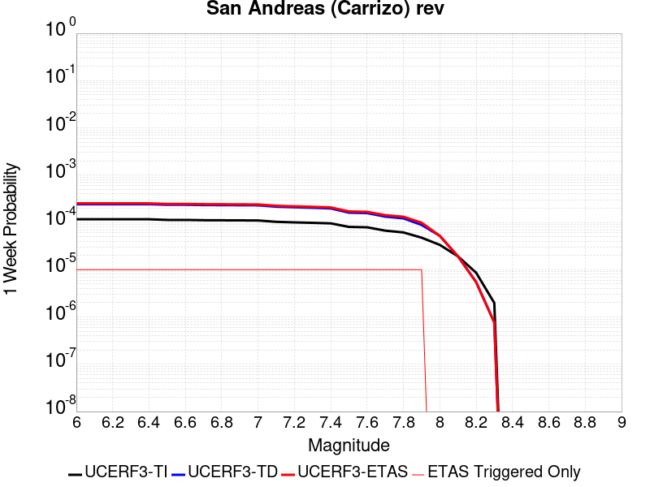 | 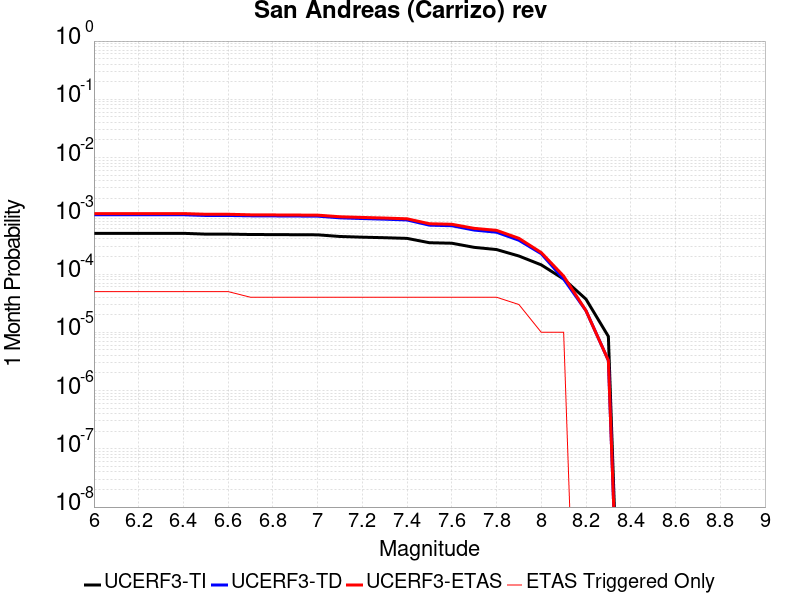 | 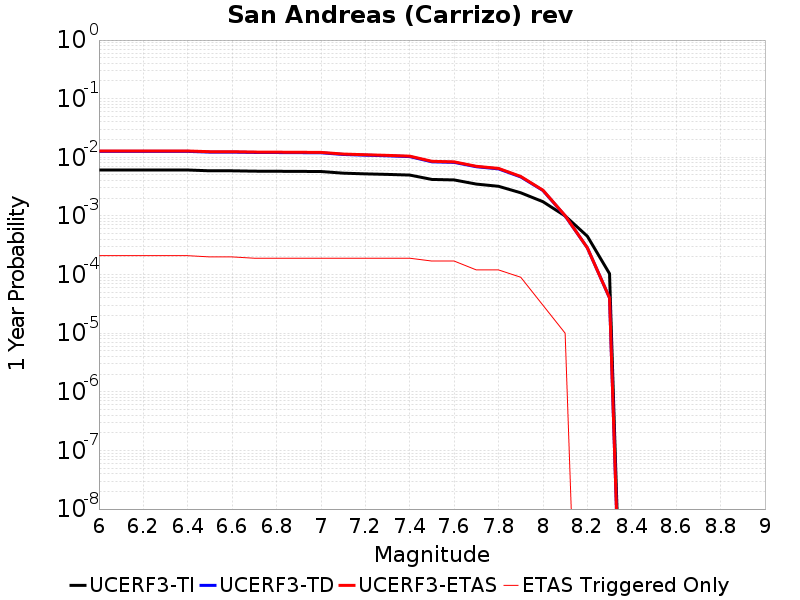 | 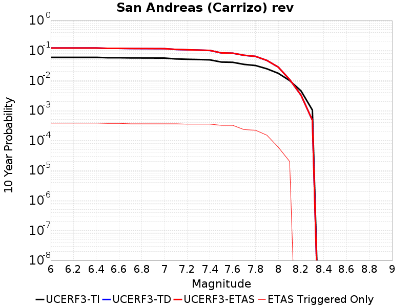 |

| Magnitude | 1 wk TI Prob | 1 wk TD Prob | 1 wk ETAS Prob | 1 wk ETAS/TD Gain | 1 wk ETAS Triggered Only | 1 mo TI Prob | 1 mo TD Prob | 1 mo ETAS Prob | 1 mo ETAS/TD Gain | 1 mo ETAS Triggered Only | 1 yr TI Prob | 1 yr TD Prob | 1 yr ETAS Prob | 1 yr ETAS/TD Gain | 1 yr ETAS Triggered Only | 10 yr TI Prob | 10 yr TD Prob | 10 yr ETAS Prob | 10 yr ETAS/TD Gain | 10 yr ETAS Triggered Only |
|-----|-----|-----|-----|-----|-----|-----|-----|-----|-----|-----|-----|-----|-----|-----|-----|-----|-----|-----|-----|-----|
| 6.0 | 1.1674632E-4 | 2.4331006E-4 | 2.5330763E-4 | 1.0410898 | 1.0E-5 | 5.002454E-4 | 0.0010423423 | 0.0010922902 | 1.0479189 | 5.0E-5 | 0.006073493 | 0.012617158 | 0.012824508 | 1.016434 | 2.1E-4 | 0.0591016 | 0.12064774 | 0.1209819 | 1.0027697 | 3.8E-4 |
| 6.1 | 1.1674632E-4 | 2.4331006E-4 | 2.5330763E-4 | 1.0410898 | 1.0E-5 | 5.002454E-4 | 0.0010423423 | 0.0010922902 | 1.0479189 | 5.0E-5 | 0.006073493 | 0.012617158 | 0.012824508 | 1.016434 | 2.1E-4 | 0.0591016 | 0.12064774 | 0.1209819 | 1.0027697 | 3.8E-4 |
| 6.2 | 1.1674632E-4 | 2.4331006E-4 | 2.5330763E-4 | 1.0410898 | 1.0E-5 | 5.002454E-4 | 0.0010423423 | 0.0010922902 | 1.0479189 | 5.0E-5 | 0.006073493 | 0.012617158 | 0.012824508 | 1.016434 | 2.1E-4 | 0.0591016 | 0.12064774 | 0.1209819 | 1.0027697 | 3.8E-4 |
| 6.3 | 1.1674632E-4 | 2.4331006E-4 | 2.5330763E-4 | 1.0410898 | 1.0E-5 | 5.002454E-4 | 0.0010423423 | 0.0010922902 | 1.0479189 | 5.0E-5 | 0.006073493 | 0.012617158 | 0.012824508 | 1.016434 | 2.1E-4 | 0.0591016 | 0.12064774 | 0.1209819 | 1.0027697 | 3.8E-4 |
| 6.4 | 1.1674632E-4 | 2.4331006E-4 | 2.5330763E-4 | 1.0410898 | 1.0E-5 | 5.002454E-4 | 0.0010423423 | 0.0010922902 | 1.0479189 | 5.0E-5 | 0.006073493 | 0.012617158 | 0.012824508 | 1.016434 | 2.1E-4 | 0.0591016 | 0.12064774 | 0.1209819 | 1.0027697 | 3.8E-4 |
| 6.5 | 1.13136164E-4 | 2.3650982E-4 | 2.4650744E-4 | 1.0422715 | 1.0E-5 | 4.847792E-4 | 0.0010132212 | 0.0010631706 | 1.0492976 | 5.0E-5 | 0.0058862255 | 0.012266642 | 0.012464189 | 1.0161043 | 2.0E-4 | 0.057327334 | 0.11761908 | 0.11794557 | 1.0027758 | 3.7E-4 |
| 6.6 | 1.13136164E-4 | 2.3650982E-4 | 2.4650744E-4 | 1.0422715 | 1.0E-5 | 4.847792E-4 | 0.0010132212 | 0.0010631706 | 1.0492976 | 5.0E-5 | 0.0058862255 | 0.012266642 | 0.012464189 | 1.0161043 | 2.0E-4 | 0.057327334 | 0.11761908 | 0.11794557 | 1.0027758 | 3.7E-4 |
| 6.7 | 1.1149675E-4 | 2.3342187E-4 | 2.4341953E-4 | 1.042831 | 1.0E-5 | 4.777557E-4 | 9.999974E-4 | 0.0010399574 | 1.0399601 | 4.0E-5 | 0.0058011734 | 0.012107439 | 0.012295139 | 1.0155028 | 1.9E-4 | 0.05652051 | 0.11624061 | 0.11655877 | 1.002737 | 3.6E-4 |
| 6.8 | 1.1103589E-4 | 2.3244336E-4 | 2.4244103E-4 | 1.0430112 | 1.0E-5 | 4.7578133E-4 | 9.95807E-4 | 0.0010357671 | 1.0401285 | 4.0E-5 | 0.005777263 | 0.012056987 | 0.012244696 | 1.0155685 | 1.9E-4 | 0.056293584 | 0.11580089 | 0.1161192 | 1.0027487 | 3.6E-4 |
| 6.9 | 1.1053259E-4 | 2.3136708E-4 | 2.4136476E-4 | 1.0432113 | 1.0E-5 | 4.7362508E-4 | 9.911979E-4 | 0.0010311583 | 1.0403153 | 4.0E-5 | 0.0057511497 | 0.01200149 | 0.01218921 | 1.0156413 | 1.9E-4 | 0.05604569 | 0.11531706 | 0.11563555 | 1.0027618 | 3.6E-4 |
| 7.0 | 1.1005377E-4 | 2.303754E-4 | 2.4037309E-4 | 1.0433974 | 1.0E-5 | 4.7157376E-4 | 9.86951E-4 | 0.0010269115 | 1.0404888 | 4.0E-5 | 0.0057263062 | 0.011950354 | 0.012138084 | 1.0157092 | 1.9E-4 | 0.055809796 | 0.114869356 | 0.115188 | 1.002774 | 3.6E-4 |
| 7.1 | 1.0308142E-4 | 2.1547097E-4 | 2.2546882E-4 | 1.0464 | 1.0E-5 | 4.417027E-4 | 9.2312123E-4 | 9.630843E-4 | 1.0432912 | 4.0E-5 | 0.0053644776 | 0.011181398 | 0.011369274 | 1.0168025 | 1.9E-4 | 0.052368138 | 0.10812535 | 0.10844643 | 1.0029695 | 3.6E-4 |
| 7.2 | 1.0027479E-4 | 2.0954931E-4 | 2.1954722E-4 | 1.0477115 | 1.0E-5 | 4.296783E-4 | 8.977604E-4 | 9.377245E-4 | 1.0445154 | 4.0E-5 | 0.0052187922 | 0.010875752 | 0.011063686 | 1.0172801 | 1.9E-4 | 0.050979212 | 0.10542919 | 0.10574229 | 1.0029697 | 3.5E-4 |
| 7.3 | 9.816942E-5 | 2.0430045E-4 | 2.142984E-4 | 1.0489376 | 1.0E-5 | 4.2065824E-4 | 8.7528053E-4 | 9.152455E-4 | 1.0456597 | 4.0E-5 | 0.005109493 | 0.010604756 | 0.010792742 | 1.0177265 | 1.9E-4 | 0.049935985 | 0.10301259 | 0.10332654 | 1.0030476 | 3.5E-4 |
| 7.4 | 9.5634205E-5 | 1.9799438E-4 | 2.079924E-4 | 1.0504965 | 1.0E-5 | 4.0979648E-4 | 8.482723E-4 | 8.8823837E-4 | 1.0471146 | 4.0E-5 | 0.0049778637 | 0.010279072 | 0.0104671195 | 1.0182942 | 1.9E-4 | 0.048678253 | 0.10009846 | 0.10041343 | 1.0031465 | 3.5E-4 |
| 7.5 | 8.052417E-5 | 1.6119142E-4 | 1.7118981E-4 | 1.062028 | 1.0E-5 | 3.4505792E-4 | 6.906376E-4 | 7.3061005E-4 | 1.0578775 | 4.0E-5 | 0.0041929903 | 0.0083761765 | 0.008544752 | 1.0201256 | 1.7E-4 | 0.04114753 | 0.08283954 | 0.083133034 | 1.0035429 | 3.2E-4 |
| 7.6 | 7.897024E-5 | 1.5772306E-4 | 1.6772148E-4 | 1.0633923 | 1.0E-5 | 3.384E-4 | 6.75781E-4 | 7.15754E-4 | 1.0591508 | 4.0E-5 | 0.0041122385 | 0.0081966715 | 0.008365278 | 1.0205702 | 1.7E-4 | 0.040369697 | 0.081180476 | 0.0814745 | 1.0036218 | 3.2E-4 |
| 7.7 | 6.707427E-5 | 1.3281911E-4 | 1.428178E-4 | 1.0752803 | 1.0E-5 | 2.8742946E-4 | 5.6910067E-4 | 6.0907786E-4 | 1.0702463 | 4.0E-5 | 0.003493839 | 0.0069068205 | 0.0070259916 | 1.0172541 | 1.2E-4 | 0.034394164 | 0.06907441 | 0.069288515 | 1.0030998 | 2.3E-4 |
| 7.8 | 6.147705E-5 | 1.2202743E-4 | 1.3202621E-4 | 1.0819387 | 1.0E-5 | 2.6344648E-4 | 5.228699E-4 | 5.62849E-4 | 1.0764608 | 4.0E-5 | 0.0032027436 | 0.006347385 | 0.006466623 | 1.0187855 | 1.2E-4 | 0.031569764 | 0.063538544 | 0.06374457 | 1.0032425 | 2.2E-4 |
| 7.9 | 4.7636717E-5 | 8.8835586E-5 | 9.88347E-5 | 1.1125575 | 1.0E-5 | 2.0414138E-4 | 3.806684E-4 | 4.10657E-4 | 1.0787787 | 3.0E-5 | 0.0024825884 | 0.0046247966 | 0.0047143805 | 1.0193703 | 9.0E-5 | 0.024550365 | 0.046645895 | 0.0467889 | 1.0030657 | 1.5E-4 |
| 8.0 | 3.3554235E-5 | 5.216009E-5 | 5.216009E-5 | 1.0 | 0.0 | 1.4379594E-4 | 2.235241E-4 | 2.3352186E-4 | 1.0447279 | 1.0E-5 | 0.0017493097 | 0.0027180114 | 0.0027479297 | 1.0110074 | 3.0E-5 | 0.017356034 | 0.02789234 | 0.027950665 | 1.0020912 | 6.0E-5 |
| 8.1 | 1.9175432E-5 | 1.9196117E-5 | 1.9196117E-5 | 1.0 | 0.0 | 8.217783E-5 | 8.226648E-5 | 9.2265655E-5 | 1.1215461 | 1.0E-5 | 0.0010000558 | 0.0010011347 | 0.0010111248 | 1.0099787 | 1.0E-5 | 0.009955673 | 0.010763867 | 0.010783652 | 1.0018381 | 2.0E-5 |
| 8.2 | 8.643924E-6 | 5.479068E-6 | 5.479068E-6 | 1.0 | 0.0 | 3.704486E-5 | 2.3481509E-5 | 2.3481509E-5 | 1.0 | 0.0 | 4.5092785E-4 | 2.8584994E-4 | 2.8584994E-4 | 1.0 | 0.0 | 0.0045001395 | 0.0032510054 | 0.0032510054 | 1.0 | 0.0 |
| 8.3 | 1.983087E-6 | 7.666981E-7 | 7.666981E-7 | 1.0 | 0.0 | 8.498917E-6 | 3.285845E-6 | 3.285845E-6 | 1.0 | 0.0 | 1.034694E-4 | 4.0004445E-5 | 4.0004445E-5 | 1.0 | 0.0 | 0.0010342124 | 4.723745E-4 | 4.723745E-4 | 1.0 | 0.0 |

## San Andreas (Cholame) rev
*[(top)](#table-of-contents)*

| 1 Week | 1 Month | 1 Year | 10 Year |
|-----|-----|-----|-----|
|  | 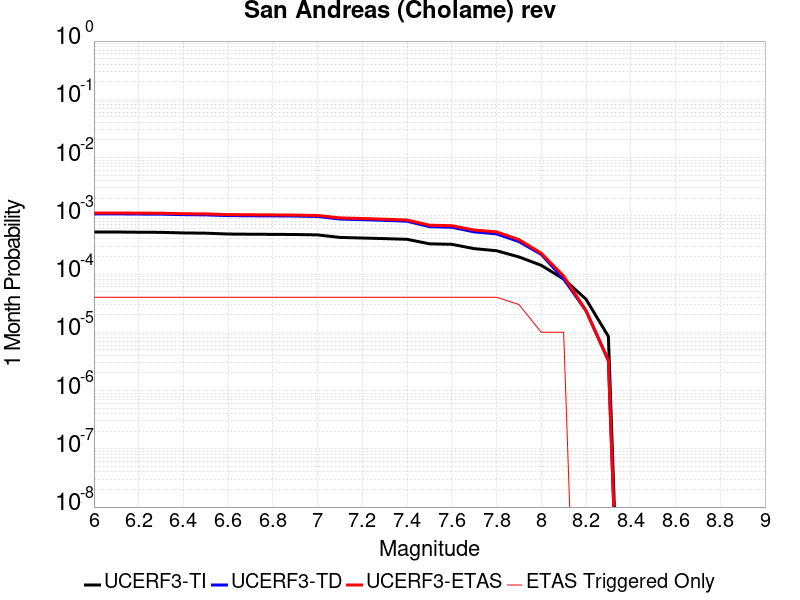 | 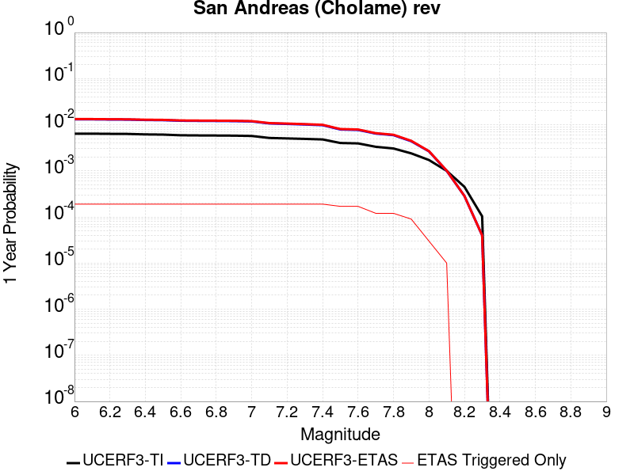 | 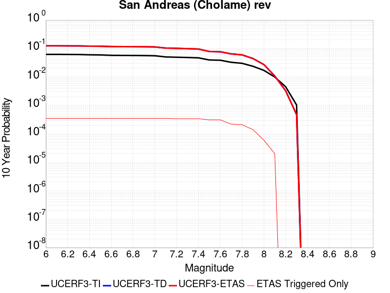 |

| Magnitude | 1 wk TI Prob | 1 wk TD Prob | 1 wk ETAS Prob | 1 wk ETAS/TD Gain | 1 wk ETAS Triggered Only | 1 mo TI Prob | 1 mo TD Prob | 1 mo ETAS Prob | 1 mo ETAS/TD Gain | 1 mo ETAS Triggered Only | 1 yr TI Prob | 1 yr TD Prob | 1 yr ETAS Prob | 1 yr ETAS/TD Gain | 1 yr ETAS Triggered Only | 10 yr TI Prob | 10 yr TD Prob | 10 yr ETAS Prob | 10 yr ETAS/TD Gain | 10 yr ETAS Triggered Only |
|-----|-----|-----|-----|-----|-----|-----|-----|-----|-----|-----|-----|-----|-----|-----|-----|-----|-----|-----|-----|-----|
| 6.0 | 1.2302514E-4 | 2.5212354E-4 | 2.6212103E-4 | 1.0396531 | 1.0E-5 | 5.27144E-4 | 0.0010800837 | 0.0011200404 | 1.0369942 | 4.0E-5 | 0.0063991086 | 0.013071238 | 0.013258754 | 1.0143458 | 1.9E-4 | 0.06217949 | 0.12442431 | 0.12473076 | 1.002463 | 3.5E-4 |
| 6.1 | 1.2302514E-4 | 2.5212354E-4 | 2.6212103E-4 | 1.0396531 | 1.0E-5 | 5.27144E-4 | 0.0010800837 | 0.0011200404 | 1.0369942 | 4.0E-5 | 0.0063991086 | 0.013071238 | 0.013258754 | 1.0143458 | 1.9E-4 | 0.06217949 | 0.12442431 | 0.12473076 | 1.002463 | 3.5E-4 |
| 6.2 | 1.2203569E-4 | 2.502914E-4 | 2.602889E-4 | 1.0399435 | 1.0E-5 | 5.2290526E-4 | 0.0010722381 | 0.0011121952 | 1.0372652 | 4.0E-5 | 0.006347804 | 0.012976861 | 0.013164395 | 1.0144515 | 1.9E-4 | 0.061695136 | 0.123610474 | 0.12391721 | 1.0024815 | 3.5E-4 |
| 6.3 | 1.2142645E-4 | 2.4915105E-4 | 2.5914857E-4 | 1.0401263 | 1.0E-5 | 5.202953E-4 | 0.0010673549 | 0.0011073123 | 1.0374358 | 4.0E-5 | 0.006316212 | 0.012918115 | 0.01310566 | 1.014518 | 1.9E-4 | 0.06139677 | 0.123104595 | 0.12341151 | 1.0024931 | 3.5E-4 |
| 6.4 | 1.1865206E-4 | 2.44206E-4 | 2.5420357E-4 | 1.0409391 | 1.0E-5 | 5.0840975E-4 | 0.001046179 | 0.001086137 | 1.0381944 | 4.0E-5 | 0.006172335 | 0.012663319 | 0.012850912 | 1.014814 | 1.9E-4 | 0.060036868 | 0.120897256 | 0.12120494 | 1.002545 | 3.5E-4 |
| 6.5 | 1.17443946E-4 | 2.4213883E-4 | 2.521364E-4 | 1.0412886 | 1.0E-5 | 5.032341E-4 | 0.0010373268 | 0.0010772853 | 1.0385207 | 4.0E-5 | 0.006109677 | 0.012556788 | 0.012744402 | 1.0149412 | 1.9E-4 | 0.059444077 | 0.1199714 | 0.12027941 | 1.0025674 | 3.5E-4 |
| 6.6 | 1.13579066E-4 | 2.3522819E-4 | 2.4522585E-4 | 1.0425019 | 1.0E-5 | 4.866766E-4 | 0.0010077328 | 0.0010476925 | 1.0396531 | 4.0E-5 | 0.0059092017 | 0.01220057 | 0.012388252 | 1.015383 | 1.9E-4 | 0.057545185 | 0.11688524 | 0.11719433 | 1.0026444 | 3.5E-4 |
| 6.7 | 1.1271412E-4 | 2.3367115E-4 | 2.4366881E-4 | 1.0427852 | 1.0E-5 | 4.829711E-4 | 0.0010010649 | 0.0010410249 | 1.0399175 | 4.0E-5 | 0.005864331 | 0.012120294 | 0.012307991 | 1.0154862 | 1.9E-4 | 0.057119697 | 0.11618876 | 0.11649809 | 1.0026623 | 3.5E-4 |
| 6.8 | 1.1217975E-4 | 2.3255522E-4 | 2.425529E-4 | 1.0429906 | 1.0E-5 | 4.8068175E-4 | 9.96286E-4 | 0.0010362462 | 1.0401092 | 4.0E-5 | 0.005836608 | 0.012062757 | 0.012250465 | 1.015561 | 1.9E-4 | 0.056856725 | 0.11568696 | 0.115996465 | 1.0026754 | 3.5E-4 |
| 6.9 | 1.1146753E-4 | 2.310425E-4 | 2.410402E-4 | 1.0432721 | 1.0E-5 | 4.7763053E-4 | 9.898079E-4 | 0.0010297684 | 1.0403719 | 4.0E-5 | 0.0057996577 | 0.011984756 | 0.012172479 | 1.0156635 | 1.9E-4 | 0.056506127 | 0.115007326 | 0.11531707 | 1.0026933 | 3.5E-4 |
| 7.0 | 1.0965793E-4 | 2.272753E-4 | 2.3727304E-4 | 1.0439895 | 1.0E-5 | 4.698779E-4 | 9.7367493E-4 | 0.001013636 | 1.0410415 | 4.0E-5 | 0.005705768 | 0.0117904795 | 0.01197824 | 1.0159247 | 1.9E-4 | 0.055614736 | 0.11330871 | 0.11361906 | 1.002739 | 3.5E-4 |
| 7.1 | 9.927982E-5 | 2.0546367E-4 | 2.1546161E-4 | 1.0486604 | 1.0E-5 | 4.2541555E-4 | 8.8026247E-4 | 9.202272E-4 | 1.045401 | 4.0E-5 | 0.0051671406 | 0.010664824 | 0.010852798 | 1.0176256 | 1.9E-4 | 0.05048634 | 0.103402555 | 0.10371636 | 1.0030348 | 3.5E-4 |
| 7.2 | 9.696786E-5 | 2.0050575E-4 | 2.1050374E-4 | 1.0498639 | 1.0E-5 | 4.1551032E-4 | 8.590283E-4 | 8.98994E-4 | 1.0465243 | 4.0E-5 | 0.00504711 | 0.010408797 | 0.01059682 | 1.0180638 | 1.9E-4 | 0.04934009 | 0.10114042 | 0.101446025 | 1.0030217 | 3.4E-4 |
| 7.3 | 9.4727984E-5 | 1.947974E-4 | 2.0479545E-4 | 1.0513254 | 1.0E-5 | 4.0591392E-4 | 8.3457987E-4 | 8.745465E-4 | 1.0478883 | 4.0E-5 | 0.0049308087 | 0.010113939 | 0.010302017 | 1.0185959 | 1.9E-4 | 0.048228268 | 0.09851095 | 0.09881746 | 1.0031114 | 3.4E-4 |
| 7.4 | 9.220358E-5 | 1.8850208E-4 | 1.9850019E-4 | 1.0530398 | 1.0E-5 | 3.9509835E-4 | 8.0761686E-4 | 8.4758457E-4 | 1.0494884 | 4.0E-5 | 0.004799717 | 0.009788652 | 0.009976792 | 1.0192202 | 1.9E-4 | 0.046973653 | 0.095588475 | 0.095895976 | 1.0032169 | 3.4E-4 |
| 7.5 | 7.71631E-5 | 1.5184193E-4 | 1.618404E-4 | 1.065848 | 1.0E-5 | 3.306571E-4 | 6.50589E-4 | 6.90563E-4 | 1.0614427 | 4.0E-5 | 0.0040183207 | 0.007892225 | 0.008060884 | 1.0213702 | 1.7E-4 | 0.03946433 | 0.078313164 | 0.07859889 | 1.0036485 | 3.1E-4 |
| 7.6 | 7.5634416E-5 | 1.4843588E-4 | 1.5843438E-4 | 1.0673592 | 1.0E-5 | 3.241072E-4 | 6.359988E-4 | 6.7597337E-4 | 1.0628532 | 4.0E-5 | 0.0039388672 | 0.0077158613 | 0.00788455 | 1.0218625 | 1.7E-4 | 0.038697794 | 0.0766763 | 0.07696253 | 1.0037329 | 3.1E-4 |
| 7.7 | 6.3783E-5 | 1.2364227E-4 | 1.3364104E-4 | 1.0808685 | 1.0E-5 | 2.7332708E-4 | 5.297879E-4 | 5.697667E-4 | 1.0754619 | 4.0E-5 | 0.0033226798 | 0.0064311177 | 0.006550346 | 1.0185393 | 1.2E-4 | 0.032734364 | 0.064565435 | 0.06477123 | 1.0031874 | 2.2E-4 |
| 7.8 | 5.863422E-5 | 1.1421112E-4 | 1.2420998E-4 | 1.0875472 | 1.0E-5 | 2.512653E-4 | 4.8938446E-4 | 5.293649E-4 | 1.0816953 | 4.0E-5 | 0.003054864 | 0.005941999 | 0.006061286 | 1.0200752 | 1.2E-4 | 0.030132094 | 0.059682142 | 0.05987961 | 1.0033087 | 2.1E-4 |
| 7.9 | 4.595283E-5 | 8.4299856E-5 | 9.429901E-5 | 1.1186142 | 1.0E-5 | 1.9692584E-4 | 3.6123508E-4 | 3.9122425E-4 | 1.0830184 | 3.0E-5 | 0.0023949358 | 0.0043891747 | 0.0044787796 | 1.020415 | 9.0E-5 | 0.023692891 | 0.04437924 | 0.044513028 | 1.0030147 | 1.4E-4 |
| 8.0 | 3.2950178E-5 | 5.0795676E-5 | 5.0795676E-5 | 1.0 | 0.0 | 1.412074E-4 | 2.176776E-4 | 2.2767542E-4 | 1.0459296 | 1.0E-5 | 0.0017178444 | 0.0026470055 | 0.002676926 | 1.0113035 | 3.0E-5 | 0.017046256 | 0.027191322 | 0.02724969 | 1.0021466 | 6.0E-5 |
| 8.1 | 1.9177472E-5 | 1.9196286E-5 | 1.9196286E-5 | 1.0 | 0.0 | 8.218658E-5 | 8.226721E-5 | 9.226639E-5 | 1.1215451 | 1.0E-5 | 0.0010001622 | 0.0010011437 | 0.0010111337 | 1.0099785 | 1.0E-5 | 0.009956728 | 0.010763982 | 0.010783767 | 1.0018381 | 2.0E-5 |
| 8.2 | 8.643924E-6 | 5.479068E-6 | 5.479068E-6 | 1.0 | 0.0 | 3.704486E-5 | 2.3481509E-5 | 2.3481509E-5 | 1.0 | 0.0 | 4.5092785E-4 | 2.8584994E-4 | 2.8584994E-4 | 1.0 | 0.0 | 0.0045001395 | 0.0032510054 | 0.0032510054 | 1.0 | 0.0 |
| 8.3 | 1.983087E-6 | 7.666981E-7 | 7.666981E-7 | 1.0 | 0.0 | 8.498917E-6 | 3.285845E-6 | 3.285845E-6 | 1.0 | 0.0 | 1.034694E-4 | 4.0004445E-5 | 4.0004445E-5 | 1.0 | 0.0 | 0.0010342124 | 4.723745E-4 | 4.723745E-4 | 1.0 | 0.0 |

## Death Valley (No)
*[(top)](#table-of-contents)*

| 1 Week | 1 Month | 1 Year | 10 Year |
|-----|-----|-----|-----|
| 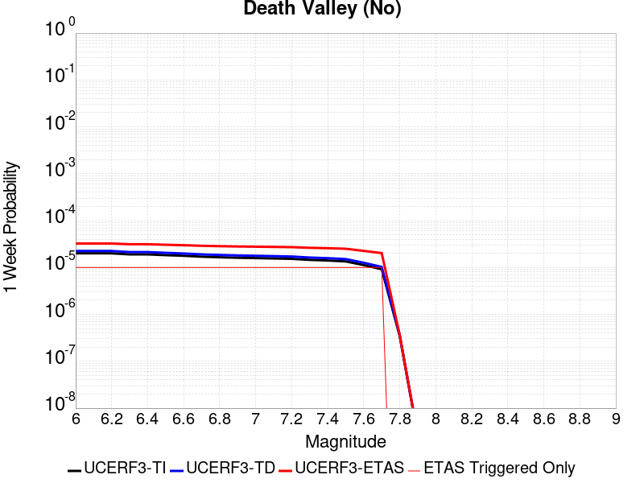 | 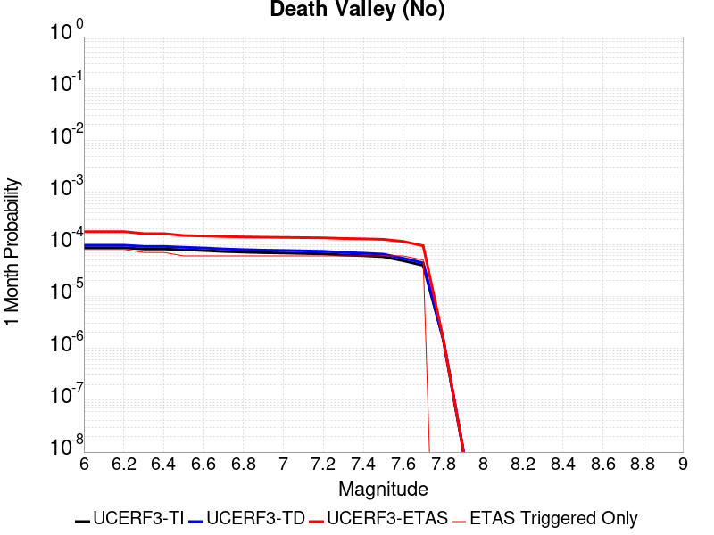 | 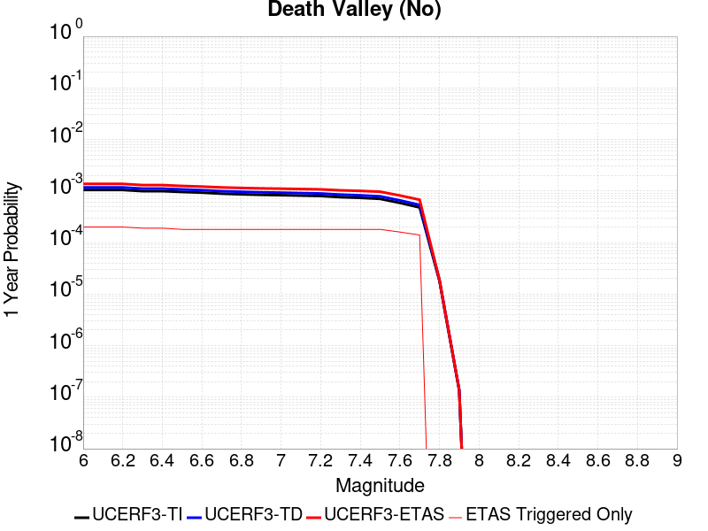 | 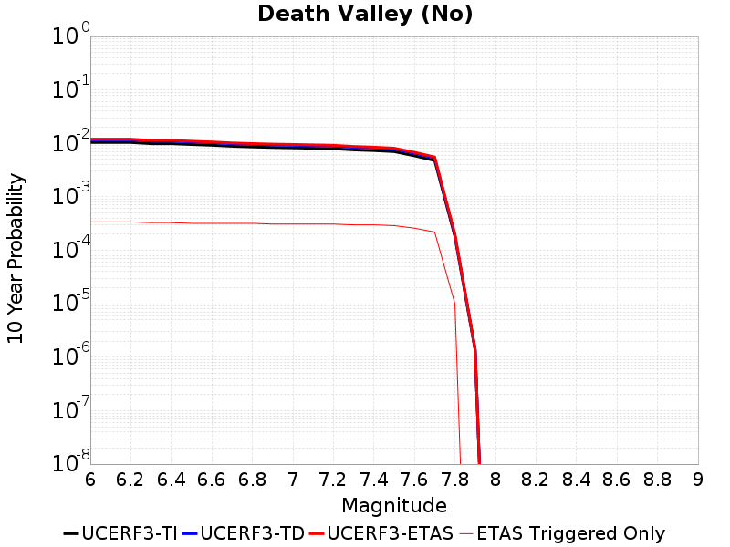 |

| Magnitude | 1 wk TI Prob | 1 wk TD Prob | 1 wk ETAS Prob | 1 wk ETAS/TD Gain | 1 wk ETAS Triggered Only | 1 mo TI Prob | 1 mo TD Prob | 1 mo ETAS Prob | 1 mo ETAS/TD Gain | 1 mo ETAS Triggered Only | 1 yr TI Prob | 1 yr TD Prob | 1 yr ETAS Prob | 1 yr ETAS/TD Gain | 1 yr ETAS Triggered Only | 10 yr TI Prob | 10 yr TD Prob | 10 yr ETAS Prob | 10 yr ETAS/TD Gain | 10 yr ETAS Triggered Only |
|-----|-----|-----|-----|-----|-----|-----|-----|-----|-----|-----|-----|-----|-----|-----|-----|-----|-----|-----|-----|-----|
| 6.0 | 2.0074807E-5 | 2.250039E-5 | 3.2500164E-5 | 1.4444268 | 1.0E-5 | 8.603206E-5 | 9.642672E-5 | 1.76419E-4 | 1.8295656 | 8.0E-5 | 0.001046937 | 0.0011733704 | 0.0013731357 | 1.1702491 | 2.0E-4 | 0.010420183 | 0.011672664 | 0.012008695 | 1.0287879 | 3.4E-4 |
| 6.1 | 2.0074807E-5 | 2.250039E-5 | 3.2500164E-5 | 1.4444268 | 1.0E-5 | 8.603206E-5 | 9.642672E-5 | 1.76419E-4 | 1.8295656 | 8.0E-5 | 0.001046937 | 0.0011733704 | 0.0013731357 | 1.1702491 | 2.0E-4 | 0.010420183 | 0.011672664 | 0.012008695 | 1.0287879 | 3.4E-4 |
| 6.2 | 2.0074807E-5 | 2.250039E-5 | 3.2500164E-5 | 1.4444268 | 1.0E-5 | 8.603206E-5 | 9.642672E-5 | 1.76419E-4 | 1.8295656 | 8.0E-5 | 0.001046937 | 0.0011733704 | 0.0013731357 | 1.1702491 | 2.0E-4 | 0.010420183 | 0.011672664 | 0.012008695 | 1.0287879 | 3.4E-4 |
| 6.3 | 1.9050609E-5 | 2.1337235E-5 | 3.1337022E-5 | 1.4686543 | 1.0E-5 | 8.164292E-5 | 9.1442125E-5 | 1.6143573E-4 | 1.7654415 | 7.0E-5 | 9.935491E-4 | 0.0011127461 | 0.0013025346 | 1.1705588 | 1.9E-4 | 0.009891188 | 0.011072568 | 0.011398913 | 1.0294734 | 3.3E-4 |
| 6.4 | 1.9050609E-5 | 2.1337235E-5 | 3.1337022E-5 | 1.4686543 | 1.0E-5 | 8.164292E-5 | 9.1442125E-5 | 1.6143573E-4 | 1.7654415 | 7.0E-5 | 9.935491E-4 | 0.0011127461 | 0.0013025346 | 1.1705588 | 1.9E-4 | 0.009891188 | 0.011072568 | 0.011398913 | 1.0294734 | 3.3E-4 |
| 6.5 | 1.8367004E-5 | 2.0561285E-5 | 3.0561077E-5 | 1.4863409 | 1.0E-5 | 7.8713354E-5 | 8.811685E-5 | 1.4811156E-4 | 1.6808541 | 6.0E-5 | 9.5791375E-4 | 0.0010723012 | 0.0012521081 | 1.1676832 | 1.8E-4 | 0.009537951 | 0.010672058 | 0.010988643 | 1.0296649 | 3.2E-4 |
| 6.6 | 1.779439E-5 | 1.9911195E-5 | 2.9910994E-5 | 1.50222 | 1.0E-5 | 7.625944E-5 | 8.533093E-5 | 1.4532582E-4 | 1.7030848 | 6.0E-5 | 9.280632E-4 | 0.0010384154 | 0.0012182285 | 1.173161 | 1.8E-4 | 0.009241969 | 0.01033639 | 0.010653082 | 1.0306386 | 3.2E-4 |
| 6.7 | 1.7025437E-5 | 1.9043679E-5 | 2.904349E-5 | 1.5250986 | 1.0E-5 | 7.296412E-5 | 8.161325E-5 | 1.4160835E-4 | 1.7351147 | 6.0E-5 | 8.87976E-4 | 9.931945E-4 | 0.0011730158 | 1.1810534 | 1.8E-4 | 0.008844362 | 0.009888276 | 0.010205112 | 1.0320415 | 3.2E-4 |
| 6.8 | 1.6545107E-5 | 1.8512792E-5 | 2.8512608E-5 | 1.540157 | 1.0E-5 | 7.090568E-5 | 7.933816E-5 | 1.393334E-4 | 1.7561965 | 6.0E-5 | 8.629347E-4 | 9.6552016E-4 | 0.0011453464 | 1.186248 | 1.8E-4 | 0.008595915 | 0.009613956 | 0.00993088 | 1.032965 | 3.2E-4 |
| 6.9 | 1.615478E-5 | 1.8087838E-5 | 2.8087656E-5 | 1.5528477 | 1.0E-5 | 6.9232934E-5 | 7.7517034E-5 | 1.3751238E-4 | 1.7739635 | 6.0E-5 | 8.4258494E-4 | 9.433673E-4 | 0.0011231975 | 1.1906259 | 1.8E-4 | 0.008393973 | 0.009394322 | 0.009701409 | 1.0326886 | 3.1E-4 |
| 7.0 | 1.5894311E-5 | 1.780579E-5 | 2.7805612E-5 | 1.5616051 | 1.0E-5 | 6.81167E-5 | 7.630833E-5 | 1.3630376E-4 | 1.7862238 | 6.0E-5 | 8.2900526E-4 | 9.2866406E-4 | 0.0011084969 | 1.1936468 | 1.8E-4 | 0.008259195 | 0.009248522 | 0.009555655 | 1.0332088 | 3.1E-4 |
| 7.1 | 1.5602263E-5 | 1.748374E-5 | 2.7483566E-5 | 1.57195 | 1.0E-5 | 6.6865134E-5 | 7.49282E-5 | 1.349237E-4 | 1.8007066 | 6.0E-5 | 8.137789E-4 | 9.1187505E-4 | 0.0010917109 | 1.1972154 | 1.8E-4 | 0.008108052 | 0.009082017 | 0.009389201 | 1.0338234 | 3.1E-4 |
| 7.2 | 1.5323829E-5 | 1.7170862E-5 | 2.717069E-5 | 1.582372 | 1.0E-5 | 6.56719E-5 | 7.358737E-5 | 1.3358296E-4 | 1.8152974 | 6.0E-5 | 7.99262E-4 | 8.9556404E-4 | 0.0010754028 | 1.2008107 | 1.8E-4 | 0.007963934 | 0.008920226 | 0.009227461 | 1.0344424 | 3.1E-4 |
| 7.3 | 1.4556212E-5 | 1.6302674E-5 | 2.6302512E-5 | 1.6133863 | 1.0E-5 | 6.238227E-5 | 6.9866765E-5 | 1.2986257E-4 | 1.8587173 | 6.0E-5 | 7.592395E-4 | 8.5030176E-4 | 0.0010301487 | 1.2115096 | 1.8E-4 | 0.0075665074 | 0.008471128 | 0.008768586 | 1.0351144 | 3.0E-4 |
| 7.4 | 1.411725E-5 | 1.5808173E-5 | 2.5808014E-5 | 1.6325742 | 1.0E-5 | 6.0501097E-5 | 6.7747584E-5 | 1.2774352E-4 | 1.8855804 | 6.0E-5 | 7.363519E-4 | 8.2452054E-4 | 0.0010043721 | 1.2181287 | 1.8E-4 | 0.0073391674 | 0.008215249 | 0.008512784 | 1.0362175 | 3.0E-4 |
| 7.5 | 1.3503312E-5 | 1.5126493E-5 | 2.5126341E-5 | 1.6610818 | 1.0E-5 | 5.7870053E-5 | 6.482625E-5 | 1.2482236E-4 | 1.925491 | 6.0E-5 | 7.043401E-4 | 7.889796E-4 | 9.688376E-4 | 1.2279627 | 1.8E-4 | 0.007021119 | 0.00786241 | 0.00815013 | 1.0365944 | 2.9E-4 |
| 7.6 | 1.1279839E-5 | 1.2626496E-5 | 2.262637E-5 | 1.7919754 | 1.0E-5 | 4.834127E-5 | 5.411246E-5 | 1.14109214E-4 | 2.108742 | 6.0E-5 | 5.88396E-4 | 6.586254E-4 | 8.1851997E-4 | 1.2427702 | 1.6E-4 | 0.005868405 | 0.0065672863 | 0.006825579 | 1.0393301 | 2.6E-4 |
| 7.7 | 9.189108E-6 | 1.0283496E-5 | 2.0283393E-5 | 1.972422 | 1.0E-5 | 3.93813E-5 | 4.4071407E-5 | 9.4069204E-5 | 2.1344724 | 5.0E-5 | 4.7936183E-4 | 5.364423E-4 | 6.7636726E-4 | 1.2608386 | 1.4E-4 | 0.004783291 | 0.0053519853 | 0.005570808 | 1.0408863 | 2.2E-4 |
| 7.8 | 3.4586725E-7 | 3.648284E-7 | 3.648284E-7 | 1.0 | 0.0 | 1.4822873E-6 | 1.5635493E-6 | 1.5635493E-6 | 1.0 | 0.0 | 1.80467E-5 | 1.9036052E-5 | 1.9036052E-5 | 1.0 | 0.0 | 1.8045233E-4 | 1.9034464E-4 | 2.0034274E-4 | 1.0525262 | 1.0E-5 |
| 7.9 | 2.5591178E-9 | 2.6696847E-9 | 2.6696847E-9 | 1.0 | 0.0 | 1.0967647E-8 | 1.14415055E-8 | 1.14415055E-8 | 1.0 | 0.0 | 1.335311E-7 | 1.3930033E-7 | 1.3930033E-7 | 1.0 | 0.0 | 1.3353102E-6 | 1.3930033E-6 | 1.3930033E-6 | 1.0 | 0.0 |

## Elsinore (Glen Ivy) rev
*[(top)](#table-of-contents)*

| 1 Week | 1 Month | 1 Year | 10 Year |
|-----|-----|-----|-----|
| 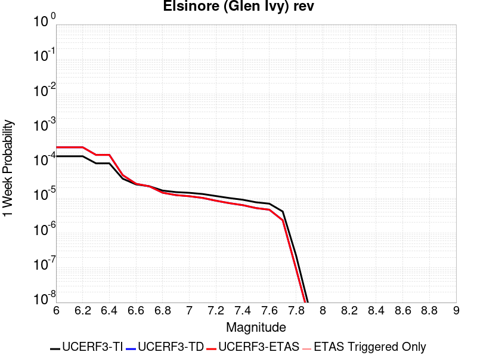 | 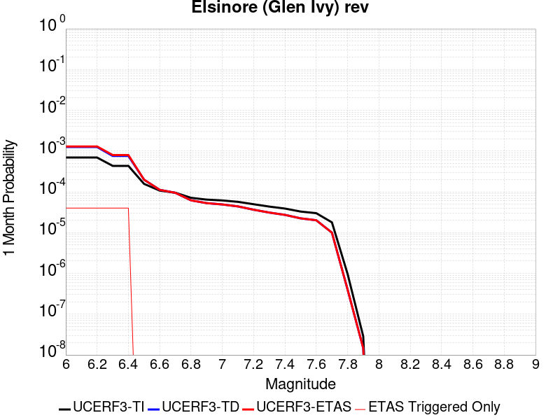 | 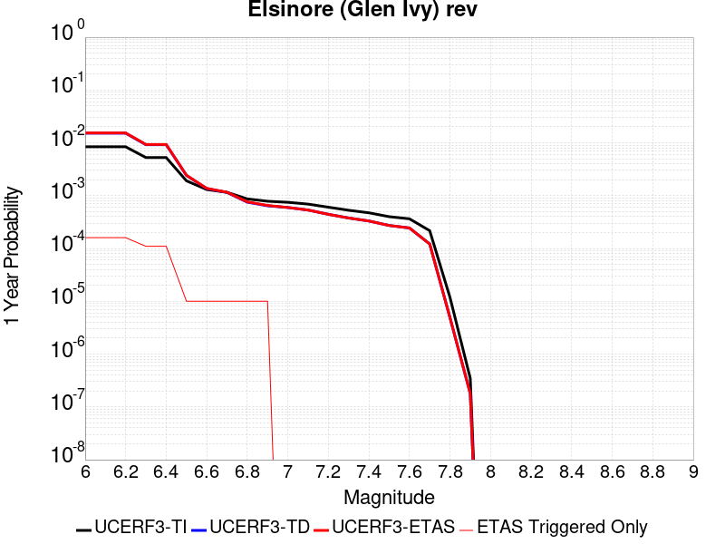 | 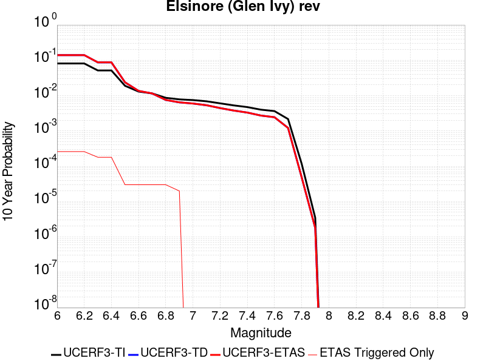 |

| Magnitude | 1 wk TI Prob | 1 wk TD Prob | 1 wk ETAS Prob | 1 wk ETAS/TD Gain | 1 wk ETAS Triggered Only | 1 mo TI Prob | 1 mo TD Prob | 1 mo ETAS Prob | 1 mo ETAS/TD Gain | 1 mo ETAS Triggered Only | 1 yr TI Prob | 1 yr TD Prob | 1 yr ETAS Prob | 1 yr ETAS/TD Gain | 1 yr ETAS Triggered Only | 10 yr TI Prob | 10 yr TD Prob | 10 yr ETAS Prob | 10 yr ETAS/TD Gain | 10 yr ETAS Triggered Only |
|-----|-----|-----|-----|-----|-----|-----|-----|-----|-----|-----|-----|-----|-----|-----|-----|-----|-----|-----|-----|-----|
| 6.0 | 1.6204086E-4 | 2.9361816E-4 | 2.9361816E-4 | 1.0 | 0.0 | 6.94276E-4 | 0.0012579114 | 0.0012978611 | 1.0317588 | 4.0E-5 | 0.008420097 | 0.015235057 | 0.015392619 | 1.0103421 | 1.6E-4 | 0.081081145 | 0.13969459 | 0.13991827 | 1.0016012 | 2.6E-4 |
| 6.1 | 1.6204086E-4 | 2.9361816E-4 | 2.9361816E-4 | 1.0 | 0.0 | 6.94276E-4 | 0.0012579114 | 0.0012978611 | 1.0317588 | 4.0E-5 | 0.008420097 | 0.015235057 | 0.015392619 | 1.0103421 | 1.6E-4 | 0.081081145 | 0.13969459 | 0.13991827 | 1.0016012 | 2.6E-4 |
| 6.2 | 1.6204086E-4 | 2.9361816E-4 | 2.9361816E-4 | 1.0 | 0.0 | 6.94276E-4 | 0.0012579114 | 0.0012978611 | 1.0317588 | 4.0E-5 | 0.008420097 | 0.015235057 | 0.015392619 | 1.0103421 | 1.6E-4 | 0.081081145 | 0.13969459 | 0.13991827 | 1.0016012 | 2.6E-4 |
| 6.3 | 1.0111737E-4 | 1.770371E-4 | 1.770371E-4 | 1.0 | 0.0 | 4.332882E-4 | 7.586265E-4 | 7.985962E-4 | 1.0526868 | 4.0E-5 | 0.005262531 | 0.009217853 | 0.009326839 | 1.0118234 | 1.1E-4 | 0.0513964 | 0.08702056 | 0.0871849 | 1.0018885 | 1.8E-4 |
| 6.4 | 1.0111737E-4 | 1.770371E-4 | 1.770371E-4 | 1.0 | 0.0 | 4.332882E-4 | 7.586265E-4 | 7.985962E-4 | 1.0526868 | 4.0E-5 | 0.005262531 | 0.009217853 | 0.009326839 | 1.0118234 | 1.1E-4 | 0.0513964 | 0.08702056 | 0.0871849 | 1.0018885 | 1.8E-4 |
| 6.5 | 3.6624708E-5 | 4.6392724E-5 | 4.6392724E-5 | 1.0 | 0.0 | 1.569536E-4 | 1.9881286E-4 | 1.9881286E-4 | 1.0 | 0.0 | 0.001909235 | 0.0024182226 | 0.0024281985 | 1.0041252 | 1.0E-5 | 0.01892915 | 0.023740772 | 0.02377006 | 1.0012337 | 3.0E-5 |
| 6.6 | 2.5051324E-5 | 2.6148886E-5 | 2.6148886E-5 | 1.0 | 0.0 | 1.073584E-4 | 1.12062095E-4 | 1.12062095E-4 | 1.0 | 0.0 | 0.0013063047 | 0.0013635466 | 0.0013735329 | 1.0073239 | 1.0E-5 | 0.012986525 | 0.013565214 | 0.013594808 | 1.0021815 | 3.0E-5 |
| 6.7 | 2.2189772E-5 | 2.2073864E-5 | 2.2073864E-5 | 1.0 | 0.0 | 9.509556E-5 | 9.459905E-5 | 9.459905E-5 | 1.0 | 0.0 | 0.0011571734 | 0.0011511712 | 0.0011611597 | 1.0086768 | 1.0E-5 | 0.011511663 | 0.011465937 | 0.011495592 | 1.0025865 | 3.0E-5 |
| 6.8 | 1.6654378E-5 | 1.44383475E-5 | 1.44383475E-5 | 1.0 | 0.0 | 7.137396E-5 | 6.1877196E-5 | 6.1877196E-5 | 1.0 | 0.0 | 8.686314E-4 | 7.5309956E-4 | 7.630921E-4 | 1.0132685 | 1.0E-5 | 0.008652439 | 0.0075108125 | 0.0075405873 | 1.0039642 | 3.0E-5 |
| 6.9 | 1.5042909E-5 | 1.2332591E-5 | 1.2332591E-5 | 1.0 | 0.0 | 6.446802E-5 | 5.2852905E-5 | 5.2852905E-5 | 1.0 | 0.0 | 7.8461546E-4 | 6.432973E-4 | 6.5329083E-4 | 1.0155349 | 1.0E-5 | 0.007818509 | 0.0064185746 | 0.006438446 | 1.003096 | 2.0E-5 |
| 7.0 | 1.4361385E-5 | 1.1451864E-5 | 1.1451864E-5 | 1.0 | 0.0 | 6.154734E-5 | 4.9078513E-5 | 4.9078513E-5 | 1.0 | 0.0 | 7.490812E-4 | 5.9737E-4 | 5.9737E-4 | 1.0 | 0.0 | 0.007465612 | 0.0059616333 | 0.0059616333 | 1.0 | 0.0 |
| 7.1 | 1.3265571E-5 | 1.0245327E-5 | 1.0245327E-5 | 1.0 | 0.0 | 5.6851208E-5 | 4.390782E-5 | 4.390782E-5 | 1.0 | 0.0 | 6.919436E-4 | 5.344491E-4 | 5.344491E-4 | 1.0 | 0.0 | 0.006897931 | 0.0053349948 | 0.0053349948 | 1.0 | 0.0 |
| 7.2 | 1.1596403E-5 | 8.5053825E-6 | 8.5053825E-6 | 1.0 | 0.0 | 4.9697923E-5 | 3.645114E-5 | 3.645114E-5 | 1.0 | 0.0 | 6.049042E-4 | 4.4370393E-4 | 4.4370393E-4 | 1.0 | 0.0 | 0.006032603 | 0.0044295955 | 0.0044295955 | 1.0 | 0.0 |
| 7.3 | 1.0150827E-5 | 7.2390217E-6 | 7.2390217E-6 | 1.0 | 0.0 | 4.3502816E-5 | 3.1024018E-5 | 3.1024018E-5 | 1.0 | 0.0 | 5.2951806E-4 | 3.776534E-4 | 3.776534E-4 | 1.0 | 0.0 | 0.005282581 | 0.0037705027 | 0.0037705027 | 1.0 | 0.0 |
| 7.4 | 9.080705E-6 | 6.3527436E-6 | 6.3527436E-6 | 1.0 | 0.0 | 3.8916725E-5 | 2.722577E-5 | 2.722577E-5 | 1.0 | 0.0 | 4.7370812E-4 | 3.3142467E-4 | 3.3142467E-4 | 1.0 | 0.0 | 0.004726996 | 0.003309455 | 0.003309455 | 1.0 | 0.0 |
| 7.5 | 7.671649E-6 | 5.225816E-6 | 5.225816E-6 | 1.0 | 0.0 | 3.287808E-5 | 2.2396169E-5 | 2.2396169E-5 | 1.0 | 0.0 | 4.0021708E-4 | 2.726405E-4 | 2.726405E-4 | 1.0 | 0.0 | 0.0039949706 | 0.002723185 | 0.002723185 | 1.0 | 0.0 |
| 7.6 | 6.990086E-6 | 4.687709E-6 | 4.687709E-6 | 1.0 | 0.0 | 2.9957167E-5 | 2.0090034E-5 | 2.0090034E-5 | 1.0 | 0.0 | 3.6466747E-4 | 2.4456988E-4 | 2.4456988E-4 | 1.0 | 0.0 | 0.0036406964 | 0.0024431234 | 0.0024431234 | 1.0 | 0.0 |
| 7.7 | 4.163505E-6 | 2.3296298E-6 | 2.3296298E-6 | 1.0 | 0.0 | 1.7843471E-5 | 9.984094E-6 | 9.984094E-6 | 1.0 | 0.0 | 2.172226E-4 | 1.215503E-4 | 1.215503E-4 | 1.0 | 0.0 | 0.0021701038 | 0.0012149112 | 0.0012149112 | 1.0 | 0.0 |
| 7.8 | 2.2692414E-7 | 9.385869E-8 | 9.385869E-8 | 1.0 | 0.0 | 9.725317E-7 | 4.0225146E-7 | 4.0225146E-7 | 1.0 | 0.0 | 1.1840509E-5 | 4.897404E-6 | 4.897404E-6 | 1.0 | 0.0 | 1.1839878E-4 | 4.897329E-5 | 4.897329E-5 | 1.0 | 0.0 |
| 7.9 | 6.676829E-9 | 3.4399577E-9 | 3.4399577E-9 | 1.0 | 0.0 | 2.861498E-8 | 1.47426755E-8 | 1.47426755E-8 | 1.0 | 0.0 | 3.4838732E-7 | 1.7949206E-7 | 1.7949206E-7 | 1.0 | 0.0 | 3.4838679E-6 | 1.7949193E-6 | 1.7949193E-6 | 1.0 | 0.0 |

## San Andreas (San Gorgonio Pass-Garnet HIll)
*[(top)](#table-of-contents)*

| 1 Week | 1 Month | 1 Year | 10 Year |
|-----|-----|-----|-----|
| 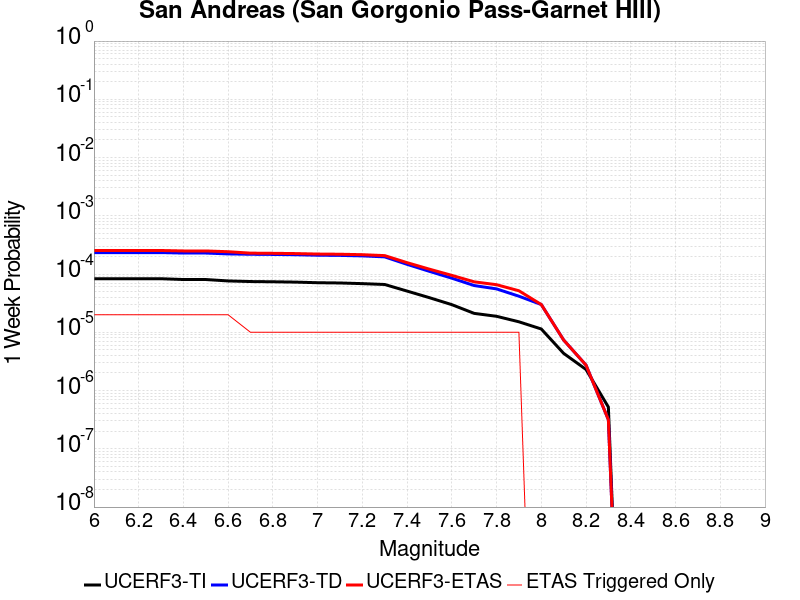 | 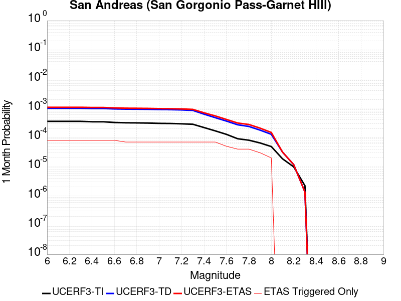 | 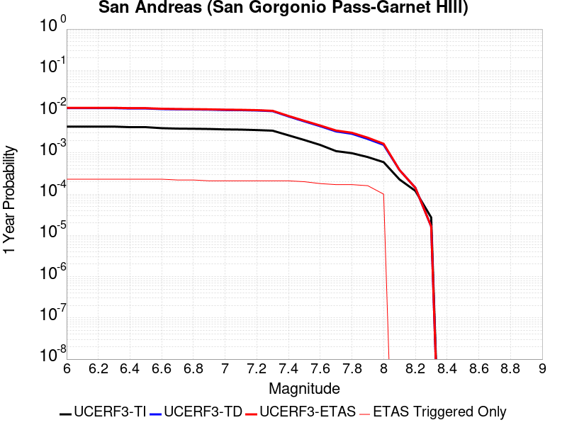 | 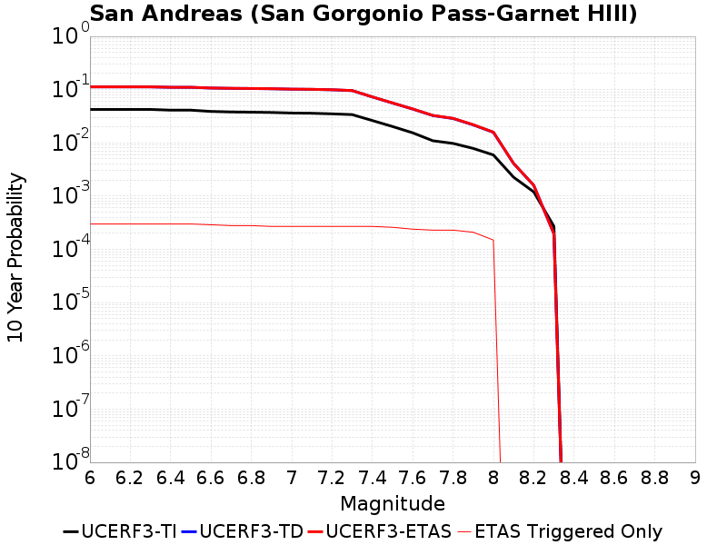 |

| Magnitude | 1 wk TI Prob | 1 wk TD Prob | 1 wk ETAS Prob | 1 wk ETAS/TD Gain | 1 wk ETAS Triggered Only | 1 mo TI Prob | 1 mo TD Prob | 1 mo ETAS Prob | 1 mo ETAS/TD Gain | 1 mo ETAS Triggered Only | 1 yr TI Prob | 1 yr TD Prob | 1 yr ETAS Prob | 1 yr ETAS/TD Gain | 1 yr ETAS Triggered Only | 10 yr TI Prob | 10 yr TD Prob | 10 yr ETAS Prob | 10 yr ETAS/TD Gain | 10 yr ETAS Triggered Only |
|-----|-----|-----|-----|-----|-----|-----|-----|-----|-----|-----|-----|-----|-----|-----|-----|-----|-----|-----|-----|-----|
| 6.0 | 8.31567E-5 | 2.3385829E-4 | 2.538536E-4 | 1.0855019 | 2.0E-5 | 3.5633717E-4 | 0.0010018669 | 0.0010817868 | 1.0797709 | 8.0E-5 | 0.004329778 | 0.0121296 | 0.01235681 | 1.0187318 | 2.3E-4 | 0.042463828 | 0.112592496 | 0.11285872 | 1.0023645 | 3.0E-4 |
| 6.1 | 8.31567E-5 | 2.3385829E-4 | 2.538536E-4 | 1.0855019 | 2.0E-5 | 3.5633717E-4 | 0.0010018669 | 0.0010817868 | 1.0797709 | 8.0E-5 | 0.004329778 | 0.0121296 | 0.01235681 | 1.0187318 | 2.3E-4 | 0.042463828 | 0.112592496 | 0.11285872 | 1.0023645 | 3.0E-4 |
| 6.2 | 8.31567E-5 | 2.3385829E-4 | 2.538536E-4 | 1.0855019 | 2.0E-5 | 3.5633717E-4 | 0.0010018669 | 0.0010817868 | 1.0797709 | 8.0E-5 | 0.004329778 | 0.0121296 | 0.01235681 | 1.0187318 | 2.3E-4 | 0.042463828 | 0.112592496 | 0.11285872 | 1.0023645 | 3.0E-4 |
| 6.3 | 8.31567E-5 | 2.3385829E-4 | 2.538536E-4 | 1.0855019 | 2.0E-5 | 3.5633717E-4 | 0.0010018669 | 0.0010817868 | 1.0797709 | 8.0E-5 | 0.004329778 | 0.0121296 | 0.01235681 | 1.0187318 | 2.3E-4 | 0.042463828 | 0.112592496 | 0.11285872 | 1.0023645 | 3.0E-4 |
| 6.4 | 8.059055E-5 | 2.2944121E-4 | 2.4943662E-4 | 1.0871483 | 2.0E-5 | 3.4534236E-4 | 9.829514E-4 | 0.0010628727 | 1.0813075 | 8.0E-5 | 0.0041964394 | 0.011901842 | 0.012129105 | 1.0190947 | 2.3E-4 | 0.041180745 | 0.11057367 | 0.1108405 | 1.0024132 | 3.0E-4 |
| 6.5 | 8.059055E-5 | 2.2944121E-4 | 2.4943662E-4 | 1.0871483 | 2.0E-5 | 3.4534236E-4 | 9.829514E-4 | 0.0010628727 | 1.0813075 | 8.0E-5 | 0.0041964394 | 0.011901842 | 0.012129105 | 1.0190947 | 2.3E-4 | 0.041180745 | 0.11057367 | 0.1108405 | 1.0024132 | 3.0E-4 |
| 6.6 | 7.619237E-5 | 2.2188427E-4 | 2.4187984E-4 | 1.0901171 | 2.0E-5 | 3.2649786E-4 | 9.505884E-4 | 0.0010305124 | 1.0840784 | 8.0E-5 | 0.0039678677 | 0.0115125505 | 0.011739903 | 1.0197482 | 2.3E-4 | 0.03897764 | 0.107110284 | 0.10736922 | 1.0024174 | 2.9E-4 |
| 6.7 | 7.440636E-5 | 2.1864247E-4 | 2.2864027E-4 | 1.0457268 | 1.0E-5 | 3.188454E-4 | 9.367049E-4 | 0.0010066393 | 1.0746601 | 7.0E-5 | 0.0038750346 | 0.011345285 | 0.011562789 | 1.0191714 | 2.2E-4 | 0.038081564 | 0.105618715 | 0.105869144 | 1.0023711 | 2.8E-4 |
| 6.8 | 7.3735864E-5 | 2.1711414E-4 | 2.2711197E-4 | 1.0460488 | 1.0E-5 | 3.1597257E-4 | 9.3015964E-4 | 0.0010000945 | 1.0751859 | 7.0E-5 | 0.0038401815 | 0.011266423 | 0.011483945 | 1.019307 | 2.2E-4 | 0.03774495 | 0.10492026 | 0.10517088 | 1.0023887 | 2.8E-4 |
| 6.9 | 7.27575E-5 | 2.1480382E-4 | 2.2480167E-4 | 1.0465441 | 1.0E-5 | 3.117806E-4 | 9.202653E-4 | 9.902008E-4 | 1.075995 | 7.0E-5 | 0.003789323 | 0.011147198 | 0.011354857 | 1.0186288 | 2.1E-4 | 0.037253562 | 0.10386817 | 0.10411013 | 1.0023295 | 2.7E-4 |
| 7.0 | 7.102591E-5 | 2.1064411E-4 | 2.20642E-4 | 1.0474634 | 1.0E-5 | 3.0436125E-4 | 9.0245035E-4 | 9.723872E-4 | 1.0774966 | 7.0E-5 | 0.003699303 | 0.010932496 | 0.0111402 | 1.0189987 | 2.1E-4 | 0.03638325 | 0.101970345 | 0.10221281 | 1.0023779 | 2.7E-4 |
| 7.1 | 7.028513E-5 | 2.090005E-4 | 2.1899842E-4 | 1.0478368 | 1.0E-5 | 3.0118722E-4 | 8.954112E-4 | 9.653485E-4 | 1.0781064 | 7.0E-5 | 0.0036607897 | 0.010847651 | 0.011055374 | 1.0191491 | 2.1E-4 | 0.036010686 | 0.101213366 | 0.10145604 | 1.0023977 | 2.7E-4 |
| 7.2 | 6.8498244E-5 | 2.050791E-4 | 2.1507705E-4 | 1.0487517 | 1.0E-5 | 2.9353087E-4 | 8.786166E-4 | 9.4855507E-4 | 1.0796007 | 7.0E-5 | 0.003567883 | 0.01064519 | 0.010852954 | 1.0195172 | 2.1E-4 | 0.035111405 | 0.099405356 | 0.09964851 | 1.0024462 | 2.7E-4 |
| 7.3 | 6.622592E-5 | 1.9735174E-4 | 2.0734976E-4 | 1.050661 | 1.0E-5 | 2.8379448E-4 | 8.4552116E-4 | 9.15462E-4 | 1.0827192 | 7.0E-5 | 0.0034497243 | 0.010246111 | 0.01045396 | 1.0202856 | 2.1E-4 | 0.033966612 | 0.095901735 | 0.096145846 | 1.0025454 | 2.7E-4 |
| 7.4 | 5.1050705E-5 | 1.4691756E-4 | 1.569161E-4 | 1.0680554 | 1.0E-5 | 2.1877038E-4 | 6.2949565E-4 | 6.994516E-4 | 1.1111301 | 7.0E-5 | 0.002660276 | 0.00763737 | 0.007845766 | 1.0272864 | 2.1E-4 | 0.02628654 | 0.07287478 | 0.0731251 | 1.003435 | 2.7E-4 |
| 7.5 | 3.9302922E-5 | 1.1132213E-4 | 1.2132102E-4 | 1.0898194 | 1.0E-5 | 1.6843023E-4 | 4.7700794E-4 | 5.4697454E-4 | 1.1466781 | 7.0E-5 | 0.0020487092 | 0.0057921764 | 0.005991018 | 1.0343293 | 2.0E-4 | 0.020299247 | 0.056019954 | 0.056265388 | 1.0043812 | 2.6E-4 |
| 7.6 | 2.9851626E-5 | 8.4970794E-5 | 9.4969946E-5 | 1.1176775 | 1.0E-5 | 1.2792926E-4 | 3.6410984E-4 | 4.1409166E-4 | 1.1372712 | 5.0E-5 | 0.0015564259 | 0.0044240523 | 0.004603256 | 1.0405067 | 1.8E-4 | 0.0154556995 | 0.043203153 | 0.043432783 | 1.0053152 | 2.4E-4 |
| 7.7 | 2.1135214E-5 | 6.354769E-5 | 7.354706E-5 | 1.1573521 | 1.0E-5 | 9.0576345E-5 | 2.7231884E-4 | 3.1230797E-4 | 1.1468467 | 4.0E-5 | 0.0011022091 | 0.0033104469 | 0.003479884 | 1.0511826 | 1.7E-4 | 0.010967582 | 0.032591008 | 0.03281351 | 1.0068271 | 2.3E-4 |
| 7.8 | 1.883379E-5 | 5.565742E-5 | 6.565686E-5 | 1.1796606 | 1.0E-5 | 8.0713755E-5 | 2.3851E-4 | 2.7850046E-4 | 1.1676679 | 4.0E-5 | 9.822468E-4 | 0.0028999955 | 0.0030695025 | 1.0584508 | 1.7E-4 | 0.0097791655 | 0.02870296 | 0.028926358 | 1.007783 | 2.3E-4 |
| 7.9 | 1.5156185E-5 | 4.167252E-5 | 5.16721E-5 | 1.2399563 | 1.0E-5 | 6.495346E-5 | 1.7858429E-4 | 2.0857893E-4 | 1.1679579 | 3.0E-5 | 7.9052144E-4 | 0.0021720969 | 0.0023317495 | 1.0735016 | 1.6E-4 | 0.007877152 | 0.021765891 | 0.021971319 | 1.0094382 | 2.1E-4 |
| 8.0 | 1.1405907E-5 | 2.9984823E-5 | 2.9984823E-5 | 1.0 | 0.0 | 4.8881542E-5 | 1.2850006E-4 | 1.484975E-4 | 1.155622 | 2.0E-5 | 5.9497025E-4 | 0.0015633665 | 0.0016632101 | 1.0638645 | 1.0E-4 | 0.005933798 | 0.015777767 | 0.0159254 | 1.0093571 | 1.5E-4 |
| 8.1 | 4.3511436E-6 | 7.372992E-6 | 7.372992E-6 | 1.0 | 0.0 | 1.8647626E-5 | 3.1598156E-5 | 3.1598156E-5 | 1.0 | 0.0 | 2.2701119E-4 | 3.8463974E-4 | 3.8463974E-4 | 1.0 | 0.0 | 0.0022677942 | 0.004118216 | 0.004118216 | 1.0 | 0.0 |
| 8.2 | 2.3042528E-6 | 2.7347035E-6 | 2.7347035E-6 | 1.0 | 0.0 | 9.875332E-6 | 1.1720105E-5 | 1.1720105E-5 | 1.0 | 0.0 | 1.2022553E-4 | 1.4268298E-4 | 1.4268298E-4 | 1.0 | 0.0 | 0.0012016051 | 0.0015988987 | 0.0015988987 | 1.0 | 0.0 |
| 8.3 | 5.202968E-7 | 3.1623804E-7 | 3.1623804E-7 | 1.0 | 0.0 | 2.2298414E-6 | 1.3553052E-6 | 1.3553052E-6 | 1.0 | 0.0 | 2.714798E-5 | 1.650073E-5 | 1.650073E-5 | 1.0 | 0.0 | 2.7144665E-4 | 1.9577496E-4 | 1.9577496E-4 | 1.0 | 0.0 |

## Death Valley (Fish Lake Valley)
*[(top)](#table-of-contents)*

| 1 Week | 1 Month | 1 Year | 10 Year |
|-----|-----|-----|-----|
|  | 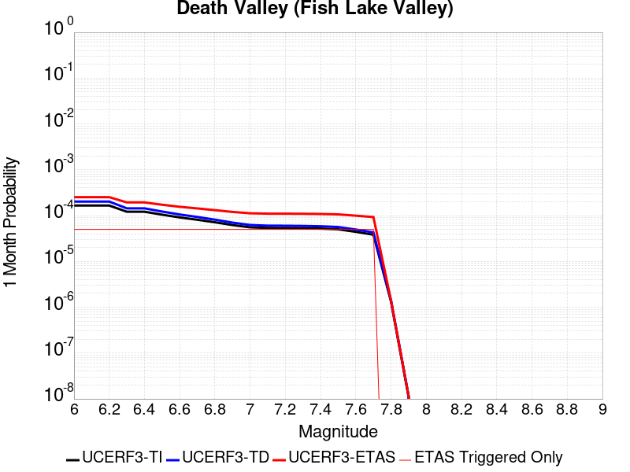 | 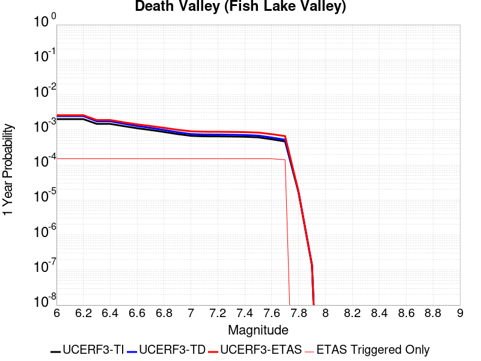 | 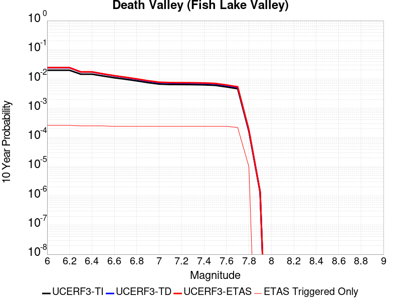 |

| Magnitude | 1 wk TI Prob | 1 wk TD Prob | 1 wk ETAS Prob | 1 wk ETAS/TD Gain | 1 wk ETAS Triggered Only | 1 mo TI Prob | 1 mo TD Prob | 1 mo ETAS Prob | 1 mo ETAS/TD Gain | 1 mo ETAS Triggered Only | 1 yr TI Prob | 1 yr TD Prob | 1 yr ETAS Prob | 1 yr ETAS/TD Gain | 1 yr ETAS Triggered Only | 10 yr TI Prob | 10 yr TD Prob | 10 yr ETAS Prob | 10 yr ETAS/TD Gain | 10 yr ETAS Triggered Only |
|-----|-----|-----|-----|-----|-----|-----|-----|-----|-----|-----|-----|-----|-----|-----|-----|-----|-----|-----|-----|-----|
| 6.0 | 3.872328E-5 | 4.726867E-5 | 5.72682E-5 | 1.2115467 | 1.0E-5 | 1.6594635E-4 | 2.0256598E-4 | 2.5255585E-4 | 1.2467831 | 5.0E-5 | 0.0020185246 | 0.002463593 | 0.0026132234 | 1.0607367 | 1.5E-4 | 0.02000288 | 0.024388772 | 0.02464243 | 1.0104007 | 2.6E-4 |
| 6.1 | 3.872328E-5 | 4.726867E-5 | 5.72682E-5 | 1.2115467 | 1.0E-5 | 1.6594635E-4 | 2.0256598E-4 | 2.5255585E-4 | 1.2467831 | 5.0E-5 | 0.0020185246 | 0.002463593 | 0.0026132234 | 1.0607367 | 1.5E-4 | 0.02000288 | 0.024388772 | 0.02464243 | 1.0104007 | 2.6E-4 |
| 6.2 | 3.872328E-5 | 4.726867E-5 | 5.72682E-5 | 1.2115467 | 1.0E-5 | 1.6594635E-4 | 2.0256598E-4 | 2.5255585E-4 | 1.2467831 | 5.0E-5 | 0.0020185246 | 0.002463593 | 0.0026132234 | 1.0607367 | 1.5E-4 | 0.02000288 | 0.024388772 | 0.02464243 | 1.0104007 | 2.6E-4 |
| 6.3 | 2.8356371E-5 | 3.3610562E-5 | 4.3610227E-5 | 1.2975155 | 1.0E-5 | 1.2152165E-4 | 1.4403775E-4 | 1.9403055E-4 | 1.3470812 | 5.0E-5 | 0.0014785219 | 0.0017523281 | 0.0019020652 | 1.0854504 | 1.5E-4 | 0.014687235 | 0.017392144 | 0.017637795 | 1.0141243 | 2.5E-4 |
| 6.4 | 2.8356371E-5 | 3.3610562E-5 | 4.3610227E-5 | 1.2975155 | 1.0E-5 | 1.2152165E-4 | 1.4403775E-4 | 1.9403055E-4 | 1.3470812 | 5.0E-5 | 0.0014785219 | 0.0017523281 | 0.0019020652 | 1.0854504 | 1.5E-4 | 0.014687235 | 0.017392144 | 0.017637795 | 1.0141243 | 2.5E-4 |
| 6.5 | 2.4448687E-5 | 2.8608105E-5 | 3.860782E-5 | 1.3495413 | 1.0E-5 | 1.0477588E-4 | 1.2260069E-4 | 1.7259456E-4 | 1.407778 | 5.0E-5 | 0.0012748998 | 0.0014916919 | 0.0016414681 | 1.100407 | 1.5E-4 | 0.012676105 | 0.01482166 | 0.015067954 | 1.0166172 | 2.5E-4 |
| 6.6 | 2.1298161E-5 | 2.4660525E-5 | 3.466028E-5 | 1.4054964 | 1.0E-5 | 9.127464E-5 | 1.05683874E-4 | 1.5567859E-4 | 1.473059 | 5.0E-5 | 0.0011107022 | 0.0012859756 | 0.0014357826 | 1.116493 | 1.5E-4 | 0.011051672 | 0.012788752 | 0.013025682 | 1.0185264 | 2.4E-4 |
| 6.7 | 1.8959729E-5 | 2.1781392E-5 | 3.1781175E-5 | 1.4590975 | 1.0E-5 | 8.125345E-5 | 9.3345625E-5 | 1.4334096E-4 | 1.5355937 | 5.0E-5 | 9.888117E-4 | 0.001135916 | 0.0012857456 | 1.131902 | 1.5E-4 | 0.009844234 | 0.011303759 | 0.011541046 | 1.0209919 | 2.4E-4 |
| 6.8 | 1.6691629E-5 | 1.9018651E-5 | 2.901846E-5 | 1.5257896 | 1.0E-5 | 7.153359E-5 | 8.150605E-5 | 1.3150198E-4 | 1.6134014 | 5.0E-5 | 8.7057345E-4 | 9.919013E-4 | 0.0011417525 | 1.1510748 | 1.5E-4 | 0.008671708 | 0.009876498 | 0.010114128 | 1.0240601 | 2.4E-4 |
| 6.9 | 1.450505E-5 | 1.6389778E-5 | 2.6389615E-5 | 1.6101264 | 1.0E-5 | 6.216302E-5 | 7.024007E-5 | 1.2023656E-4 | 1.7117944 | 5.0E-5 | 7.5657194E-4 | 8.548461E-4 | 0.0010047179 | 1.1753201 | 1.5E-4 | 0.007540013 | 0.008516509 | 0.008754466 | 1.0279405 | 2.4E-4 |
| 7.0 | 1.2940855E-5 | 1.4538173E-5 | 2.4538027E-5 | 1.6878344 | 1.0E-5 | 5.545963E-5 | 6.2305E-5 | 1.1230189E-4 | 1.8024538 | 5.0E-5 | 6.750118E-4 | 7.583052E-4 | 9.0819143E-4 | 1.1976595 | 1.5E-4 | 0.006729651 | 0.007557794 | 0.00779598 | 1.0315152 | 2.4E-4 |
| 7.1 | 1.2544658E-5 | 1.40784E-5 | 2.407826E-5 | 1.710298 | 1.0E-5 | 5.3761712E-5 | 6.0334638E-5 | 1.10331624E-4 | 1.8286613 | 5.0E-5 | 6.5435225E-4 | 7.3433225E-4 | 8.842221E-4 | 1.2041172 | 1.5E-4 | 0.006524288 | 0.007319651 | 0.007557894 | 1.0325484 | 2.4E-4 |
| 7.2 | 1.2489416E-5 | 1.4015866E-5 | 2.4015726E-5 | 1.7134671 | 1.0E-5 | 5.3524967E-5 | 6.0066646E-5 | 1.10063644E-4 | 1.8323587 | 5.0E-5 | 6.514716E-4 | 7.3107163E-4 | 8.80962E-4 | 1.2050283 | 1.5E-4 | 0.006495651 | 0.007287259 | 0.00752551 | 1.0326942 | 2.4E-4 |
| 7.3 | 1.2368307E-5 | 1.3880002E-5 | 2.3879864E-5 | 1.720451 | 1.0E-5 | 5.3005948E-5 | 5.9484402E-5 | 1.0948143E-4 | 1.8405066 | 5.0E-5 | 6.451563E-4 | 7.239875E-4 | 8.7387895E-4 | 1.2070359 | 1.5E-4 | 0.0064328653 | 0.0072168806 | 0.0074551483 | 1.0330154 | 2.4E-4 |
| 7.4 | 1.2161707E-5 | 1.3648055E-5 | 2.3647919E-5 | 1.7326951 | 1.0E-5 | 5.212056E-5 | 5.8490383E-5 | 1.0848746E-4 | 1.8547914 | 5.0E-5 | 6.3438306E-4 | 7.118934E-4 | 8.6178654E-4 | 1.2105557 | 1.5E-4 | 0.006325751 | 0.0070967176 | 0.007335014 | 1.0335784 | 2.4E-4 |
| 7.5 | 1.1707948E-5 | 1.3145696E-5 | 2.3145565E-5 | 1.7606952 | 1.0E-5 | 5.0175953E-5 | 5.633751E-5 | 1.0633469E-4 | 1.8874581 | 5.0E-5 | 6.10721E-4 | 6.8569893E-4 | 8.3559606E-4 | 1.2186049 | 1.5E-4 | 0.0060904534 | 0.006836415 | 0.0070747742 | 1.0348661 | 2.4E-4 |
| 7.6 | 1.0319538E-5 | 1.157978E-5 | 2.1579664E-5 | 1.8635643 | 1.0E-5 | 4.4225842E-5 | 4.9626717E-5 | 9.962424E-5 | 2.0074718 | 5.0E-5 | 5.383166E-4 | 6.0404296E-4 | 7.5395236E-4 | 1.2481767 | 1.5E-4 | 0.0053701443 | 0.0060245427 | 0.006263097 | 1.039597 | 2.4E-4 |
| 7.7 | 8.937764E-6 | 1.0022915E-5 | 2.0022815E-5 | 1.9977037 | 1.0E-5 | 3.830414E-5 | 4.2954674E-5 | 9.295253E-5 | 2.1639676 | 5.0E-5 | 4.6625308E-4 | 5.228527E-4 | 6.627795E-4 | 1.2676219 | 1.4E-4 | 0.0046527605 | 0.005216735 | 0.0054355874 | 1.041952 | 2.2E-4 |
| 7.8 | 3.108007E-7 | 3.2846748E-7 | 3.2846748E-7 | 1.0 | 0.0 | 1.3320023E-6 | 1.407717E-6 | 1.407717E-6 | 1.0 | 0.0 | 1.6217007E-5 | 1.7138824E-5 | 1.7138824E-5 | 1.0 | 0.0 | 1.6215823E-4 | 1.713754E-4 | 1.8137369E-4 | 1.0583414 | 1.0E-5 |
| 7.9 | 2.5591178E-9 | 2.6696847E-9 | 2.6696847E-9 | 1.0 | 0.0 | 1.0967647E-8 | 1.14415055E-8 | 1.14415055E-8 | 1.0 | 0.0 | 1.335311E-7 | 1.3930033E-7 | 1.3930033E-7 | 1.0 | 0.0 | 1.3353102E-6 | 1.3930033E-6 | 1.3930033E-6 | 1.0 | 0.0 |

## Sierra Nevada  (No Extension)
*[(top)](#table-of-contents)*

| 1 Week | 1 Month | 1 Year | 10 Year |
|-----|-----|-----|-----|
| 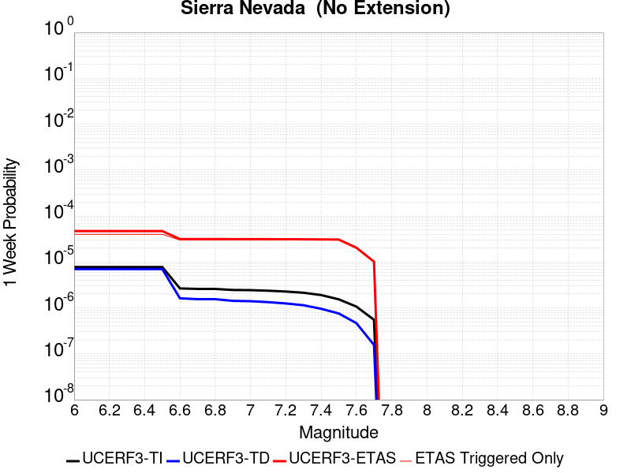 | 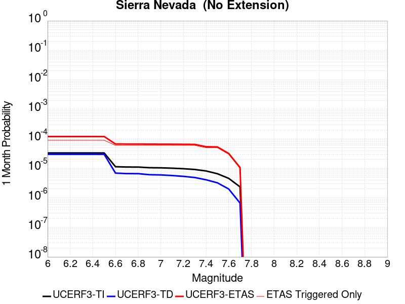 | 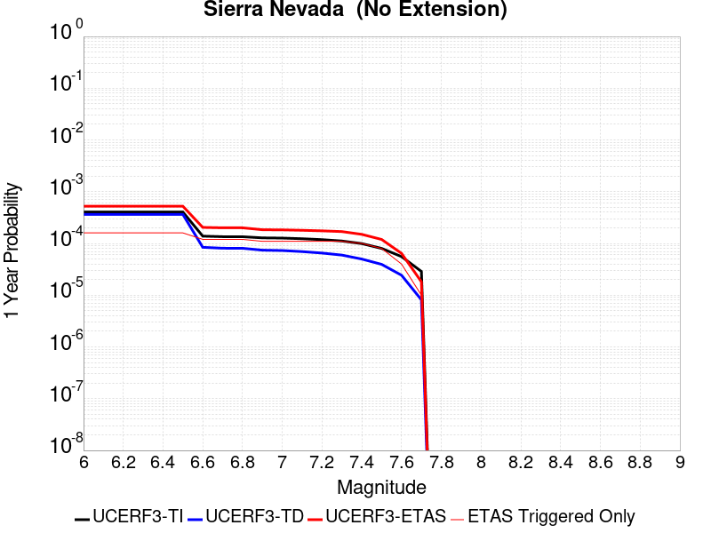 | 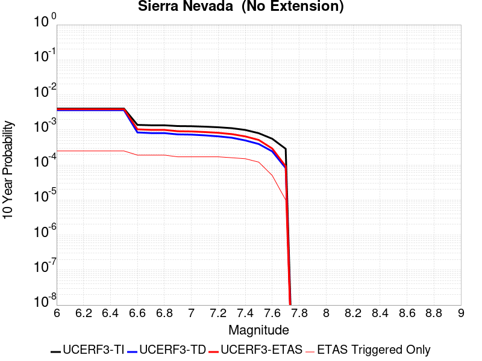 |

| Magnitude | 1 wk TI Prob | 1 wk TD Prob | 1 wk ETAS Prob | 1 wk ETAS/TD Gain | 1 wk ETAS Triggered Only | 1 mo TI Prob | 1 mo TD Prob | 1 mo ETAS Prob | 1 mo ETAS/TD Gain | 1 mo ETAS Triggered Only | 1 yr TI Prob | 1 yr TD Prob | 1 yr ETAS Prob | 1 yr ETAS/TD Gain | 1 yr ETAS Triggered Only | 10 yr TI Prob | 10 yr TD Prob | 10 yr ETAS Prob | 10 yr ETAS/TD Gain | 10 yr ETAS Triggered Only |
|-----|-----|-----|-----|-----|-----|-----|-----|-----|-----|-----|-----|-----|-----|-----|-----|-----|-----|-----|-----|-----|
| 6.0 | 7.7690465E-6 | 6.9763737E-6 | 4.6976096E-5 | 6.7335978 | 4.0E-5 | 3.329549E-5 | 2.9898603E-5 | 1.19895914E-4 | 4.010084 | 9.0E-5 | 4.0529718E-4 | 3.6399055E-4 | 5.239323E-4 | 1.4394119 | 1.6E-4 | 0.004045588 | 0.0036374596 | 0.0038865504 | 1.0684793 | 2.5E-4 |
| 6.1 | 7.7690465E-6 | 6.9763737E-6 | 4.6976096E-5 | 6.7335978 | 4.0E-5 | 3.329549E-5 | 2.9898603E-5 | 1.19895914E-4 | 4.010084 | 9.0E-5 | 4.0529718E-4 | 3.6399055E-4 | 5.239323E-4 | 1.4394119 | 1.6E-4 | 0.004045588 | 0.0036374596 | 0.0038865504 | 1.0684793 | 2.5E-4 |
| 6.2 | 7.7690465E-6 | 6.9763737E-6 | 4.6976096E-5 | 6.7335978 | 4.0E-5 | 3.329549E-5 | 2.9898603E-5 | 1.19895914E-4 | 4.010084 | 9.0E-5 | 4.0529718E-4 | 3.6399055E-4 | 5.239323E-4 | 1.4394119 | 1.6E-4 | 0.004045588 | 0.0036374596 | 0.0038865504 | 1.0684793 | 2.5E-4 |
| 6.3 | 7.7690465E-6 | 6.9763737E-6 | 4.6976096E-5 | 6.7335978 | 4.0E-5 | 3.329549E-5 | 2.9898603E-5 | 1.19895914E-4 | 4.010084 | 9.0E-5 | 4.0529718E-4 | 3.6399055E-4 | 5.239323E-4 | 1.4394119 | 1.6E-4 | 0.004045588 | 0.0036374596 | 0.0038865504 | 1.0684793 | 2.5E-4 |
| 6.4 | 7.7690465E-6 | 6.9763737E-6 | 4.6976096E-5 | 6.7335978 | 4.0E-5 | 3.329549E-5 | 2.9898603E-5 | 1.19895914E-4 | 4.010084 | 9.0E-5 | 4.0529718E-4 | 3.6399055E-4 | 5.239323E-4 | 1.4394119 | 1.6E-4 | 0.004045588 | 0.0036374596 | 0.0038865504 | 1.0684793 | 2.5E-4 |
| 6.5 | 7.7690465E-6 | 6.9763737E-6 | 4.6976096E-5 | 6.7335978 | 4.0E-5 | 3.329549E-5 | 2.9898603E-5 | 1.19895914E-4 | 4.010084 | 9.0E-5 | 4.0529718E-4 | 3.6399055E-4 | 5.239323E-4 | 1.4394119 | 1.6E-4 | 0.004045588 | 0.0036374596 | 0.0038865504 | 1.0684793 | 2.5E-4 |
| 6.6 | 2.653E-6 | 1.6148771E-6 | 3.161483E-5 | 19.577236 | 3.0E-5 | 1.136995E-5 | 6.9208836E-6 | 6.692047E-5 | 9.6693535 | 6.0E-5 | 1.3842035E-4 | 8.4258536E-5 | 2.0424843E-4 | 2.4240682 | 1.2E-4 | 0.0013833415 | 8.422693E-4 | 0.0010321093 | 1.225391 | 1.9E-4 |
| 6.7 | 2.5902466E-6 | 1.5502104E-6 | 3.1550164E-5 | 20.352182 | 3.0E-5 | 1.11010095E-5 | 6.643742E-6 | 6.664334E-5 | 10.030995 | 6.0E-5 | 1.351464E-4 | 8.088459E-5 | 2.0087489E-4 | 2.4834754 | 1.2E-4 | 0.0013506424 | 8.0855447E-4 | 9.984009E-4 | 1.2347972 | 1.9E-4 |
| 6.8 | 2.5853892E-6 | 1.5470105E-6 | 3.1546962E-5 | 20.39221 | 3.0E-5 | 1.1080193E-5 | 6.6300286E-6 | 6.662963E-5 | 10.049675 | 6.0E-5 | 1.34893E-4 | 8.071763E-5 | 2.0070795E-4 | 2.486544 | 1.2E-4 | 0.0013481114 | 8.068862E-4 | 9.967329E-4 | 1.2352831 | 1.9E-4 |
| 6.9 | 2.458257E-6 | 1.4220842E-6 | 3.142204E-5 | 22.095766 | 3.0E-5 | 1.0535345E-5 | 6.0946327E-6 | 6.609427E-5 | 10.844668 | 6.0E-5 | 1.2826028E-4 | 7.419964E-5 | 1.8419148E-4 | 2.4823768 | 1.1E-4 | 0.0012818627 | 7.4175064E-4 | 9.116246E-4 | 1.2290175 | 1.7E-4 |
| 7.0 | 2.4341468E-6 | 1.399048E-6 | 3.1399006E-5 | 22.443123 | 3.0E-5 | 1.0432016E-5 | 5.995906E-6 | 6.599555E-5 | 11.006767 | 6.0E-5 | 1.270024E-4 | 7.299773E-5 | 1.8298971E-4 | 2.506786 | 1.1E-4 | 0.0012692984 | 7.2973943E-4 | 8.996154E-4 | 1.2327899 | 1.7E-4 |
| 7.1 | 2.3652476E-6 | 1.3339973E-6 | 3.133396E-5 | 23.488771 | 3.0E-5 | 1.0136736E-5 | 5.7171187E-6 | 6.571678E-5 | 11.494737 | 6.0E-5 | 1.2340778E-4 | 6.960372E-5 | 1.7959606E-4 | 2.5802655 | 1.1E-4 | 0.0012333926 | 6.9582084E-4 | 8.657025E-4 | 1.2441458 | 1.7E-4 |
| 7.2 | 2.272158E-6 | 1.2503034E-6 | 3.1250267E-5 | 24.994144 | 3.0E-5 | 9.737784E-6 | 5.3584326E-6 | 6.535811E-5 | 12.197245 | 6.0E-5 | 1.1855107E-4 | 6.523698E-5 | 1.752298E-4 | 2.6860504 | 1.1E-4 | 0.0011848784 | 6.5217976E-4 | 8.220689E-4 | 1.2604944 | 1.7E-4 |
| 7.3 | 2.1382127E-6 | 1.1419909E-6 | 3.1141957E-5 | 27.269882 | 3.0E-5 | 9.163737E-6 | 4.8942375E-6 | 6.4893946E-5 | 13.259254 | 6.0E-5 | 1.1156279E-4 | 5.9585727E-5 | 1.6957917E-4 | 2.8459697 | 1.1E-4 | 0.001115068 | 5.9569866E-4 | 7.5560337E-4 | 1.2684321 | 1.6E-4 |
| 7.4 | 1.9048055E-6 | 9.575438E-7 | 3.0957515E-5 | 32.33013 | 3.0E-5 | 8.163426E-6 | 4.103753E-6 | 5.4103548E-5 | 13.18392 | 5.0E-5 | 9.9385186E-5 | 4.996205E-5 | 1.4995705E-4 | 3.001419 | 1.0E-4 | 9.934074E-4 | 4.9950887E-4 | 6.4943393E-4 | 1.3001449 | 1.5E-4 |
| 7.5 | 1.5373403E-6 | 7.560209E-7 | 3.0755997E-5 | 40.68141 | 3.0E-5 | 6.5885843E-6 | 3.2400856E-6 | 5.3239924E-5 | 16.431643 | 5.0E-5 | 8.021306E-5 | 3.944733E-5 | 1.1944418E-4 | 3.0279405 | 8.0E-5 | 8.0184115E-4 | 3.9440376E-4 | 5.143564E-4 | 1.3041368 | 1.2E-4 |
| 7.6 | 1.0680322E-6 | 4.659774E-7 | 2.0465968E-5 | 43.920517 | 2.0E-5 | 4.577273E-6 | 1.9970446E-6 | 3.1996984E-5 | 16.02217 | 3.0E-5 | 5.5726876E-5 | 2.4313747E-5 | 6.431278E-5 | 2.6451197 | 4.0E-5 | 5.5712904E-4 | 2.4311115E-4 | 2.93099E-4 | 1.2056172 | 5.0E-5 |
| 7.7 | 5.509146E-7 | 1.5581088E-7 | 1.0155809E-5 | 65.18036 | 1.0E-5 | 2.3610605E-6 | 6.6776073E-7 | 1.0667754E-5 | 15.975413 | 1.0E-5 | 2.8745531E-5 | 8.129958E-6 | 1.8129876E-5 | 2.2300086 | 1.0E-5 | 2.8741814E-4 | 8.129672E-5 | 9.129591E-5 | 1.1229962 | 1.0E-5 |

## Manix-Afton Hills
*[(top)](#table-of-contents)*

| 1 Week | 1 Month | 1 Year | 10 Year |
|-----|-----|-----|-----|
| 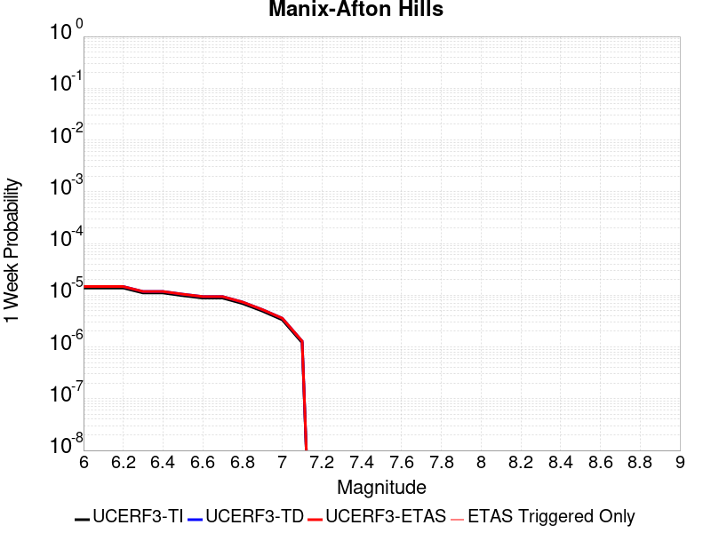 | 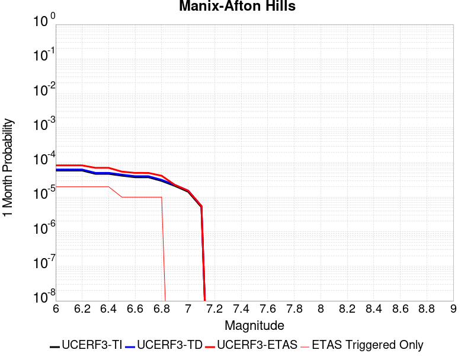 | 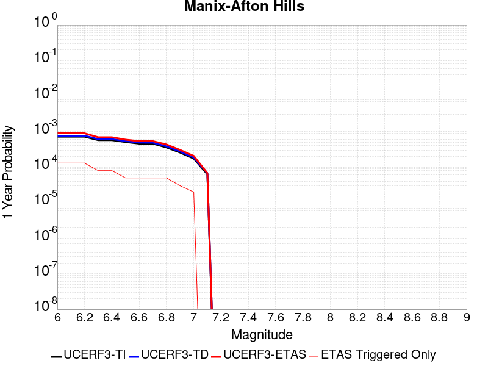 | 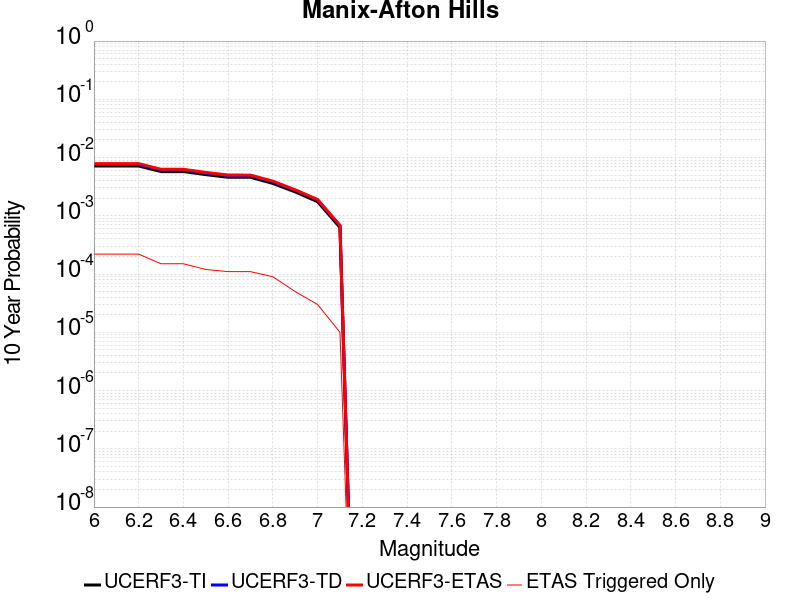 |

| Magnitude | 1 wk TI Prob | 1 wk TD Prob | 1 wk ETAS Prob | 1 wk ETAS/TD Gain | 1 wk ETAS Triggered Only | 1 mo TI Prob | 1 mo TD Prob | 1 mo ETAS Prob | 1 mo ETAS/TD Gain | 1 mo ETAS Triggered Only | 1 yr TI Prob | 1 yr TD Prob | 1 yr ETAS Prob | 1 yr ETAS/TD Gain | 1 yr ETAS Triggered Only | 10 yr TI Prob | 10 yr TD Prob | 10 yr ETAS Prob | 10 yr ETAS/TD Gain | 10 yr ETAS Triggered Only |
|-----|-----|-----|-----|-----|-----|-----|-----|-----|-----|-----|-----|-----|-----|-----|-----|-----|-----|-----|-----|-----|
| 6.0 | 1.3783202E-5 | 1.47112005E-5 | 1.47112005E-5 | 1.0 | 0.0 | 5.906953E-5 | 6.304658E-5 | 8.304532E-5 | 1.3172058 | 2.0E-5 | 7.189342E-4 | 7.6733925E-4 | 8.972395E-4 | 1.1692866 | 1.3E-4 | 0.0071661277 | 0.0076486534 | 0.00786697 | 1.0285432 | 2.2E-4 |
| 6.1 | 1.3783202E-5 | 1.47112005E-5 | 1.47112005E-5 | 1.0 | 0.0 | 5.906953E-5 | 6.304658E-5 | 8.304532E-5 | 1.3172058 | 2.0E-5 | 7.189342E-4 | 7.6733925E-4 | 8.972395E-4 | 1.1692866 | 1.3E-4 | 0.0071661277 | 0.0076486534 | 0.00786697 | 1.0285432 | 2.2E-4 |
| 6.2 | 1.3783202E-5 | 1.47112005E-5 | 1.47112005E-5 | 1.0 | 0.0 | 5.906953E-5 | 6.304658E-5 | 8.304532E-5 | 1.3172058 | 2.0E-5 | 7.189342E-4 | 7.6733925E-4 | 8.972395E-4 | 1.1692866 | 1.3E-4 | 0.0071661277 | 0.0076486534 | 0.00786697 | 1.0285432 | 2.2E-4 |
| 6.3 | 1.10494875E-5 | 1.1793225E-5 | 1.1793225E-5 | 1.0 | 0.0 | 4.7354086E-5 | 5.0541472E-5 | 7.054046E-5 | 1.3956946 | 2.0E-5 | 5.763835E-4 | 6.151791E-4 | 6.9512986E-4 | 1.1299634 | 8.0E-5 | 0.005748908 | 0.006135802 | 0.0062848814 | 1.0242966 | 1.5E-4 |
| 6.4 | 1.10494875E-5 | 1.1793225E-5 | 1.1793225E-5 | 1.0 | 0.0 | 4.7354086E-5 | 5.0541472E-5 | 7.054046E-5 | 1.3956946 | 2.0E-5 | 5.763835E-4 | 6.151791E-4 | 6.9512986E-4 | 1.1299634 | 8.0E-5 | 0.005748908 | 0.006135802 | 0.0062848814 | 1.0242966 | 1.5E-4 |
| 6.5 | 9.788949E-6 | 1.04544E-5 | 1.04544E-5 | 1.0 | 0.0 | 4.1951964E-5 | 4.480385E-5 | 5.4803404E-5 | 1.2231851 | 1.0E-5 | 5.1064545E-4 | 5.453596E-4 | 5.9533236E-4 | 1.0916326 | 5.0E-5 | 0.0050947363 | 0.00544114 | 0.005560487 | 1.0219342 | 1.2E-4 |
| 6.6 | 8.810006E-6 | 9.4137E-6 | 9.4137E-6 | 1.0 | 0.0 | 3.775662E-5 | 4.0343857E-5 | 5.0343453E-5 | 1.2478592 | 1.0E-5 | 4.5958988E-4 | 4.9108465E-4 | 5.410601E-4 | 1.1017654 | 5.0E-5 | 0.0045864056 | 0.004900877 | 0.0050103376 | 1.0223349 | 1.1E-4 |
| 6.7 | 8.80128E-6 | 9.40418E-6 | 9.40418E-6 | 1.0 | 0.0 | 3.7719226E-5 | 4.0303057E-5 | 5.0302653E-5 | 1.2481102 | 1.0E-5 | 4.591348E-4 | 4.9058814E-4 | 5.405636E-4 | 1.1018685 | 5.0E-5 | 0.004581874 | 0.0048959334 | 0.005005395 | 1.0223576 | 1.1E-4 |
| 6.8 | 6.8994877E-6 | 7.380134E-6 | 7.380134E-6 | 1.0 | 0.0 | 2.9568899E-5 | 3.1628806E-5 | 4.162849E-5 | 1.3161575 | 1.0E-5 | 3.5994186E-4 | 3.8502083E-4 | 4.350016E-4 | 1.1298131 | 5.0E-5 | 0.003593594 | 0.003844343 | 0.003933997 | 1.023321 | 9.0E-5 |
| 6.9 | 4.9328037E-6 | 5.271002E-6 | 5.271002E-6 | 1.0 | 0.0 | 2.1140417E-5 | 2.2589848E-5 | 2.2589848E-5 | 1.0 | 0.0 | 2.5735417E-4 | 2.7500285E-4 | 3.0499458E-4 | 1.1090598 | 3.0E-5 | 0.0025705635 | 0.0027472305 | 0.0027970932 | 1.0181501 | 5.0E-5 |
| 7.0 | 3.347973E-6 | 3.5900591E-6 | 3.5900591E-6 | 1.0 | 0.0 | 1.4348378E-5 | 1.53859E-5 | 1.53859E-5 | 1.0 | 0.0 | 1.746775E-4 | 1.8731134E-4 | 2.0730759E-4 | 1.1067541 | 2.0E-5 | 0.0017454025 | 0.0018719372 | 0.001901881 | 1.0159962 | 3.0E-5 |
| 7.1 | 1.2073567E-6 | 1.2934923E-6 | 1.2934923E-6 | 1.0 | 0.0 | 5.1743755E-6 | 5.543536E-6 | 5.543536E-6 | 1.0 | 0.0 | 6.29962E-5 | 6.7492096E-5 | 6.7492096E-5 | 1.0 | 0.0 | 6.297835E-4 | 6.7487615E-4 | 6.8486936E-4 | 1.0148076 | 1.0E-5 |

## San Andreas (Coachella) rev
*[(top)](#table-of-contents)*

| 1 Week | 1 Month | 1 Year | 10 Year |
|-----|-----|-----|-----|
| 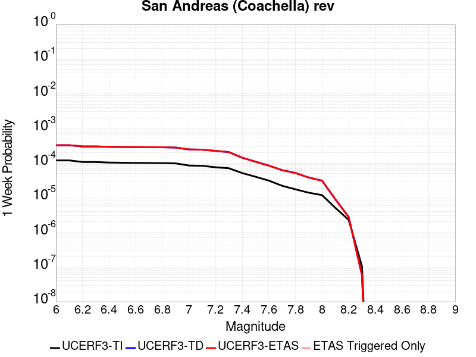 | 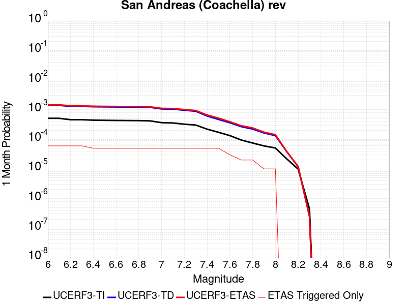 |  | 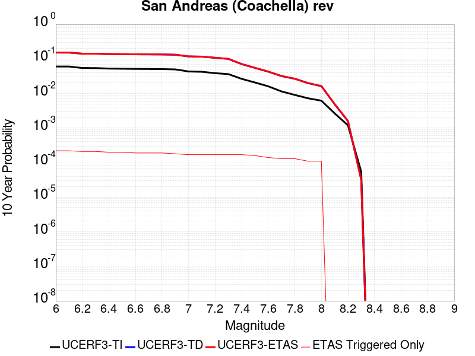 |

| Magnitude | 1 wk TI Prob | 1 wk TD Prob | 1 wk ETAS Prob | 1 wk ETAS/TD Gain | 1 wk ETAS Triggered Only | 1 mo TI Prob | 1 mo TD Prob | 1 mo ETAS Prob | 1 mo ETAS/TD Gain | 1 mo ETAS Triggered Only | 1 yr TI Prob | 1 yr TD Prob | 1 yr ETAS Prob | 1 yr ETAS/TD Gain | 1 yr ETAS Triggered Only | 10 yr TI Prob | 10 yr TD Prob | 10 yr ETAS Prob | 10 yr ETAS/TD Gain | 10 yr ETAS Triggered Only |
|-----|-----|-----|-----|-----|-----|-----|-----|-----|-----|-----|-----|-----|-----|-----|-----|-----|-----|-----|-----|-----|
| 6.0 | 1.1925945E-4 | 3.2733113E-4 | 3.2733113E-4 | 1.0 | 0.0 | 5.110118E-4 | 0.0014020982 | 0.001462014 | 1.042733 | 6.0E-5 | 0.0062038354 | 0.01693827 | 0.017075896 | 1.0081253 | 1.4E-4 | 0.060334753 | 0.15266764 | 0.15285406 | 1.0012211 | 2.2E-4 |
| 6.1 | 1.1925945E-4 | 3.2733113E-4 | 3.2733113E-4 | 1.0 | 0.0 | 5.110118E-4 | 0.0014020982 | 0.001462014 | 1.042733 | 6.0E-5 | 0.0062038354 | 0.01693827 | 0.017075896 | 1.0081253 | 1.4E-4 | 0.060334753 | 0.15266764 | 0.15285406 | 1.0012211 | 2.2E-4 |
| 6.2 | 1.07432395E-4 | 3.0233842E-4 | 3.0233842E-4 | 1.0 | 0.0 | 4.603433E-4 | 0.0012950966 | 0.0013550189 | 1.0462686 | 6.0E-5 | 0.005590286 | 0.015654901 | 0.01579271 | 1.0088029 | 1.4E-4 | 0.05451731 | 0.14183876 | 0.14201897 | 1.0012705 | 2.1E-4 |
| 6.3 | 1.0718766E-4 | 3.0179147E-4 | 3.0179147E-4 | 1.0 | 0.0 | 4.592948E-4 | 0.0012927549 | 0.0013526774 | 1.0463525 | 6.0E-5 | 0.005577586 | 0.015626801 | 0.015764613 | 1.008819 | 1.4E-4 | 0.054396555 | 0.14160702 | 0.14178728 | 1.001273 | 2.1E-4 |
| 6.4 | 1.0355944E-4 | 2.9387232E-4 | 2.9387232E-4 | 1.0 | 0.0 | 4.4375064E-4 | 0.0012588488 | 0.0013087859 | 1.0396688 | 5.0E-5 | 0.0053892885 | 0.015219833 | 0.015347854 | 1.0084115 | 1.3E-4 | 0.052604496 | 0.13816711 | 0.13833947 | 1.0012475 | 2.0E-4 |
| 6.5 | 1.0227914E-4 | 2.9106665E-4 | 2.9106665E-4 | 1.0 | 0.0 | 4.382655E-4 | 0.001246836 | 0.0012967737 | 1.0400515 | 5.0E-5 | 0.0053228354 | 0.015075611 | 0.015203651 | 1.0084932 | 1.3E-4 | 0.051971316 | 0.13694629 | 0.1371189 | 1.0012604 | 2.0E-4 |
| 6.6 | 1.0116757E-4 | 2.8872414E-4 | 2.8872414E-4 | 1.0 | 0.0 | 4.3350324E-4 | 0.0012368063 | 0.0012867445 | 1.0403767 | 5.0E-5 | 0.0052651367 | 0.014955181 | 0.015083236 | 1.0085627 | 1.3E-4 | 0.051421247 | 0.13592447 | 0.13608865 | 1.0012078 | 1.9E-4 |
| 6.7 | 1.0050676E-4 | 2.8730975E-4 | 2.8730975E-4 | 1.0 | 0.0 | 4.3067214E-4 | 0.0012307503 | 0.0012806889 | 1.0405756 | 5.0E-5 | 0.005230834 | 0.014882459 | 0.015010525 | 1.0086051 | 1.3E-4 | 0.051094085 | 0.1353092 | 0.13547349 | 1.0012141 | 1.9E-4 |
| 6.8 | 9.976819E-5 | 2.853463E-4 | 2.853463E-4 | 1.0 | 0.0 | 4.2750788E-4 | 0.0012223434 | 0.0012722823 | 1.040855 | 5.0E-5 | 0.0051924936 | 0.014781498 | 0.014909577 | 1.0086647 | 1.3E-4 | 0.050728295 | 0.1344609 | 0.13462535 | 1.0012231 | 1.9E-4 |
| 6.9 | 9.77719E-5 | 2.8031517E-4 | 2.8031517E-4 | 1.0 | 0.0 | 4.1895514E-4 | 0.0012008016 | 0.0012507415 | 1.0415889 | 5.0E-5 | 0.0050888555 | 0.014522752 | 0.014641009 | 1.008143 | 1.2E-4 | 0.049738888 | 0.13228934 | 0.13244553 | 1.0011806 | 1.8E-4 |
| 7.0 | 8.500761E-5 | 2.4765925E-4 | 2.4765925E-4 | 1.0 | 0.0 | 3.6426744E-4 | 0.0010609683 | 0.0011109152 | 1.0470767 | 5.0E-5 | 0.0044259406 | 0.012841558 | 0.012950146 | 1.008456 | 1.1E-4 | 0.04338823 | 0.11814673 | 0.118296646 | 1.0012689 | 1.7E-4 |
| 7.1 | 8.319876E-5 | 2.4368633E-4 | 2.4368633E-4 | 1.0 | 0.0 | 3.5651738E-4 | 0.0010439552 | 0.001093903 | 1.0478448 | 5.0E-5 | 0.004331963 | 0.012636845 | 0.012745455 | 1.0085948 | 1.1E-4 | 0.042484846 | 0.11636688 | 0.1165171 | 1.0012909 | 1.7E-4 |
| 7.2 | 7.563917E-5 | 2.241698E-4 | 2.241698E-4 | 1.0 | 0.0 | 3.2412758E-4 | 9.6037704E-4 | 0.001010329 | 1.0520129 | 5.0E-5 | 0.0039391145 | 0.011630594 | 0.0117393145 | 1.0093478 | 1.1E-4 | 0.03870018 | 0.10777286 | 0.107924536 | 1.0014074 | 1.7E-4 |
| 7.3 | 7.082985E-5 | 2.0733032E-4 | 2.0733032E-4 | 1.0 | 0.0 | 3.0352117E-4 | 8.882588E-4 | 9.3821436E-4 | 1.0562398 | 5.0E-5 | 0.0036891096 | 0.010761551 | 0.010870367 | 1.0101116 | 1.1E-4 | 0.03628465 | 0.10029521 | 0.10044816 | 1.001525 | 1.7E-4 |
| 7.4 | 5.146215E-5 | 1.4276373E-4 | 1.4276373E-4 | 1.0 | 0.0 | 2.2053342E-4 | 6.11702E-4 | 6.616714E-4 | 1.0816891 | 5.0E-5 | 0.0026816884 | 0.0074222293 | 0.007531413 | 1.0147103 | 1.1E-4 | 0.02649557 | 0.070860825 | 0.07101878 | 1.0022291 | 1.7E-4 |
| 7.5 | 4.0285166E-5 | 1.0943837E-4 | 1.0943837E-4 | 1.0 | 0.0 | 1.7263928E-4 | 4.689376E-4 | 5.1891414E-4 | 1.1065739 | 5.0E-5 | 0.002099857 | 0.0056944387 | 0.0057938695 | 1.017461 | 1.0E-4 | 0.020801254 | 0.055021103 | 0.0551723 | 1.002748 | 1.6E-4 |
| 7.6 | 3.1168736E-5 | 8.440897E-5 | 8.440897E-5 | 1.0 | 0.0 | 1.3357346E-4 | 3.6170273E-4 | 3.9169186E-4 | 1.082911 | 3.0E-5 | 0.0016250437 | 0.004394865 | 0.004474513 | 1.018123 | 8.0E-5 | 0.016132116 | 0.04281901 | 0.042953014 | 1.0031296 | 1.4E-4 |
| 7.7 | 2.2100989E-5 | 6.240502E-5 | 6.240502E-5 | 1.0 | 0.0 | 9.4715084E-5 | 2.6742273E-4 | 2.8741738E-4 | 1.074768 | 2.0E-5 | 0.001152546 | 0.003251017 | 0.0033207894 | 1.0214617 | 7.0E-5 | 0.011465867 | 0.031908132 | 0.032033984 | 1.0039442 | 1.3E-4 |
| 7.8 | 1.7484861E-5 | 5.181129E-5 | 5.181129E-5 | 1.0 | 0.0 | 7.493296E-5 | 2.220295E-4 | 2.4202505E-4 | 1.0900581 | 2.0E-5 | 9.1192697E-4 | 0.002699861 | 0.002769672 | 1.0258572 | 7.0E-5 | 0.009081938 | 0.026647208 | 0.026773743 | 1.0047486 | 1.3E-4 |
| 7.9 | 1.3967285E-5 | 3.82353E-5 | 3.82353E-5 | 1.0 | 0.0 | 5.985842E-5 | 1.638553E-4 | 1.7385365E-4 | 1.0610194 | 1.0E-5 | 7.2853256E-4 | 0.001993114 | 0.0020529944 | 1.0300436 | 6.0E-5 | 0.0072614877 | 0.019915331 | 0.020023141 | 1.0054134 | 1.1E-4 |
| 8.0 | 1.1887396E-5 | 3.1076153E-5 | 3.1076153E-5 | 1.0 | 0.0 | 5.094499E-5 | 1.3317671E-4 | 1.4317538E-4 | 1.0750782 | 1.0E-5 | 6.200787E-4 | 0.0016202215 | 0.0016801243 | 1.0369719 | 6.0E-5 | 0.006183513 | 0.016284367 | 0.016392576 | 1.006645 | 1.1E-4 |
| 8.1 | 5.100864E-6 | 8.977841E-6 | 8.977841E-6 | 1.0 | 0.0 | 2.1860664E-5 | 3.8475897E-5 | 3.8475897E-5 | 1.0 | 0.0 | 2.6612106E-4 | 4.6834347E-4 | 4.6834347E-4 | 1.0 | 0.0 | 0.002658026 | 0.0049199364 | 0.0049199364 | 1.0 | 0.0 |
| 8.2 | 2.3004484E-6 | 2.7882277E-6 | 2.7882277E-6 | 1.0 | 0.0 | 9.859027E-6 | 1.1949493E-5 | 1.1949493E-5 | 1.0 | 0.0 | 1.2002704E-4 | 1.454754E-4 | 1.454754E-4 | 1.0 | 0.0 | 0.0011996223 | 0.0015983101 | 0.0015983101 | 1.0 | 0.0 |
| 8.3 | 1.0424446E-7 | 5.8210464E-8 | 5.8210464E-8 | 1.0 | 0.0 | 4.4676187E-7 | 2.494734E-7 | 2.494734E-7 | 1.0 | 0.0 | 5.439312E-6 | 3.0373346E-6 | 3.0373346E-6 | 1.0 | 0.0 | 5.4391792E-5 | 3.193333E-5 | 3.193333E-5 | 1.0 | 0.0 |

## San Jacinto (San Bernardino)
*[(top)](#table-of-contents)*

| 1 Week | 1 Month | 1 Year | 10 Year |
|-----|-----|-----|-----|
| 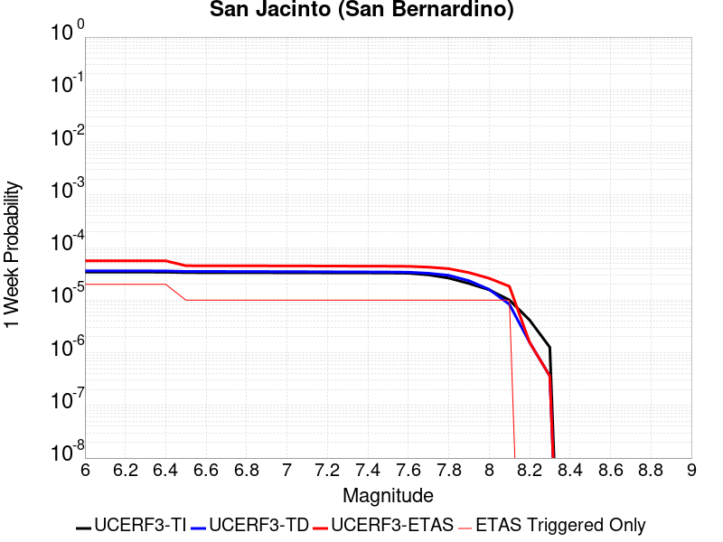 | 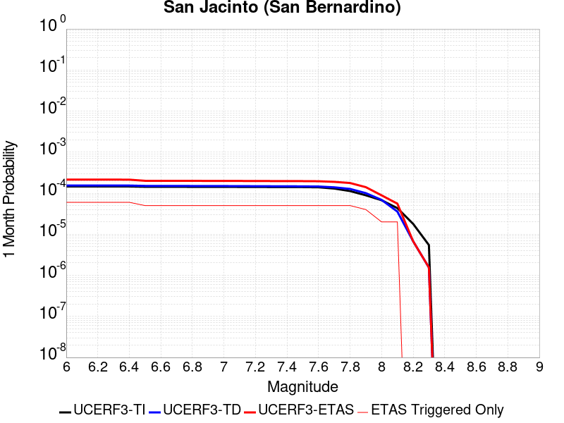 | 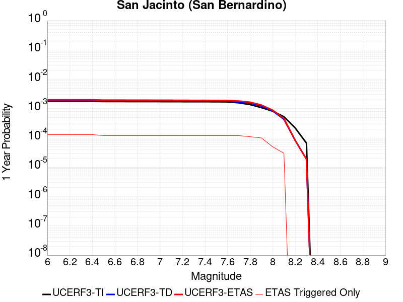 | 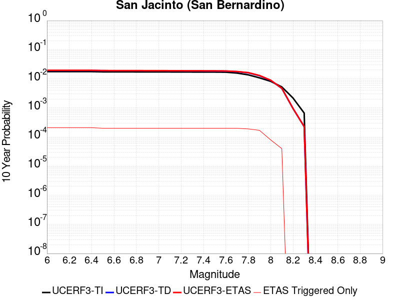 |

| Magnitude | 1 wk TI Prob | 1 wk TD Prob | 1 wk ETAS Prob | 1 wk ETAS/TD Gain | 1 wk ETAS Triggered Only | 1 mo TI Prob | 1 mo TD Prob | 1 mo ETAS Prob | 1 mo ETAS/TD Gain | 1 mo ETAS Triggered Only | 1 yr TI Prob | 1 yr TD Prob | 1 yr ETAS Prob | 1 yr ETAS/TD Gain | 1 yr ETAS Triggered Only | 10 yr TI Prob | 10 yr TD Prob | 10 yr ETAS Prob | 10 yr ETAS/TD Gain | 10 yr ETAS Triggered Only |
|-----|-----|-----|-----|-----|-----|-----|-----|-----|-----|-----|-----|-----|-----|-----|-----|-----|-----|-----|-----|-----|
| 6.0 | 3.409352E-5 | 3.5999936E-5 | 5.5999215E-5 | 1.5555366 | 2.0E-5 | 1.461069E-4 | 1.5427632E-4 | 2.1426706E-4 | 1.3888526 | 6.0E-5 | 0.0017774 | 0.0018766979 | 0.002006454 | 1.0691406 | 1.3E-4 | 0.01763251 | 0.01935679 | 0.019562725 | 1.010639 | 2.1E-4 |
| 6.1 | 3.409352E-5 | 3.5999936E-5 | 5.5999215E-5 | 1.5555366 | 2.0E-5 | 1.461069E-4 | 1.5427632E-4 | 2.1426706E-4 | 1.3888526 | 6.0E-5 | 0.0017774 | 0.0018766979 | 0.002006454 | 1.0691406 | 1.3E-4 | 0.01763251 | 0.01935679 | 0.019562725 | 1.010639 | 2.1E-4 |
| 6.2 | 3.409352E-5 | 3.5999936E-5 | 5.5999215E-5 | 1.5555366 | 2.0E-5 | 1.461069E-4 | 1.5427632E-4 | 2.1426706E-4 | 1.3888526 | 6.0E-5 | 0.0017774 | 0.0018766979 | 0.002006454 | 1.0691406 | 1.3E-4 | 0.01763251 | 0.01935679 | 0.019562725 | 1.010639 | 2.1E-4 |
| 6.3 | 3.409352E-5 | 3.5999936E-5 | 5.5999215E-5 | 1.5555366 | 2.0E-5 | 1.461069E-4 | 1.5427632E-4 | 2.1426706E-4 | 1.3888526 | 6.0E-5 | 0.0017774 | 0.0018766979 | 0.002006454 | 1.0691406 | 1.3E-4 | 0.01763251 | 0.01935679 | 0.019562725 | 1.010639 | 2.1E-4 |
| 6.4 | 3.400795E-5 | 3.5892594E-5 | 5.5891876E-5 | 1.557198 | 2.0E-5 | 1.4574021E-4 | 1.5381635E-4 | 2.1380711E-4 | 1.3900156 | 6.0E-5 | 0.0017729428 | 0.0018711074 | 0.0020008641 | 1.0693476 | 1.3E-4 | 0.017588645 | 0.01930187 | 0.019507818 | 1.0106698 | 2.1E-4 |
| 6.5 | 3.341482E-5 | 3.515321E-5 | 4.515286E-5 | 1.284459 | 1.0E-5 | 1.4319851E-4 | 1.5064793E-4 | 2.006404E-4 | 1.3318497 | 5.0E-5 | 0.0017420477 | 0.001832597 | 0.001952377 | 1.0653609 | 1.2E-4 | 0.017284546 | 0.018923406 | 0.01911962 | 1.010369 | 2.0E-4 |
| 6.6 | 3.3364955E-5 | 3.509043E-5 | 4.5090077E-5 | 1.284968 | 1.0E-5 | 1.4298483E-4 | 1.503789E-4 | 2.0037137E-4 | 1.3324435 | 5.0E-5 | 0.0017394501 | 0.001829327 | 0.0019491074 | 1.0654778 | 1.2E-4 | 0.017258976 | 0.01889127 | 0.019087492 | 1.010387 | 2.0E-4 |
| 6.7 | 3.335922E-5 | 3.5080204E-5 | 4.507985E-5 | 1.2850511 | 1.0E-5 | 1.4296026E-4 | 1.5033506E-4 | 2.0032756E-4 | 1.3325404 | 5.0E-5 | 0.0017391514 | 0.0018287943 | 0.0019485749 | 1.065497 | 1.2E-4 | 0.017256035 | 0.018886061 | 0.019082284 | 1.0103898 | 2.0E-4 |
| 6.8 | 3.327683E-5 | 3.4974266E-5 | 4.4973916E-5 | 1.2859145 | 1.0E-5 | 1.4260718E-4 | 1.498811E-4 | 1.9987361E-4 | 1.3335477 | 5.0E-5 | 0.0017348597 | 0.0018232765 | 0.0019430578 | 1.0656955 | 1.2E-4 | 0.017213784 | 0.01883183 | 0.019028064 | 1.0104203 | 2.0E-4 |
| 6.9 | 3.3235785E-5 | 3.4915218E-5 | 4.491487E-5 | 1.286398 | 1.0E-5 | 1.4243131E-4 | 1.4962807E-4 | 1.996206E-4 | 1.3341119 | 5.0E-5 | 0.0017327217 | 0.001820201 | 0.0019399826 | 1.0658067 | 1.2E-4 | 0.017192734 | 0.018801698 | 0.018997937 | 1.0104374 | 2.0E-4 |
| 7.0 | 3.3197095E-5 | 3.4855144E-5 | 4.4854798E-5 | 1.2868917 | 1.0E-5 | 1.422655E-4 | 1.4937065E-4 | 1.9936317E-4 | 1.3346878 | 5.0E-5 | 0.0017307063 | 0.0018170722 | 0.0019368541 | 1.0659204 | 1.2E-4 | 0.017172894 | 0.018771075 | 0.018967321 | 1.0104547 | 2.0E-4 |
| 7.1 | 3.3129716E-5 | 3.4735353E-5 | 4.4735003E-5 | 1.2878811 | 1.0E-5 | 1.4197677E-4 | 1.488573E-4 | 1.9884986E-4 | 1.3358421 | 5.0E-5 | 0.0017271966 | 0.0018108325 | 0.0019306153 | 1.0661478 | 1.2E-4 | 0.017138338 | 0.018710153 | 0.01890641 | 1.0104893 | 2.0E-4 |
| 7.2 | 3.3034008E-5 | 3.4602795E-5 | 4.460245E-5 | 1.2889841 | 1.0E-5 | 1.4156665E-4 | 1.4828927E-4 | 1.9828185E-4 | 1.3371289 | 5.0E-5 | 0.0017222111 | 0.0018039282 | 0.0019237117 | 1.0664015 | 1.2E-4 | 0.017089253 | 0.018642543 | 0.018838815 | 1.0105282 | 2.0E-4 |
| 7.3 | 3.2956614E-5 | 3.4470544E-5 | 4.44702E-5 | 1.2900927 | 1.0E-5 | 1.4123498E-4 | 1.4772255E-4 | 1.9771516E-4 | 1.3384224 | 5.0E-5 | 0.0017181796 | 0.0017970398 | 0.0019168241 | 1.0666565 | 1.2E-4 | 0.017049557 | 0.018575288 | 0.018771574 | 1.010567 | 2.0E-4 |
| 7.4 | 3.2915937E-5 | 3.4392233E-5 | 4.4391887E-5 | 1.2907534 | 1.0E-5 | 1.4106068E-4 | 1.4738696E-4 | 1.9737959E-4 | 1.339193 | 5.0E-5 | 0.0017160608 | 0.0017929608 | 0.0019127456 | 1.0668083 | 1.2E-4 | 0.017028693 | 0.01853555 | 0.018731844 | 1.0105901 | 2.0E-4 |
| 7.5 | 3.281791E-5 | 3.4257137E-5 | 4.4256794E-5 | 1.2918999 | 1.0E-5 | 1.406406E-4 | 1.4680804E-4 | 1.9680071E-4 | 1.3405308 | 5.0E-5 | 0.0017109542 | 0.0017859241 | 0.0019057097 | 1.0670722 | 1.2E-4 | 0.016978411 | 0.018466434 | 0.018662741 | 1.0106305 | 2.0E-4 |
| 7.6 | 3.2521442E-5 | 3.398206E-5 | 4.3981723E-5 | 1.2942629 | 1.0E-5 | 1.3937015E-4 | 1.456293E-4 | 1.9562201E-4 | 1.3432875 | 5.0E-5 | 0.0016955109 | 0.0017715961 | 0.0018913836 | 1.0676155 | 1.2E-4 | 0.016826328 | 0.01832405 | 0.018520385 | 1.0107147 | 2.0E-4 |
| 7.7 | 3.0287873E-5 | 3.246594E-5 | 4.2465617E-5 | 1.3080051 | 1.0E-5 | 1.297987E-4 | 1.3913233E-4 | 1.8912538E-4 | 1.35932 | 5.0E-5 | 0.0015791537 | 0.0016926212 | 0.001812418 | 1.070776 | 1.2E-4 | 0.01567979 | 0.017534833 | 0.017731326 | 1.0112059 | 2.0E-4 |
| 7.8 | 2.6316151E-5 | 2.967629E-5 | 3.9675993E-5 | 1.3369594 | 1.0E-5 | 1.1277862E-4 | 1.271779E-4 | 1.7717155E-4 | 1.3931 | 5.0E-5 | 0.0013722149 | 0.0015472922 | 0.001657122 | 1.070982 | 1.1E-4 | 0.013637724 | 0.01607614 | 0.016263086 | 1.0116287 | 1.9E-4 |
| 7.9 | 2.0761147E-5 | 2.3429142E-5 | 3.3428907E-5 | 1.4268088 | 1.0E-5 | 8.897331E-5 | 1.00406745E-4 | 1.4040273E-4 | 1.3983396 | 4.0E-5 | 0.0010827117 | 0.0012217674 | 0.0013216452 | 1.0817486 | 1.0E-4 | 0.010774517 | 0.012798873 | 0.012966697 | 1.0131124 | 1.7E-4 |
| 8.0 | 1.5738568E-5 | 1.6041773E-5 | 2.6041613E-5 | 1.6233625 | 1.0E-5 | 6.744926E-5 | 6.8748646E-5 | 8.874727E-5 | 1.2908949 | 2.0E-5 | 8.2088535E-4 | 8.3669403E-4 | 8.866522E-4 | 1.059709 | 5.0E-5 | 0.008178596 | 0.008870234 | 0.008949525 | 1.0089389 | 8.0E-5 |
| 8.1 | 1.0105832E-5 | 8.335264E-6 | 1.833518E-5 | 2.199712 | 1.0E-5 | 4.3309992E-5 | 3.5722074E-5 | 5.5721357E-5 | 1.559858 | 2.0E-5 | 5.2717153E-4 | 4.3482997E-4 | 4.6481693E-4 | 1.0689625 | 3.0E-5 | 0.005259227 | 0.004679794 | 0.0047196066 | 1.0085074 | 4.0E-5 |
| 8.2 | 4.189207E-6 | 1.5798428E-6 | 1.5798428E-6 | 1.0 | 0.0 | 1.7953622E-5 | 6.770737E-6 | 6.770737E-6 | 1.0 | 0.0 | 2.1856341E-4 | 8.243063E-5 | 8.243063E-5 | 1.0 | 0.0 | 0.0021834858 | 9.5739E-4 | 9.5739E-4 | 1.0 | 0.0 |
| 8.3 | 1.2758221E-6 | 3.618775E-7 | 3.618775E-7 | 1.0 | 0.0 | 5.4677976E-6 | 1.5509027E-6 | 1.5509027E-6 | 1.0 | 0.0 | 6.65684E-5 | 1.8882081E-5 | 1.8882081E-5 | 1.0 | 0.0 | 6.6548464E-4 | 2.2773506E-4 | 2.2773506E-4 | 1.0 | 0.0 |

## San Andreas (Creeping Section) 2011 CFM
*[(top)](#table-of-contents)*

| 1 Week | 1 Month | 1 Year | 10 Year |
|-----|-----|-----|-----|
| 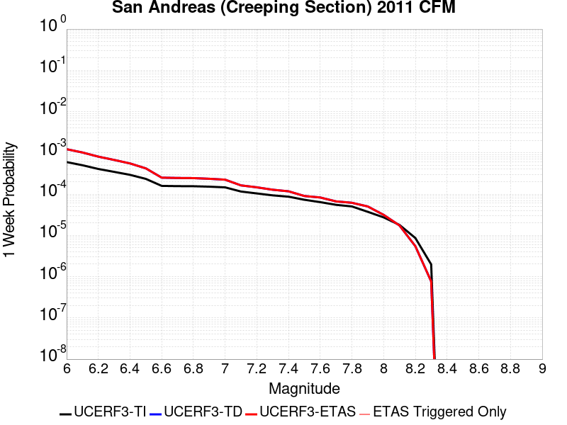 | 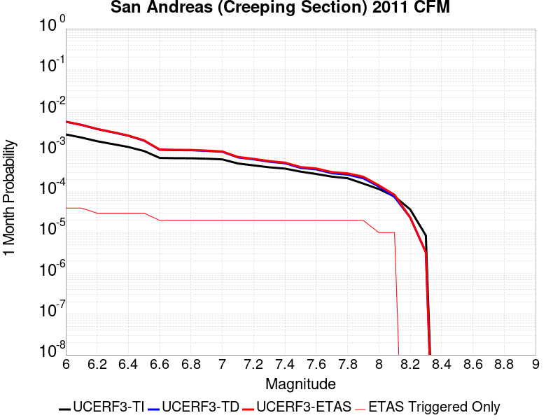 |  |  |

| Magnitude | 1 wk TI Prob | 1 wk TD Prob | 1 wk ETAS Prob | 1 wk ETAS/TD Gain | 1 wk ETAS Triggered Only | 1 mo TI Prob | 1 mo TD Prob | 1 mo ETAS Prob | 1 mo ETAS/TD Gain | 1 mo ETAS Triggered Only | 1 yr TI Prob | 1 yr TD Prob | 1 yr ETAS Prob | 1 yr ETAS/TD Gain | 1 yr ETAS Triggered Only | 10 yr TI Prob | 10 yr TD Prob | 10 yr ETAS Prob | 10 yr ETAS/TD Gain | 10 yr ETAS Triggered Only |
|-----|-----|-----|-----|-----|-----|-----|-----|-----|-----|-----|-----|-----|-----|-----|-----|-----|-----|-----|-----|-----|
| 6.0 | 5.986481E-4 | 0.0012280256 | 0.0012280256 | 1.0 | 0.0 | 0.0025631124 | 0.005245842 | 0.0052856323 | 1.007585 | 4.0E-5 | 0.030762846 | 0.061206564 | 0.061309833 | 1.0016872 | 1.1E-4 | 0.26835477 | 0.42595056 | 0.42604816 | 1.0002291 | 1.7E-4 |
| 6.1 | 5.015945E-4 | 0.0010224101 | 0.0010224101 | 1.0 | 0.0 | 0.00214792 | 0.0043682405 | 0.0044080657 | 1.009117 | 4.0E-5 | 0.025839351 | 0.05124924 | 0.051344115 | 1.0018512 | 1.0E-4 | 0.23032776 | 0.37287042 | 0.37296447 | 1.0002522 | 1.5E-4 |
| 6.2 | 4.073338E-4 | 8.110072E-4 | 8.110072E-4 | 1.0 | 0.0 | 0.0017445484 | 0.0034676257 | 0.0034975216 | 1.0086215 | 3.0E-5 | 0.021034058 | 0.04093446 | 0.041020773 | 1.0021087 | 9.0E-5 | 0.19150782 | 0.3130488 | 0.31314498 | 1.0003072 | 1.4E-4 |
| 6.3 | 3.464099E-4 | 6.740222E-4 | 6.740222E-4 | 1.0 | 0.0 | 0.0014837692 | 0.002882698 | 0.0029126117 | 1.0103769 | 3.0E-5 | 0.017915873 | 0.03419045 | 0.034277372 | 1.0025423 | 9.0E-5 | 0.16538359 | 0.2713328 | 0.2714348 | 1.000376 | 1.4E-4 |
| 6.4 | 2.935057E-4 | 5.54599E-4 | 5.54599E-4 | 1.0 | 0.0 | 0.0012572751 | 0.0023719016 | 0.0024018306 | 1.0126181 | 3.0E-5 | 0.015200248 | 0.028265473 | 0.028352927 | 1.0030941 | 9.0E-5 | 0.14201577 | 0.23300236 | 0.23310974 | 1.0004609 | 1.4E-4 |
| 6.5 | 2.3409708E-4 | 4.209672E-4 | 4.209672E-4 | 1.0 | 0.0 | 0.0010028875 | 0.001801485 | 0.001831431 | 1.0166229 | 3.0E-5 | 0.012141965 | 0.0215894 | 0.021677457 | 1.0040787 | 9.0E-5 | 0.11499573 | 0.18684228 | 0.18695612 | 1.0006093 | 1.4E-4 |
| 6.6 | 1.5842178E-4 | 2.5075578E-4 | 2.5075578E-4 | 1.0 | 0.0 | 6.7877385E-4 | 0.0010742265 | 0.001094205 | 1.0185981 | 2.0E-5 | 0.0082328 | 0.012998868 | 0.013077827 | 1.0060744 | 8.0E-5 | 0.07934396 | 0.123167254 | 0.12328124 | 1.0009254 | 1.3E-4 |
| 6.7 | 1.5616413E-4 | 2.46121E-4 | 2.46121E-4 | 1.0 | 0.0 | 6.691031E-4 | 0.0010543793 | 0.0010743581 | 1.0189486 | 2.0E-5 | 0.0081159435 | 0.012760729 | 0.012839708 | 1.0061892 | 8.0E-5 | 0.0782586 | 0.12119438 | 0.121308625 | 1.0009427 | 1.3E-4 |
| 6.8 | 1.5538467E-4 | 2.4435963E-4 | 2.4435963E-4 | 1.0 | 0.0 | 6.6576427E-4 | 0.0010468366 | 0.0010668157 | 1.0190852 | 2.0E-5 | 0.008075596 | 0.012670105 | 0.012749092 | 1.006234 | 8.0E-5 | 0.07788358 | 0.12042523 | 0.120539576 | 1.0009495 | 1.3E-4 |
| 6.9 | 1.5153569E-4 | 2.3545328E-4 | 2.3545328E-4 | 1.0 | 0.0 | 6.49277E-4 | 0.0010086972 | 0.0010286771 | 1.0198076 | 2.0E-5 | 0.007876333 | 0.012212264 | 0.012291288 | 1.0064708 | 8.0E-5 | 0.07602952 | 0.11649527 | 0.116610125 | 1.000986 | 1.3E-4 |
| 7.0 | 1.4588932E-4 | 2.240252E-4 | 2.240252E-4 | 1.0 | 0.0 | 6.250901E-4 | 9.597567E-4 | 9.797375E-4 | 1.0208186 | 2.0E-5 | 0.0075839474 | 0.011622929 | 0.011701999 | 1.0068029 | 8.0E-5 | 0.073302895 | 0.11134146 | 0.11145699 | 1.0010376 | 1.3E-4 |
| 7.1 | 1.1565079E-4 | 1.6287489E-4 | 1.6287489E-4 | 1.0 | 0.0 | 4.955521E-4 | 6.978493E-4 | 7.178354E-4 | 1.0286394 | 2.0E-5 | 0.006016669 | 0.008463418 | 0.008542742 | 1.0093725 | 8.0E-5 | 0.058563538 | 0.08369256 | 0.08381168 | 1.0014234 | 1.3E-4 |
| 7.2 | 1.0393792E-4 | 1.4621289E-4 | 1.4621289E-4 | 1.0 | 0.0 | 4.4537216E-4 | 6.2647695E-4 | 6.464644E-4 | 1.0319046 | 2.0E-5 | 0.005408933 | 0.007600852 | 0.0076802433 | 1.0104451 | 8.0E-5 | 0.052791595 | 0.07564185 | 0.07576201 | 1.0015886 | 1.3E-4 |
| 7.3 | 9.332884E-5 | 1.2786071E-4 | 1.2786071E-4 | 1.0 | 0.0 | 3.999194E-4 | 5.4786E-4 | 5.678491E-4 | 1.0364857 | 2.0E-5 | 0.0048581534 | 0.0066499305 | 0.0067293984 | 1.0119503 | 8.0E-5 | 0.047533102 | 0.06650477 | 0.066626124 | 1.0018247 | 1.3E-4 |
| 7.4 | 8.670252E-5 | 1.17077616E-4 | 1.17077616E-4 | 1.0 | 0.0 | 3.715293E-4 | 5.0166534E-4 | 5.216553E-4 | 1.0398473 | 2.0E-5 | 0.004513991 | 0.0060907914 | 0.006170304 | 1.0130546 | 8.0E-5 | 0.044233937 | 0.06117084 | 0.061292887 | 1.0019952 | 1.3E-4 |
| 7.5 | 7.3036405E-5 | 9.009752E-5 | 9.009752E-5 | 1.0 | 0.0 | 3.129756E-4 | 3.8607517E-4 | 4.0606744E-4 | 1.0517833 | 2.0E-5 | 0.0038038217 | 0.0046903556 | 0.0047600274 | 1.0148542 | 7.0E-5 | 0.03739367 | 0.047894895 | 0.04800915 | 1.0023855 | 1.2E-4 |
| 7.6 | 6.3935775E-5 | 8.283988E-5 | 8.283988E-5 | 1.0 | 0.0 | 2.7398168E-4 | 3.5497983E-4 | 3.7497273E-4 | 1.0563213 | 2.0E-5 | 0.0033306254 | 0.0043133334 | 0.0043830317 | 1.0161587 | 7.0E-5 | 0.032811474 | 0.044008132 | 0.044122852 | 1.0026067 | 1.2E-4 |
| 7.7 | 5.5050095E-5 | 6.6650726E-5 | 6.6650726E-5 | 1.0 | 0.0 | 2.3590765E-4 | 2.8561472E-4 | 3.0560902E-4 | 1.0700043 | 2.0E-5 | 0.0028683927 | 0.0034718188 | 0.0035017147 | 1.008611 | 3.0E-5 | 0.0283165 | 0.035811253 | 0.035878744 | 1.0018847 | 7.0E-5 |
| 7.8 | 5.027131E-5 | 6.165833E-5 | 6.165833E-5 | 1.0 | 0.0 | 2.1543067E-4 | 2.6422323E-4 | 2.8421794E-4 | 1.0756736 | 2.0E-5 | 0.0026197135 | 0.0032121758 | 0.0032420794 | 1.0093094 | 3.0E-5 | 0.025890453 | 0.033140562 | 0.033198573 | 1.0017505 | 6.0E-5 |
| 7.9 | 3.7271806E-5 | 5.0249084E-5 | 5.0249084E-5 | 1.0 | 0.0 | 1.5972654E-4 | 2.1533546E-4 | 2.3533114E-4 | 1.0928583 | 2.0E-5 | 0.0019429359 | 0.0026185592 | 0.0026484805 | 1.0114267 | 3.0E-5 | 0.019260362 | 0.027078805 | 0.02713718 | 1.0021558 | 6.0E-5 |
| 8.0 | 2.7310243E-5 | 3.144465E-5 | 3.144465E-5 | 1.0 | 0.0 | 1.17038646E-4 | 1.3475583E-4 | 1.4475448E-4 | 1.0741982 | 1.0E-5 | 0.0014240141 | 0.0016394184 | 0.001649402 | 1.0060897 | 1.0E-5 | 0.014149235 | 0.017222118 | 0.017251601 | 1.001712 | 3.0E-5 |
| 8.1 | 1.7940547E-5 | 1.7411161E-5 | 1.7411161E-5 | 1.0 | 0.0 | 7.688579E-5 | 7.4617135E-5 | 8.461639E-5 | 1.1340075 | 1.0E-5 | 9.3568244E-4 | 9.080855E-4 | 9.1807643E-4 | 1.0110022 | 1.0E-5 | 0.009317525 | 0.009804519 | 0.009824323 | 1.0020199 | 2.0E-5 |
| 8.2 | 8.643924E-6 | 5.479068E-6 | 5.479068E-6 | 1.0 | 0.0 | 3.704486E-5 | 2.3481509E-5 | 2.3481509E-5 | 1.0 | 0.0 | 4.5092785E-4 | 2.8584994E-4 | 2.8584994E-4 | 1.0 | 0.0 | 0.0045001395 | 0.0032510054 | 0.0032510054 | 1.0 | 0.0 |
| 8.3 | 1.983087E-6 | 7.666981E-7 | 7.666981E-7 | 1.0 | 0.0 | 8.498917E-6 | 3.285845E-6 | 3.285845E-6 | 1.0 | 0.0 | 1.034694E-4 | 4.0004445E-5 | 4.0004445E-5 | 1.0 | 0.0 | 0.0010342124 | 4.723745E-4 | 4.723745E-4 | 1.0 | 0.0 |

## Red Pass
*[(top)](#table-of-contents)*

| 1 Week | 1 Month | 1 Year | 10 Year |
|-----|-----|-----|-----|
| 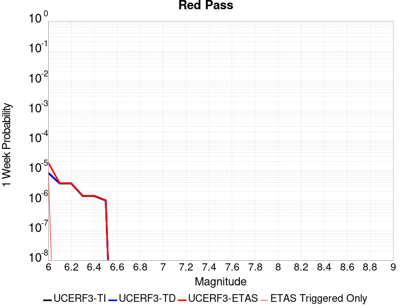 | 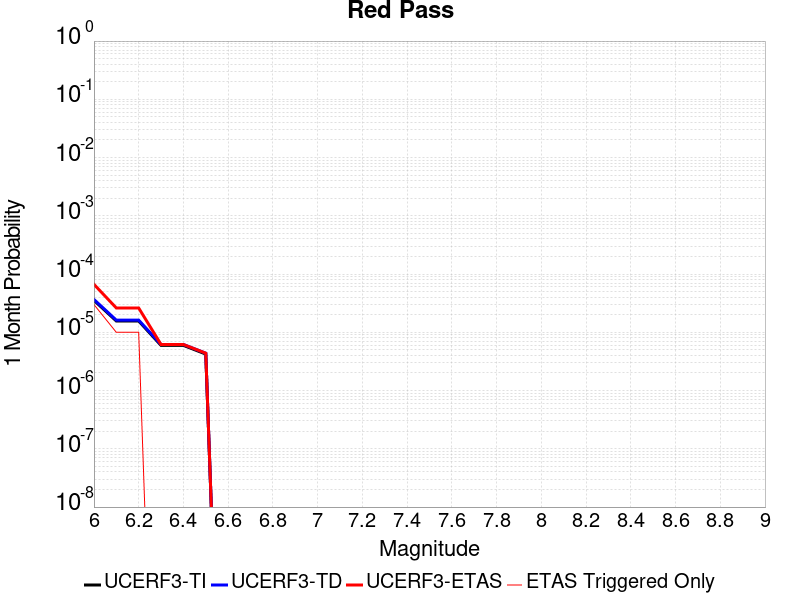 | 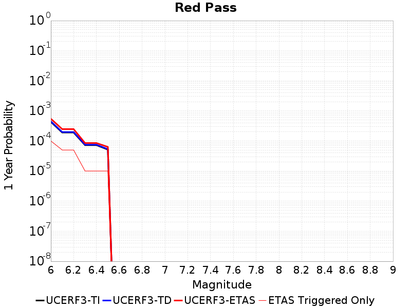 | 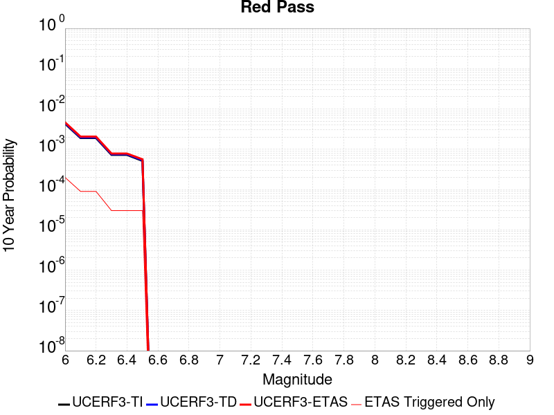 |

| Magnitude | 1 wk TI Prob | 1 wk TD Prob | 1 wk ETAS Prob | 1 wk ETAS/TD Gain | 1 wk ETAS Triggered Only | 1 mo TI Prob | 1 mo TD Prob | 1 mo ETAS Prob | 1 mo ETAS/TD Gain | 1 mo ETAS Triggered Only | 1 yr TI Prob | 1 yr TD Prob | 1 yr ETAS Prob | 1 yr ETAS/TD Gain | 1 yr ETAS Triggered Only | 10 yr TI Prob | 10 yr TD Prob | 10 yr ETAS Prob | 10 yr ETAS/TD Gain | 10 yr ETAS Triggered Only |
|-----|-----|-----|-----|-----|-----|-----|-----|-----|-----|-----|-----|-----|-----|-----|-----|-----|-----|-----|-----|-----|
| 6.0 | 8.258278E-6 | 8.551299E-6 | 1.8551213E-5 | 2.169403 | 1.0E-5 | 3.539214E-5 | 3.664801E-5 | 6.664691E-5 | 1.8185683 | 3.0E-5 | 4.308141E-4 | 4.4611603E-4 | 5.4607145E-4 | 1.224057 | 1.0E-4 | 0.0042997985 | 0.0044539627 | 0.0046530715 | 1.0447038 | 2.0E-4 |
| 6.1 | 3.649988E-6 | 3.7753307E-6 | 3.7753307E-6 | 1.0 | 0.0 | 1.5642712E-5 | 1.6179914E-5 | 2.6179752E-5 | 1.6180402 | 1.0E-5 | 1.9043336E-4 | 1.9697742E-4 | 2.4696757E-4 | 1.2537862 | 5.0E-5 | 0.0019027026 | 0.0019684955 | 0.0020583184 | 1.0456302 | 9.0E-5 |
| 6.2 | 3.649988E-6 | 3.7753307E-6 | 3.7753307E-6 | 1.0 | 0.0 | 1.5642712E-5 | 1.6179914E-5 | 2.6179752E-5 | 1.6180402 | 1.0E-5 | 1.9043336E-4 | 1.9697742E-4 | 2.4696757E-4 | 1.2537862 | 5.0E-5 | 0.0019027026 | 0.0019684955 | 0.0020583184 | 1.0456302 | 9.0E-5 |
| 6.3 | 1.3924937E-6 | 1.4411222E-6 | 1.4411222E-6 | 1.0 | 0.0 | 5.9678164E-6 | 6.1762316E-6 | 6.1762316E-6 | 1.0 | 0.0 | 7.265574E-5 | 7.519444E-5 | 8.5193686E-5 | 1.1329786 | 1.0E-5 | 7.263199E-4 | 7.518287E-4 | 7.818062E-4 | 1.0398726 | 3.0E-5 |
| 6.4 | 1.3924937E-6 | 1.4411222E-6 | 1.4411222E-6 | 1.0 | 0.0 | 5.9678164E-6 | 6.1762316E-6 | 6.1762316E-6 | 1.0 | 0.0 | 7.265574E-5 | 7.519444E-5 | 8.5193686E-5 | 1.1329786 | 1.0E-5 | 7.263199E-4 | 7.518287E-4 | 7.818062E-4 | 1.0398726 | 3.0E-5 |
| 6.5 | 9.876812E-7 | 1.0221952E-6 | 1.0221952E-6 | 1.0 | 0.0 | 4.2329125E-6 | 4.380837E-6 | 4.380837E-6 | 1.0 | 0.0 | 5.153449E-5 | 5.3336687E-5 | 6.333615E-5 | 1.1874782 | 1.0E-5 | 5.1522546E-4 | 5.3336687E-4 | 5.6335086E-4 | 1.0562165 | 3.0E-5 |

## Calico-Hidalgo
*[(top)](#table-of-contents)*

| 1 Week | 1 Month | 1 Year | 10 Year |
|-----|-----|-----|-----|
| 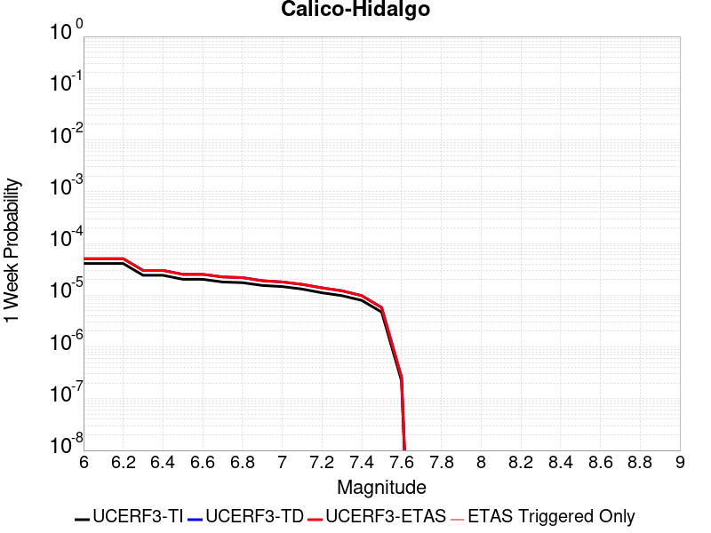 | 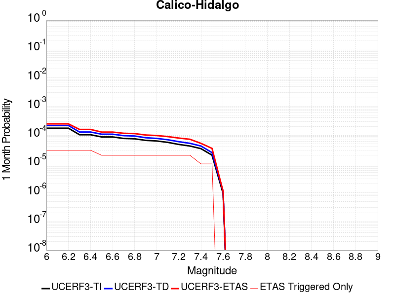 | 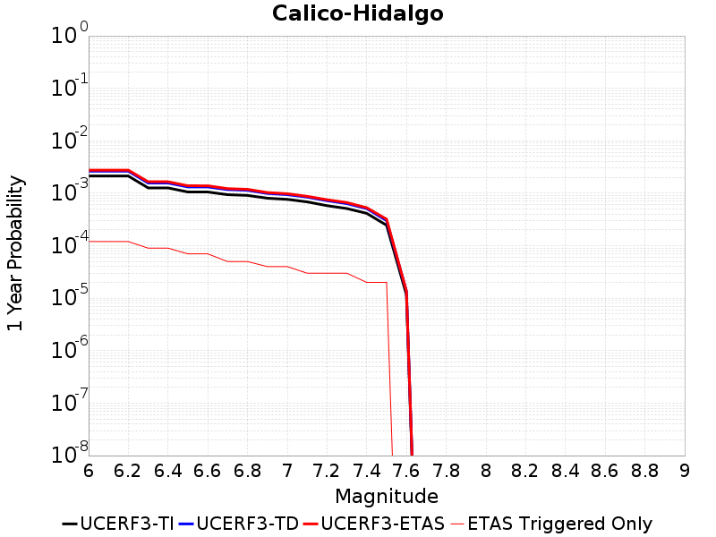 | 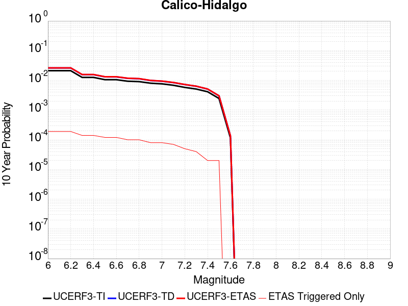 |

| Magnitude | 1 wk TI Prob | 1 wk TD Prob | 1 wk ETAS Prob | 1 wk ETAS/TD Gain | 1 wk ETAS Triggered Only | 1 mo TI Prob | 1 mo TD Prob | 1 mo ETAS Prob | 1 mo ETAS/TD Gain | 1 mo ETAS Triggered Only | 1 yr TI Prob | 1 yr TD Prob | 1 yr ETAS Prob | 1 yr ETAS/TD Gain | 1 yr ETAS Triggered Only | 10 yr TI Prob | 10 yr TD Prob | 10 yr ETAS Prob | 10 yr ETAS/TD Gain | 10 yr ETAS Triggered Only |
|-----|-----|-----|-----|-----|-----|-----|-----|-----|-----|-----|-----|-----|-----|-----|-----|-----|-----|-----|-----|-----|
| 6.0 | 4.0906612E-5 | 5.07045E-5 | 5.07045E-5 | 1.0 | 0.0 | 1.7530227E-4 | 2.1728918E-4 | 2.4728267E-4 | 1.1380348 | 3.0E-5 | 0.0021322158 | 0.0026426904 | 0.0027623733 | 1.0452883 | 1.2E-4 | 0.02111873 | 0.02615302 | 0.02633805 | 1.007075 | 1.9E-4 |
| 6.1 | 4.0906612E-5 | 5.07045E-5 | 5.07045E-5 | 1.0 | 0.0 | 1.7530227E-4 | 2.1728918E-4 | 2.4728267E-4 | 1.1380348 | 3.0E-5 | 0.0021322158 | 0.0026426904 | 0.0027623733 | 1.0452883 | 1.2E-4 | 0.02111873 | 0.02615302 | 0.02633805 | 1.007075 | 1.9E-4 |
| 6.2 | 4.0906612E-5 | 5.07045E-5 | 5.07045E-5 | 1.0 | 0.0 | 1.7530227E-4 | 2.1728918E-4 | 2.4728267E-4 | 1.1380348 | 3.0E-5 | 0.0021322158 | 0.0026426904 | 0.0027623733 | 1.0452883 | 1.2E-4 | 0.02111873 | 0.02615302 | 0.02633805 | 1.007075 | 1.9E-4 |
| 6.3 | 2.4242801E-5 | 3.0090974E-5 | 3.0090974E-5 | 1.0 | 0.0 | 1.0389358E-4 | 1.2895513E-4 | 1.5895127E-4 | 1.232609 | 3.0E-5 | 0.0012641704 | 0.001568931 | 0.0016587898 | 1.0572739 | 9.0E-5 | 0.01257003 | 0.015582218 | 0.015720036 | 1.0088446 | 1.4E-4 |
| 6.4 | 2.4242801E-5 | 3.0090974E-5 | 3.0090974E-5 | 1.0 | 0.0 | 1.0389358E-4 | 1.2895513E-4 | 1.5895127E-4 | 1.232609 | 3.0E-5 | 0.0012641704 | 0.001568931 | 0.0016587898 | 1.0572739 | 9.0E-5 | 0.01257003 | 0.015582218 | 0.015720036 | 1.0088446 | 1.4E-4 |
| 6.5 | 2.0286952E-5 | 2.5315947E-5 | 2.5315947E-5 | 1.0 | 0.0 | 8.694118E-5 | 1.08492495E-4 | 1.2849033E-4 | 1.1843245 | 2.0E-5 | 0.0010579949 | 0.001320113 | 0.0013900205 | 1.0529557 | 7.0E-5 | 0.010529719 | 0.013124645 | 0.01324307 | 1.0090231 | 1.2E-4 |
| 6.6 | 2.0269223E-5 | 2.5296897E-5 | 2.5296897E-5 | 1.0 | 0.0 | 8.6865206E-5 | 1.0841086E-4 | 1.2840869E-4 | 1.1844634 | 2.0E-5 | 0.0010570707 | 0.0013191202 | 0.0013890278 | 1.0529957 | 7.0E-5 | 0.010520565 | 0.013114835 | 0.013233261 | 1.00903 | 1.2E-4 |
| 6.7 | 1.799852E-5 | 2.254077E-5 | 2.254077E-5 | 1.0 | 0.0 | 7.713423E-5 | 9.6599804E-5 | 1.1659787E-4 | 1.2070198 | 2.0E-5 | 9.3870464E-4 | 0.0011754826 | 0.0012254239 | 1.0424857 | 5.0E-5 | 0.009347493 | 0.011694261 | 0.011793091 | 1.0084512 | 1.0E-4 |
| 6.8 | 1.7458793E-5 | 2.1842283E-5 | 2.1842283E-5 | 1.0 | 0.0 | 7.4821255E-5 | 9.3606504E-5 | 1.13604634E-4 | 1.2136403 | 2.0E-5 | 9.10568E-4 | 0.0011390778 | 0.0011890209 | 1.0438452 | 5.0E-5 | 0.009068459 | 0.011333977 | 0.011432844 | 1.008723 | 1.0E-4 |
| 6.9 | 1.542884E-5 | 1.9026062E-5 | 1.9026062E-5 | 1.0 | 0.0 | 6.612192E-5 | 8.153779E-5 | 1.01536156E-4 | 1.245265 | 2.0E-5 | 8.04737E-4 | 9.922836E-4 | 0.001032244 | 1.040271 | 4.0E-5 | 0.008018291 | 0.009879927 | 0.009959137 | 1.0080172 | 8.0E-5 |
| 7.0 | 1.468253E-5 | 1.8030723E-5 | 1.8030723E-5 | 1.0 | 0.0 | 6.292361E-5 | 7.7272314E-5 | 9.727077E-5 | 1.2588049 | 2.0E-5 | 7.658257E-4 | 9.403974E-4 | 9.803597E-4 | 1.0424953 | 4.0E-5 | 0.0076319184 | 0.009365546 | 0.0094447965 | 1.008462 | 8.0E-5 |
| 7.1 | 1.3139281E-5 | 1.620105E-5 | 1.620105E-5 | 1.0 | 0.0 | 5.6309986E-5 | 6.943129E-5 | 8.94299E-5 | 1.2880346 | 2.0E-5 | 6.853584E-4 | 8.4501074E-4 | 8.7498536E-4 | 1.0354725 | 3.0E-5 | 0.0068324856 | 0.008419273 | 0.008488685 | 1.0082443 | 7.0E-5 |
| 7.2 | 1.1127404E-5 | 1.38666865E-5 | 1.38666865E-5 | 1.0 | 0.0 | 4.7688E-5 | 5.9427362E-5 | 7.942617E-5 | 1.3365253 | 2.0E-5 | 5.8044674E-4 | 7.232989E-4 | 7.5327716E-4 | 1.0414467 | 3.0E-5 | 0.0057893298 | 0.0072105546 | 0.007260194 | 1.0068843 | 5.0E-5 |
| 7.3 | 9.808154E-6 | 1.2176288E-5 | 1.2176288E-5 | 1.0 | 0.0 | 4.2034266E-5 | 5.2183106E-5 | 7.218206E-5 | 1.3832458 | 2.0E-5 | 5.11647E-4 | 6.3515484E-4 | 6.651358E-4 | 1.0472026 | 3.0E-5 | 0.0051047057 | 0.0063344706 | 0.0063742176 | 1.0062747 | 4.0E-5 |
| 7.4 | 7.942452E-6 | 9.7921975E-6 | 9.7921975E-6 | 1.0 | 0.0 | 3.4038632E-5 | 4.196594E-5 | 5.196552E-5 | 1.2382785 | 1.0E-5 | 4.1434157E-4 | 5.10825E-4 | 5.308148E-4 | 1.0391324 | 2.0E-5 | 0.0041356985 | 0.0050974493 | 0.0051173475 | 1.0039035 | 2.0E-5 |
| 7.5 | 4.7121216E-6 | 5.7728657E-6 | 5.7728657E-6 | 1.0 | 0.0 | 2.019465E-5 | 2.4740662E-5 | 3.4740413E-5 | 1.4041829 | 1.0E-5 | 2.4584212E-4 | 3.0118358E-4 | 3.2117756E-4 | 1.0663847 | 2.0E-5 | 0.0024557032 | 0.0030085065 | 0.003028446 | 1.0066278 | 2.0E-5 |
| 7.6 | 2.21172E-7 | 2.6039717E-7 | 2.6039717E-7 | 1.0 | 0.0 | 9.478797E-7 | 1.1159875E-6 | 1.1159875E-6 | 1.0 | 0.0 | 1.1540374E-5 | 1.3587092E-5 | 1.3587092E-5 | 1.0 | 0.0 | 1.1539775E-4 | 1.3586543E-4 | 1.3586543E-4 | 1.0 | 0.0 |

## Baker
*[(top)](#table-of-contents)*

| 1 Week | 1 Month | 1 Year | 10 Year |
|-----|-----|-----|-----|
|  | 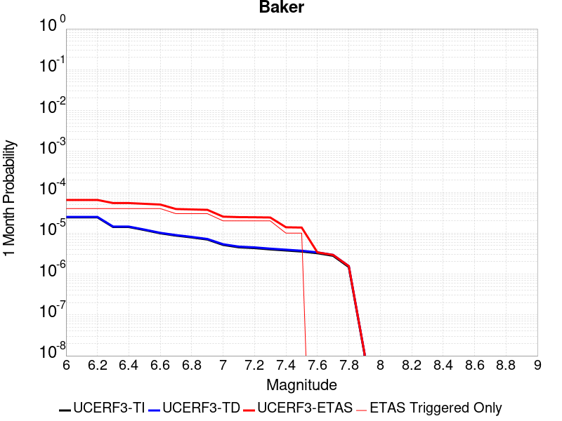 | 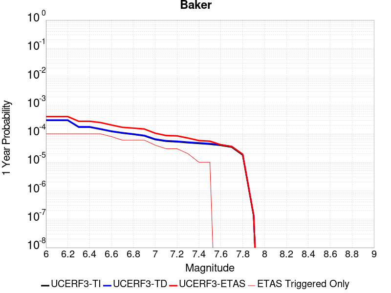 | 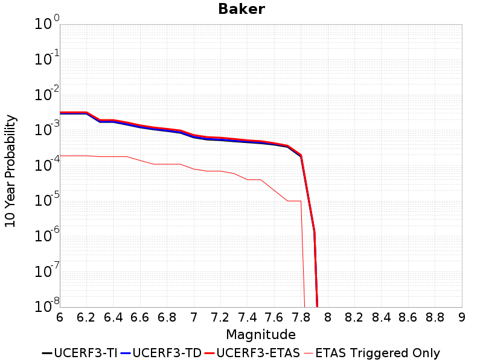 |

| Magnitude | 1 wk TI Prob | 1 wk TD Prob | 1 wk ETAS Prob | 1 wk ETAS/TD Gain | 1 wk ETAS Triggered Only | 1 mo TI Prob | 1 mo TD Prob | 1 mo ETAS Prob | 1 mo ETAS/TD Gain | 1 mo ETAS Triggered Only | 1 yr TI Prob | 1 yr TD Prob | 1 yr ETAS Prob | 1 yr ETAS/TD Gain | 1 yr ETAS Triggered Only | 10 yr TI Prob | 10 yr TD Prob | 10 yr ETAS Prob | 10 yr ETAS/TD Gain | 10 yr ETAS Triggered Only |
|-----|-----|-----|-----|-----|-----|-----|-----|-----|-----|-----|-----|-----|-----|-----|-----|-----|-----|-----|-----|-----|
| 6.0 | 5.695525E-6 | 5.8348533E-6 | 5.8348533E-6 | 1.0 | 0.0 | 2.4409164E-5 | 2.5006297E-5 | 6.50053E-5 | 2.5995572 | 4.0E-5 | 2.9714106E-4 | 3.0441314E-4 | 4.043827E-4 | 1.328401 | 1.0E-4 | 0.0029674405 | 0.003040357 | 0.0032297794 | 1.0623027 | 1.9E-4 |
| 6.1 | 5.695525E-6 | 5.8348533E-6 | 5.8348533E-6 | 1.0 | 0.0 | 2.4409164E-5 | 2.5006297E-5 | 6.50053E-5 | 2.5995572 | 4.0E-5 | 2.9714106E-4 | 3.0441314E-4 | 4.043827E-4 | 1.328401 | 1.0E-4 | 0.0029674405 | 0.003040357 | 0.0032297794 | 1.0623027 | 1.9E-4 |
| 6.2 | 5.695525E-6 | 5.8348533E-6 | 5.8348533E-6 | 1.0 | 0.0 | 2.4409164E-5 | 2.5006297E-5 | 6.50053E-5 | 2.5995572 | 4.0E-5 | 2.9714106E-4 | 3.0441314E-4 | 4.043827E-4 | 1.328401 | 1.0E-4 | 0.0029674405 | 0.003040357 | 0.0032297794 | 1.0623027 | 1.9E-4 |
| 6.3 | 3.2995713E-6 | 3.3836768E-6 | 3.3836768E-6 | 1.0 | 0.0 | 1.4140943E-5 | 1.4501395E-5 | 5.4500815E-5 | 3.7583156 | 4.0E-5 | 1.7215237E-4 | 1.7654065E-4 | 2.76523E-4 | 1.5663418 | 1.0E-4 | 0.0017201907 | 0.001764051 | 0.0019437335 | 1.1018579 | 1.8E-4 |
| 6.4 | 3.2995713E-6 | 3.3836768E-6 | 3.3836768E-6 | 1.0 | 0.0 | 1.4140943E-5 | 1.4501395E-5 | 5.4500815E-5 | 3.7583156 | 4.0E-5 | 1.7215237E-4 | 1.7654065E-4 | 2.76523E-4 | 1.5663418 | 1.0E-4 | 0.0017201907 | 0.001764051 | 0.0019437335 | 1.1018579 | 1.8E-4 |
| 6.5 | 2.782202E-6 | 2.855849E-6 | 2.855849E-6 | 1.0 | 0.0 | 1.1923668E-5 | 1.2239297E-5 | 5.2238807E-5 | 4.2681217 | 4.0E-5 | 1.4516099E-4 | 1.4900358E-4 | 2.4898868E-4 | 1.6710248 | 1.0E-4 | 0.001450662 | 0.0014890695 | 0.0016688015 | 1.1207008 | 1.8E-4 |
| 6.6 | 2.3163404E-6 | 2.3809275E-6 | 2.3809275E-6 | 1.0 | 0.0 | 9.927136E-6 | 1.0203936E-5 | 5.020353E-5 | 4.920016 | 4.0E-5 | 1.20856166E-4 | 1.2422605E-4 | 2.042161E-4 | 1.6439073 | 8.0E-5 | 0.0012079047 | 0.0012415863 | 0.0013814124 | 1.1126189 | 1.4E-4 |
| 6.7 | 2.037056E-6 | 2.0965074E-6 | 2.0965074E-6 | 1.0 | 0.0 | 8.7302105E-6 | 8.985002E-6 | 3.8984734E-5 | 4.3388677 | 3.0E-5 | 1.0628513E-4 | 1.0938707E-4 | 1.693805E-4 | 1.548451 | 6.0E-5 | 0.0010623431 | 0.0010933484 | 0.001203228 | 1.1004983 | 1.1E-4 |
| 6.8 | 1.8356744E-6 | 1.8915351E-6 | 1.8915351E-6 | 1.0 | 0.0 | 7.867153E-6 | 8.106555E-6 | 3.810631E-5 | 4.700679 | 3.0E-5 | 9.577837E-5 | 9.869298E-5 | 1.5868705E-4 | 1.607886 | 6.0E-5 | 9.57371E-4 | 9.865054E-4 | 0.0010963969 | 1.1113948 | 1.1E-4 |
| 6.9 | 1.6310546E-6 | 1.6832133E-6 | 1.6832133E-6 | 1.0 | 0.0 | 6.9902153E-6 | 7.213752E-6 | 3.7213536E-5 | 5.158694 | 3.0E-5 | 8.510255E-5 | 8.7824E-5 | 1.4781873E-4 | 1.6831245 | 6.0E-5 | 8.5069967E-4 | 8.7790424E-4 | 9.878076E-4 | 1.1251884 | 1.1E-4 |
| 7.0 | 1.2058036E-6 | 1.2508718E-6 | 1.2508718E-6 | 1.0 | 0.0 | 5.1677193E-6 | 5.3608683E-6 | 2.5360761E-5 | 4.730719 | 2.0E-5 | 6.291517E-5 | 6.526664E-5 | 1.0526403E-4 | 1.6128305 | 4.0E-5 | 6.289736E-4 | 6.52477E-4 | 7.3242484E-4 | 1.1225296 | 8.0E-5 |
| 7.1 | 1.052382E-6 | 1.0951659E-6 | 1.0951659E-6 | 1.0 | 0.0 | 4.5102006E-6 | 4.6935597E-6 | 2.4693465E-5 | 5.261138 | 2.0E-5 | 5.491031E-5 | 5.71426E-5 | 8.7140885E-5 | 1.5249723 | 3.0E-5 | 5.4896745E-4 | 5.7127996E-4 | 6.412399E-4 | 1.1224619 | 7.0E-5 |
| 7.2 | 1.0067454E-6 | 1.048776E-6 | 1.048776E-6 | 1.0 | 0.0 | 4.3146156E-6 | 4.4947465E-6 | 2.4494657E-5 | 5.4496193 | 2.0E-5 | 5.252918E-5 | 5.4722175E-5 | 8.472053E-5 | 1.5481938 | 3.0E-5 | 5.251676E-4 | 5.4708787E-4 | 6.170496E-4 | 1.1278802 | 7.0E-5 |
| 7.3 | 9.3596316E-7 | 9.767772E-7 | 9.767772E-7 | 1.0 | 0.0 | 4.0112645E-6 | 4.186181E-6 | 2.4186098E-5 | 5.777604 | 2.0E-5 | 4.8836053E-5 | 5.096557E-5 | 7.0964554E-5 | 1.3924018 | 2.0E-5 | 4.8825322E-4 | 5.095396E-4 | 5.6950905E-4 | 1.1176933 | 6.0E-5 |
| 7.4 | 8.8117395E-7 | 9.20771E-7 | 9.20771E-7 | 1.0 | 0.0 | 3.7764542E-6 | 3.9461556E-6 | 1.3946116E-5 | 3.534102 | 1.0E-5 | 4.5977362E-5 | 4.8043392E-5 | 5.804291E-5 | 1.2081351 | 1.0E-5 | 4.596785E-4 | 4.803308E-4 | 5.203116E-4 | 1.083236 | 4.0E-5 |
| 7.5 | 8.292386E-7 | 8.6746405E-7 | 8.6746405E-7 | 1.0 | 0.0 | 3.5538749E-6 | 3.7176978E-6 | 1.371766E-5 | 3.6898267 | 1.0E-5 | 4.326757E-5 | 4.526204E-5 | 5.5261586E-5 | 1.2209257 | 1.0E-5 | 4.3259145E-4 | 4.5252894E-4 | 4.9251085E-4 | 1.0883521 | 4.0E-5 |
| 7.6 | 7.553842E-7 | 7.914513E-7 | 7.914513E-7 | 1.0 | 0.0 | 3.2373566E-6 | 3.3919298E-6 | 3.3919298E-6 | 1.0 | 0.0 | 3.9414106E-5 | 4.129597E-5 | 4.129597E-5 | 1.0 | 0.0 | 3.9407116E-4 | 4.1288367E-4 | 4.3287541E-4 | 1.0484198 | 2.0E-5 |
| 7.7 | 6.5285366E-7 | 6.852835E-7 | 6.852835E-7 | 1.0 | 0.0 | 2.797941E-6 | 2.936926E-6 | 2.936926E-6 | 1.0 | 0.0 | 3.40644E-5 | 3.5756493E-5 | 3.5756493E-5 | 1.0 | 0.0 | 3.405918E-4 | 3.5750808E-4 | 3.675045E-4 | 1.0279614 | 1.0E-5 |
| 7.8 | 3.4586725E-7 | 3.648284E-7 | 3.648284E-7 | 1.0 | 0.0 | 1.4822873E-6 | 1.5635493E-6 | 1.5635493E-6 | 1.0 | 0.0 | 1.80467E-5 | 1.9036052E-5 | 1.9036052E-5 | 1.0 | 0.0 | 1.8045233E-4 | 1.9034464E-4 | 2.0034274E-4 | 1.0525262 | 1.0E-5 |
| 7.9 | 2.5591178E-9 | 2.6696847E-9 | 2.6696847E-9 | 1.0 | 0.0 | 1.0967647E-8 | 1.14415055E-8 | 1.14415055E-8 | 1.0 | 0.0 | 1.335311E-7 | 1.3930033E-7 | 1.3930033E-7 | 1.0 | 0.0 | 1.3353102E-6 | 1.3930033E-6 | 1.3930033E-6 | 1.0 | 0.0 |

## Cady
*[(top)](#table-of-contents)*

| 1 Week | 1 Month | 1 Year | 10 Year |
|-----|-----|-----|-----|
| 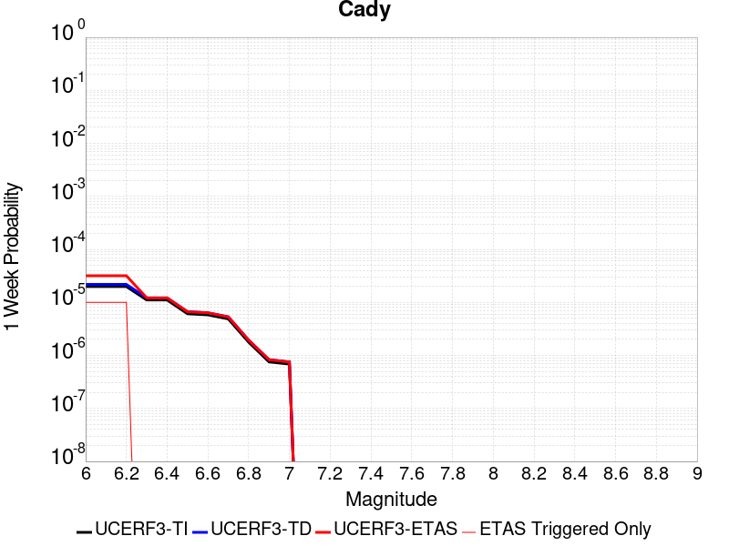 | 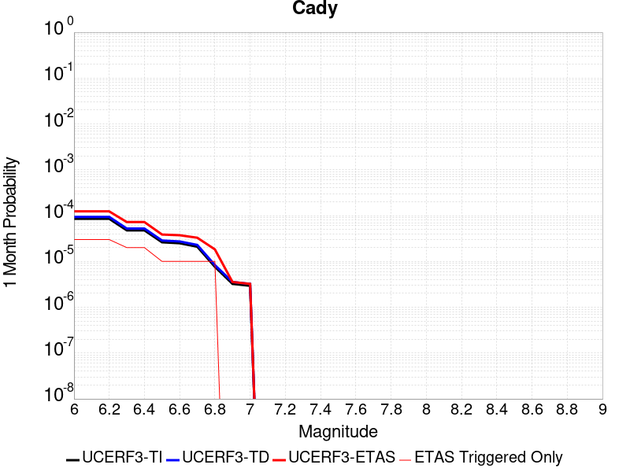 |  | 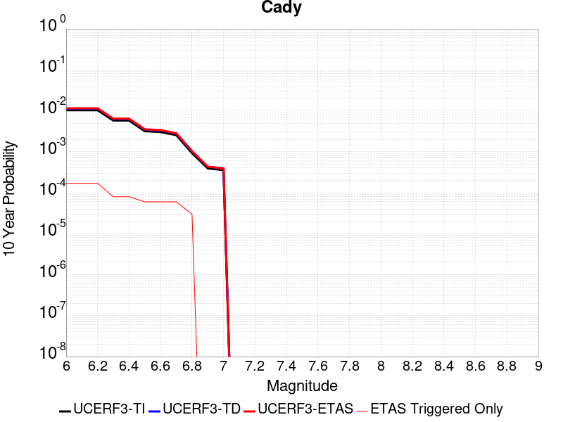 |

| Magnitude | 1 wk TI Prob | 1 wk TD Prob | 1 wk ETAS Prob | 1 wk ETAS/TD Gain | 1 wk ETAS Triggered Only | 1 mo TI Prob | 1 mo TD Prob | 1 mo ETAS Prob | 1 mo ETAS/TD Gain | 1 mo ETAS Triggered Only | 1 yr TI Prob | 1 yr TD Prob | 1 yr ETAS Prob | 1 yr ETAS/TD Gain | 1 yr ETAS Triggered Only | 10 yr TI Prob | 10 yr TD Prob | 10 yr ETAS Prob | 10 yr ETAS/TD Gain | 10 yr ETAS Triggered Only |
|-----|-----|-----|-----|-----|-----|-----|-----|-----|-----|-----|-----|-----|-----|-----|-----|-----|-----|-----|-----|-----|
| 6.0 | 1.9892565E-5 | 2.185897E-5 | 3.185875E-5 | 1.457468 | 1.0E-5 | 8.525106E-5 | 9.3678456E-5 | 1.2367564E-4 | 1.3202144 | 3.0E-5 | 0.0010374374 | 0.0011400293 | 0.0012099495 | 1.061332 | 7.0E-5 | 0.010326075 | 0.011350825 | 0.011518896 | 1.0148069 | 1.7E-4 |
| 6.1 | 1.9892565E-5 | 2.185897E-5 | 3.185875E-5 | 1.457468 | 1.0E-5 | 8.525106E-5 | 9.3678456E-5 | 1.2367564E-4 | 1.3202144 | 3.0E-5 | 0.0010374374 | 0.0011400293 | 0.0012099495 | 1.061332 | 7.0E-5 | 0.010326075 | 0.011350825 | 0.011518896 | 1.0148069 | 1.7E-4 |
| 6.2 | 1.9892565E-5 | 2.185897E-5 | 3.185875E-5 | 1.457468 | 1.0E-5 | 8.525106E-5 | 9.3678456E-5 | 1.2367564E-4 | 1.3202144 | 3.0E-5 | 0.0010374374 | 0.0011400293 | 0.0012099495 | 1.061332 | 7.0E-5 | 0.010326075 | 0.011350825 | 0.011518896 | 1.0148069 | 1.7E-4 |
| 6.3 | 1.1117327E-5 | 1.2176713E-5 | 1.2176713E-5 | 1.0 | 0.0 | 4.764482E-5 | 5.218505E-5 | 7.2184004E-5 | 1.3832315 | 2.0E-5 | 5.7992124E-4 | 6.3519925E-4 | 6.751738E-4 | 1.0629324 | 4.0E-5 | 0.0057841022 | 0.006336943 | 0.006416436 | 1.0125444 | 8.0E-5 |
| 6.4 | 1.1117327E-5 | 1.2176713E-5 | 1.2176713E-5 | 1.0 | 0.0 | 4.764482E-5 | 5.218505E-5 | 7.2184004E-5 | 1.3832315 | 2.0E-5 | 5.7992124E-4 | 6.3519925E-4 | 6.751738E-4 | 1.0629324 | 4.0E-5 | 0.0057841022 | 0.006336943 | 0.006416436 | 1.0125444 | 8.0E-5 |
| 6.5 | 6.103093E-6 | 6.6720904E-6 | 6.6720904E-6 | 1.0 | 0.0 | 2.615585E-5 | 2.859443E-5 | 3.8594146E-5 | 1.3497084 | 1.0E-5 | 3.1840094E-4 | 3.4809412E-4 | 3.780837E-4 | 1.0861536 | 3.0E-5 | 0.0031794512 | 0.0034767229 | 0.0035365142 | 1.0171976 | 6.0E-5 |
| 6.6 | 5.817237E-6 | 6.3657258E-6 | 6.3657258E-6 | 1.0 | 0.0 | 2.4930776E-5 | 2.7281467E-5 | 3.7281192E-5 | 1.3665392 | 1.0E-5 | 3.034899E-4 | 3.3211368E-4 | 3.6210372E-4 | 1.0903006 | 3.0E-5 | 0.0030307577 | 0.0033173955 | 0.0033771964 | 1.0180265 | 6.0E-5 |
| 6.7 | 4.8846314E-6 | 5.340624E-6 | 5.340624E-6 | 1.0 | 0.0 | 2.0933967E-5 | 2.2888255E-5 | 3.2888027E-5 | 1.4368954 | 1.0E-5 | 2.5484123E-4 | 2.7864063E-4 | 3.0863227E-4 | 1.1076356 | 3.0E-5 | 0.0025454918 | 0.0027840682 | 0.002843901 | 1.0214912 | 6.0E-5 |
| 6.8 | 1.7788773E-6 | 1.9399276E-6 | 1.9399276E-6 | 1.0 | 0.0 | 7.6237375E-6 | 8.313958E-6 | 1.8313875E-5 | 2.2027864 | 1.0E-5 | 9.281505E-5 | 1.0121931E-4 | 1.2121729E-4 | 1.1975708 | 2.0E-5 | 9.2776294E-4 | 0.0010118868 | 0.0010418564 | 1.0296175 | 3.0E-5 |
| 6.9 | 7.5455404E-7 | 8.2971843E-7 | 8.2971843E-7 | 1.0 | 0.0 | 3.233799E-6 | 3.5559333E-6 | 3.5559333E-6 | 1.0 | 0.0 | 3.937079E-5 | 4.3292963E-5 | 4.3292963E-5 | 1.0 | 0.0 | 3.9363815E-4 | 4.3287824E-4 | 4.3287824E-4 | 1.0 | 0.0 |
| 7.0 | 6.8578805E-7 | 7.5419E-7 | 7.5419E-7 | 1.0 | 0.0 | 2.9390883E-6 | 3.2322407E-6 | 3.2322407E-6 | 1.0 | 0.0 | 3.578281E-5 | 3.935215E-5 | 3.935215E-5 | 1.0 | 0.0 | 3.577705E-4 | 3.934843E-4 | 3.934843E-4 | 1.0 | 0.0 |

## White Wolf (Extension)
*[(top)](#table-of-contents)*

| 1 Week | 1 Month | 1 Year | 10 Year |
|-----|-----|-----|-----|
| 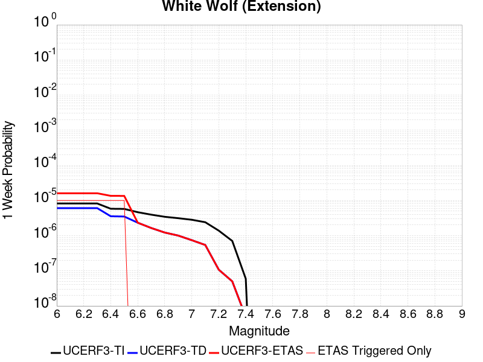 | 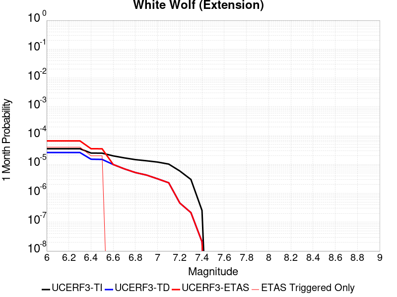 | 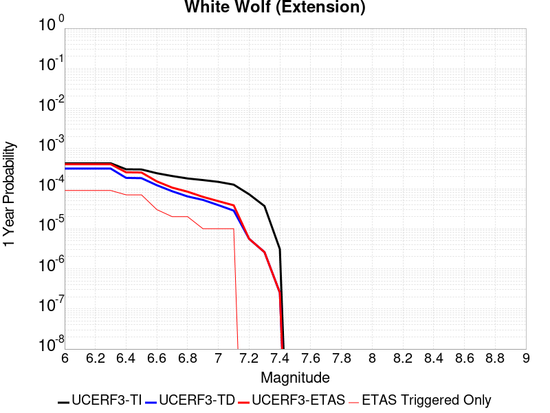 | 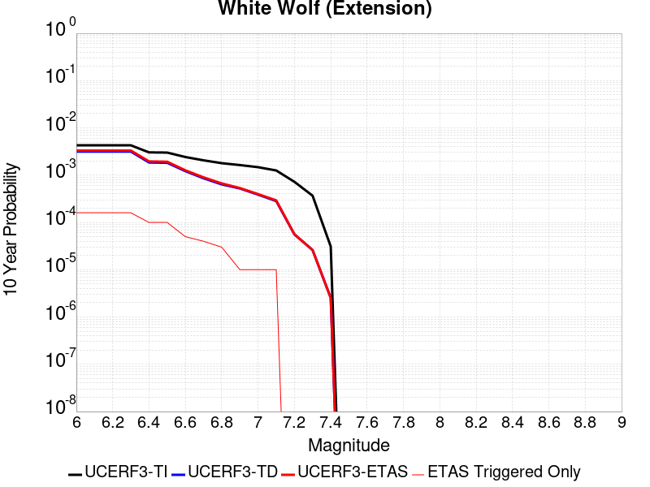 |

| Magnitude | 1 wk TI Prob | 1 wk TD Prob | 1 wk ETAS Prob | 1 wk ETAS/TD Gain | 1 wk ETAS Triggered Only | 1 mo TI Prob | 1 mo TD Prob | 1 mo ETAS Prob | 1 mo ETAS/TD Gain | 1 mo ETAS Triggered Only | 1 yr TI Prob | 1 yr TD Prob | 1 yr ETAS Prob | 1 yr ETAS/TD Gain | 1 yr ETAS Triggered Only | 10 yr TI Prob | 10 yr TD Prob | 10 yr ETAS Prob | 10 yr ETAS/TD Gain | 10 yr ETAS Triggered Only |
|-----|-----|-----|-----|-----|-----|-----|-----|-----|-----|-----|-----|-----|-----|-----|-----|-----|-----|-----|-----|-----|
| 6.0 | 8.222555E-6 | 6.0666994E-6 | 1.6066639E-5 | 2.6483326 | 1.0E-5 | 3.5239045E-5 | 2.599992E-5 | 6.599888E-5 | 2.5384264 | 4.0E-5 | 4.289509E-4 | 3.1650966E-4 | 4.0648118E-4 | 1.2842615 | 9.0E-5 | 0.0042812387 | 0.0031612406 | 0.003320735 | 1.0504531 | 1.6E-4 |
| 6.1 | 8.222555E-6 | 6.0666994E-6 | 1.6066639E-5 | 2.6483326 | 1.0E-5 | 3.5239045E-5 | 2.599992E-5 | 6.599888E-5 | 2.5384264 | 4.0E-5 | 4.289509E-4 | 3.1650966E-4 | 4.0648118E-4 | 1.2842615 | 9.0E-5 | 0.0042812387 | 0.0031612406 | 0.003320735 | 1.0504531 | 1.6E-4 |
| 6.2 | 8.222555E-6 | 6.0666994E-6 | 1.6066639E-5 | 2.6483326 | 1.0E-5 | 3.5239045E-5 | 2.599992E-5 | 6.599888E-5 | 2.5384264 | 4.0E-5 | 4.289509E-4 | 3.1650966E-4 | 4.0648118E-4 | 1.2842615 | 9.0E-5 | 0.0042812387 | 0.0031612406 | 0.003320735 | 1.0504531 | 1.6E-4 |
| 6.3 | 8.222555E-6 | 6.0666994E-6 | 1.6066639E-5 | 2.6483326 | 1.0E-5 | 3.5239045E-5 | 2.599992E-5 | 6.599888E-5 | 2.5384264 | 4.0E-5 | 4.289509E-4 | 3.1650966E-4 | 4.0648118E-4 | 1.2842615 | 9.0E-5 | 0.0042812387 | 0.0031612406 | 0.003320735 | 1.0504531 | 1.6E-4 |
| 6.4 | 5.821773E-6 | 3.5571977E-6 | 1.3557162E-5 | 3.8111916 | 1.0E-5 | 2.4950215E-5 | 1.524505E-5 | 3.5244746E-5 | 2.3118813 | 2.0E-5 | 3.0372653E-4 | 1.8559377E-4 | 2.555808E-4 | 1.3770978 | 7.0E-5 | 0.0030331176 | 0.0018544961 | 0.0019543106 | 1.053823 | 1.0E-4 |
| 6.5 | 5.766023E-6 | 3.4991315E-6 | 1.3499097E-5 | 3.857842 | 1.0E-5 | 2.4711293E-5 | 1.4996198E-5 | 3.4995897E-5 | 2.3336513 | 2.0E-5 | 3.0081844E-4 | 1.8256452E-4 | 2.5255172E-4 | 1.3833561 | 7.0E-5 | 0.0030041158 | 0.0018242535 | 0.0019240711 | 1.054717 | 1.0E-4 |
| 6.6 | 4.643576E-6 | 2.33264E-6 | 2.33264E-6 | 1.0 | 0.0 | 1.9900888E-5 | 9.996992E-6 | 9.996992E-6 | 1.0 | 0.0 | 2.4226638E-4 | 1.2170701E-4 | 1.5170337E-4 | 1.2464637 | 3.0E-5 | 0.0024200242 | 0.001216446 | 0.0012663852 | 1.0410533 | 5.0E-5 |
| 6.7 | 3.9529173E-6 | 1.6483605E-6 | 1.6483605E-6 | 1.0 | 0.0 | 1.6940963E-5 | 7.064384E-6 | 7.064384E-6 | 1.0 | 0.0 | 2.0623671E-4 | 8.600567E-5 | 1.0600395E-4 | 1.2325228 | 2.0E-5 | 0.002060454 | 8.5974234E-4 | 8.9970796E-4 | 1.0464855 | 4.0E-5 |
| 6.8 | 3.4377522E-6 | 1.2245342E-6 | 1.2245342E-6 | 1.0 | 0.0 | 1.473314E-5 | 5.2479936E-6 | 5.2479936E-6 | 1.0 | 0.0 | 1.7936122E-4 | 6.389254E-5 | 8.389127E-5 | 1.3130056 | 2.0E-5 | 0.0017921652 | 6.3875085E-4 | 6.687317E-4 | 1.0469366 | 3.0E-5 |
| 6.9 | 3.1367306E-6 | 1.0033875E-6 | 1.0033875E-6 | 1.0 | 0.0 | 1.3443062E-5 | 4.300226E-6 | 4.300226E-6 | 1.0 | 0.0 | 1.63657E-4 | 5.235407E-5 | 6.2353545E-5 | 1.1909971 | 1.0E-5 | 0.0016353652 | 5.23425E-4 | 5.334198E-4 | 1.019095 | 1.0E-5 |
| 7.0 | 2.8298145E-6 | 7.428745E-7 | 7.428745E-7 | 1.0 | 0.0 | 1.2127721E-5 | 3.1837442E-6 | 3.1837442E-6 | 1.0 | 0.0 | 1.47645E-4 | 3.8761445E-5 | 4.876106E-5 | 1.2579783 | 1.0E-5 | 0.0014754693 | 3.8755185E-4 | 3.97548E-4 | 1.025793 | 1.0E-5 |
| 7.1 | 2.4091064E-6 | 5.4228167E-7 | 5.4228167E-7 | 1.0 | 0.0 | 1.03247E-5 | 2.3240625E-6 | 2.3240625E-6 | 1.0 | 0.0 | 1.2569598E-4 | 2.8295135E-5 | 3.8294853E-5 | 1.3534076 | 1.0E-5 | 0.001256249 | 2.8291935E-4 | 2.9291652E-4 | 1.0353358 | 1.0E-5 |
| 7.2 | 1.3875518E-6 | 1.0743379E-7 | 1.0743379E-7 | 1.0 | 0.0 | 5.9466374E-6 | 4.6043044E-7 | 4.6043044E-7 | 1.0 | 0.0 | 7.23979E-5 | 5.6057274E-6 | 5.6057274E-6 | 1.0 | 0.0 | 7.2374323E-4 | 5.6055975E-5 | 5.6055975E-5 | 1.0 | 0.0 |
| 7.3 | 7.056077E-7 | 5.0022155E-8 | 5.0022155E-8 | 1.0 | 0.0 | 3.0240296E-6 | 2.1438065E-7 | 2.1438065E-7 | 1.0 | 0.0 | 3.681694E-5 | 2.6100818E-6 | 2.6100818E-6 | 1.0 | 0.0 | 3.681084E-4 | 2.6100557E-5 | 2.6100557E-5 | 1.0 | 0.0 |
| 7.4 | 5.9334678E-8 | 4.8685296E-9 | 4.8685296E-9 | 1.0 | 0.0 | 2.5429145E-7 | 2.0865128E-8 | 2.0865128E-8 | 1.0 | 0.0 | 3.095994E-6 | 2.540329E-7 | 2.540329E-7 | 1.0 | 0.0 | 3.095951E-5 | 2.5403274E-6 | 2.5403274E-6 | 1.0 | 0.0 |

## Santa Ynez (West)
*[(top)](#table-of-contents)*

| 1 Week | 1 Month | 1 Year | 10 Year |
|-----|-----|-----|-----|
| 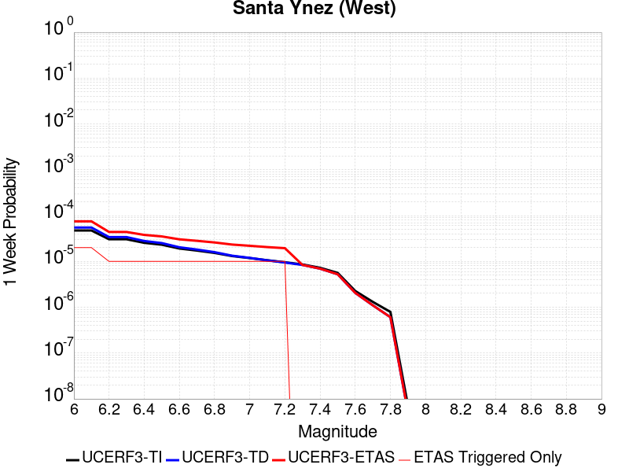 | 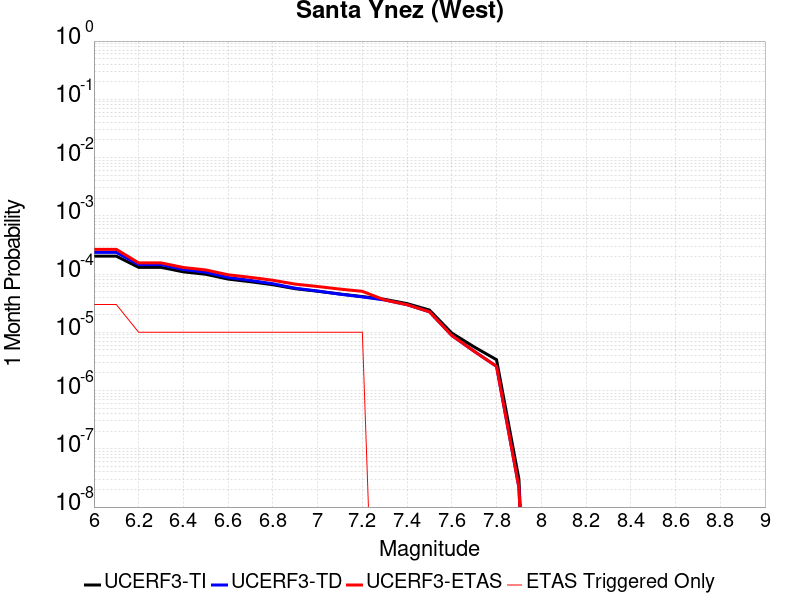 | 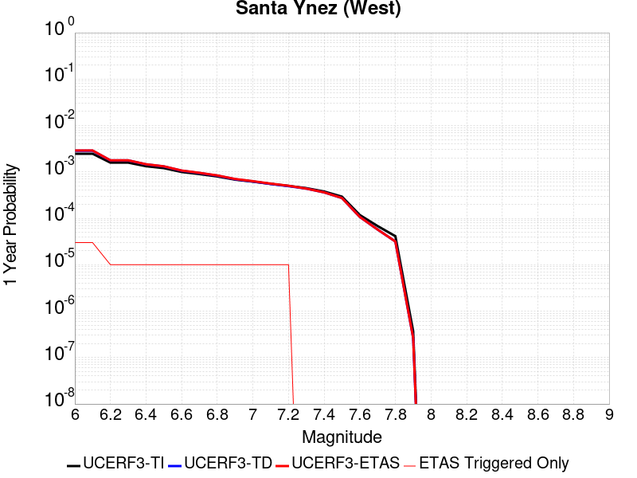 |  |

| Magnitude | 1 wk TI Prob | 1 wk TD Prob | 1 wk ETAS Prob | 1 wk ETAS/TD Gain | 1 wk ETAS Triggered Only | 1 mo TI Prob | 1 mo TD Prob | 1 mo ETAS Prob | 1 mo ETAS/TD Gain | 1 mo ETAS Triggered Only | 1 yr TI Prob | 1 yr TD Prob | 1 yr ETAS Prob | 1 yr ETAS/TD Gain | 1 yr ETAS Triggered Only | 10 yr TI Prob | 10 yr TD Prob | 10 yr ETAS Prob | 10 yr ETAS/TD Gain | 10 yr ETAS Triggered Only |
|-----|-----|-----|-----|-----|-----|-----|-----|-----|-----|-----|-----|-----|-----|-----|-----|-----|-----|-----|-----|-----|
| 6.0 | 4.7352758E-5 | 5.4973276E-5 | 7.497218E-5 | 1.3637931 | 2.0E-5 | 2.0292461E-4 | 2.3558016E-4 | 2.655731E-4 | 1.1273152 | 3.0E-5 | 0.0024678076 | 0.0028645857 | 0.0028944998 | 1.0104427 | 3.0E-5 | 0.024405818 | 0.028304989 | 0.028411876 | 1.0037762 | 1.1E-4 |
| 6.1 | 4.7352758E-5 | 5.4973276E-5 | 7.497218E-5 | 1.3637931 | 2.0E-5 | 2.0292461E-4 | 2.3558016E-4 | 2.655731E-4 | 1.1273152 | 3.0E-5 | 0.0024678076 | 0.0028645857 | 0.0028944998 | 1.0104427 | 3.0E-5 | 0.024405818 | 0.028304989 | 0.028402159 | 1.003433 | 1.0E-4 |
| 6.2 | 3.0415853E-5 | 3.392568E-5 | 4.3925338E-5 | 1.294752 | 1.0E-5 | 1.3034715E-4 | 1.4538788E-4 | 1.5538643E-4 | 1.0687715 | 1.0E-5 | 0.0015858212 | 0.0017686957 | 0.0017786779 | 1.0056438 | 1.0E-5 | 0.015745522 | 0.017550096 | 0.01759922 | 1.002799 | 5.0E-5 |
| 6.3 | 3.0415853E-5 | 3.392568E-5 | 4.3925338E-5 | 1.294752 | 1.0E-5 | 1.3034715E-4 | 1.4538788E-4 | 1.5538643E-4 | 1.0687715 | 1.0E-5 | 0.0015858212 | 0.0017686957 | 0.0017786779 | 1.0056438 | 1.0E-5 | 0.015745522 | 0.017550096 | 0.01759922 | 1.002799 | 5.0E-5 |
| 6.4 | 2.5452082E-5 | 2.7912845E-5 | 3.7912567E-5 | 1.358248 | 1.0E-5 | 1.09075794E-4 | 1.1962111E-4 | 1.2961992E-4 | 1.0835873 | 1.0E-5 | 0.0013271887 | 0.0014554309 | 0.0014654163 | 1.0068609 | 1.0E-5 | 0.013192902 | 0.014461169 | 0.01450059 | 1.0027261 | 4.0E-5 |
| 6.5 | 2.3143784E-5 | 2.5128616E-5 | 3.5128363E-5 | 1.3979427 | 1.0E-5 | 9.9183875E-5 | 1.0768971E-4 | 1.1768863E-4 | 1.0928494 | 1.0E-5 | 0.0012068948 | 0.0013103454 | 0.0013203323 | 1.0076215 | 1.0E-5 | 0.012003611 | 0.0130278645 | 0.013067343 | 1.0030303 | 4.0E-5 |
| 6.6 | 1.9118515E-5 | 2.0354599E-5 | 3.0354395E-5 | 1.4912795 | 1.0E-5 | 8.193392E-5 | 8.723112E-5 | 9.723025E-5 | 1.114628 | 1.0E-5 | 9.97089E-4 | 0.0010615295 | 0.0010715189 | 1.0094104 | 1.0E-5 | 0.00992627 | 0.010565499 | 0.010595181 | 1.0028094 | 3.0E-5 |
| 6.7 | 1.722807E-5 | 1.8146564E-5 | 2.8146384E-5 | 1.5510585 | 1.0E-5 | 7.3832496E-5 | 7.77687E-5 | 8.776793E-5 | 1.1285764 | 1.0E-5 | 8.985399E-4 | 9.464282E-4 | 9.5641875E-4 | 1.010556 | 1.0E-5 | 0.008949154 | 0.009424622 | 0.00945434 | 1.0031532 | 3.0E-5 |
| 6.8 | 1.5317364E-5 | 1.5926662E-5 | 2.5926502E-5 | 1.6278679 | 1.0E-5 | 6.56442E-5 | 6.825536E-5 | 7.825468E-5 | 1.1464987 | 1.0E-5 | 7.98925E-4 | 8.306965E-4 | 8.406882E-4 | 1.0120281 | 1.0E-5 | 0.007960589 | 0.008276401 | 0.008306153 | 1.0035948 | 3.0E-5 |
| 6.9 | 1.3071226E-5 | 1.3329754E-5 | 2.3329621E-5 | 1.7501913 | 1.0E-5 | 5.6018336E-5 | 5.7126283E-5 | 6.712571E-5 | 1.1750407 | 1.0E-5 | 6.8180985E-4 | 6.952928E-4 | 7.052859E-4 | 1.0143725 | 1.0E-5 | 0.0067972173 | 0.006931435 | 0.0069512962 | 1.0028654 | 2.0E-5 |
| 7.0 | 1.1836986E-5 | 1.19328915E-5 | 2.1932772E-5 | 1.8380098 | 1.0E-5 | 5.0728955E-5 | 5.113997E-5 | 6.113946E-5 | 1.1955317 | 1.0E-5 | 6.1745E-4 | 6.2245294E-4 | 6.324467E-4 | 1.0160555 | 1.0E-5 | 0.006157372 | 0.0062072882 | 0.006227164 | 1.003202 | 2.0E-5 |
| 7.1 | 1.0597169E-5 | 1.0542292E-5 | 2.0542187E-5 | 1.9485503 | 1.0E-5 | 4.541565E-5 | 4.5180477E-5 | 5.5180022E-5 | 1.2213246 | 1.0E-5 | 5.5279525E-4 | 5.499346E-4 | 5.599291E-4 | 1.0181739 | 1.0E-5 | 0.0055142213 | 0.005485868 | 0.0055057583 | 1.0036258 | 2.0E-5 |
| 7.2 | 9.59113E-6 | 9.459225E-6 | 1.945913E-5 | 2.057159 | 1.0E-5 | 4.11042E-5 | 4.0538915E-5 | 5.0538507E-5 | 1.2466666 | 1.0E-5 | 5.0032866E-4 | 4.9345056E-4 | 5.034456E-4 | 1.0202554 | 1.0E-5 | 0.004992037 | 0.0049236678 | 0.004943569 | 1.004042 | 2.0E-5 |
| 7.3 | 8.586084E-6 | 8.379656E-6 | 8.379656E-6 | 1.0 | 0.0 | 3.679698E-5 | 3.5912322E-5 | 3.5912322E-5 | 1.0 | 0.0 | 4.4791115E-4 | 4.3714585E-4 | 4.3714585E-4 | 1.0 | 0.0 | 0.004470094 | 0.0043629706 | 0.0043629706 | 1.0 | 0.0 |
| 7.4 | 7.2622997E-6 | 6.9516022E-6 | 6.9516022E-6 | 1.0 | 0.0 | 3.112377E-5 | 2.9792247E-5 | 2.9792247E-5 | 1.0 | 0.0 | 3.78866E-4 | 3.626612E-4 | 3.626612E-4 | 1.0 | 0.0 | 0.0037822074 | 0.0036207938 | 0.0036207938 | 1.0 | 0.0 |
| 7.5 | 5.627296E-6 | 5.251631E-6 | 5.251631E-6 | 1.0 | 0.0 | 2.411676E-5 | 2.25068E-5 | 2.25068E-5 | 1.0 | 0.0 | 2.9358198E-4 | 2.7398654E-4 | 2.7398654E-4 | 1.0 | 0.0 | 0.0029319443 | 0.0027365594 | 0.0027365594 | 1.0 | 0.0 |
| 7.6 | 2.265244E-6 | 2.0608759E-6 | 2.0608759E-6 | 1.0 | 0.0 | 9.708152E-6 | 8.832296E-6 | 8.832296E-6 | 1.0 | 0.0 | 1.18190335E-4 | 1.0752799E-4 | 1.0752799E-4 | 1.0 | 0.0 | 0.001181275 | 0.0010747681 | 0.0010747681 | 1.0 | 0.0 |
| 7.7 | 1.3099874E-6 | 1.1016327E-6 | 1.1016327E-6 | 1.0 | 0.0 | 5.61422E-6 | 4.7212748E-6 | 4.7212748E-6 | 1.0 | 0.0 | 6.8350986E-5 | 5.748003E-5 | 5.748003E-5 | 1.0 | 0.0 | 6.832996E-4 | 5.74654E-4 | 5.74654E-4 | 1.0 | 0.0 |
| 7.8 | 7.903951E-7 | 6.071183E-7 | 6.071183E-7 | 1.0 | 0.0 | 3.3874032E-6 | 2.601933E-6 | 2.601933E-6 | 1.0 | 0.0 | 4.1240855E-5 | 3.1678086E-5 | 3.1678086E-5 | 1.0 | 0.0 | 4.12332E-4 | 3.1673705E-4 | 3.1673705E-4 | 1.0 | 0.0 |
| 7.9 | 7.0753297E-9 | 5.0899738E-9 | 5.0899738E-9 | 1.0 | 0.0 | 3.032284E-8 | 2.1814172E-8 | 2.1814172E-8 | 1.0 | 0.0 | 3.6918053E-7 | 2.6558752E-7 | 2.6558752E-7 | 1.0 | 0.0 | 3.691799E-6 | 2.655873E-6 | 2.655873E-6 | 1.0 | 0.0 |

## San Andreas (North Branch Mill Creek)
*[(top)](#table-of-contents)*

| 1 Week | 1 Month | 1 Year | 10 Year |
|-----|-----|-----|-----|
| 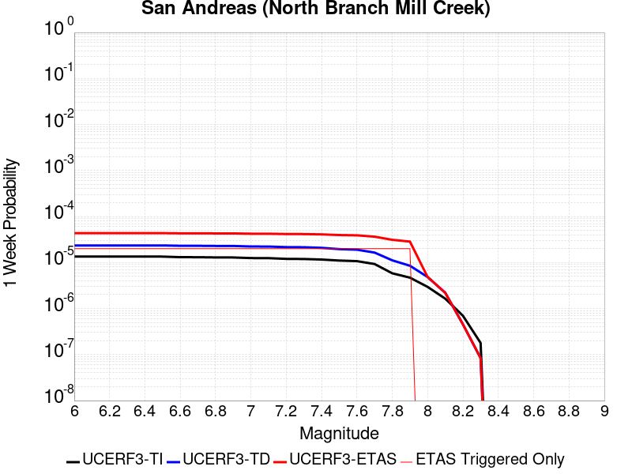 | 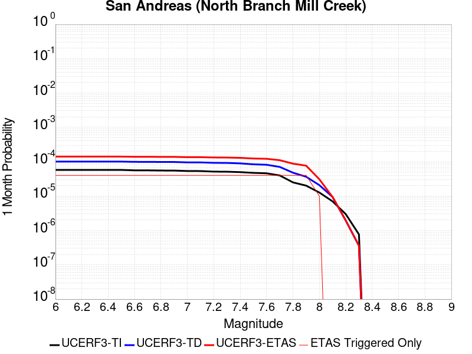 |  | 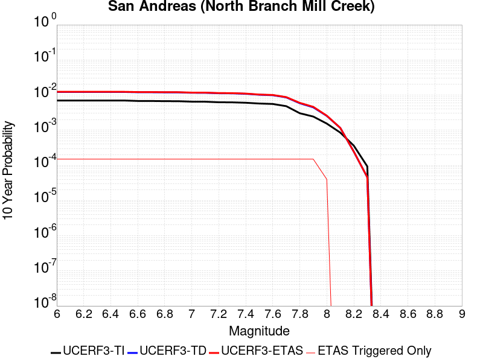 |

| Magnitude | 1 wk TI Prob | 1 wk TD Prob | 1 wk ETAS Prob | 1 wk ETAS/TD Gain | 1 wk ETAS Triggered Only | 1 mo TI Prob | 1 mo TD Prob | 1 mo ETAS Prob | 1 mo ETAS/TD Gain | 1 mo ETAS Triggered Only | 1 yr TI Prob | 1 yr TD Prob | 1 yr ETAS Prob | 1 yr ETAS/TD Gain | 1 yr ETAS Triggered Only | 10 yr TI Prob | 10 yr TD Prob | 10 yr ETAS Prob | 10 yr ETAS/TD Gain | 10 yr ETAS Triggered Only |
|-----|-----|-----|-----|-----|-----|-----|-----|-----|-----|-----|-----|-----|-----|-----|-----|-----|-----|-----|-----|-----|
| 6.0 | 1.3461156E-5 | 2.3505694E-5 | 4.3505224E-5 | 1.8508377 | 2.0E-5 | 5.7689394E-5 | 1.0073481E-4 | 1.4073079E-4 | 1.3970422 | 4.0E-5 | 7.02142E-4 | 0.0012257596 | 0.0013356248 | 1.0896302 | 1.1E-4 | 0.0069992766 | 0.012232539 | 0.012380704 | 1.0121124 | 1.5E-4 |
| 6.1 | 1.3461156E-5 | 2.3505694E-5 | 4.3505224E-5 | 1.8508377 | 2.0E-5 | 5.7689394E-5 | 1.0073481E-4 | 1.4073079E-4 | 1.3970422 | 4.0E-5 | 7.02142E-4 | 0.0012257596 | 0.0013356248 | 1.0896302 | 1.1E-4 | 0.0069992766 | 0.012232539 | 0.012380704 | 1.0121124 | 1.5E-4 |
| 6.2 | 1.3461156E-5 | 2.3505694E-5 | 4.3505224E-5 | 1.8508377 | 2.0E-5 | 5.7689394E-5 | 1.0073481E-4 | 1.4073079E-4 | 1.3970422 | 4.0E-5 | 7.02142E-4 | 0.0012257596 | 0.0013356248 | 1.0896302 | 1.1E-4 | 0.0069992766 | 0.012232539 | 0.012380704 | 1.0121124 | 1.5E-4 |
| 6.3 | 1.3461156E-5 | 2.3505694E-5 | 4.3505224E-5 | 1.8508377 | 2.0E-5 | 5.7689394E-5 | 1.0073481E-4 | 1.4073079E-4 | 1.3970422 | 4.0E-5 | 7.02142E-4 | 0.0012257596 | 0.0013356248 | 1.0896302 | 1.1E-4 | 0.0069992766 | 0.012232539 | 0.012380704 | 1.0121124 | 1.5E-4 |
| 6.4 | 1.3461156E-5 | 2.3505694E-5 | 4.3505224E-5 | 1.8508377 | 2.0E-5 | 5.7689394E-5 | 1.0073481E-4 | 1.4073079E-4 | 1.3970422 | 4.0E-5 | 7.02142E-4 | 0.0012257596 | 0.0013356248 | 1.0896302 | 1.1E-4 | 0.0069992766 | 0.012232539 | 0.012380704 | 1.0121124 | 1.5E-4 |
| 6.5 | 1.3450706E-5 | 2.3494653E-5 | 4.3494183E-5 | 1.8512375 | 2.0E-5 | 5.764461E-5 | 1.006875E-4 | 1.4068348E-4 | 1.3972287 | 4.0E-5 | 7.0159714E-4 | 0.0012251843 | 0.0013350495 | 1.0896724 | 1.1E-4 | 0.006993862 | 0.012226849 | 0.012375015 | 1.0121181 | 1.5E-4 |
| 6.6 | 1.3074523E-5 | 2.3108934E-5 | 4.310847E-5 | 1.8654461 | 2.0E-5 | 5.6032466E-5 | 9.903454E-5 | 1.3903058E-4 | 1.4038595 | 4.0E-5 | 6.8198174E-4 | 0.0012050819 | 0.0013149494 | 1.0911701 | 1.1E-4 | 0.006798926 | 0.012028013 | 0.012176209 | 1.0123209 | 1.5E-4 |
| 6.7 | 1.3050216E-5 | 2.308423E-5 | 4.3083768E-5 | 1.8663723 | 2.0E-5 | 5.59283E-5 | 9.892868E-5 | 1.3892472E-4 | 1.4042916 | 4.0E-5 | 6.8071426E-4 | 0.0012037944 | 0.001313662 | 1.0912677 | 1.1E-4 | 0.0067863287 | 0.0120152775 | 0.012163476 | 1.0123341 | 1.5E-4 |
| 6.8 | 1.29049395E-5 | 2.2932638E-5 | 4.293218E-5 | 1.8720995 | 2.0E-5 | 5.530571E-5 | 9.827905E-5 | 1.3827512E-4 | 1.4069643 | 4.0E-5 | 6.73139E-4 | 0.0011958939 | 0.0013057623 | 1.0918714 | 1.1E-4 | 0.0067110364 | 0.011937123 | 0.012085332 | 1.0124159 | 1.5E-4 |
| 6.9 | 1.2867369E-5 | 2.289204E-5 | 4.289158E-5 | 1.8736461 | 2.0E-5 | 5.51447E-5 | 9.8105076E-5 | 1.3810115E-4 | 1.4076861 | 4.0E-5 | 6.711799E-4 | 0.001193778 | 0.0013036467 | 1.0920345 | 1.1E-4 | 0.006691564 | 0.011916191 | 0.012064404 | 1.0124379 | 1.5E-4 |
| 7.0 | 1.2495996E-5 | 2.229208E-5 | 4.2291635E-5 | 1.8971596 | 2.0E-5 | 5.3553173E-5 | 9.553401E-5 | 1.3553018E-4 | 1.4186591 | 4.0E-5 | 6.518148E-4 | 0.0011625087 | 0.0012723809 | 1.0945129 | 1.1E-4 | 0.0064990623 | 0.011606777 | 0.011755035 | 1.0127735 | 1.5E-4 |
| 7.1 | 1.2452067E-5 | 2.2237153E-5 | 4.223671E-5 | 1.8993758 | 2.0E-5 | 5.3364907E-5 | 9.5298616E-5 | 1.352948E-4 | 1.4196932 | 4.0E-5 | 6.4952404E-4 | 0.0011596458 | 0.0012695184 | 1.0947466 | 1.1E-4 | 0.0064762887 | 0.011578447 | 0.01172671 | 1.0128051 | 1.5E-4 |
| 7.2 | 1.2002777E-5 | 2.1615686E-5 | 4.1615254E-5 | 1.925234 | 2.0E-5 | 5.143946E-5 | 9.263538E-5 | 1.3263167E-4 | 1.4317604 | 4.0E-5 | 6.2609545E-4 | 0.0011272549 | 0.0012371308 | 1.0974722 | 1.1E-4 | 0.006243344 | 0.011257855 | 0.0114061665 | 1.013174 | 1.5E-4 |
| 7.3 | 1.1923425E-5 | 2.148551E-5 | 4.148508E-5 | 1.9308399 | 2.0E-5 | 5.109939E-5 | 9.207752E-5 | 1.3207384E-4 | 1.4343766 | 4.0E-5 | 6.219575E-4 | 0.0011204699 | 0.0012303466 | 1.0980631 | 1.1E-4 | 0.0062021962 | 0.011190718 | 0.01133904 | 1.0132539 | 1.5E-4 |
| 7.4 | 1.16105175E-5 | 2.0859432E-5 | 4.0859017E-5 | 1.9587789 | 2.0E-5 | 4.975841E-5 | 8.939452E-5 | 1.2939094E-4 | 1.4474148 | 4.0E-5 | 6.0564023E-4 | 0.0010878374 | 0.0011977177 | 1.101008 | 1.1E-4 | 0.006039923 | 0.010868298 | 0.011016668 | 1.0136516 | 1.5E-4 |
| 7.5 | 1.1037265E-5 | 1.955937E-5 | 3.9558978E-5 | 2.022508 | 2.0E-5 | 4.7301706E-5 | 8.3823186E-5 | 1.2381983E-4 | 1.477155 | 4.0E-5 | 5.757461E-4 | 0.0010200717 | 0.0011299595 | 1.1077255 | 1.1E-4 | 0.005742567 | 0.0101977 | 0.0103461705 | 1.0145591 | 1.5E-4 |
| 7.6 | 1.0720915E-5 | 1.9001212E-5 | 3.900083E-5 | 2.0525444 | 2.0E-5 | 4.5945973E-5 | 8.143124E-5 | 1.21427984E-4 | 1.491172 | 4.0E-5 | 5.592486E-4 | 9.909766E-4 | 0.0011008675 | 1.1108916 | 1.1E-4 | 0.005578433 | 0.0099093905 | 0.010057904 | 1.0149871 | 1.5E-4 |
| 7.7 | 9.276279E-6 | 1.6446786E-5 | 3.6446458E-5 | 2.2160232 | 2.0E-5 | 3.9754876E-5 | 7.0484326E-5 | 1.1048151E-4 | 1.5674621 | 4.0E-5 | 4.839081E-4 | 8.578105E-4 | 9.677161E-4 | 1.1281234 | 1.1E-4 | 0.0048285574 | 0.00858868 | 0.008737392 | 1.0173148 | 1.5E-4 |
| 7.8 | 5.8346777E-6 | 1.1159184E-5 | 3.115896E-5 | 2.7922256 | 2.0E-5 | 2.5005522E-5 | 4.78242E-5 | 8.7822285E-5 | 1.8363566 | 4.0E-5 | 3.043997E-4 | 5.821042E-4 | 6.920402E-4 | 1.1888596 | 1.1E-4 | 0.0030398308 | 0.005849072 | 0.0059981947 | 1.025495 | 1.5E-4 |
| 7.9 | 4.690204E-6 | 8.512574E-6 | 2.8512404E-5 | 3.3494456 | 2.0E-5 | 2.0100719E-5 | 3.648195E-5 | 7.6480486E-5 | 2.0963926 | 4.0E-5 | 2.4469878E-4 | 4.440773E-4 | 5.5402843E-4 | 1.2475946 | 1.1E-4 | 0.002444295 | 0.004472539 | 0.004621868 | 1.033388 | 1.5E-4 |
| 8.0 | 2.9570454E-6 | 4.8490756E-6 | 4.8490756E-6 | 1.0 | 0.0 | 1.267299E-5 | 2.0781586E-5 | 3.078138E-5 | 1.4811852 | 1.0E-5 | 1.5428272E-4 | 2.5298647E-4 | 2.7298142E-4 | 1.0790356 | 2.0E-5 | 0.0015417566 | 0.0025507512 | 0.0025906493 | 1.0156417 | 4.0E-5 |
| 8.1 | 1.6376824E-6 | 2.1980125E-6 | 2.1980125E-6 | 1.0 | 0.0 | 7.01862E-6 | 9.420019E-6 | 9.420019E-6 | 1.0 | 0.0 | 8.544835E-5 | 1.14682705E-4 | 1.14682705E-4 | 1.0 | 0.0 | 8.54155E-4 | 0.0011612439 | 0.0011612439 | 1.0 | 0.0 |
| 8.2 | 6.9631557E-7 | 4.5395024E-7 | 4.5395024E-7 | 1.0 | 0.0 | 2.984206E-6 | 1.9454994E-6 | 1.9454994E-6 | 1.0 | 0.0 | 3.63321E-5 | 2.3686202E-5 | 2.3686202E-5 | 1.0 | 0.0 | 3.6326164E-4 | 2.4534125E-4 | 2.4534125E-4 | 1.0 | 0.0 |
| 8.3 | 1.7876137E-7 | 8.367435E-8 | 8.367435E-8 | 1.0 | 0.0 | 7.661199E-7 | 3.586043E-7 | 3.586043E-7 | 1.0 | 0.0 | 9.32747E-6 | 4.365999E-6 | 4.365999E-6 | 1.0 | 0.0 | 9.3270784E-5 | 4.5854908E-5 | 4.5854908E-5 | 1.0 | 0.0 |

## Lake Isabella (Seismicity)
*[(top)](#table-of-contents)*

| 1 Week | 1 Month | 1 Year | 10 Year |
|-----|-----|-----|-----|
| 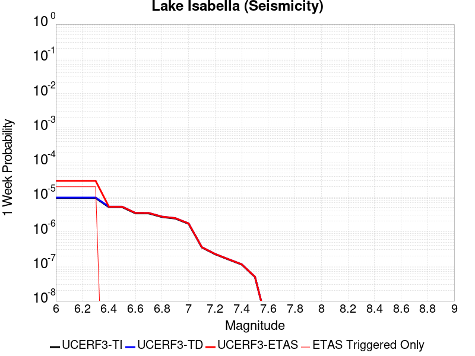 | 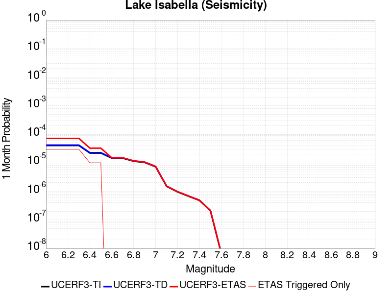 | 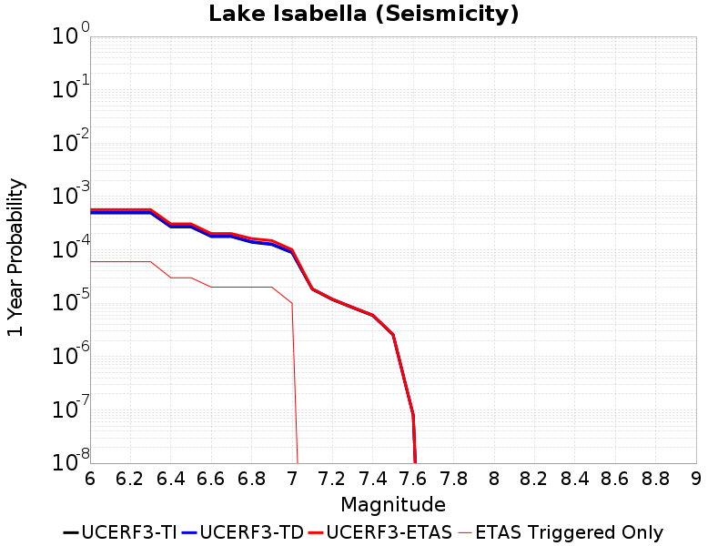 | 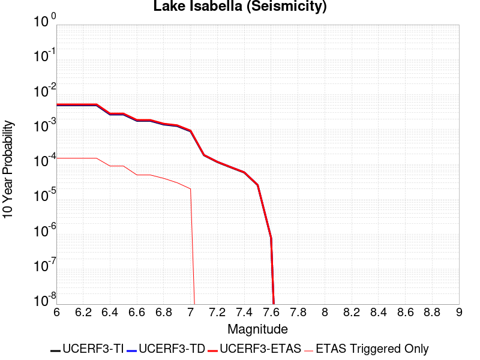 |

| Magnitude | 1 wk TI Prob | 1 wk TD Prob | 1 wk ETAS Prob | 1 wk ETAS/TD Gain | 1 wk ETAS Triggered Only | 1 mo TI Prob | 1 mo TD Prob | 1 mo ETAS Prob | 1 mo ETAS/TD Gain | 1 mo ETAS Triggered Only | 1 yr TI Prob | 1 yr TD Prob | 1 yr ETAS Prob | 1 yr ETAS/TD Gain | 1 yr ETAS Triggered Only | 10 yr TI Prob | 10 yr TD Prob | 10 yr ETAS Prob | 10 yr ETAS/TD Gain | 10 yr ETAS Triggered Only |
|-----|-----|-----|-----|-----|-----|-----|-----|-----|-----|-----|-----|-----|-----|-----|-----|-----|-----|-----|-----|-----|
| 6.0 | 9.431637E-6 | 9.741688E-6 | 2.9741494E-5 | 3.0530124 | 2.0E-5 | 4.0420677E-5 | 4.1749496E-5 | 7.174824E-5 | 1.7185416 | 3.0E-5 | 4.920106E-4 | 5.081946E-4 | 5.681641E-4 | 1.118005 | 6.0E-5 | 0.004909227 | 0.0050716177 | 0.0052208565 | 1.0294263 | 1.5E-4 |
| 6.1 | 9.431637E-6 | 9.741688E-6 | 2.9741494E-5 | 3.0530124 | 2.0E-5 | 4.0420677E-5 | 4.1749496E-5 | 7.174824E-5 | 1.7185416 | 3.0E-5 | 4.920106E-4 | 5.081946E-4 | 5.681641E-4 | 1.118005 | 6.0E-5 | 0.004909227 | 0.0050716177 | 0.0052208565 | 1.0294263 | 1.5E-4 |
| 6.2 | 9.431637E-6 | 9.741688E-6 | 2.9741494E-5 | 3.0530124 | 2.0E-5 | 4.0420677E-5 | 4.1749496E-5 | 7.174824E-5 | 1.7185416 | 3.0E-5 | 4.920106E-4 | 5.081946E-4 | 5.681641E-4 | 1.118005 | 6.0E-5 | 0.004909227 | 0.0050716177 | 0.0052208565 | 1.0294263 | 1.5E-4 |
| 6.3 | 9.431637E-6 | 9.741688E-6 | 2.9741494E-5 | 3.0530124 | 2.0E-5 | 4.0420677E-5 | 4.1749496E-5 | 7.174824E-5 | 1.7185416 | 3.0E-5 | 4.920106E-4 | 5.081946E-4 | 5.681641E-4 | 1.118005 | 6.0E-5 | 0.004909227 | 0.0050716177 | 0.0052208565 | 1.0294263 | 1.5E-4 |
| 6.4 | 5.144063E-6 | 5.300094E-6 | 5.300094E-6 | 1.0 | 0.0 | 2.2045799E-5 | 2.271451E-5 | 3.2714284E-5 | 1.4402372 | 1.0E-5 | 2.6837454E-4 | 2.7651753E-4 | 3.0650923E-4 | 1.1084622 | 3.0E-5 | 0.0026805066 | 0.002762075 | 0.0028518264 | 1.0324942 | 9.0E-5 |
| 6.5 | 5.144063E-6 | 5.300094E-6 | 5.300094E-6 | 1.0 | 0.0 | 2.2045799E-5 | 2.271451E-5 | 3.2714284E-5 | 1.4402372 | 1.0E-5 | 2.6837454E-4 | 2.7651753E-4 | 3.0650923E-4 | 1.1084622 | 3.0E-5 | 0.0026805066 | 0.002762075 | 0.0028518264 | 1.0324942 | 9.0E-5 |
| 6.6 | 3.4009804E-6 | 3.4987975E-6 | 3.4987975E-6 | 1.0 | 0.0 | 1.4575549E-5 | 1.4994769E-5 | 1.4994769E-5 | 1.0 | 0.0 | 1.7744285E-4 | 1.8254762E-4 | 2.0254398E-4 | 1.1095405 | 2.0E-5 | 0.0017730123 | 0.0018241345 | 0.0018740433 | 1.0273602 | 5.0E-5 |
| 6.7 | 3.3880428E-6 | 3.485664E-6 | 3.485664E-6 | 1.0 | 0.0 | 1.4520103E-5 | 1.4938483E-5 | 1.4938483E-5 | 1.0 | 0.0 | 1.767679E-4 | 1.8186246E-4 | 2.0185883E-4 | 1.1099532 | 2.0E-5 | 0.0017662736 | 0.001817294 | 0.0018672032 | 1.0274634 | 5.0E-5 |
| 6.8 | 2.6582E-6 | 2.733709E-6 | 2.733709E-6 | 1.0 | 0.0 | 1.1392236E-5 | 1.1715851E-5 | 1.1715851E-5 | 1.0 | 0.0 | 1.3869164E-4 | 1.4263249E-4 | 1.6262963E-4 | 1.1402005 | 2.0E-5 | 0.0013860512 | 0.0014255415 | 0.0014654844 | 1.0280195 | 4.0E-5 |
| 6.9 | 2.406011E-6 | 2.4743367E-6 | 2.4743367E-6 | 1.0 | 0.0 | 1.0311434E-5 | 1.0604264E-5 | 1.0604264E-5 | 1.0 | 0.0 | 1.2553448E-4 | 1.2910059E-4 | 1.49098E-4 | 1.1548979 | 2.0E-5 | 0.0012546359 | 0.0012903855 | 0.0013203468 | 1.0232189 | 3.0E-5 |
| 7.0 | 1.6953097E-6 | 1.7429427E-6 | 1.7429427E-6 | 1.0 | 0.0 | 7.265593E-6 | 7.4697386E-6 | 7.4697386E-6 | 1.0 | 0.0 | 8.8455E-5 | 9.094132E-5 | 1.00940415E-4 | 1.109951 | 1.0E-5 | 8.84198E-4 | 9.091438E-4 | 9.2912564E-4 | 1.0219787 | 2.0E-5 |
| 7.1 | 3.5013824E-7 | 3.5714902E-7 | 3.5714902E-7 | 1.0 | 0.0 | 1.5005916E-6 | 1.5306379E-6 | 1.5306379E-6 | 1.0 | 0.0 | 1.826955E-5 | 1.8635359E-5 | 1.8635359E-5 | 1.0 | 0.0 | 1.8268047E-4 | 1.863382E-4 | 1.863382E-4 | 1.0 | 0.0 |
| 7.2 | 2.2321095E-7 | 2.2750622E-7 | 2.2750622E-7 | 1.0 | 0.0 | 9.56618E-7 | 9.750263E-7 | 9.750263E-7 | 1.0 | 0.0 | 1.1646762E-5 | 1.1870882E-5 | 1.1870882E-5 | 1.0 | 0.0 | 1.1646151E-4 | 1.1870258E-4 | 1.1870258E-4 | 1.0 | 0.0 |
| 7.3 | 1.5760406E-7 | 1.6060956E-7 | 1.6060956E-7 | 1.0 | 0.0 | 6.7544585E-7 | 6.883265E-7 | 6.883265E-7 | 1.0 | 0.0 | 8.223522E-6 | 8.380343E-6 | 8.380343E-6 | 1.0 | 0.0 | 8.2232174E-5 | 8.380034E-5 | 8.380034E-5 | 1.0 | 0.0 |
| 7.4 | 1.1216497E-7 | 1.1431731E-7 | 1.1431731E-7 | 1.0 | 0.0 | 4.8070694E-7 | 4.899312E-7 | 4.899312E-7 | 1.0 | 0.0 | 5.852591E-6 | 5.964897E-6 | 5.964897E-6 | 1.0 | 0.0 | 5.8524372E-5 | 5.964741E-5 | 5.964741E-5 | 1.0 | 0.0 |
| 7.5 | 4.885185E-8 | 4.9787843E-8 | 4.9787843E-8 | 1.0 | 0.0 | 2.0936506E-7 | 2.1337645E-7 | 2.1337645E-7 | 1.0 | 0.0 | 2.5490165E-6 | 2.5978554E-6 | 2.5978554E-6 | 1.0 | 0.0 | 2.5489873E-5 | 2.597827E-5 | 2.597827E-5 | 1.0 | 0.0 |
| 7.6 | 1.504641E-9 | 1.5317934E-9 | 1.5317934E-9 | 1.0 | 0.0 | 6.4484613E-9 | 6.5648287E-9 | 6.5648287E-9 | 1.0 | 0.0 | 7.851001E-8 | 7.992679E-8 | 7.992679E-8 | 1.0 | 0.0 | 7.8509987E-7 | 7.992679E-7 | 7.992679E-7 | 1.0 | 0.0 |

## San Jacinto (San Jacinto Valley) rev
*[(top)](#table-of-contents)*

| 1 Week | 1 Month | 1 Year | 10 Year |
|-----|-----|-----|-----|
| 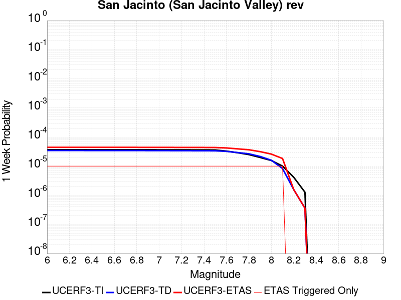 | 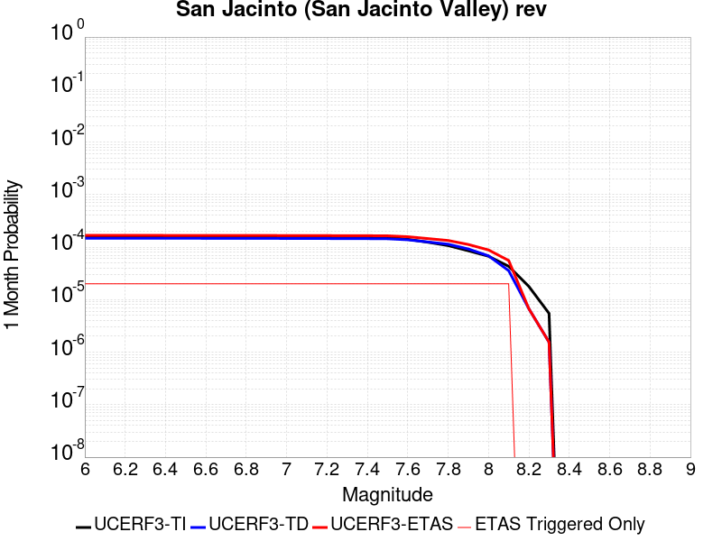 | 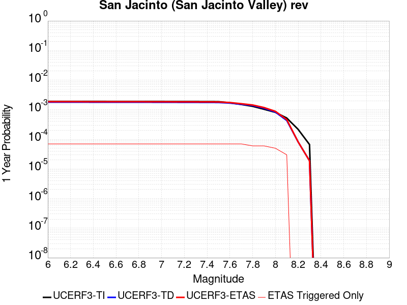 | 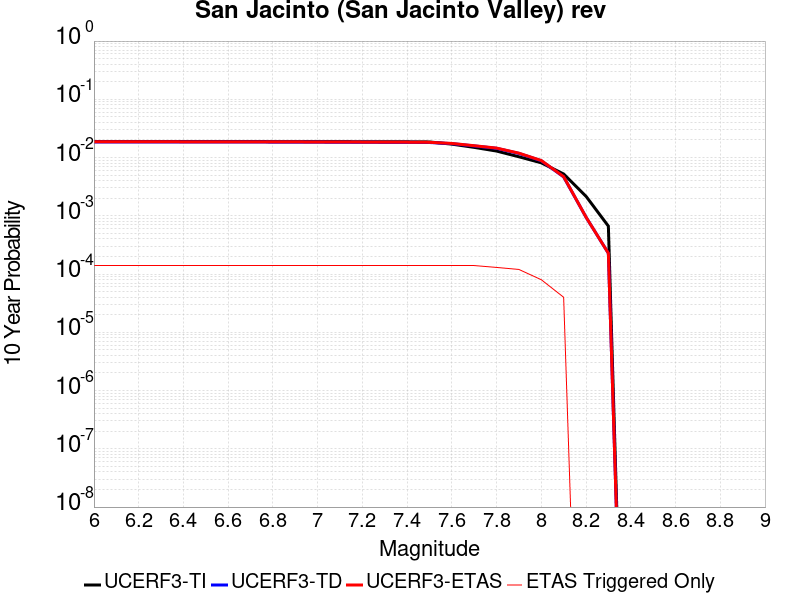 |

| Magnitude | 1 wk TI Prob | 1 wk TD Prob | 1 wk ETAS Prob | 1 wk ETAS/TD Gain | 1 wk ETAS Triggered Only | 1 mo TI Prob | 1 mo TD Prob | 1 mo ETAS Prob | 1 mo ETAS/TD Gain | 1 mo ETAS Triggered Only | 1 yr TI Prob | 1 yr TD Prob | 1 yr ETAS Prob | 1 yr ETAS/TD Gain | 1 yr ETAS Triggered Only | 10 yr TI Prob | 10 yr TD Prob | 10 yr ETAS Prob | 10 yr ETAS/TD Gain | 10 yr ETAS Triggered Only |
|-----|-----|-----|-----|-----|-----|-----|-----|-----|-----|-----|-----|-----|-----|-----|-----|-----|-----|-----|-----|-----|
| 6.0 | 3.652694E-5 | 3.4414687E-5 | 4.441434E-5 | 1.2905636 | 1.0E-5 | 1.5653463E-4 | 1.4748318E-4 | 1.6748023E-4 | 1.1355886 | 2.0E-5 | 0.0019041431 | 0.0017941303 | 0.0018640046 | 1.0389462 | 7.0E-5 | 0.018879099 | 0.018532937 | 0.018670343 | 1.0074141 | 1.4E-4 |
| 6.1 | 3.652694E-5 | 3.4414687E-5 | 4.441434E-5 | 1.2905636 | 1.0E-5 | 1.5653463E-4 | 1.4748318E-4 | 1.6748023E-4 | 1.1355886 | 2.0E-5 | 0.0019041431 | 0.0017941303 | 0.0018640046 | 1.0389462 | 7.0E-5 | 0.018879099 | 0.018532937 | 0.018670343 | 1.0074141 | 1.4E-4 |
| 6.2 | 3.652694E-5 | 3.4414687E-5 | 4.441434E-5 | 1.2905636 | 1.0E-5 | 1.5653463E-4 | 1.4748318E-4 | 1.6748023E-4 | 1.1355886 | 2.0E-5 | 0.0019041431 | 0.0017941303 | 0.0018640046 | 1.0389462 | 7.0E-5 | 0.018879099 | 0.018532937 | 0.018670343 | 1.0074141 | 1.4E-4 |
| 6.3 | 3.652694E-5 | 3.4414687E-5 | 4.441434E-5 | 1.2905636 | 1.0E-5 | 1.5653463E-4 | 1.4748318E-4 | 1.6748023E-4 | 1.1355886 | 2.0E-5 | 0.0019041431 | 0.0017941303 | 0.0018640046 | 1.0389462 | 7.0E-5 | 0.018879099 | 0.018532937 | 0.018670343 | 1.0074141 | 1.4E-4 |
| 6.4 | 3.646941E-5 | 3.433626E-5 | 4.4335917E-5 | 1.2912273 | 1.0E-5 | 1.5628811E-4 | 1.471471E-4 | 1.6714416E-4 | 1.1358984 | 2.0E-5 | 0.0019011468 | 0.0017900458 | 0.0018599204 | 1.0390352 | 7.0E-5 | 0.018849645 | 0.018492818 | 0.018630229 | 1.0074306 | 1.4E-4 |
| 6.5 | 3.646941E-5 | 3.433626E-5 | 4.4335917E-5 | 1.2912273 | 1.0E-5 | 1.5628811E-4 | 1.471471E-4 | 1.6714416E-4 | 1.1358984 | 2.0E-5 | 0.0019011468 | 0.0017900458 | 0.0018599204 | 1.0390352 | 7.0E-5 | 0.018849645 | 0.018492818 | 0.018630229 | 1.0074306 | 1.4E-4 |
| 6.6 | 3.6442503E-5 | 3.4299643E-5 | 4.42993E-5 | 1.2915382 | 1.0E-5 | 1.561728E-4 | 1.4699019E-4 | 1.6698726E-4 | 1.1360435 | 2.0E-5 | 0.0018997455 | 0.0017881385 | 0.0018580133 | 1.0390768 | 7.0E-5 | 0.018835869 | 0.018474085 | 0.0186115 | 1.0074382 | 1.4E-4 |
| 6.7 | 3.6432113E-5 | 3.4285214E-5 | 4.4284872E-5 | 1.2916609 | 1.0E-5 | 1.5612828E-4 | 1.4692836E-4 | 1.6692543E-4 | 1.1361008 | 2.0E-5 | 0.0018992044 | 0.0017873873 | 0.0018572622 | 1.0390933 | 7.0E-5 | 0.018830549 | 0.01846671 | 0.018604124 | 1.0074412 | 1.4E-4 |
| 6.8 | 3.6409598E-5 | 3.425427E-5 | 4.4253924E-5 | 1.2919245 | 1.0E-5 | 1.560318E-4 | 1.4679575E-4 | 1.6679282E-4 | 1.1362237 | 2.0E-5 | 0.0018980318 | 0.0017857754 | 0.0018556505 | 1.0391287 | 7.0E-5 | 0.018819023 | 0.018450864 | 0.01858828 | 1.0074477 | 1.4E-4 |
| 6.9 | 3.638078E-5 | 3.4214692E-5 | 4.421435E-5 | 1.2922621 | 1.0E-5 | 1.5590832E-4 | 1.4662616E-4 | 1.6662323E-4 | 1.1363813 | 2.0E-5 | 0.0018965311 | 0.0017837139 | 0.0018535891 | 1.039174 | 7.0E-5 | 0.018804269 | 0.018430596 | 0.018568017 | 1.0074561 | 1.4E-4 |
| 7.0 | 3.6294874E-5 | 3.40967E-5 | 4.409636E-5 | 1.2932736 | 1.0E-5 | 1.5554018E-4 | 1.4612054E-4 | 1.6611762E-4 | 1.1368533 | 2.0E-5 | 0.0018920569 | 0.0017775686 | 0.0018474442 | 1.0393096 | 7.0E-5 | 0.018760284 | 0.018370176 | 0.018507605 | 1.0074811 | 1.4E-4 |
| 7.1 | 3.6260717E-5 | 3.405298E-5 | 4.4052642E-5 | 1.29365 | 1.0E-5 | 1.5539382E-4 | 1.459332E-4 | 1.6593028E-4 | 1.137029 | 2.0E-5 | 0.001890278 | 0.0017752914 | 0.0018451671 | 1.0393602 | 7.0E-5 | 0.018742796 | 0.018347776 | 0.018485207 | 1.0074904 | 1.4E-4 |
| 7.2 | 3.6210204E-5 | 3.39872E-5 | 4.3986856E-5 | 1.2942184 | 1.0E-5 | 1.5517735E-4 | 1.456513E-4 | 1.656484E-4 | 1.1372943 | 2.0E-5 | 0.001887647 | 0.001771865 | 0.0018417409 | 1.0394363 | 7.0E-5 | 0.01871693 | 0.018314054 | 0.018451491 | 1.0075043 | 1.4E-4 |
| 7.3 | 3.6119454E-5 | 3.3875476E-5 | 4.3875138E-5 | 1.2951888 | 1.0E-5 | 1.5478847E-4 | 1.4517255E-4 | 1.6516965E-4 | 1.137747 | 2.0E-5 | 0.0018829206 | 0.0017660456 | 0.001835922 | 1.0395665 | 7.0E-5 | 0.018670462 | 0.018256607 | 0.01839405 | 1.0075284 | 1.4E-4 |
| 7.4 | 3.607848E-5 | 3.3822973E-5 | 4.3822638E-5 | 1.295647 | 1.0E-5 | 1.5461289E-4 | 1.4494757E-4 | 1.6494466E-4 | 1.1379609 | 2.0E-5 | 0.0018807866 | 0.0017633109 | 0.0018331874 | 1.039628 | 7.0E-5 | 0.018649481 | 0.0182296 | 0.018367046 | 1.0075399 | 1.4E-4 |
| 7.5 | 3.5856774E-5 | 3.363273E-5 | 4.3632393E-5 | 1.2973194 | 1.0E-5 | 1.5366284E-4 | 1.4413231E-4 | 1.6412944E-4 | 1.1387414 | 2.0E-5 | 0.0018692396 | 0.0017534011 | 0.0018232785 | 1.0398524 | 7.0E-5 | 0.018535944 | 0.018130688 | 0.018268151 | 1.0075817 | 1.4E-4 |
| 7.6 | 3.286655E-5 | 3.215546E-5 | 4.2155138E-5 | 1.3109791 | 1.0E-5 | 1.4084904E-4 | 1.3780185E-4 | 1.5779909E-4 | 1.145116 | 2.0E-5 | 0.001713488 | 0.0016764485 | 0.0017463311 | 1.041685 | 7.0E-5 | 0.017003361 | 0.017350236 | 0.017487807 | 1.0079291 | 1.4E-4 |
| 7.7 | 2.8882527E-5 | 2.9248054E-5 | 3.924776E-5 | 1.3418931 | 1.0E-5 | 1.237764E-4 | 1.2534279E-4 | 1.4534028E-4 | 1.1595424 | 2.0E-5 | 0.0015059357 | 0.0015249812 | 0.0015948744 | 1.0458322 | 7.0E-5 | 0.014957713 | 0.015836544 | 0.015974326 | 1.0087004 | 1.4E-4 |
| 7.8 | 2.4950225E-5 | 2.6538512E-5 | 3.6538248E-5 | 1.3768009 | 1.0E-5 | 1.0692515E-4 | 1.1373153E-4 | 1.3372925E-4 | 1.1758327 | 2.0E-5 | 0.0013010362 | 0.0013838026 | 0.0014437196 | 1.0432988 | 6.0E-5 | 0.012934455 | 0.014417614 | 0.01454574 | 1.0088867 | 1.3E-4 |
| 7.9 | 1.9881603E-5 | 2.1517568E-5 | 3.1517353E-5 | 1.4647266 | 1.0E-5 | 8.520408E-5 | 9.221489E-5 | 1.1221305E-4 | 1.2168647 | 2.0E-5 | 0.001036866 | 0.0011221388 | 0.0011820715 | 1.0534093 | 6.0E-5 | 0.010320415 | 0.011782293 | 0.011900879 | 1.0100647 | 1.2E-4 |
| 8.0 | 1.563292E-5 | 1.5945474E-5 | 2.5945315E-5 | 1.6271272 | 1.0E-5 | 6.6996516E-5 | 6.833596E-5 | 8.833459E-5 | 1.2926517 | 2.0E-5 | 8.153773E-4 | 8.3167345E-4 | 8.8163186E-4 | 1.0600698 | 5.0E-5 | 0.00812392 | 0.008814783 | 0.0088940775 | 1.0089957 | 8.0E-5 |
| 8.1 | 1.0045313E-5 | 8.306539E-6 | 1.8306455E-5 | 2.2038608 | 1.0E-5 | 4.305063E-5 | 3.559897E-5 | 5.5598255E-5 | 1.561794 | 2.0E-5 | 5.2401534E-4 | 4.3333176E-4 | 4.6331878E-4 | 1.069201 | 3.0E-5 | 0.0052278144 | 0.004661659 | 0.0047014724 | 1.0085406 | 4.0E-5 |
| 8.2 | 4.1554413E-6 | 1.5669531E-6 | 1.5669531E-6 | 1.0 | 0.0 | 1.7808914E-5 | 6.715496E-6 | 6.715496E-6 | 1.0 | 0.0 | 2.1680194E-4 | 8.1758124E-5 | 8.1758124E-5 | 1.0 | 0.0 | 0.0021659054 | 9.490854E-4 | 9.490854E-4 | 1.0 | 0.0 |
| 8.3 | 1.2758221E-6 | 3.618775E-7 | 3.618775E-7 | 1.0 | 0.0 | 5.4677976E-6 | 1.5509027E-6 | 1.5509027E-6 | 1.0 | 0.0 | 6.65684E-5 | 1.8882081E-5 | 1.8882081E-5 | 1.0 | 0.0 | 6.6548464E-4 | 2.2773506E-4 | 2.2773506E-4 | 1.0 | 0.0 |

## Ludlow
*[(top)](#table-of-contents)*

| 1 Week | 1 Month | 1 Year | 10 Year |
|-----|-----|-----|-----|
|  | 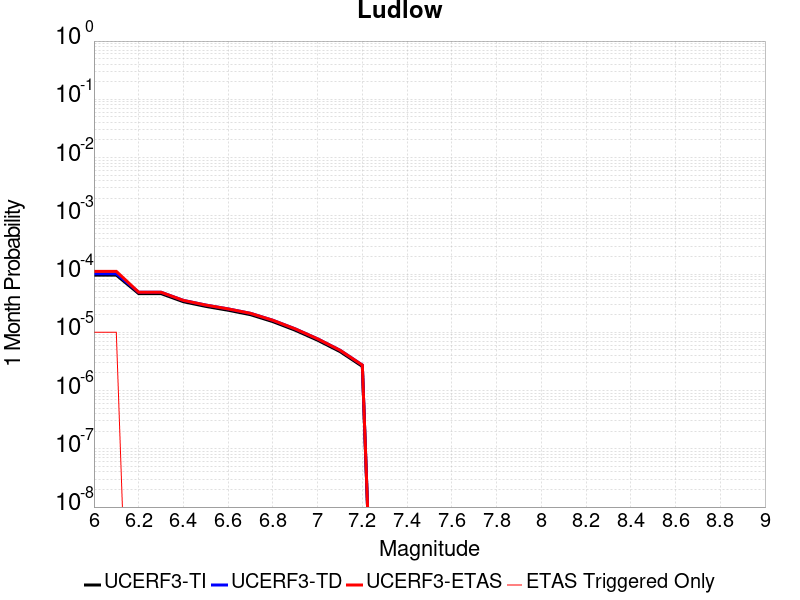 | 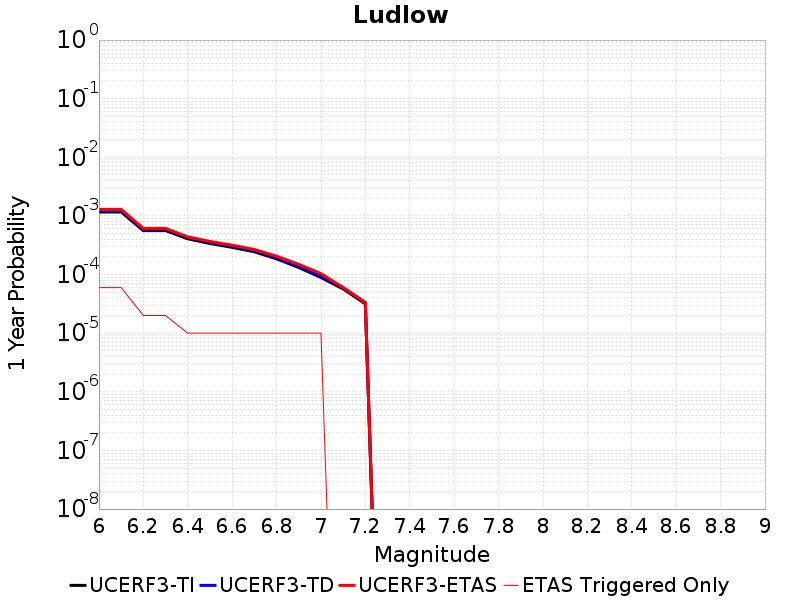 | 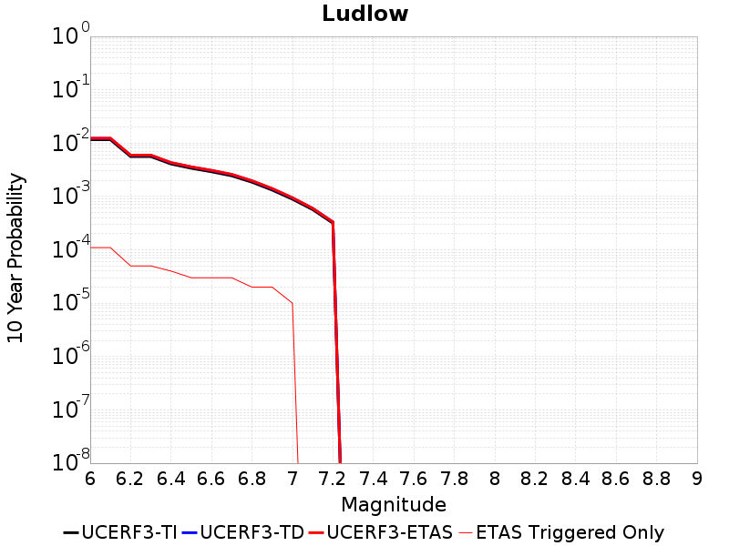 |

| Magnitude | 1 wk TI Prob | 1 wk TD Prob | 1 wk ETAS Prob | 1 wk ETAS/TD Gain | 1 wk ETAS Triggered Only | 1 mo TI Prob | 1 mo TD Prob | 1 mo ETAS Prob | 1 mo ETAS/TD Gain | 1 mo ETAS Triggered Only | 1 yr TI Prob | 1 yr TD Prob | 1 yr ETAS Prob | 1 yr ETAS/TD Gain | 1 yr ETAS Triggered Only | 10 yr TI Prob | 10 yr TD Prob | 10 yr ETAS Prob | 10 yr ETAS/TD Gain | 10 yr ETAS Triggered Only |
|-----|-----|-----|-----|-----|-----|-----|-----|-----|-----|-----|-----|-----|-----|-----|-----|-----|-----|-----|-----|-----|
| 6.0 | 2.2407607E-5 | 2.3657401E-5 | 3.3657165E-5 | 1.4226907 | 1.0E-5 | 9.602906E-5 | 1.0138517E-4 | 1.1138416E-4 | 1.0986238 | 1.0E-5 | 0.0011685267 | 0.0012337096 | 0.0012936356 | 1.0485739 | 6.0E-5 | 0.011624013 | 0.012273118 | 0.012381768 | 1.0088527 | 1.1E-4 |
| 6.1 | 2.2407607E-5 | 2.3657401E-5 | 3.3657165E-5 | 1.4226907 | 1.0E-5 | 9.602906E-5 | 1.0138517E-4 | 1.1138416E-4 | 1.0986238 | 1.0E-5 | 0.0011685267 | 0.0012337096 | 0.0012936356 | 1.0485739 | 6.0E-5 | 0.011624013 | 0.012273118 | 0.012381768 | 1.0088527 | 1.1E-4 |
| 6.2 | 1.0781252E-5 | 1.13657325E-5 | 1.13657325E-5 | 1.0 | 0.0 | 4.620455E-5 | 4.8709397E-5 | 4.8709397E-5 | 1.0 | 0.0 | 5.623952E-4 | 5.9287954E-4 | 6.128677E-4 | 1.0337137 | 2.0E-5 | 0.00560974 | 0.005913397 | 0.0059631015 | 1.0084053 | 5.0E-5 |
| 6.3 | 1.0781252E-5 | 1.13657325E-5 | 1.13657325E-5 | 1.0 | 0.0 | 4.620455E-5 | 4.8709397E-5 | 4.8709397E-5 | 1.0 | 0.0 | 5.623952E-4 | 5.9287954E-4 | 6.128677E-4 | 1.0337137 | 2.0E-5 | 0.00560974 | 0.005913397 | 0.0059631015 | 1.0084053 | 5.0E-5 |
| 6.4 | 7.814439E-6 | 8.237779E-6 | 8.237779E-6 | 1.0 | 0.0 | 3.3490025E-5 | 3.5304296E-5 | 3.5304296E-5 | 1.0 | 0.0 | 4.0766477E-4 | 4.2974643E-4 | 4.3974214E-4 | 1.0232595 | 1.0E-5 | 0.0040691774 | 0.0042893006 | 0.004329129 | 1.0092856 | 4.0E-5 |
| 6.5 | 6.4986366E-6 | 6.850961E-6 | 6.850961E-6 | 1.0 | 0.0 | 2.7851002E-5 | 2.9360937E-5 | 2.9360937E-5 | 1.0 | 0.0 | 3.390332E-4 | 3.5741169E-4 | 3.6740812E-4 | 1.0279689 | 1.0E-5 | 0.003385164 | 0.003568465 | 0.0035983578 | 1.008377 | 3.0E-5 |
| 6.6 | 5.582177E-6 | 5.8860414E-6 | 5.8860414E-6 | 1.0 | 0.0 | 2.3923398E-5 | 2.5225652E-5 | 2.5225652E-5 | 1.0 | 0.0 | 2.9122844E-4 | 3.0707975E-4 | 3.170767E-4 | 1.0325549 | 1.0E-5 | 0.0029084706 | 0.0030666275 | 0.0030965356 | 1.0097528 | 3.0E-5 |
| 6.7 | 4.6858763E-6 | 4.940457E-6 | 4.940457E-6 | 1.0 | 0.0 | 2.0082172E-5 | 2.117322E-5 | 2.117322E-5 | 1.0 | 0.0 | 2.4447302E-4 | 2.57754E-4 | 2.6775143E-4 | 1.0387866 | 1.0E-5 | 0.0024420423 | 0.002574607 | 0.0026045297 | 1.0116223 | 3.0E-5 |
| 6.8 | 3.5584908E-6 | 3.7520413E-6 | 3.7520413E-6 | 1.0 | 0.0 | 1.5250586E-5 | 1.608008E-5 | 1.608008E-5 | 1.0 | 0.0 | 1.8566006E-4 | 1.9575779E-4 | 2.0575583E-4 | 1.0510736 | 1.0E-5 | 0.0018550502 | 0.0019558945 | 0.0019758556 | 1.0102055 | 2.0E-5 |
| 6.9 | 2.532834E-6 | 2.6710197E-6 | 2.6710197E-6 | 1.0 | 0.0 | 1.0854958E-5 | 1.1447179E-5 | 1.1447179E-5 | 1.0 | 0.0 | 1.3215111E-4 | 1.3936077E-4 | 1.4935937E-4 | 1.0717462 | 1.0E-5 | 0.0013207254 | 0.0013927614 | 0.0014127335 | 1.0143399 | 2.0E-5 |
| 7.0 | 1.7083285E-6 | 1.8019549E-6 | 1.8019549E-6 | 1.0 | 0.0 | 7.3213873E-6 | 7.722642E-6 | 7.722642E-6 | 1.0 | 0.0 | 8.913424E-5 | 9.401928E-5 | 1.04018334E-4 | 1.1063511 | 1.0E-5 | 8.9098496E-4 | 9.398115E-4 | 9.498021E-4 | 1.0106305 | 1.0E-5 |
| 7.1 | 1.0905424E-6 | 1.149769E-6 | 1.149769E-6 | 1.0 | 0.0 | 4.6737446E-6 | 4.9275727E-6 | 4.9275727E-6 | 1.0 | 0.0 | 5.6901354E-5 | 5.9991642E-5 | 5.9991642E-5 | 1.0 | 0.0 | 5.6886784E-4 | 5.997643E-4 | 5.997643E-4 | 1.0 | 0.0 |
| 7.2 | 6.06668E-7 | 6.3873154E-7 | 6.3873154E-7 | 1.0 | 0.0 | 2.600003E-6 | 2.7374183E-6 | 2.7374183E-6 | 1.0 | 0.0 | 3.1654577E-5 | 3.332763E-5 | 3.332763E-5 | 1.0 | 0.0 | 3.1650066E-4 | 3.3323315E-4 | 3.3323315E-4 | 1.0 | 0.0 |

## Lost Hills
*[(top)](#table-of-contents)*

| 1 Week | 1 Month | 1 Year | 10 Year |
|-----|-----|-----|-----|
|  | 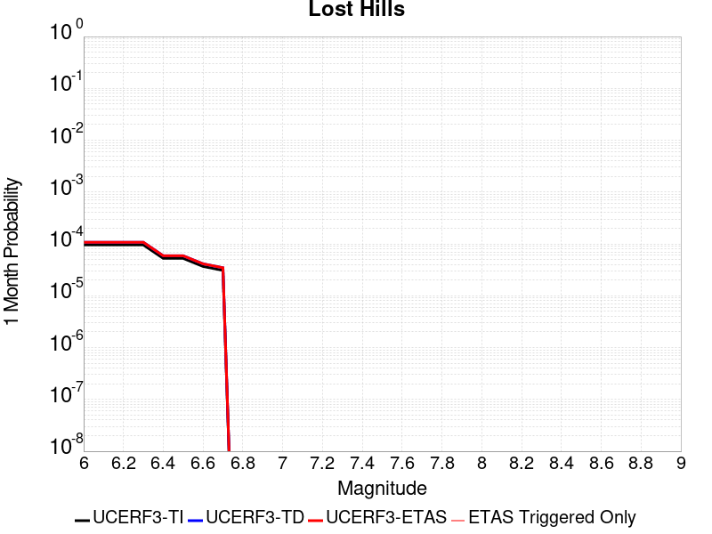 | 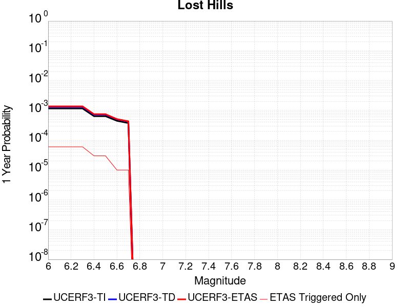 | 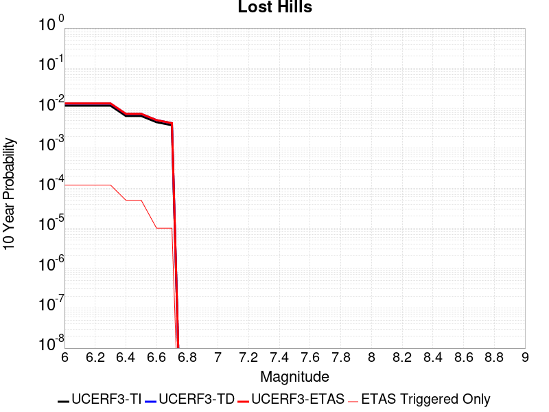 |

| Magnitude | 1 wk TI Prob | 1 wk TD Prob | 1 wk ETAS Prob | 1 wk ETAS/TD Gain | 1 wk ETAS Triggered Only | 1 mo TI Prob | 1 mo TD Prob | 1 mo ETAS Prob | 1 mo ETAS/TD Gain | 1 mo ETAS Triggered Only | 1 yr TI Prob | 1 yr TD Prob | 1 yr ETAS Prob | 1 yr ETAS/TD Gain | 1 yr ETAS Triggered Only | 10 yr TI Prob | 10 yr TD Prob | 10 yr ETAS Prob | 10 yr ETAS/TD Gain | 10 yr ETAS Triggered Only |
|-----|-----|-----|-----|-----|-----|-----|-----|-----|-----|-----|-----|-----|-----|-----|-----|-----|-----|-----|-----|-----|
| 6.0 | 2.233523E-5 | 2.510693E-5 | 2.510693E-5 | 1.0 | 0.0 | 9.571891E-5 | 1.0759764E-4 | 1.0759764E-4 | 1.0 | 0.0 | 0.0011647546 | 0.0013093821 | 0.0013693037 | 1.0457631 | 6.0E-5 | 0.011586686 | 0.013033271 | 0.013151707 | 1.0090872 | 1.2E-4 |
| 6.1 | 2.233523E-5 | 2.510693E-5 | 2.510693E-5 | 1.0 | 0.0 | 9.571891E-5 | 1.0759764E-4 | 1.0759764E-4 | 1.0 | 0.0 | 0.0011647546 | 0.0013093821 | 0.0013693037 | 1.0457631 | 6.0E-5 | 0.011586686 | 0.013033271 | 0.013151707 | 1.0090872 | 1.2E-4 |
| 6.2 | 2.233523E-5 | 2.510693E-5 | 2.510693E-5 | 1.0 | 0.0 | 9.571891E-5 | 1.0759764E-4 | 1.0759764E-4 | 1.0 | 0.0 | 0.0011647546 | 0.0013093821 | 0.0013693037 | 1.0457631 | 6.0E-5 | 0.011586686 | 0.013033271 | 0.013151707 | 1.0090872 | 1.2E-4 |
| 6.3 | 2.233523E-5 | 2.510693E-5 | 2.510693E-5 | 1.0 | 0.0 | 9.571891E-5 | 1.0759764E-4 | 1.0759764E-4 | 1.0 | 0.0 | 0.0011647546 | 0.0013093821 | 0.0013693037 | 1.0457631 | 6.0E-5 | 0.011586686 | 0.013033271 | 0.013151707 | 1.0090872 | 1.2E-4 |
| 6.4 | 1.2288092E-5 | 1.3781295E-5 | 1.3781295E-5 | 1.0 | 0.0 | 5.2662188E-5 | 5.9061884E-5 | 5.9061884E-5 | 1.0 | 0.0 | 6.409735E-4 | 7.18935E-4 | 7.4891344E-4 | 1.0416983 | 3.0E-5 | 0.006391279 | 0.007175298 | 0.0072249393 | 1.0069183 | 5.0E-5 |
| 6.5 | 1.2288092E-5 | 1.3781295E-5 | 1.3781295E-5 | 1.0 | 0.0 | 5.2662188E-5 | 5.9061884E-5 | 5.9061884E-5 | 1.0 | 0.0 | 6.409735E-4 | 7.18935E-4 | 7.4891344E-4 | 1.0416983 | 3.0E-5 | 0.006391279 | 0.007175298 | 0.0072249393 | 1.0069183 | 5.0E-5 |
| 6.6 | 8.58281E-6 | 9.633902E-6 | 9.633902E-6 | 1.0 | 0.0 | 3.6782953E-5 | 4.1287967E-5 | 4.1287967E-5 | 1.0 | 0.0 | 4.4774043E-4 | 5.0264824E-4 | 5.1264325E-4 | 1.0198846 | 1.0E-5 | 0.0044683935 | 0.0050232736 | 0.0050332234 | 1.0019808 | 1.0E-5 |
| 6.7 | 7.205685E-6 | 8.088413E-6 | 8.088413E-6 | 1.0 | 0.0 | 3.088114E-5 | 3.4664627E-5 | 3.4664627E-5 | 1.0 | 0.0 | 3.7591302E-4 | 4.220418E-4 | 4.320376E-4 | 1.0236844 | 1.0E-5 | 0.0037527776 | 0.004220418 | 0.004230376 | 1.0023594 | 1.0E-5 |

## Mission Ridge-Arroyo Parida-Santa Ana
*[(top)](#table-of-contents)*

| 1 Week | 1 Month | 1 Year | 10 Year |
|-----|-----|-----|-----|
| 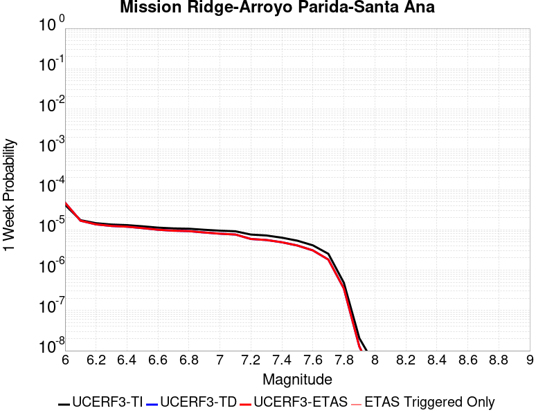 | 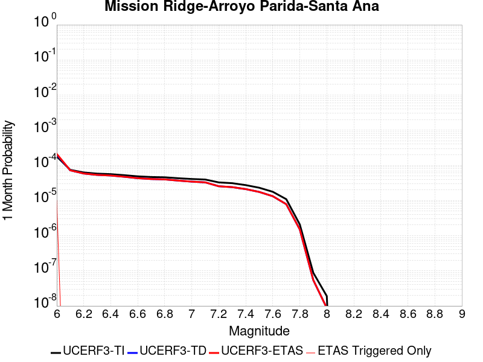 | 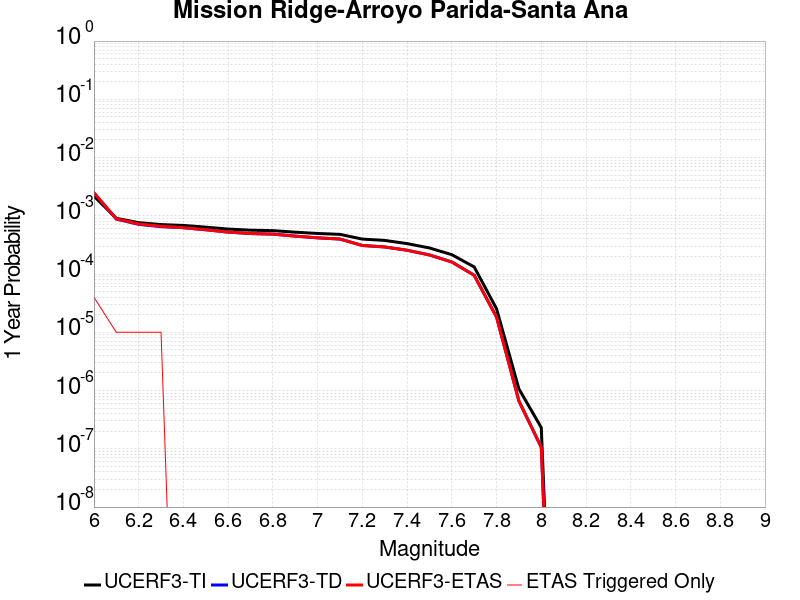 | 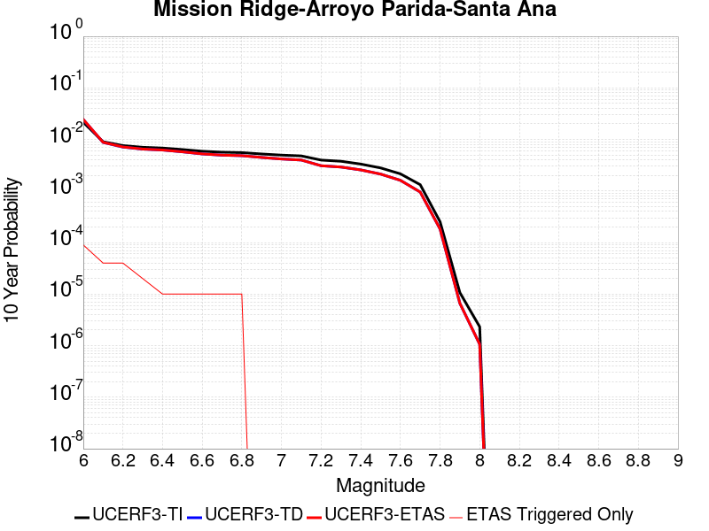 |

| Magnitude | 1 wk TI Prob | 1 wk TD Prob | 1 wk ETAS Prob | 1 wk ETAS/TD Gain | 1 wk ETAS Triggered Only | 1 mo TI Prob | 1 mo TD Prob | 1 mo ETAS Prob | 1 mo ETAS/TD Gain | 1 mo ETAS Triggered Only | 1 yr TI Prob | 1 yr TD Prob | 1 yr ETAS Prob | 1 yr ETAS/TD Gain | 1 yr ETAS Triggered Only | 10 yr TI Prob | 10 yr TD Prob | 10 yr ETAS Prob | 10 yr ETAS/TD Gain | 10 yr ETAS Triggered Only |
|-----|-----|-----|-----|-----|-----|-----|-----|-----|-----|-----|-----|-----|-----|-----|-----|-----|-----|-----|-----|-----|
| 6.0 | 4.169034E-5 | 4.7139354E-5 | 4.7139354E-5 | 1.0 | 0.0 | 1.7866064E-4 | 2.0201503E-4 | 2.1201301E-4 | 1.0494913 | 1.0E-5 | 0.0021730233 | 0.0024575035 | 0.0024974053 | 1.0162367 | 4.0E-5 | 0.021518968 | 0.024385164 | 0.02447297 | 1.0036007 | 9.0E-5 |
| 6.1 | 1.73813E-5 | 1.6854467E-5 | 1.6854467E-5 | 1.0 | 0.0 | 7.4489166E-5 | 7.2231494E-5 | 7.2231494E-5 | 1.0 | 0.0 | 9.065282E-4 | 8.790744E-4 | 8.890656E-4 | 1.0113657 | 1.0E-5 | 0.009028391 | 0.008757113 | 0.008796763 | 1.0045277 | 4.0E-5 |
| 6.2 | 1.4622182E-5 | 1.3673475E-5 | 1.3673475E-5 | 1.0 | 0.0 | 6.2664985E-5 | 5.8599315E-5 | 5.8599315E-5 | 1.0 | 0.0 | 7.6267915E-4 | 7.13217E-4 | 7.232099E-4 | 1.014011 | 1.0E-5 | 0.007600669 | 0.0071097235 | 0.0071494393 | 1.0055861 | 4.0E-5 |
| 6.3 | 1.3552434E-5 | 1.2482371E-5 | 1.2482371E-5 | 1.0 | 0.0 | 5.8080568E-5 | 5.3494798E-5 | 5.3494798E-5 | 1.0 | 0.0 | 7.069015E-4 | 6.511077E-4 | 6.611012E-4 | 1.0153484 | 1.0E-5 | 0.00704657 | 0.0064923633 | 0.0065122335 | 1.0030606 | 2.0E-5 |
| 6.4 | 1.30977305E-5 | 1.197932E-5 | 1.197932E-5 | 1.0 | 0.0 | 5.613192E-5 | 5.1338953E-5 | 5.1338953E-5 | 1.0 | 0.0 | 6.831918E-4 | 6.248755E-4 | 6.248755E-4 | 1.0 | 0.0 | 0.006810953 | 0.0062315296 | 0.0062414673 | 1.0015948 | 1.0E-5 |
| 6.5 | 1.225205E-5 | 1.1048957E-5 | 1.1048957E-5 | 1.0 | 0.0 | 5.2507727E-5 | 4.735183E-5 | 4.735183E-5 | 1.0 | 0.0 | 6.3909404E-4 | 5.763587E-4 | 5.763587E-4 | 1.0 | 0.0 | 0.006372592 | 0.005748949 | 0.0057588913 | 1.0017295 | 1.0E-5 |
| 6.6 | 1.1352241E-5 | 1.0063679E-5 | 1.0063679E-5 | 1.0 | 0.0 | 4.8651553E-5 | 4.312935E-5 | 4.312935E-5 | 1.0 | 0.0 | 5.921717E-4 | 5.249754E-4 | 5.249754E-4 | 1.0 | 0.0 | 0.0059059616 | 0.005237599 | 0.0052475464 | 1.0018992 | 1.0E-5 |
| 6.7 | 1.0864116E-5 | 9.517164E-6 | 9.517164E-6 | 1.0 | 0.0 | 4.6559664E-5 | 4.0787214E-5 | 4.0787214E-5 | 1.0 | 0.0 | 5.667165E-4 | 4.964732E-4 | 4.964732E-4 | 1.0 | 0.0 | 0.005652734 | 0.0049538743 | 0.004963825 | 1.0020087 | 1.0E-5 |
| 6.8 | 1.0666365E-5 | 9.299913E-6 | 9.299913E-6 | 1.0 | 0.0 | 4.571219E-5 | 3.985617E-5 | 3.985617E-5 | 1.0 | 0.0 | 5.564038E-4 | 4.8514284E-4 | 4.8514284E-4 | 1.0 | 0.0 | 0.005550127 | 0.0048410697 | 0.0048510213 | 1.0020556 | 1.0E-5 |
| 6.9 | 1.0038665E-5 | 8.592169E-6 | 8.592169E-6 | 1.0 | 0.0 | 4.302214E-5 | 3.6823072E-5 | 3.6823072E-5 | 1.0 | 0.0 | 5.236687E-4 | 4.4823048E-4 | 4.4823048E-4 | 1.0 | 0.0 | 0.005224364 | 0.0044734753 | 0.0044734753 | 1.0 | 0.0 |
| 7.0 | 9.5379955E-6 | 8.0251875E-6 | 8.0251875E-6 | 1.0 | 0.0 | 4.0876483E-5 | 3.439322E-5 | 3.439322E-5 | 1.0 | 0.0 | 4.975576E-4 | 4.186587E-4 | 4.186587E-4 | 1.0 | 0.0 | 0.00496445 | 0.0041788993 | 0.0041788993 | 1.0 | 0.0 |
| 7.1 | 9.207389E-6 | 7.652484E-6 | 7.652484E-6 | 1.0 | 0.0 | 3.945964E-5 | 3.2795957E-5 | 3.2795957E-5 | 1.0 | 0.0 | 4.803152E-4 | 3.992193E-4 | 3.992193E-4 | 1.0 | 0.0 | 0.004792784 | 0.003985218 | 0.003985218 | 1.0 | 0.0 |
| 7.2 | 7.638091E-6 | 5.931196E-6 | 5.931196E-6 | 1.0 | 0.0 | 3.2734264E-5 | 2.5419165E-5 | 2.5419165E-5 | 1.0 | 0.0 | 3.984668E-4 | 3.094347E-4 | 3.094347E-4 | 1.0 | 0.0 | 0.0039775306 | 0.0030900952 | 0.0030900952 | 1.0 | 0.0 |
| 7.3 | 7.2500147E-6 | 5.5962246E-6 | 5.5962246E-6 | 1.0 | 0.0 | 3.1071122E-5 | 2.39836E-5 | 2.39836E-5 | 1.0 | 0.0 | 3.7822526E-4 | 2.9196154E-4 | 2.9196154E-4 | 1.0 | 0.0 | 0.0037758215 | 0.002915835 | 0.002915835 | 1.0 | 0.0 |
| 7.4 | 6.3899715E-6 | 4.918556E-6 | 4.918556E-6 | 1.0 | 0.0 | 2.7385306E-5 | 2.1079357E-5 | 2.1079357E-5 | 1.0 | 0.0 | 3.3336508E-4 | 2.5661115E-4 | 2.5661115E-4 | 1.0 | 0.0 | 0.0033286542 | 0.0025631927 | 0.0025631927 | 1.0 | 0.0 |
| 7.5 | 5.379025E-6 | 4.0839004E-6 | 4.0839004E-6 | 1.0 | 0.0 | 2.305276E-5 | 1.7502312E-5 | 1.7502312E-5 | 1.0 | 0.0 | 2.806312E-4 | 2.1306993E-4 | 2.1306993E-4 | 1.0 | 0.0 | 0.0028027708 | 0.0021286677 | 0.0021286677 | 1.0 | 0.0 |
| 7.6 | 4.1270696E-6 | 3.0883784E-6 | 3.0883784E-6 | 1.0 | 0.0 | 1.768732E-5 | 1.3235841E-5 | 1.3235841E-5 | 1.0 | 0.0 | 2.1532185E-4 | 1.6113452E-4 | 1.6113452E-4 | 1.0 | 0.0 | 0.0021511333 | 0.001610185 | 0.001610185 | 1.0 | 0.0 |
| 7.7 | 2.5406805E-6 | 1.8282221E-6 | 1.8282221E-6 | 1.0 | 0.0 | 1.0888585E-5 | 7.835215E-6 | 7.835215E-6 | 1.0 | 0.0 | 1.3256045E-4 | 9.538962E-5 | 9.538962E-5 | 1.0 | 0.0 | 0.0013248142 | 9.53493E-4 | 9.53493E-4 | 1.0 | 0.0 |
| 7.8 | 4.8608285E-7 | 3.5099228E-7 | 3.5099228E-7 | 1.0 | 0.0 | 2.0832106E-6 | 1.5042518E-6 | 1.5042518E-6 | 1.0 | 0.0 | 2.5362791E-5 | 1.8314113E-5 | 1.8314113E-5 | 1.0 | 0.0 | 2.5359896E-4 | 1.8312616E-4 | 1.8312616E-4 | 1.0 | 0.0 |
| 7.9 | 2.0472514E-8 | 1.26890445E-8 | 1.26890445E-8 | 1.0 | 0.0 | 8.7739345E-8 | 5.438162E-8 | 5.438162E-8 | 1.0 | 0.0 | 1.068226E-6 | 6.62096E-7 | 6.62096E-7 | 1.0 | 0.0 | 1.0682209E-5 | 6.620942E-6 | 6.620942E-6 | 1.0 | 0.0 |
| 8.0 | 4.443582E-9 | 2.0322388E-9 | 2.0322388E-9 | 1.0 | 0.0 | 1.9043922E-8 | 8.709596E-9 | 8.709596E-9 | 1.0 | 0.0 | 2.3185973E-7 | 1.0603932E-7 | 1.0603932E-7 | 1.0 | 0.0 | 2.3185949E-6 | 1.0603928E-6 | 1.0603928E-6 | 1.0 | 0.0 |

## San Jacinto (Stepovers Combined)
*[(top)](#table-of-contents)*

| 1 Week | 1 Month | 1 Year | 10 Year |
|-----|-----|-----|-----|
| 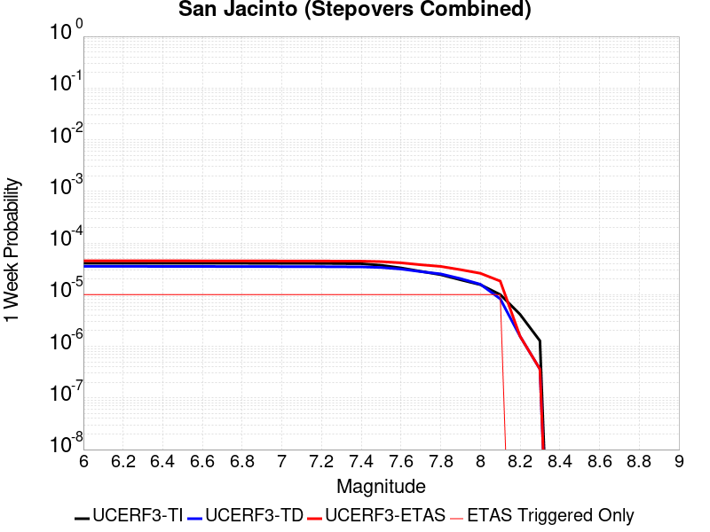 | 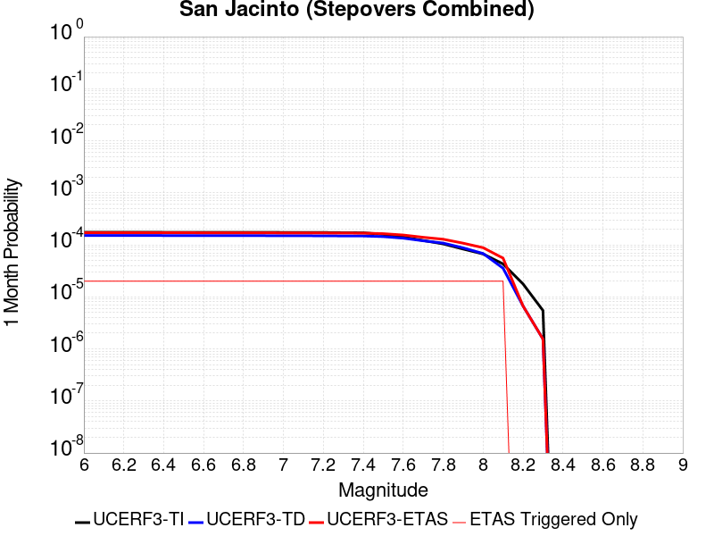 | 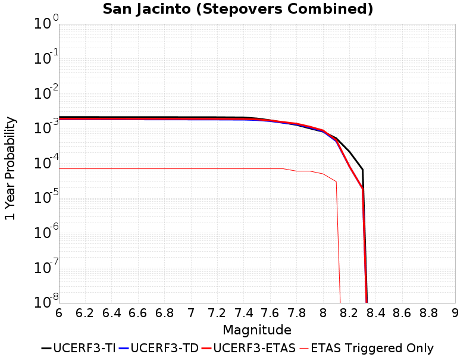 | 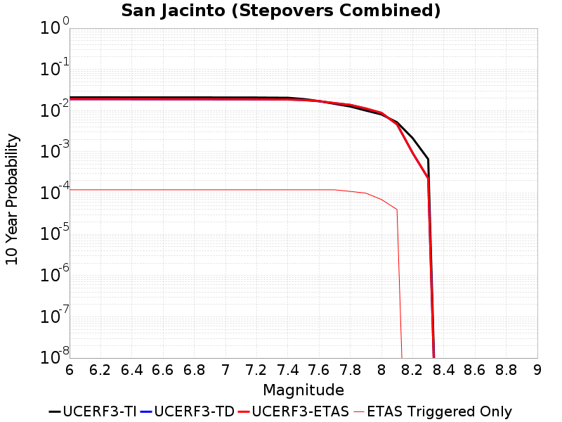 |

| Magnitude | 1 wk TI Prob | 1 wk TD Prob | 1 wk ETAS Prob | 1 wk ETAS/TD Gain | 1 wk ETAS Triggered Only | 1 mo TI Prob | 1 mo TD Prob | 1 mo ETAS Prob | 1 mo ETAS/TD Gain | 1 mo ETAS Triggered Only | 1 yr TI Prob | 1 yr TD Prob | 1 yr ETAS Prob | 1 yr ETAS/TD Gain | 1 yr ETAS Triggered Only | 10 yr TI Prob | 10 yr TD Prob | 10 yr ETAS Prob | 10 yr ETAS/TD Gain | 10 yr ETAS Triggered Only |
|-----|-----|-----|-----|-----|-----|-----|-----|-----|-----|-----|-----|-----|-----|-----|-----|-----|-----|-----|-----|-----|
| 6.0 | 4.0667746E-5 | 3.528487E-5 | 4.5284516E-5 | 1.2833976 | 1.0E-5 | 1.742787E-4 | 1.5121211E-4 | 1.7120909E-4 | 1.1322446 | 2.0E-5 | 0.0021197782 | 0.0018394535 | 0.0019093247 | 1.0379847 | 7.0E-5 | 0.020996714 | 0.018993158 | 0.019110879 | 1.006198 | 1.2E-4 |
| 6.1 | 4.0667746E-5 | 3.528487E-5 | 4.5284516E-5 | 1.2833976 | 1.0E-5 | 1.742787E-4 | 1.5121211E-4 | 1.7120909E-4 | 1.1322446 | 2.0E-5 | 0.0021197782 | 0.0018394535 | 0.0019093247 | 1.0379847 | 7.0E-5 | 0.020996714 | 0.018993158 | 0.019110879 | 1.006198 | 1.2E-4 |
| 6.2 | 4.0667746E-5 | 3.528487E-5 | 4.5284516E-5 | 1.2833976 | 1.0E-5 | 1.742787E-4 | 1.5121211E-4 | 1.7120909E-4 | 1.1322446 | 2.0E-5 | 0.0021197782 | 0.0018394535 | 0.0019093247 | 1.0379847 | 7.0E-5 | 0.020996714 | 0.018993158 | 0.019110879 | 1.006198 | 1.2E-4 |
| 6.3 | 4.0667746E-5 | 3.528487E-5 | 4.5284516E-5 | 1.2833976 | 1.0E-5 | 1.742787E-4 | 1.5121211E-4 | 1.7120909E-4 | 1.1322446 | 2.0E-5 | 0.0021197782 | 0.0018394535 | 0.0019093247 | 1.0379847 | 7.0E-5 | 0.020996714 | 0.018993158 | 0.019110879 | 1.006198 | 1.2E-4 |
| 6.4 | 4.0577226E-5 | 3.515676E-5 | 4.515641E-5 | 1.2844303 | 1.0E-5 | 1.738908E-4 | 1.5066314E-4 | 1.7066013E-4 | 1.1327264 | 2.0E-5 | 0.0021150648 | 0.0018327828 | 0.0019026545 | 1.0381233 | 7.0E-5 | 0.020950472 | 0.018927723 | 0.019045452 | 1.0062199 | 1.2E-4 |
| 6.5 | 4.0577226E-5 | 3.515676E-5 | 4.515641E-5 | 1.2844303 | 1.0E-5 | 1.738908E-4 | 1.5066314E-4 | 1.7066013E-4 | 1.1327264 | 2.0E-5 | 0.0021150648 | 0.0018327828 | 0.0019026545 | 1.0381233 | 7.0E-5 | 0.020950472 | 0.018927723 | 0.019045452 | 1.0062199 | 1.2E-4 |
| 6.6 | 4.053861E-5 | 3.5102104E-5 | 4.5101755E-5 | 1.2848732 | 1.0E-5 | 1.7372532E-4 | 1.5042892E-4 | 1.7042592E-4 | 1.1329331 | 2.0E-5 | 0.0021130538 | 0.001829936 | 0.001899808 | 1.0381827 | 7.0E-5 | 0.020930743 | 0.0188998 | 0.019017532 | 1.0062293 | 1.2E-4 |
| 6.7 | 4.0516545E-5 | 3.507117E-5 | 4.507082E-5 | 1.2851244 | 1.0E-5 | 1.7363077E-4 | 1.5029637E-4 | 1.7029337E-4 | 1.1330504 | 2.0E-5 | 0.002111905 | 0.0018283253 | 0.0018981973 | 1.0382164 | 7.0E-5 | 0.020919468 | 0.018883998 | 0.019001732 | 1.0062346 | 1.2E-4 |
| 6.8 | 4.049434E-5 | 3.5042733E-5 | 4.504238E-5 | 1.2853559 | 1.0E-5 | 1.7353562E-4 | 1.501745E-4 | 1.701715E-4 | 1.1331584 | 2.0E-5 | 0.0021107488 | 0.0018268441 | 0.0018967162 | 1.0382475 | 7.0E-5 | 0.020908125 | 0.01886941 | 0.018987145 | 1.0062395 | 1.2E-4 |
| 6.9 | 4.046386E-5 | 3.500529E-5 | 4.500494E-5 | 1.2856611 | 1.0E-5 | 1.73405E-4 | 1.5001406E-4 | 1.7001106E-4 | 1.1333008 | 2.0E-5 | 0.0021091616 | 0.001824894 | 0.0018947662 | 1.0382884 | 7.0E-5 | 0.020892553 | 0.018850181 | 0.018967919 | 1.006246 | 1.2E-4 |
| 7.0 | 4.036382E-5 | 3.4885852E-5 | 4.4885503E-5 | 1.2866392 | 1.0E-5 | 1.7297632E-4 | 1.4950224E-4 | 1.6949925E-4 | 1.1337572 | 2.0E-5 | 0.0021039525 | 0.0018186735 | 0.0018885462 | 1.0384196 | 7.0E-5 | 0.02084144 | 0.018788794 | 0.01890654 | 1.0062668 | 1.2E-4 |
| 7.1 | 4.0343282E-5 | 3.486431E-5 | 4.4863966E-5 | 1.2868162 | 1.0E-5 | 1.7288832E-4 | 1.4940994E-4 | 1.6940695E-4 | 1.1338398 | 2.0E-5 | 0.002102883 | 0.0018175517 | 0.0018874244 | 1.0384433 | 7.0E-5 | 0.020830948 | 0.01877767 | 0.018895417 | 1.0062705 | 1.2E-4 |
| 7.2 | 4.0257353E-5 | 3.4768807E-5 | 4.476846E-5 | 1.2876041 | 1.0E-5 | 1.725201E-4 | 1.4900068E-4 | 1.689977E-4 | 1.1342076 | 2.0E-5 | 0.0020984085 | 0.0018125772 | 0.0018824503 | 1.0385491 | 7.0E-5 | 0.020787042 | 0.018728407 | 0.01884616 | 1.0062873 | 1.2E-4 |
| 7.3 | 3.9940667E-5 | 3.4596436E-5 | 4.459609E-5 | 1.2890371 | 1.0E-5 | 1.7116306E-4 | 1.4826203E-4 | 1.6825907E-4 | 1.1348763 | 2.0E-5 | 0.0020819185 | 0.001803599 | 0.0018734727 | 1.0387412 | 7.0E-5 | 0.020625217 | 0.018637024 | 0.018754788 | 1.0063188 | 1.2E-4 |
| 7.4 | 3.9721202E-5 | 3.4481804E-5 | 4.4481458E-5 | 1.289998 | 1.0E-5 | 1.7022261E-4 | 1.477708E-4 | 1.6776785E-4 | 1.1353247 | 2.0E-5 | 0.0020704903 | 0.0017976281 | 0.0018675023 | 1.0388702 | 7.0E-5 | 0.020513052 | 0.018576136 | 0.018693907 | 1.0063399 | 1.2E-4 |
| 7.5 | 3.7036873E-5 | 3.354901E-5 | 4.3548676E-5 | 1.2980614 | 1.0E-5 | 1.5871979E-4 | 1.4377358E-4 | 1.637707E-4 | 1.1390877 | 2.0E-5 | 0.0019307006 | 0.0017490408 | 0.0018189184 | 1.0399519 | 7.0E-5 | 0.019140124 | 0.018077586 | 0.018195417 | 1.006518 | 1.2E-4 |
| 7.6 | 3.2940967E-5 | 3.132951E-5 | 4.1329196E-5 | 1.3191779 | 1.0E-5 | 1.4116794E-4 | 1.3426243E-4 | 1.5425975E-4 | 1.148942 | 2.0E-5 | 0.0017173645 | 0.0016334216 | 0.0017033073 | 1.0427848 | 7.0E-5 | 0.01704153 | 0.016910324 | 0.017028295 | 1.0069762 | 1.2E-4 |
| 7.7 | 2.8236149E-5 | 2.7895112E-5 | 3.789483E-5 | 1.3584758 | 1.0E-5 | 1.2100645E-4 | 1.19545E-4 | 1.3954261E-4 | 1.167281 | 2.0E-5 | 0.0014722579 | 0.0014544898 | 0.001524388 | 1.0480568 | 7.0E-5 | 0.014625421 | 0.015120921 | 0.0152391065 | 1.0078161 | 1.2E-4 |
| 7.8 | 2.4329287E-5 | 2.5218313E-5 | 3.521806E-5 | 1.3965273 | 1.0E-5 | 1.042642E-4 | 1.0807401E-4 | 1.2807184E-4 | 1.1850383 | 2.0E-5 | 0.0012686774 | 0.0013150077 | 0.0013749289 | 1.0455672 | 6.0E-5 | 0.012614589 | 0.013718 | 0.01382649 | 1.0079087 | 1.1E-4 |
| 7.9 | 1.9370926E-5 | 2.0431127E-5 | 3.0430923E-5 | 1.4894392 | 1.0E-5 | 8.301561E-5 | 8.7559034E-5 | 1.0755729E-4 | 1.2283974 | 2.0E-5 | 0.0010102465 | 0.0010655107 | 0.0011254468 | 1.056251 | 6.0E-5 | 0.0100566605 | 0.011204533 | 0.011303413 | 1.008825 | 1.0E-4 |
| 8.0 | 1.5583017E-5 | 1.5894564E-5 | 2.5894406E-5 | 1.629136 | 1.0E-5 | 6.6782646E-5 | 6.8117784E-5 | 8.811642E-5 | 1.2935891 | 2.0E-5 | 8.127754E-4 | 8.290191E-4 | 8.789777E-4 | 1.0602622 | 5.0E-5 | 0.008098091 | 0.008786069 | 0.008855454 | 1.0078971 | 7.0E-5 |
| 8.1 | 1.0024873E-5 | 8.297131E-6 | 1.8297049E-5 | 2.205226 | 1.0E-5 | 4.2963035E-5 | 3.5558653E-5 | 5.555794E-5 | 1.562431 | 2.0E-5 | 5.229494E-4 | 4.328411E-4 | 4.6282812E-4 | 1.0692796 | 3.0E-5 | 0.0052172043 | 0.0046559502 | 0.0046957643 | 1.0085511 | 4.0E-5 |
| 8.2 | 4.142796E-6 | 1.5623924E-6 | 1.5623924E-6 | 1.0 | 0.0 | 1.775472E-5 | 6.6959506E-6 | 6.6959506E-6 | 1.0 | 0.0 | 2.1614227E-4 | 8.152017E-5 | 8.152017E-5 | 1.0 | 0.0 | 0.0021593217 | 9.462572E-4 | 9.462572E-4 | 1.0 | 0.0 |
| 8.3 | 1.2750878E-6 | 3.615911E-7 | 3.615911E-7 | 1.0 | 0.0 | 5.4646503E-6 | 1.5496753E-6 | 1.5496753E-6 | 1.0 | 0.0 | 6.653009E-5 | 1.8867138E-5 | 1.8867138E-5 | 1.0 | 0.0 | 6.6510175E-4 | 2.2756452E-4 | 2.2756452E-4 | 1.0 | 0.0 |

## Santa Cruz Island
*[(top)](#table-of-contents)*

| 1 Week | 1 Month | 1 Year | 10 Year |
|-----|-----|-----|-----|
| 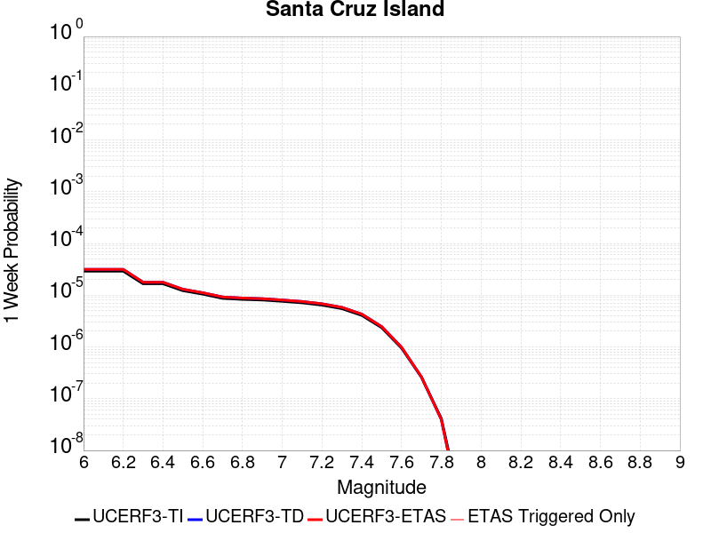 |  | 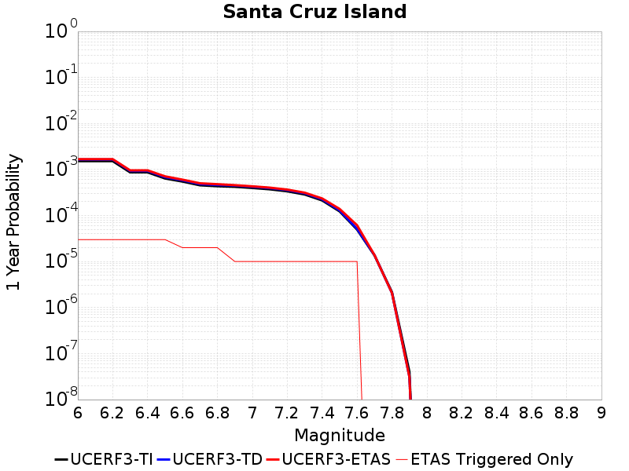 | 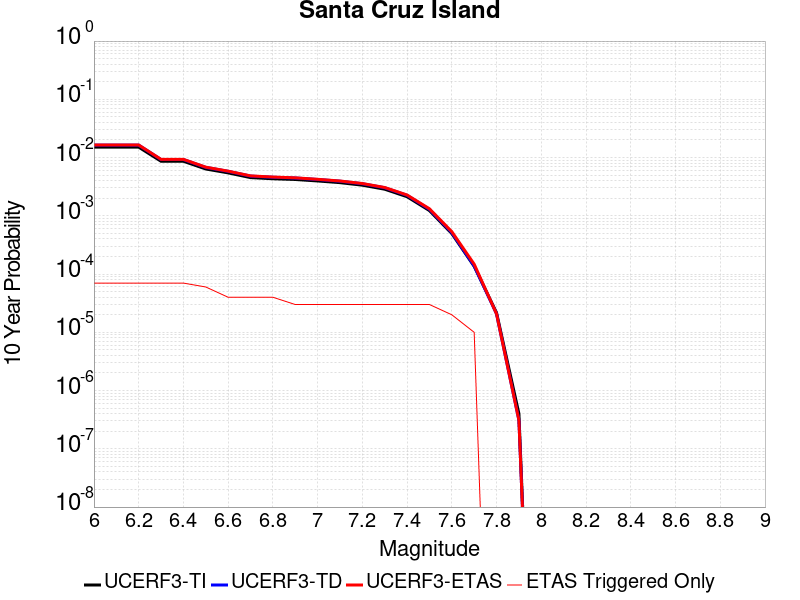 |

| Magnitude | 1 wk TI Prob | 1 wk TD Prob | 1 wk ETAS Prob | 1 wk ETAS/TD Gain | 1 wk ETAS Triggered Only | 1 mo TI Prob | 1 mo TD Prob | 1 mo ETAS Prob | 1 mo ETAS/TD Gain | 1 mo ETAS Triggered Only | 1 yr TI Prob | 1 yr TD Prob | 1 yr ETAS Prob | 1 yr ETAS/TD Gain | 1 yr ETAS Triggered Only | 10 yr TI Prob | 10 yr TD Prob | 10 yr ETAS Prob | 10 yr ETAS/TD Gain | 10 yr ETAS Triggered Only |
|-----|-----|-----|-----|-----|-----|-----|-----|-----|-----|-----|-----|-----|-----|-----|-----|-----|-----|-----|-----|-----|
| 6.0 | 2.9164563E-5 | 3.160004E-5 | 3.160004E-5 | 1.0 | 0.0 | 1.2498499E-4 | 1.3542248E-4 | 1.3542248E-4 | 1.0 | 0.0 | 0.0015206301 | 0.0016476581 | 0.0016776086 | 1.0181776 | 3.0E-5 | 0.015102667 | 0.016368153 | 0.016437007 | 1.0042065 | 7.0E-5 |
| 6.1 | 2.9164563E-5 | 3.160004E-5 | 3.160004E-5 | 1.0 | 0.0 | 1.2498499E-4 | 1.3542248E-4 | 1.3542248E-4 | 1.0 | 0.0 | 0.0015206301 | 0.0016476581 | 0.0016776086 | 1.0181776 | 3.0E-5 | 0.015102667 | 0.016368153 | 0.016437007 | 1.0042065 | 7.0E-5 |
| 6.2 | 2.9164563E-5 | 3.160004E-5 | 3.160004E-5 | 1.0 | 0.0 | 1.2498499E-4 | 1.3542248E-4 | 1.3542248E-4 | 1.0 | 0.0 | 0.0015206301 | 0.0016476581 | 0.0016776086 | 1.0181776 | 3.0E-5 | 0.015102667 | 0.016368153 | 0.016437007 | 1.0042065 | 7.0E-5 |
| 6.3 | 1.6635553E-5 | 1.78045E-5 | 1.78045E-5 | 1.0 | 0.0 | 7.1293274E-5 | 7.630287E-5 | 7.630287E-5 | 1.0 | 0.0 | 8.6765E-4 | 9.2860975E-4 | 9.5858186E-4 | 1.0322764 | 3.0E-5 | 0.008642701 | 0.009249167 | 0.009318519 | 1.0074983 | 7.0E-5 |
| 6.4 | 1.6635553E-5 | 1.78045E-5 | 1.78045E-5 | 1.0 | 0.0 | 7.1293274E-5 | 7.630287E-5 | 7.630287E-5 | 1.0 | 0.0 | 8.6765E-4 | 9.2860975E-4 | 9.5858186E-4 | 1.0322764 | 3.0E-5 | 0.008642701 | 0.009249167 | 0.009318519 | 1.0074983 | 7.0E-5 |
| 6.5 | 1.2238748E-5 | 1.3043093E-5 | 1.3043093E-5 | 1.0 | 0.0 | 5.2450723E-5 | 5.589779E-5 | 5.589779E-5 | 1.0 | 0.0 | 6.3840044E-4 | 6.803468E-4 | 7.1032636E-4 | 1.0440651 | 3.0E-5 | 0.0063656955 | 0.006783038 | 0.006842631 | 1.0087856 | 6.0E-5 |
| 6.6 | 1.0489767E-5 | 1.1156716E-5 | 1.1156716E-5 | 1.0 | 0.0 | 4.495537E-5 | 4.7813635E-5 | 4.7813635E-5 | 1.0 | 0.0 | 5.4719415E-4 | 5.819777E-4 | 6.019661E-4 | 1.0343456 | 2.0E-5 | 0.005458487 | 0.0058047776 | 0.005844545 | 1.0068508 | 4.0E-5 |
| 6.7 | 8.699222E-6 | 9.236846E-6 | 9.236846E-6 | 1.0 | 0.0 | 3.7281847E-5 | 3.9585888E-5 | 3.9585888E-5 | 1.0 | 0.0 | 4.5381195E-4 | 4.8185216E-4 | 5.018425E-4 | 1.0414865 | 2.0E-5 | 0.0045288634 | 0.0048081414 | 0.0048479494 | 1.0082792 | 4.0E-5 |
| 6.8 | 8.307732E-6 | 8.816965E-6 | 8.816965E-6 | 1.0 | 0.0 | 3.560408E-5 | 3.778645E-5 | 3.778645E-5 | 1.0 | 0.0 | 4.3339343E-4 | 4.5995336E-4 | 4.7994414E-4 | 1.0434626 | 2.0E-5 | 0.004325492 | 0.004590067 | 0.0046298834 | 1.0086745 | 4.0E-5 |
| 6.9 | 8.073121E-6 | 8.564998E-6 | 8.564998E-6 | 1.0 | 0.0 | 3.459863E-5 | 3.670662E-5 | 3.670662E-5 | 1.0 | 0.0 | 4.2115687E-4 | 4.468119E-4 | 4.568074E-4 | 1.0223708 | 1.0E-5 | 0.004203596 | 0.004459187 | 0.004489053 | 1.0066977 | 3.0E-5 |
| 7.0 | 7.617019E-6 | 8.0747195E-6 | 8.0747195E-6 | 1.0 | 0.0 | 3.264396E-5 | 3.4605484E-5 | 3.4605484E-5 | 1.0 | 0.0 | 3.9736772E-4 | 4.212407E-4 | 4.312365E-4 | 1.0237294 | 1.0E-5 | 0.003966579 | 0.0042044697 | 0.0042343438 | 1.0071052 | 3.0E-5 |
| 7.1 | 7.1224836E-6 | 7.545839E-6 | 7.545839E-6 | 1.0 | 0.0 | 3.052457E-5 | 3.233891E-5 | 3.233891E-5 | 1.0 | 0.0 | 3.715733E-4 | 3.9365547E-4 | 4.0365153E-4 | 1.0253929 | 1.0E-5 | 0.003709526 | 0.0039296243 | 0.0039595068 | 1.0076044 | 3.0E-5 |
| 7.2 | 6.441115E-6 | 6.82743E-6 | 6.82743E-6 | 1.0 | 0.0 | 2.7604487E-5 | 2.9260087E-5 | 2.9260087E-5 | 1.0 | 0.0 | 3.360328E-4 | 3.5618356E-4 | 3.6618E-4 | 1.0280654 | 1.0E-5 | 0.0033552512 | 0.0035561554 | 0.0035860485 | 1.008406 | 3.0E-5 |
| 7.3 | 5.494274E-6 | 5.820034E-6 | 5.820034E-6 | 1.0 | 0.0 | 2.3546674E-5 | 2.4942765E-5 | 2.4942765E-5 | 1.0 | 0.0 | 2.8664304E-4 | 3.0363604E-4 | 3.13633E-4 | 1.0329242 | 1.0E-5 | 0.002862736 | 0.003032235 | 0.003062144 | 1.0098637 | 3.0E-5 |
| 7.4 | 4.0802624E-6 | 4.3122845E-6 | 4.3122845E-6 | 1.0 | 0.0 | 1.7486722E-5 | 1.8481089E-5 | 1.8481089E-5 | 1.0 | 0.0 | 2.1288003E-4 | 2.2498409E-4 | 2.3498184E-4 | 1.0444375 | 1.0E-5 | 0.0021267622 | 0.0022475722 | 0.0022775047 | 1.0133177 | 3.0E-5 |
| 7.5 | 2.3584746E-6 | 2.475324E-6 | 2.475324E-6 | 1.0 | 0.0 | 1.0107709E-5 | 1.0608489E-5 | 1.0608489E-5 | 1.0 | 0.0 | 1.2305441E-4 | 1.2915074E-4 | 1.3914944E-4 | 1.0774189 | 1.0E-5 | 0.0012298629 | 0.0012907619 | 0.0013207232 | 1.0232121 | 3.0E-5 |
| 7.6 | 9.4981914E-7 | 9.860979E-7 | 9.860979E-7 | 1.0 | 0.0 | 4.0706473E-6 | 4.226127E-6 | 4.226127E-6 | 1.0 | 0.0 | 4.9559E-5 | 5.1451894E-5 | 6.145138E-5 | 1.1943463 | 1.0E-5 | 4.954795E-4 | 5.144011E-4 | 5.3439086E-4 | 1.0388602 | 2.0E-5 |
| 7.7 | 2.6013532E-7 | 2.6416703E-7 | 2.6416703E-7 | 1.0 | 0.0 | 1.1148652E-6 | 1.1321439E-6 | 1.1321439E-6 | 1.0 | 0.0 | 1.3573399E-5 | 1.3783765E-5 | 1.3783765E-5 | 1.0 | 0.0 | 1.357257E-4 | 1.3782918E-4 | 1.478278E-4 | 1.0725436 | 1.0E-5 |
| 7.8 | 4.1522263E-8 | 3.9656896E-8 | 3.9656896E-8 | 1.0 | 0.0 | 1.7795254E-7 | 1.6995811E-7 | 1.6995811E-7 | 1.0 | 0.0 | 2.16657E-6 | 2.0692385E-6 | 2.0692385E-6 | 1.0 | 0.0 | 2.1665488E-5 | 2.0692212E-5 | 2.0692212E-5 | 1.0 | 0.0 |
| 7.9 | 7.7242046E-10 | 5.946844E-10 | 5.946844E-10 | 1.0 | 0.0 | 3.3103735E-9 | 2.5486477E-9 | 2.5486477E-9 | 1.0 | 0.0 | 4.0303796E-8 | 3.1029785E-8 | 3.1029785E-8 | 1.0 | 0.0 | 4.030379E-7 | 3.1029782E-7 | 3.1029782E-7 | 1.0 | 0.0 |

## Scodie Lineament
*[(top)](#table-of-contents)*

| 1 Week | 1 Month | 1 Year | 10 Year |
|-----|-----|-----|-----|
| 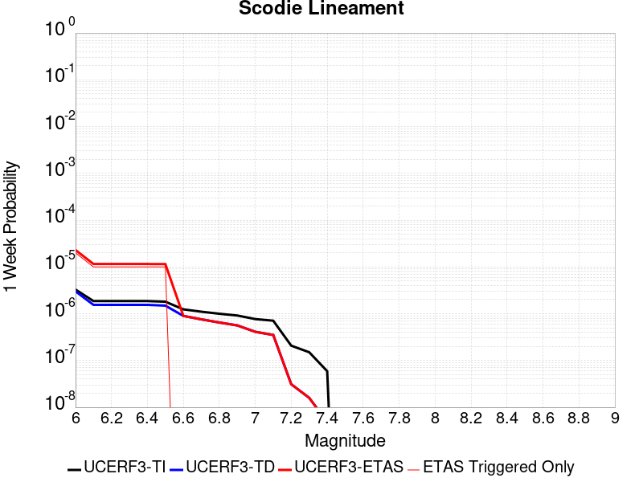 | 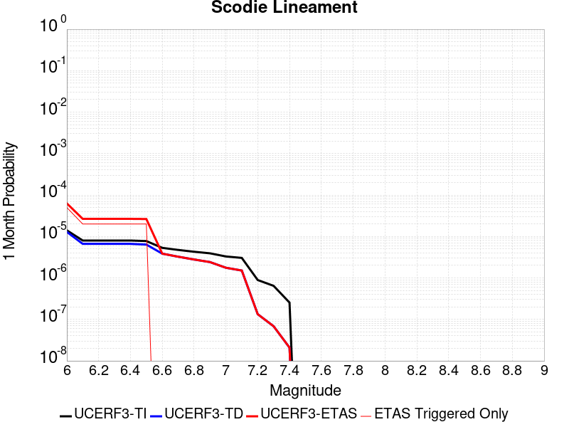 |  | 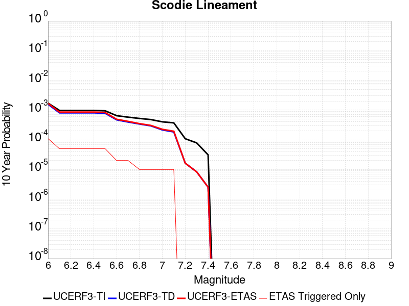 |

| Magnitude | 1 wk TI Prob | 1 wk TD Prob | 1 wk ETAS Prob | 1 wk ETAS/TD Gain | 1 wk ETAS Triggered Only | 1 mo TI Prob | 1 mo TD Prob | 1 mo ETAS Prob | 1 mo ETAS/TD Gain | 1 mo ETAS Triggered Only | 1 yr TI Prob | 1 yr TD Prob | 1 yr ETAS Prob | 1 yr ETAS/TD Gain | 1 yr ETAS Triggered Only | 10 yr TI Prob | 10 yr TD Prob | 10 yr ETAS Prob | 10 yr ETAS/TD Gain | 10 yr ETAS Triggered Only |
|-----|-----|-----|-----|-----|-----|-----|-----|-----|-----|-----|-----|-----|-----|-----|-----|-----|-----|-----|-----|-----|
| 6.0 | 3.2919327E-6 | 3.0133542E-6 | 2.3013294E-5 | 7.637102 | 2.0E-5 | 1.4108206E-5 | 1.2914329E-5 | 6.2913685E-5 | 4.8716183 | 5.0E-5 | 1.7175387E-4 | 1.572238E-4 | 2.1721436E-4 | 1.3815616 | 6.0E-5 | 0.0017162118 | 0.0015714371 | 0.0016812643 | 1.0698897 | 1.1E-4 |
| 6.1 | 1.8663811E-6 | 1.5490575E-6 | 1.1549042E-5 | 7.4555283 | 1.0E-5 | 7.998751E-6 | 6.638804E-6 | 2.663867E-5 | 4.012571 | 2.0E-5 | 9.738045E-5 | 8.082493E-5 | 1.1082251E-4 | 1.3711426 | 3.0E-5 | 9.7337784E-4 | 8.080042E-4 | 8.579638E-4 | 1.0618309 | 5.0E-5 |
| 6.2 | 1.8663811E-6 | 1.5490575E-6 | 1.1549042E-5 | 7.4555283 | 1.0E-5 | 7.998751E-6 | 6.638804E-6 | 2.663867E-5 | 4.012571 | 2.0E-5 | 9.738045E-5 | 8.082493E-5 | 1.1082251E-4 | 1.3711426 | 3.0E-5 | 9.7337784E-4 | 8.080042E-4 | 8.579638E-4 | 1.0618309 | 5.0E-5 |
| 6.3 | 1.8663811E-6 | 1.5490575E-6 | 1.1549042E-5 | 7.4555283 | 1.0E-5 | 7.998751E-6 | 6.638804E-6 | 2.663867E-5 | 4.012571 | 2.0E-5 | 9.738045E-5 | 8.082493E-5 | 1.1082251E-4 | 1.3711426 | 3.0E-5 | 9.7337784E-4 | 8.080042E-4 | 8.579638E-4 | 1.0618309 | 5.0E-5 |
| 6.4 | 1.8663811E-6 | 1.5490575E-6 | 1.1549042E-5 | 7.4555283 | 1.0E-5 | 7.998751E-6 | 6.638804E-6 | 2.663867E-5 | 4.012571 | 2.0E-5 | 9.738045E-5 | 8.082493E-5 | 1.1082251E-4 | 1.3711426 | 3.0E-5 | 9.7337784E-4 | 8.080042E-4 | 8.579638E-4 | 1.0618309 | 5.0E-5 |
| 6.5 | 1.8106311E-6 | 1.4909913E-6 | 1.1490976E-5 | 7.7069373 | 1.0E-5 | 7.759824E-6 | 6.3899497E-6 | 2.6389822E-5 | 4.129895 | 2.0E-5 | 9.447177E-5 | 7.7795354E-5 | 1.0779302E-4 | 1.3855971 | 3.0E-5 | 9.4431615E-4 | 7.777299E-4 | 8.27691E-4 | 1.0642396 | 5.0E-5 |
| 6.6 | 1.2414679E-6 | 8.997605E-7 | 8.997605E-7 | 1.0 | 0.0 | 5.320566E-6 | 3.856111E-6 | 3.856111E-6 | 1.0 | 0.0 | 6.477596E-5 | 4.694723E-5 | 5.694676E-5 | 1.212995 | 1.0E-5 | 6.475708E-4 | 4.6938178E-4 | 4.893724E-4 | 1.0425892 | 2.0E-5 |
| 6.7 | 1.1062215E-6 | 7.5943524E-7 | 7.5943524E-7 | 1.0 | 0.0 | 4.7409408E-6 | 3.2547189E-6 | 3.2547189E-6 | 1.0 | 0.0 | 5.7719422E-5 | 3.9625553E-5 | 4.9625156E-5 | 1.2523524 | 1.0E-5 | 5.770443E-4 | 3.9619184E-4 | 4.1618393E-4 | 1.0504606 | 2.0E-5 |
| 6.8 | 1.0006736E-6 | 6.500434E-7 | 6.500434E-7 | 1.0 | 0.0 | 4.288594E-6 | 2.7858975E-6 | 2.7858975E-6 | 1.0 | 0.0 | 5.221238E-5 | 3.3917837E-5 | 4.39175E-5 | 1.2948201 | 1.0E-5 | 5.220012E-4 | 3.3913268E-4 | 3.491293E-4 | 1.029477 | 1.0E-5 |
| 6.9 | 9.167364E-7 | 5.631658E-7 | 5.631658E-7 | 1.0 | 0.0 | 3.9288643E-6 | 2.4135659E-6 | 2.4135659E-6 | 1.0 | 0.0 | 4.7832873E-5 | 2.9384826E-5 | 3.9384533E-5 | 1.3403016 | 1.0E-5 | 4.782258E-4 | 2.9381507E-4 | 3.0381215E-4 | 1.034025 | 1.0E-5 |
| 7.0 | 7.6987664E-7 | 4.113411E-7 | 4.113411E-7 | 1.0 | 0.0 | 3.2994672E-6 | 1.7628894E-6 | 1.7628894E-6 | 1.0 | 0.0 | 4.0170275E-5 | 2.1463005E-5 | 3.146279E-5 | 1.4659079 | 1.0E-5 | 4.0163012E-4 | 2.1461319E-4 | 2.2461104E-4 | 1.0465854 | 1.0E-5 |
| 7.1 | 7.1038727E-7 | 3.521175E-7 | 3.521175E-7 | 1.0 | 0.0 | 3.0445133E-6 | 1.5090743E-6 | 1.5090743E-6 | 1.0 | 0.0 | 3.706632E-5 | 1.8372859E-5 | 2.8372677E-5 | 1.5442711 | 1.0E-5 | 3.7060137E-4 | 1.837169E-4 | 1.9371507E-4 | 1.0544215 | 1.0E-5 |
| 7.2 | 2.0799602E-7 | 3.1187557E-8 | 3.1187557E-8 | 1.0 | 0.0 | 8.914113E-7 | 1.3366095E-7 | 1.3366095E-7 | 1.0 | 0.0 | 1.0852878E-5 | 1.6273209E-6 | 1.6273209E-6 | 1.0 | 0.0 | 1.08523476E-4 | 1.6273098E-5 | 1.6273098E-5 | 1.0 | 0.0 |
| 7.3 | 1.5048182E-7 | 1.5946174E-8 | 1.5946174E-8 | 1.0 | 0.0 | 6.449219E-7 | 6.8340746E-8 | 6.8340746E-8 | 1.0 | 0.0 | 7.851896E-6 | 8.320483E-7 | 8.320483E-7 | 1.0 | 0.0 | 7.851618E-5 | 8.320454E-6 | 8.320454E-6 | 1.0 | 0.0 |
| 7.4 | 5.9334678E-8 | 4.8685296E-9 | 4.8685296E-9 | 1.0 | 0.0 | 2.5429145E-7 | 2.0865128E-8 | 2.0865128E-8 | 1.0 | 0.0 | 3.095994E-6 | 2.540329E-7 | 2.540329E-7 | 1.0 | 0.0 | 3.095951E-5 | 2.5403274E-6 | 2.5403274E-6 | 1.0 | 0.0 |

## San Jacinto (Lytle Creek connector)
*[(top)](#table-of-contents)*

| 1 Week | 1 Month | 1 Year | 10 Year |
|-----|-----|-----|-----|
| 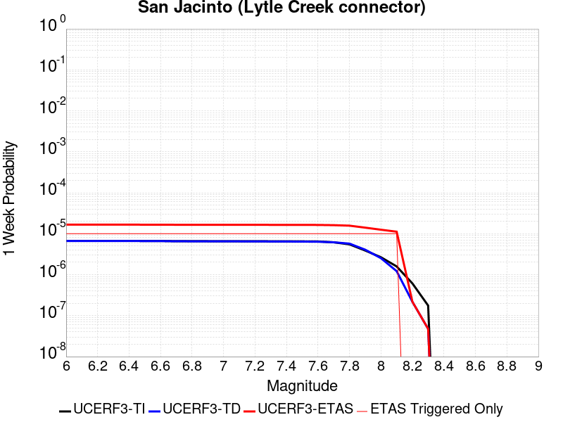 | 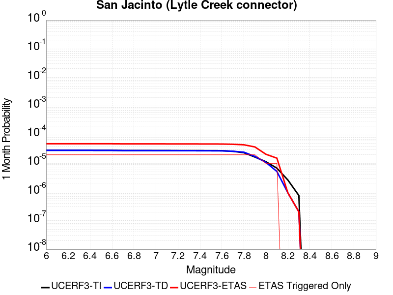 | 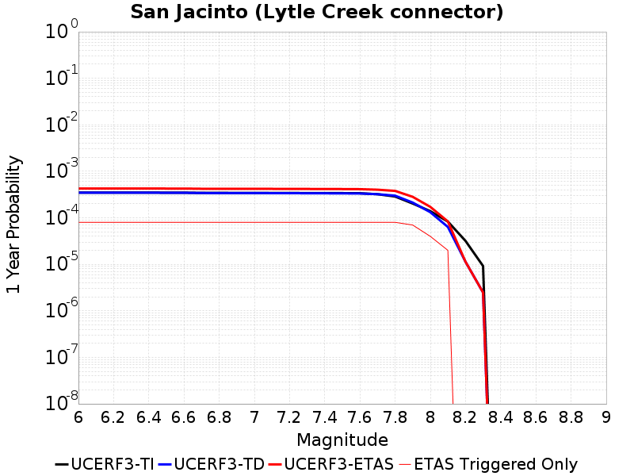 | 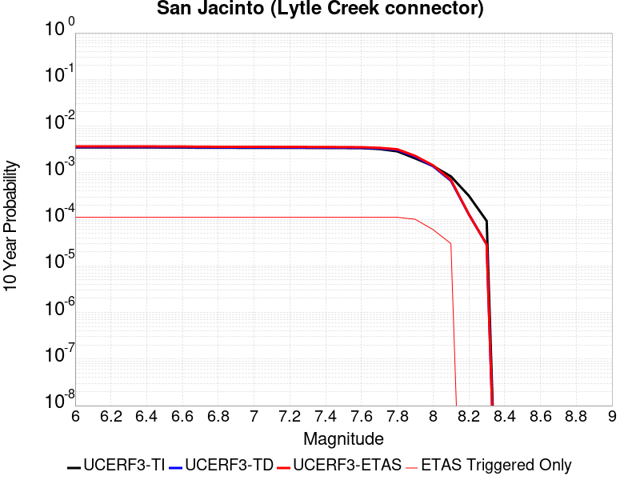 |

| Magnitude | 1 wk TI Prob | 1 wk TD Prob | 1 wk ETAS Prob | 1 wk ETAS/TD Gain | 1 wk ETAS Triggered Only | 1 mo TI Prob | 1 mo TD Prob | 1 mo ETAS Prob | 1 mo ETAS/TD Gain | 1 mo ETAS Triggered Only | 1 yr TI Prob | 1 yr TD Prob | 1 yr ETAS Prob | 1 yr ETAS/TD Gain | 1 yr ETAS Triggered Only | 10 yr TI Prob | 10 yr TD Prob | 10 yr ETAS Prob | 10 yr ETAS/TD Gain | 10 yr ETAS Triggered Only |
|-----|-----|-----|-----|-----|-----|-----|-----|-----|-----|-----|-----|-----|-----|-----|-----|-----|-----|-----|-----|-----|
| 6.0 | 6.693995E-6 | 6.662553E-6 | 1.6662487E-5 | 2.500916 | 1.0E-5 | 2.8688235E-5 | 2.8553486E-5 | 4.8552916E-5 | 1.7004199 | 2.0E-5 | 3.492233E-4 | 3.4758332E-4 | 4.2755553E-4 | 1.2300806 | 8.0E-5 | 0.00348675 | 0.0035505993 | 0.0036602088 | 1.0308707 | 1.1E-4 |
| 6.1 | 6.693995E-6 | 6.662553E-6 | 1.6662487E-5 | 2.500916 | 1.0E-5 | 2.8688235E-5 | 2.8553486E-5 | 4.8552916E-5 | 1.7004199 | 2.0E-5 | 3.492233E-4 | 3.4758332E-4 | 4.2755553E-4 | 1.2300806 | 8.0E-5 | 0.00348675 | 0.0035505993 | 0.0036602088 | 1.0308707 | 1.1E-4 |
| 6.2 | 6.693995E-6 | 6.662553E-6 | 1.6662487E-5 | 2.500916 | 1.0E-5 | 2.8688235E-5 | 2.8553486E-5 | 4.8552916E-5 | 1.7004199 | 2.0E-5 | 3.492233E-4 | 3.4758332E-4 | 4.2755553E-4 | 1.2300806 | 8.0E-5 | 0.00348675 | 0.0035505993 | 0.0036602088 | 1.0308707 | 1.1E-4 |
| 6.3 | 6.693995E-6 | 6.662553E-6 | 1.6662487E-5 | 2.500916 | 1.0E-5 | 2.8688235E-5 | 2.8553486E-5 | 4.8552916E-5 | 1.7004199 | 2.0E-5 | 3.492233E-4 | 3.4758332E-4 | 4.2755553E-4 | 1.2300806 | 8.0E-5 | 0.00348675 | 0.0035505993 | 0.0036602088 | 1.0308707 | 1.1E-4 |
| 6.4 | 6.693995E-6 | 6.662553E-6 | 1.6662487E-5 | 2.500916 | 1.0E-5 | 2.8688235E-5 | 2.8553486E-5 | 4.8552916E-5 | 1.7004199 | 2.0E-5 | 3.492233E-4 | 3.4758332E-4 | 4.2755553E-4 | 1.2300806 | 8.0E-5 | 0.00348675 | 0.0035505993 | 0.0036602088 | 1.0308707 | 1.1E-4 |
| 6.5 | 6.6561875E-6 | 6.622771E-6 | 1.6622706E-5 | 2.509932 | 1.0E-5 | 2.8526205E-5 | 2.8382996E-5 | 4.838243E-5 | 1.7046273 | 2.0E-5 | 3.472512E-4 | 3.4550825E-4 | 4.2548063E-4 | 1.231463 | 8.0E-5 | 0.0034670907 | 0.003529915 | 0.0036395267 | 1.0310522 | 1.1E-4 |
| 6.6 | 6.6561875E-6 | 6.622771E-6 | 1.6622706E-5 | 2.509932 | 1.0E-5 | 2.8526205E-5 | 2.8382996E-5 | 4.838243E-5 | 1.7046273 | 2.0E-5 | 3.472512E-4 | 3.4550825E-4 | 4.2548063E-4 | 1.231463 | 8.0E-5 | 0.0034670907 | 0.003529915 | 0.0036395267 | 1.0310522 | 1.1E-4 |
| 6.7 | 6.5802237E-6 | 6.541947E-6 | 1.6541882E-5 | 2.5285869 | 1.0E-5 | 2.8200653E-5 | 2.8036615E-5 | 4.8036054E-5 | 1.7133329 | 2.0E-5 | 3.4328885E-4 | 3.412924E-4 | 4.212651E-4 | 1.2343231 | 8.0E-5 | 0.0034275902 | 0.003487889 | 0.0035975054 | 1.0314277 | 1.1E-4 |
| 6.8 | 6.575632E-6 | 6.5364366E-6 | 1.653637E-5 | 2.5298755 | 1.0E-5 | 2.8180975E-5 | 2.8013E-5 | 4.801244E-5 | 1.7139342 | 2.0E-5 | 3.4304935E-4 | 3.4100498E-4 | 4.2097768E-4 | 1.2345207 | 8.0E-5 | 0.0034252026 | 0.0034850237 | 0.0035946404 | 1.0314536 | 1.1E-4 |
| 6.9 | 6.570433E-6 | 6.5278305E-6 | 1.6527765E-5 | 2.5318925 | 1.0E-5 | 2.8158694E-5 | 2.7976117E-5 | 4.7975558E-5 | 1.7148755 | 2.0E-5 | 3.4277816E-4 | 3.4055606E-4 | 4.205288E-4 | 1.2348299 | 8.0E-5 | 0.0034224992 | 0.0034805487 | 0.0035901659 | 1.0314943 | 1.1E-4 |
| 7.0 | 6.5643826E-6 | 6.517951E-6 | 1.6517886E-5 | 2.5342145 | 1.0E-5 | 2.8132765E-5 | 2.7933778E-5 | 4.793322E-5 | 1.7159591 | 2.0E-5 | 3.424626E-4 | 3.4004074E-4 | 4.2001353E-4 | 1.235186 | 8.0E-5 | 0.0034193532 | 0.0034754118 | 0.0035850294 | 1.0315409 | 1.1E-4 |
| 7.1 | 6.557402E-6 | 6.506663E-6 | 1.6506598E-5 | 2.5368762 | 1.0E-5 | 2.8102848E-5 | 2.78854E-5 | 4.788484E-5 | 1.7172012 | 2.0E-5 | 3.4209844E-4 | 3.3945192E-4 | 4.1942476E-4 | 1.235594 | 8.0E-5 | 0.0034157229 | 0.003469543 | 0.0035791614 | 1.0315945 | 1.1E-4 |
| 7.2 | 6.546394E-6 | 6.4886285E-6 | 1.6488564E-5 | 2.5411477 | 1.0E-5 | 2.8055672E-5 | 2.7808112E-5 | 4.7807556E-5 | 1.7191945 | 2.0E-5 | 3.4152428E-4 | 3.3851125E-4 | 4.1848415E-4 | 1.236249 | 8.0E-5 | 0.0034099987 | 0.00346017 | 0.0035697892 | 1.0316803 | 1.1E-4 |
| 7.3 | 6.5364216E-6 | 6.469413E-6 | 1.6469348E-5 | 2.5457253 | 1.0E-5 | 2.8012933E-5 | 2.7725762E-5 | 4.7725207E-5 | 1.7213308 | 2.0E-5 | 3.4100408E-4 | 3.3750894E-4 | 4.1748193E-4 | 1.2369508 | 8.0E-5 | 0.003404813 | 0.0034501909 | 0.0035598113 | 1.0317723 | 1.1E-4 |
| 7.4 | 6.5269523E-6 | 6.4504984E-6 | 1.6450434E-5 | 2.5502577 | 1.0E-5 | 2.7972354E-5 | 2.76447E-5 | 4.764415E-5 | 1.7234459 | 2.0E-5 | 3.4051016E-4 | 3.3652232E-4 | 4.164954E-4 | 1.2376456 | 8.0E-5 | 0.0033998888 | 0.0034403722 | 0.0035499937 | 1.0318633 | 1.1E-4 |
| 7.5 | 6.5111835E-6 | 6.426771E-6 | 1.6426708E-5 | 2.5559814 | 1.0E-5 | 2.7904773E-5 | 2.7543014E-5 | 4.7542464E-5 | 1.7261169 | 2.0E-5 | 3.3968766E-4 | 3.3528468E-4 | 4.1525785E-4 | 1.2385232 | 8.0E-5 | 0.0033916887 | 0.0034280443 | 0.0035376672 | 1.0319782 | 1.1E-4 |
| 7.6 | 6.4768806E-6 | 6.3858774E-6 | 1.6385813E-5 | 2.5659454 | 1.0E-5 | 2.7757764E-5 | 2.736776E-5 | 4.736721E-5 | 1.7307669 | 2.0E-5 | 3.3789838E-4 | 3.331516E-4 | 4.1312494E-4 | 1.2400509 | 8.0E-5 | 0.0033738504 | 0.0034067752 | 0.0035164005 | 1.0321786 | 1.1E-4 |
| 7.7 | 6.1655364E-6 | 6.1783453E-6 | 1.6178283E-5 | 2.6185465 | 1.0E-5 | 2.642346E-5 | 2.6478354E-5 | 4.6477824E-5 | 1.755314 | 2.0E-5 | 3.2165812E-4 | 3.2232632E-4 | 4.0230053E-4 | 1.2481157 | 8.0E-5 | 0.0032119295 | 0.0032983813 | 0.0034080185 | 1.0332397 | 1.1E-4 |
| 7.8 | 5.5043524E-6 | 5.739342E-6 | 1.5739284E-5 | 2.7423499 | 1.0E-5 | 2.3589868E-5 | 2.459695E-5 | 4.4596458E-5 | 1.813089 | 2.0E-5 | 2.871688E-4 | 2.9942676E-4 | 3.794028E-4 | 1.2670972 | 8.0E-5 | 0.0028679797 | 0.0030684501 | 0.0031781127 | 1.0357387 | 1.1E-4 |
| 7.9 | 3.889249E-6 | 4.078603E-6 | 1.4078562E-5 | 3.45181 | 1.0E-5 | 1.6668104E-5 | 1.747961E-5 | 3.747926E-5 | 2.1441703 | 2.0E-5 | 2.0291525E-4 | 2.127935E-4 | 2.827786E-4 | 1.3288875 | 7.0E-5 | 0.0020273007 | 0.002195294 | 0.0022950745 | 1.045452 | 1.0E-4 |
| 8.0 | 2.668535E-6 | 2.5327731E-6 | 1.2532748E-5 | 4.948231 | 1.0E-5 | 1.1436528E-5 | 1.0854697E-5 | 2.0854588E-5 | 1.9212502 | 1.0E-5 | 1.3923083E-4 | 1.3214795E-4 | 1.7214267E-4 | 1.302651 | 4.0E-5 | 0.0013914363 | 0.0013764623 | 0.0014363796 | 1.04353 | 6.0E-5 |
| 8.1 | 1.5911459E-6 | 1.2193501E-6 | 1.1219338E-5 | 9.201079 | 1.0E-5 | 6.8191785E-6 | 5.225776E-6 | 1.52257235E-5 | 2.9135814 | 1.0E-5 | 8.3020335E-5 | 6.3621985E-5 | 8.362071E-5 | 1.3143368 | 2.0E-5 | 8.298933E-4 | 6.696926E-4 | 6.996725E-4 | 1.0447667 | 3.0E-5 |
| 8.2 | 6.1294963E-7 | 2.183172E-7 | 2.183172E-7 | 1.0 | 0.0 | 2.6269242E-6 | 9.356448E-7 | 9.356448E-7 | 1.0 | 0.0 | 3.1982334E-5 | 1.1391416E-5 | 1.1391416E-5 | 1.0 | 0.0 | 3.1977732E-4 | 1.279547E-4 | 1.279547E-4 | 1.0 | 0.0 |
| 8.3 | 1.762871E-7 | 4.7595567E-8 | 4.7595567E-8 | 1.0 | 0.0 | 7.5551594E-7 | 2.0398097E-7 | 2.0398097E-7 | 1.0 | 0.0 | 9.1983675E-6 | 2.4834656E-6 | 2.4834656E-6 | 1.0 | 0.0 | 9.197987E-5 | 2.8715498E-5 | 2.8715498E-5 | 1.0 | 0.0 |

## Rose Canyon
*[(top)](#table-of-contents)*

| 1 Week | 1 Month | 1 Year | 10 Year |
|-----|-----|-----|-----|
| 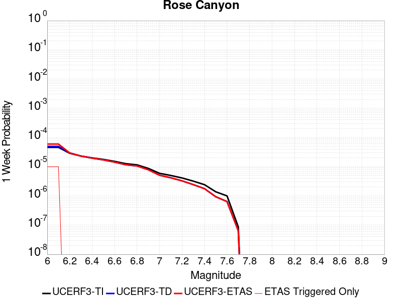 | 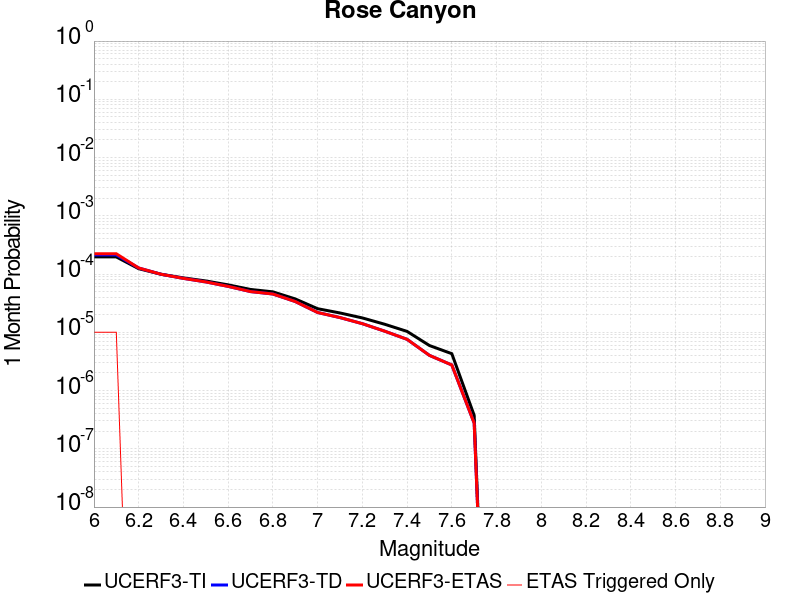 | 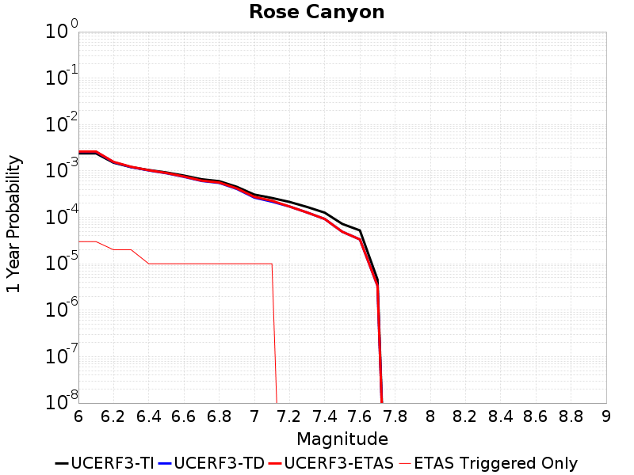 | 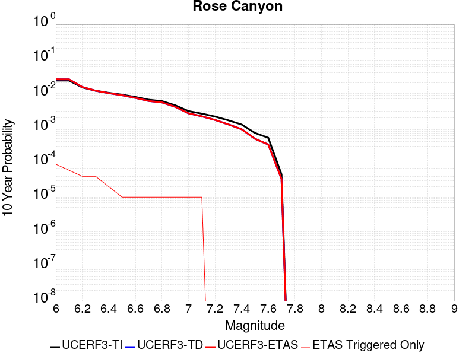 |

| Magnitude | 1 wk TI Prob | 1 wk TD Prob | 1 wk ETAS Prob | 1 wk ETAS/TD Gain | 1 wk ETAS Triggered Only | 1 mo TI Prob | 1 mo TD Prob | 1 mo ETAS Prob | 1 mo ETAS/TD Gain | 1 mo ETAS Triggered Only | 1 yr TI Prob | 1 yr TD Prob | 1 yr ETAS Prob | 1 yr ETAS/TD Gain | 1 yr ETAS Triggered Only | 10 yr TI Prob | 10 yr TD Prob | 10 yr ETAS Prob | 10 yr ETAS/TD Gain | 10 yr ETAS Triggered Only |
|-----|-----|-----|-----|-----|-----|-----|-----|-----|-----|-----|-----|-----|-----|-----|-----|-----|-----|-----|-----|-----|
| 6.0 | 4.5923203E-5 | 4.9715574E-5 | 5.9715076E-5 | 1.2011342 | 1.0E-5 | 1.9679888E-4 | 2.1305034E-4 | 2.230482E-4 | 1.0469272 | 1.0E-5 | 0.0023933933 | 0.0025910002 | 0.0026209224 | 1.0115485 | 3.0E-5 | 0.023677798 | 0.02564065 | 0.025728343 | 1.00342 | 9.0E-5 |
| 6.1 | 4.5923203E-5 | 4.9715574E-5 | 5.9715076E-5 | 1.2011342 | 1.0E-5 | 1.9679888E-4 | 2.1305034E-4 | 2.230482E-4 | 1.0469272 | 1.0E-5 | 0.0023933933 | 0.0025910002 | 0.0026209224 | 1.0115485 | 3.0E-5 | 0.023677798 | 0.02564065 | 0.025699113 | 1.00228 | 6.0E-5 |
| 6.2 | 2.8844734E-5 | 2.9669332E-5 | 2.9669332E-5 | 1.0 | 0.0 | 1.2361443E-4 | 1.2714793E-4 | 1.2714793E-4 | 1.0 | 0.0 | 0.0015039665 | 0.0015469249 | 0.001566894 | 1.0129088 | 2.0E-5 | 0.0149382865 | 0.015374583 | 0.015413968 | 1.0025617 | 4.0E-5 |
| 6.3 | 2.3171577E-5 | 2.3161618E-5 | 2.3161618E-5 | 1.0 | 0.0 | 9.9302975E-5 | 9.9260375E-5 | 9.9260375E-5 | 1.0 | 0.0 | 0.0012083431 | 0.0012078384 | 0.0012278142 | 1.0165385 | 2.0E-5 | 0.012017938 | 0.012022632 | 0.012062151 | 1.0032871 | 4.0E-5 |
| 6.4 | 2.0066604E-5 | 1.9667343E-5 | 1.9667343E-5 | 1.0 | 0.0 | 8.599689E-5 | 8.4285944E-5 | 8.4285944E-5 | 1.0 | 0.0 | 0.0010465092 | 0.0010257083 | 0.001035698 | 1.0097394 | 1.0E-5 | 0.010415946 | 0.0102177225 | 0.010237519 | 1.0019374 | 2.0E-5 |
| 6.5 | 1.776989E-5 | 1.7114073E-5 | 1.7114073E-5 | 1.0 | 0.0 | 7.615444E-5 | 7.3344E-5 | 7.3344E-5 | 1.0 | 0.0 | 9.267859E-4 | 8.926044E-4 | 9.0259546E-4 | 1.0111932 | 1.0E-5 | 0.009229303 | 0.008896349 | 0.00890626 | 1.001114 | 1.0E-5 |
| 6.6 | 1.5227364E-5 | 1.4339467E-5 | 1.4339467E-5 | 1.0 | 0.0 | 6.52585E-5 | 6.1453444E-5 | 6.1453444E-5 | 1.0 | 0.0 | 7.942326E-4 | 7.47944E-4 | 7.579365E-4 | 1.01336 | 1.0E-5 | 0.007914 | 0.0074584666 | 0.0074683917 | 1.0013307 | 1.0E-5 |
| 6.7 | 1.2703898E-5 | 1.1673423E-5 | 1.1673423E-5 | 1.0 | 0.0 | 5.4444143E-5 | 5.002802E-5 | 5.002802E-5 | 1.0 | 0.0 | 6.626558E-4 | 6.089251E-4 | 6.1891903E-4 | 1.0164124 | 1.0E-5 | 0.006606833 | 0.0060751624 | 0.006085102 | 1.001636 | 1.0E-5 |
| 6.8 | 1.1554917E-5 | 1.0609462E-5 | 1.0609462E-5 | 1.0 | 0.0 | 4.9520135E-5 | 4.5468354E-5 | 4.5468354E-5 | 1.0 | 0.0 | 6.0274085E-4 | 5.5344065E-4 | 5.634351E-4 | 1.0180588 | 1.0E-5 | 0.0060110865 | 0.005522632 | 0.0055325767 | 1.0018008 | 1.0E-5 |
| 6.9 | 8.732078E-6 | 7.881434E-6 | 7.881434E-6 | 1.0 | 0.0 | 3.7422655E-5 | 3.3777153E-5 | 3.3777153E-5 | 1.0 | 0.0 | 4.5552556E-4 | 4.1116218E-4 | 4.2115807E-4 | 1.0243113 | 1.0E-5 | 0.0045459294 | 0.004104848 | 0.004114807 | 1.0024261 | 1.0E-5 |
| 7.0 | 5.9337494E-6 | 5.107524E-6 | 5.107524E-6 | 1.0 | 0.0 | 2.5430107E-5 | 2.1889206E-5 | 2.1889206E-5 | 1.0 | 0.0 | 3.0956755E-4 | 2.6646862E-4 | 2.7646596E-4 | 1.0375179 | 1.0E-5 | 0.0030913667 | 0.0026615066 | 0.00267148 | 1.0037472 | 1.0E-5 |
| 7.1 | 5.013409E-6 | 4.1774138E-6 | 4.1774138E-6 | 1.0 | 0.0 | 2.1485863E-5 | 1.790308E-5 | 1.790308E-5 | 1.0 | 0.0 | 2.6155898E-4 | 2.179483E-4 | 2.2794612E-4 | 1.0458724 | 1.0E-5 | 0.0026125133 | 0.0021773572 | 0.0021873354 | 1.0045828 | 1.0E-5 |
| 7.2 | 4.120763E-6 | 3.282163E-6 | 3.282163E-6 | 1.0 | 0.0 | 1.7660293E-5 | 1.4066338E-5 | 1.4066338E-5 | 1.0 | 0.0 | 2.1499286E-4 | 1.7124429E-4 | 1.7124429E-4 | 1.0 | 0.0 | 0.0021478499 | 0.0017111329 | 0.0017111329 | 1.0 | 0.0 |
| 7.3 | 3.2081239E-6 | 2.440556E-6 | 2.440556E-6 | 1.0 | 0.0 | 1.374903E-5 | 1.0459485E-5 | 1.0459485E-5 | 1.0 | 0.0 | 1.6738157E-4 | 1.2733685E-4 | 1.2733685E-4 | 1.0 | 0.0 | 0.0016725556 | 0.0012726459 | 0.0012726459 | 1.0 | 0.0 |
| 7.4 | 2.4194755E-6 | 1.7680777E-6 | 1.7680777E-6 | 1.0 | 0.0 | 1.0369139E-5 | 7.577454E-6 | 7.577454E-6 | 1.0 | 0.0 | 1.2623696E-4 | 9.225165E-5 | 9.225165E-5 | 1.0 | 0.0 | 0.0012616527 | 9.221389E-4 | 9.221389E-4 | 1.0 | 0.0 |
| 7.5 | 1.3842889E-6 | 9.37872E-7 | 9.37872E-7 | 1.0 | 0.0 | 5.9326535E-6 | 4.0194454E-6 | 4.0194454E-6 | 1.0 | 0.0 | 7.222766E-5 | 4.8935686E-5 | 4.8935686E-5 | 1.0 | 0.0 | 7.220419E-4 | 4.892526E-4 | 4.892526E-4 | 1.0 | 0.0 |
| 7.6 | 1.0021575E-6 | 6.411535E-7 | 6.411535E-7 | 1.0 | 0.0 | 4.2949537E-6 | 2.747798E-6 | 2.747798E-6 | 1.0 | 0.0 | 5.2289808E-5 | 3.3453947E-5 | 3.3453947E-5 | 1.0 | 0.0 | 5.2277505E-4 | 3.3449128E-4 | 3.3449128E-4 | 1.0 | 0.0 |
| 7.7 | 8.7620116E-8 | 6.4492774E-8 | 6.4492774E-8 | 1.0 | 0.0 | 3.7551473E-7 | 2.7639757E-7 | 2.7639757E-7 | 1.0 | 0.0 | 4.5718825E-6 | 3.3651356E-6 | 3.3651356E-6 | 1.0 | 0.0 | 4.5717883E-5 | 3.3650875E-5 | 3.3650875E-5 | 1.0 | 0.0 |

## Kern Canyon (North Kern) 2011
*[(top)](#table-of-contents)*

| 1 Week | 1 Month | 1 Year | 10 Year |
|-----|-----|-----|-----|
| 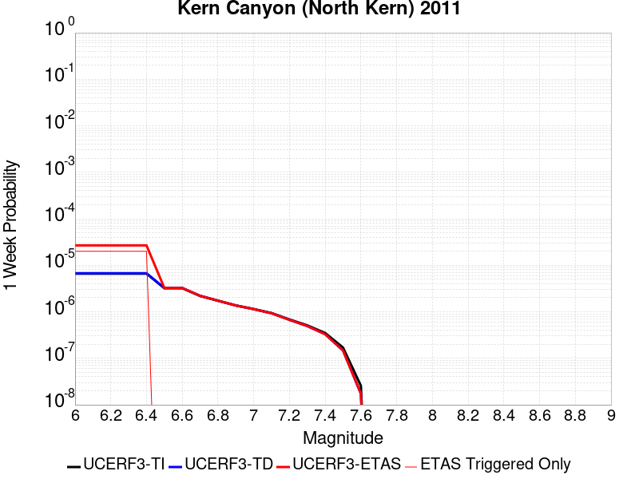 | 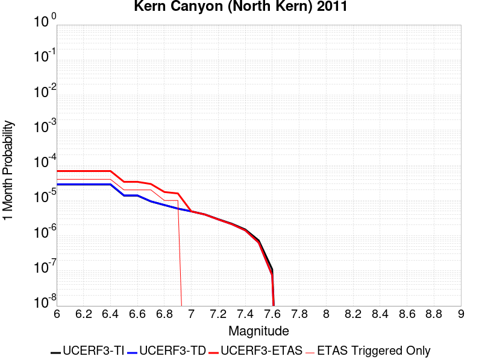 | 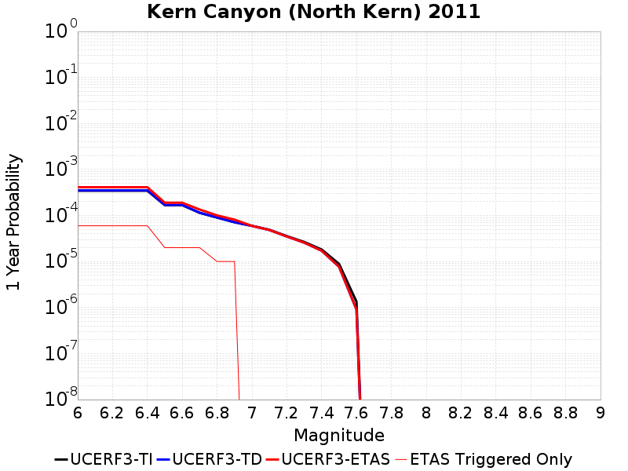 | 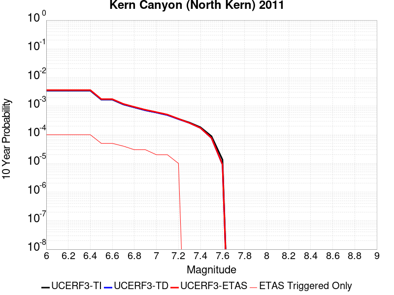 |

| Magnitude | 1 wk TI Prob | 1 wk TD Prob | 1 wk ETAS Prob | 1 wk ETAS/TD Gain | 1 wk ETAS Triggered Only | 1 mo TI Prob | 1 mo TD Prob | 1 mo ETAS Prob | 1 mo ETAS/TD Gain | 1 mo ETAS Triggered Only | 1 yr TI Prob | 1 yr TD Prob | 1 yr ETAS Prob | 1 yr ETAS/TD Gain | 1 yr ETAS Triggered Only | 10 yr TI Prob | 10 yr TD Prob | 10 yr ETAS Prob | 10 yr ETAS/TD Gain | 10 yr ETAS Triggered Only |
|-----|-----|-----|-----|-----|-----|-----|-----|-----|-----|-----|-----|-----|-----|-----|-----|-----|-----|-----|-----|-----|
| 6.0 | 6.6264497E-6 | 6.7573483E-6 | 2.6757212E-5 | 3.9597208 | 2.0E-5 | 2.8398761E-5 | 2.8959787E-5 | 6.895863E-5 | 2.3811855 | 4.0E-5 | 3.4570007E-4 | 3.5253636E-4 | 4.1251522E-4 | 1.1701353 | 6.0E-5 | 0.0034516277 | 0.0035205595 | 0.0036202075 | 1.0283046 | 1.0E-4 |
| 6.1 | 6.6264497E-6 | 6.7573483E-6 | 2.6757212E-5 | 3.9597208 | 2.0E-5 | 2.8398761E-5 | 2.8959787E-5 | 6.895863E-5 | 2.3811855 | 4.0E-5 | 3.4570007E-4 | 3.5253636E-4 | 4.1251522E-4 | 1.1701353 | 6.0E-5 | 0.0034516277 | 0.0035205595 | 0.0036202075 | 1.0283046 | 1.0E-4 |
| 6.2 | 6.6264497E-6 | 6.7573483E-6 | 2.6757212E-5 | 3.9597208 | 2.0E-5 | 2.8398761E-5 | 2.8959787E-5 | 6.895863E-5 | 2.3811855 | 4.0E-5 | 3.4570007E-4 | 3.5253636E-4 | 4.1251522E-4 | 1.1701353 | 6.0E-5 | 0.0034516277 | 0.0035205595 | 0.0036202075 | 1.0283046 | 1.0E-4 |
| 6.3 | 6.6264497E-6 | 6.7573483E-6 | 2.6757212E-5 | 3.9597208 | 2.0E-5 | 2.8398761E-5 | 2.8959787E-5 | 6.895863E-5 | 2.3811855 | 4.0E-5 | 3.4570007E-4 | 3.5253636E-4 | 4.1251522E-4 | 1.1701353 | 6.0E-5 | 0.0034516277 | 0.0035205595 | 0.0036202075 | 1.0283046 | 1.0E-4 |
| 6.4 | 6.6264497E-6 | 6.7573483E-6 | 2.6757212E-5 | 3.9597208 | 2.0E-5 | 2.8398761E-5 | 2.8959787E-5 | 6.895863E-5 | 2.3811855 | 4.0E-5 | 3.4570007E-4 | 3.5253636E-4 | 4.1251522E-4 | 1.1701353 | 6.0E-5 | 0.0034516277 | 0.0035205595 | 0.0036202075 | 1.0283046 | 1.0E-4 |
| 6.5 | 3.2162225E-6 | 3.2570993E-6 | 3.2570993E-6 | 1.0 | 0.0 | 1.3783738E-5 | 1.39589265E-5 | 3.3958648E-5 | 2.432755 | 2.0E-5 | 1.6780409E-4 | 1.6993748E-4 | 1.8993409E-4 | 1.1176703 | 2.0E-5 | 0.0016767744 | 0.001698155 | 0.0017480701 | 1.0293937 | 5.0E-5 |
| 6.6 | 3.2162225E-6 | 3.2570993E-6 | 3.2570993E-6 | 1.0 | 0.0 | 1.3783738E-5 | 1.39589265E-5 | 3.3958648E-5 | 2.432755 | 2.0E-5 | 1.6780409E-4 | 1.6993748E-4 | 1.8993409E-4 | 1.1176703 | 2.0E-5 | 0.0016767744 | 0.001698155 | 0.0017480701 | 1.0293937 | 5.0E-5 |
| 6.7 | 2.1908265E-6 | 2.207127E-6 | 2.207127E-6 | 1.0 | 0.0 | 9.389223E-6 | 9.459083E-6 | 2.9458894E-5 | 3.1143498 | 2.0E-5 | 1.1430779E-4 | 1.15158444E-4 | 1.3515614E-4 | 1.1736537 | 2.0E-5 | 0.0011424901 | 0.0011510071 | 0.0011909611 | 1.0347122 | 4.0E-5 |
| 6.8 | 1.7303895E-6 | 1.7365567E-6 | 1.7365567E-6 | 1.0 | 0.0 | 7.415934E-6 | 7.442365E-6 | 1.7442291E-5 | 2.343649 | 1.0E-5 | 9.028525E-5 | 9.060712E-5 | 1.00606216E-4 | 1.1103566 | 1.0E-5 | 9.024858E-4 | 9.0571155E-4 | 9.3568437E-4 | 1.0330931 | 3.0E-5 |
| 6.9 | 1.3700314E-6 | 1.3688651E-6 | 1.3688651E-6 | 1.0 | 0.0 | 5.87155E-6 | 5.866552E-6 | 1.5866493E-5 | 2.7045689 | 1.0E-5 | 7.148377E-5 | 7.1422975E-5 | 8.142226E-5 | 1.1400009 | 1.0E-5 | 7.146078E-4 | 7.140048E-4 | 7.439834E-4 | 1.0419866 | 3.0E-5 |
| 7.0 | 1.1467797E-6 | 1.1413829E-6 | 1.1413829E-6 | 1.0 | 0.0 | 4.9147607E-6 | 4.8916318E-6 | 4.8916318E-6 | 1.0 | 0.0 | 5.983557E-5 | 5.9554022E-5 | 5.9554022E-5 | 1.0 | 0.0 | 5.981946E-4 | 5.9538375E-4 | 6.1537186E-4 | 1.0335717 | 2.0E-5 |
| 7.1 | 9.3952065E-7 | 9.30271E-7 | 9.30271E-7 | 1.0 | 0.0 | 4.026511E-6 | 3.98687E-6 | 3.98687E-6 | 1.0 | 0.0 | 4.9021666E-5 | 4.8539077E-5 | 4.8539077E-5 | 1.0 | 0.0 | 4.901085E-4 | 4.8528652E-4 | 5.0527684E-4 | 1.0411928 | 2.0E-5 |
| 7.2 | 6.858055E-7 | 6.719315E-7 | 6.719315E-7 | 1.0 | 0.0 | 2.939163E-6 | 2.8797033E-6 | 2.8797033E-6 | 1.0 | 0.0 | 3.5783723E-5 | 3.505983E-5 | 3.505983E-5 | 1.0 | 0.0 | 3.5777962E-4 | 3.505439E-4 | 3.605404E-4 | 1.0285171 | 1.0E-5 |
| 7.3 | 5.1101983E-7 | 4.9393105E-7 | 4.9393105E-7 | 1.0 | 0.0 | 2.1900833E-6 | 2.1168457E-6 | 2.1168457E-6 | 1.0 | 0.0 | 2.6663936E-5 | 2.5772297E-5 | 2.5772297E-5 | 1.0 | 0.0 | 2.6660739E-4 | 2.5769355E-4 | 2.5769355E-4 | 1.0 | 0.0 |
| 7.4 | 3.4999414E-7 | 3.2995982E-7 | 3.2995982E-7 | 1.0 | 0.0 | 1.499974E-6 | 1.4141127E-6 | 1.4141127E-6 | 1.0 | 0.0 | 1.8262032E-5 | 1.721669E-5 | 1.721669E-5 | 1.0 | 0.0 | 1.826053E-4 | 1.721538E-4 | 1.721538E-4 | 1.0 | 0.0 |
| 7.5 | 1.7021522E-7 | 1.4750083E-7 | 1.4750083E-7 | 1.0 | 0.0 | 7.2949354E-7 | 6.321463E-7 | 6.321463E-7 | 1.0 | 0.0 | 8.881548E-6 | 7.696354E-6 | 7.696354E-6 | 1.0 | 0.0 | 8.8811925E-5 | 7.696096E-5 | 7.696096E-5 | 1.0 | 0.0 |
| 7.6 | 2.572245E-8 | 1.7352624E-8 | 1.7352624E-8 | 1.0 | 0.0 | 1.10239064E-7 | 7.436839E-8 | 7.436839E-8 | 1.0 | 0.0 | 1.3421597E-6 | 9.0543483E-7 | 9.0543483E-7 | 1.0 | 0.0 | 1.3421517E-5 | 9.054316E-6 | 9.054316E-6 | 1.0 | 0.0 |

## Red Mountain
*[(top)](#table-of-contents)*

| 1 Week | 1 Month | 1 Year | 10 Year |
|-----|-----|-----|-----|
| 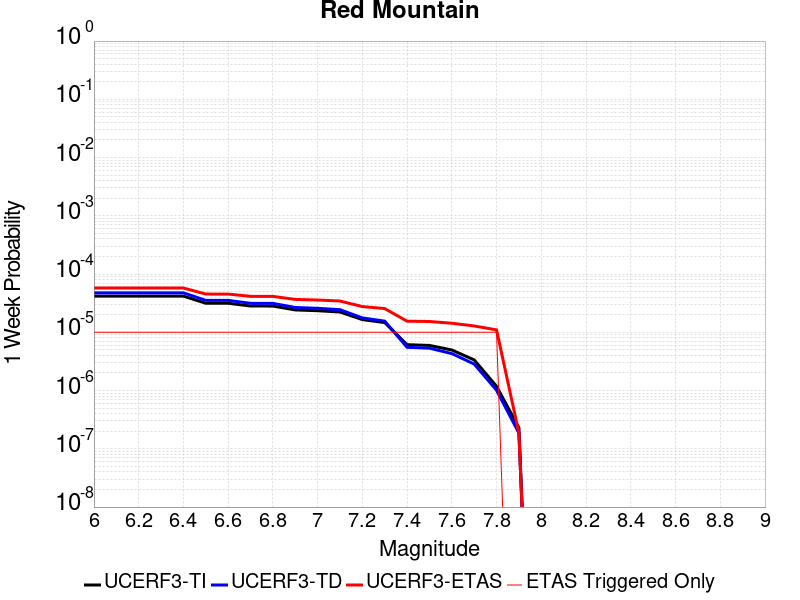 | 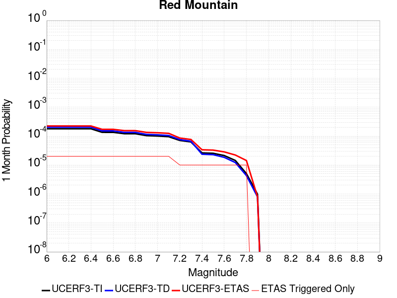 | 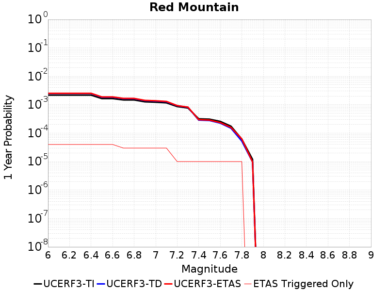 | 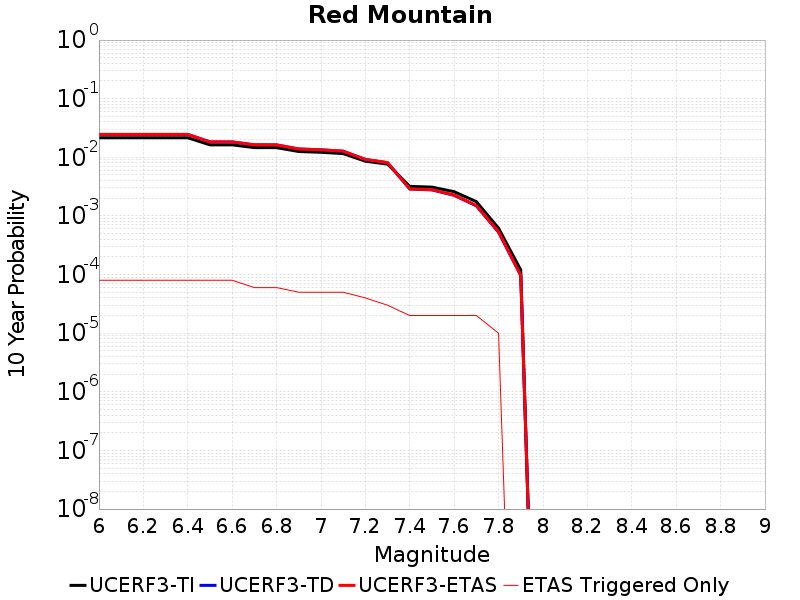 |

| Magnitude | 1 wk TI Prob | 1 wk TD Prob | 1 wk ETAS Prob | 1 wk ETAS/TD Gain | 1 wk ETAS Triggered Only | 1 mo TI Prob | 1 mo TD Prob | 1 mo ETAS Prob | 1 mo ETAS/TD Gain | 1 mo ETAS Triggered Only | 1 yr TI Prob | 1 yr TD Prob | 1 yr ETAS Prob | 1 yr ETAS/TD Gain | 1 yr ETAS Triggered Only | 10 yr TI Prob | 10 yr TD Prob | 10 yr ETAS Prob | 10 yr ETAS/TD Gain | 10 yr ETAS Triggered Only |
|-----|-----|-----|-----|-----|-----|-----|-----|-----|-----|-----|-----|-----|-----|-----|-----|-----|-----|-----|-----|-----|
| 6.0 | 4.1810763E-5 | 4.759084E-5 | 5.7590365E-5 | 1.2101145 | 1.0E-5 | 1.7917668E-4 | 2.0394573E-4 | 2.2394165E-4 | 1.0980453 | 2.0E-5 | 0.0021792934 | 0.0024803772 | 0.0025202779 | 1.0160866 | 4.0E-5 | 0.021580452 | 0.024544546 | 0.024622582 | 1.0031794 | 8.0E-5 |
| 6.1 | 4.1810763E-5 | 4.759084E-5 | 5.7590365E-5 | 1.2101145 | 1.0E-5 | 1.7917668E-4 | 2.0394573E-4 | 2.2394165E-4 | 1.0980453 | 2.0E-5 | 0.0021792934 | 0.0024803772 | 0.0025202779 | 1.0160866 | 4.0E-5 | 0.021580452 | 0.024544546 | 0.024622582 | 1.0031794 | 8.0E-5 |
| 6.2 | 4.1810763E-5 | 4.759084E-5 | 5.7590365E-5 | 1.2101145 | 1.0E-5 | 1.7917668E-4 | 2.0394573E-4 | 2.2394165E-4 | 1.0980453 | 2.0E-5 | 0.0021792934 | 0.0024803772 | 0.0025202779 | 1.0160866 | 4.0E-5 | 0.021580452 | 0.024544546 | 0.024622582 | 1.0031794 | 8.0E-5 |
| 6.3 | 4.1810763E-5 | 4.759084E-5 | 5.7590365E-5 | 1.2101145 | 1.0E-5 | 1.7917668E-4 | 2.0394573E-4 | 2.2394165E-4 | 1.0980453 | 2.0E-5 | 0.0021792934 | 0.0024803772 | 0.0025202779 | 1.0160866 | 4.0E-5 | 0.021580452 | 0.024544546 | 0.024622582 | 1.0031794 | 8.0E-5 |
| 6.4 | 4.1810763E-5 | 4.759084E-5 | 5.7590365E-5 | 1.2101145 | 1.0E-5 | 1.7917668E-4 | 2.0394573E-4 | 2.2394165E-4 | 1.0980453 | 2.0E-5 | 0.0021792934 | 0.0024803772 | 0.0025202779 | 1.0160866 | 4.0E-5 | 0.021580452 | 0.024544546 | 0.024622582 | 1.0031794 | 8.0E-5 |
| 6.5 | 3.154503E-5 | 3.5360357E-5 | 4.5360004E-5 | 1.2827926 | 1.0E-5 | 1.3518598E-4 | 1.5153611E-4 | 1.7153309E-4 | 1.1319617 | 2.0E-5 | 0.0016446467 | 0.001843483 | 0.0018834092 | 1.0216581 | 4.0E-5 | 0.01632528 | 0.018291557 | 0.018370094 | 1.0042936 | 8.0E-5 |
| 6.6 | 3.1535834E-5 | 3.534974E-5 | 4.534939E-5 | 1.2828776 | 1.0E-5 | 1.3514658E-4 | 1.5149062E-4 | 1.7148758E-4 | 1.1320014 | 2.0E-5 | 0.0016441676 | 0.00184293 | 0.0018828562 | 1.0216646 | 4.0E-5 | 0.01632056 | 0.018286118 | 0.018364655 | 1.0042949 | 8.0E-5 |
| 6.7 | 2.8267326E-5 | 3.146989E-5 | 4.1469575E-5 | 1.317754 | 1.0E-5 | 1.2114006E-4 | 1.3486446E-4 | 1.5486176E-4 | 1.148277 | 2.0E-5 | 0.0014738824 | 0.0016408232 | 0.001670774 | 1.0182536 | 3.0E-5 | 0.014641452 | 0.016295847 | 0.016354868 | 1.0036219 | 6.0E-5 |
| 6.8 | 2.8212884E-5 | 3.1407773E-5 | 4.140746E-5 | 1.3183825 | 1.0E-5 | 1.20906756E-4 | 1.3459827E-4 | 1.5459559E-4 | 1.1485703 | 2.0E-5 | 0.0014710457 | 0.0016375873 | 0.0016675382 | 1.0182897 | 3.0E-5 | 0.014613459 | 0.016263962 | 0.016322985 | 1.0036291 | 6.0E-5 |
| 6.9 | 2.4227871E-5 | 2.6707432E-5 | 3.6707166E-5 | 1.3744177 | 1.0E-5 | 1.03829596E-4 | 1.14455834E-4 | 1.3445354E-4 | 1.1747199 | 2.0E-5 | 0.0012633923 | 0.0013926849 | 0.0014226431 | 1.0215111 | 3.0E-5 | 0.012562336 | 0.01384726 | 0.013896568 | 1.0035608 | 5.0E-5 |
| 7.0 | 2.348524E-5 | 2.58362E-5 | 3.5835943E-5 | 1.3870438 | 1.0E-5 | 1.0064714E-4 | 1.107223E-4 | 1.3072009E-4 | 1.1806121 | 2.0E-5 | 0.0012246901 | 0.001347286 | 0.0013772456 | 1.022237 | 3.0E-5 | 0.012179627 | 0.013398815 | 0.013448145 | 1.0036817 | 5.0E-5 |
| 7.1 | 2.2311642E-5 | 2.446324E-5 | 3.4462995E-5 | 1.4087666 | 1.0E-5 | 9.561782E-5 | 1.0483867E-4 | 1.2483657E-4 | 1.1907493 | 2.0E-5 | 0.0011635252 | 0.0012757382 | 0.0013056999 | 1.0234858 | 3.0E-5 | 0.01157452 | 0.012691664 | 0.012741029 | 1.0038896 | 5.0E-5 |
| 7.2 | 1.6533986E-5 | 1.7670623E-5 | 2.7670447E-5 | 1.5659009 | 1.0E-5 | 7.085802E-5 | 7.5729404E-5 | 8.572865E-5 | 1.1320391 | 1.0E-5 | 8.623549E-4 | 9.2167896E-4 | 9.316698E-4 | 1.0108398 | 1.0E-5 | 0.008590161 | 0.009184843 | 0.009224475 | 1.004315 | 4.0E-5 |
| 7.3 | 1.4703092E-5 | 1.5559763E-5 | 2.5559606E-5 | 1.6426734 | 1.0E-5 | 6.301173E-5 | 6.668334E-5 | 7.668267E-5 | 1.1499525 | 1.0E-5 | 7.668978E-4 | 8.116288E-4 | 8.216207E-4 | 1.0123109 | 1.0E-5 | 0.0076425658 | 0.008092721 | 0.008122478 | 1.003677 | 3.0E-5 |
| 7.4 | 6.1331984E-6 | 5.528921E-6 | 1.5528865E-5 | 2.8086612 | 1.0E-5 | 2.6284872E-5 | 2.3695164E-5 | 3.3694927E-5 | 1.4220171 | 1.0E-5 | 3.199713E-4 | 2.8845094E-4 | 2.9844808E-4 | 1.034658 | 1.0E-5 | 0.0031951098 | 0.00288082 | 0.0029007623 | 1.0069225 | 2.0E-5 |
| 7.5 | 5.954766E-6 | 5.3385493E-6 | 1.5338495E-5 | 2.8731582 | 1.0E-5 | 2.5520176E-5 | 2.2879298E-5 | 3.287907E-5 | 1.4370663 | 1.0E-5 | 3.1066386E-4 | 2.7852037E-4 | 2.885176E-4 | 1.035894 | 1.0E-5 | 0.003102299 | 0.002781767 | 0.0028017114 | 1.0071697 | 2.0E-5 |
| 7.6 | 4.9726646E-6 | 4.3153336E-6 | 1.431529E-5 | 3.317308 | 1.0E-5 | 2.1311245E-5 | 1.8494156E-5 | 2.8493972E-5 | 1.5407013 | 1.0E-5 | 2.5943352E-4 | 2.2514343E-4 | 2.3514118E-4 | 1.0444062 | 1.0E-5 | 0.0025913084 | 0.002249188 | 0.002269143 | 1.0088722 | 2.0E-5 |
| 7.7 | 3.3613894E-6 | 2.8526897E-6 | 1.2852661E-5 | 4.5054536 | 1.0E-5 | 1.4405875E-5 | 1.2225757E-5 | 2.2225635E-5 | 1.8179352 | 1.0E-5 | 1.7537741E-4 | 1.4883869E-4 | 1.588372E-4 | 1.0671768 | 1.0E-5 | 0.0017523908 | 0.0014874163 | 0.0015073866 | 1.0134262 | 2.0E-5 |
| 7.8 | 1.1828961E-6 | 1.0122831E-6 | 1.1012273E-5 | 10.87865 | 1.0E-5 | 5.069545E-6 | 4.338349E-6 | 1.4338306E-5 | 3.3050144 | 1.0E-5 | 6.171996E-5 | 5.2818148E-5 | 6.281762E-5 | 1.1893189 | 1.0E-5 | 6.170282E-4 | 5.280589E-4 | 5.380536E-4 | 1.0189273 | 1.0E-5 |
| 7.9 | 2.2967266E-7 | 1.8619092E-7 | 1.8619092E-7 | 1.0 | 0.0 | 9.843111E-7 | 7.9796087E-7 | 7.9796087E-7 | 1.0 | 0.0 | 1.19839215E-5 | 9.715133E-6 | 9.715133E-6 | 1.0 | 0.0 | 1.1983275E-4 | 9.714737E-5 | 9.714737E-5 | 1.0 | 0.0 |

## San Jacinto (Anza) rev
*[(top)](#table-of-contents)*

| 1 Week | 1 Month | 1 Year | 10 Year |
|-----|-----|-----|-----|
| 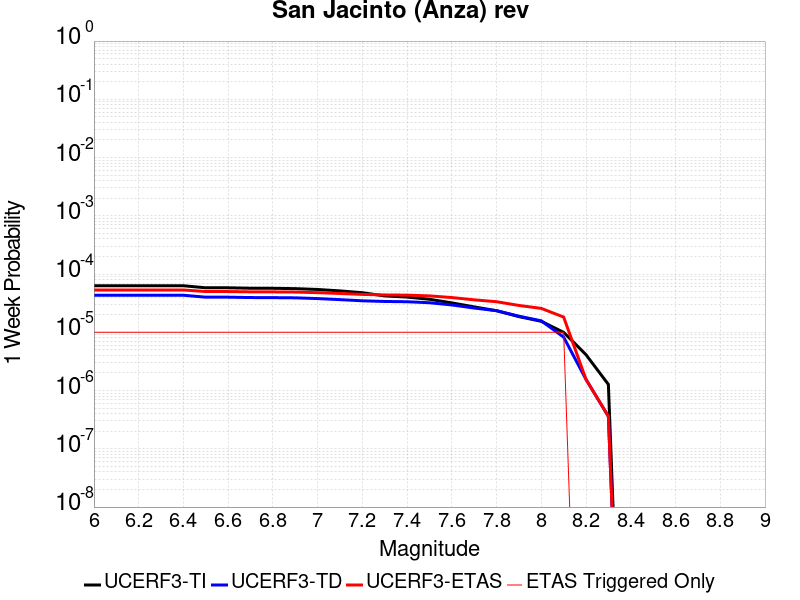 | 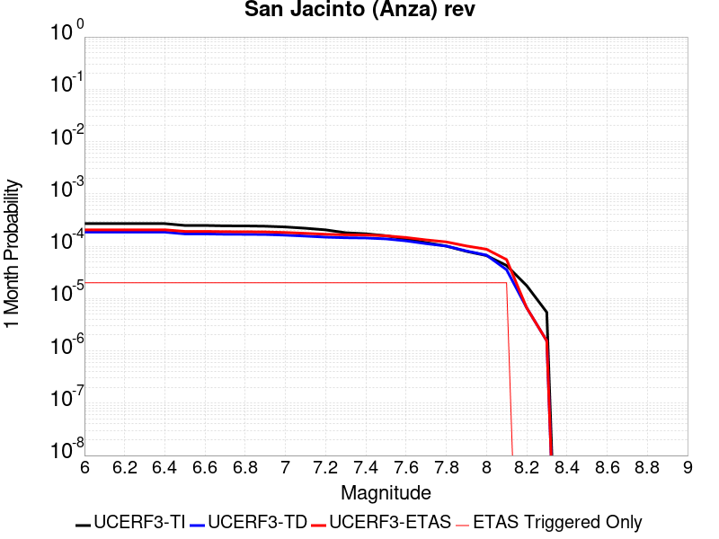 | 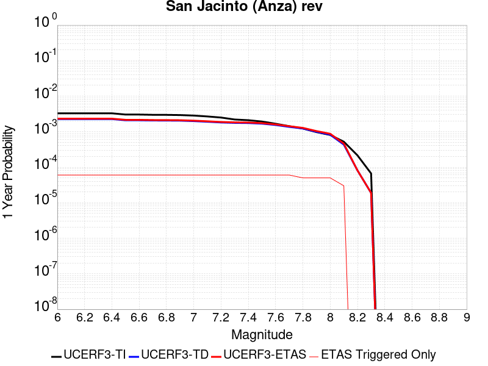 | 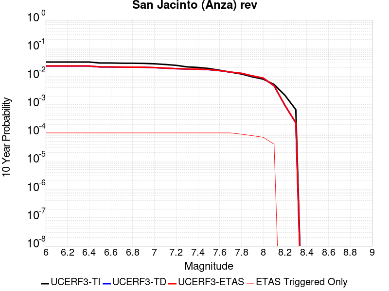 |

| Magnitude | 1 wk TI Prob | 1 wk TD Prob | 1 wk ETAS Prob | 1 wk ETAS/TD Gain | 1 wk ETAS Triggered Only | 1 mo TI Prob | 1 mo TD Prob | 1 mo ETAS Prob | 1 mo ETAS/TD Gain | 1 mo ETAS Triggered Only | 1 yr TI Prob | 1 yr TD Prob | 1 yr ETAS Prob | 1 yr ETAS/TD Gain | 1 yr ETAS Triggered Only | 10 yr TI Prob | 10 yr TD Prob | 10 yr ETAS Prob | 10 yr ETAS/TD Gain | 10 yr ETAS Triggered Only |
|-----|-----|-----|-----|-----|-----|-----|-----|-----|-----|-----|-----|-----|-----|-----|-----|-----|-----|-----|-----|-----|
| 6.0 | 6.3015636E-5 | 4.3316897E-5 | 5.3316464E-5 | 1.2308468 | 1.0E-5 | 2.7003905E-4 | 1.856307E-4 | 2.05627E-4 | 1.1077209 | 2.0E-5 | 0.0032827691 | 0.0022577231 | 0.0023175878 | 1.0265155 | 6.0E-5 | 0.032346968 | 0.023303552 | 0.023401221 | 1.0041912 | 1.0E-4 |
| 6.1 | 6.3015636E-5 | 4.3316897E-5 | 5.3316464E-5 | 1.2308468 | 1.0E-5 | 2.7003905E-4 | 1.856307E-4 | 2.05627E-4 | 1.1077209 | 2.0E-5 | 0.0032827691 | 0.0022577231 | 0.0023175878 | 1.0265155 | 6.0E-5 | 0.032346968 | 0.023303552 | 0.023401221 | 1.0041912 | 1.0E-4 |
| 6.2 | 6.3015636E-5 | 4.3316897E-5 | 5.3316464E-5 | 1.2308468 | 1.0E-5 | 2.7003905E-4 | 1.856307E-4 | 2.05627E-4 | 1.1077209 | 2.0E-5 | 0.0032827691 | 0.0022577231 | 0.0023175878 | 1.0265155 | 6.0E-5 | 0.032346968 | 0.023303552 | 0.023401221 | 1.0041912 | 1.0E-4 |
| 6.3 | 6.3015636E-5 | 4.3316897E-5 | 5.3316464E-5 | 1.2308468 | 1.0E-5 | 2.7003905E-4 | 1.856307E-4 | 2.05627E-4 | 1.1077209 | 2.0E-5 | 0.0032827691 | 0.0022577231 | 0.0023175878 | 1.0265155 | 6.0E-5 | 0.032346968 | 0.023303552 | 0.023401221 | 1.0041912 | 1.0E-4 |
| 6.4 | 6.3015636E-5 | 4.3316897E-5 | 5.3316464E-5 | 1.2308468 | 1.0E-5 | 2.7003905E-4 | 1.856307E-4 | 2.05627E-4 | 1.1077209 | 2.0E-5 | 0.0032827691 | 0.0022577231 | 0.0023175878 | 1.0265155 | 6.0E-5 | 0.032346968 | 0.023303552 | 0.023401221 | 1.0041912 | 1.0E-4 |
| 6.5 | 5.811017E-5 | 4.009604E-5 | 5.009564E-5 | 1.2493912 | 1.0E-5 | 2.4901982E-4 | 1.7182888E-4 | 1.9182546E-4 | 1.1163749 | 2.0E-5 | 0.0030276014 | 0.0020900152 | 0.0021498897 | 1.0286479 | 6.0E-5 | 0.02986684 | 0.021600742 | 0.021698583 | 1.0045295 | 1.0E-4 |
| 6.6 | 5.811017E-5 | 4.009604E-5 | 5.009564E-5 | 1.2493912 | 1.0E-5 | 2.4901982E-4 | 1.7182888E-4 | 1.9182546E-4 | 1.1163749 | 2.0E-5 | 0.0030276014 | 0.0020900152 | 0.0021498897 | 1.0286479 | 6.0E-5 | 0.02986684 | 0.021600742 | 0.021698583 | 1.0045295 | 1.0E-4 |
| 6.7 | 5.712442E-5 | 3.9518596E-5 | 4.95182E-5 | 1.2530354 | 1.0E-5 | 2.4479596E-4 | 1.6935445E-4 | 1.8935106E-4 | 1.1180755 | 2.0E-5 | 0.0029763177 | 0.002059946 | 0.0021198224 | 1.0290669 | 6.0E-5 | 0.029367693 | 0.021292493 | 0.021390364 | 1.0045965 | 1.0E-4 |
| 6.8 | 5.6967532E-5 | 3.937499E-5 | 4.9374597E-5 | 1.2539583 | 1.0E-5 | 2.4412372E-4 | 1.6873908E-4 | 1.8873569E-4 | 1.1185062 | 2.0E-5 | 0.0029681553 | 0.002052468 | 0.0021123448 | 1.0291731 | 6.0E-5 | 0.029288229 | 0.0212172 | 0.02131508 | 1.0046132 | 1.0E-4 |
| 6.9 | 5.6211324E-5 | 3.907969E-5 | 4.9079295E-5 | 1.2558774 | 1.0E-5 | 2.4088343E-4 | 1.6747366E-4 | 1.874703E-4 | 1.1194018 | 2.0E-5 | 0.0029288116 | 0.0020370902 | 0.0020969682 | 1.0293938 | 6.0E-5 | 0.028905109 | 0.021056583 | 0.021154478 | 1.0046492 | 1.0E-4 |
| 7.0 | 5.4383527E-5 | 3.7939903E-5 | 4.7939524E-5 | 1.2635647 | 1.0E-5 | 2.3305144E-4 | 1.6258948E-4 | 1.8258623E-4 | 1.1229892 | 2.0E-5 | 0.0028337094 | 0.0019777345 | 0.002037616 | 1.0302777 | 6.0E-5 | 0.027978465 | 0.020447388 | 0.020545343 | 1.0047905 | 1.0E-4 |
| 7.1 | 5.1393665E-5 | 3.6402354E-5 | 4.640199E-5 | 1.2746975 | 1.0E-5 | 2.2023996E-4 | 1.560008E-4 | 1.7599767E-4 | 1.1281844 | 2.0E-5 | 0.0026781242 | 0.0018976593 | 0.0019575453 | 1.0315579 | 6.0E-5 | 0.026460782 | 0.019620761 | 0.0197188 | 1.0049967 | 1.0E-4 |
| 7.2 | 4.785222E-5 | 3.4753717E-5 | 4.4753368E-5 | 1.287729 | 1.0E-5 | 2.0506482E-4 | 1.4893601E-4 | 1.6893304E-4 | 1.1342659 | 2.0E-5 | 0.0024938055 | 0.0018117913 | 0.0018716826 | 1.0330564 | 6.0E-5 | 0.024660049 | 0.018735195 | 0.01883332 | 1.0052376 | 1.0E-4 |
| 7.3 | 4.2143256E-5 | 3.3847853E-5 | 4.3847514E-5 | 1.2954297 | 1.0E-5 | 1.8060145E-4 | 1.4505419E-4 | 1.6505129E-4 | 1.1378595 | 2.0E-5 | 0.002196605 | 0.0017646076 | 0.0018245018 | 1.0339419 | 6.0E-5 | 0.02175019 | 0.018243255 | 0.01834143 | 1.0053815 | 1.0E-4 |
| 7.4 | 4.0264713E-5 | 3.3485925E-5 | 4.348559E-5 | 1.298623 | 1.0E-5 | 1.7255165E-4 | 1.4350323E-4 | 1.6350036E-4 | 1.1393497 | 2.0E-5 | 0.002098792 | 0.0017457552 | 0.0018056504 | 1.034309 | 6.0E-5 | 0.020790804 | 0.018047774 | 0.01814597 | 1.0054408 | 1.0E-4 |
| 7.5 | 3.694492E-5 | 3.2199674E-5 | 4.2199354E-5 | 1.3105521 | 1.0E-5 | 1.5832575E-4 | 1.3799132E-4 | 1.5798856E-4 | 1.1449167 | 2.0E-5 | 0.0019259118 | 0.0016787528 | 0.001738652 | 1.0356808 | 6.0E-5 | 0.01909306 | 0.017364094 | 0.017462356 | 1.005659 | 1.0E-4 |
| 7.6 | 3.200565E-5 | 2.951495E-5 | 3.9514656E-5 | 1.3388014 | 1.0E-5 | 1.3715986E-4 | 1.2648653E-4 | 1.4648399E-4 | 1.1580997 | 2.0E-5 | 0.001668642 | 0.0015388879 | 0.0015987955 | 1.0389292 | 6.0E-5 | 0.01656168 | 0.015951943 | 0.016050346 | 1.0061688 | 1.0E-4 |
| 7.7 | 2.731642E-5 | 2.6103331E-5 | 3.610307E-5 | 1.3830829 | 1.0E-5 | 1.1706512E-4 | 1.11866626E-4 | 1.3186439E-4 | 1.1787643 | 2.0E-5 | 0.001424336 | 0.0013611263 | 0.0014210446 | 1.0440211 | 6.0E-5 | 0.014152412 | 0.014172502 | 0.014271084 | 1.0069559 | 1.0E-4 |
| 7.8 | 2.3466424E-5 | 2.3514935E-5 | 3.35147E-5 | 1.4252516 | 1.0E-5 | 1.0056651E-4 | 1.0077441E-4 | 1.2077239E-4 | 1.198443 | 2.0E-5 | 0.0012237094 | 0.0012262387 | 0.0012761774 | 1.0407251 | 5.0E-5 | 0.012169928 | 0.012814176 | 0.0129030235 | 1.0069335 | 9.0E-5 |
| 7.9 | 1.8611925E-5 | 1.8917195E-5 | 2.8917006E-5 | 1.5286096 | 1.0E-5 | 7.9762955E-5 | 8.107118E-5 | 1.01069556E-4 | 1.2466768 | 2.0E-5 | 9.7068126E-4 | 9.865954E-4 | 0.0010365461 | 1.0506294 | 5.0E-5 | 0.0096645225 | 0.010398584 | 0.010477753 | 1.0076133 | 8.0E-5 |
| 8.0 | 1.5460775E-5 | 1.5748994E-5 | 2.5748835E-5 | 1.6349512 | 1.0E-5 | 6.6258784E-5 | 6.7493944E-5 | 8.74926E-5 | 1.2963029 | 2.0E-5 | 8.0640207E-4 | 8.2142965E-4 | 8.713886E-4 | 1.0608195 | 5.0E-5 | 0.008034821 | 0.008707109 | 0.008776499 | 1.0079694 | 7.0E-5 |
| 8.1 | 9.983884E-6 | 8.274659E-6 | 1.8274577E-5 | 2.208499 | 1.0E-5 | 4.2787375E-5 | 3.5462348E-5 | 5.5461638E-5 | 1.5639585 | 2.0E-5 | 5.2081177E-4 | 4.3166906E-4 | 4.616561E-4 | 1.0694677 | 3.0E-5 | 0.0051959283 | 0.0046425513 | 0.0046823653 | 1.0085759 | 4.0E-5 |
| 8.2 | 4.1226E-6 | 1.5543592E-6 | 1.5543592E-6 | 1.0 | 0.0 | 1.7668166E-5 | 6.6615225E-6 | 6.6615225E-6 | 1.0 | 0.0 | 2.1508869E-4 | 8.110105E-5 | 8.110105E-5 | 1.0 | 0.0 | 0.0021488064 | 9.412894E-4 | 9.412894E-4 | 1.0 | 0.0 |
| 8.3 | 1.2750878E-6 | 3.615911E-7 | 3.615911E-7 | 1.0 | 0.0 | 5.4646503E-6 | 1.5496753E-6 | 1.5496753E-6 | 1.0 | 0.0 | 6.653009E-5 | 1.8867138E-5 | 1.8867138E-5 | 1.0 | 0.0 | 6.6510175E-4 | 2.2756452E-4 | 2.2756452E-4 | 1.0 | 0.0 |

## Independence rev 2011
*[(top)](#table-of-contents)*

| 1 Week | 1 Month | 1 Year | 10 Year |
|-----|-----|-----|-----|
| 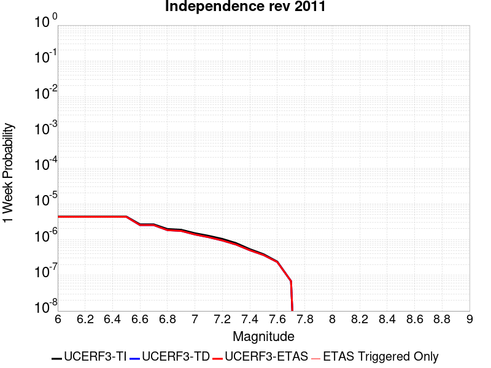 | 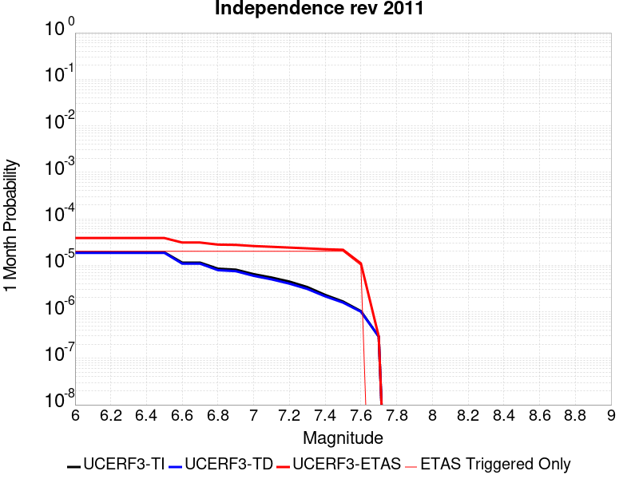 | 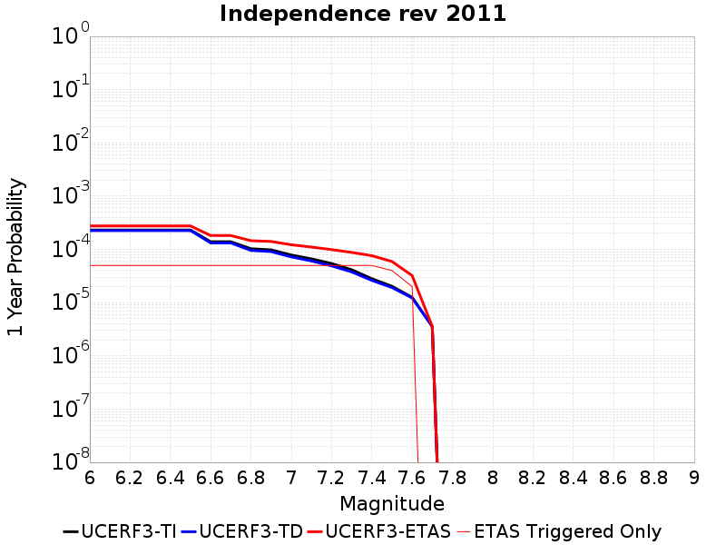 | 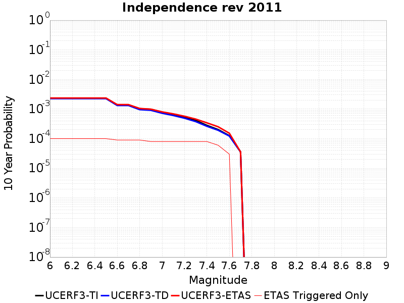 |

| Magnitude | 1 wk TI Prob | 1 wk TD Prob | 1 wk ETAS Prob | 1 wk ETAS/TD Gain | 1 wk ETAS Triggered Only | 1 mo TI Prob | 1 mo TD Prob | 1 mo ETAS Prob | 1 mo ETAS/TD Gain | 1 mo ETAS Triggered Only | 1 yr TI Prob | 1 yr TD Prob | 1 yr ETAS Prob | 1 yr ETAS/TD Gain | 1 yr ETAS Triggered Only | 10 yr TI Prob | 10 yr TD Prob | 10 yr ETAS Prob | 10 yr ETAS/TD Gain | 10 yr ETAS Triggered Only |
|-----|-----|-----|-----|-----|-----|-----|-----|-----|-----|-----|-----|-----|-----|-----|-----|-----|-----|-----|-----|-----|
| 6.0 | 4.422171E-6 | 4.3262426E-6 | 4.3262426E-6 | 1.0 | 0.0 | 1.8952025E-5 | 1.8540924E-5 | 3.8540555E-5 | 2.0786748 | 2.0E-5 | 2.3071647E-4 | 2.2571535E-4 | 2.7570408E-4 | 1.221468 | 5.0E-5 | 0.0023047708 | 0.0022551545 | 0.002354929 | 1.0442429 | 1.0E-4 |
| 6.1 | 4.422171E-6 | 4.3262426E-6 | 4.3262426E-6 | 1.0 | 0.0 | 1.8952025E-5 | 1.8540924E-5 | 3.8540555E-5 | 2.0786748 | 2.0E-5 | 2.3071647E-4 | 2.2571535E-4 | 2.7570408E-4 | 1.221468 | 5.0E-5 | 0.0023047708 | 0.0022551545 | 0.002354929 | 1.0442429 | 1.0E-4 |
| 6.2 | 4.422171E-6 | 4.3262426E-6 | 4.3262426E-6 | 1.0 | 0.0 | 1.8952025E-5 | 1.8540924E-5 | 3.8540555E-5 | 2.0786748 | 2.0E-5 | 2.3071647E-4 | 2.2571535E-4 | 2.7570408E-4 | 1.221468 | 5.0E-5 | 0.0023047708 | 0.0022551545 | 0.002354929 | 1.0442429 | 1.0E-4 |
| 6.3 | 4.422171E-6 | 4.3262426E-6 | 4.3262426E-6 | 1.0 | 0.0 | 1.8952025E-5 | 1.8540924E-5 | 3.8540555E-5 | 2.0786748 | 2.0E-5 | 2.3071647E-4 | 2.2571535E-4 | 2.7570408E-4 | 1.221468 | 5.0E-5 | 0.0023047708 | 0.0022551545 | 0.002354929 | 1.0442429 | 1.0E-4 |
| 6.4 | 4.422171E-6 | 4.3262426E-6 | 4.3262426E-6 | 1.0 | 0.0 | 1.8952025E-5 | 1.8540924E-5 | 3.8540555E-5 | 2.0786748 | 2.0E-5 | 2.3071647E-4 | 2.2571535E-4 | 2.7570408E-4 | 1.221468 | 5.0E-5 | 0.0023047708 | 0.0022551545 | 0.002354929 | 1.0442429 | 1.0E-4 |
| 6.5 | 4.422171E-6 | 4.3262426E-6 | 4.3262426E-6 | 1.0 | 0.0 | 1.8952025E-5 | 1.8540924E-5 | 3.8540555E-5 | 2.0786748 | 2.0E-5 | 2.3071647E-4 | 2.2571535E-4 | 2.7570408E-4 | 1.221468 | 5.0E-5 | 0.0023047708 | 0.0022551545 | 0.002354929 | 1.0442429 | 1.0E-4 |
| 6.6 | 2.663744E-6 | 2.5319976E-6 | 2.5319976E-6 | 1.0 | 0.0 | 1.1415996E-5 | 1.0851376E-5 | 3.085116E-5 | 2.8430643 | 2.0E-5 | 1.3898089E-4 | 1.3210798E-4 | 1.8210137E-4 | 1.3784282 | 5.0E-5 | 0.0013889399 | 0.0013203426 | 0.0014102239 | 1.0680741 | 9.0E-5 |
| 6.7 | 2.663744E-6 | 2.5319976E-6 | 2.5319976E-6 | 1.0 | 0.0 | 1.1415996E-5 | 1.0851376E-5 | 3.085116E-5 | 2.8430643 | 2.0E-5 | 1.3898089E-4 | 1.3210798E-4 | 1.8210137E-4 | 1.3784282 | 5.0E-5 | 0.0013889399 | 0.0013203426 | 0.0014102239 | 1.0680741 | 9.0E-5 |
| 6.8 | 1.9716529E-6 | 1.8322681E-6 | 1.8322681E-6 | 1.0 | 0.0 | 8.449913E-6 | 7.8525545E-6 | 2.7852398E-5 | 3.5469217 | 2.0E-5 | 1.0287284E-4 | 9.560079E-5 | 1.4559602E-4 | 1.5229583 | 5.0E-5 | 0.0010282523 | 9.5560955E-4 | 0.0010455236 | 1.0940907 | 9.0E-5 |
| 6.9 | 1.8788617E-6 | 1.7430086E-6 | 1.7430086E-6 | 1.0 | 0.0 | 8.0522395E-6 | 7.470016E-6 | 2.7469867E-5 | 3.6773503 | 2.0E-5 | 9.80316E-5 | 9.094377E-5 | 1.4093923E-4 | 1.5497402 | 5.0E-5 | 9.798837E-4 | 9.090776E-4 | 9.890049E-4 | 1.0879213 | 8.0E-5 |
| 7.0 | 1.5045488E-6 | 1.3849581E-6 | 1.3849581E-6 | 1.0 | 0.0 | 6.44805E-6 | 5.9355216E-6 | 2.5935402E-5 | 4.369524 | 2.0E-5 | 7.8502184E-5 | 7.226263E-5 | 1.2225902E-4 | 1.6918706 | 5.0E-5 | 7.8474457E-4 | 7.223965E-4 | 8.0233865E-4 | 1.1106625 | 8.0E-5 |
| 7.1 | 1.272341E-6 | 1.1625165E-6 | 1.1625165E-6 | 1.0 | 0.0 | 5.4528787E-6 | 4.982204E-6 | 2.4982104E-5 | 5.014268 | 2.0E-5 | 6.6386776E-5 | 6.0656675E-5 | 1.10653644E-4 | 1.8242615 | 5.0E-5 | 6.636695E-4 | 6.064044E-4 | 6.8635587E-4 | 1.1318451 | 8.0E-5 |
| 7.2 | 1.0416892E-6 | 9.4099386E-7 | 9.4099386E-7 | 1.0 | 0.0 | 4.464375E-6 | 4.0328246E-6 | 2.4032744E-5 | 5.9592834 | 2.0E-5 | 5.4352407E-5 | 4.909855E-5 | 9.90961E-5 | 2.01831 | 5.0E-5 | 5.4339116E-4 | 4.908789E-4 | 5.708396E-4 | 1.1628929 | 8.0E-5 |
| 7.3 | 7.9450155E-7 | 7.235045E-7 | 7.235045E-7 | 1.0 | 0.0 | 3.4050022E-6 | 3.10073E-6 | 2.3100669E-5 | 7.450074 | 2.0E-5 | 4.1455114E-5 | 3.7750746E-5 | 8.774886E-5 | 2.3244271 | 5.0E-5 | 4.144738E-4 | 3.7744443E-4 | 4.5741425E-4 | 1.2118717 | 8.0E-5 |
| 7.4 | 5.3893444E-7 | 5.0195393E-7 | 5.0195393E-7 | 1.0 | 0.0 | 2.309717E-6 | 2.1512294E-6 | 2.2151185E-5 | 10.296989 | 2.0E-5 | 2.8120441E-5 | 2.6190906E-5 | 7.61896E-5 | 2.9090095 | 5.0E-5 | 2.8116882E-4 | 2.6187865E-4 | 3.418577E-4 | 1.305405 | 8.0E-5 |
| 7.5 | 3.8852085E-7 | 3.6825716E-7 | 3.6825716E-7 | 1.0 | 0.0 | 1.6650882E-6 | 1.578244E-6 | 2.1578213E-5 | 13.672292 | 2.0E-5 | 2.027226E-5 | 1.9214953E-5 | 5.9214184E-5 | 3.081672 | 4.0E-5 | 2.0270412E-4 | 1.9213314E-4 | 2.521216E-4 | 1.3122234 | 6.0E-5 |
| 7.6 | 2.414929E-7 | 2.3457642E-7 | 2.3457642E-7 | 1.0 | 0.0 | 1.0349692E-6 | 1.0053271E-6 | 1.1005317E-5 | 10.9470005 | 1.0E-5 | 1.2600677E-5 | 1.22397905E-5 | 3.2239546E-5 | 2.6339948 | 2.0E-5 | 1.2599962E-4 | 1.2239128E-4 | 1.5238761E-4 | 1.2450855 | 3.0E-5 |
| 7.7 | 6.8298014E-8 | 6.858989E-8 | 6.858989E-8 | 1.0 | 0.0 | 2.9270575E-7 | 2.9395665E-7 | 2.9395665E-7 | 1.0 | 0.0 | 3.5636867E-6 | 3.5789167E-6 | 3.5789167E-6 | 1.0 | 0.0 | 3.5636294E-5 | 3.578864E-5 | 3.578864E-5 | 1.0 | 0.0 |

## Pleito
*[(top)](#table-of-contents)*

| 1 Week | 1 Month | 1 Year | 10 Year |
|-----|-----|-----|-----|
| 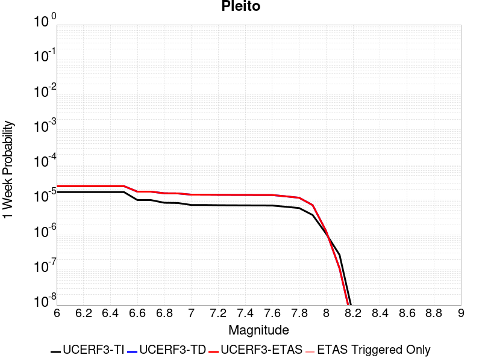 | 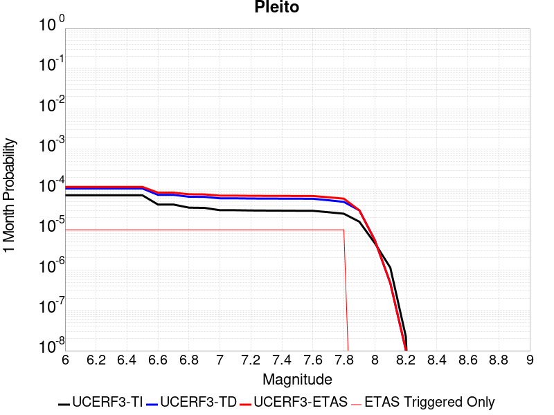 | 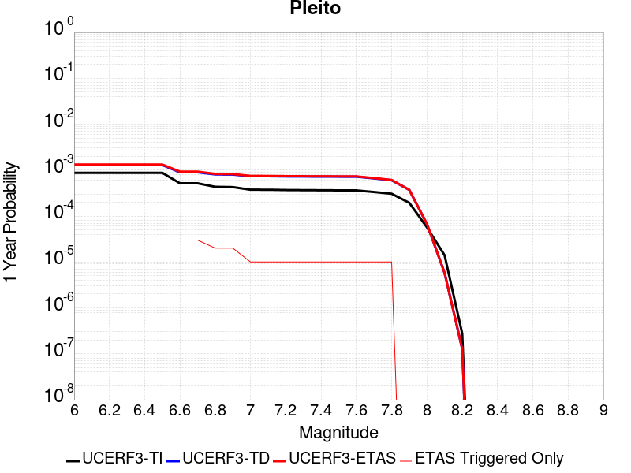 | 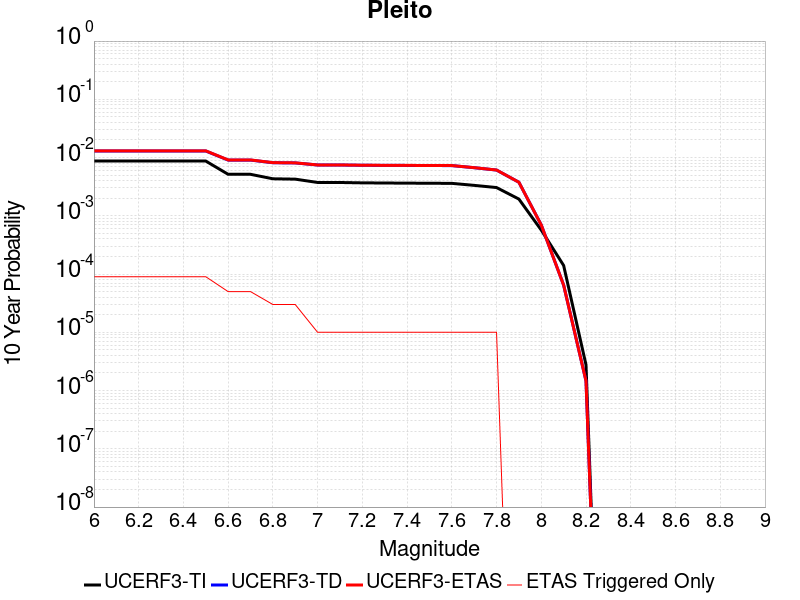 |

| Magnitude | 1 wk TI Prob | 1 wk TD Prob | 1 wk ETAS Prob | 1 wk ETAS/TD Gain | 1 wk ETAS Triggered Only | 1 mo TI Prob | 1 mo TD Prob | 1 mo ETAS Prob | 1 mo ETAS/TD Gain | 1 mo ETAS Triggered Only | 1 yr TI Prob | 1 yr TD Prob | 1 yr ETAS Prob | 1 yr ETAS/TD Gain | 1 yr ETAS Triggered Only | 10 yr TI Prob | 10 yr TD Prob | 10 yr ETAS Prob | 10 yr ETAS/TD Gain | 10 yr ETAS Triggered Only |
|-----|-----|-----|-----|-----|-----|-----|-----|-----|-----|-----|-----|-----|-----|-----|-----|-----|-----|-----|-----|-----|
| 6.0 | 1.6763008E-5 | 2.4769455E-5 | 2.4769455E-5 | 1.0 | 0.0 | 7.183948E-5 | 1.06150896E-4 | 1.1614984E-4 | 1.0941955 | 1.0E-5 | 8.742947E-4 | 0.0012916931 | 0.0013216543 | 1.0231954 | 3.0E-5 | 0.00870863 | 0.012956725 | 0.01304556 | 1.0068562 | 9.0E-5 |
| 6.1 | 1.6763008E-5 | 2.4769455E-5 | 2.4769455E-5 | 1.0 | 0.0 | 7.183948E-5 | 1.06150896E-4 | 1.1614984E-4 | 1.0941955 | 1.0E-5 | 8.742947E-4 | 0.0012916931 | 0.0013216543 | 1.0231954 | 3.0E-5 | 0.00870863 | 0.012956725 | 0.01304556 | 1.0068562 | 9.0E-5 |
| 6.2 | 1.6763008E-5 | 2.4769455E-5 | 2.4769455E-5 | 1.0 | 0.0 | 7.183948E-5 | 1.06150896E-4 | 1.1614984E-4 | 1.0941955 | 1.0E-5 | 8.742947E-4 | 0.0012916931 | 0.0013216543 | 1.0231954 | 3.0E-5 | 0.00870863 | 0.012956725 | 0.01304556 | 1.0068562 | 9.0E-5 |
| 6.3 | 1.6763008E-5 | 2.4769455E-5 | 2.4769455E-5 | 1.0 | 0.0 | 7.183948E-5 | 1.06150896E-4 | 1.1614984E-4 | 1.0941955 | 1.0E-5 | 8.742947E-4 | 0.0012916931 | 0.0013216543 | 1.0231954 | 3.0E-5 | 0.00870863 | 0.012956725 | 0.01304556 | 1.0068562 | 9.0E-5 |
| 6.4 | 1.6763008E-5 | 2.4769455E-5 | 2.4769455E-5 | 1.0 | 0.0 | 7.183948E-5 | 1.06150896E-4 | 1.1614984E-4 | 1.0941955 | 1.0E-5 | 8.742947E-4 | 0.0012916931 | 0.0013216543 | 1.0231954 | 3.0E-5 | 0.00870863 | 0.012956725 | 0.01304556 | 1.0068562 | 9.0E-5 |
| 6.5 | 1.6763008E-5 | 2.4769455E-5 | 2.4769455E-5 | 1.0 | 0.0 | 7.183948E-5 | 1.06150896E-4 | 1.1614984E-4 | 1.0941955 | 1.0E-5 | 8.742947E-4 | 0.0012916931 | 0.0013216543 | 1.0231954 | 3.0E-5 | 0.00870863 | 0.012956725 | 0.01304556 | 1.0068562 | 9.0E-5 |
| 6.6 | 9.910213E-6 | 1.7220154E-5 | 1.7220154E-5 | 1.0 | 0.0 | 4.247165E-5 | 7.37986E-5 | 8.379786E-5 | 1.1354939 | 1.0E-5 | 5.169696E-4 | 8.981313E-4 | 9.2810433E-4 | 1.0333726 | 3.0E-5 | 0.0051576863 | 0.009053504 | 0.009103051 | 1.0054728 | 5.0E-5 |
| 6.7 | 9.910213E-6 | 1.7220154E-5 | 1.7220154E-5 | 1.0 | 0.0 | 4.247165E-5 | 7.37986E-5 | 8.379786E-5 | 1.1354939 | 1.0E-5 | 5.169696E-4 | 8.981313E-4 | 9.2810433E-4 | 1.0333726 | 3.0E-5 | 0.0051576863 | 0.009053504 | 0.009103051 | 1.0054728 | 5.0E-5 |
| 6.8 | 8.300162E-6 | 1.5479747E-5 | 1.5479747E-5 | 1.0 | 0.0 | 3.557164E-5 | 6.63401E-5 | 7.6339435E-5 | 1.1507283 | 1.0E-5 | 4.3299864E-4 | 8.073928E-4 | 8.273767E-4 | 1.0247511 | 2.0E-5 | 0.004321559 | 0.008152936 | 0.008182691 | 1.0036497 | 3.0E-5 |
| 6.9 | 8.183114E-6 | 1.535096E-5 | 1.535096E-5 | 1.0 | 0.0 | 3.5070017E-5 | 6.578818E-5 | 7.5787524E-5 | 1.151993 | 1.0E-5 | 4.2689382E-4 | 8.0067816E-4 | 8.206621E-4 | 1.0249588 | 2.0E-5 | 0.0042607468 | 0.008086279 | 0.008116037 | 1.00368 | 3.0E-5 |
| 7.0 | 7.1748823E-6 | 1.4137883E-5 | 1.4137883E-5 | 1.0 | 0.0 | 3.0749135E-5 | 6.0589522E-5 | 7.058892E-5 | 1.165035 | 1.0E-5 | 3.743064E-4 | 7.374283E-4 | 7.4742094E-4 | 1.0135506 | 1.0E-5 | 0.0037367654 | 0.0074577006 | 0.007467626 | 1.0013309 | 1.0E-5 |
| 7.1 | 7.1671807E-6 | 1.4128253E-5 | 1.4128253E-5 | 1.0 | 0.0 | 3.0716128E-5 | 6.0548253E-5 | 7.054765E-5 | 1.1651475 | 1.0E-5 | 3.7390468E-4 | 7.3692616E-4 | 7.4691884E-4 | 1.0135599 | 1.0E-5 | 0.0037327618 | 0.0074527133 | 0.007462639 | 1.0013318 | 1.0E-5 |
| 7.2 | 7.0649667E-6 | 1.3975527E-5 | 1.3975527E-5 | 1.0 | 0.0 | 3.0278077E-5 | 5.989374E-5 | 6.989314E-5 | 1.1669524 | 1.0E-5 | 3.6857324E-4 | 7.289628E-4 | 7.3895557E-4 | 1.0137081 | 1.0E-5 | 0.0036796255 | 0.0073734615 | 0.0073833875 | 1.0013462 | 1.0E-5 |
| 7.3 | 7.02082E-6 | 1.3918971E-5 | 1.3918971E-5 | 1.0 | 0.0 | 3.008888E-5 | 5.965137E-5 | 6.965078E-5 | 1.1676308 | 1.0E-5 | 3.6627054E-4 | 7.2601397E-4 | 7.360067E-4 | 1.0137638 | 1.0E-5 | 0.0036566744 | 0.007343956 | 0.0073538823 | 1.0013517 | 1.0E-5 |
| 7.4 | 6.987146E-6 | 1.3878526E-5 | 1.3878526E-5 | 1.0 | 0.0 | 2.9944567E-5 | 5.9478047E-5 | 6.947745E-5 | 1.1681193 | 1.0E-5 | 3.6451413E-4 | 7.239051E-4 | 7.338979E-4 | 1.013804 | 1.0E-5 | 0.0036391679 | 0.007322888 | 0.007332815 | 1.0013555 | 1.0E-5 |
| 7.5 | 6.9494554E-6 | 1.3835428E-5 | 1.3835428E-5 | 1.0 | 0.0 | 2.9783041E-5 | 5.9293347E-5 | 6.929275E-5 | 1.168643 | 1.0E-5 | 3.625482E-4 | 7.216579E-4 | 7.316507E-4 | 1.013847 | 1.0E-5 | 0.0036195726 | 0.0073005143 | 0.007310441 | 1.0013598 | 1.0E-5 |
| 7.6 | 6.92694E-6 | 1.37945335E-5 | 1.37945335E-5 | 1.0 | 0.0 | 2.9686547E-5 | 5.911809E-5 | 6.91175E-5 | 1.169143 | 1.0E-5 | 3.6137376E-4 | 7.1952556E-4 | 7.2951836E-4 | 1.013888 | 1.0E-5 | 0.0036078666 | 0.007279263 | 0.0072891903 | 1.0013638 | 1.0E-5 |
| 7.7 | 6.395867E-6 | 1.2673384E-5 | 1.2673384E-5 | 1.0 | 0.0 | 2.741057E-5 | 5.4313376E-5 | 6.431283E-5 | 1.1841067 | 1.0E-5 | 3.336726E-4 | 6.6106505E-4 | 6.710584E-4 | 1.015117 | 1.0E-5 | 0.0033317201 | 0.0066978075 | 0.0067077405 | 1.0014831 | 1.0E-5 |
| 7.8 | 5.8664327E-6 | 1.1540576E-5 | 1.1540576E-5 | 1.0 | 0.0 | 2.5141611E-5 | 4.945868E-5 | 5.9458183E-5 | 1.202179 | 1.0E-5 | 3.060561E-4 | 6.0199323E-4 | 6.1198726E-4 | 1.0166014 | 1.0E-5 | 0.0030563495 | 0.0061030635 | 0.0061130025 | 1.0016285 | 1.0E-5 |
| 7.9 | 3.7167474E-6 | 7.1169416E-6 | 7.1169416E-6 | 1.0 | 0.0 | 1.592882E-5 | 3.0500822E-5 | 3.0500822E-5 | 1.0 | 0.0 | 1.9391612E-4 | 3.7128438E-4 | 3.7128438E-4 | 1.0 | 0.0 | 0.0019374699 | 0.0037689437 | 0.0037689437 | 1.0 | 0.0 |
| 8.0 | 1.0903841E-6 | 1.2885665E-6 | 1.2885665E-6 | 1.0 | 0.0 | 4.6730665E-6 | 5.5224164E-6 | 5.5224164E-6 | 1.0 | 0.0 | 5.68931E-5 | 6.7233355E-5 | 6.7233355E-5 | 1.0 | 0.0 | 5.6878536E-4 | 6.945243E-4 | 6.945243E-4 | 1.0 | 0.0 |
| 8.1 | 2.6894583E-7 | 1.1070937E-7 | 1.1070937E-7 | 1.0 | 0.0 | 1.1526245E-6 | 4.7446864E-7 | 4.7446864E-7 | 1.0 | 0.0 | 1.4033113E-5 | 5.7766406E-6 | 5.7766406E-6 | 1.0 | 0.0 | 1.4032227E-4 | 6.4628264E-5 | 6.4628264E-5 | 1.0 | 0.0 |
| 8.2 | 5.2967013E-9 | 2.4603577E-9 | 2.4603577E-9 | 1.0 | 0.0 | 2.2700148E-8 | 1.054439E-8 | 1.054439E-8 | 1.0 | 0.0 | 2.7637427E-7 | 1.2837795E-7 | 1.2837795E-7 | 1.0 | 0.0 | 2.7637393E-6 | 1.4606968E-6 | 1.4606968E-6 | 1.0 | 0.0 |

## Cleghorn Lake
*[(top)](#table-of-contents)*

| 1 Week | 1 Month | 1 Year | 10 Year |
|-----|-----|-----|-----|
| 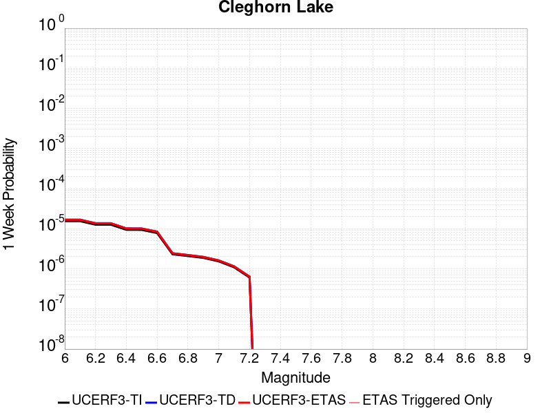 | 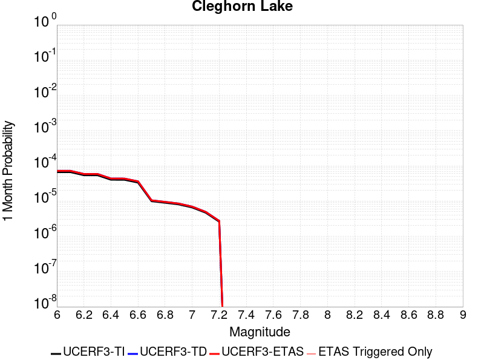 | 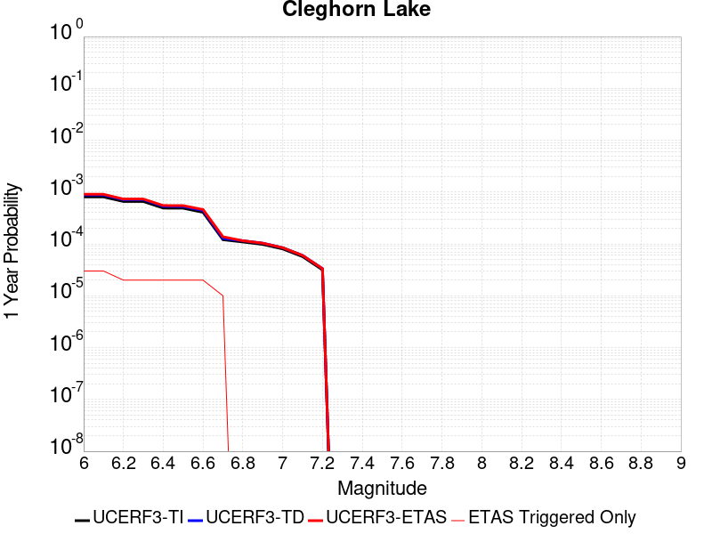 | 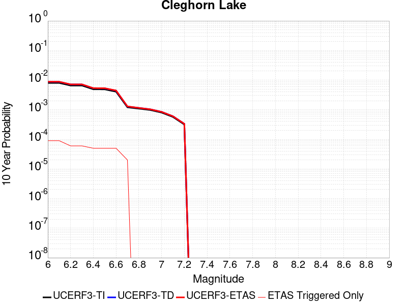 |

| Magnitude | 1 wk TI Prob | 1 wk TD Prob | 1 wk ETAS Prob | 1 wk ETAS/TD Gain | 1 wk ETAS Triggered Only | 1 mo TI Prob | 1 mo TD Prob | 1 mo ETAS Prob | 1 mo ETAS/TD Gain | 1 mo ETAS Triggered Only | 1 yr TI Prob | 1 yr TD Prob | 1 yr ETAS Prob | 1 yr ETAS/TD Gain | 1 yr ETAS Triggered Only | 10 yr TI Prob | 10 yr TD Prob | 10 yr ETAS Prob | 10 yr ETAS/TD Gain | 10 yr ETAS Triggered Only |
|-----|-----|-----|-----|-----|-----|-----|-----|-----|-----|-----|-----|-----|-----|-----|-----|-----|-----|-----|-----|-----|
| 6.0 | 1.5467183E-5 | 1.6794365E-5 | 1.6794365E-5 | 1.0 | 0.0 | 6.6286244E-5 | 7.197417E-5 | 7.197417E-5 | 1.0 | 0.0 | 8.067362E-4 | 8.7598816E-4 | 9.059619E-4 | 1.034217 | 3.0E-5 | 0.008038137 | 0.008730779 | 0.008819994 | 1.0102184 | 9.0E-5 |
| 6.1 | 1.5467183E-5 | 1.6794365E-5 | 1.6794365E-5 | 1.0 | 0.0 | 6.6286244E-5 | 7.197417E-5 | 7.197417E-5 | 1.0 | 0.0 | 8.067362E-4 | 8.7598816E-4 | 9.059619E-4 | 1.034217 | 3.0E-5 | 0.008038137 | 0.008730779 | 0.008819994 | 1.0102184 | 9.0E-5 |
| 6.2 | 1.2624631E-5 | 1.3681673E-5 | 1.3681673E-5 | 1.0 | 0.0 | 5.410444E-5 | 5.8634698E-5 | 5.8634698E-5 | 1.0 | 0.0 | 6.585225E-4 | 7.1369234E-4 | 7.3367805E-4 | 1.0280033 | 2.0E-5 | 0.0065657445 | 0.0071187983 | 0.0071783713 | 1.0083684 | 6.0E-5 |
| 6.3 | 1.2624631E-5 | 1.3681673E-5 | 1.3681673E-5 | 1.0 | 0.0 | 5.410444E-5 | 5.8634698E-5 | 5.8634698E-5 | 1.0 | 0.0 | 6.585225E-4 | 7.1369234E-4 | 7.3367805E-4 | 1.0280033 | 2.0E-5 | 0.0065657445 | 0.0071187983 | 0.0071783713 | 1.0083684 | 6.0E-5 |
| 6.4 | 9.417684E-6 | 1.0170209E-5 | 1.0170209E-5 | 1.0 | 0.0 | 4.036088E-5 | 4.3586115E-5 | 4.3586115E-5 | 1.0 | 0.0 | 4.912829E-4 | 5.305728E-4 | 5.505622E-4 | 1.0376751 | 2.0E-5 | 0.004901982 | 0.0052970964 | 0.005346832 | 1.0093892 | 5.0E-5 |
| 6.5 | 9.368219E-6 | 1.0117636E-5 | 1.0117636E-5 | 1.0 | 0.0 | 4.014889E-5 | 4.3360804E-5 | 4.3360804E-5 | 1.0 | 0.0 | 4.8870314E-4 | 5.27831E-4 | 5.4782047E-4 | 1.0378709 | 2.0E-5 | 0.004876298 | 0.0052698087 | 0.0053195455 | 1.009438 | 5.0E-5 |
| 6.6 | 7.803798E-6 | 8.441909E-6 | 8.441909E-6 | 1.0 | 0.0 | 3.3444423E-5 | 3.617933E-5 | 3.617933E-5 | 1.0 | 0.0 | 4.0710976E-4 | 4.4043426E-4 | 4.6042545E-4 | 1.0453898 | 2.0E-5 | 0.0040636472 | 0.0043995306 | 0.0044493107 | 1.0113149 | 5.0E-5 |
| 6.7 | 2.3108669E-6 | 2.4438493E-6 | 2.4438493E-6 | 1.0 | 0.0 | 9.903678E-6 | 1.0473599E-5 | 1.0473599E-5 | 1.0 | 0.0 | 1.205706E-4 | 1.275088E-4 | 1.3750752E-4 | 1.078416 | 1.0E-5 | 0.001205052 | 0.001274375 | 0.0012943496 | 1.015674 | 2.0E-5 |
| 6.8 | 2.0882828E-6 | 2.2062961E-6 | 2.2062961E-6 | 1.0 | 0.0 | 8.949753E-6 | 9.455522E-6 | 9.455522E-6 | 1.0 | 0.0 | 1.08957785E-4 | 1.15115065E-4 | 1.15115065E-4 | 1.0 | 0.0 | 0.0010890438 | 0.0011505712 | 0.0011505712 | 1.0 | 0.0 |
| 6.9 | 1.876935E-6 | 1.9810632E-6 | 1.9810632E-6 | 1.0 | 0.0 | 8.043982E-6 | 8.490245E-6 | 8.490245E-6 | 1.0 | 0.0 | 9.7931086E-5 | 1.03363986E-4 | 1.03363986E-4 | 1.0 | 0.0 | 9.788794E-4 | 0.001033175 | 0.001033175 | 1.0 | 0.0 |
| 7.0 | 1.5357559E-6 | 1.6202907E-6 | 1.6202907E-6 | 1.0 | 0.0 | 6.5817944E-6 | 6.9440853E-6 | 6.9440853E-6 | 1.0 | 0.0 | 8.01304E-5 | 8.454108E-5 | 8.454108E-5 | 1.0 | 0.0 | 8.010151E-4 | 8.4510166E-4 | 8.4510166E-4 | 1.0 | 0.0 |
| 7.1 | 1.0905424E-6 | 1.149769E-6 | 1.149769E-6 | 1.0 | 0.0 | 4.6737446E-6 | 4.9275727E-6 | 4.9275727E-6 | 1.0 | 0.0 | 5.6901354E-5 | 5.9991642E-5 | 5.9991642E-5 | 1.0 | 0.0 | 5.6886784E-4 | 5.997643E-4 | 5.997643E-4 | 1.0 | 0.0 |
| 7.2 | 6.06668E-7 | 6.3873154E-7 | 6.3873154E-7 | 1.0 | 0.0 | 2.600003E-6 | 2.7374183E-6 | 2.7374183E-6 | 1.0 | 0.0 | 3.1654577E-5 | 3.332763E-5 | 3.332763E-5 | 1.0 | 0.0 | 3.1650066E-4 | 3.3323315E-4 | 3.3323315E-4 | 1.0 | 0.0 |

## Mission Creek
*[(top)](#table-of-contents)*

| 1 Week | 1 Month | 1 Year | 10 Year |
|-----|-----|-----|-----|
| 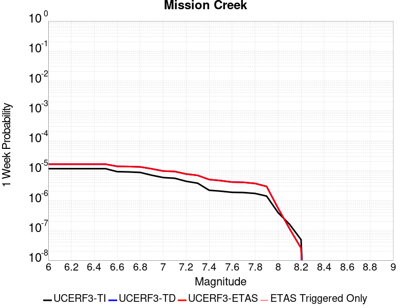 | 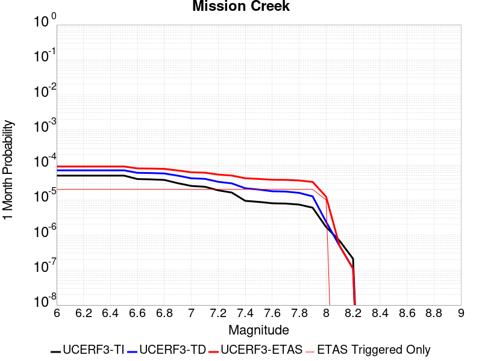 | 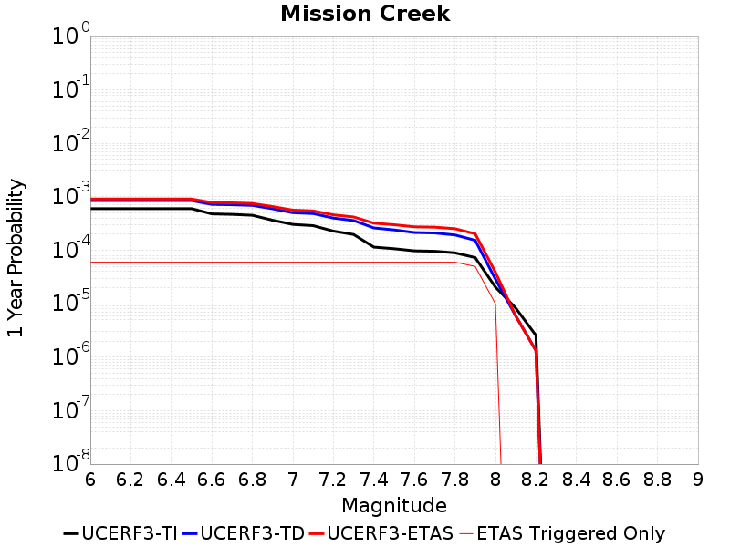 | 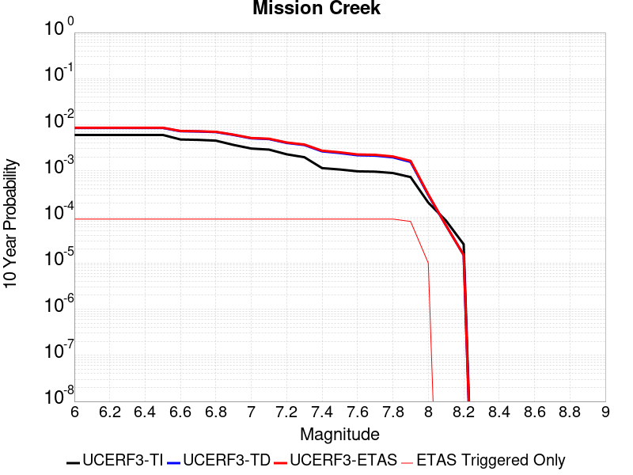 |

| Magnitude | 1 wk TI Prob | 1 wk TD Prob | 1 wk ETAS Prob | 1 wk ETAS/TD Gain | 1 wk ETAS Triggered Only | 1 mo TI Prob | 1 mo TD Prob | 1 mo ETAS Prob | 1 mo ETAS/TD Gain | 1 mo ETAS Triggered Only | 1 yr TI Prob | 1 yr TD Prob | 1 yr ETAS Prob | 1 yr ETAS/TD Gain | 1 yr ETAS Triggered Only | 10 yr TI Prob | 10 yr TD Prob | 10 yr ETAS Prob | 10 yr ETAS/TD Gain | 10 yr ETAS Triggered Only |
|-----|-----|-----|-----|-----|-----|-----|-----|-----|-----|-----|-----|-----|-----|-----|-----|-----|-----|-----|-----|-----|
| 6.0 | 1.1549387E-5 | 1.6324346E-5 | 1.6324346E-5 | 1.0 | 0.0 | 4.9496433E-5 | 6.995969E-5 | 8.9958296E-5 | 1.2858589 | 2.0E-5 | 6.0245243E-4 | 8.514414E-4 | 9.1139035E-4 | 1.0704087 | 6.0E-5 | 0.006008218 | 0.008510998 | 0.008600232 | 1.0104846 | 9.0E-5 |
| 6.1 | 1.1549387E-5 | 1.6324346E-5 | 1.6324346E-5 | 1.0 | 0.0 | 4.9496433E-5 | 6.995969E-5 | 8.9958296E-5 | 1.2858589 | 2.0E-5 | 6.0245243E-4 | 8.514414E-4 | 9.1139035E-4 | 1.0704087 | 6.0E-5 | 0.006008218 | 0.008510998 | 0.008600232 | 1.0104846 | 9.0E-5 |
| 6.2 | 1.1549387E-5 | 1.6324346E-5 | 1.6324346E-5 | 1.0 | 0.0 | 4.9496433E-5 | 6.995969E-5 | 8.9958296E-5 | 1.2858589 | 2.0E-5 | 6.0245243E-4 | 8.514414E-4 | 9.1139035E-4 | 1.0704087 | 6.0E-5 | 0.006008218 | 0.008510998 | 0.008600232 | 1.0104846 | 9.0E-5 |
| 6.3 | 1.1549387E-5 | 1.6324346E-5 | 1.6324346E-5 | 1.0 | 0.0 | 4.9496433E-5 | 6.995969E-5 | 8.9958296E-5 | 1.2858589 | 2.0E-5 | 6.0245243E-4 | 8.514414E-4 | 9.1139035E-4 | 1.0704087 | 6.0E-5 | 0.006008218 | 0.008510998 | 0.008600232 | 1.0104846 | 9.0E-5 |
| 6.4 | 1.1549387E-5 | 1.6324346E-5 | 1.6324346E-5 | 1.0 | 0.0 | 4.9496433E-5 | 6.995969E-5 | 8.9958296E-5 | 1.2858589 | 2.0E-5 | 6.0245243E-4 | 8.514414E-4 | 9.1139035E-4 | 1.0704087 | 6.0E-5 | 0.006008218 | 0.008510998 | 0.008600232 | 1.0104846 | 9.0E-5 |
| 6.5 | 1.1549387E-5 | 1.6324346E-5 | 1.6324346E-5 | 1.0 | 0.0 | 4.9496433E-5 | 6.995969E-5 | 8.9958296E-5 | 1.2858589 | 2.0E-5 | 6.0245243E-4 | 8.514414E-4 | 9.1139035E-4 | 1.0704087 | 6.0E-5 | 0.006008218 | 0.008510998 | 0.008600232 | 1.0104846 | 9.0E-5 |
| 6.6 | 9.202681E-6 | 1.3847608E-5 | 1.3847608E-5 | 1.0 | 0.0 | 3.9439463E-5 | 5.934559E-5 | 7.9344405E-5 | 1.336989 | 2.0E-5 | 4.800697E-4 | 7.2230207E-4 | 7.8225875E-4 | 1.0830077 | 6.0E-5 | 0.004790339 | 0.007228175 | 0.007317525 | 1.0123613 | 9.0E-5 |
| 6.7 | 9.019164E-6 | 1.3653276E-5 | 1.3653276E-5 | 1.0 | 0.0 | 3.8652986E-5 | 5.851278E-5 | 7.8511606E-5 | 1.3417857 | 2.0E-5 | 4.7049852E-4 | 7.121692E-4 | 7.721265E-4 | 1.0841897 | 6.0E-5 | 0.004695036 | 0.007127499 | 0.0072168577 | 1.0125371 | 9.0E-5 |
| 6.8 | 8.673558E-6 | 1.3275383E-5 | 1.3275383E-5 | 1.0 | 0.0 | 3.717186E-5 | 5.6893306E-5 | 7.689217E-5 | 1.3515152 | 2.0E-5 | 4.524734E-4 | 6.924647E-4 | 7.5242313E-4 | 1.0865871 | 6.0E-5 | 0.0045155324 | 0.0069316854 | 0.0070210616 | 1.0128938 | 9.0E-5 |
| 6.9 | 7.002255E-6 | 1.1479598E-5 | 1.1479598E-5 | 1.0 | 0.0 | 3.000932E-5 | 4.9197384E-5 | 6.91964E-5 | 1.4065057 | 2.0E-5 | 3.653022E-4 | 5.988204E-4 | 6.5878447E-4 | 1.100137 | 6.0E-5 | 0.0036470229 | 0.0060005016 | 0.0060899616 | 1.0149088 | 9.0E-5 |
| 7.0 | 5.84644E-6 | 9.676822E-6 | 9.676822E-6 | 1.0 | 0.0 | 2.5055931E-5 | 4.147146E-5 | 6.147063E-5 | 1.4822394 | 2.0E-5 | 3.0501327E-4 | 5.048026E-4 | 5.647723E-4 | 1.1187984 | 6.0E-5 | 0.0030459496 | 0.005064786 | 0.0051543303 | 1.0176798 | 9.0E-5 |
| 7.1 | 5.54703E-6 | 9.331291E-6 | 9.331291E-6 | 1.0 | 0.0 | 2.377277E-5 | 3.999066E-5 | 5.998986E-5 | 1.5000968 | 2.0E-5 | 2.8939504E-4 | 4.8678197E-4 | 5.4675277E-4 | 1.1231985 | 6.0E-5 | 0.0028901845 | 0.004885377 | 0.004974937 | 1.0183324 | 9.0E-5 |
| 7.2 | 4.384709E-6 | 7.683324E-6 | 7.683324E-6 | 1.0 | 0.0 | 1.8791474E-5 | 3.2928136E-5 | 5.2927477E-5 | 1.6073633 | 2.0E-5 | 2.2876218E-4 | 4.0082997E-4 | 4.6080592E-4 | 1.1496294 | 6.0E-5 | 0.0022852682 | 0.004029255 | 0.004118892 | 1.0222466 | 9.0E-5 |
| 7.3 | 3.7888456E-6 | 6.9171706E-6 | 6.9171706E-6 | 1.0 | 0.0 | 1.623781E-5 | 2.9644698E-5 | 4.9644106E-5 | 1.6746368 | 2.0E-5 | 1.9767738E-4 | 3.608678E-4 | 4.2084613E-4 | 1.1662059 | 6.0E-5 | 0.0019750162 | 0.0036309864 | 0.0037206598 | 1.0246967 | 9.0E-5 |
| 7.4 | 2.1982462E-6 | 5.0254444E-6 | 5.0254444E-6 | 1.0 | 0.0 | 9.421021E-6 | 2.1537442E-5 | 4.1537012E-5 | 1.9285954 | 2.0E-5 | 1.1469489E-4 | 2.6218698E-4 | 3.2217125E-4 | 1.2287843 | 6.0E-5 | 0.0011463572 | 0.0026467303 | 0.002736492 | 1.0339142 | 9.0E-5 |
| 7.5 | 2.051923E-6 | 4.6166383E-6 | 4.6166383E-6 | 1.0 | 0.0 | 8.793926E-6 | 1.9785444E-5 | 3.978505E-5 | 2.0108242 | 2.0E-5 | 1.0706078E-4 | 2.4086129E-4 | 3.0084685E-4 | 1.249046 | 6.0E-5 | 0.0010700922 | 0.0024343645 | 0.0025241454 | 1.0368806 | 9.0E-5 |
| 7.6 | 1.8733427E-6 | 4.124942E-6 | 4.124942E-6 | 1.0 | 0.0 | 8.028587E-6 | 1.7678203E-5 | 3.7677848E-5 | 2.1313167 | 2.0E-5 | 9.774366E-5 | 2.1521094E-4 | 2.7519802E-4 | 1.2787362 | 6.0E-5 | 9.770069E-4 | 0.0021788743 | 0.0022686783 | 1.0412158 | 9.0E-5 |
| 7.7 | 1.8411953E-6 | 4.044606E-6 | 4.044606E-6 | 1.0 | 0.0 | 7.890813E-6 | 1.733391E-5 | 3.7333564E-5 | 2.1537876 | 2.0E-5 | 9.606641E-5 | 2.1102001E-4 | 2.7100736E-4 | 1.2842733 | 6.0E-5 | 9.6024893E-4 | 0.002137154 | 0.0022269618 | 1.0420221 | 9.0E-5 |
| 7.8 | 1.7194251E-6 | 3.7118773E-6 | 3.7118773E-6 | 1.0 | 0.0 | 7.368944E-6 | 1.5907948E-5 | 3.590763E-5 | 2.257213 | 2.0E-5 | 8.97132E-5 | 1.9366214E-4 | 2.5365053E-4 | 1.309758 | 6.0E-5 | 8.967699E-4 | 0.001963087 | 0.0020529104 | 1.0457561 | 9.0E-5 |
| 7.9 | 1.4035052E-6 | 2.9512519E-6 | 2.9512519E-6 | 1.0 | 0.0 | 6.0150082E-6 | 1.2648161E-5 | 3.264791E-5 | 2.5812376 | 2.0E-5 | 7.3230265E-5 | 1.5398054E-4 | 2.0397284E-4 | 1.3246664 | 5.0E-5 | 7.3206134E-4 | 0.0015637107 | 0.0016435856 | 1.0510803 | 8.0E-5 |
| 8.0 | 3.9318823E-7 | 5.53141E-7 | 5.53141E-7 | 1.0 | 0.0 | 1.6850913E-6 | 2.370602E-6 | 1.2370579E-5 | 5.2183275 | 1.0E-5 | 2.0515794E-5 | 2.8861705E-5 | 3.8861417E-5 | 1.3464699 | 1.0E-5 | 2.0513899E-4 | 2.9914107E-4 | 3.0913806E-4 | 1.033419 | 1.0E-5 |
| 8.1 | 1.596793E-7 | 1.1390036E-7 | 1.1390036E-7 | 1.0 | 0.0 | 6.8433974E-7 | 4.8814434E-7 | 4.8814434E-7 | 1.0 | 0.0 | 8.331805E-6 | 5.9431413E-6 | 5.9431413E-6 | 1.0 | 0.0 | 8.331492E-5 | 6.555419E-5 | 6.555419E-5 | 1.0 | 0.0 |
| 8.2 | 4.9003038E-8 | 2.5470376E-8 | 2.5470376E-8 | 1.0 | 0.0 | 2.10013E-7 | 1.0915875E-7 | 1.0915875E-7 | 1.0 | 0.0 | 2.5569052E-6 | 1.329007E-6 | 1.329007E-6 | 1.0 | 0.0 | 2.556876E-5 | 1.4970462E-5 | 1.4970462E-5 | 1.0 | 0.0 |

## Deep Springs
*[(top)](#table-of-contents)*

| 1 Week | 1 Month | 1 Year | 10 Year |
|-----|-----|-----|-----|
| 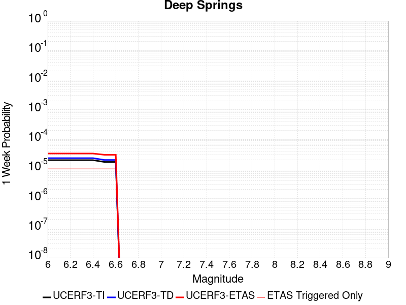 | 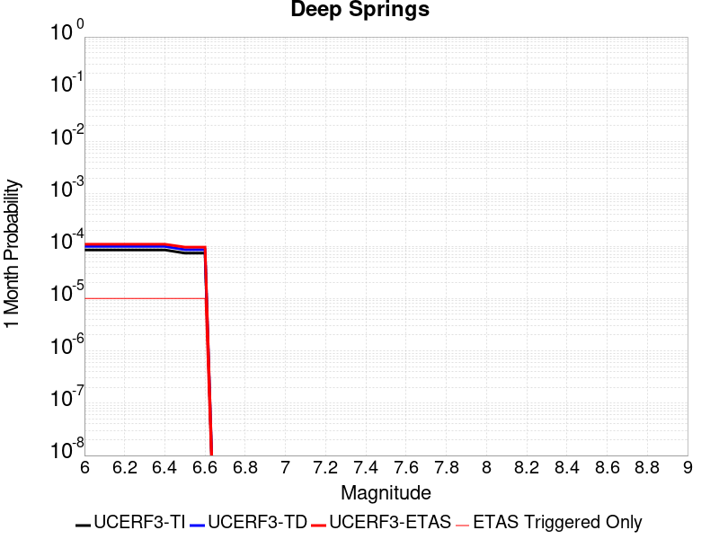 | 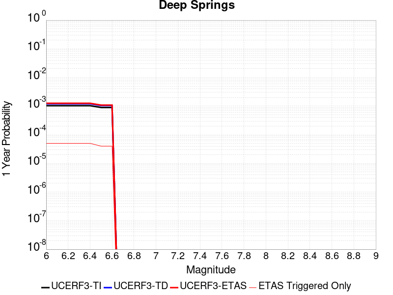 | 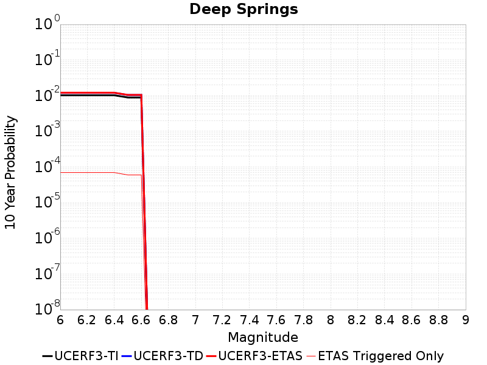 |

| Magnitude | 1 wk TI Prob | 1 wk TD Prob | 1 wk ETAS Prob | 1 wk ETAS/TD Gain | 1 wk ETAS Triggered Only | 1 mo TI Prob | 1 mo TD Prob | 1 mo ETAS Prob | 1 mo ETAS/TD Gain | 1 mo ETAS Triggered Only | 1 yr TI Prob | 1 yr TD Prob | 1 yr ETAS Prob | 1 yr ETAS/TD Gain | 1 yr ETAS Triggered Only | 10 yr TI Prob | 10 yr TD Prob | 10 yr ETAS Prob | 10 yr ETAS/TD Gain | 10 yr ETAS Triggered Only |
|-----|-----|-----|-----|-----|-----|-----|-----|-----|-----|-----|-----|-----|-----|-----|-----|-----|-----|-----|-----|-----|
| 6.0 | 1.9810619E-5 | 2.311295E-5 | 3.311272E-5 | 1.4326478 | 1.0E-5 | 8.489989E-5 | 9.90546E-5 | 1.0905362E-4 | 1.1009444 | 1.0E-5 | 0.001033166 | 0.0012058304 | 0.0012557701 | 1.0414152 | 5.0E-5 | 0.010283757 | 0.012042649 | 0.012111806 | 1.0057427 | 7.0E-5 |
| 6.1 | 1.9810619E-5 | 2.311295E-5 | 3.311272E-5 | 1.4326478 | 1.0E-5 | 8.489989E-5 | 9.90546E-5 | 1.0905362E-4 | 1.1009444 | 1.0E-5 | 0.001033166 | 0.0012058304 | 0.0012557701 | 1.0414152 | 5.0E-5 | 0.010283757 | 0.012042649 | 0.012111806 | 1.0057427 | 7.0E-5 |
| 6.2 | 1.9810619E-5 | 2.311295E-5 | 3.311272E-5 | 1.4326478 | 1.0E-5 | 8.489989E-5 | 9.90546E-5 | 1.0905362E-4 | 1.1009444 | 1.0E-5 | 0.001033166 | 0.0012058304 | 0.0012557701 | 1.0414152 | 5.0E-5 | 0.010283757 | 0.012042649 | 0.012111806 | 1.0057427 | 7.0E-5 |
| 6.3 | 1.9810619E-5 | 2.311295E-5 | 3.311272E-5 | 1.4326478 | 1.0E-5 | 8.489989E-5 | 9.90546E-5 | 1.0905362E-4 | 1.1009444 | 1.0E-5 | 0.001033166 | 0.0012058304 | 0.0012557701 | 1.0414152 | 5.0E-5 | 0.010283757 | 0.012042649 | 0.012111806 | 1.0057427 | 7.0E-5 |
| 6.4 | 1.9810619E-5 | 2.311295E-5 | 3.311272E-5 | 1.4326478 | 1.0E-5 | 8.489989E-5 | 9.90546E-5 | 1.0905362E-4 | 1.1009444 | 1.0E-5 | 0.001033166 | 0.0012058304 | 0.0012557701 | 1.0414152 | 5.0E-5 | 0.010283757 | 0.012042649 | 0.012111806 | 1.0057427 | 7.0E-5 |
| 6.5 | 1.7190405E-5 | 2.005093E-5 | 3.0050729E-5 | 1.49872 | 1.0E-5 | 7.367108E-5 | 8.593255E-5 | 9.593169E-5 | 1.1163603 | 1.0E-5 | 8.9657627E-4 | 0.0010462288 | 0.001086187 | 1.0381925 | 4.0E-5 | 0.008929676 | 0.010462251 | 0.010521623 | 1.005675 | 6.0E-5 |
| 6.6 | 1.7190405E-5 | 2.005093E-5 | 3.0050729E-5 | 1.49872 | 1.0E-5 | 7.367108E-5 | 8.593255E-5 | 9.593169E-5 | 1.1163603 | 1.0E-5 | 8.9657627E-4 | 0.0010462288 | 0.001086187 | 1.0381925 | 4.0E-5 | 0.008929676 | 0.010462251 | 0.010521623 | 1.005675 | 6.0E-5 |

## Santa Rosa Island
*[(top)](#table-of-contents)*

| 1 Week | 1 Month | 1 Year | 10 Year |
|-----|-----|-----|-----|
| 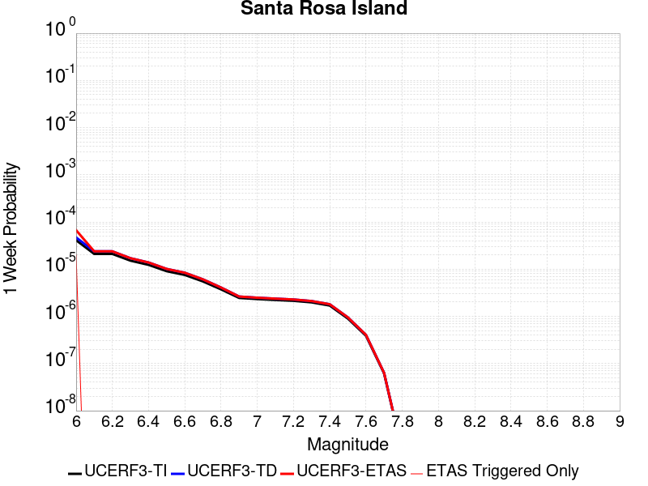 | 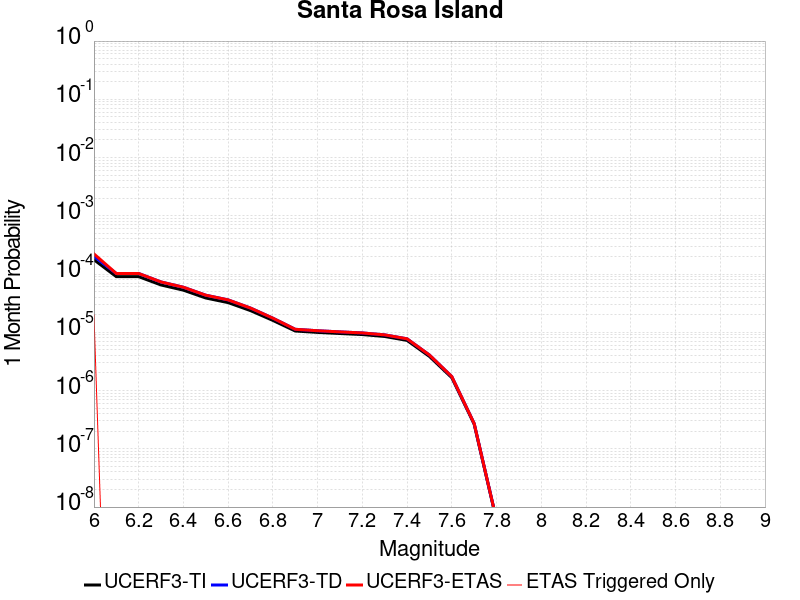 | 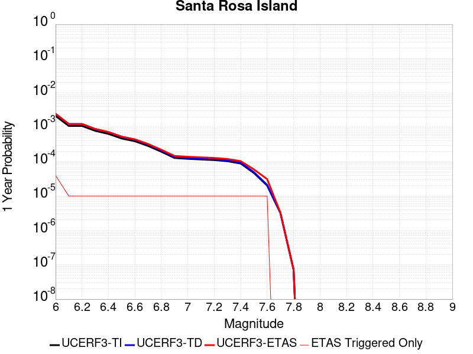 | 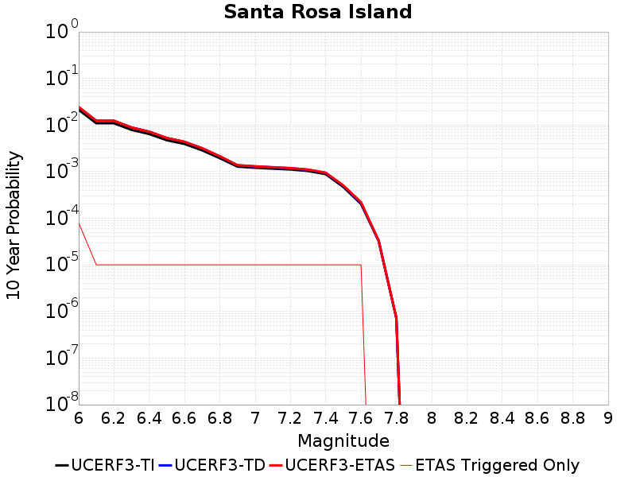 |

| Magnitude | 1 wk TI Prob | 1 wk TD Prob | 1 wk ETAS Prob | 1 wk ETAS/TD Gain | 1 wk ETAS Triggered Only | 1 mo TI Prob | 1 mo TD Prob | 1 mo ETAS Prob | 1 mo ETAS/TD Gain | 1 mo ETAS Triggered Only | 1 yr TI Prob | 1 yr TD Prob | 1 yr ETAS Prob | 1 yr ETAS/TD Gain | 1 yr ETAS Triggered Only | 10 yr TI Prob | 10 yr TD Prob | 10 yr ETAS Prob | 10 yr ETAS/TD Gain | 10 yr ETAS Triggered Only |
|-----|-----|-----|-----|-----|-----|-----|-----|-----|-----|-----|-----|-----|-----|-----|-----|-----|-----|-----|-----|-----|
| 6.0 | 4.1143165E-5 | 4.70919E-5 | 6.709096E-5 | 1.4246815 | 2.0E-5 | 1.7631594E-4 | 2.0180792E-4 | 2.2180389E-4 | 1.0990841 | 2.0E-5 | 0.002144533 | 0.0024544399 | 0.0024943417 | 1.016257 | 4.0E-5 | 0.021239553 | 0.024293942 | 0.024371998 | 1.003213 | 8.0E-5 |
| 6.1 | 2.1061249E-5 | 2.3865317E-5 | 2.3865317E-5 | 1.0 | 0.0 | 9.0259375E-5 | 1.02276084E-4 | 1.02276084E-4 | 1.0 | 0.0 | 0.0010983539 | 0.0012445289 | 0.0012545165 | 1.0080252 | 1.0E-5 | 0.01092941 | 0.012378632 | 0.012388509 | 1.0007979 | 1.0E-5 |
| 6.2 | 2.1061249E-5 | 2.3865317E-5 | 2.3865317E-5 | 1.0 | 0.0 | 9.0259375E-5 | 1.02276084E-4 | 1.02276084E-4 | 1.0 | 0.0 | 0.0010983539 | 0.0012445289 | 0.0012545165 | 1.0080252 | 1.0E-5 | 0.01092941 | 0.012378632 | 0.012388509 | 1.0007979 | 1.0E-5 |
| 6.3 | 1.5158236E-5 | 1.7074663E-5 | 1.7074663E-5 | 1.0 | 0.0 | 6.496225E-5 | 7.3175135E-5 | 7.3175135E-5 | 1.0 | 0.0 | 7.906284E-4 | 8.905551E-4 | 9.005462E-4 | 1.0112189 | 1.0E-5 | 0.007878214 | 0.008871115 | 0.008881027 | 1.0011172 | 1.0E-5 |
| 6.4 | 1.2341918E-5 | 1.3853108E-5 | 1.3853108E-5 | 1.0 | 0.0 | 5.2892858E-5 | 5.9369155E-5 | 5.9369155E-5 | 1.0 | 0.0 | 6.437803E-4 | 7.2258787E-4 | 7.3258067E-4 | 1.0138291 | 1.0E-5 | 0.006419184 | 0.0072032204 | 0.0072131483 | 1.0013783 | 1.0E-5 |
| 6.5 | 9.061158E-6 | 1.0117164E-5 | 1.0117164E-5 | 1.0 | 0.0 | 3.883296E-5 | 4.3358585E-5 | 4.3358585E-5 | 1.0 | 0.0 | 4.726887E-4 | 5.277682E-4 | 5.3776294E-4 | 1.0189377 | 1.0E-5 | 0.004716845 | 0.005265686 | 0.0052756337 | 1.0018891 | 1.0E-5 |
| 6.6 | 7.5461685E-6 | 8.400841E-6 | 8.400841E-6 | 1.0 | 0.0 | 3.2340322E-5 | 3.600313E-5 | 3.600313E-5 | 1.0 | 0.0 | 3.936723E-4 | 4.3825427E-4 | 4.4824986E-4 | 1.0228078 | 1.0E-5 | 0.003929756 | 0.0043743295 | 0.004384286 | 1.0022761 | 1.0E-5 |
| 6.7 | 5.5023775E-6 | 6.087454E-6 | 6.087454E-6 | 1.0 | 0.0 | 2.3581404E-5 | 2.6088846E-5 | 2.6088846E-5 | 1.0 | 0.0 | 2.8706578E-4 | 3.1758865E-4 | 3.2758547E-4 | 1.0314772 | 1.0E-5 | 0.0028669522 | 0.0031716696 | 0.003181638 | 1.003143 | 1.0E-5 |
| 6.8 | 3.7351679E-6 | 4.0831837E-6 | 4.0831837E-6 | 1.0 | 0.0 | 1.6007763E-5 | 1.7499255E-5 | 1.7499255E-5 | 1.0 | 0.0 | 1.948771E-4 | 2.1303509E-4 | 2.2303296E-4 | 1.0469307 | 1.0E-5 | 0.0019470629 | 0.0021285538 | 0.0021385327 | 1.004688 | 1.0E-5 |
| 6.9 | 2.456366E-6 | 2.6292914E-6 | 2.6292914E-6 | 1.0 | 0.0 | 1.0527241E-5 | 1.1268344E-5 | 1.1268344E-5 | 1.0 | 0.0 | 1.2816161E-4 | 1.3718347E-4 | 1.471821E-4 | 1.072885 | 1.0E-5 | 0.0012808773 | 0.0013709908 | 0.0013809771 | 1.007284 | 1.0E-5 |
| 7.0 | 2.3245157E-6 | 2.4827975E-6 | 2.4827975E-6 | 1.0 | 0.0 | 9.962172E-6 | 1.0640517E-5 | 1.0640517E-5 | 1.0 | 0.0 | 1.2128269E-4 | 1.2954061E-4 | 1.3953932E-4 | 1.0771859 | 1.0E-5 | 0.0012121652 | 0.0012946533 | 0.0013046403 | 1.007714 | 1.0E-5 |
| 7.1 | 2.2248344E-6 | 2.3732678E-6 | 2.3732678E-6 | 1.0 | 0.0 | 9.53497E-6 | 1.0171108E-5 | 1.0171108E-5 | 1.0 | 0.0 | 1.1608207E-4 | 1.2382622E-4 | 1.3382499E-4 | 1.0807483 | 1.0E-5 | 0.0011602144 | 0.0012375743 | 0.0012475619 | 1.0080703 | 1.0E-5 |
| 7.2 | 2.1350402E-6 | 2.276171E-6 | 2.276171E-6 | 1.0 | 0.0 | 9.150141E-6 | 9.754982E-6 | 9.754982E-6 | 1.0 | 0.0 | 1.1139726E-4 | 1.1876045E-4 | 1.2875926E-4 | 1.0841931 | 1.0E-5 | 0.0011134144 | 0.0011869718 | 0.0011969599 | 1.0084147 | 1.0E-5 |
| 7.3 | 1.9793572E-6 | 2.1087346E-6 | 2.1087346E-6 | 1.0 | 0.0 | 8.482932E-6 | 9.037403E-6 | 9.037403E-6 | 1.0 | 0.0 | 1.032748E-4 | 1.1002484E-4 | 1.20023746E-4 | 1.0908786 | 1.0E-5 | 0.0010322682 | 0.0010997055 | 0.0011096945 | 1.0090834 | 1.0E-5 |
| 7.4 | 1.6951194E-6 | 1.8045865E-6 | 1.8045865E-6 | 1.0 | 0.0 | 7.264777E-6 | 7.73392E-6 | 7.73392E-6 | 1.0 | 0.0 | 8.844508E-5 | 9.415642E-5 | 1.0415548E-4 | 1.1061963 | 1.0E-5 | 8.840988E-4 | 9.4116695E-4 | 9.5115753E-4 | 1.0106151 | 1.0E-5 |
| 7.5 | 8.987207E-7 | 9.5122783E-7 | 9.5122783E-7 | 1.0 | 0.0 | 3.8516546E-6 | 4.0766845E-6 | 4.0766845E-6 | 1.0 | 0.0 | 4.6892885E-5 | 4.9632516E-5 | 5.9632017E-5 | 1.2014709 | 1.0E-5 | 4.688299E-4 | 4.962155E-4 | 5.062105E-4 | 1.0201426 | 1.0E-5 |
| 7.6 | 3.8783037E-7 | 4.052954E-7 | 4.052954E-7 | 1.0 | 0.0 | 1.6621291E-6 | 1.7369791E-6 | 1.7369791E-6 | 1.0 | 0.0 | 2.0236233E-5 | 2.1147522E-5 | 3.1147312E-5 | 1.4728587 | 1.0E-5 | 2.023439E-4 | 2.1145576E-4 | 2.2145364E-4 | 1.0472813 | 1.0E-5 |
| 7.7 | 6.181804E-8 | 6.3390615E-8 | 6.3390615E-8 | 1.0 | 0.0 | 2.6493444E-7 | 2.7167403E-7 | 2.7167403E-7 | 1.0 | 0.0 | 3.225572E-6 | 3.3076265E-6 | 3.3076265E-6 | 1.0 | 0.0 | 3.225525E-5 | 3.307578E-5 | 3.307578E-5 | 1.0 | 0.0 |
| 7.8 | 1.3704449E-9 | 1.3964182E-9 | 1.3964182E-9 | 1.0 | 0.0 | 5.873335E-9 | 5.9846497E-9 | 5.9846497E-9 | 1.0 | 0.0 | 7.1507856E-8 | 7.286311E-8 | 7.286311E-8 | 1.0 | 0.0 | 7.1507833E-7 | 7.2863094E-7 | 7.2863094E-7 | 1.0 | 0.0 |

## Big Pine (East)
*[(top)](#table-of-contents)*

| 1 Week | 1 Month | 1 Year | 10 Year |
|-----|-----|-----|-----|
| 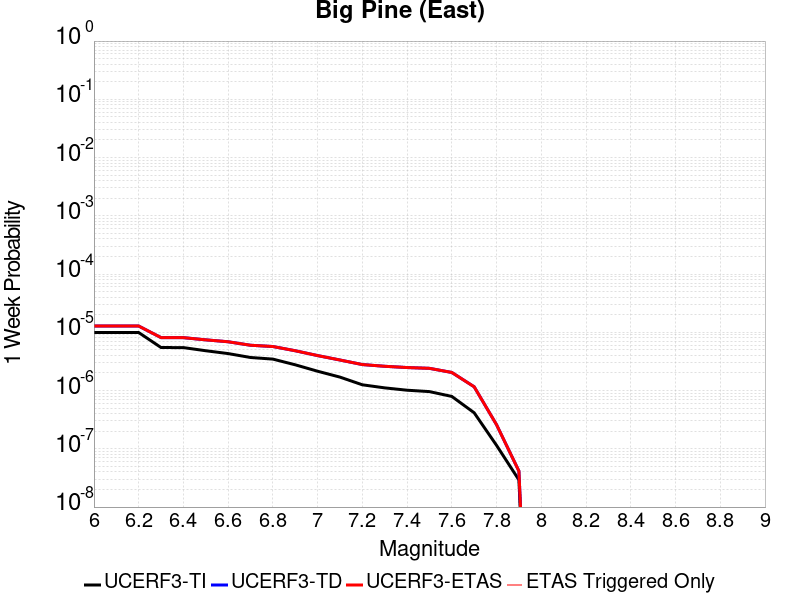 | 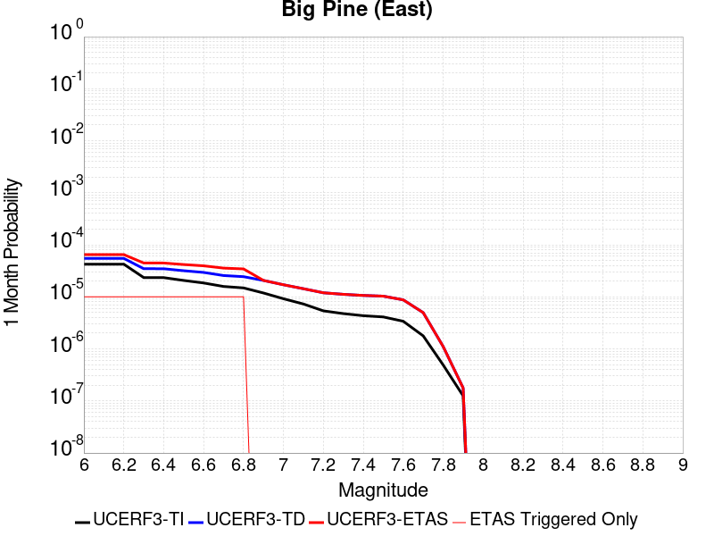 | 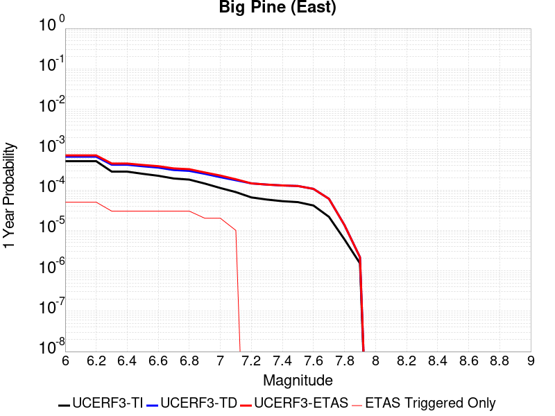 | 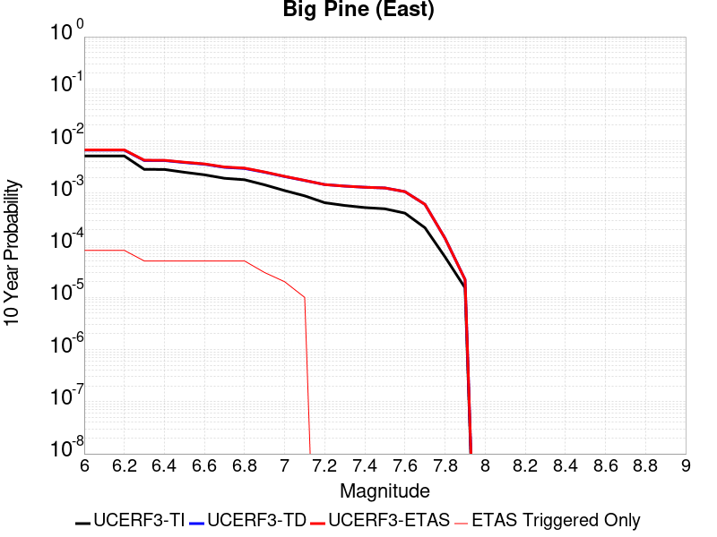 |

| Magnitude | 1 wk TI Prob | 1 wk TD Prob | 1 wk ETAS Prob | 1 wk ETAS/TD Gain | 1 wk ETAS Triggered Only | 1 mo TI Prob | 1 mo TD Prob | 1 mo ETAS Prob | 1 mo ETAS/TD Gain | 1 mo ETAS Triggered Only | 1 yr TI Prob | 1 yr TD Prob | 1 yr ETAS Prob | 1 yr ETAS/TD Gain | 1 yr ETAS Triggered Only | 10 yr TI Prob | 10 yr TD Prob | 10 yr ETAS Prob | 10 yr ETAS/TD Gain | 10 yr ETAS Triggered Only |
|-----|-----|-----|-----|-----|-----|-----|-----|-----|-----|-----|-----|-----|-----|-----|-----|-----|-----|-----|-----|-----|
| 6.0 | 9.916913E-6 | 1.2818035E-5 | 1.2818035E-5 | 1.0 | 0.0 | 4.250036E-5 | 5.4933407E-5 | 6.493286E-5 | 1.1820287 | 1.0E-5 | 5.173191E-4 | 6.686311E-4 | 7.185977E-4 | 1.0747297 | 5.0E-5 | 0.0051611643 | 0.006670977 | 0.0067504435 | 1.0119122 | 8.0E-5 |
| 6.1 | 9.916913E-6 | 1.2818035E-5 | 1.2818035E-5 | 1.0 | 0.0 | 4.250036E-5 | 5.4933407E-5 | 6.493286E-5 | 1.1820287 | 1.0E-5 | 5.173191E-4 | 6.686311E-4 | 7.185977E-4 | 1.0747297 | 5.0E-5 | 0.0051611643 | 0.006670977 | 0.0067504435 | 1.0119122 | 8.0E-5 |
| 6.2 | 9.916913E-6 | 1.2818035E-5 | 1.2818035E-5 | 1.0 | 0.0 | 4.250036E-5 | 5.4933407E-5 | 6.493286E-5 | 1.1820287 | 1.0E-5 | 5.173191E-4 | 6.686311E-4 | 7.185977E-4 | 1.0747297 | 5.0E-5 | 0.0051611643 | 0.006670977 | 0.0067504435 | 1.0119122 | 8.0E-5 |
| 6.3 | 5.479711E-6 | 8.113971E-6 | 8.113971E-6 | 1.0 | 0.0 | 2.3484265E-5 | 3.4773715E-5 | 4.477337E-5 | 1.2875636 | 1.0E-5 | 2.858834E-4 | 4.2329094E-4 | 4.5327825E-4 | 1.0708432 | 3.0E-5 | 0.0028551589 | 0.0042277644 | 0.004277553 | 1.0117766 | 5.0E-5 |
| 6.4 | 5.465009E-6 | 8.0982645E-6 | 8.0982645E-6 | 1.0 | 0.0 | 2.3421257E-5 | 3.47064E-5 | 4.4706056E-5 | 1.2881212 | 1.0E-5 | 2.851165E-4 | 4.2247173E-4 | 4.5245903E-4 | 1.0709807 | 3.0E-5 | 0.0028475097 | 0.0042196033 | 0.004269392 | 1.0117995 | 5.0E-5 |
| 6.5 | 4.826767E-6 | 7.423316E-6 | 7.423316E-6 | 1.0 | 0.0 | 2.068598E-5 | 3.181384E-5 | 4.181352E-5 | 1.3143187 | 1.0E-5 | 2.518227E-4 | 3.8726744E-4 | 4.1725583E-4 | 1.0774359 | 3.0E-5 | 0.0025153751 | 0.0038688018 | 0.003918608 | 1.0128739 | 5.0E-5 |
| 6.6 | 4.3146847E-6 | 6.883249E-6 | 6.883249E-6 | 1.0 | 0.0 | 1.8491375E-5 | 2.9499319E-5 | 3.9499024E-5 | 1.3389809 | 1.0E-5 | 2.2510924E-4 | 3.5909747E-4 | 3.890867E-4 | 1.0835128 | 3.0E-5 | 0.0022488134 | 0.0035880157 | 0.0036378363 | 1.0138853 | 5.0E-5 |
| 6.7 | 3.6968106E-6 | 5.9964245E-6 | 5.9964245E-6 | 1.0 | 0.0 | 1.5843378E-5 | 2.5698719E-5 | 3.569846E-5 | 1.3891145 | 1.0E-5 | 1.9287605E-4 | 3.128385E-4 | 3.4282912E-4 | 1.0958661 | 3.0E-5 | 0.0019270873 | 0.0031267346 | 0.003176578 | 1.0159411 | 5.0E-5 |
| 6.8 | 3.4671132E-6 | 5.7031034E-6 | 5.7031034E-6 | 1.0 | 0.0 | 1.4858972E-5 | 2.4441651E-5 | 3.4441407E-5 | 1.4091277 | 1.0E-5 | 1.8089297E-4 | 2.9753792E-4 | 3.2752898E-4 | 1.1007975 | 3.0E-5 | 0.0018074579 | 0.0029741402 | 0.0030239914 | 1.0167615 | 5.0E-5 |
| 6.9 | 2.7686972E-6 | 4.826078E-6 | 4.826078E-6 | 1.0 | 0.0 | 1.1865792E-5 | 2.0683034E-5 | 2.0683034E-5 | 1.0 | 0.0 | 1.4445644E-4 | 2.5178757E-4 | 2.7178254E-4 | 1.079412 | 2.0E-5 | 0.0014436257 | 0.0025177 | 0.0025476243 | 1.0118856 | 3.0E-5 |
| 7.0 | 2.1472624E-6 | 3.9858173E-6 | 3.9858173E-6 | 1.0 | 0.0 | 9.20252E-6 | 1.7081966E-5 | 1.7081966E-5 | 1.0 | 0.0 | 1.12034926E-4 | 2.0795362E-4 | 2.2794947E-4 | 1.0961553 | 2.0E-5 | 0.0011197845 | 0.002080235 | 0.0021001934 | 1.0095943 | 2.0E-5 |
| 7.1 | 1.7018335E-6 | 3.3455829E-6 | 3.3455829E-6 | 1.0 | 0.0 | 7.293552E-6 | 1.4338136E-5 | 1.4338136E-5 | 1.0 | 0.0 | 8.879537E-5 | 1.7455318E-4 | 1.8455143E-4 | 1.0572791 | 1.0E-5 | 8.87599E-4 | 0.0017467737 | 0.0017567563 | 1.0057149 | 1.0E-5 |
| 7.2 | 1.25603E-6 | 2.7951519E-6 | 2.7951519E-6 | 1.0 | 0.0 | 5.3829745E-6 | 1.1979169E-5 | 1.1979169E-5 | 1.0 | 0.0 | 6.553574E-5 | 1.4583685E-4 | 1.4583685E-4 | 1.0 | 0.0 | 6.551642E-4 | 0.00146 | 0.00146 | 1.0 | 0.0 |
| 7.3 | 1.112297E-6 | 2.6109626E-6 | 2.6109626E-6 | 1.0 | 0.0 | 4.7669787E-6 | 1.1189793E-5 | 1.1189793E-5 | 1.0 | 0.0 | 5.803642E-5 | 1.3622743E-4 | 1.3622743E-4 | 1.0 | 0.0 | 5.802127E-4 | 0.0013638603 | 0.0013638603 | 1.0 | 0.0 |
| 7.4 | 1.0137181E-6 | 2.4840954E-6 | 2.4840954E-6 | 1.0 | 0.0 | 4.3444993E-6 | 1.064608E-5 | 1.064608E-5 | 1.0 | 0.0 | 5.2892992E-5 | 1.2960854E-4 | 1.2960854E-4 | 1.0 | 0.0 | 5.288041E-4 | 0.0012975344 | 0.0012975344 | 1.0 | 0.0 |
| 7.5 | 9.598608E-7 | 2.407734E-6 | 2.407734E-6 | 1.0 | 0.0 | 4.1136827E-6 | 1.03188195E-5 | 1.03188195E-5 | 1.0 | 0.0 | 5.0082934E-5 | 1.256246E-4 | 1.256246E-4 | 1.0 | 0.0 | 5.007165E-4 | 0.0012575489 | 0.0012575489 | 1.0 | 0.0 |
| 7.6 | 7.929459E-7 | 2.045376E-6 | 2.045376E-6 | 1.0 | 0.0 | 3.3983351E-6 | 8.765869E-6 | 8.765869E-6 | 1.0 | 0.0 | 4.1373947E-5 | 1.067194E-4 | 1.067194E-4 | 1.0 | 0.0 | 4.1366243E-4 | 0.0010687838 | 0.0010687838 | 1.0 | 0.0 |
| 7.7 | 4.155788E-7 | 1.1609255E-6 | 1.1609255E-6 | 1.0 | 0.0 | 1.7810507E-6 | 4.975386E-6 | 4.975386E-6 | 1.0 | 0.0 | 2.1684076E-5 | 6.0573682E-5 | 6.0573682E-5 | 1.0 | 0.0 | 2.1681961E-4 | 6.087582E-4 | 6.087582E-4 | 1.0 | 0.0 |
| 7.8 | 1.14666925E-7 | 2.5928384E-7 | 2.5928384E-7 | 1.0 | 0.0 | 4.914296E-7 | 1.111216E-6 | 1.111216E-6 | 1.0 | 0.0 | 5.9831386E-6 | 1.3528975E-5 | 1.3528975E-5 | 1.0 | 0.0 | 5.9829777E-5 | 1.3638343E-4 | 1.3638343E-4 | 1.0 | 0.0 |
| 7.9 | 2.9231824E-8 | 4.147769E-8 | 4.147769E-8 | 1.0 | 0.0 | 1.2527924E-7 | 1.7776152E-7 | 1.7776152E-7 | 1.0 | 0.0 | 1.5252737E-6 | 2.1642445E-6 | 2.1642445E-6 | 1.0 | 0.0 | 1.5252632E-5 | 2.197494E-5 | 2.197494E-5 | 1.0 | 0.0 |

## San Jacinto (Coyote Creek)
*[(top)](#table-of-contents)*

| 1 Week | 1 Month | 1 Year | 10 Year |
|-----|-----|-----|-----|
| 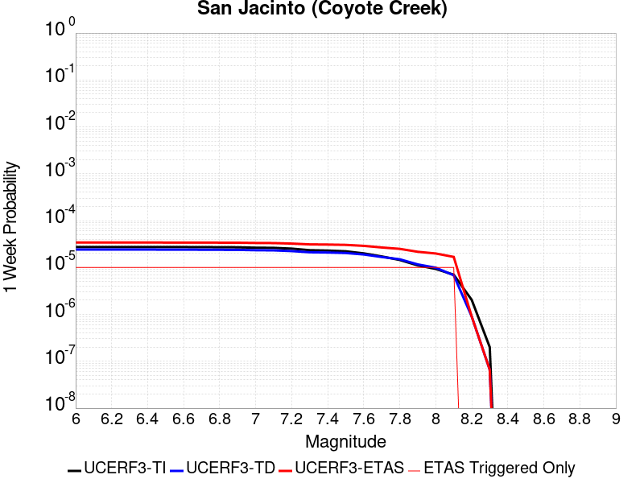 | 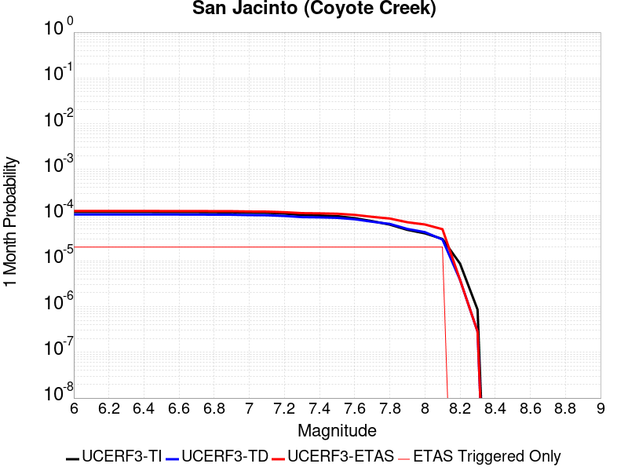 | 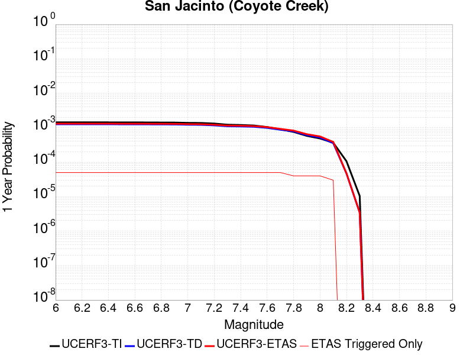 | 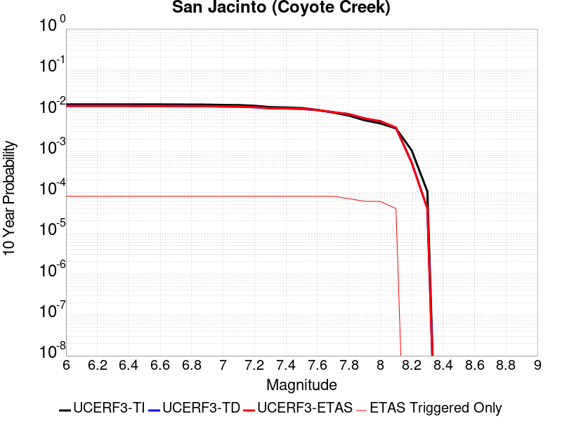 |

| Magnitude | 1 wk TI Prob | 1 wk TD Prob | 1 wk ETAS Prob | 1 wk ETAS/TD Gain | 1 wk ETAS Triggered Only | 1 mo TI Prob | 1 mo TD Prob | 1 mo ETAS Prob | 1 mo ETAS/TD Gain | 1 mo ETAS Triggered Only | 1 yr TI Prob | 1 yr TD Prob | 1 yr ETAS Prob | 1 yr ETAS/TD Gain | 1 yr ETAS Triggered Only | 10 yr TI Prob | 10 yr TD Prob | 10 yr ETAS Prob | 10 yr ETAS/TD Gain | 10 yr ETAS Triggered Only |
|-----|-----|-----|-----|-----|-----|-----|-----|-----|-----|-----|-----|-----|-----|-----|-----|-----|-----|-----|-----|-----|
| 6.0 | 2.7374346E-5 | 2.4152032E-5 | 3.415179E-5 | 1.4140338 | 1.0E-5 | 1.1731335E-4 | 1.0350462E-4 | 1.2350256E-4 | 1.1932081 | 2.0E-5 | 0.0014273542 | 0.0012594428 | 0.0013093798 | 1.0396501 | 5.0E-5 | 0.01418221 | 0.012931866 | 0.013010832 | 1.0061063 | 8.0E-5 |
| 6.1 | 2.7374346E-5 | 2.4152032E-5 | 3.415179E-5 | 1.4140338 | 1.0E-5 | 1.1731335E-4 | 1.0350462E-4 | 1.2350256E-4 | 1.1932081 | 2.0E-5 | 0.0014273542 | 0.0012594428 | 0.0013093798 | 1.0396501 | 5.0E-5 | 0.01418221 | 0.012931866 | 0.013010832 | 1.0061063 | 8.0E-5 |
| 6.2 | 2.7374346E-5 | 2.4152032E-5 | 3.415179E-5 | 1.4140338 | 1.0E-5 | 1.1731335E-4 | 1.0350462E-4 | 1.2350256E-4 | 1.1932081 | 2.0E-5 | 0.0014273542 | 0.0012594428 | 0.0013093798 | 1.0396501 | 5.0E-5 | 0.01418221 | 0.012931866 | 0.013010832 | 1.0061063 | 8.0E-5 |
| 6.3 | 2.7374346E-5 | 2.4152032E-5 | 3.415179E-5 | 1.4140338 | 1.0E-5 | 1.1731335E-4 | 1.0350462E-4 | 1.2350256E-4 | 1.1932081 | 2.0E-5 | 0.0014273542 | 0.0012594428 | 0.0013093798 | 1.0396501 | 5.0E-5 | 0.01418221 | 0.012931866 | 0.013010832 | 1.0061063 | 8.0E-5 |
| 6.4 | 2.7374346E-5 | 2.4152032E-5 | 3.415179E-5 | 1.4140338 | 1.0E-5 | 1.1731335E-4 | 1.0350462E-4 | 1.2350256E-4 | 1.1932081 | 2.0E-5 | 0.0014273542 | 0.0012594428 | 0.0013093798 | 1.0396501 | 5.0E-5 | 0.01418221 | 0.012931866 | 0.013010832 | 1.0061063 | 8.0E-5 |
| 6.5 | 2.7282445E-5 | 2.4038109E-5 | 3.403787E-5 | 1.4159961 | 1.0E-5 | 1.16919524E-4 | 1.0301641E-4 | 1.2301435E-4 | 1.1941239 | 2.0E-5 | 0.0014225657 | 0.0012535058 | 0.0013034431 | 1.0398381 | 5.0E-5 | 0.014134934 | 0.012873192 | 0.012952162 | 1.0061345 | 8.0E-5 |
| 6.6 | 2.7282445E-5 | 2.4038109E-5 | 3.403787E-5 | 1.4159961 | 1.0E-5 | 1.16919524E-4 | 1.0301641E-4 | 1.2301435E-4 | 1.1941239 | 2.0E-5 | 0.0014225657 | 0.0012535058 | 0.0013034431 | 1.0398381 | 5.0E-5 | 0.014134934 | 0.012873192 | 0.012952162 | 1.0061345 | 8.0E-5 |
| 6.7 | 2.7216198E-5 | 2.3963226E-5 | 3.3962988E-5 | 1.417296 | 1.0E-5 | 1.1663563E-4 | 1.02695514E-4 | 1.2269345E-4 | 1.1947305 | 2.0E-5 | 0.0014191137 | 0.0012496035 | 0.001299541 | 1.0399626 | 5.0E-5 | 0.014100855 | 0.012834602 | 0.012913575 | 1.0061531 | 8.0E-5 |
| 6.8 | 2.7078617E-5 | 2.388044E-5 | 3.3880202E-5 | 1.4187428 | 1.0E-5 | 1.1604605E-4 | 1.02340746E-4 | 1.223387E-4 | 1.1954056 | 2.0E-5 | 0.001411945 | 0.001245289 | 0.0012952267 | 1.0401013 | 5.0E-5 | 0.014030075 | 0.012791743 | 0.012870719 | 1.0061741 | 8.0E-5 |
| 6.9 | 2.6982952E-5 | 2.3799947E-5 | 3.3799708E-5 | 1.420159 | 1.0E-5 | 1.15636096E-4 | 1.019958E-4 | 1.2199376E-4 | 1.1960665 | 2.0E-5 | 0.0014069602 | 0.0012410941 | 0.0012910321 | 1.0402371 | 5.0E-5 | 0.013980856 | 0.012750056 | 0.0128290355 | 1.0061945 | 8.0E-5 |
| 7.0 | 2.6449972E-5 | 2.3376955E-5 | 3.337672E-5 | 1.4277617 | 1.0E-5 | 1.1335209E-4 | 1.0018311E-4 | 1.2018111E-4 | 1.1996144 | 2.0E-5 | 0.001379188 | 0.0012190496 | 0.0012689886 | 1.0409656 | 5.0E-5 | 0.0137065975 | 0.012531411 | 0.0126104085 | 1.0063039 | 8.0E-5 |
| 7.1 | 2.6257849E-5 | 2.3202985E-5 | 3.3202752E-5 | 1.430969 | 1.0E-5 | 1.1252879E-4 | 9.943759E-5 | 1.194356E-4 | 1.2011112 | 2.0E-5 | 0.0013691769 | 0.0012099828 | 0.0012599223 | 1.0412729 | 5.0E-5 | 0.013607717 | 0.012441273 | 0.012520277 | 1.0063502 | 8.0E-5 |
| 7.2 | 2.5270041E-5 | 2.2397699E-5 | 3.2397475E-5 | 1.4464644 | 1.0E-5 | 1.0829568E-4 | 9.598662E-5 | 1.159847E-4 | 1.2083424 | 2.0E-5 | 0.0013177024 | 0.001168013 | 0.0012179546 | 1.0427577 | 5.0E-5 | 0.013099162 | 0.012022284 | 0.012101322 | 1.0065743 | 8.0E-5 |
| 7.3 | 2.339701E-5 | 2.1129452E-5 | 3.1129242E-5 | 1.473263 | 1.0E-5 | 1.0026905E-4 | 9.0551664E-5 | 1.1054985E-4 | 1.2208484 | 2.0E-5 | 0.001220092 | 0.0011019111 | 0.0011518559 | 1.0453258 | 5.0E-5 | 0.012134149 | 0.011361156 | 0.011440246 | 1.0069616 | 8.0E-5 |
| 7.4 | 2.296333E-5 | 2.0859785E-5 | 3.0859577E-5 | 1.4793813 | 1.0E-5 | 9.841056E-5 | 8.9396024E-5 | 1.09394234E-4 | 1.2237036 | 2.0E-5 | 0.0011974899 | 0.0010878552 | 0.0011378007 | 1.045912 | 5.0E-5 | 0.011910575 | 0.011220257 | 0.01129936 | 1.0070499 | 8.0E-5 |
| 7.5 | 2.2188895E-5 | 2.0382655E-5 | 3.038245E-5 | 1.4906032 | 1.0E-5 | 9.50918E-5 | 8.735132E-5 | 1.0734957E-4 | 1.2289405 | 2.0E-5 | 0.0011571277 | 0.0010629855 | 0.0011129323 | 1.0469873 | 5.0E-5 | 0.011511209 | 0.010969848 | 0.011048971 | 1.0072128 | 8.0E-5 |
| 7.6 | 2.0013189E-5 | 1.896878E-5 | 2.896859E-5 | 1.5271721 | 1.0E-5 | 8.5767984E-5 | 8.1292244E-5 | 1.0129062E-4 | 1.2460059 | 2.0E-5 | 0.001043725 | 9.892855E-4 | 0.001039236 | 1.0504916 | 5.0E-5 | 0.010388365 | 0.010227781 | 0.010306963 | 1.0077418 | 8.0E-5 |
| 7.7 | 1.7230794E-5 | 1.6749957E-5 | 2.6749789E-5 | 1.5970064 | 1.0E-5 | 7.384417E-5 | 7.178356E-5 | 9.1782116E-5 | 1.2785953 | 2.0E-5 | 8.986819E-4 | 8.7361515E-4 | 9.2357147E-4 | 1.0571834 | 5.0E-5 | 0.008950562 | 0.00906622 | 0.009145495 | 1.008744 | 8.0E-5 |
| 7.8 | 1.4478809E-5 | 1.4997008E-5 | 2.4996858E-5 | 1.6667897 | 1.0E-5 | 6.205057E-5 | 6.427131E-5 | 8.4270025E-5 | 1.3111608 | 2.0E-5 | 7.552038E-4 | 7.8222295E-4 | 8.2219165E-4 | 1.0510963 | 4.0E-5 | 0.0075264242 | 0.008144542 | 0.008213972 | 1.0085247 | 7.0E-5 |
| 7.9 | 1.1114467E-5 | 1.16504225E-5 | 2.1650307E-5 | 1.858328 | 1.0E-5 | 4.7632562E-5 | 4.992943E-5 | 6.992843E-5 | 1.4005454 | 2.0E-5 | 5.797721E-4 | 6.0772186E-4 | 6.4769754E-4 | 1.0657796 | 4.0E-5 | 0.0057826187 | 0.0063831173 | 0.0064427345 | 1.0093398 | 6.0E-5 |
| 8.0 | 9.327402E-6 | 9.9039835E-6 | 1.9903884E-5 | 2.0096848 | 1.0E-5 | 3.9973966E-5 | 4.2444957E-5 | 6.244411E-5 | 1.4711785 | 2.0E-5 | 4.8657437E-4 | 5.166454E-4 | 5.5662467E-4 | 1.0773826 | 4.0E-5 | 0.0048551033 | 0.0054524913 | 0.005512164 | 1.0109441 | 6.0E-5 |
| 8.1 | 7.0235833E-6 | 6.8310583E-6 | 1.683099E-5 | 2.463892 | 1.0E-5 | 3.0100724E-5 | 2.9275638E-5 | 4.927505E-5 | 1.6831418 | 2.0E-5 | 3.664147E-4 | 3.5637312E-4 | 3.8636243E-4 | 1.0841514 | 3.0E-5 | 0.003658111 | 0.003789491 | 0.0038293395 | 1.0105155 | 4.0E-5 |
| 8.2 | 2.0358202E-6 | 9.001695E-7 | 9.001695E-7 | 1.0 | 0.0 | 8.724915E-6 | 3.8578637E-6 | 3.8578637E-6 | 1.0 | 0.0 | 1.06220665E-4 | 4.69685E-5 | 4.69685E-5 | 1.0 | 0.0 | 0.001061699 | 5.329428E-4 | 5.329428E-4 | 1.0 | 0.0 |
| 8.3 | 2.0051264E-7 | 6.623352E-8 | 6.623352E-8 | 1.0 | 0.0 | 8.5933965E-7 | 2.838579E-7 | 2.838579E-7 | 1.0 | 0.0 | 1.046241E-5 | 3.455965E-6 | 3.455965E-6 | 1.0 | 0.0 | 1.0461917E-4 | 4.0173745E-5 | 4.0173745E-5 | 1.0 | 0.0 |

## Cleghorn
*[(top)](#table-of-contents)*

| 1 Week | 1 Month | 1 Year | 10 Year |
|-----|-----|-----|-----|
| 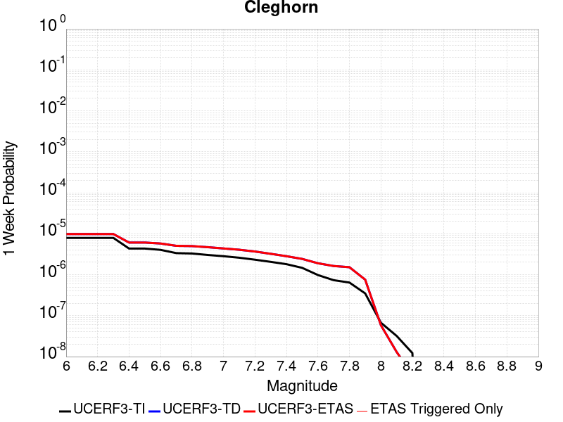 | 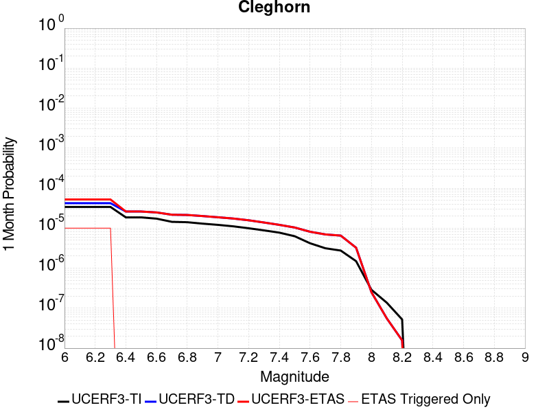 | 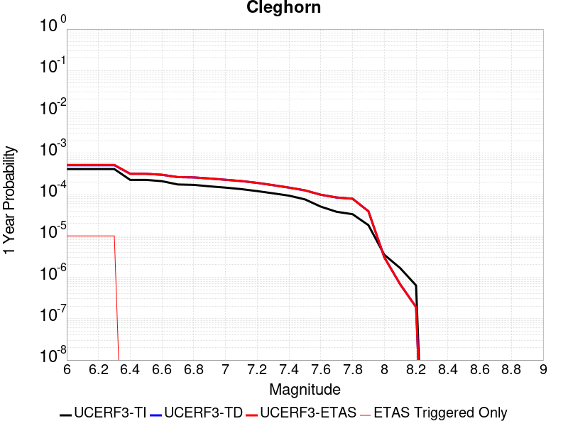 | 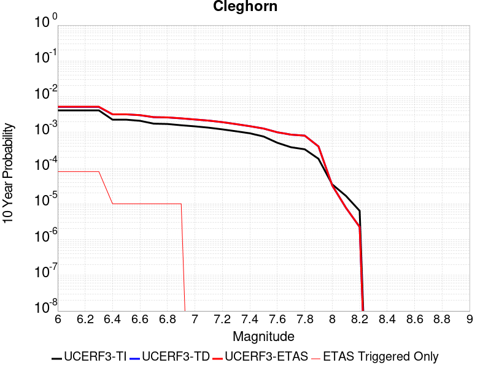 |

| Magnitude | 1 wk TI Prob | 1 wk TD Prob | 1 wk ETAS Prob | 1 wk ETAS/TD Gain | 1 wk ETAS Triggered Only | 1 mo TI Prob | 1 mo TD Prob | 1 mo ETAS Prob | 1 mo ETAS/TD Gain | 1 mo ETAS Triggered Only | 1 yr TI Prob | 1 yr TD Prob | 1 yr ETAS Prob | 1 yr ETAS/TD Gain | 1 yr ETAS Triggered Only | 10 yr TI Prob | 10 yr TD Prob | 10 yr ETAS Prob | 10 yr ETAS/TD Gain | 10 yr ETAS Triggered Only |
|-----|-----|-----|-----|-----|-----|-----|-----|-----|-----|-----|-----|-----|-----|-----|-----|-----|-----|-----|-----|-----|
| 6.0 | 7.9267165E-6 | 9.83242E-6 | 9.83242E-6 | 1.0 | 0.0 | 3.39712E-5 | 4.2138323E-5 | 5.21379E-5 | 1.2373036 | 1.0E-5 | 4.1352084E-4 | 5.129239E-4 | 5.229188E-4 | 1.0194861 | 1.0E-5 | 0.004127522 | 0.0051324987 | 0.005212088 | 1.015507 | 8.0E-5 |
| 6.1 | 7.9267165E-6 | 9.83242E-6 | 9.83242E-6 | 1.0 | 0.0 | 3.39712E-5 | 4.2138323E-5 | 5.21379E-5 | 1.2373036 | 1.0E-5 | 4.1352084E-4 | 5.129239E-4 | 5.229188E-4 | 1.0194861 | 1.0E-5 | 0.004127522 | 0.0051324987 | 0.005212088 | 1.015507 | 8.0E-5 |
| 6.2 | 7.9267165E-6 | 9.83242E-6 | 9.83242E-6 | 1.0 | 0.0 | 3.39712E-5 | 4.2138323E-5 | 5.21379E-5 | 1.2373036 | 1.0E-5 | 4.1352084E-4 | 5.129239E-4 | 5.229188E-4 | 1.0194861 | 1.0E-5 | 0.004127522 | 0.0051324987 | 0.005212088 | 1.015507 | 8.0E-5 |
| 6.3 | 7.9267165E-6 | 9.83242E-6 | 9.83242E-6 | 1.0 | 0.0 | 3.39712E-5 | 4.2138323E-5 | 5.21379E-5 | 1.2373036 | 1.0E-5 | 4.1352084E-4 | 5.129239E-4 | 5.229188E-4 | 1.0194861 | 1.0E-5 | 0.004127522 | 0.0051324987 | 0.005212088 | 1.015507 | 8.0E-5 |
| 6.4 | 4.3445207E-6 | 6.092262E-6 | 6.092262E-6 | 1.0 | 0.0 | 1.8619241E-5 | 2.610944E-5 | 2.610944E-5 | 1.0 | 0.0 | 2.2666567E-4 | 3.1783708E-4 | 3.1783708E-4 | 1.0 | 0.0 | 0.0022643462 | 0.0031879998 | 0.003197968 | 1.0031267 | 1.0E-5 |
| 6.5 | 4.3445207E-6 | 6.092262E-6 | 6.092262E-6 | 1.0 | 0.0 | 1.8619241E-5 | 2.610944E-5 | 2.610944E-5 | 1.0 | 0.0 | 2.2666567E-4 | 3.1783708E-4 | 3.1783708E-4 | 1.0 | 0.0 | 0.0022643462 | 0.0031879998 | 0.003197968 | 1.0031267 | 1.0E-5 |
| 6.6 | 4.040109E-6 | 5.7746684E-6 | 5.7746684E-6 | 1.0 | 0.0 | 1.7314638E-5 | 2.474835E-5 | 2.474835E-5 | 1.0 | 0.0 | 2.1078532E-4 | 3.0127043E-4 | 3.0127043E-4 | 1.0 | 0.0 | 0.002105855 | 0.0030227888 | 0.0030327586 | 1.0032982 | 1.0E-5 |
| 6.7 | 3.3632055E-6 | 5.068162E-6 | 5.068162E-6 | 1.0 | 0.0 | 1.4413658E-5 | 2.1720514E-5 | 2.1720514E-5 | 1.0 | 0.0 | 1.7547216E-4 | 2.644155E-4 | 2.644155E-4 | 1.0 | 0.0 | 0.0017533366 | 0.0026551215 | 0.0026650948 | 1.0037563 | 1.0E-5 |
| 6.8 | 3.2902772E-6 | 4.990069E-6 | 4.990069E-6 | 1.0 | 0.0 | 1.4101111E-5 | 2.1385837E-5 | 2.1385837E-5 | 1.0 | 0.0 | 1.716675E-4 | 2.6034177E-4 | 2.6034177E-4 | 1.0 | 0.0 | 0.0017153495 | 0.00261448 | 0.002624454 | 1.0038148 | 1.0E-5 |
| 6.9 | 3.031547E-6 | 4.6918276E-6 | 4.6918276E-6 | 1.0 | 0.0 | 1.299228E-5 | 2.0107678E-5 | 2.0107678E-5 | 1.0 | 0.0 | 1.5816953E-4 | 2.4478376E-4 | 2.4478376E-4 | 1.0 | 0.0 | 0.00158057 | 0.0024592516 | 0.002469227 | 1.0040563 | 1.0E-5 |
| 7.0 | 2.8259715E-6 | 4.371386E-6 | 4.371386E-6 | 1.0 | 0.0 | 1.211125E-5 | 1.8734378E-5 | 1.8734378E-5 | 1.0 | 0.0 | 1.4744449E-4 | 2.2806741E-4 | 2.2806741E-4 | 1.0 | 0.0 | 0.001473467 | 0.0022924424 | 0.0022924424 | 1.0 | 0.0 |
| 7.1 | 2.5962665E-6 | 4.0666E-6 | 4.0666E-6 | 1.0 | 0.0 | 1.1126809E-5 | 1.742817E-5 | 1.742817E-5 | 1.0 | 0.0 | 1.3546048E-4 | 2.1216754E-4 | 2.1216754E-4 | 1.0 | 0.0 | 0.0013537793 | 0.0021337636 | 0.0021337636 | 1.0 | 0.0 |
| 7.2 | 2.3247253E-6 | 3.677145E-6 | 3.677145E-6 | 1.0 | 0.0 | 9.96307E-6 | 1.5759098E-5 | 1.5759098E-5 | 1.0 | 0.0 | 1.21293626E-4 | 1.9185033E-4 | 1.9185033E-4 | 1.0 | 0.0 | 0.0012122744 | 0.0019309822 | 0.0019309822 | 1.0 | 0.0 |
| 7.3 | 2.056928E-6 | 3.235846E-6 | 3.235846E-6 | 1.0 | 0.0 | 8.815376E-6 | 1.3867838E-5 | 1.3867838E-5 | 1.0 | 0.0 | 1.0732192E-4 | 1.68828E-4 | 1.68828E-4 | 1.0 | 0.0 | 0.001072701 | 0.0017011991 | 0.0017011991 | 1.0 | 0.0 |
| 7.4 | 1.8055999E-6 | 2.8262289E-6 | 2.8262289E-6 | 1.0 | 0.0 | 7.738263E-6 | 1.2112354E-5 | 1.2112354E-5 | 1.0 | 0.0 | 9.4209274E-5 | 1.4745808E-4 | 1.4745808E-4 | 1.0 | 0.0 | 9.4169343E-4 | 0.0014879414 | 0.0014879414 | 1.0 | 0.0 |
| 7.5 | 1.4683443E-6 | 2.4254607E-6 | 2.4254607E-6 | 1.0 | 0.0 | 6.292889E-6 | 1.03947905E-5 | 1.03947905E-5 | 1.0 | 0.0 | 7.661323E-5 | 1.2654932E-4 | 1.2654932E-4 | 1.0 | 0.0 | 7.658682E-4 | 0.0012791541 | 0.0012791541 | 1.0 | 0.0 |
| 7.6 | 9.804088E-7 | 1.9009702E-6 | 1.9009702E-6 | 1.0 | 0.0 | 4.201745E-6 | 8.14699E-6 | 8.14699E-6 | 1.0 | 0.0 | 5.1155046E-5 | 9.9185134E-5 | 9.9185134E-5 | 1.0 | 0.0 | 5.114327E-4 | 0.0010058248 | 0.0010058248 | 1.0 | 0.0 |
| 7.7 | 7.3434086E-7 | 1.6291103E-6 | 1.6291103E-6 | 1.0 | 0.0 | 3.1471714E-6 | 6.981883E-6 | 6.981883E-6 | 1.0 | 0.0 | 3.831614E-5 | 8.5001135E-5 | 8.5001135E-5 | 1.0 | 0.0 | 3.8309532E-4 | 8.641364E-4 | 8.641364E-4 | 1.0 | 0.0 |
| 7.8 | 6.434184E-7 | 1.5226761E-6 | 1.5226761E-6 | 1.0 | 0.0 | 2.7575045E-6 | 6.525739E-6 | 6.525739E-6 | 1.0 | 0.0 | 3.35721E-5 | 7.9448E-5 | 7.9448E-5 | 1.0 | 0.0 | 3.3567028E-4 | 8.0830505E-4 | 8.0830505E-4 | 1.0 | 0.0 |
| 7.9 | 3.4943926E-7 | 7.5781304E-7 | 7.5781304E-7 | 1.0 | 0.0 | 1.497596E-6 | 3.2477662E-6 | 3.2477662E-6 | 1.0 | 0.0 | 1.8233079E-5 | 3.9540846E-5 | 3.9540846E-5 | 1.0 | 0.0 | 1.8231584E-4 | 4.041959E-4 | 4.041959E-4 | 1.0 | 0.0 |
| 8.0 | 6.717524E-8 | 5.8432626E-8 | 5.8432626E-8 | 1.0 | 0.0 | 2.8789387E-7 | 2.504255E-7 | 2.504255E-7 | 1.0 | 0.0 | 3.505102E-6 | 3.0489264E-6 | 3.0489264E-6 | 1.0 | 0.0 | 3.5050467E-5 | 3.275885E-5 | 3.275885E-5 | 1.0 | 0.0 |
| 8.1 | 3.1984914E-8 | 1.29705295E-8 | 1.29705295E-8 | 1.0 | 0.0 | 1.370782E-7 | 5.5587982E-8 | 5.5587982E-8 | 1.0 | 0.0 | 1.6689258E-6 | 6.767835E-7 | 6.767835E-7 | 1.0 | 0.0 | 1.6689133E-5 | 7.752689E-6 | 7.752689E-6 | 1.0 | 0.0 |
| 8.2 | 1.21887656E-8 | 3.653981E-9 | 3.653981E-9 | 1.0 | 0.0 | 5.2237567E-8 | 1.5659918E-8 | 1.5659918E-8 | 1.0 | 0.0 | 6.359922E-7 | 1.9065948E-7 | 1.9065948E-7 | 1.0 | 0.0 | 6.3599036E-6 | 2.2496674E-6 | 2.2496674E-6 | 1.0 | 0.0 |

## Owens Valley
*[(top)](#table-of-contents)*

| 1 Week | 1 Month | 1 Year | 10 Year |
|-----|-----|-----|-----|
| 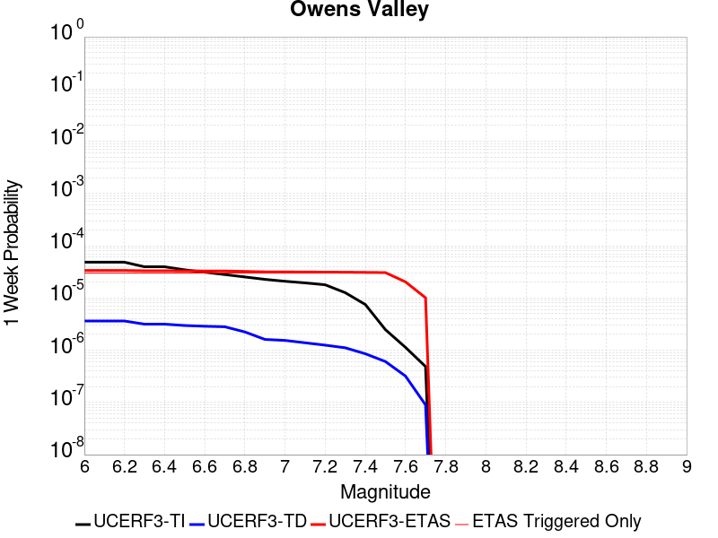 | 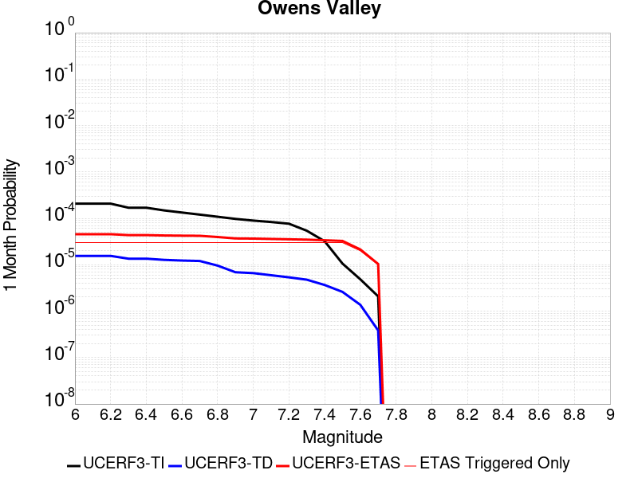 | 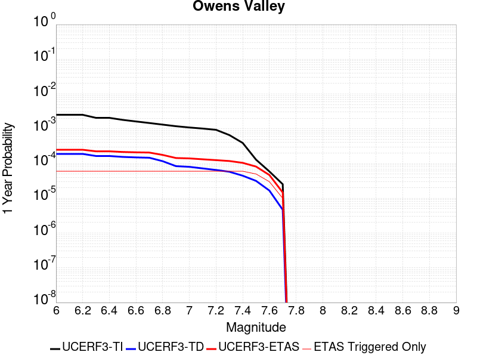 | 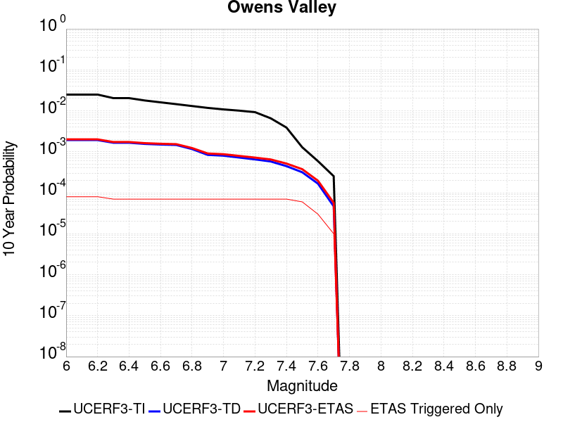 |

| Magnitude | 1 wk TI Prob | 1 wk TD Prob | 1 wk ETAS Prob | 1 wk ETAS/TD Gain | 1 wk ETAS Triggered Only | 1 mo TI Prob | 1 mo TD Prob | 1 mo ETAS Prob | 1 mo ETAS/TD Gain | 1 mo ETAS Triggered Only | 1 yr TI Prob | 1 yr TD Prob | 1 yr ETAS Prob | 1 yr ETAS/TD Gain | 1 yr ETAS Triggered Only | 10 yr TI Prob | 10 yr TD Prob | 10 yr ETAS Prob | 10 yr ETAS/TD Gain | 10 yr ETAS Triggered Only |
|-----|-----|-----|-----|-----|-----|-----|-----|-----|-----|-----|-----|-----|-----|-----|-----|-----|-----|-----|-----|-----|
| 6.0 | 4.83821E-5 | 3.627266E-6 | 3.362716E-5 | 9.270661 | 3.0E-5 | 2.0733538E-4 | 1.554534E-5 | 4.554487E-5 | 2.9298089 | 3.0E-5 | 0.002521386 | 1.8924905E-4 | 2.492377E-4 | 1.3169825 | 6.0E-5 | 0.024929691 | 0.0019253711 | 0.0020052171 | 1.0414704 | 8.0E-5 |
| 6.1 | 4.83821E-5 | 3.627266E-6 | 3.362716E-5 | 9.270661 | 3.0E-5 | 2.0733538E-4 | 1.554534E-5 | 4.554487E-5 | 2.9298089 | 3.0E-5 | 0.002521386 | 1.8924905E-4 | 2.492377E-4 | 1.3169825 | 6.0E-5 | 0.024929691 | 0.0019253711 | 0.0020052171 | 1.0414704 | 8.0E-5 |
| 6.2 | 4.83821E-5 | 3.627266E-6 | 3.362716E-5 | 9.270661 | 3.0E-5 | 2.0733538E-4 | 1.554534E-5 | 4.554487E-5 | 2.9298089 | 3.0E-5 | 0.002521386 | 1.8924905E-4 | 2.492377E-4 | 1.3169825 | 6.0E-5 | 0.024929691 | 0.0019253711 | 0.0020052171 | 1.0414704 | 8.0E-5 |
| 6.3 | 3.953008E-5 | 3.1557743E-6 | 3.315568E-5 | 10.506353 | 3.0E-5 | 1.6940363E-4 | 1.3524681E-5 | 4.3524276E-5 | 3.218137 | 3.0E-5 | 0.002060538 | 1.6465128E-4 | 2.246414E-4 | 1.3643465 | 6.0E-5 | 0.020415364 | 0.0016594019 | 0.0017292857 | 1.0421139 | 7.0E-5 |
| 6.4 | 3.953008E-5 | 3.1557743E-6 | 3.315568E-5 | 10.506353 | 3.0E-5 | 1.6940363E-4 | 1.3524681E-5 | 4.3524276E-5 | 3.218137 | 3.0E-5 | 0.002060538 | 1.6465128E-4 | 2.246414E-4 | 1.3643465 | 6.0E-5 | 0.020415364 | 0.0016594019 | 0.0017292857 | 1.0421139 | 7.0E-5 |
| 6.5 | 3.457342E-5 | 2.971842E-6 | 3.297175E-5 | 11.094719 | 3.0E-5 | 1.4816338E-4 | 1.2736407E-5 | 4.2736025E-5 | 3.3554223 | 3.0E-5 | 0.0018023965 | 1.5505543E-4 | 2.1504612E-4 | 1.3868984 | 6.0E-5 | 0.017878477 | 0.001555852 | 0.0016257431 | 1.0449214 | 7.0E-5 |
| 6.6 | 3.1127765E-5 | 2.8746658E-6 | 3.287458E-5 | 11.435966 | 3.0E-5 | 1.3339789E-4 | 1.23199425E-5 | 4.2319574E-5 | 3.4350464 | 3.0E-5 | 0.0016229092 | 1.4998566E-4 | 2.0997666E-4 | 1.3999783 | 6.0E-5 | 0.016111081 | 0.0015013479 | 0.0015712428 | 1.0465548 | 7.0E-5 |
| 6.7 | 2.806885E-5 | 2.8105421E-6 | 3.2810458E-5 | 11.6740675 | 3.0E-5 | 1.2028952E-4 | 1.2045129E-5 | 4.204477E-5 | 3.4906034 | 3.0E-5 | 0.001463541 | 1.4664026E-4 | 2.0663146E-4 | 1.4091046 | 6.0E-5 | 0.014539397 | 0.0014658185 | 0.0015357159 | 1.0476849 | 7.0E-5 |
| 6.8 | 2.524524E-5 | 2.2354802E-6 | 3.2235414E-5 | 14.419906 | 3.0E-5 | 1.0818939E-4 | 9.580595E-6 | 3.9580307E-5 | 4.1312995 | 3.0E-5 | 0.0013164099 | 1.1663781E-4 | 1.7663081E-4 | 1.5143529 | 6.0E-5 | 0.01308639 | 0.0011660393 | 0.0012359577 | 1.0599623 | 7.0E-5 |
| 6.9 | 2.2704568E-5 | 1.6082504E-6 | 3.16082E-5 | 19.653782 | 3.0E-5 | 9.730166E-5 | 6.8924833E-6 | 3.6892277E-5 | 5.3525376 | 3.0E-5 | 0.0011840039 | 8.3912775E-5 | 1.4390773E-4 | 1.7149682 | 6.0E-5 | 0.011777153 | 8.390228E-4 | 9.089641E-4 | 1.0833604 | 7.0E-5 |
| 7.0 | 2.0871712E-5 | 1.5396229E-6 | 3.1539577E-5 | 20.48526 | 3.0E-5 | 8.944713E-5 | 6.5983672E-6 | 3.659817E-5 | 5.5465493 | 3.0E-5 | 0.0010884746 | 8.0332175E-5 | 1.4032736E-4 | 1.7468387 | 6.0E-5 | 0.010831586 | 8.032034E-4 | 8.7314716E-4 | 1.0870811 | 7.0E-5 |
| 7.1 | 1.944928E-5 | 1.3864841E-6 | 3.1386444E-5 | 22.637434 | 3.0E-5 | 8.335139E-5 | 5.9420613E-6 | 3.5941885E-5 | 6.048723 | 3.0E-5 | 0.0010143308 | 7.2342205E-5 | 1.3233787E-4 | 1.8293314 | 6.0E-5 | 0.010097133 | 7.2334456E-4 | 7.9329393E-4 | 1.0967027 | 7.0E-5 |
| 7.2 | 1.7876306E-5 | 1.2489725E-6 | 3.1248936E-5 | 25.019714 | 3.0E-5 | 7.6610486E-5 | 5.3527283E-6 | 3.535257E-5 | 6.6045885 | 3.0E-5 | 9.3233347E-4 | 6.516753E-5 | 1.2516361E-4 | 1.9206439 | 6.0E-5 | 0.009284316 | 6.5162167E-4 | 7.215761E-4 | 1.1073543 | 7.0E-5 |
| 7.3 | 1.2618672E-5 | 1.1115751E-6 | 3.111154E-5 | 27.9887 | 3.0E-5 | 5.40789E-5 | 4.7638846E-6 | 3.4763743E-5 | 7.297352 | 3.0E-5 | 6.582117E-4 | 5.7998757E-5 | 1.17995274E-4 | 2.0344448 | 6.0E-5 | 0.0065626553 | 5.799688E-4 | 6.4992823E-4 | 1.1206261 | 7.0E-5 |
| 7.4 | 7.4874442E-6 | 8.5490996E-7 | 3.0854884E-5 | 36.091385 | 3.0E-5 | 3.208865E-5 | 3.6638946E-6 | 3.3663786E-5 | 9.187978 | 3.0E-5 | 3.906093E-4 | 4.4607008E-5 | 1.0460433E-4 | 2.34502 | 6.0E-5 | 0.003899234 | 4.460728E-4 | 5.160416E-4 | 1.1568551 | 7.0E-5 |
| 7.5 | 2.4734156E-6 | 6.068919E-7 | 3.0606872E-5 | 50.432167 | 3.0E-5 | 1.060031E-5 | 2.6009627E-6 | 3.2600885E-5 | 12.534161 | 3.0E-5 | 1.2905113E-4 | 3.1666266E-5 | 8.166468E-5 | 2.5789175 | 5.0E-5 | 0.0012897621 | 3.1661784E-4 | 3.7659885E-4 | 1.1894429 | 6.0E-5 |
| 7.6 | 1.1328841E-6 | 3.1966815E-7 | 2.0319661E-5 | 63.56486 | 2.0E-5 | 4.8552088E-6 | 1.3700056E-6 | 2.1369979E-5 | 15.59846 | 2.0E-5 | 5.9110564E-5 | 1.6679693E-5 | 4.6679193E-5 | 2.7985642 | 3.0E-5 | 5.9094845E-4 | 1.667846E-4 | 1.967796E-4 | 1.1798427 | 3.0E-5 |
| 7.7 | 4.8613185E-7 | 8.965275E-8 | 1.0089652E-5 | 112.541466 | 1.0E-5 | 2.0834207E-6 | 3.8422604E-7 | 1.0384222E-5 | 27.026337 | 1.0E-5 | 2.536535E-5 | 4.6779423E-6 | 1.4677896E-5 | 3.137682 | 1.0E-5 | 2.5362454E-4 | 4.677851E-5 | 5.677804E-5 | 1.2137634 | 1.0E-5 |

## Channel Islands Thrust
*[(top)](#table-of-contents)*

| 1 Week | 1 Month | 1 Year | 10 Year |
|-----|-----|-----|-----|
|  |  | 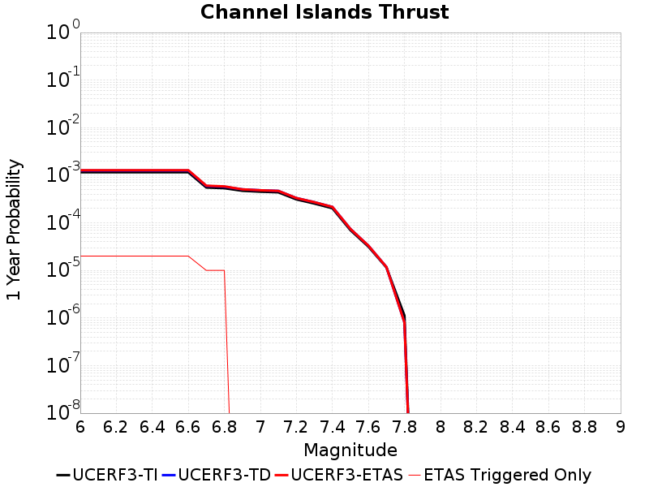 | 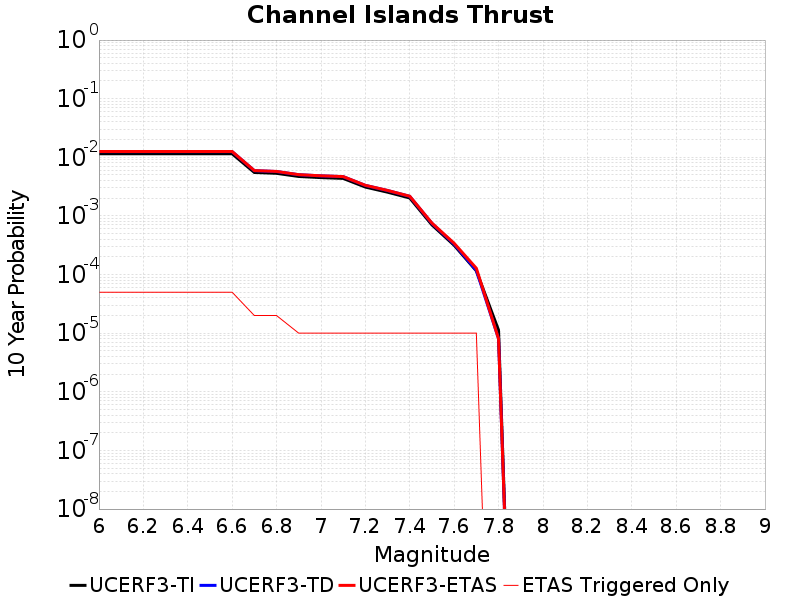 |

| Magnitude | 1 wk TI Prob | 1 wk TD Prob | 1 wk ETAS Prob | 1 wk ETAS/TD Gain | 1 wk ETAS Triggered Only | 1 mo TI Prob | 1 mo TD Prob | 1 mo ETAS Prob | 1 mo ETAS/TD Gain | 1 mo ETAS Triggered Only | 1 yr TI Prob | 1 yr TD Prob | 1 yr ETAS Prob | 1 yr ETAS/TD Gain | 1 yr ETAS Triggered Only | 10 yr TI Prob | 10 yr TD Prob | 10 yr ETAS Prob | 10 yr ETAS/TD Gain | 10 yr ETAS Triggered Only |
|-----|-----|-----|-----|-----|-----|-----|-----|-----|-----|-----|-----|-----|-----|-----|-----|-----|-----|-----|-----|-----|
| 6.0 | 2.2156251E-5 | 2.409226E-5 | 2.409226E-5 | 1.0 | 0.0 | 9.495191E-5 | 1.03249055E-4 | 1.03249055E-4 | 1.0 | 0.0 | 0.0011554264 | 0.0012564389 | 0.0012764137 | 1.015898 | 2.0E-5 | 0.011494373 | 0.012503943 | 0.0125533175 | 1.0039487 | 5.0E-5 |
| 6.1 | 2.2156251E-5 | 2.409226E-5 | 2.409226E-5 | 1.0 | 0.0 | 9.495191E-5 | 1.03249055E-4 | 1.03249055E-4 | 1.0 | 0.0 | 0.0011554264 | 0.0012564389 | 0.0012764137 | 1.015898 | 2.0E-5 | 0.011494373 | 0.012503943 | 0.0125533175 | 1.0039487 | 5.0E-5 |
| 6.2 | 2.2156251E-5 | 2.409226E-5 | 2.409226E-5 | 1.0 | 0.0 | 9.495191E-5 | 1.03249055E-4 | 1.03249055E-4 | 1.0 | 0.0 | 0.0011554264 | 0.0012564389 | 0.0012764137 | 1.015898 | 2.0E-5 | 0.011494373 | 0.012503943 | 0.0125533175 | 1.0039487 | 5.0E-5 |
| 6.3 | 2.2156251E-5 | 2.409226E-5 | 2.409226E-5 | 1.0 | 0.0 | 9.495191E-5 | 1.03249055E-4 | 1.03249055E-4 | 1.0 | 0.0 | 0.0011554264 | 0.0012564389 | 0.0012764137 | 1.015898 | 2.0E-5 | 0.011494373 | 0.012503943 | 0.0125533175 | 1.0039487 | 5.0E-5 |
| 6.4 | 2.2156251E-5 | 2.409226E-5 | 2.409226E-5 | 1.0 | 0.0 | 9.495191E-5 | 1.03249055E-4 | 1.03249055E-4 | 1.0 | 0.0 | 0.0011554264 | 0.0012564389 | 0.0012764137 | 1.015898 | 2.0E-5 | 0.011494373 | 0.012503943 | 0.0125533175 | 1.0039487 | 5.0E-5 |
| 6.5 | 2.2156251E-5 | 2.409226E-5 | 2.409226E-5 | 1.0 | 0.0 | 9.495191E-5 | 1.03249055E-4 | 1.03249055E-4 | 1.0 | 0.0 | 0.0011554264 | 0.0012564389 | 0.0012764137 | 1.015898 | 2.0E-5 | 0.011494373 | 0.012503943 | 0.0125533175 | 1.0039487 | 5.0E-5 |
| 6.6 | 2.2156251E-5 | 2.409226E-5 | 2.409226E-5 | 1.0 | 0.0 | 9.495191E-5 | 1.03249055E-4 | 1.03249055E-4 | 1.0 | 0.0 | 0.0011554264 | 0.0012564389 | 0.0012764137 | 1.015898 | 2.0E-5 | 0.011494373 | 0.012503943 | 0.0125533175 | 1.0039487 | 5.0E-5 |
| 6.7 | 1.0601296E-5 | 1.1379639E-5 | 1.1379639E-5 | 1.0 | 0.0 | 4.5433335E-5 | 4.8768994E-5 | 4.8768994E-5 | 1.0 | 0.0 | 5.5301044E-4 | 5.936056E-4 | 6.035997E-4 | 1.0168362 | 1.0E-5 | 0.005516363 | 0.0059207026 | 0.005940584 | 1.003358 | 2.0E-5 |
| 6.8 | 1.0246747E-5 | 1.09967605E-5 | 1.09967605E-5 | 1.0 | 0.0 | 4.391389E-5 | 4.7128146E-5 | 4.7128146E-5 | 1.0 | 0.0 | 5.345204E-4 | 5.7363894E-4 | 5.836332E-4 | 1.0174226 | 1.0E-5 | 0.0053323656 | 0.005722072 | 0.0057419576 | 1.0034752 | 2.0E-5 |
| 6.9 | 9.049551E-6 | 9.699724E-6 | 9.699724E-6 | 1.0 | 0.0 | 3.878322E-5 | 4.1569605E-5 | 4.1569605E-5 | 1.0 | 0.0 | 4.7208337E-4 | 5.059965E-4 | 5.059965E-4 | 1.0 | 0.0 | 0.0047108172 | 0.0050488613 | 0.005058811 | 1.0019706 | 1.0E-5 |
| 7.0 | 8.6542195E-6 | 9.274679E-6 | 9.274679E-6 | 1.0 | 0.0 | 3.7088983E-5 | 3.974804E-5 | 3.974804E-5 | 1.0 | 0.0 | 4.5146482E-4 | 4.83829E-4 | 4.83829E-4 | 1.0 | 0.0 | 0.004505487 | 0.0048281685 | 0.00483812 | 1.0020611 | 1.0E-5 |
| 7.1 | 8.391028E-6 | 8.992998E-6 | 8.992998E-6 | 1.0 | 0.0 | 3.5961057E-5 | 3.8540875E-5 | 3.8540875E-5 | 1.0 | 0.0 | 4.3773788E-4 | 4.6913818E-4 | 4.6913818E-4 | 1.0 | 0.0 | 0.004368766 | 0.0046818885 | 0.0046918415 | 1.0021259 | 1.0E-5 |
| 7.2 | 5.965188E-6 | 6.371745E-6 | 6.371745E-6 | 1.0 | 0.0 | 2.556484E-5 | 2.7307196E-5 | 2.7307196E-5 | 1.0 | 0.0 | 3.1120746E-4 | 3.3241493E-4 | 3.3241493E-4 | 1.0 | 0.0 | 0.00310772 | 0.003319235 | 0.003329202 | 1.0030028 | 1.0E-5 |
| 7.3 | 4.877518E-6 | 5.206047E-6 | 5.206047E-6 | 1.0 | 0.0 | 2.0903482E-5 | 2.2311442E-5 | 2.2311442E-5 | 1.0 | 0.0 | 2.5447016E-4 | 2.7160838E-4 | 2.7160838E-4 | 1.0 | 0.0 | 0.0025417898 | 0.0027128106 | 0.0027227835 | 1.0036762 | 1.0E-5 |
| 7.4 | 3.8829853E-6 | 4.141895E-6 | 4.141895E-6 | 1.0 | 0.0 | 1.664126E-5 | 1.775086E-5 | 1.775086E-5 | 1.0 | 0.0 | 2.0258849E-4 | 2.160957E-4 | 2.160957E-4 | 1.0 | 0.0 | 0.002024039 | 0.0021588975 | 0.002168876 | 1.004622 | 1.0E-5 |
| 7.5 | 1.3489616E-6 | 1.4278007E-6 | 1.4278007E-6 | 1.0 | 0.0 | 5.7812517E-6 | 6.1191317E-6 | 6.1191317E-6 | 1.0 | 0.0 | 7.038446E-5 | 7.4497926E-5 | 7.4497926E-5 | 1.0 | 0.0 | 7.036218E-4 | 7.447335E-4 | 7.54726E-4 | 1.0134176 | 1.0E-5 |
| 7.6 | 6.058192E-7 | 6.353823E-7 | 6.353823E-7 | 1.0 | 0.0 | 2.5963652E-6 | 2.7230644E-6 | 2.7230644E-6 | 1.0 | 0.0 | 3.161029E-5 | 3.315282E-5 | 3.315282E-5 | 1.0 | 0.0 | 3.1605794E-4 | 3.3148038E-4 | 3.4147705E-4 | 1.0301577 | 1.0E-5 |
| 7.7 | 2.2170494E-7 | 2.2608052E-7 | 2.2608052E-7 | 1.0 | 0.0 | 9.5016367E-7 | 9.689162E-7 | 9.689162E-7 | 1.0 | 0.0 | 1.1568181E-5 | 1.1796502E-5 | 1.1796502E-5 | 1.0 | 0.0 | 1.1567579E-4 | 1.1795987E-4 | 1.2795869E-4 | 1.0847646 | 1.0E-5 |
| 7.8 | 2.1613102E-8 | 1.5466771E-8 | 1.5466771E-8 | 1.0 | 0.0 | 9.262757E-8 | 6.628616E-8 | 6.628616E-8 | 1.0 | 0.0 | 1.1277401E-6 | 8.070338E-7 | 8.070338E-7 | 1.0 | 0.0 | 1.1277344E-5 | 8.070317E-6 | 8.070317E-6 | 1.0 | 0.0 |

## San Jacinto (Borrego)
*[(top)](#table-of-contents)*

| 1 Week | 1 Month | 1 Year | 10 Year |
|-----|-----|-----|-----|
| 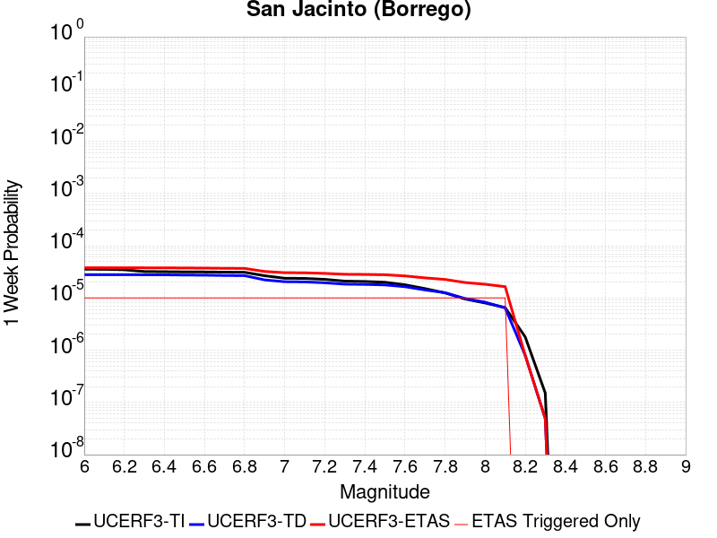 | 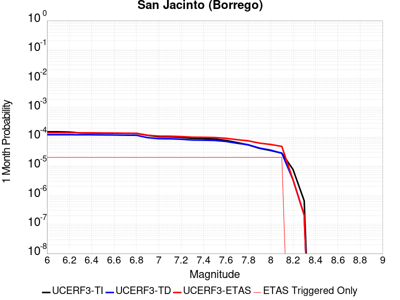 | 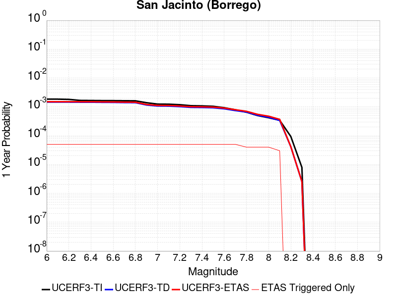 | 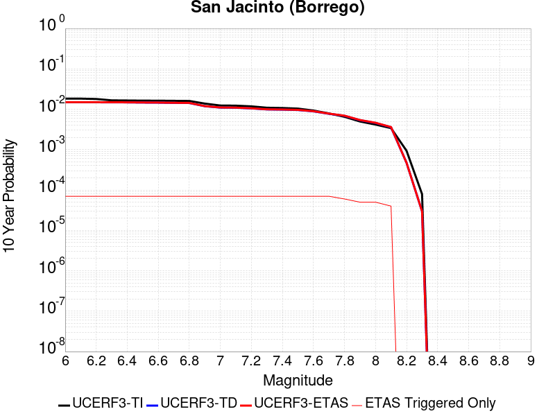 |

| Magnitude | 1 wk TI Prob | 1 wk TD Prob | 1 wk ETAS Prob | 1 wk ETAS/TD Gain | 1 wk ETAS Triggered Only | 1 mo TI Prob | 1 mo TD Prob | 1 mo ETAS Prob | 1 mo ETAS/TD Gain | 1 mo ETAS Triggered Only | 1 yr TI Prob | 1 yr TD Prob | 1 yr ETAS Prob | 1 yr ETAS/TD Gain | 1 yr ETAS Triggered Only | 10 yr TI Prob | 10 yr TD Prob | 10 yr ETAS Prob | 10 yr ETAS/TD Gain | 10 yr ETAS Triggered Only |
|-----|-----|-----|-----|-----|-----|-----|-----|-----|-----|-----|-----|-----|-----|-----|-----|-----|-----|-----|-----|-----|
| 6.0 | 3.543992E-5 | 2.7932943E-5 | 3.7932663E-5 | 1.3579903 | 1.0E-5 | 1.5187653E-4 | 1.1970719E-4 | 1.3970479E-4 | 1.1670543 | 2.0E-5 | 0.0018475284 | 0.0014564729 | 0.0015064001 | 1.0342795 | 5.0E-5 | 0.018322436 | 0.014872988 | 0.014941947 | 1.0046365 | 7.0E-5 |
| 6.1 | 3.542281E-5 | 2.7932943E-5 | 3.7932663E-5 | 1.3579903 | 1.0E-5 | 1.5180321E-4 | 1.1970719E-4 | 1.3970479E-4 | 1.1670543 | 2.0E-5 | 0.0018466372 | 0.0014564729 | 0.0015064001 | 1.0342795 | 5.0E-5 | 0.018313672 | 0.014872988 | 0.014941947 | 1.0046365 | 7.0E-5 |
| 6.2 | 3.4688688E-5 | 2.7932943E-5 | 3.7932663E-5 | 1.3579903 | 1.0E-5 | 1.4865733E-4 | 1.1970719E-4 | 1.3970479E-4 | 1.1670543 | 2.0E-5 | 0.0018084005 | 0.0014564729 | 0.0015064001 | 1.0342795 | 5.0E-5 | 0.017937548 | 0.014872988 | 0.014941947 | 1.0046365 | 7.0E-5 |
| 6.3 | 3.2087122E-5 | 2.7778291E-5 | 3.7778012E-5 | 1.3599833 | 1.0E-5 | 1.3750899E-4 | 1.1904445E-4 | 1.3904208E-4 | 1.1679845 | 2.0E-5 | 0.0016728862 | 0.0014484149 | 0.0014983425 | 1.0344704 | 5.0E-5 | 0.016603488 | 0.014794022 | 0.014862986 | 1.0046617 | 7.0E-5 |
| 6.4 | 3.1828724E-5 | 2.7745276E-5 | 3.7744998E-5 | 1.3604118 | 1.0E-5 | 1.364017E-4 | 1.1890298E-4 | 1.389006E-4 | 1.1681844 | 2.0E-5 | 0.0016594254 | 0.0014466946 | 0.0014966223 | 1.0345116 | 5.0E-5 | 0.016470885 | 0.0147771 | 0.014846065 | 1.004667 | 7.0E-5 |
| 6.5 | 3.1563577E-5 | 2.7484986E-5 | 3.748471E-5 | 1.363825 | 1.0E-5 | 1.3526545E-4 | 1.17787546E-4 | 1.3778519E-4 | 1.1697773 | 2.0E-5 | 0.0016456128 | 0.0014331322 | 0.0014830605 | 1.0348386 | 5.0E-5 | 0.0163348 | 0.014643681 | 0.014712656 | 1.0047102 | 7.0E-5 |
| 6.6 | 3.1467625E-5 | 2.7329206E-5 | 3.7328933E-5 | 1.365899 | 1.0E-5 | 1.3485427E-4 | 1.1711998E-4 | 1.3711763E-4 | 1.170745 | 2.0E-5 | 0.0016406142 | 0.0014250153 | 0.001474944 | 1.0350374 | 5.0E-5 | 0.016285548 | 0.014563926 | 0.014632906 | 1.0047364 | 7.0E-5 |
| 6.7 | 3.1223695E-5 | 2.6947217E-5 | 3.6946945E-5 | 1.3710859 | 1.0E-5 | 1.3380898E-4 | 1.15483024E-4 | 1.3548072E-4 | 1.1731657 | 2.0E-5 | 0.0016279068 | 0.0014051112 | 0.0014550409 | 1.0355344 | 5.0E-5 | 0.01616033 | 0.014368293 | 0.014437287 | 1.0048019 | 7.0E-5 |
| 6.8 | 3.1015585E-5 | 2.6768212E-5 | 3.6767946E-5 | 1.3735675 | 1.0E-5 | 1.3291716E-4 | 1.14715935E-4 | 1.3471364E-4 | 1.1743237 | 2.0E-5 | 0.001617065 | 0.0013957837 | 0.001445714 | 1.0357722 | 5.0E-5 | 0.016053487 | 0.014275568 | 0.014344568 | 1.0048335 | 7.0E-5 |
| 6.9 | 2.6641965E-5 | 2.2190256E-5 | 3.2190033E-5 | 1.4506383 | 1.0E-5 | 1.1417485E-4 | 9.509765E-5 | 1.1509575E-4 | 1.2102902 | 2.0E-5 | 0.0013891924 | 0.0011572029 | 0.0012071449 | 1.0431576 | 5.0E-5 | 0.0138054015 | 0.011885574 | 0.0119547425 | 1.0058194 | 7.0E-5 |
| 7.0 | 2.3854353E-5 | 2.0484817E-5 | 3.0484613E-5 | 1.4881564 | 1.0E-5 | 1.02228936E-4 | 8.778913E-5 | 1.07787375E-4 | 1.2277986 | 2.0E-5 | 0.0012439266 | 0.0010683112 | 0.0011182578 | 1.0467528 | 5.0E-5 | 0.012369866 | 0.010985824 | 0.011055056 | 1.0063019 | 7.0E-5 |
| 7.1 | 2.3672901E-5 | 2.0321299E-5 | 3.0321095E-5 | 1.4920845 | 1.0E-5 | 1.0145135E-4 | 8.708838E-5 | 1.0708664E-4 | 1.2296318 | 2.0E-5 | 0.0012344702 | 0.0010597879 | 0.0011097349 | 1.0471293 | 5.0E-5 | 0.0122763505 | 0.010900998 | 0.010970235 | 1.0063515 | 7.0E-5 |
| 7.2 | 2.2717244E-5 | 1.9548632E-5 | 2.9548435E-5 | 1.5115348 | 1.0E-5 | 9.735599E-5 | 8.377717E-5 | 1.037755E-4 | 1.2387085 | 2.0E-5 | 0.0011846646 | 0.0010195121 | 0.0010694611 | 1.0489931 | 5.0E-5 | 0.01178369 | 0.010498339 | 0.010567605 | 1.0065978 | 7.0E-5 |
| 7.3 | 2.1016205E-5 | 1.8390185E-5 | 2.839E-5 | 1.5437584 | 1.0E-5 | 9.006634E-5 | 7.881271E-5 | 9.881113E-5 | 1.2537462 | 2.0E-5 | 0.001096006 | 9.5912436E-4 | 0.0010090764 | 1.0520809 | 5.0E-5 | 0.010906163 | 0.009893925 | 0.009963232 | 1.0070051 | 7.0E-5 |
| 7.4 | 2.0683625E-5 | 1.8192688E-5 | 2.8192508E-5 | 1.5496614 | 1.0E-5 | 8.86411E-5 | 7.7966346E-5 | 9.796479E-5 | 1.256501 | 2.0E-5 | 0.001078671 | 9.4882894E-4 | 9.987815E-4 | 1.0526465 | 5.0E-5 | 0.010734501 | 0.009790641 | 0.009859956 | 1.0070797 | 7.0E-5 |
| 7.5 | 1.9993966E-5 | 1.7787666E-5 | 2.7787488E-5 | 1.5621773 | 1.0E-5 | 8.568561E-5 | 7.623064E-5 | 9.6229116E-5 | 1.2623417 | 2.0E-5 | 0.001042723 | 9.2771486E-4 | 9.776684E-4 | 1.0538459 | 5.0E-5 | 0.010378438 | 0.009577539 | 0.009646868 | 1.0072387 | 7.0E-5 |
| 7.6 | 1.788966E-5 | 1.6440741E-5 | 2.6440577E-5 | 1.608235 | 1.0E-5 | 7.666772E-5 | 7.045843E-5 | 9.045702E-5 | 1.2838353 | 2.0E-5 | 9.3302975E-4 | 8.574955E-4 | 9.0745266E-4 | 1.0582594 | 5.0E-5 | 0.00929122 | 0.00886934 | 0.008938719 | 1.0078224 | 7.0E-5 |
| 7.7 | 1.5125781E-5 | 1.4242662E-5 | 2.424252E-5 | 1.702106 | 1.0E-5 | 6.4823165E-5 | 6.1038554E-5 | 8.103734E-5 | 1.3276417 | 2.0E-5 | 7.889362E-4 | 7.4289186E-4 | 7.928547E-4 | 1.0672545 | 5.0E-5 | 0.007861412 | 0.0077169733 | 0.007786433 | 1.0090009 | 7.0E-5 |
| 7.8 | 1.250089E-5 | 1.2635591E-5 | 2.2635464E-5 | 1.7914053 | 1.0E-5 | 5.3574146E-5 | 5.4151413E-5 | 7.415033E-5 | 1.3693148 | 2.0E-5 | 6.5207E-4 | 6.5909466E-4 | 6.990683E-4 | 1.0606493 | 4.0E-5 | 0.006501599 | 0.006870435 | 0.006930023 | 1.0086731 | 6.0E-5 |
| 7.9 | 9.561E-6 | 9.7590955E-6 | 1.9758998E-5 | 2.0246751 | 1.0E-5 | 4.0975072E-5 | 4.1824027E-5 | 6.182319E-5 | 1.478174 | 2.0E-5 | 4.987573E-4 | 5.0908915E-4 | 5.4906873E-4 | 1.0785317 | 4.0E-5 | 0.0049763937 | 0.0053547034 | 0.005404436 | 1.0092876 | 5.0E-5 |
| 8.0 | 8.01699E-6 | 8.297545E-6 | 1.8297462E-5 | 2.2051656 | 1.0E-5 | 3.4358076E-5 | 3.5560424E-5 | 5.5559714E-5 | 1.562403 | 2.0E-5 | 4.1822926E-4 | 4.328627E-4 | 4.728454E-4 | 1.092368 | 4.0E-5 | 0.0041744304 | 0.004575514 | 0.004625285 | 1.0108777 | 5.0E-5 |
| 8.1 | 6.541947E-6 | 6.4655605E-6 | 1.6465496E-5 | 2.5466464 | 1.0E-5 | 2.8036617E-5 | 2.7709253E-5 | 4.7708698E-5 | 1.7217605 | 2.0E-5 | 3.4129233E-4 | 3.3730845E-4 | 3.6729831E-4 | 1.0889094 | 3.0E-5 | 0.0034076865 | 0.0035824596 | 0.0036223163 | 1.0111256 | 4.0E-5 |
| 8.2 | 1.7968189E-6 | 7.9776447E-7 | 7.9776447E-7 | 1.0 | 0.0 | 7.70063E-6 | 3.4189864E-6 | 3.4189864E-6 | 1.0 | 0.0 | 9.3751136E-5 | 4.1625386E-5 | 4.1625386E-5 | 1.0 | 0.0 | 9.371159E-4 | 4.7155778E-4 | 4.7155778E-4 | 1.0 | 0.0 |
| 8.3 | 1.5167889E-7 | 4.902216E-8 | 4.902216E-8 | 1.0 | 0.0 | 6.500522E-7 | 2.1009494E-7 | 2.1009494E-7 | 1.0 | 0.0 | 7.9143565E-6 | 2.5579034E-6 | 2.5579034E-6 | 1.0 | 0.0 | 7.914075E-5 | 2.9720859E-5 | 2.9720859E-5 | 1.0 | 0.0 |

## Chino alt 1
*[(top)](#table-of-contents)*

| 1 Week | 1 Month | 1 Year | 10 Year |
|-----|-----|-----|-----|
|  | 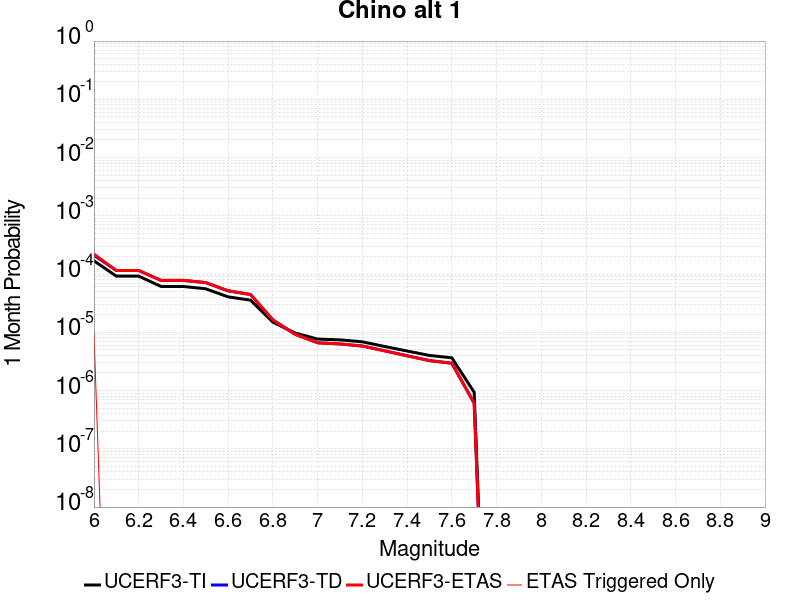 | 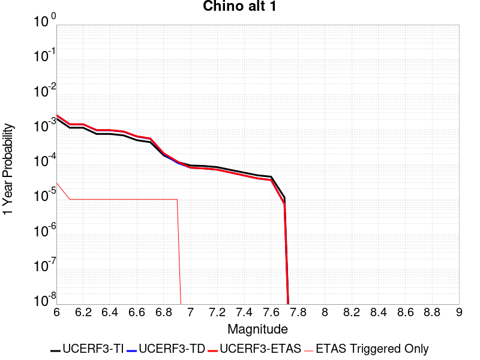 | 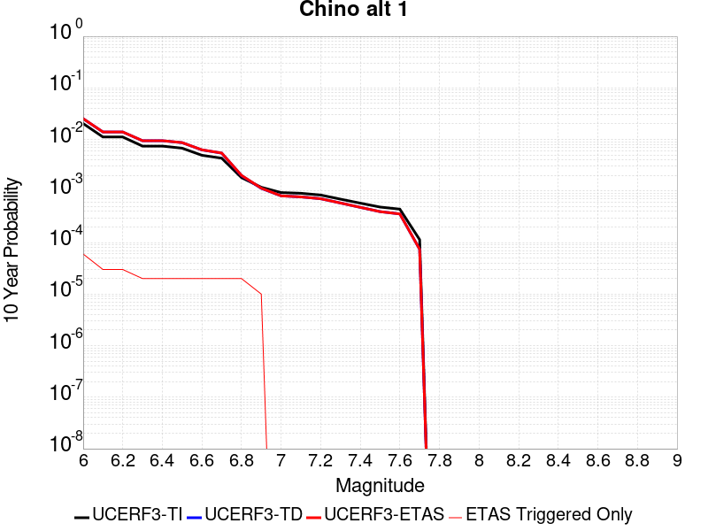 |

| Magnitude | 1 wk TI Prob | 1 wk TD Prob | 1 wk ETAS Prob | 1 wk ETAS/TD Gain | 1 wk ETAS Triggered Only | 1 mo TI Prob | 1 mo TD Prob | 1 mo ETAS Prob | 1 mo ETAS/TD Gain | 1 mo ETAS Triggered Only | 1 yr TI Prob | 1 yr TD Prob | 1 yr ETAS Prob | 1 yr ETAS/TD Gain | 1 yr ETAS Triggered Only | 10 yr TI Prob | 10 yr TD Prob | 10 yr ETAS Prob | 10 yr ETAS/TD Gain | 10 yr ETAS Triggered Only |
|-----|-----|-----|-----|-----|-----|-----|-----|-----|-----|-----|-----|-----|-----|-----|-----|-----|-----|-----|-----|-----|
| 6.0 | 3.939946E-5 | 4.895009E-5 | 4.895009E-5 | 1.0 | 0.0 | 1.6884391E-4 | 2.0977216E-4 | 2.1977007E-4 | 1.0476607 | 1.0E-5 | 0.0020537362 | 0.0025514732 | 0.0025813968 | 1.0117279 | 3.0E-5 | 0.020348595 | 0.025278622 | 0.025337106 | 1.0023135 | 6.0E-5 |
| 6.1 | 2.1505624E-5 | 2.687998E-5 | 2.687998E-5 | 1.0 | 0.0 | 9.2163704E-5 | 1.1519546E-4 | 1.1519546E-4 | 1.0 | 0.0 | 0.0011215154 | 0.0014017137 | 0.0014116997 | 1.0071241 | 1.0E-5 | 0.011158722 | 0.013945629 | 0.0139752105 | 1.0021212 | 3.0E-5 |
| 6.2 | 2.1505624E-5 | 2.687998E-5 | 2.687998E-5 | 1.0 | 0.0 | 9.2163704E-5 | 1.1519546E-4 | 1.1519546E-4 | 1.0 | 0.0 | 0.0011215154 | 0.0014017137 | 0.0014116997 | 1.0071241 | 1.0E-5 | 0.011158722 | 0.013945629 | 0.0139752105 | 1.0021212 | 3.0E-5 |
| 6.3 | 1.4290785E-5 | 1.816588E-5 | 1.816588E-5 | 1.0 | 0.0 | 6.1244784E-5 | 7.78517E-5 | 7.78517E-5 | 1.0 | 0.0 | 7.454001E-4 | 9.4747765E-4 | 9.574682E-4 | 1.0105443 | 1.0E-5 | 0.007429048 | 0.009444842 | 0.009464653 | 1.0020976 | 2.0E-5 |
| 6.4 | 1.4290785E-5 | 1.816588E-5 | 1.816588E-5 | 1.0 | 0.0 | 6.1244784E-5 | 7.78517E-5 | 7.78517E-5 | 1.0 | 0.0 | 7.454001E-4 | 9.4747765E-4 | 9.574682E-4 | 1.0105443 | 1.0E-5 | 0.007429048 | 0.009444842 | 0.009464653 | 1.0020976 | 2.0E-5 |
| 6.5 | 1.3017944E-5 | 1.6652808E-5 | 1.6652808E-5 | 1.0 | 0.0 | 5.5789995E-5 | 7.136747E-5 | 7.136747E-5 | 1.0 | 0.0 | 6.790315E-4 | 8.6859637E-4 | 8.7858766E-4 | 1.0115029 | 1.0E-5 | 0.0067696036 | 0.008662318 | 0.008682145 | 1.0022888 | 2.0E-5 |
| 6.6 | 9.470016E-6 | 1.2039961E-5 | 1.2039961E-5 | 1.0 | 0.0 | 4.058515E-5 | 5.1599003E-5 | 5.1599003E-5 | 1.0 | 0.0 | 4.940122E-4 | 6.2807073E-4 | 6.3806446E-4 | 1.0159118 | 1.0E-5 | 0.004929154 | 0.006272175 | 0.0062920493 | 1.0031687 | 2.0E-5 |
| 6.7 | 8.314155E-6 | 1.0408209E-5 | 1.0408209E-5 | 1.0 | 0.0 | 3.5631605E-5 | 4.460603E-5 | 4.460603E-5 | 1.0 | 0.0 | 4.3372845E-4 | 5.429753E-4 | 5.5296987E-4 | 1.018407 | 1.0E-5 | 0.004328829 | 0.0054260185 | 0.00544591 | 1.0036659 | 2.0E-5 |
| 6.8 | 3.4856364E-6 | 3.8135142E-6 | 3.8135142E-6 | 1.0 | 0.0 | 1.4938357E-5 | 1.6343542E-5 | 1.6343542E-5 | 1.0 | 0.0 | 1.8185932E-4 | 1.9896652E-4 | 2.0896453E-4 | 1.0502497 | 1.0E-5 | 0.0018171056 | 0.001989561 | 0.0020095212 | 1.0100324 | 2.0E-5 |
| 6.9 | 2.2645952E-6 | 2.1529868E-6 | 2.1529868E-6 | 1.0 | 0.0 | 9.705372E-6 | 9.227055E-6 | 9.227055E-6 | 1.0 | 0.0 | 1.18156495E-4 | 1.12333815E-4 | 1.223327E-4 | 1.0890104 | 1.0E-5 | 0.0011809369 | 0.0011233864 | 0.0011333751 | 1.0088917 | 1.0E-5 |
| 7.0 | 1.7864003E-6 | 1.5431481E-6 | 1.5431481E-6 | 1.0 | 0.0 | 7.655979E-6 | 6.6134753E-6 | 6.6134753E-6 | 1.0 | 0.0 | 9.3207556E-5 | 8.051615E-5 | 8.051615E-5 | 1.0 | 0.0 | 9.316847E-4 | 8.053168E-4 | 8.053168E-4 | 1.0 | 0.0 |
| 7.1 | 1.7315456E-6 | 1.4734188E-6 | 1.4734188E-6 | 1.0 | 0.0 | 7.420889E-6 | 6.314637E-6 | 6.314637E-6 | 1.0 | 0.0 | 9.034557E-5 | 7.687805E-5 | 7.687805E-5 | 1.0 | 0.0 | 9.0308854E-4 | 7.6895236E-4 | 7.6895236E-4 | 1.0 | 0.0 |
| 7.2 | 1.6008337E-6 | 1.3574669E-6 | 1.3574669E-6 | 1.0 | 0.0 | 6.860698E-6 | 5.8177025E-6 | 5.8177025E-6 | 1.0 | 0.0 | 8.352579E-5 | 7.082828E-5 | 7.082828E-5 | 1.0 | 0.0 | 8.34944E-4 | 7.0848124E-4 | 7.0848124E-4 | 1.0 | 0.0 |
| 7.3 | 1.3320939E-6 | 1.1218184E-6 | 1.1218184E-6 | 1.0 | 0.0 | 5.7089615E-6 | 4.8077845E-6 | 4.8077845E-6 | 1.0 | 0.0 | 6.9504385E-5 | 5.8533253E-5 | 5.8533253E-5 | 1.0 | 0.0 | 6.9482654E-4 | 5.8532285E-4 | 5.8532285E-4 | 1.0 | 0.0 |
| 7.4 | 1.114294E-6 | 9.237399E-7 | 9.237399E-7 | 1.0 | 0.0 | 4.775537E-6 | 3.9588795E-6 | 3.9588795E-6 | 1.0 | 0.0 | 5.8140613E-5 | 4.819833E-5 | 4.819833E-5 | 1.0 | 0.0 | 5.81254E-4 | 4.8189555E-4 | 4.8189555E-4 | 1.0 | 0.0 |
| 7.5 | 9.354081E-7 | 7.6236597E-7 | 7.6236597E-7 | 1.0 | 0.0 | 4.0088858E-6 | 3.2672788E-6 | 3.2672788E-6 | 1.0 | 0.0 | 4.8807087E-5 | 3.9778428E-5 | 3.9778428E-5 | 1.0 | 0.0 | 4.879637E-4 | 3.9771647E-4 | 3.9771647E-4 | 1.0 | 0.0 |
| 7.6 | 8.521771E-7 | 6.880912E-7 | 6.880912E-7 | 1.0 | 0.0 | 3.6521824E-6 | 2.948959E-6 | 2.948959E-6 | 1.0 | 0.0 | 4.4464414E-5 | 3.5903016E-5 | 3.5903016E-5 | 1.0 | 0.0 | 4.4455516E-4 | 3.5897535E-4 | 3.5897535E-4 | 1.0 | 0.0 |
| 7.7 | 2.1803626E-7 | 1.4187047E-7 | 1.4187047E-7 | 1.0 | 0.0 | 9.344408E-7 | 6.080162E-7 | 6.080162E-7 | 1.0 | 0.0 | 1.1376757E-5 | 7.402582E-6 | 7.402582E-6 | 1.0 | 0.0 | 1.13761744E-4 | 7.402431E-5 | 7.402431E-5 | 1.0 | 0.0 |

## San Clemente
*[(top)](#table-of-contents)*

| 1 Week | 1 Month | 1 Year | 10 Year |
|-----|-----|-----|-----|
| 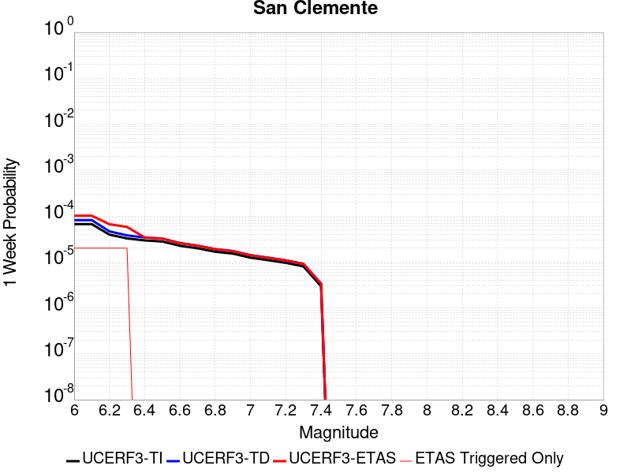 | 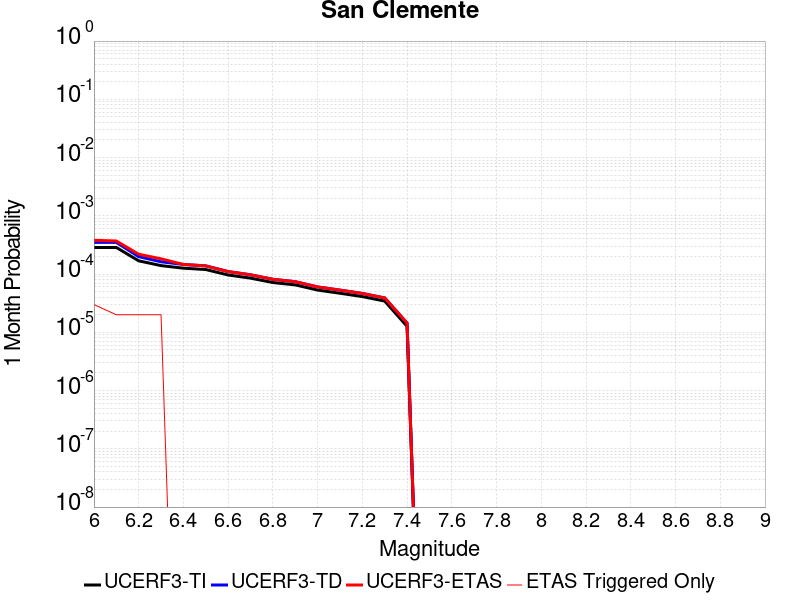 | 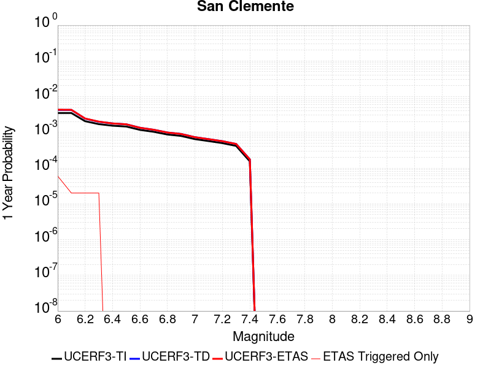 | 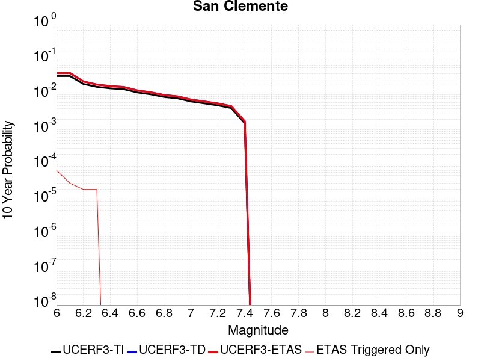 |

| Magnitude | 1 wk TI Prob | 1 wk TD Prob | 1 wk ETAS Prob | 1 wk ETAS/TD Gain | 1 wk ETAS Triggered Only | 1 mo TI Prob | 1 mo TD Prob | 1 mo ETAS Prob | 1 mo ETAS/TD Gain | 1 mo ETAS Triggered Only | 1 yr TI Prob | 1 yr TD Prob | 1 yr ETAS Prob | 1 yr ETAS/TD Gain | 1 yr ETAS Triggered Only | 10 yr TI Prob | 10 yr TD Prob | 10 yr ETAS Prob | 10 yr ETAS/TD Gain | 10 yr ETAS Triggered Only |
|-----|-----|-----|-----|-----|-----|-----|-----|-----|-----|-----|-----|-----|-----|-----|-----|-----|-----|-----|-----|-----|
| 6.0 | 6.681379E-5 | 8.16363E-5 | 1.0163467E-4 | 1.244969 | 2.0E-5 | 2.8631336E-4 | 3.498262E-4 | 3.7981573E-4 | 1.0857269 | 3.0E-5 | 0.003480294 | 0.0042513954 | 0.0043111406 | 1.014053 | 6.0E-5 | 0.03426291 | 0.041756727 | 0.041823804 | 1.0016063 | 7.0E-5 |
| 6.1 | 6.681379E-5 | 8.16363E-5 | 1.0163467E-4 | 1.244969 | 2.0E-5 | 2.8631336E-4 | 3.498262E-4 | 3.6981923E-4 | 1.0571512 | 2.0E-5 | 0.003480294 | 0.0042513954 | 0.0042713108 | 1.0046843 | 2.0E-5 | 0.03426291 | 0.041756727 | 0.041785475 | 1.0006884 | 3.0E-5 |
| 6.2 | 3.9400576E-5 | 4.645293E-5 | 6.6452E-5 | 1.4305234 | 2.0E-5 | 1.6884868E-4 | 1.9906914E-4 | 2.1906514E-4 | 1.1004477 | 2.0E-5 | 0.0020537945 | 0.0024210338 | 0.0024409853 | 1.0082409 | 2.0E-5 | 0.020349167 | 0.023953337 | 0.023972858 | 1.0008149 | 2.0E-5 |
| 6.3 | 3.2590255E-5 | 3.792979E-5 | 5.792903E-5 | 1.5272701 | 2.0E-5 | 1.3966505E-4 | 1.6254628E-4 | 1.8254302E-4 | 1.1230218 | 2.0E-5 | 0.0016990956 | 0.0019772348 | 0.0019971952 | 1.0100951 | 2.0E-5 | 0.01686163 | 0.019600224 | 0.019619832 | 1.0010004 | 2.0E-5 |
| 6.4 | 2.9454652E-5 | 3.4098382E-5 | 3.4098382E-5 | 1.0 | 0.0 | 1.2622811E-4 | 1.4612787E-4 | 1.4612787E-4 | 1.0 | 0.0 | 0.0015357438 | 0.0017776795 | 0.0017776795 | 1.0 | 0.0 | 0.015251739 | 0.017637767 | 0.017637767 | 1.0 | 0.0 |
| 6.5 | 2.790836E-5 | 3.2248026E-5 | 3.2248026E-5 | 1.0 | 0.0 | 1.1960178E-4 | 1.3819864E-4 | 1.3819864E-4 | 1.0 | 0.0 | 0.001455179 | 0.0016812944 | 0.0016812944 | 1.0 | 0.0 | 0.014456868 | 0.016688764 | 0.016688764 | 1.0 | 0.0 |
| 6.6 | 2.2492153E-5 | 2.5763127E-5 | 2.5763127E-5 | 1.0 | 0.0 | 9.639138E-5 | 1.1040881E-4 | 1.1040881E-4 | 1.0 | 0.0 | 0.0011729331 | 0.0013434127 | 0.0013434127 | 1.0 | 0.0 | 0.011667615 | 0.013354632 | 0.013354632 | 1.0 | 0.0 |
| 6.7 | 1.9862755E-5 | 2.2666782E-5 | 2.2666782E-5 | 1.0 | 0.0 | 8.512331E-5 | 9.71398E-5 | 9.71398E-5 | 1.0 | 0.0 | 0.0010358836 | 0.0011820466 | 0.0011820466 | 1.0 | 0.0 | 0.010310682 | 0.011758885 | 0.011758885 | 1.0 | 0.0 |
| 6.8 | 1.6697575E-5 | 1.8977998E-5 | 1.8977998E-5 | 1.0 | 0.0 | 7.155907E-5 | 8.13318E-5 | 8.13318E-5 | 1.0 | 0.0 | 8.7088346E-4 | 9.897741E-4 | 9.897741E-4 | 1.0 | 0.0 | 0.008674784 | 0.009854686 | 0.009854686 | 1.0 | 0.0 |
| 6.9 | 1.5218415E-5 | 1.726966E-5 | 1.726966E-5 | 1.0 | 0.0 | 6.522015E-5 | 7.401078E-5 | 7.401078E-5 | 1.0 | 0.0 | 7.93766E-4 | 9.0071757E-4 | 9.0071757E-4 | 1.0 | 0.0 | 0.007909367 | 0.008971615 | 0.008971615 | 1.0 | 0.0 |
| 7.0 | 1.2392958E-5 | 1.4033223E-5 | 1.4033223E-5 | 1.0 | 0.0 | 5.3111595E-5 | 6.0141043E-5 | 6.0141043E-5 | 1.0 | 0.0 | 6.4644177E-4 | 7.319788E-4 | 7.319788E-4 | 1.0 | 0.0 | 0.0064456454 | 0.0072964644 | 0.0072964644 | 1.0 | 0.0 |
| 7.1 | 1.0934128E-5 | 1.2375321E-5 | 1.2375321E-5 | 1.0 | 0.0 | 4.6859706E-5 | 5.3036052E-5 | 5.3036052E-5 | 1.0 | 0.0 | 5.7036756E-4 | 6.4552994E-4 | 6.4552994E-4 | 1.0 | 0.0 | 0.0056890585 | 0.006437294 | 0.006437294 | 1.0 | 0.0 |
| 7.2 | 9.5798805E-6 | 1.0845096E-5 | 1.0845096E-5 | 1.0 | 0.0 | 4.1055984E-5 | 4.647819E-5 | 4.647819E-5 | 1.0 | 0.0 | 4.9974193E-4 | 5.6573225E-4 | 5.6573225E-4 | 1.0 | 0.0 | 0.0049861963 | 0.005643645 | 0.005643645 | 1.0 | 0.0 |
| 7.3 | 8.0167365E-6 | 9.084053E-6 | 9.084053E-6 | 1.0 | 0.0 | 3.4356988E-5 | 3.8931114E-5 | 3.8931114E-5 | 1.0 | 0.0 | 4.1821605E-4 | 4.7389028E-4 | 4.7389028E-4 | 1.0 | 0.0 | 0.0041742986 | 0.0047295 | 0.0047295 | 1.0 | 0.0 |
| 7.4 | 2.9581017E-6 | 3.3624306E-6 | 3.3624306E-6 | 1.0 | 0.0 | 1.2677518E-5 | 1.4410366E-5 | 1.4410366E-5 | 1.0 | 0.0 | 1.5433785E-4 | 1.7543712E-4 | 1.7543712E-4 | 1.0 | 0.0 | 0.001542307 | 0.0017534813 | 0.0017534813 | 1.0 | 0.0 |

## Great Valley 09 (Laguna Seca)
*[(top)](#table-of-contents)*

| 1 Week | 1 Month | 1 Year | 10 Year |
|-----|-----|-----|-----|
| 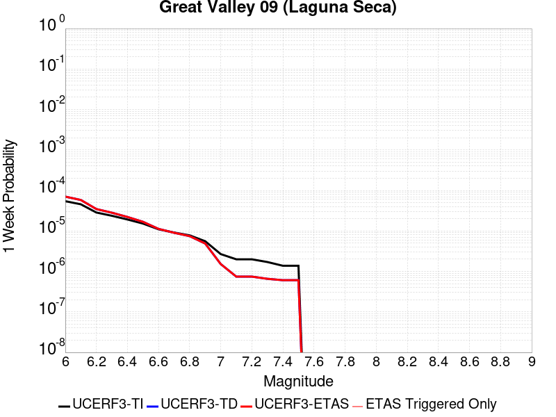 | 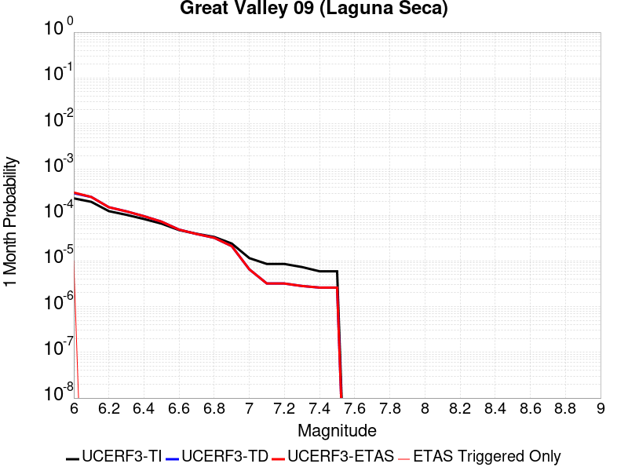 | 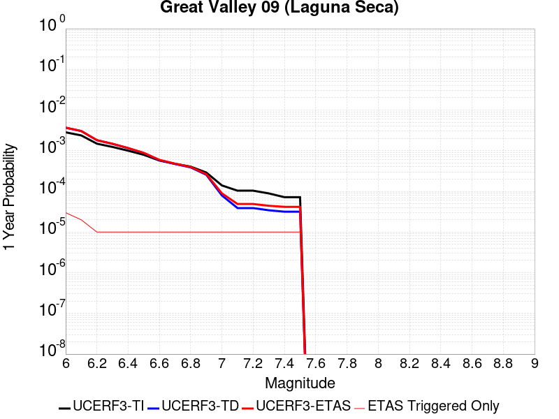 | 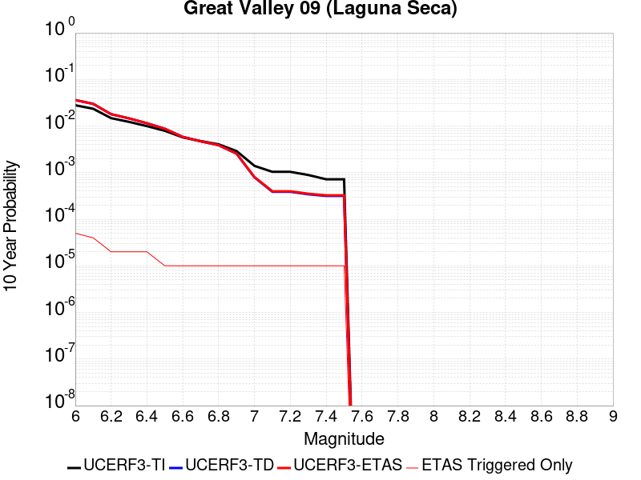 |

| Magnitude | 1 wk TI Prob | 1 wk TD Prob | 1 wk ETAS Prob | 1 wk ETAS/TD Gain | 1 wk ETAS Triggered Only | 1 mo TI Prob | 1 mo TD Prob | 1 mo ETAS Prob | 1 mo ETAS/TD Gain | 1 mo ETAS Triggered Only | 1 yr TI Prob | 1 yr TD Prob | 1 yr ETAS Prob | 1 yr ETAS/TD Gain | 1 yr ETAS Triggered Only | 10 yr TI Prob | 10 yr TD Prob | 10 yr ETAS Prob | 10 yr ETAS/TD Gain | 10 yr ETAS Triggered Only |
|-----|-----|-----|-----|-----|-----|-----|-----|-----|-----|-----|-----|-----|-----|-----|-----|-----|-----|-----|-----|-----|
| 6.0 | 5.4353277E-5 | 7.050488E-5 | 7.050488E-5 | 1.0 | 0.0 | 2.3292181E-4 | 3.0212544E-4 | 3.121224E-4 | 1.0330888 | 1.0E-5 | 0.0028321352 | 0.003672313 | 0.0037022028 | 1.0081393 | 3.0E-5 | 0.02796312 | 0.036116686 | 0.03616488 | 1.0013344 | 5.0E-5 |
| 6.1 | 4.5578287E-5 | 5.8223315E-5 | 5.8223315E-5 | 1.0 | 0.0 | 1.953209E-4 | 2.4950062E-4 | 2.4950062E-4 | 1.0 | 0.0 | 0.0023754383 | 0.003033531 | 0.0030534703 | 1.006573 | 2.0E-5 | 0.023502063 | 0.029920524 | 0.029959327 | 1.0012969 | 4.0E-5 |
| 6.2 | 2.8536782E-5 | 3.4738394E-5 | 3.4738394E-5 | 1.0 | 0.0 | 1.2229476E-4 | 1.4886525E-4 | 1.4886525E-4 | 1.0 | 0.0 | 0.0014879217 | 0.0018108666 | 0.0018208486 | 1.0055122 | 1.0E-5 | 0.014779986 | 0.017958647 | 0.017978288 | 1.0010936 | 2.0E-5 |
| 6.3 | 2.3698774E-5 | 2.8214154E-5 | 2.8214154E-5 | 1.0 | 0.0 | 1.01562226E-4 | 1.20906974E-4 | 1.20906974E-4 | 1.0 | 0.0 | 0.0012358186 | 0.0014710645 | 0.0014810498 | 1.0067878 | 1.0E-5 | 0.012289686 | 0.014611755 | 0.014631462 | 1.0013487 | 2.0E-5 |
| 6.4 | 1.9191197E-5 | 2.2123797E-5 | 2.2123797E-5 | 1.0 | 0.0 | 8.2245395E-5 | 9.480752E-5 | 9.480752E-5 | 1.0 | 0.0 | 0.0010008777 | 0.001153673 | 0.0011636615 | 1.0086579 | 1.0E-5 | 0.009963818 | 0.011477249 | 0.011497019 | 1.0017226 | 2.0E-5 |
| 6.5 | 1.5203241E-5 | 1.6802614E-5 | 1.6802614E-5 | 1.0 | 0.0 | 6.5155116E-5 | 7.200384E-5 | 7.200384E-5 | 1.0 | 0.0 | 7.9297484E-4 | 8.762854E-4 | 8.8627666E-4 | 1.0114018 | 1.0E-5 | 0.007901512 | 0.008729721 | 0.0087396335 | 1.0011355 | 1.0E-5 |
| 6.6 | 1.0984925E-5 | 1.1242805E-5 | 1.1242805E-5 | 1.0 | 0.0 | 4.70774E-5 | 4.8182585E-5 | 4.8182585E-5 | 1.0 | 0.0 | 5.730166E-4 | 5.8646745E-4 | 5.964616E-4 | 1.0170412 | 1.0E-5 | 0.005715413 | 0.0058495943 | 0.0058595357 | 1.0016996 | 1.0E-5 |
| 6.7 | 9.134616E-6 | 9.020054E-6 | 9.020054E-6 | 1.0 | 0.0 | 3.9147766E-5 | 3.8656814E-5 | 3.8656814E-5 | 1.0 | 0.0 | 4.7651984E-4 | 4.7054744E-4 | 4.8054275E-4 | 1.0212418 | 1.0E-5 | 0.004754993 | 0.0046957564 | 0.0047057094 | 1.0021195 | 1.0E-5 |
| 6.8 | 7.785589E-6 | 7.4520754E-6 | 7.4520754E-6 | 1.0 | 0.0 | 3.3366385E-5 | 3.193709E-5 | 3.193709E-5 | 1.0 | 0.0 | 4.0616E-4 | 3.8876667E-4 | 3.987628E-4 | 1.0257124 | 1.0E-5 | 0.0040541845 | 0.0038810696 | 0.0038910308 | 1.0025666 | 1.0E-5 |
| 6.9 | 5.579095E-6 | 4.8985785E-6 | 4.8985785E-6 | 1.0 | 0.0 | 2.3910188E-5 | 2.0993746E-5 | 2.0993746E-5 | 1.0 | 0.0 | 2.9106764E-4 | 2.5557028E-4 | 2.655677E-4 | 1.0391182 | 1.0E-5 | 0.002906867 | 0.002552901 | 0.0025628754 | 1.0039071 | 1.0E-5 |
| 7.0 | 2.6816688E-6 | 1.5216362E-6 | 1.5216362E-6 | 1.0 | 0.0 | 1.1492816E-5 | 6.5212826E-6 | 6.5212826E-6 | 1.0 | 0.0 | 1.3991605E-4 | 7.939381E-5 | 8.939302E-5 | 1.1259444 | 1.0E-5 | 0.0013982799 | 7.936632E-4 | 8.0365525E-4 | 1.0125898 | 1.0E-5 |
| 7.1 | 1.9951021E-6 | 7.4539497E-7 | 7.4539497E-7 | 1.0 | 0.0 | 8.55041E-6 | 3.1945463E-6 | 3.1945463E-6 | 1.0 | 0.0 | 1.0409627E-4 | 3.8892947E-5 | 4.8892558E-5 | 1.2571061 | 1.0E-5 | 0.0010404752 | 3.8886556E-4 | 3.9886168E-4 | 1.0257058 | 1.0E-5 |
| 7.2 | 1.9951021E-6 | 7.4539497E-7 | 7.4539497E-7 | 1.0 | 0.0 | 8.55041E-6 | 3.1945463E-6 | 3.1945463E-6 | 1.0 | 0.0 | 1.0409627E-4 | 3.8892947E-5 | 4.8892558E-5 | 1.2571061 | 1.0E-5 | 0.0010404752 | 3.8886556E-4 | 3.9886168E-4 | 1.0257058 | 1.0E-5 |
| 7.3 | 1.7087556E-6 | 6.578984E-7 | 6.578984E-7 | 1.0 | 0.0 | 7.3232177E-6 | 2.8195618E-6 | 2.8195618E-6 | 1.0 | 0.0 | 8.915652E-5 | 3.4327662E-5 | 4.432732E-5 | 1.2913002 | 1.0E-5 | 8.9120766E-4 | 3.4322767E-4 | 3.5322423E-4 | 1.0291252 | 1.0E-5 |
| 7.4 | 1.3804846E-6 | 6.0739364E-7 | 6.0739364E-7 | 1.0 | 0.0 | 5.916349E-6 | 2.6031132E-6 | 2.6031132E-6 | 1.0 | 0.0 | 7.2029165E-5 | 3.1692485E-5 | 4.169217E-5 | 1.3155222 | 1.0E-5 | 7.200583E-4 | 3.1688367E-4 | 3.268805E-4 | 1.0315473 | 1.0E-5 |
| 7.5 | 1.3804846E-6 | 6.0739364E-7 | 6.0739364E-7 | 1.0 | 0.0 | 5.916349E-6 | 2.6031132E-6 | 2.6031132E-6 | 1.0 | 0.0 | 7.2029165E-5 | 3.1692485E-5 | 4.169217E-5 | 1.3155222 | 1.0E-5 | 7.200583E-4 | 3.1688367E-4 | 3.268805E-4 | 1.0315473 | 1.0E-5 |

## Tin Mountain
*[(top)](#table-of-contents)*

| 1 Week | 1 Month | 1 Year | 10 Year |
|-----|-----|-----|-----|
| 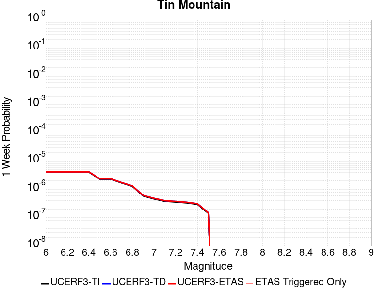 |  | 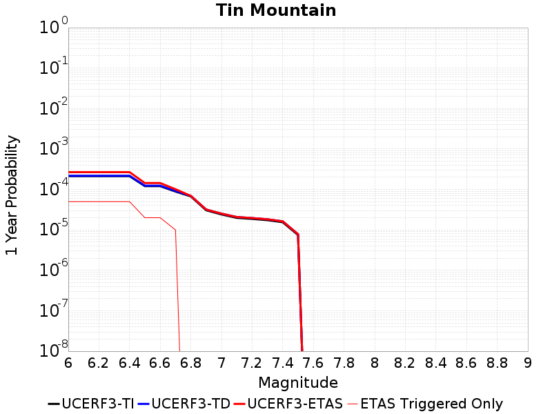 | 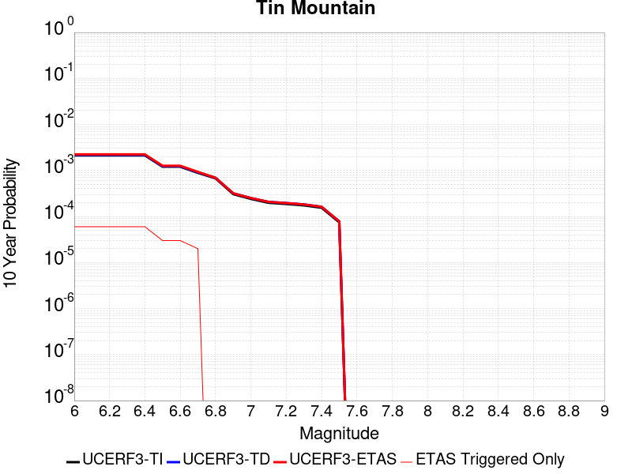 |

| Magnitude | 1 wk TI Prob | 1 wk TD Prob | 1 wk ETAS Prob | 1 wk ETAS/TD Gain | 1 wk ETAS Triggered Only | 1 mo TI Prob | 1 mo TD Prob | 1 mo ETAS Prob | 1 mo ETAS/TD Gain | 1 mo ETAS Triggered Only | 1 yr TI Prob | 1 yr TD Prob | 1 yr ETAS Prob | 1 yr ETAS/TD Gain | 1 yr ETAS Triggered Only | 10 yr TI Prob | 10 yr TD Prob | 10 yr ETAS Prob | 10 yr ETAS/TD Gain | 10 yr ETAS Triggered Only |
|-----|-----|-----|-----|-----|-----|-----|-----|-----|-----|-----|-----|-----|-----|-----|-----|-----|-----|-----|-----|-----|
| 6.0 | 4.083776E-6 | 4.181548E-6 | 4.181548E-6 | 1.0 | 0.0 | 1.750178E-5 | 1.7920818E-5 | 1.7920818E-5 | 1.0 | 0.0 | 2.1306332E-4 | 2.1816783E-4 | 2.6815693E-4 | 1.2291313 | 5.0E-5 | 0.0021285915 | 0.0021799023 | 0.0022397714 | 1.0274642 | 6.0E-5 |
| 6.1 | 4.083776E-6 | 4.181548E-6 | 4.181548E-6 | 1.0 | 0.0 | 1.750178E-5 | 1.7920818E-5 | 1.7920818E-5 | 1.0 | 0.0 | 2.1306332E-4 | 2.1816783E-4 | 2.6815693E-4 | 1.2291313 | 5.0E-5 | 0.0021285915 | 0.0021799023 | 0.0022397714 | 1.0274642 | 6.0E-5 |
| 6.2 | 4.083776E-6 | 4.181548E-6 | 4.181548E-6 | 1.0 | 0.0 | 1.750178E-5 | 1.7920818E-5 | 1.7920818E-5 | 1.0 | 0.0 | 2.1306332E-4 | 2.1816783E-4 | 2.6815693E-4 | 1.2291313 | 5.0E-5 | 0.0021285915 | 0.0021799023 | 0.0022397714 | 1.0274642 | 6.0E-5 |
| 6.3 | 4.083776E-6 | 4.181548E-6 | 4.181548E-6 | 1.0 | 0.0 | 1.750178E-5 | 1.7920818E-5 | 1.7920818E-5 | 1.0 | 0.0 | 2.1306332E-4 | 2.1816783E-4 | 2.6815693E-4 | 1.2291313 | 5.0E-5 | 0.0021285915 | 0.0021799023 | 0.0022397714 | 1.0274642 | 6.0E-5 |
| 6.4 | 4.083776E-6 | 4.181548E-6 | 4.181548E-6 | 1.0 | 0.0 | 1.750178E-5 | 1.7920818E-5 | 1.7920818E-5 | 1.0 | 0.0 | 2.1306332E-4 | 2.1816783E-4 | 2.6815693E-4 | 1.2291313 | 5.0E-5 | 0.0021285915 | 0.0021799023 | 0.0022397714 | 1.0274642 | 6.0E-5 |
| 6.5 | 2.3143427E-6 | 2.3731639E-6 | 2.3731639E-6 | 1.0 | 0.0 | 9.9185745E-6 | 1.0170667E-5 | 1.0170667E-5 | 1.0 | 0.0 | 1.2075195E-4 | 1.238216E-4 | 1.4381914E-4 | 1.1615027 | 2.0E-5 | 0.0012068636 | 0.0012376022 | 0.0012675651 | 1.0242105 | 3.0E-5 |
| 6.6 | 2.3143427E-6 | 2.3731639E-6 | 2.3731639E-6 | 1.0 | 0.0 | 9.9185745E-6 | 1.0170667E-5 | 1.0170667E-5 | 1.0 | 0.0 | 1.2075195E-4 | 1.238216E-4 | 1.4381914E-4 | 1.1615027 | 2.0E-5 | 0.0012068636 | 0.0012376022 | 0.0012675651 | 1.0242105 | 3.0E-5 |
| 6.7 | 1.7029532E-6 | 1.7497969E-6 | 1.7497969E-6 | 1.0 | 0.0 | 7.2983503E-6 | 7.4991112E-6 | 7.4991112E-6 | 1.0 | 0.0 | 8.885379E-5 | 9.129839E-5 | 1.01297475E-4 | 1.1095209 | 1.0E-5 | 8.881827E-4 | 9.1266143E-4 | 9.326432E-4 | 1.021894 | 2.0E-5 |
| 6.8 | 1.2914646E-6 | 1.3299423E-6 | 1.3299423E-6 | 1.0 | 0.0 | 5.534837E-6 | 5.699743E-6 | 5.699743E-6 | 1.0 | 0.0 | 6.738455E-5 | 6.93926E-5 | 6.93926E-5 | 1.0 | 0.0 | 6.736412E-4 | 6.9375266E-4 | 6.9375266E-4 | 1.0 | 0.0 |
| 6.9 | 5.8708974E-7 | 6.1170226E-7 | 6.1170226E-7 | 1.0 | 0.0 | 2.5160964E-6 | 2.6215787E-6 | 2.6215787E-6 | 1.0 | 0.0 | 3.0633044E-5 | 3.1917294E-5 | 3.1917294E-5 | 1.0 | 0.0 | 3.0628822E-4 | 3.191312E-4 | 3.191312E-4 | 1.0 | 0.0 |
| 7.0 | 4.6248786E-7 | 4.8320396E-7 | 4.8320396E-7 | 1.0 | 0.0 | 1.9820893E-6 | 2.0708726E-6 | 2.0708726E-6 | 1.0 | 0.0 | 2.413167E-5 | 2.5212621E-5 | 2.5212621E-5 | 1.0 | 0.0 | 2.412905E-4 | 2.5210128E-4 | 2.5210128E-4 | 1.0 | 0.0 |
| 7.1 | 3.804606E-7 | 3.9871685E-7 | 3.9871685E-7 | 1.0 | 0.0 | 1.6305444E-6 | 1.7087856E-6 | 1.7087856E-6 | 1.0 | 0.0 | 1.9851697E-5 | 2.08043E-5 | 2.08043E-5 | 1.0 | 0.0 | 1.9849923E-4 | 2.0802688E-4 | 2.0802688E-4 | 1.0 | 0.0 |
| 7.2 | 3.5864858E-7 | 3.7617068E-7 | 3.7617068E-7 | 1.0 | 0.0 | 1.5370645E-6 | 1.6121593E-6 | 1.6121593E-6 | 1.0 | 0.0 | 1.87136E-5 | 1.9627896E-5 | 1.9627896E-5 | 1.0 | 0.0 | 1.8712023E-4 | 1.9626494E-4 | 1.9626494E-4 | 1.0 | 0.0 |
| 7.3 | 3.342063E-7 | 3.5063664E-7 | 3.5063664E-7 | 1.0 | 0.0 | 1.4323119E-6 | 1.5027279E-6 | 1.5027279E-6 | 1.0 | 0.0 | 1.7438259E-5 | 1.8295592E-5 | 1.8295592E-5 | 1.0 | 0.0 | 1.743689E-4 | 1.8294415E-4 | 1.8294415E-4 | 1.0 | 0.0 |
| 7.4 | 2.971242E-7 | 3.1165987E-7 | 3.1165987E-7 | 1.0 | 0.0 | 1.2733886E-6 | 1.3356847E-6 | 1.3356847E-6 | 1.0 | 0.0 | 1.5503398E-5 | 1.6261874E-5 | 1.6261874E-5 | 1.0 | 0.0 | 1.5502315E-4 | 1.6261011E-4 | 1.6261011E-4 | 1.0 | 0.0 |
| 7.5 | 1.4326713E-7 | 1.5012604E-7 | 1.5012604E-7 | 1.0 | 0.0 | 6.140018E-7 | 6.4339736E-7 | 6.4339736E-7 | 1.0 | 0.0 | 7.4754466E-6 | 7.833362E-6 | 7.833362E-6 | 1.0 | 0.0 | 7.475195E-5 | 7.833362E-5 | 7.833362E-5 | 1.0 | 0.0 |

## Cleghorn Pass
*[(top)](#table-of-contents)*

| 1 Week | 1 Month | 1 Year | 10 Year |
|-----|-----|-----|-----|
|  |  | 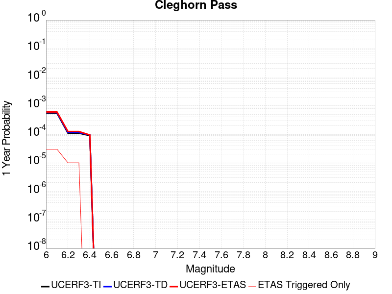 | 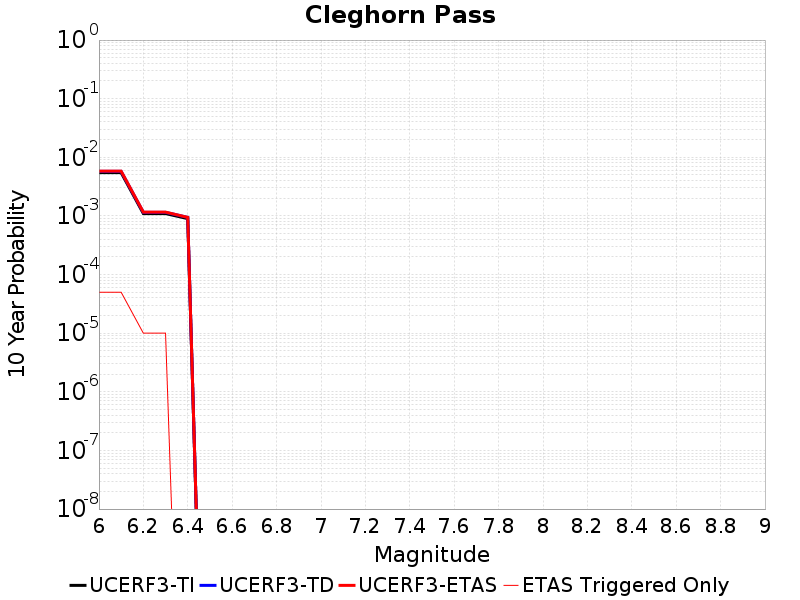 |

| Magnitude | 1 wk TI Prob | 1 wk TD Prob | 1 wk ETAS Prob | 1 wk ETAS/TD Gain | 1 wk ETAS Triggered Only | 1 mo TI Prob | 1 mo TD Prob | 1 mo ETAS Prob | 1 mo ETAS/TD Gain | 1 mo ETAS Triggered Only | 1 yr TI Prob | 1 yr TD Prob | 1 yr ETAS Prob | 1 yr ETAS/TD Gain | 1 yr ETAS Triggered Only | 10 yr TI Prob | 10 yr TD Prob | 10 yr ETAS Prob | 10 yr ETAS/TD Gain | 10 yr ETAS Triggered Only |
|-----|-----|-----|-----|-----|-----|-----|-----|-----|-----|-----|-----|-----|-----|-----|-----|-----|-----|-----|-----|-----|
| 6.0 | 1.0522846E-5 | 1.1040703E-5 | 1.1040703E-5 | 1.0 | 0.0 | 4.509713E-5 | 4.7316735E-5 | 4.7316735E-5 | 1.0 | 0.0 | 5.4891926E-4 | 5.759816E-4 | 6.0596433E-4 | 1.052055 | 3.0E-5 | 0.0054756533 | 0.0057500536 | 0.0057997657 | 1.0086455 | 5.0E-5 |
| 6.1 | 1.0522846E-5 | 1.1040703E-5 | 1.1040703E-5 | 1.0 | 0.0 | 4.509713E-5 | 4.7316735E-5 | 4.7316735E-5 | 1.0 | 0.0 | 5.4891926E-4 | 5.759816E-4 | 6.0596433E-4 | 1.052055 | 3.0E-5 | 0.0054756533 | 0.0057500536 | 0.0057997657 | 1.0086455 | 5.0E-5 |
| 6.2 | 2.1045846E-6 | 2.2082147E-6 | 2.2082147E-6 | 1.0 | 0.0 | 9.019617E-6 | 9.463766E-6 | 9.463766E-6 | 1.0 | 0.0 | 1.098083E-4 | 1.1521946E-4 | 1.252183E-4 | 1.0867809 | 1.0E-5 | 0.0010975406 | 0.0011520087 | 0.0011619971 | 1.0086704 | 1.0E-5 |
| 6.3 | 2.1045846E-6 | 2.2082147E-6 | 2.2082147E-6 | 1.0 | 0.0 | 9.019617E-6 | 9.463766E-6 | 9.463766E-6 | 1.0 | 0.0 | 1.098083E-4 | 1.1521946E-4 | 1.252183E-4 | 1.0867809 | 1.0E-5 | 0.0010975406 | 0.0011520087 | 0.0011619971 | 1.0086704 | 1.0E-5 |
| 6.4 | 1.7259927E-6 | 1.810887E-6 | 1.810887E-6 | 1.0 | 0.0 | 7.3970905E-6 | 7.760945E-6 | 7.760945E-6 | 1.0 | 0.0 | 9.005586E-5 | 9.44895E-5 | 9.44895E-5 | 1.0 | 0.0 | 9.001937E-4 | 9.44895E-4 | 9.44895E-4 | 1.0 | 0.0 |

## Big Pine (Central)
*[(top)](#table-of-contents)*

| 1 Week | 1 Month | 1 Year | 10 Year |
|-----|-----|-----|-----|
| 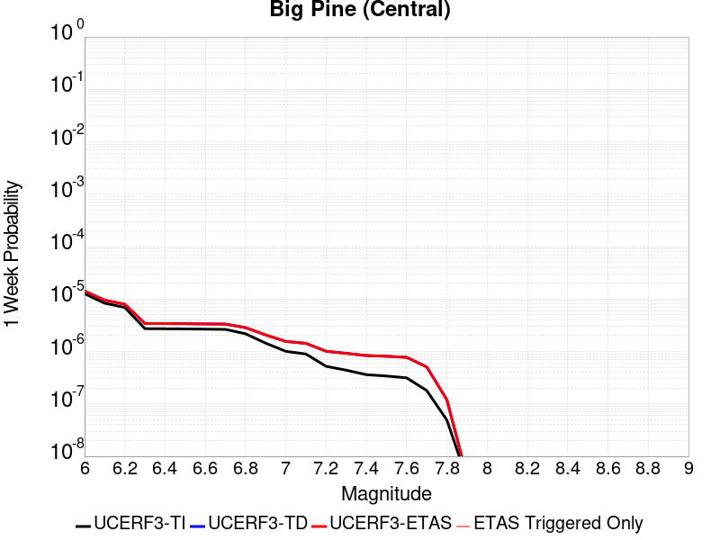 | 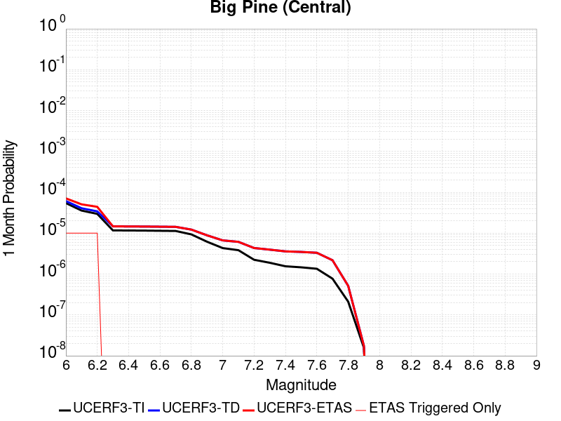 | 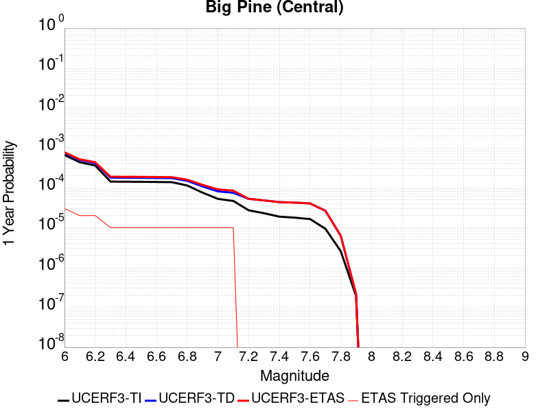 | 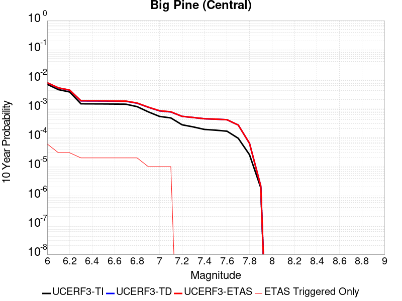 |

| Magnitude | 1 wk TI Prob | 1 wk TD Prob | 1 wk ETAS Prob | 1 wk ETAS/TD Gain | 1 wk ETAS Triggered Only | 1 mo TI Prob | 1 mo TD Prob | 1 mo ETAS Prob | 1 mo ETAS/TD Gain | 1 mo ETAS Triggered Only | 1 yr TI Prob | 1 yr TD Prob | 1 yr ETAS Prob | 1 yr ETAS/TD Gain | 1 yr ETAS Triggered Only | 10 yr TI Prob | 10 yr TD Prob | 10 yr ETAS Prob | 10 yr ETAS/TD Gain | 10 yr ETAS Triggered Only |
|-----|-----|-----|-----|-----|-----|-----|-----|-----|-----|-----|-----|-----|-----|-----|-----|-----|-----|-----|-----|-----|
| 6.0 | 1.2706755E-5 | 1.4250936E-5 | 1.4250936E-5 | 1.0 | 0.0 | 5.4456385E-5 | 6.107422E-5 | 7.1073606E-5 | 1.1637253 | 1.0E-5 | 6.628048E-4 | 7.433615E-4 | 7.733392E-4 | 1.0403272 | 3.0E-5 | 0.006608314 | 0.0074137757 | 0.007473331 | 1.008033 | 6.0E-5 |
| 6.1 | 8.342579E-6 | 9.511124E-6 | 9.511124E-6 | 1.0 | 0.0 | 3.5753423E-5 | 4.0761446E-5 | 5.076104E-5 | 1.2453198 | 1.0E-5 | 4.3521097E-4 | 4.9617933E-4 | 5.161694E-4 | 1.040288 | 2.0E-5 | 0.0043435963 | 0.004954268 | 0.0049841194 | 1.0060254 | 3.0E-5 |
| 6.2 | 6.923899E-6 | 7.967495E-6 | 7.967495E-6 | 1.0 | 0.0 | 2.9673516E-5 | 3.4146065E-5 | 4.4145723E-5 | 1.2928495 | 1.0E-5 | 3.6121515E-4 | 4.156683E-4 | 4.3565998E-4 | 1.0480953 | 2.0E-5 | 0.003606286 | 0.0041522146 | 0.00418209 | 1.0071951 | 3.0E-5 |
| 6.3 | 2.728396E-6 | 3.424596E-6 | 3.424596E-6 | 1.0 | 0.0 | 1.1693074E-5 | 1.4676762E-5 | 1.4676762E-5 | 1.0 | 0.0 | 1.4235388E-4 | 1.786758E-4 | 1.88674E-4 | 1.0559573 | 1.0E-5 | 0.0014226272 | 0.0017868268 | 0.001806791 | 1.011173 | 2.0E-5 |
| 6.4 | 2.7136944E-6 | 3.4088891E-6 | 3.4088891E-6 | 1.0 | 0.0 | 1.1630066E-5 | 1.4609448E-5 | 1.4609448E-5 | 1.0 | 0.0 | 1.4158686E-4 | 1.7785637E-4 | 1.878546E-4 | 1.0562152 | 1.0E-5 | 0.0014149669 | 0.0017786458 | 0.0017986102 | 1.0112245 | 2.0E-5 |
| 6.5 | 2.6971882E-6 | 3.391234E-6 | 3.391234E-6 | 1.0 | 0.0 | 1.1559327E-5 | 1.4533784E-5 | 1.4533784E-5 | 1.0 | 0.0 | 1.4072572E-4 | 1.7693533E-4 | 1.8693355E-4 | 1.0565078 | 1.0E-5 | 0.0014063664 | 0.0017694499 | 0.0017894146 | 1.0112829 | 2.0E-5 |
| 6.6 | 2.669092E-6 | 3.3612544E-6 | 3.3612544E-6 | 1.0 | 0.0 | 1.1438916E-5 | 1.4405301E-5 | 1.4405301E-5 | 1.0 | 0.0 | 1.3925991E-4 | 1.7537129E-4 | 1.8536954E-4 | 1.0570118 | 1.0E-5 | 0.0013917267 | 0.0017538343 | 0.0017737993 | 1.0113835 | 2.0E-5 |
| 6.7 | 2.6408059E-6 | 3.3312797E-6 | 3.3312797E-6 | 1.0 | 0.0 | 1.1317691E-5 | 1.42768395E-5 | 1.42768395E-5 | 1.0 | 0.0 | 1.3778417E-4 | 1.7380752E-4 | 1.838058E-4 | 1.0575249 | 1.0E-5 | 0.0013769877 | 0.0017382213 | 0.0017581865 | 1.011486 | 2.0E-5 |
| 6.8 | 2.1786943E-6 | 2.8547354E-6 | 2.8547354E-6 | 1.0 | 0.0 | 9.337228E-6 | 1.2234527E-5 | 1.2234527E-5 | 1.0 | 0.0 | 1.1367482E-4 | 1.4894591E-4 | 1.5894443E-4 | 1.0671284 | 1.0E-5 | 0.0011361669 | 0.0014899527 | 0.0015099229 | 1.0134033 | 2.0E-5 |
| 6.9 | 1.4411696E-6 | 2.0687883E-6 | 2.0687883E-6 | 1.0 | 0.0 | 6.1764263E-6 | 8.866207E-6 | 8.866207E-6 | 1.0 | 0.0 | 7.51954E-5 | 1.07941E-4 | 1.1793992E-4 | 1.0926332 | 1.0E-5 | 7.5169955E-4 | 0.0010803329 | 0.0010903222 | 1.0092463 | 1.0E-5 |
| 7.0 | 1.0073411E-6 | 1.5545194E-6 | 1.5545194E-6 | 1.0 | 0.0 | 4.317169E-6 | 6.6622097E-6 | 6.6622097E-6 | 1.0 | 0.0 | 5.2560266E-5 | 8.110954E-5 | 9.1108726E-5 | 1.12328 | 1.0E-5 | 5.2547833E-4 | 8.122353E-4 | 8.2222716E-4 | 1.0123017 | 1.0E-5 |
| 7.1 | 8.947104E-7 | 1.4305041E-6 | 1.4305041E-6 | 1.0 | 0.0 | 3.834468E-6 | 6.1307182E-6 | 6.1307182E-6 | 1.0 | 0.0 | 4.6683643E-5 | 7.463909E-5 | 8.463834E-5 | 1.1339681 | 1.0E-5 | 4.6673836E-4 | 7.4757595E-4 | 7.5756846E-4 | 1.0133666 | 1.0E-5 |
| 7.2 | 5.215166E-7 | 1.0114055E-6 | 1.0114055E-6 | 1.0 | 0.0 | 2.2350691E-6 | 4.334588E-6 | 4.334588E-6 | 1.0 | 0.0 | 2.7211627E-5 | 5.2772375E-5 | 5.2772375E-5 | 1.0 | 0.0 | 2.7208295E-4 | 5.2902405E-4 | 5.2902405E-4 | 1.0 | 0.0 |
| 7.3 | 4.4024807E-7 | 9.221895E-7 | 9.221895E-7 | 1.0 | 0.0 | 1.8867761E-6 | 3.952235E-6 | 3.952235E-6 | 1.0 | 0.0 | 2.2971257E-5 | 4.811744E-5 | 4.811744E-5 | 1.0 | 0.0 | 2.2968883E-4 | 4.8249567E-4 | 4.8249567E-4 | 1.0 | 0.0 |
| 7.4 | 3.6130905E-7 | 8.3607574E-7 | 8.3607574E-7 | 1.0 | 0.0 | 1.5484665E-6 | 3.583177E-6 | 3.583177E-6 | 1.0 | 0.0 | 1.8852415E-5 | 4.3624346E-5 | 4.3624346E-5 | 1.0 | 0.0 | 1.8850817E-4 | 4.375737E-4 | 4.375737E-4 | 1.0 | 0.0 |
| 7.5 | 3.408184E-7 | 8.110333E-7 | 8.110333E-7 | 1.0 | 0.0 | 1.4606494E-6 | 3.4758525E-6 | 3.4758525E-6 | 1.0 | 0.0 | 1.7783263E-5 | 4.2317723E-5 | 4.2317723E-5 | 1.0 | 0.0 | 1.778184E-4 | 4.2449107E-4 | 4.2449107E-4 | 1.0 | 0.0 |
| 7.6 | 3.1428627E-7 | 7.7337086E-7 | 7.7337086E-7 | 1.0 | 0.0 | 1.3469405E-6 | 3.3144424E-6 | 3.3144424E-6 | 1.0 | 0.0 | 1.6398877E-5 | 4.035263E-5 | 4.035263E-5 | 1.0 | 0.0 | 1.6397667E-4 | 4.0481848E-4 | 4.0481848E-4 | 1.0 | 0.0 |
| 7.7 | 1.7972785E-7 | 5.0793636E-7 | 5.0793636E-7 | 1.0 | 0.0 | 7.70262E-7 | 2.1768683E-6 | 2.1768683E-6 | 1.0 | 0.0 | 9.377899E-6 | 2.650306E-5 | 2.650306E-5 | 1.0 | 0.0 | 9.377503E-5 | 2.6637153E-4 | 2.6637153E-4 | 1.0 | 0.0 |
| 7.8 | 4.9230927E-8 | 1.1984591E-7 | 1.1984591E-7 | 1.0 | 0.0 | 2.1098968E-7 | 5.136252E-7 | 5.136252E-7 | 1.0 | 0.0 | 2.5687964E-6 | 6.2533704E-6 | 6.2533704E-6 | 1.0 | 0.0 | 2.5687666E-5 | 6.297361E-5 | 6.297361E-5 | 1.0 | 0.0 |
| 7.9 | 3.6805972E-9 | 4.1067905E-9 | 4.1067905E-9 | 1.0 | 0.0 | 1.5773987E-8 | 1.7600529E-8 | 1.7600529E-8 | 1.0 | 0.0 | 1.9204828E-7 | 2.1428643E-7 | 2.1428643E-7 | 1.0 | 0.0 | 1.920481E-6 | 2.1908454E-6 | 2.1908454E-6 | 1.0 | 0.0 |

## San Pedro Basin
*[(top)](#table-of-contents)*

| 1 Week | 1 Month | 1 Year | 10 Year |
|-----|-----|-----|-----|
| 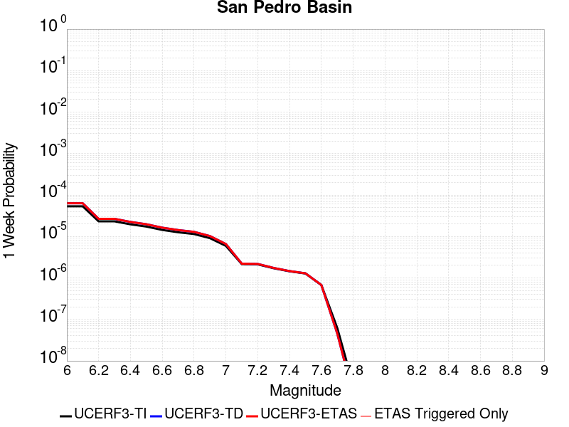 | 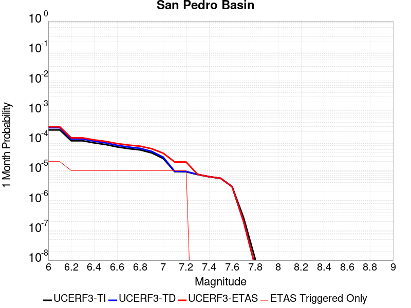 | 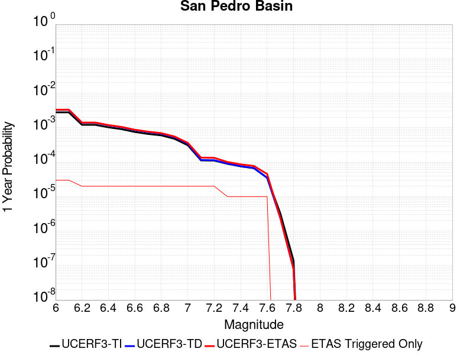 | 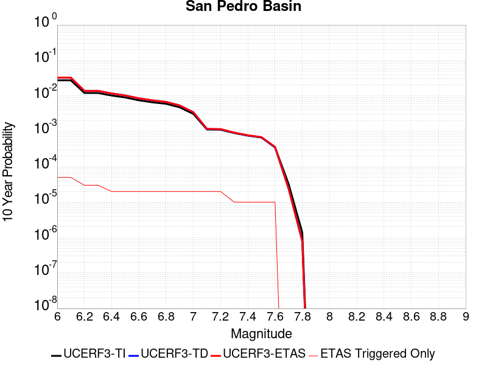 |

| Magnitude | 1 wk TI Prob | 1 wk TD Prob | 1 wk ETAS Prob | 1 wk ETAS/TD Gain | 1 wk ETAS Triggered Only | 1 mo TI Prob | 1 mo TD Prob | 1 mo ETAS Prob | 1 mo ETAS/TD Gain | 1 mo ETAS Triggered Only | 1 yr TI Prob | 1 yr TD Prob | 1 yr ETAS Prob | 1 yr ETAS/TD Gain | 1 yr ETAS Triggered Only | 10 yr TI Prob | 10 yr TD Prob | 10 yr ETAS Prob | 10 yr ETAS/TD Gain | 10 yr ETAS Triggered Only |
|-----|-----|-----|-----|-----|-----|-----|-----|-----|-----|-----|-----|-----|-----|-----|-----|-----|-----|-----|-----|-----|
| 6.0 | 5.3449043E-5 | 6.337088E-5 | 6.337088E-5 | 1.0 | 0.0 | 2.2904722E-4 | 2.7156467E-4 | 2.9155923E-4 | 1.0736272 | 2.0E-5 | 0.0027850836 | 0.003301895 | 0.0033317958 | 1.0090557 | 3.0E-5 | 0.027504366 | 0.032590125 | 0.032638494 | 1.0014842 | 5.0E-5 |
| 6.1 | 5.3449043E-5 | 6.337088E-5 | 6.337088E-5 | 1.0 | 0.0 | 2.2904722E-4 | 2.7156467E-4 | 2.9155923E-4 | 1.0736272 | 2.0E-5 | 0.0027850836 | 0.003301895 | 0.0033317958 | 1.0090557 | 3.0E-5 | 0.027504366 | 0.032590125 | 0.032638494 | 1.0014842 | 5.0E-5 |
| 6.2 | 2.3189454E-5 | 2.6643249E-5 | 2.6643249E-5 | 1.0 | 0.0 | 9.9379584E-5 | 1.1418063E-4 | 1.2417948E-4 | 1.0875705 | 1.0E-5 | 0.0012092749 | 0.00138931 | 0.0014092822 | 1.0143757 | 2.0E-5 | 0.012027155 | 0.013811117 | 0.013840702 | 1.0021422 | 3.0E-5 |
| 6.3 | 2.3189454E-5 | 2.6643249E-5 | 2.6643249E-5 | 1.0 | 0.0 | 9.9379584E-5 | 1.1418063E-4 | 1.2417948E-4 | 1.0875705 | 1.0E-5 | 0.0012092749 | 0.00138931 | 0.0014092822 | 1.0143757 | 2.0E-5 | 0.012027155 | 0.013811117 | 0.013840702 | 1.0021422 | 3.0E-5 |
| 6.4 | 1.966056E-5 | 2.246378E-5 | 2.246378E-5 | 1.0 | 0.0 | 8.425682E-5 | 9.6270014E-5 | 1.0626906E-4 | 1.1038646 | 1.0E-5 | 0.001025344 | 0.0011714974 | 0.001191474 | 1.0170522 | 2.0E-5 | 0.010206259 | 0.011657306 | 0.011677072 | 1.0016956 | 2.0E-5 |
| 6.5 | 1.7342953E-5 | 1.9745463E-5 | 1.9745463E-5 | 1.0 | 0.0 | 7.4324824E-5 | 8.462088E-5 | 9.462003E-5 | 1.1181642 | 1.0E-5 | 9.04529E-4 | 0.0010298091 | 0.0010497886 | 1.0194011 | 2.0E-5 | 0.009008561 | 0.010254093 | 0.010273889 | 1.0019305 | 2.0E-5 |
| 6.6 | 1.439804E-5 | 1.6322967E-5 | 1.6322967E-5 | 1.0 | 0.0 | 6.170443E-5 | 6.995388E-5 | 7.9953184E-5 | 1.1429414 | 1.0E-5 | 7.509924E-4 | 8.5138786E-4 | 8.7137084E-4 | 1.023471 | 2.0E-5 | 0.0074845953 | 0.008484463 | 0.008504293 | 1.0023372 | 2.0E-5 |
| 6.7 | 1.2634884E-5 | 1.4285513E-5 | 1.4285513E-5 | 1.0 | 0.0 | 5.414838E-5 | 6.122237E-5 | 7.122175E-5 | 1.163329 | 1.0E-5 | 6.590571E-4 | 7.451578E-4 | 7.6514296E-4 | 1.02682 | 2.0E-5 | 0.006571059 | 0.0074296137 | 0.007449465 | 1.002672 | 2.0E-5 |
| 6.8 | 1.146091E-5 | 1.2933386E-5 | 1.2933386E-5 | 1.0 | 0.0 | 4.911726E-5 | 5.5427783E-5 | 6.542723E-5 | 1.1804049 | 1.0E-5 | 5.9783855E-4 | 6.746541E-4 | 6.9464056E-4 | 1.0296248 | 2.0E-5 | 0.0059623276 | 0.006729 | 0.006748865 | 1.0029522 | 2.0E-5 |
| 6.9 | 9.109035E-6 | 1.02351605E-5 | 1.02351605E-5 | 1.0 | 0.0 | 3.9038136E-5 | 4.3864395E-5 | 5.3863958E-5 | 1.2279654 | 1.0E-5 | 4.7518566E-4 | 5.3394615E-4 | 5.539355E-4 | 1.037437 | 2.0E-5 | 0.0047417083 | 0.0053293863 | 0.00534928 | 1.0037328 | 2.0E-5 |
| 7.0 | 5.9351028E-6 | 6.584052E-6 | 6.584052E-6 | 1.0 | 0.0 | 2.5435906E-5 | 2.8217193E-5 | 3.821691E-5 | 1.3543838 | 1.0E-5 | 3.0963816E-4 | 3.435138E-4 | 3.635069E-4 | 1.0582018 | 2.0E-5 | 0.0030920706 | 0.0034321449 | 0.0034520763 | 1.0058073 | 2.0E-5 |
| 7.1 | 2.1557585E-6 | 2.2096588E-6 | 2.2096588E-6 | 1.0 | 0.0 | 9.238933E-6 | 9.469933E-6 | 1.9469839E-5 | 2.0559638 | 1.0E-5 | 1.1247819E-4 | 1.1529049E-4 | 1.3528818E-4 | 1.1734549 | 2.0E-5 | 0.0011242128 | 0.0011523222 | 0.001172299 | 1.0173362 | 2.0E-5 |
| 7.2 | 2.1251979E-6 | 2.178005E-6 | 2.178005E-6 | 1.0 | 0.0 | 9.107958E-6 | 9.334274E-6 | 1.933418E-5 | 2.0713105 | 1.0E-5 | 1.1088375E-4 | 1.1363902E-4 | 1.3363674E-4 | 1.1759759 | 2.0E-5 | 0.0011082845 | 0.0011358244 | 0.0011558017 | 1.0175884 | 2.0E-5 |
| 7.3 | 1.7145798E-6 | 1.7442952E-6 | 1.7442952E-6 | 1.0 | 0.0 | 7.3481783E-6 | 7.4755303E-6 | 7.4755303E-6 | 1.0 | 0.0 | 8.94604E-5 | 9.101087E-5 | 1.0100996E-4 | 1.109867 | 1.0E-5 | 8.9424395E-4 | 9.097451E-4 | 9.19736E-4 | 1.010982 | 1.0E-5 |
| 7.4 | 1.4467993E-6 | 1.4641931E-6 | 1.4641931E-6 | 1.0 | 0.0 | 6.200554E-6 | 6.2750987E-6 | 6.2750987E-6 | 1.0 | 0.0 | 7.548913E-5 | 7.639672E-5 | 8.639596E-5 | 1.1308857 | 1.0E-5 | 7.546349E-4 | 7.6371187E-4 | 7.737042E-4 | 1.0130839 | 1.0E-5 |
| 7.5 | 1.2803735E-6 | 1.2931553E-6 | 1.2931553E-6 | 1.0 | 0.0 | 5.487303E-6 | 5.542083E-6 | 5.542083E-6 | 1.0 | 0.0 | 6.680587E-5 | 6.747284E-5 | 7.747216E-5 | 1.1481978 | 1.0E-5 | 6.678579E-4 | 6.7453063E-4 | 6.845239E-4 | 1.0148151 | 1.0E-5 |
| 7.6 | 6.755009E-7 | 6.769495E-7 | 6.769495E-7 | 1.0 | 0.0 | 2.8950008E-6 | 2.9012092E-6 | 2.9012092E-6 | 1.0 | 0.0 | 3.5246063E-5 | 3.5321707E-5 | 4.5321354E-5 | 1.283102 | 1.0E-5 | 3.5240475E-4 | 3.531667E-4 | 3.6316316E-4 | 1.0283053 | 1.0E-5 |
| 7.7 | 6.211885E-8 | 4.569981E-8 | 4.569981E-8 | 1.0 | 0.0 | 2.6622362E-7 | 1.9585632E-7 | 1.9585632E-7 | 1.0 | 0.0 | 3.2412677E-6 | 2.3845482E-6 | 2.3845482E-6 | 1.0 | 0.0 | 3.2412205E-5 | 2.3845247E-5 | 2.3845247E-5 | 1.0 | 0.0 |
| 7.8 | 2.6580573E-9 | 1.51386E-9 | 1.51386E-9 | 1.0 | 0.0 | 1.1391674E-8 | 6.4879715E-9 | 6.4879715E-9 | 1.0 | 0.0 | 1.3869362E-7 | 7.899105E-8 | 7.899105E-8 | 1.0 | 0.0 | 1.3869354E-6 | 7.8991053E-7 | 7.8991053E-7 | 1.0 | 0.0 |

## Brawley (Seismic Zone) alt 1
*[(top)](#table-of-contents)*

| 1 Week | 1 Month | 1 Year | 10 Year |
|-----|-----|-----|-----|
| 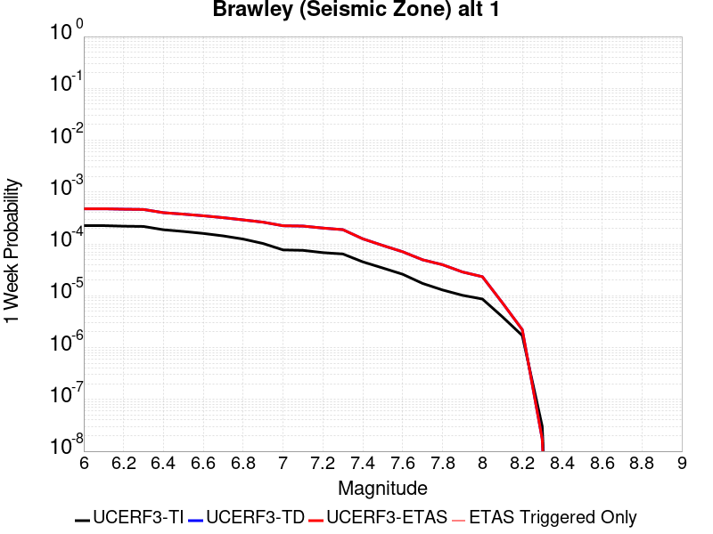 | 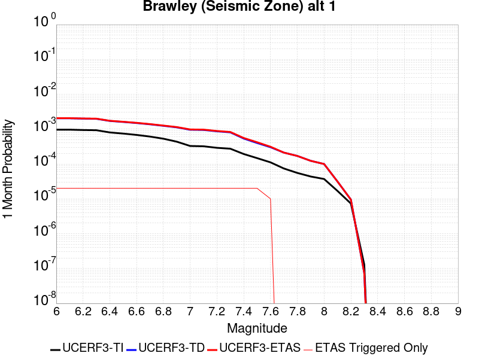 | 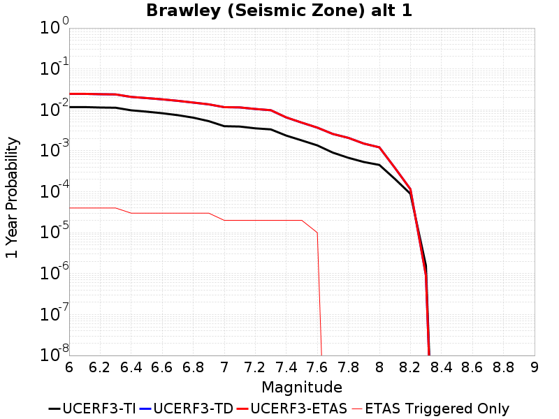 | 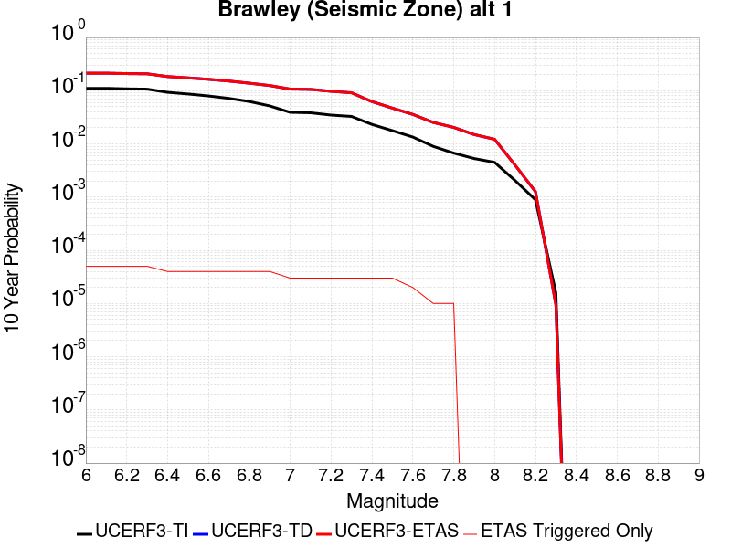 |

| Magnitude | 1 wk TI Prob | 1 wk TD Prob | 1 wk ETAS Prob | 1 wk ETAS/TD Gain | 1 wk ETAS Triggered Only | 1 mo TI Prob | 1 mo TD Prob | 1 mo ETAS Prob | 1 mo ETAS/TD Gain | 1 mo ETAS Triggered Only | 1 yr TI Prob | 1 yr TD Prob | 1 yr ETAS Prob | 1 yr ETAS/TD Gain | 1 yr ETAS Triggered Only | 10 yr TI Prob | 10 yr TD Prob | 10 yr ETAS Prob | 10 yr ETAS/TD Gain | 10 yr ETAS Triggered Only |
|-----|-----|-----|-----|-----|-----|-----|-----|-----|-----|-----|-----|-----|-----|-----|-----|-----|-----|-----|-----|-----|
| 6.0 | 2.2521618E-4 | 4.763988E-4 | 4.763988E-4 | 1.0 | 0.0 | 9.6485513E-4 | 0.0020401487 | 0.002060108 | 1.0097831 | 2.0E-5 | 0.011683988 | 0.02454999 | 0.02458901 | 1.0015893 | 4.0E-5 | 0.11088423 | 0.21352543 | 0.21356475 | 1.0001842 | 5.0E-5 |
| 6.1 | 2.2521618E-4 | 4.763988E-4 | 4.763988E-4 | 1.0 | 0.0 | 9.6485513E-4 | 0.0020401487 | 0.002060108 | 1.0097831 | 2.0E-5 | 0.011683988 | 0.02454999 | 0.02458901 | 1.0015893 | 4.0E-5 | 0.11088423 | 0.21352543 | 0.21356475 | 1.0001842 | 5.0E-5 |
| 6.2 | 2.198148E-4 | 4.6724317E-4 | 4.6724317E-4 | 1.0 | 0.0 | 9.417233E-4 | 0.0020009705 | 0.0020209306 | 1.0099752 | 2.0E-5 | 0.011405343 | 0.024084173 | 0.02412321 | 1.0016209 | 4.0E-5 | 0.10837428 | 0.20996162 | 0.21000113 | 1.0001881 | 5.0E-5 |
| 6.3 | 2.1704129E-4 | 4.6159973E-4 | 4.6159973E-4 | 1.0 | 0.0 | 9.298453E-4 | 0.0019768213 | 0.0019967817 | 1.0100973 | 2.0E-5 | 0.011262234 | 0.023797318 | 0.023836367 | 1.0016409 | 4.0E-5 | 0.107082725 | 0.20785259 | 0.2078922 | 1.0001905 | 5.0E-5 |
| 6.4 | 1.876142E-4 | 4.0051885E-4 | 4.0051885E-4 | 1.0 | 0.0 | 8.038131E-4 | 0.0017153946 | 0.0017353602 | 1.0116391 | 2.0E-5 | 0.00974259 | 0.020683967 | 0.020713346 | 1.0014204 | 3.0E-5 | 0.093263686 | 0.18460332 | 0.18463594 | 1.0001767 | 4.0E-5 |
| 6.5 | 1.7390939E-4 | 3.7483813E-4 | 3.7483813E-4 | 1.0 | 0.0 | 7.45113E-4 | 0.0016054723 | 0.0016254402 | 1.0124373 | 2.0E-5 | 0.009034078 | 0.01937217 | 0.019401591 | 1.0015186 | 3.0E-5 | 0.086755216 | 0.17442507 | 0.17445809 | 1.0001893 | 4.0E-5 |
| 6.6 | 1.591791E-4 | 3.489836E-4 | 3.489836E-4 | 1.0 | 0.0 | 6.8201777E-4 | 0.0014947968 | 0.001514767 | 1.0133598 | 2.0E-5 | 0.008271996 | 0.018048849 | 0.018078307 | 1.0016322 | 3.0E-5 | 0.07970774 | 0.16383253 | 0.16386597 | 1.0002042 | 4.0E-5 |
| 6.7 | 1.4268003E-4 | 3.206421E-4 | 3.206421E-4 | 1.0 | 0.0 | 6.1134255E-4 | 0.001373465 | 0.0013934375 | 1.0145417 | 2.0E-5 | 0.007417723 | 0.016595688 | 0.01662519 | 1.0017776 | 3.0E-5 | 0.07174956 | 0.15195616 | 0.15199009 | 1.0002233 | 4.0E-5 |
| 6.8 | 1.239713E-4 | 2.9058752E-4 | 2.9058752E-4 | 1.0 | 0.0 | 5.3119735E-4 | 0.0012447868 | 0.0012647619 | 1.016047 | 2.0E-5 | 0.0064481674 | 0.015051397 | 0.015080945 | 1.0019631 | 3.0E-5 | 0.06264243 | 0.13839784 | 0.13843231 | 1.000249 | 4.0E-5 |
| 6.9 | 1.0180238E-4 | 2.6258337E-4 | 2.6258337E-4 | 1.0 | 0.0 | 4.3622297E-4 | 0.0011248762 | 0.0011448538 | 1.0177597 | 2.0E-5 | 0.005298089 | 0.013610369 | 0.0136399595 | 1.0021743 | 3.0E-5 | 0.05173543 | 0.12497768 | 0.12501268 | 1.00028 | 4.0E-5 |
| 7.0 | 7.6619996E-5 | 2.2402313E-4 | 2.2402313E-4 | 1.0 | 0.0 | 3.283301E-4 | 9.59749E-4 | 9.797298E-4 | 1.0208188 | 2.0E-5 | 0.0039900932 | 0.011623049 | 0.0116428165 | 1.0017008 | 2.0E-5 | 0.039192066 | 0.10727922 | 0.107306 | 1.0002496 | 3.0E-5 |
| 7.1 | 7.5127435E-5 | 2.2085437E-4 | 2.2085437E-4 | 1.0 | 0.0 | 3.2193496E-4 | 9.4617857E-4 | 9.661597E-4 | 1.0211177 | 2.0E-5 | 0.0039125155 | 0.011459579 | 0.01147935 | 1.0017253 | 2.0E-5 | 0.038443442 | 0.10584307 | 0.1058699 | 1.0002534 | 3.0E-5 |
| 7.2 | 6.788582E-5 | 2.0213064E-4 | 2.0213064E-4 | 1.0 | 0.0 | 2.9090676E-4 | 8.659896E-4 | 8.859723E-4 | 1.023075 | 2.0E-5 | 0.0035360386 | 0.010493093 | 0.010512883 | 1.001886 | 2.0E-5 | 0.034803 | 0.097513236 | 0.09754031 | 1.0002776 | 3.0E-5 |
| 7.3 | 6.399602E-5 | 1.8843888E-4 | 1.8843888E-4 | 1.0 | 0.0 | 2.7423984E-4 | 8.073481E-4 | 8.2733197E-4 | 1.0247525 | 2.0E-5 | 0.0033337586 | 0.009785753 | 0.009805557 | 1.0020238 | 2.0E-5 | 0.03284188 | 0.09140771 | 0.09143496 | 1.0002981 | 3.0E-5 |
| 7.4 | 4.506759E-5 | 1.253138E-4 | 1.253138E-4 | 1.0 | 0.0 | 1.9313251E-4 | 5.369495E-4 | 5.5693876E-4 | 1.0372275 | 2.0E-5 | 0.0023488526 | 0.0065179393 | 0.0065378086 | 1.0030484 | 2.0E-5 | 0.023241805 | 0.062373232 | 0.062401358 | 1.000451 | 3.0E-5 |
| 7.5 | 3.43289E-5 | 9.337245E-5 | 9.337245E-5 | 1.0 | 0.0 | 1.4711556E-4 | 4.001066E-4 | 4.200986E-4 | 1.0499667 | 2.0E-5 | 0.0017896603 | 0.00486048 | 0.004880382 | 1.0040948 | 2.0E-5 | 0.01775316 | 0.047063403 | 0.04709199 | 1.0006075 | 3.0E-5 |
| 7.6 | 2.5980507E-5 | 7.0546994E-5 | 7.0546994E-5 | 1.0 | 0.0 | 1.1134028E-4 | 3.0230937E-4 | 3.1230634E-4 | 1.0330687 | 1.0E-5 | 0.001354725 | 0.0036744291 | 0.0036843922 | 1.0027115 | 1.0E-5 | 0.013464959 | 0.03584807 | 0.035867352 | 1.0005379 | 2.0E-5 |
| 7.7 | 1.7292105E-5 | 4.9420934E-5 | 4.9420934E-5 | 1.0 | 0.0 | 7.4106916E-5 | 2.1178683E-4 | 2.1178683E-4 | 1.0 | 0.0 | 9.018782E-4 | 0.0025754613 | 0.0025754613 | 1.0 | 0.0 | 0.008982267 | 0.025296602 | 0.025306348 | 1.0003853 | 1.0E-5 |
| 7.8 | 1.2927471E-5 | 3.9705137E-5 | 3.9705137E-5 | 1.0 | 0.0 | 5.5402274E-5 | 1.7015378E-4 | 1.7015378E-4 | 1.0 | 0.0 | 6.743139E-4 | 0.0020696565 | 0.0020696565 | 1.0 | 0.0 | 0.0067227143 | 0.020437133 | 0.020446928 | 1.0004793 | 1.0E-5 |
| 7.9 | 1.0200774E-5 | 2.8755285E-5 | 2.8755285E-5 | 1.0 | 0.0 | 4.371687E-5 | 1.2323112E-4 | 1.2323112E-4 | 1.0 | 0.0 | 5.321229E-4 | 0.0014993075 | 0.0014993075 | 1.0 | 0.0 | 0.005308505 | 0.0149960825 | 0.0149960825 | 1.0 | 0.0 |
| 8.0 | 8.650396E-6 | 2.3285593E-5 | 2.3285593E-5 | 1.0 | 0.0 | 3.70726E-5 | 9.9791585E-5 | 9.9791585E-5 | 1.0 | 0.0 | 4.5126543E-4 | 0.0012142862 | 0.0012142862 | 1.0 | 0.0 | 0.0045035016 | 0.01221493 | 0.01221493 | 1.0 | 0.0 |
| 8.1 | 3.9368224E-6 | 7.331505E-6 | 7.331505E-6 | 1.0 | 0.0 | 1.6871985E-5 | 3.1420357E-5 | 3.1420357E-5 | 1.0 | 0.0 | 2.0539707E-4 | 3.8247585E-4 | 3.8247585E-4 | 1.0 | 0.0 | 0.0020520731 | 0.004002932 | 0.004002932 | 1.0 | 0.0 |
| 8.2 | 1.7101195E-6 | 2.2192557E-6 | 2.2192557E-6 | 1.0 | 0.0 | 7.329063E-6 | 9.511062E-6 | 9.511062E-6 | 1.0 | 0.0 | 8.922769E-5 | 1.1579105E-4 | 1.1579105E-4 | 1.0 | 0.0 | 8.9191867E-4 | 0.0012673851 | 0.0012673851 | 1.0 | 0.0 |
| 8.3 | 3.0346666E-8 | 1.7230386E-8 | 1.7230386E-8 | 1.0 | 0.0 | 1.3005713E-7 | 7.384451E-8 | 7.384451E-8 | 1.0 | 0.0 | 1.5834444E-6 | 8.9905683E-7 | 8.9905683E-7 | 1.0 | 0.0 | 1.5834332E-5 | 9.375484E-6 | 9.375484E-6 | 1.0 | 0.0 |

## Coronado Bank alt1
*[(top)](#table-of-contents)*

| 1 Week | 1 Month | 1 Year | 10 Year |
|-----|-----|-----|-----|
| 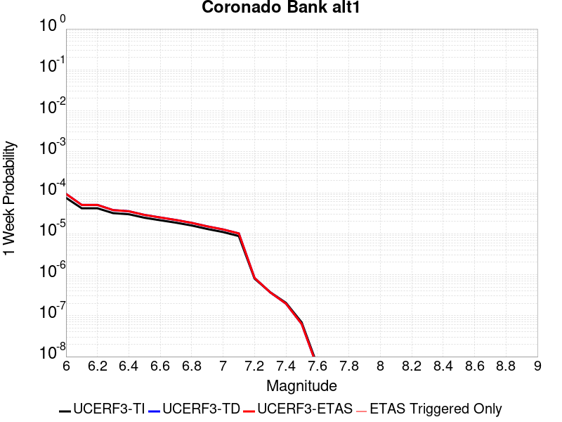 | 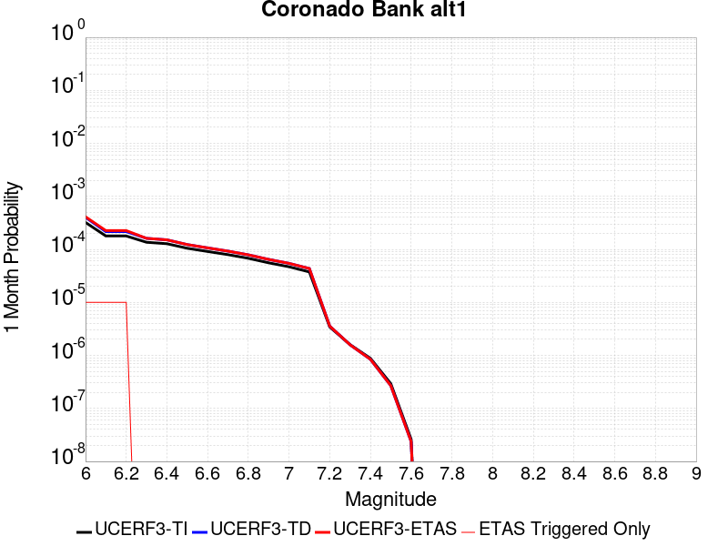 | 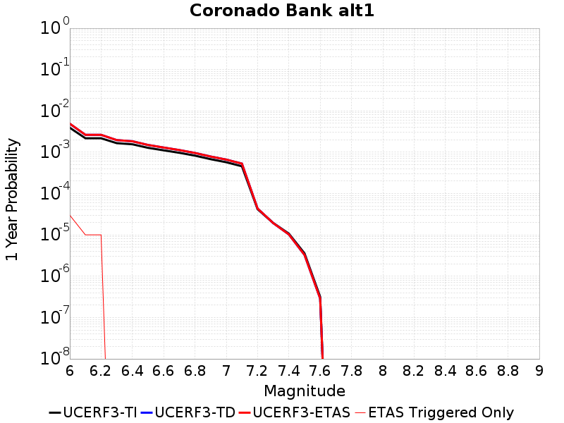 | 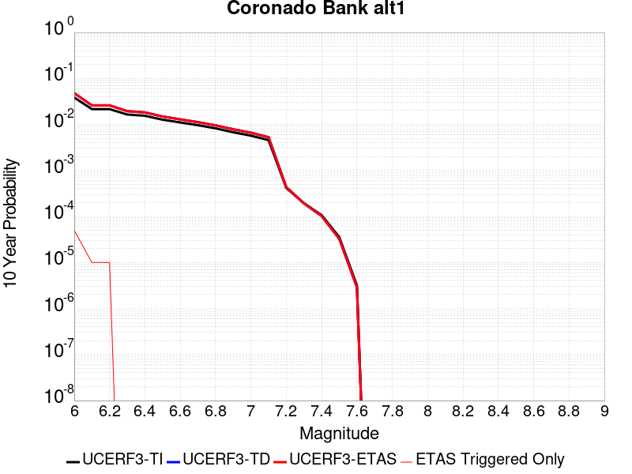 |

| Magnitude | 1 wk TI Prob | 1 wk TD Prob | 1 wk ETAS Prob | 1 wk ETAS/TD Gain | 1 wk ETAS Triggered Only | 1 mo TI Prob | 1 mo TD Prob | 1 mo ETAS Prob | 1 mo ETAS/TD Gain | 1 mo ETAS Triggered Only | 1 yr TI Prob | 1 yr TD Prob | 1 yr ETAS Prob | 1 yr ETAS/TD Gain | 1 yr ETAS Triggered Only | 10 yr TI Prob | 10 yr TD Prob | 10 yr ETAS Prob | 10 yr ETAS/TD Gain | 10 yr ETAS Triggered Only |
|-----|-----|-----|-----|-----|-----|-----|-----|-----|-----|-----|-----|-----|-----|-----|-----|-----|-----|-----|-----|-----|
| 6.0 | 7.533492E-5 | 9.39518E-5 | 9.39518E-5 | 1.0 | 0.0 | 3.22824E-4 | 4.025927E-4 | 4.1258868E-4 | 1.024829 | 1.0E-5 | 0.0039233007 | 0.0048910994 | 0.0049209525 | 1.0061036 | 3.0E-5 | 0.03854755 | 0.047904838 | 0.047952443 | 1.0009937 | 5.0E-5 |
| 6.1 | 4.1807285E-5 | 5.049403E-5 | 5.049403E-5 | 1.0 | 0.0 | 1.7916178E-4 | 2.1638561E-4 | 2.2638345E-4 | 1.0462039 | 1.0E-5 | 0.0021791123 | 0.0026314096 | 0.002641383 | 1.0037903 | 1.0E-5 | 0.021578677 | 0.026011646 | 0.026021386 | 1.0003744 | 1.0E-5 |
| 6.2 | 4.1807285E-5 | 5.049403E-5 | 5.049403E-5 | 1.0 | 0.0 | 1.7916178E-4 | 2.1638561E-4 | 2.2638345E-4 | 1.0462039 | 1.0E-5 | 0.0021791123 | 0.0026314096 | 0.002641383 | 1.0037903 | 1.0E-5 | 0.021578677 | 0.026011646 | 0.026021386 | 1.0003744 | 1.0E-5 |
| 6.3 | 3.1793104E-5 | 3.771191E-5 | 3.771191E-5 | 1.0 | 0.0 | 1.3624904E-4 | 1.6161268E-4 | 1.6161268E-4 | 1.0 | 0.0 | 0.0016575698 | 0.0019658892 | 0.0019658892 | 1.0 | 0.0 | 0.016452603 | 0.01948887 | 0.01948887 | 1.0 | 0.0 |
| 6.4 | 2.9878007E-5 | 3.533653E-5 | 3.533653E-5 | 1.0 | 0.0 | 1.2804232E-4 | 1.5143366E-4 | 1.5143366E-4 | 1.0 | 0.0 | 0.0015578003 | 0.0018421765 | 0.0018421765 | 1.0 | 0.0 | 0.015469253 | 0.018272815 | 0.018272815 | 1.0 | 0.0 |
| 6.5 | 2.4512565E-5 | 2.8764609E-5 | 2.8764609E-5 | 1.0 | 0.0 | 1.0504962E-4 | 1.2327122E-4 | 1.2327122E-4 | 1.0 | 0.0 | 0.0012782287 | 0.0014998215 | 0.0014998215 | 1.0 | 0.0 | 0.012709012 | 0.014899974 | 0.014899974 | 1.0 | 0.0 |
| 6.6 | 2.1317413E-5 | 2.4907145E-5 | 2.4907145E-5 | 1.0 | 0.0 | 9.135714E-5 | 1.0674067E-4 | 1.0674067E-4 | 1.0 | 0.0 | 0.0011117056 | 0.0012988152 | 0.0012988152 | 1.0 | 0.0 | 0.011061605 | 0.012914649 | 0.012914649 | 1.0 | 0.0 |
| 6.7 | 1.8585655E-5 | 2.1635282E-5 | 2.1635282E-5 | 1.0 | 0.0 | 7.9650374E-5 | 9.2719456E-5 | 9.2719456E-5 | 1.0 | 0.0 | 9.6931186E-4 | 0.0011282953 | 0.0011282953 | 1.0 | 0.0 | 0.0096509475 | 0.01122783 | 0.01122783 | 1.0 | 0.0 |
| 6.8 | 1.5862879E-5 | 1.8419812E-5 | 1.8419812E-5 | 1.0 | 0.0 | 6.798199E-5 | 7.8939775E-5 | 7.8939775E-5 | 1.0 | 0.0 | 8.273665E-4 | 9.6068723E-4 | 9.6068723E-4 | 1.0 | 0.0 | 0.008242928 | 0.009567324 | 0.009567324 | 1.0 | 0.0 |
| 6.9 | 1.3021509E-5 | 1.5095538E-5 | 1.5095538E-5 | 1.0 | 0.0 | 5.5805274E-5 | 6.469366E-5 | 6.469366E-5 | 1.0 | 0.0 | 6.792174E-4 | 7.873788E-4 | 7.873788E-4 | 1.0 | 0.0 | 0.006771452 | 0.007847714 | 0.007847714 | 1.0 | 0.0 |
| 7.0 | 1.0974371E-5 | 1.2720335E-5 | 1.2720335E-5 | 1.0 | 0.0 | 4.7032172E-5 | 5.451468E-5 | 5.451468E-5 | 1.0 | 0.0 | 5.7246623E-4 | 6.635317E-4 | 6.635317E-4 | 1.0 | 0.0 | 0.0057099373 | 0.0066172546 | 0.0066172546 | 1.0 | 0.0 |
| 7.1 | 8.766221E-6 | 1.0164018E-5 | 1.0164018E-5 | 1.0 | 0.0 | 3.7568978E-5 | 4.3559445E-5 | 4.3559445E-5 | 1.0 | 0.0 | 4.573063E-4 | 5.302244E-4 | 5.302244E-4 | 1.0 | 0.0 | 0.0045636636 | 0.005291293 | 0.005291293 | 1.0 | 0.0 |
| 7.2 | 8.026024E-7 | 8.331826E-7 | 8.331826E-7 | 1.0 | 0.0 | 3.43972E-6 | 3.5707776E-6 | 3.5707776E-6 | 1.0 | 0.0 | 4.1877785E-5 | 4.3473363E-5 | 4.3473363E-5 | 1.0 | 0.0 | 4.1869894E-4 | 4.3464967E-4 | 4.3464967E-4 | 1.0 | 0.0 |
| 7.3 | 3.7293114E-7 | 3.7001152E-7 | 3.7001152E-7 | 1.0 | 0.0 | 1.5982754E-6 | 1.5857627E-6 | 1.5857627E-6 | 1.0 | 0.0 | 1.9458828E-5 | 1.930649E-5 | 1.930649E-5 | 1.0 | 0.0 | 1.9457124E-4 | 1.930482E-4 | 1.930482E-4 | 1.0 | 0.0 |
| 7.4 | 2.0557036E-7 | 1.9674447E-7 | 1.9674447E-7 | 1.0 | 0.0 | 8.810155E-7 | 8.431903E-7 | 8.431903E-7 | 1.0 | 0.0 | 1.0726311E-5 | 1.0265794E-5 | 1.0265794E-5 | 1.0 | 0.0 | 1.0725793E-4 | 1.0265323E-4 | 1.0265323E-4 | 1.0 | 0.0 |
| 7.5 | 6.845446E-8 | 6.279385E-8 | 6.279385E-8 | 1.0 | 0.0 | 2.9337625E-7 | 2.6911647E-7 | 2.6911647E-7 | 1.0 | 0.0 | 3.5718497E-6 | 3.276488E-6 | 3.276488E-6 | 1.0 | 0.0 | 3.5717923E-5 | 3.276441E-5 | 3.276441E-5 | 1.0 | 0.0 |
| 7.6 | 6.0975145E-9 | 5.5318594E-9 | 5.5318594E-9 | 1.0 | 0.0 | 2.6132206E-8 | 2.3707969E-8 | 2.3707969E-8 | 1.0 | 0.0 | 3.1815955E-7 | 2.886445E-7 | 2.886445E-7 | 1.0 | 0.0 | 3.181591E-6 | 2.8864422E-6 | 2.8864422E-6 | 1.0 | 0.0 |

## Ortigalita (North)
*[(top)](#table-of-contents)*

| 1 Week | 1 Month | 1 Year | 10 Year |
|-----|-----|-----|-----|
| 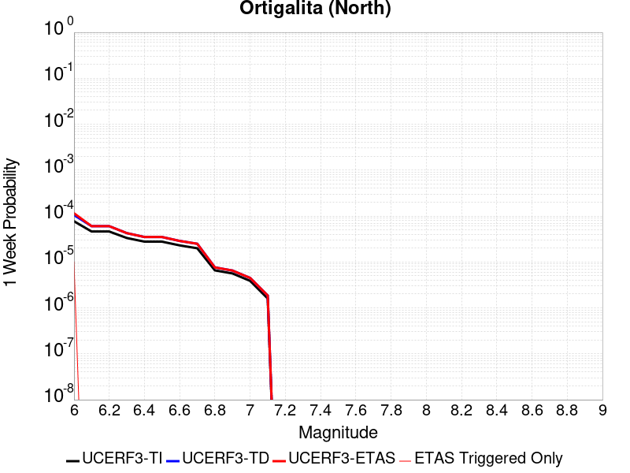 | 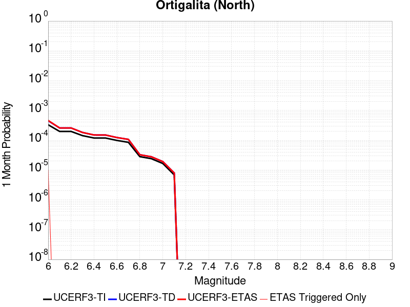 | 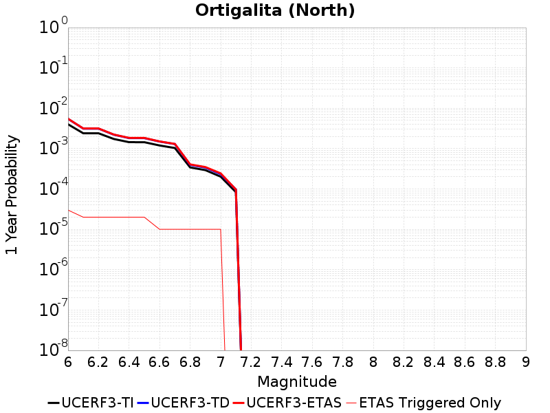 | 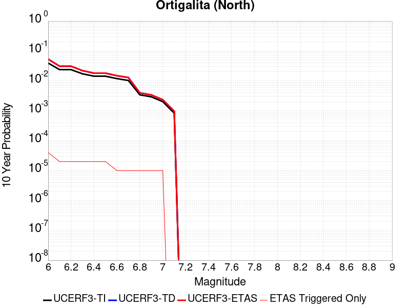 |

| Magnitude | 1 wk TI Prob | 1 wk TD Prob | 1 wk ETAS Prob | 1 wk ETAS/TD Gain | 1 wk ETAS Triggered Only | 1 mo TI Prob | 1 mo TD Prob | 1 mo ETAS Prob | 1 mo ETAS/TD Gain | 1 mo ETAS Triggered Only | 1 yr TI Prob | 1 yr TD Prob | 1 yr ETAS Prob | 1 yr ETAS/TD Gain | 1 yr ETAS Triggered Only | 10 yr TI Prob | 10 yr TD Prob | 10 yr ETAS Prob | 10 yr ETAS/TD Gain | 10 yr ETAS Triggered Only |
|-----|-----|-----|-----|-----|-----|-----|-----|-----|-----|-----|-----|-----|-----|-----|-----|-----|-----|-----|-----|-----|
| 6.0 | 7.711876E-5 | 1.05069405E-4 | 1.1506835E-4 | 1.0951651 | 1.0E-5 | 3.3046713E-4 | 4.502306E-4 | 4.602261E-4 | 1.0222008 | 1.0E-5 | 0.004016016 | 0.0054682964 | 0.005498132 | 1.0054562 | 3.0E-5 | 0.039442103 | 0.05345668 | 0.053494543 | 1.0007082 | 4.0E-5 |
| 6.1 | 4.607858E-5 | 6.0241342E-5 | 6.0241342E-5 | 1.0 | 0.0 | 1.9746469E-4 | 2.5815444E-4 | 2.5815444E-4 | 1.0 | 0.0 | 0.0024014818 | 0.0031388635 | 0.0031588005 | 1.0063517 | 2.0E-5 | 0.023756953 | 0.030976078 | 0.030995458 | 1.0006256 | 2.0E-5 |
| 6.2 | 4.607858E-5 | 6.0241342E-5 | 6.0241342E-5 | 1.0 | 0.0 | 1.9746469E-4 | 2.5815444E-4 | 2.5815444E-4 | 1.0 | 0.0 | 0.0024014818 | 0.0031388635 | 0.0031588005 | 1.0063517 | 2.0E-5 | 0.023756953 | 0.030976078 | 0.030995458 | 1.0006256 | 2.0E-5 |
| 6.3 | 3.327423E-5 | 4.2476484E-5 | 4.2476484E-5 | 1.0 | 0.0 | 1.4259605E-4 | 1.8203113E-4 | 1.8203113E-4 | 1.0 | 0.0 | 0.0017347244 | 0.002214267 | 0.0022342226 | 1.0090123 | 2.0E-5 | 0.017212452 | 0.021946313 | 0.021965874 | 1.0008913 | 2.0E-5 |
| 6.4 | 2.7732503E-5 | 3.4999655E-5 | 3.4999655E-5 | 1.0 | 0.0 | 1.1884817E-4 | 1.499914E-4 | 1.499914E-4 | 1.0 | 0.0 | 0.001446016 | 0.001824864 | 0.0018448274 | 1.0109397 | 2.0E-5 | 0.014366428 | 0.018121757 | 0.018141394 | 1.0010836 | 2.0E-5 |
| 6.5 | 2.7689714E-5 | 3.494947E-5 | 3.494947E-5 | 1.0 | 0.0 | 1.186648E-4 | 1.4977634E-4 | 1.4977634E-4 | 1.0 | 0.0 | 0.0014437864 | 0.0018222498 | 0.0018422134 | 1.0109555 | 2.0E-5 | 0.014344421 | 0.018096043 | 0.01811568 | 1.0010852 | 2.0E-5 |
| 6.6 | 2.2976905E-5 | 2.87191E-5 | 2.87191E-5 | 1.0 | 0.0 | 9.846873E-5 | 1.2307748E-4 | 1.2307748E-4 | 1.0 | 0.0 | 0.0011981975 | 0.001497679 | 0.0015076641 | 1.006667 | 1.0E-5 | 0.011917574 | 0.014899122 | 0.014908973 | 1.0006611 | 1.0E-5 |
| 6.7 | 1.9871539E-5 | 2.4905145E-5 | 2.4905145E-5 | 1.0 | 0.0 | 8.516096E-5 | 1.06733365E-4 | 1.06733365E-4 | 1.0 | 0.0 | 0.0010363415 | 0.0012989527 | 0.0013089398 | 1.0076885 | 1.0E-5 | 0.010315218 | 0.012937295 | 0.012947165 | 1.0007629 | 1.0E-5 |
| 6.8 | 6.5640475E-6 | 7.6056276E-6 | 7.6056276E-6 | 1.0 | 0.0 | 2.813133E-5 | 3.2595155E-5 | 3.2595155E-5 | 1.0 | 0.0 | 3.424451E-4 | 3.9677662E-4 | 4.0677265E-4 | 1.0251931 | 1.0E-5 | 0.0034191788 | 0.0039609694 | 0.0039709294 | 1.0025146 | 1.0E-5 |
| 6.9 | 5.6219683E-6 | 6.5019517E-6 | 6.5019517E-6 | 1.0 | 0.0 | 2.4093928E-5 | 2.7865224E-5 | 2.7865224E-5 | 1.0 | 0.0 | 2.933041E-4 | 3.3920887E-4 | 3.4920548E-4 | 1.0294703 | 1.0E-5 | 0.0029291727 | 0.003387168 | 0.0033971341 | 1.0029423 | 1.0E-5 |
| 7.0 | 3.875591E-6 | 4.484834E-6 | 4.484834E-6 | 1.0 | 0.0 | 1.6609569E-5 | 1.9220586E-5 | 1.9220586E-5 | 1.0 | 0.0 | 2.0220275E-4 | 2.3398762E-4 | 2.4398528E-4 | 1.0427274 | 1.0E-5 | 0.0020201886 | 0.0023376208 | 0.0023475976 | 1.0042678 | 1.0E-5 |
| 7.1 | 1.6017933E-6 | 1.8570748E-6 | 1.8570748E-6 | 1.0 | 0.0 | 6.8648105E-6 | 7.958874E-6 | 7.958874E-6 | 1.0 | 0.0 | 8.357586E-5 | 9.689605E-5 | 9.689605E-5 | 1.0 | 0.0 | 8.3544437E-4 | 9.686427E-4 | 9.686427E-4 | 1.0 | 0.0 |

## Whittier alt 1
*[(top)](#table-of-contents)*

| 1 Week | 1 Month | 1 Year | 10 Year |
|-----|-----|-----|-----|
| 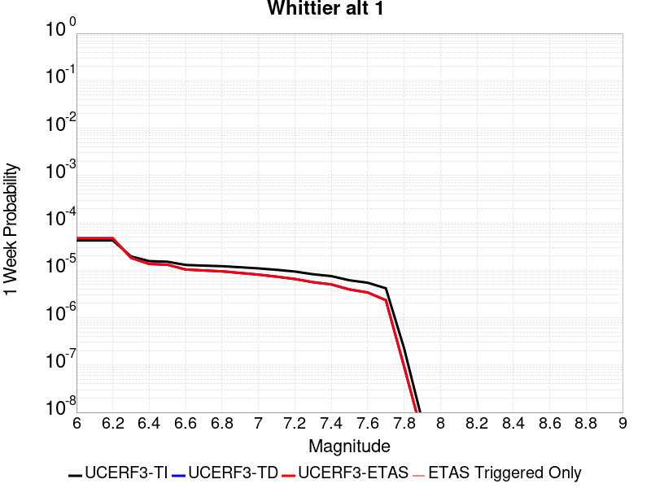 | 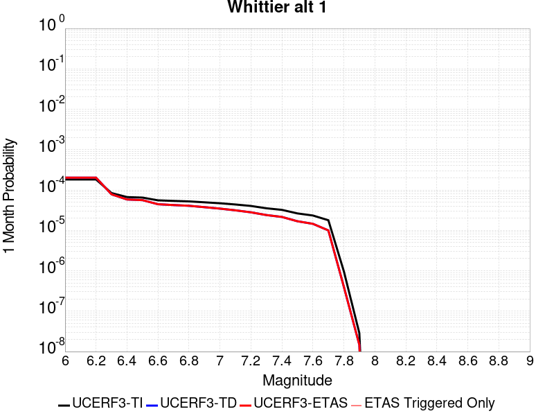 | 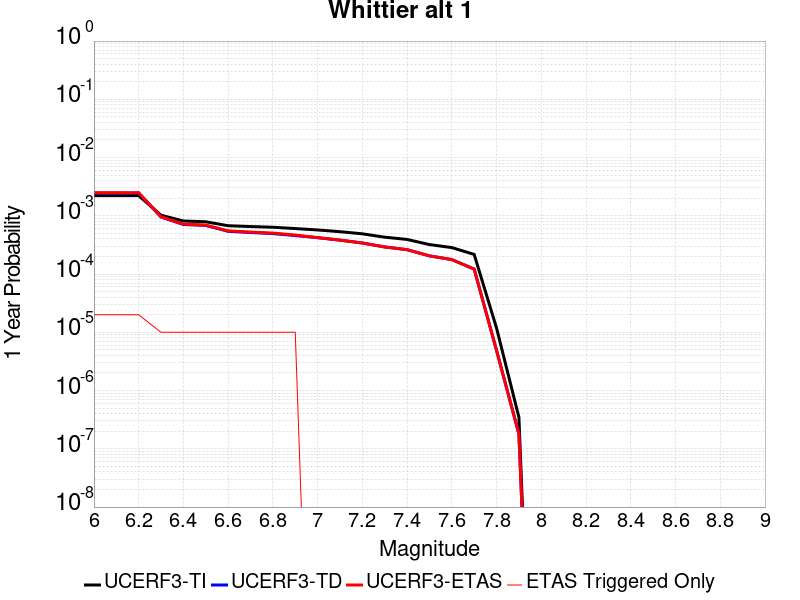 | 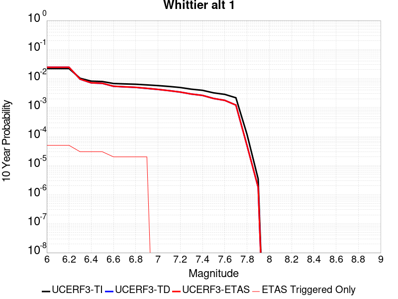 |

| Magnitude | 1 wk TI Prob | 1 wk TD Prob | 1 wk ETAS Prob | 1 wk ETAS/TD Gain | 1 wk ETAS Triggered Only | 1 mo TI Prob | 1 mo TD Prob | 1 mo ETAS Prob | 1 mo ETAS/TD Gain | 1 mo ETAS Triggered Only | 1 yr TI Prob | 1 yr TD Prob | 1 yr ETAS Prob | 1 yr ETAS/TD Gain | 1 yr ETAS Triggered Only | 10 yr TI Prob | 10 yr TD Prob | 10 yr ETAS Prob | 10 yr ETAS/TD Gain | 10 yr ETAS Triggered Only |
|-----|-----|-----|-----|-----|-----|-----|-----|-----|-----|-----|-----|-----|-----|-----|-----|-----|-----|-----|-----|-----|
| 6.0 | 4.2554693E-5 | 4.7253277E-5 | 4.7253277E-5 | 1.0 | 0.0 | 1.8236451E-4 | 2.0250016E-4 | 2.0250016E-4 | 1.0 | 0.0 | 0.002218027 | 0.0024629727 | 0.0024829232 | 1.0081003 | 2.0E-5 | 0.02196019 | 0.024390796 | 0.024439575 | 1.002 | 5.0E-5 |
| 6.1 | 4.2554693E-5 | 4.7253277E-5 | 4.7253277E-5 | 1.0 | 0.0 | 1.8236451E-4 | 2.0250016E-4 | 2.0250016E-4 | 1.0 | 0.0 | 0.002218027 | 0.0024629727 | 0.0024829232 | 1.0081003 | 2.0E-5 | 0.02196019 | 0.024390796 | 0.024439575 | 1.002 | 5.0E-5 |
| 6.2 | 4.2554693E-5 | 4.7253277E-5 | 4.7253277E-5 | 1.0 | 0.0 | 1.8236451E-4 | 2.0250016E-4 | 2.0250016E-4 | 1.0 | 0.0 | 0.002218027 | 0.0024629727 | 0.0024829232 | 1.0081003 | 2.0E-5 | 0.02196019 | 0.024390796 | 0.024439575 | 1.002 | 5.0E-5 |
| 6.3 | 1.9617712E-5 | 1.8269218E-5 | 1.8269218E-5 | 1.0 | 0.0 | 8.40732E-5 | 7.829441E-5 | 7.829441E-5 | 1.0 | 0.0 | 0.0010231105 | 9.5283665E-4 | 9.628271E-4 | 1.0104849 | 1.0E-5 | 0.01018413 | 0.009490798 | 0.009520513 | 1.0031309 | 3.0E-5 |
| 6.4 | 1.5611336E-5 | 1.3604814E-5 | 1.3604814E-5 | 1.0 | 0.0 | 6.690401E-5 | 5.8305075E-5 | 5.8305075E-5 | 1.0 | 0.0 | 8.142519E-4 | 7.096391E-4 | 7.1963196E-4 | 1.0140817 | 1.0E-5 | 0.008112748 | 0.0070756953 | 0.007105483 | 1.0042099 | 3.0E-5 |
| 6.5 | 1.5150166E-5 | 1.3101463E-5 | 1.3101463E-5 | 1.0 | 0.0 | 6.492767E-5 | 5.614795E-5 | 5.614795E-5 | 1.0 | 0.0 | 7.9020765E-4 | 6.8339275E-4 | 6.9338595E-4 | 1.0146229 | 1.0E-5 | 0.007874036 | 0.006814863 | 0.0068446584 | 1.0043721 | 3.0E-5 |
| 6.6 | 1.295588E-5 | 1.0381185E-5 | 1.0381185E-5 | 1.0 | 0.0 | 5.552402E-5 | 4.4490047E-5 | 4.4490047E-5 | 1.0 | 0.0 | 6.7579525E-4 | 5.4153363E-4 | 5.5152824E-4 | 1.0184561 | 1.0E-5 | 0.006737438 | 0.005403574 | 0.005423466 | 1.0036813 | 2.0E-5 |
| 6.7 | 1.2542085E-5 | 9.899819E-6 | 9.899819E-6 | 1.0 | 0.0 | 5.3750682E-5 | 4.2427117E-5 | 4.2427117E-5 | 1.0 | 0.0 | 6.542181E-4 | 5.164296E-4 | 5.2642444E-4 | 1.0193537 | 1.0E-5 | 0.006522954 | 0.0051537133 | 0.00517361 | 1.0038607 | 2.0E-5 |
| 6.8 | 1.2195878E-5 | 9.495852E-6 | 9.495852E-6 | 1.0 | 0.0 | 5.2267E-5 | 4.0695886E-5 | 4.0695886E-5 | 1.0 | 0.0 | 6.36165E-4 | 4.9536163E-4 | 5.053567E-4 | 1.0201772 | 1.0E-5 | 0.0063434686 | 0.0049439156 | 0.0049638166 | 1.0040253 | 2.0E-5 |
| 6.9 | 1.1580298E-5 | 8.7733515E-6 | 8.7733515E-6 | 1.0 | 0.0 | 4.9628903E-5 | 3.7599548E-5 | 3.7599548E-5 | 1.0 | 0.0 | 6.040644E-4 | 4.5767997E-4 | 4.676754E-4 | 1.0218394 | 1.0E-5 | 0.00602425 | 0.004568633 | 0.0045885416 | 1.0043577 | 2.0E-5 |
| 7.0 | 1.0964795E-5 | 8.084396E-6 | 8.084396E-6 | 1.0 | 0.0 | 4.6991136E-5 | 3.4646957E-5 | 3.4646957E-5 | 1.0 | 0.0 | 5.7196687E-4 | 4.2174658E-4 | 4.2174658E-4 | 1.0 | 0.0 | 0.0057049696 | 0.0042106705 | 0.0042106705 | 1.0 | 0.0 |
| 7.1 | 1.0230601E-5 | 7.3269503E-6 | 7.3269503E-6 | 1.0 | 0.0 | 4.3844695E-5 | 3.1400847E-5 | 3.1400847E-5 | 1.0 | 0.0 | 5.336784E-4 | 3.8223952E-4 | 3.8223952E-4 | 1.0 | 0.0 | 0.005323986 | 0.0038169841 | 0.0038169841 | 1.0 | 0.0 |
| 7.2 | 9.40865E-6 | 6.543529E-6 | 6.543529E-6 | 1.0 | 0.0 | 4.032216E-5 | 2.80434E-5 | 2.80434E-5 | 1.0 | 0.0 | 4.908117E-4 | 3.4137612E-4 | 3.4137612E-4 | 1.0 | 0.0 | 0.0048972913 | 0.0034096097 | 0.0034096097 | 1.0 | 0.0 |
| 7.3 | 8.237384E-6 | 5.597957E-6 | 5.597957E-6 | 1.0 | 0.0 | 3.5302593E-5 | 2.399103E-5 | 2.399103E-5 | 1.0 | 0.0 | 4.2972428E-4 | 2.920527E-4 | 2.920527E-4 | 1.0 | 0.0 | 0.0042889426 | 0.0029170094 | 0.0029170094 | 1.0 | 0.0 |
| 7.4 | 7.5316966E-6 | 5.028004E-6 | 5.028004E-6 | 1.0 | 0.0 | 3.2278298E-5 | 2.1548418E-5 | 2.1548418E-5 | 1.0 | 0.0 | 3.9291743E-4 | 2.623214E-4 | 2.623214E-4 | 1.0 | 0.0 | 0.0039222343 | 0.0026202295 | 0.0026202295 | 1.0 | 0.0 |
| 7.5 | 6.149649E-6 | 3.933986E-6 | 3.933986E-6 | 1.0 | 0.0 | 2.6355372E-5 | 1.6859838E-5 | 1.6859838E-5 | 1.0 | 0.0 | 3.208294E-4 | 2.052501E-4 | 2.052501E-4 | 1.0 | 0.0 | 0.003203666 | 0.0020506945 | 0.0020506945 | 1.0 | 0.0 |
| 7.6 | 5.457711E-6 | 3.395506E-6 | 3.395506E-6 | 1.0 | 0.0 | 2.338998E-5 | 1.4552092E-5 | 1.4552092E-5 | 1.0 | 0.0 | 2.8473578E-4 | 1.7715813E-4 | 1.7715813E-4 | 1.0 | 0.0 | 0.0028437122 | 0.0017702497 | 0.0017702497 | 1.0 | 0.0 |
| 7.7 | 4.1676276E-6 | 2.3332907E-6 | 2.3332907E-6 | 1.0 | 0.0 | 1.7861139E-5 | 9.999783E-6 | 9.999783E-6 | 1.0 | 0.0 | 2.1743766E-4 | 1.217413E-4 | 1.217413E-4 | 1.0 | 0.0 | 0.0021722503 | 0.0012168192 | 0.0012168192 | 1.0 | 0.0 |
| 7.8 | 2.2692414E-7 | 9.385869E-8 | 9.385869E-8 | 1.0 | 0.0 | 9.725317E-7 | 4.0225146E-7 | 4.0225146E-7 | 1.0 | 0.0 | 1.1840509E-5 | 4.897404E-6 | 4.897404E-6 | 1.0 | 0.0 | 1.1839878E-4 | 4.897329E-5 | 4.897329E-5 | 1.0 | 0.0 |
| 7.9 | 6.676829E-9 | 3.4399577E-9 | 3.4399577E-9 | 1.0 | 0.0 | 2.861498E-8 | 1.47426755E-8 | 1.47426755E-8 | 1.0 | 0.0 | 3.4838732E-7 | 1.7949206E-7 | 1.7949206E-7 | 1.0 | 0.0 | 3.4838679E-6 | 1.7949193E-6 | 1.7949193E-6 | 1.0 | 0.0 |

## Santa Ynez (East)
*[(top)](#table-of-contents)*

| 1 Week | 1 Month | 1 Year | 10 Year |
|-----|-----|-----|-----|
| 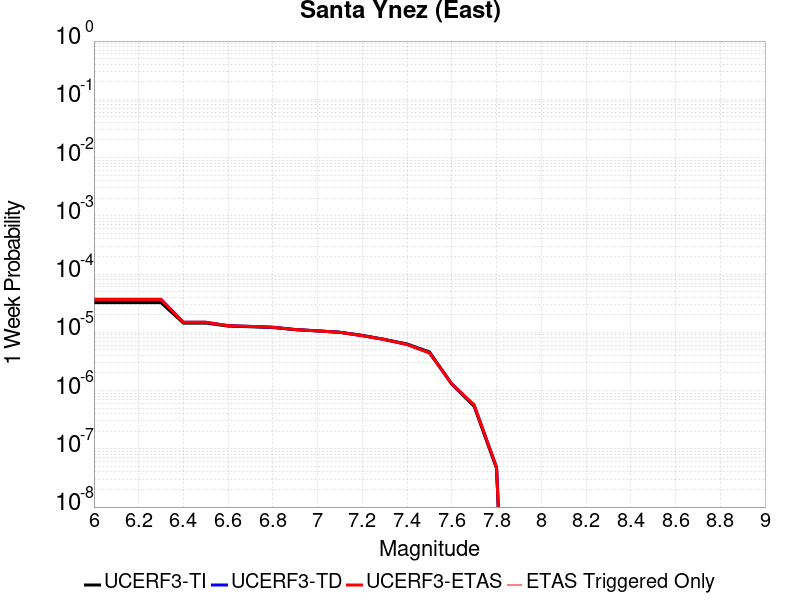 | 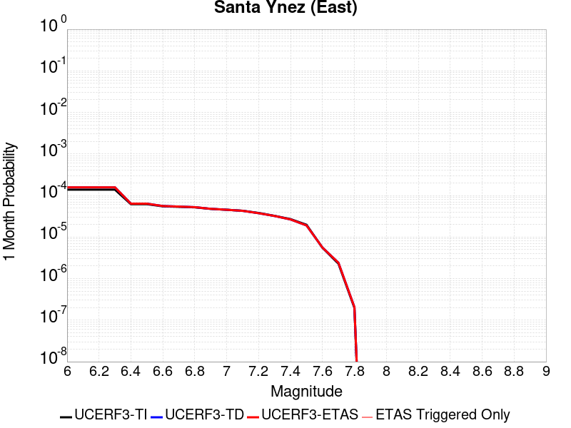 | 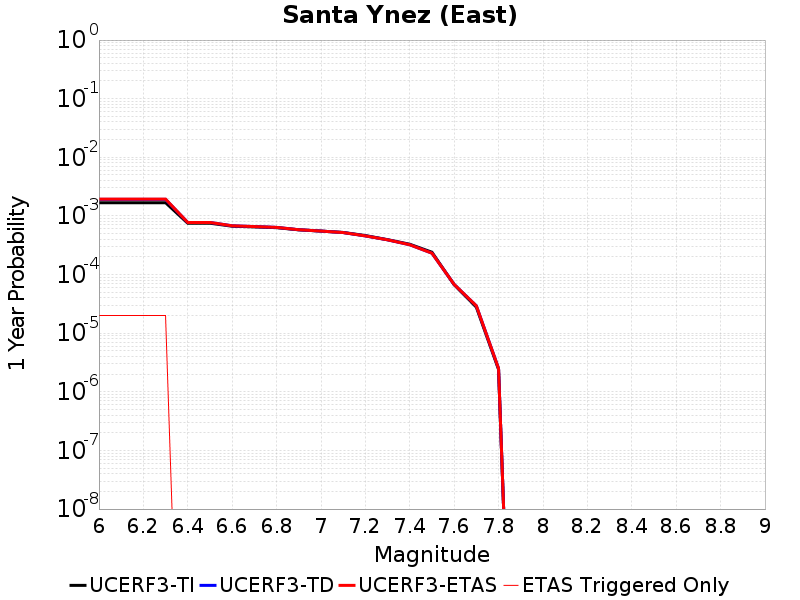 | 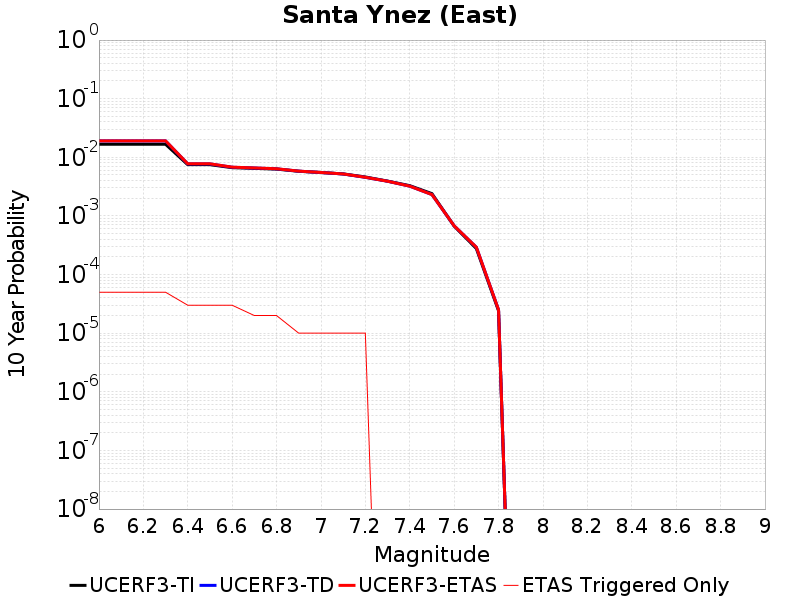 |

| Magnitude | 1 wk TI Prob | 1 wk TD Prob | 1 wk ETAS Prob | 1 wk ETAS/TD Gain | 1 wk ETAS Triggered Only | 1 mo TI Prob | 1 mo TD Prob | 1 mo ETAS Prob | 1 mo ETAS/TD Gain | 1 mo ETAS Triggered Only | 1 yr TI Prob | 1 yr TD Prob | 1 yr ETAS Prob | 1 yr ETAS/TD Gain | 1 yr ETAS Triggered Only | 10 yr TI Prob | 10 yr TD Prob | 10 yr ETAS Prob | 10 yr ETAS/TD Gain | 10 yr ETAS Triggered Only |
|-----|-----|-----|-----|-----|-----|-----|-----|-----|-----|-----|-----|-----|-----|-----|-----|-----|-----|-----|-----|-----|
| 6.0 | 3.2269712E-5 | 3.6751215E-5 | 3.6751215E-5 | 1.0 | 0.0 | 1.3829143E-4 | 1.5749903E-4 | 1.5749903E-4 | 1.0 | 0.0 | 0.0016823979 | 0.0019164537 | 0.0019364154 | 1.0104159 | 2.0E-5 | 0.016697178 | 0.019056806 | 0.019105854 | 1.0025737 | 5.0E-5 |
| 6.1 | 3.2269712E-5 | 3.6751215E-5 | 3.6751215E-5 | 1.0 | 0.0 | 1.3829143E-4 | 1.5749903E-4 | 1.5749903E-4 | 1.0 | 0.0 | 0.0016823979 | 0.0019164537 | 0.0019364154 | 1.0104159 | 2.0E-5 | 0.016697178 | 0.019056806 | 0.019105854 | 1.0025737 | 5.0E-5 |
| 6.2 | 3.2269712E-5 | 3.6751215E-5 | 3.6751215E-5 | 1.0 | 0.0 | 1.3829143E-4 | 1.5749903E-4 | 1.5749903E-4 | 1.0 | 0.0 | 0.0016823979 | 0.0019164537 | 0.0019364154 | 1.0104159 | 2.0E-5 | 0.016697178 | 0.019056806 | 0.019105854 | 1.0025737 | 5.0E-5 |
| 6.3 | 3.2269712E-5 | 3.6751215E-5 | 3.6751215E-5 | 1.0 | 0.0 | 1.3829143E-4 | 1.5749903E-4 | 1.5749903E-4 | 1.0 | 0.0 | 0.0016823979 | 0.0019164537 | 0.0019364154 | 1.0104159 | 2.0E-5 | 0.016697178 | 0.019056806 | 0.019105854 | 1.0025737 | 5.0E-5 |
| 6.4 | 1.4404779E-5 | 1.484954E-5 | 1.484954E-5 | 1.0 | 0.0 | 6.1733306E-5 | 6.363936E-5 | 6.363936E-5 | 1.0 | 0.0 | 7.513438E-4 | 7.7453884E-4 | 7.7453884E-4 | 1.0 | 0.0 | 0.0074880854 | 0.0077189435 | 0.007748712 | 1.0038565 | 3.0E-5 |
| 6.5 | 1.4404779E-5 | 1.484954E-5 | 1.484954E-5 | 1.0 | 0.0 | 6.1733306E-5 | 6.363936E-5 | 6.363936E-5 | 1.0 | 0.0 | 7.513438E-4 | 7.7453884E-4 | 7.7453884E-4 | 1.0 | 0.0 | 0.0074880854 | 0.0077189435 | 0.007748712 | 1.0038565 | 3.0E-5 |
| 6.6 | 1.280208E-5 | 1.3012074E-5 | 1.3012074E-5 | 1.0 | 0.0 | 5.4864904E-5 | 5.5764853E-5 | 5.5764853E-5 | 1.0 | 0.0 | 6.6777546E-4 | 6.7872735E-4 | 6.7872735E-4 | 1.0 | 0.0 | 0.006657724 | 0.0067667547 | 0.006796552 | 1.0044035 | 3.0E-5 |
| 6.7 | 1.2457027E-5 | 1.262859E-5 | 1.262859E-5 | 1.0 | 0.0 | 5.3386164E-5 | 5.4121418E-5 | 5.4121418E-5 | 1.0 | 0.0 | 6.497827E-4 | 6.587307E-4 | 6.587307E-4 | 1.0 | 0.0 | 0.00647886 | 0.0065679788 | 0.006587847 | 1.003025 | 2.0E-5 |
| 6.8 | 1.2095134E-5 | 1.2231033E-5 | 1.2231033E-5 | 1.0 | 0.0 | 5.1835254E-5 | 5.241767E-5 | 5.241767E-5 | 1.0 | 0.0 | 6.309115E-4 | 6.3799985E-4 | 6.3799985E-4 | 1.0 | 0.0 | 0.0062912325 | 0.0063618706 | 0.006381743 | 1.0031238 | 2.0E-5 |
| 6.9 | 1.1104036E-5 | 1.1157455E-5 | 1.1157455E-5 | 1.0 | 0.0 | 4.758786E-5 | 4.7816797E-5 | 4.7816797E-5 | 1.0 | 0.0 | 5.7922816E-4 | 5.8201526E-4 | 5.8201526E-4 | 1.0 | 0.0 | 0.005777207 | 0.005805055 | 0.005814997 | 1.0017127 | 1.0E-5 |
| 7.0 | 1.0577444E-5 | 1.0581783E-5 | 1.0581783E-5 | 1.0 | 0.0 | 4.5331115E-5 | 4.5349716E-5 | 4.5349716E-5 | 1.0 | 0.0 | 5.5176654E-4 | 5.5199413E-4 | 5.5199413E-4 | 1.0 | 0.0 | 0.0055039856 | 0.0055063684 | 0.0055163135 | 1.001806 | 1.0E-5 |
| 7.1 | 1.0021775E-5 | 9.981084E-6 | 9.981084E-6 | 1.0 | 0.0 | 4.294976E-5 | 4.277538E-5 | 4.277538E-5 | 1.0 | 0.0 | 5.2278786E-4 | 5.20667E-4 | 5.20667E-4 | 1.0 | 0.0 | 0.0052155964 | 0.005194604 | 0.005204552 | 1.0019151 | 1.0E-5 |
| 7.2 | 8.874109E-6 | 8.748879E-6 | 8.748879E-6 | 1.0 | 0.0 | 3.8031343E-5 | 3.749466E-5 | 3.749466E-5 | 1.0 | 0.0 | 4.629332E-4 | 4.5640298E-4 | 4.5640298E-4 | 1.0 | 0.0 | 0.0046197 | 0.0045547746 | 0.004564729 | 1.0021855 | 1.0E-5 |
| 7.3 | 7.5504267E-6 | 7.505186E-6 | 7.505186E-6 | 1.0 | 0.0 | 3.235857E-5 | 3.216469E-5 | 3.216469E-5 | 1.0 | 0.0 | 3.9389438E-4 | 3.9153578E-4 | 3.9153578E-4 | 1.0 | 0.0 | 0.0039319694 | 0.0039085667 | 0.0039085667 | 1.0 | 0.0 |
| 7.4 | 6.309394E-6 | 6.183211E-6 | 6.183211E-6 | 1.0 | 0.0 | 2.703998E-5 | 2.6499212E-5 | 2.6499212E-5 | 1.0 | 0.0 | 3.2916202E-4 | 3.225811E-4 | 3.225811E-4 | 1.0 | 0.0 | 0.003286749 | 0.003221226 | 0.003221226 | 1.0 | 0.0 |
| 7.5 | 4.6103073E-6 | 4.440928E-6 | 4.440928E-6 | 1.0 | 0.0 | 1.975831E-5 | 1.9032414E-5 | 1.9032414E-5 | 1.0 | 0.0 | 2.4053088E-4 | 2.316957E-4 | 2.316957E-4 | 1.0 | 0.0 | 0.002402707 | 0.0023146106 | 0.0023146106 | 1.0 | 0.0 |
| 7.6 | 1.2858658E-6 | 1.3008253E-6 | 1.3008253E-6 | 1.0 | 0.0 | 5.5108417E-6 | 5.574954E-6 | 5.574954E-6 | 1.0 | 0.0 | 6.7092435E-5 | 6.787302E-5 | 6.787302E-5 | 1.0 | 0.0 | 6.707218E-4 | 6.785298E-4 | 6.785298E-4 | 1.0 | 0.0 |
| 7.7 | 5.3302307E-7 | 5.612172E-7 | 5.612172E-7 | 1.0 | 0.0 | 2.2843826E-6 | 2.4052144E-6 | 2.4052144E-6 | 1.0 | 0.0 | 2.7812002E-5 | 2.9283128E-5 | 2.9283128E-5 | 1.0 | 0.0 | 2.7808524E-4 | 2.9279626E-4 | 2.9279626E-4 | 1.0 | 0.0 |
| 7.8 | 4.613933E-8 | 4.803032E-8 | 4.803032E-8 | 1.0 | 0.0 | 1.9773998E-7 | 2.058442E-7 | 2.058442E-7 | 1.0 | 0.0 | 2.4074816E-6 | 2.5061504E-6 | 2.5061504E-6 | 1.0 | 0.0 | 2.4074554E-5 | 2.506123E-5 | 2.506123E-5 | 1.0 | 0.0 |

## Kern Canyon (South Kern) 2011
*[(top)](#table-of-contents)*

| 1 Week | 1 Month | 1 Year | 10 Year |
|-----|-----|-----|-----|
| 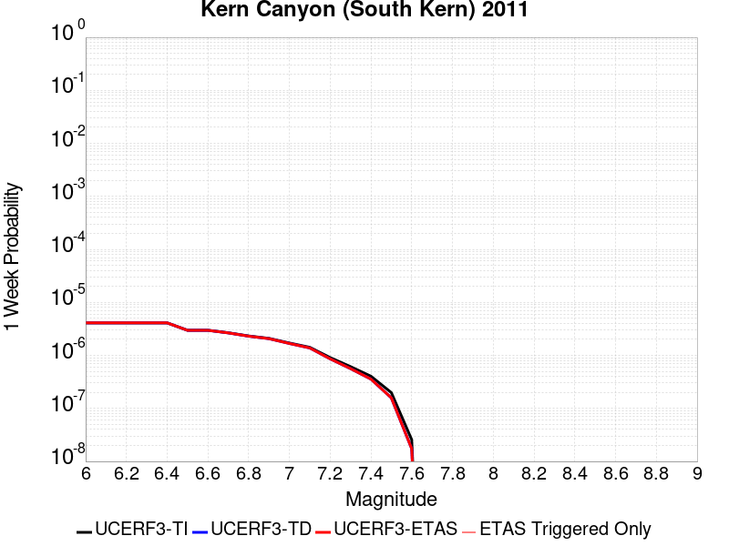 | 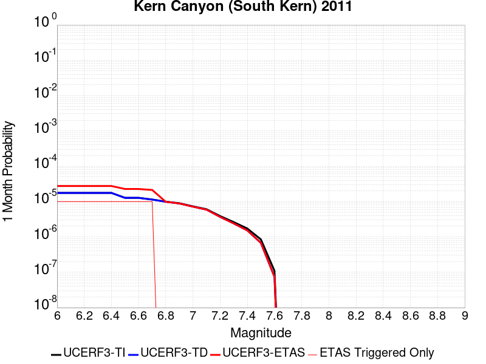 | 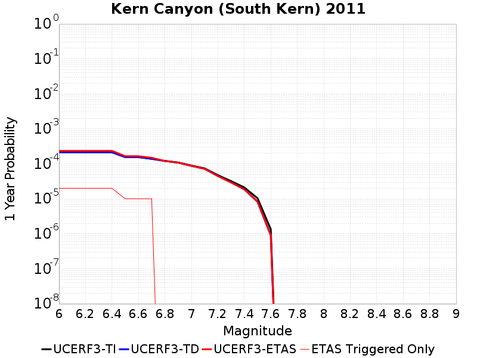 | 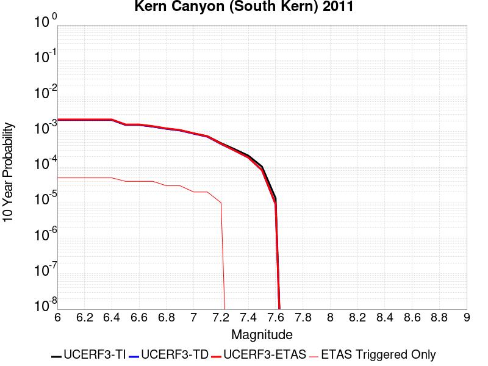 |

| Magnitude | 1 wk TI Prob | 1 wk TD Prob | 1 wk ETAS Prob | 1 wk ETAS/TD Gain | 1 wk ETAS Triggered Only | 1 mo TI Prob | 1 mo TD Prob | 1 mo ETAS Prob | 1 mo ETAS/TD Gain | 1 mo ETAS Triggered Only | 1 yr TI Prob | 1 yr TD Prob | 1 yr ETAS Prob | 1 yr ETAS/TD Gain | 1 yr ETAS Triggered Only | 10 yr TI Prob | 10 yr TD Prob | 10 yr ETAS Prob | 10 yr ETAS/TD Gain | 10 yr ETAS Triggered Only |
|-----|-----|-----|-----|-----|-----|-----|-----|-----|-----|-----|-----|-----|-----|-----|-----|-----|-----|-----|-----|-----|
| 6.0 | 4.105075E-6 | 4.113735E-6 | 4.113735E-6 | 1.0 | 0.0 | 1.7593058E-5 | 1.7630178E-5 | 2.7630002E-5 | 1.5671992 | 1.0E-5 | 2.1417443E-4 | 2.1462691E-4 | 2.3462262E-4 | 1.0931649 | 2.0E-5 | 0.0021396813 | 0.00214426 | 0.002194153 | 1.0232681 | 5.0E-5 |
| 6.1 | 4.105075E-6 | 4.113735E-6 | 4.113735E-6 | 1.0 | 0.0 | 1.7593058E-5 | 1.7630178E-5 | 2.7630002E-5 | 1.5671992 | 1.0E-5 | 2.1417443E-4 | 2.1462691E-4 | 2.3462262E-4 | 1.0931649 | 2.0E-5 | 0.0021396813 | 0.00214426 | 0.002194153 | 1.0232681 | 5.0E-5 |
| 6.2 | 4.105075E-6 | 4.113735E-6 | 4.113735E-6 | 1.0 | 0.0 | 1.7593058E-5 | 1.7630178E-5 | 2.7630002E-5 | 1.5671992 | 1.0E-5 | 2.1417443E-4 | 2.1462691E-4 | 2.3462262E-4 | 1.0931649 | 2.0E-5 | 0.0021396813 | 0.00214426 | 0.002194153 | 1.0232681 | 5.0E-5 |
| 6.3 | 4.105075E-6 | 4.113735E-6 | 4.113735E-6 | 1.0 | 0.0 | 1.7593058E-5 | 1.7630178E-5 | 2.7630002E-5 | 1.5671992 | 1.0E-5 | 2.1417443E-4 | 2.1462691E-4 | 2.3462262E-4 | 1.0931649 | 2.0E-5 | 0.0021396813 | 0.00214426 | 0.002194153 | 1.0232681 | 5.0E-5 |
| 6.4 | 4.105075E-6 | 4.113735E-6 | 4.113735E-6 | 1.0 | 0.0 | 1.7593058E-5 | 1.7630178E-5 | 2.7630002E-5 | 1.5671992 | 1.0E-5 | 2.1417443E-4 | 2.1462691E-4 | 2.3462262E-4 | 1.0931649 | 2.0E-5 | 0.0021396813 | 0.00214426 | 0.002194153 | 1.0232681 | 5.0E-5 |
| 6.5 | 2.9849807E-6 | 2.9731611E-6 | 2.9731611E-6 | 1.0 | 0.0 | 1.2792712E-5 | 1.2742057E-5 | 2.274193E-5 | 1.7847927 | 1.0E-5 | 1.5574014E-4 | 1.5512365E-4 | 1.6512211E-4 | 1.0644547 | 1.0E-5 | 0.0015563103 | 0.001550169 | 0.0015901069 | 1.0257636 | 4.0E-5 |
| 6.6 | 2.9849807E-6 | 2.9731611E-6 | 2.9731611E-6 | 1.0 | 0.0 | 1.2792712E-5 | 1.2742057E-5 | 2.274193E-5 | 1.7847927 | 1.0E-5 | 1.5574014E-4 | 1.5512365E-4 | 1.6512211E-4 | 1.0644547 | 1.0E-5 | 0.0015563103 | 0.001550169 | 0.0015901069 | 1.0257636 | 4.0E-5 |
| 6.7 | 2.6756725E-6 | 2.6582263E-6 | 2.6582263E-6 | 1.0 | 0.0 | 1.1467117E-5 | 1.139235E-5 | 2.1392236E-5 | 1.877772 | 1.0E-5 | 1.396032E-4 | 1.3869314E-4 | 1.4869175E-4 | 1.0720916 | 1.0E-5 | 0.0013951553 | 0.0013860768 | 0.0014260213 | 1.0288185 | 4.0E-5 |
| 6.8 | 2.3283721E-6 | 2.3047837E-6 | 2.3047837E-6 | 1.0 | 0.0 | 9.9787E-6 | 9.877608E-6 | 9.877608E-6 | 1.0 | 0.0 | 1.214839E-4 | 1.2025332E-4 | 1.2025332E-4 | 1.0 | 0.0 | 0.001214175 | 0.0012018898 | 0.0012318539 | 1.0249307 | 3.0E-5 |
| 6.9 | 2.0972677E-6 | 2.0696457E-6 | 2.0696457E-6 | 1.0 | 0.0 | 8.988259E-6 | 8.86988E-6 | 8.86988E-6 | 1.0 | 0.0 | 1.0942656E-4 | 1.079855E-4 | 1.079855E-4 | 1.0 | 0.0 | 0.0010937268 | 0.001079336 | 0.0011093037 | 1.0277649 | 3.0E-5 |
| 7.0 | 1.7132242E-6 | 1.6787073E-6 | 1.6787073E-6 | 1.0 | 0.0 | 7.3423685E-6 | 7.19444E-6 | 7.19444E-6 | 1.0 | 0.0 | 8.938967E-5 | 8.758883E-5 | 8.758883E-5 | 1.0 | 0.0 | 8.935372E-4 | 8.755469E-4 | 8.955294E-4 | 1.0228229 | 2.0E-5 |
| 7.1 | 1.4215541E-6 | 1.3815783E-6 | 1.3815783E-6 | 1.0 | 0.0 | 6.0923603E-6 | 5.9210365E-6 | 5.9210365E-6 | 1.0 | 0.0 | 7.417196E-5 | 7.2086266E-5 | 7.2086266E-5 | 1.0 | 0.0 | 7.414721E-4 | 7.206315E-4 | 7.406171E-4 | 1.0277334 | 2.0E-5 |
| 7.2 | 9.097853E-7 | 8.603796E-7 | 8.603796E-7 | 1.0 | 0.0 | 3.899074E-6 | 3.687336E-6 | 3.687336E-6 | 1.0 | 0.0 | 4.7470192E-5 | 4.48924E-5 | 4.48924E-5 | 1.0 | 0.0 | 4.7460053E-4 | 4.488344E-4 | 4.5882992E-4 | 1.02227 | 1.0E-5 |
| 7.3 | 6.144169E-7 | 5.6282204E-7 | 5.6282204E-7 | 1.0 | 0.0 | 2.6332125E-6 | 2.4120923E-6 | 2.4120923E-6 | 1.0 | 0.0 | 3.205889E-5 | 2.9366833E-5 | 2.9366833E-5 | 1.0 | 0.0 | 3.2054266E-4 | 2.9363003E-4 | 2.9363003E-4 | 1.0 | 0.0 |
| 7.4 | 4.049844E-7 | 3.572841E-7 | 3.572841E-7 | 1.0 | 0.0 | 1.7356463E-6 | 1.5312166E-6 | 1.5312166E-6 | 1.0 | 0.0 | 2.1131287E-5 | 1.8642406E-5 | 1.8642406E-5 | 1.0 | 0.0 | 2.1129279E-4 | 1.8640867E-4 | 1.8640867E-4 | 1.0 | 0.0 |
| 7.5 | 1.9871162E-7 | 1.5830491E-7 | 1.5830491E-7 | 1.0 | 0.0 | 8.5162094E-7 | 6.7844945E-7 | 6.7844945E-7 | 1.0 | 0.0 | 1.0368436E-5 | 8.260092E-6 | 8.260092E-6 | 1.0 | 0.0 | 1.0367952E-4 | 8.259793E-5 | 8.259793E-5 | 1.0 | 0.0 |
| 7.6 | 2.572245E-8 | 1.7352624E-8 | 1.7352624E-8 | 1.0 | 0.0 | 1.10239064E-7 | 7.436839E-8 | 7.436839E-8 | 1.0 | 0.0 | 1.3421597E-6 | 9.0543483E-7 | 9.0543483E-7 | 1.0 | 0.0 | 1.3421517E-5 | 9.054316E-6 | 9.054316E-6 | 1.0 | 0.0 |

## White Mountains
*[(top)](#table-of-contents)*

| 1 Week | 1 Month | 1 Year | 10 Year |
|-----|-----|-----|-----|
| 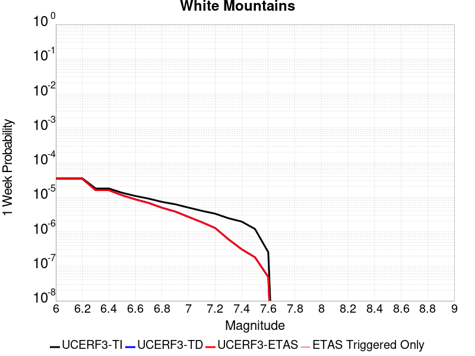 | 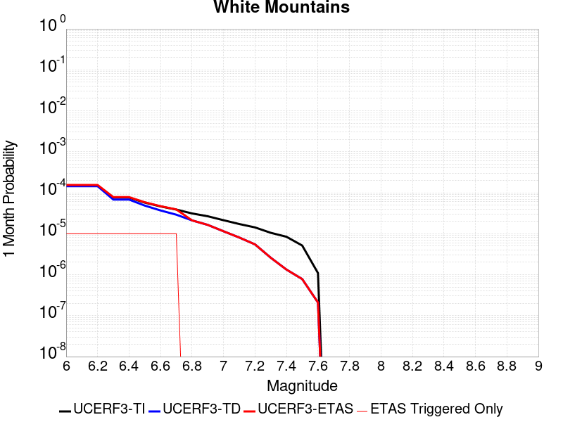 | 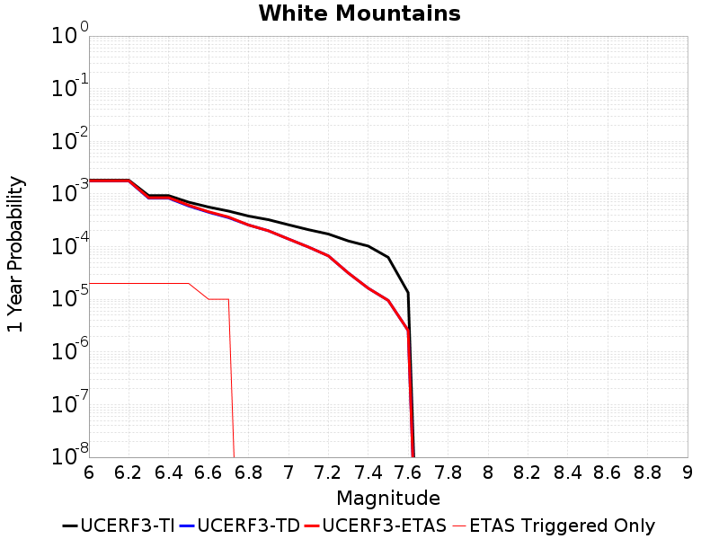 | 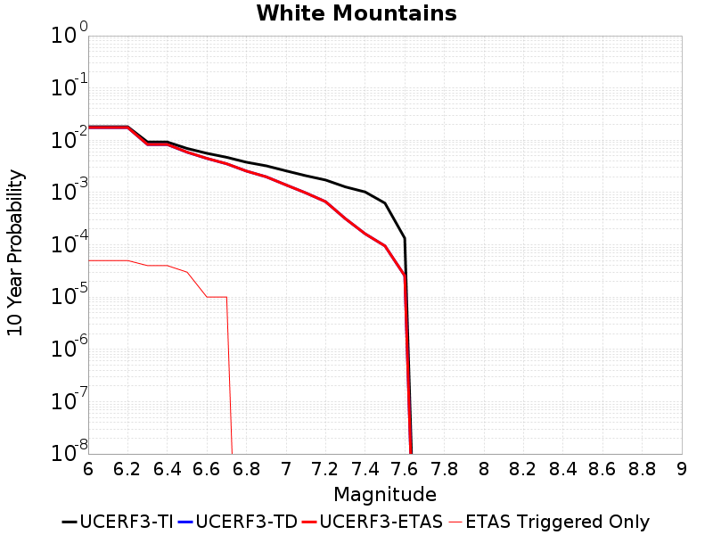 |

| Magnitude | 1 wk TI Prob | 1 wk TD Prob | 1 wk ETAS Prob | 1 wk ETAS/TD Gain | 1 wk ETAS Triggered Only | 1 mo TI Prob | 1 mo TD Prob | 1 mo ETAS Prob | 1 mo ETAS/TD Gain | 1 mo ETAS Triggered Only | 1 yr TI Prob | 1 yr TD Prob | 1 yr ETAS Prob | 1 yr ETAS/TD Gain | 1 yr ETAS Triggered Only | 10 yr TI Prob | 10 yr TD Prob | 10 yr ETAS Prob | 10 yr ETAS/TD Gain | 10 yr ETAS Triggered Only |
|-----|-----|-----|-----|-----|-----|-----|-----|-----|-----|-----|-----|-----|-----|-----|-----|-----|-----|-----|-----|-----|
| 6.0 | 3.503579E-5 | 3.3784367E-5 | 3.3784367E-5 | 1.0 | 0.0 | 1.5014476E-4 | 1.447828E-4 | 1.5478134E-4 | 1.069059 | 1.0E-5 | 0.0018264796 | 0.001761426 | 0.0017813909 | 1.0113344 | 2.0E-5 | 0.018115403 | 0.01748698 | 0.017536107 | 1.0028093 | 5.0E-5 |
| 6.1 | 3.503579E-5 | 3.3784367E-5 | 3.3784367E-5 | 1.0 | 0.0 | 1.5014476E-4 | 1.447828E-4 | 1.5478134E-4 | 1.069059 | 1.0E-5 | 0.0018264796 | 0.001761426 | 0.0017813909 | 1.0113344 | 2.0E-5 | 0.018115403 | 0.01748698 | 0.017536107 | 1.0028093 | 5.0E-5 |
| 6.2 | 3.503579E-5 | 3.3784367E-5 | 3.3784367E-5 | 1.0 | 0.0 | 1.5014476E-4 | 1.447828E-4 | 1.5478134E-4 | 1.069059 | 1.0E-5 | 0.0018264796 | 0.001761426 | 0.0017813909 | 1.0113344 | 2.0E-5 | 0.018115403 | 0.01748698 | 0.017536107 | 1.0028093 | 5.0E-5 |
| 6.3 | 1.7818425E-5 | 1.5916212E-5 | 1.5916212E-5 | 1.0 | 0.0 | 7.636245E-5 | 6.821063E-5 | 7.820995E-5 | 1.1465948 | 1.0E-5 | 9.293162E-4 | 8.301623E-4 | 8.501457E-4 | 1.0240717 | 2.0E-5 | 0.009254395 | 0.0082720695 | 0.008311739 | 1.0047956 | 4.0E-5 |
| 6.4 | 1.7818425E-5 | 1.5916212E-5 | 1.5916212E-5 | 1.0 | 0.0 | 7.636245E-5 | 6.821063E-5 | 7.820995E-5 | 1.1465948 | 1.0E-5 | 9.293162E-4 | 8.301623E-4 | 8.501457E-4 | 1.0240717 | 2.0E-5 | 0.009254395 | 0.0082720695 | 0.008311739 | 1.0047956 | 4.0E-5 |
| 6.5 | 1.3397557E-5 | 1.1336364E-5 | 1.1336364E-5 | 1.0 | 0.0 | 5.741684E-5 | 4.858355E-5 | 5.8583068E-5 | 1.2058209 | 1.0E-5 | 6.988258E-4 | 5.913512E-4 | 6.1133935E-4 | 1.0338008 | 2.0E-5 | 0.006966323 | 0.0058984817 | 0.0059283045 | 1.005056 | 3.0E-5 |
| 6.6 | 1.0818695E-5 | 8.625439E-6 | 8.625439E-6 | 1.0 | 0.0 | 4.6365014E-5 | 3.6965666E-5 | 4.6965295E-5 | 1.2705113 | 1.0E-5 | 5.6434784E-4 | 4.4996841E-4 | 4.599639E-4 | 1.0222138 | 1.0E-5 | 0.005629168 | 0.0044910097 | 0.0045009647 | 1.0022167 | 1.0E-5 |
| 6.7 | 9.067908E-6 | 6.8025E-6 | 6.8025E-6 | 1.0 | 0.0 | 3.8861883E-5 | 2.9153263E-5 | 3.9152972E-5 | 1.3430048 | 1.0E-5 | 4.7304068E-4 | 3.5488638E-4 | 3.648828E-4 | 1.0281681 | 1.0E-5 | 0.00472035 | 0.0035435136 | 0.003553478 | 1.002812 | 1.0E-5 |
| 6.8 | 7.295947E-6 | 4.936434E-6 | 4.936434E-6 | 1.0 | 0.0 | 3.126797E-5 | 2.115598E-5 | 2.115598E-5 | 1.0 | 0.0 | 3.8062103E-4 | 2.5754474E-4 | 2.5754474E-4 | 1.0 | 0.0 | 0.0037996976 | 0.0025725756 | 0.0025725756 | 1.0 | 0.0 |
| 6.9 | 6.2243444E-6 | 3.8322482E-6 | 3.8322482E-6 | 1.0 | 0.0 | 2.6675489E-5 | 1.642382E-5 | 1.642382E-5 | 1.0 | 0.0 | 3.2472567E-4 | 1.999422E-4 | 1.999422E-4 | 1.0 | 0.0 | 0.0032425157 | 0.0019976757 | 0.0019976757 | 1.0 | 0.0 |
| 7.0 | 4.9878413E-6 | 2.6795642E-6 | 2.6795642E-6 | 1.0 | 0.0 | 2.1376287E-5 | 1.1483798E-5 | 1.1483798E-5 | 1.0 | 0.0 | 2.602252E-4 | 1.3980652E-4 | 1.3980652E-4 | 1.0 | 0.0 | 0.002599207 | 0.0013972119 | 0.0013972119 | 1.0 | 0.0 |
| 7.1 | 4.0252844E-6 | 1.8857849E-6 | 1.8857849E-6 | 1.0 | 0.0 | 1.7251105E-5 | 8.081911E-6 | 8.081911E-6 | 1.0 | 0.0 | 2.1001195E-4 | 9.839295E-5 | 9.839295E-5 | 1.0 | 0.0 | 0.0020981359 | 9.835067E-4 | 9.835067E-4 | 1.0 | 0.0 |
| 7.2 | 3.3284066E-6 | 1.2819896E-6 | 1.2819896E-6 | 1.0 | 0.0 | 1.4264522E-5 | 5.49423E-6 | 5.49423E-6 | 1.0 | 0.0 | 1.736567E-4 | 6.68903E-5 | 6.68903E-5 | 1.0 | 0.0 | 0.0017352107 | 6.687117E-4 | 6.687117E-4 | 1.0 | 0.0 |
| 7.3 | 2.458226E-6 | 6.05745E-7 | 6.05745E-7 | 1.0 | 0.0 | 1.0535211E-5 | 2.5960476E-6 | 2.5960476E-6 | 1.0 | 0.0 | 1.2825865E-4 | 3.1606458E-5 | 3.1606458E-5 | 1.0 | 0.0 | 0.0012818464 | 3.160234E-4 | 3.160234E-4 | 1.0 | 0.0 |
| 7.4 | 1.965953E-6 | 3.1091298E-7 | 3.1091298E-7 | 1.0 | 0.0 | 8.425486E-6 | 1.3324835E-6 | 1.3324835E-6 | 1.0 | 0.0 | 1.0257547E-4 | 1.6222868E-5 | 1.6222868E-5 | 1.0 | 0.0 | 0.0010252813 | 1.6221697E-4 | 1.6221697E-4 | 1.0 | 0.0 |
| 7.5 | 1.2014192E-6 | 1.8245635E-7 | 1.8245635E-7 | 1.0 | 0.0 | 5.148929E-6 | 7.819555E-7 | 7.819555E-7 | 1.0 | 0.0 | 6.2686406E-5 | 9.520268E-6 | 9.520268E-6 | 1.0 | 0.0 | 6.266873E-4 | 9.519868E-5 | 9.519868E-5 | 1.0 | 0.0 |
| 7.6 | 2.5612175E-7 | 4.8950117E-8 | 4.8950117E-8 | 1.0 | 0.0 | 1.0976642E-6 | 2.0978621E-7 | 2.0978621E-7 | 1.0 | 0.0 | 1.3363979E-5 | 2.5541444E-6 | 2.5541444E-6 | 1.0 | 0.0 | 1.3363175E-4 | 2.5541187E-5 | 2.5541187E-5 | 1.0 | 0.0 |

## Imperial
*[(top)](#table-of-contents)*

| 1 Week | 1 Month | 1 Year | 10 Year |
|-----|-----|-----|-----|
| 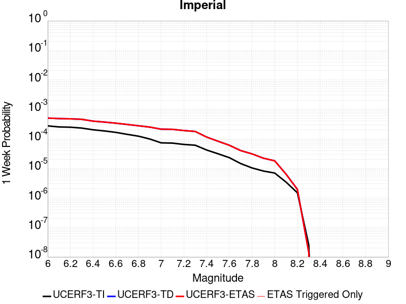 | 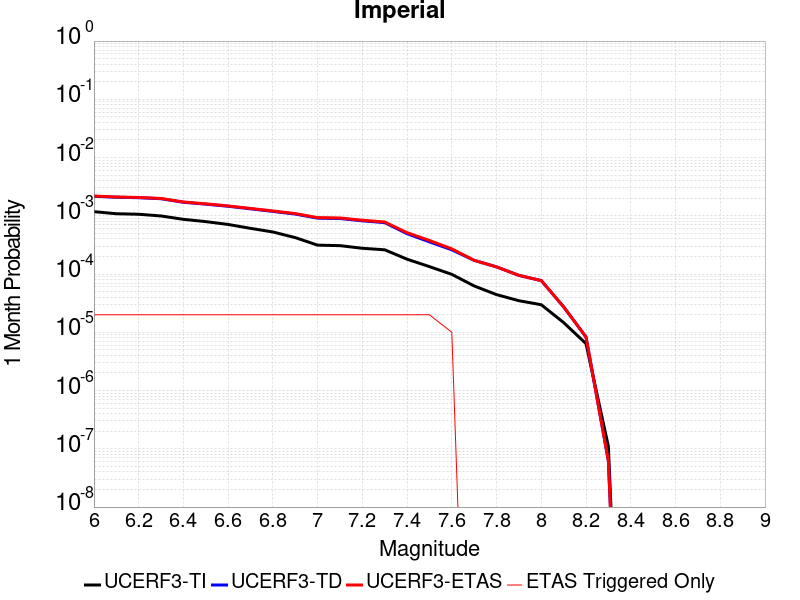 | 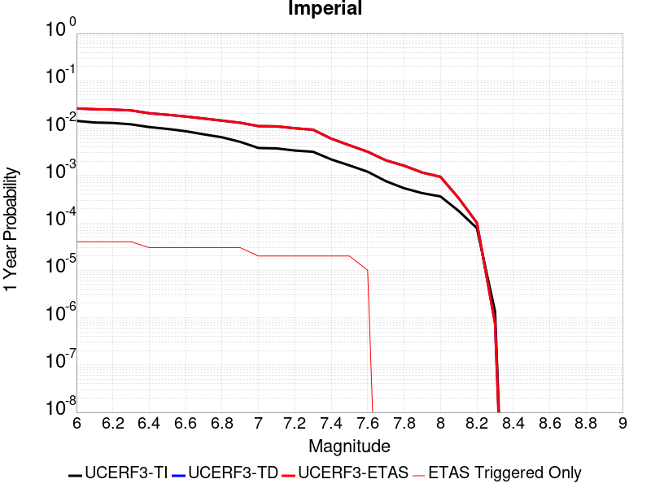 | 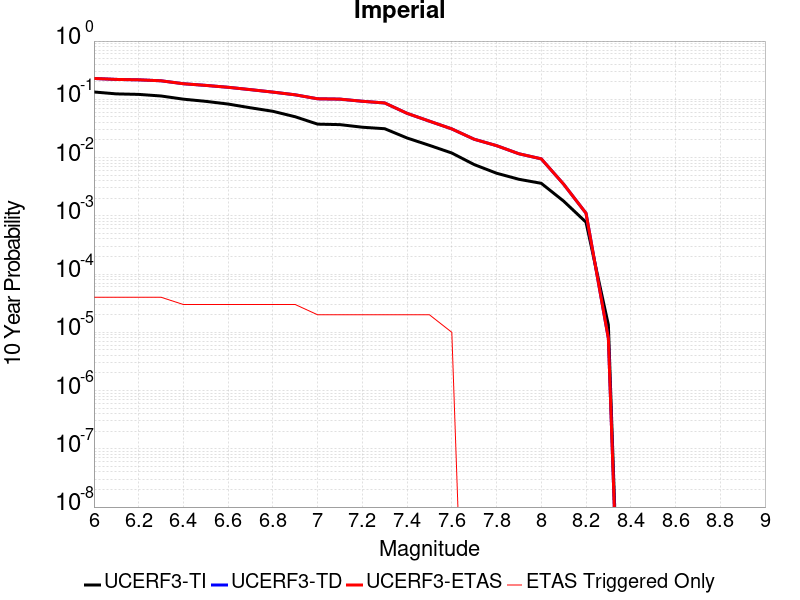 |

| Magnitude | 1 wk TI Prob | 1 wk TD Prob | 1 wk ETAS Prob | 1 wk ETAS/TD Gain | 1 wk ETAS Triggered Only | 1 mo TI Prob | 1 mo TD Prob | 1 mo ETAS Prob | 1 mo ETAS/TD Gain | 1 mo ETAS Triggered Only | 1 yr TI Prob | 1 yr TD Prob | 1 yr ETAS Prob | 1 yr ETAS/TD Gain | 1 yr ETAS Triggered Only | 10 yr TI Prob | 10 yr TD Prob | 10 yr ETAS Prob | 10 yr ETAS/TD Gain | 10 yr ETAS Triggered Only |
|-----|-----|-----|-----|-----|-----|-----|-----|-----|-----|-----|-----|-----|-----|-----|-----|-----|-----|-----|-----|-----|
| 6.0 | 2.7496446E-4 | 5.0563517E-4 | 5.0563517E-4 | 1.0 | 0.0 | 0.0011778869 | 0.0021652475 | 0.002185204 | 1.0092168 | 2.0E-5 | 0.0142467655 | 0.026044236 | 0.026083194 | 1.0014958 | 4.0E-5 | 0.13367249 | 0.22807969 | 0.22811057 | 1.0001354 | 4.0E-5 |
| 6.1 | 2.5356023E-4 | 4.8666145E-4 | 4.8666145E-4 | 1.0 | 0.0 | 0.001086234 | 0.0020840631 | 0.0021040214 | 1.0095767 | 2.0E-5 | 0.013144928 | 0.025076026 | 0.025115024 | 1.0015552 | 4.0E-5 | 0.123940155 | 0.21951164 | 0.21954286 | 1.0001422 | 4.0E-5 |
| 6.2 | 2.4820742E-4 | 4.77614E-4 | 4.77614E-4 | 1.0 | 0.0 | 0.0010633124 | 0.0020453492 | 0.0020653084 | 1.0097582 | 2.0E-5 | 0.01286919 | 0.024615964 | 0.024654979 | 1.001585 | 4.0E-5 | 0.12148927 | 0.21601704 | 0.21604839 | 1.0001452 | 4.0E-5 |
| 6.3 | 2.3205351E-4 | 4.5898685E-4 | 4.5898685E-4 | 1.0 | 0.0 | 9.94136E-4 | 0.0019656406 | 0.0019856011 | 1.0101548 | 2.0E-5 | 0.012036599 | 0.023665505 | 0.023704559 | 1.0016502 | 4.0E-5 | 0.11405133 | 0.2079633 | 0.20799498 | 1.0001523 | 4.0E-5 |
| 6.4 | 2.0304754E-4 | 3.988451E-4 | 3.988451E-4 | 1.0 | 0.0 | 8.6991355E-4 | 0.001708231 | 0.0017281969 | 1.011688 | 2.0E-5 | 0.010539869 | 0.020599755 | 0.020629138 | 1.0014263 | 3.0E-5 | 0.100537635 | 0.1850958 | 0.18512024 | 1.0001321 | 3.0E-5 |
| 6.5 | 1.854992E-4 | 3.6996315E-4 | 3.6996315E-4 | 1.0 | 0.0 | 7.9475436E-4 | 0.0015846053 | 0.0016045736 | 1.0126015 | 2.0E-5 | 0.009633281 | 0.019123279 | 0.019152705 | 1.0015388 | 3.0E-5 | 0.0922623 | 0.1733256 | 0.1733504 | 1.000143 | 3.0E-5 |
| 6.6 | 1.6586106E-4 | 3.4041825E-4 | 3.4041825E-4 | 1.0 | 0.0 | 7.106394E-4 | 0.0014581297 | 0.0014781005 | 1.0136962 | 2.0E-5 | 0.008617763 | 0.017609883 | 0.017639354 | 1.0016736 | 3.0E-5 | 0.08291132 | 0.16080111 | 0.16082628 | 1.0001565 | 3.0E-5 |
| 6.7 | 1.4224656E-4 | 3.0772822E-4 | 3.0772822E-4 | 1.0 | 0.0 | 6.094856E-4 | 0.0013181769 | 0.0013381505 | 1.0151525 | 2.0E-5 | 0.0073952693 | 0.015932608 | 0.015962131 | 1.001853 | 3.0E-5 | 0.07153955 | 0.14650714 | 0.14653274 | 1.0001748 | 3.0E-5 |
| 6.8 | 1.2317259E-4 | 2.7796187E-4 | 2.7796187E-4 | 1.0 | 0.0 | 5.2777573E-4 | 0.0011907273 | 0.0012107036 | 1.0167764 | 2.0E-5 | 0.0064067547 | 0.014402125 | 0.014431693 | 1.002053 | 3.0E-5 | 0.06225166 | 0.1329568 | 0.1329828 | 1.0001956 | 3.0E-5 |
| 6.9 | 9.859898E-5 | 2.5018025E-4 | 2.5018025E-4 | 1.0 | 0.0 | 4.2249862E-4 | 0.0010717647 | 0.0010917434 | 1.0186408 | 2.0E-5 | 0.0051317946 | 0.012971628 | 0.013001239 | 1.0022827 | 3.0E-5 | 0.05014893 | 0.11942151 | 0.119447924 | 1.0002213 | 3.0E-5 |
| 7.0 | 7.3191884E-5 | 2.1269548E-4 | 2.1269548E-4 | 1.0 | 0.0 | 3.136418E-4 | 9.112368E-4 | 9.312186E-4 | 1.0219282 | 2.0E-5 | 0.003811904 | 0.011038559 | 0.011058338 | 1.0017918 | 2.0E-5 | 0.037471764 | 0.10207636 | 0.10209432 | 1.000176 | 2.0E-5 |
| 7.1 | 7.1760296E-5 | 2.0970876E-4 | 2.0970876E-4 | 1.0 | 0.0 | 3.0750787E-4 | 8.9844543E-4 | 9.184275E-4 | 1.0222406 | 2.0E-5 | 0.003737482 | 0.010884389 | 0.010904172 | 1.0018175 | 2.0E-5 | 0.03675245 | 0.100712754 | 0.10073074 | 1.0001786 | 2.0E-5 |
| 7.2 | 6.46614E-5 | 1.9139318E-4 | 1.9139318E-4 | 1.0 | 0.0 | 2.7709085E-4 | 8.2000165E-4 | 8.399852E-4 | 1.0243702 | 2.0E-5 | 0.0033683628 | 0.009938441 | 0.009958243 | 1.0019923 | 2.0E-5 | 0.033177625 | 0.092519976 | 0.092538126 | 1.0001962 | 2.0E-5 |
| 7.3 | 6.088115E-5 | 1.7810913E-4 | 1.7810913E-4 | 1.0 | 0.0 | 2.6089314E-4 | 7.631044E-4 | 7.8308914E-4 | 1.0261887 | 2.0E-5 | 0.0031717476 | 0.009251793 | 0.009271608 | 1.0021417 | 2.0E-5 | 0.031268585 | 0.0865705 | 0.08658877 | 1.000211 | 2.0E-5 |
| 7.4 | 4.199346E-5 | 1.1512301E-4 | 1.1512301E-4 | 1.0 | 0.0 | 1.7995955E-4 | 4.932919E-4 | 5.13282E-4 | 1.0405239 | 2.0E-5 | 0.0021888057 | 0.00598946 | 0.00600934 | 1.0033191 | 2.0E-5 | 0.02167372 | 0.057448342 | 0.057467192 | 1.0003282 | 2.0E-5 |
| 7.5 | 3.130448E-5 | 8.3348794E-5 | 8.3348794E-5 | 1.0 | 0.0 | 1.3415517E-4 | 3.5716052E-4 | 3.7715337E-4 | 1.0559772 | 2.0E-5 | 0.0016321153 | 0.004339819 | 0.004359732 | 1.0045885 | 2.0E-5 | 0.016201803 | 0.042139225 | 0.04215838 | 1.0004547 | 2.0E-5 |
| 7.6 | 2.3074248E-5 | 6.085829E-5 | 6.085829E-5 | 1.0 | 0.0 | 9.888588E-5 | 2.607953E-4 | 2.707927E-4 | 1.0383343 | 1.0E-5 | 0.0012032706 | 0.003170583 | 0.003180551 | 1.003144 | 1.0E-5 | 0.011967761 | 0.031032622 | 0.031042311 | 1.0003122 | 1.0E-5 |
| 7.7 | 1.45864815E-5 | 4.0136012E-5 | 4.0136012E-5 | 1.0 | 0.0 | 6.2511994E-5 | 1.7200017E-4 | 1.7200017E-4 | 1.0 | 0.0 | 7.608177E-4 | 0.0020920963 | 0.0020920963 | 1.0 | 0.0 | 0.007582182 | 0.020632952 | 0.020632952 | 1.0 | 0.0 |
| 7.8 | 1.0352979E-5 | 3.097052E-5 | 3.097052E-5 | 1.0 | 0.0 | 4.4369157E-5 | 1.3272408E-4 | 1.3272408E-4 | 1.0 | 0.0 | 5.400606E-4 | 0.0016147202 | 0.0016147202 | 1.0 | 0.0 | 0.0053875 | 0.016021246 | 0.016021246 | 1.0 | 0.0 |
| 7.9 | 8.137906E-6 | 2.2156832E-5 | 2.2156832E-5 | 1.0 | 0.0 | 3.4876273E-5 | 9.4954405E-5 | 9.4954405E-5 | 1.0 | 0.0 | 4.2453592E-4 | 0.0011554577 | 0.0011554577 | 1.0 | 0.0 | 0.004237258 | 0.011621505 | 0.011621505 | 1.0 | 0.0 |
| 8.0 | 6.93792E-6 | 1.8015415E-5 | 1.8015415E-5 | 1.0 | 0.0 | 2.9733603E-5 | 7.7206634E-5 | 7.7206634E-5 | 1.0 | 0.0 | 3.6194647E-4 | 9.395862E-4 | 9.395862E-4 | 1.0 | 0.0 | 0.0036135751 | 0.00950467 | 0.00950467 | 1.0 | 0.0 |
| 8.1 | 3.4286315E-6 | 6.38296E-6 | 6.38296E-6 | 1.0 | 0.0 | 1.4694053E-5 | 2.7355256E-5 | 2.7355256E-5 | 1.0 | 0.0 | 1.7888541E-4 | 3.3299948E-4 | 3.3299948E-4 | 1.0 | 0.0 | 0.0017874148 | 0.0034875642 | 0.0034875642 | 1.0 | 0.0 |
| 8.2 | 1.4906886E-6 | 1.9378758E-6 | 1.9378758E-6 | 1.0 | 0.0 | 6.3886496E-6 | 8.3051555E-6 | 8.3051555E-6 | 1.0 | 0.0 | 7.7779034E-5 | 1.0111061E-4 | 1.0111061E-4 | 1.0 | 0.0 | 7.775182E-4 | 0.0011081543 | 0.0011081543 | 1.0 | 0.0 |
| 8.3 | 2.5758007E-8 | 1.4512407E-8 | 1.4512407E-8 | 1.0 | 0.0 | 1.10391454E-7 | 6.219603E-8 | 6.219603E-8 | 1.0 | 0.0 | 1.3440151E-6 | 7.572367E-7 | 7.572367E-7 | 1.0 | 0.0 | 1.344007E-5 | 7.894334E-6 | 7.894334E-6 | 1.0 | 0.0 |

## San Jacinto (Superstition Mtn)
*[(top)](#table-of-contents)*

| 1 Week | 1 Month | 1 Year | 10 Year |
|-----|-----|-----|-----|
| 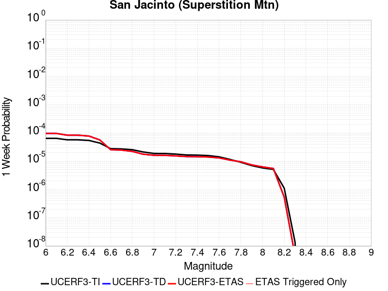 | 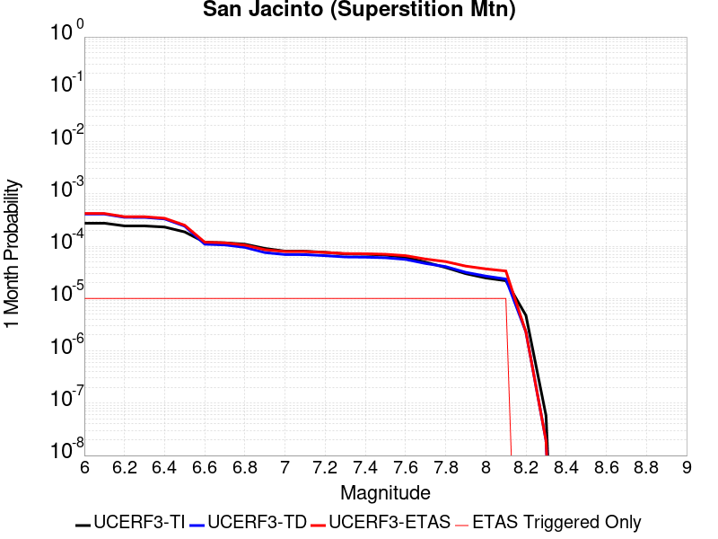 | 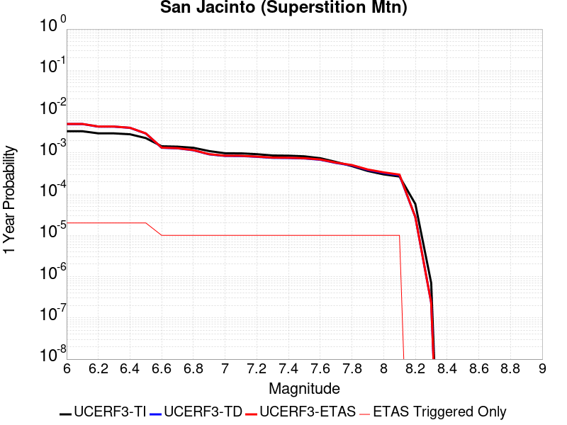 | 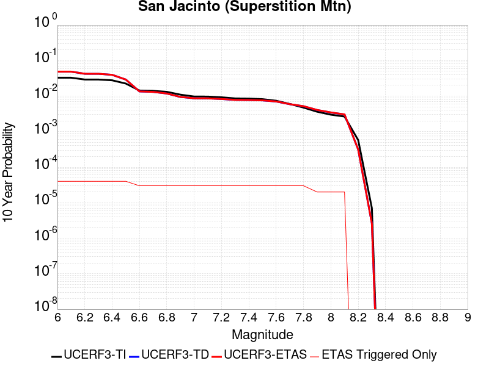 |

| Magnitude | 1 wk TI Prob | 1 wk TD Prob | 1 wk ETAS Prob | 1 wk ETAS/TD Gain | 1 wk ETAS Triggered Only | 1 mo TI Prob | 1 mo TD Prob | 1 mo ETAS Prob | 1 mo ETAS/TD Gain | 1 mo ETAS Triggered Only | 1 yr TI Prob | 1 yr TD Prob | 1 yr ETAS Prob | 1 yr ETAS/TD Gain | 1 yr ETAS Triggered Only | 10 yr TI Prob | 10 yr TD Prob | 10 yr ETAS Prob | 10 yr ETAS/TD Gain | 10 yr ETAS Triggered Only |
|-----|-----|-----|-----|-----|-----|-----|-----|-----|-----|-----|-----|-----|-----|-----|-----|-----|-----|-----|-----|-----|
| 6.0 | 6.4193904E-5 | 9.599988E-5 | 9.599988E-5 | 1.0 | 0.0 | 2.7508775E-4 | 4.1137295E-4 | 4.2136887E-4 | 1.0242988 | 1.0E-5 | 0.0033440501 | 0.004998398 | 0.005018298 | 1.0039812 | 2.0E-5 | 0.03294174 | 0.04882695 | 0.048864998 | 1.0007793 | 4.0E-5 |
| 6.1 | 6.4193904E-5 | 9.599988E-5 | 9.599988E-5 | 1.0 | 0.0 | 2.7508775E-4 | 4.1137295E-4 | 4.2136887E-4 | 1.0242988 | 1.0E-5 | 0.0033440501 | 0.004998398 | 0.005018298 | 1.0039812 | 2.0E-5 | 0.03294174 | 0.04882695 | 0.048864998 | 1.0007793 | 4.0E-5 |
| 6.2 | 5.7023593E-5 | 8.315005E-5 | 8.315005E-5 | 1.0 | 0.0 | 2.4436394E-4 | 3.563181E-4 | 3.6631455E-4 | 1.0280548 | 1.0E-5 | 0.002971072 | 0.004331185 | 0.004351098 | 1.0045977 | 2.0E-5 | 0.029316625 | 0.042506836 | 0.042545136 | 1.000901 | 4.0E-5 |
| 6.3 | 5.6940098E-5 | 8.299541E-5 | 8.299541E-5 | 1.0 | 0.0 | 2.4400617E-4 | 3.5565553E-4 | 3.65652E-4 | 1.028107 | 1.0E-5 | 0.002966728 | 0.00432315 | 0.0043430636 | 1.0046062 | 2.0E-5 | 0.029274331 | 0.042430084 | 0.042468388 | 1.0009028 | 4.0E-5 |
| 6.4 | 5.4171585E-5 | 7.7489094E-5 | 7.7489094E-5 | 1.0 | 0.0 | 2.3214328E-4 | 3.3206315E-4 | 3.4205982E-4 | 1.0301048 | 1.0E-5 | 0.0028226813 | 0.0040370226 | 0.0040569417 | 1.0049342 | 2.0E-5 | 0.02787096 | 0.03971931 | 0.03975772 | 1.000967 | 4.0E-5 |
| 6.5 | 4.375144E-5 | 5.64267E-5 | 5.64267E-5 | 1.0 | 0.0 | 1.874927E-4 | 2.4181293E-4 | 2.518105E-4 | 1.0413443 | 1.0E-5 | 0.0022803338 | 0.0029412734 | 0.0029612146 | 1.0067798 | 2.0E-5 | 0.022570757 | 0.029239535 | 0.029278366 | 1.001328 | 4.0E-5 |
| 6.6 | 2.772192E-5 | 2.549347E-5 | 2.549347E-5 | 1.0 | 0.0 | 1.1880282E-4 | 1.09253255E-4 | 1.1925217E-4 | 1.0915204 | 1.0E-5 | 0.0014454646 | 0.0013293661 | 0.0013393528 | 1.0075123 | 1.0E-5 | 0.014360986 | 0.013543141 | 0.013572735 | 1.0021851 | 3.0E-5 |
| 6.7 | 2.7124124E-5 | 2.4704474E-5 | 2.4704474E-5 | 1.0 | 0.0 | 1.1624106E-4 | 1.0587213E-4 | 1.1587107E-4 | 1.0944436 | 1.0E-5 | 0.0014143161 | 0.0012882502 | 0.0012982372 | 1.0077524 | 1.0E-5 | 0.014053487 | 0.013136584 | 0.01316619 | 1.0022537 | 3.0E-5 |
| 6.8 | 2.5475807E-5 | 2.2169424E-5 | 2.2169424E-5 | 1.0 | 0.0 | 1.0917746E-4 | 9.500843E-5 | 1.0500748E-4 | 1.1052438 | 1.0E-5 | 0.001328425 | 0.0011561257 | 0.0011661141 | 1.0086396 | 1.0E-5 | 0.0132051185 | 0.011824763 | 0.011854409 | 1.0025071 | 3.0E-5 |
| 6.9 | 2.1162023E-5 | 1.7630828E-5 | 1.7630828E-5 | 1.0 | 0.0 | 9.069123E-5 | 7.555852E-5 | 8.555777E-5 | 1.1323377 | 1.0E-5 | 0.0011036064 | 9.195406E-4 | 9.2953135E-4 | 1.010865 | 1.0E-5 | 0.010981417 | 0.009449273 | 0.00947899 | 1.0031449 | 3.0E-5 |
| 7.0 | 1.8754288E-5 | 1.6165935E-5 | 1.6165935E-5 | 1.0 | 0.0 | 8.037304E-5 | 6.928076E-5 | 7.9280064E-5 | 1.1443303 | 1.0E-5 | 9.781026E-4 | 8.431692E-4 | 8.531608E-4 | 1.01185 | 1.0E-5 | 0.009738087 | 0.008672328 | 0.008702068 | 1.0034293 | 3.0E-5 |
| 7.1 | 1.8678527E-5 | 1.6091075E-5 | 1.6091075E-5 | 1.0 | 0.0 | 8.0048376E-5 | 6.895994E-5 | 7.8959245E-5 | 1.1450018 | 1.0E-5 | 9.7415317E-4 | 8.392663E-4 | 8.492579E-4 | 1.0119052 | 1.0E-5 | 0.009698939 | 0.008633282 | 0.008663023 | 1.0034449 | 3.0E-5 |
| 7.2 | 1.7804578E-5 | 1.5385607E-5 | 1.5385607E-5 | 1.0 | 0.0 | 7.6303106E-5 | 6.593666E-5 | 7.5936005E-5 | 1.1516507 | 1.0E-5 | 9.285943E-4 | 8.0248545E-4 | 8.1247743E-4 | 1.0124513 | 1.0E-5 | 0.009247236 | 0.008264572 | 0.008294324 | 1.0036 | 3.0E-5 |
| 7.3 | 1.6583685E-5 | 1.4534664E-5 | 1.4534664E-5 | 1.0 | 0.0 | 7.1070994E-5 | 6.228994E-5 | 7.228932E-5 | 1.1605296 | 1.0E-5 | 8.649459E-4 | 7.5811817E-4 | 7.6811056E-4 | 1.0131806 | 1.0E-5 | 0.00861587 | 0.007819858 | 0.007849624 | 1.0038064 | 3.0E-5 |
| 7.4 | 1.6387552E-5 | 1.439954E-5 | 1.439954E-5 | 1.0 | 0.0 | 7.023047E-5 | 6.171087E-5 | 7.171025E-5 | 1.1620361 | 1.0E-5 | 8.5472054E-4 | 7.5107283E-4 | 7.6106534E-4 | 1.0133042 | 1.0E-5 | 0.008514405 | 0.0077492367 | 0.007779004 | 1.0038414 | 3.0E-5 |
| 7.5 | 1.5790754E-5 | 1.4040184E-5 | 1.4040184E-5 | 1.0 | 0.0 | 6.767291E-5 | 6.017084E-5 | 7.0170245E-5 | 1.1661835 | 1.0E-5 | 8.236062E-4 | 7.323358E-4 | 7.423284E-4 | 1.0136449 | 1.0E-5 | 0.008205604 | 0.0075597772 | 0.00758955 | 1.0039383 | 3.0E-5 |
| 7.6 | 1.4248672E-5 | 1.3059045E-5 | 1.3059045E-5 | 1.0 | 0.0 | 6.106431E-5 | 5.5966146E-5 | 6.5965585E-5 | 1.1786695 | 1.0E-5 | 7.432043E-4 | 6.811765E-4 | 6.911697E-4 | 1.0146705 | 1.0E-5 | 0.007407237 | 0.007042309 | 0.0070720976 | 1.00423 | 3.0E-5 |
| 7.7 | 1.15449975E-5 | 1.0907628E-5 | 1.0907628E-5 | 1.0 | 0.0 | 4.947762E-5 | 4.6746143E-5 | 5.6745677E-5 | 1.2139114 | 1.0E-5 | 6.022235E-4 | 5.6898646E-4 | 5.789808E-4 | 1.0175651 | 1.0E-5 | 0.006005941 | 0.005912251 | 0.005942073 | 1.0050442 | 3.0E-5 |
| 7.8 | 9.1391985E-6 | 9.518095E-6 | 9.518095E-6 | 1.0 | 0.0 | 3.9167408E-5 | 4.0791198E-5 | 5.079079E-5 | 1.2451409 | 1.0E-5 | 4.767588E-4 | 4.9652025E-4 | 5.065153E-4 | 1.0201302 | 1.0E-5 | 0.0047573727 | 0.005178677 | 0.0052085216 | 1.0057629 | 3.0E-5 |
| 7.9 | 6.973017E-6 | 7.385513E-6 | 7.385513E-6 | 1.0 | 0.0 | 2.9884017E-5 | 3.165182E-5 | 4.1651503E-5 | 1.3159276 | 1.0E-5 | 3.6377716E-4 | 3.8529327E-4 | 3.9528942E-4 | 1.0259442 | 1.0E-5 | 0.0036318225 | 0.004053547 | 0.004073466 | 1.0049139 | 2.0E-5 |
| 8.0 | 5.7638235E-6 | 6.2630093E-6 | 6.2630093E-6 | 1.0 | 0.0 | 2.4701867E-5 | 2.6841193E-5 | 3.6840927E-5 | 1.3725517 | 1.0E-5 | 3.0070372E-4 | 3.2674303E-4 | 3.3673976E-4 | 1.0305951 | 1.0E-5 | 0.0030029714 | 0.0034550473 | 0.0034749783 | 1.0057687 | 2.0E-5 |
| 8.1 | 5.1124434E-6 | 5.498436E-6 | 5.498436E-6 | 1.0 | 0.0 | 2.1910288E-5 | 2.3564517E-5 | 3.356428E-5 | 1.4243568 | 1.0E-5 | 2.6672508E-4 | 2.868607E-4 | 2.9685785E-4 | 1.0348501 | 1.0E-5 | 0.0026640517 | 0.0030417927 | 0.0030617318 | 1.0065551 | 2.0E-5 |
| 8.2 | 1.1075938E-6 | 5.34062E-7 | 5.34062E-7 | 1.0 | 0.0 | 4.7468216E-6 | 2.2888353E-6 | 2.2888353E-6 | 1.0 | 0.0 | 5.779102E-5 | 2.7866236E-5 | 2.7866236E-5 | 1.0 | 0.0 | 5.777599E-4 | 3.1369066E-4 | 3.1369066E-4 | 1.0 | 0.0 |
| 8.3 | 1.3584393E-8 | 4.477705E-9 | 4.477705E-9 | 1.0 | 0.0 | 5.8218827E-8 | 1.9190164E-8 | 1.9190164E-8 | 1.0 | 0.0 | 7.0881396E-7 | 2.3364024E-7 | 2.3364024E-7 | 1.0 | 0.0 | 7.0881174E-6 | 2.6184741E-6 | 2.6184741E-6 | 1.0 | 0.0 |

## Calaveras (So) - Paicines extension 2011 CFM
*[(top)](#table-of-contents)*

| 1 Week | 1 Month | 1 Year | 10 Year |
|-----|-----|-----|-----|
| 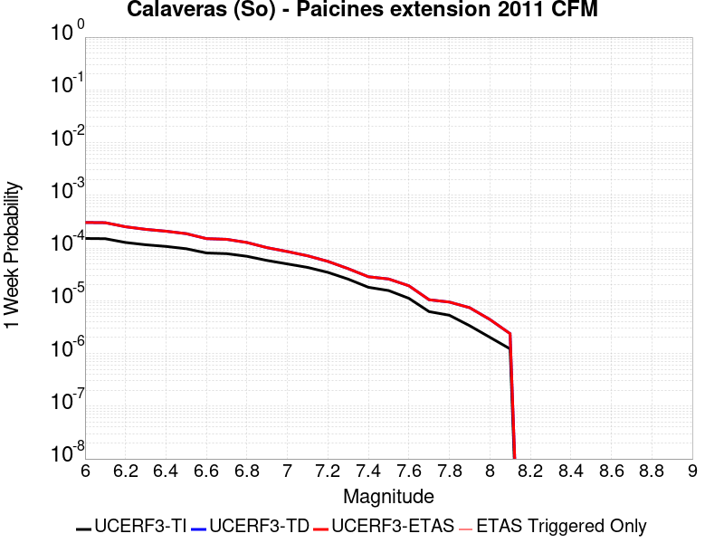 | 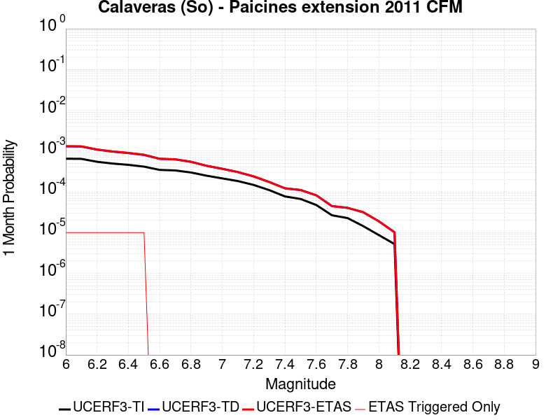 | 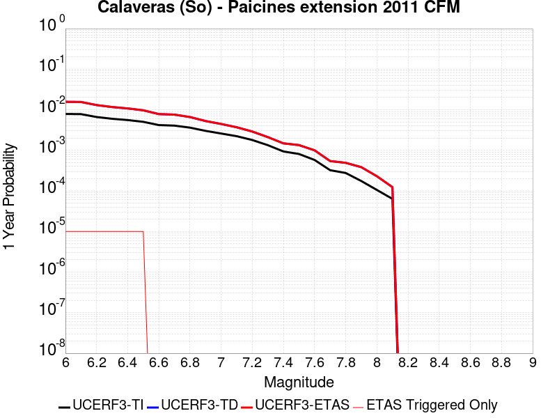 | 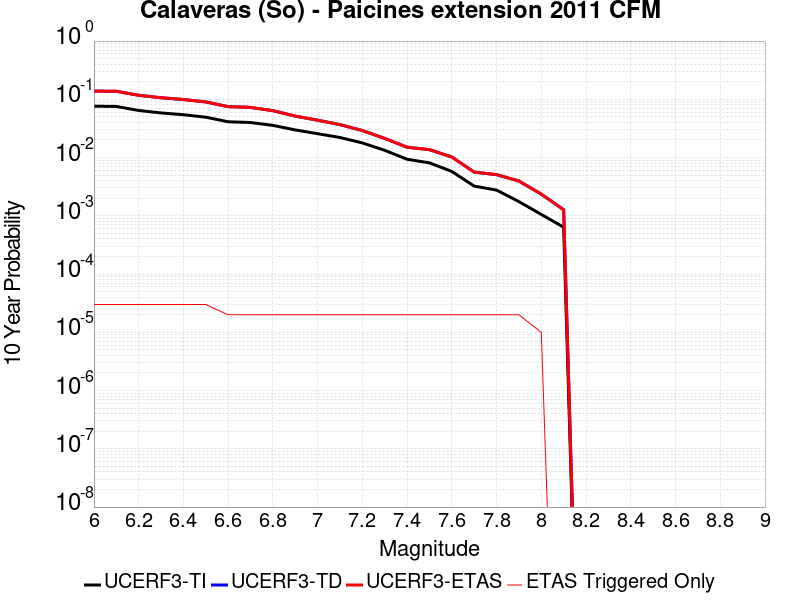 |

| Magnitude | 1 wk TI Prob | 1 wk TD Prob | 1 wk ETAS Prob | 1 wk ETAS/TD Gain | 1 wk ETAS Triggered Only | 1 mo TI Prob | 1 mo TD Prob | 1 mo ETAS Prob | 1 mo ETAS/TD Gain | 1 mo ETAS Triggered Only | 1 yr TI Prob | 1 yr TD Prob | 1 yr ETAS Prob | 1 yr ETAS/TD Gain | 1 yr ETAS Triggered Only | 10 yr TI Prob | 10 yr TD Prob | 10 yr ETAS Prob | 10 yr ETAS/TD Gain | 10 yr ETAS Triggered Only |
|-----|-----|-----|-----|-----|-----|-----|-----|-----|-----|-----|-----|-----|-----|-----|-----|-----|-----|-----|-----|-----|
| 6.0 | 1.5183659E-4 | 3.0543844E-4 | 3.0543844E-4 | 1.0 | 0.0 | 6.5056595E-4 | 0.0013070612 | 0.0013170481 | 1.0076407 | 1.0E-5 | 0.007891912 | 0.015697425 | 0.015707267 | 1.000627 | 1.0E-5 | 0.076174594 | 0.1385009 | 0.13852675 | 1.0001866 | 3.0E-5 |
| 6.1 | 1.5024997E-4 | 3.0237922E-4 | 3.0237922E-4 | 1.0 | 0.0 | 6.437695E-4 | 0.0012939632 | 0.0013039502 | 1.0077182 | 1.0E-5 | 0.0078097614 | 0.015540815 | 0.015550659 | 1.0006335 | 1.0E-5 | 0.075409345 | 0.1371705 | 0.13719638 | 1.0001887 | 3.0E-5 |
| 6.2 | 1.2743923E-4 | 2.5314817E-4 | 2.5314817E-4 | 1.0 | 0.0 | 5.460538E-4 | 0.0010844409 | 0.00109443 | 1.0092113 | 1.0E-5 | 0.0066279583 | 0.013048424 | 0.013058294 | 1.0007564 | 1.0E-5 | 0.064337276 | 0.11726848 | 0.11729496 | 1.0002258 | 3.0E-5 |
| 6.3 | 1.1525114E-4 | 2.2601915E-4 | 2.2601915E-4 | 1.0 | 0.0 | 4.9383997E-4 | 9.6828473E-4 | 9.782751E-4 | 1.0103176 | 1.0E-5 | 0.0059959386 | 0.011669638 | 0.011679521 | 1.000847 | 1.0E-5 | 0.058367174 | 0.1063846 | 0.106411405 | 1.000252 | 3.0E-5 |
| 6.4 | 1.07200925E-4 | 2.0842114E-4 | 2.0842114E-4 | 1.0 | 0.0 | 4.5935164E-4 | 8.9291716E-4 | 9.029083E-4 | 1.0111892 | 1.0E-5 | 0.0055782744 | 0.010774464 | 0.010784357 | 1.0009181 | 1.0E-5 | 0.0544031 | 0.09920717 | 0.09923419 | 1.0002724 | 3.0E-5 |
| 6.5 | 9.69631E-5 | 1.8734242E-4 | 1.8734242E-4 | 1.0 | 0.0 | 4.1548995E-4 | 8.026378E-4 | 8.1262976E-4 | 1.0124489 | 1.0E-5 | 0.0050468626 | 0.009696334 | 0.009706237 | 1.0010213 | 1.0E-5 | 0.04933773 | 0.09009882 | 0.09012612 | 1.0003029 | 3.0E-5 |
| 6.6 | 8.0552316E-5 | 1.5073847E-4 | 1.5073847E-4 | 1.0 | 0.0 | 3.4517853E-4 | 6.458475E-4 | 6.458475E-4 | 1.0 | 0.0 | 0.0041944524 | 0.00782795 | 0.00782795 | 1.0 | 0.0 | 0.04116161 | 0.074868746 | 0.074887246 | 1.0002471 | 2.0E-5 |
| 6.7 | 7.815757E-5 | 1.461387E-4 | 1.461387E-4 | 1.0 | 0.0 | 3.34918E-4 | 6.261539E-4 | 6.261539E-4 | 1.0 | 0.0 | 0.004070005 | 0.0075907777 | 0.0075907777 | 1.0 | 0.0 | 0.039962657 | 0.07271827 | 0.07273682 | 1.000255 | 2.0E-5 |
| 6.8 | 6.965264E-5 | 1.2724454E-4 | 1.2724454E-4 | 1.0 | 0.0 | 2.9847719E-4 | 5.452199E-4 | 5.452199E-4 | 1.0 | 0.0 | 0.0036279052 | 0.00661497 | 0.00661497 | 1.0 | 0.0 | 0.03569247 | 0.06381255 | 0.06383127 | 1.0002934 | 2.0E-5 |
| 6.9 | 5.8000453E-5 | 1.0145685E-4 | 1.0145685E-4 | 1.0 | 0.0 | 2.4854968E-4 | 4.3474318E-4 | 4.3474318E-4 | 1.0 | 0.0 | 0.0030218933 | 0.005280258 | 0.005280258 | 1.0 | 0.0 | 0.029811295 | 0.05151172 | 0.05153069 | 1.0003682 | 2.0E-5 |
| 7.0 | 4.9865852E-5 | 8.5698346E-5 | 8.5698346E-5 | 1.0 | 0.0 | 2.1369329E-4 | 3.672274E-4 | 3.672274E-4 | 1.0 | 0.0 | 0.0025986114 | 0.0044619166 | 0.0044619166 | 1.0 | 0.0 | 0.025684336 | 0.04379174 | 0.043810867 | 1.0004367 | 2.0E-5 |
| 7.1 | 4.283875E-5 | 7.1135844E-5 | 7.1135844E-5 | 1.0 | 0.0 | 1.8358172E-4 | 3.048326E-4 | 3.048326E-4 | 1.0 | 0.0 | 0.0022328163 | 0.0037050773 | 0.0037050773 | 1.0 | 0.0 | 0.022105146 | 0.036742687 | 0.03676195 | 1.0005243 | 2.0E-5 |
| 7.2 | 3.450115E-5 | 5.578996E-5 | 5.578996E-5 | 1.0 | 0.0 | 1.478537E-4 | 2.3907807E-4 | 2.3907807E-4 | 1.0 | 0.0 | 0.0017986323 | 0.0029069192 | 0.0029069192 | 1.0 | 0.0 | 0.017841442 | 0.029085947 | 0.029105365 | 1.0006676 | 2.0E-5 |
| 7.3 | 2.5709045E-5 | 4.0600888E-5 | 4.0600888E-5 | 1.0 | 0.0 | 1.1017697E-4 | 1.7399229E-4 | 1.7399229E-4 | 1.0 | 0.0 | 0.0013405791 | 0.0021163148 | 0.0021163148 | 1.0 | 0.0 | 0.013325208 | 0.021303501 | 0.021323074 | 1.0009189 | 2.0E-5 |
| 7.4 | 1.8003093E-5 | 2.8516712E-5 | 2.8516712E-5 | 1.0 | 0.0 | 7.715383E-5 | 1.2220877E-4 | 1.2220877E-4 | 1.0 | 0.0 | 9.3894306E-4 | 0.0014868785 | 0.0014868785 | 1.0 | 0.0 | 0.009349857 | 0.015055492 | 0.015075191 | 1.0013084 | 2.0E-5 |
| 7.5 | 1.5595824E-5 | 2.5829004E-5 | 2.5829004E-5 | 1.0 | 0.0 | 6.683753E-5 | 1.1069104E-4 | 1.1069104E-4 | 1.0 | 0.0 | 8.134431E-4 | 0.0013468325 | 0.0013468325 | 1.0 | 0.0 | 0.008104719 | 0.013655296 | 0.013675022 | 1.0014446 | 2.0E-5 |
| 7.6 | 1.1110309E-5 | 1.92278E-5 | 1.92278E-5 | 1.0 | 0.0 | 4.761474E-5 | 8.2402265E-5 | 8.2402265E-5 | 1.0 | 0.0 | 5.795553E-4 | 0.0010027871 | 0.0010027871 | 1.0 | 0.0 | 0.0057804612 | 0.010206719 | 0.010226515 | 1.0019395 | 2.0E-5 |
| 7.7 | 6.2140443E-6 | 1.0441662E-5 | 1.0441662E-5 | 1.0 | 0.0 | 2.6631347E-5 | 4.4749213E-5 | 4.4749213E-5 | 1.0 | 0.0 | 3.241884E-4 | 5.446856E-4 | 5.446856E-4 | 1.0 | 0.0 | 0.0032371588 | 0.0056220726 | 0.00564196 | 1.0035374 | 2.0E-5 |
| 7.8 | 5.305533E-6 | 9.437157E-6 | 9.437157E-6 | 1.0 | 0.0 | 2.27378E-5 | 4.0444334E-5 | 4.0444334E-5 | 1.0 | 0.0 | 2.7679754E-4 | 4.922986E-4 | 4.922986E-4 | 1.0 | 0.0 | 0.0027645302 | 0.0050763255 | 0.005096224 | 1.0039198 | 2.0E-5 |
| 7.9 | 3.363505E-6 | 7.3879837E-6 | 7.3879837E-6 | 1.0 | 0.0 | 1.4414942E-5 | 3.1662403E-5 | 3.1662403E-5 | 1.0 | 0.0 | 1.7548777E-4 | 3.8542165E-4 | 3.8542165E-4 | 1.0 | 0.0 | 0.0017534926 | 0.003950017 | 0.003969938 | 1.0050433 | 2.0E-5 |
| 8.0 | 2.0271132E-6 | 4.414814E-6 | 4.414814E-6 | 1.0 | 0.0 | 8.687599E-6 | 1.8920495E-5 | 1.8920495E-5 | 1.0 | 0.0 | 1.05766376E-4 | 2.3033272E-4 | 2.3033272E-4 | 1.0 | 0.0 | 0.0010571606 | 0.0023519325 | 0.002361909 | 1.0042418 | 1.0E-5 |
| 8.1 | 1.2206116E-6 | 2.3760797E-6 | 2.3760797E-6 | 1.0 | 0.0 | 5.2311816E-6 | 1.0183159E-5 | 1.0183159E-5 | 1.0 | 0.0 | 6.3687774E-5 | 1.2397295E-4 | 1.2397295E-4 | 1.0 | 0.0 | 6.366953E-4 | 0.001271018 | 0.001271018 | 1.0 | 0.0 |

## Dry Mountain
*[(top)](#table-of-contents)*

| 1 Week | 1 Month | 1 Year | 10 Year |
|-----|-----|-----|-----|
|  | 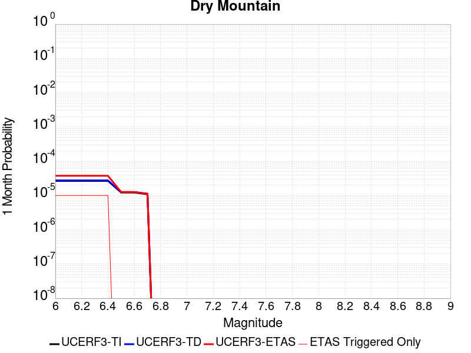 | 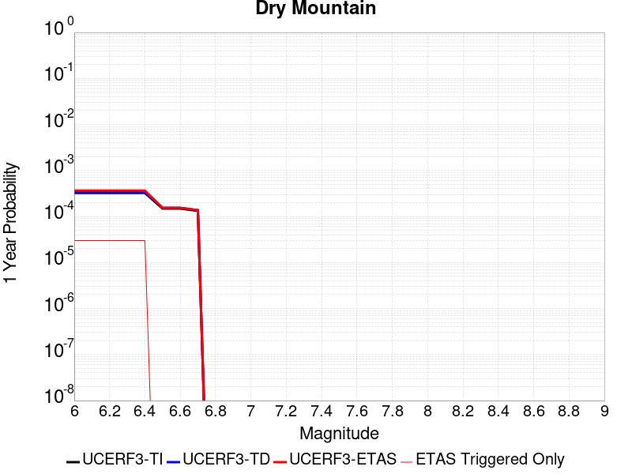 | 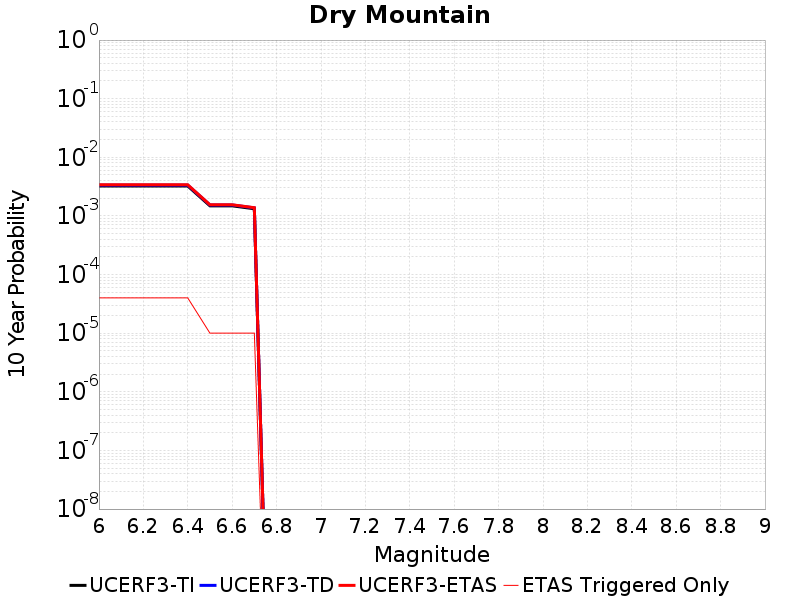 |

| Magnitude | 1 wk TI Prob | 1 wk TD Prob | 1 wk ETAS Prob | 1 wk ETAS/TD Gain | 1 wk ETAS Triggered Only | 1 mo TI Prob | 1 mo TD Prob | 1 mo ETAS Prob | 1 mo ETAS/TD Gain | 1 mo ETAS Triggered Only | 1 yr TI Prob | 1 yr TD Prob | 1 yr ETAS Prob | 1 yr ETAS/TD Gain | 1 yr ETAS Triggered Only | 10 yr TI Prob | 10 yr TD Prob | 10 yr ETAS Prob | 10 yr ETAS/TD Gain | 10 yr ETAS Triggered Only |
|-----|-----|-----|-----|-----|-----|-----|-----|-----|-----|-----|-----|-----|-----|-----|-----|-----|-----|-----|-----|-----|
| 6.0 | 6.222801E-6 | 6.439406E-6 | 6.439406E-6 | 1.0 | 0.0 | 2.6668875E-5 | 2.7597254E-5 | 3.7596976E-5 | 1.3623449 | 1.0E-5 | 3.2464517E-4 | 3.3596068E-4 | 3.659506E-4 | 1.0892662 | 3.0E-5 | 0.0032417132 | 0.0033560898 | 0.0033959555 | 1.0118786 | 4.0E-5 |
| 6.1 | 6.222801E-6 | 6.439406E-6 | 6.439406E-6 | 1.0 | 0.0 | 2.6668875E-5 | 2.7597254E-5 | 3.7596976E-5 | 1.3623449 | 1.0E-5 | 3.2464517E-4 | 3.3596068E-4 | 3.659506E-4 | 1.0892662 | 3.0E-5 | 0.0032417132 | 0.0033560898 | 0.0033959555 | 1.0118786 | 4.0E-5 |
| 6.2 | 6.222801E-6 | 6.439406E-6 | 6.439406E-6 | 1.0 | 0.0 | 2.6668875E-5 | 2.7597254E-5 | 3.7596976E-5 | 1.3623449 | 1.0E-5 | 3.2464517E-4 | 3.3596068E-4 | 3.659506E-4 | 1.0892662 | 3.0E-5 | 0.0032417132 | 0.0033560898 | 0.0033959555 | 1.0118786 | 4.0E-5 |
| 6.3 | 6.222801E-6 | 6.439406E-6 | 6.439406E-6 | 1.0 | 0.0 | 2.6668875E-5 | 2.7597254E-5 | 3.7596976E-5 | 1.3623449 | 1.0E-5 | 3.2464517E-4 | 3.3596068E-4 | 3.659506E-4 | 1.0892662 | 3.0E-5 | 0.0032417132 | 0.0033560898 | 0.0033959555 | 1.0118786 | 4.0E-5 |
| 6.4 | 6.222801E-6 | 6.439406E-6 | 6.439406E-6 | 1.0 | 0.0 | 2.6668875E-5 | 2.7597254E-5 | 3.7596976E-5 | 1.3623449 | 1.0E-5 | 3.2464517E-4 | 3.3596068E-4 | 3.659506E-4 | 1.0892662 | 3.0E-5 | 0.0032417132 | 0.0033560898 | 0.0033959555 | 1.0118786 | 4.0E-5 |
| 6.5 | 2.8528623E-6 | 2.9521798E-6 | 2.9521798E-6 | 1.0 | 0.0 | 1.22264955E-5 | 1.2652187E-5 | 1.2652187E-5 | 1.0 | 0.0 | 1.4884741E-4 | 1.5403819E-4 | 1.5403819E-4 | 1.0 | 0.0 | 0.0014874774 | 0.0015401676 | 0.0015501522 | 1.0064828 | 1.0E-5 |
| 6.6 | 2.8528623E-6 | 2.9521798E-6 | 2.9521798E-6 | 1.0 | 0.0 | 1.22264955E-5 | 1.2652187E-5 | 1.2652187E-5 | 1.0 | 0.0 | 1.4884741E-4 | 1.5403819E-4 | 1.5403819E-4 | 1.0 | 0.0 | 0.0014874774 | 0.0015401676 | 0.0015501522 | 1.0064828 | 1.0E-5 |
| 6.7 | 2.541E-6 | 2.629368E-6 | 2.629368E-6 | 1.0 | 0.0 | 1.0889954E-5 | 1.126872E-5 | 1.126872E-5 | 1.0 | 0.0 | 1.3257713E-4 | 1.3719666E-4 | 1.3719666E-4 | 1.0 | 0.0 | 0.0013249806 | 0.0013719667 | 0.001381953 | 1.0072788 | 1.0E-5 |

## Camp Rock 2011
*[(top)](#table-of-contents)*

| 1 Week | 1 Month | 1 Year | 10 Year |
|-----|-----|-----|-----|
| 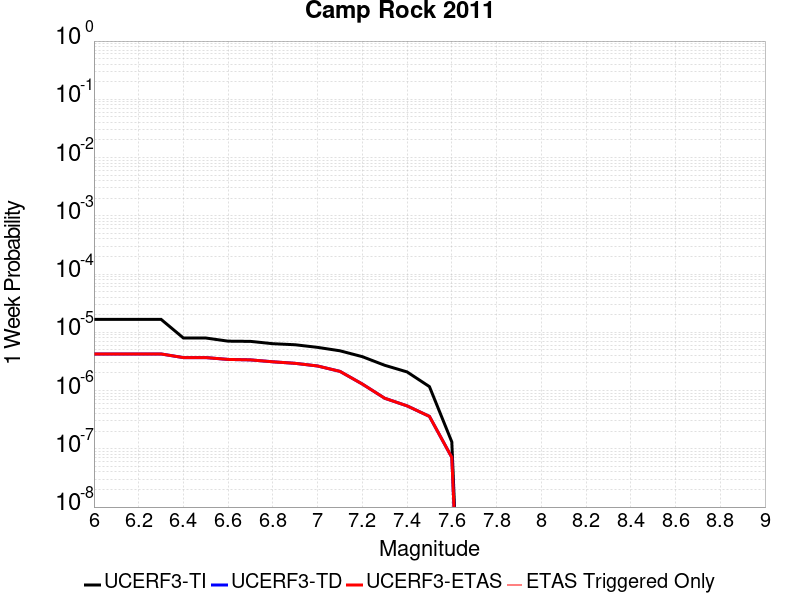 | 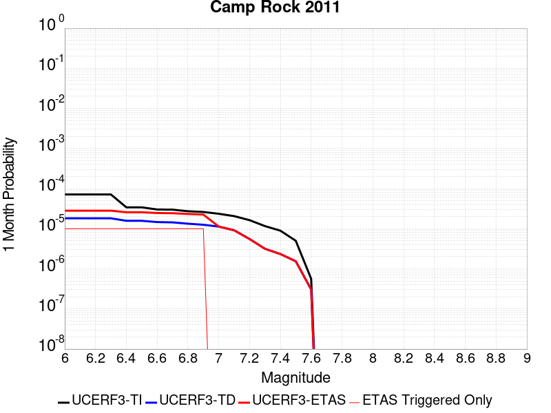 | 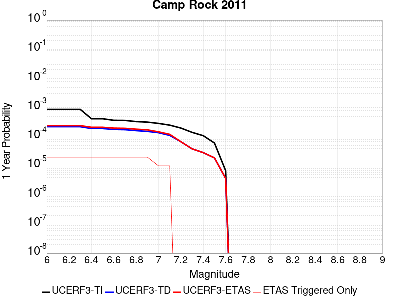 | 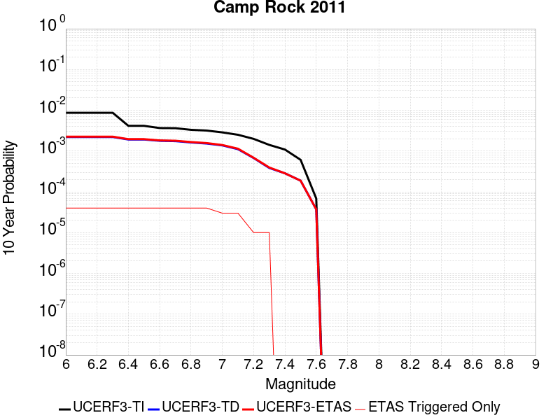 |

| Magnitude | 1 wk TI Prob | 1 wk TD Prob | 1 wk ETAS Prob | 1 wk ETAS/TD Gain | 1 wk ETAS Triggered Only | 1 mo TI Prob | 1 mo TD Prob | 1 mo ETAS Prob | 1 mo ETAS/TD Gain | 1 mo ETAS Triggered Only | 1 yr TI Prob | 1 yr TD Prob | 1 yr ETAS Prob | 1 yr ETAS/TD Gain | 1 yr ETAS Triggered Only | 10 yr TI Prob | 10 yr TD Prob | 10 yr ETAS Prob | 10 yr ETAS/TD Gain | 10 yr ETAS Triggered Only |
|-----|-----|-----|-----|-----|-----|-----|-----|-----|-----|-----|-----|-----|-----|-----|-----|-----|-----|-----|-----|-----|
| 6.0 | 1.6710783E-5 | 4.250303E-6 | 4.250303E-6 | 1.0 | 0.0 | 7.161568E-5 | 1.8215458E-5 | 2.8215276E-5 | 1.5489743 | 1.0E-5 | 8.7157206E-4 | 2.2175116E-4 | 2.4174673E-4 | 1.0901712 | 2.0E-5 | 0.008681616 | 0.002215352 | 0.0022552633 | 1.0180159 | 4.0E-5 |
| 6.1 | 1.6710783E-5 | 4.250303E-6 | 4.250303E-6 | 1.0 | 0.0 | 7.161568E-5 | 1.8215458E-5 | 2.8215276E-5 | 1.5489743 | 1.0E-5 | 8.7157206E-4 | 2.2175116E-4 | 2.4174673E-4 | 1.0901712 | 2.0E-5 | 0.008681616 | 0.002215352 | 0.0022552633 | 1.0180159 | 4.0E-5 |
| 6.2 | 1.6710783E-5 | 4.250303E-6 | 4.250303E-6 | 1.0 | 0.0 | 7.161568E-5 | 1.8215458E-5 | 2.8215276E-5 | 1.5489743 | 1.0E-5 | 8.7157206E-4 | 2.2175116E-4 | 2.4174673E-4 | 1.0901712 | 2.0E-5 | 0.008681616 | 0.002215352 | 0.0022552633 | 1.0180159 | 4.0E-5 |
| 6.3 | 1.6710783E-5 | 4.250303E-6 | 4.250303E-6 | 1.0 | 0.0 | 7.161568E-5 | 1.8215458E-5 | 2.8215276E-5 | 1.5489743 | 1.0E-5 | 8.7157206E-4 | 2.2175116E-4 | 2.4174673E-4 | 1.0901712 | 2.0E-5 | 0.008681616 | 0.002215352 | 0.0022552633 | 1.0180159 | 4.0E-5 |
| 6.4 | 7.982846E-6 | 3.682126E-6 | 3.682126E-6 | 1.0 | 0.0 | 3.421175E-5 | 1.5780446E-5 | 2.5780288E-5 | 1.6336857 | 1.0E-5 | 4.1644843E-4 | 1.9211034E-4 | 2.1210649E-4 | 1.1040869 | 2.0E-5 | 0.0041566887 | 0.0019194775 | 0.0019594007 | 1.020799 | 4.0E-5 |
| 6.5 | 7.982846E-6 | 3.682126E-6 | 3.682126E-6 | 1.0 | 0.0 | 3.421175E-5 | 1.5780446E-5 | 2.5780288E-5 | 1.6336857 | 1.0E-5 | 4.1644843E-4 | 1.9211034E-4 | 2.1210649E-4 | 1.1040869 | 2.0E-5 | 0.0041566887 | 0.0019194775 | 0.0019594007 | 1.020799 | 4.0E-5 |
| 6.6 | 7.048869E-6 | 3.4243928E-6 | 3.4243928E-6 | 1.0 | 0.0 | 3.0209088E-5 | 1.4675889E-5 | 2.4675743E-5 | 1.6813797 | 1.0E-5 | 3.677336E-4 | 1.7866462E-4 | 1.9866104E-4 | 1.1119215 | 2.0E-5 | 0.0036712566 | 0.0017852414 | 0.00182517 | 1.0223659 | 4.0E-5 |
| 6.7 | 6.987307E-6 | 3.36237E-6 | 3.36237E-6 | 1.0 | 0.0 | 2.9945259E-5 | 1.44100795E-5 | 2.4409936E-5 | 1.6939487 | 1.0E-5 | 3.6452254E-4 | 1.7542891E-4 | 1.954254E-4 | 1.1139863 | 2.0E-5 | 0.0036392517 | 0.0017529353 | 0.0017928652 | 1.0227789 | 4.0E-5 |
| 6.8 | 6.3737602E-6 | 3.1179409E-6 | 3.1179409E-6 | 1.0 | 0.0 | 2.731583E-5 | 1.3362537E-5 | 2.3362403E-5 | 1.7483509 | 1.0E-5 | 3.3251947E-4 | 1.6267702E-4 | 1.8267377E-4 | 1.122923 | 2.0E-5 | 0.0033202237 | 0.0016256081 | 0.0016655431 | 1.0245662 | 4.0E-5 |
| 6.9 | 6.112211E-6 | 2.9331475E-6 | 2.9331475E-6 | 1.0 | 0.0 | 2.6194928E-5 | 1.2570573E-5 | 2.2570448E-5 | 1.7954987 | 1.0E-5 | 3.1887658E-4 | 1.5303626E-4 | 1.730332E-4 | 1.1306679 | 2.0E-5 | 0.003184194 | 0.0015293364 | 0.0015692753 | 1.0261152 | 4.0E-5 |
| 7.0 | 5.5140117E-6 | 2.6419511E-6 | 2.6419511E-6 | 1.0 | 0.0 | 2.3631264E-5 | 1.13226E-5 | 1.13226E-5 | 1.0 | 0.0 | 2.8767265E-4 | 1.3784418E-4 | 1.478428E-4 | 1.0725356 | 1.0E-5 | 0.0028730053 | 0.0013776121 | 0.0014075708 | 1.0217468 | 3.0E-5 |
| 7.1 | 4.8151105E-6 | 2.134294E-6 | 2.134294E-6 | 1.0 | 0.0 | 2.0636026E-5 | 9.146944E-6 | 9.146944E-6 | 1.0 | 0.0 | 2.5121463E-4 | 1.1135857E-4 | 1.2135745E-4 | 1.08979 | 1.0E-5 | 0.0025093083 | 0.0011130496 | 0.0011430162 | 1.026923 | 3.0E-5 |
| 7.2 | 3.818335E-6 | 1.2937599E-6 | 1.2937599E-6 | 1.0 | 0.0 | 1.6364189E-5 | 5.5446735E-6 | 5.5446735E-6 | 1.0 | 0.0 | 1.9921579E-4 | 6.750439E-5 | 6.750439E-5 | 1.0 | 0.0 | 0.0019903728 | 6.748471E-4 | 6.848404E-4 | 1.0148082 | 1.0E-5 |
| 7.3 | 2.7166698E-6 | 7.3837094E-7 | 7.3837094E-7 | 1.0 | 0.0 | 1.1642818E-5 | 3.1644431E-6 | 3.1644431E-6 | 1.0 | 0.0 | 1.4174209E-4 | 3.8526436E-5 | 3.8526436E-5 | 1.0 | 0.0 | 0.0014165172 | 3.8519956E-4 | 3.951957E-4 | 1.0259506 | 1.0E-5 |
| 7.4 | 2.0893426E-6 | 5.4619414E-7 | 5.4619414E-7 | 1.0 | 0.0 | 8.954295E-6 | 2.34083E-6 | 2.34083E-6 | 1.0 | 0.0 | 1.0901308E-4 | 2.8499238E-5 | 2.8499238E-5 | 1.0 | 0.0 | 0.0010895962 | 2.8495636E-4 | 2.8495636E-4 | 1.0 | 0.0 |
| 7.5 | 1.1681728E-6 | 3.6031176E-7 | 3.6031176E-7 | 1.0 | 0.0 | 5.0064455E-6 | 1.5441924E-6 | 1.5441924E-6 | 1.0 | 0.0 | 6.0951766E-5 | 1.8800385E-5 | 1.8800385E-5 | 1.0 | 0.0 | 6.093505E-4 | 1.8798841E-4 | 1.8798841E-4 | 1.0 | 0.0 |
| 7.6 | 1.3154387E-7 | 7.119812E-8 | 7.119812E-8 | 1.0 | 0.0 | 5.6375933E-7 | 3.051348E-7 | 3.051348E-7 | 1.0 | 0.0 | 6.863748E-6 | 3.7150114E-6 | 3.7150114E-6 | 1.0 | 0.0 | 6.863536E-5 | 3.714965E-5 | 3.714965E-5 | 1.0 | 0.0 |

## Pisgah-Bullion Mtn-Mesquite Lk
*[(top)](#table-of-contents)*

| 1 Week | 1 Month | 1 Year | 10 Year |
|-----|-----|-----|-----|
| 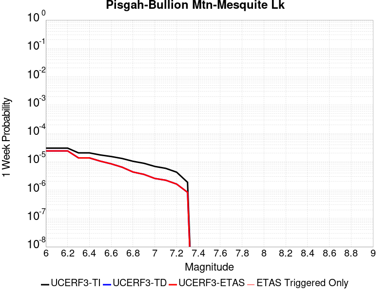 | 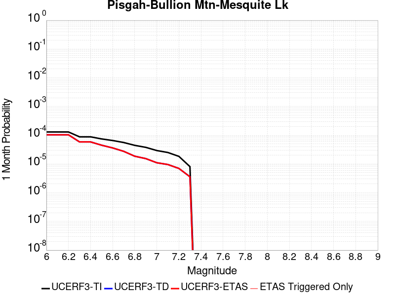 | 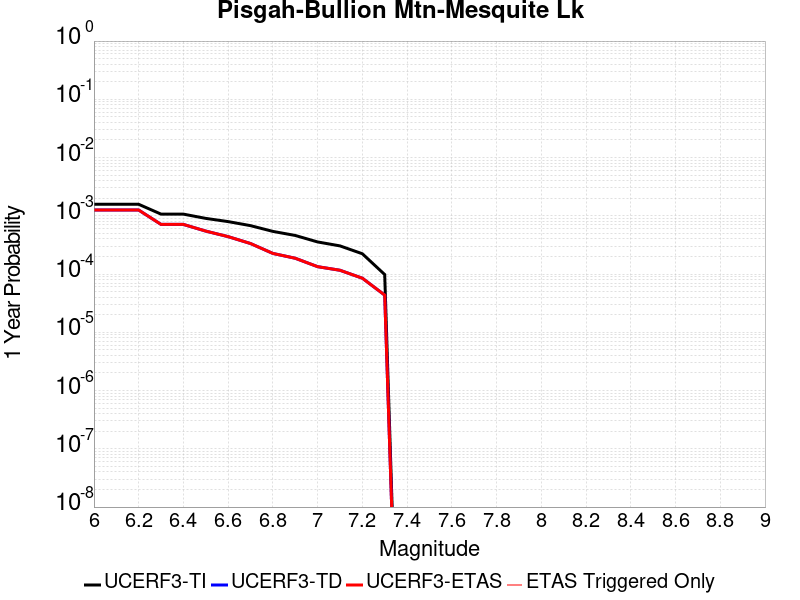 | 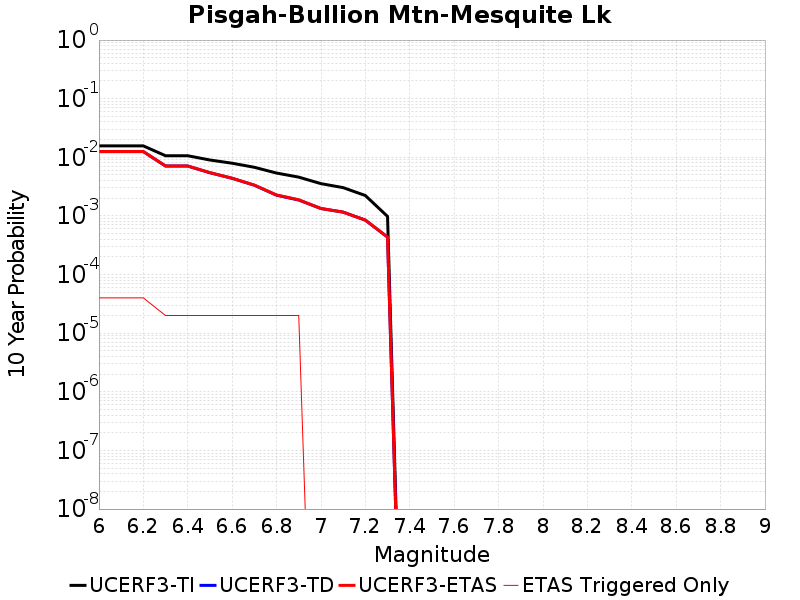 |

| Magnitude | 1 wk TI Prob | 1 wk TD Prob | 1 wk ETAS Prob | 1 wk ETAS/TD Gain | 1 wk ETAS Triggered Only | 1 mo TI Prob | 1 mo TD Prob | 1 mo ETAS Prob | 1 mo ETAS/TD Gain | 1 mo ETAS Triggered Only | 1 yr TI Prob | 1 yr TD Prob | 1 yr ETAS Prob | 1 yr ETAS/TD Gain | 1 yr ETAS Triggered Only | 10 yr TI Prob | 10 yr TD Prob | 10 yr ETAS Prob | 10 yr ETAS/TD Gain | 10 yr ETAS Triggered Only |
|-----|-----|-----|-----|-----|-----|-----|-----|-----|-----|-----|-----|-----|-----|-----|-----|-----|-----|-----|-----|-----|
| 6.0 | 3.0240792E-5 | 2.4091436E-5 | 2.4091436E-5 | 1.0 | 0.0 | 1.2959696E-4 | 1.032455E-4 | 1.032455E-4 | 1.0 | 0.0 | 0.0015767008 | 0.0012563895 | 0.0012563895 | 1.0 | 0.0 | 0.015655609 | 0.012502887 | 0.012542387 | 1.0031593 | 4.0E-5 |
| 6.1 | 3.0240792E-5 | 2.4091436E-5 | 2.4091436E-5 | 1.0 | 0.0 | 1.2959696E-4 | 1.032455E-4 | 1.032455E-4 | 1.0 | 0.0 | 0.0015767008 | 0.0012563895 | 0.0012563895 | 1.0 | 0.0 | 0.015655609 | 0.012502887 | 0.012542387 | 1.0031593 | 4.0E-5 |
| 6.2 | 3.0240792E-5 | 2.4091436E-5 | 2.4091436E-5 | 1.0 | 0.0 | 1.2959696E-4 | 1.032455E-4 | 1.032455E-4 | 1.0 | 0.0 | 0.0015767008 | 0.0012563895 | 0.0012563895 | 1.0 | 0.0 | 0.015655609 | 0.012502887 | 0.012542387 | 1.0031593 | 4.0E-5 |
| 6.3 | 2.0498217E-5 | 1.3638225E-5 | 1.3638225E-5 | 1.0 | 0.0 | 8.784654E-5 | 5.844832E-5 | 5.844832E-5 | 1.0 | 0.0 | 0.0010690069 | 7.1139215E-4 | 7.1139215E-4 | 1.0 | 0.0 | 0.01063879 | 0.0070927753 | 0.0071126334 | 1.0027997 | 2.0E-5 |
| 6.4 | 2.0498217E-5 | 1.3638225E-5 | 1.3638225E-5 | 1.0 | 0.0 | 8.784654E-5 | 5.844832E-5 | 5.844832E-5 | 1.0 | 0.0 | 0.0010690069 | 7.1139215E-4 | 7.1139215E-4 | 1.0 | 0.0 | 0.01063879 | 0.0070927753 | 0.0071126334 | 1.0027997 | 2.0E-5 |
| 6.5 | 1.7316182E-5 | 1.0477156E-5 | 1.0477156E-5 | 1.0 | 0.0 | 7.42101E-5 | 4.4901382E-5 | 4.4901382E-5 | 1.0 | 0.0 | 9.0313336E-4 | 5.4654723E-4 | 5.4654723E-4 | 1.0 | 0.0 | 0.008994718 | 0.005453026 | 0.005472917 | 1.0036477 | 2.0E-5 |
| 6.6 | 1.5251077E-5 | 8.414361E-6 | 8.414361E-6 | 1.0 | 0.0 | 6.536012E-5 | 3.606109E-5 | 3.606109E-5 | 1.0 | 0.0 | 7.9546886E-4 | 4.3896257E-4 | 4.3896257E-4 | 1.0 | 0.0 | 0.007926274 | 0.0043816725 | 0.0044015846 | 1.0045445 | 2.0E-5 |
| 6.7 | 1.2997425E-5 | 6.411561E-6 | 6.411561E-6 | 1.0 | 0.0 | 5.570206E-5 | 2.7477856E-5 | 2.7477856E-5 | 1.0 | 0.0 | 6.7796157E-4 | 3.344962E-4 | 3.344962E-4 | 1.0 | 0.0 | 0.0067589693 | 0.0033403875 | 0.0033603206 | 1.0059674 | 2.0E-5 |
| 6.8 | 1.035386E-5 | 4.333273E-6 | 4.333273E-6 | 1.0 | 0.0 | 4.437293E-5 | 1.8571043E-5 | 1.8571043E-5 | 1.0 | 0.0 | 5.401065E-4 | 2.2607985E-4 | 2.2607985E-4 | 1.0 | 0.0 | 0.0053879567 | 0.0022585853 | 0.0022785403 | 1.0088351 | 2.0E-5 |
| 6.9 | 8.816252E-6 | 3.5806836E-6 | 3.5806836E-6 | 1.0 | 0.0 | 3.778339E-5 | 1.53457E-5 | 1.53457E-5 | 1.0 | 0.0 | 4.5991567E-4 | 1.8681846E-4 | 1.8681846E-4 | 1.0 | 0.0 | 0.00458965 | 0.0018666727 | 0.0018866353 | 1.0106943 | 2.0E-5 |
| 7.0 | 6.8232207E-6 | 2.5676193E-6 | 2.5676193E-6 | 1.0 | 0.0 | 2.9242048E-5 | 1.1004037E-5 | 1.1004037E-5 | 1.0 | 0.0 | 3.5596377E-4 | 1.3396624E-4 | 1.3396624E-4 | 1.0 | 0.0 | 0.0035539411 | 0.0013388859 | 0.0013388859 | 1.0 | 0.0 |
| 7.1 | 5.837013E-6 | 2.22741E-6 | 2.22741E-6 | 1.0 | 0.0 | 2.501553E-5 | 9.54601E-6 | 9.54601E-6 | 1.0 | 0.0 | 3.045215E-4 | 1.1621677E-4 | 1.1621677E-4 | 1.0 | 0.0 | 0.0030410455 | 0.0011615889 | 0.0011615889 | 1.0 | 0.0 |
| 7.2 | 4.278052E-6 | 1.6275925E-6 | 1.6275925E-6 | 1.0 | 0.0 | 1.833438E-5 | 6.975379E-6 | 6.975379E-6 | 1.0 | 0.0 | 2.231982E-4 | 8.492217E-5 | 8.492217E-5 | 1.0 | 0.0 | 0.0022297418 | 8.489204E-4 | 8.489204E-4 | 1.0 | 0.0 |
| 7.3 | 1.8803692E-6 | 8.345021E-7 | 8.345021E-7 | 1.0 | 0.0 | 8.0587E-6 | 3.5764335E-6 | 3.5764335E-6 | 1.0 | 0.0 | 9.811026E-5 | 4.3542354E-5 | 4.3542354E-5 | 1.0 | 0.0 | 9.806695E-4 | 4.353527E-4 | 4.353527E-4 | 1.0 | 0.0 |

## Sheephole
*[(top)](#table-of-contents)*

| 1 Week | 1 Month | 1 Year | 10 Year |
|-----|-----|-----|-----|
| 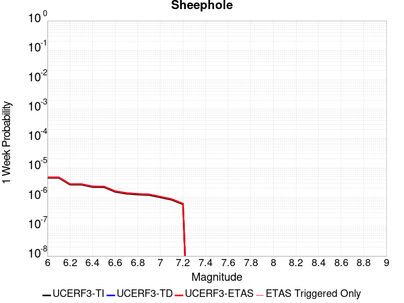 | 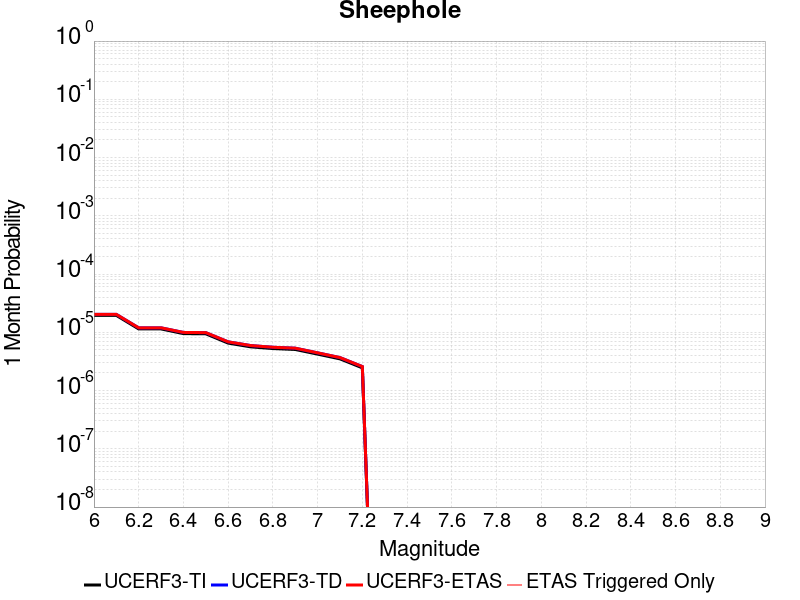 | 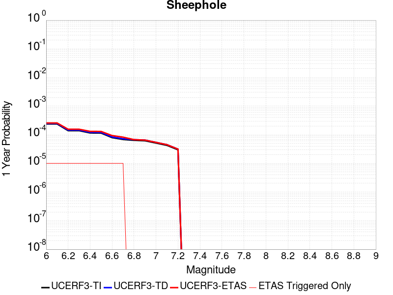 | 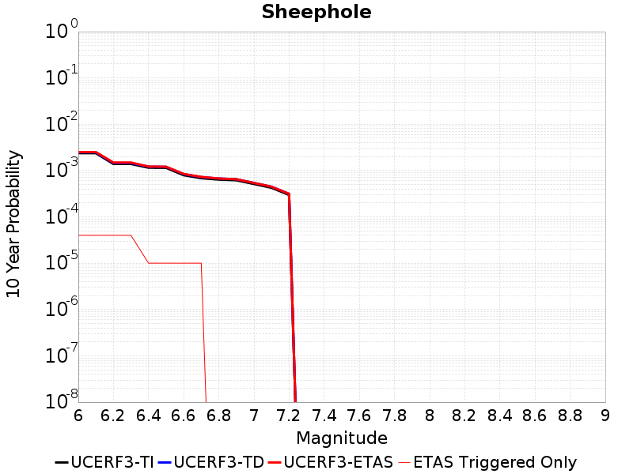 |

| Magnitude | 1 wk TI Prob | 1 wk TD Prob | 1 wk ETAS Prob | 1 wk ETAS/TD Gain | 1 wk ETAS Triggered Only | 1 mo TI Prob | 1 mo TD Prob | 1 mo ETAS Prob | 1 mo ETAS/TD Gain | 1 mo ETAS Triggered Only | 1 yr TI Prob | 1 yr TD Prob | 1 yr ETAS Prob | 1 yr ETAS/TD Gain | 1 yr ETAS Triggered Only | 10 yr TI Prob | 10 yr TD Prob | 10 yr ETAS Prob | 10 yr ETAS/TD Gain | 10 yr ETAS Triggered Only |
|-----|-----|-----|-----|-----|-----|-----|-----|-----|-----|-----|-----|-----|-----|-----|-----|-----|-----|-----|-----|-----|
| 6.0 | 4.5579695E-6 | 4.741284E-6 | 4.741284E-6 | 1.0 | 0.0 | 1.9534009E-5 | 2.0319661E-5 | 2.0319661E-5 | 1.0 | 0.0 | 2.3780059E-4 | 2.4736935E-4 | 2.5736686E-4 | 1.0404154 | 1.0E-5 | 0.0023754628 | 0.0024714842 | 0.0025113854 | 1.0161446 | 4.0E-5 |
| 6.1 | 4.5579695E-6 | 4.741284E-6 | 4.741284E-6 | 1.0 | 0.0 | 1.9534009E-5 | 2.0319661E-5 | 2.0319661E-5 | 1.0 | 0.0 | 2.3780059E-4 | 2.4736935E-4 | 2.5736686E-4 | 1.0404154 | 1.0E-5 | 0.0023754628 | 0.0024714842 | 0.0025113854 | 1.0161446 | 4.0E-5 |
| 6.2 | 2.6677674E-6 | 2.7874082E-6 | 2.7874082E-6 | 1.0 | 0.0 | 1.1433239E-5 | 1.1945986E-5 | 1.1945986E-5 | 1.0 | 0.0 | 1.3919079E-4 | 1.4543376E-4 | 1.5543231E-4 | 1.0687498 | 1.0E-5 | 0.0013910364 | 0.0014534917 | 0.0014934336 | 1.0274799 | 4.0E-5 |
| 6.3 | 2.6677674E-6 | 2.7874082E-6 | 2.7874082E-6 | 1.0 | 0.0 | 1.1433239E-5 | 1.1945986E-5 | 1.1945986E-5 | 1.0 | 0.0 | 1.3919079E-4 | 1.4543376E-4 | 1.5543231E-4 | 1.0687498 | 1.0E-5 | 0.0013910364 | 0.0014534917 | 0.0014934336 | 1.0274799 | 4.0E-5 |
| 6.4 | 2.2159759E-6 | 2.3228913E-6 | 2.3228913E-6 | 1.0 | 0.0 | 9.497005E-6 | 9.955214E-6 | 9.955214E-6 | 1.0 | 0.0 | 1.156199E-4 | 1.21198806E-4 | 1.311976E-4 | 1.082499 | 1.0E-5 | 0.0011555976 | 0.0012114064 | 0.0012213943 | 1.0082449 | 1.0E-5 |
| 6.5 | 2.1986082E-6 | 2.3047714E-6 | 2.3047714E-6 | 1.0 | 0.0 | 9.4225725E-6 | 9.877559E-6 | 9.877559E-6 | 1.0 | 0.0 | 1.1471378E-4 | 1.20253455E-4 | 1.3025226E-4 | 1.0831476 | 1.0E-5 | 0.0011465458 | 0.0012019632 | 0.0012119511 | 1.0083097 | 1.0E-5 |
| 6.6 | 1.5232331E-6 | 1.6019011E-6 | 1.6019011E-6 | 1.0 | 0.0 | 6.5281256E-6 | 6.8652735E-6 | 6.8652735E-6 | 1.0 | 0.0 | 7.947703E-5 | 8.358169E-5 | 9.358085E-5 | 1.1196334 | 1.0E-5 | 7.9448614E-4 | 8.3552126E-4 | 8.455129E-4 | 1.0119586 | 1.0E-5 |
| 6.7 | 1.3137362E-6 | 1.3828271E-6 | 1.3828271E-6 | 1.0 | 0.0 | 5.6302856E-6 | 5.9263893E-6 | 5.9263893E-6 | 1.0 | 0.0 | 6.854657E-5 | 7.2151546E-5 | 8.215082E-5 | 1.1385871 | 1.0E-5 | 6.8525434E-4 | 7.212951E-4 | 7.312879E-4 | 1.0138539 | 1.0E-5 |
| 6.8 | 1.2275751E-6 | 1.2922923E-6 | 1.2922923E-6 | 1.0 | 0.0 | 5.2610258E-6 | 5.5383844E-6 | 5.5383844E-6 | 1.0 | 0.0 | 6.4051106E-5 | 6.742788E-5 | 6.742788E-5 | 1.0 | 0.0 | 6.4032647E-4 | 6.7408755E-4 | 6.7408755E-4 | 1.0 | 0.0 |
| 6.9 | 1.1837088E-6 | 1.2461094E-6 | 1.2461094E-6 | 1.0 | 0.0 | 5.0730278E-6 | 5.3404583E-6 | 5.3404583E-6 | 1.0 | 0.0 | 6.176237E-5 | 6.501828E-5 | 6.501828E-5 | 1.0 | 0.0 | 6.17452E-4 | 6.500057E-4 | 6.500057E-4 | 1.0 | 0.0 |
| 7.0 | 9.849371E-7 | 1.0366349E-6 | 1.0366349E-6 | 1.0 | 0.0 | 4.2211523E-6 | 4.442714E-6 | 4.442714E-6 | 1.0 | 0.0 | 5.1391315E-5 | 5.4088803E-5 | 5.4088803E-5 | 1.0 | 0.0 | 5.137943E-4 | 5.4076646E-4 | 5.4076646E-4 | 1.0 | 0.0 |
| 7.1 | 8.1643645E-7 | 8.591719E-7 | 8.591719E-7 | 1.0 | 0.0 | 3.4990085E-6 | 3.6821607E-6 | 3.6821607E-6 | 1.0 | 0.0 | 4.2599597E-5 | 4.482947E-5 | 4.482947E-5 | 1.0 | 0.0 | 4.259143E-4 | 4.4821293E-4 | 4.4821293E-4 | 1.0 | 0.0 |
| 7.2 | 5.7295756E-7 | 6.029537E-7 | 6.029537E-7 | 1.0 | 0.0 | 2.45553E-6 | 2.5840852E-6 | 2.5840852E-6 | 1.0 | 0.0 | 2.9895667E-5 | 3.146085E-5 | 3.146085E-5 | 1.0 | 0.0 | 2.9891645E-4 | 3.1457067E-4 | 3.1457067E-4 | 1.0 | 0.0 |

## Calaveras (So) 2011 CFM
*[(top)](#table-of-contents)*

| 1 Week | 1 Month | 1 Year | 10 Year |
|-----|-----|-----|-----|
|  | 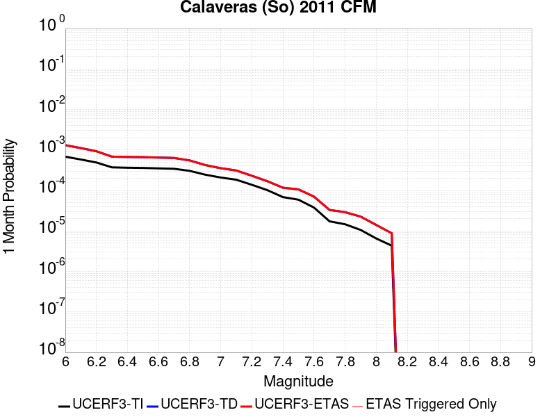 | 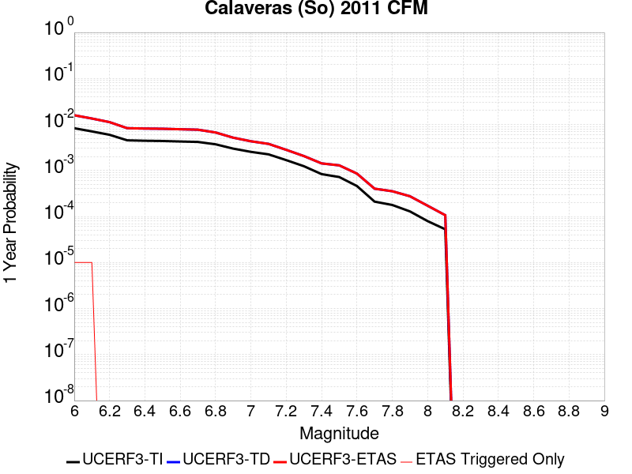 | 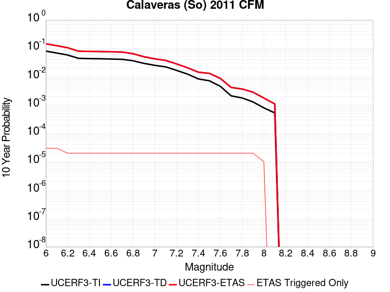 |

| Magnitude | 1 wk TI Prob | 1 wk TD Prob | 1 wk ETAS Prob | 1 wk ETAS/TD Gain | 1 wk ETAS Triggered Only | 1 mo TI Prob | 1 mo TD Prob | 1 mo ETAS Prob | 1 mo ETAS/TD Gain | 1 mo ETAS Triggered Only | 1 yr TI Prob | 1 yr TD Prob | 1 yr ETAS Prob | 1 yr ETAS/TD Gain | 1 yr ETAS Triggered Only | 10 yr TI Prob | 10 yr TD Prob | 10 yr ETAS Prob | 10 yr ETAS/TD Gain | 10 yr ETAS Triggered Only |
|-----|-----|-----|-----|-----|-----|-----|-----|-----|-----|-----|-----|-----|-----|-----|-----|-----|-----|-----|-----|-----|
| 6.0 | 1.5950744E-4 | 3.0718237E-4 | 3.0718237E-4 | 1.0 | 0.0 | 6.834242E-4 | 0.0013158455 | 0.0013158455 | 1.0 | 0.0 | 0.00828899 | 0.015860766 | 0.015870608 | 1.0006205 | 1.0E-5 | 0.079865426 | 0.14441578 | 0.14444144 | 1.0001777 | 3.0E-5 |
| 6.1 | 1.3584697E-4 | 2.6042512E-4 | 2.6042512E-4 | 1.0 | 0.0 | 5.8207137E-4 | 0.0011156471 | 0.0011156471 | 1.0 | 0.0 | 0.007063716 | 0.013463739 | 0.013473604 | 1.0007328 | 1.0E-5 | 0.06843361 | 0.12404335 | 0.12406963 | 1.0002118 | 3.0E-5 |
| 6.2 | 1.14676266E-4 | 2.1730852E-4 | 2.1730852E-4 | 1.0 | 0.0 | 4.9137714E-4 | 9.310044E-4 | 9.310044E-4 | 1.0 | 0.0 | 0.0059661185 | 0.011247103 | 0.011247103 | 1.0 | 0.0 | 0.058084648 | 0.10503382 | 0.105051726 | 1.0001705 | 2.0E-5 |
| 6.3 | 8.691518E-5 | 1.5990486E-4 | 1.5990486E-4 | 1.0 | 0.0 | 3.7244044E-4 | 6.8512146E-4 | 6.8512146E-4 | 1.0 | 0.0 | 0.004525038 | 0.008302577 | 0.008302577 | 1.0 | 0.0 | 0.044339992 | 0.07934927 | 0.07936768 | 1.0002321 | 2.0E-5 |
| 6.4 | 8.50982E-5 | 1.5696879E-4 | 1.5696879E-4 | 1.0 | 0.0 | 3.646556E-4 | 6.725448E-4 | 6.725448E-4 | 1.0 | 0.0 | 0.0044306475 | 0.008150608 | 0.008150608 | 1.0 | 0.0 | 0.04343345 | 0.07795539 | 0.07797383 | 1.0002365 | 2.0E-5 |
| 6.5 | 8.4062965E-5 | 1.5521432E-4 | 1.5521432E-4 | 1.0 | 0.0 | 3.602201E-4 | 6.6502957E-4 | 6.6502957E-4 | 1.0 | 0.0 | 0.004376863 | 0.008059808 | 0.008059808 | 1.0 | 0.0 | 0.042916555 | 0.077126645 | 0.0771451 | 1.0002394 | 2.0E-5 |
| 6.6 | 8.194716E-5 | 1.515735E-4 | 1.515735E-4 | 1.0 | 0.0 | 3.5115483E-4 | 6.4943393E-4 | 6.4943393E-4 | 1.0 | 0.0 | 0.0042669317 | 0.007871647 | 0.007871647 | 1.0 | 0.0 | 0.04185927 | 0.07541188 | 0.07543037 | 1.0002452 | 2.0E-5 |
| 6.7 | 8.012326E-5 | 1.4825047E-4 | 1.4825047E-4 | 1.0 | 0.0 | 3.433402E-4 | 6.3519995E-4 | 6.3519995E-4 | 1.0 | 0.0 | 0.004172157 | 0.007700137 | 0.007700137 | 1.0 | 0.0 | 0.040946912 | 0.073853984 | 0.07387251 | 1.0002508 | 2.0E-5 |
| 6.8 | 7.119773E-5 | 1.2883509E-4 | 1.2883509E-4 | 1.0 | 0.0 | 3.0509746E-4 | 5.5203366E-4 | 5.5203366E-4 | 1.0 | 0.0 | 0.0037082357 | 0.006697408 | 0.006697408 | 1.0 | 0.0 | 0.036469642 | 0.06469737 | 0.06471608 | 1.0002891 | 2.0E-5 |
| 6.9 | 5.7343088E-5 | 9.920996E-5 | 9.920996E-5 | 1.0 | 0.0 | 2.4573295E-4 | 4.251167E-4 | 4.251167E-4 | 1.0 | 0.0 | 0.0029876942 | 0.0051635955 | 0.0051635955 | 1.0 | 0.0 | 0.02947844 | 0.05051889 | 0.050537877 | 1.0003759 | 2.0E-5 |
| 7.0 | 4.8746577E-5 | 8.2867824E-5 | 8.2867824E-5 | 1.0 | 0.0 | 2.0889717E-4 | 3.5509982E-4 | 3.5509982E-4 | 1.0 | 0.0 | 0.0025403565 | 0.0043148366 | 0.0043148366 | 1.0 | 0.0 | 0.025115121 | 0.042494603 | 0.04251375 | 1.0004506 | 2.0E-5 |
| 7.1 | 4.2998014E-5 | 7.266201E-5 | 7.266201E-5 | 1.0 | 0.0 | 1.8426418E-4 | 3.1137178E-4 | 3.1137178E-4 | 1.0 | 0.0 | 0.002241108 | 0.0037844218 | 0.0037844218 | 1.0 | 0.0 | 0.022186412 | 0.03742944 | 0.037448693 | 1.0005144 | 2.0E-5 |
| 7.2 | 3.221292E-5 | 5.3917975E-5 | 5.3917975E-5 | 1.0 | 0.0 | 1.3804805E-4 | 2.3105672E-4 | 2.3105672E-4 | 1.0 | 0.0 | 0.0016794393 | 0.0028095145 | 0.0028095145 | 1.0 | 0.0 | 0.016668037 | 0.028041996 | 0.028061435 | 1.0006932 | 2.0E-5 |
| 7.3 | 2.3756531E-5 | 3.948306E-5 | 3.948306E-5 | 1.0 | 0.0 | 1.0180973E-4 | 1.6920223E-4 | 1.6920223E-4 | 1.0 | 0.0 | 0.0012388286 | 0.0020581079 | 0.0020581079 | 1.0 | 0.0 | 0.012319452 | 0.02064904 | 0.020668626 | 1.0009485 | 2.0E-5 |
| 7.4 | 1.5997684E-5 | 2.734631E-5 | 2.734631E-5 | 1.0 | 0.0 | 6.8559704E-5 | 1.1719322E-4 | 1.1719322E-4 | 1.0 | 0.0 | 8.343947E-4 | 0.0014258961 | 0.0014258961 | 1.0 | 0.0 | 0.008312687 | 0.0143792005 | 0.014398913 | 1.0013709 | 2.0E-5 |
| 7.5 | 1.3814293E-5 | 2.4787894E-5 | 2.4787894E-5 | 1.0 | 0.0 | 5.9202768E-5 | 1.0622952E-4 | 1.0622952E-4 | 1.0 | 0.0 | 7.205553E-4 | 0.0012925795 | 0.0012925795 | 1.0 | 0.0 | 0.007182234 | 0.013058337 | 0.013078077 | 1.0015116 | 2.0E-5 |
| 7.6 | 8.817309E-6 | 1.6434315E-5 | 1.6434315E-5 | 1.0 | 0.0 | 3.7787922E-5 | 7.0430884E-5 | 7.0430884E-5 | 1.0 | 0.0 | 4.5997082E-4 | 8.5716E-4 | 8.5716E-4 | 1.0 | 0.0 | 0.004590199 | 0.008722053 | 0.008741879 | 1.0022731 | 2.0E-5 |
| 7.7 | 4.0352206E-6 | 7.7102795E-6 | 7.7102795E-6 | 1.0 | 0.0 | 1.7293689E-5 | 3.3043638E-5 | 3.3043638E-5 | 1.0 | 0.0 | 2.1053031E-4 | 4.022321E-4 | 4.022321E-4 | 1.0 | 0.0 | 0.0021033096 | 0.0041666524 | 0.0041865692 | 1.00478 | 2.0E-5 |
| 7.8 | 3.413169E-6 | 6.7898595E-6 | 6.7898595E-6 | 1.0 | 0.0 | 1.4627784E-5 | 2.9099074E-5 | 2.9099074E-5 | 1.0 | 0.0 | 1.7807873E-4 | 3.5422368E-4 | 3.5422368E-4 | 1.0 | 0.0 | 0.0017793609 | 0.0036677702 | 0.0036876968 | 1.005433 | 2.0E-5 |
| 7.9 | 2.4740732E-6 | 5.2810565E-6 | 5.2810565E-6 | 1.0 | 0.0 | 1.06031275E-5 | 2.2632903E-5 | 2.2632903E-5 | 1.0 | 0.0 | 1.2908543E-4 | 2.755208E-4 | 2.755208E-4 | 1.0 | 0.0 | 0.0012901047 | 0.0028357273 | 0.0028556706 | 1.0070329 | 2.0E-5 |
| 8.0 | 1.5231818E-6 | 3.2899934E-6 | 3.2899934E-6 | 1.0 | 0.0 | 6.527906E-6 | 1.4099895E-5 | 1.4099895E-5 | 1.0 | 0.0 | 7.9474354E-5 | 1.7165275E-4 | 1.7165275E-4 | 1.0 | 0.0 | 7.944594E-4 | 0.0017569988 | 0.0017669812 | 1.0056815 | 1.0E-5 |
| 8.1 | 1.0104524E-6 | 2.0464593E-6 | 2.0464593E-6 | 1.0 | 0.0 | 4.330503E-6 | 8.77051E-6 | 8.77051E-6 | 1.0 | 0.0 | 5.2722597E-5 | 1.06775755E-4 | 1.06775755E-4 | 1.0 | 0.0 | 5.271009E-4 | 0.0010933182 | 0.0010933182 | 1.0 | 0.0 |

## San Juan
*[(top)](#table-of-contents)*

| 1 Week | 1 Month | 1 Year | 10 Year |
|-----|-----|-----|-----|
| 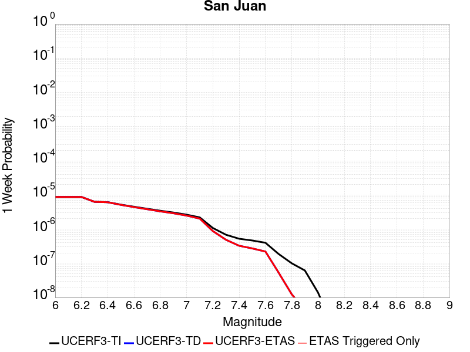 | 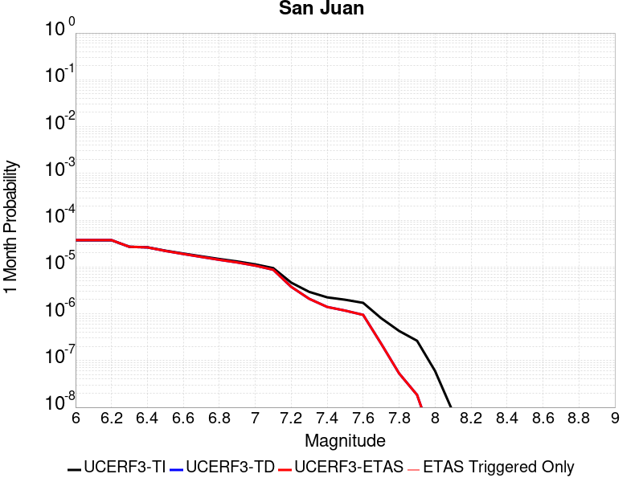 | 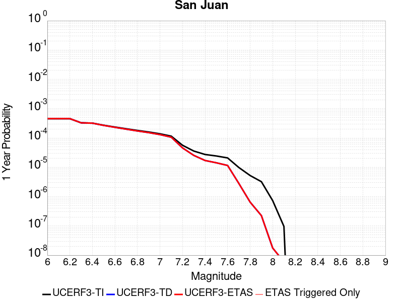 | 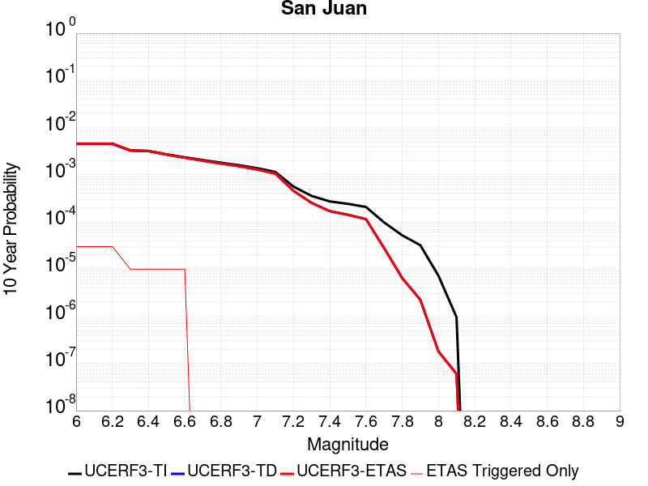 |

| Magnitude | 1 wk TI Prob | 1 wk TD Prob | 1 wk ETAS Prob | 1 wk ETAS/TD Gain | 1 wk ETAS Triggered Only | 1 mo TI Prob | 1 mo TD Prob | 1 mo ETAS Prob | 1 mo ETAS/TD Gain | 1 mo ETAS Triggered Only | 1 yr TI Prob | 1 yr TD Prob | 1 yr ETAS Prob | 1 yr ETAS/TD Gain | 1 yr ETAS Triggered Only | 10 yr TI Prob | 10 yr TD Prob | 10 yr ETAS Prob | 10 yr ETAS/TD Gain | 10 yr ETAS Triggered Only |
|-----|-----|-----|-----|-----|-----|-----|-----|-----|-----|-----|-----|-----|-----|-----|-----|-----|-----|-----|-----|-----|
| 6.0 | 8.682808E-6 | 8.749497E-6 | 8.749497E-6 | 1.0 | 0.0 | 3.72115E-5 | 3.749733E-5 | 3.749733E-5 | 1.0 | 0.0 | 4.5295584E-4 | 4.5643921E-4 | 4.5643921E-4 | 1.0 | 0.0 | 0.004520337 | 0.0045555583 | 0.0045854216 | 1.0065553 | 3.0E-5 |
| 6.1 | 8.682808E-6 | 8.749497E-6 | 8.749497E-6 | 1.0 | 0.0 | 3.72115E-5 | 3.749733E-5 | 3.749733E-5 | 1.0 | 0.0 | 4.5295584E-4 | 4.5643921E-4 | 4.5643921E-4 | 1.0 | 0.0 | 0.004520337 | 0.0045555583 | 0.0045854216 | 1.0065553 | 3.0E-5 |
| 6.2 | 8.682808E-6 | 8.749497E-6 | 8.749497E-6 | 1.0 | 0.0 | 3.72115E-5 | 3.749733E-5 | 3.749733E-5 | 1.0 | 0.0 | 4.5295584E-4 | 4.5643921E-4 | 4.5643921E-4 | 1.0 | 0.0 | 0.004520337 | 0.0045555583 | 0.0045854216 | 1.0065553 | 3.0E-5 |
| 6.3 | 6.3054235E-6 | 6.282908E-6 | 6.282908E-6 | 1.0 | 0.0 | 2.7022963E-5 | 2.6926478E-5 | 2.6926478E-5 | 1.0 | 0.0 | 3.2895492E-4 | 3.2778198E-4 | 3.2778198E-4 | 1.0 | 0.0 | 0.003284684 | 0.0032731849 | 0.0032831524 | 1.0030451 | 1.0E-5 |
| 6.4 | 6.1490473E-6 | 6.1147443E-6 | 6.1147443E-6 | 1.0 | 0.0 | 2.6352795E-5 | 2.6205791E-5 | 2.6205791E-5 | 1.0 | 0.0 | 3.2079802E-4 | 3.1901017E-4 | 3.1901017E-4 | 1.0 | 0.0 | 0.0032033534 | 0.0031857188 | 0.003195687 | 1.003129 | 1.0E-5 |
| 6.5 | 5.204848E-6 | 5.1375027E-6 | 5.1375027E-6 | 1.0 | 0.0 | 2.23063E-5 | 2.201769E-5 | 2.201769E-5 | 1.0 | 0.0 | 2.7154534E-4 | 2.6803336E-4 | 2.6803336E-4 | 1.0 | 0.0 | 0.0027121378 | 0.0026772548 | 0.002687228 | 1.0037252 | 1.0E-5 |
| 6.6 | 4.5179986E-6 | 4.4152316E-6 | 4.4152316E-6 | 1.0 | 0.0 | 1.9362706E-5 | 1.8922288E-5 | 1.8922288E-5 | 1.0 | 0.0 | 2.3571544E-4 | 2.303553E-4 | 2.303553E-4 | 1.0 | 0.0 | 0.0023546559 | 0.0023013023 | 0.0023112793 | 1.0043354 | 1.0E-5 |
| 6.7 | 3.9442616E-6 | 3.8200083E-6 | 3.8200083E-6 | 1.0 | 0.0 | 1.6903869E-5 | 1.6371365E-5 | 1.6371365E-5 | 1.0 | 0.0 | 2.0578515E-4 | 1.993038E-4 | 1.993038E-4 | 1.0 | 0.0 | 0.002055947 | 0.0019913756 | 0.0019913756 | 1.0 | 0.0 |
| 6.8 | 3.4536245E-6 | 3.316508E-6 | 3.316508E-6 | 1.0 | 0.0 | 1.4801163E-5 | 1.4213531E-5 | 1.4213531E-5 | 1.0 | 0.0 | 1.8018926E-4 | 1.7303662E-4 | 1.7303662E-4 | 1.0 | 0.0 | 0.0018004322 | 0.0017291377 | 0.0017291377 | 1.0 | 0.0 |
| 6.9 | 3.059865E-6 | 2.9121964E-6 | 2.9121964E-6 | 1.0 | 0.0 | 1.3113641E-5 | 1.2480785E-5 | 1.2480785E-5 | 1.0 | 0.0 | 1.596469E-4 | 1.5194353E-4 | 1.5194353E-4 | 1.0 | 0.0 | 0.0015953224 | 0.0015185111 | 0.0015185111 | 1.0 | 0.0 |
| 7.0 | 2.6504351E-6 | 2.492156E-6 | 2.492156E-6 | 1.0 | 0.0 | 1.1358958E-5 | 1.0680627E-5 | 1.0680627E-5 | 1.0 | 0.0 | 1.3828653E-4 | 1.3002942E-4 | 1.3002942E-4 | 1.0 | 0.0 | 0.0013820052 | 0.0012996453 | 0.0012996453 | 1.0 | 0.0 |
| 7.1 | 2.2039317E-6 | 2.033957E-6 | 2.033957E-6 | 1.0 | 0.0 | 9.445387E-6 | 8.716932E-6 | 8.716932E-6 | 1.0 | 0.0 | 1.1499152E-4 | 1.06124004E-4 | 1.06124004E-4 | 1.0 | 0.0 | 0.0011493203 | 0.0010608432 | 0.0010608432 | 1.0 | 0.0 |
| 7.2 | 1.0786707E-6 | 8.7712823E-7 | 8.7712823E-7 | 1.0 | 0.0 | 4.622866E-6 | 3.7591153E-6 | 3.7591153E-6 | 1.0 | 0.0 | 5.628194E-5 | 4.576628E-5 | 4.576628E-5 | 1.0 | 0.0 | 5.6267687E-4 | 4.576276E-4 | 4.576276E-4 | 1.0 | 0.0 |
| 7.3 | 6.846433E-7 | 4.8694943E-7 | 4.8694943E-7 | 1.0 | 0.0 | 2.9341822E-6 | 2.0869245E-6 | 2.0869245E-6 | 1.0 | 0.0 | 3.5723086E-5 | 2.540801E-5 | 2.540801E-5 | 1.0 | 0.0 | 3.571734E-4 | 2.540846E-4 | 2.540846E-4 | 1.0 | 0.0 |
| 7.4 | 5.23043E-7 | 3.2633272E-7 | 3.2633272E-7 | 1.0 | 0.0 | 2.2416111E-6 | 1.3985681E-6 | 1.3985681E-6 | 1.0 | 0.0 | 2.7291273E-5 | 1.7027434E-5 | 1.7027434E-5 | 1.0 | 0.0 | 2.7287923E-4 | 1.7029323E-4 | 1.7029323E-4 | 1.0 | 0.0 |
| 7.5 | 4.648444E-7 | 2.7239344E-7 | 2.7239344E-7 | 1.0 | 0.0 | 1.9921886E-6 | 1.1673999E-6 | 1.1673999E-6 | 1.0 | 0.0 | 2.4254627E-5 | 1.4213001E-5 | 1.4213001E-5 | 1.0 | 0.0 | 2.425198E-4 | 1.4215054E-4 | 1.4215054E-4 | 1.0 | 0.0 |
| 7.6 | 3.9906567E-7 | 2.2086832E-7 | 2.2086832E-7 | 1.0 | 0.0 | 1.7102802E-6 | 9.465781E-7 | 9.465781E-7 | 1.0 | 0.0 | 2.0822463E-5 | 1.1524528E-5 | 1.1524528E-5 | 1.0 | 0.0 | 2.0820512E-4 | 1.15263916E-4 | 1.15263916E-4 | 1.0 | 0.0 |
| 7.7 | 1.8784601E-7 | 5.3679994E-8 | 5.3679994E-8 | 1.0 | 0.0 | 8.0505407E-7 | 2.3005711E-7 | 2.3005711E-7 | 1.0 | 0.0 | 9.80149E-6 | 2.8009417E-6 | 2.8009417E-6 | 1.0 | 0.0 | 9.801057E-5 | 2.801812E-5 | 2.801812E-5 | 1.0 | 0.0 |
| 7.8 | 1.00154914E-7 | 1.2420028E-8 | 1.2420028E-8 | 1.0 | 0.0 | 4.2923529E-7 | 5.32287E-8 | 5.32287E-8 | 1.0 | 0.0 | 5.225927E-6 | 6.4805926E-7 | 6.4805926E-7 | 1.0 | 0.0 | 5.225804E-5 | 6.4864707E-6 | 6.4864707E-6 | 1.0 | 0.0 |
| 7.9 | 6.171429E-8 | 4.2987898E-9 | 4.2987898E-9 | 1.0 | 0.0 | 2.6448978E-7 | 1.8423398E-8 | 1.8423398E-8 | 1.0 | 0.0 | 3.2201583E-6 | 2.2430486E-7 | 2.2430486E-7 | 1.0 | 0.0 | 3.2201115E-5 | 2.2483434E-6 | 2.2483434E-6 | 1.0 | 0.0 |
| 8.0 | 1.3974572E-8 | 3.3827885E-10 | 3.3827885E-10 | 1.0 | 0.0 | 5.989102E-8 | 1.449771E-9 | 1.449771E-9 | 1.0 | 0.0 | 7.2917294E-7 | 1.7650956E-8 | 1.7650956E-8 | 1.0 | 0.0 | 7.2917055E-6 | 1.8081614E-7 | 1.8081614E-7 | 1.0 | 0.0 |
| 8.1 | 1.8403477E-9 | 1.13126175E-10 | 1.13126175E-10 | 1.0 | 0.0 | 7.887204E-9 | 4.848283E-10 | 4.848283E-10 | 1.0 | 0.0 | 9.602671E-8 | 5.9027823E-9 | 5.9027823E-9 | 1.0 | 0.0 | 9.602667E-7 | 6.027219E-8 | 6.027219E-8 | 1.0 | 0.0 |

## Bullion Mountains
*[(top)](#table-of-contents)*

| 1 Week | 1 Month | 1 Year | 10 Year |
|-----|-----|-----|-----|
| 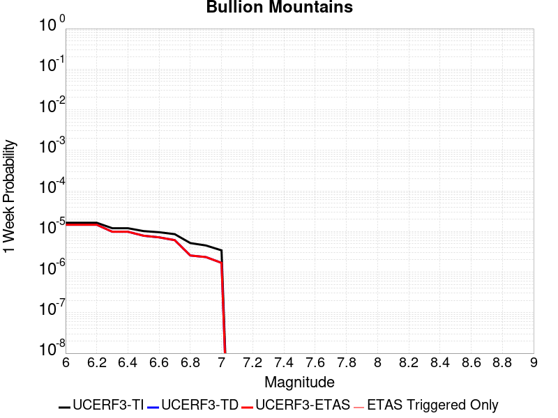 | 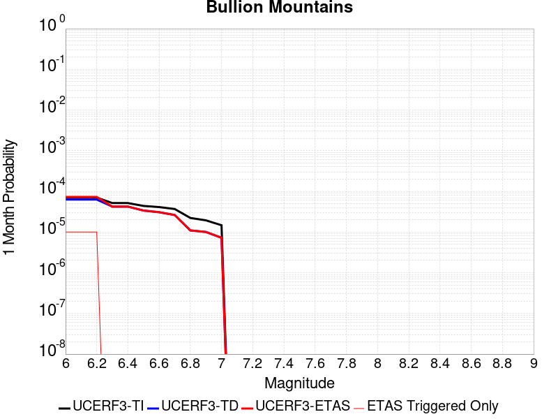 | 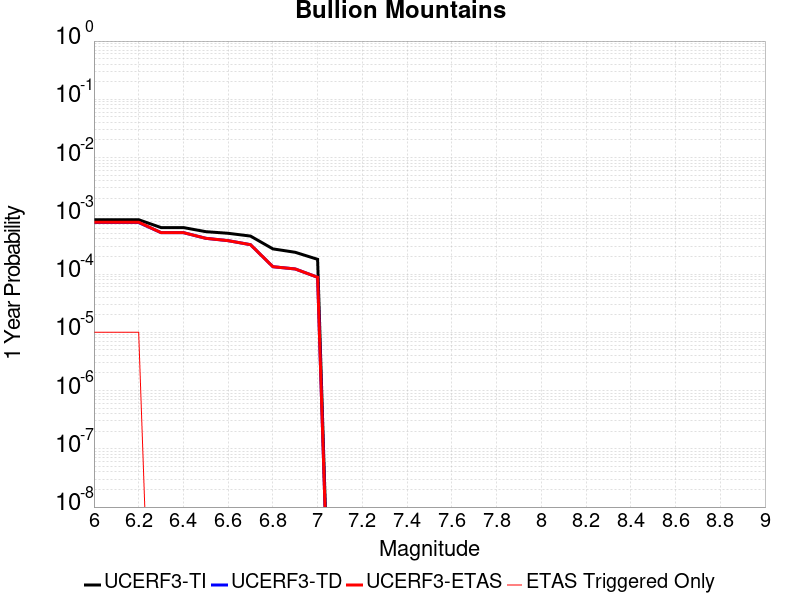 | 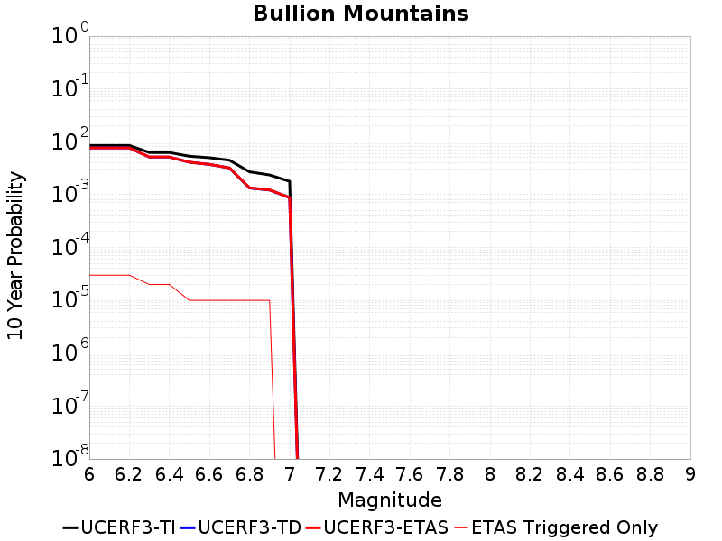 |

| Magnitude | 1 wk TI Prob | 1 wk TD Prob | 1 wk ETAS Prob | 1 wk ETAS/TD Gain | 1 wk ETAS Triggered Only | 1 mo TI Prob | 1 mo TD Prob | 1 mo ETAS Prob | 1 mo ETAS/TD Gain | 1 mo ETAS Triggered Only | 1 yr TI Prob | 1 yr TD Prob | 1 yr ETAS Prob | 1 yr ETAS/TD Gain | 1 yr ETAS Triggered Only | 10 yr TI Prob | 10 yr TD Prob | 10 yr ETAS Prob | 10 yr ETAS/TD Gain | 10 yr ETAS Triggered Only |
|-----|-----|-----|-----|-----|-----|-----|-----|-----|-----|-----|-----|-----|-----|-----|-----|-----|-----|-----|-----|-----|
| 6.0 | 1.6420427E-5 | 1.4692272E-5 | 1.4692272E-5 | 1.0 | 0.0 | 7.037136E-5 | 6.296558E-5 | 7.296495E-5 | 1.1588069 | 1.0E-5 | 8.5643446E-4 | 7.6637464E-4 | 7.76367E-4 | 1.0130384 | 1.0E-5 | 0.008531413 | 0.0076411106 | 0.0076708817 | 1.0038961 | 3.0E-5 |
| 6.1 | 1.6420427E-5 | 1.4692272E-5 | 1.4692272E-5 | 1.0 | 0.0 | 7.037136E-5 | 6.296558E-5 | 7.296495E-5 | 1.1588069 | 1.0E-5 | 8.5643446E-4 | 7.6637464E-4 | 7.76367E-4 | 1.0130384 | 1.0E-5 | 0.008531413 | 0.0076411106 | 0.0076708817 | 1.0038961 | 3.0E-5 |
| 6.2 | 1.6420427E-5 | 1.4692272E-5 | 1.4692272E-5 | 1.0 | 0.0 | 7.037136E-5 | 6.296558E-5 | 7.296495E-5 | 1.1588069 | 1.0E-5 | 8.5643446E-4 | 7.6637464E-4 | 7.76367E-4 | 1.0130384 | 1.0E-5 | 0.008531413 | 0.0076411106 | 0.0076708817 | 1.0038961 | 3.0E-5 |
| 6.3 | 1.2046778E-5 | 9.862461E-6 | 9.862461E-6 | 1.0 | 0.0 | 5.1628023E-5 | 4.2267136E-5 | 4.2267136E-5 | 1.0 | 0.0 | 6.283899E-4 | 5.145041E-4 | 5.145041E-4 | 1.0 | 0.0 | 0.0062661595 | 0.0051354105 | 0.0051553077 | 1.0038745 | 2.0E-5 |
| 6.4 | 1.2046778E-5 | 9.862461E-6 | 9.862461E-6 | 1.0 | 0.0 | 5.1628023E-5 | 4.2267136E-5 | 4.2267136E-5 | 1.0 | 0.0 | 6.283899E-4 | 5.145041E-4 | 5.145041E-4 | 1.0 | 0.0 | 0.0062661595 | 0.0051354105 | 0.0051553077 | 1.0038745 | 2.0E-5 |
| 6.5 | 1.0244343E-5 | 7.879562E-6 | 7.879562E-6 | 1.0 | 0.0 | 4.390359E-5 | 3.3769233E-5 | 3.3769233E-5 | 1.0 | 0.0 | 5.343951E-4 | 4.110835E-4 | 4.110835E-4 | 1.0 | 0.0 | 0.005331118 | 0.004105262 | 0.004115221 | 1.0024259 | 1.0E-5 |
| 6.6 | 9.605408E-6 | 7.1775926E-6 | 7.1775926E-6 | 1.0 | 0.0 | 4.1165385E-5 | 3.0760864E-5 | 3.0760864E-5 | 1.0 | 0.0 | 5.010733E-4 | 3.744695E-4 | 3.744695E-4 | 1.0 | 0.0 | 0.00499945 | 0.0037403821 | 0.0037503447 | 1.0026635 | 1.0E-5 |
| 6.7 | 8.60418E-6 | 6.1240885E-6 | 6.1240885E-6 | 1.0 | 0.0 | 3.687454E-5 | 2.624594E-5 | 2.624594E-5 | 1.0 | 0.0 | 4.48855E-4 | 3.1951696E-4 | 3.1951696E-4 | 1.0 | 0.0 | 0.004479495 | 0.0031924876 | 0.0032024556 | 1.0031223 | 1.0E-5 |
| 6.8 | 5.187994E-6 | 2.5632112E-6 | 2.5632112E-6 | 1.0 | 0.0 | 2.223407E-5 | 1.0985167E-5 | 1.0985167E-5 | 1.0 | 0.0 | 2.7066618E-4 | 1.3374019E-4 | 1.3374019E-4 | 1.0 | 0.0 | 0.0027033675 | 0.0013369886 | 0.0013469753 | 1.0074695 | 1.0E-5 |
| 6.9 | 4.5302368E-6 | 2.3443552E-6 | 2.3443552E-6 | 1.0 | 0.0 | 1.9415156E-5 | 1.004722E-5 | 1.004722E-5 | 1.0 | 0.0 | 2.3635388E-4 | 1.22322E-4 | 1.22322E-4 | 1.0 | 0.0 | 0.0023610266 | 0.0012229359 | 0.0012329236 | 1.008167 | 1.0E-5 |
| 7.0 | 3.431668E-6 | 1.6882701E-6 | 1.6882701E-6 | 1.0 | 0.0 | 1.4707065E-5 | 7.2354433E-6 | 7.2354433E-6 | 1.0 | 0.0 | 1.7904381E-4 | 8.8091525E-5 | 8.8091525E-5 | 1.0 | 0.0 | 0.0017889962 | 8.809152E-4 | 8.809152E-4 | 1.0 | 0.0 |

## Rinconada 2011 CFM
*[(top)](#table-of-contents)*

| 1 Week | 1 Month | 1 Year | 10 Year |
|-----|-----|-----|-----|
| 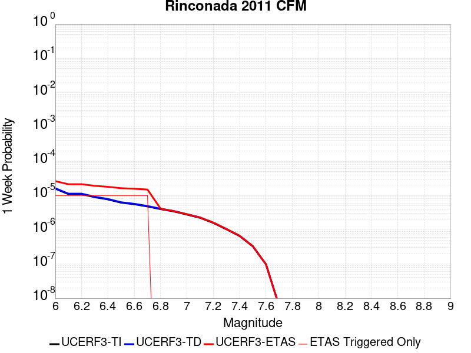 | 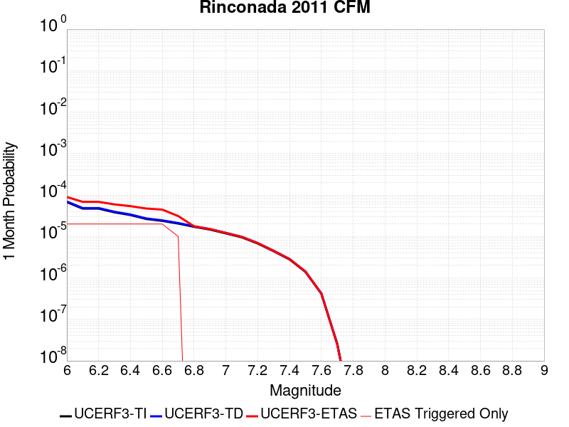 | 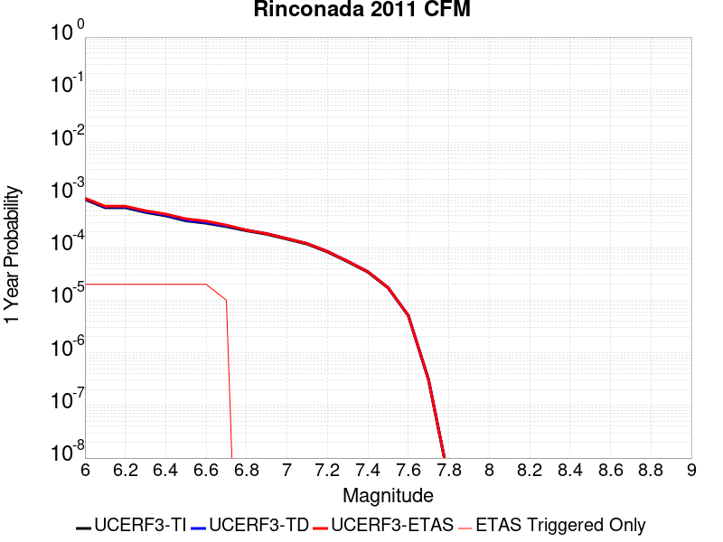 | 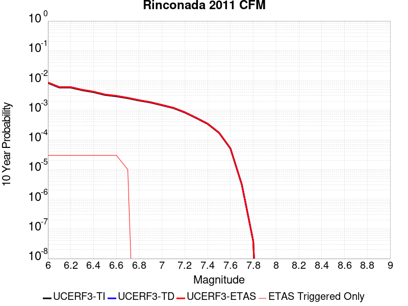 |

| Magnitude | 1 wk TI Prob | 1 wk TD Prob | 1 wk ETAS Prob | 1 wk ETAS/TD Gain | 1 wk ETAS Triggered Only | 1 mo TI Prob | 1 mo TD Prob | 1 mo ETAS Prob | 1 mo ETAS/TD Gain | 1 mo ETAS Triggered Only | 1 yr TI Prob | 1 yr TD Prob | 1 yr ETAS Prob | 1 yr ETAS/TD Gain | 1 yr ETAS Triggered Only | 10 yr TI Prob | 10 yr TD Prob | 10 yr ETAS Prob | 10 yr ETAS/TD Gain | 10 yr ETAS Triggered Only |
|-----|-----|-----|-----|-----|-----|-----|-----|-----|-----|-----|-----|-----|-----|-----|-----|-----|-----|-----|-----|-----|
| 6.0 | 1.5752368E-5 | 1.6274776E-5 | 2.6274614E-5 | 1.6144378 | 1.0E-5 | 6.75084E-5 | 6.974719E-5 | 8.97458E-5 | 1.2867299 | 2.0E-5 | 8.2160486E-4 | 8.488444E-4 | 8.688274E-4 | 1.0235415 | 2.0E-5 | 0.008185739 | 0.0084564015 | 0.008486148 | 1.0035176 | 3.0E-5 |
| 6.1 | 1.0966133E-5 | 1.1323071E-5 | 2.1322958E-5 | 1.8831427 | 1.0E-5 | 4.6996865E-5 | 4.8526545E-5 | 6.852557E-5 | 1.4121256 | 2.0E-5 | 5.720366E-4 | 5.906513E-4 | 6.1063946E-4 | 1.0338409 | 2.0E-5 | 0.0057056635 | 0.0058909105 | 0.005920734 | 1.0050626 | 3.0E-5 |
| 6.2 | 1.0966133E-5 | 1.1323071E-5 | 2.1322958E-5 | 1.8831427 | 1.0E-5 | 4.6996865E-5 | 4.8526545E-5 | 6.852557E-5 | 1.4121256 | 2.0E-5 | 5.720366E-4 | 5.906513E-4 | 6.1063946E-4 | 1.0338409 | 2.0E-5 | 0.0057056635 | 0.0058909105 | 0.005920734 | 1.0050626 | 3.0E-5 |
| 6.3 | 8.926149E-6 | 9.212805E-6 | 1.9212714E-5 | 2.0854359 | 1.0E-5 | 3.8254362E-5 | 3.9482853E-5 | 5.9482063E-5 | 1.506529 | 2.0E-5 | 4.6564735E-4 | 4.8059804E-4 | 5.0058844E-4 | 1.0415949 | 2.0E-5 | 0.0046467283 | 0.004795632 | 0.0048254877 | 1.0062257 | 3.0E-5 |
| 6.4 | 7.676955E-6 | 7.920219E-6 | 1.792014E-5 | 2.2625813 | 1.0E-5 | 3.290082E-5 | 3.3943357E-5 | 5.3942676E-5 | 1.5891969 | 2.0E-5 | 4.0049385E-4 | 4.1318216E-4 | 4.331739E-4 | 1.0483848 | 2.0E-5 | 0.0039977287 | 0.004124166 | 0.004154042 | 1.0072442 | 3.0E-5 |
| 6.5 | 6.1671026E-6 | 6.3589773E-6 | 1.6358914E-5 | 2.5725698 | 1.0E-5 | 2.6430173E-5 | 2.7252476E-5 | 4.725193E-5 | 1.7338583 | 2.0E-5 | 3.2173982E-4 | 3.3174845E-4 | 3.5174182E-4 | 1.0602666 | 2.0E-5 | 0.003212744 | 0.0033125442 | 0.0033424448 | 1.0090265 | 3.0E-5 |
| 6.6 | 5.553456E-6 | 5.7248326E-6 | 1.5724776E-5 | 2.746766 | 1.0E-5 | 2.3800309E-5 | 2.4534766E-5 | 4.4534274E-5 | 1.8151498 | 2.0E-5 | 2.897302E-4 | 2.9866988E-4 | 3.1866392E-4 | 1.0669435 | 2.0E-5 | 0.0028935277 | 0.0029826935 | 0.003012604 | 1.010028 | 3.0E-5 |
| 6.7 | 4.787857E-6 | 4.9333266E-6 | 1.4933277E-5 | 3.0270197 | 1.0E-5 | 2.0519226E-5 | 2.1142656E-5 | 3.1142445E-5 | 1.4729675 | 1.0E-5 | 2.4979294E-4 | 2.5738147E-4 | 2.673789E-4 | 1.0388428 | 1.0E-5 | 0.0024951235 | 0.0025708396 | 0.0025808138 | 1.0038798 | 1.0E-5 |
| 6.8 | 3.9955166E-6 | 4.11349E-6 | 4.11349E-6 | 1.0 | 0.0 | 1.7123532E-5 | 1.7629123E-5 | 1.7629123E-5 | 1.0 | 0.0 | 2.0845905E-4 | 2.1461346E-4 | 2.1461346E-4 | 1.0 | 0.0 | 0.002082636 | 0.0021440657 | 0.0021440657 | 1.0 | 0.0 |
| 6.9 | 3.4250072E-6 | 3.5224577E-6 | 3.5224577E-6 | 1.0 | 0.0 | 1.46785205E-5 | 1.50961605E-5 | 1.50961605E-5 | 1.0 | 0.0 | 1.7869633E-4 | 1.8378027E-4 | 1.8378027E-4 | 1.0 | 0.0 | 0.001785527 | 0.0018362853 | 0.0018362853 | 1.0 | 0.0 |
| 7.0 | 2.7712713E-6 | 2.8467089E-6 | 2.8467089E-6 | 1.0 | 0.0 | 1.1876823E-5 | 1.2200124E-5 | 1.2200124E-5 | 1.0 | 0.0 | 1.4459073E-4 | 1.485264E-4 | 1.485264E-4 | 1.0 | 0.0 | 0.0014449668 | 0.0014842729 | 0.0014842729 | 1.0 | 0.0 |
| 7.1 | 2.227358E-6 | 2.2857055E-6 | 2.2857055E-6 | 1.0 | 0.0 | 9.545785E-6 | 9.795844E-6 | 9.795844E-6 | 1.0 | 0.0 | 1.16213734E-4 | 1.1925787E-4 | 1.1925787E-4 | 1.0 | 0.0 | 0.0011615298 | 0.0011919398 | 0.0011919398 | 1.0 | 0.0 |
| 7.2 | 1.581796E-6 | 1.6209059E-6 | 1.6209059E-6 | 1.0 | 0.0 | 6.779108E-6 | 6.946721E-6 | 6.946721E-6 | 1.0 | 0.0 | 8.253252E-5 | 8.457305E-5 | 8.457305E-5 | 1.0 | 0.0 | 8.250187E-4 | 8.454092E-4 | 8.454092E-4 | 1.0 | 0.0 |
| 7.3 | 1.0306567E-6 | 1.0546506E-6 | 1.0546506E-6 | 1.0 | 0.0 | 4.4170924E-6 | 4.5199236E-6 | 4.5199236E-6 | 1.0 | 0.0 | 5.3776774E-5 | 5.5028682E-5 | 5.5028682E-5 | 1.0 | 0.0 | 5.376376E-4 | 5.501508E-4 | 5.501508E-4 | 1.0 | 0.0 |
| 7.4 | 6.535541E-7 | 6.682761E-7 | 6.682761E-7 | 1.0 | 0.0 | 2.800943E-6 | 2.8640372E-6 | 2.8640372E-6 | 1.0 | 0.0 | 3.4100947E-5 | 3.4869096E-5 | 3.4869096E-5 | 1.0 | 0.0 | 3.4095717E-4 | 3.4863636E-4 | 3.4863636E-4 | 1.0 | 0.0 |
| 7.5 | 3.2656962E-7 | 3.331678E-7 | 3.331678E-7 | 1.0 | 0.0 | 1.3995833E-6 | 1.4278612E-6 | 1.4278612E-6 | 1.0 | 0.0 | 1.7039794E-5 | 1.7384073E-5 | 1.7384073E-5 | 1.0 | 0.0 | 1.7038487E-4 | 1.7382717E-4 | 1.7382717E-4 | 1.0 | 0.0 |
| 7.6 | 9.754343E-8 | 9.821017E-8 | 9.821017E-8 | 1.0 | 0.0 | 4.180432E-7 | 4.2090068E-7 | 4.2090068E-7 | 1.0 | 0.0 | 5.089664E-6 | 5.1244538E-6 | 5.1244538E-6 | 1.0 | 0.0 | 5.0895473E-5 | 5.1243365E-5 | 5.1243365E-5 | 1.0 | 0.0 |
| 7.7 | 6.0001453E-9 | 5.8490657E-9 | 5.8490657E-9 | 1.0 | 0.0 | 2.5714908E-8 | 2.5067424E-8 | 2.5067424E-8 | 1.0 | 0.0 | 3.1307894E-7 | 3.0519584E-7 | 3.0519584E-7 | 1.0 | 0.0 | 3.1307852E-6 | 3.0519543E-6 | 3.0519543E-6 | 1.0 | 0.0 |
| 7.8 | 7.400003E-11 | 7.4654505E-11 | 7.4654505E-11 | 1.0 | 0.0 | 3.171432E-10 | 3.1994796E-10 | 3.1994796E-10 | 1.0 | 0.0 | 3.861218E-9 | 3.895367E-9 | 3.895367E-9 | 1.0 | 0.0 | 3.861218E-8 | 3.895367E-8 | 3.895367E-8 | 1.0 | 0.0 |

## Great Valley 03a Dunnigan Hills
*[(top)](#table-of-contents)*

| 1 Week | 1 Month | 1 Year | 10 Year |
|-----|-----|-----|-----|
| 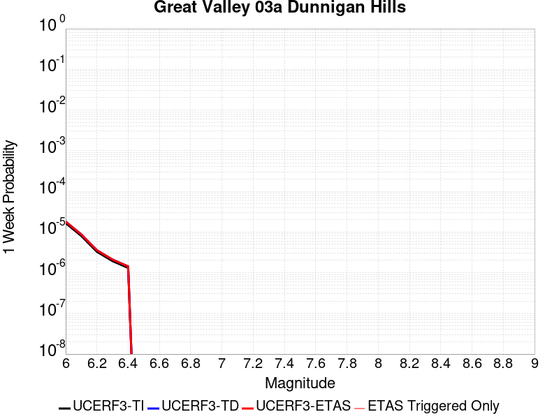 | 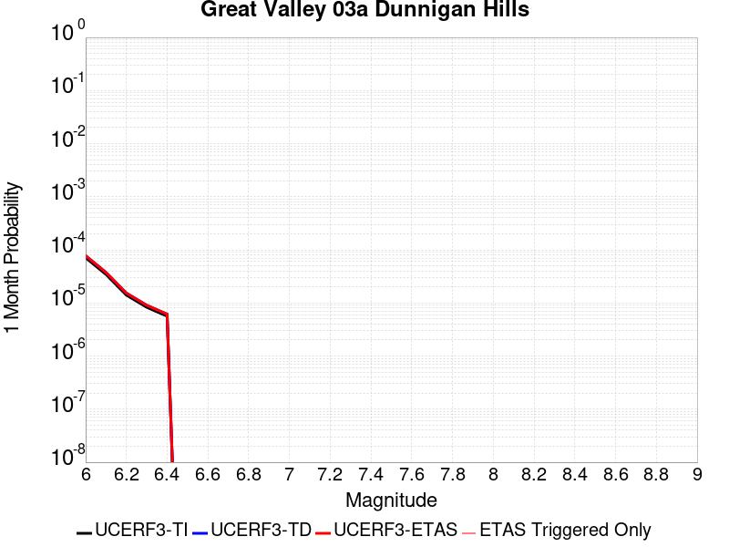 | 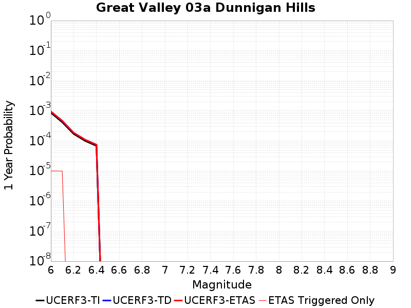 | 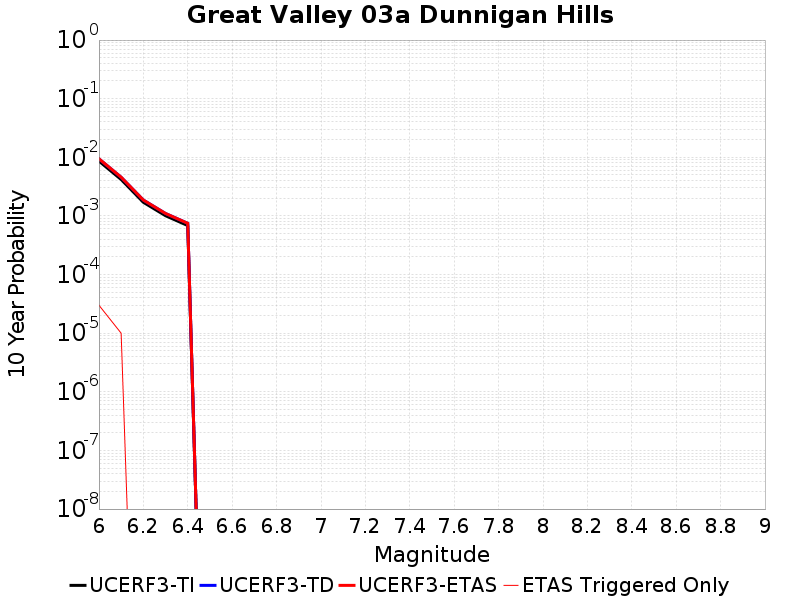 |

| Magnitude | 1 wk TI Prob | 1 wk TD Prob | 1 wk ETAS Prob | 1 wk ETAS/TD Gain | 1 wk ETAS Triggered Only | 1 mo TI Prob | 1 mo TD Prob | 1 mo ETAS Prob | 1 mo ETAS/TD Gain | 1 mo ETAS Triggered Only | 1 yr TI Prob | 1 yr TD Prob | 1 yr ETAS Prob | 1 yr ETAS/TD Gain | 1 yr ETAS Triggered Only | 10 yr TI Prob | 10 yr TD Prob | 10 yr ETAS Prob | 10 yr ETAS/TD Gain | 10 yr ETAS Triggered Only |
|-----|-----|-----|-----|-----|-----|-----|-----|-----|-----|-----|-----|-----|-----|-----|-----|-----|-----|-----|-----|-----|
| 6.0 | 1.6591328E-5 | 1.810814E-5 | 1.810814E-5 | 1.0 | 0.0 | 7.110376E-5 | 7.760439E-5 | 7.760439E-5 | 1.0 | 0.0 | 8.6534437E-4 | 9.4449305E-4 | 9.544836E-4 | 1.0105777 | 1.0E-5 | 0.008619824 | 0.009411621 | 0.0094413385 | 1.0031575 | 3.0E-5 |
| 6.1 | 8.041125E-6 | 8.769815E-6 | 8.769815E-6 | 1.0 | 0.0 | 3.4461507E-5 | 3.7584497E-5 | 3.7584497E-5 | 1.0 | 0.0 | 4.194881E-4 | 4.5751547E-4 | 4.6751092E-4 | 1.0218471 | 1.0E-5 | 0.004186971 | 0.004567733 | 0.0045776875 | 1.0021793 | 1.0E-5 |
| 6.2 | 3.2807004E-6 | 3.5796054E-6 | 3.5796054E-6 | 1.0 | 0.0 | 1.4060069E-5 | 1.5341098E-5 | 1.5341098E-5 | 1.0 | 0.0 | 1.7116789E-4 | 1.8676603E-4 | 1.8676603E-4 | 1.0 | 0.0 | 0.0017103611 | 0.0018664987 | 0.0018664987 | 1.0 | 0.0 |
| 6.3 | 1.9339366E-6 | 2.1104022E-6 | 2.1104022E-6 | 1.0 | 0.0 | 8.288273E-6 | 9.044566E-6 | 9.044566E-6 | 1.0 | 0.0 | 1.00905054E-4 | 1.1011488E-4 | 1.1011488E-4 | 1.0 | 0.0 | 0.0010085925 | 0.0011008831 | 0.0011008831 | 1.0 | 0.0 |
| 6.4 | 1.3142635E-6 | 1.4340012E-6 | 1.4340012E-6 | 1.0 | 0.0 | 5.6325457E-6 | 6.1457195E-6 | 6.1457195E-6 | 1.0 | 0.0 | 6.857408E-5 | 7.482414E-5 | 7.482414E-5 | 1.0 | 0.0 | 6.8552926E-4 | 7.482414E-4 | 7.482414E-4 | 1.0 | 0.0 |

## Santa Ynez River
*[(top)](#table-of-contents)*

| 1 Week | 1 Month | 1 Year | 10 Year |
|-----|-----|-----|-----|
| 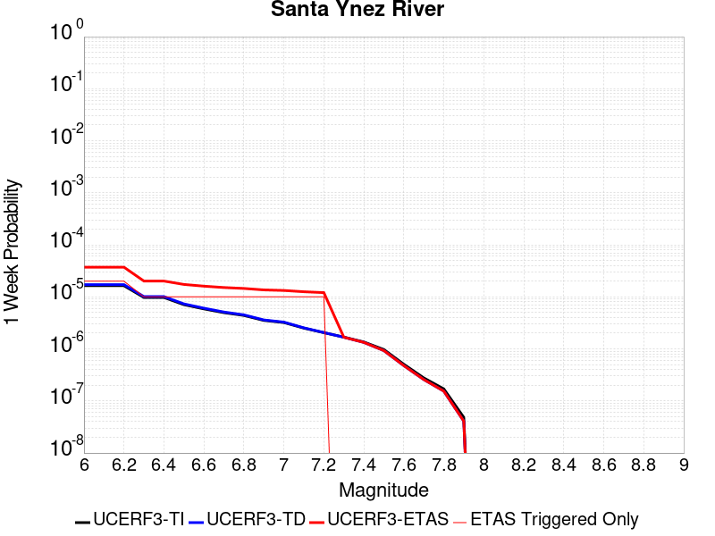 | 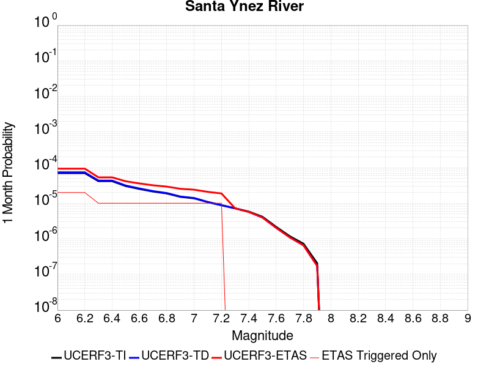 | 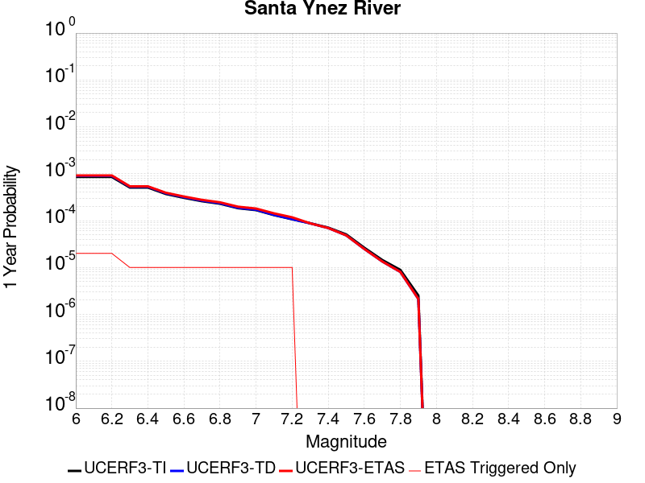 | 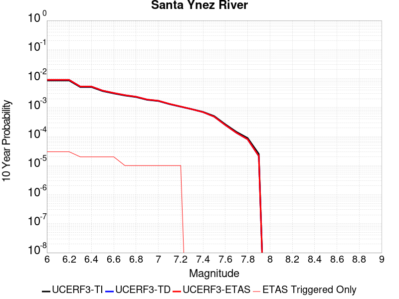 |

| Magnitude | 1 wk TI Prob | 1 wk TD Prob | 1 wk ETAS Prob | 1 wk ETAS/TD Gain | 1 wk ETAS Triggered Only | 1 mo TI Prob | 1 mo TD Prob | 1 mo ETAS Prob | 1 mo ETAS/TD Gain | 1 mo ETAS Triggered Only | 1 yr TI Prob | 1 yr TD Prob | 1 yr ETAS Prob | 1 yr ETAS/TD Gain | 1 yr ETAS Triggered Only | 10 yr TI Prob | 10 yr TD Prob | 10 yr ETAS Prob | 10 yr ETAS/TD Gain | 10 yr ETAS Triggered Only |
|-----|-----|-----|-----|-----|-----|-----|-----|-----|-----|-----|-----|-----|-----|-----|-----|-----|-----|-----|-----|-----|
| 6.0 | 1.6396456E-5 | 1.7209544E-5 | 3.72092E-5 | 2.1621258 | 2.0E-5 | 7.026863E-5 | 7.3753305E-5 | 9.3751834E-5 | 1.2711543 | 2.0E-5 | 8.551848E-4 | 8.9761213E-4 | 9.175942E-4 | 1.0222614 | 2.0E-5 | 0.0085190125 | 0.008943414 | 0.008973146 | 1.0033244 | 3.0E-5 |
| 6.1 | 1.6396456E-5 | 1.7209544E-5 | 3.72092E-5 | 2.1621258 | 2.0E-5 | 7.026863E-5 | 7.3753305E-5 | 9.3751834E-5 | 1.2711543 | 2.0E-5 | 8.551848E-4 | 8.9761213E-4 | 9.175942E-4 | 1.0222614 | 2.0E-5 | 0.0085190125 | 0.008943414 | 0.008973146 | 1.0033244 | 3.0E-5 |
| 6.2 | 1.6396456E-5 | 1.7209544E-5 | 3.72092E-5 | 2.1621258 | 2.0E-5 | 7.026863E-5 | 7.3753305E-5 | 9.3751834E-5 | 1.2711543 | 2.0E-5 | 8.551848E-4 | 8.9761213E-4 | 9.175942E-4 | 1.0222614 | 2.0E-5 | 0.0085190125 | 0.008943414 | 0.008973146 | 1.0033244 | 3.0E-5 |
| 6.3 | 9.736976E-6 | 1.0122388E-5 | 2.0122287E-5 | 1.9878992 | 1.0E-5 | 4.172923E-5 | 4.338097E-5 | 5.3380536E-5 | 1.2305058 | 1.0E-5 | 5.0793495E-4 | 5.280403E-4 | 5.38035E-4 | 1.0189279 | 1.0E-5 | 0.005067755 | 0.005268362 | 0.005288257 | 1.0037762 | 2.0E-5 |
| 6.4 | 9.736976E-6 | 1.0122388E-5 | 2.0122287E-5 | 1.9878992 | 1.0E-5 | 4.172923E-5 | 4.338097E-5 | 5.3380536E-5 | 1.2305058 | 1.0E-5 | 5.0793495E-4 | 5.280403E-4 | 5.38035E-4 | 1.0189279 | 1.0E-5 | 0.005067755 | 0.005268362 | 0.005288257 | 1.0037762 | 2.0E-5 |
| 6.5 | 7.081964E-6 | 7.329938E-6 | 1.7329865E-5 | 2.364258 | 1.0E-5 | 3.035092E-5 | 3.141365E-5 | 4.1413336E-5 | 1.3183229 | 1.0E-5 | 3.694598E-4 | 3.8239566E-4 | 3.9239184E-4 | 1.0261409 | 1.0E-5 | 0.0036884616 | 0.0038175385 | 0.003837462 | 1.005219 | 2.0E-5 |
| 6.6 | 5.873247E-6 | 6.059777E-6 | 1.6059717E-5 | 2.6502156 | 1.0E-5 | 2.5170815E-5 | 2.5970221E-5 | 3.5969962E-5 | 1.3850464 | 1.0E-5 | 3.064116E-4 | 3.1614242E-4 | 3.2613927E-4 | 1.0316213 | 1.0E-5 | 0.0030598943 | 0.0031570143 | 0.003176951 | 1.0063151 | 2.0E-5 |
| 6.7 | 4.973277E-6 | 5.1159304E-6 | 1.5115879E-5 | 2.9546688 | 1.0E-5 | 2.1313872E-5 | 2.1925234E-5 | 3.1925014E-5 | 1.4560854 | 1.0E-5 | 2.5946548E-4 | 2.669075E-4 | 2.7690484E-4 | 1.0374562 | 1.0E-5 | 0.0025916274 | 0.0026659183 | 0.0026758916 | 1.003741 | 1.0E-5 |
| 6.8 | 4.396492E-6 | 4.5110037E-6 | 1.4510959E-5 | 3.2167916 | 1.0E-5 | 1.884197E-5 | 1.9332732E-5 | 2.9332537E-5 | 1.5172474 | 1.0E-5 | 2.2937685E-4 | 2.3535093E-4 | 2.4534858E-4 | 1.0424798 | 1.0E-5 | 0.0022914023 | 0.0023510521 | 0.0023610287 | 1.0042434 | 1.0E-5 |
| 6.9 | 3.5255632E-6 | 3.6013546E-6 | 1.3601319E-5 | 3.776723 | 1.0E-5 | 1.5109469E-5 | 1.5434287E-5 | 2.5434132E-5 | 1.6478981 | 1.0E-5 | 1.8394225E-4 | 1.878964E-4 | 1.9789452E-4 | 1.0532109 | 1.0E-5 | 0.0018379007 | 0.0018773915 | 0.0018873727 | 1.0053165 | 1.0E-5 |
| 7.0 | 3.211603E-6 | 3.2736739E-6 | 1.3273641E-5 | 4.054662 | 1.0E-5 | 1.376394E-5 | 1.4029956E-5 | 2.4029816E-5 | 1.7127506 | 1.0E-5 | 1.6756308E-4 | 1.7080146E-4 | 1.8079976E-4 | 1.0585375 | 1.0E-5 | 0.0016743679 | 0.001706716 | 0.001716699 | 1.0058492 | 1.0E-5 |
| 7.1 | 2.5094619E-6 | 2.5409367E-6 | 1.25409115E-5 | 4.9355464 | 1.0E-5 | 1.0754793E-5 | 1.0889684E-5 | 2.0889574E-5 | 1.9182904 | 1.0E-5 | 1.3093173E-4 | 1.3257388E-4 | 1.4257256E-4 | 1.0754197 | 1.0E-5 | 0.0013085462 | 0.001324954 | 0.0013349408 | 1.0075375 | 1.0E-5 |
| 7.2 | 2.0515774E-6 | 2.0619514E-6 | 1.2061931E-5 | 5.849765 | 1.0E-5 | 8.792445E-6 | 8.836904E-6 | 1.8836816E-5 | 2.131608 | 1.0E-5 | 1.0704277E-4 | 1.0758404E-4 | 1.1758297E-4 | 1.0929406 | 1.0E-5 | 0.0010699122 | 0.0010753239 | 0.0010853132 | 1.0092895 | 1.0E-5 |
| 7.3 | 1.6845745E-6 | 1.6774023E-6 | 1.6774023E-6 | 1.0 | 0.0 | 7.219585E-6 | 7.1888476E-6 | 7.1888476E-6 | 1.0 | 0.0 | 8.78949E-5 | 8.752073E-5 | 8.752073E-5 | 1.0 | 0.0 | 8.7860145E-4 | 8.748655E-4 | 8.748655E-4 | 1.0 | 0.0 |
| 7.4 | 1.3600285E-6 | 1.3333452E-6 | 1.3333452E-6 | 1.0 | 0.0 | 5.82868E-6 | 5.714324E-6 | 5.714324E-6 | 1.0 | 0.0 | 7.096187E-5 | 6.9569694E-5 | 6.9569694E-5 | 1.0 | 0.0 | 7.0939213E-4 | 6.954814E-4 | 6.954814E-4 | 1.0 | 0.0 |
| 7.5 | 9.735342E-7 | 9.2901706E-7 | 9.2901706E-7 | 1.0 | 0.0 | 4.172283E-6 | 3.9814954E-6 | 3.9814954E-6 | 1.0 | 0.0 | 5.079636E-5 | 4.847365E-5 | 4.847365E-5 | 1.0 | 0.0 | 5.0784746E-4 | 4.8463244E-4 | 4.8463244E-4 | 1.0 | 0.0 |
| 7.6 | 5.067187E-7 | 4.778601E-7 | 4.778601E-7 | 1.0 | 0.0 | 2.1716498E-6 | 2.0479702E-6 | 2.0479702E-6 | 1.0 | 0.0 | 2.6439517E-5 | 2.4933759E-5 | 2.4933759E-5 | 1.0 | 0.0 | 2.643637E-4 | 2.4931037E-4 | 2.4931037E-4 | 1.0 | 0.0 |
| 7.7 | 2.769089E-7 | 2.575928E-7 | 2.575928E-7 | 1.0 | 0.0 | 1.1867519E-6 | 1.1039687E-6 | 1.1039687E-6 | 1.0 | 0.0 | 1.4448608E-5 | 1.3440736E-5 | 1.3440736E-5 | 1.0 | 0.0 | 1.444767E-4 | 1.3439926E-4 | 1.3439926E-4 | 1.0 | 0.0 |
| 7.8 | 1.7044663E-7 | 1.5449109E-7 | 1.5449109E-7 | 1.0 | 0.0 | 7.3048534E-7 | 6.621045E-7 | 6.621045E-7 | 1.0 | 0.0 | 8.893623E-6 | 8.061093E-6 | 8.061093E-6 | 1.0 | 0.0 | 8.893267E-5 | 8.060803E-5 | 8.060803E-5 | 1.0 | 0.0 |
| 7.9 | 4.8344287E-8 | 4.091119E-8 | 4.091119E-8 | 1.0 | 0.0 | 2.0718979E-7 | 1.7533364E-7 | 1.7533364E-7 | 1.0 | 0.0 | 2.5225327E-6 | 2.134685E-6 | 2.134685E-6 | 1.0 | 0.0 | 2.5225041E-5 | 2.134665E-5 | 2.134665E-5 | 1.0 | 0.0 |

## Malibu Coast alt 1
*[(top)](#table-of-contents)*

| 1 Week | 1 Month | 1 Year | 10 Year |
|-----|-----|-----|-----|
| 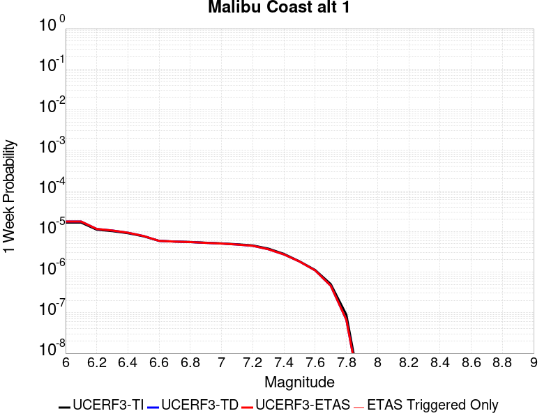 | 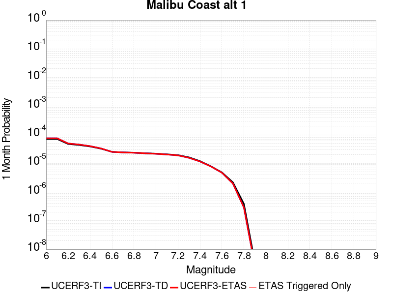 | 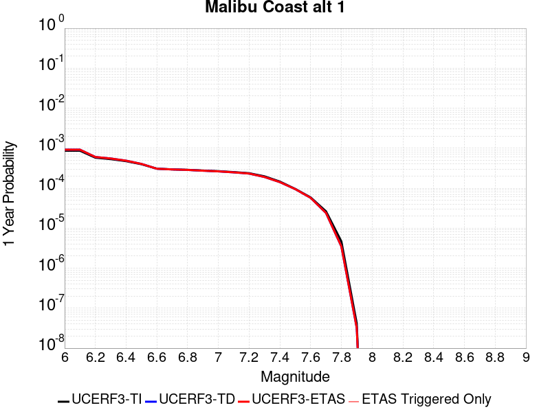 | 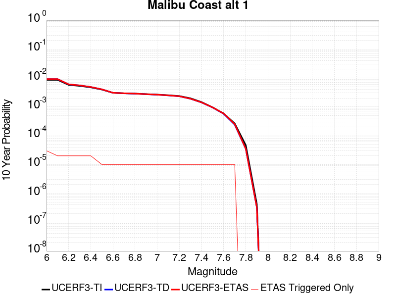 |

| Magnitude | 1 wk TI Prob | 1 wk TD Prob | 1 wk ETAS Prob | 1 wk ETAS/TD Gain | 1 wk ETAS Triggered Only | 1 mo TI Prob | 1 mo TD Prob | 1 mo ETAS Prob | 1 mo ETAS/TD Gain | 1 mo ETAS Triggered Only | 1 yr TI Prob | 1 yr TD Prob | 1 yr ETAS Prob | 1 yr ETAS/TD Gain | 1 yr ETAS Triggered Only | 10 yr TI Prob | 10 yr TD Prob | 10 yr ETAS Prob | 10 yr ETAS/TD Gain | 10 yr ETAS Triggered Only |
|-----|-----|-----|-----|-----|-----|-----|-----|-----|-----|-----|-----|-----|-----|-----|-----|-----|-----|-----|-----|-----|
| 6.0 | 1.6572556E-5 | 1.7598237E-5 | 1.7598237E-5 | 1.0 | 0.0 | 7.102331E-5 | 7.541894E-5 | 7.541894E-5 | 1.0 | 0.0 | 8.6436566E-4 | 9.178577E-4 | 9.178577E-4 | 1.0 | 0.0 | 0.0086101135 | 0.009142601 | 0.009172327 | 1.0032513 | 3.0E-5 |
| 6.1 | 1.6572556E-5 | 1.7598237E-5 | 1.7598237E-5 | 1.0 | 0.0 | 7.102331E-5 | 7.541894E-5 | 7.541894E-5 | 1.0 | 0.0 | 8.6436566E-4 | 9.178577E-4 | 9.178577E-4 | 1.0 | 0.0 | 0.0086101135 | 0.009142601 | 0.009162418 | 1.0021676 | 2.0E-5 |
| 6.2 | 1.1085717E-5 | 1.1557249E-5 | 1.1557249E-5 | 1.0 | 0.0 | 4.750935E-5 | 4.9530146E-5 | 4.9530146E-5 | 1.0 | 0.0 | 5.782728E-4 | 6.0286623E-4 | 6.0286623E-4 | 1.0 | 0.0 | 0.0057677035 | 0.0060126786 | 0.0060325586 | 1.0033063 | 2.0E-5 |
| 6.3 | 1.0208568E-5 | 1.0592329E-5 | 1.0592329E-5 | 1.0 | 0.0 | 4.375027E-5 | 4.539492E-5 | 4.539492E-5 | 1.0 | 0.0 | 5.325294E-4 | 5.5254594E-4 | 5.5254594E-4 | 1.0 | 0.0 | 0.0053125503 | 0.005512029 | 0.0055319187 | 1.0036085 | 2.0E-5 |
| 6.4 | 9.0682315E-6 | 9.342715E-6 | 9.342715E-6 | 1.0 | 0.0 | 3.8863272E-5 | 4.0039606E-5 | 4.0039606E-5 | 1.0 | 0.0 | 4.730576E-4 | 4.873752E-4 | 4.873752E-4 | 1.0 | 0.0 | 0.0047205184 | 0.0048632766 | 0.0048831794 | 1.0040925 | 2.0E-5 |
| 6.5 | 7.605796E-6 | 7.748649E-6 | 7.748649E-6 | 1.0 | 0.0 | 3.259586E-5 | 3.320808E-5 | 3.320808E-5 | 1.0 | 0.0 | 3.9678233E-4 | 4.042347E-4 | 4.042347E-4 | 1.0 | 0.0 | 0.0039607463 | 0.004035132 | 0.0040450916 | 1.0024682 | 1.0E-5 |
| 6.6 | 5.889873E-6 | 5.8795817E-6 | 5.8795817E-6 | 1.0 | 0.0 | 2.5242069E-5 | 2.5197964E-5 | 2.5197964E-5 | 1.0 | 0.0 | 3.0727885E-4 | 3.0674212E-4 | 3.0674212E-4 | 1.0 | 0.0 | 0.003068543 | 0.0030632 | 0.0030731694 | 1.0032545 | 1.0E-5 |
| 6.7 | 5.66586E-6 | 5.6416825E-6 | 5.6416825E-6 | 1.0 | 0.0 | 2.428203E-5 | 2.4178416E-5 | 2.4178416E-5 | 1.0 | 0.0 | 2.955936E-4 | 2.9433254E-4 | 2.9433254E-4 | 1.0 | 0.0 | 0.0029520073 | 0.0029394391 | 0.00294941 | 1.003392 | 1.0E-5 |
| 6.8 | 5.521556E-6 | 5.4894676E-6 | 5.4894676E-6 | 1.0 | 0.0 | 2.3663597E-5 | 2.3526078E-5 | 2.3526078E-5 | 1.0 | 0.0 | 2.880662E-4 | 2.8639243E-4 | 2.8639243E-4 | 1.0 | 0.0 | 0.0028769306 | 0.0028602453 | 0.0028702165 | 1.0034862 | 1.0E-5 |
| 6.9 | 5.29752E-6 | 5.24997E-6 | 5.24997E-6 | 1.0 | 0.0 | 2.270346E-5 | 2.2499678E-5 | 2.2499678E-5 | 1.0 | 0.0 | 2.7637955E-4 | 2.7389923E-4 | 2.7389923E-4 | 1.0 | 0.0 | 0.0027603607 | 0.002735627 | 0.0027455995 | 1.0036454 | 1.0E-5 |
| 7.0 | 5.106743E-6 | 5.047716E-6 | 5.047716E-6 | 1.0 | 0.0 | 2.1885859E-5 | 2.1632888E-5 | 2.1632888E-5 | 1.0 | 0.0 | 2.6642776E-4 | 2.6334866E-4 | 2.6334866E-4 | 1.0 | 0.0 | 0.0026610855 | 0.0026303756 | 0.0026403493 | 1.0037917 | 1.0E-5 |
| 7.1 | 4.8469647E-6 | 4.770408E-6 | 4.770408E-6 | 1.0 | 0.0 | 2.0772539E-5 | 2.0444446E-5 | 2.0444446E-5 | 1.0 | 0.0 | 2.528763E-4 | 2.4888277E-4 | 2.4888277E-4 | 1.0 | 0.0 | 0.0025258875 | 0.0024860485 | 0.0024960237 | 1.0040125 | 1.0E-5 |
| 7.2 | 4.545514E-6 | 4.4482263E-6 | 4.4482263E-6 | 1.0 | 0.0 | 1.9480629E-5 | 1.9063687E-5 | 1.9063687E-5 | 1.0 | 0.0 | 2.3715083E-4 | 2.3207573E-4 | 2.3207573E-4 | 1.0 | 0.0 | 0.0023689792 | 0.0023183413 | 0.002328318 | 1.0043035 | 1.0E-5 |
| 7.3 | 3.794097E-6 | 3.6519607E-6 | 3.6519607E-6 | 1.0 | 0.0 | 1.6260314E-5 | 1.5651167E-5 | 1.5651167E-5 | 1.0 | 0.0 | 1.9795135E-4 | 1.9053632E-4 | 1.9053632E-4 | 1.0 | 0.0 | 0.001977751 | 0.0019037343 | 0.0019137153 | 1.0052428 | 1.0E-5 |
| 7.4 | 2.808217E-6 | 2.7190963E-6 | 2.7190963E-6 | 1.0 | 0.0 | 1.203516E-5 | 1.1653218E-5 | 1.1653218E-5 | 1.0 | 0.0 | 1.4651821E-4 | 1.4186872E-4 | 1.4186872E-4 | 1.0 | 0.0 | 0.0014642165 | 0.0014177843 | 0.00142777 | 1.0070432 | 1.0E-5 |
| 7.5 | 1.83809E-6 | 1.8190827E-6 | 1.8190827E-6 | 1.0 | 0.0 | 7.877505E-6 | 7.796046E-6 | 7.796046E-6 | 1.0 | 0.0 | 9.59044E-5 | 9.4912735E-5 | 9.4912735E-5 | 1.0 | 0.0 | 9.5863023E-4 | 9.4872405E-4 | 9.587146E-4 | 1.0105305 | 1.0E-5 |
| 7.6 | 1.1292672E-6 | 1.1001533E-6 | 1.1001533E-6 | 1.0 | 0.0 | 4.839708E-6 | 4.7149347E-6 | 4.7149347E-6 | 1.0 | 0.0 | 5.8921847E-5 | 5.740283E-5 | 5.740283E-5 | 1.0 | 0.0 | 5.890623E-4 | 5.7388167E-4 | 5.838759E-4 | 1.0174152 | 1.0E-5 |
| 7.7 | 5.065272E-7 | 4.6091947E-7 | 4.6091947E-7 | 1.0 | 0.0 | 2.170829E-6 | 1.9753677E-6 | 1.9753677E-6 | 1.0 | 0.0 | 2.6429525E-5 | 2.4049848E-5 | 2.4049848E-5 | 1.0 | 0.0 | 2.642638E-4 | 2.4047359E-4 | 2.5047117E-4 | 1.0415746 | 1.0E-5 |
| 7.8 | 8.952991E-8 | 6.708043E-8 | 6.708043E-8 | 1.0 | 0.0 | 3.8369956E-7 | 2.874875E-7 | 2.874875E-7 | 1.0 | 0.0 | 4.671532E-6 | 3.500155E-6 | 3.500155E-6 | 1.0 | 0.0 | 4.671434E-5 | 3.500102E-5 | 3.500102E-5 | 1.0 | 0.0 |
| 7.9 | 8.007447E-10 | 6.1609085E-10 | 6.1609085E-10 | 1.0 | 0.0 | 3.4317629E-9 | 2.6403897E-9 | 2.6403897E-9 | 1.0 | 0.0 | 4.1781714E-8 | 3.2146747E-8 | 3.2146747E-8 | 1.0 | 0.0 | 4.1781706E-7 | 3.2146744E-7 | 3.2146744E-7 | 1.0 | 0.0 |

## Santa Cruz Catalina Ridge alt1
*[(top)](#table-of-contents)*

| 1 Week | 1 Month | 1 Year | 10 Year |
|-----|-----|-----|-----|
| 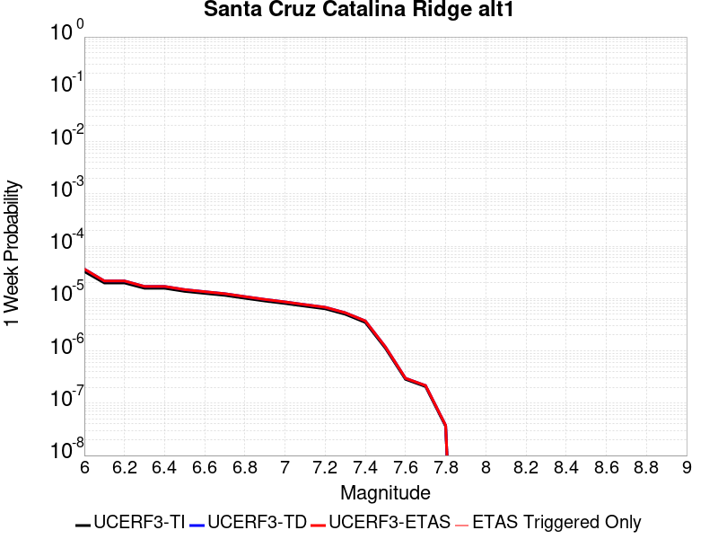 | 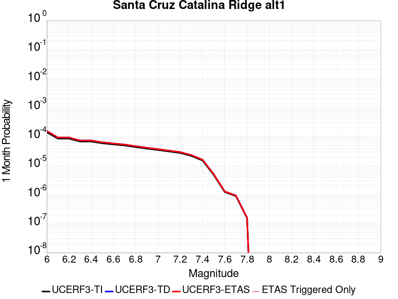 | 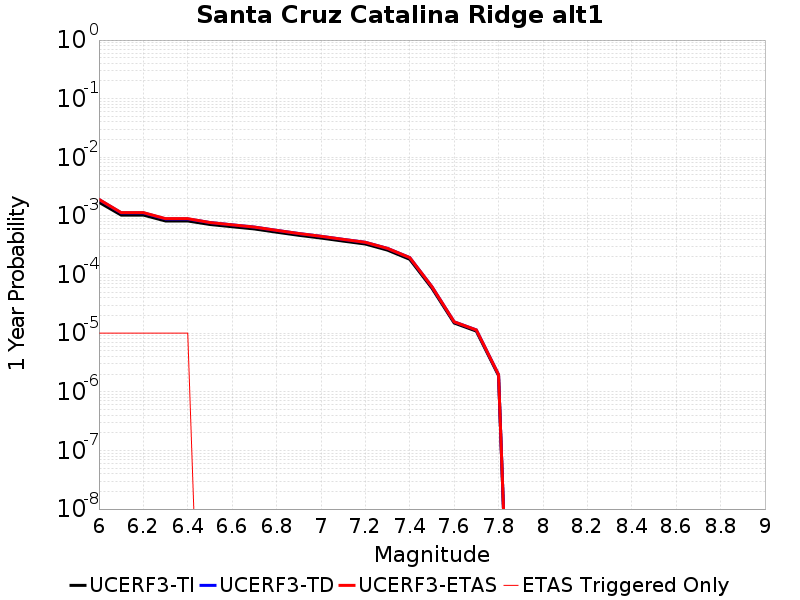 | 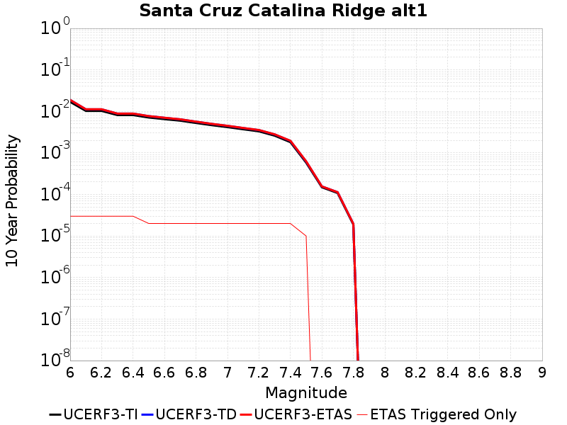 |

| Magnitude | 1 wk TI Prob | 1 wk TD Prob | 1 wk ETAS Prob | 1 wk ETAS/TD Gain | 1 wk ETAS Triggered Only | 1 mo TI Prob | 1 mo TD Prob | 1 mo ETAS Prob | 1 mo ETAS/TD Gain | 1 mo ETAS Triggered Only | 1 yr TI Prob | 1 yr TD Prob | 1 yr ETAS Prob | 1 yr ETAS/TD Gain | 1 yr ETAS Triggered Only | 10 yr TI Prob | 10 yr TD Prob | 10 yr ETAS Prob | 10 yr ETAS/TD Gain | 10 yr ETAS Triggered Only |
|-----|-----|-----|-----|-----|-----|-----|-----|-----|-----|-----|-----|-----|-----|-----|-----|-----|-----|-----|-----|-----|
| 6.0 | 3.2833184E-5 | 3.655887E-5 | 3.655887E-5 | 1.0 | 0.0 | 1.4070606E-4 | 1.566724E-4 | 1.566724E-4 | 1.0 | 0.0 | 0.00171175 | 0.0019059841 | 0.001915965 | 1.0052366 | 1.0E-5 | 0.016986247 | 0.01891327 | 0.018942704 | 1.0015562 | 3.0E-5 |
| 6.1 | 1.9835548E-5 | 2.165973E-5 | 2.165973E-5 | 1.0 | 0.0 | 8.500672E-5 | 9.282422E-5 | 9.282422E-5 | 1.0 | 0.0 | 0.0010344655 | 0.0011295691 | 0.0011395579 | 1.008843 | 1.0E-5 | 0.010296632 | 0.011240412 | 0.011270074 | 1.0026389 | 3.0E-5 |
| 6.2 | 1.9835548E-5 | 2.165973E-5 | 2.165973E-5 | 1.0 | 0.0 | 8.500672E-5 | 9.282422E-5 | 9.282422E-5 | 1.0 | 0.0 | 0.0010344655 | 0.0011295691 | 0.0011395579 | 1.008843 | 1.0E-5 | 0.010296632 | 0.011240412 | 0.011270074 | 1.0026389 | 3.0E-5 |
| 6.3 | 1.5728183E-5 | 1.7034108E-5 | 1.7034108E-5 | 1.0 | 0.0 | 6.7404755E-5 | 7.300131E-5 | 7.300131E-5 | 1.0 | 0.0 | 8.2034385E-4 | 8.8843465E-4 | 8.9842576E-4 | 1.0112457 | 1.0E-5 | 0.008173222 | 0.008849509 | 0.008879243 | 1.00336 | 3.0E-5 |
| 6.4 | 1.5728183E-5 | 1.7034108E-5 | 1.7034108E-5 | 1.0 | 0.0 | 6.7404755E-5 | 7.300131E-5 | 7.300131E-5 | 1.0 | 0.0 | 8.2034385E-4 | 8.8843465E-4 | 8.9842576E-4 | 1.0112457 | 1.0E-5 | 0.008173222 | 0.008849509 | 0.008879243 | 1.00336 | 3.0E-5 |
| 6.5 | 1.3707734E-5 | 1.4794654E-5 | 1.4794654E-5 | 1.0 | 0.0 | 5.8746107E-5 | 6.3404135E-5 | 6.3404135E-5 | 1.0 | 0.0 | 7.1499916E-4 | 7.716755E-4 | 7.716755E-4 | 1.0 | 0.0 | 0.0071270303 | 0.007690358 | 0.007710204 | 1.0025806 | 2.0E-5 |
| 6.6 | 1.2539813E-5 | 1.3510336E-5 | 1.3510336E-5 | 1.0 | 0.0 | 5.3740947E-5 | 5.790017E-5 | 5.790017E-5 | 1.0 | 0.0 | 6.540996E-4 | 7.0470927E-4 | 7.0470927E-4 | 1.0 | 0.0 | 0.0065217763 | 0.007025049 | 0.0070449086 | 1.0028269 | 2.0E-5 |
| 6.7 | 1.1504083E-5 | 1.237748E-5 | 1.237748E-5 | 1.0 | 0.0 | 4.930228E-5 | 5.3045278E-5 | 5.3045278E-5 | 1.0 | 0.0 | 6.0008996E-4 | 6.456369E-4 | 6.456369E-4 | 1.0 | 0.0 | 0.005984721 | 0.0064378404 | 0.006457712 | 1.0030867 | 2.0E-5 |
| 6.8 | 1.012739E-5 | 1.0877162E-5 | 1.0877162E-5 | 1.0 | 0.0 | 4.340238E-5 | 4.6615583E-5 | 4.6615583E-5 | 1.0 | 0.0 | 5.282958E-4 | 5.6739844E-4 | 5.6739844E-4 | 1.0 | 0.0 | 0.0052704164 | 0.0056596664 | 0.0056795534 | 1.0035138 | 2.0E-5 |
| 6.9 | 8.9607865E-6 | 9.609195E-6 | 9.609195E-6 | 1.0 | 0.0 | 3.8402806E-5 | 4.118162E-5 | 4.118162E-5 | 1.0 | 0.0 | 4.6745385E-4 | 5.01272E-4 | 5.01272E-4 | 1.0 | 0.0 | 0.0046647177 | 0.0050015324 | 0.005021432 | 1.0039787 | 2.0E-5 |
| 7.0 | 8.046829E-6 | 8.619814E-6 | 8.619814E-6 | 1.0 | 0.0 | 3.4485955E-5 | 3.6941543E-5 | 3.6941543E-5 | 1.0 | 0.0 | 4.1978562E-4 | 4.496713E-4 | 4.496713E-4 | 1.0 | 0.0 | 0.004189935 | 0.0044877045 | 0.0045076148 | 1.0044366 | 2.0E-5 |
| 7.1 | 7.136131E-6 | 7.637716E-6 | 7.637716E-6 | 1.0 | 0.0 | 3.0583058E-5 | 3.2732663E-5 | 3.2732663E-5 | 1.0 | 0.0 | 3.7228514E-4 | 3.98448E-4 | 3.98448E-4 | 1.0 | 0.0 | 0.0037166206 | 0.0039774124 | 0.003997333 | 1.0050083 | 2.0E-5 |
| 7.2 | 6.362014E-6 | 6.8050117E-6 | 6.8050117E-6 | 1.0 | 0.0 | 2.726549E-5 | 2.9164014E-5 | 2.9164014E-5 | 1.0 | 0.0 | 3.3190678E-4 | 3.5501466E-4 | 3.5501466E-4 | 1.0 | 0.0 | 0.0033141149 | 0.0035445436 | 0.0035644728 | 1.0056225 | 2.0E-5 |
| 7.3 | 5.004101E-6 | 5.3517565E-6 | 5.3517565E-6 | 1.0 | 0.0 | 2.1445969E-5 | 2.2935901E-5 | 2.2935901E-5 | 1.0 | 0.0 | 2.6107338E-4 | 2.7920934E-4 | 2.7920934E-4 | 1.0 | 0.0 | 0.002607669 | 0.0027886403 | 0.0028085846 | 1.007152 | 2.0E-5 |
| 7.4 | 3.4901443E-6 | 3.7320815E-6 | 3.7320815E-6 | 1.0 | 0.0 | 1.4957676E-5 | 1.599454E-5 | 1.599454E-5 | 1.0 | 0.0 | 1.8209449E-4 | 1.947165E-4 | 1.947165E-4 | 1.0 | 0.0 | 0.0018194534 | 0.0019454975 | 0.0019654585 | 1.0102601 | 2.0E-5 |
| 7.5 | 1.1215045E-6 | 1.1893951E-6 | 1.1893951E-6 | 1.0 | 0.0 | 4.806439E-6 | 5.0973977E-6 | 5.0973977E-6 | 1.0 | 0.0 | 5.851682E-5 | 6.205908E-5 | 6.205908E-5 | 1.0 | 0.0 | 5.850142E-4 | 6.2042056E-4 | 6.304144E-4 | 1.0161082 | 1.0E-5 |
| 7.6 | 2.8599047E-7 | 2.9952153E-7 | 2.9952153E-7 | 1.0 | 0.0 | 1.2256729E-6 | 1.283663E-6 | 1.283663E-6 | 1.0 | 0.0 | 1.4922465E-5 | 1.5628486E-5 | 1.5628486E-5 | 1.0 | 0.0 | 1.4921463E-4 | 1.56274E-4 | 1.56274E-4 | 1.0 | 0.0 |
| 7.7 | 2.0781519E-7 | 2.1744435E-7 | 2.1744435E-7 | 1.0 | 0.0 | 8.906362E-7 | 9.319041E-7 | 9.319041E-7 | 1.0 | 0.0 | 1.08434415E-5 | 1.1345874E-5 | 1.1345874E-5 | 1.0 | 0.0 | 1.0842913E-4 | 1.1345304E-4 | 1.1345304E-4 | 1.0 | 0.0 |
| 7.8 | 3.614776E-8 | 3.7641193E-8 | 3.7641193E-8 | 1.0 | 0.0 | 1.5491896E-7 | 1.6131939E-7 | 1.6131939E-7 | 1.0 | 0.0 | 1.8861368E-6 | 1.9640618E-6 | 1.9640618E-6 | 1.0 | 0.0 | 1.8861208E-5 | 1.9640456E-5 | 1.9640456E-5 | 1.0 | 0.0 |

## Ventura-Pitas Point
*[(top)](#table-of-contents)*

| 1 Week | 1 Month | 1 Year | 10 Year |
|-----|-----|-----|-----|
| 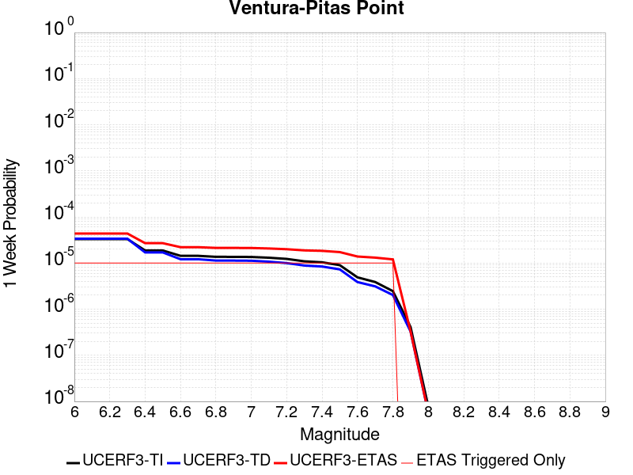 |  | 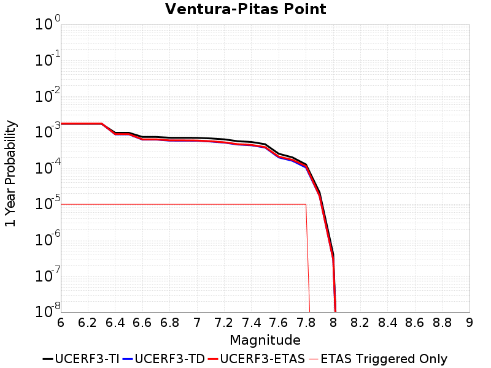 | 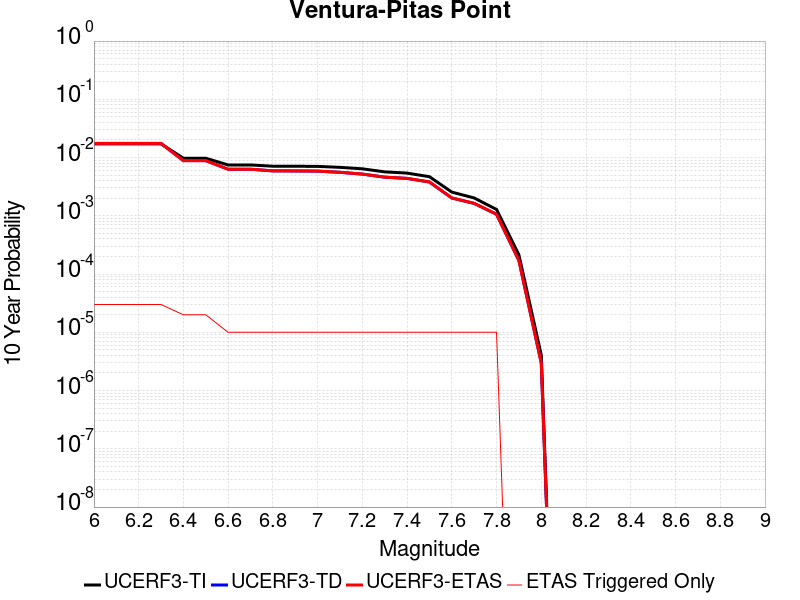 |

| Magnitude | 1 wk TI Prob | 1 wk TD Prob | 1 wk ETAS Prob | 1 wk ETAS/TD Gain | 1 wk ETAS Triggered Only | 1 mo TI Prob | 1 mo TD Prob | 1 mo ETAS Prob | 1 mo ETAS/TD Gain | 1 mo ETAS Triggered Only | 1 yr TI Prob | 1 yr TD Prob | 1 yr ETAS Prob | 1 yr ETAS/TD Gain | 1 yr ETAS Triggered Only | 10 yr TI Prob | 10 yr TD Prob | 10 yr ETAS Prob | 10 yr ETAS/TD Gain | 10 yr ETAS Triggered Only |
|-----|-----|-----|-----|-----|-----|-----|-----|-----|-----|-----|-----|-----|-----|-----|-----|-----|-----|-----|-----|-----|
| 6.0 | 3.3179622E-5 | 3.373571E-5 | 4.373537E-5 | 1.2964119 | 1.0E-5 | 1.4219063E-4 | 1.4457504E-4 | 1.545736E-4 | 1.0691582 | 1.0E-5 | 0.0017297962 | 0.0017590369 | 0.0017690193 | 1.005675 | 1.0E-5 | 0.017163932 | 0.01747667 | 0.017506147 | 1.0016866 | 3.0E-5 |
| 6.1 | 3.3179622E-5 | 3.373571E-5 | 4.373537E-5 | 1.2964119 | 1.0E-5 | 1.4219063E-4 | 1.4457504E-4 | 1.545736E-4 | 1.0691582 | 1.0E-5 | 0.0017297962 | 0.0017590369 | 0.0017690193 | 1.005675 | 1.0E-5 | 0.017163932 | 0.01747667 | 0.017506147 | 1.0016866 | 3.0E-5 |
| 6.2 | 3.3179622E-5 | 3.373571E-5 | 4.373537E-5 | 1.2964119 | 1.0E-5 | 1.4219063E-4 | 1.4457504E-4 | 1.545736E-4 | 1.0691582 | 1.0E-5 | 0.0017297962 | 0.0017590369 | 0.0017690193 | 1.005675 | 1.0E-5 | 0.017163932 | 0.01747667 | 0.017506147 | 1.0016866 | 3.0E-5 |
| 6.3 | 3.3179622E-5 | 3.373571E-5 | 4.373537E-5 | 1.2964119 | 1.0E-5 | 1.4219063E-4 | 1.4457504E-4 | 1.545736E-4 | 1.0691582 | 1.0E-5 | 0.0017297962 | 0.0017590369 | 0.0017690193 | 1.005675 | 1.0E-5 | 0.017163932 | 0.01747667 | 0.017506147 | 1.0016866 | 3.0E-5 |
| 6.4 | 1.8754668E-5 | 1.7019838E-5 | 2.7019667E-5 | 1.5875397 | 1.0E-5 | 8.037467E-5 | 7.294025E-5 | 8.293952E-5 | 1.1370885 | 1.0E-5 | 9.781223E-4 | 8.8770885E-4 | 8.9769997E-4 | 1.0112549 | 1.0E-5 | 0.009738282 | 0.008843965 | 0.008863788 | 1.0022414 | 2.0E-5 |
| 6.5 | 1.8754668E-5 | 1.7019838E-5 | 2.7019667E-5 | 1.5875397 | 1.0E-5 | 8.037467E-5 | 7.294025E-5 | 8.293952E-5 | 1.1370885 | 1.0E-5 | 9.781223E-4 | 8.8770885E-4 | 8.9769997E-4 | 1.0112549 | 1.0E-5 | 0.009738282 | 0.008843965 | 0.008863788 | 1.0022414 | 2.0E-5 |
| 6.6 | 1.4361558E-5 | 1.2122438E-5 | 2.2122318E-5 | 1.8249066 | 1.0E-5 | 6.154808E-5 | 5.1952287E-5 | 6.195177E-5 | 1.1924744 | 1.0E-5 | 7.490902E-4 | 6.323378E-4 | 6.423315E-4 | 1.0158043 | 1.0E-5 | 0.0074657016 | 0.0063056424 | 0.006315579 | 1.0015758 | 1.0E-5 |
| 6.7 | 1.4361558E-5 | 1.2122438E-5 | 2.2122318E-5 | 1.8249066 | 1.0E-5 | 6.154808E-5 | 5.1952287E-5 | 6.195177E-5 | 1.1924744 | 1.0E-5 | 7.490902E-4 | 6.323378E-4 | 6.423315E-4 | 1.0158043 | 1.0E-5 | 0.0074657016 | 0.0063056424 | 0.006315579 | 1.0015758 | 1.0E-5 |
| 6.8 | 1.3663846E-5 | 1.1344571E-5 | 2.1344458E-5 | 1.8814689 | 1.0E-5 | 5.8558027E-5 | 4.86187E-5 | 5.861821E-5 | 1.2056721 | 1.0E-5 | 7.127108E-4 | 5.9177383E-4 | 6.017679E-4 | 1.0168884 | 1.0E-5 | 0.007104293 | 0.005902196 | 0.0059121368 | 1.0016843 | 1.0E-5 |
| 6.9 | 1.3644157E-5 | 1.1322672E-5 | 2.132256E-5 | 1.8831737 | 1.0E-5 | 5.8473648E-5 | 4.8524846E-5 | 5.852436E-5 | 1.20607 | 1.0E-5 | 7.116841E-4 | 5.906318E-4 | 6.006259E-4 | 1.016921 | 1.0E-5 | 0.007094092 | 0.005890836 | 0.0059007774 | 1.0016875 | 1.0E-5 |
| 7.0 | 1.3568845E-5 | 1.1242238E-5 | 2.1242126E-5 | 1.8894926 | 1.0E-5 | 5.8150898E-5 | 4.818014E-5 | 5.817966E-5 | 1.2075444 | 1.0E-5 | 7.077572E-4 | 5.8643724E-4 | 5.964314E-4 | 1.0170422 | 1.0E-5 | 0.007055073 | 0.0058491123 | 0.0058590537 | 1.0016997 | 1.0E-5 |
| 7.1 | 1.306572E-5 | 1.0720684E-5 | 2.0720578E-5 | 1.9327663 | 1.0E-5 | 5.599474E-5 | 4.594499E-5 | 5.5944533E-5 | 1.2176416 | 1.0E-5 | 6.815227E-4 | 5.5923854E-4 | 5.69233E-4 | 1.0178715 | 1.0E-5 | 0.0067943637 | 0.0055785174 | 0.0055884616 | 1.0017825 | 1.0E-5 |
| 7.2 | 1.232604E-5 | 9.995274E-6 | 1.9995174E-5 | 2.0004628 | 1.0E-5 | 5.2824813E-5 | 4.2836193E-5 | 5.2835767E-5 | 1.2334374 | 1.0E-5 | 6.429523E-4 | 5.2140764E-4 | 5.314024E-4 | 1.0191689 | 1.0E-5 | 0.0064109527 | 0.0052020345 | 0.0052119824 | 1.0019124 | 1.0E-5 |
| 7.3 | 1.0917261E-5 | 8.843947E-6 | 1.8843859E-5 | 2.1307068 | 1.0E-5 | 4.678742E-5 | 3.790209E-5 | 4.790171E-5 | 1.2638277 | 1.0E-5 | 5.69488E-4 | 4.6136178E-4 | 4.7135717E-4 | 1.021665 | 1.0E-5 | 0.0056803077 | 0.0046042055 | 0.0046141595 | 1.002162 | 1.0E-5 |
| 7.4 | 1.039959E-5 | 8.423661E-6 | 1.8423576E-5 | 2.1871223 | 1.0E-5 | 4.456891E-5 | 3.6100915E-5 | 4.610055E-5 | 1.2769912 | 1.0E-5 | 5.424914E-4 | 4.394415E-4 | 4.4943712E-4 | 1.0227462 | 1.0E-5 | 0.0054116896 | 0.004385887 | 0.0043958435 | 1.00227 | 1.0E-5 |
| 7.5 | 9.015877E-6 | 7.297624E-6 | 1.729755E-5 | 2.370299 | 1.0E-5 | 3.86389E-5 | 3.1275165E-5 | 4.1274852E-5 | 1.3197325 | 1.0E-5 | 4.7032707E-4 | 3.8071E-4 | 3.907062E-4 | 1.0262567 | 1.0E-5 | 0.004693329 | 0.0038007232 | 0.0038106851 | 1.002621 | 1.0E-5 |
| 7.6 | 4.900162E-6 | 3.874146E-6 | 1.3874107E-5 | 3.5812042 | 1.0E-5 | 2.1000526E-5 | 1.6603377E-5 | 2.6603211E-5 | 1.6022772 | 1.0E-5 | 2.556514E-4 | 2.021275E-4 | 2.1212548E-4 | 1.0494637 | 1.0E-5 | 0.0025535747 | 0.0020194503 | 0.0020294301 | 1.0049418 | 1.0E-5 |
| 7.7 | 3.8850626E-6 | 3.1267537E-6 | 1.31267225E-5 | 4.1981955 | 1.0E-5 | 1.6650163E-5 | 1.3400305E-5 | 2.340017E-5 | 1.7462417 | 1.0E-5 | 2.0269687E-4 | 1.6313659E-4 | 1.7313495E-4 | 1.0612884 | 1.0E-5 | 0.002025121 | 0.0016301776 | 0.0016401613 | 1.0061243 | 1.0E-5 |
| 7.8 | 2.4654719E-6 | 2.0298892E-6 | 1.2029869E-5 | 5.9263673 | 1.0E-5 | 1.0566265E-5 | 8.699496E-6 | 1.869941E-5 | 2.1494818 | 1.0E-5 | 1.2863669E-4 | 1.0591127E-4 | 1.1591021E-4 | 1.0944086 | 1.0E-5 | 0.0012856225 | 0.0010586126 | 0.0010686021 | 1.0094364 | 1.0E-5 |
| 7.9 | 4.095894E-7 | 3.2765004E-7 | 3.2765004E-7 | 1.0 | 0.0 | 1.7553821E-6 | 1.4042137E-6 | 1.4042137E-6 | 1.0 | 0.0 | 2.1371567E-5 | 1.709617E-5 | 1.709617E-5 | 1.0 | 0.0 | 2.1369511E-4 | 1.7094886E-4 | 1.7094886E-4 | 1.0 | 0.0 |
| 8.0 | 7.791402E-9 | 5.6835443E-9 | 5.6835443E-9 | 1.0 | 0.0 | 3.3391725E-8 | 2.4358048E-8 | 2.4358048E-8 | 1.0 | 0.0 | 4.0654416E-7 | 2.965592E-7 | 2.965592E-7 | 1.0 | 0.0 | 4.065434E-6 | 2.96559E-6 | 2.96559E-6 | 1.0 | 0.0 |

## Anacapa-Dume alt 1
*[(top)](#table-of-contents)*

| 1 Week | 1 Month | 1 Year | 10 Year |
|-----|-----|-----|-----|
| 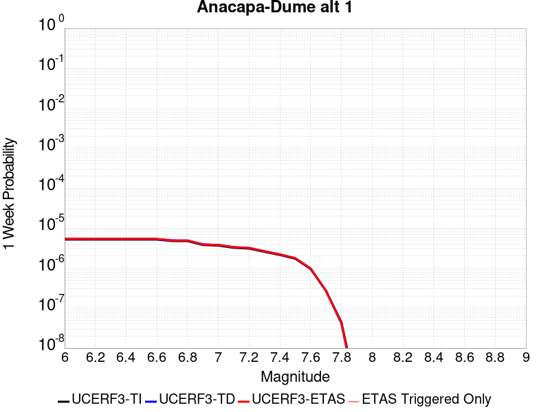 | 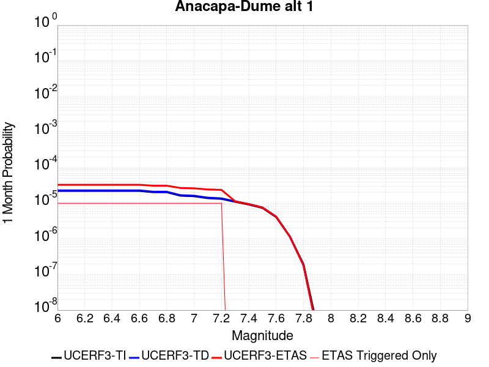 | 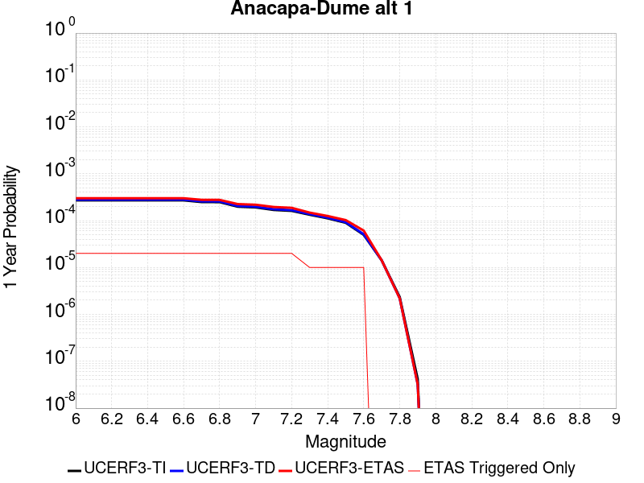 | 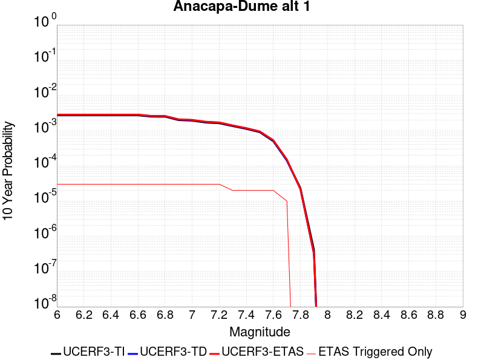 |

| Magnitude | 1 wk TI Prob | 1 wk TD Prob | 1 wk ETAS Prob | 1 wk ETAS/TD Gain | 1 wk ETAS Triggered Only | 1 mo TI Prob | 1 mo TD Prob | 1 mo ETAS Prob | 1 mo ETAS/TD Gain | 1 mo ETAS Triggered Only | 1 yr TI Prob | 1 yr TD Prob | 1 yr ETAS Prob | 1 yr ETAS/TD Gain | 1 yr ETAS Triggered Only | 10 yr TI Prob | 10 yr TD Prob | 10 yr ETAS Prob | 10 yr ETAS/TD Gain | 10 yr ETAS Triggered Only |
|-----|-----|-----|-----|-----|-----|-----|-----|-----|-----|-----|-----|-----|-----|-----|-----|-----|-----|-----|-----|-----|
| 6.0 | 5.1871802E-6 | 5.3674144E-6 | 5.3674144E-6 | 1.0 | 0.0 | 2.2230583E-5 | 2.3003007E-5 | 3.3002776E-5 | 1.4347157 | 1.0E-5 | 2.7062374E-4 | 2.8002646E-4 | 3.0002085E-4 | 1.0714018 | 2.0E-5 | 0.002702944 | 0.0027968215 | 0.0028267375 | 1.0106964 | 3.0E-5 |
| 6.1 | 5.1871802E-6 | 5.3674144E-6 | 5.3674144E-6 | 1.0 | 0.0 | 2.2230583E-5 | 2.3003007E-5 | 3.3002776E-5 | 1.4347157 | 1.0E-5 | 2.7062374E-4 | 2.8002646E-4 | 3.0002085E-4 | 1.0714018 | 2.0E-5 | 0.002702944 | 0.0027968215 | 0.0028267375 | 1.0106964 | 3.0E-5 |
| 6.2 | 5.1871802E-6 | 5.3674144E-6 | 5.3674144E-6 | 1.0 | 0.0 | 2.2230583E-5 | 2.3003007E-5 | 3.3002776E-5 | 1.4347157 | 1.0E-5 | 2.7062374E-4 | 2.8002646E-4 | 3.0002085E-4 | 1.0714018 | 2.0E-5 | 0.002702944 | 0.0027968215 | 0.0028267375 | 1.0106964 | 3.0E-5 |
| 6.3 | 5.1871802E-6 | 5.3674144E-6 | 5.3674144E-6 | 1.0 | 0.0 | 2.2230583E-5 | 2.3003007E-5 | 3.3002776E-5 | 1.4347157 | 1.0E-5 | 2.7062374E-4 | 2.8002646E-4 | 3.0002085E-4 | 1.0714018 | 2.0E-5 | 0.002702944 | 0.0027968215 | 0.0028267375 | 1.0106964 | 3.0E-5 |
| 6.4 | 5.1871802E-6 | 5.3674144E-6 | 5.3674144E-6 | 1.0 | 0.0 | 2.2230583E-5 | 2.3003007E-5 | 3.3002776E-5 | 1.4347157 | 1.0E-5 | 2.7062374E-4 | 2.8002646E-4 | 3.0002085E-4 | 1.0714018 | 2.0E-5 | 0.002702944 | 0.0027968215 | 0.0028267375 | 1.0106964 | 3.0E-5 |
| 6.5 | 5.1871802E-6 | 5.3674144E-6 | 5.3674144E-6 | 1.0 | 0.0 | 2.2230583E-5 | 2.3003007E-5 | 3.3002776E-5 | 1.4347157 | 1.0E-5 | 2.7062374E-4 | 2.8002646E-4 | 3.0002085E-4 | 1.0714018 | 2.0E-5 | 0.002702944 | 0.0027968215 | 0.0028267375 | 1.0106964 | 3.0E-5 |
| 6.6 | 5.1871802E-6 | 5.3674144E-6 | 5.3674144E-6 | 1.0 | 0.0 | 2.2230583E-5 | 2.3003007E-5 | 3.3002776E-5 | 1.4347157 | 1.0E-5 | 2.7062374E-4 | 2.8002646E-4 | 3.0002085E-4 | 1.0714018 | 2.0E-5 | 0.002702944 | 0.0027968215 | 0.0028267375 | 1.0106964 | 3.0E-5 |
| 6.7 | 4.7693475E-6 | 4.9367136E-6 | 4.9367136E-6 | 1.0 | 0.0 | 2.04399E-5 | 2.1157177E-5 | 3.1156967E-5 | 1.4726428 | 1.0E-5 | 2.4882736E-4 | 2.5755895E-4 | 2.775538E-4 | 1.0776321 | 2.0E-5 | 0.0024854892 | 0.0025726804 | 0.0026026033 | 1.011631 | 3.0E-5 |
| 6.8 | 4.753408E-6 | 4.920262E-6 | 4.920262E-6 | 1.0 | 0.0 | 2.037159E-5 | 2.1086671E-5 | 3.108646E-5 | 1.4742233 | 1.0E-5 | 2.4799586E-4 | 2.5670073E-4 | 2.766956E-4 | 1.0778917 | 2.0E-5 | 0.002477193 | 0.002564118 | 0.0025940412 | 1.0116699 | 3.0E-5 |
| 6.9 | 3.800069E-6 | 3.937145E-6 | 3.937145E-6 | 1.0 | 0.0 | 1.6285909E-5 | 1.687337E-5 | 2.68732E-5 | 1.5926398 | 1.0E-5 | 1.9826289E-4 | 2.0541414E-4 | 2.2541003E-4 | 1.0973443 | 2.0E-5 | 0.001980861 | 0.0020522664 | 0.002082205 | 1.014588 | 3.0E-5 |
| 7.0 | 3.6671938E-6 | 3.7999364E-6 | 3.7999364E-6 | 1.0 | 0.0 | 1.571645E-5 | 1.6285341E-5 | 2.6285179E-5 | 1.6140392 | 1.0E-5 | 1.9133097E-4 | 1.9825622E-4 | 2.1825226E-4 | 1.1008595 | 2.0E-5 | 0.0019116632 | 0.0019808167 | 0.0020107573 | 1.0151153 | 3.0E-5 |
| 7.1 | 3.2394885E-6 | 3.3588099E-6 | 3.3588099E-6 | 1.0 | 0.0 | 1.3883448E-5 | 1.439482E-5 | 2.4394676E-5 | 1.6946843 | 1.0E-5 | 1.6901788E-4 | 1.7524295E-4 | 1.9523945E-4 | 1.1141073 | 2.0E-5 | 0.0016888938 | 0.0017510589 | 0.0017810062 | 1.0171025 | 3.0E-5 |
| 7.2 | 3.0935948E-6 | 3.207942E-6 | 3.207942E-6 | 1.0 | 0.0 | 1.3258196E-5 | 1.3748251E-5 | 2.3748113E-5 | 1.7273552 | 1.0E-5 | 1.6140658E-4 | 1.673722E-4 | 1.8736886E-4 | 1.1194742 | 2.0E-5 | 0.001612894 | 0.0016724725 | 0.0017024223 | 1.0179075 | 3.0E-5 |
| 7.3 | 2.5604163E-6 | 2.6470857E-6 | 2.6470857E-6 | 1.0 | 0.0 | 1.0973167E-5 | 1.1344604E-5 | 1.1344604E-5 | 1.0 | 0.0 | 1.3359012E-4 | 1.3811185E-4 | 1.4811047E-4 | 1.0723951 | 1.0E-5 | 0.0013350984 | 0.0013802648 | 0.0014002371 | 1.01447 | 2.0E-5 |
| 7.4 | 2.1429005E-6 | 2.2106133E-6 | 2.2106133E-6 | 1.0 | 0.0 | 9.1838265E-6 | 9.474023E-6 | 9.474023E-6 | 1.0 | 0.0 | 1.11807356E-4 | 1.15340146E-4 | 1.25339E-4 | 1.0866901 | 1.0E-5 | 0.0011175112 | 0.0011528055 | 0.0011727824 | 1.017329 | 2.0E-5 |
| 7.5 | 1.7237151E-6 | 1.7761535E-6 | 1.7761535E-6 | 1.0 | 0.0 | 7.3873293E-6 | 7.612064E-6 | 7.612064E-6 | 1.0 | 0.0 | 8.993702E-5 | 9.267296E-5 | 1.02672035E-4 | 1.1078963 | 1.0E-5 | 8.990063E-4 | 9.263455E-4 | 9.46327E-4 | 1.0215702 | 2.0E-5 |
| 7.6 | 9.541696E-7 | 9.823252E-7 | 9.823252E-7 | 1.0 | 0.0 | 4.089292E-6 | 4.2099587E-6 | 4.2099587E-6 | 1.0 | 0.0 | 4.9785995E-5 | 5.1255054E-5 | 6.125454E-5 | 1.1950927 | 1.0E-5 | 4.9774844E-4 | 5.124336E-4 | 5.324233E-4 | 1.0390095 | 2.0E-5 |
| 7.7 | 2.7226676E-7 | 2.717252E-7 | 2.717252E-7 | 1.0 | 0.0 | 1.166857E-6 | 1.1645361E-6 | 1.1645361E-6 | 1.0 | 0.0 | 1.4206392E-5 | 1.4178136E-5 | 1.4178136E-5 | 1.0 | 0.0 | 1.4205484E-4 | 1.4177238E-4 | 1.5177096E-4 | 1.0705256 | 1.0E-5 |
| 7.8 | 4.5017995E-8 | 4.2157815E-8 | 4.2157815E-8 | 1.0 | 0.0 | 1.9293425E-7 | 1.8067634E-7 | 1.8067634E-7 | 1.0 | 0.0 | 2.348972E-6 | 2.1997325E-6 | 2.1997325E-6 | 1.0 | 0.0 | 2.348947E-5 | 2.1997128E-5 | 2.1997128E-5 | 1.0 | 0.0 |
| 7.9 | 8.007447E-10 | 6.1609085E-10 | 6.1609085E-10 | 1.0 | 0.0 | 3.4317629E-9 | 2.6403897E-9 | 2.6403897E-9 | 1.0 | 0.0 | 4.1781714E-8 | 3.2146747E-8 | 3.2146747E-8 | 1.0 | 0.0 | 4.1781706E-7 | 3.2146744E-7 | 3.2146744E-7 | 1.0 | 0.0 |

## Pine Mtn
*[(top)](#table-of-contents)*

| 1 Week | 1 Month | 1 Year | 10 Year |
|-----|-----|-----|-----|
| 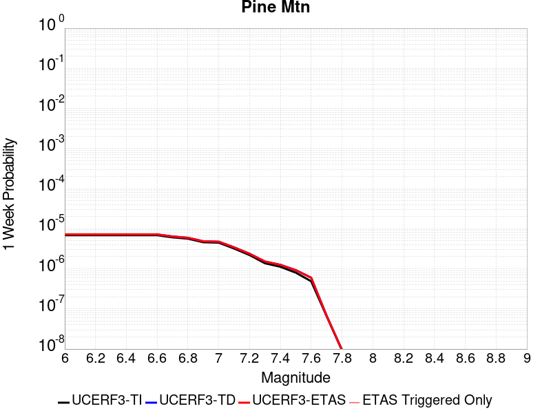 | 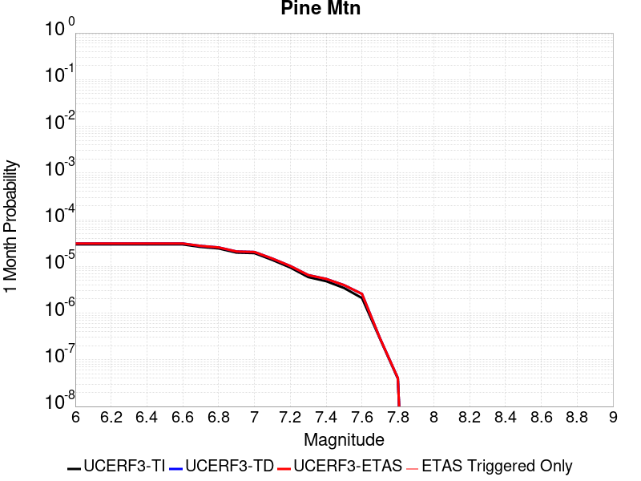 | 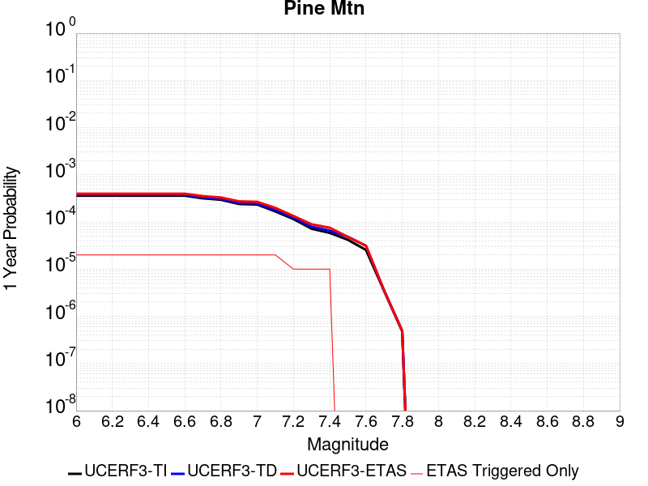 | 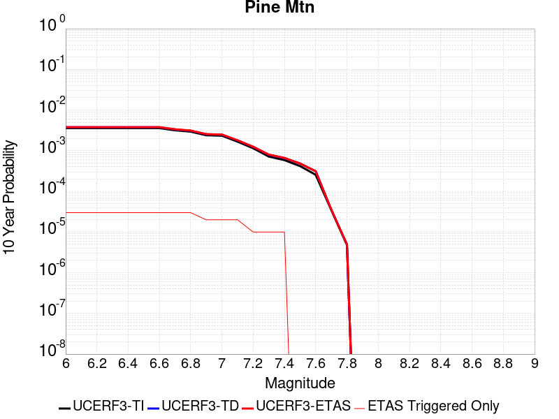 |

| Magnitude | 1 wk TI Prob | 1 wk TD Prob | 1 wk ETAS Prob | 1 wk ETAS/TD Gain | 1 wk ETAS Triggered Only | 1 mo TI Prob | 1 mo TD Prob | 1 mo ETAS Prob | 1 mo ETAS/TD Gain | 1 mo ETAS Triggered Only | 1 yr TI Prob | 1 yr TD Prob | 1 yr ETAS Prob | 1 yr ETAS/TD Gain | 1 yr ETAS Triggered Only | 10 yr TI Prob | 10 yr TD Prob | 10 yr ETAS Prob | 10 yr ETAS/TD Gain | 10 yr ETAS Triggered Only |
|-----|-----|-----|-----|-----|-----|-----|-----|-----|-----|-----|-----|-----|-----|-----|-----|-----|-----|-----|-----|-----|
| 6.0 | 6.894797E-6 | 7.2255475E-6 | 7.2255475E-6 | 1.0 | 0.0 | 2.9548795E-5 | 3.0966283E-5 | 3.0966283E-5 | 1.0 | 0.0 | 3.596972E-4 | 3.7695223E-4 | 3.969447E-4 | 1.0530372 | 2.0E-5 | 0.0035911554 | 0.0037634259 | 0.003793313 | 1.0079415 | 3.0E-5 |
| 6.1 | 6.894797E-6 | 7.2255475E-6 | 7.2255475E-6 | 1.0 | 0.0 | 2.9548795E-5 | 3.0966283E-5 | 3.0966283E-5 | 1.0 | 0.0 | 3.596972E-4 | 3.7695223E-4 | 3.969447E-4 | 1.0530372 | 2.0E-5 | 0.0035911554 | 0.0037634259 | 0.003793313 | 1.0079415 | 3.0E-5 |
| 6.2 | 6.894797E-6 | 7.2255475E-6 | 7.2255475E-6 | 1.0 | 0.0 | 2.9548795E-5 | 3.0966283E-5 | 3.0966283E-5 | 1.0 | 0.0 | 3.596972E-4 | 3.7695223E-4 | 3.969447E-4 | 1.0530372 | 2.0E-5 | 0.0035911554 | 0.0037634259 | 0.003793313 | 1.0079415 | 3.0E-5 |
| 6.3 | 6.894797E-6 | 7.2255475E-6 | 7.2255475E-6 | 1.0 | 0.0 | 2.9548795E-5 | 3.0966283E-5 | 3.0966283E-5 | 1.0 | 0.0 | 3.596972E-4 | 3.7695223E-4 | 3.969447E-4 | 1.0530372 | 2.0E-5 | 0.0035911554 | 0.0037634259 | 0.003793313 | 1.0079415 | 3.0E-5 |
| 6.4 | 6.894797E-6 | 7.2255475E-6 | 7.2255475E-6 | 1.0 | 0.0 | 2.9548795E-5 | 3.0966283E-5 | 3.0966283E-5 | 1.0 | 0.0 | 3.596972E-4 | 3.7695223E-4 | 3.969447E-4 | 1.0530372 | 2.0E-5 | 0.0035911554 | 0.0037634259 | 0.003793313 | 1.0079415 | 3.0E-5 |
| 6.5 | 6.894797E-6 | 7.2255475E-6 | 7.2255475E-6 | 1.0 | 0.0 | 2.9548795E-5 | 3.0966283E-5 | 3.0966283E-5 | 1.0 | 0.0 | 3.596972E-4 | 3.7695223E-4 | 3.969447E-4 | 1.0530372 | 2.0E-5 | 0.0035911554 | 0.0037634259 | 0.003793313 | 1.0079415 | 3.0E-5 |
| 6.6 | 6.894797E-6 | 7.2255475E-6 | 7.2255475E-6 | 1.0 | 0.0 | 2.9548795E-5 | 3.0966283E-5 | 3.0966283E-5 | 1.0 | 0.0 | 3.596972E-4 | 3.7695223E-4 | 3.969447E-4 | 1.0530372 | 2.0E-5 | 0.0035911554 | 0.0037634259 | 0.003793313 | 1.0079415 | 3.0E-5 |
| 6.7 | 6.0867933E-6 | 6.397197E-6 | 6.397197E-6 | 1.0 | 0.0 | 2.6085996E-5 | 2.7416283E-5 | 2.7416283E-5 | 1.0 | 0.0 | 3.1755073E-4 | 3.337443E-4 | 3.5373765E-4 | 1.0599061 | 2.0E-5 | 0.0031709734 | 0.00333265 | 0.0033625502 | 1.0089718 | 3.0E-5 |
| 6.8 | 5.6530425E-6 | 5.950678E-6 | 5.950678E-6 | 1.0 | 0.0 | 2.42271E-5 | 2.5502668E-5 | 2.5502668E-5 | 1.0 | 0.0 | 2.94925E-4 | 3.104528E-4 | 3.3044658E-4 | 1.064402 | 2.0E-5 | 0.002945339 | 0.0031003957 | 0.0031303028 | 1.0096462 | 3.0E-5 |
| 6.9 | 4.6015225E-6 | 4.863912E-6 | 4.863912E-6 | 1.0 | 0.0 | 1.9720663E-5 | 2.084518E-5 | 2.084518E-5 | 1.0 | 0.0 | 2.4007261E-4 | 2.5376197E-4 | 2.737569E-4 | 1.078794 | 2.0E-5 | 0.0023981342 | 0.002534866 | 0.0025548155 | 1.00787 | 2.0E-5 |
| 7.0 | 4.4875965E-6 | 4.747551E-6 | 4.747551E-6 | 1.0 | 0.0 | 1.9232413E-5 | 2.0346497E-5 | 2.0346497E-5 | 1.0 | 0.0 | 2.3412947E-4 | 2.476919E-4 | 2.6768693E-4 | 1.0807254 | 2.0E-5 | 0.0023388295 | 0.002474302 | 0.0024942525 | 1.0080631 | 2.0E-5 |
| 7.1 | 3.203907E-6 | 3.4294837E-6 | 3.4294837E-6 | 1.0 | 0.0 | 1.3730958E-5 | 1.4697708E-5 | 1.4697708E-5 | 1.0 | 0.0 | 1.6716159E-4 | 1.7893057E-4 | 1.98927E-4 | 1.1117553 | 2.0E-5 | 0.0016703589 | 0.0017879312 | 0.0018078954 | 1.0111661 | 2.0E-5 |
| 7.2 | 2.2060601E-6 | 2.3785421E-6 | 2.3785421E-6 | 1.0 | 0.0 | 9.4545085E-6 | 1.0193715E-5 | 1.0193715E-5 | 1.0 | 0.0 | 1.15102564E-4 | 1.2410186E-4 | 1.3410063E-4 | 1.0805689 | 1.0E-5 | 0.0011504296 | 0.0012403704 | 0.0012503581 | 1.0080521 | 1.0E-5 |
| 7.3 | 1.3765207E-6 | 1.5217025E-6 | 1.5217025E-6 | 1.0 | 0.0 | 5.899361E-6 | 6.521567E-6 | 6.521567E-6 | 1.0 | 0.0 | 7.182235E-5 | 7.939727E-5 | 8.939648E-5 | 1.1259389 | 1.0E-5 | 7.1799144E-4 | 7.936982E-4 | 8.036902E-4 | 1.0125892 | 1.0E-5 |
| 7.4 | 1.1245983E-6 | 1.2587566E-6 | 1.2587566E-6 | 1.0 | 0.0 | 4.819698E-6 | 5.3946605E-6 | 5.3946605E-6 | 1.0 | 0.0 | 5.8678244E-5 | 6.56781E-5 | 7.567744E-5 | 1.1522478 | 1.0E-5 | 5.866275E-4 | 6.5659516E-4 | 6.665886E-4 | 1.01522 | 1.0E-5 |
| 7.5 | 8.031682E-7 | 9.27741E-7 | 9.27741E-7 | 1.0 | 0.0 | 3.4421448E-6 | 3.976027E-6 | 3.976027E-6 | 1.0 | 0.0 | 4.1907308E-5 | 4.8407124E-5 | 4.8407124E-5 | 1.0 | 0.0 | 4.1899405E-4 | 4.8397254E-4 | 4.8397254E-4 | 1.0 | 0.0 |
| 7.6 | 4.8953444E-7 | 6.003416E-7 | 6.003416E-7 | 1.0 | 0.0 | 2.098003E-6 | 2.5728903E-6 | 2.5728903E-6 | 1.0 | 0.0 | 2.5542888E-5 | 3.1324536E-5 | 3.1324536E-5 | 1.0 | 0.0 | 2.5539953E-4 | 3.1320608E-4 | 3.1320608E-4 | 1.0 | 0.0 |
| 7.7 | 6.634529E-8 | 6.7888436E-8 | 6.7888436E-8 | 1.0 | 0.0 | 2.843369E-7 | 2.909504E-7 | 2.909504E-7 | 1.0 | 0.0 | 3.4617963E-6 | 3.5423159E-6 | 3.5423159E-6 | 1.0 | 0.0 | 3.4617424E-5 | 3.5422643E-5 | 3.5422643E-5 | 1.0 | 0.0 |
| 7.8 | 9.235578E-9 | 9.488596E-9 | 9.488596E-9 | 1.0 | 0.0 | 3.9581046E-8 | 4.066541E-8 | 4.066541E-8 | 1.0 | 0.0 | 4.818991E-7 | 4.951013E-7 | 4.951013E-7 | 1.0 | 0.0 | 4.8189804E-6 | 4.951003E-6 | 4.951003E-6 | 1.0 | 0.0 |

## Monterey Bay-Tularcitos
*[(top)](#table-of-contents)*

| 1 Week | 1 Month | 1 Year | 10 Year |
|-----|-----|-----|-----|
| 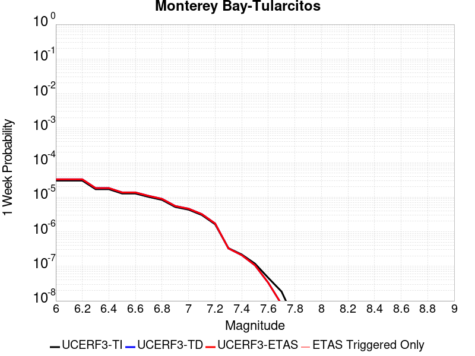 | 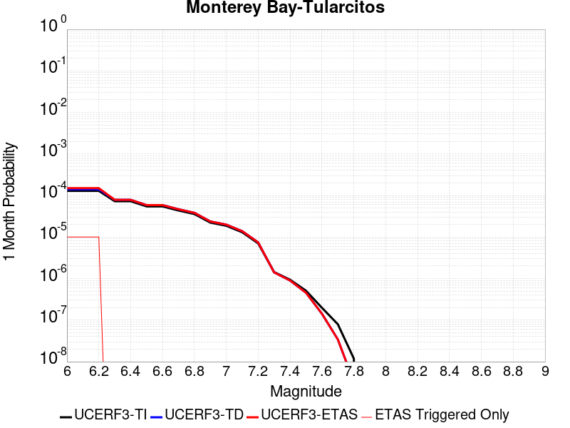 | 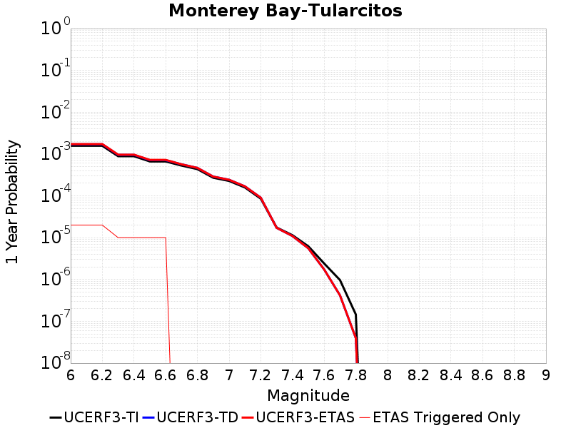 | 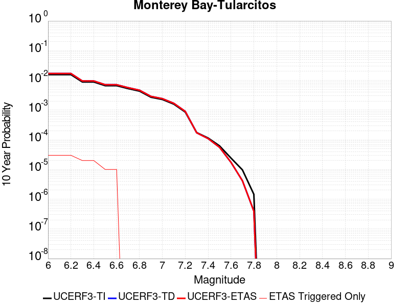 |

| Magnitude | 1 wk TI Prob | 1 wk TD Prob | 1 wk ETAS Prob | 1 wk ETAS/TD Gain | 1 wk ETAS Triggered Only | 1 mo TI Prob | 1 mo TD Prob | 1 mo ETAS Prob | 1 mo ETAS/TD Gain | 1 mo ETAS Triggered Only | 1 yr TI Prob | 1 yr TD Prob | 1 yr ETAS Prob | 1 yr ETAS/TD Gain | 1 yr ETAS Triggered Only | 10 yr TI Prob | 10 yr TD Prob | 10 yr ETAS Prob | 10 yr ETAS/TD Gain | 10 yr ETAS Triggered Only |
|-----|-----|-----|-----|-----|-----|-----|-----|-----|-----|-----|-----|-----|-----|-----|-----|-----|-----|-----|-----|-----|
| 6.0 | 3.0131365E-5 | 3.27991E-5 | 3.27991E-5 | 1.0 | 0.0 | 1.2912804E-4 | 1.405606E-4 | 1.505592E-4 | 1.0711337 | 1.0E-5 | 0.001571 | 0.0017100874 | 0.0017300532 | 1.0116754 | 2.0E-5 | 0.015599402 | 0.016980086 | 0.017009577 | 1.0017368 | 3.0E-5 |
| 6.1 | 3.0131365E-5 | 3.27991E-5 | 3.27991E-5 | 1.0 | 0.0 | 1.2912804E-4 | 1.405606E-4 | 1.505592E-4 | 1.0711337 | 1.0E-5 | 0.001571 | 0.0017100874 | 0.0017300532 | 1.0116754 | 2.0E-5 | 0.015599402 | 0.016980086 | 0.017009577 | 1.0017368 | 3.0E-5 |
| 6.2 | 3.0131365E-5 | 3.27991E-5 | 3.27991E-5 | 1.0 | 0.0 | 1.2912804E-4 | 1.405606E-4 | 1.505592E-4 | 1.0711337 | 1.0E-5 | 0.001571 | 0.0017100874 | 0.0017300532 | 1.0116754 | 2.0E-5 | 0.015599402 | 0.016980086 | 0.017009577 | 1.0017368 | 3.0E-5 |
| 6.3 | 1.6998249E-5 | 1.8330962E-5 | 1.8330962E-5 | 1.0 | 0.0 | 7.28476E-5 | 7.855901E-5 | 7.855901E-5 | 1.0 | 0.0 | 8.865586E-4 | 9.5605495E-4 | 9.6604537E-4 | 1.0104496 | 1.0E-5 | 0.0088303005 | 0.009521344 | 0.009541153 | 1.0020806 | 2.0E-5 |
| 6.4 | 1.6998249E-5 | 1.8330962E-5 | 1.8330962E-5 | 1.0 | 0.0 | 7.28476E-5 | 7.855901E-5 | 7.855901E-5 | 1.0 | 0.0 | 8.865586E-4 | 9.5605495E-4 | 9.6604537E-4 | 1.0104496 | 1.0E-5 | 0.0088303005 | 0.009521344 | 0.009541153 | 1.0020806 | 2.0E-5 |
| 6.5 | 1.27470785E-5 | 1.369343E-5 | 1.369343E-5 | 1.0 | 0.0 | 5.4629192E-5 | 5.868487E-5 | 5.868487E-5 | 1.0 | 0.0 | 6.649074E-4 | 7.142644E-4 | 7.2425726E-4 | 1.0139904 | 1.0E-5 | 0.0066292146 | 0.007120739 | 0.007130668 | 1.0013944 | 1.0E-5 |
| 6.6 | 1.2739422E-5 | 1.3685517E-5 | 1.3685517E-5 | 1.0 | 0.0 | 5.4596385E-5 | 5.8650956E-5 | 5.8650956E-5 | 1.0 | 0.0 | 6.645082E-4 | 7.1385177E-4 | 7.238446E-4 | 1.0139985 | 1.0E-5 | 0.0066252467 | 0.00711664 | 0.007126569 | 1.0013951 | 1.0E-5 |
| 6.7 | 1.0160109E-5 | 1.0885846E-5 | 1.0885846E-5 | 1.0 | 0.0 | 4.35426E-5 | 4.665283E-5 | 4.665283E-5 | 1.0 | 0.0 | 5.300022E-4 | 5.6785723E-4 | 5.6785723E-4 | 1.0 | 0.0 | 0.005287399 | 0.0056647733 | 0.0056647733 | 1.0 | 0.0 |
| 6.8 | 8.349859E-6 | 8.93266E-6 | 8.93266E-6 | 1.0 | 0.0 | 3.578462E-5 | 3.8282302E-5 | 3.8282302E-5 | 1.0 | 0.0 | 4.3559066E-4 | 4.6599298E-4 | 4.6599298E-4 | 1.0 | 0.0 | 0.004347378 | 0.0046507237 | 0.0046507237 | 1.0 | 0.0 |
| 6.9 | 5.193639E-6 | 5.536475E-6 | 5.536475E-6 | 1.0 | 0.0 | 2.2258262E-5 | 2.372755E-5 | 2.372755E-5 | 1.0 | 0.0 | 2.7096065E-4 | 2.888479E-4 | 2.888479E-4 | 1.0 | 0.0 | 0.0027063051 | 0.0028850455 | 0.0028850455 | 1.0 | 0.0 |
| 7.0 | 4.359381E-6 | 4.6434034E-6 | 4.6434034E-6 | 1.0 | 0.0 | 1.8682927E-5 | 1.9900166E-5 | 1.9900166E-5 | 1.0 | 0.0 | 2.274409E-4 | 2.4226056E-4 | 2.4226056E-4 | 1.0 | 0.0 | 0.0022720827 | 0.0024202575 | 0.0024202575 | 1.0 | 0.0 |
| 7.1 | 3.0398533E-6 | 3.231069E-6 | 3.231069E-6 | 1.0 | 0.0 | 1.3027877E-5 | 1.3847381E-5 | 1.3847381E-5 | 1.0 | 0.0 | 1.5860285E-4 | 1.6858143E-4 | 1.6858143E-4 | 1.0 | 0.0 | 0.001584897 | 0.0016847932 | 0.0016847932 | 1.0 | 0.0 |
| 7.2 | 1.642335E-6 | 1.7333299E-6 | 1.7333299E-6 | 1.0 | 0.0 | 7.0385595E-6 | 7.4285467E-6 | 7.4285467E-6 | 1.0 | 0.0 | 8.569109E-5 | 9.044087E-5 | 9.044087E-5 | 1.0 | 0.0 | 8.5658056E-4 | 9.042434E-4 | 9.042434E-4 | 1.0 | 0.0 |
| 7.3 | 3.356842E-7 | 3.2952667E-7 | 3.2952667E-7 | 1.0 | 0.0 | 1.4386458E-6 | 1.4122564E-6 | 1.4122564E-6 | 1.0 | 0.0 | 1.7515373E-5 | 1.7194086E-5 | 1.7194086E-5 | 1.0 | 0.0 | 1.7513991E-4 | 1.7192766E-4 | 1.7192766E-4 | 1.0 | 0.0 |
| 7.4 | 2.1973483E-7 | 2.1006652E-7 | 2.1006652E-7 | 1.0 | 0.0 | 9.417204E-7 | 9.0028476E-7 | 9.0028476E-7 | 1.0 | 0.0 | 1.1465385E-5 | 1.0960913E-5 | 1.0960913E-5 | 1.0 | 0.0 | 1.1464794E-4 | 1.0960375E-4 | 1.0960375E-4 | 1.0 | 0.0 |
| 7.5 | 1.1944135E-7 | 1.0696245E-7 | 1.0696245E-7 | 1.0 | 0.0 | 5.118914E-7 | 4.5841043E-7 | 4.5841043E-7 | 1.0 | 0.0 | 6.23226E-6 | 5.581133E-6 | 5.581133E-6 | 1.0 | 0.0 | 6.2320854E-5 | 5.580994E-5 | 5.580994E-5 | 1.0 | 0.0 |
| 7.6 | 4.636058E-8 | 3.336662E-8 | 3.336662E-8 | 1.0 | 0.0 | 1.9868818E-7 | 1.4299981E-7 | 1.4299981E-7 | 1.0 | 0.0 | 2.419026E-6 | 1.7410213E-6 | 1.7410213E-6 | 1.0 | 0.0 | 2.4189996E-5 | 1.7410079E-5 | 1.7410079E-5 | 1.0 | 0.0 |
| 7.7 | 1.8588572E-8 | 8.0049265E-9 | 8.0049265E-9 | 1.0 | 0.0 | 7.9665305E-8 | 3.4306826E-8 | 3.4306826E-8 | 1.0 | 0.0 | 9.699246E-7 | 4.1768553E-7 | 4.1768553E-7 | 1.0 | 0.0 | 9.699204E-6 | 4.1768476E-6 | 4.1768476E-6 | 1.0 | 0.0 |
| 7.8 | 2.7960154E-9 | 7.6119344E-10 | 7.6119344E-10 | 1.0 | 0.0 | 1.1982923E-8 | 3.262258E-9 | 3.262258E-9 | 1.0 | 0.0 | 1.4589209E-7 | 3.971799E-8 | 3.971799E-8 | 1.0 | 0.0 | 1.4589199E-6 | 3.9717986E-7 | 3.9717986E-7 | 1.0 | 0.0 |

## Elysian Park (Upper)
*[(top)](#table-of-contents)*

| 1 Week | 1 Month | 1 Year | 10 Year |
|-----|-----|-----|-----|
| 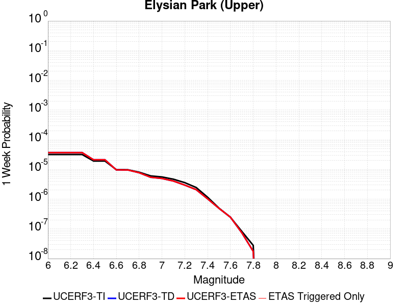 | 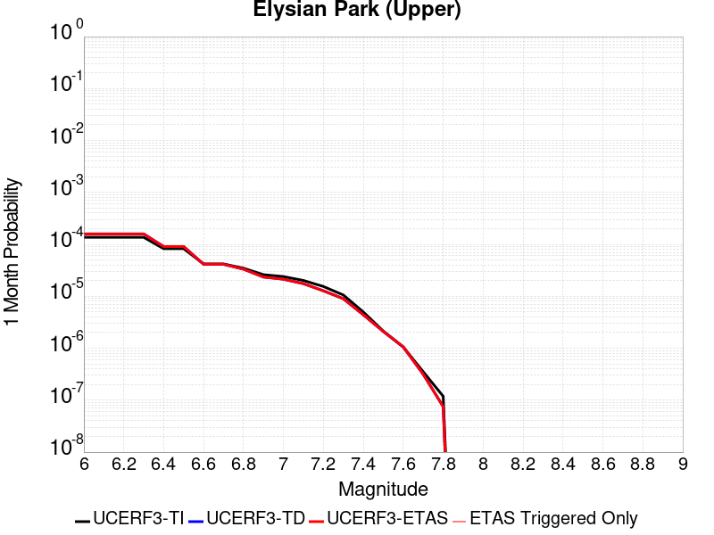 | 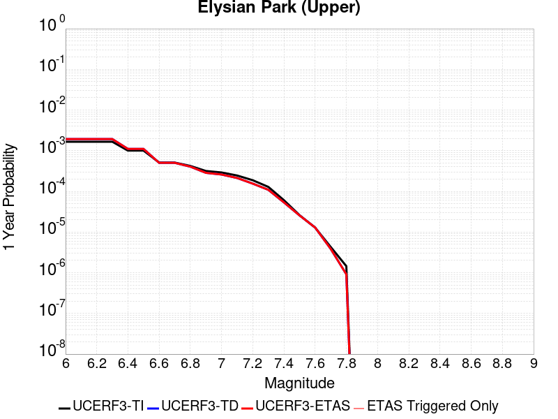 | 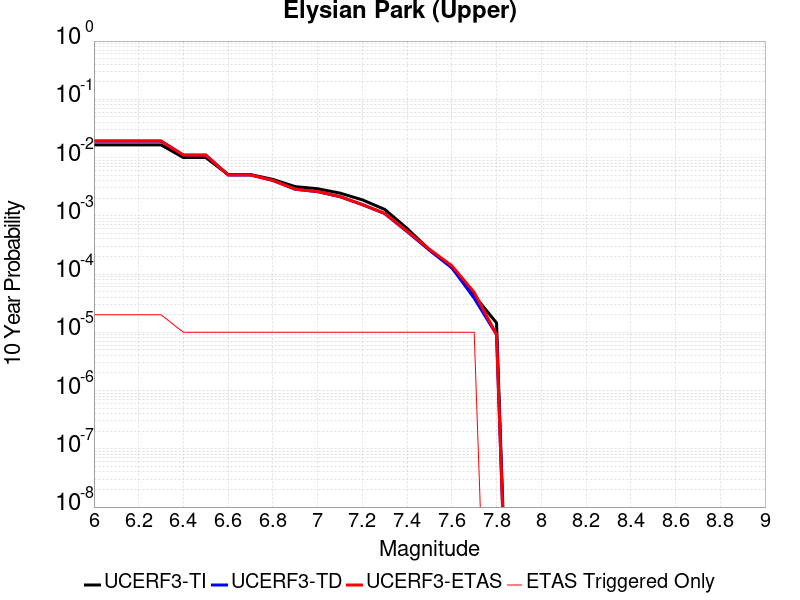 |

| Magnitude | 1 wk TI Prob | 1 wk TD Prob | 1 wk ETAS Prob | 1 wk ETAS/TD Gain | 1 wk ETAS Triggered Only | 1 mo TI Prob | 1 mo TD Prob | 1 mo ETAS Prob | 1 mo ETAS/TD Gain | 1 mo ETAS Triggered Only | 1 yr TI Prob | 1 yr TD Prob | 1 yr ETAS Prob | 1 yr ETAS/TD Gain | 1 yr ETAS Triggered Only | 10 yr TI Prob | 10 yr TD Prob | 10 yr ETAS Prob | 10 yr ETAS/TD Gain | 10 yr ETAS Triggered Only |
|-----|-----|-----|-----|-----|-----|-----|-----|-----|-----|-----|-----|-----|-----|-----|-----|-----|-----|-----|-----|-----|
| 6.0 | 3.1876025E-5 | 3.703636E-5 | 3.703636E-5 | 1.0 | 0.0 | 1.3660437E-4 | 1.5872034E-4 | 1.5872034E-4 | 1.0 | 0.0 | 0.0016618895 | 0.0019311503 | 0.0019311503 | 1.0 | 0.0 | 0.016495159 | 0.019190215 | 0.01920983 | 1.0010222 | 2.0E-5 |
| 6.1 | 3.1876025E-5 | 3.703636E-5 | 3.703636E-5 | 1.0 | 0.0 | 1.3660437E-4 | 1.5872034E-4 | 1.5872034E-4 | 1.0 | 0.0 | 0.0016618895 | 0.0019311503 | 0.0019311503 | 1.0 | 0.0 | 0.016495159 | 0.019190215 | 0.01920983 | 1.0010222 | 2.0E-5 |
| 6.2 | 3.1876025E-5 | 3.703636E-5 | 3.703636E-5 | 1.0 | 0.0 | 1.3660437E-4 | 1.5872034E-4 | 1.5872034E-4 | 1.0 | 0.0 | 0.0016618895 | 0.0019311503 | 0.0019311503 | 1.0 | 0.0 | 0.016495159 | 0.019190215 | 0.01920983 | 1.0010222 | 2.0E-5 |
| 6.3 | 3.1876025E-5 | 3.703636E-5 | 3.703636E-5 | 1.0 | 0.0 | 1.3660437E-4 | 1.5872034E-4 | 1.5872034E-4 | 1.0 | 0.0 | 0.0016618895 | 0.0019311503 | 0.0019311503 | 1.0 | 0.0 | 0.016495159 | 0.019190215 | 0.01920983 | 1.0010222 | 2.0E-5 |
| 6.4 | 1.9273462E-5 | 2.1202657E-5 | 2.1202657E-5 | 1.0 | 0.0 | 8.259794E-5 | 9.086635E-5 | 9.086635E-5 | 1.0 | 0.0 | 0.001005166 | 0.0011059097 | 0.0011059097 | 1.0 | 0.0 | 0.010006315 | 0.011020926 | 0.0110308165 | 1.0008974 | 1.0E-5 |
| 6.5 | 1.9273462E-5 | 2.1202657E-5 | 2.1202657E-5 | 1.0 | 0.0 | 8.259794E-5 | 9.086635E-5 | 9.086635E-5 | 1.0 | 0.0 | 0.001005166 | 0.0011059097 | 0.0011059097 | 1.0 | 0.0 | 0.010006315 | 0.011020926 | 0.0110308165 | 1.0008974 | 1.0E-5 |
| 6.6 | 9.813258E-6 | 9.665708E-6 | 9.665708E-6 | 1.0 | 0.0 | 4.205614E-5 | 4.1423842E-5 | 4.1423842E-5 | 1.0 | 0.0 | 5.119132E-4 | 5.0422584E-4 | 5.0422584E-4 | 1.0 | 0.0 | 0.005107356 | 0.0050315415 | 0.0050414912 | 1.0019774 | 1.0E-5 |
| 6.7 | 9.801478E-6 | 9.653277E-6 | 9.653277E-6 | 1.0 | 0.0 | 4.2005657E-5 | 4.137057E-5 | 4.137057E-5 | 1.0 | 0.0 | 5.112989E-4 | 5.035775E-4 | 5.035775E-4 | 1.0 | 0.0 | 0.0051012407 | 0.005025088 | 0.0050350376 | 1.0019801 | 1.0E-5 |
| 6.8 | 8.102489E-6 | 7.77309E-6 | 7.77309E-6 | 1.0 | 0.0 | 3.4724493E-5 | 3.331285E-5 | 3.331285E-5 | 1.0 | 0.0 | 4.2268867E-4 | 4.0551342E-4 | 4.0551342E-4 | 1.0 | 0.0 | 0.004218856 | 0.0040482283 | 0.004058188 | 1.0024602 | 1.0E-5 |
| 6.9 | 6.08275E-6 | 5.481503E-6 | 5.481503E-6 | 1.0 | 0.0 | 2.6068668E-5 | 2.349195E-5 | 2.349195E-5 | 1.0 | 0.0 | 3.173398E-4 | 2.859777E-4 | 2.859777E-4 | 1.0 | 0.0 | 0.0031688702 | 0.0028561747 | 0.0028661462 | 1.0034912 | 1.0E-5 |
| 7.0 | 5.5995934E-6 | 4.982827E-6 | 4.982827E-6 | 1.0 | 0.0 | 2.3998036E-5 | 2.1354801E-5 | 2.1354801E-5 | 1.0 | 0.0 | 2.9213692E-4 | 2.5996435E-4 | 2.5996435E-4 | 1.0 | 0.0 | 0.0029175316 | 0.0025966698 | 0.0026066438 | 1.003841 | 1.0E-5 |
| 7.1 | 4.709881E-6 | 4.0874397E-6 | 4.0874397E-6 | 1.0 | 0.0 | 2.0185047E-5 | 1.7517483E-5 | 1.7517483E-5 | 1.0 | 0.0 | 2.4572524E-4 | 2.1325488E-4 | 2.1325488E-4 | 1.0 | 0.0 | 0.002454537 | 0.0021305438 | 0.0021405227 | 1.0046836 | 1.0E-5 |
| 7.2 | 3.6063436E-6 | 2.9779815E-6 | 2.9779815E-6 | 1.0 | 0.0 | 1.5455667E-5 | 1.2762716E-5 | 1.2762716E-5 | 1.0 | 0.0 | 1.881565E-4 | 1.553751E-4 | 1.553751E-4 | 1.0 | 0.0 | 0.0018799726 | 0.001552676 | 0.0015626603 | 1.0064305 | 1.0E-5 |
| 7.3 | 2.471135E-6 | 2.0954806E-6 | 2.0954806E-6 | 1.0 | 0.0 | 1.0590536E-5 | 8.980601E-6 | 8.980601E-6 | 1.0 | 0.0 | 1.2893214E-4 | 1.093334E-4 | 1.093334E-4 | 1.0 | 0.0 | 0.0012885736 | 0.0010928033 | 0.0011027923 | 1.0091407 | 1.0E-5 |
| 7.4 | 1.163943E-6 | 1.0275194E-6 | 1.0275194E-6 | 1.0 | 0.0 | 4.988318E-6 | 4.403647E-6 | 4.403647E-6 | 1.0 | 0.0 | 6.0731076E-5 | 5.3613112E-5 | 5.3613112E-5 | 1.0 | 0.0 | 6.071448E-4 | 5.360048E-4 | 5.459994E-4 | 1.0186466 | 1.0E-5 |
| 7.5 | 4.99459E-7 | 4.9176515E-7 | 4.9176515E-7 | 1.0 | 0.0 | 2.140537E-6 | 2.1075634E-6 | 2.1075634E-6 | 1.0 | 0.0 | 2.6060725E-5 | 2.5659298E-5 | 2.5659298E-5 | 1.0 | 0.0 | 2.605767E-4 | 2.565649E-4 | 2.6656236E-4 | 1.0389665 | 1.0E-5 |
| 7.6 | 2.4667852E-7 | 2.4778623E-7 | 2.4778623E-7 | 1.0 | 0.0 | 1.0571932E-6 | 1.0619406E-6 | 1.0619406E-6 | 1.0 | 0.0 | 1.2871251E-5 | 1.2929053E-5 | 1.2929053E-5 | 1.0 | 0.0 | 1.2870505E-4 | 1.2928338E-4 | 1.3928209E-4 | 1.0773394 | 1.0E-5 |
| 7.7 | 8.2312795E-8 | 7.3866005E-8 | 7.3866005E-8 | 1.0 | 0.0 | 3.527691E-7 | 3.1656856E-7 | 3.1656856E-7 | 1.0 | 0.0 | 4.294955E-6 | 3.8542166E-6 | 3.8542166E-6 | 1.0 | 0.0 | 4.2948723E-5 | 3.8541613E-5 | 4.8541227E-5 | 1.2594498 | 1.0E-5 |
| 7.8 | 2.7819295E-8 | 1.7567118E-8 | 1.7567118E-8 | 1.0 | 0.0 | 1.1922555E-7 | 7.5287645E-8 | 7.5287645E-8 | 1.0 | 0.0 | 1.45157E-6 | 9.166269E-7 | 9.166269E-7 | 1.0 | 0.0 | 1.45156055E-5 | 9.166246E-6 | 9.166246E-6 | 1.0 | 0.0 |

## Great Valley 11
*[(top)](#table-of-contents)*

| 1 Week | 1 Month | 1 Year | 10 Year |
|-----|-----|-----|-----|
| 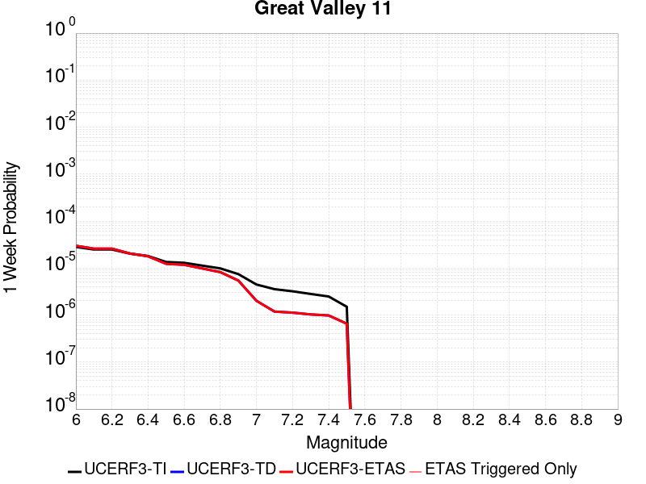 | 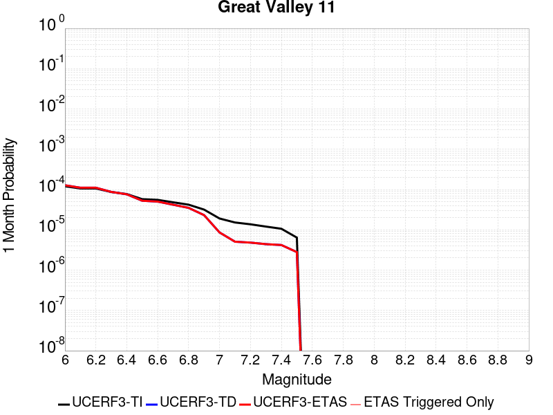 | 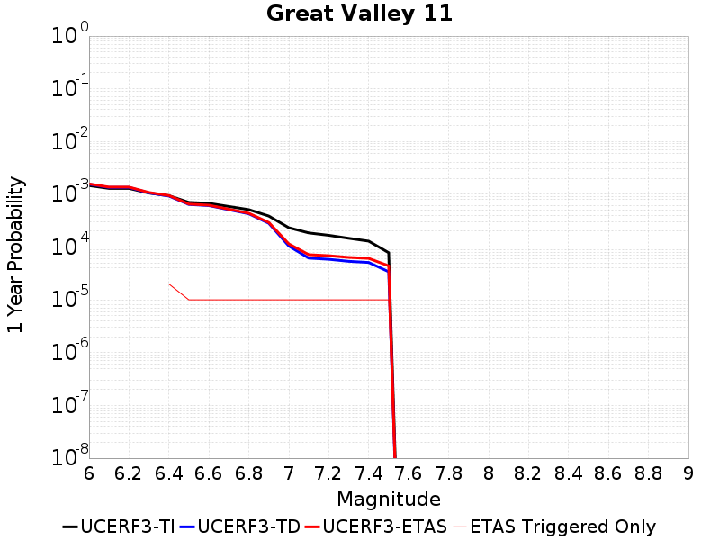 | 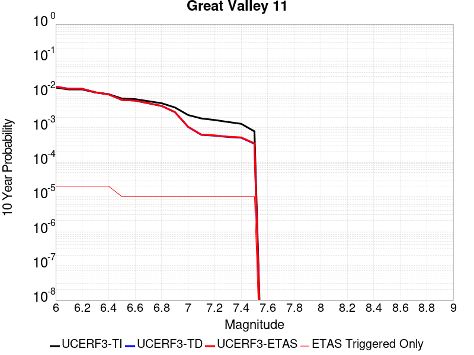 |

| Magnitude | 1 wk TI Prob | 1 wk TD Prob | 1 wk ETAS Prob | 1 wk ETAS/TD Gain | 1 wk ETAS Triggered Only | 1 mo TI Prob | 1 mo TD Prob | 1 mo ETAS Prob | 1 mo ETAS/TD Gain | 1 mo ETAS Triggered Only | 1 yr TI Prob | 1 yr TD Prob | 1 yr ETAS Prob | 1 yr ETAS/TD Gain | 1 yr ETAS Triggered Only | 10 yr TI Prob | 10 yr TD Prob | 10 yr ETAS Prob | 10 yr ETAS/TD Gain | 10 yr ETAS Triggered Only |
|-----|-----|-----|-----|-----|-----|-----|-----|-----|-----|-----|-----|-----|-----|-----|-----|-----|-----|-----|-----|-----|
| 6.0 | 2.8099583E-5 | 2.9832736E-5 | 2.9832736E-5 | 1.0 | 0.0 | 1.20421224E-4 | 1.2784873E-4 | 1.2784873E-4 | 1.0 | 0.0 | 0.0014651422 | 0.0015555219 | 0.0015754908 | 1.0128374 | 2.0E-5 | 0.0145552 | 0.015453866 | 0.015473557 | 1.0012742 | 2.0E-5 |
| 6.1 | 2.483194E-5 | 2.5907646E-5 | 2.5907646E-5 | 1.0 | 0.0 | 1.0641825E-4 | 1.1102841E-4 | 1.1102841E-4 | 1.0 | 0.0 | 0.0012948721 | 0.0013509969 | 0.0013709699 | 1.0147839 | 2.0E-5 | 0.012873529 | 0.013434254 | 0.013453986 | 1.0014688 | 2.0E-5 |
| 6.2 | 2.483194E-5 | 2.5907646E-5 | 2.5907646E-5 | 1.0 | 0.0 | 1.0641825E-4 | 1.1102841E-4 | 1.1102841E-4 | 1.0 | 0.0 | 0.0012948721 | 0.0013509969 | 0.0013709699 | 1.0147839 | 2.0E-5 | 0.012873529 | 0.013434254 | 0.013453986 | 1.0014688 | 2.0E-5 |
| 6.3 | 2.0257901E-5 | 2.0399291E-5 | 2.0399291E-5 | 1.0 | 0.0 | 8.681669E-5 | 8.742284E-5 | 8.742284E-5 | 1.0 | 0.0 | 0.0010564806 | 0.0010638954 | 0.0010838741 | 1.0187788 | 2.0E-5 | 0.01051472 | 0.010592208 | 0.010611996 | 1.0018681 | 2.0E-5 |
| 6.4 | 1.8054898E-5 | 1.7781189E-5 | 1.7781189E-5 | 1.0 | 0.0 | 7.737584E-5 | 7.620308E-5 | 7.620308E-5 | 1.0 | 0.0 | 9.416436E-4 | 9.274155E-4 | 9.4739697E-4 | 1.0215453 | 2.0E-5 | 0.009376635 | 0.009239203 | 0.009259019 | 1.0021447 | 2.0E-5 |
| 6.5 | 1.34804895E-5 | 1.2321261E-5 | 1.2321261E-5 | 1.0 | 0.0 | 5.777225E-5 | 5.280436E-5 | 5.280436E-5 | 1.0 | 0.0 | 7.031501E-4 | 6.4270763E-4 | 6.527012E-4 | 1.0155492 | 1.0E-5 | 0.007009294 | 0.0064089256 | 0.0064188614 | 1.0015503 | 1.0E-5 |
| 6.6 | 1.294883E-5 | 1.1732511E-5 | 1.1732511E-5 | 1.0 | 0.0 | 5.5493805E-5 | 5.0281244E-5 | 5.0281244E-5 | 1.0 | 0.0 | 6.754276E-4 | 6.120063E-4 | 6.220002E-4 | 1.0163296 | 1.0E-5 | 0.006733784 | 0.0061036344 | 0.006113573 | 1.0016284 | 1.0E-5 |
| 6.7 | 1.1272237E-5 | 9.8120545E-6 | 9.8120545E-6 | 1.0 | 0.0 | 4.8308695E-5 | 4.2050997E-5 | 4.2050997E-5 | 1.0 | 0.0 | 5.879996E-4 | 5.118534E-4 | 5.2184827E-4 | 1.0195268 | 1.0E-5 | 0.005864462 | 0.0051070284 | 0.0051169777 | 1.0019481 | 1.0E-5 |
| 6.8 | 9.8337505E-6 | 8.193915E-6 | 8.193915E-6 | 1.0 | 0.0 | 4.2143965E-5 | 3.5116318E-5 | 3.5116318E-5 | 1.0 | 0.0 | 5.1298196E-4 | 4.2745937E-4 | 4.374551E-4 | 1.0233841 | 1.0E-5 | 0.005117994 | 0.0042665815 | 0.0042765387 | 1.0023338 | 1.0E-5 |
| 6.9 | 7.4224813E-6 | 5.413233E-6 | 5.413233E-6 | 1.0 | 0.0 | 3.1810247E-5 | 2.319937E-5 | 2.319937E-5 | 1.0 | 0.0 | 3.872209E-4 | 2.8241714E-4 | 2.924143E-4 | 1.0353986 | 1.0E-5 | 0.0038654688 | 0.0028207232 | 0.002830695 | 1.0035352 | 1.0E-5 |
| 7.0 | 4.4628923E-6 | 2.0111142E-6 | 2.0111142E-6 | 1.0 | 0.0 | 1.912654E-5 | 8.619033E-6 | 8.619033E-6 | 1.0 | 0.0 | 2.3284076E-4 | 1.04931794E-4 | 1.1493074E-4 | 1.09529 | 1.0E-5 | 0.0023259693 | 0.0010488341 | 0.0010588235 | 1.0095243 | 1.0E-5 |
| 7.1 | 3.5546527E-6 | 1.1856054E-6 | 1.1856054E-6 | 1.0 | 0.0 | 1.5234136E-5 | 5.0811564E-6 | 5.0811564E-6 | 1.0 | 0.0 | 1.8545982E-4 | 6.186139E-5 | 7.186077E-5 | 1.1616417 | 1.0E-5 | 0.0018530512 | 6.184485E-4 | 6.284423E-4 | 1.0161595 | 1.0E-5 |
| 7.2 | 3.2039936E-6 | 1.1254324E-6 | 1.1254324E-6 | 1.0 | 0.0 | 1.3731329E-5 | 4.8232732E-6 | 4.8232732E-6 | 1.0 | 0.0 | 1.671661E-4 | 5.872184E-5 | 6.872125E-5 | 1.1702844 | 1.0E-5 | 0.0016704041 | 5.8706995E-4 | 5.970641E-4 | 1.0170238 | 1.0E-5 |
| 7.3 | 2.8120473E-6 | 1.0305783E-6 | 1.0305783E-6 | 1.0 | 0.0 | 1.2051575E-5 | 4.4167573E-6 | 4.4167573E-6 | 1.0 | 0.0 | 1.4671806E-4 | 5.377276E-5 | 6.3772226E-5 | 1.1859578 | 1.0E-5 | 0.0014662122 | 5.376041E-4 | 5.4759876E-4 | 1.018591 | 1.0E-5 |
| 7.4 | 2.4837766E-6 | 9.800737E-7 | 9.800737E-7 | 1.0 | 0.0 | 1.0644713E-5 | 4.2003094E-6 | 4.2003094E-6 | 1.0 | 0.0 | 1.2959167E-4 | 5.113763E-5 | 6.113712E-5 | 1.1955407 | 1.0E-5 | 0.0012951613 | 5.1126524E-4 | 5.2126014E-4 | 1.0195494 | 1.0E-5 |
| 7.5 | 1.5002679E-6 | 6.546236E-7 | 6.546236E-7 | 1.0 | 0.0 | 6.4297037E-6 | 2.805527E-6 | 2.805527E-6 | 1.0 | 0.0 | 7.827883E-5 | 3.4156797E-5 | 4.4156455E-5 | 1.2927575 | 1.0E-5 | 7.825126E-4 | 3.4151963E-4 | 3.515162E-4 | 1.0292709 | 1.0E-5 |

## Pitas Point (Lower West)
*[(top)](#table-of-contents)*

| 1 Week | 1 Month | 1 Year | 10 Year |
|-----|-----|-----|-----|
| 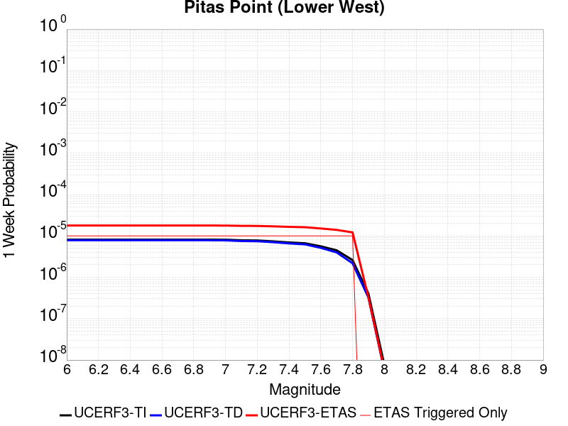 |  | 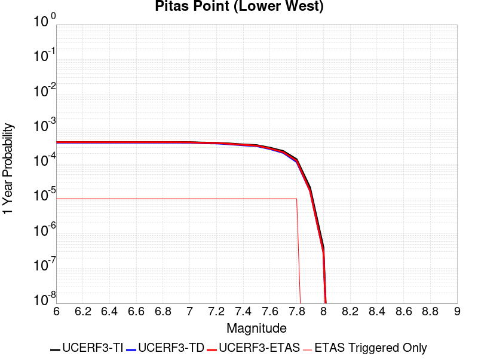 | 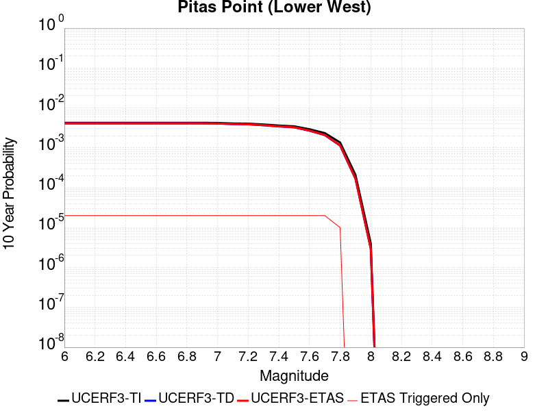 |

| Magnitude | 1 wk TI Prob | 1 wk TD Prob | 1 wk ETAS Prob | 1 wk ETAS/TD Gain | 1 wk ETAS Triggered Only | 1 mo TI Prob | 1 mo TD Prob | 1 mo ETAS Prob | 1 mo ETAS/TD Gain | 1 mo ETAS Triggered Only | 1 yr TI Prob | 1 yr TD Prob | 1 yr ETAS Prob | 1 yr ETAS/TD Gain | 1 yr ETAS Triggered Only | 10 yr TI Prob | 10 yr TD Prob | 10 yr ETAS Prob | 10 yr ETAS/TD Gain | 10 yr ETAS Triggered Only |
|-----|-----|-----|-----|-----|-----|-----|-----|-----|-----|-----|-----|-----|-----|-----|-----|-----|-----|-----|-----|-----|
| 6.0 | 8.151497E-6 | 7.855818E-6 | 1.785574E-5 | 2.2729318 | 1.0E-5 | 3.493452E-5 | 3.3667362E-5 | 4.3667023E-5 | 1.2970135 | 1.0E-5 | 4.252448E-4 | 4.0982376E-4 | 4.1981967E-4 | 1.0243907 | 1.0E-5 | 0.0042443196 | 0.004090761 | 0.0041106786 | 1.0048691 | 2.0E-5 |
| 6.1 | 8.151497E-6 | 7.855818E-6 | 1.785574E-5 | 2.2729318 | 1.0E-5 | 3.493452E-5 | 3.3667362E-5 | 4.3667023E-5 | 1.2970135 | 1.0E-5 | 4.252448E-4 | 4.0982376E-4 | 4.1981967E-4 | 1.0243907 | 1.0E-5 | 0.0042443196 | 0.004090761 | 0.0041106786 | 1.0048691 | 2.0E-5 |
| 6.2 | 8.151497E-6 | 7.855818E-6 | 1.785574E-5 | 2.2729318 | 1.0E-5 | 3.493452E-5 | 3.3667362E-5 | 4.3667023E-5 | 1.2970135 | 1.0E-5 | 4.252448E-4 | 4.0982376E-4 | 4.1981967E-4 | 1.0243907 | 1.0E-5 | 0.0042443196 | 0.004090761 | 0.0041106786 | 1.0048691 | 2.0E-5 |
| 6.3 | 8.151497E-6 | 7.855818E-6 | 1.785574E-5 | 2.2729318 | 1.0E-5 | 3.493452E-5 | 3.3667362E-5 | 4.3667023E-5 | 1.2970135 | 1.0E-5 | 4.252448E-4 | 4.0982376E-4 | 4.1981967E-4 | 1.0243907 | 1.0E-5 | 0.0042443196 | 0.004090761 | 0.0041106786 | 1.0048691 | 2.0E-5 |
| 6.4 | 8.151497E-6 | 7.855818E-6 | 1.785574E-5 | 2.2729318 | 1.0E-5 | 3.493452E-5 | 3.3667362E-5 | 4.3667023E-5 | 1.2970135 | 1.0E-5 | 4.252448E-4 | 4.0982376E-4 | 4.1981967E-4 | 1.0243907 | 1.0E-5 | 0.0042443196 | 0.004090761 | 0.0041106786 | 1.0048691 | 2.0E-5 |
| 6.5 | 8.151497E-6 | 7.855818E-6 | 1.785574E-5 | 2.2729318 | 1.0E-5 | 3.493452E-5 | 3.3667362E-5 | 4.3667023E-5 | 1.2970135 | 1.0E-5 | 4.252448E-4 | 4.0982376E-4 | 4.1981967E-4 | 1.0243907 | 1.0E-5 | 0.0042443196 | 0.004090761 | 0.0041106786 | 1.0048691 | 2.0E-5 |
| 6.6 | 8.151497E-6 | 7.855818E-6 | 1.785574E-5 | 2.2729318 | 1.0E-5 | 3.493452E-5 | 3.3667362E-5 | 4.3667023E-5 | 1.2970135 | 1.0E-5 | 4.252448E-4 | 4.0982376E-4 | 4.1981967E-4 | 1.0243907 | 1.0E-5 | 0.0042443196 | 0.004090761 | 0.0041106786 | 1.0048691 | 2.0E-5 |
| 6.7 | 8.151497E-6 | 7.855818E-6 | 1.785574E-5 | 2.2729318 | 1.0E-5 | 3.493452E-5 | 3.3667362E-5 | 4.3667023E-5 | 1.2970135 | 1.0E-5 | 4.252448E-4 | 4.0982376E-4 | 4.1981967E-4 | 1.0243907 | 1.0E-5 | 0.0042443196 | 0.004090761 | 0.0041106786 | 1.0048691 | 2.0E-5 |
| 6.8 | 8.151497E-6 | 7.855818E-6 | 1.785574E-5 | 2.2729318 | 1.0E-5 | 3.493452E-5 | 3.3667362E-5 | 4.3667023E-5 | 1.2970135 | 1.0E-5 | 4.252448E-4 | 4.0982376E-4 | 4.1981967E-4 | 1.0243907 | 1.0E-5 | 0.0042443196 | 0.004090761 | 0.0041106786 | 1.0048691 | 2.0E-5 |
| 6.9 | 8.151497E-6 | 7.855818E-6 | 1.785574E-5 | 2.2729318 | 1.0E-5 | 3.493452E-5 | 3.3667362E-5 | 4.3667023E-5 | 1.2970135 | 1.0E-5 | 4.252448E-4 | 4.0982376E-4 | 4.1981967E-4 | 1.0243907 | 1.0E-5 | 0.0042443196 | 0.004090761 | 0.0041106786 | 1.0048691 | 2.0E-5 |
| 7.0 | 8.103535E-6 | 7.805247E-6 | 1.7805169E-5 | 2.2811794 | 1.0E-5 | 3.4728975E-5 | 3.3450637E-5 | 4.34503E-5 | 1.298938 | 1.0E-5 | 4.2274324E-4 | 4.0718613E-4 | 4.1718205E-4 | 1.0245488 | 1.0E-5 | 0.0042193993 | 0.004064481 | 0.0040843994 | 1.0049007 | 2.0E-5 |
| 7.1 | 7.853298E-6 | 7.540937E-6 | 1.7540862E-5 | 2.326085 | 1.0E-5 | 3.3656554E-5 | 3.2317905E-5 | 4.231758E-5 | 1.309416 | 1.0E-5 | 4.096915E-4 | 3.9340014E-4 | 4.033962E-4 | 1.0254095 | 1.0E-5 | 0.00408937 | 0.0039271135 | 0.003947035 | 1.0050728 | 2.0E-5 |
| 7.2 | 7.771102E-6 | 7.453218E-6 | 1.7453143E-5 | 2.3416922 | 1.0E-5 | 3.33043E-5 | 3.1941978E-5 | 4.1941657E-5 | 1.3130577 | 1.0E-5 | 4.0540437E-4 | 3.8882488E-4 | 3.9882096E-4 | 1.0257086 | 1.0E-5 | 0.0040466557 | 0.003881521 | 0.0039014434 | 1.0051327 | 2.0E-5 |
| 7.3 | 7.3945344E-6 | 7.0493193E-6 | 1.704925E-5 | 2.4185667 | 1.0E-5 | 3.1690477E-5 | 3.0211022E-5 | 4.021072E-5 | 1.330995 | 1.0E-5 | 3.8576324E-4 | 3.6775775E-4 | 3.7775407E-4 | 1.0271819 | 1.0E-5 | 0.0038509427 | 0.0036715593 | 0.0036914859 | 1.0054272 | 2.0E-5 |
| 7.4 | 6.964645E-6 | 6.590165E-6 | 1.6590098E-5 | 2.5174026 | 1.0E-5 | 2.9848137E-5 | 2.8243261E-5 | 3.824298E-5 | 1.3540567 | 1.0E-5 | 3.6334046E-4 | 3.4380794E-4 | 3.538045E-4 | 1.029076 | 1.0E-5 | 0.0036274698 | 0.0034328138 | 0.003452745 | 1.0058061 | 2.0E-5 |
| 7.5 | 6.6525035E-6 | 6.259201E-6 | 1.6259139E-5 | 2.597638 | 1.0E-5 | 2.851042E-5 | 2.6824875E-5 | 3.6824607E-5 | 1.3727783 | 1.0E-5 | 3.4705905E-4 | 3.265444E-4 | 3.3654112E-4 | 1.0306137 | 1.0E-5 | 0.0034651754 | 0.0032606972 | 0.003280632 | 1.0061136 | 2.0E-5 |
| 7.6 | 5.613338E-6 | 5.1514216E-6 | 1.51513705E-5 | 2.9412017 | 1.0E-5 | 2.405694E-5 | 2.2077336E-5 | 3.2077114E-5 | 1.4529432 | 1.0E-5 | 2.928539E-4 | 2.687587E-4 | 2.7875602E-4 | 1.0371981 | 1.0E-5 | 0.0029246826 | 0.0026843685 | 0.002704315 | 1.0074306 | 2.0E-5 |
| 7.7 | 4.494704E-6 | 3.996939E-6 | 1.3996899E-5 | 3.5019045 | 1.0E-5 | 1.9262876E-5 | 1.7129627E-5 | 2.7129456E-5 | 1.5837739 | 1.0E-5 | 2.3450027E-4 | 2.0853349E-4 | 2.1853141E-4 | 1.047944 | 1.0E-5 | 0.0023425296 | 0.0020834021 | 0.0021033606 | 1.0095797 | 2.0E-5 |
| 7.8 | 2.6075882E-6 | 2.1836527E-6 | 1.2183631E-5 | 5.579473 | 1.0E-5 | 1.117533E-5 | 9.358479E-6 | 1.9358384E-5 | 2.0685399 | 1.0E-5 | 1.3605114E-4 | 1.1393356E-4 | 1.2393242E-4 | 1.0877604 | 1.0E-5 | 0.0013596788 | 0.0011387562 | 0.0011487448 | 1.0087715 | 1.0E-5 |
| 7.9 | 4.045984E-7 | 3.2423983E-7 | 3.2423983E-7 | 1.0 | 0.0 | 1.733992E-6 | 1.3895987E-6 | 1.3895987E-6 | 1.0 | 0.0 | 2.1111147E-5 | 1.6918235E-5 | 1.6918235E-5 | 1.0 | 0.0 | 2.1109142E-4 | 1.6916978E-4 | 1.6916978E-4 | 1.0 | 0.0 |
| 8.0 | 7.791402E-9 | 5.6835443E-9 | 5.6835443E-9 | 1.0 | 0.0 | 3.3391725E-8 | 2.4358048E-8 | 2.4358048E-8 | 1.0 | 0.0 | 4.0654416E-7 | 2.965592E-7 | 2.965592E-7 | 1.0 | 0.0 | 4.065434E-6 | 2.96559E-6 | 2.96559E-6 | 1.0 | 0.0 |

## Robinson Creek
*[(top)](#table-of-contents)*

| 1 Week | 1 Month | 1 Year | 10 Year |
|-----|-----|-----|-----|
|  |  | 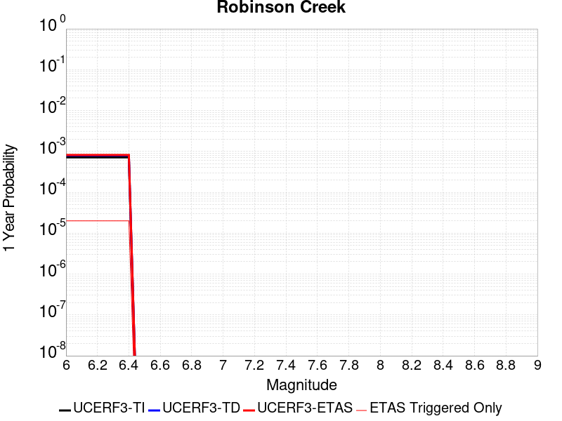 | 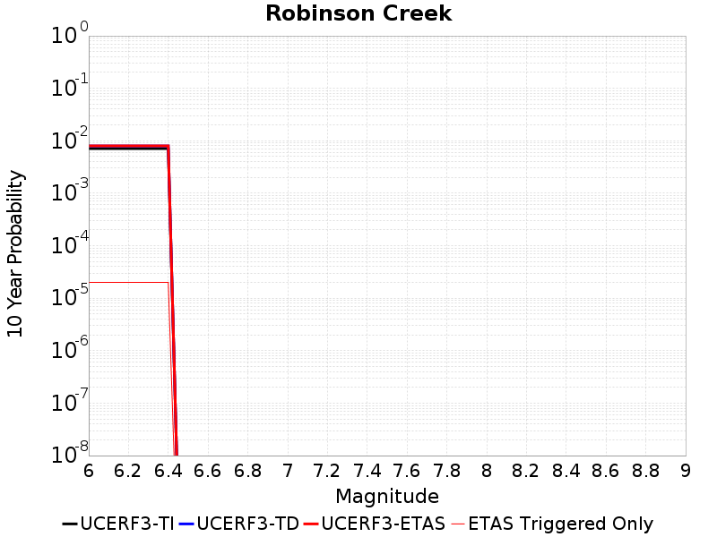 |

| Magnitude | 1 wk TI Prob | 1 wk TD Prob | 1 wk ETAS Prob | 1 wk ETAS/TD Gain | 1 wk ETAS Triggered Only | 1 mo TI Prob | 1 mo TD Prob | 1 mo ETAS Prob | 1 mo ETAS/TD Gain | 1 mo ETAS Triggered Only | 1 yr TI Prob | 1 yr TD Prob | 1 yr ETAS Prob | 1 yr ETAS/TD Gain | 1 yr ETAS Triggered Only | 10 yr TI Prob | 10 yr TD Prob | 10 yr ETAS Prob | 10 yr ETAS/TD Gain | 10 yr ETAS Triggered Only |
|-----|-----|-----|-----|-----|-----|-----|-----|-----|-----|-----|-----|-----|-----|-----|-----|-----|-----|-----|-----|-----|
| 6.0 | 1.3705327E-5 | 1.528521E-5 | 2.5285057E-5 | 1.6542171 | 1.0E-5 | 5.8735794E-5 | 6.5508044E-5 | 7.550739E-5 | 1.152643 | 1.0E-5 | 7.1487366E-4 | 7.9756044E-4 | 8.1754447E-4 | 1.0250565 | 2.0E-5 | 0.0071257832 | 0.007975604 | 0.007995444 | 1.0024877 | 2.0E-5 |
| 6.1 | 1.3705327E-5 | 1.528521E-5 | 2.5285057E-5 | 1.6542171 | 1.0E-5 | 5.8735794E-5 | 6.5508044E-5 | 7.550739E-5 | 1.152643 | 1.0E-5 | 7.1487366E-4 | 7.9756044E-4 | 8.1754447E-4 | 1.0250565 | 2.0E-5 | 0.0071257832 | 0.007975604 | 0.007995444 | 1.0024877 | 2.0E-5 |
| 6.2 | 1.3705327E-5 | 1.528521E-5 | 2.5285057E-5 | 1.6542171 | 1.0E-5 | 5.8735794E-5 | 6.5508044E-5 | 7.550739E-5 | 1.152643 | 1.0E-5 | 7.1487366E-4 | 7.9756044E-4 | 8.1754447E-4 | 1.0250565 | 2.0E-5 | 0.0071257832 | 0.007975604 | 0.007995444 | 1.0024877 | 2.0E-5 |
| 6.3 | 1.3705327E-5 | 1.528521E-5 | 2.5285057E-5 | 1.6542171 | 1.0E-5 | 5.8735794E-5 | 6.5508044E-5 | 7.550739E-5 | 1.152643 | 1.0E-5 | 7.1487366E-4 | 7.9756044E-4 | 8.1754447E-4 | 1.0250565 | 2.0E-5 | 0.0071257832 | 0.007975604 | 0.007995444 | 1.0024877 | 2.0E-5 |
| 6.4 | 1.3705327E-5 | 1.528521E-5 | 2.5285057E-5 | 1.6542171 | 1.0E-5 | 5.8735794E-5 | 6.5508044E-5 | 7.550739E-5 | 1.152643 | 1.0E-5 | 7.1487366E-4 | 7.9756044E-4 | 8.1754447E-4 | 1.0250565 | 2.0E-5 | 0.0071257832 | 0.007975604 | 0.007995444 | 1.0024877 | 2.0E-5 |

## La Panza 2011
*[(top)](#table-of-contents)*

| 1 Week | 1 Month | 1 Year | 10 Year |
|-----|-----|-----|-----|
| 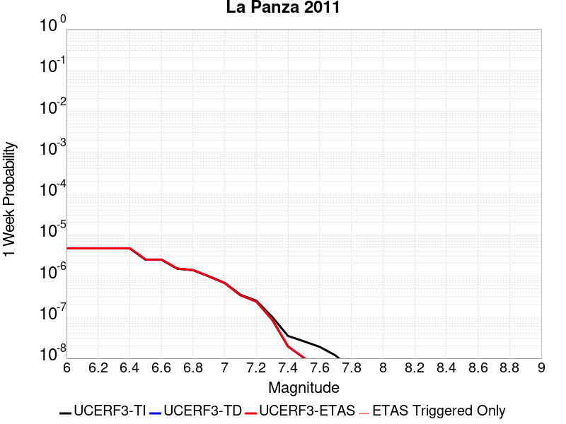 | 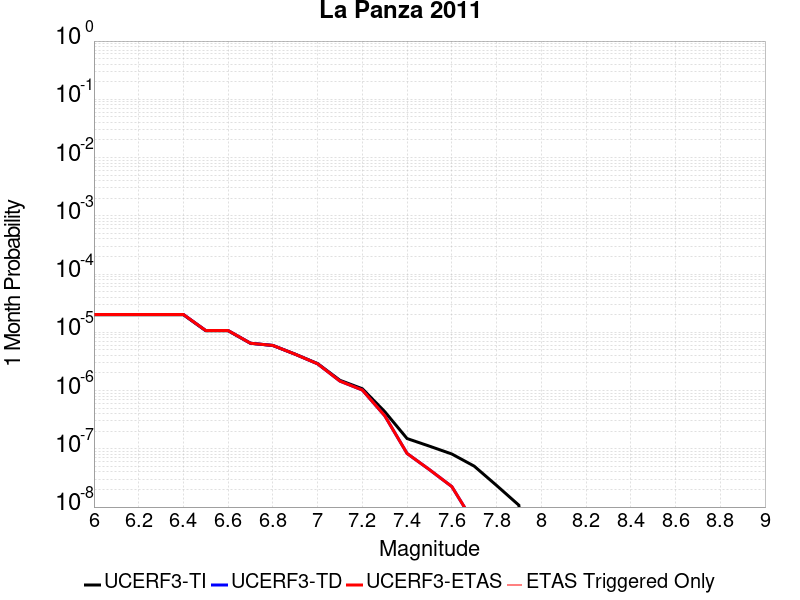 | 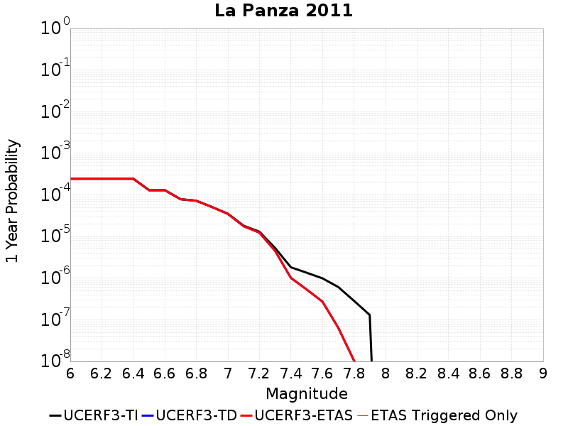 | 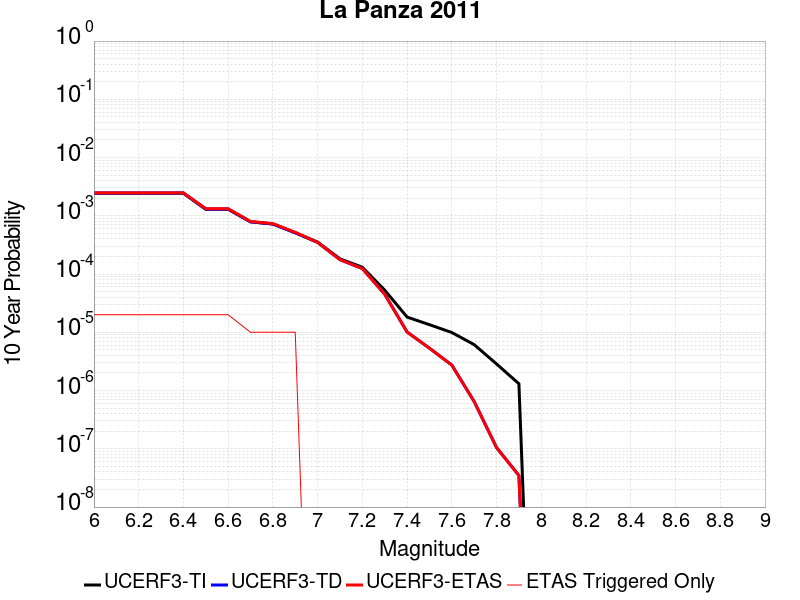 |

| Magnitude | 1 wk TI Prob | 1 wk TD Prob | 1 wk ETAS Prob | 1 wk ETAS/TD Gain | 1 wk ETAS Triggered Only | 1 mo TI Prob | 1 mo TD Prob | 1 mo ETAS Prob | 1 mo ETAS/TD Gain | 1 mo ETAS Triggered Only | 1 yr TI Prob | 1 yr TD Prob | 1 yr ETAS Prob | 1 yr ETAS/TD Gain | 1 yr ETAS Triggered Only | 10 yr TI Prob | 10 yr TD Prob | 10 yr ETAS Prob | 10 yr ETAS/TD Gain | 10 yr ETAS Triggered Only |
|-----|-----|-----|-----|-----|-----|-----|-----|-----|-----|-----|-----|-----|-----|-----|-----|-----|-----|-----|-----|-----|
| 6.0 | 4.6754544E-6 | 4.717605E-6 | 4.717605E-6 | 1.0 | 0.0 | 2.0037509E-5 | 2.021816E-5 | 2.021816E-5 | 1.0 | 0.0 | 2.4392935E-4 | 2.4613028E-4 | 2.4613028E-4 | 1.0 | 0.0 | 0.0024366176 | 0.0024587712 | 0.002478722 | 1.0081141 | 2.0E-5 |
| 6.1 | 4.6754544E-6 | 4.717605E-6 | 4.717605E-6 | 1.0 | 0.0 | 2.0037509E-5 | 2.021816E-5 | 2.021816E-5 | 1.0 | 0.0 | 2.4392935E-4 | 2.4613028E-4 | 2.4613028E-4 | 1.0 | 0.0 | 0.0024366176 | 0.0024587712 | 0.002478722 | 1.0081141 | 2.0E-5 |
| 6.2 | 4.6754544E-6 | 4.717605E-6 | 4.717605E-6 | 1.0 | 0.0 | 2.0037509E-5 | 2.021816E-5 | 2.021816E-5 | 1.0 | 0.0 | 2.4392935E-4 | 2.4613028E-4 | 2.4613028E-4 | 1.0 | 0.0 | 0.0024366176 | 0.0024587712 | 0.002478722 | 1.0081141 | 2.0E-5 |
| 6.3 | 4.6754544E-6 | 4.717605E-6 | 4.717605E-6 | 1.0 | 0.0 | 2.0037509E-5 | 2.021816E-5 | 2.021816E-5 | 1.0 | 0.0 | 2.4392935E-4 | 2.4613028E-4 | 2.4613028E-4 | 1.0 | 0.0 | 0.0024366176 | 0.0024587712 | 0.002478722 | 1.0081141 | 2.0E-5 |
| 6.4 | 4.6754544E-6 | 4.717605E-6 | 4.717605E-6 | 1.0 | 0.0 | 2.0037509E-5 | 2.021816E-5 | 2.021816E-5 | 1.0 | 0.0 | 2.4392935E-4 | 2.4613028E-4 | 2.4613028E-4 | 1.0 | 0.0 | 0.0024366176 | 0.0024587712 | 0.002478722 | 1.0081141 | 2.0E-5 |
| 6.5 | 2.485343E-6 | 2.5006136E-6 | 2.5006136E-6 | 1.0 | 0.0 | 1.0651426E-5 | 1.0716874E-5 | 1.0716874E-5 | 1.0 | 0.0 | 1.296734E-4 | 1.3047052E-4 | 1.3047052E-4 | 1.0 | 0.0 | 0.0012959775 | 0.0013039776 | 0.0013239515 | 1.0153177 | 2.0E-5 |
| 6.6 | 2.485343E-6 | 2.5006136E-6 | 2.5006136E-6 | 1.0 | 0.0 | 1.0651426E-5 | 1.0716874E-5 | 1.0716874E-5 | 1.0 | 0.0 | 1.296734E-4 | 1.3047052E-4 | 1.3047052E-4 | 1.0 | 0.0 | 0.0012959775 | 0.0013039776 | 0.0013239515 | 1.0153177 | 2.0E-5 |
| 6.7 | 1.5108508E-6 | 1.5146509E-6 | 1.5146509E-6 | 1.0 | 0.0 | 6.4750584E-6 | 6.4913456E-6 | 6.4913456E-6 | 1.0 | 0.0 | 7.8830984E-5 | 7.902938E-5 | 7.902938E-5 | 1.0 | 0.0 | 7.880303E-4 | 7.9002354E-4 | 8.0001564E-4 | 1.0126479 | 1.0E-5 |
| 6.8 | 1.3865837E-6 | 1.3885234E-6 | 1.3885234E-6 | 1.0 | 0.0 | 5.942488E-6 | 5.9508016E-6 | 5.9508016E-6 | 1.0 | 0.0 | 7.234739E-5 | 7.2448696E-5 | 7.2448696E-5 | 1.0 | 0.0 | 7.232384E-4 | 7.2426064E-4 | 7.342534E-4 | 1.0137972 | 1.0E-5 |
| 6.9 | 9.826583E-7 | 9.796413E-7 | 9.796413E-7 | 1.0 | 0.0 | 4.2113857E-6 | 4.1984563E-6 | 4.1984563E-6 | 1.0 | 0.0 | 5.1272415E-5 | 5.111506E-5 | 5.111506E-5 | 1.0 | 0.0 | 5.126059E-4 | 5.110384E-4 | 5.210333E-4 | 1.019558 | 1.0E-5 |
| 7.0 | 6.7797646E-7 | 6.710337E-7 | 6.710337E-7 | 1.0 | 0.0 | 2.9056102E-6 | 2.8758557E-6 | 2.8758557E-6 | 1.0 | 0.0 | 3.537523E-5 | 3.5013014E-5 | 3.5013014E-5 | 1.0 | 0.0 | 3.5369597E-4 | 3.5007804E-4 | 3.5007804E-4 | 1.0 | 0.0 |
| 7.1 | 3.4979826E-7 | 3.3875057E-7 | 3.3875057E-7 | 1.0 | 0.0 | 1.4991346E-6 | 1.4517874E-6 | 1.4517874E-6 | 1.0 | 0.0 | 1.825181E-5 | 1.767538E-5 | 1.767538E-5 | 1.0 | 0.0 | 1.825031E-4 | 1.7674091E-4 | 1.7674091E-4 | 1.0 | 0.0 |
| 7.2 | 2.5088332E-7 | 2.3833059E-7 | 2.3833059E-7 | 1.0 | 0.0 | 1.0752137E-6 | 1.0214164E-6 | 1.0214164E-6 | 1.0 | 0.0 | 1.3090649E-5 | 1.2435683E-5 | 1.2435683E-5 | 1.0 | 0.0 | 1.3089878E-4 | 1.2435073E-4 | 1.2435073E-4 | 1.0 | 0.0 |
| 7.3 | 1.0159086E-7 | 8.6457504E-8 | 8.6457504E-8 | 1.0 | 0.0 | 4.3538932E-7 | 3.7053212E-7 | 3.7053212E-7 | 1.0 | 0.0 | 5.300852E-6 | 4.5112197E-6 | 4.5112197E-6 | 1.0 | 0.0 | 5.3007258E-5 | 4.511132E-5 | 4.511132E-5 | 1.0 | 0.0 |
| 7.4 | 3.5006252E-8 | 1.9407954E-8 | 1.9407954E-8 | 1.0 | 0.0 | 1.5002678E-7 | 8.317694E-8 | 8.317694E-8 | 1.0 | 0.0 | 1.8265745E-6 | 1.0126788E-6 | 1.0126788E-6 | 1.0 | 0.0 | 1.8265595E-5 | 1.0126745E-5 | 1.0126745E-5 | 1.0 | 0.0 |
| 7.5 | 2.592274E-8 | 1.0241802E-8 | 1.0241802E-8 | 1.0 | 0.0 | 1.1109746E-7 | 4.389344E-8 | 4.389344E-8 | 1.0 | 0.0 | 1.3526106E-6 | 5.344025E-7 | 5.344025E-7 | 1.0 | 0.0 | 1.3526024E-5 | 5.344013E-6 | 5.344013E-6 | 1.0 | 0.0 |
| 7.6 | 1.9016717E-8 | 5.246541E-9 | 5.246541E-9 | 1.0 | 0.0 | 8.150022E-8 | 2.2485175E-8 | 2.2485175E-8 | 1.0 | 0.0 | 9.922647E-7 | 2.7375697E-7 | 2.7375697E-7 | 1.0 | 0.0 | 9.922603E-6 | 2.7375665E-6 | 2.7375665E-6 | 1.0 | 0.0 |
| 7.7 | 1.17738495E-8 | 1.2405622E-9 | 1.2405622E-9 | 1.0 | 0.0 | 5.0459356E-8 | 5.316695E-9 | 5.316695E-9 | 1.0 | 0.0 | 6.1434247E-7 | 6.473076E-8 | 6.473076E-8 | 1.0 | 0.0 | 6.143408E-6 | 6.4730744E-7 | 6.4730744E-7 | 1.0 | 0.0 |
| 7.8 | 5.489079E-9 | 2.0131519E-10 | 2.0131519E-10 | 1.0 | 0.0 | 2.3524624E-8 | 8.627792E-10 | 8.627792E-10 | 1.0 | 0.0 | 2.8641225E-7 | 1.0504337E-8 | 1.0504337E-8 | 1.0 | 0.0 | 2.8641189E-6 | 1.0504337E-7 | 1.0504337E-7 | 1.0 | 0.0 |
| 7.9 | 2.5081048E-9 | 6.69137E-11 | 6.69137E-11 | 1.0 | 0.0 | 1.0749021E-8 | 2.8677283E-10 | 2.8677283E-10 | 1.0 | 0.0 | 1.3086932E-7 | 3.4914602E-9 | 3.4914602E-9 | 1.0 | 0.0 | 1.3086925E-6 | 3.4914603E-8 | 3.4914603E-8 | 1.0 | 0.0 |

## Holser alt 1
*[(top)](#table-of-contents)*

| 1 Week | 1 Month | 1 Year | 10 Year |
|-----|-----|-----|-----|
| 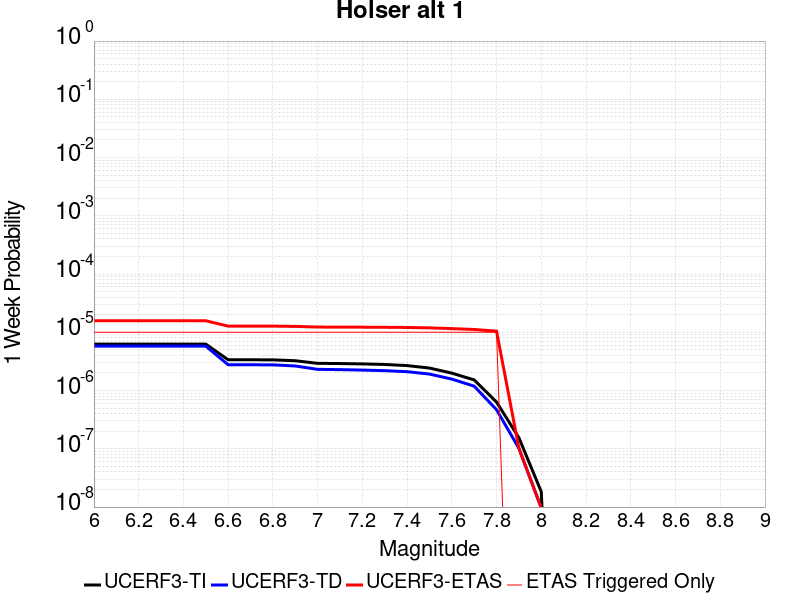 | 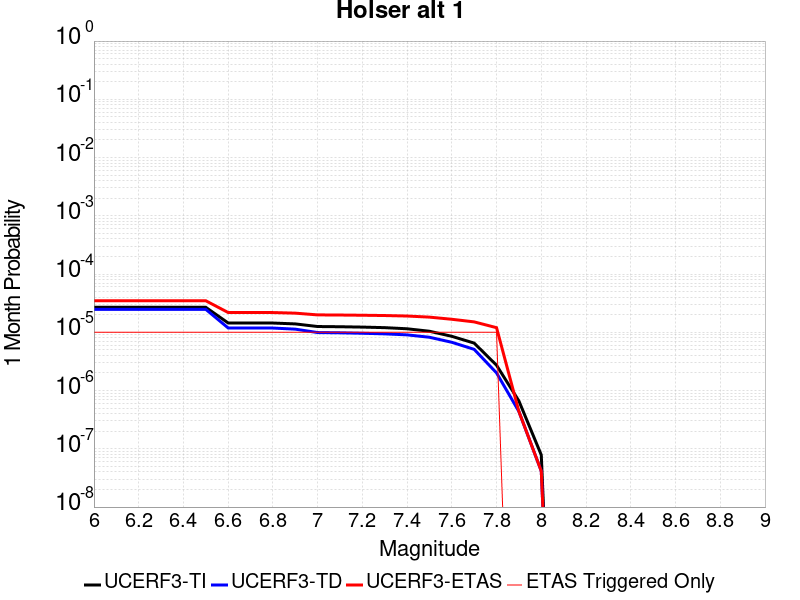 | 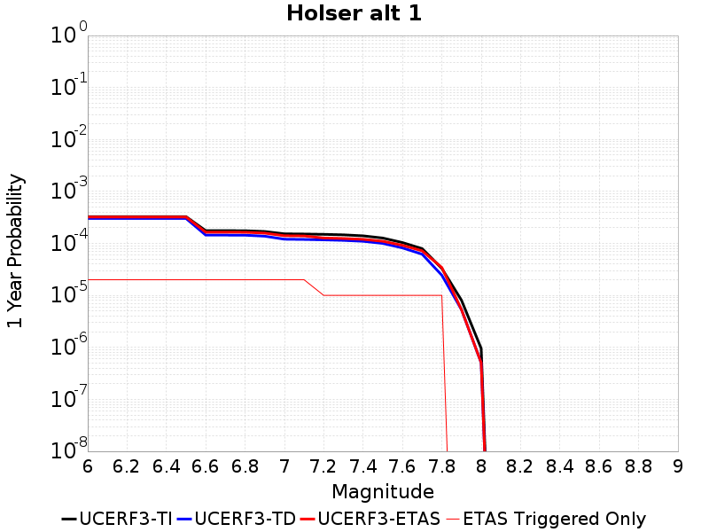 | 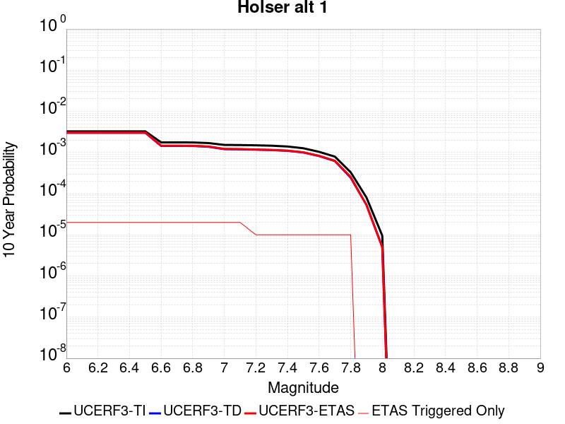 |

| Magnitude | 1 wk TI Prob | 1 wk TD Prob | 1 wk ETAS Prob | 1 wk ETAS/TD Gain | 1 wk ETAS Triggered Only | 1 mo TI Prob | 1 mo TD Prob | 1 mo ETAS Prob | 1 mo ETAS/TD Gain | 1 mo ETAS Triggered Only | 1 yr TI Prob | 1 yr TD Prob | 1 yr ETAS Prob | 1 yr ETAS/TD Gain | 1 yr ETAS Triggered Only | 10 yr TI Prob | 10 yr TD Prob | 10 yr ETAS Prob | 10 yr ETAS/TD Gain | 10 yr ETAS Triggered Only |
|-----|-----|-----|-----|-----|-----|-----|-----|-----|-----|-----|-----|-----|-----|-----|-----|-----|-----|-----|-----|-----|
| 6.0 | 6.2746653E-6 | 5.790009E-6 | 1.578995E-5 | 2.727103 | 1.0E-5 | 2.6891146E-5 | 2.4814153E-5 | 3.4813904E-5 | 1.4029858 | 1.0E-5 | 3.273505E-4 | 3.0208196E-4 | 3.2207594E-4 | 1.0661871 | 2.0E-5 | 0.0032686873 | 0.0030178463 | 0.0030377859 | 1.0066073 | 2.0E-5 |
| 6.1 | 6.2746653E-6 | 5.790009E-6 | 1.578995E-5 | 2.727103 | 1.0E-5 | 2.6891146E-5 | 2.4814153E-5 | 3.4813904E-5 | 1.4029858 | 1.0E-5 | 3.273505E-4 | 3.0208196E-4 | 3.2207594E-4 | 1.0661871 | 2.0E-5 | 0.0032686873 | 0.0030178463 | 0.0030377859 | 1.0066073 | 2.0E-5 |
| 6.2 | 6.2746653E-6 | 5.790009E-6 | 1.578995E-5 | 2.727103 | 1.0E-5 | 2.6891146E-5 | 2.4814153E-5 | 3.4813904E-5 | 1.4029858 | 1.0E-5 | 3.273505E-4 | 3.0208196E-4 | 3.2207594E-4 | 1.0661871 | 2.0E-5 | 0.0032686873 | 0.0030178463 | 0.0030377859 | 1.0066073 | 2.0E-5 |
| 6.3 | 6.2746653E-6 | 5.790009E-6 | 1.578995E-5 | 2.727103 | 1.0E-5 | 2.6891146E-5 | 2.4814153E-5 | 3.4813904E-5 | 1.4029858 | 1.0E-5 | 3.273505E-4 | 3.0208196E-4 | 3.2207594E-4 | 1.0661871 | 2.0E-5 | 0.0032686873 | 0.0030178463 | 0.0030377859 | 1.0066073 | 2.0E-5 |
| 6.4 | 6.2746653E-6 | 5.790009E-6 | 1.578995E-5 | 2.727103 | 1.0E-5 | 2.6891146E-5 | 2.4814153E-5 | 3.4813904E-5 | 1.4029858 | 1.0E-5 | 3.273505E-4 | 3.0208196E-4 | 3.2207594E-4 | 1.0661871 | 2.0E-5 | 0.0032686873 | 0.0030178463 | 0.0030377859 | 1.0066073 | 2.0E-5 |
| 6.5 | 6.2746653E-6 | 5.790009E-6 | 1.578995E-5 | 2.727103 | 1.0E-5 | 2.6891146E-5 | 2.4814153E-5 | 3.4813904E-5 | 1.4029858 | 1.0E-5 | 3.273505E-4 | 3.0208196E-4 | 3.2207594E-4 | 1.0661871 | 2.0E-5 | 0.0032686873 | 0.0030178463 | 0.0030377859 | 1.0066073 | 2.0E-5 |
| 6.6 | 3.375825E-6 | 2.7712197E-6 | 1.2771192E-5 | 4.6085095 | 1.0E-5 | 1.4467741E-5 | 1.1876602E-5 | 2.1876484E-5 | 1.8419816 | 1.0E-5 | 1.761305E-4 | 1.4458821E-4 | 1.6458532E-4 | 1.1383039 | 2.0E-5 | 0.0017599097 | 0.0014449583 | 0.0014649294 | 1.0138212 | 2.0E-5 |
| 6.7 | 3.375825E-6 | 2.7712197E-6 | 1.2771192E-5 | 4.6085095 | 1.0E-5 | 1.4467741E-5 | 1.1876602E-5 | 2.1876484E-5 | 1.8419816 | 1.0E-5 | 1.761305E-4 | 1.4458821E-4 | 1.6458532E-4 | 1.1383039 | 2.0E-5 | 0.0017599097 | 0.0014449583 | 0.0014649294 | 1.0138212 | 2.0E-5 |
| 6.8 | 3.366533E-6 | 2.7616193E-6 | 1.2761591E-5 | 4.621054 | 1.0E-5 | 1.4427919E-5 | 1.1835458E-5 | 2.183534E-5 | 1.8449087 | 1.0E-5 | 1.7564575E-4 | 1.4408735E-4 | 1.6408446E-4 | 1.1387846 | 2.0E-5 | 0.0017550698 | 0.0014399561 | 0.0014599273 | 1.0138693 | 2.0E-5 |
| 6.9 | 3.253174E-6 | 2.6438408E-6 | 1.2643814E-5 | 4.7823663 | 1.0E-5 | 1.39421E-5 | 1.1330698E-5 | 2.1330585E-5 | 1.8825482 | 1.0E-5 | 1.6973184E-4 | 1.3794267E-4 | 1.5793991E-4 | 1.1449678 | 2.0E-5 | 0.0016960226 | 0.0013785863 | 0.0013985587 | 1.0144876 | 2.0E-5 |
| 7.0 | 2.9336593E-6 | 2.311827E-6 | 1.2311804E-5 | 5.325573 | 1.0E-5 | 1.2572766E-5 | 9.907792E-6 | 1.9907693E-5 | 2.0092967 | 1.0E-5 | 1.5306266E-4 | 1.2062072E-4 | 1.4061831E-4 | 1.165789 | 2.0E-5 | 0.0015295728 | 0.001205555 | 0.0012255309 | 1.0165699 | 2.0E-5 |
| 7.1 | 2.9087812E-6 | 2.287679E-6 | 1.2287656E-5 | 5.3712325 | 1.0E-5 | 1.2466146E-5 | 9.804302E-6 | 1.9804203E-5 | 2.0199504 | 1.0E-5 | 1.5176475E-4 | 1.1936086E-4 | 1.3935848E-4 | 1.1675391 | 2.0E-5 | 0.0015166114 | 0.00119297 | 0.0012129461 | 1.0167449 | 2.0E-5 |
| 7.2 | 2.8674524E-6 | 2.2475701E-6 | 1.2247548E-5 | 5.4492393 | 1.0E-5 | 1.2289024E-5 | 9.6324075E-6 | 1.963231E-5 | 2.038152 | 1.0E-5 | 1.4960859E-4 | 1.17268275E-4 | 1.272671E-4 | 1.0852646 | 1.0E-5 | 0.0014950791 | 0.0011720663 | 0.0011820545 | 1.0085219 | 1.0E-5 |
| 7.3 | 2.8057775E-6 | 2.195459E-6 | 1.2195437E-5 | 5.554846 | 1.0E-5 | 1.2024705E-5 | 9.4090765E-6 | 1.9408983E-5 | 2.0627935 | 1.0E-5 | 1.4639096E-4 | 1.14549504E-4 | 1.2454836E-4 | 1.0872885 | 1.0E-5 | 0.0014629456 | 0.0011449069 | 0.0011548954 | 1.0087243 | 1.0E-5 |
| 7.4 | 2.683666E-6 | 2.1092555E-6 | 1.2109234E-5 | 5.740999 | 1.0E-5 | 1.1501375E-5 | 9.039635E-6 | 1.9039546E-5 | 2.1062293 | 1.0E-5 | 1.4002025E-4 | 1.10052024E-4 | 1.2005092E-4 | 1.0908561 | 1.0E-5 | 0.0013993206 | 0.0010999774 | 0.0011099664 | 1.0090811 | 1.0E-5 |
| 7.5 | 2.434495E-6 | 1.9195584E-6 | 1.1919539E-5 | 6.209522 | 1.0E-5 | 1.0433508E-5 | 8.226652E-6 | 1.822657E-5 | 2.2155511 | 1.0E-5 | 1.2702055E-4 | 1.0015491E-4 | 1.1015391E-4 | 1.0998353 | 1.0E-5 | 0.0012694797 | 0.0010010997 | 0.0010110898 | 1.009979 | 1.0E-5 |
| 7.6 | 1.9914562E-6 | 1.5731636E-6 | 1.1573148E-5 | 7.356608 | 1.0E-5 | 8.534785E-6 | 6.742112E-6 | 1.6742044E-5 | 2.4832048 | 1.0E-5 | 1.03906044E-4 | 8.208214E-5 | 9.208132E-5 | 1.1218191 | 1.0E-5 | 0.0010385747 | 8.2051975E-4 | 8.3051156E-4 | 1.0121773 | 1.0E-5 |
| 7.7 | 1.5229501E-6 | 1.1896191E-6 | 1.1189607E-5 | 9.406042 | 1.0E-5 | 6.526913E-6 | 5.098357E-6 | 1.5098306E-5 | 2.961406 | 1.0E-5 | 7.946226E-5 | 6.207074E-5 | 7.207012E-5 | 1.1610965 | 1.0E-5 | 7.943385E-4 | 6.2053534E-4 | 6.3052913E-4 | 1.0161052 | 1.0E-5 |
| 7.8 | 6.3489426E-7 | 4.687865E-7 | 1.04687815E-5 | 22.331661 | 1.0E-5 | 2.7209726E-6 | 2.0090836E-6 | 1.20090635E-5 | 5.977384 | 1.0E-5 | 3.312734E-5 | 2.4460318E-5 | 3.4460074E-5 | 1.4088154 | 1.0E-5 | 3.31224E-4 | 2.4457645E-4 | 2.54574E-4 | 1.040877 | 1.0E-5 |
| 7.9 | 1.5459432E-7 | 1.0193963E-7 | 1.0193963E-7 | 1.0 | 0.0 | 6.6254694E-7 | 4.3688402E-7 | 4.3688402E-7 | 1.0 | 0.0 | 8.066479E-6 | 5.31905E-6 | 5.31905E-6 | 1.0 | 0.0 | 8.066186E-5 | 5.3189247E-5 | 5.3189247E-5 | 1.0 | 0.0 |
| 8.0 | 1.8307812E-8 | 9.690713E-9 | 9.690713E-9 | 1.0 | 0.0 | 7.846205E-8 | 4.1531628E-8 | 4.1531628E-8 | 1.0 | 0.0 | 9.55275E-7 | 5.0564745E-7 | 5.0564745E-7 | 1.0 | 0.0 | 9.552709E-6 | 5.056463E-6 | 5.056463E-6 | 1.0 | 0.0 |

## Calaveras (Central) 2011 CFM
*[(top)](#table-of-contents)*

| 1 Week | 1 Month | 1 Year | 10 Year |
|-----|-----|-----|-----|
| 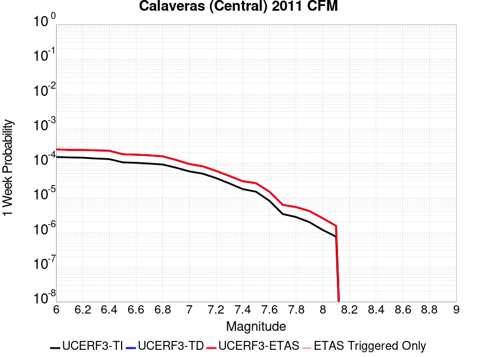 | 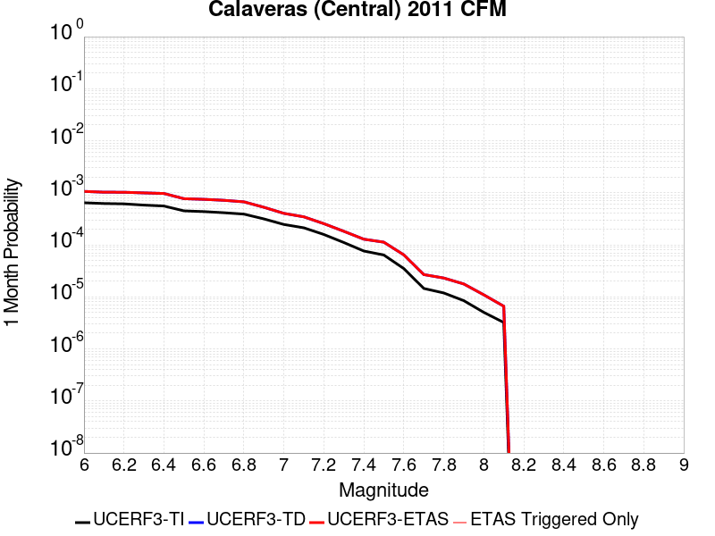 | 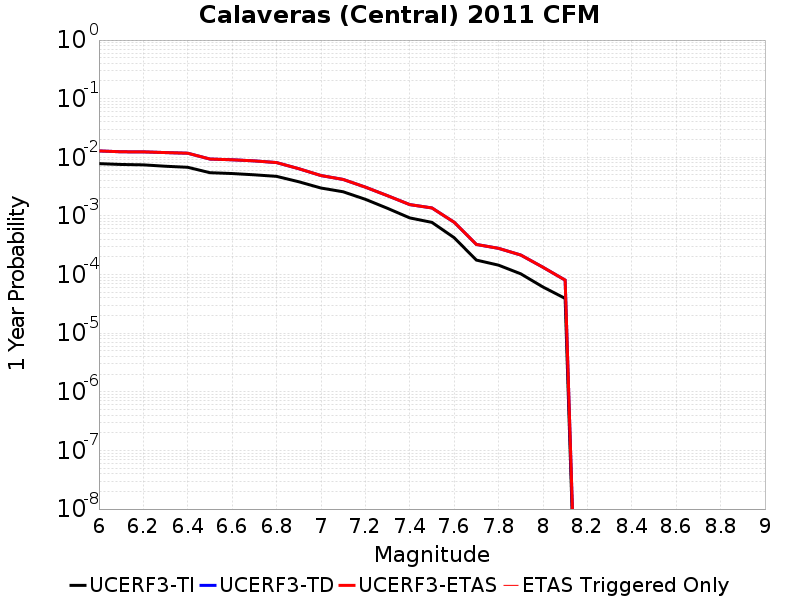 | 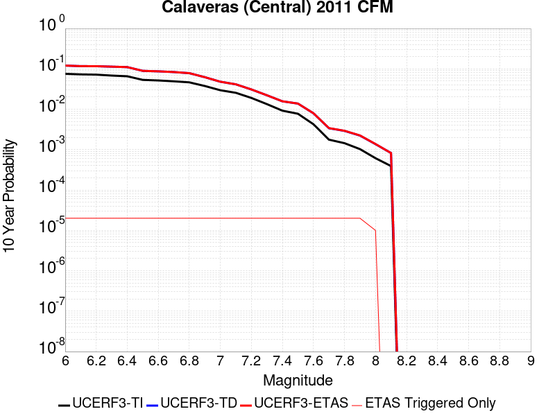 |

| Magnitude | 1 wk TI Prob | 1 wk TD Prob | 1 wk ETAS Prob | 1 wk ETAS/TD Gain | 1 wk ETAS Triggered Only | 1 mo TI Prob | 1 mo TD Prob | 1 mo ETAS Prob | 1 mo ETAS/TD Gain | 1 mo ETAS Triggered Only | 1 yr TI Prob | 1 yr TD Prob | 1 yr ETAS Prob | 1 yr ETAS/TD Gain | 1 yr ETAS Triggered Only | 10 yr TI Prob | 10 yr TD Prob | 10 yr ETAS Prob | 10 yr ETAS/TD Gain | 10 yr ETAS Triggered Only |
|-----|-----|-----|-----|-----|-----|-----|-----|-----|-----|-----|-----|-----|-----|-----|-----|-----|-----|-----|-----|-----|
| 6.0 | 1.5010907E-4 | 2.4801563E-4 | 2.4801563E-4 | 1.0 | 0.0 | 6.4316596E-4 | 0.001062011 | 0.001062011 | 1.0 | 0.0 | 0.0078024664 | 0.012851766 | 0.012851766 | 1.0 | 0.0 | 0.07534136 | 0.12041754 | 0.12043513 | 1.000146 | 2.0E-5 |
| 6.1 | 1.4521465E-4 | 2.3965565E-4 | 2.3965565E-4 | 1.0 | 0.0 | 6.222001E-4 | 0.0010262115 | 0.0010262115 | 1.0 | 0.0 | 0.0075490056 | 0.012421021 | 0.012421021 | 1.0 | 0.0 | 0.07297657 | 0.11668925 | 0.116706915 | 1.0001514 | 2.0E-5 |
| 6.2 | 1.429998E-4 | 2.3896793E-4 | 2.3896793E-4 | 1.0 | 0.0 | 6.127123E-4 | 0.0010232665 | 0.0010232665 | 1.0 | 0.0 | 0.007434286 | 0.012385606 | 0.012385606 | 1.0 | 0.0 | 0.07190444 | 0.11634308 | 0.116360754 | 1.0001519 | 2.0E-5 |
| 6.3 | 1.3536277E-4 | 2.3228148E-4 | 2.3228148E-4 | 1.0 | 0.0 | 5.799972E-4 | 9.946324E-4 | 9.946324E-4 | 1.0 | 0.0 | 0.0070386264 | 0.012041754 | 0.012041754 | 1.0 | 0.0 | 0.0681982 | 0.1132553 | 0.11327303 | 1.0001566 | 2.0E-5 |
| 6.4 | 1.2993296E-4 | 2.2651619E-4 | 2.2651619E-4 | 1.0 | 0.0 | 5.5673666E-4 | 9.6994254E-4 | 9.6994254E-4 | 1.0 | 0.0 | 0.006757223 | 0.0117445225 | 0.0117445225 | 1.0 | 0.0 | 0.06555412 | 0.110532954 | 0.11055075 | 1.0001609 | 2.0E-5 |
| 6.5 | 1.0498927E-4 | 1.7985055E-4 | 1.7985055E-4 | 1.0 | 0.0 | 4.498764E-4 | 7.7056186E-4 | 7.7056186E-4 | 1.0 | 0.0 | 0.005463498 | 0.009340999 | 0.009340999 | 1.0 | 0.0 | 0.053311124 | 0.08921417 | 0.089232385 | 1.0002042 | 2.0E-5 |
| 6.6 | 1.0157505E-4 | 1.7472538E-4 | 1.7472538E-4 | 1.0 | 0.0 | 4.35249E-4 | 7.486096E-4 | 7.486096E-4 | 1.0 | 0.0 | 0.0052862884 | 0.009076044 | 0.009076044 | 1.0 | 0.0 | 0.05162293 | 0.086791605 | 0.086809866 | 1.0002104 | 2.0E-5 |
| 6.7 | 9.660386E-5 | 1.6731827E-4 | 1.6731827E-4 | 1.0 | 0.0 | 4.1395082E-4 | 7.1688264E-4 | 7.1688264E-4 | 1.0 | 0.0 | 0.0050282106 | 0.008692942 | 0.008692942 | 1.0 | 0.0 | 0.049159497 | 0.08328089 | 0.08329922 | 1.0002202 | 2.0E-5 |
| 6.8 | 9.089927E-5 | 1.5646148E-4 | 1.5646148E-4 | 1.0 | 0.0 | 3.8951015E-4 | 6.703781E-4 | 6.703781E-4 | 1.0 | 0.0 | 0.0047319788 | 0.00813109 | 0.00813109 | 1.0 | 0.0 | 0.046324775 | 0.0781733 | 0.07819174 | 1.0002358 | 2.0E-5 |
| 6.9 | 7.353187E-5 | 1.229756E-4 | 1.229756E-4 | 1.0 | 0.0 | 3.150985E-4 | 5.269325E-4 | 5.269325E-4 | 1.0 | 0.0 | 0.0038295772 | 0.0063966517 | 0.0063966517 | 1.0 | 0.0 | 0.037642512 | 0.062198 | 0.062216755 | 1.0003016 | 2.0E-5 |
| 7.0 | 5.746064E-5 | 9.3907925E-5 | 9.3907925E-5 | 1.0 | 0.0 | 2.4623662E-4 | 4.0240085E-4 | 4.0240085E-4 | 1.0 | 0.0 | 0.0029938098 | 0.0048882957 | 0.0048882957 | 1.0 | 0.0 | 0.02953797 | 0.047996435 | 0.048015475 | 1.0003967 | 2.0E-5 |
| 7.1 | 4.9557195E-5 | 8.053742E-5 | 8.053742E-5 | 1.0 | 0.0 | 2.123707E-4 | 3.4511506E-4 | 3.4511506E-4 | 1.0 | 0.0 | 0.0025825473 | 0.004193743 | 0.004193743 | 1.0 | 0.0 | 0.0255274 | 0.041379236 | 0.04139841 | 1.0004634 | 2.0E-5 |
| 7.2 | 3.687595E-5 | 5.9536742E-5 | 5.9536742E-5 | 1.0 | 0.0 | 1.5803022E-4 | 2.5513268E-4 | 2.5513268E-4 | 1.0 | 0.0 | 0.0019223199 | 0.0031018448 | 0.0031018448 | 1.0 | 0.0 | 0.01905776 | 0.030889662 | 0.030909045 | 1.0006275 | 2.0E-5 |
| 7.3 | 2.5846984E-5 | 4.248329E-5 | 4.248329E-5 | 1.0 | 0.0 | 1.1076809E-4 | 1.8205863E-4 | 1.8205863E-4 | 1.0 | 0.0 | 0.0013477671 | 0.002214328 | 0.002214328 | 1.0 | 0.0 | 0.013396223 | 0.022181038 | 0.022200594 | 1.0008817 | 2.0E-5 |
| 7.4 | 1.7747854E-5 | 2.9941442E-5 | 2.9941442E-5 | 1.0 | 0.0 | 7.6060016E-5 | 1.2831418E-4 | 1.2831418E-4 | 1.0 | 0.0 | 9.2563726E-4 | 0.0015611084 | 0.0015611084 | 1.0 | 0.0 | 0.009217911 | 0.015711788 | 0.015731474 | 1.0012529 | 2.0E-5 |
| 7.5 | 1.4883479E-5 | 2.624829E-5 | 2.624829E-5 | 1.0 | 0.0 | 6.378478E-5 | 1.1248783E-4 | 1.1248783E-4 | 1.0 | 0.0 | 7.76303E-4 | 0.0013686818 | 0.0013686818 | 1.0 | 0.0 | 0.0077359667 | 0.013804822 | 0.013824547 | 1.0014287 | 2.0E-5 |
| 7.6 | 8.166975E-6 | 1.49672705E-5 | 1.49672705E-5 | 1.0 | 0.0 | 3.5000852E-5 | 6.4143875E-5 | 6.4143875E-5 | 1.0 | 0.0 | 4.2605202E-4 | 7.8067323E-4 | 7.8067323E-4 | 1.0 | 0.0 | 0.004252361 | 0.0079417 | 0.007961541 | 1.0024984 | 2.0E-5 |
| 7.7 | 3.3858064E-6 | 6.2566282E-6 | 6.2566282E-6 | 1.0 | 0.0 | 1.4510518E-5 | 2.6813846E-5 | 2.6813846E-5 | 1.0 | 0.0 | 1.7665124E-4 | 3.2640973E-4 | 3.2640973E-4 | 1.0 | 0.0 | 0.0017651088 | 0.0033895664 | 0.0034094986 | 1.0058805 | 2.0E-5 |
| 7.8 | 2.7721615E-6 | 5.3687154E-6 | 5.3687154E-6 | 1.0 | 0.0 | 1.1880637E-5 | 2.3008579E-5 | 2.3008579E-5 | 1.0 | 0.0 | 1.4463716E-4 | 2.800935E-4 | 2.800935E-4 | 1.0 | 0.0 | 0.0014454306 | 0.0029086077 | 0.0029285494 | 1.0068561 | 2.0E-5 |
| 7.9 | 1.9736292E-6 | 4.1301396E-6 | 4.1301396E-6 | 1.0 | 0.0 | 8.4583835E-6 | 1.7700479E-5 | 1.7700479E-5 | 1.0 | 0.0 | 1.0297595E-4 | 2.1548207E-4 | 2.1548207E-4 | 1.0 | 0.0 | 0.0010292825 | 0.0022244493 | 0.0022444047 | 1.008971 | 2.0E-5 |
| 8.0 | 1.1767289E-6 | 2.5554841E-6 | 2.5554841E-6 | 1.0 | 0.0 | 5.0431145E-6 | 1.0952029E-5 | 1.0952029E-5 | 1.0 | 0.0 | 6.139818E-5 | 1.3333283E-4 | 1.3333283E-4 | 1.0 | 0.0 | 6.1381224E-4 | 0.0013665776 | 0.0013765639 | 1.0073075 | 1.0E-5 |
| 8.1 | 7.5112825E-7 | 1.5415931E-6 | 1.5415931E-6 | 1.0 | 0.0 | 3.2191172E-6 | 6.606811E-6 | 6.606811E-6 | 1.0 | 0.0 | 3.9192048E-5 | 8.043498E-5 | 8.043498E-5 | 1.0 | 0.0 | 3.9185135E-4 | 8.238588E-4 | 8.238588E-4 | 1.0 | 0.0 |

## Palos Verdes
*[(top)](#table-of-contents)*

| 1 Week | 1 Month | 1 Year | 10 Year |
|-----|-----|-----|-----|
| 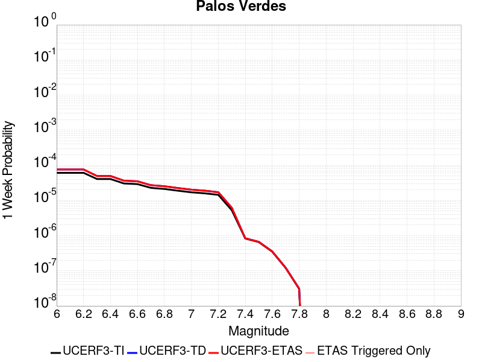 | 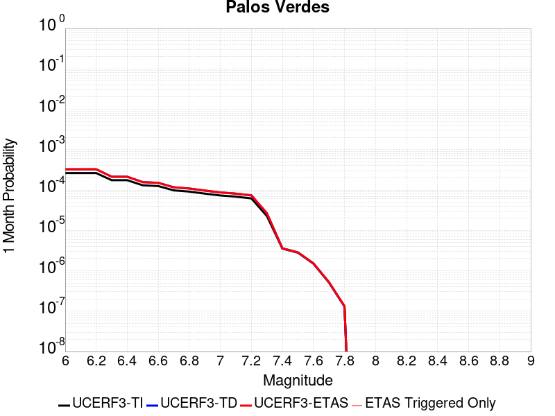 | 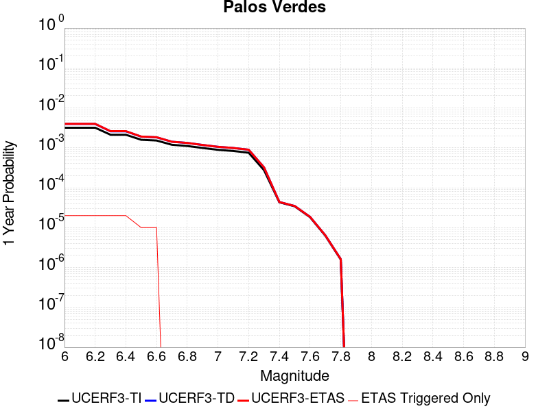 | 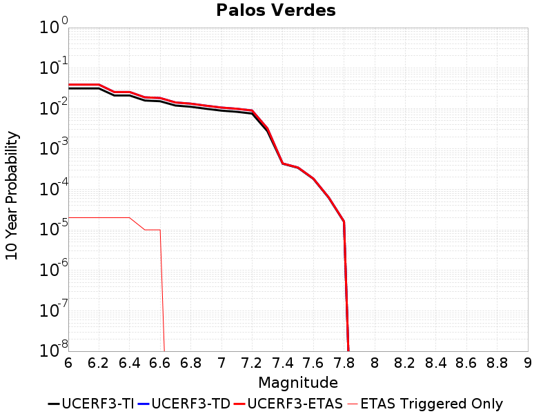 |

| Magnitude | 1 wk TI Prob | 1 wk TD Prob | 1 wk ETAS Prob | 1 wk ETAS/TD Gain | 1 wk ETAS Triggered Only | 1 mo TI Prob | 1 mo TD Prob | 1 mo ETAS Prob | 1 mo ETAS/TD Gain | 1 mo ETAS Triggered Only | 1 yr TI Prob | 1 yr TD Prob | 1 yr ETAS Prob | 1 yr ETAS/TD Gain | 1 yr ETAS Triggered Only | 10 yr TI Prob | 10 yr TD Prob | 10 yr ETAS Prob | 10 yr ETAS/TD Gain | 10 yr ETAS Triggered Only |
|-----|-----|-----|-----|-----|-----|-----|-----|-----|-----|-----|-----|-----|-----|-----|-----|-----|-----|-----|-----|-----|
| 6.0 | 6.126063E-5 | 7.622823E-5 | 7.622823E-5 | 1.0 | 0.0 | 2.6251914E-4 | 3.2665487E-4 | 3.2665487E-4 | 1.0 | 0.0 | 0.0031914865 | 0.00397028 | 0.0039902003 | 1.0050174 | 2.0E-5 | 0.031460393 | 0.03904993 | 0.03906915 | 1.0004922 | 2.0E-5 |
| 6.1 | 6.126063E-5 | 7.622823E-5 | 7.622823E-5 | 1.0 | 0.0 | 2.6251914E-4 | 3.2665487E-4 | 3.2665487E-4 | 1.0 | 0.0 | 0.0031914865 | 0.00397028 | 0.0039902003 | 1.0050174 | 2.0E-5 | 0.031460393 | 0.03904993 | 0.03906915 | 1.0004922 | 2.0E-5 |
| 6.2 | 6.126063E-5 | 7.622823E-5 | 7.622823E-5 | 1.0 | 0.0 | 2.6251914E-4 | 3.2665487E-4 | 3.2665487E-4 | 1.0 | 0.0 | 0.0031914865 | 0.00397028 | 0.0039902003 | 1.0050174 | 2.0E-5 | 0.031460393 | 0.03904993 | 0.03906915 | 1.0004922 | 2.0E-5 |
| 6.3 | 4.0838047E-5 | 4.9750663E-5 | 4.9750663E-5 | 1.0 | 0.0 | 1.7500846E-4 | 2.1320098E-4 | 2.1320098E-4 | 1.0 | 0.0 | 0.0021286458 | 0.002592844 | 0.002612792 | 1.0076935 | 2.0E-5 | 0.021083709 | 0.0256473 | 0.025666786 | 1.0007598 | 2.0E-5 |
| 6.4 | 4.0838047E-5 | 4.9750663E-5 | 4.9750663E-5 | 1.0 | 0.0 | 1.7500846E-4 | 2.1320098E-4 | 2.1320098E-4 | 1.0 | 0.0 | 0.0021286458 | 0.002592844 | 0.002612792 | 1.0076935 | 2.0E-5 | 0.021083709 | 0.0256473 | 0.025666786 | 1.0007598 | 2.0E-5 |
| 6.5 | 3.0512005E-5 | 3.656244E-5 | 3.656244E-5 | 1.0 | 0.0 | 1.3075917E-4 | 1.5668744E-4 | 1.5668744E-4 | 1.0 | 0.0 | 0.0015908304 | 0.001906119 | 0.0019160999 | 1.0052363 | 1.0E-5 | 0.015794903 | 0.018909572 | 0.018919382 | 1.0005188 | 1.0E-5 |
| 6.6 | 2.9255087E-5 | 3.515522E-5 | 3.515522E-5 | 1.0 | 0.0 | 1.2537291E-4 | 1.5065719E-4 | 1.5065719E-4 | 1.0 | 0.0 | 0.0015253464 | 0.0018328242 | 0.0018428059 | 1.0054461 | 1.0E-5 | 0.015149189 | 0.018188633 | 0.018198451 | 1.0005398 | 1.0E-5 |
| 6.7 | 2.287198E-5 | 2.7248867E-5 | 2.7248867E-5 | 1.0 | 0.0 | 9.801909E-5 | 1.16776144E-4 | 1.16776144E-4 | 1.0 | 0.0 | 0.001192729 | 0.001420914 | 0.001420914 | 1.0 | 0.0 | 0.011863477 | 0.01412752 | 0.01412752 | 1.0 | 0.0 |
| 6.8 | 2.1325764E-5 | 2.543243E-5 | 2.543243E-5 | 1.0 | 0.0 | 9.139293E-5 | 1.08992084E-4 | 1.08992084E-4 | 1.0 | 0.0 | 0.001112141 | 0.0013262611 | 0.0013262611 | 1.0 | 0.0 | 0.011065915 | 0.013192496 | 0.013192496 | 1.0 | 0.0 |
| 6.9 | 1.9009392E-5 | 2.2614031E-5 | 2.2614031E-5 | 1.0 | 0.0 | 8.1466285E-5 | 9.691417E-5 | 9.691417E-5 | 1.0 | 0.0 | 9.914007E-4 | 0.0011793787 | 0.0011793787 | 1.0 | 0.0 | 0.009869894 | 0.011739883 | 0.011739883 | 1.0 | 0.0 |
| 7.0 | 1.7098473E-5 | 2.0319787E-5 | 2.0319787E-5 | 1.0 | 0.0 | 7.3277115E-5 | 8.708238E-5 | 8.708238E-5 | 1.0 | 0.0 | 8.917837E-4 | 0.0010597975 | 0.0010597975 | 1.0 | 0.0 | 0.008882134 | 0.01055587 | 0.01055587 | 1.0 | 0.0 |
| 7.1 | 1.5982785E-5 | 1.8995164E-5 | 1.8995164E-5 | 1.0 | 0.0 | 6.849585E-5 | 8.1405786E-5 | 8.1405786E-5 | 1.0 | 0.0 | 8.336179E-4 | 9.907495E-4 | 9.907495E-4 | 1.0 | 0.0 | 0.008304977 | 0.009871689 | 0.009871689 | 1.0 | 0.0 |
| 7.2 | 1.4468002E-5 | 1.7197603E-5 | 1.7197603E-5 | 1.0 | 0.0 | 6.200425E-5 | 7.37024E-5 | 7.37024E-5 | 1.0 | 0.0 | 7.546402E-4 | 8.9704135E-4 | 8.9704135E-4 | 1.0 | 0.0 | 0.007520827 | 0.008942474 | 0.008942474 | 1.0 | 0.0 |
| 7.3 | 5.288233E-6 | 6.203798E-6 | 6.203798E-6 | 1.0 | 0.0 | 2.2663658E-5 | 2.6587632E-5 | 2.6587632E-5 | 1.0 | 0.0 | 2.7589512E-4 | 3.2369123E-4 | 3.2369123E-4 | 1.0 | 0.0 | 0.0027555283 | 0.0032356204 | 0.0032356204 | 1.0 | 0.0 |
| 7.4 | 8.279556E-7 | 8.408361E-7 | 8.408361E-7 | 1.0 | 0.0 | 3.5483763E-6 | 3.6035788E-6 | 3.6035788E-6 | 1.0 | 0.0 | 4.3200624E-5 | 4.3872762E-5 | 4.3872762E-5 | 1.0 | 0.0 | 4.3192226E-4 | 4.3864822E-4 | 4.3864822E-4 | 1.0 | 0.0 |
| 7.5 | 6.559831E-7 | 6.667241E-7 | 6.667241E-7 | 1.0 | 0.0 | 2.8113532E-6 | 2.8573863E-6 | 2.8573863E-6 | 1.0 | 0.0 | 3.4227687E-5 | 3.478819E-5 | 3.478819E-5 | 1.0 | 0.0 | 3.4222414E-4 | 3.4783408E-4 | 3.4783408E-4 | 1.0 | 0.0 |
| 7.6 | 3.5018968E-7 | 3.5620096E-7 | 3.5620096E-7 | 1.0 | 0.0 | 1.500812E-6 | 1.5265749E-6 | 1.5265749E-6 | 1.0 | 0.0 | 1.8272232E-5 | 1.8585939E-5 | 1.8585939E-5 | 1.0 | 0.0 | 1.8270731E-4 | 1.8584843E-4 | 1.8584843E-4 | 1.0 | 0.0 |
| 7.7 | 1.1986104E-7 | 1.21984E-7 | 1.21984E-7 | 1.0 | 0.0 | 5.1369005E-7 | 5.227885E-7 | 5.227885E-7 | 1.0 | 0.0 | 6.2541585E-6 | 6.364932E-6 | 6.364932E-6 | 1.0 | 0.0 | 6.2539824E-5 | 6.364754E-5 | 6.364754E-5 | 1.0 | 0.0 |
| 7.8 | 3.0445005E-8 | 3.102765E-8 | 3.102765E-8 | 1.0 | 0.0 | 1.3047858E-7 | 1.3297564E-7 | 1.3297564E-7 | 1.0 | 0.0 | 1.5885756E-6 | 1.6189774E-6 | 1.6189774E-6 | 1.0 | 0.0 | 1.5885644E-5 | 1.6189677E-5 | 1.6189677E-5 | 1.0 | 0.0 |

## North Frontal  (East)
*[(top)](#table-of-contents)*

| 1 Week | 1 Month | 1 Year | 10 Year |
|-----|-----|-----|-----|
| 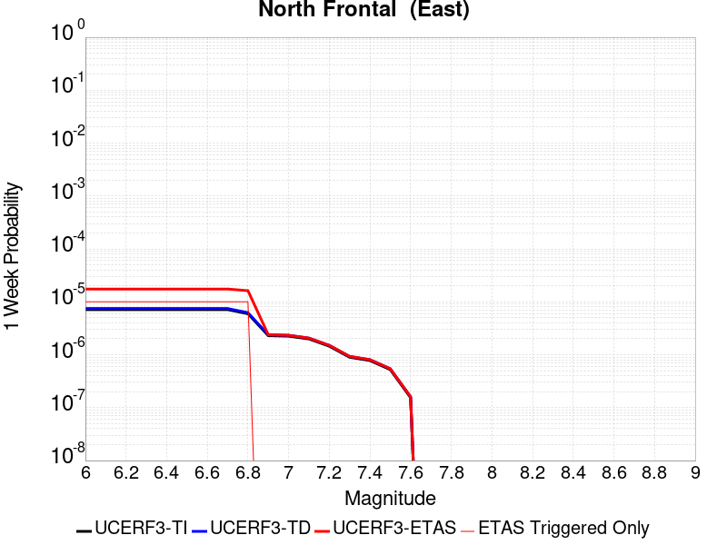 | 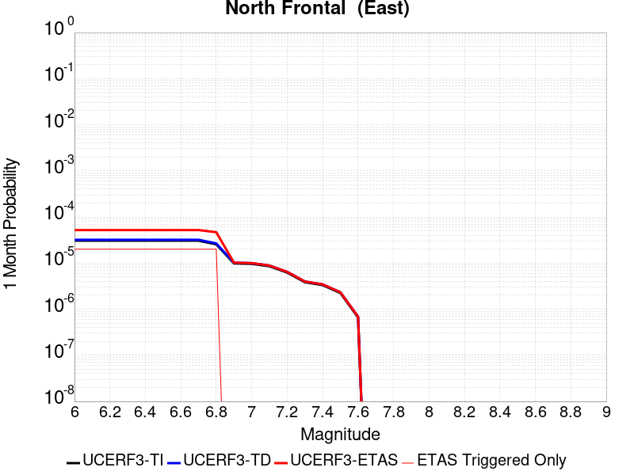 | 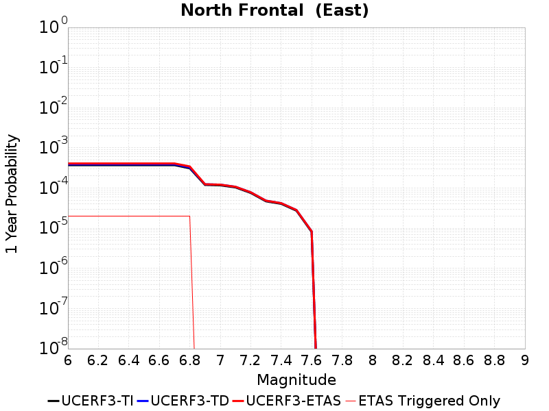 | 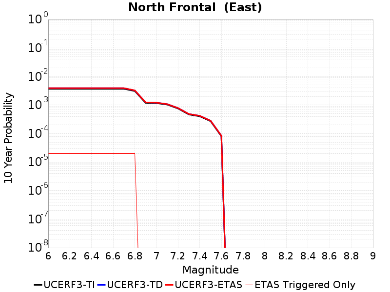 |

| Magnitude | 1 wk TI Prob | 1 wk TD Prob | 1 wk ETAS Prob | 1 wk ETAS/TD Gain | 1 wk ETAS Triggered Only | 1 mo TI Prob | 1 mo TD Prob | 1 mo ETAS Prob | 1 mo ETAS/TD Gain | 1 mo ETAS Triggered Only | 1 yr TI Prob | 1 yr TD Prob | 1 yr ETAS Prob | 1 yr ETAS/TD Gain | 1 yr ETAS Triggered Only | 10 yr TI Prob | 10 yr TD Prob | 10 yr ETAS Prob | 10 yr ETAS/TD Gain | 10 yr ETAS Triggered Only |
|-----|-----|-----|-----|-----|-----|-----|-----|-----|-----|-----|-----|-----|-----|-----|-----|-----|-----|-----|-----|-----|
| 6.0 | 7.135738E-6 | 7.4772165E-6 | 1.7477141E-5 | 2.3373861 | 1.0E-5 | 3.0581377E-5 | 3.2044933E-5 | 5.204429E-5 | 1.6241037 | 2.0E-5 | 3.7226462E-4 | 3.9009715E-4 | 4.1008936E-4 | 1.0512493 | 2.0E-5 | 0.0037164164 | 0.0038960816 | 0.0039160037 | 1.0051134 | 2.0E-5 |
| 6.1 | 7.135738E-6 | 7.4772165E-6 | 1.7477141E-5 | 2.3373861 | 1.0E-5 | 3.0581377E-5 | 3.2044933E-5 | 5.204429E-5 | 1.6241037 | 2.0E-5 | 3.7226462E-4 | 3.9009715E-4 | 4.1008936E-4 | 1.0512493 | 2.0E-5 | 0.0037164164 | 0.0038960816 | 0.0039160037 | 1.0051134 | 2.0E-5 |
| 6.2 | 7.135738E-6 | 7.4772165E-6 | 1.7477141E-5 | 2.3373861 | 1.0E-5 | 3.0581377E-5 | 3.2044933E-5 | 5.204429E-5 | 1.6241037 | 2.0E-5 | 3.7226462E-4 | 3.9009715E-4 | 4.1008936E-4 | 1.0512493 | 2.0E-5 | 0.0037164164 | 0.0038960816 | 0.0039160037 | 1.0051134 | 2.0E-5 |
| 6.3 | 7.135738E-6 | 7.4772165E-6 | 1.7477141E-5 | 2.3373861 | 1.0E-5 | 3.0581377E-5 | 3.2044933E-5 | 5.204429E-5 | 1.6241037 | 2.0E-5 | 3.7226462E-4 | 3.9009715E-4 | 4.1008936E-4 | 1.0512493 | 2.0E-5 | 0.0037164164 | 0.0038960816 | 0.0039160037 | 1.0051134 | 2.0E-5 |
| 6.4 | 7.135738E-6 | 7.4772165E-6 | 1.7477141E-5 | 2.3373861 | 1.0E-5 | 3.0581377E-5 | 3.2044933E-5 | 5.204429E-5 | 1.6241037 | 2.0E-5 | 3.7226462E-4 | 3.9009715E-4 | 4.1008936E-4 | 1.0512493 | 2.0E-5 | 0.0037164164 | 0.0038960816 | 0.0039160037 | 1.0051134 | 2.0E-5 |
| 6.5 | 7.135738E-6 | 7.4772165E-6 | 1.7477141E-5 | 2.3373861 | 1.0E-5 | 3.0581377E-5 | 3.2044933E-5 | 5.204429E-5 | 1.6241037 | 2.0E-5 | 3.7226462E-4 | 3.9009715E-4 | 4.1008936E-4 | 1.0512493 | 2.0E-5 | 0.0037164164 | 0.0038960816 | 0.0039160037 | 1.0051134 | 2.0E-5 |
| 6.6 | 7.135738E-6 | 7.4772165E-6 | 1.7477141E-5 | 2.3373861 | 1.0E-5 | 3.0581377E-5 | 3.2044933E-5 | 5.204429E-5 | 1.6241037 | 2.0E-5 | 3.7226462E-4 | 3.9009715E-4 | 4.1008936E-4 | 1.0512493 | 2.0E-5 | 0.0037164164 | 0.0038960816 | 0.0039160037 | 1.0051134 | 2.0E-5 |
| 6.7 | 7.135738E-6 | 7.4772165E-6 | 1.7477141E-5 | 2.3373861 | 1.0E-5 | 3.0581377E-5 | 3.2044933E-5 | 5.204429E-5 | 1.6241037 | 2.0E-5 | 3.7226462E-4 | 3.9009715E-4 | 4.1008936E-4 | 1.0512493 | 2.0E-5 | 0.0037164164 | 0.0038960816 | 0.0039160037 | 1.0051134 | 2.0E-5 |
| 6.8 | 5.959142E-6 | 6.2367153E-6 | 1.6236652E-5 | 2.603398 | 1.0E-5 | 2.553893E-5 | 2.6728609E-5 | 4.6728073E-5 | 1.7482419 | 2.0E-5 | 3.108921E-4 | 3.2539028E-4 | 3.4538377E-4 | 1.0614446 | 2.0E-5 | 0.0031045752 | 0.0032509116 | 0.0032708466 | 1.0061321 | 2.0E-5 |
| 6.9 | 2.2946929E-6 | 2.3824707E-6 | 2.3824707E-6 | 1.0 | 0.0 | 9.834361E-6 | 1.0210551E-5 | 1.0210551E-5 | 1.0 | 0.0 | 1.1972676E-4 | 1.2430684E-4 | 1.2430684E-4 | 1.0 | 0.0 | 0.0011966228 | 0.0012424196 | 0.0012424196 | 1.0 | 0.0 |
| 7.0 | 2.2468673E-6 | 2.3321636E-6 | 2.3321636E-6 | 1.0 | 0.0 | 9.629396E-6 | 9.994951E-6 | 9.994951E-6 | 1.0 | 0.0 | 1.1723159E-4 | 1.2168221E-4 | 1.2168221E-4 | 1.0 | 0.0 | 0.0011716976 | 0.0012162022 | 0.0012162022 | 1.0 | 0.0 |
| 7.1 | 1.9921076E-6 | 2.0646116E-6 | 2.0646116E-6 | 1.0 | 0.0 | 8.537577E-6 | 8.8483075E-6 | 8.8483075E-6 | 1.0 | 0.0 | 1.0394004E-4 | 1.0772326E-4 | 1.0772326E-4 | 1.0 | 0.0 | 0.0010389143 | 0.0010767531 | 0.0010767531 | 1.0 | 0.0 |
| 7.2 | 1.4524545E-6 | 1.5045208E-6 | 1.5045208E-6 | 1.0 | 0.0 | 6.2247905E-6 | 6.447932E-6 | 6.447932E-6 | 1.0 | 0.0 | 7.5784184E-5 | 7.850099E-5 | 7.850099E-5 | 1.0 | 0.0 | 7.575835E-4 | 7.847571E-4 | 7.847571E-4 | 1.0 | 0.0 |
| 7.3 | 8.9802575E-7 | 9.3087664E-7 | 9.3087664E-7 | 1.0 | 0.0 | 3.848676E-6 | 3.9894658E-6 | 3.9894658E-6 | 1.0 | 0.0 | 4.685662E-5 | 4.857078E-5 | 4.857078E-5 | 1.0 | 0.0 | 4.6846745E-4 | 4.8561292E-4 | 4.8561292E-4 | 1.0 | 0.0 |
| 7.4 | 7.776139E-7 | 8.0605076E-7 | 8.0605076E-7 | 1.0 | 0.0 | 3.3326266E-6 | 3.4544994E-6 | 3.4544994E-6 | 1.0 | 0.0 | 4.0573974E-5 | 4.205783E-5 | 4.205783E-5 | 1.0 | 0.0 | 4.0566566E-4 | 4.2050943E-4 | 4.2050943E-4 | 1.0 | 0.0 |
| 7.5 | 5.244417E-7 | 5.441242E-7 | 5.441242E-7 | 1.0 | 0.0 | 2.2476054E-6 | 2.3319592E-6 | 2.3319592E-6 | 1.0 | 0.0 | 2.7364253E-5 | 2.83913E-5 | 2.83913E-5 | 1.0 | 0.0 | 2.7360884E-4 | 2.8388324E-4 | 2.8388324E-4 | 1.0 | 0.0 |
| 7.6 | 1.5489647E-7 | 1.6089574E-7 | 1.6089574E-7 | 1.0 | 0.0 | 6.6384183E-7 | 6.895531E-7 | 6.895531E-7 | 1.0 | 0.0 | 8.082245E-6 | 8.395297E-6 | 8.395297E-6 | 1.0 | 0.0 | 8.08195E-5 | 8.3951796E-5 | 8.3951796E-5 | 1.0 | 0.0 |

## San Cayetano
*[(top)](#table-of-contents)*

| 1 Week | 1 Month | 1 Year | 10 Year |
|-----|-----|-----|-----|
| 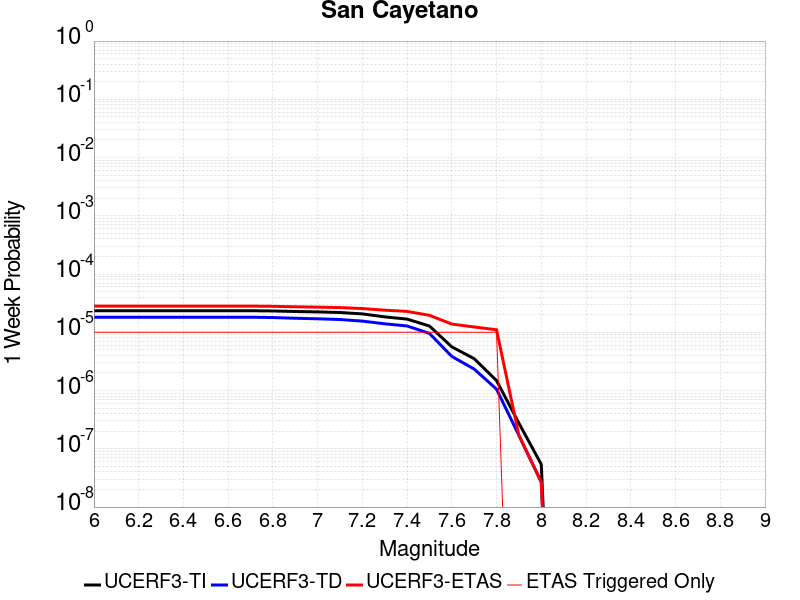 | 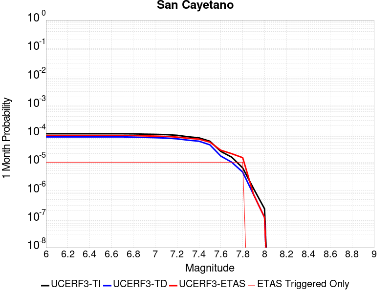 | 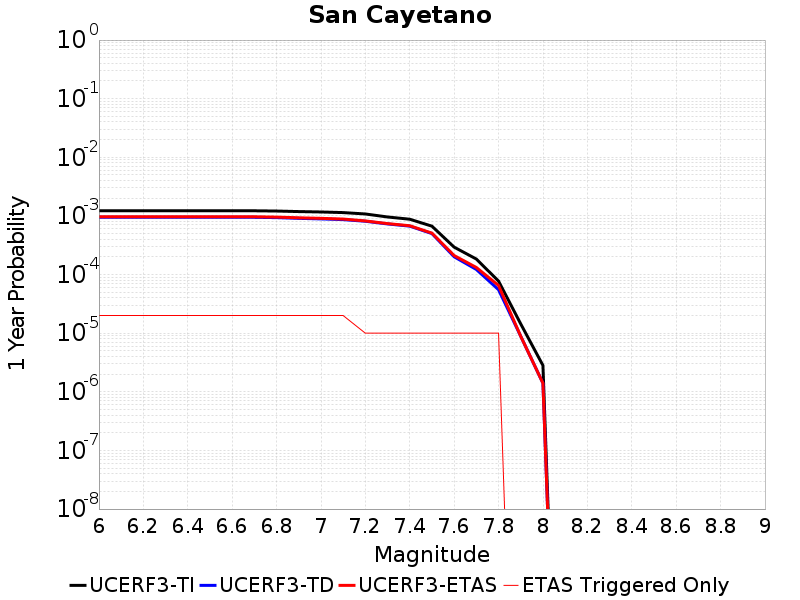 | 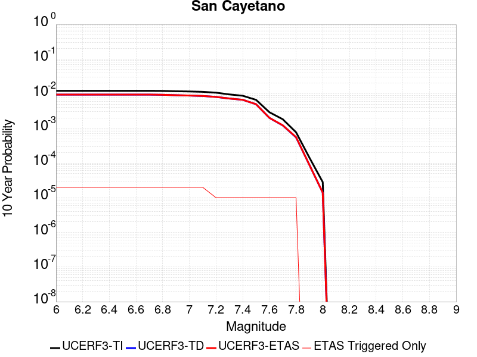 |

| Magnitude | 1 wk TI Prob | 1 wk TD Prob | 1 wk ETAS Prob | 1 wk ETAS/TD Gain | 1 wk ETAS Triggered Only | 1 mo TI Prob | 1 mo TD Prob | 1 mo ETAS Prob | 1 mo ETAS/TD Gain | 1 mo ETAS Triggered Only | 1 yr TI Prob | 1 yr TD Prob | 1 yr ETAS Prob | 1 yr ETAS/TD Gain | 1 yr ETAS Triggered Only | 10 yr TI Prob | 10 yr TD Prob | 10 yr ETAS Prob | 10 yr ETAS/TD Gain | 10 yr ETAS Triggered Only |
|-----|-----|-----|-----|-----|-----|-----|-----|-----|-----|-----|-----|-----|-----|-----|-----|-----|-----|-----|-----|-----|
| 6.0 | 2.3476267E-5 | 1.8169576E-5 | 2.8169394E-5 | 1.5503606 | 1.0E-5 | 1.0060869E-4 | 7.7867306E-5 | 8.786652E-5 | 1.1284136 | 1.0E-5 | 0.0012242225 | 9.476258E-4 | 9.676068E-4 | 1.0210854 | 2.0E-5 | 0.012175002 | 0.009436738 | 0.009456549 | 1.0020994 | 2.0E-5 |
| 6.1 | 2.3476267E-5 | 1.8169576E-5 | 2.8169394E-5 | 1.5503606 | 1.0E-5 | 1.0060869E-4 | 7.7867306E-5 | 8.786652E-5 | 1.1284136 | 1.0E-5 | 0.0012242225 | 9.476258E-4 | 9.676068E-4 | 1.0210854 | 2.0E-5 | 0.012175002 | 0.009436738 | 0.009456549 | 1.0020994 | 2.0E-5 |
| 6.2 | 2.3476267E-5 | 1.8169576E-5 | 2.8169394E-5 | 1.5503606 | 1.0E-5 | 1.0060869E-4 | 7.7867306E-5 | 8.786652E-5 | 1.1284136 | 1.0E-5 | 0.0012242225 | 9.476258E-4 | 9.676068E-4 | 1.0210854 | 2.0E-5 | 0.012175002 | 0.009436738 | 0.009456549 | 1.0020994 | 2.0E-5 |
| 6.3 | 2.3476267E-5 | 1.8169576E-5 | 2.8169394E-5 | 1.5503606 | 1.0E-5 | 1.0060869E-4 | 7.7867306E-5 | 8.786652E-5 | 1.1284136 | 1.0E-5 | 0.0012242225 | 9.476258E-4 | 9.676068E-4 | 1.0210854 | 2.0E-5 | 0.012175002 | 0.009436738 | 0.009456549 | 1.0020994 | 2.0E-5 |
| 6.4 | 2.3476267E-5 | 1.8169576E-5 | 2.8169394E-5 | 1.5503606 | 1.0E-5 | 1.0060869E-4 | 7.7867306E-5 | 8.786652E-5 | 1.1284136 | 1.0E-5 | 0.0012242225 | 9.476258E-4 | 9.676068E-4 | 1.0210854 | 2.0E-5 | 0.012175002 | 0.009436738 | 0.009456549 | 1.0020994 | 2.0E-5 |
| 6.5 | 2.3476267E-5 | 1.8169576E-5 | 2.8169394E-5 | 1.5503606 | 1.0E-5 | 1.0060869E-4 | 7.7867306E-5 | 8.786652E-5 | 1.1284136 | 1.0E-5 | 0.0012242225 | 9.476258E-4 | 9.676068E-4 | 1.0210854 | 2.0E-5 | 0.012175002 | 0.009436738 | 0.009456549 | 1.0020994 | 2.0E-5 |
| 6.6 | 2.3476267E-5 | 1.8169576E-5 | 2.8169394E-5 | 1.5503606 | 1.0E-5 | 1.0060869E-4 | 7.7867306E-5 | 8.786652E-5 | 1.1284136 | 1.0E-5 | 0.0012242225 | 9.476258E-4 | 9.676068E-4 | 1.0210854 | 2.0E-5 | 0.012175002 | 0.009436738 | 0.009456549 | 1.0020994 | 2.0E-5 |
| 6.7 | 2.3476267E-5 | 1.8169576E-5 | 2.8169394E-5 | 1.5503606 | 1.0E-5 | 1.0060869E-4 | 7.7867306E-5 | 8.786652E-5 | 1.1284136 | 1.0E-5 | 0.0012242225 | 9.476258E-4 | 9.676068E-4 | 1.0210854 | 2.0E-5 | 0.012175002 | 0.009436738 | 0.009456549 | 1.0020994 | 2.0E-5 |
| 6.8 | 2.3241924E-5 | 1.7937278E-5 | 2.7937098E-5 | 1.5574882 | 1.0E-5 | 9.960445E-5 | 7.68718E-5 | 8.6871034E-5 | 1.1300768 | 1.0E-5 | 0.0012120095 | 9.35516E-4 | 9.5549726E-4 | 1.0213586 | 2.0E-5 | 0.012054204 | 0.0093166325 | 0.009336446 | 1.0021267 | 2.0E-5 |
| 6.9 | 2.2761007E-5 | 1.7432705E-5 | 2.7432532E-5 | 1.5736244 | 1.0E-5 | 9.7543525E-5 | 7.4709475E-5 | 8.470873E-5 | 1.1338419 | 1.0E-5 | 0.0011869454 | 9.0921175E-4 | 9.291936E-4 | 1.0219771 | 2.0E-5 | 0.011806256 | 0.009055749 | 0.009075568 | 1.0021886 | 2.0E-5 |
| 7.0 | 2.240283E-5 | 1.7066444E-5 | 2.7066275E-5 | 1.5859351 | 1.0E-5 | 9.600859E-5 | 7.3139876E-5 | 8.3139144E-5 | 1.1367143 | 1.0E-5 | 0.0011682777 | 8.901176E-4 | 9.100998E-4 | 1.0224489 | 2.0E-5 | 0.011621549 | 0.008866338 | 0.008886161 | 1.0022358 | 2.0E-5 |
| 7.1 | 2.1871154E-5 | 1.6586286E-5 | 2.658612E-5 | 1.6028978 | 1.0E-5 | 9.373015E-5 | 7.108216E-5 | 8.108145E-5 | 1.1406723 | 1.0E-5 | 0.0011405671 | 8.6508505E-4 | 8.8506774E-4 | 1.0230991 | 2.0E-5 | 0.011347309 | 0.008617977 | 0.008637805 | 1.0023007 | 2.0E-5 |
| 7.2 | 2.0714133E-5 | 1.5564809E-5 | 2.5564652E-5 | 1.642465 | 1.0E-5 | 8.8771834E-5 | 6.670463E-5 | 7.670397E-5 | 1.1499046 | 1.0E-5 | 0.0010802611 | 8.118296E-4 | 8.2182145E-4 | 1.0123079 | 1.0E-5 | 0.010750249 | 0.008089414 | 0.008099332 | 1.0012262 | 1.0E-5 |
| 7.3 | 1.8408395E-5 | 1.39970725E-5 | 2.3996932E-5 | 1.7144251 | 1.0E-5 | 7.8890735E-5 | 5.998609E-5 | 6.998549E-5 | 1.1666954 | 1.0E-5 | 9.600714E-4 | 7.300889E-4 | 7.400816E-4 | 1.013687 | 1.0E-5 | 0.009559342 | 0.007277623 | 0.0072875503 | 1.0013641 | 1.0E-5 |
| 7.4 | 1.6856795E-5 | 1.2850265E-5 | 2.2850138E-5 | 1.778184 | 1.0E-5 | 7.2241404E-5 | 5.5071418E-5 | 6.507087E-5 | 1.1815724 | 1.0E-5 | 8.7918417E-4 | 6.7029113E-4 | 6.802844E-4 | 1.0149089 | 1.0E-5 | 0.00875714 | 0.006683374 | 0.0066933073 | 1.0014863 | 1.0E-5 |
| 7.5 | 1.2822778E-5 | 9.577673E-6 | 1.9577577E-5 | 2.0440848 | 1.0E-5 | 5.495361E-5 | 4.1046536E-5 | 5.1046125E-5 | 1.2436159 | 1.0E-5 | 6.688548E-4 | 4.9962854E-4 | 5.0962355E-4 | 1.0200049 | 1.0E-5 | 0.006668452 | 0.0049852235 | 0.004995174 | 1.0019959 | 1.0E-5 |
| 7.6 | 5.6272684E-6 | 3.8549583E-6 | 1.3854919E-5 | 3.5940518 | 1.0E-5 | 2.4116642E-5 | 1.6521146E-5 | 2.652098E-5 | 1.6052749 | 1.0E-5 | 2.9358055E-4 | 2.0112647E-4 | 2.1112447E-4 | 1.0497099 | 1.0E-5 | 0.0029319301 | 0.0020094553 | 0.0020194352 | 1.0049665 | 1.0E-5 |
| 7.7 | 3.5261346E-6 | 2.3407356E-6 | 1.2340713E-5 | 5.2721515 | 1.0E-5 | 1.5111918E-5 | 1.0031686E-5 | 2.0031586E-5 | 1.9968314 | 1.0E-5 | 1.8397206E-4 | 1.22129E-4 | 1.3212778E-4 | 1.0818707 | 1.0E-5 | 0.0018381984 | 0.0012206262 | 0.001230614 | 1.0081825 | 1.0E-5 |
| 7.8 | 1.4826929E-6 | 1.0564426E-6 | 1.1056432E-5 | 10.46572 | 1.0E-5 | 6.354383E-6 | 4.5276033E-6 | 1.4527558E-5 | 3.2086642 | 1.0E-5 | 7.736187E-5 | 5.5122196E-5 | 6.512165E-5 | 1.1814051 | 1.0E-5 | 7.733494E-4 | 5.5108726E-4 | 5.6108175E-4 | 1.0181359 | 1.0E-5 |
| 7.9 | 2.7568166E-7 | 1.6978605E-7 | 1.6978605E-7 | 1.0 | 0.0 | 1.1814923E-6 | 7.2765425E-7 | 7.2765425E-7 | 1.0 | 0.0 | 1.4384574E-5 | 8.859155E-6 | 8.859155E-6 | 1.0 | 0.0 | 1.4383643E-4 | 8.858805E-5 | 8.858805E-5 | 1.0 | 0.0 |
| 8.0 | 5.407832E-8 | 2.688891E-8 | 2.688891E-8 | 1.0 | 0.0 | 2.3176422E-7 | 1.1523818E-7 | 1.1523818E-7 | 1.0 | 0.0 | 2.8217257E-6 | 1.403024E-6 | 1.403024E-6 | 1.0 | 0.0 | 2.8216898E-5 | 1.4030155E-5 | 1.4030155E-5 | 1.0 | 0.0 |

## Oceanic - West Huasna
*[(top)](#table-of-contents)*

| 1 Week | 1 Month | 1 Year | 10 Year |
|-----|-----|-----|-----|
| 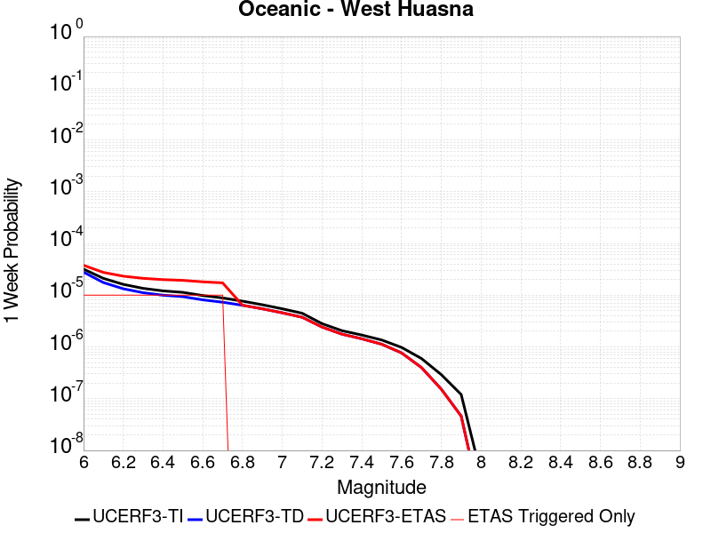 | 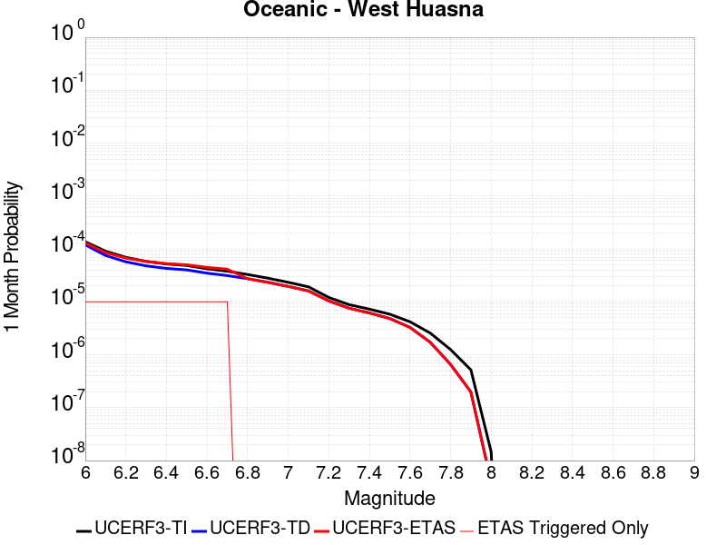 | 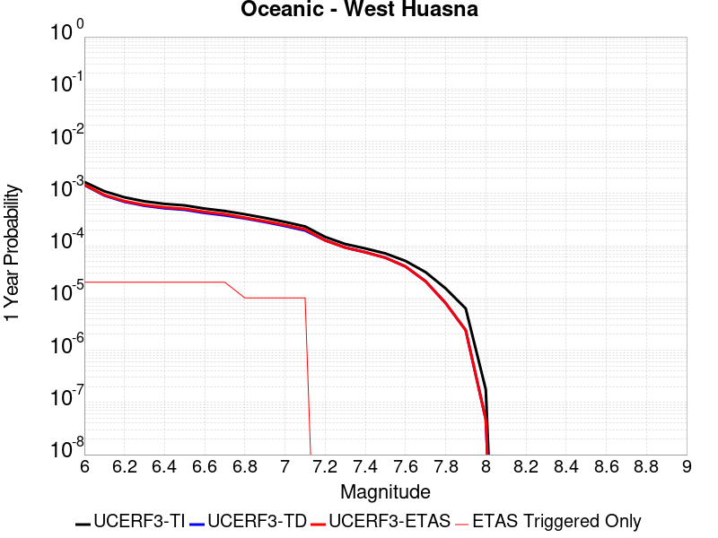 | 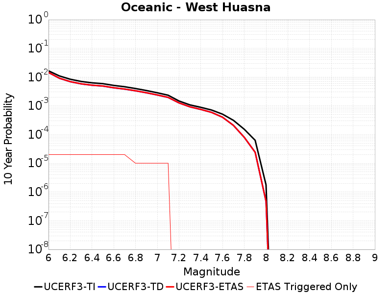 |

| Magnitude | 1 wk TI Prob | 1 wk TD Prob | 1 wk ETAS Prob | 1 wk ETAS/TD Gain | 1 wk ETAS Triggered Only | 1 mo TI Prob | 1 mo TD Prob | 1 mo ETAS Prob | 1 mo ETAS/TD Gain | 1 mo ETAS Triggered Only | 1 yr TI Prob | 1 yr TD Prob | 1 yr ETAS Prob | 1 yr ETAS/TD Gain | 1 yr ETAS Triggered Only | 10 yr TI Prob | 10 yr TD Prob | 10 yr ETAS Prob | 10 yr ETAS/TD Gain | 10 yr ETAS Triggered Only |
|-----|-----|-----|-----|-----|-----|-----|-----|-----|-----|-----|-----|-----|-----|-----|-----|-----|-----|-----|-----|-----|
| 6.0 | 3.195567E-5 | 2.7927108E-5 | 3.7926828E-5 | 1.358065 | 1.0E-5 | 1.3694567E-4 | 1.1968236E-4 | 1.2968117E-4 | 1.0835445 | 1.0E-5 | 0.0016660384 | 0.0014562019 | 0.0014761727 | 1.0137143 | 2.0E-5 | 0.016536033 | 0.014471151 | 0.014490861 | 1.0013621 | 2.0E-5 |
| 6.1 | 2.1156782E-5 | 1.7573628E-5 | 2.7573451E-5 | 1.5690244 | 1.0E-5 | 9.066878E-5 | 7.531342E-5 | 8.531267E-5 | 1.1327685 | 1.0E-5 | 0.0011033333 | 9.1656455E-4 | 9.3654625E-4 | 1.0218006 | 2.0E-5 | 0.010978713 | 0.009128851 | 0.0091486685 | 1.0021708 | 2.0E-5 |
| 6.2 | 1.6195117E-5 | 1.3327251E-5 | 2.3327117E-5 | 1.7503324 | 1.0E-5 | 6.9405796E-5 | 5.711555E-5 | 6.711498E-5 | 1.1750736 | 1.0E-5 | 8.44688E-4 | 6.9516257E-4 | 7.1514864E-4 | 1.0287503 | 2.0E-5 | 0.008414844 | 0.006930174 | 0.006950035 | 1.0028659 | 2.0E-5 |
| 6.3 | 1.3559345E-5 | 1.117922E-5 | 2.1179107E-5 | 1.8945068 | 1.0E-5 | 5.811018E-5 | 4.7910064E-5 | 5.7909587E-5 | 1.2087144 | 1.0E-5 | 7.072618E-4 | 5.831499E-4 | 6.0313824E-4 | 1.0342765 | 2.0E-5 | 0.0070501505 | 0.005816315 | 0.0058361986 | 1.0034186 | 2.0E-5 |
| 6.4 | 1.2120619E-5 | 1.0001043E-5 | 2.0000944E-5 | 1.9998857 | 1.0E-5 | 5.1944477E-5 | 4.2860913E-5 | 5.2860483E-5 | 1.2333028 | 1.0E-5 | 6.322405E-4 | 5.217072E-4 | 5.4169673E-4 | 1.0383157 | 2.0E-5 | 0.006304447 | 0.0052048913 | 0.0052247876 | 1.0038226 | 2.0E-5 |
| 6.5 | 1.13511915E-5 | 9.367534E-6 | 1.936744E-5 | 2.0675068 | 1.0E-5 | 4.8647056E-5 | 4.014596E-5 | 5.0145558E-5 | 1.249081 | 1.0E-5 | 5.9211696E-4 | 4.8866787E-4 | 5.086581E-4 | 1.0409076 | 2.0E-5 | 0.0059054173 | 0.0048759924 | 0.004895895 | 1.0040817 | 2.0E-5 |
| 6.6 | 9.850605E-6 | 8.135469E-6 | 1.8135388E-5 | 2.2291753 | 1.0E-5 | 4.2216197E-5 | 3.4865832E-5 | 4.4865486E-5 | 1.2868037 | 1.0E-5 | 5.1386096E-4 | 4.2440905E-4 | 4.4440056E-4 | 1.0471044 | 2.0E-5 | 0.0051267436 | 0.004236018 | 0.0042559328 | 1.0047014 | 2.0E-5 |
| 6.7 | 8.8558645E-6 | 7.3184788E-6 | 1.7318405E-5 | 2.3663943 | 1.0E-5 | 3.7953152E-5 | 3.1364532E-5 | 4.136422E-5 | 1.3188214 | 1.0E-5 | 4.6198163E-4 | 3.8179645E-4 | 4.017888E-4 | 1.052364 | 2.0E-5 | 0.004610224 | 0.0038114307 | 0.0038313544 | 1.0052273 | 2.0E-5 |
| 6.8 | 7.67136E-6 | 6.391796E-6 | 6.391796E-6 | 1.0 | 0.0 | 3.2876844E-5 | 2.7393124E-5 | 2.7393124E-5 | 1.0 | 0.0 | 4.0020206E-4 | 3.334604E-4 | 3.4345707E-4 | 1.0299785 | 1.0E-5 | 0.003994821 | 0.0033296214 | 0.0033395882 | 1.0029933 | 1.0E-5 |
| 6.9 | 6.534529E-6 | 5.458364E-6 | 5.458364E-6 | 1.0 | 0.0 | 2.8004823E-5 | 2.3392779E-5 | 2.3392779E-5 | 1.0 | 0.0 | 3.4090536E-4 | 2.8477E-4 | 2.9476715E-4 | 1.0351061 | 1.0E-5 | 0.0034038287 | 0.0028440675 | 0.0028540392 | 1.0035061 | 1.0E-5 |
| 7.0 | 5.460525E-6 | 4.5699812E-6 | 4.5699812E-6 | 1.0 | 0.0 | 2.3402039E-5 | 1.9585488E-5 | 1.9585488E-5 | 1.0 | 0.0 | 2.8488258E-4 | 2.3842732E-4 | 2.4842494E-4 | 1.0419315 | 1.0E-5 | 0.0028451765 | 0.0023817292 | 0.0023917053 | 1.0041887 | 1.0E-5 |
| 7.1 | 4.4825083E-6 | 3.7524694E-6 | 3.7524694E-6 | 1.0 | 0.0 | 1.9210609E-5 | 1.6081913E-5 | 1.6081913E-5 | 1.0 | 0.0 | 2.3386406E-4 | 1.957798E-4 | 2.0577783E-4 | 1.0510678 | 1.0E-5 | 0.002336181 | 0.0019560852 | 0.0019660657 | 1.0051023 | 1.0E-5 |
| 7.2 | 2.821708E-6 | 2.4249546E-6 | 2.4249546E-6 | 1.0 | 0.0 | 1.2092979E-5 | 1.039262E-5 | 1.039262E-5 | 1.0 | 0.0 | 1.4722206E-4 | 1.2652282E-4 | 1.2652282E-4 | 1.0 | 0.0 | 0.0014712457 | 0.0012645103 | 0.0012645103 | 1.0 | 0.0 |
| 7.3 | 2.0644757E-6 | 1.7687598E-6 | 1.7687598E-6 | 1.0 | 0.0 | 8.847723E-6 | 7.580377E-6 | 7.580377E-6 | 1.0 | 0.0 | 1.0771569E-4 | 9.2287184E-5 | 9.2287184E-5 | 1.0 | 0.0 | 0.001076635 | 9.224903E-4 | 9.224903E-4 | 1.0 | 0.0 |
| 7.4 | 1.6980367E-6 | 1.4380067E-6 | 1.4380067E-6 | 1.0 | 0.0 | 7.27728E-6 | 6.1628716E-6 | 6.1628716E-6 | 1.0 | 0.0 | 8.8597284E-5 | 7.503038E-5 | 7.503038E-5 | 1.0 | 0.0 | 8.8561967E-4 | 7.500521E-4 | 7.500521E-4 | 1.0 | 0.0 |
| 7.5 | 1.3637683E-6 | 1.1302802E-6 | 1.1302802E-6 | 1.0 | 0.0 | 5.844708E-6 | 4.8440493E-6 | 4.8440493E-6 | 1.0 | 0.0 | 7.1156996E-5 | 5.8974703E-5 | 5.8974703E-5 | 1.0 | 0.0 | 7.1134215E-4 | 5.8959203E-4 | 5.8959203E-4 | 1.0 | 0.0 |
| 7.6 | 9.802994E-7 | 7.677405E-7 | 7.677405E-7 | 1.0 | 0.0 | 4.2012766E-6 | 3.2903124E-6 | 3.2903124E-6 | 1.0 | 0.0 | 5.1149345E-5 | 4.0058818E-5 | 4.0058818E-5 | 1.0 | 0.0 | 5.113757E-4 | 4.0051737E-4 | 4.0051737E-4 | 1.0 | 0.0 |
| 7.7 | 5.986191E-7 | 4.0052038E-7 | 4.0052038E-7 | 1.0 | 0.0 | 2.5655079E-6 | 1.7165147E-6 | 1.7165147E-6 | 1.0 | 0.0 | 3.1234613E-5 | 2.0898367E-5 | 2.0898367E-5 | 1.0 | 0.0 | 3.123022E-4 | 2.0896536E-4 | 2.0896536E-4 | 1.0 | 0.0 |
| 7.8 | 2.9189815E-7 | 1.5287111E-7 | 1.5287111E-7 | 1.0 | 0.0 | 1.2509914E-6 | 6.551617E-7 | 6.551617E-7 | 1.0 | 0.0 | 1.5230714E-5 | 7.976565E-6 | 7.976565E-6 | 1.0 | 0.0 | 1.522967E-4 | 7.97641E-5 | 7.97641E-5 | 1.0 | 0.0 |
| 7.9 | 1.2057845E-7 | 4.6219803E-8 | 4.6219803E-8 | 1.0 | 0.0 | 5.1676466E-7 | 1.9808485E-7 | 1.9808485E-7 | 1.0 | 0.0 | 6.2915915E-6 | 2.4116805E-6 | 2.4116805E-6 | 1.0 | 0.0 | 6.2914136E-5 | 2.4117846E-5 | 2.4117846E-5 | 1.0 | 0.0 |
| 8.0 | 3.3806387E-9 | 9.014225E-10 | 9.014225E-10 | 1.0 | 0.0 | 1.4488451E-8 | 3.8632373E-9 | 3.8632373E-9 | 1.0 | 0.0 | 1.7639688E-7 | 4.7034916E-8 | 4.7034916E-8 | 1.0 | 0.0 | 1.7639674E-6 | 4.7144306E-7 | 4.7144306E-7 | 1.0 | 0.0 |

## Peralta Hills
*[(top)](#table-of-contents)*

| 1 Week | 1 Month | 1 Year | 10 Year |
|-----|-----|-----|-----|
| 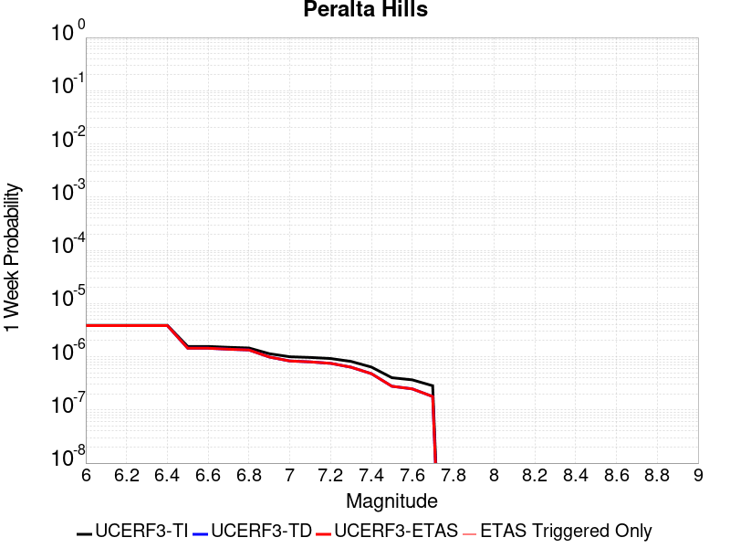 | 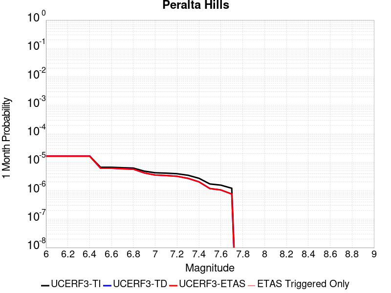 | 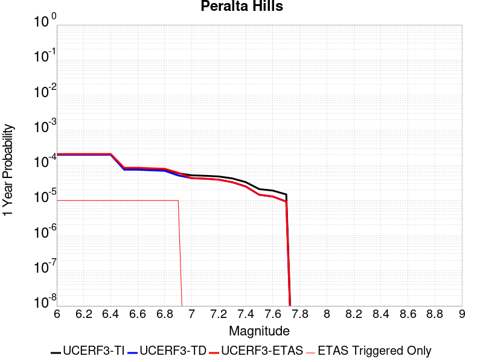 | 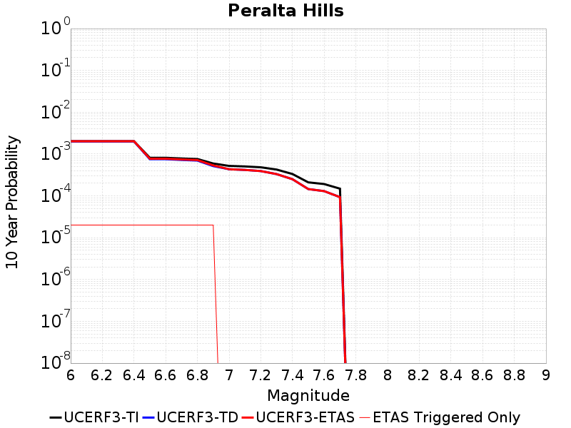 |

| Magnitude | 1 wk TI Prob | 1 wk TD Prob | 1 wk ETAS Prob | 1 wk ETAS/TD Gain | 1 wk ETAS Triggered Only | 1 mo TI Prob | 1 mo TD Prob | 1 mo ETAS Prob | 1 mo ETAS/TD Gain | 1 mo ETAS Triggered Only | 1 yr TI Prob | 1 yr TD Prob | 1 yr ETAS Prob | 1 yr ETAS/TD Gain | 1 yr ETAS Triggered Only | 10 yr TI Prob | 10 yr TD Prob | 10 yr ETAS Prob | 10 yr ETAS/TD Gain | 10 yr ETAS Triggered Only |
|-----|-----|-----|-----|-----|-----|-----|-----|-----|-----|-----|-----|-----|-----|-----|-----|-----|-----|-----|-----|-----|
| 6.0 | 3.8850067E-6 | 3.8395633E-6 | 3.8395633E-6 | 1.0 | 0.0 | 1.6649923E-5 | 1.645521E-5 | 1.645521E-5 | 1.0 | 0.0 | 2.0269395E-4 | 2.0033117E-4 | 2.1032916E-4 | 1.0499073 | 1.0E-5 | 0.0020250916 | 0.0020022334 | 0.0020221933 | 1.0099689 | 2.0E-5 |
| 6.1 | 3.8850067E-6 | 3.8395633E-6 | 3.8395633E-6 | 1.0 | 0.0 | 1.6649923E-5 | 1.645521E-5 | 1.645521E-5 | 1.0 | 0.0 | 2.0269395E-4 | 2.0033117E-4 | 2.1032916E-4 | 1.0499073 | 1.0E-5 | 0.0020250916 | 0.0020022334 | 0.0020221933 | 1.0099689 | 2.0E-5 |
| 6.2 | 3.8850067E-6 | 3.8395633E-6 | 3.8395633E-6 | 1.0 | 0.0 | 1.6649923E-5 | 1.645521E-5 | 1.645521E-5 | 1.0 | 0.0 | 2.0269395E-4 | 2.0033117E-4 | 2.1032916E-4 | 1.0499073 | 1.0E-5 | 0.0020250916 | 0.0020022334 | 0.0020221933 | 1.0099689 | 2.0E-5 |
| 6.3 | 3.8850067E-6 | 3.8395633E-6 | 3.8395633E-6 | 1.0 | 0.0 | 1.6649923E-5 | 1.645521E-5 | 1.645521E-5 | 1.0 | 0.0 | 2.0269395E-4 | 2.0033117E-4 | 2.1032916E-4 | 1.0499073 | 1.0E-5 | 0.0020250916 | 0.0020022334 | 0.0020221933 | 1.0099689 | 2.0E-5 |
| 6.4 | 3.8850067E-6 | 3.8395633E-6 | 3.8395633E-6 | 1.0 | 0.0 | 1.6649923E-5 | 1.645521E-5 | 1.645521E-5 | 1.0 | 0.0 | 2.0269395E-4 | 2.0033117E-4 | 2.1032916E-4 | 1.0499073 | 1.0E-5 | 0.0020250916 | 0.0020022334 | 0.0020221933 | 1.0099689 | 2.0E-5 |
| 6.5 | 1.5587785E-6 | 1.4431228E-6 | 1.4431228E-6 | 1.0 | 0.0 | 6.6804623E-6 | 6.1847986E-6 | 6.1847986E-6 | 1.0 | 0.0 | 8.133159E-5 | 7.529757E-5 | 8.5296815E-5 | 1.1327964 | 1.0E-5 | 8.1301836E-4 | 7.527445E-4 | 7.7272946E-4 | 1.0265495 | 2.0E-5 |
| 6.6 | 1.5587785E-6 | 1.4431228E-6 | 1.4431228E-6 | 1.0 | 0.0 | 6.6804623E-6 | 6.1847986E-6 | 6.1847986E-6 | 1.0 | 0.0 | 8.133159E-5 | 7.529757E-5 | 8.5296815E-5 | 1.1327964 | 1.0E-5 | 8.1301836E-4 | 7.527445E-4 | 7.7272946E-4 | 1.0265495 | 2.0E-5 |
| 6.7 | 1.5018579E-6 | 1.3837451E-6 | 1.3837451E-6 | 1.0 | 0.0 | 6.436518E-6 | 5.930324E-6 | 5.930324E-6 | 1.0 | 0.0 | 7.836179E-5 | 7.2199546E-5 | 8.219882E-5 | 1.1384951 | 1.0E-5 | 7.833416E-4 | 7.217844E-4 | 7.4176997E-4 | 1.0276891 | 2.0E-5 |
| 6.8 | 1.4584314E-6 | 1.338177E-6 | 1.338177E-6 | 1.0 | 0.0 | 6.250405E-6 | 5.735033E-6 | 5.735033E-6 | 1.0 | 0.0 | 7.6096025E-5 | 6.9822025E-5 | 7.982133E-5 | 1.1432112 | 1.0E-5 | 7.6069974E-4 | 6.980243E-4 | 7.1801036E-4 | 1.0286323 | 2.0E-5 |
| 6.9 | 1.1382393E-6 | 9.862595E-7 | 9.862595E-7 | 1.0 | 0.0 | 4.8781594E-6 | 4.22682E-6 | 4.22682E-6 | 1.0 | 0.0 | 5.9389975E-5 | 5.14604E-5 | 6.145988E-5 | 1.1943142 | 1.0E-5 | 5.93741E-4 | 5.1449303E-4 | 5.3448277E-4 | 1.0388532 | 2.0E-5 |
| 7.0 | 9.970413E-7 | 8.309904E-7 | 8.309904E-7 | 1.0 | 0.0 | 4.273027E-6 | 3.5613832E-6 | 3.5613832E-6 | 1.0 | 0.0 | 5.2022864E-5 | 4.3359047E-5 | 4.3359047E-5 | 1.0 | 0.0 | 5.2010687E-4 | 4.3351267E-4 | 4.3351267E-4 | 1.0 | 0.0 |
| 7.1 | 9.684443E-7 | 7.994334E-7 | 7.994334E-7 | 1.0 | 0.0 | 4.150469E-6 | 3.4261388E-6 | 3.4261388E-6 | 1.0 | 0.0 | 5.053079E-5 | 4.1712512E-5 | 4.1712512E-5 | 1.0 | 0.0 | 5.05193E-4 | 4.1705355E-4 | 4.1705355E-4 | 1.0 | 0.0 |
| 7.2 | 9.240811E-7 | 7.5033864E-7 | 7.5033864E-7 | 1.0 | 0.0 | 3.960342E-6 | 3.2157334E-6 | 3.2157334E-6 | 1.0 | 0.0 | 4.8216094E-5 | 3.9150917E-5 | 3.9150917E-5 | 1.0 | 0.0 | 4.8205635E-4 | 3.9144675E-4 | 3.9144675E-4 | 1.0 | 0.0 |
| 7.3 | 8.158643E-7 | 6.3502335E-7 | 6.3502335E-7 | 1.0 | 0.0 | 3.4965567E-6 | 2.721526E-6 | 2.721526E-6 | 1.0 | 0.0 | 4.2569747E-5 | 3.313414E-5 | 3.313414E-5 | 1.0 | 0.0 | 4.2561593E-4 | 3.3129813E-4 | 3.3129813E-4 | 1.0 | 0.0 |
| 7.4 | 6.3822824E-7 | 4.7958935E-7 | 4.7958935E-7 | 1.0 | 0.0 | 2.7352612E-6 | 2.0553814E-6 | 2.0553814E-6 | 1.0 | 0.0 | 3.3301294E-5 | 2.5024035E-5 | 2.5024035E-5 | 1.0 | 0.0 | 3.3296304E-4 | 2.502173E-4 | 2.502173E-4 | 1.0 | 0.0 |
| 7.5 | 4.0292628E-7 | 2.784701E-7 | 2.784701E-7 | 1.0 | 0.0 | 1.7268258E-6 | 1.193443E-6 | 1.193443E-6 | 1.0 | 0.0 | 2.1023901E-5 | 1.45301E-5 | 1.45301E-5 | 1.0 | 0.0 | 2.1021912E-4 | 1.452943E-4 | 1.452943E-4 | 1.0 | 0.0 |
| 7.6 | 3.672993E-7 | 2.4855802E-7 | 2.4855802E-7 | 1.0 | 0.0 | 1.5741389E-6 | 1.0652484E-6 | 1.0652484E-6 | 1.0 | 0.0 | 1.9164972E-5 | 1.296935E-5 | 1.296935E-5 | 1.0 | 0.0 | 1.916332E-4 | 1.2968865E-4 | 1.2968865E-4 | 1.0 | 0.0 |
| 7.7 | 2.8466823E-7 | 1.786055E-7 | 1.786055E-7 | 1.0 | 0.0 | 1.2200061E-6 | 7.6545206E-7 | 7.6545206E-7 | 1.0 | 0.0 | 1.4853474E-5 | 9.319366E-6 | 9.319366E-6 | 1.0 | 0.0 | 1.485248E-4 | 9.319235E-5 | 9.319235E-5 | 1.0 | 0.0 |

## Newport-Inglewood (Offshore)
*[(top)](#table-of-contents)*

| 1 Week | 1 Month | 1 Year | 10 Year |
|-----|-----|-----|-----|
| 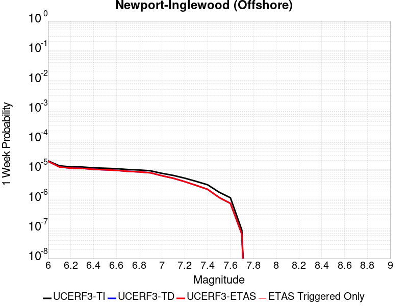 | 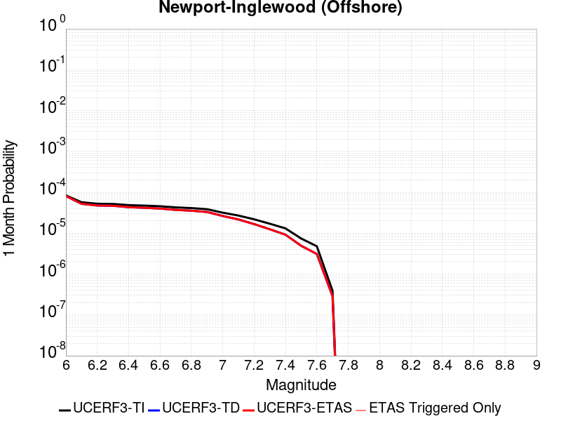 | 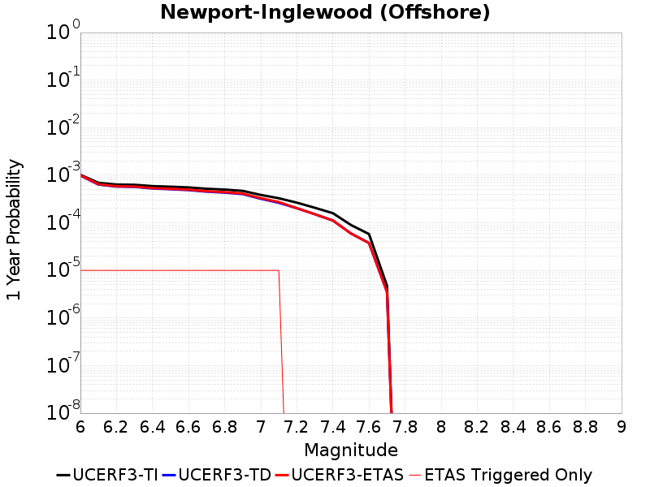 | 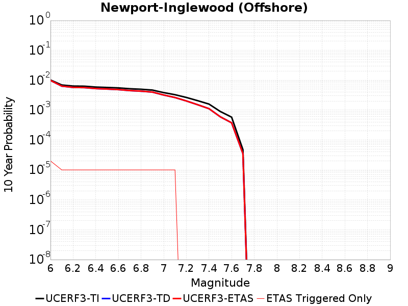 |

| Magnitude | 1 wk TI Prob | 1 wk TD Prob | 1 wk ETAS Prob | 1 wk ETAS/TD Gain | 1 wk ETAS Triggered Only | 1 mo TI Prob | 1 mo TD Prob | 1 mo ETAS Prob | 1 mo ETAS/TD Gain | 1 mo ETAS Triggered Only | 1 yr TI Prob | 1 yr TD Prob | 1 yr ETAS Prob | 1 yr ETAS/TD Gain | 1 yr ETAS Triggered Only | 10 yr TI Prob | 10 yr TD Prob | 10 yr ETAS Prob | 10 yr ETAS/TD Gain | 10 yr ETAS Triggered Only |
|-----|-----|-----|-----|-----|-----|-----|-----|-----|-----|-----|-----|-----|-----|-----|-----|-----|-----|-----|-----|-----|
| 6.0 | 1.9626508E-5 | 1.8965562E-5 | 1.8965562E-5 | 1.0 | 0.0 | 8.411089E-5 | 8.1278515E-5 | 8.1278515E-5 | 1.0 | 0.0 | 0.001023569 | 9.891293E-4 | 9.991194E-4 | 1.0100999 | 1.0E-5 | 0.010188672 | 0.00984861 | 0.009868412 | 1.0020107 | 2.0E-5 |
| 6.1 | 1.331886E-5 | 1.2218245E-5 | 1.2218245E-5 | 1.0 | 0.0 | 5.707958E-5 | 5.2362862E-5 | 5.2362862E-5 | 1.0 | 0.0 | 6.947222E-4 | 6.3733285E-4 | 6.473265E-4 | 1.0156804 | 1.0E-5 | 0.006925544 | 0.0063552284 | 0.0063651646 | 1.0015635 | 1.0E-5 |
| 6.2 | 1.2250852E-5 | 1.1076173E-5 | 1.1076173E-5 | 1.0 | 0.0 | 5.2502597E-5 | 4.7468457E-5 | 4.7468457E-5 | 1.0 | 0.0 | 6.3903164E-4 | 5.7777617E-4 | 5.877704E-4 | 1.0172977 | 1.0E-5 | 0.006371971 | 0.005762861 | 0.0057728034 | 1.0017252 | 1.0E-5 |
| 6.3 | 1.2106258E-5 | 1.0919033E-5 | 1.0919033E-5 | 1.0 | 0.0 | 5.1882926E-5 | 4.6795023E-5 | 4.6795023E-5 | 1.0 | 0.0 | 6.3149154E-4 | 5.6958146E-4 | 5.795757E-4 | 1.0175468 | 1.0E-5 | 0.0062970007 | 0.005681333 | 0.005691276 | 1.0017501 | 1.0E-5 |
| 6.4 | 1.1348758E-5 | 1.0109498E-5 | 1.0109498E-5 | 1.0 | 0.0 | 4.8636626E-5 | 4.3325705E-5 | 4.3325705E-5 | 1.0 | 0.0 | 5.919901E-4 | 5.2736356E-4 | 5.373583E-4 | 1.0189523 | 1.0E-5 | 0.005904155 | 0.0052612172 | 0.0052711642 | 1.0018907 | 1.0E-5 |
| 6.5 | 1.100837E-5 | 9.743522E-6 | 9.743522E-6 | 1.0 | 0.0 | 4.7177873E-5 | 4.175729E-5 | 4.175729E-5 | 1.0 | 0.0 | 5.7423924E-4 | 5.0827715E-4 | 5.1827205E-4 | 1.0196643 | 1.0E-5 | 0.005727576 | 0.0050712377 | 0.005081187 | 1.001962 | 1.0E-5 |
| 6.6 | 1.0634696E-5 | 9.345673E-6 | 9.345673E-6 | 1.0 | 0.0 | 4.557647E-5 | 4.0052273E-5 | 4.0052273E-5 | 1.0 | 0.0 | 5.5475225E-4 | 4.8752807E-4 | 4.975232E-4 | 1.0205016 | 1.0E-5 | 0.0055336943 | 0.0048646717 | 0.0048746234 | 1.0020456 | 1.0E-5 |
| 6.7 | 9.9780855E-6 | 8.668035E-6 | 8.668035E-6 | 1.0 | 0.0 | 4.276252E-5 | 3.7148195E-5 | 3.7148195E-5 | 1.0 | 0.0 | 5.205093E-4 | 4.5218613E-4 | 4.621816E-4 | 1.0221047 | 1.0E-5 | 0.0051929182 | 0.0045127394 | 0.0045226943 | 1.002206 | 1.0E-5 |
| 6.8 | 9.59546E-6 | 8.273072E-6 | 8.273072E-6 | 1.0 | 0.0 | 4.1122752E-5 | 3.5455545E-5 | 3.5455545E-5 | 1.0 | 0.0 | 5.0055445E-4 | 4.315864E-4 | 4.415821E-4 | 1.0231603 | 1.0E-5 | 0.004994285 | 0.0043075583 | 0.004317515 | 1.0023115 | 1.0E-5 |
| 6.9 | 9.000614E-6 | 7.706956E-6 | 7.706956E-6 | 1.0 | 0.0 | 3.857349E-5 | 3.3029395E-5 | 3.3029395E-5 | 1.0 | 0.0 | 4.6953102E-4 | 4.0205935E-4 | 4.1205532E-4 | 1.0248619 | 1.0E-5 | 0.004685402 | 0.0040133907 | 0.004023351 | 1.0024817 | 1.0E-5 |
| 7.0 | 7.4070194E-6 | 6.1490023E-6 | 6.1490023E-6 | 1.0 | 0.0 | 3.1743984E-5 | 2.6352602E-5 | 2.6352602E-5 | 1.0 | 0.0 | 3.8641447E-4 | 3.2079587E-4 | 3.3079265E-4 | 1.0311625 | 1.0E-5 | 0.0038574322 | 0.0032033473 | 0.0032133155 | 1.0031117 | 1.0E-5 |
| 7.1 | 6.299615E-6 | 5.0566823E-6 | 5.0566823E-6 | 1.0 | 0.0 | 2.699807E-5 | 2.1671318E-5 | 2.1671318E-5 | 1.0 | 0.0 | 3.2865192E-4 | 2.6381647E-4 | 2.7381384E-4 | 1.0378951 | 1.0E-5 | 0.003281663 | 0.0026350475 | 0.0026450213 | 1.003785 | 1.0E-5 |
| 7.2 | 5.096653E-6 | 3.892852E-6 | 3.892852E-6 | 1.0 | 0.0 | 2.1842614E-5 | 1.6683545E-5 | 1.6683545E-5 | 1.0 | 0.0 | 2.6590136E-4 | 2.0310332E-4 | 2.0310332E-4 | 1.0 | 0.0 | 0.0026558342 | 0.0020291882 | 0.0020291882 | 1.0 | 0.0 |
| 7.3 | 3.9753018E-6 | 2.9099392E-6 | 2.9099392E-6 | 1.0 | 0.0 | 1.7036897E-5 | 1.2471109E-5 | 1.2471109E-5 | 1.0 | 0.0 | 2.0740448E-4 | 1.5182525E-4 | 1.5182525E-4 | 1.0 | 0.0 | 0.00207211 | 0.0015172233 | 0.0015172233 | 1.0 | 0.0 |
| 7.4 | 3.0568392E-6 | 2.1450196E-6 | 2.1450196E-6 | 1.0 | 0.0 | 1.3100675E-5 | 9.192909E-6 | 9.192909E-6 | 1.0 | 0.0 | 1.5948903E-4 | 1.1191798E-4 | 1.1191798E-4 | 1.0 | 0.0 | 0.0015937461 | 0.0011186225 | 0.0011186225 | 1.0 | 0.0 |
| 7.5 | 1.7279019E-6 | 1.1469996E-6 | 1.1469996E-6 | 1.0 | 0.0 | 7.405273E-6 | 4.9157034E-6 | 4.9157034E-6 | 1.0 | 0.0 | 9.015547E-5 | 5.9847083E-5 | 5.9847083E-5 | 1.0 | 0.0 | 9.01189E-4 | 5.983136E-4 | 5.983136E-4 | 1.0 | 0.0 |
| 7.6 | 1.1156416E-6 | 7.223089E-7 | 7.223089E-7 | 1.0 | 0.0 | 4.7813123E-6 | 3.0956062E-6 | 3.0956062E-6 | 1.0 | 0.0 | 5.821092E-5 | 3.7688376E-5 | 3.7688376E-5 | 1.0 | 0.0 | 5.8195676E-4 | 3.768222E-4 | 3.768222E-4 | 1.0 | 0.0 |
| 7.7 | 9.117973E-8 | 6.734182E-8 | 6.734182E-8 | 1.0 | 0.0 | 3.907702E-7 | 2.886078E-7 | 2.886078E-7 | 1.0 | 0.0 | 4.757617E-6 | 3.5137944E-6 | 3.5137944E-6 | 1.0 | 0.0 | 4.7575148E-5 | 3.513742E-5 | 3.513742E-5 | 1.0 | 0.0 |

## Gillem - Big Crack 2011 CFM
*[(top)](#table-of-contents)*

| 1 Week | 1 Month | 1 Year | 10 Year |
|-----|-----|-----|-----|
|  |  | 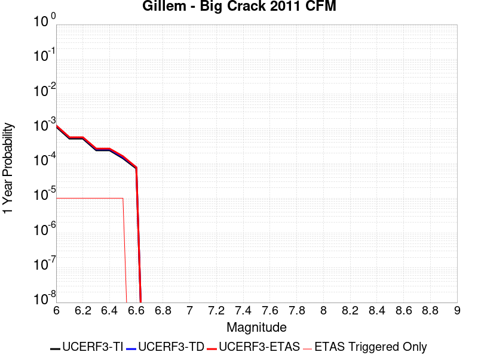 | 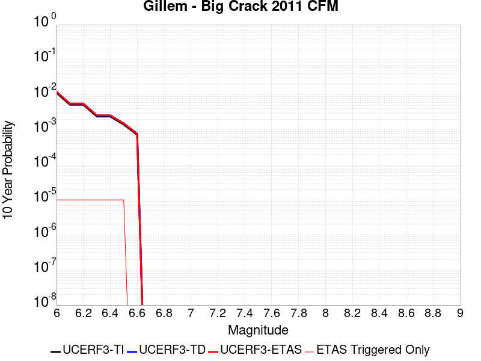 |

| Magnitude | 1 wk TI Prob | 1 wk TD Prob | 1 wk ETAS Prob | 1 wk ETAS/TD Gain | 1 wk ETAS Triggered Only | 1 mo TI Prob | 1 mo TD Prob | 1 mo ETAS Prob | 1 mo ETAS/TD Gain | 1 mo ETAS Triggered Only | 1 yr TI Prob | 1 yr TD Prob | 1 yr ETAS Prob | 1 yr ETAS/TD Gain | 1 yr ETAS Triggered Only | 10 yr TI Prob | 10 yr TD Prob | 10 yr ETAS Prob | 10 yr ETAS/TD Gain | 10 yr ETAS Triggered Only |
|-----|-----|-----|-----|-----|-----|-----|-----|-----|-----|-----|-----|-----|-----|-----|-----|-----|-----|-----|-----|-----|
| 6.0 | 2.196852E-5 | 2.3604684E-5 | 2.3604684E-5 | 1.0 | 0.0 | 9.4147406E-5 | 1.011595E-4 | 1.011595E-4 | 1.0 | 0.0 | 0.0011456419 | 0.0012310101 | 0.0012409977 | 1.0081134 | 1.0E-5 | 0.011397537 | 0.012250771 | 0.012260648 | 1.0008063 | 1.0E-5 |
| 6.1 | 9.992795E-6 | 1.0711976E-5 | 1.0711976E-5 | 1.0 | 0.0 | 4.2825563E-5 | 4.5907764E-5 | 4.5907764E-5 | 1.0 | 0.0 | 5.2127644E-4 | 5.5880204E-4 | 5.687964E-4 | 1.0178854 | 1.0E-5 | 0.0052005537 | 0.0055757794 | 0.0055857236 | 1.0017835 | 1.0E-5 |
| 6.2 | 9.992795E-6 | 1.0711976E-5 | 1.0711976E-5 | 1.0 | 0.0 | 4.2825563E-5 | 4.5907764E-5 | 4.5907764E-5 | 1.0 | 0.0 | 5.2127644E-4 | 5.5880204E-4 | 5.687964E-4 | 1.0178854 | 1.0E-5 | 0.0052005537 | 0.0055757794 | 0.0055857236 | 1.0017835 | 1.0E-5 |
| 6.3 | 4.6127884E-6 | 4.9426967E-6 | 4.9426967E-6 | 1.0 | 0.0 | 1.9768944E-5 | 2.118284E-5 | 2.118284E-5 | 1.0 | 0.0 | 2.406603E-4 | 2.5787498E-4 | 2.678724E-4 | 1.0387685 | 1.0E-5 | 0.0024039985 | 0.0025761956 | 0.0025861699 | 1.0038717 | 1.0E-5 |
| 6.4 | 4.6127884E-6 | 4.9426967E-6 | 4.9426967E-6 | 1.0 | 0.0 | 1.9768944E-5 | 2.118284E-5 | 2.118284E-5 | 1.0 | 0.0 | 2.406603E-4 | 2.5787498E-4 | 2.678724E-4 | 1.0387685 | 1.0E-5 | 0.0024039985 | 0.0025761956 | 0.0025861699 | 1.0038717 | 1.0E-5 |
| 6.5 | 2.716712E-6 | 2.9111347E-6 | 2.9111347E-6 | 1.0 | 0.0 | 1.1643E-5 | 1.24762455E-5 | 1.24762455E-5 | 1.0 | 0.0 | 1.417443E-4 | 1.5189013E-4 | 1.618886E-4 | 1.065827 | 1.0E-5 | 0.0014165393 | 0.0015181012 | 0.001528086 | 1.0065771 | 1.0E-5 |
| 6.6 | 1.3818255E-6 | 1.482081E-6 | 1.482081E-6 | 1.0 | 0.0 | 5.922096E-6 | 6.351767E-6 | 6.351767E-6 | 1.0 | 0.0 | 7.209913E-5 | 7.733125E-5 | 7.733125E-5 | 1.0 | 0.0 | 7.2075747E-4 | 7.731643E-4 | 7.731643E-4 | 1.0 | 0.0 |

## Channel Islands Western Deep Ramp
*[(top)](#table-of-contents)*

| 1 Week | 1 Month | 1 Year | 10 Year |
|-----|-----|-----|-----|
| 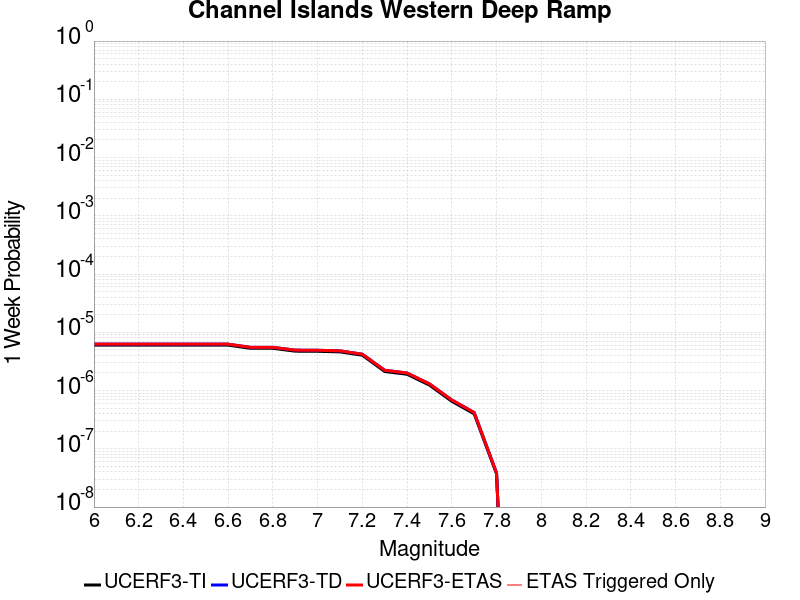 | 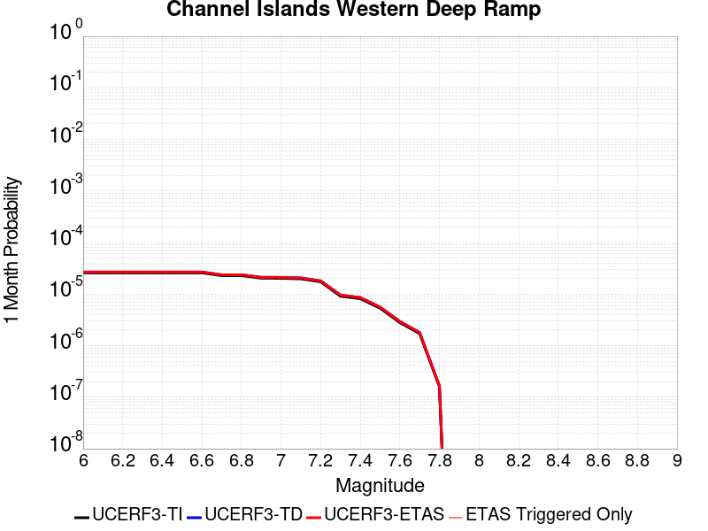 | 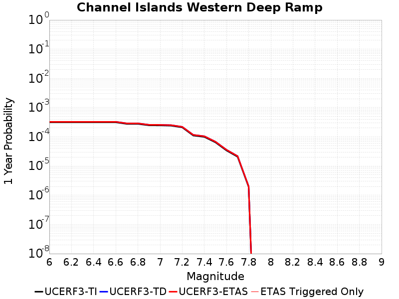 |  |

| Magnitude | 1 wk TI Prob | 1 wk TD Prob | 1 wk ETAS Prob | 1 wk ETAS/TD Gain | 1 wk ETAS Triggered Only | 1 mo TI Prob | 1 mo TD Prob | 1 mo ETAS Prob | 1 mo ETAS/TD Gain | 1 mo ETAS Triggered Only | 1 yr TI Prob | 1 yr TD Prob | 1 yr ETAS Prob | 1 yr ETAS/TD Gain | 1 yr ETAS Triggered Only | 10 yr TI Prob | 10 yr TD Prob | 10 yr ETAS Prob | 10 yr ETAS/TD Gain | 10 yr ETAS Triggered Only |
|-----|-----|-----|-----|-----|-----|-----|-----|-----|-----|-----|-----|-----|-----|-----|-----|-----|-----|-----|-----|-----|
| 6.0 | 6.0213506E-6 | 6.2548957E-6 | 6.2548957E-6 | 1.0 | 0.0 | 2.5805533E-5 | 2.6806445E-5 | 2.6806445E-5 | 1.0 | 0.0 | 3.1413708E-4 | 3.2632405E-4 | 3.2632405E-4 | 1.0 | 0.0 | 0.0031369338 | 0.0032588905 | 0.0032788252 | 1.0061171 | 2.0E-5 |
| 6.1 | 6.0213506E-6 | 6.2548957E-6 | 6.2548957E-6 | 1.0 | 0.0 | 2.5805533E-5 | 2.6806445E-5 | 2.6806445E-5 | 1.0 | 0.0 | 3.1413708E-4 | 3.2632405E-4 | 3.2632405E-4 | 1.0 | 0.0 | 0.0031369338 | 0.0032588905 | 0.0032788252 | 1.0061171 | 2.0E-5 |
| 6.2 | 6.0213506E-6 | 6.2548957E-6 | 6.2548957E-6 | 1.0 | 0.0 | 2.5805533E-5 | 2.6806445E-5 | 2.6806445E-5 | 1.0 | 0.0 | 3.1413708E-4 | 3.2632405E-4 | 3.2632405E-4 | 1.0 | 0.0 | 0.0031369338 | 0.0032588905 | 0.0032788252 | 1.0061171 | 2.0E-5 |
| 6.3 | 6.0213506E-6 | 6.2548957E-6 | 6.2548957E-6 | 1.0 | 0.0 | 2.5805533E-5 | 2.6806445E-5 | 2.6806445E-5 | 1.0 | 0.0 | 3.1413708E-4 | 3.2632405E-4 | 3.2632405E-4 | 1.0 | 0.0 | 0.0031369338 | 0.0032588905 | 0.0032788252 | 1.0061171 | 2.0E-5 |
| 6.4 | 6.0213506E-6 | 6.2548957E-6 | 6.2548957E-6 | 1.0 | 0.0 | 2.5805533E-5 | 2.6806445E-5 | 2.6806445E-5 | 1.0 | 0.0 | 3.1413708E-4 | 3.2632405E-4 | 3.2632405E-4 | 1.0 | 0.0 | 0.0031369338 | 0.0032588905 | 0.0032788252 | 1.0061171 | 2.0E-5 |
| 6.5 | 6.0213506E-6 | 6.2548957E-6 | 6.2548957E-6 | 1.0 | 0.0 | 2.5805533E-5 | 2.6806445E-5 | 2.6806445E-5 | 1.0 | 0.0 | 3.1413708E-4 | 3.2632405E-4 | 3.2632405E-4 | 1.0 | 0.0 | 0.0031369338 | 0.0032588905 | 0.0032788252 | 1.0061171 | 2.0E-5 |
| 6.6 | 6.0213506E-6 | 6.2548957E-6 | 6.2548957E-6 | 1.0 | 0.0 | 2.5805533E-5 | 2.6806445E-5 | 2.6806445E-5 | 1.0 | 0.0 | 3.1413708E-4 | 3.2632405E-4 | 3.2632405E-4 | 1.0 | 0.0 | 0.0031369338 | 0.0032588905 | 0.0032788252 | 1.0061171 | 2.0E-5 |
| 6.7 | 5.313309E-6 | 5.5252654E-6 | 5.5252654E-6 | 1.0 | 0.0 | 2.2771126E-5 | 2.3679517E-5 | 2.3679517E-5 | 1.0 | 0.0 | 2.772032E-4 | 2.8826407E-4 | 2.8826407E-4 | 1.0 | 0.0 | 0.0027685766 | 0.0028793046 | 0.002899247 | 1.0069262 | 2.0E-5 |
| 6.8 | 5.313309E-6 | 5.5252654E-6 | 5.5252654E-6 | 1.0 | 0.0 | 2.2771126E-5 | 2.3679517E-5 | 2.3679517E-5 | 1.0 | 0.0 | 2.772032E-4 | 2.8826407E-4 | 2.8826407E-4 | 1.0 | 0.0 | 0.0027685766 | 0.0028793046 | 0.002899247 | 1.0069262 | 2.0E-5 |
| 6.9 | 4.744377E-6 | 4.9394534E-6 | 4.9394534E-6 | 1.0 | 0.0 | 2.0332885E-5 | 2.1168935E-5 | 2.1168935E-5 | 1.0 | 0.0 | 2.4752476E-4 | 2.5770502E-4 | 2.5770502E-4 | 1.0 | 0.0 | 0.0024724922 | 0.0025744294 | 0.0025844036 | 1.0038743 | 1.0E-5 |
| 7.0 | 4.722209E-6 | 4.916496E-6 | 4.916496E-6 | 1.0 | 0.0 | 2.0237881E-5 | 2.1070548E-5 | 2.1070548E-5 | 1.0 | 0.0 | 2.4636835E-4 | 2.5650745E-4 | 2.5650745E-4 | 1.0 | 0.0 | 0.002460954 | 0.0025624812 | 0.0025724554 | 1.0038924 | 1.0E-5 |
| 7.1 | 4.611174E-6 | 4.8014313E-6 | 4.8014313E-6 | 1.0 | 0.0 | 1.9762025E-5 | 2.0577421E-5 | 2.0577421E-5 | 1.0 | 0.0 | 2.4057609E-4 | 2.5050502E-4 | 2.5050502E-4 | 1.0 | 0.0 | 0.002403158 | 0.0025025934 | 0.0025125684 | 1.0039859 | 1.0E-5 |
| 7.2 | 4.043994E-6 | 4.2120464E-6 | 4.2120464E-6 | 1.0 | 0.0 | 1.7331287E-5 | 1.8051522E-5 | 1.8051522E-5 | 1.0 | 0.0 | 2.10988E-4 | 2.1975869E-4 | 2.1975869E-4 | 1.0 | 0.0 | 0.002107878 | 0.0021957643 | 0.0022057425 | 1.0045443 | 1.0E-5 |
| 7.3 | 2.1233036E-6 | 2.2298E-6 | 2.2298E-6 | 1.0 | 0.0 | 9.099841E-6 | 9.556251E-6 | 9.556251E-6 | 1.0 | 0.0 | 1.1078493E-4 | 1.16341194E-4 | 1.16341194E-4 | 1.0 | 0.0 | 0.0011072971 | 0.0011628085 | 0.0011727968 | 1.0085899 | 1.0E-5 |
| 7.4 | 1.9051884E-6 | 2.0015086E-6 | 2.0015086E-6 | 1.0 | 0.0 | 8.165067E-6 | 8.577866E-6 | 8.577866E-6 | 1.0 | 0.0 | 9.940516E-5 | 1.0443057E-4 | 1.0443057E-4 | 1.0 | 0.0 | 9.93607E-4 | 0.0010438202 | 0.0010538098 | 1.0095702 | 1.0E-5 |
| 7.5 | 1.2408497E-6 | 1.3038913E-6 | 1.3038913E-6 | 1.0 | 0.0 | 5.317916E-6 | 5.5880937E-6 | 5.5880937E-6 | 1.0 | 0.0 | 6.4743705E-5 | 6.803294E-5 | 6.803294E-5 | 1.0 | 0.0 | 6.4724847E-4 | 6.8012334E-4 | 6.901165E-4 | 1.0146933 | 1.0E-5 |
| 7.6 | 6.5440025E-7 | 6.8867587E-7 | 6.8867587E-7 | 1.0 | 0.0 | 2.8045695E-6 | 2.9514647E-6 | 2.9514647E-6 | 1.0 | 0.0 | 3.4145098E-5 | 3.5933503E-5 | 3.5933503E-5 | 1.0 | 0.0 | 3.4139853E-4 | 3.5927835E-4 | 3.5927835E-4 | 1.0 | 0.0 |
| 7.7 | 3.985963E-7 | 4.193103E-7 | 4.193103E-7 | 1.0 | 0.0 | 1.7082689E-6 | 1.7970431E-6 | 1.7970431E-6 | 1.0 | 0.0 | 2.0797976E-5 | 2.1878792E-5 | 2.1878792E-5 | 1.0 | 0.0 | 2.0796029E-4 | 2.1876754E-4 | 2.1876754E-4 | 1.0 | 0.0 |
| 7.8 | 3.706329E-8 | 3.8591974E-8 | 3.8591974E-8 | 1.0 | 0.0 | 1.5884267E-7 | 1.6539416E-7 | 1.6539416E-7 | 1.0 | 0.0 | 1.9339077E-6 | 2.0136722E-6 | 2.0136722E-6 | 1.0 | 0.0 | 1.933891E-5 | 2.0136551E-5 | 2.0136551E-5 | 1.0 | 0.0 |

## San Gabriel
*[(top)](#table-of-contents)*

| 1 Week | 1 Month | 1 Year | 10 Year |
|-----|-----|-----|-----|
| 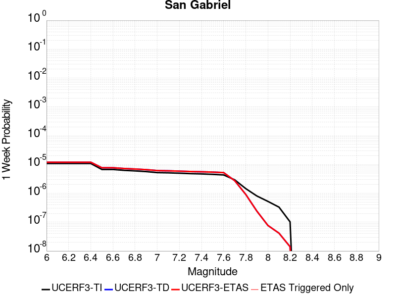 | 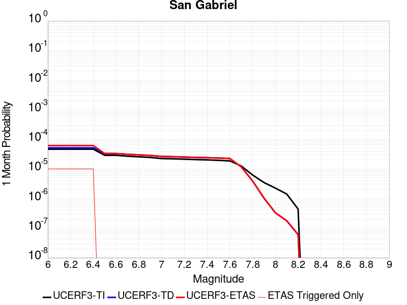 | 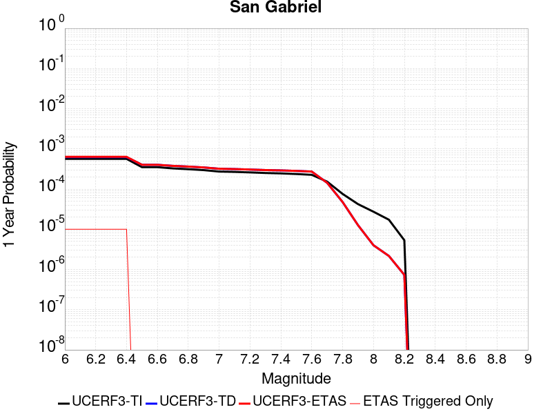 | 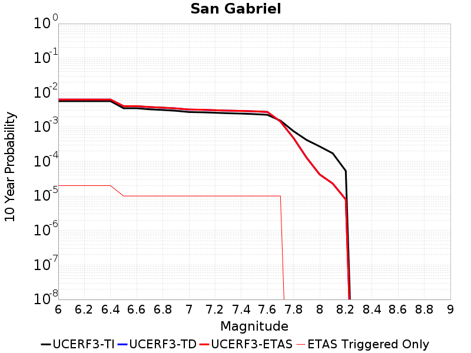 |

| Magnitude | 1 wk TI Prob | 1 wk TD Prob | 1 wk ETAS Prob | 1 wk ETAS/TD Gain | 1 wk ETAS Triggered Only | 1 mo TI Prob | 1 mo TD Prob | 1 mo ETAS Prob | 1 mo ETAS/TD Gain | 1 mo ETAS Triggered Only | 1 yr TI Prob | 1 yr TD Prob | 1 yr ETAS Prob | 1 yr ETAS/TD Gain | 1 yr ETAS Triggered Only | 10 yr TI Prob | 10 yr TD Prob | 10 yr ETAS Prob | 10 yr ETAS/TD Gain | 10 yr ETAS Triggered Only |
|-----|-----|-----|-----|-----|-----|-----|-----|-----|-----|-----|-----|-----|-----|-----|-----|-----|-----|-----|-----|-----|
| 6.0 | 1.083775E-5 | 1.1986988E-5 | 1.1986988E-5 | 1.0 | 0.0 | 4.6446676E-5 | 5.137186E-5 | 6.137134E-5 | 1.1946491 | 1.0E-5 | 5.653415E-4 | 6.252842E-4 | 6.3527795E-4 | 1.0159827 | 1.0E-5 | 0.0056390543 | 0.0062473407 | 0.006267216 | 1.0031813 | 2.0E-5 |
| 6.1 | 1.083775E-5 | 1.1986988E-5 | 1.1986988E-5 | 1.0 | 0.0 | 4.6446676E-5 | 5.137186E-5 | 6.137134E-5 | 1.1946491 | 1.0E-5 | 5.653415E-4 | 6.252842E-4 | 6.3527795E-4 | 1.0159827 | 1.0E-5 | 0.0056390543 | 0.0062473407 | 0.006267216 | 1.0031813 | 2.0E-5 |
| 6.2 | 1.083775E-5 | 1.1986988E-5 | 1.1986988E-5 | 1.0 | 0.0 | 4.6446676E-5 | 5.137186E-5 | 6.137134E-5 | 1.1946491 | 1.0E-5 | 5.653415E-4 | 6.252842E-4 | 6.3527795E-4 | 1.0159827 | 1.0E-5 | 0.0056390543 | 0.0062473407 | 0.006267216 | 1.0031813 | 2.0E-5 |
| 6.3 | 1.083775E-5 | 1.1986988E-5 | 1.1986988E-5 | 1.0 | 0.0 | 4.6446676E-5 | 5.137186E-5 | 6.137134E-5 | 1.1946491 | 1.0E-5 | 5.653415E-4 | 6.252842E-4 | 6.3527795E-4 | 1.0159827 | 1.0E-5 | 0.0056390543 | 0.0062473407 | 0.006267216 | 1.0031813 | 2.0E-5 |
| 6.4 | 1.083775E-5 | 1.1986988E-5 | 1.1986988E-5 | 1.0 | 0.0 | 4.6446676E-5 | 5.137186E-5 | 6.137134E-5 | 1.1946491 | 1.0E-5 | 5.653415E-4 | 6.252842E-4 | 6.3527795E-4 | 1.0159827 | 1.0E-5 | 0.0056390543 | 0.0062473407 | 0.006267216 | 1.0031813 | 2.0E-5 |
| 6.5 | 6.7317824E-6 | 7.718726E-6 | 7.718726E-6 | 1.0 | 0.0 | 2.8850178E-5 | 3.3079843E-5 | 3.3079843E-5 | 1.0 | 0.0 | 3.511943E-4 | 4.026737E-4 | 4.026737E-4 | 1.0 | 0.0 | 0.003506398 | 0.0040305336 | 0.004040493 | 1.0024711 | 1.0E-5 |
| 6.6 | 6.7317824E-6 | 7.718726E-6 | 7.718726E-6 | 1.0 | 0.0 | 2.8850178E-5 | 3.3079843E-5 | 3.3079843E-5 | 1.0 | 0.0 | 3.511943E-4 | 4.026737E-4 | 4.026737E-4 | 1.0 | 0.0 | 0.003506398 | 0.0040305336 | 0.004040493 | 1.0024711 | 1.0E-5 |
| 6.7 | 6.274881E-6 | 7.2476446E-6 | 7.2476446E-6 | 1.0 | 0.0 | 2.6892068E-5 | 3.106097E-5 | 3.106097E-5 | 1.0 | 0.0 | 3.2736175E-4 | 3.7810265E-4 | 3.7810265E-4 | 1.0 | 0.0 | 0.0032687993 | 0.0037856798 | 0.003795642 | 1.0026315 | 1.0E-5 |
| 6.8 | 5.996209E-6 | 6.960364E-6 | 6.960364E-6 | 1.0 | 0.0 | 2.5697784E-5 | 2.9829795E-5 | 2.9829795E-5 | 1.0 | 0.0 | 3.128256E-4 | 3.6311816E-4 | 3.6311816E-4 | 1.0 | 0.0 | 0.003123856 | 0.0036363322 | 0.003646296 | 1.00274 | 1.0E-5 |
| 6.9 | 5.686331E-6 | 6.6254033E-6 | 6.6254033E-6 | 1.0 | 0.0 | 2.4369761E-5 | 2.8394283E-5 | 2.8394283E-5 | 1.0 | 0.0 | 2.9666146E-4 | 3.4564646E-4 | 3.4564646E-4 | 1.0 | 0.0 | 0.0029626573 | 0.003462171 | 0.0034721363 | 1.0028783 | 1.0E-5 |
| 7.0 | 5.2329838E-6 | 6.1492815E-6 | 6.1492815E-6 | 1.0 | 0.0 | 2.242688E-5 | 2.63538E-5 | 2.63538E-5 | 1.0 | 0.0 | 2.7301308E-4 | 3.2081106E-4 | 3.2081106E-4 | 1.0 | 0.0 | 0.002726779 | 0.0032145495 | 0.0032245172 | 1.0031009 | 1.0E-5 |
| 7.1 | 5.135671E-6 | 6.0394027E-6 | 6.0394027E-6 | 1.0 | 0.0 | 2.2009834E-5 | 2.5882902E-5 | 2.5882902E-5 | 1.0 | 0.0 | 2.6793676E-4 | 3.1507952E-4 | 3.1507952E-4 | 1.0 | 0.0 | 0.0026761394 | 0.0031573984 | 0.0031673668 | 1.0031571 | 1.0E-5 |
| 7.2 | 4.989062E-6 | 5.872775E-6 | 5.872775E-6 | 1.0 | 0.0 | 2.1381518E-5 | 2.5168796E-5 | 2.5168796E-5 | 1.0 | 0.0 | 2.6028889E-4 | 3.0638775E-4 | 3.0638775E-4 | 1.0 | 0.0 | 0.0025998424 | 0.0030707237 | 0.003080693 | 1.0032465 | 1.0E-5 |
| 7.3 | 4.8219395E-6 | 5.7043217E-6 | 5.7043217E-6 | 1.0 | 0.0 | 2.0665291E-5 | 2.4446868E-5 | 2.4446868E-5 | 1.0 | 0.0 | 2.5157086E-4 | 2.9760072E-4 | 2.9760072E-4 | 1.0 | 0.0 | 0.0025128627 | 0.0029830926 | 0.0029930626 | 1.0033423 | 1.0E-5 |
| 7.4 | 4.7118383E-6 | 5.592874E-6 | 5.592874E-6 | 1.0 | 0.0 | 2.0193436E-5 | 2.3969245E-5 | 2.3969245E-5 | 1.0 | 0.0 | 2.4582737E-4 | 2.9178723E-4 | 2.9178723E-4 | 1.0 | 0.0 | 0.002455556 | 0.0029251107 | 0.0029350815 | 1.0034087 | 1.0E-5 |
| 7.5 | 4.5506545E-6 | 5.4382335E-6 | 5.4382335E-6 | 1.0 | 0.0 | 1.9502659E-5 | 2.3306511E-5 | 2.3306511E-5 | 1.0 | 0.0 | 2.37419E-4 | 2.8372058E-4 | 2.8372058E-4 | 1.0 | 0.0 | 0.002371655 | 0.0028446524 | 0.002854624 | 1.0035053 | 1.0E-5 |
| 7.6 | 4.343636E-6 | 5.2310993E-6 | 5.2310993E-6 | 1.0 | 0.0 | 1.861545E-5 | 2.2418808E-5 | 2.2418808E-5 | 1.0 | 0.0 | 2.2661954E-4 | 2.7291555E-4 | 2.7291555E-4 | 1.0 | 0.0 | 0.0022638857 | 0.0027368641 | 0.0027468367 | 1.0036439 | 1.0E-5 |
| 7.7 | 2.936235E-6 | 2.7452015E-6 | 2.7452015E-6 | 1.0 | 0.0 | 1.2583803E-5 | 1.1765096E-5 | 1.1765096E-5 | 1.0 | 0.0 | 1.5319703E-4 | 1.4323066E-4 | 1.4323066E-4 | 1.0 | 0.0 | 0.0015309147 | 0.0014386807 | 0.0014486663 | 1.0069408 | 1.0E-5 |
| 7.8 | 1.4541639E-6 | 9.128367E-7 | 9.128367E-7 | 1.0 | 0.0 | 6.232116E-6 | 3.9121514E-6 | 3.9121514E-6 | 1.0 | 0.0 | 7.587337E-5 | 4.7629404E-5 | 4.7629404E-5 | 1.0 | 0.0 | 7.584747E-4 | 4.810985E-4 | 4.810985E-4 | 1.0 | 0.0 |
| 7.9 | 8.098958E-7 | 2.4193423E-7 | 2.4193423E-7 | 1.0 | 0.0 | 3.4709774E-6 | 1.0368605E-6 | 1.0368605E-6 | 1.0 | 0.0 | 4.225833E-5 | 1.2623703E-5 | 1.2623703E-5 | 1.0 | 0.0 | 4.2250296E-4 | 1.2931567E-4 | 1.2931567E-4 | 1.0 | 0.0 |
| 8.0 | 5.2473234E-7 | 7.687616E-8 | 7.687616E-8 | 1.0 | 0.0 | 2.248851E-6 | 3.2946923E-7 | 3.2946923E-7 | 1.0 | 0.0 | 2.7379416E-5 | 4.0112805E-6 | 4.0112805E-6 | 1.0 | 0.0 | 2.7376044E-4 | 4.2237825E-5 | 4.2237825E-5 | 1.0 | 0.0 |
| 8.1 | 3.3162388E-7 | 4.1542812E-8 | 4.1542812E-8 | 1.0 | 0.0 | 1.4212444E-6 | 1.7804062E-7 | 1.7804062E-7 | 1.0 | 0.0 | 1.7303513E-5 | 2.1676424E-6 | 2.1676424E-6 | 1.0 | 0.0 | 1.7302166E-4 | 2.2991137E-5 | 2.2991137E-5 | 1.0 | 0.0 |
| 8.2 | 1.0235345E-7 | 1.4058208E-8 | 1.4058208E-8 | 1.0 | 0.0 | 4.3865757E-7 | 6.024946E-8 | 6.024946E-8 | 1.0 | 0.0 | 5.340643E-6 | 7.335369E-7 | 7.335369E-7 | 1.0 | 0.0 | 5.3405143E-5 | 7.935524E-6 | 7.935524E-6 | 1.0 | 0.0 |

## Great Valley 06 (Midland) 2011 CFM alt1
*[(top)](#table-of-contents)*

| 1 Week | 1 Month | 1 Year | 10 Year |
|-----|-----|-----|-----|
| 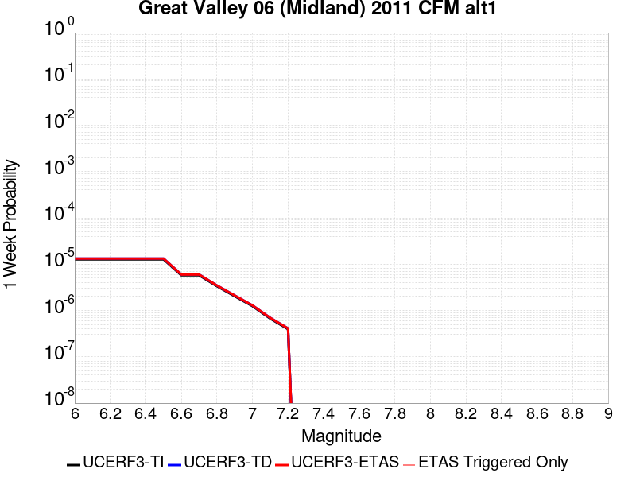 | 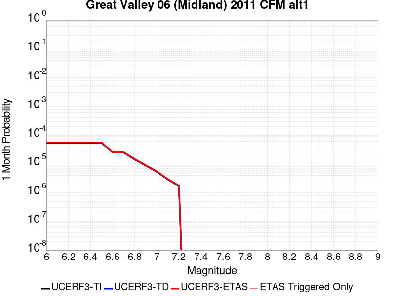 | 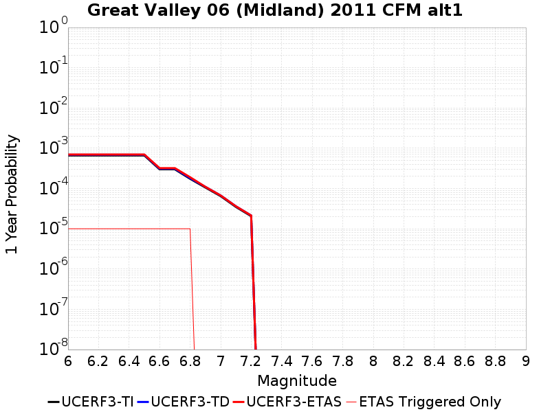 | 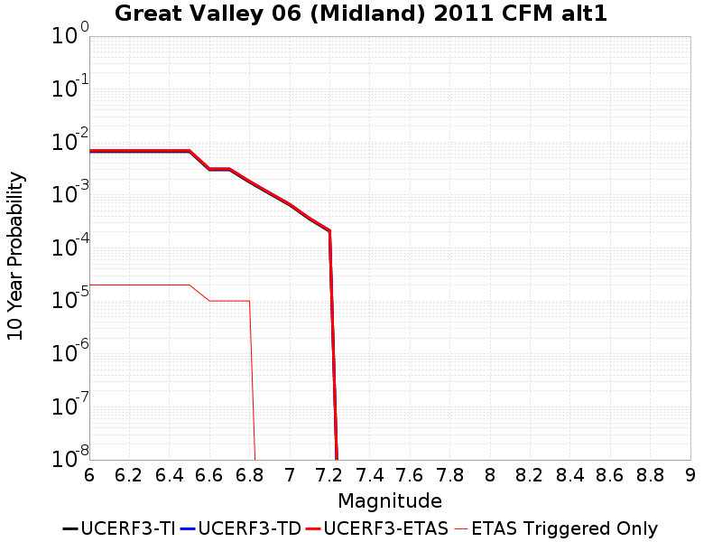 |

| Magnitude | 1 wk TI Prob | 1 wk TD Prob | 1 wk ETAS Prob | 1 wk ETAS/TD Gain | 1 wk ETAS Triggered Only | 1 mo TI Prob | 1 mo TD Prob | 1 mo ETAS Prob | 1 mo ETAS/TD Gain | 1 mo ETAS Triggered Only | 1 yr TI Prob | 1 yr TD Prob | 1 yr ETAS Prob | 1 yr ETAS/TD Gain | 1 yr ETAS Triggered Only | 10 yr TI Prob | 10 yr TD Prob | 10 yr ETAS Prob | 10 yr ETAS/TD Gain | 10 yr ETAS Triggered Only |
|-----|-----|-----|-----|-----|-----|-----|-----|-----|-----|-----|-----|-----|-----|-----|-----|-----|-----|-----|-----|-----|
| 6.0 | 1.2712525E-5 | 1.3210633E-5 | 1.3210633E-5 | 1.0 | 0.0 | 5.4481112E-5 | 5.6615918E-5 | 5.6615918E-5 | 1.0 | 0.0 | 6.6310563E-4 | 6.891062E-4 | 6.9909927E-4 | 1.0145016 | 1.0E-5 | 0.0066113044 | 0.006872209 | 0.0068920716 | 1.0028902 | 2.0E-5 |
| 6.1 | 1.2712525E-5 | 1.3210633E-5 | 1.3210633E-5 | 1.0 | 0.0 | 5.4481112E-5 | 5.6615918E-5 | 5.6615918E-5 | 1.0 | 0.0 | 6.6310563E-4 | 6.891062E-4 | 6.9909927E-4 | 1.0145016 | 1.0E-5 | 0.0066113044 | 0.006872209 | 0.0068920716 | 1.0028902 | 2.0E-5 |
| 6.2 | 1.2712525E-5 | 1.3210633E-5 | 1.3210633E-5 | 1.0 | 0.0 | 5.4481112E-5 | 5.6615918E-5 | 5.6615918E-5 | 1.0 | 0.0 | 6.6310563E-4 | 6.891062E-4 | 6.9909927E-4 | 1.0145016 | 1.0E-5 | 0.0066113044 | 0.006872209 | 0.0068920716 | 1.0028902 | 2.0E-5 |
| 6.3 | 1.2712525E-5 | 1.3210633E-5 | 1.3210633E-5 | 1.0 | 0.0 | 5.4481112E-5 | 5.6615918E-5 | 5.6615918E-5 | 1.0 | 0.0 | 6.6310563E-4 | 6.891062E-4 | 6.9909927E-4 | 1.0145016 | 1.0E-5 | 0.0066113044 | 0.006872209 | 0.0068920716 | 1.0028902 | 2.0E-5 |
| 6.4 | 1.2712525E-5 | 1.3210633E-5 | 1.3210633E-5 | 1.0 | 0.0 | 5.4481112E-5 | 5.6615918E-5 | 5.6615918E-5 | 1.0 | 0.0 | 6.6310563E-4 | 6.891062E-4 | 6.9909927E-4 | 1.0145016 | 1.0E-5 | 0.0066113044 | 0.006872209 | 0.0068920716 | 1.0028902 | 2.0E-5 |
| 6.5 | 1.2712525E-5 | 1.3210633E-5 | 1.3210633E-5 | 1.0 | 0.0 | 5.4481112E-5 | 5.6615918E-5 | 5.6615918E-5 | 1.0 | 0.0 | 6.6310563E-4 | 6.891062E-4 | 6.9909927E-4 | 1.0145016 | 1.0E-5 | 0.0066113044 | 0.006872209 | 0.0068920716 | 1.0028902 | 2.0E-5 |
| 6.6 | 5.7574384E-6 | 5.970671E-6 | 5.970671E-6 | 1.0 | 0.0 | 2.4674504E-5 | 2.558836E-5 | 2.558836E-5 | 1.0 | 0.0 | 3.0037065E-4 | 3.114977E-4 | 3.2149456E-4 | 1.0320929 | 1.0E-5 | 0.0029996498 | 0.0031109971 | 0.003120966 | 1.0032043 | 1.0E-5 |
| 6.7 | 5.7574384E-6 | 5.970671E-6 | 5.970671E-6 | 1.0 | 0.0 | 2.4674504E-5 | 2.558836E-5 | 2.558836E-5 | 1.0 | 0.0 | 3.0037065E-4 | 3.114977E-4 | 3.2149456E-4 | 1.0320929 | 1.0E-5 | 0.0029996498 | 0.0031109971 | 0.003120966 | 1.0032043 | 1.0E-5 |
| 6.8 | 3.3474828E-6 | 3.469399E-6 | 3.469399E-6 | 1.0 | 0.0 | 1.4346277E-5 | 1.4868776E-5 | 1.4868776E-5 | 1.0 | 0.0 | 1.7465191E-4 | 1.810138E-4 | 1.9101199E-4 | 1.0552344 | 1.0E-5 | 0.0017451472 | 0.0018088106 | 0.0018187925 | 1.0055184 | 1.0E-5 |
| 6.9 | 2.035106E-6 | 2.109044E-6 | 2.109044E-6 | 1.0 | 0.0 | 8.721853E-6 | 9.038734E-6 | 9.038734E-6 | 1.0 | 0.0 | 1.0618339E-4 | 1.1004176E-4 | 1.1004176E-4 | 1.0 | 0.0 | 0.0010613267 | 0.0010999449 | 0.0010999449 | 1.0 | 0.0 |
| 7.0 | 1.2424716E-6 | 1.2878814E-6 | 1.2878814E-6 | 1.0 | 0.0 | 5.3248673E-6 | 5.519483E-6 | 5.519483E-6 | 1.0 | 0.0 | 6.482833E-5 | 6.719808E-5 | 6.719808E-5 | 1.0 | 0.0 | 6.480942E-4 | 6.7182194E-4 | 6.7182194E-4 | 1.0 | 0.0 |
| 7.1 | 6.6904556E-7 | 6.939063E-7 | 6.939063E-7 | 1.0 | 0.0 | 2.867335E-6 | 2.9738824E-6 | 2.9738824E-6 | 1.0 | 0.0 | 3.4909244E-5 | 3.620668E-5 | 3.620668E-5 | 1.0 | 0.0 | 3.490376E-4 | 3.620333E-4 | 3.620333E-4 | 1.0 | 0.0 |
| 7.2 | 3.948168E-7 | 4.095722E-7 | 4.095722E-7 | 1.0 | 0.0 | 1.6920709E-6 | 1.7553094E-6 | 1.7553094E-6 | 1.0 | 0.0 | 2.0600768E-5 | 2.1370892E-5 | 2.1370892E-5 | 1.0 | 0.0 | 2.0598859E-4 | 2.1370893E-4 | 2.1370893E-4 | 1.0 | 0.0 |

## Emerson-Copper Mtn 2011
*[(top)](#table-of-contents)*

| 1 Week | 1 Month | 1 Year | 10 Year |
|-----|-----|-----|-----|
| 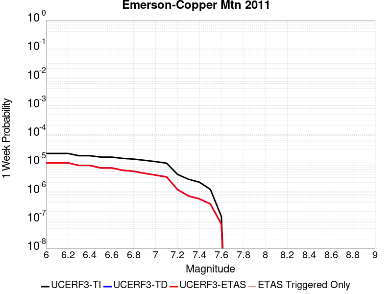 | 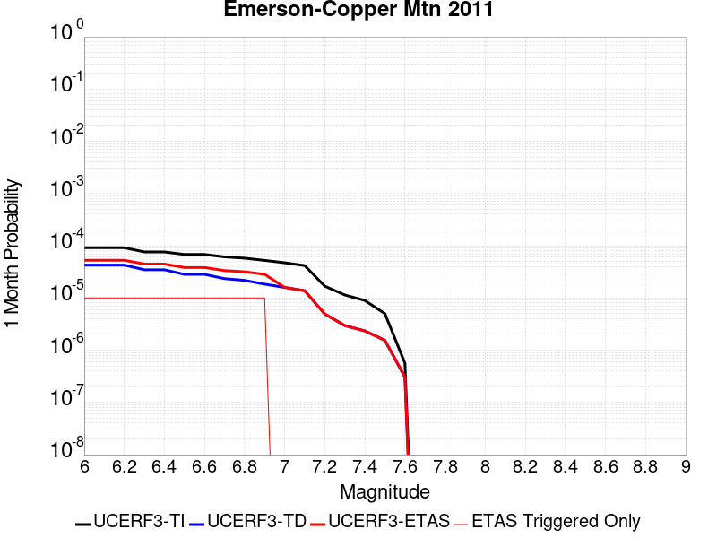 | 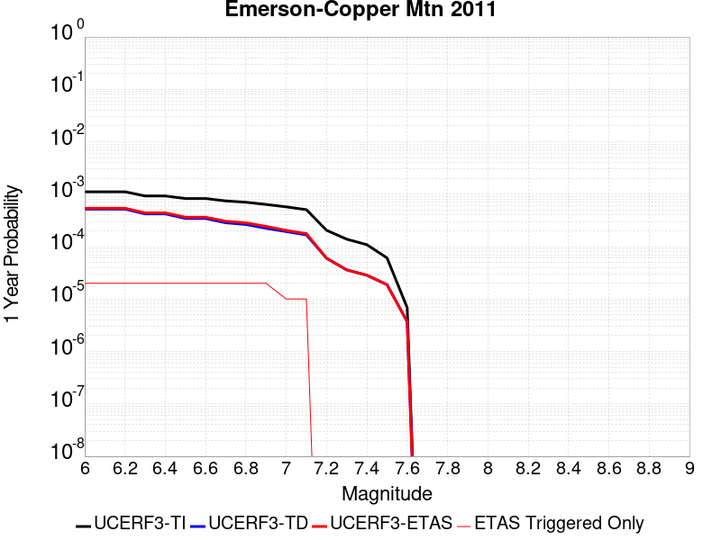 | 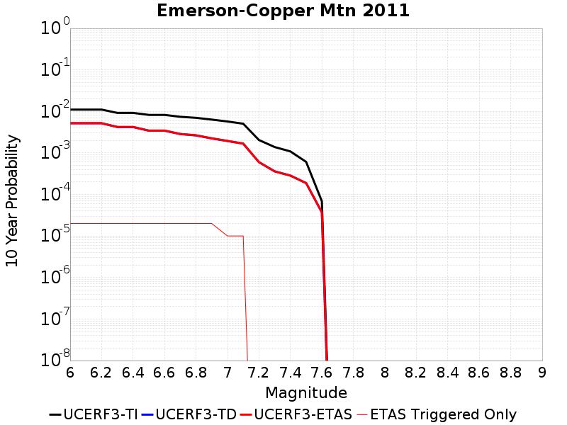 |

| Magnitude | 1 wk TI Prob | 1 wk TD Prob | 1 wk ETAS Prob | 1 wk ETAS/TD Gain | 1 wk ETAS Triggered Only | 1 mo TI Prob | 1 mo TD Prob | 1 mo ETAS Prob | 1 mo ETAS/TD Gain | 1 mo ETAS Triggered Only | 1 yr TI Prob | 1 yr TD Prob | 1 yr ETAS Prob | 1 yr ETAS/TD Gain | 1 yr ETAS Triggered Only | 10 yr TI Prob | 10 yr TD Prob | 10 yr ETAS Prob | 10 yr ETAS/TD Gain | 10 yr ETAS Triggered Only |
|-----|-----|-----|-----|-----|-----|-----|-----|-----|-----|-----|-----|-----|-----|-----|-----|-----|-----|-----|-----|-----|
| 6.0 | 2.1364202E-5 | 9.968251E-6 | 9.968251E-6 | 1.0 | 0.0 | 9.1557646E-5 | 4.2720425E-5 | 5.272E-5 | 1.2340701 | 1.0E-5 | 0.0011141442 | 5.2000576E-4 | 5.399954E-4 | 1.0384411 | 2.0E-5 | 0.011085749 | 0.0051887594 | 0.0052086557 | 1.0038345 | 2.0E-5 |
| 6.1 | 2.1364202E-5 | 9.968251E-6 | 9.968251E-6 | 1.0 | 0.0 | 9.1557646E-5 | 4.2720425E-5 | 5.272E-5 | 1.2340701 | 1.0E-5 | 0.0011141442 | 5.2000576E-4 | 5.399954E-4 | 1.0384411 | 2.0E-5 | 0.011085749 | 0.0051887594 | 0.0052086557 | 1.0038345 | 2.0E-5 |
| 6.2 | 2.1364202E-5 | 9.968251E-6 | 9.968251E-6 | 1.0 | 0.0 | 9.1557646E-5 | 4.2720425E-5 | 5.272E-5 | 1.2340701 | 1.0E-5 | 0.0011141442 | 5.2000576E-4 | 5.399954E-4 | 1.0384411 | 2.0E-5 | 0.011085749 | 0.0051887594 | 0.0052086557 | 1.0038345 | 2.0E-5 |
| 6.3 | 1.7751237E-5 | 8.089343E-6 | 8.089343E-6 | 1.0 | 0.0 | 7.607452E-5 | 3.4668188E-5 | 4.4667842E-5 | 1.2884389 | 1.0E-5 | 9.258136E-4 | 4.2200973E-4 | 4.420013E-4 | 1.0473722 | 2.0E-5 | 0.00921966 | 0.004212706 | 0.0042326218 | 1.0047275 | 2.0E-5 |
| 6.4 | 1.7751237E-5 | 8.089343E-6 | 8.089343E-6 | 1.0 | 0.0 | 7.607452E-5 | 3.4668188E-5 | 4.4667842E-5 | 1.2884389 | 1.0E-5 | 9.258136E-4 | 4.2200973E-4 | 4.420013E-4 | 1.0473722 | 2.0E-5 | 0.00921966 | 0.004212706 | 0.0042326218 | 1.0047275 | 2.0E-5 |
| 6.5 | 1.5886664E-5 | 6.603917E-6 | 6.603917E-6 | 1.0 | 0.0 | 6.808392E-5 | 2.8302222E-5 | 3.830194E-5 | 1.3533192 | 1.0E-5 | 8.286065E-4 | 3.4452975E-4 | 3.6452286E-4 | 1.0580301 | 2.0E-5 | 0.008255237 | 0.0034404206 | 0.0034603518 | 1.0057932 | 2.0E-5 |
| 6.6 | 1.5886664E-5 | 6.603917E-6 | 6.603917E-6 | 1.0 | 0.0 | 6.808392E-5 | 2.8302222E-5 | 3.830194E-5 | 1.3533192 | 1.0E-5 | 8.286065E-4 | 3.4452975E-4 | 3.6452286E-4 | 1.0580301 | 2.0E-5 | 0.008255237 | 0.0034404206 | 0.0034603518 | 1.0057932 | 2.0E-5 |
| 6.7 | 1.428471E-5 | 5.4704874E-6 | 5.4704874E-6 | 1.0 | 0.0 | 6.121875E-5 | 2.3444756E-5 | 3.344452E-5 | 1.4265246 | 1.0E-5 | 7.450834E-4 | 2.8540645E-4 | 3.0540075E-4 | 1.0700555 | 2.0E-5 | 0.007425902 | 0.0028507872 | 0.0028707301 | 1.0069956 | 2.0E-5 |
| 6.8 | 1.3490684E-5 | 5.073778E-6 | 5.073778E-6 | 1.0 | 0.0 | 5.7815934E-5 | 2.1744605E-5 | 3.174439E-5 | 1.4598742 | 1.0E-5 | 7.0368167E-4 | 2.6471226E-4 | 2.8470697E-4 | 1.0755337 | 2.0E-5 | 0.007014576 | 0.0026443503 | 0.0026642976 | 1.0075433 | 2.0E-5 |
| 6.9 | 1.2235421E-5 | 4.289749E-6 | 4.289749E-6 | 1.0 | 0.0 | 5.2436466E-5 | 1.838453E-5 | 2.8384347E-5 | 1.5439255 | 1.0E-5 | 6.38227E-4 | 2.2381227E-4 | 2.438078E-4 | 1.0893406 | 2.0E-5 | 0.0063639707 | 0.002236223 | 0.0022561783 | 1.0089236 | 2.0E-5 |
| 7.0 | 1.1009851E-5 | 3.7190546E-6 | 3.7190546E-6 | 1.0 | 0.0 | 4.7184225E-5 | 1.5938727E-5 | 1.5938727E-5 | 1.0 | 0.0 | 5.743165E-4 | 1.9404017E-4 | 2.0403822E-4 | 1.0515257 | 1.0E-5 | 0.005728345 | 0.0019390453 | 0.0019490259 | 1.0051472 | 1.0E-5 |
| 7.1 | 9.726373E-6 | 3.2118533E-6 | 3.2118533E-6 | 1.0 | 0.0 | 4.168379E-5 | 1.3765032E-5 | 1.3765032E-5 | 1.0 | 0.0 | 5.07382E-4 | 1.6757975E-4 | 1.7757808E-4 | 1.059663 | 1.0E-5 | 0.0050622504 | 0.0016748651 | 0.0016848483 | 1.0059606 | 1.0E-5 |
| 7.2 | 3.9335127E-6 | 1.1524995E-6 | 1.1524995E-6 | 1.0 | 0.0 | 1.6857803E-5 | 4.9392747E-6 | 4.9392747E-6 | 1.0 | 0.0 | 2.0522442E-4 | 6.013407E-5 | 6.013407E-5 | 1.0 | 0.0 | 0.00205035 | 6.011839E-4 | 6.011839E-4 | 1.0 | 0.0 |
| 7.3 | 2.661632E-6 | 6.911636E-7 | 6.911636E-7 | 1.0 | 0.0 | 1.14069435E-5 | 2.9621265E-6 | 2.9621265E-6 | 1.0 | 0.0 | 1.3887069E-4 | 3.6063306E-5 | 3.6063306E-5 | 1.0 | 0.0 | 0.0013878393 | 3.6057556E-4 | 3.6057556E-4 | 1.0 | 0.0 |
| 7.4 | 2.0893426E-6 | 5.4619414E-7 | 5.4619414E-7 | 1.0 | 0.0 | 8.954295E-6 | 2.34083E-6 | 2.34083E-6 | 1.0 | 0.0 | 1.0901308E-4 | 2.8499238E-5 | 2.8499238E-5 | 1.0 | 0.0 | 0.0010895962 | 2.8495636E-4 | 2.8495636E-4 | 1.0 | 0.0 |
| 7.5 | 1.1681728E-6 | 3.6031176E-7 | 3.6031176E-7 | 1.0 | 0.0 | 5.0064455E-6 | 1.5441924E-6 | 1.5441924E-6 | 1.0 | 0.0 | 6.0951766E-5 | 1.8800385E-5 | 1.8800385E-5 | 1.0 | 0.0 | 6.093505E-4 | 1.8798841E-4 | 1.8798841E-4 | 1.0 | 0.0 |
| 7.6 | 1.3154387E-7 | 7.119812E-8 | 7.119812E-8 | 1.0 | 0.0 | 5.6375933E-7 | 3.051348E-7 | 3.051348E-7 | 1.0 | 0.0 | 6.863748E-6 | 3.7150114E-6 | 3.7150114E-6 | 1.0 | 0.0 | 6.863536E-5 | 3.714965E-5 | 3.714965E-5 | 1.0 | 0.0 |

## San Diego Trough north alt1
*[(top)](#table-of-contents)*

| 1 Week | 1 Month | 1 Year | 10 Year |
|-----|-----|-----|-----|
| 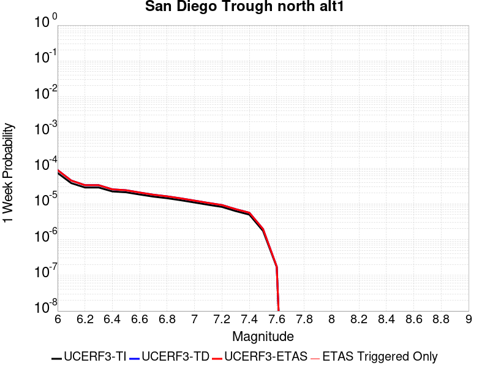 | 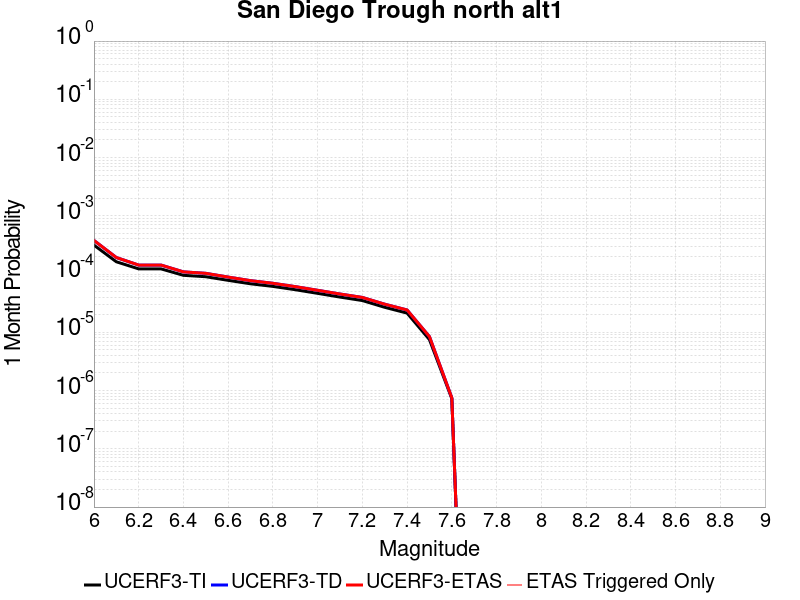 | 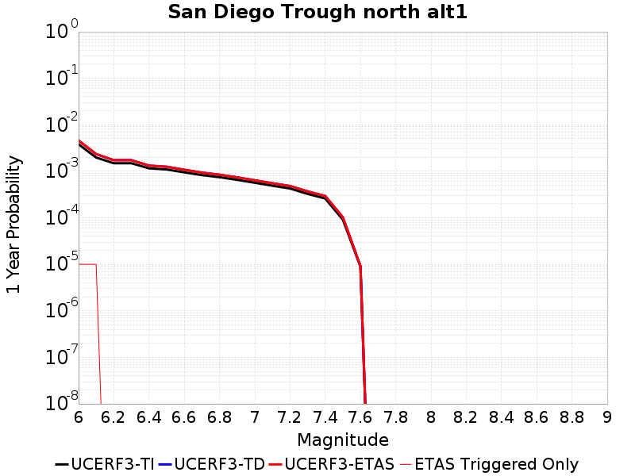 | 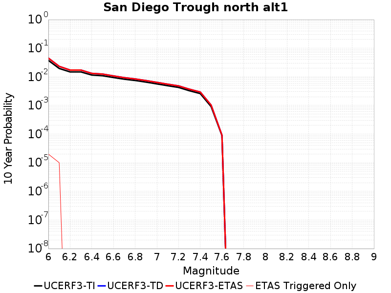 |

| Magnitude | 1 wk TI Prob | 1 wk TD Prob | 1 wk ETAS Prob | 1 wk ETAS/TD Gain | 1 wk ETAS Triggered Only | 1 mo TI Prob | 1 mo TD Prob | 1 mo ETAS Prob | 1 mo ETAS/TD Gain | 1 mo ETAS Triggered Only | 1 yr TI Prob | 1 yr TD Prob | 1 yr ETAS Prob | 1 yr ETAS/TD Gain | 1 yr ETAS Triggered Only | 10 yr TI Prob | 10 yr TD Prob | 10 yr ETAS Prob | 10 yr ETAS/TD Gain | 10 yr ETAS Triggered Only |
|-----|-----|-----|-----|-----|-----|-----|-----|-----|-----|-----|-----|-----|-----|-----|-----|-----|-----|-----|-----|-----|
| 6.0 | 7.329252E-5 | 8.8213004E-5 | 8.8213004E-5 | 1.0 | 0.0 | 3.14073E-4 | 3.780046E-4 | 3.780046E-4 | 1.0 | 0.0 | 0.0038171355 | 0.0045931344 | 0.0046030884 | 1.0021671 | 1.0E-5 | 0.03752231 | 0.045046 | 0.045065098 | 1.000424 | 2.0E-5 |
| 6.1 | 3.7940346E-5 | 4.4885946E-5 | 4.4885946E-5 | 1.0 | 0.0 | 1.6259136E-4 | 1.9235471E-4 | 1.9235471E-4 | 1.0 | 0.0 | 0.0019777524 | 0.0023394919 | 0.0023494686 | 1.0042645 | 1.0E-5 | 0.019602431 | 0.02315716 | 0.023166928 | 1.0004219 | 1.0E-5 |
| 6.2 | 2.8645263E-5 | 3.3297398E-5 | 3.3297398E-5 | 1.0 | 0.0 | 1.2275964E-4 | 1.4269548E-4 | 1.4269548E-4 | 1.0 | 0.0 | 0.0014935739 | 0.0017359506 | 0.0017359506 | 1.0 | 0.0 | 0.0148357535 | 0.017226562 | 0.017226562 | 1.0 | 0.0 |
| 6.3 | 2.8645263E-5 | 3.3297398E-5 | 3.3297398E-5 | 1.0 | 0.0 | 1.2275964E-4 | 1.4269548E-4 | 1.4269548E-4 | 1.0 | 0.0 | 0.0014935739 | 0.0017359506 | 0.0017359506 | 1.0 | 0.0 | 0.0148357535 | 0.017226562 | 0.017226562 | 1.0 | 0.0 |
| 6.4 | 2.2204576E-5 | 2.5448739E-5 | 2.5448739E-5 | 1.0 | 0.0 | 9.5159E-5 | 1.0906152E-4 | 1.0906152E-4 | 1.0 | 0.0 | 0.001157945 | 0.0013270252 | 0.0013270252 | 1.0 | 0.0 | 0.011519298 | 0.013192171 | 0.013192171 | 1.0 | 0.0 |
| 6.5 | 2.1004838E-5 | 2.4025085E-5 | 2.4025085E-5 | 1.0 | 0.0 | 9.0017624E-5 | 1.0296064E-4 | 1.0296064E-4 | 1.0 | 0.0 | 0.0010954136 | 0.0012528342 | 0.0012528342 | 1.0 | 0.0 | 0.010900296 | 0.01245879 | 0.01245879 | 1.0 | 0.0 |
| 6.6 | 1.820557E-5 | 2.0705107E-5 | 2.0705107E-5 | 1.0 | 0.0 | 7.802154E-5 | 8.8733184E-5 | 8.8733184E-5 | 1.0 | 0.0 | 9.4949827E-4 | 0.0010797966 | 0.0010797966 | 1.0 | 0.0 | 0.009454516 | 0.01074617 | 0.01074617 | 1.0 | 0.0 |
| 6.7 | 1.5884485E-5 | 1.7983915E-5 | 1.7983915E-5 | 1.0 | 0.0 | 6.807459E-5 | 7.707166E-5 | 7.707166E-5 | 1.0 | 0.0 | 8.284929E-4 | 9.379462E-4 | 9.379462E-4 | 1.0 | 0.0 | 0.008254109 | 0.009340242 | 0.009340242 | 1.0 | 0.0 |
| 6.8 | 1.4331171E-5 | 1.6201304E-5 | 1.6201304E-5 | 1.0 | 0.0 | 6.141786E-5 | 6.943232E-5 | 6.943232E-5 | 1.0 | 0.0 | 7.4750587E-4 | 8.450126E-4 | 8.450126E-4 | 1.0 | 0.0 | 0.0074499645 | 0.008418262 | 0.008418262 | 1.0 | 0.0 |
| 6.9 | 1.2574203E-5 | 1.4206043E-5 | 1.4206043E-5 | 1.0 | 0.0 | 5.3888325E-5 | 6.0881626E-5 | 6.0881626E-5 | 1.0 | 0.0 | 6.558929E-4 | 7.409831E-4 | 7.409831E-4 | 1.0 | 0.0 | 0.0065396037 | 0.0073853107 | 0.0073853107 | 1.0 | 0.0 |
| 7.0 | 1.0883844E-5 | 1.228944E-5 | 1.228944E-5 | 1.0 | 0.0 | 4.664421E-5 | 5.2667972E-5 | 5.2667972E-5 | 1.0 | 0.0 | 5.677453E-4 | 6.4104487E-4 | 6.4104487E-4 | 1.0 | 0.0 | 0.00566297 | 0.0063920855 | 0.0063920855 | 1.0 | 0.0 |
| 7.1 | 9.393088E-6 | 1.0607175E-5 | 1.0607175E-5 | 1.0 | 0.0 | 4.025547E-5 | 4.545853E-5 | 4.545853E-5 | 1.0 | 0.0 | 4.900001E-4 | 5.5331783E-4 | 5.5331783E-4 | 1.0 | 0.0 | 0.0048892107 | 0.005519498 | 0.005519498 | 1.0 | 0.0 |
| 7.2 | 8.190791E-6 | 9.258762E-6 | 9.258762E-6 | 1.0 | 0.0 | 3.510292E-5 | 3.9679806E-5 | 3.9679806E-5 | 1.0 | 0.0 | 4.2729423E-4 | 4.8299524E-4 | 4.8299524E-4 | 1.0 | 0.0 | 0.0042647356 | 0.004819535 | 0.004819535 | 1.0 | 0.0 |
| 7.3 | 6.268162E-6 | 7.0898204E-6 | 7.0898204E-6 | 1.0 | 0.0 | 2.6863276E-5 | 3.0384592E-5 | 3.0384592E-5 | 1.0 | 0.0 | 3.2701128E-4 | 3.6987002E-4 | 3.6987002E-4 | 1.0 | 0.0 | 0.003265305 | 0.0036925904 | 0.0036925904 | 1.0 | 0.0 |
| 7.4 | 4.985186E-6 | 5.6427652E-6 | 5.6427652E-6 | 1.0 | 0.0 | 2.1364907E-5 | 2.4183058E-5 | 2.4183058E-5 | 1.0 | 0.0 | 2.600867E-4 | 2.9438935E-4 | 2.9438935E-4 | 1.0 | 0.0 | 0.002597825 | 0.002940035 | 0.002940035 | 1.0 | 0.0 |
| 7.5 | 1.7489613E-6 | 1.969706E-6 | 1.969706E-6 | 1.0 | 0.0 | 7.495527E-6 | 8.4415715E-6 | 8.4415715E-6 | 1.0 | 0.0 | 9.125422E-5 | 1.02771504E-4 | 1.02771504E-4 | 1.0 | 0.0 | 9.1216754E-4 | 0.0010272618 | 0.0010272618 | 1.0 | 0.0 |
| 7.6 | 1.6988751E-7 | 1.7533887E-7 | 1.7533887E-7 | 1.0 | 0.0 | 7.2808916E-7 | 7.514521E-7 | 7.514521E-7 | 1.0 | 0.0 | 8.864449E-6 | 9.148893E-6 | 9.148893E-6 | 1.0 | 0.0 | 8.8640954E-5 | 9.148536E-5 | 9.148536E-5 | 1.0 | 0.0 |

## Surprise Valley 2011 CFM
*[(top)](#table-of-contents)*

| 1 Week | 1 Month | 1 Year | 10 Year |
|-----|-----|-----|-----|
|  | 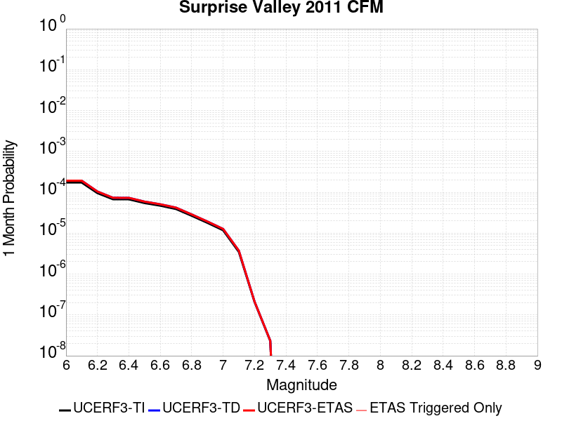 | 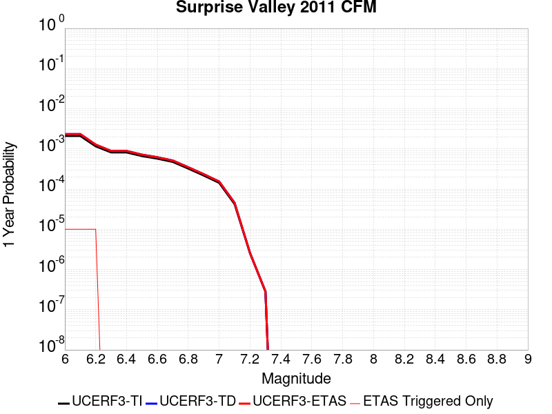 |  |

| Magnitude | 1 wk TI Prob | 1 wk TD Prob | 1 wk ETAS Prob | 1 wk ETAS/TD Gain | 1 wk ETAS Triggered Only | 1 mo TI Prob | 1 mo TD Prob | 1 mo ETAS Prob | 1 mo ETAS/TD Gain | 1 mo ETAS Triggered Only | 1 yr TI Prob | 1 yr TD Prob | 1 yr ETAS Prob | 1 yr ETAS/TD Gain | 1 yr ETAS Triggered Only | 10 yr TI Prob | 10 yr TD Prob | 10 yr ETAS Prob | 10 yr ETAS/TD Gain | 10 yr ETAS Triggered Only |
|-----|-----|-----|-----|-----|-----|-----|-----|-----|-----|-----|-----|-----|-----|-----|-----|-----|-----|-----|-----|-----|
| 6.0 | 4.0396248E-5 | 4.4851866E-5 | 4.4851866E-5 | 1.0 | 0.0 | 1.7311527E-4 | 1.922093E-4 | 1.922093E-4 | 1.0 | 0.0 | 0.002105641 | 0.0023378467 | 0.0023478232 | 1.0042675 | 1.0E-5 | 0.020858008 | 0.02315425 | 0.023173787 | 1.0008438 | 2.0E-5 |
| 6.1 | 4.0396248E-5 | 4.4851866E-5 | 4.4851866E-5 | 1.0 | 0.0 | 1.7311527E-4 | 1.922093E-4 | 1.922093E-4 | 1.0 | 0.0 | 0.002105641 | 0.0023378467 | 0.0023478232 | 1.0042675 | 1.0E-5 | 0.020858008 | 0.02315425 | 0.023173787 | 1.0008438 | 2.0E-5 |
| 6.2 | 2.2295266E-5 | 2.4401508E-5 | 2.4401508E-5 | 1.0 | 0.0 | 9.554764E-5 | 1.04573875E-4 | 1.04573875E-4 | 1.0 | 0.0 | 0.0011626717 | 0.0012724741 | 0.0012824613 | 1.0078487 | 1.0E-5 | 0.011566074 | 0.012655114 | 0.012674862 | 1.0015603 | 2.0E-5 |
| 6.3 | 1.572643E-5 | 1.7096974E-5 | 1.7096974E-5 | 1.0 | 0.0 | 6.7397246E-5 | 7.327075E-5 | 7.327075E-5 | 1.0 | 0.0 | 8.202525E-4 | 8.9171674E-4 | 8.9171674E-4 | 1.0 | 0.0 | 0.008172315 | 0.008882494 | 0.008892405 | 1.0011158 | 1.0E-5 |
| 6.4 | 1.5714395E-5 | 1.7084796E-5 | 1.7084796E-5 | 1.0 | 0.0 | 6.734567E-5 | 7.321856E-5 | 7.321856E-5 | 1.0 | 0.0 | 8.1962504E-4 | 8.910819E-4 | 8.910819E-4 | 1.0 | 0.0 | 0.008166086 | 0.008876195 | 0.008886106 | 1.0011166 | 1.0E-5 |
| 6.5 | 1.2733495E-5 | 1.380173E-5 | 1.380173E-5 | 1.0 | 0.0 | 5.457098E-5 | 5.914897E-5 | 5.914897E-5 | 1.0 | 0.0 | 6.641992E-4 | 7.199074E-4 | 7.199074E-4 | 1.0 | 0.0 | 0.0066221743 | 0.0071764467 | 0.007186375 | 1.0013834 | 1.0E-5 |
| 6.6 | 1.0983784E-5 | 1.1886664E-5 | 1.1886664E-5 | 1.0 | 0.0 | 4.7072506E-5 | 5.094188E-5 | 5.094188E-5 | 1.0 | 0.0 | 5.7295704E-4 | 6.200462E-4 | 6.200462E-4 | 1.0 | 0.0 | 0.0057148207 | 0.0061837113 | 0.0061837113 | 1.0 | 0.0 |
| 6.7 | 9.104806E-6 | 9.83958E-6 | 9.83958E-6 | 1.0 | 0.0 | 3.902001E-5 | 4.216897E-5 | 4.216897E-5 | 1.0 | 0.0 | 4.7496508E-4 | 5.132902E-4 | 5.132902E-4 | 1.0 | 0.0 | 0.004739512 | 0.005121443 | 0.005121443 | 1.0 | 0.0 |
| 6.8 | 6.2162403E-6 | 6.704193E-6 | 6.704193E-6 | 1.0 | 0.0 | 2.6640759E-5 | 2.873195E-5 | 2.873195E-5 | 1.0 | 0.0 | 3.2430296E-4 | 3.4975758E-4 | 3.4975758E-4 | 1.0 | 0.0 | 0.003238301 | 0.0034922946 | 0.0034922946 | 1.0 | 0.0 |
| 6.9 | 4.1792696E-6 | 4.5032693E-6 | 4.5032693E-6 | 1.0 | 0.0 | 1.7911032E-5 | 1.929959E-5 | 1.929959E-5 | 1.0 | 0.0 | 2.1804498E-4 | 2.3494873E-4 | 2.3494873E-4 | 1.0 | 0.0 | 0.0021783116 | 0.0023471566 | 0.0023471566 | 1.0 | 0.0 |
| 7.0 | 2.7478413E-6 | 2.9622684E-6 | 2.9622684E-6 | 1.0 | 0.0 | 1.177641E-5 | 1.2695382E-5 | 1.2695382E-5 | 1.0 | 0.0 | 1.4336836E-4 | 1.5455655E-4 | 1.5455655E-4 | 1.0 | 0.0 | 0.001432759 | 0.001544613 | 0.001544613 | 1.0 | 0.0 |
| 7.1 | 8.128648E-7 | 8.724994E-7 | 8.724994E-7 | 1.0 | 0.0 | 3.4837017E-6 | 3.739281E-6 | 3.739281E-6 | 1.0 | 0.0 | 4.2413245E-5 | 4.5525398E-5 | 4.5525398E-5 | 1.0 | 0.0 | 4.2405148E-4 | 4.5521953E-4 | 4.5521953E-4 | 1.0 | 0.0 |
| 7.2 | 4.8641045E-8 | 4.9402153E-8 | 4.9402153E-8 | 1.0 | 0.0 | 2.084616E-7 | 2.1172349E-7 | 2.1172349E-7 | 1.0 | 0.0 | 2.538017E-6 | 2.5777306E-6 | 2.5777306E-6 | 1.0 | 0.0 | 2.537988E-5 | 2.5777019E-5 | 2.5777019E-5 | 1.0 | 0.0 |
| 7.3 | 5.3911844E-9 | 5.475824E-9 | 5.475824E-9 | 1.0 | 0.0 | 2.3105075E-8 | 2.3467816E-8 | 2.3467816E-8 | 1.0 | 0.0 | 2.8130427E-7 | 2.8572063E-7 | 2.8572063E-7 | 1.0 | 0.0 | 2.8130391E-6 | 2.8572042E-6 | 2.8572042E-6 | 1.0 | 0.0 |

## Verdugo
*[(top)](#table-of-contents)*

| 1 Week | 1 Month | 1 Year | 10 Year |
|-----|-----|-----|-----|
| 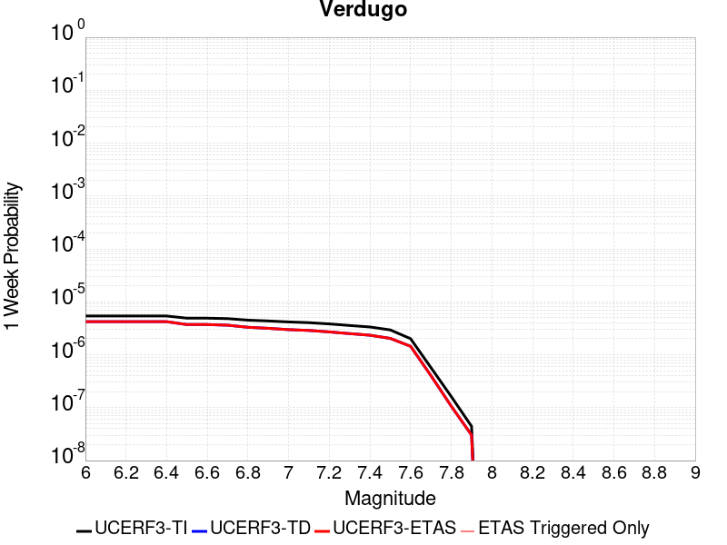 | 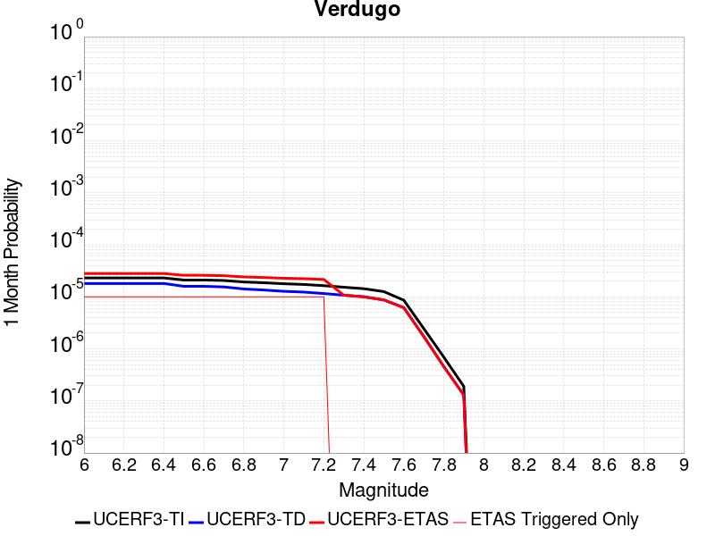 | 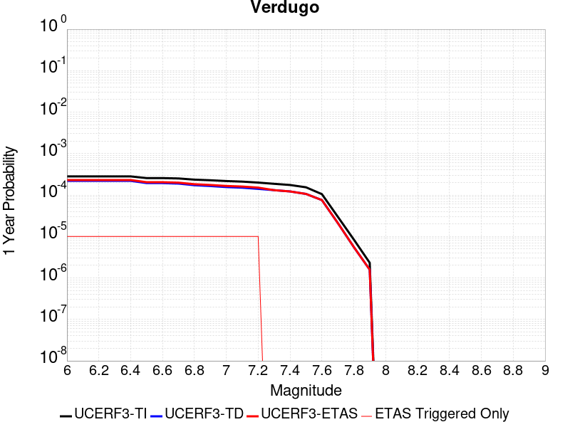 | 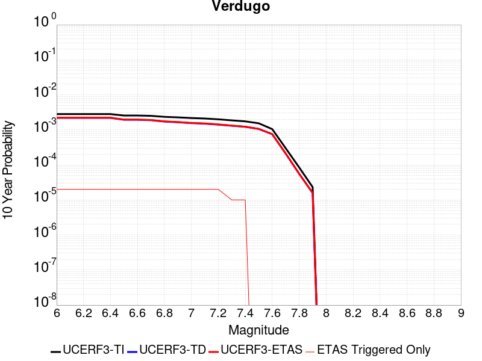 |

| Magnitude | 1 wk TI Prob | 1 wk TD Prob | 1 wk ETAS Prob | 1 wk ETAS/TD Gain | 1 wk ETAS Triggered Only | 1 mo TI Prob | 1 mo TD Prob | 1 mo ETAS Prob | 1 mo ETAS/TD Gain | 1 mo ETAS Triggered Only | 1 yr TI Prob | 1 yr TD Prob | 1 yr ETAS Prob | 1 yr ETAS/TD Gain | 1 yr ETAS Triggered Only | 10 yr TI Prob | 10 yr TD Prob | 10 yr ETAS Prob | 10 yr ETAS/TD Gain | 10 yr ETAS Triggered Only |
|-----|-----|-----|-----|-----|-----|-----|-----|-----|-----|-----|-----|-----|-----|-----|-----|-----|-----|-----|-----|-----|
| 6.0 | 5.392987E-6 | 4.2165534E-6 | 4.2165534E-6 | 1.0 | 0.0 | 2.3112598E-5 | 1.8070821E-5 | 2.8070639E-5 | 1.5533683 | 1.0E-5 | 2.8135953E-4 | 2.199905E-4 | 2.299883E-4 | 1.0454465 | 1.0E-5 | 0.0028100356 | 0.002197775 | 0.002217731 | 1.0090802 | 2.0E-5 |
| 6.1 | 5.392987E-6 | 4.2165534E-6 | 4.2165534E-6 | 1.0 | 0.0 | 2.3112598E-5 | 1.8070821E-5 | 2.8070639E-5 | 1.5533683 | 1.0E-5 | 2.8135953E-4 | 2.199905E-4 | 2.299883E-4 | 1.0454465 | 1.0E-5 | 0.0028100356 | 0.002197775 | 0.002217731 | 1.0090802 | 2.0E-5 |
| 6.2 | 5.392987E-6 | 4.2165534E-6 | 4.2165534E-6 | 1.0 | 0.0 | 2.3112598E-5 | 1.8070821E-5 | 2.8070639E-5 | 1.5533683 | 1.0E-5 | 2.8135953E-4 | 2.199905E-4 | 2.299883E-4 | 1.0454465 | 1.0E-5 | 0.0028100356 | 0.002197775 | 0.002217731 | 1.0090802 | 2.0E-5 |
| 6.3 | 5.392987E-6 | 4.2165534E-6 | 4.2165534E-6 | 1.0 | 0.0 | 2.3112598E-5 | 1.8070821E-5 | 2.8070639E-5 | 1.5533683 | 1.0E-5 | 2.8135953E-4 | 2.199905E-4 | 2.299883E-4 | 1.0454465 | 1.0E-5 | 0.0028100356 | 0.002197775 | 0.002217731 | 1.0090802 | 2.0E-5 |
| 6.4 | 5.392987E-6 | 4.2165534E-6 | 4.2165534E-6 | 1.0 | 0.0 | 2.3112598E-5 | 1.8070821E-5 | 2.8070639E-5 | 1.5533683 | 1.0E-5 | 2.8135953E-4 | 2.199905E-4 | 2.299883E-4 | 1.0454465 | 1.0E-5 | 0.0028100356 | 0.002197775 | 0.002217731 | 1.0090802 | 2.0E-5 |
| 6.5 | 4.9154837E-6 | 3.7224993E-6 | 3.7224993E-6 | 1.0 | 0.0 | 2.1066187E-5 | 1.5953472E-5 | 2.5953312E-5 | 1.6268128 | 1.0E-5 | 2.5645064E-4 | 1.9421641E-4 | 2.0421448E-4 | 1.051479 | 1.0E-5 | 0.002561549 | 0.0019404877 | 0.001960449 | 1.0102867 | 2.0E-5 |
| 6.6 | 4.9154837E-6 | 3.7224993E-6 | 3.7224993E-6 | 1.0 | 0.0 | 2.1066187E-5 | 1.5953472E-5 | 2.5953312E-5 | 1.6268128 | 1.0E-5 | 2.5645064E-4 | 1.9421641E-4 | 2.0421448E-4 | 1.051479 | 1.0E-5 | 0.002561549 | 0.0019404877 | 0.001960449 | 1.0102867 | 2.0E-5 |
| 6.7 | 4.817006E-6 | 3.6206857E-6 | 3.6206857E-6 | 1.0 | 0.0 | 2.0644147E-5 | 1.5517133E-5 | 2.5516978E-5 | 1.644439 | 1.0E-5 | 2.513135E-4 | 1.889049E-4 | 1.9890301E-4 | 1.0529267 | 1.0E-5 | 0.0025102948 | 0.0018874629 | 0.0019074252 | 1.0105762 | 2.0E-5 |
| 6.8 | 4.507407E-6 | 3.3071362E-6 | 3.3071362E-6 | 1.0 | 0.0 | 1.9317316E-5 | 1.4173364E-5 | 2.4173223E-5 | 1.7055387 | 1.0E-5 | 2.3516294E-4 | 1.7254718E-4 | 1.8254547E-4 | 1.0579451 | 1.0E-5 | 0.0023491425 | 0.0017241464 | 0.001744112 | 1.01158 | 2.0E-5 |
| 6.9 | 4.3573054E-6 | 3.161042E-6 | 3.161042E-6 | 1.0 | 0.0 | 1.8674033E-5 | 1.3547254E-5 | 2.3547118E-5 | 1.738147 | 1.0E-5 | 2.2733262E-4 | 1.6492546E-4 | 1.749238E-4 | 1.0606234 | 1.0E-5 | 0.0022710022 | 0.0016480429 | 0.0016680099 | 1.0121156 | 2.0E-5 |
| 7.0 | 4.171527E-6 | 2.9837006E-6 | 2.9837006E-6 | 1.0 | 0.0 | 1.787785E-5 | 1.2787225E-5 | 2.2787099E-5 | 1.7820204 | 1.0E-5 | 2.1764109E-4 | 1.5567346E-4 | 1.6567191E-4 | 1.064227 | 1.0E-5 | 0.0021742806 | 0.0015556554 | 0.0015756243 | 1.0128363 | 2.0E-5 |
| 7.1 | 4.0405484E-6 | 2.8822906E-6 | 2.8822906E-6 | 1.0 | 0.0 | 1.731652E-5 | 1.2352615E-5 | 2.2352491E-5 | 1.8095351 | 1.0E-5 | 2.1080824E-4 | 1.5038282E-4 | 1.6038131E-4 | 1.066487 | 1.0E-5 | 0.0021060838 | 0.0015028217 | 0.0015227916 | 1.0132883 | 2.0E-5 |
| 7.2 | 3.8306007E-6 | 2.7018732E-6 | 2.7018732E-6 | 1.0 | 0.0 | 1.6416758E-5 | 1.1579406E-5 | 2.157929E-5 | 1.8635921 | 1.0E-5 | 1.9985568E-4 | 1.4097025E-4 | 1.5096884E-4 | 1.0709269 | 1.0E-5 | 0.0019967605 | 0.001408819 | 0.0014287909 | 1.0141762 | 2.0E-5 |
| 7.3 | 3.5750938E-6 | 2.5122024E-6 | 2.5122024E-6 | 1.0 | 0.0 | 1.532174E-5 | 1.0766538E-5 | 1.0766538E-5 | 1.0 | 0.0 | 1.8652623E-4 | 1.3107482E-4 | 1.3107482E-4 | 1.0 | 0.0 | 0.0018636974 | 0.0013099856 | 0.0013199726 | 1.0076237 | 1.0E-5 |
| 7.4 | 3.3510041E-6 | 2.3408838E-6 | 2.3408838E-6 | 1.0 | 0.0 | 1.4361368E-5 | 1.0032321E-5 | 1.0032321E-5 | 1.0 | 0.0 | 1.7483562E-4 | 1.2213677E-4 | 1.2213677E-4 | 1.0 | 0.0 | 0.0017469813 | 0.0012207069 | 0.0012306946 | 1.0081819 | 1.0E-5 |
| 7.5 | 2.948287E-6 | 2.0391346E-6 | 2.0391346E-6 | 1.0 | 0.0 | 1.2635454E-5 | 8.73912E-6 | 8.73912E-6 | 1.0 | 0.0 | 1.538258E-4 | 1.0639369E-4 | 1.0639369E-4 | 1.0 | 0.0 | 0.0015371935 | 0.0010634378 | 0.0010634378 | 1.0 | 0.0 |
| 7.6 | 2.0134323E-6 | 1.4471407E-6 | 1.4471407E-6 | 1.0 | 0.0 | 8.628967E-6 | 6.202017E-6 | 6.202017E-6 | 1.0 | 0.0 | 1.05052604E-4 | 7.550703E-5 | 7.550703E-5 | 1.0 | 0.0 | 0.0010500296 | 7.5482257E-4 | 7.5482257E-4 | 1.0 | 0.0 |
| 7.7 | 5.726436E-7 | 4.0452997E-7 | 4.0452997E-7 | 1.0 | 0.0 | 2.4541846E-6 | 1.7336989E-6 | 1.7336989E-6 | 1.0 | 0.0 | 2.9879287E-5 | 2.1107606E-5 | 2.1107606E-5 | 1.0 | 0.0 | 2.987527E-4 | 2.1105855E-4 | 2.1105855E-4 | 1.0 | 0.0 |
| 7.8 | 1.6248204E-7 | 1.0688028E-7 | 1.0688028E-7 | 1.0 | 0.0 | 6.963514E-7 | 4.5805828E-7 | 4.5805828E-7 | 1.0 | 0.0 | 8.478045E-6 | 5.5768455E-6 | 5.5768455E-6 | 1.0 | 0.0 | 8.477722E-5 | 5.576709E-5 | 5.576709E-5 | 1.0 | 0.0 |
| 7.9 | 4.4475744E-8 | 3.0375734E-8 | 3.0375734E-8 | 1.0 | 0.0 | 1.9061031E-7 | 1.301817E-7 | 1.301817E-7 | 1.0 | 0.0 | 2.320678E-6 | 1.5849613E-6 | 1.5849613E-6 | 1.0 | 0.0 | 2.3206538E-5 | 1.5849513E-5 | 1.5849513E-5 | 1.0 | 0.0 |

## Los Alamos 2011 CFM
*[(top)](#table-of-contents)*

| 1 Week | 1 Month | 1 Year | 10 Year |
|-----|-----|-----|-----|
| 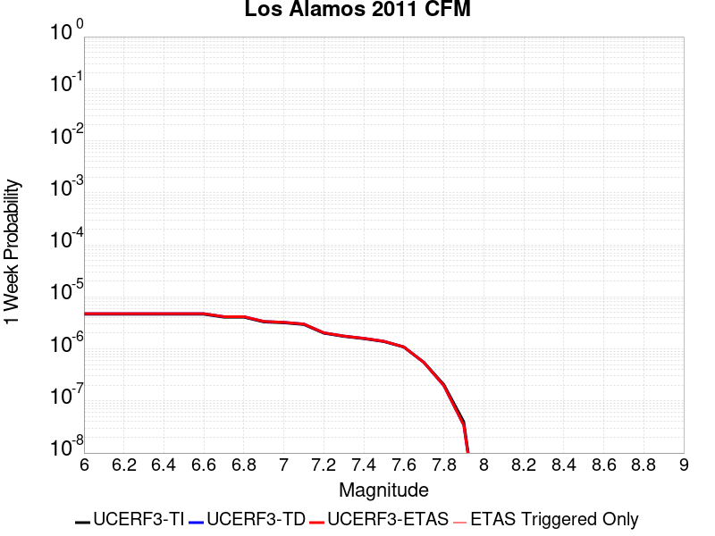 | 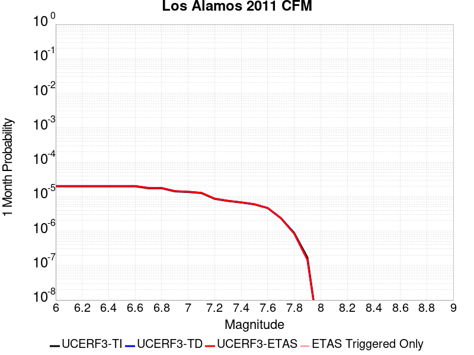 | 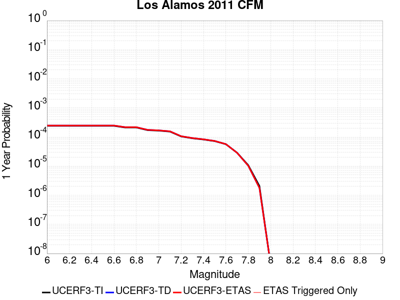 | 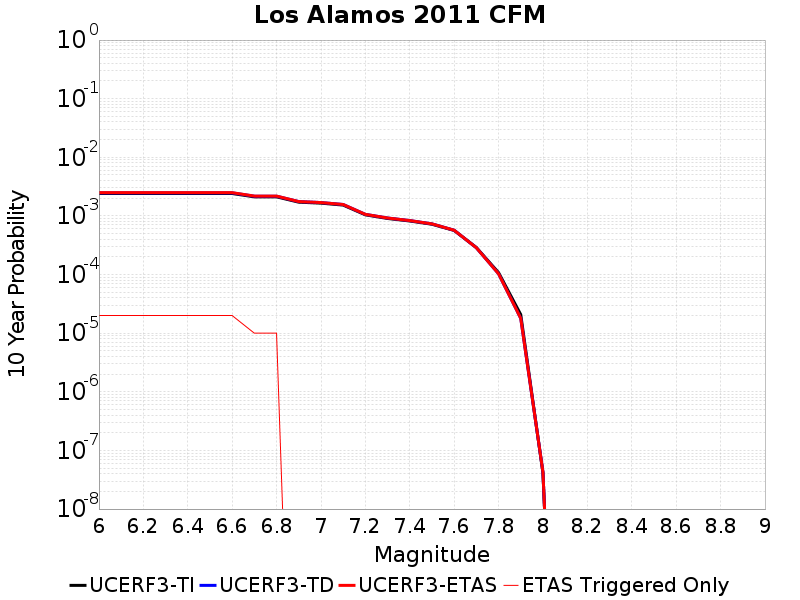 |

| Magnitude | 1 wk TI Prob | 1 wk TD Prob | 1 wk ETAS Prob | 1 wk ETAS/TD Gain | 1 wk ETAS Triggered Only | 1 mo TI Prob | 1 mo TD Prob | 1 mo ETAS Prob | 1 mo ETAS/TD Gain | 1 mo ETAS Triggered Only | 1 yr TI Prob | 1 yr TD Prob | 1 yr ETAS Prob | 1 yr ETAS/TD Gain | 1 yr ETAS Triggered Only | 10 yr TI Prob | 10 yr TD Prob | 10 yr ETAS Prob | 10 yr ETAS/TD Gain | 10 yr ETAS Triggered Only |
|-----|-----|-----|-----|-----|-----|-----|-----|-----|-----|-----|-----|-----|-----|-----|-----|-----|-----|-----|-----|-----|
| 6.0 | 4.6284417E-6 | 4.7517497E-6 | 4.7517497E-6 | 1.0 | 0.0 | 1.9836029E-5 | 2.0364492E-5 | 2.0364492E-5 | 1.0 | 0.0 | 2.4147688E-4 | 2.4791123E-4 | 2.4791123E-4 | 1.0 | 0.0 | 0.0024121467 | 0.002476521 | 0.0024964714 | 1.0080558 | 2.0E-5 |
| 6.1 | 4.6284417E-6 | 4.7517497E-6 | 4.7517497E-6 | 1.0 | 0.0 | 1.9836029E-5 | 2.0364492E-5 | 2.0364492E-5 | 1.0 | 0.0 | 2.4147688E-4 | 2.4791123E-4 | 2.4791123E-4 | 1.0 | 0.0 | 0.0024121467 | 0.002476521 | 0.0024964714 | 1.0080558 | 2.0E-5 |
| 6.2 | 4.6284417E-6 | 4.7517497E-6 | 4.7517497E-6 | 1.0 | 0.0 | 1.9836029E-5 | 2.0364492E-5 | 2.0364492E-5 | 1.0 | 0.0 | 2.4147688E-4 | 2.4791123E-4 | 2.4791123E-4 | 1.0 | 0.0 | 0.0024121467 | 0.002476521 | 0.0024964714 | 1.0080558 | 2.0E-5 |
| 6.3 | 4.6284417E-6 | 4.7517497E-6 | 4.7517497E-6 | 1.0 | 0.0 | 1.9836029E-5 | 2.0364492E-5 | 2.0364492E-5 | 1.0 | 0.0 | 2.4147688E-4 | 2.4791123E-4 | 2.4791123E-4 | 1.0 | 0.0 | 0.0024121467 | 0.002476521 | 0.0024964714 | 1.0080558 | 2.0E-5 |
| 6.4 | 4.6284417E-6 | 4.7517497E-6 | 4.7517497E-6 | 1.0 | 0.0 | 1.9836029E-5 | 2.0364492E-5 | 2.0364492E-5 | 1.0 | 0.0 | 2.4147688E-4 | 2.4791123E-4 | 2.4791123E-4 | 1.0 | 0.0 | 0.0024121467 | 0.002476521 | 0.0024964714 | 1.0080558 | 2.0E-5 |
| 6.5 | 4.6284417E-6 | 4.7517497E-6 | 4.7517497E-6 | 1.0 | 0.0 | 1.9836029E-5 | 2.0364492E-5 | 2.0364492E-5 | 1.0 | 0.0 | 2.4147688E-4 | 2.4791123E-4 | 2.4791123E-4 | 1.0 | 0.0 | 0.0024121467 | 0.002476521 | 0.0024964714 | 1.0080558 | 2.0E-5 |
| 6.6 | 4.6284417E-6 | 4.7517497E-6 | 4.7517497E-6 | 1.0 | 0.0 | 1.9836029E-5 | 2.0364492E-5 | 2.0364492E-5 | 1.0 | 0.0 | 2.4147688E-4 | 2.4791123E-4 | 2.4791123E-4 | 1.0 | 0.0 | 0.0024121467 | 0.002476521 | 0.0024964714 | 1.0080558 | 2.0E-5 |
| 6.7 | 4.062321E-6 | 4.1663648E-6 | 4.1663648E-6 | 1.0 | 0.0 | 1.7409831E-5 | 1.7855737E-5 | 1.7855737E-5 | 1.0 | 0.0 | 2.1194408E-4 | 2.1737341E-4 | 2.1737341E-4 | 1.0 | 0.0 | 0.0021174205 | 0.0021717576 | 0.0021817358 | 1.0045946 | 1.0E-5 |
| 6.8 | 4.062321E-6 | 4.1663648E-6 | 4.1663648E-6 | 1.0 | 0.0 | 1.7409831E-5 | 1.7855737E-5 | 1.7855737E-5 | 1.0 | 0.0 | 2.1194408E-4 | 2.1737341E-4 | 2.1737341E-4 | 1.0 | 0.0 | 0.0021174205 | 0.0021717576 | 0.0021817358 | 1.0045946 | 1.0E-5 |
| 6.9 | 3.2936077E-6 | 3.3729712E-6 | 3.3729712E-6 | 1.0 | 0.0 | 1.4115385E-5 | 1.4455516E-5 | 1.4455516E-5 | 1.0 | 0.0 | 1.7184127E-4 | 1.7598263E-4 | 1.7598263E-4 | 1.0 | 0.0 | 0.0017170844 | 0.0017585254 | 0.0017585254 | 1.0 | 0.0 |
| 7.0 | 3.1687898E-6 | 3.2448286E-6 | 3.2448286E-6 | 1.0 | 0.0 | 1.3580457E-5 | 1.3906339E-5 | 1.3906339E-5 | 1.0 | 0.0 | 1.6532952E-4 | 1.6929745E-4 | 1.6929745E-4 | 1.0 | 0.0 | 0.0016520657 | 0.0016917763 | 0.0016917763 | 1.0 | 0.0 |
| 7.1 | 2.9379228E-6 | 3.007338E-6 | 3.007338E-6 | 1.0 | 0.0 | 1.25910365E-5 | 1.2888533E-5 | 1.2888533E-5 | 1.0 | 0.0 | 1.5328509E-4 | 1.569075E-4 | 1.569075E-4 | 1.0 | 0.0 | 0.001531794 | 0.0015680562 | 0.0015680562 | 1.0 | 0.0 |
| 7.2 | 2.0020686E-6 | 2.0416385E-6 | 2.0416385E-6 | 1.0 | 0.0 | 8.580266E-6 | 8.74985E-6 | 8.74985E-6 | 1.0 | 0.0 | 1.0445973E-4 | 1.0652426E-4 | 1.0652426E-4 | 1.0 | 0.0 | 0.0010441064 | 0.0010647365 | 0.0010647365 | 1.0 | 0.0 |
| 7.3 | 1.7364243E-6 | 1.7678881E-6 | 1.7678881E-6 | 1.0 | 0.0 | 7.441797E-6 | 7.576641E-6 | 7.576641E-6 | 1.0 | 0.0 | 9.0600115E-5 | 9.224173E-5 | 9.224173E-5 | 1.0 | 0.0 | 9.0563187E-4 | 9.2203764E-4 | 9.2203764E-4 | 1.0 | 0.0 |
| 7.4 | 1.5718434E-6 | 1.5983248E-6 | 1.5983248E-6 | 1.0 | 0.0 | 6.7364545E-6 | 6.8499457E-6 | 6.8499457E-6 | 1.0 | 0.0 | 8.201325E-5 | 8.339493E-5 | 8.339493E-5 | 1.0 | 0.0 | 8.198299E-4 | 8.3363935E-4 | 8.3363935E-4 | 1.0 | 0.0 |
| 7.5 | 1.3841119E-6 | 1.4042857E-6 | 1.4042857E-6 | 1.0 | 0.0 | 5.9318945E-6 | 6.018354E-6 | 6.018354E-6 | 1.0 | 0.0 | 7.221842E-5 | 7.327102E-5 | 7.327102E-5 | 1.0 | 0.0 | 7.2194956E-4 | 7.324715E-4 | 7.324715E-4 | 1.0 | 0.0 |
| 7.6 | 1.0843726E-6 | 1.0934473E-6 | 1.0934473E-6 | 1.0 | 0.0 | 4.647303E-6 | 4.6861946E-6 | 4.6861946E-6 | 1.0 | 0.0 | 5.6579443E-5 | 5.7052952E-5 | 5.7052952E-5 | 1.0 | 0.0 | 5.656504E-4 | 5.703856E-4 | 5.703856E-4 | 1.0 | 0.0 |
| 7.7 | 5.544814E-7 | 5.501898E-7 | 5.501898E-7 | 1.0 | 0.0 | 2.3763469E-6 | 2.3579541E-6 | 2.3579541E-6 | 1.0 | 0.0 | 2.8931638E-5 | 2.8707715E-5 | 2.8707715E-5 | 1.0 | 0.0 | 2.8927872E-4 | 2.8704022E-4 | 2.8704022E-4 | 1.0 | 0.0 |
| 7.8 | 2.0707465E-7 | 1.9778567E-7 | 1.9778567E-7 | 1.0 | 0.0 | 8.874625E-7 | 8.476526E-7 | 8.476526E-7 | 1.0 | 0.0 | 1.08048025E-5 | 1.0320122E-5 | 1.0320122E-5 | 1.0 | 0.0 | 1.0804277E-4 | 1.0319647E-4 | 1.0319647E-4 | 1.0 | 0.0 |
| 7.9 | 3.9821284E-8 | 3.4331286E-8 | 3.4331286E-8 | 1.0 | 0.0 | 1.7066264E-7 | 1.4713407E-7 | 1.4713407E-7 | 1.0 | 0.0 | 2.0778157E-6 | 1.791356E-6 | 1.791356E-6 | 1.0 | 0.0 | 2.0777963E-5 | 1.791342E-5 | 1.791342E-5 | 1.0 | 0.0 |
| 8.0 | 7.880441E-11 | 8.235357E-11 | 8.235357E-11 | 1.0 | 0.0 | 3.3773329E-10 | 3.5294379E-10 | 3.5294379E-10 | 1.0 | 0.0 | 4.1119033E-9 | 4.297091E-9 | 4.297091E-9 | 1.0 | 0.0 | 4.1119034E-8 | 4.297091E-8 | 4.297091E-8 | 1.0 | 0.0 |

## Pitas Point (Lower)-Montalvo
*[(top)](#table-of-contents)*

| 1 Week | 1 Month | 1 Year | 10 Year |
|-----|-----|-----|-----|
| 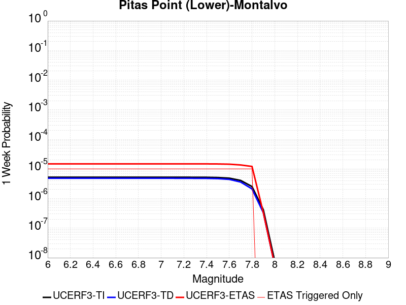 | 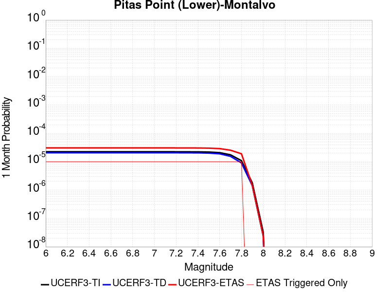 | 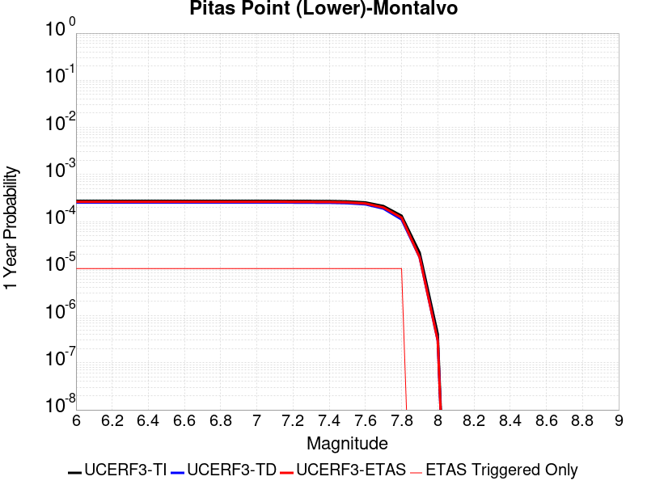 | 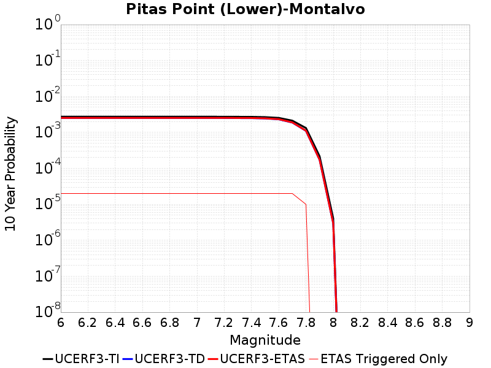 |

| Magnitude | 1 wk TI Prob | 1 wk TD Prob | 1 wk ETAS Prob | 1 wk ETAS/TD Gain | 1 wk ETAS Triggered Only | 1 mo TI Prob | 1 mo TD Prob | 1 mo ETAS Prob | 1 mo ETAS/TD Gain | 1 mo ETAS Triggered Only | 1 yr TI Prob | 1 yr TD Prob | 1 yr ETAS Prob | 1 yr ETAS/TD Gain | 1 yr ETAS Triggered Only | 10 yr TI Prob | 10 yr TD Prob | 10 yr ETAS Prob | 10 yr ETAS/TD Gain | 10 yr ETAS Triggered Only |
|-----|-----|-----|-----|-----|-----|-----|-----|-----|-----|-----|-----|-----|-----|-----|-----|-----|-----|-----|-----|-----|
| 6.0 | 5.2543637E-6 | 4.8379034E-6 | 1.4837855E-5 | 3.067001 | 1.0E-5 | 2.2518509E-5 | 2.0733707E-5 | 3.07335E-5 | 1.4822963 | 1.0E-5 | 2.7412834E-4 | 2.5240396E-4 | 2.6240145E-4 | 1.0396091 | 1.0E-5 | 0.0027379042 | 0.0025212055 | 0.002541155 | 1.0079128 | 2.0E-5 |
| 6.1 | 5.2543637E-6 | 4.8379034E-6 | 1.4837855E-5 | 3.067001 | 1.0E-5 | 2.2518509E-5 | 2.0733707E-5 | 3.07335E-5 | 1.4822963 | 1.0E-5 | 2.7412834E-4 | 2.5240396E-4 | 2.6240145E-4 | 1.0396091 | 1.0E-5 | 0.0027379042 | 0.0025212055 | 0.002541155 | 1.0079128 | 2.0E-5 |
| 6.2 | 5.2543637E-6 | 4.8379034E-6 | 1.4837855E-5 | 3.067001 | 1.0E-5 | 2.2518509E-5 | 2.0733707E-5 | 3.07335E-5 | 1.4822963 | 1.0E-5 | 2.7412834E-4 | 2.5240396E-4 | 2.6240145E-4 | 1.0396091 | 1.0E-5 | 0.0027379042 | 0.0025212055 | 0.002541155 | 1.0079128 | 2.0E-5 |
| 6.3 | 5.2543637E-6 | 4.8379034E-6 | 1.4837855E-5 | 3.067001 | 1.0E-5 | 2.2518509E-5 | 2.0733707E-5 | 3.07335E-5 | 1.4822963 | 1.0E-5 | 2.7412834E-4 | 2.5240396E-4 | 2.6240145E-4 | 1.0396091 | 1.0E-5 | 0.0027379042 | 0.0025212055 | 0.002541155 | 1.0079128 | 2.0E-5 |
| 6.4 | 5.2543637E-6 | 4.8379034E-6 | 1.4837855E-5 | 3.067001 | 1.0E-5 | 2.2518509E-5 | 2.0733707E-5 | 3.07335E-5 | 1.4822963 | 1.0E-5 | 2.7412834E-4 | 2.5240396E-4 | 2.6240145E-4 | 1.0396091 | 1.0E-5 | 0.0027379042 | 0.0025212055 | 0.002541155 | 1.0079128 | 2.0E-5 |
| 6.5 | 5.2543637E-6 | 4.8379034E-6 | 1.4837855E-5 | 3.067001 | 1.0E-5 | 2.2518509E-5 | 2.0733707E-5 | 3.07335E-5 | 1.4822963 | 1.0E-5 | 2.7412834E-4 | 2.5240396E-4 | 2.6240145E-4 | 1.0396091 | 1.0E-5 | 0.0027379042 | 0.0025212055 | 0.002541155 | 1.0079128 | 2.0E-5 |
| 6.6 | 5.2543637E-6 | 4.8379034E-6 | 1.4837855E-5 | 3.067001 | 1.0E-5 | 2.2518509E-5 | 2.0733707E-5 | 3.07335E-5 | 1.4822963 | 1.0E-5 | 2.7412834E-4 | 2.5240396E-4 | 2.6240145E-4 | 1.0396091 | 1.0E-5 | 0.0027379042 | 0.0025212055 | 0.002541155 | 1.0079128 | 2.0E-5 |
| 6.7 | 5.2543637E-6 | 4.8379034E-6 | 1.4837855E-5 | 3.067001 | 1.0E-5 | 2.2518509E-5 | 2.0733707E-5 | 3.07335E-5 | 1.4822963 | 1.0E-5 | 2.7412834E-4 | 2.5240396E-4 | 2.6240145E-4 | 1.0396091 | 1.0E-5 | 0.0027379042 | 0.0025212055 | 0.002541155 | 1.0079128 | 2.0E-5 |
| 6.8 | 5.2543637E-6 | 4.8379034E-6 | 1.4837855E-5 | 3.067001 | 1.0E-5 | 2.2518509E-5 | 2.0733707E-5 | 3.07335E-5 | 1.4822963 | 1.0E-5 | 2.7412834E-4 | 2.5240396E-4 | 2.6240145E-4 | 1.0396091 | 1.0E-5 | 0.0027379042 | 0.0025212055 | 0.002541155 | 1.0079128 | 2.0E-5 |
| 6.9 | 5.2543637E-6 | 4.8379034E-6 | 1.4837855E-5 | 3.067001 | 1.0E-5 | 2.2518509E-5 | 2.0733707E-5 | 3.07335E-5 | 1.4822963 | 1.0E-5 | 2.7412834E-4 | 2.5240396E-4 | 2.6240145E-4 | 1.0396091 | 1.0E-5 | 0.0027379042 | 0.0025212055 | 0.002541155 | 1.0079128 | 2.0E-5 |
| 7.0 | 5.2543637E-6 | 4.8379034E-6 | 1.4837855E-5 | 3.067001 | 1.0E-5 | 2.2518509E-5 | 2.0733707E-5 | 3.07335E-5 | 1.4822963 | 1.0E-5 | 2.7412834E-4 | 2.5240396E-4 | 2.6240145E-4 | 1.0396091 | 1.0E-5 | 0.0027379042 | 0.0025212055 | 0.002541155 | 1.0079128 | 2.0E-5 |
| 7.1 | 5.2543637E-6 | 4.8379034E-6 | 1.4837855E-5 | 3.067001 | 1.0E-5 | 2.2518509E-5 | 2.0733707E-5 | 3.07335E-5 | 1.4822963 | 1.0E-5 | 2.7412834E-4 | 2.5240396E-4 | 2.6240145E-4 | 1.0396091 | 1.0E-5 | 0.0027379042 | 0.0025212055 | 0.002541155 | 1.0079128 | 2.0E-5 |
| 7.2 | 5.2458695E-6 | 4.829057E-6 | 1.4829008E-5 | 3.0707877 | 1.0E-5 | 2.2482105E-5 | 2.0695796E-5 | 3.0695588E-5 | 1.4831799 | 1.0E-5 | 2.7368523E-4 | 2.519425E-4 | 2.6193997E-4 | 1.0396816 | 1.0E-5 | 0.0027334841 | 0.0025166012 | 0.0025365509 | 1.0079272 | 2.0E-5 |
| 7.3 | 5.22665E-6 | 4.808974E-6 | 1.4808926E-5 | 3.0794356 | 1.0E-5 | 2.2399736E-5 | 2.0609728E-5 | 3.060952E-5 | 1.4851978 | 1.0E-5 | 2.7268266E-4 | 2.5089487E-4 | 2.6089235E-4 | 1.0398474 | 1.0E-5 | 0.002723483 | 0.0025061485 | 0.0025260984 | 1.0079603 | 2.0E-5 |
| 7.4 | 5.210642E-6 | 4.7921862E-6 | 1.4792138E-5 | 3.0867202 | 1.0E-5 | 2.233113E-5 | 2.0537782E-5 | 3.0537576E-5 | 1.4868975 | 1.0E-5 | 2.718476E-4 | 2.500191E-4 | 2.6001662E-4 | 1.039987 | 1.0E-5 | 0.002715153 | 0.0024974109 | 0.0025173607 | 1.0079883 | 2.0E-5 |
| 7.5 | 5.1226016E-6 | 4.7000726E-6 | 1.47000255E-5 | 3.1276166 | 1.0E-5 | 2.1953823E-5 | 2.0143014E-5 | 3.0142814E-5 | 1.49644 | 1.0E-5 | 2.67255E-4 | 2.4521392E-4 | 2.5521146E-4 | 1.0407708 | 1.0E-5 | 0.0026693381 | 0.002449465 | 0.002469416 | 1.0081451 | 2.0E-5 |
| 7.6 | 4.8796987E-6 | 4.444971E-6 | 1.4444927E-5 | 3.2497234 | 1.0E-5 | 2.0912828E-5 | 1.9049738E-5 | 2.9049548E-5 | 1.5249316 | 1.0E-5 | 2.5458392E-4 | 2.3190618E-4 | 2.4190385E-4 | 1.0431108 | 1.0E-5 | 0.0025429246 | 0.0023166724 | 0.002336626 | 1.0086131 | 2.0E-5 |
| 7.7 | 4.0834398E-6 | 3.6091376E-6 | 1.3609101E-5 | 3.770735 | 1.0E-5 | 1.7500339E-5 | 1.5467642E-5 | 2.5467487E-5 | 1.646501 | 1.0E-5 | 2.1304579E-4 | 1.8830251E-4 | 1.9830062E-4 | 1.053096 | 1.0E-5 | 0.0021284167 | 0.0018814532 | 0.0019014156 | 1.0106101 | 2.0E-5 |
| 7.8 | 2.5445438E-6 | 2.1212427E-6 | 1.21212215E-5 | 5.714208 | 1.0E-5 | 1.0905142E-5 | 9.091008E-6 | 1.9090918E-5 | 2.099978 | 1.0E-5 | 1.3276201E-4 | 1.1067745E-4 | 1.2067634E-4 | 1.0903426 | 1.0E-5 | 0.0013268272 | 0.001106228 | 0.0011162169 | 1.0090297 | 1.0E-5 |
| 7.9 | 4.1677114E-7 | 3.3293938E-7 | 3.3293938E-7 | 1.0 | 0.0 | 1.7861609E-6 | 1.4268822E-6 | 1.4268822E-6 | 1.0 | 0.0 | 2.1746291E-5 | 1.7372156E-5 | 1.7372156E-5 | 1.0 | 0.0 | 2.1744163E-4 | 1.737083E-4 | 1.737083E-4 | 1.0 | 0.0 |
| 8.0 | 7.791402E-9 | 5.6835443E-9 | 5.6835443E-9 | 1.0 | 0.0 | 3.3391725E-8 | 2.4358048E-8 | 2.4358048E-8 | 1.0 | 0.0 | 4.0654416E-7 | 2.965592E-7 | 2.965592E-7 | 1.0 | 0.0 | 4.065434E-6 | 2.96559E-6 | 2.96559E-6 | 1.0 | 0.0 |

## Cucamonga
*[(top)](#table-of-contents)*

| 1 Week | 1 Month | 1 Year | 10 Year |
|-----|-----|-----|-----|
| 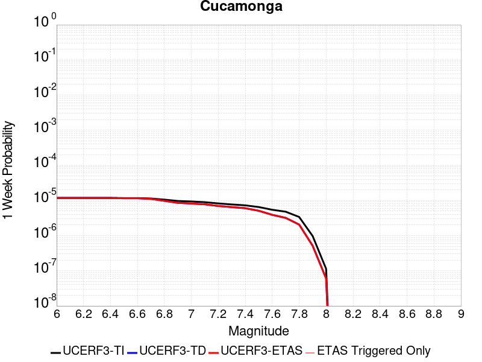 | 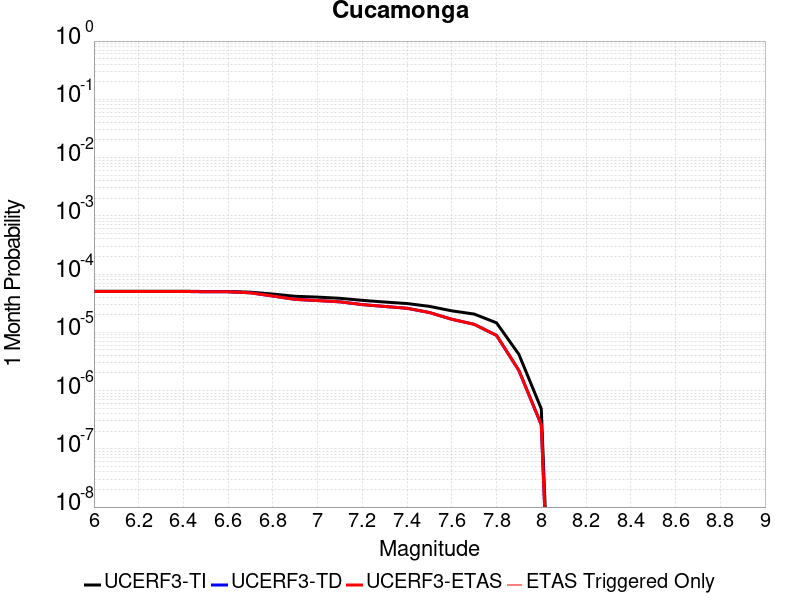 | 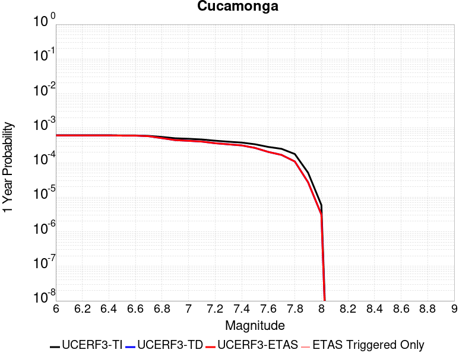 | 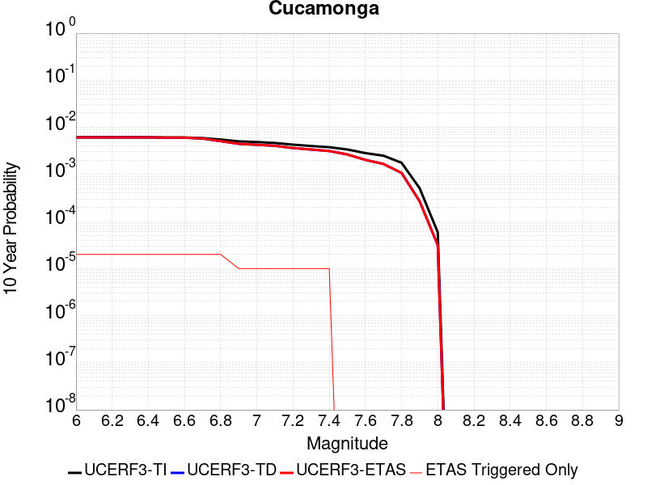 |

| Magnitude | 1 wk TI Prob | 1 wk TD Prob | 1 wk ETAS Prob | 1 wk ETAS/TD Gain | 1 wk ETAS Triggered Only | 1 mo TI Prob | 1 mo TD Prob | 1 mo ETAS Prob | 1 mo ETAS/TD Gain | 1 mo ETAS Triggered Only | 1 yr TI Prob | 1 yr TD Prob | 1 yr ETAS Prob | 1 yr ETAS/TD Gain | 1 yr ETAS Triggered Only | 10 yr TI Prob | 10 yr TD Prob | 10 yr ETAS Prob | 10 yr ETAS/TD Gain | 10 yr ETAS Triggered Only |
|-----|-----|-----|-----|-----|-----|-----|-----|-----|-----|-----|-----|-----|-----|-----|-----|-----|-----|-----|-----|-----|
| 6.0 | 1.1848348E-5 | 1.1737656E-5 | 1.1737656E-5 | 1.0 | 0.0 | 5.0777642E-5 | 5.0303286E-5 | 5.0303286E-5 | 1.0 | 0.0 | 6.180424E-4 | 6.122731E-4 | 6.122731E-4 | 1.0 | 0.0 | 0.0061632637 | 0.006107037 | 0.0061269146 | 1.0032549 | 2.0E-5 |
| 6.1 | 1.1848348E-5 | 1.1737656E-5 | 1.1737656E-5 | 1.0 | 0.0 | 5.0777642E-5 | 5.0303286E-5 | 5.0303286E-5 | 1.0 | 0.0 | 6.180424E-4 | 6.122731E-4 | 6.122731E-4 | 1.0 | 0.0 | 0.0061632637 | 0.006107037 | 0.0061269146 | 1.0032549 | 2.0E-5 |
| 6.2 | 1.1848348E-5 | 1.1737656E-5 | 1.1737656E-5 | 1.0 | 0.0 | 5.0777642E-5 | 5.0303286E-5 | 5.0303286E-5 | 1.0 | 0.0 | 6.180424E-4 | 6.122731E-4 | 6.122731E-4 | 1.0 | 0.0 | 0.0061632637 | 0.006107037 | 0.0061269146 | 1.0032549 | 2.0E-5 |
| 6.3 | 1.1848348E-5 | 1.1737656E-5 | 1.1737656E-5 | 1.0 | 0.0 | 5.0777642E-5 | 5.0303286E-5 | 5.0303286E-5 | 1.0 | 0.0 | 6.180424E-4 | 6.122731E-4 | 6.122731E-4 | 1.0 | 0.0 | 0.0061632637 | 0.006107037 | 0.0061269146 | 1.0032549 | 2.0E-5 |
| 6.4 | 1.1848348E-5 | 1.1737656E-5 | 1.1737656E-5 | 1.0 | 0.0 | 5.0777642E-5 | 5.0303286E-5 | 5.0303286E-5 | 1.0 | 0.0 | 6.180424E-4 | 6.122731E-4 | 6.122731E-4 | 1.0 | 0.0 | 0.0061632637 | 0.006107037 | 0.0061269146 | 1.0032549 | 2.0E-5 |
| 6.5 | 1.16988695E-5 | 1.1576685E-5 | 1.1576685E-5 | 1.0 | 0.0 | 5.013705E-5 | 4.9613438E-5 | 4.9613438E-5 | 1.0 | 0.0 | 6.102476E-4 | 6.0387887E-4 | 6.0387887E-4 | 1.0 | 0.0 | 0.006085745 | 0.0060235504 | 0.00604343 | 1.0033003 | 2.0E-5 |
| 6.6 | 1.16988695E-5 | 1.1576685E-5 | 1.1576685E-5 | 1.0 | 0.0 | 5.013705E-5 | 4.9613438E-5 | 4.9613438E-5 | 1.0 | 0.0 | 6.102476E-4 | 6.0387887E-4 | 6.0387887E-4 | 1.0 | 0.0 | 0.006085745 | 0.0060235504 | 0.00604343 | 1.0033003 | 2.0E-5 |
| 6.7 | 1.1397107E-5 | 1.111558E-5 | 1.111558E-5 | 1.0 | 0.0 | 4.884383E-5 | 4.7637343E-5 | 4.7637343E-5 | 1.0 | 0.0 | 5.9451134E-4 | 5.798328E-4 | 5.798328E-4 | 1.0 | 0.0 | 0.005929234 | 0.0057843495 | 0.005804234 | 1.0034376 | 2.0E-5 |
| 6.8 | 1.058387E-5 | 9.785556E-6 | 9.785556E-6 | 1.0 | 0.0 | 4.5358654E-5 | 4.193743E-5 | 4.193743E-5 | 1.0 | 0.0 | 5.521017E-4 | 5.104697E-4 | 5.104697E-4 | 1.0 | 0.0 | 0.00550732 | 0.00509398 | 0.0051138783 | 1.0039062 | 2.0E-5 |
| 6.9 | 9.690046E-6 | 8.580001E-6 | 8.580001E-6 | 1.0 | 0.0 | 4.1528107E-5 | 3.6770918E-5 | 3.6770918E-5 | 1.0 | 0.0 | 5.054874E-4 | 4.475944E-4 | 4.475944E-4 | 1.0 | 0.0 | 0.005043391 | 0.0044678636 | 0.004477819 | 1.0022283 | 1.0E-5 |
| 7.0 | 9.381461E-6 | 8.187611E-6 | 8.187611E-6 | 1.0 | 0.0 | 4.020564E-5 | 3.508929E-5 | 3.508929E-5 | 1.0 | 0.0 | 4.893937E-4 | 4.2712872E-4 | 4.2712872E-4 | 1.0 | 0.0 | 0.0048831734 | 0.004264011 | 0.0042739687 | 1.0023352 | 1.0E-5 |
| 7.1 | 8.946492E-6 | 7.782387E-6 | 7.782387E-6 | 1.0 | 0.0 | 3.8341543E-5 | 3.3352662E-5 | 3.3352662E-5 | 1.0 | 0.0 | 4.667083E-4 | 4.059933E-4 | 4.059933E-4 | 1.0 | 0.0 | 0.0046572937 | 0.0040534516 | 0.004063411 | 1.002457 | 1.0E-5 |
| 7.2 | 8.251016E-6 | 6.975752E-6 | 6.975752E-6 | 1.0 | 0.0 | 3.5361016E-5 | 2.9895738E-5 | 2.9895738E-5 | 1.0 | 0.0 | 4.3043532E-4 | 3.6392006E-4 | 3.6392006E-4 | 1.0 | 0.0 | 0.0042960253 | 0.0036341737 | 0.0036441374 | 1.0027417 | 1.0E-5 |
| 7.3 | 7.717881E-6 | 6.48681E-6 | 6.48681E-6 | 1.0 | 0.0 | 3.3076216E-5 | 2.7800319E-5 | 2.7800319E-5 | 1.0 | 0.0 | 4.026285E-4 | 3.3841655E-4 | 3.3841655E-4 | 1.0 | 0.0 | 0.004018998 | 0.0033799482 | 0.0033899143 | 1.0029486 | 1.0E-5 |
| 7.4 | 7.275623E-6 | 6.032442E-6 | 6.032442E-6 | 1.0 | 0.0 | 3.118087E-5 | 2.5853067E-5 | 2.5853067E-5 | 1.0 | 0.0 | 3.7956095E-4 | 3.1471584E-4 | 3.1471584E-4 | 1.0 | 0.0 | 0.0037891332 | 0.0031436365 | 0.0031536052 | 1.0031711 | 1.0E-5 |
| 7.5 | 6.5109502E-6 | 5.1010047E-6 | 5.1010047E-6 | 1.0 | 0.0 | 2.7903774E-5 | 2.1861266E-5 | 2.1861266E-5 | 1.0 | 0.0 | 3.3967546E-4 | 2.6612854E-4 | 2.6612854E-4 | 1.0 | 0.0 | 0.0033915674 | 0.0026590219 | 0.0026590219 | 1.0 | 0.0 |
| 7.6 | 5.4495326E-6 | 3.908937E-6 | 3.908937E-6 | 1.0 | 0.0 | 2.335493E-5 | 1.675248E-5 | 1.675248E-5 | 1.0 | 0.0 | 2.8430918E-4 | 2.0394241E-4 | 2.0394241E-4 | 1.0 | 0.0 | 0.0028394572 | 0.0020384723 | 0.0020384723 | 1.0 | 0.0 |
| 7.7 | 4.7997164E-6 | 3.2005933E-6 | 3.2005933E-6 | 1.0 | 0.0 | 2.057005E-5 | 1.3716756E-5 | 1.3716756E-5 | 1.0 | 0.0 | 2.504116E-4 | 1.6698874E-4 | 1.6698874E-4 | 1.0 | 0.0 | 0.002501296 | 0.0016695631 | 0.0016695631 | 1.0 | 0.0 |
| 7.8 | 3.3941733E-6 | 2.0644109E-6 | 2.0644109E-6 | 1.0 | 0.0 | 1.4546376E-5 | 8.847445E-6 | 8.847445E-6 | 1.0 | 0.0 | 1.7708774E-4 | 1.0771233E-4 | 1.0771233E-4 | 1.0 | 0.0 | 0.0017694668 | 0.0010768382 | 0.0010768382 | 1.0 | 0.0 |
| 7.9 | 9.750552E-7 | 5.1566667E-7 | 5.1566667E-7 | 1.0 | 0.0 | 4.178801E-6 | 2.2099982E-6 | 2.2099982E-6 | 1.0 | 0.0 | 5.0875715E-5 | 2.69064E-5 | 2.69064E-5 | 1.0 | 0.0 | 5.086407E-4 | 2.6903185E-4 | 2.6903185E-4 | 1.0 | 0.0 |
| 8.0 | 1.133857E-7 | 6.0539975E-8 | 6.0539975E-8 | 1.0 | 0.0 | 4.8593864E-7 | 2.59457E-7 | 2.59457E-7 | 1.0 | 0.0 | 5.9162867E-6 | 3.1588847E-6 | 3.1588847E-6 | 1.0 | 0.0 | 5.916129E-5 | 3.1588414E-5 | 3.1588414E-5 | 1.0 | 0.0 |

## Ozena
*[(top)](#table-of-contents)*

| 1 Week | 1 Month | 1 Year | 10 Year |
|-----|-----|-----|-----|
|  | 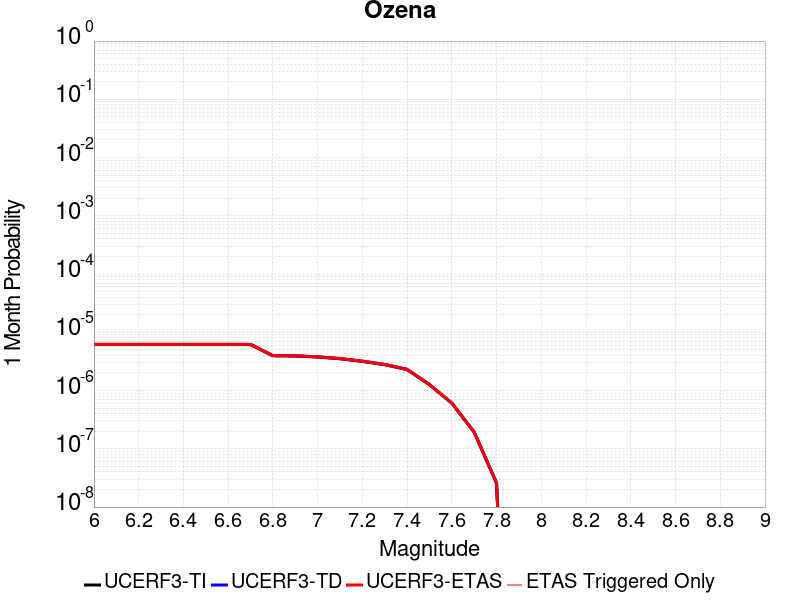 | 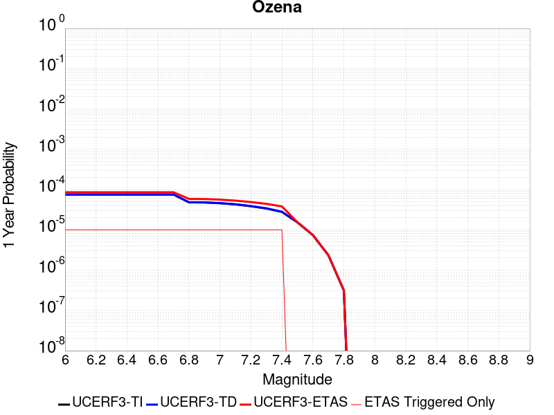 | 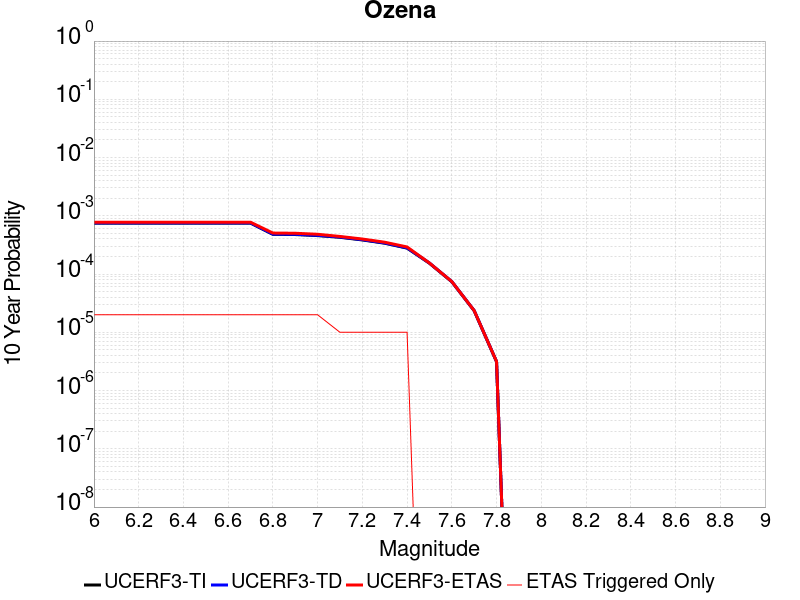 |

| Magnitude | 1 wk TI Prob | 1 wk TD Prob | 1 wk ETAS Prob | 1 wk ETAS/TD Gain | 1 wk ETAS Triggered Only | 1 mo TI Prob | 1 mo TD Prob | 1 mo ETAS Prob | 1 mo ETAS/TD Gain | 1 mo ETAS Triggered Only | 1 yr TI Prob | 1 yr TD Prob | 1 yr ETAS Prob | 1 yr ETAS/TD Gain | 1 yr ETAS Triggered Only | 10 yr TI Prob | 10 yr TD Prob | 10 yr ETAS Prob | 10 yr ETAS/TD Gain | 10 yr ETAS Triggered Only |
|-----|-----|-----|-----|-----|-----|-----|-----|-----|-----|-----|-----|-----|-----|-----|-----|-----|-----|-----|-----|-----|
| 6.0 | 1.4377547E-6 | 1.4513798E-6 | 1.4513798E-6 | 1.0 | 0.0 | 6.161791E-6 | 6.220186E-6 | 6.220186E-6 | 1.0 | 0.0 | 7.5017226E-5 | 7.572841E-5 | 8.572765E-5 | 1.1320409 | 1.0E-5 | 7.4991904E-4 | 7.570526E-4 | 7.7703747E-4 | 1.0263983 | 2.0E-5 |
| 6.1 | 1.4377547E-6 | 1.4513798E-6 | 1.4513798E-6 | 1.0 | 0.0 | 6.161791E-6 | 6.220186E-6 | 6.220186E-6 | 1.0 | 0.0 | 7.5017226E-5 | 7.572841E-5 | 8.572765E-5 | 1.1320409 | 1.0E-5 | 7.4991904E-4 | 7.570526E-4 | 7.7703747E-4 | 1.0263983 | 2.0E-5 |
| 6.2 | 1.4377547E-6 | 1.4513798E-6 | 1.4513798E-6 | 1.0 | 0.0 | 6.161791E-6 | 6.220186E-6 | 6.220186E-6 | 1.0 | 0.0 | 7.5017226E-5 | 7.572841E-5 | 8.572765E-5 | 1.1320409 | 1.0E-5 | 7.4991904E-4 | 7.570526E-4 | 7.7703747E-4 | 1.0263983 | 2.0E-5 |
| 6.3 | 1.4377547E-6 | 1.4513798E-6 | 1.4513798E-6 | 1.0 | 0.0 | 6.161791E-6 | 6.220186E-6 | 6.220186E-6 | 1.0 | 0.0 | 7.5017226E-5 | 7.572841E-5 | 8.572765E-5 | 1.1320409 | 1.0E-5 | 7.4991904E-4 | 7.570526E-4 | 7.7703747E-4 | 1.0263983 | 2.0E-5 |
| 6.4 | 1.4377547E-6 | 1.4513798E-6 | 1.4513798E-6 | 1.0 | 0.0 | 6.161791E-6 | 6.220186E-6 | 6.220186E-6 | 1.0 | 0.0 | 7.5017226E-5 | 7.572841E-5 | 8.572765E-5 | 1.1320409 | 1.0E-5 | 7.4991904E-4 | 7.570526E-4 | 7.7703747E-4 | 1.0263983 | 2.0E-5 |
| 6.5 | 1.4377547E-6 | 1.4513798E-6 | 1.4513798E-6 | 1.0 | 0.0 | 6.161791E-6 | 6.220186E-6 | 6.220186E-6 | 1.0 | 0.0 | 7.5017226E-5 | 7.572841E-5 | 8.572765E-5 | 1.1320409 | 1.0E-5 | 7.4991904E-4 | 7.570526E-4 | 7.7703747E-4 | 1.0263983 | 2.0E-5 |
| 6.6 | 1.4377547E-6 | 1.4513798E-6 | 1.4513798E-6 | 1.0 | 0.0 | 6.161791E-6 | 6.220186E-6 | 6.220186E-6 | 1.0 | 0.0 | 7.5017226E-5 | 7.572841E-5 | 8.572765E-5 | 1.1320409 | 1.0E-5 | 7.4991904E-4 | 7.570526E-4 | 7.7703747E-4 | 1.0263983 | 2.0E-5 |
| 6.7 | 1.4377547E-6 | 1.4513798E-6 | 1.4513798E-6 | 1.0 | 0.0 | 6.161791E-6 | 6.220186E-6 | 6.220186E-6 | 1.0 | 0.0 | 7.5017226E-5 | 7.572841E-5 | 8.572765E-5 | 1.1320409 | 1.0E-5 | 7.4991904E-4 | 7.570526E-4 | 7.7703747E-4 | 1.0263983 | 2.0E-5 |
| 6.8 | 9.223257E-7 | 9.317634E-7 | 9.317634E-7 | 1.0 | 0.0 | 3.9528186E-6 | 3.993266E-6 | 3.993266E-6 | 1.0 | 0.0 | 4.81245E-5 | 4.861697E-5 | 5.8616482E-5 | 1.2056795 | 1.0E-5 | 4.811408E-4 | 4.8606735E-4 | 5.0605764E-4 | 1.0411266 | 2.0E-5 |
| 6.9 | 9.141515E-7 | 9.2353815E-7 | 9.2353815E-7 | 1.0 | 0.0 | 3.917786E-6 | 3.958015E-6 | 3.958015E-6 | 1.0 | 0.0 | 4.7698002E-5 | 4.8187805E-5 | 5.8187325E-5 | 1.2075114 | 1.0E-5 | 4.7687767E-4 | 4.817776E-4 | 5.0176797E-4 | 1.0414929 | 2.0E-5 |
| 7.0 | 8.767648E-7 | 8.8585875E-7 | 8.8585875E-7 | 1.0 | 0.0 | 3.757558E-6 | 3.7965322E-6 | 3.7965322E-6 | 1.0 | 0.0 | 4.5747307E-5 | 4.6221838E-5 | 5.6221375E-5 | 1.2163379 | 1.0E-5 | 4.5737892E-4 | 4.6212616E-4 | 4.8211694E-4 | 1.0432582 | 2.0E-5 |
| 7.1 | 8.199402E-7 | 8.285408E-7 | 8.285408E-7 | 1.0 | 0.0 | 3.5140247E-6 | 3.5508847E-6 | 3.5508847E-6 | 1.0 | 0.0 | 4.2782412E-5 | 4.32312E-5 | 5.3230768E-5 | 1.2313044 | 1.0E-5 | 4.2774176E-4 | 4.3223164E-4 | 4.4222732E-4 | 1.0231258 | 1.0E-5 |
| 7.2 | 7.38705E-7 | 7.4642713E-7 | 7.4642713E-7 | 1.0 | 0.0 | 3.1658747E-6 | 3.1989696E-6 | 3.1989696E-6 | 1.0 | 0.0 | 3.8543843E-5 | 3.8946793E-5 | 4.8946404E-5 | 1.2567506 | 1.0E-5 | 3.853716E-4 | 3.894032E-4 | 3.9939932E-4 | 1.0256703 | 1.0E-5 |
| 7.3 | 6.490017E-7 | 6.557809E-7 | 6.557809E-7 | 1.0 | 0.0 | 2.7814328E-6 | 2.8104869E-6 | 2.8104869E-6 | 1.0 | 0.0 | 3.386342E-5 | 3.4217173E-5 | 4.421683E-5 | 1.2922409 | 1.0E-5 | 3.3858258E-4 | 3.4212242E-4 | 3.52119E-4 | 1.0292193 | 1.0E-5 |
| 7.4 | 5.346736E-7 | 5.4022667E-7 | 5.4022667E-7 | 1.0 | 0.0 | 2.291456E-6 | 2.3152554E-6 | 2.3152554E-6 | 1.0 | 0.0 | 2.789812E-5 | 2.81879E-5 | 3.818762E-5 | 1.3547522 | 1.0E-5 | 2.789462E-4 | 2.818463E-4 | 2.9184346E-4 | 1.0354704 | 1.0E-5 |
| 7.5 | 2.939325E-7 | 2.966609E-7 | 2.966609E-7 | 1.0 | 0.0 | 1.25971E-6 | 1.2714032E-6 | 1.2714032E-6 | 1.0 | 0.0 | 1.5336862E-5 | 1.5479241E-5 | 1.5479241E-5 | 1.0 | 0.0 | 1.5335804E-4 | 1.5478325E-4 | 1.5478325E-4 | 1.0 | 0.0 |
| 7.6 | 1.4151905E-7 | 1.4253277E-7 | 1.4253277E-7 | 1.0 | 0.0 | 6.065101E-7 | 6.1085456E-7 | 6.1085456E-7 | 1.0 | 0.0 | 7.3842357E-6 | 7.4371296E-6 | 7.4371296E-6 | 1.0 | 0.0 | 7.38399E-5 | 7.436889E-5 | 7.436889E-5 | 1.0 | 0.0 |
| 7.7 | 4.4957577E-8 | 4.5252275E-8 | 4.5252275E-8 | 1.0 | 0.0 | 1.9267533E-7 | 1.9393832E-7 | 1.9393832E-7 | 1.0 | 0.0 | 2.3458194E-6 | 2.3611965E-6 | 2.3611965E-6 | 1.0 | 0.0 | 2.3457947E-5 | 2.3611723E-5 | 2.3611723E-5 | 1.0 | 0.0 |
| 7.8 | 5.9993255E-9 | 6.0413017E-9 | 6.0413017E-9 | 1.0 | 0.0 | 2.5711394E-8 | 2.5891294E-8 | 2.5891294E-8 | 1.0 | 0.0 | 3.1303617E-7 | 3.1522646E-7 | 3.1522646E-7 | 1.0 | 0.0 | 3.1303573E-6 | 3.1522613E-6 | 3.1522613E-6 | 1.0 | 0.0 |

## Hosgri
*[(top)](#table-of-contents)*

| 1 Week | 1 Month | 1 Year | 10 Year |
|-----|-----|-----|-----|
| 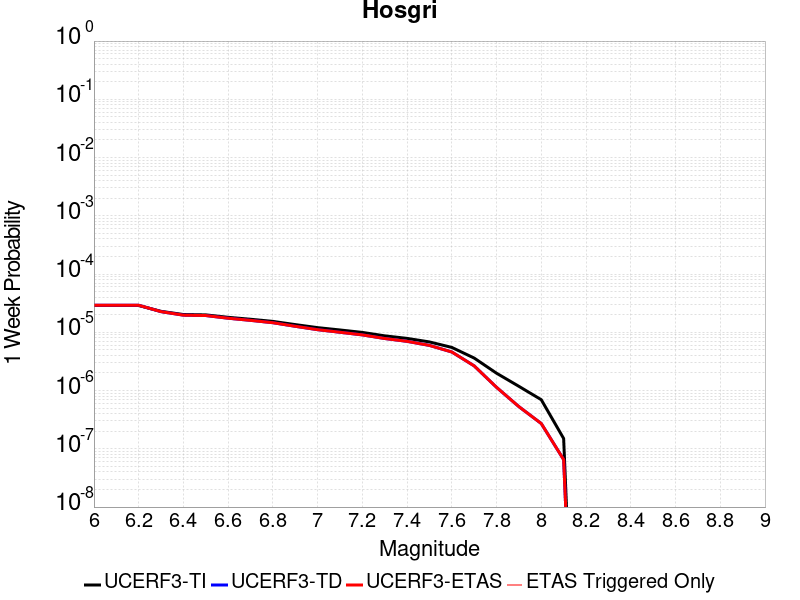 | 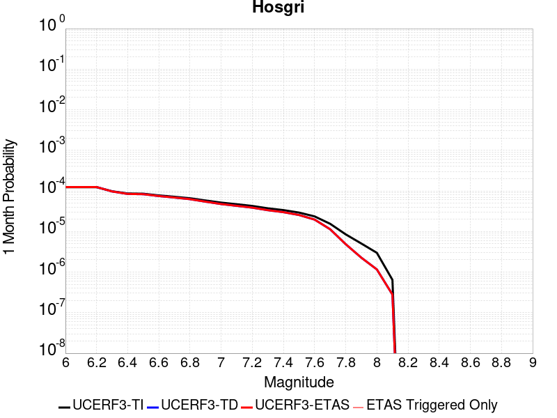 | 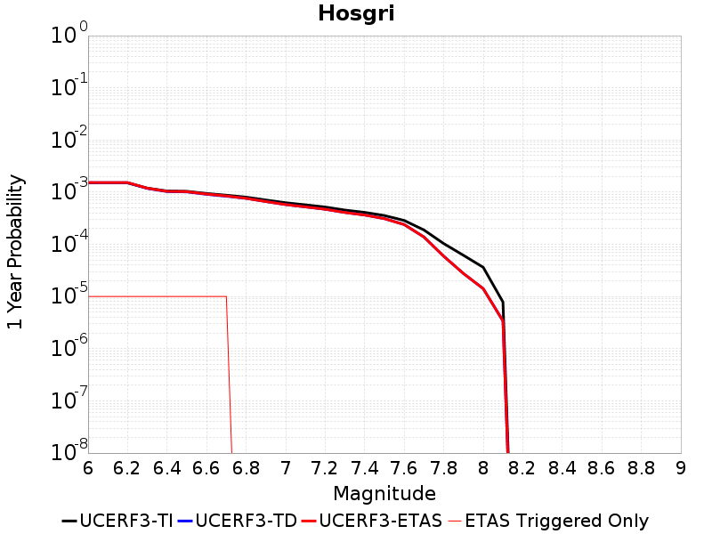 | 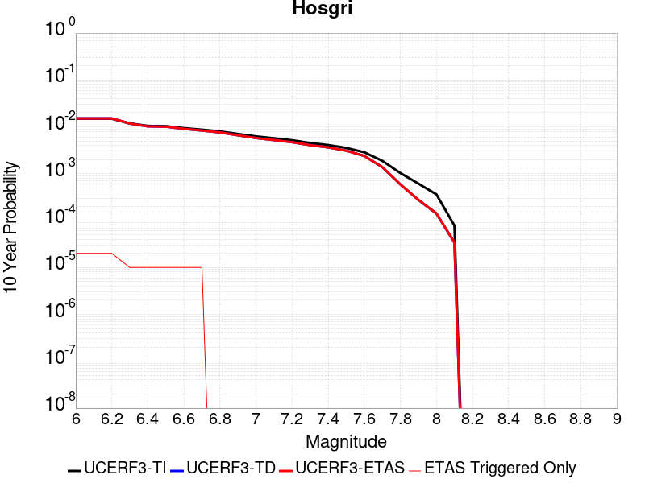 |

| Magnitude | 1 wk TI Prob | 1 wk TD Prob | 1 wk ETAS Prob | 1 wk ETAS/TD Gain | 1 wk ETAS Triggered Only | 1 mo TI Prob | 1 mo TD Prob | 1 mo ETAS Prob | 1 mo ETAS/TD Gain | 1 mo ETAS Triggered Only | 1 yr TI Prob | 1 yr TD Prob | 1 yr ETAS Prob | 1 yr ETAS/TD Gain | 1 yr ETAS Triggered Only | 10 yr TI Prob | 10 yr TD Prob | 10 yr ETAS Prob | 10 yr ETAS/TD Gain | 10 yr ETAS Triggered Only |
|-----|-----|-----|-----|-----|-----|-----|-----|-----|-----|-----|-----|-----|-----|-----|-----|-----|-----|-----|-----|-----|
| 6.0 | 2.883978E-5 | 2.9128765E-5 | 2.9128765E-5 | 1.0 | 0.0 | 1.235932E-4 | 1.2483174E-4 | 1.2483174E-4 | 1.0 | 0.0 | 0.0015037085 | 0.0015187941 | 0.0015287789 | 1.0065742 | 1.0E-5 | 0.01493574 | 0.015087919 | 0.015107617 | 1.0013056 | 2.0E-5 |
| 6.1 | 2.883978E-5 | 2.9128765E-5 | 2.9128765E-5 | 1.0 | 0.0 | 1.235932E-4 | 1.2483174E-4 | 1.2483174E-4 | 1.0 | 0.0 | 0.0015037085 | 0.0015187941 | 0.0015287789 | 1.0065742 | 1.0E-5 | 0.01493574 | 0.015087919 | 0.015107617 | 1.0013056 | 2.0E-5 |
| 6.2 | 2.883978E-5 | 2.9128765E-5 | 2.9128765E-5 | 1.0 | 0.0 | 1.235932E-4 | 1.2483174E-4 | 1.2483174E-4 | 1.0 | 0.0 | 0.0015037085 | 0.0015187941 | 0.0015287789 | 1.0065742 | 1.0E-5 | 0.01493574 | 0.015087919 | 0.015107617 | 1.0013056 | 2.0E-5 |
| 6.3 | 2.2914428E-5 | 2.2642249E-5 | 2.2642249E-5 | 1.0 | 0.0 | 9.8200995E-5 | 9.703463E-5 | 9.703463E-5 | 1.0 | 0.0 | 0.0011949413 | 0.0011807613 | 0.0011907495 | 1.0084591 | 1.0E-5 | 0.011885363 | 0.011746277 | 0.011756159 | 1.0008414 | 1.0E-5 |
| 6.4 | 2.0195741E-5 | 1.9696812E-5 | 1.9696812E-5 | 1.0 | 0.0 | 8.65503E-5 | 8.441219E-5 | 8.441219E-5 | 1.0 | 0.0 | 0.0010532405 | 0.0010272359 | 0.0010372256 | 1.0097249 | 1.0E-5 | 0.010482626 | 0.010225923 | 0.010235821 | 1.0009679 | 1.0E-5 |
| 6.5 | 1.9924333E-5 | 1.9409232E-5 | 1.9409232E-5 | 1.0 | 0.0 | 8.53872E-5 | 8.317978E-5 | 8.317978E-5 | 1.0 | 0.0 | 0.0010390934 | 0.0010122452 | 0.0010222351 | 1.009869 | 1.0E-5 | 0.010342481 | 0.010077382 | 0.010087281 | 1.0009823 | 1.0E-5 |
| 6.6 | 1.809694E-5 | 1.7458535E-5 | 1.7458535E-5 | 1.0 | 0.0 | 7.7556004E-5 | 7.482015E-5 | 7.482015E-5 | 1.0 | 0.0 | 9.438353E-4 | 9.1055594E-4 | 9.205468E-4 | 1.0109723 | 1.0E-5 | 0.009398366 | 0.009069194 | 0.009079103 | 1.0010927 | 1.0E-5 |
| 6.7 | 1.675989E-5 | 1.6042988E-5 | 1.6042988E-5 | 1.0 | 0.0 | 7.182612E-5 | 6.8753856E-5 | 6.8753856E-5 | 1.0 | 0.0 | 8.7413215E-4 | 8.367579E-4 | 8.467495E-4 | 1.0119408 | 1.0E-5 | 0.008707017 | 0.008336979 | 0.008346896 | 1.0011895 | 1.0E-5 |
| 6.8 | 1.5401129E-5 | 1.4614296E-5 | 1.4614296E-5 | 1.0 | 0.0 | 6.6003166E-5 | 6.2631196E-5 | 6.2631196E-5 | 1.0 | 0.0 | 8.032922E-4 | 7.622689E-4 | 7.622689E-4 | 1.0 | 0.0 | 0.008003947 | 0.007597407 | 0.007597407 | 1.0 | 0.0 |
| 6.9 | 1.356559E-5 | 1.2690166E-5 | 1.2690166E-5 | 1.0 | 0.0 | 5.8136946E-5 | 5.4385295E-5 | 5.4385295E-5 | 1.0 | 0.0 | 7.0758746E-4 | 6.6194026E-4 | 6.6194026E-4 | 1.0 | 0.0 | 0.007053386 | 0.0066004912 | 0.0066004912 | 1.0 | 0.0 |
| 7.0 | 1.2030819E-5 | 1.1096149E-5 | 1.1096149E-5 | 1.0 | 0.0 | 5.155963E-5 | 4.755406E-5 | 4.755406E-5 | 1.0 | 0.0 | 6.275577E-4 | 5.788169E-4 | 5.788169E-4 | 1.0 | 0.0 | 0.006257884 | 0.0057738544 | 0.0057738544 | 1.0 | 0.0 |
| 7.1 | 1.0972698E-5 | 1.002236E-5 | 1.002236E-5 | 1.0 | 0.0 | 4.7025E-5 | 4.2952262E-5 | 4.2952262E-5 | 1.0 | 0.0 | 5.72379E-4 | 5.228184E-4 | 5.228184E-4 | 1.0 | 0.0 | 0.0057090693 | 0.005216636 | 0.005216636 | 1.0 | 0.0 |
| 7.2 | 9.961926E-6 | 9.03492E-6 | 9.03492E-6 | 1.0 | 0.0 | 4.2693267E-5 | 3.8720515E-5 | 3.8720515E-5 | 1.0 | 0.0 | 5.1966653E-4 | 4.7132035E-4 | 4.7132035E-4 | 1.0 | 0.0 | 0.00518453 | 0.004703954 | 0.004703954 | 1.0 | 0.0 |
| 7.3 | 8.700929E-6 | 7.828269E-6 | 7.828269E-6 | 1.0 | 0.0 | 3.7289166E-5 | 3.354929E-5 | 3.354929E-5 | 1.0 | 0.0 | 4.53901E-4 | 4.083861E-4 | 4.083861E-4 | 1.0 | 0.0 | 0.00452975 | 0.004077096 | 0.004077096 | 1.0 | 0.0 |
| 7.4 | 7.866285E-6 | 6.9989032E-6 | 6.9989032E-6 | 1.0 | 0.0 | 3.3712215E-5 | 2.9994955E-5 | 2.9994955E-5 | 1.0 | 0.0 | 4.103689E-4 | 3.651274E-4 | 3.651274E-4 | 1.0 | 0.0 | 0.004096119 | 0.0036460124 | 0.0036460124 | 1.0 | 0.0 |
| 7.5 | 6.8381305E-6 | 5.9598547E-6 | 5.9598547E-6 | 1.0 | 0.0 | 2.9305946E-5 | 2.5541984E-5 | 2.5541984E-5 | 1.0 | 0.0 | 3.5674145E-4 | 3.109293E-4 | 3.109293E-4 | 1.0 | 0.0 | 0.0035616932 | 0.0031056777 | 0.0031056777 | 1.0 | 0.0 |
| 7.6 | 5.503376E-6 | 4.595396E-6 | 4.595396E-6 | 1.0 | 0.0 | 2.3585684E-5 | 1.9694407E-5 | 1.9694407E-5 | 1.0 | 0.0 | 2.8711787E-4 | 2.3975303E-4 | 2.3975303E-4 | 1.0 | 0.0 | 0.002867472 | 0.002395677 | 0.002395677 | 1.0 | 0.0 |
| 7.7 | 3.6144982E-6 | 2.6523524E-6 | 2.6523524E-6 | 1.0 | 0.0 | 1.5490614E-5 | 1.1367174E-5 | 1.1367174E-5 | 1.0 | 0.0 | 1.8858191E-4 | 1.3838656E-4 | 1.3838656E-4 | 1.0 | 0.0 | 0.0018842196 | 0.0013837351 | 0.0013837351 | 1.0 | 0.0 |
| 7.8 | 1.9853494E-6 | 1.1362325E-6 | 1.1362325E-6 | 1.0 | 0.0 | 8.508612E-6 | 4.869559E-6 | 4.869559E-6 | 1.0 | 0.0 | 1.0358743E-4 | 5.9285267E-5 | 5.9285267E-5 | 1.0 | 0.0 | 0.0010353916 | 5.934244E-4 | 5.934244E-4 | 1.0 | 0.0 |
| 7.9 | 1.1818757E-6 | 5.2961354E-7 | 5.2961354E-7 | 1.0 | 0.0 | 5.0651715E-6 | 2.2697702E-6 | 2.2697702E-6 | 1.0 | 0.0 | 6.1666724E-5 | 2.7634103E-5 | 2.7634103E-5 | 1.0 | 0.0 | 6.1649614E-4 | 2.769949E-4 | 2.769949E-4 | 1.0 | 0.0 |
| 8.0 | 6.962958E-7 | 2.7146453E-7 | 2.7146453E-7 | 1.0 | 0.0 | 2.9841215E-6 | 1.1634189E-6 | 1.1634189E-6 | 1.0 | 0.0 | 3.6331072E-5 | 1.4164533E-5 | 1.4164533E-5 | 1.0 | 0.0 | 3.6325134E-4 | 1.4220674E-4 | 1.4220674E-4 | 1.0 | 0.0 |
| 8.1 | 1.5033264E-7 | 6.528943E-8 | 6.528943E-8 | 1.0 | 0.0 | 6.442826E-7 | 2.7981181E-7 | 2.7981181E-7 | 1.0 | 0.0 | 7.844113E-6 | 3.4067036E-6 | 3.4067036E-6 | 1.0 | 0.0 | 7.843835E-5 | 3.408382E-5 | 3.408382E-5 | 1.0 | 0.0 |

## Great Valley 14 (Kettleman Hills)
*[(top)](#table-of-contents)*

| 1 Week | 1 Month | 1 Year | 10 Year |
|-----|-----|-----|-----|
| 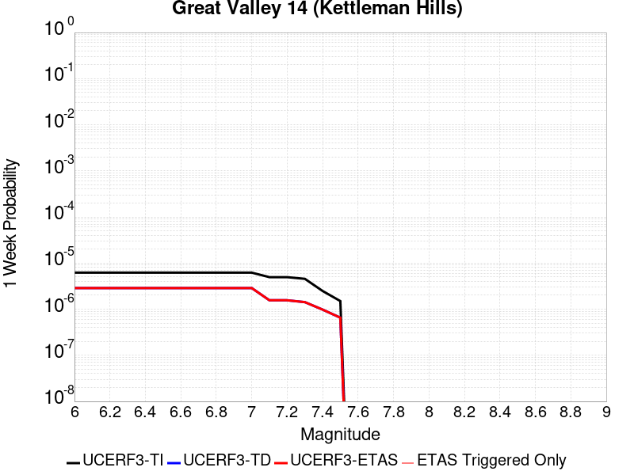 | 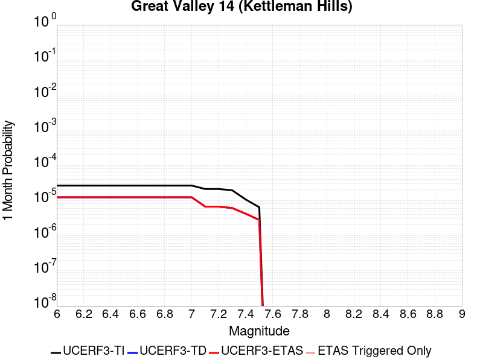 | 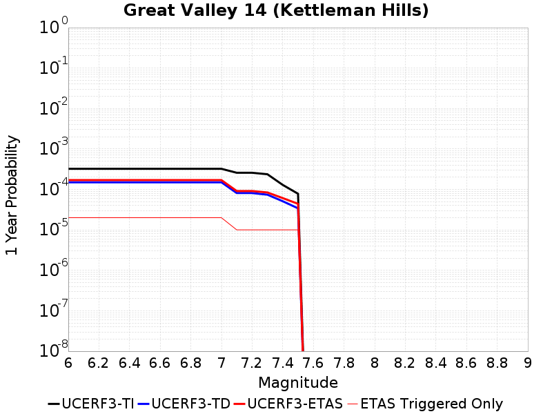 | 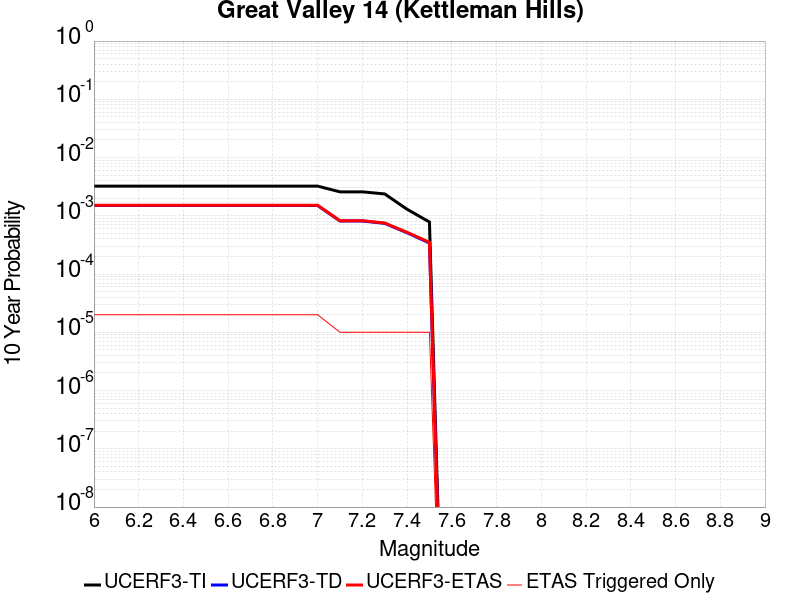 |

| Magnitude | 1 wk TI Prob | 1 wk TD Prob | 1 wk ETAS Prob | 1 wk ETAS/TD Gain | 1 wk ETAS Triggered Only | 1 mo TI Prob | 1 mo TD Prob | 1 mo ETAS Prob | 1 mo ETAS/TD Gain | 1 mo ETAS Triggered Only | 1 yr TI Prob | 1 yr TD Prob | 1 yr ETAS Prob | 1 yr ETAS/TD Gain | 1 yr ETAS Triggered Only | 10 yr TI Prob | 10 yr TD Prob | 10 yr ETAS Prob | 10 yr ETAS/TD Gain | 10 yr ETAS Triggered Only |
|-----|-----|-----|-----|-----|-----|-----|-----|-----|-----|-----|-----|-----|-----|-----|-----|-----|-----|-----|-----|-----|
| 6.0 | 6.2057843E-6 | 2.8769289E-6 | 2.8769289E-6 | 1.0 | 0.0 | 2.6595946E-5 | 1.23296495E-5 | 1.23296495E-5 | 1.0 | 0.0 | 3.2375753E-4 | 1.5010551E-4 | 1.701025E-4 | 1.1332196 | 2.0E-5 | 0.0032328626 | 0.0015002724 | 0.0015202424 | 1.0133109 | 2.0E-5 |
| 6.1 | 6.2057843E-6 | 2.8769289E-6 | 2.8769289E-6 | 1.0 | 0.0 | 2.6595946E-5 | 1.23296495E-5 | 1.23296495E-5 | 1.0 | 0.0 | 3.2375753E-4 | 1.5010551E-4 | 1.701025E-4 | 1.1332196 | 2.0E-5 | 0.0032328626 | 0.0015002724 | 0.0015202424 | 1.0133109 | 2.0E-5 |
| 6.2 | 6.2057843E-6 | 2.8769289E-6 | 2.8769289E-6 | 1.0 | 0.0 | 2.6595946E-5 | 1.23296495E-5 | 1.23296495E-5 | 1.0 | 0.0 | 3.2375753E-4 | 1.5010551E-4 | 1.701025E-4 | 1.1332196 | 2.0E-5 | 0.0032328626 | 0.0015002724 | 0.0015202424 | 1.0133109 | 2.0E-5 |
| 6.3 | 6.2057843E-6 | 2.8769289E-6 | 2.8769289E-6 | 1.0 | 0.0 | 2.6595946E-5 | 1.23296495E-5 | 1.23296495E-5 | 1.0 | 0.0 | 3.2375753E-4 | 1.5010551E-4 | 1.701025E-4 | 1.1332196 | 2.0E-5 | 0.0032328626 | 0.0015002724 | 0.0015202424 | 1.0133109 | 2.0E-5 |
| 6.4 | 6.2057843E-6 | 2.8769289E-6 | 2.8769289E-6 | 1.0 | 0.0 | 2.6595946E-5 | 1.23296495E-5 | 1.23296495E-5 | 1.0 | 0.0 | 3.2375753E-4 | 1.5010551E-4 | 1.701025E-4 | 1.1332196 | 2.0E-5 | 0.0032328626 | 0.0015002724 | 0.0015202424 | 1.0133109 | 2.0E-5 |
| 6.5 | 6.2057843E-6 | 2.8769289E-6 | 2.8769289E-6 | 1.0 | 0.0 | 2.6595946E-5 | 1.23296495E-5 | 1.23296495E-5 | 1.0 | 0.0 | 3.2375753E-4 | 1.5010551E-4 | 1.701025E-4 | 1.1332196 | 2.0E-5 | 0.0032328626 | 0.0015002724 | 0.0015202424 | 1.0133109 | 2.0E-5 |
| 6.6 | 6.2057843E-6 | 2.8769289E-6 | 2.8769289E-6 | 1.0 | 0.0 | 2.6595946E-5 | 1.23296495E-5 | 1.23296495E-5 | 1.0 | 0.0 | 3.2375753E-4 | 1.5010551E-4 | 1.701025E-4 | 1.1332196 | 2.0E-5 | 0.0032328626 | 0.0015002724 | 0.0015202424 | 1.0133109 | 2.0E-5 |
| 6.7 | 6.2057843E-6 | 2.8769289E-6 | 2.8769289E-6 | 1.0 | 0.0 | 2.6595946E-5 | 1.23296495E-5 | 1.23296495E-5 | 1.0 | 0.0 | 3.2375753E-4 | 1.5010551E-4 | 1.701025E-4 | 1.1332196 | 2.0E-5 | 0.0032328626 | 0.0015002724 | 0.0015202424 | 1.0133109 | 2.0E-5 |
| 6.8 | 6.2057843E-6 | 2.8769289E-6 | 2.8769289E-6 | 1.0 | 0.0 | 2.6595946E-5 | 1.23296495E-5 | 1.23296495E-5 | 1.0 | 0.0 | 3.2375753E-4 | 1.5010551E-4 | 1.701025E-4 | 1.1332196 | 2.0E-5 | 0.0032328626 | 0.0015002724 | 0.0015202424 | 1.0133109 | 2.0E-5 |
| 6.9 | 6.2057843E-6 | 2.8769289E-6 | 2.8769289E-6 | 1.0 | 0.0 | 2.6595946E-5 | 1.23296495E-5 | 1.23296495E-5 | 1.0 | 0.0 | 3.2375753E-4 | 1.5010551E-4 | 1.701025E-4 | 1.1332196 | 2.0E-5 | 0.0032328626 | 0.0015002724 | 0.0015202424 | 1.0133109 | 2.0E-5 |
| 7.0 | 6.2057843E-6 | 2.8769289E-6 | 2.8769289E-6 | 1.0 | 0.0 | 2.6595946E-5 | 1.23296495E-5 | 1.23296495E-5 | 1.0 | 0.0 | 3.2375753E-4 | 1.5010551E-4 | 1.701025E-4 | 1.1332196 | 2.0E-5 | 0.0032328626 | 0.0015002724 | 0.0015202424 | 1.0133109 | 2.0E-5 |
| 7.1 | 4.95113E-6 | 1.5606703E-6 | 1.5606703E-6 | 1.0 | 0.0 | 2.1218955E-5 | 6.688571E-6 | 6.688571E-6 | 1.0 | 0.0 | 2.5831014E-4 | 8.14305E-5 | 9.142969E-5 | 1.1227942 | 1.0E-5 | 0.0025801011 | 8.140256E-4 | 8.2401745E-4 | 1.0122746 | 1.0E-5 |
| 7.2 | 4.95113E-6 | 1.5606703E-6 | 1.5606703E-6 | 1.0 | 0.0 | 2.1218955E-5 | 6.688571E-6 | 6.688571E-6 | 1.0 | 0.0 | 2.5831014E-4 | 8.14305E-5 | 9.142969E-5 | 1.1227942 | 1.0E-5 | 0.0025801011 | 8.140256E-4 | 8.2401745E-4 | 1.0122746 | 1.0E-5 |
| 7.3 | 4.5549086E-6 | 1.4226747E-6 | 1.4226747E-6 | 1.0 | 0.0 | 1.9520892E-5 | 6.0971643E-6 | 6.0971643E-6 | 1.0 | 0.0 | 2.3764092E-4 | 7.4230615E-5 | 8.422987E-5 | 1.1347053 | 1.0E-5 | 0.0023738695 | 7.4207474E-4 | 7.5206737E-4 | 1.0134658 | 1.0E-5 |
| 7.4 | 2.4837766E-6 | 9.800737E-7 | 9.800737E-7 | 1.0 | 0.0 | 1.0644713E-5 | 4.2003094E-6 | 4.2003094E-6 | 1.0 | 0.0 | 1.2959167E-4 | 5.113763E-5 | 6.113712E-5 | 1.1955407 | 1.0E-5 | 0.0012951613 | 5.1126524E-4 | 5.2126014E-4 | 1.0195494 | 1.0E-5 |
| 7.5 | 1.5002679E-6 | 6.546236E-7 | 6.546236E-7 | 1.0 | 0.0 | 6.4297037E-6 | 2.805527E-6 | 2.805527E-6 | 1.0 | 0.0 | 7.827883E-5 | 3.4156797E-5 | 4.4156455E-5 | 1.2927575 | 1.0E-5 | 7.825126E-4 | 3.4151963E-4 | 3.515162E-4 | 1.0292709 | 1.0E-5 |

## Pinto Mtn
*[(top)](#table-of-contents)*

| 1 Week | 1 Month | 1 Year | 10 Year |
|-----|-----|-----|-----|
| 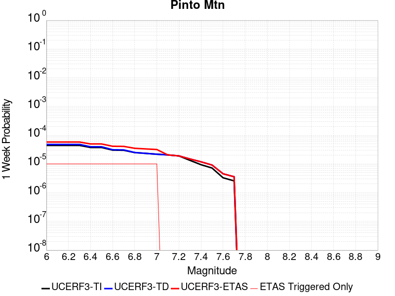 | 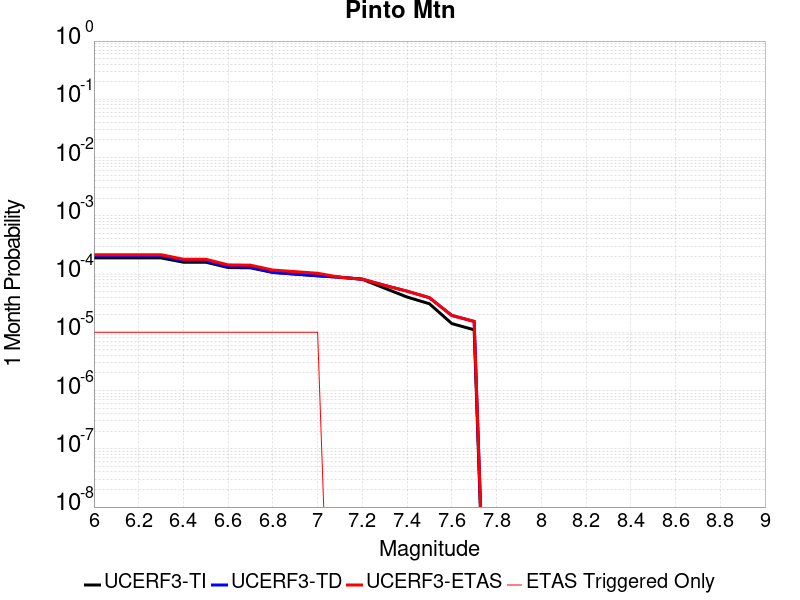 | 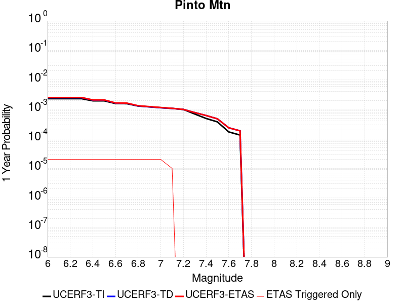 | 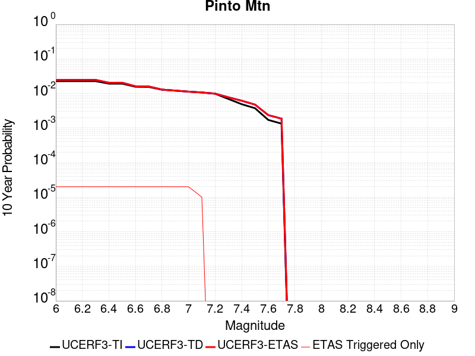 |

| Magnitude | 1 wk TI Prob | 1 wk TD Prob | 1 wk ETAS Prob | 1 wk ETAS/TD Gain | 1 wk ETAS Triggered Only | 1 mo TI Prob | 1 mo TD Prob | 1 mo ETAS Prob | 1 mo ETAS/TD Gain | 1 mo ETAS Triggered Only | 1 yr TI Prob | 1 yr TD Prob | 1 yr ETAS Prob | 1 yr ETAS/TD Gain | 1 yr ETAS Triggered Only | 10 yr TI Prob | 10 yr TD Prob | 10 yr ETAS Prob | 10 yr ETAS/TD Gain | 10 yr ETAS Triggered Only |
|-----|-----|-----|-----|-----|-----|-----|-----|-----|-----|-----|-----|-----|-----|-----|-----|-----|-----|-----|-----|-----|
| 6.0 | 4.4194956E-5 | 4.7854977E-5 | 5.7854497E-5 | 1.2089547 | 1.0E-5 | 1.893932E-4 | 2.0507757E-4 | 2.1507552E-4 | 1.0487521 | 1.0E-5 | 0.0023034236 | 0.002494125 | 0.002514075 | 1.0079988 | 2.0E-5 | 0.022796938 | 0.024678836 | 0.024698343 | 1.0007904 | 2.0E-5 |
| 6.1 | 4.4194956E-5 | 4.7854977E-5 | 5.7854497E-5 | 1.2089547 | 1.0E-5 | 1.893932E-4 | 2.0507757E-4 | 2.1507552E-4 | 1.0487521 | 1.0E-5 | 0.0023034236 | 0.002494125 | 0.002514075 | 1.0079988 | 2.0E-5 | 0.022796938 | 0.024678836 | 0.024698343 | 1.0007904 | 2.0E-5 |
| 6.2 | 4.4194956E-5 | 4.7854977E-5 | 5.7854497E-5 | 1.2089547 | 1.0E-5 | 1.893932E-4 | 2.0507757E-4 | 2.1507552E-4 | 1.0487521 | 1.0E-5 | 0.0023034236 | 0.002494125 | 0.002514075 | 1.0079988 | 2.0E-5 | 0.022796938 | 0.024678836 | 0.024698343 | 1.0007904 | 2.0E-5 |
| 6.3 | 4.4194956E-5 | 4.7854977E-5 | 5.7854497E-5 | 1.2089547 | 1.0E-5 | 1.893932E-4 | 2.0507757E-4 | 2.1507552E-4 | 1.0487521 | 1.0E-5 | 0.0023034236 | 0.002494125 | 0.002514075 | 1.0079988 | 2.0E-5 | 0.022796938 | 0.024678836 | 0.024698343 | 1.0007904 | 2.0E-5 |
| 6.4 | 3.729929E-5 | 3.960436E-5 | 4.9603965E-5 | 1.2524874 | 1.0E-5 | 1.5984432E-4 | 1.6972247E-4 | 1.7972077E-4 | 1.0589098 | 1.0E-5 | 0.0019443673 | 0.0020645063 | 0.002084465 | 1.0096675 | 2.0E-5 | 0.019274427 | 0.020463292 | 0.020482883 | 1.0009574 | 2.0E-5 |
| 6.5 | 3.729929E-5 | 3.960436E-5 | 4.9603965E-5 | 1.2524874 | 1.0E-5 | 1.5984432E-4 | 1.6972247E-4 | 1.7972077E-4 | 1.0589098 | 1.0E-5 | 0.0019443673 | 0.0020645063 | 0.002084465 | 1.0096675 | 2.0E-5 | 0.019274427 | 0.020463292 | 0.020482883 | 1.0009574 | 2.0E-5 |
| 6.6 | 3.0204548E-5 | 3.1206302E-5 | 4.120599E-5 | 1.3204381 | 1.0E-5 | 1.2944164E-4 | 1.3373463E-4 | 1.437333E-4 | 1.074765 | 1.0E-5 | 0.0015748127 | 0.0016270377 | 0.0016470052 | 1.0122722 | 2.0E-5 | 0.015636992 | 0.016155124 | 0.0161748 | 1.001218 | 2.0E-5 |
| 6.7 | 2.9857754E-5 | 3.081568E-5 | 4.0815372E-5 | 1.3245001 | 1.0E-5 | 1.2795553E-4 | 1.3206071E-4 | 1.4205939E-4 | 1.0757128 | 1.0E-5 | 0.0015567453 | 0.0016066879 | 0.0016266558 | 1.0124279 | 2.0E-5 | 0.015458848 | 0.015954562 | 0.015974242 | 1.0012336 | 2.0E-5 |
| 6.8 | 2.4819734E-5 | 2.501026E-5 | 3.5010013E-5 | 1.3998259 | 1.0E-5 | 1.0636595E-4 | 1.0718255E-4 | 1.1718148E-4 | 1.0932888 | 1.0E-5 | 0.0012942362 | 0.001304188 | 0.001324162 | 1.0153152 | 2.0E-5 | 0.012867244 | 0.012967709 | 0.012987451 | 1.0015223 | 2.0E-5 |
| 6.9 | 2.331124E-5 | 2.333852E-5 | 3.333829E-5 | 1.4284662 | 1.0E-5 | 9.990149E-5 | 1.0001851E-4 | 1.1001751E-4 | 1.0999715 | 1.0E-5 | 0.001215622 | 0.0012170655 | 0.0012370411 | 1.016413 | 2.0E-5 | 0.012089936 | 0.012106193 | 0.012125951 | 1.0016321 | 2.0E-5 |
| 7.0 | 2.1818534E-5 | 2.1761633E-5 | 3.1761414E-5 | 1.4595144 | 1.0E-5 | 9.3504656E-5 | 9.326092E-5 | 1.0325999E-4 | 1.107216 | 1.0E-5 | 0.0011378246 | 0.0011348801 | 0.0011548573 | 1.017603 | 2.0E-5 | 0.011320163 | 0.011292947 | 0.011312722 | 1.0017511 | 2.0E-5 |
| 7.1 | 2.066081E-5 | 2.0541262E-5 | 2.0541262E-5 | 1.0 | 0.0 | 8.854332E-5 | 8.803112E-5 | 8.803112E-5 | 1.0 | 0.0 | 0.0010774818 | 0.0010712715 | 0.0010812607 | 1.0093247 | 1.0E-5 | 0.010722724 | 0.010663125 | 0.010673018 | 1.0009278 | 1.0E-5 |
| 7.2 | 1.8990233E-5 | 1.905453E-5 | 1.905453E-5 | 1.0 | 0.0 | 8.138417E-5 | 8.1659826E-5 | 8.1659826E-5 | 1.0 | 0.0 | 9.904018E-4 | 9.937743E-4 | 9.937743E-4 | 1.0 | 0.0 | 0.009859995 | 0.009895301 | 0.009895301 | 1.0 | 0.0 |
| 7.3 | 1.3335872E-5 | 1.4907134E-5 | 1.4907134E-5 | 1.0 | 0.0 | 5.7152483E-5 | 6.3886226E-5 | 6.3886226E-5 | 1.0 | 0.0 | 6.956093E-4 | 7.7755E-4 | 7.7755E-4 | 1.0 | 0.0 | 0.006934359 | 0.007749594 | 0.007749594 | 1.0 | 0.0 |
| 7.4 | 9.414066E-6 | 1.1861335E-5 | 1.1861335E-5 | 1.0 | 0.0 | 4.0345374E-5 | 5.0833354E-5 | 5.0833354E-5 | 1.0 | 0.0 | 4.910942E-4 | 6.187298E-4 | 6.187298E-4 | 1.0 | 0.0 | 0.0049001034 | 0.0061710197 | 0.0061710197 | 1.0 | 0.0 |
| 7.5 | 7.2101157E-6 | 9.158601E-6 | 9.158601E-6 | 1.0 | 0.0 | 3.090013E-5 | 3.92506E-5 | 3.92506E-5 | 1.0 | 0.0 | 3.7614413E-4 | 4.7777907E-4 | 4.7777907E-4 | 1.0 | 0.0 | 0.0037550807 | 0.0047682943 | 0.0047682943 | 1.0 | 0.0 |
| 7.6 | 3.296375E-6 | 4.5459956E-6 | 4.5459956E-6 | 1.0 | 0.0 | 1.4127245E-5 | 1.94827E-5 | 1.94827E-5 | 1.0 | 0.0 | 1.7198564E-4 | 2.3717746E-4 | 2.3717746E-4 | 1.0 | 0.0 | 0.0017185259 | 0.0023693808 | 0.0023693808 | 1.0 | 0.0 |
| 7.7 | 2.5741092E-6 | 3.5848898E-6 | 3.5848898E-6 | 1.0 | 0.0 | 1.103185E-5 | 1.536373E-5 | 1.536373E-5 | 1.0 | 0.0 | 1.3430449E-4 | 1.8703869E-4 | 1.8703869E-4 | 1.0 | 0.0 | 0.0013422335 | 0.0018689425 | 0.0018689425 | 1.0 | 0.0 |

## Hayward (So) 2011 CFM
*[(top)](#table-of-contents)*

| 1 Week | 1 Month | 1 Year | 10 Year |
|-----|-----|-----|-----|
| 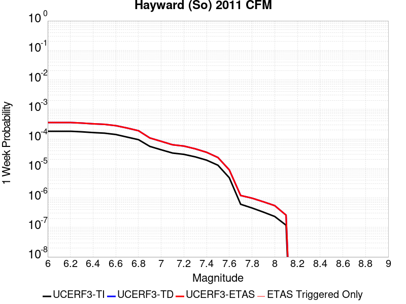 | 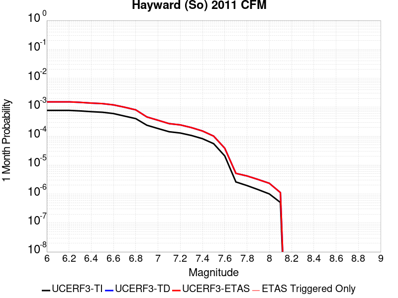 | 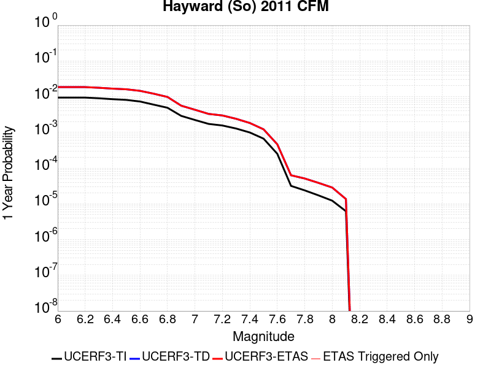 | 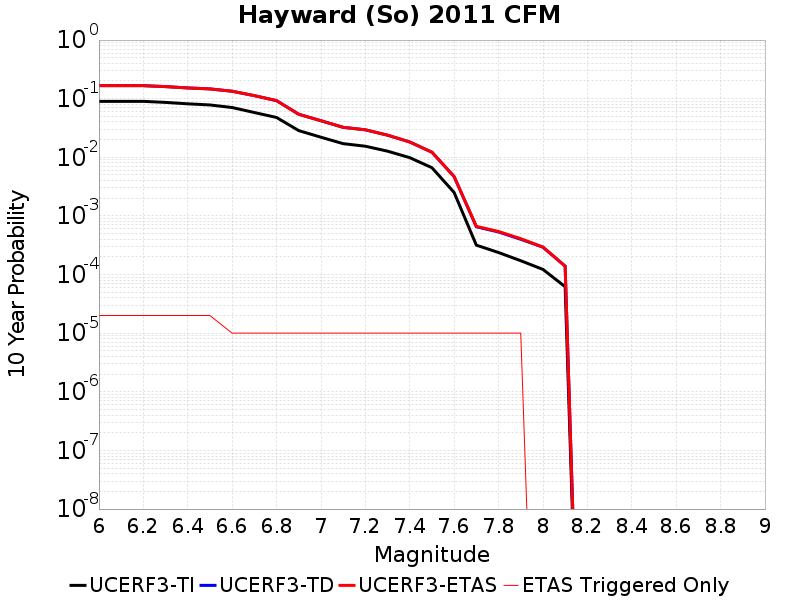 |

| Magnitude | 1 wk TI Prob | 1 wk TD Prob | 1 wk ETAS Prob | 1 wk ETAS/TD Gain | 1 wk ETAS Triggered Only | 1 mo TI Prob | 1 mo TD Prob | 1 mo ETAS Prob | 1 mo ETAS/TD Gain | 1 mo ETAS Triggered Only | 1 yr TI Prob | 1 yr TD Prob | 1 yr ETAS Prob | 1 yr ETAS/TD Gain | 1 yr ETAS Triggered Only | 10 yr TI Prob | 10 yr TD Prob | 10 yr ETAS Prob | 10 yr ETAS/TD Gain | 10 yr ETAS Triggered Only |
|-----|-----|-----|-----|-----|-----|-----|-----|-----|-----|-----|-----|-----|-----|-----|-----|-----|-----|-----|-----|-----|
| 6.0 | 1.8091932E-4 | 3.570851E-4 | 3.570851E-4 | 1.0 | 0.0 | 7.751381E-4 | 0.0015294772 | 0.0015294772 | 1.0 | 0.0 | 0.00939654 | 0.018464798 | 0.018464798 | 1.0 | 0.0 | 0.090090066 | 0.16674356 | 0.16676022 | 1.0000999 | 2.0E-5 |
| 6.1 | 1.8091932E-4 | 3.570851E-4 | 3.570851E-4 | 1.0 | 0.0 | 7.751381E-4 | 0.0015294772 | 0.0015294772 | 1.0 | 0.0 | 0.00939654 | 0.018464798 | 0.018464798 | 1.0 | 0.0 | 0.090090066 | 0.16674356 | 0.16676022 | 1.0000999 | 2.0E-5 |
| 6.2 | 1.8091932E-4 | 3.570851E-4 | 3.570851E-4 | 1.0 | 0.0 | 7.751381E-4 | 0.0015294772 | 0.0015294772 | 1.0 | 0.0 | 0.00939654 | 0.018464798 | 0.018464798 | 1.0 | 0.0 | 0.090090066 | 0.16674356 | 0.16676022 | 1.0000999 | 2.0E-5 |
| 6.3 | 1.7322872E-4 | 3.4265363E-4 | 3.4265363E-4 | 1.0 | 0.0 | 7.4219756E-4 | 0.0014676987 | 0.0014676987 | 1.0 | 0.0 | 0.0089988755 | 0.017725095 | 0.017725095 | 1.0 | 0.0 | 0.08643075 | 0.16067901 | 0.16069579 | 1.0001044 | 2.0E-5 |
| 6.4 | 1.6334097E-4 | 3.234704E-4 | 3.234704E-4 | 1.0 | 0.0 | 6.998449E-4 | 0.0013855739 | 0.0013855739 | 1.0 | 0.0 | 0.008487372 | 0.016740888 | 0.016740888 | 1.0 | 0.0 | 0.081704415 | 0.15256745 | 0.15258439 | 1.0001111 | 2.0E-5 |
| 6.5 | 1.5600289E-4 | 3.1021677E-4 | 3.1021677E-4 | 1.0 | 0.0 | 6.684125E-4 | 0.0013288313 | 0.0013288313 | 1.0 | 0.0 | 0.008107598 | 0.016060397 | 0.016060397 | 1.0 | 0.0 | 0.078181036 | 0.14684398 | 0.14686105 | 1.0001162 | 2.0E-5 |
| 6.6 | 1.4046066E-4 | 2.803561E-4 | 2.803561E-4 | 1.0 | 0.0 | 6.018354E-4 | 0.0012009796 | 0.0012009796 | 1.0 | 0.0 | 0.0073027555 | 0.014525396 | 0.014525396 | 1.0 | 0.0 | 0.07067384 | 0.13393071 | 0.13393939 | 1.0000646 | 1.0E-5 |
| 6.7 | 1.14696966E-4 | 2.3273918E-4 | 2.3273918E-4 | 1.0 | 0.0 | 4.914658E-4 | 9.970774E-4 | 9.970774E-4 | 1.0 | 0.0 | 0.0059671924 | 0.012072912 | 0.012072912 | 1.0 | 0.0 | 0.058094822 | 0.11275685 | 0.112765715 | 1.0000787 | 1.0E-5 |
| 6.8 | 9.3874296E-5 | 1.8863498E-4 | 1.8863498E-4 | 1.0 | 0.0 | 4.0225635E-4 | 8.081888E-4 | 8.081888E-4 | 1.0 | 0.0 | 0.0048864787 | 0.00979604 | 0.00979604 | 1.0 | 0.0 | 0.047804173 | 0.09260729 | 0.092616364 | 1.000098 | 1.0E-5 |
| 6.9 | 5.551852E-5 | 1.0730836E-4 | 1.0730836E-4 | 1.0 | 0.0 | 2.3791482E-4 | 4.5981252E-4 | 4.5981252E-4 | 1.0 | 0.0 | 0.0028927654 | 0.005583966 | 0.005583966 | 1.0 | 0.0 | 0.028553981 | 0.05425168 | 0.054261137 | 1.0001743 | 1.0E-5 |
| 7.0 | 4.2662363E-5 | 8.247546E-5 | 8.247546E-5 | 1.0 | 0.0 | 1.8282588E-4 | 3.5341876E-4 | 3.5341876E-4 | 1.0 | 0.0 | 0.0022236328 | 0.0042944574 | 0.0042944574 | 1.0 | 0.0 | 0.022015138 | 0.042069644 | 0.04207922 | 1.0002277 | 1.0E-5 |
| 7.1 | 3.305886E-5 | 6.302802E-5 | 6.302802E-5 | 1.0 | 0.0 | 1.4167312E-4 | 2.7009222E-4 | 2.7009222E-4 | 1.0 | 0.0 | 0.0017235056 | 0.0032834332 | 0.0032834332 | 1.0 | 0.0 | 0.017101998 | 0.032457147 | 0.03246682 | 1.0002981 | 1.0E-5 |
| 7.2 | 2.9856887E-5 | 5.7022145E-5 | 5.7022145E-5 | 1.0 | 0.0 | 1.2795182E-4 | 2.4435783E-4 | 2.4435783E-4 | 1.0 | 0.0 | 0.0015567001 | 0.0029710145 | 0.0029710145 | 1.0 | 0.0 | 0.015458403 | 0.02945766 | 0.029467367 | 1.0003295 | 1.0E-5 |
| 7.3 | 2.4559737E-5 | 4.5998244E-5 | 4.5998244E-5 | 1.0 | 0.0 | 1.0525176E-4 | 1.9712052E-4 | 1.9712052E-4 | 1.0 | 0.0 | 0.0012806869 | 0.0023973137 | 0.0023973137 | 1.0 | 0.0 | 0.012733313 | 0.023861052 | 0.023870815 | 1.0004091 | 1.0E-5 |
| 7.4 | 1.9002231E-5 | 3.5055553E-5 | 3.5055553E-5 | 1.0 | 0.0 | 8.143559E-5 | 1.5022949E-4 | 1.5022949E-4 | 1.0 | 0.0 | 9.910273E-4 | 0.0018275194 | 0.0018275194 | 1.0 | 0.0 | 0.009866194 | 0.01826134 | 0.018271156 | 1.0005376 | 1.0E-5 |
| 7.5 | 1.2783333E-5 | 2.3332937E-5 | 2.3332937E-5 | 1.0 | 0.0 | 5.4784563E-5 | 9.99945E-5 | 9.99945E-5 | 1.0 | 0.0 | 6.667979E-4 | 0.0012167589 | 0.0012167589 | 1.0 | 0.0 | 0.006648007 | 0.01221099 | 0.012220868 | 1.000809 | 1.0E-5 |
| 7.6 | 4.8149627E-6 | 8.88889E-6 | 8.88889E-6 | 1.0 | 0.0 | 2.063539E-5 | 3.8094695E-5 | 3.8094695E-5 | 1.0 | 0.0 | 2.5120692E-4 | 4.6370542E-4 | 4.6370542E-4 | 1.0 | 0.0 | 0.0025092314 | 0.0046819067 | 0.0046918597 | 1.0021259 | 1.0E-5 |
| 7.7 | 6.0838227E-7 | 1.2061444E-6 | 1.2061444E-6 | 1.0 | 0.0 | 2.6073499E-6 | 5.1691795E-6 | 5.1691795E-6 | 1.0 | 0.0 | 3.174402E-5 | 6.293295E-5 | 6.293295E-5 | 1.0 | 0.0 | 3.1739488E-4 | 6.531647E-4 | 6.631582E-4 | 1.0153 | 1.0E-5 |
| 7.8 | 4.5542808E-7 | 9.796291E-7 | 9.796291E-7 | 1.0 | 0.0 | 1.9518332E-6 | 4.1984035E-6 | 4.1984035E-6 | 1.0 | 0.0 | 2.376331E-5 | 5.111437E-5 | 5.111437E-5 | 1.0 | 0.0 | 2.3760769E-4 | 5.3233624E-4 | 5.4233096E-4 | 1.0187751 | 1.0E-5 |
| 7.9 | 3.3016747E-7 | 7.389384E-7 | 7.389384E-7 | 1.0 | 0.0 | 1.4150027E-6 | 3.166875E-6 | 3.166875E-6 | 1.0 | 0.0 | 1.7227521E-5 | 3.8556023E-5 | 3.8556023E-5 | 1.0 | 0.0 | 1.7226185E-4 | 3.9945473E-4 | 4.0945076E-4 | 1.0250242 | 1.0E-5 |
| 8.0 | 2.347038E-7 | 5.473656E-7 | 5.473656E-7 | 1.0 | 0.0 | 1.0058731E-6 | 2.3458504E-6 | 2.3458504E-6 | 1.0 | 0.0 | 1.2246436E-5 | 2.8560356E-5 | 2.8560356E-5 | 1.0 | 0.0 | 1.2245761E-4 | 2.9365698E-4 | 2.9365698E-4 | 1.0 | 0.0 |
| 8.1 | 1.18822804E-7 | 2.606915E-7 | 2.606915E-7 | 1.0 | 0.0 | 5.092405E-7 | 1.1172488E-6 | 1.1172488E-6 | 1.0 | 0.0 | 6.1999854E-6 | 1.360242E-5 | 1.360242E-5 | 1.0 | 0.0 | 6.199812E-5 | 1.3922849E-4 | 1.3922849E-4 | 1.0 | 0.0 |

## San Andreas (Santa Cruz Mts) 2011 CFM
*[(top)](#table-of-contents)*

| 1 Week | 1 Month | 1 Year | 10 Year |
|-----|-----|-----|-----|
| 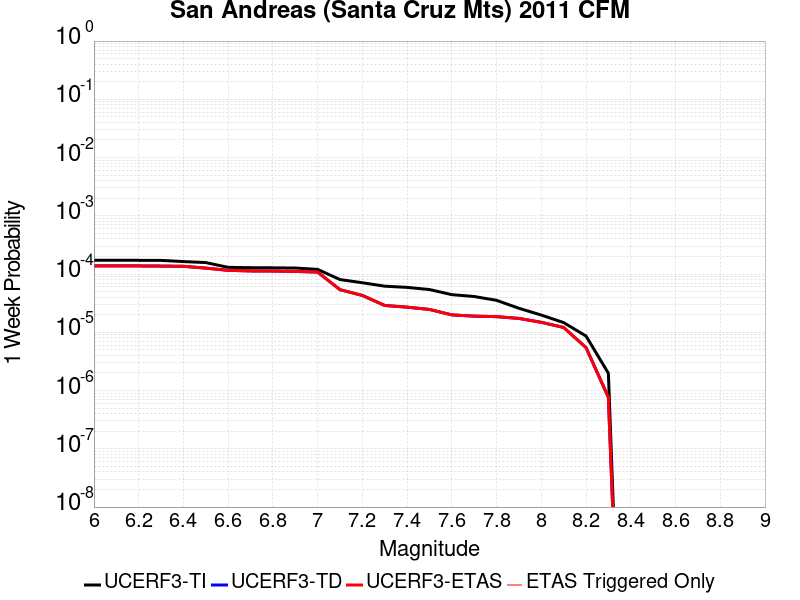 | 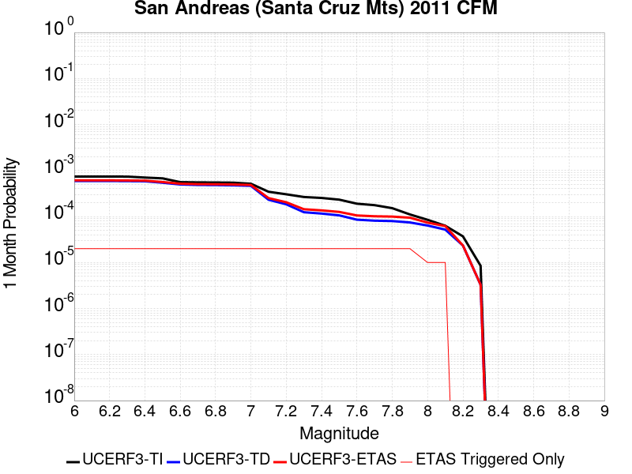 | 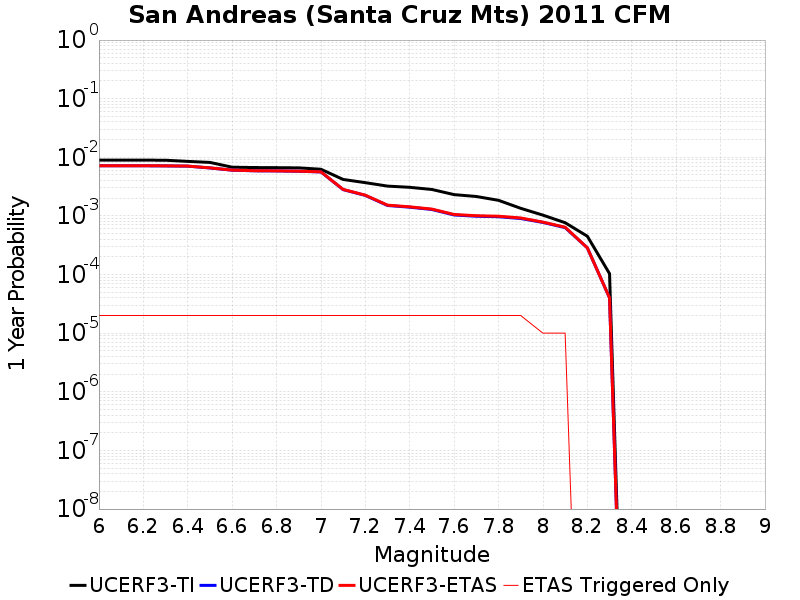 | 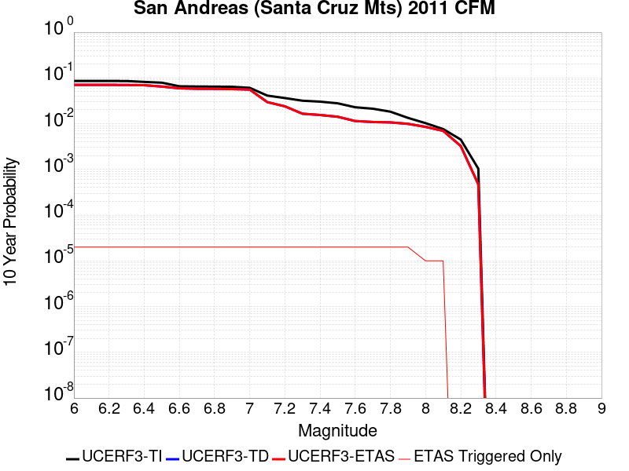 |

| Magnitude | 1 wk TI Prob | 1 wk TD Prob | 1 wk ETAS Prob | 1 wk ETAS/TD Gain | 1 wk ETAS Triggered Only | 1 mo TI Prob | 1 mo TD Prob | 1 mo ETAS Prob | 1 mo ETAS/TD Gain | 1 mo ETAS Triggered Only | 1 yr TI Prob | 1 yr TD Prob | 1 yr ETAS Prob | 1 yr ETAS/TD Gain | 1 yr ETAS Triggered Only | 10 yr TI Prob | 10 yr TD Prob | 10 yr ETAS Prob | 10 yr ETAS/TD Gain | 10 yr ETAS Triggered Only |
|-----|-----|-----|-----|-----|-----|-----|-----|-----|-----|-----|-----|-----|-----|-----|-----|-----|-----|-----|-----|-----|
| 6.0 | 1.7221631E-4 | 1.3796914E-4 | 1.3796914E-4 | 1.0 | 0.0 | 7.378611E-4 | 5.9116434E-4 | 6.111525E-4 | 1.0338116 | 2.0E-5 | 0.008946515 | 0.007174063 | 0.0071939197 | 1.0027678 | 2.0E-5 | 0.08594794 | 0.07057366 | 0.07059225 | 1.0002633 | 2.0E-5 |
| 6.1 | 1.7221631E-4 | 1.3796914E-4 | 1.3796914E-4 | 1.0 | 0.0 | 7.378611E-4 | 5.9116434E-4 | 6.111525E-4 | 1.0338116 | 2.0E-5 | 0.008946515 | 0.007174063 | 0.0071939197 | 1.0027678 | 2.0E-5 | 0.08594794 | 0.07057366 | 0.07059225 | 1.0002633 | 2.0E-5 |
| 6.2 | 1.7221631E-4 | 1.3796914E-4 | 1.3796914E-4 | 1.0 | 0.0 | 7.378611E-4 | 5.9116434E-4 | 6.111525E-4 | 1.0338116 | 2.0E-5 | 0.008946515 | 0.007174063 | 0.0071939197 | 1.0027678 | 2.0E-5 | 0.08594794 | 0.07057366 | 0.07059225 | 1.0002633 | 2.0E-5 |
| 6.3 | 1.716926E-4 | 1.371634E-4 | 1.371634E-4 | 1.0 | 0.0 | 7.3561794E-4 | 5.8771274E-4 | 6.0770096E-4 | 1.0340102 | 2.0E-5 | 0.008919428 | 0.007132315 | 0.0071521723 | 1.0027841 | 2.0E-5 | 0.08569809 | 0.07018579 | 0.070204385 | 1.000265 | 2.0E-5 |
| 6.4 | 1.6392978E-4 | 1.3592101E-4 | 1.3592101E-4 | 1.0 | 0.0 | 7.02367E-4 | 5.8239064E-4 | 6.02379E-4 | 1.0343212 | 2.0E-5 | 0.008517839 | 0.0070679393 | 0.007087798 | 1.0028096 | 2.0E-5 | 0.08198654 | 0.06941918 | 0.069437794 | 1.0002681 | 2.0E-5 |
| 6.5 | 1.5742714E-4 | 1.2651854E-4 | 1.2651854E-4 | 1.0 | 0.0 | 6.745133E-4 | 5.4211135E-4 | 5.621005E-4 | 1.0368727 | 2.0E-5 | 0.00818132 | 0.0065805563 | 0.0066004246 | 1.0030192 | 2.0E-5 | 0.078865945 | 0.06488034 | 0.06489905 | 1.0002882 | 2.0E-5 |
| 6.6 | 1.3038084E-4 | 1.1591278E-4 | 1.1591278E-4 | 1.0 | 0.0 | 5.5865536E-4 | 4.966758E-4 | 5.1666587E-4 | 1.0402477 | 2.0E-5 | 0.006780438 | 0.006030503 | 0.0060503823 | 1.0032965 | 2.0E-5 | 0.0657725 | 0.05934223 | 0.059361044 | 1.000317 | 2.0E-5 |
| 6.7 | 1.2867592E-4 | 1.131774E-4 | 1.131774E-4 | 1.0 | 0.0 | 5.5135164E-4 | 4.849571E-4 | 5.049474E-4 | 1.0412208 | 2.0E-5 | 0.0066920654 | 0.005888607 | 0.005908489 | 1.0033764 | 2.0E-5 | 0.06494093 | 0.058053173 | 0.058072012 | 1.0003245 | 2.0E-5 |
| 6.8 | 1.2801298E-4 | 1.1255295E-4 | 1.1255295E-4 | 1.0 | 0.0 | 5.485117E-4 | 4.8228187E-4 | 5.022722E-4 | 1.0414495 | 2.0E-5 | 0.0066577005 | 0.005856212 | 0.005876095 | 1.0033952 | 2.0E-5 | 0.06461738 | 0.057767007 | 0.057785854 | 1.0003263 | 2.0E-5 |
| 6.9 | 1.269149E-4 | 1.1097489E-4 | 1.1097489E-4 | 1.0 | 0.0 | 5.4380763E-4 | 4.7552126E-4 | 4.9551175E-4 | 1.0420392 | 2.0E-5 | 0.006600777 | 0.0057743406 | 0.0057942253 | 1.0034436 | 2.0E-5 | 0.06408122 | 0.057038803 | 0.057057664 | 1.0003307 | 2.0E-5 |
| 7.0 | 1.2030331E-4 | 1.08274726E-4 | 1.08274726E-4 | 1.0 | 0.0 | 5.154837E-4 | 4.6395327E-4 | 4.83944E-4 | 1.0430878 | 2.0E-5 | 0.006257969 | 0.005634237 | 0.005654124 | 1.0035297 | 2.0E-5 | 0.06084648 | 0.055711053 | 0.05572994 | 1.000339 | 2.0E-5 |
| 7.1 | 8.049617E-5 | 5.3950283E-5 | 5.3950283E-5 | 1.0 | 0.0 | 3.4493793E-4 | 2.311952E-4 | 2.511906E-4 | 1.0864869 | 2.0E-5 | 0.0041915346 | 0.002811203 | 0.0028311468 | 1.0070944 | 2.0E-5 | 0.041133516 | 0.029630894 | 0.029650303 | 1.0006549 | 2.0E-5 |
| 7.2 | 7.093979E-5 | 4.2959055E-5 | 4.2959055E-5 | 1.0 | 0.0 | 3.0399222E-4 | 1.8409736E-4 | 2.0409368E-4 | 1.1086181 | 2.0E-5 | 0.0036948253 | 0.0022391041 | 0.0022590593 | 1.0089121 | 2.0E-5 | 0.03633994 | 0.023952473 | 0.023971993 | 1.000815 | 2.0E-5 |
| 7.3 | 6.193693E-5 | 2.8911414E-5 | 2.8911414E-5 | 1.0 | 0.0 | 2.6541698E-4 | 1.2390019E-4 | 1.438977E-4 | 1.1614002 | 2.0E-5 | 0.0032266637 | 0.0015074427 | 0.0015274126 | 1.0132475 | 2.0E-5 | 0.031802133 | 0.016508264 | 0.016527934 | 1.0011915 | 2.0E-5 |
| 7.4 | 5.906492E-5 | 2.704008E-5 | 2.704008E-5 | 1.0 | 0.0 | 2.5311083E-4 | 1.1588092E-4 | 1.358786E-4 | 1.172571 | 2.0E-5 | 0.0030772698 | 0.0014099386 | 0.0014299103 | 1.014165 | 2.0E-5 | 0.030350044 | 0.015479819 | 0.01549951 | 1.001272 | 2.0E-5 |
| 7.5 | 5.424296E-5 | 2.4693916E-5 | 2.4693916E-5 | 1.0 | 0.0 | 2.324491E-4 | 1.0582679E-4 | 1.2582466E-4 | 1.1889681 | 2.0E-5 | 0.002826395 | 0.0012876808 | 0.001307655 | 1.0155118 | 2.0E-5 | 0.027907165 | 0.014171495 | 0.014191212 | 1.0013913 | 2.0E-5 |
| 7.6 | 4.43084E-5 | 1.9917547E-5 | 1.9917547E-5 | 1.0 | 0.0 | 1.8987931E-4 | 8.535812E-5 | 1.0535641E-4 | 1.2342869 | 2.0E-5 | 0.0023093296 | 0.0010387399 | 0.0010587191 | 1.0192341 | 2.0E-5 | 0.022854783 | 0.01141974 | 0.011439511 | 1.0017314 | 2.0E-5 |
| 7.7 | 4.118098E-5 | 1.8949191E-5 | 1.8949191E-5 | 1.0 | 0.0 | 1.7647797E-4 | 8.1208294E-5 | 1.0120667E-4 | 1.2462603 | 2.0E-5 | 0.002146502 | 9.882628E-4 | 0.001008243 | 1.0202175 | 2.0E-5 | 0.021258866 | 0.010877269 | 0.010897052 | 1.0018187 | 2.0E-5 |
| 7.8 | 3.5408906E-5 | 1.8576928E-5 | 1.8576928E-5 | 1.0 | 0.0 | 1.5174363E-4 | 7.961297E-5 | 9.961138E-5 | 1.2511953 | 2.0E-5 | 0.0018459131 | 9.6885714E-4 | 9.888378E-4 | 1.0206228 | 2.0E-5 | 0.018306552 | 0.01065866 | 0.010678447 | 1.0018564 | 2.0E-5 |
| 7.9 | 2.5860836E-5 | 1.7327424E-5 | 1.7327424E-5 | 1.0 | 0.0 | 1.10827445E-4 | 7.425828E-5 | 9.425679E-5 | 1.2693102 | 2.0E-5 | 0.001348489 | 9.0371975E-4 | 9.237017E-4 | 1.0221107 | 2.0E-5 | 0.013403354 | 0.009913652 | 0.009933454 | 1.0019975 | 2.0E-5 |
| 8.0 | 1.9777332E-5 | 1.4849434E-5 | 1.4849434E-5 | 1.0 | 0.0 | 8.4757245E-5 | 6.363888E-5 | 7.363824E-5 | 1.1571267 | 1.0E-5 | 0.0010314309 | 7.7452813E-4 | 7.8452035E-4 | 1.0129011 | 1.0E-5 | 0.010266567 | 0.008514182 | 0.008524097 | 1.0011646 | 1.0E-5 |
| 8.1 | 1.468494E-5 | 1.2115455E-5 | 1.2115455E-5 | 1.0 | 0.0 | 6.293394E-5 | 5.1922347E-5 | 6.1921826E-5 | 1.1925853 | 1.0E-5 | 7.6595135E-4 | 6.319714E-4 | 6.419651E-4 | 1.0158135 | 1.0E-5 | 0.0076331664 | 0.0069734505 | 0.0069833808 | 1.001424 | 1.0E-5 |
| 8.2 | 8.63836E-6 | 5.473264E-6 | 5.473264E-6 | 1.0 | 0.0 | 3.7021015E-5 | 2.3456634E-5 | 2.3456634E-5 | 1.0 | 0.0 | 4.5063766E-4 | 2.855472E-4 | 2.855472E-4 | 1.0 | 0.0 | 0.004497249 | 0.0032479868 | 0.0032479868 | 1.0 | 0.0 |
| 8.3 | 1.983087E-6 | 7.666981E-7 | 7.666981E-7 | 1.0 | 0.0 | 8.498917E-6 | 3.285845E-6 | 3.285845E-6 | 1.0 | 0.0 | 1.034694E-4 | 4.0004445E-5 | 4.0004445E-5 | 1.0 | 0.0 | 0.0010342124 | 4.723745E-4 | 4.723745E-4 | 1.0 | 0.0 |

## San Diego Trough south
*[(top)](#table-of-contents)*

| 1 Week | 1 Month | 1 Year | 10 Year |
|-----|-----|-----|-----|
| 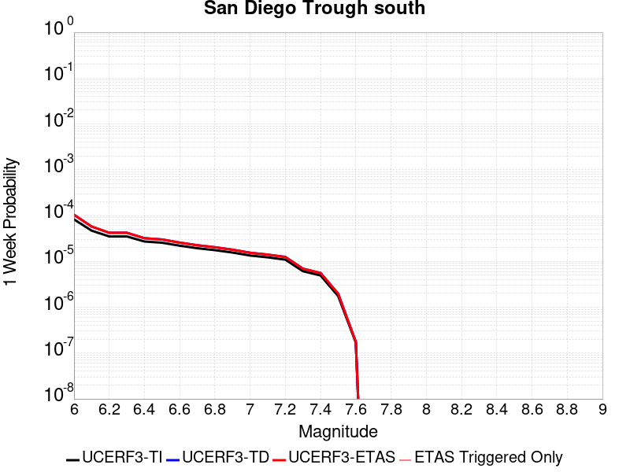 | 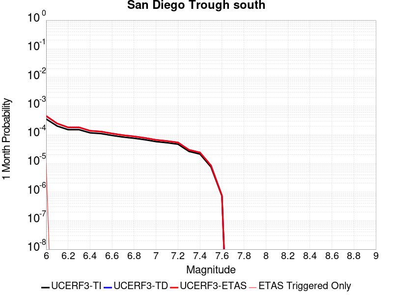 | 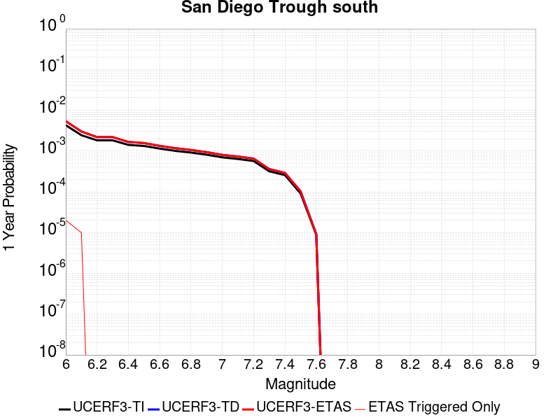 | 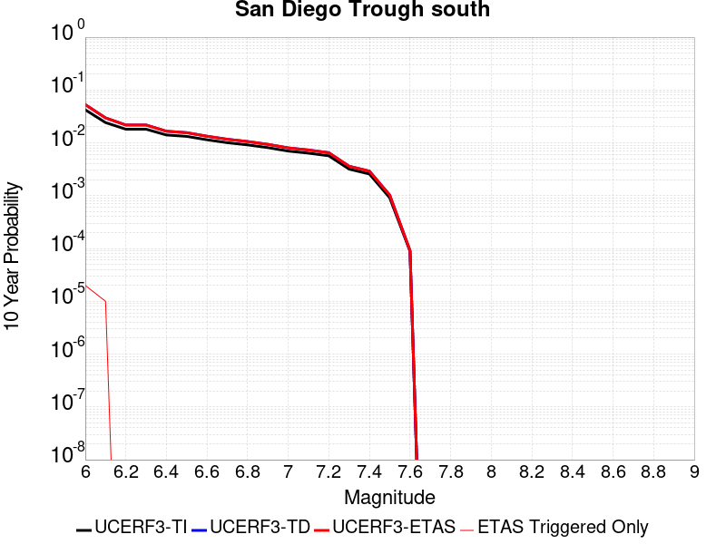 |

| Magnitude | 1 wk TI Prob | 1 wk TD Prob | 1 wk ETAS Prob | 1 wk ETAS/TD Gain | 1 wk ETAS Triggered Only | 1 mo TI Prob | 1 mo TD Prob | 1 mo ETAS Prob | 1 mo ETAS/TD Gain | 1 mo ETAS Triggered Only | 1 yr TI Prob | 1 yr TD Prob | 1 yr ETAS Prob | 1 yr ETAS/TD Gain | 1 yr ETAS Triggered Only | 10 yr TI Prob | 10 yr TD Prob | 10 yr ETAS Prob | 10 yr ETAS/TD Gain | 10 yr ETAS Triggered Only |
|-----|-----|-----|-----|-----|-----|-----|-----|-----|-----|-----|-----|-----|-----|-----|-----|-----|-----|-----|-----|-----|
| 6.0 | 8.279495E-5 | 1.04244464E-4 | 1.04244464E-4 | 1.0 | 0.0 | 3.5478722E-4 | 4.4669045E-4 | 4.56686E-4 | 1.0223769 | 1.0E-5 | 0.004310982 | 0.0054257815 | 0.005445673 | 1.0036662 | 2.0E-5 | 0.042283054 | 0.052993648 | 0.05301259 | 1.0003574 | 2.0E-5 |
| 6.1 | 4.6961468E-5 | 5.7730984E-5 | 5.7730984E-5 | 1.0 | 0.0 | 2.0124791E-4 | 2.47396E-4 | 2.47396E-4 | 1.0 | 0.0 | 0.00244744 | 0.0030080567 | 0.0030180267 | 1.0033144 | 1.0E-5 | 0.024206603 | 0.0296802 | 0.029689904 | 1.0003269 | 1.0E-5 |
| 6.2 | 3.5079658E-5 | 4.214251E-5 | 4.214251E-5 | 1.0 | 0.0 | 1.5033272E-4 | 1.8059852E-4 | 1.8059852E-4 | 1.0 | 0.0 | 0.0018287642 | 0.0021966135 | 0.0021966135 | 1.0 | 0.0 | 0.018137876 | 0.021751603 | 0.021751603 | 1.0 | 0.0 |
| 6.3 | 3.5079658E-5 | 4.214251E-5 | 4.214251E-5 | 1.0 | 0.0 | 1.5033272E-4 | 1.8059852E-4 | 1.8059852E-4 | 1.0 | 0.0 | 0.0018287642 | 0.0021966135 | 0.0021966135 | 1.0 | 0.0 | 0.018137876 | 0.021751603 | 0.021751603 | 1.0 | 0.0 |
| 6.4 | 2.7196904E-5 | 3.2087817E-5 | 3.2087817E-5 | 1.0 | 0.0 | 1.16552954E-4 | 1.3751206E-4 | 1.3751206E-4 | 1.0 | 0.0 | 0.0014181085 | 0.001672938 | 0.001672938 | 1.0 | 0.0 | 0.014090929 | 0.016604977 | 0.016604977 | 1.0 | 0.0 |
| 6.5 | 2.5584688E-5 | 3.0102241E-5 | 3.0102241E-5 | 1.0 | 0.0 | 1.0964406E-4 | 1.2900331E-4 | 1.2900331E-4 | 1.0 | 0.0 | 0.0013340989 | 0.0015694967 | 0.0015694967 | 1.0 | 0.0 | 0.013261181 | 0.015585621 | 0.015585621 | 1.0 | 0.0 |
| 6.6 | 2.2034688E-5 | 2.5743228E-5 | 2.5743228E-5 | 1.0 | 0.0 | 9.443096E-5 | 1.103235E-4 | 1.103235E-4 | 1.0 | 0.0 | 0.0011490905 | 0.0013423677 | 0.0013423677 | 1.0 | 0.0 | 0.011431668 | 0.013343569 | 0.013343569 | 1.0 | 0.0 |
| 6.7 | 1.9394853E-5 | 2.2542172E-5 | 2.2542172E-5 | 1.0 | 0.0 | 8.311815E-5 | 9.660576E-5 | 9.660576E-5 | 1.0 | 0.0 | 0.0010114936 | 0.0011755457 | 0.0011755457 | 1.0 | 0.0 | 0.01006902 | 0.011693979 | 0.011693979 | 1.0 | 0.0 |
| 6.8 | 1.7615313E-5 | 2.0403546E-5 | 2.0403546E-5 | 1.0 | 0.0 | 7.549201E-5 | 8.744086E-5 | 8.744086E-5 | 1.0 | 0.0 | 9.1872766E-4 | 0.0010640769 | 0.0010640769 | 1.0 | 0.0 | 0.009149387 | 0.010590386 | 0.010590386 | 1.0 | 0.0 |
| 6.9 | 1.5621423E-5 | 1.8026427E-5 | 1.8026427E-5 | 1.0 | 0.0 | 6.6947236E-5 | 7.725385E-5 | 7.725385E-5 | 1.0 | 0.0 | 8.147778E-4 | 9.4016327E-4 | 9.4016327E-4 | 1.0 | 0.0 | 0.008117969 | 0.009362303 | 0.009362303 | 1.0 | 0.0 |
| 7.0 | 1.3444376E-5 | 1.5448348E-5 | 1.5448348E-5 | 1.0 | 0.0 | 5.7617483E-5 | 6.620554E-5 | 6.620554E-5 | 1.0 | 0.0 | 7.0126704E-4 | 8.057571E-4 | 8.057571E-4 | 1.0 | 0.0 | 0.006990582 | 0.008028689 | 0.008028689 | 1.0 | 0.0 |
| 7.1 | 1.2268361E-5 | 1.4073263E-5 | 1.4073263E-5 | 1.0 | 0.0 | 5.2577634E-5 | 6.0312603E-5 | 6.0312603E-5 | 1.0 | 0.0 | 6.399447E-4 | 7.340612E-4 | 7.340612E-4 | 1.0 | 0.0 | 0.0063810493 | 0.0073166694 | 0.0073166694 | 1.0 | 0.0 |
| 7.2 | 1.0922655E-5 | 1.2513768E-5 | 1.2513768E-5 | 1.0 | 0.0 | 4.681054E-5 | 5.3629345E-5 | 5.3629345E-5 | 1.0 | 0.0 | 5.697693E-4 | 6.527442E-4 | 6.527442E-4 | 1.0 | 0.0 | 0.0056831064 | 0.0065085497 | 0.0065085497 | 1.0 | 0.0 |
| 7.3 | 6.1106753E-6 | 6.929029E-6 | 6.929029E-6 | 1.0 | 0.0 | 2.6188345E-5 | 2.9695504E-5 | 2.9695504E-5 | 1.0 | 0.0 | 3.1879646E-4 | 3.614832E-4 | 3.614832E-4 | 1.0 | 0.0 | 0.0031833951 | 0.0036089972 | 0.0036089972 | 1.0 | 0.0 |
| 7.4 | 4.933187E-6 | 5.589636E-6 | 5.589636E-6 | 1.0 | 0.0 | 2.114206E-5 | 2.3955366E-5 | 2.3955366E-5 | 1.0 | 0.0 | 2.5737417E-4 | 2.9161794E-4 | 2.9161794E-4 | 1.0 | 0.0 | 0.002570763 | 0.002912394 | 0.002912394 | 1.0 | 0.0 |
| 7.5 | 1.7489613E-6 | 1.969706E-6 | 1.969706E-6 | 1.0 | 0.0 | 7.495527E-6 | 8.4415715E-6 | 8.4415715E-6 | 1.0 | 0.0 | 9.125422E-5 | 1.02771504E-4 | 1.02771504E-4 | 1.0 | 0.0 | 9.1216754E-4 | 0.0010272618 | 0.0010272618 | 1.0 | 0.0 |
| 7.6 | 1.6988751E-7 | 1.7533887E-7 | 1.7533887E-7 | 1.0 | 0.0 | 7.2808916E-7 | 7.514521E-7 | 7.514521E-7 | 1.0 | 0.0 | 8.864449E-6 | 9.148893E-6 | 9.148893E-6 | 1.0 | 0.0 | 8.8640954E-5 | 9.148536E-5 | 9.148536E-5 | 1.0 | 0.0 |

## Mount Diablo Thrust South
*[(top)](#table-of-contents)*

| 1 Week | 1 Month | 1 Year | 10 Year |
|-----|-----|-----|-----|
| 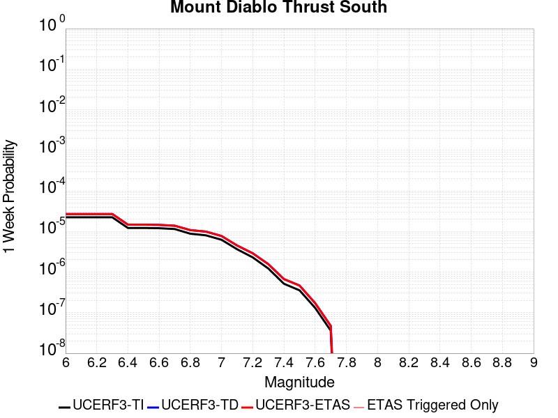 | 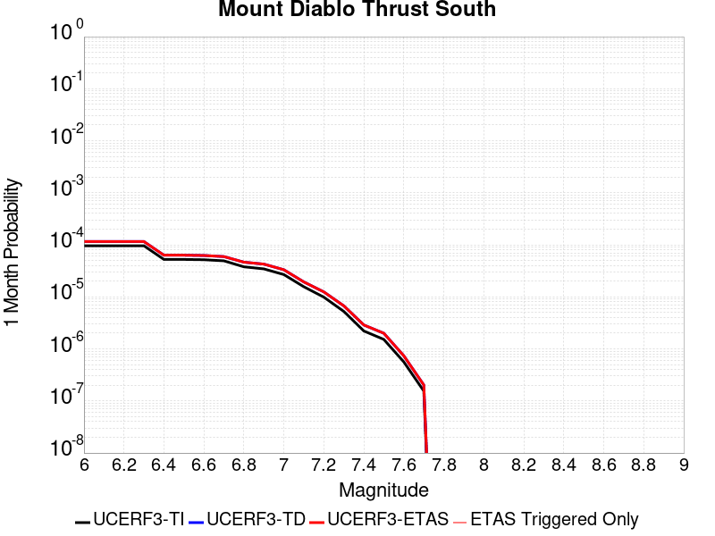 | 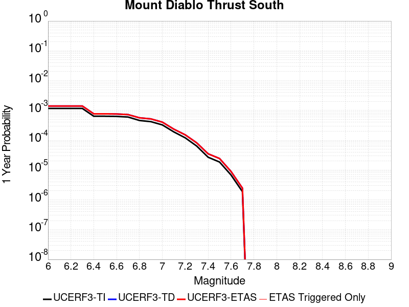 | 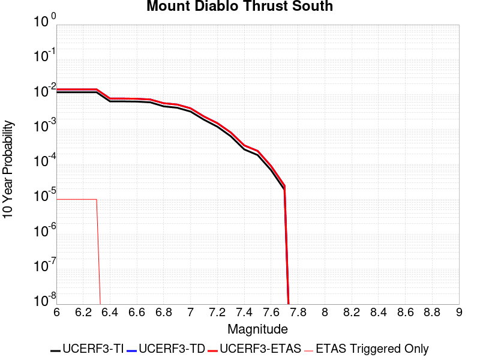 |

| Magnitude | 1 wk TI Prob | 1 wk TD Prob | 1 wk ETAS Prob | 1 wk ETAS/TD Gain | 1 wk ETAS Triggered Only | 1 mo TI Prob | 1 mo TD Prob | 1 mo ETAS Prob | 1 mo ETAS/TD Gain | 1 mo ETAS Triggered Only | 1 yr TI Prob | 1 yr TD Prob | 1 yr ETAS Prob | 1 yr ETAS/TD Gain | 1 yr ETAS Triggered Only | 10 yr TI Prob | 10 yr TD Prob | 10 yr ETAS Prob | 10 yr ETAS/TD Gain | 10 yr ETAS Triggered Only |
|-----|-----|-----|-----|-----|-----|-----|-----|-----|-----|-----|-----|-----|-----|-----|-----|-----|-----|-----|-----|-----|
| 6.0 | 2.2377444E-5 | 2.6956735E-5 | 2.6956735E-5 | 1.0 | 0.0 | 9.5899806E-5 | 1.1552487E-4 | 1.1552487E-4 | 1.0 | 0.0 | 0.0011669548 | 0.0014058066 | 0.0014058066 | 1.0 | 0.0 | 0.011608457 | 0.013988707 | 0.013998567 | 1.0007049 | 1.0E-5 |
| 6.1 | 2.2377444E-5 | 2.6956735E-5 | 2.6956735E-5 | 1.0 | 0.0 | 9.5899806E-5 | 1.1552487E-4 | 1.1552487E-4 | 1.0 | 0.0 | 0.0011669548 | 0.0014058066 | 0.0014058066 | 1.0 | 0.0 | 0.011608457 | 0.013988707 | 0.013998567 | 1.0007049 | 1.0E-5 |
| 6.2 | 2.2377444E-5 | 2.6956735E-5 | 2.6956735E-5 | 1.0 | 0.0 | 9.5899806E-5 | 1.1552487E-4 | 1.1552487E-4 | 1.0 | 0.0 | 0.0011669548 | 0.0014058066 | 0.0014058066 | 1.0 | 0.0 | 0.011608457 | 0.013988707 | 0.013998567 | 1.0007049 | 1.0E-5 |
| 6.3 | 2.2377444E-5 | 2.6956735E-5 | 2.6956735E-5 | 1.0 | 0.0 | 9.5899806E-5 | 1.1552487E-4 | 1.1552487E-4 | 1.0 | 0.0 | 0.0011669548 | 0.0014058066 | 0.0014058066 | 1.0 | 0.0 | 0.011608457 | 0.013988707 | 0.013998567 | 1.0007049 | 1.0E-5 |
| 6.4 | 1.2228463E-5 | 1.4747883E-5 | 1.4747883E-5 | 1.0 | 0.0 | 5.2406645E-5 | 6.3203755E-5 | 6.3203755E-5 | 1.0 | 0.0 | 6.378641E-4 | 7.6924684E-4 | 7.6924684E-4 | 1.0 | 0.0 | 0.0063603627 | 0.0076672267 | 0.0076672267 | 1.0 | 0.0 |
| 6.5 | 1.2228463E-5 | 1.4747883E-5 | 1.4747883E-5 | 1.0 | 0.0 | 5.2406645E-5 | 6.3203755E-5 | 6.3203755E-5 | 1.0 | 0.0 | 6.378641E-4 | 7.6924684E-4 | 7.6924684E-4 | 1.0 | 0.0 | 0.0063603627 | 0.0076672267 | 0.0076672267 | 1.0 | 0.0 |
| 6.6 | 1.2068118E-5 | 1.45526765E-5 | 1.45526765E-5 | 1.0 | 0.0 | 5.1719482E-5 | 6.2367195E-5 | 6.2367195E-5 | 1.0 | 0.0 | 6.2950276E-4 | 7.590688E-4 | 7.590688E-4 | 1.0 | 0.0 | 0.006277225 | 0.007566144 | 0.007566144 | 1.0 | 0.0 |
| 6.7 | 1.1499428E-5 | 1.3875326E-5 | 1.3875326E-5 | 1.0 | 0.0 | 4.9282335E-5 | 5.9464393E-5 | 5.9464393E-5 | 1.0 | 0.0 | 5.9984723E-4 | 7.237512E-4 | 7.237512E-4 | 1.0 | 0.0 | 0.0059823063 | 0.0072153104 | 0.0072153104 | 1.0 | 0.0 |
| 6.8 | 8.82118E-6 | 1.083057E-5 | 1.083057E-5 | 1.0 | 0.0 | 3.780451E-5 | 4.641593E-5 | 4.641593E-5 | 1.0 | 0.0 | 4.601727E-4 | 5.64973E-4 | 5.64973E-4 | 1.0 | 0.0 | 0.0045922096 | 0.005636018 | 0.005636018 | 1.0 | 0.0 |
| 6.9 | 8.047112E-6 | 9.939523E-6 | 9.939523E-6 | 1.0 | 0.0 | 3.4487166E-5 | 4.2597287E-5 | 4.2597287E-5 | 1.0 | 0.0 | 4.1980037E-4 | 5.185038E-4 | 5.185038E-4 | 1.0 | 0.0 | 0.004190082 | 0.0051735546 | 0.0051735546 | 1.0 | 0.0 |
| 7.0 | 6.2574763E-6 | 7.74857E-6 | 7.74857E-6 | 1.0 | 0.0 | 2.681748E-5 | 3.3207754E-5 | 3.3207754E-5 | 1.0 | 0.0 | 3.264539E-4 | 4.0423303E-4 | 4.0423303E-4 | 1.0 | 0.0 | 0.0032597475 | 0.0040354193 | 0.0040354193 | 1.0 | 0.0 |
| 7.1 | 3.6485903E-6 | 4.51294E-6 | 4.51294E-6 | 1.0 | 0.0 | 1.5636722E-5 | 1.934103E-5 | 1.934103E-5 | 1.0 | 0.0 | 1.9036046E-4 | 2.3545201E-4 | 2.3545201E-4 | 1.0 | 0.0 | 0.0019019748 | 0.0023521243 | 0.0023521243 | 1.0 | 0.0 |
| 7.2 | 2.3034274E-6 | 2.9055193E-6 | 2.9055193E-6 | 1.0 | 0.0 | 9.871795E-6 | 1.24521675E-5 | 1.24521675E-5 | 1.0 | 0.0 | 1.2018247E-4 | 1.5159482E-4 | 1.5159482E-4 | 1.0 | 0.0 | 0.0012011749 | 0.0015149874 | 0.0015149874 | 1.0 | 0.0 |
| 7.3 | 1.224035E-6 | 1.5679722E-6 | 1.5679722E-6 | 1.0 | 0.0 | 5.245854E-6 | 6.719864E-6 | 6.719864E-6 | 1.0 | 0.0 | 6.38664E-5 | 8.1811384E-5 | 8.1811384E-5 | 1.0 | 0.0 | 6.384805E-4 | 8.1785576E-4 | 8.1785576E-4 | 1.0 | 0.0 |
| 7.4 | 5.1601154E-7 | 6.723348E-7 | 6.723348E-7 | 1.0 | 0.0 | 2.2114762E-6 | 2.8814318E-6 | 2.8814318E-6 | 1.0 | 0.0 | 2.6924388E-5 | 3.5080884E-5 | 3.5080884E-5 | 1.0 | 0.0 | 2.6921128E-4 | 3.5077083E-4 | 3.5077083E-4 | 1.0 | 0.0 |
| 7.5 | 3.552894E-7 | 4.6652463E-7 | 4.6652463E-7 | 1.0 | 0.0 | 1.5226678E-6 | 1.9993897E-6 | 1.9993897E-6 | 1.0 | 0.0 | 1.8538323E-5 | 2.4342313E-5 | 2.4342313E-5 | 1.0 | 0.0 | 1.8536777E-4 | 2.4340866E-4 | 2.4340866E-4 | 1.0 | 0.0 |
| 7.6 | 1.3124082E-7 | 1.7191583E-7 | 1.7191583E-7 | 1.0 | 0.0 | 5.6246057E-7 | 7.36782E-7 | 7.36782E-7 | 1.0 | 0.0 | 6.8479358E-6 | 8.970293E-6 | 8.970293E-6 | 1.0 | 0.0 | 6.8477246E-5 | 8.970347E-5 | 8.970347E-5 | 1.0 | 0.0 |
| 7.7 | 3.6193022E-8 | 4.7332875E-8 | 4.7332875E-8 | 1.0 | 0.0 | 1.5511293E-7 | 2.0285516E-7 | 2.0285516E-7 | 1.0 | 0.0 | 1.8884983E-6 | 2.46976E-6 | 2.46976E-6 | 1.0 | 0.0 | 1.8884823E-5 | 2.4697913E-5 | 2.4697913E-5 | 1.0 | 0.0 |

## Sierra Madre
*[(top)](#table-of-contents)*

| 1 Week | 1 Month | 1 Year | 10 Year |
|-----|-----|-----|-----|
| 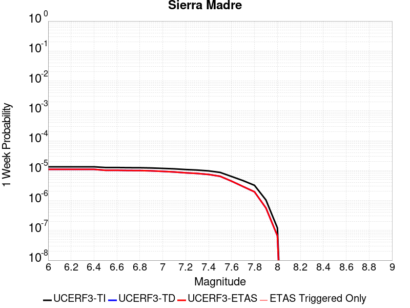 | 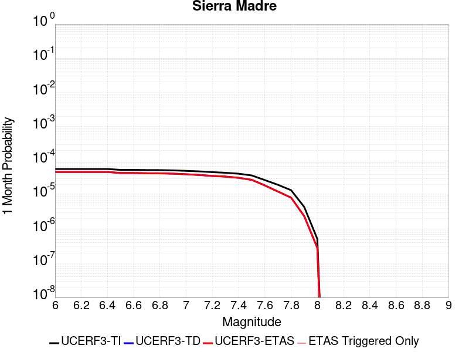 | 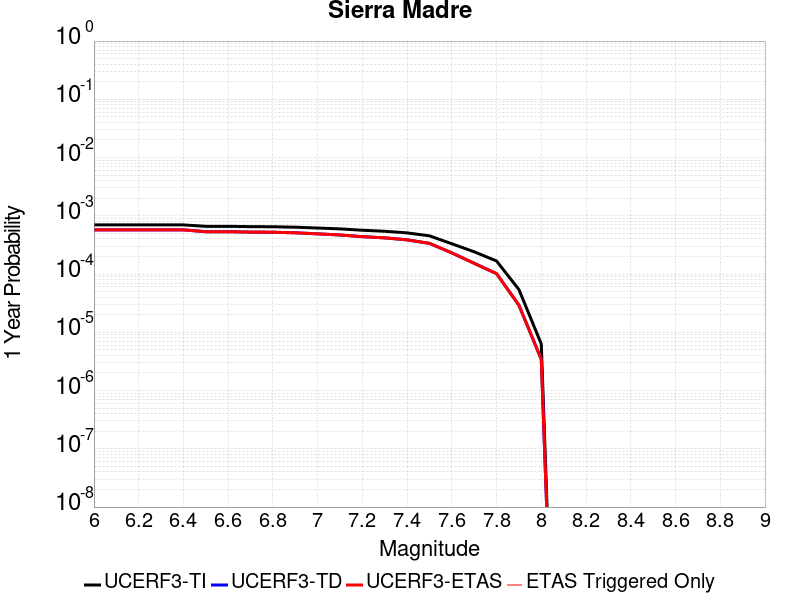 | 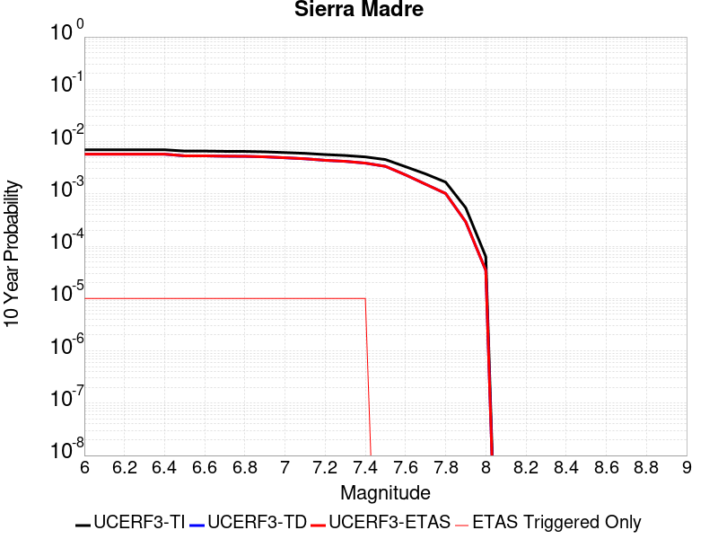 |

| Magnitude | 1 wk TI Prob | 1 wk TD Prob | 1 wk ETAS Prob | 1 wk ETAS/TD Gain | 1 wk ETAS Triggered Only | 1 mo TI Prob | 1 mo TD Prob | 1 mo ETAS Prob | 1 mo ETAS/TD Gain | 1 mo ETAS Triggered Only | 1 yr TI Prob | 1 yr TD Prob | 1 yr ETAS Prob | 1 yr ETAS/TD Gain | 1 yr ETAS Triggered Only | 10 yr TI Prob | 10 yr TD Prob | 10 yr ETAS Prob | 10 yr ETAS/TD Gain | 10 yr ETAS Triggered Only |
|-----|-----|-----|-----|-----|-----|-----|-----|-----|-----|-----|-----|-----|-----|-----|-----|-----|-----|-----|-----|-----|
| 6.0 | 1.3379373E-5 | 1.1001086E-5 | 1.1001086E-5 | 1.0 | 0.0 | 5.7338908E-5 | 4.714667E-5 | 4.714667E-5 | 1.0 | 0.0 | 6.978776E-4 | 5.73861E-4 | 5.73861E-4 | 1.0 | 0.0 | 0.0069569005 | 0.0057241553 | 0.005734098 | 1.001737 | 1.0E-5 |
| 6.1 | 1.3379373E-5 | 1.1001086E-5 | 1.1001086E-5 | 1.0 | 0.0 | 5.7338908E-5 | 4.714667E-5 | 4.714667E-5 | 1.0 | 0.0 | 6.978776E-4 | 5.73861E-4 | 5.73861E-4 | 1.0 | 0.0 | 0.0069569005 | 0.0057241553 | 0.005734098 | 1.001737 | 1.0E-5 |
| 6.2 | 1.3379373E-5 | 1.1001086E-5 | 1.1001086E-5 | 1.0 | 0.0 | 5.7338908E-5 | 4.714667E-5 | 4.714667E-5 | 1.0 | 0.0 | 6.978776E-4 | 5.73861E-4 | 5.73861E-4 | 1.0 | 0.0 | 0.0069569005 | 0.0057241553 | 0.005734098 | 1.001737 | 1.0E-5 |
| 6.3 | 1.3379373E-5 | 1.1001086E-5 | 1.1001086E-5 | 1.0 | 0.0 | 5.7338908E-5 | 4.714667E-5 | 4.714667E-5 | 1.0 | 0.0 | 6.978776E-4 | 5.73861E-4 | 5.73861E-4 | 1.0 | 0.0 | 0.0069569005 | 0.0057241553 | 0.005734098 | 1.001737 | 1.0E-5 |
| 6.4 | 1.3379373E-5 | 1.1001086E-5 | 1.1001086E-5 | 1.0 | 0.0 | 5.7338908E-5 | 4.714667E-5 | 4.714667E-5 | 1.0 | 0.0 | 6.978776E-4 | 5.73861E-4 | 5.73861E-4 | 1.0 | 0.0 | 0.0069569005 | 0.0057241553 | 0.005734098 | 1.001737 | 1.0E-5 |
| 6.5 | 1.26563245E-5 | 1.0230537E-5 | 1.0230537E-5 | 1.0 | 0.0 | 5.4240263E-5 | 4.3844426E-5 | 4.3844426E-5 | 1.0 | 0.0 | 6.601751E-4 | 5.3367624E-4 | 5.3367624E-4 | 1.0 | 0.0 | 0.006582173 | 0.005324268 | 0.005334215 | 1.0018682 | 1.0E-5 |
| 6.6 | 1.26563245E-5 | 1.0230537E-5 | 1.0230537E-5 | 1.0 | 0.0 | 5.4240263E-5 | 4.3844426E-5 | 4.3844426E-5 | 1.0 | 0.0 | 6.601751E-4 | 5.3367624E-4 | 5.3367624E-4 | 1.0 | 0.0 | 0.006582173 | 0.005324268 | 0.005334215 | 1.0018682 | 1.0E-5 |
| 6.7 | 1.2502474E-5 | 1.0066679E-5 | 1.0066679E-5 | 1.0 | 0.0 | 5.3580934E-5 | 4.3142205E-5 | 4.3142205E-5 | 1.0 | 0.0 | 6.521526E-4 | 5.2513083E-4 | 5.2513083E-4 | 1.0 | 0.0 | 0.0065024206 | 0.0052392185 | 0.005249166 | 1.0018986 | 1.0E-5 |
| 6.8 | 1.2454966E-5 | 1.00189645E-5 | 1.00189645E-5 | 1.0 | 0.0 | 5.3377335E-5 | 4.2937718E-5 | 4.2937718E-5 | 1.0 | 0.0 | 6.4967526E-4 | 5.226424E-4 | 5.226424E-4 | 1.0 | 0.0 | 0.006477792 | 0.0052144513 | 0.0052243993 | 1.0019077 | 1.0E-5 |
| 6.9 | 1.2225574E-5 | 9.79294E-6 | 9.79294E-6 | 1.0 | 0.0 | 5.2394265E-5 | 4.1969073E-5 | 4.1969073E-5 | 1.0 | 0.0 | 6.3771347E-4 | 5.108547E-4 | 5.108547E-4 | 1.0 | 0.0 | 0.006358865 | 0.0050971196 | 0.005107069 | 1.0019519 | 1.0E-5 |
| 7.0 | 1.182946E-5 | 9.399478E-6 | 9.399478E-6 | 1.0 | 0.0 | 5.06967E-5 | 4.0282863E-5 | 4.0282863E-5 | 1.0 | 0.0 | 6.1705755E-4 | 4.9033447E-4 | 4.9033447E-4 | 1.0 | 0.0 | 0.006153469 | 0.0048928377 | 0.004902789 | 1.0020338 | 1.0E-5 |
| 7.1 | 1.14369095E-5 | 8.986486E-6 | 8.986486E-6 | 1.0 | 0.0 | 4.9014405E-5 | 3.851295E-5 | 3.851295E-5 | 1.0 | 0.0 | 5.9658696E-4 | 4.6879528E-4 | 4.6879528E-4 | 1.0 | 0.0 | 0.005949879 | 0.0046783695 | 0.0046883225 | 1.0021275 | 1.0E-5 |
| 7.2 | 1.0836419E-5 | 8.399877E-6 | 8.399877E-6 | 1.0 | 0.0 | 4.644097E-5 | 3.599898E-5 | 3.599898E-5 | 1.0 | 0.0 | 5.652721E-4 | 4.3820037E-4 | 4.3820037E-4 | 1.0 | 0.0 | 0.0056383642 | 0.0043736603 | 0.0043836166 | 1.0022764 | 1.0E-5 |
| 7.3 | 1.0403439E-5 | 8.021136E-6 | 8.021136E-6 | 1.0 | 0.0 | 4.4585406E-5 | 3.4375847E-5 | 3.4375847E-5 | 1.0 | 0.0 | 5.426921E-4 | 4.1844646E-4 | 4.1844646E-4 | 1.0 | 0.0 | 0.005413687 | 0.0041768807 | 0.0041868393 | 1.0023842 | 1.0E-5 |
| 7.4 | 9.768864E-6 | 7.4147565E-6 | 7.4147565E-6 | 1.0 | 0.0 | 4.186589E-5 | 3.1777145E-5 | 3.1777145E-5 | 1.0 | 0.0 | 5.09598E-4 | 3.8681895E-4 | 3.8681895E-4 | 1.0 | 0.0 | 0.0050843097 | 0.0038617484 | 0.0038717096 | 1.0025795 | 1.0E-5 |
| 7.5 | 8.687089E-6 | 6.4504534E-6 | 6.4504534E-6 | 1.0 | 0.0 | 3.722985E-5 | 2.7644512E-5 | 2.7644512E-5 | 1.0 | 0.0 | 4.5317915E-4 | 3.365208E-4 | 3.365208E-4 | 1.0 | 0.0 | 0.004522561 | 0.0033603995 | 0.0033603995 | 1.0 | 0.0 |
| 7.6 | 6.3506063E-6 | 4.430596E-6 | 4.430596E-6 | 1.0 | 0.0 | 2.72166E-5 | 1.8988132E-5 | 1.8988132E-5 | 1.0 | 0.0 | 3.3131172E-4 | 2.3115624E-4 | 2.3115624E-4 | 1.0 | 0.0 | 0.003308182 | 0.002309383 | 0.002309383 | 1.0 | 0.0 |
| 7.7 | 4.62223E-6 | 2.9332282E-6 | 2.9332282E-6 | 1.0 | 0.0 | 1.9809406E-5 | 1.25709175E-5 | 1.25709175E-5 | 1.0 | 0.0 | 2.4115283E-4 | 1.530402E-4 | 1.530402E-4 | 1.0 | 0.0 | 0.0024089129 | 0.0015295491 | 0.0015295491 | 1.0 | 0.0 |
| 7.8 | 3.2145008E-6 | 1.9496379E-6 | 1.9496379E-6 | 1.0 | 0.0 | 1.3776359E-5 | 8.355564E-6 | 8.355564E-6 | 1.0 | 0.0 | 1.6771426E-4 | 1.0172426E-4 | 1.0172426E-4 | 1.0 | 0.0 | 0.0016758774 | 0.0010169212 | 0.0010169212 | 1.0 | 0.0 |
| 7.9 | 1.0391769E-6 | 5.603358E-7 | 5.603358E-7 | 1.0 | 0.0 | 4.4536077E-6 | 2.401437E-6 | 2.401437E-6 | 1.0 | 0.0 | 5.4221324E-5 | 2.923711E-5 | 2.923711E-5 | 1.0 | 0.0 | 5.4208096E-4 | 2.9233305E-4 | 2.9233305E-4 | 1.0 | 0.0 |
| 8.0 | 1.210983E-7 | 6.614117E-8 | 6.614117E-8 | 1.0 | 0.0 | 5.1899264E-7 | 2.8346213E-7 | 2.8346213E-7 | 1.0 | 0.0 | 6.3187167E-6 | 3.451146E-6 | 3.451146E-6 | 1.0 | 0.0 | 6.318537E-5 | 3.4510944E-5 | 3.4510944E-5 | 1.0 | 0.0 |

## Cerro Prieto
*[(top)](#table-of-contents)*

| 1 Week | 1 Month | 1 Year | 10 Year |
|-----|-----|-----|-----|
| 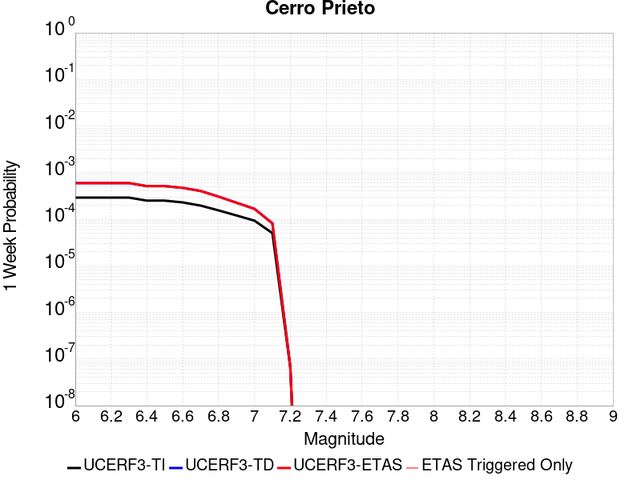 | 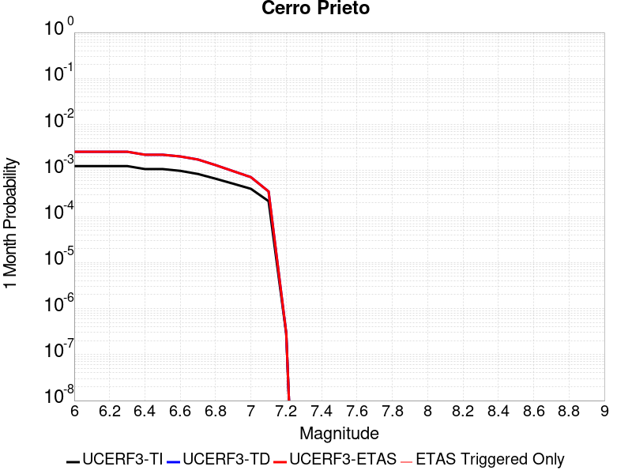 | 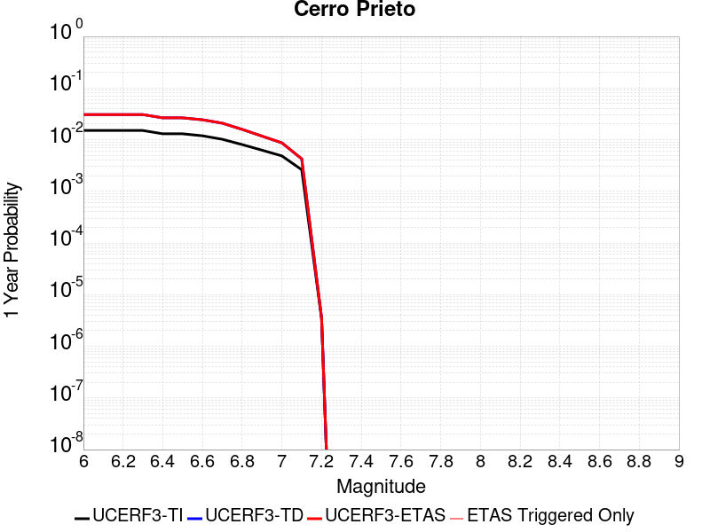 | 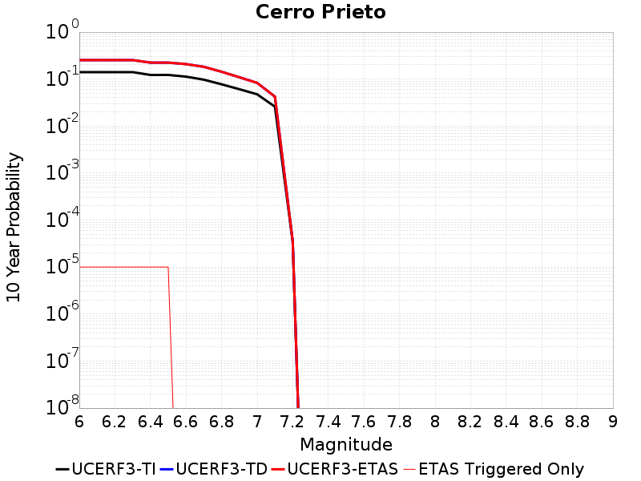 |

| Magnitude | 1 wk TI Prob | 1 wk TD Prob | 1 wk ETAS Prob | 1 wk ETAS/TD Gain | 1 wk ETAS Triggered Only | 1 mo TI Prob | 1 mo TD Prob | 1 mo ETAS Prob | 1 mo ETAS/TD Gain | 1 mo ETAS Triggered Only | 1 yr TI Prob | 1 yr TD Prob | 1 yr ETAS Prob | 1 yr ETAS/TD Gain | 1 yr ETAS Triggered Only | 10 yr TI Prob | 10 yr TD Prob | 10 yr ETAS Prob | 10 yr ETAS/TD Gain | 10 yr ETAS Triggered Only |
|-----|-----|-----|-----|-----|-----|-----|-----|-----|-----|-----|-----|-----|-----|-----|-----|-----|-----|-----|-----|-----|
| 6.0 | 2.9101528E-4 | 5.965734E-4 | 5.965734E-4 | 1.0 | 0.0 | 0.0012466122 | 0.0025544802 | 0.0025544802 | 1.0 | 0.0 | 0.015072231 | 0.030652255 | 0.030652255 | 1.0 | 0.0 | 0.14089979 | 0.2540066 | 0.25401405 | 1.0000293 | 1.0E-5 |
| 6.1 | 2.9101528E-4 | 5.965734E-4 | 5.965734E-4 | 1.0 | 0.0 | 0.0012466122 | 0.0025544802 | 0.0025544802 | 1.0 | 0.0 | 0.015072231 | 0.030652255 | 0.030652255 | 1.0 | 0.0 | 0.14089979 | 0.2540066 | 0.25401405 | 1.0000293 | 1.0E-5 |
| 6.2 | 2.9101528E-4 | 5.965734E-4 | 5.965734E-4 | 1.0 | 0.0 | 0.0012466122 | 0.0025544802 | 0.0025544802 | 1.0 | 0.0 | 0.015072231 | 0.030652255 | 0.030652255 | 1.0 | 0.0 | 0.14089979 | 0.2540066 | 0.25401405 | 1.0000293 | 1.0E-5 |
| 6.3 | 2.9101528E-4 | 5.965734E-4 | 5.965734E-4 | 1.0 | 0.0 | 0.0012466122 | 0.0025544802 | 0.0025544802 | 1.0 | 0.0 | 0.015072231 | 0.030652255 | 0.030652255 | 1.0 | 0.0 | 0.14089979 | 0.2540066 | 0.25401405 | 1.0000293 | 1.0E-5 |
| 6.4 | 2.508648E-4 | 5.1406276E-4 | 5.1406276E-4 | 1.0 | 0.0 | 0.0010746918 | 0.0022014647 | 0.0022014647 | 1.0 | 0.0 | 0.013006088 | 0.02647587 | 0.02647587 | 1.0 | 0.0 | 0.12270685 | 0.22443208 | 0.22443984 | 1.0000346 | 1.0E-5 |
| 6.5 | 2.508648E-4 | 5.1406276E-4 | 5.1406276E-4 | 1.0 | 0.0 | 0.0010746918 | 0.0022014647 | 0.0022014647 | 1.0 | 0.0 | 0.013006088 | 0.02647587 | 0.02647587 | 1.0 | 0.0 | 0.12270685 | 0.22443208 | 0.22443984 | 1.0000346 | 1.0E-5 |
| 6.6 | 2.294914E-4 | 4.712536E-4 | 4.712536E-4 | 1.0 | 0.0 | 9.831638E-4 | 0.0020182827 | 0.0020182827 | 1.0 | 0.0 | 0.011904482 | 0.024302686 | 0.024302686 | 1.0 | 0.0 | 0.11286586 | 0.20861325 | 0.20861325 | 1.0 | 0.0 |
| 6.7 | 1.9621674E-4 | 4.0427214E-4 | 4.0427214E-4 | 1.0 | 0.0 | 8.4065786E-4 | 0.0017316028 | 0.0017316028 | 1.0 | 0.0 | 0.010187071 | 0.020888828 | 0.020888828 | 1.0 | 0.0 | 0.09732539 | 0.18292964 | 0.18292964 | 1.0 | 0.0 |
| 6.8 | 1.5476145E-4 | 3.0571833E-4 | 3.0571833E-4 | 1.0 | 0.0 | 6.6309475E-4 | 0.0013096657 | 0.0013096657 | 1.0 | 0.0 | 0.008043335 | 0.015840132 | 0.015840132 | 1.0 | 0.0 | 0.07758363 | 0.14338762 | 0.14338762 | 1.0 | 0.0 |
| 6.9 | 1.20509176E-4 | 2.2587959E-4 | 2.2587959E-4 | 1.0 | 0.0 | 5.1636563E-4 | 9.677595E-4 | 9.677595E-4 | 1.0 | 0.0 | 0.006268645 | 0.011729185 | 0.011729185 | 1.0 | 0.0 | 0.060947374 | 0.10947207 | 0.10947207 | 1.0 | 0.0 |
| 7.0 | 9.3269155E-5 | 1.6721009E-4 | 1.6721009E-4 | 1.0 | 0.0 | 3.9966372E-4 | 7.16461E-4 | 7.16461E-4 | 1.0 | 0.0 | 0.0048550544 | 0.008695681 | 0.008695681 | 1.0 | 0.0 | 0.04750344 | 0.083176725 | 0.083176725 | 1.0 | 0.0 |
| 7.1 | 5.029709E-5 | 8.1743696E-5 | 8.1743696E-5 | 1.0 | 0.0 | 2.1554115E-4 | 3.5030238E-4 | 3.5030238E-4 | 1.0 | 0.0 | 0.0026210553 | 0.004260008 | 0.004260008 | 1.0 | 0.0 | 0.025903556 | 0.04237606 | 0.04237606 | 1.0 | 0.0 |
| 7.2 | 6.5445185E-8 | 6.819897E-8 | 6.819897E-8 | 1.0 | 0.0 | 2.8047933E-7 | 2.9228133E-7 | 2.9228133E-7 | 1.0 | 0.0 | 3.4148304E-6 | 3.5585251E-6 | 3.5585251E-6 | 1.0 | 0.0 | 3.414778E-5 | 3.558525E-5 | 3.558525E-5 | 1.0 | 0.0 |

## Silver Creek 2011 CFM
*[(top)](#table-of-contents)*

| 1 Week | 1 Month | 1 Year | 10 Year |
|-----|-----|-----|-----|
| 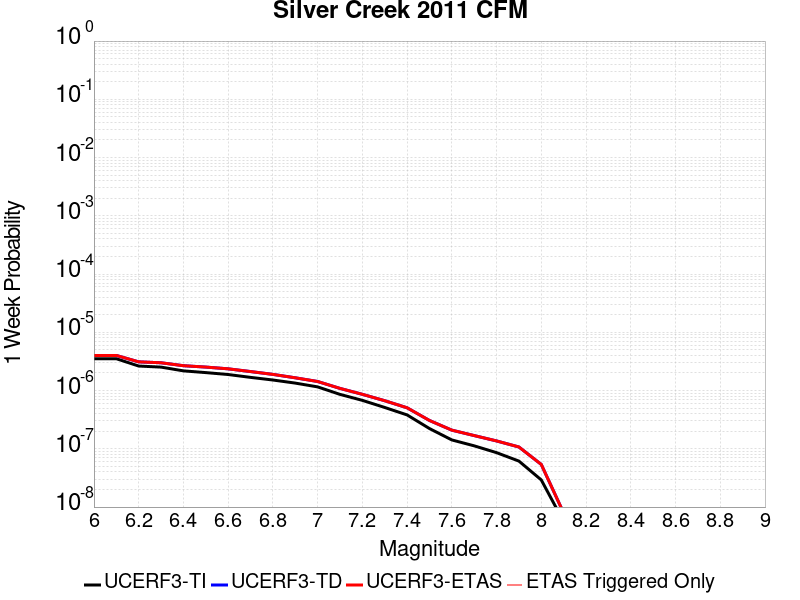 | 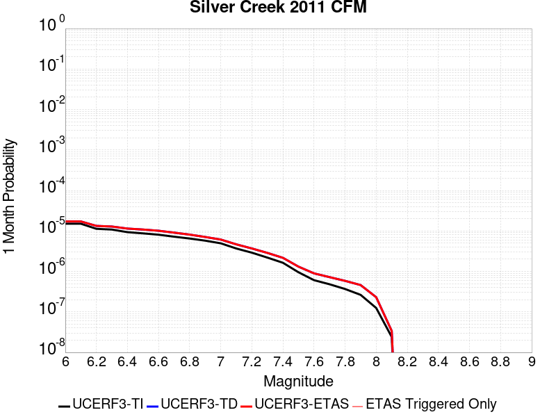 | 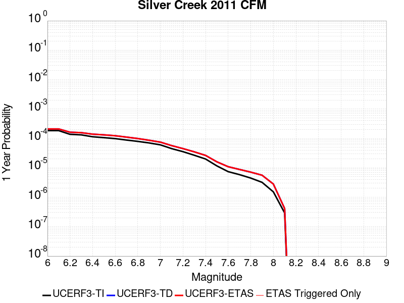 | 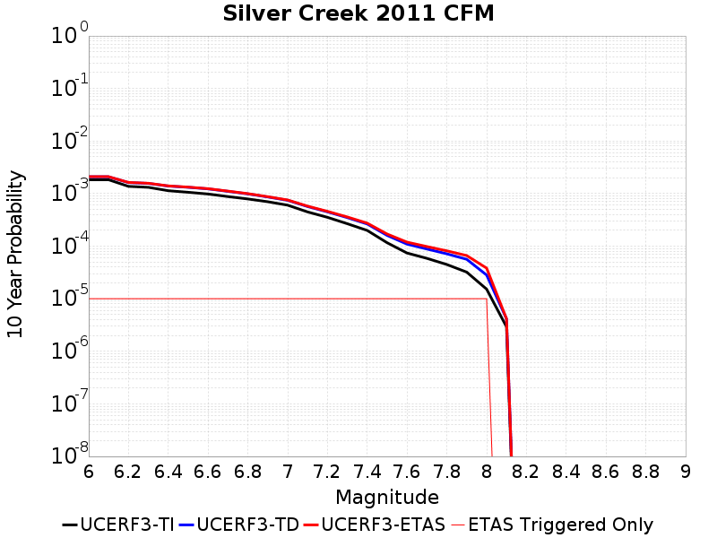 |

| Magnitude | 1 wk TI Prob | 1 wk TD Prob | 1 wk ETAS Prob | 1 wk ETAS/TD Gain | 1 wk ETAS Triggered Only | 1 mo TI Prob | 1 mo TD Prob | 1 mo ETAS Prob | 1 mo ETAS/TD Gain | 1 mo ETAS Triggered Only | 1 yr TI Prob | 1 yr TD Prob | 1 yr ETAS Prob | 1 yr ETAS/TD Gain | 1 yr ETAS Triggered Only | 10 yr TI Prob | 10 yr TD Prob | 10 yr ETAS Prob | 10 yr ETAS/TD Gain | 10 yr ETAS Triggered Only |
|-----|-----|-----|-----|-----|-----|-----|-----|-----|-----|-----|-----|-----|-----|-----|-----|-----|-----|-----|-----|-----|
| 6.0 | 3.5229125E-6 | 4.0083714E-6 | 4.0083714E-6 | 1.0 | 0.0 | 1.5098109E-5 | 1.7178623E-5 | 1.7178623E-5 | 1.0 | 0.0 | 1.8380396E-4 | 2.0913004E-4 | 2.0913004E-4 | 1.0 | 0.0 | 0.0018365202 | 0.0020896909 | 0.0020996698 | 1.0047754 | 1.0E-5 |
| 6.1 | 3.5229125E-6 | 4.0083714E-6 | 4.0083714E-6 | 1.0 | 0.0 | 1.5098109E-5 | 1.7178623E-5 | 1.7178623E-5 | 1.0 | 0.0 | 1.8380396E-4 | 2.0913004E-4 | 2.0913004E-4 | 1.0 | 0.0 | 0.0018365202 | 0.0020896909 | 0.0020996698 | 1.0047754 | 1.0E-5 |
| 6.2 | 2.6363234E-6 | 3.1107563E-6 | 3.1107563E-6 | 1.0 | 0.0 | 1.129848E-5 | 1.3331745E-5 | 1.3331745E-5 | 1.0 | 0.0 | 1.375503E-4 | 1.6230196E-4 | 1.6230196E-4 | 1.0 | 0.0 | 0.0013746519 | 0.0016221618 | 0.0016321456 | 1.0061547 | 1.0E-5 |
| 6.3 | 2.5275126E-6 | 3.000395E-6 | 3.000395E-6 | 1.0 | 0.0 | 1.0832152E-5 | 1.2858773E-5 | 1.2858773E-5 | 1.0 | 0.0 | 1.3187347E-4 | 1.5654437E-4 | 1.5654437E-4 | 1.0 | 0.0 | 0.0013179524 | 0.0015646676 | 0.0015746519 | 1.0063812 | 1.0E-5 |
| 6.4 | 2.178732E-6 | 2.6709538E-6 | 2.6709538E-6 | 1.0 | 0.0 | 9.337389E-6 | 1.1446894E-5 | 1.1446894E-5 | 1.0 | 0.0 | 1.1367678E-4 | 1.3935706E-4 | 1.3935706E-4 | 1.0 | 0.0 | 0.0011361865 | 0.001393021 | 0.001403007 | 1.0071687 | 1.0E-5 |
| 6.5 | 2.0341574E-6 | 2.5300424E-6 | 2.5300424E-6 | 1.0 | 0.0 | 8.717788E-6 | 1.0842994E-5 | 1.0842994E-5 | 1.0 | 0.0 | 1.061339E-4 | 1.3200549E-4 | 1.3200549E-4 | 1.0 | 0.0 | 0.0010608323 | 0.0013195944 | 0.0013295813 | 1.0075681 | 1.0E-5 |
| 6.6 | 1.8856827E-6 | 2.3616162E-6 | 2.3616162E-6 | 1.0 | 0.0 | 8.0814725E-6 | 1.0121173E-5 | 1.0121173E-5 | 1.0 | 0.0 | 9.838748E-5 | 1.2321833E-4 | 1.2321833E-4 | 1.0 | 0.0 | 9.834393E-4 | 0.0012318235 | 0.0012418112 | 1.008108 | 1.0E-5 |
| 6.7 | 1.6844668E-6 | 2.1199999E-6 | 2.1199999E-6 | 1.0 | 0.0 | 7.2191233E-6 | 9.085682E-6 | 9.085682E-6 | 1.0 | 0.0 | 8.788928E-5 | 1.1061258E-4 | 1.1061258E-4 | 1.0 | 0.0 | 8.785453E-4 | 0.001105898 | 0.0011158868 | 1.0090324 | 1.0E-5 |
| 6.8 | 1.5177161E-6 | 1.8955966E-6 | 1.8955966E-6 | 1.0 | 0.0 | 6.504481E-6 | 8.1239605E-6 | 8.1239605E-6 | 1.0 | 0.0 | 7.918918E-5 | 9.890473E-5 | 9.890473E-5 | 1.0 | 0.0 | 7.9160964E-4 | 9.889293E-4 | 9.989194E-4 | 1.0101019 | 1.0E-5 |
| 6.9 | 1.3437394E-6 | 1.6563523E-6 | 1.6563523E-6 | 1.0 | 0.0 | 5.7588704E-6 | 7.0986334E-6 | 7.0986334E-6 | 1.0 | 0.0 | 7.011199E-5 | 8.642244E-5 | 8.642244E-5 | 1.0 | 0.0 | 7.0089876E-4 | 8.6420996E-4 | 8.742013E-4 | 1.0115613 | 1.0E-5 |
| 7.0 | 1.1563575E-6 | 1.431515E-6 | 1.431515E-6 | 1.0 | 0.0 | 4.9558084E-6 | 6.1350497E-6 | 6.1350497E-6 | 1.0 | 0.0 | 6.03353E-5 | 7.469168E-5 | 7.469168E-5 | 1.0 | 0.0 | 6.0318917E-4 | 7.4698724E-4 | 7.569798E-4 | 1.0133771 | 1.0E-5 |
| 7.1 | 8.602183E-7 | 1.0893257E-6 | 1.0893257E-6 | 1.0 | 0.0 | 3.6866445E-6 | 4.66853E-6 | 4.66853E-6 | 1.0 | 0.0 | 4.4883975E-5 | 5.683787E-5 | 5.683787E-5 | 1.0 | 0.0 | 4.4874908E-4 | 5.685547E-4 | 5.78549E-4 | 1.0175785 | 1.0E-5 |
| 7.2 | 6.788407E-7 | 8.6236383E-7 | 8.6236383E-7 | 1.0 | 0.0 | 2.9093142E-6 | 3.6958397E-6 | 3.6958397E-6 | 1.0 | 0.0 | 3.5420322E-5 | 4.4995923E-5 | 4.4995923E-5 | 1.0 | 0.0 | 3.541468E-4 | 4.5018943E-4 | 4.601849E-4 | 1.0222028 | 1.0E-5 |
| 7.3 | 5.1292045E-7 | 6.695254E-7 | 6.695254E-7 | 1.0 | 0.0 | 2.1982287E-6 | 2.8693912E-6 | 2.8693912E-6 | 1.0 | 0.0 | 2.6763106E-5 | 3.4934277E-5 | 3.4934277E-5 | 1.0 | 0.0 | 2.6759884E-4 | 3.4960918E-4 | 3.5960568E-4 | 1.0285934 | 1.0E-5 |
| 7.4 | 3.820994E-7 | 5.0635566E-7 | 5.0635566E-7 | 1.0 | 0.0 | 1.6375678E-6 | 2.1700937E-6 | 2.1700937E-6 | 1.0 | 0.0 | 1.9937206E-5 | 2.6420572E-5 | 2.6420572E-5 | 1.0 | 0.0 | 1.9935417E-4 | 2.644956E-4 | 2.7449298E-4 | 1.0377978 | 1.0E-5 |
| 7.5 | 2.2292595E-7 | 3.0677023E-7 | 3.0677023E-7 | 1.0 | 0.0 | 9.553966E-7 | 1.3147289E-6 | 1.3147289E-6 | 1.0 | 0.0 | 1.16318915E-5 | 1.6006707E-5 | 1.6006707E-5 | 1.0 | 0.0 | 1.16312825E-4 | 1.6037683E-4 | 1.7037524E-4 | 1.0623431 | 1.0E-5 |
| 7.6 | 1.420587E-7 | 2.092155E-7 | 2.092155E-7 | 1.0 | 0.0 | 6.088228E-7 | 8.966375E-7 | 8.966375E-7 | 1.0 | 0.0 | 7.4123927E-6 | 1.0916508E-5 | 1.0916508E-5 | 1.0 | 0.0 | 7.412145E-5 | 1.0948065E-4 | 1.19479555E-4 | 1.0913303 | 1.0E-5 |
| 7.7 | 1.1250075E-7 | 1.6879278E-7 | 1.6879278E-7 | 1.0 | 0.0 | 4.82146E-7 | 7.233974E-7 | 7.233974E-7 | 1.0 | 0.0 | 5.8701116E-6 | 8.8073275E-6 | 8.8073275E-6 | 1.0 | 0.0 | 5.8699567E-5 | 8.8388326E-5 | 9.838744E-5 | 1.1131271 | 1.0E-5 |
| 7.8 | 8.592761E-8 | 1.3656457E-7 | 1.3656457E-7 | 1.0 | 0.0 | 3.682611E-7 | 5.852766E-7 | 5.852766E-7 | 1.0 | 0.0 | 4.48357E-6 | 7.125719E-6 | 7.125719E-6 | 1.0 | 0.0 | 4.4834796E-5 | 7.1562165E-5 | 8.156145E-5 | 1.1397287 | 1.0E-5 |
| 7.9 | 6.156529E-8 | 1.074769E-7 | 1.074769E-7 | 1.0 | 0.0 | 2.638512E-7 | 4.6061518E-7 | 4.6061518E-7 | 1.0 | 0.0 | 3.212384E-6 | 5.6079757E-6 | 5.6079757E-6 | 1.0 | 0.0 | 3.2123375E-5 | 5.6340188E-5 | 6.633963E-5 | 1.1774832 | 1.0E-5 |
| 8.0 | 2.9230547E-8 | 5.3914338E-8 | 5.3914338E-8 | 1.0 | 0.0 | 1.2527377E-7 | 2.3106142E-7 | 2.3106142E-7 | 1.0 | 0.0 | 1.525207E-6 | 2.8131692E-6 | 2.8131692E-6 | 1.0 | 0.0 | 1.5251966E-5 | 2.8268698E-5 | 3.8268416E-5 | 1.3537382 | 1.0E-5 |
| 8.1 | 5.6062213E-9 | 7.906768E-9 | 7.906768E-9 | 1.0 | 0.0 | 2.4026663E-8 | 3.3886145E-8 | 3.3886145E-8 | 1.0 | 0.0 | 2.925246E-7 | 4.1256376E-7 | 4.1256376E-7 | 1.0 | 0.0 | 2.925242E-6 | 4.164544E-6 | 4.164544E-6 | 1.0 | 0.0 |

## Simi-Santa Rosa
*[(top)](#table-of-contents)*

| 1 Week | 1 Month | 1 Year | 10 Year |
|-----|-----|-----|-----|
| 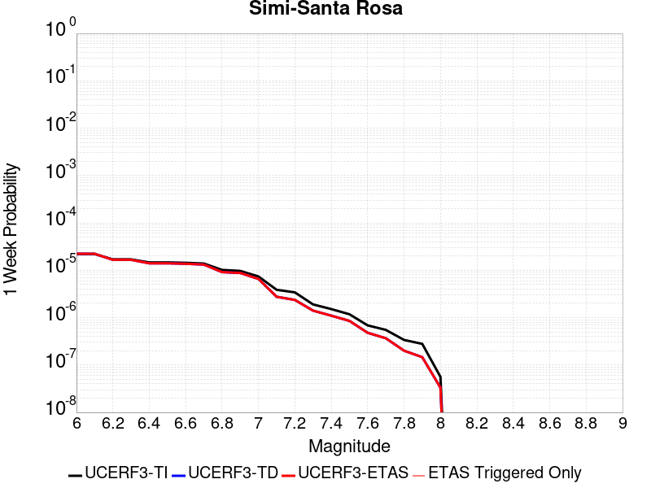 | 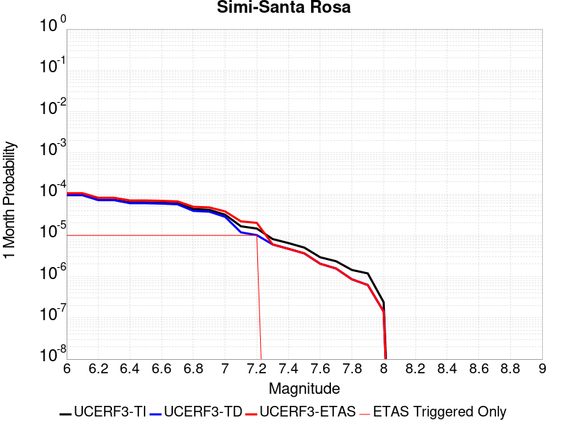 | 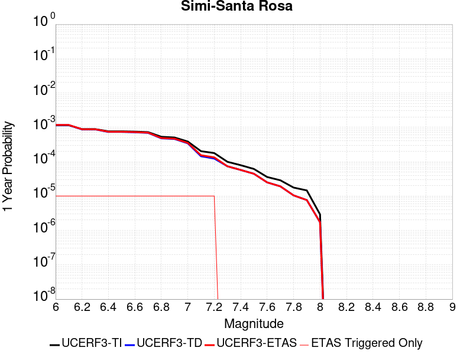 | 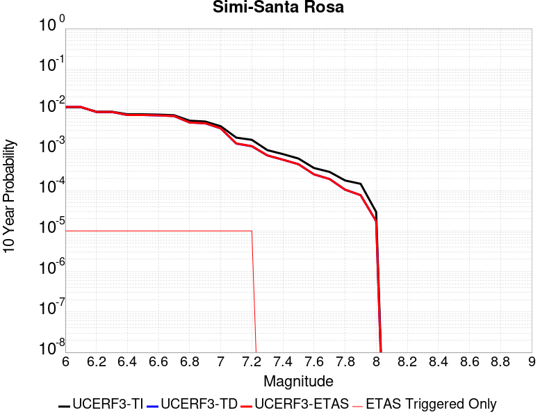 |

| Magnitude | 1 wk TI Prob | 1 wk TD Prob | 1 wk ETAS Prob | 1 wk ETAS/TD Gain | 1 wk ETAS Triggered Only | 1 mo TI Prob | 1 mo TD Prob | 1 mo ETAS Prob | 1 mo ETAS/TD Gain | 1 mo ETAS Triggered Only | 1 yr TI Prob | 1 yr TD Prob | 1 yr ETAS Prob | 1 yr ETAS/TD Gain | 1 yr ETAS Triggered Only | 10 yr TI Prob | 10 yr TD Prob | 10 yr ETAS Prob | 10 yr ETAS/TD Gain | 10 yr ETAS Triggered Only |
|-----|-----|-----|-----|-----|-----|-----|-----|-----|-----|-----|-----|-----|-----|-----|-----|-----|-----|-----|-----|-----|
| 6.0 | 2.198912E-5 | 2.2275826E-5 | 2.2275826E-5 | 1.0 | 0.0 | 9.4235686E-5 | 9.546458E-5 | 1.0546362E-4 | 1.1047409 | 1.0E-5 | 0.0011467156 | 0.0011617054 | 0.0011716937 | 1.0085981 | 1.0E-5 | 0.011408163 | 0.011560773 | 0.011570658 | 1.000855 | 1.0E-5 |
| 6.1 | 2.198912E-5 | 2.2275826E-5 | 2.2275826E-5 | 1.0 | 0.0 | 9.4235686E-5 | 9.546458E-5 | 1.0546362E-4 | 1.1047409 | 1.0E-5 | 0.0011467156 | 0.0011617054 | 0.0011716937 | 1.0085981 | 1.0E-5 | 0.011408163 | 0.011560773 | 0.011570658 | 1.000855 | 1.0E-5 |
| 6.2 | 1.69983E-5 | 1.6668864E-5 | 1.6668864E-5 | 1.0 | 0.0 | 7.284782E-5 | 7.14362E-5 | 8.1435486E-5 | 1.1399751 | 1.0E-5 | 8.865613E-4 | 8.6941785E-4 | 8.794092E-4 | 1.0114919 | 1.0E-5 | 0.008830327 | 0.008663085 | 0.008672999 | 1.0011443 | 1.0E-5 |
| 6.3 | 1.69983E-5 | 1.6668864E-5 | 1.6668864E-5 | 1.0 | 0.0 | 7.284782E-5 | 7.14362E-5 | 8.1435486E-5 | 1.1399751 | 1.0E-5 | 8.865613E-4 | 8.6941785E-4 | 8.794092E-4 | 1.0114919 | 1.0E-5 | 0.008830327 | 0.008663085 | 0.008672999 | 1.0011443 | 1.0E-5 |
| 6.4 | 1.4666188E-5 | 1.4052813E-5 | 1.4052813E-5 | 1.0 | 0.0 | 6.285358E-5 | 6.022509E-5 | 7.022449E-5 | 1.1660337 | 1.0E-5 | 7.6497364E-4 | 7.330187E-4 | 7.4301136E-4 | 1.0136322 | 1.0E-5 | 0.0076234564 | 0.007308484 | 0.007318411 | 1.0013583 | 1.0E-5 |
| 6.5 | 1.4666188E-5 | 1.4052813E-5 | 1.4052813E-5 | 1.0 | 0.0 | 6.285358E-5 | 6.022509E-5 | 7.022449E-5 | 1.1660337 | 1.0E-5 | 7.6497364E-4 | 7.330187E-4 | 7.4301136E-4 | 1.0136322 | 1.0E-5 | 0.0076234564 | 0.007308484 | 0.007318411 | 1.0013583 | 1.0E-5 |
| 6.6 | 1.4377586E-5 | 1.3729848E-5 | 1.3729848E-5 | 1.0 | 0.0 | 6.1616774E-5 | 5.884102E-5 | 6.884043E-5 | 1.1699395 | 1.0E-5 | 7.4992597E-4 | 7.161788E-4 | 7.2617165E-4 | 1.013953 | 1.0E-5 | 0.007474003 | 0.007141176 | 0.0071511045 | 1.0013903 | 1.0E-5 |
| 6.7 | 1.3881404E-5 | 1.3207809E-5 | 1.3207809E-5 | 1.0 | 0.0 | 5.9490372E-5 | 5.6603807E-5 | 6.660324E-5 | 1.1766566 | 1.0E-5 | 7.240546E-4 | 6.8895816E-4 | 6.9895125E-4 | 1.0145047 | 1.0E-5 | 0.007217 | 0.006870672 | 0.0068806037 | 1.0014454 | 1.0E-5 |
| 6.8 | 1.0176516E-5 | 9.154352E-6 | 9.154352E-6 | 1.0 | 0.0 | 4.3612912E-5 | 3.9232436E-5 | 4.9232047E-5 | 1.2548811 | 1.0E-5 | 5.308578E-4 | 4.7756682E-4 | 4.8756204E-4 | 1.0209295 | 1.0E-5 | 0.0052959146 | 0.004767039 | 0.004776991 | 1.0020877 | 1.0E-5 |
| 6.9 | 9.699797E-6 | 8.774914E-6 | 8.774914E-6 | 1.0 | 0.0 | 4.15699E-5 | 3.7606325E-5 | 4.760595E-5 | 1.2659028 | 1.0E-5 | 5.05996E-4 | 4.5777726E-4 | 4.6777268E-4 | 1.0218347 | 1.0E-5 | 0.005048454 | 0.0045699608 | 0.0045799147 | 1.0021782 | 1.0E-5 |
| 7.0 | 7.4049476E-6 | 6.559491E-6 | 6.559491E-6 | 1.0 | 0.0 | 3.1735104E-5 | 2.8111872E-5 | 3.811159E-5 | 1.3557116 | 1.0E-5 | 3.8630638E-4 | 3.4222094E-4 | 3.522175E-4 | 1.0292109 | 1.0E-5 | 0.0038563553 | 0.0034181816 | 0.0034281474 | 1.0029155 | 1.0E-5 |
| 7.1 | 3.873439E-6 | 2.7596068E-6 | 2.7596068E-6 | 1.0 | 0.0 | 1.6600346E-5 | 1.18268335E-5 | 2.1826716E-5 | 1.8455249 | 1.0E-5 | 2.0209046E-4 | 1.4398243E-4 | 1.5398097E-4 | 1.0694429 | 1.0E-5 | 0.0020190678 | 0.0014389149 | 0.0014489006 | 1.0069396 | 1.0E-5 |
| 7.2 | 3.417706E-6 | 2.3677408E-6 | 2.3677408E-6 | 1.0 | 0.0 | 1.4647229E-5 | 1.01474225E-5 | 2.0147321E-5 | 1.985462 | 1.0E-5 | 1.7831543E-4 | 1.2353809E-4 | 1.3353686E-4 | 1.0809367 | 1.0E-5 | 0.0017817242 | 0.0012347164 | 0.001244704 | 1.0080891 | 1.0E-5 |
| 7.3 | 1.90225E-6 | 1.4074554E-6 | 1.4074554E-6 | 1.0 | 0.0 | 8.152474E-6 | 6.031938E-6 | 6.031938E-6 | 1.0 | 0.0 | 9.9251854E-5 | 7.343639E-5 | 7.343639E-5 | 1.0 | 0.0 | 9.920754E-4 | 7.341235E-4 | 7.341235E-4 | 1.0 | 0.0 |
| 7.4 | 1.5170556E-6 | 1.1025547E-6 | 1.1025547E-6 | 1.0 | 0.0 | 6.5016507E-6 | 4.725226E-6 | 4.725226E-6 | 1.0 | 0.0 | 7.915472E-5 | 5.752812E-5 | 5.752812E-5 | 1.0 | 0.0 | 7.9126534E-4 | 5.7513337E-4 | 5.7513337E-4 | 1.0 | 0.0 |
| 7.5 | 1.178732E-6 | 8.5358596E-7 | 8.5358596E-7 | 1.0 | 0.0 | 5.0516987E-6 | 3.6582203E-6 | 3.6582203E-6 | 1.0 | 0.0 | 6.1502695E-5 | 4.453793E-5 | 4.453793E-5 | 1.0 | 0.0 | 6.148568E-4 | 4.45291E-4 | 4.45291E-4 | 1.0 | 0.0 |
| 7.6 | 6.8722386E-7 | 4.793929E-7 | 4.793929E-7 | 1.0 | 0.0 | 2.9452417E-6 | 2.0545394E-6 | 2.0545394E-6 | 1.0 | 0.0 | 3.5857727E-5 | 2.5013733E-5 | 2.5013733E-5 | 1.0 | 0.0 | 3.5851944E-4 | 2.501093E-4 | 2.501093E-4 | 1.0 | 0.0 |
| 7.7 | 5.5126515E-7 | 3.6738413E-7 | 3.6738413E-7 | 1.0 | 0.0 | 2.3625628E-6 | 1.5745024E-6 | 1.5745024E-6 | 1.0 | 0.0 | 2.8763823E-5 | 1.91694E-5 | 1.91694E-5 | 1.0 | 0.0 | 2.87601E-4 | 1.9167757E-4 | 1.9167757E-4 | 1.0 | 0.0 |
| 7.8 | 3.3860243E-7 | 2.0081323E-7 | 2.0081323E-7 | 1.0 | 0.0 | 1.4511525E-6 | 8.606279E-7 | 8.606279E-7 | 1.0 | 0.0 | 1.7667637E-5 | 1.0478095E-5 | 1.0478095E-5 | 1.0 | 0.0 | 1.7666233E-4 | 1.0477606E-4 | 1.0477606E-4 | 1.0 | 0.0 |
| 7.9 | 2.7955386E-7 | 1.4654363E-7 | 1.4654363E-7 | 1.0 | 0.0 | 1.1980875E-6 | 6.2804395E-7 | 6.2804395E-7 | 1.0 | 0.0 | 1.4586617E-5 | 7.646408E-6 | 7.646408E-6 | 1.0 | 0.0 | 1.458566E-4 | 7.6461496E-5 | 7.6461496E-5 | 1.0 | 0.0 |
| 8.0 | 5.6259015E-8 | 3.3356812E-8 | 3.3356812E-8 | 1.0 | 0.0 | 2.4111003E-7 | 1.4295776E-7 | 1.4295776E-7 | 1.0 | 0.0 | 2.9355108E-6 | 1.7405094E-6 | 1.7405094E-6 | 1.0 | 0.0 | 2.935472E-5 | 1.7404971E-5 | 1.7404971E-5 | 1.0 | 0.0 |

## Oceanside alt1
*[(top)](#table-of-contents)*

| 1 Week | 1 Month | 1 Year | 10 Year |
|-----|-----|-----|-----|
| 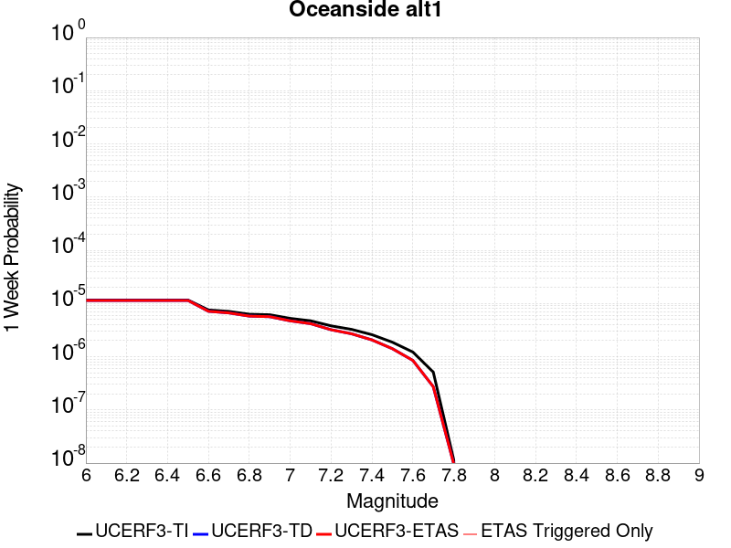 | 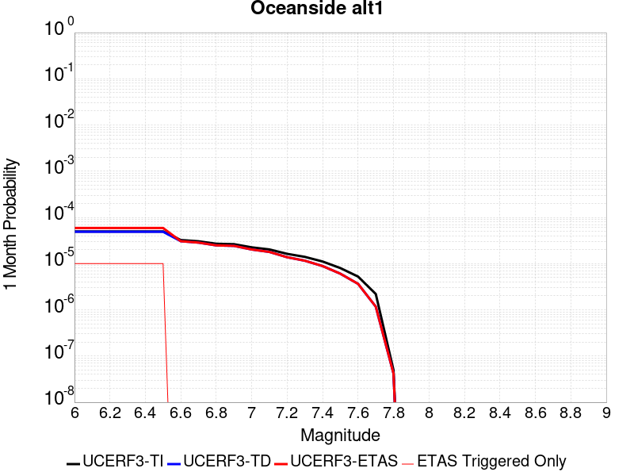 |  | 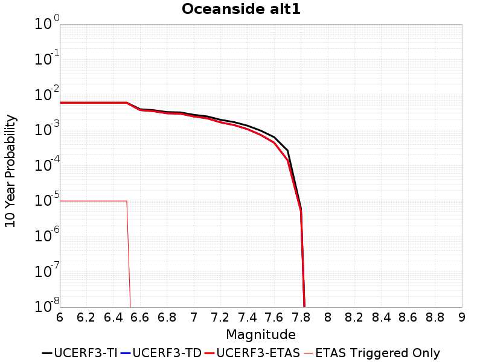 |

| Magnitude | 1 wk TI Prob | 1 wk TD Prob | 1 wk ETAS Prob | 1 wk ETAS/TD Gain | 1 wk ETAS Triggered Only | 1 mo TI Prob | 1 mo TD Prob | 1 mo ETAS Prob | 1 mo ETAS/TD Gain | 1 mo ETAS Triggered Only | 1 yr TI Prob | 1 yr TD Prob | 1 yr ETAS Prob | 1 yr ETAS/TD Gain | 1 yr ETAS Triggered Only | 10 yr TI Prob | 10 yr TD Prob | 10 yr ETAS Prob | 10 yr ETAS/TD Gain | 10 yr ETAS Triggered Only |
|-----|-----|-----|-----|-----|-----|-----|-----|-----|-----|-----|-----|-----|-----|-----|-----|-----|-----|-----|-----|-----|
| 6.0 | 1.1617542E-5 | 1.1423559E-5 | 1.1423559E-5 | 1.0 | 0.0 | 4.9788516E-5 | 4.895728E-5 | 5.895679E-5 | 1.2042497 | 1.0E-5 | 6.060066E-4 | 5.95908E-4 | 6.0590205E-4 | 1.0167711 | 1.0E-5 | 0.0060435664 | 0.0059446986 | 0.0059546395 | 1.0016721 | 1.0E-5 |
| 6.1 | 1.1617542E-5 | 1.1423559E-5 | 1.1423559E-5 | 1.0 | 0.0 | 4.9788516E-5 | 4.895728E-5 | 5.895679E-5 | 1.2042497 | 1.0E-5 | 6.060066E-4 | 5.95908E-4 | 6.0590205E-4 | 1.0167711 | 1.0E-5 | 0.0060435664 | 0.0059446986 | 0.0059546395 | 1.0016721 | 1.0E-5 |
| 6.2 | 1.1617542E-5 | 1.1423559E-5 | 1.1423559E-5 | 1.0 | 0.0 | 4.9788516E-5 | 4.895728E-5 | 5.895679E-5 | 1.2042497 | 1.0E-5 | 6.060066E-4 | 5.95908E-4 | 6.0590205E-4 | 1.0167711 | 1.0E-5 | 0.0060435664 | 0.0059446986 | 0.0059546395 | 1.0016721 | 1.0E-5 |
| 6.3 | 1.1617542E-5 | 1.1423559E-5 | 1.1423559E-5 | 1.0 | 0.0 | 4.9788516E-5 | 4.895728E-5 | 5.895679E-5 | 1.2042497 | 1.0E-5 | 6.060066E-4 | 5.95908E-4 | 6.0590205E-4 | 1.0167711 | 1.0E-5 | 0.0060435664 | 0.0059446986 | 0.0059546395 | 1.0016721 | 1.0E-5 |
| 6.4 | 1.1617542E-5 | 1.1423559E-5 | 1.1423559E-5 | 1.0 | 0.0 | 4.9788516E-5 | 4.895728E-5 | 5.895679E-5 | 1.2042497 | 1.0E-5 | 6.060066E-4 | 5.95908E-4 | 6.0590205E-4 | 1.0167711 | 1.0E-5 | 0.0060435664 | 0.0059446986 | 0.0059546395 | 1.0016721 | 1.0E-5 |
| 6.5 | 1.1617542E-5 | 1.1423559E-5 | 1.1423559E-5 | 1.0 | 0.0 | 4.9788516E-5 | 4.895728E-5 | 5.895679E-5 | 1.2042497 | 1.0E-5 | 6.060066E-4 | 5.95908E-4 | 6.0590205E-4 | 1.0167711 | 1.0E-5 | 0.0060435664 | 0.0059446986 | 0.0059546395 | 1.0016721 | 1.0E-5 |
| 6.6 | 7.561768E-6 | 7.1336544E-6 | 7.1336544E-6 | 1.0 | 0.0 | 3.2407173E-5 | 3.0572453E-5 | 3.0572453E-5 | 1.0 | 0.0 | 3.9448592E-4 | 3.721571E-4 | 3.721571E-4 | 1.0 | 0.0 | 0.0039378637 | 0.0037154502 | 0.0037154502 | 1.0 | 0.0 |
| 6.7 | 7.1042605E-6 | 6.6557222E-6 | 6.6557222E-6 | 1.0 | 0.0 | 3.0446476E-5 | 2.8524215E-5 | 2.8524215E-5 | 1.0 | 0.0 | 3.706228E-4 | 3.472278E-4 | 3.472278E-4 | 1.0 | 0.0 | 0.0037000529 | 0.0034669358 | 0.0034669358 | 1.0 | 0.0 |
| 6.8 | 6.285554E-6 | 5.7997377E-6 | 5.7997377E-6 | 1.0 | 0.0 | 2.693781E-5 | 2.4855786E-5 | 2.4855786E-5 | 1.0 | 0.0 | 3.2791847E-4 | 3.025777E-4 | 3.025777E-4 | 1.0 | 0.0 | 0.0032743502 | 0.003021715 | 0.003021715 | 1.0 | 0.0 |
| 6.9 | 6.148883E-6 | 5.656576E-6 | 5.656576E-6 | 1.0 | 0.0 | 2.635209E-5 | 2.4242245E-5 | 2.4242245E-5 | 1.0 | 0.0 | 3.2078946E-4 | 2.951099E-4 | 2.951099E-4 | 1.0 | 0.0 | 0.003203268 | 0.002947237 | 0.002947237 | 1.0 | 0.0 |
| 7.0 | 5.253857E-6 | 4.7224307E-6 | 4.7224307E-6 | 1.0 | 0.0 | 2.2516335E-5 | 2.0238833E-5 | 2.0238833E-5 | 1.0 | 0.0 | 2.7410188E-4 | 2.4638022E-4 | 2.4638022E-4 | 1.0 | 0.0 | 0.0027376404 | 0.0024611023 | 0.0024611023 | 1.0 | 0.0 |
| 7.1 | 4.730754E-6 | 4.178534E-6 | 4.178534E-6 | 1.0 | 0.0 | 2.0274503E-5 | 1.7907882E-5 | 1.7907882E-5 | 1.0 | 0.0 | 2.468141E-4 | 2.180069E-4 | 2.180069E-4 | 1.0 | 0.0 | 0.0024654015 | 0.0021779567 | 0.0021779567 | 1.0 | 0.0 |
| 7.2 | 3.7998386E-6 | 3.214045E-6 | 3.214045E-6 | 1.0 | 0.0 | 1.6284921E-5 | 1.3774406E-5 | 1.3774406E-5 | 1.0 | 0.0 | 1.9825088E-4 | 1.6769061E-4 | 1.6769061E-4 | 1.0 | 0.0 | 0.001980741 | 0.0016756529 | 0.0016756529 | 1.0 | 0.0 |
| 7.3 | 3.2656465E-6 | 2.6983926E-6 | 2.6983926E-6 | 1.0 | 0.0 | 1.3995553E-5 | 1.1564489E-5 | 1.1564489E-5 | 1.0 | 0.0 | 1.7038253E-4 | 1.4078867E-4 | 1.4078867E-4 | 1.0 | 0.0 | 0.0017025196 | 0.0014070058 | 0.0014070058 | 1.0 | 0.0 |
| 7.4 | 2.593703E-6 | 2.0680413E-6 | 2.0680413E-6 | 1.0 | 0.0 | 1.1115822E-5 | 8.863005E-6 | 8.863005E-6 | 1.0 | 0.0 | 1.3532673E-4 | 1.0790183E-4 | 1.0790183E-4 | 1.0 | 0.0 | 0.0013524436 | 0.0010785033 | 0.0010785033 | 1.0 | 0.0 |
| 7.5 | 1.8715585E-6 | 1.4137233E-6 | 1.4137233E-6 | 1.0 | 0.0 | 8.020941E-6 | 6.058801E-6 | 6.058801E-6 | 1.0 | 0.0 | 9.7650576E-5 | 7.376346E-5 | 7.376346E-5 | 1.0 | 0.0 | 9.7607676E-4 | 7.3739584E-4 | 7.3739584E-4 | 1.0 | 0.0 |
| 7.6 | 1.2246786E-6 | 8.526863E-7 | 8.526863E-7 | 1.0 | 0.0 | 5.248612E-6 | 3.654365E-6 | 3.654365E-6 | 1.0 | 0.0 | 6.389998E-5 | 4.449103E-5 | 4.449103E-5 | 1.0 | 0.0 | 6.3881604E-4 | 4.4482574E-4 | 4.4482574E-4 | 1.0 | 0.0 |
| 7.7 | 5.140719E-7 | 2.734729E-7 | 2.734729E-7 | 1.0 | 0.0 | 2.2031636E-6 | 1.1720263E-6 | 1.1720263E-6 | 1.0 | 0.0 | 2.6823185E-5 | 1.426934E-5 | 1.426934E-5 | 1.0 | 0.0 | 2.6819948E-4 | 1.4268559E-4 | 1.4268559E-4 | 1.0 | 0.0 |
| 7.8 | 1.16056995E-8 | 9.782389E-9 | 9.782389E-9 | 1.0 | 0.0 | 4.9738713E-8 | 4.1924523E-8 | 4.1924523E-8 | 1.0 | 0.0 | 6.0556863E-7 | 5.1043105E-7 | 5.1043105E-7 | 1.0 | 0.0 | 6.05567E-6 | 5.1043107E-6 | 5.1043107E-6 | 1.0 | 0.0 |

## Redondo Canyon alt 1
*[(top)](#table-of-contents)*

| 1 Week | 1 Month | 1 Year | 10 Year |
|-----|-----|-----|-----|
| 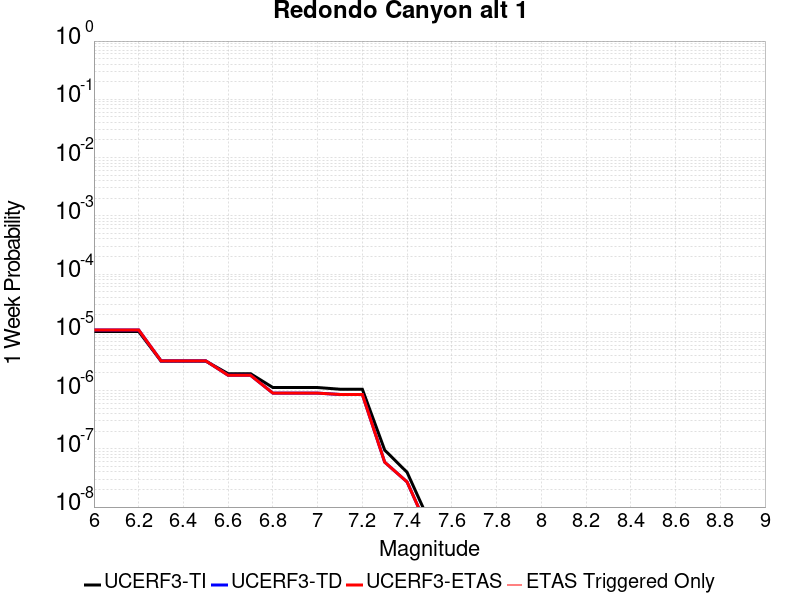 | 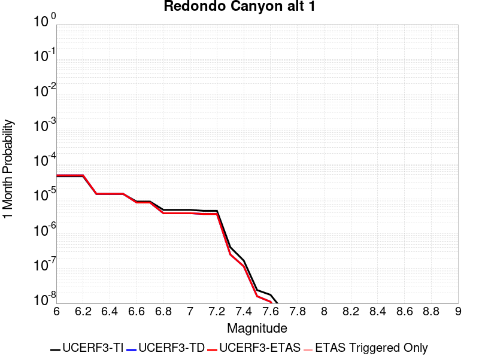 | 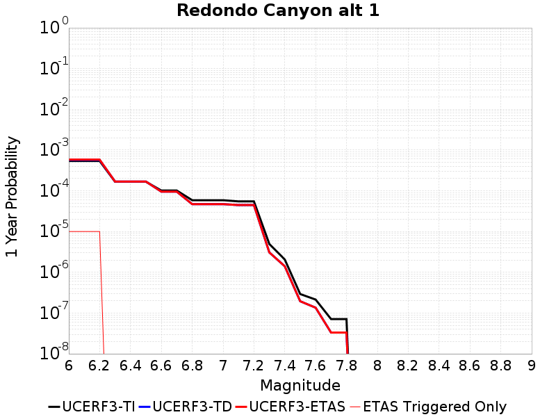 |  |

| Magnitude | 1 wk TI Prob | 1 wk TD Prob | 1 wk ETAS Prob | 1 wk ETAS/TD Gain | 1 wk ETAS Triggered Only | 1 mo TI Prob | 1 mo TD Prob | 1 mo ETAS Prob | 1 mo ETAS/TD Gain | 1 mo ETAS Triggered Only | 1 yr TI Prob | 1 yr TD Prob | 1 yr ETAS Prob | 1 yr ETAS/TD Gain | 1 yr ETAS Triggered Only | 10 yr TI Prob | 10 yr TD Prob | 10 yr ETAS Prob | 10 yr ETAS/TD Gain | 10 yr ETAS Triggered Only |
|-----|-----|-----|-----|-----|-----|-----|-----|-----|-----|-----|-----|-----|-----|-----|-----|-----|-----|-----|-----|-----|
| 6.0 | 1.0346246E-5 | 1.0981468E-5 | 1.0981468E-5 | 1.0 | 0.0 | 4.43403E-5 | 4.706303E-5 | 4.706303E-5 | 1.0 | 0.0 | 5.3970946E-4 | 5.7292066E-4 | 5.829149E-4 | 1.0174444 | 1.0E-5 | 0.0053840056 | 0.0057221754 | 0.005732118 | 1.0017376 | 1.0E-5 |
| 6.1 | 1.0346246E-5 | 1.0981468E-5 | 1.0981468E-5 | 1.0 | 0.0 | 4.43403E-5 | 4.706303E-5 | 4.706303E-5 | 1.0 | 0.0 | 5.3970946E-4 | 5.7292066E-4 | 5.829149E-4 | 1.0174444 | 1.0E-5 | 0.0053840056 | 0.0057221754 | 0.005732118 | 1.0017376 | 1.0E-5 |
| 6.2 | 1.0346246E-5 | 1.0981468E-5 | 1.0981468E-5 | 1.0 | 0.0 | 4.43403E-5 | 4.706303E-5 | 4.706303E-5 | 1.0 | 0.0 | 5.3970946E-4 | 5.7292066E-4 | 5.829149E-4 | 1.0174444 | 1.0E-5 | 0.0053840056 | 0.0057221754 | 0.005732118 | 1.0017376 | 1.0E-5 |
| 6.3 | 3.2052794E-6 | 3.2361675E-6 | 3.2361675E-6 | 1.0 | 0.0 | 1.373684E-5 | 1.3869238E-5 | 1.3869238E-5 | 1.0 | 0.0 | 1.6723319E-4 | 1.6884886E-4 | 1.6884886E-4 | 1.0 | 0.0 | 0.001671074 | 0.0016875953 | 0.0016875953 | 1.0 | 0.0 |
| 6.4 | 3.2052794E-6 | 3.2361675E-6 | 3.2361675E-6 | 1.0 | 0.0 | 1.373684E-5 | 1.3869238E-5 | 1.3869238E-5 | 1.0 | 0.0 | 1.6723319E-4 | 1.6884886E-4 | 1.6884886E-4 | 1.0 | 0.0 | 0.001671074 | 0.0016875953 | 0.0016875953 | 1.0 | 0.0 |
| 6.5 | 3.2052794E-6 | 3.2361675E-6 | 3.2361675E-6 | 1.0 | 0.0 | 1.373684E-5 | 1.3869238E-5 | 1.3869238E-5 | 1.0 | 0.0 | 1.6723319E-4 | 1.6884886E-4 | 1.6884886E-4 | 1.0 | 0.0 | 0.001671074 | 0.0016875953 | 0.0016875953 | 1.0 | 0.0 |
| 6.6 | 1.948328E-6 | 1.8288993E-6 | 1.8288993E-6 | 1.0 | 0.0 | 8.349951E-6 | 7.8381245E-6 | 7.8381245E-6 | 1.0 | 0.0 | 1.016559E-4 | 9.542648E-5 | 9.542648E-5 | 1.0 | 0.0 | 0.0010160941 | 9.540021E-4 | 9.540021E-4 | 1.0 | 0.0 |
| 6.7 | 1.948328E-6 | 1.8288993E-6 | 1.8288993E-6 | 1.0 | 0.0 | 8.349951E-6 | 7.8381245E-6 | 7.8381245E-6 | 1.0 | 0.0 | 1.016559E-4 | 9.542648E-5 | 9.542648E-5 | 1.0 | 0.0 | 0.0010160941 | 9.540021E-4 | 9.540021E-4 | 1.0 | 0.0 |
| 6.8 | 1.1278219E-6 | 9.0332554E-7 | 9.0332554E-7 | 1.0 | 0.0 | 4.8335132E-6 | 3.871392E-6 | 3.871392E-6 | 1.0 | 0.0 | 5.8846435E-5 | 4.7133602E-5 | 4.7133602E-5 | 1.0 | 0.0 | 5.8830855E-4 | 4.712781E-4 | 4.712781E-4 | 1.0 | 0.0 |
| 6.9 | 1.1278219E-6 | 9.0332554E-7 | 9.0332554E-7 | 1.0 | 0.0 | 4.8335132E-6 | 3.871392E-6 | 3.871392E-6 | 1.0 | 0.0 | 5.8846435E-5 | 4.7133602E-5 | 4.7133602E-5 | 1.0 | 0.0 | 5.8830855E-4 | 4.712781E-4 | 4.712781E-4 | 1.0 | 0.0 |
| 7.0 | 1.1278219E-6 | 9.0332554E-7 | 9.0332554E-7 | 1.0 | 0.0 | 4.8335132E-6 | 3.871392E-6 | 3.871392E-6 | 1.0 | 0.0 | 5.8846435E-5 | 4.7133602E-5 | 4.7133602E-5 | 1.0 | 0.0 | 5.8830855E-4 | 4.712781E-4 | 4.712781E-4 | 1.0 | 0.0 |
| 7.1 | 1.0545139E-6 | 8.5694364E-7 | 8.5694364E-7 | 1.0 | 0.0 | 4.5193374E-6 | 3.6726128E-6 | 3.6726128E-6 | 1.0 | 0.0 | 5.5021545E-5 | 4.471357E-5 | 4.471357E-5 | 1.0 | 0.0 | 5.500792E-4 | 4.4708748E-4 | 4.4708748E-4 | 1.0 | 0.0 |
| 7.2 | 1.0545139E-6 | 8.5694364E-7 | 8.5694364E-7 | 1.0 | 0.0 | 4.5193374E-6 | 3.6726128E-6 | 3.6726128E-6 | 1.0 | 0.0 | 5.5021545E-5 | 4.471357E-5 | 4.471357E-5 | 1.0 | 0.0 | 5.500792E-4 | 4.4708748E-4 | 4.4708748E-4 | 1.0 | 0.0 |
| 7.3 | 9.505161E-8 | 5.8958964E-8 | 5.8958964E-8 | 1.0 | 0.0 | 4.0736398E-7 | 2.5268125E-7 | 2.5268125E-7 | 1.0 | 0.0 | 4.959645E-6 | 3.076391E-6 | 3.076391E-6 | 1.0 | 0.0 | 4.9595343E-5 | 3.0763604E-5 | 3.0763604E-5 | 1.0 | 0.0 |
| 7.4 | 3.9520785E-8 | 2.6988058E-8 | 2.6988058E-8 | 1.0 | 0.0 | 1.6937479E-7 | 1.15663106E-7 | 1.15663106E-7 | 1.0 | 0.0 | 2.062136E-6 | 1.4081977E-6 | 1.4081977E-6 | 1.0 | 0.0 | 2.062117E-5 | 1.4081914E-5 | 1.4081914E-5 | 1.0 | 0.0 |
| 7.5 | 5.6133214E-9 | 3.736929E-9 | 3.736929E-9 | 1.0 | 0.0 | 2.4057092E-8 | 1.601541E-8 | 1.601541E-8 | 1.0 | 0.0 | 2.9289507E-7 | 1.9498759E-7 | 1.9498759E-7 | 1.0 | 0.0 | 2.9289467E-6 | 1.9498746E-6 | 1.9498746E-6 | 1.0 | 0.0 |
| 7.6 | 4.1064334E-9 | 2.5958429E-9 | 2.5958429E-9 | 1.0 | 0.0 | 1.7599E-8 | 1.11250404E-8 | 1.11250404E-8 | 1.0 | 0.0 | 2.142678E-7 | 1.3544737E-7 | 1.3544737E-7 | 1.0 | 0.0 | 2.1426758E-6 | 1.3544729E-6 | 1.3544729E-6 | 1.0 | 0.0 |
| 7.7 | 1.361975E-9 | 6.361073E-10 | 6.361073E-10 | 1.0 | 0.0 | 5.8370353E-9 | 2.7261737E-9 | 2.7261737E-9 | 1.0 | 0.0 | 7.1065905E-8 | 3.3191164E-8 | 3.3191164E-8 | 1.0 | 0.0 | 7.106588E-7 | 3.3191162E-7 | 3.3191162E-7 | 1.0 | 0.0 |
| 7.8 | 1.361975E-9 | 6.361073E-10 | 6.361073E-10 | 1.0 | 0.0 | 5.8370353E-9 | 2.7261737E-9 | 2.7261737E-9 | 1.0 | 0.0 | 7.1065905E-8 | 3.3191164E-8 | 3.3191164E-8 | 1.0 | 0.0 | 7.106588E-7 | 3.3191162E-7 | 3.3191162E-7 | 1.0 | 0.0 |

## Antelope Valley 2011
*[(top)](#table-of-contents)*

| 1 Week | 1 Month | 1 Year | 10 Year |
|-----|-----|-----|-----|
|  | 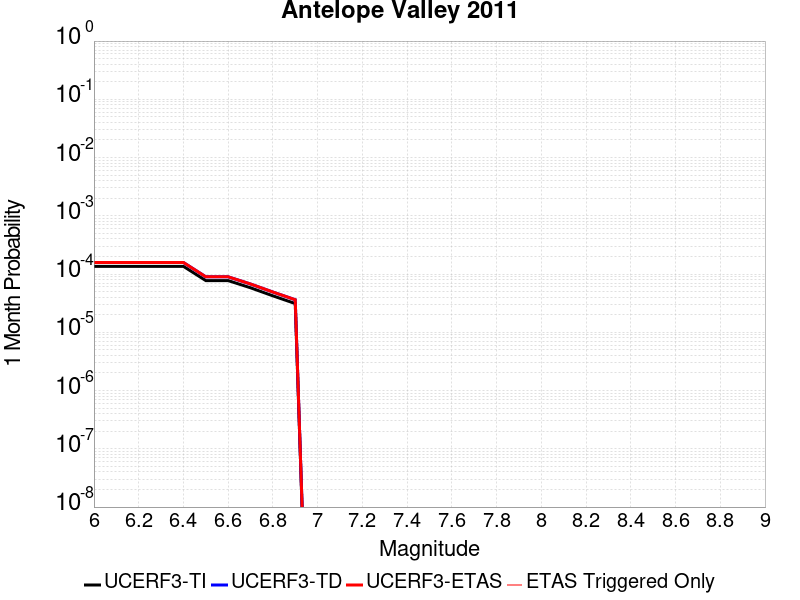 | 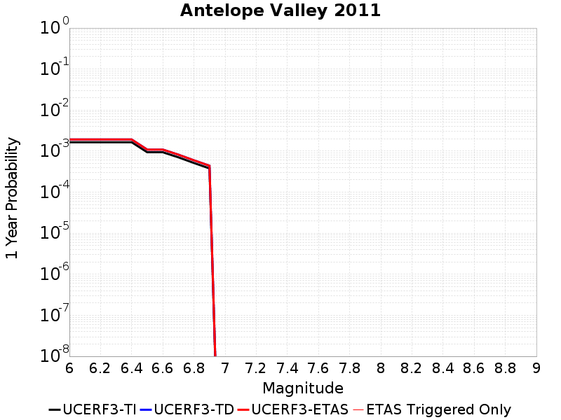 | 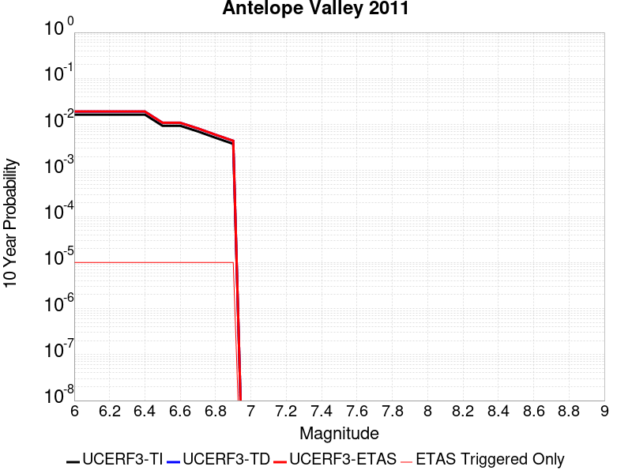 |

| Magnitude | 1 wk TI Prob | 1 wk TD Prob | 1 wk ETAS Prob | 1 wk ETAS/TD Gain | 1 wk ETAS Triggered Only | 1 mo TI Prob | 1 mo TD Prob | 1 mo ETAS Prob | 1 mo ETAS/TD Gain | 1 mo ETAS Triggered Only | 1 yr TI Prob | 1 yr TD Prob | 1 yr ETAS Prob | 1 yr ETAS/TD Gain | 1 yr ETAS Triggered Only | 10 yr TI Prob | 10 yr TD Prob | 10 yr ETAS Prob | 10 yr ETAS/TD Gain | 10 yr ETAS Triggered Only |
|-----|-----|-----|-----|-----|-----|-----|-----|-----|-----|-----|-----|-----|-----|-----|-----|-----|-----|-----|-----|-----|
| 6.0 | 3.1646934E-5 | 3.6905087E-5 | 3.6905087E-5 | 1.0 | 0.0 | 1.3562266E-4 | 1.5815657E-4 | 1.5815657E-4 | 1.0 | 0.0 | 0.0016499552 | 0.0019241201 | 0.0019241201 | 1.0 | 0.0 | 0.016377583 | 0.019101003 | 0.019110812 | 1.0005136 | 1.0E-5 |
| 6.1 | 3.1646934E-5 | 3.6905087E-5 | 3.6905087E-5 | 1.0 | 0.0 | 1.3562266E-4 | 1.5815657E-4 | 1.5815657E-4 | 1.0 | 0.0 | 0.0016499552 | 0.0019241201 | 0.0019241201 | 1.0 | 0.0 | 0.016377583 | 0.019101003 | 0.019110812 | 1.0005136 | 1.0E-5 |
| 6.2 | 3.1646934E-5 | 3.6905087E-5 | 3.6905087E-5 | 1.0 | 0.0 | 1.3562266E-4 | 1.5815657E-4 | 1.5815657E-4 | 1.0 | 0.0 | 0.0016499552 | 0.0019241201 | 0.0019241201 | 1.0 | 0.0 | 0.016377583 | 0.019101003 | 0.019110812 | 1.0005136 | 1.0E-5 |
| 6.3 | 3.1646934E-5 | 3.6905087E-5 | 3.6905087E-5 | 1.0 | 0.0 | 1.3562266E-4 | 1.5815657E-4 | 1.5815657E-4 | 1.0 | 0.0 | 0.0016499552 | 0.0019241201 | 0.0019241201 | 1.0 | 0.0 | 0.016377583 | 0.019101003 | 0.019110812 | 1.0005136 | 1.0E-5 |
| 6.4 | 3.1646934E-5 | 3.6905087E-5 | 3.6905087E-5 | 1.0 | 0.0 | 1.3562266E-4 | 1.5815657E-4 | 1.5815657E-4 | 1.0 | 0.0 | 0.0016499552 | 0.0019241201 | 0.0019241201 | 1.0 | 0.0 | 0.016377583 | 0.019101003 | 0.019110812 | 1.0005136 | 1.0E-5 |
| 6.5 | 1.8034107E-5 | 2.0941336E-5 | 2.0941336E-5 | 1.0 | 0.0 | 7.7286735E-5 | 8.974619E-5 | 8.974619E-5 | 1.0 | 0.0 | 9.405598E-4 | 0.0010922343 | 0.0010922343 | 1.0 | 0.0 | 0.009365888 | 0.010880737 | 0.010890628 | 1.0009091 | 1.0E-5 |
| 6.6 | 1.8034107E-5 | 2.0941336E-5 | 2.0941336E-5 | 1.0 | 0.0 | 7.7286735E-5 | 8.974619E-5 | 8.974619E-5 | 1.0 | 0.0 | 9.405598E-4 | 0.0010922343 | 0.0010922343 | 1.0 | 0.0 | 0.009365888 | 0.010880737 | 0.010890628 | 1.0009091 | 1.0E-5 |
| 6.7 | 1.3567667E-5 | 1.5749793E-5 | 1.5749793E-5 | 1.0 | 0.0 | 5.814585E-5 | 6.749796E-5 | 6.749796E-5 | 1.0 | 0.0 | 7.076958E-4 | 8.215841E-4 | 8.215841E-4 | 1.0 | 0.0 | 0.007054463 | 0.008195901 | 0.008205819 | 1.0012101 | 1.0E-5 |
| 6.8 | 9.867387E-6 | 1.1468143E-5 | 1.1468143E-5 | 1.0 | 0.0 | 4.2288117E-5 | 4.914879E-5 | 4.914879E-5 | 1.0 | 0.0 | 5.1473617E-4 | 5.9831725E-4 | 5.9831725E-4 | 1.0 | 0.0 | 0.005135455 | 0.005976376 | 0.0059863166 | 1.0016632 | 1.0E-5 |
| 6.9 | 7.273233E-6 | 8.455017E-6 | 8.455017E-6 | 1.0 | 0.0 | 3.1170628E-5 | 3.623579E-5 | 3.623579E-5 | 1.0 | 0.0 | 3.794363E-4 | 4.411707E-4 | 4.411707E-4 | 1.0 | 0.0 | 0.0037878908 | 0.004411707 | 0.004421663 | 1.0022568 | 1.0E-5 |

## White Wolf
*[(top)](#table-of-contents)*

| 1 Week | 1 Month | 1 Year | 10 Year |
|-----|-----|-----|-----|
| 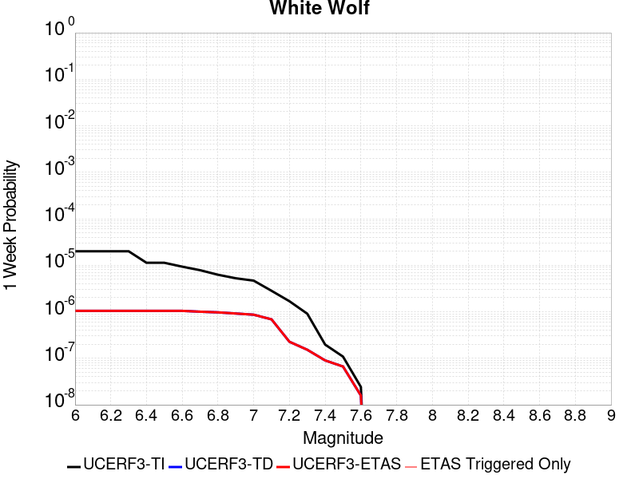 |  | 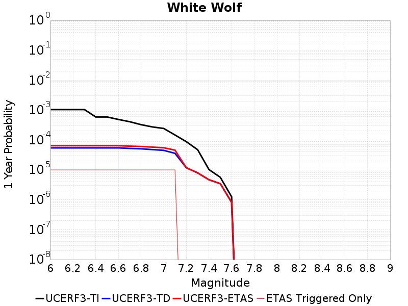 | 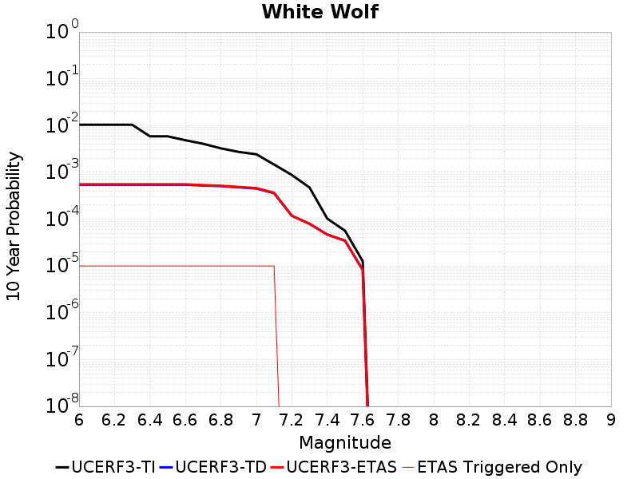 |

| Magnitude | 1 wk TI Prob | 1 wk TD Prob | 1 wk ETAS Prob | 1 wk ETAS/TD Gain | 1 wk ETAS Triggered Only | 1 mo TI Prob | 1 mo TD Prob | 1 mo ETAS Prob | 1 mo ETAS/TD Gain | 1 mo ETAS Triggered Only | 1 yr TI Prob | 1 yr TD Prob | 1 yr ETAS Prob | 1 yr ETAS/TD Gain | 1 yr ETAS Triggered Only | 10 yr TI Prob | 10 yr TD Prob | 10 yr ETAS Prob | 10 yr ETAS/TD Gain | 10 yr ETAS Triggered Only |
|-----|-----|-----|-----|-----|-----|-----|-----|-----|-----|-----|-----|-----|-----|-----|-----|-----|-----|-----|-----|-----|
| 6.0 | 2.0037822E-5 | 1.0469281E-6 | 1.0469281E-6 | 1.0 | 0.0 | 8.587355E-5 | 4.4868275E-6 | 4.4868275E-6 | 1.0 | 0.0 | 0.001045009 | 5.4625805E-5 | 6.462526E-5 | 1.1830536 | 1.0E-5 | 0.010401085 | 5.4612884E-4 | 5.561234E-4 | 1.0183007 | 1.0E-5 |
| 6.1 | 2.0037822E-5 | 1.0469281E-6 | 1.0469281E-6 | 1.0 | 0.0 | 8.587355E-5 | 4.4868275E-6 | 4.4868275E-6 | 1.0 | 0.0 | 0.001045009 | 5.4625805E-5 | 6.462526E-5 | 1.1830536 | 1.0E-5 | 0.010401085 | 5.4612884E-4 | 5.561234E-4 | 1.0183007 | 1.0E-5 |
| 6.2 | 2.0037822E-5 | 1.0469281E-6 | 1.0469281E-6 | 1.0 | 0.0 | 8.587355E-5 | 4.4868275E-6 | 4.4868275E-6 | 1.0 | 0.0 | 0.001045009 | 5.4625805E-5 | 6.462526E-5 | 1.1830536 | 1.0E-5 | 0.010401085 | 5.4612884E-4 | 5.561234E-4 | 1.0183007 | 1.0E-5 |
| 6.3 | 2.0037822E-5 | 1.0469281E-6 | 1.0469281E-6 | 1.0 | 0.0 | 8.587355E-5 | 4.4868275E-6 | 4.4868275E-6 | 1.0 | 0.0 | 0.001045009 | 5.4625805E-5 | 6.462526E-5 | 1.1830536 | 1.0E-5 | 0.010401085 | 5.4612884E-4 | 5.561234E-4 | 1.0183007 | 1.0E-5 |
| 6.4 | 1.132487E-5 | 1.0469281E-6 | 1.0469281E-6 | 1.0 | 0.0 | 4.8534253E-5 | 4.4868275E-6 | 4.4868275E-6 | 1.0 | 0.0 | 5.907443E-4 | 5.4625805E-5 | 6.462526E-5 | 1.1830536 | 1.0E-5 | 0.005891764 | 5.4612884E-4 | 5.561234E-4 | 1.0183007 | 1.0E-5 |
| 6.5 | 1.132487E-5 | 1.0469281E-6 | 1.0469281E-6 | 1.0 | 0.0 | 4.8534253E-5 | 4.4868275E-6 | 4.4868275E-6 | 1.0 | 0.0 | 5.907443E-4 | 5.4625805E-5 | 6.462526E-5 | 1.1830536 | 1.0E-5 | 0.005891764 | 5.4612884E-4 | 5.561234E-4 | 1.0183007 | 1.0E-5 |
| 6.6 | 9.347473E-6 | 1.0469281E-6 | 1.0469281E-6 | 1.0 | 0.0 | 4.0059982E-5 | 4.4868275E-6 | 4.4868275E-6 | 1.0 | 0.0 | 4.8762115E-4 | 5.4625805E-5 | 6.462526E-5 | 1.1830536 | 1.0E-5 | 0.0048655253 | 5.4612884E-4 | 5.561234E-4 | 1.0183007 | 1.0E-5 |
| 6.7 | 7.842647E-6 | 1.0048456E-6 | 1.0048456E-6 | 1.0 | 0.0 | 3.361091E-5 | 4.306474E-6 | 4.306474E-6 | 1.0 | 0.0 | 4.0913603E-4 | 5.243011E-5 | 6.2429586E-5 | 1.1907201 | 1.0E-5 | 0.004083836 | 5.2418234E-4 | 5.341771E-4 | 1.0190673 | 1.0E-5 |
| 6.8 | 6.26597E-6 | 9.734929E-7 | 9.734929E-7 | 1.0 | 0.0 | 2.685388E-5 | 4.172106E-6 | 4.172106E-6 | 1.0 | 0.0 | 3.2689696E-4 | 5.0794253E-5 | 6.0793747E-5 | 1.1968627 | 1.0E-5 | 0.003264165 | 5.0783134E-4 | 5.178263E-4 | 1.0196816 | 1.0E-5 |
| 6.9 | 5.258436E-6 | 9.183353E-7 | 9.183353E-7 | 1.0 | 0.0 | 2.2535958E-5 | 3.935717E-6 | 3.935717E-6 | 1.0 | 0.0 | 2.7434074E-4 | 4.791635E-5 | 5.791587E-5 | 1.2086871 | 1.0E-5 | 0.0027400232 | 4.7906497E-4 | 4.890602E-4 | 1.020864 | 1.0E-5 |
| 7.0 | 4.675028E-6 | 8.6612727E-7 | 8.6612727E-7 | 1.0 | 0.0 | 2.003568E-5 | 3.711969E-6 | 3.711969E-6 | 1.0 | 0.0 | 2.4390711E-4 | 4.5192333E-5 | 5.5191882E-5 | 1.2212665 | 1.0E-5 | 0.0024363957 | 4.5183615E-4 | 4.6183163E-4 | 1.0221219 | 1.0E-5 |
| 7.1 | 2.8270078E-6 | 6.874245E-7 | 6.874245E-7 | 1.0 | 0.0 | 1.2115692E-5 | 2.946102E-6 | 2.946102E-6 | 1.0 | 0.0 | 1.4749856E-4 | 3.5868245E-5 | 4.5867884E-5 | 1.2787881 | 1.0E-5 | 0.001474007 | 3.5862863E-4 | 3.6862507E-4 | 1.027874 | 1.0E-5 |
| 7.2 | 1.6881406E-6 | 2.270678E-7 | 2.270678E-7 | 1.0 | 0.0 | 7.2348685E-6 | 9.731474E-7 | 9.731474E-7 | 1.0 | 0.0 | 8.808096E-5 | 1.1848007E-5 | 1.1848007E-5 | 1.0 | 0.0 | 8.8046055E-4 | 1.184739E-4 | 1.184739E-4 | 1.0 | 0.0 |
| 7.3 | 9.086107E-7 | 1.5266625E-7 | 1.5266625E-7 | 1.0 | 0.0 | 3.8940398E-6 | 6.542838E-7 | 6.542838E-7 | 1.0 | 0.0 | 4.7408903E-5 | 7.965877E-6 | 7.965877E-6 | 1.0 | 0.0 | 4.739879E-4 | 7.965599E-5 | 7.965599E-5 | 1.0 | 0.0 |
| 7.4 | 1.9717383E-7 | 9.0039705E-8 | 9.0039705E-8 | 1.0 | 0.0 | 8.450304E-7 | 3.858844E-7 | 3.858844E-7 | 1.0 | 0.0 | 1.0288197E-5 | 4.6981327E-6 | 4.6981327E-6 | 1.0 | 0.0 | 1.028772E-4 | 4.6980364E-5 | 4.6980364E-5 | 1.0 | 0.0 |
| 7.5 | 1.086975E-7 | 6.6597515E-8 | 6.6597515E-8 | 1.0 | 0.0 | 4.6584634E-7 | 2.8541788E-7 | 2.8541788E-7 | 1.0 | 0.0 | 5.6716644E-6 | 3.4749573E-6 | 3.4749573E-6 | 1.0 | 0.0 | 5.6715195E-5 | 3.4749053E-5 | 3.4749053E-5 | 1.0 | 0.0 |
| 7.6 | 2.4217808E-8 | 1.582083E-8 | 1.582083E-8 | 1.0 | 0.0 | 1.03790605E-7 | 6.780356E-8 | 6.780356E-8 | 1.0 | 0.0 | 1.2636499E-6 | 8.255081E-7 | 8.255081E-7 | 1.0 | 0.0 | 1.2636427E-5 | 8.255055E-6 | 8.255055E-6 | 1.0 | 0.0 |

## Carson Range (Genoa)
*[(top)](#table-of-contents)*

| 1 Week | 1 Month | 1 Year | 10 Year |
|-----|-----|-----|-----|
| 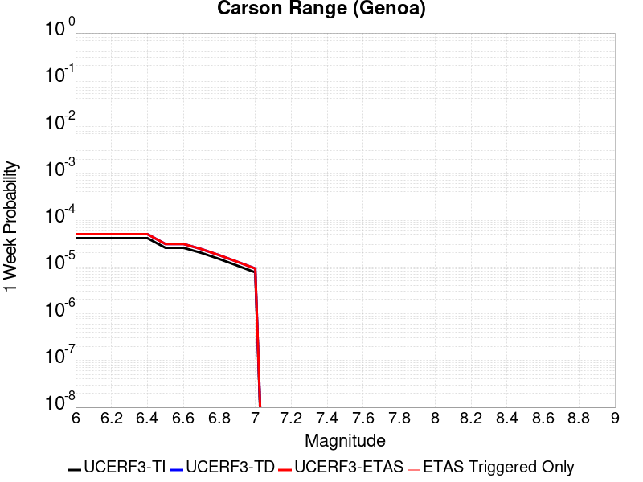 | 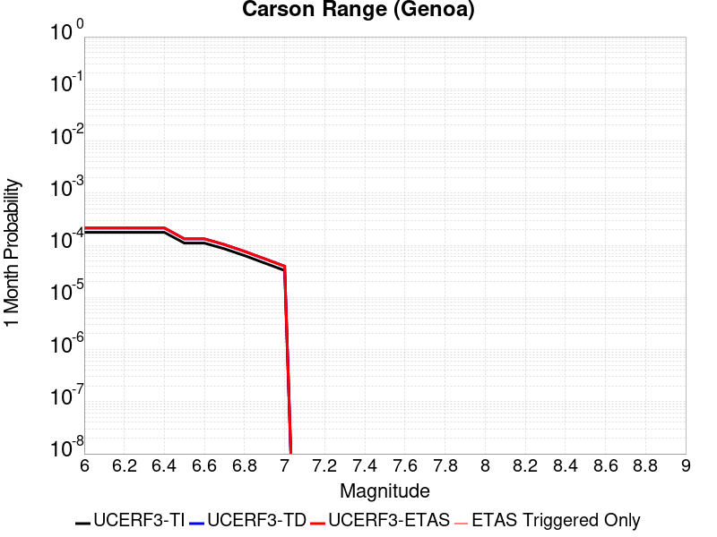 | 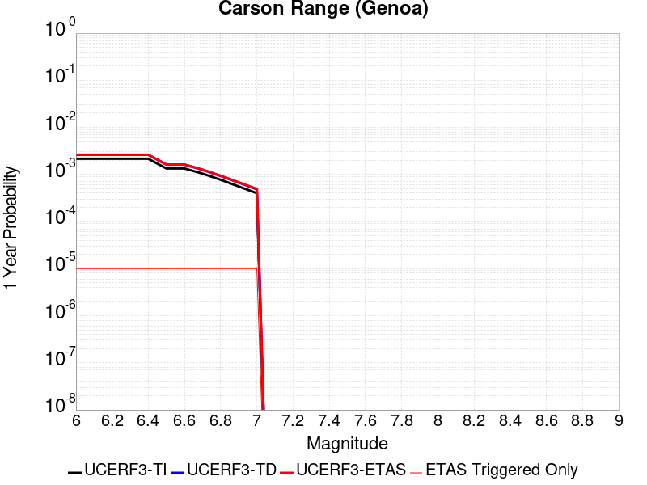 | 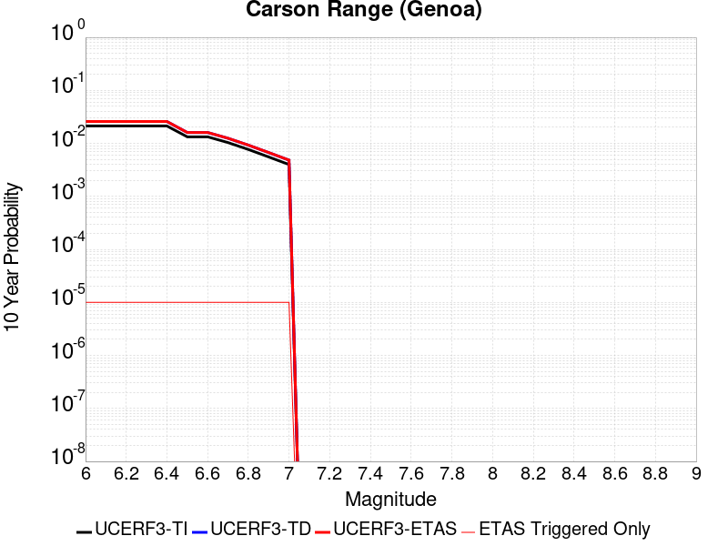 |

| Magnitude | 1 wk TI Prob | 1 wk TD Prob | 1 wk ETAS Prob | 1 wk ETAS/TD Gain | 1 wk ETAS Triggered Only | 1 mo TI Prob | 1 mo TD Prob | 1 mo ETAS Prob | 1 mo ETAS/TD Gain | 1 mo ETAS Triggered Only | 1 yr TI Prob | 1 yr TD Prob | 1 yr ETAS Prob | 1 yr ETAS/TD Gain | 1 yr ETAS Triggered Only | 10 yr TI Prob | 10 yr TD Prob | 10 yr ETAS Prob | 10 yr ETAS/TD Gain | 10 yr ETAS Triggered Only |
|-----|-----|-----|-----|-----|-----|-----|-----|-----|-----|-----|-----|-----|-----|-----|-----|-----|-----|-----|-----|-----|
| 6.0 | 4.1268457E-5 | 5.01481E-5 | 5.01481E-5 | 1.0 | 0.0 | 1.7685282E-4 | 2.1490498E-4 | 2.1490498E-4 | 1.0 | 0.0 | 0.0021510567 | 0.0026137182 | 0.002623692 | 1.003816 | 1.0E-5 | 0.02130354 | 0.02586943 | 0.02587917 | 1.0003766 | 1.0E-5 |
| 6.1 | 4.1268457E-5 | 5.01481E-5 | 5.01481E-5 | 1.0 | 0.0 | 1.7685282E-4 | 2.1490498E-4 | 2.1490498E-4 | 1.0 | 0.0 | 0.0021510567 | 0.0026137182 | 0.002623692 | 1.003816 | 1.0E-5 | 0.02130354 | 0.02586943 | 0.02587917 | 1.0003766 | 1.0E-5 |
| 6.2 | 4.1268457E-5 | 5.01481E-5 | 5.01481E-5 | 1.0 | 0.0 | 1.7685282E-4 | 2.1490498E-4 | 2.1490498E-4 | 1.0 | 0.0 | 0.0021510567 | 0.0026137182 | 0.002623692 | 1.003816 | 1.0E-5 | 0.02130354 | 0.02586943 | 0.02587917 | 1.0003766 | 1.0E-5 |
| 6.3 | 4.1268457E-5 | 5.01481E-5 | 5.01481E-5 | 1.0 | 0.0 | 1.7685282E-4 | 2.1490498E-4 | 2.1490498E-4 | 1.0 | 0.0 | 0.0021510567 | 0.0026137182 | 0.002623692 | 1.003816 | 1.0E-5 | 0.02130354 | 0.02586943 | 0.02587917 | 1.0003766 | 1.0E-5 |
| 6.4 | 4.1268457E-5 | 5.01481E-5 | 5.01481E-5 | 1.0 | 0.0 | 1.7685282E-4 | 2.1490498E-4 | 2.1490498E-4 | 1.0 | 0.0 | 0.0021510567 | 0.0026137182 | 0.002623692 | 1.003816 | 1.0E-5 | 0.02130354 | 0.02586943 | 0.02587917 | 1.0003766 | 1.0E-5 |
| 6.5 | 2.5677185E-5 | 3.0979012E-5 | 3.0979012E-5 | 1.0 | 0.0 | 1.1004044E-4 | 1.3276146E-4 | 1.3276146E-4 | 1.0 | 0.0 | 0.0013389189 | 0.0016153507 | 0.0016253345 | 1.0061806 | 1.0E-5 | 0.0133088045 | 0.016054017 | 0.016063856 | 1.0006129 | 1.0E-5 |
| 6.6 | 2.5677185E-5 | 3.0979012E-5 | 3.0979012E-5 | 1.0 | 0.0 | 1.1004044E-4 | 1.3276146E-4 | 1.3276146E-4 | 1.0 | 0.0 | 0.0013389189 | 0.0016153507 | 0.0016253345 | 1.0061806 | 1.0E-5 | 0.0133088045 | 0.016054017 | 0.016063856 | 1.0006129 | 1.0E-5 |
| 6.7 | 1.9969408E-5 | 2.4064024E-5 | 2.4064024E-5 | 1.0 | 0.0 | 8.558037E-5 | 1.0312832E-4 | 1.0312832E-4 | 1.0 | 0.0 | 0.0010414429 | 0.0012550176 | 0.0012650051 | 1.007958 | 1.0E-5 | 0.010365757 | 0.012494459 | 0.012504334 | 1.0007904 | 1.0E-5 |
| 6.8 | 1.4783156E-5 | 1.7817978E-5 | 1.7817978E-5 | 1.0 | 0.0 | 6.335485E-5 | 7.636126E-5 | 7.636126E-5 | 1.0 | 0.0 | 7.710722E-4 | 9.29432E-4 | 9.394227E-4 | 1.0107492 | 1.0E-5 | 0.0076840227 | 0.009268236 | 0.009278143 | 1.001069 | 1.0E-5 |
| 6.9 | 1.06660555E-5 | 1.28773245E-5 | 1.28773245E-5 | 1.0 | 0.0 | 4.5710865E-5 | 5.518802E-5 | 5.518802E-5 | 1.0 | 0.0 | 5.5638765E-4 | 6.718222E-4 | 6.818155E-4 | 1.0148749 | 1.0E-5 | 0.005549967 | 0.0067092115 | 0.006719144 | 1.0014805 | 1.0E-5 |
| 7.0 | 7.664838E-6 | 9.2585215E-6 | 9.2585215E-6 | 1.0 | 0.0 | 3.2848893E-5 | 3.967938E-5 | 3.967938E-5 | 1.0 | 0.0 | 3.998619E-4 | 4.8309643E-4 | 4.930916E-4 | 1.0206898 | 1.0E-5 | 0.0039914316 | 0.004830962 | 0.0048409137 | 1.0020599 | 1.0E-5 |

## Great Valley 08 (Quinto)
*[(top)](#table-of-contents)*

| 1 Week | 1 Month | 1 Year | 10 Year |
|-----|-----|-----|-----|
| 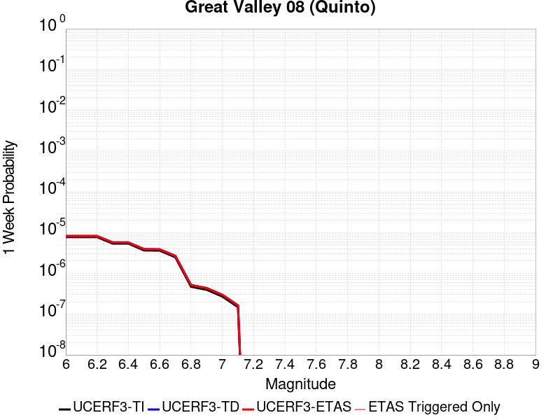 | 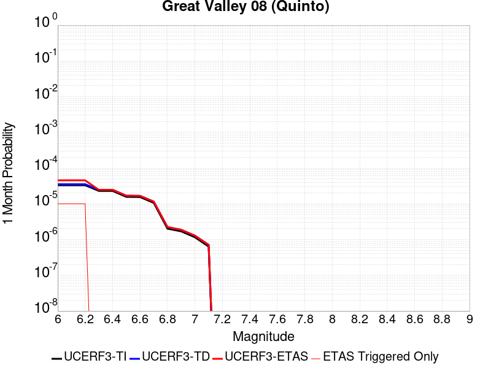 | 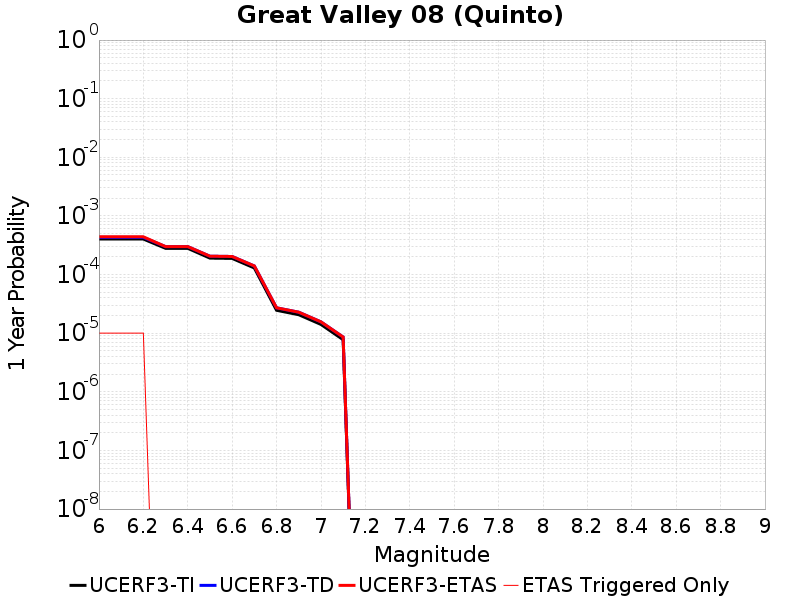 | 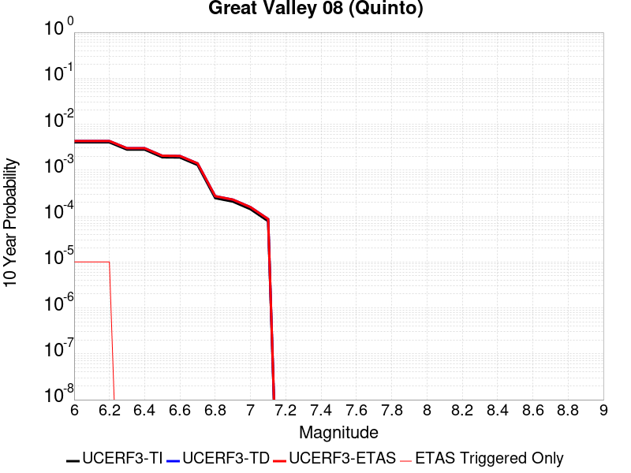 |

| Magnitude | 1 wk TI Prob | 1 wk TD Prob | 1 wk ETAS Prob | 1 wk ETAS/TD Gain | 1 wk ETAS Triggered Only | 1 mo TI Prob | 1 mo TD Prob | 1 mo ETAS Prob | 1 mo ETAS/TD Gain | 1 mo ETAS Triggered Only | 1 yr TI Prob | 1 yr TD Prob | 1 yr ETAS Prob | 1 yr ETAS/TD Gain | 1 yr ETAS Triggered Only | 10 yr TI Prob | 10 yr TD Prob | 10 yr ETAS Prob | 10 yr ETAS/TD Gain | 10 yr ETAS Triggered Only |
|-----|-----|-----|-----|-----|-----|-----|-----|-----|-----|-----|-----|-----|-----|-----|-----|-----|-----|-----|-----|-----|
| 6.0 | 7.737697E-6 | 8.2531E-6 | 8.2531E-6 | 1.0 | 0.0 | 3.3161137E-5 | 3.5370053E-5 | 4.53697E-5 | 1.2827151 | 1.0E-5 | 4.0366207E-4 | 4.3056416E-4 | 4.4055987E-4 | 1.0232153 | 1.0E-5 | 0.004029296 | 0.0042991526 | 0.00430911 | 1.002316 | 1.0E-5 |
| 6.1 | 7.737697E-6 | 8.2531E-6 | 8.2531E-6 | 1.0 | 0.0 | 3.3161137E-5 | 3.5370053E-5 | 4.53697E-5 | 1.2827151 | 1.0E-5 | 4.0366207E-4 | 4.3056416E-4 | 4.4055987E-4 | 1.0232153 | 1.0E-5 | 0.004029296 | 0.0042991526 | 0.00430911 | 1.002316 | 1.0E-5 |
| 6.2 | 7.737697E-6 | 8.2531E-6 | 8.2531E-6 | 1.0 | 0.0 | 3.3161137E-5 | 3.5370053E-5 | 4.53697E-5 | 1.2827151 | 1.0E-5 | 4.0366207E-4 | 4.3056416E-4 | 4.4055987E-4 | 1.0232153 | 1.0E-5 | 0.004029296 | 0.0042991526 | 0.00430911 | 1.002316 | 1.0E-5 |
| 6.3 | 5.374012E-6 | 5.7506186E-6 | 5.7506186E-6 | 1.0 | 0.0 | 2.3031276E-5 | 2.4645338E-5 | 2.4645338E-5 | 1.0 | 0.0 | 2.803697E-4 | 3.0002682E-4 | 3.0002682E-4 | 1.0 | 0.0 | 0.0028001624 | 0.002997311 | 0.002997311 | 1.0 | 0.0 |
| 6.4 | 5.374012E-6 | 5.7506186E-6 | 5.7506186E-6 | 1.0 | 0.0 | 2.3031276E-5 | 2.4645338E-5 | 2.4645338E-5 | 1.0 | 0.0 | 2.803697E-4 | 3.0002682E-4 | 3.0002682E-4 | 1.0 | 0.0 | 0.0028001624 | 0.002997311 | 0.002997311 | 1.0 | 0.0 |
| 6.5 | 3.65427E-6 | 3.9413585E-6 | 3.9413585E-6 | 1.0 | 0.0 | 1.5661062E-5 | 1.6891467E-5 | 1.6891467E-5 | 1.0 | 0.0 | 1.9065675E-4 | 2.0564125E-4 | 2.0564125E-4 | 1.0 | 0.0 | 0.0019049325 | 0.0020552014 | 0.0020552014 | 1.0 | 0.0 |
| 6.6 | 3.6143538E-6 | 3.898545E-6 | 3.898545E-6 | 1.0 | 0.0 | 1.5489995E-5 | 1.6707982E-5 | 1.6707982E-5 | 1.0 | 0.0 | 1.8857437E-4 | 2.0340775E-4 | 2.0340775E-4 | 1.0 | 0.0 | 0.0018841444 | 0.0020329072 | 0.0020329072 | 1.0 | 0.0 |
| 6.7 | 2.4821015E-6 | 2.6857315E-6 | 2.6857315E-6 | 1.0 | 0.0 | 1.0637535E-5 | 1.1510258E-5 | 1.1510258E-5 | 1.0 | 0.0 | 1.2950429E-4 | 1.4013404E-4 | 1.4013404E-4 | 1.0 | 0.0 | 0.0012942884 | 0.0014010117 | 0.0014010117 | 1.0 | 0.0 |
| 6.8 | 4.7110538E-7 | 5.1930806E-7 | 5.1930806E-7 | 1.0 | 0.0 | 2.0190216E-6 | 2.225604E-6 | 2.225604E-6 | 1.0 | 0.0 | 2.458131E-5 | 2.7096412E-5 | 2.7096412E-5 | 1.0 | 0.0 | 2.457859E-4 | 2.7093288E-4 | 2.7093288E-4 | 1.0 | 0.0 |
| 6.9 | 3.958685E-7 | 4.370396E-7 | 4.370396E-7 | 1.0 | 0.0 | 1.6965782E-6 | 1.8730257E-6 | 1.8730257E-6 | 1.0 | 0.0 | 2.0655643E-5 | 2.2803864E-5 | 2.2803864E-5 | 1.0 | 0.0 | 2.0653724E-4 | 2.2801687E-4 | 2.2801687E-4 | 1.0 | 0.0 |
| 7.0 | 2.70294E-7 | 2.9920366E-7 | 2.9920366E-7 | 1.0 | 0.0 | 1.1584025E-6 | 1.2823009E-6 | 1.2823009E-6 | 1.0 | 0.0 | 1.4103458E-5 | 1.5611915E-5 | 1.5611915E-5 | 1.0 | 0.0 | 1.4102564E-4 | 1.5610945E-4 | 1.5610945E-4 | 1.0 | 0.0 |
| 7.1 | 1.4828602E-7 | 1.646931E-7 | 1.646931E-7 | 1.0 | 0.0 | 6.3551136E-7 | 7.0582746E-7 | 7.0582746E-7 | 1.0 | 0.0 | 7.737323E-6 | 8.593423E-6 | 8.593423E-6 | 1.0 | 0.0 | 7.737054E-5 | 8.5931715E-5 | 8.5931715E-5 | 1.0 | 0.0 |

## Santa Monica alt 1
*[(top)](#table-of-contents)*

| 1 Week | 1 Month | 1 Year | 10 Year |
|-----|-----|-----|-----|
|  | 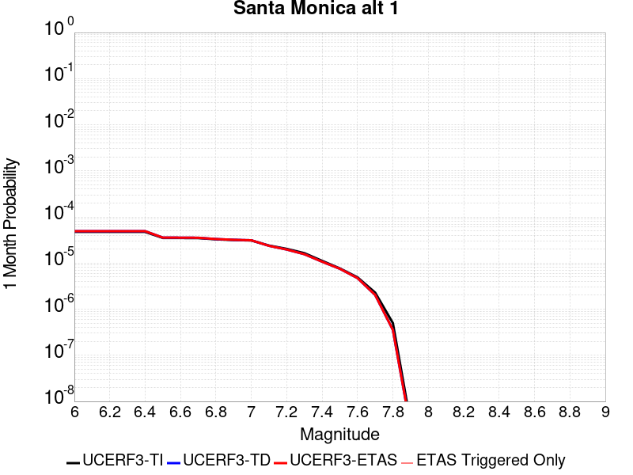 | 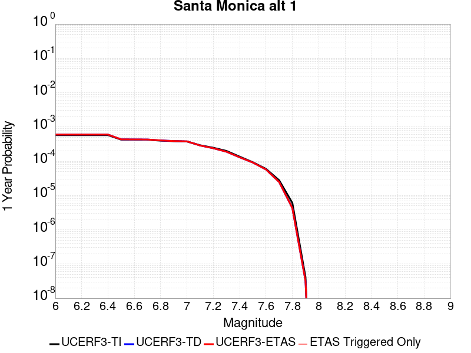 | 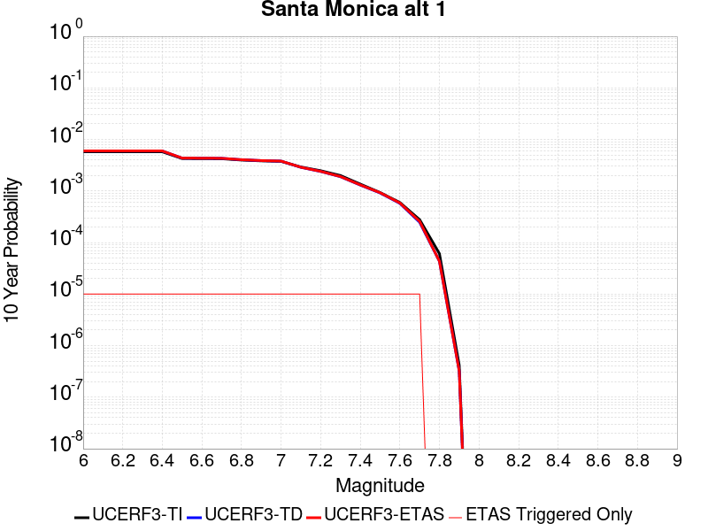 |

| Magnitude | 1 wk TI Prob | 1 wk TD Prob | 1 wk ETAS Prob | 1 wk ETAS/TD Gain | 1 wk ETAS Triggered Only | 1 mo TI Prob | 1 mo TD Prob | 1 mo ETAS Prob | 1 mo ETAS/TD Gain | 1 mo ETAS Triggered Only | 1 yr TI Prob | 1 yr TD Prob | 1 yr ETAS Prob | 1 yr ETAS/TD Gain | 1 yr ETAS Triggered Only | 10 yr TI Prob | 10 yr TD Prob | 10 yr ETAS Prob | 10 yr ETAS/TD Gain | 10 yr ETAS Triggered Only |
|-----|-----|-----|-----|-----|-----|-----|-----|-----|-----|-----|-----|-----|-----|-----|-----|-----|-----|-----|-----|-----|
| 6.0 | 1.1066008E-5 | 1.1480416E-5 | 1.1480416E-5 | 1.0 | 0.0 | 4.742488E-5 | 4.920093E-5 | 4.920093E-5 | 1.0 | 0.0 | 5.7724497E-4 | 5.988706E-4 | 5.988706E-4 | 1.0 | 0.0 | 0.005757478 | 0.005973955 | 0.005983895 | 1.0016639 | 1.0E-5 |
| 6.1 | 1.1066008E-5 | 1.1480416E-5 | 1.1480416E-5 | 1.0 | 0.0 | 4.742488E-5 | 4.920093E-5 | 4.920093E-5 | 1.0 | 0.0 | 5.7724497E-4 | 5.988706E-4 | 5.988706E-4 | 1.0 | 0.0 | 0.005757478 | 0.005973955 | 0.005983895 | 1.0016639 | 1.0E-5 |
| 6.2 | 1.1066008E-5 | 1.1480416E-5 | 1.1480416E-5 | 1.0 | 0.0 | 4.742488E-5 | 4.920093E-5 | 4.920093E-5 | 1.0 | 0.0 | 5.7724497E-4 | 5.988706E-4 | 5.988706E-4 | 1.0 | 0.0 | 0.005757478 | 0.005973955 | 0.005983895 | 1.0016639 | 1.0E-5 |
| 6.3 | 1.1066008E-5 | 1.1480416E-5 | 1.1480416E-5 | 1.0 | 0.0 | 4.742488E-5 | 4.920093E-5 | 4.920093E-5 | 1.0 | 0.0 | 5.7724497E-4 | 5.988706E-4 | 5.988706E-4 | 1.0 | 0.0 | 0.005757478 | 0.005973955 | 0.005983895 | 1.0016639 | 1.0E-5 |
| 6.4 | 1.1066008E-5 | 1.1480416E-5 | 1.1480416E-5 | 1.0 | 0.0 | 4.742488E-5 | 4.920093E-5 | 4.920093E-5 | 1.0 | 0.0 | 5.7724497E-4 | 5.988706E-4 | 5.988706E-4 | 1.0 | 0.0 | 0.005757478 | 0.005973955 | 0.005983895 | 1.0016639 | 1.0E-5 |
| 6.5 | 8.183544E-6 | 8.335505E-6 | 8.335505E-6 | 1.0 | 0.0 | 3.5071862E-5 | 3.5723115E-5 | 3.5723115E-5 | 1.0 | 0.0 | 4.2691626E-4 | 4.348437E-4 | 4.348437E-4 | 1.0 | 0.0 | 0.0042609703 | 0.004340094 | 0.0043500504 | 1.0022941 | 1.0E-5 |
| 6.6 | 8.1543285E-6 | 8.303719E-6 | 8.303719E-6 | 1.0 | 0.0 | 3.4946657E-5 | 3.558689E-5 | 3.558689E-5 | 1.0 | 0.0 | 4.2539247E-4 | 4.3318587E-4 | 4.3318587E-4 | 1.0 | 0.0 | 0.0042457907 | 0.00432358 | 0.0043335366 | 1.0023029 | 1.0E-5 |
| 6.7 | 8.110878E-6 | 8.257115E-6 | 8.257115E-6 | 1.0 | 0.0 | 3.4760444E-5 | 3.5387166E-5 | 3.5387166E-5 | 1.0 | 0.0 | 4.231262E-4 | 4.3075517E-4 | 4.3075517E-4 | 1.0 | 0.0 | 0.0042232145 | 0.0042993673 | 0.0043093245 | 1.0023159 | 1.0E-5 |
| 6.8 | 7.644036E-6 | 7.751129E-6 | 7.751129E-6 | 1.0 | 0.0 | 3.275974E-5 | 3.321871E-5 | 3.321871E-5 | 1.0 | 0.0 | 3.9877684E-4 | 4.0436414E-4 | 4.0436414E-4 | 1.0 | 0.0 | 0.00398062 | 0.00403643 | 0.0040463894 | 1.0024674 | 1.0E-5 |
| 6.9 | 7.3698293E-6 | 7.4557847E-6 | 7.4557847E-6 | 1.0 | 0.0 | 3.15846E-5 | 3.195298E-5 | 3.195298E-5 | 1.0 | 0.0 | 3.8447464E-4 | 3.8895948E-4 | 3.8895948E-4 | 1.0 | 0.0 | 0.0038381014 | 0.0038829306 | 0.0038928918 | 1.0025654 | 1.0E-5 |
| 7.0 | 7.209872E-6 | 7.28569E-6 | 7.28569E-6 | 1.0 | 0.0 | 3.0899086E-5 | 3.122402E-5 | 3.122402E-5 | 1.0 | 0.0 | 3.7613141E-4 | 3.8008753E-4 | 3.8008753E-4 | 1.0 | 0.0 | 0.0037549543 | 0.0037945171 | 0.0038044793 | 1.0026253 | 1.0E-5 |
| 7.1 | 5.603456E-6 | 5.523938E-6 | 5.523938E-6 | 1.0 | 0.0 | 2.4014591E-5 | 2.3673807E-5 | 2.3673807E-5 | 1.0 | 0.0 | 2.923384E-4 | 2.8819087E-4 | 2.8819087E-4 | 1.0 | 0.0 | 0.0029195412 | 0.002878213 | 0.0028881845 | 1.0034643 | 1.0E-5 |
| 7.2 | 4.7483613E-6 | 4.5911684E-6 | 4.5911684E-6 | 1.0 | 0.0 | 2.0349962E-5 | 1.9676289E-5 | 1.9676289E-5 | 1.0 | 0.0 | 2.4773262E-4 | 2.3953262E-4 | 2.3953262E-4 | 1.0 | 0.0 | 0.0024745662 | 0.0023927584 | 0.0024027345 | 1.0041692 | 1.0E-5 |
| 7.3 | 3.829015E-6 | 3.6342535E-6 | 3.6342535E-6 | 1.0 | 0.0 | 1.6409962E-5 | 1.5575279E-5 | 1.5575279E-5 | 1.0 | 0.0 | 1.9977297E-4 | 1.896126E-4 | 1.896126E-4 | 1.0 | 0.0 | 0.0019959346 | 0.0018945171 | 0.0019044982 | 1.0052683 | 1.0E-5 |
| 7.4 | 2.610755E-6 | 2.4995913E-6 | 2.4995913E-6 | 1.0 | 0.0 | 1.1188902E-5 | 1.0712491E-5 | 1.0712491E-5 | 1.0 | 0.0 | 1.3621636E-4 | 1.3041681E-4 | 1.3041681E-4 | 1.0 | 0.0 | 0.001361329 | 0.0013034071 | 0.0013133942 | 1.0076622 | 1.0E-5 |
| 7.5 | 1.792146E-6 | 1.7584331E-6 | 1.7584331E-6 | 1.0 | 0.0 | 7.680603E-6 | 7.53612E-6 | 7.53612E-6 | 1.0 | 0.0 | 9.3507326E-5 | 9.174843E-5 | 9.174843E-5 | 1.0 | 0.0 | 9.3467993E-4 | 9.171087E-4 | 9.270995E-4 | 1.0108938 | 1.0E-5 |
| 7.6 | 1.1473018E-6 | 1.1029249E-6 | 1.1029249E-6 | 1.0 | 0.0 | 4.9169985E-6 | 4.7268127E-6 | 4.7268127E-6 | 1.0 | 0.0 | 5.986281E-5 | 5.754744E-5 | 5.754744E-5 | 1.0 | 0.0 | 5.984669E-4 | 5.75327E-4 | 5.853213E-4 | 1.0173714 | 1.0E-5 |
| 7.7 | 5.330919E-7 | 4.74531E-7 | 4.74531E-7 | 1.0 | 0.0 | 2.2846775E-6 | 2.0337027E-6 | 2.0337027E-6 | 1.0 | 0.0 | 2.7815593E-5 | 2.476006E-5 | 2.476006E-5 | 1.0 | 0.0 | 2.7812112E-4 | 2.4757415E-4 | 2.575717E-4 | 1.0403819 | 1.0E-5 |
| 7.8 | 1.1668574E-7 | 8.296894E-8 | 8.296894E-8 | 1.0 | 0.0 | 5.000816E-7 | 3.555811E-7 | 3.555811E-7 | 1.0 | 0.0 | 6.0884768E-6 | 4.3291916E-6 | 4.3291916E-6 | 1.0 | 0.0 | 6.08831E-5 | 4.3291104E-5 | 4.3291104E-5 | 1.0 | 0.0 |
| 7.9 | 8.007447E-10 | 6.1609085E-10 | 6.1609085E-10 | 1.0 | 0.0 | 3.4317629E-9 | 2.6403897E-9 | 2.6403897E-9 | 1.0 | 0.0 | 4.1781714E-8 | 3.2146747E-8 | 3.2146747E-8 | 1.0 | 0.0 | 4.1781706E-7 | 3.2146744E-7 | 3.2146744E-7 | 1.0 | 0.0 |

## San Andreas (Peninsula) 2011 CFM
*[(top)](#table-of-contents)*

| 1 Week | 1 Month | 1 Year | 10 Year |
|-----|-----|-----|-----|
| 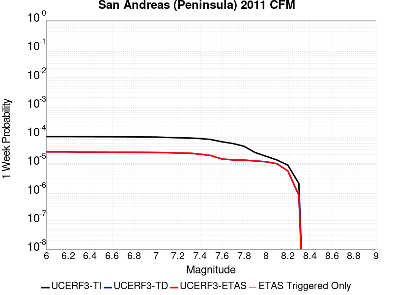 | 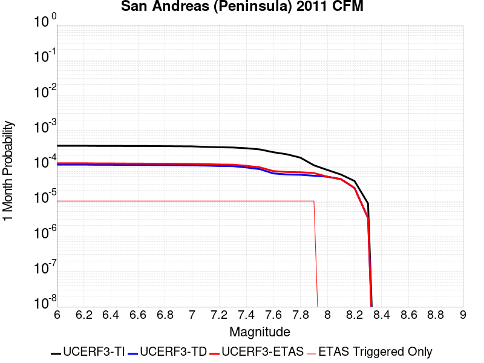 | 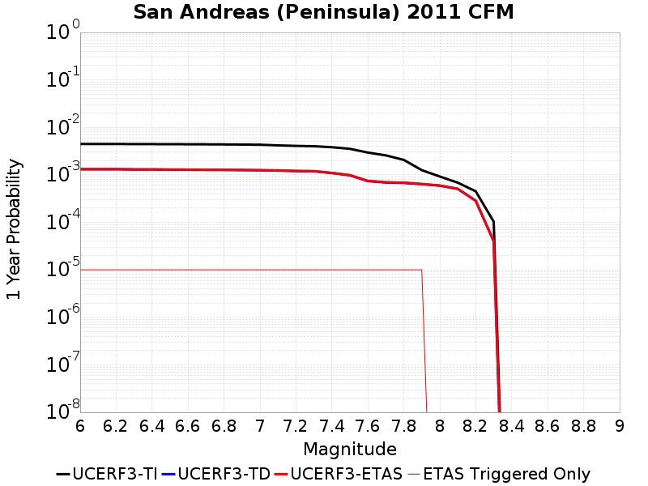 | 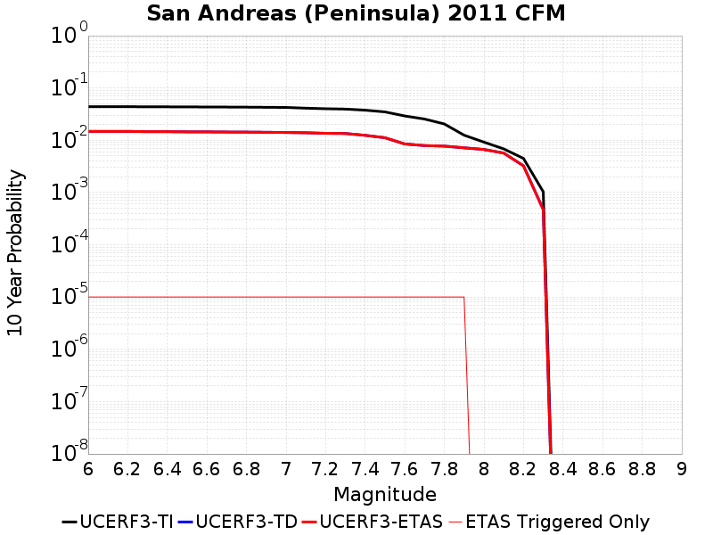 |

| Magnitude | 1 wk TI Prob | 1 wk TD Prob | 1 wk ETAS Prob | 1 wk ETAS/TD Gain | 1 wk ETAS Triggered Only | 1 mo TI Prob | 1 mo TD Prob | 1 mo ETAS Prob | 1 mo ETAS/TD Gain | 1 mo ETAS Triggered Only | 1 yr TI Prob | 1 yr TD Prob | 1 yr ETAS Prob | 1 yr ETAS/TD Gain | 1 yr ETAS Triggered Only | 10 yr TI Prob | 10 yr TD Prob | 10 yr ETAS Prob | 10 yr ETAS/TD Gain | 10 yr ETAS Triggered Only |
|-----|-----|-----|-----|-----|-----|-----|-----|-----|-----|-----|-----|-----|-----|-----|-----|-----|-----|-----|-----|-----|
| 6.0 | 8.6200685E-5 | 2.5230001E-5 | 2.5230001E-5 | 1.0 | 0.0 | 3.6937918E-4 | 1.08124106E-4 | 1.18123025E-4 | 1.0924764 | 1.0E-5 | 0.0044879215 | 0.0013156177 | 0.0013256045 | 1.007591 | 1.0E-5 | 0.043983612 | 0.014783454 | 0.014793306 | 1.0006664 | 1.0E-5 |
| 6.1 | 8.6200685E-5 | 2.5230001E-5 | 2.5230001E-5 | 1.0 | 0.0 | 3.6937918E-4 | 1.08124106E-4 | 1.18123025E-4 | 1.0924764 | 1.0E-5 | 0.0044879215 | 0.0013156177 | 0.0013256045 | 1.007591 | 1.0E-5 | 0.043983612 | 0.014783454 | 0.014793306 | 1.0006664 | 1.0E-5 |
| 6.2 | 8.6200685E-5 | 2.5230001E-5 | 2.5230001E-5 | 1.0 | 0.0 | 3.6937918E-4 | 1.08124106E-4 | 1.18123025E-4 | 1.0924764 | 1.0E-5 | 0.0044879215 | 0.0013156177 | 0.0013256045 | 1.007591 | 1.0E-5 | 0.043983612 | 0.014783454 | 0.014793306 | 1.0006664 | 1.0E-5 |
| 6.3 | 8.551163E-5 | 2.4921781E-5 | 2.4921781E-5 | 1.0 | 0.0 | 3.6642692E-4 | 1.06803265E-4 | 1.168022E-4 | 1.0936201 | 1.0E-5 | 0.004452125 | 0.0012995558 | 0.0013095427 | 1.007685 | 1.0E-5 | 0.043639794 | 0.01461036 | 0.014620215 | 1.0006745 | 1.0E-5 |
| 6.4 | 8.551163E-5 | 2.4921781E-5 | 2.4921781E-5 | 1.0 | 0.0 | 3.6642692E-4 | 1.06803265E-4 | 1.168022E-4 | 1.0936201 | 1.0E-5 | 0.004452125 | 0.0012995558 | 0.0013095427 | 1.007685 | 1.0E-5 | 0.043639794 | 0.01461036 | 0.014620215 | 1.0006745 | 1.0E-5 |
| 6.5 | 8.511146E-5 | 2.4743153E-5 | 2.4743153E-5 | 1.0 | 0.0 | 3.647124E-4 | 1.0603778E-4 | 1.1603672E-4 | 1.094296 | 1.0E-5 | 0.004431336 | 0.0012902471 | 0.0013002341 | 1.0077405 | 1.0E-5 | 0.04344007 | 0.014510098 | 0.014519953 | 1.0006791 | 1.0E-5 |
| 6.6 | 8.4985084E-5 | 2.4673762E-5 | 2.4673762E-5 | 1.0 | 0.0 | 3.6417096E-4 | 1.05740415E-4 | 1.1573936E-4 | 1.0945612 | 1.0E-5 | 0.0044247704 | 0.0012866309 | 0.001296618 | 1.0077622 | 1.0E-5 | 0.043376986 | 0.014472154 | 0.014482009 | 1.0006809 | 1.0E-5 |
| 6.7 | 8.462618E-5 | 2.4502198E-5 | 2.4502198E-5 | 1.0 | 0.0 | 3.6263323E-4 | 1.0500521E-4 | 1.1500416E-4 | 1.0952234 | 1.0E-5 | 0.004406125 | 0.0012776903 | 0.0012876774 | 1.0078167 | 1.0E-5 | 0.043197807 | 0.014376926 | 0.014386782 | 1.0006856 | 1.0E-5 |
| 6.8 | 8.42337E-5 | 2.4397952E-5 | 2.4397952E-5 | 1.0 | 0.0 | 3.6095164E-4 | 1.04558465E-4 | 1.1455742E-4 | 1.0956303 | 1.0E-5 | 0.004385734 | 0.0012722575 | 0.0012822448 | 1.00785 | 1.0E-5 | 0.043001823 | 0.014317582 | 0.0143274395 | 1.0006884 | 1.0E-5 |
| 6.9 | 8.365989E-5 | 2.420247E-5 | 2.420247E-5 | 1.0 | 0.0 | 3.5849313E-4 | 1.03720755E-4 | 1.1371972E-4 | 1.0964028 | 1.0E-5 | 0.004355922 | 0.0012620703 | 0.0012720576 | 1.0079135 | 1.0E-5 | 0.04271523 | 0.014210028 | 0.014219885 | 1.0006937 | 1.0E-5 |
| 7.0 | 8.30936E-5 | 2.3963888E-5 | 2.3963888E-5 | 1.0 | 0.0 | 3.560668E-4 | 1.02698345E-4 | 1.12697315E-4 | 1.0973625 | 1.0E-5 | 0.004326499 | 0.0012496368 | 0.0012596243 | 1.0079923 | 1.0E-5 | 0.042432297 | 0.014080976 | 0.014090835 | 1.0007002 | 1.0E-5 |
| 7.1 | 8.041264E-5 | 2.3650138E-5 | 2.3650138E-5 | 1.0 | 0.0 | 3.4458007E-4 | 1.01353806E-4 | 1.113528E-4 | 1.0986543 | 1.0E-5 | 0.0041871946 | 0.0012332856 | 0.0012432734 | 1.0080984 | 1.0E-5 | 0.041091725 | 0.01390369 | 0.01391355 | 1.0007092 | 1.0E-5 |
| 7.2 | 7.8427016E-5 | 2.3073557E-5 | 2.3073557E-5 | 1.0 | 0.0 | 3.3607247E-4 | 9.888293E-5 | 1.0888194E-4 | 1.1011196 | 1.0E-5 | 0.004084008 | 0.0012032364 | 0.0012132244 | 1.0083009 | 1.0E-5 | 0.040097635 | 0.013587633 | 0.013597497 | 1.000726 | 1.0E-5 |
| 7.3 | 7.721087E-5 | 2.285828E-5 | 2.285828E-5 | 1.0 | 0.0 | 3.3086175E-4 | 9.796039E-5 | 1.0795941E-4 | 1.1020721 | 1.0E-5 | 0.004020803 | 0.0011920168 | 0.0012020048 | 1.0083791 | 1.0E-5 | 0.03948827 | 0.013471293 | 0.013481159 | 1.0007323 | 1.0E-5 |
| 7.4 | 7.3536525E-5 | 2.0975214E-5 | 2.0975214E-5 | 1.0 | 0.0 | 3.1511846E-4 | 8.989069E-5 | 9.988979E-5 | 1.1112362 | 1.0E-5 | 0.0038298194 | 0.001093871 | 0.00110386 | 1.0091318 | 1.0E-5 | 0.037644852 | 0.012427738 | 0.012437614 | 1.0007946 | 1.0E-5 |
| 7.5 | 6.806207E-5 | 1.8780518E-5 | 1.8780518E-5 | 1.0 | 0.0 | 2.9166197E-4 | 8.048546E-5 | 9.0484646E-5 | 1.1242361 | 1.0E-5 | 0.0035452035 | 9.794709E-4 | 9.894612E-4 | 1.0101995 | 1.0E-5 | 0.034891766 | 0.011180196 | 0.011190084 | 1.0008844 | 1.0E-5 |
| 7.6 | 5.6731416E-5 | 1.41891E-5 | 1.41891E-5 | 1.0 | 0.0 | 2.43112E-4 | 6.080901E-5 | 7.08084E-5 | 1.1644393 | 1.0E-5 | 0.0029558712 | 7.4009836E-4 | 7.500909E-4 | 1.0135018 | 1.0E-5 | 0.02916862 | 0.008491896 | 0.008501811 | 1.0011675 | 1.0E-5 |
| 7.7 | 4.946994E-5 | 1.32566865E-5 | 1.32566865E-5 | 1.0 | 0.0 | 2.1199681E-4 | 5.6813133E-5 | 6.6812565E-5 | 1.1760056 | 1.0E-5 | 0.002578006 | 6.914805E-4 | 7.014736E-4 | 1.0144517 | 1.0E-5 | 0.02548303 | 0.007913754 | 0.007923676 | 1.0012536 | 1.0E-5 |
| 7.8 | 3.9718198E-5 | 1.2992656E-5 | 1.2992656E-5 | 1.0 | 0.0 | 1.7020974E-4 | 5.5681623E-5 | 6.5681066E-5 | 1.1795825 | 1.0E-5 | 0.0020703338 | 6.77713E-4 | 6.877062E-4 | 1.0147455 | 1.0E-5 | 0.020511515 | 0.0077240886 | 0.0077340114 | 1.0012846 | 1.0E-5 |
| 7.9 | 2.4115114E-5 | 1.2194676E-5 | 1.2194676E-5 | 1.0 | 0.0 | 1.0334639E-4 | 5.226185E-5 | 6.226133E-5 | 1.1913341 | 1.0E-5 | 0.001257516 | 6.361024E-4 | 6.460961E-4 | 1.0157107 | 1.0E-5 | 0.012504238 | 0.007163989 | 0.0071739173 | 1.0013859 | 1.0E-5 |
| 8.0 | 1.7756569E-5 | 1.1418246E-5 | 1.1418246E-5 | 1.0 | 0.0 | 7.6097356E-5 | 4.893442E-5 | 4.893442E-5 | 1.0 | 0.0 | 9.260915E-4 | 5.9561385E-4 | 5.9561385E-4 | 1.0 | 0.0 | 0.009222416 | 0.0066639273 | 0.0066639273 | 1.0 | 0.0 |
| 8.1 | 1.3159258E-5 | 9.753173E-6 | 9.753173E-6 | 1.0 | 0.0 | 5.6395602E-5 | 4.1798645E-5 | 4.1798645E-5 | 1.0 | 0.0 | 6.864001E-4 | 5.087798E-4 | 5.087798E-4 | 1.0 | 0.0 | 0.0068428386 | 0.0056932936 | 0.0056932936 | 1.0 | 0.0 |
| 8.2 | 8.635426E-6 | 5.4711136E-6 | 5.4711136E-6 | 1.0 | 0.0 | 3.700844E-5 | 2.3447417E-5 | 2.3447417E-5 | 1.0 | 0.0 | 4.5048463E-4 | 2.85435E-4 | 2.85435E-4 | 1.0 | 0.0 | 0.004495725 | 0.0032467977 | 0.0032467977 | 1.0 | 0.0 |
| 8.3 | 1.983087E-6 | 7.666981E-7 | 7.666981E-7 | 1.0 | 0.0 | 8.498917E-6 | 3.285845E-6 | 3.285845E-6 | 1.0 | 0.0 | 1.034694E-4 | 4.0004445E-5 | 4.0004445E-5 | 1.0 | 0.0 | 0.0010342124 | 4.723745E-4 | 4.723745E-4 | 1.0 | 0.0 |

## Blue Cut
*[(top)](#table-of-contents)*

| 1 Week | 1 Month | 1 Year | 10 Year |
|-----|-----|-----|-----|
|  |  | 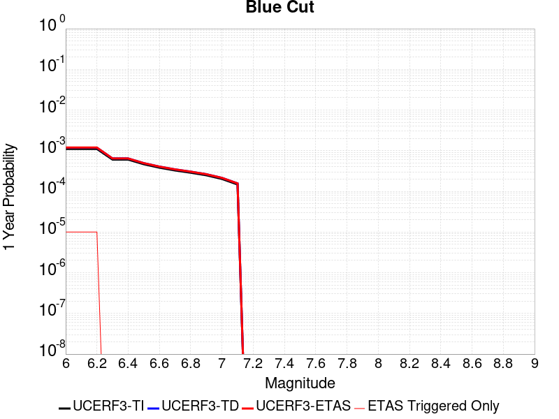 | 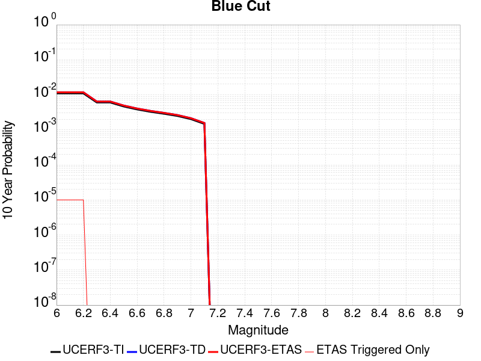 |

| Magnitude | 1 wk TI Prob | 1 wk TD Prob | 1 wk ETAS Prob | 1 wk ETAS/TD Gain | 1 wk ETAS Triggered Only | 1 mo TI Prob | 1 mo TD Prob | 1 mo ETAS Prob | 1 mo ETAS/TD Gain | 1 mo ETAS Triggered Only | 1 yr TI Prob | 1 yr TD Prob | 1 yr ETAS Prob | 1 yr ETAS/TD Gain | 1 yr ETAS Triggered Only | 10 yr TI Prob | 10 yr TD Prob | 10 yr ETAS Prob | 10 yr ETAS/TD Gain | 10 yr ETAS Triggered Only |
|-----|-----|-----|-----|-----|-----|-----|-----|-----|-----|-----|-----|-----|-----|-----|-----|-----|-----|-----|-----|-----|
| 6.0 | 2.1227985E-5 | 2.2719754E-5 | 2.2719754E-5 | 1.0 | 0.0 | 9.097391E-5 | 9.736707E-5 | 9.736707E-5 | 1.0 | 0.0 | 0.0011070445 | 0.0011848575 | 0.0011948455 | 1.0084299 | 1.0E-5 | 0.011015458 | 0.011791244 | 0.011801126 | 1.000838 | 1.0E-5 |
| 6.1 | 2.1227985E-5 | 2.2719754E-5 | 2.2719754E-5 | 1.0 | 0.0 | 9.097391E-5 | 9.736707E-5 | 9.736707E-5 | 1.0 | 0.0 | 0.0011070445 | 0.0011848575 | 0.0011948455 | 1.0084299 | 1.0E-5 | 0.011015458 | 0.011791244 | 0.011801126 | 1.000838 | 1.0E-5 |
| 6.2 | 2.1227985E-5 | 2.2719754E-5 | 2.2719754E-5 | 1.0 | 0.0 | 9.097391E-5 | 9.736707E-5 | 9.736707E-5 | 1.0 | 0.0 | 0.0011070445 | 0.0011848575 | 0.0011948455 | 1.0084299 | 1.0E-5 | 0.011015458 | 0.011791244 | 0.011801126 | 1.000838 | 1.0E-5 |
| 6.3 | 1.1613981E-5 | 1.235363E-5 | 1.235363E-5 | 1.0 | 0.0 | 4.9773254E-5 | 5.2943124E-5 | 5.2943124E-5 | 1.0 | 0.0 | 6.0582085E-4 | 6.444044E-4 | 6.444044E-4 | 1.0 | 0.0 | 0.0060417196 | 0.006426605 | 0.006426605 | 1.0 | 0.0 |
| 6.4 | 1.1613981E-5 | 1.235363E-5 | 1.235363E-5 | 1.0 | 0.0 | 4.9773254E-5 | 5.2943124E-5 | 5.2943124E-5 | 1.0 | 0.0 | 6.0582085E-4 | 6.444044E-4 | 6.444044E-4 | 1.0 | 0.0 | 0.0060417196 | 0.006426605 | 0.006426605 | 1.0 | 0.0 |
| 6.5 | 8.931326E-6 | 9.481665E-6 | 9.481665E-6 | 1.0 | 0.0 | 3.8276554E-5 | 4.0635125E-5 | 4.0635125E-5 | 1.0 | 0.0 | 4.6591737E-4 | 4.946295E-4 | 4.946295E-4 | 1.0 | 0.0 | 0.0046494175 | 0.004936195 | 0.004936195 | 1.0 | 0.0 |
| 6.6 | 7.345353E-6 | 7.790332E-6 | 7.790332E-6 | 1.0 | 0.0 | 3.1479703E-5 | 3.3386754E-5 | 3.3386754E-5 | 1.0 | 0.0 | 3.83198E-4 | 4.0641593E-4 | 4.0641593E-4 | 1.0 | 0.0 | 0.0038253788 | 0.004057518 | 0.004057518 | 1.0 | 0.0 |
| 6.7 | 6.2775666E-6 | 6.655194E-6 | 6.655194E-6 | 1.0 | 0.0 | 2.690358E-5 | 2.852199E-5 | 2.852199E-5 | 1.0 | 0.0 | 3.2750185E-4 | 3.4720742E-4 | 3.4720742E-4 | 1.0 | 0.0 | 0.0032701963 | 0.0034673903 | 0.0034673903 | 1.0 | 0.0 |
| 6.8 | 5.5234095E-6 | 5.8551504E-6 | 5.8551504E-6 | 1.0 | 0.0 | 2.367154E-5 | 2.5093303E-5 | 2.5093303E-5 | 1.0 | 0.0 | 2.8816288E-4 | 3.054754E-4 | 3.054754E-4 | 1.0 | 0.0 | 0.002877895 | 0.003051271 | 0.003051271 | 1.0 | 0.0 |
| 6.9 | 4.7780054E-6 | 5.0654544E-6 | 5.0654544E-6 | 1.0 | 0.0 | 2.0477004E-5 | 2.1708951E-5 | 2.1708951E-5 | 1.0 | 0.0 | 2.4927902E-4 | 2.6428147E-4 | 2.6428147E-4 | 1.0 | 0.0 | 0.0024899957 | 0.0026403638 | 0.0026403638 | 1.0 | 0.0 |
| 7.0 | 3.883171E-6 | 4.118515E-6 | 4.118515E-6 | 1.0 | 0.0 | 1.6642054E-5 | 1.7650698E-5 | 1.7650698E-5 | 1.0 | 0.0 | 2.0259817E-4 | 2.1488295E-4 | 2.1488295E-4 | 1.0 | 0.0 | 0.0020241356 | 0.0021474273 | 0.0021474273 | 1.0 | 0.0 |
| 7.1 | 2.8358215E-6 | 3.0097365E-6 | 3.0097365E-6 | 1.0 | 0.0 | 1.2153464E-5 | 1.2898844E-5 | 1.2898844E-5 | 1.0 | 0.0 | 1.4795837E-4 | 1.570387E-4 | 1.570387E-4 | 1.0 | 0.0 | 0.001478599 | 0.0015699224 | 0.0015699224 | 1.0 | 0.0 |

## Earthquake Valley (No  Extension)
*[(top)](#table-of-contents)*

| 1 Week | 1 Month | 1 Year | 10 Year |
|-----|-----|-----|-----|
| 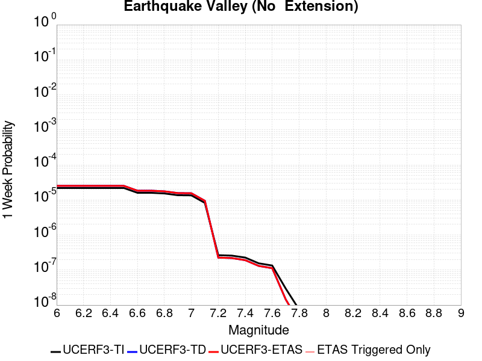 | 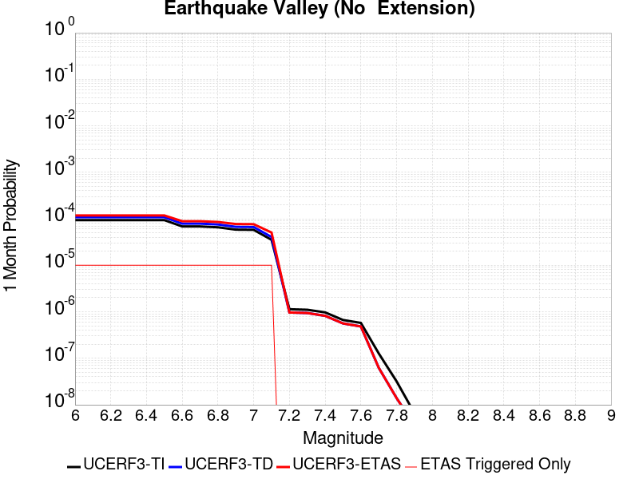 | 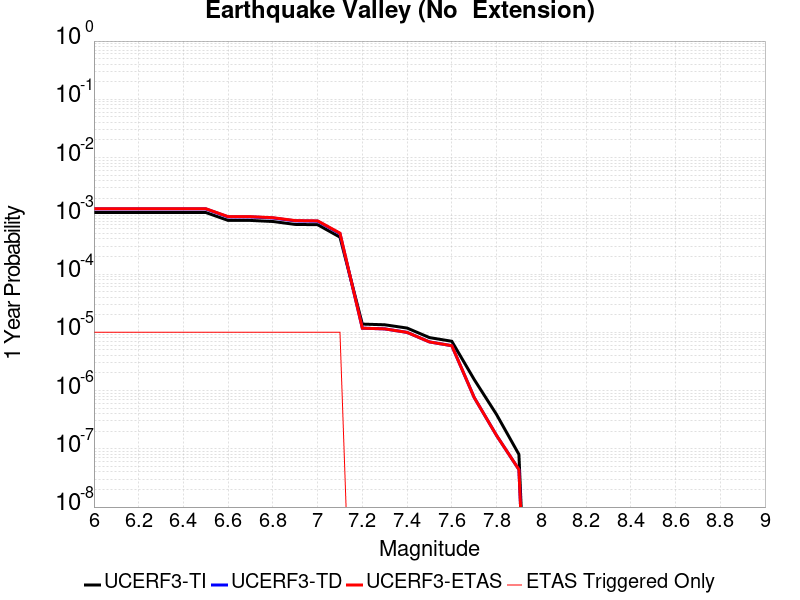 | 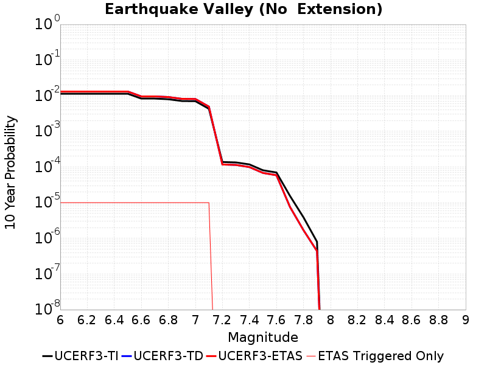 |

| Magnitude | 1 wk TI Prob | 1 wk TD Prob | 1 wk ETAS Prob | 1 wk ETAS/TD Gain | 1 wk ETAS Triggered Only | 1 mo TI Prob | 1 mo TD Prob | 1 mo ETAS Prob | 1 mo ETAS/TD Gain | 1 mo ETAS Triggered Only | 1 yr TI Prob | 1 yr TD Prob | 1 yr ETAS Prob | 1 yr ETAS/TD Gain | 1 yr ETAS Triggered Only | 10 yr TI Prob | 10 yr TD Prob | 10 yr ETAS Prob | 10 yr ETAS/TD Gain | 10 yr ETAS Triggered Only |
|-----|-----|-----|-----|-----|-----|-----|-----|-----|-----|-----|-----|-----|-----|-----|-----|-----|-----|-----|-----|-----|
| 6.0 | 2.1859703E-5 | 2.5198806E-5 | 2.5198806E-5 | 1.0 | 0.0 | 9.3681076E-5 | 1.0799123E-4 | 1.1799015E-4 | 1.0925901 | 1.0E-5 | 0.0011399703 | 0.0013141452 | 0.0013241321 | 1.0075995 | 1.0E-5 | 0.011341401 | 0.013078101 | 0.01308797 | 1.0007546 | 1.0E-5 |
| 6.1 | 2.1859703E-5 | 2.5198806E-5 | 2.5198806E-5 | 1.0 | 0.0 | 9.3681076E-5 | 1.0799123E-4 | 1.1799015E-4 | 1.0925901 | 1.0E-5 | 0.0011399703 | 0.0013141452 | 0.0013241321 | 1.0075995 | 1.0E-5 | 0.011341401 | 0.013078101 | 0.01308797 | 1.0007546 | 1.0E-5 |
| 6.2 | 2.1859703E-5 | 2.5198806E-5 | 2.5198806E-5 | 1.0 | 0.0 | 9.3681076E-5 | 1.0799123E-4 | 1.1799015E-4 | 1.0925901 | 1.0E-5 | 0.0011399703 | 0.0013141452 | 0.0013241321 | 1.0075995 | 1.0E-5 | 0.011341401 | 0.013078101 | 0.01308797 | 1.0007546 | 1.0E-5 |
| 6.3 | 2.1859703E-5 | 2.5198806E-5 | 2.5198806E-5 | 1.0 | 0.0 | 9.3681076E-5 | 1.0799123E-4 | 1.1799015E-4 | 1.0925901 | 1.0E-5 | 0.0011399703 | 0.0013141452 | 0.0013241321 | 1.0075995 | 1.0E-5 | 0.011341401 | 0.013078101 | 0.01308797 | 1.0007546 | 1.0E-5 |
| 6.4 | 2.1859703E-5 | 2.5198806E-5 | 2.5198806E-5 | 1.0 | 0.0 | 9.3681076E-5 | 1.0799123E-4 | 1.1799015E-4 | 1.0925901 | 1.0E-5 | 0.0011399703 | 0.0013141452 | 0.0013241321 | 1.0075995 | 1.0E-5 | 0.011341401 | 0.013078101 | 0.01308797 | 1.0007546 | 1.0E-5 |
| 6.5 | 2.1859703E-5 | 2.5198806E-5 | 2.5198806E-5 | 1.0 | 0.0 | 9.3681076E-5 | 1.0799123E-4 | 1.1799015E-4 | 1.0925901 | 1.0E-5 | 0.0011399703 | 0.0013141452 | 0.0013241321 | 1.0075995 | 1.0E-5 | 0.011341401 | 0.013078101 | 0.01308797 | 1.0007546 | 1.0E-5 |
| 6.6 | 1.597E-5 | 1.8356597E-5 | 1.8356597E-5 | 1.0 | 0.0 | 6.8441055E-5 | 7.866925E-5 | 8.866846E-5 | 1.1271045 | 1.0E-5 | 8.329513E-4 | 9.574645E-4 | 9.674549E-4 | 1.0104343 | 1.0E-5 | 0.008298361 | 0.009542002 | 0.009551906 | 1.001038 | 1.0E-5 |
| 6.7 | 1.597E-5 | 1.8356597E-5 | 1.8356597E-5 | 1.0 | 0.0 | 6.8441055E-5 | 7.866925E-5 | 8.866846E-5 | 1.1271045 | 1.0E-5 | 8.329513E-4 | 9.574645E-4 | 9.674549E-4 | 1.0104343 | 1.0E-5 | 0.008298361 | 0.009542002 | 0.009551906 | 1.001038 | 1.0E-5 |
| 6.8 | 1.5315149E-5 | 1.76024E-5 | 1.76024E-5 | 1.0 | 0.0 | 6.5634704E-5 | 7.5437165E-5 | 8.543641E-5 | 1.1325507 | 1.0E-5 | 7.988095E-4 | 9.1814715E-4 | 9.28138E-4 | 1.0108815 | 1.0E-5 | 0.007959441 | 0.009152078 | 0.009161987 | 1.0010827 | 1.0E-5 |
| 6.9 | 1.3634728E-5 | 1.5676098E-5 | 1.5676098E-5 | 1.0 | 0.0 | 5.8433237E-5 | 6.718201E-5 | 7.7181336E-5 | 1.1488394 | 1.0E-5 | 7.1119244E-4 | 8.177161E-4 | 8.2770793E-4 | 1.0122192 | 1.0E-5 | 0.007089207 | 0.008155144 | 0.008165062 | 1.0012162 | 1.0E-5 |
| 7.0 | 1.3496271E-5 | 1.5518128E-5 | 1.5518128E-5 | 1.0 | 0.0 | 5.783988E-5 | 6.6505025E-5 | 7.6504366E-5 | 1.1503546 | 1.0E-5 | 7.03973E-4 | 8.0947997E-4 | 8.194719E-4 | 1.0123436 | 1.0E-5 | 0.007017471 | 0.008073383 | 0.0080833025 | 1.0012287 | 1.0E-5 |
| 7.1 | 8.242798E-6 | 9.472772E-6 | 9.472772E-6 | 1.0 | 0.0 | 3.53258E-5 | 4.059734E-5 | 5.0596936E-5 | 1.2463115 | 1.0E-5 | 4.300067E-4 | 4.942276E-4 | 5.0422264E-4 | 1.0202236 | 1.0E-5 | 0.004291756 | 0.004937861 | 0.004947812 | 1.0020151 | 1.0E-5 |
| 7.2 | 2.6506527E-7 | 2.256104E-7 | 2.256104E-7 | 1.0 | 0.0 | 1.1359936E-6 | 9.669014E-7 | 9.669014E-7 | 1.0 | 0.0 | 1.3830633E-5 | 1.1771966E-5 | 1.1771966E-5 | 1.0 | 0.0 | 1.3829772E-4 | 1.1771383E-4 | 1.1771383E-4 | 1.0 | 0.0 |
| 7.3 | 2.5810488E-7 | 2.1956166E-7 | 2.1956166E-7 | 1.0 | 0.0 | 1.1061633E-6 | 9.4097817E-7 | 9.4097817E-7 | 1.0 | 0.0 | 1.3467455E-5 | 1.1456354E-5 | 1.1456354E-5 | 1.0 | 0.0 | 1.3466639E-4 | 1.1455804E-4 | 1.1455804E-4 | 1.0 | 0.0 |
| 7.4 | 2.2676066E-7 | 1.9111302E-7 | 1.9111302E-7 | 1.0 | 0.0 | 9.71831E-7 | 8.190556E-7 | 8.190556E-7 | 1.0 | 0.0 | 1.1831979E-5 | 9.97196E-6 | 9.97196E-6 | 1.0 | 0.0 | 1.1831349E-4 | 9.9715515E-5 | 9.9715515E-5 | 1.0 | 0.0 |
| 7.5 | 1.5553917E-7 | 1.3112701E-7 | 1.3112701E-7 | 1.0 | 0.0 | 6.6659624E-7 | 5.619728E-7 | 5.619728E-7 | 1.0 | 0.0 | 8.115779E-6 | 6.8419995E-6 | 6.8419995E-6 | 1.0 | 0.0 | 8.115482E-5 | 6.841811E-5 | 6.841811E-5 | 1.0 | 0.0 |
| 7.6 | 1.3448629E-7 | 1.12889765E-7 | 1.12889765E-7 | 1.0 | 0.0 | 5.7636964E-7 | 4.838132E-7 | 4.838132E-7 | 1.0 | 0.0 | 7.017278E-6 | 5.890412E-6 | 5.890412E-6 | 1.0 | 0.0 | 7.0170565E-5 | 5.890277E-5 | 5.890277E-5 | 1.0 | 0.0 |
| 7.7 | 2.9719402E-8 | 1.4582677E-8 | 1.4582677E-8 | 1.0 | 0.0 | 1.2736886E-7 | 6.2497186E-8 | 6.2497186E-8 | 1.0 | 0.0 | 1.5507147E-6 | 7.6090305E-7 | 7.6090305E-7 | 1.0 | 0.0 | 1.550704E-5 | 7.6090096E-6 | 7.6090096E-6 | 1.0 | 0.0 |
| 7.8 | 7.4390196E-9 | 3.250347E-9 | 3.250347E-9 | 1.0 | 0.0 | 3.1881513E-8 | 1.3930059E-8 | 1.3930059E-8 | 1.0 | 0.0 | 3.8815733E-7 | 1.6959845E-7 | 1.6959845E-7 | 1.0 | 0.0 | 3.8815665E-6 | 1.6959835E-6 | 1.6959835E-6 | 1.0 | 0.0 |
| 7.9 | 1.5373532E-9 | 8.440405E-10 | 8.440405E-10 | 1.0 | 0.0 | 6.5886567E-9 | 3.6173162E-9 | 3.6173162E-9 | 1.0 | 0.0 | 8.021689E-8 | 4.4040828E-8 | 4.4040828E-8 | 1.0 | 0.0 | 8.0216864E-7 | 4.4040826E-7 | 4.4040826E-7 | 1.0 | 0.0 |

## Great Valley 07 (Orestimba)
*[(top)](#table-of-contents)*

| 1 Week | 1 Month | 1 Year | 10 Year |
|-----|-----|-----|-----|
| 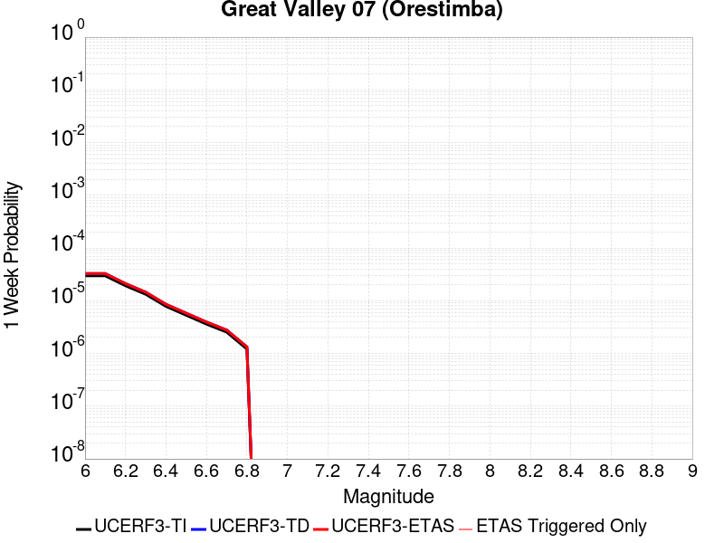 | 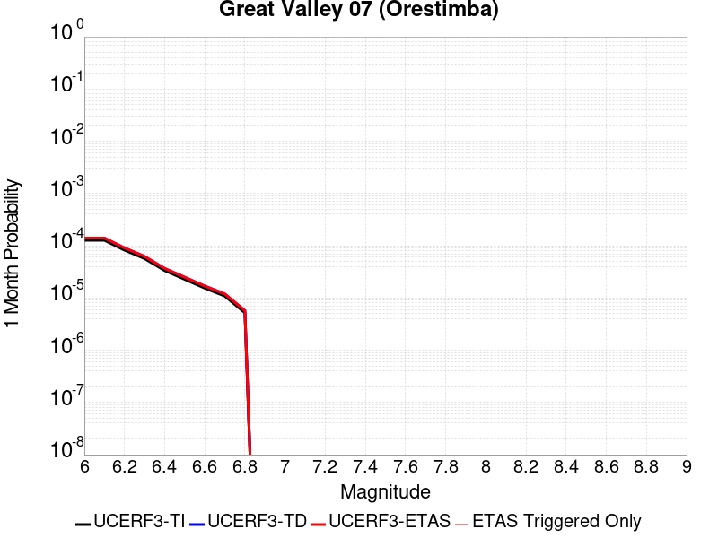 | 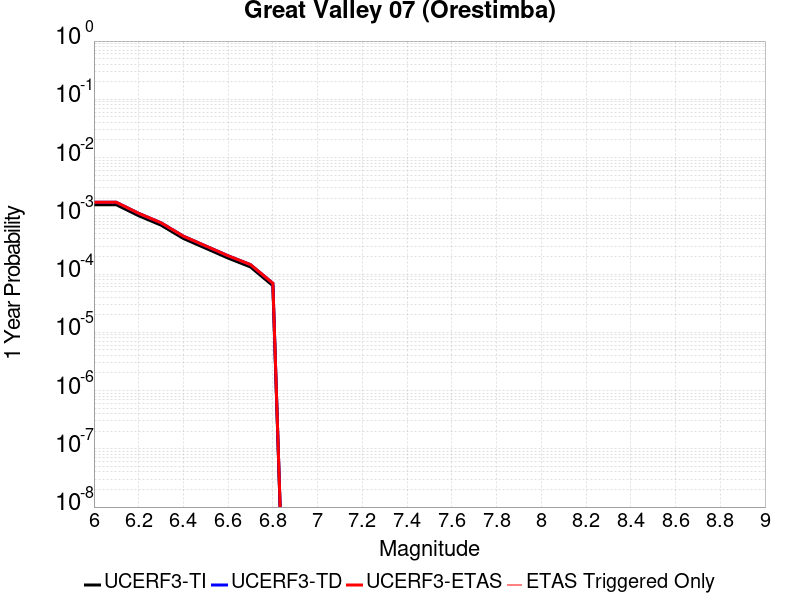 |  |

| Magnitude | 1 wk TI Prob | 1 wk TD Prob | 1 wk ETAS Prob | 1 wk ETAS/TD Gain | 1 wk ETAS Triggered Only | 1 mo TI Prob | 1 mo TD Prob | 1 mo ETAS Prob | 1 mo ETAS/TD Gain | 1 mo ETAS Triggered Only | 1 yr TI Prob | 1 yr TD Prob | 1 yr ETAS Prob | 1 yr ETAS/TD Gain | 1 yr ETAS Triggered Only | 10 yr TI Prob | 10 yr TD Prob | 10 yr ETAS Prob | 10 yr ETAS/TD Gain | 10 yr ETAS Triggered Only |
|-----|-----|-----|-----|-----|-----|-----|-----|-----|-----|-----|-----|-----|-----|-----|-----|-----|-----|-----|-----|-----|
| 6.0 | 2.9687902E-5 | 3.275788E-5 | 3.275788E-5 | 1.0 | 0.0 | 1.2722766E-4 | 1.4038375E-4 | 1.4038375E-4 | 1.0 | 0.0 | 0.0015478961 | 0.0017079042 | 0.0017079042 | 1.0 | 0.0 | 0.015371585 | 0.016955331 | 0.01696516 | 1.0005798 | 1.0E-5 |
| 6.1 | 2.9687902E-5 | 3.275788E-5 | 3.275788E-5 | 1.0 | 0.0 | 1.2722766E-4 | 1.4038375E-4 | 1.4038375E-4 | 1.0 | 0.0 | 0.0015478961 | 0.0017079042 | 0.0017079042 | 1.0 | 0.0 | 0.015371585 | 0.016955331 | 0.01696516 | 1.0005798 | 1.0E-5 |
| 6.2 | 1.9231524E-5 | 2.1159403E-5 | 2.1159403E-5 | 1.0 | 0.0 | 8.2418206E-5 | 9.0680136E-5 | 9.0680136E-5 | 1.0 | 0.0 | 0.0010029797 | 0.0011034947 | 0.0011034947 | 1.0 | 0.0 | 0.00998465 | 0.010982563 | 0.010982563 | 1.0 | 0.0 |
| 6.3 | 1.324766E-5 | 1.4548693E-5 | 1.4548693E-5 | 1.0 | 0.0 | 5.6774446E-5 | 6.2350104E-5 | 6.2350104E-5 | 1.0 | 0.0 | 6.910097E-4 | 7.588573E-4 | 7.588573E-4 | 1.0 | 0.0 | 0.006888649 | 0.0075636064 | 0.0075636064 | 1.0 | 0.0 |
| 6.4 | 7.818645E-6 | 8.5729325E-6 | 8.5729325E-6 | 1.0 | 0.0 | 3.3508048E-5 | 3.674064E-5 | 3.674064E-5 | 1.0 | 0.0 | 4.078841E-4 | 4.4722887E-4 | 4.4722887E-4 | 1.0 | 0.0 | 0.004071363 | 0.0044636284 | 0.0044636284 | 1.0 | 0.0 |
| 6.5 | 5.3076565E-6 | 5.8178634E-6 | 5.8178634E-6 | 1.0 | 0.0 | 2.27469E-5 | 2.4933473E-5 | 2.4933473E-5 | 1.0 | 0.0 | 2.7690834E-4 | 3.0352487E-4 | 3.0352487E-4 | 1.0 | 0.0 | 0.0027656353 | 0.0030313125 | 0.0030313125 | 1.0 | 0.0 |
| 6.6 | 3.6003578E-6 | 3.948538E-6 | 3.948538E-6 | 1.0 | 0.0 | 1.5430012E-5 | 1.6922206E-5 | 1.6922206E-5 | 1.0 | 0.0 | 1.8784421E-4 | 2.0600994E-4 | 2.0600994E-4 | 1.0 | 0.0 | 0.0018768552 | 0.0020583437 | 0.0020583437 | 1.0 | 0.0 |
| 6.7 | 2.5361826E-6 | 2.7834983E-6 | 2.7834983E-6 | 1.0 | 0.0 | 1.0869308E-5 | 1.1929231E-5 | 1.1929231E-5 | 1.0 | 0.0 | 1.3232579E-4 | 1.4523003E-4 | 1.4523003E-4 | 1.0 | 0.0 | 0.0013224703 | 0.0014514811 | 0.0014514811 | 1.0 | 0.0 |
| 6.8 | 1.2115831E-6 | 1.3313945E-6 | 1.3313945E-6 | 1.0 | 0.0 | 5.1924885E-6 | 5.7059697E-6 | 5.7059697E-6 | 1.0 | 0.0 | 6.3216714E-5 | 6.946894E-5 | 6.946894E-5 | 1.0 | 0.0 | 6.3198735E-4 | 6.945673E-4 | 6.945673E-4 | 1.0 | 0.0 |

## South Klamath Lake East
*[(top)](#table-of-contents)*

| 1 Week | 1 Month | 1 Year | 10 Year |
|-----|-----|-----|-----|
| 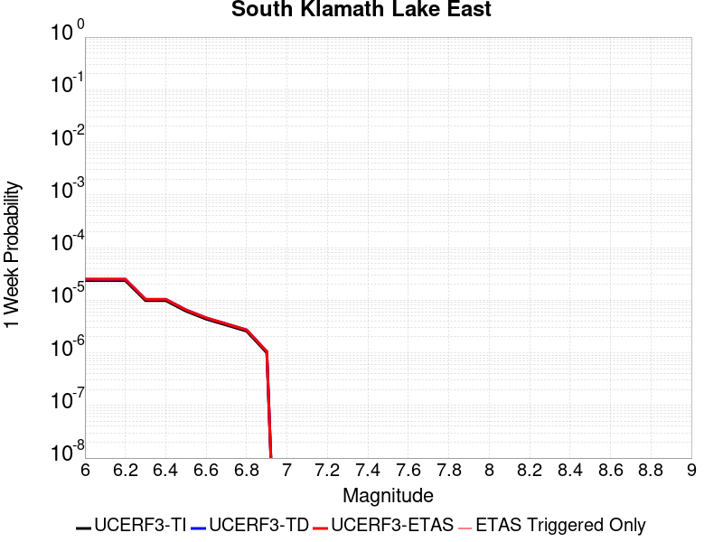 | 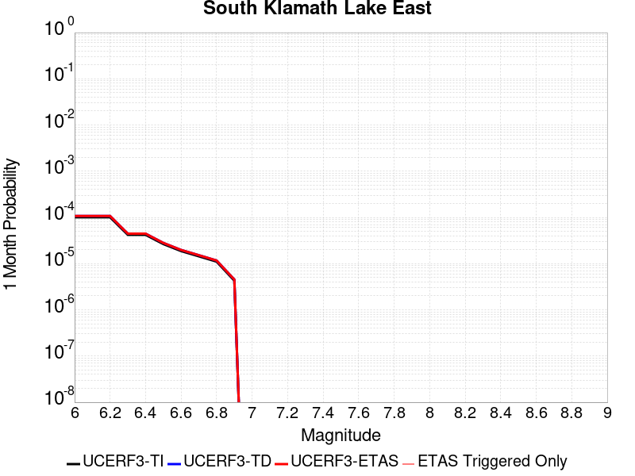 | 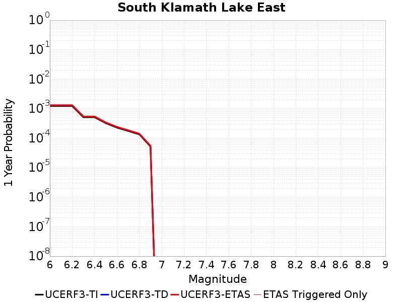 | 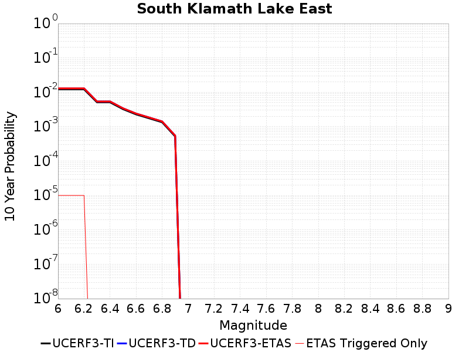 |

| Magnitude | 1 wk TI Prob | 1 wk TD Prob | 1 wk ETAS Prob | 1 wk ETAS/TD Gain | 1 wk ETAS Triggered Only | 1 mo TI Prob | 1 mo TD Prob | 1 mo ETAS Prob | 1 mo ETAS/TD Gain | 1 mo ETAS Triggered Only | 1 yr TI Prob | 1 yr TD Prob | 1 yr ETAS Prob | 1 yr ETAS/TD Gain | 1 yr ETAS Triggered Only | 10 yr TI Prob | 10 yr TD Prob | 10 yr ETAS Prob | 10 yr ETAS/TD Gain | 10 yr ETAS Triggered Only |
|-----|-----|-----|-----|-----|-----|-----|-----|-----|-----|-----|-----|-----|-----|-----|-----|-----|-----|-----|-----|-----|
| 6.0 | 2.3539369E-5 | 2.5047486E-5 | 2.5047486E-5 | 1.0 | 0.0 | 1.0087911E-4 | 1.0734242E-4 | 1.0734242E-4 | 1.0 | 0.0 | 0.0012275111 | 0.0013061938 | 0.0013061938 | 1.0 | 0.0 | 0.012207527 | 0.01299351 | 0.01300338 | 1.0007596 | 1.0E-5 |
| 6.1 | 2.3539369E-5 | 2.5047486E-5 | 2.5047486E-5 | 1.0 | 0.0 | 1.0087911E-4 | 1.0734242E-4 | 1.0734242E-4 | 1.0 | 0.0 | 0.0012275111 | 0.0013061938 | 0.0013061938 | 1.0 | 0.0 | 0.012207527 | 0.01299351 | 0.01300338 | 1.0007596 | 1.0E-5 |
| 6.2 | 2.3539369E-5 | 2.5047486E-5 | 2.5047486E-5 | 1.0 | 0.0 | 1.0087911E-4 | 1.0734242E-4 | 1.0734242E-4 | 1.0 | 0.0 | 0.0012275111 | 0.0013061938 | 0.0013061938 | 1.0 | 0.0 | 0.012207527 | 0.01299351 | 0.01300338 | 1.0007596 | 1.0E-5 |
| 6.3 | 9.807823E-6 | 1.0396113E-5 | 1.0396113E-5 | 1.0 | 0.0 | 4.2032847E-5 | 4.4554057E-5 | 4.4554057E-5 | 1.0 | 0.0 | 5.1162974E-4 | 5.4231903E-4 | 5.4231903E-4 | 1.0 | 0.0 | 0.005104534 | 0.0054107923 | 0.0054107923 | 1.0 | 0.0 |
| 6.4 | 9.807823E-6 | 1.0396113E-5 | 1.0396113E-5 | 1.0 | 0.0 | 4.2032847E-5 | 4.4554057E-5 | 4.4554057E-5 | 1.0 | 0.0 | 5.1162974E-4 | 5.4231903E-4 | 5.4231903E-4 | 1.0 | 0.0 | 0.005104534 | 0.0054107923 | 0.0054107923 | 1.0 | 0.0 |
| 6.5 | 6.191981E-6 | 6.5508825E-6 | 6.5508825E-6 | 1.0 | 0.0 | 2.653679E-5 | 2.8074925E-5 | 2.8074925E-5 | 1.0 | 0.0 | 3.2303753E-4 | 3.417614E-4 | 3.417614E-4 | 1.0 | 0.0 | 0.0032256835 | 0.003412636 | 0.003412636 | 1.0 | 0.0 |
| 6.6 | 4.3693776E-6 | 4.6165865E-6 | 4.6165865E-6 | 1.0 | 0.0 | 1.8725768E-5 | 1.9785228E-5 | 1.9785228E-5 | 1.0 | 0.0 | 2.2796239E-4 | 2.4085965E-4 | 2.4085965E-4 | 1.0 | 0.0 | 0.0022772867 | 0.0024060986 | 0.0024060986 | 1.0 | 0.0 |
| 6.7 | 3.360834E-6 | 3.5512628E-6 | 3.5512628E-6 | 1.0 | 0.0 | 1.4403494E-5 | 1.52196135E-5 | 1.52196135E-5 | 1.0 | 0.0 | 1.7534842E-4 | 1.8528385E-4 | 1.8528385E-4 | 1.0 | 0.0 | 0.0017521014 | 0.0018513736 | 0.0018513736 | 1.0 | 0.0 |
| 6.8 | 2.57873E-6 | 2.725188E-6 | 2.725188E-6 | 1.0 | 0.0 | 1.1051653E-5 | 1.1679329E-5 | 1.1679329E-5 | 1.0 | 0.0 | 1.3454557E-4 | 1.4218717E-4 | 1.4218717E-4 | 1.0 | 0.0 | 0.0013446413 | 0.0014210226 | 0.0014210226 | 1.0 | 0.0 |
| 6.9 | 9.987825E-7 | 1.0566281E-6 | 1.0566281E-6 | 1.0 | 0.0 | 4.2804895E-6 | 4.5284E-6 | 4.5284E-6 | 1.0 | 0.0 | 5.211371E-5 | 5.5132205E-5 | 5.5132205E-5 | 1.0 | 0.0 | 5.210149E-4 | 5.5121747E-4 | 5.5121747E-4 | 1.0 | 0.0 |

## Likely 2011 CFM
*[(top)](#table-of-contents)*

| 1 Week | 1 Month | 1 Year | 10 Year |
|-----|-----|-----|-----|
| 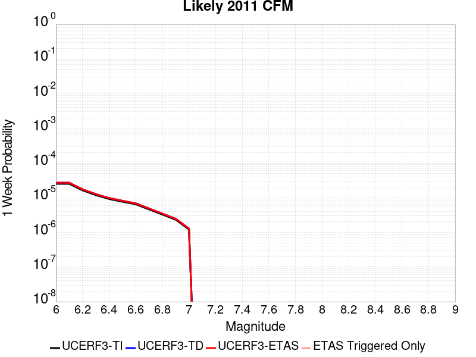 | 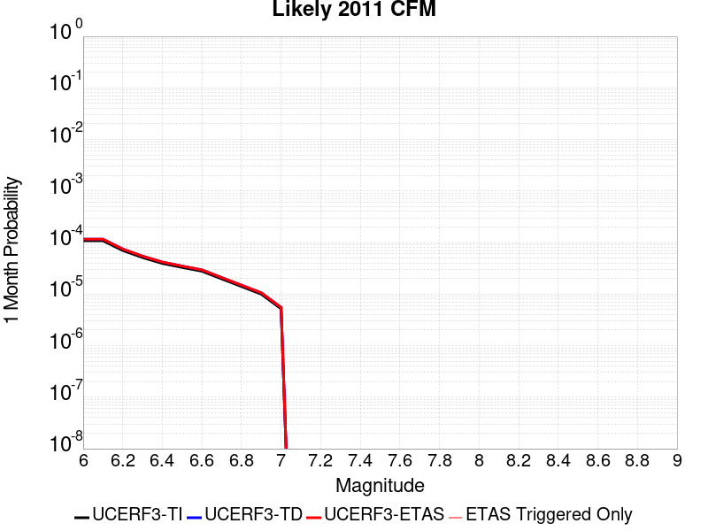 | 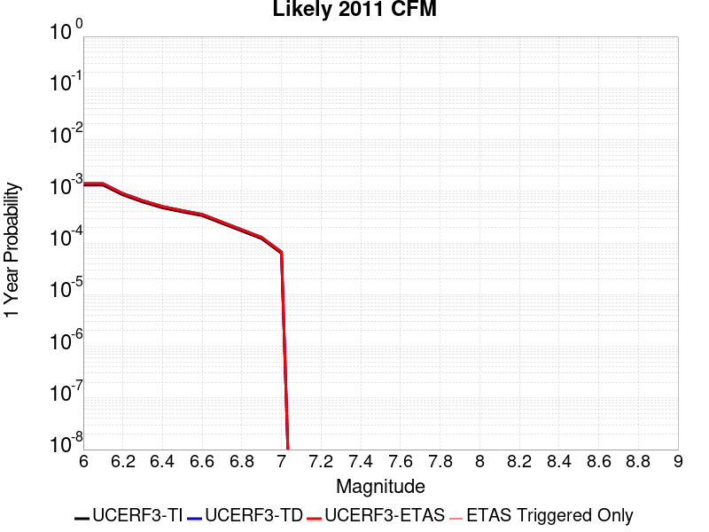 | 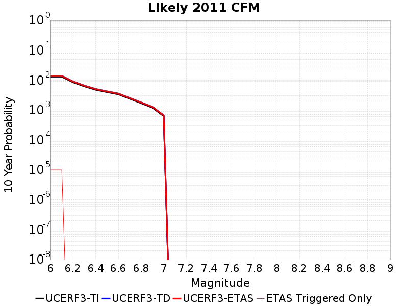 |

| Magnitude | 1 wk TI Prob | 1 wk TD Prob | 1 wk ETAS Prob | 1 wk ETAS/TD Gain | 1 wk ETAS Triggered Only | 1 mo TI Prob | 1 mo TD Prob | 1 mo ETAS Prob | 1 mo ETAS/TD Gain | 1 mo ETAS Triggered Only | 1 yr TI Prob | 1 yr TD Prob | 1 yr ETAS Prob | 1 yr ETAS/TD Gain | 1 yr ETAS Triggered Only | 10 yr TI Prob | 10 yr TD Prob | 10 yr ETAS Prob | 10 yr ETAS/TD Gain | 10 yr ETAS Triggered Only |
|-----|-----|-----|-----|-----|-----|-----|-----|-----|-----|-----|-----|-----|-----|-----|-----|-----|-----|-----|-----|-----|
| 6.0 | 2.5315949E-5 | 2.7104963E-5 | 2.7104963E-5 | 1.0 | 0.0 | 1.0849241E-4 | 1.1615921E-4 | 1.1615921E-4 | 1.0 | 0.0 | 0.0013200947 | 0.0014133654 | 0.0014133654 | 1.0 | 0.0 | 0.013122803 | 0.014048421 | 0.014058281 | 1.0007018 | 1.0E-5 |
| 6.1 | 2.5315949E-5 | 2.7104963E-5 | 2.7104963E-5 | 1.0 | 0.0 | 1.0849241E-4 | 1.1615921E-4 | 1.1615921E-4 | 1.0 | 0.0 | 0.0013200947 | 0.0014133654 | 0.0014133654 | 1.0 | 0.0 | 0.013122803 | 0.014048421 | 0.014058281 | 1.0007018 | 1.0E-5 |
| 6.2 | 1.6375941E-5 | 1.7465973E-5 | 1.7465973E-5 | 1.0 | 0.0 | 7.0180715E-5 | 7.485209E-5 | 7.485209E-5 | 1.0 | 0.0 | 8.5411523E-4 | 9.109554E-4 | 9.109554E-4 | 1.0 | 0.0 | 0.008508399 | 0.0090735 | 0.0090735 | 1.0 | 0.0 |
| 6.3 | 1.1945543E-5 | 1.2712678E-5 | 1.2712678E-5 | 1.0 | 0.0 | 5.119418E-5 | 5.44818E-5 | 5.44818E-5 | 1.0 | 0.0 | 6.2311086E-4 | 6.6311937E-4 | 6.6311937E-4 | 1.0 | 0.0 | 0.0062136655 | 0.006611962 | 0.006611962 | 1.0 | 0.0 |
| 6.4 | 9.192729E-6 | 9.768556E-6 | 9.768556E-6 | 1.0 | 0.0 | 3.939681E-5 | 4.1864583E-5 | 4.1864583E-5 | 1.0 | 0.0 | 4.7955062E-4 | 5.0958485E-4 | 5.0958485E-4 | 1.0 | 0.0 | 0.004785171 | 0.005084445 | 0.005084445 | 1.0 | 0.0 |
| 6.5 | 7.67906E-6 | 8.152679E-6 | 8.152679E-6 | 1.0 | 0.0 | 3.2909844E-5 | 3.4939592E-5 | 3.4939592E-5 | 1.0 | 0.0 | 4.006037E-4 | 4.253084E-4 | 4.253084E-4 | 1.0 | 0.0 | 0.0039988225 | 0.0042451373 | 0.0042451373 | 1.0 | 0.0 |
| 6.6 | 6.4884057E-6 | 6.8847976E-6 | 6.8847976E-6 | 1.0 | 0.0 | 2.7807157E-5 | 2.950595E-5 | 2.950595E-5 | 1.0 | 0.0 | 3.3849955E-4 | 3.5917715E-4 | 3.5917715E-4 | 1.0 | 0.0 | 0.003379844 | 0.0035861111 | 0.0035861111 | 1.0 | 0.0 |
| 6.7 | 4.6060636E-6 | 4.8840743E-6 | 4.8840743E-6 | 1.0 | 0.0 | 1.9740122E-5 | 2.0931584E-5 | 2.0931584E-5 | 1.0 | 0.0 | 2.403095E-4 | 2.5481306E-4 | 2.5481306E-4 | 1.0 | 0.0 | 0.002400498 | 0.0025452918 | 0.0025452918 | 1.0 | 0.0 |
| 6.8 | 3.2795615E-6 | 3.4773966E-6 | 3.4773966E-6 | 1.0 | 0.0 | 1.4055187E-5 | 1.4903047E-5 | 1.4903047E-5 | 1.0 | 0.0 | 1.7110848E-4 | 1.8143003E-4 | 1.8143003E-4 | 1.0 | 0.0 | 0.0017097679 | 0.0018128745 | 0.0018128745 | 1.0 | 0.0 |
| 6.9 | 2.3289967E-6 | 2.4705737E-6 | 2.4705737E-6 | 1.0 | 0.0 | 9.981376E-6 | 1.0588133E-5 | 1.0588133E-5 | 1.0 | 0.0 | 1.2151648E-4 | 1.2890332E-4 | 1.2890332E-4 | 1.0 | 0.0 | 0.0012145005 | 0.0012883284 | 0.0012883284 | 1.0 | 0.0 |
| 7.0 | 1.211292E-6 | 1.2864047E-6 | 1.2864047E-6 | 1.0 | 0.0 | 5.1912407E-6 | 5.513153E-6 | 5.513153E-6 | 1.0 | 0.0 | 6.320152E-5 | 6.7120876E-5 | 6.7120876E-5 | 1.0 | 0.0 | 6.3183554E-4 | 6.7103584E-4 | 6.7103584E-4 | 1.0 | 0.0 |

## Northridge Hills
*[(top)](#table-of-contents)*

| 1 Week | 1 Month | 1 Year | 10 Year |
|-----|-----|-----|-----|
| 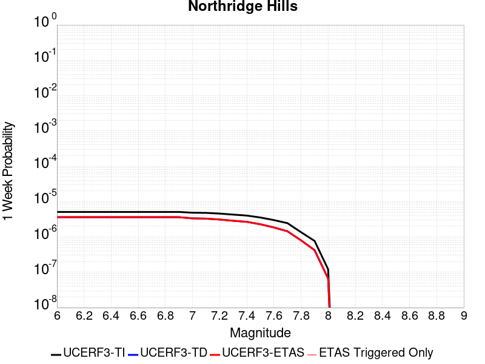 | 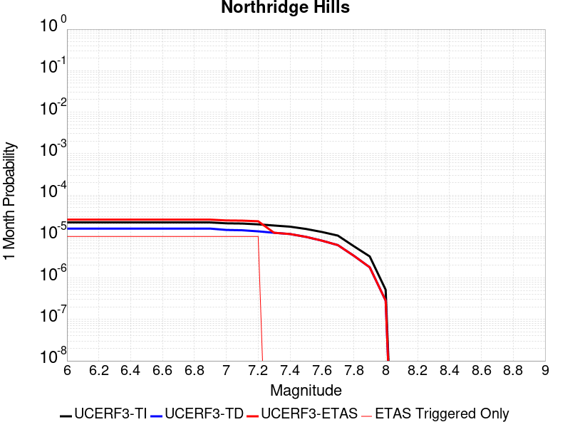 | 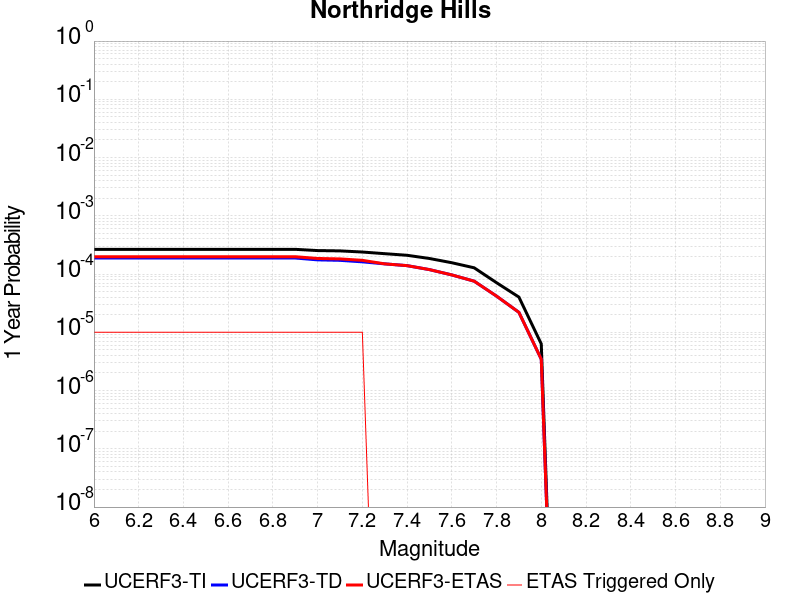 | 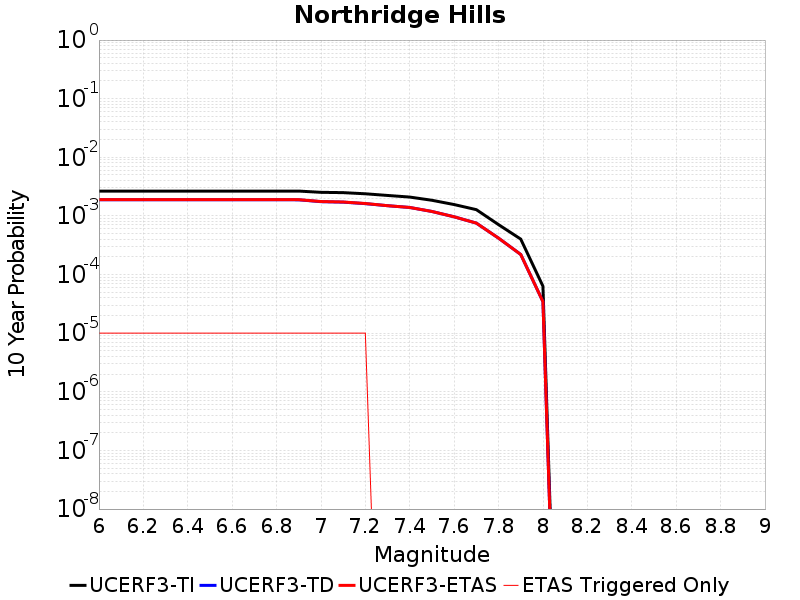 |

| Magnitude | 1 wk TI Prob | 1 wk TD Prob | 1 wk ETAS Prob | 1 wk ETAS/TD Gain | 1 wk ETAS Triggered Only | 1 mo TI Prob | 1 mo TD Prob | 1 mo ETAS Prob | 1 mo ETAS/TD Gain | 1 mo ETAS Triggered Only | 1 yr TI Prob | 1 yr TD Prob | 1 yr ETAS Prob | 1 yr ETAS/TD Gain | 1 yr ETAS Triggered Only | 10 yr TI Prob | 10 yr TD Prob | 10 yr ETAS Prob | 10 yr ETAS/TD Gain | 10 yr ETAS Triggered Only |
|-----|-----|-----|-----|-----|-----|-----|-----|-----|-----|-----|-----|-----|-----|-----|-----|-----|-----|-----|-----|-----|
| 6.0 | 5.095982E-6 | 3.6153237E-6 | 3.6153237E-6 | 1.0 | 0.0 | 2.183974E-5 | 1.5494154E-5 | 2.5493999E-5 | 1.6453947 | 1.0E-5 | 2.658664E-4 | 1.8862511E-4 | 1.9862322E-4 | 1.0530052 | 1.0E-5 | 0.0026554854 | 0.0018846624 | 0.0018946436 | 1.005296 | 1.0E-5 |
| 6.1 | 5.095982E-6 | 3.6153237E-6 | 3.6153237E-6 | 1.0 | 0.0 | 2.183974E-5 | 1.5494154E-5 | 2.5493999E-5 | 1.6453947 | 1.0E-5 | 2.658664E-4 | 1.8862511E-4 | 1.9862322E-4 | 1.0530052 | 1.0E-5 | 0.0026554854 | 0.0018846624 | 0.0018946436 | 1.005296 | 1.0E-5 |
| 6.2 | 5.095982E-6 | 3.6153237E-6 | 3.6153237E-6 | 1.0 | 0.0 | 2.183974E-5 | 1.5494154E-5 | 2.5493999E-5 | 1.6453947 | 1.0E-5 | 2.658664E-4 | 1.8862511E-4 | 1.9862322E-4 | 1.0530052 | 1.0E-5 | 0.0026554854 | 0.0018846624 | 0.0018946436 | 1.005296 | 1.0E-5 |
| 6.3 | 5.095982E-6 | 3.6153237E-6 | 3.6153237E-6 | 1.0 | 0.0 | 2.183974E-5 | 1.5494154E-5 | 2.5493999E-5 | 1.6453947 | 1.0E-5 | 2.658664E-4 | 1.8862511E-4 | 1.9862322E-4 | 1.0530052 | 1.0E-5 | 0.0026554854 | 0.0018846624 | 0.0018946436 | 1.005296 | 1.0E-5 |
| 6.4 | 5.095982E-6 | 3.6153237E-6 | 3.6153237E-6 | 1.0 | 0.0 | 2.183974E-5 | 1.5494154E-5 | 2.5493999E-5 | 1.6453947 | 1.0E-5 | 2.658664E-4 | 1.8862511E-4 | 1.9862322E-4 | 1.0530052 | 1.0E-5 | 0.0026554854 | 0.0018846624 | 0.0018946436 | 1.005296 | 1.0E-5 |
| 6.5 | 5.095982E-6 | 3.6153237E-6 | 3.6153237E-6 | 1.0 | 0.0 | 2.183974E-5 | 1.5494154E-5 | 2.5493999E-5 | 1.6453947 | 1.0E-5 | 2.658664E-4 | 1.8862511E-4 | 1.9862322E-4 | 1.0530052 | 1.0E-5 | 0.0026554854 | 0.0018846624 | 0.0018946436 | 1.005296 | 1.0E-5 |
| 6.6 | 5.095982E-6 | 3.6153237E-6 | 3.6153237E-6 | 1.0 | 0.0 | 2.183974E-5 | 1.5494154E-5 | 2.5493999E-5 | 1.6453947 | 1.0E-5 | 2.658664E-4 | 1.8862511E-4 | 1.9862322E-4 | 1.0530052 | 1.0E-5 | 0.0026554854 | 0.0018846624 | 0.0018946436 | 1.005296 | 1.0E-5 |
| 6.7 | 5.095982E-6 | 3.6153237E-6 | 3.6153237E-6 | 1.0 | 0.0 | 2.183974E-5 | 1.5494154E-5 | 2.5493999E-5 | 1.6453947 | 1.0E-5 | 2.658664E-4 | 1.8862511E-4 | 1.9862322E-4 | 1.0530052 | 1.0E-5 | 0.0026554854 | 0.0018846624 | 0.0018946436 | 1.005296 | 1.0E-5 |
| 6.8 | 5.095982E-6 | 3.6153237E-6 | 3.6153237E-6 | 1.0 | 0.0 | 2.183974E-5 | 1.5494154E-5 | 2.5493999E-5 | 1.6453947 | 1.0E-5 | 2.658664E-4 | 1.8862511E-4 | 1.9862322E-4 | 1.0530052 | 1.0E-5 | 0.0026554854 | 0.0018846624 | 0.0018946436 | 1.005296 | 1.0E-5 |
| 6.9 | 5.0942654E-6 | 3.6135386E-6 | 3.6135386E-6 | 1.0 | 0.0 | 2.1832384E-5 | 1.5486503E-5 | 2.5486348E-5 | 1.6457136 | 1.0E-5 | 2.6577685E-4 | 1.8853198E-4 | 1.9853009E-4 | 1.0530314 | 1.0E-5 | 0.002654592 | 0.0018837329 | 0.001893714 | 1.0052986 | 1.0E-5 |
| 7.0 | 4.851143E-6 | 3.3588524E-6 | 3.3588524E-6 | 1.0 | 0.0 | 2.0790447E-5 | 1.4395002E-5 | 2.4394858E-5 | 1.6946756 | 1.0E-5 | 2.5309427E-4 | 1.7524509E-4 | 1.8524335E-4 | 1.057053 | 1.0E-5 | 0.0025280623 | 0.0017510734 | 0.0017610559 | 1.0057008 | 1.0E-5 |
| 7.1 | 4.7910607E-6 | 3.2971332E-6 | 3.2971332E-6 | 1.0 | 0.0 | 2.0532956E-5 | 1.41304945E-5 | 2.4130353E-5 | 1.7076793 | 1.0E-5 | 2.4996005E-4 | 1.7202522E-4 | 1.820235E-4 | 1.058121 | 1.0E-5 | 0.0024967908 | 0.0017189247 | 0.0017289076 | 1.0058076 | 1.0E-5 |
| 7.2 | 4.580079E-6 | 3.10691E-6 | 3.10691E-6 | 1.0 | 0.0 | 1.9628762E-5 | 1.3315261E-5 | 2.3315128E-5 | 1.7510079 | 1.0E-5 | 2.3895396E-4 | 1.6210126E-4 | 1.7209965E-4 | 1.0616798 | 1.0E-5 | 0.0023869718 | 0.0016198338 | 0.0016298175 | 1.0061635 | 1.0E-5 |
| 7.3 | 4.290062E-6 | 2.868337E-6 | 2.868337E-6 | 1.0 | 0.0 | 1.838585E-5 | 1.2292816E-5 | 1.2292816E-5 | 1.0 | 0.0 | 2.2382473E-4 | 1.4965478E-4 | 1.4965478E-4 | 1.0 | 0.0 | 0.0022359942 | 0.001495543 | 0.001495543 | 1.0 | 0.0 |
| 7.4 | 4.0259683E-6 | 2.6740124E-6 | 2.6740124E-6 | 1.0 | 0.0 | 1.7254037E-5 | 1.1460003E-5 | 1.1460003E-5 | 1.0 | 0.0 | 2.1004764E-4 | 1.3951663E-4 | 1.3951663E-4 | 1.0 | 0.0 | 0.002098492 | 0.0013942933 | 0.0013942933 | 1.0 | 0.0 |
| 7.5 | 3.5477108E-6 | 2.2853221E-6 | 2.2853221E-6 | 1.0 | 0.0 | 1.5204386E-5 | 9.794201E-6 | 9.794201E-6 | 1.0 | 0.0 | 1.8509767E-4 | 1.19237884E-4 | 1.19237884E-4 | 1.0 | 0.0 | 0.0018494357 | 0.0011917406 | 0.0011917406 | 1.0 | 0.0 |
| 7.6 | 2.9990608E-6 | 1.8529363E-6 | 1.8529363E-6 | 1.0 | 0.0 | 1.2853055E-5 | 7.941131E-6 | 7.941131E-6 | 1.0 | 0.0 | 1.564747E-4 | 9.6678996E-5 | 9.6678996E-5 | 1.0 | 0.0 | 0.0015636457 | 9.6637016E-4 | 9.6637016E-4 | 1.0 | 0.0 |
| 7.7 | 2.4542855E-6 | 1.4462317E-6 | 1.4462317E-6 | 1.0 | 0.0 | 1.05183235E-5 | 6.1981214E-6 | 6.1981214E-6 | 1.0 | 0.0 | 1.2805307E-4 | 7.545952E-5 | 7.545952E-5 | 1.0 | 0.0 | 0.001279793 | 7.543395E-4 | 7.543395E-4 | 1.0 | 0.0 |
| 7.8 | 1.3623128E-6 | 8.016871E-7 | 8.016871E-7 | 1.0 | 0.0 | 5.8384703E-6 | 3.4357975E-6 | 3.4357975E-6 | 1.0 | 0.0 | 7.108106E-5 | 4.1830033E-5 | 4.1830033E-5 | 1.0 | 0.0 | 7.1058323E-4 | 4.182218E-4 | 4.182218E-4 | 1.0 | 0.0 |
| 7.9 | 7.716622E-7 | 4.2193813E-7 | 4.2193813E-7 | 1.0 | 0.0 | 3.3071194E-6 | 1.808305E-6 | 1.808305E-6 | 1.0 | 0.0 | 4.0263436E-5 | 2.2015893E-5 | 2.2015893E-5 | 1.0 | 0.0 | 4.0256142E-4 | 2.2013723E-4 | 2.2013723E-4 | 1.0 | 0.0 |
| 8.0 | 1.2117711E-7 | 6.622352E-8 | 6.622352E-8 | 1.0 | 0.0 | 5.1933034E-7 | 2.8381507E-7 | 2.8381507E-7 | 1.0 | 0.0 | 6.3228285E-6 | 3.455443E-6 | 3.455443E-6 | 1.0 | 0.0 | 6.3226486E-5 | 3.4553912E-5 | 3.4553912E-5 | 1.0 | 0.0 |

## Great Valley 13 (Coalinga)
*[(top)](#table-of-contents)*

| 1 Week | 1 Month | 1 Year | 10 Year |
|-----|-----|-----|-----|
| 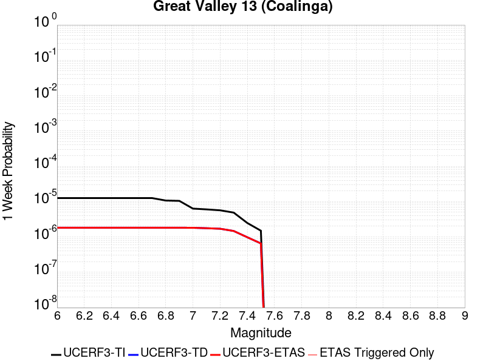 | 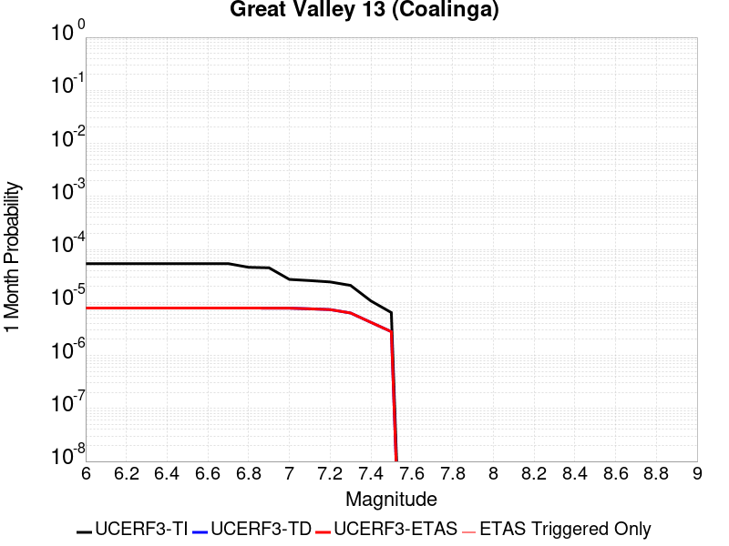 | 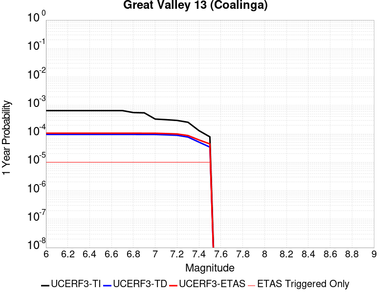 | 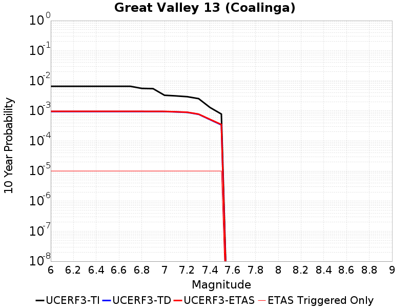 |

| Magnitude | 1 wk TI Prob | 1 wk TD Prob | 1 wk ETAS Prob | 1 wk ETAS/TD Gain | 1 wk ETAS Triggered Only | 1 mo TI Prob | 1 mo TD Prob | 1 mo ETAS Prob | 1 mo ETAS/TD Gain | 1 mo ETAS Triggered Only | 1 yr TI Prob | 1 yr TD Prob | 1 yr ETAS Prob | 1 yr ETAS/TD Gain | 1 yr ETAS Triggered Only | 10 yr TI Prob | 10 yr TD Prob | 10 yr ETAS Prob | 10 yr ETAS/TD Gain | 10 yr ETAS Triggered Only |
|-----|-----|-----|-----|-----|-----|-----|-----|-----|-----|-----|-----|-----|-----|-----|-----|-----|-----|-----|-----|-----|
| 6.0 | 1.25701345E-5 | 1.8251183E-6 | 1.8251183E-6 | 1.0 | 0.0 | 5.3870892E-5 | 7.821913E-6 | 7.821913E-6 | 1.0 | 0.0 | 6.556807E-4 | 9.522783E-5 | 1.0522687E-4 | 1.1050013 | 1.0E-5 | 0.006537495 | 9.518895E-4 | 9.6187997E-4 | 1.0104954 | 1.0E-5 |
| 6.1 | 1.25701345E-5 | 1.8251183E-6 | 1.8251183E-6 | 1.0 | 0.0 | 5.3870892E-5 | 7.821913E-6 | 7.821913E-6 | 1.0 | 0.0 | 6.556807E-4 | 9.522783E-5 | 1.0522687E-4 | 1.1050013 | 1.0E-5 | 0.006537495 | 9.518895E-4 | 9.6187997E-4 | 1.0104954 | 1.0E-5 |
| 6.2 | 1.25701345E-5 | 1.8251183E-6 | 1.8251183E-6 | 1.0 | 0.0 | 5.3870892E-5 | 7.821913E-6 | 7.821913E-6 | 1.0 | 0.0 | 6.556807E-4 | 9.522783E-5 | 1.0522687E-4 | 1.1050013 | 1.0E-5 | 0.006537495 | 9.518895E-4 | 9.6187997E-4 | 1.0104954 | 1.0E-5 |
| 6.3 | 1.25701345E-5 | 1.8251183E-6 | 1.8251183E-6 | 1.0 | 0.0 | 5.3870892E-5 | 7.821913E-6 | 7.821913E-6 | 1.0 | 0.0 | 6.556807E-4 | 9.522783E-5 | 1.0522687E-4 | 1.1050013 | 1.0E-5 | 0.006537495 | 9.518895E-4 | 9.6187997E-4 | 1.0104954 | 1.0E-5 |
| 6.4 | 1.25701345E-5 | 1.8251183E-6 | 1.8251183E-6 | 1.0 | 0.0 | 5.3870892E-5 | 7.821913E-6 | 7.821913E-6 | 1.0 | 0.0 | 6.556807E-4 | 9.522783E-5 | 1.0522687E-4 | 1.1050013 | 1.0E-5 | 0.006537495 | 9.518895E-4 | 9.6187997E-4 | 1.0104954 | 1.0E-5 |
| 6.5 | 1.25701345E-5 | 1.8251183E-6 | 1.8251183E-6 | 1.0 | 0.0 | 5.3870892E-5 | 7.821913E-6 | 7.821913E-6 | 1.0 | 0.0 | 6.556807E-4 | 9.522783E-5 | 1.0522687E-4 | 1.1050013 | 1.0E-5 | 0.006537495 | 9.518895E-4 | 9.6187997E-4 | 1.0104954 | 1.0E-5 |
| 6.6 | 1.25701345E-5 | 1.8251183E-6 | 1.8251183E-6 | 1.0 | 0.0 | 5.3870892E-5 | 7.821913E-6 | 7.821913E-6 | 1.0 | 0.0 | 6.556807E-4 | 9.522783E-5 | 1.0522687E-4 | 1.1050013 | 1.0E-5 | 0.006537495 | 9.518895E-4 | 9.6187997E-4 | 1.0104954 | 1.0E-5 |
| 6.7 | 1.25701345E-5 | 1.8251183E-6 | 1.8251183E-6 | 1.0 | 0.0 | 5.3870892E-5 | 7.821913E-6 | 7.821913E-6 | 1.0 | 0.0 | 6.556807E-4 | 9.522783E-5 | 1.0522687E-4 | 1.1050013 | 1.0E-5 | 0.006537495 | 9.518895E-4 | 9.6187997E-4 | 1.0104954 | 1.0E-5 |
| 6.8 | 1.0720415E-5 | 1.8251183E-6 | 1.8251183E-6 | 1.0 | 0.0 | 4.5943823E-5 | 7.821913E-6 | 7.821913E-6 | 1.0 | 0.0 | 5.592225E-4 | 9.522783E-5 | 1.0522687E-4 | 1.1050013 | 1.0E-5 | 0.005578173 | 9.518895E-4 | 9.6187997E-4 | 1.0104954 | 1.0E-5 |
| 6.9 | 1.0485409E-5 | 1.8210291E-6 | 1.8210291E-6 | 1.0 | 0.0 | 4.4936693E-5 | 7.804388E-6 | 7.804388E-6 | 1.0 | 0.0 | 5.469669E-4 | 9.5014475E-5 | 1.05013525E-4 | 1.1052371 | 1.0E-5 | 0.005456226 | 9.497578E-4 | 9.5974834E-4 | 1.010519 | 1.0E-5 |
| 7.0 | 6.3302773E-6 | 1.8159004E-6 | 1.8159004E-6 | 1.0 | 0.0 | 2.7129478E-5 | 7.782408E-6 | 7.782408E-6 | 1.0 | 0.0 | 3.3025132E-4 | 9.4746894E-5 | 1.0474595E-4 | 1.1055343 | 1.0E-5 | 0.0032976097 | 9.4708434E-4 | 9.5707487E-4 | 1.0105487 | 1.0E-5 |
| 7.1 | 6.022003E-6 | 1.766202E-6 | 1.766202E-6 | 1.0 | 0.0 | 2.5808331E-5 | 7.569416E-6 | 7.569416E-6 | 1.0 | 0.0 | 3.141711E-4 | 9.215394E-5 | 1.0215302E-4 | 1.108504 | 1.0E-5 | 0.0031372732 | 9.211764E-4 | 9.3116716E-4 | 1.0108457 | 1.0E-5 |
| 7.2 | 5.671345E-6 | 1.706029E-6 | 1.706029E-6 | 1.0 | 0.0 | 2.4305538E-5 | 7.3115334E-6 | 7.3115334E-6 | 1.0 | 0.0 | 2.9587973E-4 | 8.901448E-5 | 9.901359E-5 | 1.1123313 | 1.0E-5 | 0.002954861 | 8.898073E-4 | 8.997984E-4 | 1.0112284 | 1.0E-5 |
| 7.3 | 4.8831785E-6 | 1.4731794E-6 | 1.4731794E-6 | 1.0 | 0.0 | 2.092774E-5 | 6.3136117E-6 | 6.3136117E-6 | 1.0 | 0.0 | 2.5476544E-4 | 7.686568E-5 | 8.6864915E-5 | 1.130087 | 1.0E-5 | 0.0025447358 | 7.6840754E-4 | 7.783999E-4 | 1.013004 | 1.0E-5 |
| 7.4 | 2.4837766E-6 | 9.800737E-7 | 9.800737E-7 | 1.0 | 0.0 | 1.0644713E-5 | 4.2003094E-6 | 4.2003094E-6 | 1.0 | 0.0 | 1.2959167E-4 | 5.113763E-5 | 6.113712E-5 | 1.1955407 | 1.0E-5 | 0.0012951613 | 5.1126524E-4 | 5.2126014E-4 | 1.0195494 | 1.0E-5 |
| 7.5 | 1.5002679E-6 | 6.546236E-7 | 6.546236E-7 | 1.0 | 0.0 | 6.4297037E-6 | 2.805527E-6 | 2.805527E-6 | 1.0 | 0.0 | 7.827883E-5 | 3.4156797E-5 | 4.4156455E-5 | 1.2927575 | 1.0E-5 | 7.825126E-4 | 3.4151963E-4 | 3.515162E-4 | 1.0292709 | 1.0E-5 |

## East Huasna 2011 CFM
*[(top)](#table-of-contents)*

| 1 Week | 1 Month | 1 Year | 10 Year |
|-----|-----|-----|-----|
|  | 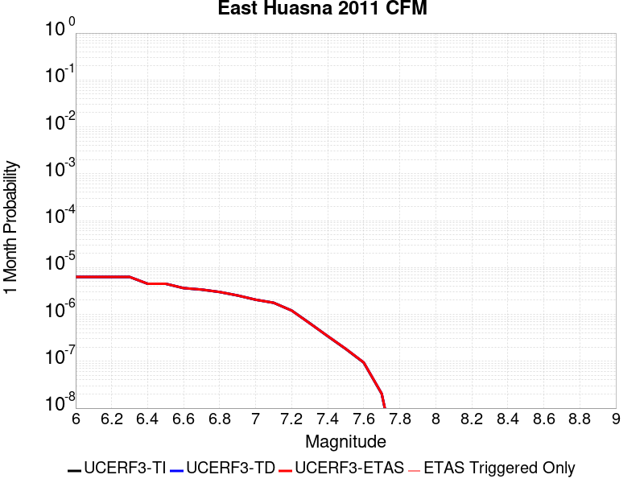 | 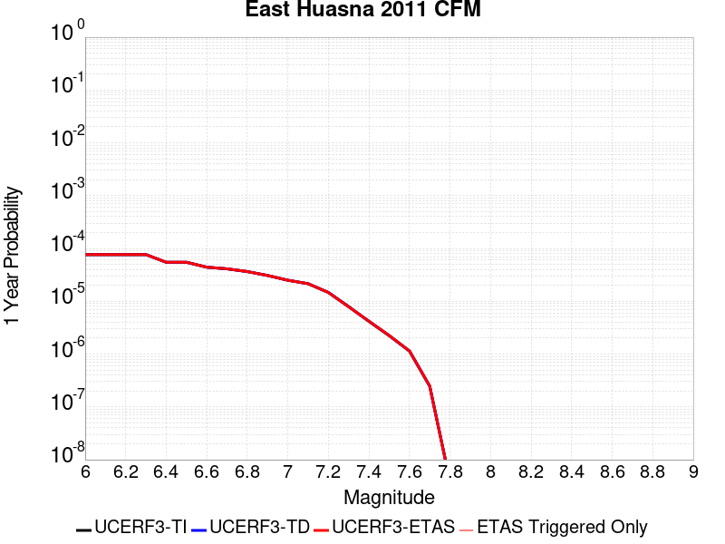 | 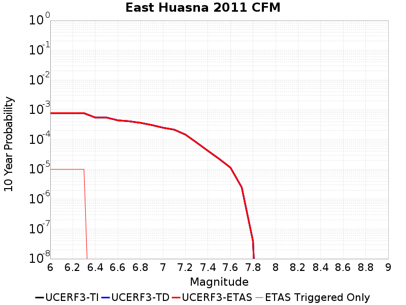 |

| Magnitude | 1 wk TI Prob | 1 wk TD Prob | 1 wk ETAS Prob | 1 wk ETAS/TD Gain | 1 wk ETAS Triggered Only | 1 mo TI Prob | 1 mo TD Prob | 1 mo ETAS Prob | 1 mo ETAS/TD Gain | 1 mo ETAS Triggered Only | 1 yr TI Prob | 1 yr TD Prob | 1 yr ETAS Prob | 1 yr ETAS/TD Gain | 1 yr ETAS Triggered Only | 10 yr TI Prob | 10 yr TD Prob | 10 yr ETAS Prob | 10 yr ETAS/TD Gain | 10 yr ETAS Triggered Only |
|-----|-----|-----|-----|-----|-----|-----|-----|-----|-----|-----|-----|-----|-----|-----|-----|-----|-----|-----|-----|-----|
| 6.0 | 1.4658423E-6 | 1.4715667E-6 | 1.4715667E-6 | 1.0 | 0.0 | 6.282166E-6 | 6.3067E-6 | 6.3067E-6 | 1.0 | 0.0 | 7.6482684E-5 | 7.6781434E-5 | 7.6781434E-5 | 1.0 | 0.0 | 7.645637E-4 | 7.675561E-4 | 7.775484E-4 | 1.0130184 | 1.0E-5 |
| 6.1 | 1.4658423E-6 | 1.4715667E-6 | 1.4715667E-6 | 1.0 | 0.0 | 6.282166E-6 | 6.3067E-6 | 6.3067E-6 | 1.0 | 0.0 | 7.6482684E-5 | 7.6781434E-5 | 7.6781434E-5 | 1.0 | 0.0 | 7.645637E-4 | 7.675561E-4 | 7.775484E-4 | 1.0130184 | 1.0E-5 |
| 6.2 | 1.4658423E-6 | 1.4715667E-6 | 1.4715667E-6 | 1.0 | 0.0 | 6.282166E-6 | 6.3067E-6 | 6.3067E-6 | 1.0 | 0.0 | 7.6482684E-5 | 7.6781434E-5 | 7.6781434E-5 | 1.0 | 0.0 | 7.645637E-4 | 7.675561E-4 | 7.775484E-4 | 1.0130184 | 1.0E-5 |
| 6.3 | 1.4658423E-6 | 1.4715667E-6 | 1.4715667E-6 | 1.0 | 0.0 | 6.282166E-6 | 6.3067E-6 | 6.3067E-6 | 1.0 | 0.0 | 7.6482684E-5 | 7.6781434E-5 | 7.6781434E-5 | 1.0 | 0.0 | 7.645637E-4 | 7.675561E-4 | 7.775484E-4 | 1.0130184 | 1.0E-5 |
| 6.4 | 1.0488257E-6 | 1.052752E-6 | 1.052752E-6 | 1.0 | 0.0 | 4.4949593E-6 | 4.5117868E-6 | 4.5117868E-6 | 1.0 | 0.0 | 5.472476E-5 | 5.492964E-5 | 5.492964E-5 | 1.0 | 0.0 | 5.4711284E-4 | 5.4916256E-4 | 5.4916256E-4 | 1.0 | 0.0 |
| 6.5 | 1.0488257E-6 | 1.052752E-6 | 1.052752E-6 | 1.0 | 0.0 | 4.4949593E-6 | 4.5117868E-6 | 4.5117868E-6 | 1.0 | 0.0 | 5.472476E-5 | 5.492964E-5 | 5.492964E-5 | 1.0 | 0.0 | 5.4711284E-4 | 5.4916256E-4 | 5.4916256E-4 | 1.0 | 0.0 |
| 6.6 | 8.463064E-7 | 8.4936374E-7 | 8.4936374E-7 | 1.0 | 0.0 | 3.6270226E-6 | 3.6401252E-6 | 3.6401252E-6 | 1.0 | 0.0 | 4.4158103E-5 | 4.4317632E-5 | 4.4317632E-5 | 1.0 | 0.0 | 4.414933E-4 | 4.4308882E-4 | 4.4308882E-4 | 1.0 | 0.0 |
| 6.7 | 7.876149E-7 | 7.9025375E-7 | 7.9025375E-7 | 1.0 | 0.0 | 3.375488E-6 | 3.3867975E-6 | 3.3867975E-6 | 1.0 | 0.0 | 4.109579E-5 | 4.1233485E-5 | 4.1233485E-5 | 1.0 | 0.0 | 4.108819E-4 | 4.12259E-4 | 4.12259E-4 | 1.0 | 0.0 |
| 6.8 | 6.9940785E-7 | 7.0165817E-7 | 7.0165817E-7 | 1.0 | 0.0 | 2.9974588E-6 | 3.007103E-6 | 3.007103E-6 | 1.0 | 0.0 | 3.649345E-5 | 3.661087E-5 | 3.661087E-5 | 1.0 | 0.0 | 3.6487455E-4 | 3.6604886E-4 | 3.6604886E-4 | 1.0 | 0.0 |
| 6.9 | 5.899658E-7 | 5.915603E-7 | 5.915603E-7 | 1.0 | 0.0 | 2.5284223E-6 | 2.5352558E-6 | 2.5352558E-6 | 1.0 | 0.0 | 3.0783107E-5 | 3.0866307E-5 | 3.0866307E-5 | 1.0 | 0.0 | 3.0778843E-4 | 3.0862048E-4 | 3.0862048E-4 | 1.0 | 0.0 |
| 7.0 | 4.793814E-7 | 4.8032757E-7 | 4.8032757E-7 | 1.0 | 0.0 | 2.05449E-6 | 2.058545E-6 | 2.058545E-6 | 1.0 | 0.0 | 2.501313E-5 | 2.50625E-5 | 2.50625E-5 | 1.0 | 0.0 | 2.5010316E-4 | 2.505969E-4 | 2.505969E-4 | 1.0 | 0.0 |
| 7.1 | 4.1256908E-7 | 4.1299432E-7 | 4.1299432E-7 | 1.0 | 0.0 | 1.768152E-6 | 1.7699745E-6 | 1.7699745E-6 | 1.0 | 0.0 | 2.1527037E-5 | 2.1549227E-5 | 2.1549227E-5 | 1.0 | 0.0 | 2.1524953E-4 | 2.1547152E-4 | 2.1547152E-4 | 1.0 | 0.0 |
| 7.2 | 2.822599E-7 | 2.816143E-7 | 2.816143E-7 | 1.0 | 0.0 | 1.2096847E-6 | 1.2069178E-6 | 1.2069178E-6 | 1.0 | 0.0 | 1.47278115E-5 | 1.4694126E-5 | 1.4694126E-5 | 1.0 | 0.0 | 1.4726835E-4 | 1.4693162E-4 | 1.4693162E-4 | 1.0 | 0.0 |
| 7.3 | 1.5261652E-7 | 1.5075017E-7 | 1.5075017E-7 | 1.0 | 0.0 | 6.540707E-7 | 6.4607195E-7 | 6.4607195E-7 | 1.0 | 0.0 | 7.963281E-6 | 7.865898E-6 | 7.865898E-6 | 1.0 | 0.0 | 7.962996E-5 | 7.8656216E-5 | 7.8656216E-5 | 1.0 | 0.0 |
| 7.4 | 7.976414E-8 | 8.0578744E-8 | 8.0578744E-8 | 1.0 | 0.0 | 3.418463E-7 | 3.453374E-7 | 3.453374E-7 | 1.0 | 0.0 | 4.1619705E-6 | 4.204475E-6 | 4.204475E-6 | 1.0 | 0.0 | 4.161893E-5 | 4.204396E-5 | 4.204396E-5 | 1.0 | 0.0 |
| 7.5 | 4.2715055E-8 | 4.320257E-8 | 4.320257E-8 | 1.0 | 0.0 | 1.830645E-7 | 1.8515384E-7 | 1.8515384E-7 | 1.0 | 0.0 | 2.228808E-6 | 2.2542458E-6 | 2.2542458E-6 | 1.0 | 0.0 | 2.2287857E-5 | 2.2542232E-5 | 2.2542232E-5 | 1.0 | 0.0 |
| 7.6 | 2.1807532E-8 | 2.2057504E-8 | 2.2057504E-8 | 1.0 | 0.0 | 9.346085E-8 | 9.4532155E-8 | 9.4532155E-8 | 1.0 | 0.0 | 1.1378852E-6 | 1.1509284E-6 | 1.1509284E-6 | 1.0 | 0.0 | 1.1378794E-5 | 1.1509225E-5 | 1.1509225E-5 | 1.0 | 0.0 |
| 7.7 | 4.7196043E-9 | 4.767289E-9 | 4.767289E-9 | 1.0 | 0.0 | 2.0226874E-8 | 2.0431235E-8 | 2.0431235E-8 | 1.0 | 0.0 | 2.4626218E-7 | 2.4875027E-7 | 2.4875027E-7 | 1.0 | 0.0 | 2.462619E-6 | 2.4875E-6 | 2.4875E-6 | 1.0 | 0.0 |
| 7.8 | 7.400003E-11 | 7.4654505E-11 | 7.4654505E-11 | 1.0 | 0.0 | 3.171432E-10 | 3.1994796E-10 | 3.1994796E-10 | 1.0 | 0.0 | 3.861218E-9 | 3.895367E-9 | 3.895367E-9 | 1.0 | 0.0 | 3.861218E-8 | 3.895367E-8 | 3.895367E-8 | 1.0 | 0.0 |

## Green Valley 2011 CFM
*[(top)](#table-of-contents)*

| 1 Week | 1 Month | 1 Year | 10 Year |
|-----|-----|-----|-----|
| 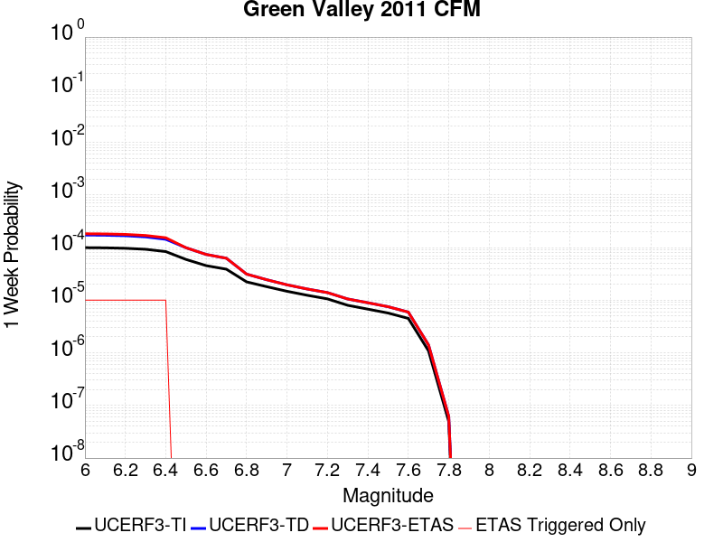 | 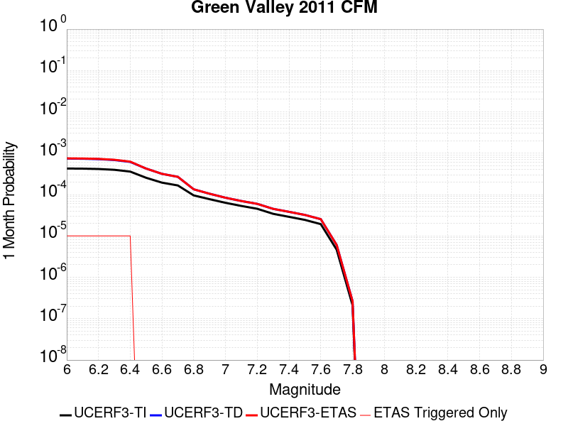 | 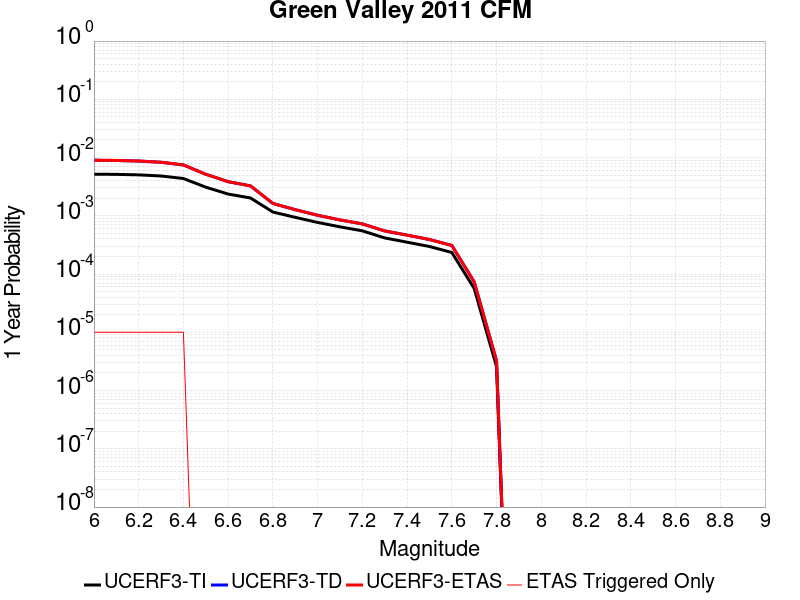 | 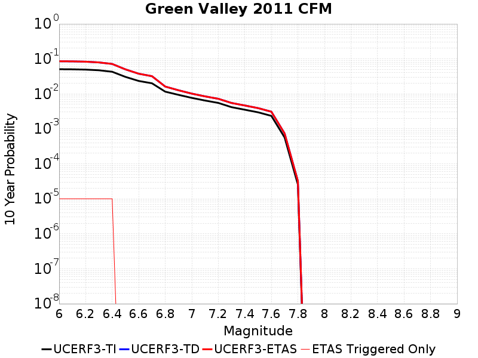 |

| Magnitude | 1 wk TI Prob | 1 wk TD Prob | 1 wk ETAS Prob | 1 wk ETAS/TD Gain | 1 wk ETAS Triggered Only | 1 mo TI Prob | 1 mo TD Prob | 1 mo ETAS Prob | 1 mo ETAS/TD Gain | 1 mo ETAS Triggered Only | 1 yr TI Prob | 1 yr TD Prob | 1 yr ETAS Prob | 1 yr ETAS/TD Gain | 1 yr ETAS Triggered Only | 10 yr TI Prob | 10 yr TD Prob | 10 yr ETAS Prob | 10 yr ETAS/TD Gain | 10 yr ETAS Triggered Only |
|-----|-----|-----|-----|-----|-----|-----|-----|-----|-----|-----|-----|-----|-----|-----|-----|-----|-----|-----|-----|-----|
| 6.0 | 9.9629346E-5 | 1.7306079E-4 | 1.8305906E-4 | 1.0577731 | 1.0E-5 | 4.2691303E-4 | 7.414461E-4 | 7.514387E-4 | 1.0134772 | 1.0E-5 | 0.0051852856 | 0.008986844 | 0.008996754 | 1.0011027 | 1.0E-5 | 0.050659515 | 0.08552358 | 0.085532725 | 1.0001069 | 1.0E-5 |
| 6.1 | 9.88615E-5 | 1.7153392E-4 | 1.8153219E-4 | 1.0582875 | 1.0E-5 | 4.2362334E-4 | 7.3490606E-4 | 7.448987E-4 | 1.0135971 | 1.0E-5 | 0.0051454236 | 0.008907871 | 0.008917782 | 1.0011126 | 1.0E-5 | 0.050279044 | 0.084811196 | 0.08482035 | 1.0001079 | 1.0E-5 |
| 6.2 | 9.696895E-5 | 1.6792421E-4 | 1.7792253E-4 | 1.0595406 | 1.0E-5 | 4.15515E-4 | 7.1944454E-4 | 7.2943734E-4 | 1.0138897 | 1.0E-5 | 0.0050471667 | 0.00872125 | 0.008731163 | 1.0011367 | 1.0E-5 | 0.04934063 | 0.08312011 | 0.08312927 | 1.0001103 | 1.0E-5 |
| 6.3 | 9.275224E-5 | 1.5971754E-4 | 1.6971595E-4 | 1.0626005 | 1.0E-5 | 3.9744904E-4 | 6.842917E-4 | 6.9428486E-4 | 1.0146036 | 1.0E-5 | 0.0048282105 | 0.008296573 | 0.008306489 | 1.0011953 | 1.0E-5 | 0.047246475 | 0.07925855 | 0.079267755 | 1.0001161 | 1.0E-5 |
| 6.4 | 8.391499E-5 | 1.4368274E-4 | 1.536813E-4 | 1.0695878 | 1.0E-5 | 3.595861E-4 | 6.156453E-4 | 6.2563916E-4 | 1.0162331 | 1.0E-5 | 0.004369175 | 0.007467209 | 0.0074771345 | 1.0013292 | 1.0E-5 | 0.04284265 | 0.07163225 | 0.071641535 | 1.0001296 | 1.0E-5 |
| 6.5 | 5.9519385E-5 | 9.9344645E-5 | 9.9344645E-5 | 1.0 | 0.0 | 2.5505814E-4 | 4.2569742E-4 | 4.2569742E-4 | 1.0 | 0.0 | 0.0031009112 | 0.005168398 | 0.005168398 | 1.0 | 0.0 | 0.030579966 | 0.05014701 | 0.05014701 | 1.0 | 0.0 |
| 6.6 | 4.5361558E-5 | 7.402916E-5 | 7.402916E-5 | 1.0 | 0.0 | 1.9439218E-4 | 3.172321E-4 | 3.172321E-4 | 1.0 | 0.0 | 0.0023641558 | 0.0038540314 | 0.0038540314 | 1.0 | 0.0 | 0.023391623 | 0.037666947 | 0.037666947 | 1.0 | 0.0 |
| 6.7 | 3.8808106E-5 | 6.2654486E-5 | 6.2654486E-5 | 1.0 | 0.0 | 1.6630985E-4 | 2.684942E-4 | 2.684942E-4 | 1.0 | 0.0 | 0.0020229418 | 0.00326274 | 0.00326274 | 1.0 | 0.0 | 0.020046256 | 0.03200675 | 0.03200675 | 1.0 | 0.0 |
| 6.8 | 2.2284667E-5 | 3.128552E-5 | 3.128552E-5 | 1.0 | 0.0 | 9.550222E-5 | 1.34074E-4 | 1.34074E-4 | 1.0 | 0.0 | 0.0011621192 | 0.0016311215 | 0.0016311215 | 1.0 | 0.0 | 0.011560607 | 0.016166134 | 0.016166134 | 1.0 | 0.0 |
| 6.9 | 1.8050168E-5 | 2.4448236E-5 | 2.4448236E-5 | 1.0 | 0.0 | 7.735557E-5 | 1.04773986E-4 | 1.04773986E-4 | 1.0 | 0.0 | 9.4139716E-4 | 0.0012748804 | 0.0012748804 | 1.0 | 0.0 | 0.009374191 | 0.012667925 | 0.012667925 | 1.0 | 0.0 |
| 7.0 | 1.4763166E-5 | 1.9582998E-5 | 1.9582998E-5 | 1.0 | 0.0 | 6.326917E-5 | 8.3924446E-5 | 8.3924446E-5 | 1.0 | 0.0 | 7.7002996E-4 | 0.0010213042 | 0.0010213042 | 1.0 | 0.0 | 0.007673672 | 0.010165417 | 0.010165417 | 1.0 | 0.0 |
| 7.1 | 1.2399713E-5 | 1.6303831E-5 | 1.6303831E-5 | 1.0 | 0.0 | 5.3140546E-5 | 6.9871705E-5 | 6.9871705E-5 | 1.0 | 0.0 | 6.467941E-4 | 8.503579E-4 | 8.503579E-4 | 1.0 | 0.0 | 0.006449148 | 0.0084713185 | 0.0084713185 | 1.0 | 0.0 |
| 7.2 | 1.0584195E-5 | 1.3921847E-5 | 1.3921847E-5 | 1.0 | 0.0 | 4.5360044E-5 | 5.9663704E-5 | 5.9663704E-5 | 1.0 | 0.0 | 5.521186E-4 | 7.261651E-4 | 7.261651E-4 | 1.0 | 0.0 | 0.0055074887 | 0.007238339 | 0.007238339 | 1.0 | 0.0 |
| 7.3 | 7.998173E-6 | 1.0544108E-5 | 1.0544108E-5 | 1.0 | 0.0 | 3.4277433E-5 | 4.5188255E-5 | 4.5188255E-5 | 1.0 | 0.0 | 4.1724785E-4 | 5.500292E-4 | 5.500292E-4 | 1.0 | 0.0 | 0.004164653 | 0.0054869447 | 0.0054869447 | 1.0 | 0.0 |
| 7.4 | 6.7571127E-6 | 8.932774E-6 | 8.932774E-6 | 1.0 | 0.0 | 2.8958733E-5 | 3.828276E-5 | 3.828276E-5 | 1.0 | 0.0 | 3.5251552E-4 | 4.6599386E-4 | 4.6599386E-4 | 1.0 | 0.0 | 0.0035195686 | 0.00465037 | 0.00465037 | 1.0 | 0.0 |
| 7.5 | 5.69878E-6 | 7.5163675E-6 | 7.5163675E-6 | 1.0 | 0.0 | 2.4423114E-5 | 3.221261E-5 | 3.221261E-5 | 1.0 | 0.0 | 2.9731085E-4 | 3.9211882E-4 | 3.9211882E-4 | 1.0 | 0.0 | 0.002969134 | 0.0039144214 | 0.0039144214 | 1.0 | 0.0 |
| 7.6 | 4.503664E-6 | 5.935726E-6 | 5.935726E-6 | 1.0 | 0.0 | 1.9301275E-5 | 2.5438583E-5 | 2.5438583E-5 | 1.0 | 0.0 | 2.3496768E-4 | 3.0967154E-4 | 3.0967154E-4 | 1.0 | 0.0 | 0.002347194 | 0.0030925255 | 0.0030925255 | 1.0 | 0.0 |
| 7.7 | 1.0873546E-6 | 1.4107088E-6 | 1.4107088E-6 | 1.0 | 0.0 | 4.6600826E-6 | 6.045881E-6 | 6.045881E-6 | 1.0 | 0.0 | 5.6735033E-5 | 7.360614E-5 | 7.360614E-5 | 1.0 | 0.0 | 5.672055E-4 | 7.358197E-4 | 7.358197E-4 | 1.0 | 0.0 |
| 7.8 | 4.9373917E-8 | 6.1777754E-8 | 6.1777754E-8 | 1.0 | 0.0 | 2.1160248E-7 | 2.6476178E-7 | 2.6476178E-7 | 1.0 | 0.0 | 2.5762572E-6 | 3.2234711E-6 | 3.2234711E-6 | 1.0 | 0.0 | 2.5762274E-5 | 3.223262E-5 | 3.223262E-5 | 1.0 | 0.0 |

## Cedar Mtn-Mahogany Mtn
*[(top)](#table-of-contents)*

| 1 Week | 1 Month | 1 Year | 10 Year |
|-----|-----|-----|-----|
| 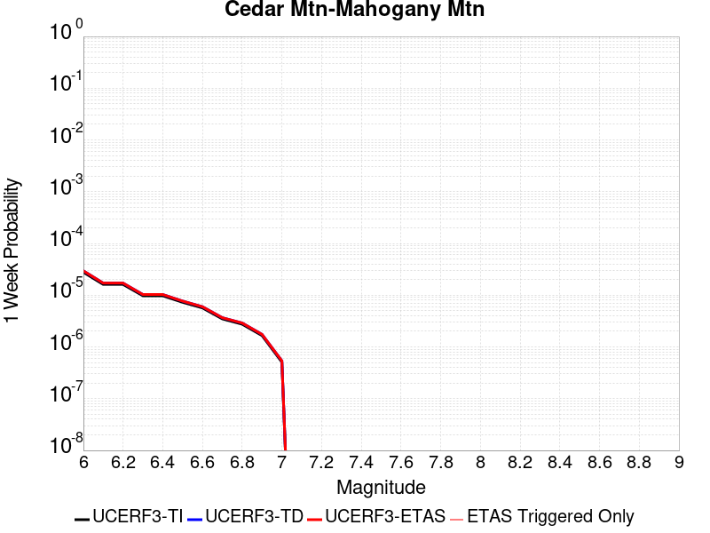 | 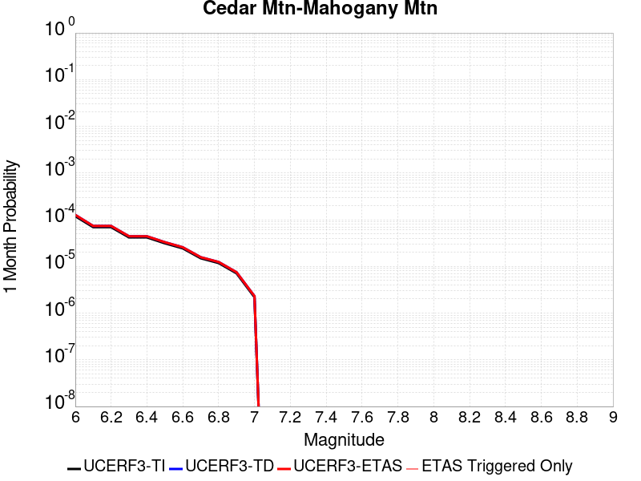 |  |  |

| Magnitude | 1 wk TI Prob | 1 wk TD Prob | 1 wk ETAS Prob | 1 wk ETAS/TD Gain | 1 wk ETAS Triggered Only | 1 mo TI Prob | 1 mo TD Prob | 1 mo ETAS Prob | 1 mo ETAS/TD Gain | 1 mo ETAS Triggered Only | 1 yr TI Prob | 1 yr TD Prob | 1 yr ETAS Prob | 1 yr ETAS/TD Gain | 1 yr ETAS Triggered Only | 10 yr TI Prob | 10 yr TD Prob | 10 yr ETAS Prob | 10 yr ETAS/TD Gain | 10 yr ETAS Triggered Only |
|-----|-----|-----|-----|-----|-----|-----|-----|-----|-----|-----|-----|-----|-----|-----|-----|-----|-----|-----|-----|-----|
| 6.0 | 2.7763876E-5 | 2.9589084E-5 | 2.9589084E-5 | 1.0 | 0.0 | 1.1898261E-4 | 1.2680459E-4 | 1.2680459E-4 | 1.0 | 0.0 | 0.0014476506 | 0.0015428226 | 0.0015428226 | 1.0 | 0.0 | 0.0143825635 | 0.015328337 | 0.015338184 | 1.0006424 | 1.0E-5 |
| 6.1 | 1.6162443E-5 | 1.7143082E-5 | 1.7143082E-5 | 1.0 | 0.0 | 6.926578E-5 | 7.3468385E-5 | 7.3468385E-5 | 1.0 | 0.0 | 8.4298453E-4 | 8.941282E-4 | 8.941282E-4 | 1.0 | 0.0 | 0.008397939 | 0.008907119 | 0.00891703 | 1.0011127 | 1.0E-5 |
| 6.2 | 1.6162443E-5 | 1.7143082E-5 | 1.7143082E-5 | 1.0 | 0.0 | 6.926578E-5 | 7.3468385E-5 | 7.3468385E-5 | 1.0 | 0.0 | 8.4298453E-4 | 8.941282E-4 | 8.941282E-4 | 1.0 | 0.0 | 0.008397939 | 0.008907119 | 0.00891703 | 1.0011127 | 1.0E-5 |
| 6.3 | 9.746053E-6 | 1.0303218E-5 | 1.0303218E-5 | 1.0 | 0.0 | 4.1768133E-5 | 4.4155924E-5 | 4.4155924E-5 | 1.0 | 0.0 | 5.0840835E-4 | 5.3746987E-4 | 5.3746987E-4 | 1.0 | 0.0 | 0.0050724675 | 0.0053621186 | 0.0053621186 | 1.0 | 0.0 |
| 6.4 | 9.746053E-6 | 1.0303218E-5 | 1.0303218E-5 | 1.0 | 0.0 | 4.1768133E-5 | 4.4155924E-5 | 4.4155924E-5 | 1.0 | 0.0 | 5.0840835E-4 | 5.3746987E-4 | 5.3746987E-4 | 1.0 | 0.0 | 0.0050724675 | 0.0053621186 | 0.0053621186 | 1.0 | 0.0 |
| 6.5 | 7.290083E-6 | 7.695372E-6 | 7.695372E-6 | 1.0 | 0.0 | 3.124284E-5 | 3.2979762E-5 | 3.2979762E-5 | 1.0 | 0.0 | 3.8031515E-4 | 4.014568E-4 | 4.014568E-4 | 1.0 | 0.0 | 0.0037966494 | 0.004007536 | 0.004007536 | 1.0 | 0.0 |
| 6.6 | 5.67907E-6 | 5.9891895E-6 | 5.9891895E-6 | 1.0 | 0.0 | 2.4338644E-5 | 2.5667709E-5 | 2.5667709E-5 | 1.0 | 0.0 | 2.962827E-4 | 3.124609E-4 | 3.124609E-4 | 1.0 | 0.0 | 0.0029588798 | 0.0031203518 | 0.0031203518 | 1.0 | 0.0 |
| 6.7 | 3.4853963E-6 | 3.672653E-6 | 3.672653E-6 | 1.0 | 0.0 | 1.4937327E-5 | 1.573985E-5 | 1.573985E-5 | 1.0 | 0.0 | 1.8184677E-4 | 1.9161645E-4 | 1.9161645E-4 | 1.0 | 0.0 | 0.0018169804 | 0.0019145743 | 0.0019145743 | 1.0 | 0.0 |
| 6.8 | 2.7535168E-6 | 2.901594E-6 | 2.901594E-6 | 1.0 | 0.0 | 1.1800733E-5 | 1.24353455E-5 | 1.24353455E-5 | 1.0 | 0.0 | 1.4366445E-4 | 1.513903E-4 | 1.513903E-4 | 1.0 | 0.0 | 0.0014357162 | 0.0015129189 | 0.0015129189 | 1.0 | 0.0 |
| 6.9 | 1.6594106E-6 | 1.7497092E-6 | 1.7497092E-6 | 1.0 | 0.0 | 7.1117406E-6 | 7.4987342E-6 | 7.4987342E-6 | 1.0 | 0.0 | 8.6582E-5 | 9.129357E-5 | 9.129357E-5 | 1.0 | 0.0 | 8.654827E-4 | 9.125911E-4 | 9.125911E-4 | 1.0 | 0.0 |
| 7.0 | 5.10215E-7 | 5.3892876E-7 | 5.3892876E-7 | 1.0 | 0.0 | 2.186634E-6 | 2.3096934E-6 | 2.3096934E-6 | 1.0 | 0.0 | 2.6621943E-5 | 2.8120283E-5 | 2.8120283E-5 | 1.0 | 0.0 | 2.6618753E-4 | 2.811798E-4 | 2.811798E-4 | 1.0 | 0.0 |

## Earthquake Valley (So Extension)
*[(top)](#table-of-contents)*

| 1 Week | 1 Month | 1 Year | 10 Year |
|-----|-----|-----|-----|
| 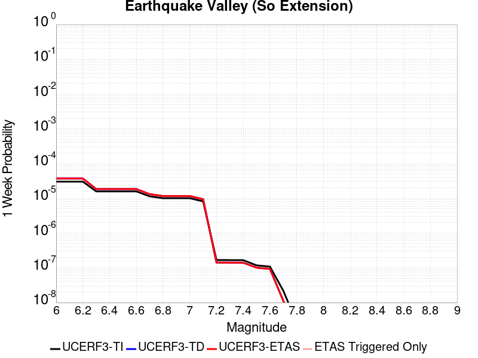 | 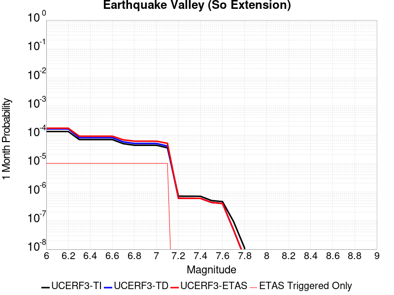 | 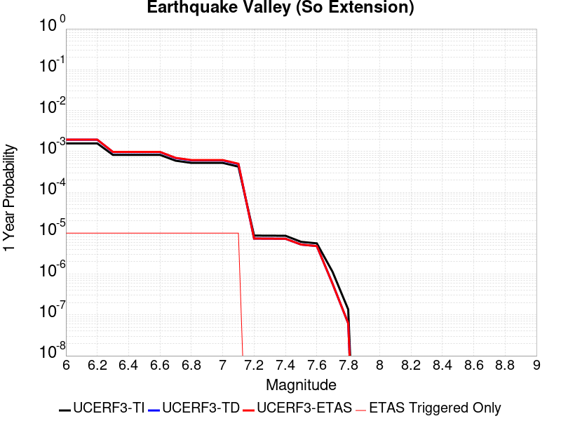 | 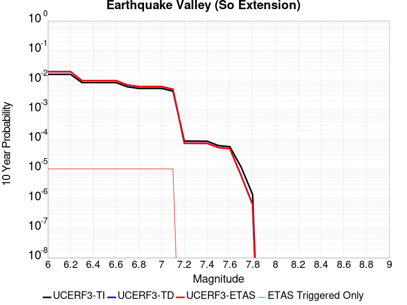 |

| Magnitude | 1 wk TI Prob | 1 wk TD Prob | 1 wk ETAS Prob | 1 wk ETAS/TD Gain | 1 wk ETAS Triggered Only | 1 mo TI Prob | 1 mo TD Prob | 1 mo ETAS Prob | 1 mo ETAS/TD Gain | 1 mo ETAS Triggered Only | 1 yr TI Prob | 1 yr TD Prob | 1 yr ETAS Prob | 1 yr ETAS/TD Gain | 1 yr ETAS Triggered Only | 10 yr TI Prob | 10 yr TD Prob | 10 yr ETAS Prob | 10 yr ETAS/TD Gain | 10 yr ETAS Triggered Only |
|-----|-----|-----|-----|-----|-----|-----|-----|-----|-----|-----|-----|-----|-----|-----|-----|-----|-----|-----|-----|-----|
| 6.0 | 3.0194888E-5 | 3.707308E-5 | 3.707308E-5 | 1.0 | 0.0 | 1.2940024E-4 | 1.5887803E-4 | 1.6887643E-4 | 1.0629314 | 1.0E-5 | 0.0015743093 | 0.0019331678 | 0.0019431486 | 1.0051628 | 1.0E-5 | 0.01563203 | 0.019213505 | 0.019223314 | 1.0005105 | 1.0E-5 |
| 6.1 | 3.0194888E-5 | 3.707308E-5 | 3.707308E-5 | 1.0 | 0.0 | 1.2940024E-4 | 1.5887803E-4 | 1.6887643E-4 | 1.0629314 | 1.0E-5 | 0.0015743093 | 0.0019331678 | 0.0019431486 | 1.0051628 | 1.0E-5 | 0.01563203 | 0.019213505 | 0.019223314 | 1.0005105 | 1.0E-5 |
| 6.2 | 3.0194888E-5 | 3.707308E-5 | 3.707308E-5 | 1.0 | 0.0 | 1.2940024E-4 | 1.5887803E-4 | 1.6887643E-4 | 1.0629314 | 1.0E-5 | 0.0015743093 | 0.0019331678 | 0.0019431486 | 1.0051628 | 1.0E-5 | 0.01563203 | 0.019213505 | 0.019223314 | 1.0005105 | 1.0E-5 |
| 6.3 | 1.5795305E-5 | 1.8446935E-5 | 1.8446935E-5 | 1.0 | 0.0 | 6.769241E-5 | 7.9056525E-5 | 8.9055735E-5 | 1.1264818 | 1.0E-5 | 8.238434E-4 | 9.6219947E-4 | 9.721898E-4 | 1.0103829 | 1.0E-5 | 0.008207959 | 0.009591244 | 0.009601149 | 1.0010326 | 1.0E-5 |
| 6.4 | 1.5795305E-5 | 1.8446935E-5 | 1.8446935E-5 | 1.0 | 0.0 | 6.769241E-5 | 7.9056525E-5 | 8.9055735E-5 | 1.1264818 | 1.0E-5 | 8.238434E-4 | 9.6219947E-4 | 9.721898E-4 | 1.0103829 | 1.0E-5 | 0.008207959 | 0.009591244 | 0.009601149 | 1.0010326 | 1.0E-5 |
| 6.5 | 1.5795305E-5 | 1.8446935E-5 | 1.8446935E-5 | 1.0 | 0.0 | 6.769241E-5 | 7.9056525E-5 | 8.9055735E-5 | 1.1264818 | 1.0E-5 | 8.238434E-4 | 9.6219947E-4 | 9.721898E-4 | 1.0103829 | 1.0E-5 | 0.008207959 | 0.009591244 | 0.009601149 | 1.0010326 | 1.0E-5 |
| 6.6 | 1.5795305E-5 | 1.8446935E-5 | 1.8446935E-5 | 1.0 | 0.0 | 6.769241E-5 | 7.9056525E-5 | 8.9055735E-5 | 1.1264818 | 1.0E-5 | 8.238434E-4 | 9.6219947E-4 | 9.721898E-4 | 1.0103829 | 1.0E-5 | 0.008207959 | 0.009591244 | 0.009601149 | 1.0010326 | 1.0E-5 |
| 6.7 | 1.1363076E-5 | 1.3138531E-5 | 1.3138531E-5 | 1.0 | 0.0 | 4.8697988E-5 | 5.6307206E-5 | 6.6306646E-5 | 1.1775872 | 1.0E-5 | 5.927367E-4 | 6.8540074E-4 | 6.953939E-4 | 1.01458 | 1.0E-5 | 0.0059115817 | 0.0068403417 | 0.0068502733 | 1.001452 | 1.0E-5 |
| 6.8 | 1.0049611E-5 | 1.159454E-5 | 1.159454E-5 | 1.0 | 0.0 | 4.306905E-5 | 4.9690356E-5 | 5.9689857E-5 | 1.2012362 | 1.0E-5 | 5.242395E-4 | 6.048853E-4 | 6.1487925E-4 | 1.016522 | 1.0E-5 | 0.0052300454 | 0.006039566 | 0.0060495054 | 1.0016458 | 1.0E-5 |
| 6.9 | 1.0049611E-5 | 1.159454E-5 | 1.159454E-5 | 1.0 | 0.0 | 4.306905E-5 | 4.9690356E-5 | 5.9689857E-5 | 1.2012362 | 1.0E-5 | 5.242395E-4 | 6.048853E-4 | 6.1487925E-4 | 1.016522 | 1.0E-5 | 0.0052300454 | 0.006039566 | 0.0060495054 | 1.0016458 | 1.0E-5 |
| 7.0 | 1.0049611E-5 | 1.159454E-5 | 1.159454E-5 | 1.0 | 0.0 | 4.306905E-5 | 4.9690356E-5 | 5.9689857E-5 | 1.2012362 | 1.0E-5 | 5.242395E-4 | 6.048853E-4 | 6.1487925E-4 | 1.016522 | 1.0E-5 | 0.0052300454 | 0.006039566 | 0.0060495054 | 1.0016458 | 1.0E-5 |
| 7.1 | 8.140254E-6 | 9.383625E-6 | 9.383625E-6 | 1.0 | 0.0 | 3.4886336E-5 | 4.0215295E-5 | 5.0214894E-5 | 1.2486516 | 1.0E-5 | 4.2465836E-4 | 4.895783E-4 | 4.995734E-4 | 1.0204158 | 1.0E-5 | 0.0042384774 | 0.004891574 | 0.004901525 | 1.0020343 | 1.0E-5 |
| 7.2 | 1.673835E-7 | 1.4154469E-7 | 1.4154469E-7 | 1.0 | 0.0 | 7.173577E-7 | 6.0661995E-7 | 6.0661995E-7 | 1.0 | 0.0 | 8.733795E-6 | 7.3855763E-6 | 7.3855763E-6 | 1.0 | 0.0 | 8.733451E-5 | 7.385366E-5 | 7.385366E-5 | 1.0 | 0.0 |
| 7.3 | 1.6632116E-7 | 1.4052696E-7 | 1.4052696E-7 | 1.0 | 0.0 | 7.1280476E-7 | 6.022583E-7 | 6.022583E-7 | 1.0 | 0.0 | 8.678364E-6 | 7.3324736E-6 | 7.3324736E-6 | 1.0 | 0.0 | 8.6780245E-5 | 7.332267E-5 | 7.332267E-5 | 1.0 | 0.0 |
| 7.4 | 1.6569169E-7 | 1.3997324E-7 | 1.3997324E-7 | 1.0 | 0.0 | 7.1010703E-7 | 5.998852E-7 | 5.998852E-7 | 1.0 | 0.0 | 8.645519E-6 | 7.3035812E-6 | 7.3035812E-6 | 1.0 | 0.0 | 8.645182E-5 | 7.303377E-5 | 7.303377E-5 | 1.0 | 0.0 |
| 7.5 | 1.1764555E-7 | 1.0096182E-7 | 1.0096182E-7 | 1.0 | 0.0 | 5.041951E-7 | 4.3269347E-7 | 4.3269347E-7 | 1.0 | 0.0 | 6.138558E-6 | 5.2680325E-6 | 5.2680325E-6 | 1.0 | 0.0 | 6.1383886E-5 | 5.267929E-5 | 5.267929E-5 | 1.0 | 0.0 |
| 7.6 | 1.07927605E-7 | 9.260986E-8 | 9.260986E-8 | 1.0 | 0.0 | 4.6254678E-7 | 3.9689934E-7 | 3.9689934E-7 | 1.0 | 0.0 | 5.6314925E-6 | 4.832241E-6 | 4.832241E-6 | 1.0 | 0.0 | 5.63135E-5 | 4.8321566E-5 | 4.8321566E-5 | 1.0 | 0.0 |
| 7.7 | 2.1826905E-8 | 1.1180988E-8 | 1.1180988E-8 | 1.0 | 0.0 | 9.3543875E-8 | 4.791852E-8 | 4.791852E-8 | 1.0 | 0.0 | 1.1388961E-6 | 5.834078E-7 | 5.834078E-7 | 1.0 | 0.0 | 1.1388902E-5 | 5.8340684E-6 | 5.8340684E-6 | 1.0 | 0.0 |
| 7.8 | 2.6169649E-9 | 1.1969966E-9 | 1.1969966E-9 | 1.0 | 0.0 | 1.1215564E-8 | 5.1299853E-9 | 5.1299853E-9 | 1.0 | 0.0 | 1.3654947E-7 | 6.245757E-8 | 6.245757E-8 | 1.0 | 0.0 | 1.365494E-6 | 6.245757E-7 | 6.245757E-7 | 1.0 | 0.0 |

## South Cuyama
*[(top)](#table-of-contents)*

| 1 Week | 1 Month | 1 Year | 10 Year |
|-----|-----|-----|-----|
| 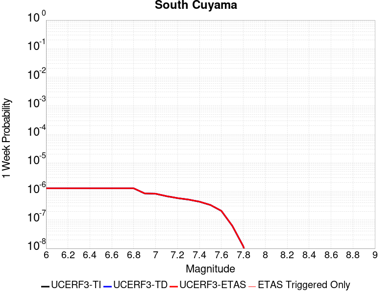 | 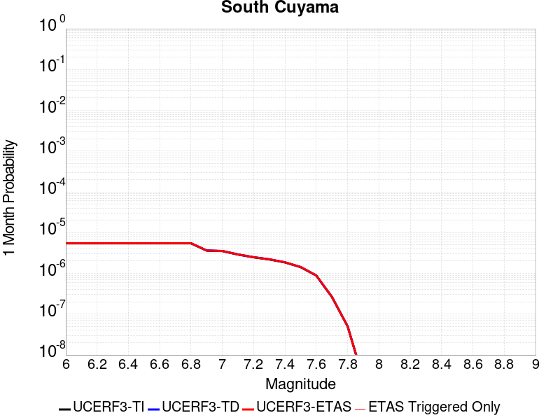 | 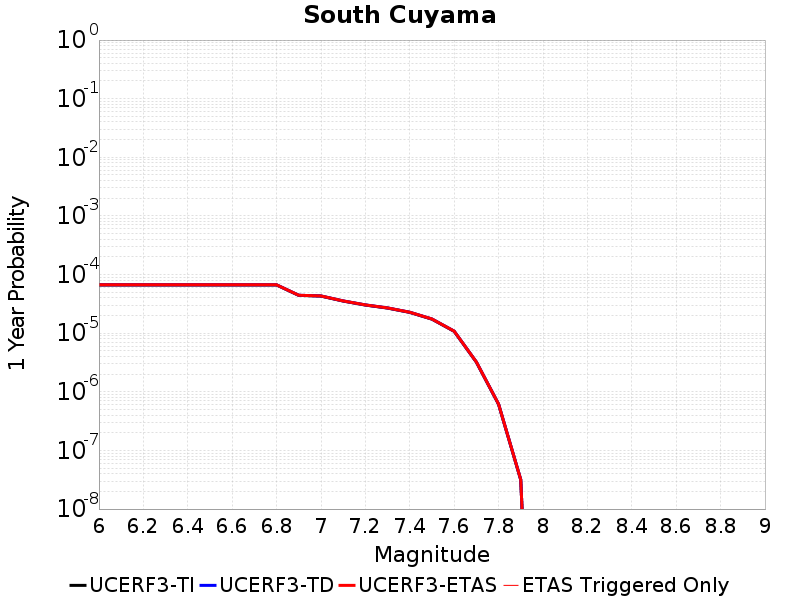 | 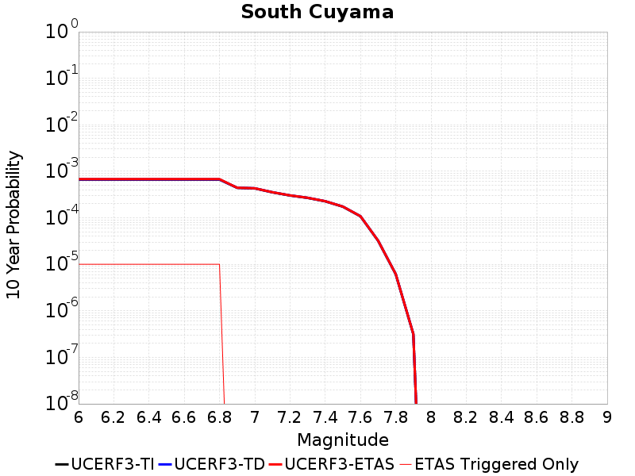 |

| Magnitude | 1 wk TI Prob | 1 wk TD Prob | 1 wk ETAS Prob | 1 wk ETAS/TD Gain | 1 wk ETAS Triggered Only | 1 mo TI Prob | 1 mo TD Prob | 1 mo ETAS Prob | 1 mo ETAS/TD Gain | 1 mo ETAS Triggered Only | 1 yr TI Prob | 1 yr TD Prob | 1 yr ETAS Prob | 1 yr ETAS/TD Gain | 1 yr ETAS Triggered Only | 10 yr TI Prob | 10 yr TD Prob | 10 yr ETAS Prob | 10 yr ETAS/TD Gain | 10 yr ETAS Triggered Only |
|-----|-----|-----|-----|-----|-----|-----|-----|-----|-----|-----|-----|-----|-----|-----|-----|-----|-----|-----|-----|-----|
| 6.0 | 1.2747308E-6 | 1.2818705E-6 | 1.2818705E-6 | 1.0 | 0.0 | 5.4631205E-6 | 5.4937195E-6 | 5.4937195E-6 | 1.0 | 0.0 | 6.6511464E-5 | 6.688405E-5 | 6.688405E-5 | 1.0 | 0.0 | 6.649156E-4 | 6.6864624E-4 | 6.786395E-4 | 1.0149456 | 1.0E-5 |
| 6.1 | 1.2747308E-6 | 1.2818705E-6 | 1.2818705E-6 | 1.0 | 0.0 | 5.4631205E-6 | 5.4937195E-6 | 5.4937195E-6 | 1.0 | 0.0 | 6.6511464E-5 | 6.688405E-5 | 6.688405E-5 | 1.0 | 0.0 | 6.649156E-4 | 6.6864624E-4 | 6.786395E-4 | 1.0149456 | 1.0E-5 |
| 6.2 | 1.2747308E-6 | 1.2818705E-6 | 1.2818705E-6 | 1.0 | 0.0 | 5.4631205E-6 | 5.4937195E-6 | 5.4937195E-6 | 1.0 | 0.0 | 6.6511464E-5 | 6.688405E-5 | 6.688405E-5 | 1.0 | 0.0 | 6.649156E-4 | 6.6864624E-4 | 6.786395E-4 | 1.0149456 | 1.0E-5 |
| 6.3 | 1.2747308E-6 | 1.2818705E-6 | 1.2818705E-6 | 1.0 | 0.0 | 5.4631205E-6 | 5.4937195E-6 | 5.4937195E-6 | 1.0 | 0.0 | 6.6511464E-5 | 6.688405E-5 | 6.688405E-5 | 1.0 | 0.0 | 6.649156E-4 | 6.6864624E-4 | 6.786395E-4 | 1.0149456 | 1.0E-5 |
| 6.4 | 1.2747308E-6 | 1.2818705E-6 | 1.2818705E-6 | 1.0 | 0.0 | 5.4631205E-6 | 5.4937195E-6 | 5.4937195E-6 | 1.0 | 0.0 | 6.6511464E-5 | 6.688405E-5 | 6.688405E-5 | 1.0 | 0.0 | 6.649156E-4 | 6.6864624E-4 | 6.786395E-4 | 1.0149456 | 1.0E-5 |
| 6.5 | 1.2747308E-6 | 1.2818705E-6 | 1.2818705E-6 | 1.0 | 0.0 | 5.4631205E-6 | 5.4937195E-6 | 5.4937195E-6 | 1.0 | 0.0 | 6.6511464E-5 | 6.688405E-5 | 6.688405E-5 | 1.0 | 0.0 | 6.649156E-4 | 6.6864624E-4 | 6.786395E-4 | 1.0149456 | 1.0E-5 |
| 6.6 | 1.2747308E-6 | 1.2818705E-6 | 1.2818705E-6 | 1.0 | 0.0 | 5.4631205E-6 | 5.4937195E-6 | 5.4937195E-6 | 1.0 | 0.0 | 6.6511464E-5 | 6.688405E-5 | 6.688405E-5 | 1.0 | 0.0 | 6.649156E-4 | 6.6864624E-4 | 6.786395E-4 | 1.0149456 | 1.0E-5 |
| 6.7 | 1.2747308E-6 | 1.2818705E-6 | 1.2818705E-6 | 1.0 | 0.0 | 5.4631205E-6 | 5.4937195E-6 | 5.4937195E-6 | 1.0 | 0.0 | 6.6511464E-5 | 6.688405E-5 | 6.688405E-5 | 1.0 | 0.0 | 6.649156E-4 | 6.6864624E-4 | 6.786395E-4 | 1.0149456 | 1.0E-5 |
| 6.8 | 1.2747308E-6 | 1.2818705E-6 | 1.2818705E-6 | 1.0 | 0.0 | 5.4631205E-6 | 5.4937195E-6 | 5.4937195E-6 | 1.0 | 0.0 | 6.6511464E-5 | 6.688405E-5 | 6.688405E-5 | 1.0 | 0.0 | 6.649156E-4 | 6.6864624E-4 | 6.786395E-4 | 1.0149456 | 1.0E-5 |
| 6.9 | 8.4566324E-7 | 8.5078887E-7 | 8.5078887E-7 | 1.0 | 0.0 | 3.624266E-6 | 3.646233E-6 | 3.646233E-6 | 1.0 | 0.0 | 4.4124543E-5 | 4.4391993E-5 | 4.4391993E-5 | 1.0 | 0.0 | 4.4115784E-4 | 4.4383228E-4 | 4.4383228E-4 | 1.0 | 0.0 |
| 7.0 | 8.2277904E-7 | 8.2778257E-7 | 8.2778257E-7 | 1.0 | 0.0 | 3.526191E-6 | 3.5476348E-6 | 3.5476348E-6 | 1.0 | 0.0 | 4.293053E-5 | 4.3191605E-5 | 4.3191605E-5 | 1.0 | 0.0 | 4.292224E-4 | 4.3183312E-4 | 4.3183312E-4 | 1.0 | 0.0 |
| 7.1 | 6.7661887E-7 | 6.809135E-7 | 6.809135E-7 | 1.0 | 0.0 | 2.899792E-6 | 2.9181974E-6 | 2.9181974E-6 | 1.0 | 0.0 | 3.5304394E-5 | 3.552848E-5 | 3.552848E-5 | 1.0 | 0.0 | 3.5298787E-4 | 3.5522837E-4 | 3.5522837E-4 | 1.0 | 0.0 |
| 7.2 | 5.783336E-7 | 5.821195E-7 | 5.821195E-7 | 1.0 | 0.0 | 2.4785702E-6 | 2.4947956E-6 | 2.4947956E-6 | 1.0 | 0.0 | 3.0176174E-5 | 3.0373714E-5 | 3.0373714E-5 | 1.0 | 0.0 | 3.0172078E-4 | 3.0369588E-4 | 3.0369588E-4 | 1.0 | 0.0 |
| 7.3 | 5.136759E-7 | 5.170942E-7 | 5.170942E-7 | 1.0 | 0.0 | 2.2014663E-6 | 2.216116E-6 | 2.216116E-6 | 1.0 | 0.0 | 2.6802521E-5 | 2.698088E-5 | 2.698088E-5 | 1.0 | 0.0 | 2.679929E-4 | 2.6977624E-4 | 2.6977624E-4 | 1.0 | 0.0 |
| 7.4 | 4.3370295E-7 | 4.3665395E-7 | 4.3665395E-7 | 1.0 | 0.0 | 1.8587256E-6 | 1.8713728E-6 | 1.8713728E-6 | 1.0 | 0.0 | 2.2629749E-5 | 2.2783726E-5 | 2.2783726E-5 | 1.0 | 0.0 | 2.2627445E-4 | 2.2781407E-4 | 2.2781407E-4 | 1.0 | 0.0 |
| 7.5 | 3.3242574E-7 | 3.347649E-7 | 3.347649E-7 | 1.0 | 0.0 | 1.4246809E-6 | 1.434706E-6 | 1.434706E-6 | 1.0 | 0.0 | 1.7345352E-5 | 1.7467406E-5 | 1.7467406E-5 | 1.0 | 0.0 | 1.7343998E-4 | 1.7466047E-4 | 1.7466047E-4 | 1.0 | 0.0 |
| 7.6 | 2.0627535E-7 | 2.0778917E-7 | 2.0778917E-7 | 1.0 | 0.0 | 8.840369E-7 | 8.905247E-7 | 8.905247E-7 | 1.0 | 0.0 | 1.0763096E-5 | 1.0842085E-5 | 1.0842085E-5 | 1.0 | 0.0 | 1.0762575E-4 | 1.0841565E-4 | 1.0841565E-4 | 1.0 | 0.0 |
| 7.7 | 6.15236E-8 | 6.1983094E-8 | 6.1983094E-8 | 1.0 | 0.0 | 2.6367252E-7 | 2.6564183E-7 | 2.6564183E-7 | 1.0 | 0.0 | 3.2102084E-6 | 3.2341845E-6 | 3.2341845E-6 | 1.0 | 0.0 | 3.210162E-5 | 3.2341384E-5 | 3.2341384E-5 | 1.0 | 0.0 |
| 7.8 | 1.1765573E-8 | 1.1873426E-8 | 1.1873426E-8 | 1.0 | 0.0 | 5.0423886E-8 | 5.088611E-8 | 5.088611E-8 | 1.0 | 0.0 | 6.1391063E-7 | 6.1953824E-7 | 6.1953824E-7 | 1.0 | 0.0 | 6.1390897E-6 | 6.1953665E-6 | 6.1953665E-6 | 1.0 | 0.0 |
| 7.9 | 6.0381755E-10 | 6.1005867E-10 | 6.1005867E-10 | 1.0 | 0.0 | 2.5877895E-9 | 2.614537E-9 | 2.614537E-9 | 1.0 | 0.0 | 3.1506335E-8 | 3.1831988E-8 | 3.1831988E-8 | 1.0 | 0.0 | 3.1506332E-7 | 3.1831988E-7 | 3.1831988E-7 | 1.0 | 0.0 |

## Elmore Ranch
*[(top)](#table-of-contents)*

| 1 Week | 1 Month | 1 Year | 10 Year |
|-----|-----|-----|-----|
| 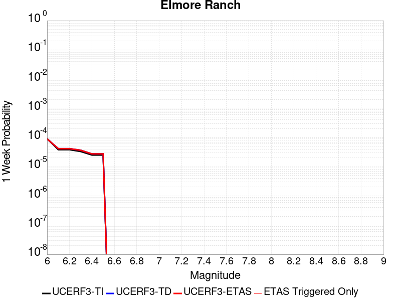 | 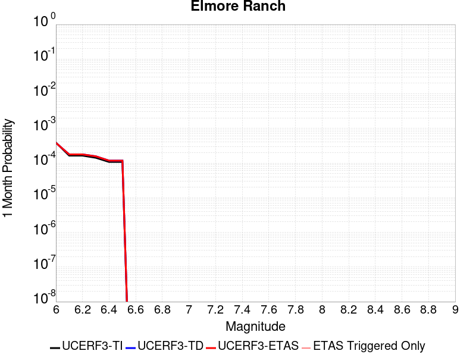 | 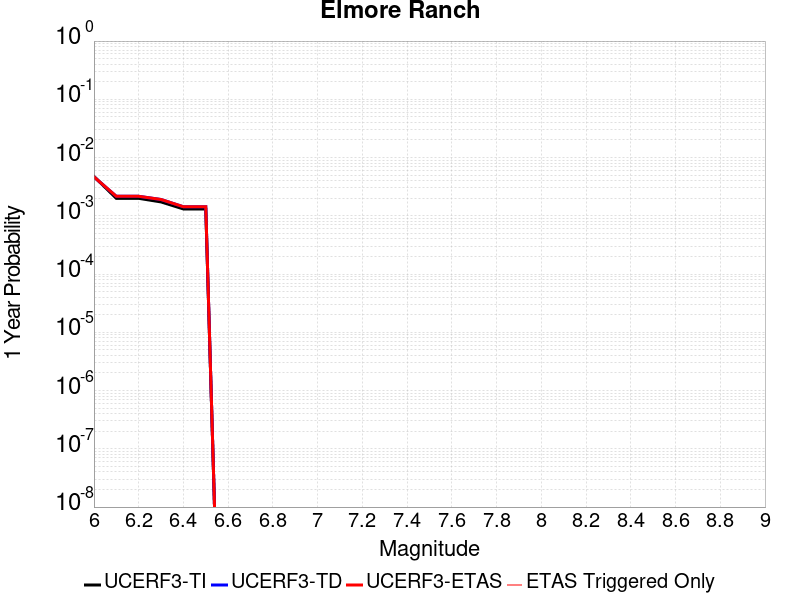 | 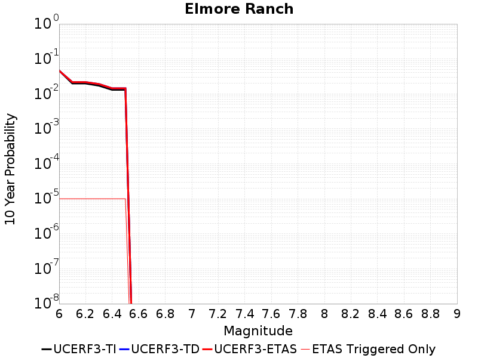 |

| Magnitude | 1 wk TI Prob | 1 wk TD Prob | 1 wk ETAS Prob | 1 wk ETAS/TD Gain | 1 wk ETAS Triggered Only | 1 mo TI Prob | 1 mo TD Prob | 1 mo ETAS Prob | 1 mo ETAS/TD Gain | 1 mo ETAS Triggered Only | 1 yr TI Prob | 1 yr TD Prob | 1 yr ETAS Prob | 1 yr ETAS/TD Gain | 1 yr ETAS Triggered Only | 10 yr TI Prob | 10 yr TD Prob | 10 yr ETAS Prob | 10 yr ETAS/TD Gain | 10 yr ETAS Triggered Only |
|-----|-----|-----|-----|-----|-----|-----|-----|-----|-----|-----|-----|-----|-----|-----|-----|-----|-----|-----|-----|-----|
| 6.0 | 9.102099E-5 | 8.952539E-5 | 8.952539E-5 | 1.0 | 0.0 | 3.9003167E-4 | 3.83637E-4 | 3.83637E-4 | 1.0 | 0.0 | 0.0047383 | 0.004662261 | 0.004662261 | 1.0 | 0.0 | 0.046385348 | 0.04587301 | 0.04588255 | 1.000208 | 1.0E-5 |
| 6.1 | 3.8306698E-5 | 4.1500545E-5 | 4.1500545E-5 | 1.0 | 0.0 | 1.6416123E-4 | 1.7785144E-4 | 1.7785144E-4 | 1.0 | 0.0 | 0.0019968306 | 0.0021632286 | 0.0021632286 | 1.0 | 0.0 | 0.019789828 | 0.02162916 | 0.021638945 | 1.0004523 | 1.0E-5 |
| 6.2 | 3.8306698E-5 | 4.1500545E-5 | 4.1500545E-5 | 1.0 | 0.0 | 1.6416123E-4 | 1.7785144E-4 | 1.7785144E-4 | 1.0 | 0.0 | 0.0019968306 | 0.0021632286 | 0.0021632286 | 1.0 | 0.0 | 0.019789828 | 0.02162916 | 0.021638945 | 1.0004523 | 1.0E-5 |
| 6.3 | 3.3197924E-5 | 3.6555914E-5 | 3.6555914E-5 | 1.0 | 0.0 | 1.4226905E-4 | 1.5666276E-4 | 1.5666276E-4 | 1.0 | 0.0 | 0.0017307495 | 0.0019059905 | 0.0019059905 | 1.0 | 0.0 | 0.017173318 | 0.01909073 | 0.01910054 | 1.0005138 | 1.0E-5 |
| 6.4 | 2.5148964E-5 | 2.7421473E-5 | 2.7421473E-5 | 1.0 | 0.0 | 1.0777682E-4 | 1.1751896E-4 | 1.1751896E-4 | 1.0 | 0.0 | 0.0013113929 | 0.0014305022 | 0.0014305022 | 1.0 | 0.0 | 0.01303681 | 0.014387704 | 0.014397561 | 1.0006851 | 1.0E-5 |
| 6.5 | 2.5148964E-5 | 2.7421473E-5 | 2.7421473E-5 | 1.0 | 0.0 | 1.0777682E-4 | 1.1751896E-4 | 1.1751896E-4 | 1.0 | 0.0 | 0.0013113929 | 0.0014305022 | 0.0014305022 | 1.0 | 0.0 | 0.01303681 | 0.014387704 | 0.014397561 | 1.0006851 | 1.0E-5 |

## Raymond
*[(top)](#table-of-contents)*

| 1 Week | 1 Month | 1 Year | 10 Year |
|-----|-----|-----|-----|
| 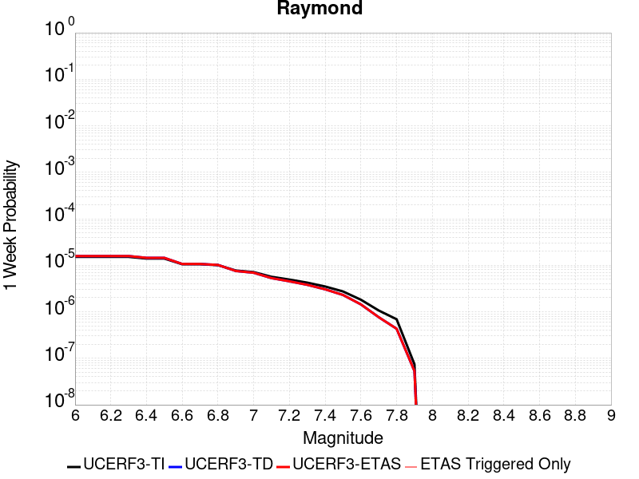 | 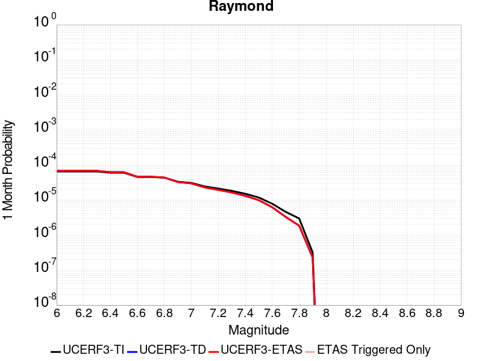 | 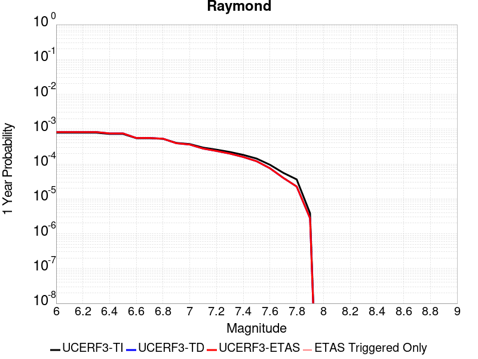 | 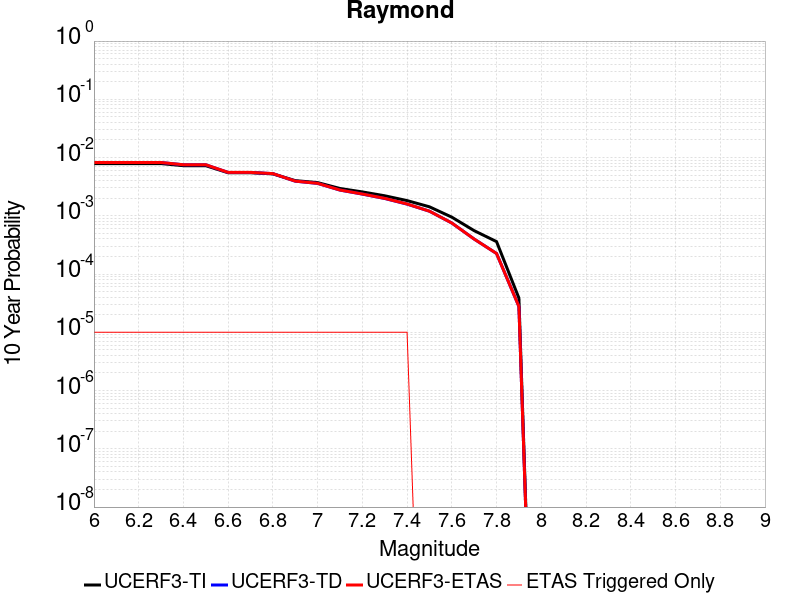 |

| Magnitude | 1 wk TI Prob | 1 wk TD Prob | 1 wk ETAS Prob | 1 wk ETAS/TD Gain | 1 wk ETAS Triggered Only | 1 mo TI Prob | 1 mo TD Prob | 1 mo ETAS Prob | 1 mo ETAS/TD Gain | 1 mo ETAS Triggered Only | 1 yr TI Prob | 1 yr TD Prob | 1 yr ETAS Prob | 1 yr ETAS/TD Gain | 1 yr ETAS Triggered Only | 10 yr TI Prob | 10 yr TD Prob | 10 yr ETAS Prob | 10 yr ETAS/TD Gain | 10 yr ETAS Triggered Only |
|-----|-----|-----|-----|-----|-----|-----|-----|-----|-----|-----|-----|-----|-----|-----|-----|-----|-----|-----|-----|-----|
| 6.0 | 1.5157413E-5 | 1.5810338E-5 | 1.5810338E-5 | 1.0 | 0.0 | 6.4958724E-5 | 6.775697E-5 | 6.775697E-5 | 1.0 | 0.0 | 7.905855E-4 | 8.2465395E-4 | 8.2465395E-4 | 1.0 | 0.0 | 0.007877788 | 0.008218456 | 0.008228375 | 1.0012068 | 1.0E-5 |
| 6.1 | 1.5157413E-5 | 1.5810338E-5 | 1.5810338E-5 | 1.0 | 0.0 | 6.4958724E-5 | 6.775697E-5 | 6.775697E-5 | 1.0 | 0.0 | 7.905855E-4 | 8.2465395E-4 | 8.2465395E-4 | 1.0 | 0.0 | 0.007877788 | 0.008218456 | 0.008228375 | 1.0012068 | 1.0E-5 |
| 6.2 | 1.5157413E-5 | 1.5810338E-5 | 1.5810338E-5 | 1.0 | 0.0 | 6.4958724E-5 | 6.775697E-5 | 6.775697E-5 | 1.0 | 0.0 | 7.905855E-4 | 8.2465395E-4 | 8.2465395E-4 | 1.0 | 0.0 | 0.007877788 | 0.008218456 | 0.008228375 | 1.0012068 | 1.0E-5 |
| 6.3 | 1.5157413E-5 | 1.5810338E-5 | 1.5810338E-5 | 1.0 | 0.0 | 6.4958724E-5 | 6.775697E-5 | 6.775697E-5 | 1.0 | 0.0 | 7.905855E-4 | 8.2465395E-4 | 8.2465395E-4 | 1.0 | 0.0 | 0.007877788 | 0.008218456 | 0.008228375 | 1.0012068 | 1.0E-5 |
| 6.4 | 1.3941944E-5 | 1.4454882E-5 | 1.4454882E-5 | 1.0 | 0.0 | 5.9749822E-5 | 6.194816E-5 | 6.194816E-5 | 1.0 | 0.0 | 7.2721124E-4 | 7.539811E-4 | 7.539811E-4 | 1.0 | 0.0 | 0.007248361 | 0.0075165643 | 0.007526489 | 1.0013204 | 1.0E-5 |
| 6.5 | 1.3941944E-5 | 1.4454882E-5 | 1.4454882E-5 | 1.0 | 0.0 | 5.9749822E-5 | 6.194816E-5 | 6.194816E-5 | 1.0 | 0.0 | 7.2721124E-4 | 7.539811E-4 | 7.539811E-4 | 1.0 | 0.0 | 0.007248361 | 0.0075165643 | 0.007526489 | 1.0013204 | 1.0E-5 |
| 6.6 | 1.0542609E-5 | 1.0671257E-5 | 1.0671257E-5 | 1.0 | 0.0 | 4.5181827E-5 | 4.5733188E-5 | 4.5733188E-5 | 1.0 | 0.0 | 5.499499E-4 | 5.566648E-4 | 5.566648E-4 | 1.0 | 0.0 | 0.005485909 | 0.005553265 | 0.0055632093 | 1.0017908 | 1.0E-5 |
| 6.7 | 1.0542609E-5 | 1.0671257E-5 | 1.0671257E-5 | 1.0 | 0.0 | 4.5181827E-5 | 4.5733188E-5 | 4.5733188E-5 | 1.0 | 0.0 | 5.499499E-4 | 5.566648E-4 | 5.566648E-4 | 1.0 | 0.0 | 0.005485909 | 0.005553265 | 0.0055632093 | 1.0017908 | 1.0E-5 |
| 6.8 | 1.0079132E-5 | 1.0176786E-5 | 1.0176786E-5 | 1.0 | 0.0 | 4.3195567E-5 | 4.3614098E-5 | 4.3614098E-5 | 1.0 | 0.0 | 5.257791E-4 | 5.308777E-4 | 5.308777E-4 | 1.0 | 0.0 | 0.0052453685 | 0.005296644 | 0.0053065913 | 1.001878 | 1.0E-5 |
| 6.9 | 7.721598E-6 | 7.5490107E-6 | 7.5490107E-6 | 1.0 | 0.0 | 3.3092143E-5 | 3.235251E-5 | 3.235251E-5 | 1.0 | 0.0 | 4.0282236E-4 | 3.9382183E-4 | 3.9382183E-4 | 1.0 | 0.0 | 0.0040209293 | 0.003931373 | 0.0039413334 | 1.0025337 | 1.0E-5 |
| 7.0 | 7.137566E-6 | 6.9114053E-6 | 6.9114053E-6 | 1.0 | 0.0 | 3.058921E-5 | 2.9619978E-5 | 2.9619978E-5 | 1.0 | 0.0 | 3.7236E-4 | 3.6056462E-4 | 3.6056462E-4 | 1.0 | 0.0 | 0.0037173668 | 0.0035999145 | 0.0036098785 | 1.0027678 | 1.0E-5 |
| 7.1 | 5.654976E-6 | 5.299624E-6 | 5.299624E-6 | 1.0 | 0.0 | 2.4235387E-5 | 2.2712478E-5 | 2.2712478E-5 | 1.0 | 0.0 | 2.9502588E-4 | 2.7648953E-4 | 2.7648953E-4 | 1.0 | 0.0 | 0.0029463451 | 0.0027614865 | 0.0027714588 | 1.0036112 | 1.0E-5 |
| 7.2 | 4.9358455E-6 | 4.5267343E-6 | 4.5267343E-6 | 1.0 | 0.0 | 2.1153453E-5 | 1.9400146E-5 | 1.9400146E-5 | 1.0 | 0.0 | 2.5751285E-4 | 2.361713E-4 | 2.361713E-4 | 1.0 | 0.0 | 0.0025721465 | 0.0023592254 | 0.0023692017 | 1.0042287 | 1.0E-5 |
| 7.3 | 4.2368597E-6 | 3.805687E-6 | 3.805687E-6 | 1.0 | 0.0 | 1.8157843E-5 | 1.6309985E-5 | 1.6309985E-5 | 1.0 | 0.0 | 2.2104931E-4 | 1.9855608E-4 | 1.9855608E-4 | 1.0 | 0.0 | 0.0022082955 | 0.0019838056 | 0.0019937856 | 1.0050309 | 1.0E-5 |
| 7.4 | 3.4999923E-6 | 3.0438068E-6 | 3.0438068E-6 | 1.0 | 0.0 | 1.49998805E-5 | 1.3044822E-5 | 1.3044822E-5 | 1.0 | 0.0 | 1.8260824E-4 | 1.5880921E-4 | 1.5880921E-4 | 1.0 | 0.0 | 0.0018245826 | 0.001586973 | 0.0015969571 | 1.0062913 | 1.0E-5 |
| 7.5 | 2.738017E-6 | 2.3021005E-6 | 2.3021005E-6 | 1.0 | 0.0 | 1.1734306E-5 | 9.866108E-6 | 9.866108E-6 | 1.0 | 0.0 | 1.428558E-4 | 1.20113305E-4 | 1.20113305E-4 | 1.0 | 0.0 | 0.0014276401 | 0.0012004982 | 0.0012004982 | 1.0 | 0.0 |
| 7.6 | 1.8186392E-6 | 1.4423497E-6 | 1.4423497E-6 | 1.0 | 0.0 | 7.794145E-6 | 6.181484E-6 | 6.181484E-6 | 1.0 | 0.0 | 9.488958E-5 | 7.525701E-5 | 7.525701E-5 | 1.0 | 0.0 | 9.4849075E-4 | 7.523268E-4 | 7.523268E-4 | 1.0 | 0.0 |
| 7.7 | 1.0660348E-6 | 7.6441086E-7 | 7.6441086E-7 | 1.0 | 0.0 | 4.5687125E-6 | 3.2760427E-6 | 3.2760427E-6 | 1.0 | 0.0 | 5.5622655E-5 | 3.9885104E-5 | 3.9885104E-5 | 1.0 | 0.0 | 5.5608735E-4 | 3.987886E-4 | 3.987886E-4 | 1.0 | 0.0 |
| 7.8 | 6.913602E-7 | 4.3206668E-7 | 4.3206668E-7 | 1.0 | 0.0 | 2.962969E-6 | 1.8517131E-6 | 1.8517131E-6 | 1.0 | 0.0 | 3.607355E-5 | 2.254438E-5 | 2.254438E-5 | 1.0 | 0.0 | 3.6067693E-4 | 2.2542878E-4 | 2.2542878E-4 | 1.0 | 0.0 |
| 7.9 | 7.425201E-8 | 5.3224685E-8 | 5.3224685E-8 | 1.0 | 0.0 | 3.1822285E-7 | 2.2810578E-7 | 2.2810578E-7 | 1.0 | 0.0 | 3.874356E-6 | 2.7771855E-6 | 2.7771855E-6 | 1.0 | 0.0 | 3.8742884E-5 | 2.7771639E-5 | 2.7771639E-5 | 1.0 | 0.0 |

## Great Valley 10 (Panoche)
*[(top)](#table-of-contents)*

| 1 Week | 1 Month | 1 Year | 10 Year |
|-----|-----|-----|-----|
| 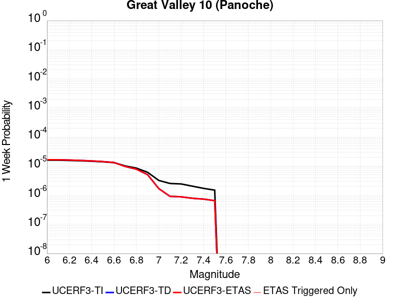 | 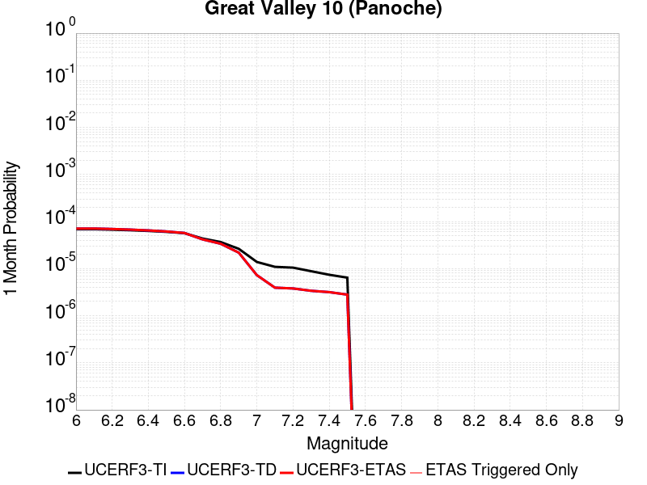 | 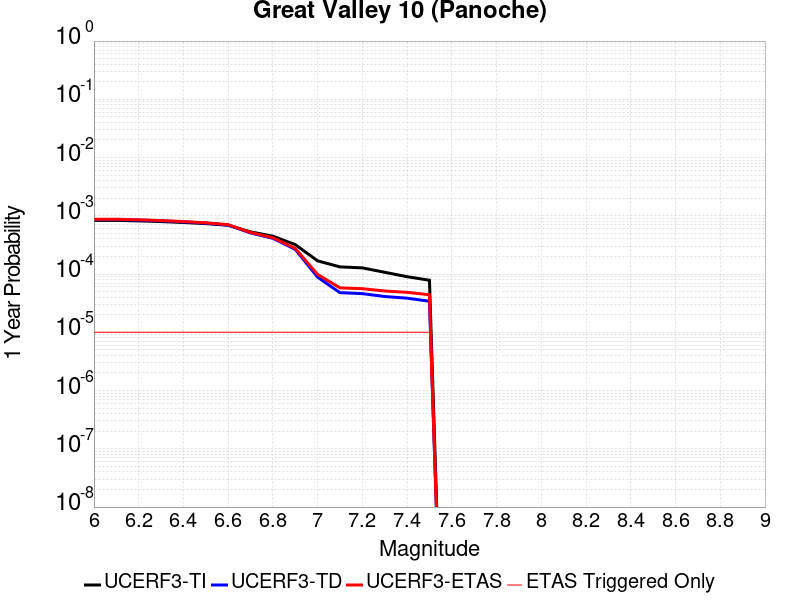 |  |

| Magnitude | 1 wk TI Prob | 1 wk TD Prob | 1 wk ETAS Prob | 1 wk ETAS/TD Gain | 1 wk ETAS Triggered Only | 1 mo TI Prob | 1 mo TD Prob | 1 mo ETAS Prob | 1 mo ETAS/TD Gain | 1 mo ETAS Triggered Only | 1 yr TI Prob | 1 yr TD Prob | 1 yr ETAS Prob | 1 yr ETAS/TD Gain | 1 yr ETAS Triggered Only | 10 yr TI Prob | 10 yr TD Prob | 10 yr ETAS Prob | 10 yr ETAS/TD Gain | 10 yr ETAS Triggered Only |
|-----|-----|-----|-----|-----|-----|-----|-----|-----|-----|-----|-----|-----|-----|-----|-----|-----|-----|-----|-----|-----|
| 6.0 | 1.6014626E-5 | 1.65757E-5 | 1.65757E-5 | 1.0 | 0.0 | 6.863231E-5 | 7.103681E-5 | 7.103681E-5 | 1.0 | 0.0 | 8.35278E-4 | 8.645342E-4 | 8.745255E-4 | 1.0115569 | 1.0E-5 | 0.008321454 | 0.008612327 | 0.008622241 | 1.0011511 | 1.0E-5 |
| 6.1 | 1.6014626E-5 | 1.65757E-5 | 1.65757E-5 | 1.0 | 0.0 | 6.863231E-5 | 7.103681E-5 | 7.103681E-5 | 1.0 | 0.0 | 8.35278E-4 | 8.645342E-4 | 8.745255E-4 | 1.0115569 | 1.0E-5 | 0.008321454 | 0.008612327 | 0.008622241 | 1.0011511 | 1.0E-5 |
| 6.2 | 1.56782E-5 | 1.6198743E-5 | 1.6198743E-5 | 1.0 | 0.0 | 6.719056E-5 | 6.942137E-5 | 6.942137E-5 | 1.0 | 0.0 | 8.17738E-4 | 8.4488146E-4 | 8.54873E-4 | 1.011826 | 1.0E-5 | 0.008147354 | 0.0084173 | 0.008427216 | 1.001178 | 1.0E-5 |
| 6.3 | 1.5263338E-5 | 1.5723803E-5 | 1.5723803E-5 | 1.0 | 0.0 | 6.541267E-5 | 6.738602E-5 | 6.738602E-5 | 1.0 | 0.0 | 7.961082E-4 | 8.201199E-4 | 8.3011173E-4 | 1.0121833 | 1.0E-5 | 0.007932622 | 0.008171526 | 0.008181444 | 1.0012138 | 1.0E-5 |
| 6.4 | 1.4720723E-5 | 1.5099654E-5 | 1.5099654E-5 | 1.0 | 0.0 | 6.308728E-5 | 6.4711225E-5 | 6.4711225E-5 | 1.0 | 0.0 | 7.67817E-4 | 7.875783E-4 | 7.975704E-4 | 1.0126872 | 1.0E-5 | 0.007651695 | 0.007848446 | 0.007858368 | 1.0012641 | 1.0E-5 |
| 6.5 | 1.408264E-5 | 1.4356234E-5 | 1.4356234E-5 | 1.0 | 0.0 | 6.0352773E-5 | 6.1525294E-5 | 6.1525294E-5 | 1.0 | 0.0 | 7.3454727E-4 | 7.488168E-4 | 7.588093E-4 | 1.0133444 | 1.0E-5 | 0.0073212404 | 0.0074634925 | 0.0074734176 | 1.0013299 | 1.0E-5 |
| 6.6 | 1.3197086E-5 | 1.3322134E-5 | 1.3322134E-5 | 1.0 | 0.0 | 5.6557717E-5 | 5.709364E-5 | 5.709364E-5 | 1.0 | 0.0 | 6.8837265E-4 | 6.948971E-4 | 7.048901E-4 | 1.0143806 | 1.0E-5 | 0.006862442 | 0.0069277803 | 0.006937711 | 1.0014335 | 1.0E-5 |
| 6.7 | 1.017583E-5 | 9.745553E-6 | 9.745553E-6 | 1.0 | 0.0 | 4.360997E-5 | 4.1766E-5 | 4.1766E-5 | 1.0 | 0.0 | 5.30822E-4 | 5.0838484E-4 | 5.1837973E-4 | 1.0196601 | 1.0E-5 | 0.0052955584 | 0.0050724703 | 0.0050824196 | 1.0019615 | 1.0E-5 |
| 6.8 | 8.557912E-6 | 7.872845E-6 | 7.872845E-6 | 1.0 | 0.0 | 3.667625E-5 | 3.374034E-5 | 3.374034E-5 | 1.0 | 0.0 | 4.4644187E-4 | 4.1071323E-4 | 4.207091E-4 | 1.0243379 | 1.0E-5 | 0.0044554602 | 0.0040997486 | 0.0041097077 | 1.0024291 | 1.0E-5 |
| 6.9 | 6.14664E-6 | 5.0921612E-6 | 5.0921612E-6 | 1.0 | 0.0 | 2.6342475E-5 | 2.1823373E-5 | 2.1823373E-5 | 1.0 | 0.0 | 3.2067244E-4 | 2.6566858E-4 | 2.7566592E-4 | 1.0376309 | 1.0E-5 | 0.003202101 | 0.002653648 | 0.0026636214 | 1.0037584 | 1.0E-5 |
| 7.0 | 3.2310581E-6 | 1.6951489E-6 | 1.6951489E-6 | 1.0 | 0.0 | 1.3847319E-5 | 7.264904E-6 | 7.264904E-6 | 1.0 | 0.0 | 1.6857806E-4 | 8.8446715E-5 | 9.844583E-5 | 1.1130524 | 1.0E-5 | 0.0016845023 | 8.841245E-4 | 8.9411566E-4 | 1.0113007 | 1.0E-5 |
| 7.1 | 2.544492E-6 | 9.189077E-7 | 9.189077E-7 | 1.0 | 0.0 | 1.090492E-5 | 3.9381703E-6 | 3.9381703E-6 | 1.0 | 0.0 | 1.327593E-4 | 4.7946218E-5 | 5.7945737E-5 | 1.208557 | 1.0E-5 | 0.0013268003 | 4.793635E-4 | 4.893587E-4 | 1.020851 | 1.0E-5 |
| 7.2 | 2.4479045E-6 | 8.8414527E-7 | 8.8414527E-7 | 1.0 | 0.0 | 1.0490977E-5 | 3.7891887E-6 | 3.7891887E-6 | 1.0 | 0.0 | 1.2772017E-4 | 4.613244E-5 | 5.6131983E-5 | 1.2167572 | 1.0E-5 | 0.0012764678 | 4.612334E-4 | 4.712288E-4 | 1.0216709 | 1.0E-5 |
| 7.3 | 2.0559578E-6 | 7.8929116E-7 | 7.8929116E-7 | 1.0 | 0.0 | 8.811218E-6 | 3.3826723E-6 | 3.3826723E-6 | 1.0 | 0.0 | 1.072713E-4 | 4.1183303E-5 | 5.118289E-5 | 1.2428068 | 1.0E-5 | 0.0010721954 | 4.1176134E-4 | 4.2175723E-4 | 1.0242759 | 1.0E-5 |
| 7.4 | 1.727687E-6 | 7.387864E-7 | 7.387864E-7 | 1.0 | 0.0 | 7.404352E-6 | 3.166224E-6 | 3.166224E-6 | 1.0 | 0.0 | 9.0144255E-5 | 3.854814E-5 | 4.8547758E-5 | 1.2594059 | 1.0E-5 | 9.0107694E-4 | 3.8541915E-4 | 3.954153E-4 | 1.0259358 | 1.0E-5 |
| 7.5 | 1.5002679E-6 | 6.546236E-7 | 6.546236E-7 | 1.0 | 0.0 | 6.4297037E-6 | 2.805527E-6 | 2.805527E-6 | 1.0 | 0.0 | 7.827883E-5 | 3.4156797E-5 | 4.4156455E-5 | 1.2927575 | 1.0E-5 | 7.825126E-4 | 3.4151963E-4 | 3.515162E-4 | 1.0292709 | 1.0E-5 |

## Great Valley 12
*[(top)](#table-of-contents)*

| 1 Week | 1 Month | 1 Year | 10 Year |
|-----|-----|-----|-----|
| 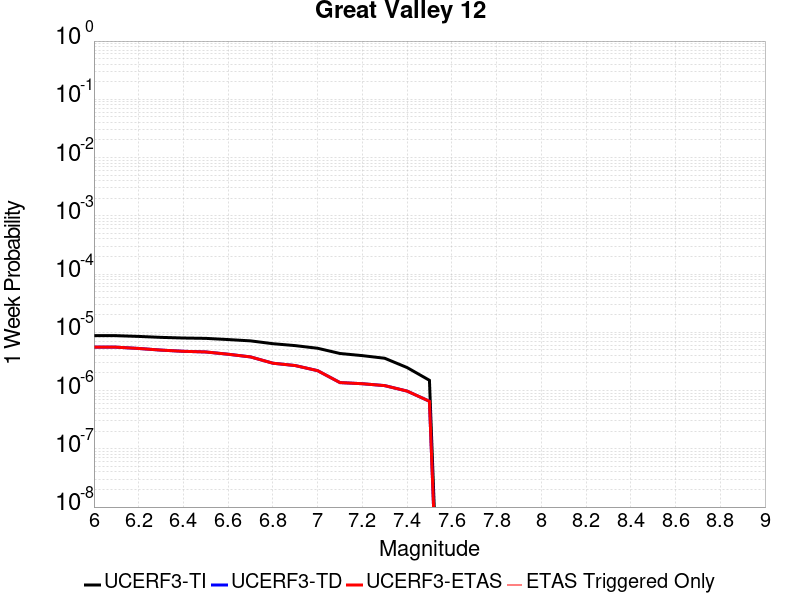 | 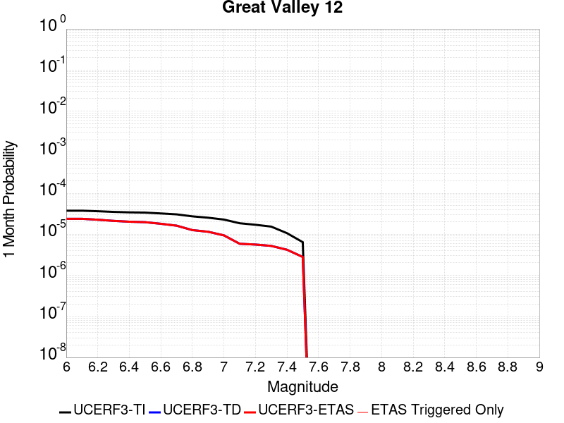 | 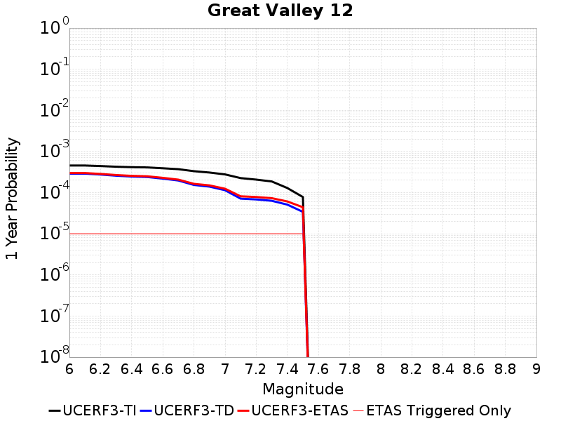 | 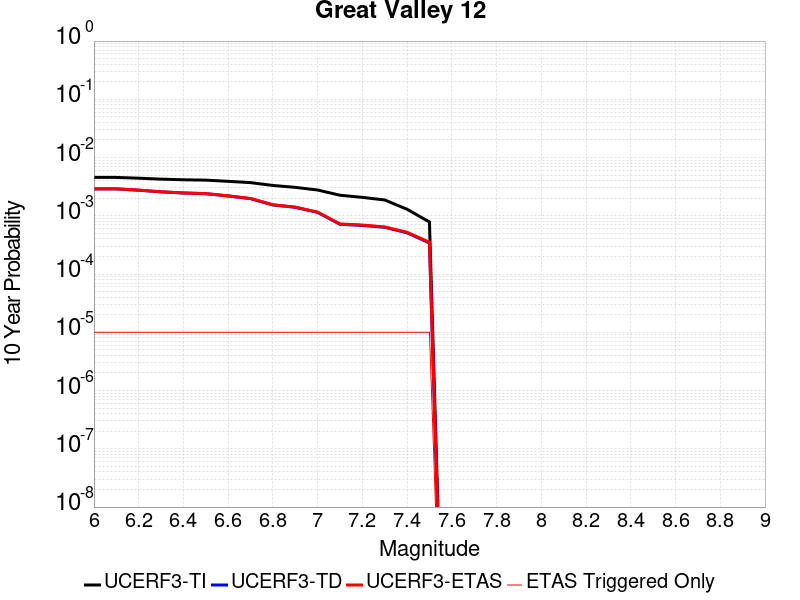 |

| Magnitude | 1 wk TI Prob | 1 wk TD Prob | 1 wk ETAS Prob | 1 wk ETAS/TD Gain | 1 wk ETAS Triggered Only | 1 mo TI Prob | 1 mo TD Prob | 1 mo ETAS Prob | 1 mo ETAS/TD Gain | 1 mo ETAS Triggered Only | 1 yr TI Prob | 1 yr TD Prob | 1 yr ETAS Prob | 1 yr ETAS/TD Gain | 1 yr ETAS Triggered Only | 10 yr TI Prob | 10 yr TD Prob | 10 yr ETAS Prob | 10 yr ETAS/TD Gain | 10 yr ETAS Triggered Only |
|-----|-----|-----|-----|-----|-----|-----|-----|-----|-----|-----|-----|-----|-----|-----|-----|-----|-----|-----|-----|-----|
| 6.0 | 8.757157E-6 | 5.5551372E-6 | 5.5551372E-6 | 1.0 | 0.0 | 3.7530135E-5 | 2.380752E-5 | 2.380752E-5 | 1.0 | 0.0 | 4.5683357E-4 | 2.8981923E-4 | 2.998163E-4 | 1.0344943 | 1.0E-5 | 0.004558956 | 0.0028945336 | 0.0029045045 | 1.0034448 | 1.0E-5 |
| 6.1 | 8.757157E-6 | 5.5551372E-6 | 5.5551372E-6 | 1.0 | 0.0 | 3.7530135E-5 | 2.380752E-5 | 2.380752E-5 | 1.0 | 0.0 | 4.5683357E-4 | 2.8981923E-4 | 2.998163E-4 | 1.0344943 | 1.0E-5 | 0.004558956 | 0.0028945336 | 0.0029045045 | 1.0034448 | 1.0E-5 |
| 6.2 | 8.499136E-6 | 5.2808036E-6 | 5.2808036E-6 | 1.0 | 0.0 | 3.642436E-5 | 2.2631826E-5 | 2.2631826E-5 | 1.0 | 0.0 | 4.4337637E-4 | 2.755088E-4 | 2.8550604E-4 | 1.0362865 | 1.0E-5 | 0.0044249278 | 0.002751787 | 0.0027617593 | 1.003624 | 1.0E-5 |
| 6.3 | 8.186883E-6 | 4.9489468E-6 | 4.9489468E-6 | 1.0 | 0.0 | 3.508617E-5 | 2.1209604E-5 | 2.1209604E-5 | 1.0 | 0.0 | 4.270904E-4 | 2.5819734E-4 | 2.6819477E-4 | 1.03872 | 1.0E-5 | 0.004262705 | 0.0025790744 | 0.0025890484 | 1.0038674 | 1.0E-5 |
| 6.4 | 7.979878E-6 | 4.7209473E-6 | 4.7209473E-6 | 1.0 | 0.0 | 3.419903E-5 | 2.023248E-5 | 2.023248E-5 | 1.0 | 0.0 | 4.1629362E-4 | 2.4630353E-4 | 2.5630108E-4 | 1.0405903 | 1.0E-5 | 0.0041551464 | 0.0024603996 | 0.002470375 | 1.0040544 | 1.0E-5 |
| 6.5 | 7.871003E-6 | 4.600921E-6 | 4.600921E-6 | 1.0 | 0.0 | 3.373243E-5 | 1.9718089E-5 | 1.9718089E-5 | 1.0 | 0.0 | 4.1061494E-4 | 2.4004221E-4 | 2.5003983E-4 | 1.0416493 | 1.0E-5 | 0.0040985704 | 0.0023979223 | 0.0024078984 | 1.0041603 | 1.0E-5 |
| 6.6 | 7.508221E-6 | 4.204301E-6 | 4.204301E-6 | 1.0 | 0.0 | 3.2177693E-5 | 1.8018314E-5 | 1.8018314E-5 | 1.0 | 0.0 | 3.91693E-4 | 2.1935177E-4 | 2.2934958E-4 | 1.0455788 | 1.0E-5 | 0.003910033 | 0.0021914388 | 0.002201417 | 1.0045532 | 1.0E-5 |
| 6.7 | 7.1297914E-6 | 3.782018E-6 | 3.782018E-6 | 1.0 | 0.0 | 3.055589E-5 | 1.6208553E-5 | 1.6208553E-5 | 1.0 | 0.0 | 3.7195446E-4 | 1.9732205E-4 | 2.0732007E-4 | 1.0506686 | 1.0E-5 | 0.0037133251 | 0.0019715473 | 0.0019815275 | 1.0050621 | 1.0E-5 |
| 6.8 | 6.376581E-6 | 2.9485814E-6 | 2.9485814E-6 | 1.0 | 0.0 | 2.7327918E-5 | 1.2636718E-5 | 1.2636718E-5 | 1.0 | 0.0 | 3.326666E-4 | 1.5384133E-4 | 1.638398E-4 | 1.0649921 | 1.0E-5 | 0.0033216903 | 0.001537365 | 0.0015473496 | 1.0064946 | 1.0E-5 |
| 6.9 | 5.9095E-6 | 2.686644E-6 | 2.686644E-6 | 1.0 | 0.0 | 2.5326184E-5 | 1.1514137E-5 | 1.1514137E-5 | 1.0 | 0.0 | 3.0830267E-4 | 1.4017576E-4 | 1.5017437E-4 | 1.071329 | 1.0E-5 | 0.003078753 | 0.0014008889 | 0.0014108749 | 1.0071284 | 1.0E-5 |
| 7.0 | 5.3239864E-6 | 2.1967683E-6 | 2.1967683E-6 | 1.0 | 0.0 | 2.2816885E-5 | 9.414688E-6 | 9.414688E-6 | 1.0 | 0.0 | 2.7776015E-4 | 1.14617935E-4 | 1.246168E-4 | 1.0872364 | 1.0E-5 | 0.0027741324 | 0.0011456017 | 0.0011555902 | 1.0087191 | 1.0E-5 |
| 7.1 | 4.329147E-6 | 1.3708291E-6 | 1.3708291E-6 | 1.0 | 0.0 | 1.8553355E-5 | 5.8749692E-6 | 5.8749692E-6 | 1.0 | 0.0 | 2.2586368E-4 | 7.152549E-5 | 8.152478E-5 | 1.1398003 | 1.0E-5 | 0.0022563424 | 7.150334E-4 | 7.250262E-4 | 1.0139754 | 1.0E-5 |
| 7.2 | 3.978488E-6 | 1.3106562E-6 | 1.3106562E-6 | 1.0 | 0.0 | 1.7050552E-5 | 5.617086E-6 | 5.617086E-6 | 1.0 | 0.0 | 2.075707E-4 | 6.838597E-5 | 7.838528E-5 | 1.1462188 | 1.0E-5 | 0.0020737692 | 6.836578E-4 | 6.93651E-4 | 1.0146172 | 1.0E-5 |
| 7.3 | 3.586542E-6 | 1.2158021E-6 | 1.2158021E-6 | 1.0 | 0.0 | 1.5370804E-5 | 5.2105706E-6 | 5.2105706E-6 | 1.0 | 0.0 | 1.8712347E-4 | 6.3436935E-5 | 7.34363E-5 | 1.1576269 | 1.0E-5 | 0.0018696598 | 6.341968E-4 | 6.441904E-4 | 1.0157579 | 1.0E-5 |
| 7.4 | 2.4837766E-6 | 9.800737E-7 | 9.800737E-7 | 1.0 | 0.0 | 1.0644713E-5 | 4.2003094E-6 | 4.2003094E-6 | 1.0 | 0.0 | 1.2959167E-4 | 5.113763E-5 | 6.113712E-5 | 1.1955407 | 1.0E-5 | 0.0012951613 | 5.1126524E-4 | 5.2126014E-4 | 1.0195494 | 1.0E-5 |
| 7.5 | 1.5002679E-6 | 6.546236E-7 | 6.546236E-7 | 1.0 | 0.0 | 6.4297037E-6 | 2.805527E-6 | 2.805527E-6 | 1.0 | 0.0 | 7.827883E-5 | 3.4156797E-5 | 4.4156455E-5 | 1.2927575 | 1.0E-5 | 7.825126E-4 | 3.4151963E-4 | 3.515162E-4 | 1.0292709 | 1.0E-5 |

## San Luis Range - Oceano 2011 CFM
*[(top)](#table-of-contents)*

| 1 Week | 1 Month | 1 Year | 10 Year |
|-----|-----|-----|-----|
|  | 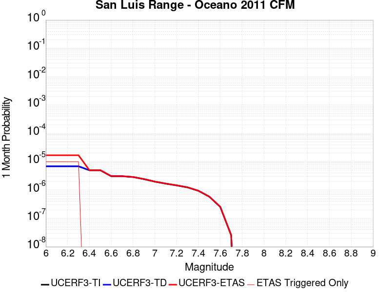 | 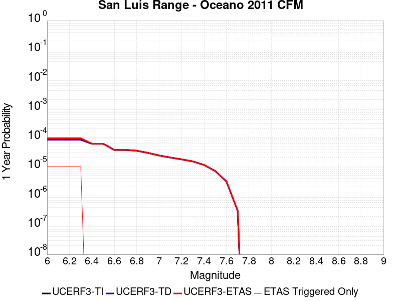 | 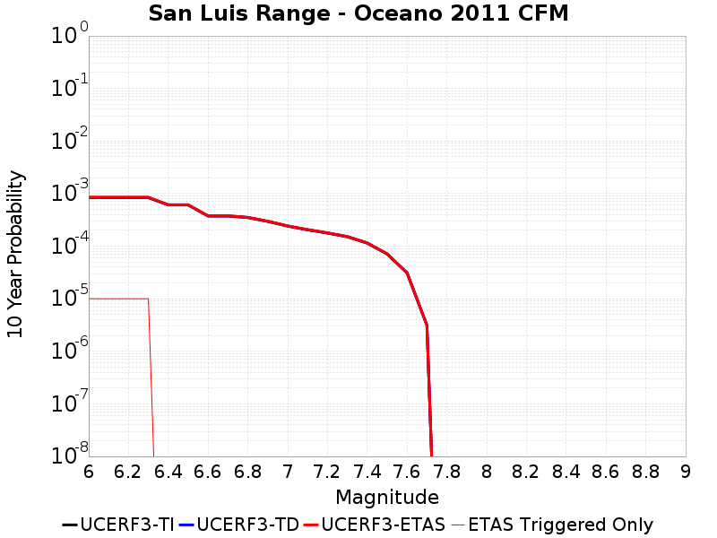 |

| Magnitude | 1 wk TI Prob | 1 wk TD Prob | 1 wk ETAS Prob | 1 wk ETAS/TD Gain | 1 wk ETAS Triggered Only | 1 mo TI Prob | 1 mo TD Prob | 1 mo ETAS Prob | 1 mo ETAS/TD Gain | 1 mo ETAS Triggered Only | 1 yr TI Prob | 1 yr TD Prob | 1 yr ETAS Prob | 1 yr ETAS/TD Gain | 1 yr ETAS Triggered Only | 10 yr TI Prob | 10 yr TD Prob | 10 yr ETAS Prob | 10 yr ETAS/TD Gain | 10 yr ETAS Triggered Only |
|-----|-----|-----|-----|-----|-----|-----|-----|-----|-----|-----|-----|-----|-----|-----|-----|-----|-----|-----|-----|-----|
| 6.0 | 1.6025788E-6 | 1.6201209E-6 | 1.6201209E-6 | 1.0 | 0.0 | 6.8681766E-6 | 6.9433595E-6 | 1.694329E-5 | 2.440215 | 1.0E-5 | 8.361684E-5 | 8.4532534E-5 | 9.453169E-5 | 1.1182877 | 1.0E-5 | 8.3585386E-4 | 8.450446E-4 | 8.550362E-4 | 1.0118237 | 1.0E-5 |
| 6.1 | 1.6025788E-6 | 1.6201209E-6 | 1.6201209E-6 | 1.0 | 0.0 | 6.8681766E-6 | 6.9433595E-6 | 1.694329E-5 | 2.440215 | 1.0E-5 | 8.361684E-5 | 8.4532534E-5 | 9.453169E-5 | 1.1182877 | 1.0E-5 | 8.3585386E-4 | 8.450446E-4 | 8.550362E-4 | 1.0118237 | 1.0E-5 |
| 6.2 | 1.6025788E-6 | 1.6201209E-6 | 1.6201209E-6 | 1.0 | 0.0 | 6.8681766E-6 | 6.9433595E-6 | 1.694329E-5 | 2.440215 | 1.0E-5 | 8.361684E-5 | 8.4532534E-5 | 9.453169E-5 | 1.1182877 | 1.0E-5 | 8.3585386E-4 | 8.450446E-4 | 8.550362E-4 | 1.0118237 | 1.0E-5 |
| 6.3 | 1.6025788E-6 | 1.6201209E-6 | 1.6201209E-6 | 1.0 | 0.0 | 6.8681766E-6 | 6.9433595E-6 | 1.694329E-5 | 2.440215 | 1.0E-5 | 8.361684E-5 | 8.4532534E-5 | 9.453169E-5 | 1.1182877 | 1.0E-5 | 8.3585386E-4 | 8.450446E-4 | 8.550362E-4 | 1.0118237 | 1.0E-5 |
| 6.4 | 1.1621186E-6 | 1.1749909E-6 | 1.1749909E-6 | 1.0 | 0.0 | 4.980499E-6 | 5.035667E-6 | 5.035667E-6 | 1.0 | 0.0 | 6.0635884E-5 | 6.1307794E-5 | 6.1307794E-5 | 1.0 | 0.0 | 6.0619344E-4 | 6.129354E-4 | 6.129354E-4 | 1.0 | 0.0 |
| 6.5 | 1.1621186E-6 | 1.1749909E-6 | 1.1749909E-6 | 1.0 | 0.0 | 4.980499E-6 | 5.035667E-6 | 5.035667E-6 | 1.0 | 0.0 | 6.0635884E-5 | 6.1307794E-5 | 6.1307794E-5 | 1.0 | 0.0 | 6.0619344E-4 | 6.129354E-4 | 6.129354E-4 | 1.0 | 0.0 |
| 6.6 | 7.164729E-7 | 7.2485875E-7 | 7.2485875E-7 | 1.0 | 0.0 | 3.0705946E-6 | 3.106534E-6 | 3.106534E-6 | 1.0 | 0.0 | 3.738385E-5 | 3.7821414E-5 | 3.7821414E-5 | 1.0 | 0.0 | 3.737756E-4 | 3.7815154E-4 | 3.7815154E-4 | 1.0 | 0.0 |
| 6.7 | 7.164729E-7 | 7.2485875E-7 | 7.2485875E-7 | 1.0 | 0.0 | 3.0705946E-6 | 3.106534E-6 | 3.106534E-6 | 1.0 | 0.0 | 3.738385E-5 | 3.7821414E-5 | 3.7821414E-5 | 1.0 | 0.0 | 3.737756E-4 | 3.7815154E-4 | 3.7815154E-4 | 1.0 | 0.0 |
| 6.8 | 6.700177E-7 | 6.777449E-7 | 6.777449E-7 | 1.0 | 0.0 | 2.8715012E-6 | 2.9046178E-6 | 2.9046178E-6 | 1.0 | 0.0 | 3.495997E-5 | 3.5363162E-5 | 3.5363162E-5 | 1.0 | 0.0 | 3.495447E-4 | 3.53577E-4 | 3.53577E-4 | 1.0 | 0.0 |
| 6.9 | 5.657865E-7 | 5.721794E-7 | 5.721794E-7 | 1.0 | 0.0 | 2.424797E-6 | 2.452195E-6 | 2.452195E-6 | 1.0 | 0.0 | 2.9521503E-5 | 2.9855077E-5 | 2.9855077E-5 | 1.0 | 0.0 | 2.9517582E-4 | 2.9851173E-4 | 2.9851173E-4 | 1.0 | 0.0 |
| 7.0 | 4.608413E-7 | 4.660175E-7 | 4.660175E-7 | 1.0 | 0.0 | 1.9750328E-6 | 1.9972163E-6 | 1.9972163E-6 | 1.0 | 0.0 | 2.4045758E-5 | 2.431584E-5 | 2.431584E-5 | 1.0 | 0.0 | 2.4043156E-4 | 2.4313209E-4 | 2.4313209E-4 | 1.0 | 0.0 |
| 7.1 | 3.9177846E-7 | 3.9621654E-7 | 3.9621654E-7 | 1.0 | 0.0 | 1.6790494E-6 | 1.6980697E-6 | 1.6980697E-6 | 1.0 | 0.0 | 2.0442236E-5 | 2.0673804E-5 | 2.0673804E-5 | 1.0 | 0.0 | 2.0440355E-4 | 2.0671896E-4 | 2.0671896E-4 | 1.0 | 0.0 |
| 7.2 | 3.3974752E-7 | 3.4366573E-7 | 3.4366573E-7 | 1.0 | 0.0 | 1.45606E-6 | 1.4728523E-6 | 1.4728523E-6 | 1.0 | 0.0 | 1.7727387E-5 | 1.793183E-5 | 1.793183E-5 | 1.0 | 0.0 | 1.7725973E-4 | 1.7930396E-4 | 1.7930396E-4 | 1.0 | 0.0 |
| 7.3 | 2.8900928E-7 | 2.9234056E-7 | 2.9234056E-7 | 1.0 | 0.0 | 1.2386106E-6 | 1.2528875E-6 | 1.2528875E-6 | 1.0 | 0.0 | 1.5079979E-5 | 1.52538E-5 | 1.52538E-5 | 1.0 | 0.0 | 1.5078956E-4 | 1.5252762E-4 | 1.5252762E-4 | 1.0 | 0.0 |
| 7.4 | 2.1881527E-7 | 2.2139623E-7 | 2.2139623E-7 | 1.0 | 0.0 | 9.3777936E-7 | 9.4884064E-7 | 9.4884064E-7 | 1.0 | 0.0 | 1.14174045E-5 | 1.1552074E-5 | 1.1552074E-5 | 1.0 | 0.0 | 1.1416818E-4 | 1.1551479E-4 | 1.1551479E-4 | 1.0 | 0.0 |
| 7.5 | 1.356398E-7 | 1.3718656E-7 | 1.3718656E-7 | 1.0 | 0.0 | 5.813133E-7 | 5.879423E-7 | 5.879423E-7 | 1.0 | 0.0 | 7.0774663E-6 | 7.158174E-6 | 7.158174E-6 | 1.0 | 0.0 | 7.077241E-5 | 7.157947E-5 | 7.157947E-5 | 1.0 | 0.0 |
| 7.6 | 5.9269272E-8 | 6.0013726E-8 | 6.0013726E-8 | 1.0 | 0.0 | 2.5401116E-7 | 2.5720166E-7 | 2.5720166E-7 | 1.0 | 0.0 | 3.0925814E-6 | 3.131426E-6 | 3.131426E-6 | 1.0 | 0.0 | 3.0925385E-5 | 3.131383E-5 | 3.131383E-5 | 1.0 | 0.0 |
| 7.7 | 5.946232E-9 | 6.036938E-9 | 6.036938E-9 | 1.0 | 0.0 | 2.5483851E-8 | 2.5872593E-8 | 2.5872593E-8 | 1.0 | 0.0 | 3.1026585E-7 | 3.1499877E-7 | 3.1499877E-7 | 1.0 | 0.0 | 3.102654E-6 | 3.1499842E-6 | 3.1499842E-6 | 1.0 | 0.0 |

## Mission Hills 2011
*[(top)](#table-of-contents)*

| 1 Week | 1 Month | 1 Year | 10 Year |
|-----|-----|-----|-----|
|  | 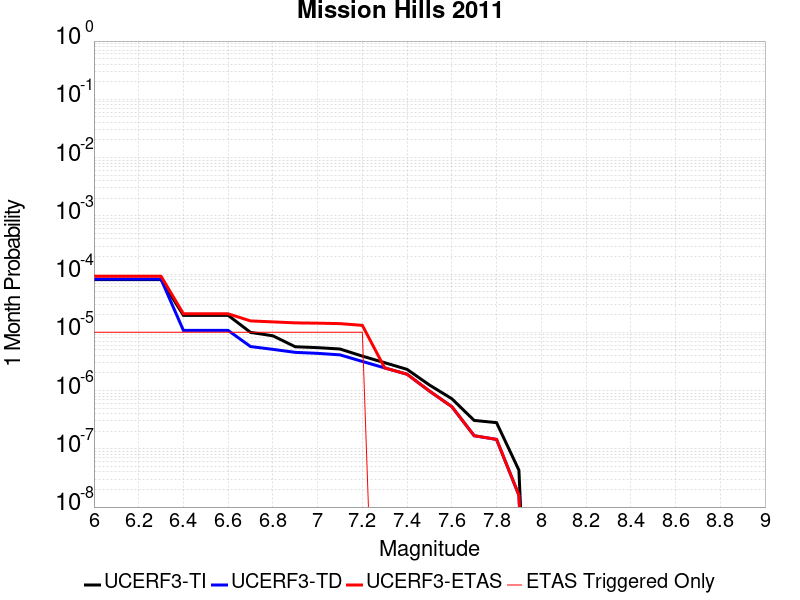 | 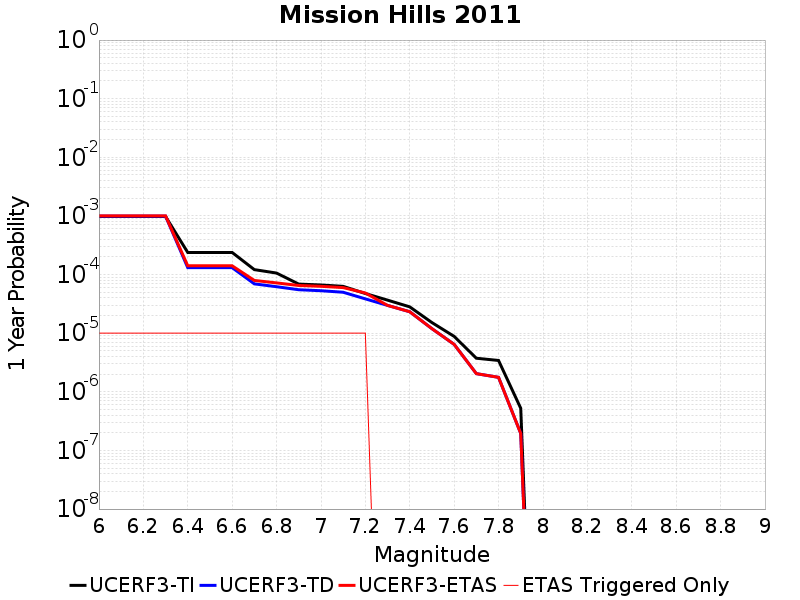 |  |

| Magnitude | 1 wk TI Prob | 1 wk TD Prob | 1 wk ETAS Prob | 1 wk ETAS/TD Gain | 1 wk ETAS Triggered Only | 1 mo TI Prob | 1 mo TD Prob | 1 mo ETAS Prob | 1 mo ETAS/TD Gain | 1 mo ETAS Triggered Only | 1 yr TI Prob | 1 yr TD Prob | 1 yr ETAS Prob | 1 yr ETAS/TD Gain | 1 yr ETAS Triggered Only | 10 yr TI Prob | 10 yr TD Prob | 10 yr ETAS Prob | 10 yr ETAS/TD Gain | 10 yr ETAS Triggered Only |
|-----|-----|-----|-----|-----|-----|-----|-----|-----|-----|-----|-----|-----|-----|-----|-----|-----|-----|-----|-----|-----|
| 6.0 | 1.8765717E-5 | 1.905499E-5 | 1.905499E-5 | 1.0 | 0.0 | 8.0422025E-5 | 8.166363E-5 | 9.166281E-5 | 1.1224436 | 1.0E-5 | 9.786983E-4 | 9.941446E-4 | 0.0010041347 | 1.0100489 | 1.0E-5 | 0.009743992 | 0.00993064 | 0.009940541 | 1.000997 | 1.0E-5 |
| 6.1 | 1.8765717E-5 | 1.905499E-5 | 1.905499E-5 | 1.0 | 0.0 | 8.0422025E-5 | 8.166363E-5 | 9.166281E-5 | 1.1224436 | 1.0E-5 | 9.786983E-4 | 9.941446E-4 | 0.0010041347 | 1.0100489 | 1.0E-5 | 0.009743992 | 0.00993064 | 0.009940541 | 1.000997 | 1.0E-5 |
| 6.2 | 1.8765717E-5 | 1.905499E-5 | 1.905499E-5 | 1.0 | 0.0 | 8.0422025E-5 | 8.166363E-5 | 9.166281E-5 | 1.1224436 | 1.0E-5 | 9.786983E-4 | 9.941446E-4 | 0.0010041347 | 1.0100489 | 1.0E-5 | 0.009743992 | 0.00993064 | 0.009940541 | 1.000997 | 1.0E-5 |
| 6.3 | 1.8765717E-5 | 1.905499E-5 | 1.905499E-5 | 1.0 | 0.0 | 8.0422025E-5 | 8.166363E-5 | 9.166281E-5 | 1.1224436 | 1.0E-5 | 9.786983E-4 | 9.941446E-4 | 0.0010041347 | 1.0100489 | 1.0E-5 | 0.009743992 | 0.00993064 | 0.009940541 | 1.000997 | 1.0E-5 |
| 6.4 | 4.566357E-6 | 2.5148893E-6 | 2.5148893E-6 | 1.0 | 0.0 | 1.9569954E-5 | 1.07780625E-5 | 2.0777954E-5 | 1.9278005 | 1.0E-5 | 2.3823815E-4 | 1.3121682E-4 | 1.4121551E-4 | 1.0761998 | 1.0E-5 | 0.002379829 | 0.0013115717 | 0.0013215586 | 1.0076145 | 1.0E-5 |
| 6.5 | 4.566357E-6 | 2.5148893E-6 | 2.5148893E-6 | 1.0 | 0.0 | 1.9569954E-5 | 1.07780625E-5 | 2.0777954E-5 | 1.9278005 | 1.0E-5 | 2.3823815E-4 | 1.3121682E-4 | 1.4121551E-4 | 1.0761998 | 1.0E-5 | 0.002379829 | 0.0013115717 | 0.0013215586 | 1.0076145 | 1.0E-5 |
| 6.6 | 4.566357E-6 | 2.5148893E-6 | 2.5148893E-6 | 1.0 | 0.0 | 1.9569954E-5 | 1.07780625E-5 | 2.0777954E-5 | 1.9278005 | 1.0E-5 | 2.3823815E-4 | 1.3121682E-4 | 1.4121551E-4 | 1.0761998 | 1.0E-5 | 0.002379829 | 0.0013115717 | 0.0013215586 | 1.0076145 | 1.0E-5 |
| 6.7 | 2.3266773E-6 | 1.3296342E-6 | 1.3296342E-6 | 1.0 | 0.0 | 9.971435E-6 | 5.6984204E-6 | 1.5698362E-5 | 2.7548623 | 1.0E-5 | 1.2139547E-4 | 6.937612E-5 | 7.937542E-5 | 1.1441318 | 1.0E-5 | 0.0012132917 | 6.935507E-4 | 7.035438E-4 | 1.0144086 | 1.0E-5 |
| 6.8 | 2.032735E-6 | 1.1894249E-6 | 1.1894249E-6 | 1.0 | 0.0 | 8.711692E-6 | 5.097526E-6 | 1.5097475E-5 | 2.961726 | 1.0E-5 | 1.06059684E-4 | 6.206066E-5 | 7.206004E-5 | 1.1611227 | 1.0E-5 | 0.0010600908 | 6.2043814E-4 | 6.304319E-4 | 1.0161077 | 1.0E-5 |
| 6.9 | 1.3186259E-6 | 1.0561869E-6 | 1.0561869E-6 | 1.0 | 0.0 | 5.6512413E-6 | 4.5265074E-6 | 1.4526462E-5 | 3.209199 | 1.0E-5 | 6.8801695E-5 | 5.5108863E-5 | 6.510831E-5 | 1.181449 | 1.0E-5 | 6.8780396E-4 | 5.5095495E-4 | 5.6094944E-4 | 1.0181403 | 1.0E-5 |
| 7.0 | 1.2726016E-6 | 1.0159175E-6 | 1.0159175E-6 | 1.0 | 0.0 | 5.4539955E-6 | 4.353925E-6 | 1.4353882E-5 | 3.2967682 | 1.0E-5 | 6.6400375E-5 | 5.3007778E-5 | 6.3007246E-5 | 1.1886415 | 1.0E-5 | 6.6380535E-4 | 5.2995415E-4 | 5.399489E-4 | 1.0188595 | 1.0E-5 |
| 7.1 | 1.2063913E-6 | 9.570156E-7 | 9.570156E-7 | 1.0 | 0.0 | 5.170238E-6 | 4.101489E-6 | 1.4101448E-5 | 3.438129 | 1.0E-5 | 6.294583E-5 | 4.993451E-5 | 5.993401E-5 | 1.2002523 | 1.0E-5 | 6.2928005E-4 | 4.9923547E-4 | 5.092305E-4 | 1.0200206 | 1.0E-5 |
| 7.2 | 9.105806E-7 | 7.3766233E-7 | 7.3766233E-7 | 1.0 | 0.0 | 3.9024826E-6 | 3.161406E-6 | 1.3161374E-5 | 4.1631393 | 1.0E-5 | 4.7511687E-5 | 3.8489456E-5 | 4.848907E-5 | 1.2598014 | 1.0E-5 | 4.7501532E-4 | 3.8482944E-4 | 3.948256E-4 | 1.0259756 | 1.0E-5 |
| 7.3 | 7.020432E-7 | 5.710146E-7 | 5.710146E-7 | 1.0 | 0.0 | 3.0087533E-6 | 2.4472033E-6 | 2.4472033E-6 | 1.0 | 0.0 | 3.6630954E-5 | 2.9794306E-5 | 2.9794306E-5 | 1.0 | 0.0 | 3.6624918E-4 | 2.9790442E-4 | 2.9790442E-4 | 1.0 | 0.0 |
| 7.4 | 5.3900635E-7 | 4.448132E-7 | 4.448132E-7 | 1.0 | 0.0 | 2.3100251E-6 | 1.906341E-6 | 1.906341E-6 | 1.0 | 0.0 | 2.8124194E-5 | 2.3209466E-5 | 2.3209466E-5 | 1.0 | 0.0 | 2.8120633E-4 | 2.3207164E-4 | 2.3207164E-4 | 1.0 | 0.0 |
| 7.5 | 2.907075E-7 | 2.2875786E-7 | 2.2875786E-7 | 1.0 | 0.0 | 1.2458887E-6 | 9.803904E-7 | 9.803904E-7 | 1.0 | 0.0 | 1.5168589E-5 | 1.193619E-5 | 1.193619E-5 | 1.0 | 0.0 | 1.5167553E-4 | 1.1935567E-4 | 1.1935567E-4 | 1.0 | 0.0 |
| 7.6 | 1.6903675E-7 | 1.2353678E-7 | 1.2353678E-7 | 1.0 | 0.0 | 7.2444305E-7 | 5.2944324E-7 | 5.2944324E-7 | 1.0 | 0.0 | 8.820059E-6 | 6.445954E-6 | 6.445954E-6 | 1.0 | 0.0 | 8.8197085E-5 | 6.4457796E-5 | 6.4457796E-5 | 1.0 | 0.0 |
| 7.7 | 7.168073E-8 | 3.9137024E-8 | 3.9137024E-8 | 1.0 | 0.0 | 3.072031E-7 | 1.677301E-7 | 1.677301E-7 | 1.0 | 0.0 | 3.7401915E-6 | 2.042112E-6 | 2.042112E-6 | 1.0 | 0.0 | 3.7401285E-5 | 2.0420945E-5 | 2.0420945E-5 | 1.0 | 0.0 |
| 7.8 | 6.564101E-8 | 3.3837207E-8 | 3.3837207E-8 | 1.0 | 0.0 | 2.813186E-7 | 1.450166E-7 | 1.450166E-7 | 1.0 | 0.0 | 3.4250486E-6 | 1.7655757E-6 | 1.7655757E-6 | 1.0 | 0.0 | 3.424996E-5 | 1.7655628E-5 | 1.7655628E-5 | 1.0 | 0.0 |
| 7.9 | 1.0029074E-8 | 3.7295425E-9 | 3.7295425E-9 | 1.0 | 0.0 | 4.2981743E-8 | 1.5983755E-8 | 1.5983755E-8 | 1.0 | 0.0 | 5.2330256E-7 | 1.946022E-7 | 1.946022E-7 | 1.0 | 0.0 | 5.2330133E-6 | 1.9460213E-6 | 1.9460213E-6 | 1.0 | 0.0 |

## Superstition Hills
*[(top)](#table-of-contents)*

| 1 Week | 1 Month | 1 Year | 10 Year |
|-----|-----|-----|-----|
| 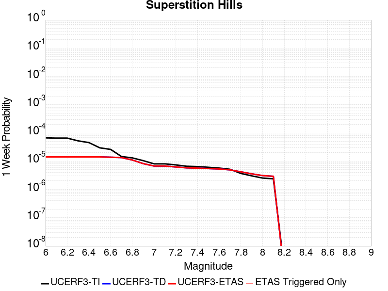 | 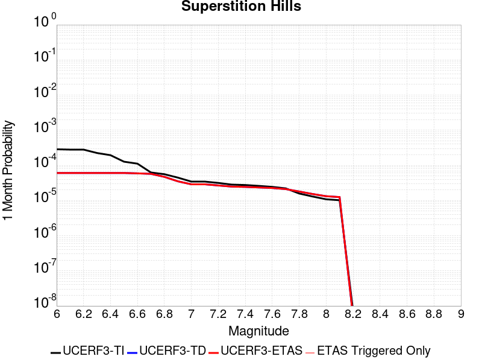 | 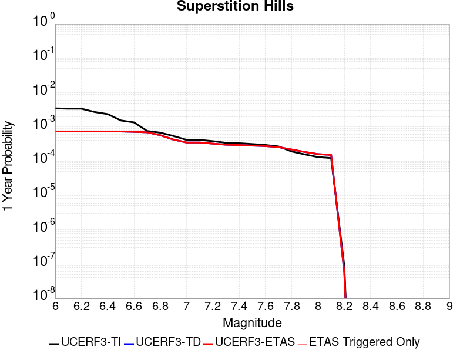 | 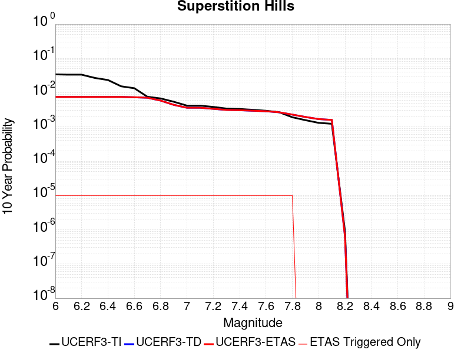 |

| Magnitude | 1 wk TI Prob | 1 wk TD Prob | 1 wk ETAS Prob | 1 wk ETAS/TD Gain | 1 wk ETAS Triggered Only | 1 mo TI Prob | 1 mo TD Prob | 1 mo ETAS Prob | 1 mo ETAS/TD Gain | 1 mo ETAS Triggered Only | 1 yr TI Prob | 1 yr TD Prob | 1 yr ETAS Prob | 1 yr ETAS/TD Gain | 1 yr ETAS Triggered Only | 10 yr TI Prob | 10 yr TD Prob | 10 yr ETAS Prob | 10 yr ETAS/TD Gain | 10 yr ETAS Triggered Only |
|-----|-----|-----|-----|-----|-----|-----|-----|-----|-----|-----|-----|-----|-----|-----|-----|-----|-----|-----|-----|-----|
| 6.0 | 6.6865185E-5 | 1.4140243E-5 | 1.4140243E-5 | 1.0 | 0.0 | 2.8653358E-4 | 6.0599727E-5 | 6.0599727E-5 | 1.0 | 0.0 | 0.0034829667 | 7.3756813E-4 | 7.3756813E-4 | 1.0 | 0.0 | 0.03428881 | 0.007521731 | 0.0075316555 | 1.0013195 | 1.0E-5 |
| 6.1 | 6.544851E-5 | 1.4140243E-5 | 1.4140243E-5 | 1.0 | 0.0 | 2.8046346E-4 | 6.0599727E-5 | 6.0599727E-5 | 1.0 | 0.0 | 0.0034092965 | 7.3756813E-4 | 7.3756813E-4 | 1.0 | 0.0 | 0.033574644 | 0.0075217304 | 0.007531655 | 1.0013195 | 1.0E-5 |
| 6.2 | 6.544851E-5 | 1.4140243E-5 | 1.4140243E-5 | 1.0 | 0.0 | 2.8046346E-4 | 6.0599727E-5 | 6.0599727E-5 | 1.0 | 0.0 | 0.0034092965 | 7.3756813E-4 | 7.3756813E-4 | 1.0 | 0.0 | 0.033574644 | 0.0075217304 | 0.007531655 | 1.0013195 | 1.0E-5 |
| 6.3 | 5.2402065E-5 | 1.4140242E-5 | 1.4140242E-5 | 1.0 | 0.0 | 2.2456095E-4 | 6.059972E-5 | 6.059972E-5 | 1.0 | 0.0 | 0.0027306017 | 7.375681E-4 | 7.375681E-4 | 1.0 | 0.0 | 0.02697292 | 0.007521725 | 0.0075316494 | 1.0013195 | 1.0E-5 |
| 6.4 | 4.542238E-5 | 1.4140242E-5 | 1.4140242E-5 | 1.0 | 0.0 | 1.9465282E-4 | 6.059972E-5 | 6.059972E-5 | 1.0 | 0.0 | 0.0023673223 | 7.37568E-4 | 7.37568E-4 | 1.0 | 0.0 | 0.023422617 | 0.007521722 | 0.0075316466 | 1.0013195 | 1.0E-5 |
| 6.5 | 2.9672969E-5 | 1.414024E-5 | 1.414024E-5 | 1.0 | 0.0 | 1.2716366E-4 | 6.0599712E-5 | 6.0599712E-5 | 1.0 | 0.0 | 0.0015471181 | 7.3756796E-4 | 7.3756796E-4 | 1.0 | 0.0 | 0.015363912 | 0.0075217155 | 0.00753164 | 1.0013195 | 1.0E-5 |
| 6.6 | 2.6056105E-5 | 1.3805983E-5 | 1.3805983E-5 | 1.0 | 0.0 | 1.1166424E-4 | 5.916725E-5 | 5.916725E-5 | 1.0 | 0.0 | 0.0013586642 | 7.2013924E-4 | 7.2013924E-4 | 1.0 | 0.0 | 0.013503874 | 0.007346142 | 0.0073560686 | 1.0013512 | 1.0E-5 |
| 6.7 | 1.4611248E-5 | 1.3385869E-5 | 1.3385869E-5 | 1.0 | 0.0 | 6.261813E-5 | 5.736684E-5 | 5.736684E-5 | 1.0 | 0.0 | 7.6210906E-4 | 6.9823343E-4 | 6.9823343E-4 | 1.0 | 0.0 | 0.0075950073 | 0.0071273264 | 0.007137255 | 1.0013931 | 1.0E-5 |
| 6.8 | 1.30607E-5 | 1.0981188E-5 | 1.0981188E-5 | 1.0 | 0.0 | 5.597323E-5 | 4.7061436E-5 | 4.7061436E-5 | 1.0 | 0.0 | 6.8126095E-4 | 5.728311E-4 | 5.728311E-4 | 1.0 | 0.0 | 0.006791762 | 0.00587563 | 0.0058855712 | 1.0016919 | 1.0E-5 |
| 6.9 | 1.0443096E-5 | 8.197515E-6 | 8.197515E-6 | 1.0 | 0.0 | 4.4755358E-5 | 3.5131747E-5 | 3.5131747E-5 | 1.0 | 0.0 | 5.447602E-4 | 4.2764744E-4 | 4.2764744E-4 | 1.0 | 0.0 | 0.005434267 | 0.0044105863 | 0.004420542 | 1.0022572 | 1.0E-5 |
| 7.0 | 8.045912E-6 | 6.741651E-6 | 6.741651E-6 | 1.0 | 0.0 | 3.4482026E-5 | 2.8892477E-5 | 2.8892477E-5 | 1.0 | 0.0 | 4.197378E-4 | 3.5171013E-4 | 3.5171013E-4 | 1.0 | 0.0 | 0.0041894587 | 0.0036344337 | 0.0036443975 | 1.0027415 | 1.0E-5 |
| 7.1 | 8.045912E-6 | 6.741651E-6 | 6.741651E-6 | 1.0 | 0.0 | 3.4482026E-5 | 2.8892477E-5 | 2.8892477E-5 | 1.0 | 0.0 | 4.197378E-4 | 3.5171013E-4 | 3.5171013E-4 | 1.0 | 0.0 | 0.0041894587 | 0.0036344337 | 0.0036443975 | 1.0027415 | 1.0E-5 |
| 7.2 | 7.375506E-6 | 6.2485506E-6 | 6.2485506E-6 | 1.0 | 0.0 | 3.1608928E-5 | 2.6779233E-5 | 2.6779233E-5 | 1.0 | 0.0 | 3.8477074E-4 | 3.2598924E-4 | 3.2598924E-4 | 1.0 | 0.0 | 0.003841052 | 0.0033748916 | 0.003384858 | 1.002953 | 1.0E-5 |
| 7.3 | 6.6063913E-6 | 5.800945E-6 | 5.800945E-6 | 1.0 | 0.0 | 2.8312797E-5 | 2.486096E-5 | 2.486096E-5 | 1.0 | 0.0 | 3.446538E-4 | 3.0264087E-4 | 3.0264087E-4 | 1.0 | 0.0 | 0.0034411973 | 0.0031391408 | 0.0031491092 | 1.0031756 | 1.0E-5 |
| 7.4 | 6.4313126E-6 | 5.682362E-6 | 5.682362E-6 | 1.0 | 0.0 | 2.7562477E-5 | 2.4352757E-5 | 2.4352757E-5 | 1.0 | 0.0 | 3.355215E-4 | 2.9645517E-4 | 2.9645517E-4 | 1.0 | 0.0 | 0.0033501536 | 0.0030768993 | 0.0030868684 | 1.00324 | 1.0E-5 |
| 7.5 | 6.0742927E-6 | 5.4781663E-6 | 5.4781663E-6 | 1.0 | 0.0 | 2.6032423E-5 | 2.3477647E-5 | 2.3477647E-5 | 1.0 | 0.0 | 3.1689866E-4 | 2.8580354E-4 | 2.8580354E-4 | 1.0 | 0.0 | 0.0031644711 | 0.002968727 | 0.0029786972 | 1.0033585 | 1.0E-5 |
| 7.6 | 5.6987187E-6 | 5.296351E-6 | 5.296351E-6 | 1.0 | 0.0 | 2.4422852E-5 | 2.2698452E-5 | 2.2698452E-5 | 1.0 | 0.0 | 2.9730765E-4 | 2.7631928E-4 | 2.7631928E-4 | 1.0 | 0.0 | 0.002969102 | 0.0028719692 | 0.0028819405 | 1.003472 | 1.0E-5 |
| 7.7 | 5.1658035E-6 | 4.927333E-6 | 4.927333E-6 | 1.0 | 0.0 | 2.2138971E-5 | 2.1116974E-5 | 2.1116974E-5 | 1.0 | 0.0 | 2.6950863E-4 | 2.5706942E-4 | 2.5706942E-4 | 1.0 | 0.0 | 0.00269182 | 0.0026770034 | 0.0026869765 | 1.0037255 | 1.0E-5 |
| 7.8 | 3.6864697E-6 | 4.1982216E-6 | 4.1982216E-6 | 1.0 | 0.0 | 1.579906E-5 | 1.7992257E-5 | 1.7992257E-5 | 1.0 | 0.0 | 1.9233658E-4 | 2.1903418E-4 | 2.1903418E-4 | 1.0 | 0.0 | 0.0019217018 | 0.002290164 | 0.002300141 | 1.0043565 | 1.0E-5 |
| 7.9 | 3.0265903E-6 | 3.5653177E-6 | 3.5653177E-6 | 1.0 | 0.0 | 1.2971037E-5 | 1.5279846E-5 | 1.5279846E-5 | 1.0 | 0.0 | 1.5791094E-4 | 1.8601668E-4 | 1.8601668E-4 | 1.0 | 0.0 | 0.0015779877 | 0.0019543048 | 0.0019543048 | 1.0 | 0.0 |
| 8.0 | 2.5271493E-6 | 3.0881886E-6 | 3.0881886E-6 | 1.0 | 0.0 | 1.0830595E-5 | 1.3235029E-5 | 1.3235029E-5 | 1.0 | 0.0 | 1.3185451E-4 | 1.6112498E-4 | 1.6112498E-4 | 1.0 | 0.0 | 0.0013177631 | 0.0016981151 | 0.0016981151 | 1.0 | 0.0 |
| 8.1 | 2.3749135E-6 | 2.9187634E-6 | 2.9187634E-6 | 1.0 | 0.0 | 1.0178161E-5 | 1.2508928E-5 | 1.2508928E-5 | 1.0 | 0.0 | 1.2391206E-4 | 1.5228598E-4 | 1.5228598E-4 | 1.0 | 0.0 | 0.0012384299 | 0.0016056742 | 0.0016056742 | 1.0 | 0.0 |
| 8.2 | 1.7186406E-9 | 1.1447971E-9 | 1.1447971E-9 | 1.0 | 0.0 | 7.3656024E-9 | 4.9062736E-9 | 4.9062736E-9 | 1.0 | 0.0 | 8.9676206E-8 | 5.973388E-8 | 5.973388E-8 | 1.0 | 0.0 | 8.9676166E-7 | 6.3930344E-7 | 6.3930344E-7 | 1.0 | 0.0 |

## Newport-Inglewood alt 1
*[(top)](#table-of-contents)*

| 1 Week | 1 Month | 1 Year | 10 Year |
|-----|-----|-----|-----|
| 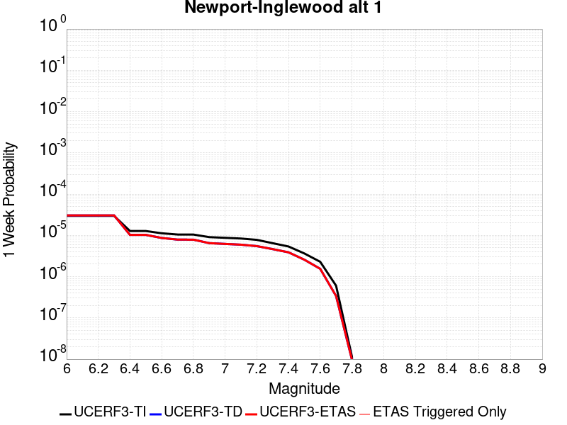 | 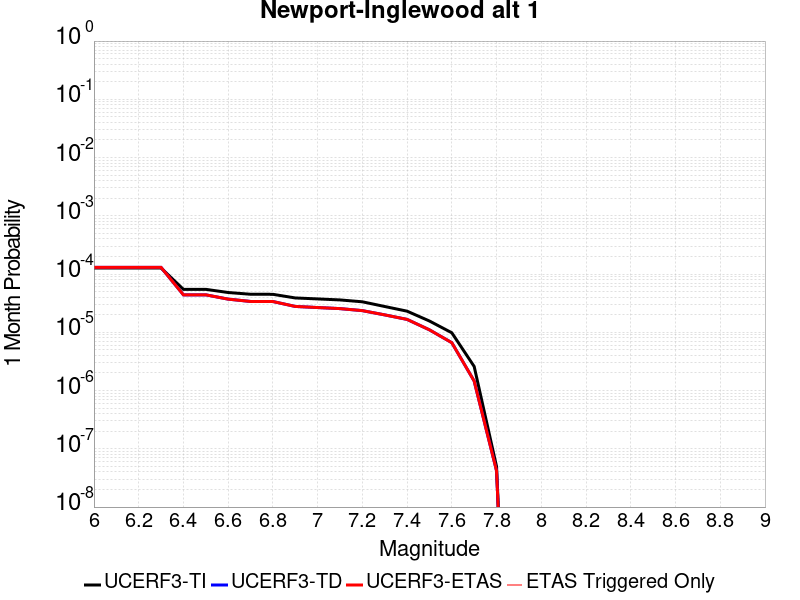 | 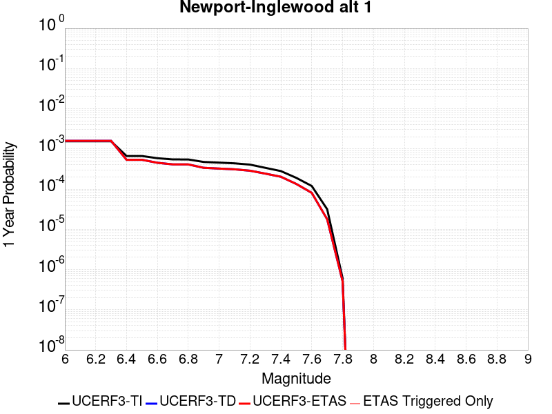 | 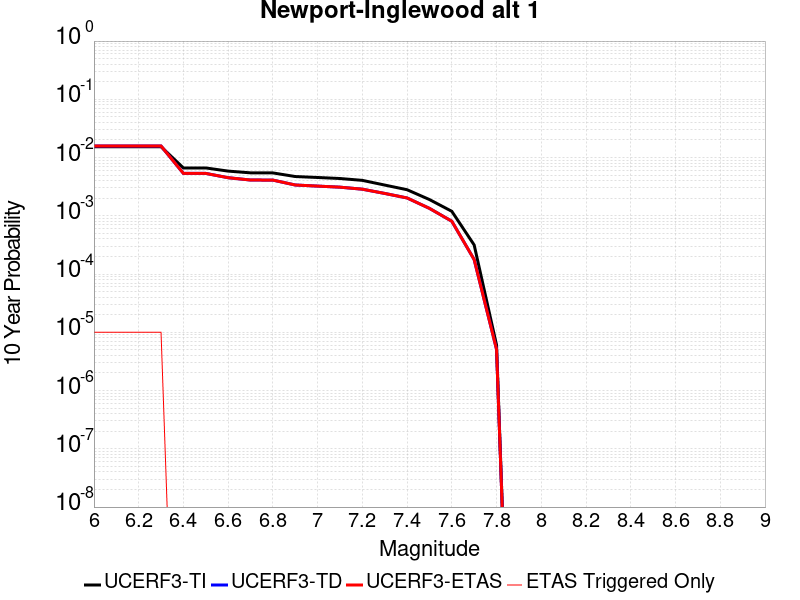 |

| Magnitude | 1 wk TI Prob | 1 wk TD Prob | 1 wk ETAS Prob | 1 wk ETAS/TD Gain | 1 wk ETAS Triggered Only | 1 mo TI Prob | 1 mo TD Prob | 1 mo ETAS Prob | 1 mo ETAS/TD Gain | 1 mo ETAS Triggered Only | 1 yr TI Prob | 1 yr TD Prob | 1 yr ETAS Prob | 1 yr ETAS/TD Gain | 1 yr ETAS Triggered Only | 10 yr TI Prob | 10 yr TD Prob | 10 yr ETAS Prob | 10 yr ETAS/TD Gain | 10 yr ETAS Triggered Only |
|-----|-----|-----|-----|-----|-----|-----|-----|-----|-----|-----|-----|-----|-----|-----|-----|-----|-----|-----|-----|-----|
| 6.0 | 2.9668912E-5 | 3.0405414E-5 | 3.0405414E-5 | 1.0 | 0.0 | 1.2714628E-4 | 1.3030515E-4 | 1.3030515E-4 | 1.0 | 0.0 | 0.0015469068 | 0.0015857933 | 0.0015857933 | 1.0 | 0.0 | 0.015361829 | 0.015792351 | 0.015802193 | 1.0006232 | 1.0E-5 |
| 6.1 | 2.9668912E-5 | 3.0405414E-5 | 3.0405414E-5 | 1.0 | 0.0 | 1.2714628E-4 | 1.3030515E-4 | 1.3030515E-4 | 1.0 | 0.0 | 0.0015469068 | 0.0015857933 | 0.0015857933 | 1.0 | 0.0 | 0.015361829 | 0.015792351 | 0.015802193 | 1.0006232 | 1.0E-5 |
| 6.2 | 2.9668912E-5 | 3.0405414E-5 | 3.0405414E-5 | 1.0 | 0.0 | 1.2714628E-4 | 1.3030515E-4 | 1.3030515E-4 | 1.0 | 0.0 | 0.0015469068 | 0.0015857933 | 0.0015857933 | 1.0 | 0.0 | 0.015361829 | 0.015792351 | 0.015802193 | 1.0006232 | 1.0E-5 |
| 6.3 | 2.9668912E-5 | 3.0405414E-5 | 3.0405414E-5 | 1.0 | 0.0 | 1.2714628E-4 | 1.3030515E-4 | 1.3030515E-4 | 1.0 | 0.0 | 0.0015469068 | 0.0015857933 | 0.0015857933 | 1.0 | 0.0 | 0.015361829 | 0.015792351 | 0.015802193 | 1.0006232 | 1.0E-5 |
| 6.4 | 1.275942E-5 | 1.0272648E-5 | 1.0272648E-5 | 1.0 | 0.0 | 5.4682085E-5 | 4.4024913E-5 | 4.4024913E-5 | 1.0 | 0.0 | 6.65551E-4 | 5.358757E-4 | 5.358757E-4 | 1.0 | 0.0 | 0.0066356123 | 0.0053462596 | 0.0053462596 | 1.0 | 0.0 |
| 6.5 | 1.275942E-5 | 1.0272648E-5 | 1.0272648E-5 | 1.0 | 0.0 | 5.4682085E-5 | 4.4024913E-5 | 4.4024913E-5 | 1.0 | 0.0 | 6.65551E-4 | 5.358757E-4 | 5.358757E-4 | 1.0 | 0.0 | 0.0066356123 | 0.0053462596 | 0.0053462596 | 1.0 | 0.0 |
| 6.6 | 1.1255358E-5 | 8.662006E-6 | 8.662006E-6 | 1.0 | 0.0 | 4.8236358E-5 | 3.712236E-5 | 3.712236E-5 | 1.0 | 0.0 | 5.871194E-4 | 4.5187274E-4 | 4.5187274E-4 | 1.0 | 0.0 | 0.005855706 | 0.0045097163 | 0.0045097163 | 1.0 | 0.0 |
| 6.7 | 1.0504745E-5 | 7.899908E-6 | 7.899908E-6 | 1.0 | 0.0 | 4.5019555E-5 | 3.385632E-5 | 3.385632E-5 | 1.0 | 0.0 | 5.4797524E-4 | 4.1212395E-4 | 4.1212395E-4 | 1.0 | 0.0 | 0.0054662596 | 0.004113727 | 0.004113727 | 1.0 | 0.0 |
| 6.8 | 1.0476007E-5 | 7.881289E-6 | 7.881289E-6 | 1.0 | 0.0 | 4.4896402E-5 | 3.3776523E-5 | 3.3776523E-5 | 1.0 | 0.0 | 5.464766E-4 | 4.1115284E-4 | 4.1115284E-4 | 1.0 | 0.0 | 0.005451347 | 0.0041040513 | 0.0041040513 | 1.0 | 0.0 |
| 6.9 | 9.076797E-6 | 6.4897295E-6 | 6.4897295E-6 | 1.0 | 0.0 | 3.889998E-5 | 2.7812832E-5 | 2.7812832E-5 | 1.0 | 0.0 | 4.7350433E-4 | 3.3856896E-4 | 3.3856896E-4 | 1.0 | 0.0 | 0.004724967 | 0.003380569 | 0.003380569 | 1.0 | 0.0 |
| 7.0 | 8.73795E-6 | 6.21211E-6 | 6.21211E-6 | 1.0 | 0.0 | 3.7447822E-5 | 2.6623058E-5 | 2.6623058E-5 | 1.0 | 0.0 | 4.5583185E-4 | 3.240878E-4 | 3.240878E-4 | 1.0 | 0.0 | 0.0045489795 | 0.0032361834 | 0.0032361834 | 1.0 | 0.0 |
| 7.1 | 8.391299E-6 | 5.9558856E-6 | 5.9558856E-6 | 1.0 | 0.0 | 3.5962214E-5 | 2.5524976E-5 | 2.5524976E-5 | 1.0 | 0.0 | 4.37752E-4 | 3.1072253E-4 | 3.1072253E-4 | 1.0 | 0.0 | 0.004368907 | 0.0031029105 | 0.0031029105 | 1.0 | 0.0 |
| 7.2 | 7.796882E-6 | 5.4966276E-6 | 5.4966276E-6 | 1.0 | 0.0 | 3.341478E-5 | 2.3556764E-5 | 2.3556764E-5 | 1.0 | 0.0 | 4.06749E-4 | 2.8676607E-4 | 2.8676607E-4 | 1.0 | 0.0 | 0.0040600533 | 0.0028639843 | 0.0028639843 | 1.0 | 0.0 |
| 7.3 | 6.4738833E-6 | 4.6478535E-6 | 4.6478535E-6 | 1.0 | 0.0 | 2.774492E-5 | 1.991922E-5 | 1.991922E-5 | 1.0 | 0.0 | 3.3774204E-4 | 2.4248967E-4 | 2.4248967E-4 | 1.0 | 0.0 | 0.0033722918 | 0.0024222676 | 0.0024222676 | 1.0 | 0.0 |
| 7.4 | 5.382145E-6 | 3.885791E-6 | 3.885791E-6 | 1.0 | 0.0 | 2.3066134E-5 | 1.6653285E-5 | 1.6653285E-5 | 1.0 | 0.0 | 2.8079396E-4 | 2.0273501E-4 | 2.0273501E-4 | 1.0 | 0.0 | 0.0028043943 | 0.002025515 | 0.002025515 | 1.0 | 0.0 |
| 7.5 | 3.648244E-6 | 2.5738016E-6 | 2.5738016E-6 | 1.0 | 0.0 | 1.5635238E-5 | 1.1030533E-5 | 1.1030533E-5 | 1.0 | 0.0 | 1.9034238E-4 | 1.3428857E-4 | 1.3428857E-4 | 1.0 | 0.0 | 0.0019017943 | 0.0013420845 | 0.0013420845 | 1.0 | 0.0 |
| 7.6 | 2.2906888E-6 | 1.5479961E-6 | 1.5479961E-6 | 1.0 | 0.0 | 9.817201E-6 | 6.6342527E-6 | 6.6342527E-6 | 1.0 | 0.0 | 1.1951787E-4 | 8.07691E-5 | 8.07691E-5 | 1.0 | 0.0 | 0.0011945361 | 8.0740417E-4 | 8.0740417E-4 | 1.0 | 0.0 |
| 7.7 | 6.0479874E-7 | 3.397542E-7 | 3.397542E-7 | 1.0 | 0.0 | 2.5919921E-6 | 1.4560886E-6 | 1.4560886E-6 | 1.0 | 0.0 | 3.1557047E-5 | 1.7727749E-5 | 1.7727749E-5 | 1.0 | 0.0 | 3.1552566E-4 | 1.7726474E-4 | 1.7726474E-4 | 1.0 | 0.0 |
| 7.8 | 1.16056995E-8 | 9.782389E-9 | 9.782389E-9 | 1.0 | 0.0 | 4.9738713E-8 | 4.1924523E-8 | 4.1924523E-8 | 1.0 | 0.0 | 6.0556863E-7 | 5.1043105E-7 | 5.1043105E-7 | 1.0 | 0.0 | 6.05567E-6 | 5.1043107E-6 | 5.1043107E-6 | 1.0 | 0.0 |

## Swain Ravine - Spenceville
*[(top)](#table-of-contents)*

| 1 Week | 1 Month | 1 Year | 10 Year |
|-----|-----|-----|-----|
| 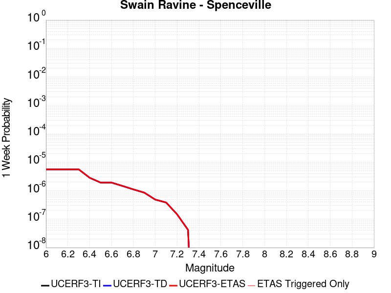 |  | 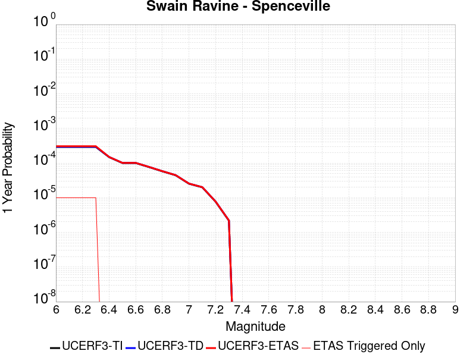 | 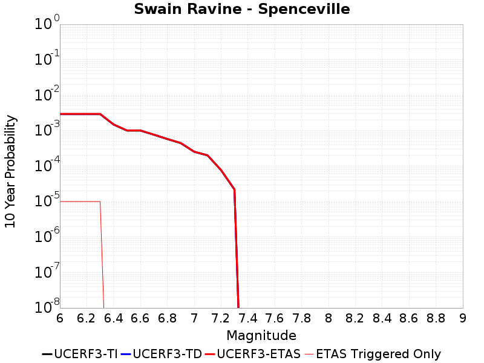 |

| Magnitude | 1 wk TI Prob | 1 wk TD Prob | 1 wk ETAS Prob | 1 wk ETAS/TD Gain | 1 wk ETAS Triggered Only | 1 mo TI Prob | 1 mo TD Prob | 1 mo ETAS Prob | 1 mo ETAS/TD Gain | 1 mo ETAS Triggered Only | 1 yr TI Prob | 1 yr TD Prob | 1 yr ETAS Prob | 1 yr ETAS/TD Gain | 1 yr ETAS Triggered Only | 10 yr TI Prob | 10 yr TD Prob | 10 yr ETAS Prob | 10 yr ETAS/TD Gain | 10 yr ETAS Triggered Only |
|-----|-----|-----|-----|-----|-----|-----|-----|-----|-----|-----|-----|-----|-----|-----|-----|-----|-----|-----|-----|-----|
| 6.0 | 5.596169E-6 | 5.663802E-6 | 5.663802E-6 | 1.0 | 0.0 | 2.398336E-5 | 2.4273226E-5 | 2.4273226E-5 | 1.0 | 0.0 | 2.9195828E-4 | 2.9548918E-4 | 3.0548623E-4 | 1.0338322 | 1.0E-5 | 0.00291575 | 0.002951232 | 0.0029612025 | 1.0033784 | 1.0E-5 |
| 6.1 | 5.596169E-6 | 5.663802E-6 | 5.663802E-6 | 1.0 | 0.0 | 2.398336E-5 | 2.4273226E-5 | 2.4273226E-5 | 1.0 | 0.0 | 2.9195828E-4 | 2.9548918E-4 | 3.0548623E-4 | 1.0338322 | 1.0E-5 | 0.00291575 | 0.002951232 | 0.0029612025 | 1.0033784 | 1.0E-5 |
| 6.2 | 5.596169E-6 | 5.663802E-6 | 5.663802E-6 | 1.0 | 0.0 | 2.398336E-5 | 2.4273226E-5 | 2.4273226E-5 | 1.0 | 0.0 | 2.9195828E-4 | 2.9548918E-4 | 3.0548623E-4 | 1.0338322 | 1.0E-5 | 0.00291575 | 0.002951232 | 0.0029612025 | 1.0033784 | 1.0E-5 |
| 6.3 | 5.596169E-6 | 5.663802E-6 | 5.663802E-6 | 1.0 | 0.0 | 2.398336E-5 | 2.4273226E-5 | 2.4273226E-5 | 1.0 | 0.0 | 2.9195828E-4 | 2.9548918E-4 | 3.0548623E-4 | 1.0338322 | 1.0E-5 | 0.00291575 | 0.002951232 | 0.0029612025 | 1.0033784 | 1.0E-5 |
| 6.4 | 2.8426775E-6 | 2.8741474E-6 | 2.8741474E-6 | 1.0 | 0.0 | 1.2182847E-5 | 1.2317719E-5 | 1.2317719E-5 | 1.0 | 0.0 | 1.4831607E-4 | 1.499583E-4 | 1.499583E-4 | 1.0 | 0.0 | 0.0014821711 | 0.0014986095 | 0.0014986095 | 1.0 | 0.0 |
| 6.5 | 1.9210793E-6 | 1.941417E-6 | 1.941417E-6 | 1.0 | 0.0 | 8.233172E-6 | 8.320333E-6 | 8.320333E-6 | 1.0 | 0.0 | 1.0023425E-4 | 1.0129548E-4 | 1.0129548E-4 | 1.0 | 0.0 | 0.0010018905 | 0.0010125064 | 0.0010125064 | 1.0 | 0.0 |
| 6.6 | 1.9210793E-6 | 1.941417E-6 | 1.941417E-6 | 1.0 | 0.0 | 8.233172E-6 | 8.320333E-6 | 8.320333E-6 | 1.0 | 0.0 | 1.0023425E-4 | 1.0129548E-4 | 1.0129548E-4 | 1.0 | 0.0 | 0.0010018905 | 0.0010125064 | 0.0010125064 | 1.0 | 0.0 |
| 6.7 | 1.4667394E-6 | 1.4818951E-6 | 1.4818951E-6 | 1.0 | 0.0 | 6.286011E-6 | 6.3509638E-6 | 6.3509638E-6 | 1.0 | 0.0 | 7.65295E-5 | 7.732032E-5 | 7.732032E-5 | 1.0 | 0.0 | 7.6503144E-4 | 7.729419E-4 | 7.729419E-4 | 1.0 | 0.0 |
| 6.8 | 1.1076943E-6 | 1.1189547E-6 | 1.1189547E-6 | 1.0 | 0.0 | 4.747252E-6 | 4.795512E-6 | 4.795512E-6 | 1.0 | 0.0 | 5.7796264E-5 | 5.8383837E-5 | 5.8383837E-5 | 1.0 | 0.0 | 5.778124E-4 | 5.836894E-4 | 5.836894E-4 | 1.0 | 0.0 |
| 6.9 | 8.514296E-7 | 8.6001046E-7 | 8.6001046E-7 | 1.0 | 0.0 | 3.648979E-6 | 3.6857539E-6 | 3.6857539E-6 | 1.0 | 0.0 | 4.442541E-5 | 4.487316E-5 | 4.487316E-5 | 1.0 | 0.0 | 4.441653E-4 | 4.4864384E-4 | 4.4864384E-4 | 1.0 | 0.0 |
| 7.0 | 4.8544706E-7 | 4.903306E-7 | 4.903306E-7 | 1.0 | 0.0 | 2.0804857E-6 | 2.1014152E-6 | 2.1014152E-6 | 1.0 | 0.0 | 2.532962E-5 | 2.5584442E-5 | 2.5584442E-5 | 1.0 | 0.0 | 2.5326732E-4 | 2.5581627E-4 | 2.5581627E-4 | 1.0 | 0.0 |
| 7.1 | 3.829186E-7 | 3.8678826E-7 | 3.8678826E-7 | 1.0 | 0.0 | 1.6410787E-6 | 1.657663E-6 | 1.657663E-6 | 1.0 | 0.0 | 1.997995E-5 | 2.0181871E-5 | 2.0181871E-5 | 1.0 | 0.0 | 1.9978154E-4 | 2.0180145E-4 | 2.0180145E-4 | 1.0 | 0.0 |
| 7.2 | 1.4726595E-7 | 1.4879456E-7 | 1.4879456E-7 | 1.0 | 0.0 | 6.3113964E-7 | 6.376908E-7 | 6.376908E-7 | 1.0 | 0.0 | 7.684098E-6 | 7.763863E-6 | 7.763863E-6 | 1.0 | 0.0 | 7.6838325E-5 | 7.7636454E-5 | 7.7636454E-5 | 1.0 | 0.0 |
| 7.3 | 4.1880604E-8 | 4.2324356E-8 | 4.2324356E-8 | 1.0 | 0.0 | 1.7948828E-7 | 1.8139009E-7 | 1.8139009E-7 | 1.0 | 0.0 | 2.1852677E-6 | 2.2084243E-6 | 2.2084243E-6 | 1.0 | 0.0 | 2.1852462E-5 | 2.2084245E-5 | 2.2084245E-5 | 1.0 | 0.0 |

## Greenville (So) 2011 CFM
*[(top)](#table-of-contents)*

| 1 Week | 1 Month | 1 Year | 10 Year |
|-----|-----|-----|-----|
| 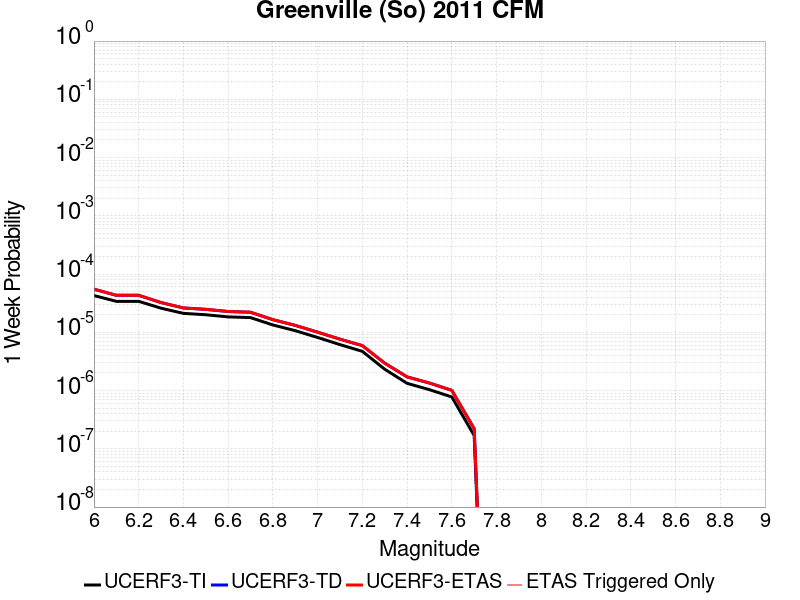 | 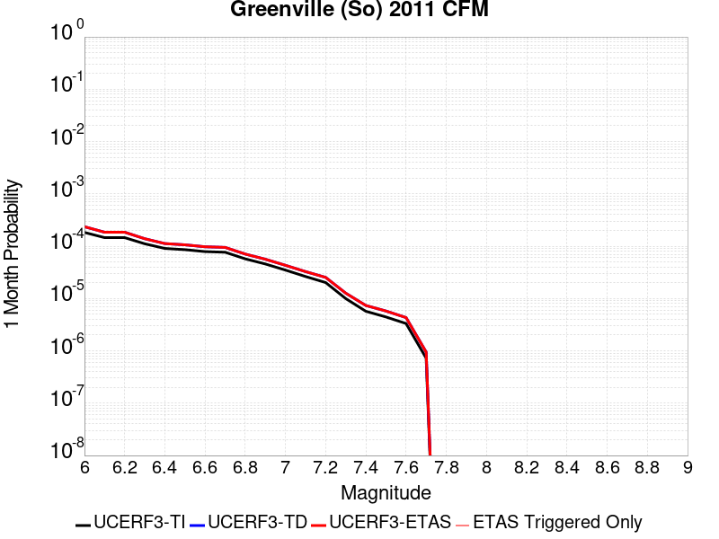 | 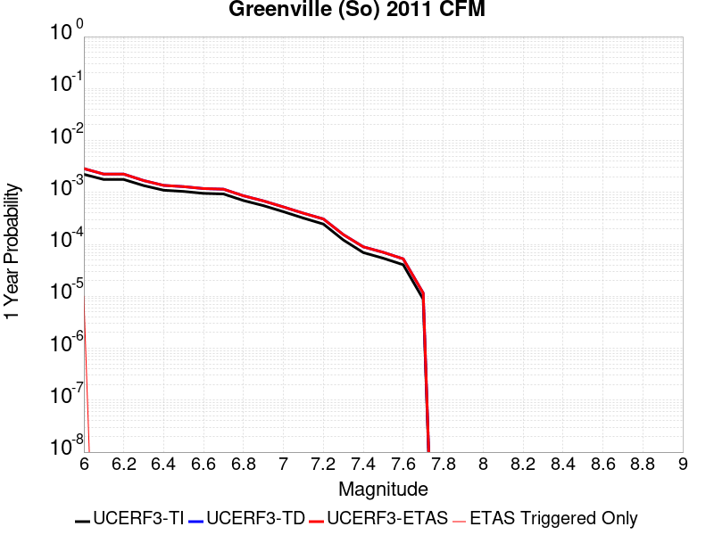 | 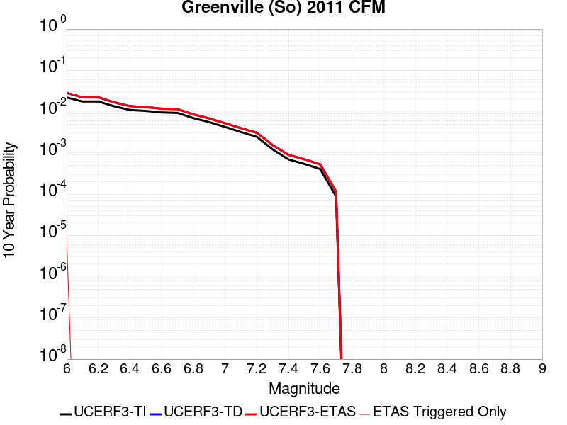 |

| Magnitude | 1 wk TI Prob | 1 wk TD Prob | 1 wk ETAS Prob | 1 wk ETAS/TD Gain | 1 wk ETAS Triggered Only | 1 mo TI Prob | 1 mo TD Prob | 1 mo ETAS Prob | 1 mo ETAS/TD Gain | 1 mo ETAS Triggered Only | 1 yr TI Prob | 1 yr TD Prob | 1 yr ETAS Prob | 1 yr ETAS/TD Gain | 1 yr ETAS Triggered Only | 10 yr TI Prob | 10 yr TD Prob | 10 yr ETAS Prob | 10 yr ETAS/TD Gain | 10 yr ETAS Triggered Only |
|-----|-----|-----|-----|-----|-----|-----|-----|-----|-----|-----|-----|-----|-----|-----|-----|-----|-----|-----|-----|-----|
| 6.0 | 4.279693E-5 | 5.5041746E-5 | 5.5041746E-5 | 1.0 | 0.0 | 1.8340252E-4 | 2.358739E-4 | 2.358739E-4 | 1.0 | 0.0 | 0.0022306389 | 0.0028683243 | 0.0028782955 | 1.0034764 | 1.0E-5 | 0.022083808 | 0.028338935 | 0.028348653 | 1.0003428 | 1.0E-5 |
| 6.1 | 3.4037297E-5 | 4.3193573E-5 | 4.3193573E-5 | 1.0 | 0.0 | 1.4586597E-4 | 1.8510337E-4 | 1.8510337E-4 | 1.0 | 0.0 | 0.0017744715 | 0.002251496 | 0.002251496 | 1.0 | 0.0 | 0.01760369 | 0.022303151 | 0.022303151 | 1.0 | 0.0 |
| 6.2 | 3.4037297E-5 | 4.3193573E-5 | 4.3193573E-5 | 1.0 | 0.0 | 1.4586597E-4 | 1.8510337E-4 | 1.8510337E-4 | 1.0 | 0.0 | 0.0017744715 | 0.002251496 | 0.002251496 | 1.0 | 0.0 | 0.01760369 | 0.022303151 | 0.022303151 | 1.0 | 0.0 |
| 6.3 | 2.5956324E-5 | 3.2429685E-5 | 3.2429685E-5 | 1.0 | 0.0 | 1.11236644E-4 | 1.389774E-4 | 1.389774E-4 | 1.0 | 0.0 | 0.0013534647 | 0.0016908115 | 0.0016908115 | 1.0 | 0.0 | 0.013452509 | 0.01678628 | 0.01678628 | 1.0 | 0.0 |
| 6.4 | 2.1145053E-5 | 2.6198253E-5 | 2.6198253E-5 | 1.0 | 0.0 | 9.061851E-5 | 1.1227358E-4 | 1.1227358E-4 | 1.0 | 0.0 | 0.0011027219 | 0.001366105 | 0.001366105 | 1.0 | 0.0 | 0.01097266 | 0.013580475 | 0.013580475 | 1.0 | 0.0 |
| 6.5 | 2.0030959E-5 | 2.4796314E-5 | 2.4796314E-5 | 1.0 | 0.0 | 8.584414E-5 | 1.0626577E-4 | 1.0626577E-4 | 1.0 | 0.0 | 0.0010446513 | 0.00129305 | 0.00129305 | 1.0 | 0.0 | 0.010397541 | 0.012858613 | 0.012858613 | 1.0 | 0.0 |
| 6.6 | 1.8395405E-5 | 2.2754944E-5 | 2.2754944E-5 | 1.0 | 0.0 | 7.8835066E-5 | 9.7517695E-5 | 9.7517695E-5 | 1.0 | 0.0 | 9.5939427E-4 | 0.0011866597 | 0.0011866597 | 1.0 | 0.0 | 0.009552629 | 0.011806288 | 0.011806288 | 1.0 | 0.0 |
| 6.7 | 1.7883482E-5 | 2.2125972E-5 | 2.2125972E-5 | 1.0 | 0.0 | 7.664124E-5 | 9.48223E-5 | 9.48223E-5 | 1.0 | 0.0 | 9.3270757E-4 | 0.0011538786 | 0.0011538786 | 1.0 | 0.0 | 0.009288026 | 0.011481927 | 0.011481927 | 1.0 | 0.0 |
| 6.8 | 1.3373564E-5 | 1.6506274E-5 | 1.6506274E-5 | 1.0 | 0.0 | 5.7314013E-5 | 7.0739334E-5 | 7.0739334E-5 | 1.0 | 0.0 | 6.975747E-4 | 8.609259E-4 | 8.609259E-4 | 1.0 | 0.0 | 0.0069538904 | 0.008577516 | 0.008577516 | 1.0 | 0.0 |
| 6.9 | 1.06692905E-5 | 1.31527995E-5 | 1.31527995E-5 | 1.0 | 0.0 | 4.5724726E-5 | 5.6367982E-5 | 5.6367982E-5 | 1.0 | 0.0 | 5.5655633E-4 | 6.8607536E-4 | 6.8607536E-4 | 1.0 | 0.0 | 0.005551645 | 0.0068408055 | 0.0068408055 | 1.0 | 0.0 |
| 7.0 | 8.157512E-6 | 1.0062777E-5 | 1.0062777E-5 | 1.0 | 0.0 | 3.4960296E-5 | 4.3125492E-5 | 4.3125492E-5 | 1.0 | 0.0 | 4.2555845E-4 | 5.249301E-4 | 5.249301E-4 | 1.0 | 0.0 | 0.004247444 | 0.0052373786 | 0.0052373786 | 1.0 | 0.0 |
| 7.1 | 6.1467113E-6 | 7.6275114E-6 | 7.6275114E-6 | 1.0 | 0.0 | 2.6342783E-5 | 3.268893E-5 | 3.268893E-5 | 1.0 | 0.0 | 3.206762E-4 | 3.979159E-4 | 3.979159E-4 | 1.0 | 0.0 | 0.0032021382 | 0.003972222 | 0.003972222 | 1.0 | 0.0 |
| 7.2 | 4.713467E-6 | 5.9142094E-6 | 5.9142094E-6 | 1.0 | 0.0 | 2.0200418E-5 | 2.5346368E-5 | 2.5346368E-5 | 1.0 | 0.0 | 2.4591232E-4 | 3.0854894E-4 | 3.0854894E-4 | 1.0 | 0.0 | 0.0024564038 | 0.0030813587 | 0.0030813587 | 1.0 | 0.0 |
| 7.3 | 2.3266216E-6 | 2.9540317E-6 | 2.9540317E-6 | 1.0 | 0.0 | 9.971197E-6 | 1.2660075E-5 | 1.2660075E-5 | 1.0 | 0.0 | 1.2139256E-4 | 1.5412566E-4 | 1.5412566E-4 | 1.0 | 0.0 | 0.0012132627 | 0.0015402571 | 0.0015402571 | 1.0 | 0.0 |
| 7.4 | 1.3314E-6 | 1.7179622E-6 | 1.7179622E-6 | 1.0 | 0.0 | 5.7059874E-6 | 7.3626748E-6 | 7.3626748E-6 | 1.0 | 0.0 | 6.946818E-5 | 8.9636924E-5 | 8.9636924E-5 | 1.0 | 0.0 | 6.9446466E-4 | 8.960465E-4 | 8.960465E-4 | 1.0 | 0.0 |
| 7.5 | 1.0362941E-6 | 1.3468858E-6 | 1.3468858E-6 | 1.0 | 0.0 | 4.4412527E-6 | 5.772355E-6 | 5.772355E-6 | 1.0 | 0.0 | 5.407091E-5 | 7.0276204E-5 | 7.0276204E-5 | 1.0 | 0.0 | 5.405776E-4 | 7.0257E-4 | 7.0257E-4 | 1.0 | 0.0 |
| 7.6 | 7.764784E-7 | 1.0088619E-6 | 1.0088619E-6 | 1.0 | 0.0 | 3.3277602E-6 | 4.323687E-6 | 4.323687E-6 | 1.0 | 0.0 | 4.0514726E-5 | 5.2639658E-5 | 5.2639658E-5 | 1.0 | 0.0 | 4.050734E-4 | 5.262933E-4 | 5.262933E-4 | 1.0 | 0.0 |
| 7.7 | 1.6927763E-7 | 2.2139317E-7 | 2.2139317E-7 | 1.0 | 0.0 | 7.2547533E-7 | 9.488275E-7 | 9.488275E-7 | 1.0 | 0.0 | 8.832627E-6 | 1.1551917E-5 | 1.1551917E-5 | 1.0 | 0.0 | 8.8322755E-5 | 1.1551588E-4 | 1.1551588E-4 | 1.0 | 0.0 |

## San Jacinto (Clark) rev
*[(top)](#table-of-contents)*

| 1 Week | 1 Month | 1 Year | 10 Year |
|-----|-----|-----|-----|
| 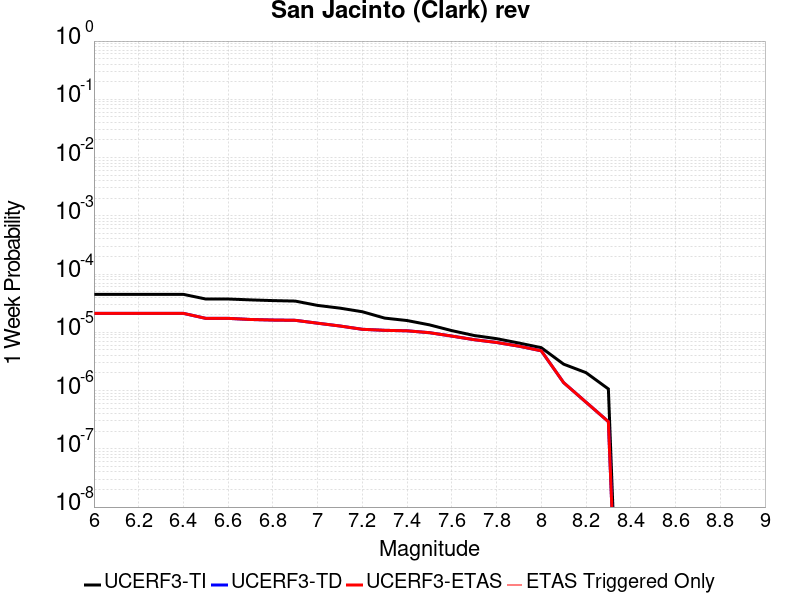 | 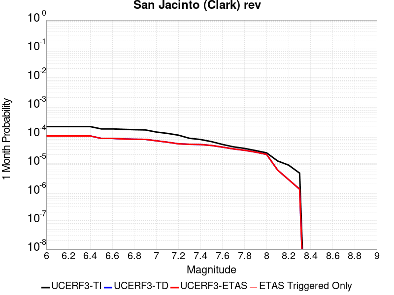 | 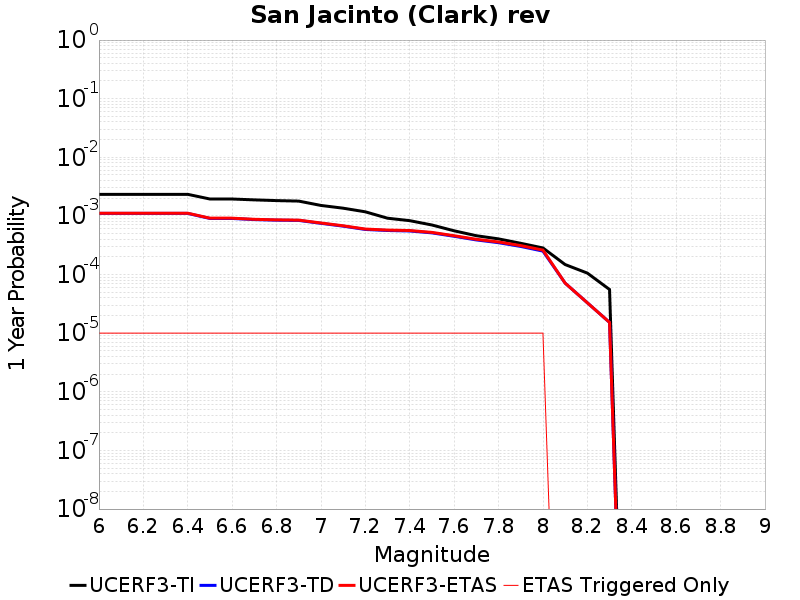 | 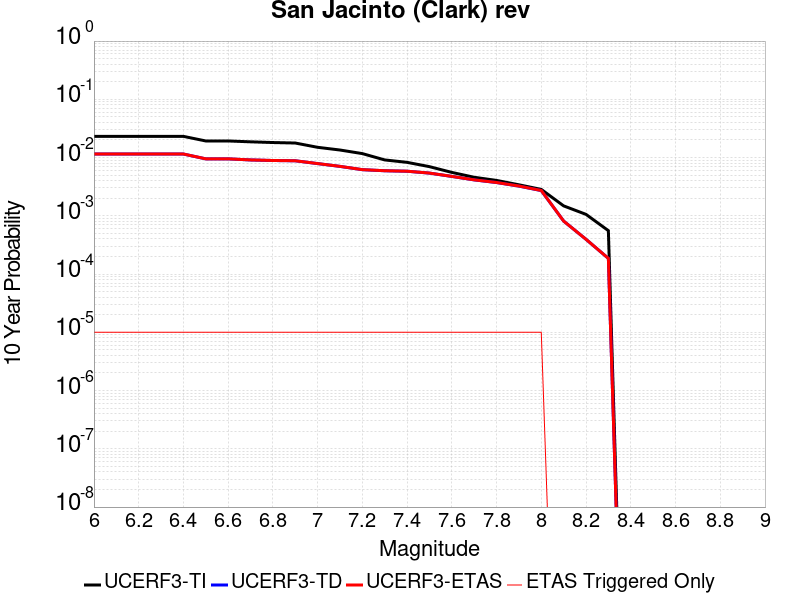 |

| Magnitude | 1 wk TI Prob | 1 wk TD Prob | 1 wk ETAS Prob | 1 wk ETAS/TD Gain | 1 wk ETAS Triggered Only | 1 mo TI Prob | 1 mo TD Prob | 1 mo ETAS Prob | 1 mo ETAS/TD Gain | 1 mo ETAS Triggered Only | 1 yr TI Prob | 1 yr TD Prob | 1 yr ETAS Prob | 1 yr ETAS/TD Gain | 1 yr ETAS Triggered Only | 10 yr TI Prob | 10 yr TD Prob | 10 yr ETAS Prob | 10 yr ETAS/TD Gain | 10 yr ETAS Triggered Only |
|-----|-----|-----|-----|-----|-----|-----|-----|-----|-----|-----|-----|-----|-----|-----|-----|-----|-----|-----|-----|-----|
| 6.0 | 4.482615E-5 | 2.1161366E-5 | 2.1161366E-5 | 1.0 | 0.0 | 1.9209793E-4 | 9.068847E-5 | 9.068847E-5 | 1.0 | 0.0 | 0.0023362834 | 0.0011035821 | 0.001113571 | 1.0090514 | 1.0E-5 | 0.02311874 | 0.011507672 | 0.011517556 | 1.000859 | 1.0E-5 |
| 6.1 | 4.482615E-5 | 2.1161366E-5 | 2.1161366E-5 | 1.0 | 0.0 | 1.9209793E-4 | 9.068847E-5 | 9.068847E-5 | 1.0 | 0.0 | 0.0023362834 | 0.0011035821 | 0.001113571 | 1.0090514 | 1.0E-5 | 0.02311874 | 0.011507672 | 0.011517556 | 1.000859 | 1.0E-5 |
| 6.2 | 4.482615E-5 | 2.1161366E-5 | 2.1161366E-5 | 1.0 | 0.0 | 1.9209793E-4 | 9.068847E-5 | 9.068847E-5 | 1.0 | 0.0 | 0.0023362834 | 0.0011035821 | 0.001113571 | 1.0090514 | 1.0E-5 | 0.02311874 | 0.011507672 | 0.011517556 | 1.000859 | 1.0E-5 |
| 6.3 | 4.482615E-5 | 2.1161366E-5 | 2.1161366E-5 | 1.0 | 0.0 | 1.9209793E-4 | 9.068847E-5 | 9.068847E-5 | 1.0 | 0.0 | 0.0023362834 | 0.0011035821 | 0.001113571 | 1.0090514 | 1.0E-5 | 0.02311874 | 0.011507672 | 0.011517556 | 1.000859 | 1.0E-5 |
| 6.4 | 4.482615E-5 | 2.1161366E-5 | 2.1161366E-5 | 1.0 | 0.0 | 1.9209793E-4 | 9.068847E-5 | 9.068847E-5 | 1.0 | 0.0 | 0.0023362834 | 0.0011035821 | 0.001113571 | 1.0090514 | 1.0E-5 | 0.02311874 | 0.011507672 | 0.011517556 | 1.000859 | 1.0E-5 |
| 6.5 | 3.7294863E-5 | 1.7362474E-5 | 1.7362474E-5 | 1.0 | 0.0 | 1.5982533E-4 | 7.4408505E-5 | 7.4408505E-5 | 1.0 | 0.0 | 0.0019441366 | 9.055515E-4 | 9.155424E-4 | 1.0110329 | 1.0E-5 | 0.01927216 | 0.009497505 | 0.00950741 | 1.001043 | 1.0E-5 |
| 6.6 | 3.7294863E-5 | 1.7362474E-5 | 1.7362474E-5 | 1.0 | 0.0 | 1.5982533E-4 | 7.4408505E-5 | 7.4408505E-5 | 1.0 | 0.0 | 0.0019441366 | 9.055515E-4 | 9.155424E-4 | 1.0110329 | 1.0E-5 | 0.01927216 | 0.009497505 | 0.00950741 | 1.001043 | 1.0E-5 |
| 6.7 | 3.6039248E-5 | 1.6610555E-5 | 1.6610555E-5 | 1.0 | 0.0 | 1.5444479E-4 | 7.118617E-5 | 7.118617E-5 | 1.0 | 0.0 | 0.0018787434 | 8.663511E-4 | 8.7634247E-4 | 1.0115327 | 1.0E-5 | 0.01862939 | 0.009099374 | 0.009109283 | 1.001089 | 1.0E-5 |
| 6.8 | 3.5031844E-5 | 1.623907E-5 | 1.623907E-5 | 1.0 | 0.0 | 1.5012783E-4 | 6.9594185E-5 | 6.9594185E-5 | 1.0 | 0.0 | 0.0018262739 | 8.4698386E-4 | 8.5697544E-4 | 1.0117966 | 1.0E-5 | 0.01811338 | 0.008899242 | 0.008909153 | 1.0011137 | 1.0E-5 |
| 6.9 | 3.435112E-5 | 1.6069265E-5 | 1.6069265E-5 | 1.0 | 0.0 | 1.4721078E-4 | 6.886648E-5 | 6.886648E-5 | 1.0 | 0.0 | 0.0017908178 | 8.3813095E-4 | 8.481226E-4 | 1.0119213 | 1.0E-5 | 0.017764548 | 0.008807417 | 0.008817329 | 1.0011255 | 1.0E-5 |
| 7.0 | 2.8959772E-5 | 1.434224E-5 | 1.434224E-5 | 1.0 | 0.0 | 1.241074E-4 | 6.146531E-5 | 6.146531E-5 | 1.0 | 0.0 | 0.0015099603 | 7.48086E-4 | 7.5807853E-4 | 1.0133574 | 1.0E-5 | 0.014997416 | 0.0078709535 | 0.007880875 | 1.0012605 | 1.0E-5 |
| 7.1 | 2.6002877E-5 | 1.2834008E-5 | 1.2834008E-5 | 1.0 | 0.0 | 1.11436144E-4 | 5.5001743E-5 | 5.5001743E-5 | 1.0 | 0.0 | 0.0013558907 | 6.6944264E-4 | 6.794359E-4 | 1.0149277 | 1.0E-5 | 0.013476475 | 0.00704919 | 0.0070591196 | 1.0014086 | 1.0E-5 |
| 7.2 | 2.2544838E-5 | 1.1267033E-5 | 1.1267033E-5 | 1.0 | 0.0 | 9.661716E-5 | 4.8286398E-5 | 4.8286398E-5 | 1.0 | 0.0 | 0.001175679 | 5.8772974E-4 | 5.977239E-4 | 1.0170046 | 1.0E-5 | 0.011694785 | 0.0061951503 | 0.0062050885 | 1.0016042 | 1.0E-5 |
| 7.3 | 1.75334E-5 | 1.08159065E-5 | 1.08159065E-5 | 1.0 | 0.0 | 7.514098E-5 | 4.6353067E-5 | 4.6353067E-5 | 1.0 | 0.0 | 9.144575E-4 | 5.642039E-4 | 5.741982E-4 | 1.0177141 | 1.0E-5 | 0.009107036 | 0.0059360033 | 0.0059459438 | 1.0016747 | 1.0E-5 |
| 7.4 | 1.5924552E-5 | 1.0615613E-5 | 1.0615613E-5 | 1.0 | 0.0 | 6.82463E-5 | 4.5494697E-5 | 4.5494697E-5 | 1.0 | 0.0 | 8.305819E-4 | 5.537585E-4 | 5.63753E-4 | 1.0180484 | 1.0E-5 | 0.008274844 | 0.005823211 | 0.0058331527 | 1.0017073 | 1.0E-5 |
| 7.5 | 1.3428931E-5 | 9.8557975E-6 | 9.8557975E-6 | 1.0 | 0.0 | 5.7551293E-5 | 4.2238455E-5 | 4.2238455E-5 | 1.0 | 0.0 | 7.004617E-4 | 5.141329E-4 | 5.241278E-4 | 1.0194402 | 1.0E-5 | 0.006982579 | 0.005408674 | 0.00541862 | 1.0018389 | 1.0E-5 |
| 7.6 | 1.0688787E-5 | 8.618522E-6 | 8.618522E-6 | 1.0 | 0.0 | 4.5808283E-5 | 3.6936002E-5 | 3.6936002E-5 | 1.0 | 0.0 | 5.5757316E-4 | 4.4960348E-4 | 4.59599E-4 | 1.0222318 | 1.0E-5 | 0.005561762 | 0.0047436114 | 0.004753564 | 1.0020981 | 1.0E-5 |
| 7.7 | 8.81236E-6 | 7.471583E-6 | 7.471583E-6 | 1.0 | 0.0 | 3.776671E-5 | 3.202068E-5 | 3.202068E-5 | 1.0 | 0.0 | 4.597127E-4 | 3.8978222E-4 | 3.997783E-4 | 1.0256454 | 1.0E-5 | 0.0045876284 | 0.0041365474 | 0.004146506 | 1.0024074 | 1.0E-5 |
| 7.8 | 7.780431E-6 | 6.6999332E-6 | 6.6999332E-6 | 1.0 | 0.0 | 3.3344273E-5 | 2.8713685E-5 | 2.8713685E-5 | 1.0 | 0.0 | 4.0589093E-4 | 3.495332E-4 | 3.5952972E-4 | 1.0285996 | 1.0E-5 | 0.0040515037 | 0.0037245797 | 0.0037345423 | 1.0026748 | 1.0E-5 |
| 7.9 | 6.5437994E-6 | 5.7835073E-6 | 5.7835073E-6 | 1.0 | 0.0 | 2.8044553E-5 | 2.4786226E-5 | 2.4786226E-5 | 1.0 | 0.0 | 3.4138895E-4 | 3.0173067E-4 | 3.1172766E-4 | 1.0331322 | 1.0E-5 | 0.0034086495 | 0.0032361548 | 0.0032461225 | 1.0030801 | 1.0E-5 |
| 8.0 | 5.4488164E-6 | 4.8161096E-6 | 4.8161096E-6 | 1.0 | 0.0 | 2.3351862E-5 | 2.0640307E-5 | 2.0640307E-5 | 1.0 | 0.0 | 2.8427184E-4 | 2.5126693E-4 | 2.6126442E-4 | 1.0397884 | 1.0E-5 | 0.0028390845 | 0.0027123229 | 0.002722296 | 1.0036769 | 1.0E-5 |
| 8.1 | 2.8397242E-6 | 1.3681265E-6 | 1.3681265E-6 | 1.0 | 0.0 | 1.217019E-5 | 5.863386E-6 | 5.863386E-6 | 1.0 | 0.0 | 1.4816198E-4 | 7.13844E-5 | 7.13844E-5 | 1.0 | 0.0 | 0.0014806325 | 8.1215124E-4 | 8.1215124E-4 | 1.0 | 0.0 |
| 8.2 | 2.030244E-6 | 6.3254015E-7 | 6.3254015E-7 | 1.0 | 0.0 | 8.701017E-6 | 2.7108836E-6 | 2.7108836E-6 | 1.0 | 0.0 | 1.05929736E-4 | 3.300451E-5 | 3.300451E-5 | 1.0 | 0.0 | 0.0010587925 | 3.9524096E-4 | 3.9524096E-4 | 1.0 | 0.0 |
| 8.3 | 1.0659804E-6 | 2.928153E-7 | 2.928153E-7 | 1.0 | 0.0 | 4.568479E-6 | 1.254922E-6 | 1.254922E-6 | 1.0 | 0.0 | 5.5619817E-5 | 1.5278572E-5 | 1.5278572E-5 | 1.0 | 0.0 | 5.5605895E-4 | 1.8584782E-4 | 1.8584782E-4 | 1.0 | 0.0 |

## San Luis Range 2011 CFM
*[(top)](#table-of-contents)*

| 1 Week | 1 Month | 1 Year | 10 Year |
|-----|-----|-----|-----|
| 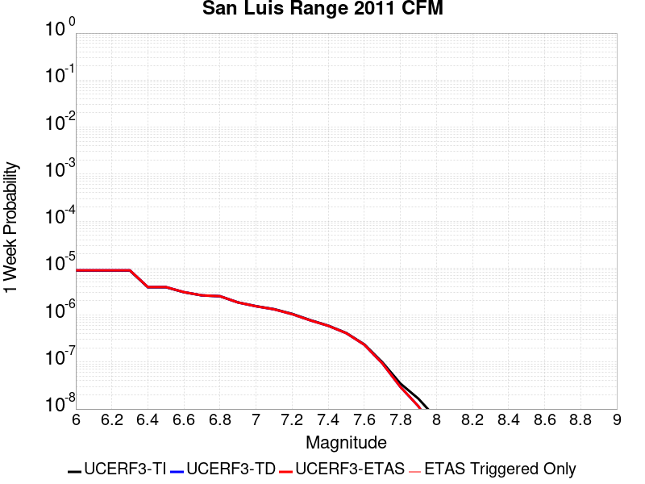 | 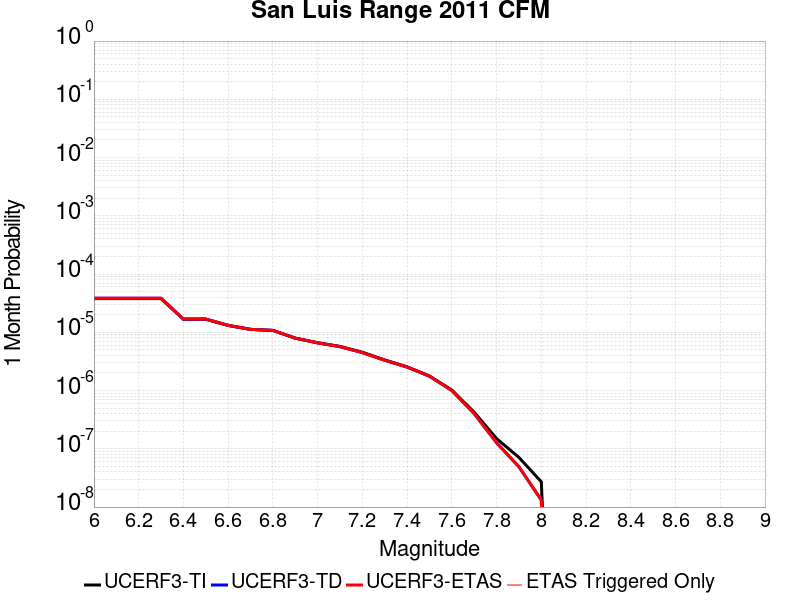 | 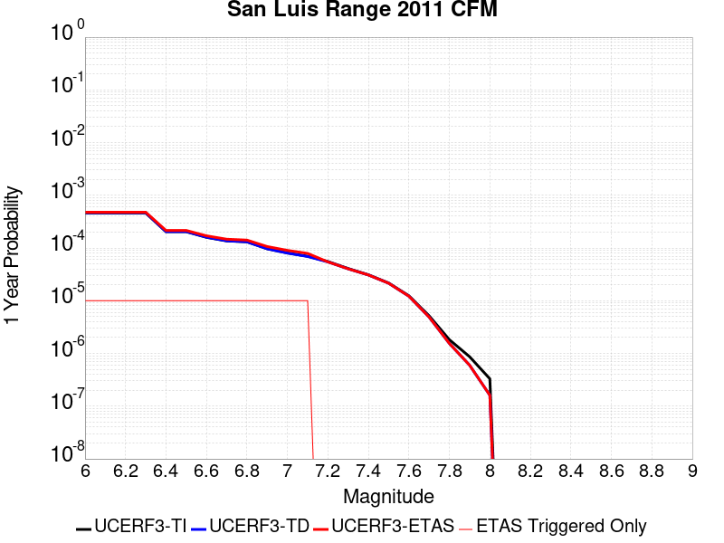 | 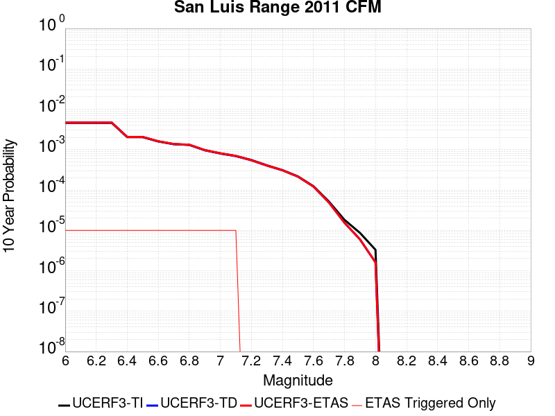 |

| Magnitude | 1 wk TI Prob | 1 wk TD Prob | 1 wk ETAS Prob | 1 wk ETAS/TD Gain | 1 wk ETAS Triggered Only | 1 mo TI Prob | 1 mo TD Prob | 1 mo ETAS Prob | 1 mo ETAS/TD Gain | 1 mo ETAS Triggered Only | 1 yr TI Prob | 1 yr TD Prob | 1 yr ETAS Prob | 1 yr ETAS/TD Gain | 1 yr ETAS Triggered Only | 10 yr TI Prob | 10 yr TD Prob | 10 yr ETAS Prob | 10 yr ETAS/TD Gain | 10 yr ETAS Triggered Only |
|-----|-----|-----|-----|-----|-----|-----|-----|-----|-----|-----|-----|-----|-----|-----|-----|-----|-----|-----|-----|-----|
| 6.0 | 8.8368415E-6 | 8.965473E-6 | 8.965473E-6 | 1.0 | 0.0 | 3.787163E-5 | 3.8422935E-5 | 3.8422935E-5 | 1.0 | 0.0 | 4.609895E-4 | 4.6770673E-4 | 4.7770204E-4 | 1.0213709 | 1.0E-5 | 0.0046003438 | 0.0046680067 | 0.0046779597 | 1.0021323 | 1.0E-5 |
| 6.1 | 8.8368415E-6 | 8.965473E-6 | 8.965473E-6 | 1.0 | 0.0 | 3.787163E-5 | 3.8422935E-5 | 3.8422935E-5 | 1.0 | 0.0 | 4.609895E-4 | 4.6770673E-4 | 4.7770204E-4 | 1.0213709 | 1.0E-5 | 0.0046003438 | 0.0046680067 | 0.0046779597 | 1.0021323 | 1.0E-5 |
| 6.2 | 8.8368415E-6 | 8.965473E-6 | 8.965473E-6 | 1.0 | 0.0 | 3.787163E-5 | 3.8422935E-5 | 3.8422935E-5 | 1.0 | 0.0 | 4.609895E-4 | 4.6770673E-4 | 4.7770204E-4 | 1.0213709 | 1.0E-5 | 0.0046003438 | 0.0046680067 | 0.0046779597 | 1.0021323 | 1.0E-5 |
| 6.3 | 8.8368415E-6 | 8.965473E-6 | 8.965473E-6 | 1.0 | 0.0 | 3.787163E-5 | 3.8422935E-5 | 3.8422935E-5 | 1.0 | 0.0 | 4.609895E-4 | 4.6770673E-4 | 4.7770204E-4 | 1.0213709 | 1.0E-5 | 0.0046003438 | 0.0046680067 | 0.0046779597 | 1.0021323 | 1.0E-5 |
| 6.4 | 3.9094193E-6 | 3.9412116E-6 | 3.9412116E-6 | 1.0 | 0.0 | 1.6754546E-5 | 1.6890799E-5 | 1.6890799E-5 | 1.0 | 0.0 | 2.039675E-4 | 2.0562635E-4 | 2.156243E-4 | 1.0486219 | 1.0E-5 | 0.0020378039 | 0.0020543896 | 0.0020643692 | 1.0048577 | 1.0E-5 |
| 6.5 | 3.9094193E-6 | 3.9412116E-6 | 3.9412116E-6 | 1.0 | 0.0 | 1.6754546E-5 | 1.6890799E-5 | 1.6890799E-5 | 1.0 | 0.0 | 2.039675E-4 | 2.0562635E-4 | 2.156243E-4 | 1.0486219 | 1.0E-5 | 0.0020378039 | 0.0020543896 | 0.0020643692 | 1.0048577 | 1.0E-5 |
| 6.6 | 3.0587726E-6 | 3.0753954E-6 | 3.0753954E-6 | 1.0 | 0.0 | 1.3108959E-5 | 1.31802E-5 | 1.31802E-5 | 1.0 | 0.0 | 1.595899E-4 | 1.6045723E-4 | 1.7045563E-4 | 1.0623119 | 1.0E-5 | 0.0015947534 | 0.0016034257 | 0.0016134097 | 1.0062267 | 1.0E-5 |
| 6.7 | 2.6160574E-6 | 2.6251334E-6 | 2.6251334E-6 | 1.0 | 0.0 | 1.1211626E-5 | 1.1250524E-5 | 1.1250524E-5 | 1.0 | 0.0 | 1.3649299E-4 | 1.3696658E-4 | 1.469652E-4 | 1.0730006 | 1.0E-5 | 0.0013640919 | 0.0013688278 | 0.0013788141 | 1.0072955 | 1.0E-5 |
| 6.8 | 2.5110312E-6 | 2.5181462E-6 | 2.5181462E-6 | 1.0 | 0.0 | 1.0761518E-5 | 1.07920105E-5 | 1.07920105E-5 | 1.0 | 0.0 | 1.310136E-4 | 1.3138486E-4 | 1.4138354E-4 | 1.0761023 | 1.0E-5 | 0.0013093639 | 0.0013130778 | 0.0013230647 | 1.0076057 | 1.0E-5 |
| 6.9 | 1.8564405E-6 | 1.8524917E-6 | 1.8524917E-6 | 1.0 | 0.0 | 7.95615E-6 | 7.939226E-6 | 7.939226E-6 | 1.0 | 0.0 | 9.686181E-5 | 9.665581E-5 | 1.0665484E-4 | 1.10345 | 1.0E-5 | 9.68196E-4 | 9.661397E-4 | 9.761301E-4 | 1.0103405 | 1.0E-5 |
| 7.0 | 1.546127E-6 | 1.5369578E-6 | 1.5369578E-6 | 1.0 | 0.0 | 6.626242E-6 | 6.586946E-6 | 6.586946E-6 | 1.0 | 0.0 | 8.06715E-5 | 8.019312E-5 | 9.019232E-5 | 1.124689 | 1.0E-5 | 8.0642226E-4 | 8.0164254E-4 | 8.116345E-4 | 1.0124644 | 1.0E-5 |
| 7.1 | 1.3368208E-6 | 1.3235363E-6 | 1.3235363E-6 | 1.0 | 0.0 | 5.7292195E-6 | 5.672286E-6 | 5.672286E-6 | 1.0 | 0.0 | 6.975101E-5 | 6.9057896E-5 | 7.905721E-5 | 1.144796 | 1.0E-5 | 6.972912E-4 | 6.9036486E-4 | 7.0035795E-4 | 1.0144751 | 1.0E-5 |
| 7.2 | 1.0623363E-6 | 1.0454398E-6 | 1.0454398E-6 | 1.0 | 0.0 | 4.5528623E-6 | 4.4804483E-6 | 4.4804483E-6 | 1.0 | 0.0 | 5.5429686E-5 | 5.4548098E-5 | 5.4548098E-5 | 1.0 | 0.0 | 5.5415864E-4 | 5.4534734E-4 | 5.4534734E-4 | 1.0 | 0.0 |
| 7.3 | 7.831679E-7 | 7.727415E-7 | 7.727415E-7 | 1.0 | 0.0 | 3.3564295E-6 | 3.3117449E-6 | 3.3117449E-6 | 1.0 | 0.0 | 4.086376E-5 | 4.031975E-5 | 4.031975E-5 | 1.0 | 0.0 | 4.0856248E-4 | 4.031245E-4 | 4.031245E-4 | 1.0 | 0.0 |
| 7.4 | 5.9558846E-7 | 5.9106566E-7 | 5.9106566E-7 | 1.0 | 0.0 | 2.5525194E-6 | 2.533136E-6 | 2.533136E-6 | 1.0 | 0.0 | 3.107648E-5 | 3.0840496E-5 | 3.0840496E-5 | 1.0 | 0.0 | 3.1072134E-4 | 3.0836224E-4 | 3.0836224E-4 | 1.0 | 0.0 |
| 7.5 | 4.1616502E-7 | 4.1196475E-7 | 4.1196475E-7 | 1.0 | 0.0 | 1.7835631E-6 | 1.7655619E-6 | 1.7655619E-6 | 1.0 | 0.0 | 2.1714664E-5 | 2.1495505E-5 | 2.1495505E-5 | 1.0 | 0.0 | 2.1712543E-4 | 2.1493432E-4 | 2.1493432E-4 | 1.0 | 0.0 |
| 7.6 | 2.3816014E-7 | 2.3376673E-7 | 2.3376673E-7 | 1.0 | 0.0 | 1.0206859E-6 | 1.001857E-6 | 1.001857E-6 | 1.0 | 0.0 | 1.242678E-5 | 1.2197541E-5 | 1.2197541E-5 | 1.0 | 0.0 | 1.2426086E-4 | 1.2196873E-4 | 1.2196873E-4 | 1.0 | 0.0 |
| 7.7 | 9.918777E-8 | 9.386852E-8 | 9.386852E-8 | 1.0 | 0.0 | 4.2509038E-7 | 4.0229358E-7 | 4.0229358E-7 | 1.0 | 0.0 | 5.1754632E-6 | 4.897913E-6 | 4.897913E-6 | 1.0 | 0.0 | 5.1753424E-5 | 4.8978058E-5 | 4.8978058E-5 | 1.0 | 0.0 |
| 7.8 | 3.4982556E-8 | 2.9687312E-8 | 2.9687312E-8 | 1.0 | 0.0 | 1.4992524E-7 | 1.2723133E-7 | 1.2723133E-7 | 1.0 | 0.0 | 1.8253382E-6 | 1.5490403E-6 | 1.5490403E-6 | 1.0 | 0.0 | 1.8253233E-5 | 1.5490295E-5 | 1.5490295E-5 | 1.0 | 0.0 |
| 7.9 | 1.6624908E-8 | 1.1477729E-8 | 1.1477729E-8 | 1.0 | 0.0 | 7.12496E-8 | 4.9190266E-8 | 4.9190266E-8 | 1.0 | 0.0 | 8.6746354E-7 | 5.9889135E-7 | 5.9889135E-7 | 1.0 | 0.0 | 8.674601E-6 | 5.9888976E-6 | 5.9888976E-6 | 1.0 | 0.0 |
| 8.0 | 6.3352315E-9 | 3.0892693E-9 | 3.0892693E-9 | 1.0 | 0.0 | 2.715099E-8 | 1.3239724E-8 | 1.3239724E-8 | 1.0 | 0.0 | 3.3056327E-7 | 1.6119363E-7 | 1.6119363E-7 | 1.0 | 0.0 | 3.3056278E-6 | 1.6119351E-6 | 1.6119351E-6 | 1.0 | 0.0 |

## Hat Creek-McArthur-Mayfield
*[(top)](#table-of-contents)*

| 1 Week | 1 Month | 1 Year | 10 Year |
|-----|-----|-----|-----|
| 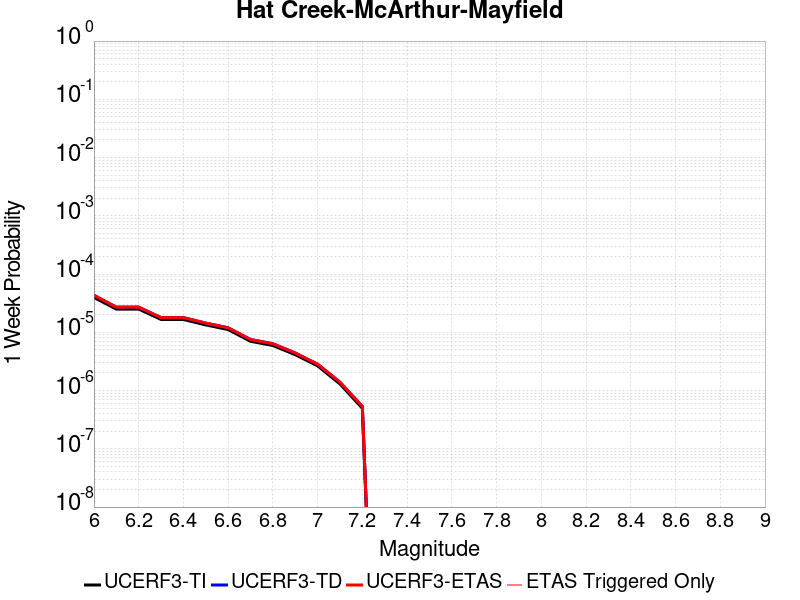 | 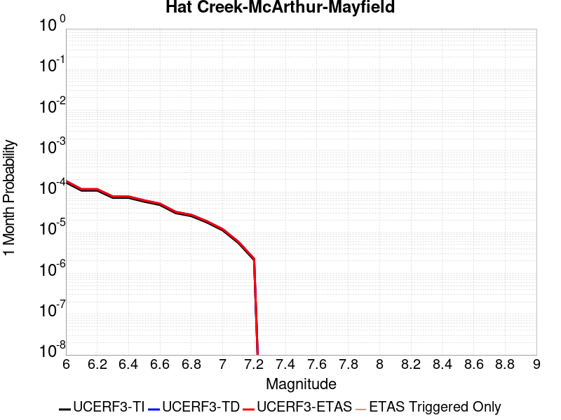 | 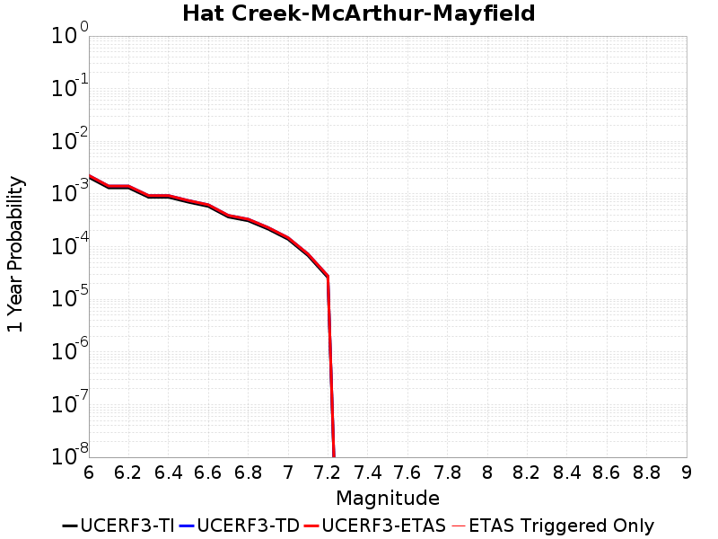 | 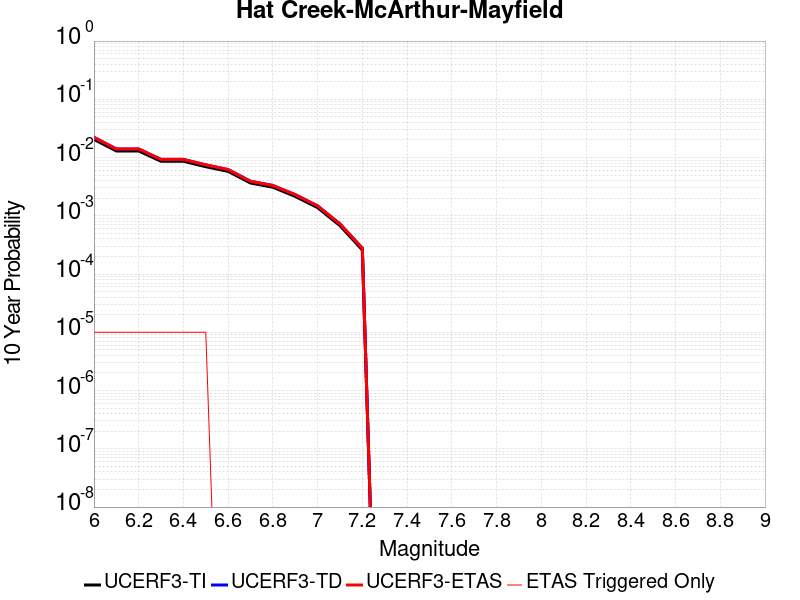 |

| Magnitude | 1 wk TI Prob | 1 wk TD Prob | 1 wk ETAS Prob | 1 wk ETAS/TD Gain | 1 wk ETAS Triggered Only | 1 mo TI Prob | 1 mo TD Prob | 1 mo ETAS Prob | 1 mo ETAS/TD Gain | 1 mo ETAS Triggered Only | 1 yr TI Prob | 1 yr TD Prob | 1 yr ETAS Prob | 1 yr ETAS/TD Gain | 1 yr ETAS Triggered Only | 10 yr TI Prob | 10 yr TD Prob | 10 yr ETAS Prob | 10 yr ETAS/TD Gain | 10 yr ETAS Triggered Only |
|-----|-----|-----|-----|-----|-----|-----|-----|-----|-----|-----|-----|-----|-----|-----|-----|-----|-----|-----|-----|-----|
| 6.0 | 3.967457E-5 | 4.3158736E-5 | 4.3158736E-5 | 1.0 | 0.0 | 1.7002279E-4 | 1.8495355E-4 | 1.8495355E-4 | 1.0 | 0.0 | 0.002068062 | 0.002249598 | 0.002249598 | 1.0 | 0.0 | 0.02048922 | 0.022280615 | 0.022290394 | 1.0004388 | 1.0E-5 |
| 6.1 | 2.5044013E-5 | 2.707141E-5 | 2.707141E-5 | 1.0 | 0.0 | 1.0732707E-4 | 1.1601535E-4 | 1.1601535E-4 | 1.0 | 0.0 | 0.0013059238 | 0.0014116034 | 0.0014116034 | 1.0 | 0.0 | 0.01298276 | 0.014029787 | 0.014039647 | 1.0007027 | 1.0E-5 |
| 6.2 | 2.5044013E-5 | 2.707141E-5 | 2.707141E-5 | 1.0 | 0.0 | 1.0732707E-4 | 1.1601535E-4 | 1.1601535E-4 | 1.0 | 0.0 | 0.0013059238 | 0.0014116034 | 0.0014116034 | 1.0 | 0.0 | 0.01298276 | 0.014029787 | 0.014039647 | 1.0007027 | 1.0E-5 |
| 6.3 | 1.6624012E-5 | 1.7891225E-5 | 1.7891225E-5 | 1.0 | 0.0 | 7.124382E-5 | 7.667447E-5 | 7.667447E-5 | 1.0 | 0.0 | 8.670483E-4 | 9.331205E-4 | 9.331205E-4 | 1.0 | 0.0 | 0.008636732 | 0.009292958 | 0.009302866 | 1.0010661 | 1.0E-5 |
| 6.4 | 1.6624012E-5 | 1.7891225E-5 | 1.7891225E-5 | 1.0 | 0.0 | 7.124382E-5 | 7.667447E-5 | 7.667447E-5 | 1.0 | 0.0 | 8.670483E-4 | 9.331205E-4 | 9.331205E-4 | 1.0 | 0.0 | 0.008636732 | 0.009292958 | 0.009302866 | 1.0010661 | 1.0E-5 |
| 6.5 | 1.3394842E-5 | 1.4392257E-5 | 1.4392257E-5 | 1.0 | 0.0 | 5.7405203E-5 | 6.1679675E-5 | 6.1679675E-5 | 1.0 | 0.0 | 6.986842E-4 | 7.5069687E-4 | 7.5069687E-4 | 1.0 | 0.0 | 0.006964916 | 0.0074822027 | 0.007492128 | 1.0013266 | 1.0E-5 |
| 6.6 | 1.1137514E-5 | 1.1954644E-5 | 1.1954644E-5 | 1.0 | 0.0 | 4.7731326E-5 | 5.1233204E-5 | 5.1233204E-5 | 1.0 | 0.0 | 5.809739E-4 | 6.235898E-4 | 6.235898E-4 | 1.0 | 0.0 | 0.005794574 | 0.0062188213 | 0.0062188213 | 1.0 | 0.0 |
| 6.7 | 7.0200663E-6 | 7.52435E-6 | 7.52435E-6 | 1.0 | 0.0 | 3.008565E-5 | 3.2246826E-5 | 3.2246826E-5 | 1.0 | 0.0 | 3.6623122E-4 | 3.9253596E-4 | 3.9253596E-4 | 1.0 | 0.0 | 0.0036562826 | 0.0039185886 | 0.0039185886 | 1.0 | 0.0 |
| 6.8 | 5.940172E-6 | 6.3655275E-6 | 6.3655275E-6 | 1.0 | 0.0 | 2.545763E-5 | 2.7280554E-5 | 2.7280554E-5 | 1.0 | 0.0 | 3.0990256E-4 | 3.320914E-4 | 3.320914E-4 | 1.0 | 0.0 | 0.0030947074 | 0.00331608 | 0.00331608 | 1.0 | 0.0 |
| 6.9 | 4.129831E-6 | 4.4235826E-6 | 4.4235826E-6 | 1.0 | 0.0 | 1.7699154E-5 | 1.8958077E-5 | 1.8958077E-5 | 1.0 | 0.0 | 2.154659E-4 | 2.3079092E-4 | 2.3079092E-4 | 1.0 | 0.0 | 0.002152571 | 0.0023055908 | 0.0023055908 | 1.0 | 0.0 |
| 7.0 | 2.6512955E-6 | 2.8374225E-6 | 2.8374225E-6 | 1.0 | 0.0 | 1.1362646E-5 | 1.2160327E-5 | 1.2160327E-5 | 1.0 | 0.0 | 1.3833142E-4 | 1.4804235E-4 | 1.4804235E-4 | 1.0 | 0.0 | 0.0013824535 | 0.00147948 | 0.00147948 | 1.0 | 0.0 |
| 7.1 | 1.2992575E-6 | 1.3909428E-6 | 1.3909428E-6 | 1.0 | 0.0 | 5.568235E-6 | 5.9611707E-6 | 5.9611707E-6 | 1.0 | 0.0 | 6.779115E-5 | 7.257506E-5 | 7.257506E-5 | 1.0 | 0.0 | 6.7770475E-4 | 7.2553515E-4 | 7.2553515E-4 | 1.0 | 0.0 |
| 7.2 | 4.968191E-7 | 5.3271907E-7 | 5.3271907E-7 | 1.0 | 0.0 | 2.1292228E-6 | 2.2830804E-6 | 2.2830804E-6 | 1.0 | 0.0 | 2.592298E-5 | 2.7796277E-5 | 2.7796277E-5 | 1.0 | 0.0 | 2.5919956E-4 | 2.7794036E-4 | 2.7794036E-4 | 1.0 | 0.0 |

## San Gorgonio Pass
*[(top)](#table-of-contents)*

| 1 Week | 1 Month | 1 Year | 10 Year |
|-----|-----|-----|-----|
| 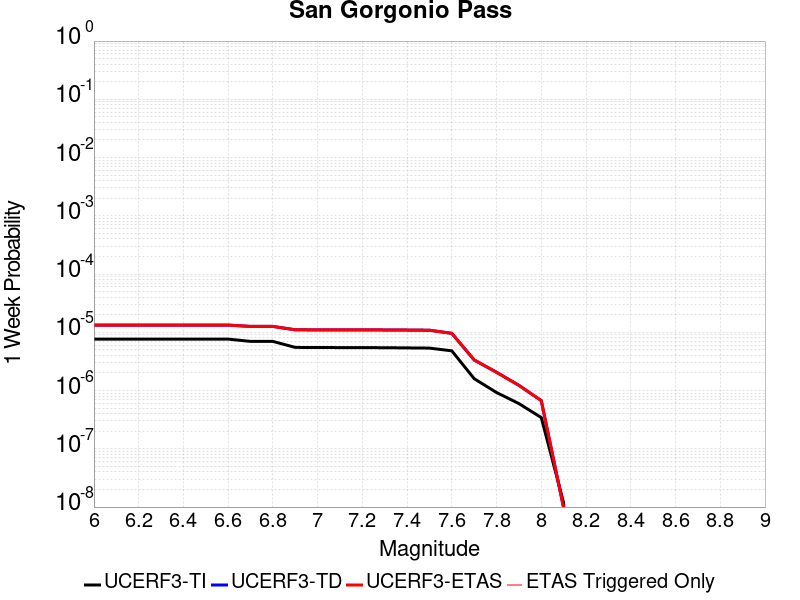 | 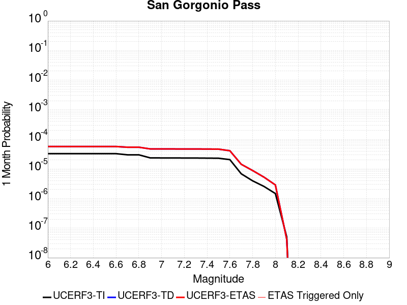 | 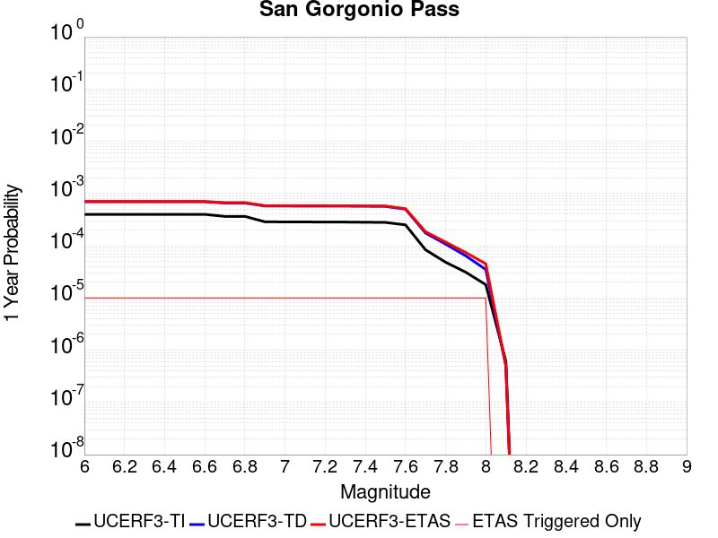 | 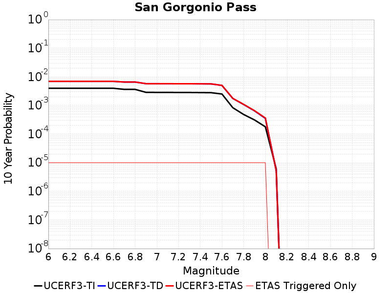 |

| Magnitude | 1 wk TI Prob | 1 wk TD Prob | 1 wk ETAS Prob | 1 wk ETAS/TD Gain | 1 wk ETAS Triggered Only | 1 mo TI Prob | 1 mo TD Prob | 1 mo ETAS Prob | 1 mo ETAS/TD Gain | 1 mo ETAS Triggered Only | 1 yr TI Prob | 1 yr TD Prob | 1 yr ETAS Prob | 1 yr ETAS/TD Gain | 1 yr ETAS Triggered Only | 10 yr TI Prob | 10 yr TD Prob | 10 yr ETAS Prob | 10 yr ETAS/TD Gain | 10 yr ETAS Triggered Only |
|-----|-----|-----|-----|-----|-----|-----|-----|-----|-----|-----|-----|-----|-----|-----|-----|-----|-----|-----|-----|-----|
| 6.0 | 7.644328E-6 | 1.3315975E-5 | 1.3315975E-5 | 1.0 | 0.0 | 3.2760996E-5 | 5.706726E-5 | 5.706726E-5 | 1.0 | 0.0 | 3.987921E-4 | 6.94581E-4 | 7.0457405E-4 | 1.0143871 | 1.0E-5 | 0.003980772 | 0.006930879 | 0.0069408095 | 1.0014328 | 1.0E-5 |
| 6.1 | 7.644328E-6 | 1.3315975E-5 | 1.3315975E-5 | 1.0 | 0.0 | 3.2760996E-5 | 5.706726E-5 | 5.706726E-5 | 1.0 | 0.0 | 3.987921E-4 | 6.94581E-4 | 7.0457405E-4 | 1.0143871 | 1.0E-5 | 0.003980772 | 0.006930879 | 0.0069408095 | 1.0014328 | 1.0E-5 |
| 6.2 | 7.644328E-6 | 1.3315975E-5 | 1.3315975E-5 | 1.0 | 0.0 | 3.2760996E-5 | 5.706726E-5 | 5.706726E-5 | 1.0 | 0.0 | 3.987921E-4 | 6.94581E-4 | 7.0457405E-4 | 1.0143871 | 1.0E-5 | 0.003980772 | 0.006930879 | 0.0069408095 | 1.0014328 | 1.0E-5 |
| 6.3 | 7.644328E-6 | 1.3315975E-5 | 1.3315975E-5 | 1.0 | 0.0 | 3.2760996E-5 | 5.706726E-5 | 5.706726E-5 | 1.0 | 0.0 | 3.987921E-4 | 6.94581E-4 | 7.0457405E-4 | 1.0143871 | 1.0E-5 | 0.003980772 | 0.006930879 | 0.0069408095 | 1.0014328 | 1.0E-5 |
| 6.4 | 7.644328E-6 | 1.3315975E-5 | 1.3315975E-5 | 1.0 | 0.0 | 3.2760996E-5 | 5.706726E-5 | 5.706726E-5 | 1.0 | 0.0 | 3.987921E-4 | 6.94581E-4 | 7.0457405E-4 | 1.0143871 | 1.0E-5 | 0.003980772 | 0.006930879 | 0.0069408095 | 1.0014328 | 1.0E-5 |
| 6.5 | 7.644328E-6 | 1.3315975E-5 | 1.3315975E-5 | 1.0 | 0.0 | 3.2760996E-5 | 5.706726E-5 | 5.706726E-5 | 1.0 | 0.0 | 3.987921E-4 | 6.94581E-4 | 7.0457405E-4 | 1.0143871 | 1.0E-5 | 0.003980772 | 0.006930879 | 0.0069408095 | 1.0014328 | 1.0E-5 |
| 6.6 | 7.644328E-6 | 1.3315975E-5 | 1.3315975E-5 | 1.0 | 0.0 | 3.2760996E-5 | 5.706726E-5 | 5.706726E-5 | 1.0 | 0.0 | 3.987921E-4 | 6.94581E-4 | 7.0457405E-4 | 1.0143871 | 1.0E-5 | 0.003980772 | 0.006930879 | 0.0069408095 | 1.0014328 | 1.0E-5 |
| 6.7 | 6.987586E-6 | 1.2620244E-5 | 1.2620244E-5 | 1.0 | 0.0 | 2.9946454E-5 | 5.408568E-5 | 5.408568E-5 | 1.0 | 0.0 | 3.645371E-4 | 6.5830234E-4 | 6.682958E-4 | 1.0151806 | 1.0E-5 | 0.0036393967 | 0.006570253 | 0.0065801875 | 1.001512 | 1.0E-5 |
| 6.8 | 6.987586E-6 | 1.2620244E-5 | 1.2620244E-5 | 1.0 | 0.0 | 2.9946454E-5 | 5.408568E-5 | 5.408568E-5 | 1.0 | 0.0 | 3.645371E-4 | 6.5830234E-4 | 6.682958E-4 | 1.0151806 | 1.0E-5 | 0.0036393967 | 0.006570253 | 0.0065801875 | 1.001512 | 1.0E-5 |
| 6.9 | 5.504702E-6 | 1.1051097E-5 | 1.1051097E-5 | 1.0 | 0.0 | 2.3591367E-5 | 4.7361013E-5 | 4.7361013E-5 | 1.0 | 0.0 | 2.8718702E-4 | 5.7647284E-4 | 5.8646704E-4 | 1.0173368 | 1.0E-5 | 0.0028681618 | 0.0057562008 | 0.005766143 | 1.0017272 | 1.0E-5 |
| 7.0 | 5.4825764E-6 | 1.1027438E-5 | 1.1027438E-5 | 1.0 | 0.0 | 2.3496545E-5 | 4.725962E-5 | 4.725962E-5 | 1.0 | 0.0 | 2.8603288E-4 | 5.75239E-4 | 5.8523327E-4 | 1.017374 | 1.0E-5 | 0.00285665 | 0.0057439264 | 0.005753869 | 1.0017309 | 1.0E-5 |
| 7.1 | 5.4692787E-6 | 1.1013148E-5 | 1.1013148E-5 | 1.0 | 0.0 | 2.3439556E-5 | 4.7198377E-5 | 4.7198377E-5 | 1.0 | 0.0 | 2.8533922E-4 | 5.744938E-4 | 5.8448804E-4 | 1.0173966 | 1.0E-5 | 0.0028497311 | 0.005736513 | 0.0057464554 | 1.0017332 | 1.0E-5 |
| 7.2 | 5.453661E-6 | 1.0996174E-5 | 1.0996174E-5 | 1.0 | 0.0 | 2.3372622E-5 | 4.7125635E-5 | 4.7125635E-5 | 1.0 | 0.0 | 2.8452452E-4 | 5.736086E-4 | 5.8360293E-4 | 1.0174235 | 1.0E-5 | 0.002841605 | 0.005727707 | 0.0057376497 | 1.0017359 | 1.0E-5 |
| 7.3 | 5.4422303E-6 | 1.0983096E-5 | 1.0983096E-5 | 1.0 | 0.0 | 2.3323635E-5 | 4.7069592E-5 | 4.7069592E-5 | 1.0 | 0.0 | 2.8392827E-4 | 5.7292666E-4 | 5.8292097E-4 | 1.0174443 | 1.0E-5 | 0.0028356577 | 0.0057209227 | 0.0057308655 | 1.001738 | 1.0E-5 |
| 7.4 | 5.398595E-6 | 1.0930461E-5 | 1.0930461E-5 | 1.0 | 0.0 | 2.313663E-5 | 4.684402E-5 | 4.684402E-5 | 1.0 | 0.0 | 2.8165206E-4 | 5.7018176E-4 | 5.80176E-4 | 1.0175283 | 1.0E-5 | 0.0028129534 | 0.0056936145 | 0.0057035573 | 1.0017463 | 1.0E-5 |
| 7.5 | 5.3578788E-6 | 1.0857004E-5 | 1.0857004E-5 | 1.0 | 0.0 | 2.2962136E-5 | 4.6529218E-5 | 4.6529218E-5 | 1.0 | 0.0 | 2.7952815E-4 | 5.6635105E-4 | 5.7634537E-4 | 1.0176469 | 1.0E-5 | 0.002791768 | 0.005655527 | 0.0056654704 | 1.0017582 | 1.0E-5 |
| 7.6 | 4.8091474E-6 | 9.605307E-6 | 9.605307E-6 | 1.0 | 0.0 | 2.0610469E-5 | 4.1164978E-5 | 4.1164978E-5 | 1.0 | 0.0 | 2.5090357E-4 | 5.010732E-4 | 5.1106815E-4 | 1.0199472 | 1.0E-5 | 0.0025062046 | 0.0050061434 | 0.005016093 | 1.0019876 | 1.0E-5 |
| 7.7 | 1.5991155E-6 | 3.3537458E-6 | 3.3537458E-6 | 1.0 | 0.0 | 6.853334E-6 | 1.4373119E-5 | 1.4373119E-5 | 1.0 | 0.0 | 8.343615E-5 | 1.7497892E-4 | 1.8497717E-4 | 1.0571398 | 1.0E-5 | 8.340483E-4 | 0.0017538631 | 0.0017638456 | 1.0056916 | 1.0E-5 |
| 7.8 | 9.258398E-7 | 2.0586508E-6 | 2.0586508E-6 | 1.0 | 0.0 | 3.967879E-6 | 8.82276E-6 | 8.82276E-6 | 1.0 | 0.0 | 4.8307855E-5 | 1.07411826E-4 | 1.1741075E-4 | 1.0930896 | 1.0E-5 | 4.8297356E-4 | 0.0010790266 | 0.0010890159 | 1.0092576 | 1.0E-5 |
| 7.9 | 5.975575E-7 | 1.229654E-6 | 1.229654E-6 | 1.0 | 0.0 | 2.5609581E-6 | 5.269935E-6 | 5.269935E-6 | 1.0 | 0.0 | 3.117922E-5 | 6.415958E-5 | 7.415894E-5 | 1.1558514 | 1.0E-5 | 3.1174847E-4 | 6.465548E-4 | 6.5654836E-4 | 1.0154566 | 1.0E-5 |
| 8.0 | 3.4413725E-7 | 6.717687E-7 | 6.717687E-7 | 1.0 | 0.0 | 1.4748731E-6 | 2.8790055E-6 | 2.8790055E-6 | 1.0 | 0.0 | 1.7956432E-5 | 3.5051333E-5 | 4.5050983E-5 | 1.2852858 | 1.0E-5 | 1.7954981E-4 | 3.538858E-4 | 3.6388228E-4 | 1.0282477 | 1.0E-5 |
| 8.1 | 1.1787731E-8 | 9.6416635E-9 | 9.6416635E-9 | 1.0 | 0.0 | 5.0518846E-8 | 4.1321414E-8 | 4.1321414E-8 | 1.0 | 0.0 | 6.1506677E-7 | 5.0308813E-7 | 5.0308813E-7 | 1.0 | 0.0 | 6.1506507E-6 | 5.2463683E-6 | 5.2463683E-6 | 1.0 | 0.0 |

## Hosgri (Extension)
*[(top)](#table-of-contents)*

| 1 Week | 1 Month | 1 Year | 10 Year |
|-----|-----|-----|-----|
| 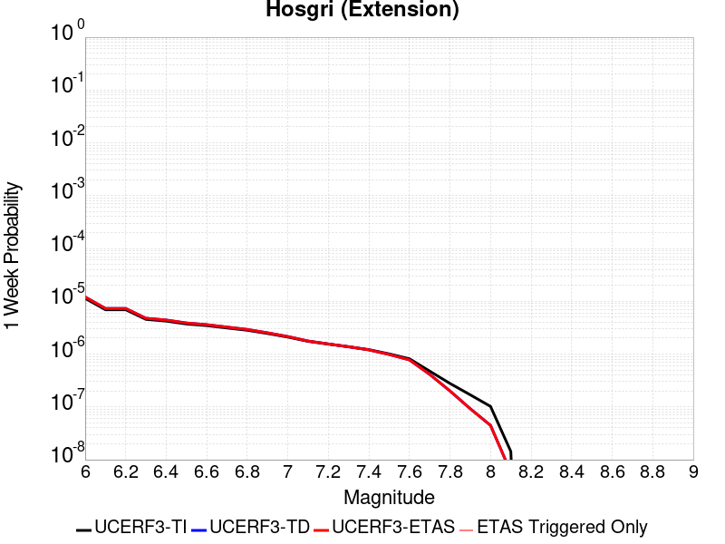 | 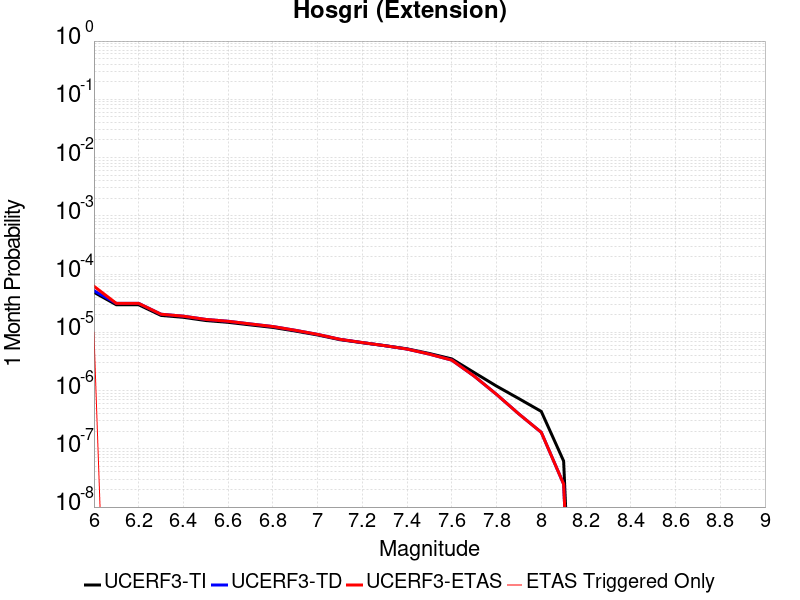 | 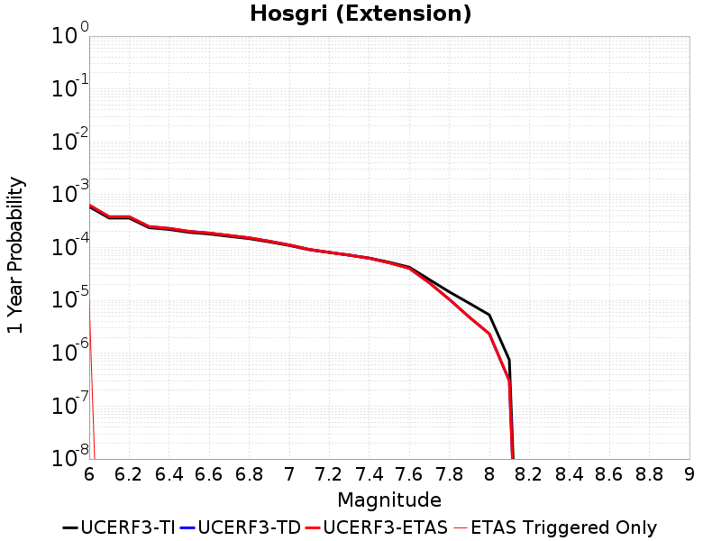 | 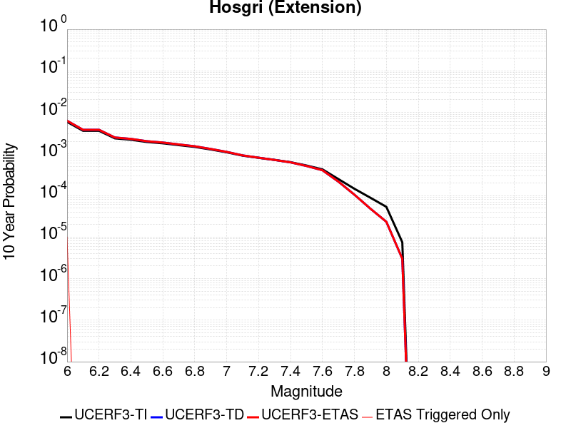 |

| Magnitude | 1 wk TI Prob | 1 wk TD Prob | 1 wk ETAS Prob | 1 wk ETAS/TD Gain | 1 wk ETAS Triggered Only | 1 mo TI Prob | 1 mo TD Prob | 1 mo ETAS Prob | 1 mo ETAS/TD Gain | 1 mo ETAS Triggered Only | 1 yr TI Prob | 1 yr TD Prob | 1 yr ETAS Prob | 1 yr ETAS/TD Gain | 1 yr ETAS Triggered Only | 10 yr TI Prob | 10 yr TD Prob | 10 yr ETAS Prob | 10 yr ETAS/TD Gain | 10 yr ETAS Triggered Only |
|-----|-----|-----|-----|-----|-----|-----|-----|-----|-----|-----|-----|-----|-----|-----|-----|-----|-----|-----|-----|-----|
| 6.0 | 1.1369135E-5 | 1.2083179E-5 | 1.2083179E-5 | 1.0 | 0.0 | 4.8723956E-5 | 5.178415E-5 | 6.1783634E-5 | 1.1930993 | 1.0E-5 | 5.9305265E-4 | 6.303124E-4 | 6.403061E-4 | 1.0158552 | 1.0E-5 | 0.005914725 | 0.006287495 | 0.0062974324 | 1.0015805 | 1.0E-5 |
| 6.1 | 6.934979E-6 | 7.324623E-6 | 7.324623E-6 | 1.0 | 0.0 | 2.9721E-5 | 3.1390886E-5 | 3.1390886E-5 | 1.0 | 0.0 | 3.617931E-4 | 3.8212116E-4 | 3.8212116E-4 | 1.0 | 0.0 | 0.0036120464 | 0.003815054 | 0.003815054 | 1.0 | 0.0 |
| 6.2 | 6.934979E-6 | 7.324623E-6 | 7.324623E-6 | 1.0 | 0.0 | 2.9721E-5 | 3.1390886E-5 | 3.1390886E-5 | 1.0 | 0.0 | 3.617931E-4 | 3.8212116E-4 | 3.8212116E-4 | 1.0 | 0.0 | 0.0036120464 | 0.003815054 | 0.003815054 | 1.0 | 0.0 |
| 6.3 | 4.5484676E-6 | 4.769378E-6 | 4.769378E-6 | 1.0 | 0.0 | 1.9493287E-5 | 2.0440033E-5 | 2.0440033E-5 | 1.0 | 0.0 | 2.3730492E-4 | 2.488294E-4 | 2.488294E-4 | 1.0 | 0.0 | 0.0023705168 | 0.0024855505 | 0.0024855505 | 1.0 | 0.0 |
| 6.4 | 4.218095E-6 | 4.4169064E-6 | 4.4169064E-6 | 1.0 | 0.0 | 1.8077424E-5 | 1.8929464E-5 | 1.8929464E-5 | 1.0 | 0.0 | 2.2007042E-4 | 2.3044218E-4 | 2.3044218E-4 | 1.0 | 0.0 | 0.002198526 | 0.0023020657 | 0.0023020657 | 1.0 | 0.0 |
| 6.5 | 3.717374E-6 | 3.883919E-6 | 3.883919E-6 | 1.0 | 0.0 | 1.5931506E-5 | 1.6645261E-5 | 1.6645261E-5 | 1.0 | 0.0 | 1.9394881E-4 | 2.026374E-4 | 2.026374E-4 | 1.0 | 0.0 | 0.0019377962 | 0.002024545 | 0.002024545 | 1.0 | 0.0 |
| 6.6 | 3.4605036E-6 | 3.608345E-6 | 3.608345E-6 | 1.0 | 0.0 | 1.4830645E-5 | 1.5464246E-5 | 1.5464246E-5 | 1.0 | 0.0 | 1.8054814E-4 | 1.8826107E-4 | 1.8826107E-4 | 1.0 | 0.0 | 0.0018040152 | 0.0018810304 | 0.0018810304 | 1.0 | 0.0 |
| 6.7 | 3.123439E-6 | 3.2466048E-6 | 3.2466048E-6 | 1.0 | 0.0 | 1.33860985E-5 | 1.39139465E-5 | 1.39139465E-5 | 1.0 | 0.0 | 1.6296357E-4 | 1.6938924E-4 | 1.6938924E-4 | 1.0 | 0.0 | 0.001628441 | 0.0016926122 | 0.0016926122 | 1.0 | 0.0 |
| 6.8 | 2.8290783E-6 | 2.9305738E-6 | 2.9305738E-6 | 1.0 | 0.0 | 1.2124565E-5 | 1.2559542E-5 | 1.2559542E-5 | 1.0 | 0.0 | 1.4760658E-4 | 1.5290178E-4 | 1.5290178E-4 | 1.0 | 0.0 | 0.0014750857 | 0.0015279745 | 0.0015279745 | 1.0 | 0.0 |
| 6.9 | 2.454112E-6 | 2.5283498E-6 | 2.5283498E-6 | 1.0 | 0.0 | 1.0517581E-5 | 1.083574E-5 | 1.083574E-5 | 1.0 | 0.0 | 1.2804402E-4 | 1.319172E-4 | 1.319172E-4 | 1.0 | 0.0 | 0.0012797028 | 0.001318395 | 0.001318395 | 1.0 | 0.0 |
| 7.0 | 2.1008145E-6 | 2.1498975E-6 | 2.1498975E-6 | 1.0 | 0.0 | 9.003459E-6 | 9.213814E-6 | 9.213814E-6 | 1.0 | 0.0 | 1.096116E-4 | 1.1217245E-4 | 1.1217245E-4 | 1.0 | 0.0 | 0.0010955755 | 0.001121162 | 0.001121162 | 1.0 | 0.0 |
| 7.1 | 1.744384E-6 | 1.7686594E-6 | 1.7686594E-6 | 1.0 | 0.0 | 7.47591E-6 | 7.579947E-6 | 7.579947E-6 | 1.0 | 0.0 | 9.1015405E-5 | 9.228197E-5 | 9.228197E-5 | 1.0 | 0.0 | 9.097813E-4 | 9.2243816E-4 | 9.2243816E-4 | 1.0 | 0.0 |
| 7.2 | 1.5456587E-6 | 1.5563108E-6 | 1.5563108E-6 | 1.0 | 0.0 | 6.6242346E-6 | 6.6698867E-6 | 6.6698867E-6 | 1.0 | 0.0 | 8.064707E-5 | 8.120285E-5 | 8.120285E-5 | 1.0 | 0.0 | 8.0617814E-4 | 8.117331E-4 | 8.117331E-4 | 1.0 | 0.0 |
| 7.3 | 1.3775123E-6 | 1.3766294E-6 | 1.3766294E-6 | 1.0 | 0.0 | 5.9036106E-6 | 5.899827E-6 | 5.899827E-6 | 1.0 | 0.0 | 7.187409E-5 | 7.1828035E-5 | 7.1828035E-5 | 1.0 | 0.0 | 7.185085E-4 | 7.180492E-4 | 7.180492E-4 | 1.0 | 0.0 |
| 7.4 | 1.214491E-6 | 1.2023659E-6 | 1.2023659E-6 | 1.0 | 0.0 | 5.2049513E-6 | 5.1529864E-6 | 5.1529864E-6 | 1.0 | 0.0 | 6.336844E-5 | 6.273581E-5 | 6.273581E-5 | 1.0 | 0.0 | 6.335037E-4 | 6.2718184E-4 | 6.2718184E-4 | 1.0 | 0.0 |
| 7.5 | 1.0101123E-6 | 9.842428E-7 | 9.842428E-7 | 1.0 | 0.0 | 4.3290456E-6 | 4.2181764E-6 | 4.2181764E-6 | 1.0 | 0.0 | 5.2704854E-5 | 5.1355095E-5 | 5.1355095E-5 | 1.0 | 0.0 | 5.2692357E-4 | 5.1343284E-4 | 5.1343284E-4 | 1.0 | 0.0 |
| 7.6 | 8.1558215E-7 | 7.7661326E-7 | 7.7661326E-7 | 1.0 | 0.0 | 3.4953473E-6 | 3.3283384E-6 | 3.3283384E-6 | 1.0 | 0.0 | 4.255502E-5 | 4.052177E-5 | 4.052177E-5 | 1.0 | 0.0 | 4.2546875E-4 | 4.0514427E-4 | 4.0514427E-4 | 1.0 | 0.0 |
| 7.7 | 4.757816E-7 | 4.1310267E-7 | 4.1310267E-7 | 1.0 | 0.0 | 2.0390623E-6 | 1.7704389E-6 | 1.7704389E-6 | 1.0 | 0.0 | 2.4825302E-5 | 2.155488E-5 | 2.155488E-5 | 1.0 | 0.0 | 2.482253E-4 | 2.1552802E-4 | 2.1552802E-4 | 1.0 | 0.0 |
| 7.8 | 2.782787E-7 | 2.004892E-7 | 2.004892E-7 | 1.0 | 0.0 | 1.1926223E-6 | 8.592391E-7 | 8.592391E-7 | 1.0 | 0.0 | 1.452008E-5 | 1.0461186E-5 | 1.0461186E-5 | 1.0 | 0.0 | 1.4519131E-4 | 1.04606974E-4 | 1.04606974E-4 | 1.0 | 0.0 |
| 7.9 | 1.6948086E-7 | 9.245357E-8 | 9.245357E-8 | 1.0 | 0.0 | 7.2634634E-7 | 3.962295E-7 | 3.962295E-7 | 1.0 | 0.0 | 8.843231E-6 | 4.8240836E-6 | 4.8240836E-6 | 1.0 | 0.0 | 8.842879E-5 | 4.8239795E-5 | 4.8239795E-5 | 1.0 | 0.0 |
| 8.0 | 1.0225492E-7 | 4.4746965E-8 | 4.4746965E-8 | 1.0 | 0.0 | 4.382353E-7 | 1.9177268E-7 | 1.9177268E-7 | 1.0 | 0.0 | 5.335502E-6 | 2.33483E-6 | 2.33483E-6 | 1.0 | 0.0 | 5.335374E-5 | 2.3348057E-5 | 2.3348057E-5 | 1.0 | 0.0 |
| 8.1 | 1.43711345E-8 | 5.7889764E-9 | 5.7889764E-9 | 1.0 | 0.0 | 6.1590576E-8 | 2.48099E-8 | 2.48099E-8 | 1.0 | 0.0 | 7.4986497E-7 | 3.0206047E-7 | 3.0206047E-7 | 1.0 | 0.0 | 7.4986247E-6 | 3.0206013E-6 | 3.0206013E-6 | 1.0 | 0.0 |

## Hector Mine
*[(top)](#table-of-contents)*

| 1 Week | 1 Month | 1 Year | 10 Year |
|-----|-----|-----|-----|
| 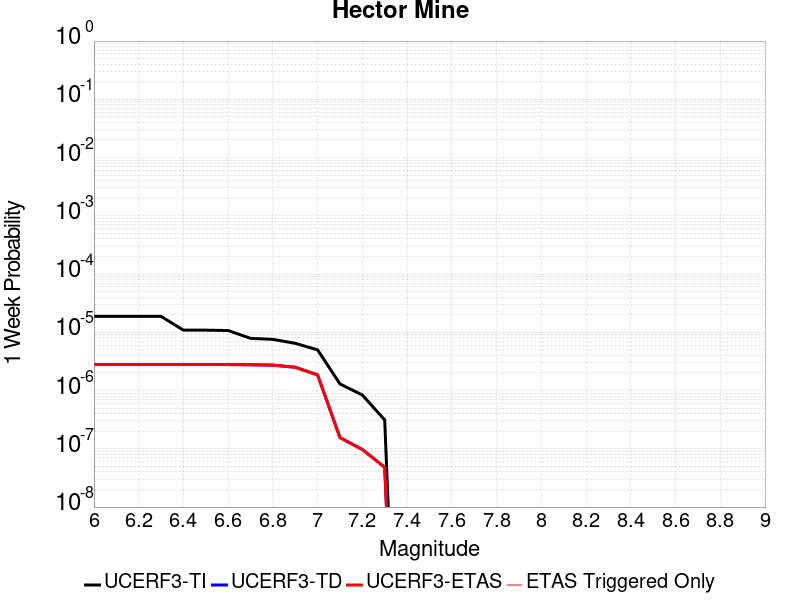 | 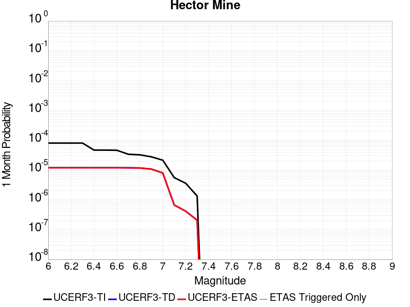 | 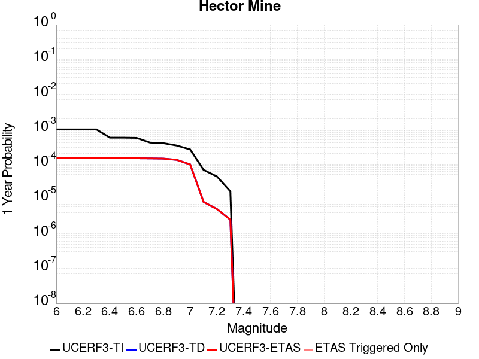 | 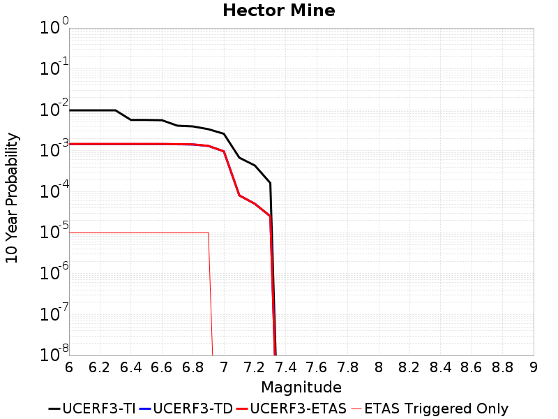 |

| Magnitude | 1 wk TI Prob | 1 wk TD Prob | 1 wk ETAS Prob | 1 wk ETAS/TD Gain | 1 wk ETAS Triggered Only | 1 mo TI Prob | 1 mo TD Prob | 1 mo ETAS Prob | 1 mo ETAS/TD Gain | 1 mo ETAS Triggered Only | 1 yr TI Prob | 1 yr TD Prob | 1 yr ETAS Prob | 1 yr ETAS/TD Gain | 1 yr ETAS Triggered Only | 10 yr TI Prob | 10 yr TD Prob | 10 yr ETAS Prob | 10 yr ETAS/TD Gain | 10 yr ETAS Triggered Only |
|-----|-----|-----|-----|-----|-----|-----|-----|-----|-----|-----|-----|-----|-----|-----|-----|-----|-----|-----|-----|-----|
| 6.0 | 1.8760093E-5 | 2.796435E-6 | 2.796435E-6 | 1.0 | 0.0 | 8.039792E-5 | 1.1984689E-5 | 1.1984689E-5 | 1.0 | 0.0 | 9.78405E-4 | 1.4590782E-4 | 1.4590782E-4 | 1.0 | 0.0 | 0.009741086 | 0.0014585124 | 0.0014684978 | 1.0068463 | 1.0E-5 |
| 6.1 | 1.8760093E-5 | 2.796435E-6 | 2.796435E-6 | 1.0 | 0.0 | 8.039792E-5 | 1.1984689E-5 | 1.1984689E-5 | 1.0 | 0.0 | 9.78405E-4 | 1.4590782E-4 | 1.4590782E-4 | 1.0 | 0.0 | 0.009741086 | 0.0014585124 | 0.0014684978 | 1.0068463 | 1.0E-5 |
| 6.2 | 1.8760093E-5 | 2.796435E-6 | 2.796435E-6 | 1.0 | 0.0 | 8.039792E-5 | 1.1984689E-5 | 1.1984689E-5 | 1.0 | 0.0 | 9.78405E-4 | 1.4590782E-4 | 1.4590782E-4 | 1.0 | 0.0 | 0.009741086 | 0.0014585124 | 0.0014684978 | 1.0068463 | 1.0E-5 |
| 6.3 | 1.8760093E-5 | 2.796435E-6 | 2.796435E-6 | 1.0 | 0.0 | 8.039792E-5 | 1.1984689E-5 | 1.1984689E-5 | 1.0 | 0.0 | 9.78405E-4 | 1.4590782E-4 | 1.4590782E-4 | 1.0 | 0.0 | 0.009741086 | 0.0014585124 | 0.0014684978 | 1.0068463 | 1.0E-5 |
| 6.4 | 1.0888055E-5 | 2.796435E-6 | 2.796435E-6 | 1.0 | 0.0 | 4.666226E-5 | 1.1984689E-5 | 1.1984689E-5 | 1.0 | 0.0 | 5.679649E-4 | 1.4590782E-4 | 1.4590782E-4 | 1.0 | 0.0 | 0.0056651547 | 0.0014585124 | 0.0014684978 | 1.0068463 | 1.0E-5 |
| 6.5 | 1.0888055E-5 | 2.796435E-6 | 2.796435E-6 | 1.0 | 0.0 | 4.666226E-5 | 1.1984689E-5 | 1.1984689E-5 | 1.0 | 0.0 | 5.679649E-4 | 1.4590782E-4 | 1.4590782E-4 | 1.0 | 0.0 | 0.0056651547 | 0.0014585124 | 0.0014684978 | 1.0068463 | 1.0E-5 |
| 6.6 | 1.0730738E-5 | 2.796435E-6 | 2.796435E-6 | 1.0 | 0.0 | 4.5988065E-5 | 1.1984689E-5 | 1.1984689E-5 | 1.0 | 0.0 | 5.5976084E-4 | 1.4590782E-4 | 1.4590782E-4 | 1.0 | 0.0 | 0.0055835294 | 0.0014585124 | 0.0014684978 | 1.0068463 | 1.0E-5 |
| 6.7 | 7.881326E-6 | 2.7711149E-6 | 2.7711149E-6 | 1.0 | 0.0 | 3.3776672E-5 | 1.1876175E-5 | 1.1876175E-5 | 1.0 | 0.0 | 4.111534E-4 | 1.4458684E-4 | 1.4458684E-4 | 1.0 | 0.0 | 0.0041039353 | 0.0014453199 | 0.0014553054 | 1.0069089 | 1.0E-5 |
| 6.8 | 7.5683483E-6 | 2.7328647E-6 | 2.7328647E-6 | 1.0 | 0.0 | 3.2435375E-5 | 1.1712247E-5 | 1.1712247E-5 | 1.0 | 0.0 | 3.9482914E-4 | 1.4259128E-4 | 1.4259128E-4 | 1.0 | 0.0 | 0.0039412836 | 0.0014253899 | 0.0014353757 | 1.0070056 | 1.0E-5 |
| 6.9 | 6.473048E-6 | 2.5139395E-6 | 2.5139395E-6 | 1.0 | 0.0 | 2.7741338E-5 | 1.0774004E-5 | 1.0774004E-5 | 1.0 | 0.0 | 3.3769844E-4 | 1.3116958E-4 | 1.3116958E-4 | 1.0 | 0.0 | 0.0033718573 | 0.0013113111 | 0.0013212981 | 1.0076159 | 1.0E-5 |
| 7.0 | 4.9959954E-6 | 1.8565487E-6 | 1.8565487E-6 | 1.0 | 0.0 | 2.1411232E-5 | 7.9566325E-6 | 7.9566325E-6 | 1.0 | 0.0 | 2.6065056E-4 | 9.687126E-5 | 9.687126E-5 | 1.0 | 0.0 | 0.0026034506 | 9.6864E-4 | 9.6864E-4 | 1.0 | 0.0 |
| 7.1 | 1.2997541E-6 | 1.5602727E-7 | 1.5602727E-7 | 1.0 | 0.0 | 5.5703626E-6 | 6.6868813E-7 | 6.6868813E-7 | 1.0 | 0.0 | 6.7817055E-5 | 8.141252E-6 | 8.141252E-6 | 1.0 | 0.0 | 6.779636E-4 | 8.140993E-5 | 8.140993E-5 | 1.0 | 0.0 |
| 7.2 | 8.392699E-7 | 9.7279596E-8 | 9.7279596E-8 | 1.0 | 0.0 | 3.596866E-6 | 4.169125E-7 | 4.169125E-7 | 1.0 | 0.0 | 4.3790962E-5 | 5.0759E-6 | 5.0759E-6 | 1.0 | 0.0 | 4.3782333E-4 | 5.0758033E-5 | 5.0758033E-5 | 1.0 | 0.0 |
| 7.3 | 3.13015E-7 | 4.8294208E-8 | 4.8294208E-8 | 1.0 | 0.0 | 1.3414921E-6 | 2.0697516E-7 | 2.0697516E-7 | 1.0 | 0.0 | 1.6332544E-5 | 2.5199206E-6 | 2.5199206E-6 | 1.0 | 0.0 | 1.6331344E-4 | 2.5199004E-5 | 2.5199004E-5 | 1.0 | 0.0 |

## Carlsbad
*[(top)](#table-of-contents)*

| 1 Week | 1 Month | 1 Year | 10 Year |
|-----|-----|-----|-----|
| 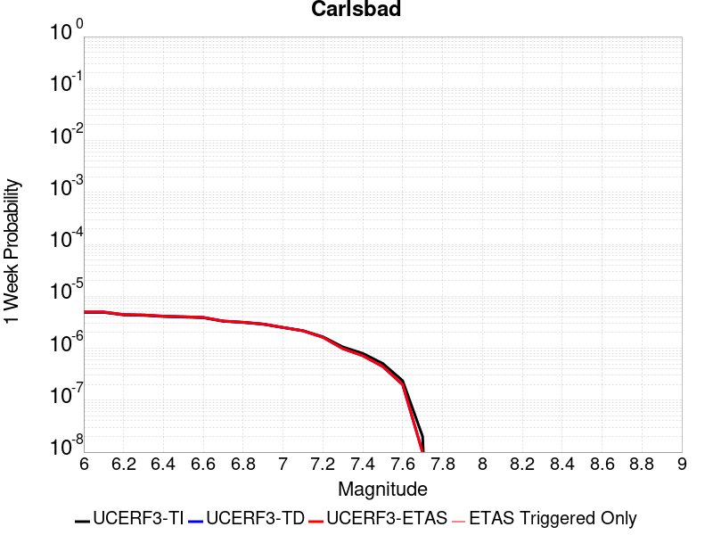 | 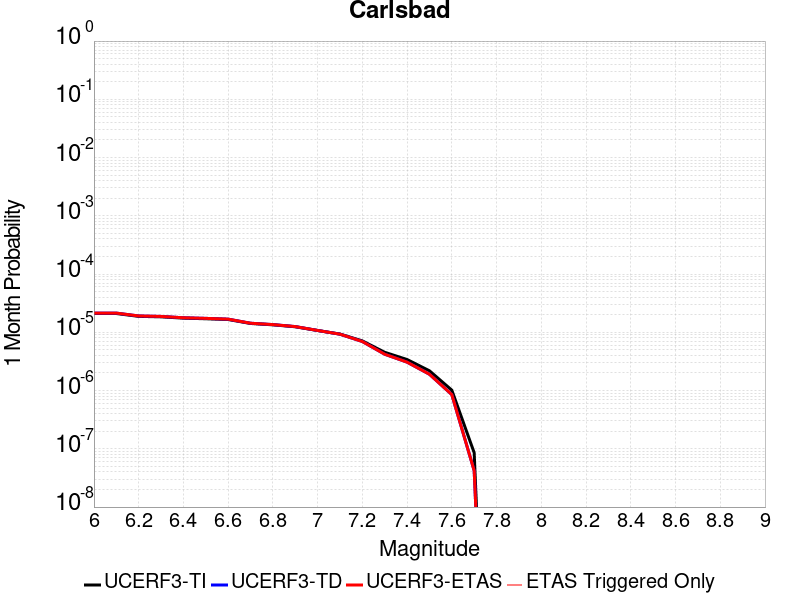 | 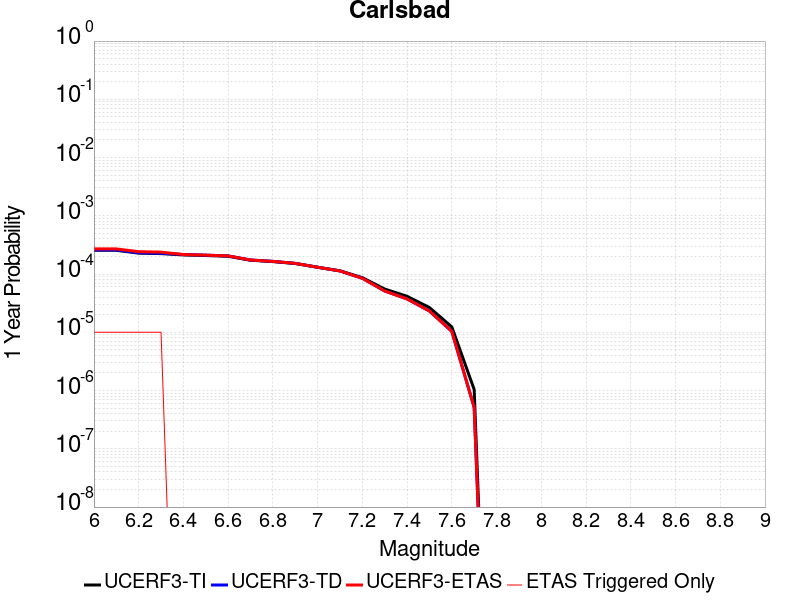 | 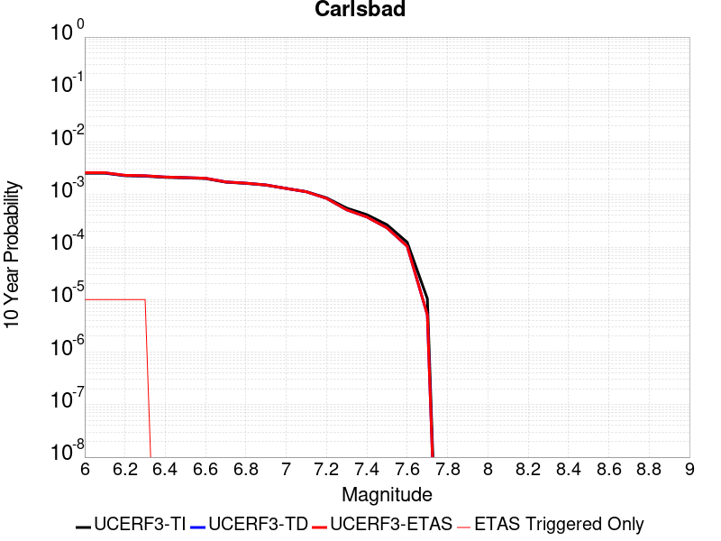 |

| Magnitude | 1 wk TI Prob | 1 wk TD Prob | 1 wk ETAS Prob | 1 wk ETAS/TD Gain | 1 wk ETAS Triggered Only | 1 mo TI Prob | 1 mo TD Prob | 1 mo ETAS Prob | 1 mo ETAS/TD Gain | 1 mo ETAS Triggered Only | 1 yr TI Prob | 1 yr TD Prob | 1 yr ETAS Prob | 1 yr ETAS/TD Gain | 1 yr ETAS Triggered Only | 10 yr TI Prob | 10 yr TD Prob | 10 yr ETAS Prob | 10 yr ETAS/TD Gain | 10 yr ETAS Triggered Only |
|-----|-----|-----|-----|-----|-----|-----|-----|-----|-----|-----|-----|-----|-----|-----|-----|-----|-----|-----|-----|-----|
| 6.0 | 4.9038536E-6 | 4.9872883E-6 | 4.9872883E-6 | 1.0 | 0.0 | 2.1016345E-5 | 2.137392E-5 | 2.137392E-5 | 1.0 | 0.0 | 2.5584397E-4 | 2.6019686E-4 | 2.7019426E-4 | 1.0384225 | 1.0E-5 | 0.002555496 | 0.002598969 | 0.002608943 | 1.0038377 | 1.0E-5 |
| 6.1 | 4.9038536E-6 | 4.9872883E-6 | 4.9872883E-6 | 1.0 | 0.0 | 2.1016345E-5 | 2.137392E-5 | 2.137392E-5 | 1.0 | 0.0 | 2.5584397E-4 | 2.6019686E-4 | 2.7019426E-4 | 1.0384225 | 1.0E-5 | 0.002555496 | 0.002598969 | 0.002608943 | 1.0038377 | 1.0E-5 |
| 6.2 | 4.3820614E-6 | 4.454799E-6 | 4.454799E-6 | 1.0 | 0.0 | 1.8780129E-5 | 1.909186E-5 | 1.909186E-5 | 1.0 | 0.0 | 2.2862408E-4 | 2.3241894E-4 | 2.4241662E-4 | 1.0430157 | 1.0E-5 | 0.00228389 | 0.0023217944 | 0.0023317712 | 1.004297 | 1.0E-5 |
| 6.3 | 4.302872E-6 | 4.3730365E-6 | 4.3730365E-6 | 1.0 | 0.0 | 1.8440749E-5 | 1.8741453E-5 | 1.8741453E-5 | 1.0 | 0.0 | 2.24493E-4 | 2.2815364E-4 | 2.3815136E-4 | 1.0438201 | 1.0E-5 | 0.0022426634 | 0.0022792292 | 0.0022892065 | 1.0043775 | 1.0E-5 |
| 6.4 | 4.0835243E-6 | 4.147684E-6 | 4.147684E-6 | 1.0 | 0.0 | 1.75007E-5 | 1.777567E-5 | 1.777567E-5 | 1.0 | 0.0 | 2.1305021E-4 | 2.1639762E-4 | 2.1639762E-4 | 1.0 | 0.0 | 0.0021284607 | 0.002161903 | 0.002161903 | 1.0 | 0.0 |
| 6.5 | 3.987806E-6 | 4.048916E-6 | 4.048916E-6 | 1.0 | 0.0 | 1.7090486E-5 | 1.7352382E-5 | 1.7352382E-5 | 1.0 | 0.0 | 2.080568E-4 | 2.1124512E-4 | 2.1124512E-4 | 1.0 | 0.0 | 0.002078621 | 0.0021104768 | 0.0021104768 | 1.0 | 0.0 |
| 6.6 | 3.8707576E-6 | 3.9275164E-6 | 3.9275164E-6 | 1.0 | 0.0 | 1.6588854E-5 | 1.6832108E-5 | 1.6832108E-5 | 1.0 | 0.0 | 2.0195059E-4 | 2.0491196E-4 | 2.0491196E-4 | 1.0 | 0.0 | 0.0020176715 | 0.0020472638 | 0.0020472638 | 1.0 | 0.0 |
| 6.7 | 3.3093434E-6 | 3.3424174E-6 | 3.3424174E-6 | 1.0 | 0.0 | 1.4182823E-5 | 1.4324568E-5 | 1.4324568E-5 | 1.0 | 0.0 | 1.7266218E-4 | 1.7438771E-4 | 1.7438771E-4 | 1.0 | 0.0 | 0.001725281 | 0.0017425147 | 0.0017425147 | 1.0 | 0.0 |
| 6.8 | 3.136983E-6 | 3.166478E-6 | 3.166478E-6 | 1.0 | 0.0 | 1.3444143E-5 | 1.357055E-5 | 1.357055E-5 | 1.0 | 0.0 | 1.6367015E-4 | 1.6520898E-4 | 1.6520898E-4 | 1.0 | 0.0 | 0.0016354966 | 0.0016508673 | 0.0016508673 | 1.0 | 0.0 |
| 6.9 | 2.9056644E-6 | 2.9267817E-6 | 2.9267817E-6 | 1.0 | 0.0 | 1.2452788E-5 | 1.254329E-5 | 1.254329E-5 | 1.0 | 0.0 | 1.5160214E-4 | 1.527039E-4 | 1.527039E-4 | 1.0 | 0.0 | 0.0015149876 | 0.001525995 | 0.001525995 | 1.0 | 0.0 |
| 7.0 | 2.5071035E-6 | 2.5114184E-6 | 2.5114184E-6 | 1.0 | 0.0 | 1.0744685E-5 | 1.0763178E-5 | 1.0763178E-5 | 1.0 | 0.0 | 1.308087E-4 | 1.3103384E-4 | 1.3103384E-4 | 1.0 | 0.0 | 0.0013073172 | 0.001309569 | 0.001309569 | 1.0 | 0.0 |
| 7.1 | 2.1786877E-6 | 2.167902E-6 | 2.167902E-6 | 1.0 | 0.0 | 9.3372E-6 | 9.290976E-6 | 9.290976E-6 | 1.0 | 0.0 | 1.13674476E-4 | 1.1311178E-4 | 1.1311178E-4 | 1.0 | 0.0 | 0.0011361635 | 0.0011305449 | 0.0011305449 | 1.0 | 0.0 |
| 7.2 | 1.6628418E-6 | 1.621402E-6 | 1.621402E-6 | 1.0 | 0.0 | 7.1264453E-6 | 6.9488474E-6 | 6.9488474E-6 | 1.0 | 0.0 | 8.676102E-5 | 8.4598956E-5 | 8.4598956E-5 | 1.0 | 0.0 | 8.672715E-4 | 8.456697E-4 | 8.456697E-4 | 1.0 | 0.0 |
| 7.3 | 1.0595926E-6 | 9.8169E-7 | 9.8169E-7 | 1.0 | 0.0 | 4.541103E-6 | 4.2072365E-6 | 4.2072365E-6 | 1.0 | 0.0 | 5.5286528E-5 | 5.122191E-5 | 5.122191E-5 | 1.0 | 0.0 | 5.527277E-4 | 5.121019E-4 | 5.121019E-4 | 1.0 | 0.0 |
| 7.4 | 7.956623E-7 | 7.17388E-7 | 7.17388E-7 | 1.0 | 0.0 | 3.4099767E-6 | 3.0745164E-6 | 3.0745164E-6 | 1.0 | 0.0 | 4.1515676E-5 | 3.74316E-5 | 3.74316E-5 | 1.0 | 0.0 | 4.150792E-4 | 3.742537E-4 | 3.742537E-4 | 1.0 | 0.0 |
| 7.5 | 5.1043804E-7 | 4.448373E-7 | 4.448373E-7 | 1.0 | 0.0 | 2.1875896E-6 | 1.9064441E-6 | 1.9064441E-6 | 1.0 | 0.0 | 2.663358E-5 | 2.3210716E-5 | 2.3210716E-5 | 1.0 | 0.0 | 2.6630386E-4 | 2.3208349E-4 | 2.3208349E-4 | 1.0 | 0.0 |
| 7.6 | 2.3723294E-7 | 1.9895737E-7 | 1.9895737E-7 | 1.0 | 0.0 | 1.0167122E-6 | 8.526742E-7 | 8.526742E-7 | 1.0 | 0.0 | 1.2378401E-5 | 1.0381262E-5 | 1.0381262E-5 | 1.0 | 0.0 | 1.237771E-4 | 1.0380804E-4 | 1.0380804E-4 | 1.0 | 0.0 |
| 7.7 | 1.9992152E-8 | 9.860288E-9 | 9.860288E-9 | 1.0 | 0.0 | 8.568065E-8 | 4.2258378E-8 | 4.2258378E-8 | 1.0 | 0.0 | 1.0431614E-6 | 5.1449575E-7 | 5.1449575E-7 | 1.0 | 0.0 | 1.0431565E-5 | 5.1449574E-6 | 5.1449574E-6 | 1.0 | 0.0 |

## Elsinore (Temecula) rev
*[(top)](#table-of-contents)*

| 1 Week | 1 Month | 1 Year | 10 Year |
|-----|-----|-----|-----|
|  |  | 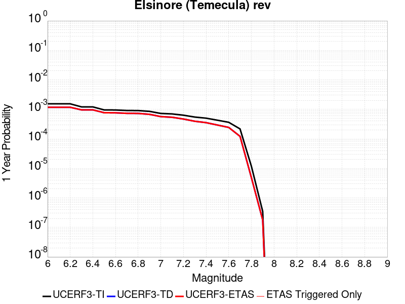 | 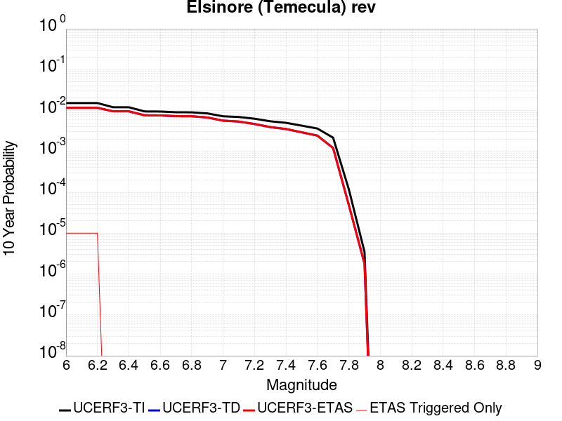 |

| Magnitude | 1 wk TI Prob | 1 wk TD Prob | 1 wk ETAS Prob | 1 wk ETAS/TD Gain | 1 wk ETAS Triggered Only | 1 mo TI Prob | 1 mo TD Prob | 1 mo ETAS Prob | 1 mo ETAS/TD Gain | 1 mo ETAS Triggered Only | 1 yr TI Prob | 1 yr TD Prob | 1 yr ETAS Prob | 1 yr ETAS/TD Gain | 1 yr ETAS Triggered Only | 10 yr TI Prob | 10 yr TD Prob | 10 yr ETAS Prob | 10 yr ETAS/TD Gain | 10 yr ETAS Triggered Only |
|-----|-----|-----|-----|-----|-----|-----|-----|-----|-----|-----|-----|-----|-----|-----|-----|-----|-----|-----|-----|-----|
| 6.0 | 2.9514995E-5 | 2.2518156E-5 | 2.2518156E-5 | 1.0 | 0.0 | 1.264867E-4 | 9.650293E-5 | 9.650293E-5 | 1.0 | 0.0 | 0.0015388876 | 0.0011743121 | 0.0011743121 | 1.0 | 0.0 | 0.015282745 | 0.011697438 | 0.011707321 | 1.0008448 | 1.0E-5 |
| 6.1 | 2.9514995E-5 | 2.2518156E-5 | 2.2518156E-5 | 1.0 | 0.0 | 1.264867E-4 | 9.650293E-5 | 9.650293E-5 | 1.0 | 0.0 | 0.0015388876 | 0.0011743121 | 0.0011743121 | 1.0 | 0.0 | 0.015282745 | 0.011697438 | 0.011707321 | 1.0008448 | 1.0E-5 |
| 6.2 | 2.9514995E-5 | 2.2518156E-5 | 2.2518156E-5 | 1.0 | 0.0 | 1.264867E-4 | 9.650293E-5 | 9.650293E-5 | 1.0 | 0.0 | 0.0015388876 | 0.0011743121 | 0.0011743121 | 1.0 | 0.0 | 0.015282745 | 0.011697438 | 0.011707321 | 1.0008448 | 1.0E-5 |
| 6.3 | 2.3223649E-5 | 1.8407192E-5 | 1.8407192E-5 | 1.0 | 0.0 | 9.952613E-5 | 7.8885685E-5 | 7.8885685E-5 | 1.0 | 0.0 | 0.001211057 | 9.600273E-4 | 9.600273E-4 | 1.0 | 0.0 | 0.012044783 | 0.009570319 | 0.009570319 | 1.0 | 0.0 |
| 6.4 | 2.3223649E-5 | 1.8407192E-5 | 1.8407192E-5 | 1.0 | 0.0 | 9.952613E-5 | 7.8885685E-5 | 7.8885685E-5 | 1.0 | 0.0 | 0.001211057 | 9.600273E-4 | 9.600273E-4 | 1.0 | 0.0 | 0.012044783 | 0.009570319 | 0.009570319 | 1.0 | 0.0 |
| 6.5 | 1.8338875E-5 | 1.4750638E-5 | 1.4750638E-5 | 1.0 | 0.0 | 7.8592806E-5 | 6.3215535E-5 | 6.3215535E-5 | 1.0 | 0.0 | 9.5644733E-4 | 7.693861E-4 | 7.693861E-4 | 1.0 | 0.0 | 0.009523412 | 0.007674181 | 0.007674181 | 1.0 | 0.0 |
| 6.6 | 1.8223333E-5 | 1.4613191E-5 | 1.4613191E-5 | 1.0 | 0.0 | 7.809766E-5 | 6.26265E-5 | 6.26265E-5 | 1.0 | 0.0 | 9.504242E-4 | 7.622197E-4 | 7.622197E-4 | 1.0 | 0.0 | 0.009463696 | 0.0076030083 | 0.0076030083 | 1.0 | 0.0 |
| 6.7 | 1.7512752E-5 | 1.4027702E-5 | 1.4027702E-5 | 1.0 | 0.0 | 7.505249E-5 | 6.0117385E-5 | 6.0117385E-5 | 1.0 | 0.0 | 9.13381E-4 | 7.3169195E-4 | 7.3169195E-4 | 1.0 | 0.0 | 0.00909636 | 0.0072991746 | 0.0072991746 | 1.0 | 0.0 |
| 6.8 | 1.7417142E-5 | 1.3951683E-5 | 1.3951683E-5 | 1.0 | 0.0 | 7.4642754E-5 | 5.9791608E-5 | 5.9791608E-5 | 1.0 | 0.0 | 9.083966E-4 | 7.2772824E-4 | 7.2772824E-4 | 1.0 | 0.0 | 0.009046922 | 0.007259742 | 0.007259742 | 1.0 | 0.0 |
| 6.9 | 1.6402591E-5 | 1.2989084E-5 | 1.2989084E-5 | 1.0 | 0.0 | 7.0294926E-5 | 5.5666358E-5 | 5.5666358E-5 | 1.0 | 0.0 | 8.5550465E-4 | 6.7753484E-4 | 6.7753484E-4 | 1.0 | 0.0 | 0.008522186 | 0.006760413 | 0.006760413 | 1.0 | 0.0 |
| 7.0 | 1.3912486E-5 | 1.0878649E-5 | 1.0878649E-5 | 1.0 | 0.0 | 5.9623577E-5 | 4.6621964E-5 | 4.6621964E-5 | 1.0 | 0.0 | 7.2567526E-4 | 5.674773E-4 | 5.674773E-4 | 1.0 | 0.0 | 0.0072331014 | 0.0056642015 | 0.0056642015 | 1.0 | 0.0 |
| 7.1 | 1.3405147E-5 | 1.0327815E-5 | 1.0327815E-5 | 1.0 | 0.0 | 5.7449364E-5 | 4.426133E-5 | 4.426133E-5 | 1.0 | 0.0 | 6.9922156E-4 | 5.38751E-4 | 5.38751E-4 | 1.0 | 0.0 | 0.0069702556 | 0.0053777816 | 0.0053777816 | 1.0 | 0.0 |
| 7.2 | 1.21402E-5 | 8.99706E-6 | 8.99706E-6 | 1.0 | 0.0 | 5.202839E-5 | 3.8558268E-5 | 3.8558268E-5 | 1.0 | 0.0 | 6.332616E-4 | 4.6934758E-4 | 4.6934758E-4 | 1.0 | 0.0 | 0.0063146 | 0.0046849884 | 0.0046849884 | 1.0 | 0.0 |
| 7.3 | 1.05047775E-5 | 7.572036E-6 | 7.572036E-6 | 1.0 | 0.0 | 4.5019697E-5 | 3.245119E-5 | 3.245119E-5 | 1.0 | 0.0 | 5.4797693E-4 | 3.9502303E-4 | 3.9502303E-4 | 1.0 | 0.0 | 0.005466277 | 0.003943598 | 0.003943598 | 1.0 | 0.0 |
| 7.4 | 9.624483E-6 | 6.787102E-6 | 6.787102E-6 | 1.0 | 0.0 | 4.124713E-5 | 2.9087263E-5 | 2.9087263E-5 | 1.0 | 0.0 | 5.0206814E-4 | 3.5408125E-4 | 3.5408125E-4 | 1.0 | 0.0 | 0.005009353 | 0.003535325 | 0.003535325 | 1.0 | 0.0 |
| 7.5 | 8.215151E-6 | 5.6357294E-6 | 5.6357294E-6 | 1.0 | 0.0 | 3.5207315E-5 | 2.415291E-5 | 2.415291E-5 | 1.0 | 0.0 | 4.2856473E-4 | 2.9402328E-4 | 2.9402328E-4 | 1.0 | 0.0 | 0.004277392 | 0.0029364706 | 0.0029364706 | 1.0 | 0.0 |
| 7.6 | 6.975058E-6 | 4.6762093E-6 | 4.6762093E-6 | 1.0 | 0.0 | 2.9892764E-5 | 2.0040748E-5 | 2.0040748E-5 | 1.0 | 0.0 | 3.6388362E-4 | 2.4396997E-4 | 2.4396997E-4 | 1.0 | 0.0 | 0.0036328835 | 0.0024371375 | 0.0024371375 | 1.0 | 0.0 |
| 7.7 | 4.159604E-6 | 2.327088E-6 | 2.327088E-6 | 1.0 | 0.0 | 1.7826753E-5 | 9.9732E-6 | 9.9732E-6 | 1.0 | 0.0 | 2.1701909E-4 | 1.2141769E-4 | 1.2141769E-4 | 1.0 | 0.0 | 0.0021680726 | 0.0012135865 | 0.0012135865 | 1.0 | 0.0 |
| 7.8 | 2.2692414E-7 | 9.385869E-8 | 9.385869E-8 | 1.0 | 0.0 | 9.725317E-7 | 4.0225146E-7 | 4.0225146E-7 | 1.0 | 0.0 | 1.1840509E-5 | 4.897404E-6 | 4.897404E-6 | 1.0 | 0.0 | 1.1839878E-4 | 4.897329E-5 | 4.897329E-5 | 1.0 | 0.0 |
| 7.9 | 6.676829E-9 | 3.4399577E-9 | 3.4399577E-9 | 1.0 | 0.0 | 2.861498E-8 | 1.47426755E-8 | 1.47426755E-8 | 1.0 | 0.0 | 3.4838732E-7 | 1.7949206E-7 | 1.7949206E-7 | 1.0 | 0.0 | 3.4838679E-6 | 1.7949193E-6 | 1.7949193E-6 | 1.0 | 0.0 |

## Big Lagoon - Bald Mtn 2011 CFM
*[(top)](#table-of-contents)*

| 1 Week | 1 Month | 1 Year | 10 Year |
|-----|-----|-----|-----|
| 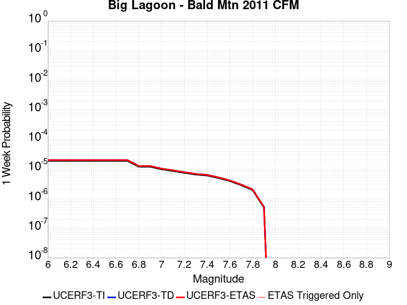 | 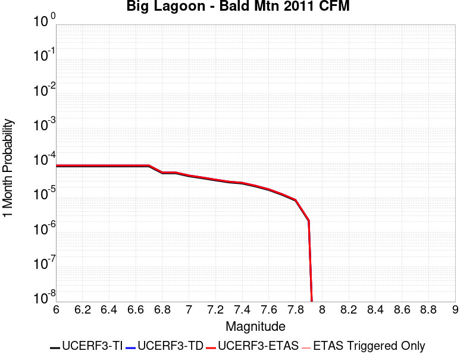 | 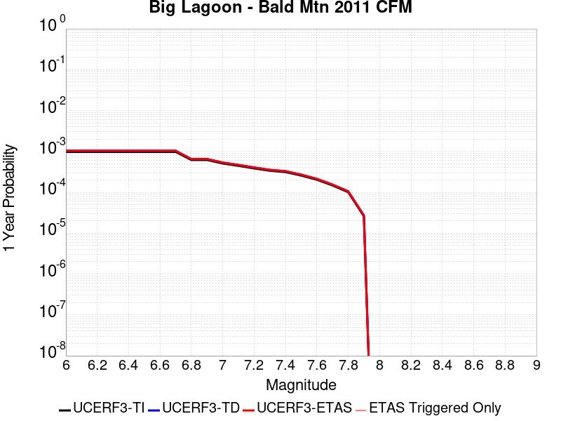 | 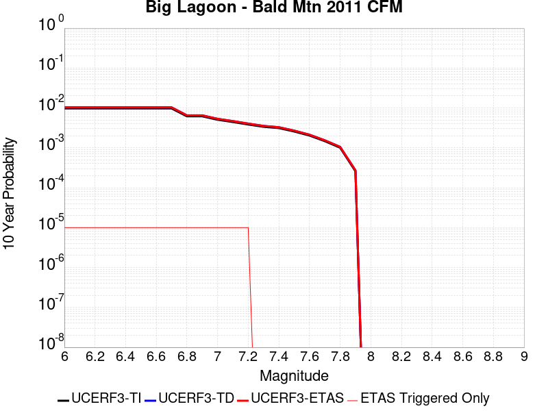 |

| Magnitude | 1 wk TI Prob | 1 wk TD Prob | 1 wk ETAS Prob | 1 wk ETAS/TD Gain | 1 wk ETAS Triggered Only | 1 mo TI Prob | 1 mo TD Prob | 1 mo ETAS Prob | 1 mo ETAS/TD Gain | 1 mo ETAS Triggered Only | 1 yr TI Prob | 1 yr TD Prob | 1 yr ETAS Prob | 1 yr ETAS/TD Gain | 1 yr ETAS Triggered Only | 10 yr TI Prob | 10 yr TD Prob | 10 yr ETAS Prob | 10 yr ETAS/TD Gain | 10 yr ETAS Triggered Only |
|-----|-----|-----|-----|-----|-----|-----|-----|-----|-----|-----|-----|-----|-----|-----|-----|-----|-----|-----|-----|-----|
| 6.0 | 1.8699735E-5 | 1.9850318E-5 | 1.9850318E-5 | 1.0 | 0.0 | 8.013926E-5 | 8.507023E-5 | 8.507023E-5 | 1.0 | 0.0 | 9.752587E-4 | 0.0010352758 | 0.0010352758 | 1.0 | 0.0 | 0.009709897 | 0.010308345 | 0.010318242 | 1.0009601 | 1.0E-5 |
| 6.1 | 1.8699735E-5 | 1.9850318E-5 | 1.9850318E-5 | 1.0 | 0.0 | 8.013926E-5 | 8.507023E-5 | 8.507023E-5 | 1.0 | 0.0 | 9.752587E-4 | 0.0010352758 | 0.0010352758 | 1.0 | 0.0 | 0.009709897 | 0.010308345 | 0.010318242 | 1.0009601 | 1.0E-5 |
| 6.2 | 1.8699735E-5 | 1.9850318E-5 | 1.9850318E-5 | 1.0 | 0.0 | 8.013926E-5 | 8.507023E-5 | 8.507023E-5 | 1.0 | 0.0 | 9.752587E-4 | 0.0010352758 | 0.0010352758 | 1.0 | 0.0 | 0.009709897 | 0.010308345 | 0.010318242 | 1.0009601 | 1.0E-5 |
| 6.3 | 1.8699735E-5 | 1.9850318E-5 | 1.9850318E-5 | 1.0 | 0.0 | 8.013926E-5 | 8.507023E-5 | 8.507023E-5 | 1.0 | 0.0 | 9.752587E-4 | 0.0010352758 | 0.0010352758 | 1.0 | 0.0 | 0.009709897 | 0.010308345 | 0.010318242 | 1.0009601 | 1.0E-5 |
| 6.4 | 1.8699735E-5 | 1.9850318E-5 | 1.9850318E-5 | 1.0 | 0.0 | 8.013926E-5 | 8.507023E-5 | 8.507023E-5 | 1.0 | 0.0 | 9.752587E-4 | 0.0010352758 | 0.0010352758 | 1.0 | 0.0 | 0.009709897 | 0.010308345 | 0.010318242 | 1.0009601 | 1.0E-5 |
| 6.5 | 1.8699735E-5 | 1.9850318E-5 | 1.9850318E-5 | 1.0 | 0.0 | 8.013926E-5 | 8.507023E-5 | 8.507023E-5 | 1.0 | 0.0 | 9.752587E-4 | 0.0010352758 | 0.0010352758 | 1.0 | 0.0 | 0.009709897 | 0.010308345 | 0.010318242 | 1.0009601 | 1.0E-5 |
| 6.6 | 1.8699735E-5 | 1.9850318E-5 | 1.9850318E-5 | 1.0 | 0.0 | 8.013926E-5 | 8.507023E-5 | 8.507023E-5 | 1.0 | 0.0 | 9.752587E-4 | 0.0010352758 | 0.0010352758 | 1.0 | 0.0 | 0.009709897 | 0.010308345 | 0.010318242 | 1.0009601 | 1.0E-5 |
| 6.7 | 1.8699735E-5 | 1.9850318E-5 | 1.9850318E-5 | 1.0 | 0.0 | 8.013926E-5 | 8.507023E-5 | 8.507023E-5 | 1.0 | 0.0 | 9.752587E-4 | 0.0010352758 | 0.0010352758 | 1.0 | 0.0 | 0.009709897 | 0.010308345 | 0.010318242 | 1.0009601 | 1.0E-5 |
| 6.8 | 1.18505095E-5 | 1.24998805E-5 | 1.24998805E-5 | 1.0 | 0.0 | 5.078691E-5 | 5.3569845E-5 | 5.3569845E-5 | 1.0 | 0.0 | 6.181552E-4 | 6.520225E-4 | 6.520225E-4 | 1.0 | 0.0 | 0.006164385 | 0.0065015987 | 0.0065115336 | 1.001528 | 1.0E-5 |
| 6.9 | 1.18505095E-5 | 1.24998805E-5 | 1.24998805E-5 | 1.0 | 0.0 | 5.078691E-5 | 5.3569845E-5 | 5.3569845E-5 | 1.0 | 0.0 | 6.181552E-4 | 6.520225E-4 | 6.520225E-4 | 1.0 | 0.0 | 0.006164385 | 0.0065015987 | 0.0065115336 | 1.001528 | 1.0E-5 |
| 7.0 | 9.719786E-6 | 1.0235548E-5 | 1.0235548E-5 | 1.0 | 0.0 | 4.1655563E-5 | 4.386591E-5 | 4.386591E-5 | 1.0 | 0.0 | 5.0703844E-4 | 5.3393893E-4 | 5.3393893E-4 | 1.0 | 0.0 | 0.005058831 | 0.005326807 | 0.005336754 | 1.0018673 | 1.0E-5 |
| 7.1 | 8.523418E-6 | 8.969516E-6 | 8.969516E-6 | 1.0 | 0.0 | 3.652842E-5 | 3.8440226E-5 | 3.8440226E-5 | 1.0 | 0.0 | 4.4464276E-4 | 4.679108E-4 | 4.679108E-4 | 1.0 | 0.0 | 0.0044375416 | 0.0046694195 | 0.004679373 | 1.0021316 | 1.0E-5 |
| 7.2 | 7.378894E-6 | 7.761158E-6 | 7.761158E-6 | 1.0 | 0.0 | 3.162345E-5 | 3.3261684E-5 | 3.3261684E-5 | 1.0 | 0.0 | 3.8494746E-4 | 4.0488664E-4 | 4.0488664E-4 | 1.0 | 0.0 | 0.0038428132 | 0.0040415856 | 0.004051545 | 1.0024643 | 1.0E-5 |
| 7.3 | 6.4640294E-6 | 6.792482E-6 | 6.792482E-6 | 1.0 | 0.0 | 2.7702688E-5 | 2.9110317E-5 | 2.9110317E-5 | 1.0 | 0.0 | 3.3722803E-4 | 3.5436114E-4 | 3.5436114E-4 | 1.0 | 0.0 | 0.0033671674 | 0.003538031 | 0.003538031 | 1.0 | 0.0 |
| 7.4 | 5.9959093E-6 | 6.2988356E-6 | 6.2988356E-6 | 1.0 | 0.0 | 2.5696501E-5 | 2.6994734E-5 | 2.6994734E-5 | 1.0 | 0.0 | 3.1280998E-4 | 3.286119E-4 | 3.286119E-4 | 1.0 | 0.0 | 0.0031237002 | 0.003281322 | 0.003281322 | 1.0 | 0.0 |
| 7.5 | 4.929265E-6 | 5.176425E-6 | 5.176425E-6 | 1.0 | 0.0 | 2.112525E-5 | 2.2184493E-5 | 2.2184493E-5 | 1.0 | 0.0 | 2.5716957E-4 | 2.7006312E-4 | 2.7006312E-4 | 1.0 | 0.0 | 0.0025687215 | 0.0026973898 | 0.0026973898 | 1.0 | 0.0 |
| 7.6 | 3.8982403E-6 | 4.088949E-6 | 4.088949E-6 | 1.0 | 0.0 | 1.6706637E-5 | 1.7523951E-5 | 1.7523951E-5 | 1.0 | 0.0 | 2.0338432E-4 | 2.133335E-4 | 2.133335E-4 | 1.0 | 0.0 | 0.0020319829 | 0.0021313147 | 0.0021313147 | 1.0 | 0.0 |
| 7.7 | 2.820968E-6 | 2.9572277E-6 | 2.9572277E-6 | 1.0 | 0.0 | 1.2089806E-5 | 1.2673772E-5 | 1.2673772E-5 | 1.0 | 0.0 | 1.4718344E-4 | 1.5429243E-4 | 1.5429243E-4 | 1.0 | 0.0 | 0.00147086 | 0.0015418708 | 0.0015418708 | 1.0 | 0.0 |
| 7.8 | 1.9314455E-6 | 2.0260295E-6 | 2.0260295E-6 | 1.0 | 0.0 | 8.277597E-6 | 8.682956E-6 | 8.682956E-6 | 1.0 | 0.0 | 1.0077508E-4 | 1.0570999E-4 | 1.0570999E-4 | 1.0 | 0.0 | 0.0010072939 | 0.0010566099 | 0.0010566099 | 1.0 | 0.0 |
| 7.9 | 4.9586197E-7 | 5.218952E-7 | 5.218952E-7 | 1.0 | 0.0 | 2.125121E-6 | 2.236692E-6 | 2.236692E-6 | 1.0 | 0.0 | 2.5873042E-5 | 2.7231405E-5 | 2.7231405E-5 | 1.0 | 0.0 | 2.5870028E-4 | 2.7228278E-4 | 2.7228278E-4 | 1.0 | 0.0 |

## Hunting Creek - Berryessa 2011 CFM
*[(top)](#table-of-contents)*

| 1 Week | 1 Month | 1 Year | 10 Year |
|-----|-----|-----|-----|
| 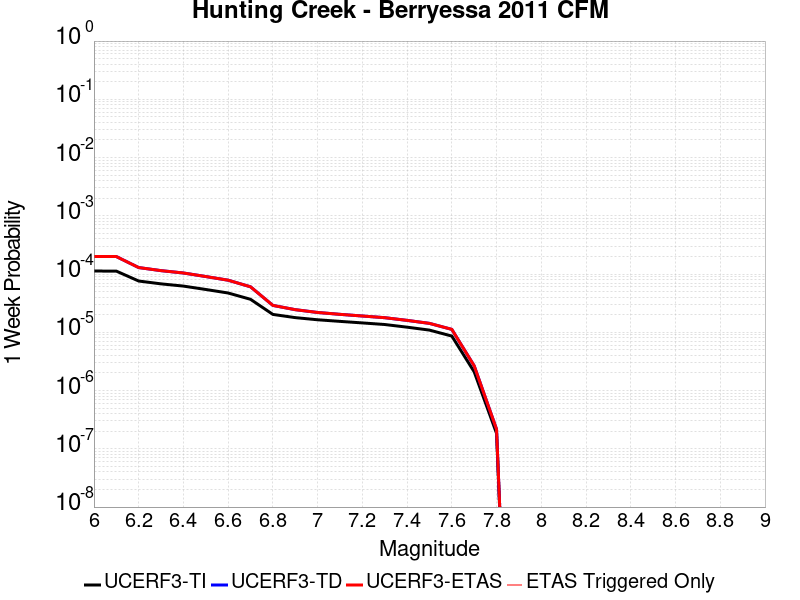 | 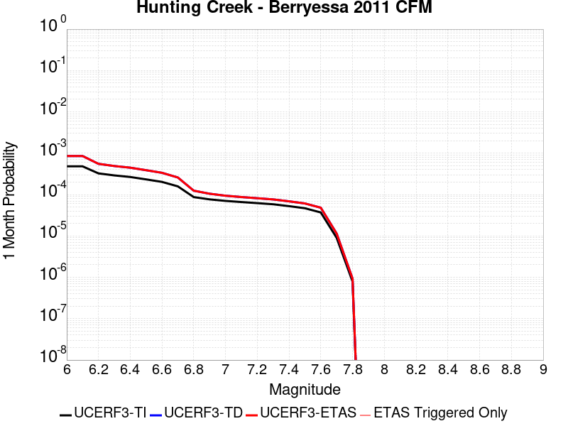 | 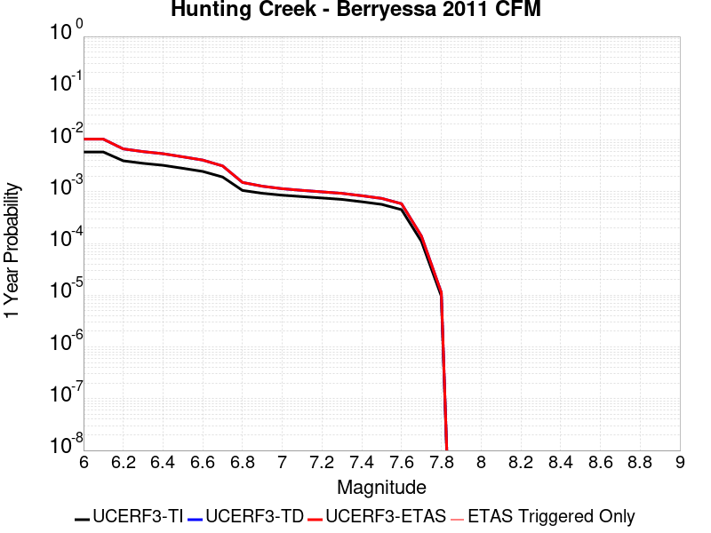 | 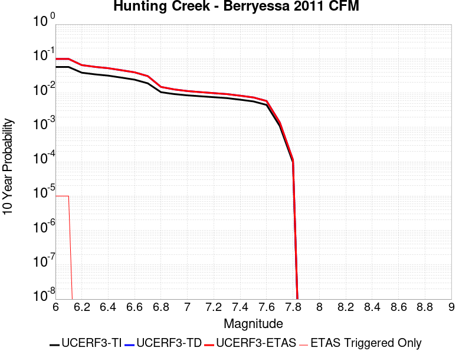 |

| Magnitude | 1 wk TI Prob | 1 wk TD Prob | 1 wk ETAS Prob | 1 wk ETAS/TD Gain | 1 wk ETAS Triggered Only | 1 mo TI Prob | 1 mo TD Prob | 1 mo ETAS Prob | 1 mo ETAS/TD Gain | 1 mo ETAS Triggered Only | 1 yr TI Prob | 1 yr TD Prob | 1 yr ETAS Prob | 1 yr ETAS/TD Gain | 1 yr ETAS Triggered Only | 10 yr TI Prob | 10 yr TD Prob | 10 yr ETAS Prob | 10 yr ETAS/TD Gain | 10 yr ETAS Triggered Only |
|-----|-----|-----|-----|-----|-----|-----|-----|-----|-----|-----|-----|-----|-----|-----|-----|-----|-----|-----|-----|-----|
| 6.0 | 1.1270982E-4 | 2.0014014E-4 | 2.0014014E-4 | 1.0 | 0.0 | 4.8295266E-4 | 8.574344E-4 | 8.574344E-4 | 1.0 | 0.0 | 0.0058641075 | 0.010387004 | 0.010387004 | 1.0 | 0.0 | 0.057117578 | 0.09804008 | 0.098049104 | 1.000092 | 1.0E-5 |
| 6.1 | 1.1239393E-4 | 1.996215E-4 | 1.996215E-4 | 1.0 | 0.0 | 4.8159933E-4 | 8.5521315E-4 | 8.5521315E-4 | 1.0 | 0.0 | 0.0058477195 | 0.010360241 | 0.010360241 | 1.0 | 0.0 | 0.056962132 | 0.097798556 | 0.09780758 | 1.0000923 | 1.0E-5 |
| 6.2 | 7.596265E-5 | 1.2941024E-4 | 1.2941024E-4 | 1.0 | 0.0 | 3.2551357E-4 | 5.544372E-4 | 5.544372E-4 | 1.0 | 0.0 | 0.0039559277 | 0.006721184 | 0.006721184 | 1.0 | 0.0 | 0.038862433 | 0.064593434 | 0.064593434 | 1.0 | 0.0 |
| 6.3 | 6.78794E-5 | 1.1451841E-4 | 1.1451841E-4 | 1.0 | 0.0 | 2.9087928E-4 | 4.9066416E-4 | 4.9066416E-4 | 1.0 | 0.0 | 0.003535705 | 0.005952828 | 0.005952828 | 1.0 | 0.0 | 0.034799766 | 0.05746714 | 0.05746714 | 1.0 | 0.0 |
| 6.4 | 6.2165134E-5 | 1.04372004E-4 | 1.04372004E-4 | 1.0 | 0.0 | 2.6639478E-4 | 4.472353E-4 | 4.472353E-4 | 1.0 | 0.0 | 0.0032385332 | 0.0054277135 | 0.0054277135 | 1.0 | 0.0 | 0.03191742 | 0.052552145 | 0.052552145 | 1.0 | 0.0 |
| 6.5 | 5.4368087E-5 | 9.071894E-5 | 9.071894E-5 | 1.0 | 0.0 | 2.3298527E-4 | 3.887406E-4 | 3.887406E-4 | 1.0 | 0.0 | 0.0028329059 | 0.0047199973 | 0.0047199973 | 1.0 | 0.0 | 0.027970633 | 0.04588156 | 0.04588156 | 1.0 | 0.0 |
| 6.6 | 4.729947E-5 | 7.8479694E-5 | 7.8479694E-5 | 1.0 | 0.0 | 2.0269625E-4 | 3.3630116E-4 | 3.3630116E-4 | 1.0 | 0.0 | 0.002465034 | 0.004085077 | 0.004085077 | 1.0 | 0.0 | 0.02437869 | 0.0398528 | 0.0398528 | 1.0 | 0.0 |
| 6.7 | 3.6875328E-5 | 6.0454597E-5 | 6.0454597E-5 | 1.0 | 0.0 | 1.5802756E-4 | 2.5906795E-4 | 2.5906795E-4 | 1.0 | 0.0 | 0.0019222875 | 0.0031483024 | 0.0031483024 | 1.0 | 0.0 | 0.019057442 | 0.030893352 | 0.030893352 | 1.0 | 0.0 |
| 6.8 | 2.0292036E-5 | 2.8976861E-5 | 2.8976861E-5 | 1.0 | 0.0 | 8.6962966E-5 | 1.2418067E-4 | 1.2418067E-4 | 1.0 | 0.0 | 0.0010582599 | 0.001510835 | 0.001510835 | 1.0 | 0.0 | 0.010532344 | 0.014978797 | 0.014978797 | 1.0 | 0.0 |
| 6.9 | 1.7871042E-5 | 2.4472707E-5 | 2.4472707E-5 | 1.0 | 0.0 | 7.658793E-5 | 1.0487885E-4 | 1.0487885E-4 | 1.0 | 0.0 | 9.320591E-4 | 0.0012761535 | 0.0012761535 | 1.0 | 0.0 | 0.009281595 | 0.012680006 | 0.012680006 | 1.0 | 0.0 |
| 7.0 | 1.6415532E-5 | 2.190669E-5 | 2.190669E-5 | 1.0 | 0.0 | 7.035038E-5 | 9.388246E-5 | 9.388246E-5 | 1.0 | 0.0 | 8.561793E-4 | 0.001142423 | 0.001142423 | 1.0 | 0.0 | 0.008528882 | 0.011364731 | 0.011364731 | 1.0 | 0.0 |
| 7.1 | 1.5409885E-5 | 2.0346732E-5 | 2.0346732E-5 | 1.0 | 0.0 | 6.6040695E-5 | 8.719738E-5 | 8.719738E-5 | 1.0 | 0.0 | 8.0374884E-4 | 0.001061114 | 0.001061114 | 1.0 | 0.0 | 0.00800848 | 0.010560796 | 0.010560796 | 1.0 | 0.0 |
| 7.2 | 1.4497423E-5 | 1.9055326E-5 | 1.9055326E-5 | 1.0 | 0.0 | 6.213033E-5 | 8.166314E-5 | 8.166314E-5 | 1.0 | 0.0 | 7.5617427E-4 | 9.937984E-4 | 9.937984E-4 | 1.0 | 0.0 | 0.0075360634 | 0.009894115 | 0.009894115 | 1.0 | 0.0 |
| 7.3 | 1.3615175E-5 | 1.7826476E-5 | 1.7826476E-5 | 1.0 | 0.0 | 5.8349444E-5 | 7.639696E-5 | 7.639696E-5 | 1.0 | 0.0 | 7.101729E-4 | 9.2973904E-4 | 9.2973904E-4 | 1.0 | 0.0 | 0.0070790765 | 0.009259002 | 0.009259002 | 1.0 | 0.0 |
| 7.4 | 1.2252825E-5 | 1.6026557E-5 | 1.6026557E-5 | 1.0 | 0.0 | 5.251105E-5 | 6.8683454E-5 | 6.8683454E-5 | 1.0 | 0.0 | 6.391345E-4 | 8.3590305E-4 | 8.3590305E-4 | 1.0 | 0.0 | 0.0063729943 | 0.008328031 | 0.008328031 | 1.0 | 0.0 |
| 7.5 | 1.0913301E-5 | 1.4241389E-5 | 1.4241389E-5 | 1.0 | 0.0 | 4.6770452E-5 | 6.103311E-5 | 6.103311E-5 | 1.0 | 0.0 | 5.6928146E-4 | 7.4282754E-4 | 7.4282754E-4 | 1.0 | 0.0 | 0.0056782532 | 0.0074038203 | 0.0074038203 | 1.0 | 0.0 |
| 7.6 | 8.623192E-6 | 1.1234857E-5 | 1.1234857E-5 | 1.0 | 0.0 | 3.6956015E-5 | 4.8148515E-5 | 4.8148515E-5 | 1.0 | 0.0 | 4.4984656E-4 | 5.8605307E-4 | 5.8605307E-4 | 1.0 | 0.0 | 0.00448937 | 0.0058453903 | 0.0058453903 | 1.0 | 0.0 |
| 7.7 | 2.0993634E-6 | 2.6626283E-6 | 2.6626283E-6 | 1.0 | 0.0 | 8.997241E-6 | 1.14112145E-5 | 1.14112145E-5 | 1.0 | 0.0 | 1.09535904E-4 | 1.3892275E-4 | 1.3892275E-4 | 1.0 | 0.0 | 0.0010948193 | 0.0013883656 | 0.0013883656 | 1.0 | 0.0 |
| 7.8 | 1.8428308E-7 | 2.167469E-7 | 2.167469E-7 | 1.0 | 0.0 | 7.897844E-7 | 9.28915E-7 | 9.28915E-7 | 1.0 | 0.0 | 9.615583E-6 | 1.1309485E-5 | 1.1309485E-5 | 1.0 | 0.0 | 9.615166E-5 | 1.130877E-4 | 1.130877E-4 | 1.0 | 0.0 |

## Concord 2011 CFM
*[(top)](#table-of-contents)*

| 1 Week | 1 Month | 1 Year | 10 Year |
|-----|-----|-----|-----|
| 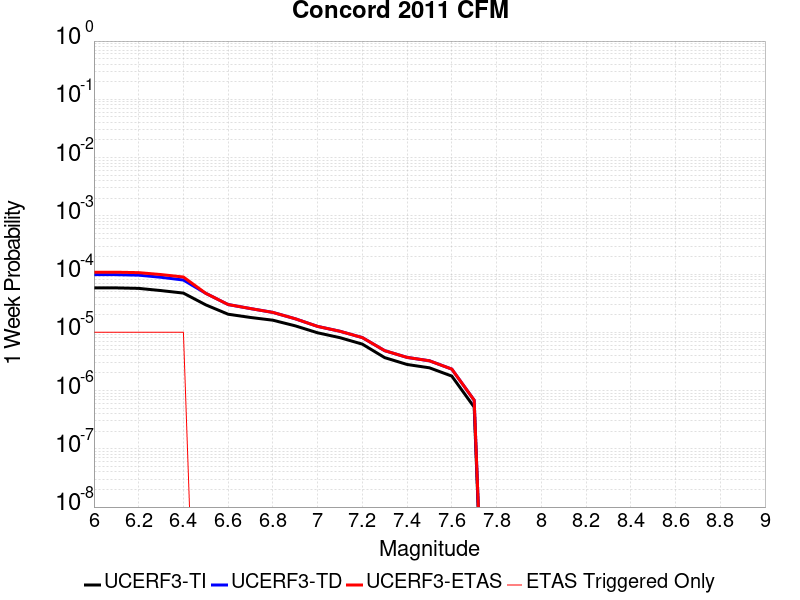 | 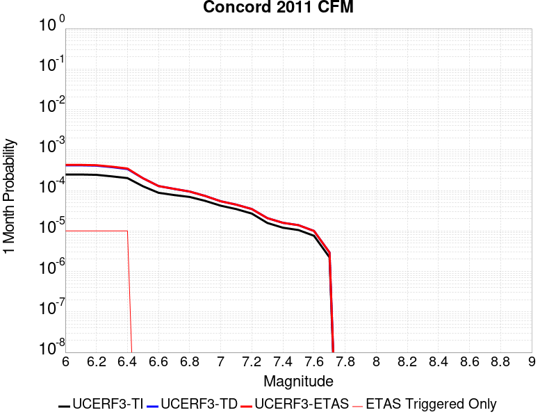 | 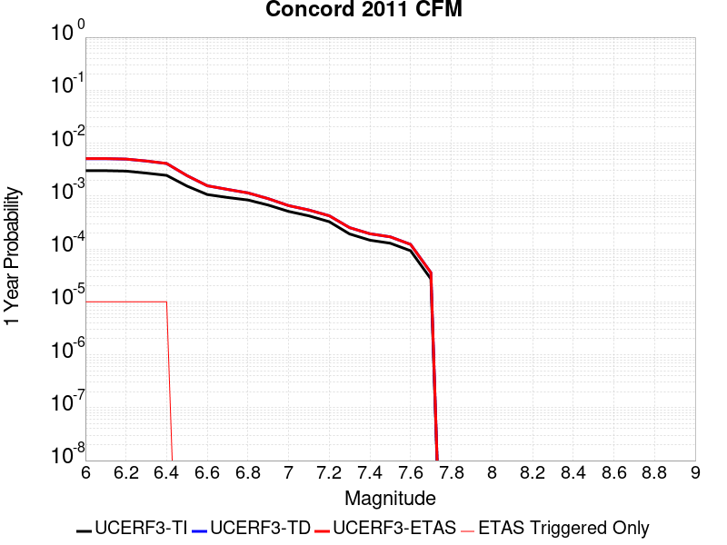 | 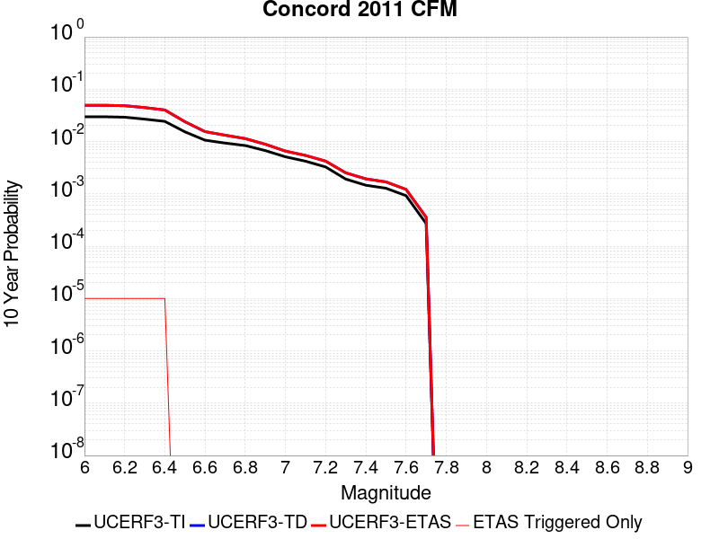 |

| Magnitude | 1 wk TI Prob | 1 wk TD Prob | 1 wk ETAS Prob | 1 wk ETAS/TD Gain | 1 wk ETAS Triggered Only | 1 mo TI Prob | 1 mo TD Prob | 1 mo ETAS Prob | 1 mo ETAS/TD Gain | 1 mo ETAS Triggered Only | 1 yr TI Prob | 1 yr TD Prob | 1 yr ETAS Prob | 1 yr ETAS/TD Gain | 1 yr ETAS Triggered Only | 10 yr TI Prob | 10 yr TD Prob | 10 yr ETAS Prob | 10 yr ETAS/TD Gain | 10 yr ETAS Triggered Only |
|-----|-----|-----|-----|-----|-----|-----|-----|-----|-----|-----|-----|-----|-----|-----|-----|-----|-----|-----|-----|-----|
| 6.0 | 5.7865112E-5 | 9.759276E-5 | 1.0759179E-4 | 1.1024566 | 1.0E-5 | 2.4796976E-4 | 4.1819242E-4 | 4.2818824E-4 | 1.0239024 | 1.0E-5 | 0.0030148525 | 0.0050795143 | 0.0050894637 | 1.0019587 | 1.0E-5 | 0.029742775 | 0.04924946 | 0.04925897 | 1.000193 | 1.0E-5 |
| 6.1 | 5.7865112E-5 | 9.759276E-5 | 1.0759179E-4 | 1.1024566 | 1.0E-5 | 2.4796976E-4 | 4.1819242E-4 | 4.2818824E-4 | 1.0239024 | 1.0E-5 | 0.0030148525 | 0.0050795143 | 0.0050894637 | 1.0019587 | 1.0E-5 | 0.029742775 | 0.04924946 | 0.04925897 | 1.000193 | 1.0E-5 |
| 6.2 | 5.6789337E-5 | 9.5796226E-5 | 1.0579527E-4 | 1.1043782 | 1.0E-5 | 2.4336016E-4 | 4.104954E-4 | 4.204913E-4 | 1.0243508 | 1.0E-5 | 0.0029588845 | 0.004986234 | 0.004996184 | 1.0019956 | 1.0E-5 | 0.029197963 | 0.048366006 | 0.04837552 | 1.0001968 | 1.0E-5 |
| 6.3 | 5.203322E-5 | 8.803118E-5 | 9.80303E-5 | 1.1135861 | 1.0E-5 | 2.2298045E-4 | 3.7722633E-4 | 3.8722256E-4 | 1.0264993 | 1.0E-5 | 0.0027114071 | 0.0045838426 | 0.004593797 | 1.0021715 | 1.0E-5 | 0.026785625 | 0.044537015 | 0.04454657 | 1.0002146 | 1.0E-5 |
| 6.4 | 4.7120942E-5 | 7.897459E-5 | 8.89738E-5 | 1.126613 | 1.0E-5 | 2.0193127E-4 | 3.384228E-4 | 3.4841945E-4 | 1.0295389 | 1.0E-5 | 0.0024557412 | 0.0041132583 | 0.0041232174 | 1.0024211 | 1.0E-5 | 0.024287801 | 0.040065795 | 0.04007539 | 1.0002396 | 1.0E-5 |
| 6.5 | 2.9598437E-5 | 4.667518E-5 | 4.667518E-5 | 1.0 | 0.0 | 1.2684427E-4 | 2.0002235E-4 | 2.0002235E-4 | 1.0 | 0.0 | 0.001543235 | 0.0024327626 | 0.0024327626 | 1.0 | 0.0 | 0.015325619 | 0.023910133 | 0.023910133 | 1.0 | 0.0 |
| 6.6 | 2.0443718E-5 | 2.998456E-5 | 2.998456E-5 | 1.0 | 0.0 | 8.7613E-5 | 1.2849913E-4 | 1.2849913E-4 | 1.0 | 0.0 | 0.0010661662 | 0.0015633904 | 0.0015633904 | 1.0 | 0.0 | 0.010610655 | 0.015467111 | 0.015467111 | 1.0 | 0.0 |
| 6.7 | 1.798539E-5 | 2.5557589E-5 | 2.5557589E-5 | 1.0 | 0.0 | 7.7077966E-5 | 1.09528046E-4 | 1.09528046E-4 | 1.0 | 0.0 | 9.380202E-4 | 0.0013327097 | 0.0013327097 | 1.0 | 0.0 | 0.009340706 | 0.013217538 | 0.013217538 | 1.0 | 0.0 |
| 6.8 | 1.613555E-5 | 2.1959388E-5 | 2.1959388E-5 | 1.0 | 0.0 | 6.915052E-5 | 9.410835E-5 | 9.410835E-5 | 1.0 | 0.0 | 8.4158237E-4 | 0.0011451809 | 0.0011451809 | 1.0 | 0.0 | 0.008384023 | 0.011378295 | 0.011378295 | 1.0 | 0.0 |
| 6.9 | 1.2916435E-5 | 1.7081193E-5 | 1.7081193E-5 | 1.0 | 0.0 | 5.5354973E-5 | 7.320309E-5 | 7.320309E-5 | 1.0 | 0.0 | 6.7373837E-4 | 8.90889E-4 | 8.90889E-4 | 1.0 | 0.0 | 0.006716994 | 0.00886721 | 0.00886721 | 1.0 | 0.0 |
| 7.0 | 9.81129E-6 | 1.2630933E-5 | 1.2630933E-5 | 1.0 | 0.0 | 4.2047708E-5 | 5.4131455E-5 | 5.4131455E-5 | 1.0 | 0.0 | 5.118106E-4 | 6.588528E-4 | 6.588528E-4 | 1.0 | 0.0 | 0.005106334 | 0.0065692067 | 0.0065692067 | 1.0 | 0.0 |
| 7.1 | 8.0889195E-6 | 1.0418346E-5 | 1.0418346E-5 | 1.0 | 0.0 | 3.4666336E-5 | 4.4649296E-5 | 4.4649296E-5 | 1.0 | 0.0 | 4.219809E-4 | 5.4347067E-4 | 5.4347067E-4 | 1.0 | 0.0 | 0.004211805 | 0.005421642 | 0.005421642 | 1.0 | 0.0 |
| 7.2 | 6.267438E-6 | 8.115762E-6 | 8.115762E-6 | 1.0 | 0.0 | 2.6860173E-5 | 3.478138E-5 | 3.478138E-5 | 1.0 | 0.0 | 3.2697353E-4 | 4.2338175E-4 | 4.2338175E-4 | 1.0 | 0.0 | 0.0032649285 | 0.004226002 | 0.004226002 | 1.0 | 0.0 |
| 7.3 | 3.6761196E-6 | 4.8401985E-6 | 4.8401985E-6 | 1.0 | 0.0 | 1.5754704E-5 | 2.0743544E-5 | 2.0743544E-5 | 1.0 | 0.0 | 1.9179663E-4 | 2.525236E-4 | 2.525236E-4 | 1.0 | 0.0 | 0.0019163118 | 0.0025225042 | 0.0025225042 | 1.0 | 0.0 |
| 7.4 | 2.8044356E-6 | 3.7096288E-6 | 3.7096288E-6 | 1.0 | 0.0 | 1.2018954E-5 | 1.5898313E-5 | 1.5898313E-5 | 1.0 | 0.0 | 1.4632095E-4 | 1.9354488E-4 | 1.9354488E-4 | 1.0 | 0.0 | 0.0014622464 | 0.0019338614 | 0.0019338614 | 1.0 | 0.0 |
| 7.5 | 2.4578699E-6 | 3.2447533E-6 | 3.2447533E-6 | 1.0 | 0.0 | 1.0533685E-5 | 1.3906012E-5 | 1.3906012E-5 | 1.0 | 0.0 | 1.2824008E-4 | 1.6929265E-4 | 1.6929265E-4 | 1.0 | 0.0 | 0.0012816609 | 0.0016917177 | 0.0016917177 | 1.0 | 0.0 |
| 7.6 | 1.7713267E-6 | 2.3351254E-6 | 2.3351254E-6 | 1.0 | 0.0 | 7.591378E-6 | 1.0007642E-5 | 1.0007642E-5 | 1.0 | 0.0 | 9.2421105E-5 | 1.21836325E-4 | 1.21836325E-4 | 1.0 | 0.0 | 9.2382677E-4 | 0.0012177486 | 0.0012177486 | 1.0 | 0.0 |
| 7.7 | 5.1912366E-7 | 6.8290353E-7 | 6.8290353E-7 | 1.0 | 0.0 | 2.2248137E-6 | 2.9267262E-6 | 2.9267262E-6 | 1.0 | 0.0 | 2.708677E-5 | 3.563232E-5 | 3.563232E-5 | 1.0 | 0.0 | 2.708347E-4 | 3.5627405E-4 | 3.5627405E-4 | 1.0 | 0.0 |

## Almanor 2011 CFM
*[(top)](#table-of-contents)*

| 1 Week | 1 Month | 1 Year | 10 Year |
|-----|-----|-----|-----|
| 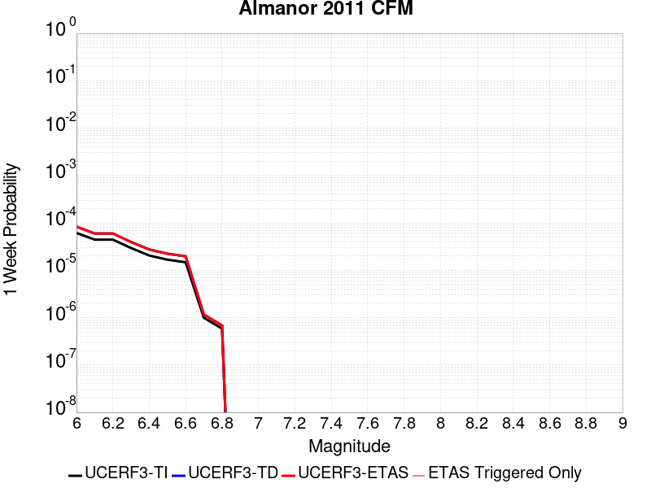 | 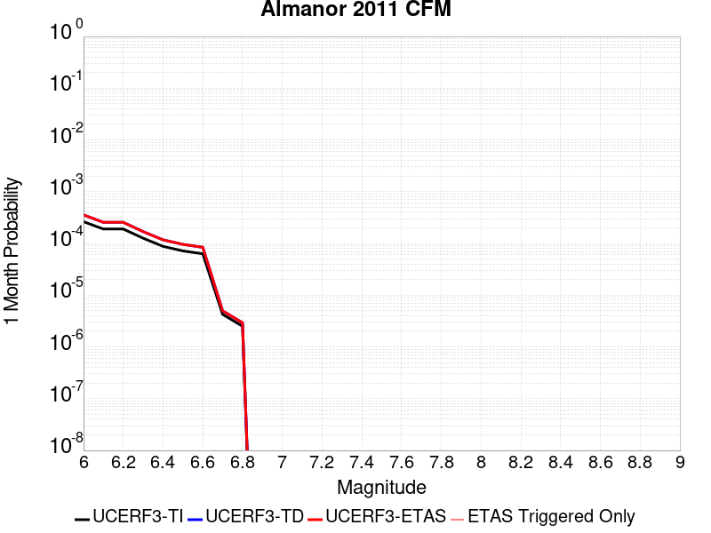 | 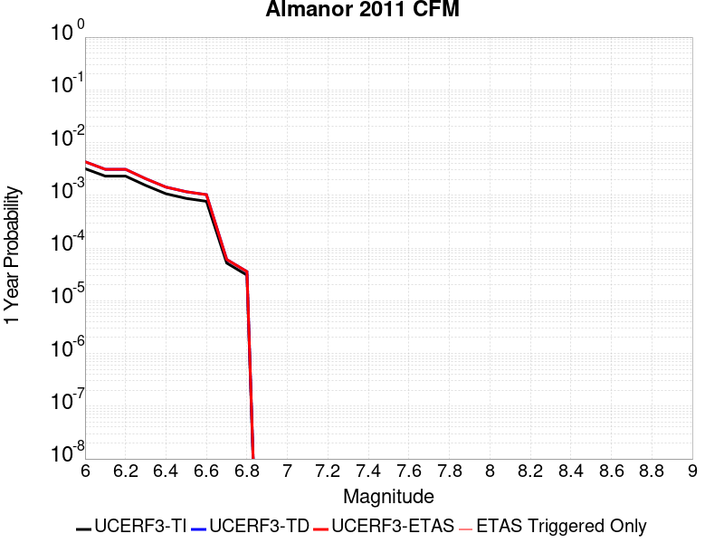 | 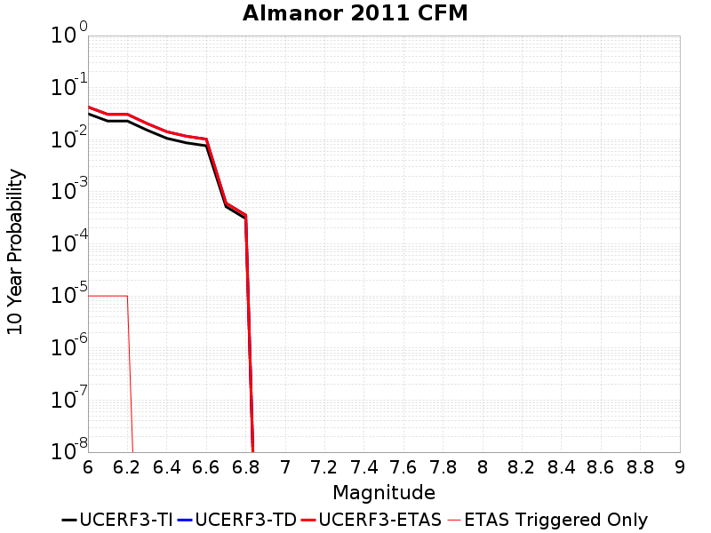 |

| Magnitude | 1 wk TI Prob | 1 wk TD Prob | 1 wk ETAS Prob | 1 wk ETAS/TD Gain | 1 wk ETAS Triggered Only | 1 mo TI Prob | 1 mo TD Prob | 1 mo ETAS Prob | 1 mo ETAS/TD Gain | 1 mo ETAS Triggered Only | 1 yr TI Prob | 1 yr TD Prob | 1 yr ETAS Prob | 1 yr ETAS/TD Gain | 1 yr ETAS Triggered Only | 10 yr TI Prob | 10 yr TD Prob | 10 yr ETAS Prob | 10 yr ETAS/TD Gain | 10 yr ETAS Triggered Only |
|-----|-----|-----|-----|-----|-----|-----|-----|-----|-----|-----|-----|-----|-----|-----|-----|-----|-----|-----|-----|-----|
| 6.0 | 6.1479834E-5 | 8.3282044E-5 | 8.3282044E-5 | 1.0 | 0.0 | 2.6345838E-4 | 3.5688007E-4 | 3.5688007E-4 | 1.0 | 0.0 | 0.0032028882 | 0.004336759 | 0.004336759 | 1.0 | 0.0 | 0.031571172 | 0.042587288 | 0.04259686 | 1.0002248 | 1.0E-5 |
| 6.1 | 4.4387216E-5 | 5.977279E-5 | 5.977279E-5 | 1.0 | 0.0 | 1.9021705E-4 | 2.561481E-4 | 2.561481E-4 | 1.0 | 0.0 | 0.0023134327 | 0.0031145336 | 0.0031145336 | 1.0 | 0.0 | 0.022894967 | 0.03075612 | 0.030765813 | 1.0003152 | 1.0E-5 |
| 6.2 | 4.4387216E-5 | 5.977279E-5 | 5.977279E-5 | 1.0 | 0.0 | 1.9021705E-4 | 2.561481E-4 | 2.561481E-4 | 1.0 | 0.0 | 0.0023134327 | 0.0031145336 | 0.0031145336 | 1.0 | 0.0 | 0.022894967 | 0.03075612 | 0.030765813 | 1.0003152 | 1.0E-5 |
| 6.3 | 2.9523822E-5 | 3.954871E-5 | 3.954871E-5 | 1.0 | 0.0 | 1.2652454E-4 | 1.6948633E-4 | 1.6948633E-4 | 1.0 | 0.0 | 0.0015393476 | 0.002061942 | 0.002061942 | 1.0 | 0.0 | 0.015287281 | 0.020461509 | 0.020461509 | 1.0 | 0.0 |
| 6.4 | 2.0512744E-5 | 2.7432667E-5 | 2.7432667E-5 | 1.0 | 0.0 | 8.79088E-5 | 1.17565694E-4 | 1.17565694E-4 | 1.0 | 0.0 | 0.001069764 | 0.001430788 | 0.001430788 | 1.0 | 0.0 | 0.010646289 | 0.014244908 | 0.014244908 | 1.0 | 0.0 |
| 6.5 | 1.6750226E-5 | 2.2392156E-5 | 2.2392156E-5 | 1.0 | 0.0 | 7.178471E-5 | 9.596519E-5 | 9.596519E-5 | 1.0 | 0.0 | 8.7362836E-4 | 0.0011681004 | 0.0011681004 | 1.0 | 0.0 | 0.008702018 | 0.011649443 | 0.011649443 | 1.0 | 0.0 |
| 6.6 | 1.4745303E-5 | 1.9708705E-5 | 1.9708705E-5 | 1.0 | 0.0 | 6.319262E-5 | 8.446546E-5 | 8.446546E-5 | 1.0 | 0.0 | 7.690986E-4 | 0.0010282281 | 0.0010282281 | 1.0 | 0.0 | 0.0076644225 | 0.010265328 | 0.010265328 | 1.0 | 0.0 |
| 6.7 | 9.951145E-7 | 1.1616564E-6 | 1.1616564E-6 | 1.0 | 0.0 | 4.26477E-6 | 4.978519E-6 | 4.978519E-6 | 1.0 | 0.0 | 5.1922336E-5 | 6.061196E-5 | 6.061196E-5 | 1.0 | 0.0 | 5.1910203E-4 | 6.0597155E-4 | 6.0597155E-4 | 1.0 | 0.0 |
| 6.8 | 5.866312E-7 | 6.8495126E-7 | 6.8495126E-7 | 1.0 | 0.0 | 2.5141312E-6 | 2.9355028E-6 | 2.9355028E-6 | 1.0 | 0.0 | 3.0609117E-5 | 3.5739293E-5 | 3.5739293E-5 | 1.0 | 0.0 | 3.06049E-4 | 3.5734827E-4 | 3.5734827E-4 | 1.0 | 0.0 |

## Puente Hills
*[(top)](#table-of-contents)*

| 1 Week | 1 Month | 1 Year | 10 Year |
|-----|-----|-----|-----|
| 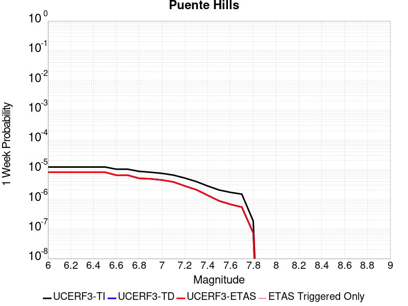 | 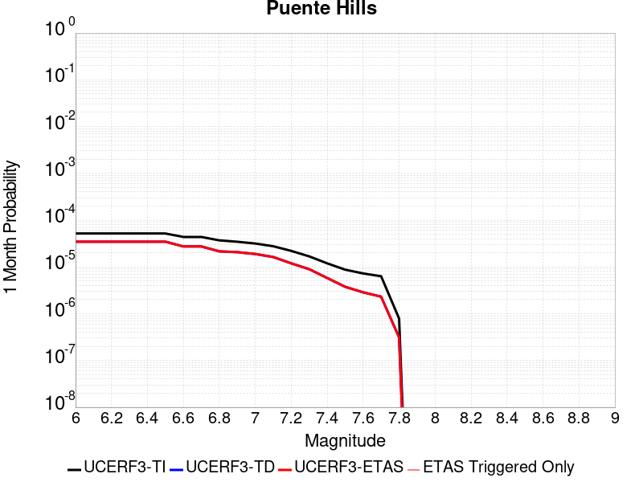 | 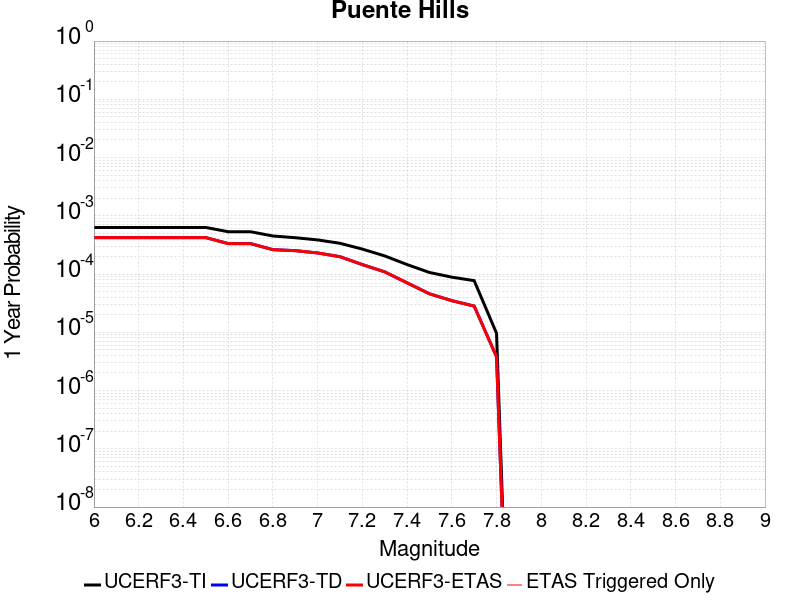 | 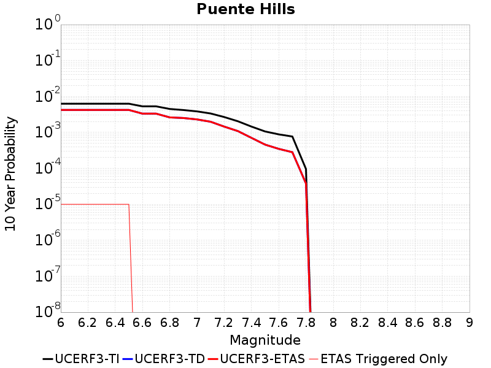 |

| Magnitude | 1 wk TI Prob | 1 wk TD Prob | 1 wk ETAS Prob | 1 wk ETAS/TD Gain | 1 wk ETAS Triggered Only | 1 mo TI Prob | 1 mo TD Prob | 1 mo ETAS Prob | 1 mo ETAS/TD Gain | 1 mo ETAS Triggered Only | 1 yr TI Prob | 1 yr TD Prob | 1 yr ETAS Prob | 1 yr ETAS/TD Gain | 1 yr ETAS Triggered Only | 10 yr TI Prob | 10 yr TD Prob | 10 yr ETAS Prob | 10 yr ETAS/TD Gain | 10 yr ETAS Triggered Only |
|-----|-----|-----|-----|-----|-----|-----|-----|-----|-----|-----|-----|-----|-----|-----|-----|-----|-----|-----|-----|-----|
| 6.0 | 1.2101656E-5 | 8.098759E-6 | 8.098759E-6 | 1.0 | 0.0 | 5.1863204E-5 | 3.4708537E-5 | 3.4708537E-5 | 1.0 | 0.0 | 6.312516E-4 | 4.2250016E-4 | 4.2250016E-4 | 1.0 | 0.0 | 0.0062946146 | 0.004217529 | 0.0042274874 | 1.002361 | 1.0E-5 |
| 6.1 | 1.2101656E-5 | 8.098759E-6 | 8.098759E-6 | 1.0 | 0.0 | 5.1863204E-5 | 3.4708537E-5 | 3.4708537E-5 | 1.0 | 0.0 | 6.312516E-4 | 4.2250016E-4 | 4.2250016E-4 | 1.0 | 0.0 | 0.0062946146 | 0.004217529 | 0.0042274874 | 1.002361 | 1.0E-5 |
| 6.2 | 1.2101656E-5 | 8.098759E-6 | 8.098759E-6 | 1.0 | 0.0 | 5.1863204E-5 | 3.4708537E-5 | 3.4708537E-5 | 1.0 | 0.0 | 6.312516E-4 | 4.2250016E-4 | 4.2250016E-4 | 1.0 | 0.0 | 0.0062946146 | 0.004217529 | 0.0042274874 | 1.002361 | 1.0E-5 |
| 6.3 | 1.2101656E-5 | 8.098759E-6 | 8.098759E-6 | 1.0 | 0.0 | 5.1863204E-5 | 3.4708537E-5 | 3.4708537E-5 | 1.0 | 0.0 | 6.312516E-4 | 4.2250016E-4 | 4.2250016E-4 | 1.0 | 0.0 | 0.0062946146 | 0.004217529 | 0.0042274874 | 1.002361 | 1.0E-5 |
| 6.4 | 1.2101656E-5 | 8.098759E-6 | 8.098759E-6 | 1.0 | 0.0 | 5.1863204E-5 | 3.4708537E-5 | 3.4708537E-5 | 1.0 | 0.0 | 6.312516E-4 | 4.2250016E-4 | 4.2250016E-4 | 1.0 | 0.0 | 0.0062946146 | 0.004217529 | 0.0042274874 | 1.002361 | 1.0E-5 |
| 6.5 | 1.2101656E-5 | 8.098759E-6 | 8.098759E-6 | 1.0 | 0.0 | 5.1863204E-5 | 3.4708537E-5 | 3.4708537E-5 | 1.0 | 0.0 | 6.312516E-4 | 4.2250016E-4 | 4.2250016E-4 | 1.0 | 0.0 | 0.0062946146 | 0.004217529 | 0.0042274874 | 1.002361 | 1.0E-5 |
| 6.6 | 1.0222488E-5 | 6.399306E-6 | 6.399306E-6 | 1.0 | 0.0 | 4.3809923E-5 | 2.7425323E-5 | 2.7425323E-5 | 1.0 | 0.0 | 5.332553E-4 | 3.338546E-4 | 3.338546E-4 | 1.0 | 0.0 | 0.0053197746 | 0.0033337758 | 0.0033337758 | 1.0 | 0.0 |
| 6.7 | 1.0222488E-5 | 6.399306E-6 | 6.399306E-6 | 1.0 | 0.0 | 4.3809923E-5 | 2.7425323E-5 | 2.7425323E-5 | 1.0 | 0.0 | 5.332553E-4 | 3.338546E-4 | 3.338546E-4 | 1.0 | 0.0 | 0.0053197746 | 0.0033337758 | 0.0033337758 | 1.0 | 0.0 |
| 6.8 | 8.6367845E-6 | 5.0283606E-6 | 5.0283606E-6 | 1.0 | 0.0 | 3.7014266E-5 | 2.154994E-5 | 2.154994E-5 | 1.0 | 0.0 | 4.505555E-4 | 2.623395E-4 | 2.623395E-4 | 1.0 | 0.0 | 0.004496431 | 0.0026203543 | 0.0026203543 | 1.0 | 0.0 |
| 6.9 | 8.066481E-6 | 4.8362213E-6 | 4.8362213E-6 | 1.0 | 0.0 | 3.4570177E-5 | 2.07265E-5 | 2.07265E-5 | 1.0 | 0.0 | 4.2081063E-4 | 2.5231644E-4 | 2.5231644E-4 | 1.0 | 0.0 | 0.0042001465 | 0.0025203535 | 0.0025203535 | 1.0 | 0.0 |
| 7.0 | 7.393828E-6 | 4.4173958E-6 | 4.4173958E-6 | 1.0 | 0.0 | 3.168745E-5 | 1.8931561E-5 | 1.8931561E-5 | 1.0 | 0.0 | 3.857264E-4 | 2.3046782E-4 | 2.3046782E-4 | 1.0 | 0.0 | 0.0038505755 | 0.0023023335 | 0.0023023335 | 1.0 | 0.0 |
| 7.1 | 6.4660953E-6 | 3.8045341E-6 | 3.8045341E-6 | 1.0 | 0.0 | 2.7711543E-5 | 1.6305046E-5 | 1.6305046E-5 | 1.0 | 0.0 | 3.373358E-4 | 1.9849621E-4 | 1.9849621E-4 | 1.0 | 0.0 | 0.0033682417 | 0.001983225 | 0.001983225 | 1.0 | 0.0 |
| 7.2 | 5.143232E-6 | 2.7866113E-6 | 2.7866113E-6 | 1.0 | 0.0 | 2.2042237E-5 | 1.1942566E-5 | 1.1942566E-5 | 1.0 | 0.0 | 2.6833118E-4 | 1.4539112E-4 | 1.4539112E-4 | 1.0 | 0.0 | 0.002680074 | 0.0014529699 | 0.0014529699 | 1.0 | 0.0 |
| 7.3 | 3.928255E-6 | 2.0914338E-6 | 2.0914338E-6 | 1.0 | 0.0 | 1.683527E-5 | 8.963257E-6 | 8.963257E-6 | 1.0 | 0.0 | 2.0495013E-4 | 1.0912225E-4 | 1.0912225E-4 | 1.0 | 0.0 | 0.002047612 | 0.0010906934 | 0.0010906934 | 1.0 | 0.0 |
| 7.4 | 2.7894434E-6 | 1.3547234E-6 | 1.3547234E-6 | 1.0 | 0.0 | 1.1954703E-5 | 5.805945E-6 | 5.805945E-6 | 1.0 | 0.0 | 1.4553878E-4 | 7.068513E-5 | 7.068513E-5 | 1.0 | 0.0 | 0.001454435 | 7.066309E-4 | 7.066309E-4 | 1.0 | 0.0 |
| 7.5 | 2.041735E-6 | 8.787688E-7 | 8.787688E-7 | 1.0 | 0.0 | 8.750263E-6 | 3.7661466E-6 | 3.7661466E-6 | 1.0 | 0.0 | 1.06529245E-4 | 4.5851906E-5 | 4.5851906E-5 | 1.0 | 0.0 | 0.0010647819 | 4.584278E-4 | 4.584278E-4 | 1.0 | 0.0 |
| 7.6 | 1.6959062E-6 | 6.698947E-7 | 6.698947E-7 | 1.0 | 0.0 | 7.268149E-6 | 2.8709742E-6 | 2.8709742E-6 | 1.0 | 0.0 | 8.848612E-5 | 3.495358E-5 | 3.495358E-5 | 1.0 | 0.0 | 8.84509E-4 | 3.494837E-4 | 3.494837E-4 | 1.0 | 0.0 |
| 7.7 | 1.4767965E-6 | 5.4078794E-7 | 5.4078794E-7 | 1.0 | 0.0 | 6.3291122E-6 | 2.3176606E-6 | 2.3176606E-6 | 1.0 | 0.0 | 7.705422E-5 | 2.8217179E-5 | 2.8217179E-5 | 1.0 | 0.0 | 7.702751E-4 | 2.8213853E-4 | 2.8213853E-4 | 1.0 | 0.0 |
| 7.8 | 1.8432911E-7 | 7.282334E-8 | 7.282334E-8 | 1.0 | 0.0 | 7.8998164E-7 | 3.1209998E-7 | 3.1209998E-7 | 1.0 | 0.0 | 9.617985E-6 | 3.799814E-6 | 3.799814E-6 | 1.0 | 0.0 | 9.617568E-5 | 3.799782E-5 | 3.799782E-5 | 1.0 | 0.0 |

## Quien Sabe 2011 CFM
*[(top)](#table-of-contents)*

| 1 Week | 1 Month | 1 Year | 10 Year |
|-----|-----|-----|-----|
| 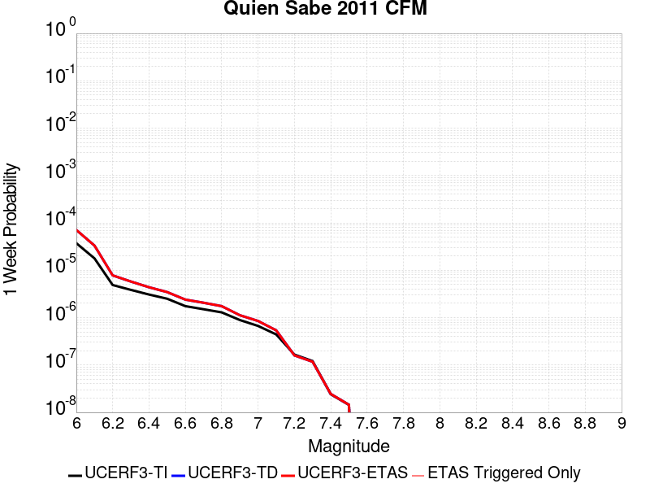 | 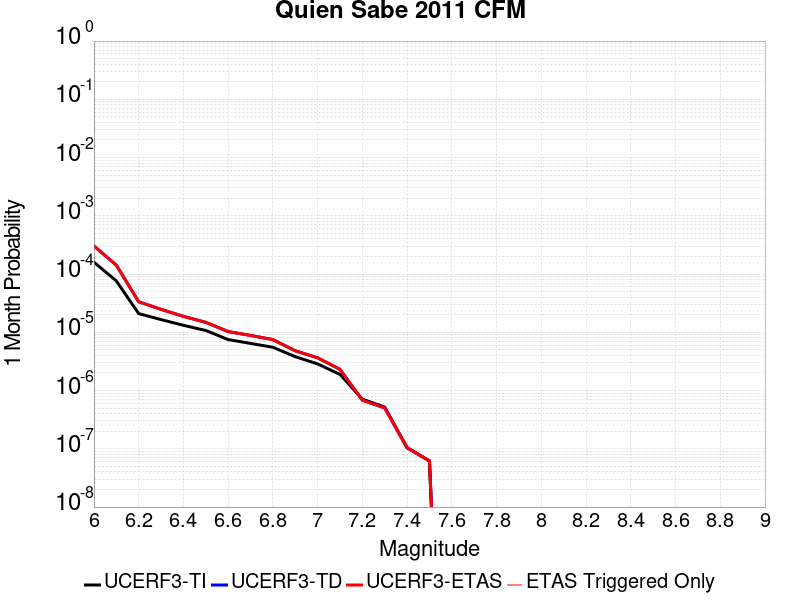 | 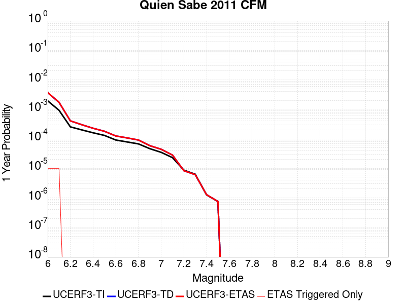 | 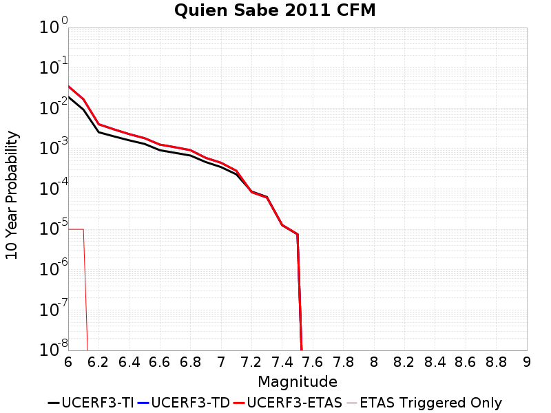 |

| Magnitude | 1 wk TI Prob | 1 wk TD Prob | 1 wk ETAS Prob | 1 wk ETAS/TD Gain | 1 wk ETAS Triggered Only | 1 mo TI Prob | 1 mo TD Prob | 1 mo ETAS Prob | 1 mo ETAS/TD Gain | 1 mo ETAS Triggered Only | 1 yr TI Prob | 1 yr TD Prob | 1 yr ETAS Prob | 1 yr ETAS/TD Gain | 1 yr ETAS Triggered Only | 10 yr TI Prob | 10 yr TD Prob | 10 yr ETAS Prob | 10 yr ETAS/TD Gain | 10 yr ETAS Triggered Only |
|-----|-----|-----|-----|-----|-----|-----|-----|-----|-----|-----|-----|-----|-----|-----|-----|-----|-----|-----|-----|-----|
| 6.0 | 3.729899E-5 | 7.0887734E-5 | 7.0887734E-5 | 1.0 | 0.0 | 1.5984301E-4 | 3.037728E-4 | 3.037728E-4 | 1.0 | 0.0 | 0.0019443515 | 0.003685339 | 0.0036953022 | 1.0027034 | 1.0E-5 | 0.019274272 | 0.035351057 | 0.035360705 | 1.0002729 | 1.0E-5 |
| 6.1 | 1.7825725E-5 | 3.314981E-5 | 3.314981E-5 | 1.0 | 0.0 | 7.639373E-5 | 1.4206428E-4 | 1.4206428E-4 | 1.0 | 0.0 | 9.296967E-4 | 0.0017267787 | 0.0017367614 | 1.0057812 | 1.0E-5 | 0.009258169 | 0.016699232 | 0.016709065 | 1.0005888 | 1.0E-5 |
| 6.2 | 4.8865336E-6 | 7.805507E-6 | 7.805507E-6 | 1.0 | 0.0 | 2.0942118E-5 | 3.34518E-5 | 3.34518E-5 | 1.0 | 0.0 | 2.5494045E-4 | 4.0693046E-4 | 4.0693046E-4 | 1.0 | 0.0 | 0.0025464818 | 0.004013698 | 0.004013698 | 1.0 | 0.0 |
| 6.3 | 3.858491E-6 | 5.78981E-6 | 5.78981E-6 | 1.0 | 0.0 | 1.6536285E-5 | 2.4813264E-5 | 2.4813264E-5 | 1.0 | 0.0 | 2.0131067E-4 | 3.020643E-4 | 3.020643E-4 | 1.0 | 0.0 | 0.002011284 | 0.003002096 | 0.003002096 | 1.0 | 0.0 |
| 6.4 | 3.0771805E-6 | 4.3850278E-6 | 4.3850278E-6 | 1.0 | 0.0 | 1.318785E-5 | 1.8792854E-5 | 1.8792854E-5 | 1.0 | 0.0 | 1.6055023E-4 | 2.2878141E-4 | 2.2878141E-4 | 1.0 | 0.0 | 0.001604343 | 0.0022865846 | 0.0022865846 | 1.0 | 0.0 |
| 6.5 | 2.5081235E-6 | 3.4637053E-6 | 3.4637053E-6 | 1.0 | 0.0 | 1.0749056E-5 | 1.4844375E-5 | 1.4844375E-5 | 1.0 | 0.0 | 1.308619E-4 | 1.8071676E-4 | 1.8071676E-4 | 1.0 | 0.0 | 0.0013078486 | 0.0018124063 | 0.0018124063 | 1.0 | 0.0 |
| 6.6 | 1.7505364E-6 | 2.4024464E-6 | 2.4024464E-6 | 1.0 | 0.0 | 7.502277E-6 | 1.0296162E-5 | 1.0296162E-5 | 1.0 | 0.0 | 9.13364E-5 | 1.2534928E-4 | 1.2534928E-4 | 1.0 | 0.0 | 9.129886E-4 | 0.0012583556 | 0.0012583556 | 1.0 | 0.0 |
| 6.7 | 1.505737E-6 | 2.0638463E-6 | 2.0638463E-6 | 1.0 | 0.0 | 6.4531428E-6 | 8.845029E-6 | 8.845029E-6 | 1.0 | 0.0 | 7.8564175E-5 | 1.07683496E-4 | 1.07683496E-4 | 1.0 | 0.0 | 7.853641E-4 | 0.0010818692 | 0.0010818692 | 1.0 | 0.0 |
| 6.8 | 1.2924105E-6 | 1.7484944E-6 | 1.7484944E-6 | 1.0 | 0.0 | 5.5388905E-6 | 7.4935288E-6 | 7.4935288E-6 | 1.0 | 0.0 | 6.74339E-5 | 9.123044E-5 | 9.123044E-5 | 1.0 | 0.0 | 6.741344E-4 | 9.1614196E-4 | 9.1614196E-4 | 1.0 | 0.0 |
| 6.9 | 8.9075286E-7 | 1.1250584E-6 | 1.1250584E-6 | 1.0 | 0.0 | 3.8175067E-6 | 4.821671E-6 | 4.821671E-6 | 1.0 | 0.0 | 4.6477155E-5 | 5.8702488E-5 | 5.8702488E-5 | 1.0 | 0.0 | 4.6467435E-4 | 5.904266E-4 | 5.904266E-4 | 1.0 | 0.0 |
| 7.0 | 6.6891175E-7 | 8.517119E-7 | 8.517119E-7 | 1.0 | 0.0 | 2.8667614E-6 | 3.65019E-6 | 3.65019E-6 | 1.0 | 0.0 | 3.4902263E-5 | 4.4440352E-5 | 4.4440352E-5 | 1.0 | 0.0 | 3.4896782E-4 | 4.4681094E-4 | 4.4681094E-4 | 1.0 | 0.0 |
| 7.1 | 4.4205015E-7 | 5.392181E-7 | 5.392181E-7 | 1.0 | 0.0 | 1.8944993E-6 | 2.3109337E-6 | 2.3109337E-6 | 1.0 | 0.0 | 2.3065284E-5 | 2.8135422E-5 | 2.8135422E-5 | 1.0 | 0.0 | 2.3062891E-4 | 2.8270337E-4 | 2.8270337E-4 | 1.0 | 0.0 |
| 7.2 | 1.6620965E-7 | 1.5988297E-7 | 1.5988297E-7 | 1.0 | 0.0 | 7.123269E-7 | 6.8521257E-7 | 6.8521257E-7 | 1.0 | 0.0 | 8.672545E-6 | 8.342436E-6 | 8.342436E-6 | 1.0 | 0.0 | 8.6722066E-5 | 8.357676E-5 | 8.357676E-5 | 1.0 | 0.0 |
| 7.3 | 1.2142488E-7 | 1.17269764E-7 | 1.17269764E-7 | 1.0 | 0.0 | 5.2039223E-7 | 5.025846E-7 | 5.025846E-7 | 1.0 | 0.0 | 6.335757E-6 | 6.1189544E-6 | 6.1189544E-6 | 1.0 | 0.0 | 6.3355765E-5 | 6.125099E-5 | 6.125099E-5 | 1.0 | 0.0 |
| 7.4 | 2.4192937E-8 | 2.4544274E-8 | 2.4544274E-8 | 1.0 | 0.0 | 1.0368401E-7 | 1.0518974E-7 | 1.0518974E-7 | 1.0 | 0.0 | 1.2623522E-6 | 1.2806844E-6 | 1.2806844E-6 | 1.0 | 0.0 | 1.2623449E-5 | 1.2813114E-5 | 1.2813114E-5 | 1.0 | 0.0 |
| 7.5 | 1.4432802E-8 | 1.45067895E-8 | 1.45067895E-8 | 1.0 | 0.0 | 6.185486E-8 | 6.217196E-8 | 6.217196E-8 | 1.0 | 0.0 | 7.530827E-7 | 7.569434E-7 | 7.569434E-7 | 1.0 | 0.0 | 7.530801E-6 | 7.5736843E-6 | 7.5736843E-6 | 1.0 | 0.0 |

## Ortigalita (South)
*[(top)](#table-of-contents)*

| 1 Week | 1 Month | 1 Year | 10 Year |
|-----|-----|-----|-----|
|  | 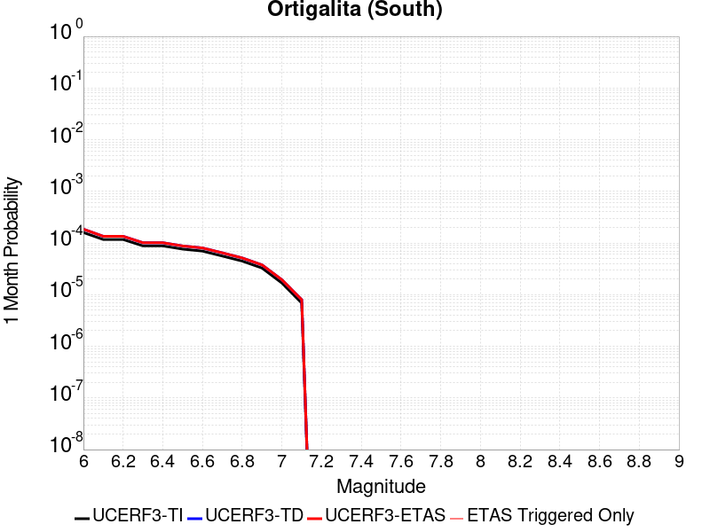 | 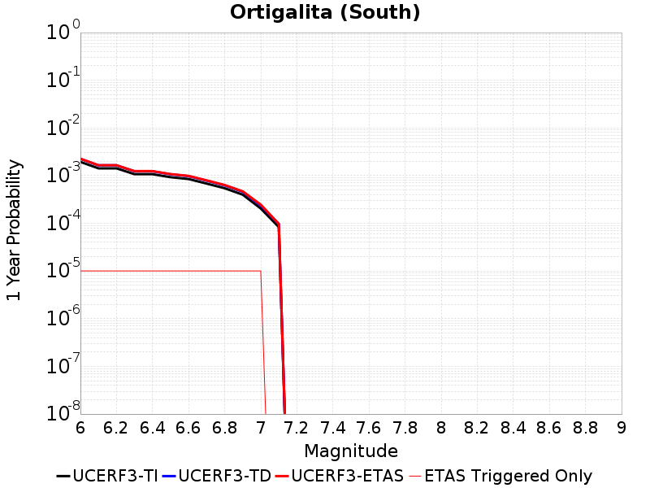 | 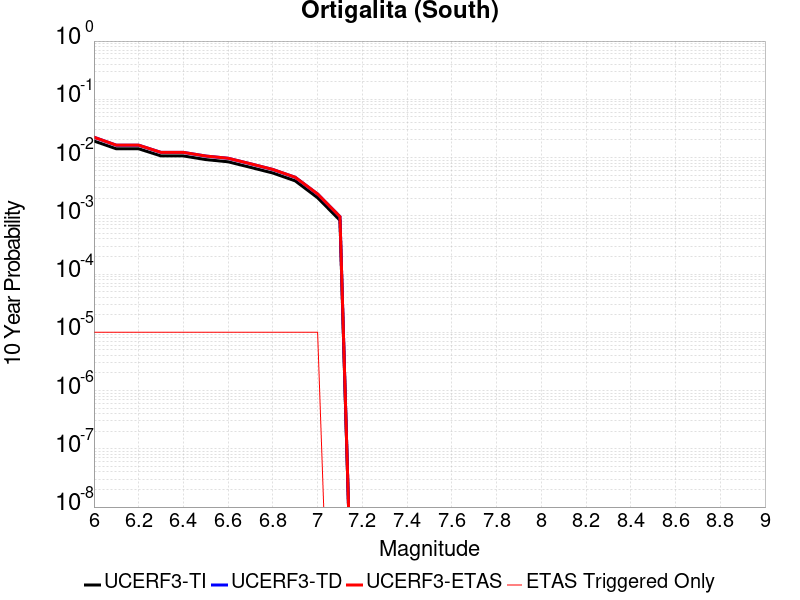 |

| Magnitude | 1 wk TI Prob | 1 wk TD Prob | 1 wk ETAS Prob | 1 wk ETAS/TD Gain | 1 wk ETAS Triggered Only | 1 mo TI Prob | 1 mo TD Prob | 1 mo ETAS Prob | 1 mo ETAS/TD Gain | 1 mo ETAS Triggered Only | 1 yr TI Prob | 1 yr TD Prob | 1 yr ETAS Prob | 1 yr ETAS/TD Gain | 1 yr ETAS Triggered Only | 10 yr TI Prob | 10 yr TD Prob | 10 yr ETAS Prob | 10 yr ETAS/TD Gain | 10 yr ETAS Triggered Only |
|-----|-----|-----|-----|-----|-----|-----|-----|-----|-----|-----|-----|-----|-----|-----|-----|-----|-----|-----|-----|-----|
| 6.0 | 3.72394E-5 | 4.3256405E-5 | 4.3256405E-5 | 1.0 | 0.0 | 1.5958765E-4 | 1.853723E-4 | 1.853723E-4 | 1.0 | 0.0 | 0.0019412481 | 0.0022547282 | 0.0022647057 | 1.0044252 | 1.0E-5 | 0.019243775 | 0.022334898 | 0.022344675 | 1.0004377 | 1.0E-5 |
| 6.1 | 2.7299884E-5 | 3.1492586E-5 | 3.1492586E-5 | 1.0 | 0.0 | 1.16994255E-4 | 1.3496155E-4 | 1.3496155E-4 | 1.0 | 0.0 | 0.0014234743 | 0.001641974 | 0.0016519575 | 1.0060803 | 1.0E-5 | 0.014143906 | 0.01630435 | 0.016314186 | 1.0006033 | 1.0E-5 |
| 6.2 | 2.7299884E-5 | 3.1492586E-5 | 3.1492586E-5 | 1.0 | 0.0 | 1.16994255E-4 | 1.3496155E-4 | 1.3496155E-4 | 1.0 | 0.0 | 0.0014234743 | 0.001641974 | 0.0016519575 | 1.0060803 | 1.0E-5 | 0.014143906 | 0.01630435 | 0.016314186 | 1.0006033 | 1.0E-5 |
| 6.3 | 2.0546433E-5 | 2.3631848E-5 | 2.3631848E-5 | 1.0 | 0.0 | 8.805317E-5 | 1.01275524E-4 | 1.01275524E-4 | 1.0 | 0.0 | 0.00107152 | 0.0012323511 | 0.0012423387 | 1.0081046 | 1.0E-5 | 0.010663681 | 0.012257235 | 0.012267113 | 1.0008059 | 1.0E-5 |
| 6.4 | 2.0546433E-5 | 2.3631848E-5 | 2.3631848E-5 | 1.0 | 0.0 | 8.805317E-5 | 1.01275524E-4 | 1.01275524E-4 | 1.0 | 0.0 | 0.00107152 | 0.0012323511 | 0.0012423387 | 1.0081046 | 1.0E-5 | 0.010663681 | 0.012257235 | 0.012267113 | 1.0008059 | 1.0E-5 |
| 6.5 | 1.7779594E-5 | 2.0447318E-5 | 2.0447318E-5 | 1.0 | 0.0 | 7.619603E-5 | 8.76285E-5 | 8.76285E-5 | 1.0 | 0.0 | 9.272918E-4 | 0.0010663683 | 0.0010763577 | 1.0093676 | 1.0E-5 | 0.009234319 | 0.010613981 | 0.010623875 | 1.0009321 | 1.0E-5 |
| 6.6 | 1.6272212E-5 | 1.8715282E-5 | 1.8715282E-5 | 1.0 | 0.0 | 6.973618E-5 | 8.020596E-5 | 8.020596E-5 | 1.0 | 0.0 | 8.487073E-4 | 9.760823E-4 | 9.860725E-4 | 1.0102351 | 1.0E-5 | 0.008454733 | 0.0097192535 | 0.009729156 | 1.0010189 | 1.0E-5 |
| 6.7 | 1.3051484E-5 | 1.5039015E-5 | 1.5039015E-5 | 1.0 | 0.0 | 5.593373E-5 | 6.4451386E-5 | 6.4451386E-5 | 1.0 | 0.0 | 6.807804E-4 | 7.8442256E-4 | 7.944147E-4 | 1.0127382 | 1.0E-5 | 0.006786986 | 0.007817521 | 0.007827443 | 1.0012692 | 1.0E-5 |
| 6.8 | 1.04277415E-5 | 1.1987436E-5 | 1.1987436E-5 | 1.0 | 0.0 | 4.4689557E-5 | 5.1373758E-5 | 5.1373758E-5 | 1.0 | 0.0 | 5.439595E-4 | 6.253034E-4 | 6.3529715E-4 | 1.0159823 | 1.0E-5 | 0.0054262993 | 0.006236194 | 0.006246132 | 1.0015936 | 1.0E-5 |
| 6.9 | 7.639968E-6 | 8.791651E-6 | 8.791651E-6 | 1.0 | 0.0 | 3.274231E-5 | 3.7677997E-5 | 3.7677997E-5 | 1.0 | 0.0 | 3.9856473E-4 | 4.5863894E-4 | 4.6863433E-4 | 1.0217936 | 1.0E-5 | 0.003978506 | 0.00457751 | 0.0045874645 | 1.0021746 | 1.0E-5 |
| 7.0 | 3.919831E-6 | 4.533481E-6 | 4.533481E-6 | 1.0 | 0.0 | 1.679917E-5 | 1.942907E-5 | 1.942907E-5 | 1.0 | 0.0 | 2.045107E-4 | 2.3652537E-4 | 2.46523E-4 | 1.0422688 | 1.0E-5 | 0.0020432258 | 0.002362945 | 0.0023729212 | 1.004222 | 1.0E-5 |
| 7.1 | 1.6017933E-6 | 1.8570748E-6 | 1.8570748E-6 | 1.0 | 0.0 | 6.8648105E-6 | 7.958874E-6 | 7.958874E-6 | 1.0 | 0.0 | 8.357586E-5 | 9.689605E-5 | 9.689605E-5 | 1.0 | 0.0 | 8.3544437E-4 | 9.686427E-4 | 9.686427E-4 | 1.0 | 0.0 |

## Earthquake Valley
*[(top)](#table-of-contents)*

| 1 Week | 1 Month | 1 Year | 10 Year |
|-----|-----|-----|-----|
| 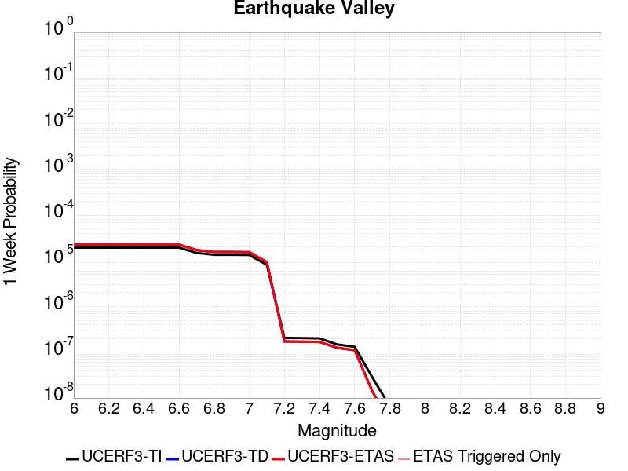 | 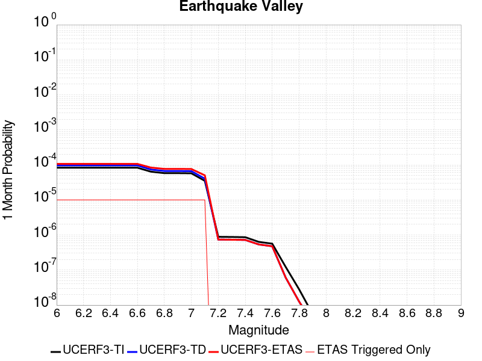 | 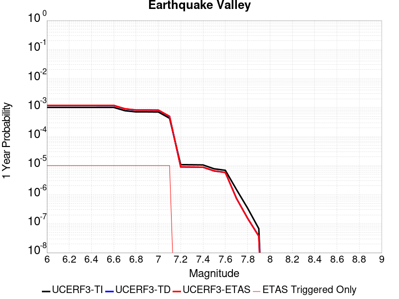 | 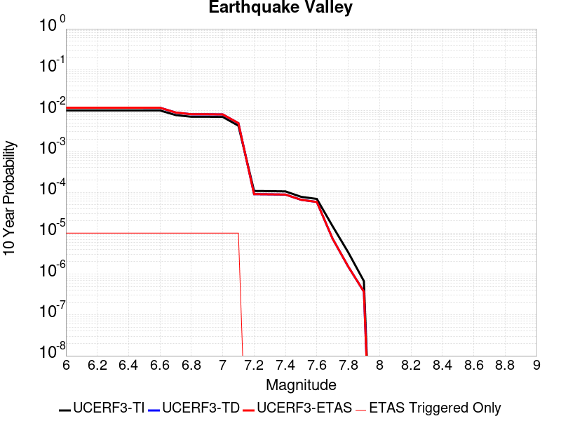 |

| Magnitude | 1 wk TI Prob | 1 wk TD Prob | 1 wk ETAS Prob | 1 wk ETAS/TD Gain | 1 wk ETAS Triggered Only | 1 mo TI Prob | 1 mo TD Prob | 1 mo ETAS Prob | 1 mo ETAS/TD Gain | 1 mo ETAS Triggered Only | 1 yr TI Prob | 1 yr TD Prob | 1 yr ETAS Prob | 1 yr ETAS/TD Gain | 1 yr ETAS Triggered Only | 10 yr TI Prob | 10 yr TD Prob | 10 yr ETAS Prob | 10 yr ETAS/TD Gain | 10 yr ETAS Triggered Only |
|-----|-----|-----|-----|-----|-----|-----|-----|-----|-----|-----|-----|-----|-----|-----|-----|-----|-----|-----|-----|-----|
| 6.0 | 1.9416384E-5 | 2.2584505E-5 | 2.2584505E-5 | 1.0 | 0.0 | 8.321042E-5 | 9.678782E-5 | 1.0678685E-4 | 1.1033088 | 1.0E-5 | 0.001012616 | 0.0011778749 | 0.0011878631 | 1.0084798 | 1.0E-5 | 0.010080142 | 0.011728163 | 0.011738045 | 1.0008427 | 1.0E-5 |
| 6.1 | 1.9416384E-5 | 2.2584505E-5 | 2.2584505E-5 | 1.0 | 0.0 | 8.321042E-5 | 9.678782E-5 | 1.0678685E-4 | 1.1033088 | 1.0E-5 | 0.001012616 | 0.0011778749 | 0.0011878631 | 1.0084798 | 1.0E-5 | 0.010080142 | 0.011728163 | 0.011738045 | 1.0008427 | 1.0E-5 |
| 6.2 | 1.9416384E-5 | 2.2584505E-5 | 2.2584505E-5 | 1.0 | 0.0 | 8.321042E-5 | 9.678782E-5 | 1.0678685E-4 | 1.1033088 | 1.0E-5 | 0.001012616 | 0.0011778749 | 0.0011878631 | 1.0084798 | 1.0E-5 | 0.010080142 | 0.011728163 | 0.011738045 | 1.0008427 | 1.0E-5 |
| 6.3 | 1.9416384E-5 | 2.2584505E-5 | 2.2584505E-5 | 1.0 | 0.0 | 8.321042E-5 | 9.678782E-5 | 1.0678685E-4 | 1.1033088 | 1.0E-5 | 0.001012616 | 0.0011778749 | 0.0011878631 | 1.0084798 | 1.0E-5 | 0.010080142 | 0.011728163 | 0.011738045 | 1.0008427 | 1.0E-5 |
| 6.4 | 1.9416384E-5 | 2.2584505E-5 | 2.2584505E-5 | 1.0 | 0.0 | 8.321042E-5 | 9.678782E-5 | 1.0678685E-4 | 1.1033088 | 1.0E-5 | 0.001012616 | 0.0011778749 | 0.0011878631 | 1.0084798 | 1.0E-5 | 0.010080142 | 0.011728163 | 0.011738045 | 1.0008427 | 1.0E-5 |
| 6.5 | 1.9389157E-5 | 2.2553093E-5 | 2.2553093E-5 | 1.0 | 0.0 | 8.309374E-5 | 9.665321E-5 | 1.06652245E-4 | 1.1034527 | 1.0E-5 | 0.0010111968 | 0.0011762377 | 0.001186226 | 1.0084916 | 1.0E-5 | 0.010066078 | 0.011711964 | 0.011721848 | 1.0008439 | 1.0E-5 |
| 6.6 | 1.9389157E-5 | 2.2553093E-5 | 2.2553093E-5 | 1.0 | 0.0 | 8.309374E-5 | 9.665321E-5 | 1.06652245E-4 | 1.1034527 | 1.0E-5 | 0.0010111968 | 0.0011762377 | 0.001186226 | 1.0084916 | 1.0E-5 | 0.010066078 | 0.011711964 | 0.011721848 | 1.0008439 | 1.0E-5 |
| 6.7 | 1.4925434E-5 | 1.7208535E-5 | 1.7208535E-5 | 1.0 | 0.0 | 6.396457E-5 | 7.374925E-5 | 8.374852E-5 | 1.1355846 | 1.0E-5 | 7.7849044E-4 | 8.9761236E-4 | 9.0760336E-4 | 1.0111307 | 1.0E-5 | 0.007757689 | 0.008948244 | 0.008958154 | 1.0011076 | 1.0E-5 |
| 6.8 | 1.3570335E-5 | 1.5617119E-5 | 1.5617119E-5 | 1.0 | 0.0 | 5.8157282E-5 | 6.692926E-5 | 7.692858E-5 | 1.1494015 | 1.0E-5 | 7.0783484E-4 | 8.146411E-4 | 8.24633E-4 | 1.0122653 | 1.0E-5 | 0.0070558446 | 0.00812462 | 0.008134538 | 1.0012208 | 1.0E-5 |
| 6.9 | 1.3570335E-5 | 1.5617119E-5 | 1.5617119E-5 | 1.0 | 0.0 | 5.8157282E-5 | 6.692926E-5 | 7.692858E-5 | 1.1494015 | 1.0E-5 | 7.0783484E-4 | 8.146411E-4 | 8.24633E-4 | 1.0122653 | 1.0E-5 | 0.0070558446 | 0.00812462 | 0.008134538 | 1.0012208 | 1.0E-5 |
| 7.0 | 1.3433392E-5 | 1.546066E-5 | 1.546066E-5 | 1.0 | 0.0 | 5.757041E-5 | 6.625875E-5 | 7.625809E-5 | 1.1509135 | 1.0E-5 | 7.0069433E-4 | 8.064838E-4 | 8.164757E-4 | 1.0123895 | 1.0E-5 | 0.006984891 | 0.008043638 | 0.008053558 | 1.0012332 | 1.0E-5 |
| 7.1 | 8.181609E-6 | 9.417022E-6 | 9.417022E-6 | 1.0 | 0.0 | 3.5063567E-5 | 4.035842E-5 | 5.0358016E-5 | 1.2477697 | 1.0E-5 | 4.268153E-4 | 4.9132004E-4 | 5.013151E-4 | 1.0203433 | 1.0E-5 | 0.0042599645 | 0.0049089147 | 0.0049188654 | 1.0020272 | 1.0E-5 |
| 7.2 | 2.0663983E-7 | 1.726362E-7 | 1.726362E-7 | 1.0 | 0.0 | 8.855989E-7 | 7.398692E-7 | 7.398692E-7 | 1.0 | 0.0 | 1.0782113E-5 | 9.007875E-6 | 9.007875E-6 | 1.0 | 0.0 | 1.07815904E-4 | 9.007545E-5 | 9.007545E-5 | 1.0 | 0.0 |
| 7.3 | 2.0462376E-7 | 1.7079111E-7 | 1.7079111E-7 | 1.0 | 0.0 | 8.7695867E-7 | 7.319617E-7 | 7.319617E-7 | 1.0 | 0.0 | 1.0676919E-5 | 8.911601E-6 | 8.911601E-6 | 1.0 | 0.0 | 1.0676406E-4 | 8.911279E-5 | 8.911279E-5 | 1.0 | 0.0 |
| 7.4 | 2.0171088E-7 | 1.6861586E-7 | 1.6861586E-7 | 1.0 | 0.0 | 8.644749E-7 | 7.226392E-7 | 7.226392E-7 | 1.0 | 0.0 | 1.0524931E-5 | 8.798101E-6 | 8.798101E-6 | 1.0 | 0.0 | 1.05244326E-4 | 8.7977875E-5 | 8.7977875E-5 | 1.0 | 0.0 |
| 7.5 | 1.4847944E-7 | 1.2559862E-7 | 1.2559862E-7 | 1.0 | 0.0 | 6.363403E-7 | 5.3827966E-7 | 5.3827966E-7 | 1.0 | 0.0 | 7.747416E-6 | 6.553538E-6 | 6.553538E-6 | 1.0 | 0.0 | 7.747146E-5 | 6.553366E-5 | 6.553366E-5 | 1.0 | 0.0 |
| 7.6 | 1.3185847E-7 | 1.1123766E-7 | 1.1123766E-7 | 1.0 | 0.0 | 5.6510765E-7 | 4.7673274E-7 | 4.7673274E-7 | 1.0 | 0.0 | 6.8801637E-6 | 5.804208E-6 | 5.804208E-6 | 1.0 | 0.0 | 6.8799505E-5 | 5.8040772E-5 | 5.8040772E-5 | 1.0 | 0.0 |
| 7.7 | 2.8609954E-8 | 1.41715555E-8 | 1.41715555E-8 | 1.0 | 0.0 | 1.2261408E-7 | 6.073524E-8 | 6.073524E-8 | 1.0 | 0.0 | 1.4928254E-6 | 7.394513E-7 | 7.394513E-7 | 1.0 | 0.0 | 1.4928154E-5 | 7.394494E-6 | 7.394494E-6 | 1.0 | 0.0 |
| 7.8 | 6.527266E-9 | 2.9235336E-9 | 2.9235336E-9 | 1.0 | 0.0 | 2.7973995E-8 | 1.252943E-8 | 1.252943E-8 | 1.0 | 0.0 | 3.4058334E-7 | 1.525458E-7 | 1.525458E-7 | 1.0 | 0.0 | 3.4058282E-6 | 1.5254572E-6 | 1.5254572E-6 | 1.0 | 0.0 |
| 7.9 | 1.2898267E-9 | 7.1278883E-10 | 7.1278883E-10 | 1.0 | 0.0 | 5.527829E-9 | 3.054809E-9 | 3.054809E-9 | 1.0 | 0.0 | 6.7301315E-8 | 3.71923E-8 | 3.71923E-8 | 1.0 | 0.0 | 6.7301295E-7 | 3.7192302E-7 | 3.7192302E-7 | 1.0 | 0.0 |

## Hartley Springs 2011 CFM
*[(top)](#table-of-contents)*

| 1 Week | 1 Month | 1 Year | 10 Year |
|-----|-----|-----|-----|
| 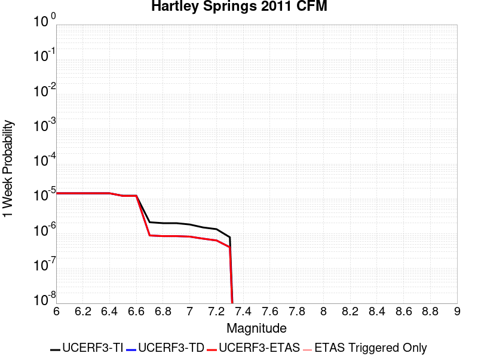 | 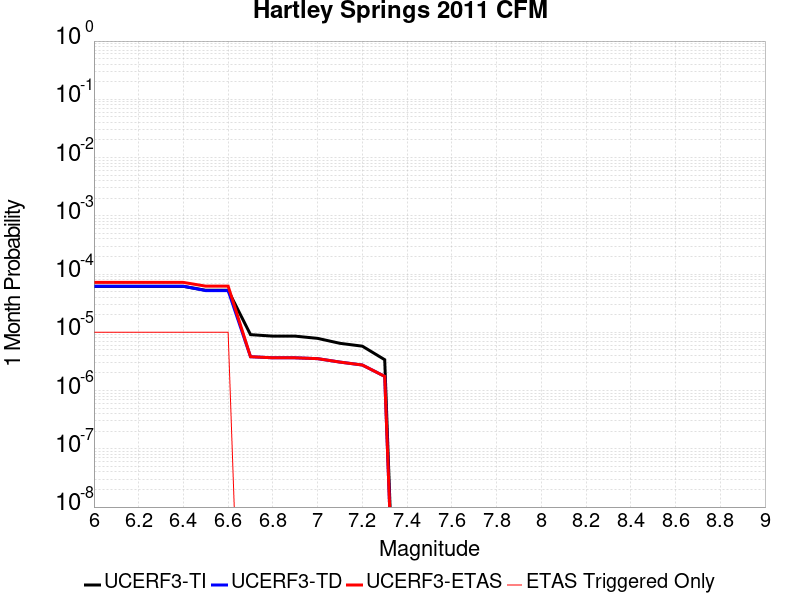 | 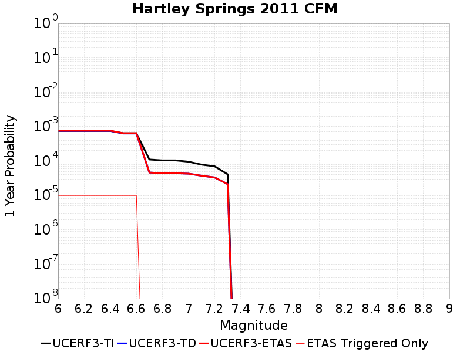 | 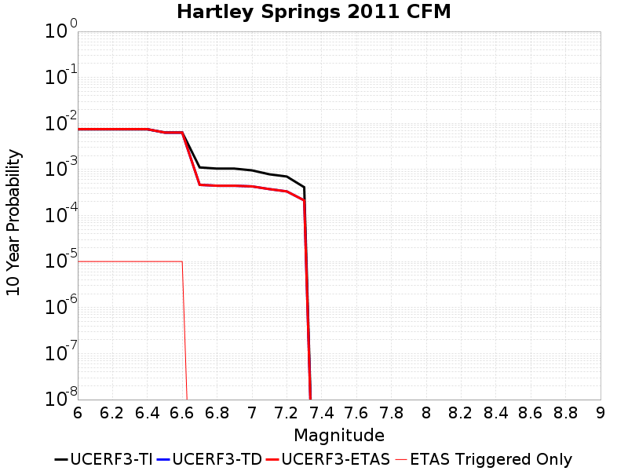 |

| Magnitude | 1 wk TI Prob | 1 wk TD Prob | 1 wk ETAS Prob | 1 wk ETAS/TD Gain | 1 wk ETAS Triggered Only | 1 mo TI Prob | 1 mo TD Prob | 1 mo ETAS Prob | 1 mo ETAS/TD Gain | 1 mo ETAS Triggered Only | 1 yr TI Prob | 1 yr TD Prob | 1 yr ETAS Prob | 1 yr ETAS/TD Gain | 1 yr ETAS Triggered Only | 10 yr TI Prob | 10 yr TD Prob | 10 yr ETAS Prob | 10 yr ETAS/TD Gain | 10 yr ETAS Triggered Only |
|-----|-----|-----|-----|-----|-----|-----|-----|-----|-----|-----|-----|-----|-----|-----|-----|-----|-----|-----|-----|-----|
| 6.0 | 1.4352418E-5 | 1.4434374E-5 | 1.4434374E-5 | 1.0 | 0.0 | 6.1508916E-5 | 6.1861065E-5 | 7.186044E-5 | 1.1616426 | 1.0E-5 | 7.486137E-4 | 7.530626E-4 | 7.6305505E-4 | 1.0132691 | 1.0E-5 | 0.007460968 | 0.0075212284 | 0.0075311535 | 1.0013195 | 1.0E-5 |
| 6.1 | 1.4352418E-5 | 1.4434374E-5 | 1.4434374E-5 | 1.0 | 0.0 | 6.1508916E-5 | 6.1861065E-5 | 7.186044E-5 | 1.1616426 | 1.0E-5 | 7.486137E-4 | 7.530626E-4 | 7.6305505E-4 | 1.0132691 | 1.0E-5 | 0.007460968 | 0.0075212284 | 0.0075311535 | 1.0013195 | 1.0E-5 |
| 6.2 | 1.4352418E-5 | 1.4434374E-5 | 1.4434374E-5 | 1.0 | 0.0 | 6.1508916E-5 | 6.1861065E-5 | 7.186044E-5 | 1.1616426 | 1.0E-5 | 7.486137E-4 | 7.530626E-4 | 7.6305505E-4 | 1.0132691 | 1.0E-5 | 0.007460968 | 0.0075212284 | 0.0075311535 | 1.0013195 | 1.0E-5 |
| 6.3 | 1.4352418E-5 | 1.4434374E-5 | 1.4434374E-5 | 1.0 | 0.0 | 6.1508916E-5 | 6.1861065E-5 | 7.186044E-5 | 1.1616426 | 1.0E-5 | 7.486137E-4 | 7.530626E-4 | 7.6305505E-4 | 1.0132691 | 1.0E-5 | 0.007460968 | 0.0075212284 | 0.0075311535 | 1.0013195 | 1.0E-5 |
| 6.4 | 1.4352418E-5 | 1.4434374E-5 | 1.4434374E-5 | 1.0 | 0.0 | 6.1508916E-5 | 6.1861065E-5 | 7.186044E-5 | 1.1616426 | 1.0E-5 | 7.486137E-4 | 7.530626E-4 | 7.6305505E-4 | 1.0132691 | 1.0E-5 | 0.007460968 | 0.0075212284 | 0.0075311535 | 1.0013195 | 1.0E-5 |
| 6.5 | 1.2279858E-5 | 1.21332705E-5 | 1.21332705E-5 | 1.0 | 0.0 | 5.26269E-5 | 5.1999585E-5 | 6.199907E-5 | 1.1922992 | 1.0E-5 | 6.4054417E-4 | 6.330692E-4 | 6.430629E-4 | 1.015786 | 1.0E-5 | 0.0063870098 | 0.00632817 | 0.006338107 | 1.0015702 | 1.0E-5 |
| 6.6 | 1.2279858E-5 | 1.21332705E-5 | 1.21332705E-5 | 1.0 | 0.0 | 5.26269E-5 | 5.1999585E-5 | 6.199907E-5 | 1.1922992 | 1.0E-5 | 6.4054417E-4 | 6.330692E-4 | 6.430629E-4 | 1.015786 | 1.0E-5 | 0.0063870098 | 0.00632817 | 0.006338107 | 1.0015702 | 1.0E-5 |
| 6.7 | 2.1282601E-6 | 8.8951197E-7 | 8.8951197E-7 | 1.0 | 0.0 | 9.121083E-6 | 3.81219E-6 | 3.81219E-6 | 1.0 | 0.0 | 1.11043526E-4 | 4.6412686E-5 | 4.6412686E-5 | 1.0 | 0.0 | 0.0011098806 | 4.6405525E-4 | 4.6405525E-4 | 1.0 | 0.0 |
| 6.8 | 2.00516E-6 | 8.517865E-7 | 8.517865E-7 | 1.0 | 0.0 | 8.593515E-6 | 3.65051E-6 | 3.65051E-6 | 1.0 | 0.0 | 1.04621024E-4 | 4.444431E-5 | 4.444431E-5 | 1.0 | 0.0 | 0.0010457177 | 4.4437937E-4 | 4.4437937E-4 | 1.0 | 0.0 |
| 6.9 | 2.00516E-6 | 8.517865E-7 | 8.517865E-7 | 1.0 | 0.0 | 8.593515E-6 | 3.65051E-6 | 3.65051E-6 | 1.0 | 0.0 | 1.04621024E-4 | 4.444431E-5 | 4.444431E-5 | 1.0 | 0.0 | 0.0010457177 | 4.4437937E-4 | 4.4437937E-4 | 1.0 | 0.0 |
| 7.0 | 1.8366732E-6 | 8.237552E-7 | 8.237552E-7 | 1.0 | 0.0 | 7.871433E-6 | 3.5303763E-6 | 3.5303763E-6 | 1.0 | 0.0 | 9.583048E-5 | 4.2981737E-5 | 4.2981737E-5 | 1.0 | 0.0 | 9.5789164E-4 | 4.297593E-4 | 4.297593E-4 | 1.0 | 0.0 |
| 7.1 | 1.5097997E-6 | 7.1904526E-7 | 7.1904526E-7 | 1.0 | 0.0 | 6.470554E-6 | 3.0816202E-6 | 3.0816202E-6 | 1.0 | 0.0 | 7.877615E-5 | 3.7518323E-5 | 3.7518323E-5 | 1.0 | 0.0 | 7.874823E-4 | 3.751436E-4 | 3.751436E-4 | 1.0 | 0.0 |
| 7.2 | 1.3490993E-6 | 6.405421E-7 | 6.405421E-7 | 1.0 | 0.0 | 5.7818415E-6 | 2.7451788E-6 | 2.7451788E-6 | 1.0 | 0.0 | 7.0391645E-5 | 3.3422275E-5 | 3.3422275E-5 | 1.0 | 0.0 | 7.0369354E-4 | 3.3419544E-4 | 3.3419544E-4 | 1.0 | 0.0 |
| 7.3 | 7.900015E-7 | 4.0890453E-7 | 4.0890453E-7 | 1.0 | 0.0 | 3.3857161E-6 | 1.7524479E-6 | 1.7524479E-6 | 1.0 | 0.0 | 4.1220315E-5 | 2.1336054E-5 | 2.1336054E-5 | 1.0 | 0.0 | 4.121267E-4 | 2.1336053E-4 | 2.1336053E-4 | 1.0 | 0.0 |

## Butano 2011 CFM
*[(top)](#table-of-contents)*

| 1 Week | 1 Month | 1 Year | 10 Year |
|-----|-----|-----|-----|
| 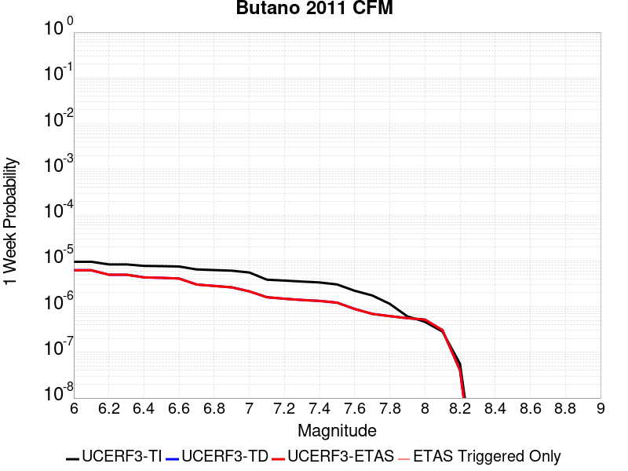 | 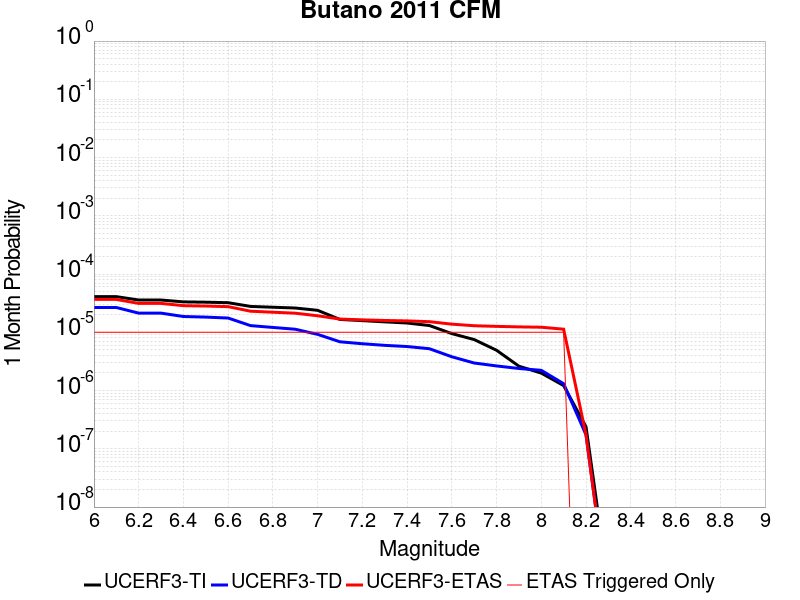 | 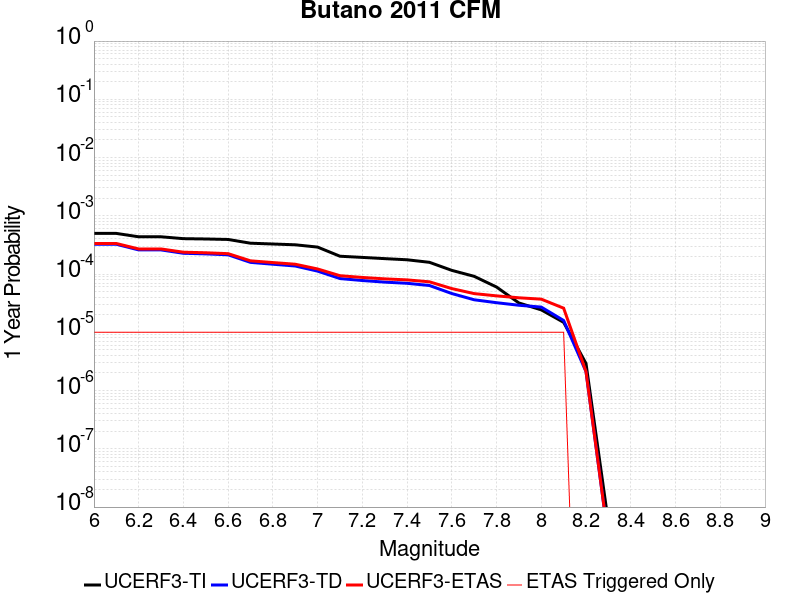 | 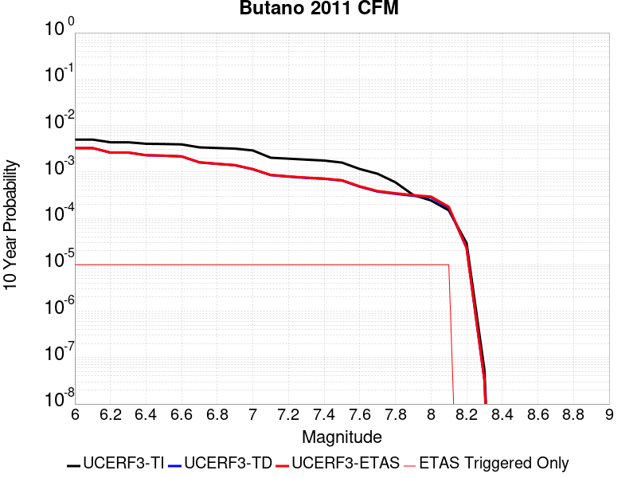 |

| Magnitude | 1 wk TI Prob | 1 wk TD Prob | 1 wk ETAS Prob | 1 wk ETAS/TD Gain | 1 wk ETAS Triggered Only | 1 mo TI Prob | 1 mo TD Prob | 1 mo ETAS Prob | 1 mo ETAS/TD Gain | 1 mo ETAS Triggered Only | 1 yr TI Prob | 1 yr TD Prob | 1 yr ETAS Prob | 1 yr ETAS/TD Gain | 1 yr ETAS Triggered Only | 10 yr TI Prob | 10 yr TD Prob | 10 yr ETAS Prob | 10 yr ETAS/TD Gain | 10 yr ETAS Triggered Only |
|-----|-----|-----|-----|-----|-----|-----|-----|-----|-----|-----|-----|-----|-----|-----|-----|-----|-----|-----|-----|-----|
| 6.0 | 9.561135E-6 | 6.2264717E-6 | 6.2264717E-6 | 1.0 | 0.0 | 4.097565E-5 | 2.6684616E-5 | 3.668435E-5 | 1.3747377 | 1.0E-5 | 4.9876433E-4 | 3.2483897E-4 | 3.3483573E-4 | 1.0307745 | 1.0E-5 | 0.004976464 | 0.003261311 | 0.0032712782 | 1.0030563 | 1.0E-5 |
| 6.1 | 9.561135E-6 | 6.2264717E-6 | 6.2264717E-6 | 1.0 | 0.0 | 4.097565E-5 | 2.6684616E-5 | 3.668435E-5 | 1.3747377 | 1.0E-5 | 4.9876433E-4 | 3.2483897E-4 | 3.3483573E-4 | 1.0307745 | 1.0E-5 | 0.004976464 | 0.003261311 | 0.0032712782 | 1.0030563 | 1.0E-5 |
| 6.2 | 8.364741E-6 | 4.979551E-6 | 4.979551E-6 | 1.0 | 0.0 | 3.5848396E-5 | 2.1340766E-5 | 3.134055E-5 | 1.4685768 | 1.0E-5 | 4.3636683E-4 | 2.597944E-4 | 2.697918E-4 | 1.038482 | 1.0E-5 | 0.0043551093 | 0.0026125247 | 0.0026224984 | 1.0038177 | 1.0E-5 |
| 6.3 | 8.364741E-6 | 4.979551E-6 | 4.979551E-6 | 1.0 | 0.0 | 3.5848396E-5 | 2.1340766E-5 | 3.134055E-5 | 1.4685768 | 1.0E-5 | 4.3636683E-4 | 2.597944E-4 | 2.697918E-4 | 1.038482 | 1.0E-5 | 0.0043551093 | 0.0026125247 | 0.0026224984 | 1.0038177 | 1.0E-5 |
| 6.4 | 7.768282E-6 | 4.3574955E-6 | 4.3574955E-6 | 1.0 | 0.0 | 3.329221E-5 | 1.8674855E-5 | 2.8674667E-5 | 1.5354694 | 1.0E-5 | 4.0525728E-4 | 2.2734399E-4 | 2.3734172E-4 | 1.0439762 | 1.0E-5 | 0.0040451903 | 0.0022887164 | 0.0022986936 | 1.0043592 | 1.0E-5 |
| 6.5 | 7.673437E-6 | 4.2570578E-6 | 4.2570578E-6 | 1.0 | 0.0 | 3.2885746E-5 | 1.8244413E-5 | 2.824423E-5 | 1.548103 | 1.0E-5 | 4.0031038E-4 | 2.2210444E-4 | 2.3210223E-4 | 1.0450139 | 1.0E-5 | 0.0039959005 | 0.0022364266 | 0.0022464043 | 1.0044614 | 1.0E-5 |
| 6.6 | 7.5244197E-6 | 4.1020203E-6 | 4.1020203E-6 | 1.0 | 0.0 | 3.2247113E-5 | 1.7579976E-5 | 2.75798E-5 | 1.568819 | 1.0E-5 | 3.9253788E-4 | 2.1401652E-4 | 2.2401438E-4 | 1.0467154 | 1.0E-5 | 0.003918452 | 0.002155706 | 0.0021656845 | 1.0046289 | 1.0E-5 |
| 6.7 | 6.4921405E-6 | 3.0420777E-6 | 3.0420777E-6 | 1.0 | 0.0 | 2.7823162E-5 | 1.3037411E-5 | 2.303728E-5 | 1.7670134 | 1.0E-5 | 3.3869434E-4 | 1.58719E-4 | 1.6871741E-4 | 1.0629945 | 1.0E-5 | 0.003381786 | 0.0016035446 | 0.0016135286 | 1.0062262 | 1.0E-5 |
| 6.8 | 6.2890294E-6 | 2.8288425E-6 | 2.8288425E-6 | 1.0 | 0.0 | 2.6952705E-5 | 1.2123554E-5 | 2.2123433E-5 | 1.8248307 | 1.0E-5 | 3.2809976E-4 | 1.4759436E-4 | 1.5759288E-4 | 1.0677433 | 1.0E-5 | 0.0032761577 | 0.0014924526 | 0.0015024376 | 1.0066904 | 1.0E-5 |
| 6.9 | 6.0965517E-6 | 2.6353537E-6 | 2.6353537E-6 | 1.0 | 0.0 | 2.6127816E-5 | 1.12943235E-5 | 2.129421E-5 | 1.8853905 | 1.0E-5 | 3.1805973E-4 | 1.3749978E-4 | 1.474984E-4 | 1.0727174 | 1.0E-5 | 0.0031760489 | 0.0013916367 | 0.0014016228 | 1.0071758 | 1.0E-5 |
| 7.0 | 5.566252E-6 | 2.1527528E-6 | 2.1527528E-6 | 1.0 | 0.0 | 2.3855147E-5 | 9.226051E-6 | 1.922596E-5 | 2.0838773 | 1.0E-5 | 2.9039773E-4 | 1.1232142E-4 | 1.223203E-4 | 1.0890203 | 1.0E-5 | 0.0029001853 | 0.0011401338 | 0.0011501224 | 1.0087609 | 1.0E-5 |
| 7.1 | 3.878588E-6 | 1.6040668E-6 | 1.6040668E-6 | 1.0 | 0.0 | 1.6622414E-5 | 6.8745535E-6 | 1.6874485E-5 | 2.45463 | 1.0E-5 | 2.023591E-4 | 8.3694475E-5 | 9.369364E-5 | 1.1194721 | 1.0E-5 | 0.0020217493 | 8.537198E-4 | 8.6371123E-4 | 1.0117035 | 1.0E-5 |
| 7.2 | 3.7038085E-6 | 1.4851203E-6 | 1.4851203E-6 | 1.0 | 0.0 | 1.587337E-5 | 6.3647853E-6 | 1.6364722E-5 | 2.5711348 | 1.0E-5 | 1.9324113E-4 | 7.7488505E-5 | 8.748773E-5 | 1.1290414 | 1.0E-5 | 0.0019307317 | 7.916731E-4 | 8.016652E-4 | 1.0126215 | 1.0E-5 |
| 7.3 | 3.5277278E-6 | 1.393231E-6 | 1.393231E-6 | 1.0 | 0.0 | 1.5118746E-5 | 5.970976E-6 | 1.5970916E-5 | 2.6747582 | 1.0E-5 | 1.8405518E-4 | 7.269421E-5 | 8.2693485E-5 | 1.1375525 | 1.0E-5 | 0.0018390282 | 7.43676E-4 | 7.5366854E-4 | 1.0134367 | 1.0E-5 |
| 7.4 | 3.3711294E-6 | 1.330477E-6 | 1.330477E-6 | 1.0 | 0.0 | 1.4447617E-5 | 5.7020316E-6 | 1.5701975E-5 | 2.7537508 | 1.0E-5 | 1.7588554E-4 | 6.942003E-5 | 7.941933E-5 | 1.1440407 | 1.0E-5 | 0.0017574639 | 7.109032E-4 | 7.208961E-4 | 1.0140566 | 1.0E-5 |
| 7.5 | 3.0496426E-6 | 1.2194544E-6 | 1.2194544E-6 | 1.0 | 0.0 | 1.3069831E-5 | 5.226222E-6 | 1.522617E-5 | 2.913418 | 1.0E-5 | 1.5911358E-4 | 6.36274E-5 | 7.362676E-5 | 1.157155 | 1.0E-5 | 0.001589997 | 6.5294397E-4 | 6.6293747E-4 | 1.0153053 | 1.0E-5 |
| 7.6 | 2.2179781E-6 | 8.875814E-7 | 8.875814E-7 | 1.0 | 0.0 | 9.505586E-6 | 3.8039148E-6 | 1.3803877E-5 | 3.6288607 | 1.0E-5 | 1.1572436E-4 | 4.6311678E-5 | 5.631121E-5 | 1.2159183 | 1.0E-5 | 0.0011566412 | 4.7976826E-4 | 4.8976345E-4 | 1.0208334 | 1.0E-5 |
| 7.7 | 1.7519328E-6 | 6.935326E-7 | 6.935326E-7 | 1.0 | 0.0 | 7.508262E-6 | 2.9722794E-6 | 1.2972249E-5 | 4.3644114 | 1.0E-5 | 9.140925E-5 | 3.61869E-5 | 4.618654E-5 | 1.2763331 | 1.0E-5 | 9.137166E-4 | 3.7782636E-4 | 3.878226E-4 | 1.0264572 | 1.0E-5 |
| 7.8 | 1.1478974E-6 | 6.178038E-7 | 6.178038E-7 | 1.0 | 0.0 | 4.9195505E-6 | 2.6477276E-6 | 1.2647702E-5 | 4.7768135 | 1.0E-5 | 5.9893882E-5 | 3.2235606E-5 | 4.2235286E-5 | 1.3102059 | 1.0E-5 | 5.9877743E-4 | 3.3798636E-4 | 3.4798298E-4 | 1.029577 | 1.0E-5 |
| 7.9 | 6.1154634E-7 | 5.5852337E-7 | 5.5852337E-7 | 1.0 | 0.0 | 2.6209104E-6 | 2.3936693E-6 | 1.2393645E-5 | 5.1776767 | 1.0E-5 | 3.1909116E-5 | 2.9142533E-5 | 3.9142244E-5 | 1.3431311 | 1.0E-5 | 3.1904536E-4 | 3.058209E-4 | 3.1581783E-4 | 1.0326889 | 1.0E-5 |
| 8.0 | 4.6520046E-7 | 5.192445E-7 | 5.192445E-7 | 1.0 | 0.0 | 1.9937147E-6 | 2.2253316E-6 | 1.222531E-5 | 5.493702 | 1.0E-5 | 2.4273206E-5 | 2.7093076E-5 | 3.7092806E-5 | 1.3690879 | 1.0E-5 | 2.4270554E-4 | 2.843556E-4 | 2.9435277E-4 | 1.0351572 | 1.0E-5 |
| 8.1 | 2.8425194E-7 | 3.058846E-7 | 3.058846E-7 | 1.0 | 0.0 | 1.218222E-6 | 1.3109334E-6 | 1.131092E-5 | 8.628143 | 1.0E-5 | 1.4831752E-5 | 1.5960497E-5 | 2.5960337E-5 | 1.626537 | 1.0E-5 | 1.4830762E-4 | 1.6750036E-4 | 1.7749869E-4 | 1.0596913 | 1.0E-5 |
| 8.2 | 5.585778E-8 | 4.055262E-8 | 4.055262E-8 | 1.0 | 0.0 | 2.3939046E-7 | 1.7379693E-7 | 1.7379693E-7 | 1.0 | 0.0 | 2.914575E-6 | 2.1159756E-6 | 2.1159756E-6 | 1.0 | 0.0 | 2.9145367E-5 | 2.2992728E-5 | 2.2992728E-5 | 1.0 | 0.0 |
| 8.3 | 1.0371215E-10 | 5.361389E-11 | 5.361389E-11 | 1.0 | 0.0 | 4.4448079E-10 | 2.2977431E-10 | 2.2977431E-10 | 1.0 | 0.0 | 5.4115543E-9 | 2.797502E-9 | 2.797502E-9 | 1.0 | 0.0 | 5.4115542E-8 | 3.217611E-8 | 3.217611E-8 | 1.0 | 0.0 |

## Morales (West)
*[(top)](#table-of-contents)*

| 1 Week | 1 Month | 1 Year | 10 Year |
|-----|-----|-----|-----|
|  | 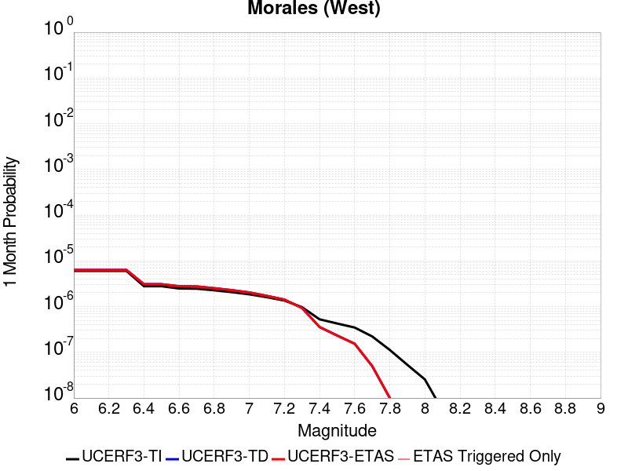 | 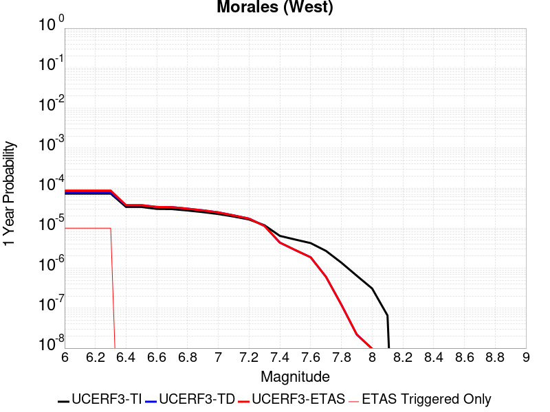 | 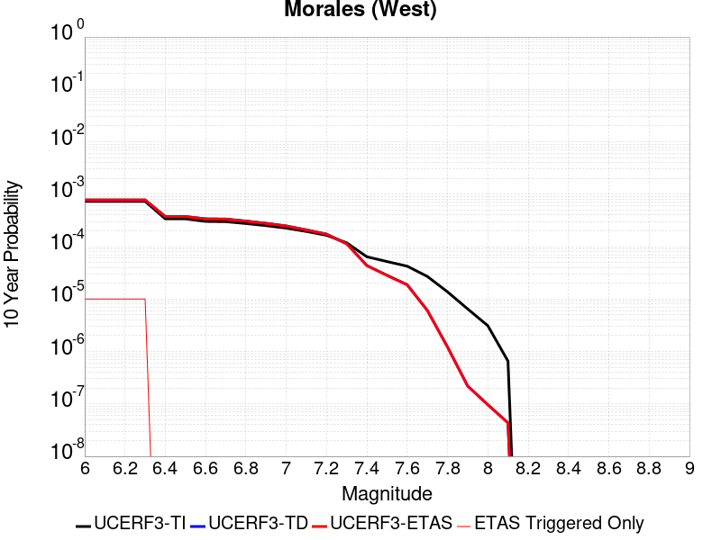 |

| Magnitude | 1 wk TI Prob | 1 wk TD Prob | 1 wk ETAS Prob | 1 wk ETAS/TD Gain | 1 wk ETAS Triggered Only | 1 mo TI Prob | 1 mo TD Prob | 1 mo ETAS Prob | 1 mo ETAS/TD Gain | 1 mo ETAS Triggered Only | 1 yr TI Prob | 1 yr TD Prob | 1 yr ETAS Prob | 1 yr ETAS/TD Gain | 1 yr ETAS Triggered Only | 10 yr TI Prob | 10 yr TD Prob | 10 yr ETAS Prob | 10 yr ETAS/TD Gain | 10 yr ETAS Triggered Only |
|-----|-----|-----|-----|-----|-----|-----|-----|-----|-----|-----|-----|-----|-----|-----|-----|-----|-----|-----|-----|-----|
| 6.0 | 1.4027072E-6 | 1.4792274E-6 | 1.4792274E-6 | 1.0 | 0.0 | 6.0115885E-6 | 6.3395346E-6 | 6.3395346E-6 | 1.0 | 0.0 | 7.318863E-5 | 7.71818E-5 | 8.7181026E-5 | 1.1295543 | 1.0E-5 | 7.316453E-4 | 7.7161845E-4 | 7.816108E-4 | 1.0129498 | 1.0E-5 |
| 6.1 | 1.4027072E-6 | 1.4792274E-6 | 1.4792274E-6 | 1.0 | 0.0 | 6.0115885E-6 | 6.3395346E-6 | 6.3395346E-6 | 1.0 | 0.0 | 7.318863E-5 | 7.71818E-5 | 8.7181026E-5 | 1.1295543 | 1.0E-5 | 7.316453E-4 | 7.7161845E-4 | 7.816108E-4 | 1.0129498 | 1.0E-5 |
| 6.2 | 1.4027072E-6 | 1.4792274E-6 | 1.4792274E-6 | 1.0 | 0.0 | 6.0115885E-6 | 6.3395346E-6 | 6.3395346E-6 | 1.0 | 0.0 | 7.318863E-5 | 7.71818E-5 | 8.7181026E-5 | 1.1295543 | 1.0E-5 | 7.316453E-4 | 7.7161845E-4 | 7.816108E-4 | 1.0129498 | 1.0E-5 |
| 6.3 | 1.4027072E-6 | 1.4792274E-6 | 1.4792274E-6 | 1.0 | 0.0 | 6.0115885E-6 | 6.3395346E-6 | 6.3395346E-6 | 1.0 | 0.0 | 7.318863E-5 | 7.71818E-5 | 8.7181026E-5 | 1.1295543 | 1.0E-5 | 7.316453E-4 | 7.7161845E-4 | 7.816108E-4 | 1.0129498 | 1.0E-5 |
| 6.4 | 6.504502E-7 | 7.2045725E-7 | 7.2045725E-7 | 1.0 | 0.0 | 2.7876408E-6 | 3.0876704E-6 | 3.0876704E-6 | 1.0 | 0.0 | 3.3939E-5 | 3.759175E-5 | 3.759175E-5 | 1.0 | 0.0 | 3.3933815E-4 | 3.758551E-4 | 3.758551E-4 | 1.0 | 0.0 |
| 6.5 | 6.504502E-7 | 7.2045725E-7 | 7.2045725E-7 | 1.0 | 0.0 | 2.7876408E-6 | 3.0876704E-6 | 3.0876704E-6 | 1.0 | 0.0 | 3.3939E-5 | 3.759175E-5 | 3.759175E-5 | 1.0 | 0.0 | 3.3933815E-4 | 3.758551E-4 | 3.758551E-4 | 1.0 | 0.0 |
| 6.6 | 5.8056526E-7 | 6.500832E-7 | 6.500832E-7 | 1.0 | 0.0 | 2.4881344E-6 | 2.7860679E-6 | 2.7860679E-6 | 1.0 | 0.0 | 3.0292615E-5 | 3.3919856E-5 | 3.3919856E-5 | 1.0 | 0.0 | 3.0288487E-4 | 3.3914737E-4 | 3.3914737E-4 | 1.0 | 0.0 |
| 6.7 | 5.741448E-7 | 6.436143E-7 | 6.436143E-7 | 1.0 | 0.0 | 2.4606184E-6 | 2.7583442E-6 | 2.7583442E-6 | 1.0 | 0.0 | 2.9957617E-5 | 3.3582328E-5 | 3.3582328E-5 | 1.0 | 0.0 | 2.9953578E-4 | 3.3577313E-4 | 3.3577313E-4 | 1.0 | 0.0 |
| 6.8 | 5.299428E-7 | 5.8915657E-7 | 5.8915657E-7 | 1.0 | 0.0 | 2.2711813E-6 | 2.5249542E-6 | 2.5249542E-6 | 1.0 | 0.0 | 2.7651282E-5 | 3.0740888E-5 | 3.0740888E-5 | 1.0 | 0.0 | 2.7647841E-4 | 3.0736683E-4 | 3.0736683E-4 | 1.0 | 0.0 |
| 6.9 | 4.82394E-7 | 5.3423264E-7 | 5.3423264E-7 | 1.0 | 0.0 | 2.0674013E-6 | 2.2895663E-6 | 2.2895663E-6 | 1.0 | 0.0 | 2.517032E-5 | 2.7875118E-5 | 2.7875118E-5 | 1.0 | 0.0 | 2.516747E-4 | 2.7871662E-4 | 2.7871662E-4 | 1.0 | 0.0 |
| 7.0 | 4.3264512E-7 | 4.760488E-7 | 4.760488E-7 | 1.0 | 0.0 | 1.8541921E-6 | 2.0402076E-6 | 2.0402076E-6 | 1.0 | 0.0 | 2.2574555E-5 | 2.4839248E-5 | 2.4839248E-5 | 1.0 | 0.0 | 2.2572262E-4 | 2.4836505E-4 | 2.4836505E-4 | 1.0 | 0.0 |
| 7.1 | 3.7388565E-7 | 4.0009647E-7 | 4.0009647E-7 | 1.0 | 0.0 | 1.6023661E-6 | 1.714698E-6 | 1.714698E-6 | 1.0 | 0.0 | 1.9508632E-5 | 2.087625E-5 | 2.087625E-5 | 1.0 | 0.0 | 1.950692E-4 | 2.0874312E-4 | 2.0874312E-4 | 1.0 | 0.0 |
| 7.2 | 3.1592543E-7 | 3.320465E-7 | 3.320465E-7 | 1.0 | 0.0 | 1.3539654E-6 | 1.4230557E-6 | 1.4230557E-6 | 1.0 | 0.0 | 1.6484404E-5 | 1.7325567E-5 | 1.7325567E-5 | 1.0 | 0.0 | 1.6483181E-4 | 1.7324233E-4 | 1.7324233E-4 | 1.0 | 0.0 |
| 7.3 | 2.2677783E-7 | 2.1798434E-7 | 2.1798434E-7 | 1.0 | 0.0 | 9.719047E-7 | 9.342182E-7 | 9.342182E-7 | 1.0 | 0.0 | 1.1832874E-5 | 1.1374048E-5 | 1.1374048E-5 | 1.0 | 0.0 | 1.18322445E-4 | 1.13734706E-4 | 1.13734706E-4 | 1.0 | 0.0 |
| 7.4 | 1.2295531E-7 | 8.352813E-8 | 8.352813E-8 | 1.0 | 0.0 | 5.269512E-7 | 3.5797763E-7 | 3.5797763E-7 | 1.0 | 0.0 | 6.4156125E-6 | 4.358369E-6 | 4.358369E-6 | 1.0 | 0.0 | 6.415427E-5 | 4.3582844E-5 | 4.3582844E-5 | 1.0 | 0.0 |
| 7.5 | 9.9632544E-8 | 5.444534E-8 | 5.444534E-8 | 1.0 | 0.0 | 4.2699656E-7 | 2.3333715E-7 | 2.3333715E-7 | 1.0 | 0.0 | 5.198671E-6 | 2.840876E-6 | 2.840876E-6 | 1.0 | 0.0 | 5.198549E-5 | 2.8408402E-5 | 2.8408402E-5 | 1.0 | 0.0 |
| 7.6 | 8.125894E-8 | 3.596039E-8 | 3.596039E-8 | 1.0 | 0.0 | 3.4825257E-7 | 1.5411595E-7 | 1.5411595E-7 | 1.0 | 0.0 | 4.2399665E-6 | 1.87636E-6 | 1.87636E-6 | 1.0 | 0.0 | 4.2398857E-5 | 1.8763445E-5 | 1.8763445E-5 | 1.0 | 0.0 |
| 7.7 | 5.1810765E-8 | 1.1648554E-8 | 1.1648554E-8 | 1.0 | 0.0 | 2.2204613E-7 | 4.992237E-8 | 4.992237E-8 | 1.0 | 0.0 | 2.7034082E-6 | 6.078047E-7 | 6.078047E-7 | 1.0 | 0.0 | 2.7033753E-5 | 6.0780335E-6 | 6.0780335E-6 | 1.0 | 0.0 |
| 7.8 | 2.6315043E-8 | 2.3402476E-9 | 2.3402476E-9 | 1.0 | 0.0 | 1.1277875E-7 | 1.00296305E-8 | 1.00296305E-8 | 1.0 | 0.0 | 1.3730804E-6 | 1.2211075E-7 | 1.2211075E-7 | 1.0 | 0.0 | 1.3730719E-5 | 1.2211095E-6 | 1.2211095E-6 | 1.0 | 0.0 |
| 7.9 | 1.24281545E-8 | 4.2123116E-10 | 4.2123116E-10 | 1.0 | 0.0 | 5.3263516E-8 | 1.8052778E-9 | 1.8052778E-9 | 1.0 | 0.0 | 6.4848314E-7 | 2.1979243E-8 | 2.1979243E-8 | 1.0 | 0.0 | 6.4848123E-6 | 2.1979523E-7 | 2.1979523E-7 | 1.0 | 0.0 |
| 8.0 | 5.954214E-9 | 1.8533608E-10 | 1.8533608E-10 | 1.0 | 0.0 | 2.551806E-8 | 7.9430085E-10 | 7.9430085E-10 | 1.0 | 0.0 | 3.1068234E-7 | 9.6706065E-9 | 9.6706065E-9 | 1.0 | 0.0 | 3.1068191E-6 | 9.670887E-8 | 9.670887E-8 | 1.0 | 0.0 |
| 8.1 | 1.2586262E-9 | 8.356171E-11 | 8.356171E-11 | 1.0 | 0.0 | 5.3941123E-9 | 3.5812353E-10 | 3.5812353E-10 | 1.0 | 0.0 | 6.567332E-8 | 4.3601514E-9 | 4.3601514E-9 | 1.0 | 0.0 | 6.56733E-7 | 4.3604324E-8 | 4.3604324E-8 | 1.0 | 0.0 |

## North Frontal  (West)
*[(top)](#table-of-contents)*

| 1 Week | 1 Month | 1 Year | 10 Year |
|-----|-----|-----|-----|
| 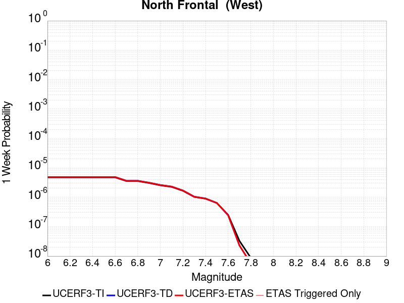 | 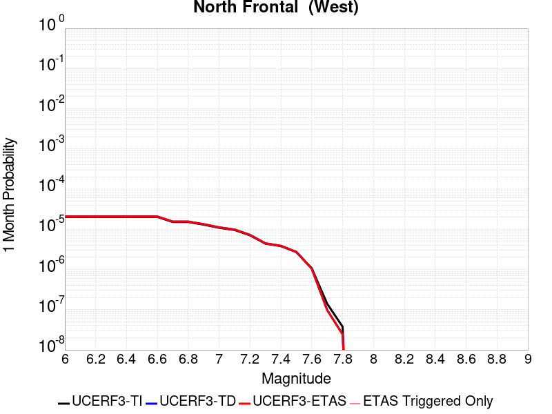 | 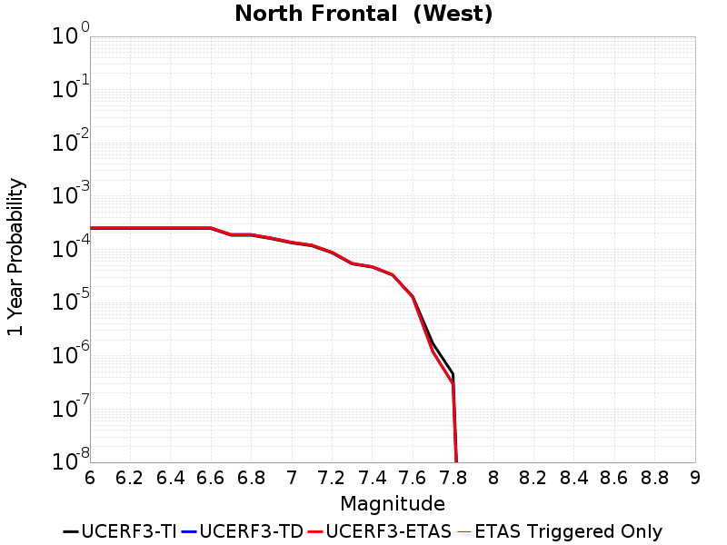 | 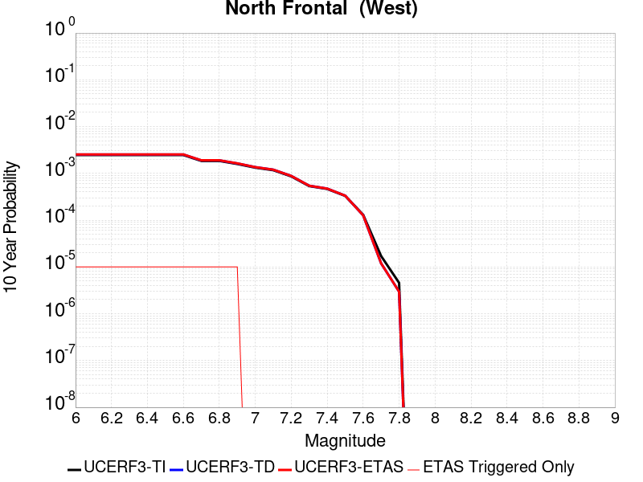 |

| Magnitude | 1 wk TI Prob | 1 wk TD Prob | 1 wk ETAS Prob | 1 wk ETAS/TD Gain | 1 wk ETAS Triggered Only | 1 mo TI Prob | 1 mo TD Prob | 1 mo ETAS Prob | 1 mo ETAS/TD Gain | 1 mo ETAS Triggered Only | 1 yr TI Prob | 1 yr TD Prob | 1 yr ETAS Prob | 1 yr ETAS/TD Gain | 1 yr ETAS Triggered Only | 10 yr TI Prob | 10 yr TD Prob | 10 yr ETAS Prob | 10 yr ETAS/TD Gain | 10 yr ETAS Triggered Only |
|-----|-----|-----|-----|-----|-----|-----|-----|-----|-----|-----|-----|-----|-----|-----|-----|-----|-----|-----|-----|-----|
| 6.0 | 4.7316266E-6 | 4.8526886E-6 | 4.8526886E-6 | 1.0 | 0.0 | 2.0278241E-5 | 2.0797079E-5 | 2.0797079E-5 | 1.0 | 0.0 | 2.4685962E-4 | 2.531765E-4 | 2.531765E-4 | 1.0 | 0.0 | 0.0024658558 | 0.0025290267 | 0.0025390014 | 1.003944 | 1.0E-5 |
| 6.1 | 4.7316266E-6 | 4.8526886E-6 | 4.8526886E-6 | 1.0 | 0.0 | 2.0278241E-5 | 2.0797079E-5 | 2.0797079E-5 | 1.0 | 0.0 | 2.4685962E-4 | 2.531765E-4 | 2.531765E-4 | 1.0 | 0.0 | 0.0024658558 | 0.0025290267 | 0.0025390014 | 1.003944 | 1.0E-5 |
| 6.2 | 4.7316266E-6 | 4.8526886E-6 | 4.8526886E-6 | 1.0 | 0.0 | 2.0278241E-5 | 2.0797079E-5 | 2.0797079E-5 | 1.0 | 0.0 | 2.4685962E-4 | 2.531765E-4 | 2.531765E-4 | 1.0 | 0.0 | 0.0024658558 | 0.0025290267 | 0.0025390014 | 1.003944 | 1.0E-5 |
| 6.3 | 4.7316266E-6 | 4.8526886E-6 | 4.8526886E-6 | 1.0 | 0.0 | 2.0278241E-5 | 2.0797079E-5 | 2.0797079E-5 | 1.0 | 0.0 | 2.4685962E-4 | 2.531765E-4 | 2.531765E-4 | 1.0 | 0.0 | 0.0024658558 | 0.0025290267 | 0.0025390014 | 1.003944 | 1.0E-5 |
| 6.4 | 4.7316266E-6 | 4.8526886E-6 | 4.8526886E-6 | 1.0 | 0.0 | 2.0278241E-5 | 2.0797079E-5 | 2.0797079E-5 | 1.0 | 0.0 | 2.4685962E-4 | 2.531765E-4 | 2.531765E-4 | 1.0 | 0.0 | 0.0024658558 | 0.0025290267 | 0.0025390014 | 1.003944 | 1.0E-5 |
| 6.5 | 4.7316266E-6 | 4.8526886E-6 | 4.8526886E-6 | 1.0 | 0.0 | 2.0278241E-5 | 2.0797079E-5 | 2.0797079E-5 | 1.0 | 0.0 | 2.4685962E-4 | 2.531765E-4 | 2.531765E-4 | 1.0 | 0.0 | 0.0024658558 | 0.0025290267 | 0.0025390014 | 1.003944 | 1.0E-5 |
| 6.6 | 4.7316266E-6 | 4.8526886E-6 | 4.8526886E-6 | 1.0 | 0.0 | 2.0278241E-5 | 2.0797079E-5 | 2.0797079E-5 | 1.0 | 0.0 | 2.4685962E-4 | 2.531765E-4 | 2.531765E-4 | 1.0 | 0.0 | 0.0024658558 | 0.0025290267 | 0.0025390014 | 1.003944 | 1.0E-5 |
| 6.7 | 3.5382777E-6 | 3.6308986E-6 | 3.6308986E-6 | 1.0 | 0.0 | 1.516396E-5 | 1.5560905E-5 | 1.5560905E-5 | 1.0 | 0.0 | 1.8460557E-4 | 1.8943833E-4 | 1.8943833E-4 | 1.0 | 0.0 | 0.0018445229 | 0.0018928454 | 0.0019028265 | 1.0052731 | 1.0E-5 |
| 6.8 | 3.5382777E-6 | 3.6308986E-6 | 3.6308986E-6 | 1.0 | 0.0 | 1.516396E-5 | 1.5560905E-5 | 1.5560905E-5 | 1.0 | 0.0 | 1.8460557E-4 | 1.8943833E-4 | 1.8943833E-4 | 1.0 | 0.0 | 0.0018445229 | 0.0018928454 | 0.0019028265 | 1.0052731 | 1.0E-5 |
| 6.9 | 3.0428037E-6 | 3.1227717E-6 | 3.1227717E-6 | 1.0 | 0.0 | 1.30405215E-5 | 1.3383243E-5 | 1.3383243E-5 | 1.0 | 0.0 | 1.5875678E-4 | 1.6292947E-4 | 1.6292947E-4 | 1.0 | 0.0 | 0.0015864341 | 0.0016281673 | 0.001638151 | 1.0061319 | 1.0E-5 |
| 7.0 | 2.538778E-6 | 2.6061E-6 | 2.6061E-6 | 1.0 | 0.0 | 1.0880432E-5 | 1.1168955E-5 | 1.1168955E-5 | 1.0 | 0.0 | 1.324612E-4 | 1.3597401E-4 | 1.3597401E-4 | 1.0 | 0.0 | 0.0013238228 | 0.0013589549 | 0.0013589549 | 1.0 | 0.0 |
| 7.1 | 2.2418935E-6 | 2.301216E-6 | 2.301216E-6 | 1.0 | 0.0 | 9.60808E-6 | 9.8623195E-6 | 9.8623195E-6 | 1.0 | 0.0 | 1.1697209E-4 | 1.2006757E-4 | 1.2006757E-4 | 1.0 | 0.0 | 0.0011691054 | 0.001200071 | 0.001200071 | 1.0 | 0.0 |
| 7.2 | 1.6526745E-6 | 1.6924917E-6 | 1.6924917E-6 | 1.0 | 0.0 | 7.082872E-6 | 7.2535167E-6 | 7.2535167E-6 | 1.0 | 0.0 | 8.623055E-5 | 8.830824E-5 | 8.830824E-5 | 1.0 | 0.0 | 8.61971E-4 | 8.8275655E-4 | 8.8275655E-4 | 1.0 | 0.0 |
| 7.3 | 1.0246019E-6 | 1.0442302E-6 | 1.0442302E-6 | 1.0 | 0.0 | 4.391144E-6 | 4.4752655E-6 | 4.4752655E-6 | 1.0 | 0.0 | 5.3460866E-5 | 5.448511E-5 | 5.448511E-5 | 1.0 | 0.0 | 5.344801E-4 | 5.44729E-4 | 5.44729E-4 | 1.0 | 0.0 |
| 7.4 | 8.9045164E-7 | 9.056595E-7 | 9.056595E-7 | 1.0 | 0.0 | 3.8162157E-6 | 3.881393E-6 | 3.881393E-6 | 1.0 | 0.0 | 4.646144E-5 | 4.7255042E-5 | 4.7255042E-5 | 1.0 | 0.0 | 4.6451724E-4 | 4.7246082E-4 | 4.7246082E-4 | 1.0 | 0.0 |
| 7.5 | 6.3357E-7 | 6.402727E-7 | 6.402727E-7 | 1.0 | 0.0 | 2.7152971E-6 | 2.7440233E-6 | 2.7440233E-6 | 1.0 | 0.0 | 3.305824E-5 | 3.340804E-5 | 3.340804E-5 | 1.0 | 0.0 | 3.3053322E-4 | 3.3403674E-4 | 3.3403674E-4 | 1.0 | 0.0 |
| 7.6 | 2.5087024E-7 | 2.4361202E-7 | 2.4361202E-7 | 1.0 | 0.0 | 1.0751578E-6 | 1.0440513E-6 | 1.0440513E-6 | 1.0 | 0.0 | 1.3089967E-5 | 1.2711271E-5 | 1.2711271E-5 | 1.0 | 0.0 | 1.3089196E-4 | 1.2710749E-4 | 1.2710749E-4 | 1.0 | 0.0 |
| 7.7 | 3.282987E-8 | 2.287432E-8 | 2.287432E-8 | 1.0 | 0.0 | 1.4069944E-7 | 9.803279E-8 | 9.803279E-8 | 1.0 | 0.0 | 1.7130144E-6 | 1.1935487E-6 | 1.1935487E-6 | 1.0 | 0.0 | 1.7130013E-5 | 1.1935431E-5 | 1.1935431E-5 | 1.0 | 0.0 |
| 7.8 | 8.77499E-9 | 5.681649E-9 | 5.681649E-9 | 1.0 | 0.0 | 3.7607098E-8 | 2.4349925E-8 | 2.4349925E-8 | 1.0 | 0.0 | 4.578663E-7 | 2.964603E-7 | 2.964603E-7 | 1.0 | 0.0 | 4.5786537E-6 | 2.9646005E-6 | 2.9646005E-6 | 1.0 | 0.0 |

## Hollywood
*[(top)](#table-of-contents)*

| 1 Week | 1 Month | 1 Year | 10 Year |
|-----|-----|-----|-----|
| 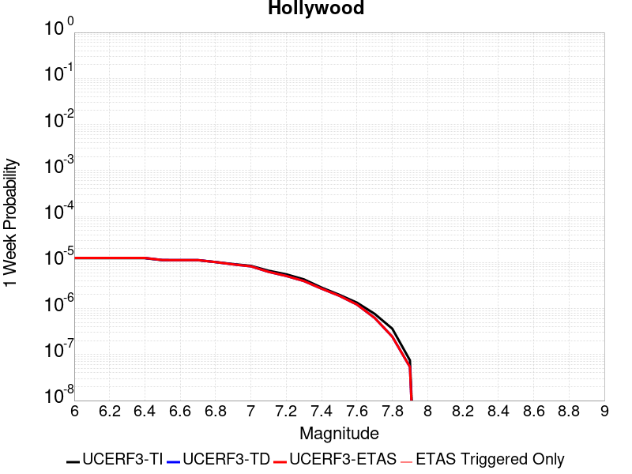 | 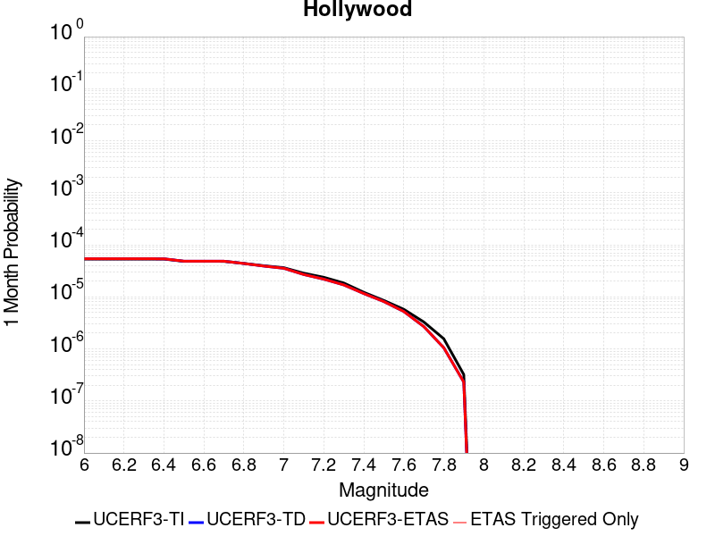 | 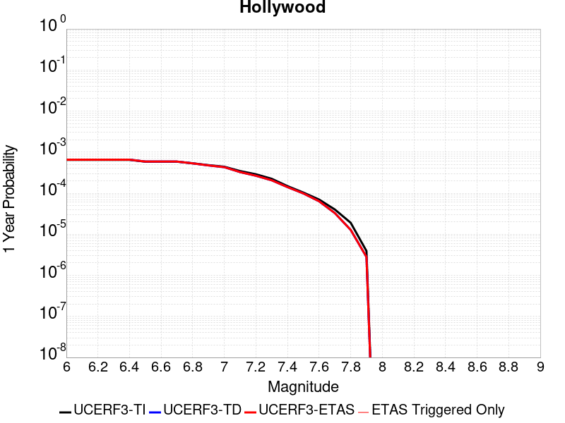 | 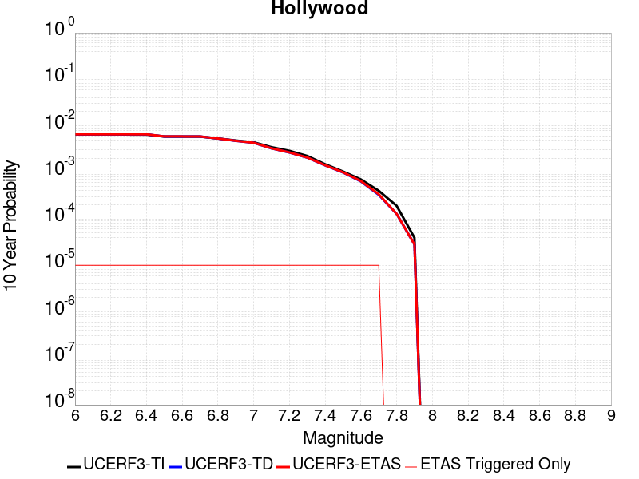 |

| Magnitude | 1 wk TI Prob | 1 wk TD Prob | 1 wk ETAS Prob | 1 wk ETAS/TD Gain | 1 wk ETAS Triggered Only | 1 mo TI Prob | 1 mo TD Prob | 1 mo ETAS Prob | 1 mo ETAS/TD Gain | 1 mo ETAS Triggered Only | 1 yr TI Prob | 1 yr TD Prob | 1 yr ETAS Prob | 1 yr ETAS/TD Gain | 1 yr ETAS Triggered Only | 10 yr TI Prob | 10 yr TD Prob | 10 yr ETAS Prob | 10 yr ETAS/TD Gain | 10 yr ETAS Triggered Only |
|-----|-----|-----|-----|-----|-----|-----|-----|-----|-----|-----|-----|-----|-----|-----|-----|-----|-----|-----|-----|-----|
| 6.0 | 1.24487615E-5 | 1.25933575E-5 | 1.25933575E-5 | 1.0 | 0.0 | 5.3350745E-5 | 5.397044E-5 | 5.397044E-5 | 1.0 | 0.0 | 6.4935174E-4 | 6.568967E-4 | 6.568967E-4 | 1.0 | 0.0 | 0.0064745755 | 0.006550037 | 0.0065599713 | 1.0015167 | 1.0E-5 |
| 6.1 | 1.24487615E-5 | 1.25933575E-5 | 1.25933575E-5 | 1.0 | 0.0 | 5.3350745E-5 | 5.397044E-5 | 5.397044E-5 | 1.0 | 0.0 | 6.4935174E-4 | 6.568967E-4 | 6.568967E-4 | 1.0 | 0.0 | 0.0064745755 | 0.006550037 | 0.0065599713 | 1.0015167 | 1.0E-5 |
| 6.2 | 1.24487615E-5 | 1.25933575E-5 | 1.25933575E-5 | 1.0 | 0.0 | 5.3350745E-5 | 5.397044E-5 | 5.397044E-5 | 1.0 | 0.0 | 6.4935174E-4 | 6.568967E-4 | 6.568967E-4 | 1.0 | 0.0 | 0.0064745755 | 0.006550037 | 0.0065599713 | 1.0015167 | 1.0E-5 |
| 6.3 | 1.24487615E-5 | 1.25933575E-5 | 1.25933575E-5 | 1.0 | 0.0 | 5.3350745E-5 | 5.397044E-5 | 5.397044E-5 | 1.0 | 0.0 | 6.4935174E-4 | 6.568967E-4 | 6.568967E-4 | 1.0 | 0.0 | 0.0064745755 | 0.006550037 | 0.0065599713 | 1.0015167 | 1.0E-5 |
| 6.4 | 1.2431024E-5 | 1.257397E-5 | 1.257397E-5 | 1.0 | 0.0 | 5.327473E-5 | 5.3887357E-5 | 5.3887357E-5 | 1.0 | 0.0 | 6.4842677E-4 | 6.558857E-4 | 6.558857E-4 | 1.0 | 0.0 | 0.0064653796 | 0.0065399874 | 0.006549922 | 1.0015191 | 1.0E-5 |
| 6.5 | 1.1242222E-5 | 1.1317923E-5 | 1.1317923E-5 | 1.0 | 0.0 | 4.8180063E-5 | 4.85045E-5 | 4.85045E-5 | 1.0 | 0.0 | 5.864344E-4 | 5.9038494E-4 | 5.9038494E-4 | 1.0 | 0.0 | 0.0058488925 | 0.005888452 | 0.0058983928 | 1.0016882 | 1.0E-5 |
| 6.6 | 1.1234066E-5 | 1.1309037E-5 | 1.1309037E-5 | 1.0 | 0.0 | 4.8145106E-5 | 4.8466416E-5 | 4.8466416E-5 | 1.0 | 0.0 | 5.86009E-4 | 5.8992155E-4 | 5.8992155E-4 | 1.0 | 0.0 | 0.005844661 | 0.0058838422 | 0.0058937836 | 1.0016896 | 1.0E-5 |
| 6.7 | 1.12294E-5 | 1.130378E-5 | 1.130378E-5 | 1.0 | 0.0 | 4.812511E-5 | 4.844389E-5 | 4.844389E-5 | 1.0 | 0.0 | 5.857657E-4 | 5.896474E-4 | 5.896474E-4 | 1.0 | 0.0 | 0.0058422405 | 0.0058811153 | 0.0058910567 | 1.0016904 | 1.0E-5 |
| 6.8 | 1.0252819E-5 | 1.0218554E-5 | 1.0218554E-5 | 1.0 | 0.0 | 4.3939912E-5 | 4.379308E-5 | 4.379308E-5 | 1.0 | 0.0 | 5.3483713E-4 | 5.330524E-4 | 5.330524E-4 | 1.0 | 0.0 | 0.005335517 | 0.005317964 | 0.005327911 | 1.0018704 | 1.0E-5 |
| 6.9 | 9.252289E-6 | 9.110402E-6 | 9.110402E-6 | 1.0 | 0.0 | 3.9652066E-5 | 3.9044004E-5 | 3.9044004E-5 | 1.0 | 0.0 | 4.8265693E-4 | 4.752587E-4 | 4.752587E-4 | 1.0 | 0.0 | 0.0048161 | 0.0047425968 | 0.0047525493 | 1.0020986 | 1.0E-5 |
| 7.0 | 8.474604E-6 | 8.258344E-6 | 8.258344E-6 | 1.0 | 0.0 | 3.6319227E-5 | 3.539243E-5 | 3.539243E-5 | 1.0 | 0.0 | 4.4209688E-4 | 4.3081908E-4 | 4.3081908E-4 | 1.0 | 0.0 | 0.004412184 | 0.004299989 | 0.004309946 | 1.0023156 | 1.0E-5 |
| 7.1 | 6.643643E-6 | 6.2684335E-6 | 6.2684335E-6 | 1.0 | 0.0 | 2.8472443E-5 | 2.686444E-5 | 2.686444E-5 | 1.0 | 0.0 | 3.4659685E-4 | 3.270259E-4 | 3.270259E-4 | 1.0 | 0.0 | 0.0034605677 | 0.0032654926 | 0.0032754599 | 1.0030524 | 1.0E-5 |
| 7.2 | 5.549002E-6 | 5.108764E-6 | 5.108764E-6 | 1.0 | 0.0 | 2.378122E-5 | 2.189452E-5 | 2.189452E-5 | 1.0 | 0.0 | 2.8949787E-4 | 2.6653332E-4 | 2.6653332E-4 | 1.0 | 0.0 | 0.0028912104 | 0.002662153 | 0.0026721263 | 1.0037464 | 1.0E-5 |
| 7.3 | 4.3059727E-6 | 3.959934E-6 | 3.959934E-6 | 1.0 | 0.0 | 1.8454039E-5 | 1.6971035E-5 | 1.6971035E-5 | 1.0 | 0.0 | 2.2465475E-4 | 2.0660285E-4 | 2.0660285E-4 | 1.0 | 0.0 | 0.0022442779 | 0.002064118 | 0.0020740973 | 1.0048347 | 1.0E-5 |
| 7.4 | 2.8550733E-6 | 2.7013323E-6 | 2.7013323E-6 | 1.0 | 0.0 | 1.2235971E-5 | 1.1577087E-5 | 1.1577087E-5 | 1.0 | 0.0 | 1.4896276E-4 | 1.4094196E-4 | 1.4094196E-4 | 1.0 | 0.0 | 0.0014886294 | 0.0014085309 | 0.0014185169 | 1.0070896 | 1.0E-5 |
| 7.5 | 1.9927045E-6 | 1.897665E-6 | 1.897665E-6 | 1.0 | 0.0 | 8.540134E-6 | 8.132824E-6 | 8.132824E-6 | 1.0 | 0.0 | 1.0397117E-4 | 9.901268E-5 | 9.901268E-5 | 1.0 | 0.0 | 0.0010392254 | 9.896893E-4 | 9.996793E-4 | 1.0100942 | 1.0E-5 |
| 7.6 | 1.345084E-6 | 1.2216203E-6 | 1.2216203E-6 | 1.0 | 0.0 | 5.764633E-6 | 5.2355053E-6 | 5.2355053E-6 | 1.0 | 0.0 | 7.018215E-5 | 6.374043E-5 | 6.374043E-5 | 1.0 | 0.0 | 7.0159987E-4 | 6.372235E-4 | 6.472171E-4 | 1.015683 | 1.0E-5 |
| 7.7 | 7.6835164E-7 | 6.277844E-7 | 6.277844E-7 | 1.0 | 0.0 | 3.2929315E-6 | 2.6905018E-6 | 2.6905018E-6 | 1.0 | 0.0 | 4.00907E-5 | 3.2756383E-5 | 3.2756383E-5 | 1.0 | 0.0 | 4.0083472E-4 | 3.2751702E-4 | 3.3751375E-4 | 1.0305228 | 1.0E-5 |
| 7.8 | 3.6562128E-7 | 2.4536004E-7 | 2.4536004E-7 | 1.0 | 0.0 | 1.5669474E-6 | 1.0515427E-6 | 1.0515427E-6 | 1.0 | 0.0 | 1.9077417E-5 | 1.280246E-5 | 1.280246E-5 | 1.0 | 0.0 | 1.907578E-4 | 1.280176E-4 | 1.280176E-4 | 1.0 | 0.0 |
| 7.9 | 7.5024424E-8 | 5.3819367E-8 | 5.3819367E-8 | 1.0 | 0.0 | 3.215332E-7 | 2.3065442E-7 | 2.3065442E-7 | 1.0 | 0.0 | 3.91466E-6 | 2.8082152E-6 | 2.8082152E-6 | 1.0 | 0.0 | 3.9145907E-5 | 2.8081928E-5 | 2.8081928E-5 | 1.0 | 0.0 |

