# Parent Section Magnitude-Probability Distributions

Only fault sections with at least one triggered aftershock are plotted. Sections are sorted by total supraseismogenic trigger rate (decreasing)

## Table Of Contents

* [Garlock (Central)](#garlock-central)
* [Tank Canyon](#tank-canyon)
* [Little Lake](#little-lake)
* [Owl Lake](#owl-lake)
* [Airport Lake](#airport-lake)
* [Panamint Valley](#panamint-valley)
* [Garlock (East)](#garlock-east)
* [Hunter Mountain-Saline Valley](#hunter-mountain-saline-valley)
* [Ash Hill](#ash-hill)
* [Blackwater](#blackwater)
* [Garlock (West)](#garlock-west)
* [McLean Lake](#mclean-lake)
* [Gravel Hills-Harper Lk](#gravel-hills-harper-lk)
* [Goldstone Lake](#goldstone-lake)
* [So Sierra Nevada](#so-sierra-nevada)
* [Coyote Canyon](#coyote-canyon)
* [Death Valley (So)](#death-valley-so)
* [San Andreas (Mojave S)](#san-andreas-mojave-s)
* [San Andreas (Mojave N)](#san-andreas-mojave-n)
* [Nelson Lake](#nelson-lake)
* [Towne Pass](#towne-pass)
* [Lenwood-Lockhart-Old Woman Springs](#lenwood-lockhart-old-woman-springs)
* [San Andreas (San Bernardino N)](#san-andreas-san-bernardino-n)
* [Bicycle Lake](#bicycle-lake)
* [Paradise](#paradise)
* [Garlic Springs](#garlic-springs)
* [San Andreas (San Bernardino S)](#san-andreas-san-bernardino-s)
* [Death Valley (Black Mtns Frontal)](#death-valley-black-mtns-frontal)
* [San Andreas (Big Bend)](#san-andreas-big-bend)
* [Helendale-So Lockhart](#helendale-so-lockhart)
* [Coyote Lake](#coyote-lake)
* [San Andreas (Parkfield)](#san-andreas-parkfield)
* [San Andreas (Carrizo) rev](#san-andreas-carrizo-rev)
* [San Andreas (Cholame) rev](#san-andreas-cholame-rev)
* [Death Valley (No)](#death-valley-no)
* [Elsinore (Glen Ivy) rev](#elsinore-glen-ivy-rev)
* [San Andreas (San Gorgonio Pass-Garnet HIll)](#san-andreas-san-gorgonio-pass-garnet-hill)
* [Death Valley (Fish Lake Valley)](#death-valley-fish-lake-valley)
* [Sierra Nevada  (No Extension)](#sierra-nevada--no-extension)
* [Manix-Afton Hills](#manix-afton-hills)
* [San Andreas (Coachella) rev](#san-andreas-coachella-rev)
* [Red Pass](#red-pass)
* [San Jacinto (San Bernardino)](#san-jacinto-san-bernardino)
* [San Andreas (Creeping Section) 2011 CFM](#san-andreas-creeping-section-2011-cfm)
* [Calico-Hidalgo](#calico-hidalgo)
* [Baker](#baker)
* [Cady](#cady)
* [White Wolf (Extension)](#white-wolf-extension)
* [San Andreas (North Branch Mill Creek)](#san-andreas-north-branch-mill-creek)
* [Lake Isabella (Seismicity)](#lake-isabella-seismicity)
* [Santa Ynez (West)](#santa-ynez-west)
* [San Jacinto (San Jacinto Valley) rev](#san-jacinto-san-jacinto-valley-rev)
* [Ludlow](#ludlow)
* [Mission Ridge-Arroyo Parida-Santa Ana](#mission-ridge-arroyo-parida-santa-ana)
* [Lost Hills](#lost-hills)
* [San Jacinto (Stepovers Combined)](#san-jacinto-stepovers-combined)
* [San Jacinto (Lytle Creek connector)](#san-jacinto-lytle-creek-connector)
* [Santa Cruz Island](#santa-cruz-island)
* [Scodie Lineament](#scodie-lineament)
* [Independence rev 2011](#independence-rev-2011)
* [San Jacinto (Anza) rev](#san-jacinto-anza-rev)
* [Kern Canyon (North Kern) 2011](#kern-canyon-north-kern-2011)
* [Rose Canyon](#rose-canyon)
* [Red Mountain](#red-mountain)
* [Mission Creek](#mission-creek)
* [Cleghorn Lake](#cleghorn-lake)
* [Pleito](#pleito)
* [Santa Rosa Island](#santa-rosa-island)
* [Owens Valley](#owens-valley)
* [Deep Springs](#deep-springs)
* [Big Pine (East)](#big-pine-east)
* [San Jacinto (Coyote Creek)](#san-jacinto-coyote-creek)
* [Cleghorn](#cleghorn)
* [San Jacinto (Borrego)](#san-jacinto-borrego)
* [San Clemente](#san-clemente)
* [Chino alt 1](#chino-alt-1)
* [Channel Islands Thrust](#channel-islands-thrust)
* [Cleghorn Pass](#cleghorn-pass)
* [Tin Mountain](#tin-mountain)
* [Big Pine (Central)](#big-pine-central)
* [San Pedro Basin](#san-pedro-basin)
* [Great Valley 09 (Laguna Seca)](#great-valley-09-laguna-seca)
* [Kern Canyon (South Kern) 2011](#kern-canyon-south-kern-2011)
* [White Mountains](#white-mountains)
* [Whittier alt 1](#whittier-alt-1)
* [Coronado Bank alt1](#coronado-bank-alt1)
* [Brawley (Seismic Zone) alt 1](#brawley-seismic-zone-alt-1)
* [Ortigalita (North)](#ortigalita-north)
* [Santa Ynez (East)](#santa-ynez-east)
* [Dry Mountain](#dry-mountain)
* [Sheephole](#sheephole)
* [Pisgah-Bullion Mtn-Mesquite Lk](#pisgah-bullion-mtn-mesquite-lk)
* [Calaveras (So) - Paicines extension 2011 CFM](#calaveras-so---paicines-extension-2011-cfm)
* [San Jacinto (Superstition Mtn)](#san-jacinto-superstition-mtn)
* [Camp Rock 2011](#camp-rock-2011)
* [Imperial](#imperial)
* [Great Valley 03a Dunnigan Hills](#great-valley-03a-dunnigan-hills)
* [Monterey Bay-Tularcitos](#monterey-bay-tularcitos)
* [Pine Mtn](#pine-mtn)
* [Malibu Coast alt 1](#malibu-coast-alt-1)
* [Calaveras (So) 2011 CFM](#calaveras-so-2011-cfm)
* [Santa Cruz Catalina Ridge alt1](#santa-cruz-catalina-ridge-alt1)
* [Ventura-Pitas Point](#ventura-pitas-point)
* [Bullion Mountains](#bullion-mountains)
* [Rinconada 2011 CFM](#rinconada-2011-cfm)
* [Anacapa-Dume alt 1](#anacapa-dume-alt-1)
* [Santa Ynez River](#santa-ynez-river)
* [San Juan](#san-juan)
* [Palos Verdes](#palos-verdes)
* [San Andreas (Santa Cruz Mts) 2011 CFM](#san-andreas-santa-cruz-mts-2011-cfm)
* [Holser alt 1](#holser-alt-1)
* [Pitas Point (Lower)-Montalvo](#pitas-point-lower-montalvo)
* [Robinson Creek](#robinson-creek)
* [La Panza 2011](#la-panza-2011)
* [Hayward (So) 2011 CFM](#hayward-so-2011-cfm)
* [Hosgri](#hosgri)
* [Surprise Valley 2011 CFM](#surprise-valley-2011-cfm)
* [Emerson-Copper Mtn 2011](#emerson-copper-mtn-2011)
* [Ozena](#ozena)
* [Oceanic - West Huasna](#oceanic---west-huasna)
* [North Frontal  (East)](#north-frontal--east)
* [Calaveras (Central) 2011 CFM](#calaveras-central-2011-cfm)
* [San Gabriel](#san-gabriel)
* [San Cayetano](#san-cayetano)
* [Pitas Point (Lower West)](#pitas-point-lower-west)
* [Los Alamos 2011 CFM](#los-alamos-2011-cfm)
* [Great Valley 14 (Kettleman Hills)](#great-valley-14-kettleman-hills)
* [Elysian Park (Upper)](#elysian-park-upper)
* [Great Valley 06 (Midland) 2011 CFM alt1](#great-valley-06-midland-2011-cfm-alt1)
* [Newport-Inglewood (Offshore)](#newport-inglewood-offshore)
* [Great Valley 11](#great-valley-11)
* [Peralta Hills](#peralta-hills)
* [Pinto Mtn](#pinto-mtn)
* [Gillem - Big Crack 2011 CFM](#gillem---big-crack-2011-cfm)
* [San Diego Trough north alt1](#san-diego-trough-north-alt1)
* [Channel Islands Western Deep Ramp](#channel-islands-western-deep-ramp)
* [San Diego Trough south](#san-diego-trough-south)
* [Cucamonga](#cucamonga)
* [Verdugo](#verdugo)
* [Carlsbad](#carlsbad)
* [South Klamath Lake East](#south-klamath-lake-east)
* [Quien Sabe 2011 CFM](#quien-sabe-2011-cfm)
* [Earthquake Valley (No  Extension)](#earthquake-valley-no--extension)
* [North Frontal  (West)](#north-frontal--west)
* [Green Valley 2011 CFM](#green-valley-2011-cfm)
* [Elsinore (Temecula) rev](#elsinore-temecula-rev)
* [Morales (West)](#morales-west)
* [Raymond](#raymond)
* [Great Valley 10 (Panoche)](#great-valley-10-panoche)
* [Simi-Santa Rosa](#simi-santa-rosa)
* [Great Valley 12](#great-valley-12)
* [San Andreas (Peninsula) 2011 CFM](#san-andreas-peninsula-2011-cfm)
* [Carson Range (Genoa)](#carson-range-genoa)
* [Earthquake Valley (So Extension)](#earthquake-valley-so-extension)
* [Blue Cut](#blue-cut)
* [Butano 2011 CFM](#butano-2011-cfm)
* [Big Lagoon - Bald Mtn 2011 CFM](#big-lagoon---bald-mtn-2011-cfm)
* [Hartley Springs 2011 CFM](#hartley-springs-2011-cfm)
* [Likely 2011 CFM](#likely-2011-cfm)
* [Redondo Canyon alt 1](#redondo-canyon-alt-1)
* [Antelope Valley 2011](#antelope-valley-2011)
* [Great Valley 07 (Orestimba)](#great-valley-07-orestimba)
* [Cedar Mtn-Mahogany Mtn](#cedar-mtn-mahogany-mtn)
* [Mount Diablo Thrust South](#mount-diablo-thrust-south)
* [Ortigalita (South)](#ortigalita-south)
* [San Jacinto (Clark) rev](#san-jacinto-clark-rev)
* [Elmore Ranch](#elmore-ranch)
* [San Gorgonio Pass](#san-gorgonio-pass)
* [Greenville (So) 2011 CFM](#greenville-so-2011-cfm)
* [Swain Ravine - Spenceville](#swain-ravine---spenceville)
* [San Luis Range 2011 CFM](#san-luis-range-2011-cfm)
* [Sierra Madre](#sierra-madre)
* [Puente Hills](#puente-hills)
* [Santa Monica alt 1](#santa-monica-alt-1)
* [Great Valley 08 (Quinto)](#great-valley-08-quinto)
* [Mission Hills 2011](#mission-hills-2011)
* [Almanor 2011 CFM](#almanor-2011-cfm)
* [Hosgri (Extension)](#hosgri-extension)
* [Northridge Hills](#northridge-hills)
* [South Cuyama](#south-cuyama)
* [Hunting Creek - Berryessa 2011 CFM](#hunting-creek---berryessa-2011-cfm)
* [Earthquake Valley](#earthquake-valley)
* [Silver Creek 2011 CFM](#silver-creek-2011-cfm)
* [Cerro Prieto](#cerro-prieto)
* [East Huasna 2011 CFM](#east-huasna-2011-cfm)
* [Hat Creek-McArthur-Mayfield](#hat-creek-mcarthur-mayfield)
* [San Luis Range - Oceano 2011 CFM](#san-luis-range---oceano-2011-cfm)
* [Hollywood](#hollywood)
* [Newport-Inglewood alt 1](#newport-inglewood-alt-1)
* [White Wolf](#white-wolf)
* [Superstition Hills](#superstition-hills)
* [Great Valley 13 (Coalinga)](#great-valley-13-coalinga)
* [Oceanside alt1](#oceanside-alt1)
* [Concord 2011 CFM](#concord-2011-cfm)
* [Hector Mine](#hector-mine)

## Garlock (Central)
*[(top)](#table-of-contents)*

| 1 Week | 1 Month | 1 Year | 10 Year |
|-----|-----|-----|-----|
|  | 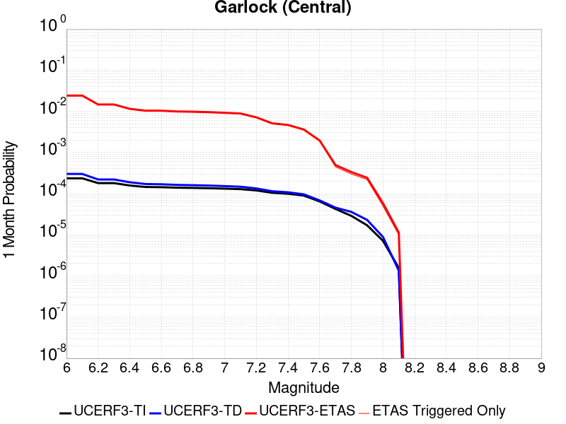 |  |  |

| Magnitude | 1 wk TI Prob | 1 wk TD Prob | 1 wk ETAS Prob | 1 wk ETAS/TD Gain | 1 wk ETAS Triggered Only | 1 mo TI Prob | 1 mo TD Prob | 1 mo ETAS Prob | 1 mo ETAS/TD Gain | 1 mo ETAS Triggered Only | 1 yr TI Prob | 1 yr TD Prob | 1 yr ETAS Prob | 1 yr ETAS/TD Gain | 1 yr ETAS Triggered Only | 10 yr TI Prob | 10 yr TD Prob | 10 yr ETAS Prob | 10 yr ETAS/TD Gain | 10 yr ETAS Triggered Only |
|-----|-----|-----|-----|-----|-----|-----|-----|-----|-----|-----|-----|-----|-----|-----|-----|-----|-----|-----|-----|-----|
| 6.0 | 5.5131142E-5 | 7.025218E-5 | 0.010379528 | 147.7467 | 0.01031 | 2.3625491E-4 | 3.0104638E-4 | 0.024133869 | 80.16662 | 0.02384 | 0.0028726095 | 0.003659144 | 0.057979647 | 15.8451395 | 0.05452 | 0.028357591 | 0.036138672 | 0.117045194 | 3.2387795 | 0.08394 |
| 6.1 | 5.5131142E-5 | 7.025218E-5 | 0.010379528 | 147.7467 | 0.01031 | 2.3625491E-4 | 3.0104638E-4 | 0.024133869 | 80.16662 | 0.02384 | 0.0028726095 | 0.003659144 | 0.057979647 | 15.8451395 | 0.05452 | 0.028357591 | 0.036138672 | 0.117045194 | 3.2387795 | 0.08394 |
| 6.2 | 4.216245E-5 | 5.1666284E-5 | 0.006191349 | 119.83345 | 0.00614 | 1.806837E-4 | 2.214083E-4 | 0.014678206 | 66.29475 | 0.01446 | 0.0021976046 | 0.002692345 | 0.036241774 | 13.461043 | 0.03364 | 0.021759989 | 0.026703304 | 0.077090874 | 2.8869414 | 0.05177 |
| 6.3 | 4.216245E-5 | 5.1666284E-5 | 0.006191349 | 119.83345 | 0.00614 | 1.806837E-4 | 2.214083E-4 | 0.014678206 | 66.29475 | 0.01446 | 0.0021976046 | 0.002692345 | 0.036241774 | 13.461043 | 0.03364 | 0.021759989 | 0.026703304 | 0.077090874 | 2.8869414 | 0.05177 |
| 6.4 | 3.6858168E-5 | 4.411471E-5 | 0.004893901 | 110.93581 | 0.00485 | 1.5795401E-4 | 1.8904949E-4 | 0.011526906 | 60.972954 | 0.01134 | 0.0019213937 | 0.002299273 | 0.028389147 | 12.347011 | 0.02615 | 0.019048655 | 0.022867803 | 0.062295087 | 2.7241397 | 0.04035 |
| 6.5 | 3.39199E-5 | 4.0022875E-5 | 0.0043298514 | 108.18442 | 0.00429 | 1.453629E-4 | 1.7151545E-4 | 0.010359768 | 60.401367 | 0.01019 | 0.0017683565 | 0.0020862224 | 0.025627008 | 12.283929 | 0.02359 | 0.017543508 | 0.020760475 | 0.056532092 | 2.7230637 | 0.03653 |
| 6.6 | 3.3571985E-5 | 3.9477025E-5 | 0.0043293075 | 109.66651 | 0.00429 | 1.4387199E-4 | 1.691764E-4 | 0.010357453 | 61.222797 | 0.01019 | 0.0017502342 | 0.0020577987 | 0.025579296 | 12.430417 | 0.02357 | 0.017365133 | 0.020481724 | 0.056214552 | 2.74462 | 0.03648 |
| 6.7 | 3.2580007E-5 | 3.809346E-5 | 0.004197935 | 110.200935 | 0.00416 | 1.3962112E-4 | 1.6324759E-4 | 0.009951649 | 60.96047 | 0.00979 | 0.0016985617 | 0.001985749 | 0.024670614 | 12.423832 | 0.02273 | 0.016856372 | 0.01977117 | 0.054353643 | 2.7491364 | 0.03528 |
| 6.8 | 3.2185937E-5 | 3.7520644E-5 | 0.004137367 | 110.26908 | 0.0041 | 1.3793244E-4 | 1.6079296E-4 | 0.009789244 | 60.88105 | 0.00963 | 0.0016780337 | 0.001955918 | 0.024132457 | 12.338174 | 0.02222 | 0.016654192 | 0.019478364 | 0.05332597 | 2.7377028 | 0.03452 |
| 6.9 | 3.165394E-5 | 3.6725167E-5 | 0.004096576 | 111.54683 | 0.00406 | 1.3565269E-4 | 1.573842E-4 | 0.009565903 | 60.780582 | 0.00941 | 0.0016503202 | 0.00191449 | 0.023473136 | 12.260778 | 0.0216 | 0.01638118 | 0.019071935 | 0.052060544 | 2.7296941 | 0.03363 |
| 7.0 | 3.0903822E-5 | 3.563031E-5 | 0.0039054924 | 109.61152 | 0.00387 | 1.3243823E-4 | 1.526925E-4 | 0.009211309 | 60.325874 | 0.00906 | 0.0016112428 | 0.0018574673 | 0.022698684 | 12.220233 | 0.02088 | 0.015996104 | 0.018513396 | 0.05056875 | 2.731468 | 0.03266 |
| 7.1 | 3.0069863E-5 | 3.4396526E-5 | 0.0037342692 | 108.5653 | 0.0037 | 1.2886449E-4 | 1.4740547E-4 | 0.008856121 | 60.08 | 0.00871 | 0.0015677959 | 0.0017932054 | 0.021787288 | 12.149912 | 0.02003 | 0.01556781 | 0.017881105 | 0.048621427 | 2.719151 | 0.0313 |
| 7.2 | 2.7957109E-5 | 3.1285654E-5 | 0.002991193 | 95.6091 | 0.00296 | 1.1981068E-4 | 1.340746E-4 | 0.0071431347 | 53.27732 | 0.00701 | 0.0014577188 | 0.0016311554 | 0.017944502 | 11.0011 | 0.01634 | 0.014481937 | 0.016284721 | 0.04179246 | 2.56636 | 0.02593 |
| 7.3 | 2.4519275E-5 | 2.671855E-5 | 0.002106663 | 78.84646 | 0.00208 | 1.0507837E-4 | 1.1450313E-4 | 0.0051139304 | 44.66193 | 0.005 | 0.0012785783 | 0.0013931987 | 0.01327662 | 9.529595 | 0.0119 | 0.012712469 | 0.013929104 | 0.03263487 | 2.3429267 | 0.01897 |
| 7.4 | 2.3225532E-5 | 2.5203044E-5 | 0.0019151554 | 75.98905 | 0.00189 | 9.95342E-5 | 1.0800866E-4 | 0.0046675163 | 43.21428 | 0.00456 | 0.0012111551 | 0.0013142265 | 0.012129993 | 9.229758 | 0.01083 | 0.012045753 | 0.013146564 | 0.030150048 | 2.2933786 | 0.01723 |
| 7.5 | 2.097765E-5 | 2.2487064E-5 | 0.0015424528 | 68.592896 | 0.00152 | 8.9901114E-5 | 9.636964E-5 | 0.0036160303 | 37.522507 | 0.00352 | 0.0010939965 | 0.0011726806 | 0.009702666 | 8.27392 | 0.00854 | 0.010886264 | 0.011741084 | 0.025052931 | 2.1337836 | 0.01347 |
| 7.6 | 1.511254E-5 | 1.5994365E-5 | 7.3598285E-4 | 46.015137 | 7.2E-4 | 6.476642E-5 | 6.854552E-5 | 0.001958416 | 28.571028 | 0.00189 | 7.882459E-4 | 8.3423E-4 | 0.005290509 | 6.3417873 | 0.00446 | 0.007854558 | 0.008384522 | 0.015563818 | 1.8562559 | 0.00724 |
| 7.7 | 9.934069E-6 | 1.0681621E-5 | 1.6068002E-4 | 15.042663 | 1.5E-4 | 4.2573887E-5 | 4.5777575E-5 | 4.95757E-4 | 10.829691 | 4.5E-4 | 5.182138E-4 | 5.571998E-4 | 0.0017965089 | 3.2241735 | 0.00124 | 0.00517007 | 0.005629345 | 0.0076578613 | 1.3603468 | 0.00204 |
| 7.8 | 6.7562896E-6 | 8.430898E-6 | 8.843022E-5 | 10.488827 | 8.0E-5 | 2.8955206E-5 | 3.6131918E-5 | 3.3612107E-4 | 9.3026085 | 3.0E-4 | 3.5247262E-4 | 4.3981746E-4 | 0.0012894436 | 2.9317698 | 8.5E-4 | 0.0035191406 | 0.0044480516 | 0.0058119576 | 1.30663 | 0.00137 |
| 7.9 | 3.975453E-6 | 5.3725935E-6 | 5.5372326E-5 | 10.306442 | 5.0E-5 | 1.7037546E-5 | 2.3025199E-5 | 2.4302013E-4 | 10.554529 | 2.2E-4 | 2.0741238E-4 | 2.8029582E-4 | 8.8012766E-4 | 3.1399956 | 6.0E-4 | 0.002072189 | 0.002834451 | 0.0037319 | 1.3166218 | 9.0E-4 |
| 8.0 | 1.6729537E-6 | 2.0780296E-6 | 1.2078009E-5 | 5.812241 | 1.0E-5 | 7.169782E-6 | 8.90581E-6 | 5.8905367E-5 | 6.614262 | 5.0E-5 | 8.7288594E-5 | 1.08422886E-4 | 2.484077E-4 | 2.2911003 | 1.4E-4 | 8.7254314E-4 | 0.0010972664 | 0.001307036 | 1.1911747 | 2.1E-4 |
| 8.1 | 3.6733252E-7 | 3.1496086E-7 | 1.0314958E-5 | 32.74997 | 1.0E-5 | 1.5742813E-6 | 1.3498316E-6 | 1.1349818E-5 | 8.408321 | 1.0E-5 | 1.9166706E-5 | 1.6434093E-5 | 3.6433765E-5 | 2.2169623 | 2.0E-5 | 1.9165053E-4 | 1.6647995E-4 | 1.8647662E-4 | 1.1201146 | 2.0E-5 |

## Tank Canyon
*[(top)](#table-of-contents)*

| 1 Week | 1 Month | 1 Year | 10 Year |
|-----|-----|-----|-----|
| 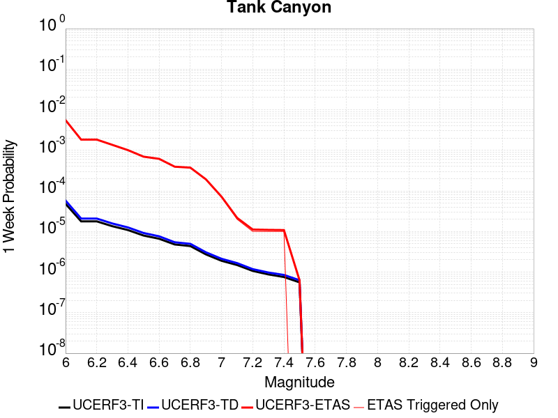 |  |  | 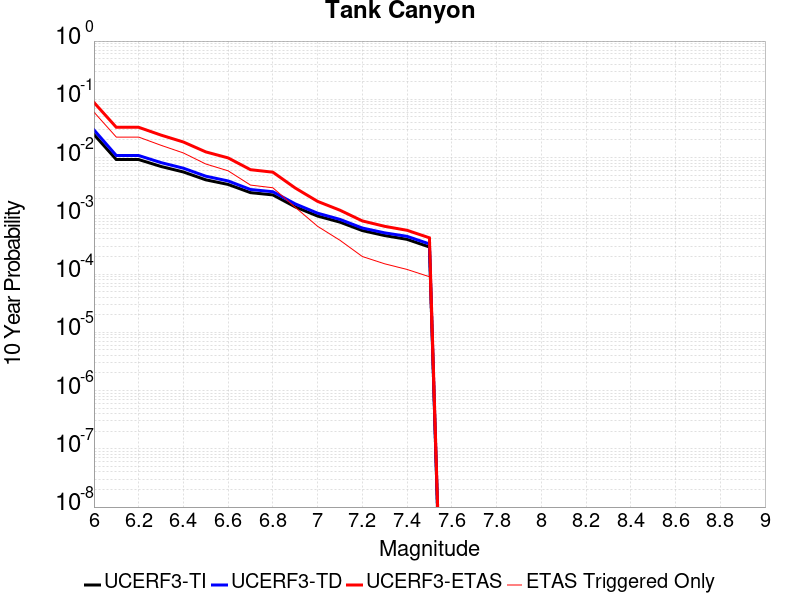 |

| Magnitude | 1 wk TI Prob | 1 wk TD Prob | 1 wk ETAS Prob | 1 wk ETAS/TD Gain | 1 wk ETAS Triggered Only | 1 mo TI Prob | 1 mo TD Prob | 1 mo ETAS Prob | 1 mo ETAS/TD Gain | 1 mo ETAS Triggered Only | 1 yr TI Prob | 1 yr TD Prob | 1 yr ETAS Prob | 1 yr ETAS/TD Gain | 1 yr ETAS Triggered Only | 10 yr TI Prob | 10 yr TD Prob | 10 yr ETAS Prob | 10 yr ETAS/TD Gain | 10 yr ETAS Triggered Only |
|-----|-----|-----|-----|-----|-----|-----|-----|-----|-----|-----|-----|-----|-----|-----|-----|-----|-----|-----|-----|-----|
| 6.0 | 4.8284557E-5 | 5.79657E-5 | 0.005557647 | 95.8782 | 0.0055 | 2.0691741E-4 | 2.4840463E-4 | 0.013915009 | 56.017513 | 0.01367 | 0.0025163088 | 0.003020798 | 0.038583048 | 12.772468 | 0.03567 | 0.02488006 | 0.029864272 | 0.08835375 | 2.9585104 | 0.06029 |
| 6.1 | 1.7796336E-5 | 2.0873718E-5 | 0.0018408358 | 88.18916 | 0.00182 | 7.626778E-5 | 8.945595E-5 | 0.004839031 | 54.094013 | 0.00475 | 9.281647E-4 | 0.0010886202 | 0.013844718 | 12.717676 | 0.01277 | 0.009242975 | 0.010836845 | 0.03306334 | 3.0510116 | 0.02247 |
| 6.2 | 1.7796336E-5 | 2.0873718E-5 | 0.0018408358 | 88.18916 | 0.00182 | 7.626778E-5 | 8.945595E-5 | 0.004839031 | 54.094013 | 0.00475 | 9.281647E-4 | 0.0010886202 | 0.013844718 | 12.717676 | 0.01277 | 0.009242975 | 0.010836845 | 0.03306334 | 3.0510116 | 0.02247 |
| 6.3 | 1.3515912E-5 | 1.575988E-5 | 0.0013657386 | 86.659195 | 0.00135 | 5.792405E-5 | 6.7540735E-5 | 0.0035673042 | 52.817078 | 0.0035 | 7.049971E-4 | 8.2202186E-4 | 0.010264254 | 12.486594 | 0.00945 | 0.007027647 | 0.008192304 | 0.024289342 | 2.9648979 | 0.01623 |
| 6.4 | 1.0870146E-5 | 1.2618278E-5 | 0.0010126056 | 80.24912 | 0.001 | 4.658551E-5 | 5.407731E-5 | 0.0026539366 | 49.076714 | 0.0026 | 5.67031E-4 | 6.582101E-4 | 0.007663596 | 11.643085 | 0.00701 | 0.005655863 | 0.006564494 | 0.018485721 | 2.816016 | 0.012 |
| 6.5 | 7.964826E-6 | 9.196281E-6 | 6.9918996E-4 | 76.02964 | 6.9E-4 | 3.4134522E-5 | 3.9412098E-5 | 0.0017993427 | 45.65458 | 0.00176 | 4.1550855E-4 | 4.797472E-4 | 0.005067545 | 10.562949 | 0.00459 | 0.0041473247 | 0.004788288 | 0.01251113 | 2.6128612 | 0.00776 |
| 6.6 | 6.6317E-6 | 7.612445E-6 | 6.176078E-4 | 81.13133 | 6.1E-4 | 2.8421264E-5 | 3.2624408E-5 | 0.0014325788 | 43.911255 | 0.0014 | 3.4597394E-4 | 3.9713882E-4 | 0.003915741 | 9.8598795 | 0.00352 | 0.0034543579 | 0.003965314 | 0.009861839 | 2.487026 | 0.00592 |
| 6.7 | 4.793663E-6 | 5.430882E-6 | 3.9542877E-4 | 72.81115 | 3.9E-4 | 2.0544108E-5 | 2.3275026E-5 | 9.4325363E-4 | 40.526424 | 9.2E-4 | 2.500958E-4 | 2.8334098E-4 | 0.002442729 | 8.621164 | 0.00216 | 0.0024981452 | 0.0028303587 | 0.0061908206 | 2.1872919 | 0.00337 |
| 6.8 | 4.382823E-6 | 4.969347E-6 | 3.749675E-4 | 75.45609 | 3.7E-4 | 1.8783392E-5 | 2.1297052E-5 | 8.312798E-4 | 39.032623 | 8.1E-4 | 2.286638E-4 | 2.5926504E-4 | 0.0021887647 | 8.44219 | 0.00193 | 0.0022842865 | 0.0025901669 | 0.0056123184 | 2.1667788 | 0.00303 |
| 6.9 | 2.729601E-6 | 3.073596E-6 | 1.93073E-4 | 62.816654 | 1.9E-4 | 1.1698237E-5 | 1.3172494E-5 | 4.1316723E-4 | 31.365908 | 4.0E-4 | 1.4241673E-4 | 1.6036454E-4 | 0.0010502219 | 6.5489655 | 8.9E-4 | 0.001423255 | 0.0016027502 | 0.0030005062 | 1.8720986 | 0.0014 |
| 7.0 | 1.8987357E-6 | 2.1269777E-6 | 7.212683E-5 | 33.910477 | 7.0E-5 | 8.137413E-6 | 9.115591E-6 | 1.7911404E-4 | 19.649197 | 1.7E-4 | 9.90685E-5 | 1.10977366E-4 | 5.009341E-4 | 4.51384 | 3.9E-4 | 9.902435E-4 | 0.0011092882 | 0.0017685561 | 1.5943161 | 6.6E-4 |
| 7.1 | 1.4928986E-6 | 1.6641585E-6 | 2.1664126E-5 | 13.018065 | 2.0E-5 | 6.398121E-6 | 7.132092E-6 | 9.713145E-5 | 13.618929 | 9.0E-5 | 7.789434E-5 | 8.683035E-5 | 2.9681213E-4 | 3.4182992 | 2.1E-4 | 7.786704E-4 | 8.680221E-4 | 0.0012476923 | 1.4373969 | 3.8E-4 |
| 7.2 | 1.069082E-6 | 1.1828816E-6 | 1.11828695E-5 | 9.453921 | 1.0E-5 | 4.581772E-6 | 5.0694857E-6 | 4.5069282E-5 | 8.890306 | 4.0E-5 | 5.5781646E-5 | 6.171977E-5 | 1.7171299E-4 | 2.7821388 | 1.1E-4 | 5.576765E-4 | 6.170786E-4 | 8.169552E-4 | 1.3239079 | 2.0E-4 |
| 7.3 | 8.776551E-7 | 9.77019E-7 | 1.0977009E-5 | 11.235206 | 1.0E-5 | 3.7613736E-6 | 4.1872204E-6 | 2.4187137E-5 | 5.776418 | 2.0E-5 | 4.579376E-5 | 5.097874E-5 | 1.2097517E-4 | 2.3730514 | 7.0E-5 | 4.5784327E-4 | 5.0972146E-4 | 6.59645E-4 | 1.2941284 | 1.5E-4 |
| 7.4 | 7.55721E-7 | 8.510419E-7 | 1.0851033E-5 | 12.750293 | 1.0E-5 | 3.2388E-6 | 3.64732E-6 | 1.3647284E-5 | 3.741729 | 1.0E-5 | 3.9431678E-5 | 4.4405737E-5 | 9.440351E-5 | 2.1259305 | 5.0E-5 | 3.942468E-4 | 4.4401948E-4 | 5.6396617E-4 | 1.2701384 | 1.2E-4 |
| 7.5 | 5.587665E-7 | 6.3057325E-7 | 6.3057325E-7 | 1.0 | 0.0 | 2.3947114E-6 | 2.7024569E-6 | 2.7024569E-6 | 1.0 | 0.0 | 2.915522E-5 | 3.290241E-5 | 7.290109E-5 | 2.2156763 | 4.0E-5 | 2.9151395E-4 | 3.2902413E-4 | 4.1899452E-4 | 1.2734462 | 9.0E-5 |

## Little Lake
*[(top)](#table-of-contents)*

| 1 Week | 1 Month | 1 Year | 10 Year |
|-----|-----|-----|-----|
|  |  |  |  |

| Magnitude | 1 wk TI Prob | 1 wk TD Prob | 1 wk ETAS Prob | 1 wk ETAS/TD Gain | 1 wk ETAS Triggered Only | 1 mo TI Prob | 1 mo TD Prob | 1 mo ETAS Prob | 1 mo ETAS/TD Gain | 1 mo ETAS Triggered Only | 1 yr TI Prob | 1 yr TD Prob | 1 yr ETAS Prob | 1 yr ETAS/TD Gain | 1 yr ETAS Triggered Only | 10 yr TI Prob | 10 yr TD Prob | 10 yr ETAS Prob | 10 yr ETAS/TD Gain | 10 yr ETAS Triggered Only |
|-----|-----|-----|-----|-----|-----|-----|-----|-----|-----|-----|-----|-----|-----|-----|-----|-----|-----|-----|-----|-----|
| 6.0 | 2.8424427E-5 | 3.1206084E-5 | 0.004201076 | 134.62361 | 0.00417 | 1.2181328E-4 | 1.3373425E-4 | 0.009862433 | 73.7465 | 0.00973 | 0.0014820677 | 0.0016271317 | 0.024459919 | 15.032537 | 0.02287 | 0.014722223 | 0.016165588 | 0.050993327 | 3.1544368 | 0.0354 |
| 6.1 | 2.8424427E-5 | 3.1206084E-5 | 0.004201076 | 134.62361 | 0.00417 | 1.2181328E-4 | 1.3373425E-4 | 0.009862433 | 73.7465 | 0.00973 | 0.0014820677 | 0.0016271317 | 0.024459919 | 15.032537 | 0.02287 | 0.014722223 | 0.016165588 | 0.050993327 | 3.1544368 | 0.0354 |
| 6.2 | 2.8424427E-5 | 3.1206084E-5 | 0.004201076 | 134.62361 | 0.00417 | 1.2181328E-4 | 1.3373425E-4 | 0.009862433 | 73.7465 | 0.00973 | 0.0014820677 | 0.0016271317 | 0.024459919 | 15.032537 | 0.02287 | 0.014722223 | 0.016165588 | 0.050993327 | 3.1544368 | 0.0354 |
| 6.3 | 1.48860645E-5 | 1.6081556E-5 | 0.002856036 | 177.59698 | 0.00284 | 6.379586E-5 | 6.891929E-5 | 0.006558472 | 95.16163 | 0.00649 | 7.7643775E-4 | 8.3879754E-4 | 0.015866183 | 18.915388 | 0.01504 | 0.007737305 | 0.008359134 | 0.031117292 | 3.7225497 | 0.02295 |
| 6.4 | 1.48860645E-5 | 1.6081556E-5 | 0.002856036 | 177.59698 | 0.00284 | 6.379586E-5 | 6.891929E-5 | 0.006558472 | 95.16163 | 0.00649 | 7.7643775E-4 | 8.3879754E-4 | 0.015866183 | 18.915388 | 0.01504 | 0.007737305 | 0.008359134 | 0.031117292 | 3.7225497 | 0.02295 |
| 6.5 | 1.2797581E-5 | 1.3765703E-5 | 0.002533731 | 184.06114 | 0.00252 | 5.4845623E-5 | 5.899468E-5 | 0.0058586523 | 99.30815 | 0.0058 | 6.675408E-4 | 7.1804924E-4 | 0.014198363 | 19.773523 | 0.01349 | 0.006655392 | 0.0071598417 | 0.027582563 | 3.8523986 | 0.02057 |
| 6.6 | 9.661896E-6 | 1.0289134E-5 | 0.002070268 | 201.20917 | 0.00206 | 4.1407468E-5 | 4.4095632E-5 | 0.00470389 | 106.674736 | 0.00466 | 5.040193E-4 | 5.367483E-4 | 0.011380925 | 21.203466 | 0.01085 | 0.005028777 | 0.005356124 | 0.021906998 | 4.090084 | 0.01664 |
| 6.7 | 7.767871E-6 | 8.199759E-6 | 0.001688186 | 205.8824 | 0.00168 | 3.329045E-5 | 3.5141427E-5 | 0.003885006 | 110.55346 | 0.00385 | 4.0523586E-4 | 4.277766E-4 | 0.009693811 | 22.66092 | 0.00927 | 0.004044977 | 0.0042708833 | 0.018240962 | 4.2710047 | 0.01403 |
| 6.8 | 6.4235196E-6 | 6.7358014E-6 | 0.0013367268 | 198.45103 | 0.00133 | 2.752908E-5 | 2.8867475E-5 | 0.0030787794 | 106.65219 | 0.00305 | 3.35115E-4 | 3.5141764E-4 | 0.007688838 | 21.879488 | 0.00734 | 0.003346101 | 0.0035098798 | 0.01459085 | 4.1570797 | 0.01112 |
| 6.9 | 3.1283696E-6 | 3.112197E-6 | 8.4310956E-4 | 270.90494 | 8.4E-4 | 1.3407229E-5 | 1.3337927E-5 | 0.0018633133 | 139.70036 | 0.00185 | 1.6322079E-4 | 1.6237868E-4 | 0.0044916756 | 27.661734 | 0.00433 | 0.0016310095 | 0.0016227486 | 0.008152136 | 5.023659 | 0.00654 |
| 7.0 | 2.290603E-6 | 2.2286927E-6 | 4.6222768E-4 | 207.39856 | 4.6E-4 | 9.816834E-6 | 9.5515115E-6 | 0.0011295408 | 118.25781 | 0.00112 | 1.19513395E-4 | 1.16284486E-4 | 0.0026959844 | 23.184387 | 0.00258 | 0.0011944914 | 0.0011623385 | 0.005097759 | 4.385778 | 0.00394 |
| 7.1 | 1.293693E-6 | 1.1776875E-6 | 2.511774E-4 | 213.28017 | 2.5E-4 | 5.5443866E-6 | 5.0472268E-6 | 6.1504415E-4 | 121.85784 | 6.1E-4 | 6.750081E-5 | 6.144895E-5 | 0.0013513697 | 21.991747 | 0.00129 | 6.7480316E-4 | 6.1438803E-4 | 0.0026131594 | 4.2532716 | 0.002 |
| 7.2 | 4.715842E-7 | 3.0917786E-7 | 3.0917786E-7 | 1.0 | 0.0 | 2.0210737E-6 | 1.3250474E-6 | 3.132501E-5 | 23.64067 | 3.0E-5 | 2.4606294E-5 | 1.6132337E-5 | 1.0613089E-4 | 6.578767 | 9.0E-5 | 2.460357E-4 | 1.6131221E-4 | 3.1128802E-4 | 1.9297239 | 1.5E-4 |
| 7.3 | 3.9430947E-7 | 2.3097371E-7 | 2.3097371E-7 | 1.0 | 0.0 | 1.6898966E-6 | 9.89887E-7 | 2.0989868E-5 | 21.204308 | 2.0E-5 | 2.0574296E-5 | 1.2051808E-5 | 6.205121E-5 | 5.148705 | 5.0E-5 | 2.0572392E-4 | 1.2051162E-4 | 2.0050198E-4 | 1.6637564 | 8.0E-5 |
| 7.4 | 3.547123E-7 | 1.967898E-7 | 1.967898E-7 | 1.0 | 0.0 | 1.5201948E-6 | 8.4338456E-7 | 1.0843376E-5 | 12.856977 | 1.0E-5 | 1.8508214E-5 | 1.026816E-5 | 5.026775E-5 | 4.8954973 | 4.0E-5 | 1.8506673E-4 | 1.0267692E-4 | 1.7266972E-4 | 1.6816801 | 7.0E-5 |
| 7.5 | 2.6354266E-7 | 1.4423011E-7 | 1.4423011E-7 | 1.0 | 0.0 | 1.129468E-6 | 6.181289E-7 | 1.0618122E-5 | 17.177845 | 1.0E-5 | 1.3751187E-5 | 7.5256944E-6 | 3.7525468E-5 | 4.9863133 | 3.0E-5 | 1.3750336E-4 | 7.5254444E-5 | 1.3524994E-4 | 1.7972351 | 6.0E-5 |
| 7.6 | 1.269913E-7 | 7.572485E-8 | 7.572485E-8 | 1.0 | 0.0 | 5.4424834E-7 | 3.2453502E-7 | 3.2453502E-7 | 1.0 | 0.0 | 6.6262032E-6 | 3.951207E-6 | 3.951207E-6 | 1.0 | 0.0 | 6.626006E-5 | 3.9511404E-5 | 4.9511007E-5 | 1.2530814 | 1.0E-5 |

## Owl Lake
*[(top)](#table-of-contents)*

| 1 Week | 1 Month | 1 Year | 10 Year |
|-----|-----|-----|-----|
|  | 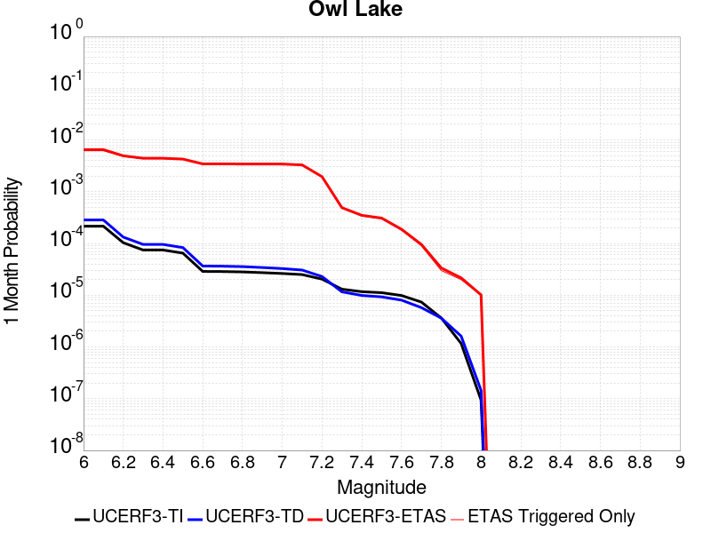 |  |  |

| Magnitude | 1 wk TI Prob | 1 wk TD Prob | 1 wk ETAS Prob | 1 wk ETAS/TD Gain | 1 wk ETAS Triggered Only | 1 mo TI Prob | 1 mo TD Prob | 1 mo ETAS Prob | 1 mo ETAS/TD Gain | 1 mo ETAS Triggered Only | 1 yr TI Prob | 1 yr TD Prob | 1 yr ETAS Prob | 1 yr ETAS/TD Gain | 1 yr ETAS Triggered Only | 10 yr TI Prob | 10 yr TD Prob | 10 yr ETAS Prob | 10 yr ETAS/TD Gain | 10 yr ETAS Triggered Only |
|-----|-----|-----|-----|-----|-----|-----|-----|-----|-----|-----|-----|-----|-----|-----|-----|-----|-----|-----|-----|-----|
| 6.0 | 5.0320643E-5 | 6.635993E-5 | 0.0023762067 | 35.807854 | 0.00231 | 2.1564208E-4 | 2.8437492E-4 | 0.006502606 | 22.866312 | 0.00622 | 0.0026222812 | 0.0034576878 | 0.018834336 | 5.4470897 | 0.01543 | 0.02591553 | 0.03414204 | 0.05861688 | 1.7168535 | 0.02534 |
| 6.1 | 5.0320643E-5 | 6.635993E-5 | 0.0023762067 | 35.807854 | 0.00231 | 2.1564208E-4 | 2.8437492E-4 | 0.006502606 | 22.866312 | 0.00622 | 0.0026222812 | 0.0034576878 | 0.018834336 | 5.4470897 | 0.01543 | 0.02591553 | 0.03414204 | 0.05861688 | 1.7168535 | 0.02534 |
| 6.2 | 2.4125871E-5 | 3.098195E-5 | 0.001900924 | 61.35585 | 0.00187 | 1.0339249E-4 | 1.3277419E-4 | 0.0049421354 | 37.222107 | 0.00481 | 0.0012580766 | 0.0016154991 | 0.013356501 | 8.267724 | 0.01176 | 0.012509781 | 0.016070858 | 0.03477535 | 2.1638765 | 0.01901 |
| 6.3 | 1.7433485E-5 | 2.2356702E-5 | 0.0017723176 | 79.27455 | 0.00175 | 7.471279E-5 | 9.58118E-5 | 0.004435396 | 46.292793 | 0.00434 | 9.0924866E-4 | 0.0011660217 | 0.0115938485 | 9.943082 | 0.01044 | 0.009055373 | 0.011629109 | 0.028016299 | 2.4091525 | 0.01658 |
| 6.4 | 1.7433485E-5 | 2.2356702E-5 | 0.0017723176 | 79.27455 | 0.00175 | 7.471279E-5 | 9.58118E-5 | 0.004435396 | 46.292793 | 0.00434 | 9.0924866E-4 | 0.0011660217 | 0.0115938485 | 9.943082 | 0.01044 | 0.009055373 | 0.011629109 | 0.028016299 | 2.4091525 | 0.01658 |
| 6.5 | 1.5182742E-5 | 1.9430337E-5 | 0.0016893978 | 86.946396 | 0.00167 | 6.506727E-5 | 8.327107E-5 | 0.004272922 | 51.313404 | 0.00419 | 7.919061E-4 | 0.0010134892 | 0.011003355 | 10.856903 | 0.01 | 0.0078909 | 0.010118578 | 0.025837895 | 2.5535104 | 0.01588 |
| 6.6 | 6.7271576E-6 | 8.5482325E-6 | 0.0014185362 | 165.94498 | 0.00141 | 2.8830356E-5 | 3.66348E-5 | 0.0034465098 | 94.077484 | 0.00341 | 3.5095305E-4 | 4.4594306E-4 | 0.0081425095 | 18.259079 | 0.0077 | 0.0035039932 | 0.0044677365 | 0.016185151 | 3.6226737 | 0.01177 |
| 6.7 | 6.682835E-6 | 8.480673E-6 | 0.0014184687 | 167.25897 | 0.00141 | 2.8640408E-5 | 3.6345267E-5 | 0.0034462214 | 94.818985 | 0.00341 | 3.4864116E-4 | 4.4241946E-4 | 0.008119022 | 18.351412 | 0.00768 | 0.003480947 | 0.004432682 | 0.016130598 | 3.6390154 | 0.01175 |
| 6.8 | 6.5774975E-6 | 8.327139E-6 | 0.0014183153 | 170.32445 | 0.00141 | 2.8188972E-5 | 3.568728E-5 | 0.0034355659 | 96.26864 | 0.0034 | 3.4314668E-4 | 4.344117E-4 | 0.00810108 | 18.648394 | 0.00767 | 0.0034261728 | 0.0043528625 | 0.01601189 | 3.6784737 | 0.01171 |
| 6.9 | 6.363419E-6 | 8.000296E-6 | 0.001417989 | 177.24208 | 0.00141 | 2.727151E-5 | 3.428656E-5 | 0.00343417 | 100.16082 | 0.0034 | 3.3198006E-4 | 4.173645E-4 | 0.008054175 | 19.297703 | 0.00764 | 0.0033148455 | 0.0041828444 | 0.01580403 | 3.7782974 | 0.01167 |
| 7.0 | 6.1342453E-6 | 7.632471E-6 | 0.0014176217 | 185.7356 | 0.00141 | 2.6289357E-5 | 3.2710213E-5 | 0.0034225993 | 104.633965 | 0.00339 | 3.2002592E-4 | 3.9817957E-4 | 0.007945173 | 19.953743 | 0.00755 | 0.0031956544 | 0.0039915154 | 0.0155053735 | 3.8845832 | 0.01156 |
| 7.1 | 5.842926E-6 | 7.1429813E-6 | 0.0013771332 | 192.79529 | 0.00137 | 2.504087E-5 | 3.061245E-5 | 0.0032905126 | 107.489365 | 0.00326 | 3.0482994E-4 | 3.7264824E-4 | 0.007639939 | 20.501745 | 0.00727 | 0.0030441214 | 0.0037371418 | 0.014805622 | 3.96175 | 0.01111 |
| 7.2 | 4.77173E-6 | 5.359081E-6 | 7.75355E-4 | 144.68057 | 7.7E-4 | 2.045011E-5 | 2.2967311E-5 | 0.001952923 | 85.03054 | 0.00193 | 2.4895166E-4 | 2.795952E-4 | 0.004678365 | 16.732637 | 0.0044 | 0.0024867293 | 0.0028086305 | 0.009778998 | 3.4817674 | 0.00699 |
| 7.3 | 3.0494948E-6 | 2.710767E-6 | 1.5271036E-4 | 56.334743 | 1.5E-4 | 1.3069198E-5 | 1.16175215E-5 | 4.9161195E-4 | 42.31642 | 4.8E-4 | 1.5910587E-4 | 1.4143431E-4 | 0.0014012561 | 9.90747 | 0.00126 | 0.0015899199 | 0.0014232073 | 0.0035601617 | 2.5015059 | 0.00214 |
| 7.4 | 2.7263884E-6 | 2.3059513E-6 | 1.2230568E-4 | 53.039143 | 1.2E-4 | 1.1684469E-5 | 9.882611E-6 | 3.4987926E-4 | 35.403522 | 3.4E-4 | 1.4224913E-4 | 1.2031425E-4 | 0.0010002084 | 8.313299 | 8.8E-4 | 0.0014215811 | 0.0012111228 | 0.002719294 | 2.245267 | 0.00151 |
| 7.5 | 2.6090431E-6 | 2.16588E-6 | 1.02165664E-4 | 47.17051 | 1.0E-4 | 1.1181565E-5 | 9.28231E-6 | 3.0927954E-4 | 33.31924 | 3.0E-4 | 1.3612706E-4 | 1.1300636E-4 | 8.8291935E-4 | 7.813006 | 7.7E-4 | 0.001360437 | 0.0011378983 | 0.0024464077 | 2.1499352 | 0.00131 |
| 7.6 | 2.3008756E-6 | 1.8730437E-6 | 6.187293E-5 | 33.033363 | 6.0E-5 | 9.860858E-6 | 8.027306E-6 | 1.8802586E-4 | 23.423283 | 1.8E-4 | 1.20049335E-4 | 9.772815E-5 | 6.076783E-4 | 6.2180476 | 5.1E-4 | 0.001199845 | 9.849985E-4 | 0.0018641318 | 1.8925223 | 8.8E-4 |
| 7.7 | 1.7184348E-6 | 1.3421422E-6 | 4.134209E-5 | 30.80306 | 4.0E-5 | 7.3646997E-6 | 5.7520256E-6 | 9.575151E-5 | 16.646572 | 9.0E-5 | 8.966153E-5 | 7.0028706E-5 | 3.100119E-4 | 4.426926 | 2.4E-4 | 8.962536E-4 | 7.078721E-4 | 0.001097596 | 1.550557 | 3.9E-4 |
| 7.8 | 8.4612907E-7 | 8.407854E-7 | 8.407854E-7 | 1.0 | 0.0 | 3.6262625E-6 | 3.6033612E-6 | 3.3603254E-5 | 9.32553 | 3.0E-5 | 4.4148852E-5 | 4.387006E-5 | 1.5386523E-4 | 3.507295 | 1.1E-4 | 4.414008E-4 | 4.4398278E-4 | 6.239029E-4 | 1.4052411 | 1.8E-4 |
| 7.9 | 2.716738E-7 | 3.7691942E-7 | 3.7691942E-7 | 1.0 | 0.0 | 1.1643157E-6 | 1.615368E-6 | 2.1615335E-5 | 13.381061 | 2.0E-5 | 1.4175452E-5 | 1.9666937E-5 | 6.9665955E-5 | 3.5422878 | 5.0E-5 | 1.4174548E-4 | 1.9828632E-4 | 2.582744E-4 | 1.3025328 | 6.0E-5 |
| 8.0 | 2.1995428E-8 | 3.3856686E-8 | 3.3856686E-8 | 1.0 | 0.0 | 9.426611E-8 | 1.4510009E-7 | 1.0145099E-5 | 69.91794 | 1.0E-5 | 1.1476893E-6 | 1.7665927E-6 | 1.1766575E-5 | 6.660604 | 1.0E-5 | 1.14768345E-5 | 1.7871262E-5 | 2.7871083E-5 | 1.5595475 | 1.0E-5 |

## Airport Lake
*[(top)](#table-of-contents)*

| 1 Week | 1 Month | 1 Year | 10 Year |
|-----|-----|-----|-----|
|  |  |  |  |

| Magnitude | 1 wk TI Prob | 1 wk TD Prob | 1 wk ETAS Prob | 1 wk ETAS/TD Gain | 1 wk ETAS Triggered Only | 1 mo TI Prob | 1 mo TD Prob | 1 mo ETAS Prob | 1 mo ETAS/TD Gain | 1 mo ETAS Triggered Only | 1 yr TI Prob | 1 yr TD Prob | 1 yr ETAS Prob | 1 yr ETAS/TD Gain | 1 yr ETAS Triggered Only | 10 yr TI Prob | 10 yr TD Prob | 10 yr ETAS Prob | 10 yr ETAS/TD Gain | 10 yr ETAS Triggered Only |
|-----|-----|-----|-----|-----|-----|-----|-----|-----|-----|-----|-----|-----|-----|-----|-----|-----|-----|-----|-----|-----|
| 6.0 | 1.2387061E-5 | 1.3103241E-5 | 0.0033630594 | 256.65857 | 0.00335 | 5.3086325E-5 | 5.61557E-5 | 0.0073757446 | 131.34454 | 0.00732 | 6.461343E-4 | 6.8350957E-4 | 0.016672574 | 24.392595 | 0.016 | 0.0064425888 | 0.006816883 | 0.031130007 | 4.566604 | 0.02448 |
| 6.1 | 1.2387061E-5 | 1.3103241E-5 | 0.0033630594 | 256.65857 | 0.00335 | 5.3086325E-5 | 5.61557E-5 | 0.0073757446 | 131.34454 | 0.00732 | 6.461343E-4 | 6.8350957E-4 | 0.016672574 | 24.392595 | 0.016 | 0.0064425888 | 0.006816883 | 0.031130007 | 4.566604 | 0.02448 |
| 6.2 | 1.2387061E-5 | 1.3103241E-5 | 0.0033630594 | 256.65857 | 0.00335 | 5.3086325E-5 | 5.61557E-5 | 0.0073757446 | 131.34454 | 0.00732 | 6.461343E-4 | 6.8350957E-4 | 0.016672574 | 24.392595 | 0.016 | 0.0064425888 | 0.006816883 | 0.031130007 | 4.566604 | 0.02448 |
| 6.3 | 1.2387061E-5 | 1.3103241E-5 | 0.0033630594 | 256.65857 | 0.00335 | 5.3086325E-5 | 5.61557E-5 | 0.0073757446 | 131.34454 | 0.00732 | 6.461343E-4 | 6.8350957E-4 | 0.016672574 | 24.392595 | 0.016 | 0.0064425888 | 0.006816883 | 0.031130007 | 4.566604 | 0.02448 |
| 6.4 | 1.2387061E-5 | 1.3103241E-5 | 0.0033630594 | 256.65857 | 0.00335 | 5.3086325E-5 | 5.61557E-5 | 0.0073757446 | 131.34454 | 0.00732 | 6.461343E-4 | 6.8350957E-4 | 0.016672574 | 24.392595 | 0.016 | 0.0064425888 | 0.006816883 | 0.031130007 | 4.566604 | 0.02448 |
| 6.5 | 6.9922594E-6 | 7.3849715E-6 | 0.002567366 | 347.6474 | 0.00256 | 2.996648E-5 | 3.1649524E-5 | 0.005521476 | 174.45683 | 0.00549 | 3.6478083E-4 | 3.8527025E-4 | 0.012400639 | 32.18686 | 0.01202 | 0.003641826 | 0.0038465608 | 0.022116015 | 5.7495556 | 0.01834 |
| 6.6 | 6.9922594E-6 | 7.3849715E-6 | 0.002567366 | 347.6474 | 0.00256 | 2.996648E-5 | 3.1649524E-5 | 0.005521476 | 174.45683 | 0.00549 | 3.6478083E-4 | 3.8527025E-4 | 0.012400639 | 32.18686 | 0.01202 | 0.003641826 | 0.0038465608 | 0.022116015 | 5.7495556 | 0.01834 |
| 6.7 | 5.477277E-6 | 5.786105E-6 | 0.0021457737 | 370.84943 | 0.00214 | 2.3473833E-5 | 2.4797379E-5 | 0.0046546827 | 187.70865 | 0.00463 | 2.8575645E-4 | 3.0187014E-4 | 0.010508788 | 34.81228 | 0.01021 | 0.0028538927 | 0.0030149848 | 0.01862777 | 6.1783957 | 0.01566 |
| 6.8 | 3.9950432E-6 | 4.2191136E-6 | 0.0015942124 | 377.85483 | 0.00159 | 1.7121502E-5 | 1.8081806E-5 | 0.0034480197 | 190.69002 | 0.00343 | 2.0843433E-4 | 2.201265E-4 | 0.00787844 | 35.790512 | 0.00766 | 0.0020823893 | 0.0021993555 | 0.013843689 | 6.29443 | 0.01167 |
| 6.9 | 2.95695E-6 | 3.1230438E-6 | 0.0011131195 | 356.42136 | 0.00111 | 1.2672582E-5 | 1.3384418E-5 | 0.0024033524 | 179.56346 | 0.00239 | 1.5427776E-4 | 1.6294538E-4 | 0.0054720803 | 33.5823 | 0.00531 | 0.001541707 | 0.0016284813 | 0.009815128 | 6.0271664 | 0.0082 |
| 7.0 | 1.456072E-6 | 1.540822E-6 | 4.4154015E-4 | 286.56143 | 4.4E-4 | 6.2402937E-6 | 6.603512E-6 | 0.0010665965 | 161.51959 | 0.00106 | 7.597293E-5 | 8.03958E-5 | 0.0024302069 | 30.228033 | 0.00235 | 7.594696E-4 | 8.037661E-4 | 0.0043409206 | 5.400727 | 0.00354 |
| 7.1 | 6.995192E-7 | 7.4090235E-7 | 2.4074073E-4 | 324.92908 | 2.4E-4 | 2.997936E-6 | 3.1752957E-6 | 5.731735E-4 | 180.51027 | 5.7E-4 | 3.649926E-5 | 3.8659226E-5 | 0.0011986144 | 31.004614 | 0.00116 | 3.6493264E-4 | 3.8659226E-4 | 0.002155908 | 5.5766973 | 0.00177 |

## Panamint Valley
*[(top)](#table-of-contents)*

| 1 Week | 1 Month | 1 Year | 10 Year |
|-----|-----|-----|-----|
| 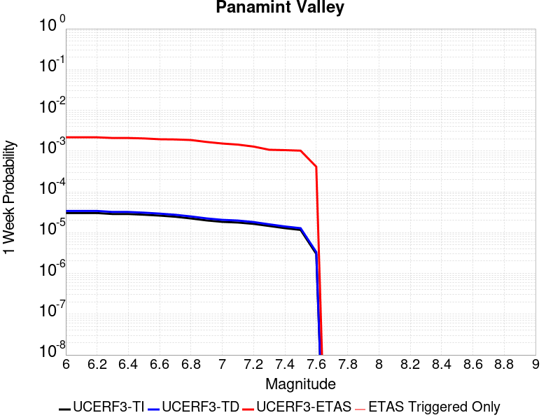 | 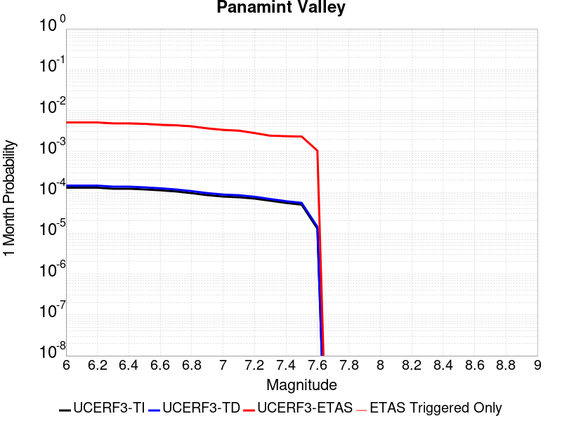 | 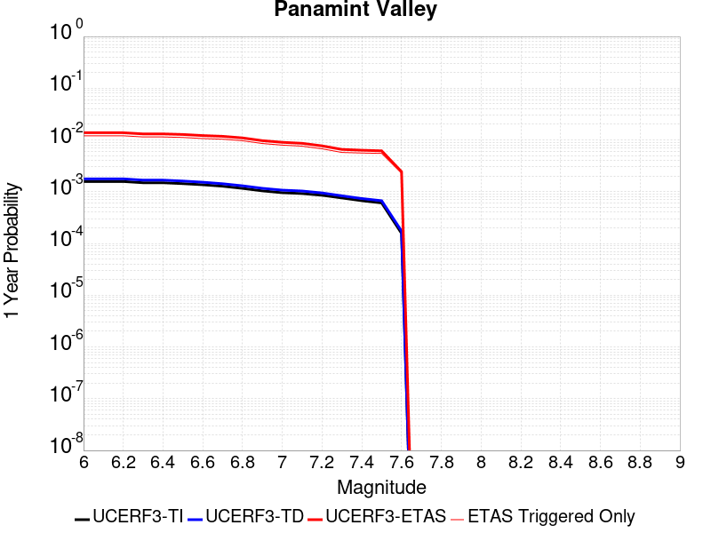 |  |

| Magnitude | 1 wk TI Prob | 1 wk TD Prob | 1 wk ETAS Prob | 1 wk ETAS/TD Gain | 1 wk ETAS Triggered Only | 1 mo TI Prob | 1 mo TD Prob | 1 mo ETAS Prob | 1 mo ETAS/TD Gain | 1 mo ETAS Triggered Only | 1 yr TI Prob | 1 yr TD Prob | 1 yr ETAS Prob | 1 yr ETAS/TD Gain | 1 yr ETAS Triggered Only | 10 yr TI Prob | 10 yr TD Prob | 10 yr ETAS Prob | 10 yr ETAS/TD Gain | 10 yr ETAS Triggered Only |
|-----|-----|-----|-----|-----|-----|-----|-----|-----|-----|-----|-----|-----|-----|-----|-----|-----|-----|-----|-----|-----|
| 6.0 | 3.0211835E-5 | 3.398492E-5 | 0.0021739122 | 63.966965 | 0.00214 | 1.2947287E-4 | 1.456417E-4 | 0.0051149176 | 35.119873 | 0.00497 | 0.0015751923 | 0.001771775 | 0.013790443 | 7.783406 | 0.01204 | 0.015640736 | 0.01758164 | 0.03712194 | 2.1114037 | 0.01989 |
| 6.1 | 3.0211835E-5 | 3.398492E-5 | 0.0021739122 | 63.966965 | 0.00214 | 1.2947287E-4 | 1.456417E-4 | 0.0051149176 | 35.119873 | 0.00497 | 0.0015751923 | 0.001771775 | 0.013790443 | 7.783406 | 0.01204 | 0.015640736 | 0.01758164 | 0.03712194 | 2.1114037 | 0.01989 |
| 6.2 | 3.0211835E-5 | 3.398492E-5 | 0.0021739122 | 63.966965 | 0.00214 | 1.2947287E-4 | 1.456417E-4 | 0.0051149176 | 35.119873 | 0.00497 | 0.0015751923 | 0.001771775 | 0.013790443 | 7.783406 | 0.01204 | 0.015640736 | 0.01758164 | 0.03712194 | 2.1114037 | 0.01989 |
| 6.3 | 2.8573924E-5 | 3.2103075E-5 | 0.002092037 | 65.16625 | 0.00206 | 1.2245393E-4 | 1.375775E-4 | 0.0048569283 | 35.303215 | 0.00472 | 0.001489857 | 0.001673747 | 0.013094599 | 7.823524 | 0.01144 | 0.01479908 | 0.016616657 | 0.0351141 | 2.1131866 | 0.01881 |
| 6.4 | 2.8573924E-5 | 3.2103075E-5 | 0.002092037 | 65.16625 | 0.00206 | 1.2245393E-4 | 1.375775E-4 | 0.0048569283 | 35.303215 | 0.00472 | 0.001489857 | 0.001673747 | 0.013094599 | 7.823524 | 0.01144 | 0.01479908 | 0.016616657 | 0.0351141 | 2.1131866 | 0.01881 |
| 6.5 | 2.7468774E-5 | 3.0828753E-5 | 0.0020407669 | 66.19686 | 0.00201 | 1.1771801E-4 | 1.321167E-4 | 0.004731509 | 35.813103 | 0.0046 | 0.0014322745 | 0.0016073614 | 0.012759407 | 7.9381075 | 0.01117 | 0.014230782 | 0.015962495 | 0.03387198 | 2.1219726 | 0.0182 |
| 6.6 | 2.6135967E-5 | 2.9252746E-5 | 0.0019491966 | 66.63294 | 0.00192 | 1.1200648E-4 | 1.2536303E-4 | 0.0044848165 | 35.77463 | 0.00436 | 0.0013628257 | 0.0015252529 | 0.0121590085 | 7.971799 | 0.01065 | 0.013544982 | 0.015152944 | 0.03224004 | 2.127642 | 0.01735 |
| 6.7 | 2.4498746E-5 | 2.7341628E-5 | 0.0019272896 | 70.48921 | 0.0019 | 1.04990395E-4 | 1.1717328E-4 | 0.0043666754 | 37.26682 | 0.00425 | 0.0012775084 | 0.0014256762 | 0.01176092 | 8.249363 | 0.01035 | 0.012701893 | 0.014170191 | 0.030554682 | 2.1562645 | 0.01662 |
| 6.8 | 2.2244329E-5 | 2.4935953E-5 | 0.0018648901 | 74.7872 | 0.00184 | 9.532935E-5 | 1.06864114E-4 | 0.0041164355 | 38.520283 | 0.00401 | 0.0011600169 | 0.0013003158 | 0.010957742 | 8.426985 | 0.00967 | 0.011539802 | 0.012931558 | 0.028191635 | 2.180065 | 0.01546 |
| 6.9 | 1.9902658E-5 | 2.2290744E-5 | 0.001672254 | 75.0201 | 0.00165 | 8.529431E-5 | 9.552836E-5 | 0.0036651874 | 38.36753 | 0.00357 | 0.0010379635 | 0.0011624558 | 0.009692528 | 8.337976 | 0.00854 | 0.010331288 | 0.011567843 | 0.025069825 | 2.1671999 | 0.01366 |
| 7.0 | 1.8353881E-5 | 2.0566606E-5 | 0.0015305355 | 74.41848 | 0.00151 | 7.865712E-5 | 8.813971E-5 | 0.0033678506 | 38.210365 | 0.00328 | 9.5722964E-4 | 0.0010725905 | 0.009004074 | 8.394699 | 0.00794 | 0.009531168 | 0.010677955 | 0.023242345 | 2.1766663 | 0.0127 |
| 7.1 | 1.7667631E-5 | 1.9772984E-5 | 0.001439745 | 72.813736 | 0.00142 | 7.571623E-5 | 8.4738705E-5 | 0.0032244725 | 38.051945 | 0.00314 | 9.2145515E-4 | 0.0010312231 | 0.008613396 | 8.352602 | 0.00759 | 0.009176437 | 0.010268158 | 0.022303298 | 2.1720836 | 0.01216 |
| 7.2 | 1.6381597E-5 | 1.815856E-5 | 0.0012881355 | 70.938194 | 0.00127 | 7.020495E-5 | 7.782018E-5 | 0.002817607 | 36.20664 | 0.00274 | 8.544101E-4 | 9.470661E-4 | 0.007690673 | 8.120524 | 0.00675 | 0.008511325 | 0.009433903 | 0.020112205 | 2.1319072 | 0.01078 |
| 7.3 | 1.4520491E-5 | 1.5967029E-5 | 0.0010759501 | 67.38574 | 0.00106 | 6.222919E-5 | 6.842842E-5 | 0.002428267 | 35.486237 | 0.00236 | 7.57377E-4 | 8.3281373E-4 | 0.0065680332 | 7.8865576 | 0.00574 | 0.0075480095 | 0.008299115 | 0.017323593 | 2.0874023 | 0.0091 |
| 7.4 | 1.2852287E-5 | 1.4145916E-5 | 0.0010541312 | 74.51842 | 0.00104 | 5.5080065E-5 | 6.0624032E-5 | 0.0023604846 | 38.93645 | 0.0023 | 6.7039346E-4 | 7.378635E-4 | 0.0063337316 | 8.58388 | 0.0056 | 0.0066837464 | 0.00735613 | 0.016131101 | 2.1928787 | 0.00884 |
| 7.5 | 1.1637851E-5 | 1.2837203E-5 | 0.0010228242 | 79.67657 | 0.00101 | 4.987555E-5 | 5.5015513E-5 | 0.0023148912 | 42.07706 | 0.00226 | 6.070656E-4 | 6.696237E-4 | 0.006165941 | 9.208068 | 0.0055 | 0.006054099 | 0.0066780155 | 0.015280184 | 2.2881324 | 0.00866 |
| 7.6 | 3.0068115E-6 | 3.3332258E-6 | 4.1333187E-4 | 124.00356 | 4.1E-4 | 1.2886271E-5 | 1.4285216E-5 | 0.0010442705 | 73.10149 | 0.00103 | 1.5687906E-4 | 1.739159E-4 | 0.002443521 | 14.050015 | 0.00227 | 0.0015676835 | 0.0017386549 | 0.005332396 | 3.066966 | 0.0036 |

## Garlock (East)
*[(top)](#table-of-contents)*

| 1 Week | 1 Month | 1 Year | 10 Year |
|-----|-----|-----|-----|
|  |  | 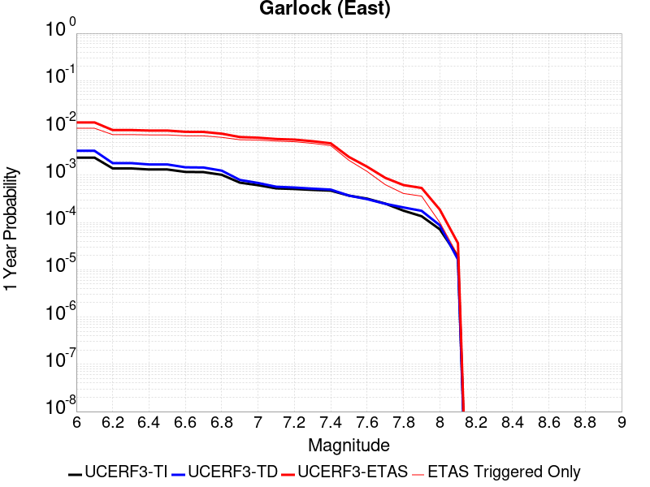 |  |

| Magnitude | 1 wk TI Prob | 1 wk TD Prob | 1 wk ETAS Prob | 1 wk ETAS/TD Gain | 1 wk ETAS Triggered Only | 1 mo TI Prob | 1 mo TD Prob | 1 mo ETAS Prob | 1 mo ETAS/TD Gain | 1 mo ETAS Triggered Only | 1 yr TI Prob | 1 yr TD Prob | 1 yr ETAS Prob | 1 yr ETAS/TD Gain | 1 yr ETAS Triggered Only | 10 yr TI Prob | 10 yr TD Prob | 10 yr ETAS Prob | 10 yr ETAS/TD Gain | 10 yr ETAS Triggered Only |
|-----|-----|-----|-----|-----|-----|-----|-----|-----|-----|-----|-----|-----|-----|-----|-----|-----|-----|-----|-----|-----|
| 6.0 | 4.5092507E-5 | 6.2907005E-5 | 0.0014928171 | 23.730537 | 0.00143 | 1.9323928E-4 | 2.6957612E-4 | 0.004078549 | 15.12949 | 0.00381 | 0.0023501497 | 0.0032775956 | 0.013055443 | 3.9832377 | 0.00981 | 0.023254504 | 0.03235425 | 0.04898808 | 1.5141158 | 0.01719 |
| 6.1 | 4.5092507E-5 | 6.2907005E-5 | 0.0014928171 | 23.730537 | 0.00143 | 1.9323928E-4 | 2.6957612E-4 | 0.004078549 | 15.12949 | 0.00381 | 0.0023501497 | 0.0032775956 | 0.013055443 | 3.9832377 | 0.00981 | 0.023254504 | 0.03235425 | 0.04898808 | 1.5141158 | 0.01719 |
| 6.2 | 2.6674514E-5 | 3.4513683E-5 | 0.0011744744 | 34.029236 | 0.00114 | 1.1431433E-4 | 1.4790759E-4 | 0.0031074698 | 21.009535 | 0.00296 | 0.0013908884 | 0.0017993206 | 0.008996348 | 4.999858 | 0.00721 | 0.01382215 | 0.017873228 | 0.029815888 | 1.6681871 | 0.01216 |
| 6.3 | 2.6674514E-5 | 3.4513683E-5 | 0.0011744744 | 34.029236 | 0.00114 | 1.1431433E-4 | 1.4790759E-4 | 0.0031074698 | 21.009535 | 0.00296 | 0.0013908884 | 0.0017993206 | 0.008996348 | 4.999858 | 0.00721 | 0.01382215 | 0.017873228 | 0.029815888 | 1.6681871 | 0.01216 |
| 6.4 | 2.5312667E-5 | 3.234252E-5 | 0.0011423066 | 35.31904 | 0.00111 | 1.0847834E-4 | 1.3860359E-4 | 0.0030382017 | 21.920078 | 0.0029 | 0.0013199237 | 0.0016862219 | 0.008784233 | 5.209417 | 0.00711 | 0.013121112 | 0.016774109 | 0.028553154 | 1.7022159 | 0.01198 |
| 6.5 | 2.5312667E-5 | 3.234252E-5 | 0.0011423066 | 35.31904 | 0.00111 | 1.0847834E-4 | 1.3860359E-4 | 0.0030382017 | 21.920078 | 0.0029 | 0.0013199237 | 0.0016862219 | 0.008784233 | 5.209417 | 0.00711 | 0.013121112 | 0.016774109 | 0.028553154 | 1.7022159 | 0.01198 |
| 6.6 | 2.246556E-5 | 2.813673E-5 | 0.0011081063 | 39.38291 | 0.00108 | 9.627742E-5 | 1.20580546E-4 | 0.0029302416 | 24.301115 | 0.00281 | 0.0011715472 | 0.0014671031 | 0.008257126 | 5.6281843 | 0.0068 | 0.011653901 | 0.0146144675 | 0.025749324 | 1.7619064 | 0.0113 |
| 6.7 | 2.2241198E-5 | 2.780646E-5 | 0.0010977767 | 39.4792 | 0.00107 | 9.531594E-5 | 1.19165226E-4 | 0.002898834 | 24.326172 | 0.00278 | 0.0011598538 | 0.0014498946 | 0.008210079 | 5.6625347 | 0.00677 | 0.011538187 | 0.014444377 | 0.025541734 | 1.768282 | 0.01126 |
| 6.8 | 1.9528685E-5 | 2.3900937E-5 | 0.0010538764 | 44.093517 | 0.00103 | 8.369167E-5 | 1.02428676E-4 | 0.0027221604 | 26.576155 | 0.00262 | 0.0010184698 | 0.0012463754 | 0.0075485106 | 6.0563703 | 0.00631 | 0.010138147 | 0.012438601 | 0.022827746 | 1.8352343 | 0.01052 |
| 6.9 | 1.3318621E-5 | 1.5200599E-5 | 9.6518616E-4 | 63.496586 | 9.5E-4 | 5.7078556E-5 | 6.514383E-5 | 0.0024949855 | 38.299644 | 0.00243 | 6.9470983E-4 | 7.9284323E-4 | 0.006398395 | 8.070189 | 0.00561 | 0.0069254204 | 0.007941291 | 0.017127754 | 2.1567972 | 0.00926 |
| 7.0 | 1.1760853E-5 | 1.3109366E-5 | 9.4309717E-4 | 71.94072 | 9.3E-4 | 5.0402683E-5 | 5.6181812E-5 | 0.0024660465 | 43.89403 | 0.00241 | 6.134799E-4 | 6.838039E-4 | 0.0062000295 | 9.066969 | 0.00552 | 0.0061178906 | 0.0068579623 | 0.015816104 | 2.3062396 | 0.00902 |
| 7.1 | 1.0064758E-5 | 1.0904438E-5 | 9.108946E-4 | 83.5343 | 9.0E-4 | 4.3133965E-5 | 4.673249E-5 | 0.0023566245 | 50.42797 | 0.00231 | 5.2502943E-4 | 5.68823E-4 | 0.0058158366 | 10.224334 | 0.00525 | 0.005237907 | 0.0057141096 | 0.014215254 | 2.4877462 | 0.00855 |
| 7.2 | 9.768808E-6 | 1.0500287E-5 | 9.104908E-4 | 86.71104 | 9.0E-4 | 4.186565E-5 | 4.5000474E-5 | 0.0023248978 | 51.663853 | 0.00228 | 5.095951E-4 | 5.4774655E-4 | 0.005644953 | 10.305776 | 0.0051 | 0.0050842804 | 0.005504509 | 0.013798601 | 2.5067816 | 0.00834 |
| 7.3 | 9.344516E-6 | 9.9458985E-6 | 8.5993746E-4 | 86.46151 | 8.5E-4 | 4.004731E-5 | 4.2624604E-5 | 0.002142535 | 50.26522 | 0.0021 | 4.8746695E-4 | 5.1883445E-4 | 0.005226391 | 10.07333 | 0.00471 | 0.0048639905 | 0.0052161543 | 0.012856094 | 2.464669 | 0.00768 |
| 7.4 | 9.023491E-6 | 9.49204E-6 | 7.294852E-4 | 76.85232 | 7.2E-4 | 3.867153E-5 | 4.0679555E-5 | 0.0019306027 | 47.458797 | 0.00189 | 4.7072413E-4 | 4.9516436E-4 | 0.004713075 | 9.518203 | 0.00422 | 0.004697283 | 0.0049795224 | 0.011835214 | 2.376777 | 0.00689 |
| 7.5 | 7.081253E-6 | 7.0887972E-6 | 3.870861E-4 | 54.60533 | 3.8E-4 | 3.0347876E-5 | 3.038021E-5 | 9.4035256E-4 | 30.9528 | 9.1E-4 | 3.6942272E-4 | 3.6981702E-4 | 0.0024290553 | 6.5682626 | 0.00206 | 0.003688092 | 0.0037253136 | 0.0070827594 | 1.9012518 | 0.00337 |
| 7.6 | 6.116396E-6 | 5.9602744E-6 | 1.9595915E-4 | 32.877537 | 1.9E-4 | 2.6212863E-5 | 2.5543784E-5 | 5.25531E-4 | 20.573732 | 5.0E-4 | 3.1909486E-4 | 3.1095147E-4 | 0.0015105783 | 4.857923 | 0.0012 | 0.0031863707 | 0.003136684 | 0.0052400655 | 1.6705749 | 0.00211 |
| 7.7 | 4.797145E-6 | 4.7583635E-6 | 6.4758075E-5 | 13.609317 | 6.0E-5 | 2.055903E-5 | 2.0392828E-5 | 2.5038814E-4 | 12.278245 | 2.3E-4 | 2.5027743E-4 | 2.482545E-4 | 8.7809813E-4 | 3.5370882 | 6.3E-4 | 0.0024999576 | 0.002510282 | 0.0036075206 | 1.4370978 | 0.0011 |
| 7.8 | 3.4028885E-6 | 3.9794954E-6 | 3.3979377E-5 | 8.538614 | 3.0E-5 | 1.4583726E-5 | 1.7054868E-5 | 1.670523E-4 | 9.794992 | 1.5E-4 | 1.775424E-4 | 2.0762332E-4 | 6.175382E-4 | 2.97432 | 4.1E-4 | 0.0017740062 | 0.002102078 | 0.0028305436 | 1.3465455 | 7.3E-4 |
| 7.9 | 2.5928412E-6 | 3.3733813E-6 | 2.3373314E-5 | 6.928749 | 2.0E-5 | 1.1112129E-5 | 1.445727E-5 | 1.444554E-4 | 9.991886 | 1.3E-4 | 1.3528178E-4 | 1.760031E-4 | 5.3593976E-4 | 3.0450585 | 3.6E-4 | 0.0013519945 | 0.0017819458 | 0.0023708944 | 1.3305087 | 5.9E-4 |
| 8.0 | 1.3743648E-6 | 1.6738829E-6 | 1.16738665E-5 | 6.9741235 | 1.0E-5 | 5.8901214E-6 | 7.1737645E-6 | 4.717348E-5 | 6.5758333 | 4.0E-5 | 7.1709874E-5 | 8.733711E-5 | 1.8732838E-4 | 2.1448886 | 1.0E-4 | 7.1686733E-4 | 8.841412E-4 | 0.0010439997 | 1.1808065 | 1.6E-4 |
| 8.1 | 3.6733252E-7 | 3.1496086E-7 | 1.0314958E-5 | 32.74997 | 1.0E-5 | 1.5742813E-6 | 1.3498316E-6 | 1.1349818E-5 | 8.408321 | 1.0E-5 | 1.9166706E-5 | 1.6434093E-5 | 3.6433765E-5 | 2.2169623 | 2.0E-5 | 1.9165053E-4 | 1.6647995E-4 | 1.8647662E-4 | 1.1201146 | 2.0E-5 |

## Hunter Mountain-Saline Valley
*[(top)](#table-of-contents)*

| 1 Week | 1 Month | 1 Year | 10 Year |
|-----|-----|-----|-----|
|  | 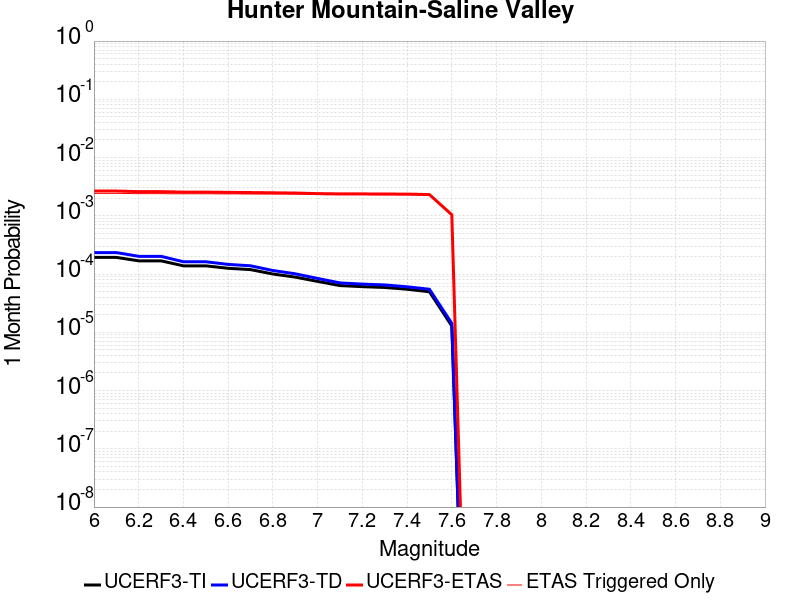 | 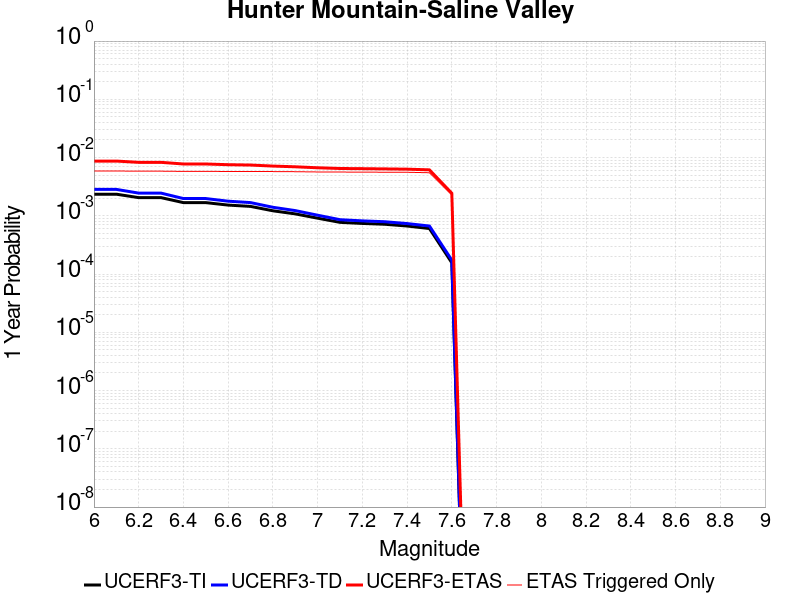 |  |

| Magnitude | 1 wk TI Prob | 1 wk TD Prob | 1 wk ETAS Prob | 1 wk ETAS/TD Gain | 1 wk ETAS Triggered Only | 1 mo TI Prob | 1 mo TD Prob | 1 mo ETAS Prob | 1 mo ETAS/TD Gain | 1 mo ETAS Triggered Only | 1 yr TI Prob | 1 yr TD Prob | 1 yr ETAS Prob | 1 yr ETAS/TD Gain | 1 yr ETAS Triggered Only | 10 yr TI Prob | 10 yr TD Prob | 10 yr ETAS Prob | 10 yr ETAS/TD Gain | 10 yr ETAS Triggered Only |
|-----|-----|-----|-----|-----|-----|-----|-----|-----|-----|-----|-----|-----|-----|-----|-----|-----|-----|-----|-----|-----|
| 6.0 | 4.5103672E-5 | 5.4570646E-5 | 0.0011445112 | 20.973019 | 0.00109 | 1.9328714E-4 | 2.3385366E-4 | 0.0026632855 | 11.388684 | 0.00243 | 0.002350731 | 0.0028436272 | 0.008706907 | 3.0619016 | 0.00588 | 0.023260195 | 0.02809192 | 0.037111226 | 1.3210641 | 0.00928 |
| 6.1 | 4.5103672E-5 | 5.4570646E-5 | 0.0011445112 | 20.973019 | 0.00109 | 1.9328714E-4 | 2.3385366E-4 | 0.0026632855 | 11.388684 | 0.00243 | 0.002350731 | 0.0028436272 | 0.008706907 | 3.0619016 | 0.00588 | 0.023260195 | 0.02809192 | 0.037111226 | 1.3210641 | 0.00928 |
| 6.2 | 3.9363465E-5 | 4.7064033E-5 | 0.0011370127 | 24.158846 | 0.00109 | 1.6868966E-4 | 2.0168818E-4 | 0.0026012042 | 12.897157 | 0.0024 | 0.002051862 | 0.0024529216 | 0.008278596 | 3.3749945 | 0.00584 | 0.020330196 | 0.024273355 | 0.033259798 | 1.3702184 | 0.00921 |
| 6.3 | 3.9363465E-5 | 4.7064033E-5 | 0.0011370127 | 24.158846 | 0.00109 | 1.6868966E-4 | 2.0168818E-4 | 0.0026012042 | 12.897157 | 0.0024 | 0.002051862 | 0.0024529216 | 0.008278596 | 3.3749945 | 0.00584 | 0.020330196 | 0.024273355 | 0.033259798 | 1.3702184 | 0.00921 |
| 6.4 | 3.2311684E-5 | 3.795214E-5 | 0.0011179112 | 29.455812 | 0.00108 | 1.384713E-4 | 1.6264229E-4 | 0.0025522537 | 15.692435 | 0.00239 | 0.0016845843 | 0.0019784402 | 0.007756985 | 3.920758 | 0.00579 | 0.016718714 | 0.019616134 | 0.028576843 | 1.456803 | 0.00914 |
| 6.5 | 3.2311684E-5 | 3.795214E-5 | 0.0011179112 | 29.455812 | 0.00108 | 1.384713E-4 | 1.6264229E-4 | 0.0025522537 | 15.692435 | 0.00239 | 0.0016845843 | 0.0019784402 | 0.007756985 | 3.920758 | 0.00579 | 0.016718714 | 0.019616134 | 0.028576843 | 1.456803 | 0.00914 |
| 6.6 | 2.9305844E-5 | 3.4182878E-5 | 0.001114146 | 32.593685 | 0.00108 | 1.2559042E-4 | 1.4649016E-4 | 0.0025261415 | 17.244446 | 0.00238 | 0.0015279909 | 0.0017821203 | 0.0075418376 | 4.2319465 | 0.00577 | 0.015175272 | 0.017685285 | 0.026634172 | 1.5060076 | 0.00911 |
| 6.7 | 2.7826512E-5 | 3.234522E-5 | 0.0011123103 | 34.388706 | 0.00108 | 1.19251024E-4 | 1.3861535E-4 | 0.0025082869 | 18.095304 | 0.00237 | 0.0014509142 | 0.0016863956 | 0.007436682 | 4.4098086 | 0.00576 | 0.014414776 | 0.016742753 | 0.025670728 | 1.5332443 | 0.00908 |
| 6.8 | 2.3389874E-5 | 2.6867512E-5 | 0.0011068385 | 41.196167 | 0.00108 | 1.0023846E-4 | 1.15141665E-4 | 0.0024848687 | 21.580969 | 0.00237 | 0.00121972 | 0.0014009957 | 0.00714294 | 5.098474 | 0.00575 | 0.01213047 | 0.013926924 | 0.022841025 | 1.6400625 | 0.00904 |
| 6.9 | 2.069209E-5 | 2.3570748E-5 | 0.0011035453 | 46.818424 | 0.00108 | 8.867737E-5 | 1.01013786E-4 | 0.0024607754 | 24.360786 | 0.00236 | 0.0010791123 | 0.0012291851 | 0.0069421544 | 5.6477695 | 0.00572 | 0.010738871 | 0.01222797 | 0.02110804 | 1.7262098 | 0.00899 |
| 7.0 | 1.7462342E-5 | 1.9634166E-5 | 0.0010696135 | 54.477158 | 0.00105 | 7.483646E-5 | 8.414384E-5 | 0.0024039487 | 28.569513 | 0.00232 | 9.1075303E-4 | 0.0010239924 | 0.0066781966 | 6.5217247 | 0.00566 | 0.009070295 | 0.010195448 | 0.019024504 | 1.8659803 | 0.00892 |
| 7.1 | 1.4807709E-5 | 1.6442296E-5 | 0.0010564252 | 64.250465 | 0.00104 | 6.3460066E-5 | 7.0465176E-5 | 0.0023803024 | 33.77984 | 0.00231 | 7.723524E-4 | 8.575924E-4 | 0.0064927554 | 7.570911 | 0.00564 | 0.007696735 | 0.008544888 | 0.017358925 | 2.031498 | 0.00889 |
| 7.2 | 1.4180048E-5 | 1.5698868E-5 | 0.0010556825 | 67.24577 | 0.00104 | 6.077022E-5 | 6.727922E-5 | 0.0023771238 | 35.332214 | 0.00231 | 7.396263E-4 | 8.188329E-4 | 0.0064442228 | 7.8700094 | 0.00563 | 0.0073716943 | 0.008160182 | 0.01696772 | 2.079331 | 0.00888 |
| 7.3 | 1.3730402E-5 | 1.5172596E-5 | 0.0010551568 | 69.543594 | 0.00104 | 5.8843252E-5 | 6.502388E-5 | 0.0023648744 | 36.36932 | 0.0023 | 7.161811E-4 | 7.9139427E-4 | 0.0063869627 | 8.0705185 | 0.0056 | 0.007138774 | 0.007887765 | 0.016667958 | 2.1131408 | 0.00885 |
| 7.4 | 1.2810095E-5 | 1.410978E-5 | 0.0010540951 | 74.7067 | 0.00104 | 5.489925E-5 | 6.0469174E-5 | 0.0023603302 | 39.03361 | 0.0023 | 6.681934E-4 | 7.359793E-4 | 0.006321865 | 8.589732 | 0.00559 | 0.006661878 | 0.0073373863 | 0.016082743 | 2.19189 | 0.00881 |
| 7.5 | 1.1595659E-5 | 1.2801067E-5 | 0.0010227881 | 79.89866 | 0.00101 | 4.9694736E-5 | 5.486065E-5 | 0.0023147366 | 42.19302 | 0.00226 | 6.0486543E-4 | 6.677394E-4 | 0.0061540734 | 9.21628 | 0.00549 | 0.006032217 | 0.0066592586 | 0.015231789 | 2.2873101 | 0.00863 |
| 7.6 | 2.997694E-6 | 3.325351E-6 | 4.1332399E-4 | 124.294846 | 4.1E-4 | 1.28471975E-5 | 1.4251467E-5 | 0.0010442368 | 73.27223 | 0.00103 | 1.564034E-4 | 1.7350508E-4 | 0.0024431113 | 14.08092 | 0.00227 | 0.0015629337 | 0.0017345439 | 0.0053282995 | 3.0718734 | 0.0036 |

## Ash Hill
*[(top)](#table-of-contents)*

| 1 Week | 1 Month | 1 Year | 10 Year |
|-----|-----|-----|-----|
|  | 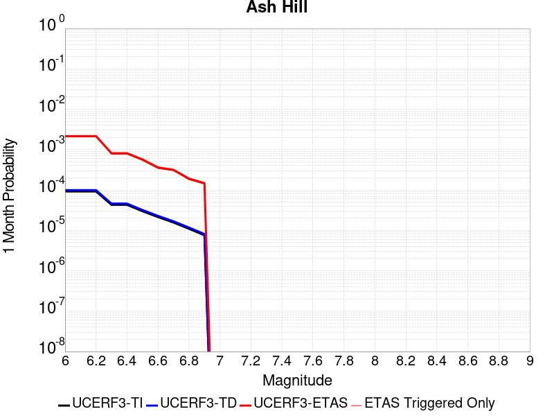 |  |  |

| Magnitude | 1 wk TI Prob | 1 wk TD Prob | 1 wk ETAS Prob | 1 wk ETAS/TD Gain | 1 wk ETAS Triggered Only | 1 mo TI Prob | 1 mo TD Prob | 1 mo ETAS Prob | 1 mo ETAS/TD Gain | 1 mo ETAS Triggered Only | 1 yr TI Prob | 1 yr TD Prob | 1 yr ETAS Prob | 1 yr ETAS/TD Gain | 1 yr ETAS Triggered Only | 10 yr TI Prob | 10 yr TD Prob | 10 yr ETAS Prob | 10 yr ETAS/TD Gain | 10 yr ETAS Triggered Only |
|-----|-----|-----|-----|-----|-----|-----|-----|-----|-----|-----|-----|-----|-----|-----|-----|-----|-----|-----|-----|-----|
| 6.0 | 2.1545662E-5 | 2.3194645E-5 | 9.931722E-4 | 42.819027 | 9.7E-4 | 9.2335285E-5 | 9.9402285E-5 | 0.0021591976 | 21.72181 | 0.00206 | 0.0011236023 | 0.001209631 | 0.006093716 | 5.0376654 | 0.00489 | 0.011179381 | 0.012038452 | 0.0205448 | 1.7065983 | 0.00861 |
| 6.1 | 2.1545662E-5 | 2.3194645E-5 | 9.931722E-4 | 42.819027 | 9.7E-4 | 9.2335285E-5 | 9.9402285E-5 | 0.0021591976 | 21.72181 | 0.00206 | 0.0011236023 | 0.001209631 | 0.006093716 | 5.0376654 | 0.00489 | 0.011179381 | 0.012038452 | 0.0205448 | 1.7065983 | 0.00861 |
| 6.2 | 2.1545662E-5 | 2.3194645E-5 | 9.931722E-4 | 42.819027 | 9.7E-4 | 9.2335285E-5 | 9.9402285E-5 | 0.0021591976 | 21.72181 | 0.00206 | 0.0011236023 | 0.001209631 | 0.006093716 | 5.0376654 | 0.00489 | 0.011179381 | 0.012038452 | 0.0205448 | 1.7065983 | 0.00861 |
| 6.3 | 1.0025529E-5 | 1.07470205E-5 | 3.4074349E-4 | 31.705854 | 3.3E-4 | 4.2965847E-5 | 4.605792E-5 | 8.1602245E-4 | 17.71731 | 7.7E-4 | 5.229836E-4 | 5.606242E-4 | 0.0024195814 | 4.315871 | 0.00186 | 0.005217545 | 0.005593411 | 0.008934617 | 1.5973468 | 0.00336 |
| 6.4 | 1.0025529E-5 | 1.07470205E-5 | 3.4074349E-4 | 31.705854 | 3.3E-4 | 4.2965847E-5 | 4.605792E-5 | 8.1602245E-4 | 17.71731 | 7.7E-4 | 5.229836E-4 | 5.606242E-4 | 0.0024195814 | 4.315871 | 0.00186 | 0.005217545 | 0.005593411 | 0.008934617 | 1.5973468 | 0.00336 |
| 6.5 | 6.9617327E-6 | 7.4566933E-6 | 2.3745498E-4 | 31.844542 | 2.3E-4 | 2.9835655E-5 | 3.1956915E-5 | 5.719397E-4 | 17.897211 | 5.4E-4 | 3.6318856E-4 | 3.8901463E-4 | 0.0016385284 | 4.2119966 | 0.00125 | 0.0036259557 | 0.0038841912 | 0.006095568 | 1.5693276 | 0.00222 |
| 6.6 | 4.9919777E-6 | 5.3467306E-6 | 1.253461E-4 | 23.4435 | 1.2E-4 | 2.1394015E-5 | 2.2914397E-5 | 3.629066E-4 | 15.837493 | 3.4E-4 | 2.60441E-4 | 2.7895378E-4 | 0.0011187195 | 4.0104117 | 8.4E-4 | 0.0026013597 | 0.0027866948 | 0.0043323752 | 1.5546645 | 0.00155 |
| 6.7 | 3.6630722E-6 | 3.924655E-6 | 1.0392426E-4 | 26.479847 | 1.0E-4 | 1.5698786E-5 | 1.6819875E-5 | 3.1681484E-4 | 18.835743 | 3.0E-4 | 1.9111596E-4 | 2.0476845E-4 | 9.24621E-4 | 4.5154467 | 7.2E-4 | 0.0019095168 | 0.0020463609 | 0.0032538848 | 1.5900836 | 0.00121 |
| 6.8 | 2.5599613E-6 | 2.7449473E-6 | 6.274478E-5 | 22.858284 | 6.0E-5 | 1.0971216E-5 | 1.1764035E-5 | 1.9176192E-4 | 16.300694 | 1.8E-4 | 1.3356637E-4 | 1.4322266E-4 | 5.931582E-4 | 4.141511 | 4.5E-4 | 0.0013348613 | 0.0014317884 | 0.0022106718 | 1.5439932 | 7.8E-4 |
| 6.9 | 1.7684905E-6 | 1.8968861E-6 | 4.1896812E-5 | 22.08715 | 4.0E-5 | 7.579223E-6 | 8.129512E-6 | 1.4812837E-4 | 18.221066 | 1.4E-4 | 9.2273134E-5 | 9.897681E-5 | 4.0894613E-4 | 4.1317368 | 3.1E-4 | 9.223483E-4 | 9.897681E-4 | 0.001559204 | 1.5753225 | 5.7E-4 |

## Blackwater
*[(top)](#table-of-contents)*

| 1 Week | 1 Month | 1 Year | 10 Year |
|-----|-----|-----|-----|
|  |  |  | 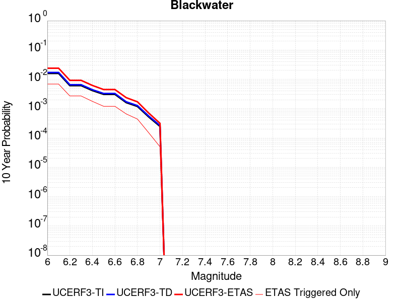 |

| Magnitude | 1 wk TI Prob | 1 wk TD Prob | 1 wk ETAS Prob | 1 wk ETAS/TD Gain | 1 wk ETAS Triggered Only | 1 mo TI Prob | 1 mo TD Prob | 1 mo ETAS Prob | 1 mo ETAS/TD Gain | 1 mo ETAS Triggered Only | 1 yr TI Prob | 1 yr TD Prob | 1 yr ETAS Prob | 1 yr ETAS/TD Gain | 1 yr ETAS Triggered Only | 10 yr TI Prob | 10 yr TD Prob | 10 yr ETAS Prob | 10 yr ETAS/TD Gain | 10 yr ETAS Triggered Only |
|-----|-----|-----|-----|-----|-----|-----|-----|-----|-----|-----|-----|-----|-----|-----|-----|-----|-----|-----|-----|-----|
| 6.0 | 3.0708583E-5 | 3.3096137E-5 | 3.9308422E-4 | 11.877043 | 3.6E-4 | 1.3160157E-4 | 1.4183365E-4 | 0.0014616464 | 10.305358 | 0.00132 | 0.0016010714 | 0.0017255935 | 0.0054391744 | 3.15206 | 0.00372 | 0.015895851 | 0.017135782 | 0.023907715 | 1.3951926 | 0.00689 |
| 6.1 | 3.0708583E-5 | 3.3096137E-5 | 3.9308422E-4 | 11.877043 | 3.6E-4 | 1.3160157E-4 | 1.4183365E-4 | 0.0014616464 | 10.305358 | 0.00132 | 0.0016010714 | 0.0017255935 | 0.0054391744 | 3.15206 | 0.00372 | 0.015895851 | 0.017135782 | 0.023907715 | 1.3951926 | 0.00689 |
| 6.2 | 1.1707779E-5 | 1.25452225E-5 | 2.0254284E-4 | 16.145018 | 1.9E-4 | 5.017523E-5 | 5.3764186E-5 | 5.737362E-4 | 10.671346 | 5.2E-4 | 6.107122E-4 | 6.54392E-4 | 0.0020834561 | 3.1838045 | 0.00143 | 0.006090366 | 0.0065256217 | 0.009208002 | 1.4110537 | 0.0027 |
| 6.3 | 1.1707779E-5 | 1.25452225E-5 | 2.0254284E-4 | 16.145018 | 1.9E-4 | 5.017523E-5 | 5.3764186E-5 | 5.737362E-4 | 10.671346 | 5.2E-4 | 6.107122E-4 | 6.54392E-4 | 0.0020834561 | 3.1838045 | 0.00143 | 0.006090366 | 0.0065256217 | 0.009208002 | 1.4110537 | 0.0027 |
| 6.4 | 7.929244E-6 | 8.480164E-6 | 1.0847932E-4 | 12.792125 | 1.0E-4 | 3.3982033E-5 | 3.6343077E-5 | 3.3633216E-4 | 9.254367 | 3.0E-4 | 4.136527E-4 | 4.4239115E-4 | 0.0014219576 | 3.2142541 | 9.8E-4 | 0.0041288356 | 0.00441551 | 0.006177695 | 1.3990897 | 0.00177 |
| 6.5 | 5.8832115E-6 | 6.286039E-6 | 8.628554E-5 | 13.726535 | 8.0E-5 | 2.521352E-5 | 2.6939904E-5 | 2.4693398E-4 | 9.166104 | 2.2E-4 | 3.0693135E-4 | 3.279465E-4 | 0.0010277169 | 3.1337945 | 7.0E-4 | 0.0030650778 | 0.0032748787 | 0.004470949 | 1.3652258 | 0.0012 |
| 6.6 | 5.8832115E-6 | 6.286039E-6 | 8.628554E-5 | 13.726535 | 8.0E-5 | 2.521352E-5 | 2.6939904E-5 | 2.4693398E-4 | 9.166104 | 2.2E-4 | 3.0693135E-4 | 3.279465E-4 | 0.0010277169 | 3.1337945 | 7.0E-4 | 0.0030650778 | 0.0032748787 | 0.004470949 | 1.3652258 | 0.0012 |
| 6.7 | 3.0715053E-6 | 3.2814912E-6 | 5.328133E-5 | 16.236925 | 5.0E-5 | 1.3163528E-5 | 1.4063465E-5 | 1.5406149E-4 | 10.954733 | 1.4E-4 | 1.6025416E-4 | 1.712104E-4 | 5.41147E-4 | 3.1607137 | 3.7E-4 | 0.0016013865 | 0.0017108994 | 0.0023697703 | 1.385102 | 6.6E-4 |
| 6.8 | 2.2722281E-6 | 2.4287724E-6 | 1.2428748E-5 | 5.117296 | 1.0E-5 | 9.738084E-6 | 1.0408988E-5 | 9.040815E-5 | 8.685585 | 8.0E-5 | 1.1855473E-4 | 1.2672298E-4 | 3.5669384E-4 | 2.8147526 | 2.3E-4 | 0.001184915 | 0.0012665973 | 0.00170604 | 1.3469474 | 4.4E-4 |
| 6.9 | 9.952399E-7 | 1.0653573E-6 | 1.0653573E-6 | 1.0 | 0.0 | 4.265307E-6 | 4.5658117E-6 | 2.4565721E-5 | 5.380362 | 2.0E-5 | 5.1928873E-5 | 5.5587854E-5 | 1.15584524E-4 | 2.0793126 | 6.0E-5 | 5.191674E-4 | 5.5579015E-4 | 7.0570677E-4 | 1.269736 | 1.5E-4 |
| 7.0 | 4.7385504E-7 | 5.0756E-7 | 5.0756E-7 | 1.0 | 0.0 | 2.0308057E-6 | 2.1752571E-6 | 2.1752571E-6 | 1.0 | 0.0 | 2.4724779E-5 | 2.6483754E-5 | 4.6483226E-5 | 1.75516 | 2.0E-5 | 2.4722028E-4 | 2.6483755E-4 | 3.148243E-4 | 1.188745 | 5.0E-5 |

## Garlock (West)
*[(top)](#table-of-contents)*

| 1 Week | 1 Month | 1 Year | 10 Year |
|-----|-----|-----|-----|
|  |  |  |  |

| Magnitude | 1 wk TI Prob | 1 wk TD Prob | 1 wk ETAS Prob | 1 wk ETAS/TD Gain | 1 wk ETAS Triggered Only | 1 mo TI Prob | 1 mo TD Prob | 1 mo ETAS Prob | 1 mo ETAS/TD Gain | 1 mo ETAS Triggered Only | 1 yr TI Prob | 1 yr TD Prob | 1 yr ETAS Prob | 1 yr ETAS/TD Gain | 1 yr ETAS Triggered Only | 10 yr TI Prob | 10 yr TD Prob | 10 yr ETAS Prob | 10 yr ETAS/TD Gain | 10 yr ETAS Triggered Only |
|-----|-----|-----|-----|-----|-----|-----|-----|-----|-----|-----|-----|-----|-----|-----|-----|-----|-----|-----|-----|-----|
| 6.0 | 2.5181727E-5 | 2.5201178E-5 | 6.6518504E-4 | 26.394999 | 6.4E-4 | 1.0791722E-4 | 1.080006E-4 | 0.0017478234 | 16.18346 | 0.00164 | 0.0013131002 | 0.0013141176 | 0.0052089924 | 3.963871 | 0.0039 | 0.013053683 | 0.013144119 | 0.019390916 | 1.4752542 | 0.00633 |
| 6.1 | 2.5077732E-5 | 2.510222E-5 | 6.6508615E-4 | 26.495113 | 6.4E-4 | 1.0747157E-4 | 1.07576525E-4 | 0.0017474002 | 16.243322 | 0.00164 | 0.001307681 | 0.0013089607 | 0.0052038557 | 3.975563 | 0.0039 | 0.013000126 | 0.013093159 | 0.019340279 | 1.4771286 | 0.00633 |
| 6.2 | 2.494612E-5 | 2.4983909E-5 | 6.649679E-4 | 26.615847 | 6.4E-4 | 1.0690756E-4 | 1.0706952E-4 | 0.001746894 | 16.31551 | 0.00164 | 0.0013008224 | 0.0013027954 | 0.0051977145 | 3.9896631 | 0.0039 | 0.012932341 | 0.01303223 | 0.019279735 | 1.479389 | 0.00633 |
| 6.3 | 2.4733758E-5 | 2.480327E-5 | 6.6478737E-4 | 26.80241 | 6.4E-4 | 1.0599751E-4 | 1.0629541E-4 | 0.0017461211 | 16.42706 | 0.00164 | 0.0012897556 | 0.0012933818 | 0.0051883375 | 4.011451 | 0.0039 | 0.012822957 | 0.012939194 | 0.019187288 | 1.4828813 | 0.00633 |
| 6.4 | 2.3237335E-5 | 2.3182572E-5 | 6.6316774E-4 | 28.606304 | 6.4E-4 | 9.958477E-5 | 9.9350116E-5 | 0.0017391872 | 17.505638 | 0.00164 | 0.0012117702 | 0.0012089192 | 0.0050842287 | 4.2055984 | 0.00388 | 0.012051838 | 0.012104041 | 0.018327786 | 1.5141873 | 0.0063 |
| 6.5 | 2.2732203E-5 | 2.299694E-5 | 6.6298223E-4 | 28.82915 | 6.4E-4 | 9.742009E-5 | 9.855461E-5 | 0.001728394 | 17.537424 | 0.00163 | 0.0011854442 | 0.0011992446 | 0.0050646034 | 4.223161 | 0.00387 | 0.011791403 | 0.012008345 | 0.018222813 | 1.5175124 | 0.00629 |
| 6.6 | 2.1319436E-5 | 2.1777145E-5 | 6.617632E-4 | 30.38797 | 6.4E-4 | 9.136581E-5 | 9.33273E-5 | 0.0017231752 | 18.463785 | 0.00163 | 0.001111811 | 0.0011356699 | 0.005001275 | 4.4038105 | 0.00387 | 0.011062649 | 0.011379252 | 0.017597677 | 1.5464704 | 0.00629 |
| 6.7 | 1.970802E-5 | 2.039702E-5 | 6.6038396E-4 | 32.37649 | 6.4E-4 | 8.446021E-5 | 8.741288E-5 | 0.0017172704 | 19.645508 | 0.00163 | 0.001027818 | 0.001063734 | 0.004919628 | 4.624867 | 0.00386 | 0.010230771 | 0.01066698 | 0.016870098 | 1.5815252 | 0.00627 |
| 6.8 | 1.8744462E-5 | 1.9904679E-5 | 6.598919E-4 | 33.152603 | 6.4E-4 | 8.033094E-5 | 8.530299E-5 | 0.0017051648 | 19.989508 | 0.00162 | 9.775903E-4 | 0.0010380708 | 0.004884074 | 4.704953 | 0.00385 | 0.009733009 | 0.0104127815 | 0.016597701 | 1.5939739 | 0.00625 |
| 6.9 | 1.7559682E-5 | 1.895703E-5 | 6.589449E-4 | 34.759926 | 6.4E-4 | 7.5253614E-5 | 8.124189E-5 | 0.0017011103 | 20.938833 | 0.00162 | 9.158276E-4 | 9.886726E-4 | 0.004834866 | 4.89026 | 0.00385 | 0.0091206245 | 0.009923103 | 0.016111083 | 1.6235933 | 0.00625 |
| 7.0 | 1.6794445E-5 | 1.8219816E-5 | 6.5820816E-4 | 36.125946 | 6.4E-4 | 7.197421E-5 | 7.80826E-5 | 0.0016979561 | 21.74564 | 0.00162 | 8.759337E-4 | 9.5024245E-4 | 0.0047865934 | 5.037234 | 0.00384 | 0.008724891 | 0.009541983 | 0.01572244 | 1.6477121 | 0.00624 |
| 7.1 | 1.6337795E-5 | 1.7720598E-5 | 6.5770926E-4 | 37.11552 | 6.4E-4 | 7.0017246E-5 | 7.594322E-5 | 0.0016958202 | 22.330107 | 0.00162 | 8.521265E-4 | 9.242178E-4 | 0.004750678 | 5.140215 | 0.00383 | 0.008488664 | 0.009283723 | 0.015445978 | 1.6637698 | 0.00622 |
| 7.2 | 1.5780008E-5 | 1.7169215E-5 | 6.571582E-4 | 38.27538 | 6.4E-4 | 6.762685E-5 | 7.358028E-5 | 0.0016934611 | 23.015146 | 0.00162 | 8.2304585E-4 | 8.954731E-4 | 0.004712052 | 5.2620816 | 0.00382 | 0.008200042 | 0.008998544 | 0.015152663 | 1.6839017 | 0.00621 |
| 7.3 | 1.5058865E-5 | 1.6622265E-5 | 6.466118E-4 | 38.90034 | 6.3E-4 | 6.45364E-5 | 7.123634E-5 | 0.0016711224 | 23.458845 | 0.0016 | 7.854473E-4 | 8.669586E-4 | 0.0046436815 | 5.35629 | 0.00378 | 0.00782677 | 0.00871523 | 0.014821544 | 1.7006487 | 0.00616 |
| 7.4 | 1.4887923E-5 | 1.6458223E-5 | 6.3644804E-4 | 38.670517 | 6.2E-4 | 6.380382E-5 | 7.0533344E-5 | 0.0016304234 | 23.115639 | 0.00156 | 7.7653467E-4 | 8.5840636E-4 | 0.00455523 | 5.306613 | 0.0037 | 0.0077382675 | 0.008630064 | 0.014588198 | 1.6903927 | 0.00601 |
| 7.5 | 1.4509299E-5 | 1.605021E-5 | 5.960409E-4 | 37.13602 | 5.8E-4 | 6.218123E-5 | 6.87848E-5 | 0.0015286844 | 22.22416 | 0.00146 | 7.567935E-4 | 8.371344E-4 | 0.0043042297 | 5.141623 | 0.00347 | 0.0075422134 | 0.008418384 | 0.013961325 | 1.658433 | 0.00559 |
| 7.6 | 1.2756717E-5 | 1.40541215E-5 | 3.2404976E-4 | 23.057276 | 3.1E-4 | 5.4670498E-5 | 6.0230563E-5 | 9.201788E-4 | 15.277605 | 8.6E-4 | 6.6541E-4 | 7.3306105E-4 | 0.002941441 | 4.0125456 | 0.00221 | 0.006634211 | 0.007383333 | 0.011036162 | 1.4947399 | 0.00368 |
| 7.7 | 1.0328985E-5 | 1.1463684E-5 | 1.6146197E-4 | 14.084648 | 1.5E-4 | 4.4266326E-5 | 4.9129154E-5 | 4.9910706E-4 | 10.159081 | 4.5E-4 | 5.388092E-4 | 5.9798366E-4 | 0.0018472362 | 3.089108 | 0.00125 | 0.0053750467 | 0.0060403068 | 0.008077924 | 1.3373368 | 0.00205 |
| 7.8 | 7.0306583E-6 | 8.902223E-6 | 8.8901514E-5 | 9.98644 | 8.0E-5 | 3.0131043E-5 | 3.815183E-5 | 3.3814038E-4 | 8.863019 | 3.0E-4 | 3.667837E-4 | 4.6439967E-4 | 0.0013240003 | 2.8509932 | 8.6E-4 | 0.003661789 | 0.00469676 | 0.006070278 | 1.2924396 | 0.00138 |
| 7.9 | 4.060633E-6 | 5.466985E-6 | 5.5466713E-5 | 10.145759 | 5.0E-5 | 1.7402595E-5 | 2.3429726E-5 | 2.4342457E-4 | 10.389562 | 2.2E-4 | 2.11856E-4 | 2.8521966E-4 | 8.8504853E-4 | 3.1030416 | 6.0E-4 | 0.0021165414 | 0.0028850343 | 0.0037824379 | 1.3110547 | 9.0E-4 |
| 8.0 | 1.6729537E-6 | 2.0780296E-6 | 1.2078009E-5 | 5.812241 | 1.0E-5 | 7.169782E-6 | 8.90581E-6 | 5.8905367E-5 | 6.614262 | 5.0E-5 | 8.7288594E-5 | 1.08422886E-4 | 2.484077E-4 | 2.2911003 | 1.4E-4 | 8.7254314E-4 | 0.0010972664 | 0.001307036 | 1.1911747 | 2.1E-4 |
| 8.1 | 3.6733252E-7 | 3.1496086E-7 | 1.0314958E-5 | 32.74997 | 1.0E-5 | 1.5742813E-6 | 1.3498316E-6 | 1.1349818E-5 | 8.408321 | 1.0E-5 | 1.9166706E-5 | 1.6434093E-5 | 3.6433765E-5 | 2.2169623 | 2.0E-5 | 1.9165053E-4 | 1.6647995E-4 | 1.8647662E-4 | 1.1201146 | 2.0E-5 |

## McLean Lake
*[(top)](#table-of-contents)*

| 1 Week | 1 Month | 1 Year | 10 Year |
|-----|-----|-----|-----|
|  |  |  |  |

| Magnitude | 1 wk TI Prob | 1 wk TD Prob | 1 wk ETAS Prob | 1 wk ETAS/TD Gain | 1 wk ETAS Triggered Only | 1 mo TI Prob | 1 mo TD Prob | 1 mo ETAS Prob | 1 mo ETAS/TD Gain | 1 mo ETAS Triggered Only | 1 yr TI Prob | 1 yr TD Prob | 1 yr ETAS Prob | 1 yr ETAS/TD Gain | 1 yr ETAS Triggered Only | 10 yr TI Prob | 10 yr TD Prob | 10 yr ETAS Prob | 10 yr ETAS/TD Gain | 10 yr ETAS Triggered Only |
|-----|-----|-----|-----|-----|-----|-----|-----|-----|-----|-----|-----|-----|-----|-----|-----|-----|-----|-----|-----|-----|
| 6.0 | 1.7360222E-5 | 1.8501763E-5 | 3.684953E-4 | 19.916765 | 3.5E-4 | 7.439883E-5 | 7.929114E-5 | 8.292317E-4 | 10.458062 | 7.5E-4 | 9.0542925E-4 | 9.6499064E-4 | 0.003372665 | 3.4950235 | 0.00241 | 0.009017491 | 0.009612845 | 0.014416222 | 1.4996833 | 0.00485 |
| 6.1 | 9.062689E-6 | 9.592256E-6 | 1.7959063E-4 | 18.72246 | 1.7E-4 | 3.8839516E-5 | 4.1109073E-5 | 4.1109388E-4 | 10.000076 | 3.7E-4 | 4.727685E-4 | 5.003969E-4 | 0.0017497714 | 3.496767 | 0.00125 | 0.0047176396 | 0.0049935845 | 0.0075607006 | 1.5140829 | 0.00258 |
| 6.2 | 9.062689E-6 | 9.592256E-6 | 1.7959063E-4 | 18.72246 | 1.7E-4 | 3.8839516E-5 | 4.1109073E-5 | 4.1109388E-4 | 10.000076 | 3.7E-4 | 4.727685E-4 | 5.003969E-4 | 0.0017497714 | 3.496767 | 0.00125 | 0.0047176396 | 0.0049935845 | 0.0075607006 | 1.5140829 | 0.00258 |
| 6.3 | 7.2575485E-6 | 7.667758E-6 | 1.2766683E-4 | 16.649826 | 1.2E-4 | 3.110341E-5 | 3.2861444E-5 | 3.228519E-4 | 9.824641 | 2.9E-4 | 3.786182E-4 | 4.000218E-4 | 0.0013496417 | 3.3739207 | 9.5E-4 | 0.0037797375 | 0.003993722 | 0.006055455 | 1.5162435 | 0.00207 |
| 6.4 | 7.2575485E-6 | 7.667758E-6 | 1.2766683E-4 | 16.649826 | 1.2E-4 | 3.110341E-5 | 3.2861444E-5 | 3.228519E-4 | 9.824641 | 2.9E-4 | 3.786182E-4 | 4.000218E-4 | 0.0013496417 | 3.3739207 | 9.5E-4 | 0.0037797375 | 0.003993722 | 0.006055455 | 1.5162435 | 0.00207 |
| 6.5 | 6.06582E-6 | 6.4039173E-6 | 8.640341E-5 | 13.492274 | 8.0E-5 | 2.5996113E-5 | 2.7445107E-5 | 2.574388E-4 | 9.380135 | 2.3E-4 | 3.164567E-4 | 3.3409943E-4 | 0.0010738522 | 3.2141695 | 7.4E-4 | 0.0031600643 | 0.00333661 | 0.0050608376 | 1.5167603 | 0.00173 |
| 6.6 | 5.598744E-6 | 5.910299E-6 | 7.5909884E-5 | 12.843662 | 7.0E-5 | 2.3994397E-5 | 2.5329644E-5 | 2.3532432E-4 | 9.290471 | 2.1E-4 | 2.9209262E-4 | 3.0835115E-4 | 9.981385E-4 | 3.2370186 | 6.9E-4 | 0.0029170897 | 0.0030798623 | 0.0046849037 | 1.5211407 | 0.00161 |
| 6.7 | 5.246996E-6 | 5.5391965E-6 | 7.553881E-5 | 13.637142 | 7.0E-5 | 2.2486933E-5 | 2.3739234E-5 | 2.2373449E-4 | 9.424672 | 2.0E-4 | 2.73744E-4 | 2.8899318E-4 | 9.4880245E-4 | 3.283131 | 6.6E-4 | 0.0027340704 | 0.0028867975 | 0.004412381 | 1.5284691 | 0.00153 |
| 6.8 | 4.02324E-6 | 4.246931E-6 | 5.4246717E-5 | 12.773158 | 5.0E-5 | 1.7242342E-5 | 1.8201039E-5 | 1.6819831E-4 | 9.2411375 | 1.5E-4 | 2.099053E-4 | 2.2158107E-4 | 7.114725E-4 | 3.2108903 | 4.9E-4 | 0.0020970714 | 0.0022141857 | 0.003391573 | 1.5317473 | 0.00118 |
| 6.9 | 6.835972E-7 | 7.1399637E-7 | 1.07139895E-5 | 15.005663 | 1.0E-5 | 2.9296991E-6 | 3.0599826E-6 | 3.3059892E-5 | 10.803947 | 3.0E-5 | 3.56685E-5 | 3.725497E-5 | 9.7252734E-5 | 2.6104634 | 6.0E-5 | 3.5662777E-4 | 3.7251852E-4 | 5.2246265E-4 | 1.4025146 | 1.5E-4 |

## Gravel Hills-Harper Lk
*[(top)](#table-of-contents)*

| 1 Week | 1 Month | 1 Year | 10 Year |
|-----|-----|-----|-----|
|  |  |  |  |

| Magnitude | 1 wk TI Prob | 1 wk TD Prob | 1 wk ETAS Prob | 1 wk ETAS/TD Gain | 1 wk ETAS Triggered Only | 1 mo TI Prob | 1 mo TD Prob | 1 mo ETAS Prob | 1 mo ETAS/TD Gain | 1 mo ETAS Triggered Only | 1 yr TI Prob | 1 yr TD Prob | 1 yr ETAS Prob | 1 yr ETAS/TD Gain | 1 yr ETAS Triggered Only | 10 yr TI Prob | 10 yr TD Prob | 10 yr ETAS Prob | 10 yr ETAS/TD Gain | 10 yr ETAS Triggered Only |
|-----|-----|-----|-----|-----|-----|-----|-----|-----|-----|-----|-----|-----|-----|-----|-----|-----|-----|-----|-----|-----|
| 6.0 | 3.0679566E-5 | 3.1465075E-5 | 2.0145973E-4 | 6.4026456 | 1.7E-4 | 1.3147724E-4 | 1.3484458E-4 | 8.147529E-4 | 6.042163 | 6.8E-4 | 0.0015995599 | 0.0016407134 | 0.0037372678 | 2.277831 | 0.0021 | 0.015880952 | 0.01630757 | 0.020006252 | 1.2268078 | 0.00376 |
| 6.1 | 3.0679566E-5 | 3.1465075E-5 | 2.0145973E-4 | 6.4026456 | 1.7E-4 | 1.3147724E-4 | 1.3484458E-4 | 8.147529E-4 | 6.042163 | 6.8E-4 | 0.0015995599 | 0.0016407134 | 0.0037372678 | 2.277831 | 0.0021 | 0.015880952 | 0.01630757 | 0.020006252 | 1.2268078 | 0.00376 |
| 6.2 | 1.514536E-5 | 1.3635352E-5 | 1.13633985E-4 | 8.333777 | 1.0E-4 | 6.490707E-5 | 5.843598E-5 | 3.184208E-4 | 5.4490533 | 2.6E-4 | 7.8995706E-4 | 7.112377E-4 | 0.001490683 | 2.0958998 | 7.8E-4 | 0.007871548 | 0.007090816 | 0.008421314 | 1.1876369 | 0.00134 |
| 6.3 | 1.514536E-5 | 1.3635352E-5 | 1.13633985E-4 | 8.333777 | 1.0E-4 | 6.490707E-5 | 5.843598E-5 | 3.184208E-4 | 5.4490533 | 2.6E-4 | 7.8995706E-4 | 7.112377E-4 | 0.001490683 | 2.0958998 | 7.8E-4 | 0.007871548 | 0.007090816 | 0.008421314 | 1.1876369 | 0.00134 |
| 6.4 | 1.2532521E-5 | 1.0689793E-5 | 8.0689046E-5 | 7.5482326 | 7.0E-5 | 5.37097E-5 | 4.581263E-5 | 2.1580484E-4 | 4.710597 | 1.7E-4 | 6.537194E-4 | 5.5763184E-4 | 0.0010773418 | 1.9319949 | 5.2E-4 | 0.0065179965 | 0.005562916 | 0.0064181318 | 1.1537352 | 8.6E-4 |
| 6.5 | 1.1094058E-5 | 9.083745E-6 | 3.9083472E-5 | 4.3025727 | 3.0E-5 | 4.7545094E-5 | 3.892978E-5 | 1.0892705E-4 | 2.7980394 | 7.0E-5 | 5.787078E-4 | 4.73871E-4 | 7.737288E-4 | 1.6327837 | 3.0E-4 | 0.0057720304 | 0.004729013 | 0.005276412 | 1.1157533 | 5.5E-4 |
| 6.6 | 9.688328E-6 | 7.5317585E-6 | 1.7531684E-5 | 2.327701 | 1.0E-5 | 4.1520743E-5 | 3.227858E-5 | 7.227729E-5 | 2.239172 | 4.0E-5 | 5.053978E-4 | 3.929234E-4 | 5.728527E-4 | 1.4579246 | 1.8E-4 | 0.0050424994 | 0.0039225435 | 0.0042811316 | 1.0914172 | 3.6E-4 |
| 6.7 | 8.974824E-6 | 6.749468E-6 | 6.749468E-6 | 1.0 | 0.0 | 3.8462964E-5 | 2.8925982E-5 | 5.8925114E-5 | 2.0370998 | 3.0E-5 | 4.6818596E-4 | 3.5211912E-4 | 4.8207337E-4 | 1.3690633 | 1.3E-4 | 0.004672008 | 0.003515833 | 0.0038048136 | 1.082194 | 2.9E-4 |
| 6.8 | 7.4780046E-6 | 5.1162315E-6 | 5.1162315E-6 | 1.0 | 0.0 | 3.20482E-5 | 2.192653E-5 | 2.192653E-5 | 1.0 | 0.0 | 3.9011694E-4 | 2.6692418E-4 | 3.1691085E-4 | 1.1872691 | 5.0E-5 | 0.0038943281 | 0.0026661742 | 0.002785854 | 1.0448883 | 1.2E-4 |
| 6.9 | 6.3409307E-6 | 3.9075235E-6 | 3.9075235E-6 | 1.0 | 0.0 | 2.7175134E-5 | 1.6746428E-5 | 1.6746428E-5 | 1.0 | 0.0 | 3.3080703E-4 | 2.0386967E-4 | 2.2386559E-4 | 1.098082 | 2.0E-5 | 0.0033031502 | 0.0020369245 | 0.0020868226 | 1.0244968 | 5.0E-5 |
| 7.0 | 5.1239335E-6 | 2.6058722E-6 | 2.6058722E-6 | 1.0 | 0.0 | 2.195953E-5 | 1.11679765E-5 | 1.11679765E-5 | 1.0 | 0.0 | 2.6732447E-4 | 1.3596189E-4 | 1.4596053E-4 | 1.07354 | 1.0E-5 | 0.0026700313 | 0.0013588123 | 0.0013887716 | 1.0220481 | 3.0E-5 |
| 7.1 | 4.438899E-6 | 2.098489E-6 | 2.098489E-6 | 1.0 | 0.0 | 1.9023713E-5 | 8.993494E-6 | 8.993494E-6 | 1.0 | 0.0 | 2.315891E-4 | 1.0949051E-4 | 1.19489414E-4 | 1.0913221 | 1.0E-5 | 0.002313479 | 0.0010943875 | 0.0011243547 | 1.0273826 | 3.0E-5 |
| 7.2 | 3.50367E-6 | 1.261586E-6 | 1.261586E-6 | 1.0 | 0.0 | 1.5015643E-5 | 5.4067864E-6 | 5.4067864E-6 | 1.0 | 0.0 | 1.8280011E-4 | 6.582572E-5 | 6.582572E-5 | 1.0 | 0.0 | 0.0018264982 | 6.5807044E-4 | 6.680639E-4 | 1.015186 | 1.0E-5 |
| 7.3 | 2.561638E-6 | 7.1188185E-7 | 7.1188185E-7 | 1.0 | 0.0 | 1.0978401E-5 | 3.0509186E-6 | 3.0509186E-6 | 1.0 | 0.0 | 1.3365384E-4 | 3.7144324E-5 | 3.7144324E-5 | 1.0 | 0.0 | 0.0013357349 | 3.7138315E-4 | 3.8137942E-4 | 1.0269164 | 1.0E-5 |
| 7.4 | 2.0368864E-6 | 5.3045807E-7 | 5.3045807E-7 | 1.0 | 0.0 | 8.729483E-6 | 2.2733898E-6 | 2.2733898E-6 | 1.0 | 0.0 | 1.06276275E-4 | 2.7678176E-5 | 2.7678176E-5 | 1.0 | 0.0 | 0.0010622547 | 2.7674783E-4 | 2.7674783E-4 | 1.0 | 0.0 |
| 7.5 | 1.1681728E-6 | 3.602912E-7 | 3.602912E-7 | 1.0 | 0.0 | 5.0064455E-6 | 1.5441043E-6 | 1.5441043E-6 | 1.0 | 0.0 | 6.0951766E-5 | 1.8799314E-5 | 1.8799314E-5 | 1.0 | 0.0 | 6.093505E-4 | 1.879777E-4 | 1.879777E-4 | 1.0 | 0.0 |
| 7.6 | 1.3154387E-7 | 7.119745E-8 | 7.119745E-8 | 1.0 | 0.0 | 5.6375933E-7 | 3.051319E-7 | 3.051319E-7 | 1.0 | 0.0 | 6.863748E-6 | 3.7149762E-6 | 3.7149762E-6 | 1.0 | 0.0 | 6.863536E-5 | 3.7149297E-5 | 3.7149297E-5 | 1.0 | 0.0 |

## Goldstone Lake
*[(top)](#table-of-contents)*

| 1 Week | 1 Month | 1 Year | 10 Year |
|-----|-----|-----|-----|
|  | 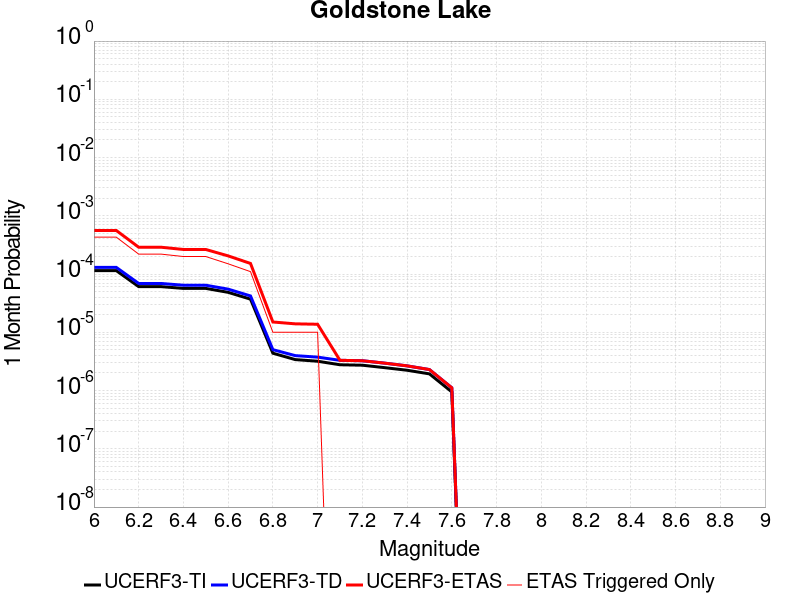 | 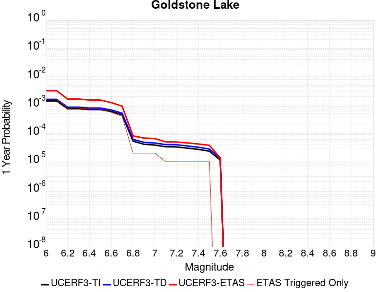 | 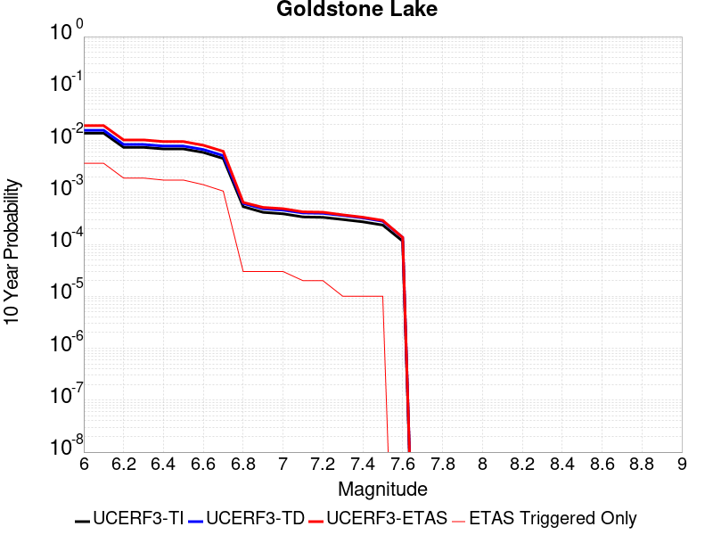 |

| Magnitude | 1 wk TI Prob | 1 wk TD Prob | 1 wk ETAS Prob | 1 wk ETAS/TD Gain | 1 wk ETAS Triggered Only | 1 mo TI Prob | 1 mo TD Prob | 1 mo ETAS Prob | 1 mo ETAS/TD Gain | 1 mo ETAS Triggered Only | 1 yr TI Prob | 1 yr TD Prob | 1 yr ETAS Prob | 1 yr ETAS/TD Gain | 1 yr ETAS Triggered Only | 10 yr TI Prob | 10 yr TD Prob | 10 yr ETAS Prob | 10 yr ETAS/TD Gain | 10 yr ETAS Triggered Only |
|-----|-----|-----|-----|-----|-----|-----|-----|-----|-----|-----|-----|-----|-----|-----|-----|-----|-----|-----|-----|-----|
| 6.0 | 2.671352E-5 | 3.037656E-5 | 2.1037109E-4 | 6.9254417 | 1.8E-4 | 1.1448149E-4 | 1.3017986E-4 | 5.601239E-4 | 4.3026924 | 4.3E-4 | 0.001392921 | 0.0015839839 | 0.0032014179 | 2.0211177 | 0.00162 | 0.013842222 | 0.015746437 | 0.01932912 | 1.2275234 | 0.00364 |
| 6.1 | 2.671352E-5 | 3.037656E-5 | 2.1037109E-4 | 6.9254417 | 1.8E-4 | 1.1448149E-4 | 1.3017986E-4 | 5.601239E-4 | 4.3026924 | 4.3E-4 | 0.001392921 | 0.0015839839 | 0.0032014179 | 2.0211177 | 0.00162 | 0.013842222 | 0.015746437 | 0.01932912 | 1.2275234 | 0.00364 |
| 6.2 | 1.4197047E-5 | 1.6096485E-5 | 1.16094874E-4 | 7.2124367 | 1.0E-4 | 6.0843064E-5 | 6.898367E-5 | 2.889685E-4 | 4.188941 | 2.2E-4 | 7.4051257E-4 | 8.3965115E-4 | 0.0016289878 | 1.940077 | 7.9E-4 | 0.007380498 | 0.008374483 | 0.010248655 | 1.2237955 | 0.00189 |
| 6.3 | 1.4197047E-5 | 1.6096485E-5 | 1.16094874E-4 | 7.2124367 | 1.0E-4 | 6.0843064E-5 | 6.898367E-5 | 2.889685E-4 | 4.188941 | 2.2E-4 | 7.4051257E-4 | 8.3965115E-4 | 0.0016289878 | 1.940077 | 7.9E-4 | 0.007380498 | 0.008374483 | 0.010248655 | 1.2237955 | 0.00189 |
| 6.4 | 1.3238931E-5 | 1.5008683E-5 | 1.15007184E-4 | 7.6627097 | 1.0E-4 | 5.6737044E-5 | 6.4321895E-5 | 2.6430903E-4 | 4.1091614 | 2.0E-4 | 6.9055456E-4 | 7.829357E-4 | 0.001502372 | 1.9188957 | 7.2E-4 | 0.006884126 | 0.0078113996 | 0.009527886 | 1.2197412 | 0.00173 |
| 6.5 | 1.3238931E-5 | 1.5008683E-5 | 1.15007184E-4 | 7.6627097 | 1.0E-4 | 5.6737044E-5 | 6.4321895E-5 | 2.6430903E-4 | 4.1091614 | 2.0E-4 | 6.9055456E-4 | 7.829357E-4 | 0.001502372 | 1.9188957 | 7.2E-4 | 0.006884126 | 0.0078113996 | 0.009527886 | 1.2197412 | 0.00173 |
| 6.6 | 1.1328278E-5 | 1.2855358E-5 | 9.285433E-5 | 7.223006 | 8.0E-5 | 4.8548856E-5 | 5.509377E-5 | 2.0508551E-4 | 3.722481 | 1.5E-4 | 5.90922E-4 | 6.706559E-4 | 0.001220287 | 1.8195426 | 5.5E-4 | 0.0058935313 | 0.0066957087 | 0.0080962675 | 1.2091726 | 0.00141 |
| 6.7 | 8.651175E-6 | 9.824713E-6 | 6.982412E-5 | 7.106989 | 6.0E-5 | 3.707594E-5 | 4.210574E-5 | 1.5210111E-4 | 3.6123602 | 1.1E-4 | 4.5130608E-4 | 5.1260734E-4 | 9.124023E-4 | 1.7799244 | 4.0E-4 | 0.0045039062 | 0.005123128 | 0.006177698 | 1.2058449 | 0.00106 |
| 6.8 | 1.0215377E-6 | 1.175489E-6 | 1.175489E-6 | 1.0 | 0.0 | 4.378012E-6 | 5.037801E-6 | 1.5037751E-5 | 2.984983 | 1.0E-5 | 5.3300988E-5 | 6.1333616E-5 | 8.133239E-5 | 1.3260654 | 2.0E-5 | 5.3288206E-4 | 6.131781E-4 | 6.431597E-4 | 1.0488955 | 3.0E-5 |
| 6.9 | 7.9360774E-7 | 9.2835614E-7 | 9.2835614E-7 | 1.0 | 0.0 | 3.4011714E-6 | 3.9786632E-6 | 1.3978623E-5 | 3.5133967 | 1.0E-5 | 4.1408475E-5 | 4.8439222E-5 | 6.8438254E-5 | 1.4128685 | 2.0E-5 | 4.140076E-4 | 4.8429365E-4 | 5.142791E-4 | 1.0619159 | 3.0E-5 |
| 7.0 | 7.4382757E-7 | 8.747489E-7 | 8.747489E-7 | 1.0 | 0.0 | 3.1878285E-6 | 3.7489187E-6 | 1.3748881E-5 | 3.6674259 | 1.0E-5 | 3.8811122E-5 | 4.56422E-5 | 6.564128E-5 | 1.438171 | 2.0E-5 | 3.8804344E-4 | 4.5633488E-4 | 4.863212E-4 | 1.0657111 | 3.0E-5 |
| 7.1 | 6.4709513E-7 | 7.711452E-7 | 7.711452E-7 | 1.0 | 0.0 | 2.773262E-6 | 3.304904E-6 | 3.304904E-6 | 1.0 | 0.0 | 3.376394E-5 | 4.0236526E-5 | 5.023612E-5 | 1.2485204 | 1.0E-5 | 3.375881E-4 | 4.0229835E-4 | 4.2229032E-4 | 1.0496943 | 2.0E-5 |
| 7.2 | 6.356704E-7 | 7.5885106E-7 | 7.5885106E-7 | 1.0 | 0.0 | 2.7242988E-6 | 3.252215E-6 | 3.252215E-6 | 1.0 | 0.0 | 3.3167835E-5 | 3.959506E-5 | 4.9594662E-5 | 1.2525468 | 1.0E-5 | 3.3162883E-4 | 3.95886E-4 | 4.1587808E-4 | 1.0504996 | 2.0E-5 |
| 7.3 | 5.7695723E-7 | 6.8966995E-7 | 6.8966995E-7 | 1.0 | 0.0 | 2.4726714E-6 | 2.9557252E-6 | 2.9557252E-6 | 1.0 | 0.0 | 3.0104358E-5 | 3.598542E-5 | 4.598506E-5 | 1.2778803 | 1.0E-5 | 3.0100282E-4 | 3.5980166E-4 | 3.6979804E-4 | 1.027783 | 1.0E-5 |
| 7.4 | 5.209647E-7 | 6.1936277E-7 | 6.1936277E-7 | 1.0 | 0.0 | 2.232704E-6 | 2.6544094E-6 | 2.6544094E-6 | 1.0 | 0.0 | 2.718283E-5 | 3.231701E-5 | 4.231669E-5 | 1.3094245 | 1.0E-5 | 2.7179506E-4 | 3.2312868E-4 | 3.3312544E-4 | 1.0309374 | 1.0E-5 |
| 7.5 | 4.512955E-7 | 5.3489794E-7 | 5.3489794E-7 | 1.0 | 0.0 | 1.934122E-6 | 2.292418E-6 | 2.292418E-6 | 1.0 | 0.0 | 2.3547682E-5 | 2.7909884E-5 | 3.7909605E-5 | 1.358286 | 1.0E-5 | 2.3545188E-4 | 2.790691E-4 | 2.8906632E-4 | 1.0358235 | 1.0E-5 |
| 7.6 | 2.21172E-7 | 2.6040198E-7 | 2.6040198E-7 | 1.0 | 0.0 | 9.478797E-7 | 1.1160082E-6 | 1.1160082E-6 | 1.0 | 0.0 | 1.1540374E-5 | 1.3587343E-5 | 1.3587343E-5 | 1.0 | 0.0 | 1.1539775E-4 | 1.3586794E-4 | 1.3586794E-4 | 1.0 | 0.0 |

## So Sierra Nevada
*[(top)](#table-of-contents)*

| 1 Week | 1 Month | 1 Year | 10 Year |
|-----|-----|-----|-----|
| 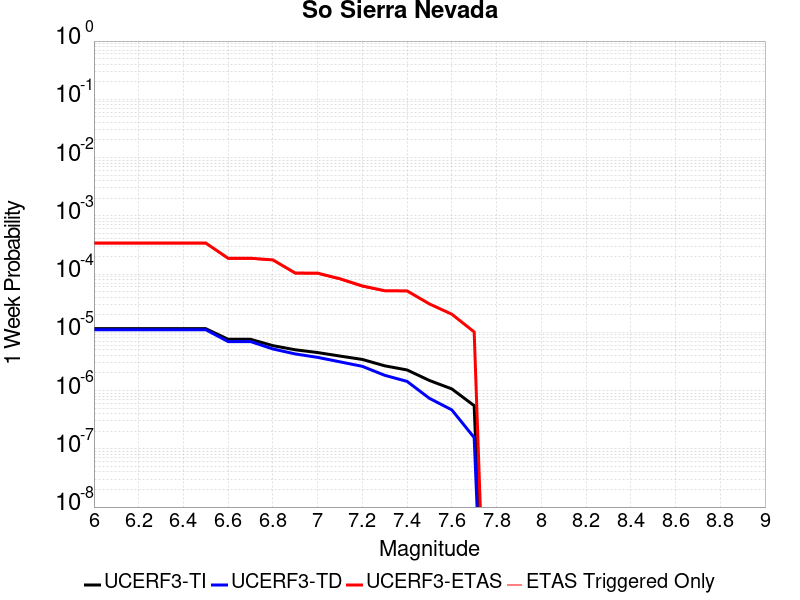 | 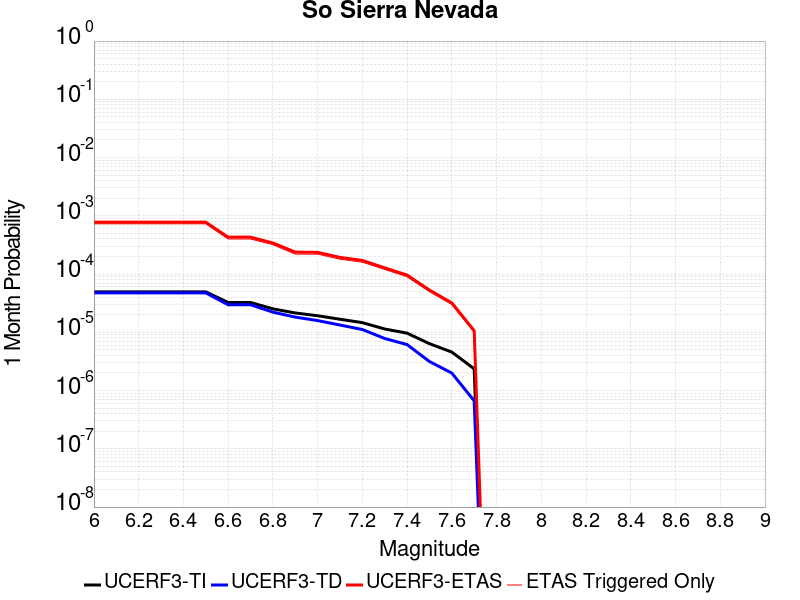 | 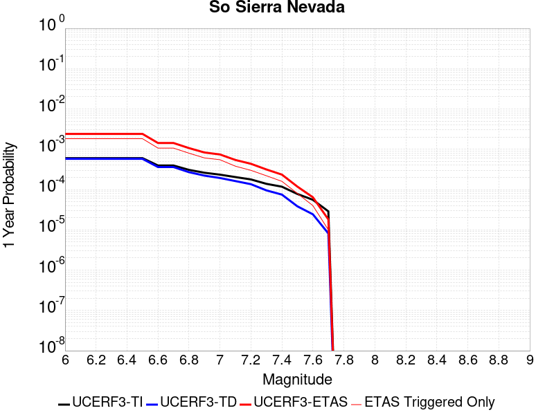 | 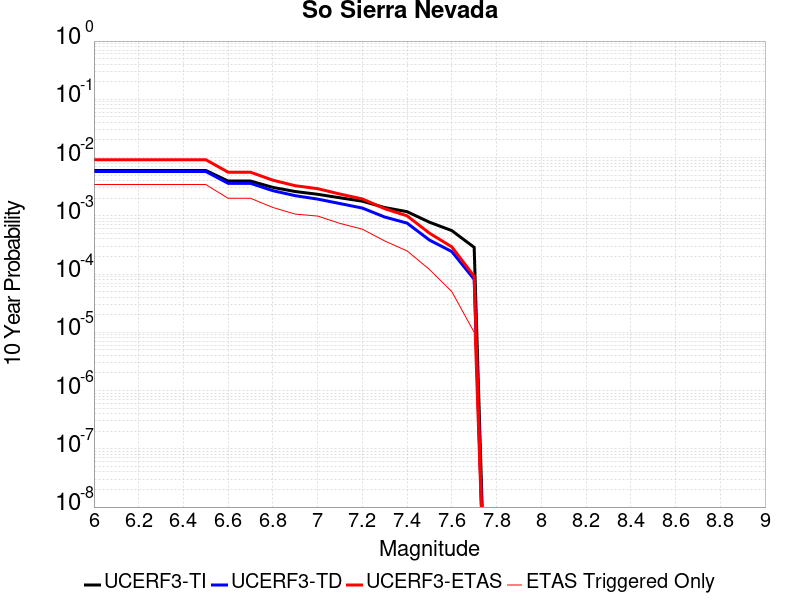 |

| Magnitude | 1 wk TI Prob | 1 wk TD Prob | 1 wk ETAS Prob | 1 wk ETAS/TD Gain | 1 wk ETAS Triggered Only | 1 mo TI Prob | 1 mo TD Prob | 1 mo ETAS Prob | 1 mo ETAS/TD Gain | 1 mo ETAS Triggered Only | 1 yr TI Prob | 1 yr TD Prob | 1 yr ETAS Prob | 1 yr ETAS/TD Gain | 1 yr ETAS Triggered Only | 10 yr TI Prob | 10 yr TD Prob | 10 yr ETAS Prob | 10 yr ETAS/TD Gain | 10 yr ETAS Triggered Only |
|-----|-----|-----|-----|-----|-----|-----|-----|-----|-----|-----|-----|-----|-----|-----|-----|-----|-----|-----|-----|-----|
| 6.0 | 1.15488665E-5 | 1.1079676E-5 | 3.4107603E-4 | 30.783932 | 3.3E-4 | 4.9494203E-5 | 4.7483536E-5 | 7.774489E-4 | 16.37302 | 7.3E-4 | 6.024253E-4 | 5.7797146E-4 | 0.0024069138 | 4.1644163 | 0.00183 | 0.006007948 | 0.0057659517 | 0.009186117 | 1.5931658 | 0.00344 |
| 6.1 | 1.15488665E-5 | 1.1079676E-5 | 3.4107603E-4 | 30.783932 | 3.3E-4 | 4.9494203E-5 | 4.7483536E-5 | 7.774489E-4 | 16.37302 | 7.3E-4 | 6.024253E-4 | 5.7797146E-4 | 0.0024069138 | 4.1644163 | 0.00183 | 0.006007948 | 0.0057659517 | 0.009186117 | 1.5931658 | 0.00344 |
| 6.2 | 1.15488665E-5 | 1.1079676E-5 | 3.4107603E-4 | 30.783932 | 3.3E-4 | 4.9494203E-5 | 4.7483536E-5 | 7.774489E-4 | 16.37302 | 7.3E-4 | 6.024253E-4 | 5.7797146E-4 | 0.0024069138 | 4.1644163 | 0.00183 | 0.006007948 | 0.0057659517 | 0.009186117 | 1.5931658 | 0.00344 |
| 6.3 | 1.15488665E-5 | 1.1079676E-5 | 3.4107603E-4 | 30.783932 | 3.3E-4 | 4.9494203E-5 | 4.7483536E-5 | 7.774489E-4 | 16.37302 | 7.3E-4 | 6.024253E-4 | 5.7797146E-4 | 0.0024069138 | 4.1644163 | 0.00183 | 0.006007948 | 0.0057659517 | 0.009186117 | 1.5931658 | 0.00344 |
| 6.4 | 1.15488665E-5 | 1.1079676E-5 | 3.4107603E-4 | 30.783932 | 3.3E-4 | 4.9494203E-5 | 4.7483536E-5 | 7.774489E-4 | 16.37302 | 7.3E-4 | 6.024253E-4 | 5.7797146E-4 | 0.0024069138 | 4.1644163 | 0.00183 | 0.006007948 | 0.0057659517 | 0.009186117 | 1.5931658 | 0.00344 |
| 6.5 | 1.15488665E-5 | 1.1079676E-5 | 3.4107603E-4 | 30.783932 | 3.3E-4 | 4.9494203E-5 | 4.7483536E-5 | 7.774489E-4 | 16.37302 | 7.3E-4 | 6.024253E-4 | 5.7797146E-4 | 0.0024069138 | 4.1644163 | 0.00183 | 0.006007948 | 0.0057659517 | 0.009186117 | 1.5931658 | 0.00344 |
| 6.6 | 7.587044E-6 | 6.9356483E-6 | 1.869344E-4 | 26.952694 | 1.8E-4 | 3.2515498E-5 | 2.9723884E-5 | 4.29712E-4 | 14.456792 | 4.0E-4 | 3.9580427E-4 | 3.6183113E-4 | 0.001431444 | 3.9561107 | 0.00107 | 0.003951 | 0.0036127116 | 0.005605486 | 1.5516008 | 0.002 |
| 6.7 | 7.587044E-6 | 6.9356483E-6 | 1.869344E-4 | 26.952694 | 1.8E-4 | 3.2515498E-5 | 2.9723884E-5 | 4.29712E-4 | 14.456792 | 4.0E-4 | 3.9580427E-4 | 3.6183113E-4 | 0.001431444 | 3.9561107 | 0.00107 | 0.003951 | 0.0036127116 | 0.005605486 | 1.5516008 | 0.002 |
| 6.8 | 5.9026956E-6 | 5.1793972E-6 | 1.7517852E-4 | 33.82218 | 1.7E-4 | 2.5297022E-5 | 2.2197235E-5 | 3.4219012E-4 | 15.41589 | 3.2E-4 | 3.0794772E-4 | 2.70219E-4 | 0.0010700028 | 3.9597619 | 8.0E-4 | 0.0030752132 | 0.0026990203 | 0.004085269 | 1.5136117 | 0.00139 |
| 6.9 | 5.0118915E-6 | 4.2524257E-6 | 1.04252E-4 | 24.51589 | 1.0E-4 | 2.1479358E-5 | 1.8224559E-5 | 2.3822054E-4 | 13.071403 | 2.2E-4 | 2.614798E-4 | 2.2186214E-4 | 8.317268E-4 | 3.748845 | 6.1E-4 | 0.0026117235 | 0.002216479 | 0.0032841074 | 1.4816777 | 0.00107 |
| 7.0 | 4.4924795E-6 | 3.713916E-6 | 1.03713544E-4 | 27.92566 | 1.0E-4 | 1.925334E-5 | 1.5916688E-5 | 2.3591319E-4 | 14.821751 | 2.2E-4 | 2.3438422E-4 | 1.9376908E-4 | 7.4366253E-4 | 3.8378801 | 5.5E-4 | 0.0023413717 | 0.0019360642 | 0.0029241475 | 1.5103567 | 9.9E-4 |
| 7.1 | 3.9118436E-6 | 3.1119732E-6 | 8.311172E-5 | 26.707083 | 8.0E-5 | 1.6764936E-5 | 1.3336963E-5 | 1.9333456E-4 | 14.496146 | 1.8E-4 | 2.0409399E-4 | 1.6236599E-4 | 5.423043E-4 | 3.3400116 | 3.8E-4 | 0.0020390663 | 0.0016225297 | 0.002361329 | 1.4553379 | 7.4E-4 |
| 7.2 | 3.4200818E-6 | 2.6054477E-6 | 6.260529E-5 | 24.028612 | 6.0E-5 | 1.4657411E-5 | 1.1166159E-5 | 1.7116437E-4 | 15.328849 | 1.6E-4 | 1.7843937E-4 | 1.3594002E-4 | 4.3589924E-4 | 3.2065556 | 3.0E-4 | 0.0017829615 | 0.0013586184 | 0.0019478167 | 1.4336747 | 5.9E-4 |
| 7.3 | 2.6593618E-6 | 1.8284105E-6 | 5.182832E-5 | 28.346106 | 5.0E-5 | 1.13972155E-5 | 7.8360235E-6 | 1.2783508E-4 | 16.31377 | 1.2E-4 | 1.3875226E-4 | 9.53997E-5 | 3.153787E-4 | 3.305867 | 2.2E-4 | 0.0013866565 | 9.536164E-4 | 0.0013232635 | 1.3876266 | 3.7E-4 |
| 7.4 | 2.2577992E-6 | 1.4364267E-6 | 5.1436356E-5 | 35.808548 | 5.0E-5 | 9.676246E-6 | 6.1561013E-6 | 9.615555E-5 | 15.619553 | 9.0E-5 | 1.1780193E-4 | 7.4948206E-5 | 2.3493622E-4 | 3.1346476 | 1.6E-4 | 0.001177395 | 7.4925437E-4 | 9.990671E-4 | 1.333415 | 2.5E-4 |
| 7.5 | 1.489319E-6 | 7.3538104E-7 | 3.073536E-5 | 41.795147 | 3.0E-5 | 6.3827797E-6 | 3.1516292E-6 | 5.315147E-5 | 16.864761 | 5.0E-5 | 7.770758E-5 | 3.8370414E-5 | 1.18367345E-4 | 3.0848598 | 8.0E-5 | 7.7680405E-4 | 3.836383E-4 | 5.035923E-4 | 1.3126746 | 1.2E-4 |
| 7.6 | 1.0680322E-6 | 4.6595216E-7 | 2.0465943E-5 | 43.92284 | 2.0E-5 | 4.577273E-6 | 1.9969364E-6 | 3.1996875E-5 | 16.022984 | 3.0E-5 | 5.5726876E-5 | 2.431243E-5 | 6.431146E-5 | 2.6452088 | 4.0E-5 | 5.5712904E-4 | 2.4309798E-4 | 2.9308582E-4 | 1.2056284 | 5.0E-5 |
| 7.7 | 5.509146E-7 | 1.557905E-7 | 1.0155789E-5 | 65.18875 | 1.0E-5 | 2.3610605E-6 | 6.676734E-7 | 1.0667667E-5 | 15.977372 | 1.0E-5 | 2.8745531E-5 | 8.1288945E-6 | 1.8128814E-5 | 2.2301695 | 1.0E-5 | 2.8741814E-4 | 8.128609E-5 | 9.128528E-5 | 1.1230123 | 1.0E-5 |

## Coyote Canyon
*[(top)](#table-of-contents)*

| 1 Week | 1 Month | 1 Year | 10 Year |
|-----|-----|-----|-----|
|  |  | 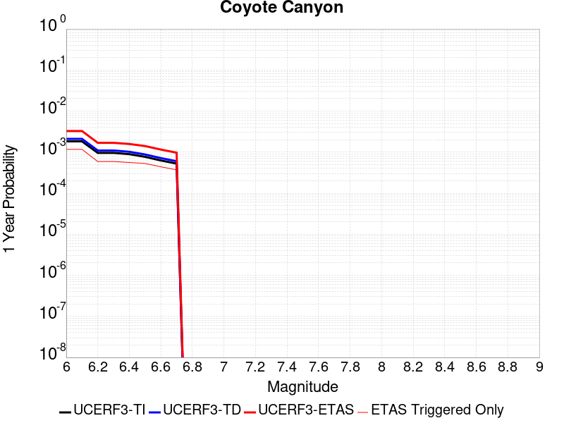 |  |

| Magnitude | 1 wk TI Prob | 1 wk TD Prob | 1 wk ETAS Prob | 1 wk ETAS/TD Gain | 1 wk ETAS Triggered Only | 1 mo TI Prob | 1 mo TD Prob | 1 mo ETAS Prob | 1 mo ETAS/TD Gain | 1 mo ETAS Triggered Only | 1 yr TI Prob | 1 yr TD Prob | 1 yr ETAS Prob | 1 yr ETAS/TD Gain | 1 yr ETAS Triggered Only | 10 yr TI Prob | 10 yr TD Prob | 10 yr ETAS Prob | 10 yr ETAS/TD Gain | 10 yr ETAS Triggered Only |
|-----|-----|-----|-----|-----|-----|-----|-----|-----|-----|-----|-----|-----|-----|-----|-----|-----|-----|-----|-----|-----|
| 6.0 | 3.5090034E-5 | 4.0364994E-5 | 2.1035814E-4 | 5.2114 | 1.7E-4 | 1.503772E-4 | 1.7298282E-4 | 5.3292053E-4 | 3.0807714 | 3.6E-4 | 0.0018293047 | 0.0021042887 | 0.0032718268 | 1.5548373 | 0.00117 | 0.018143194 | 0.020869553 | 0.023307588 | 1.1168226 | 0.00249 |
| 6.1 | 3.5090034E-5 | 4.0364994E-5 | 2.1035814E-4 | 5.2114 | 1.7E-4 | 1.503772E-4 | 1.7298282E-4 | 5.3292053E-4 | 3.0807714 | 3.6E-4 | 0.0018293047 | 0.0021042887 | 0.0032718268 | 1.5548373 | 0.00117 | 0.018143194 | 0.020869553 | 0.023307588 | 1.1168226 | 0.00249 |
| 6.2 | 1.841879E-5 | 2.106013E-5 | 1.2105802E-4 | 5.7482085 | 1.0E-4 | 7.8935285E-5 | 9.0255155E-5 | 2.4024161E-4 | 2.661805 | 1.5E-4 | 9.606133E-4 | 0.0010984046 | 0.0016877566 | 1.5365527 | 5.9E-4 | 0.0095647145 | 0.010939842 | 0.012275074 | 1.1220522 | 0.00135 |
| 6.3 | 1.841879E-5 | 2.106013E-5 | 1.2105802E-4 | 5.7482085 | 1.0E-4 | 7.8935285E-5 | 9.0255155E-5 | 2.4024161E-4 | 2.661805 | 1.5E-4 | 9.606133E-4 | 0.0010984046 | 0.0016877566 | 1.5365527 | 5.9E-4 | 0.0095647145 | 0.010939842 | 0.012275074 | 1.1220522 | 0.00135 |
| 6.4 | 1.712201E-5 | 1.9565525E-5 | 1.1956357E-4 | 6.110931 | 1.0E-4 | 7.337798E-5 | 8.3850115E-5 | 2.2383837E-4 | 2.6695058 | 1.4E-4 | 8.930107E-4 | 0.0010204976 | 0.0015799261 | 1.5481919 | 5.6E-4 | 0.008894307 | 0.010168033 | 0.011415221 | 1.1226578 | 0.00126 |
| 6.5 | 1.4744935E-5 | 1.6837239E-5 | 1.1683555E-4 | 6.939116 | 1.0E-4 | 6.3191044E-5 | 7.215813E-5 | 2.0214875E-4 | 2.8014688 | 1.3E-4 | 7.6907943E-4 | 8.782646E-4 | 0.0014077991 | 1.6029328 | 5.3E-4 | 0.007664232 | 0.008757133 | 0.009867325 | 1.1267757 | 0.00112 |
| 6.6 | 1.2017839E-5 | 1.3724307E-5 | 9.372321E-5 | 6.828994 | 8.0E-5 | 5.150401E-5 | 5.8817634E-5 | 1.6881117E-4 | 2.8700776 | 1.1E-4 | 6.268809E-4 | 7.1595795E-4 | 0.0011556429 | 1.6141212 | 4.4E-4 | 0.0062511545 | 0.007145207 | 0.008018919 | 1.1222795 | 8.8E-4 |
| 6.7 | 1.00956095E-5 | 1.1533701E-5 | 9.153278E-5 | 7.9361153 | 8.0E-5 | 4.326618E-5 | 4.94297E-5 | 1.5942426E-4 | 3.225273 | 1.1E-4 | 5.266384E-4 | 6.017274E-4 | 9.715047E-4 | 1.6145264 | 3.7E-4 | 0.005253921 | 0.006009508 | 0.006755001 | 1.1240523 | 7.5E-4 |

## Death Valley (So)
*[(top)](#table-of-contents)*

| 1 Week | 1 Month | 1 Year | 10 Year |
|-----|-----|-----|-----|
|  |  |  |  |

| Magnitude | 1 wk TI Prob | 1 wk TD Prob | 1 wk ETAS Prob | 1 wk ETAS/TD Gain | 1 wk ETAS Triggered Only | 1 mo TI Prob | 1 mo TD Prob | 1 mo ETAS Prob | 1 mo ETAS/TD Gain | 1 mo ETAS Triggered Only | 1 yr TI Prob | 1 yr TD Prob | 1 yr ETAS Prob | 1 yr ETAS/TD Gain | 1 yr ETAS Triggered Only | 10 yr TI Prob | 10 yr TD Prob | 10 yr ETAS Prob | 10 yr ETAS/TD Gain | 10 yr ETAS Triggered Only |
|-----|-----|-----|-----|-----|-----|-----|-----|-----|-----|-----|-----|-----|-----|-----|-----|-----|-----|-----|-----|-----|
| 6.0 | 2.0684236E-5 | 2.5618796E-5 | 1.05616746E-4 | 4.1226273 | 8.0E-5 | 8.864371E-5 | 1.09790315E-4 | 5.797387E-4 | 5.2804174 | 4.7E-4 | 0.0010787029 | 0.0013358943 | 0.0027739706 | 2.0764897 | 0.00144 | 0.010734817 | 0.013281985 | 0.015946124 | 1.2005829 | 0.0027 |
| 6.1 | 2.0684236E-5 | 2.5618796E-5 | 1.05616746E-4 | 4.1226273 | 8.0E-5 | 8.864371E-5 | 1.09790315E-4 | 5.797387E-4 | 5.2804174 | 4.7E-4 | 0.0010787029 | 0.0013358943 | 0.0027739706 | 2.0764897 | 0.00144 | 0.010734817 | 0.013281985 | 0.015946124 | 1.2005829 | 0.0027 |
| 6.2 | 2.0684236E-5 | 2.5618796E-5 | 1.05616746E-4 | 4.1226273 | 8.0E-5 | 8.864371E-5 | 1.09790315E-4 | 5.797387E-4 | 5.2804174 | 4.7E-4 | 0.0010787029 | 0.0013358943 | 0.0027739706 | 2.0764897 | 0.00144 | 0.010734817 | 0.013281985 | 0.015946124 | 1.2005829 | 0.0027 |
| 6.3 | 2.0240292E-5 | 2.5118874E-5 | 1.05116866E-4 | 4.1847763 | 8.0E-5 | 8.6741224E-5 | 1.0764797E-4 | 5.2760274E-4 | 4.9011865 | 4.2E-4 | 0.0010555626 | 0.0013098428 | 0.0026181268 | 1.99881 | 0.00131 | 0.010505628 | 0.013024541 | 0.01549198 | 1.1894454 | 0.0025 |
| 6.4 | 2.0240292E-5 | 2.5118874E-5 | 1.05116866E-4 | 4.1847763 | 8.0E-5 | 8.6741224E-5 | 1.0764797E-4 | 5.2760274E-4 | 4.9011865 | 4.2E-4 | 0.0010555626 | 0.0013098428 | 0.0026181268 | 1.99881 | 0.00131 | 0.010505628 | 0.013024541 | 0.01549198 | 1.1894454 | 0.0025 |
| 6.5 | 1.9962767E-5 | 2.4808121E-5 | 1.0480614E-4 | 4.2246704 | 8.0E-5 | 8.55519E-5 | 1.06316285E-4 | 5.2627164E-4 | 4.9500566 | 4.2E-4 | 0.0010410968 | 0.0012936488 | 0.00258198 | 1.9958894 | 0.00129 | 0.010362327 | 0.012864485 | 0.015273096 | 1.1872295 | 0.00244 |
| 6.6 | 1.8937297E-5 | 2.3311923E-5 | 9.331029E-5 | 4.002685 | 7.0E-5 | 8.115732E-5 | 9.99045E-5 | 4.7986655E-4 | 4.8032527 | 3.8E-4 | 9.876423E-4 | 0.001215673 | 0.0024042265 | 1.9776915 | 0.00119 | 0.009832645 | 0.012092971 | 0.01422685 | 1.1764562 | 0.00216 |
| 6.7 | 1.8621096E-5 | 2.2912554E-5 | 9.291095E-5 | 4.0550237 | 7.0E-5 | 7.980225E-5 | 9.819304E-5 | 4.681567E-4 | 4.767718 | 3.7E-4 | 9.711593E-4 | 0.0011948592 | 0.0023434851 | 1.9613065 | 0.00115 | 0.009669261 | 0.01188709 | 0.013962127 | 1.1745622 | 0.0021 |
| 6.8 | 1.7830353E-5 | 2.1806527E-5 | 9.1805E-5 | 4.209978 | 7.0E-5 | 7.641356E-5 | 9.345327E-5 | 4.5341963E-4 | 4.8518324 | 3.6E-4 | 9.29938E-4 | 0.0011372138 | 0.0022359628 | 1.9661764 | 0.0011 | 0.009260561 | 0.011317124 | 0.013334037 | 1.1782178 | 0.00204 |
| 6.9 | 1.3135183E-5 | 1.5304286E-5 | 6.5303524E-5 | 4.267009 | 5.0E-5 | 5.6292425E-5 | 6.558819E-5 | 3.2557113E-4 | 4.9638686 | 2.6E-4 | 6.8514474E-4 | 7.982501E-4 | 0.0015276674 | 1.9137704 | 7.3E-4 | 0.006830362 | 0.00795488 | 0.0092743 | 1.1658629 | 0.00133 |
| 7.0 | 1.1507512E-5 | 1.3154427E-5 | 4.3154032E-5 | 3.2805712 | 3.0E-5 | 4.9316975E-5 | 5.6374927E-5 | 2.663631E-4 | 4.72485 | 2.1E-4 | 6.002687E-4 | 6.8615435E-4 | 0.0012857426 | 1.8738388 | 6.0E-4 | 0.0059864987 | 0.006841209 | 0.007864162 | 1.1495281 | 0.00103 |
| 7.1 | 9.715903E-6 | 1.086544E-5 | 2.0865331E-5 | 1.9203392 | 1.0E-5 | 4.1638916E-5 | 4.6565365E-5 | 1.5656024E-4 | 3.3621607 | 1.1E-4 | 5.068359E-4 | 5.667901E-4 | 8.5662573E-4 | 1.5113633 | 2.9E-4 | 0.0050568148 | 0.0056537515 | 0.006180755 | 1.0932131 | 5.3E-4 |
| 7.2 | 9.233269E-6 | 1.0286451E-5 | 2.0286348E-5 | 1.9721426 | 1.0E-5 | 3.9570554E-5 | 4.4084067E-5 | 1.2408054E-4 | 2.8146346 | 8.0E-5 | 4.81665E-4 | 5.365956E-4 | 7.264936E-4 | 1.3538942 | 1.9E-4 | 0.0048062233 | 0.0053534303 | 0.0057313964 | 1.0706025 | 3.8E-4 |
| 7.3 | 8.8041315E-6 | 9.80829E-6 | 1.980819E-5 | 2.0195358 | 1.0E-5 | 3.7731446E-5 | 4.2034873E-5 | 1.2203151E-4 | 2.9031017 | 8.0E-5 | 4.592835E-4 | 5.116586E-4 | 6.7157677E-4 | 1.3125485 | 1.6E-4 | 0.0045833546 | 0.0051052324 | 0.005393752 | 1.0565145 | 2.9E-4 |
| 7.4 | 8.708749E-6 | 9.7073E-6 | 1.9707202E-5 | 2.0301425 | 1.0E-5 | 3.7322676E-5 | 4.1602074E-5 | 1.1159916E-4 | 2.6825385 | 7.0E-5 | 4.5430884E-4 | 5.0639175E-4 | 6.5631577E-4 | 1.2960633 | 1.5E-4 | 0.004533812 | 0.0050528045 | 0.0053214403 | 1.0531657 | 2.7E-4 |
| 7.5 | 8.612678E-6 | 9.604942E-6 | 1.9604846E-5 | 2.0411208 | 1.0E-5 | 3.6910955E-5 | 4.116341E-5 | 1.1116053E-4 | 2.7004695 | 7.0E-5 | 4.492982E-4 | 5.0105347E-4 | 6.509783E-4 | 1.2992193 | 1.5E-4 | 0.004483909 | 0.004999663 | 0.0052683135 | 1.0537336 | 2.7E-4 |
| 7.6 | 8.319024E-6 | 9.284037E-6 | 1.9283945E-5 | 2.0771077 | 1.0E-5 | 3.5652476E-5 | 3.978815E-5 | 9.9785764E-5 | 2.5079267 | 6.0E-5 | 4.3398244E-4 | 4.8431722E-4 | 6.1425427E-4 | 1.2682891 | 1.3E-4 | 0.0043313587 | 0.004833041 | 0.0050619296 | 1.0473591 | 2.3E-4 |
| 7.7 | 7.4718328E-6 | 8.34528E-6 | 1.8345196E-5 | 2.1982722 | 1.0E-5 | 3.2021748E-5 | 3.5765017E-5 | 8.5763226E-5 | 2.3979642 | 5.0E-5 | 3.8979502E-4 | 4.353561E-4 | 5.553039E-4 | 1.2755164 | 1.2E-4 | 0.00389112 | 0.0043454375 | 0.0045445682 | 1.0458252 | 2.0E-4 |
| 7.8 | 3.4586725E-7 | 3.648284E-7 | 3.648284E-7 | 1.0 | 0.0 | 1.4822873E-6 | 1.5635493E-6 | 1.5635493E-6 | 1.0 | 0.0 | 1.80467E-5 | 1.9036052E-5 | 1.9036052E-5 | 1.0 | 0.0 | 1.8045233E-4 | 1.9034464E-4 | 2.0034274E-4 | 1.0525262 | 1.0E-5 |
| 7.9 | 2.5591178E-9 | 2.6696847E-9 | 2.6696847E-9 | 1.0 | 0.0 | 1.0967647E-8 | 1.14415055E-8 | 1.14415055E-8 | 1.0 | 0.0 | 1.335311E-7 | 1.3930033E-7 | 1.3930033E-7 | 1.0 | 0.0 | 1.3353102E-6 | 1.3930033E-6 | 1.3930033E-6 | 1.0 | 0.0 |

## San Andreas (Mojave S)
*[(top)](#table-of-contents)*

| 1 Week | 1 Month | 1 Year | 10 Year |
|-----|-----|-----|-----|
|  |  |  |  |

| Magnitude | 1 wk TI Prob | 1 wk TD Prob | 1 wk ETAS Prob | 1 wk ETAS/TD Gain | 1 wk ETAS Triggered Only | 1 mo TI Prob | 1 mo TD Prob | 1 mo ETAS Prob | 1 mo ETAS/TD Gain | 1 mo ETAS Triggered Only | 1 yr TI Prob | 1 yr TD Prob | 1 yr ETAS Prob | 1 yr ETAS/TD Gain | 1 yr ETAS Triggered Only | 10 yr TI Prob | 10 yr TD Prob | 10 yr ETAS Prob | 10 yr ETAS/TD Gain | 10 yr ETAS Triggered Only |
|-----|-----|-----|-----|-----|-----|-----|-----|-----|-----|-----|-----|-----|-----|-----|-----|-----|-----|-----|-----|-----|
| 6.0 | 3.1064058E-4 | 6.7470357E-4 | 8.146091E-4 | 1.2073585 | 1.4E-4 | 0.0013306376 | 0.0028885107 | 0.00341698 | 1.1829555 | 5.3E-4 | 0.016080605 | 0.03456959 | 0.0359405 | 1.0396565 | 0.00142 | 0.1496549 | 0.28664356 | 0.28840554 | 1.006147 | 0.00247 |
| 6.1 | 3.1064058E-4 | 6.7470357E-4 | 8.146091E-4 | 1.2073585 | 1.4E-4 | 0.0013306376 | 0.0028885107 | 0.00341698 | 1.1829555 | 5.3E-4 | 0.016080605 | 0.03456959 | 0.0359405 | 1.0396565 | 0.00142 | 0.1496549 | 0.28664356 | 0.28840554 | 1.006147 | 0.00247 |
| 6.2 | 3.1064058E-4 | 6.7470357E-4 | 8.146091E-4 | 1.2073585 | 1.4E-4 | 0.0013306376 | 0.0028885107 | 0.00341698 | 1.1829555 | 5.3E-4 | 0.016080605 | 0.03456959 | 0.0359405 | 1.0396565 | 0.00142 | 0.1496549 | 0.28664356 | 0.28840554 | 1.006147 | 0.00247 |
| 6.3 | 3.1064058E-4 | 6.7470357E-4 | 8.146091E-4 | 1.2073585 | 1.4E-4 | 0.0013306376 | 0.0028885107 | 0.00341698 | 1.1829555 | 5.3E-4 | 0.016080605 | 0.03456959 | 0.0359405 | 1.0396565 | 0.00142 | 0.1496549 | 0.28664356 | 0.28840554 | 1.006147 | 0.00247 |
| 6.4 | 1.9872203E-4 | 4.3188373E-4 | 5.718233E-4 | 1.3240213 | 1.4E-4 | 8.5138786E-4 | 0.0018496455 | 0.0022888316 | 1.2374434 | 4.4E-4 | 0.010316478 | 0.022293042 | 0.023564061 | 1.0570141 | 0.0013 | 0.098504856 | 0.1970477 | 0.19885434 | 1.0091685 | 0.00225 |
| 6.5 | 1.291105E-4 | 2.8761258E-4 | 4.1757518E-4 | 1.4518669 | 1.3E-4 | 5.5321335E-4 | 0.0012320458 | 0.0016415407 | 1.3323698 | 4.1E-4 | 0.006714592 | 0.014897816 | 0.016079938 | 1.0793487 | 0.0012 | 0.065152965 | 0.13810901 | 0.13987589 | 1.0127933 | 0.00205 |
| 6.6 | 1.291105E-4 | 2.8761258E-4 | 4.1757518E-4 | 1.4518669 | 1.3E-4 | 5.5321335E-4 | 0.0012320458 | 0.0016415407 | 1.3323698 | 4.1E-4 | 0.006714592 | 0.014897816 | 0.016079938 | 1.0793487 | 0.0012 | 0.065152965 | 0.13810901 | 0.13987589 | 1.0127933 | 0.00205 |
| 6.7 | 1.08001186E-4 | 2.434239E-4 | 3.7339225E-4 | 1.5339178 | 1.3E-4 | 4.6278012E-4 | 0.0010428288 | 0.0014524012 | 1.3927513 | 4.1E-4 | 0.0056198016 | 0.012622827 | 0.013797806 | 1.0930836 | 0.00119 | 0.054797906 | 0.11922719 | 0.12095351 | 1.0144792 | 0.00196 |
| 6.8 | 1.0624356E-4 | 2.386004E-4 | 3.685694E-4 | 1.544714 | 1.3E-4 | 4.5525006E-4 | 0.001022173 | 0.0014317539 | 1.4006963 | 4.1E-4 | 0.0055285925 | 0.012374217 | 0.013549492 | 1.0949777 | 0.00119 | 0.053930566 | 0.117171526 | 0.11890187 | 1.0147676 | 0.00196 |
| 6.9 | 1.0393785E-4 | 2.3230362E-4 | 3.6227342E-4 | 1.5594825 | 1.3E-4 | 4.4537184E-4 | 9.952075E-4 | 0.0014047995 | 1.4115644 | 4.1E-4 | 0.0054089287 | 0.012049585 | 0.013205487 | 1.0959288 | 0.00117 | 0.05279156 | 0.11446291 | 0.11618085 | 1.0150087 | 0.00194 |
| 7.0 | 1.0155622E-4 | 2.2599899E-4 | 3.5596962E-4 | 1.5750939 | 1.3E-4 | 4.3516833E-4 | 9.6820795E-4 | 0.0013678207 | 1.4127344 | 4.0E-4 | 0.005285311 | 0.011724444 | 0.012870844 | 1.0977786 | 0.00116 | 0.05161361 | 0.111718945 | 0.113433324 | 1.0153455 | 0.00193 |
| 7.1 | 9.885595E-5 | 2.1888276E-4 | 3.4885432E-4 | 1.5937953 | 1.3E-4 | 4.2359953E-4 | 9.3773205E-4 | 0.001337357 | 1.426161 | 4.0E-4 | 0.0051451353 | 0.011357322 | 0.012504147 | 1.1009767 | 0.00116 | 0.05027629 | 0.108599454 | 0.11031985 | 1.0158417 | 0.00193 |
| 7.2 | 9.6411415E-5 | 2.1251228E-4 | 3.4248465E-4 | 1.6115993 | 1.3E-4 | 4.1312634E-4 | 9.1044937E-4 | 0.0013100852 | 1.4389435 | 4.0E-4 | 0.005018219 | 0.011028565 | 0.012175771 | 1.1040214 | 0.00116 | 0.049064007 | 0.10579045 | 0.107516274 | 1.0163137 | 0.00193 |
| 7.3 | 9.1180635E-5 | 1.9479384E-4 | 3.2476854E-4 | 1.6672422 | 1.3E-4 | 3.907156E-4 | 8.345638E-4 | 0.00123423 | 1.4788923 | 4.0E-4 | 0.004746591 | 0.0101135885 | 0.011261856 | 1.1135372 | 0.00116 | 0.046464786 | 0.09798442 | 0.099698246 | 1.0174909 | 0.0019 |
| 7.4 | 8.887388E-5 | 1.8727893E-4 | 3.0725647E-4 | 1.6406355 | 1.2E-4 | 3.8083247E-4 | 8.023772E-4 | 0.0011920643 | 1.4856657 | 3.9E-4 | 0.0046267817 | 0.009725283 | 0.010854196 | 1.1160803 | 0.00114 | 0.045316286 | 0.09461871 | 0.09632082 | 1.0179893 | 0.00188 |
| 7.5 | 8.6750515E-5 | 1.8059368E-4 | 3.0057202E-4 | 1.664355 | 1.2E-4 | 3.7173493E-4 | 7.7374344E-4 | 0.0011634417 | 1.503653 | 3.9E-4 | 0.004516484 | 0.009379722 | 0.010509029 | 1.1203988 | 0.00114 | 0.04425787 | 0.09158179 | 0.09328962 | 1.0186481 | 0.00188 |
| 7.6 | 8.453092E-5 | 1.7446908E-4 | 2.9444814E-4 | 1.687681 | 1.2E-4 | 3.6222505E-4 | 7.4751046E-4 | 0.0011372189 | 1.5213418 | 3.9E-4 | 0.0044011753 | 0.009063037 | 0.010192705 | 1.1246456 | 0.00114 | 0.04315024 | 0.08873938 | 0.09045255 | 1.0193056 | 0.00188 |
| 7.7 | 8.259102E-5 | 1.696895E-4 | 2.8966914E-4 | 1.7070539 | 1.2E-4 | 3.539135E-4 | 7.2703813E-4 | 0.0011167546 | 1.536033 | 3.9E-4 | 0.004300386 | 0.0088158315 | 0.009945782 | 1.1281728 | 0.00114 | 0.042181134 | 0.08648963 | 0.08820703 | 1.0198567 | 0.00188 |
| 7.8 | 7.444844E-5 | 1.5290489E-4 | 2.4289112E-4 | 1.5885112 | 9.0E-5 | 3.1902574E-4 | 6.551421E-4 | 0.0010049129 | 1.5338852 | 3.5E-4 | 0.0038772223 | 0.007947233 | 0.008929365 | 1.1235816 | 9.9E-4 | 0.03810269 | 0.07831895 | 0.07981208 | 1.0190647 | 0.00162 |
| 7.9 | 5.2586525E-5 | 1.00110345E-4 | 1.6010433E-4 | 1.5992787 | 6.0E-5 | 2.2535135E-4 | 4.2897378E-4 | 6.788665E-4 | 1.5825362 | 2.5E-4 | 0.0027402006 | 0.00521026 | 0.0058966647 | 1.131741 | 6.9E-4 | 0.027066574 | 0.052219756 | 0.053214923 | 1.0190573 | 0.00105 |
| 8.0 | 3.379877E-5 | 5.4098917E-5 | 6.409838E-5 | 1.1848366 | 1.0E-5 | 1.4484383E-4 | 2.3183192E-4 | 2.91818E-4 | 1.2587482 | 6.0E-5 | 0.0017620471 | 0.002818902 | 0.0029884228 | 1.0601372 | 1.7E-4 | 0.017481409 | 0.028847141 | 0.029109351 | 1.0090897 | 2.7E-4 |
| 8.1 | 1.8668277E-5 | 1.9319157E-5 | 2.9318964E-5 | 1.5176109 | 1.0E-5 | 8.000444E-5 | 8.279376E-5 | 1.0279211E-4 | 1.2415441 | 2.0E-5 | 9.736188E-4 | 0.0010075485 | 0.0010375184 | 1.0297452 | 3.0E-5 | 0.009693642 | 0.010804183 | 0.010843751 | 1.0036622 | 4.0E-5 |
| 8.2 | 8.541571E-6 | 5.4638394E-6 | 5.4638394E-6 | 1.0 | 0.0 | 3.660622E-5 | 2.3416243E-5 | 2.3416243E-5 | 1.0 | 0.0 | 4.455896E-4 | 2.8505555E-4 | 2.8505555E-4 | 1.0 | 0.0 | 0.0044469717 | 0.003242523 | 0.003242523 | 1.0 | 0.0 |
| 8.3 | 1.983087E-6 | 7.663413E-7 | 7.663413E-7 | 1.0 | 0.0 | 8.498917E-6 | 3.2843159E-6 | 3.2843159E-6 | 1.0 | 0.0 | 1.034694E-4 | 3.998583E-5 | 3.998583E-5 | 1.0 | 0.0 | 0.0010342124 | 4.7219908E-4 | 4.7219908E-4 | 1.0 | 0.0 |

## San Andreas (Mojave N)
*[(top)](#table-of-contents)*

| 1 Week | 1 Month | 1 Year | 10 Year |
|-----|-----|-----|-----|
|  |  |  | 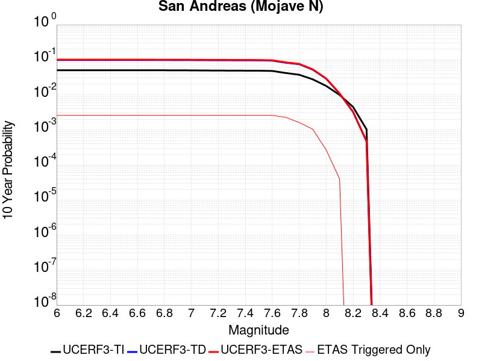 |

| Magnitude | 1 wk TI Prob | 1 wk TD Prob | 1 wk ETAS Prob | 1 wk ETAS/TD Gain | 1 wk ETAS Triggered Only | 1 mo TI Prob | 1 mo TD Prob | 1 mo ETAS Prob | 1 mo ETAS/TD Gain | 1 mo ETAS Triggered Only | 1 yr TI Prob | 1 yr TD Prob | 1 yr ETAS Prob | 1 yr ETAS/TD Gain | 1 yr ETAS Triggered Only | 10 yr TI Prob | 10 yr TD Prob | 10 yr ETAS Prob | 10 yr ETAS/TD Gain | 10 yr ETAS Triggered Only |
|-----|-----|-----|-----|-----|-----|-----|-----|-----|-----|-----|-----|-----|-----|-----|-----|-----|-----|-----|-----|-----|
| 6.0 | 9.877682E-5 | 1.940927E-4 | 3.640597E-4 | 1.8757001 | 1.7E-4 | 4.2326056E-4 | 8.315609E-4 | 0.0014110786 | 1.6969035 | 5.8E-4 | 0.0051410277 | 0.010077382 | 0.0116513595 | 1.1561891 | 0.00159 | 0.05023708 | 0.0983447 | 0.100679986 | 1.0237459 | 0.00259 |
| 6.1 | 9.877682E-5 | 1.940927E-4 | 3.640597E-4 | 1.8757001 | 1.7E-4 | 4.2326056E-4 | 8.315609E-4 | 0.0014110786 | 1.6969035 | 5.8E-4 | 0.0051410277 | 0.010077382 | 0.0116513595 | 1.1561891 | 0.00159 | 0.05023708 | 0.0983447 | 0.100679986 | 1.0237459 | 0.00259 |
| 6.2 | 9.877682E-5 | 1.940927E-4 | 3.640597E-4 | 1.8757001 | 1.7E-4 | 4.2326056E-4 | 8.315609E-4 | 0.0014110786 | 1.6969035 | 5.8E-4 | 0.0051410277 | 0.010077382 | 0.0116513595 | 1.1561891 | 0.00159 | 0.05023708 | 0.0983447 | 0.100679986 | 1.0237459 | 0.00259 |
| 6.3 | 9.877682E-5 | 1.940927E-4 | 3.640597E-4 | 1.8757001 | 1.7E-4 | 4.2326056E-4 | 8.315609E-4 | 0.0014110786 | 1.6969035 | 5.8E-4 | 0.0051410277 | 0.010077382 | 0.0116513595 | 1.1561891 | 0.00159 | 0.05023708 | 0.0983447 | 0.100679986 | 1.0237459 | 0.00259 |
| 6.4 | 9.877682E-5 | 1.940927E-4 | 3.640597E-4 | 1.8757001 | 1.7E-4 | 4.2326056E-4 | 8.315609E-4 | 0.0014110786 | 1.6969035 | 5.8E-4 | 0.0051410277 | 0.010077382 | 0.0116513595 | 1.1561891 | 0.00159 | 0.05023708 | 0.0983447 | 0.100679986 | 1.0237459 | 0.00259 |
| 6.5 | 9.861474E-5 | 1.9383035E-4 | 3.637974E-4 | 1.8768857 | 1.7E-4 | 4.2256617E-4 | 8.3043723E-4 | 0.0014099556 | 1.6978472 | 5.8E-4 | 0.0051326132 | 0.010063829 | 0.011637827 | 1.1564015 | 0.00159 | 0.050156746 | 0.09822224 | 0.10055785 | 1.0237788 | 0.00259 |
| 6.6 | 9.861474E-5 | 1.9383035E-4 | 3.637974E-4 | 1.8768857 | 1.7E-4 | 4.2256617E-4 | 8.3043723E-4 | 0.0014099556 | 1.6978472 | 5.8E-4 | 0.0051326132 | 0.010063829 | 0.011637827 | 1.1564015 | 0.00159 | 0.050156746 | 0.09822224 | 0.10055785 | 1.0237788 | 0.00259 |
| 6.7 | 9.8552715E-5 | 1.9372987E-4 | 3.6369695E-4 | 1.8773406 | 1.7E-4 | 4.223004E-4 | 8.300069E-4 | 0.0014095255 | 1.6982094 | 5.8E-4 | 0.0051293927 | 0.010058638 | 0.011632645 | 1.156483 | 0.00159 | 0.050125998 | 0.09817545 | 0.10051118 | 1.0237913 | 0.00259 |
| 6.8 | 9.8464974E-5 | 1.9358145E-4 | 3.6354855E-4 | 1.8780133 | 1.7E-4 | 4.219245E-4 | 8.293712E-4 | 0.0014088901 | 1.698745 | 5.8E-4 | 0.0051248376 | 0.01005097 | 0.011624989 | 1.1566037 | 0.00159 | 0.05008251 | 0.0981058 | 0.10044171 | 1.02381 | 0.00259 |
| 6.9 | 9.825824E-5 | 1.932615E-4 | 3.6322864E-4 | 1.8794671 | 1.7E-4 | 4.2103877E-4 | 8.280009E-4 | 0.0014075206 | 1.6999024 | 5.8E-4 | 0.0051141046 | 0.01003444 | 0.011608485 | 1.1568643 | 0.00159 | 0.049980022 | 0.097954854 | 0.100291155 | 1.0238508 | 0.00259 |
| 7.0 | 9.781462E-5 | 1.9257508E-4 | 3.6254234E-4 | 1.8826026 | 1.7E-4 | 4.1913814E-4 | 8.2506094E-4 | 0.0014045824 | 1.7023984 | 5.8E-4 | 0.005091073 | 0.009998974 | 0.011573076 | 1.1574264 | 0.00159 | 0.04976007 | 0.097630985 | 0.09996812 | 1.0239384 | 0.00259 |
| 7.1 | 9.7121134E-5 | 1.9159209E-4 | 3.6155953E-4 | 1.8871318 | 1.7E-4 | 4.1616702E-4 | 8.208508E-4 | 0.0014003747 | 1.706004 | 5.8E-4 | 0.005055068 | 0.009948186 | 0.011522368 | 1.1582382 | 0.00159 | 0.04941613 | 0.09716737 | 0.09950571 | 1.024065 | 0.00259 |
| 7.2 | 9.663819E-5 | 1.9089985E-4 | 3.6086742E-4 | 1.8903493 | 1.7E-4 | 4.1409794E-4 | 8.178859E-4 | 0.0013974116 | 1.7085654 | 5.8E-4 | 0.0050299936 | 0.009912417 | 0.011486657 | 1.1588149 | 0.00159 | 0.049176537 | 0.09684046 | 0.09917965 | 1.024155 | 0.00259 |
| 7.3 | 9.6277574E-5 | 1.9042486E-4 | 3.603925E-4 | 1.8925705 | 1.7E-4 | 4.125529E-4 | 8.158515E-4 | 0.0013953783 | 1.7103337 | 5.8E-4 | 0.0050112694 | 0.009887874 | 0.011462152 | 1.1592131 | 0.00159 | 0.04899759 | 0.096613824 | 0.09895359 | 1.0242177 | 0.00259 |
| 7.4 | 9.593308E-5 | 1.8982247E-4 | 3.597902E-4 | 1.8954036 | 1.7E-4 | 4.1107697E-4 | 8.132714E-4 | 0.0013927997 | 1.712589 | 5.8E-4 | 0.0049933824 | 0.009856746 | 0.011431074 | 1.1597209 | 0.00159 | 0.04882661 | 0.09633211 | 0.09867261 | 1.0242962 | 0.00259 |
| 7.5 | 9.561707E-5 | 1.8928314E-4 | 3.5925096E-4 | 1.8979554 | 1.7E-4 | 4.0972308E-4 | 8.109614E-4 | 0.001390491 | 1.7146205 | 5.8E-4 | 0.0049769743 | 0.009828876 | 0.011403248 | 1.1601782 | 0.00159 | 0.048669744 | 0.0960785 | 0.09841966 | 1.0243671 | 0.00259 |
| 7.6 | 9.418194E-5 | 1.8580547E-4 | 3.557739E-4 | 1.9147654 | 1.7E-4 | 4.0357444E-4 | 7.960663E-4 | 0.0013756047 | 1.7280025 | 5.8E-4 | 0.004902454 | 0.009649148 | 0.011223806 | 1.1631914 | 0.00159 | 0.047957025 | 0.09445956 | 0.09680492 | 1.0248291 | 0.00259 |
| 7.7 | 8.202141E-5 | 1.60289E-4 | 3.2026335E-4 | 1.998037 | 1.6E-4 | 3.51473E-4 | 6.8677205E-4 | 0.0011864286 | 1.7275436 | 5.0E-4 | 0.00427079 | 0.00832945 | 0.009688038 | 1.1631067 | 0.00137 | 0.04189639 | 0.0822623 | 0.08435474 | 1.0254362 | 0.00228 |
| 7.8 | 7.2859846E-5 | 1.452327E-4 | 2.3521963E-4 | 1.6196052 | 9.0E-5 | 3.1221908E-4 | 6.2227744E-4 | 9.720596E-4 | 1.5621 | 3.5E-4 | 0.003794643 | 0.007549951 | 0.008532477 | 1.1301367 | 9.9E-4 | 0.037304975 | 0.07475278 | 0.07625168 | 1.0200515 | 0.00162 |
| 7.9 | 5.3874453E-5 | 1.0050314E-4 | 1.604971E-4 | 1.5969363 | 6.0E-5 | 2.3087008E-4 | 4.3065663E-4 | 6.8054895E-4 | 1.5802588 | 2.5E-4 | 0.0028072202 | 0.0052306503 | 0.005917041 | 1.1312248 | 6.9E-4 | 0.02772022 | 0.052444294 | 0.05343923 | 1.0189712 | 0.00105 |
| 8.0 | 3.468538E-5 | 5.428511E-5 | 6.428457E-5 | 1.1842026 | 1.0E-5 | 1.4864317E-4 | 2.3262974E-4 | 2.9261576E-4 | 1.2578605 | 6.0E-5 | 0.0018082283 | 0.0028285903 | 0.0029981094 | 1.0599306 | 1.7E-4 | 0.017935853 | 0.028959801 | 0.029221984 | 1.0090532 | 2.7E-4 |
| 8.1 | 1.9152367E-5 | 1.9412422E-5 | 2.9412227E-5 | 1.5151241 | 1.0E-5 | 8.207899E-5 | 8.3193445E-5 | 1.0319178E-4 | 1.2403835 | 2.0E-5 | 9.988535E-4 | 0.0010124102 | 0.0010423798 | 1.0296023 | 3.0E-5 | 0.009943757 | 0.010861586 | 0.010901151 | 1.0036427 | 4.0E-5 |
| 8.2 | 8.643924E-6 | 5.4778857E-6 | 5.4778857E-6 | 1.0 | 0.0 | 3.704486E-5 | 2.3476441E-5 | 2.3476441E-5 | 1.0 | 0.0 | 4.5092785E-4 | 2.8578826E-4 | 2.8578826E-4 | 1.0 | 0.0 | 0.0045001395 | 0.0032504273 | 0.0032504273 | 1.0 | 0.0 |
| 8.3 | 1.983087E-6 | 7.663413E-7 | 7.663413E-7 | 1.0 | 0.0 | 8.498917E-6 | 3.2843159E-6 | 3.2843159E-6 | 1.0 | 0.0 | 1.034694E-4 | 3.998583E-5 | 3.998583E-5 | 1.0 | 0.0 | 0.0010342124 | 4.7219908E-4 | 4.7219908E-4 | 1.0 | 0.0 |

## Nelson Lake
*[(top)](#table-of-contents)*

| 1 Week | 1 Month | 1 Year | 10 Year |
|-----|-----|-----|-----|
| 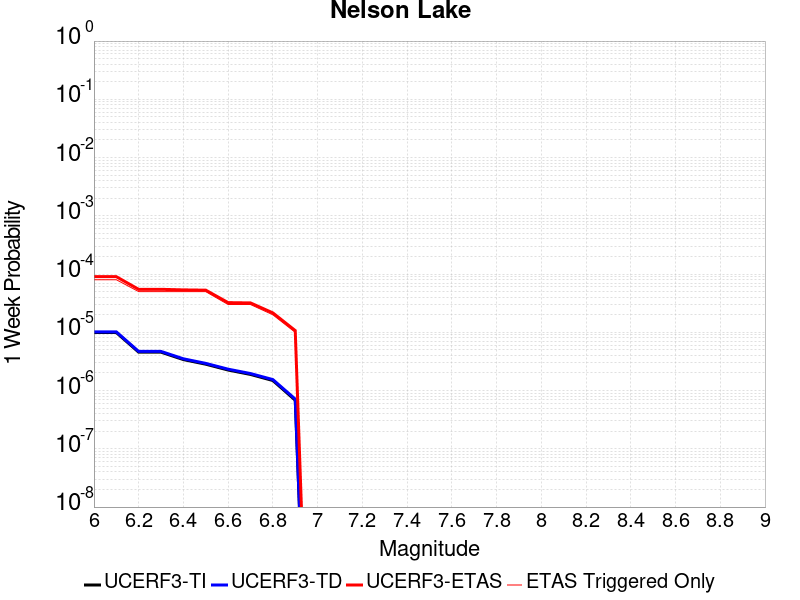 | 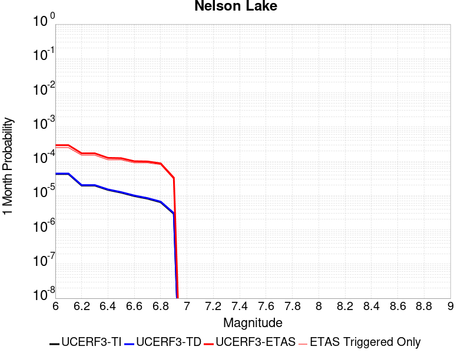 | 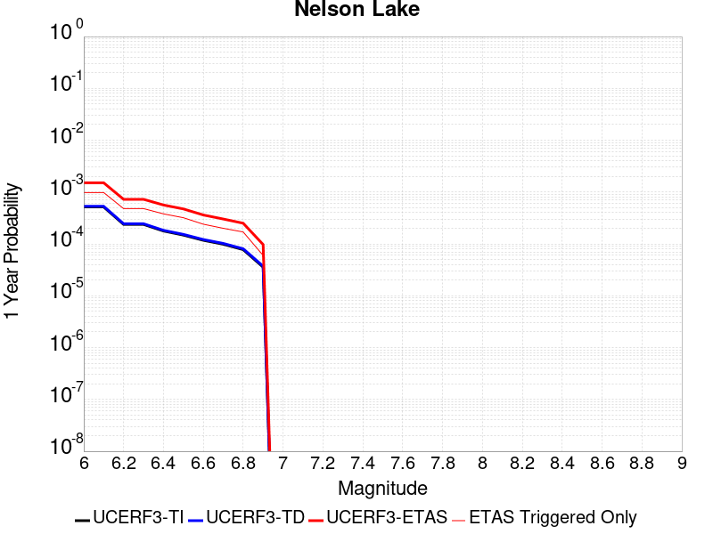 |  |

| Magnitude | 1 wk TI Prob | 1 wk TD Prob | 1 wk ETAS Prob | 1 wk ETAS/TD Gain | 1 wk ETAS Triggered Only | 1 mo TI Prob | 1 mo TD Prob | 1 mo ETAS Prob | 1 mo ETAS/TD Gain | 1 mo ETAS Triggered Only | 1 yr TI Prob | 1 yr TD Prob | 1 yr ETAS Prob | 1 yr ETAS/TD Gain | 1 yr ETAS Triggered Only | 10 yr TI Prob | 10 yr TD Prob | 10 yr ETAS Prob | 10 yr ETAS/TD Gain | 10 yr ETAS Triggered Only |
|-----|-----|-----|-----|-----|-----|-----|-----|-----|-----|-----|-----|-----|-----|-----|-----|-----|-----|-----|-----|-----|
| 6.0 | 9.913453E-6 | 1.0192288E-5 | 9.0191475E-5 | 8.848992 | 8.0E-5 | 4.2485535E-5 | 4.368056E-5 | 2.9366964E-4 | 6.72312 | 2.5E-4 | 5.1713863E-4 | 5.3169136E-4 | 0.0015111703 | 2.8421946 | 9.8E-4 | 0.0051593683 | 0.005305221 | 0.007473655 | 1.408736 | 0.00218 |
| 6.1 | 9.913453E-6 | 1.0192288E-5 | 9.0191475E-5 | 8.848992 | 8.0E-5 | 4.2485535E-5 | 4.368056E-5 | 2.9366964E-4 | 6.72312 | 2.5E-4 | 5.1713863E-4 | 5.3169136E-4 | 0.0015111703 | 2.8421946 | 9.8E-4 | 0.0051593683 | 0.005305221 | 0.007473655 | 1.408736 | 0.00218 |
| 6.2 | 4.5596407E-6 | 4.6963287E-6 | 5.4696095E-5 | 11.646564 | 5.0E-5 | 1.954117E-5 | 2.0126976E-5 | 1.7012395E-4 | 8.452535 | 1.5E-4 | 2.3788778E-4 | 2.4501965E-4 | 7.24902E-4 | 2.9585466 | 4.8E-4 | 0.0023763329 | 0.002447621 | 0.0036047818 | 1.4727696 | 0.00116 |
| 6.3 | 4.5596407E-6 | 4.6963287E-6 | 5.4696095E-5 | 11.646564 | 5.0E-5 | 1.954117E-5 | 2.0126976E-5 | 1.7012395E-4 | 8.452535 | 1.5E-4 | 2.3788778E-4 | 2.4501965E-4 | 7.24902E-4 | 2.9585466 | 4.8E-4 | 0.0023763329 | 0.002447621 | 0.0036047818 | 1.4727696 | 0.00116 |
| 6.4 | 3.4025713E-6 | 3.5099097E-6 | 5.3509735E-5 | 15.245331 | 5.0E-5 | 1.4582367E-5 | 1.50423875E-5 | 1.2504074E-4 | 8.312559 | 1.1E-4 | 1.7752586E-4 | 1.8312653E-4 | 5.630569E-4 | 3.0746882 | 3.8E-4 | 0.001773841 | 0.0018298391 | 0.002698247 | 1.4745816 | 8.7E-4 |
| 6.5 | 2.8352947E-6 | 2.9278667E-6 | 5.292772E-5 | 18.07723 | 5.0E-5 | 1.2151207E-5 | 1.2547945E-5 | 1.2254657E-4 | 9.766266 | 1.1E-4 | 1.479309E-4 | 1.5276126E-4 | 4.727124E-4 | 3.094452 | 3.2E-4 | 0.0014783246 | 0.0015266364 | 0.0022455372 | 1.4709051 | 7.2E-4 |
| 6.6 | 2.251518E-6 | 2.3290766E-6 | 3.2329008E-5 | 13.880611 | 3.0E-5 | 9.649328E-6 | 9.981722E-6 | 9.9980825E-5 | 10.01639 | 9.0E-5 | 1.1747423E-4 | 1.2152132E-4 | 3.6149216E-4 | 2.9747221 | 2.4E-4 | 0.0011741214 | 0.0012146104 | 0.001793906 | 1.4769393 | 5.8E-4 |
| 6.7 | 1.8911853E-6 | 1.9591475E-6 | 3.1959087E-5 | 16.312752 | 3.0E-5 | 8.105055E-6 | 8.396323E-6 | 9.839557E-5 | 11.718888 | 9.0E-5 | 9.867457E-5 | 1.0222102E-4 | 3.0220058E-4 | 2.9563446 | 2.0E-4 | 9.863076E-4 | 0.0010217975 | 0.0014913173 | 1.4595037 | 4.7E-4 |
| 6.8 | 1.4874814E-6 | 1.543837E-6 | 2.1543807E-5 | 13.954715 | 2.0E-5 | 6.374905E-6 | 6.6164307E-6 | 8.66159E-5 | 13.091031 | 8.0E-5 | 7.76117E-5 | 8.0552585E-5 | 2.505389E-4 | 3.1102526 | 1.7E-4 | 7.75846E-4 | 8.0528494E-4 | 0.0011949709 | 1.4839106 | 3.9E-4 |
| 6.9 | 6.835972E-7 | 7.1399637E-7 | 1.07139895E-5 | 15.005663 | 1.0E-5 | 2.9296991E-6 | 3.0599826E-6 | 3.3059892E-5 | 10.803947 | 3.0E-5 | 3.56685E-5 | 3.725497E-5 | 9.7252734E-5 | 2.6104634 | 6.0E-5 | 3.5662777E-4 | 3.7251852E-4 | 5.2246265E-4 | 1.4025146 | 1.5E-4 |

## Towne Pass
*[(top)](#table-of-contents)*

| 1 Week | 1 Month | 1 Year | 10 Year |
|-----|-----|-----|-----|
| 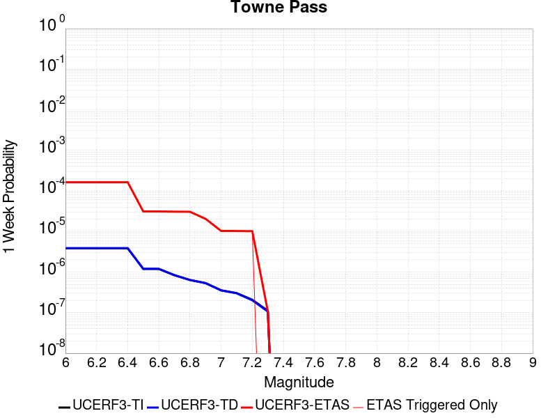 | 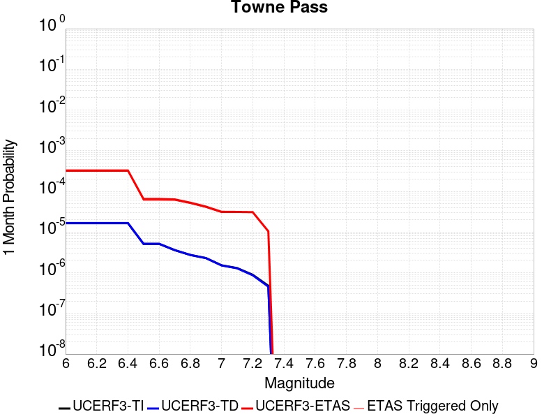 |  |  |

| Magnitude | 1 wk TI Prob | 1 wk TD Prob | 1 wk ETAS Prob | 1 wk ETAS/TD Gain | 1 wk ETAS Triggered Only | 1 mo TI Prob | 1 mo TD Prob | 1 mo ETAS Prob | 1 mo ETAS/TD Gain | 1 mo ETAS Triggered Only | 1 yr TI Prob | 1 yr TD Prob | 1 yr ETAS Prob | 1 yr ETAS/TD Gain | 1 yr ETAS Triggered Only | 10 yr TI Prob | 10 yr TD Prob | 10 yr ETAS Prob | 10 yr ETAS/TD Gain | 10 yr ETAS Triggered Only |
|-----|-----|-----|-----|-----|-----|-----|-----|-----|-----|-----|-----|-----|-----|-----|-----|-----|-----|-----|-----|-----|
| 6.0 | 3.849728E-6 | 3.8945486E-6 | 1.6389393E-4 | 42.082905 | 1.6E-4 | 1.649873E-5 | 1.6690841E-5 | 3.2668567E-4 | 19.572752 | 3.1E-4 | 2.0085352E-4 | 2.0319641E-4 | 0.0012129912 | 5.96955 | 0.00101 | 0.0020067208 | 0.0020305351 | 0.0038967382 | 1.9190694 | 0.00187 |
| 6.1 | 3.849728E-6 | 3.8945486E-6 | 1.6389393E-4 | 42.082905 | 1.6E-4 | 1.649873E-5 | 1.6690841E-5 | 3.2668567E-4 | 19.572752 | 3.1E-4 | 2.0085352E-4 | 2.0319641E-4 | 0.0012129912 | 5.96955 | 0.00101 | 0.0020067208 | 0.0020305351 | 0.0038967382 | 1.9190694 | 0.00187 |
| 6.2 | 3.849728E-6 | 3.8945486E-6 | 1.6389393E-4 | 42.082905 | 1.6E-4 | 1.649873E-5 | 1.6690841E-5 | 3.2668567E-4 | 19.572752 | 3.1E-4 | 2.0085352E-4 | 2.0319641E-4 | 0.0012129912 | 5.96955 | 0.00101 | 0.0020067208 | 0.0020305351 | 0.0038967382 | 1.9190694 | 0.00187 |
| 6.3 | 3.849728E-6 | 3.8945486E-6 | 1.6389393E-4 | 42.082905 | 1.6E-4 | 1.649873E-5 | 1.6690841E-5 | 3.2668567E-4 | 19.572752 | 3.1E-4 | 2.0085352E-4 | 2.0319641E-4 | 0.0012129912 | 5.96955 | 0.00101 | 0.0020067208 | 0.0020305351 | 0.0038967382 | 1.9190694 | 0.00187 |
| 6.4 | 3.849728E-6 | 3.8945486E-6 | 1.6389393E-4 | 42.082905 | 1.6E-4 | 1.649873E-5 | 1.6690841E-5 | 3.2668567E-4 | 19.572752 | 3.1E-4 | 2.0085352E-4 | 2.0319641E-4 | 0.0012129912 | 5.96955 | 0.00101 | 0.0020067208 | 0.0020305351 | 0.0038967382 | 1.9190694 | 0.00187 |
| 6.5 | 1.1953545E-6 | 1.203055E-6 | 3.120302E-5 | 25.936485 | 3.0E-5 | 5.1229376E-6 | 5.155941E-6 | 6.515563E-5 | 12.637002 | 6.0E-5 | 6.236998E-5 | 6.277189E-5 | 1.9276373E-4 | 3.0708606 | 1.3E-4 | 6.235248E-4 | 6.275533E-4 | 9.2736504E-4 | 1.4777471 | 3.0E-4 |
| 6.6 | 1.1953545E-6 | 1.203055E-6 | 3.120302E-5 | 25.936485 | 3.0E-5 | 5.1229376E-6 | 5.155941E-6 | 6.515563E-5 | 12.637002 | 6.0E-5 | 6.236998E-5 | 6.277189E-5 | 1.9276373E-4 | 3.0708606 | 1.3E-4 | 6.235248E-4 | 6.275533E-4 | 9.2736504E-4 | 1.4777471 | 3.0E-4 |
| 6.7 | 8.375951E-7 | 8.410696E-7 | 3.0841045E-5 | 36.66884 | 3.0E-5 | 3.5896885E-6 | 3.6045794E-6 | 6.360436E-5 | 17.645433 | 6.0E-5 | 4.370358E-5 | 4.3884927E-5 | 1.4388053E-4 | 3.2785866 | 1.0E-4 | 4.3694986E-4 | 4.3876833E-4 | 6.0869375E-4 | 1.3872782 | 1.7E-4 |
| 6.8 | 6.38041E-7 | 6.3921794E-7 | 3.06392E-5 | 47.93232 | 3.0E-5 | 2.7344586E-6 | 2.7395029E-6 | 5.2739364E-5 | 19.251436 | 5.0E-5 | 3.3291526E-5 | 3.3352975E-5 | 1.2334998E-4 | 3.69832 | 9.0E-5 | 3.3286537E-4 | 3.334835E-4 | 4.734368E-4 | 1.4196708 | 1.4E-4 |
| 6.9 | 5.3460053E-7 | 5.3453545E-7 | 2.0534524E-5 | 38.415646 | 2.0E-5 | 2.2911431E-6 | 2.2908646E-6 | 4.2290772E-5 | 18.460617 | 4.0E-5 | 2.789431E-5 | 2.7890952E-5 | 1.0788872E-4 | 3.8682337 | 8.0E-5 | 2.789081E-4 | 2.7887782E-4 | 4.088416E-4 | 1.4660239 | 1.3E-4 |
| 7.0 | 3.557783E-7 | 3.5324413E-7 | 1.035324E-5 | 29.309023 | 1.0E-5 | 1.5247632E-6 | 1.5139027E-6 | 3.1513857E-5 | 20.816303 | 3.0E-5 | 1.8563835E-5 | 1.8431618E-5 | 6.8430694E-5 | 3.7126799 | 5.0E-5 | 1.8562283E-4 | 1.8430172E-4 | 2.4429068E-4 | 1.3254931 | 6.0E-5 |
| 7.1 | 3.037942E-7 | 3.000239E-7 | 1.0300021E-5 | 34.330666 | 1.0E-5 | 1.3019744E-6 | 1.2858162E-6 | 3.1285777E-5 | 24.331453 | 3.0E-5 | 1.5851423E-5 | 1.5654708E-5 | 5.565408E-5 | 3.5551019 | 4.0E-5 | 1.5850292E-4 | 1.565368E-4 | 2.0652897E-4 | 1.3193637 | 5.0E-5 |
| 7.2 | 2.0808248E-7 | 2.0217828E-7 | 1.0202176E-5 | 50.461285 | 1.0E-5 | 8.917818E-7 | 8.664781E-7 | 3.0866453E-5 | 35.622887 | 3.0E-5 | 1.0857389E-5 | 1.05493245E-5 | 4.0549006E-5 | 3.843754 | 3.0E-5 | 1.0856859E-4 | 1.054887E-4 | 1.4548448E-4 | 1.3791475 | 4.0E-5 |
| 7.3 | 1.1162073E-7 | 1.0636953E-7 | 1.0636953E-7 | 1.0 | 0.0 | 4.7837443E-7 | 4.5586933E-7 | 1.0455865E-5 | 22.9361 | 1.0E-5 | 5.8241935E-6 | 5.550197E-6 | 1.5550142E-5 | 2.8017278 | 1.0E-5 | 5.8240406E-5 | 5.5500783E-5 | 7.549967E-5 | 1.3603352 | 2.0E-5 |

## Lenwood-Lockhart-Old Woman Springs
*[(top)](#table-of-contents)*

| 1 Week | 1 Month | 1 Year | 10 Year |
|-----|-----|-----|-----|
|  |  |  |  |

| Magnitude | 1 wk TI Prob | 1 wk TD Prob | 1 wk ETAS Prob | 1 wk ETAS/TD Gain | 1 wk ETAS Triggered Only | 1 mo TI Prob | 1 mo TD Prob | 1 mo ETAS Prob | 1 mo ETAS/TD Gain | 1 mo ETAS Triggered Only | 1 yr TI Prob | 1 yr TD Prob | 1 yr ETAS Prob | 1 yr ETAS/TD Gain | 1 yr ETAS Triggered Only | 10 yr TI Prob | 10 yr TD Prob | 10 yr ETAS Prob | 10 yr ETAS/TD Gain | 10 yr ETAS Triggered Only |
|-----|-----|-----|-----|-----|-----|-----|-----|-----|-----|-----|-----|-----|-----|-----|-----|-----|-----|-----|-----|-----|
| 6.0 | 3.744542E-5 | 4.3963806E-5 | 2.239559E-4 | 5.094097 | 1.8E-4 | 1.604705E-4 | 1.8840368E-4 | 6.0832454E-4 | 3.2288358 | 4.2E-4 | 0.0019519776 | 0.002291574 | 0.0032393967 | 1.4136122 | 9.5E-4 | 0.019349206 | 0.022697445 | 0.02435886 | 1.0731983 | 0.0017 |
| 6.1 | 3.744542E-5 | 4.3963806E-5 | 2.239559E-4 | 5.094097 | 1.8E-4 | 1.604705E-4 | 1.8840368E-4 | 6.0832454E-4 | 3.2288358 | 4.2E-4 | 0.0019519776 | 0.002291574 | 0.0032393967 | 1.4136122 | 9.5E-4 | 0.019349206 | 0.022697445 | 0.02435886 | 1.0731983 | 0.0017 |
| 6.2 | 3.744542E-5 | 4.3963806E-5 | 2.239559E-4 | 5.094097 | 1.8E-4 | 1.604705E-4 | 1.8840368E-4 | 6.0832454E-4 | 3.2288358 | 4.2E-4 | 0.0019519776 | 0.002291574 | 0.0032393967 | 1.4136122 | 9.5E-4 | 0.019349206 | 0.022697445 | 0.02435886 | 1.0731983 | 0.0017 |
| 6.3 | 2.1079984E-5 | 2.5354468E-5 | 9.535269E-5 | 3.7607846 | 7.0E-5 | 9.0339665E-5 | 1.0865759E-4 | 3.2863367E-4 | 3.024489 | 2.2E-4 | 0.0010993304 | 0.0013221233 | 0.0017116077 | 1.29459 | 3.9E-4 | 0.010939079 | 0.01314479 | 0.013805983 | 1.0503007 | 6.7E-4 |
| 6.4 | 2.1079984E-5 | 2.5354468E-5 | 9.535269E-5 | 3.7607846 | 7.0E-5 | 9.0339665E-5 | 1.0865759E-4 | 3.2863367E-4 | 3.024489 | 2.2E-4 | 0.0010993304 | 0.0013221233 | 0.0017116077 | 1.29459 | 3.9E-4 | 0.010939079 | 0.01314479 | 0.013805983 | 1.0503007 | 6.7E-4 |
| 6.5 | 1.7397282E-5 | 2.0663347E-5 | 6.066252E-5 | 2.9357548 | 4.0E-5 | 7.455765E-5 | 8.855426E-5 | 2.585392E-4 | 2.9195569 | 1.7E-4 | 9.073613E-4 | 0.0010776266 | 0.0013573249 | 1.2595502 | 2.8E-4 | 0.009036654 | 0.0107253045 | 0.011190264 | 1.0433517 | 4.7E-4 |
| 6.6 | 1.52050325E-5 | 1.7680139E-5 | 5.767943E-5 | 3.2623858 | 4.0E-5 | 6.51628E-5 | 7.5769865E-5 | 2.257585E-4 | 2.979529 | 1.5E-4 | 7.9306826E-4 | 9.221155E-4 | 0.0011618942 | 1.2600311 | 2.4E-4 | 0.007902439 | 0.009183756 | 0.009580082 | 1.0431552 | 4.0E-4 |
| 6.7 | 1.332523E-5 | 1.5264424E-5 | 5.5263812E-5 | 3.6204324 | 4.0E-5 | 5.7106878E-5 | 6.541736E-5 | 1.9540885E-4 | 2.9871104 | 1.3E-4 | 6.950544E-4 | 7.961711E-4 | 0.001015996 | 1.2761025 | 2.2E-4 | 0.006928845 | 0.007933817 | 0.00828104 | 1.043765 | 3.5E-4 |
| 6.8 | 1.1525329E-5 | 1.3031401E-5 | 3.303114E-5 | 2.5347345 | 2.0E-5 | 4.9393333E-5 | 5.584769E-5 | 1.558421E-4 | 2.7904844 | 1.0E-4 | 6.011979E-4 | 6.797378E-4 | 8.39629E-4 | 1.2352248 | 1.6E-4 | 0.00599574 | 0.006777038 | 0.0070154113 | 1.0351737 | 2.4E-4 |
| 6.9 | 1.0253909E-5 | 1.1514865E-5 | 3.1514635E-5 | 2.7368653 | 2.0E-5 | 4.3944583E-5 | 4.934851E-5 | 1.3934406E-4 | 2.8236732 | 9.0E-5 | 5.3489394E-4 | 6.006561E-4 | 7.40572E-4 | 1.2329384 | 1.4E-4 | 0.0053360825 | 0.0059907055 | 0.0062093874 | 1.0365036 | 2.2E-4 |
| 7.0 | 8.104563E-6 | 8.991452E-6 | 2.8991271E-5 | 3.224315 | 2.0E-5 | 3.4733377E-5 | 3.853424E-5 | 9.853193E-5 | 2.5569968 | 6.0E-5 | 4.2279682E-4 | 4.6905578E-4 | 5.690089E-4 | 1.2130942 | 1.0E-4 | 0.0042199334 | 0.0046809055 | 0.00485011 | 1.0361477 | 1.7E-4 |
| 7.1 | 6.7986157E-6 | 7.515996E-6 | 2.7515845E-5 | 3.6609714 | 2.0E-5 | 2.91366E-5 | 3.2211025E-5 | 9.220909E-5 | 2.8626564 | 6.0E-5 | 3.5468035E-4 | 3.921008E-4 | 4.920616E-4 | 1.2549365 | 1.0E-4 | 0.003541148 | 0.0039143064 | 0.004053758 | 1.0356263 | 1.4E-4 |
| 7.2 | 5.6893327E-6 | 6.2801437E-6 | 1.628008E-5 | 2.5923102 | 1.0E-5 | 2.4382627E-5 | 2.6914635E-5 | 7.691329E-5 | 2.8576753 | 5.0E-5 | 2.9681803E-4 | 3.2763838E-4 | 4.0761218E-4 | 1.2440916 | 8.0E-5 | 0.002964219 | 0.003271752 | 0.0033913595 | 1.0365576 | 1.2E-4 |
| 7.3 | 4.253348E-6 | 4.707081E-6 | 1.4707034E-5 | 3.1244488 | 1.0E-5 | 1.8228506E-5 | 2.0173058E-5 | 7.017205E-5 | 3.4785032 | 5.0E-5 | 2.2190946E-4 | 2.4558115E-4 | 3.255615E-4 | 1.3256779 | 8.0E-5 | 0.00221688 | 0.0024532785 | 0.0025530332 | 1.0406618 | 1.0E-4 |
| 7.4 | 2.5448119E-6 | 2.8520612E-6 | 2.8520612E-6 | 1.0 | 0.0 | 1.0906291E-5 | 1.2223071E-5 | 4.2222706E-5 | 3.454345 | 3.0E-5 | 1.3277601E-4 | 1.4880738E-4 | 1.7880292E-4 | 1.2015729 | 3.0E-5 | 0.001326967 | 0.0014872396 | 0.0015171949 | 1.0201416 | 3.0E-5 |
| 7.5 | 4.3706837E-8 | 4.5629317E-8 | 4.5629317E-8 | 1.0 | 0.0 | 1.8731501E-7 | 1.955542E-7 | 1.955542E-7 | 1.0 | 0.0 | 2.2805577E-6 | 2.3808702E-6 | 2.3808702E-6 | 1.0 | 0.0 | 2.2805343E-5 | 2.3808503E-5 | 2.3808503E-5 | 1.0 | 0.0 |

## San Andreas (San Bernardino N)
*[(top)](#table-of-contents)*

| 1 Week | 1 Month | 1 Year | 10 Year |
|-----|-----|-----|-----|
|  | 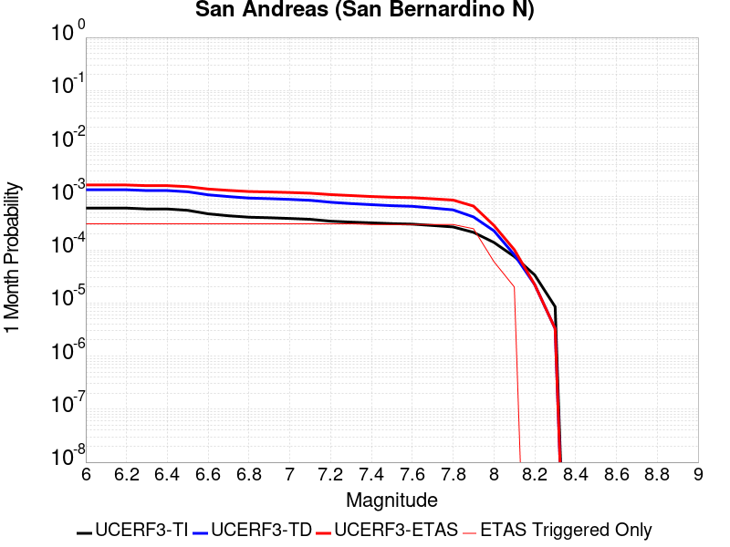 |  | 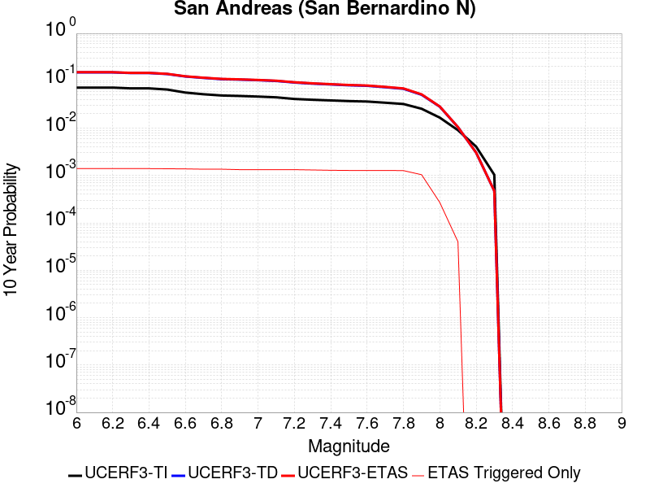 |

| Magnitude | 1 wk TI Prob | 1 wk TD Prob | 1 wk ETAS Prob | 1 wk ETAS/TD Gain | 1 wk ETAS Triggered Only | 1 mo TI Prob | 1 mo TD Prob | 1 mo ETAS Prob | 1 mo ETAS/TD Gain | 1 mo ETAS Triggered Only | 1 yr TI Prob | 1 yr TD Prob | 1 yr ETAS Prob | 1 yr ETAS/TD Gain | 1 yr ETAS Triggered Only | 10 yr TI Prob | 10 yr TD Prob | 10 yr ETAS Prob | 10 yr ETAS/TD Gain | 10 yr ETAS Triggered Only |
|-----|-----|-----|-----|-----|-----|-----|-----|-----|-----|-----|-----|-----|-----|-----|-----|-----|-----|-----|-----|-----|
| 6.0 | 1.4273766E-4 | 3.1613815E-4 | 3.9611285E-4 | 1.2529739 | 8.0E-5 | 6.115894E-4 | 0.0013541803 | 0.0016637605 | 1.2286108 | 3.1E-4 | 0.0074207084 | 0.016364006 | 0.017239442 | 1.0534977 | 8.9E-4 | 0.07177748 | 0.15030621 | 0.15149578 | 1.0079143 | 0.0014 |
| 6.1 | 1.4273766E-4 | 3.1613815E-4 | 3.9611285E-4 | 1.2529739 | 8.0E-5 | 6.115894E-4 | 0.0013541803 | 0.0016637605 | 1.2286108 | 3.1E-4 | 0.0074207084 | 0.016364006 | 0.017239442 | 1.0534977 | 8.9E-4 | 0.07177748 | 0.15030621 | 0.15149578 | 1.0079143 | 0.0014 |
| 6.2 | 1.4273766E-4 | 3.1613815E-4 | 3.9611285E-4 | 1.2529739 | 8.0E-5 | 6.115894E-4 | 0.0013541803 | 0.0016637605 | 1.2286108 | 3.1E-4 | 0.0074207084 | 0.016364006 | 0.017239442 | 1.0534977 | 8.9E-4 | 0.07177748 | 0.15030621 | 0.15149578 | 1.0079143 | 0.0014 |
| 6.3 | 1.3730655E-4 | 3.0518594E-4 | 3.8516152E-4 | 1.2620553 | 8.0E-5 | 5.883239E-4 | 0.0013072897 | 0.0016168845 | 1.2368218 | 3.1E-4 | 0.0071393442 | 0.015801499 | 0.016677435 | 1.0554338 | 8.9E-4 | 0.06914291 | 0.1456176 | 0.14681374 | 1.0082142 | 0.0014 |
| 6.4 | 1.3730655E-4 | 3.0518594E-4 | 3.8516152E-4 | 1.2620553 | 8.0E-5 | 5.883239E-4 | 0.0013072897 | 0.0016168845 | 1.2368218 | 3.1E-4 | 0.0071393442 | 0.015801499 | 0.016677435 | 1.0554338 | 8.9E-4 | 0.06914291 | 0.1456176 | 0.14681374 | 1.0082142 | 0.0014 |
| 6.5 | 1.2942807E-4 | 2.893302E-4 | 3.6930706E-4 | 1.2764207 | 8.0E-5 | 5.545738E-4 | 0.0012394025 | 0.0015490183 | 1.2498106 | 3.1E-4 | 0.0067310524 | 0.014986568 | 0.01585338 | 1.0578393 | 8.8E-4 | 0.06530788 | 0.1387508 | 0.13994794 | 1.008628 | 0.00139 |
| 6.6 | 1.1125901E-4 | 2.5371803E-4 | 3.336977E-4 | 1.3152307 | 8.0E-5 | 4.767372E-4 | 0.0010869121 | 0.0013965751 | 1.2849016 | 3.1E-4 | 0.005788839 | 0.013153494 | 0.01402192 | 1.0660224 | 8.8E-4 | 0.056403454 | 0.123055056 | 0.12426524 | 1.0098345 | 0.00138 |
| 6.7 | 1.02209575E-4 | 2.3506676E-4 | 3.1504798E-4 | 1.3402488 | 8.0E-5 | 4.3796748E-4 | 0.0010070414 | 0.0013167292 | 1.3075224 | 3.1E-4 | 0.0053192247 | 0.012192226 | 0.013061496 | 1.0712972 | 8.8E-4 | 0.051936906 | 0.11485491 | 0.11605871 | 1.010481 | 0.00136 |
| 6.8 | 9.610582E-5 | 2.2032527E-4 | 3.0030764E-4 | 1.3630195 | 8.0E-5 | 4.1181705E-4 | 9.4391016E-4 | 0.0012536176 | 1.328111 | 3.1E-4 | 0.0050023515 | 0.011431816 | 0.012301756 | 1.0760982 | 8.8E-4 | 0.048912346 | 0.10822604 | 0.10943885 | 1.0112063 | 0.00136 |
| 6.9 | 9.3877505E-5 | 2.1488062E-4 | 2.9486342E-4 | 1.3722198 | 8.0E-5 | 4.0227012E-4 | 9.205926E-4 | 0.0012303072 | 1.3364296 | 3.1E-4 | 0.0048866454 | 0.01115086 | 0.01200127 | 1.0762641 | 8.6E-4 | 0.04780577 | 0.10581016 | 0.106999435 | 1.0112396 | 0.00133 |
| 7.0 | 9.1019785E-5 | 2.0814931E-4 | 2.8813267E-4 | 1.3842595 | 8.0E-5 | 3.900265E-4 | 8.917641E-4 | 0.0012014877 | 1.3473155 | 3.1E-4 | 0.0047382377 | 0.010803404 | 0.0116541125 | 1.0787445 | 8.6E-4 | 0.046384744 | 0.10278206 | 0.10397536 | 1.01161 | 0.00133 |
| 7.1 | 8.771155E-5 | 1.9989457E-4 | 2.798786E-4 | 1.400131 | 8.0E-5 | 3.758525E-4 | 8.5641025E-4 | 0.0011661447 | 1.3616661 | 3.1E-4 | 0.0045664064 | 0.0103771435 | 0.01122822 | 1.0820144 | 8.6E-4 | 0.044737056 | 0.09908999 | 0.100288205 | 1.0120921 | 0.00133 |
| 7.2 | 8.0830236E-5 | 1.8395022E-4 | 2.639355E-4 | 1.4348203 | 8.0E-5 | 3.4636928E-4 | 7.8812E-4 | 0.0010978758 | 1.3930311 | 3.1E-4 | 0.0042088944 | 0.009553252 | 0.010405036 | 1.0891618 | 8.6E-4 | 0.041300658 | 0.09181652 | 0.0930244 | 1.0131555 | 0.00133 |
| 7.3 | 7.7668235E-5 | 1.7338368E-4 | 2.5336983E-4 | 1.4613245 | 8.0E-5 | 3.328214E-4 | 7.428614E-4 | 0.0010526312 | 1.4169953 | 3.1E-4 | 0.0040445733 | 0.009006911 | 0.009859165 | 1.0946223 | 8.6E-4 | 0.03971748 | 0.087091945 | 0.08828785 | 1.0137316 | 0.00131 |
| 7.4 | 7.520177E-5 | 1.6558399E-4 | 2.355724E-4 | 1.4226762 | 7.0E-5 | 3.2225347E-4 | 7.094528E-4 | 0.0010092399 | 1.4225612 | 3.0E-4 | 0.0039163795 | 0.008603445 | 0.009436218 | 1.0967953 | 8.4E-4 | 0.038480744 | 0.08354736 | 0.08472959 | 1.0141504 | 0.00129 |
| 7.5 | 7.274697E-5 | 1.5845966E-4 | 2.2844857E-4 | 1.4416828 | 7.0E-5 | 3.1173544E-4 | 6.7893614E-4 | 9.787325E-4 | 1.4415678 | 3.0E-4 | 0.003788775 | 0.008234776 | 0.009067859 | 1.1011664 | 8.4E-4 | 0.03724827 | 0.080263205 | 0.08144047 | 1.0146675 | 0.00128 |
| 7.6 | 7.1185845E-5 | 1.541577E-4 | 2.241469E-4 | 1.4540105 | 7.0E-5 | 3.0504653E-4 | 6.605086E-4 | 9.6031046E-4 | 1.4538954 | 3.0E-4 | 0.0037076178 | 0.008012093 | 0.008845363 | 1.1040015 | 8.4E-4 | 0.036463667 | 0.07825235 | 0.07943219 | 1.0150774 | 0.00128 |
| 7.7 | 6.709961E-5 | 1.4324459E-4 | 2.1323457E-4 | 1.4886047 | 7.0E-5 | 2.8753807E-4 | 6.1376096E-4 | 9.1357686E-4 | 1.4884896 | 3.0E-4 | 0.003495157 | 0.007446976 | 0.008280721 | 1.1119574 | 8.4E-4 | 0.034406938 | 0.07308033 | 0.07426679 | 1.016235 | 0.00128 |
| 7.8 | 6.300812E-5 | 1.320821E-4 | 2.0207286E-4 | 1.5299034 | 7.0E-5 | 2.7000686E-4 | 5.6594337E-4 | 8.657736E-4 | 1.5297884 | 3.0E-4 | 0.0032823787 | 0.006868621 | 0.0076929196 | 1.1200094 | 8.3E-4 | 0.032343175 | 0.06773715 | 0.06892113 | 1.017479 | 0.00127 |
| 7.9 | 4.983037E-5 | 9.7279386E-5 | 1.5727355E-4 | 1.6167202 | 6.0E-5 | 2.1354125E-4 | 4.1684505E-4 | 6.667408E-4 | 1.5994933 | 2.5E-4 | 0.0025967648 | 0.005063289 | 0.005749795 | 1.1355851 | 6.9E-4 | 0.025666296 | 0.050667744 | 0.05165505 | 1.0194858 | 0.00104 |
| 8.0 | 3.2211527E-5 | 5.332888E-5 | 6.332835E-5 | 1.1875056 | 1.0E-5 | 1.380421E-4 | 2.2853234E-4 | 2.885186E-4 | 1.2624849 | 6.0E-5 | 0.0016793669 | 0.0027788328 | 0.0029483605 | 1.0610068 | 1.7E-4 | 0.016667323 | 0.028373282 | 0.028635623 | 1.009246 | 2.7E-4 |
| 8.1 | 1.743376E-5 | 1.8833907E-5 | 2.883372E-5 | 1.5309473 | 1.0E-5 | 7.471398E-5 | 8.071425E-5 | 1.00712634E-4 | 1.2477677 | 2.0E-5 | 9.0926304E-4 | 9.822536E-4 | 0.0010122241 | 1.030512 | 3.0E-5 | 0.009055517 | 0.010489175 | 0.010528756 | 1.0037735 | 4.0E-5 |
| 8.2 | 7.831616E-6 | 5.1579527E-6 | 5.1579527E-6 | 1.0 | 0.0 | 3.3563636E-5 | 2.2105325E-5 | 2.2105325E-5 | 1.0 | 0.0 | 4.0856065E-4 | 2.6909917E-4 | 2.6909917E-4 | 1.0 | 0.0 | 0.004078103 | 0.00304338 | 0.00304338 | 1.0 | 0.0 |
| 8.3 | 1.983087E-6 | 7.663413E-7 | 7.663413E-7 | 1.0 | 0.0 | 8.498917E-6 | 3.2843159E-6 | 3.2843159E-6 | 1.0 | 0.0 | 1.034694E-4 | 3.998583E-5 | 3.998583E-5 | 1.0 | 0.0 | 0.0010342124 | 4.7219908E-4 | 4.7219908E-4 | 1.0 | 0.0 |

## Bicycle Lake
*[(top)](#table-of-contents)*

| 1 Week | 1 Month | 1 Year | 10 Year |
|-----|-----|-----|-----|
| 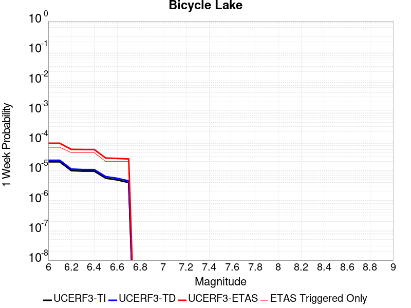 | 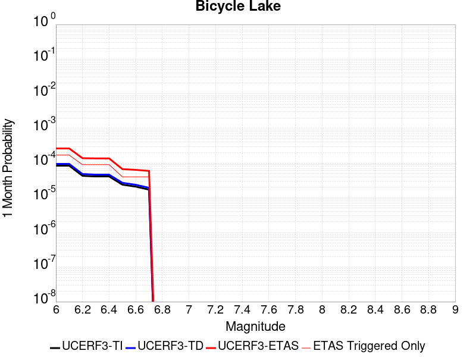 |  | 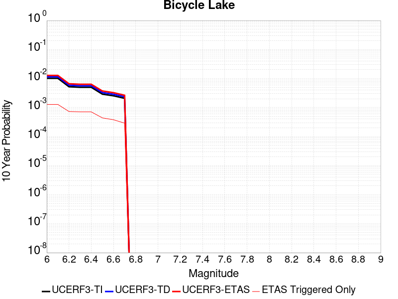 |

| Magnitude | 1 wk TI Prob | 1 wk TD Prob | 1 wk ETAS Prob | 1 wk ETAS/TD Gain | 1 wk ETAS Triggered Only | 1 mo TI Prob | 1 mo TD Prob | 1 mo ETAS Prob | 1 mo ETAS/TD Gain | 1 mo ETAS Triggered Only | 1 yr TI Prob | 1 yr TD Prob | 1 yr ETAS Prob | 1 yr ETAS/TD Gain | 1 yr ETAS Triggered Only | 10 yr TI Prob | 10 yr TD Prob | 10 yr ETAS Prob | 10 yr ETAS/TD Gain | 10 yr ETAS Triggered Only |
|-----|-----|-----|-----|-----|-----|-----|-----|-----|-----|-----|-----|-----|-----|-----|-----|-----|-----|-----|-----|-----|
| 6.0 | 1.9621975E-5 | 2.209739E-5 | 8.209606E-5 | 3.7151928 | 6.0E-5 | 8.4091465E-5 | 9.470042E-5 | 2.6468432E-4 | 2.7949646 | 1.7E-4 | 0.0010233327 | 0.0011525028 | 0.0017617998 | 1.5286729 | 6.1E-4 | 0.01018633 | 0.011478569 | 0.012743877 | 1.1102321 | 0.00128 |
| 6.1 | 1.9621975E-5 | 2.209739E-5 | 8.209606E-5 | 3.7151928 | 6.0E-5 | 8.4091465E-5 | 9.470042E-5 | 2.6468432E-4 | 2.7949646 | 1.7E-4 | 0.0010233327 | 0.0011525028 | 0.0017617998 | 1.5286729 | 6.1E-4 | 0.01018633 | 0.011478569 | 0.012743877 | 1.1102321 | 0.00128 |
| 6.2 | 9.9971285E-6 | 1.1255798E-5 | 5.125535E-5 | 4.553684 | 4.0E-5 | 4.2844134E-5 | 4.8238537E-5 | 1.382342E-4 | 2.8656383 | 9.0E-5 | 5.2150246E-4 | 5.8719795E-4 | 9.369924E-4 | 1.5957011 | 3.5E-4 | 0.0052028033 | 0.005861569 | 0.00658729 | 1.12381 | 7.3E-4 |
| 6.3 | 9.589428E-6 | 1.0798499E-5 | 5.0798066E-5 | 4.704179 | 4.0E-5 | 4.10969E-5 | 4.627875E-5 | 1.3627458E-4 | 2.944647 | 9.0E-5 | 5.002399E-4 | 5.6335E-4 | 9.0315845E-4 | 1.6031924 | 3.4E-4 | 0.0049911533 | 0.0056243087 | 0.0063303155 | 1.1255277 | 7.1E-4 |
| 6.4 | 9.589428E-6 | 1.0798499E-5 | 5.0798066E-5 | 4.704179 | 4.0E-5 | 4.10969E-5 | 4.627875E-5 | 1.3627458E-4 | 2.944647 | 9.0E-5 | 5.002399E-4 | 5.6335E-4 | 9.0315845E-4 | 1.6031924 | 3.4E-4 | 0.0049911533 | 0.0056243087 | 0.0063303155 | 1.1255277 | 7.1E-4 |
| 6.5 | 5.557707E-6 | 6.2856934E-6 | 2.6285568E-5 | 4.1818085 | 2.0E-5 | 2.3818526E-5 | 2.693856E-5 | 6.6937486E-5 | 2.4848204 | 4.0E-5 | 2.8995197E-4 | 3.279545E-4 | 5.4788234E-4 | 1.6706048 | 2.2E-4 | 0.0028957394 | 0.0032773414 | 0.0037158993 | 1.1338152 | 4.4E-4 |
| 6.6 | 4.8742945E-6 | 5.5133705E-6 | 2.551326E-5 | 4.627525 | 2.0E-5 | 2.0889667E-5 | 2.3628665E-5 | 6.362772E-5 | 2.692819 | 4.0E-5 | 2.54302E-4 | 2.876672E-4 | 4.976068E-4 | 1.7298002 | 2.1E-4 | 0.002540112 | 0.0028755174 | 0.0032544248 | 1.1317701 | 3.8E-4 |
| 6.7 | 3.991108E-6 | 4.515977E-6 | 2.4515886E-5 | 5.428701 | 2.0E-5 | 1.7104636E-5 | 1.9354185E-5 | 5.9353413E-5 | 3.0666964 | 4.0E-5 | 2.0822904E-4 | 2.3563721E-4 | 3.9559952E-4 | 1.6788499 | 1.6E-4 | 0.0020803404 | 0.002356372 | 0.0026456888 | 1.1227806 | 2.9E-4 |

## Paradise
*[(top)](#table-of-contents)*

| 1 Week | 1 Month | 1 Year | 10 Year |
|-----|-----|-----|-----|
| 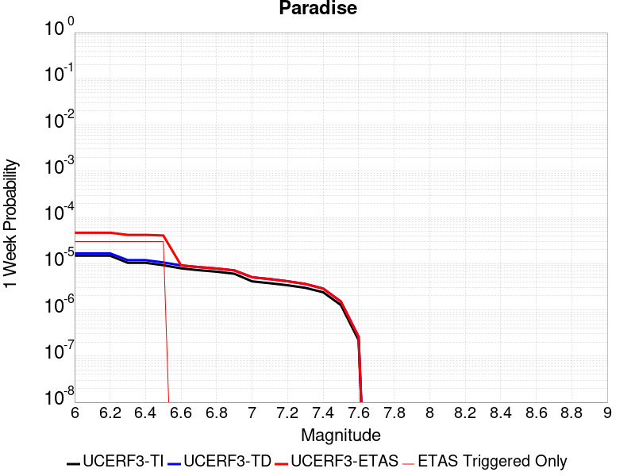 |  |  |  |

| Magnitude | 1 wk TI Prob | 1 wk TD Prob | 1 wk ETAS Prob | 1 wk ETAS/TD Gain | 1 wk ETAS Triggered Only | 1 mo TI Prob | 1 mo TD Prob | 1 mo ETAS Prob | 1 mo ETAS/TD Gain | 1 mo ETAS Triggered Only | 1 yr TI Prob | 1 yr TD Prob | 1 yr ETAS Prob | 1 yr ETAS/TD Gain | 1 yr ETAS Triggered Only | 10 yr TI Prob | 10 yr TD Prob | 10 yr ETAS Prob | 10 yr ETAS/TD Gain | 10 yr ETAS Triggered Only |
|-----|-----|-----|-----|-----|-----|-----|-----|-----|-----|-----|-----|-----|-----|-----|-----|-----|-----|-----|-----|-----|
| 6.0 | 1.4851273E-5 | 1.6694901E-5 | 4.66944E-5 | 2.7969258 | 3.0E-5 | 6.364676E-5 | 7.154774E-5 | 1.715406E-4 | 2.397568 | 1.0E-4 | 7.7462377E-4 | 8.7076926E-4 | 0.0013703338 | 1.573705 | 5.0E-4 | 0.0077192914 | 0.008675952 | 0.009905194 | 1.1416838 | 0.00124 |
| 6.1 | 1.4851273E-5 | 1.6694901E-5 | 4.66944E-5 | 2.7969258 | 3.0E-5 | 6.364676E-5 | 7.154774E-5 | 1.715406E-4 | 2.397568 | 1.0E-4 | 7.7462377E-4 | 8.7076926E-4 | 0.0013703338 | 1.573705 | 5.0E-4 | 0.0077192914 | 0.008675952 | 0.009905194 | 1.1416838 | 0.00124 |
| 6.2 | 1.4851273E-5 | 1.6694901E-5 | 4.66944E-5 | 2.7969258 | 3.0E-5 | 6.364676E-5 | 7.154774E-5 | 1.715406E-4 | 2.397568 | 1.0E-4 | 7.7462377E-4 | 8.7076926E-4 | 0.0013703338 | 1.573705 | 5.0E-4 | 0.0077192914 | 0.008675952 | 0.009905194 | 1.1416838 | 0.00124 |
| 6.3 | 1.0426831E-5 | 1.1888783E-5 | 4.1888426E-5 | 3.523357 | 3.0E-5 | 4.4685654E-5 | 5.0950966E-5 | 1.10947905E-4 | 2.177543 | 6.0E-5 | 5.43912E-4 | 6.201574E-4 | 8.700023E-4 | 1.4028735 | 2.5E-4 | 0.0054258266 | 0.006184876 | 0.006771227 | 1.094804 | 5.9E-4 |
| 6.4 | 1.0426831E-5 | 1.1888783E-5 | 4.1888426E-5 | 3.523357 | 3.0E-5 | 4.4685654E-5 | 5.0950966E-5 | 1.10947905E-4 | 2.177543 | 6.0E-5 | 5.43912E-4 | 6.201574E-4 | 8.700023E-4 | 1.4028735 | 2.5E-4 | 0.0054258266 | 0.006184876 | 0.006771227 | 1.094804 | 5.9E-4 |
| 6.5 | 9.25027E-6 | 1.0620111E-5 | 4.0619794E-5 | 3.824799 | 3.0E-5 | 3.964341E-5 | 4.5513996E-5 | 1.05511266E-4 | 2.3182158 | 6.0E-5 | 4.8255164E-4 | 5.5399694E-4 | 7.538861E-4 | 1.3608128 | 2.0E-4 | 0.0048150513 | 0.005526658 | 0.005964226 | 1.0791742 | 4.4E-4 |
| 6.6 | 7.904275E-6 | 9.159663E-6 | 9.159663E-6 | 1.0 | 0.0 | 3.3875025E-5 | 3.925513E-5 | 6.9253954E-5 | 1.7642014 | 3.0E-5 | 4.1235037E-4 | 4.778303E-4 | 6.277586E-4 | 1.313769 | 1.5E-4 | 0.0041158604 | 0.004768426 | 0.0050172335 | 1.0521781 | 2.5E-4 |
| 6.7 | 7.2061953E-6 | 8.407379E-6 | 8.407379E-6 | 1.0 | 0.0 | 3.088333E-5 | 3.603115E-5 | 6.603007E-5 | 1.832583 | 3.0E-5 | 3.7593965E-4 | 4.385946E-4 | 5.2855513E-4 | 1.2051109 | 9.0E-5 | 0.003753043 | 0.004377659 | 0.0045369584 | 1.0363892 | 1.6E-4 |
| 6.8 | 6.6948724E-6 | 7.842291E-6 | 7.842291E-6 | 1.0 | 0.0 | 2.8691995E-5 | 3.3609405E-5 | 6.36084E-5 | 1.8925773 | 3.0E-5 | 3.4926904E-4 | 4.0912128E-4 | 4.8908853E-4 | 1.195461 | 8.0E-5 | 0.003487206 | 0.004084038 | 0.0042234664 | 1.0341398 | 1.4E-4 |
| 6.9 | 6.0421025E-6 | 7.13074E-6 | 7.13074E-6 | 1.0 | 0.0 | 2.5894467E-5 | 3.0559975E-5 | 6.0559058E-5 | 1.9816462 | 3.0E-5 | 3.1521954E-4 | 3.7200758E-4 | 4.3198525E-4 | 1.161227 | 6.0E-5 | 0.0031477278 | 0.0037141866 | 0.003833741 | 1.0321885 | 1.2E-4 |
| 7.0 | 4.134091E-6 | 5.0804115E-6 | 5.0804115E-6 | 1.0 | 0.0 | 1.7717413E-5 | 2.177302E-5 | 5.1772367E-5 | 2.3778222 | 3.0E-5 | 2.1568815E-4 | 2.650558E-4 | 3.050452E-4 | 1.1508716 | 4.0E-5 | 0.0021547892 | 0.0026475498 | 0.002707391 | 1.0226024 | 6.0E-5 |
| 7.1 | 3.7674888E-6 | 4.6319615E-6 | 4.6319615E-6 | 1.0 | 0.0 | 1.6146281E-5 | 1.9851122E-5 | 3.9850725E-5 | 2.0074797 | 2.0E-5 | 1.9656324E-4 | 2.4166213E-4 | 2.7165486E-4 | 1.1241102 | 3.0E-5 | 0.0019638946 | 0.0024141439 | 0.0024640232 | 1.0206612 | 5.0E-5 |
| 7.2 | 3.4065345E-6 | 4.1568037E-6 | 4.1568037E-6 | 1.0 | 0.0 | 1.4599351E-5 | 1.781476E-5 | 3.7814403E-5 | 2.1226447 | 2.0E-5 | 1.777326E-4 | 2.1687461E-4 | 2.4686812E-4 | 1.1382987 | 3.0E-5 | 0.0017759053 | 0.0021667778 | 0.0022066913 | 1.0184206 | 4.0E-5 |
| 7.3 | 2.9934936E-6 | 3.6293848E-6 | 3.6293848E-6 | 1.0 | 0.0 | 1.2829195E-5 | 1.5554422E-5 | 3.5554112E-5 | 2.285788 | 2.0E-5 | 1.5618425E-4 | 1.893601E-4 | 2.1935442E-4 | 1.1583983 | 3.0E-5 | 0.0015607453 | 0.0018921328 | 0.0019220761 | 1.0158252 | 3.0E-5 |
| 7.4 | 2.4049796E-6 | 2.8890308E-6 | 2.8890308E-6 | 1.0 | 0.0 | 1.0307015E-5 | 1.238151E-5 | 2.2381386E-5 | 1.8076459 | 1.0E-5 | 1.2548068E-4 | 1.507359E-4 | 1.7073288E-4 | 1.1326624 | 2.0E-5 | 0.0012540985 | 0.0015064781 | 0.0015264478 | 1.013256 | 2.0E-5 |
| 7.5 | 1.2710091E-6 | 1.513489E-6 | 1.513489E-6 | 1.0 | 0.0 | 5.44717E-6 | 6.486372E-6 | 1.6486307E-5 | 2.541684 | 1.0E-5 | 6.631728E-5 | 7.896997E-5 | 9.896839E-5 | 1.2532408 | 2.0E-5 | 6.6297496E-4 | 7.895417E-4 | 8.095259E-4 | 1.0253111 | 2.0E-5 |
| 7.6 | 2.21172E-7 | 2.6040198E-7 | 2.6040198E-7 | 1.0 | 0.0 | 9.478797E-7 | 1.1160082E-6 | 1.1160082E-6 | 1.0 | 0.0 | 1.1540374E-5 | 1.3587343E-5 | 1.3587343E-5 | 1.0 | 0.0 | 1.1539775E-4 | 1.3586794E-4 | 1.3586794E-4 | 1.0 | 0.0 |

## Garlic Springs
*[(top)](#table-of-contents)*

| 1 Week | 1 Month | 1 Year | 10 Year |
|-----|-----|-----|-----|
|  |  |  |  |

| Magnitude | 1 wk TI Prob | 1 wk TD Prob | 1 wk ETAS Prob | 1 wk ETAS/TD Gain | 1 wk ETAS Triggered Only | 1 mo TI Prob | 1 mo TD Prob | 1 mo ETAS Prob | 1 mo ETAS/TD Gain | 1 mo ETAS Triggered Only | 1 yr TI Prob | 1 yr TD Prob | 1 yr ETAS Prob | 1 yr ETAS/TD Gain | 1 yr ETAS Triggered Only | 10 yr TI Prob | 10 yr TD Prob | 10 yr ETAS Prob | 10 yr ETAS/TD Gain | 10 yr ETAS Triggered Only |
|-----|-----|-----|-----|-----|-----|-----|-----|-----|-----|-----|-----|-----|-----|-----|-----|-----|-----|-----|-----|-----|
| 6.0 | 1.6760017E-5 | 1.8777086E-5 | 3.877671E-5 | 2.065108 | 2.0E-5 | 7.182667E-5 | 8.04714E-5 | 2.0046174E-4 | 2.491093 | 1.2E-4 | 8.7413884E-4 | 9.794163E-4 | 0.0014389658 | 1.4692075 | 4.6E-4 | 0.008707083 | 0.009762544 | 0.010822098 | 1.1085325 | 0.00107 |
| 6.1 | 9.852767E-6 | 1.0973727E-5 | 2.0973617E-5 | 1.9112575 | 1.0E-5 | 4.222546E-5 | 4.702981E-5 | 1.1702652E-4 | 2.4883478 | 7.0E-5 | 5.139737E-4 | 5.7250843E-4 | 7.923825E-4 | 1.3840538 | 2.2E-4 | 0.005127866 | 0.0057172943 | 0.006254207 | 1.0939102 | 5.4E-4 |
| 6.2 | 9.852767E-6 | 1.0973727E-5 | 2.0973617E-5 | 1.9112575 | 1.0E-5 | 4.222546E-5 | 4.702981E-5 | 1.1702652E-4 | 2.4883478 | 7.0E-5 | 5.139737E-4 | 5.7250843E-4 | 7.923825E-4 | 1.3840538 | 2.2E-4 | 0.005127866 | 0.0057172943 | 0.006254207 | 1.0939102 | 5.4E-4 |
| 6.3 | 4.3167724E-6 | 4.778086E-6 | 4.778086E-6 | 1.0 | 0.0 | 1.8500323E-5 | 2.0477479E-5 | 4.047707E-5 | 1.9766628 | 2.0E-5 | 2.2521814E-4 | 2.493078E-4 | 3.492829E-4 | 1.4010105 | 1.0E-4 | 0.0022499003 | 0.0024925398 | 0.0026920412 | 1.0800395 | 2.0E-4 |
| 6.4 | 4.3167724E-6 | 4.778086E-6 | 4.778086E-6 | 1.0 | 0.0 | 1.8500323E-5 | 2.0477479E-5 | 4.047707E-5 | 1.9766628 | 2.0E-5 | 2.2521814E-4 | 2.493078E-4 | 3.492829E-4 | 1.4010105 | 1.0E-4 | 0.0022499003 | 0.0024925398 | 0.0026920412 | 1.0800395 | 2.0E-4 |
| 6.5 | 4.3167724E-6 | 4.778086E-6 | 4.778086E-6 | 1.0 | 0.0 | 1.8500323E-5 | 2.0477479E-5 | 4.047707E-5 | 1.9766628 | 2.0E-5 | 2.2521814E-4 | 2.493078E-4 | 3.492829E-4 | 1.4010105 | 1.0E-4 | 0.0022499003 | 0.0024925398 | 0.0026920412 | 1.0800395 | 2.0E-4 |
| 6.6 | 4.301311E-6 | 4.7609537E-6 | 4.7609537E-6 | 1.0 | 0.0 | 1.8434059E-5 | 2.0404059E-5 | 4.040365E-5 | 1.9801772 | 2.0E-5 | 2.2441156E-4 | 2.4841412E-4 | 3.483893E-4 | 1.4024535 | 1.0E-4 | 0.0022418506 | 0.0024836229 | 0.0026831261 | 1.0803275 | 2.0E-4 |
| 6.7 | 3.8599724E-6 | 4.271111E-6 | 4.271111E-6 | 1.0 | 0.0 | 1.6542634E-5 | 1.830476E-5 | 3.8304395E-5 | 2.092592 | 2.0E-5 | 2.0138794E-4 | 2.2286046E-4 | 3.2283817E-4 | 1.4486113 | 1.0E-4 | 0.0020120554 | 0.0022286046 | 0.002428159 | 1.0895423 | 2.0E-4 |

## San Andreas (San Bernardino S)
*[(top)](#table-of-contents)*

| 1 Week | 1 Month | 1 Year | 10 Year |
|-----|-----|-----|-----|
| 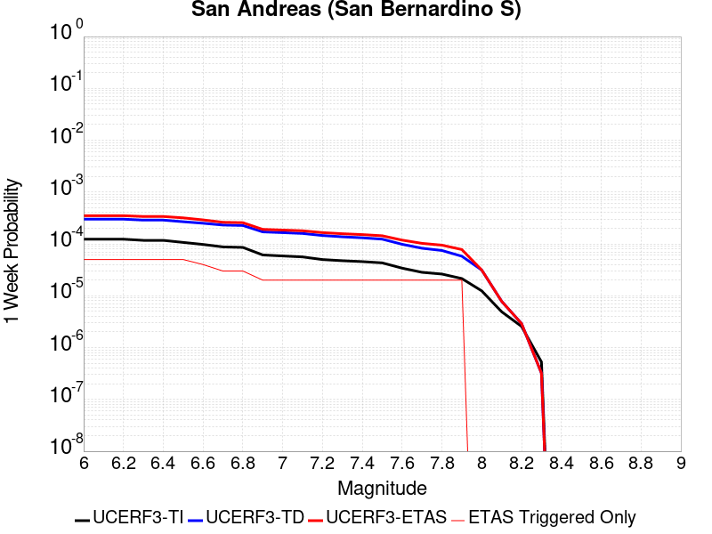 | 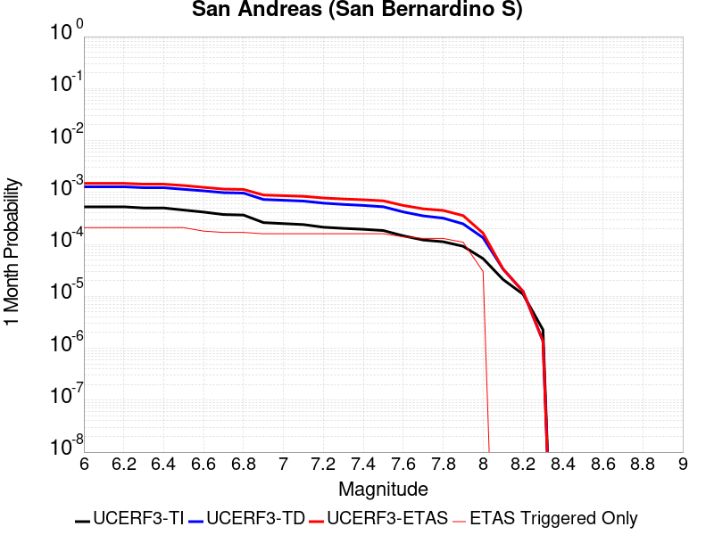 |  |  |

| Magnitude | 1 wk TI Prob | 1 wk TD Prob | 1 wk ETAS Prob | 1 wk ETAS/TD Gain | 1 wk ETAS Triggered Only | 1 mo TI Prob | 1 mo TD Prob | 1 mo ETAS Prob | 1 mo ETAS/TD Gain | 1 mo ETAS Triggered Only | 1 yr TI Prob | 1 yr TD Prob | 1 yr ETAS Prob | 1 yr ETAS/TD Gain | 1 yr ETAS Triggered Only | 10 yr TI Prob | 10 yr TD Prob | 10 yr ETAS Prob | 10 yr ETAS/TD Gain | 10 yr ETAS Triggered Only |
|-----|-----|-----|-----|-----|-----|-----|-----|-----|-----|-----|-----|-----|-----|-----|-----|-----|-----|-----|-----|-----|
| 6.0 | 1.2336002E-4 | 3.0009303E-4 | 3.5007801E-4 | 1.166565 | 5.0E-5 | 5.2857865E-4 | 0.0012855051 | 0.0014952353 | 1.16315 | 2.1E-4 | 0.006416472 | 0.015543667 | 0.016114652 | 1.0367342 | 5.8E-4 | 0.06234337 | 0.1428421 | 0.14357926 | 1.0051607 | 8.6E-4 |
| 6.1 | 1.2336002E-4 | 3.0009303E-4 | 3.5007801E-4 | 1.166565 | 5.0E-5 | 5.2857865E-4 | 0.0012855051 | 0.0014952353 | 1.16315 | 2.1E-4 | 0.006416472 | 0.015543667 | 0.016114652 | 1.0367342 | 5.8E-4 | 0.06234337 | 0.1428421 | 0.14357926 | 1.0051607 | 8.6E-4 |
| 6.2 | 1.2336002E-4 | 3.0009303E-4 | 3.5007801E-4 | 1.166565 | 5.0E-5 | 5.2857865E-4 | 0.0012855051 | 0.0014952353 | 1.16315 | 2.1E-4 | 0.006416472 | 0.015543667 | 0.016114652 | 1.0367342 | 5.8E-4 | 0.06234337 | 0.1428421 | 0.14357926 | 1.0051607 | 8.6E-4 |
| 6.3 | 1.1712257E-4 | 2.8797553E-4 | 3.3796113E-4 | 1.1735759 | 5.0E-5 | 5.018573E-4 | 0.0012336228 | 0.0014433637 | 1.1700203 | 2.1E-4 | 0.006093008 | 0.014920767 | 0.015482263 | 1.0376318 | 5.7E-4 | 0.059286322 | 0.13755643 | 0.13828951 | 1.0053293 | 8.5E-4 |
| 6.4 | 1.1712257E-4 | 2.8797553E-4 | 3.3796113E-4 | 1.1735759 | 5.0E-5 | 5.018573E-4 | 0.0012336228 | 0.0014433637 | 1.1700203 | 2.1E-4 | 0.006093008 | 0.014920767 | 0.015482263 | 1.0376318 | 5.7E-4 | 0.059286322 | 0.13755643 | 0.13828951 | 1.0053293 | 8.5E-4 |
| 6.5 | 1.0689076E-4 | 2.6810242E-4 | 3.18089E-4 | 1.186446 | 5.0E-5 | 4.5802278E-4 | 0.0011485291 | 0.001358288 | 1.1826326 | 2.1E-4 | 0.0055621783 | 0.013898305 | 0.01444066 | 1.0390232 | 5.5E-4 | 0.05425003 | 0.12884498 | 0.12955932 | 1.0055442 | 8.2E-4 |
| 6.6 | 9.7648895E-5 | 2.5055118E-4 | 2.9054115E-4 | 1.159608 | 4.0E-5 | 4.1842813E-4 | 0.0010733724 | 0.0012531793 | 1.1675158 | 1.8E-4 | 0.005082469 | 0.0129943695 | 0.013487872 | 1.0379782 | 5.0E-4 | 0.049677886 | 0.12100829 | 0.121676326 | 1.0055206 | 7.6E-4 |
| 6.7 | 8.757013E-5 | 2.3125677E-4 | 2.6124984E-4 | 1.1296959 | 3.0E-5 | 3.7524657E-4 | 9.907463E-4 | 0.0011605779 | 1.1714178 | 1.7E-4 | 0.00455906 | 0.011999708 | 0.012464067 | 1.0386976 | 4.7E-4 | 0.04466656 | 0.11236264 | 0.11298399 | 1.0055299 | 7.0E-4 |
| 6.8 | 8.562978E-5 | 2.2685555E-4 | 2.5684875E-4 | 1.1322128 | 3.0E-5 | 3.6693315E-4 | 9.71898E-4 | 0.0011417328 | 1.1747454 | 1.7E-4 | 0.004458263 | 0.011772725 | 0.012237192 | 1.0394528 | 4.7E-4 | 0.043698758 | 0.110368356 | 0.1109911 | 1.0056424 | 7.0E-4 |
| 6.9 | 6.124075E-5 | 1.7070382E-4 | 1.907004E-4 | 1.117142 | 2.0E-5 | 2.6243398E-4 | 7.313835E-4 | 8.912665E-4 | 1.2186035 | 1.6E-4 | 0.0031904527 | 0.008868446 | 0.009314454 | 1.0502917 | 4.5E-4 | 0.031450346 | 0.08418891 | 0.08481166 | 1.007397 | 6.8E-4 |
| 7.0 | 5.8598747E-5 | 1.6499324E-4 | 1.8498994E-4 | 1.1211971 | 2.0E-5 | 2.5111332E-4 | 7.06923E-4 | 8.668099E-4 | 1.2261729 | 1.6E-4 | 0.0030530186 | 0.008573018 | 0.009019161 | 1.0520402 | 4.5E-4 | 0.03011414 | 0.08151192 | 0.0821365 | 1.0076623 | 6.8E-4 |
| 7.1 | 5.613814E-5 | 1.5917837E-4 | 1.7917517E-4 | 1.1256253 | 2.0E-5 | 2.4056983E-4 | 6.820154E-4 | 8.4190624E-4 | 1.2344388 | 1.6E-4 | 0.0029250039 | 0.008272105 | 0.008718383 | 1.0539497 | 4.5E-4 | 0.028868021 | 0.078808844 | 0.07942604 | 1.0078316 | 6.7E-4 |
| 7.2 | 4.991222E-5 | 1.4524286E-4 | 1.6523995E-4 | 1.1376804 | 2.0E-5 | 2.1389198E-4 | 6.2232127E-4 | 7.822217E-4 | 1.2569419 | 1.6E-4 | 0.002601025 | 0.0075505427 | 0.007997145 | 1.0591483 | 4.5E-4 | 0.025707912 | 0.07225873 | 0.072871044 | 1.0084739 | 6.6E-4 |
| 7.3 | 4.7410045E-5 | 1.3718297E-4 | 1.5718023E-4 | 1.1457707 | 2.0E-5 | 2.0317009E-4 | 5.877949E-4 | 7.4770086E-4 | 1.2720438 | 1.6E-4 | 0.0024707897 | 0.007133006 | 0.0075797965 | 1.062637 | 4.5E-4 | 0.024434982 | 0.06855151 | 0.069166265 | 1.0089678 | 6.6E-4 |
| 7.4 | 4.5556746E-5 | 1.3126126E-4 | 1.5125863E-4 | 1.1523479 | 2.0E-5 | 1.952286E-4 | 5.624273E-4 | 7.223373E-4 | 1.2843212 | 1.6E-4 | 0.002374317 | 0.0068261316 | 0.007263128 | 1.0640181 | 4.4E-4 | 0.023491086 | 0.065804146 | 0.066411376 | 1.0092278 | 6.5E-4 |
| 7.5 | 4.3084514E-5 | 1.2361364E-4 | 1.4361116E-4 | 1.1617744 | 2.0E-5 | 1.8463485E-4 | 5.296655E-4 | 6.8958075E-4 | 1.3019174 | 1.6E-4 | 0.0022456115 | 0.0064296816 | 0.006856917 | 1.0664474 | 4.3E-4 | 0.022230545 | 0.062204055 | 0.062804244 | 1.0096487 | 6.4E-4 |
| 7.6 | 3.408608E-5 | 9.839253E-5 | 1.1839056E-4 | 1.2032474 | 2.0E-5 | 1.4607502E-4 | 4.216142E-4 | 5.615552E-4 | 1.3319172 | 1.4E-4 | 0.0017770125 | 0.005121097 | 0.0055289976 | 1.079651 | 4.1E-4 | 0.017628696 | 0.050033968 | 0.050622948 | 1.0117716 | 6.2E-4 |
| 7.7 | 2.8315713E-5 | 8.252149E-5 | 1.02519836E-4 | 1.2423412 | 2.0E-5 | 1.2134742E-4 | 3.536156E-4 | 4.8356963E-4 | 1.3675008 | 1.3E-4 | 0.0014764034 | 0.00429678 | 0.004695061 | 1.092693 | 4.0E-4 | 0.01466633 | 0.042284906 | 0.04286911 | 1.013816 | 6.1E-4 |
| 7.8 | 2.6222975E-5 | 7.466301E-5 | 9.466152E-5 | 1.2678503 | 2.0E-5 | 1.1237934E-4 | 3.1994513E-4 | 4.4990354E-4 | 1.4061897 | 1.3E-4 | 0.0013673597 | 0.0038883805 | 0.004286825 | 1.1024706 | 4.0E-4 | 0.013589768 | 0.038449194 | 0.039035738 | 1.0152551 | 6.1E-4 |
| 7.9 | 2.1469694E-5 | 5.7904923E-5 | 7.7903765E-5 | 1.3453737 | 2.0E-5 | 9.200973E-5 | 2.4814036E-4 | 3.5811306E-4 | 1.4431875 | 1.1E-4 | 0.0011196428 | 0.0030169266 | 0.0033658708 | 1.1156621 | 3.5E-4 | 0.011140184 | 0.030162405 | 0.030676419 | 1.0170416 | 5.3E-4 |
| 8.0 | 1.2420249E-5 | 3.1333035E-5 | 3.1333035E-5 | 1.0 | 0.0 | 5.322855E-5 | 1.3427754E-4 | 1.642735E-4 | 1.2233878 | 3.0E-5 | 6.478649E-4 | 0.0016336039 | 0.0017334407 | 1.0611143 | 1.0E-4 | 0.0064597935 | 0.016529117 | 0.016676638 | 1.0089248 | 1.5E-4 |
| 8.1 | 4.9197724E-6 | 7.826683E-6 | 7.826683E-6 | 1.0 | 0.0 | 2.1084568E-5 | 3.3542496E-5 | 3.3542496E-5 | 1.0 | 0.0 | 2.566744E-4 | 4.083035E-4 | 4.083035E-4 | 1.0 | 0.0 | 0.002563781 | 0.0043865717 | 0.0043865717 | 1.0 | 0.0 |
| 8.2 | 2.5634774E-6 | 2.9084847E-6 | 2.9084847E-6 | 1.0 | 0.0 | 1.0986286E-5 | 1.2464875E-5 | 1.2464875E-5 | 1.0 | 0.0 | 1.3374983E-4 | 1.5174934E-4 | 1.5174934E-4 | 1.0 | 0.0 | 0.0013366934 | 0.0017059235 | 0.0017059235 | 1.0 | 0.0 |
| 8.3 | 5.2850464E-7 | 3.2105166E-7 | 3.2105166E-7 | 1.0 | 0.0 | 2.2650179E-6 | 1.375935E-6 | 1.375935E-6 | 1.0 | 0.0 | 2.7576245E-5 | 1.6751892E-5 | 1.6751892E-5 | 1.0 | 0.0 | 2.7572823E-4 | 1.9881174E-4 | 1.9881174E-4 | 1.0 | 0.0 |

## Death Valley (Black Mtns Frontal)
*[(top)](#table-of-contents)*

| 1 Week | 1 Month | 1 Year | 10 Year |
|-----|-----|-----|-----|
|  |  |  |  |

| Magnitude | 1 wk TI Prob | 1 wk TD Prob | 1 wk ETAS Prob | 1 wk ETAS/TD Gain | 1 wk ETAS Triggered Only | 1 mo TI Prob | 1 mo TD Prob | 1 mo ETAS Prob | 1 mo ETAS/TD Gain | 1 mo ETAS Triggered Only | 1 yr TI Prob | 1 yr TD Prob | 1 yr ETAS Prob | 1 yr ETAS/TD Gain | 1 yr ETAS Triggered Only | 10 yr TI Prob | 10 yr TD Prob | 10 yr ETAS Prob | 10 yr ETAS/TD Gain | 10 yr ETAS Triggered Only |
|-----|-----|-----|-----|-----|-----|-----|-----|-----|-----|-----|-----|-----|-----|-----|-----|-----|-----|-----|-----|-----|
| 6.0 | 1.6707214E-5 | 1.8670515E-5 | 3.867014E-5 | 2.0711877 | 2.0E-5 | 7.160038E-5 | 8.001408E-5 | 2.0000448E-4 | 2.4996161 | 1.2E-4 | 8.71386E-4 | 9.737437E-4 | 0.0013433833 | 1.3796068 | 3.7E-4 | 0.00867977 | 0.009695624 | 0.01039874 | 1.072519 | 7.1E-4 |
| 6.1 | 1.6707214E-5 | 1.8670515E-5 | 3.867014E-5 | 2.0711877 | 2.0E-5 | 7.160038E-5 | 8.001408E-5 | 2.0000448E-4 | 2.4996161 | 1.2E-4 | 8.71386E-4 | 9.737437E-4 | 0.0013433833 | 1.3796068 | 3.7E-4 | 0.00867977 | 0.009695624 | 0.01039874 | 1.072519 | 7.1E-4 |
| 6.2 | 1.6707214E-5 | 1.8670515E-5 | 3.867014E-5 | 2.0711877 | 2.0E-5 | 7.160038E-5 | 8.001408E-5 | 2.0000448E-4 | 2.4996161 | 1.2E-4 | 8.71386E-4 | 9.737437E-4 | 0.0013433833 | 1.3796068 | 3.7E-4 | 0.00867977 | 0.009695624 | 0.01039874 | 1.072519 | 7.1E-4 |
| 6.3 | 1.6707214E-5 | 1.8670515E-5 | 3.867014E-5 | 2.0711877 | 2.0E-5 | 7.160038E-5 | 8.001408E-5 | 2.0000448E-4 | 2.4996161 | 1.2E-4 | 8.71386E-4 | 9.737437E-4 | 0.0013433833 | 1.3796068 | 3.7E-4 | 0.00867977 | 0.009695624 | 0.01039874 | 1.072519 | 7.1E-4 |
| 6.4 | 1.5515609E-5 | 1.7338441E-5 | 3.7338094E-5 | 2.1534863 | 2.0E-5 | 6.649377E-5 | 7.430553E-5 | 1.942966E-4 | 2.6148338 | 1.2E-4 | 8.0926094E-4 | 9.043004E-4 | 0.0012539839 | 1.3866895 | 3.5E-4 | 0.008063202 | 0.009006891 | 0.0096312165 | 1.0693164 | 6.3E-4 |
| 6.5 | 1.5515609E-5 | 1.7338441E-5 | 3.7338094E-5 | 2.1534863 | 2.0E-5 | 6.649377E-5 | 7.430553E-5 | 1.942966E-4 | 2.6148338 | 1.2E-4 | 8.0926094E-4 | 9.043004E-4 | 0.0012539839 | 1.3866895 | 3.5E-4 | 0.008063202 | 0.009006891 | 0.0096312165 | 1.0693164 | 6.3E-4 |
| 6.6 | 1.5041828E-5 | 1.6809367E-5 | 3.680903E-5 | 2.1897929 | 2.0E-5 | 6.4463384E-5 | 7.203819E-5 | 1.9202955E-4 | 2.6656632 | 1.2E-4 | 7.8455906E-4 | 8.7671785E-4 | 0.001226411 | 1.3988662 | 3.5E-4 | 0.00781795 | 0.008733247 | 0.009328007 | 1.068103 | 6.0E-4 |
| 6.7 | 1.4634985E-5 | 1.6356233E-5 | 2.6356069E-5 | 1.6113777 | 1.0E-5 | 6.271985E-5 | 7.0096285E-5 | 1.8008858E-4 | 2.56916 | 1.1E-4 | 7.6334673E-4 | 8.530939E-4 | 0.001152838 | 1.3513612 | 3.0E-4 | 0.007607299 | 0.008498827 | 0.009044153 | 1.0641648 | 5.5E-4 |
| 6.8 | 1.4209158E-5 | 1.5882257E-5 | 2.5882098E-5 | 1.6296234 | 1.0E-5 | 6.089497E-5 | 6.806507E-5 | 1.7805758E-4 | 2.6159904 | 1.1E-4 | 7.4114406E-4 | 8.283828E-4 | 0.0011281343 | 1.3618515 | 3.0E-4 | 0.007386771 | 0.008253565 | 0.008759355 | 1.0612814 | 5.1E-4 |
| 6.9 | 1.3780098E-5 | 1.5404798E-5 | 2.5404643E-5 | 1.6491385 | 1.0E-5 | 5.9056227E-5 | 6.601892E-5 | 1.7601166E-4 | 2.666079 | 1.1E-4 | 7.1877235E-4 | 8.0348935E-4 | 0.0010732724 | 1.3357643 | 2.7E-4 | 0.0071645193 | 0.008006439 | 0.008462755 | 1.0569937 | 4.6E-4 |
| 7.0 | 1.3585064E-5 | 1.5188357E-5 | 2.5188205E-5 | 1.6583891 | 1.0E-5 | 5.8220405E-5 | 6.5091364E-5 | 1.6508486E-4 | 2.5362022 | 1.0E-4 | 7.086029E-4 | 7.9220464E-4 | 0.0010519987 | 1.327938 | 2.6E-4 | 0.007063476 | 0.007894398 | 0.008330924 | 1.0552957 | 4.4E-4 |
| 7.1 | 1.3398601E-5 | 1.4981538E-5 | 2.4981387E-5 | 1.6674782 | 1.0E-5 | 5.742131E-5 | 6.420504E-5 | 1.6419862E-4 | 2.55741 | 1.0E-4 | 6.9888023E-4 | 7.814215E-4 | 0.0010312261 | 1.3196797 | 2.5E-4 | 0.0069668638 | 0.007787327 | 0.008213978 | 1.0547879 | 4.3E-4 |
| 7.2 | 1.3126312E-5 | 1.4679756E-5 | 2.4679608E-5 | 1.6812003 | 1.0E-5 | 5.6254412E-5 | 6.291175E-5 | 1.4290672E-4 | 2.2715425 | 8.0E-5 | 6.846822E-4 | 7.6568685E-4 | 9.7552605E-4 | 1.2740536 | 2.1E-4 | 0.006825765 | 0.007631071 | 0.007998248 | 1.048116 | 3.7E-4 |
| 7.3 | 1.2922429E-5 | 1.445398E-5 | 2.4453835E-5 | 1.691841 | 1.0E-5 | 5.5380664E-5 | 6.194419E-5 | 1.4193924E-4 | 2.2914052 | 8.0E-5 | 6.74051E-4 | 7.53915E-4 | 9.537642E-4 | 1.2650819 | 2.0E-4 | 0.006720101 | 0.0075141545 | 0.0078516 | 1.0449079 | 3.4E-4 |
| 7.4 | 1.2768878E-5 | 1.4283962E-5 | 2.4283818E-5 | 1.7000759 | 1.0E-5 | 5.4722615E-5 | 6.121557E-5 | 1.3121129E-4 | 2.14343 | 7.0E-5 | 6.660441E-4 | 7.4505014E-4 | 9.3490863E-4 | 1.2548264 | 1.9E-4 | 0.0066405144 | 0.007426102 | 0.0077437256 | 1.0427712 | 3.2E-4 |
| 7.5 | 1.2521929E-5 | 1.4012202E-5 | 2.4012063E-5 | 1.7136537 | 1.0E-5 | 5.366431E-5 | 6.0050945E-5 | 1.3004674E-4 | 2.165607 | 7.0E-5 | 6.531671E-4 | 7.308804E-4 | 9.207415E-4 | 1.2597704 | 1.9E-4 | 0.006512506 | 0.0072853426 | 0.007593084 | 1.0422412 | 3.1E-4 |
| 7.6 | 1.1301089E-5 | 1.2648318E-5 | 2.2648192E-5 | 1.790609 | 1.0E-5 | 4.8432343E-5 | 5.420598E-5 | 1.14202725E-4 | 2.106829 | 6.0E-5 | 5.895042E-4 | 6.597633E-4 | 8.196577E-4 | 1.2423512 | 1.6E-4 | 0.0058794282 | 0.006578598 | 0.0068368874 | 1.039262 | 2.6E-4 |
| 7.7 | 9.189108E-6 | 1.0283496E-5 | 2.0283393E-5 | 1.972422 | 1.0E-5 | 3.93813E-5 | 4.4071407E-5 | 9.4069204E-5 | 2.1344724 | 5.0E-5 | 4.7936183E-4 | 5.364423E-4 | 6.7636726E-4 | 1.2608386 | 1.4E-4 | 0.004783291 | 0.0053519853 | 0.005570808 | 1.0408863 | 2.2E-4 |
| 7.8 | 3.4586725E-7 | 3.648284E-7 | 3.648284E-7 | 1.0 | 0.0 | 1.4822873E-6 | 1.5635493E-6 | 1.5635493E-6 | 1.0 | 0.0 | 1.80467E-5 | 1.9036052E-5 | 1.9036052E-5 | 1.0 | 0.0 | 1.8045233E-4 | 1.9034464E-4 | 2.0034274E-4 | 1.0525262 | 1.0E-5 |
| 7.9 | 2.5591178E-9 | 2.6696847E-9 | 2.6696847E-9 | 1.0 | 0.0 | 1.0967647E-8 | 1.14415055E-8 | 1.14415055E-8 | 1.0 | 0.0 | 1.335311E-7 | 1.3930033E-7 | 1.3930033E-7 | 1.0 | 0.0 | 1.3353102E-6 | 1.3930033E-6 | 1.3930033E-6 | 1.0 | 0.0 |

## San Andreas (Big Bend)
*[(top)](#table-of-contents)*

| 1 Week | 1 Month | 1 Year | 10 Year |
|-----|-----|-----|-----|
|  |  | 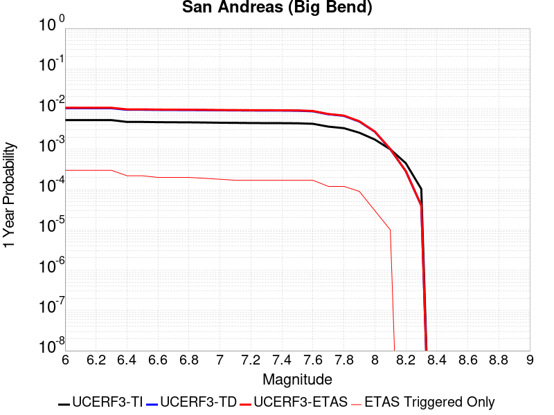 | 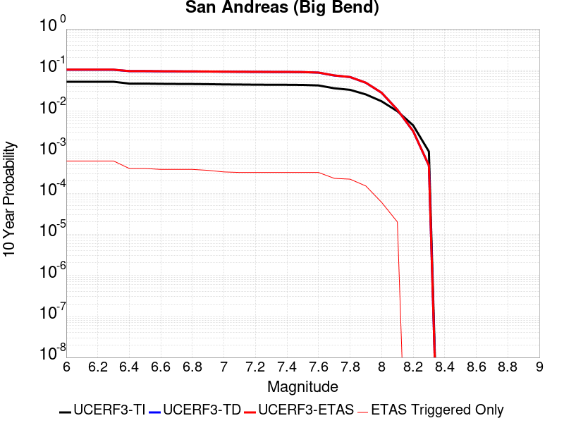 |

| Magnitude | 1 wk TI Prob | 1 wk TD Prob | 1 wk ETAS Prob | 1 wk ETAS/TD Gain | 1 wk ETAS Triggered Only | 1 mo TI Prob | 1 mo TD Prob | 1 mo ETAS Prob | 1 mo ETAS/TD Gain | 1 mo ETAS Triggered Only | 1 yr TI Prob | 1 yr TD Prob | 1 yr ETAS Prob | 1 yr ETAS/TD Gain | 1 yr ETAS Triggered Only | 10 yr TI Prob | 10 yr TD Prob | 10 yr ETAS Prob | 10 yr ETAS/TD Gain | 10 yr ETAS Triggered Only |
|-----|-----|-----|-----|-----|-----|-----|-----|-----|-----|-----|-----|-----|-----|-----|-----|-----|-----|-----|-----|-----|
| 6.0 | 1.0179969E-4 | 2.0080879E-4 | 2.2080478E-4 | 1.0995772 | 2.0E-5 | 4.362114E-4 | 8.603263E-4 | 9.3026605E-4 | 1.0812945 | 7.0E-5 | 0.0052979486 | 0.010424451 | 0.010721323 | 1.0284785 | 3.0E-4 | 0.051734097 | 0.10146839 | 0.1020165 | 1.0054017 | 6.1E-4 |
| 6.1 | 1.0179969E-4 | 2.0080879E-4 | 2.2080478E-4 | 1.0995772 | 2.0E-5 | 4.362114E-4 | 8.603263E-4 | 9.3026605E-4 | 1.0812945 | 7.0E-5 | 0.0052979486 | 0.010424451 | 0.010721323 | 1.0284785 | 3.0E-4 | 0.051734097 | 0.10146839 | 0.1020165 | 1.0054017 | 6.1E-4 |
| 6.2 | 1.0179969E-4 | 2.0080879E-4 | 2.2080478E-4 | 1.0995772 | 2.0E-5 | 4.362114E-4 | 8.603263E-4 | 9.3026605E-4 | 1.0812945 | 7.0E-5 | 0.0052979486 | 0.010424451 | 0.010721323 | 1.0284785 | 3.0E-4 | 0.051734097 | 0.10146839 | 0.1020165 | 1.0054017 | 6.1E-4 |
| 6.3 | 1.0179969E-4 | 2.0080879E-4 | 2.2080478E-4 | 1.0995772 | 2.0E-5 | 4.362114E-4 | 8.603263E-4 | 9.3026605E-4 | 1.0812945 | 7.0E-5 | 0.0052979486 | 0.010424451 | 0.010721323 | 1.0284785 | 3.0E-4 | 0.051734097 | 0.10146839 | 0.1020165 | 1.0054017 | 6.1E-4 |
| 6.4 | 9.1639464E-5 | 1.8437851E-4 | 1.9437667E-4 | 1.0542263 | 1.0E-5 | 3.9268145E-4 | 7.8995456E-4 | 8.4990717E-4 | 1.0758938 | 6.0E-5 | 0.0047704205 | 0.009575402 | 0.0097932955 | 1.0227555 | 2.2E-4 | 0.046693064 | 0.093800984 | 0.09416346 | 1.0038643 | 4.0E-4 |
| 6.5 | 9.1639464E-5 | 1.8437851E-4 | 1.9437667E-4 | 1.0542263 | 1.0E-5 | 3.9268145E-4 | 7.8995456E-4 | 8.4990717E-4 | 1.0758938 | 6.0E-5 | 0.0047704205 | 0.009575402 | 0.0097932955 | 1.0227555 | 2.2E-4 | 0.046693064 | 0.093800984 | 0.09416346 | 1.0038643 | 4.0E-4 |
| 6.6 | 9.042622E-5 | 1.8244861E-4 | 1.9244678E-4 | 1.0547999 | 1.0E-5 | 3.8748336E-4 | 7.816885E-4 | 8.316494E-4 | 1.0639141 | 5.0E-5 | 0.0047074095 | 0.00947564 | 0.009673745 | 1.0209068 | 2.0E-4 | 0.046089325 | 0.09289801 | 0.09324271 | 1.0037105 | 3.8E-4 |
| 6.7 | 8.9836685E-5 | 1.8159185E-4 | 1.9159004E-4 | 1.0550586 | 1.0E-5 | 3.8495753E-4 | 7.7801885E-4 | 8.2797994E-4 | 1.0642158 | 5.0E-5 | 0.00467679 | 0.009431349 | 0.009629463 | 1.0210059 | 2.0E-4 | 0.045795817 | 0.092492245 | 0.092837095 | 1.0037285 | 3.8E-4 |
| 6.8 | 8.9471854E-5 | 1.8105956E-4 | 1.9105774E-4 | 1.0552205 | 1.0E-5 | 3.8339442E-4 | 7.7573897E-4 | 8.257002E-4 | 1.0644047 | 5.0E-5 | 0.004657841 | 0.009403831 | 0.009601951 | 1.021068 | 2.0E-4 | 0.04561414 | 0.09223984 | 0.09258479 | 1.0037397 | 3.8E-4 |
| 6.9 | 8.858234E-5 | 1.7987912E-4 | 1.8987732E-4 | 1.0555829 | 1.0E-5 | 3.7958333E-4 | 7.7068293E-4 | 8.1065216E-4 | 1.051862 | 4.0E-5 | 0.004611638 | 0.009342804 | 0.009531029 | 1.0201465 | 1.9E-4 | 0.04517103 | 0.09167995 | 0.09200695 | 1.0035667 | 3.6E-4 |
| 7.0 | 8.7433385E-5 | 1.7826686E-4 | 1.8826507E-4 | 1.0560857 | 1.0E-5 | 3.746607E-4 | 7.637773E-4 | 8.0374675E-4 | 1.0523313 | 4.0E-5 | 0.004551957 | 0.009259445 | 0.009437778 | 1.0192596 | 1.8E-4 | 0.044598386 | 0.09091457 | 0.09121457 | 1.0032998 | 3.3E-4 |
| 7.1 | 8.684964E-5 | 1.7738632E-4 | 1.8738453E-4 | 1.0563642 | 1.0E-5 | 3.7215967E-4 | 7.600057E-4 | 7.9997536E-4 | 1.0525912 | 4.0E-5 | 0.0045216335 | 0.009213916 | 0.009382349 | 1.0182804 | 1.7E-4 | 0.04430731 | 0.09049596 | 0.090787 | 1.003216 | 3.2E-4 |
| 7.2 | 8.606521E-5 | 1.7629229E-4 | 1.8629053E-4 | 1.0567139 | 1.0E-5 | 3.6879873E-4 | 7.5531984E-4 | 7.9528964E-4 | 1.0529177 | 4.0E-5 | 0.0044808835 | 0.009157346 | 0.009325789 | 1.0183944 | 1.7E-4 | 0.043916024 | 0.0899767 | 0.090267904 | 1.0032365 | 3.2E-4 |
| 7.3 | 8.568266E-5 | 1.7571225E-4 | 1.857105E-4 | 1.0569012 | 1.0E-5 | 3.6715972E-4 | 7.5283536E-4 | 7.928052E-4 | 1.0530925 | 4.0E-5 | 0.0044610105 | 0.009127351 | 0.0092958 | 1.0184554 | 1.7E-4 | 0.043725148 | 0.08969772 | 0.08998902 | 1.0032475 | 3.2E-4 |
| 7.4 | 8.5432206E-5 | 1.75338E-4 | 1.8533625E-4 | 1.0570227 | 1.0E-5 | 3.6608664E-4 | 7.512324E-4 | 7.912023E-4 | 1.0532058 | 4.0E-5 | 0.004447999 | 0.009107999 | 0.00927645 | 1.018495 | 1.7E-4 | 0.043600157 | 0.08951789 | 0.08980925 | 1.0032547 | 3.2E-4 |
| 7.5 | 8.4791965E-5 | 1.740313E-4 | 1.8402956E-4 | 1.0574509 | 1.0E-5 | 3.633435E-4 | 7.456354E-4 | 7.8560563E-4 | 1.0536056 | 4.0E-5 | 0.0044147377 | 0.009040423 | 0.009208886 | 1.0186344 | 1.7E-4 | 0.043280575 | 0.08889362 | 0.08918518 | 1.0032798 | 3.2E-4 |
| 7.6 | 8.241105E-5 | 1.6848398E-4 | 1.784823E-4 | 1.0593429 | 1.0E-5 | 3.531424E-4 | 7.218746E-4 | 7.618457E-4 | 1.0553713 | 4.0E-5 | 0.0042910352 | 0.008753494 | 0.008922006 | 1.0192509 | 1.7E-4 | 0.042091176 | 0.086270064 | 0.08656246 | 1.0033892 | 3.2E-4 |
| 7.7 | 7.00432E-5 | 1.4211581E-4 | 1.5211439E-4 | 1.0703552 | 1.0E-5 | 3.001506E-4 | 6.089256E-4 | 6.489013E-4 | 1.0656495 | 4.0E-5 | 0.0036482112 | 0.007388508 | 0.0075076213 | 1.0161214 | 1.2E-4 | 0.035888977 | 0.07354545 | 0.073758535 | 1.0028973 | 2.3E-4 |
| 7.8 | 6.415362E-5 | 1.2975278E-4 | 1.3975149E-4 | 1.0770596 | 1.0E-5 | 2.749151E-4 | 5.559648E-4 | 5.959426E-4 | 1.071907 | 4.0E-5 | 0.0033419547 | 0.006747894 | 0.006867084 | 1.0176634 | 1.2E-4 | 0.03292141 | 0.06727858 | 0.067483775 | 1.00305 | 2.2E-4 |
| 7.9 | 4.939911E-5 | 9.345585E-5 | 1.0345491E-4 | 1.1069924 | 1.0E-5 | 2.116933E-4 | 4.0046358E-4 | 4.304516E-4 | 1.0748832 | 3.0E-5 | 0.0025743195 | 0.004864753 | 0.0049543157 | 1.0184104 | 9.0E-5 | 0.025447013 | 0.048933372 | 0.049076032 | 1.0029154 | 1.5E-4 |
| 8.0 | 3.344983E-5 | 5.2251205E-5 | 5.2251205E-5 | 1.0 | 0.0 | 1.4334853E-4 | 2.2391453E-4 | 2.3391229E-4 | 1.04465 | 1.0E-5 | 0.0017438711 | 0.002722753 | 0.0027526713 | 1.0109882 | 3.0E-5 | 0.017302496 | 0.02793423 | 0.027992556 | 1.002088 | 6.0E-5 |
| 8.1 | 1.9104898E-5 | 1.9182831E-5 | 1.9182831E-5 | 1.0 | 0.0 | 8.1875565E-5 | 8.2209546E-5 | 9.220872E-5 | 1.1216304 | 1.0E-5 | 9.963791E-4 | 0.0010004422 | 0.0010104323 | 1.0099856 | 1.0E-5 | 0.009919235 | 0.0107551105 | 0.010774896 | 1.0018396 | 2.0E-5 |
| 8.2 | 8.643924E-6 | 5.4778857E-6 | 5.4778857E-6 | 1.0 | 0.0 | 3.704486E-5 | 2.3476441E-5 | 2.3476441E-5 | 1.0 | 0.0 | 4.5092785E-4 | 2.8578826E-4 | 2.8578826E-4 | 1.0 | 0.0 | 0.0045001395 | 0.0032504273 | 0.0032504273 | 1.0 | 0.0 |
| 8.3 | 1.983087E-6 | 7.663413E-7 | 7.663413E-7 | 1.0 | 0.0 | 8.498917E-6 | 3.2843159E-6 | 3.2843159E-6 | 1.0 | 0.0 | 1.034694E-4 | 3.998583E-5 | 3.998583E-5 | 1.0 | 0.0 | 0.0010342124 | 4.7219908E-4 | 4.7219908E-4 | 1.0 | 0.0 |

## Helendale-So Lockhart
*[(top)](#table-of-contents)*

| 1 Week | 1 Month | 1 Year | 10 Year |
|-----|-----|-----|-----|
|  |  | 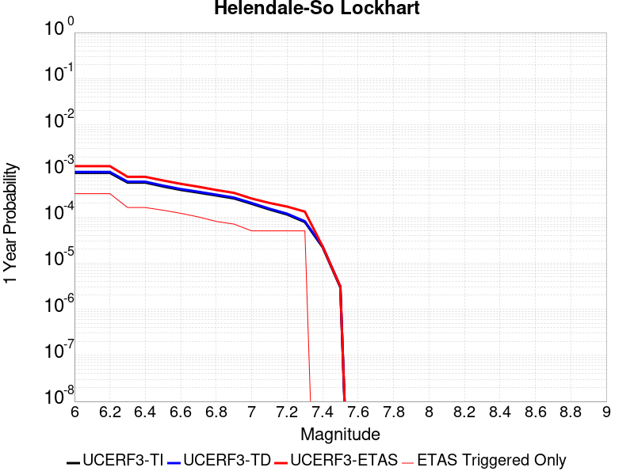 | 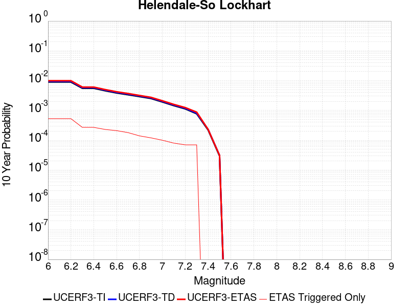 |

| Magnitude | 1 wk TI Prob | 1 wk TD Prob | 1 wk ETAS Prob | 1 wk ETAS/TD Gain | 1 wk ETAS Triggered Only | 1 mo TI Prob | 1 mo TD Prob | 1 mo ETAS Prob | 1 mo ETAS/TD Gain | 1 mo ETAS Triggered Only | 1 yr TI Prob | 1 yr TD Prob | 1 yr ETAS Prob | 1 yr ETAS/TD Gain | 1 yr ETAS Triggered Only | 10 yr TI Prob | 10 yr TD Prob | 10 yr ETAS Prob | 10 yr ETAS/TD Gain | 10 yr ETAS Triggered Only |
|-----|-----|-----|-----|-----|-----|-----|-----|-----|-----|-----|-----|-----|-----|-----|-----|-----|-----|-----|-----|-----|
| 6.0 | 1.7296055E-5 | 1.8103825E-5 | 7.810274E-5 | 4.314157 | 6.0E-5 | 7.412385E-5 | 7.7585624E-5 | 2.1757476E-4 | 2.804318 | 1.4E-4 | 9.0208417E-4 | 9.442164E-4 | 0.0012639143 | 1.3385854 | 3.2E-4 | 0.008984311 | 0.009404166 | 0.009929181 | 1.055828 | 5.3E-4 |
| 6.1 | 1.7296055E-5 | 1.8103825E-5 | 7.810274E-5 | 4.314157 | 6.0E-5 | 7.412385E-5 | 7.7585624E-5 | 2.1757476E-4 | 2.804318 | 1.4E-4 | 9.0208417E-4 | 9.442164E-4 | 0.0012639143 | 1.3385854 | 3.2E-4 | 0.008984311 | 0.009404166 | 0.009929181 | 1.055828 | 5.3E-4 |
| 6.2 | 1.7296055E-5 | 1.8103825E-5 | 7.810274E-5 | 4.314157 | 6.0E-5 | 7.412385E-5 | 7.7585624E-5 | 2.1757476E-4 | 2.804318 | 1.4E-4 | 9.0208417E-4 | 9.442164E-4 | 0.0012639143 | 1.3385854 | 3.2E-4 | 0.008984311 | 0.009404166 | 0.009929181 | 1.055828 | 5.3E-4 |
| 6.3 | 1.0669118E-5 | 1.1135479E-5 | 4.1135147E-5 | 3.6940615 | 3.0E-5 | 4.5723988E-5 | 4.7722624E-5 | 1.0771976E-4 | 2.2572052 | 6.0E-5 | 5.5654737E-4 | 5.8087084E-4 | 7.4077793E-4 | 1.2752885 | 1.6E-4 | 0.0055515557 | 0.005793822 | 0.0060622576 | 1.0463314 | 2.7E-4 |
| 6.4 | 1.0669118E-5 | 1.1135479E-5 | 4.1135147E-5 | 3.6940615 | 3.0E-5 | 4.5723988E-5 | 4.7722624E-5 | 1.0771976E-4 | 2.2572052 | 6.0E-5 | 5.5654737E-4 | 5.8087084E-4 | 7.4077793E-4 | 1.2752885 | 1.6E-4 | 0.0055515557 | 0.005793822 | 0.0060622576 | 1.0463314 | 2.7E-4 |
| 6.5 | 8.790038E-6 | 9.170241E-6 | 3.9169965E-5 | 4.2714214 | 3.0E-5 | 3.767105E-5 | 3.9300452E-5 | 9.929809E-5 | 2.52664 | 6.0E-5 | 4.585485E-4 | 4.783795E-4 | 6.183125E-4 | 1.2925147 | 1.4E-4 | 0.0045760344 | 0.0047736615 | 0.0050025634 | 1.0479511 | 2.3E-4 |
| 6.6 | 7.396949E-6 | 7.715575E-6 | 2.771542E-5 | 3.5921397 | 2.0E-5 | 3.1700827E-5 | 3.306633E-5 | 8.306468E-5 | 2.512062 | 5.0E-5 | 3.858892E-4 | 4.0250926E-4 | 5.2246096E-4 | 1.2980098 | 1.2E-4 | 0.003852198 | 0.004017909 | 0.0042270655 | 1.052056 | 2.1E-4 |
| 6.7 | 6.4600285E-6 | 6.7380633E-6 | 2.673793E-5 | 3.9681919 | 2.0E-5 | 2.7685543E-5 | 2.8877099E-5 | 7.887566E-5 | 2.7314258 | 5.0E-5 | 3.3701936E-4 | 3.5152276E-4 | 4.514876E-4 | 1.2843766 | 1.0E-4 | 0.0033650869 | 0.0035097487 | 0.003689117 | 1.0511057 | 1.8E-4 |
| 6.8 | 5.600104E-6 | 5.836037E-6 | 1.5835978E-5 | 2.7134817 | 1.0E-5 | 2.4000226E-5 | 2.501135E-5 | 6.501035E-5 | 2.5992339 | 4.0E-5 | 2.9216358E-4 | 3.0447124E-4 | 3.8444687E-4 | 1.2626706 | 8.0E-5 | 0.0029177975 | 0.0030406024 | 0.0031801767 | 1.0459036 | 1.4E-4 |
| 6.9 | 4.839122E-6 | 5.0395324E-6 | 1.5039483E-5 | 2.984301 | 1.0E-5 | 2.0738931E-5 | 2.1597822E-5 | 5.1597173E-5 | 2.388999 | 3.0E-5 | 2.5246723E-4 | 2.629222E-4 | 3.329038E-4 | 1.2661685 | 7.0E-5 | 0.002521806 | 0.002626159 | 0.0027458437 | 1.0455741 | 1.2E-4 |
| 7.0 | 3.6937633E-6 | 3.845226E-6 | 1.3845187E-5 | 3.6006176 | 1.0E-5 | 1.5830317E-5 | 1.6479436E-5 | 3.6479105E-5 | 2.2136137 | 2.0E-5 | 1.9271708E-4 | 2.0061898E-4 | 2.5060895E-4 | 1.2491786 | 5.0E-5 | 0.0019255003 | 0.0020044101 | 0.0021042097 | 1.04979 | 1.0E-4 |
| 7.1 | 2.7858857E-6 | 2.8978668E-6 | 1.2897838E-5 | 4.450804 | 1.0E-5 | 1.1939455E-5 | 1.2419371E-5 | 3.2419124E-5 | 2.6103675 | 2.0E-5 | 1.4535317E-4 | 1.5119556E-4 | 2.0118801E-4 | 1.3306475 | 5.0E-5 | 0.0014525814 | 0.0015109485 | 0.0015908277 | 1.0528668 | 8.0E-5 |
| 7.2 | 2.1672065E-6 | 2.2540228E-6 | 1.22540005E-5 | 5.436502 | 1.0E-5 | 9.2879945E-6 | 9.660063E-6 | 2.965987E-5 | 3.0703597 | 2.0E-5 | 1.1307546E-4 | 1.1760511E-4 | 1.6759922E-4 | 1.4251016 | 5.0E-5 | 0.0011301794 | 0.0011754469 | 0.0012453647 | 1.0594819 | 7.0E-5 |
| 7.3 | 1.4823496E-6 | 1.5422172E-6 | 1.1542202E-5 | 7.484161 | 1.0E-5 | 6.3529114E-6 | 6.6094863E-6 | 2.6609354E-5 | 4.0259337 | 2.0E-5 | 7.734395E-5 | 8.0467675E-5 | 1.3046365E-4 | 1.6213175 | 5.0E-5 | 7.731704E-4 | 8.0440054E-4 | 8.743442E-4 | 1.0869514 | 7.0E-5 |
| 7.4 | 4.2321457E-7 | 4.4108972E-7 | 4.4108972E-7 | 1.0 | 0.0 | 1.8137755E-6 | 1.8903835E-6 | 1.8903835E-6 | 1.0 | 0.0 | 2.2082493E-5 | 2.3015222E-5 | 2.3015222E-5 | 1.0 | 0.0 | 2.2080299E-4 | 2.3013291E-4 | 2.3013291E-4 | 1.0 | 0.0 |
| 7.5 | 5.6942316E-8 | 5.9415935E-8 | 5.9415935E-8 | 1.0 | 0.0 | 2.440385E-7 | 2.546397E-7 | 2.546397E-7 | 1.0 | 0.0 | 2.9711643E-6 | 3.1002348E-6 | 3.1002348E-6 | 1.0 | 0.0 | 2.9711247E-5 | 3.1001993E-5 | 3.1001993E-5 | 1.0 | 0.0 |

## Coyote Lake
*[(top)](#table-of-contents)*

| 1 Week | 1 Month | 1 Year | 10 Year |
|-----|-----|-----|-----|
|  |  |  |  |

| Magnitude | 1 wk TI Prob | 1 wk TD Prob | 1 wk ETAS Prob | 1 wk ETAS/TD Gain | 1 wk ETAS Triggered Only | 1 mo TI Prob | 1 mo TD Prob | 1 mo ETAS Prob | 1 mo ETAS/TD Gain | 1 mo ETAS Triggered Only | 1 yr TI Prob | 1 yr TD Prob | 1 yr ETAS Prob | 1 yr ETAS/TD Gain | 1 yr ETAS Triggered Only | 10 yr TI Prob | 10 yr TD Prob | 10 yr ETAS Prob | 10 yr ETAS/TD Gain | 10 yr ETAS Triggered Only |
|-----|-----|-----|-----|-----|-----|-----|-----|-----|-----|-----|-----|-----|-----|-----|-----|-----|-----|-----|-----|-----|
| 6.0 | 1.980352E-5 | 2.1706977E-5 | 3.170676E-5 | 1.4606713 | 1.0E-5 | 8.486947E-5 | 9.3026996E-5 | 1.4302235E-4 | 1.5374284 | 5.0E-5 | 0.0010327959 | 0.0011320872 | 0.0013418494 | 1.1852881 | 2.1E-4 | 0.010280091 | 0.011270379 | 0.011744969 | 1.0421095 | 4.8E-4 |
| 6.1 | 1.980352E-5 | 2.1706977E-5 | 3.170676E-5 | 1.4606713 | 1.0E-5 | 8.486947E-5 | 9.3026996E-5 | 1.4302235E-4 | 1.5374284 | 5.0E-5 | 0.0010327959 | 0.0011320872 | 0.0013418494 | 1.1852881 | 2.1E-4 | 0.010280091 | 0.011270379 | 0.011744969 | 1.0421095 | 4.8E-4 |
| 6.2 | 1.980352E-5 | 2.1706977E-5 | 3.170676E-5 | 1.4606713 | 1.0E-5 | 8.486947E-5 | 9.3026996E-5 | 1.4302235E-4 | 1.5374284 | 5.0E-5 | 0.0010327959 | 0.0011320872 | 0.0013418494 | 1.1852881 | 2.1E-4 | 0.010280091 | 0.011270379 | 0.011744969 | 1.0421095 | 4.8E-4 |
| 6.3 | 1.5344787E-5 | 1.682085E-5 | 2.6820682E-5 | 1.5944903 | 1.0E-5 | 6.576172E-5 | 7.2087714E-5 | 1.12084825E-4 | 1.5548396 | 4.0E-5 | 8.003548E-4 | 8.773757E-4 | 0.0010472265 | 1.1935897 | 1.7E-4 | 0.007974784 | 0.008745163 | 0.00912184 | 1.0430726 | 3.8E-4 |
| 6.4 | 1.5344787E-5 | 1.682085E-5 | 2.6820682E-5 | 1.5944903 | 1.0E-5 | 6.576172E-5 | 7.2087714E-5 | 1.12084825E-4 | 1.5548396 | 4.0E-5 | 8.003548E-4 | 8.773757E-4 | 0.0010472265 | 1.1935897 | 1.7E-4 | 0.007974784 | 0.008745163 | 0.00912184 | 1.0430726 | 3.8E-4 |
| 6.5 | 1.4189697E-5 | 1.5558155E-5 | 2.5558E-5 | 1.6427398 | 1.0E-5 | 6.081157E-5 | 6.667644E-5 | 1.06673775E-4 | 1.599872 | 4.0E-5 | 7.401293E-4 | 8.115436E-4 | 9.814057E-4 | 1.2093073 | 1.7E-4 | 0.0073766913 | 0.008091743 | 0.008468668 | 1.0465815 | 3.8E-4 |
| 6.6 | 1.3469301E-5 | 1.4771737E-5 | 2.4771589E-5 | 1.6769584 | 1.0E-5 | 5.7724297E-5 | 6.3306245E-5 | 1.0330371E-4 | 1.6318092 | 4.0E-5 | 7.025667E-4 | 7.7054097E-4 | 9.304177E-4 | 1.2074863 | 1.6E-4 | 0.0070034964 | 0.0076845973 | 0.008051754 | 1.0477782 | 3.7E-4 |
| 6.7 | 1.3027966E-5 | 1.4281899E-5 | 2.4281757E-5 | 1.700177 | 1.0E-5 | 5.5832945E-5 | 6.1207036E-5 | 1.0120459E-4 | 1.6534796 | 4.0E-5 | 6.7955407E-4 | 7.4500067E-4 | 9.0488145E-4 | 1.2146049 | 1.6E-4 | 0.006774798 | 0.0074309087 | 0.007798159 | 1.049422 | 3.7E-4 |
| 6.8 | 5.695434E-6 | 6.2244826E-6 | 6.2244826E-6 | 1.0 | 0.0 | 2.4408775E-5 | 2.6676249E-5 | 3.667598E-5 | 1.3748553 | 1.0E-5 | 2.971363E-4 | 3.2476493E-4 | 3.4475842E-4 | 1.061563 | 2.0E-5 | 0.0029673933 | 0.003245844 | 0.003295682 | 1.0153543 | 5.0E-5 |
| 6.9 | 4.385688E-6 | 4.7931053E-6 | 4.7931053E-6 | 1.0 | 0.0 | 1.879567E-5 | 2.054188E-5 | 2.054188E-5 | 1.0 | 0.0 | 2.2881327E-4 | 2.500974E-4 | 2.6009488E-4 | 1.0399745 | 1.0E-5 | 0.002285778 | 0.0025009739 | 0.0025308987 | 1.0119653 | 3.0E-5 |

## San Andreas (Parkfield)
*[(top)](#table-of-contents)*

| 1 Week | 1 Month | 1 Year | 10 Year |
|-----|-----|-----|-----|
| 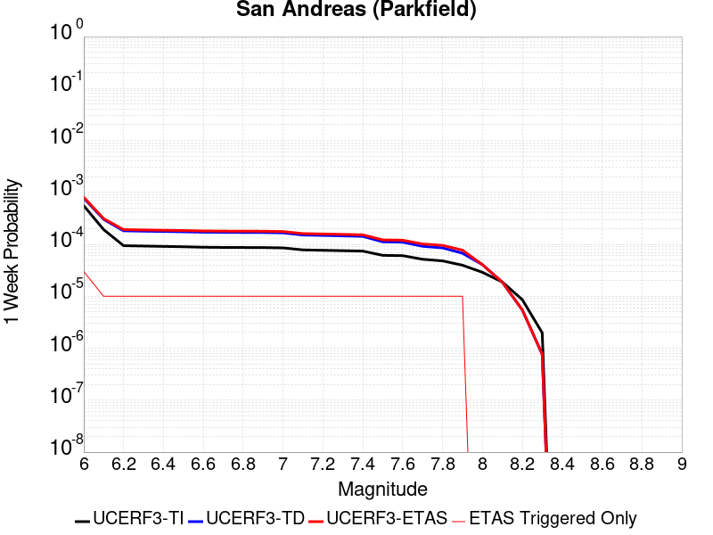 |  |  |  |

| Magnitude | 1 wk TI Prob | 1 wk TD Prob | 1 wk ETAS Prob | 1 wk ETAS/TD Gain | 1 wk ETAS Triggered Only | 1 mo TI Prob | 1 mo TD Prob | 1 mo ETAS Prob | 1 mo ETAS/TD Gain | 1 mo ETAS Triggered Only | 1 yr TI Prob | 1 yr TD Prob | 1 yr ETAS Prob | 1 yr ETAS/TD Gain | 1 yr ETAS Triggered Only | 10 yr TI Prob | 10 yr TD Prob | 10 yr ETAS Prob | 10 yr ETAS/TD Gain | 10 yr ETAS Triggered Only |
|-----|-----|-----|-----|-----|-----|-----|-----|-----|-----|-----|-----|-----|-----|-----|-----|-----|-----|-----|-----|-----|
| 6.0 | 5.556969E-4 | 7.785649E-4 | 8.0854155E-4 | 1.0385025 | 3.0E-5 | 0.0023793848 | 0.0033329888 | 0.0034127221 | 1.0239224 | 8.0E-5 | 0.028586963 | 0.04026891 | 0.040499248 | 1.0057199 | 2.4E-4 | 0.25176284 | 0.33738863 | 0.3376868 | 1.0008838 | 4.5E-4 |
| 6.1 | 1.925858E-4 | 3.0298973E-4 | 3.129867E-4 | 1.0329944 | 1.0E-5 | 8.2510663E-4 | 0.0012979752 | 0.0013479103 | 1.0384716 | 5.0E-5 | 0.0099994885 | 0.015784206 | 0.01594168 | 1.0099767 | 1.6E-4 | 0.095613256 | 0.14981441 | 0.15005246 | 1.001589 | 2.8E-4 |
| 6.2 | 9.4306815E-5 | 1.8250047E-4 | 1.9249864E-4 | 1.0547844 | 1.0E-5 | 4.0410945E-4 | 7.8191166E-4 | 8.2188036E-4 | 1.0511167 | 4.0E-5 | 0.0049089384 | 0.009478419 | 0.009617092 | 1.0146304 | 1.4E-4 | 0.048019063 | 0.091888316 | 0.09211534 | 1.0024707 | 2.5E-4 |
| 6.3 | 9.283051E-5 | 1.7946548E-4 | 1.894637E-4 | 1.055711 | 1.0E-5 | 3.9778434E-4 | 7.6891226E-4 | 8.0888154E-4 | 1.0519816 | 4.0E-5 | 0.0048322747 | 0.009321514 | 0.009460209 | 1.014879 | 1.4E-4 | 0.047285385 | 0.090541415 | 0.09076878 | 1.0025111 | 2.5E-4 |
| 6.4 | 9.138826E-5 | 1.7708712E-4 | 1.8708534E-4 | 1.0564594 | 1.0E-5 | 3.916052E-4 | 7.587252E-4 | 7.9869485E-4 | 1.05268 | 4.0E-5 | 0.0047573745 | 0.009198536 | 0.009337249 | 1.0150799 | 1.4E-4 | 0.046568092 | 0.089445 | 0.08967264 | 1.002545 | 2.5E-4 |
| 6.5 | 9.000255E-5 | 1.7466745E-4 | 1.8466571E-4 | 1.0572417 | 1.0E-5 | 3.8566816E-4 | 7.483612E-4 | 7.8833126E-4 | 1.0534102 | 4.0E-5 | 0.0046854047 | 0.009073436 | 0.009212165 | 1.0152897 | 1.4E-4 | 0.045878403 | 0.08832817 | 0.08855608 | 1.0025804 | 2.5E-4 |
| 6.6 | 8.8109264E-5 | 1.7147823E-4 | 1.8147651E-4 | 1.0583065 | 1.0E-5 | 3.7755648E-4 | 7.347008E-4 | 7.7467144E-4 | 1.0544039 | 4.0E-5 | 0.0045870654 | 0.008908509 | 0.009047262 | 1.0155753 | 1.4E-4 | 0.04493529 | 0.08686033 | 0.087088615 | 1.0026282 | 2.5E-4 |
| 6.7 | 8.738073E-5 | 1.7014878E-4 | 1.8014706E-4 | 1.0587621 | 1.0E-5 | 3.7443507E-4 | 7.2900637E-4 | 7.689772E-4 | 1.0548292 | 4.0E-5 | 0.0045492216 | 0.008839787 | 0.008978549 | 1.0156975 | 1.4E-4 | 0.04457213 | 0.08626132 | 0.08648975 | 1.0026481 | 2.5E-4 |
| 6.8 | 8.710195E-5 | 1.6960359E-4 | 1.7960189E-4 | 1.058951 | 1.0E-5 | 3.7324068E-4 | 7.266712E-4 | 7.666421E-4 | 1.0550056 | 4.0E-5 | 0.0045347405 | 0.008811594 | 0.008950361 | 1.0157481 | 1.4E-4 | 0.04443313 | 0.086009055 | 0.08623756 | 1.0026567 | 2.5E-4 |
| 6.9 | 8.6801556E-5 | 1.69013E-4 | 1.790113E-4 | 1.059157 | 1.0E-5 | 3.7195362E-4 | 7.241415E-4 | 7.641125E-4 | 1.0551978 | 4.0E-5 | 0.0045191357 | 0.008781044 | 0.008919815 | 1.0158035 | 1.4E-4 | 0.044283327 | 0.08573501 | 0.08596357 | 1.002666 | 2.5E-4 |
| 7.0 | 8.5571606E-5 | 1.665407E-4 | 1.7653903E-4 | 1.0600353 | 1.0E-5 | 3.6668387E-4 | 7.1355177E-4 | 7.5352326E-4 | 1.0560176 | 4.0E-5 | 0.004455241 | 0.008653145 | 0.008791934 | 1.0160391 | 1.4E-4 | 0.043669727 | 0.0845839 | 0.08481275 | 1.0027057 | 2.5E-4 |
| 7.1 | 7.82589E-5 | 1.5134698E-4 | 1.6134547E-4 | 1.0660633 | 1.0E-5 | 3.3535215E-4 | 6.484694E-4 | 6.884435E-4 | 1.0616437 | 4.0E-5 | 0.0040752706 | 0.007866705 | 0.008005603 | 1.0176566 | 1.4E-4 | 0.040013418 | 0.07749935 | 0.07772998 | 1.0029758 | 2.5E-4 |
| 7.2 | 7.690929E-5 | 1.4871909E-4 | 1.5871761E-4 | 1.0672308 | 1.0E-5 | 3.2956956E-4 | 6.372126E-4 | 6.7718705E-4 | 1.0627334 | 4.0E-5 | 0.004005129 | 0.007730633 | 0.007869551 | 1.0179697 | 1.4E-4 | 0.0393371 | 0.07627224 | 0.07650317 | 1.0030277 | 2.5E-4 |
| 7.3 | 7.5543794E-5 | 1.456839E-4 | 1.5568244E-4 | 1.0686318 | 1.0E-5 | 3.2371894E-4 | 6.2421086E-4 | 6.641859E-4 | 1.0640409 | 4.0E-5 | 0.003934157 | 0.0075734477 | 0.0077123875 | 1.0183456 | 1.4E-4 | 0.038652334 | 0.0748373 | 0.07506859 | 1.0030906 | 2.5E-4 |
| 7.4 | 7.4214564E-5 | 1.4269276E-4 | 1.5269134E-4 | 1.0700706 | 1.0E-5 | 3.1802364E-4 | 6.113978E-4 | 6.5137335E-4 | 1.0653839 | 4.0E-5 | 0.003865065 | 0.0074185207 | 0.0075574825 | 1.0187317 | 1.4E-4 | 0.03798529 | 0.07341105 | 0.07364269 | 1.0031555 | 2.5E-4 |
| 7.5 | 6.149578E-5 | 1.1196297E-4 | 1.2196184E-4 | 1.0893053 | 1.0E-5 | 2.6352672E-4 | 4.7975313E-4 | 5.1973393E-4 | 1.0833362 | 4.0E-5 | 0.0032037178 | 0.005825383 | 0.0059546256 | 1.0221862 | 1.3E-4 | 0.03157923 | 0.0585785 | 0.058795024 | 1.0036963 | 2.3E-4 |
| 7.6 | 6.0643448E-5 | 1.10249006E-4 | 1.202479E-4 | 1.0906937 | 1.0E-5 | 2.598746E-4 | 4.724103E-4 | 5.123914E-4 | 1.0846322 | 4.0E-5 | 0.0031593828 | 0.005736458 | 0.005865712 | 1.0225321 | 1.3E-4 | 0.031148417 | 0.057739355 | 0.057956073 | 1.0037534 | 2.3E-4 |
| 7.7 | 5.1652263E-5 | 9.17963E-5 | 1.01795384E-4 | 1.1089269 | 1.0E-5 | 2.2134806E-4 | 3.933534E-4 | 4.3333767E-4 | 1.1016498 | 4.0E-5 | 0.002691582 | 0.0047785714 | 0.0048681414 | 1.0187441 | 9.0E-5 | 0.026592141 | 0.048553027 | 0.048705257 | 1.0031353 | 1.6E-4 |
| 7.8 | 4.8090482E-5 | 8.564172E-5 | 9.564086E-5 | 1.1167555 | 1.0E-5 | 2.060858E-4 | 3.669843E-4 | 4.0696963E-4 | 1.1089565 | 4.0E-5 | 0.0025062072 | 0.0044588884 | 0.0045484873 | 1.0200944 | 9.0E-5 | 0.024781305 | 0.045318335 | 0.04546154 | 1.0031599 | 1.5E-4 |
| 7.9 | 3.970278E-5 | 6.753813E-5 | 7.753746E-5 | 1.1480545 | 1.0E-5 | 1.7014367E-4 | 2.8941705E-4 | 3.1940837E-4 | 1.1036266 | 3.0E-5 | 0.002069531 | 0.003517963 | 0.0035976814 | 1.0226604 | 8.0E-5 | 0.020503636 | 0.035895795 | 0.036011487 | 1.0032231 | 1.2E-4 |
| 8.0 | 2.8982335E-5 | 4.071774E-5 | 4.071774E-5 | 1.0 | 0.0 | 1.2420409E-4 | 1.7449293E-4 | 1.8449119E-4 | 1.0572989 | 1.0E-5 | 0.0015111357 | 0.0021223826 | 0.0021423402 | 1.0094033 | 2.0E-5 | 0.015009012 | 0.022020737 | 0.022069637 | 1.0022206 | 5.0E-5 |
| 8.1 | 1.8836186E-5 | 1.8690685E-5 | 1.8690685E-5 | 1.0 | 0.0 | 8.0724014E-5 | 8.010048E-5 | 9.009968E-5 | 1.1248332 | 1.0E-5 | 9.823717E-4 | 9.7478763E-4 | 9.847779E-4 | 1.0102487 | 1.0E-5 | 0.009780403 | 0.010493401 | 0.010513191 | 1.001886 | 2.0E-5 |
| 8.2 | 8.643924E-6 | 5.4778857E-6 | 5.4778857E-6 | 1.0 | 0.0 | 3.704486E-5 | 2.3476441E-5 | 2.3476441E-5 | 1.0 | 0.0 | 4.5092785E-4 | 2.8578826E-4 | 2.8578826E-4 | 1.0 | 0.0 | 0.0045001395 | 0.0032504273 | 0.0032504273 | 1.0 | 0.0 |
| 8.3 | 1.983087E-6 | 7.663413E-7 | 7.663413E-7 | 1.0 | 0.0 | 8.498917E-6 | 3.2843159E-6 | 3.2843159E-6 | 1.0 | 0.0 | 1.034694E-4 | 3.998583E-5 | 3.998583E-5 | 1.0 | 0.0 | 0.0010342124 | 4.7219908E-4 | 4.7219908E-4 | 1.0 | 0.0 |

## San Andreas (Carrizo) rev
*[(top)](#table-of-contents)*

| 1 Week | 1 Month | 1 Year | 10 Year |
|-----|-----|-----|-----|
| 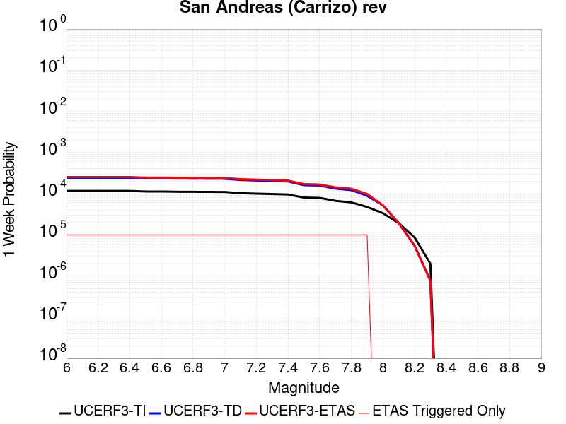 |  |  | 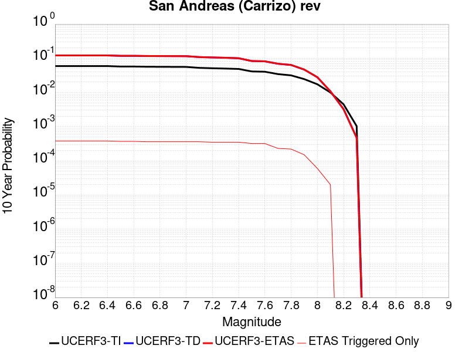 |

| Magnitude | 1 wk TI Prob | 1 wk TD Prob | 1 wk ETAS Prob | 1 wk ETAS/TD Gain | 1 wk ETAS Triggered Only | 1 mo TI Prob | 1 mo TD Prob | 1 mo ETAS Prob | 1 mo ETAS/TD Gain | 1 mo ETAS Triggered Only | 1 yr TI Prob | 1 yr TD Prob | 1 yr ETAS Prob | 1 yr ETAS/TD Gain | 1 yr ETAS Triggered Only | 10 yr TI Prob | 10 yr TD Prob | 10 yr ETAS Prob | 10 yr ETAS/TD Gain | 10 yr ETAS Triggered Only |
|-----|-----|-----|-----|-----|-----|-----|-----|-----|-----|-----|-----|-----|-----|-----|-----|-----|-----|-----|-----|-----|
| 6.0 | 1.1674632E-4 | 2.4332112E-4 | 2.533187E-4 | 1.041088 | 1.0E-5 | 5.002454E-4 | 0.0010423897 | 0.0010923375 | 1.0479167 | 5.0E-5 | 0.006073493 | 0.012617728 | 0.012825077 | 1.0164332 | 2.1E-4 | 0.0591016 | 0.120675825 | 0.12100997 | 1.0027689 | 3.8E-4 |
| 6.1 | 1.1674632E-4 | 2.4332112E-4 | 2.533187E-4 | 1.041088 | 1.0E-5 | 5.002454E-4 | 0.0010423897 | 0.0010923375 | 1.0479167 | 5.0E-5 | 0.006073493 | 0.012617728 | 0.012825077 | 1.0164332 | 2.1E-4 | 0.0591016 | 0.120675825 | 0.12100997 | 1.0027689 | 3.8E-4 |
| 6.2 | 1.1674632E-4 | 2.4332112E-4 | 2.533187E-4 | 1.041088 | 1.0E-5 | 5.002454E-4 | 0.0010423897 | 0.0010923375 | 1.0479167 | 5.0E-5 | 0.006073493 | 0.012617728 | 0.012825077 | 1.0164332 | 2.1E-4 | 0.0591016 | 0.120675825 | 0.12100997 | 1.0027689 | 3.8E-4 |
| 6.3 | 1.1674632E-4 | 2.4332112E-4 | 2.533187E-4 | 1.041088 | 1.0E-5 | 5.002454E-4 | 0.0010423897 | 0.0010923375 | 1.0479167 | 5.0E-5 | 0.006073493 | 0.012617728 | 0.012825077 | 1.0164332 | 2.1E-4 | 0.0591016 | 0.120675825 | 0.12100997 | 1.0027689 | 3.8E-4 |
| 6.4 | 1.1674632E-4 | 2.4332112E-4 | 2.533187E-4 | 1.041088 | 1.0E-5 | 5.002454E-4 | 0.0010423897 | 0.0010923375 | 1.0479167 | 5.0E-5 | 0.006073493 | 0.012617728 | 0.012825077 | 1.0164332 | 2.1E-4 | 0.0591016 | 0.120675825 | 0.12100997 | 1.0027689 | 3.8E-4 |
| 6.5 | 1.13136164E-4 | 2.3652054E-4 | 2.4651818E-4 | 1.0422696 | 1.0E-5 | 4.847792E-4 | 0.0010132672 | 0.0010632166 | 1.0492953 | 5.0E-5 | 0.0058862255 | 0.012267196 | 0.012464742 | 1.0161036 | 2.0E-4 | 0.057327334 | 0.11764631 | 0.11797278 | 1.0027751 | 3.7E-4 |
| 6.6 | 1.13136164E-4 | 2.3652054E-4 | 2.4651818E-4 | 1.0422696 | 1.0E-5 | 4.847792E-4 | 0.0010132672 | 0.0010632166 | 1.0492953 | 5.0E-5 | 0.0058862255 | 0.012267196 | 0.012464742 | 1.0161036 | 2.0E-4 | 0.057327334 | 0.11764631 | 0.11797278 | 1.0027751 | 3.7E-4 |
| 6.7 | 1.1149675E-4 | 2.3343228E-4 | 2.4342995E-4 | 1.0428289 | 1.0E-5 | 4.777557E-4 | 0.0010000421 | 0.001040002 | 1.0399584 | 4.0E-5 | 0.0058011734 | 0.012107977 | 0.012295675 | 1.0155021 | 1.9E-4 | 0.05652051 | 0.116274 | 0.11659214 | 1.0027361 | 3.6E-4 |
| 6.8 | 1.1103589E-4 | 2.3245378E-4 | 2.4245145E-4 | 1.0430093 | 1.0E-5 | 4.7578133E-4 | 9.958516E-4 | 0.0010358118 | 1.0401267 | 4.0E-5 | 0.005777263 | 0.012057524 | 0.012245233 | 1.0155678 | 1.9E-4 | 0.056293584 | 0.11583479 | 0.116153084 | 1.0027479 | 3.6E-4 |
| 6.9 | 1.1053259E-4 | 2.313776E-4 | 2.4137528E-4 | 1.0432094 | 1.0E-5 | 4.7362508E-4 | 9.912429E-4 | 0.0010312033 | 1.0403134 | 4.0E-5 | 0.0057511497 | 0.012002033 | 0.012189752 | 1.0156406 | 1.9E-4 | 0.05604569 | 0.11534999 | 0.11566847 | 1.0027609 | 3.6E-4 |
| 7.0 | 1.1005377E-4 | 2.3038579E-4 | 2.4038348E-4 | 1.0433954 | 1.0E-5 | 4.7157376E-4 | 9.869955E-4 | 0.001026956 | 1.040487 | 4.0E-5 | 0.0057263062 | 0.01195089 | 0.012138619 | 1.0157084 | 1.9E-4 | 0.055809796 | 0.114903145 | 0.115221776 | 1.002773 | 3.6E-4 |
| 7.1 | 1.0308142E-4 | 2.1548252E-4 | 2.2548035E-4 | 1.0463974 | 1.0E-5 | 4.417027E-4 | 9.2317065E-4 | 9.6313376E-4 | 1.043289 | 4.0E-5 | 0.0053644776 | 0.011181994 | 0.01136987 | 1.0168016 | 1.9E-4 | 0.052368138 | 0.10814538 | 0.10846645 | 1.0029689 | 3.6E-4 |
| 7.2 | 1.0027479E-4 | 2.0956126E-4 | 2.1955917E-4 | 1.0477087 | 1.0E-5 | 4.296783E-4 | 8.9781155E-4 | 9.3777565E-4 | 1.0445127 | 4.0E-5 | 0.0052187922 | 0.010876369 | 0.011064302 | 1.017279 | 1.9E-4 | 0.050979212 | 0.105444975 | 0.10575807 | 1.0029693 | 3.5E-4 |
| 7.3 | 9.816942E-5 | 2.0431157E-4 | 2.1430952E-4 | 1.0489348 | 1.0E-5 | 4.2065824E-4 | 8.7532814E-4 | 9.152931E-4 | 1.0456572 | 4.0E-5 | 0.005109493 | 0.010605331 | 0.010793315 | 1.0177255 | 1.9E-4 | 0.049935985 | 0.10303189 | 0.103345826 | 1.003047 | 3.5E-4 |
| 7.4 | 9.5634205E-5 | 1.9800493E-4 | 2.0800295E-4 | 1.0504938 | 1.0E-5 | 4.0979648E-4 | 8.483175E-4 | 8.8828354E-4 | 1.0471121 | 4.0E-5 | 0.0049778637 | 0.010279617 | 0.010467664 | 1.0182931 | 1.9E-4 | 0.048678253 | 0.10011277 | 0.10042773 | 1.003146 | 3.5E-4 |
| 7.5 | 8.052417E-5 | 1.61204E-4 | 1.712024E-4 | 1.0620232 | 1.0E-5 | 3.4505792E-4 | 6.906915E-4 | 7.3066395E-4 | 1.057873 | 4.0E-5 | 0.0041929903 | 0.008376827 | 0.008545403 | 1.0201241 | 1.7E-4 | 0.04114753 | 0.082835115 | 0.08312861 | 1.0035431 | 3.2E-4 |
| 7.6 | 7.897024E-5 | 1.577349E-4 | 1.6773333E-4 | 1.0633875 | 1.0E-5 | 3.384E-4 | 6.758318E-4 | 7.1580475E-4 | 1.0591463 | 4.0E-5 | 0.0041122385 | 0.008197285 | 0.008365892 | 1.0205686 | 1.7E-4 | 0.040369697 | 0.08117659 | 0.08147061 | 1.003622 | 3.2E-4 |
| 7.7 | 6.707427E-5 | 1.3282851E-4 | 1.4282718E-4 | 1.0752751 | 1.0E-5 | 2.8742946E-4 | 5.691409E-4 | 6.0911814E-4 | 1.0702413 | 4.0E-5 | 0.003493839 | 0.006907307 | 0.007026478 | 1.0172529 | 1.2E-4 | 0.034394164 | 0.06907473 | 0.06928884 | 1.0030997 | 2.3E-4 |
| 7.8 | 6.147705E-5 | 1.2203561E-4 | 1.320344E-4 | 1.0819333 | 1.0E-5 | 2.6344648E-4 | 5.22905E-4 | 5.628841E-4 | 1.0764557 | 4.0E-5 | 0.0032027436 | 0.0063478095 | 0.0064670476 | 1.0187842 | 1.2E-4 | 0.031569764 | 0.06353967 | 0.06374569 | 1.0032424 | 2.2E-4 |
| 7.9 | 4.7636717E-5 | 8.88404E-5 | 9.883951E-5 | 1.1125515 | 1.0E-5 | 2.0414138E-4 | 3.8068902E-4 | 4.106776E-4 | 1.0787745 | 3.0E-5 | 0.0024825884 | 0.0046250466 | 0.0047146305 | 1.0193692 | 9.0E-5 | 0.024550365 | 0.046646316 | 0.04678932 | 1.0030657 | 1.5E-4 |
| 8.0 | 3.3554235E-5 | 5.216124E-5 | 5.216124E-5 | 1.0 | 0.0 | 1.4379594E-4 | 2.2352903E-4 | 2.335268E-4 | 1.044727 | 1.0E-5 | 0.0017493097 | 0.0027180712 | 0.0027479897 | 1.0110072 | 3.0E-5 | 0.017356034 | 0.027892983 | 0.027951308 | 1.002091 | 6.0E-5 |
| 8.1 | 1.9175432E-5 | 1.9194746E-5 | 1.9194746E-5 | 1.0 | 0.0 | 8.217783E-5 | 8.226061E-5 | 9.225978E-5 | 1.1215549 | 1.0E-5 | 0.0010000558 | 0.0010010634 | 0.0010110533 | 1.0099794 | 1.0E-5 | 0.009955673 | 0.010763341 | 0.010783126 | 1.0018382 | 2.0E-5 |
| 8.2 | 8.643924E-6 | 5.4778857E-6 | 5.4778857E-6 | 1.0 | 0.0 | 3.704486E-5 | 2.3476441E-5 | 2.3476441E-5 | 1.0 | 0.0 | 4.5092785E-4 | 2.8578826E-4 | 2.8578826E-4 | 1.0 | 0.0 | 0.0045001395 | 0.0032504273 | 0.0032504273 | 1.0 | 0.0 |
| 8.3 | 1.983087E-6 | 7.663413E-7 | 7.663413E-7 | 1.0 | 0.0 | 8.498917E-6 | 3.2843159E-6 | 3.2843159E-6 | 1.0 | 0.0 | 1.034694E-4 | 3.998583E-5 | 3.998583E-5 | 1.0 | 0.0 | 0.0010342124 | 4.7219908E-4 | 4.7219908E-4 | 1.0 | 0.0 |

## San Andreas (Cholame) rev
*[(top)](#table-of-contents)*

| 1 Week | 1 Month | 1 Year | 10 Year |
|-----|-----|-----|-----|
| 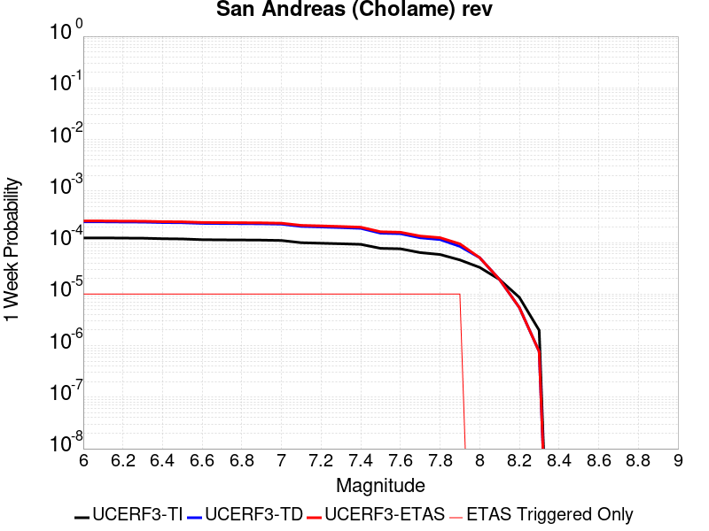 |  |  |  |

| Magnitude | 1 wk TI Prob | 1 wk TD Prob | 1 wk ETAS Prob | 1 wk ETAS/TD Gain | 1 wk ETAS Triggered Only | 1 mo TI Prob | 1 mo TD Prob | 1 mo ETAS Prob | 1 mo ETAS/TD Gain | 1 mo ETAS Triggered Only | 1 yr TI Prob | 1 yr TD Prob | 1 yr ETAS Prob | 1 yr ETAS/TD Gain | 1 yr ETAS Triggered Only | 10 yr TI Prob | 10 yr TD Prob | 10 yr ETAS Prob | 10 yr ETAS/TD Gain | 10 yr ETAS Triggered Only |
|-----|-----|-----|-----|-----|-----|-----|-----|-----|-----|-----|-----|-----|-----|-----|-----|-----|-----|-----|-----|-----|
| 6.0 | 1.2302514E-4 | 2.521379E-4 | 2.6213538E-4 | 1.0396508 | 1.0E-5 | 5.27144E-4 | 0.0010801451 | 0.0011201019 | 1.0369921 | 4.0E-5 | 0.0063991086 | 0.0130719775 | 0.013259494 | 1.0143449 | 1.9E-4 | 0.06217949 | 0.124419786 | 0.124726236 | 1.0024631 | 3.5E-4 |
| 6.1 | 1.2302514E-4 | 2.521379E-4 | 2.6213538E-4 | 1.0396508 | 1.0E-5 | 5.27144E-4 | 0.0010801451 | 0.0011201019 | 1.0369921 | 4.0E-5 | 0.0063991086 | 0.0130719775 | 0.013259494 | 1.0143449 | 1.9E-4 | 0.06217949 | 0.124419786 | 0.124726236 | 1.0024631 | 3.5E-4 |
| 6.2 | 1.2203569E-4 | 2.5030563E-4 | 2.6030312E-4 | 1.0399412 | 1.0E-5 | 5.2290526E-4 | 0.001072299 | 0.0011122561 | 1.037263 | 4.0E-5 | 0.006347804 | 0.012977593 | 0.013165127 | 1.0144507 | 1.9E-4 | 0.061695136 | 0.12360724 | 0.12391397 | 1.0024816 | 3.5E-4 |
| 6.3 | 1.2142645E-4 | 2.491653E-4 | 2.5916283E-4 | 1.0401239 | 1.0E-5 | 5.202953E-4 | 0.0010674159 | 0.0011073733 | 1.0374336 | 4.0E-5 | 0.006316212 | 0.012918848 | 0.013106394 | 1.0145172 | 1.9E-4 | 0.06139677 | 0.12310048 | 0.12340739 | 1.0024933 | 3.5E-4 |
| 6.4 | 1.1865206E-4 | 2.4422002E-4 | 2.542176E-4 | 1.0409367 | 1.0E-5 | 5.0840975E-4 | 0.0010462389 | 0.0010861971 | 1.0381922 | 4.0E-5 | 0.006172335 | 0.012664041 | 0.012851635 | 1.0148131 | 1.9E-4 | 0.060036868 | 0.12089808 | 0.12120577 | 1.002545 | 3.5E-4 |
| 6.5 | 1.17443946E-4 | 2.4215314E-4 | 2.521507E-4 | 1.0412862 | 1.0E-5 | 5.032341E-4 | 0.001037388 | 0.0010773464 | 1.0385184 | 4.0E-5 | 0.006109677 | 0.012557523 | 0.012745137 | 1.0149404 | 1.9E-4 | 0.059444077 | 0.1199698 | 0.12027781 | 1.0025674 | 3.5E-4 |
| 6.6 | 1.13579066E-4 | 2.3524201E-4 | 2.4523964E-4 | 1.0424994 | 1.0E-5 | 4.866766E-4 | 0.0010077921 | 0.0010477517 | 1.0396507 | 4.0E-5 | 0.0059092017 | 0.012201281 | 0.012388963 | 1.0153822 | 1.9E-4 | 0.057545185 | 0.11689121 | 0.1172003 | 1.0026442 | 3.5E-4 |
| 6.7 | 1.1271412E-4 | 2.3368491E-4 | 2.4368257E-4 | 1.0427827 | 1.0E-5 | 4.829711E-4 | 0.0010011239 | 0.0010410838 | 1.0399151 | 4.0E-5 | 0.005864331 | 0.012121003 | 0.0123087 | 1.0154853 | 1.9E-4 | 0.057119697 | 0.11619504 | 0.11650437 | 1.0026622 | 3.5E-4 |
| 6.8 | 1.1217975E-4 | 2.3256887E-4 | 2.4256654E-4 | 1.0429881 | 1.0E-5 | 4.8068175E-4 | 9.963445E-4 | 0.0010363046 | 1.0401068 | 4.0E-5 | 0.005836608 | 0.012063461 | 0.0122511685 | 1.01556 | 1.9E-4 | 0.056856725 | 0.11569414 | 0.116003655 | 1.0026752 | 3.5E-4 |
| 6.9 | 1.1146753E-4 | 2.3105623E-4 | 2.4105392E-4 | 1.0432695 | 1.0E-5 | 4.7763053E-4 | 9.898667E-4 | 0.001029827 | 1.0403695 | 4.0E-5 | 0.0057996577 | 0.011985463 | 0.012173186 | 1.0156626 | 1.9E-4 | 0.056506127 | 0.11501362 | 0.115323365 | 1.0026932 | 3.5E-4 |
| 7.0 | 1.0965793E-4 | 2.2728866E-4 | 2.372864E-4 | 1.0439869 | 1.0E-5 | 4.698779E-4 | 9.7373215E-4 | 0.0010136932 | 1.0410391 | 4.0E-5 | 0.005705768 | 0.011791169 | 0.011978928 | 1.0159237 | 1.9E-4 | 0.055614736 | 0.113317505 | 0.11362784 | 1.0027387 | 3.5E-4 |
| 7.1 | 9.927982E-5 | 2.0547441E-4 | 2.1547236E-4 | 1.0486579 | 1.0E-5 | 4.2541555E-4 | 8.803085E-4 | 9.2027325E-4 | 1.0453986 | 4.0E-5 | 0.0051671406 | 0.010665379 | 0.010853353 | 1.0176246 | 1.9E-4 | 0.05048634 | 0.10342026 | 0.10373406 | 1.0030342 | 3.5E-4 |
| 7.2 | 9.696786E-5 | 2.005168E-4 | 2.105148E-4 | 1.0498611 | 1.0E-5 | 4.1551032E-4 | 8.5907575E-4 | 8.9904136E-4 | 1.0465217 | 4.0E-5 | 0.00504711 | 0.010409369 | 0.010597391 | 1.0180628 | 1.9E-4 | 0.04934009 | 0.1011557 | 0.1014613 | 1.0030211 | 3.4E-4 |
| 7.3 | 9.4727984E-5 | 1.9480755E-4 | 2.048056E-4 | 1.0513227 | 1.0E-5 | 4.0591392E-4 | 8.3462335E-4 | 8.7458995E-4 | 1.0478858 | 4.0E-5 | 0.0049308087 | 0.010114464 | 0.010302542 | 1.018595 | 1.9E-4 | 0.048228268 | 0.09852986 | 0.09883636 | 1.0031108 | 3.4E-4 |
| 7.4 | 9.220358E-5 | 1.8851168E-4 | 1.9850979E-4 | 1.0530372 | 1.0E-5 | 3.9509835E-4 | 8.0765795E-4 | 8.4762566E-4 | 1.0494859 | 4.0E-5 | 0.004799717 | 0.009789148 | 0.009977289 | 1.0192193 | 1.9E-4 | 0.046973653 | 0.095602356 | 0.095909856 | 1.0032164 | 3.4E-4 |
| 7.5 | 7.71631E-5 | 1.5185354E-4 | 1.6185203E-4 | 1.0658429 | 1.0E-5 | 3.306571E-4 | 6.506388E-4 | 6.9061277E-4 | 1.0614381 | 4.0E-5 | 0.0040183207 | 0.007892827 | 0.008061485 | 1.0213685 | 1.7E-4 | 0.03946433 | 0.07830804 | 0.07859377 | 1.0036488 | 3.1E-4 |
| 7.6 | 7.5634416E-5 | 1.4844678E-4 | 1.584453E-4 | 1.0673542 | 1.0E-5 | 3.241072E-4 | 6.3604553E-4 | 6.760201E-4 | 1.0628486 | 4.0E-5 | 0.0039388672 | 0.0077164257 | 0.007885114 | 1.021861 | 1.7E-4 | 0.038697794 | 0.07667177 | 0.076958 | 1.0037332 | 3.1E-4 |
| 7.7 | 6.3783E-5 | 1.2365075E-4 | 1.3364952E-4 | 1.0808629 | 1.0E-5 | 2.7332708E-4 | 5.2982423E-4 | 5.6980306E-4 | 1.0754567 | 4.0E-5 | 0.0033226798 | 0.0064315577 | 0.006550786 | 1.018538 | 1.2E-4 | 0.032734364 | 0.064565 | 0.0647708 | 1.0031874 | 2.2E-4 |
| 7.8 | 5.863422E-5 | 1.1421842E-4 | 1.2421729E-4 | 1.0875416 | 1.0E-5 | 2.512653E-4 | 4.894157E-4 | 5.293962E-4 | 1.0816901 | 4.0E-5 | 0.003054864 | 0.0059423777 | 0.006061665 | 1.0200739 | 1.2E-4 | 0.030132094 | 0.059683435 | 0.0598809 | 1.0033085 | 2.1E-4 |
| 7.9 | 4.595283E-5 | 8.430427E-5 | 9.430343E-5 | 1.118608 | 1.0E-5 | 1.9692584E-4 | 3.61254E-4 | 3.9124317E-4 | 1.083014 | 3.0E-5 | 0.0023949358 | 0.0043894043 | 0.004479009 | 1.0204139 | 9.0E-5 | 0.023692891 | 0.044379376 | 0.044513162 | 1.0030146 | 1.4E-4 |
| 8.0 | 3.2950178E-5 | 5.079674E-5 | 5.079674E-5 | 1.0 | 0.0 | 1.412074E-4 | 2.1768216E-4 | 2.2767998E-4 | 1.0459285 | 1.0E-5 | 0.0017178444 | 0.002647061 | 0.0026769815 | 1.0113033 | 3.0E-5 | 0.017046256 | 0.027191894 | 0.027250264 | 1.0021465 | 6.0E-5 |
| 8.1 | 1.9177472E-5 | 1.9194917E-5 | 1.9194917E-5 | 1.0 | 0.0 | 8.218658E-5 | 8.226134E-5 | 9.226051E-5 | 1.1215538 | 1.0E-5 | 0.0010001622 | 0.0010010722 | 0.0010110622 | 1.0099792 | 1.0E-5 | 0.009956728 | 0.010763456 | 0.010783241 | 1.0018381 | 2.0E-5 |
| 8.2 | 8.643924E-6 | 5.4778857E-6 | 5.4778857E-6 | 1.0 | 0.0 | 3.704486E-5 | 2.3476441E-5 | 2.3476441E-5 | 1.0 | 0.0 | 4.5092785E-4 | 2.8578826E-4 | 2.8578826E-4 | 1.0 | 0.0 | 0.0045001395 | 0.0032504273 | 0.0032504273 | 1.0 | 0.0 |
| 8.3 | 1.983087E-6 | 7.663413E-7 | 7.663413E-7 | 1.0 | 0.0 | 8.498917E-6 | 3.2843159E-6 | 3.2843159E-6 | 1.0 | 0.0 | 1.034694E-4 | 3.998583E-5 | 3.998583E-5 | 1.0 | 0.0 | 0.0010342124 | 4.7219908E-4 | 4.7219908E-4 | 1.0 | 0.0 |

## Death Valley (No)
*[(top)](#table-of-contents)*

| 1 Week | 1 Month | 1 Year | 10 Year |
|-----|-----|-----|-----|
|  |  | 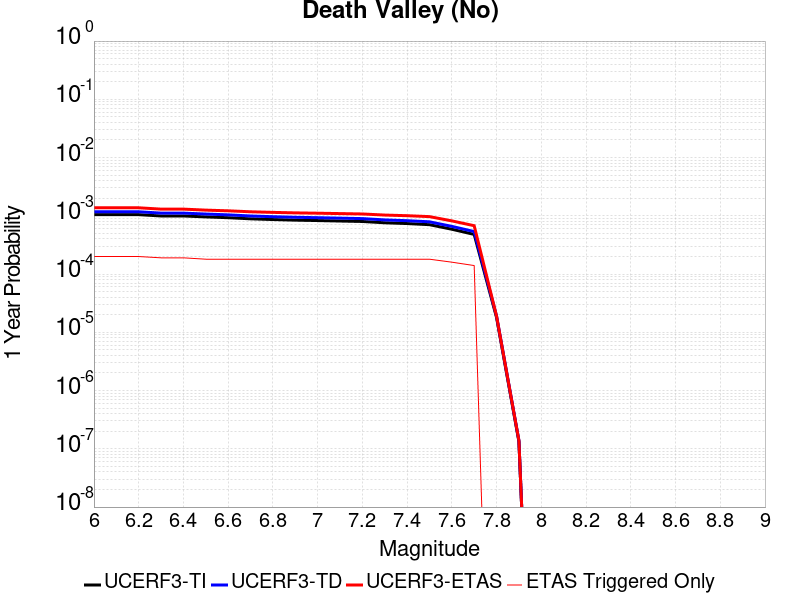 |  |

| Magnitude | 1 wk TI Prob | 1 wk TD Prob | 1 wk ETAS Prob | 1 wk ETAS/TD Gain | 1 wk ETAS Triggered Only | 1 mo TI Prob | 1 mo TD Prob | 1 mo ETAS Prob | 1 mo ETAS/TD Gain | 1 mo ETAS Triggered Only | 1 yr TI Prob | 1 yr TD Prob | 1 yr ETAS Prob | 1 yr ETAS/TD Gain | 1 yr ETAS Triggered Only | 10 yr TI Prob | 10 yr TD Prob | 10 yr ETAS Prob | 10 yr ETAS/TD Gain | 10 yr ETAS Triggered Only |
|-----|-----|-----|-----|-----|-----|-----|-----|-----|-----|-----|-----|-----|-----|-----|-----|-----|-----|-----|-----|-----|
| 6.0 | 2.0074807E-5 | 2.250039E-5 | 3.2500164E-5 | 1.4444268 | 1.0E-5 | 8.603206E-5 | 9.642672E-5 | 1.7641901E-4 | 1.8295656 | 8.0E-5 | 0.001046937 | 0.0011733704 | 0.0013731357 | 1.1702491 | 2.0E-4 | 0.010420183 | 0.011672664 | 0.012008695 | 1.0287879 | 3.4E-4 |
| 6.1 | 2.0074807E-5 | 2.250039E-5 | 3.2500164E-5 | 1.4444268 | 1.0E-5 | 8.603206E-5 | 9.642672E-5 | 1.7641901E-4 | 1.8295656 | 8.0E-5 | 0.001046937 | 0.0011733704 | 0.0013731357 | 1.1702491 | 2.0E-4 | 0.010420183 | 0.011672664 | 0.012008695 | 1.0287879 | 3.4E-4 |
| 6.2 | 2.0074807E-5 | 2.250039E-5 | 3.2500164E-5 | 1.4444268 | 1.0E-5 | 8.603206E-5 | 9.642672E-5 | 1.7641901E-4 | 1.8295656 | 8.0E-5 | 0.001046937 | 0.0011733704 | 0.0013731357 | 1.1702491 | 2.0E-4 | 0.010420183 | 0.011672664 | 0.012008695 | 1.0287879 | 3.4E-4 |
| 6.3 | 1.9050609E-5 | 2.1337235E-5 | 3.1337022E-5 | 1.4686543 | 1.0E-5 | 8.164292E-5 | 9.1442125E-5 | 1.6143573E-4 | 1.7654415 | 7.0E-5 | 9.935491E-4 | 0.0011127461 | 0.0013025346 | 1.1705588 | 1.9E-4 | 0.009891188 | 0.011072568 | 0.011398913 | 1.0294734 | 3.3E-4 |
| 6.4 | 1.9050609E-5 | 2.1337235E-5 | 3.1337022E-5 | 1.4686543 | 1.0E-5 | 8.164292E-5 | 9.1442125E-5 | 1.6143573E-4 | 1.7654415 | 7.0E-5 | 9.935491E-4 | 0.0011127461 | 0.0013025346 | 1.1705588 | 1.9E-4 | 0.009891188 | 0.011072568 | 0.011398913 | 1.0294734 | 3.3E-4 |
| 6.5 | 1.8367004E-5 | 2.0561285E-5 | 3.0561077E-5 | 1.4863409 | 1.0E-5 | 7.8713354E-5 | 8.811685E-5 | 1.4811156E-4 | 1.6808541 | 6.0E-5 | 9.5791375E-4 | 0.0010723012 | 0.0012521081 | 1.1676832 | 1.8E-4 | 0.009537951 | 0.010672058 | 0.010988643 | 1.0296649 | 3.2E-4 |
| 6.6 | 1.779439E-5 | 1.9911195E-5 | 2.9910994E-5 | 1.50222 | 1.0E-5 | 7.625944E-5 | 8.533093E-5 | 1.4532582E-4 | 1.7030847 | 6.0E-5 | 9.280632E-4 | 0.0010384154 | 0.0012182285 | 1.173161 | 1.8E-4 | 0.009241969 | 0.01033639 | 0.010653082 | 1.0306386 | 3.2E-4 |
| 6.7 | 1.7025437E-5 | 1.9043679E-5 | 2.904349E-5 | 1.5250986 | 1.0E-5 | 7.296412E-5 | 8.161325E-5 | 1.4160835E-4 | 1.7351147 | 6.0E-5 | 8.87976E-4 | 9.931945E-4 | 0.0011730158 | 1.1810534 | 1.8E-4 | 0.008844362 | 0.009888276 | 0.010205112 | 1.0320415 | 3.2E-4 |
| 6.8 | 1.6545107E-5 | 1.8512792E-5 | 2.8512608E-5 | 1.540157 | 1.0E-5 | 7.090568E-5 | 7.933816E-5 | 1.393334E-4 | 1.7561965 | 6.0E-5 | 8.629347E-4 | 9.6552016E-4 | 0.0011453464 | 1.186248 | 1.8E-4 | 0.008595915 | 0.009613956 | 0.00993088 | 1.032965 | 3.2E-4 |
| 6.9 | 1.615478E-5 | 1.8087838E-5 | 2.8087656E-5 | 1.5528477 | 1.0E-5 | 6.9232934E-5 | 7.7517034E-5 | 1.3751238E-4 | 1.7739635 | 6.0E-5 | 8.4258494E-4 | 9.433673E-4 | 0.0011231975 | 1.1906259 | 1.8E-4 | 0.008393973 | 0.009394322 | 0.009701409 | 1.0326886 | 3.1E-4 |
| 7.0 | 1.5894311E-5 | 1.780579E-5 | 2.7805612E-5 | 1.5616051 | 1.0E-5 | 6.81167E-5 | 7.630833E-5 | 1.3630376E-4 | 1.7862238 | 6.0E-5 | 8.2900526E-4 | 9.2866406E-4 | 0.0011084969 | 1.1936468 | 1.8E-4 | 0.008259195 | 0.009248522 | 0.009555655 | 1.0332088 | 3.1E-4 |
| 7.1 | 1.5602263E-5 | 1.748374E-5 | 2.7483566E-5 | 1.57195 | 1.0E-5 | 6.6865134E-5 | 7.49282E-5 | 1.349237E-4 | 1.8007066 | 6.0E-5 | 8.137789E-4 | 9.1187505E-4 | 0.0010917109 | 1.1972154 | 1.8E-4 | 0.008108052 | 0.009082017 | 0.009389201 | 1.0338234 | 3.1E-4 |
| 7.2 | 1.5323829E-5 | 1.7170862E-5 | 2.717069E-5 | 1.582372 | 1.0E-5 | 6.56719E-5 | 7.358737E-5 | 1.3358296E-4 | 1.8152974 | 6.0E-5 | 7.99262E-4 | 8.9556404E-4 | 0.0010754028 | 1.2008107 | 1.8E-4 | 0.007963934 | 0.008920226 | 0.009227461 | 1.0344424 | 3.1E-4 |
| 7.3 | 1.4556212E-5 | 1.6302674E-5 | 2.6302512E-5 | 1.6133863 | 1.0E-5 | 6.238227E-5 | 6.9866765E-5 | 1.2986257E-4 | 1.8587173 | 6.0E-5 | 7.592395E-4 | 8.5030176E-4 | 0.0010301487 | 1.2115096 | 1.8E-4 | 0.0075665074 | 0.008471128 | 0.008768586 | 1.0351144 | 3.0E-4 |
| 7.4 | 1.411725E-5 | 1.5808173E-5 | 2.5808014E-5 | 1.6325742 | 1.0E-5 | 6.0501097E-5 | 6.7747584E-5 | 1.2774352E-4 | 1.8855804 | 6.0E-5 | 7.363519E-4 | 8.2452054E-4 | 0.0010043721 | 1.2181287 | 1.8E-4 | 0.0073391674 | 0.008215249 | 0.008512784 | 1.0362175 | 3.0E-4 |
| 7.5 | 1.3503312E-5 | 1.5126493E-5 | 2.5126341E-5 | 1.6610818 | 1.0E-5 | 5.7870053E-5 | 6.482625E-5 | 1.2482236E-4 | 1.925491 | 6.0E-5 | 7.043401E-4 | 7.889796E-4 | 9.688376E-4 | 1.2279627 | 1.8E-4 | 0.007021119 | 0.00786241 | 0.00815013 | 1.0365944 | 2.9E-4 |
| 7.6 | 1.1279839E-5 | 1.2626496E-5 | 2.262637E-5 | 1.7919754 | 1.0E-5 | 4.834127E-5 | 5.411246E-5 | 1.14109214E-4 | 2.108742 | 6.0E-5 | 5.88396E-4 | 6.586254E-4 | 8.1851997E-4 | 1.2427702 | 1.6E-4 | 0.005868405 | 0.0065672863 | 0.006825579 | 1.0393301 | 2.6E-4 |
| 7.7 | 9.189108E-6 | 1.0283496E-5 | 2.0283393E-5 | 1.972422 | 1.0E-5 | 3.93813E-5 | 4.4071407E-5 | 9.4069204E-5 | 2.1344724 | 5.0E-5 | 4.7936183E-4 | 5.364423E-4 | 6.7636726E-4 | 1.2608386 | 1.4E-4 | 0.004783291 | 0.0053519853 | 0.005570808 | 1.0408863 | 2.2E-4 |
| 7.8 | 3.4586725E-7 | 3.648284E-7 | 3.648284E-7 | 1.0 | 0.0 | 1.4822873E-6 | 1.5635493E-6 | 1.5635493E-6 | 1.0 | 0.0 | 1.80467E-5 | 1.9036052E-5 | 1.9036052E-5 | 1.0 | 0.0 | 1.8045233E-4 | 1.9034464E-4 | 2.0034274E-4 | 1.0525262 | 1.0E-5 |
| 7.9 | 2.5591178E-9 | 2.6696847E-9 | 2.6696847E-9 | 1.0 | 0.0 | 1.0967647E-8 | 1.14415055E-8 | 1.14415055E-8 | 1.0 | 0.0 | 1.335311E-7 | 1.3930033E-7 | 1.3930033E-7 | 1.0 | 0.0 | 1.3353102E-6 | 1.3930033E-6 | 1.3930033E-6 | 1.0 | 0.0 |

## Elsinore (Glen Ivy) rev
*[(top)](#table-of-contents)*

| 1 Week | 1 Month | 1 Year | 10 Year |
|-----|-----|-----|-----|
|  | 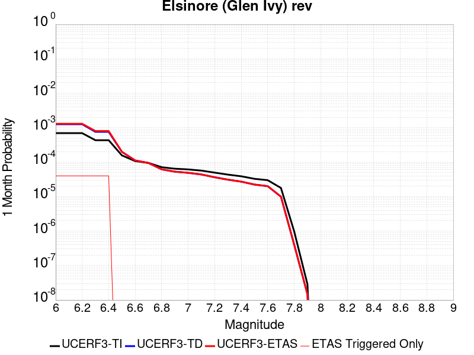 | 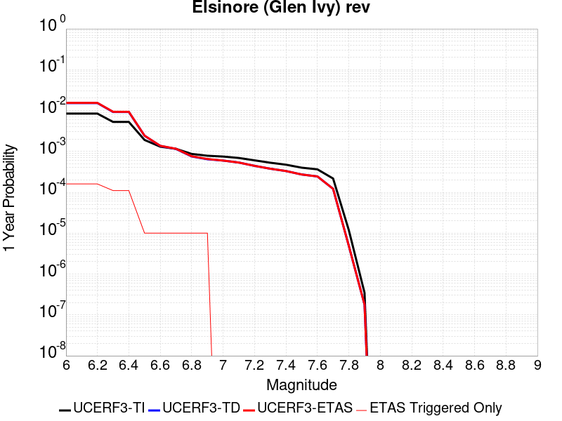 |  |

| Magnitude | 1 wk TI Prob | 1 wk TD Prob | 1 wk ETAS Prob | 1 wk ETAS/TD Gain | 1 wk ETAS Triggered Only | 1 mo TI Prob | 1 mo TD Prob | 1 mo ETAS Prob | 1 mo ETAS/TD Gain | 1 mo ETAS Triggered Only | 1 yr TI Prob | 1 yr TD Prob | 1 yr ETAS Prob | 1 yr ETAS/TD Gain | 1 yr ETAS Triggered Only | 10 yr TI Prob | 10 yr TD Prob | 10 yr ETAS Prob | 10 yr ETAS/TD Gain | 10 yr ETAS Triggered Only |
|-----|-----|-----|-----|-----|-----|-----|-----|-----|-----|-----|-----|-----|-----|-----|-----|-----|-----|-----|-----|-----|
| 6.0 | 1.6204086E-4 | 2.9373495E-4 | 2.9373495E-4 | 1.0 | 0.0 | 6.94276E-4 | 0.0012584114 | 0.0012983611 | 1.0317461 | 4.0E-5 | 0.008420097 | 0.015234808 | 0.0153923705 | 1.0103422 | 1.6E-4 | 0.081081145 | 0.13962506 | 0.13984875 | 1.0016022 | 2.6E-4 |
| 6.1 | 1.6204086E-4 | 2.9373495E-4 | 2.9373495E-4 | 1.0 | 0.0 | 6.94276E-4 | 0.0012584114 | 0.0012983611 | 1.0317461 | 4.0E-5 | 0.008420097 | 0.015234808 | 0.0153923705 | 1.0103422 | 1.6E-4 | 0.081081145 | 0.13962506 | 0.13984875 | 1.0016022 | 2.6E-4 |
| 6.2 | 1.6204086E-4 | 2.9373495E-4 | 2.9373495E-4 | 1.0 | 0.0 | 6.94276E-4 | 0.0012584114 | 0.0012983611 | 1.0317461 | 4.0E-5 | 0.008420097 | 0.015234808 | 0.0153923705 | 1.0103422 | 1.6E-4 | 0.081081145 | 0.13962506 | 0.13984875 | 1.0016022 | 2.6E-4 |
| 6.3 | 1.0111737E-4 | 1.7703616E-4 | 1.7703616E-4 | 1.0 | 0.0 | 4.332882E-4 | 7.5862237E-4 | 7.9859205E-4 | 1.0526872 | 4.0E-5 | 0.005262531 | 0.0092178 | 0.009326786 | 1.0118234 | 1.1E-4 | 0.0513964 | 0.08707356 | 0.08723789 | 1.0018872 | 1.8E-4 |
| 6.4 | 1.0111737E-4 | 1.7703616E-4 | 1.7703616E-4 | 1.0 | 0.0 | 4.332882E-4 | 7.5862237E-4 | 7.9859205E-4 | 1.0526872 | 4.0E-5 | 0.005262531 | 0.0092178 | 0.009326786 | 1.0118234 | 1.1E-4 | 0.0513964 | 0.08707356 | 0.08723789 | 1.0018872 | 1.8E-4 |
| 6.5 | 3.6624708E-5 | 4.6393514E-5 | 4.6393514E-5 | 1.0 | 0.0 | 1.569536E-4 | 1.988162E-4 | 1.988162E-4 | 1.0 | 0.0 | 0.001909235 | 0.0024182608 | 0.0024282367 | 1.0041252 | 1.0E-5 | 0.01892915 | 0.023696661 | 0.02372595 | 1.001236 | 3.0E-5 |
| 6.6 | 2.5051324E-5 | 2.6148738E-5 | 2.6148738E-5 | 1.0 | 0.0 | 1.073584E-4 | 1.12061454E-4 | 1.12061454E-4 | 1.0 | 0.0 | 0.0013063047 | 0.0013635389 | 0.0013735252 | 1.0073239 | 1.0E-5 | 0.012986525 | 0.013565673 | 0.013595265 | 1.0021814 | 3.0E-5 |
| 6.7 | 2.2189772E-5 | 2.2073606E-5 | 2.2073606E-5 | 1.0 | 0.0 | 9.509556E-5 | 9.459794E-5 | 9.459794E-5 | 1.0 | 0.0 | 0.0011571734 | 0.0011511578 | 0.0011611463 | 1.0086769 | 1.0E-5 | 0.011511663 | 0.011466464 | 0.01149612 | 1.0025864 | 3.0E-5 |
| 6.8 | 1.6654378E-5 | 1.4438273E-5 | 1.4438273E-5 | 1.0 | 0.0 | 7.137396E-5 | 6.1876875E-5 | 6.1876875E-5 | 1.0 | 0.0 | 8.686314E-4 | 7.530957E-4 | 7.630882E-4 | 1.0132685 | 1.0E-5 | 0.008652439 | 0.007510057 | 0.007539832 | 1.0039647 | 3.0E-5 |
| 6.9 | 1.5042909E-5 | 1.2332497E-5 | 1.2332497E-5 | 1.0 | 0.0 | 6.446802E-5 | 5.2852505E-5 | 5.2852505E-5 | 1.0 | 0.0 | 7.8461546E-4 | 6.4329244E-4 | 6.53286E-4 | 1.015535 | 1.0E-5 | 0.007818509 | 0.006417767 | 0.006437639 | 1.0030963 | 2.0E-5 |
| 7.0 | 1.4361385E-5 | 1.1451764E-5 | 1.1451764E-5 | 1.0 | 0.0 | 6.154734E-5 | 4.9078084E-5 | 4.9078084E-5 | 1.0 | 0.0 | 7.490812E-4 | 5.973648E-4 | 5.973648E-4 | 1.0 | 0.0 | 0.007465612 | 0.005960821 | 0.005960821 | 1.0 | 0.0 |
| 7.1 | 1.3265571E-5 | 1.0245201E-5 | 1.0245201E-5 | 1.0 | 0.0 | 5.6851208E-5 | 4.3907283E-5 | 4.3907283E-5 | 1.0 | 0.0 | 6.919436E-4 | 5.3444254E-4 | 5.3444254E-4 | 1.0 | 0.0 | 0.006897931 | 0.0053346627 | 0.0053346627 | 1.0 | 0.0 |
| 7.2 | 1.1596403E-5 | 8.505227E-6 | 8.505227E-6 | 1.0 | 0.0 | 4.9697923E-5 | 3.6450474E-5 | 3.6450474E-5 | 1.0 | 0.0 | 6.049042E-4 | 4.4369584E-4 | 4.4369584E-4 | 1.0 | 0.0 | 0.006032603 | 0.004429454 | 0.004429454 | 1.0 | 0.0 |
| 7.3 | 1.0150827E-5 | 7.238867E-6 | 7.238867E-6 | 1.0 | 0.0 | 4.3502816E-5 | 3.1023355E-5 | 3.1023355E-5 | 1.0 | 0.0 | 5.2951806E-4 | 3.7764534E-4 | 3.7764534E-4 | 1.0 | 0.0 | 0.005282581 | 0.0037704394 | 0.0037704394 | 1.0 | 0.0 |
| 7.4 | 9.080705E-6 | 6.3525904E-6 | 6.3525904E-6 | 1.0 | 0.0 | 3.8916725E-5 | 2.722511E-5 | 2.722511E-5 | 1.0 | 0.0 | 4.7370812E-4 | 3.3141667E-4 | 3.3141667E-4 | 1.0 | 0.0 | 0.004726996 | 0.0033093772 | 0.0033093772 | 1.0 | 0.0 |
| 7.5 | 7.671649E-6 | 5.225673E-6 | 5.225673E-6 | 1.0 | 0.0 | 3.287808E-5 | 2.2395556E-5 | 2.2395556E-5 | 1.0 | 0.0 | 4.0021708E-4 | 2.72633E-4 | 2.72633E-4 | 1.0 | 0.0 | 0.0039949706 | 0.0027231106 | 0.0027231106 | 1.0 | 0.0 |
| 7.6 | 6.990086E-6 | 4.6875602E-6 | 4.6875602E-6 | 1.0 | 0.0 | 2.9957167E-5 | 2.0089396E-5 | 2.0089396E-5 | 1.0 | 0.0 | 3.6466747E-4 | 2.445621E-4 | 2.445621E-4 | 1.0 | 0.0 | 0.0036406964 | 0.002443046 | 0.002443046 | 1.0 | 0.0 |
| 7.7 | 4.163505E-6 | 2.3294829E-6 | 2.3294829E-6 | 1.0 | 0.0 | 1.7843471E-5 | 9.983463E-6 | 9.983463E-6 | 1.0 | 0.0 | 2.172226E-4 | 1.2154263E-4 | 1.2154263E-4 | 1.0 | 0.0 | 0.0021701038 | 0.0012148346 | 0.0012148346 | 1.0 | 0.0 |
| 7.8 | 2.2692414E-7 | 9.384596E-8 | 9.384596E-8 | 1.0 | 0.0 | 9.725317E-7 | 4.0219692E-7 | 4.0219692E-7 | 1.0 | 0.0 | 1.1840509E-5 | 4.89674E-6 | 4.89674E-6 | 1.0 | 0.0 | 1.1839878E-4 | 4.8966645E-5 | 4.8966645E-5 | 1.0 | 0.0 |
| 7.9 | 6.676829E-9 | 3.439787E-9 | 3.439787E-9 | 1.0 | 0.0 | 2.861498E-8 | 1.47419446E-8 | 1.47419446E-8 | 1.0 | 0.0 | 3.4838732E-7 | 1.7948315E-7 | 1.7948315E-7 | 1.0 | 0.0 | 3.4838679E-6 | 1.7948303E-6 | 1.7948303E-6 | 1.0 | 0.0 |

## San Andreas (San Gorgonio Pass-Garnet HIll)
*[(top)](#table-of-contents)*

| 1 Week | 1 Month | 1 Year | 10 Year |
|-----|-----|-----|-----|
|  | 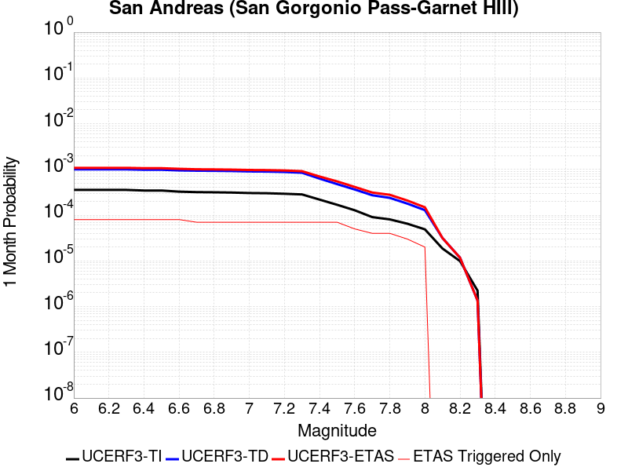 |  |  |

| Magnitude | 1 wk TI Prob | 1 wk TD Prob | 1 wk ETAS Prob | 1 wk ETAS/TD Gain | 1 wk ETAS Triggered Only | 1 mo TI Prob | 1 mo TD Prob | 1 mo ETAS Prob | 1 mo ETAS/TD Gain | 1 mo ETAS Triggered Only | 1 yr TI Prob | 1 yr TD Prob | 1 yr ETAS Prob | 1 yr ETAS/TD Gain | 1 yr ETAS Triggered Only | 10 yr TI Prob | 10 yr TD Prob | 10 yr ETAS Prob | 10 yr ETAS/TD Gain | 10 yr ETAS Triggered Only |
|-----|-----|-----|-----|-----|-----|-----|-----|-----|-----|-----|-----|-----|-----|-----|-----|-----|-----|-----|-----|-----|
| 6.0 | 8.31567E-5 | 2.3387758E-4 | 2.5387292E-4 | 1.0854949 | 2.0E-5 | 3.5633717E-4 | 0.0010019444 | 0.0010818642 | 1.0797647 | 8.0E-5 | 0.004329778 | 0.012130329 | 0.0123575395 | 1.0187308 | 2.3E-4 | 0.042463828 | 0.11259693 | 0.112863146 | 1.0023644 | 3.0E-4 |
| 6.1 | 8.31567E-5 | 2.3387758E-4 | 2.5387292E-4 | 1.0854949 | 2.0E-5 | 3.5633717E-4 | 0.0010019444 | 0.0010818642 | 1.0797647 | 8.0E-5 | 0.004329778 | 0.012130329 | 0.0123575395 | 1.0187308 | 2.3E-4 | 0.042463828 | 0.11259693 | 0.112863146 | 1.0023644 | 3.0E-4 |
| 6.2 | 8.31567E-5 | 2.3387758E-4 | 2.5387292E-4 | 1.0854949 | 2.0E-5 | 3.5633717E-4 | 0.0010019444 | 0.0010818642 | 1.0797647 | 8.0E-5 | 0.004329778 | 0.012130329 | 0.0123575395 | 1.0187308 | 2.3E-4 | 0.042463828 | 0.11259693 | 0.112863146 | 1.0023644 | 3.0E-4 |
| 6.3 | 8.31567E-5 | 2.3387758E-4 | 2.5387292E-4 | 1.0854949 | 2.0E-5 | 3.5633717E-4 | 0.0010019444 | 0.0010818642 | 1.0797647 | 8.0E-5 | 0.004329778 | 0.012130329 | 0.0123575395 | 1.0187308 | 2.3E-4 | 0.042463828 | 0.11259693 | 0.112863146 | 1.0023644 | 3.0E-4 |
| 6.4 | 8.059055E-5 | 2.2945213E-4 | 2.4944753E-4 | 1.0871441 | 2.0E-5 | 3.4534236E-4 | 9.829975E-4 | 0.0010629189 | 1.0813037 | 8.0E-5 | 0.0041964394 | 0.011902518 | 0.01212978 | 1.0190936 | 2.3E-4 | 0.041180745 | 0.11057797 | 0.1108448 | 1.002413 | 3.0E-4 |
| 6.5 | 8.059055E-5 | 2.2945213E-4 | 2.4944753E-4 | 1.0871441 | 2.0E-5 | 3.4534236E-4 | 9.829975E-4 | 0.0010629189 | 1.0813037 | 8.0E-5 | 0.0041964394 | 0.011902518 | 0.01212978 | 1.0190936 | 2.3E-4 | 0.041180745 | 0.11057797 | 0.1108448 | 1.002413 | 3.0E-4 |
| 6.6 | 7.619237E-5 | 2.2189732E-4 | 2.4189289E-4 | 1.0901117 | 2.0E-5 | 3.2649786E-4 | 9.5064426E-4 | 0.0010305683 | 1.0840734 | 8.0E-5 | 0.0039678677 | 0.011513218 | 0.01174057 | 1.019747 | 2.3E-4 | 0.03897764 | 0.10711453 | 0.10737347 | 1.0024173 | 2.9E-4 |
| 6.7 | 7.440636E-5 | 2.186554E-4 | 2.2865323E-4 | 1.045724 | 1.0E-5 | 3.188454E-4 | 9.3676033E-4 | 0.0010066947 | 1.0746557 | 7.0E-5 | 0.0038750346 | 0.01134595 | 0.011563454 | 1.0191702 | 2.2E-4 | 0.038081564 | 0.10562291 | 0.10587334 | 1.002371 | 2.8E-4 |
| 6.8 | 7.3735864E-5 | 2.17127E-4 | 2.2712484E-4 | 1.046046 | 1.0E-5 | 3.1597257E-4 | 9.302147E-4 | 0.0010001496 | 1.0751815 | 7.0E-5 | 0.0038401815 | 0.0112670865 | 0.011484608 | 1.019306 | 2.2E-4 | 0.03774495 | 0.1049244 | 0.10517502 | 1.0023886 | 2.8E-4 |
| 6.9 | 7.27575E-5 | 2.1481665E-4 | 2.248145E-4 | 1.0465413 | 1.0E-5 | 3.117806E-4 | 9.203202E-4 | 9.902559E-4 | 1.0759904 | 7.0E-5 | 0.003789323 | 0.01114786 | 0.011355519 | 1.0186276 | 2.1E-4 | 0.037253562 | 0.10387225 | 0.104114205 | 1.0023293 | 2.7E-4 |
| 7.0 | 7.102591E-5 | 2.1065693E-4 | 2.2065482E-4 | 1.0474606 | 1.0E-5 | 3.0436125E-4 | 9.025053E-4 | 9.724421E-4 | 1.0774919 | 7.0E-5 | 0.003699303 | 0.010933158 | 0.011140862 | 1.0189977 | 2.1E-4 | 0.03638325 | 0.10197427 | 0.102216735 | 1.0023777 | 2.7E-4 |
| 7.1 | 7.028513E-5 | 2.090133E-4 | 2.1901121E-4 | 1.0478338 | 1.0E-5 | 3.0118722E-4 | 8.95466E-4 | 9.6540333E-4 | 1.0781016 | 7.0E-5 | 0.0036607897 | 0.010848312 | 0.011056034 | 1.0191479 | 2.1E-4 | 0.036010686 | 0.10121703 | 0.101459704 | 1.0023975 | 2.7E-4 |
| 7.2 | 6.8498244E-5 | 2.0509181E-4 | 2.1508976E-4 | 1.0487486 | 1.0E-5 | 2.9353087E-4 | 8.7867107E-4 | 9.4860955E-4 | 1.0795958 | 7.0E-5 | 0.003567883 | 0.010645847 | 0.010853612 | 1.019516 | 2.1E-4 | 0.035111405 | 0.099408954 | 0.09965211 | 1.002446 | 2.7E-4 |
| 7.3 | 6.622592E-5 | 1.9736416E-4 | 2.073622E-4 | 1.0506577 | 1.0E-5 | 2.8379448E-4 | 8.455744E-4 | 9.1551524E-4 | 1.082714 | 7.0E-5 | 0.0034497243 | 0.010246754 | 0.010454603 | 1.0202843 | 2.1E-4 | 0.033966612 | 0.09590529 | 0.09614939 | 1.0025452 | 2.7E-4 |
| 7.4 | 5.1050705E-5 | 1.4692801E-4 | 1.5692654E-4 | 1.0680505 | 1.0E-5 | 2.1877038E-4 | 6.295404E-4 | 6.994963E-4 | 1.1111223 | 7.0E-5 | 0.002660276 | 0.007637911 | 0.007846307 | 1.0272844 | 2.1E-4 | 0.02628654 | 0.07287632 | 0.073126644 | 1.0034349 | 2.7E-4 |
| 7.5 | 3.9302922E-5 | 1.1133085E-4 | 1.2132974E-4 | 1.0898124 | 1.0E-5 | 1.6843023E-4 | 4.770453E-4 | 5.470119E-4 | 1.1466666 | 7.0E-5 | 0.0020487092 | 0.005792629 | 0.0059914705 | 1.0343267 | 2.0E-4 | 0.020299247 | 0.05602175 | 0.056267183 | 1.0043811 | 2.6E-4 |
| 7.6 | 2.9851626E-5 | 8.497815E-5 | 9.49773E-5 | 1.1176673 | 1.0E-5 | 1.2792926E-4 | 3.6414136E-4 | 4.1412315E-4 | 1.1372594 | 5.0E-5 | 0.0015564259 | 0.004424434 | 0.004603638 | 1.0405031 | 1.8E-4 | 0.0154556995 | 0.043204565 | 0.043434195 | 1.005315 | 2.4E-4 |
| 7.7 | 2.1135214E-5 | 6.35539E-5 | 7.355327E-5 | 1.1573367 | 1.0E-5 | 9.0576345E-5 | 2.7234547E-4 | 3.1233457E-4 | 1.1468322 | 4.0E-5 | 0.0011022091 | 0.0033107698 | 0.003480207 | 1.0511776 | 1.7E-4 | 0.010967582 | 0.032592975 | 0.03281548 | 1.0068268 | 2.3E-4 |
| 7.8 | 1.883379E-5 | 5.5662844E-5 | 6.566229E-5 | 1.179643 | 1.0E-5 | 8.0713755E-5 | 2.3853325E-4 | 2.7852372E-4 | 1.1676515 | 4.0E-5 | 9.822468E-4 | 0.0029002777 | 0.0030697847 | 1.0584451 | 1.7E-4 | 0.0097791655 | 0.028704654 | 0.028928053 | 1.0077826 | 2.3E-4 |
| 7.9 | 1.5156185E-5 | 4.1676423E-5 | 5.167601E-5 | 1.2399338 | 1.0E-5 | 6.495346E-5 | 1.7860103E-4 | 2.0859567E-4 | 1.1679422 | 3.0E-5 | 7.9052144E-4 | 0.0021723004 | 0.0023319528 | 1.0734947 | 1.6E-4 | 0.007877152 | 0.021767683 | 0.021973113 | 1.0094373 | 2.1E-4 |
| 8.0 | 1.1405907E-5 | 2.9987476E-5 | 2.9987476E-5 | 1.0 | 0.0 | 4.8881542E-5 | 1.2851143E-4 | 1.4850886E-4 | 1.1556082 | 2.0E-5 | 5.9497025E-4 | 0.0015635047 | 0.0016633484 | 1.0638589 | 1.0E-4 | 0.005933798 | 0.015779015 | 0.015926648 | 1.0093563 | 1.5E-4 |
| 8.1 | 4.3511436E-6 | 7.37326E-6 | 7.37326E-6 | 1.0 | 0.0 | 1.8647626E-5 | 3.1599302E-5 | 3.1599302E-5 | 1.0 | 0.0 | 2.2701119E-4 | 3.8465371E-4 | 3.8465371E-4 | 1.0 | 0.0 | 0.0022677942 | 0.00411835 | 0.00411835 | 1.0 | 0.0 |
| 8.2 | 2.3042528E-6 | 2.7345984E-6 | 2.7345984E-6 | 1.0 | 0.0 | 9.875332E-6 | 1.1719655E-5 | 1.1719655E-5 | 1.0 | 0.0 | 1.2022553E-4 | 1.426775E-4 | 1.426775E-4 | 1.0 | 0.0 | 0.0012016051 | 0.0015988435 | 0.0015988435 | 1.0 | 0.0 |
| 8.3 | 5.202968E-7 | 3.1614655E-7 | 3.1614655E-7 | 1.0 | 0.0 | 2.2298414E-6 | 1.3549131E-6 | 1.3549131E-6 | 1.0 | 0.0 | 2.714798E-5 | 1.6495955E-5 | 1.6495955E-5 | 1.0 | 0.0 | 2.7144665E-4 | 1.9573298E-4 | 1.9573298E-4 | 1.0 | 0.0 |

## Death Valley (Fish Lake Valley)
*[(top)](#table-of-contents)*

| 1 Week | 1 Month | 1 Year | 10 Year |
|-----|-----|-----|-----|
| 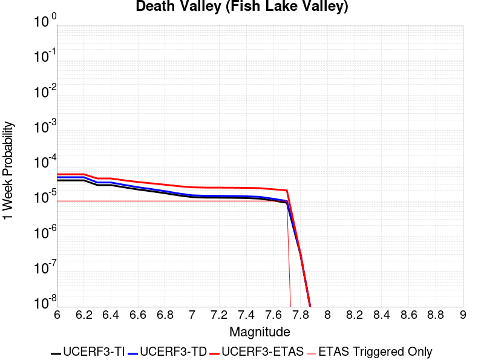 |  |  | 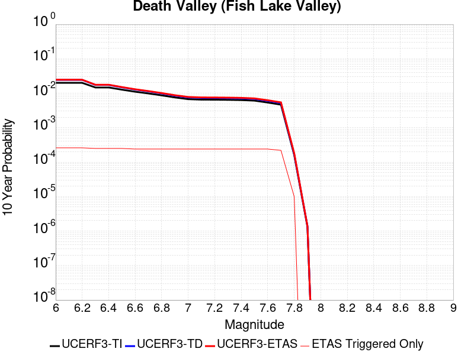 |

| Magnitude | 1 wk TI Prob | 1 wk TD Prob | 1 wk ETAS Prob | 1 wk ETAS/TD Gain | 1 wk ETAS Triggered Only | 1 mo TI Prob | 1 mo TD Prob | 1 mo ETAS Prob | 1 mo ETAS/TD Gain | 1 mo ETAS Triggered Only | 1 yr TI Prob | 1 yr TD Prob | 1 yr ETAS Prob | 1 yr ETAS/TD Gain | 1 yr ETAS Triggered Only | 10 yr TI Prob | 10 yr TD Prob | 10 yr ETAS Prob | 10 yr ETAS/TD Gain | 10 yr ETAS Triggered Only |
|-----|-----|-----|-----|-----|-----|-----|-----|-----|-----|-----|-----|-----|-----|-----|-----|-----|-----|-----|-----|-----|
| 6.0 | 3.872328E-5 | 4.72669E-5 | 5.726643E-5 | 1.2115545 | 1.0E-5 | 1.6594635E-4 | 2.0255837E-4 | 2.5254826E-4 | 1.2467924 | 5.0E-5 | 0.0020185246 | 0.0024636218 | 0.002613252 | 1.060736 | 1.5E-4 | 0.02000288 | 0.024388932 | 0.02464259 | 1.0104005 | 2.6E-4 |
| 6.1 | 3.872328E-5 | 4.72669E-5 | 5.726643E-5 | 1.2115545 | 1.0E-5 | 1.6594635E-4 | 2.0255837E-4 | 2.5254826E-4 | 1.2467924 | 5.0E-5 | 0.0020185246 | 0.0024636218 | 0.002613252 | 1.060736 | 1.5E-4 | 0.02000288 | 0.024388932 | 0.02464259 | 1.0104005 | 2.6E-4 |
| 6.2 | 3.872328E-5 | 4.72669E-5 | 5.726643E-5 | 1.2115545 | 1.0E-5 | 1.6594635E-4 | 2.0255837E-4 | 2.5254826E-4 | 1.2467924 | 5.0E-5 | 0.0020185246 | 0.0024636218 | 0.002613252 | 1.060736 | 1.5E-4 | 0.02000288 | 0.024388932 | 0.02464259 | 1.0104005 | 2.6E-4 |
| 6.3 | 2.8356371E-5 | 3.36105E-5 | 4.3610165E-5 | 1.2975161 | 1.0E-5 | 1.2152165E-4 | 1.4403746E-4 | 1.9403026E-4 | 1.3470819 | 5.0E-5 | 0.0014785219 | 0.0017523154 | 0.0019020527 | 1.085451 | 1.5E-4 | 0.014687235 | 0.017392177 | 0.017637828 | 1.0141243 | 2.5E-4 |
| 6.4 | 2.8356371E-5 | 3.36105E-5 | 4.3610165E-5 | 1.2975161 | 1.0E-5 | 1.2152165E-4 | 1.4403746E-4 | 1.9403026E-4 | 1.3470819 | 5.0E-5 | 0.0014785219 | 0.0017523154 | 0.0019020527 | 1.085451 | 1.5E-4 | 0.014687235 | 0.017392177 | 0.017637828 | 1.0141243 | 2.5E-4 |
| 6.5 | 2.4448687E-5 | 2.8608138E-5 | 3.8607854E-5 | 1.3495408 | 1.0E-5 | 1.0477588E-4 | 1.226008E-4 | 1.7259468E-4 | 1.4077777 | 5.0E-5 | 0.0012748998 | 0.0014916904 | 0.0016414666 | 1.100407 | 1.5E-4 | 0.012676105 | 0.014821675 | 0.015067969 | 1.0166172 | 2.5E-4 |
| 6.6 | 2.1298161E-5 | 2.4660525E-5 | 3.466028E-5 | 1.4054964 | 1.0E-5 | 9.127464E-5 | 1.05683845E-4 | 1.5567856E-4 | 1.4730592 | 5.0E-5 | 0.0011107022 | 0.0012859742 | 0.0014357812 | 1.1164931 | 1.5E-4 | 0.011051672 | 0.012788757 | 0.013025688 | 1.0185264 | 2.4E-4 |
| 6.7 | 1.8959729E-5 | 2.1781392E-5 | 3.1781175E-5 | 1.4590975 | 1.0E-5 | 8.125345E-5 | 9.3345625E-5 | 1.4334096E-4 | 1.5355937 | 5.0E-5 | 9.888117E-4 | 0.0011359161 | 0.0012857456 | 1.131902 | 1.5E-4 | 0.009844234 | 0.011303759 | 0.011541046 | 1.0209919 | 2.4E-4 |
| 6.8 | 1.6691629E-5 | 1.9018651E-5 | 2.901846E-5 | 1.5257896 | 1.0E-5 | 7.153359E-5 | 8.150605E-5 | 1.3150198E-4 | 1.6134014 | 5.0E-5 | 8.7057345E-4 | 9.919013E-4 | 0.0011417525 | 1.1510748 | 1.5E-4 | 0.008671708 | 0.009876498 | 0.010114128 | 1.0240601 | 2.4E-4 |
| 6.9 | 1.450505E-5 | 1.6389778E-5 | 2.6389615E-5 | 1.6101264 | 1.0E-5 | 6.216302E-5 | 7.024007E-5 | 1.2023656E-4 | 1.7117944 | 5.0E-5 | 7.5657194E-4 | 8.548461E-4 | 0.0010047179 | 1.1753201 | 1.5E-4 | 0.007540013 | 0.008516509 | 0.008754466 | 1.0279405 | 2.4E-4 |
| 7.0 | 1.2940855E-5 | 1.4538173E-5 | 2.4538027E-5 | 1.6878344 | 1.0E-5 | 5.545963E-5 | 6.2305E-5 | 1.1230189E-4 | 1.8024538 | 5.0E-5 | 6.750118E-4 | 7.583052E-4 | 9.0819143E-4 | 1.1976595 | 1.5E-4 | 0.006729651 | 0.007557794 | 0.00779598 | 1.0315152 | 2.4E-4 |
| 7.1 | 1.2544658E-5 | 1.40784E-5 | 2.407826E-5 | 1.710298 | 1.0E-5 | 5.3761712E-5 | 6.0334638E-5 | 1.10331624E-4 | 1.8286613 | 5.0E-5 | 6.5435225E-4 | 7.3433225E-4 | 8.842221E-4 | 1.2041172 | 1.5E-4 | 0.006524288 | 0.007319651 | 0.007557894 | 1.0325484 | 2.4E-4 |
| 7.2 | 1.2489416E-5 | 1.4015866E-5 | 2.4015726E-5 | 1.7134671 | 1.0E-5 | 5.3524967E-5 | 6.0066646E-5 | 1.10063644E-4 | 1.8323587 | 5.0E-5 | 6.514716E-4 | 7.3107163E-4 | 8.80962E-4 | 1.2050283 | 1.5E-4 | 0.006495651 | 0.007287259 | 0.00752551 | 1.0326942 | 2.4E-4 |
| 7.3 | 1.2368307E-5 | 1.3880002E-5 | 2.3879864E-5 | 1.720451 | 1.0E-5 | 5.3005948E-5 | 5.9484402E-5 | 1.0948143E-4 | 1.8405066 | 5.0E-5 | 6.451563E-4 | 7.239875E-4 | 8.7387895E-4 | 1.2070359 | 1.5E-4 | 0.0064328653 | 0.0072168806 | 0.0074551483 | 1.0330154 | 2.4E-4 |
| 7.4 | 1.2161707E-5 | 1.3648055E-5 | 2.3647919E-5 | 1.7326951 | 1.0E-5 | 5.212056E-5 | 5.8490383E-5 | 1.0848746E-4 | 1.8547914 | 5.0E-5 | 6.3438306E-4 | 7.118934E-4 | 8.6178654E-4 | 1.2105557 | 1.5E-4 | 0.006325751 | 0.0070967176 | 0.007335014 | 1.0335784 | 2.4E-4 |
| 7.5 | 1.1707948E-5 | 1.3145696E-5 | 2.3145565E-5 | 1.7606952 | 1.0E-5 | 5.0175953E-5 | 5.633751E-5 | 1.0633469E-4 | 1.8874581 | 5.0E-5 | 6.10721E-4 | 6.8569893E-4 | 8.3559606E-4 | 1.2186049 | 1.5E-4 | 0.0060904534 | 0.006836415 | 0.0070747742 | 1.0348661 | 2.4E-4 |
| 7.6 | 1.0319538E-5 | 1.157978E-5 | 2.1579664E-5 | 1.8635643 | 1.0E-5 | 4.4225842E-5 | 4.9626717E-5 | 9.962424E-5 | 2.0074718 | 5.0E-5 | 5.383166E-4 | 6.0404296E-4 | 7.5395236E-4 | 1.2481767 | 1.5E-4 | 0.0053701443 | 0.0060245427 | 0.006263097 | 1.039597 | 2.4E-4 |
| 7.7 | 8.937764E-6 | 1.0022915E-5 | 2.0022815E-5 | 1.9977037 | 1.0E-5 | 3.830414E-5 | 4.2954674E-5 | 9.295253E-5 | 2.1639676 | 5.0E-5 | 4.6625308E-4 | 5.228527E-4 | 6.627795E-4 | 1.2676219 | 1.4E-4 | 0.0046527605 | 0.005216735 | 0.0054355874 | 1.041952 | 2.2E-4 |
| 7.8 | 3.108007E-7 | 3.2846748E-7 | 3.2846748E-7 | 1.0 | 0.0 | 1.3320023E-6 | 1.407717E-6 | 1.407717E-6 | 1.0 | 0.0 | 1.6217007E-5 | 1.7138824E-5 | 1.7138824E-5 | 1.0 | 0.0 | 1.6215823E-4 | 1.713754E-4 | 1.8137369E-4 | 1.0583414 | 1.0E-5 |
| 7.9 | 2.5591178E-9 | 2.6696847E-9 | 2.6696847E-9 | 1.0 | 0.0 | 1.0967647E-8 | 1.14415055E-8 | 1.14415055E-8 | 1.0 | 0.0 | 1.335311E-7 | 1.3930033E-7 | 1.3930033E-7 | 1.0 | 0.0 | 1.3353102E-6 | 1.3930033E-6 | 1.3930033E-6 | 1.0 | 0.0 |

## Sierra Nevada  (No Extension)
*[(top)](#table-of-contents)*

| 1 Week | 1 Month | 1 Year | 10 Year |
|-----|-----|-----|-----|
|  |  |  |  |

| Magnitude | 1 wk TI Prob | 1 wk TD Prob | 1 wk ETAS Prob | 1 wk ETAS/TD Gain | 1 wk ETAS Triggered Only | 1 mo TI Prob | 1 mo TD Prob | 1 mo ETAS Prob | 1 mo ETAS/TD Gain | 1 mo ETAS Triggered Only | 1 yr TI Prob | 1 yr TD Prob | 1 yr ETAS Prob | 1 yr ETAS/TD Gain | 1 yr ETAS Triggered Only | 10 yr TI Prob | 10 yr TD Prob | 10 yr ETAS Prob | 10 yr ETAS/TD Gain | 10 yr ETAS Triggered Only |
|-----|-----|-----|-----|-----|-----|-----|-----|-----|-----|-----|-----|-----|-----|-----|-----|-----|-----|-----|-----|-----|
| 6.0 | 7.7690465E-6 | 6.976338E-6 | 4.697606E-5 | 6.733627 | 4.0E-5 | 3.329549E-5 | 2.9898452E-5 | 1.1989576E-4 | 4.0100994 | 9.0E-5 | 4.0529718E-4 | 3.6398869E-4 | 5.239305E-4 | 1.4394141 | 1.6E-4 | 0.004045588 | 0.0036374412 | 0.003886532 | 1.0684797 | 2.5E-4 |
| 6.1 | 7.7690465E-6 | 6.976338E-6 | 4.697606E-5 | 6.733627 | 4.0E-5 | 3.329549E-5 | 2.9898452E-5 | 1.1989576E-4 | 4.0100994 | 9.0E-5 | 4.0529718E-4 | 3.6398869E-4 | 5.239305E-4 | 1.4394141 | 1.6E-4 | 0.004045588 | 0.0036374412 | 0.003886532 | 1.0684797 | 2.5E-4 |
| 6.2 | 7.7690465E-6 | 6.976338E-6 | 4.697606E-5 | 6.733627 | 4.0E-5 | 3.329549E-5 | 2.9898452E-5 | 1.1989576E-4 | 4.0100994 | 9.0E-5 | 4.0529718E-4 | 3.6398869E-4 | 5.239305E-4 | 1.4394141 | 1.6E-4 | 0.004045588 | 0.0036374412 | 0.003886532 | 1.0684797 | 2.5E-4 |
| 6.3 | 7.7690465E-6 | 6.976338E-6 | 4.697606E-5 | 6.733627 | 4.0E-5 | 3.329549E-5 | 2.9898452E-5 | 1.1989576E-4 | 4.0100994 | 9.0E-5 | 4.0529718E-4 | 3.6398869E-4 | 5.239305E-4 | 1.4394141 | 1.6E-4 | 0.004045588 | 0.0036374412 | 0.003886532 | 1.0684797 | 2.5E-4 |
| 6.4 | 7.7690465E-6 | 6.976338E-6 | 4.697606E-5 | 6.733627 | 4.0E-5 | 3.329549E-5 | 2.9898452E-5 | 1.1989576E-4 | 4.0100994 | 9.0E-5 | 4.0529718E-4 | 3.6398869E-4 | 5.239305E-4 | 1.4394141 | 1.6E-4 | 0.004045588 | 0.0036374412 | 0.003886532 | 1.0684797 | 2.5E-4 |
| 6.5 | 7.7690465E-6 | 6.976338E-6 | 4.697606E-5 | 6.733627 | 4.0E-5 | 3.329549E-5 | 2.9898452E-5 | 1.1989576E-4 | 4.0100994 | 9.0E-5 | 4.0529718E-4 | 3.6398869E-4 | 5.239305E-4 | 1.4394141 | 1.6E-4 | 0.004045588 | 0.0036374412 | 0.003886532 | 1.0684797 | 2.5E-4 |
| 6.6 | 2.653E-6 | 1.6148417E-6 | 3.1614793E-5 | 19.577642 | 3.0E-5 | 1.136995E-5 | 6.920732E-6 | 6.6920315E-5 | 9.669543 | 6.0E-5 | 1.3842035E-4 | 8.425669E-5 | 2.0424658E-4 | 2.4240992 | 1.2E-4 | 0.0013833415 | 8.422509E-4 | 0.0010320909 | 1.225396 | 1.9E-4 |
| 6.7 | 2.5902466E-6 | 1.550175E-6 | 3.1550127E-5 | 20.352623 | 3.0E-5 | 1.11010095E-5 | 6.6435905E-6 | 6.6643195E-5 | 10.031201 | 6.0E-5 | 1.351464E-4 | 8.088274E-5 | 2.0087304E-4 | 2.4835093 | 1.2E-4 | 0.0013506424 | 8.08536E-4 | 9.983823E-4 | 1.2348026 | 1.9E-4 |
| 6.8 | 2.5853892E-6 | 1.5469752E-6 | 3.154693E-5 | 20.392653 | 3.0E-5 | 1.1080193E-5 | 6.629877E-6 | 6.662948E-5 | 10.049882 | 6.0E-5 | 1.34893E-4 | 8.071579E-5 | 2.0070611E-4 | 2.486578 | 1.2E-4 | 0.0013481114 | 8.068677E-4 | 9.967145E-4 | 1.2352885 | 1.9E-4 |
| 6.9 | 2.458257E-6 | 1.4220491E-6 | 3.1422005E-5 | 22.096289 | 3.0E-5 | 1.0535345E-5 | 6.0944817E-6 | 6.6094115E-5 | 10.844912 | 6.0E-5 | 1.2826028E-4 | 7.419781E-5 | 1.8418964E-4 | 2.4824135 | 1.1E-4 | 0.0012818627 | 7.417323E-4 | 9.1160624E-4 | 1.2290232 | 1.7E-4 |
| 7.0 | 2.4341468E-6 | 1.3990128E-6 | 3.139897E-5 | 22.44366 | 3.0E-5 | 1.0432016E-5 | 5.9957556E-6 | 6.5995395E-5 | 11.007019 | 6.0E-5 | 1.270024E-4 | 7.29959E-5 | 1.8298787E-4 | 2.506824 | 1.1E-4 | 0.0012692984 | 7.2972116E-4 | 8.995971E-4 | 1.2327957 | 1.7E-4 |
| 7.1 | 2.3652476E-6 | 1.3339624E-6 | 3.1333922E-5 | 23.48936 | 3.0E-5 | 1.0136736E-5 | 5.716969E-6 | 6.5716624E-5 | 11.495011 | 6.0E-5 | 1.2340778E-4 | 6.960189E-5 | 1.7959424E-4 | 2.5803068 | 1.1E-4 | 0.0012333926 | 6.958026E-4 | 8.6568436E-4 | 1.2441522 | 1.7E-4 |
| 7.2 | 2.272158E-6 | 1.250269E-6 | 3.125023E-5 | 24.994808 | 3.0E-5 | 9.737784E-6 | 5.3582844E-6 | 6.535796E-5 | 12.197554 | 6.0E-5 | 1.1855107E-4 | 6.5235174E-5 | 1.75228E-4 | 2.686097 | 1.1E-4 | 0.0011848784 | 6.521618E-4 | 8.220509E-4 | 1.2605015 | 1.7E-4 |
| 7.3 | 2.1382127E-6 | 1.1419569E-6 | 3.1141924E-5 | 27.270664 | 3.0E-5 | 9.163737E-6 | 4.894092E-6 | 6.48938E-5 | 13.25962 | 6.0E-5 | 1.1156279E-4 | 5.958395E-5 | 1.695774E-4 | 2.8460248 | 1.1E-4 | 0.001115068 | 5.956809E-4 | 7.555856E-4 | 1.2684401 | 1.6E-4 |
| 7.4 | 1.9048055E-6 | 9.575105E-7 | 3.0957483E-5 | 32.331223 | 3.0E-5 | 8.163426E-6 | 4.1036096E-6 | 5.4103406E-5 | 13.184345 | 5.0E-5 | 9.9385186E-5 | 4.996031E-5 | 1.4995532E-4 | 3.001489 | 1.0E-4 | 9.934074E-4 | 4.9949146E-4 | 6.494165E-4 | 1.3001554 | 1.5E-4 |
| 7.5 | 1.5373403E-6 | 7.559916E-7 | 3.0755968E-5 | 40.68295 | 3.0E-5 | 6.5885843E-6 | 3.23996E-6 | 5.3239797E-5 | 16.43224 | 5.0E-5 | 8.021306E-5 | 3.9445804E-5 | 1.1944265E-4 | 3.0280192 | 8.0E-5 | 8.0184115E-4 | 3.943885E-4 | 5.1434117E-4 | 1.3041486 | 1.2E-4 |
| 7.6 | 1.0680322E-6 | 4.6595216E-7 | 2.0465943E-5 | 43.92284 | 2.0E-5 | 4.577273E-6 | 1.9969364E-6 | 3.1996875E-5 | 16.022984 | 3.0E-5 | 5.5726876E-5 | 2.431243E-5 | 6.431146E-5 | 2.6452088 | 4.0E-5 | 5.5712904E-4 | 2.4309798E-4 | 2.9308582E-4 | 1.2056284 | 5.0E-5 |
| 7.7 | 5.509146E-7 | 1.557905E-7 | 1.0155789E-5 | 65.18875 | 1.0E-5 | 2.3610605E-6 | 6.676734E-7 | 1.0667667E-5 | 15.977372 | 1.0E-5 | 2.8745531E-5 | 8.1288945E-6 | 1.8128814E-5 | 2.2301695 | 1.0E-5 | 2.8741814E-4 | 8.128609E-5 | 9.128528E-5 | 1.1230123 | 1.0E-5 |

## Manix-Afton Hills
*[(top)](#table-of-contents)*

| 1 Week | 1 Month | 1 Year | 10 Year |
|-----|-----|-----|-----|
| 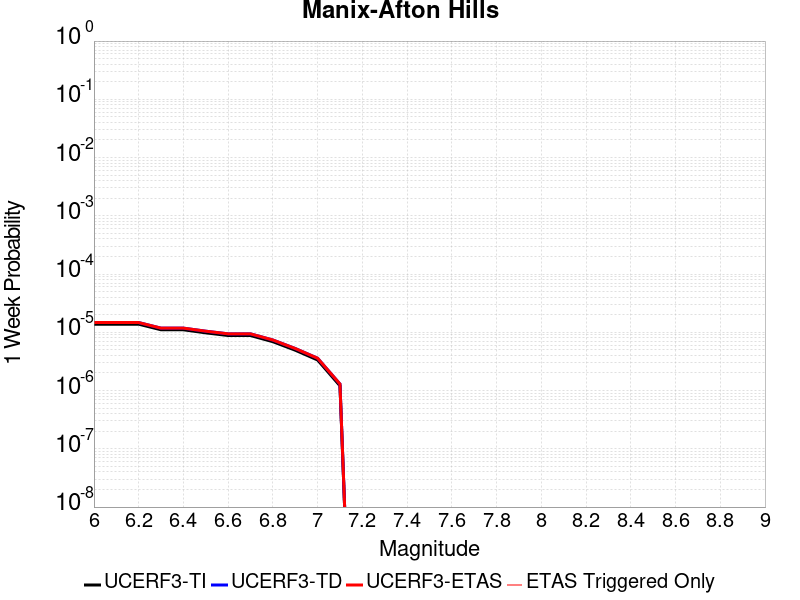 |  |  | 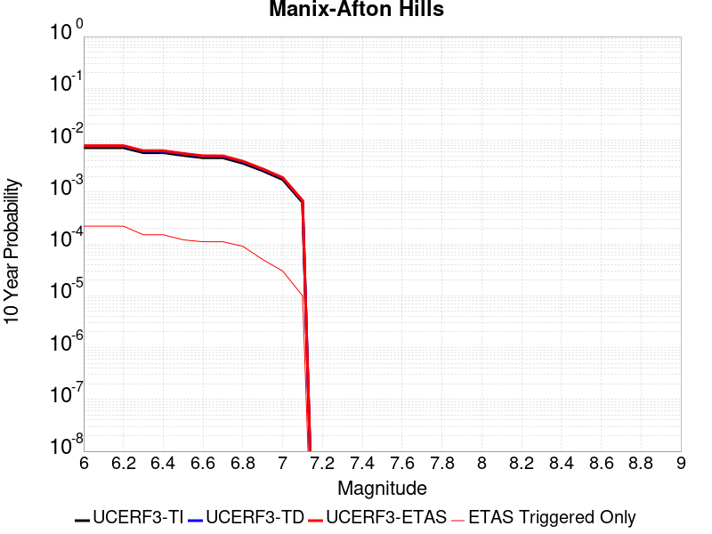 |

| Magnitude | 1 wk TI Prob | 1 wk TD Prob | 1 wk ETAS Prob | 1 wk ETAS/TD Gain | 1 wk ETAS Triggered Only | 1 mo TI Prob | 1 mo TD Prob | 1 mo ETAS Prob | 1 mo ETAS/TD Gain | 1 mo ETAS Triggered Only | 1 yr TI Prob | 1 yr TD Prob | 1 yr ETAS Prob | 1 yr ETAS/TD Gain | 1 yr ETAS Triggered Only | 10 yr TI Prob | 10 yr TD Prob | 10 yr ETAS Prob | 10 yr ETAS/TD Gain | 10 yr ETAS Triggered Only |
|-----|-----|-----|-----|-----|-----|-----|-----|-----|-----|-----|-----|-----|-----|-----|-----|-----|-----|-----|-----|-----|
| 6.0 | 1.3783202E-5 | 1.47112005E-5 | 1.47112005E-5 | 1.0 | 0.0 | 5.906953E-5 | 6.304658E-5 | 8.304532E-5 | 1.3172058 | 2.0E-5 | 7.189342E-4 | 7.6733925E-4 | 8.972395E-4 | 1.1692866 | 1.3E-4 | 0.0071661277 | 0.0076486534 | 0.00786697 | 1.0285432 | 2.2E-4 |
| 6.1 | 1.3783202E-5 | 1.47112005E-5 | 1.47112005E-5 | 1.0 | 0.0 | 5.906953E-5 | 6.304658E-5 | 8.304532E-5 | 1.3172058 | 2.0E-5 | 7.189342E-4 | 7.6733925E-4 | 8.972395E-4 | 1.1692866 | 1.3E-4 | 0.0071661277 | 0.0076486534 | 0.00786697 | 1.0285432 | 2.2E-4 |
| 6.2 | 1.3783202E-5 | 1.47112005E-5 | 1.47112005E-5 | 1.0 | 0.0 | 5.906953E-5 | 6.304658E-5 | 8.304532E-5 | 1.3172058 | 2.0E-5 | 7.189342E-4 | 7.6733925E-4 | 8.972395E-4 | 1.1692866 | 1.3E-4 | 0.0071661277 | 0.0076486534 | 0.00786697 | 1.0285432 | 2.2E-4 |
| 6.3 | 1.10494875E-5 | 1.1793225E-5 | 1.1793225E-5 | 1.0 | 0.0 | 4.7354086E-5 | 5.0541472E-5 | 7.054046E-5 | 1.3956946 | 2.0E-5 | 5.763835E-4 | 6.151791E-4 | 6.9512986E-4 | 1.1299634 | 8.0E-5 | 0.005748908 | 0.006135802 | 0.0062848814 | 1.0242966 | 1.5E-4 |
| 6.4 | 1.10494875E-5 | 1.1793225E-5 | 1.1793225E-5 | 1.0 | 0.0 | 4.7354086E-5 | 5.0541472E-5 | 7.054046E-5 | 1.3956946 | 2.0E-5 | 5.763835E-4 | 6.151791E-4 | 6.9512986E-4 | 1.1299634 | 8.0E-5 | 0.005748908 | 0.006135802 | 0.0062848814 | 1.0242966 | 1.5E-4 |
| 6.5 | 9.788949E-6 | 1.04544E-5 | 1.04544E-5 | 1.0 | 0.0 | 4.1951964E-5 | 4.480385E-5 | 5.4803404E-5 | 1.2231851 | 1.0E-5 | 5.1064545E-4 | 5.453596E-4 | 5.9533236E-4 | 1.0916326 | 5.0E-5 | 0.0050947363 | 0.00544114 | 0.005560487 | 1.0219342 | 1.2E-4 |
| 6.6 | 8.810006E-6 | 9.4137E-6 | 9.4137E-6 | 1.0 | 0.0 | 3.775662E-5 | 4.0343857E-5 | 5.0343453E-5 | 1.2478592 | 1.0E-5 | 4.5958988E-4 | 4.9108465E-4 | 5.410601E-4 | 1.1017654 | 5.0E-5 | 0.0045864056 | 0.004900877 | 0.0050103376 | 1.0223349 | 1.1E-4 |
| 6.7 | 8.80128E-6 | 9.40418E-6 | 9.40418E-6 | 1.0 | 0.0 | 3.7719226E-5 | 4.0303057E-5 | 5.0302653E-5 | 1.2481102 | 1.0E-5 | 4.591348E-4 | 4.9058814E-4 | 5.405636E-4 | 1.1018685 | 5.0E-5 | 0.004581874 | 0.0048959334 | 0.005005395 | 1.0223576 | 1.1E-4 |
| 6.8 | 6.8994877E-6 | 7.380134E-6 | 7.380134E-6 | 1.0 | 0.0 | 2.9568899E-5 | 3.1628806E-5 | 4.162849E-5 | 1.3161575 | 1.0E-5 | 3.5994186E-4 | 3.8502083E-4 | 4.350016E-4 | 1.1298131 | 5.0E-5 | 0.003593594 | 0.003844343 | 0.003933997 | 1.023321 | 9.0E-5 |
| 6.9 | 4.9328037E-6 | 5.271002E-6 | 5.271002E-6 | 1.0 | 0.0 | 2.1140417E-5 | 2.2589848E-5 | 2.2589848E-5 | 1.0 | 0.0 | 2.5735417E-4 | 2.7500285E-4 | 3.0499458E-4 | 1.1090598 | 3.0E-5 | 0.0025705635 | 0.0027472305 | 0.0027970932 | 1.0181501 | 5.0E-5 |
| 7.0 | 3.347973E-6 | 3.5900591E-6 | 3.5900591E-6 | 1.0 | 0.0 | 1.4348378E-5 | 1.53859E-5 | 1.53859E-5 | 1.0 | 0.0 | 1.746775E-4 | 1.8731134E-4 | 2.0730759E-4 | 1.1067541 | 2.0E-5 | 0.0017454025 | 0.0018719372 | 0.001901881 | 1.0159962 | 3.0E-5 |
| 7.1 | 1.2073567E-6 | 1.2934923E-6 | 1.2934923E-6 | 1.0 | 0.0 | 5.1743755E-6 | 5.543536E-6 | 5.543536E-6 | 1.0 | 0.0 | 6.29962E-5 | 6.7492096E-5 | 6.7492096E-5 | 1.0 | 0.0 | 6.297835E-4 | 6.7487615E-4 | 6.8486936E-4 | 1.0148076 | 1.0E-5 |

## San Andreas (Coachella) rev
*[(top)](#table-of-contents)*

| 1 Week | 1 Month | 1 Year | 10 Year |
|-----|-----|-----|-----|
|  |  | 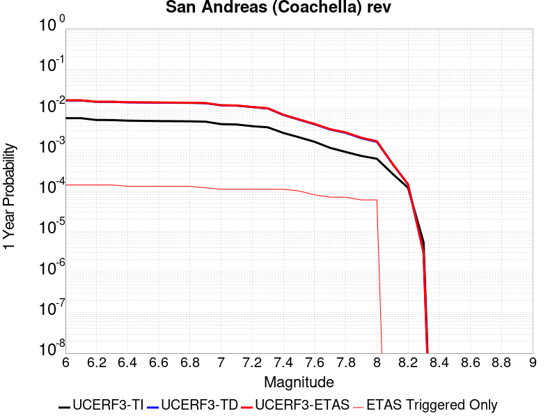 | 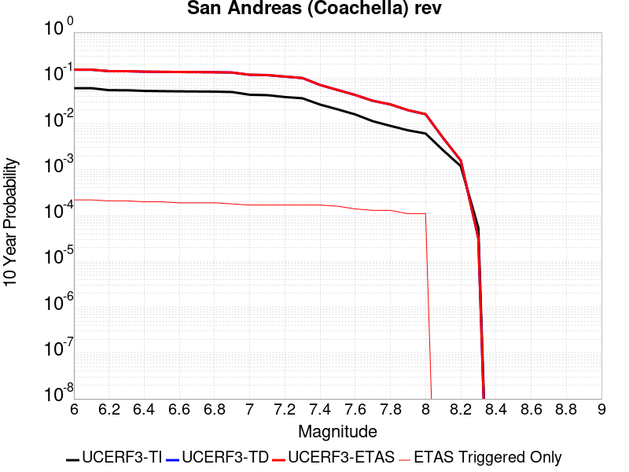 |

| Magnitude | 1 wk TI Prob | 1 wk TD Prob | 1 wk ETAS Prob | 1 wk ETAS/TD Gain | 1 wk ETAS Triggered Only | 1 mo TI Prob | 1 mo TD Prob | 1 mo ETAS Prob | 1 mo ETAS/TD Gain | 1 mo ETAS Triggered Only | 1 yr TI Prob | 1 yr TD Prob | 1 yr ETAS Prob | 1 yr ETAS/TD Gain | 1 yr ETAS Triggered Only | 10 yr TI Prob | 10 yr TD Prob | 10 yr ETAS Prob | 10 yr ETAS/TD Gain | 10 yr ETAS Triggered Only |
|-----|-----|-----|-----|-----|-----|-----|-----|-----|-----|-----|-----|-----|-----|-----|-----|-----|-----|-----|-----|-----|
| 6.0 | 1.1925945E-4 | 3.2734484E-4 | 3.2734484E-4 | 1.0 | 0.0 | 5.110118E-4 | 0.0014021569 | 0.0014620728 | 1.0427312 | 6.0E-5 | 0.0062038354 | 0.016938973 | 0.0170766 | 1.008125 | 1.4E-4 | 0.060334753 | 0.15267015 | 0.15285656 | 1.0012211 | 2.2E-4 |
| 6.1 | 1.1925945E-4 | 3.2734484E-4 | 3.2734484E-4 | 1.0 | 0.0 | 5.110118E-4 | 0.0014021569 | 0.0014620728 | 1.0427312 | 6.0E-5 | 0.0062038354 | 0.016938973 | 0.0170766 | 1.008125 | 1.4E-4 | 0.060334753 | 0.15267015 | 0.15285656 | 1.0012211 | 2.2E-4 |
| 6.2 | 1.07432395E-4 | 3.023527E-4 | 3.023527E-4 | 1.0 | 0.0 | 4.603433E-4 | 0.0012951578 | 0.00135508 | 1.0462664 | 6.0E-5 | 0.005590286 | 0.015655635 | 0.015793445 | 1.0088024 | 1.4E-4 | 0.05451731 | 0.1418231 | 0.14200331 | 1.0012708 | 2.1E-4 |
| 6.3 | 1.0718766E-4 | 3.0180576E-4 | 3.0180576E-4 | 1.0 | 0.0 | 4.592948E-4 | 0.001292816 | 0.0013527385 | 1.0463504 | 6.0E-5 | 0.005577586 | 0.015627535 | 0.015765347 | 1.0088185 | 1.4E-4 | 0.054396555 | 0.14159137 | 0.14177163 | 1.0012732 | 2.1E-4 |
| 6.4 | 1.0355944E-4 | 2.9388646E-4 | 2.9388646E-4 | 1.0 | 0.0 | 4.4375064E-4 | 0.0012589095 | 0.0013088465 | 1.0396669 | 5.0E-5 | 0.0053892885 | 0.01522056 | 0.015348582 | 1.008411 | 1.3E-4 | 0.052604496 | 0.13817292 | 0.13834529 | 1.0012474 | 2.0E-4 |
| 6.5 | 1.0227914E-4 | 2.9108077E-4 | 2.9108077E-4 | 1.0 | 0.0 | 4.382655E-4 | 0.0012468966 | 0.0012968342 | 1.0400496 | 5.0E-5 | 0.0053228354 | 0.015076337 | 0.0152043775 | 1.0084928 | 1.3E-4 | 0.051971316 | 0.13695711 | 0.13712971 | 1.0012603 | 2.0E-4 |
| 6.6 | 1.0116757E-4 | 2.8873826E-4 | 2.8873826E-4 | 1.0 | 0.0 | 4.3350324E-4 | 0.0012368668 | 0.0012868049 | 1.0403748 | 5.0E-5 | 0.0052651367 | 0.014955906 | 0.015083962 | 1.0085622 | 1.3E-4 | 0.051421247 | 0.1359347 | 0.13609886 | 1.0012077 | 1.9E-4 |
| 6.7 | 1.0050676E-4 | 2.8732387E-4 | 2.8732387E-4 | 1.0 | 0.0 | 4.3067214E-4 | 0.0012308109 | 0.0012807493 | 1.0405736 | 5.0E-5 | 0.005230834 | 0.014883186 | 0.015011251 | 1.0086046 | 1.3E-4 | 0.051094085 | 0.13531967 | 0.13548395 | 1.001214 | 1.9E-4 |
| 6.8 | 9.976819E-5 | 2.8536038E-4 | 2.8536038E-4 | 1.0 | 0.0 | 4.2750788E-4 | 0.0012224038 | 0.0012723426 | 1.040853 | 5.0E-5 | 0.0051924936 | 0.014782224 | 0.014910302 | 1.0086644 | 1.3E-4 | 0.050728295 | 0.13447113 | 0.1346356 | 1.001223 | 1.9E-4 |
| 6.9 | 9.77719E-5 | 2.803292E-4 | 2.803292E-4 | 1.0 | 0.0 | 4.1895514E-4 | 0.0012008615 | 0.0012508015 | 1.0415868 | 5.0E-5 | 0.0050888555 | 0.014523474 | 0.01464173 | 1.0081425 | 1.2E-4 | 0.049738888 | 0.13229947 | 0.13245565 | 1.0011805 | 1.8E-4 |
| 7.0 | 8.500761E-5 | 2.476728E-4 | 2.476728E-4 | 1.0 | 0.0 | 3.6426744E-4 | 0.0010610264 | 0.0011109733 | 1.0470742 | 5.0E-5 | 0.0044259406 | 0.012842257 | 0.012950844 | 1.0084555 | 1.1E-4 | 0.04338823 | 0.11815013 | 0.11830004 | 1.0012689 | 1.7E-4 |
| 7.1 | 8.319876E-5 | 2.4369977E-4 | 2.4369977E-4 | 1.0 | 0.0 | 3.5651738E-4 | 0.0010440128 | 0.0010939606 | 1.0478421 | 5.0E-5 | 0.004331963 | 0.012637538 | 0.012746148 | 1.0085943 | 1.1E-4 | 0.042484846 | 0.116369806 | 0.116520025 | 1.0012909 | 1.7E-4 |
| 7.2 | 7.563917E-5 | 2.2418295E-4 | 2.2418295E-4 | 1.0 | 0.0 | 3.2412758E-4 | 9.6043333E-4 | 0.0010103853 | 1.0520098 | 5.0E-5 | 0.0039391145 | 0.011631272 | 0.011739993 | 1.0093473 | 1.1E-4 | 0.03870018 | 0.107775874 | 0.10792755 | 1.0014074 | 1.7E-4 |
| 7.3 | 7.082985E-5 | 2.0734294E-4 | 2.0734294E-4 | 1.0 | 0.0 | 3.0352117E-4 | 8.883128E-4 | 9.3826844E-4 | 1.0562365 | 5.0E-5 | 0.0036891096 | 0.010762203 | 0.010871018 | 1.010111 | 1.1E-4 | 0.03628465 | 0.100297034 | 0.10044998 | 1.0015249 | 1.7E-4 |
| 7.4 | 5.146215E-5 | 1.4277374E-4 | 1.4277374E-4 | 1.0 | 0.0 | 2.2053342E-4 | 6.117449E-4 | 6.617143E-4 | 1.0816834 | 5.0E-5 | 0.0026816884 | 0.007422748 | 0.0075319316 | 1.0147094 | 1.1E-4 | 0.02649557 | 0.07086075 | 0.0710187 | 1.0022291 | 1.7E-4 |
| 7.5 | 4.0285166E-5 | 1.0944667E-4 | 1.0944667E-4 | 1.0 | 0.0 | 1.7263928E-4 | 4.689732E-4 | 5.1894976E-4 | 1.106566 | 5.0E-5 | 0.002099857 | 0.00569487 | 0.0057943 | 1.0174596 | 1.0E-4 | 0.020801254 | 0.055022646 | 0.05517384 | 1.0027479 | 1.6E-4 |
| 7.6 | 3.1168736E-5 | 8.441596E-5 | 8.441596E-5 | 1.0 | 0.0 | 1.3357346E-4 | 3.6173264E-4 | 3.9172178E-4 | 1.0829042 | 3.0E-5 | 0.0016250437 | 0.004395228 | 0.0044748764 | 1.0181216 | 8.0E-5 | 0.016132116 | 0.04282026 | 0.042954266 | 1.0031295 | 1.4E-4 |
| 7.7 | 2.2100989E-5 | 6.2410836E-5 | 6.2410836E-5 | 1.0 | 0.0 | 9.4715084E-5 | 2.6744764E-4 | 2.874423E-4 | 1.074761 | 2.0E-5 | 0.001152546 | 0.0032513195 | 0.0033210919 | 1.0214597 | 7.0E-5 | 0.011465867 | 0.031909924 | 0.032035775 | 1.0039439 | 1.3E-4 |
| 7.8 | 1.7484861E-5 | 5.1816318E-5 | 5.1816318E-5 | 1.0 | 0.0 | 7.493296E-5 | 2.2205105E-4 | 2.420466E-4 | 1.0900494 | 2.0E-5 | 9.1192697E-4 | 0.0027001228 | 0.0027699338 | 1.0258547 | 7.0E-5 | 0.009081938 | 0.026648786 | 0.026775321 | 1.0047482 | 1.3E-4 |
| 7.9 | 1.3967285E-5 | 3.8238853E-5 | 3.8238853E-5 | 1.0 | 0.0 | 5.985842E-5 | 1.6387051E-4 | 1.7386887E-4 | 1.0610138 | 1.0E-5 | 7.2853256E-4 | 0.001993299 | 0.0020531793 | 1.0300409 | 6.0E-5 | 0.0072614877 | 0.019917006 | 0.020024814 | 1.0054129 | 1.1E-4 |
| 8.0 | 1.1887396E-5 | 3.10789E-5 | 3.10789E-5 | 1.0 | 0.0 | 5.094499E-5 | 1.331885E-4 | 1.4318716E-4 | 1.0750716 | 1.0E-5 | 6.200787E-4 | 0.0016203647 | 0.0016802675 | 1.0369687 | 6.0E-5 | 0.006183513 | 0.016285744 | 0.016393952 | 1.0066444 | 1.1E-4 |
| 8.1 | 5.100864E-6 | 8.978225E-6 | 8.978225E-6 | 1.0 | 0.0 | 2.1860664E-5 | 3.847754E-5 | 3.847754E-5 | 1.0 | 0.0 | 2.6612106E-4 | 4.683635E-4 | 4.683635E-4 | 1.0 | 0.0 | 0.002658026 | 0.0049201353 | 0.0049201353 | 1.0 | 0.0 |
| 8.2 | 2.3004484E-6 | 2.7881435E-6 | 2.7881435E-6 | 1.0 | 0.0 | 9.859027E-6 | 1.1949132E-5 | 1.1949132E-5 | 1.0 | 0.0 | 1.2002704E-4 | 1.45471E-4 | 1.45471E-4 | 1.0 | 0.0 | 0.0011996223 | 0.0015982623 | 0.0015982623 | 1.0 | 0.0 |
| 8.3 | 1.0424446E-7 | 5.8193265E-8 | 5.8193265E-8 | 1.0 | 0.0 | 4.4676187E-7 | 2.4939968E-7 | 2.4939968E-7 | 1.0 | 0.0 | 5.439312E-6 | 3.0364372E-6 | 3.0364372E-6 | 1.0 | 0.0 | 5.4391792E-5 | 3.192544E-5 | 3.192544E-5 | 1.0 | 0.0 |

## Red Pass
*[(top)](#table-of-contents)*

| 1 Week | 1 Month | 1 Year | 10 Year |
|-----|-----|-----|-----|
|  |  | 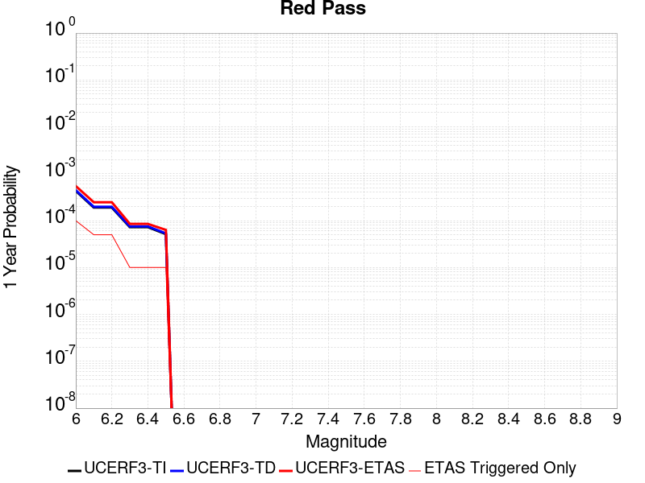 |  |

| Magnitude | 1 wk TI Prob | 1 wk TD Prob | 1 wk ETAS Prob | 1 wk ETAS/TD Gain | 1 wk ETAS Triggered Only | 1 mo TI Prob | 1 mo TD Prob | 1 mo ETAS Prob | 1 mo ETAS/TD Gain | 1 mo ETAS Triggered Only | 1 yr TI Prob | 1 yr TD Prob | 1 yr ETAS Prob | 1 yr ETAS/TD Gain | 1 yr ETAS Triggered Only | 10 yr TI Prob | 10 yr TD Prob | 10 yr ETAS Prob | 10 yr ETAS/TD Gain | 10 yr ETAS Triggered Only |
|-----|-----|-----|-----|-----|-----|-----|-----|-----|-----|-----|-----|-----|-----|-----|-----|-----|-----|-----|-----|-----|
| 6.0 | 8.258278E-6 | 8.551299E-6 | 1.8551213E-5 | 2.169403 | 1.0E-5 | 3.539214E-5 | 3.664801E-5 | 6.664691E-5 | 1.8185683 | 3.0E-5 | 4.308141E-4 | 4.4611603E-4 | 5.4607145E-4 | 1.224057 | 1.0E-4 | 0.0042997985 | 0.0044539627 | 0.0046530715 | 1.0447038 | 2.0E-4 |
| 6.1 | 3.649988E-6 | 3.7753307E-6 | 3.7753307E-6 | 1.0 | 0.0 | 1.5642712E-5 | 1.6179914E-5 | 2.6179752E-5 | 1.6180402 | 1.0E-5 | 1.9043336E-4 | 1.9697742E-4 | 2.4696757E-4 | 1.2537862 | 5.0E-5 | 0.0019027026 | 0.0019684955 | 0.0020583184 | 1.0456302 | 9.0E-5 |
| 6.2 | 3.649988E-6 | 3.7753307E-6 | 3.7753307E-6 | 1.0 | 0.0 | 1.5642712E-5 | 1.6179914E-5 | 2.6179752E-5 | 1.6180402 | 1.0E-5 | 1.9043336E-4 | 1.9697742E-4 | 2.4696757E-4 | 1.2537862 | 5.0E-5 | 0.0019027026 | 0.0019684955 | 0.0020583184 | 1.0456302 | 9.0E-5 |
| 6.3 | 1.3924937E-6 | 1.4411222E-6 | 1.4411222E-6 | 1.0 | 0.0 | 5.9678164E-6 | 6.1762316E-6 | 6.1762316E-6 | 1.0 | 0.0 | 7.265574E-5 | 7.519444E-5 | 8.5193686E-5 | 1.1329786 | 1.0E-5 | 7.263199E-4 | 7.518287E-4 | 7.818062E-4 | 1.0398726 | 3.0E-5 |
| 6.4 | 1.3924937E-6 | 1.4411222E-6 | 1.4411222E-6 | 1.0 | 0.0 | 5.9678164E-6 | 6.1762316E-6 | 6.1762316E-6 | 1.0 | 0.0 | 7.265574E-5 | 7.519444E-5 | 8.5193686E-5 | 1.1329786 | 1.0E-5 | 7.263199E-4 | 7.518287E-4 | 7.818062E-4 | 1.0398726 | 3.0E-5 |
| 6.5 | 9.876812E-7 | 1.0221952E-6 | 1.0221952E-6 | 1.0 | 0.0 | 4.2329125E-6 | 4.380837E-6 | 4.380837E-6 | 1.0 | 0.0 | 5.153449E-5 | 5.3336687E-5 | 6.333615E-5 | 1.1874782 | 1.0E-5 | 5.1522546E-4 | 5.3336687E-4 | 5.6335086E-4 | 1.0562165 | 3.0E-5 |

## San Jacinto (San Bernardino)
*[(top)](#table-of-contents)*

| 1 Week | 1 Month | 1 Year | 10 Year |
|-----|-----|-----|-----|
|  |  |  |  |

| Magnitude | 1 wk TI Prob | 1 wk TD Prob | 1 wk ETAS Prob | 1 wk ETAS/TD Gain | 1 wk ETAS Triggered Only | 1 mo TI Prob | 1 mo TD Prob | 1 mo ETAS Prob | 1 mo ETAS/TD Gain | 1 mo ETAS Triggered Only | 1 yr TI Prob | 1 yr TD Prob | 1 yr ETAS Prob | 1 yr ETAS/TD Gain | 1 yr ETAS Triggered Only | 10 yr TI Prob | 10 yr TD Prob | 10 yr ETAS Prob | 10 yr ETAS/TD Gain | 10 yr ETAS Triggered Only |
|-----|-----|-----|-----|-----|-----|-----|-----|-----|-----|-----|-----|-----|-----|-----|-----|-----|-----|-----|-----|-----|
| 6.0 | 3.409352E-5 | 3.5999048E-5 | 5.5998327E-5 | 1.5555502 | 2.0E-5 | 1.461069E-4 | 1.5427252E-4 | 2.1426327E-4 | 1.3888621 | 6.0E-5 | 0.0017774 | 0.0018766515 | 0.0020064076 | 1.0691423 | 1.3E-4 | 0.01763251 | 0.019356493 | 0.019562427 | 1.0106391 | 2.1E-4 |
| 6.1 | 3.409352E-5 | 3.5999048E-5 | 5.5998327E-5 | 1.5555502 | 2.0E-5 | 1.461069E-4 | 1.5427252E-4 | 2.1426327E-4 | 1.3888621 | 6.0E-5 | 0.0017774 | 0.0018766515 | 0.0020064076 | 1.0691423 | 1.3E-4 | 0.01763251 | 0.019356493 | 0.019562427 | 1.0106391 | 2.1E-4 |
| 6.2 | 3.409352E-5 | 3.5999048E-5 | 5.5998327E-5 | 1.5555502 | 2.0E-5 | 1.461069E-4 | 1.5427252E-4 | 2.1426327E-4 | 1.3888621 | 6.0E-5 | 0.0017774 | 0.0018766515 | 0.0020064076 | 1.0691423 | 1.3E-4 | 0.01763251 | 0.019356493 | 0.019562427 | 1.0106391 | 2.1E-4 |
| 6.3 | 3.409352E-5 | 3.5999048E-5 | 5.5998327E-5 | 1.5555502 | 2.0E-5 | 1.461069E-4 | 1.5427252E-4 | 2.1426327E-4 | 1.3888621 | 6.0E-5 | 0.0017774 | 0.0018766515 | 0.0020064076 | 1.0691423 | 1.3E-4 | 0.01763251 | 0.019356493 | 0.019562427 | 1.0106391 | 2.1E-4 |
| 6.4 | 3.400795E-5 | 3.589171E-5 | 5.5890992E-5 | 1.5572118 | 2.0E-5 | 1.4574021E-4 | 1.5381257E-4 | 2.1380333E-4 | 1.3900251 | 6.0E-5 | 0.0017729428 | 0.0018710612 | 0.0020008178 | 1.0693493 | 1.3E-4 | 0.017588645 | 0.019301573 | 0.01950752 | 1.01067 | 2.1E-4 |
| 6.5 | 3.341482E-5 | 3.515232E-5 | 4.515197E-5 | 1.2844663 | 1.0E-5 | 1.4319851E-4 | 1.506441E-4 | 2.0063658E-4 | 1.331858 | 5.0E-5 | 0.0017420477 | 0.0018325505 | 0.0019523306 | 1.0653625 | 1.2E-4 | 0.017284546 | 0.018923106 | 0.019119322 | 1.0103691 | 2.0E-4 |
| 6.6 | 3.3364955E-5 | 3.5089535E-5 | 4.5089186E-5 | 1.2849753 | 1.0E-5 | 1.4298483E-4 | 1.5037507E-4 | 2.0036755E-4 | 1.3324519 | 5.0E-5 | 0.0017394501 | 0.0018292804 | 0.0019490609 | 1.0654795 | 1.2E-4 | 0.017258976 | 0.01889097 | 0.019087192 | 1.0103871 | 2.0E-4 |
| 6.7 | 3.335922E-5 | 3.507931E-5 | 4.507896E-5 | 1.2850583 | 1.0E-5 | 1.4296026E-4 | 1.5033125E-4 | 2.0032373E-4 | 1.3325489 | 5.0E-5 | 0.0017391514 | 0.0018287478 | 0.0019485283 | 1.0654987 | 1.2E-4 | 0.017256035 | 0.01888576 | 0.019081984 | 1.01039 | 2.0E-4 |
| 6.8 | 3.327683E-5 | 3.4973375E-5 | 4.497302E-5 | 1.2859218 | 1.0E-5 | 1.4260718E-4 | 1.4987728E-4 | 1.9986978E-4 | 1.3335563 | 5.0E-5 | 0.0017348597 | 0.0018232301 | 0.0019430113 | 1.0656973 | 1.2E-4 | 0.017213784 | 0.018831529 | 0.019027764 | 1.0104204 | 2.0E-4 |
| 6.9 | 3.3235785E-5 | 3.4914323E-5 | 4.4913977E-5 | 1.2864054 | 1.0E-5 | 1.4243131E-4 | 1.4962425E-4 | 1.9961677E-4 | 1.3341204 | 5.0E-5 | 0.0017327217 | 0.0018201545 | 0.0019399361 | 1.0658084 | 1.2E-4 | 0.017192734 | 0.018801399 | 0.018997638 | 1.0104375 | 2.0E-4 |
| 7.0 | 3.3197095E-5 | 3.4854253E-5 | 4.4853903E-5 | 1.2868991 | 1.0E-5 | 1.422655E-4 | 1.4936682E-4 | 1.9935935E-4 | 1.3346964 | 5.0E-5 | 0.0017307063 | 0.0018170256 | 0.0019368075 | 1.065922 | 1.2E-4 | 0.017172894 | 0.018770775 | 0.018967021 | 1.0104549 | 2.0E-4 |
| 7.1 | 3.3129716E-5 | 3.4734458E-5 | 4.4734108E-5 | 1.2878885 | 1.0E-5 | 1.4197677E-4 | 1.4885346E-4 | 1.9884603E-4 | 1.3358508 | 5.0E-5 | 0.0017271966 | 0.001810786 | 0.0019305686 | 1.0661496 | 1.2E-4 | 0.017138338 | 0.01870985 | 0.018906109 | 1.0104896 | 2.0E-4 |
| 7.2 | 3.3034008E-5 | 3.4601897E-5 | 4.460155E-5 | 1.2889915 | 1.0E-5 | 1.4156665E-4 | 1.4828543E-4 | 1.9827801E-4 | 1.3371376 | 5.0E-5 | 0.0017222111 | 0.0018038815 | 0.001923665 | 1.0664033 | 1.2E-4 | 0.017089253 | 0.018642232 | 0.018838502 | 1.0105283 | 2.0E-4 |
| 7.3 | 3.2956614E-5 | 3.4469645E-5 | 4.44693E-5 | 1.2901003 | 1.0E-5 | 1.4123498E-4 | 1.4771869E-4 | 1.9771131E-4 | 1.3384312 | 5.0E-5 | 0.0017181796 | 0.001796993 | 0.0019167773 | 1.0666583 | 1.2E-4 | 0.017049557 | 0.018574972 | 0.018771257 | 1.0105672 | 2.0E-4 |
| 7.4 | 3.2915937E-5 | 3.439133E-5 | 4.439099E-5 | 1.290761 | 1.0E-5 | 1.4106068E-4 | 1.473831E-4 | 1.9737573E-4 | 1.3392019 | 5.0E-5 | 0.0017160608 | 0.0017929139 | 0.0019126987 | 1.0668101 | 1.2E-4 | 0.017028693 | 0.018535245 | 0.018731538 | 1.0105902 | 2.0E-4 |
| 7.5 | 3.281791E-5 | 3.4256234E-5 | 4.425589E-5 | 1.2919077 | 1.0E-5 | 1.406406E-4 | 1.4680417E-4 | 1.9679683E-4 | 1.3405398 | 5.0E-5 | 0.0017109542 | 0.0017858769 | 0.0019056627 | 1.0670738 | 1.2E-4 | 0.016978411 | 0.018466124 | 0.018662432 | 1.0106306 | 2.0E-4 |
| 7.6 | 3.2521442E-5 | 3.398116E-5 | 4.398082E-5 | 1.2942708 | 1.0E-5 | 1.3937015E-4 | 1.4562542E-4 | 1.9561814E-4 | 1.3432966 | 5.0E-5 | 0.0016955109 | 0.0017715491 | 0.0018913365 | 1.0676173 | 1.2E-4 | 0.016826328 | 0.01832376 | 0.018520094 | 1.0107148 | 2.0E-4 |
| 7.7 | 3.0287873E-5 | 3.24651E-5 | 4.2464777E-5 | 1.3080131 | 1.0E-5 | 1.297987E-4 | 1.3912874E-4 | 1.8912177E-4 | 1.3593293 | 5.0E-5 | 0.0015791537 | 0.0016925774 | 0.0018123742 | 1.0707778 | 1.2E-4 | 0.01567979 | 0.017534545 | 0.017731037 | 1.011206 | 2.0E-4 |
| 7.8 | 2.6316151E-5 | 2.9675592E-5 | 3.9675295E-5 | 1.3369672 | 1.0E-5 | 1.1277862E-4 | 1.271749E-4 | 1.7716855E-4 | 1.3931093 | 5.0E-5 | 0.0013722149 | 0.0015472558 | 0.0016570856 | 1.0709836 | 1.1E-4 | 0.013637724 | 0.016075844 | 0.01626279 | 1.011629 | 1.9E-4 |
| 7.9 | 2.0761147E-5 | 2.3428336E-5 | 3.3428103E-5 | 1.4268235 | 1.0E-5 | 8.897331E-5 | 1.004033E-4 | 1.4039928E-4 | 1.3983533 | 4.0E-5 | 0.0010827117 | 0.0012217255 | 0.0013216033 | 1.0817515 | 1.0E-4 | 0.010774517 | 0.012798671 | 0.012966495 | 1.0131127 | 1.7E-4 |
| 8.0 | 1.5738568E-5 | 1.6040727E-5 | 2.6040567E-5 | 1.6234032 | 1.0E-5 | 6.744926E-5 | 6.8744164E-5 | 8.874279E-5 | 1.2909138 | 2.0E-5 | 8.2088535E-4 | 8.366395E-4 | 8.8659767E-4 | 1.0597129 | 5.0E-5 | 0.008178596 | 0.008869809 | 0.0089491 | 1.0089394 | 8.0E-5 |
| 8.1 | 1.0105832E-5 | 8.334221E-6 | 1.8334138E-5 | 2.199862 | 1.0E-5 | 4.3309992E-5 | 3.5717607E-5 | 5.5716893E-5 | 1.5599279 | 2.0E-5 | 5.2717153E-4 | 4.347756E-4 | 4.6476256E-4 | 1.0689712 | 3.0E-5 | 0.005259227 | 0.004679363 | 0.004719176 | 1.0085082 | 4.0E-5 |
| 8.2 | 4.189207E-6 | 1.5791358E-6 | 1.5791358E-6 | 1.0 | 0.0 | 1.7953622E-5 | 6.767707E-6 | 6.767707E-6 | 1.0 | 0.0 | 2.1856341E-4 | 8.2393744E-5 | 8.2393744E-5 | 1.0 | 0.0 | 0.0021834858 | 9.569939E-4 | 9.569939E-4 | 1.0 | 0.0 |
| 8.3 | 1.2758221E-6 | 3.616449E-7 | 3.616449E-7 | 1.0 | 0.0 | 5.4677976E-6 | 1.5499058E-6 | 1.5499058E-6 | 1.0 | 0.0 | 6.65684E-5 | 1.8869945E-5 | 1.8869945E-5 | 1.0 | 0.0 | 6.6548464E-4 | 2.2761128E-4 | 2.2761128E-4 | 1.0 | 0.0 |

## San Andreas (Creeping Section) 2011 CFM
*[(top)](#table-of-contents)*

| 1 Week | 1 Month | 1 Year | 10 Year |
|-----|-----|-----|-----|
| 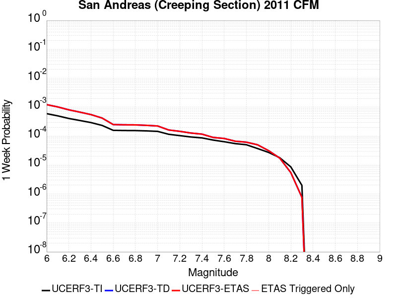 |  | 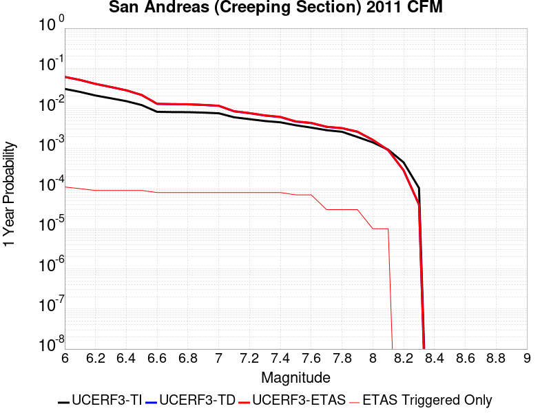 | 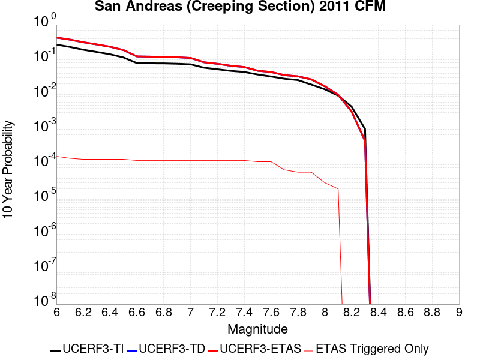 |

| Magnitude | 1 wk TI Prob | 1 wk TD Prob | 1 wk ETAS Prob | 1 wk ETAS/TD Gain | 1 wk ETAS Triggered Only | 1 mo TI Prob | 1 mo TD Prob | 1 mo ETAS Prob | 1 mo ETAS/TD Gain | 1 mo ETAS Triggered Only | 1 yr TI Prob | 1 yr TD Prob | 1 yr ETAS Prob | 1 yr ETAS/TD Gain | 1 yr ETAS Triggered Only | 10 yr TI Prob | 10 yr TD Prob | 10 yr ETAS Prob | 10 yr ETAS/TD Gain | 10 yr ETAS Triggered Only |
|-----|-----|-----|-----|-----|-----|-----|-----|-----|-----|-----|-----|-----|-----|-----|-----|-----|-----|-----|-----|-----|
| 6.0 | 5.986481E-4 | 0.0012276721 | 0.0012276721 | 1.0 | 0.0 | 0.0025631124 | 0.0052458975 | 0.0052856873 | 1.007585 | 4.0E-5 | 0.030762846 | 0.061209496 | 0.061312765 | 1.001687 | 1.1E-4 | 0.26835477 | 0.42595708 | 0.42605466 | 1.0002291 | 1.7E-4 |
| 6.1 | 5.015945E-4 | 0.0010218594 | 0.0010218594 | 1.0 | 0.0 | 0.00214792 | 0.00436813 | 0.0044079553 | 1.0091172 | 4.0E-5 | 0.025839351 | 0.05125198 | 0.051346857 | 1.0018512 | 1.0E-4 | 0.23032776 | 0.37287703 | 0.3729711 | 1.0002522 | 1.5E-4 |
| 6.2 | 4.073338E-4 | 8.1079605E-4 | 8.1079605E-4 | 1.0 | 0.0 | 0.0017445484 | 0.0034674199 | 0.0034973158 | 1.0086219 | 3.0E-5 | 0.021034058 | 0.040936746 | 0.04102306 | 1.0021085 | 9.0E-5 | 0.19150782 | 0.31305578 | 0.31315196 | 1.0003072 | 1.4E-4 |
| 6.3 | 3.464099E-4 | 6.7398726E-4 | 6.7398726E-4 | 1.0 | 0.0 | 0.0014837692 | 0.002883249 | 0.0029131623 | 1.0103749 | 3.0E-5 | 0.017915873 | 0.034193188 | 0.034280114 | 1.0025421 | 9.0E-5 | 0.16538359 | 0.27134037 | 0.27144238 | 1.000376 | 1.4E-4 |
| 6.4 | 2.935057E-4 | 5.544866E-4 | 5.544866E-4 | 1.0 | 0.0 | 0.0012572751 | 0.0023728195 | 0.0024027484 | 1.0126132 | 3.0E-5 | 0.015200248 | 0.028268147 | 0.028355604 | 1.0030938 | 9.0E-5 | 0.14201577 | 0.23301041 | 0.2331178 | 1.0004609 | 1.4E-4 |
| 6.5 | 2.3409708E-4 | 4.2098732E-4 | 4.2098732E-4 | 1.0 | 0.0 | 0.0010028875 | 0.0018022561 | 0.001832202 | 1.0166157 | 3.0E-5 | 0.012141965 | 0.02159113 | 0.021679187 | 1.0040784 | 9.0E-5 | 0.11499573 | 0.18685034 | 0.18696418 | 1.0006093 | 1.4E-4 |
| 6.6 | 1.5842178E-4 | 2.5076373E-4 | 2.5076373E-4 | 1.0 | 0.0 | 6.7877385E-4 | 0.0010742501 | 0.0010942286 | 1.0185976 | 2.0E-5 | 0.0082328 | 0.01299924 | 0.013078201 | 1.0060742 | 8.0E-5 | 0.07934396 | 0.12317513 | 0.12328912 | 1.0009254 | 1.3E-4 |
| 6.7 | 1.5616413E-4 | 2.4612897E-4 | 2.4612897E-4 | 1.0 | 0.0 | 6.691031E-4 | 0.0010544065 | 0.0010743854 | 1.018948 | 2.0E-5 | 0.0081159435 | 0.0127611 | 0.012840079 | 1.0061891 | 8.0E-5 | 0.0782586 | 0.12120232 | 0.12131656 | 1.0009426 | 1.3E-4 |
| 6.8 | 1.5538467E-4 | 2.4436737E-4 | 2.4436737E-4 | 1.0 | 0.0 | 6.6576427E-4 | 0.0010468634 | 0.0010668425 | 1.0190847 | 2.0E-5 | 0.008075596 | 0.012670427 | 0.012749413 | 1.0062339 | 8.0E-5 | 0.07788358 | 0.12043314 | 0.12054748 | 1.0009494 | 1.3E-4 |
| 6.9 | 1.5153569E-4 | 2.3545939E-4 | 2.3545939E-4 | 1.0 | 0.0 | 6.49277E-4 | 0.0010087233 | 0.0010287031 | 1.0198071 | 2.0E-5 | 0.007876333 | 0.01221257 | 0.012291593 | 1.0064707 | 8.0E-5 | 0.07602952 | 0.1165031 | 0.116617955 | 1.0009859 | 1.3E-4 |
| 7.0 | 1.4588932E-4 | 2.2403088E-4 | 2.2403088E-4 | 1.0 | 0.0 | 6.250901E-4 | 9.59781E-4 | 9.797618E-4 | 1.0208181 | 2.0E-5 | 0.0075839474 | 0.011623222 | 0.011702293 | 1.0068028 | 8.0E-5 | 0.073302895 | 0.11134882 | 0.111464344 | 1.0010375 | 1.3E-4 |
| 7.1 | 1.1565079E-4 | 1.6287954E-4 | 1.6287954E-4 | 1.0 | 0.0 | 4.955521E-4 | 6.978693E-4 | 7.1785535E-4 | 1.0286387 | 2.0E-5 | 0.006016669 | 0.008463659 | 0.008542983 | 1.0093722 | 8.0E-5 | 0.058563538 | 0.08369648 | 0.0838156 | 1.0014232 | 1.3E-4 |
| 7.2 | 1.0393792E-4 | 1.4621727E-4 | 1.4621727E-4 | 1.0 | 0.0 | 4.4537216E-4 | 6.264957E-4 | 6.4648315E-4 | 1.0319036 | 2.0E-5 | 0.005408933 | 0.007601078 | 0.00768047 | 1.0104449 | 8.0E-5 | 0.052791595 | 0.07564544 | 0.07576561 | 1.0015886 | 1.3E-4 |
| 7.3 | 9.332884E-5 | 1.278644E-4 | 1.278644E-4 | 1.0 | 0.0 | 3.999194E-4 | 5.478759E-4 | 5.678649E-4 | 1.0364846 | 2.0E-5 | 0.0048581534 | 0.0066501223 | 0.0067295902 | 1.0119499 | 8.0E-5 | 0.047533102 | 0.0665075 | 0.06662886 | 1.0018246 | 1.3E-4 |
| 7.4 | 8.670252E-5 | 1.1708087E-4 | 1.1708087E-4 | 1.0 | 0.0 | 3.715293E-4 | 5.0167926E-4 | 5.216692E-4 | 1.0398461 | 2.0E-5 | 0.004513991 | 0.00609096 | 0.0061704726 | 1.0130543 | 8.0E-5 | 0.044233937 | 0.061173104 | 0.06129515 | 1.0019951 | 1.3E-4 |
| 7.5 | 7.3036405E-5 | 9.0099595E-5 | 9.0099595E-5 | 1.0 | 0.0 | 3.129756E-4 | 3.8608405E-4 | 4.0607632E-4 | 1.0517823 | 2.0E-5 | 0.0038038217 | 0.0046904637 | 0.004760135 | 1.014854 | 7.0E-5 | 0.03739367 | 0.04789546 | 0.048009716 | 1.0023855 | 1.2E-4 |
| 7.6 | 6.3935775E-5 | 8.2842016E-5 | 8.2842016E-5 | 1.0 | 0.0 | 2.7398168E-4 | 3.54989E-4 | 3.749819E-4 | 1.0563198 | 2.0E-5 | 0.0033306254 | 0.0043134447 | 0.0043831426 | 1.0161583 | 7.0E-5 | 0.032811474 | 0.04400873 | 0.044123452 | 1.0026067 | 1.2E-4 |
| 7.7 | 5.5050095E-5 | 6.6652065E-5 | 6.6652065E-5 | 1.0 | 0.0 | 2.3590765E-4 | 2.8562045E-4 | 3.0561475E-4 | 1.070003 | 2.0E-5 | 0.0028683927 | 0.0034718884 | 0.0035017843 | 1.0086108 | 3.0E-5 | 0.0283165 | 0.035811845 | 0.035879336 | 1.0018847 | 7.0E-5 |
| 7.8 | 5.027131E-5 | 6.165957E-5 | 6.165957E-5 | 1.0 | 0.0 | 2.1543067E-4 | 2.6422855E-4 | 2.842233E-4 | 1.075672 | 2.0E-5 | 0.0026197135 | 0.0032122405 | 0.0032421441 | 1.0093093 | 3.0E-5 | 0.025890453 | 0.03314121 | 0.03319922 | 1.0017505 | 6.0E-5 |
| 7.9 | 3.7271806E-5 | 5.0250084E-5 | 5.0250084E-5 | 1.0 | 0.0 | 1.5972654E-4 | 2.1533975E-4 | 2.3533544E-4 | 1.0928565 | 2.0E-5 | 0.0019429359 | 0.0026186113 | 0.0026485326 | 1.0114264 | 3.0E-5 | 0.019260362 | 0.027079143 | 0.027137518 | 1.0021558 | 6.0E-5 |
| 8.0 | 2.7310243E-5 | 3.1444106E-5 | 3.1444106E-5 | 1.0 | 0.0 | 1.17038646E-4 | 1.347535E-4 | 1.4475215E-4 | 1.0741996 | 1.0E-5 | 0.0014240141 | 0.00163939 | 0.0016493737 | 1.0060898 | 1.0E-5 | 0.014149235 | 0.017221889 | 0.017251372 | 1.001712 | 3.0E-5 |
| 8.1 | 1.7940547E-5 | 1.7409802E-5 | 1.7409802E-5 | 1.0 | 0.0 | 7.688579E-5 | 7.461131E-5 | 8.461056E-5 | 1.134018 | 1.0E-5 | 9.3568244E-4 | 9.0801466E-4 | 9.180056E-4 | 1.011003 | 1.0E-5 | 0.009317525 | 0.009804023 | 0.009823827 | 1.00202 | 2.0E-5 |
| 8.2 | 8.643924E-6 | 5.4778857E-6 | 5.4778857E-6 | 1.0 | 0.0 | 3.704486E-5 | 2.3476441E-5 | 2.3476441E-5 | 1.0 | 0.0 | 4.5092785E-4 | 2.8578826E-4 | 2.8578826E-4 | 1.0 | 0.0 | 0.0045001395 | 0.0032504273 | 0.0032504273 | 1.0 | 0.0 |
| 8.3 | 1.983087E-6 | 7.663413E-7 | 7.663413E-7 | 1.0 | 0.0 | 8.498917E-6 | 3.2843159E-6 | 3.2843159E-6 | 1.0 | 0.0 | 1.034694E-4 | 3.998583E-5 | 3.998583E-5 | 1.0 | 0.0 | 0.0010342124 | 4.7219908E-4 | 4.7219908E-4 | 1.0 | 0.0 |

## Calico-Hidalgo
*[(top)](#table-of-contents)*

| 1 Week | 1 Month | 1 Year | 10 Year |
|-----|-----|-----|-----|
|  |  | 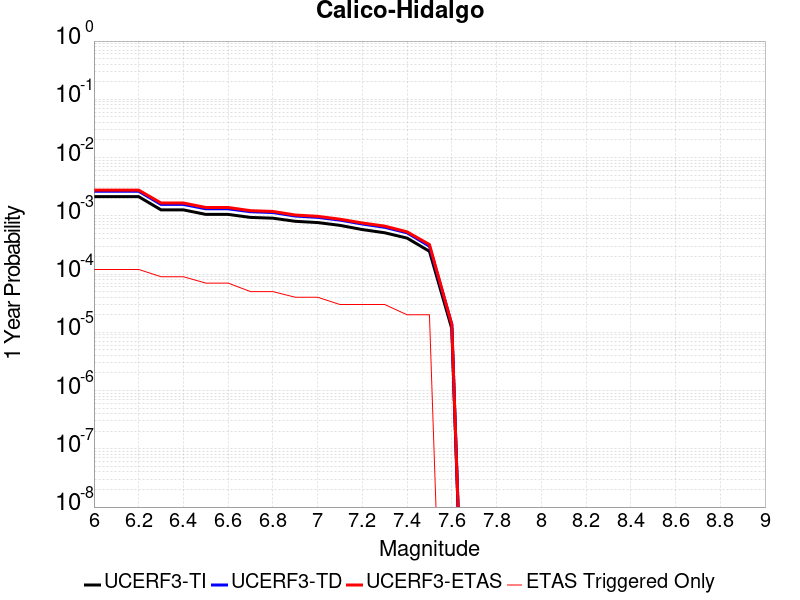 |  |

| Magnitude | 1 wk TI Prob | 1 wk TD Prob | 1 wk ETAS Prob | 1 wk ETAS/TD Gain | 1 wk ETAS Triggered Only | 1 mo TI Prob | 1 mo TD Prob | 1 mo ETAS Prob | 1 mo ETAS/TD Gain | 1 mo ETAS Triggered Only | 1 yr TI Prob | 1 yr TD Prob | 1 yr ETAS Prob | 1 yr ETAS/TD Gain | 1 yr ETAS Triggered Only | 10 yr TI Prob | 10 yr TD Prob | 10 yr ETAS Prob | 10 yr ETAS/TD Gain | 10 yr ETAS Triggered Only |
|-----|-----|-----|-----|-----|-----|-----|-----|-----|-----|-----|-----|-----|-----|-----|-----|-----|-----|-----|-----|-----|
| 6.0 | 4.0906612E-5 | 5.070512E-5 | 5.070512E-5 | 1.0 | 0.0 | 1.7530227E-4 | 2.1729185E-4 | 2.4728532E-4 | 1.1380332 | 3.0E-5 | 0.0021322158 | 0.0026427177 | 0.0027624005 | 1.0452878 | 1.2E-4 | 0.02111873 | 0.026153201 | 0.026338233 | 1.0070748 | 1.9E-4 |
| 6.1 | 4.0906612E-5 | 5.070512E-5 | 5.070512E-5 | 1.0 | 0.0 | 1.7530227E-4 | 2.1729185E-4 | 2.4728532E-4 | 1.1380332 | 3.0E-5 | 0.0021322158 | 0.0026427177 | 0.0027624005 | 1.0452878 | 1.2E-4 | 0.02111873 | 0.026153201 | 0.026338233 | 1.0070748 | 1.9E-4 |
| 6.2 | 4.0906612E-5 | 5.070512E-5 | 5.070512E-5 | 1.0 | 0.0 | 1.7530227E-4 | 2.1729185E-4 | 2.4728532E-4 | 1.1380332 | 3.0E-5 | 0.0021322158 | 0.0026427177 | 0.0027624005 | 1.0452878 | 1.2E-4 | 0.02111873 | 0.026153201 | 0.026338233 | 1.0070748 | 1.9E-4 |
| 6.3 | 2.4242801E-5 | 3.0091229E-5 | 3.0091229E-5 | 1.0 | 0.0 | 1.0389358E-4 | 1.2895622E-4 | 1.5895236E-4 | 1.2326071 | 3.0E-5 | 0.0012641704 | 0.0015689448 | 0.0016588036 | 1.0572734 | 9.0E-5 | 0.01257003 | 0.015582363 | 0.015720181 | 1.0088445 | 1.4E-4 |
| 6.4 | 2.4242801E-5 | 3.0091229E-5 | 3.0091229E-5 | 1.0 | 0.0 | 1.0389358E-4 | 1.2895622E-4 | 1.5895236E-4 | 1.2326071 | 3.0E-5 | 0.0012641704 | 0.0015689448 | 0.0016588036 | 1.0572734 | 9.0E-5 | 0.01257003 | 0.015582363 | 0.015720181 | 1.0088445 | 1.4E-4 |
| 6.5 | 2.0286952E-5 | 2.531622E-5 | 2.531622E-5 | 1.0 | 0.0 | 8.694118E-5 | 1.0849367E-4 | 1.2849149E-4 | 1.1843226 | 2.0E-5 | 0.0010579949 | 0.001320127 | 0.0013900347 | 1.0529552 | 7.0E-5 | 0.010529719 | 0.013124785 | 0.0132432105 | 1.009023 | 1.2E-4 |
| 6.6 | 2.0269223E-5 | 2.529717E-5 | 2.529717E-5 | 1.0 | 0.0 | 8.6865206E-5 | 1.0841203E-4 | 1.2840985E-4 | 1.1844614 | 2.0E-5 | 0.0010570707 | 0.0013191344 | 0.001389042 | 1.0529951 | 7.0E-5 | 0.010520565 | 0.013114975 | 0.013233401 | 1.0090299 | 1.2E-4 |
| 6.7 | 1.799852E-5 | 2.2541062E-5 | 2.2541062E-5 | 1.0 | 0.0 | 7.713423E-5 | 9.6601056E-5 | 1.1659913E-4 | 1.2070171 | 2.0E-5 | 9.3870464E-4 | 0.0011754979 | 0.0012254391 | 1.0424851 | 5.0E-5 | 0.009347493 | 0.011694412 | 0.011793242 | 1.0084511 | 1.0E-4 |
| 6.8 | 1.7458793E-5 | 2.1842705E-5 | 2.1842705E-5 | 1.0 | 0.0 | 7.4821255E-5 | 9.3608316E-5 | 1.1360644E-4 | 1.2136363 | 2.0E-5 | 9.10568E-4 | 0.0011390998 | 0.0011890428 | 1.0438443 | 5.0E-5 | 0.009068459 | 0.011334195 | 0.011433061 | 1.0087229 | 1.0E-4 |
| 6.9 | 1.542884E-5 | 1.9026398E-5 | 1.9026398E-5 | 1.0 | 0.0 | 6.612192E-5 | 8.1539234E-5 | 1.015376E-4 | 1.2452607 | 2.0E-5 | 8.04737E-4 | 9.923012E-4 | 0.0010322614 | 1.0402703 | 4.0E-5 | 0.008018291 | 0.009880101 | 0.00995931 | 1.0080171 | 8.0E-5 |
| 7.0 | 1.468253E-5 | 1.80312E-5 | 1.80312E-5 | 1.0 | 0.0 | 6.292361E-5 | 7.727435E-5 | 9.727281E-5 | 1.2587981 | 2.0E-5 | 7.658257E-4 | 9.404222E-4 | 9.803845E-4 | 1.042494 | 4.0E-5 | 0.0076319184 | 0.009365791 | 0.009445042 | 1.0084617 | 8.0E-5 |
| 7.1 | 1.3139281E-5 | 1.6201482E-5 | 1.6201482E-5 | 1.0 | 0.0 | 5.6309986E-5 | 6.943315E-5 | 8.9431756E-5 | 1.2880269 | 2.0E-5 | 6.853584E-4 | 8.450332E-4 | 8.750079E-4 | 1.0354716 | 3.0E-5 | 0.0068324856 | 0.008419497 | 0.008488908 | 1.008244 | 7.0E-5 |
| 7.2 | 1.1127404E-5 | 1.3867115E-5 | 1.3867115E-5 | 1.0 | 0.0 | 4.7688E-5 | 5.94292E-5 | 7.942801E-5 | 1.336515 | 2.0E-5 | 5.8044674E-4 | 7.233212E-4 | 7.532995E-4 | 1.0414454 | 3.0E-5 | 0.0057893298 | 0.0072107767 | 0.007260416 | 1.0068841 | 5.0E-5 |
| 7.3 | 9.808154E-6 | 1.2176654E-5 | 1.2176654E-5 | 1.0 | 0.0 | 4.2034266E-5 | 5.2184678E-5 | 7.218363E-5 | 1.3832343 | 2.0E-5 | 5.11647E-4 | 6.35174E-4 | 6.651549E-4 | 1.0472012 | 3.0E-5 | 0.0051047057 | 0.006334661 | 0.0063744076 | 1.0062745 | 4.0E-5 |
| 7.4 | 7.942452E-6 | 9.792407E-6 | 9.792407E-6 | 1.0 | 0.0 | 3.4038632E-5 | 4.1966836E-5 | 5.1966417E-5 | 1.2382734 | 1.0E-5 | 4.1434157E-4 | 5.108359E-4 | 5.308257E-4 | 1.0391315 | 2.0E-5 | 0.0041356985 | 0.005097558 | 0.005117456 | 1.0039034 | 2.0E-5 |
| 7.5 | 4.7121216E-6 | 5.7729853E-6 | 5.7729853E-6 | 1.0 | 0.0 | 2.019465E-5 | 2.4741174E-5 | 3.4740926E-5 | 1.4041746 | 1.0E-5 | 2.4584212E-4 | 3.011898E-4 | 3.211838E-4 | 1.0663834 | 2.0E-5 | 0.0024557032 | 0.0030085684 | 0.0030285083 | 1.0066277 | 2.0E-5 |
| 7.6 | 2.21172E-7 | 2.6040198E-7 | 2.6040198E-7 | 1.0 | 0.0 | 9.478797E-7 | 1.1160082E-6 | 1.1160082E-6 | 1.0 | 0.0 | 1.1540374E-5 | 1.3587343E-5 | 1.3587343E-5 | 1.0 | 0.0 | 1.1539775E-4 | 1.3586794E-4 | 1.3586794E-4 | 1.0 | 0.0 |

## Baker
*[(top)](#table-of-contents)*

| 1 Week | 1 Month | 1 Year | 10 Year |
|-----|-----|-----|-----|
|  |  | 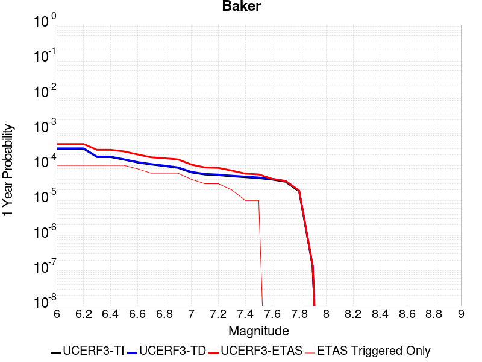 |  |

| Magnitude | 1 wk TI Prob | 1 wk TD Prob | 1 wk ETAS Prob | 1 wk ETAS/TD Gain | 1 wk ETAS Triggered Only | 1 mo TI Prob | 1 mo TD Prob | 1 mo ETAS Prob | 1 mo ETAS/TD Gain | 1 mo ETAS Triggered Only | 1 yr TI Prob | 1 yr TD Prob | 1 yr ETAS Prob | 1 yr ETAS/TD Gain | 1 yr ETAS Triggered Only | 10 yr TI Prob | 10 yr TD Prob | 10 yr ETAS Prob | 10 yr ETAS/TD Gain | 10 yr ETAS Triggered Only |
|-----|-----|-----|-----|-----|-----|-----|-----|-----|-----|-----|-----|-----|-----|-----|-----|-----|-----|-----|-----|-----|
| 6.0 | 5.695525E-6 | 5.8348533E-6 | 5.8348533E-6 | 1.0 | 0.0 | 2.4409164E-5 | 2.5006297E-5 | 6.50053E-5 | 2.5995572 | 4.0E-5 | 2.9714106E-4 | 3.0441314E-4 | 4.043827E-4 | 1.328401 | 1.0E-4 | 0.0029674405 | 0.003040357 | 0.0032297794 | 1.0623027 | 1.9E-4 |
| 6.1 | 5.695525E-6 | 5.8348533E-6 | 5.8348533E-6 | 1.0 | 0.0 | 2.4409164E-5 | 2.5006297E-5 | 6.50053E-5 | 2.5995572 | 4.0E-5 | 2.9714106E-4 | 3.0441314E-4 | 4.043827E-4 | 1.328401 | 1.0E-4 | 0.0029674405 | 0.003040357 | 0.0032297794 | 1.0623027 | 1.9E-4 |
| 6.2 | 5.695525E-6 | 5.8348533E-6 | 5.8348533E-6 | 1.0 | 0.0 | 2.4409164E-5 | 2.5006297E-5 | 6.50053E-5 | 2.5995572 | 4.0E-5 | 2.9714106E-4 | 3.0441314E-4 | 4.043827E-4 | 1.328401 | 1.0E-4 | 0.0029674405 | 0.003040357 | 0.0032297794 | 1.0623027 | 1.9E-4 |
| 6.3 | 3.2995713E-6 | 3.3836768E-6 | 3.3836768E-6 | 1.0 | 0.0 | 1.4140943E-5 | 1.4501395E-5 | 5.4500815E-5 | 3.7583156 | 4.0E-5 | 1.7215237E-4 | 1.7654065E-4 | 2.76523E-4 | 1.5663418 | 1.0E-4 | 0.0017201907 | 0.001764051 | 0.0019437335 | 1.1018579 | 1.8E-4 |
| 6.4 | 3.2995713E-6 | 3.3836768E-6 | 3.3836768E-6 | 1.0 | 0.0 | 1.4140943E-5 | 1.4501395E-5 | 5.4500815E-5 | 3.7583156 | 4.0E-5 | 1.7215237E-4 | 1.7654065E-4 | 2.76523E-4 | 1.5663418 | 1.0E-4 | 0.0017201907 | 0.001764051 | 0.0019437335 | 1.1018579 | 1.8E-4 |
| 6.5 | 2.782202E-6 | 2.855849E-6 | 2.855849E-6 | 1.0 | 0.0 | 1.1923668E-5 | 1.2239297E-5 | 5.2238807E-5 | 4.2681217 | 4.0E-5 | 1.4516099E-4 | 1.4900358E-4 | 2.4898868E-4 | 1.6710248 | 1.0E-4 | 0.001450662 | 0.0014890695 | 0.0016688015 | 1.1207008 | 1.8E-4 |
| 6.6 | 2.3163404E-6 | 2.3809275E-6 | 2.3809275E-6 | 1.0 | 0.0 | 9.927136E-6 | 1.0203936E-5 | 5.020353E-5 | 4.920016 | 4.0E-5 | 1.20856166E-4 | 1.2422605E-4 | 2.042161E-4 | 1.6439073 | 8.0E-5 | 0.0012079047 | 0.0012415863 | 0.0013814124 | 1.1126189 | 1.4E-4 |
| 6.7 | 2.037056E-6 | 2.0965074E-6 | 2.0965074E-6 | 1.0 | 0.0 | 8.7302105E-6 | 8.985002E-6 | 3.8984734E-5 | 4.3388677 | 3.0E-5 | 1.0628513E-4 | 1.0938707E-4 | 1.693805E-4 | 1.548451 | 6.0E-5 | 0.0010623431 | 0.0010933484 | 0.001203228 | 1.1004983 | 1.1E-4 |
| 6.8 | 1.8356744E-6 | 1.8915351E-6 | 1.8915351E-6 | 1.0 | 0.0 | 7.867153E-6 | 8.106555E-6 | 3.810631E-5 | 4.700679 | 3.0E-5 | 9.577837E-5 | 9.869298E-5 | 1.5868705E-4 | 1.607886 | 6.0E-5 | 9.57371E-4 | 9.865054E-4 | 0.0010963969 | 1.1113948 | 1.1E-4 |
| 6.9 | 1.6310546E-6 | 1.6832133E-6 | 1.6832133E-6 | 1.0 | 0.0 | 6.9902153E-6 | 7.213752E-6 | 3.7213536E-5 | 5.158694 | 3.0E-5 | 8.510255E-5 | 8.7824E-5 | 1.4781873E-4 | 1.6831245 | 6.0E-5 | 8.5069967E-4 | 8.7790424E-4 | 9.878076E-4 | 1.1251884 | 1.1E-4 |
| 7.0 | 1.2058036E-6 | 1.2508718E-6 | 1.2508718E-6 | 1.0 | 0.0 | 5.1677193E-6 | 5.3608683E-6 | 2.5360761E-5 | 4.730719 | 2.0E-5 | 6.291517E-5 | 6.526664E-5 | 1.0526403E-4 | 1.6128305 | 4.0E-5 | 6.289736E-4 | 6.52477E-4 | 7.3242484E-4 | 1.1225296 | 8.0E-5 |
| 7.1 | 1.052382E-6 | 1.0951659E-6 | 1.0951659E-6 | 1.0 | 0.0 | 4.5102006E-6 | 4.6935597E-6 | 2.4693465E-5 | 5.261138 | 2.0E-5 | 5.491031E-5 | 5.71426E-5 | 8.7140885E-5 | 1.5249723 | 3.0E-5 | 5.4896745E-4 | 5.7127996E-4 | 6.412399E-4 | 1.1224619 | 7.0E-5 |
| 7.2 | 1.0067454E-6 | 1.048776E-6 | 1.048776E-6 | 1.0 | 0.0 | 4.3146156E-6 | 4.4947465E-6 | 2.4494657E-5 | 5.4496193 | 2.0E-5 | 5.252918E-5 | 5.4722175E-5 | 8.472053E-5 | 1.5481938 | 3.0E-5 | 5.251676E-4 | 5.4708787E-4 | 6.170496E-4 | 1.1278802 | 7.0E-5 |
| 7.3 | 9.3596316E-7 | 9.767772E-7 | 9.767772E-7 | 1.0 | 0.0 | 4.0112645E-6 | 4.186181E-6 | 2.4186098E-5 | 5.777604 | 2.0E-5 | 4.8836053E-5 | 5.096557E-5 | 7.0964554E-5 | 1.3924018 | 2.0E-5 | 4.8825322E-4 | 5.095396E-4 | 5.6950905E-4 | 1.1176933 | 6.0E-5 |
| 7.4 | 8.8117395E-7 | 9.20771E-7 | 9.20771E-7 | 1.0 | 0.0 | 3.7764542E-6 | 3.9461556E-6 | 1.3946116E-5 | 3.534102 | 1.0E-5 | 4.5977362E-5 | 4.8043392E-5 | 5.804291E-5 | 1.2081351 | 1.0E-5 | 4.596785E-4 | 4.803308E-4 | 5.203116E-4 | 1.083236 | 4.0E-5 |
| 7.5 | 8.292386E-7 | 8.6746405E-7 | 8.6746405E-7 | 1.0 | 0.0 | 3.5538749E-6 | 3.7176978E-6 | 1.371766E-5 | 3.6898267 | 1.0E-5 | 4.326757E-5 | 4.526204E-5 | 5.5261586E-5 | 1.2209257 | 1.0E-5 | 4.3259145E-4 | 4.5252894E-4 | 4.9251085E-4 | 1.0883521 | 4.0E-5 |
| 7.6 | 7.553842E-7 | 7.914513E-7 | 7.914513E-7 | 1.0 | 0.0 | 3.2373566E-6 | 3.3919298E-6 | 3.3919298E-6 | 1.0 | 0.0 | 3.9414106E-5 | 4.129597E-5 | 4.129597E-5 | 1.0 | 0.0 | 3.9407116E-4 | 4.1288367E-4 | 4.3287541E-4 | 1.0484198 | 2.0E-5 |
| 7.7 | 6.5285366E-7 | 6.852835E-7 | 6.852835E-7 | 1.0 | 0.0 | 2.797941E-6 | 2.936926E-6 | 2.936926E-6 | 1.0 | 0.0 | 3.40644E-5 | 3.5756493E-5 | 3.5756493E-5 | 1.0 | 0.0 | 3.405918E-4 | 3.5750808E-4 | 3.675045E-4 | 1.0279614 | 1.0E-5 |
| 7.8 | 3.4586725E-7 | 3.648284E-7 | 3.648284E-7 | 1.0 | 0.0 | 1.4822873E-6 | 1.5635493E-6 | 1.5635493E-6 | 1.0 | 0.0 | 1.80467E-5 | 1.9036052E-5 | 1.9036052E-5 | 1.0 | 0.0 | 1.8045233E-4 | 1.9034464E-4 | 2.0034274E-4 | 1.0525262 | 1.0E-5 |
| 7.9 | 2.5591178E-9 | 2.6696847E-9 | 2.6696847E-9 | 1.0 | 0.0 | 1.0967647E-8 | 1.14415055E-8 | 1.14415055E-8 | 1.0 | 0.0 | 1.335311E-7 | 1.3930033E-7 | 1.3930033E-7 | 1.0 | 0.0 | 1.3353102E-6 | 1.3930033E-6 | 1.3930033E-6 | 1.0 | 0.0 |

## Cady
*[(top)](#table-of-contents)*

| 1 Week | 1 Month | 1 Year | 10 Year |
|-----|-----|-----|-----|
|  |  |  |  |

| Magnitude | 1 wk TI Prob | 1 wk TD Prob | 1 wk ETAS Prob | 1 wk ETAS/TD Gain | 1 wk ETAS Triggered Only | 1 mo TI Prob | 1 mo TD Prob | 1 mo ETAS Prob | 1 mo ETAS/TD Gain | 1 mo ETAS Triggered Only | 1 yr TI Prob | 1 yr TD Prob | 1 yr ETAS Prob | 1 yr ETAS/TD Gain | 1 yr ETAS Triggered Only | 10 yr TI Prob | 10 yr TD Prob | 10 yr ETAS Prob | 10 yr ETAS/TD Gain | 10 yr ETAS Triggered Only |
|-----|-----|-----|-----|-----|-----|-----|-----|-----|-----|-----|-----|-----|-----|-----|-----|-----|-----|-----|-----|-----|
| 6.0 | 1.9892565E-5 | 2.185897E-5 | 3.185875E-5 | 1.457468 | 1.0E-5 | 8.525106E-5 | 9.3678456E-5 | 1.2367564E-4 | 1.3202144 | 3.0E-5 | 0.0010374374 | 0.0011400293 | 0.0012099495 | 1.061332 | 7.0E-5 | 0.010326075 | 0.011350825 | 0.011518896 | 1.0148069 | 1.7E-4 |
| 6.1 | 1.9892565E-5 | 2.185897E-5 | 3.185875E-5 | 1.457468 | 1.0E-5 | 8.525106E-5 | 9.3678456E-5 | 1.2367564E-4 | 1.3202144 | 3.0E-5 | 0.0010374374 | 0.0011400293 | 0.0012099495 | 1.061332 | 7.0E-5 | 0.010326075 | 0.011350825 | 0.011518896 | 1.0148069 | 1.7E-4 |
| 6.2 | 1.9892565E-5 | 2.185897E-5 | 3.185875E-5 | 1.457468 | 1.0E-5 | 8.525106E-5 | 9.3678456E-5 | 1.2367564E-4 | 1.3202144 | 3.0E-5 | 0.0010374374 | 0.0011400293 | 0.0012099495 | 1.061332 | 7.0E-5 | 0.010326075 | 0.011350825 | 0.011518896 | 1.0148069 | 1.7E-4 |
| 6.3 | 1.1117327E-5 | 1.2176713E-5 | 1.2176713E-5 | 1.0 | 0.0 | 4.764482E-5 | 5.218505E-5 | 7.2184004E-5 | 1.3832315 | 2.0E-5 | 5.7992124E-4 | 6.3519925E-4 | 6.751738E-4 | 1.0629324 | 4.0E-5 | 0.0057841022 | 0.006336943 | 0.006416436 | 1.0125444 | 8.0E-5 |
| 6.4 | 1.1117327E-5 | 1.2176713E-5 | 1.2176713E-5 | 1.0 | 0.0 | 4.764482E-5 | 5.218505E-5 | 7.2184004E-5 | 1.3832315 | 2.0E-5 | 5.7992124E-4 | 6.3519925E-4 | 6.751738E-4 | 1.0629324 | 4.0E-5 | 0.0057841022 | 0.006336943 | 0.006416436 | 1.0125444 | 8.0E-5 |
| 6.5 | 6.103093E-6 | 6.6720904E-6 | 6.6720904E-6 | 1.0 | 0.0 | 2.615585E-5 | 2.859443E-5 | 3.8594146E-5 | 1.3497084 | 1.0E-5 | 3.1840094E-4 | 3.4809412E-4 | 3.780837E-4 | 1.0861536 | 3.0E-5 | 0.0031794512 | 0.0034767229 | 0.0035365142 | 1.0171976 | 6.0E-5 |
| 6.6 | 5.817237E-6 | 6.3657258E-6 | 6.3657258E-6 | 1.0 | 0.0 | 2.4930776E-5 | 2.7281467E-5 | 3.7281192E-5 | 1.3665392 | 1.0E-5 | 3.034899E-4 | 3.3211368E-4 | 3.6210372E-4 | 1.0903006 | 3.0E-5 | 0.0030307577 | 0.0033173955 | 0.0033771964 | 1.0180265 | 6.0E-5 |
| 6.7 | 4.8846314E-6 | 5.340624E-6 | 5.340624E-6 | 1.0 | 0.0 | 2.0933967E-5 | 2.2888255E-5 | 3.2888027E-5 | 1.4368954 | 1.0E-5 | 2.5484123E-4 | 2.7864063E-4 | 3.0863227E-4 | 1.1076356 | 3.0E-5 | 0.0025454918 | 0.0027840682 | 0.002843901 | 1.0214912 | 6.0E-5 |
| 6.8 | 1.7788773E-6 | 1.9399276E-6 | 1.9399276E-6 | 1.0 | 0.0 | 7.6237375E-6 | 8.313958E-6 | 1.8313875E-5 | 2.2027864 | 1.0E-5 | 9.281505E-5 | 1.0121931E-4 | 1.2121729E-4 | 1.1975708 | 2.0E-5 | 9.2776294E-4 | 0.0010118868 | 0.0010418564 | 1.0296175 | 3.0E-5 |
| 6.9 | 7.5455404E-7 | 8.2971843E-7 | 8.2971843E-7 | 1.0 | 0.0 | 3.233799E-6 | 3.5559333E-6 | 3.5559333E-6 | 1.0 | 0.0 | 3.937079E-5 | 4.3292963E-5 | 4.3292963E-5 | 1.0 | 0.0 | 3.9363815E-4 | 4.3287824E-4 | 4.3287824E-4 | 1.0 | 0.0 |
| 7.0 | 6.8578805E-7 | 7.5419E-7 | 7.5419E-7 | 1.0 | 0.0 | 2.9390883E-6 | 3.2322407E-6 | 3.2322407E-6 | 1.0 | 0.0 | 3.578281E-5 | 3.935215E-5 | 3.935215E-5 | 1.0 | 0.0 | 3.577705E-4 | 3.934843E-4 | 3.934843E-4 | 1.0 | 0.0 |

## White Wolf (Extension)
*[(top)](#table-of-contents)*

| 1 Week | 1 Month | 1 Year | 10 Year |
|-----|-----|-----|-----|
|  |  | 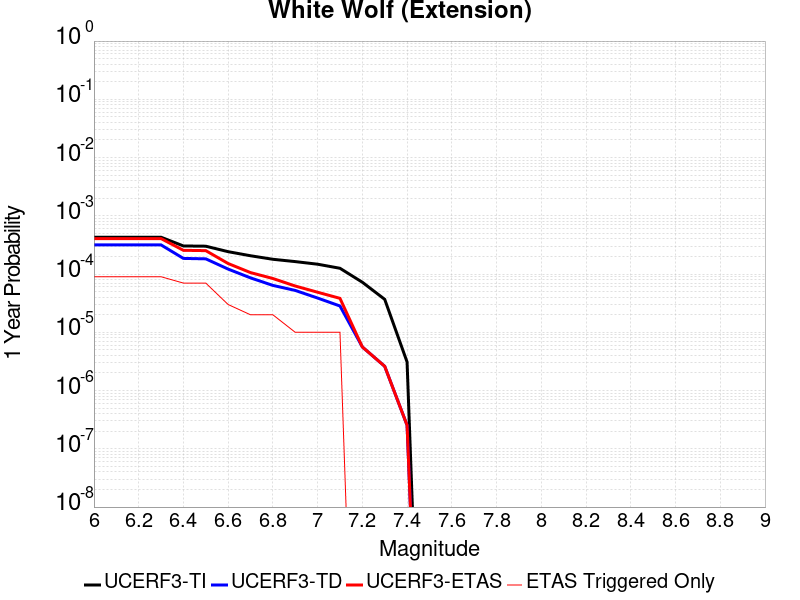 |  |

| Magnitude | 1 wk TI Prob | 1 wk TD Prob | 1 wk ETAS Prob | 1 wk ETAS/TD Gain | 1 wk ETAS Triggered Only | 1 mo TI Prob | 1 mo TD Prob | 1 mo ETAS Prob | 1 mo ETAS/TD Gain | 1 mo ETAS Triggered Only | 1 yr TI Prob | 1 yr TD Prob | 1 yr ETAS Prob | 1 yr ETAS/TD Gain | 1 yr ETAS Triggered Only | 10 yr TI Prob | 10 yr TD Prob | 10 yr ETAS Prob | 10 yr ETAS/TD Gain | 10 yr ETAS Triggered Only |
|-----|-----|-----|-----|-----|-----|-----|-----|-----|-----|-----|-----|-----|-----|-----|-----|-----|-----|-----|-----|-----|
| 6.0 | 8.222555E-6 | 6.0666507E-6 | 1.606659E-5 | 2.648346 | 1.0E-5 | 3.5239045E-5 | 2.599971E-5 | 6.599867E-5 | 2.5384386 | 4.0E-5 | 4.289509E-4 | 3.1650712E-4 | 4.0647865E-4 | 1.2842638 | 9.0E-5 | 0.0042812387 | 0.0031612155 | 0.0033207096 | 1.0504534 | 1.6E-4 |
| 6.1 | 8.222555E-6 | 6.0666507E-6 | 1.606659E-5 | 2.648346 | 1.0E-5 | 3.5239045E-5 | 2.599971E-5 | 6.599867E-5 | 2.5384386 | 4.0E-5 | 4.289509E-4 | 3.1650712E-4 | 4.0647865E-4 | 1.2842638 | 9.0E-5 | 0.0042812387 | 0.0031612155 | 0.0033207096 | 1.0504534 | 1.6E-4 |
| 6.2 | 8.222555E-6 | 6.0666507E-6 | 1.606659E-5 | 2.648346 | 1.0E-5 | 3.5239045E-5 | 2.599971E-5 | 6.599867E-5 | 2.5384386 | 4.0E-5 | 4.289509E-4 | 3.1650712E-4 | 4.0647865E-4 | 1.2842638 | 9.0E-5 | 0.0042812387 | 0.0031612155 | 0.0033207096 | 1.0504534 | 1.6E-4 |
| 6.3 | 8.222555E-6 | 6.0666507E-6 | 1.606659E-5 | 2.648346 | 1.0E-5 | 3.5239045E-5 | 2.599971E-5 | 6.599867E-5 | 2.5384386 | 4.0E-5 | 4.289509E-4 | 3.1650712E-4 | 4.0647865E-4 | 1.2842638 | 9.0E-5 | 0.0042812387 | 0.0031612155 | 0.0033207096 | 1.0504534 | 1.6E-4 |
| 6.4 | 5.821773E-6 | 3.557149E-6 | 1.3557114E-5 | 3.8112302 | 1.0E-5 | 2.4950215E-5 | 1.5244841E-5 | 3.5244535E-5 | 2.3118992 | 2.0E-5 | 3.0372653E-4 | 1.8559124E-4 | 2.5557826E-4 | 1.377103 | 7.0E-5 | 0.0030331176 | 0.0018544708 | 0.0019542854 | 1.0538237 | 1.0E-4 |
| 6.5 | 5.766023E-6 | 3.4990828E-6 | 1.3499048E-5 | 3.8578818 | 1.0E-5 | 2.4711293E-5 | 1.499599E-5 | 3.499569E-5 | 2.33367 | 2.0E-5 | 3.0081844E-4 | 1.8256197E-4 | 2.525492E-4 | 1.3833615 | 7.0E-5 | 0.0030041158 | 0.0018242282 | 0.0019240457 | 1.0547177 | 1.0E-4 |
| 6.6 | 4.643576E-6 | 2.3325913E-6 | 2.3325913E-6 | 1.0 | 0.0 | 1.9900888E-5 | 9.996784E-6 | 9.996784E-6 | 1.0 | 0.0 | 2.4226638E-4 | 1.2170448E-4 | 1.5170082E-4 | 1.2464688 | 3.0E-5 | 0.0024200242 | 0.0012164207 | 0.0012663598 | 1.0410542 | 5.0E-5 |
| 6.7 | 3.9529173E-6 | 1.6483125E-6 | 1.6483125E-6 | 1.0 | 0.0 | 1.6940963E-5 | 7.064178E-6 | 7.064178E-6 | 1.0 | 0.0 | 2.0623671E-4 | 8.6003165E-5 | 1.0600145E-4 | 1.2325296 | 2.0E-5 | 0.002060454 | 8.597173E-4 | 8.996829E-4 | 1.046487 | 4.0E-5 |
| 6.8 | 3.4377522E-6 | 1.2244889E-6 | 1.2244889E-6 | 1.0 | 0.0 | 1.473314E-5 | 5.2477994E-6 | 5.2477994E-6 | 1.0 | 0.0 | 1.7936122E-4 | 6.389018E-5 | 8.38889E-5 | 1.3130171 | 2.0E-5 | 0.0017921652 | 6.387272E-4 | 6.6870806E-4 | 1.0469384 | 3.0E-5 |
| 6.9 | 3.1367306E-6 | 1.0033427E-6 | 1.0033427E-6 | 1.0 | 0.0 | 1.3443062E-5 | 4.3000337E-6 | 4.3000337E-6 | 1.0 | 0.0 | 1.63657E-4 | 5.235173E-5 | 6.23512E-5 | 1.1910057 | 1.0E-5 | 0.0016353652 | 5.234016E-4 | 5.333964E-4 | 1.0190958 | 1.0E-5 |
| 7.0 | 2.8298145E-6 | 7.428332E-7 | 7.428332E-7 | 1.0 | 0.0 | 1.2127721E-5 | 3.1835673E-6 | 3.1835673E-6 | 1.0 | 0.0 | 1.47645E-4 | 3.875929E-5 | 4.8758906E-5 | 1.2579926 | 1.0E-5 | 0.0014754693 | 3.875303E-4 | 3.9752646E-4 | 1.0257944 | 1.0E-5 |
| 7.1 | 2.4091064E-6 | 5.42247E-7 | 5.42247E-7 | 1.0 | 0.0 | 1.03247E-5 | 2.323914E-6 | 2.323914E-6 | 1.0 | 0.0 | 1.2569598E-4 | 2.8293325E-5 | 3.8293045E-5 | 1.3534303 | 1.0E-5 | 0.001256249 | 2.8290128E-4 | 2.9289845E-4 | 1.035338 | 1.0E-5 |
| 7.2 | 1.3875518E-6 | 1.0740599E-7 | 1.0740599E-7 | 1.0 | 0.0 | 5.9466374E-6 | 4.603113E-7 | 4.603113E-7 | 1.0 | 0.0 | 7.23979E-5 | 5.604277E-6 | 5.604277E-6 | 1.0 | 0.0 | 7.2374323E-4 | 5.604147E-5 | 5.604147E-5 | 1.0 | 0.0 |
| 7.3 | 7.056077E-7 | 5.0005596E-8 | 5.0005596E-8 | 1.0 | 0.0 | 3.0240296E-6 | 2.1430968E-7 | 2.1430968E-7 | 1.0 | 0.0 | 3.681694E-5 | 2.6092177E-6 | 2.6092177E-6 | 1.0 | 0.0 | 3.681084E-4 | 2.6091917E-5 | 2.6091917E-5 | 1.0 | 0.0 |
| 7.4 | 5.9334678E-8 | 4.8638475E-9 | 4.8638475E-9 | 1.0 | 0.0 | 2.5429145E-7 | 2.084506E-8 | 2.084506E-8 | 1.0 | 0.0 | 3.095994E-6 | 2.5378858E-7 | 2.5378858E-7 | 1.0 | 0.0 | 3.095951E-5 | 2.5378843E-6 | 2.5378843E-6 | 1.0 | 0.0 |

## San Andreas (North Branch Mill Creek)
*[(top)](#table-of-contents)*

| 1 Week | 1 Month | 1 Year | 10 Year |
|-----|-----|-----|-----|
| 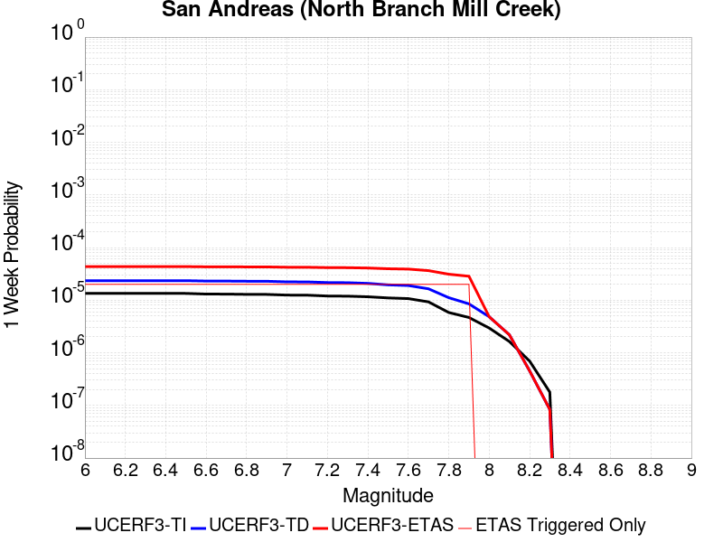 |  |  |  |

| Magnitude | 1 wk TI Prob | 1 wk TD Prob | 1 wk ETAS Prob | 1 wk ETAS/TD Gain | 1 wk ETAS Triggered Only | 1 mo TI Prob | 1 mo TD Prob | 1 mo ETAS Prob | 1 mo ETAS/TD Gain | 1 mo ETAS Triggered Only | 1 yr TI Prob | 1 yr TD Prob | 1 yr ETAS Prob | 1 yr ETAS/TD Gain | 1 yr ETAS Triggered Only | 10 yr TI Prob | 10 yr TD Prob | 10 yr ETAS Prob | 10 yr ETAS/TD Gain | 10 yr ETAS Triggered Only |
|-----|-----|-----|-----|-----|-----|-----|-----|-----|-----|-----|-----|-----|-----|-----|-----|-----|-----|-----|-----|-----|
| 6.0 | 1.3461156E-5 | 2.3506745E-5 | 4.3506276E-5 | 1.8507996 | 2.0E-5 | 5.7689394E-5 | 1.0073932E-4 | 1.407353E-4 | 1.3970244 | 4.0E-5 | 7.02142E-4 | 0.0012258145 | 0.0013356797 | 1.0896263 | 1.1E-4 | 0.0069992766 | 0.012231775 | 0.012379941 | 1.0121131 | 1.5E-4 |
| 6.1 | 1.3461156E-5 | 2.3506745E-5 | 4.3506276E-5 | 1.8507996 | 2.0E-5 | 5.7689394E-5 | 1.0073932E-4 | 1.407353E-4 | 1.3970244 | 4.0E-5 | 7.02142E-4 | 0.0012258145 | 0.0013356797 | 1.0896263 | 1.1E-4 | 0.0069992766 | 0.012231775 | 0.012379941 | 1.0121131 | 1.5E-4 |
| 6.2 | 1.3461156E-5 | 2.3506745E-5 | 4.3506276E-5 | 1.8507996 | 2.0E-5 | 5.7689394E-5 | 1.0073932E-4 | 1.407353E-4 | 1.3970244 | 4.0E-5 | 7.02142E-4 | 0.0012258145 | 0.0013356797 | 1.0896263 | 1.1E-4 | 0.0069992766 | 0.012231775 | 0.012379941 | 1.0121131 | 1.5E-4 |
| 6.3 | 1.3461156E-5 | 2.3506745E-5 | 4.3506276E-5 | 1.8507996 | 2.0E-5 | 5.7689394E-5 | 1.0073932E-4 | 1.407353E-4 | 1.3970244 | 4.0E-5 | 7.02142E-4 | 0.0012258145 | 0.0013356797 | 1.0896263 | 1.1E-4 | 0.0069992766 | 0.012231775 | 0.012379941 | 1.0121131 | 1.5E-4 |
| 6.4 | 1.3461156E-5 | 2.3506745E-5 | 4.3506276E-5 | 1.8507996 | 2.0E-5 | 5.7689394E-5 | 1.0073932E-4 | 1.407353E-4 | 1.3970244 | 4.0E-5 | 7.02142E-4 | 0.0012258145 | 0.0013356797 | 1.0896263 | 1.1E-4 | 0.0069992766 | 0.012231775 | 0.012379941 | 1.0121131 | 1.5E-4 |
| 6.5 | 1.3450706E-5 | 2.3495704E-5 | 4.3495234E-5 | 1.8511994 | 2.0E-5 | 5.764461E-5 | 1.00692014E-4 | 1.4068799E-4 | 1.397211 | 4.0E-5 | 7.0159714E-4 | 0.0012252391 | 0.0013351043 | 1.0896684 | 1.1E-4 | 0.006993862 | 0.012226084 | 0.012374251 | 1.0121188 | 1.5E-4 |
| 6.6 | 1.3074523E-5 | 2.3109988E-5 | 4.3109525E-5 | 1.8654068 | 2.0E-5 | 5.6032466E-5 | 9.903906E-5 | 1.390351E-4 | 1.403841 | 4.0E-5 | 6.8198174E-4 | 0.0012051368 | 0.0013150042 | 1.0911659 | 1.1E-4 | 0.006798926 | 0.01202725 | 0.012175445 | 1.0123217 | 1.5E-4 |
| 6.7 | 1.3050216E-5 | 2.3085284E-5 | 4.3084823E-5 | 1.8663328 | 2.0E-5 | 5.59283E-5 | 9.89332E-5 | 1.3892924E-4 | 1.4042733 | 4.0E-5 | 6.8071426E-4 | 0.0012038493 | 0.0013137169 | 1.0912635 | 1.1E-4 | 0.0067863287 | 0.012014515 | 0.012162712 | 1.012335 | 1.5E-4 |
| 6.8 | 1.29049395E-5 | 2.2933691E-5 | 4.2933232E-5 | 1.8720595 | 2.0E-5 | 5.530571E-5 | 9.828356E-5 | 1.3827963E-4 | 1.4069457 | 4.0E-5 | 6.73139E-4 | 0.0011959487 | 0.0013058172 | 1.0918672 | 1.1E-4 | 0.0067110364 | 0.011936358 | 0.012084568 | 1.0124166 | 1.5E-4 |
| 6.9 | 1.2867369E-5 | 2.2893093E-5 | 4.2892636E-5 | 1.873606 | 2.0E-5 | 5.51447E-5 | 9.810959E-5 | 1.3810566E-4 | 1.4076674 | 4.0E-5 | 6.711799E-4 | 0.0011938328 | 0.0013037015 | 1.0920302 | 1.1E-4 | 0.006691564 | 0.011915428 | 0.01206364 | 1.0124388 | 1.5E-4 |
| 7.0 | 1.2495996E-5 | 2.229316E-5 | 4.2292715E-5 | 1.8971162 | 2.0E-5 | 5.3553173E-5 | 9.5538635E-5 | 1.355348E-4 | 1.4186388 | 4.0E-5 | 6.518148E-4 | 0.001162565 | 0.0012724372 | 1.0945084 | 1.1E-4 | 0.0064990623 | 0.011606026 | 0.011754285 | 1.0127743 | 1.5E-4 |
| 7.1 | 1.2452067E-5 | 2.2238231E-5 | 4.2237785E-5 | 1.8993322 | 2.0E-5 | 5.3364907E-5 | 9.5303236E-5 | 1.3529943E-4 | 1.419673 | 4.0E-5 | 6.4952404E-4 | 0.0011597021 | 0.0012695745 | 1.094742 | 1.1E-4 | 0.0064762887 | 0.011577697 | 0.011725959 | 1.0128059 | 1.5E-4 |
| 7.2 | 1.2002777E-5 | 2.1616725E-5 | 4.161629E-5 | 1.9251895 | 2.0E-5 | 5.143946E-5 | 9.2639835E-5 | 1.3263612E-4 | 1.4317397 | 4.0E-5 | 6.2609545E-4 | 0.001127309 | 0.001237185 | 1.0974675 | 1.1E-4 | 0.006243344 | 0.011257095 | 0.011405407 | 1.0131749 | 1.5E-4 |
| 7.3 | 1.1923425E-5 | 2.148656E-5 | 4.148613E-5 | 1.9307945 | 2.0E-5 | 5.109939E-5 | 9.2082024E-5 | 1.3207833E-4 | 1.4343554 | 4.0E-5 | 6.219575E-4 | 0.0011205247 | 0.0012304015 | 1.0980583 | 1.1E-4 | 0.0062021962 | 0.011189974 | 0.011338295 | 1.0132549 | 1.5E-4 |
| 7.4 | 1.16105175E-5 | 2.0860463E-5 | 4.0860046E-5 | 1.9587314 | 2.0E-5 | 4.975841E-5 | 8.939894E-5 | 1.2939537E-4 | 1.4473926 | 4.0E-5 | 6.0564023E-4 | 0.0010878912 | 0.0011977715 | 1.101003 | 1.1E-4 | 0.006039923 | 0.010867494 | 0.011015864 | 1.0136527 | 1.5E-4 |
| 7.5 | 1.1037265E-5 | 1.9560304E-5 | 3.9559913E-5 | 2.022459 | 2.0E-5 | 4.7301706E-5 | 8.3827195E-5 | 1.2382383E-4 | 1.4771321 | 4.0E-5 | 5.757461E-4 | 0.0010201205 | 0.0011300081 | 1.1077204 | 1.1E-4 | 0.005742567 | 0.010198071 | 0.01034654 | 1.0145587 | 1.5E-4 |
| 7.6 | 1.0720915E-5 | 1.9002122E-5 | 3.900174E-5 | 2.052494 | 2.0E-5 | 4.5945973E-5 | 8.143514E-5 | 1.21431876E-4 | 1.4911485 | 4.0E-5 | 5.592486E-4 | 9.91024E-4 | 0.0011009149 | 1.1108863 | 1.1E-4 | 0.005578433 | 0.009909747 | 0.0100582605 | 1.0149866 | 1.5E-4 |
| 7.7 | 9.276279E-6 | 1.6447599E-5 | 3.644727E-5 | 2.215963 | 2.0E-5 | 3.9754876E-5 | 7.048781E-5 | 1.10484994E-4 | 1.567434 | 4.0E-5 | 4.839081E-4 | 8.5785287E-4 | 9.6775853E-4 | 1.1281171 | 1.1E-4 | 0.0048285574 | 0.008588911 | 0.008737623 | 1.0173144 | 1.5E-4 |
| 7.8 | 5.8346777E-6 | 1.11598065E-5 | 3.1159583E-5 | 2.7921257 | 2.0E-5 | 2.5005522E-5 | 4.7826867E-5 | 8.7824956E-5 | 1.83631 | 4.0E-5 | 3.043997E-4 | 5.821366E-4 | 6.920726E-4 | 1.1888491 | 1.1E-4 | 0.0030398308 | 0.005849217 | 0.0059983395 | 1.0254945 | 1.5E-4 |
| 7.9 | 4.690204E-6 | 8.512991E-6 | 2.851282E-5 | 3.3493304 | 2.0E-5 | 2.0100719E-5 | 3.648374E-5 | 7.6482276E-5 | 2.096339 | 4.0E-5 | 2.4469878E-4 | 4.4409907E-4 | 5.540502E-4 | 1.2475824 | 1.1E-4 | 0.002444295 | 0.004472688 | 0.004622017 | 1.0333868 | 1.5E-4 |
| 8.0 | 2.9570454E-6 | 4.849223E-6 | 4.849223E-6 | 1.0 | 0.0 | 1.267299E-5 | 2.0782218E-5 | 3.0782012E-5 | 1.4811705 | 1.0E-5 | 1.5428272E-4 | 2.5299416E-4 | 2.729891E-4 | 1.0790333 | 2.0E-5 | 0.0015417566 | 0.002550804 | 0.0025907021 | 1.0156413 | 4.0E-5 |
| 8.1 | 1.6376824E-6 | 2.197989E-6 | 2.197989E-6 | 1.0 | 0.0 | 7.01862E-6 | 9.419919E-6 | 9.419919E-6 | 1.0 | 0.0 | 8.544835E-5 | 1.1468149E-4 | 1.1468149E-4 | 1.0 | 0.0 | 8.54155E-4 | 0.0011612454 | 0.0011612454 | 1.0 | 0.0 |
| 8.2 | 6.9631557E-7 | 4.538485E-7 | 4.538485E-7 | 1.0 | 0.0 | 2.984206E-6 | 1.9450636E-6 | 1.9450636E-6 | 1.0 | 0.0 | 3.63321E-5 | 2.3680892E-5 | 2.3680892E-5 | 1.0 | 0.0 | 3.6326164E-4 | 2.4529136E-4 | 2.4529136E-4 | 1.0 | 0.0 |
| 8.3 | 1.7876137E-7 | 8.3644935E-8 | 8.3644935E-8 | 1.0 | 0.0 | 7.661199E-7 | 3.5847825E-7 | 3.5847825E-7 | 1.0 | 0.0 | 9.32747E-6 | 4.364464E-6 | 4.364464E-6 | 1.0 | 0.0 | 9.3270784E-5 | 4.584084E-5 | 4.584084E-5 | 1.0 | 0.0 |

## Lake Isabella (Seismicity)
*[(top)](#table-of-contents)*

| 1 Week | 1 Month | 1 Year | 10 Year |
|-----|-----|-----|-----|
|  |  |  |  |

| Magnitude | 1 wk TI Prob | 1 wk TD Prob | 1 wk ETAS Prob | 1 wk ETAS/TD Gain | 1 wk ETAS Triggered Only | 1 mo TI Prob | 1 mo TD Prob | 1 mo ETAS Prob | 1 mo ETAS/TD Gain | 1 mo ETAS Triggered Only | 1 yr TI Prob | 1 yr TD Prob | 1 yr ETAS Prob | 1 yr ETAS/TD Gain | 1 yr ETAS Triggered Only | 10 yr TI Prob | 10 yr TD Prob | 10 yr ETAS Prob | 10 yr ETAS/TD Gain | 10 yr ETAS Triggered Only |
|-----|-----|-----|-----|-----|-----|-----|-----|-----|-----|-----|-----|-----|-----|-----|-----|-----|-----|-----|-----|-----|
| 6.0 | 9.431637E-6 | 9.741688E-6 | 2.9741494E-5 | 3.0530124 | 2.0E-5 | 4.0420677E-5 | 4.1749496E-5 | 7.174824E-5 | 1.7185416 | 3.0E-5 | 4.920106E-4 | 5.081946E-4 | 5.681641E-4 | 1.118005 | 6.0E-5 | 0.004909227 | 0.0050716177 | 0.0052208565 | 1.0294263 | 1.5E-4 |
| 6.1 | 9.431637E-6 | 9.741688E-6 | 2.9741494E-5 | 3.0530124 | 2.0E-5 | 4.0420677E-5 | 4.1749496E-5 | 7.174824E-5 | 1.7185416 | 3.0E-5 | 4.920106E-4 | 5.081946E-4 | 5.681641E-4 | 1.118005 | 6.0E-5 | 0.004909227 | 0.0050716177 | 0.0052208565 | 1.0294263 | 1.5E-4 |
| 6.2 | 9.431637E-6 | 9.741688E-6 | 2.9741494E-5 | 3.0530124 | 2.0E-5 | 4.0420677E-5 | 4.1749496E-5 | 7.174824E-5 | 1.7185416 | 3.0E-5 | 4.920106E-4 | 5.081946E-4 | 5.681641E-4 | 1.118005 | 6.0E-5 | 0.004909227 | 0.0050716177 | 0.0052208565 | 1.0294263 | 1.5E-4 |
| 6.3 | 9.431637E-6 | 9.741688E-6 | 2.9741494E-5 | 3.0530124 | 2.0E-5 | 4.0420677E-5 | 4.1749496E-5 | 7.174824E-5 | 1.7185416 | 3.0E-5 | 4.920106E-4 | 5.081946E-4 | 5.681641E-4 | 1.118005 | 6.0E-5 | 0.004909227 | 0.0050716177 | 0.0052208565 | 1.0294263 | 1.5E-4 |
| 6.4 | 5.144063E-6 | 5.300094E-6 | 5.300094E-6 | 1.0 | 0.0 | 2.2045799E-5 | 2.271451E-5 | 3.2714284E-5 | 1.4402372 | 1.0E-5 | 2.6837454E-4 | 2.7651753E-4 | 3.0650923E-4 | 1.1084622 | 3.0E-5 | 0.0026805066 | 0.002762075 | 0.0028518264 | 1.0324942 | 9.0E-5 |
| 6.5 | 5.144063E-6 | 5.300094E-6 | 5.300094E-6 | 1.0 | 0.0 | 2.2045799E-5 | 2.271451E-5 | 3.2714284E-5 | 1.4402372 | 1.0E-5 | 2.6837454E-4 | 2.7651753E-4 | 3.0650923E-4 | 1.1084622 | 3.0E-5 | 0.0026805066 | 0.002762075 | 0.0028518264 | 1.0324942 | 9.0E-5 |
| 6.6 | 3.4009804E-6 | 3.4987975E-6 | 3.4987975E-6 | 1.0 | 0.0 | 1.4575549E-5 | 1.4994769E-5 | 1.4994769E-5 | 1.0 | 0.0 | 1.7744285E-4 | 1.8254762E-4 | 2.0254398E-4 | 1.1095405 | 2.0E-5 | 0.0017730123 | 0.0018241345 | 0.0018740433 | 1.0273602 | 5.0E-5 |
| 6.7 | 3.3880428E-6 | 3.485664E-6 | 3.485664E-6 | 1.0 | 0.0 | 1.4520103E-5 | 1.4938483E-5 | 1.4938483E-5 | 1.0 | 0.0 | 1.767679E-4 | 1.8186246E-4 | 2.0185883E-4 | 1.1099532 | 2.0E-5 | 0.0017662736 | 0.001817294 | 0.0018672032 | 1.0274634 | 5.0E-5 |
| 6.8 | 2.6582E-6 | 2.733709E-6 | 2.733709E-6 | 1.0 | 0.0 | 1.1392236E-5 | 1.1715851E-5 | 1.1715851E-5 | 1.0 | 0.0 | 1.3869164E-4 | 1.4263249E-4 | 1.6262963E-4 | 1.1402005 | 2.0E-5 | 0.0013860512 | 0.0014255415 | 0.0014654844 | 1.0280195 | 4.0E-5 |
| 6.9 | 2.406011E-6 | 2.4743367E-6 | 2.4743367E-6 | 1.0 | 0.0 | 1.0311434E-5 | 1.0604264E-5 | 1.0604264E-5 | 1.0 | 0.0 | 1.2553448E-4 | 1.2910059E-4 | 1.49098E-4 | 1.1548979 | 2.0E-5 | 0.0012546359 | 0.0012903855 | 0.0013203468 | 1.0232189 | 3.0E-5 |
| 7.0 | 1.6953097E-6 | 1.7429427E-6 | 1.7429427E-6 | 1.0 | 0.0 | 7.265593E-6 | 7.4697386E-6 | 7.4697386E-6 | 1.0 | 0.0 | 8.8455E-5 | 9.094132E-5 | 1.00940415E-4 | 1.109951 | 1.0E-5 | 8.84198E-4 | 9.091438E-4 | 9.2912564E-4 | 1.0219787 | 2.0E-5 |
| 7.1 | 3.5013824E-7 | 3.5714902E-7 | 3.5714902E-7 | 1.0 | 0.0 | 1.5005916E-6 | 1.5306379E-6 | 1.5306379E-6 | 1.0 | 0.0 | 1.826955E-5 | 1.8635359E-5 | 1.8635359E-5 | 1.0 | 0.0 | 1.8268047E-4 | 1.863382E-4 | 1.863382E-4 | 1.0 | 0.0 |
| 7.2 | 2.2321095E-7 | 2.2750622E-7 | 2.2750622E-7 | 1.0 | 0.0 | 9.56618E-7 | 9.750263E-7 | 9.750263E-7 | 1.0 | 0.0 | 1.1646762E-5 | 1.1870882E-5 | 1.1870882E-5 | 1.0 | 0.0 | 1.1646151E-4 | 1.1870258E-4 | 1.1870258E-4 | 1.0 | 0.0 |
| 7.3 | 1.5760406E-7 | 1.6060956E-7 | 1.6060956E-7 | 1.0 | 0.0 | 6.7544585E-7 | 6.883265E-7 | 6.883265E-7 | 1.0 | 0.0 | 8.223522E-6 | 8.380343E-6 | 8.380343E-6 | 1.0 | 0.0 | 8.2232174E-5 | 8.380034E-5 | 8.380034E-5 | 1.0 | 0.0 |
| 7.4 | 1.1216497E-7 | 1.1431731E-7 | 1.1431731E-7 | 1.0 | 0.0 | 4.8070694E-7 | 4.899312E-7 | 4.899312E-7 | 1.0 | 0.0 | 5.852591E-6 | 5.964897E-6 | 5.964897E-6 | 1.0 | 0.0 | 5.8524372E-5 | 5.964741E-5 | 5.964741E-5 | 1.0 | 0.0 |
| 7.5 | 4.885185E-8 | 4.9787843E-8 | 4.9787843E-8 | 1.0 | 0.0 | 2.0936506E-7 | 2.1337645E-7 | 2.1337645E-7 | 1.0 | 0.0 | 2.5490165E-6 | 2.5978554E-6 | 2.5978554E-6 | 1.0 | 0.0 | 2.5489873E-5 | 2.597827E-5 | 2.597827E-5 | 1.0 | 0.0 |
| 7.6 | 1.504641E-9 | 1.5317934E-9 | 1.5317934E-9 | 1.0 | 0.0 | 6.4484613E-9 | 6.5648287E-9 | 6.5648287E-9 | 1.0 | 0.0 | 7.851001E-8 | 7.992679E-8 | 7.992679E-8 | 1.0 | 0.0 | 7.8509987E-7 | 7.992679E-7 | 7.992679E-7 | 1.0 | 0.0 |

## Santa Ynez (West)
*[(top)](#table-of-contents)*

| 1 Week | 1 Month | 1 Year | 10 Year |
|-----|-----|-----|-----|
|  | 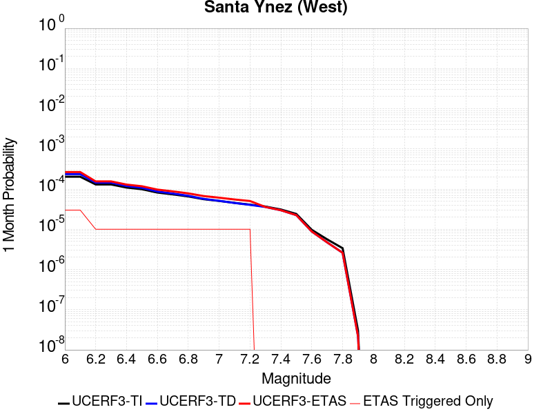 |  |  |

| Magnitude | 1 wk TI Prob | 1 wk TD Prob | 1 wk ETAS Prob | 1 wk ETAS/TD Gain | 1 wk ETAS Triggered Only | 1 mo TI Prob | 1 mo TD Prob | 1 mo ETAS Prob | 1 mo ETAS/TD Gain | 1 mo ETAS Triggered Only | 1 yr TI Prob | 1 yr TD Prob | 1 yr ETAS Prob | 1 yr ETAS/TD Gain | 1 yr ETAS Triggered Only | 10 yr TI Prob | 10 yr TD Prob | 10 yr ETAS Prob | 10 yr ETAS/TD Gain | 10 yr ETAS Triggered Only |
|-----|-----|-----|-----|-----|-----|-----|-----|-----|-----|-----|-----|-----|-----|-----|-----|-----|-----|-----|-----|-----|
| 6.0 | 4.7352758E-5 | 5.4971988E-5 | 7.4970885E-5 | 1.3638017 | 2.0E-5 | 2.0292461E-4 | 2.3557457E-4 | 2.655675E-4 | 1.1273183 | 3.0E-5 | 0.0024678076 | 0.0028646167 | 0.0028945308 | 1.0104426 | 3.0E-5 | 0.024405818 | 0.028305028 | 0.028411914 | 1.0037762 | 1.1E-4 |
| 6.1 | 4.7352758E-5 | 5.4971988E-5 | 7.4970885E-5 | 1.3638017 | 2.0E-5 | 2.0292461E-4 | 2.3557457E-4 | 2.655675E-4 | 1.1273183 | 3.0E-5 | 0.0024678076 | 0.0028646167 | 0.0028945308 | 1.0104426 | 3.0E-5 | 0.024405818 | 0.028305028 | 0.028402198 | 1.003433 | 1.0E-4 |
| 6.2 | 3.0415853E-5 | 3.3925568E-5 | 4.392523E-5 | 1.294753 | 1.0E-5 | 1.3034715E-4 | 1.4538734E-4 | 1.5538589E-4 | 1.0687717 | 1.0E-5 | 0.0015858212 | 0.0017686884 | 0.0017786707 | 1.005644 | 1.0E-5 | 0.015745522 | 0.017550066 | 0.01759919 | 1.002799 | 5.0E-5 |
| 6.3 | 3.0415853E-5 | 3.3925568E-5 | 4.392523E-5 | 1.294753 | 1.0E-5 | 1.3034715E-4 | 1.4538734E-4 | 1.5538589E-4 | 1.0687717 | 1.0E-5 | 0.0015858212 | 0.0017686884 | 0.0017786707 | 1.005644 | 1.0E-5 | 0.015745522 | 0.017550066 | 0.01759919 | 1.002799 | 5.0E-5 |
| 6.4 | 2.5452082E-5 | 2.7912738E-5 | 3.7912458E-5 | 1.3582493 | 1.0E-5 | 1.09075794E-4 | 1.1962065E-4 | 1.2961945E-4 | 1.0835876 | 1.0E-5 | 0.0013271887 | 0.0014554274 | 0.0014654129 | 1.0068609 | 1.0E-5 | 0.013192902 | 0.014461125 | 0.014500547 | 1.0027261 | 4.0E-5 |
| 6.5 | 2.3143784E-5 | 2.5128487E-5 | 3.5128236E-5 | 1.3979447 | 1.0E-5 | 9.9183875E-5 | 1.0768916E-4 | 1.1768808E-4 | 1.0928499 | 1.0E-5 | 0.0012068948 | 0.0013103414 | 0.0013203283 | 1.0076216 | 1.0E-5 | 0.012003611 | 0.013027821 | 0.0130672995 | 1.0030303 | 4.0E-5 |
| 6.6 | 1.9118515E-5 | 2.03545E-5 | 3.0354297E-5 | 1.4912819 | 1.0E-5 | 8.193392E-5 | 8.72307E-5 | 9.722983E-5 | 1.1146286 | 1.0E-5 | 9.97089E-4 | 0.0010615243 | 0.0010715136 | 1.0094104 | 1.0E-5 | 0.00992627 | 0.010565449 | 0.010595132 | 1.0028094 | 3.0E-5 |
| 6.7 | 1.722807E-5 | 1.8146466E-5 | 2.8146285E-5 | 1.5510615 | 1.0E-5 | 7.3832496E-5 | 7.776828E-5 | 8.7767505E-5 | 1.1285771 | 1.0E-5 | 8.985399E-4 | 9.4642316E-4 | 9.564137E-4 | 1.0105561 | 1.0E-5 | 0.008949154 | 0.009424572 | 0.0094542885 | 1.0031532 | 3.0E-5 |
| 6.8 | 1.5317364E-5 | 1.5926564E-5 | 2.5926405E-5 | 1.6278719 | 1.0E-5 | 6.56442E-5 | 6.825494E-5 | 7.8254256E-5 | 1.1464995 | 1.0E-5 | 7.98925E-4 | 8.3069137E-4 | 8.4068306E-4 | 1.0120282 | 1.0E-5 | 0.007960589 | 0.008276351 | 0.008306102 | 1.0035948 | 3.0E-5 |
| 6.9 | 1.3071226E-5 | 1.3329657E-5 | 2.3329523E-5 | 1.7501968 | 1.0E-5 | 5.6018336E-5 | 5.7125864E-5 | 6.712529E-5 | 1.175042 | 1.0E-5 | 6.8180985E-4 | 6.952877E-4 | 7.0528075E-4 | 1.0143726 | 1.0E-5 | 0.0067972173 | 0.006931384 | 0.0069512455 | 1.0028654 | 2.0E-5 |
| 7.0 | 1.1836986E-5 | 1.1932794E-5 | 2.1932674E-5 | 1.8380167 | 1.0E-5 | 5.0728955E-5 | 5.1139552E-5 | 6.113904E-5 | 1.1955334 | 1.0E-5 | 6.1745E-4 | 6.224479E-4 | 6.3244166E-4 | 1.0160556 | 1.0E-5 | 0.006157372 | 0.0062072375 | 0.0062271133 | 1.0032021 | 2.0E-5 |
| 7.1 | 1.0597169E-5 | 1.0542194E-5 | 2.054209E-5 | 1.9485592 | 1.0E-5 | 4.541565E-5 | 4.5180055E-5 | 5.5179604E-5 | 1.2213266 | 1.0E-5 | 5.5279525E-4 | 5.499295E-4 | 5.59924E-4 | 1.0181742 | 1.0E-5 | 0.0055142213 | 0.0054858173 | 0.0055057076 | 1.0036258 | 2.0E-5 |
| 7.2 | 9.59113E-6 | 9.459128E-6 | 1.9459034E-5 | 2.05717 | 1.0E-5 | 4.11042E-5 | 4.0538496E-5 | 5.053809E-5 | 1.2466692 | 1.0E-5 | 5.0032866E-4 | 4.934455E-4 | 5.0344056E-4 | 1.0202557 | 1.0E-5 | 0.004992037 | 0.004923617 | 0.0049435184 | 1.004042 | 2.0E-5 |
| 7.3 | 8.586084E-6 | 8.3795585E-6 | 8.3795585E-6 | 1.0 | 0.0 | 3.679698E-5 | 3.5911904E-5 | 3.5911904E-5 | 1.0 | 0.0 | 4.4791115E-4 | 4.3714073E-4 | 4.3714073E-4 | 1.0 | 0.0 | 0.004470094 | 0.00436292 | 0.00436292 | 1.0 | 0.0 |
| 7.4 | 7.2622997E-6 | 6.951504E-6 | 6.951504E-6 | 1.0 | 0.0 | 3.112377E-5 | 2.9791827E-5 | 2.9791827E-5 | 1.0 | 0.0 | 3.78866E-4 | 3.6265608E-4 | 3.6265608E-4 | 1.0 | 0.0 | 0.0037822074 | 0.0036207428 | 0.0036207428 | 1.0 | 0.0 |
| 7.5 | 5.627296E-6 | 5.251539E-6 | 5.251539E-6 | 1.0 | 0.0 | 2.411676E-5 | 2.2506405E-5 | 2.2506405E-5 | 1.0 | 0.0 | 2.9358198E-4 | 2.7398174E-4 | 2.7398174E-4 | 1.0 | 0.0 | 0.0029319443 | 0.0027365116 | 0.0027365116 | 1.0 | 0.0 |
| 7.6 | 2.265244E-6 | 2.0608798E-6 | 2.0608798E-6 | 1.0 | 0.0 | 9.708152E-6 | 8.832312E-6 | 8.832312E-6 | 1.0 | 0.0 | 1.18190335E-4 | 1.07528176E-4 | 1.07528176E-4 | 1.0 | 0.0 | 0.001181275 | 0.0010747701 | 0.0010747701 | 1.0 | 0.0 |
| 7.7 | 1.3099874E-6 | 1.1016339E-6 | 1.1016339E-6 | 1.0 | 0.0 | 5.61422E-6 | 4.7212793E-6 | 4.7212793E-6 | 1.0 | 0.0 | 6.8350986E-5 | 5.7480083E-5 | 5.7480083E-5 | 1.0 | 0.0 | 6.832996E-4 | 5.7465455E-4 | 5.7465455E-4 | 1.0 | 0.0 |
| 7.8 | 7.903951E-7 | 6.0711443E-7 | 6.0711443E-7 | 1.0 | 0.0 | 3.3874032E-6 | 2.6019163E-6 | 2.6019163E-6 | 1.0 | 0.0 | 4.1240855E-5 | 3.1677886E-5 | 3.1677886E-5 | 1.0 | 0.0 | 4.12332E-4 | 3.1673504E-4 | 3.1673504E-4 | 1.0 | 0.0 |
| 7.9 | 7.0753297E-9 | 5.0900932E-9 | 5.0900932E-9 | 1.0 | 0.0 | 3.032284E-8 | 2.1814685E-8 | 2.1814685E-8 | 1.0 | 0.0 | 3.6918053E-7 | 2.6559377E-7 | 2.6559377E-7 | 1.0 | 0.0 | 3.691799E-6 | 2.6559355E-6 | 2.6559355E-6 | 1.0 | 0.0 |

## San Jacinto (San Jacinto Valley) rev
*[(top)](#table-of-contents)*

| 1 Week | 1 Month | 1 Year | 10 Year |
|-----|-----|-----|-----|
| 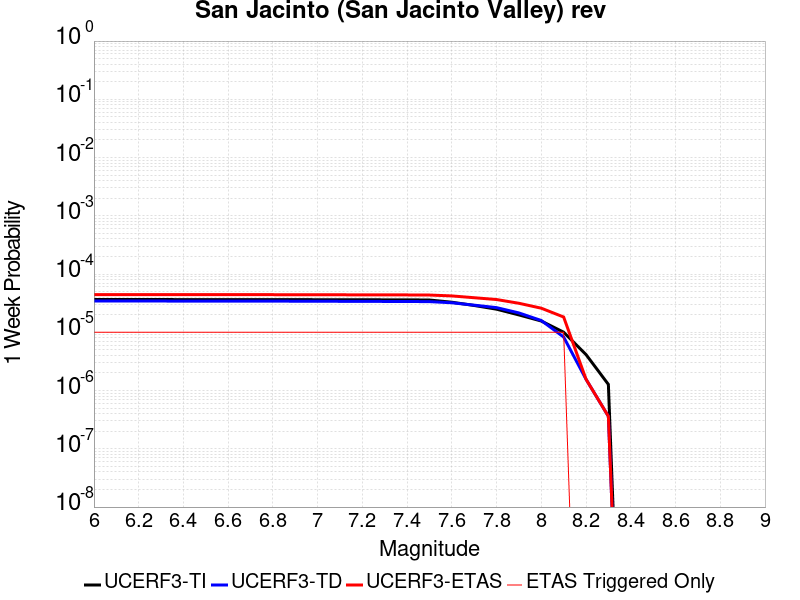 | 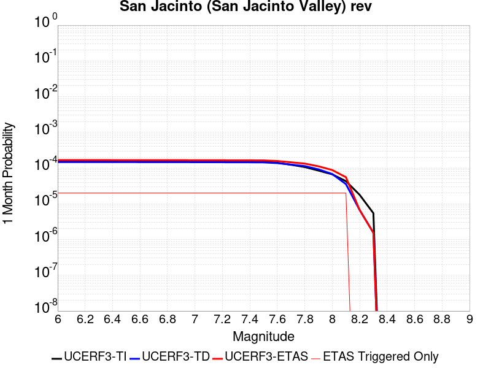 |  |  |

| Magnitude | 1 wk TI Prob | 1 wk TD Prob | 1 wk ETAS Prob | 1 wk ETAS/TD Gain | 1 wk ETAS Triggered Only | 1 mo TI Prob | 1 mo TD Prob | 1 mo ETAS Prob | 1 mo ETAS/TD Gain | 1 mo ETAS Triggered Only | 1 yr TI Prob | 1 yr TD Prob | 1 yr ETAS Prob | 1 yr ETAS/TD Gain | 1 yr ETAS Triggered Only | 10 yr TI Prob | 10 yr TD Prob | 10 yr ETAS Prob | 10 yr ETAS/TD Gain | 10 yr ETAS Triggered Only |
|-----|-----|-----|-----|-----|-----|-----|-----|-----|-----|-----|-----|-----|-----|-----|-----|-----|-----|-----|-----|-----|
| 6.0 | 3.652694E-5 | 3.4413355E-5 | 4.4413013E-5 | 1.2905749 | 1.0E-5 | 1.5653463E-4 | 1.4747748E-4 | 1.6747453E-4 | 1.1355939 | 2.0E-5 | 0.0019041431 | 0.0017940614 | 0.0018639358 | 1.0389476 | 7.0E-5 | 0.018879099 | 0.018532356 | 0.018669762 | 1.0074143 | 1.4E-4 |
| 6.1 | 3.652694E-5 | 3.4413355E-5 | 4.4413013E-5 | 1.2905749 | 1.0E-5 | 1.5653463E-4 | 1.4747748E-4 | 1.6747453E-4 | 1.1355939 | 2.0E-5 | 0.0019041431 | 0.0017940614 | 0.0018639358 | 1.0389476 | 7.0E-5 | 0.018879099 | 0.018532356 | 0.018669762 | 1.0074143 | 1.4E-4 |
| 6.2 | 3.652694E-5 | 3.4413355E-5 | 4.4413013E-5 | 1.2905749 | 1.0E-5 | 1.5653463E-4 | 1.4747748E-4 | 1.6747453E-4 | 1.1355939 | 2.0E-5 | 0.0019041431 | 0.0017940614 | 0.0018639358 | 1.0389476 | 7.0E-5 | 0.018879099 | 0.018532356 | 0.018669762 | 1.0074143 | 1.4E-4 |
| 6.3 | 3.652694E-5 | 3.4413355E-5 | 4.4413013E-5 | 1.2905749 | 1.0E-5 | 1.5653463E-4 | 1.4747748E-4 | 1.6747453E-4 | 1.1355939 | 2.0E-5 | 0.0019041431 | 0.0017940614 | 0.0018639358 | 1.0389476 | 7.0E-5 | 0.018879099 | 0.018532356 | 0.018669762 | 1.0074143 | 1.4E-4 |
| 6.4 | 3.646941E-5 | 3.4334927E-5 | 4.433458E-5 | 1.2912387 | 1.0E-5 | 1.5628811E-4 | 1.471414E-4 | 1.6713845E-4 | 1.1359037 | 2.0E-5 | 0.0019011468 | 0.0017899767 | 0.0018598514 | 1.0390366 | 7.0E-5 | 0.018849645 | 0.018492237 | 0.018629648 | 1.0074308 | 1.4E-4 |
| 6.5 | 3.646941E-5 | 3.4334927E-5 | 4.433458E-5 | 1.2912387 | 1.0E-5 | 1.5628811E-4 | 1.471414E-4 | 1.6713845E-4 | 1.1359037 | 2.0E-5 | 0.0019011468 | 0.0017899767 | 0.0018598514 | 1.0390366 | 7.0E-5 | 0.018849645 | 0.018492237 | 0.018629648 | 1.0074308 | 1.4E-4 |
| 6.6 | 3.6442503E-5 | 3.429831E-5 | 4.429797E-5 | 1.2915496 | 1.0E-5 | 1.561728E-4 | 1.469845E-4 | 1.6698155E-4 | 1.1360488 | 2.0E-5 | 0.0018997455 | 0.0017880697 | 0.0018579446 | 1.0390784 | 7.0E-5 | 0.018835869 | 0.018473504 | 0.018610919 | 1.0074384 | 1.4E-4 |
| 6.7 | 3.6432113E-5 | 3.4283887E-5 | 4.4283544E-5 | 1.2916722 | 1.0E-5 | 1.5612828E-4 | 1.4692268E-4 | 1.6691974E-4 | 1.136106 | 2.0E-5 | 0.0018992044 | 0.0017873185 | 0.0018571934 | 1.0390948 | 7.0E-5 | 0.018830549 | 0.018466128 | 0.018603543 | 1.0074414 | 1.4E-4 |
| 6.8 | 3.6409598E-5 | 3.4252942E-5 | 4.42526E-5 | 1.2919357 | 1.0E-5 | 1.560318E-4 | 1.4679007E-4 | 1.6678714E-4 | 1.136229 | 2.0E-5 | 0.0018980318 | 0.0017857066 | 0.0018555816 | 1.0391302 | 7.0E-5 | 0.018819023 | 0.01845028 | 0.0185877 | 1.007448 | 1.4E-4 |
| 6.9 | 3.638078E-5 | 3.4213364E-5 | 4.4213022E-5 | 1.2922734 | 1.0E-5 | 1.5590832E-4 | 1.4662047E-4 | 1.6661754E-4 | 1.1363866 | 2.0E-5 | 0.0018965311 | 0.0017836451 | 0.0018535203 | 1.0391755 | 7.0E-5 | 0.018804269 | 0.018430015 | 0.018567434 | 1.0074563 | 1.4E-4 |
| 7.0 | 3.6294874E-5 | 3.4095377E-5 | 4.4095035E-5 | 1.2932849 | 1.0E-5 | 1.5554018E-4 | 1.4611488E-4 | 1.6611195E-4 | 1.1368586 | 2.0E-5 | 0.0018920569 | 0.0017774997 | 0.0018473752 | 1.0393112 | 7.0E-5 | 0.018760284 | 0.018369595 | 0.018507022 | 1.0074813 | 1.4E-4 |
| 7.1 | 3.6260717E-5 | 3.4051656E-5 | 4.4051318E-5 | 1.2936615 | 1.0E-5 | 1.5539382E-4 | 1.4592752E-4 | 1.659246E-4 | 1.1370343 | 2.0E-5 | 0.001890278 | 0.0017752225 | 0.0018450982 | 1.0393617 | 7.0E-5 | 0.018742796 | 0.018347189 | 0.01848462 | 1.0074906 | 1.4E-4 |
| 7.2 | 3.6210204E-5 | 3.3985874E-5 | 4.3985536E-5 | 1.2942299 | 1.0E-5 | 1.5517735E-4 | 1.4564564E-4 | 1.6564272E-4 | 1.1372997 | 2.0E-5 | 0.001887647 | 0.001771796 | 0.001841672 | 1.0394379 | 7.0E-5 | 0.01871693 | 0.018313456 | 0.018450893 | 1.0075047 | 1.4E-4 |
| 7.3 | 3.6119454E-5 | 3.3874152E-5 | 4.3873813E-5 | 1.2952003 | 1.0E-5 | 1.5478847E-4 | 1.4516688E-4 | 1.6516398E-4 | 1.1377525 | 2.0E-5 | 0.0018829206 | 0.0017659767 | 0.001835853 | 1.0395681 | 7.0E-5 | 0.018670462 | 0.018256007 | 0.01839345 | 1.0075287 | 1.4E-4 |
| 7.4 | 3.607848E-5 | 3.382165E-5 | 4.382131E-5 | 1.2956586 | 1.0E-5 | 1.5461289E-4 | 1.4494189E-4 | 1.6493899E-4 | 1.1379664 | 2.0E-5 | 0.0018807866 | 0.0017632418 | 0.0018331184 | 1.0396296 | 7.0E-5 | 0.018649481 | 0.018229 | 0.018366449 | 1.0075401 | 1.4E-4 |
| 7.5 | 3.5856774E-5 | 3.3631408E-5 | 4.363107E-5 | 1.2973311 | 1.0E-5 | 1.5366284E-4 | 1.4412665E-4 | 1.6412378E-4 | 1.1387469 | 2.0E-5 | 0.0018692396 | 0.0017533323 | 0.0018232096 | 1.0398539 | 7.0E-5 | 0.018535944 | 0.018130094 | 0.018267555 | 1.007582 | 1.4E-4 |
| 7.6 | 3.286655E-5 | 3.2154265E-5 | 4.215394E-5 | 1.3109907 | 1.0E-5 | 1.4084904E-4 | 1.3779671E-4 | 1.5779397E-4 | 1.1451213 | 2.0E-5 | 0.001713488 | 0.0016763861 | 0.0017462687 | 1.0416865 | 7.0E-5 | 0.017003361 | 0.017349744 | 0.017487315 | 1.0079293 | 1.4E-4 |
| 7.7 | 2.8882527E-5 | 2.9246936E-5 | 3.9246643E-5 | 1.3419062 | 1.0E-5 | 1.237764E-4 | 1.25338E-4 | 1.4533549E-4 | 1.1595485 | 2.0E-5 | 0.0015059357 | 0.001524923 | 0.0015948162 | 1.045834 | 7.0E-5 | 0.014957713 | 0.015836144 | 0.015973927 | 1.0087005 | 1.4E-4 |
| 7.8 | 2.4950225E-5 | 2.653754E-5 | 3.6537276E-5 | 1.3768147 | 1.0E-5 | 1.0692515E-4 | 1.13727365E-4 | 1.3372509E-4 | 1.1758392 | 2.0E-5 | 0.0013010362 | 0.0013837521 | 0.0014436691 | 1.0433004 | 6.0E-5 | 0.012934455 | 0.014417211 | 0.014545336 | 1.008887 | 1.3E-4 |
| 7.9 | 1.9881603E-5 | 2.151663E-5 | 3.1516414E-5 | 1.4647468 | 1.0E-5 | 8.520408E-5 | 9.2210874E-5 | 1.12209025E-4 | 1.2168741 | 2.0E-5 | 0.001036866 | 0.0011220899 | 0.0011820226 | 1.0534116 | 6.0E-5 | 0.010320415 | 0.011781943 | 0.011900529 | 1.0100651 | 1.2E-4 |
| 8.0 | 1.563292E-5 | 1.5944437E-5 | 2.5944279E-5 | 1.6271679 | 1.0E-5 | 6.6996516E-5 | 6.8331516E-5 | 8.8330155E-5 | 1.2926707 | 2.0E-5 | 8.153773E-4 | 8.3161937E-4 | 8.815778E-4 | 1.0600736 | 5.0E-5 | 0.00812392 | 0.008814362 | 0.008893657 | 1.0089961 | 8.0E-5 |
| 8.1 | 1.0045313E-5 | 8.305507E-6 | 1.8305424E-5 | 2.2040102 | 1.0E-5 | 4.305063E-5 | 3.559455E-5 | 5.5593835E-5 | 1.5618638 | 2.0E-5 | 5.2401534E-4 | 4.3327798E-4 | 4.6326497E-4 | 1.0692096 | 3.0E-5 | 0.0052278144 | 0.004661234 | 0.0047010477 | 1.0085415 | 4.0E-5 |
| 8.2 | 4.1554413E-6 | 1.5662528E-6 | 1.5662528E-6 | 1.0 | 0.0 | 1.7808914E-5 | 6.7124947E-6 | 6.7124947E-6 | 1.0 | 0.0 | 2.1680194E-4 | 8.172159E-5 | 8.172159E-5 | 1.0 | 0.0 | 0.0021659054 | 9.4869203E-4 | 9.4869203E-4 | 1.0 | 0.0 |
| 8.3 | 1.2758221E-6 | 3.616449E-7 | 3.616449E-7 | 1.0 | 0.0 | 5.4677976E-6 | 1.5499058E-6 | 1.5499058E-6 | 1.0 | 0.0 | 6.65684E-5 | 1.8869945E-5 | 1.8869945E-5 | 1.0 | 0.0 | 6.6548464E-4 | 2.2761128E-4 | 2.2761128E-4 | 1.0 | 0.0 |

## Ludlow
*[(top)](#table-of-contents)*

| 1 Week | 1 Month | 1 Year | 10 Year |
|-----|-----|-----|-----|
|  |  |  |  |

| Magnitude | 1 wk TI Prob | 1 wk TD Prob | 1 wk ETAS Prob | 1 wk ETAS/TD Gain | 1 wk ETAS Triggered Only | 1 mo TI Prob | 1 mo TD Prob | 1 mo ETAS Prob | 1 mo ETAS/TD Gain | 1 mo ETAS Triggered Only | 1 yr TI Prob | 1 yr TD Prob | 1 yr ETAS Prob | 1 yr ETAS/TD Gain | 1 yr ETAS Triggered Only | 10 yr TI Prob | 10 yr TD Prob | 10 yr ETAS Prob | 10 yr ETAS/TD Gain | 10 yr ETAS Triggered Only |
|-----|-----|-----|-----|-----|-----|-----|-----|-----|-----|-----|-----|-----|-----|-----|-----|-----|-----|-----|-----|-----|
| 6.0 | 2.2407607E-5 | 2.3657401E-5 | 3.3657165E-5 | 1.4226907 | 1.0E-5 | 9.602906E-5 | 1.0138517E-4 | 1.1138416E-4 | 1.0986238 | 1.0E-5 | 0.0011685267 | 0.0012337096 | 0.0012936356 | 1.0485739 | 6.0E-5 | 0.011624013 | 0.012273118 | 0.012381768 | 1.0088527 | 1.1E-4 |
| 6.1 | 2.2407607E-5 | 2.3657401E-5 | 3.3657165E-5 | 1.4226907 | 1.0E-5 | 9.602906E-5 | 1.0138517E-4 | 1.1138416E-4 | 1.0986238 | 1.0E-5 | 0.0011685267 | 0.0012337096 | 0.0012936356 | 1.0485739 | 6.0E-5 | 0.011624013 | 0.012273118 | 0.012381768 | 1.0088527 | 1.1E-4 |
| 6.2 | 1.0781252E-5 | 1.13657325E-5 | 1.13657325E-5 | 1.0 | 0.0 | 4.620455E-5 | 4.8709397E-5 | 4.8709397E-5 | 1.0 | 0.0 | 5.623952E-4 | 5.9287954E-4 | 6.128677E-4 | 1.0337137 | 2.0E-5 | 0.00560974 | 0.005913397 | 0.0059631015 | 1.0084053 | 5.0E-5 |
| 6.3 | 1.0781252E-5 | 1.13657325E-5 | 1.13657325E-5 | 1.0 | 0.0 | 4.620455E-5 | 4.8709397E-5 | 4.8709397E-5 | 1.0 | 0.0 | 5.623952E-4 | 5.9287954E-4 | 6.128677E-4 | 1.0337137 | 2.0E-5 | 0.00560974 | 0.005913397 | 0.0059631015 | 1.0084053 | 5.0E-5 |
| 6.4 | 7.814439E-6 | 8.237779E-6 | 8.237779E-6 | 1.0 | 0.0 | 3.3490025E-5 | 3.5304296E-5 | 3.5304296E-5 | 1.0 | 0.0 | 4.0766477E-4 | 4.2974643E-4 | 4.3974214E-4 | 1.0232595 | 1.0E-5 | 0.0040691774 | 0.0042893006 | 0.004329129 | 1.0092856 | 4.0E-5 |
| 6.5 | 6.4986366E-6 | 6.850961E-6 | 6.850961E-6 | 1.0 | 0.0 | 2.7851002E-5 | 2.9360937E-5 | 2.9360937E-5 | 1.0 | 0.0 | 3.390332E-4 | 3.5741169E-4 | 3.6740812E-4 | 1.0279689 | 1.0E-5 | 0.003385164 | 0.003568465 | 0.0035983578 | 1.008377 | 3.0E-5 |
| 6.6 | 5.582177E-6 | 5.8860414E-6 | 5.8860414E-6 | 1.0 | 0.0 | 2.3923398E-5 | 2.5225652E-5 | 2.5225652E-5 | 1.0 | 0.0 | 2.9122844E-4 | 3.0707975E-4 | 3.170767E-4 | 1.0325549 | 1.0E-5 | 0.0029084706 | 0.0030666275 | 0.0030965356 | 1.0097528 | 3.0E-5 |
| 6.7 | 4.6858763E-6 | 4.940457E-6 | 4.940457E-6 | 1.0 | 0.0 | 2.0082172E-5 | 2.117322E-5 | 2.117322E-5 | 1.0 | 0.0 | 2.4447302E-4 | 2.57754E-4 | 2.6775143E-4 | 1.0387866 | 1.0E-5 | 0.0024420423 | 0.002574607 | 0.0026045297 | 1.0116223 | 3.0E-5 |
| 6.8 | 3.5584908E-6 | 3.7520413E-6 | 3.7520413E-6 | 1.0 | 0.0 | 1.5250586E-5 | 1.608008E-5 | 1.608008E-5 | 1.0 | 0.0 | 1.8566006E-4 | 1.9575779E-4 | 2.0575583E-4 | 1.0510736 | 1.0E-5 | 0.0018550502 | 0.0019558945 | 0.0019758556 | 1.0102055 | 2.0E-5 |
| 6.9 | 2.532834E-6 | 2.6710197E-6 | 2.6710197E-6 | 1.0 | 0.0 | 1.0854958E-5 | 1.1447179E-5 | 1.1447179E-5 | 1.0 | 0.0 | 1.3215111E-4 | 1.3936077E-4 | 1.4935937E-4 | 1.0717462 | 1.0E-5 | 0.0013207254 | 0.0013927614 | 0.0014127335 | 1.0143399 | 2.0E-5 |
| 7.0 | 1.7083285E-6 | 1.8019549E-6 | 1.8019549E-6 | 1.0 | 0.0 | 7.3213873E-6 | 7.722642E-6 | 7.722642E-6 | 1.0 | 0.0 | 8.913424E-5 | 9.401928E-5 | 1.04018334E-4 | 1.1063511 | 1.0E-5 | 8.9098496E-4 | 9.398115E-4 | 9.498021E-4 | 1.0106305 | 1.0E-5 |
| 7.1 | 1.0905424E-6 | 1.149769E-6 | 1.149769E-6 | 1.0 | 0.0 | 4.6737446E-6 | 4.9275727E-6 | 4.9275727E-6 | 1.0 | 0.0 | 5.6901354E-5 | 5.9991642E-5 | 5.9991642E-5 | 1.0 | 0.0 | 5.6886784E-4 | 5.997643E-4 | 5.997643E-4 | 1.0 | 0.0 |
| 7.2 | 6.06668E-7 | 6.3873154E-7 | 6.3873154E-7 | 1.0 | 0.0 | 2.600003E-6 | 2.7374183E-6 | 2.7374183E-6 | 1.0 | 0.0 | 3.1654577E-5 | 3.332763E-5 | 3.332763E-5 | 1.0 | 0.0 | 3.1650066E-4 | 3.3323315E-4 | 3.3323315E-4 | 1.0 | 0.0 |

## Mission Ridge-Arroyo Parida-Santa Ana
*[(top)](#table-of-contents)*

| 1 Week | 1 Month | 1 Year | 10 Year |
|-----|-----|-----|-----|
|  | 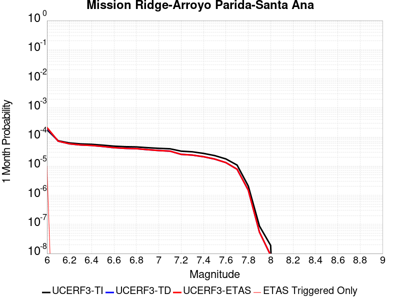 |  | 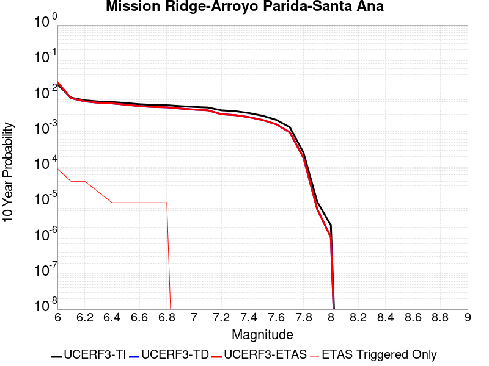 |

| Magnitude | 1 wk TI Prob | 1 wk TD Prob | 1 wk ETAS Prob | 1 wk ETAS/TD Gain | 1 wk ETAS Triggered Only | 1 mo TI Prob | 1 mo TD Prob | 1 mo ETAS Prob | 1 mo ETAS/TD Gain | 1 mo ETAS Triggered Only | 1 yr TI Prob | 1 yr TD Prob | 1 yr ETAS Prob | 1 yr ETAS/TD Gain | 1 yr ETAS Triggered Only | 10 yr TI Prob | 10 yr TD Prob | 10 yr ETAS Prob | 10 yr ETAS/TD Gain | 10 yr ETAS Triggered Only |
|-----|-----|-----|-----|-----|-----|-----|-----|-----|-----|-----|-----|-----|-----|-----|-----|-----|-----|-----|-----|-----|
| 6.0 | 4.169034E-5 | 4.713813E-5 | 4.713813E-5 | 1.0 | 0.0 | 1.7866064E-4 | 2.0200977E-4 | 2.1200776E-4 | 1.0494926 | 1.0E-5 | 0.0021730233 | 0.0024575212 | 0.002497423 | 1.0162365 | 4.0E-5 | 0.021518968 | 0.024385361 | 0.024473166 | 1.0036007 | 9.0E-5 |
| 6.1 | 1.73813E-5 | 1.6854436E-5 | 1.6854436E-5 | 1.0 | 0.0 | 7.4489166E-5 | 7.223136E-5 | 7.223136E-5 | 1.0 | 0.0 | 9.065282E-4 | 8.7907264E-4 | 8.890639E-4 | 1.0113657 | 1.0E-5 | 0.009028391 | 0.0087572355 | 0.008796886 | 1.0045277 | 4.0E-5 |
| 6.2 | 1.4622182E-5 | 1.3673441E-5 | 1.3673441E-5 | 1.0 | 0.0 | 6.2664985E-5 | 5.8599166E-5 | 5.8599166E-5 | 1.0 | 0.0 | 7.6267915E-4 | 7.1321515E-4 | 7.2320807E-4 | 1.014011 | 1.0E-5 | 0.007600669 | 0.0071098455 | 0.0071495613 | 1.005586 | 4.0E-5 |
| 6.3 | 1.3552434E-5 | 1.2482336E-5 | 1.2482336E-5 | 1.0 | 0.0 | 5.8080568E-5 | 5.349465E-5 | 5.349465E-5 | 1.0 | 0.0 | 7.069015E-4 | 6.511059E-4 | 6.6109933E-4 | 1.0153484 | 1.0E-5 | 0.00704657 | 0.0064924853 | 0.0065123555 | 1.0030605 | 2.0E-5 |
| 6.4 | 1.30977305E-5 | 1.1979286E-5 | 1.1979286E-5 | 1.0 | 0.0 | 5.613192E-5 | 5.13388E-5 | 5.13388E-5 | 1.0 | 0.0 | 6.831918E-4 | 6.248737E-4 | 6.248737E-4 | 1.0 | 0.0 | 0.006810953 | 0.0062316516 | 0.0062415893 | 1.0015947 | 1.0E-5 |
| 6.5 | 1.225205E-5 | 1.1048922E-5 | 1.1048922E-5 | 1.0 | 0.0 | 5.2507727E-5 | 4.735168E-5 | 4.735168E-5 | 1.0 | 0.0 | 6.3909404E-4 | 5.763569E-4 | 5.763569E-4 | 1.0 | 0.0 | 0.006372592 | 0.005749071 | 0.005759014 | 1.0017294 | 1.0E-5 |
| 6.6 | 1.1352241E-5 | 1.00636435E-5 | 1.00636435E-5 | 1.0 | 0.0 | 4.8651553E-5 | 4.31292E-5 | 4.31292E-5 | 1.0 | 0.0 | 5.921717E-4 | 5.249736E-4 | 5.249736E-4 | 1.0 | 0.0 | 0.0059059616 | 0.005237721 | 0.005247669 | 1.0018992 | 1.0E-5 |
| 6.7 | 1.0864116E-5 | 9.517129E-6 | 9.517129E-6 | 1.0 | 0.0 | 4.6559664E-5 | 4.078707E-5 | 4.078707E-5 | 1.0 | 0.0 | 5.667165E-4 | 4.964714E-4 | 4.964714E-4 | 1.0 | 0.0 | 0.005652734 | 0.0049539967 | 0.004963947 | 1.0020086 | 1.0E-5 |
| 6.8 | 1.0666365E-5 | 9.299878E-6 | 9.299878E-6 | 1.0 | 0.0 | 4.571219E-5 | 3.9856022E-5 | 3.9856022E-5 | 1.0 | 0.0 | 5.564038E-4 | 4.8514103E-4 | 4.8514103E-4 | 1.0 | 0.0 | 0.005550127 | 0.0048411917 | 0.0048511433 | 1.0020556 | 1.0E-5 |
| 6.9 | 1.0038665E-5 | 8.592135E-6 | 8.592135E-6 | 1.0 | 0.0 | 4.302214E-5 | 3.6822923E-5 | 3.6822923E-5 | 1.0 | 0.0 | 5.236687E-4 | 4.4822867E-4 | 4.4822867E-4 | 1.0 | 0.0 | 0.005224364 | 0.0044735973 | 0.0044735973 | 1.0 | 0.0 |
| 7.0 | 9.5379955E-6 | 8.025153E-6 | 8.025153E-6 | 1.0 | 0.0 | 4.0876483E-5 | 3.439307E-5 | 3.439307E-5 | 1.0 | 0.0 | 4.975576E-4 | 4.1865688E-4 | 4.1865688E-4 | 1.0 | 0.0 | 0.00496445 | 0.004179022 | 0.004179022 | 1.0 | 0.0 |
| 7.1 | 9.207389E-6 | 7.652449E-6 | 7.652449E-6 | 1.0 | 0.0 | 3.945964E-5 | 3.2795808E-5 | 3.2795808E-5 | 1.0 | 0.0 | 4.803152E-4 | 3.992175E-4 | 3.992175E-4 | 1.0 | 0.0 | 0.004792784 | 0.00398534 | 0.00398534 | 1.0 | 0.0 |
| 7.2 | 7.638091E-6 | 5.9311615E-6 | 5.9311615E-6 | 1.0 | 0.0 | 3.2734264E-5 | 2.5419018E-5 | 2.5419018E-5 | 1.0 | 0.0 | 3.984668E-4 | 3.0943291E-4 | 3.0943291E-4 | 1.0 | 0.0 | 0.0039775306 | 0.0030902177 | 0.0030902177 | 1.0 | 0.0 |
| 7.3 | 7.2500147E-6 | 5.5961928E-6 | 5.5961928E-6 | 1.0 | 0.0 | 3.1071122E-5 | 2.3983464E-5 | 2.3983464E-5 | 1.0 | 0.0 | 3.7822526E-4 | 2.9195985E-4 | 2.9195985E-4 | 1.0 | 0.0 | 0.0037758215 | 0.0029159586 | 0.0029159586 | 1.0 | 0.0 |
| 7.4 | 6.3899715E-6 | 4.9185396E-6 | 4.9185396E-6 | 1.0 | 0.0 | 2.7385306E-5 | 2.1079286E-5 | 2.1079286E-5 | 1.0 | 0.0 | 3.3336508E-4 | 2.5661028E-4 | 2.5661028E-4 | 1.0 | 0.0 | 0.0033286542 | 0.0025633245 | 0.0025633245 | 1.0 | 0.0 |
| 7.5 | 5.379025E-6 | 4.0838927E-6 | 4.0838927E-6 | 1.0 | 0.0 | 2.305276E-5 | 1.750228E-5 | 1.750228E-5 | 1.0 | 0.0 | 2.806312E-4 | 2.1306952E-4 | 2.1306952E-4 | 1.0 | 0.0 | 0.0028027708 | 0.0021286637 | 0.0021286637 | 1.0 | 0.0 |
| 7.6 | 4.1270696E-6 | 3.0883714E-6 | 3.0883714E-6 | 1.0 | 0.0 | 1.768732E-5 | 1.3235811E-5 | 1.3235811E-5 | 1.0 | 0.0 | 2.1532185E-4 | 1.6113416E-4 | 1.6113416E-4 | 1.0 | 0.0 | 0.0021511333 | 0.0016101813 | 0.0016101813 | 1.0 | 0.0 |
| 7.7 | 2.5406805E-6 | 1.8282244E-6 | 1.8282244E-6 | 1.0 | 0.0 | 1.0888585E-5 | 7.835224E-6 | 7.835224E-6 | 1.0 | 0.0 | 1.3256045E-4 | 9.538975E-5 | 9.538975E-5 | 1.0 | 0.0 | 0.0013248142 | 9.5349416E-4 | 9.5349416E-4 | 1.0 | 0.0 |
| 7.8 | 4.8608285E-7 | 3.509899E-7 | 3.509899E-7 | 1.0 | 0.0 | 2.0832106E-6 | 1.5042416E-6 | 1.5042416E-6 | 1.0 | 0.0 | 2.5362791E-5 | 1.831399E-5 | 1.831399E-5 | 1.0 | 0.0 | 2.5359896E-4 | 1.8312491E-4 | 1.8312491E-4 | 1.0 | 0.0 |
| 7.9 | 2.0472514E-8 | 1.2688968E-8 | 1.2688968E-8 | 1.0 | 0.0 | 8.7739345E-8 | 5.438129E-8 | 5.438129E-8 | 1.0 | 0.0 | 1.068226E-6 | 6.62092E-7 | 6.62092E-7 | 1.0 | 0.0 | 1.0682209E-5 | 6.6209013E-6 | 6.6209013E-6 | 1.0 | 0.0 |
| 8.0 | 4.443582E-9 | 2.0321504E-9 | 2.0321504E-9 | 1.0 | 0.0 | 1.9043922E-8 | 8.7092165E-9 | 8.7092165E-9 | 1.0 | 0.0 | 2.3185973E-7 | 1.0603471E-7 | 1.0603471E-7 | 1.0 | 0.0 | 2.3185949E-6 | 1.0603467E-6 | 1.0603467E-6 | 1.0 | 0.0 |

## Lost Hills
*[(top)](#table-of-contents)*

| 1 Week | 1 Month | 1 Year | 10 Year |
|-----|-----|-----|-----|
|  | 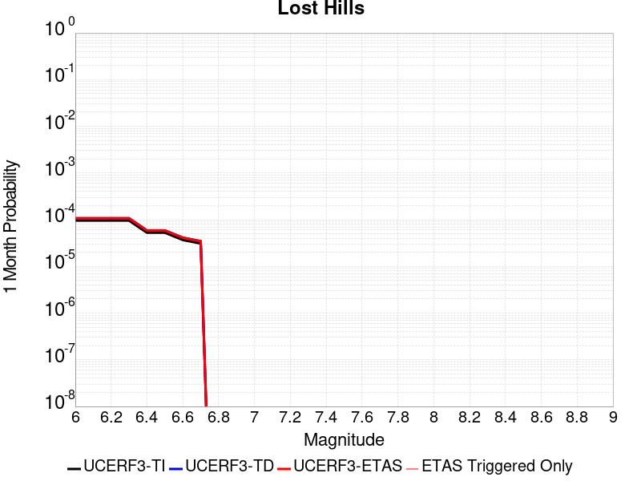 | 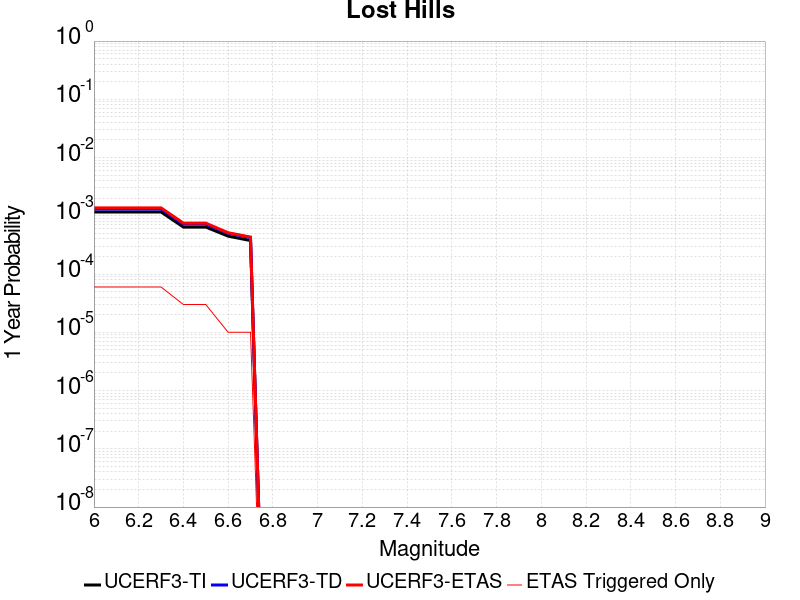 | 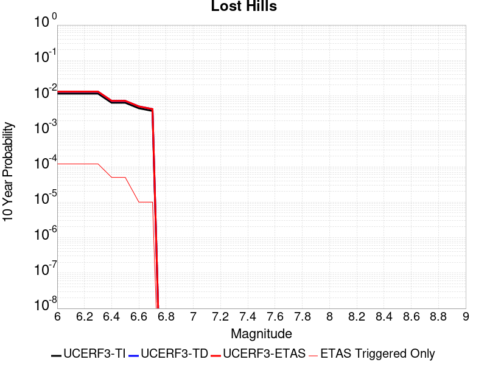 |

| Magnitude | 1 wk TI Prob | 1 wk TD Prob | 1 wk ETAS Prob | 1 wk ETAS/TD Gain | 1 wk ETAS Triggered Only | 1 mo TI Prob | 1 mo TD Prob | 1 mo ETAS Prob | 1 mo ETAS/TD Gain | 1 mo ETAS Triggered Only | 1 yr TI Prob | 1 yr TD Prob | 1 yr ETAS Prob | 1 yr ETAS/TD Gain | 1 yr ETAS Triggered Only | 10 yr TI Prob | 10 yr TD Prob | 10 yr ETAS Prob | 10 yr ETAS/TD Gain | 10 yr ETAS Triggered Only |
|-----|-----|-----|-----|-----|-----|-----|-----|-----|-----|-----|-----|-----|-----|-----|-----|-----|-----|-----|-----|-----|
| 6.0 | 2.233523E-5 | 2.510693E-5 | 2.510693E-5 | 1.0 | 0.0 | 9.571891E-5 | 1.0759764E-4 | 1.0759764E-4 | 1.0 | 0.0 | 0.0011647546 | 0.0013093821 | 0.0013693036 | 1.0457631 | 6.0E-5 | 0.011586686 | 0.013033271 | 0.013151707 | 1.0090872 | 1.2E-4 |
| 6.1 | 2.233523E-5 | 2.510693E-5 | 2.510693E-5 | 1.0 | 0.0 | 9.571891E-5 | 1.0759764E-4 | 1.0759764E-4 | 1.0 | 0.0 | 0.0011647546 | 0.0013093821 | 0.0013693036 | 1.0457631 | 6.0E-5 | 0.011586686 | 0.013033271 | 0.013151707 | 1.0090872 | 1.2E-4 |
| 6.2 | 2.233523E-5 | 2.510693E-5 | 2.510693E-5 | 1.0 | 0.0 | 9.571891E-5 | 1.0759764E-4 | 1.0759764E-4 | 1.0 | 0.0 | 0.0011647546 | 0.0013093821 | 0.0013693036 | 1.0457631 | 6.0E-5 | 0.011586686 | 0.013033271 | 0.013151707 | 1.0090872 | 1.2E-4 |
| 6.3 | 2.233523E-5 | 2.510693E-5 | 2.510693E-5 | 1.0 | 0.0 | 9.571891E-5 | 1.0759764E-4 | 1.0759764E-4 | 1.0 | 0.0 | 0.0011647546 | 0.0013093821 | 0.0013693036 | 1.0457631 | 6.0E-5 | 0.011586686 | 0.013033271 | 0.013151707 | 1.0090872 | 1.2E-4 |
| 6.4 | 1.2288092E-5 | 1.3781295E-5 | 1.3781295E-5 | 1.0 | 0.0 | 5.2662188E-5 | 5.9061884E-5 | 5.9061884E-5 | 1.0 | 0.0 | 6.409735E-4 | 7.18935E-4 | 7.4891344E-4 | 1.0416983 | 3.0E-5 | 0.006391279 | 0.007175298 | 0.0072249393 | 1.0069183 | 5.0E-5 |
| 6.5 | 1.2288092E-5 | 1.3781295E-5 | 1.3781295E-5 | 1.0 | 0.0 | 5.2662188E-5 | 5.9061884E-5 | 5.9061884E-5 | 1.0 | 0.0 | 6.409735E-4 | 7.18935E-4 | 7.4891344E-4 | 1.0416983 | 3.0E-5 | 0.006391279 | 0.007175298 | 0.0072249393 | 1.0069183 | 5.0E-5 |
| 6.6 | 8.58281E-6 | 9.633902E-6 | 9.633902E-6 | 1.0 | 0.0 | 3.6782953E-5 | 4.1287967E-5 | 4.1287967E-5 | 1.0 | 0.0 | 4.4774043E-4 | 5.0264824E-4 | 5.1264325E-4 | 1.0198846 | 1.0E-5 | 0.0044683935 | 0.005023274 | 0.0050332234 | 1.0019808 | 1.0E-5 |
| 6.7 | 7.205685E-6 | 8.088413E-6 | 8.088413E-6 | 1.0 | 0.0 | 3.088114E-5 | 3.4664627E-5 | 3.4664627E-5 | 1.0 | 0.0 | 3.7591302E-4 | 4.220418E-4 | 4.320376E-4 | 1.0236844 | 1.0E-5 | 0.0037527776 | 0.004220418 | 0.004230376 | 1.0023594 | 1.0E-5 |

## San Jacinto (Stepovers Combined)
*[(top)](#table-of-contents)*

| 1 Week | 1 Month | 1 Year | 10 Year |
|-----|-----|-----|-----|
|  |  | 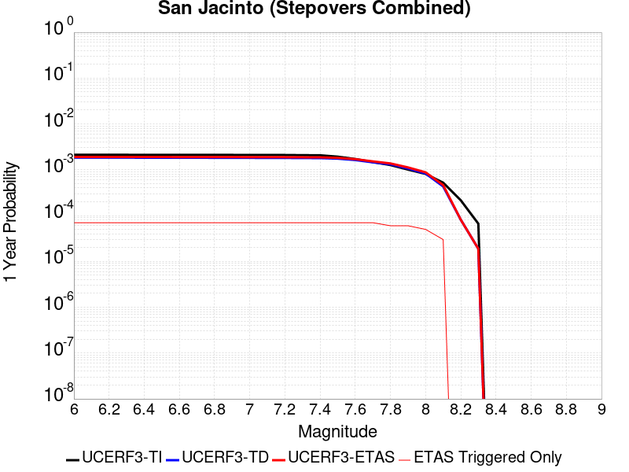 |  |

| Magnitude | 1 wk TI Prob | 1 wk TD Prob | 1 wk ETAS Prob | 1 wk ETAS/TD Gain | 1 wk ETAS Triggered Only | 1 mo TI Prob | 1 mo TD Prob | 1 mo ETAS Prob | 1 mo ETAS/TD Gain | 1 mo ETAS Triggered Only | 1 yr TI Prob | 1 yr TD Prob | 1 yr ETAS Prob | 1 yr ETAS/TD Gain | 1 yr ETAS Triggered Only | 10 yr TI Prob | 10 yr TD Prob | 10 yr ETAS Prob | 10 yr ETAS/TD Gain | 10 yr ETAS Triggered Only |
|-----|-----|-----|-----|-----|-----|-----|-----|-----|-----|-----|-----|-----|-----|-----|-----|-----|-----|-----|-----|-----|
| 6.0 | 4.0667746E-5 | 3.528316E-5 | 4.5282806E-5 | 1.2834114 | 1.0E-5 | 1.742787E-4 | 1.5120479E-4 | 1.7120177E-4 | 1.1322509 | 2.0E-5 | 0.0021197782 | 0.0018393651 | 0.0019092363 | 1.0379866 | 7.0E-5 | 0.020996714 | 0.018992338 | 0.01911006 | 1.0061983 | 1.2E-4 |
| 6.1 | 4.0667746E-5 | 3.528316E-5 | 4.5282806E-5 | 1.2834114 | 1.0E-5 | 1.742787E-4 | 1.5120479E-4 | 1.7120177E-4 | 1.1322509 | 2.0E-5 | 0.0021197782 | 0.0018393651 | 0.0019092363 | 1.0379866 | 7.0E-5 | 0.020996714 | 0.018992338 | 0.01911006 | 1.0061983 | 1.2E-4 |
| 6.2 | 4.0667746E-5 | 3.528316E-5 | 4.5282806E-5 | 1.2834114 | 1.0E-5 | 1.742787E-4 | 1.5120479E-4 | 1.7120177E-4 | 1.1322509 | 2.0E-5 | 0.0021197782 | 0.0018393651 | 0.0019092363 | 1.0379866 | 7.0E-5 | 0.020996714 | 0.018992338 | 0.01911006 | 1.0061983 | 1.2E-4 |
| 6.3 | 4.0667746E-5 | 3.528316E-5 | 4.5282806E-5 | 1.2834114 | 1.0E-5 | 1.742787E-4 | 1.5120479E-4 | 1.7120177E-4 | 1.1322509 | 2.0E-5 | 0.0021197782 | 0.0018393651 | 0.0019092363 | 1.0379866 | 7.0E-5 | 0.020996714 | 0.018992338 | 0.01911006 | 1.0061983 | 1.2E-4 |
| 6.4 | 4.0577226E-5 | 3.5155066E-5 | 4.5154713E-5 | 1.284444 | 1.0E-5 | 1.738908E-4 | 1.5065588E-4 | 1.7065287E-4 | 1.1327329 | 2.0E-5 | 0.0021150648 | 0.0018326946 | 0.0019025663 | 1.0381252 | 7.0E-5 | 0.020950472 | 0.018926904 | 0.019044632 | 1.0062202 | 1.2E-4 |
| 6.5 | 4.0577226E-5 | 3.5155066E-5 | 4.5154713E-5 | 1.284444 | 1.0E-5 | 1.738908E-4 | 1.5065588E-4 | 1.7065287E-4 | 1.1327329 | 2.0E-5 | 0.0021150648 | 0.0018326946 | 0.0019025663 | 1.0381252 | 7.0E-5 | 0.020950472 | 0.018926904 | 0.019044632 | 1.0062202 | 1.2E-4 |
| 6.6 | 4.053861E-5 | 3.5100406E-5 | 4.5100052E-5 | 1.284887 | 1.0E-5 | 1.7372532E-4 | 1.5042165E-4 | 1.7041864E-4 | 1.1329396 | 2.0E-5 | 0.0021130538 | 0.0018298482 | 0.00189972 | 1.0381845 | 7.0E-5 | 0.020930743 | 0.01889898 | 0.019016713 | 1.0062295 | 1.2E-4 |
| 6.7 | 4.0516545E-5 | 3.506948E-5 | 4.5069126E-5 | 1.2851382 | 1.0E-5 | 1.7363077E-4 | 1.5028912E-4 | 1.7028612E-4 | 1.1330569 | 2.0E-5 | 0.002111905 | 0.0018282374 | 0.0018981096 | 1.0382183 | 7.0E-5 | 0.020919468 | 0.018883176 | 0.01900091 | 1.0062349 | 1.2E-4 |
| 6.8 | 4.049434E-5 | 3.5041037E-5 | 4.5040688E-5 | 1.2853696 | 1.0E-5 | 1.7353562E-4 | 1.5016725E-4 | 1.7016425E-4 | 1.1331649 | 2.0E-5 | 0.0021107488 | 0.0018267563 | 0.0018966284 | 1.0382493 | 7.0E-5 | 0.020908125 | 0.01886859 | 0.018986326 | 1.0062398 | 1.2E-4 |
| 6.9 | 4.046386E-5 | 3.5003595E-5 | 4.5003246E-5 | 1.2856749 | 1.0E-5 | 1.73405E-4 | 1.500068E-4 | 1.7000381E-4 | 1.1333073 | 2.0E-5 | 0.0021091616 | 0.0018248061 | 0.0018946785 | 1.0382903 | 7.0E-5 | 0.020892553 | 0.018849362 | 0.0189671 | 1.0062462 | 1.2E-4 |
| 7.0 | 4.036382E-5 | 3.488416E-5 | 4.488381E-5 | 1.286653 | 1.0E-5 | 1.7297632E-4 | 1.49495E-4 | 1.69492E-4 | 1.1337638 | 2.0E-5 | 0.0021039525 | 0.0018185854 | 0.0018884582 | 1.0384215 | 7.0E-5 | 0.02084144 | 0.018787974 | 0.01890572 | 1.0062671 | 1.2E-4 |
| 7.1 | 4.0343282E-5 | 3.4862624E-5 | 4.4862274E-5 | 1.2868302 | 1.0E-5 | 1.7288832E-4 | 1.4940271E-4 | 1.6939972E-4 | 1.1338464 | 2.0E-5 | 0.002102883 | 0.0018174635 | 0.0018873364 | 1.0384452 | 7.0E-5 | 0.020830948 | 0.018776845 | 0.018894592 | 1.0062709 | 1.2E-4 |
| 7.2 | 4.0257353E-5 | 3.476712E-5 | 4.476677E-5 | 1.287618 | 1.0E-5 | 1.725201E-4 | 1.4899344E-4 | 1.6899046E-4 | 1.134214 | 2.0E-5 | 0.0020984085 | 0.0018124891 | 0.0018823623 | 1.038551 | 7.0E-5 | 0.020787042 | 0.018727584 | 0.018845337 | 1.0062877 | 1.2E-4 |
| 7.3 | 3.9940667E-5 | 3.459476E-5 | 4.4594413E-5 | 1.2890512 | 1.0E-5 | 1.7116306E-4 | 1.4825485E-4 | 1.6825189E-4 | 1.1348828 | 2.0E-5 | 0.0020819185 | 0.0018035118 | 0.0018733855 | 1.0387431 | 7.0E-5 | 0.020625217 | 0.01863621 | 0.018753974 | 1.006319 | 1.2E-4 |
| 7.4 | 3.9721202E-5 | 3.448014E-5 | 4.44798E-5 | 1.290012 | 1.0E-5 | 1.7022261E-4 | 1.4776368E-4 | 1.6776074E-4 | 1.1353313 | 2.0E-5 | 0.0020704903 | 0.0017975416 | 0.0018674158 | 1.0388721 | 7.0E-5 | 0.020513052 | 0.01857534 | 0.018693112 | 1.0063401 | 1.2E-4 |
| 7.5 | 3.7036873E-5 | 3.3547534E-5 | 4.35472E-5 | 1.2980745 | 1.0E-5 | 1.5871979E-4 | 1.4376725E-4 | 1.6376437E-4 | 1.1390938 | 2.0E-5 | 0.0019307006 | 0.0017489638 | 0.0018188414 | 1.0399537 | 7.0E-5 | 0.019140124 | 0.018077 | 0.018194828 | 1.0065182 | 1.2E-4 |
| 7.6 | 3.2940967E-5 | 3.13282E-5 | 4.1327887E-5 | 1.3191912 | 1.0E-5 | 1.4116794E-4 | 1.3425681E-4 | 1.5425413E-4 | 1.1489482 | 2.0E-5 | 0.0017173645 | 0.0016333534 | 0.0017032392 | 1.0427866 | 7.0E-5 | 0.01704153 | 0.016909786 | 0.017027756 | 1.0069765 | 1.2E-4 |
| 7.7 | 2.8236149E-5 | 2.7893891E-5 | 3.7893613E-5 | 1.3584914 | 1.0E-5 | 1.2100645E-4 | 1.1953978E-4 | 1.3953738E-4 | 1.1672883 | 2.0E-5 | 0.0014722579 | 0.0014544262 | 0.0015243244 | 1.048059 | 7.0E-5 | 0.014625421 | 0.015120514 | 0.015238699 | 1.0078162 | 1.2E-4 |
| 7.8 | 2.4329287E-5 | 2.5217241E-5 | 3.5216988E-5 | 1.3965441 | 1.0E-5 | 1.042642E-4 | 1.0806942E-4 | 1.2806726E-4 | 1.1850462 | 2.0E-5 | 0.0012686774 | 0.0013149519 | 0.001374873 | 1.0455691 | 6.0E-5 | 0.012614589 | 0.013717591 | 0.0138260815 | 1.0079089 | 1.1E-4 |
| 7.9 | 1.9370926E-5 | 2.0430109E-5 | 3.0429905E-5 | 1.4894637 | 1.0E-5 | 8.301561E-5 | 8.7554676E-5 | 1.0755292E-4 | 1.2284087 | 2.0E-5 | 0.0010102465 | 0.0010654576 | 0.0011253937 | 1.0562538 | 6.0E-5 | 0.0100566605 | 0.011204186 | 0.011303065 | 1.0088252 | 1.0E-4 |
| 8.0 | 1.5583017E-5 | 1.589353E-5 | 2.589337E-5 | 1.6291769 | 1.0E-5 | 6.6782646E-5 | 6.811335E-5 | 8.811199E-5 | 1.2936082 | 2.0E-5 | 8.127754E-4 | 8.289653E-4 | 8.789238E-4 | 1.0602661 | 5.0E-5 | 0.008098091 | 0.00878565 | 0.008855035 | 1.0078975 | 7.0E-5 |
| 8.1 | 1.0024873E-5 | 8.296103E-6 | 1.8296021E-5 | 2.2053752 | 1.0E-5 | 4.2963035E-5 | 3.5554247E-5 | 5.5553537E-5 | 1.5625007 | 2.0E-5 | 5.229494E-4 | 4.327875E-4 | 4.627745E-4 | 1.0692881 | 3.0E-5 | 0.0052172043 | 0.0046555274 | 0.0046953415 | 1.008552 | 4.0E-5 |
| 8.2 | 4.142796E-6 | 1.5616945E-6 | 1.5616945E-6 | 1.0 | 0.0 | 1.775472E-5 | 6.6929592E-6 | 6.6929592E-6 | 1.0 | 0.0 | 2.1614227E-4 | 8.148376E-5 | 8.148376E-5 | 1.0 | 0.0 | 0.0021593217 | 9.4586494E-4 | 9.4586494E-4 | 1.0 | 0.0 |
| 8.3 | 1.2750878E-6 | 3.6135864E-7 | 3.6135864E-7 | 1.0 | 0.0 | 5.4646503E-6 | 1.548679E-6 | 1.548679E-6 | 1.0 | 0.0 | 6.653009E-5 | 1.885501E-5 | 1.885501E-5 | 1.0 | 0.0 | 6.6510175E-4 | 2.2744077E-4 | 2.2744077E-4 | 1.0 | 0.0 |

## San Jacinto (Lytle Creek connector)
*[(top)](#table-of-contents)*

| 1 Week | 1 Month | 1 Year | 10 Year |
|-----|-----|-----|-----|
|  |  |  |  |

| Magnitude | 1 wk TI Prob | 1 wk TD Prob | 1 wk ETAS Prob | 1 wk ETAS/TD Gain | 1 wk ETAS Triggered Only | 1 mo TI Prob | 1 mo TD Prob | 1 mo ETAS Prob | 1 mo ETAS/TD Gain | 1 mo ETAS Triggered Only | 1 yr TI Prob | 1 yr TD Prob | 1 yr ETAS Prob | 1 yr ETAS/TD Gain | 1 yr ETAS Triggered Only | 10 yr TI Prob | 10 yr TD Prob | 10 yr ETAS Prob | 10 yr ETAS/TD Gain | 10 yr ETAS Triggered Only |
|-----|-----|-----|-----|-----|-----|-----|-----|-----|-----|-----|-----|-----|-----|-----|-----|-----|-----|-----|-----|-----|
| 6.0 | 6.693995E-6 | 6.662417E-6 | 1.666235E-5 | 2.5009468 | 1.0E-5 | 2.8688235E-5 | 2.8552902E-5 | 4.855233E-5 | 1.7004342 | 2.0E-5 | 3.492233E-4 | 3.4757622E-4 | 4.2754842E-4 | 1.2300854 | 8.0E-5 | 0.00348675 | 0.0035506212 | 0.0036602307 | 1.0308704 | 1.1E-4 |
| 6.1 | 6.693995E-6 | 6.662417E-6 | 1.666235E-5 | 2.5009468 | 1.0E-5 | 2.8688235E-5 | 2.8552902E-5 | 4.855233E-5 | 1.7004342 | 2.0E-5 | 3.492233E-4 | 3.4757622E-4 | 4.2754842E-4 | 1.2300854 | 8.0E-5 | 0.00348675 | 0.0035506212 | 0.0036602307 | 1.0308704 | 1.1E-4 |
| 6.2 | 6.693995E-6 | 6.662417E-6 | 1.666235E-5 | 2.5009468 | 1.0E-5 | 2.8688235E-5 | 2.8552902E-5 | 4.855233E-5 | 1.7004342 | 2.0E-5 | 3.492233E-4 | 3.4757622E-4 | 4.2754842E-4 | 1.2300854 | 8.0E-5 | 0.00348675 | 0.0035506212 | 0.0036602307 | 1.0308704 | 1.1E-4 |
| 6.3 | 6.693995E-6 | 6.662417E-6 | 1.666235E-5 | 2.5009468 | 1.0E-5 | 2.8688235E-5 | 2.8552902E-5 | 4.855233E-5 | 1.7004342 | 2.0E-5 | 3.492233E-4 | 3.4757622E-4 | 4.2754842E-4 | 1.2300854 | 8.0E-5 | 0.00348675 | 0.0035506212 | 0.0036602307 | 1.0308704 | 1.1E-4 |
| 6.4 | 6.693995E-6 | 6.662417E-6 | 1.666235E-5 | 2.5009468 | 1.0E-5 | 2.8688235E-5 | 2.8552902E-5 | 4.855233E-5 | 1.7004342 | 2.0E-5 | 3.492233E-4 | 3.4757622E-4 | 4.2754842E-4 | 1.2300854 | 8.0E-5 | 0.00348675 | 0.0035506212 | 0.0036602307 | 1.0308704 | 1.1E-4 |
| 6.5 | 6.6561875E-6 | 6.622635E-6 | 1.662257E-5 | 2.509963 | 1.0E-5 | 2.8526205E-5 | 2.8382412E-5 | 4.8381844E-5 | 1.7046417 | 2.0E-5 | 3.472512E-4 | 3.4550115E-4 | 4.2547352E-4 | 1.2314677 | 8.0E-5 | 0.0034670907 | 0.0035299365 | 0.0036395483 | 1.031052 | 1.1E-4 |
| 6.6 | 6.6561875E-6 | 6.622635E-6 | 1.662257E-5 | 2.509963 | 1.0E-5 | 2.8526205E-5 | 2.8382412E-5 | 4.8381844E-5 | 1.7046417 | 2.0E-5 | 3.472512E-4 | 3.4550115E-4 | 4.2547352E-4 | 1.2314677 | 8.0E-5 | 0.0034670907 | 0.0035299365 | 0.0036395483 | 1.031052 | 1.1E-4 |
| 6.7 | 6.5802237E-6 | 6.5418108E-6 | 1.6541746E-5 | 2.5286188 | 1.0E-5 | 2.8200653E-5 | 2.8036031E-5 | 4.8035472E-5 | 1.7133477 | 2.0E-5 | 3.4328885E-4 | 3.4128528E-4 | 4.2125798E-4 | 1.234328 | 8.0E-5 | 0.0034275902 | 0.0034879108 | 0.003597527 | 1.0314275 | 1.1E-4 |
| 6.8 | 6.575632E-6 | 6.5363006E-6 | 1.6536234E-5 | 2.5299075 | 1.0E-5 | 2.8180975E-5 | 2.8012415E-5 | 4.8011854E-5 | 1.7139491 | 2.0E-5 | 3.4304935E-4 | 3.4099785E-4 | 4.2097058E-4 | 1.2345256 | 8.0E-5 | 0.0034252026 | 0.0034850454 | 0.003594662 | 1.0314535 | 1.1E-4 |
| 6.9 | 6.570433E-6 | 6.527694E-6 | 1.6527629E-5 | 2.5319245 | 1.0E-5 | 2.8158694E-5 | 2.7975531E-5 | 4.7974972E-5 | 1.7148905 | 2.0E-5 | 3.4277816E-4 | 3.4054896E-4 | 4.205217E-4 | 1.2348348 | 8.0E-5 | 0.0034224992 | 0.0034805704 | 0.0035901875 | 1.031494 | 1.1E-4 |
| 7.0 | 6.5643826E-6 | 6.5178147E-6 | 1.651775E-5 | 2.5342467 | 1.0E-5 | 2.8132765E-5 | 2.7933193E-5 | 4.7932634E-5 | 1.7159741 | 2.0E-5 | 3.424626E-4 | 3.400336E-4 | 4.2000643E-4 | 1.2351909 | 8.0E-5 | 0.0034193532 | 0.0034754332 | 0.003585051 | 1.0315408 | 1.1E-4 |
| 7.1 | 6.557402E-6 | 6.506526E-6 | 1.6506461E-5 | 2.5369084 | 1.0E-5 | 2.8102848E-5 | 2.7884813E-5 | 4.7884256E-5 | 1.7172163 | 2.0E-5 | 3.4209844E-4 | 3.3944478E-4 | 4.1941763E-4 | 1.2355989 | 8.0E-5 | 0.0034157229 | 0.003469564 | 0.0035791826 | 1.0315943 | 1.1E-4 |
| 7.2 | 6.546394E-6 | 6.4884916E-6 | 1.6488426E-5 | 2.5411801 | 1.0E-5 | 2.8055672E-5 | 2.7807526E-5 | 4.780697E-5 | 1.7192098 | 2.0E-5 | 3.4152428E-4 | 3.385041E-4 | 4.1847702E-4 | 1.236254 | 8.0E-5 | 0.0034099987 | 0.0034601905 | 0.00356981 | 1.0316801 | 1.1E-4 |
| 7.3 | 6.5364216E-6 | 6.4692754E-6 | 1.646921E-5 | 2.5457582 | 1.0E-5 | 2.8012933E-5 | 2.7725171E-5 | 4.7724618E-5 | 1.7213461 | 2.0E-5 | 3.4100408E-4 | 3.3750175E-4 | 4.1747474E-4 | 1.2369558 | 8.0E-5 | 0.003404813 | 0.0034502107 | 0.003559831 | 1.0317721 | 1.1E-4 |
| 7.4 | 6.5269523E-6 | 6.45036E-6 | 1.6450296E-5 | 2.550291 | 1.0E-5 | 2.7972354E-5 | 2.7644108E-5 | 4.7643556E-5 | 1.7234615 | 2.0E-5 | 3.4051016E-4 | 3.365151E-4 | 4.1648818E-4 | 1.2376508 | 8.0E-5 | 0.0033998888 | 0.0034403927 | 0.0035500142 | 1.0318631 | 1.1E-4 |
| 7.5 | 6.5111835E-6 | 6.426632E-6 | 1.6426568E-5 | 2.556015 | 1.0E-5 | 2.7904773E-5 | 2.7542417E-5 | 4.7541867E-5 | 1.7261326 | 2.0E-5 | 3.3968766E-4 | 3.352774E-4 | 4.152506E-4 | 1.2385284 | 8.0E-5 | 0.0033916887 | 0.0034280655 | 0.0035376884 | 1.031978 | 1.1E-4 |
| 7.6 | 6.4768806E-6 | 6.385738E-6 | 1.6385673E-5 | 2.5659797 | 1.0E-5 | 2.7757764E-5 | 2.7367161E-5 | 4.7366615E-5 | 1.7307829 | 2.0E-5 | 3.3789838E-4 | 3.331443E-4 | 4.1311767E-4 | 1.2400562 | 8.0E-5 | 0.0033738504 | 0.0034067966 | 0.0035164217 | 1.0321784 | 1.1E-4 |
| 7.7 | 6.1655364E-6 | 6.1782107E-6 | 1.6178148E-5 | 2.6185815 | 1.0E-5 | 2.642346E-5 | 2.6477777E-5 | 4.647725E-5 | 1.7553304 | 2.0E-5 | 3.2165812E-4 | 3.223193E-4 | 4.0229352E-4 | 1.248121 | 8.0E-5 | 0.0032119295 | 0.003298423 | 0.0034080602 | 1.0332392 | 1.1E-4 |
| 7.8 | 5.5043524E-6 | 5.7392244E-6 | 1.5739168E-5 | 2.7423856 | 1.0E-5 | 2.3589868E-5 | 2.4596444E-5 | 4.4595952E-5 | 1.8131057 | 2.0E-5 | 2.871688E-4 | 2.9942062E-4 | 3.7939666E-4 | 1.2671027 | 8.0E-5 | 0.0028679797 | 0.0030684965 | 0.003178159 | 1.0357382 | 1.1E-4 |
| 7.9 | 3.889249E-6 | 4.078457E-6 | 1.4078416E-5 | 3.4518976 | 1.0E-5 | 1.6668104E-5 | 1.7478984E-5 | 3.7478636E-5 | 2.1442113 | 2.0E-5 | 2.0291525E-4 | 2.1278589E-4 | 2.8277098E-4 | 1.3288991 | 7.0E-5 | 0.0020273007 | 0.0021953103 | 0.0022950908 | 1.0454516 | 1.0E-4 |
| 8.0 | 2.668535E-6 | 2.5325735E-6 | 1.2532549E-5 | 4.9485426 | 1.0E-5 | 1.1436528E-5 | 1.0853842E-5 | 2.0853733E-5 | 1.9213228 | 1.0E-5 | 1.3923083E-4 | 1.3213753E-4 | 1.7213225E-4 | 1.3026749 | 4.0E-5 | 0.0013914363 | 0.0013764916 | 0.0014364091 | 1.043529 | 6.0E-5 |
| 8.1 | 1.5911459E-6 | 1.219176E-6 | 1.1219164E-5 | 9.2022505 | 1.0E-5 | 6.8191785E-6 | 5.22503E-6 | 1.5224978E-5 | 2.9138546 | 1.0E-5 | 8.3020335E-5 | 6.3612904E-5 | 8.361163E-5 | 1.3143816 | 2.0E-5 | 8.298933E-4 | 6.697044E-4 | 6.996843E-4 | 1.0447658 | 3.0E-5 |
| 8.2 | 6.1294963E-7 | 2.1821754E-7 | 2.1821754E-7 | 1.0 | 0.0 | 2.6269242E-6 | 9.3521766E-7 | 9.3521766E-7 | 1.0 | 0.0 | 3.1982334E-5 | 1.1386216E-5 | 1.1386216E-5 | 1.0 | 0.0 | 3.1977732E-4 | 1.2789582E-4 | 1.2789582E-4 | 1.0 | 0.0 |
| 8.3 | 1.762871E-7 | 4.7566033E-8 | 4.7566033E-8 | 1.0 | 0.0 | 7.5551594E-7 | 2.038544E-7 | 2.038544E-7 | 1.0 | 0.0 | 9.1983675E-6 | 2.4819246E-6 | 2.4819246E-6 | 1.0 | 0.0 | 9.197987E-5 | 2.8698683E-5 | 2.8698683E-5 | 1.0 | 0.0 |

## Santa Cruz Island
*[(top)](#table-of-contents)*

| 1 Week | 1 Month | 1 Year | 10 Year |
|-----|-----|-----|-----|
|  |  | 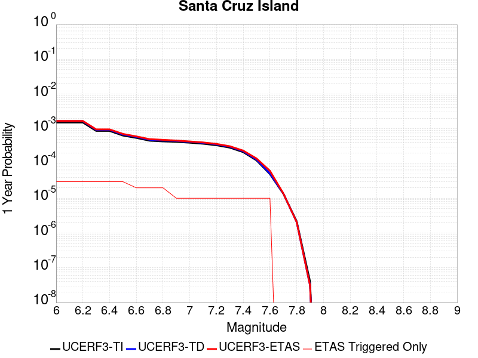 | 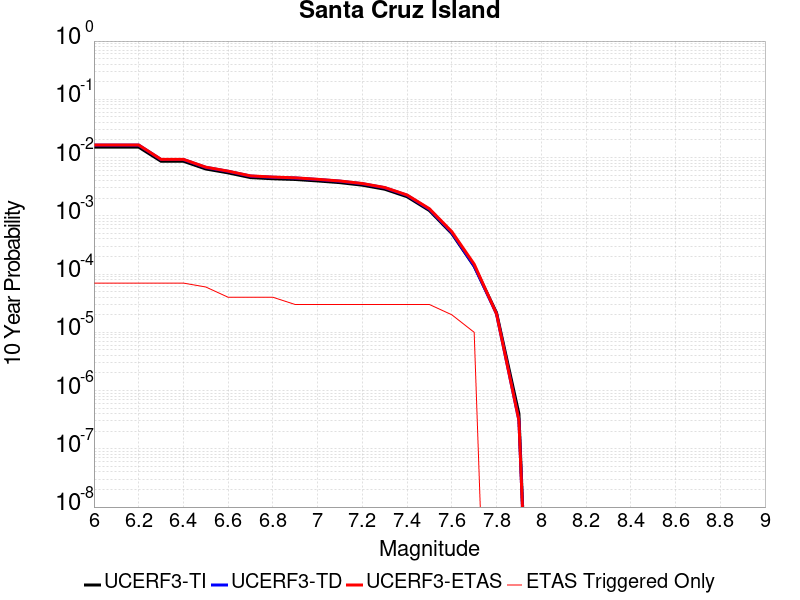 |

| Magnitude | 1 wk TI Prob | 1 wk TD Prob | 1 wk ETAS Prob | 1 wk ETAS/TD Gain | 1 wk ETAS Triggered Only | 1 mo TI Prob | 1 mo TD Prob | 1 mo ETAS Prob | 1 mo ETAS/TD Gain | 1 mo ETAS Triggered Only | 1 yr TI Prob | 1 yr TD Prob | 1 yr ETAS Prob | 1 yr ETAS/TD Gain | 1 yr ETAS Triggered Only | 10 yr TI Prob | 10 yr TD Prob | 10 yr ETAS Prob | 10 yr ETAS/TD Gain | 10 yr ETAS Triggered Only |
|-----|-----|-----|-----|-----|-----|-----|-----|-----|-----|-----|-----|-----|-----|-----|-----|-----|-----|-----|-----|-----|
| 6.0 | 2.9164563E-5 | 3.160004E-5 | 3.160004E-5 | 1.0 | 0.0 | 1.2498499E-4 | 1.3542248E-4 | 1.3542248E-4 | 1.0 | 0.0 | 0.0015206301 | 0.0016476581 | 0.0016776086 | 1.0181776 | 3.0E-5 | 0.015102667 | 0.016368153 | 0.016437007 | 1.0042065 | 7.0E-5 |
| 6.1 | 2.9164563E-5 | 3.160004E-5 | 3.160004E-5 | 1.0 | 0.0 | 1.2498499E-4 | 1.3542248E-4 | 1.3542248E-4 | 1.0 | 0.0 | 0.0015206301 | 0.0016476581 | 0.0016776086 | 1.0181776 | 3.0E-5 | 0.015102667 | 0.016368153 | 0.016437007 | 1.0042065 | 7.0E-5 |
| 6.2 | 2.9164563E-5 | 3.160004E-5 | 3.160004E-5 | 1.0 | 0.0 | 1.2498499E-4 | 1.3542248E-4 | 1.3542248E-4 | 1.0 | 0.0 | 0.0015206301 | 0.0016476581 | 0.0016776086 | 1.0181776 | 3.0E-5 | 0.015102667 | 0.016368153 | 0.016437007 | 1.0042065 | 7.0E-5 |
| 6.3 | 1.6635553E-5 | 1.78045E-5 | 1.78045E-5 | 1.0 | 0.0 | 7.1293274E-5 | 7.630287E-5 | 7.630287E-5 | 1.0 | 0.0 | 8.6765E-4 | 9.2860975E-4 | 9.585819E-4 | 1.0322764 | 3.0E-5 | 0.008642701 | 0.009249167 | 0.009318519 | 1.0074983 | 7.0E-5 |
| 6.4 | 1.6635553E-5 | 1.78045E-5 | 1.78045E-5 | 1.0 | 0.0 | 7.1293274E-5 | 7.630287E-5 | 7.630287E-5 | 1.0 | 0.0 | 8.6765E-4 | 9.2860975E-4 | 9.585819E-4 | 1.0322764 | 3.0E-5 | 0.008642701 | 0.009249167 | 0.009318519 | 1.0074983 | 7.0E-5 |
| 6.5 | 1.2238748E-5 | 1.3043093E-5 | 1.3043093E-5 | 1.0 | 0.0 | 5.2450723E-5 | 5.589779E-5 | 5.589779E-5 | 1.0 | 0.0 | 6.3840044E-4 | 6.803468E-4 | 7.103264E-4 | 1.0440651 | 3.0E-5 | 0.0063656955 | 0.0067830384 | 0.0068426314 | 1.0087856 | 6.0E-5 |
| 6.6 | 1.0489767E-5 | 1.1156717E-5 | 1.1156717E-5 | 1.0 | 0.0 | 4.495537E-5 | 4.7813635E-5 | 4.7813635E-5 | 1.0 | 0.0 | 5.4719415E-4 | 5.819778E-4 | 6.019661E-4 | 1.0343456 | 2.0E-5 | 0.005458487 | 0.0058047776 | 0.0058445456 | 1.0068508 | 4.0E-5 |
| 6.7 | 8.699222E-6 | 9.236847E-6 | 9.236847E-6 | 1.0 | 0.0 | 3.7281847E-5 | 3.958589E-5 | 3.958589E-5 | 1.0 | 0.0 | 4.5381195E-4 | 4.8185218E-4 | 5.018425E-4 | 1.0414865 | 2.0E-5 | 0.0045288634 | 0.004808142 | 0.0048479494 | 1.0082792 | 4.0E-5 |
| 6.8 | 8.307732E-6 | 8.816966E-6 | 8.816966E-6 | 1.0 | 0.0 | 3.560408E-5 | 3.7786453E-5 | 3.7786453E-5 | 1.0 | 0.0 | 4.3339343E-4 | 4.5995336E-4 | 4.7994417E-4 | 1.0434626 | 2.0E-5 | 0.004325492 | 0.0045900675 | 0.004629884 | 1.0086745 | 4.0E-5 |
| 6.9 | 8.073121E-6 | 8.564999E-6 | 8.564999E-6 | 1.0 | 0.0 | 3.459863E-5 | 3.6706624E-5 | 3.6706624E-5 | 1.0 | 0.0 | 4.2115687E-4 | 4.468119E-4 | 4.5680744E-4 | 1.0223708 | 1.0E-5 | 0.004203596 | 0.004459187 | 0.004489053 | 1.0066977 | 3.0E-5 |
| 7.0 | 7.617019E-6 | 8.0747195E-6 | 8.0747195E-6 | 1.0 | 0.0 | 3.264396E-5 | 3.4605484E-5 | 3.4605484E-5 | 1.0 | 0.0 | 3.9736772E-4 | 4.2124072E-4 | 4.3123652E-4 | 1.0237294 | 1.0E-5 | 0.003966579 | 0.00420447 | 0.0042343438 | 1.0071052 | 3.0E-5 |
| 7.1 | 7.1224836E-6 | 7.5458393E-6 | 7.5458393E-6 | 1.0 | 0.0 | 3.052457E-5 | 3.233891E-5 | 3.233891E-5 | 1.0 | 0.0 | 3.715733E-4 | 3.9365547E-4 | 4.0365156E-4 | 1.0253929 | 1.0E-5 | 0.003709526 | 0.003929625 | 0.0039595068 | 1.0076044 | 3.0E-5 |
| 7.2 | 6.441115E-6 | 6.8274303E-6 | 6.8274303E-6 | 1.0 | 0.0 | 2.7604487E-5 | 2.9260089E-5 | 2.9260089E-5 | 1.0 | 0.0 | 3.360328E-4 | 3.561836E-4 | 3.6618003E-4 | 1.0280654 | 1.0E-5 | 0.0033552512 | 0.0035561554 | 0.0035860487 | 1.008406 | 3.0E-5 |
| 7.3 | 5.494274E-6 | 5.820034E-6 | 5.820034E-6 | 1.0 | 0.0 | 2.3546674E-5 | 2.4942765E-5 | 2.4942765E-5 | 1.0 | 0.0 | 2.8664304E-4 | 3.0363604E-4 | 3.13633E-4 | 1.0329242 | 1.0E-5 | 0.002862736 | 0.003032235 | 0.0030621442 | 1.0098637 | 3.0E-5 |
| 7.4 | 4.0802624E-6 | 4.3122845E-6 | 4.3122845E-6 | 1.0 | 0.0 | 1.7486722E-5 | 1.8481089E-5 | 1.8481089E-5 | 1.0 | 0.0 | 2.1288003E-4 | 2.249841E-4 | 2.3498185E-4 | 1.0444375 | 1.0E-5 | 0.0021267622 | 0.0022475724 | 0.002277505 | 1.0133177 | 3.0E-5 |
| 7.5 | 2.3584746E-6 | 2.4753244E-6 | 2.4753244E-6 | 1.0 | 0.0 | 1.0107709E-5 | 1.060849E-5 | 1.060849E-5 | 1.0 | 0.0 | 1.2305441E-4 | 1.2915077E-4 | 1.3914947E-4 | 1.0774189 | 1.0E-5 | 0.0012298629 | 0.0012907621 | 0.0013207233 | 1.0232121 | 3.0E-5 |
| 7.6 | 9.4981914E-7 | 9.860981E-7 | 9.860981E-7 | 1.0 | 0.0 | 4.0706473E-6 | 4.226128E-6 | 4.226128E-6 | 1.0 | 0.0 | 4.9559E-5 | 5.145191E-5 | 6.145139E-5 | 1.1943463 | 1.0E-5 | 4.954795E-4 | 5.1440124E-4 | 5.34391E-4 | 1.0388602 | 2.0E-5 |
| 7.7 | 2.6013532E-7 | 2.6416726E-7 | 2.6416726E-7 | 1.0 | 0.0 | 1.1148652E-6 | 1.1321449E-6 | 1.1321449E-6 | 1.0 | 0.0 | 1.3573399E-5 | 1.3783778E-5 | 1.3783778E-5 | 1.0 | 0.0 | 1.357257E-4 | 1.378293E-4 | 1.4782792E-4 | 1.0725435 | 1.0E-5 |
| 7.8 | 4.1522263E-8 | 3.9657067E-8 | 3.9657067E-8 | 1.0 | 0.0 | 1.7795254E-7 | 1.6995885E-7 | 1.6995885E-7 | 1.0 | 0.0 | 2.16657E-6 | 2.0692473E-6 | 2.0692473E-6 | 1.0 | 0.0 | 2.1665488E-5 | 2.0692301E-5 | 2.0692301E-5 | 1.0 | 0.0 |
| 7.9 | 7.7242046E-10 | 5.9475247E-10 | 5.9475247E-10 | 1.0 | 0.0 | 3.3103735E-9 | 2.5489395E-9 | 2.5489395E-9 | 1.0 | 0.0 | 4.0303796E-8 | 3.1033338E-8 | 3.1033338E-8 | 1.0 | 0.0 | 4.030379E-7 | 3.1033335E-7 | 3.1033335E-7 | 1.0 | 0.0 |

## Scodie Lineament
*[(top)](#table-of-contents)*

| 1 Week | 1 Month | 1 Year | 10 Year |
|-----|-----|-----|-----|
|  | 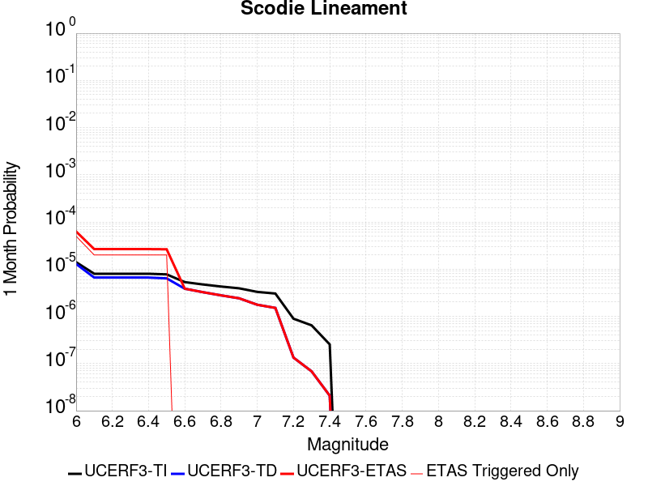 | 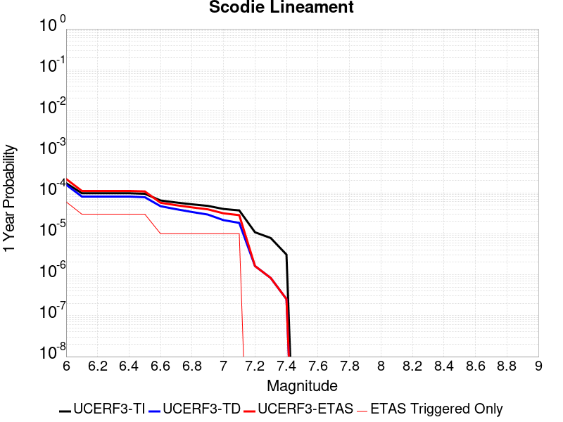 |  |

| Magnitude | 1 wk TI Prob | 1 wk TD Prob | 1 wk ETAS Prob | 1 wk ETAS/TD Gain | 1 wk ETAS Triggered Only | 1 mo TI Prob | 1 mo TD Prob | 1 mo ETAS Prob | 1 mo ETAS/TD Gain | 1 mo ETAS Triggered Only | 1 yr TI Prob | 1 yr TD Prob | 1 yr ETAS Prob | 1 yr ETAS/TD Gain | 1 yr ETAS Triggered Only | 10 yr TI Prob | 10 yr TD Prob | 10 yr ETAS Prob | 10 yr ETAS/TD Gain | 10 yr ETAS Triggered Only |
|-----|-----|-----|-----|-----|-----|-----|-----|-----|-----|-----|-----|-----|-----|-----|-----|-----|-----|-----|-----|-----|
| 6.0 | 3.2919327E-6 | 3.0133435E-6 | 2.3013283E-5 | 7.637126 | 2.0E-5 | 1.4108206E-5 | 1.2914283E-5 | 6.2913634E-5 | 4.871632 | 5.0E-5 | 1.7175387E-4 | 1.5722323E-4 | 2.1721379E-4 | 1.381563 | 6.0E-5 | 0.0017162118 | 0.0015714315 | 0.0016812587 | 1.0698899 | 1.1E-4 |
| 6.1 | 1.8663811E-6 | 1.5490467E-6 | 1.1549031E-5 | 7.4555736 | 1.0E-5 | 7.998751E-6 | 6.6387574E-6 | 2.6638625E-5 | 4.012592 | 2.0E-5 | 9.738045E-5 | 8.082437E-5 | 1.10821944E-4 | 1.3711451 | 3.0E-5 | 9.7337784E-4 | 8.079986E-4 | 8.5795816E-4 | 1.0618314 | 5.0E-5 |
| 6.2 | 1.8663811E-6 | 1.5490467E-6 | 1.1549031E-5 | 7.4555736 | 1.0E-5 | 7.998751E-6 | 6.6387574E-6 | 2.6638625E-5 | 4.012592 | 2.0E-5 | 9.738045E-5 | 8.082437E-5 | 1.10821944E-4 | 1.3711451 | 3.0E-5 | 9.7337784E-4 | 8.079986E-4 | 8.5795816E-4 | 1.0618314 | 5.0E-5 |
| 6.3 | 1.8663811E-6 | 1.5490467E-6 | 1.1549031E-5 | 7.4555736 | 1.0E-5 | 7.998751E-6 | 6.6387574E-6 | 2.6638625E-5 | 4.012592 | 2.0E-5 | 9.738045E-5 | 8.082437E-5 | 1.10821944E-4 | 1.3711451 | 3.0E-5 | 9.7337784E-4 | 8.079986E-4 | 8.5795816E-4 | 1.0618314 | 5.0E-5 |
| 6.4 | 1.8663811E-6 | 1.5490467E-6 | 1.1549031E-5 | 7.4555736 | 1.0E-5 | 7.998751E-6 | 6.6387574E-6 | 2.6638625E-5 | 4.012592 | 2.0E-5 | 9.738045E-5 | 8.082437E-5 | 1.10821944E-4 | 1.3711451 | 3.0E-5 | 9.7337784E-4 | 8.079986E-4 | 8.5795816E-4 | 1.0618314 | 5.0E-5 |
| 6.5 | 1.8106311E-6 | 1.4909804E-6 | 1.1490965E-5 | 7.7069864 | 1.0E-5 | 7.759824E-6 | 6.3899033E-6 | 2.6389775E-5 | 4.1299176 | 2.0E-5 | 9.447177E-5 | 7.779479E-5 | 1.0779245E-4 | 1.3856 | 3.0E-5 | 9.4431615E-4 | 7.7772426E-4 | 8.2768535E-4 | 1.0642401 | 5.0E-5 |
| 6.6 | 1.2414679E-6 | 8.997497E-7 | 8.997497E-7 | 1.0 | 0.0 | 5.320566E-6 | 3.8560647E-6 | 3.8560647E-6 | 1.0 | 0.0 | 6.477596E-5 | 4.6946665E-5 | 5.6946195E-5 | 1.2129977 | 1.0E-5 | 6.475708E-4 | 4.6937613E-4 | 4.8936676E-4 | 1.0425898 | 2.0E-5 |
| 6.7 | 1.1062215E-6 | 7.5942444E-7 | 7.5942444E-7 | 1.0 | 0.0 | 4.7409408E-6 | 3.2546725E-6 | 3.2546725E-6 | 1.0 | 0.0 | 5.7719422E-5 | 3.962499E-5 | 4.9624592E-5 | 1.252356 | 1.0E-5 | 5.770443E-4 | 3.961862E-4 | 4.1617829E-4 | 1.0504613 | 2.0E-5 |
| 6.8 | 1.0006736E-6 | 6.500325E-7 | 6.500325E-7 | 1.0 | 0.0 | 4.288594E-6 | 2.7858512E-6 | 2.7858512E-6 | 1.0 | 0.0 | 5.221238E-5 | 3.3917273E-5 | 4.391693E-5 | 1.2948251 | 1.0E-5 | 5.220012E-4 | 3.3912703E-4 | 3.4912364E-4 | 1.0294775 | 1.0E-5 |
| 6.9 | 9.167364E-7 | 5.63155E-7 | 5.63155E-7 | 1.0 | 0.0 | 3.9288643E-6 | 2.4135195E-6 | 2.4135195E-6 | 1.0 | 0.0 | 4.7832873E-5 | 2.9384262E-5 | 3.938397E-5 | 1.3403082 | 1.0E-5 | 4.782258E-4 | 2.9380945E-4 | 3.038065E-4 | 1.0340257 | 1.0E-5 |
| 7.0 | 7.6987664E-7 | 4.1133026E-7 | 4.1133026E-7 | 1.0 | 0.0 | 3.2994672E-6 | 1.762843E-6 | 1.762843E-6 | 1.0 | 0.0 | 4.0170275E-5 | 2.1462442E-5 | 3.1462227E-5 | 1.4659202 | 1.0E-5 | 4.0163012E-4 | 2.1460754E-4 | 2.2460539E-4 | 1.0465866 | 1.0E-5 |
| 7.1 | 7.1038727E-7 | 3.521066E-7 | 3.521066E-7 | 1.0 | 0.0 | 3.0445133E-6 | 1.5090276E-6 | 1.5090276E-6 | 1.0 | 0.0 | 3.706632E-5 | 1.8372291E-5 | 2.837211E-5 | 1.5442879 | 1.0E-5 | 3.7060137E-4 | 1.8371122E-4 | 1.9370939E-4 | 1.0544232 | 1.0E-5 |
| 7.2 | 2.0799602E-7 | 3.1178946E-8 | 3.1178946E-8 | 1.0 | 0.0 | 8.914113E-7 | 1.3362404E-7 | 1.3362404E-7 | 1.0 | 0.0 | 1.0852878E-5 | 1.6268715E-6 | 1.6268715E-6 | 1.0 | 0.0 | 1.08523476E-4 | 1.6268603E-5 | 1.6268603E-5 | 1.0 | 0.0 |
| 7.3 | 1.5048182E-7 | 1.5939344E-8 | 1.5939344E-8 | 1.0 | 0.0 | 6.449219E-7 | 6.831147E-8 | 6.831147E-8 | 1.0 | 0.0 | 7.851896E-6 | 8.316919E-7 | 8.316919E-7 | 1.0 | 0.0 | 7.851618E-5 | 8.316891E-6 | 8.316891E-6 | 1.0 | 0.0 |
| 7.4 | 5.9334678E-8 | 4.8638475E-9 | 4.8638475E-9 | 1.0 | 0.0 | 2.5429145E-7 | 2.084506E-8 | 2.084506E-8 | 1.0 | 0.0 | 3.095994E-6 | 2.5378858E-7 | 2.5378858E-7 | 1.0 | 0.0 | 3.095951E-5 | 2.5378843E-6 | 2.5378843E-6 | 1.0 | 0.0 |

## Independence rev 2011
*[(top)](#table-of-contents)*

| 1 Week | 1 Month | 1 Year | 10 Year |
|-----|-----|-----|-----|
|  |  | 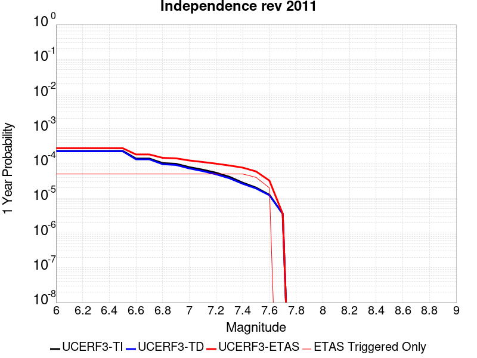 |  |

| Magnitude | 1 wk TI Prob | 1 wk TD Prob | 1 wk ETAS Prob | 1 wk ETAS/TD Gain | 1 wk ETAS Triggered Only | 1 mo TI Prob | 1 mo TD Prob | 1 mo ETAS Prob | 1 mo ETAS/TD Gain | 1 mo ETAS Triggered Only | 1 yr TI Prob | 1 yr TD Prob | 1 yr ETAS Prob | 1 yr ETAS/TD Gain | 1 yr ETAS Triggered Only | 10 yr TI Prob | 10 yr TD Prob | 10 yr ETAS Prob | 10 yr ETAS/TD Gain | 10 yr ETAS Triggered Only |
|-----|-----|-----|-----|-----|-----|-----|-----|-----|-----|-----|-----|-----|-----|-----|-----|-----|-----|-----|-----|-----|
| 6.0 | 4.422171E-6 | 4.326241E-6 | 4.326241E-6 | 1.0 | 0.0 | 1.8952025E-5 | 1.8540919E-5 | 3.8540547E-5 | 2.0786753 | 2.0E-5 | 2.3071647E-4 | 2.257153E-4 | 2.75704E-4 | 1.221468 | 5.0E-5 | 0.0023047708 | 0.002255154 | 0.0023549285 | 1.0442429 | 1.0E-4 |
| 6.1 | 4.422171E-6 | 4.326241E-6 | 4.326241E-6 | 1.0 | 0.0 | 1.8952025E-5 | 1.8540919E-5 | 3.8540547E-5 | 2.0786753 | 2.0E-5 | 2.3071647E-4 | 2.257153E-4 | 2.75704E-4 | 1.221468 | 5.0E-5 | 0.0023047708 | 0.002255154 | 0.0023549285 | 1.0442429 | 1.0E-4 |
| 6.2 | 4.422171E-6 | 4.326241E-6 | 4.326241E-6 | 1.0 | 0.0 | 1.8952025E-5 | 1.8540919E-5 | 3.8540547E-5 | 2.0786753 | 2.0E-5 | 2.3071647E-4 | 2.257153E-4 | 2.75704E-4 | 1.221468 | 5.0E-5 | 0.0023047708 | 0.002255154 | 0.0023549285 | 1.0442429 | 1.0E-4 |
| 6.3 | 4.422171E-6 | 4.326241E-6 | 4.326241E-6 | 1.0 | 0.0 | 1.8952025E-5 | 1.8540919E-5 | 3.8540547E-5 | 2.0786753 | 2.0E-5 | 2.3071647E-4 | 2.257153E-4 | 2.75704E-4 | 1.221468 | 5.0E-5 | 0.0023047708 | 0.002255154 | 0.0023549285 | 1.0442429 | 1.0E-4 |
| 6.4 | 4.422171E-6 | 4.326241E-6 | 4.326241E-6 | 1.0 | 0.0 | 1.8952025E-5 | 1.8540919E-5 | 3.8540547E-5 | 2.0786753 | 2.0E-5 | 2.3071647E-4 | 2.257153E-4 | 2.75704E-4 | 1.221468 | 5.0E-5 | 0.0023047708 | 0.002255154 | 0.0023549285 | 1.0442429 | 1.0E-4 |
| 6.5 | 4.422171E-6 | 4.326241E-6 | 4.326241E-6 | 1.0 | 0.0 | 1.8952025E-5 | 1.8540919E-5 | 3.8540547E-5 | 2.0786753 | 2.0E-5 | 2.3071647E-4 | 2.257153E-4 | 2.75704E-4 | 1.221468 | 5.0E-5 | 0.0023047708 | 0.002255154 | 0.0023549285 | 1.0442429 | 1.0E-4 |
| 6.6 | 2.663744E-6 | 2.5319964E-6 | 2.5319964E-6 | 1.0 | 0.0 | 1.1415996E-5 | 1.08513705E-5 | 3.0851155E-5 | 2.8430653 | 2.0E-5 | 1.3898089E-4 | 1.3210792E-4 | 1.8210131E-4 | 1.3784285 | 5.0E-5 | 0.0013889399 | 0.0013203421 | 0.0014102232 | 1.0680741 | 9.0E-5 |
| 6.7 | 2.663744E-6 | 2.5319964E-6 | 2.5319964E-6 | 1.0 | 0.0 | 1.1415996E-5 | 1.08513705E-5 | 3.0851155E-5 | 2.8430653 | 2.0E-5 | 1.3898089E-4 | 1.3210792E-4 | 1.8210131E-4 | 1.3784285 | 5.0E-5 | 0.0013889399 | 0.0013203421 | 0.0014102232 | 1.0680741 | 9.0E-5 |
| 6.8 | 1.9716529E-6 | 1.8322669E-6 | 1.8322669E-6 | 1.0 | 0.0 | 8.449913E-6 | 7.852549E-6 | 2.7852393E-5 | 3.5469236 | 2.0E-5 | 1.0287284E-4 | 9.560073E-5 | 1.4559594E-4 | 1.5229586 | 5.0E-5 | 0.0010282523 | 9.556089E-4 | 0.0010455229 | 1.0940908 | 9.0E-5 |
| 6.9 | 1.8788617E-6 | 1.7430074E-6 | 1.7430074E-6 | 1.0 | 0.0 | 8.0522395E-6 | 7.470011E-6 | 2.7469861E-5 | 3.6773522 | 2.0E-5 | 9.80316E-5 | 9.094371E-5 | 1.4093917E-4 | 1.5497407 | 5.0E-5 | 9.798837E-4 | 9.0907695E-4 | 9.890043E-4 | 1.0879214 | 8.0E-5 |
| 7.0 | 1.5045488E-6 | 1.3849578E-6 | 1.3849578E-6 | 1.0 | 0.0 | 6.44805E-6 | 5.93552E-6 | 2.5935402E-5 | 4.3695245 | 2.0E-5 | 7.8502184E-5 | 7.2262614E-5 | 1.22259E-4 | 1.6918707 | 5.0E-5 | 7.8474457E-4 | 7.223963E-4 | 8.0233853E-4 | 1.1106626 | 8.0E-5 |
| 7.1 | 1.272341E-6 | 1.1625162E-6 | 1.1625162E-6 | 1.0 | 0.0 | 5.4528787E-6 | 4.9822033E-6 | 2.4982104E-5 | 5.0142684 | 2.0E-5 | 6.6386776E-5 | 6.065667E-5 | 1.1065364E-4 | 1.8242617 | 5.0E-5 | 6.636695E-4 | 6.064043E-4 | 6.863558E-4 | 1.1318452 | 8.0E-5 |
| 7.2 | 1.0416892E-6 | 9.409933E-7 | 9.409933E-7 | 1.0 | 0.0 | 4.464375E-6 | 4.0328223E-6 | 2.403274E-5 | 5.959286 | 2.0E-5 | 5.4352407E-5 | 4.9098522E-5 | 9.909607E-5 | 2.0183105 | 5.0E-5 | 5.4339116E-4 | 4.908786E-4 | 5.7083933E-4 | 1.162893 | 8.0E-5 |
| 7.3 | 7.9450155E-7 | 7.2350525E-7 | 7.2350525E-7 | 1.0 | 0.0 | 3.4050022E-6 | 3.1007332E-6 | 2.310067E-5 | 7.4500675 | 2.0E-5 | 4.1455114E-5 | 3.7750782E-5 | 8.774889E-5 | 2.3244257 | 5.0E-5 | 4.144738E-4 | 3.774448E-4 | 4.5741463E-4 | 1.2118715 | 8.0E-5 |
| 7.4 | 5.3893444E-7 | 5.019546E-7 | 5.019546E-7 | 1.0 | 0.0 | 2.309717E-6 | 2.1512321E-6 | 2.215119E-5 | 10.296977 | 2.0E-5 | 2.8120441E-5 | 2.6190943E-5 | 7.618963E-5 | 2.909007 | 5.0E-5 | 2.8116882E-4 | 2.61879E-4 | 3.4185805E-4 | 1.3054045 | 8.0E-5 |
| 7.5 | 3.8852085E-7 | 3.6825807E-7 | 3.6825807E-7 | 1.0 | 0.0 | 1.6650882E-6 | 1.578248E-6 | 2.1578217E-5 | 13.67226 | 2.0E-5 | 2.027226E-5 | 1.9215002E-5 | 5.921423E-5 | 3.081667 | 4.0E-5 | 2.0270412E-4 | 1.9213361E-4 | 2.521221E-4 | 1.3122227 | 6.0E-5 |
| 7.6 | 2.414929E-7 | 2.3457716E-7 | 2.3457716E-7 | 1.0 | 0.0 | 1.0349692E-6 | 1.0053303E-6 | 1.1005321E-5 | 10.94697 | 1.0E-5 | 1.2600677E-5 | 1.2239829E-5 | 3.2239583E-5 | 2.6339898 | 2.0E-5 | 1.2599962E-4 | 1.2239166E-4 | 1.5238799E-4 | 1.2450848 | 3.0E-5 |
| 7.7 | 6.8298014E-8 | 6.858994E-8 | 6.858994E-8 | 1.0 | 0.0 | 2.9270575E-7 | 2.9395687E-7 | 2.9395687E-7 | 1.0 | 0.0 | 3.5636867E-6 | 3.5789194E-6 | 3.5789194E-6 | 1.0 | 0.0 | 3.5636294E-5 | 3.5788667E-5 | 3.5788667E-5 | 1.0 | 0.0 |

## San Jacinto (Anza) rev
*[(top)](#table-of-contents)*

| 1 Week | 1 Month | 1 Year | 10 Year |
|-----|-----|-----|-----|
|  | 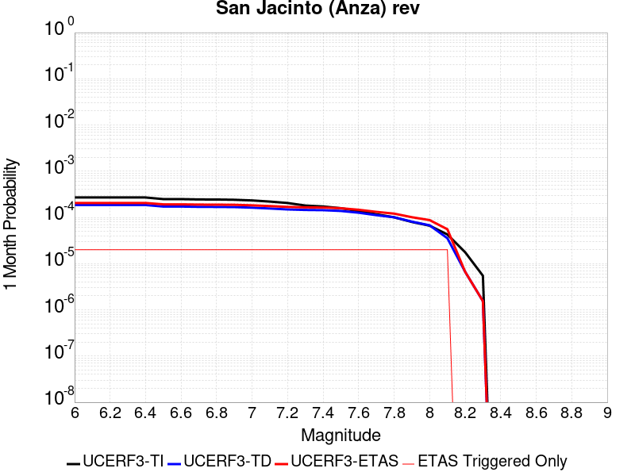 | 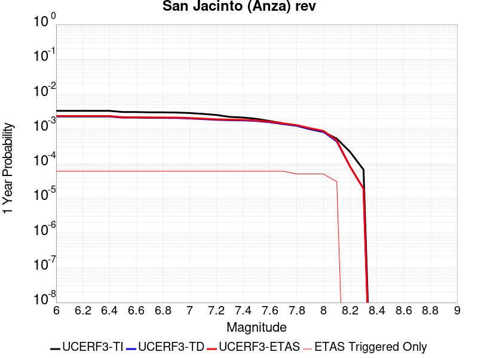 |  |

| Magnitude | 1 wk TI Prob | 1 wk TD Prob | 1 wk ETAS Prob | 1 wk ETAS/TD Gain | 1 wk ETAS Triggered Only | 1 mo TI Prob | 1 mo TD Prob | 1 mo ETAS Prob | 1 mo ETAS/TD Gain | 1 mo ETAS Triggered Only | 1 yr TI Prob | 1 yr TD Prob | 1 yr ETAS Prob | 1 yr ETAS/TD Gain | 1 yr ETAS Triggered Only | 10 yr TI Prob | 10 yr TD Prob | 10 yr ETAS Prob | 10 yr ETAS/TD Gain | 10 yr ETAS Triggered Only |
|-----|-----|-----|-----|-----|-----|-----|-----|-----|-----|-----|-----|-----|-----|-----|-----|-----|-----|-----|-----|-----|
| 6.0 | 6.3015636E-5 | 4.3310072E-5 | 5.330964E-5 | 1.2308831 | 1.0E-5 | 2.7003905E-4 | 1.8560146E-4 | 2.0559774E-4 | 1.1077378 | 2.0E-5 | 0.0032827691 | 0.0022573678 | 0.0023172323 | 1.0265197 | 6.0E-5 | 0.032346968 | 0.023306562 | 0.023404231 | 1.0041907 | 1.0E-4 |
| 6.1 | 6.3015636E-5 | 4.3310072E-5 | 5.330964E-5 | 1.2308831 | 1.0E-5 | 2.7003905E-4 | 1.8560146E-4 | 2.0559774E-4 | 1.1077378 | 2.0E-5 | 0.0032827691 | 0.0022573678 | 0.0023172323 | 1.0265197 | 6.0E-5 | 0.032346968 | 0.023306562 | 0.023404231 | 1.0041907 | 1.0E-4 |
| 6.2 | 6.3015636E-5 | 4.3310072E-5 | 5.330964E-5 | 1.2308831 | 1.0E-5 | 2.7003905E-4 | 1.8560146E-4 | 2.0559774E-4 | 1.1077378 | 2.0E-5 | 0.0032827691 | 0.0022573678 | 0.0023172323 | 1.0265197 | 6.0E-5 | 0.032346968 | 0.023306562 | 0.023404231 | 1.0041907 | 1.0E-4 |
| 6.3 | 6.3015636E-5 | 4.3310072E-5 | 5.330964E-5 | 1.2308831 | 1.0E-5 | 2.7003905E-4 | 1.8560146E-4 | 2.0559774E-4 | 1.1077378 | 2.0E-5 | 0.0032827691 | 0.0022573678 | 0.0023172323 | 1.0265197 | 6.0E-5 | 0.032346968 | 0.023306562 | 0.023404231 | 1.0041907 | 1.0E-4 |
| 6.4 | 6.3015636E-5 | 4.3310072E-5 | 5.330964E-5 | 1.2308831 | 1.0E-5 | 2.7003905E-4 | 1.8560146E-4 | 2.0559774E-4 | 1.1077378 | 2.0E-5 | 0.0032827691 | 0.0022573678 | 0.0023172323 | 1.0265197 | 6.0E-5 | 0.032346968 | 0.023306562 | 0.023404231 | 1.0041907 | 1.0E-4 |
| 6.5 | 5.811017E-5 | 4.009201E-5 | 5.009161E-5 | 1.2494162 | 1.0E-5 | 2.4901982E-4 | 1.7181161E-4 | 1.9180818E-4 | 1.1163865 | 2.0E-5 | 0.0030276014 | 0.0020898052 | 0.00214968 | 1.0286508 | 6.0E-5 | 0.02986684 | 0.021603808 | 0.021701647 | 1.0045288 | 1.0E-4 |
| 6.6 | 5.811017E-5 | 4.009201E-5 | 5.009161E-5 | 1.2494162 | 1.0E-5 | 2.4901982E-4 | 1.7181161E-4 | 1.9180818E-4 | 1.1163865 | 2.0E-5 | 0.0030276014 | 0.0020898052 | 0.00214968 | 1.0286508 | 6.0E-5 | 0.02986684 | 0.021603808 | 0.021701647 | 1.0045288 | 1.0E-4 |
| 6.7 | 5.712442E-5 | 3.9514736E-5 | 4.9514343E-5 | 1.2530601 | 1.0E-5 | 2.4479596E-4 | 1.6933792E-4 | 1.8933452E-4 | 1.118087 | 2.0E-5 | 0.0029763177 | 0.0020597451 | 0.0021196215 | 1.0290698 | 6.0E-5 | 0.029367693 | 0.021295859 | 0.021393728 | 1.0045958 | 1.0E-4 |
| 6.8 | 5.6967532E-5 | 3.937102E-5 | 4.937063E-5 | 1.2539839 | 1.0E-5 | 2.4412372E-4 | 1.6872208E-4 | 1.887187E-4 | 1.1185181 | 2.0E-5 | 0.0029681553 | 0.0020522615 | 0.0021121383 | 1.029176 | 6.0E-5 | 0.029288229 | 0.02122146 | 0.021319339 | 1.0046122 | 1.0E-4 |
| 6.9 | 5.6211324E-5 | 3.9075938E-5 | 4.9075545E-5 | 1.2559019 | 1.0E-5 | 2.4088343E-4 | 1.6745758E-4 | 1.8745424E-4 | 1.1194133 | 2.0E-5 | 0.0029288116 | 0.0020368951 | 0.002096773 | 1.0293967 | 6.0E-5 | 0.028905109 | 0.021059772 | 0.021157665 | 1.0046484 | 1.0E-4 |
| 7.0 | 5.4383527E-5 | 3.7936687E-5 | 4.7936308E-5 | 1.2635871 | 1.0E-5 | 2.3305144E-4 | 1.625757E-4 | 1.8257245E-4 | 1.1229997 | 2.0E-5 | 0.0028337094 | 0.001977567 | 0.0020374483 | 1.0302804 | 6.0E-5 | 0.027978465 | 0.02045327 | 0.020551225 | 1.0047892 | 1.0E-4 |
| 7.1 | 5.1393665E-5 | 3.6399546E-5 | 4.6399182E-5 | 1.2747188 | 1.0E-5 | 2.2023996E-4 | 1.5598875E-4 | 1.7598562E-4 | 1.1281943 | 2.0E-5 | 0.0026781242 | 0.0018975128 | 0.001957399 | 1.0315603 | 6.0E-5 | 0.026460782 | 0.019624162 | 0.0197222 | 1.0049957 | 1.0E-4 |
| 7.2 | 4.785222E-5 | 3.475045E-5 | 4.4750104E-5 | 1.2877561 | 1.0E-5 | 2.0506482E-4 | 1.4892202E-4 | 1.6891904E-4 | 1.1342784 | 2.0E-5 | 0.0024938055 | 0.0018116212 | 0.0018715126 | 1.0330595 | 6.0E-5 | 0.024660049 | 0.018734343 | 0.01883247 | 1.0052378 | 1.0E-4 |
| 7.3 | 4.2143256E-5 | 3.3845947E-5 | 4.3845608E-5 | 1.2954464 | 1.0E-5 | 1.8060145E-4 | 1.4504601E-4 | 1.6504311E-4 | 1.1378673 | 2.0E-5 | 0.002196605 | 0.0017645082 | 0.0018244023 | 1.0339438 | 6.0E-5 | 0.02175019 | 0.018242238 | 0.018340414 | 1.0053818 | 1.0E-4 |
| 7.4 | 4.0264713E-5 | 3.3484113E-5 | 4.348378E-5 | 1.298639 | 1.0E-5 | 1.7255165E-4 | 1.4349548E-4 | 1.634926E-4 | 1.1393572 | 2.0E-5 | 0.002098792 | 0.0017456608 | 0.001805556 | 1.0343109 | 6.0E-5 | 0.020790804 | 0.018046875 | 0.01814507 | 1.0054411 | 1.0E-4 |
| 7.5 | 3.694492E-5 | 3.2198066E-5 | 4.2197742E-5 | 1.3105676 | 1.0E-5 | 1.5832575E-4 | 1.3798443E-4 | 1.5798166E-4 | 1.1449239 | 2.0E-5 | 0.0019259118 | 0.0016786689 | 0.0017385682 | 1.0356826 | 6.0E-5 | 0.01909306 | 0.017363422 | 0.017461685 | 1.0056592 | 1.0E-4 |
| 7.6 | 3.200565E-5 | 2.9513538E-5 | 3.951324E-5 | 1.3388176 | 1.0E-5 | 1.3715986E-4 | 1.2648047E-4 | 1.4647793E-4 | 1.1581072 | 2.0E-5 | 0.001668642 | 0.0015388142 | 0.0015987218 | 1.038931 | 6.0E-5 | 0.01656168 | 0.015951335 | 0.01604974 | 1.0061691 | 1.0E-4 |
| 7.7 | 2.731642E-5 | 2.6102009E-5 | 3.610175E-5 | 1.3831023 | 1.0E-5 | 1.1706512E-4 | 1.1186096E-4 | 1.3185872E-4 | 1.1787734 | 2.0E-5 | 0.001424336 | 0.0013610573 | 0.0014209757 | 1.0440234 | 6.0E-5 | 0.014152412 | 0.014172027 | 0.014270609 | 1.0069561 | 1.0E-4 |
| 7.8 | 2.3466424E-5 | 2.3513761E-5 | 3.3513526E-5 | 1.4252728 | 1.0E-5 | 1.0056651E-4 | 1.0076937E-4 | 1.20767356E-4 | 1.198453 | 2.0E-5 | 0.0012237094 | 0.0012261774 | 0.0012761161 | 1.0407271 | 5.0E-5 | 0.012169928 | 0.012813726 | 0.012902574 | 1.0069337 | 9.0E-5 |
| 7.9 | 1.8611925E-5 | 1.8916087E-5 | 2.8915898E-5 | 1.5286405 | 1.0E-5 | 7.9762955E-5 | 8.106643E-5 | 1.0106481E-4 | 1.2466912 | 2.0E-5 | 9.7068126E-4 | 9.865377E-4 | 0.0010364883 | 1.0506324 | 5.0E-5 | 0.0096645225 | 0.010398199 | 0.010477367 | 1.0076137 | 8.0E-5 |
| 8.0 | 1.5460775E-5 | 1.5747968E-5 | 2.5747811E-5 | 1.6349926 | 1.0E-5 | 6.6258784E-5 | 6.748955E-5 | 8.74882E-5 | 1.2963222 | 2.0E-5 | 8.0640207E-4 | 8.2137616E-4 | 8.713351E-4 | 1.0608234 | 5.0E-5 | 0.008034821 | 0.008706689 | 0.00877608 | 1.0079697 | 7.0E-5 |
| 8.1 | 9.983884E-6 | 8.273639E-6 | 1.8273557E-5 | 2.208648 | 1.0E-5 | 4.2787375E-5 | 3.545797E-5 | 5.5457265E-5 | 1.564028 | 2.0E-5 | 5.2081177E-4 | 4.3161583E-4 | 4.6160287E-4 | 1.0694762 | 3.0E-5 | 0.0051959283 | 0.0046421313 | 0.0046819453 | 1.0085768 | 4.0E-5 |
| 8.2 | 4.1226E-6 | 1.5536657E-6 | 1.5536657E-6 | 1.0 | 0.0 | 1.7668166E-5 | 6.6585503E-6 | 6.6585503E-6 | 1.0 | 0.0 | 2.1508869E-4 | 8.106486E-5 | 8.106486E-5 | 1.0 | 0.0 | 0.0021488064 | 9.408984E-4 | 9.408984E-4 | 1.0 | 0.0 |
| 8.3 | 1.2750878E-6 | 3.6135864E-7 | 3.6135864E-7 | 1.0 | 0.0 | 5.4646503E-6 | 1.548679E-6 | 1.548679E-6 | 1.0 | 0.0 | 6.653009E-5 | 1.885501E-5 | 1.885501E-5 | 1.0 | 0.0 | 6.6510175E-4 | 2.2744077E-4 | 2.2744077E-4 | 1.0 | 0.0 |

## Kern Canyon (North Kern) 2011
*[(top)](#table-of-contents)*

| 1 Week | 1 Month | 1 Year | 10 Year |
|-----|-----|-----|-----|
|  |  |  |  |

| Magnitude | 1 wk TI Prob | 1 wk TD Prob | 1 wk ETAS Prob | 1 wk ETAS/TD Gain | 1 wk ETAS Triggered Only | 1 mo TI Prob | 1 mo TD Prob | 1 mo ETAS Prob | 1 mo ETAS/TD Gain | 1 mo ETAS Triggered Only | 1 yr TI Prob | 1 yr TD Prob | 1 yr ETAS Prob | 1 yr ETAS/TD Gain | 1 yr ETAS Triggered Only | 10 yr TI Prob | 10 yr TD Prob | 10 yr ETAS Prob | 10 yr ETAS/TD Gain | 10 yr ETAS Triggered Only |
|-----|-----|-----|-----|-----|-----|-----|-----|-----|-----|-----|-----|-----|-----|-----|-----|-----|-----|-----|-----|-----|
| 6.0 | 6.6264497E-6 | 6.7573483E-6 | 2.6757212E-5 | 3.9597208 | 2.0E-5 | 2.8398761E-5 | 2.8959788E-5 | 6.895863E-5 | 2.3811855 | 4.0E-5 | 3.4570007E-4 | 3.525364E-4 | 4.1251522E-4 | 1.1701353 | 6.0E-5 | 0.0034516277 | 0.0035205598 | 0.0036202075 | 1.0283046 | 1.0E-4 |
| 6.1 | 6.6264497E-6 | 6.7573483E-6 | 2.6757212E-5 | 3.9597208 | 2.0E-5 | 2.8398761E-5 | 2.8959788E-5 | 6.895863E-5 | 2.3811855 | 4.0E-5 | 3.4570007E-4 | 3.525364E-4 | 4.1251522E-4 | 1.1701353 | 6.0E-5 | 0.0034516277 | 0.0035205598 | 0.0036202075 | 1.0283046 | 1.0E-4 |
| 6.2 | 6.6264497E-6 | 6.7573483E-6 | 2.6757212E-5 | 3.9597208 | 2.0E-5 | 2.8398761E-5 | 2.8959788E-5 | 6.895863E-5 | 2.3811855 | 4.0E-5 | 3.4570007E-4 | 3.525364E-4 | 4.1251522E-4 | 1.1701353 | 6.0E-5 | 0.0034516277 | 0.0035205598 | 0.0036202075 | 1.0283046 | 1.0E-4 |
| 6.3 | 6.6264497E-6 | 6.7573483E-6 | 2.6757212E-5 | 3.9597208 | 2.0E-5 | 2.8398761E-5 | 2.8959788E-5 | 6.895863E-5 | 2.3811855 | 4.0E-5 | 3.4570007E-4 | 3.525364E-4 | 4.1251522E-4 | 1.1701353 | 6.0E-5 | 0.0034516277 | 0.0035205598 | 0.0036202075 | 1.0283046 | 1.0E-4 |
| 6.4 | 6.6264497E-6 | 6.7573483E-6 | 2.6757212E-5 | 3.9597208 | 2.0E-5 | 2.8398761E-5 | 2.8959788E-5 | 6.895863E-5 | 2.3811855 | 4.0E-5 | 3.4570007E-4 | 3.525364E-4 | 4.1251522E-4 | 1.1701353 | 6.0E-5 | 0.0034516277 | 0.0035205598 | 0.0036202075 | 1.0283046 | 1.0E-4 |
| 6.5 | 3.2162225E-6 | 3.2570993E-6 | 3.2570993E-6 | 1.0 | 0.0 | 1.3783738E-5 | 1.39589265E-5 | 3.3958648E-5 | 2.432755 | 2.0E-5 | 1.6780409E-4 | 1.6993748E-4 | 1.8993409E-4 | 1.1176703 | 2.0E-5 | 0.0016767744 | 0.0016981551 | 0.0017480701 | 1.0293937 | 5.0E-5 |
| 6.6 | 3.2162225E-6 | 3.2570993E-6 | 3.2570993E-6 | 1.0 | 0.0 | 1.3783738E-5 | 1.39589265E-5 | 3.3958648E-5 | 2.432755 | 2.0E-5 | 1.6780409E-4 | 1.6993748E-4 | 1.8993409E-4 | 1.1176703 | 2.0E-5 | 0.0016767744 | 0.0016981551 | 0.0017480701 | 1.0293937 | 5.0E-5 |
| 6.7 | 2.1908265E-6 | 2.2071272E-6 | 2.2071272E-6 | 1.0 | 0.0 | 9.389223E-6 | 9.459083E-6 | 2.9458894E-5 | 3.1143498 | 2.0E-5 | 1.1430779E-4 | 1.1515845E-4 | 1.3515615E-4 | 1.1736537 | 2.0E-5 | 0.0011424901 | 0.0011510071 | 0.0011909611 | 1.0347122 | 4.0E-5 |
| 6.8 | 1.7303895E-6 | 1.7365568E-6 | 1.7365568E-6 | 1.0 | 0.0 | 7.415934E-6 | 7.4423656E-6 | 1.7442291E-5 | 2.343649 | 1.0E-5 | 9.028525E-5 | 9.060713E-5 | 1.0060622E-4 | 1.1103566 | 1.0E-5 | 9.024858E-4 | 9.057116E-4 | 9.356844E-4 | 1.0330931 | 3.0E-5 |
| 6.9 | 1.3700314E-6 | 1.3688652E-6 | 1.3688652E-6 | 1.0 | 0.0 | 5.87155E-6 | 5.866553E-6 | 1.5866493E-5 | 2.7045686 | 1.0E-5 | 7.148377E-5 | 7.142298E-5 | 8.1422266E-5 | 1.1400009 | 1.0E-5 | 7.146078E-4 | 7.1400485E-4 | 7.4398343E-4 | 1.0419865 | 3.0E-5 |
| 7.0 | 1.1467797E-6 | 1.141383E-6 | 1.141383E-6 | 1.0 | 0.0 | 4.9147607E-6 | 4.8916327E-6 | 4.8916327E-6 | 1.0 | 0.0 | 5.983557E-5 | 5.955403E-5 | 5.955403E-5 | 1.0 | 0.0 | 5.981946E-4 | 5.9538387E-4 | 6.153719E-4 | 1.0335717 | 2.0E-5 |
| 7.1 | 9.3952065E-7 | 9.302712E-7 | 9.302712E-7 | 1.0 | 0.0 | 4.026511E-6 | 3.9868705E-6 | 3.9868705E-6 | 1.0 | 0.0 | 4.9021666E-5 | 4.8539085E-5 | 4.8539085E-5 | 1.0 | 0.0 | 4.901085E-4 | 4.852866E-4 | 5.052769E-4 | 1.0411928 | 2.0E-5 |
| 7.2 | 6.858055E-7 | 6.719317E-7 | 6.719317E-7 | 1.0 | 0.0 | 2.939163E-6 | 2.879704E-6 | 2.879704E-6 | 1.0 | 0.0 | 3.5783723E-5 | 3.5059842E-5 | 3.5059842E-5 | 1.0 | 0.0 | 3.5777962E-4 | 3.5054397E-4 | 3.6054046E-4 | 1.0285171 | 1.0E-5 |
| 7.3 | 5.1101983E-7 | 4.939312E-7 | 4.939312E-7 | 1.0 | 0.0 | 2.1900833E-6 | 2.1168464E-6 | 2.1168464E-6 | 1.0 | 0.0 | 2.6663936E-5 | 2.5772304E-5 | 2.5772304E-5 | 1.0 | 0.0 | 2.6660739E-4 | 2.5769364E-4 | 2.5769364E-4 | 1.0 | 0.0 |
| 7.4 | 3.4999414E-7 | 3.2995996E-7 | 3.2995996E-7 | 1.0 | 0.0 | 1.499974E-6 | 1.4141134E-6 | 1.4141134E-6 | 1.0 | 0.0 | 1.8262032E-5 | 1.7216697E-5 | 1.7216697E-5 | 1.0 | 0.0 | 1.826053E-4 | 1.7215387E-4 | 1.7215387E-4 | 1.0 | 0.0 |
| 7.5 | 1.7021522E-7 | 1.4750097E-7 | 1.4750097E-7 | 1.0 | 0.0 | 7.2949354E-7 | 6.3214685E-7 | 6.3214685E-7 | 1.0 | 0.0 | 8.881548E-6 | 7.6963615E-6 | 7.6963615E-6 | 1.0 | 0.0 | 8.8811925E-5 | 7.6961034E-5 | 7.6961034E-5 | 1.0 | 0.0 |
| 7.6 | 2.572245E-8 | 1.7352708E-8 | 1.7352708E-8 | 1.0 | 0.0 | 1.10239064E-7 | 7.436874E-8 | 7.436874E-8 | 1.0 | 0.0 | 1.3421597E-6 | 9.0543915E-7 | 9.0543915E-7 | 1.0 | 0.0 | 1.3421517E-5 | 9.05436E-6 | 9.05436E-6 | 1.0 | 0.0 |

## Rose Canyon
*[(top)](#table-of-contents)*

| 1 Week | 1 Month | 1 Year | 10 Year |
|-----|-----|-----|-----|
|  | 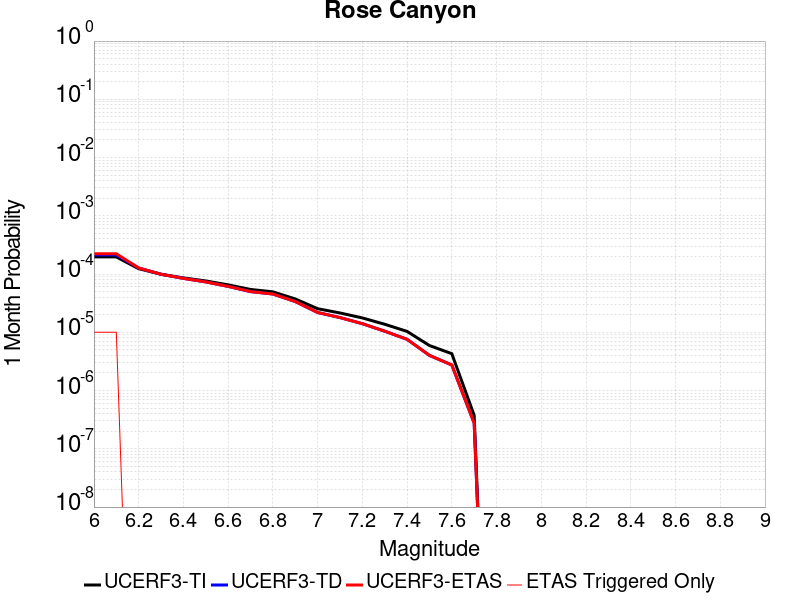 |  | 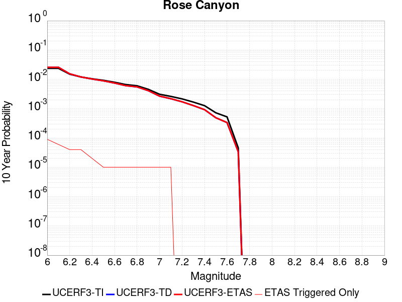 |

| Magnitude | 1 wk TI Prob | 1 wk TD Prob | 1 wk ETAS Prob | 1 wk ETAS/TD Gain | 1 wk ETAS Triggered Only | 1 mo TI Prob | 1 mo TD Prob | 1 mo ETAS Prob | 1 mo ETAS/TD Gain | 1 mo ETAS Triggered Only | 1 yr TI Prob | 1 yr TD Prob | 1 yr ETAS Prob | 1 yr ETAS/TD Gain | 1 yr ETAS Triggered Only | 10 yr TI Prob | 10 yr TD Prob | 10 yr ETAS Prob | 10 yr ETAS/TD Gain | 10 yr ETAS Triggered Only |
|-----|-----|-----|-----|-----|-----|-----|-----|-----|-----|-----|-----|-----|-----|-----|-----|-----|-----|-----|-----|-----|
| 6.0 | 4.5923203E-5 | 4.9717408E-5 | 5.9716913E-5 | 1.2011268 | 1.0E-5 | 1.9679888E-4 | 2.1305852E-4 | 2.2305638E-4 | 1.0469254 | 1.0E-5 | 0.0023933933 | 0.002591092 | 0.0026210144 | 1.0115482 | 3.0E-5 | 0.023677798 | 0.025614744 | 0.02570244 | 1.0034236 | 9.0E-5 |
| 6.1 | 4.5923203E-5 | 4.9717408E-5 | 5.9716913E-5 | 1.2011268 | 1.0E-5 | 1.9679888E-4 | 2.1305852E-4 | 2.2305638E-4 | 1.0469254 | 1.0E-5 | 0.0023933933 | 0.002591092 | 0.0026210144 | 1.0115482 | 3.0E-5 | 0.023677798 | 0.025614744 | 0.025673207 | 1.0022824 | 6.0E-5 |
| 6.2 | 2.8844734E-5 | 2.9670791E-5 | 2.9670791E-5 | 1.0 | 0.0 | 1.2361443E-4 | 1.2715449E-4 | 1.2715449E-4 | 1.0 | 0.0 | 0.0015039665 | 0.0015470338 | 0.0015670029 | 1.012908 | 2.0E-5 | 0.0149382865 | 0.015353918 | 0.015393304 | 1.0025651 | 4.0E-5 |
| 6.3 | 2.3171577E-5 | 2.316338E-5 | 2.316338E-5 | 1.0 | 0.0 | 9.9302975E-5 | 9.926793E-5 | 9.926793E-5 | 1.0 | 0.0 | 0.0012083431 | 0.0012079303 | 0.0012279061 | 1.0165372 | 2.0E-5 | 0.012017938 | 0.012001081 | 0.012040601 | 1.003293 | 4.0E-5 |
| 6.4 | 2.0066604E-5 | 1.9669003E-5 | 1.9669003E-5 | 1.0 | 0.0 | 8.599689E-5 | 8.429307E-5 | 8.429307E-5 | 1.0 | 0.0 | 0.0010465092 | 0.0010257949 | 0.0010357846 | 1.0097386 | 1.0E-5 | 0.010415946 | 0.010200354 | 0.01022015 | 1.0019407 | 2.0E-5 |
| 6.5 | 1.776989E-5 | 1.7115464E-5 | 1.7115464E-5 | 1.0 | 0.0 | 7.615444E-5 | 7.334997E-5 | 7.334997E-5 | 1.0 | 0.0 | 9.267859E-4 | 8.92677E-4 | 9.0266805E-4 | 1.0111922 | 1.0E-5 | 0.009229303 | 0.008876263 | 0.008886174 | 1.0011166 | 1.0E-5 |
| 6.6 | 1.5227364E-5 | 1.4340925E-5 | 1.4340925E-5 | 1.0 | 0.0 | 6.52585E-5 | 6.145969E-5 | 6.145969E-5 | 1.0 | 0.0 | 7.942326E-4 | 7.4802E-4 | 7.580125E-4 | 1.0133586 | 1.0E-5 | 0.007914 | 0.0074421996 | 0.007452125 | 1.0013337 | 1.0E-5 |
| 6.7 | 1.2703898E-5 | 1.1674328E-5 | 1.1674328E-5 | 1.0 | 0.0 | 5.4444143E-5 | 5.00319E-5 | 5.00319E-5 | 1.0 | 0.0 | 6.626558E-4 | 6.0897233E-4 | 6.189663E-4 | 1.0164111 | 1.0E-5 | 0.006606833 | 0.0060633076 | 0.006073247 | 1.0016392 | 1.0E-5 |
| 6.8 | 1.1554917E-5 | 1.0610434E-5 | 1.0610434E-5 | 1.0 | 0.0 | 4.9520135E-5 | 4.547252E-5 | 4.547252E-5 | 1.0 | 0.0 | 6.0274085E-4 | 5.5349135E-4 | 5.634858E-4 | 1.0180571 | 1.0E-5 | 0.0060110865 | 0.0055048293 | 0.0055147745 | 1.0018066 | 1.0E-5 |
| 6.9 | 8.732078E-6 | 7.882331E-6 | 7.882331E-6 | 1.0 | 0.0 | 3.7422655E-5 | 3.3780998E-5 | 3.3780998E-5 | 1.0 | 0.0 | 4.5552556E-4 | 4.1120898E-4 | 4.2120487E-4 | 1.0243086 | 1.0E-5 | 0.0045459294 | 0.004089539 | 0.004099498 | 1.0024352 | 1.0E-5 |
| 7.0 | 5.9337494E-6 | 5.1074735E-6 | 5.1074735E-6 | 1.0 | 0.0 | 2.5430107E-5 | 2.1888989E-5 | 2.1888989E-5 | 1.0 | 0.0 | 3.0956755E-4 | 2.6646597E-4 | 2.764633E-4 | 1.0375183 | 1.0E-5 | 0.0030913667 | 0.0026614803 | 0.0026714539 | 1.0037473 | 1.0E-5 |
| 7.1 | 5.013409E-6 | 4.177368E-6 | 4.177368E-6 | 1.0 | 0.0 | 2.1485863E-5 | 1.7902883E-5 | 1.7902883E-5 | 1.0 | 0.0 | 2.6155898E-4 | 2.1794591E-4 | 2.2794373E-4 | 1.0458729 | 1.0E-5 | 0.0026125133 | 0.0021773332 | 0.0021873114 | 1.0045828 | 1.0E-5 |
| 7.2 | 4.120763E-6 | 3.2821138E-6 | 3.2821138E-6 | 1.0 | 0.0 | 1.7660293E-5 | 1.4066126E-5 | 1.4066126E-5 | 1.0 | 0.0 | 2.1499286E-4 | 1.7124171E-4 | 1.7124171E-4 | 1.0 | 0.0 | 0.0021478499 | 0.0017111072 | 0.0017111072 | 1.0 | 0.0 |
| 7.3 | 3.2081239E-6 | 2.4405113E-6 | 2.4405113E-6 | 1.0 | 0.0 | 1.374903E-5 | 1.0459292E-5 | 1.0459292E-5 | 1.0 | 0.0 | 1.6738157E-4 | 1.2733451E-4 | 1.2733451E-4 | 1.0 | 0.0 | 0.0016725556 | 0.0012726224 | 0.0012726224 | 1.0 | 0.0 |
| 7.4 | 2.4194755E-6 | 1.7680426E-6 | 1.7680426E-6 | 1.0 | 0.0 | 1.0369139E-5 | 7.5773037E-6 | 7.5773037E-6 | 1.0 | 0.0 | 1.2623696E-4 | 9.224982E-5 | 9.224982E-5 | 1.0 | 0.0 | 0.0012616527 | 9.221206E-4 | 9.221206E-4 | 1.0 | 0.0 |
| 7.5 | 1.3842889E-6 | 9.3783683E-7 | 9.3783683E-7 | 1.0 | 0.0 | 5.9326535E-6 | 4.0192945E-6 | 4.0192945E-6 | 1.0 | 0.0 | 7.222766E-5 | 4.893385E-5 | 4.893385E-5 | 1.0 | 0.0 | 7.220419E-4 | 4.892343E-4 | 4.892343E-4 | 1.0 | 0.0 |
| 7.6 | 1.0021575E-6 | 6.4114073E-7 | 6.4114073E-7 | 1.0 | 0.0 | 4.2949537E-6 | 2.7477433E-6 | 2.7477433E-6 | 1.0 | 0.0 | 5.2289808E-5 | 3.345328E-5 | 3.345328E-5 | 1.0 | 0.0 | 5.2277505E-4 | 3.3448462E-4 | 3.3448462E-4 | 1.0 | 0.0 |
| 7.7 | 8.7620116E-8 | 6.449335E-8 | 6.449335E-8 | 1.0 | 0.0 | 3.7551473E-7 | 2.7640004E-7 | 2.7640004E-7 | 1.0 | 0.0 | 4.5718825E-6 | 3.3651656E-6 | 3.3651656E-6 | 1.0 | 0.0 | 4.5717883E-5 | 3.3651177E-5 | 3.3651177E-5 | 1.0 | 0.0 |

## Red Mountain
*[(top)](#table-of-contents)*

| 1 Week | 1 Month | 1 Year | 10 Year |
|-----|-----|-----|-----|
|  | 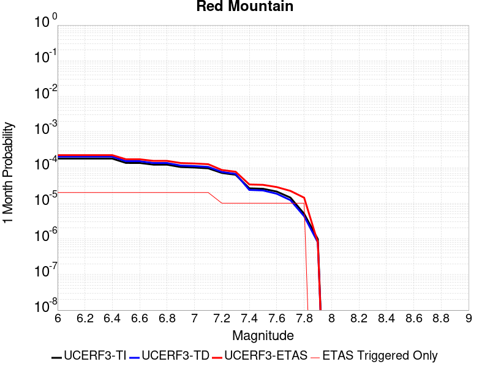 |  |  |

| Magnitude | 1 wk TI Prob | 1 wk TD Prob | 1 wk ETAS Prob | 1 wk ETAS/TD Gain | 1 wk ETAS Triggered Only | 1 mo TI Prob | 1 mo TD Prob | 1 mo ETAS Prob | 1 mo ETAS/TD Gain | 1 mo ETAS Triggered Only | 1 yr TI Prob | 1 yr TD Prob | 1 yr ETAS Prob | 1 yr ETAS/TD Gain | 1 yr ETAS Triggered Only | 10 yr TI Prob | 10 yr TD Prob | 10 yr ETAS Prob | 10 yr ETAS/TD Gain | 10 yr ETAS Triggered Only |
|-----|-----|-----|-----|-----|-----|-----|-----|-----|-----|-----|-----|-----|-----|-----|-----|-----|-----|-----|-----|-----|
| 6.0 | 4.1810763E-5 | 4.7590907E-5 | 5.7590434E-5 | 1.2101141 | 1.0E-5 | 1.7917668E-4 | 2.0394602E-4 | 2.2394194E-4 | 1.0980451 | 2.0E-5 | 0.0021792934 | 0.0024803798 | 0.0025202807 | 1.0160866 | 4.0E-5 | 0.021580452 | 0.024544565 | 0.024622602 | 1.0031794 | 8.0E-5 |
| 6.1 | 4.1810763E-5 | 4.7590907E-5 | 5.7590434E-5 | 1.2101141 | 1.0E-5 | 1.7917668E-4 | 2.0394602E-4 | 2.2394194E-4 | 1.0980451 | 2.0E-5 | 0.0021792934 | 0.0024803798 | 0.0025202807 | 1.0160866 | 4.0E-5 | 0.021580452 | 0.024544565 | 0.024622602 | 1.0031794 | 8.0E-5 |
| 6.2 | 4.1810763E-5 | 4.7590907E-5 | 5.7590434E-5 | 1.2101141 | 1.0E-5 | 1.7917668E-4 | 2.0394602E-4 | 2.2394194E-4 | 1.0980451 | 2.0E-5 | 0.0021792934 | 0.0024803798 | 0.0025202807 | 1.0160866 | 4.0E-5 | 0.021580452 | 0.024544565 | 0.024622602 | 1.0031794 | 8.0E-5 |
| 6.3 | 4.1810763E-5 | 4.7590907E-5 | 5.7590434E-5 | 1.2101141 | 1.0E-5 | 1.7917668E-4 | 2.0394602E-4 | 2.2394194E-4 | 1.0980451 | 2.0E-5 | 0.0021792934 | 0.0024803798 | 0.0025202807 | 1.0160866 | 4.0E-5 | 0.021580452 | 0.024544565 | 0.024622602 | 1.0031794 | 8.0E-5 |
| 6.4 | 4.1810763E-5 | 4.7590907E-5 | 5.7590434E-5 | 1.2101141 | 1.0E-5 | 1.7917668E-4 | 2.0394602E-4 | 2.2394194E-4 | 1.0980451 | 2.0E-5 | 0.0021792934 | 0.0024803798 | 0.0025202807 | 1.0160866 | 4.0E-5 | 0.021580452 | 0.024544565 | 0.024622602 | 1.0031794 | 8.0E-5 |
| 6.5 | 3.154503E-5 | 3.536039E-5 | 4.5360033E-5 | 1.2827923 | 1.0E-5 | 1.3518598E-4 | 1.5153624E-4 | 1.715332E-4 | 1.1319616 | 2.0E-5 | 0.0016446467 | 0.0018434846 | 0.0018834108 | 1.0216581 | 4.0E-5 | 0.01632528 | 0.018291568 | 0.018370105 | 1.0042936 | 8.0E-5 |
| 6.6 | 3.1535834E-5 | 3.534977E-5 | 4.5349418E-5 | 1.2828773 | 1.0E-5 | 1.3514658E-4 | 1.5149073E-4 | 1.7148771E-4 | 1.1320013 | 2.0E-5 | 0.0016441676 | 0.0018429316 | 0.0018828579 | 1.0216645 | 4.0E-5 | 0.01632056 | 0.01828613 | 0.018364666 | 1.0042949 | 8.0E-5 |
| 6.7 | 2.8267326E-5 | 3.1469906E-5 | 4.146959E-5 | 1.3177539 | 1.0E-5 | 1.2114006E-4 | 1.3486453E-4 | 1.5486183E-4 | 1.1482769 | 2.0E-5 | 0.0014738824 | 0.001640824 | 0.0016707748 | 1.0182534 | 3.0E-5 | 0.014641452 | 0.016295854 | 0.016354876 | 1.0036219 | 6.0E-5 |
| 6.8 | 2.8212884E-5 | 3.1407788E-5 | 4.1407475E-5 | 1.3183824 | 1.0E-5 | 1.20906756E-4 | 1.3459835E-4 | 1.5459566E-4 | 1.1485702 | 2.0E-5 | 0.0014710457 | 0.0016375881 | 0.001667539 | 1.0182896 | 3.0E-5 | 0.014613459 | 0.01626397 | 0.016322995 | 1.0036291 | 6.0E-5 |
| 6.9 | 2.4227871E-5 | 2.6707448E-5 | 3.670718E-5 | 1.3744174 | 1.0E-5 | 1.03829596E-4 | 1.144559E-4 | 1.3445361E-4 | 1.1747198 | 2.0E-5 | 0.0012633923 | 0.0013926857 | 0.0014226439 | 1.0215111 | 3.0E-5 | 0.012562336 | 0.013847268 | 0.013896575 | 1.0035608 | 5.0E-5 |
| 7.0 | 2.348524E-5 | 2.5836216E-5 | 3.5835958E-5 | 1.3870436 | 1.0E-5 | 1.0064714E-4 | 1.10722365E-4 | 1.3072015E-4 | 1.180612 | 2.0E-5 | 0.0012246901 | 0.0013472869 | 0.0013772465 | 1.022237 | 3.0E-5 | 0.012179627 | 0.013398823 | 0.013448154 | 1.0036817 | 5.0E-5 |
| 7.1 | 2.2311642E-5 | 2.4463256E-5 | 3.446301E-5 | 1.4087664 | 1.0E-5 | 9.561782E-5 | 1.04838735E-4 | 1.2483663E-4 | 1.1907492 | 2.0E-5 | 0.0011635252 | 0.001275739 | 0.0013057007 | 1.0234858 | 3.0E-5 | 0.01157452 | 0.012691672 | 0.012741037 | 1.0038896 | 5.0E-5 |
| 7.2 | 1.6533986E-5 | 1.767064E-5 | 2.7670463E-5 | 1.5659004 | 1.0E-5 | 7.085802E-5 | 7.572948E-5 | 8.5728716E-5 | 1.132039 | 1.0E-5 | 8.623549E-4 | 9.216798E-4 | 9.316706E-4 | 1.0108397 | 1.0E-5 | 0.008590161 | 0.00918485 | 0.009224484 | 1.004315 | 4.0E-5 |
| 7.3 | 1.4703092E-5 | 1.5559777E-5 | 2.5559622E-5 | 1.6426727 | 1.0E-5 | 6.301173E-5 | 6.66834E-5 | 7.6682736E-5 | 1.1499523 | 1.0E-5 | 7.668978E-4 | 8.1162964E-4 | 8.216215E-4 | 1.0123109 | 1.0E-5 | 0.0076425658 | 0.008092729 | 0.008122486 | 1.003677 | 3.0E-5 |
| 7.4 | 6.1331984E-6 | 5.528937E-6 | 1.5528882E-5 | 2.808656 | 1.0E-5 | 2.6284872E-5 | 2.3695231E-5 | 3.3694992E-5 | 1.4220159 | 1.0E-5 | 3.199713E-4 | 2.8845176E-4 | 2.984489E-4 | 1.0346578 | 1.0E-5 | 0.0031951098 | 0.0028808282 | 0.0029007704 | 1.0069225 | 2.0E-5 |
| 7.5 | 5.954766E-6 | 5.3385647E-6 | 1.5338512E-5 | 2.8731527 | 1.0E-5 | 2.5520176E-5 | 2.2879365E-5 | 3.2879136E-5 | 1.437065 | 1.0E-5 | 3.1066386E-4 | 2.7852118E-4 | 2.885184E-4 | 1.0358939 | 1.0E-5 | 0.003102299 | 0.002781775 | 0.0028017196 | 1.0071696 | 2.0E-5 |
| 7.6 | 4.9726646E-6 | 4.3153477E-6 | 1.4315305E-5 | 3.3173003 | 1.0E-5 | 2.1311245E-5 | 1.8494218E-5 | 2.8494034E-5 | 1.5406995 | 1.0E-5 | 2.5943352E-4 | 2.2514419E-4 | 2.3514194E-4 | 1.0444059 | 1.0E-5 | 0.0025913084 | 0.0022491955 | 0.0022691507 | 1.008872 | 2.0E-5 |
| 7.7 | 3.3613894E-6 | 2.8527134E-6 | 1.2852684E-5 | 4.5054245 | 1.0E-5 | 1.4405875E-5 | 1.2225859E-5 | 2.2225737E-5 | 1.8179284 | 1.0E-5 | 1.7537741E-4 | 1.4883993E-4 | 1.5883843E-4 | 1.0671762 | 1.0E-5 | 0.0017523908 | 0.0014874287 | 0.0015073989 | 1.0134261 | 2.0E-5 |
| 7.8 | 1.1828961E-6 | 1.0122997E-6 | 1.1012289E-5 | 10.878489 | 1.0E-5 | 5.069545E-6 | 4.33842E-6 | 1.4338377E-5 | 3.3049767 | 1.0E-5 | 6.171996E-5 | 5.2819014E-5 | 6.2818486E-5 | 1.1893158 | 1.0E-5 | 6.170282E-4 | 5.280675E-4 | 5.3806225E-4 | 1.018927 | 1.0E-5 |
| 7.9 | 2.2967266E-7 | 1.8619352E-7 | 1.8619352E-7 | 1.0 | 0.0 | 9.843111E-7 | 7.97972E-7 | 7.97972E-7 | 1.0 | 0.0 | 1.19839215E-5 | 9.715269E-6 | 9.715269E-6 | 1.0 | 0.0 | 1.1983275E-4 | 9.7148724E-5 | 9.7148724E-5 | 1.0 | 0.0 |

## Mission Creek
*[(top)](#table-of-contents)*

| 1 Week | 1 Month | 1 Year | 10 Year |
|-----|-----|-----|-----|
|  |  |  |  |

| Magnitude | 1 wk TI Prob | 1 wk TD Prob | 1 wk ETAS Prob | 1 wk ETAS/TD Gain | 1 wk ETAS Triggered Only | 1 mo TI Prob | 1 mo TD Prob | 1 mo ETAS Prob | 1 mo ETAS/TD Gain | 1 mo ETAS Triggered Only | 1 yr TI Prob | 1 yr TD Prob | 1 yr ETAS Prob | 1 yr ETAS/TD Gain | 1 yr ETAS Triggered Only | 10 yr TI Prob | 10 yr TD Prob | 10 yr ETAS Prob | 10 yr ETAS/TD Gain | 10 yr ETAS Triggered Only |
|-----|-----|-----|-----|-----|-----|-----|-----|-----|-----|-----|-----|-----|-----|-----|-----|-----|-----|-----|-----|-----|
| 6.0 | 1.1549387E-5 | 1.632477E-5 | 1.632477E-5 | 1.0 | 0.0 | 4.9496433E-5 | 6.9961505E-5 | 8.996011E-5 | 1.2858515 | 2.0E-5 | 6.0245243E-4 | 8.5146347E-4 | 9.114124E-4 | 1.0704069 | 6.0E-5 | 0.006008218 | 0.008511792 | 0.008601026 | 1.0104836 | 9.0E-5 |
| 6.1 | 1.1549387E-5 | 1.632477E-5 | 1.632477E-5 | 1.0 | 0.0 | 4.9496433E-5 | 6.9961505E-5 | 8.996011E-5 | 1.2858515 | 2.0E-5 | 6.0245243E-4 | 8.5146347E-4 | 9.114124E-4 | 1.0704069 | 6.0E-5 | 0.006008218 | 0.008511792 | 0.008601026 | 1.0104836 | 9.0E-5 |
| 6.2 | 1.1549387E-5 | 1.632477E-5 | 1.632477E-5 | 1.0 | 0.0 | 4.9496433E-5 | 6.9961505E-5 | 8.996011E-5 | 1.2858515 | 2.0E-5 | 6.0245243E-4 | 8.5146347E-4 | 9.114124E-4 | 1.0704069 | 6.0E-5 | 0.006008218 | 0.008511792 | 0.008601026 | 1.0104836 | 9.0E-5 |
| 6.3 | 1.1549387E-5 | 1.632477E-5 | 1.632477E-5 | 1.0 | 0.0 | 4.9496433E-5 | 6.9961505E-5 | 8.996011E-5 | 1.2858515 | 2.0E-5 | 6.0245243E-4 | 8.5146347E-4 | 9.114124E-4 | 1.0704069 | 6.0E-5 | 0.006008218 | 0.008511792 | 0.008601026 | 1.0104836 | 9.0E-5 |
| 6.4 | 1.1549387E-5 | 1.632477E-5 | 1.632477E-5 | 1.0 | 0.0 | 4.9496433E-5 | 6.9961505E-5 | 8.996011E-5 | 1.2858515 | 2.0E-5 | 6.0245243E-4 | 8.5146347E-4 | 9.114124E-4 | 1.0704069 | 6.0E-5 | 0.006008218 | 0.008511792 | 0.008601026 | 1.0104836 | 9.0E-5 |
| 6.5 | 1.1549387E-5 | 1.632477E-5 | 1.632477E-5 | 1.0 | 0.0 | 4.9496433E-5 | 6.9961505E-5 | 8.996011E-5 | 1.2858515 | 2.0E-5 | 6.0245243E-4 | 8.5146347E-4 | 9.114124E-4 | 1.0704069 | 6.0E-5 | 0.006008218 | 0.008511792 | 0.008601026 | 1.0104836 | 9.0E-5 |
| 6.6 | 9.202681E-6 | 1.3848031E-5 | 1.3848031E-5 | 1.0 | 0.0 | 3.9439463E-5 | 5.9347403E-5 | 7.934622E-5 | 1.3369787 | 2.0E-5 | 4.800697E-4 | 7.223241E-4 | 7.822808E-4 | 1.0830052 | 6.0E-5 | 0.004790339 | 0.0072289696 | 0.007318319 | 1.0123599 | 9.0E-5 |
| 6.7 | 9.019164E-6 | 1.3653699E-5 | 1.3653699E-5 | 1.0 | 0.0 | 3.8652986E-5 | 5.8514594E-5 | 7.851342E-5 | 1.3417751 | 2.0E-5 | 4.7049852E-4 | 7.121913E-4 | 7.7214855E-4 | 1.084187 | 6.0E-5 | 0.004695036 | 0.007128293 | 0.0072176517 | 1.0125357 | 9.0E-5 |
| 6.8 | 8.673558E-6 | 1.3275806E-5 | 1.3275806E-5 | 1.0 | 0.0 | 3.717186E-5 | 5.6895118E-5 | 7.689398E-5 | 1.351504 | 2.0E-5 | 4.524734E-4 | 6.9248676E-4 | 7.524452E-4 | 1.0865842 | 6.0E-5 | 0.0045155324 | 0.00693248 | 0.0070218556 | 1.0128924 | 9.0E-5 |
| 6.9 | 7.002255E-6 | 1.148002E-5 | 1.148002E-5 | 1.0 | 0.0 | 3.000932E-5 | 4.9199196E-5 | 6.919821E-5 | 1.4064907 | 2.0E-5 | 3.653022E-4 | 5.9884245E-4 | 6.588065E-4 | 1.1001333 | 6.0E-5 | 0.0036470229 | 0.0060012965 | 0.0060907565 | 1.0149068 | 9.0E-5 |
| 7.0 | 5.84644E-6 | 9.677196E-6 | 9.677196E-6 | 1.0 | 0.0 | 2.5055931E-5 | 4.1473064E-5 | 6.147224E-5 | 1.4822206 | 2.0E-5 | 3.0501327E-4 | 5.048221E-4 | 5.6479184E-4 | 1.1187937 | 6.0E-5 | 0.0030459496 | 0.0050655566 | 0.005155101 | 1.0176771 | 9.0E-5 |
| 7.1 | 5.54703E-6 | 9.331664E-6 | 9.331664E-6 | 1.0 | 0.0 | 2.377277E-5 | 3.9992257E-5 | 5.9991457E-5 | 1.5000768 | 2.0E-5 | 2.8939504E-4 | 4.868014E-4 | 5.467722E-4 | 1.1231935 | 6.0E-5 | 0.0028901845 | 0.0048861466 | 0.004975707 | 1.0183294 | 9.0E-5 |
| 7.2 | 4.384709E-6 | 7.683663E-6 | 7.683663E-6 | 1.0 | 0.0 | 1.8791474E-5 | 3.292959E-5 | 5.2928932E-5 | 1.6073365 | 2.0E-5 | 2.2876218E-4 | 4.0084767E-4 | 4.6082362E-4 | 1.1496228 | 6.0E-5 | 0.0022852682 | 0.0040300055 | 0.004119643 | 1.0222424 | 9.0E-5 |
| 7.3 | 3.7888456E-6 | 6.917498E-6 | 6.917498E-6 | 1.0 | 0.0 | 1.623781E-5 | 2.9646102E-5 | 4.964551E-5 | 1.674605 | 2.0E-5 | 1.9767738E-4 | 3.6088485E-4 | 4.2086322E-4 | 1.166198 | 6.0E-5 | 0.0019750162 | 0.0036317208 | 0.0037213939 | 1.0246916 | 9.0E-5 |
| 7.4 | 2.1982462E-6 | 5.025761E-6 | 5.025761E-6 | 1.0 | 0.0 | 9.421021E-6 | 2.1538799E-5 | 4.153837E-5 | 1.9285369 | 2.0E-5 | 1.1469489E-4 | 2.622035E-4 | 3.2218779E-4 | 1.2287699 | 6.0E-5 | 0.0011463572 | 0.002647462 | 0.0027372239 | 1.0339048 | 9.0E-5 |
| 7.5 | 2.051923E-6 | 4.616941E-6 | 4.616941E-6 | 1.0 | 0.0 | 8.793926E-6 | 1.9786741E-5 | 3.9786344E-5 | 2.010758 | 2.0E-5 | 1.0706078E-4 | 2.4087708E-4 | 3.0086262E-4 | 1.2490298 | 6.0E-5 | 0.0010700922 | 0.002434889 | 0.00252467 | 1.0368726 | 9.0E-5 |
| 7.6 | 1.8733427E-6 | 4.1252238E-6 | 4.1252238E-6 | 1.0 | 0.0 | 8.028587E-6 | 1.7679411E-5 | 3.767906E-5 | 2.1312394 | 2.0E-5 | 9.774366E-5 | 2.1522566E-4 | 2.7521275E-4 | 1.2787172 | 6.0E-5 | 9.770069E-4 | 0.002179282 | 0.0022690857 | 1.041208 | 9.0E-5 |
| 7.7 | 1.8411953E-6 | 4.0448845E-6 | 4.0448845E-6 | 1.0 | 0.0 | 7.890813E-6 | 1.7335105E-5 | 3.7334758E-5 | 2.1537082 | 2.0E-5 | 9.606641E-5 | 2.1103454E-4 | 2.7102188E-4 | 1.2842536 | 6.0E-5 | 9.6024893E-4 | 0.0021375655 | 0.0022273732 | 1.042014 | 9.0E-5 |
| 7.8 | 1.7194251E-6 | 3.7121235E-6 | 3.7121235E-6 | 1.0 | 0.0 | 7.368944E-6 | 1.5909005E-5 | 3.5908684E-5 | 2.2571297 | 2.0E-5 | 8.97132E-5 | 1.9367499E-4 | 2.5366337E-4 | 1.3097373 | 6.0E-5 | 8.967699E-4 | 0.001963488 | 0.0020533113 | 1.0457468 | 9.0E-5 |
| 7.9 | 1.4035052E-6 | 2.9514301E-6 | 2.9514301E-6 | 1.0 | 0.0 | 6.0150082E-6 | 1.2648925E-5 | 3.2648673E-5 | 2.581142 | 2.0E-5 | 7.3230265E-5 | 1.5398984E-4 | 2.0398214E-4 | 1.3246467 | 5.0E-5 | 7.3206134E-4 | 0.0015641041 | 0.001643979 | 1.0510675 | 8.0E-5 |
| 8.0 | 3.9318823E-7 | 5.531232E-7 | 5.531232E-7 | 1.0 | 0.0 | 1.6850913E-6 | 2.3705256E-6 | 1.2370502E-5 | 5.2184634 | 1.0E-5 | 2.0515794E-5 | 2.8860773E-5 | 3.8860486E-5 | 1.3464811 | 1.0E-5 | 2.0513899E-4 | 2.9924256E-4 | 3.0923958E-4 | 1.0334077 | 1.0E-5 |
| 8.1 | 1.596793E-7 | 1.1387527E-7 | 1.1387527E-7 | 1.0 | 0.0 | 6.8433974E-7 | 4.880368E-7 | 4.880368E-7 | 1.0 | 0.0 | 8.331805E-6 | 5.9418317E-6 | 5.9418317E-6 | 1.0 | 0.0 | 8.331492E-5 | 6.554558E-5 | 6.554558E-5 | 1.0 | 0.0 |
| 8.2 | 4.9003038E-8 | 2.5461114E-8 | 2.5461114E-8 | 1.0 | 0.0 | 2.10013E-7 | 1.0911905E-7 | 1.0911905E-7 | 1.0 | 0.0 | 2.5569052E-6 | 1.3285237E-6 | 1.3285237E-6 | 1.0 | 0.0 | 2.556876E-5 | 1.4965424E-5 | 1.4965424E-5 | 1.0 | 0.0 |

## Cleghorn Lake
*[(top)](#table-of-contents)*

| 1 Week | 1 Month | 1 Year | 10 Year |
|-----|-----|-----|-----|
|  |  | 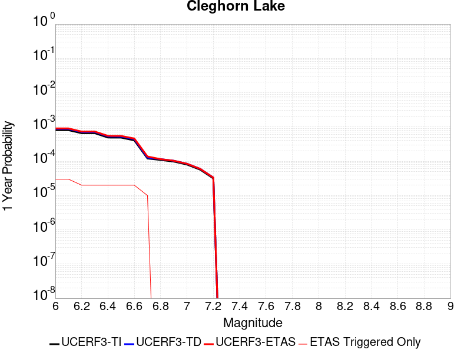 | 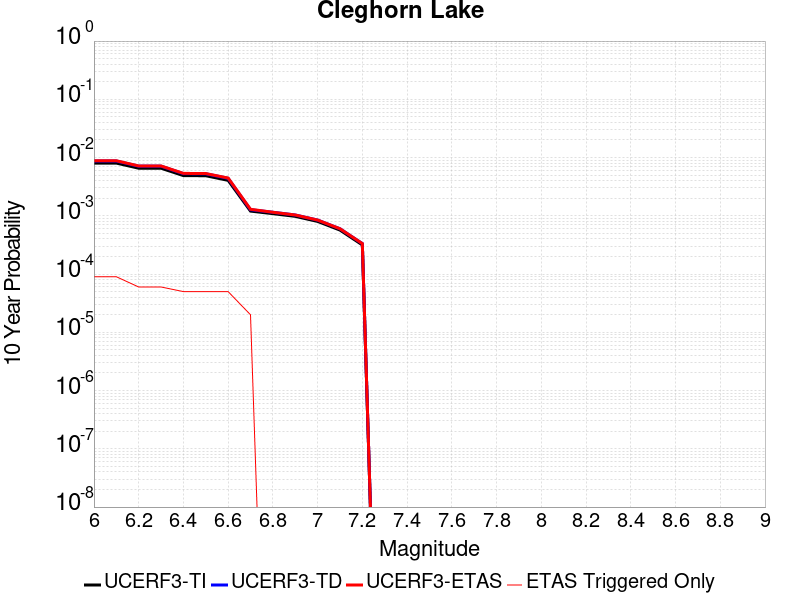 |

| Magnitude | 1 wk TI Prob | 1 wk TD Prob | 1 wk ETAS Prob | 1 wk ETAS/TD Gain | 1 wk ETAS Triggered Only | 1 mo TI Prob | 1 mo TD Prob | 1 mo ETAS Prob | 1 mo ETAS/TD Gain | 1 mo ETAS Triggered Only | 1 yr TI Prob | 1 yr TD Prob | 1 yr ETAS Prob | 1 yr ETAS/TD Gain | 1 yr ETAS Triggered Only | 10 yr TI Prob | 10 yr TD Prob | 10 yr ETAS Prob | 10 yr ETAS/TD Gain | 10 yr ETAS Triggered Only |
|-----|-----|-----|-----|-----|-----|-----|-----|-----|-----|-----|-----|-----|-----|-----|-----|-----|-----|-----|-----|-----|
| 6.0 | 1.5467183E-5 | 1.6794365E-5 | 1.6794365E-5 | 1.0 | 0.0 | 6.6286244E-5 | 7.197417E-5 | 7.197417E-5 | 1.0 | 0.0 | 8.067362E-4 | 8.7598816E-4 | 9.059619E-4 | 1.034217 | 3.0E-5 | 0.008038137 | 0.008730779 | 0.008819994 | 1.0102184 | 9.0E-5 |
| 6.1 | 1.5467183E-5 | 1.6794365E-5 | 1.6794365E-5 | 1.0 | 0.0 | 6.6286244E-5 | 7.197417E-5 | 7.197417E-5 | 1.0 | 0.0 | 8.067362E-4 | 8.7598816E-4 | 9.059619E-4 | 1.034217 | 3.0E-5 | 0.008038137 | 0.008730779 | 0.008819994 | 1.0102184 | 9.0E-5 |
| 6.2 | 1.2624631E-5 | 1.3681673E-5 | 1.3681673E-5 | 1.0 | 0.0 | 5.410444E-5 | 5.8634698E-5 | 5.8634698E-5 | 1.0 | 0.0 | 6.585225E-4 | 7.1369234E-4 | 7.3367805E-4 | 1.0280033 | 2.0E-5 | 0.0065657445 | 0.0071187983 | 0.0071783713 | 1.0083684 | 6.0E-5 |
| 6.3 | 1.2624631E-5 | 1.3681673E-5 | 1.3681673E-5 | 1.0 | 0.0 | 5.410444E-5 | 5.8634698E-5 | 5.8634698E-5 | 1.0 | 0.0 | 6.585225E-4 | 7.1369234E-4 | 7.3367805E-4 | 1.0280033 | 2.0E-5 | 0.0065657445 | 0.0071187983 | 0.0071783713 | 1.0083684 | 6.0E-5 |
| 6.4 | 9.417684E-6 | 1.0170209E-5 | 1.0170209E-5 | 1.0 | 0.0 | 4.036088E-5 | 4.3586115E-5 | 4.3586115E-5 | 1.0 | 0.0 | 4.912829E-4 | 5.305728E-4 | 5.505622E-4 | 1.0376751 | 2.0E-5 | 0.004901982 | 0.0052970964 | 0.005346832 | 1.0093892 | 5.0E-5 |
| 6.5 | 9.368219E-6 | 1.0117636E-5 | 1.0117636E-5 | 1.0 | 0.0 | 4.014889E-5 | 4.3360804E-5 | 4.3360804E-5 | 1.0 | 0.0 | 4.8870314E-4 | 5.27831E-4 | 5.4782047E-4 | 1.0378709 | 2.0E-5 | 0.004876298 | 0.0052698087 | 0.0053195455 | 1.009438 | 5.0E-5 |
| 6.6 | 7.803798E-6 | 8.441909E-6 | 8.441909E-6 | 1.0 | 0.0 | 3.3444423E-5 | 3.617933E-5 | 3.617933E-5 | 1.0 | 0.0 | 4.0710976E-4 | 4.4043426E-4 | 4.6042545E-4 | 1.0453898 | 2.0E-5 | 0.0040636472 | 0.0043995306 | 0.0044493107 | 1.0113149 | 5.0E-5 |
| 6.7 | 2.3108669E-6 | 2.4438493E-6 | 2.4438493E-6 | 1.0 | 0.0 | 9.903678E-6 | 1.0473599E-5 | 1.0473599E-5 | 1.0 | 0.0 | 1.205706E-4 | 1.275088E-4 | 1.3750752E-4 | 1.078416 | 1.0E-5 | 0.001205052 | 0.001274375 | 0.0012943496 | 1.015674 | 2.0E-5 |
| 6.8 | 2.0882828E-6 | 2.2062961E-6 | 2.2062961E-6 | 1.0 | 0.0 | 8.949753E-6 | 9.455522E-6 | 9.455522E-6 | 1.0 | 0.0 | 1.08957785E-4 | 1.15115065E-4 | 1.15115065E-4 | 1.0 | 0.0 | 0.0010890438 | 0.0011505712 | 0.0011505712 | 1.0 | 0.0 |
| 6.9 | 1.876935E-6 | 1.9810632E-6 | 1.9810632E-6 | 1.0 | 0.0 | 8.043982E-6 | 8.490245E-6 | 8.490245E-6 | 1.0 | 0.0 | 9.7931086E-5 | 1.03363986E-4 | 1.03363986E-4 | 1.0 | 0.0 | 9.788794E-4 | 0.001033175 | 0.001033175 | 1.0 | 0.0 |
| 7.0 | 1.5357559E-6 | 1.6202907E-6 | 1.6202907E-6 | 1.0 | 0.0 | 6.5817944E-6 | 6.9440853E-6 | 6.9440853E-6 | 1.0 | 0.0 | 8.01304E-5 | 8.454108E-5 | 8.454108E-5 | 1.0 | 0.0 | 8.010151E-4 | 8.4510166E-4 | 8.4510166E-4 | 1.0 | 0.0 |
| 7.1 | 1.0905424E-6 | 1.149769E-6 | 1.149769E-6 | 1.0 | 0.0 | 4.6737446E-6 | 4.9275727E-6 | 4.9275727E-6 | 1.0 | 0.0 | 5.6901354E-5 | 5.9991642E-5 | 5.9991642E-5 | 1.0 | 0.0 | 5.6886784E-4 | 5.997643E-4 | 5.997643E-4 | 1.0 | 0.0 |
| 7.2 | 6.06668E-7 | 6.3873154E-7 | 6.3873154E-7 | 1.0 | 0.0 | 2.600003E-6 | 2.7374183E-6 | 2.7374183E-6 | 1.0 | 0.0 | 3.1654577E-5 | 3.332763E-5 | 3.332763E-5 | 1.0 | 0.0 | 3.1650066E-4 | 3.3323315E-4 | 3.3323315E-4 | 1.0 | 0.0 |

## Pleito
*[(top)](#table-of-contents)*

| 1 Week | 1 Month | 1 Year | 10 Year |
|-----|-----|-----|-----|
|  | 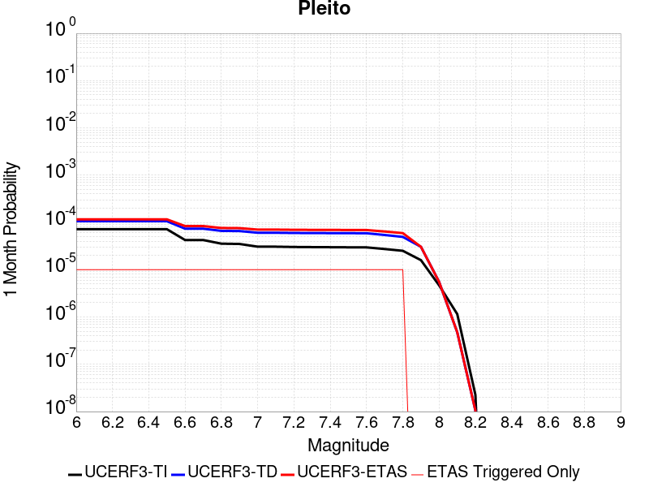 |  |  |

| Magnitude | 1 wk TI Prob | 1 wk TD Prob | 1 wk ETAS Prob | 1 wk ETAS/TD Gain | 1 wk ETAS Triggered Only | 1 mo TI Prob | 1 mo TD Prob | 1 mo ETAS Prob | 1 mo ETAS/TD Gain | 1 mo ETAS Triggered Only | 1 yr TI Prob | 1 yr TD Prob | 1 yr ETAS Prob | 1 yr ETAS/TD Gain | 1 yr ETAS Triggered Only | 10 yr TI Prob | 10 yr TD Prob | 10 yr ETAS Prob | 10 yr ETAS/TD Gain | 10 yr ETAS Triggered Only |
|-----|-----|-----|-----|-----|-----|-----|-----|-----|-----|-----|-----|-----|-----|-----|-----|-----|-----|-----|-----|-----|
| 6.0 | 1.6763008E-5 | 2.4770303E-5 | 2.4770303E-5 | 1.0 | 0.0 | 7.183948E-5 | 1.06154526E-4 | 1.1615347E-4 | 1.0941923 | 1.0E-5 | 8.742947E-4 | 0.0012917372 | 0.0013216984 | 1.0231946 | 3.0E-5 | 0.00870863 | 0.012957241 | 0.013046076 | 1.006856 | 9.0E-5 |
| 6.1 | 1.6763008E-5 | 2.4770303E-5 | 2.4770303E-5 | 1.0 | 0.0 | 7.183948E-5 | 1.06154526E-4 | 1.1615347E-4 | 1.0941923 | 1.0E-5 | 8.742947E-4 | 0.0012917372 | 0.0013216984 | 1.0231946 | 3.0E-5 | 0.00870863 | 0.012957241 | 0.013046076 | 1.006856 | 9.0E-5 |
| 6.2 | 1.6763008E-5 | 2.4770303E-5 | 2.4770303E-5 | 1.0 | 0.0 | 7.183948E-5 | 1.06154526E-4 | 1.1615347E-4 | 1.0941923 | 1.0E-5 | 8.742947E-4 | 0.0012917372 | 0.0013216984 | 1.0231946 | 3.0E-5 | 0.00870863 | 0.012957241 | 0.013046076 | 1.006856 | 9.0E-5 |
| 6.3 | 1.6763008E-5 | 2.4770303E-5 | 2.4770303E-5 | 1.0 | 0.0 | 7.183948E-5 | 1.06154526E-4 | 1.1615347E-4 | 1.0941923 | 1.0E-5 | 8.742947E-4 | 0.0012917372 | 0.0013216984 | 1.0231946 | 3.0E-5 | 0.00870863 | 0.012957241 | 0.013046076 | 1.006856 | 9.0E-5 |
| 6.4 | 1.6763008E-5 | 2.4770303E-5 | 2.4770303E-5 | 1.0 | 0.0 | 7.183948E-5 | 1.06154526E-4 | 1.1615347E-4 | 1.0941923 | 1.0E-5 | 8.742947E-4 | 0.0012917372 | 0.0013216984 | 1.0231946 | 3.0E-5 | 0.00870863 | 0.012957241 | 0.013046076 | 1.006856 | 9.0E-5 |
| 6.5 | 1.6763008E-5 | 2.4770303E-5 | 2.4770303E-5 | 1.0 | 0.0 | 7.183948E-5 | 1.06154526E-4 | 1.1615347E-4 | 1.0941923 | 1.0E-5 | 8.742947E-4 | 0.0012917372 | 0.0013216984 | 1.0231946 | 3.0E-5 | 0.00870863 | 0.012957241 | 0.013046076 | 1.006856 | 9.0E-5 |
| 6.6 | 9.910213E-6 | 1.7221002E-5 | 1.7221002E-5 | 1.0 | 0.0 | 4.247165E-5 | 7.380223E-5 | 8.380149E-5 | 1.1354873 | 1.0E-5 | 5.169696E-4 | 8.981754E-4 | 9.2814845E-4 | 1.0333711 | 3.0E-5 | 0.0051576863 | 0.009054022 | 0.009103569 | 1.0054724 | 5.0E-5 |
| 6.7 | 9.910213E-6 | 1.7221002E-5 | 1.7221002E-5 | 1.0 | 0.0 | 4.247165E-5 | 7.380223E-5 | 8.380149E-5 | 1.1354873 | 1.0E-5 | 5.169696E-4 | 8.981754E-4 | 9.2814845E-4 | 1.0333711 | 3.0E-5 | 0.0051576863 | 0.009054022 | 0.009103569 | 1.0054724 | 5.0E-5 |
| 6.8 | 8.300162E-6 | 1.5480595E-5 | 1.5480595E-5 | 1.0 | 0.0 | 3.557164E-5 | 6.634373E-5 | 7.6343065E-5 | 1.1507201 | 1.0E-5 | 4.3299864E-4 | 8.07437E-4 | 8.2742085E-4 | 1.0247498 | 2.0E-5 | 0.004321559 | 0.0081534535 | 0.008183209 | 1.0036495 | 3.0E-5 |
| 6.9 | 8.183114E-6 | 1.5351809E-5 | 1.5351809E-5 | 1.0 | 0.0 | 3.5070017E-5 | 6.579181E-5 | 7.5791155E-5 | 1.1519846 | 1.0E-5 | 4.2689382E-4 | 8.0072234E-4 | 8.207063E-4 | 1.0249574 | 2.0E-5 | 0.0042607468 | 0.008086797 | 0.0081165545 | 1.0036798 | 3.0E-5 |
| 7.0 | 7.1748823E-6 | 1.4138724E-5 | 1.4138724E-5 | 1.0 | 0.0 | 3.0749135E-5 | 6.0593124E-5 | 7.059252E-5 | 1.1650252 | 1.0E-5 | 3.743064E-4 | 7.374721E-4 | 7.474647E-4 | 1.0135498 | 1.0E-5 | 0.0037367654 | 0.0074581043 | 0.00746803 | 1.0013309 | 1.0E-5 |
| 7.1 | 7.1671807E-6 | 1.4129093E-5 | 1.4129093E-5 | 1.0 | 0.0 | 3.0716128E-5 | 6.055185E-5 | 7.055124E-5 | 1.1651378 | 1.0E-5 | 3.7390468E-4 | 7.3696993E-4 | 7.469626E-4 | 1.0135591 | 1.0E-5 | 0.0037327618 | 0.0074531166 | 0.007463042 | 1.0013317 | 1.0E-5 |
| 7.2 | 7.0649667E-6 | 1.3976361E-5 | 1.3976361E-5 | 1.0 | 0.0 | 3.0278077E-5 | 5.9897317E-5 | 6.989671E-5 | 1.1669424 | 1.0E-5 | 3.6857324E-4 | 7.290063E-4 | 7.3899905E-4 | 1.0137073 | 1.0E-5 | 0.0036796255 | 0.0073738596 | 0.0073837857 | 1.0013461 | 1.0E-5 |
| 7.3 | 7.02082E-6 | 1.3919803E-5 | 1.3919803E-5 | 1.0 | 0.0 | 3.008888E-5 | 5.9654936E-5 | 6.965434E-5 | 1.1676208 | 1.0E-5 | 3.6627054E-4 | 7.2605733E-4 | 7.360501E-4 | 1.0137631 | 1.0E-5 | 0.0036566744 | 0.007344357 | 0.007354284 | 1.0013516 | 1.0E-5 |
| 7.4 | 6.987146E-6 | 1.38793575E-5 | 1.38793575E-5 | 1.0 | 0.0 | 2.9944567E-5 | 5.948161E-5 | 6.9481015E-5 | 1.1681092 | 1.0E-5 | 3.6451413E-4 | 7.2394847E-4 | 7.339412E-4 | 1.0138031 | 1.0E-5 | 0.0036391679 | 0.0073232893 | 0.0073332163 | 1.0013555 | 1.0E-5 |
| 7.5 | 6.9494554E-6 | 1.38362575E-5 | 1.38362575E-5 | 1.0 | 0.0 | 2.9783041E-5 | 5.92969E-5 | 6.929631E-5 | 1.1686329 | 1.0E-5 | 3.625482E-4 | 7.2170113E-4 | 7.3169393E-4 | 1.0138462 | 1.0E-5 | 0.0036195726 | 0.007300915 | 0.007310842 | 1.0013597 | 1.0E-5 |
| 7.6 | 6.92694E-6 | 1.3795361E-5 | 1.3795361E-5 | 1.0 | 0.0 | 2.9686547E-5 | 5.9121638E-5 | 6.9121044E-5 | 1.1691328 | 1.0E-5 | 3.6137376E-4 | 7.1956875E-4 | 7.2956155E-4 | 1.0138872 | 1.0E-5 | 0.0036078666 | 0.0072796615 | 0.0072895885 | 1.0013636 | 1.0E-5 |
| 7.7 | 6.395867E-6 | 1.2674143E-5 | 1.2674143E-5 | 1.0 | 0.0 | 2.741057E-5 | 5.4316628E-5 | 6.431608E-5 | 1.1840957 | 1.0E-5 | 3.336726E-4 | 6.611046E-4 | 6.71098E-4 | 1.0151162 | 1.0E-5 | 0.0033317201 | 0.0066981628 | 0.006708096 | 1.001483 | 1.0E-5 |
| 7.8 | 5.8664327E-6 | 1.1541253E-5 | 1.1541253E-5 | 1.0 | 0.0 | 2.5141611E-5 | 4.9461578E-5 | 5.9461083E-5 | 1.2021672 | 1.0E-5 | 3.060561E-4 | 6.0202857E-4 | 6.1202253E-4 | 1.0166005 | 1.0E-5 | 0.0030563495 | 0.006103438 | 0.0061133765 | 1.0016284 | 1.0E-5 |
| 7.9 | 3.7167474E-6 | 7.1173527E-6 | 7.1173527E-6 | 1.0 | 0.0 | 1.592882E-5 | 3.0502584E-5 | 3.0502584E-5 | 1.0 | 0.0 | 1.9391612E-4 | 3.7130585E-4 | 3.7130585E-4 | 1.0 | 0.0 | 0.0019374699 | 0.0037691416 | 0.0037691416 | 1.0 | 0.0 |
| 8.0 | 1.0903841E-6 | 1.2885423E-6 | 1.2885423E-6 | 1.0 | 0.0 | 4.6730665E-6 | 5.5223127E-6 | 5.5223127E-6 | 1.0 | 0.0 | 5.68931E-5 | 6.72321E-5 | 6.72321E-5 | 1.0 | 0.0 | 5.6878536E-4 | 6.9454254E-4 | 6.9454254E-4 | 1.0 | 0.0 |
| 8.1 | 2.6894583E-7 | 1.1066536E-7 | 1.1066536E-7 | 1.0 | 0.0 | 1.1526245E-6 | 4.7428E-7 | 4.7428E-7 | 1.0 | 0.0 | 1.4033113E-5 | 5.774344E-6 | 5.774344E-6 | 1.0 | 0.0 | 1.4032227E-4 | 6.460765E-5 | 6.460765E-5 | 1.0 | 0.0 |
| 8.2 | 5.2967013E-9 | 2.4593279E-9 | 2.4593279E-9 | 1.0 | 0.0 | 2.2700148E-8 | 1.0539976E-8 | 1.0539976E-8 | 1.0 | 0.0 | 2.7637427E-7 | 1.283242E-7 | 1.283242E-7 | 1.0 | 0.0 | 2.7637393E-6 | 1.4602708E-6 | 1.4602708E-6 | 1.0 | 0.0 |

## Santa Rosa Island
*[(top)](#table-of-contents)*

| 1 Week | 1 Month | 1 Year | 10 Year |
|-----|-----|-----|-----|
|  | 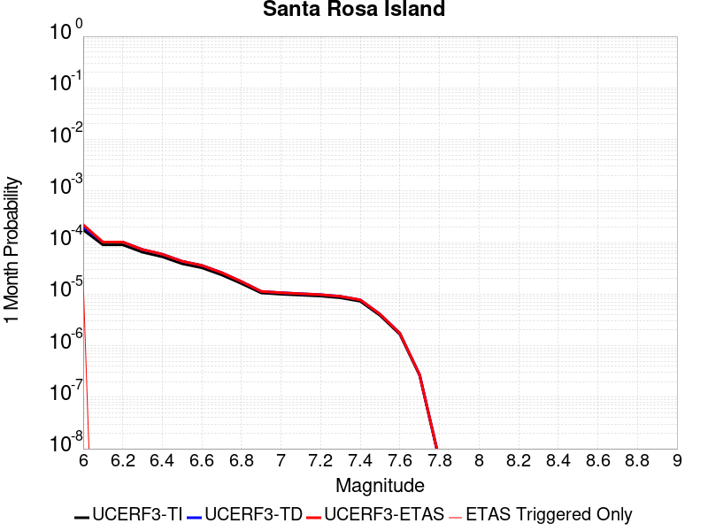 | 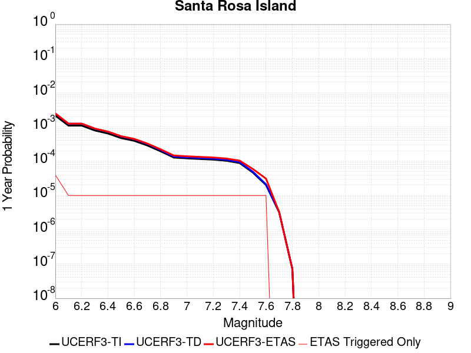 |  |

| Magnitude | 1 wk TI Prob | 1 wk TD Prob | 1 wk ETAS Prob | 1 wk ETAS/TD Gain | 1 wk ETAS Triggered Only | 1 mo TI Prob | 1 mo TD Prob | 1 mo ETAS Prob | 1 mo ETAS/TD Gain | 1 mo ETAS Triggered Only | 1 yr TI Prob | 1 yr TD Prob | 1 yr ETAS Prob | 1 yr ETAS/TD Gain | 1 yr ETAS Triggered Only | 10 yr TI Prob | 10 yr TD Prob | 10 yr ETAS Prob | 10 yr ETAS/TD Gain | 10 yr ETAS Triggered Only |
|-----|-----|-----|-----|-----|-----|-----|-----|-----|-----|-----|-----|-----|-----|-----|-----|-----|-----|-----|-----|-----|
| 6.0 | 4.1143165E-5 | 4.7091893E-5 | 6.709095E-5 | 1.4246815 | 2.0E-5 | 1.7631594E-4 | 2.018079E-4 | 2.2180386E-4 | 1.0990841 | 2.0E-5 | 0.002144533 | 0.002454439 | 0.0024943408 | 1.016257 | 4.0E-5 | 0.021239553 | 0.024293946 | 0.024372004 | 1.003213 | 8.0E-5 |
| 6.1 | 2.1061249E-5 | 2.3865317E-5 | 2.3865317E-5 | 1.0 | 0.0 | 9.0259375E-5 | 1.02276084E-4 | 1.02276084E-4 | 1.0 | 0.0 | 0.0010983539 | 0.0012445289 | 0.0012545165 | 1.0080252 | 1.0E-5 | 0.01092941 | 0.012378634 | 0.012388511 | 1.0007979 | 1.0E-5 |
| 6.2 | 2.1061249E-5 | 2.3865317E-5 | 2.3865317E-5 | 1.0 | 0.0 | 9.0259375E-5 | 1.02276084E-4 | 1.02276084E-4 | 1.0 | 0.0 | 0.0010983539 | 0.0012445289 | 0.0012545165 | 1.0080252 | 1.0E-5 | 0.01092941 | 0.012378634 | 0.012388511 | 1.0007979 | 1.0E-5 |
| 6.3 | 1.5158236E-5 | 1.707466E-5 | 1.707466E-5 | 1.0 | 0.0 | 6.496225E-5 | 7.3175135E-5 | 7.3175135E-5 | 1.0 | 0.0 | 7.906284E-4 | 8.9055515E-4 | 9.005462E-4 | 1.0112189 | 1.0E-5 | 0.007878214 | 0.008871116 | 0.008881027 | 1.0011172 | 1.0E-5 |
| 6.4 | 1.2341918E-5 | 1.3853108E-5 | 1.3853108E-5 | 1.0 | 0.0 | 5.2892858E-5 | 5.9369155E-5 | 5.9369155E-5 | 1.0 | 0.0 | 6.437803E-4 | 7.2258787E-4 | 7.3258067E-4 | 1.0138291 | 1.0E-5 | 0.006419184 | 0.0072032204 | 0.0072131488 | 1.0013783 | 1.0E-5 |
| 6.5 | 9.061158E-6 | 1.01171645E-5 | 1.01171645E-5 | 1.0 | 0.0 | 3.883296E-5 | 4.3358585E-5 | 4.3358585E-5 | 1.0 | 0.0 | 4.726887E-4 | 5.277682E-4 | 5.3776294E-4 | 1.0189377 | 1.0E-5 | 0.004716845 | 0.0052656867 | 0.005275634 | 1.0018891 | 1.0E-5 |
| 6.6 | 7.5461685E-6 | 8.400842E-6 | 8.400842E-6 | 1.0 | 0.0 | 3.2340322E-5 | 3.6003134E-5 | 3.6003134E-5 | 1.0 | 0.0 | 3.936723E-4 | 4.3825427E-4 | 4.482499E-4 | 1.0228078 | 1.0E-5 | 0.003929756 | 0.0043743295 | 0.004384286 | 1.0022761 | 1.0E-5 |
| 6.7 | 5.5023775E-6 | 6.087454E-6 | 6.087454E-6 | 1.0 | 0.0 | 2.3581404E-5 | 2.6088846E-5 | 2.6088846E-5 | 1.0 | 0.0 | 2.8706578E-4 | 3.1758865E-4 | 3.275855E-4 | 1.0314772 | 1.0E-5 | 0.0028669522 | 0.0031716696 | 0.003181638 | 1.003143 | 1.0E-5 |
| 6.8 | 3.7351679E-6 | 4.0831837E-6 | 4.0831837E-6 | 1.0 | 0.0 | 1.6007763E-5 | 1.7499255E-5 | 1.7499255E-5 | 1.0 | 0.0 | 1.948771E-4 | 2.130351E-4 | 2.2303297E-4 | 1.0469307 | 1.0E-5 | 0.0019470629 | 0.002128554 | 0.0021385327 | 1.004688 | 1.0E-5 |
| 6.9 | 2.456366E-6 | 2.6292917E-6 | 2.6292917E-6 | 1.0 | 0.0 | 1.0527241E-5 | 1.1268344E-5 | 1.1268344E-5 | 1.0 | 0.0 | 1.2816161E-4 | 1.3718348E-4 | 1.471821E-4 | 1.072885 | 1.0E-5 | 0.0012808773 | 0.0013709909 | 0.0013809772 | 1.007284 | 1.0E-5 |
| 7.0 | 2.3245157E-6 | 2.4827975E-6 | 2.4827975E-6 | 1.0 | 0.0 | 9.962172E-6 | 1.0640518E-5 | 1.0640518E-5 | 1.0 | 0.0 | 1.2128269E-4 | 1.2954063E-4 | 1.3953932E-4 | 1.0771859 | 1.0E-5 | 0.0012121652 | 0.0012946534 | 0.0013046404 | 1.007714 | 1.0E-5 |
| 7.1 | 2.2248344E-6 | 2.373268E-6 | 2.373268E-6 | 1.0 | 0.0 | 9.53497E-6 | 1.0171109E-5 | 1.0171109E-5 | 1.0 | 0.0 | 1.1608207E-4 | 1.2382623E-4 | 1.33825E-4 | 1.0807483 | 1.0E-5 | 0.0011602144 | 0.0012375744 | 0.001247562 | 1.0080703 | 1.0E-5 |
| 7.2 | 2.1350402E-6 | 2.276171E-6 | 2.276171E-6 | 1.0 | 0.0 | 9.150141E-6 | 9.754983E-6 | 9.754983E-6 | 1.0 | 0.0 | 1.1139726E-4 | 1.1876046E-4 | 1.2875927E-4 | 1.0841931 | 1.0E-5 | 0.0011134144 | 0.0011869718 | 0.00119696 | 1.0084147 | 1.0E-5 |
| 7.3 | 1.9793572E-6 | 2.1087349E-6 | 2.1087349E-6 | 1.0 | 0.0 | 8.482932E-6 | 9.037403E-6 | 9.037403E-6 | 1.0 | 0.0 | 1.032748E-4 | 1.1002485E-4 | 1.20023746E-4 | 1.0908786 | 1.0E-5 | 0.0010322682 | 0.0010997056 | 0.0011096946 | 1.0090834 | 1.0E-5 |
| 7.4 | 1.6951194E-6 | 1.8045868E-6 | 1.8045868E-6 | 1.0 | 0.0 | 7.264777E-6 | 7.73392E-6 | 7.73392E-6 | 1.0 | 0.0 | 8.844508E-5 | 9.415643E-5 | 1.04155486E-4 | 1.1061963 | 1.0E-5 | 8.840988E-4 | 9.41167E-4 | 9.511576E-4 | 1.0106151 | 1.0E-5 |
| 7.5 | 8.987207E-7 | 9.5122795E-7 | 9.5122795E-7 | 1.0 | 0.0 | 3.8516546E-6 | 4.076685E-6 | 4.076685E-6 | 1.0 | 0.0 | 4.6892885E-5 | 4.963252E-5 | 5.9632024E-5 | 1.2014709 | 1.0E-5 | 4.688299E-4 | 4.9621554E-4 | 5.0621055E-4 | 1.0201426 | 1.0E-5 |
| 7.6 | 3.8783037E-7 | 4.0529554E-7 | 4.0529554E-7 | 1.0 | 0.0 | 1.6621291E-6 | 1.7369797E-6 | 1.7369797E-6 | 1.0 | 0.0 | 2.0236233E-5 | 2.1147529E-5 | 3.1147316E-5 | 1.4728584 | 1.0E-5 | 2.023439E-4 | 2.1145582E-4 | 2.2145371E-4 | 1.0472811 | 1.0E-5 |
| 7.7 | 6.181804E-8 | 6.339073E-8 | 6.339073E-8 | 1.0 | 0.0 | 2.6493444E-7 | 2.716745E-7 | 2.716745E-7 | 1.0 | 0.0 | 3.225572E-6 | 3.3076324E-6 | 3.3076324E-6 | 1.0 | 0.0 | 3.225525E-5 | 3.3075838E-5 | 3.3075838E-5 | 1.0 | 0.0 |
| 7.8 | 1.3704449E-9 | 1.3964182E-9 | 1.3964182E-9 | 1.0 | 0.0 | 5.873335E-9 | 5.9846497E-9 | 5.9846497E-9 | 1.0 | 0.0 | 7.1507856E-8 | 7.286311E-8 | 7.286311E-8 | 1.0 | 0.0 | 7.1507833E-7 | 7.2863094E-7 | 7.2863094E-7 | 1.0 | 0.0 |

## Owens Valley
*[(top)](#table-of-contents)*

| 1 Week | 1 Month | 1 Year | 10 Year |
|-----|-----|-----|-----|
|  |  |  |  |

| Magnitude | 1 wk TI Prob | 1 wk TD Prob | 1 wk ETAS Prob | 1 wk ETAS/TD Gain | 1 wk ETAS Triggered Only | 1 mo TI Prob | 1 mo TD Prob | 1 mo ETAS Prob | 1 mo ETAS/TD Gain | 1 mo ETAS Triggered Only | 1 yr TI Prob | 1 yr TD Prob | 1 yr ETAS Prob | 1 yr ETAS/TD Gain | 1 yr ETAS Triggered Only | 10 yr TI Prob | 10 yr TD Prob | 10 yr ETAS Prob | 10 yr ETAS/TD Gain | 10 yr ETAS Triggered Only |
|-----|-----|-----|-----|-----|-----|-----|-----|-----|-----|-----|-----|-----|-----|-----|-----|-----|-----|-----|-----|-----|
| 6.0 | 4.83821E-5 | 3.6211777E-6 | 3.362107E-5 | 9.284568 | 3.0E-5 | 2.0733538E-4 | 1.5519247E-5 | 4.551878E-5 | 2.9330535 | 3.0E-5 | 0.002521386 | 1.8893143E-4 | 2.4892009E-4 | 1.3175155 | 6.0E-5 | 0.024929691 | 0.001929803 | 0.0020096486 | 1.041375 | 8.0E-5 |
| 6.1 | 4.83821E-5 | 3.6211777E-6 | 3.362107E-5 | 9.284568 | 3.0E-5 | 2.0733538E-4 | 1.5519247E-5 | 4.551878E-5 | 2.9330535 | 3.0E-5 | 0.002521386 | 1.8893143E-4 | 2.4892009E-4 | 1.3175155 | 6.0E-5 | 0.024929691 | 0.001929803 | 0.0020096486 | 1.041375 | 8.0E-5 |
| 6.2 | 4.83821E-5 | 3.6211777E-6 | 3.362107E-5 | 9.284568 | 3.0E-5 | 2.0733538E-4 | 1.5519247E-5 | 4.551878E-5 | 2.9330535 | 3.0E-5 | 0.002521386 | 1.8893143E-4 | 2.4892009E-4 | 1.3175155 | 6.0E-5 | 0.024929691 | 0.001929803 | 0.0020096486 | 1.041375 | 8.0E-5 |
| 6.3 | 3.953008E-5 | 3.1532159E-6 | 3.3153123E-5 | 10.514067 | 3.0E-5 | 1.6940363E-4 | 1.3513716E-5 | 4.351331E-5 | 3.2199366 | 3.0E-5 | 0.002060538 | 1.6451781E-4 | 2.2450794E-4 | 1.3646421 | 6.0E-5 | 0.020415364 | 0.0016622493 | 0.001732133 | 1.0420417 | 7.0E-5 |
| 6.4 | 3.953008E-5 | 3.1532159E-6 | 3.3153123E-5 | 10.514067 | 3.0E-5 | 1.6940363E-4 | 1.3513716E-5 | 4.351331E-5 | 3.2199366 | 3.0E-5 | 0.002060538 | 1.6451781E-4 | 2.2450794E-4 | 1.3646421 | 6.0E-5 | 0.020415364 | 0.0016622493 | 0.001732133 | 1.0420417 | 7.0E-5 |
| 6.5 | 3.457342E-5 | 2.9708588E-6 | 3.297077E-5 | 11.098061 | 3.0E-5 | 1.4816338E-4 | 1.2732194E-5 | 4.2731812E-5 | 3.356202 | 3.0E-5 | 0.0018023965 | 1.5500413E-4 | 2.1499483E-4 | 1.3870264 | 6.0E-5 | 0.017878477 | 0.0015563983 | 0.0016262894 | 1.0449057 | 7.0E-5 |
| 6.6 | 3.1127765E-5 | 2.8738505E-6 | 3.2873766E-5 | 11.438926 | 3.0E-5 | 1.3339789E-4 | 1.2316448E-5 | 4.2316078E-5 | 3.4357371 | 3.0E-5 | 0.0016229092 | 1.4994312E-4 | 2.0993414E-4 | 1.4000918 | 6.0E-5 | 0.016111081 | 0.001501427 | 0.001571322 | 1.0465523 | 7.0E-5 |
| 6.7 | 2.806885E-5 | 2.8102706E-6 | 3.2810185E-5 | 11.675098 | 3.0E-5 | 1.2028952E-4 | 1.2043965E-5 | 4.2043604E-5 | 3.490844 | 3.0E-5 | 0.001463541 | 1.4662609E-4 | 2.066173E-4 | 1.4091442 | 6.0E-5 | 0.014539397 | 0.0014656985 | 0.0015355959 | 1.0476888 | 7.0E-5 |
| 6.8 | 2.524524E-5 | 2.235242E-6 | 3.2235173E-5 | 14.421336 | 3.0E-5 | 1.0818939E-4 | 9.579575E-6 | 3.957929E-5 | 4.131633 | 3.0E-5 | 0.0013164099 | 1.16625386E-4 | 1.7661839E-4 | 1.5144078 | 6.0E-5 | 0.01308639 | 0.0011659131 | 0.0012358314 | 1.0599688 | 7.0E-5 |
| 6.9 | 2.2704568E-5 | 1.6080514E-6 | 3.1608004E-5 | 19.65609 | 3.0E-5 | 9.730166E-5 | 6.8916306E-6 | 3.6891422E-5 | 5.353076 | 3.0E-5 | 0.0011840039 | 8.390239E-5 | 1.4389736E-4 | 1.7150567 | 6.0E-5 | 0.011777153 | 8.3892647E-4 | 9.088677E-4 | 1.08337 | 7.0E-5 |
| 7.0 | 2.0871712E-5 | 1.5394384E-6 | 3.153939E-5 | 20.487597 | 3.0E-5 | 8.944713E-5 | 6.5975764E-6 | 3.659738E-5 | 5.5470943 | 3.0E-5 | 0.0010884746 | 8.032255E-5 | 1.4031773E-4 | 1.7469282 | 6.0E-5 | 0.010831586 | 8.031109E-4 | 8.7305467E-4 | 1.0870911 | 7.0E-5 |
| 7.1 | 1.944928E-5 | 1.38632E-6 | 3.138628E-5 | 22.639996 | 3.0E-5 | 8.335139E-5 | 5.9413583E-6 | 3.594118E-5 | 6.0493207 | 3.0E-5 | 0.0010143308 | 7.233364E-5 | 1.3232931E-4 | 1.8294295 | 6.0E-5 | 0.010097133 | 7.232634E-4 | 7.932128E-4 | 1.0967135 | 7.0E-5 |
| 7.2 | 1.7876306E-5 | 1.2488241E-6 | 3.1248786E-5 | 25.022568 | 3.0E-5 | 7.6610486E-5 | 5.352092E-6 | 3.535193E-5 | 6.6052547 | 3.0E-5 | 9.3233347E-4 | 6.515978E-5 | 1.2515587E-4 | 1.9207534 | 6.0E-5 | 0.009284316 | 6.5155805E-4 | 7.215124E-4 | 1.1073648 | 7.0E-5 |
| 7.3 | 1.2618672E-5 | 1.1114353E-6 | 3.11114E-5 | 27.992094 | 3.0E-5 | 5.40789E-5 | 4.7632852E-6 | 3.4763143E-5 | 7.298144 | 3.0E-5 | 6.582117E-4 | 5.7991463E-5 | 1.17987984E-4 | 2.034575 | 6.0E-5 | 0.0065626553 | 5.7991035E-4 | 6.4986973E-4 | 1.1206384 | 7.0E-5 |
| 7.4 | 7.4874442E-6 | 8.5479365E-7 | 3.0854768E-5 | 36.09616 | 3.0E-5 | 3.208865E-5 | 3.6633962E-6 | 3.3663287E-5 | 9.189093 | 3.0E-5 | 3.906093E-4 | 4.460094E-5 | 1.04598264E-4 | 2.3452032 | 6.0E-5 | 0.003899234 | 4.460246E-4 | 5.159934E-4 | 1.156872 | 7.0E-5 |
| 7.5 | 2.4734156E-6 | 6.0683067E-7 | 3.0606814E-5 | 50.437157 | 3.0E-5 | 1.060031E-5 | 2.6007003E-6 | 3.2600623E-5 | 12.535325 | 3.0E-5 | 1.2905113E-4 | 3.166307E-5 | 8.1661485E-5 | 2.5790768 | 5.0E-5 | 0.0012897621 | 3.165859E-4 | 3.765669E-4 | 1.1894621 | 6.0E-5 |
| 7.6 | 1.1328841E-6 | 3.196357E-7 | 2.0319629E-5 | 63.571217 | 2.0E-5 | 4.8552088E-6 | 1.3698665E-6 | 2.1369839E-5 | 15.599943 | 2.0E-5 | 5.9110564E-5 | 1.6678E-5 | 4.6677498E-5 | 2.798747 | 3.0E-5 | 5.9094845E-4 | 1.6676766E-4 | 1.9676266E-4 | 1.179861 | 3.0E-5 |
| 7.7 | 4.8613185E-7 | 8.963238E-8 | 1.0089631E-5 | 112.56682 | 1.0E-5 | 2.0834207E-6 | 3.841387E-7 | 1.0384135E-5 | 27.032253 | 1.0E-5 | 2.536535E-5 | 4.6768796E-6 | 1.46768325E-5 | 3.1381679 | 1.0E-5 | 2.5362454E-4 | 4.6767876E-5 | 5.676741E-5 | 1.213812 | 1.0E-5 |

## Deep Springs
*[(top)](#table-of-contents)*

| 1 Week | 1 Month | 1 Year | 10 Year |
|-----|-----|-----|-----|
|  |  |  |  |

| Magnitude | 1 wk TI Prob | 1 wk TD Prob | 1 wk ETAS Prob | 1 wk ETAS/TD Gain | 1 wk ETAS Triggered Only | 1 mo TI Prob | 1 mo TD Prob | 1 mo ETAS Prob | 1 mo ETAS/TD Gain | 1 mo ETAS Triggered Only | 1 yr TI Prob | 1 yr TD Prob | 1 yr ETAS Prob | 1 yr ETAS/TD Gain | 1 yr ETAS Triggered Only | 10 yr TI Prob | 10 yr TD Prob | 10 yr ETAS Prob | 10 yr ETAS/TD Gain | 10 yr ETAS Triggered Only |
|-----|-----|-----|-----|-----|-----|-----|-----|-----|-----|-----|-----|-----|-----|-----|-----|-----|-----|-----|-----|-----|
| 6.0 | 1.9810619E-5 | 2.311295E-5 | 3.311272E-5 | 1.4326478 | 1.0E-5 | 8.489989E-5 | 9.90546E-5 | 1.0905362E-4 | 1.1009444 | 1.0E-5 | 0.001033166 | 0.0012058303 | 0.00125577 | 1.0414152 | 5.0E-5 | 0.010283757 | 0.012042654 | 0.012111811 | 1.0057427 | 7.0E-5 |
| 6.1 | 1.9810619E-5 | 2.311295E-5 | 3.311272E-5 | 1.4326478 | 1.0E-5 | 8.489989E-5 | 9.90546E-5 | 1.0905362E-4 | 1.1009444 | 1.0E-5 | 0.001033166 | 0.0012058303 | 0.00125577 | 1.0414152 | 5.0E-5 | 0.010283757 | 0.012042654 | 0.012111811 | 1.0057427 | 7.0E-5 |
| 6.2 | 1.9810619E-5 | 2.311295E-5 | 3.311272E-5 | 1.4326478 | 1.0E-5 | 8.489989E-5 | 9.90546E-5 | 1.0905362E-4 | 1.1009444 | 1.0E-5 | 0.001033166 | 0.0012058303 | 0.00125577 | 1.0414152 | 5.0E-5 | 0.010283757 | 0.012042654 | 0.012111811 | 1.0057427 | 7.0E-5 |
| 6.3 | 1.9810619E-5 | 2.311295E-5 | 3.311272E-5 | 1.4326478 | 1.0E-5 | 8.489989E-5 | 9.90546E-5 | 1.0905362E-4 | 1.1009444 | 1.0E-5 | 0.001033166 | 0.0012058303 | 0.00125577 | 1.0414152 | 5.0E-5 | 0.010283757 | 0.012042654 | 0.012111811 | 1.0057427 | 7.0E-5 |
| 6.4 | 1.9810619E-5 | 2.311295E-5 | 3.311272E-5 | 1.4326478 | 1.0E-5 | 8.489989E-5 | 9.90546E-5 | 1.0905362E-4 | 1.1009444 | 1.0E-5 | 0.001033166 | 0.0012058303 | 0.00125577 | 1.0414152 | 5.0E-5 | 0.010283757 | 0.012042654 | 0.012111811 | 1.0057427 | 7.0E-5 |
| 6.5 | 1.7190405E-5 | 2.0050931E-5 | 3.005073E-5 | 1.4987199 | 1.0E-5 | 7.367108E-5 | 8.593256E-5 | 9.5931704E-5 | 1.1163603 | 1.0E-5 | 8.9657627E-4 | 0.0010462287 | 0.0010861869 | 1.0381925 | 4.0E-5 | 0.008929676 | 0.010462255 | 0.010521628 | 1.005675 | 6.0E-5 |
| 6.6 | 1.7190405E-5 | 2.0050931E-5 | 3.005073E-5 | 1.4987199 | 1.0E-5 | 7.367108E-5 | 8.593256E-5 | 9.5931704E-5 | 1.1163603 | 1.0E-5 | 8.9657627E-4 | 0.0010462287 | 0.0010861869 | 1.0381925 | 4.0E-5 | 0.008929676 | 0.010462255 | 0.010521628 | 1.005675 | 6.0E-5 |

## Big Pine (East)
*[(top)](#table-of-contents)*

| 1 Week | 1 Month | 1 Year | 10 Year |
|-----|-----|-----|-----|
| 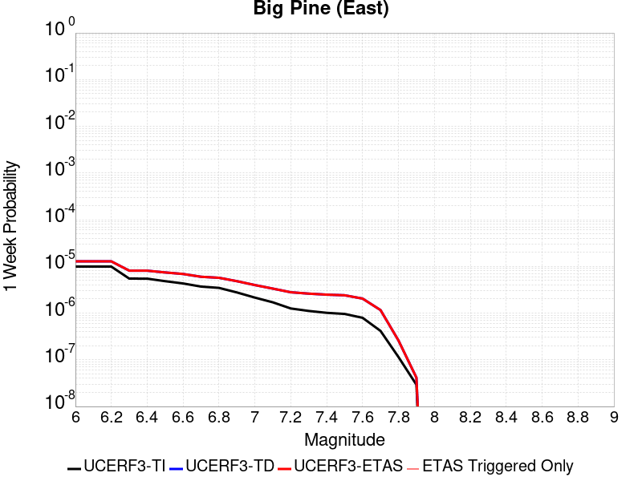 | 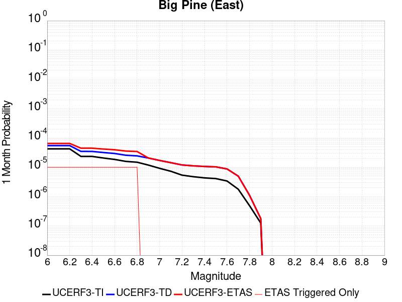 |  |  |

| Magnitude | 1 wk TI Prob | 1 wk TD Prob | 1 wk ETAS Prob | 1 wk ETAS/TD Gain | 1 wk ETAS Triggered Only | 1 mo TI Prob | 1 mo TD Prob | 1 mo ETAS Prob | 1 mo ETAS/TD Gain | 1 mo ETAS Triggered Only | 1 yr TI Prob | 1 yr TD Prob | 1 yr ETAS Prob | 1 yr ETAS/TD Gain | 1 yr ETAS Triggered Only | 10 yr TI Prob | 10 yr TD Prob | 10 yr ETAS Prob | 10 yr ETAS/TD Gain | 10 yr ETAS Triggered Only |
|-----|-----|-----|-----|-----|-----|-----|-----|-----|-----|-----|-----|-----|-----|-----|-----|-----|-----|-----|-----|-----|
| 6.0 | 9.916913E-6 | 1.2818334E-5 | 1.2818334E-5 | 1.0 | 0.0 | 4.250036E-5 | 5.4934684E-5 | 6.493414E-5 | 1.1820244 | 1.0E-5 | 5.173191E-4 | 6.6864665E-4 | 7.186132E-4 | 1.0747279 | 5.0E-5 | 0.0051611643 | 0.006671173 | 0.006750639 | 1.0119119 | 8.0E-5 |
| 6.1 | 9.916913E-6 | 1.2818334E-5 | 1.2818334E-5 | 1.0 | 0.0 | 4.250036E-5 | 5.4934684E-5 | 6.493414E-5 | 1.1820244 | 1.0E-5 | 5.173191E-4 | 6.6864665E-4 | 7.186132E-4 | 1.0747279 | 5.0E-5 | 0.0051611643 | 0.006671173 | 0.006750639 | 1.0119119 | 8.0E-5 |
| 6.2 | 9.916913E-6 | 1.2818334E-5 | 1.2818334E-5 | 1.0 | 0.0 | 4.250036E-5 | 5.4934684E-5 | 6.493414E-5 | 1.1820244 | 1.0E-5 | 5.173191E-4 | 6.6864665E-4 | 7.186132E-4 | 1.0747279 | 5.0E-5 | 0.0051611643 | 0.006671173 | 0.006750639 | 1.0119119 | 8.0E-5 |
| 6.3 | 5.479711E-6 | 8.114269E-6 | 8.114269E-6 | 1.0 | 0.0 | 2.3484265E-5 | 3.4774996E-5 | 4.4774646E-5 | 1.287553 | 1.0E-5 | 2.858834E-4 | 4.2330648E-4 | 4.532938E-4 | 1.0708406 | 3.0E-5 | 0.0028551589 | 0.004227961 | 0.0042777495 | 1.0117761 | 5.0E-5 |
| 6.4 | 5.465009E-6 | 8.098563E-6 | 8.098563E-6 | 1.0 | 0.0 | 2.3421257E-5 | 3.4707682E-5 | 4.4707333E-5 | 1.2881106 | 1.0E-5 | 2.851165E-4 | 4.2248727E-4 | 4.524746E-4 | 1.070978 | 3.0E-5 | 0.0028475097 | 0.0042198 | 0.0042695887 | 1.0117989 | 5.0E-5 |
| 6.5 | 4.826767E-6 | 7.4236145E-6 | 7.4236145E-6 | 1.0 | 0.0 | 2.068598E-5 | 3.1815118E-5 | 4.18148E-5 | 1.314306 | 1.0E-5 | 2.518227E-4 | 3.8728298E-4 | 4.1727137E-4 | 1.0774328 | 3.0E-5 | 0.0025153751 | 0.003868998 | 0.0039188047 | 1.0128733 | 5.0E-5 |
| 6.6 | 4.3146847E-6 | 6.883547E-6 | 6.883547E-6 | 1.0 | 0.0 | 1.8491375E-5 | 2.9500598E-5 | 3.95003E-5 | 1.3389663 | 1.0E-5 | 2.2510924E-4 | 3.59113E-4 | 3.8910224E-4 | 1.0835092 | 3.0E-5 | 0.0022488134 | 0.0035882122 | 0.0036380326 | 1.0138845 | 5.0E-5 |
| 6.7 | 3.6968106E-6 | 5.996663E-6 | 5.996663E-6 | 1.0 | 0.0 | 1.5843378E-5 | 2.569974E-5 | 3.5699482E-5 | 1.389099 | 1.0E-5 | 1.9287605E-4 | 3.1285093E-4 | 3.4284155E-4 | 1.0958623 | 3.0E-5 | 0.0019270873 | 0.0031269 | 0.0031767436 | 1.0159403 | 5.0E-5 |
| 6.8 | 3.4671132E-6 | 5.703338E-6 | 5.703338E-6 | 1.0 | 0.0 | 1.4858972E-5 | 2.4442656E-5 | 3.444241E-5 | 1.4091108 | 1.0E-5 | 1.8089297E-4 | 2.9755014E-4 | 3.2754123E-4 | 1.1007934 | 3.0E-5 | 0.0018074579 | 0.0029743037 | 0.003024155 | 1.0167607 | 5.0E-5 |
| 6.9 | 2.7686972E-6 | 4.8262946E-6 | 4.8262946E-6 | 1.0 | 0.0 | 1.1865792E-5 | 2.0683961E-5 | 2.0683961E-5 | 1.0 | 0.0 | 1.4445644E-4 | 2.5179886E-4 | 2.7179383E-4 | 1.0794085 | 2.0E-5 | 0.0014436257 | 0.002517854 | 0.0025477784 | 1.0118849 | 3.0E-5 |
| 7.0 | 2.1472624E-6 | 3.9860124E-6 | 3.9860124E-6 | 1.0 | 0.0 | 9.20252E-6 | 1.7082803E-5 | 1.7082803E-5 | 1.0 | 0.0 | 1.12034926E-4 | 2.079638E-4 | 2.2795964E-4 | 1.0961506 | 2.0E-5 | 0.0011197845 | 0.0020803665 | 0.0021003247 | 1.0095937 | 2.0E-5 |
| 7.1 | 1.7018335E-6 | 3.345786E-6 | 3.345786E-6 | 1.0 | 0.0 | 7.293552E-6 | 1.4339005E-5 | 1.4339005E-5 | 1.0 | 0.0 | 8.879537E-5 | 1.7456376E-4 | 1.8456201E-4 | 1.0572757 | 1.0E-5 | 8.87599E-4 | 0.0017469121 | 0.0017568948 | 1.0057144 | 1.0E-5 |
| 7.2 | 1.25603E-6 | 2.7953429E-6 | 2.7953429E-6 | 1.0 | 0.0 | 5.3829745E-6 | 1.1979987E-5 | 1.1979987E-5 | 1.0 | 0.0 | 6.553574E-5 | 1.458468E-4 | 1.458468E-4 | 1.0 | 0.0 | 6.551642E-4 | 0.0014601313 | 0.0014601313 | 1.0 | 0.0 |
| 7.3 | 1.112297E-6 | 2.6111477E-6 | 2.6111477E-6 | 1.0 | 0.0 | 4.7669787E-6 | 1.11905865E-5 | 1.11905865E-5 | 1.0 | 0.0 | 5.803642E-5 | 1.3623708E-4 | 1.3623708E-4 | 1.0 | 0.0 | 5.802127E-4 | 0.0013639531 | 0.0013639531 | 1.0 | 0.0 |
| 7.4 | 1.0137181E-6 | 2.4842766E-6 | 2.4842766E-6 | 1.0 | 0.0 | 4.3444993E-6 | 1.0646857E-5 | 1.0646857E-5 | 1.0 | 0.0 | 5.2892992E-5 | 1.2961798E-4 | 1.2961798E-4 | 1.0 | 0.0 | 5.288041E-4 | 0.0012976081 | 0.0012976081 | 1.0 | 0.0 |
| 7.5 | 9.598608E-7 | 2.4079116E-6 | 2.4079116E-6 | 1.0 | 0.0 | 4.1136827E-6 | 1.0319581E-5 | 1.0319581E-5 | 1.0 | 0.0 | 5.0082934E-5 | 1.2563387E-4 | 1.2563387E-4 | 1.0 | 0.0 | 5.007165E-4 | 0.0012576163 | 0.0012576163 | 1.0 | 0.0 |
| 7.6 | 7.929459E-7 | 2.0455243E-6 | 2.0455243E-6 | 1.0 | 0.0 | 3.3983351E-6 | 8.766505E-6 | 8.766505E-6 | 1.0 | 0.0 | 4.1373947E-5 | 1.06727144E-4 | 1.06727144E-4 | 1.0 | 0.0 | 4.1366243E-4 | 0.0010689293 | 0.0010689293 | 1.0 | 0.0 |
| 7.7 | 4.155788E-7 | 1.1610362E-6 | 1.1610362E-6 | 1.0 | 0.0 | 1.7810507E-6 | 4.97586E-6 | 4.97586E-6 | 1.0 | 0.0 | 2.1684076E-5 | 6.0579452E-5 | 6.0579452E-5 | 1.0 | 0.0 | 2.1681961E-4 | 6.0890906E-4 | 6.0890906E-4 | 1.0 | 0.0 |
| 7.8 | 1.14666925E-7 | 2.5930004E-7 | 2.5930004E-7 | 1.0 | 0.0 | 4.914296E-7 | 1.1112854E-6 | 1.1112854E-6 | 1.0 | 0.0 | 5.9831386E-6 | 1.352982E-5 | 1.352982E-5 | 1.0 | 0.0 | 5.9829777E-5 | 1.3642712E-4 | 1.3642712E-4 | 1.0 | 0.0 |
| 7.9 | 2.9231824E-8 | 4.1476373E-8 | 4.1476373E-8 | 1.0 | 0.0 | 1.2527924E-7 | 1.7775588E-7 | 1.7775588E-7 | 1.0 | 0.0 | 1.5252737E-6 | 2.1641758E-6 | 2.1641758E-6 | 1.0 | 0.0 | 1.5252632E-5 | 2.1986927E-5 | 2.1986927E-5 | 1.0 | 0.0 |

## San Jacinto (Coyote Creek)
*[(top)](#table-of-contents)*

| 1 Week | 1 Month | 1 Year | 10 Year |
|-----|-----|-----|-----|
| 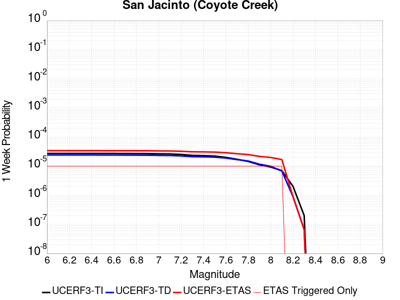 |  | 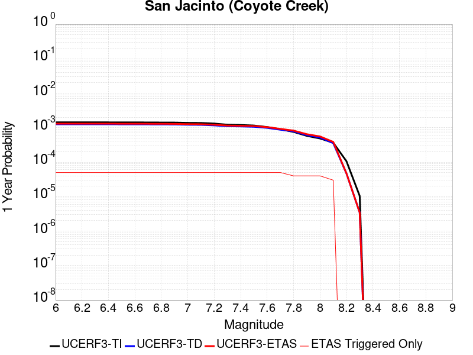 | 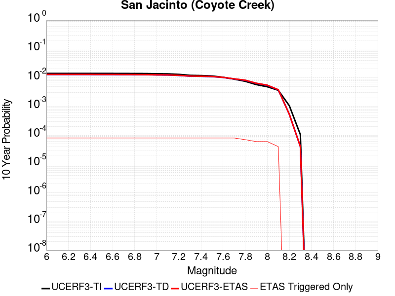 |

| Magnitude | 1 wk TI Prob | 1 wk TD Prob | 1 wk ETAS Prob | 1 wk ETAS/TD Gain | 1 wk ETAS Triggered Only | 1 mo TI Prob | 1 mo TD Prob | 1 mo ETAS Prob | 1 mo ETAS/TD Gain | 1 mo ETAS Triggered Only | 1 yr TI Prob | 1 yr TD Prob | 1 yr ETAS Prob | 1 yr ETAS/TD Gain | 1 yr ETAS Triggered Only | 10 yr TI Prob | 10 yr TD Prob | 10 yr ETAS Prob | 10 yr ETAS/TD Gain | 10 yr ETAS Triggered Only |
|-----|-----|-----|-----|-----|-----|-----|-----|-----|-----|-----|-----|-----|-----|-----|-----|-----|-----|-----|-----|-----|
| 6.0 | 2.7374346E-5 | 2.4151084E-5 | 3.4150842E-5 | 1.4140501 | 1.0E-5 | 1.1731335E-4 | 1.03500555E-4 | 1.2349848E-4 | 1.1932157 | 2.0E-5 | 0.0014273542 | 0.0012593934 | 0.0013093305 | 1.0396516 | 5.0E-5 | 0.01418221 | 0.01293157 | 0.013010535 | 1.0061064 | 8.0E-5 |
| 6.1 | 2.7374346E-5 | 2.4151084E-5 | 3.4150842E-5 | 1.4140501 | 1.0E-5 | 1.1731335E-4 | 1.03500555E-4 | 1.2349848E-4 | 1.1932157 | 2.0E-5 | 0.0014273542 | 0.0012593934 | 0.0013093305 | 1.0396516 | 5.0E-5 | 0.01418221 | 0.01293157 | 0.013010535 | 1.0061064 | 8.0E-5 |
| 6.2 | 2.7374346E-5 | 2.4151084E-5 | 3.4150842E-5 | 1.4140501 | 1.0E-5 | 1.1731335E-4 | 1.03500555E-4 | 1.2349848E-4 | 1.1932157 | 2.0E-5 | 0.0014273542 | 0.0012593934 | 0.0013093305 | 1.0396516 | 5.0E-5 | 0.01418221 | 0.01293157 | 0.013010535 | 1.0061064 | 8.0E-5 |
| 6.3 | 2.7374346E-5 | 2.4151084E-5 | 3.4150842E-5 | 1.4140501 | 1.0E-5 | 1.1731335E-4 | 1.03500555E-4 | 1.2349848E-4 | 1.1932157 | 2.0E-5 | 0.0014273542 | 0.0012593934 | 0.0013093305 | 1.0396516 | 5.0E-5 | 0.01418221 | 0.01293157 | 0.013010535 | 1.0061064 | 8.0E-5 |
| 6.4 | 2.7374346E-5 | 2.4151084E-5 | 3.4150842E-5 | 1.4140501 | 1.0E-5 | 1.1731335E-4 | 1.03500555E-4 | 1.2349848E-4 | 1.1932157 | 2.0E-5 | 0.0014273542 | 0.0012593934 | 0.0013093305 | 1.0396516 | 5.0E-5 | 0.01418221 | 0.01293157 | 0.013010535 | 1.0061064 | 8.0E-5 |
| 6.5 | 2.7282445E-5 | 2.403716E-5 | 3.403692E-5 | 1.4160125 | 1.0E-5 | 1.16919524E-4 | 1.0301234E-4 | 1.2301028E-4 | 1.1941315 | 2.0E-5 | 0.0014225657 | 0.0012534563 | 0.0013033936 | 1.0398397 | 5.0E-5 | 0.014134934 | 0.012872896 | 0.012951867 | 1.0061346 | 8.0E-5 |
| 6.6 | 2.7282445E-5 | 2.403716E-5 | 3.403692E-5 | 1.4160125 | 1.0E-5 | 1.16919524E-4 | 1.0301234E-4 | 1.2301028E-4 | 1.1941315 | 2.0E-5 | 0.0014225657 | 0.0012534563 | 0.0013033936 | 1.0398397 | 5.0E-5 | 0.014134934 | 0.012872896 | 0.012951867 | 1.0061346 | 8.0E-5 |
| 6.7 | 2.7216198E-5 | 2.3962277E-5 | 3.396204E-5 | 1.4173126 | 1.0E-5 | 1.1663563E-4 | 1.0269145E-4 | 1.226894E-4 | 1.1947381 | 2.0E-5 | 0.0014191137 | 0.001249554 | 0.0012994915 | 1.0399643 | 5.0E-5 | 0.014100855 | 0.012834306 | 0.012913279 | 1.0061533 | 8.0E-5 |
| 6.8 | 2.7078617E-5 | 2.3879491E-5 | 3.3879252E-5 | 1.4187593 | 1.0E-5 | 1.1604605E-4 | 1.0233668E-4 | 1.2233463E-4 | 1.1954134 | 2.0E-5 | 0.001411945 | 0.0012452396 | 0.0012951773 | 1.040103 | 5.0E-5 | 0.014030075 | 0.012791451 | 0.012870428 | 1.0061742 | 8.0E-5 |
| 6.9 | 2.6982952E-5 | 2.3799E-5 | 3.3798762E-5 | 1.4201757 | 1.0E-5 | 1.15636096E-4 | 1.0199175E-4 | 1.2198971E-4 | 1.1960742 | 2.0E-5 | 0.0014069602 | 0.0012410448 | 0.0012909828 | 1.0402386 | 5.0E-5 | 0.013980856 | 0.01274974 | 0.01282872 | 1.0061946 | 8.0E-5 |
| 7.0 | 2.6449972E-5 | 2.3376013E-5 | 3.3375778E-5 | 1.427779 | 1.0E-5 | 1.1335209E-4 | 1.0017908E-4 | 1.2017707E-4 | 1.1996225 | 2.0E-5 | 0.001379188 | 0.0012190004 | 0.0012689395 | 1.0409672 | 5.0E-5 | 0.0137065975 | 0.012531063 | 0.01261006 | 1.0063041 | 8.0E-5 |
| 7.1 | 2.6257849E-5 | 2.3202048E-5 | 3.3201817E-5 | 1.4309864 | 1.0E-5 | 1.1252879E-4 | 9.943357E-5 | 1.19431585E-4 | 1.2011193 | 2.0E-5 | 0.0013691769 | 0.001209934 | 0.0012598735 | 1.0412745 | 5.0E-5 | 0.013607717 | 0.012440982 | 0.012519987 | 1.0063504 | 8.0E-5 |
| 7.2 | 2.5270041E-5 | 2.2396756E-5 | 3.2396532E-5 | 1.4464833 | 1.0E-5 | 1.0829568E-4 | 9.5982585E-5 | 1.1598066E-4 | 1.2083511 | 2.0E-5 | 0.0013177024 | 0.0011679638 | 0.0012179054 | 1.0427595 | 5.0E-5 | 0.013099162 | 0.012022032 | 0.01210107 | 1.0065744 | 8.0E-5 |
| 7.3 | 2.339701E-5 | 2.1128553E-5 | 3.112834E-5 | 1.4732832 | 1.0E-5 | 1.0026905E-4 | 9.054781E-5 | 1.10545996E-4 | 1.2208577 | 2.0E-5 | 0.001220092 | 0.0011018642 | 0.001151809 | 1.0453277 | 5.0E-5 | 0.012134149 | 0.011360903 | 0.011439995 | 1.0069617 | 8.0E-5 |
| 7.4 | 2.296333E-5 | 2.0858895E-5 | 3.0858686E-5 | 1.4794018 | 1.0E-5 | 9.841056E-5 | 8.939221E-5 | 1.0939043E-4 | 1.2237132 | 2.0E-5 | 0.0011974899 | 0.0010878089 | 0.0011377545 | 1.0459139 | 5.0E-5 | 0.011910575 | 0.011219999 | 0.011299101 | 1.0070502 | 8.0E-5 |
| 7.5 | 2.2188895E-5 | 2.0381787E-5 | 3.0381583E-5 | 1.4906241 | 1.0E-5 | 9.50918E-5 | 8.73476E-5 | 1.07345855E-4 | 1.2289503 | 2.0E-5 | 0.0011571277 | 0.0010629403 | 0.0011128872 | 1.0469893 | 5.0E-5 | 0.011511209 | 0.010969629 | 0.011048751 | 1.0072129 | 8.0E-5 |
| 7.6 | 2.0013189E-5 | 1.8967989E-5 | 2.89678E-5 | 1.527194 | 1.0E-5 | 8.5767984E-5 | 8.1288854E-5 | 1.0128723E-4 | 1.2460161 | 2.0E-5 | 0.001043725 | 9.892442E-4 | 0.0010391948 | 1.0504936 | 5.0E-5 | 0.010388365 | 0.010227527 | 0.0103067085 | 1.007742 | 8.0E-5 |
| 7.7 | 1.7230794E-5 | 1.674919E-5 | 2.6749023E-5 | 1.5970337 | 1.0E-5 | 7.384417E-5 | 7.1780276E-5 | 9.177884E-5 | 1.2786081 | 2.0E-5 | 8.986819E-4 | 8.735753E-4 | 9.235316E-4 | 1.057186 | 5.0E-5 | 0.008950562 | 0.0090660965 | 0.009145372 | 1.0087441 | 8.0E-5 |
| 7.8 | 1.4478809E-5 | 1.49963325E-5 | 2.4996181E-5 | 1.6668197 | 1.0E-5 | 6.205057E-5 | 6.426842E-5 | 8.426713E-5 | 1.3111749 | 2.0E-5 | 7.552038E-4 | 7.821877E-4 | 8.2215643E-4 | 1.0510986 | 4.0E-5 | 0.0075264242 | 0.008144472 | 0.008213902 | 1.0085248 | 7.0E-5 |
| 7.9 | 1.1114467E-5 | 1.1649769E-5 | 2.1649652E-5 | 1.8583761 | 1.0E-5 | 4.7632562E-5 | 4.9926624E-5 | 6.992563E-5 | 1.4005679 | 2.0E-5 | 5.797721E-4 | 6.076877E-4 | 6.476634E-4 | 1.0657833 | 4.0E-5 | 0.0057826187 | 0.0063830703 | 0.0064426875 | 1.0093398 | 6.0E-5 |
| 8.0 | 9.327402E-6 | 9.903381E-6 | 1.9903282E-5 | 2.009746 | 1.0E-5 | 3.9973966E-5 | 4.2442374E-5 | 6.2441526E-5 | 1.4712071 | 2.0E-5 | 4.8657437E-4 | 5.1661395E-4 | 5.5659324E-4 | 1.0773872 | 4.0E-5 | 0.0048551033 | 0.00545243 | 0.0055121025 | 1.0109442 | 6.0E-5 |
| 8.1 | 7.0235833E-6 | 6.8305E-6 | 1.6830432E-5 | 2.4640117 | 1.0E-5 | 3.0100724E-5 | 2.9273246E-5 | 4.927266E-5 | 1.6831977 | 2.0E-5 | 3.664147E-4 | 3.5634398E-4 | 3.863333E-4 | 1.0841583 | 3.0E-5 | 0.003658111 | 0.0037893003 | 0.0038291488 | 1.010516 | 4.0E-5 |
| 8.2 | 2.0358202E-6 | 8.998418E-7 | 8.998418E-7 | 1.0 | 0.0 | 8.724915E-6 | 3.856459E-6 | 3.856459E-6 | 1.0 | 0.0 | 1.06220665E-4 | 4.69514E-5 | 4.69514E-5 | 1.0 | 0.0 | 0.001061699 | 5.327697E-4 | 5.327697E-4 | 1.0 | 0.0 |
| 8.3 | 2.0051264E-7 | 6.6199846E-8 | 6.6199846E-8 | 1.0 | 0.0 | 8.5933965E-7 | 2.837136E-7 | 2.837136E-7 | 1.0 | 0.0 | 1.046241E-5 | 3.4542081E-6 | 3.4542081E-6 | 1.0 | 0.0 | 1.0461917E-4 | 4.015628E-5 | 4.015628E-5 | 1.0 | 0.0 |

## Cleghorn
*[(top)](#table-of-contents)*

| 1 Week | 1 Month | 1 Year | 10 Year |
|-----|-----|-----|-----|
|  |  |  |  |

| Magnitude | 1 wk TI Prob | 1 wk TD Prob | 1 wk ETAS Prob | 1 wk ETAS/TD Gain | 1 wk ETAS Triggered Only | 1 mo TI Prob | 1 mo TD Prob | 1 mo ETAS Prob | 1 mo ETAS/TD Gain | 1 mo ETAS Triggered Only | 1 yr TI Prob | 1 yr TD Prob | 1 yr ETAS Prob | 1 yr ETAS/TD Gain | 1 yr ETAS Triggered Only | 10 yr TI Prob | 10 yr TD Prob | 10 yr ETAS Prob | 10 yr ETAS/TD Gain | 10 yr ETAS Triggered Only |
|-----|-----|-----|-----|-----|-----|-----|-----|-----|-----|-----|-----|-----|-----|-----|-----|-----|-----|-----|-----|-----|
| 6.0 | 7.9267165E-6 | 9.832609E-6 | 9.832609E-6 | 1.0 | 0.0 | 3.39712E-5 | 4.2139134E-5 | 5.2138712E-5 | 1.2372991 | 1.0E-5 | 4.1352084E-4 | 5.129338E-4 | 5.2292866E-4 | 1.0194857 | 1.0E-5 | 0.004127522 | 0.0051325997 | 0.005212189 | 1.0155066 | 8.0E-5 |
| 6.1 | 7.9267165E-6 | 9.832609E-6 | 9.832609E-6 | 1.0 | 0.0 | 3.39712E-5 | 4.2139134E-5 | 5.2138712E-5 | 1.2372991 | 1.0E-5 | 4.1352084E-4 | 5.129338E-4 | 5.2292866E-4 | 1.0194857 | 1.0E-5 | 0.004127522 | 0.0051325997 | 0.005212189 | 1.0155066 | 8.0E-5 |
| 6.2 | 7.9267165E-6 | 9.832609E-6 | 9.832609E-6 | 1.0 | 0.0 | 3.39712E-5 | 4.2139134E-5 | 5.2138712E-5 | 1.2372991 | 1.0E-5 | 4.1352084E-4 | 5.129338E-4 | 5.2292866E-4 | 1.0194857 | 1.0E-5 | 0.004127522 | 0.0051325997 | 0.005212189 | 1.0155066 | 8.0E-5 |
| 6.3 | 7.9267165E-6 | 9.832609E-6 | 9.832609E-6 | 1.0 | 0.0 | 3.39712E-5 | 4.2139134E-5 | 5.2138712E-5 | 1.2372991 | 1.0E-5 | 4.1352084E-4 | 5.129338E-4 | 5.2292866E-4 | 1.0194857 | 1.0E-5 | 0.004127522 | 0.0051325997 | 0.005212189 | 1.0155066 | 8.0E-5 |
| 6.4 | 4.3445207E-6 | 6.0924517E-6 | 6.0924517E-6 | 1.0 | 0.0 | 1.8619241E-5 | 2.611025E-5 | 2.611025E-5 | 1.0 | 0.0 | 2.2666567E-4 | 3.1784695E-4 | 3.1784695E-4 | 1.0 | 0.0 | 0.0022643462 | 0.0031881016 | 0.0031980695 | 1.0031266 | 1.0E-5 |
| 6.5 | 4.3445207E-6 | 6.0924517E-6 | 6.0924517E-6 | 1.0 | 0.0 | 1.8619241E-5 | 2.611025E-5 | 2.611025E-5 | 1.0 | 0.0 | 2.2666567E-4 | 3.1784695E-4 | 3.1784695E-4 | 1.0 | 0.0 | 0.0022643462 | 0.0031881016 | 0.0031980695 | 1.0031266 | 1.0E-5 |
| 6.6 | 4.040109E-6 | 5.774858E-6 | 5.774858E-6 | 1.0 | 0.0 | 1.7314638E-5 | 2.474916E-5 | 2.474916E-5 | 1.0 | 0.0 | 2.1078532E-4 | 3.0128032E-4 | 3.0128032E-4 | 1.0 | 0.0 | 0.002105855 | 0.0030228905 | 0.0030328603 | 1.003298 | 1.0E-5 |
| 6.7 | 3.3632055E-6 | 5.068351E-6 | 5.068351E-6 | 1.0 | 0.0 | 1.4413658E-5 | 2.1721326E-5 | 2.1721326E-5 | 1.0 | 0.0 | 1.7547216E-4 | 2.6442535E-4 | 2.6442535E-4 | 1.0 | 0.0 | 0.0017533366 | 0.002655223 | 0.0026651965 | 1.0037562 | 1.0E-5 |
| 6.8 | 3.2902772E-6 | 4.9902583E-6 | 4.9902583E-6 | 1.0 | 0.0 | 1.4101111E-5 | 2.1386648E-5 | 2.1386648E-5 | 1.0 | 0.0 | 1.716675E-4 | 2.6035163E-4 | 2.6035163E-4 | 1.0 | 0.0 | 0.0017153495 | 0.0026145817 | 0.0026245555 | 1.0038147 | 1.0E-5 |
| 6.9 | 3.031547E-6 | 4.6920154E-6 | 4.6920154E-6 | 1.0 | 0.0 | 1.299228E-5 | 2.0108484E-5 | 2.0108484E-5 | 1.0 | 0.0 | 1.5816953E-4 | 2.4479357E-4 | 2.4479357E-4 | 1.0 | 0.0 | 0.00158057 | 0.0024593526 | 0.002469328 | 1.0040561 | 1.0E-5 |
| 7.0 | 2.8259715E-6 | 4.371569E-6 | 4.371569E-6 | 1.0 | 0.0 | 1.211125E-5 | 1.8735162E-5 | 1.8735162E-5 | 1.0 | 0.0 | 1.4744449E-4 | 2.2807697E-4 | 2.2807697E-4 | 1.0 | 0.0 | 0.001473467 | 0.0022925409 | 0.0022925409 | 1.0 | 0.0 |
| 7.1 | 2.5962665E-6 | 4.066781E-6 | 4.066781E-6 | 1.0 | 0.0 | 1.1126809E-5 | 1.7428947E-5 | 1.7428947E-5 | 1.0 | 0.0 | 1.3546048E-4 | 2.1217698E-4 | 2.1217698E-4 | 1.0 | 0.0 | 0.0013537793 | 0.002133857 | 0.002133857 | 1.0 | 0.0 |
| 7.2 | 2.3247253E-6 | 3.6773217E-6 | 3.6773217E-6 | 1.0 | 0.0 | 9.96307E-6 | 1.5759857E-5 | 1.5759857E-5 | 1.0 | 0.0 | 1.21293626E-4 | 1.9185955E-4 | 1.9185955E-4 | 1.0 | 0.0 | 0.0012122744 | 0.0019310737 | 0.0019310737 | 1.0 | 0.0 |
| 7.3 | 2.056928E-6 | 3.236013E-6 | 3.236013E-6 | 1.0 | 0.0 | 8.815376E-6 | 1.3868555E-5 | 1.3868555E-5 | 1.0 | 0.0 | 1.0732192E-4 | 1.6883673E-4 | 1.6883673E-4 | 1.0 | 0.0 | 0.001072701 | 0.0017012871 | 0.0017012871 | 1.0 | 0.0 |
| 7.4 | 1.8055999E-6 | 2.8263846E-6 | 2.8263846E-6 | 1.0 | 0.0 | 7.738263E-6 | 1.21130215E-5 | 1.21130215E-5 | 1.0 | 0.0 | 9.4209274E-5 | 1.474662E-4 | 1.474662E-4 | 1.0 | 0.0 | 9.4169343E-4 | 0.0014880295 | 0.0014880295 | 1.0 | 0.0 |
| 7.5 | 1.4683443E-6 | 2.4256126E-6 | 2.4256126E-6 | 1.0 | 0.0 | 6.292889E-6 | 1.0395442E-5 | 1.0395442E-5 | 1.0 | 0.0 | 7.661323E-5 | 1.2655725E-4 | 1.2655725E-4 | 1.0 | 0.0 | 7.658682E-4 | 0.001279224 | 0.001279224 | 1.0 | 0.0 |
| 7.6 | 9.804088E-7 | 1.9011195E-6 | 1.9011195E-6 | 1.0 | 0.0 | 4.201745E-6 | 8.14763E-6 | 8.14763E-6 | 1.0 | 0.0 | 5.1155046E-5 | 9.919292E-5 | 9.919292E-5 | 1.0 | 0.0 | 5.114327E-4 | 0.0010058937 | 0.0010058937 | 1.0 | 0.0 |
| 7.7 | 7.3434086E-7 | 1.6292569E-6 | 1.6292569E-6 | 1.0 | 0.0 | 3.1471714E-6 | 6.982511E-6 | 6.982511E-6 | 1.0 | 0.0 | 3.831614E-5 | 8.500878E-5 | 8.500878E-5 | 1.0 | 0.0 | 3.8309532E-4 | 8.6420315E-4 | 8.6420315E-4 | 1.0 | 0.0 |
| 7.8 | 6.434184E-7 | 1.5228128E-6 | 1.5228128E-6 | 1.0 | 0.0 | 2.7575045E-6 | 6.5263243E-6 | 6.5263243E-6 | 1.0 | 0.0 | 3.35721E-5 | 7.945512E-5 | 7.945512E-5 | 1.0 | 0.0 | 3.3567028E-4 | 8.0836023E-4 | 8.0836023E-4 | 1.0 | 0.0 |
| 7.9 | 3.4943926E-7 | 7.5787256E-7 | 7.5787256E-7 | 1.0 | 0.0 | 1.497596E-6 | 3.2480211E-6 | 3.2480211E-6 | 1.0 | 0.0 | 1.8233079E-5 | 3.954395E-5 | 3.954395E-5 | 1.0 | 0.0 | 1.8231584E-4 | 4.0420605E-4 | 4.0420605E-4 | 1.0 | 0.0 |
| 8.0 | 6.717524E-8 | 5.8430036E-8 | 5.8430036E-8 | 1.0 | 0.0 | 2.8789387E-7 | 2.5041442E-7 | 2.5041442E-7 | 1.0 | 0.0 | 3.505102E-6 | 3.0487913E-6 | 3.0487913E-6 | 1.0 | 0.0 | 3.5050467E-5 | 3.2750788E-5 | 3.2750788E-5 | 1.0 | 0.0 |
| 8.1 | 3.1984914E-8 | 1.29646995E-8 | 1.29646995E-8 | 1.0 | 0.0 | 1.370782E-7 | 5.5562996E-8 | 5.5562996E-8 | 1.0 | 0.0 | 1.6689258E-6 | 6.7647926E-7 | 6.7647926E-7 | 1.0 | 0.0 | 1.6689133E-5 | 7.748798E-6 | 7.748798E-6 | 1.0 | 0.0 |
| 8.2 | 1.21887656E-8 | 3.6515344E-9 | 3.6515344E-9 | 1.0 | 0.0 | 5.2237567E-8 | 1.5649434E-8 | 1.5649434E-8 | 1.0 | 0.0 | 6.359922E-7 | 1.9053184E-7 | 1.9053184E-7 | 1.0 | 0.0 | 6.3599036E-6 | 2.2483534E-6 | 2.2483534E-6 | 1.0 | 0.0 |

## San Jacinto (Borrego)
*[(top)](#table-of-contents)*

| 1 Week | 1 Month | 1 Year | 10 Year |
|-----|-----|-----|-----|
|  | 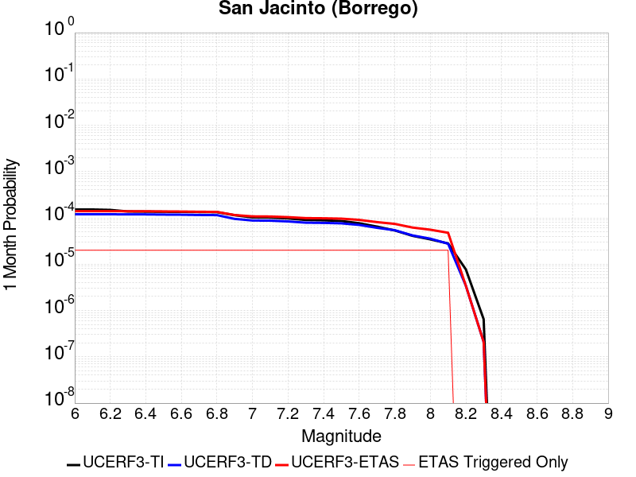 |  |  |

| Magnitude | 1 wk TI Prob | 1 wk TD Prob | 1 wk ETAS Prob | 1 wk ETAS/TD Gain | 1 wk ETAS Triggered Only | 1 mo TI Prob | 1 mo TD Prob | 1 mo ETAS Prob | 1 mo ETAS/TD Gain | 1 mo ETAS Triggered Only | 1 yr TI Prob | 1 yr TD Prob | 1 yr ETAS Prob | 1 yr ETAS/TD Gain | 1 yr ETAS Triggered Only | 10 yr TI Prob | 10 yr TD Prob | 10 yr ETAS Prob | 10 yr ETAS/TD Gain | 10 yr ETAS Triggered Only |
|-----|-----|-----|-----|-----|-----|-----|-----|-----|-----|-----|-----|-----|-----|-----|-----|-----|-----|-----|-----|-----|
| 6.0 | 3.543992E-5 | 2.7932228E-5 | 3.793195E-5 | 1.3579994 | 1.0E-5 | 1.5187653E-4 | 1.1970412E-4 | 1.3970173E-4 | 1.1670586 | 2.0E-5 | 0.0018475284 | 0.0014564357 | 0.0015063628 | 1.0342804 | 5.0E-5 | 0.018322436 | 0.014871084 | 0.014940044 | 1.0046371 | 7.0E-5 |
| 6.1 | 3.542281E-5 | 2.7932228E-5 | 3.793195E-5 | 1.3579994 | 1.0E-5 | 1.5180321E-4 | 1.1970412E-4 | 1.3970173E-4 | 1.1670586 | 2.0E-5 | 0.0018466372 | 0.0014564357 | 0.0015063628 | 1.0342804 | 5.0E-5 | 0.018313672 | 0.014871084 | 0.014940044 | 1.0046371 | 7.0E-5 |
| 6.2 | 3.4688688E-5 | 2.7932227E-5 | 3.7931946E-5 | 1.3579994 | 1.0E-5 | 1.4865733E-4 | 1.1970412E-4 | 1.3970173E-4 | 1.1670586 | 2.0E-5 | 0.0018084005 | 0.0014564357 | 0.0015063628 | 1.0342804 | 5.0E-5 | 0.017937548 | 0.014871084 | 0.014940043 | 1.0046371 | 7.0E-5 |
| 6.3 | 3.2087122E-5 | 2.7777578E-5 | 3.77773E-5 | 1.3599926 | 1.0E-5 | 1.3750899E-4 | 1.190414E-4 | 1.3903901E-4 | 1.1679888 | 2.0E-5 | 0.0016728862 | 0.0014483776 | 0.0014983052 | 1.0344714 | 5.0E-5 | 0.016603488 | 0.014792242 | 0.0148612065 | 1.0046622 | 7.0E-5 |
| 6.4 | 3.1828724E-5 | 2.7744554E-5 | 3.7744278E-5 | 1.3604211 | 1.0E-5 | 1.364017E-4 | 1.1889988E-4 | 1.388975E-4 | 1.1681887 | 2.0E-5 | 0.0016594254 | 0.001446657 | 0.0014965847 | 1.0345124 | 5.0E-5 | 0.016470885 | 0.014775435 | 0.014844401 | 1.0046676 | 7.0E-5 |
| 6.5 | 3.1563577E-5 | 2.7484237E-5 | 3.7483962E-5 | 1.363835 | 1.0E-5 | 1.3526545E-4 | 1.1778434E-4 | 1.3778197E-4 | 1.1697819 | 2.0E-5 | 0.0016456128 | 0.0014330931 | 0.0014830215 | 1.0348395 | 5.0E-5 | 0.0163348 | 0.014642836 | 0.014711811 | 1.0047104 | 7.0E-5 |
| 6.6 | 3.1467625E-5 | 2.7328453E-5 | 3.732818E-5 | 1.365909 | 1.0E-5 | 1.3485427E-4 | 1.1711675E-4 | 1.371144E-4 | 1.1707498 | 2.0E-5 | 0.0016406142 | 0.0014249759 | 0.0014749047 | 1.0350384 | 5.0E-5 | 0.016285548 | 0.01456299 | 0.014631971 | 1.0047367 | 7.0E-5 |
| 6.7 | 3.1223695E-5 | 2.6946467E-5 | 3.69462E-5 | 1.3710961 | 1.0E-5 | 1.3380898E-4 | 1.15479816E-4 | 1.3547752E-4 | 1.1731704 | 2.0E-5 | 0.0016279068 | 0.0014050722 | 0.0014550019 | 1.0355353 | 5.0E-5 | 0.01616033 | 0.014367279 | 0.014436273 | 1.0048022 | 7.0E-5 |
| 6.8 | 3.1015585E-5 | 2.676746E-5 | 3.6767193E-5 | 1.373578 | 1.0E-5 | 1.3291716E-4 | 1.1471271E-4 | 1.3471041E-4 | 1.1743286 | 2.0E-5 | 0.001617065 | 0.0013957446 | 0.0014456748 | 1.0357732 | 5.0E-5 | 0.016053487 | 0.014274547 | 0.014343549 | 1.0048338 | 7.0E-5 |
| 6.9 | 2.6641965E-5 | 2.2189311E-5 | 3.218909E-5 | 1.4506575 | 1.0E-5 | 1.1417485E-4 | 9.509361E-5 | 1.150917E-4 | 1.2102991 | 2.0E-5 | 0.0013891924 | 0.0011571536 | 0.0012070958 | 1.0431595 | 5.0E-5 | 0.0138054015 | 0.0118850535 | 0.011954222 | 1.0058198 | 7.0E-5 |
| 7.0 | 2.3854353E-5 | 2.0483907E-5 | 3.0483703E-5 | 1.4881781 | 1.0E-5 | 1.02228936E-4 | 8.7785236E-5 | 1.0778348E-4 | 1.2278087 | 2.0E-5 | 0.0012439266 | 0.0010682638 | 0.0011182104 | 1.046755 | 5.0E-5 | 0.012369866 | 0.010985446 | 0.011054677 | 1.0063021 | 7.0E-5 |
| 7.1 | 2.3672901E-5 | 2.0320394E-5 | 3.032019E-5 | 1.4921064 | 1.0E-5 | 1.0145135E-4 | 8.708451E-5 | 1.07082764E-4 | 1.2296419 | 2.0E-5 | 0.0012344702 | 0.0010597408 | 0.0011096877 | 1.0471313 | 5.0E-5 | 0.0122763505 | 0.010900678 | 0.010969915 | 1.0063516 | 7.0E-5 |
| 7.2 | 2.2717244E-5 | 1.9547722E-5 | 2.9547526E-5 | 1.5115585 | 1.0E-5 | 9.735599E-5 | 8.377327E-5 | 1.037716E-4 | 1.2387196 | 2.0E-5 | 0.0011846646 | 0.0010194647 | 0.0010694137 | 1.0489954 | 5.0E-5 | 0.01178369 | 0.0104980655 | 0.010567331 | 1.0065979 | 7.0E-5 |
| 7.3 | 2.1016205E-5 | 1.8389306E-5 | 2.8389124E-5 | 1.5437843 | 1.0E-5 | 9.006634E-5 | 7.8808946E-5 | 9.880737E-5 | 1.2537583 | 2.0E-5 | 0.001096006 | 9.590786E-4 | 0.0010090307 | 1.0520834 | 5.0E-5 | 0.010906163 | 0.0098936735 | 0.009962981 | 1.0070052 | 7.0E-5 |
| 7.4 | 2.0683625E-5 | 1.8191822E-5 | 2.819164E-5 | 1.5496875 | 1.0E-5 | 8.86411E-5 | 7.7962635E-5 | 9.796108E-5 | 1.2565131 | 2.0E-5 | 0.001078671 | 9.487838E-4 | 9.987364E-4 | 1.052649 | 5.0E-5 | 0.010734501 | 0.009790383 | 0.009859698 | 1.0070798 | 7.0E-5 |
| 7.5 | 1.9993966E-5 | 1.778682E-5 | 2.7786642E-5 | 1.562204 | 1.0E-5 | 8.568561E-5 | 7.6227014E-5 | 9.6225485E-5 | 1.2623541 | 2.0E-5 | 0.001042723 | 9.2767074E-4 | 9.776243E-4 | 1.0538484 | 5.0E-5 | 0.010378438 | 0.009577302 | 0.009646632 | 1.007239 | 7.0E-5 |
| 7.6 | 1.788966E-5 | 1.643997E-5 | 2.6439806E-5 | 1.6082636 | 1.0E-5 | 7.666772E-5 | 7.045512E-5 | 9.0453716E-5 | 1.2838486 | 2.0E-5 | 9.3302975E-4 | 8.574553E-4 | 9.0741244E-4 | 1.0582621 | 5.0E-5 | 0.00929122 | 0.008869069 | 0.008938448 | 1.0078226 | 7.0E-5 |
| 7.7 | 1.5125781E-5 | 1.4241917E-5 | 2.4241775E-5 | 1.7021427 | 1.0E-5 | 6.4823165E-5 | 6.103537E-5 | 8.1034144E-5 | 1.3276589 | 2.0E-5 | 7.889362E-4 | 7.42853E-4 | 7.928159E-4 | 1.0672581 | 5.0E-5 | 0.007861412 | 0.0077168364 | 0.0077862963 | 1.009001 | 7.0E-5 |
| 7.8 | 1.250089E-5 | 1.2634938E-5 | 2.2634811E-5 | 1.7914462 | 1.0E-5 | 5.3574146E-5 | 5.414861E-5 | 7.414753E-5 | 1.3693339 | 2.0E-5 | 6.5207E-4 | 6.5906055E-4 | 6.990342E-4 | 1.0606525 | 4.0E-5 | 0.006501599 | 0.006870356 | 0.0069299433 | 1.0086732 | 6.0E-5 |
| 7.9 | 9.561E-6 | 9.758467E-6 | 1.975837E-5 | 2.0247412 | 1.0E-5 | 4.0975072E-5 | 4.1821335E-5 | 6.18205E-5 | 1.4782048 | 2.0E-5 | 4.987573E-4 | 5.090564E-4 | 5.49036E-4 | 1.0785367 | 4.0E-5 | 0.0049763937 | 0.0053546517 | 0.005404384 | 1.0092877 | 5.0E-5 |
| 8.0 | 8.01699E-6 | 8.29697E-6 | 1.8296887E-5 | 2.2052493 | 1.0E-5 | 3.4358076E-5 | 3.555796E-5 | 5.555725E-5 | 1.562442 | 2.0E-5 | 4.1822926E-4 | 4.3283272E-4 | 4.728154E-4 | 1.0923744 | 4.0E-5 | 0.0041744304 | 0.0045754444 | 0.0046252157 | 1.0108778 | 5.0E-5 |
| 8.1 | 6.541947E-6 | 6.465052E-6 | 1.6464988E-5 | 2.546768 | 1.0E-5 | 2.8036617E-5 | 2.7707076E-5 | 4.7706522E-5 | 1.7218173 | 2.0E-5 | 3.4129233E-4 | 3.3728193E-4 | 3.6727183E-4 | 1.0889163 | 3.0E-5 | 0.0034076865 | 0.0035822936 | 0.0036221503 | 1.011126 | 4.0E-5 |
| 8.2 | 1.7968189E-6 | 7.974748E-7 | 7.974748E-7 | 1.0 | 0.0 | 7.70063E-6 | 3.417745E-6 | 3.417745E-6 | 1.0 | 0.0 | 9.3751136E-5 | 4.161027E-5 | 4.161027E-5 | 1.0 | 0.0 | 9.371159E-4 | 4.7140883E-4 | 4.7140883E-4 | 1.0 | 0.0 |
| 8.3 | 1.5167889E-7 | 4.8996533E-8 | 4.8996533E-8 | 1.0 | 0.0 | 6.500522E-7 | 2.0998513E-7 | 2.0998513E-7 | 1.0 | 0.0 | 7.9143565E-6 | 2.5565664E-6 | 2.5565664E-6 | 1.0 | 0.0 | 7.914075E-5 | 2.9707122E-5 | 2.9707122E-5 | 1.0 | 0.0 |

## San Clemente
*[(top)](#table-of-contents)*

| 1 Week | 1 Month | 1 Year | 10 Year |
|-----|-----|-----|-----|
|  |  |  | 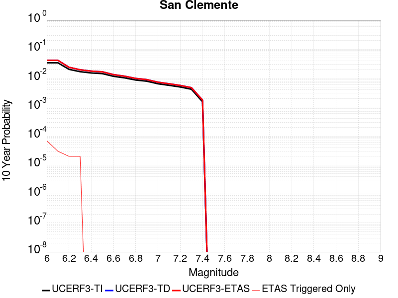 |

| Magnitude | 1 wk TI Prob | 1 wk TD Prob | 1 wk ETAS Prob | 1 wk ETAS/TD Gain | 1 wk ETAS Triggered Only | 1 mo TI Prob | 1 mo TD Prob | 1 mo ETAS Prob | 1 mo ETAS/TD Gain | 1 mo ETAS Triggered Only | 1 yr TI Prob | 1 yr TD Prob | 1 yr ETAS Prob | 1 yr ETAS/TD Gain | 1 yr ETAS Triggered Only | 10 yr TI Prob | 10 yr TD Prob | 10 yr ETAS Prob | 10 yr ETAS/TD Gain | 10 yr ETAS Triggered Only |
|-----|-----|-----|-----|-----|-----|-----|-----|-----|-----|-----|-----|-----|-----|-----|-----|-----|-----|-----|-----|-----|
| 6.0 | 6.681379E-5 | 8.164042E-5 | 1.0163878E-4 | 1.2449567 | 2.0E-5 | 2.8631336E-4 | 3.498432E-4 | 3.798327E-4 | 1.0857227 | 3.0E-5 | 0.003480294 | 0.004251515 | 0.00431126 | 1.0140526 | 6.0E-5 | 0.03426291 | 0.04175704 | 0.041824117 | 1.0016063 | 7.0E-5 |
| 6.1 | 6.681379E-5 | 8.164042E-5 | 1.0163878E-4 | 1.2449567 | 2.0E-5 | 2.8631336E-4 | 3.498432E-4 | 3.698362E-4 | 1.0571485 | 2.0E-5 | 0.003480294 | 0.004251515 | 0.00427143 | 1.0046842 | 2.0E-5 | 0.03426291 | 0.04175704 | 0.041785788 | 1.0006884 | 3.0E-5 |
| 6.2 | 3.9400576E-5 | 4.6453315E-5 | 6.645238E-5 | 1.4305198 | 2.0E-5 | 1.6884868E-4 | 1.990708E-4 | 2.1906682E-4 | 1.1004468 | 2.0E-5 | 0.0020537945 | 0.0024210473 | 0.0024409988 | 1.0082409 | 2.0E-5 | 0.020349167 | 0.02395338 | 0.0239729 | 1.0008149 | 2.0E-5 |
| 6.3 | 3.2590255E-5 | 3.7929818E-5 | 5.792906E-5 | 1.5272696 | 2.0E-5 | 1.3966505E-4 | 1.6254642E-4 | 1.8254317E-4 | 1.1230217 | 2.0E-5 | 0.0016990956 | 0.0019772365 | 0.001997197 | 1.0100951 | 2.0E-5 | 0.01686163 | 0.01960024 | 0.019619849 | 1.0010004 | 2.0E-5 |
| 6.4 | 2.9454652E-5 | 3.4098368E-5 | 3.4098368E-5 | 1.0 | 0.0 | 1.2622811E-4 | 1.4612783E-4 | 1.4612783E-4 | 1.0 | 0.0 | 0.0015357438 | 0.0017776807 | 0.0017776807 | 1.0 | 0.0 | 0.015251739 | 0.01763778 | 0.01763778 | 1.0 | 0.0 |
| 6.5 | 2.790836E-5 | 3.2248026E-5 | 3.2248026E-5 | 1.0 | 0.0 | 1.1960178E-4 | 1.3819865E-4 | 1.3819865E-4 | 1.0 | 0.0 | 0.001455179 | 0.0016812957 | 0.0016812957 | 1.0 | 0.0 | 0.014456868 | 0.016688773 | 0.016688773 | 1.0 | 0.0 |
| 6.6 | 2.2492153E-5 | 2.5763122E-5 | 2.5763122E-5 | 1.0 | 0.0 | 9.639138E-5 | 1.10408786E-4 | 1.10408786E-4 | 1.0 | 0.0 | 0.0011729331 | 0.0013434128 | 0.0013434128 | 1.0 | 0.0 | 0.011667615 | 0.013354633 | 0.013354633 | 1.0 | 0.0 |
| 6.7 | 1.9862755E-5 | 2.2666782E-5 | 2.2666782E-5 | 1.0 | 0.0 | 8.512331E-5 | 9.71398E-5 | 9.71398E-5 | 1.0 | 0.0 | 0.0010358836 | 0.0011820466 | 0.0011820466 | 1.0 | 0.0 | 0.010310682 | 0.011758885 | 0.011758885 | 1.0 | 0.0 |
| 6.8 | 1.6697575E-5 | 1.8977998E-5 | 1.8977998E-5 | 1.0 | 0.0 | 7.155907E-5 | 8.13318E-5 | 8.13318E-5 | 1.0 | 0.0 | 8.7088346E-4 | 9.897741E-4 | 9.897741E-4 | 1.0 | 0.0 | 0.008674784 | 0.009854686 | 0.009854686 | 1.0 | 0.0 |
| 6.9 | 1.5218415E-5 | 1.726966E-5 | 1.726966E-5 | 1.0 | 0.0 | 6.522015E-5 | 7.401078E-5 | 7.401078E-5 | 1.0 | 0.0 | 7.93766E-4 | 9.0071757E-4 | 9.0071757E-4 | 1.0 | 0.0 | 0.007909367 | 0.008971615 | 0.008971615 | 1.0 | 0.0 |
| 7.0 | 1.2392958E-5 | 1.4033223E-5 | 1.4033223E-5 | 1.0 | 0.0 | 5.3111595E-5 | 6.0141043E-5 | 6.0141043E-5 | 1.0 | 0.0 | 6.4644177E-4 | 7.319788E-4 | 7.319788E-4 | 1.0 | 0.0 | 0.0064456454 | 0.0072964644 | 0.0072964644 | 1.0 | 0.0 |
| 7.1 | 1.0934128E-5 | 1.2375321E-5 | 1.2375321E-5 | 1.0 | 0.0 | 4.6859706E-5 | 5.3036052E-5 | 5.3036052E-5 | 1.0 | 0.0 | 5.7036756E-4 | 6.4552994E-4 | 6.4552994E-4 | 1.0 | 0.0 | 0.0056890585 | 0.006437294 | 0.006437294 | 1.0 | 0.0 |
| 7.2 | 9.5798805E-6 | 1.0845096E-5 | 1.0845096E-5 | 1.0 | 0.0 | 4.1055984E-5 | 4.647819E-5 | 4.647819E-5 | 1.0 | 0.0 | 4.9974193E-4 | 5.6573225E-4 | 5.6573225E-4 | 1.0 | 0.0 | 0.0049861963 | 0.005643645 | 0.005643645 | 1.0 | 0.0 |
| 7.3 | 8.0167365E-6 | 9.084053E-6 | 9.084053E-6 | 1.0 | 0.0 | 3.4356988E-5 | 3.8931114E-5 | 3.8931114E-5 | 1.0 | 0.0 | 4.1821605E-4 | 4.7389028E-4 | 4.7389028E-4 | 1.0 | 0.0 | 0.0041742986 | 0.0047295 | 0.0047295 | 1.0 | 0.0 |
| 7.4 | 2.9581017E-6 | 3.3624306E-6 | 3.3624306E-6 | 1.0 | 0.0 | 1.2677518E-5 | 1.4410366E-5 | 1.4410366E-5 | 1.0 | 0.0 | 1.5433785E-4 | 1.7543712E-4 | 1.7543712E-4 | 1.0 | 0.0 | 0.001542307 | 0.0017534813 | 0.0017534813 | 1.0 | 0.0 |

## Chino alt 1
*[(top)](#table-of-contents)*

| 1 Week | 1 Month | 1 Year | 10 Year |
|-----|-----|-----|-----|
| 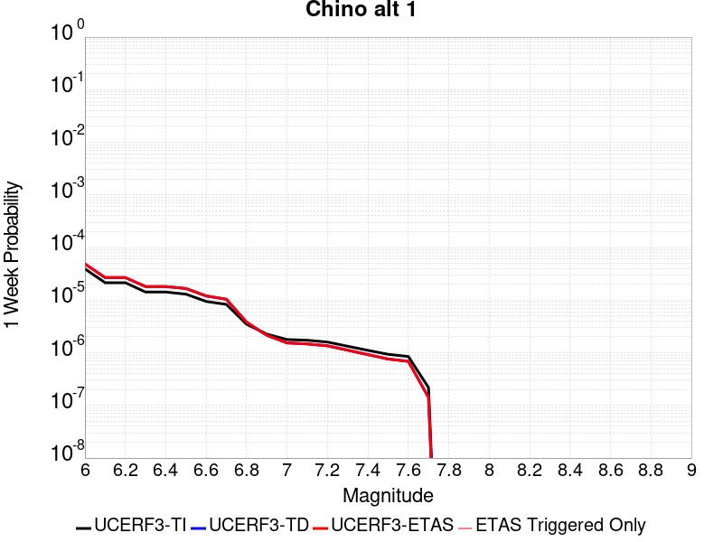 |  | 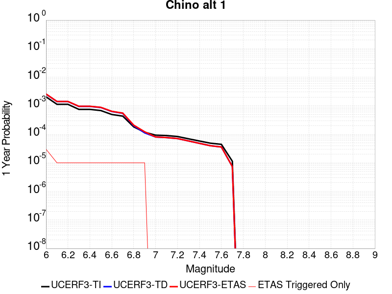 | 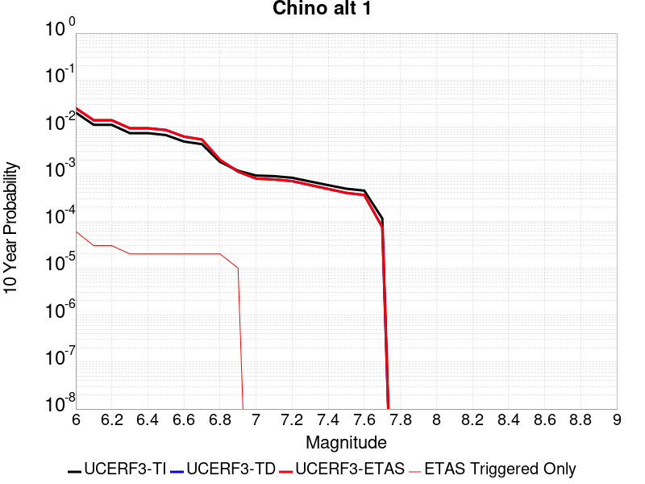 |

| Magnitude | 1 wk TI Prob | 1 wk TD Prob | 1 wk ETAS Prob | 1 wk ETAS/TD Gain | 1 wk ETAS Triggered Only | 1 mo TI Prob | 1 mo TD Prob | 1 mo ETAS Prob | 1 mo ETAS/TD Gain | 1 mo ETAS Triggered Only | 1 yr TI Prob | 1 yr TD Prob | 1 yr ETAS Prob | 1 yr ETAS/TD Gain | 1 yr ETAS Triggered Only | 10 yr TI Prob | 10 yr TD Prob | 10 yr ETAS Prob | 10 yr ETAS/TD Gain | 10 yr ETAS Triggered Only |
|-----|-----|-----|-----|-----|-----|-----|-----|-----|-----|-----|-----|-----|-----|-----|-----|-----|-----|-----|-----|-----|
| 6.0 | 3.939946E-5 | 4.8949605E-5 | 4.8949605E-5 | 1.0 | 0.0 | 1.6884391E-4 | 2.0977009E-4 | 2.1976799E-4 | 1.0476612 | 1.0E-5 | 0.0020537362 | 0.0025514693 | 0.0025813926 | 1.0117279 | 3.0E-5 | 0.020348595 | 0.025280548 | 0.025339032 | 1.0023134 | 6.0E-5 |
| 6.1 | 2.1505624E-5 | 2.6879869E-5 | 2.6879869E-5 | 1.0 | 0.0 | 9.2163704E-5 | 1.1519498E-4 | 1.1519498E-4 | 1.0 | 0.0 | 0.0011215154 | 0.001401706 | 0.001411692 | 1.0071242 | 1.0E-5 | 0.011158722 | 0.013947513 | 0.013977095 | 1.002121 | 3.0E-5 |
| 6.2 | 2.1505624E-5 | 2.6879869E-5 | 2.6879869E-5 | 1.0 | 0.0 | 9.2163704E-5 | 1.1519498E-4 | 1.1519498E-4 | 1.0 | 0.0 | 0.0011215154 | 0.001401706 | 0.001411692 | 1.0071242 | 1.0E-5 | 0.011158722 | 0.013947513 | 0.013977095 | 1.002121 | 3.0E-5 |
| 6.3 | 1.4290785E-5 | 1.8165674E-5 | 1.8165674E-5 | 1.0 | 0.0 | 6.1244784E-5 | 7.7850826E-5 | 7.7850826E-5 | 1.0 | 0.0 | 7.454001E-4 | 9.474669E-4 | 9.574574E-4 | 1.0105444 | 1.0E-5 | 0.007429048 | 0.009446723 | 0.0094665345 | 1.0020971 | 2.0E-5 |
| 6.4 | 1.4290785E-5 | 1.8165674E-5 | 1.8165674E-5 | 1.0 | 0.0 | 6.1244784E-5 | 7.7850826E-5 | 7.7850826E-5 | 1.0 | 0.0 | 7.454001E-4 | 9.474669E-4 | 9.574574E-4 | 1.0105444 | 1.0E-5 | 0.007429048 | 0.009446723 | 0.0094665345 | 1.0020971 | 2.0E-5 |
| 6.5 | 1.3017944E-5 | 1.6652602E-5 | 1.6652602E-5 | 1.0 | 0.0 | 5.5789995E-5 | 7.1366594E-5 | 7.1366594E-5 | 1.0 | 0.0 | 6.790315E-4 | 8.685856E-4 | 8.7857695E-4 | 1.011503 | 1.0E-5 | 0.0067696036 | 0.0086642 | 0.008684027 | 1.0022883 | 2.0E-5 |
| 6.6 | 9.470016E-6 | 1.2039804E-5 | 1.2039804E-5 | 1.0 | 0.0 | 4.058515E-5 | 5.159833E-5 | 5.159833E-5 | 1.0 | 0.0 | 4.940122E-4 | 6.280625E-4 | 6.3805626E-4 | 1.0159119 | 1.0E-5 | 0.004929154 | 0.0062735234 | 0.0062933983 | 1.003168 | 2.0E-5 |
| 6.7 | 8.314155E-6 | 1.0408018E-5 | 1.0408018E-5 | 1.0 | 0.0 | 3.5631605E-5 | 4.4605214E-5 | 4.4605214E-5 | 1.0 | 0.0 | 4.3372845E-4 | 5.4296537E-4 | 5.5296E-4 | 1.0184073 | 1.0E-5 | 0.004328829 | 0.0054273955 | 0.0054472866 | 1.003665 | 2.0E-5 |
| 6.8 | 3.4856364E-6 | 3.8135358E-6 | 3.8135358E-6 | 1.0 | 0.0 | 1.4938357E-5 | 1.6343634E-5 | 1.6343634E-5 | 1.0 | 0.0 | 1.8185932E-4 | 1.9896765E-4 | 2.0896566E-4 | 1.0502495 | 1.0E-5 | 0.0018171056 | 0.0019895998 | 0.00200956 | 1.0100323 | 2.0E-5 |
| 6.9 | 2.2645952E-6 | 2.1529931E-6 | 2.1529931E-6 | 1.0 | 0.0 | 9.705372E-6 | 9.227082E-6 | 9.227082E-6 | 1.0 | 0.0 | 1.18156495E-4 | 1.1233415E-4 | 1.2233303E-4 | 1.0890101 | 1.0E-5 | 0.0011809369 | 0.0011233331 | 0.0011333219 | 1.008892 | 1.0E-5 |
| 7.0 | 1.7864003E-6 | 1.5431536E-6 | 1.5431536E-6 | 1.0 | 0.0 | 7.655979E-6 | 6.6134994E-6 | 6.6134994E-6 | 1.0 | 0.0 | 9.3207556E-5 | 8.051644E-5 | 8.051644E-5 | 1.0 | 0.0 | 9.316847E-4 | 8.0527033E-4 | 8.0527033E-4 | 1.0 | 0.0 |
| 7.1 | 1.7315456E-6 | 1.4734242E-6 | 1.4734242E-6 | 1.0 | 0.0 | 7.420889E-6 | 6.3146604E-6 | 6.3146604E-6 | 1.0 | 0.0 | 9.034557E-5 | 7.6878336E-5 | 7.6878336E-5 | 1.0 | 0.0 | 9.0308854E-4 | 7.689127E-4 | 7.689127E-4 | 1.0 | 0.0 |
| 7.2 | 1.6008337E-6 | 1.3574723E-6 | 1.3574723E-6 | 1.0 | 0.0 | 6.860698E-6 | 5.817726E-6 | 5.817726E-6 | 1.0 | 0.0 | 8.352579E-5 | 7.0828566E-5 | 7.0828566E-5 | 1.0 | 0.0 | 8.34944E-4 | 7.084449E-4 | 7.084449E-4 | 1.0 | 0.0 |
| 7.3 | 1.3320939E-6 | 1.1218239E-6 | 1.1218239E-6 | 1.0 | 0.0 | 5.7089615E-6 | 4.807808E-6 | 4.807808E-6 | 1.0 | 0.0 | 6.9504385E-5 | 5.853354E-5 | 5.853354E-5 | 1.0 | 0.0 | 6.9482654E-4 | 5.853198E-4 | 5.853198E-4 | 1.0 | 0.0 |
| 7.4 | 1.114294E-6 | 9.237435E-7 | 9.237435E-7 | 1.0 | 0.0 | 4.775537E-6 | 3.958895E-6 | 3.958895E-6 | 1.0 | 0.0 | 5.8140613E-5 | 4.819852E-5 | 4.819852E-5 | 1.0 | 0.0 | 5.81254E-4 | 4.8189942E-4 | 4.8189942E-4 | 1.0 | 0.0 |
| 7.5 | 9.354081E-7 | 7.6236824E-7 | 7.6236824E-7 | 1.0 | 0.0 | 4.0088858E-6 | 3.2672885E-6 | 3.2672885E-6 | 1.0 | 0.0 | 4.8807087E-5 | 3.9778544E-5 | 3.9778544E-5 | 1.0 | 0.0 | 4.879637E-4 | 3.9771764E-4 | 3.9771764E-4 | 1.0 | 0.0 |
| 7.6 | 8.521771E-7 | 6.880915E-7 | 6.880915E-7 | 1.0 | 0.0 | 3.6521824E-6 | 2.9489604E-6 | 2.9489604E-6 | 1.0 | 0.0 | 4.4464414E-5 | 3.5903035E-5 | 3.5903035E-5 | 1.0 | 0.0 | 4.4455516E-4 | 3.589755E-4 | 3.589755E-4 | 1.0 | 0.0 |
| 7.7 | 2.1803626E-7 | 1.4186939E-7 | 1.4186939E-7 | 1.0 | 0.0 | 9.344408E-7 | 6.080116E-7 | 6.080116E-7 | 1.0 | 0.0 | 1.1376757E-5 | 7.4025256E-6 | 7.4025256E-6 | 1.0 | 0.0 | 1.13761744E-4 | 7.402375E-5 | 7.402375E-5 | 1.0 | 0.0 |

## Channel Islands Thrust
*[(top)](#table-of-contents)*

| 1 Week | 1 Month | 1 Year | 10 Year |
|-----|-----|-----|-----|
|  |  |  |  |

| Magnitude | 1 wk TI Prob | 1 wk TD Prob | 1 wk ETAS Prob | 1 wk ETAS/TD Gain | 1 wk ETAS Triggered Only | 1 mo TI Prob | 1 mo TD Prob | 1 mo ETAS Prob | 1 mo ETAS/TD Gain | 1 mo ETAS Triggered Only | 1 yr TI Prob | 1 yr TD Prob | 1 yr ETAS Prob | 1 yr ETAS/TD Gain | 1 yr ETAS Triggered Only | 10 yr TI Prob | 10 yr TD Prob | 10 yr ETAS Prob | 10 yr ETAS/TD Gain | 10 yr ETAS Triggered Only |
|-----|-----|-----|-----|-----|-----|-----|-----|-----|-----|-----|-----|-----|-----|-----|-----|-----|-----|-----|-----|-----|
| 6.0 | 2.2156251E-5 | 2.409226E-5 | 2.409226E-5 | 1.0 | 0.0 | 9.495191E-5 | 1.03249055E-4 | 1.03249055E-4 | 1.0 | 0.0 | 0.0011554264 | 0.0012564389 | 0.0012764138 | 1.015898 | 2.0E-5 | 0.011494373 | 0.012503943 | 0.0125533175 | 1.0039487 | 5.0E-5 |
| 6.1 | 2.2156251E-5 | 2.409226E-5 | 2.409226E-5 | 1.0 | 0.0 | 9.495191E-5 | 1.03249055E-4 | 1.03249055E-4 | 1.0 | 0.0 | 0.0011554264 | 0.0012564389 | 0.0012764138 | 1.015898 | 2.0E-5 | 0.011494373 | 0.012503943 | 0.0125533175 | 1.0039487 | 5.0E-5 |
| 6.2 | 2.2156251E-5 | 2.409226E-5 | 2.409226E-5 | 1.0 | 0.0 | 9.495191E-5 | 1.03249055E-4 | 1.03249055E-4 | 1.0 | 0.0 | 0.0011554264 | 0.0012564389 | 0.0012764138 | 1.015898 | 2.0E-5 | 0.011494373 | 0.012503943 | 0.0125533175 | 1.0039487 | 5.0E-5 |
| 6.3 | 2.2156251E-5 | 2.409226E-5 | 2.409226E-5 | 1.0 | 0.0 | 9.495191E-5 | 1.03249055E-4 | 1.03249055E-4 | 1.0 | 0.0 | 0.0011554264 | 0.0012564389 | 0.0012764138 | 1.015898 | 2.0E-5 | 0.011494373 | 0.012503943 | 0.0125533175 | 1.0039487 | 5.0E-5 |
| 6.4 | 2.2156251E-5 | 2.409226E-5 | 2.409226E-5 | 1.0 | 0.0 | 9.495191E-5 | 1.03249055E-4 | 1.03249055E-4 | 1.0 | 0.0 | 0.0011554264 | 0.0012564389 | 0.0012764138 | 1.015898 | 2.0E-5 | 0.011494373 | 0.012503943 | 0.0125533175 | 1.0039487 | 5.0E-5 |
| 6.5 | 2.2156251E-5 | 2.409226E-5 | 2.409226E-5 | 1.0 | 0.0 | 9.495191E-5 | 1.03249055E-4 | 1.03249055E-4 | 1.0 | 0.0 | 0.0011554264 | 0.0012564389 | 0.0012764138 | 1.015898 | 2.0E-5 | 0.011494373 | 0.012503943 | 0.0125533175 | 1.0039487 | 5.0E-5 |
| 6.6 | 2.2156251E-5 | 2.409226E-5 | 2.409226E-5 | 1.0 | 0.0 | 9.495191E-5 | 1.03249055E-4 | 1.03249055E-4 | 1.0 | 0.0 | 0.0011554264 | 0.0012564389 | 0.0012764138 | 1.015898 | 2.0E-5 | 0.011494373 | 0.012503943 | 0.0125533175 | 1.0039487 | 5.0E-5 |
| 6.7 | 1.0601296E-5 | 1.1379639E-5 | 1.1379639E-5 | 1.0 | 0.0 | 4.5433335E-5 | 4.8768994E-5 | 4.8768994E-5 | 1.0 | 0.0 | 5.5301044E-4 | 5.936056E-4 | 6.035997E-4 | 1.0168362 | 1.0E-5 | 0.005516363 | 0.0059207026 | 0.005940584 | 1.003358 | 2.0E-5 |
| 6.8 | 1.0246747E-5 | 1.09967605E-5 | 1.09967605E-5 | 1.0 | 0.0 | 4.391389E-5 | 4.712815E-5 | 4.712815E-5 | 1.0 | 0.0 | 5.345204E-4 | 5.7363894E-4 | 5.836332E-4 | 1.0174226 | 1.0E-5 | 0.0053323656 | 0.0057220724 | 0.0057419576 | 1.0034752 | 2.0E-5 |
| 6.9 | 9.049551E-6 | 9.699724E-6 | 9.699724E-6 | 1.0 | 0.0 | 3.878322E-5 | 4.1569605E-5 | 4.1569605E-5 | 1.0 | 0.0 | 4.7208337E-4 | 5.059965E-4 | 5.059965E-4 | 1.0 | 0.0 | 0.0047108172 | 0.0050488613 | 0.005058811 | 1.0019706 | 1.0E-5 |
| 7.0 | 8.6542195E-6 | 9.274679E-6 | 9.274679E-6 | 1.0 | 0.0 | 3.7088983E-5 | 3.974804E-5 | 3.974804E-5 | 1.0 | 0.0 | 4.5146482E-4 | 4.83829E-4 | 4.83829E-4 | 1.0 | 0.0 | 0.004505487 | 0.0048281685 | 0.00483812 | 1.0020611 | 1.0E-5 |
| 7.1 | 8.391028E-6 | 8.992998E-6 | 8.992998E-6 | 1.0 | 0.0 | 3.5961057E-5 | 3.8540875E-5 | 3.8540875E-5 | 1.0 | 0.0 | 4.3773788E-4 | 4.691382E-4 | 4.691382E-4 | 1.0 | 0.0 | 0.004368766 | 0.0046818885 | 0.0046918415 | 1.0021259 | 1.0E-5 |
| 7.2 | 5.965188E-6 | 6.3717453E-6 | 6.3717453E-6 | 1.0 | 0.0 | 2.556484E-5 | 2.7307196E-5 | 2.7307196E-5 | 1.0 | 0.0 | 3.1120746E-4 | 3.3241496E-4 | 3.3241496E-4 | 1.0 | 0.0 | 0.00310772 | 0.0033192353 | 0.003329202 | 1.0030028 | 1.0E-5 |
| 7.3 | 4.877518E-6 | 5.206047E-6 | 5.206047E-6 | 1.0 | 0.0 | 2.0903482E-5 | 2.2311442E-5 | 2.2311442E-5 | 1.0 | 0.0 | 2.5447016E-4 | 2.7160838E-4 | 2.7160838E-4 | 1.0 | 0.0 | 0.0025417898 | 0.0027128106 | 0.0027227835 | 1.0036762 | 1.0E-5 |
| 7.4 | 3.8829853E-6 | 4.141895E-6 | 4.141895E-6 | 1.0 | 0.0 | 1.664126E-5 | 1.775086E-5 | 1.775086E-5 | 1.0 | 0.0 | 2.0258849E-4 | 2.1609571E-4 | 2.1609571E-4 | 1.0 | 0.0 | 0.002024039 | 0.0021588975 | 0.002168876 | 1.004622 | 1.0E-5 |
| 7.5 | 1.3489616E-6 | 1.4278008E-6 | 1.4278008E-6 | 1.0 | 0.0 | 5.7812517E-6 | 6.1191326E-6 | 6.1191326E-6 | 1.0 | 0.0 | 7.038446E-5 | 7.449793E-5 | 7.449793E-5 | 1.0 | 0.0 | 7.036218E-4 | 7.4473355E-4 | 7.5472606E-4 | 1.0134176 | 1.0E-5 |
| 7.6 | 6.058192E-7 | 6.3538243E-7 | 6.3538243E-7 | 1.0 | 0.0 | 2.5963652E-6 | 2.7230649E-6 | 2.7230649E-6 | 1.0 | 0.0 | 3.161029E-5 | 3.3152828E-5 | 3.3152828E-5 | 1.0 | 0.0 | 3.1605794E-4 | 3.3148043E-4 | 3.414771E-4 | 1.0301577 | 1.0E-5 |
| 7.7 | 2.2170494E-7 | 2.2608063E-7 | 2.2608063E-7 | 1.0 | 0.0 | 9.5016367E-7 | 9.689167E-7 | 9.689167E-7 | 1.0 | 0.0 | 1.1568181E-5 | 1.1796508E-5 | 1.1796508E-5 | 1.0 | 0.0 | 1.1567579E-4 | 1.1795993E-4 | 1.2795874E-4 | 1.0847646 | 1.0E-5 |
| 7.8 | 2.1613102E-8 | 1.5466842E-8 | 1.5466842E-8 | 1.0 | 0.0 | 9.262757E-8 | 6.628646E-8 | 6.628646E-8 | 1.0 | 0.0 | 1.1277401E-6 | 8.0703745E-7 | 8.0703745E-7 | 1.0 | 0.0 | 1.1277344E-5 | 8.070353E-6 | 8.070353E-6 | 1.0 | 0.0 |

## Cleghorn Pass
*[(top)](#table-of-contents)*

| 1 Week | 1 Month | 1 Year | 10 Year |
|-----|-----|-----|-----|
|  |  |  |  |

| Magnitude | 1 wk TI Prob | 1 wk TD Prob | 1 wk ETAS Prob | 1 wk ETAS/TD Gain | 1 wk ETAS Triggered Only | 1 mo TI Prob | 1 mo TD Prob | 1 mo ETAS Prob | 1 mo ETAS/TD Gain | 1 mo ETAS Triggered Only | 1 yr TI Prob | 1 yr TD Prob | 1 yr ETAS Prob | 1 yr ETAS/TD Gain | 1 yr ETAS Triggered Only | 10 yr TI Prob | 10 yr TD Prob | 10 yr ETAS Prob | 10 yr ETAS/TD Gain | 10 yr ETAS Triggered Only |
|-----|-----|-----|-----|-----|-----|-----|-----|-----|-----|-----|-----|-----|-----|-----|-----|-----|-----|-----|-----|-----|
| 6.0 | 1.0522846E-5 | 1.1040703E-5 | 1.1040703E-5 | 1.0 | 0.0 | 4.509713E-5 | 4.7316735E-5 | 4.7316735E-5 | 1.0 | 0.0 | 5.4891926E-4 | 5.759816E-4 | 6.0596433E-4 | 1.052055 | 3.0E-5 | 0.0054756533 | 0.0057500536 | 0.0057997657 | 1.0086455 | 5.0E-5 |
| 6.1 | 1.0522846E-5 | 1.1040703E-5 | 1.1040703E-5 | 1.0 | 0.0 | 4.509713E-5 | 4.7316735E-5 | 4.7316735E-5 | 1.0 | 0.0 | 5.4891926E-4 | 5.759816E-4 | 6.0596433E-4 | 1.052055 | 3.0E-5 | 0.0054756533 | 0.0057500536 | 0.0057997657 | 1.0086455 | 5.0E-5 |
| 6.2 | 2.1045846E-6 | 2.2082147E-6 | 2.2082147E-6 | 1.0 | 0.0 | 9.019617E-6 | 9.463766E-6 | 9.463766E-6 | 1.0 | 0.0 | 1.098083E-4 | 1.1521946E-4 | 1.252183E-4 | 1.0867809 | 1.0E-5 | 0.0010975406 | 0.0011520087 | 0.0011619971 | 1.0086704 | 1.0E-5 |
| 6.3 | 2.1045846E-6 | 2.2082147E-6 | 2.2082147E-6 | 1.0 | 0.0 | 9.019617E-6 | 9.463766E-6 | 9.463766E-6 | 1.0 | 0.0 | 1.098083E-4 | 1.1521946E-4 | 1.252183E-4 | 1.0867809 | 1.0E-5 | 0.0010975406 | 0.0011520087 | 0.0011619971 | 1.0086704 | 1.0E-5 |
| 6.4 | 1.7259927E-6 | 1.810887E-6 | 1.810887E-6 | 1.0 | 0.0 | 7.3970905E-6 | 7.760945E-6 | 7.760945E-6 | 1.0 | 0.0 | 9.005586E-5 | 9.44895E-5 | 9.44895E-5 | 1.0 | 0.0 | 9.001937E-4 | 9.44895E-4 | 9.44895E-4 | 1.0 | 0.0 |

## Tin Mountain
*[(top)](#table-of-contents)*

| 1 Week | 1 Month | 1 Year | 10 Year |
|-----|-----|-----|-----|
|  |  | 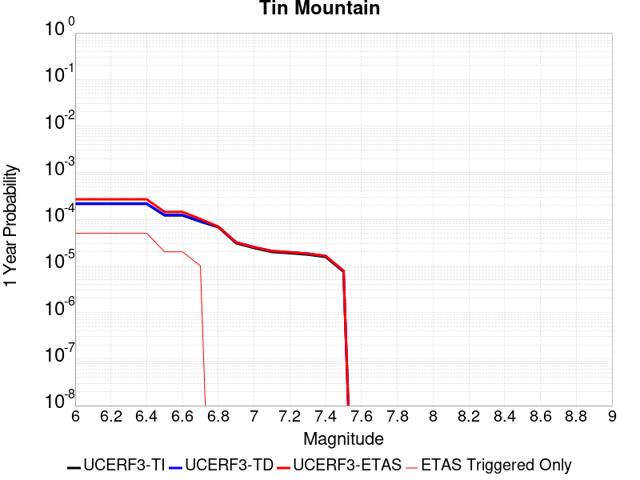 |  |

| Magnitude | 1 wk TI Prob | 1 wk TD Prob | 1 wk ETAS Prob | 1 wk ETAS/TD Gain | 1 wk ETAS Triggered Only | 1 mo TI Prob | 1 mo TD Prob | 1 mo ETAS Prob | 1 mo ETAS/TD Gain | 1 mo ETAS Triggered Only | 1 yr TI Prob | 1 yr TD Prob | 1 yr ETAS Prob | 1 yr ETAS/TD Gain | 1 yr ETAS Triggered Only | 10 yr TI Prob | 10 yr TD Prob | 10 yr ETAS Prob | 10 yr ETAS/TD Gain | 10 yr ETAS Triggered Only |
|-----|-----|-----|-----|-----|-----|-----|-----|-----|-----|-----|-----|-----|-----|-----|-----|-----|-----|-----|-----|-----|
| 6.0 | 4.083776E-6 | 4.181548E-6 | 4.181548E-6 | 1.0 | 0.0 | 1.750178E-5 | 1.7920818E-5 | 1.7920818E-5 | 1.0 | 0.0 | 2.1306332E-4 | 2.1816783E-4 | 2.6815693E-4 | 1.2291313 | 5.0E-5 | 0.0021285915 | 0.0021799023 | 0.0022397714 | 1.0274642 | 6.0E-5 |
| 6.1 | 4.083776E-6 | 4.181548E-6 | 4.181548E-6 | 1.0 | 0.0 | 1.750178E-5 | 1.7920818E-5 | 1.7920818E-5 | 1.0 | 0.0 | 2.1306332E-4 | 2.1816783E-4 | 2.6815693E-4 | 1.2291313 | 5.0E-5 | 0.0021285915 | 0.0021799023 | 0.0022397714 | 1.0274642 | 6.0E-5 |
| 6.2 | 4.083776E-6 | 4.181548E-6 | 4.181548E-6 | 1.0 | 0.0 | 1.750178E-5 | 1.7920818E-5 | 1.7920818E-5 | 1.0 | 0.0 | 2.1306332E-4 | 2.1816783E-4 | 2.6815693E-4 | 1.2291313 | 5.0E-5 | 0.0021285915 | 0.0021799023 | 0.0022397714 | 1.0274642 | 6.0E-5 |
| 6.3 | 4.083776E-6 | 4.181548E-6 | 4.181548E-6 | 1.0 | 0.0 | 1.750178E-5 | 1.7920818E-5 | 1.7920818E-5 | 1.0 | 0.0 | 2.1306332E-4 | 2.1816783E-4 | 2.6815693E-4 | 1.2291313 | 5.0E-5 | 0.0021285915 | 0.0021799023 | 0.0022397714 | 1.0274642 | 6.0E-5 |
| 6.4 | 4.083776E-6 | 4.181548E-6 | 4.181548E-6 | 1.0 | 0.0 | 1.750178E-5 | 1.7920818E-5 | 1.7920818E-5 | 1.0 | 0.0 | 2.1306332E-4 | 2.1816783E-4 | 2.6815693E-4 | 1.2291313 | 5.0E-5 | 0.0021285915 | 0.0021799023 | 0.0022397714 | 1.0274642 | 6.0E-5 |
| 6.5 | 2.3143427E-6 | 2.3731639E-6 | 2.3731639E-6 | 1.0 | 0.0 | 9.9185745E-6 | 1.0170667E-5 | 1.0170667E-5 | 1.0 | 0.0 | 1.2075195E-4 | 1.238216E-4 | 1.4381914E-4 | 1.1615027 | 2.0E-5 | 0.0012068636 | 0.0012376022 | 0.0012675651 | 1.0242105 | 3.0E-5 |
| 6.6 | 2.3143427E-6 | 2.3731639E-6 | 2.3731639E-6 | 1.0 | 0.0 | 9.9185745E-6 | 1.0170667E-5 | 1.0170667E-5 | 1.0 | 0.0 | 1.2075195E-4 | 1.238216E-4 | 1.4381914E-4 | 1.1615027 | 2.0E-5 | 0.0012068636 | 0.0012376022 | 0.0012675651 | 1.0242105 | 3.0E-5 |
| 6.7 | 1.7029532E-6 | 1.7497969E-6 | 1.7497969E-6 | 1.0 | 0.0 | 7.2983503E-6 | 7.4991112E-6 | 7.4991112E-6 | 1.0 | 0.0 | 8.885379E-5 | 9.129839E-5 | 1.01297475E-4 | 1.1095209 | 1.0E-5 | 8.881827E-4 | 9.1266143E-4 | 9.326432E-4 | 1.021894 | 2.0E-5 |
| 6.8 | 1.2914646E-6 | 1.3299423E-6 | 1.3299423E-6 | 1.0 | 0.0 | 5.534837E-6 | 5.699743E-6 | 5.699743E-6 | 1.0 | 0.0 | 6.738455E-5 | 6.93926E-5 | 6.93926E-5 | 1.0 | 0.0 | 6.736412E-4 | 6.9375266E-4 | 6.9375266E-4 | 1.0 | 0.0 |
| 6.9 | 5.8708974E-7 | 6.1170226E-7 | 6.1170226E-7 | 1.0 | 0.0 | 2.5160964E-6 | 2.6215787E-6 | 2.6215787E-6 | 1.0 | 0.0 | 3.0633044E-5 | 3.1917294E-5 | 3.1917294E-5 | 1.0 | 0.0 | 3.0628822E-4 | 3.191312E-4 | 3.191312E-4 | 1.0 | 0.0 |
| 7.0 | 4.6248786E-7 | 4.8320396E-7 | 4.8320396E-7 | 1.0 | 0.0 | 1.9820893E-6 | 2.0708726E-6 | 2.0708726E-6 | 1.0 | 0.0 | 2.413167E-5 | 2.5212621E-5 | 2.5212621E-5 | 1.0 | 0.0 | 2.412905E-4 | 2.5210128E-4 | 2.5210128E-4 | 1.0 | 0.0 |
| 7.1 | 3.804606E-7 | 3.9871685E-7 | 3.9871685E-7 | 1.0 | 0.0 | 1.6305444E-6 | 1.7087856E-6 | 1.7087856E-6 | 1.0 | 0.0 | 1.9851697E-5 | 2.08043E-5 | 2.08043E-5 | 1.0 | 0.0 | 1.9849923E-4 | 2.0802688E-4 | 2.0802688E-4 | 1.0 | 0.0 |
| 7.2 | 3.5864858E-7 | 3.7617068E-7 | 3.7617068E-7 | 1.0 | 0.0 | 1.5370645E-6 | 1.6121593E-6 | 1.6121593E-6 | 1.0 | 0.0 | 1.87136E-5 | 1.9627896E-5 | 1.9627896E-5 | 1.0 | 0.0 | 1.8712023E-4 | 1.9626494E-4 | 1.9626494E-4 | 1.0 | 0.0 |
| 7.3 | 3.342063E-7 | 3.5063664E-7 | 3.5063664E-7 | 1.0 | 0.0 | 1.4323119E-6 | 1.5027279E-6 | 1.5027279E-6 | 1.0 | 0.0 | 1.7438259E-5 | 1.8295592E-5 | 1.8295592E-5 | 1.0 | 0.0 | 1.743689E-4 | 1.8294415E-4 | 1.8294415E-4 | 1.0 | 0.0 |
| 7.4 | 2.971242E-7 | 3.1165987E-7 | 3.1165987E-7 | 1.0 | 0.0 | 1.2733886E-6 | 1.3356847E-6 | 1.3356847E-6 | 1.0 | 0.0 | 1.5503398E-5 | 1.6261874E-5 | 1.6261874E-5 | 1.0 | 0.0 | 1.5502315E-4 | 1.6261011E-4 | 1.6261011E-4 | 1.0 | 0.0 |
| 7.5 | 1.4326713E-7 | 1.5012604E-7 | 1.5012604E-7 | 1.0 | 0.0 | 6.140018E-7 | 6.4339736E-7 | 6.4339736E-7 | 1.0 | 0.0 | 7.4754466E-6 | 7.833362E-6 | 7.833362E-6 | 1.0 | 0.0 | 7.475195E-5 | 7.833362E-5 | 7.833362E-5 | 1.0 | 0.0 |

## Big Pine (Central)
*[(top)](#table-of-contents)*

| 1 Week | 1 Month | 1 Year | 10 Year |
|-----|-----|-----|-----|
| 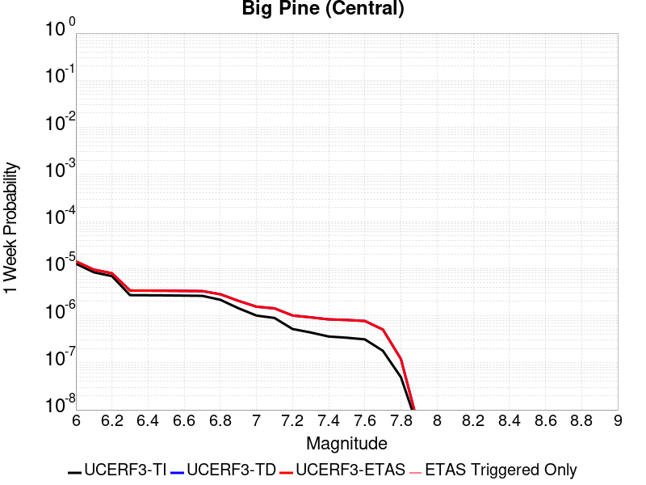 |  |  |  |

| Magnitude | 1 wk TI Prob | 1 wk TD Prob | 1 wk ETAS Prob | 1 wk ETAS/TD Gain | 1 wk ETAS Triggered Only | 1 mo TI Prob | 1 mo TD Prob | 1 mo ETAS Prob | 1 mo ETAS/TD Gain | 1 mo ETAS Triggered Only | 1 yr TI Prob | 1 yr TD Prob | 1 yr ETAS Prob | 1 yr ETAS/TD Gain | 1 yr ETAS Triggered Only | 10 yr TI Prob | 10 yr TD Prob | 10 yr ETAS Prob | 10 yr ETAS/TD Gain | 10 yr ETAS Triggered Only |
|-----|-----|-----|-----|-----|-----|-----|-----|-----|-----|-----|-----|-----|-----|-----|-----|-----|-----|-----|-----|-----|
| 6.0 | 1.2706755E-5 | 1.4251002E-5 | 1.4251002E-5 | 1.0 | 0.0 | 5.4456385E-5 | 6.10745E-5 | 7.107389E-5 | 1.1637244 | 1.0E-5 | 6.628048E-4 | 7.433649E-4 | 7.733426E-4 | 1.0403271 | 3.0E-5 | 0.006608314 | 0.0074138143 | 0.0074733696 | 1.008033 | 6.0E-5 |
| 6.1 | 8.342579E-6 | 9.511189E-6 | 9.511189E-6 | 1.0 | 0.0 | 3.5753423E-5 | 4.0761726E-5 | 5.076132E-5 | 1.2453182 | 1.0E-5 | 4.3521097E-4 | 4.961827E-4 | 5.161728E-4 | 1.0402877 | 2.0E-5 | 0.0043435963 | 0.004954307 | 0.004984158 | 1.0060253 | 3.0E-5 |
| 6.2 | 6.923899E-6 | 7.96756E-6 | 7.96756E-6 | 1.0 | 0.0 | 2.9673516E-5 | 3.4146346E-5 | 4.4146007E-5 | 1.292847 | 1.0E-5 | 3.6121515E-4 | 4.156717E-4 | 4.356634E-4 | 1.0480949 | 2.0E-5 | 0.003606286 | 0.0041522533 | 0.0041821287 | 1.007195 | 3.0E-5 |
| 6.3 | 2.728396E-6 | 3.4246614E-6 | 3.4246614E-6 | 1.0 | 0.0 | 1.1693074E-5 | 1.4677043E-5 | 1.4677043E-5 | 1.0 | 0.0 | 1.4235388E-4 | 1.7867921E-4 | 1.8867743E-4 | 1.0559562 | 1.0E-5 | 0.0014226272 | 0.0017868656 | 0.0018068299 | 1.0111728 | 2.0E-5 |
| 6.4 | 2.7136944E-6 | 3.4089546E-6 | 3.4089546E-6 | 1.0 | 0.0 | 1.1630066E-5 | 1.4609728E-5 | 1.4609728E-5 | 1.0 | 0.0 | 1.4158686E-4 | 1.778598E-4 | 1.8785801E-4 | 1.0562141 | 1.0E-5 | 0.0014149669 | 0.0017786847 | 0.0017986491 | 1.0112243 | 2.0E-5 |
| 6.5 | 2.6971882E-6 | 3.3912995E-6 | 3.3912995E-6 | 1.0 | 0.0 | 1.1559327E-5 | 1.4534065E-5 | 1.4534065E-5 | 1.0 | 0.0 | 1.4072572E-4 | 1.7693875E-4 | 1.8693697E-4 | 1.0565068 | 1.0E-5 | 0.0014063664 | 0.0017694888 | 0.0017894534 | 1.0112827 | 2.0E-5 |
| 6.6 | 2.669092E-6 | 3.3613198E-6 | 3.3613198E-6 | 1.0 | 0.0 | 1.1438916E-5 | 1.4405581E-5 | 1.4405581E-5 | 1.0 | 0.0 | 1.3925991E-4 | 1.753747E-4 | 1.8537295E-4 | 1.0570108 | 1.0E-5 | 0.0013917267 | 0.0017538732 | 0.0017738382 | 1.0113833 | 2.0E-5 |
| 6.7 | 2.6408059E-6 | 3.3313452E-6 | 3.3313452E-6 | 1.0 | 0.0 | 1.1317691E-5 | 1.42771205E-5 | 1.42771205E-5 | 1.0 | 0.0 | 1.3778417E-4 | 1.7381094E-4 | 1.838092E-4 | 1.0575237 | 1.0E-5 | 0.0013769877 | 0.0017382602 | 0.0017582254 | 1.0114858 | 2.0E-5 |
| 6.8 | 2.1786943E-6 | 2.8548009E-6 | 2.8548009E-6 | 1.0 | 0.0 | 9.337228E-6 | 1.2234807E-5 | 1.2234807E-5 | 1.0 | 0.0 | 1.1367482E-4 | 1.4894933E-4 | 1.5894783E-4 | 1.0671269 | 1.0E-5 | 0.0011361669 | 0.0014899916 | 0.0015099618 | 1.0134029 | 2.0E-5 |
| 6.9 | 1.4411696E-6 | 2.0688506E-6 | 2.0688506E-6 | 1.0 | 0.0 | 6.1764263E-6 | 8.866475E-6 | 8.866475E-6 | 1.0 | 0.0 | 7.51954E-5 | 1.07944245E-4 | 1.1794317E-4 | 1.0926304 | 1.0E-5 | 7.5169955E-4 | 0.0010803702 | 0.0010903594 | 1.0092461 | 1.0E-5 |
| 7.0 | 1.0073411E-6 | 1.554579E-6 | 1.554579E-6 | 1.0 | 0.0 | 4.317169E-6 | 6.6624652E-6 | 6.6624652E-6 | 1.0 | 0.0 | 5.2560266E-5 | 8.1112645E-5 | 9.111183E-5 | 1.1232753 | 1.0E-5 | 5.2547833E-4 | 8.122712E-4 | 8.222631E-4 | 1.0123012 | 1.0E-5 |
| 7.1 | 8.947104E-7 | 1.4305629E-6 | 1.4305629E-6 | 1.0 | 0.0 | 3.834468E-6 | 6.13097E-6 | 6.13097E-6 | 1.0 | 0.0 | 4.6683643E-5 | 7.464215E-5 | 8.4641404E-5 | 1.1339625 | 1.0E-5 | 4.6673836E-4 | 7.476114E-4 | 7.576039E-4 | 1.013366 | 1.0E-5 |
| 7.2 | 5.215166E-7 | 1.0114601E-6 | 1.0114601E-6 | 1.0 | 0.0 | 2.2350691E-6 | 4.334822E-6 | 4.334822E-6 | 1.0 | 0.0 | 2.7211627E-5 | 5.2775224E-5 | 5.2775224E-5 | 1.0 | 0.0 | 2.7208295E-4 | 5.2905735E-4 | 5.2905735E-4 | 1.0 | 0.0 |
| 7.3 | 4.4024807E-7 | 9.222433E-7 | 9.222433E-7 | 1.0 | 0.0 | 1.8867761E-6 | 3.9524657E-6 | 3.9524657E-6 | 1.0 | 0.0 | 2.2971257E-5 | 4.8120248E-5 | 4.8120248E-5 | 1.0 | 0.0 | 2.2968883E-4 | 4.8252888E-4 | 4.8252888E-4 | 1.0 | 0.0 |
| 7.4 | 3.6130905E-7 | 8.3612895E-7 | 8.3612895E-7 | 1.0 | 0.0 | 1.5484665E-6 | 3.583405E-6 | 3.583405E-6 | 1.0 | 0.0 | 1.8852415E-5 | 4.3627122E-5 | 4.3627122E-5 | 1.0 | 0.0 | 1.8850817E-4 | 4.376071E-4 | 4.376071E-4 | 1.0 | 0.0 |
| 7.5 | 3.408184E-7 | 8.110858E-7 | 8.110858E-7 | 1.0 | 0.0 | 1.4606494E-6 | 3.4760774E-6 | 3.4760774E-6 | 1.0 | 0.0 | 1.7783263E-5 | 4.232046E-5 | 4.232046E-5 | 1.0 | 0.0 | 1.778184E-4 | 4.2452035E-4 | 4.2452035E-4 | 1.0 | 0.0 |
| 7.6 | 3.1428627E-7 | 7.734219E-7 | 7.734219E-7 | 1.0 | 0.0 | 1.3469405E-6 | 3.3146612E-6 | 3.3146612E-6 | 1.0 | 0.0 | 1.6398877E-5 | 4.035529E-5 | 4.035529E-5 | 1.0 | 0.0 | 1.6397667E-4 | 4.0484677E-4 | 4.0484677E-4 | 1.0 | 0.0 |
| 7.7 | 1.7972785E-7 | 5.07985E-7 | 5.07985E-7 | 1.0 | 0.0 | 7.70262E-7 | 2.1770768E-6 | 2.1770768E-6 | 1.0 | 0.0 | 9.377899E-6 | 2.65056E-5 | 2.65056E-5 | 1.0 | 0.0 | 9.377503E-5 | 2.664151E-4 | 2.664151E-4 | 1.0 | 0.0 |
| 7.8 | 4.9230927E-8 | 1.198547E-7 | 1.198547E-7 | 1.0 | 0.0 | 2.1098968E-7 | 5.1366294E-7 | 5.1366294E-7 | 1.0 | 0.0 | 2.5687964E-6 | 6.2538297E-6 | 6.2538297E-6 | 1.0 | 0.0 | 2.5687666E-5 | 6.298101E-5 | 6.298101E-5 | 1.0 | 0.0 |
| 7.9 | 3.6805972E-9 | 4.1066026E-9 | 4.1066026E-9 | 1.0 | 0.0 | 1.5773987E-8 | 1.7599726E-8 | 1.7599726E-8 | 1.0 | 0.0 | 1.9204828E-7 | 2.1427664E-7 | 2.1427664E-7 | 1.0 | 0.0 | 1.920481E-6 | 2.190673E-6 | 2.190673E-6 | 1.0 | 0.0 |

## San Pedro Basin
*[(top)](#table-of-contents)*

| 1 Week | 1 Month | 1 Year | 10 Year |
|-----|-----|-----|-----|
| 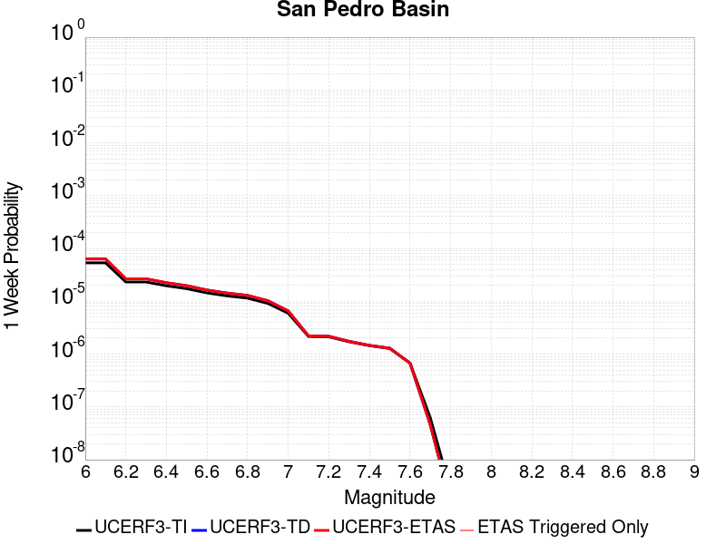 |  |  | 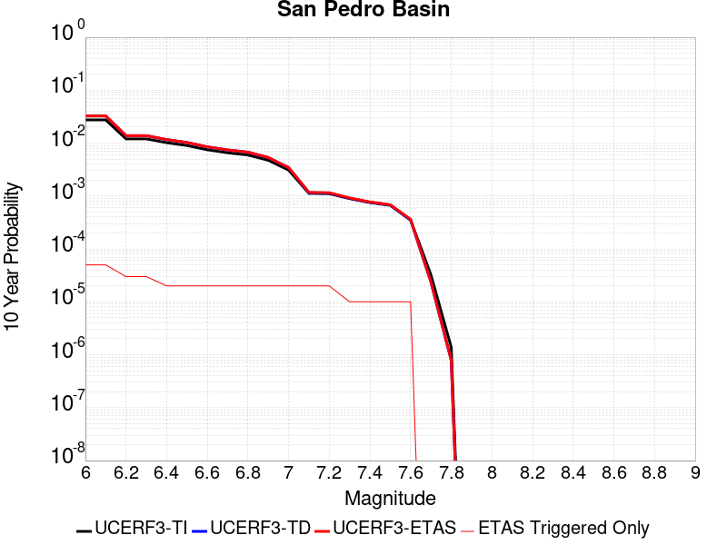 |

| Magnitude | 1 wk TI Prob | 1 wk TD Prob | 1 wk ETAS Prob | 1 wk ETAS/TD Gain | 1 wk ETAS Triggered Only | 1 mo TI Prob | 1 mo TD Prob | 1 mo ETAS Prob | 1 mo ETAS/TD Gain | 1 mo ETAS Triggered Only | 1 yr TI Prob | 1 yr TD Prob | 1 yr ETAS Prob | 1 yr ETAS/TD Gain | 1 yr ETAS Triggered Only | 10 yr TI Prob | 10 yr TD Prob | 10 yr ETAS Prob | 10 yr ETAS/TD Gain | 10 yr ETAS Triggered Only |
|-----|-----|-----|-----|-----|-----|-----|-----|-----|-----|-----|-----|-----|-----|-----|-----|-----|-----|-----|-----|-----|
| 6.0 | 5.3449043E-5 | 6.337152E-5 | 6.337152E-5 | 1.0 | 0.0 | 2.2904722E-4 | 2.715674E-4 | 2.9156197E-4 | 1.0736265 | 2.0E-5 | 0.0027850836 | 0.0033019206 | 0.0033318216 | 1.0090556 | 3.0E-5 | 0.027504366 | 0.032590155 | 0.032638527 | 1.0014842 | 5.0E-5 |
| 6.1 | 5.3449043E-5 | 6.337152E-5 | 6.337152E-5 | 1.0 | 0.0 | 2.2904722E-4 | 2.715674E-4 | 2.9156197E-4 | 1.0736265 | 2.0E-5 | 0.0027850836 | 0.0033019206 | 0.0033318216 | 1.0090556 | 3.0E-5 | 0.027504366 | 0.032590155 | 0.032638527 | 1.0014842 | 5.0E-5 |
| 6.2 | 2.3189454E-5 | 2.6643282E-5 | 2.6643282E-5 | 1.0 | 0.0 | 9.9379584E-5 | 1.14180744E-4 | 1.2417961E-4 | 1.0875704 | 1.0E-5 | 0.0012092749 | 0.0013893112 | 0.0014092834 | 1.0143756 | 2.0E-5 | 0.012027155 | 0.013811124 | 0.013840709 | 1.0021422 | 3.0E-5 |
| 6.3 | 2.3189454E-5 | 2.6643282E-5 | 2.6643282E-5 | 1.0 | 0.0 | 9.9379584E-5 | 1.14180744E-4 | 1.2417961E-4 | 1.0875704 | 1.0E-5 | 0.0012092749 | 0.0013893112 | 0.0014092834 | 1.0143756 | 2.0E-5 | 0.012027155 | 0.013811124 | 0.013840709 | 1.0021422 | 3.0E-5 |
| 6.4 | 1.966056E-5 | 2.2463788E-5 | 2.2463788E-5 | 1.0 | 0.0 | 8.425682E-5 | 9.627005E-5 | 1.06269086E-4 | 1.1038644 | 1.0E-5 | 0.001025344 | 0.0011714977 | 0.0011914743 | 1.0170522 | 2.0E-5 | 0.010206259 | 0.011657309 | 0.011677075 | 1.0016956 | 2.0E-5 |
| 6.5 | 1.7342953E-5 | 1.9745466E-5 | 1.9745466E-5 | 1.0 | 0.0 | 7.4324824E-5 | 8.4620886E-5 | 9.4620045E-5 | 1.1181642 | 1.0E-5 | 9.04529E-4 | 0.0010298094 | 0.0010497887 | 1.0194011 | 2.0E-5 | 0.009008561 | 0.010254095 | 0.01027389 | 1.0019305 | 2.0E-5 |
| 6.6 | 1.439804E-5 | 1.6322969E-5 | 1.6322969E-5 | 1.0 | 0.0 | 6.170443E-5 | 6.995389E-5 | 7.9953184E-5 | 1.1429414 | 1.0E-5 | 7.509924E-4 | 8.5138786E-4 | 8.7137084E-4 | 1.023471 | 2.0E-5 | 0.0074845953 | 0.008484463 | 0.008504294 | 1.0023372 | 2.0E-5 |
| 6.7 | 1.2634884E-5 | 1.4285514E-5 | 1.4285514E-5 | 1.0 | 0.0 | 5.414838E-5 | 6.122237E-5 | 7.122176E-5 | 1.163329 | 1.0E-5 | 6.590571E-4 | 7.451579E-4 | 7.6514296E-4 | 1.02682 | 2.0E-5 | 0.006571059 | 0.007429614 | 0.0074494653 | 1.002672 | 2.0E-5 |
| 6.8 | 1.146091E-5 | 1.2933387E-5 | 1.2933387E-5 | 1.0 | 0.0 | 4.911726E-5 | 5.542779E-5 | 6.542724E-5 | 1.1804049 | 1.0E-5 | 5.9783855E-4 | 6.7465415E-4 | 6.946406E-4 | 1.0296248 | 2.0E-5 | 0.0059623276 | 0.0067290002 | 0.0067488654 | 1.0029522 | 2.0E-5 |
| 6.9 | 9.109035E-6 | 1.0235161E-5 | 1.0235161E-5 | 1.0 | 0.0 | 3.9038136E-5 | 4.38644E-5 | 5.386396E-5 | 1.2279654 | 1.0E-5 | 4.7518566E-4 | 5.339462E-4 | 5.5393553E-4 | 1.037437 | 2.0E-5 | 0.0047417083 | 0.005329387 | 0.0053492803 | 1.0037328 | 2.0E-5 |
| 7.0 | 5.9351028E-6 | 6.5840527E-6 | 6.5840527E-6 | 1.0 | 0.0 | 2.5435906E-5 | 2.8217197E-5 | 3.8216913E-5 | 1.3543838 | 1.0E-5 | 3.0963816E-4 | 3.4351382E-4 | 3.6350696E-4 | 1.0582018 | 2.0E-5 | 0.0030920706 | 0.0034321453 | 0.0034520768 | 1.0058073 | 2.0E-5 |
| 7.1 | 2.1557585E-6 | 2.2096597E-6 | 2.2096597E-6 | 1.0 | 0.0 | 9.238933E-6 | 9.469936E-6 | 1.9469842E-5 | 2.0559633 | 1.0E-5 | 1.1247819E-4 | 1.1529053E-4 | 1.3528822E-4 | 1.1734548 | 2.0E-5 | 0.0011242128 | 0.0011523226 | 0.0011722995 | 1.0173362 | 2.0E-5 |
| 7.2 | 2.1251979E-6 | 2.1780058E-6 | 2.1780058E-6 | 1.0 | 0.0 | 9.107958E-6 | 9.334278E-6 | 1.9334184E-5 | 2.07131 | 1.0E-5 | 1.1088375E-4 | 1.13639064E-4 | 1.3363679E-4 | 1.1759758 | 2.0E-5 | 0.0011082845 | 0.0011358248 | 0.0011558022 | 1.0175884 | 2.0E-5 |
| 7.3 | 1.7145798E-6 | 1.7442961E-6 | 1.7442961E-6 | 1.0 | 0.0 | 7.3481783E-6 | 7.475534E-6 | 7.475534E-6 | 1.0 | 0.0 | 8.94604E-5 | 9.1010916E-5 | 1.0101001E-4 | 1.109867 | 1.0E-5 | 8.9424395E-4 | 9.097456E-4 | 9.1973646E-4 | 1.010982 | 1.0E-5 |
| 7.4 | 1.4467993E-6 | 1.4641939E-6 | 1.4641939E-6 | 1.0 | 0.0 | 6.200554E-6 | 6.2751024E-6 | 6.2751024E-6 | 1.0 | 0.0 | 7.548913E-5 | 7.639677E-5 | 8.6396E-5 | 1.1308856 | 1.0E-5 | 7.546349E-4 | 7.6371233E-4 | 7.7370467E-4 | 1.0130839 | 1.0E-5 |
| 7.5 | 1.2803735E-6 | 1.293156E-6 | 1.293156E-6 | 1.0 | 0.0 | 5.487303E-6 | 5.5420855E-6 | 5.5420855E-6 | 1.0 | 0.0 | 6.680587E-5 | 6.747288E-5 | 7.74722E-5 | 1.1481977 | 1.0E-5 | 6.678579E-4 | 6.74531E-4 | 6.8452425E-4 | 1.0148151 | 1.0E-5 |
| 7.6 | 6.755009E-7 | 6.7695E-7 | 6.7695E-7 | 1.0 | 0.0 | 2.8950008E-6 | 2.9012112E-6 | 2.9012112E-6 | 1.0 | 0.0 | 3.5246063E-5 | 3.5321733E-5 | 4.532138E-5 | 1.2831018 | 1.0E-5 | 3.5240475E-4 | 3.531669E-4 | 3.6316336E-4 | 1.0283052 | 1.0E-5 |
| 7.7 | 6.211885E-8 | 4.5700016E-8 | 4.5700016E-8 | 1.0 | 0.0 | 2.6622362E-7 | 1.958572E-7 | 1.958572E-7 | 1.0 | 0.0 | 3.2412677E-6 | 2.384559E-6 | 2.384559E-6 | 1.0 | 0.0 | 3.2412205E-5 | 2.3845354E-5 | 2.3845354E-5 | 1.0 | 0.0 |
| 7.8 | 2.6580573E-9 | 1.513834E-9 | 1.513834E-9 | 1.0 | 0.0 | 1.1391674E-8 | 6.4878596E-9 | 6.4878596E-9 | 1.0 | 0.0 | 1.3869362E-7 | 7.898969E-8 | 7.898969E-8 | 1.0 | 0.0 | 1.3869354E-6 | 7.898969E-7 | 7.898969E-7 | 1.0 | 0.0 |

## Great Valley 09 (Laguna Seca)
*[(top)](#table-of-contents)*

| 1 Week | 1 Month | 1 Year | 10 Year |
|-----|-----|-----|-----|
|  | 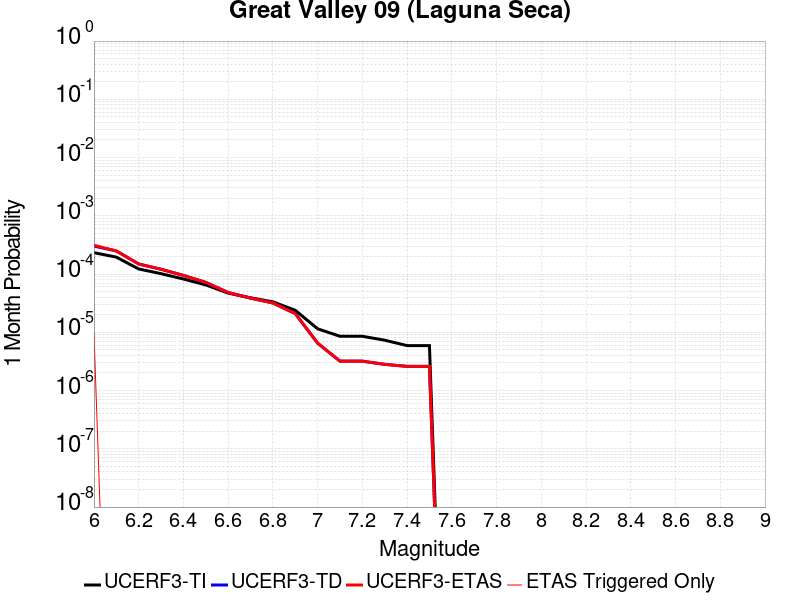 | 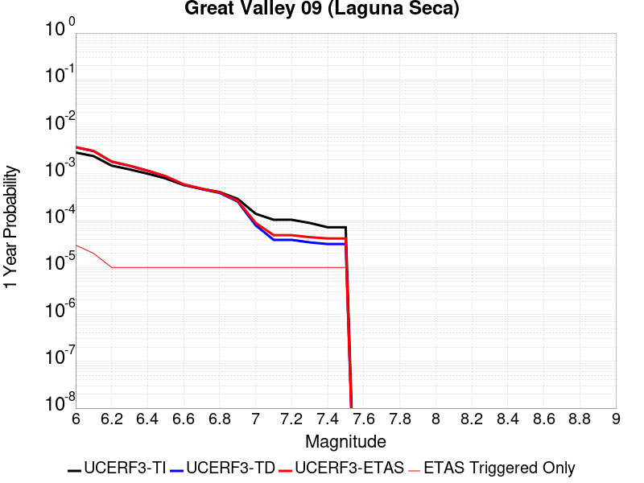 |  |

| Magnitude | 1 wk TI Prob | 1 wk TD Prob | 1 wk ETAS Prob | 1 wk ETAS/TD Gain | 1 wk ETAS Triggered Only | 1 mo TI Prob | 1 mo TD Prob | 1 mo ETAS Prob | 1 mo ETAS/TD Gain | 1 mo ETAS Triggered Only | 1 yr TI Prob | 1 yr TD Prob | 1 yr ETAS Prob | 1 yr ETAS/TD Gain | 1 yr ETAS Triggered Only | 10 yr TI Prob | 10 yr TD Prob | 10 yr ETAS Prob | 10 yr ETAS/TD Gain | 10 yr ETAS Triggered Only |
|-----|-----|-----|-----|-----|-----|-----|-----|-----|-----|-----|-----|-----|-----|-----|-----|-----|-----|-----|-----|-----|
| 6.0 | 5.4353277E-5 | 7.050287E-5 | 7.050287E-5 | 1.0 | 0.0 | 2.3292181E-4 | 3.0212116E-4 | 3.1211815E-4 | 1.0330893 | 1.0E-5 | 0.0028321352 | 0.0036721327 | 0.0037020226 | 1.0081396 | 3.0E-5 | 0.02796312 | 0.03611705 | 0.036165245 | 1.0013344 | 5.0E-5 |
| 6.1 | 4.5578287E-5 | 5.822267E-5 | 5.822267E-5 | 1.0 | 0.0 | 1.953209E-4 | 2.495022E-4 | 2.495022E-4 | 1.0 | 0.0 | 0.0023754383 | 0.0030334564 | 0.0030533958 | 1.0065731 | 2.0E-5 | 0.023502063 | 0.029920863 | 0.029959666 | 1.0012969 | 4.0E-5 |
| 6.2 | 2.8536782E-5 | 3.473753E-5 | 3.473753E-5 | 1.0 | 0.0 | 1.2229476E-4 | 1.4886595E-4 | 1.4886595E-4 | 1.0 | 0.0 | 0.0014879217 | 0.0018109119 | 0.0018208938 | 1.0055121 | 1.0E-5 | 0.014779986 | 0.017958805 | 0.017978445 | 1.0010936 | 2.0E-5 |
| 6.3 | 2.3698774E-5 | 2.8214197E-5 | 2.8214197E-5 | 1.0 | 0.0 | 1.01562226E-4 | 1.2091156E-4 | 1.2091156E-4 | 1.0 | 0.0 | 0.0012358186 | 0.001471093 | 0.0014810783 | 1.0067877 | 1.0E-5 | 0.012289686 | 0.014611864 | 0.014631572 | 1.0013487 | 2.0E-5 |
| 6.4 | 1.9191197E-5 | 2.21235E-5 | 2.21235E-5 | 1.0 | 0.0 | 8.2245395E-5 | 9.481125E-5 | 9.481125E-5 | 1.0 | 0.0 | 0.0010008777 | 0.001153721 | 0.0011637096 | 1.0086576 | 1.0E-5 | 0.009963818 | 0.01147732 | 0.0114970915 | 1.0017226 | 2.0E-5 |
| 6.5 | 1.5203241E-5 | 1.6801707E-5 | 1.6801707E-5 | 1.0 | 0.0 | 6.5155116E-5 | 7.200495E-5 | 7.200495E-5 | 1.0 | 0.0 | 7.9297484E-4 | 8.763216E-4 | 8.863128E-4 | 1.0114013 | 1.0E-5 | 0.007901512 | 0.008729784 | 0.008739697 | 1.0011355 | 1.0E-5 |
| 6.6 | 1.0984925E-5 | 1.1242767E-5 | 1.1242767E-5 | 1.0 | 0.0 | 4.70774E-5 | 4.818242E-5 | 4.818242E-5 | 1.0 | 0.0 | 5.730166E-4 | 5.864668E-4 | 5.9646094E-4 | 1.0170412 | 1.0E-5 | 0.005715413 | 0.0058495826 | 0.005859524 | 1.0016996 | 1.0E-5 |
| 6.7 | 9.134616E-6 | 9.020025E-6 | 9.020025E-6 | 1.0 | 0.0 | 3.9147766E-5 | 3.865669E-5 | 3.865669E-5 | 1.0 | 0.0 | 4.7651984E-4 | 4.7054596E-4 | 4.8054126E-4 | 1.0212419 | 1.0E-5 | 0.004754993 | 0.0046957415 | 0.0047056945 | 1.0021195 | 1.0E-5 |
| 6.8 | 7.785589E-6 | 7.4520467E-6 | 7.4520467E-6 | 1.0 | 0.0 | 3.3366385E-5 | 3.1936965E-5 | 3.1936965E-5 | 1.0 | 0.0 | 4.0616E-4 | 3.8876518E-4 | 3.9876127E-4 | 1.0257125 | 1.0E-5 | 0.0040541845 | 0.0038810547 | 0.003891016 | 1.0025666 | 1.0E-5 |
| 6.9 | 5.579095E-6 | 4.89855E-6 | 4.89855E-6 | 1.0 | 0.0 | 2.3910188E-5 | 2.0993624E-5 | 2.0993624E-5 | 1.0 | 0.0 | 2.9106764E-4 | 2.5556877E-4 | 2.6556622E-4 | 1.0391184 | 1.0E-5 | 0.002906867 | 0.002552886 | 0.0025628605 | 1.0039071 | 1.0E-5 |
| 7.0 | 2.6816688E-6 | 1.5216076E-6 | 1.5216076E-6 | 1.0 | 0.0 | 1.1492816E-5 | 6.52116E-6 | 6.52116E-6 | 1.0 | 0.0 | 1.3991605E-4 | 7.939231E-5 | 8.939152E-5 | 1.1259468 | 1.0E-5 | 0.0013982799 | 7.9364824E-4 | 8.036403E-4 | 1.01259 | 1.0E-5 |
| 7.1 | 1.9951021E-6 | 7.4536626E-7 | 7.4536626E-7 | 1.0 | 0.0 | 8.55041E-6 | 3.1944232E-6 | 3.1944232E-6 | 1.0 | 0.0 | 1.0409627E-4 | 3.889145E-5 | 4.8891063E-5 | 1.257116 | 1.0E-5 | 0.0010404752 | 3.8885057E-4 | 3.988467E-4 | 1.0257068 | 1.0E-5 |
| 7.2 | 1.9951021E-6 | 7.4536626E-7 | 7.4536626E-7 | 1.0 | 0.0 | 8.55041E-6 | 3.1944232E-6 | 3.1944232E-6 | 1.0 | 0.0 | 1.0409627E-4 | 3.889145E-5 | 4.8891063E-5 | 1.257116 | 1.0E-5 | 0.0010404752 | 3.8885057E-4 | 3.988467E-4 | 1.0257068 | 1.0E-5 |
| 7.3 | 1.7087556E-6 | 6.578735E-7 | 6.578735E-7 | 1.0 | 0.0 | 7.3232177E-6 | 2.8194552E-6 | 2.8194552E-6 | 1.0 | 0.0 | 8.915652E-5 | 3.4326367E-5 | 4.4326025E-5 | 1.2913113 | 1.0E-5 | 8.9120766E-4 | 3.432147E-4 | 3.5321128E-4 | 1.0291263 | 1.0E-5 |
| 7.4 | 1.3804846E-6 | 6.073771E-7 | 6.073771E-7 | 1.0 | 0.0 | 5.916349E-6 | 2.6030423E-6 | 2.6030423E-6 | 1.0 | 0.0 | 7.2029165E-5 | 3.169162E-5 | 4.1691303E-5 | 1.3155308 | 1.0E-5 | 7.200583E-4 | 3.1687503E-4 | 3.2687184E-4 | 1.0315481 | 1.0E-5 |
| 7.5 | 1.3804846E-6 | 6.073771E-7 | 6.073771E-7 | 1.0 | 0.0 | 5.916349E-6 | 2.6030423E-6 | 2.6030423E-6 | 1.0 | 0.0 | 7.2029165E-5 | 3.169162E-5 | 4.1691303E-5 | 1.3155308 | 1.0E-5 | 7.200583E-4 | 3.1687503E-4 | 3.2687184E-4 | 1.0315481 | 1.0E-5 |

## Kern Canyon (South Kern) 2011
*[(top)](#table-of-contents)*

| 1 Week | 1 Month | 1 Year | 10 Year |
|-----|-----|-----|-----|
| 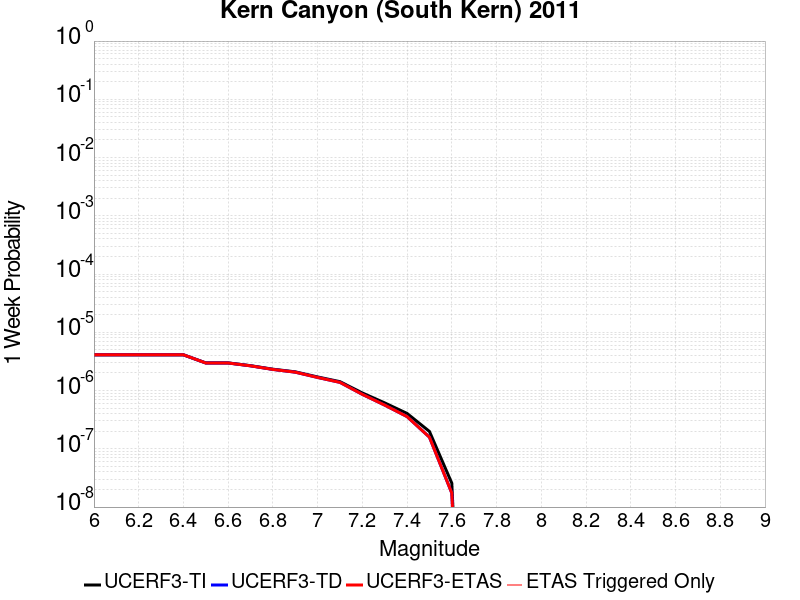 | 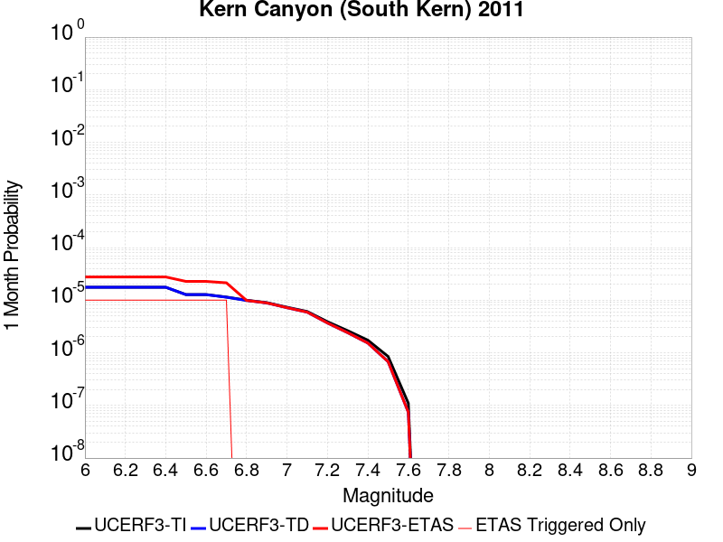 | 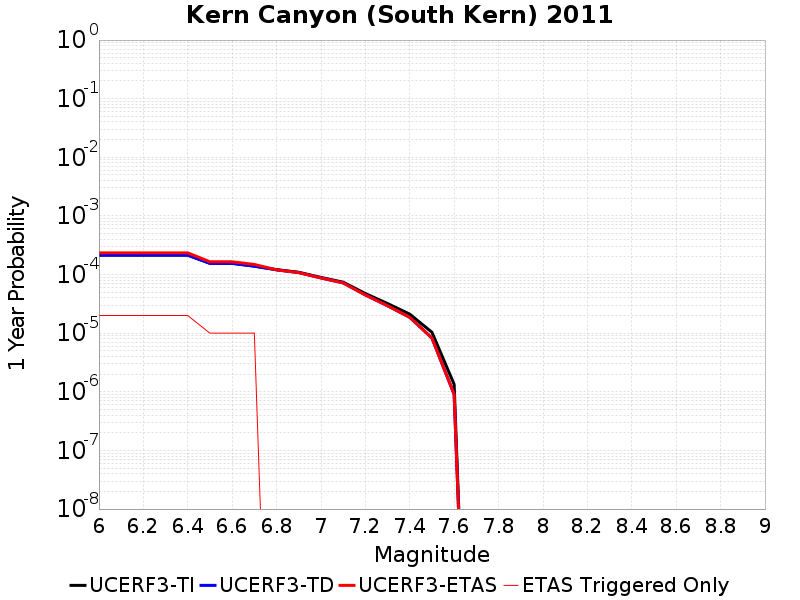 |  |

| Magnitude | 1 wk TI Prob | 1 wk TD Prob | 1 wk ETAS Prob | 1 wk ETAS/TD Gain | 1 wk ETAS Triggered Only | 1 mo TI Prob | 1 mo TD Prob | 1 mo ETAS Prob | 1 mo ETAS/TD Gain | 1 mo ETAS Triggered Only | 1 yr TI Prob | 1 yr TD Prob | 1 yr ETAS Prob | 1 yr ETAS/TD Gain | 1 yr ETAS Triggered Only | 10 yr TI Prob | 10 yr TD Prob | 10 yr ETAS Prob | 10 yr ETAS/TD Gain | 10 yr ETAS Triggered Only |
|-----|-----|-----|-----|-----|-----|-----|-----|-----|-----|-----|-----|-----|-----|-----|-----|-----|-----|-----|-----|-----|
| 6.0 | 4.105075E-6 | 4.1137346E-6 | 4.1137346E-6 | 1.0 | 0.0 | 1.7593058E-5 | 1.7630176E-5 | 2.763E-5 | 1.5671993 | 1.0E-5 | 2.1417443E-4 | 2.146269E-4 | 2.346226E-4 | 1.0931649 | 2.0E-5 | 0.0021396813 | 0.0021442599 | 0.0021941527 | 1.0232681 | 5.0E-5 |
| 6.1 | 4.105075E-6 | 4.1137346E-6 | 4.1137346E-6 | 1.0 | 0.0 | 1.7593058E-5 | 1.7630176E-5 | 2.763E-5 | 1.5671993 | 1.0E-5 | 2.1417443E-4 | 2.146269E-4 | 2.346226E-4 | 1.0931649 | 2.0E-5 | 0.0021396813 | 0.0021442599 | 0.0021941527 | 1.0232681 | 5.0E-5 |
| 6.2 | 4.105075E-6 | 4.1137346E-6 | 4.1137346E-6 | 1.0 | 0.0 | 1.7593058E-5 | 1.7630176E-5 | 2.763E-5 | 1.5671993 | 1.0E-5 | 2.1417443E-4 | 2.146269E-4 | 2.346226E-4 | 1.0931649 | 2.0E-5 | 0.0021396813 | 0.0021442599 | 0.0021941527 | 1.0232681 | 5.0E-5 |
| 6.3 | 4.105075E-6 | 4.1137346E-6 | 4.1137346E-6 | 1.0 | 0.0 | 1.7593058E-5 | 1.7630176E-5 | 2.763E-5 | 1.5671993 | 1.0E-5 | 2.1417443E-4 | 2.146269E-4 | 2.346226E-4 | 1.0931649 | 2.0E-5 | 0.0021396813 | 0.0021442599 | 0.0021941527 | 1.0232681 | 5.0E-5 |
| 6.4 | 4.105075E-6 | 4.1137346E-6 | 4.1137346E-6 | 1.0 | 0.0 | 1.7593058E-5 | 1.7630176E-5 | 2.763E-5 | 1.5671993 | 1.0E-5 | 2.1417443E-4 | 2.146269E-4 | 2.346226E-4 | 1.0931649 | 2.0E-5 | 0.0021396813 | 0.0021442599 | 0.0021941527 | 1.0232681 | 5.0E-5 |
| 6.5 | 2.9849807E-6 | 2.9731607E-6 | 2.9731607E-6 | 1.0 | 0.0 | 1.2792712E-5 | 1.2742055E-5 | 2.2741928E-5 | 1.7847928 | 1.0E-5 | 1.5574014E-4 | 1.5512363E-4 | 1.6512208E-4 | 1.0644547 | 1.0E-5 | 0.0015563103 | 0.0015501687 | 0.0015901066 | 1.0257636 | 4.0E-5 |
| 6.6 | 2.9849807E-6 | 2.9731607E-6 | 2.9731607E-6 | 1.0 | 0.0 | 1.2792712E-5 | 1.2742055E-5 | 2.2741928E-5 | 1.7847928 | 1.0E-5 | 1.5574014E-4 | 1.5512363E-4 | 1.6512208E-4 | 1.0644547 | 1.0E-5 | 0.0015563103 | 0.0015501687 | 0.0015901066 | 1.0257636 | 4.0E-5 |
| 6.7 | 2.6756725E-6 | 2.658226E-6 | 2.658226E-6 | 1.0 | 0.0 | 1.1467117E-5 | 1.1392348E-5 | 2.1392234E-5 | 1.8777722 | 1.0E-5 | 1.396032E-4 | 1.3869311E-4 | 1.4869173E-4 | 1.0720916 | 1.0E-5 | 0.0013951553 | 0.0013860766 | 0.0014260211 | 1.0288185 | 4.0E-5 |
| 6.8 | 2.3283721E-6 | 2.3047833E-6 | 2.3047833E-6 | 1.0 | 0.0 | 9.9787E-6 | 9.877606E-6 | 9.877606E-6 | 1.0 | 0.0 | 1.214839E-4 | 1.2025329E-4 | 1.2025329E-4 | 1.0 | 0.0 | 0.001214175 | 0.0012018897 | 0.0012318536 | 1.0249307 | 3.0E-5 |
| 6.9 | 2.0972677E-6 | 2.0696452E-6 | 2.0696452E-6 | 1.0 | 0.0 | 8.988259E-6 | 8.869878E-6 | 8.869878E-6 | 1.0 | 0.0 | 1.0942656E-4 | 1.0798547E-4 | 1.0798547E-4 | 1.0 | 0.0 | 0.0010937268 | 0.0010793358 | 0.0011093034 | 1.0277649 | 3.0E-5 |
| 7.0 | 1.7132242E-6 | 1.6787069E-6 | 1.6787069E-6 | 1.0 | 0.0 | 7.3423685E-6 | 7.1944382E-6 | 7.1944382E-6 | 1.0 | 0.0 | 8.938967E-5 | 8.758881E-5 | 8.758881E-5 | 1.0 | 0.0 | 8.935372E-4 | 8.7554666E-4 | 8.9552917E-4 | 1.0228229 | 2.0E-5 |
| 7.1 | 1.4215541E-6 | 1.3815779E-6 | 1.3815779E-6 | 1.0 | 0.0 | 6.0923603E-6 | 5.9210347E-6 | 5.9210347E-6 | 1.0 | 0.0 | 7.417196E-5 | 7.208624E-5 | 7.208624E-5 | 1.0 | 0.0 | 7.414721E-4 | 7.206313E-4 | 7.406169E-4 | 1.0277334 | 2.0E-5 |
| 7.2 | 9.097853E-7 | 8.6037915E-7 | 8.6037915E-7 | 1.0 | 0.0 | 3.899074E-6 | 3.6873341E-6 | 3.6873341E-6 | 1.0 | 0.0 | 4.7470192E-5 | 4.489238E-5 | 4.489238E-5 | 1.0 | 0.0 | 4.7460053E-4 | 4.4883418E-4 | 4.588297E-4 | 1.02227 | 1.0E-5 |
| 7.3 | 6.144169E-7 | 5.6282147E-7 | 5.6282147E-7 | 1.0 | 0.0 | 2.6332125E-6 | 2.41209E-6 | 2.41209E-6 | 1.0 | 0.0 | 3.205889E-5 | 2.9366804E-5 | 2.9366804E-5 | 1.0 | 0.0 | 3.2054266E-4 | 2.9362974E-4 | 2.9362974E-4 | 1.0 | 0.0 |
| 7.4 | 4.049844E-7 | 3.572836E-7 | 3.572836E-7 | 1.0 | 0.0 | 1.7356463E-6 | 1.5312145E-6 | 1.5312145E-6 | 1.0 | 0.0 | 2.1131287E-5 | 1.864238E-5 | 1.864238E-5 | 1.0 | 0.0 | 2.1129279E-4 | 1.864084E-4 | 1.864084E-4 | 1.0 | 0.0 |
| 7.5 | 1.9871162E-7 | 1.5830436E-7 | 1.5830436E-7 | 1.0 | 0.0 | 8.5162094E-7 | 6.7844707E-7 | 6.7844707E-7 | 1.0 | 0.0 | 1.0368436E-5 | 8.260063E-6 | 8.260063E-6 | 1.0 | 0.0 | 1.0367952E-4 | 8.2597646E-5 | 8.2597646E-5 | 1.0 | 0.0 |
| 7.6 | 2.572245E-8 | 1.7352708E-8 | 1.7352708E-8 | 1.0 | 0.0 | 1.10239064E-7 | 7.436874E-8 | 7.436874E-8 | 1.0 | 0.0 | 1.3421597E-6 | 9.0543915E-7 | 9.0543915E-7 | 1.0 | 0.0 | 1.3421517E-5 | 9.05436E-6 | 9.05436E-6 | 1.0 | 0.0 |

## White Mountains
*[(top)](#table-of-contents)*

| 1 Week | 1 Month | 1 Year | 10 Year |
|-----|-----|-----|-----|
|  |  |  |  |

| Magnitude | 1 wk TI Prob | 1 wk TD Prob | 1 wk ETAS Prob | 1 wk ETAS/TD Gain | 1 wk ETAS Triggered Only | 1 mo TI Prob | 1 mo TD Prob | 1 mo ETAS Prob | 1 mo ETAS/TD Gain | 1 mo ETAS Triggered Only | 1 yr TI Prob | 1 yr TD Prob | 1 yr ETAS Prob | 1 yr ETAS/TD Gain | 1 yr ETAS Triggered Only | 10 yr TI Prob | 10 yr TD Prob | 10 yr ETAS Prob | 10 yr ETAS/TD Gain | 10 yr ETAS Triggered Only |
|-----|-----|-----|-----|-----|-----|-----|-----|-----|-----|-----|-----|-----|-----|-----|-----|-----|-----|-----|-----|-----|
| 6.0 | 3.503579E-5 | 3.378444E-5 | 3.378444E-5 | 1.0 | 0.0 | 1.5014476E-4 | 1.447831E-4 | 1.5478165E-4 | 1.0690589 | 1.0E-5 | 0.0018264796 | 0.0017614297 | 0.0017813945 | 1.0113344 | 2.0E-5 | 0.018115403 | 0.017487017 | 0.017536143 | 1.0028093 | 5.0E-5 |
| 6.1 | 3.503579E-5 | 3.378444E-5 | 3.378444E-5 | 1.0 | 0.0 | 1.5014476E-4 | 1.447831E-4 | 1.5478165E-4 | 1.0690589 | 1.0E-5 | 0.0018264796 | 0.0017614297 | 0.0017813945 | 1.0113344 | 2.0E-5 | 0.018115403 | 0.017487017 | 0.017536143 | 1.0028093 | 5.0E-5 |
| 6.2 | 3.503579E-5 | 3.378444E-5 | 3.378444E-5 | 1.0 | 0.0 | 1.5014476E-4 | 1.447831E-4 | 1.5478165E-4 | 1.0690589 | 1.0E-5 | 0.0018264796 | 0.0017614297 | 0.0017813945 | 1.0113344 | 2.0E-5 | 0.018115403 | 0.017487017 | 0.017536143 | 1.0028093 | 5.0E-5 |
| 6.3 | 1.7818425E-5 | 1.5916294E-5 | 1.5916294E-5 | 1.0 | 0.0 | 7.636245E-5 | 6.821098E-5 | 7.82103E-5 | 1.1465939 | 1.0E-5 | 9.293162E-4 | 8.3016657E-4 | 8.5014995E-4 | 1.0240716 | 2.0E-5 | 0.009254395 | 0.008272112 | 0.008311781 | 1.0047956 | 4.0E-5 |
| 6.4 | 1.7818425E-5 | 1.5916294E-5 | 1.5916294E-5 | 1.0 | 0.0 | 7.636245E-5 | 6.821098E-5 | 7.82103E-5 | 1.1465939 | 1.0E-5 | 9.293162E-4 | 8.3016657E-4 | 8.5014995E-4 | 1.0240716 | 2.0E-5 | 0.009254395 | 0.008272112 | 0.008311781 | 1.0047956 | 4.0E-5 |
| 6.5 | 1.3397557E-5 | 1.1336468E-5 | 1.1336468E-5 | 1.0 | 0.0 | 5.741684E-5 | 4.8583996E-5 | 5.858351E-5 | 1.2058191 | 1.0E-5 | 6.988258E-4 | 5.913566E-4 | 6.1134476E-4 | 1.0338005 | 2.0E-5 | 0.006966323 | 0.0058985353 | 0.0059283585 | 1.005056 | 3.0E-5 |
| 6.6 | 1.0818695E-5 | 8.625505E-6 | 8.625505E-6 | 1.0 | 0.0 | 4.6365014E-5 | 3.696595E-5 | 4.6965582E-5 | 1.2705092 | 1.0E-5 | 5.6434784E-4 | 4.4997188E-4 | 4.5996736E-4 | 1.0222136 | 1.0E-5 | 0.005629168 | 0.004491044 | 0.004500999 | 1.0022167 | 1.0E-5 |
| 6.7 | 9.067908E-6 | 6.8025324E-6 | 6.8025324E-6 | 1.0 | 0.0 | 3.8861883E-5 | 2.9153403E-5 | 3.915311E-5 | 1.3430032 | 1.0E-5 | 4.7304068E-4 | 3.5488806E-4 | 3.6488453E-4 | 1.0281678 | 1.0E-5 | 0.00472035 | 0.0035435306 | 0.003553495 | 1.002812 | 1.0E-5 |
| 6.8 | 7.295947E-6 | 4.9364703E-6 | 4.9364703E-6 | 1.0 | 0.0 | 3.126797E-5 | 2.1156135E-5 | 2.1156135E-5 | 1.0 | 0.0 | 3.8062103E-4 | 2.5754664E-4 | 2.5754664E-4 | 1.0 | 0.0 | 0.0037996976 | 0.0025725944 | 0.0025725944 | 1.0 | 0.0 |
| 6.9 | 6.2243444E-6 | 3.8322887E-6 | 3.8322887E-6 | 1.0 | 0.0 | 2.6675489E-5 | 1.6423994E-5 | 1.6423994E-5 | 1.0 | 0.0 | 3.2472567E-4 | 1.999443E-4 | 1.999443E-4 | 1.0 | 0.0 | 0.0032425157 | 0.001997697 | 0.001997697 | 1.0 | 0.0 |
| 7.0 | 4.9878413E-6 | 2.6795942E-6 | 2.6795942E-6 | 1.0 | 0.0 | 2.1376287E-5 | 1.1483926E-5 | 1.1483926E-5 | 1.0 | 0.0 | 2.602252E-4 | 1.398081E-4 | 1.398081E-4 | 1.0 | 0.0 | 0.002599207 | 0.0013972276 | 0.0013972276 | 1.0 | 0.0 |
| 7.1 | 4.0252844E-6 | 1.8857311E-6 | 1.8857311E-6 | 1.0 | 0.0 | 1.7251105E-5 | 8.08168E-6 | 8.08168E-6 | 1.0 | 0.0 | 2.1001195E-4 | 9.839014E-5 | 9.839014E-5 | 1.0 | 0.0 | 0.0020981359 | 9.834786E-4 | 9.834786E-4 | 1.0 | 0.0 |
| 7.2 | 3.3284066E-6 | 1.2819206E-6 | 1.2819206E-6 | 1.0 | 0.0 | 1.4264522E-5 | 5.493934E-6 | 5.493934E-6 | 1.0 | 0.0 | 1.736567E-4 | 6.68867E-5 | 6.68867E-5 | 1.0 | 0.0 | 0.0017352107 | 6.6867576E-4 | 6.6867576E-4 | 1.0 | 0.0 |
| 7.3 | 2.458226E-6 | 6.056947E-7 | 6.056947E-7 | 1.0 | 0.0 | 1.0535211E-5 | 2.595832E-6 | 2.595832E-6 | 1.0 | 0.0 | 1.2825865E-4 | 3.1603835E-5 | 3.1603835E-5 | 1.0 | 0.0 | 0.0012818464 | 3.1599717E-4 | 3.1599717E-4 | 1.0 | 0.0 |
| 7.4 | 1.965953E-6 | 3.108698E-7 | 3.108698E-7 | 1.0 | 0.0 | 8.425486E-6 | 1.3322984E-6 | 1.3322984E-6 | 1.0 | 0.0 | 1.0257547E-4 | 1.6220614E-5 | 1.6220614E-5 | 1.0 | 0.0 | 0.0010252813 | 1.6219444E-4 | 1.6219444E-4 | 1.0 | 0.0 |
| 7.5 | 1.2014192E-6 | 1.8242618E-7 | 1.8242618E-7 | 1.0 | 0.0 | 5.148929E-6 | 7.8182626E-7 | 7.8182626E-7 | 1.0 | 0.0 | 6.2686406E-5 | 9.518694E-6 | 9.518694E-6 | 1.0 | 0.0 | 6.266873E-4 | 9.518294E-5 | 9.518294E-5 | 1.0 | 0.0 |
| 7.6 | 2.5612175E-7 | 4.894289E-8 | 4.894289E-8 | 1.0 | 0.0 | 1.0976642E-6 | 2.0975524E-7 | 2.0975524E-7 | 1.0 | 0.0 | 1.3363979E-5 | 2.5537674E-6 | 2.5537674E-6 | 1.0 | 0.0 | 1.3363175E-4 | 2.5537416E-5 | 2.5537416E-5 | 1.0 | 0.0 |

## Whittier alt 1
*[(top)](#table-of-contents)*

| 1 Week | 1 Month | 1 Year | 10 Year |
|-----|-----|-----|-----|
|  |  | 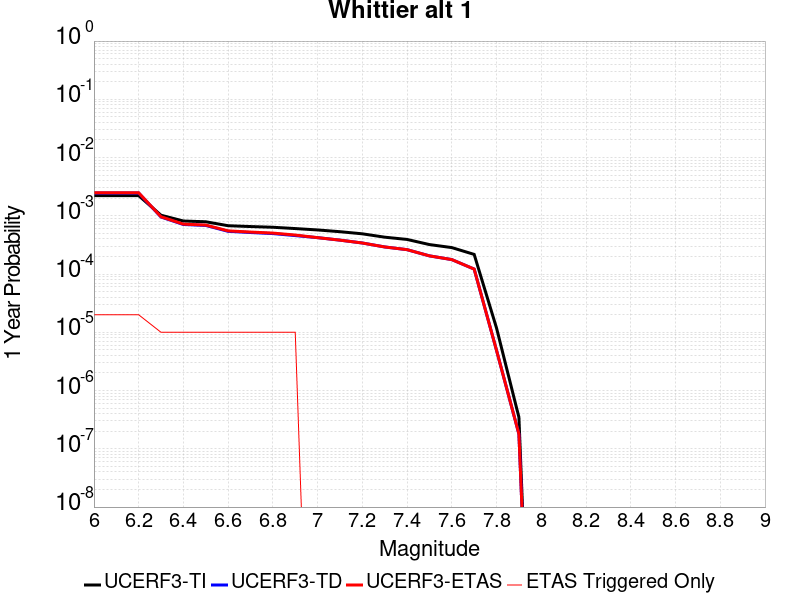 |  |

| Magnitude | 1 wk TI Prob | 1 wk TD Prob | 1 wk ETAS Prob | 1 wk ETAS/TD Gain | 1 wk ETAS Triggered Only | 1 mo TI Prob | 1 mo TD Prob | 1 mo ETAS Prob | 1 mo ETAS/TD Gain | 1 mo ETAS Triggered Only | 1 yr TI Prob | 1 yr TD Prob | 1 yr ETAS Prob | 1 yr ETAS/TD Gain | 1 yr ETAS Triggered Only | 10 yr TI Prob | 10 yr TD Prob | 10 yr ETAS Prob | 10 yr ETAS/TD Gain | 10 yr ETAS Triggered Only |
|-----|-----|-----|-----|-----|-----|-----|-----|-----|-----|-----|-----|-----|-----|-----|-----|-----|-----|-----|-----|-----|
| 6.0 | 4.2554693E-5 | 4.7253296E-5 | 4.7253296E-5 | 1.0 | 0.0 | 1.8236451E-4 | 2.025002E-4 | 2.025002E-4 | 1.0 | 0.0 | 0.002218027 | 0.0024629743 | 0.002482925 | 1.0081003 | 2.0E-5 | 0.02196019 | 0.024390442 | 0.024439223 | 1.002 | 5.0E-5 |
| 6.1 | 4.2554693E-5 | 4.7253296E-5 | 4.7253296E-5 | 1.0 | 0.0 | 1.8236451E-4 | 2.025002E-4 | 2.025002E-4 | 1.0 | 0.0 | 0.002218027 | 0.0024629743 | 0.002482925 | 1.0081003 | 2.0E-5 | 0.02196019 | 0.024390442 | 0.024439223 | 1.002 | 5.0E-5 |
| 6.2 | 4.2554693E-5 | 4.7253296E-5 | 4.7253296E-5 | 1.0 | 0.0 | 1.8236451E-4 | 2.025002E-4 | 2.025002E-4 | 1.0 | 0.0 | 0.002218027 | 0.0024629743 | 0.002482925 | 1.0081003 | 2.0E-5 | 0.02196019 | 0.024390442 | 0.024439223 | 1.002 | 5.0E-5 |
| 6.3 | 1.9617712E-5 | 1.8269071E-5 | 1.8269071E-5 | 1.0 | 0.0 | 8.40732E-5 | 7.829378E-5 | 7.829378E-5 | 1.0 | 0.0 | 0.0010231105 | 9.528289E-4 | 9.628194E-4 | 1.010485 | 1.0E-5 | 0.01018413 | 0.009490347 | 0.009520062 | 1.0031312 | 3.0E-5 |
| 6.4 | 1.5611336E-5 | 1.3604667E-5 | 1.3604667E-5 | 1.0 | 0.0 | 6.690401E-5 | 5.8304446E-5 | 5.8304446E-5 | 1.0 | 0.0 | 8.142519E-4 | 7.096314E-4 | 7.1962434E-4 | 1.0140818 | 1.0E-5 | 0.008112748 | 0.0070752413 | 0.007105029 | 1.0042101 | 3.0E-5 |
| 6.5 | 1.5150166E-5 | 1.3101317E-5 | 1.3101317E-5 | 1.0 | 0.0 | 6.492767E-5 | 5.6147324E-5 | 5.6147324E-5 | 1.0 | 0.0 | 7.9020765E-4 | 6.833851E-4 | 6.933783E-4 | 1.014623 | 1.0E-5 | 0.007874036 | 0.0068144086 | 0.006844204 | 1.0043725 | 3.0E-5 |
| 6.6 | 1.295588E-5 | 1.0381043E-5 | 1.0381043E-5 | 1.0 | 0.0 | 5.552402E-5 | 4.4489432E-5 | 4.4489432E-5 | 1.0 | 0.0 | 6.7579525E-4 | 5.415262E-4 | 5.5152073E-4 | 1.0184563 | 1.0E-5 | 0.006737438 | 0.0054032365 | 0.0054231286 | 1.0036815 | 2.0E-5 |
| 6.7 | 1.2542085E-5 | 9.899675E-6 | 9.899675E-6 | 1.0 | 0.0 | 5.3750682E-5 | 4.24265E-5 | 4.24265E-5 | 1.0 | 0.0 | 6.542181E-4 | 5.164221E-4 | 5.2641693E-4 | 1.019354 | 1.0E-5 | 0.006522954 | 0.0051533855 | 0.005173282 | 1.003861 | 2.0E-5 |
| 6.8 | 1.2195878E-5 | 9.495707E-6 | 9.495707E-6 | 1.0 | 0.0 | 5.2267E-5 | 4.069526E-5 | 4.069526E-5 | 1.0 | 0.0 | 6.36165E-4 | 4.95354E-4 | 5.053491E-4 | 1.0201776 | 1.0E-5 | 0.0063434686 | 0.0049435603 | 0.0049634613 | 1.0040257 | 2.0E-5 |
| 6.9 | 1.1580298E-5 | 8.7732E-6 | 8.7732E-6 | 1.0 | 0.0 | 4.9628903E-5 | 3.7598893E-5 | 3.7598893E-5 | 1.0 | 0.0 | 6.040644E-4 | 4.5767202E-4 | 4.6766744E-4 | 1.0218397 | 1.0E-5 | 0.00602425 | 0.0045682914 | 0.0045882002 | 1.004358 | 2.0E-5 |
| 7.0 | 1.0964795E-5 | 8.084237E-6 | 8.084237E-6 | 1.0 | 0.0 | 4.6991136E-5 | 3.464628E-5 | 3.464628E-5 | 1.0 | 0.0 | 5.7196687E-4 | 4.2173834E-4 | 4.2173834E-4 | 1.0 | 0.0 | 0.0057049696 | 0.004210311 | 0.004210311 | 1.0 | 0.0 |
| 7.1 | 1.0230601E-5 | 7.3267893E-6 | 7.3267893E-6 | 1.0 | 0.0 | 4.3844695E-5 | 3.1400155E-5 | 3.1400155E-5 | 1.0 | 0.0 | 5.336784E-4 | 3.8223114E-4 | 3.8223114E-4 | 1.0 | 0.0 | 0.005323986 | 0.0038168717 | 0.0038168717 | 1.0 | 0.0 |
| 7.2 | 9.40865E-6 | 6.5433696E-6 | 6.5433696E-6 | 1.0 | 0.0 | 4.032216E-5 | 2.8042718E-5 | 2.8042718E-5 | 1.0 | 0.0 | 4.908117E-4 | 3.4136782E-4 | 3.4136782E-4 | 1.0 | 0.0 | 0.0048972913 | 0.0034095156 | 0.0034095156 | 1.0 | 0.0 |
| 7.3 | 8.237384E-6 | 5.5978E-6 | 5.5978E-6 | 1.0 | 0.0 | 3.5302593E-5 | 2.3990357E-5 | 2.3990357E-5 | 1.0 | 0.0 | 4.2972428E-4 | 2.9204448E-4 | 2.9204448E-4 | 1.0 | 0.0 | 0.0042889426 | 0.0029169584 | 0.0029169584 | 1.0 | 0.0 |
| 7.4 | 7.5316966E-6 | 5.027849E-6 | 5.027849E-6 | 1.0 | 0.0 | 3.2278298E-5 | 2.1547752E-5 | 2.1547752E-5 | 1.0 | 0.0 | 3.9291743E-4 | 2.6231332E-4 | 2.6231332E-4 | 1.0 | 0.0 | 0.0039222343 | 0.0026201492 | 0.0026201492 | 1.0 | 0.0 |
| 7.5 | 6.149649E-6 | 3.9338424E-6 | 3.9338424E-6 | 1.0 | 0.0 | 2.6355372E-5 | 1.6859221E-5 | 1.6859221E-5 | 1.0 | 0.0 | 3.208294E-4 | 2.0524257E-4 | 2.0524257E-4 | 1.0 | 0.0 | 0.003203666 | 0.0020506193 | 0.0020506193 | 1.0 | 0.0 |
| 7.6 | 5.457711E-6 | 3.3953572E-6 | 3.3953572E-6 | 1.0 | 0.0 | 2.338998E-5 | 1.4551454E-5 | 1.4551454E-5 | 1.0 | 0.0 | 2.8473578E-4 | 1.7715036E-4 | 1.7715036E-4 | 1.0 | 0.0 | 0.0028437122 | 0.0017701723 | 0.0017701723 | 1.0 | 0.0 |
| 7.7 | 4.1676276E-6 | 2.333144E-6 | 2.333144E-6 | 1.0 | 0.0 | 1.7861139E-5 | 9.999155E-6 | 9.999155E-6 | 1.0 | 0.0 | 2.1743766E-4 | 1.21733654E-4 | 1.21733654E-4 | 1.0 | 0.0 | 0.0021722503 | 0.0012167427 | 0.0012167427 | 1.0 | 0.0 |
| 7.8 | 2.2692414E-7 | 9.384596E-8 | 9.384596E-8 | 1.0 | 0.0 | 9.725317E-7 | 4.0219692E-7 | 4.0219692E-7 | 1.0 | 0.0 | 1.1840509E-5 | 4.89674E-6 | 4.89674E-6 | 1.0 | 0.0 | 1.1839878E-4 | 4.8966645E-5 | 4.8966645E-5 | 1.0 | 0.0 |
| 7.9 | 6.676829E-9 | 3.439787E-9 | 3.439787E-9 | 1.0 | 0.0 | 2.861498E-8 | 1.47419446E-8 | 1.47419446E-8 | 1.0 | 0.0 | 3.4838732E-7 | 1.7948315E-7 | 1.7948315E-7 | 1.0 | 0.0 | 3.4838679E-6 | 1.7948303E-6 | 1.7948303E-6 | 1.0 | 0.0 |

## Coronado Bank alt1
*[(top)](#table-of-contents)*

| 1 Week | 1 Month | 1 Year | 10 Year |
|-----|-----|-----|-----|
|  |  | 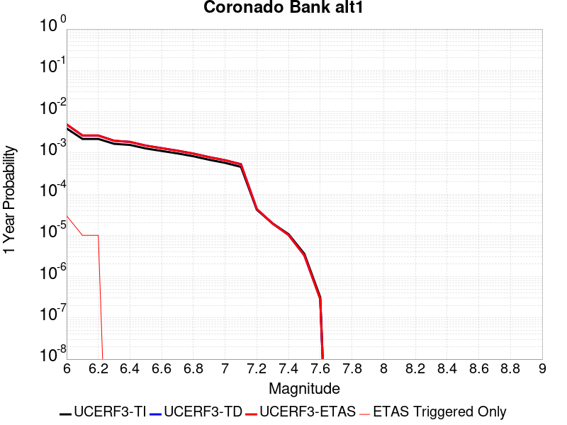 |  |

| Magnitude | 1 wk TI Prob | 1 wk TD Prob | 1 wk ETAS Prob | 1 wk ETAS/TD Gain | 1 wk ETAS Triggered Only | 1 mo TI Prob | 1 mo TD Prob | 1 mo ETAS Prob | 1 mo ETAS/TD Gain | 1 mo ETAS Triggered Only | 1 yr TI Prob | 1 yr TD Prob | 1 yr ETAS Prob | 1 yr ETAS/TD Gain | 1 yr ETAS Triggered Only | 10 yr TI Prob | 10 yr TD Prob | 10 yr ETAS Prob | 10 yr ETAS/TD Gain | 10 yr ETAS Triggered Only |
|-----|-----|-----|-----|-----|-----|-----|-----|-----|-----|-----|-----|-----|-----|-----|-----|-----|-----|-----|-----|-----|
| 6.0 | 7.533492E-5 | 9.395398E-5 | 9.395398E-5 | 1.0 | 0.0 | 3.22824E-4 | 4.0260045E-4 | 4.1259642E-4 | 1.0248286 | 1.0E-5 | 0.0039233007 | 0.004891254 | 0.004921107 | 1.0061034 | 3.0E-5 | 0.03854755 | 0.047905274 | 0.047952875 | 1.0009937 | 5.0E-5 |
| 6.1 | 4.1807285E-5 | 5.04943E-5 | 5.04943E-5 | 1.0 | 0.0 | 1.7916178E-4 | 2.1638628E-4 | 2.2638412E-4 | 1.0462036 | 1.0E-5 | 0.0021791123 | 0.002631398 | 0.0026413715 | 1.0037903 | 1.0E-5 | 0.021578677 | 0.026011722 | 0.026021462 | 1.0003744 | 1.0E-5 |
| 6.2 | 4.1807285E-5 | 5.04943E-5 | 5.04943E-5 | 1.0 | 0.0 | 1.7916178E-4 | 2.1638628E-4 | 2.2638412E-4 | 1.0462036 | 1.0E-5 | 0.0021791123 | 0.002631398 | 0.0026413715 | 1.0037903 | 1.0E-5 | 0.021578677 | 0.026011722 | 0.026021462 | 1.0003744 | 1.0E-5 |
| 6.3 | 3.1793104E-5 | 3.771192E-5 | 3.771192E-5 | 1.0 | 0.0 | 1.3624904E-4 | 1.6161265E-4 | 1.6161265E-4 | 1.0 | 0.0 | 0.0016575698 | 0.0019658902 | 0.0019658902 | 1.0 | 0.0 | 0.016452603 | 0.0194889 | 0.0194889 | 1.0 | 0.0 |
| 6.4 | 2.9878007E-5 | 3.533653E-5 | 3.533653E-5 | 1.0 | 0.0 | 1.2804232E-4 | 1.5143366E-4 | 1.5143366E-4 | 1.0 | 0.0 | 0.0015578003 | 0.0018421775 | 0.0018421775 | 1.0 | 0.0 | 0.015469253 | 0.018272838 | 0.018272838 | 1.0 | 0.0 |
| 6.5 | 2.4512565E-5 | 2.8764667E-5 | 2.8764667E-5 | 1.0 | 0.0 | 1.0504962E-4 | 1.2327147E-4 | 1.2327147E-4 | 1.0 | 0.0 | 0.0012782287 | 0.0014998238 | 0.0014998238 | 1.0 | 0.0 | 0.012709012 | 0.014899983 | 0.014899983 | 1.0 | 0.0 |
| 6.6 | 2.1317413E-5 | 2.4907145E-5 | 2.4907145E-5 | 1.0 | 0.0 | 9.135714E-5 | 1.0674067E-4 | 1.0674067E-4 | 1.0 | 0.0 | 0.0011117056 | 0.0012988151 | 0.0012988151 | 1.0 | 0.0 | 0.011061605 | 0.012914652 | 0.012914652 | 1.0 | 0.0 |
| 6.7 | 1.8585655E-5 | 2.1635284E-5 | 2.1635284E-5 | 1.0 | 0.0 | 7.9650374E-5 | 9.271946E-5 | 9.271946E-5 | 1.0 | 0.0 | 9.6931186E-4 | 0.0011282953 | 0.0011282953 | 1.0 | 0.0 | 0.0096509475 | 0.01122783 | 0.01122783 | 1.0 | 0.0 |
| 6.8 | 1.5862879E-5 | 1.8419812E-5 | 1.8419812E-5 | 1.0 | 0.0 | 6.798199E-5 | 7.8939775E-5 | 7.8939775E-5 | 1.0 | 0.0 | 8.273665E-4 | 9.606873E-4 | 9.606873E-4 | 1.0 | 0.0 | 0.008242928 | 0.009567325 | 0.009567325 | 1.0 | 0.0 |
| 6.9 | 1.3021509E-5 | 1.5095539E-5 | 1.5095539E-5 | 1.0 | 0.0 | 5.5805274E-5 | 6.469367E-5 | 6.469367E-5 | 1.0 | 0.0 | 6.792174E-4 | 7.8737887E-4 | 7.8737887E-4 | 1.0 | 0.0 | 0.006771452 | 0.007847715 | 0.007847715 | 1.0 | 0.0 |
| 7.0 | 1.0974371E-5 | 1.2720336E-5 | 1.2720336E-5 | 1.0 | 0.0 | 4.7032172E-5 | 5.4514687E-5 | 5.4514687E-5 | 1.0 | 0.0 | 5.7246623E-4 | 6.6353177E-4 | 6.6353177E-4 | 1.0 | 0.0 | 0.0057099373 | 0.006617255 | 0.006617255 | 1.0 | 0.0 |
| 7.1 | 8.766221E-6 | 1.0164019E-5 | 1.0164019E-5 | 1.0 | 0.0 | 3.7568978E-5 | 4.3559452E-5 | 4.3559452E-5 | 1.0 | 0.0 | 4.573063E-4 | 5.3022447E-4 | 5.3022447E-4 | 1.0 | 0.0 | 0.0045636636 | 0.005291294 | 0.005291294 | 1.0 | 0.0 |
| 7.2 | 8.026024E-7 | 8.331837E-7 | 8.331837E-7 | 1.0 | 0.0 | 3.43972E-6 | 3.5707826E-6 | 3.5707826E-6 | 1.0 | 0.0 | 4.1877785E-5 | 4.347342E-5 | 4.347342E-5 | 1.0 | 0.0 | 4.1869894E-4 | 4.3465025E-4 | 4.3465025E-4 | 1.0 | 0.0 |
| 7.3 | 3.7293114E-7 | 3.7001263E-7 | 3.7001263E-7 | 1.0 | 0.0 | 1.5982754E-6 | 1.5857674E-6 | 1.5857674E-6 | 1.0 | 0.0 | 1.9458828E-5 | 1.9306548E-5 | 1.9306548E-5 | 1.0 | 0.0 | 1.9457124E-4 | 1.9304878E-4 | 1.9304878E-4 | 1.0 | 0.0 |
| 7.4 | 2.0557036E-7 | 1.967453E-7 | 1.967453E-7 | 1.0 | 0.0 | 8.810155E-7 | 8.431939E-7 | 8.431939E-7 | 1.0 | 0.0 | 1.0726311E-5 | 1.0265838E-5 | 1.0265838E-5 | 1.0 | 0.0 | 1.0725793E-4 | 1.0265367E-4 | 1.0265367E-4 | 1.0 | 0.0 |
| 7.5 | 6.845446E-8 | 6.279428E-8 | 6.279428E-8 | 1.0 | 0.0 | 2.9337625E-7 | 2.6911832E-7 | 2.6911832E-7 | 1.0 | 0.0 | 3.5718497E-6 | 3.2765106E-6 | 3.2765106E-6 | 1.0 | 0.0 | 3.5717923E-5 | 3.276463E-5 | 3.276463E-5 | 1.0 | 0.0 |
| 7.6 | 6.0975145E-9 | 5.5319123E-9 | 5.5319123E-9 | 1.0 | 0.0 | 2.6132206E-8 | 2.3708195E-8 | 2.3708195E-8 | 1.0 | 0.0 | 3.1815955E-7 | 2.8864724E-7 | 2.8864724E-7 | 1.0 | 0.0 | 3.181591E-6 | 2.8864697E-6 | 2.8864697E-6 | 1.0 | 0.0 |

## Brawley (Seismic Zone) alt 1
*[(top)](#table-of-contents)*

| 1 Week | 1 Month | 1 Year | 10 Year |
|-----|-----|-----|-----|
|  |  |  |  |

| Magnitude | 1 wk TI Prob | 1 wk TD Prob | 1 wk ETAS Prob | 1 wk ETAS/TD Gain | 1 wk ETAS Triggered Only | 1 mo TI Prob | 1 mo TD Prob | 1 mo ETAS Prob | 1 mo ETAS/TD Gain | 1 mo ETAS Triggered Only | 1 yr TI Prob | 1 yr TD Prob | 1 yr ETAS Prob | 1 yr ETAS/TD Gain | 1 yr ETAS Triggered Only | 10 yr TI Prob | 10 yr TD Prob | 10 yr ETAS Prob | 10 yr ETAS/TD Gain | 10 yr ETAS Triggered Only |
|-----|-----|-----|-----|-----|-----|-----|-----|-----|-----|-----|-----|-----|-----|-----|-----|-----|-----|-----|-----|-----|
| 6.0 | 2.2521618E-4 | 4.764172E-4 | 4.764172E-4 | 1.0 | 0.0 | 9.6485513E-4 | 0.0020402274 | 0.0020601866 | 1.0097828 | 2.0E-5 | 0.011683988 | 0.024552094 | 0.024591113 | 1.0015892 | 4.0E-5 | 0.11088423 | 0.21352646 | 0.21356578 | 1.0001842 | 5.0E-5 |
| 6.1 | 2.2521618E-4 | 4.764172E-4 | 4.764172E-4 | 1.0 | 0.0 | 9.6485513E-4 | 0.0020402274 | 0.0020601866 | 1.0097828 | 2.0E-5 | 0.011683988 | 0.024552094 | 0.024591113 | 1.0015892 | 4.0E-5 | 0.11088423 | 0.21352646 | 0.21356578 | 1.0001842 | 5.0E-5 |
| 6.2 | 2.198148E-4 | 4.6726133E-4 | 4.6726133E-4 | 1.0 | 0.0 | 9.417233E-4 | 0.0020010483 | 0.0020210084 | 1.0099747 | 2.0E-5 | 0.011405343 | 0.024086202 | 0.024125239 | 1.0016207 | 4.0E-5 | 0.10837428 | 0.20996252 | 0.21000202 | 1.0001881 | 5.0E-5 |
| 6.3 | 2.1704129E-4 | 4.6161783E-4 | 4.6161783E-4 | 1.0 | 0.0 | 9.298453E-4 | 0.0019768989 | 0.0019968592 | 1.0100969 | 2.0E-5 | 0.011262234 | 0.023799509 | 0.023838557 | 1.0016407 | 4.0E-5 | 0.107082725 | 0.20785356 | 0.20789316 | 1.0001905 | 5.0E-5 |
| 6.4 | 1.876142E-4 | 4.0053634E-4 | 4.0053634E-4 | 1.0 | 0.0 | 8.038131E-4 | 0.0017154694 | 0.0017354351 | 1.0116386 | 2.0E-5 | 0.00974259 | 0.02068742 | 0.0207168 | 1.0014201 | 3.0E-5 | 0.093263686 | 0.18460558 | 0.1846382 | 1.0001767 | 4.0E-5 |
| 6.5 | 1.7390939E-4 | 3.748552E-4 | 3.748552E-4 | 1.0 | 0.0 | 7.45113E-4 | 0.0016055454 | 0.0016255132 | 1.0124369 | 2.0E-5 | 0.009034078 | 0.019375421 | 0.01940484 | 1.0015184 | 3.0E-5 | 0.086755216 | 0.1744271 | 0.17446014 | 1.0001893 | 4.0E-5 |
| 6.6 | 1.591791E-4 | 3.4900024E-4 | 3.4900024E-4 | 1.0 | 0.0 | 6.8201777E-4 | 0.001494868 | 0.0015148381 | 1.0133591 | 2.0E-5 | 0.008271996 | 0.018050218 | 0.018079676 | 1.001632 | 3.0E-5 | 0.07970774 | 0.1638347 | 0.16386816 | 1.0002042 | 4.0E-5 |
| 6.7 | 1.4268003E-4 | 3.206575E-4 | 3.206575E-4 | 1.0 | 0.0 | 6.1134255E-4 | 0.0013735308 | 0.0013935034 | 1.014541 | 2.0E-5 | 0.007417723 | 0.016596097 | 0.0166256 | 1.0017776 | 3.0E-5 | 0.07174956 | 0.15196188 | 0.15199581 | 1.0002233 | 4.0E-5 |
| 6.8 | 1.239713E-4 | 2.906019E-4 | 2.906019E-4 | 1.0 | 0.0 | 5.3119735E-4 | 0.0012448484 | 0.0012648235 | 1.0160462 | 2.0E-5 | 0.0064481674 | 0.015052136 | 0.015081685 | 1.001963 | 3.0E-5 | 0.06264243 | 0.13840148 | 0.13843594 | 1.000249 | 4.0E-5 |
| 6.9 | 1.0180238E-4 | 2.6259635E-4 | 2.6259635E-4 | 1.0 | 0.0 | 4.3622297E-4 | 0.0011249318 | 0.0011449093 | 1.0177588 | 2.0E-5 | 0.005298089 | 0.013611036 | 0.013640628 | 1.0021741 | 3.0E-5 | 0.05173543 | 0.124980636 | 0.12501563 | 1.00028 | 4.0E-5 |
| 7.0 | 7.6619996E-5 | 2.240352E-4 | 2.240352E-4 | 1.0 | 0.0 | 3.283301E-4 | 9.598008E-4 | 9.797816E-4 | 1.0208176 | 2.0E-5 | 0.0039900932 | 0.011623673 | 0.01164344 | 1.0017006 | 2.0E-5 | 0.039192066 | 0.107281476 | 0.10730825 | 1.0002496 | 3.0E-5 |
| 7.1 | 7.5127435E-5 | 2.2086638E-4 | 2.2086638E-4 | 1.0 | 0.0 | 3.2193496E-4 | 9.4622996E-4 | 9.66211E-4 | 1.0211165 | 2.0E-5 | 0.0039125155 | 0.011460198 | 0.011479968 | 1.0017252 | 2.0E-5 | 0.038443442 | 0.10584539 | 0.10587222 | 1.0002534 | 3.0E-5 |
| 7.2 | 6.788582E-5 | 2.0214236E-4 | 2.0214236E-4 | 1.0 | 0.0 | 2.9090676E-4 | 8.660398E-4 | 8.8602246E-4 | 1.0230737 | 2.0E-5 | 0.0035360386 | 0.010493698 | 0.010513488 | 1.0018859 | 2.0E-5 | 0.034803 | 0.09751562 | 0.097542696 | 1.0002776 | 3.0E-5 |
| 7.3 | 6.399602E-5 | 1.8845015E-4 | 1.8845015E-4 | 1.0 | 0.0 | 2.7423984E-4 | 8.073964E-4 | 8.273802E-4 | 1.024751 | 2.0E-5 | 0.0033337586 | 0.009786335 | 0.009806139 | 1.0020237 | 2.0E-5 | 0.03284188 | 0.09140904 | 0.091436304 | 1.0002981 | 3.0E-5 |
| 7.4 | 4.506759E-5 | 1.2532252E-4 | 1.2532252E-4 | 1.0 | 0.0 | 1.9313251E-4 | 5.3698686E-4 | 5.5697607E-4 | 1.0372249 | 2.0E-5 | 0.0023488526 | 0.006518391 | 0.0065382607 | 1.0030483 | 2.0E-5 | 0.023241805 | 0.062372644 | 0.062400773 | 1.000451 | 3.0E-5 |
| 7.5 | 3.43289E-5 | 9.3379516E-5 | 9.3379516E-5 | 1.0 | 0.0 | 1.4711556E-4 | 4.0013687E-4 | 4.2012887E-4 | 1.0499629 | 2.0E-5 | 0.0017896603 | 0.0048608463 | 0.004880749 | 1.0040945 | 2.0E-5 | 0.01775316 | 0.04706442 | 0.047093008 | 1.0006074 | 3.0E-5 |
| 7.6 | 2.5980507E-5 | 7.055284E-5 | 7.055284E-5 | 1.0 | 0.0 | 1.1134028E-4 | 3.0233437E-4 | 3.1233137E-4 | 1.0330659 | 1.0E-5 | 0.001354725 | 0.0036747325 | 0.0036846958 | 1.0027113 | 1.0E-5 | 0.013464959 | 0.035848763 | 0.035868045 | 1.0005379 | 2.0E-5 |
| 7.7 | 1.7292105E-5 | 4.9425635E-5 | 4.9425635E-5 | 1.0 | 0.0 | 7.4106916E-5 | 2.1180698E-4 | 2.1180698E-4 | 1.0 | 0.0 | 9.018782E-4 | 0.002575706 | 0.002575706 | 1.0 | 0.0 | 0.008982267 | 0.025297843 | 0.02530759 | 1.0003853 | 1.0E-5 |
| 7.8 | 1.2927471E-5 | 3.9709128E-5 | 3.9709128E-5 | 1.0 | 0.0 | 5.5402274E-5 | 1.701709E-4 | 1.701709E-4 | 1.0 | 0.0 | 6.743139E-4 | 0.0020698644 | 0.0020698644 | 1.0 | 0.0 | 0.0067227143 | 0.020438185 | 0.02044798 | 1.0004792 | 1.0E-5 |
| 7.9 | 1.0200774E-5 | 2.8758051E-5 | 2.8758051E-5 | 1.0 | 0.0 | 4.371687E-5 | 1.2324298E-4 | 1.2324298E-4 | 1.0 | 0.0 | 5.321229E-4 | 0.0014994516 | 0.0014994516 | 1.0 | 0.0 | 0.005308505 | 0.014997364 | 0.014997364 | 1.0 | 0.0 |
| 8.0 | 8.650396E-6 | 2.3287746E-5 | 2.3287746E-5 | 1.0 | 0.0 | 3.70726E-5 | 9.980082E-5 | 9.980082E-5 | 1.0 | 0.0 | 4.5126543E-4 | 0.0012143984 | 0.0012143984 | 1.0 | 0.0 | 0.0045035016 | 0.012215963 | 0.012215963 | 1.0 | 0.0 |
| 8.1 | 3.9368224E-6 | 7.3318947E-6 | 7.3318947E-6 | 1.0 | 0.0 | 1.6871985E-5 | 3.1422027E-5 | 3.1422027E-5 | 1.0 | 0.0 | 2.0539707E-4 | 3.8249616E-4 | 3.8249616E-4 | 1.0 | 0.0 | 0.0020520731 | 0.0040031257 | 0.0040031257 | 1.0 | 0.0 |
| 8.2 | 1.7101195E-6 | 2.2192196E-6 | 2.2192196E-6 | 1.0 | 0.0 | 7.329063E-6 | 9.510906E-6 | 9.510906E-6 | 1.0 | 0.0 | 8.922769E-5 | 1.1578917E-4 | 1.1578917E-4 | 1.0 | 0.0 | 8.9191867E-4 | 0.0012673796 | 0.0012673796 | 1.0 | 0.0 |
| 8.3 | 3.0346666E-8 | 1.7225585E-8 | 1.7225585E-8 | 1.0 | 0.0 | 1.3005713E-7 | 7.382393E-8 | 7.382393E-8 | 1.0 | 0.0 | 1.5834444E-6 | 8.988062E-7 | 8.988062E-7 | 1.0 | 0.0 | 1.5834332E-5 | 9.374385E-6 | 9.374385E-6 | 1.0 | 0.0 |

## Ortigalita (North)
*[(top)](#table-of-contents)*

| 1 Week | 1 Month | 1 Year | 10 Year |
|-----|-----|-----|-----|
|  |  |  | 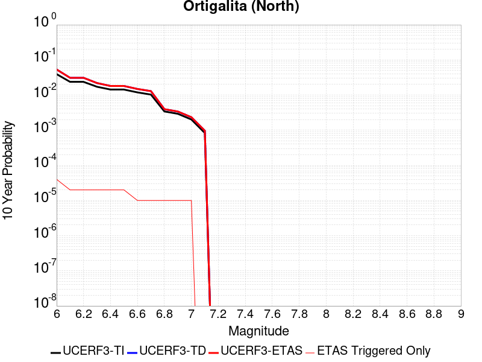 |

| Magnitude | 1 wk TI Prob | 1 wk TD Prob | 1 wk ETAS Prob | 1 wk ETAS/TD Gain | 1 wk ETAS Triggered Only | 1 mo TI Prob | 1 mo TD Prob | 1 mo ETAS Prob | 1 mo ETAS/TD Gain | 1 mo ETAS Triggered Only | 1 yr TI Prob | 1 yr TD Prob | 1 yr ETAS Prob | 1 yr ETAS/TD Gain | 1 yr ETAS Triggered Only | 10 yr TI Prob | 10 yr TD Prob | 10 yr ETAS Prob | 10 yr ETAS/TD Gain | 10 yr ETAS Triggered Only |
|-----|-----|-----|-----|-----|-----|-----|-----|-----|-----|-----|-----|-----|-----|-----|-----|-----|-----|-----|-----|-----|
| 6.0 | 7.711876E-5 | 1.0505751E-4 | 1.1505646E-4 | 1.095176 | 1.0E-5 | 3.3046713E-4 | 4.5017857E-4 | 4.6017408E-4 | 1.0222034 | 1.0E-5 | 0.004016016 | 0.0054682563 | 0.005498092 | 1.0054562 | 3.0E-5 | 0.039442103 | 0.05345752 | 0.05349538 | 1.0007082 | 4.0E-5 |
| 6.1 | 4.607858E-5 | 6.0242022E-5 | 6.0242022E-5 | 1.0 | 0.0 | 1.9746469E-4 | 2.5815627E-4 | 2.5815627E-4 | 1.0 | 0.0 | 0.0024014818 | 0.0031388416 | 0.0031587787 | 1.0063518 | 2.0E-5 | 0.023756953 | 0.030976322 | 0.030995702 | 1.0006256 | 2.0E-5 |
| 6.2 | 4.607858E-5 | 6.0242022E-5 | 6.0242022E-5 | 1.0 | 0.0 | 1.9746469E-4 | 2.5815627E-4 | 2.5815627E-4 | 1.0 | 0.0 | 0.0024014818 | 0.0031388416 | 0.0031587787 | 1.0063518 | 2.0E-5 | 0.023756953 | 0.030976322 | 0.030995702 | 1.0006256 | 2.0E-5 |
| 6.3 | 3.327423E-5 | 4.2477477E-5 | 4.2477477E-5 | 1.0 | 0.0 | 1.4259605E-4 | 1.8203529E-4 | 1.8203529E-4 | 1.0 | 0.0 | 0.0017347244 | 0.0022142746 | 0.0022342303 | 1.0090123 | 2.0E-5 | 0.017212452 | 0.021946408 | 0.02196597 | 1.0008913 | 2.0E-5 |
| 6.4 | 2.7732503E-5 | 3.5000066E-5 | 3.5000066E-5 | 1.0 | 0.0 | 1.1884817E-4 | 1.4999308E-4 | 1.4999308E-4 | 1.0 | 0.0 | 0.001446016 | 0.00182487 | 0.0018448335 | 1.0109397 | 2.0E-5 | 0.014366428 | 0.01812183 | 0.018141467 | 1.0010836 | 2.0E-5 |
| 6.5 | 2.7689714E-5 | 3.494988E-5 | 3.494988E-5 | 1.0 | 0.0 | 1.186648E-4 | 1.4977802E-4 | 1.4977802E-4 | 1.0 | 0.0 | 0.0014437864 | 0.001822256 | 0.0018422195 | 1.0109555 | 2.0E-5 | 0.014344421 | 0.018096115 | 0.018115753 | 1.0010852 | 2.0E-5 |
| 6.6 | 2.2976905E-5 | 2.8719123E-5 | 2.8719123E-5 | 1.0 | 0.0 | 9.846873E-5 | 1.2307758E-4 | 1.2307758E-4 | 1.0 | 0.0 | 0.0011981975 | 0.0014976779 | 0.0015076629 | 1.006667 | 1.0E-5 | 0.011917574 | 0.014899158 | 0.014909009 | 1.0006611 | 1.0E-5 |
| 6.7 | 1.9871539E-5 | 2.4905368E-5 | 2.4905368E-5 | 1.0 | 0.0 | 8.516096E-5 | 1.06734326E-4 | 1.06734326E-4 | 1.0 | 0.0 | 0.0010363415 | 0.0012989579 | 0.0013089449 | 1.0076885 | 1.0E-5 | 0.010315218 | 0.012937314 | 0.012947184 | 1.0007629 | 1.0E-5 |
| 6.8 | 6.5640475E-6 | 7.6056276E-6 | 7.6056276E-6 | 1.0 | 0.0 | 2.813133E-5 | 3.2595155E-5 | 3.2595155E-5 | 1.0 | 0.0 | 3.424451E-4 | 3.9677662E-4 | 4.0677265E-4 | 1.0251931 | 1.0E-5 | 0.0034191788 | 0.0039609694 | 0.0039709294 | 1.0025146 | 1.0E-5 |
| 6.9 | 5.6219683E-6 | 6.5019517E-6 | 6.5019517E-6 | 1.0 | 0.0 | 2.4093928E-5 | 2.7865224E-5 | 2.7865224E-5 | 1.0 | 0.0 | 2.933041E-4 | 3.3920887E-4 | 3.4920548E-4 | 1.0294703 | 1.0E-5 | 0.0029291727 | 0.003387168 | 0.0033971344 | 1.0029423 | 1.0E-5 |
| 7.0 | 3.875591E-6 | 4.484834E-6 | 4.484834E-6 | 1.0 | 0.0 | 1.6609569E-5 | 1.9220586E-5 | 1.9220586E-5 | 1.0 | 0.0 | 2.0220275E-4 | 2.3398762E-4 | 2.4398528E-4 | 1.0427274 | 1.0E-5 | 0.0020201886 | 0.0023376208 | 0.0023475976 | 1.0042678 | 1.0E-5 |
| 7.1 | 1.6017933E-6 | 1.8570748E-6 | 1.8570748E-6 | 1.0 | 0.0 | 6.8648105E-6 | 7.958874E-6 | 7.958874E-6 | 1.0 | 0.0 | 8.357586E-5 | 9.689605E-5 | 9.689605E-5 | 1.0 | 0.0 | 8.3544437E-4 | 9.686427E-4 | 9.686427E-4 | 1.0 | 0.0 |

## Santa Ynez (East)
*[(top)](#table-of-contents)*

| 1 Week | 1 Month | 1 Year | 10 Year |
|-----|-----|-----|-----|
|  | 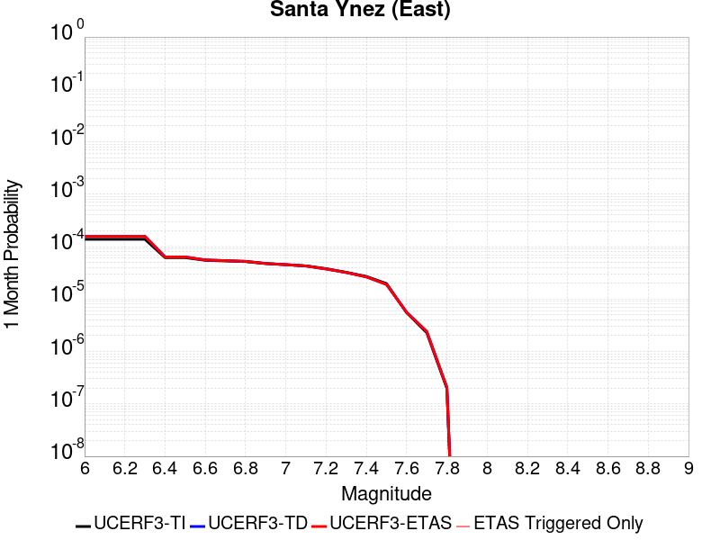 |  |  |

| Magnitude | 1 wk TI Prob | 1 wk TD Prob | 1 wk ETAS Prob | 1 wk ETAS/TD Gain | 1 wk ETAS Triggered Only | 1 mo TI Prob | 1 mo TD Prob | 1 mo ETAS Prob | 1 mo ETAS/TD Gain | 1 mo ETAS Triggered Only | 1 yr TI Prob | 1 yr TD Prob | 1 yr ETAS Prob | 1 yr ETAS/TD Gain | 1 yr ETAS Triggered Only | 10 yr TI Prob | 10 yr TD Prob | 10 yr ETAS Prob | 10 yr ETAS/TD Gain | 10 yr ETAS Triggered Only |
|-----|-----|-----|-----|-----|-----|-----|-----|-----|-----|-----|-----|-----|-----|-----|-----|-----|-----|-----|-----|-----|
| 6.0 | 3.2269712E-5 | 3.6751484E-5 | 3.6751484E-5 | 1.0 | 0.0 | 1.3829143E-4 | 1.5750017E-4 | 1.5750017E-4 | 1.0 | 0.0 | 0.0016823979 | 0.001916462 | 0.0019364237 | 1.0104159 | 2.0E-5 | 0.016697178 | 0.0190568 | 0.019105848 | 1.0025737 | 5.0E-5 |
| 6.1 | 3.2269712E-5 | 3.6751484E-5 | 3.6751484E-5 | 1.0 | 0.0 | 1.3829143E-4 | 1.5750017E-4 | 1.5750017E-4 | 1.0 | 0.0 | 0.0016823979 | 0.001916462 | 0.0019364237 | 1.0104159 | 2.0E-5 | 0.016697178 | 0.0190568 | 0.019105848 | 1.0025737 | 5.0E-5 |
| 6.2 | 3.2269712E-5 | 3.6751484E-5 | 3.6751484E-5 | 1.0 | 0.0 | 1.3829143E-4 | 1.5750017E-4 | 1.5750017E-4 | 1.0 | 0.0 | 0.0016823979 | 0.001916462 | 0.0019364237 | 1.0104159 | 2.0E-5 | 0.016697178 | 0.0190568 | 0.019105848 | 1.0025737 | 5.0E-5 |
| 6.3 | 3.2269712E-5 | 3.6751484E-5 | 3.6751484E-5 | 1.0 | 0.0 | 1.3829143E-4 | 1.5750017E-4 | 1.5750017E-4 | 1.0 | 0.0 | 0.0016823979 | 0.001916462 | 0.0019364237 | 1.0104159 | 2.0E-5 | 0.016697178 | 0.0190568 | 0.019105848 | 1.0025737 | 5.0E-5 |
| 6.4 | 1.4404779E-5 | 1.4849448E-5 | 1.4849448E-5 | 1.0 | 0.0 | 6.1733306E-5 | 6.363897E-5 | 6.363897E-5 | 1.0 | 0.0 | 7.513438E-4 | 7.745341E-4 | 7.745341E-4 | 1.0 | 0.0 | 0.0074880854 | 0.007718897 | 0.0077486653 | 1.0038565 | 3.0E-5 |
| 6.5 | 1.4404779E-5 | 1.4849448E-5 | 1.4849448E-5 | 1.0 | 0.0 | 6.1733306E-5 | 6.363897E-5 | 6.363897E-5 | 1.0 | 0.0 | 7.513438E-4 | 7.745341E-4 | 7.745341E-4 | 1.0 | 0.0 | 0.0074880854 | 0.007718897 | 0.0077486653 | 1.0038565 | 3.0E-5 |
| 6.6 | 1.280208E-5 | 1.3011984E-5 | 1.3011984E-5 | 1.0 | 0.0 | 5.4864904E-5 | 5.5764463E-5 | 5.5764463E-5 | 1.0 | 0.0 | 6.6777546E-4 | 6.7872263E-4 | 6.7872263E-4 | 1.0 | 0.0 | 0.006657724 | 0.0067667076 | 0.0067965044 | 1.0044035 | 3.0E-5 |
| 6.7 | 1.2457027E-5 | 1.26284995E-5 | 1.26284995E-5 | 1.0 | 0.0 | 5.3386164E-5 | 5.412103E-5 | 5.412103E-5 | 1.0 | 0.0 | 6.497827E-4 | 6.5872597E-4 | 6.5872597E-4 | 1.0 | 0.0 | 0.00647886 | 0.0065679313 | 0.0065878 | 1.003025 | 2.0E-5 |
| 6.8 | 1.2095134E-5 | 1.2230942E-5 | 1.2230942E-5 | 1.0 | 0.0 | 5.1835254E-5 | 5.241728E-5 | 5.241728E-5 | 1.0 | 0.0 | 6.309115E-4 | 6.3799514E-4 | 6.3799514E-4 | 1.0 | 0.0 | 0.0062912325 | 0.0063618235 | 0.006381696 | 1.0031238 | 2.0E-5 |
| 6.9 | 1.1104036E-5 | 1.11573645E-5 | 1.11573645E-5 | 1.0 | 0.0 | 4.758786E-5 | 4.7816407E-5 | 4.7816407E-5 | 1.0 | 0.0 | 5.7922816E-4 | 5.820105E-4 | 5.820105E-4 | 1.0 | 0.0 | 0.005777207 | 0.005805008 | 0.00581495 | 1.0017127 | 1.0E-5 |
| 7.0 | 1.0577444E-5 | 1.0581692E-5 | 1.0581692E-5 | 1.0 | 0.0 | 4.5331115E-5 | 4.5349327E-5 | 4.5349327E-5 | 1.0 | 0.0 | 5.5176654E-4 | 5.5198936E-4 | 5.5198936E-4 | 1.0 | 0.0 | 0.0055039856 | 0.0055063213 | 0.0055162665 | 1.0018061 | 1.0E-5 |
| 7.1 | 1.0021775E-5 | 9.980993E-6 | 9.980993E-6 | 1.0 | 0.0 | 4.294976E-5 | 4.277499E-5 | 4.277499E-5 | 1.0 | 0.0 | 5.2278786E-4 | 5.2066223E-4 | 5.2066223E-4 | 1.0 | 0.0 | 0.0052155964 | 0.0051945564 | 0.005204505 | 1.0019151 | 1.0E-5 |
| 7.2 | 8.874109E-6 | 8.748788E-6 | 8.748788E-6 | 1.0 | 0.0 | 3.8031343E-5 | 3.7494272E-5 | 3.7494272E-5 | 1.0 | 0.0 | 4.629332E-4 | 4.5639824E-4 | 4.5639824E-4 | 1.0 | 0.0 | 0.0046197 | 0.004554727 | 0.0045646816 | 1.0021855 | 1.0E-5 |
| 7.3 | 7.5504267E-6 | 7.5050857E-6 | 7.5050857E-6 | 1.0 | 0.0 | 3.235857E-5 | 3.2164262E-5 | 3.2164262E-5 | 1.0 | 0.0 | 3.9389438E-4 | 3.9153054E-4 | 3.9153054E-4 | 1.0 | 0.0 | 0.0039319694 | 0.0039085145 | 0.0039085145 | 1.0 | 0.0 |
| 7.4 | 6.309394E-6 | 6.1831106E-6 | 6.1831106E-6 | 1.0 | 0.0 | 2.703998E-5 | 2.6498781E-5 | 2.6498781E-5 | 1.0 | 0.0 | 3.2916202E-4 | 3.2257586E-4 | 3.2257586E-4 | 1.0 | 0.0 | 0.003286749 | 0.0032211735 | 0.0032211735 | 1.0 | 0.0 |
| 7.5 | 4.6103073E-6 | 4.440834E-6 | 4.440834E-6 | 1.0 | 0.0 | 1.975831E-5 | 1.9032012E-5 | 1.9032012E-5 | 1.0 | 0.0 | 2.4053088E-4 | 2.3169079E-4 | 2.3169079E-4 | 1.0 | 0.0 | 0.002402707 | 0.0023145617 | 0.0023145617 | 1.0 | 0.0 |
| 7.6 | 1.2858658E-6 | 1.3008279E-6 | 1.3008279E-6 | 1.0 | 0.0 | 5.5108417E-6 | 5.574965E-6 | 5.574965E-6 | 1.0 | 0.0 | 6.7092435E-5 | 6.787315E-5 | 6.787315E-5 | 1.0 | 0.0 | 6.707218E-4 | 6.785311E-4 | 6.785311E-4 | 1.0 | 0.0 |
| 7.7 | 5.3302307E-7 | 5.612172E-7 | 5.612172E-7 | 1.0 | 0.0 | 2.2843826E-6 | 2.4052144E-6 | 2.4052144E-6 | 1.0 | 0.0 | 2.7812002E-5 | 2.928313E-5 | 2.928313E-5 | 1.0 | 0.0 | 2.7808524E-4 | 2.927963E-4 | 2.927963E-4 | 1.0 | 0.0 |
| 7.8 | 4.613933E-8 | 4.803032E-8 | 4.803032E-8 | 1.0 | 0.0 | 1.9773998E-7 | 2.058442E-7 | 2.058442E-7 | 1.0 | 0.0 | 2.4074816E-6 | 2.5061504E-6 | 2.5061504E-6 | 1.0 | 0.0 | 2.4074554E-5 | 2.506123E-5 | 2.506123E-5 | 1.0 | 0.0 |

## Dry Mountain
*[(top)](#table-of-contents)*

| 1 Week | 1 Month | 1 Year | 10 Year |
|-----|-----|-----|-----|
|  |  |  |  |

| Magnitude | 1 wk TI Prob | 1 wk TD Prob | 1 wk ETAS Prob | 1 wk ETAS/TD Gain | 1 wk ETAS Triggered Only | 1 mo TI Prob | 1 mo TD Prob | 1 mo ETAS Prob | 1 mo ETAS/TD Gain | 1 mo ETAS Triggered Only | 1 yr TI Prob | 1 yr TD Prob | 1 yr ETAS Prob | 1 yr ETAS/TD Gain | 1 yr ETAS Triggered Only | 10 yr TI Prob | 10 yr TD Prob | 10 yr ETAS Prob | 10 yr ETAS/TD Gain | 10 yr ETAS Triggered Only |
|-----|-----|-----|-----|-----|-----|-----|-----|-----|-----|-----|-----|-----|-----|-----|-----|-----|-----|-----|-----|-----|
| 6.0 | 6.222801E-6 | 6.439406E-6 | 6.439406E-6 | 1.0 | 0.0 | 2.6668875E-5 | 2.7597254E-5 | 3.7596976E-5 | 1.3623449 | 1.0E-5 | 3.2464517E-4 | 3.3596068E-4 | 3.659506E-4 | 1.0892662 | 3.0E-5 | 0.0032417132 | 0.0033560898 | 0.0033959555 | 1.0118786 | 4.0E-5 |
| 6.1 | 6.222801E-6 | 6.439406E-6 | 6.439406E-6 | 1.0 | 0.0 | 2.6668875E-5 | 2.7597254E-5 | 3.7596976E-5 | 1.3623449 | 1.0E-5 | 3.2464517E-4 | 3.3596068E-4 | 3.659506E-4 | 1.0892662 | 3.0E-5 | 0.0032417132 | 0.0033560898 | 0.0033959555 | 1.0118786 | 4.0E-5 |
| 6.2 | 6.222801E-6 | 6.439406E-6 | 6.439406E-6 | 1.0 | 0.0 | 2.6668875E-5 | 2.7597254E-5 | 3.7596976E-5 | 1.3623449 | 1.0E-5 | 3.2464517E-4 | 3.3596068E-4 | 3.659506E-4 | 1.0892662 | 3.0E-5 | 0.0032417132 | 0.0033560898 | 0.0033959555 | 1.0118786 | 4.0E-5 |
| 6.3 | 6.222801E-6 | 6.439406E-6 | 6.439406E-6 | 1.0 | 0.0 | 2.6668875E-5 | 2.7597254E-5 | 3.7596976E-5 | 1.3623449 | 1.0E-5 | 3.2464517E-4 | 3.3596068E-4 | 3.659506E-4 | 1.0892662 | 3.0E-5 | 0.0032417132 | 0.0033560898 | 0.0033959555 | 1.0118786 | 4.0E-5 |
| 6.4 | 6.222801E-6 | 6.439406E-6 | 6.439406E-6 | 1.0 | 0.0 | 2.6668875E-5 | 2.7597254E-5 | 3.7596976E-5 | 1.3623449 | 1.0E-5 | 3.2464517E-4 | 3.3596068E-4 | 3.659506E-4 | 1.0892662 | 3.0E-5 | 0.0032417132 | 0.0033560898 | 0.0033959555 | 1.0118786 | 4.0E-5 |
| 6.5 | 2.8528623E-6 | 2.9521798E-6 | 2.9521798E-6 | 1.0 | 0.0 | 1.22264955E-5 | 1.2652187E-5 | 1.2652187E-5 | 1.0 | 0.0 | 1.4884741E-4 | 1.5403819E-4 | 1.5403819E-4 | 1.0 | 0.0 | 0.0014874774 | 0.0015401676 | 0.0015501522 | 1.0064828 | 1.0E-5 |
| 6.6 | 2.8528623E-6 | 2.9521798E-6 | 2.9521798E-6 | 1.0 | 0.0 | 1.22264955E-5 | 1.2652187E-5 | 1.2652187E-5 | 1.0 | 0.0 | 1.4884741E-4 | 1.5403819E-4 | 1.5403819E-4 | 1.0 | 0.0 | 0.0014874774 | 0.0015401676 | 0.0015501522 | 1.0064828 | 1.0E-5 |
| 6.7 | 2.541E-6 | 2.629368E-6 | 2.629368E-6 | 1.0 | 0.0 | 1.0889954E-5 | 1.126872E-5 | 1.126872E-5 | 1.0 | 0.0 | 1.3257713E-4 | 1.3719666E-4 | 1.3719666E-4 | 1.0 | 0.0 | 0.0013249806 | 0.0013719667 | 0.001381953 | 1.0072788 | 1.0E-5 |

## Sheephole
*[(top)](#table-of-contents)*

| 1 Week | 1 Month | 1 Year | 10 Year |
|-----|-----|-----|-----|
|  |  | 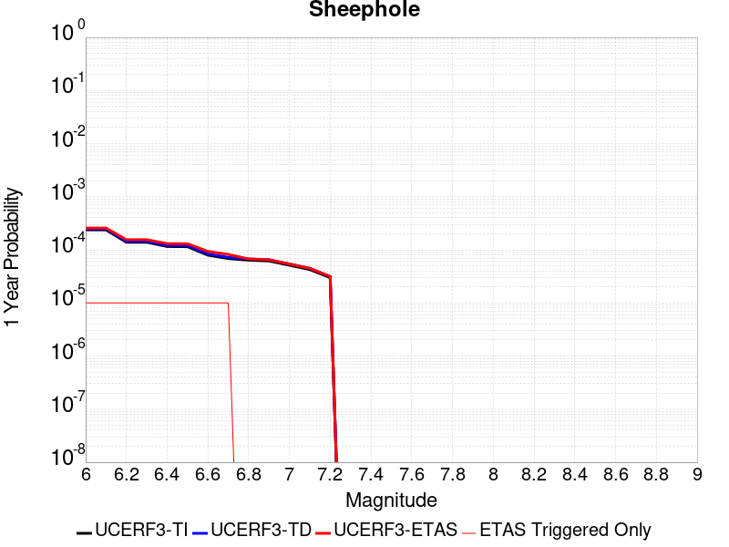 | 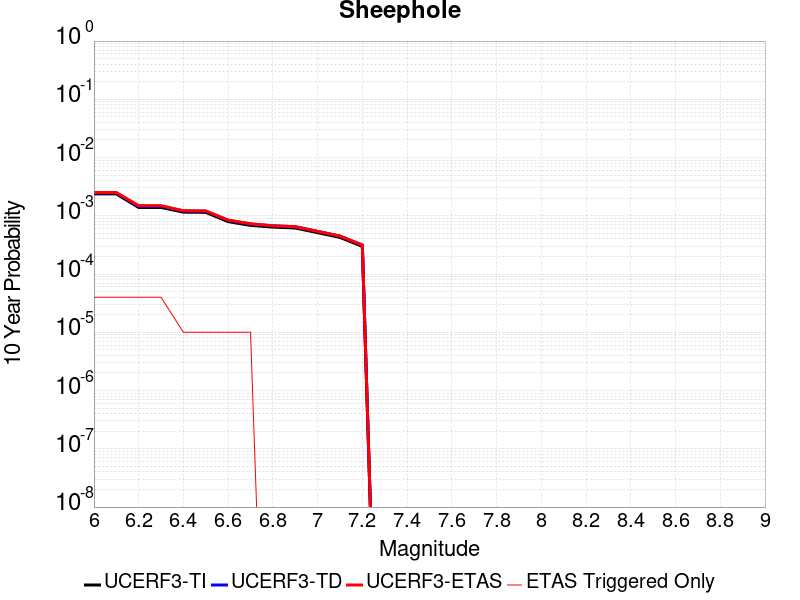 |

| Magnitude | 1 wk TI Prob | 1 wk TD Prob | 1 wk ETAS Prob | 1 wk ETAS/TD Gain | 1 wk ETAS Triggered Only | 1 mo TI Prob | 1 mo TD Prob | 1 mo ETAS Prob | 1 mo ETAS/TD Gain | 1 mo ETAS Triggered Only | 1 yr TI Prob | 1 yr TD Prob | 1 yr ETAS Prob | 1 yr ETAS/TD Gain | 1 yr ETAS Triggered Only | 10 yr TI Prob | 10 yr TD Prob | 10 yr ETAS Prob | 10 yr ETAS/TD Gain | 10 yr ETAS Triggered Only |
|-----|-----|-----|-----|-----|-----|-----|-----|-----|-----|-----|-----|-----|-----|-----|-----|-----|-----|-----|-----|-----|
| 6.0 | 4.5579695E-6 | 4.741284E-6 | 4.741284E-6 | 1.0 | 0.0 | 1.9534009E-5 | 2.0319661E-5 | 2.0319661E-5 | 1.0 | 0.0 | 2.3780059E-4 | 2.4736935E-4 | 2.5736686E-4 | 1.0404154 | 1.0E-5 | 0.0023754628 | 0.0024714842 | 0.0025113854 | 1.0161446 | 4.0E-5 |
| 6.1 | 4.5579695E-6 | 4.741284E-6 | 4.741284E-6 | 1.0 | 0.0 | 1.9534009E-5 | 2.0319661E-5 | 2.0319661E-5 | 1.0 | 0.0 | 2.3780059E-4 | 2.4736935E-4 | 2.5736686E-4 | 1.0404154 | 1.0E-5 | 0.0023754628 | 0.0024714842 | 0.0025113854 | 1.0161446 | 4.0E-5 |
| 6.2 | 2.6677674E-6 | 2.7874082E-6 | 2.7874082E-6 | 1.0 | 0.0 | 1.1433239E-5 | 1.1945986E-5 | 1.1945986E-5 | 1.0 | 0.0 | 1.3919079E-4 | 1.4543376E-4 | 1.5543231E-4 | 1.0687498 | 1.0E-5 | 0.0013910364 | 0.0014534917 | 0.0014934336 | 1.0274799 | 4.0E-5 |
| 6.3 | 2.6677674E-6 | 2.7874082E-6 | 2.7874082E-6 | 1.0 | 0.0 | 1.1433239E-5 | 1.1945986E-5 | 1.1945986E-5 | 1.0 | 0.0 | 1.3919079E-4 | 1.4543376E-4 | 1.5543231E-4 | 1.0687498 | 1.0E-5 | 0.0013910364 | 0.0014534917 | 0.0014934336 | 1.0274799 | 4.0E-5 |
| 6.4 | 2.2159759E-6 | 2.3228913E-6 | 2.3228913E-6 | 1.0 | 0.0 | 9.497005E-6 | 9.955214E-6 | 9.955214E-6 | 1.0 | 0.0 | 1.156199E-4 | 1.21198806E-4 | 1.311976E-4 | 1.082499 | 1.0E-5 | 0.0011555976 | 0.0012114064 | 0.0012213943 | 1.0082449 | 1.0E-5 |
| 6.5 | 2.1986082E-6 | 2.3047714E-6 | 2.3047714E-6 | 1.0 | 0.0 | 9.4225725E-6 | 9.877559E-6 | 9.877559E-6 | 1.0 | 0.0 | 1.1471378E-4 | 1.20253455E-4 | 1.3025226E-4 | 1.0831476 | 1.0E-5 | 0.0011465458 | 0.0012019632 | 0.0012119511 | 1.0083097 | 1.0E-5 |
| 6.6 | 1.5232331E-6 | 1.6019011E-6 | 1.6019011E-6 | 1.0 | 0.0 | 6.5281256E-6 | 6.8652735E-6 | 6.8652735E-6 | 1.0 | 0.0 | 7.947703E-5 | 8.358169E-5 | 9.358085E-5 | 1.1196334 | 1.0E-5 | 7.9448614E-4 | 8.3552126E-4 | 8.455129E-4 | 1.0119586 | 1.0E-5 |
| 6.7 | 1.3137362E-6 | 1.3828271E-6 | 1.3828271E-6 | 1.0 | 0.0 | 5.6302856E-6 | 5.9263893E-6 | 5.9263893E-6 | 1.0 | 0.0 | 6.854657E-5 | 7.2151546E-5 | 8.215082E-5 | 1.1385871 | 1.0E-5 | 6.8525434E-4 | 7.212951E-4 | 7.312879E-4 | 1.0138539 | 1.0E-5 |
| 6.8 | 1.2275751E-6 | 1.2922923E-6 | 1.2922923E-6 | 1.0 | 0.0 | 5.2610258E-6 | 5.5383844E-6 | 5.5383844E-6 | 1.0 | 0.0 | 6.4051106E-5 | 6.742788E-5 | 6.742788E-5 | 1.0 | 0.0 | 6.4032647E-4 | 6.7408755E-4 | 6.7408755E-4 | 1.0 | 0.0 |
| 6.9 | 1.1837088E-6 | 1.2461094E-6 | 1.2461094E-6 | 1.0 | 0.0 | 5.0730278E-6 | 5.3404583E-6 | 5.3404583E-6 | 1.0 | 0.0 | 6.176237E-5 | 6.501828E-5 | 6.501828E-5 | 1.0 | 0.0 | 6.17452E-4 | 6.500057E-4 | 6.500057E-4 | 1.0 | 0.0 |
| 7.0 | 9.849371E-7 | 1.0366349E-6 | 1.0366349E-6 | 1.0 | 0.0 | 4.2211523E-6 | 4.442714E-6 | 4.442714E-6 | 1.0 | 0.0 | 5.1391315E-5 | 5.4088803E-5 | 5.4088803E-5 | 1.0 | 0.0 | 5.137943E-4 | 5.4076646E-4 | 5.4076646E-4 | 1.0 | 0.0 |
| 7.1 | 8.1643645E-7 | 8.591719E-7 | 8.591719E-7 | 1.0 | 0.0 | 3.4990085E-6 | 3.6821607E-6 | 3.6821607E-6 | 1.0 | 0.0 | 4.2599597E-5 | 4.482947E-5 | 4.482947E-5 | 1.0 | 0.0 | 4.259143E-4 | 4.4821293E-4 | 4.4821293E-4 | 1.0 | 0.0 |
| 7.2 | 5.7295756E-7 | 6.029537E-7 | 6.029537E-7 | 1.0 | 0.0 | 2.45553E-6 | 2.5840852E-6 | 2.5840852E-6 | 1.0 | 0.0 | 2.9895667E-5 | 3.146085E-5 | 3.146085E-5 | 1.0 | 0.0 | 2.9891645E-4 | 3.1457067E-4 | 3.1457067E-4 | 1.0 | 0.0 |

## Pisgah-Bullion Mtn-Mesquite Lk
*[(top)](#table-of-contents)*

| 1 Week | 1 Month | 1 Year | 10 Year |
|-----|-----|-----|-----|
|  |  | 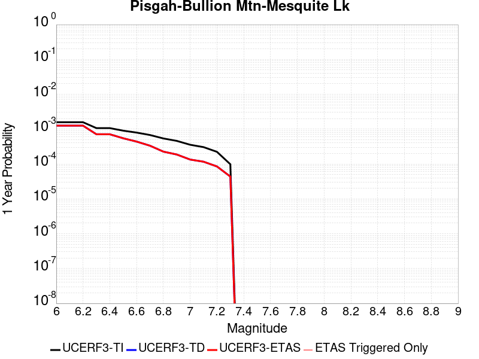 | 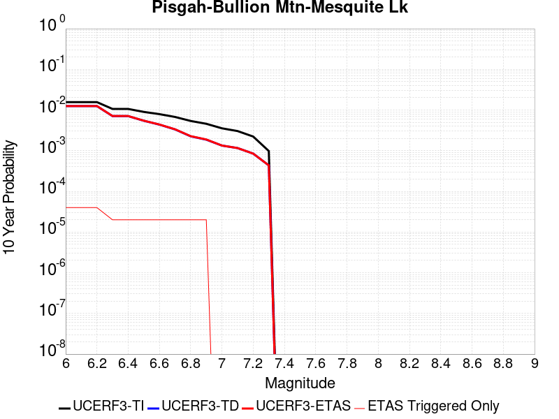 |

| Magnitude | 1 wk TI Prob | 1 wk TD Prob | 1 wk ETAS Prob | 1 wk ETAS/TD Gain | 1 wk ETAS Triggered Only | 1 mo TI Prob | 1 mo TD Prob | 1 mo ETAS Prob | 1 mo ETAS/TD Gain | 1 mo ETAS Triggered Only | 1 yr TI Prob | 1 yr TD Prob | 1 yr ETAS Prob | 1 yr ETAS/TD Gain | 1 yr ETAS Triggered Only | 10 yr TI Prob | 10 yr TD Prob | 10 yr ETAS Prob | 10 yr ETAS/TD Gain | 10 yr ETAS Triggered Only |
|-----|-----|-----|-----|-----|-----|-----|-----|-----|-----|-----|-----|-----|-----|-----|-----|-----|-----|-----|-----|-----|
| 6.0 | 3.0240792E-5 | 2.4091234E-5 | 2.4091234E-5 | 1.0 | 0.0 | 1.2959696E-4 | 1.0324462E-4 | 1.0324462E-4 | 1.0 | 0.0 | 0.0015767008 | 0.0012563792 | 0.0012563792 | 1.0 | 0.0 | 0.015655609 | 0.012502786 | 0.012542285 | 1.0031593 | 4.0E-5 |
| 6.1 | 3.0240792E-5 | 2.4091234E-5 | 2.4091234E-5 | 1.0 | 0.0 | 1.2959696E-4 | 1.0324462E-4 | 1.0324462E-4 | 1.0 | 0.0 | 0.0015767008 | 0.0012563792 | 0.0012563792 | 1.0 | 0.0 | 0.015655609 | 0.012502786 | 0.012542285 | 1.0031593 | 4.0E-5 |
| 6.2 | 3.0240792E-5 | 2.4091234E-5 | 2.4091234E-5 | 1.0 | 0.0 | 1.2959696E-4 | 1.0324462E-4 | 1.0324462E-4 | 1.0 | 0.0 | 0.0015767008 | 0.0012563792 | 0.0012563792 | 1.0 | 0.0 | 0.015655609 | 0.012502786 | 0.012542285 | 1.0031593 | 4.0E-5 |
| 6.3 | 2.0498217E-5 | 1.3638228E-5 | 1.3638228E-5 | 1.0 | 0.0 | 8.784654E-5 | 5.8448328E-5 | 5.8448328E-5 | 1.0 | 0.0 | 0.0010690069 | 7.1139226E-4 | 7.1139226E-4 | 1.0 | 0.0 | 0.01063879 | 0.0070927762 | 0.0071126344 | 1.0027997 | 2.0E-5 |
| 6.4 | 2.0498217E-5 | 1.3638228E-5 | 1.3638228E-5 | 1.0 | 0.0 | 8.784654E-5 | 5.8448328E-5 | 5.8448328E-5 | 1.0 | 0.0 | 0.0010690069 | 7.1139226E-4 | 7.1139226E-4 | 1.0 | 0.0 | 0.01063879 | 0.0070927762 | 0.0071126344 | 1.0027997 | 2.0E-5 |
| 6.5 | 1.7316182E-5 | 1.0477106E-5 | 1.0477106E-5 | 1.0 | 0.0 | 7.42101E-5 | 4.4901168E-5 | 4.4901168E-5 | 1.0 | 0.0 | 9.0313336E-4 | 5.465446E-4 | 5.465446E-4 | 1.0 | 0.0 | 0.008994718 | 0.005453 | 0.005472891 | 1.0036477 | 2.0E-5 |
| 6.6 | 1.5251077E-5 | 8.414245E-6 | 8.414245E-6 | 1.0 | 0.0 | 6.536012E-5 | 3.606059E-5 | 3.606059E-5 | 1.0 | 0.0 | 7.9546886E-4 | 4.389565E-4 | 4.389565E-4 | 1.0 | 0.0 | 0.007926274 | 0.0043816115 | 0.004401524 | 1.0045445 | 2.0E-5 |
| 6.7 | 1.2997425E-5 | 6.411305E-6 | 6.411305E-6 | 1.0 | 0.0 | 5.570206E-5 | 2.7476759E-5 | 2.7476759E-5 | 1.0 | 0.0 | 6.7796157E-4 | 3.3448284E-4 | 3.3448284E-4 | 1.0 | 0.0 | 0.0067589693 | 0.0033402543 | 0.0033601874 | 1.0059676 | 2.0E-5 |
| 6.8 | 1.035386E-5 | 4.3332334E-6 | 4.3332334E-6 | 1.0 | 0.0 | 4.437293E-5 | 1.8570872E-5 | 1.8570872E-5 | 1.0 | 0.0 | 5.401065E-4 | 2.2607778E-4 | 2.2607778E-4 | 1.0 | 0.0 | 0.0053879567 | 0.0022585648 | 0.0022785196 | 1.0088352 | 2.0E-5 |
| 6.9 | 8.816252E-6 | 3.5806709E-6 | 3.5806709E-6 | 1.0 | 0.0 | 3.778339E-5 | 1.5345646E-5 | 1.5345646E-5 | 1.0 | 0.0 | 4.5991567E-4 | 1.8681781E-4 | 1.8681781E-4 | 1.0 | 0.0 | 0.00458965 | 0.001866666 | 0.0018866287 | 1.0106943 | 2.0E-5 |
| 7.0 | 6.8232207E-6 | 2.5675145E-6 | 2.5675145E-6 | 1.0 | 0.0 | 2.9242048E-5 | 1.1003589E-5 | 1.1003589E-5 | 1.0 | 0.0 | 3.5596377E-4 | 1.3396077E-4 | 1.3396077E-4 | 1.0 | 0.0 | 0.0035539411 | 0.0013388313 | 0.0013388313 | 1.0 | 0.0 |
| 7.1 | 5.837013E-6 | 2.227371E-6 | 2.227371E-6 | 1.0 | 0.0 | 2.501553E-5 | 9.545843E-6 | 9.545843E-6 | 1.0 | 0.0 | 3.045215E-4 | 1.1621473E-4 | 1.1621473E-4 | 1.0 | 0.0 | 0.0030410455 | 0.0011615686 | 0.0011615686 | 1.0 | 0.0 |
| 7.2 | 4.278052E-6 | 1.6275229E-6 | 1.6275229E-6 | 1.0 | 0.0 | 1.833438E-5 | 6.9750813E-6 | 6.9750813E-6 | 1.0 | 0.0 | 2.231982E-4 | 8.491854E-5 | 8.491854E-5 | 1.0 | 0.0 | 0.0022297418 | 8.488841E-4 | 8.488841E-4 | 1.0 | 0.0 |
| 7.3 | 1.8803692E-6 | 8.344878E-7 | 8.344878E-7 | 1.0 | 0.0 | 8.0587E-6 | 3.5763721E-6 | 3.5763721E-6 | 1.0 | 0.0 | 9.811026E-5 | 4.3541608E-5 | 4.3541608E-5 | 1.0 | 0.0 | 9.806695E-4 | 4.3534525E-4 | 4.3534525E-4 | 1.0 | 0.0 |

## Calaveras (So) - Paicines extension 2011 CFM
*[(top)](#table-of-contents)*

| 1 Week | 1 Month | 1 Year | 10 Year |
|-----|-----|-----|-----|
|  |  |  |  |

| Magnitude | 1 wk TI Prob | 1 wk TD Prob | 1 wk ETAS Prob | 1 wk ETAS/TD Gain | 1 wk ETAS Triggered Only | 1 mo TI Prob | 1 mo TD Prob | 1 mo ETAS Prob | 1 mo ETAS/TD Gain | 1 mo ETAS Triggered Only | 1 yr TI Prob | 1 yr TD Prob | 1 yr ETAS Prob | 1 yr ETAS/TD Gain | 1 yr ETAS Triggered Only | 10 yr TI Prob | 10 yr TD Prob | 10 yr ETAS Prob | 10 yr ETAS/TD Gain | 10 yr ETAS Triggered Only |
|-----|-----|-----|-----|-----|-----|-----|-----|-----|-----|-----|-----|-----|-----|-----|-----|-----|-----|-----|-----|-----|
| 6.0 | 1.5183659E-4 | 3.0525064E-4 | 3.0525064E-4 | 1.0 | 0.0 | 6.5056595E-4 | 0.0013069717 | 0.0013169586 | 1.0076413 | 1.0E-5 | 0.007891912 | 0.015697975 | 0.015707817 | 1.000627 | 1.0E-5 | 0.076174594 | 0.13850966 | 0.1385355 | 1.0001866 | 3.0E-5 |
| 6.1 | 1.5024997E-4 | 3.0219217E-4 | 3.0219217E-4 | 1.0 | 0.0 | 6.437695E-4 | 0.0012938806 | 0.0013038677 | 1.0077187 | 1.0E-5 | 0.0078097614 | 0.015541362 | 0.015551206 | 1.0006335 | 1.0E-5 | 0.075409345 | 0.13717923 | 0.13720511 | 1.0001887 | 3.0E-5 |
| 6.2 | 1.2743923E-4 | 2.5316267E-4 | 2.5316267E-4 | 1.0 | 0.0 | 5.460538E-4 | 0.0010841407 | 0.0010941299 | 1.0092139 | 1.0E-5 | 0.0066279583 | 0.013048618 | 0.013058488 | 1.0007564 | 1.0E-5 | 0.064337276 | 0.117276914 | 0.1173034 | 1.0002258 | 3.0E-5 |
| 6.3 | 1.1525114E-4 | 2.2602374E-4 | 2.2602374E-4 | 1.0 | 0.0 | 4.9383997E-4 | 9.680189E-4 | 9.780092E-4 | 1.0103204 | 1.0E-5 | 0.0059959386 | 0.011669816 | 0.0116797 | 1.0008469 | 1.0E-5 | 0.058367174 | 0.10639319 | 0.106419995 | 1.000252 | 3.0E-5 |
| 6.4 | 1.07200925E-4 | 2.0843073E-4 | 2.0843073E-4 | 1.0 | 0.0 | 4.5935164E-4 | 8.927541E-4 | 9.027452E-4 | 1.0111912 | 1.0E-5 | 0.0055782744 | 0.010774688 | 0.01078458 | 1.0009181 | 1.0E-5 | 0.0544031 | 0.09921595 | 0.09924297 | 1.0002724 | 3.0E-5 |
| 6.5 | 9.69631E-5 | 1.873673E-4 | 1.873673E-4 | 1.0 | 0.0 | 4.1548995E-4 | 8.0259884E-4 | 8.125908E-4 | 1.0124495 | 1.0E-5 | 0.0050468626 | 0.009696546 | 0.009706449 | 1.0010213 | 1.0E-5 | 0.04933773 | 0.09010777 | 0.09013507 | 1.0003029 | 3.0E-5 |
| 6.6 | 8.0552316E-5 | 1.5073887E-4 | 1.5073887E-4 | 1.0 | 0.0 | 3.4517853E-4 | 6.4583315E-4 | 6.4583315E-4 | 1.0 | 0.0 | 0.0041944524 | 0.0078282105 | 0.0078282105 | 1.0 | 0.0 | 0.04116161 | 0.07487782 | 0.07489632 | 1.0002471 | 2.0E-5 |
| 6.7 | 7.815757E-5 | 1.4614432E-4 | 1.4614432E-4 | 1.0 | 0.0 | 3.34918E-4 | 6.2615535E-4 | 6.2615535E-4 | 1.0 | 0.0 | 0.004070005 | 0.007591005 | 0.007591005 | 1.0 | 0.0 | 0.039962657 | 0.07272731 | 0.07274585 | 1.000255 | 2.0E-5 |
| 6.8 | 6.965264E-5 | 1.2725829E-4 | 1.2725829E-4 | 1.0 | 0.0 | 2.9847719E-4 | 5.452623E-4 | 5.452623E-4 | 1.0 | 0.0 | 0.0036279052 | 0.0066151475 | 0.0066151475 | 1.0 | 0.0 | 0.03569247 | 0.06382153 | 0.063840255 | 1.0002934 | 2.0E-5 |
| 6.9 | 5.8000453E-5 | 1.0146075E-4 | 1.0146075E-4 | 1.0 | 0.0 | 2.4854968E-4 | 4.3475974E-4 | 4.3475974E-4 | 1.0 | 0.0 | 0.0030218933 | 0.005280451 | 0.005280451 | 1.0 | 0.0 | 0.029811295 | 0.051513877 | 0.051532846 | 1.0003682 | 2.0E-5 |
| 7.0 | 4.9865852E-5 | 8.570168E-5 | 8.570168E-5 | 1.0 | 0.0 | 2.1369329E-4 | 3.672417E-4 | 3.672417E-4 | 1.0 | 0.0 | 0.0025986114 | 0.0044620903 | 0.0044620903 | 1.0 | 0.0 | 0.025684336 | 0.043792985 | 0.04381211 | 1.0004367 | 2.0E-5 |
| 7.1 | 4.283875E-5 | 7.1138835E-5 | 7.1138835E-5 | 1.0 | 0.0 | 1.8358172E-4 | 3.048454E-4 | 3.048454E-4 | 1.0 | 0.0 | 0.0022328163 | 0.0037052326 | 0.0037052326 | 1.0 | 0.0 | 0.022105146 | 0.03674338 | 0.036762644 | 1.0005243 | 2.0E-5 |
| 7.2 | 3.450115E-5 | 5.579243E-5 | 5.579243E-5 | 1.0 | 0.0 | 1.478537E-4 | 2.3908865E-4 | 2.3908865E-4 | 1.0 | 0.0 | 0.0017986323 | 0.0029070477 | 0.0029070477 | 1.0 | 0.0 | 0.017841442 | 0.029086657 | 0.029106075 | 1.0006676 | 2.0E-5 |
| 7.3 | 2.5709045E-5 | 4.060274E-5 | 4.060274E-5 | 1.0 | 0.0 | 1.1017697E-4 | 1.7400023E-4 | 1.7400023E-4 | 1.0 | 0.0 | 0.0013405791 | 0.0021164115 | 0.0021164115 | 1.0 | 0.0 | 0.013325208 | 0.021304177 | 0.02132375 | 1.0009187 | 2.0E-5 |
| 7.4 | 1.8003093E-5 | 2.8518138E-5 | 2.8518138E-5 | 1.0 | 0.0 | 7.715383E-5 | 1.2221489E-4 | 1.2221489E-4 | 1.0 | 0.0 | 9.3894306E-4 | 0.0014869529 | 0.0014869529 | 1.0 | 0.0 | 0.009349857 | 0.015054796 | 0.015074494 | 1.0013084 | 2.0E-5 |
| 7.5 | 1.5595824E-5 | 2.5830288E-5 | 2.5830288E-5 | 1.0 | 0.0 | 6.683753E-5 | 1.1069655E-4 | 1.1069655E-4 | 1.0 | 0.0 | 8.134431E-4 | 0.0013468995 | 0.0013468995 | 1.0 | 0.0 | 0.008104719 | 0.0136547275 | 0.013674454 | 1.0014447 | 2.0E-5 |
| 7.6 | 1.1110309E-5 | 1.922886E-5 | 1.922886E-5 | 1.0 | 0.0 | 4.761474E-5 | 8.240681E-5 | 8.240681E-5 | 1.0 | 0.0 | 5.795553E-4 | 0.0010028424 | 0.0010028424 | 1.0 | 0.0 | 0.0057804612 | 0.0102062505 | 0.010226047 | 1.0019395 | 2.0E-5 |
| 7.7 | 6.2140443E-6 | 1.0442269E-5 | 1.0442269E-5 | 1.0 | 0.0 | 2.6631347E-5 | 4.4751814E-5 | 4.4751814E-5 | 1.0 | 0.0 | 3.241884E-4 | 5.4471724E-4 | 5.4471724E-4 | 1.0 | 0.0 | 0.0032371588 | 0.0056224056 | 0.005642293 | 1.0035372 | 2.0E-5 |
| 7.8 | 5.305533E-6 | 9.437752E-6 | 9.437752E-6 | 1.0 | 0.0 | 2.27378E-5 | 4.044688E-5 | 4.044688E-5 | 1.0 | 0.0 | 2.7679754E-4 | 4.923296E-4 | 4.923296E-4 | 1.0 | 0.0 | 0.0027645302 | 0.0050766645 | 0.005096563 | 1.0039196 | 2.0E-5 |
| 7.9 | 3.363505E-6 | 7.388518E-6 | 7.388518E-6 | 1.0 | 0.0 | 1.4414942E-5 | 3.166469E-5 | 3.166469E-5 | 1.0 | 0.0 | 1.7548777E-4 | 3.854495E-4 | 3.854495E-4 | 1.0 | 0.0 | 0.0017534926 | 0.003950367 | 0.003970288 | 1.0050428 | 2.0E-5 |
| 8.0 | 2.0271132E-6 | 4.4151143E-6 | 4.4151143E-6 | 1.0 | 0.0 | 8.687599E-6 | 1.892178E-5 | 1.892178E-5 | 1.0 | 0.0 | 1.05766376E-4 | 2.3034838E-4 | 2.3034838E-4 | 1.0 | 0.0 | 0.0010571606 | 0.0023521157 | 0.0023620923 | 1.0042415 | 1.0E-5 |
| 8.1 | 1.2206116E-6 | 2.376202E-6 | 2.376202E-6 | 1.0 | 0.0 | 5.2311816E-6 | 1.0183683E-5 | 1.0183683E-5 | 1.0 | 0.0 | 6.3687774E-5 | 1.2397932E-4 | 1.2397932E-4 | 1.0 | 0.0 | 6.366953E-4 | 0.0012711115 | 0.0012711115 | 1.0 | 0.0 |

## San Jacinto (Superstition Mtn)
*[(top)](#table-of-contents)*

| 1 Week | 1 Month | 1 Year | 10 Year |
|-----|-----|-----|-----|
|  | 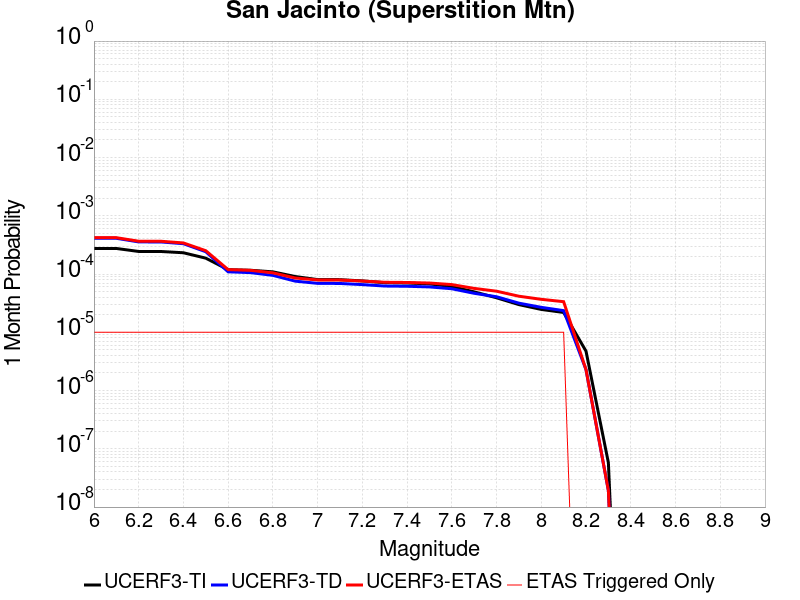 |  |  |

| Magnitude | 1 wk TI Prob | 1 wk TD Prob | 1 wk ETAS Prob | 1 wk ETAS/TD Gain | 1 wk ETAS Triggered Only | 1 mo TI Prob | 1 mo TD Prob | 1 mo ETAS Prob | 1 mo ETAS/TD Gain | 1 mo ETAS Triggered Only | 1 yr TI Prob | 1 yr TD Prob | 1 yr ETAS Prob | 1 yr ETAS/TD Gain | 1 yr ETAS Triggered Only | 10 yr TI Prob | 10 yr TD Prob | 10 yr ETAS Prob | 10 yr ETAS/TD Gain | 10 yr ETAS Triggered Only |
|-----|-----|-----|-----|-----|-----|-----|-----|-----|-----|-----|-----|-----|-----|-----|-----|-----|-----|-----|-----|-----|
| 6.0 | 6.4193904E-5 | 9.6001626E-5 | 9.6001626E-5 | 1.0 | 0.0 | 2.7508775E-4 | 4.1138046E-4 | 4.2137635E-4 | 1.0242984 | 1.0E-5 | 0.0033440501 | 0.0049984753 | 0.0050183753 | 1.0039812 | 2.0E-5 | 0.03294174 | 0.048824538 | 0.048862584 | 1.0007793 | 4.0E-5 |
| 6.1 | 6.4193904E-5 | 9.6001626E-5 | 9.6001626E-5 | 1.0 | 0.0 | 2.7508775E-4 | 4.1138046E-4 | 4.2137635E-4 | 1.0242984 | 1.0E-5 | 0.0033440501 | 0.0049984753 | 0.0050183753 | 1.0039812 | 2.0E-5 | 0.03294174 | 0.048824538 | 0.048862584 | 1.0007793 | 4.0E-5 |
| 6.2 | 5.7023593E-5 | 8.31501E-5 | 8.31501E-5 | 1.0 | 0.0 | 2.4436394E-4 | 3.5631834E-4 | 3.6631478E-4 | 1.0280548 | 1.0E-5 | 0.002971072 | 0.0043311925 | 0.0043511055 | 1.0045977 | 2.0E-5 | 0.029316625 | 0.042506807 | 0.042545106 | 1.000901 | 4.0E-5 |
| 6.3 | 5.6940098E-5 | 8.2995466E-5 | 8.2995466E-5 | 1.0 | 0.0 | 2.4400617E-4 | 3.5565576E-4 | 3.656522E-4 | 1.028107 | 1.0E-5 | 0.002966728 | 0.0043231575 | 0.004343071 | 1.0046062 | 2.0E-5 | 0.029274331 | 0.042430177 | 0.04246848 | 1.0009028 | 4.0E-5 |
| 6.4 | 5.4171585E-5 | 7.748938E-5 | 7.748938E-5 | 1.0 | 0.0 | 2.3214328E-4 | 3.3206437E-4 | 3.4206104E-4 | 1.0301046 | 1.0E-5 | 0.0028226813 | 0.0040370375 | 0.0040569566 | 1.0049341 | 2.0E-5 | 0.02787096 | 0.03971992 | 0.039758332 | 1.000967 | 4.0E-5 |
| 6.5 | 4.375144E-5 | 5.6426827E-5 | 5.6426827E-5 | 1.0 | 0.0 | 1.874927E-4 | 2.4181347E-4 | 2.5181106E-4 | 1.0413442 | 1.0E-5 | 0.0022803338 | 0.0029412801 | 0.0029612212 | 1.0067798 | 2.0E-5 | 0.022570757 | 0.029238138 | 0.029276969 | 1.0013281 | 4.0E-5 |
| 6.6 | 2.772192E-5 | 2.5493096E-5 | 2.5493096E-5 | 1.0 | 0.0 | 1.1880282E-4 | 1.0925166E-4 | 1.19250566E-4 | 1.0915217 | 1.0E-5 | 0.0014454646 | 0.0013293468 | 0.0013393335 | 1.0075125 | 1.0E-5 | 0.014360986 | 0.013542354 | 0.013571948 | 1.0021852 | 3.0E-5 |
| 6.7 | 2.7124124E-5 | 2.4704104E-5 | 2.4704104E-5 | 1.0 | 0.0 | 1.1624106E-4 | 1.05870546E-4 | 1.1586949E-4 | 1.094445 | 1.0E-5 | 0.0014143161 | 0.0012882309 | 0.001298218 | 1.0077525 | 1.0E-5 | 0.014053487 | 0.013135702 | 0.013165308 | 1.0022539 | 3.0E-5 |
| 6.8 | 2.5475807E-5 | 2.2168946E-5 | 2.2168946E-5 | 1.0 | 0.0 | 1.0917746E-4 | 9.500638E-5 | 1.0500543E-4 | 1.1052461 | 1.0E-5 | 0.001328425 | 0.0011561008 | 0.0011660892 | 1.0086398 | 1.0E-5 | 0.0132051185 | 0.011823635 | 0.01185328 | 1.0025073 | 3.0E-5 |
| 6.9 | 2.1162023E-5 | 1.7630155E-5 | 1.7630155E-5 | 1.0 | 0.0 | 9.069123E-5 | 7.555564E-5 | 8.555488E-5 | 1.1323428 | 1.0E-5 | 0.0011036064 | 9.1950543E-4 | 9.2949625E-4 | 1.0108654 | 1.0E-5 | 0.010981417 | 0.00944867 | 0.009478386 | 1.0031451 | 3.0E-5 |
| 7.0 | 1.8754288E-5 | 1.6165292E-5 | 1.6165292E-5 | 1.0 | 0.0 | 8.037304E-5 | 6.9278E-5 | 7.9277306E-5 | 1.144336 | 1.0E-5 | 9.781026E-4 | 8.431357E-4 | 8.531273E-4 | 1.0118505 | 1.0E-5 | 0.009738087 | 0.008671899 | 0.008701639 | 1.0034294 | 3.0E-5 |
| 7.1 | 1.8678527E-5 | 1.6090436E-5 | 1.6090436E-5 | 1.0 | 0.0 | 8.0048376E-5 | 6.8957204E-5 | 7.895652E-5 | 1.1450075 | 1.0E-5 | 9.7415317E-4 | 8.3923305E-4 | 8.492246E-4 | 1.0119057 | 1.0E-5 | 0.009698939 | 0.008632906 | 0.008662648 | 1.003445 | 3.0E-5 |
| 7.2 | 1.7804578E-5 | 1.5384963E-5 | 1.5384963E-5 | 1.0 | 0.0 | 7.6303106E-5 | 6.59339E-5 | 7.593324E-5 | 1.1516571 | 1.0E-5 | 9.285943E-4 | 8.0245186E-4 | 8.124438E-4 | 1.0124518 | 1.0E-5 | 0.009247236 | 0.008264249 | 0.008294001 | 1.0036001 | 3.0E-5 |
| 7.3 | 1.6583685E-5 | 1.4534046E-5 | 1.4534046E-5 | 1.0 | 0.0 | 7.1070994E-5 | 6.22873E-5 | 7.2286675E-5 | 1.1605364 | 1.0E-5 | 8.649459E-4 | 7.58086E-4 | 7.680784E-4 | 1.0131811 | 1.0E-5 | 0.00861587 | 0.007819483 | 0.007849249 | 1.0038066 | 3.0E-5 |
| 7.4 | 1.6387552E-5 | 1.4398928E-5 | 1.4398928E-5 | 1.0 | 0.0 | 7.023047E-5 | 6.170825E-5 | 7.1707625E-5 | 1.1620429 | 1.0E-5 | 8.5472054E-4 | 7.5104093E-4 | 7.610334E-4 | 1.0133048 | 1.0E-5 | 0.008514405 | 0.007748855 | 0.007778622 | 1.0038415 | 3.0E-5 |
| 7.5 | 1.5790754E-5 | 1.4039589E-5 | 1.4039589E-5 | 1.0 | 0.0 | 6.767291E-5 | 6.0168288E-5 | 7.016768E-5 | 1.1661905 | 1.0E-5 | 8.236062E-4 | 7.3230464E-4 | 7.422973E-4 | 1.0136455 | 1.0E-5 | 0.008205604 | 0.007559418 | 0.007589191 | 1.0039386 | 3.0E-5 |
| 7.6 | 1.4248672E-5 | 1.3058501E-5 | 1.3058501E-5 | 1.0 | 0.0 | 6.106431E-5 | 5.5963814E-5 | 6.596326E-5 | 1.1786768 | 1.0E-5 | 7.432043E-4 | 6.811482E-4 | 6.9114135E-4 | 1.0146711 | 1.0E-5 | 0.007407237 | 0.007041941 | 0.0070717297 | 1.0042301 | 3.0E-5 |
| 7.7 | 1.15449975E-5 | 1.0907108E-5 | 1.0907108E-5 | 1.0 | 0.0 | 4.947762E-5 | 4.6743917E-5 | 5.6743447E-5 | 1.2139215 | 1.0E-5 | 6.022235E-4 | 5.6895934E-4 | 5.7895365E-4 | 1.017566 | 1.0E-5 | 0.006005941 | 0.0059120334 | 0.005941856 | 1.0050443 | 3.0E-5 |
| 7.8 | 9.1391985E-6 | 9.51766E-6 | 9.51766E-6 | 1.0 | 0.0 | 3.9167408E-5 | 4.078934E-5 | 5.078893E-5 | 1.2451521 | 1.0E-5 | 4.767588E-4 | 4.964976E-4 | 5.064927E-4 | 1.0201311 | 1.0E-5 | 0.0047573727 | 0.005178522 | 0.0052083666 | 1.0057632 | 3.0E-5 |
| 7.9 | 6.973017E-6 | 7.3850883E-6 | 7.3850883E-6 | 1.0 | 0.0 | 2.9884017E-5 | 3.1649997E-5 | 4.164968E-5 | 1.3159457 | 1.0E-5 | 3.6377716E-4 | 3.8527112E-4 | 3.9526727E-4 | 1.0259458 | 1.0E-5 | 0.0036318225 | 0.0040534884 | 0.004073407 | 1.004914 | 2.0E-5 |
| 8.0 | 5.7638235E-6 | 6.2626314E-6 | 6.2626314E-6 | 1.0 | 0.0 | 2.4701867E-5 | 2.6839574E-5 | 3.6839305E-5 | 1.3725741 | 1.0E-5 | 3.0070372E-4 | 3.2672333E-4 | 3.3672006E-4 | 1.030597 | 1.0E-5 | 0.0030029714 | 0.0034549444 | 0.0034748751 | 1.0057688 | 2.0E-5 |
| 8.1 | 5.1124434E-6 | 5.498085E-6 | 5.498085E-6 | 1.0 | 0.0 | 2.1910288E-5 | 2.3563012E-5 | 3.3562777E-5 | 1.424384 | 1.0E-5 | 2.6672508E-4 | 2.8684238E-4 | 2.968395E-4 | 1.0348524 | 1.0E-5 | 0.0026640517 | 0.003041644 | 0.0030615833 | 1.0065554 | 2.0E-5 |
| 8.2 | 1.1075938E-6 | 5.33888E-7 | 5.33888E-7 | 1.0 | 0.0 | 4.7468216E-6 | 2.2880895E-6 | 2.2880895E-6 | 1.0 | 0.0 | 5.779102E-5 | 2.7857155E-5 | 2.7857155E-5 | 1.0 | 0.0 | 5.777599E-4 | 3.1359744E-4 | 3.1359744E-4 | 1.0 | 0.0 |
| 8.3 | 1.3584393E-8 | 4.4752833E-9 | 4.4752833E-9 | 1.0 | 0.0 | 5.8218827E-8 | 1.9179785E-8 | 1.9179785E-8 | 1.0 | 0.0 | 7.0881396E-7 | 2.3351387E-7 | 2.3351387E-7 | 1.0 | 0.0 | 7.0881174E-6 | 2.6180287E-6 | 2.6180287E-6 | 1.0 | 0.0 |

## Camp Rock 2011
*[(top)](#table-of-contents)*

| 1 Week | 1 Month | 1 Year | 10 Year |
|-----|-----|-----|-----|
|  | 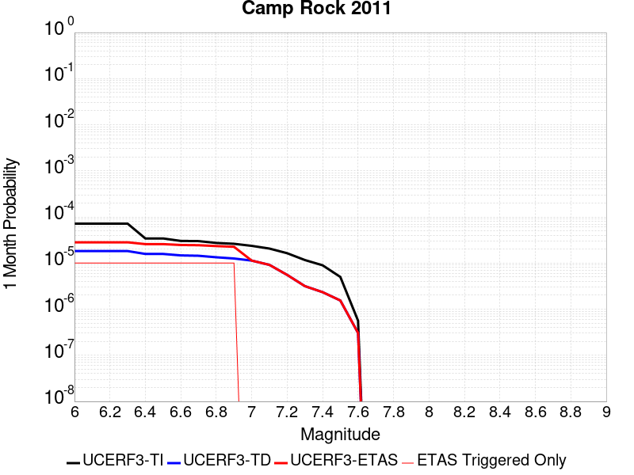 | 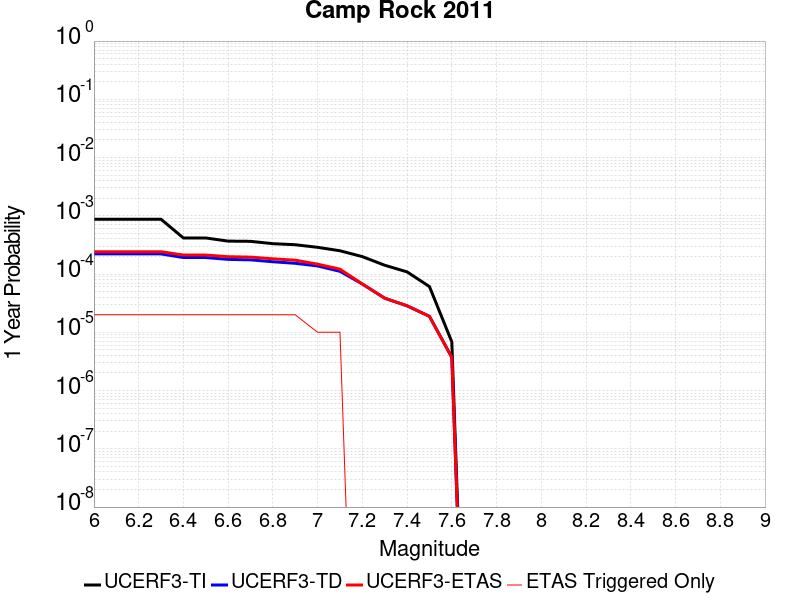 |  |

| Magnitude | 1 wk TI Prob | 1 wk TD Prob | 1 wk ETAS Prob | 1 wk ETAS/TD Gain | 1 wk ETAS Triggered Only | 1 mo TI Prob | 1 mo TD Prob | 1 mo ETAS Prob | 1 mo ETAS/TD Gain | 1 mo ETAS Triggered Only | 1 yr TI Prob | 1 yr TD Prob | 1 yr ETAS Prob | 1 yr ETAS/TD Gain | 1 yr ETAS Triggered Only | 10 yr TI Prob | 10 yr TD Prob | 10 yr ETAS Prob | 10 yr ETAS/TD Gain | 10 yr ETAS Triggered Only |
|-----|-----|-----|-----|-----|-----|-----|-----|-----|-----|-----|-----|-----|-----|-----|-----|-----|-----|-----|-----|-----|
| 6.0 | 1.6710783E-5 | 4.2500296E-6 | 4.2500296E-6 | 1.0 | 0.0 | 7.161568E-5 | 1.8214289E-5 | 2.8214106E-5 | 1.5490096 | 1.0E-5 | 8.7157206E-4 | 2.2173692E-4 | 2.4173247E-4 | 1.0901769 | 2.0E-5 | 0.008681616 | 0.0022152094 | 0.002255121 | 1.0180169 | 4.0E-5 |
| 6.1 | 1.6710783E-5 | 4.2500296E-6 | 4.2500296E-6 | 1.0 | 0.0 | 7.161568E-5 | 1.8214289E-5 | 2.8214106E-5 | 1.5490096 | 1.0E-5 | 8.7157206E-4 | 2.2173692E-4 | 2.4173247E-4 | 1.0901769 | 2.0E-5 | 0.008681616 | 0.0022152094 | 0.002255121 | 1.0180169 | 4.0E-5 |
| 6.2 | 1.6710783E-5 | 4.2500296E-6 | 4.2500296E-6 | 1.0 | 0.0 | 7.161568E-5 | 1.8214289E-5 | 2.8214106E-5 | 1.5490096 | 1.0E-5 | 8.7157206E-4 | 2.2173692E-4 | 2.4173247E-4 | 1.0901769 | 2.0E-5 | 0.008681616 | 0.0022152094 | 0.002255121 | 1.0180169 | 4.0E-5 |
| 6.3 | 1.6710783E-5 | 4.2500296E-6 | 4.2500296E-6 | 1.0 | 0.0 | 7.161568E-5 | 1.8214289E-5 | 2.8214106E-5 | 1.5490096 | 1.0E-5 | 8.7157206E-4 | 2.2173692E-4 | 2.4173247E-4 | 1.0901769 | 2.0E-5 | 0.008681616 | 0.0022152094 | 0.002255121 | 1.0180169 | 4.0E-5 |
| 6.4 | 7.982846E-6 | 3.6820643E-6 | 3.6820643E-6 | 1.0 | 0.0 | 3.421175E-5 | 1.5780182E-5 | 2.5780024E-5 | 1.6336963 | 1.0E-5 | 4.1644843E-4 | 1.9210712E-4 | 2.1210327E-4 | 1.1040885 | 2.0E-5 | 0.0041566887 | 0.0019194453 | 0.0019593686 | 1.0207994 | 4.0E-5 |
| 6.5 | 7.982846E-6 | 3.6820643E-6 | 3.6820643E-6 | 1.0 | 0.0 | 3.421175E-5 | 1.5780182E-5 | 2.5780024E-5 | 1.6336963 | 1.0E-5 | 4.1644843E-4 | 1.9210712E-4 | 2.1210327E-4 | 1.1040885 | 2.0E-5 | 0.0041566887 | 0.0019194453 | 0.0019593686 | 1.0207994 | 4.0E-5 |
| 6.6 | 7.048869E-6 | 3.424327E-6 | 3.424327E-6 | 1.0 | 0.0 | 3.0209088E-5 | 1.4675606E-5 | 2.4675459E-5 | 1.6813929 | 1.0E-5 | 3.677336E-4 | 1.7866117E-4 | 1.986576E-4 | 1.1119237 | 2.0E-5 | 0.0036712566 | 0.001785207 | 0.0018251356 | 1.0223664 | 4.0E-5 |
| 6.7 | 6.987307E-6 | 3.362304E-6 | 3.362304E-6 | 1.0 | 0.0 | 2.9945259E-5 | 1.4409797E-5 | 2.4409652E-5 | 1.6939623 | 1.0E-5 | 3.6452254E-4 | 1.7542546E-4 | 1.9542195E-4 | 1.1139885 | 2.0E-5 | 0.0036392517 | 0.001752901 | 0.0017928309 | 1.0227793 | 4.0E-5 |
| 6.8 | 6.3737602E-6 | 3.1178931E-6 | 3.1178931E-6 | 1.0 | 0.0 | 2.731583E-5 | 1.33623325E-5 | 2.33622E-5 | 1.7483623 | 1.0E-5 | 3.3251947E-4 | 1.6267454E-4 | 1.8267128E-4 | 1.1229249 | 2.0E-5 | 0.0033202237 | 0.0016255832 | 0.0016655182 | 1.0245665 | 4.0E-5 |
| 6.9 | 6.112211E-6 | 2.9331031E-6 | 2.9331031E-6 | 1.0 | 0.0 | 2.6194928E-5 | 1.2570383E-5 | 2.2570257E-5 | 1.7955108 | 1.0E-5 | 3.1887658E-4 | 1.5303394E-4 | 1.7303087E-4 | 1.13067 | 2.0E-5 | 0.003184194 | 0.0015293133 | 0.0015692521 | 1.0261155 | 4.0E-5 |
| 7.0 | 5.5140117E-6 | 2.641934E-6 | 2.641934E-6 | 1.0 | 0.0 | 2.3631264E-5 | 1.1322527E-5 | 1.1322527E-5 | 1.0 | 0.0 | 2.8767265E-4 | 1.378433E-4 | 1.4784191E-4 | 1.0725361 | 1.0E-5 | 0.0028730053 | 0.0013776033 | 0.0014075619 | 1.021747 | 3.0E-5 |
| 7.1 | 4.8151105E-6 | 2.134282E-6 | 2.134282E-6 | 1.0 | 0.0 | 2.0636026E-5 | 9.146893E-6 | 9.146893E-6 | 1.0 | 0.0 | 2.5121463E-4 | 1.1135795E-4 | 1.2135683E-4 | 1.0897905 | 1.0E-5 | 0.0025093083 | 0.0011130434 | 0.00114301 | 1.0269232 | 3.0E-5 |
| 7.2 | 3.818335E-6 | 1.2937529E-6 | 1.2937529E-6 | 1.0 | 0.0 | 1.6364189E-5 | 5.5446444E-6 | 5.5446444E-6 | 1.0 | 0.0 | 1.9921579E-4 | 6.7504036E-5 | 6.7504036E-5 | 1.0 | 0.0 | 0.0019903728 | 6.7484356E-4 | 6.848368E-4 | 1.0148083 | 1.0E-5 |
| 7.3 | 2.7166698E-6 | 7.38322E-7 | 7.38322E-7 | 1.0 | 0.0 | 1.1642818E-5 | 3.1642332E-6 | 3.1642332E-6 | 1.0 | 0.0 | 1.4174209E-4 | 3.8523878E-5 | 3.8523878E-5 | 1.0 | 0.0 | 0.0014165172 | 3.8517403E-4 | 3.9517018E-4 | 1.0259523 | 1.0E-5 |
| 7.4 | 2.0893426E-6 | 5.4615725E-7 | 5.4615725E-7 | 1.0 | 0.0 | 8.954295E-6 | 2.340672E-6 | 2.340672E-6 | 1.0 | 0.0 | 1.0901308E-4 | 2.8497314E-5 | 2.8497314E-5 | 1.0 | 0.0 | 0.0010895962 | 2.8493712E-4 | 2.8493712E-4 | 1.0 | 0.0 |
| 7.5 | 1.1681728E-6 | 3.602912E-7 | 3.602912E-7 | 1.0 | 0.0 | 5.0064455E-6 | 1.5441043E-6 | 1.5441043E-6 | 1.0 | 0.0 | 6.0951766E-5 | 1.8799314E-5 | 1.8799314E-5 | 1.0 | 0.0 | 6.093505E-4 | 1.879777E-4 | 1.879777E-4 | 1.0 | 0.0 |
| 7.6 | 1.3154387E-7 | 7.119745E-8 | 7.119745E-8 | 1.0 | 0.0 | 5.6375933E-7 | 3.051319E-7 | 3.051319E-7 | 1.0 | 0.0 | 6.863748E-6 | 3.7149762E-6 | 3.7149762E-6 | 1.0 | 0.0 | 6.863536E-5 | 3.7149297E-5 | 3.7149297E-5 | 1.0 | 0.0 |

## Imperial
*[(top)](#table-of-contents)*

| 1 Week | 1 Month | 1 Year | 10 Year |
|-----|-----|-----|-----|
|  | 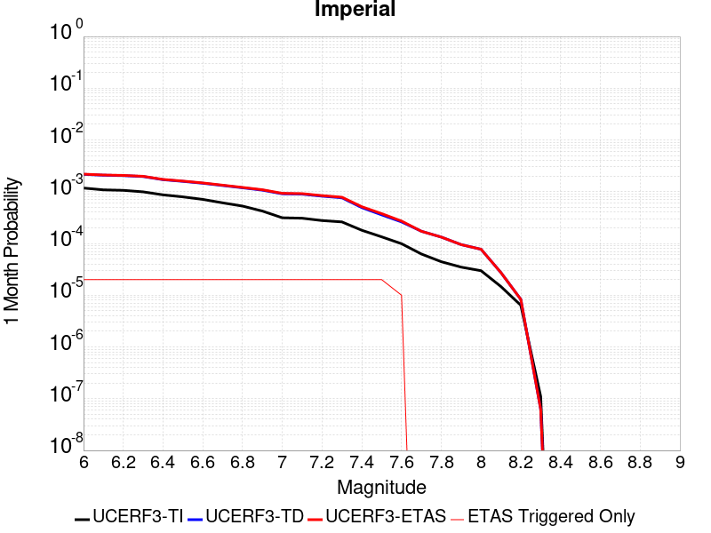 | 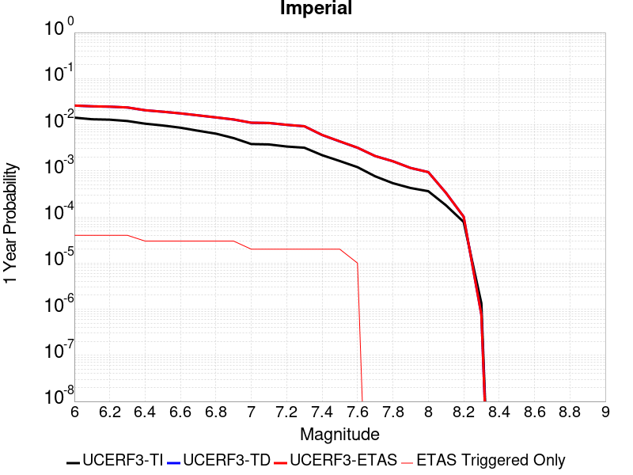 | 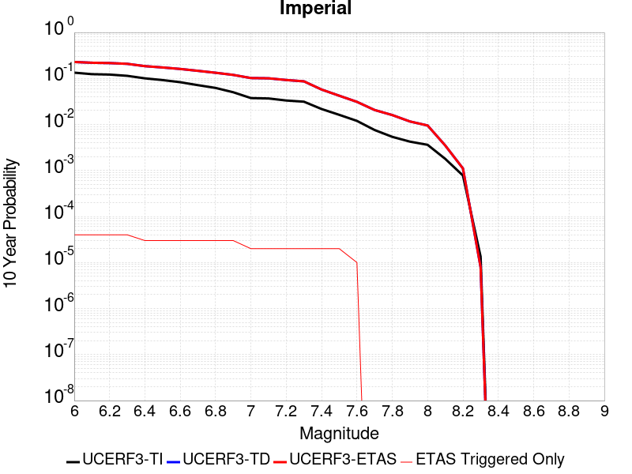 |

| Magnitude | 1 wk TI Prob | 1 wk TD Prob | 1 wk ETAS Prob | 1 wk ETAS/TD Gain | 1 wk ETAS Triggered Only | 1 mo TI Prob | 1 mo TD Prob | 1 mo ETAS Prob | 1 mo ETAS/TD Gain | 1 mo ETAS Triggered Only | 1 yr TI Prob | 1 yr TD Prob | 1 yr ETAS Prob | 1 yr ETAS/TD Gain | 1 yr ETAS Triggered Only | 10 yr TI Prob | 10 yr TD Prob | 10 yr ETAS Prob | 10 yr ETAS/TD Gain | 10 yr ETAS Triggered Only |
|-----|-----|-----|-----|-----|-----|-----|-----|-----|-----|-----|-----|-----|-----|-----|-----|-----|-----|-----|-----|-----|
| 6.0 | 2.7496446E-4 | 5.0566136E-4 | 5.0566136E-4 | 1.0 | 0.0 | 0.0011778869 | 0.0021653597 | 0.0021853163 | 1.0092163 | 2.0E-5 | 0.0142467655 | 0.026032086 | 0.026071046 | 1.0014966 | 4.0E-5 | 0.13367249 | 0.22806457 | 0.22809544 | 1.0001354 | 4.0E-5 |
| 6.1 | 2.5356023E-4 | 4.8668828E-4 | 4.8668828E-4 | 1.0 | 0.0 | 0.001086234 | 0.002084178 | 0.0021041362 | 1.0095761 | 2.0E-5 | 0.013144928 | 0.025073178 | 0.025112176 | 1.0015553 | 4.0E-5 | 0.123940155 | 0.21950251 | 0.21953373 | 1.0001422 | 4.0E-5 |
| 6.2 | 2.4820742E-4 | 4.7764063E-4 | 4.7764063E-4 | 1.0 | 0.0 | 0.0010633124 | 0.0020454633 | 0.0020654222 | 1.0097578 | 2.0E-5 | 0.01286919 | 0.024613038 | 0.024652053 | 1.0015851 | 4.0E-5 | 0.12148927 | 0.21600774 | 0.21603909 | 1.0001452 | 4.0E-5 |
| 6.3 | 2.3205351E-4 | 4.590098E-4 | 4.590098E-4 | 1.0 | 0.0 | 9.94136E-4 | 0.0019657388 | 0.0019856994 | 1.0101542 | 2.0E-5 | 0.012036599 | 0.023663145 | 0.023702199 | 1.0016503 | 4.0E-5 | 0.11405133 | 0.20796044 | 0.20799214 | 1.0001523 | 4.0E-5 |
| 6.4 | 2.0304754E-4 | 3.9886747E-4 | 3.9886747E-4 | 1.0 | 0.0 | 8.6991355E-4 | 0.0017083267 | 0.0017282926 | 1.0116874 | 2.0E-5 | 0.010539869 | 0.020598644 | 0.020628026 | 1.0014265 | 3.0E-5 | 0.100537635 | 0.18509416 | 0.1851186 | 1.0001321 | 3.0E-5 |
| 6.5 | 1.854992E-4 | 3.6998227E-4 | 3.6998227E-4 | 1.0 | 0.0 | 7.9475436E-4 | 0.001584687 | 0.0016046554 | 1.0126008 | 2.0E-5 | 0.009633281 | 0.0191245 | 0.019153927 | 1.0015386 | 3.0E-5 | 0.0922623 | 0.17332399 | 0.1733488 | 1.000143 | 3.0E-5 |
| 6.6 | 1.6586106E-4 | 3.404359E-4 | 3.404359E-4 | 1.0 | 0.0 | 7.106394E-4 | 0.0014582053 | 0.0014781761 | 1.0136955 | 2.0E-5 | 0.008617763 | 0.017605687 | 0.017635157 | 1.0016739 | 3.0E-5 | 0.08291132 | 0.1608006 | 0.16082577 | 1.0001565 | 3.0E-5 |
| 6.7 | 1.4224656E-4 | 3.0774318E-4 | 3.0774318E-4 | 1.0 | 0.0 | 6.094856E-4 | 0.0013182409 | 0.0013382145 | 1.0151517 | 2.0E-5 | 0.0073952693 | 0.015932996 | 0.015962519 | 1.0018529 | 3.0E-5 | 0.07153955 | 0.1465128 | 0.1465384 | 1.0001748 | 3.0E-5 |
| 6.8 | 1.2317259E-4 | 2.7797572E-4 | 2.7797572E-4 | 1.0 | 0.0 | 5.2777573E-4 | 0.0011907867 | 0.0012107629 | 1.0167756 | 2.0E-5 | 0.0064067547 | 0.014402838 | 0.014432406 | 1.0020529 | 3.0E-5 | 0.06225166 | 0.13296029 | 0.1329863 | 1.0001956 | 3.0E-5 |
| 6.9 | 9.859898E-5 | 2.5019204E-4 | 2.5019204E-4 | 1.0 | 0.0 | 4.2249862E-4 | 0.0010718153 | 0.0010917938 | 1.0186399 | 2.0E-5 | 0.0051317946 | 0.012972236 | 0.013001846 | 1.0022826 | 3.0E-5 | 0.05014893 | 0.119424336 | 0.119450755 | 1.0002213 | 3.0E-5 |
| 7.0 | 7.3191884E-5 | 2.1270654E-4 | 2.1270654E-4 | 1.0 | 0.0 | 3.136418E-4 | 9.112842E-4 | 9.3126594E-4 | 1.021927 | 2.0E-5 | 0.003811904 | 0.011039129 | 0.011058909 | 1.0017917 | 2.0E-5 | 0.037471764 | 0.10207824 | 0.1020962 | 1.000176 | 2.0E-5 |
| 7.1 | 7.1760296E-5 | 2.0971973E-4 | 2.0971973E-4 | 1.0 | 0.0 | 3.0750787E-4 | 8.984924E-4 | 9.1847446E-4 | 1.0222396 | 2.0E-5 | 0.003737482 | 0.0108849555 | 0.010904739 | 1.0018173 | 2.0E-5 | 0.03675245 | 0.10071469 | 0.10073268 | 1.0001786 | 2.0E-5 |
| 7.2 | 6.46614E-5 | 1.9140386E-4 | 1.9140386E-4 | 1.0 | 0.0 | 2.7709085E-4 | 8.200474E-4 | 8.40031E-4 | 1.0243689 | 2.0E-5 | 0.0033683628 | 0.0099389935 | 0.009958795 | 1.0019922 | 2.0E-5 | 0.033177625 | 0.09252194 | 0.09254009 | 1.0001962 | 2.0E-5 |
| 7.3 | 6.088115E-5 | 1.7811939E-4 | 1.7811939E-4 | 1.0 | 0.0 | 2.6089314E-4 | 7.631483E-4 | 7.831331E-4 | 1.0261872 | 2.0E-5 | 0.0031717476 | 0.009252324 | 0.009272139 | 1.0021416 | 2.0E-5 | 0.031268585 | 0.086571425 | 0.086589694 | 1.000211 | 2.0E-5 |
| 7.4 | 4.199346E-5 | 1.1513072E-4 | 1.1513072E-4 | 1.0 | 0.0 | 1.7995955E-4 | 4.9332494E-4 | 5.133151E-4 | 1.0405213 | 2.0E-5 | 0.0021888057 | 0.00598986 | 0.00600974 | 1.003319 | 2.0E-5 | 0.02167372 | 0.05744733 | 0.05746618 | 1.0003282 | 2.0E-5 |
| 7.5 | 3.130448E-5 | 8.3354855E-5 | 8.3354855E-5 | 1.0 | 0.0 | 1.3415517E-4 | 3.571865E-4 | 3.7717936E-4 | 1.0559732 | 2.0E-5 | 0.0016321153 | 0.004340134 | 0.004360047 | 1.0045881 | 2.0E-5 | 0.016201803 | 0.042139802 | 0.04215896 | 1.0004547 | 2.0E-5 |
| 7.6 | 2.3074248E-5 | 6.086314E-5 | 6.086314E-5 | 1.0 | 0.0 | 9.888588E-5 | 2.6081607E-4 | 2.7081347E-4 | 1.0383312 | 1.0E-5 | 0.0012032706 | 0.0031708353 | 0.0031808035 | 1.0031438 | 1.0E-5 | 0.011967761 | 0.03103288 | 0.03104257 | 1.0003122 | 1.0E-5 |
| 7.7 | 1.45864815E-5 | 4.013974E-5 | 4.013974E-5 | 1.0 | 0.0 | 6.2511994E-5 | 1.7201615E-4 | 1.7201615E-4 | 1.0 | 0.0 | 7.608177E-4 | 0.0020922904 | 0.0020922904 | 1.0 | 0.0 | 0.007582182 | 0.020633768 | 0.020633768 | 1.0 | 0.0 |
| 7.8 | 1.0352979E-5 | 3.09736E-5 | 3.09736E-5 | 1.0 | 0.0 | 4.4369157E-5 | 1.3273726E-4 | 1.3273726E-4 | 1.0 | 0.0 | 5.400606E-4 | 0.0016148805 | 0.0016148805 | 1.0 | 0.0 | 0.0053875 | 0.016021866 | 0.016021866 | 1.0 | 0.0 |
| 7.9 | 8.137906E-6 | 2.215892E-5 | 2.215892E-5 | 1.0 | 0.0 | 3.4876273E-5 | 9.496335E-5 | 9.496335E-5 | 1.0 | 0.0 | 4.2453592E-4 | 0.0011555665 | 0.0011555665 | 1.0 | 0.0 | 0.004237258 | 0.011622424 | 0.011622424 | 1.0 | 0.0 |
| 8.0 | 6.93792E-6 | 1.8017026E-5 | 1.8017026E-5 | 1.0 | 0.0 | 2.9733603E-5 | 7.7213546E-5 | 7.7213546E-5 | 1.0 | 0.0 | 3.6194647E-4 | 9.3967025E-4 | 9.3967025E-4 | 1.0 | 0.0 | 0.0036135751 | 0.009505454 | 0.009505454 | 1.0 | 0.0 |
| 8.1 | 3.4286315E-6 | 6.3832977E-6 | 6.3832977E-6 | 1.0 | 0.0 | 1.4694053E-5 | 2.7356704E-5 | 2.7356704E-5 | 1.0 | 0.0 | 1.7888541E-4 | 3.330171E-4 | 3.330171E-4 | 1.0 | 0.0 | 0.0017874148 | 0.0034877516 | 0.0034877516 | 1.0 | 0.0 |
| 8.2 | 1.4906886E-6 | 1.937845E-6 | 1.937845E-6 | 1.0 | 0.0 | 6.3886496E-6 | 8.305023E-6 | 8.305023E-6 | 1.0 | 0.0 | 7.7779034E-5 | 1.0110899E-4 | 1.0110899E-4 | 1.0 | 0.0 | 7.775182E-4 | 0.0011081474 | 0.0011081474 | 1.0 | 0.0 |
| 8.3 | 2.5758007E-8 | 1.4508471E-8 | 1.4508471E-8 | 1.0 | 0.0 | 1.10391454E-7 | 6.217916E-8 | 6.217916E-8 | 1.0 | 0.0 | 1.3440151E-6 | 7.570313E-7 | 7.570313E-7 | 1.0 | 0.0 | 1.344007E-5 | 7.89349E-6 | 7.89349E-6 | 1.0 | 0.0 |

## Great Valley 03a Dunnigan Hills
*[(top)](#table-of-contents)*

| 1 Week | 1 Month | 1 Year | 10 Year |
|-----|-----|-----|-----|
|  |  |  | 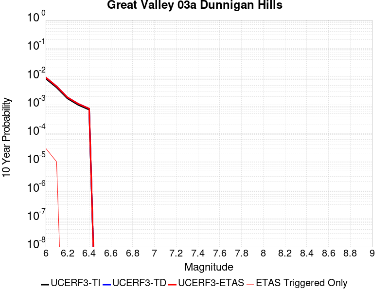 |

| Magnitude | 1 wk TI Prob | 1 wk TD Prob | 1 wk ETAS Prob | 1 wk ETAS/TD Gain | 1 wk ETAS Triggered Only | 1 mo TI Prob | 1 mo TD Prob | 1 mo ETAS Prob | 1 mo ETAS/TD Gain | 1 mo ETAS Triggered Only | 1 yr TI Prob | 1 yr TD Prob | 1 yr ETAS Prob | 1 yr ETAS/TD Gain | 1 yr ETAS Triggered Only | 10 yr TI Prob | 10 yr TD Prob | 10 yr ETAS Prob | 10 yr ETAS/TD Gain | 10 yr ETAS Triggered Only |
|-----|-----|-----|-----|-----|-----|-----|-----|-----|-----|-----|-----|-----|-----|-----|-----|-----|-----|-----|-----|-----|
| 6.0 | 1.6591328E-5 | 1.810814E-5 | 1.810814E-5 | 1.0 | 0.0 | 7.110376E-5 | 7.760439E-5 | 7.760439E-5 | 1.0 | 0.0 | 8.6534437E-4 | 9.4449305E-4 | 9.544836E-4 | 1.0105777 | 1.0E-5 | 0.008619824 | 0.009411621 | 0.0094413385 | 1.0031575 | 3.0E-5 |
| 6.1 | 8.041125E-6 | 8.769815E-6 | 8.769815E-6 | 1.0 | 0.0 | 3.4461507E-5 | 3.7584497E-5 | 3.7584497E-5 | 1.0 | 0.0 | 4.194881E-4 | 4.5751547E-4 | 4.6751092E-4 | 1.0218471 | 1.0E-5 | 0.004186971 | 0.004567733 | 0.0045776875 | 1.0021793 | 1.0E-5 |
| 6.2 | 3.2807004E-6 | 3.5796054E-6 | 3.5796054E-6 | 1.0 | 0.0 | 1.4060069E-5 | 1.5341098E-5 | 1.5341098E-5 | 1.0 | 0.0 | 1.7116789E-4 | 1.8676603E-4 | 1.8676603E-4 | 1.0 | 0.0 | 0.0017103611 | 0.0018664987 | 0.0018664987 | 1.0 | 0.0 |
| 6.3 | 1.9339366E-6 | 2.1104022E-6 | 2.1104022E-6 | 1.0 | 0.0 | 8.288273E-6 | 9.044566E-6 | 9.044566E-6 | 1.0 | 0.0 | 1.00905054E-4 | 1.1011488E-4 | 1.1011488E-4 | 1.0 | 0.0 | 0.0010085925 | 0.0011008831 | 0.0011008831 | 1.0 | 0.0 |
| 6.4 | 1.3142635E-6 | 1.4340012E-6 | 1.4340012E-6 | 1.0 | 0.0 | 5.6325457E-6 | 6.1457195E-6 | 6.1457195E-6 | 1.0 | 0.0 | 6.857408E-5 | 7.482414E-5 | 7.482414E-5 | 1.0 | 0.0 | 6.8552926E-4 | 7.482414E-4 | 7.482414E-4 | 1.0 | 0.0 |

## Monterey Bay-Tularcitos
*[(top)](#table-of-contents)*

| 1 Week | 1 Month | 1 Year | 10 Year |
|-----|-----|-----|-----|
|  |  | 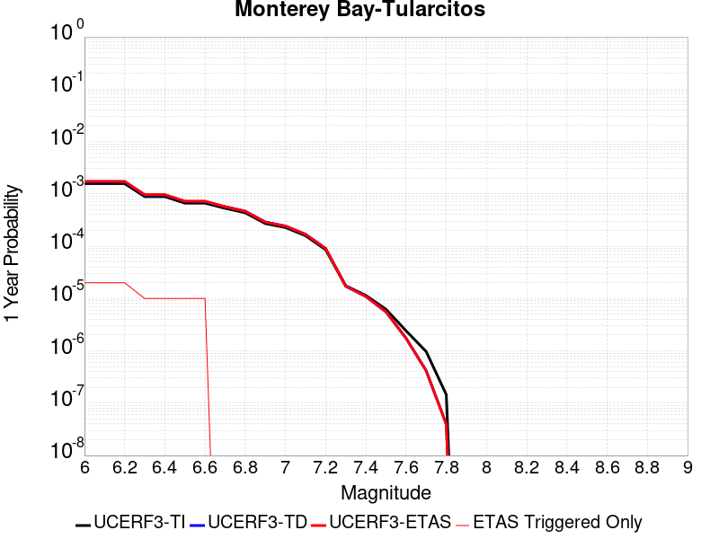 |  |

| Magnitude | 1 wk TI Prob | 1 wk TD Prob | 1 wk ETAS Prob | 1 wk ETAS/TD Gain | 1 wk ETAS Triggered Only | 1 mo TI Prob | 1 mo TD Prob | 1 mo ETAS Prob | 1 mo ETAS/TD Gain | 1 mo ETAS Triggered Only | 1 yr TI Prob | 1 yr TD Prob | 1 yr ETAS Prob | 1 yr ETAS/TD Gain | 1 yr ETAS Triggered Only | 10 yr TI Prob | 10 yr TD Prob | 10 yr ETAS Prob | 10 yr ETAS/TD Gain | 10 yr ETAS Triggered Only |
|-----|-----|-----|-----|-----|-----|-----|-----|-----|-----|-----|-----|-----|-----|-----|-----|-----|-----|-----|-----|-----|
| 6.0 | 3.0131365E-5 | 3.27991E-5 | 3.27991E-5 | 1.0 | 0.0 | 1.2912804E-4 | 1.4056059E-4 | 1.505592E-4 | 1.0711337 | 1.0E-5 | 0.001571 | 0.0017100874 | 0.0017300532 | 1.0116754 | 2.0E-5 | 0.015599402 | 0.016980086 | 0.017009577 | 1.0017368 | 3.0E-5 |
| 6.1 | 3.0131365E-5 | 3.27991E-5 | 3.27991E-5 | 1.0 | 0.0 | 1.2912804E-4 | 1.4056059E-4 | 1.505592E-4 | 1.0711337 | 1.0E-5 | 0.001571 | 0.0017100874 | 0.0017300532 | 1.0116754 | 2.0E-5 | 0.015599402 | 0.016980086 | 0.017009577 | 1.0017368 | 3.0E-5 |
| 6.2 | 3.0131365E-5 | 3.27991E-5 | 3.27991E-5 | 1.0 | 0.0 | 1.2912804E-4 | 1.4056059E-4 | 1.505592E-4 | 1.0711337 | 1.0E-5 | 0.001571 | 0.0017100874 | 0.0017300532 | 1.0116754 | 2.0E-5 | 0.015599402 | 0.016980086 | 0.017009577 | 1.0017368 | 3.0E-5 |
| 6.3 | 1.6998249E-5 | 1.8330962E-5 | 1.8330962E-5 | 1.0 | 0.0 | 7.28476E-5 | 7.855901E-5 | 7.855901E-5 | 1.0 | 0.0 | 8.865586E-4 | 9.560549E-4 | 9.6604537E-4 | 1.0104496 | 1.0E-5 | 0.0088303005 | 0.009521343 | 0.009541153 | 1.0020806 | 2.0E-5 |
| 6.4 | 1.6998249E-5 | 1.8330962E-5 | 1.8330962E-5 | 1.0 | 0.0 | 7.28476E-5 | 7.855901E-5 | 7.855901E-5 | 1.0 | 0.0 | 8.865586E-4 | 9.560549E-4 | 9.6604537E-4 | 1.0104496 | 1.0E-5 | 0.0088303005 | 0.009521343 | 0.009541153 | 1.0020806 | 2.0E-5 |
| 6.5 | 1.27470785E-5 | 1.369343E-5 | 1.369343E-5 | 1.0 | 0.0 | 5.4629192E-5 | 5.8684866E-5 | 5.8684866E-5 | 1.0 | 0.0 | 6.649074E-4 | 7.142644E-4 | 7.2425726E-4 | 1.0139904 | 1.0E-5 | 0.0066292146 | 0.007120739 | 0.007130668 | 1.0013944 | 1.0E-5 |
| 6.6 | 1.2739422E-5 | 1.3685517E-5 | 1.3685517E-5 | 1.0 | 0.0 | 5.4596385E-5 | 5.8650956E-5 | 5.8650956E-5 | 1.0 | 0.0 | 6.645082E-4 | 7.1385177E-4 | 7.238446E-4 | 1.0139985 | 1.0E-5 | 0.0066252467 | 0.0071166395 | 0.0071265684 | 1.0013951 | 1.0E-5 |
| 6.7 | 1.0160109E-5 | 1.0885845E-5 | 1.0885845E-5 | 1.0 | 0.0 | 4.35426E-5 | 4.665283E-5 | 4.665283E-5 | 1.0 | 0.0 | 5.300022E-4 | 5.6785723E-4 | 5.6785723E-4 | 1.0 | 0.0 | 0.005287399 | 0.0056647733 | 0.0056647733 | 1.0 | 0.0 |
| 6.8 | 8.349859E-6 | 8.93266E-6 | 8.93266E-6 | 1.0 | 0.0 | 3.578462E-5 | 3.82823E-5 | 3.82823E-5 | 1.0 | 0.0 | 4.3559066E-4 | 4.6599298E-4 | 4.6599298E-4 | 1.0 | 0.0 | 0.004347378 | 0.004650723 | 0.004650723 | 1.0 | 0.0 |
| 6.9 | 5.193639E-6 | 5.5364744E-6 | 5.5364744E-6 | 1.0 | 0.0 | 2.2258262E-5 | 2.372755E-5 | 2.372755E-5 | 1.0 | 0.0 | 2.7096065E-4 | 2.888479E-4 | 2.888479E-4 | 1.0 | 0.0 | 0.0027063051 | 0.0028850455 | 0.0028850455 | 1.0 | 0.0 |
| 7.0 | 4.359381E-6 | 4.6434034E-6 | 4.6434034E-6 | 1.0 | 0.0 | 1.8682927E-5 | 1.9900164E-5 | 1.9900164E-5 | 1.0 | 0.0 | 2.274409E-4 | 2.4226055E-4 | 2.4226055E-4 | 1.0 | 0.0 | 0.0022720827 | 0.0024202575 | 0.0024202575 | 1.0 | 0.0 |
| 7.1 | 3.0398533E-6 | 3.2310688E-6 | 3.2310688E-6 | 1.0 | 0.0 | 1.3027877E-5 | 1.384738E-5 | 1.384738E-5 | 1.0 | 0.0 | 1.5860285E-4 | 1.6858142E-4 | 1.6858142E-4 | 1.0 | 0.0 | 0.001584897 | 0.001684793 | 0.001684793 | 1.0 | 0.0 |
| 7.2 | 1.642335E-6 | 1.7333296E-6 | 1.7333296E-6 | 1.0 | 0.0 | 7.0385595E-6 | 7.428546E-6 | 7.428546E-6 | 1.0 | 0.0 | 8.569109E-5 | 9.044086E-5 | 9.044086E-5 | 1.0 | 0.0 | 8.5658056E-4 | 9.0424326E-4 | 9.0424326E-4 | 1.0 | 0.0 |
| 7.3 | 3.356842E-7 | 3.2952644E-7 | 3.2952644E-7 | 1.0 | 0.0 | 1.4386458E-6 | 1.4122554E-6 | 1.4122554E-6 | 1.0 | 0.0 | 1.7515373E-5 | 1.7194076E-5 | 1.7194076E-5 | 1.0 | 0.0 | 1.7513991E-4 | 1.7192755E-4 | 1.7192755E-4 | 1.0 | 0.0 |
| 7.4 | 2.1973483E-7 | 2.1006629E-7 | 2.1006629E-7 | 1.0 | 0.0 | 9.417204E-7 | 9.002838E-7 | 9.002838E-7 | 1.0 | 0.0 | 1.1465385E-5 | 1.09609E-5 | 1.09609E-5 | 1.0 | 0.0 | 1.1464794E-4 | 1.09603636E-4 | 1.09603636E-4 | 1.0 | 0.0 |
| 7.5 | 1.1944135E-7 | 1.06962126E-7 | 1.06962126E-7 | 1.0 | 0.0 | 5.118914E-7 | 4.5840903E-7 | 4.5840903E-7 | 1.0 | 0.0 | 6.23226E-6 | 5.5811156E-6 | 5.5811156E-6 | 1.0 | 0.0 | 6.2320854E-5 | 5.5809767E-5 | 5.5809767E-5 | 1.0 | 0.0 |
| 7.6 | 4.636058E-8 | 3.3365904E-8 | 3.3365904E-8 | 1.0 | 0.0 | 1.9868818E-7 | 1.4299673E-7 | 1.4299673E-7 | 1.0 | 0.0 | 2.419026E-6 | 1.7409836E-6 | 1.7409836E-6 | 1.0 | 0.0 | 2.4189996E-5 | 1.7409702E-5 | 1.7409702E-5 | 1.0 | 0.0 |
| 7.7 | 1.8588572E-8 | 8.0041875E-9 | 8.0041875E-9 | 1.0 | 0.0 | 7.9665305E-8 | 3.4303664E-8 | 3.4303664E-8 | 1.0 | 0.0 | 9.699246E-7 | 4.1764702E-7 | 4.1764702E-7 | 1.0 | 0.0 | 9.699204E-6 | 4.1764624E-6 | 4.1764624E-6 | 1.0 | 0.0 |
| 7.8 | 2.7960154E-9 | 7.610357E-10 | 7.610357E-10 | 1.0 | 0.0 | 1.1982923E-8 | 3.2615821E-9 | 3.2615821E-9 | 1.0 | 0.0 | 1.4589209E-7 | 3.970976E-8 | 3.970976E-8 | 1.0 | 0.0 | 1.4589199E-6 | 3.9709755E-7 | 3.9709755E-7 | 1.0 | 0.0 |

## Pine Mtn
*[(top)](#table-of-contents)*

| 1 Week | 1 Month | 1 Year | 10 Year |
|-----|-----|-----|-----|
|  |  | 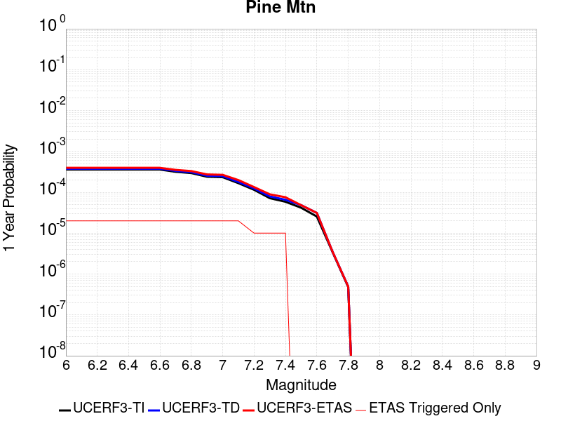 | 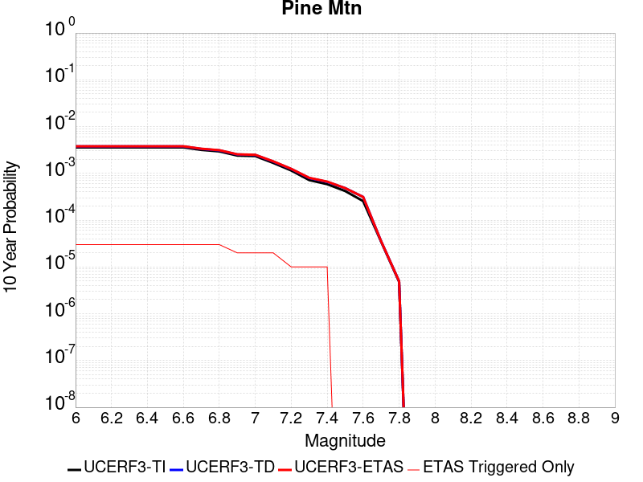 |

| Magnitude | 1 wk TI Prob | 1 wk TD Prob | 1 wk ETAS Prob | 1 wk ETAS/TD Gain | 1 wk ETAS Triggered Only | 1 mo TI Prob | 1 mo TD Prob | 1 mo ETAS Prob | 1 mo ETAS/TD Gain | 1 mo ETAS Triggered Only | 1 yr TI Prob | 1 yr TD Prob | 1 yr ETAS Prob | 1 yr ETAS/TD Gain | 1 yr ETAS Triggered Only | 10 yr TI Prob | 10 yr TD Prob | 10 yr ETAS Prob | 10 yr ETAS/TD Gain | 10 yr ETAS Triggered Only |
|-----|-----|-----|-----|-----|-----|-----|-----|-----|-----|-----|-----|-----|-----|-----|-----|-----|-----|-----|-----|-----|
| 6.0 | 6.894797E-6 | 7.225549E-6 | 7.225549E-6 | 1.0 | 0.0 | 2.9548795E-5 | 3.0966286E-5 | 3.0966286E-5 | 1.0 | 0.0 | 3.596972E-4 | 3.7695232E-4 | 3.9694476E-4 | 1.0530372 | 2.0E-5 | 0.0035911554 | 0.0037634266 | 0.0037933136 | 1.0079415 | 3.0E-5 |
| 6.1 | 6.894797E-6 | 7.225549E-6 | 7.225549E-6 | 1.0 | 0.0 | 2.9548795E-5 | 3.0966286E-5 | 3.0966286E-5 | 1.0 | 0.0 | 3.596972E-4 | 3.7695232E-4 | 3.9694476E-4 | 1.0530372 | 2.0E-5 | 0.0035911554 | 0.0037634266 | 0.0037933136 | 1.0079415 | 3.0E-5 |
| 6.2 | 6.894797E-6 | 7.225549E-6 | 7.225549E-6 | 1.0 | 0.0 | 2.9548795E-5 | 3.0966286E-5 | 3.0966286E-5 | 1.0 | 0.0 | 3.596972E-4 | 3.7695232E-4 | 3.9694476E-4 | 1.0530372 | 2.0E-5 | 0.0035911554 | 0.0037634266 | 0.0037933136 | 1.0079415 | 3.0E-5 |
| 6.3 | 6.894797E-6 | 7.225549E-6 | 7.225549E-6 | 1.0 | 0.0 | 2.9548795E-5 | 3.0966286E-5 | 3.0966286E-5 | 1.0 | 0.0 | 3.596972E-4 | 3.7695232E-4 | 3.9694476E-4 | 1.0530372 | 2.0E-5 | 0.0035911554 | 0.0037634266 | 0.0037933136 | 1.0079415 | 3.0E-5 |
| 6.4 | 6.894797E-6 | 7.225549E-6 | 7.225549E-6 | 1.0 | 0.0 | 2.9548795E-5 | 3.0966286E-5 | 3.0966286E-5 | 1.0 | 0.0 | 3.596972E-4 | 3.7695232E-4 | 3.9694476E-4 | 1.0530372 | 2.0E-5 | 0.0035911554 | 0.0037634266 | 0.0037933136 | 1.0079415 | 3.0E-5 |
| 6.5 | 6.894797E-6 | 7.225549E-6 | 7.225549E-6 | 1.0 | 0.0 | 2.9548795E-5 | 3.0966286E-5 | 3.0966286E-5 | 1.0 | 0.0 | 3.596972E-4 | 3.7695232E-4 | 3.9694476E-4 | 1.0530372 | 2.0E-5 | 0.0035911554 | 0.0037634266 | 0.0037933136 | 1.0079415 | 3.0E-5 |
| 6.6 | 6.894797E-6 | 7.225549E-6 | 7.225549E-6 | 1.0 | 0.0 | 2.9548795E-5 | 3.0966286E-5 | 3.0966286E-5 | 1.0 | 0.0 | 3.596972E-4 | 3.7695232E-4 | 3.9694476E-4 | 1.0530372 | 2.0E-5 | 0.0035911554 | 0.0037634266 | 0.0037933136 | 1.0079415 | 3.0E-5 |
| 6.7 | 6.0867933E-6 | 6.3971984E-6 | 6.3971984E-6 | 1.0 | 0.0 | 2.6085996E-5 | 2.7416289E-5 | 2.7416289E-5 | 1.0 | 0.0 | 3.1755073E-4 | 3.337444E-4 | 3.537377E-4 | 1.0599061 | 2.0E-5 | 0.0031709734 | 0.0033326508 | 0.0033625509 | 1.0089718 | 3.0E-5 |
| 6.8 | 5.6530425E-6 | 5.950679E-6 | 5.950679E-6 | 1.0 | 0.0 | 2.42271E-5 | 2.5502673E-5 | 2.5502673E-5 | 1.0 | 0.0 | 2.94925E-4 | 3.1045286E-4 | 3.3044667E-4 | 1.064402 | 2.0E-5 | 0.002945339 | 0.0031003964 | 0.0031303035 | 1.0096462 | 3.0E-5 |
| 6.9 | 4.6015225E-6 | 4.8639135E-6 | 4.8639135E-6 | 1.0 | 0.0 | 1.9720663E-5 | 2.0845186E-5 | 2.0845186E-5 | 1.0 | 0.0 | 2.4007261E-4 | 2.5376203E-4 | 2.7375697E-4 | 1.078794 | 2.0E-5 | 0.0023981342 | 0.002534867 | 0.0025548162 | 1.00787 | 2.0E-5 |
| 7.0 | 4.4875965E-6 | 4.7475523E-6 | 4.7475523E-6 | 1.0 | 0.0 | 1.9232413E-5 | 2.0346502E-5 | 2.0346502E-5 | 1.0 | 0.0 | 2.3412947E-4 | 2.4769196E-4 | 2.6768702E-4 | 1.0807254 | 2.0E-5 | 0.0023388295 | 0.0024743027 | 0.0024942532 | 1.0080631 | 2.0E-5 |
| 7.1 | 3.203907E-6 | 3.429485E-6 | 3.429485E-6 | 1.0 | 0.0 | 1.3730958E-5 | 1.4697714E-5 | 1.4697714E-5 | 1.0 | 0.0 | 1.6716159E-4 | 1.7893064E-4 | 1.9892707E-4 | 1.1117551 | 2.0E-5 | 0.0016703589 | 0.0017879319 | 0.0018078961 | 1.0111661 | 2.0E-5 |
| 7.2 | 2.2060601E-6 | 2.3785415E-6 | 2.3785415E-6 | 1.0 | 0.0 | 9.4545085E-6 | 1.0193712E-5 | 1.0193712E-5 | 1.0 | 0.0 | 1.15102564E-4 | 1.2410183E-4 | 1.3410058E-4 | 1.080569 | 1.0E-5 | 0.0011504296 | 0.0012403701 | 0.0012503577 | 1.0080521 | 1.0E-5 |
| 7.3 | 1.3765207E-6 | 1.5217014E-6 | 1.5217014E-6 | 1.0 | 0.0 | 5.899361E-6 | 6.5215618E-6 | 6.5215618E-6 | 1.0 | 0.0 | 7.182235E-5 | 7.9397214E-5 | 8.939642E-5 | 1.125939 | 1.0E-5 | 7.1799144E-4 | 7.9369755E-4 | 8.0368965E-4 | 1.0125892 | 1.0E-5 |
| 7.4 | 1.1245983E-6 | 1.2587551E-6 | 1.2587551E-6 | 1.0 | 0.0 | 4.819698E-6 | 5.394654E-6 | 5.394654E-6 | 1.0 | 0.0 | 5.8678244E-5 | 6.567802E-5 | 7.5677366E-5 | 1.1522479 | 1.0E-5 | 5.866275E-4 | 6.565944E-4 | 6.6658785E-4 | 1.01522 | 1.0E-5 |
| 7.5 | 8.031682E-7 | 9.2773905E-7 | 9.2773905E-7 | 1.0 | 0.0 | 3.4421448E-6 | 3.976019E-6 | 3.976019E-6 | 1.0 | 0.0 | 4.1907308E-5 | 4.8407022E-5 | 4.8407022E-5 | 1.0 | 0.0 | 4.1899405E-4 | 4.8397155E-4 | 4.8397155E-4 | 1.0 | 0.0 |
| 7.6 | 4.8953444E-7 | 6.003393E-7 | 6.003393E-7 | 1.0 | 0.0 | 2.098003E-6 | 2.5728805E-6 | 2.5728805E-6 | 1.0 | 0.0 | 2.5542888E-5 | 3.132442E-5 | 3.132442E-5 | 1.0 | 0.0 | 2.5539953E-4 | 3.132049E-4 | 3.132049E-4 | 1.0 | 0.0 |
| 7.7 | 6.634529E-8 | 6.7888436E-8 | 6.7888436E-8 | 1.0 | 0.0 | 2.843369E-7 | 2.909504E-7 | 2.909504E-7 | 1.0 | 0.0 | 3.4617963E-6 | 3.5423159E-6 | 3.5423159E-6 | 1.0 | 0.0 | 3.4617424E-5 | 3.5422643E-5 | 3.5422643E-5 | 1.0 | 0.0 |
| 7.8 | 9.235578E-9 | 9.488596E-9 | 9.488596E-9 | 1.0 | 0.0 | 3.9581046E-8 | 4.066541E-8 | 4.066541E-8 | 1.0 | 0.0 | 4.818991E-7 | 4.951013E-7 | 4.951013E-7 | 1.0 | 0.0 | 4.8189804E-6 | 4.951003E-6 | 4.951003E-6 | 1.0 | 0.0 |

## Malibu Coast alt 1
*[(top)](#table-of-contents)*

| 1 Week | 1 Month | 1 Year | 10 Year |
|-----|-----|-----|-----|
|  |  | 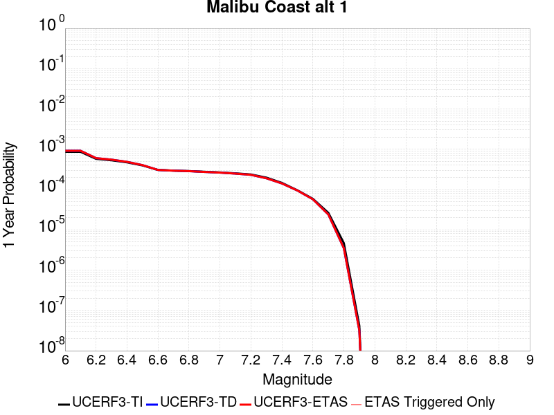 |  |

| Magnitude | 1 wk TI Prob | 1 wk TD Prob | 1 wk ETAS Prob | 1 wk ETAS/TD Gain | 1 wk ETAS Triggered Only | 1 mo TI Prob | 1 mo TD Prob | 1 mo ETAS Prob | 1 mo ETAS/TD Gain | 1 mo ETAS Triggered Only | 1 yr TI Prob | 1 yr TD Prob | 1 yr ETAS Prob | 1 yr ETAS/TD Gain | 1 yr ETAS Triggered Only | 10 yr TI Prob | 10 yr TD Prob | 10 yr ETAS Prob | 10 yr ETAS/TD Gain | 10 yr ETAS Triggered Only |
|-----|-----|-----|-----|-----|-----|-----|-----|-----|-----|-----|-----|-----|-----|-----|-----|-----|-----|-----|-----|-----|
| 6.0 | 1.6572556E-5 | 1.7598239E-5 | 1.7598239E-5 | 1.0 | 0.0 | 7.102331E-5 | 7.541895E-5 | 7.541895E-5 | 1.0 | 0.0 | 8.6436566E-4 | 9.178578E-4 | 9.178578E-4 | 1.0 | 0.0 | 0.0086101135 | 0.009142602 | 0.009172328 | 1.0032513 | 3.0E-5 |
| 6.1 | 1.6572556E-5 | 1.7598239E-5 | 1.7598239E-5 | 1.0 | 0.0 | 7.102331E-5 | 7.541895E-5 | 7.541895E-5 | 1.0 | 0.0 | 8.6436566E-4 | 9.178578E-4 | 9.178578E-4 | 1.0 | 0.0 | 0.0086101135 | 0.009142602 | 0.0091624195 | 1.0021676 | 2.0E-5 |
| 6.2 | 1.1085717E-5 | 1.1557251E-5 | 1.1557251E-5 | 1.0 | 0.0 | 4.750935E-5 | 4.9530157E-5 | 4.9530157E-5 | 1.0 | 0.0 | 5.782728E-4 | 6.0286635E-4 | 6.0286635E-4 | 1.0 | 0.0 | 0.0057677035 | 0.00601268 | 0.0060325596 | 1.0033063 | 2.0E-5 |
| 6.3 | 1.0208568E-5 | 1.0592331E-5 | 1.0592331E-5 | 1.0 | 0.0 | 4.375027E-5 | 4.5394932E-5 | 4.5394932E-5 | 1.0 | 0.0 | 5.325294E-4 | 5.5254606E-4 | 5.5254606E-4 | 1.0 | 0.0 | 0.0053125503 | 0.0055120303 | 0.00553192 | 1.0036085 | 2.0E-5 |
| 6.4 | 9.0682315E-6 | 9.342717E-6 | 9.342717E-6 | 1.0 | 0.0 | 3.8863272E-5 | 4.0039613E-5 | 4.0039613E-5 | 1.0 | 0.0 | 4.730576E-4 | 4.873753E-4 | 4.873753E-4 | 1.0 | 0.0 | 0.0047205184 | 0.004863278 | 0.004883181 | 1.0040925 | 2.0E-5 |
| 6.5 | 7.605796E-6 | 7.748651E-6 | 7.748651E-6 | 1.0 | 0.0 | 3.259586E-5 | 3.3208093E-5 | 3.3208093E-5 | 1.0 | 0.0 | 3.9678233E-4 | 4.0423483E-4 | 4.0423483E-4 | 1.0 | 0.0 | 0.0039607463 | 0.004035133 | 0.0040450925 | 1.0024682 | 1.0E-5 |
| 6.6 | 5.889873E-6 | 5.879584E-6 | 5.879584E-6 | 1.0 | 0.0 | 2.5242069E-5 | 2.5197975E-5 | 2.5197975E-5 | 1.0 | 0.0 | 3.0727885E-4 | 3.0674224E-4 | 3.0674224E-4 | 1.0 | 0.0 | 0.003068543 | 0.0030632012 | 0.0030731708 | 1.0032545 | 1.0E-5 |
| 6.7 | 5.66586E-6 | 5.6416848E-6 | 5.6416848E-6 | 1.0 | 0.0 | 2.428203E-5 | 2.4178426E-5 | 2.4178426E-5 | 1.0 | 0.0 | 2.955936E-4 | 2.9433265E-4 | 2.9433265E-4 | 1.0 | 0.0 | 0.0029520073 | 0.0029394403 | 0.002949411 | 1.003392 | 1.0E-5 |
| 6.8 | 5.521556E-6 | 5.48947E-6 | 5.48947E-6 | 1.0 | 0.0 | 2.3663597E-5 | 2.3526087E-5 | 2.3526087E-5 | 1.0 | 0.0 | 2.880662E-4 | 2.8639255E-4 | 2.8639255E-4 | 1.0 | 0.0 | 0.0028769306 | 0.0028602465 | 0.0028702177 | 1.0034862 | 1.0E-5 |
| 6.9 | 5.29752E-6 | 5.249972E-6 | 5.249972E-6 | 1.0 | 0.0 | 2.270346E-5 | 2.2499687E-5 | 2.2499687E-5 | 1.0 | 0.0 | 2.7637955E-4 | 2.7389935E-4 | 2.7389935E-4 | 1.0 | 0.0 | 0.0027603607 | 0.002735628 | 0.0027456007 | 1.0036454 | 1.0E-5 |
| 7.0 | 5.106743E-6 | 5.0477183E-6 | 5.0477183E-6 | 1.0 | 0.0 | 2.1885859E-5 | 2.1632899E-5 | 2.1632899E-5 | 1.0 | 0.0 | 2.6642776E-4 | 2.6334877E-4 | 2.6334877E-4 | 1.0 | 0.0 | 0.0026610855 | 0.0026303767 | 0.0026403505 | 1.0037917 | 1.0E-5 |
| 7.1 | 4.8469647E-6 | 4.77041E-6 | 4.77041E-6 | 1.0 | 0.0 | 2.0772539E-5 | 2.0444457E-5 | 2.0444457E-5 | 1.0 | 0.0 | 2.528763E-4 | 2.488829E-4 | 2.488829E-4 | 1.0 | 0.0 | 0.0025258875 | 0.0024860497 | 0.0024960248 | 1.0040125 | 1.0E-5 |
| 7.2 | 4.545514E-6 | 4.4482285E-6 | 4.4482285E-6 | 1.0 | 0.0 | 1.9480629E-5 | 1.9063697E-5 | 1.9063697E-5 | 1.0 | 0.0 | 2.3715083E-4 | 2.3207585E-4 | 2.3207585E-4 | 1.0 | 0.0 | 0.0023689792 | 0.0023183424 | 0.0023283192 | 1.0043035 | 1.0E-5 |
| 7.3 | 3.794097E-6 | 3.6519625E-6 | 3.6519625E-6 | 1.0 | 0.0 | 1.6260314E-5 | 1.5651174E-5 | 1.5651174E-5 | 1.0 | 0.0 | 1.9795135E-4 | 1.9053642E-4 | 1.9053642E-4 | 1.0 | 0.0 | 0.001977751 | 0.0019037352 | 0.0019137162 | 1.0052428 | 1.0E-5 |
| 7.4 | 2.808217E-6 | 2.7190968E-6 | 2.7190968E-6 | 1.0 | 0.0 | 1.203516E-5 | 1.165322E-5 | 1.165322E-5 | 1.0 | 0.0 | 1.4651821E-4 | 1.4186873E-4 | 1.4186873E-4 | 1.0 | 0.0 | 0.0014642165 | 0.0014177844 | 0.0014277702 | 1.0070432 | 1.0E-5 |
| 7.5 | 1.83809E-6 | 1.8190838E-6 | 1.8190838E-6 | 1.0 | 0.0 | 7.877505E-6 | 7.79605E-6 | 7.79605E-6 | 1.0 | 0.0 | 9.59044E-5 | 9.491279E-5 | 9.491279E-5 | 1.0 | 0.0 | 9.5863023E-4 | 9.4872457E-4 | 9.587151E-4 | 1.0105305 | 1.0E-5 |
| 7.6 | 1.1292672E-6 | 1.1001541E-6 | 1.1001541E-6 | 1.0 | 0.0 | 4.839708E-6 | 4.714938E-6 | 4.714938E-6 | 1.0 | 0.0 | 5.8921847E-5 | 5.740287E-5 | 5.740287E-5 | 1.0 | 0.0 | 5.890623E-4 | 5.738821E-4 | 5.8387633E-4 | 1.0174152 | 1.0E-5 |
| 7.7 | 5.065272E-7 | 4.6091964E-7 | 4.6091964E-7 | 1.0 | 0.0 | 2.170829E-6 | 1.9753684E-6 | 1.9753684E-6 | 1.0 | 0.0 | 2.6429525E-5 | 2.4049856E-5 | 2.4049856E-5 | 1.0 | 0.0 | 2.642638E-4 | 2.4047366E-4 | 2.5047126E-4 | 1.0415746 | 1.0E-5 |
| 7.8 | 8.952991E-8 | 6.7079924E-8 | 6.7079924E-8 | 1.0 | 0.0 | 3.8369956E-7 | 2.8748536E-7 | 2.8748536E-7 | 1.0 | 0.0 | 4.671532E-6 | 3.5001287E-6 | 3.5001287E-6 | 1.0 | 0.0 | 4.671434E-5 | 3.5000754E-5 | 3.5000754E-5 | 1.0 | 0.0 |
| 7.9 | 8.007447E-10 | 6.1615857E-10 | 6.1615857E-10 | 1.0 | 0.0 | 3.4317629E-9 | 2.64068E-9 | 2.64068E-9 | 1.0 | 0.0 | 4.1781714E-8 | 3.215028E-8 | 3.215028E-8 | 1.0 | 0.0 | 4.1781706E-7 | 3.2150274E-7 | 3.2150274E-7 | 1.0 | 0.0 |

## Calaveras (So) 2011 CFM
*[(top)](#table-of-contents)*

| 1 Week | 1 Month | 1 Year | 10 Year |
|-----|-----|-----|-----|
|  |  | 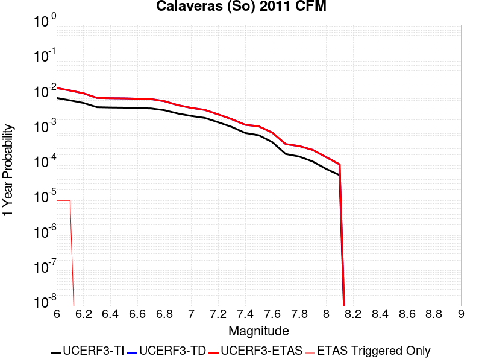 | 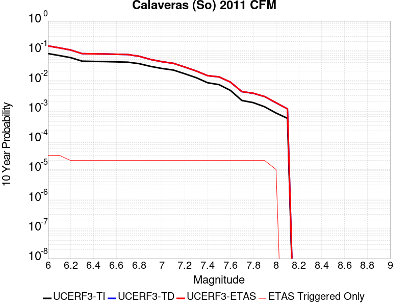 |

| Magnitude | 1 wk TI Prob | 1 wk TD Prob | 1 wk ETAS Prob | 1 wk ETAS/TD Gain | 1 wk ETAS Triggered Only | 1 mo TI Prob | 1 mo TD Prob | 1 mo ETAS Prob | 1 mo ETAS/TD Gain | 1 mo ETAS Triggered Only | 1 yr TI Prob | 1 yr TD Prob | 1 yr ETAS Prob | 1 yr ETAS/TD Gain | 1 yr ETAS Triggered Only | 10 yr TI Prob | 10 yr TD Prob | 10 yr ETAS Prob | 10 yr ETAS/TD Gain | 10 yr ETAS Triggered Only |
|-----|-----|-----|-----|-----|-----|-----|-----|-----|-----|-----|-----|-----|-----|-----|-----|-----|-----|-----|-----|-----|
| 6.0 | 1.5950744E-4 | 3.0717682E-4 | 3.0717682E-4 | 1.0 | 0.0 | 6.834242E-4 | 0.0013155679 | 0.0013155679 | 1.0 | 0.0 | 0.00828899 | 0.015860226 | 0.015870068 | 1.0006205 | 1.0E-5 | 0.079865426 | 0.14442398 | 0.14444964 | 1.0001777 | 3.0E-5 |
| 6.1 | 1.3584697E-4 | 2.6039354E-4 | 2.6039354E-4 | 1.0 | 0.0 | 5.8207137E-4 | 0.0011153363 | 0.0011153363 | 1.0 | 0.0 | 0.007063716 | 0.013463214 | 0.01347308 | 1.0007328 | 1.0E-5 | 0.06843361 | 0.12405204 | 0.12407832 | 1.0002118 | 3.0E-5 |
| 6.2 | 1.14676266E-4 | 2.1719003E-4 | 2.1719003E-4 | 1.0 | 0.0 | 4.9137714E-4 | 9.303784E-4 | 9.303784E-4 | 1.0 | 0.0 | 0.0059661185 | 0.011246838 | 0.011246838 | 1.0 | 0.0 | 0.058084648 | 0.105042614 | 0.10506051 | 1.0001704 | 2.0E-5 |
| 6.3 | 8.691518E-5 | 1.5991139E-4 | 1.5991139E-4 | 1.0 | 0.0 | 3.7244044E-4 | 6.8512175E-4 | 6.8512175E-4 | 1.0 | 0.0 | 0.004525038 | 0.008302812 | 0.008302812 | 1.0 | 0.0 | 0.044339992 | 0.07935864 | 0.079377055 | 1.000232 | 2.0E-5 |
| 6.4 | 8.50982E-5 | 1.5697523E-4 | 1.5697523E-4 | 1.0 | 0.0 | 3.646556E-4 | 6.7254476E-4 | 6.7254476E-4 | 1.0 | 0.0 | 0.0044306475 | 0.008150839 | 0.008150839 | 1.0 | 0.0 | 0.04343345 | 0.077964805 | 0.077983245 | 1.0002365 | 2.0E-5 |
| 6.5 | 8.4062965E-5 | 1.5521923E-4 | 1.5521923E-4 | 1.0 | 0.0 | 3.602201E-4 | 6.650238E-4 | 6.650238E-4 | 1.0 | 0.0 | 0.004376863 | 0.0080600465 | 0.0080600465 | 1.0 | 0.0 | 0.042916555 | 0.07713599 | 0.07715444 | 1.0002393 | 2.0E-5 |
| 6.6 | 8.194716E-5 | 1.5157688E-4 | 1.5157688E-4 | 1.0 | 0.0 | 3.5115483E-4 | 6.494241E-4 | 6.494241E-4 | 1.0 | 0.0 | 0.0042669317 | 0.007871881 | 0.007871881 | 1.0 | 0.0 | 0.04185927 | 0.07542138 | 0.07543987 | 1.0002452 | 2.0E-5 |
| 6.7 | 8.012326E-5 | 1.4825581E-4 | 1.4825581E-4 | 1.0 | 0.0 | 3.433402E-4 | 6.352002E-4 | 6.352002E-4 | 1.0 | 0.0 | 0.004172157 | 0.0077003674 | 0.0077003674 | 1.0 | 0.0 | 0.040946912 | 0.07386347 | 0.07388199 | 1.0002508 | 2.0E-5 |
| 6.8 | 7.119773E-5 | 1.2884884E-4 | 1.2884884E-4 | 1.0 | 0.0 | 3.0509746E-4 | 5.52076E-4 | 5.52076E-4 | 1.0 | 0.0 | 0.0037082357 | 0.006697585 | 0.006697585 | 1.0 | 0.0 | 0.036469642 | 0.06470681 | 0.06472552 | 1.0002891 | 2.0E-5 |
| 6.9 | 5.7343088E-5 | 9.921373E-5 | 9.921373E-5 | 1.0 | 0.0 | 2.4573295E-4 | 4.251327E-4 | 4.251327E-4 | 1.0 | 0.0 | 0.0029876942 | 0.0051637813 | 0.0051637813 | 1.0 | 0.0 | 0.02947844 | 0.050521217 | 0.050540205 | 1.0003759 | 2.0E-5 |
| 7.0 | 4.8746577E-5 | 8.287102E-5 | 8.287102E-5 | 1.0 | 0.0 | 2.0889717E-4 | 3.5511353E-4 | 3.5511353E-4 | 1.0 | 0.0 | 0.0025403565 | 0.0043150024 | 0.0043150024 | 1.0 | 0.0 | 0.025115121 | 0.042496026 | 0.042515174 | 1.0004506 | 2.0E-5 |
| 7.1 | 4.2998014E-5 | 7.266487E-5 | 7.266487E-5 | 1.0 | 0.0 | 1.8426418E-4 | 3.1138404E-4 | 3.1138404E-4 | 1.0 | 0.0 | 0.002241108 | 0.0037845706 | 0.0037845706 | 1.0 | 0.0 | 0.022186412 | 0.03743066 | 0.037449908 | 1.0005143 | 2.0E-5 |
| 7.2 | 3.221292E-5 | 5.3920212E-5 | 5.3920212E-5 | 1.0 | 0.0 | 1.3804805E-4 | 2.3106631E-4 | 2.3106631E-4 | 1.0 | 0.0 | 0.0016794393 | 0.002809631 | 0.002809631 | 1.0 | 0.0 | 0.016668037 | 0.028042959 | 0.0280624 | 1.0006932 | 2.0E-5 |
| 7.3 | 2.3756531E-5 | 3.9484785E-5 | 3.9484785E-5 | 1.0 | 0.0 | 1.0180973E-4 | 1.6920963E-4 | 1.6920963E-4 | 1.0 | 0.0 | 0.0012388286 | 0.0020581977 | 0.0020581977 | 1.0 | 0.0 | 0.012319452 | 0.020649772 | 0.020669358 | 1.0009485 | 2.0E-5 |
| 7.4 | 1.5997684E-5 | 2.734762E-5 | 2.734762E-5 | 1.0 | 0.0 | 6.8559704E-5 | 1.1719883E-4 | 1.1719883E-4 | 1.0 | 0.0 | 8.343947E-4 | 0.0014259643 | 0.0014259643 | 1.0 | 0.0 | 0.008312687 | 0.014378568 | 0.014398281 | 1.0013709 | 2.0E-5 |
| 7.5 | 1.3814293E-5 | 2.4789168E-5 | 2.4789168E-5 | 1.0 | 0.0 | 5.9202768E-5 | 1.0623498E-4 | 1.0623498E-4 | 1.0 | 0.0 | 7.205553E-4 | 0.0012926458 | 0.0012926458 | 1.0 | 0.0 | 0.007182234 | 0.013057604 | 0.013077343 | 1.0015117 | 2.0E-5 |
| 7.6 | 8.817309E-6 | 1.6435224E-5 | 1.6435224E-5 | 1.0 | 0.0 | 3.7787922E-5 | 7.043478E-5 | 7.043478E-5 | 1.0 | 0.0 | 4.5997082E-4 | 8.5720734E-4 | 8.5720734E-4 | 1.0 | 0.0 | 0.004590199 | 0.008721513 | 0.008741338 | 1.0022732 | 2.0E-5 |
| 7.7 | 4.0352206E-6 | 7.71072E-6 | 7.71072E-6 | 1.0 | 0.0 | 1.7293689E-5 | 3.3045526E-5 | 3.3045526E-5 | 1.0 | 0.0 | 2.1053031E-4 | 4.0225507E-4 | 4.0225507E-4 | 1.0 | 0.0 | 0.0021033096 | 0.0041669086 | 0.0041868254 | 1.0047797 | 2.0E-5 |
| 7.8 | 3.413169E-6 | 6.7902756E-6 | 6.7902756E-6 | 1.0 | 0.0 | 1.4627784E-5 | 2.9100858E-5 | 2.9100858E-5 | 1.0 | 0.0 | 1.7807873E-4 | 3.542454E-4 | 3.542454E-4 | 1.0 | 0.0 | 0.0017793609 | 0.0036680202 | 0.0036879468 | 1.0054325 | 2.0E-5 |
| 7.9 | 2.4740732E-6 | 5.2814135E-6 | 5.2814135E-6 | 1.0 | 0.0 | 1.06031275E-5 | 2.2634433E-5 | 2.2634433E-5 | 1.0 | 0.0 | 1.2908543E-4 | 2.755394E-4 | 2.755394E-4 | 1.0 | 0.0 | 0.0012901047 | 0.0028359678 | 0.0028559112 | 1.0070323 | 2.0E-5 |
| 8.0 | 1.5231818E-6 | 3.2902144E-6 | 3.2902144E-6 | 1.0 | 0.0 | 6.527906E-6 | 1.4100842E-5 | 1.4100842E-5 | 1.0 | 0.0 | 7.9474354E-5 | 1.7166427E-4 | 1.7166427E-4 | 1.0 | 0.0 | 7.944594E-4 | 0.0017571322 | 0.0017671147 | 1.005681 | 1.0E-5 |
| 8.1 | 1.0104524E-6 | 2.0465736E-6 | 2.0465736E-6 | 1.0 | 0.0 | 4.330503E-6 | 8.7710005E-6 | 8.7710005E-6 | 1.0 | 0.0 | 5.2722597E-5 | 1.0678173E-4 | 1.0678173E-4 | 1.0 | 0.0 | 5.271009E-4 | 0.0010933981 | 0.0010933981 | 1.0 | 0.0 |

## Santa Cruz Catalina Ridge alt1
*[(top)](#table-of-contents)*

| 1 Week | 1 Month | 1 Year | 10 Year |
|-----|-----|-----|-----|
|  |  |  | 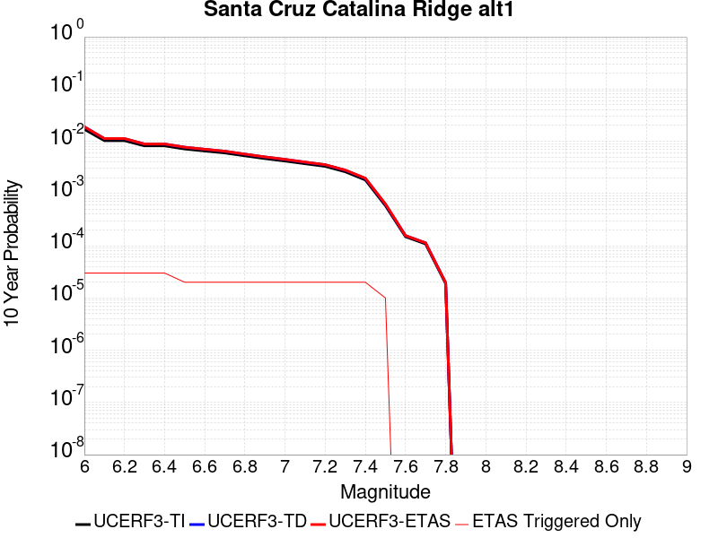 |

| Magnitude | 1 wk TI Prob | 1 wk TD Prob | 1 wk ETAS Prob | 1 wk ETAS/TD Gain | 1 wk ETAS Triggered Only | 1 mo TI Prob | 1 mo TD Prob | 1 mo ETAS Prob | 1 mo ETAS/TD Gain | 1 mo ETAS Triggered Only | 1 yr TI Prob | 1 yr TD Prob | 1 yr ETAS Prob | 1 yr ETAS/TD Gain | 1 yr ETAS Triggered Only | 10 yr TI Prob | 10 yr TD Prob | 10 yr ETAS Prob | 10 yr ETAS/TD Gain | 10 yr ETAS Triggered Only |
|-----|-----|-----|-----|-----|-----|-----|-----|-----|-----|-----|-----|-----|-----|-----|-----|-----|-----|-----|-----|-----|
| 6.0 | 3.2833184E-5 | 3.655887E-5 | 3.655887E-5 | 1.0 | 0.0 | 1.4070606E-4 | 1.5667241E-4 | 1.5667241E-4 | 1.0 | 0.0 | 0.00171175 | 0.0019059839 | 0.0019159649 | 1.0052366 | 1.0E-5 | 0.016986247 | 0.018913275 | 0.018942708 | 1.0015562 | 3.0E-5 |
| 6.1 | 1.9835548E-5 | 2.165973E-5 | 2.165973E-5 | 1.0 | 0.0 | 8.500672E-5 | 9.282422E-5 | 9.282422E-5 | 1.0 | 0.0 | 0.0010344655 | 0.0011295693 | 0.0011395579 | 1.008843 | 1.0E-5 | 0.010296632 | 0.011240412 | 0.011270074 | 1.0026389 | 3.0E-5 |
| 6.2 | 1.9835548E-5 | 2.165973E-5 | 2.165973E-5 | 1.0 | 0.0 | 8.500672E-5 | 9.282422E-5 | 9.282422E-5 | 1.0 | 0.0 | 0.0010344655 | 0.0011295693 | 0.0011395579 | 1.008843 | 1.0E-5 | 0.010296632 | 0.011240412 | 0.011270074 | 1.0026389 | 3.0E-5 |
| 6.3 | 1.5728183E-5 | 1.7034108E-5 | 1.7034108E-5 | 1.0 | 0.0 | 6.7404755E-5 | 7.300131E-5 | 7.300131E-5 | 1.0 | 0.0 | 8.2034385E-4 | 8.8843465E-4 | 8.9842576E-4 | 1.0112457 | 1.0E-5 | 0.008173222 | 0.008849509 | 0.008879243 | 1.00336 | 3.0E-5 |
| 6.4 | 1.5728183E-5 | 1.7034108E-5 | 1.7034108E-5 | 1.0 | 0.0 | 6.7404755E-5 | 7.300131E-5 | 7.300131E-5 | 1.0 | 0.0 | 8.2034385E-4 | 8.8843465E-4 | 8.9842576E-4 | 1.0112457 | 1.0E-5 | 0.008173222 | 0.008849509 | 0.008879243 | 1.00336 | 3.0E-5 |
| 6.5 | 1.3707734E-5 | 1.4794654E-5 | 1.4794654E-5 | 1.0 | 0.0 | 5.8746107E-5 | 6.3404135E-5 | 6.3404135E-5 | 1.0 | 0.0 | 7.1499916E-4 | 7.716755E-4 | 7.716755E-4 | 1.0 | 0.0 | 0.0071270303 | 0.007690358 | 0.007710204 | 1.0025806 | 2.0E-5 |
| 6.6 | 1.2539813E-5 | 1.3510336E-5 | 1.3510336E-5 | 1.0 | 0.0 | 5.3740947E-5 | 5.790017E-5 | 5.790017E-5 | 1.0 | 0.0 | 6.540996E-4 | 7.0470927E-4 | 7.0470927E-4 | 1.0 | 0.0 | 0.0065217763 | 0.007025049 | 0.0070449086 | 1.0028269 | 2.0E-5 |
| 6.7 | 1.1504083E-5 | 1.237748E-5 | 1.237748E-5 | 1.0 | 0.0 | 4.930228E-5 | 5.3045278E-5 | 5.3045278E-5 | 1.0 | 0.0 | 6.0008996E-4 | 6.456369E-4 | 6.456369E-4 | 1.0 | 0.0 | 0.005984721 | 0.0064378404 | 0.006457712 | 1.0030867 | 2.0E-5 |
| 6.8 | 1.012739E-5 | 1.0877162E-5 | 1.0877162E-5 | 1.0 | 0.0 | 4.340238E-5 | 4.6615583E-5 | 4.6615583E-5 | 1.0 | 0.0 | 5.282958E-4 | 5.6739844E-4 | 5.6739844E-4 | 1.0 | 0.0 | 0.0052704164 | 0.0056596664 | 0.0056795534 | 1.0035138 | 2.0E-5 |
| 6.9 | 8.9607865E-6 | 9.609195E-6 | 9.609195E-6 | 1.0 | 0.0 | 3.8402806E-5 | 4.118162E-5 | 4.118162E-5 | 1.0 | 0.0 | 4.6745385E-4 | 5.01272E-4 | 5.01272E-4 | 1.0 | 0.0 | 0.0046647177 | 0.0050015324 | 0.005021432 | 1.0039787 | 2.0E-5 |
| 7.0 | 8.046829E-6 | 8.619814E-6 | 8.619814E-6 | 1.0 | 0.0 | 3.4485955E-5 | 3.6941543E-5 | 3.6941543E-5 | 1.0 | 0.0 | 4.1978562E-4 | 4.496713E-4 | 4.496713E-4 | 1.0 | 0.0 | 0.004189935 | 0.0044877045 | 0.0045076148 | 1.0044366 | 2.0E-5 |
| 7.1 | 7.136131E-6 | 7.637716E-6 | 7.637716E-6 | 1.0 | 0.0 | 3.0583058E-5 | 3.2732663E-5 | 3.2732663E-5 | 1.0 | 0.0 | 3.7228514E-4 | 3.98448E-4 | 3.98448E-4 | 1.0 | 0.0 | 0.0037166206 | 0.0039774124 | 0.003997333 | 1.0050083 | 2.0E-5 |
| 7.2 | 6.362014E-6 | 6.8050117E-6 | 6.8050117E-6 | 1.0 | 0.0 | 2.726549E-5 | 2.9164014E-5 | 2.9164014E-5 | 1.0 | 0.0 | 3.3190678E-4 | 3.5501466E-4 | 3.5501466E-4 | 1.0 | 0.0 | 0.0033141149 | 0.0035445436 | 0.0035644728 | 1.0056225 | 2.0E-5 |
| 7.3 | 5.004101E-6 | 5.3517565E-6 | 5.3517565E-6 | 1.0 | 0.0 | 2.1445969E-5 | 2.2935901E-5 | 2.2935901E-5 | 1.0 | 0.0 | 2.6107338E-4 | 2.7920934E-4 | 2.7920934E-4 | 1.0 | 0.0 | 0.002607669 | 0.0027886403 | 0.0028085846 | 1.007152 | 2.0E-5 |
| 7.4 | 3.4901443E-6 | 3.7320815E-6 | 3.7320815E-6 | 1.0 | 0.0 | 1.4957676E-5 | 1.599454E-5 | 1.599454E-5 | 1.0 | 0.0 | 1.8209449E-4 | 1.947165E-4 | 1.947165E-4 | 1.0 | 0.0 | 0.0018194534 | 0.0019454975 | 0.0019654585 | 1.0102601 | 2.0E-5 |
| 7.5 | 1.1215045E-6 | 1.1893951E-6 | 1.1893951E-6 | 1.0 | 0.0 | 4.806439E-6 | 5.0973977E-6 | 5.0973977E-6 | 1.0 | 0.0 | 5.851682E-5 | 6.205908E-5 | 6.205908E-5 | 1.0 | 0.0 | 5.850142E-4 | 6.2042056E-4 | 6.304144E-4 | 1.0161082 | 1.0E-5 |
| 7.6 | 2.8599047E-7 | 2.9952153E-7 | 2.9952153E-7 | 1.0 | 0.0 | 1.2256729E-6 | 1.283663E-6 | 1.283663E-6 | 1.0 | 0.0 | 1.4922465E-5 | 1.5628486E-5 | 1.5628486E-5 | 1.0 | 0.0 | 1.4921463E-4 | 1.56274E-4 | 1.56274E-4 | 1.0 | 0.0 |
| 7.7 | 2.0781519E-7 | 2.1744435E-7 | 2.1744435E-7 | 1.0 | 0.0 | 8.906362E-7 | 9.319041E-7 | 9.319041E-7 | 1.0 | 0.0 | 1.08434415E-5 | 1.1345874E-5 | 1.1345874E-5 | 1.0 | 0.0 | 1.0842913E-4 | 1.1345304E-4 | 1.1345304E-4 | 1.0 | 0.0 |
| 7.8 | 3.614776E-8 | 3.7641193E-8 | 3.7641193E-8 | 1.0 | 0.0 | 1.5491896E-7 | 1.6131939E-7 | 1.6131939E-7 | 1.0 | 0.0 | 1.8861368E-6 | 1.9640618E-6 | 1.9640618E-6 | 1.0 | 0.0 | 1.8861208E-5 | 1.9640456E-5 | 1.9640456E-5 | 1.0 | 0.0 |

## Ventura-Pitas Point
*[(top)](#table-of-contents)*

| 1 Week | 1 Month | 1 Year | 10 Year |
|-----|-----|-----|-----|
|  | 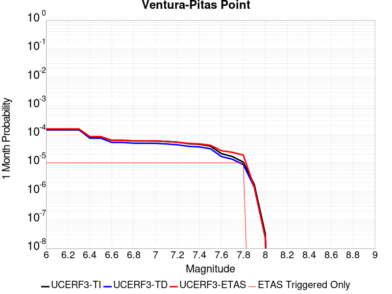 | 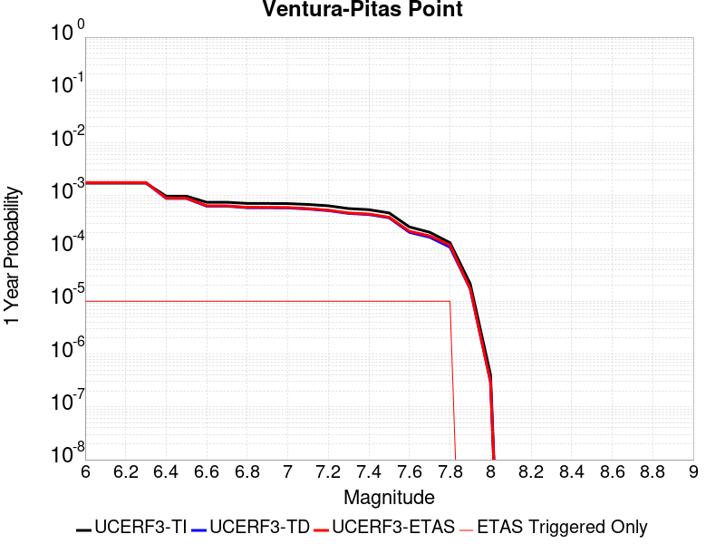 | 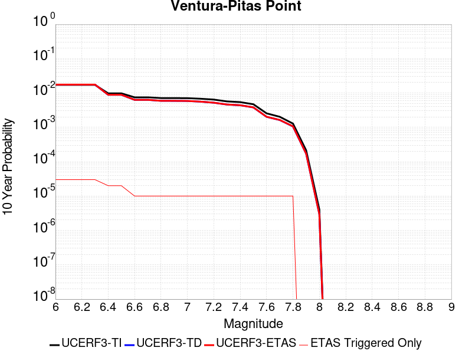 |

| Magnitude | 1 wk TI Prob | 1 wk TD Prob | 1 wk ETAS Prob | 1 wk ETAS/TD Gain | 1 wk ETAS Triggered Only | 1 mo TI Prob | 1 mo TD Prob | 1 mo ETAS Prob | 1 mo ETAS/TD Gain | 1 mo ETAS Triggered Only | 1 yr TI Prob | 1 yr TD Prob | 1 yr ETAS Prob | 1 yr ETAS/TD Gain | 1 yr ETAS Triggered Only | 10 yr TI Prob | 10 yr TD Prob | 10 yr ETAS Prob | 10 yr ETAS/TD Gain | 10 yr ETAS Triggered Only |
|-----|-----|-----|-----|-----|-----|-----|-----|-----|-----|-----|-----|-----|-----|-----|-----|-----|-----|-----|-----|-----|
| 6.0 | 3.3179622E-5 | 3.3735705E-5 | 4.3735366E-5 | 1.2964119 | 1.0E-5 | 1.4219063E-4 | 1.4457502E-4 | 1.5457359E-4 | 1.0691582 | 1.0E-5 | 0.0017297962 | 0.0017590367 | 0.001769019 | 1.005675 | 1.0E-5 | 0.017163932 | 0.017476691 | 0.017506167 | 1.0016866 | 3.0E-5 |
| 6.1 | 3.3179622E-5 | 3.3735705E-5 | 4.3735366E-5 | 1.2964119 | 1.0E-5 | 1.4219063E-4 | 1.4457502E-4 | 1.5457359E-4 | 1.0691582 | 1.0E-5 | 0.0017297962 | 0.0017590367 | 0.001769019 | 1.005675 | 1.0E-5 | 0.017163932 | 0.017476691 | 0.017506167 | 1.0016866 | 3.0E-5 |
| 6.2 | 3.3179622E-5 | 3.3735705E-5 | 4.3735366E-5 | 1.2964119 | 1.0E-5 | 1.4219063E-4 | 1.4457502E-4 | 1.5457359E-4 | 1.0691582 | 1.0E-5 | 0.0017297962 | 0.0017590367 | 0.001769019 | 1.005675 | 1.0E-5 | 0.017163932 | 0.017476691 | 0.017506167 | 1.0016866 | 3.0E-5 |
| 6.3 | 3.3179622E-5 | 3.3735705E-5 | 4.3735366E-5 | 1.2964119 | 1.0E-5 | 1.4219063E-4 | 1.4457502E-4 | 1.5457359E-4 | 1.0691582 | 1.0E-5 | 0.0017297962 | 0.0017590367 | 0.001769019 | 1.005675 | 1.0E-5 | 0.017163932 | 0.017476691 | 0.017506167 | 1.0016866 | 3.0E-5 |
| 6.4 | 1.8754668E-5 | 1.7019815E-5 | 2.7019643E-5 | 1.5875405 | 1.0E-5 | 8.037467E-5 | 7.294015E-5 | 8.293942E-5 | 1.1370887 | 1.0E-5 | 9.781223E-4 | 8.8770763E-4 | 8.9769874E-4 | 1.011255 | 1.0E-5 | 0.009738282 | 0.0088439835 | 0.008863807 | 1.0022414 | 2.0E-5 |
| 6.5 | 1.8754668E-5 | 1.7019815E-5 | 2.7019643E-5 | 1.5875405 | 1.0E-5 | 8.037467E-5 | 7.294015E-5 | 8.293942E-5 | 1.1370887 | 1.0E-5 | 9.781223E-4 | 8.8770763E-4 | 8.9769874E-4 | 1.011255 | 1.0E-5 | 0.009738282 | 0.0088439835 | 0.008863807 | 1.0022414 | 2.0E-5 |
| 6.6 | 1.4361558E-5 | 1.2122415E-5 | 2.2122294E-5 | 1.8249081 | 1.0E-5 | 6.154808E-5 | 5.1952185E-5 | 6.1951665E-5 | 1.1924747 | 1.0E-5 | 7.490902E-4 | 6.323366E-4 | 6.4233027E-4 | 1.0158044 | 1.0E-5 | 0.0074657016 | 0.006305661 | 0.006315598 | 1.0015758 | 1.0E-5 |
| 6.7 | 1.4361558E-5 | 1.2122415E-5 | 2.2122294E-5 | 1.8249081 | 1.0E-5 | 6.154808E-5 | 5.1952185E-5 | 6.1951665E-5 | 1.1924747 | 1.0E-5 | 7.490902E-4 | 6.323366E-4 | 6.4233027E-4 | 1.0158044 | 1.0E-5 | 0.0074657016 | 0.006305661 | 0.006315598 | 1.0015758 | 1.0E-5 |
| 6.8 | 1.3663846E-5 | 1.13445485E-5 | 2.1344435E-5 | 1.8814707 | 1.0E-5 | 5.8558027E-5 | 4.8618596E-5 | 5.861811E-5 | 1.2056726 | 1.0E-5 | 7.127108E-4 | 5.917726E-4 | 6.017667E-4 | 1.0168884 | 1.0E-5 | 0.007104293 | 0.0059022144 | 0.0059121554 | 1.0016843 | 1.0E-5 |
| 6.9 | 1.3644157E-5 | 1.1322649E-5 | 2.1322536E-5 | 1.8831756 | 1.0E-5 | 5.8473648E-5 | 4.8524744E-5 | 5.852426E-5 | 1.2060704 | 1.0E-5 | 7.116841E-4 | 5.906306E-4 | 6.0062465E-4 | 1.016921 | 1.0E-5 | 0.007094092 | 0.0058908546 | 0.0059007956 | 1.0016875 | 1.0E-5 |
| 7.0 | 1.3568845E-5 | 1.1242214E-5 | 2.1242102E-5 | 1.8894945 | 1.0E-5 | 5.8150898E-5 | 4.8180038E-5 | 5.8179554E-5 | 1.2075448 | 1.0E-5 | 7.077572E-4 | 5.86436E-4 | 5.9643015E-4 | 1.0170422 | 1.0E-5 | 0.007055073 | 0.0058491305 | 0.0058590723 | 1.0016997 | 1.0E-5 |
| 7.1 | 1.306572E-5 | 1.0720661E-5 | 2.0720554E-5 | 1.9327683 | 1.0E-5 | 5.599474E-5 | 4.594489E-5 | 5.594443E-5 | 1.2176421 | 1.0E-5 | 6.815227E-4 | 5.592373E-4 | 5.6923175E-4 | 1.0178715 | 1.0E-5 | 0.0067943637 | 0.0055785356 | 0.00558848 | 1.0017825 | 1.0E-5 |
| 7.2 | 1.232604E-5 | 9.995251E-6 | 1.9995152E-5 | 2.0004652 | 1.0E-5 | 5.2824813E-5 | 4.2836098E-5 | 5.283567E-5 | 1.233438 | 1.0E-5 | 6.429523E-4 | 5.214065E-4 | 5.3140125E-4 | 1.0191689 | 1.0E-5 | 0.0064109527 | 0.0052020536 | 0.0052120015 | 1.0019124 | 1.0E-5 |
| 7.3 | 1.0917261E-5 | 8.843931E-6 | 1.8843843E-5 | 2.130709 | 1.0E-5 | 4.678742E-5 | 3.790202E-5 | 4.790164E-5 | 1.2638282 | 1.0E-5 | 5.69488E-4 | 4.6136096E-4 | 4.7135635E-4 | 1.021665 | 1.0E-5 | 0.0056803077 | 0.004604228 | 0.004614182 | 1.0021619 | 1.0E-5 |
| 7.4 | 1.039959E-5 | 8.423652E-6 | 1.8423567E-5 | 2.1871235 | 1.0E-5 | 4.456891E-5 | 3.610087E-5 | 4.610051E-5 | 1.2769916 | 1.0E-5 | 5.424914E-4 | 4.39441E-4 | 4.4943663E-4 | 1.0227462 | 1.0E-5 | 0.0054116896 | 0.004385913 | 0.004395869 | 1.00227 | 1.0E-5 |
| 7.5 | 9.015877E-6 | 7.2976136E-6 | 1.7297541E-5 | 2.370301 | 1.0E-5 | 3.86389E-5 | 3.1275118E-5 | 4.127481E-5 | 1.319733 | 1.0E-5 | 4.7032707E-4 | 3.8070945E-4 | 3.9070565E-4 | 1.0262568 | 1.0E-5 | 0.004693329 | 0.003800749 | 0.003810711 | 1.002621 | 1.0E-5 |
| 7.6 | 4.900162E-6 | 3.8741523E-6 | 1.3874113E-5 | 3.5812 | 1.0E-5 | 2.1000526E-5 | 1.6603404E-5 | 2.6603238E-5 | 1.6022761 | 1.0E-5 | 2.556514E-4 | 2.0212783E-4 | 2.1212581E-4 | 1.0494636 | 1.0E-5 | 0.0025535747 | 0.0020194536 | 0.0020294334 | 1.0049418 | 1.0E-5 |
| 7.7 | 3.8850626E-6 | 3.1267853E-6 | 1.3126754E-5 | 4.198163 | 1.0E-5 | 1.6650163E-5 | 1.340044E-5 | 2.3400306E-5 | 1.7462342 | 1.0E-5 | 2.0269687E-4 | 1.6313823E-4 | 1.731366E-4 | 1.0612878 | 1.0E-5 | 0.002025121 | 0.001630194 | 0.0016401778 | 1.0061243 | 1.0E-5 |
| 7.8 | 2.4654719E-6 | 2.029919E-6 | 1.2029899E-5 | 5.926295 | 1.0E-5 | 1.0566265E-5 | 8.699624E-6 | 1.8699537E-5 | 2.1494648 | 1.0E-5 | 1.2863669E-4 | 1.05912826E-4 | 1.1591177E-4 | 1.0944073 | 1.0E-5 | 0.0012856225 | 0.0010586282 | 0.0010686176 | 1.0094361 | 1.0E-5 |
| 7.9 | 4.095894E-7 | 3.276535E-7 | 3.276535E-7 | 1.0 | 0.0 | 1.7553821E-6 | 1.4042286E-6 | 1.4042286E-6 | 1.0 | 0.0 | 2.1371567E-5 | 1.7096352E-5 | 1.7096352E-5 | 1.0 | 0.0 | 2.1369511E-4 | 1.7095068E-4 | 1.7095068E-4 | 1.0 | 0.0 |
| 8.0 | 7.791402E-9 | 5.683641E-9 | 5.683641E-9 | 1.0 | 0.0 | 3.3391725E-8 | 2.4358462E-8 | 2.4358462E-8 | 1.0 | 0.0 | 4.0654416E-7 | 2.9656425E-7 | 2.9656425E-7 | 1.0 | 0.0 | 4.065434E-6 | 2.9656408E-6 | 2.9656408E-6 | 1.0 | 0.0 |

## Bullion Mountains
*[(top)](#table-of-contents)*

| 1 Week | 1 Month | 1 Year | 10 Year |
|-----|-----|-----|-----|
|  | 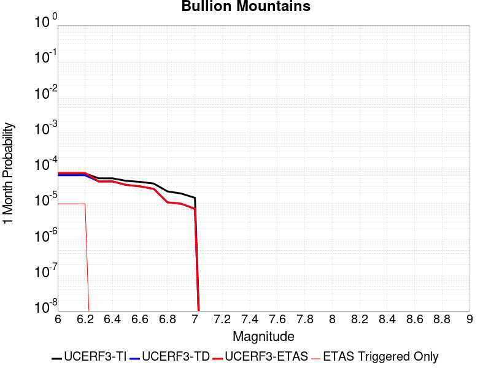 | 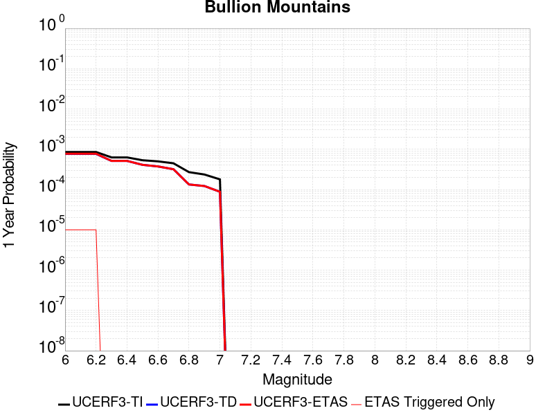 |  |

| Magnitude | 1 wk TI Prob | 1 wk TD Prob | 1 wk ETAS Prob | 1 wk ETAS/TD Gain | 1 wk ETAS Triggered Only | 1 mo TI Prob | 1 mo TD Prob | 1 mo ETAS Prob | 1 mo ETAS/TD Gain | 1 mo ETAS Triggered Only | 1 yr TI Prob | 1 yr TD Prob | 1 yr ETAS Prob | 1 yr ETAS/TD Gain | 1 yr ETAS Triggered Only | 10 yr TI Prob | 10 yr TD Prob | 10 yr ETAS Prob | 10 yr ETAS/TD Gain | 10 yr ETAS Triggered Only |
|-----|-----|-----|-----|-----|-----|-----|-----|-----|-----|-----|-----|-----|-----|-----|-----|-----|-----|-----|-----|-----|
| 6.0 | 1.6420427E-5 | 1.4692159E-5 | 1.4692159E-5 | 1.0 | 0.0 | 7.037136E-5 | 6.29651E-5 | 7.296447E-5 | 1.1588081 | 1.0E-5 | 8.5643446E-4 | 7.6636876E-4 | 7.763611E-4 | 1.0130385 | 1.0E-5 | 0.008531413 | 0.0076410524 | 0.0076708235 | 1.0038961 | 3.0E-5 |
| 6.1 | 1.6420427E-5 | 1.4692159E-5 | 1.4692159E-5 | 1.0 | 0.0 | 7.037136E-5 | 6.29651E-5 | 7.296447E-5 | 1.1588081 | 1.0E-5 | 8.5643446E-4 | 7.6636876E-4 | 7.763611E-4 | 1.0130385 | 1.0E-5 | 0.008531413 | 0.0076410524 | 0.0076708235 | 1.0038961 | 3.0E-5 |
| 6.2 | 1.6420427E-5 | 1.4692159E-5 | 1.4692159E-5 | 1.0 | 0.0 | 7.037136E-5 | 6.29651E-5 | 7.296447E-5 | 1.1588081 | 1.0E-5 | 8.5643446E-4 | 7.6636876E-4 | 7.763611E-4 | 1.0130385 | 1.0E-5 | 0.008531413 | 0.0076410524 | 0.0076708235 | 1.0038961 | 3.0E-5 |
| 6.3 | 1.2046778E-5 | 9.862349E-6 | 9.862349E-6 | 1.0 | 0.0 | 5.1628023E-5 | 4.2266656E-5 | 4.2266656E-5 | 1.0 | 0.0 | 6.283899E-4 | 5.144982E-4 | 5.144982E-4 | 1.0 | 0.0 | 0.0062661595 | 0.0051353523 | 0.0051552495 | 1.0038745 | 2.0E-5 |
| 6.4 | 1.2046778E-5 | 9.862349E-6 | 9.862349E-6 | 1.0 | 0.0 | 5.1628023E-5 | 4.2266656E-5 | 4.2266656E-5 | 1.0 | 0.0 | 6.283899E-4 | 5.144982E-4 | 5.144982E-4 | 1.0 | 0.0 | 0.0062661595 | 0.0051353523 | 0.0051552495 | 1.0038745 | 2.0E-5 |
| 6.5 | 1.0244343E-5 | 7.87945E-6 | 7.87945E-6 | 1.0 | 0.0 | 4.390359E-5 | 3.3768752E-5 | 3.3768752E-5 | 1.0 | 0.0 | 5.343951E-4 | 4.1107766E-4 | 4.1107766E-4 | 1.0 | 0.0 | 0.005331118 | 0.004105204 | 0.004115163 | 1.0024259 | 1.0E-5 |
| 6.6 | 9.605408E-6 | 7.1774803E-6 | 7.1774803E-6 | 1.0 | 0.0 | 4.1165385E-5 | 3.0760384E-5 | 3.0760384E-5 | 1.0 | 0.0 | 5.010733E-4 | 3.7446365E-4 | 3.7446365E-4 | 1.0 | 0.0 | 0.00499945 | 0.0037403237 | 0.0037502863 | 1.0026636 | 1.0E-5 |
| 6.7 | 8.60418E-6 | 6.1239775E-6 | 6.1239775E-6 | 1.0 | 0.0 | 3.687454E-5 | 2.6245465E-5 | 2.6245465E-5 | 1.0 | 0.0 | 4.48855E-4 | 3.1951116E-4 | 3.1951116E-4 | 1.0 | 0.0 | 0.004479495 | 0.00319243 | 0.0032023978 | 1.0031224 | 1.0E-5 |
| 6.8 | 5.187994E-6 | 2.563129E-6 | 2.563129E-6 | 1.0 | 0.0 | 2.223407E-5 | 1.0984815E-5 | 1.0984815E-5 | 1.0 | 0.0 | 2.7066618E-4 | 1.3373591E-4 | 1.3373591E-4 | 1.0 | 0.0 | 0.0027033675 | 0.0013369458 | 0.0013469325 | 1.0074698 | 1.0E-5 |
| 6.9 | 4.5302368E-6 | 2.344285E-6 | 2.344285E-6 | 1.0 | 0.0 | 1.9415156E-5 | 1.0046919E-5 | 1.0046919E-5 | 1.0 | 0.0 | 2.3635388E-4 | 1.2231834E-4 | 1.2231834E-4 | 1.0 | 0.0 | 0.0023610266 | 0.0012228992 | 0.001232887 | 1.0081673 | 1.0E-5 |
| 7.0 | 3.431668E-6 | 1.6882182E-6 | 1.6882182E-6 | 1.0 | 0.0 | 1.4707065E-5 | 7.235221E-6 | 7.235221E-6 | 1.0 | 0.0 | 1.7904381E-4 | 8.808881E-5 | 8.808881E-5 | 1.0 | 0.0 | 0.0017889962 | 8.8088814E-4 | 8.8088814E-4 | 1.0 | 0.0 |

## Rinconada 2011 CFM
*[(top)](#table-of-contents)*

| 1 Week | 1 Month | 1 Year | 10 Year |
|-----|-----|-----|-----|
|  |  |  |  |

| Magnitude | 1 wk TI Prob | 1 wk TD Prob | 1 wk ETAS Prob | 1 wk ETAS/TD Gain | 1 wk ETAS Triggered Only | 1 mo TI Prob | 1 mo TD Prob | 1 mo ETAS Prob | 1 mo ETAS/TD Gain | 1 mo ETAS Triggered Only | 1 yr TI Prob | 1 yr TD Prob | 1 yr ETAS Prob | 1 yr ETAS/TD Gain | 1 yr ETAS Triggered Only | 10 yr TI Prob | 10 yr TD Prob | 10 yr ETAS Prob | 10 yr ETAS/TD Gain | 10 yr ETAS Triggered Only |
|-----|-----|-----|-----|-----|-----|-----|-----|-----|-----|-----|-----|-----|-----|-----|-----|-----|-----|-----|-----|-----|
| 6.0 | 1.5752368E-5 | 1.6274776E-5 | 2.6274614E-5 | 1.6144378 | 1.0E-5 | 6.75084E-5 | 6.97472E-5 | 8.97458E-5 | 1.2867299 | 2.0E-5 | 8.2160486E-4 | 8.488444E-4 | 8.6882745E-4 | 1.0235415 | 2.0E-5 | 0.008185739 | 0.0084564015 | 0.008486148 | 1.0035176 | 3.0E-5 |
| 6.1 | 1.0966133E-5 | 1.1323071E-5 | 2.1322958E-5 | 1.8831427 | 1.0E-5 | 4.6996865E-5 | 4.852655E-5 | 6.852558E-5 | 1.4121256 | 2.0E-5 | 5.720366E-4 | 5.906513E-4 | 6.1063946E-4 | 1.0338409 | 2.0E-5 | 0.0057056635 | 0.0058909105 | 0.005920734 | 1.0050626 | 3.0E-5 |
| 6.2 | 1.0966133E-5 | 1.1323071E-5 | 2.1322958E-5 | 1.8831427 | 1.0E-5 | 4.6996865E-5 | 4.852655E-5 | 6.852558E-5 | 1.4121256 | 2.0E-5 | 5.720366E-4 | 5.906513E-4 | 6.1063946E-4 | 1.0338409 | 2.0E-5 | 0.0057056635 | 0.0058909105 | 0.005920734 | 1.0050626 | 3.0E-5 |
| 6.3 | 8.926149E-6 | 9.212805E-6 | 1.9212714E-5 | 2.0854356 | 1.0E-5 | 3.8254362E-5 | 3.9482857E-5 | 5.9482067E-5 | 1.506529 | 2.0E-5 | 4.6564735E-4 | 4.8059804E-4 | 5.0058844E-4 | 1.0415949 | 2.0E-5 | 0.0046467283 | 0.004795632 | 0.004825488 | 1.0062257 | 3.0E-5 |
| 6.4 | 7.676955E-6 | 7.920219E-6 | 1.792014E-5 | 2.2625813 | 1.0E-5 | 3.290082E-5 | 3.3943357E-5 | 5.3942676E-5 | 1.5891969 | 2.0E-5 | 4.0049385E-4 | 4.131822E-4 | 4.3317393E-4 | 1.0483848 | 2.0E-5 | 0.0039977287 | 0.004124166 | 0.0041540423 | 1.0072442 | 3.0E-5 |
| 6.5 | 6.1671026E-6 | 6.3589773E-6 | 1.6358914E-5 | 2.5725698 | 1.0E-5 | 2.6430173E-5 | 2.7252476E-5 | 4.725193E-5 | 1.7338582 | 2.0E-5 | 3.2173982E-4 | 3.3174845E-4 | 3.5174182E-4 | 1.0602666 | 2.0E-5 | 0.003212744 | 0.0033125442 | 0.003342445 | 1.0090265 | 3.0E-5 |
| 6.6 | 5.553456E-6 | 5.724833E-6 | 1.5724776E-5 | 2.7467659 | 1.0E-5 | 2.3800309E-5 | 2.4534767E-5 | 4.4534278E-5 | 1.8151498 | 2.0E-5 | 2.897302E-4 | 2.986699E-4 | 3.1866392E-4 | 1.0669435 | 2.0E-5 | 0.0028935277 | 0.0029826937 | 0.0030126043 | 1.010028 | 3.0E-5 |
| 6.7 | 4.787857E-6 | 4.9333266E-6 | 1.4933277E-5 | 3.0270197 | 1.0E-5 | 2.0519226E-5 | 2.1142658E-5 | 3.114245E-5 | 1.4729674 | 1.0E-5 | 2.4979294E-4 | 2.573815E-4 | 2.6737893E-4 | 1.0388428 | 1.0E-5 | 0.0024951235 | 0.0025708398 | 0.002580814 | 1.0038798 | 1.0E-5 |
| 6.8 | 3.9955166E-6 | 4.1134904E-6 | 4.1134904E-6 | 1.0 | 0.0 | 1.7123532E-5 | 1.7629125E-5 | 1.7629125E-5 | 1.0 | 0.0 | 2.0845905E-4 | 2.1461348E-4 | 2.1461348E-4 | 1.0 | 0.0 | 0.002082636 | 0.002144066 | 0.002144066 | 1.0 | 0.0 |
| 6.9 | 3.4250072E-6 | 3.522458E-6 | 3.522458E-6 | 1.0 | 0.0 | 1.46785205E-5 | 1.5096161E-5 | 1.5096161E-5 | 1.0 | 0.0 | 1.7869633E-4 | 1.8378028E-4 | 1.8378028E-4 | 1.0 | 0.0 | 0.001785527 | 0.0018362855 | 0.0018362855 | 1.0 | 0.0 |
| 7.0 | 2.7712713E-6 | 2.846709E-6 | 2.846709E-6 | 1.0 | 0.0 | 1.1876823E-5 | 1.2200125E-5 | 1.2200125E-5 | 1.0 | 0.0 | 1.4459073E-4 | 1.4852641E-4 | 1.4852641E-4 | 1.0 | 0.0 | 0.0014449668 | 0.001484273 | 0.001484273 | 1.0 | 0.0 |
| 7.1 | 2.227358E-6 | 2.2857057E-6 | 2.2857057E-6 | 1.0 | 0.0 | 9.545785E-6 | 9.795845E-6 | 9.795845E-6 | 1.0 | 0.0 | 1.16213734E-4 | 1.1925789E-4 | 1.1925789E-4 | 1.0 | 0.0 | 0.0011615298 | 0.0011919399 | 0.0011919399 | 1.0 | 0.0 |
| 7.2 | 1.581796E-6 | 1.6209061E-6 | 1.6209061E-6 | 1.0 | 0.0 | 6.779108E-6 | 6.946722E-6 | 6.946722E-6 | 1.0 | 0.0 | 8.253252E-5 | 8.457306E-5 | 8.457306E-5 | 1.0 | 0.0 | 8.250187E-4 | 8.4540935E-4 | 8.4540935E-4 | 1.0 | 0.0 |
| 7.3 | 1.0306567E-6 | 1.054651E-6 | 1.054651E-6 | 1.0 | 0.0 | 4.4170924E-6 | 4.519925E-6 | 4.519925E-6 | 1.0 | 0.0 | 5.3776774E-5 | 5.5028697E-5 | 5.5028697E-5 | 1.0 | 0.0 | 5.376376E-4 | 5.5015093E-4 | 5.5015093E-4 | 1.0 | 0.0 |
| 7.4 | 6.535541E-7 | 6.6827636E-7 | 6.6827636E-7 | 1.0 | 0.0 | 2.800943E-6 | 2.8640384E-6 | 2.8640384E-6 | 1.0 | 0.0 | 3.4100947E-5 | 3.486911E-5 | 3.486911E-5 | 1.0 | 0.0 | 3.4095717E-4 | 3.4863653E-4 | 3.4863653E-4 | 1.0 | 0.0 |
| 7.5 | 3.2656962E-7 | 3.3316812E-7 | 3.3316812E-7 | 1.0 | 0.0 | 1.3995833E-6 | 1.4278626E-6 | 1.4278626E-6 | 1.0 | 0.0 | 1.7039794E-5 | 1.7384087E-5 | 1.7384087E-5 | 1.0 | 0.0 | 1.7038487E-4 | 1.7382733E-4 | 1.7382733E-4 | 1.0 | 0.0 |
| 7.6 | 9.754343E-8 | 9.821047E-8 | 9.821047E-8 | 1.0 | 0.0 | 4.180432E-7 | 4.2090193E-7 | 4.2090193E-7 | 1.0 | 0.0 | 5.089664E-6 | 5.1244688E-6 | 5.1244688E-6 | 1.0 | 0.0 | 5.0895473E-5 | 5.1243518E-5 | 5.1243518E-5 | 1.0 | 0.0 |
| 7.7 | 6.0001453E-9 | 5.8491394E-9 | 5.8491394E-9 | 1.0 | 0.0 | 2.5714908E-8 | 2.506774E-8 | 2.506774E-8 | 1.0 | 0.0 | 3.1307894E-7 | 3.0519968E-7 | 3.0519968E-7 | 1.0 | 0.0 | 3.1307852E-6 | 3.0519927E-6 | 3.0519927E-6 | 1.0 | 0.0 |
| 7.8 | 7.400003E-11 | 7.4654505E-11 | 7.4654505E-11 | 1.0 | 0.0 | 3.171432E-10 | 3.1994796E-10 | 3.1994796E-10 | 1.0 | 0.0 | 3.861218E-9 | 3.895367E-9 | 3.895367E-9 | 1.0 | 0.0 | 3.861218E-8 | 3.895367E-8 | 3.895367E-8 | 1.0 | 0.0 |

## Anacapa-Dume alt 1
*[(top)](#table-of-contents)*

| 1 Week | 1 Month | 1 Year | 10 Year |
|-----|-----|-----|-----|
|  |  |  |  |

| Magnitude | 1 wk TI Prob | 1 wk TD Prob | 1 wk ETAS Prob | 1 wk ETAS/TD Gain | 1 wk ETAS Triggered Only | 1 mo TI Prob | 1 mo TD Prob | 1 mo ETAS Prob | 1 mo ETAS/TD Gain | 1 mo ETAS Triggered Only | 1 yr TI Prob | 1 yr TD Prob | 1 yr ETAS Prob | 1 yr ETAS/TD Gain | 1 yr ETAS Triggered Only | 10 yr TI Prob | 10 yr TD Prob | 10 yr ETAS Prob | 10 yr ETAS/TD Gain | 10 yr ETAS Triggered Only |
|-----|-----|-----|-----|-----|-----|-----|-----|-----|-----|-----|-----|-----|-----|-----|-----|-----|-----|-----|-----|-----|
| 6.0 | 5.1871802E-6 | 5.3674153E-6 | 5.3674153E-6 | 1.0 | 0.0 | 2.2230583E-5 | 2.3003011E-5 | 3.300278E-5 | 1.4347157 | 1.0E-5 | 2.7062374E-4 | 2.8002652E-4 | 3.000209E-4 | 1.0714018 | 2.0E-5 | 0.002702944 | 0.002796822 | 0.002826738 | 1.0106964 | 3.0E-5 |
| 6.1 | 5.1871802E-6 | 5.3674153E-6 | 5.3674153E-6 | 1.0 | 0.0 | 2.2230583E-5 | 2.3003011E-5 | 3.300278E-5 | 1.4347157 | 1.0E-5 | 2.7062374E-4 | 2.8002652E-4 | 3.000209E-4 | 1.0714018 | 2.0E-5 | 0.002702944 | 0.002796822 | 0.002826738 | 1.0106964 | 3.0E-5 |
| 6.2 | 5.1871802E-6 | 5.3674153E-6 | 5.3674153E-6 | 1.0 | 0.0 | 2.2230583E-5 | 2.3003011E-5 | 3.300278E-5 | 1.4347157 | 1.0E-5 | 2.7062374E-4 | 2.8002652E-4 | 3.000209E-4 | 1.0714018 | 2.0E-5 | 0.002702944 | 0.002796822 | 0.002826738 | 1.0106964 | 3.0E-5 |
| 6.3 | 5.1871802E-6 | 5.3674153E-6 | 5.3674153E-6 | 1.0 | 0.0 | 2.2230583E-5 | 2.3003011E-5 | 3.300278E-5 | 1.4347157 | 1.0E-5 | 2.7062374E-4 | 2.8002652E-4 | 3.000209E-4 | 1.0714018 | 2.0E-5 | 0.002702944 | 0.002796822 | 0.002826738 | 1.0106964 | 3.0E-5 |
| 6.4 | 5.1871802E-6 | 5.3674153E-6 | 5.3674153E-6 | 1.0 | 0.0 | 2.2230583E-5 | 2.3003011E-5 | 3.300278E-5 | 1.4347157 | 1.0E-5 | 2.7062374E-4 | 2.8002652E-4 | 3.000209E-4 | 1.0714018 | 2.0E-5 | 0.002702944 | 0.002796822 | 0.002826738 | 1.0106964 | 3.0E-5 |
| 6.5 | 5.1871802E-6 | 5.3674153E-6 | 5.3674153E-6 | 1.0 | 0.0 | 2.2230583E-5 | 2.3003011E-5 | 3.300278E-5 | 1.4347157 | 1.0E-5 | 2.7062374E-4 | 2.8002652E-4 | 3.000209E-4 | 1.0714018 | 2.0E-5 | 0.002702944 | 0.002796822 | 0.002826738 | 1.0106964 | 3.0E-5 |
| 6.6 | 5.1871802E-6 | 5.3674153E-6 | 5.3674153E-6 | 1.0 | 0.0 | 2.2230583E-5 | 2.3003011E-5 | 3.300278E-5 | 1.4347157 | 1.0E-5 | 2.7062374E-4 | 2.8002652E-4 | 3.000209E-4 | 1.0714018 | 2.0E-5 | 0.002702944 | 0.002796822 | 0.002826738 | 1.0106964 | 3.0E-5 |
| 6.7 | 4.7693475E-6 | 4.9367145E-6 | 4.9367145E-6 | 1.0 | 0.0 | 2.04399E-5 | 2.1157182E-5 | 3.115697E-5 | 1.4726428 | 1.0E-5 | 2.4882736E-4 | 2.57559E-4 | 2.7755383E-4 | 1.0776321 | 2.0E-5 | 0.0024854892 | 0.0025726808 | 0.0026026038 | 1.011631 | 3.0E-5 |
| 6.8 | 4.753408E-6 | 4.920263E-6 | 4.920263E-6 | 1.0 | 0.0 | 2.037159E-5 | 2.1086675E-5 | 3.1086463E-5 | 1.4742231 | 1.0E-5 | 2.4799586E-4 | 2.567008E-4 | 2.7669565E-4 | 1.0778917 | 2.0E-5 | 0.002477193 | 0.0025641185 | 0.0025940416 | 1.0116699 | 3.0E-5 |
| 6.9 | 3.800069E-6 | 3.9371457E-6 | 3.9371457E-6 | 1.0 | 0.0 | 1.6285909E-5 | 1.6873373E-5 | 2.6873206E-5 | 1.5926397 | 1.0E-5 | 1.9826289E-4 | 2.054142E-4 | 2.2541008E-4 | 1.0973443 | 2.0E-5 | 0.001980861 | 0.002052267 | 0.0020822054 | 1.014588 | 3.0E-5 |
| 7.0 | 3.6671938E-6 | 3.7999373E-6 | 3.7999373E-6 | 1.0 | 0.0 | 1.571645E-5 | 1.6285345E-5 | 2.6285183E-5 | 1.614039 | 1.0E-5 | 1.9133097E-4 | 1.9825627E-4 | 2.182523E-4 | 1.1008595 | 2.0E-5 | 0.0019116632 | 0.0019808172 | 0.0020107578 | 1.0151153 | 3.0E-5 |
| 7.1 | 3.2394885E-6 | 3.3588108E-6 | 3.3588108E-6 | 1.0 | 0.0 | 1.3883448E-5 | 1.4394825E-5 | 2.439468E-5 | 1.6946841 | 1.0E-5 | 1.6901788E-4 | 1.75243E-4 | 1.952395E-4 | 1.1141073 | 2.0E-5 | 0.0016888938 | 0.0017510593 | 0.0017810068 | 1.0171025 | 3.0E-5 |
| 7.2 | 3.0935948E-6 | 3.2079429E-6 | 3.2079429E-6 | 1.0 | 0.0 | 1.3258196E-5 | 1.3748255E-5 | 2.3748118E-5 | 1.727355 | 1.0E-5 | 1.6140658E-4 | 1.6737224E-4 | 1.873689E-4 | 1.1194742 | 2.0E-5 | 0.001612894 | 0.0016724729 | 0.0017024227 | 1.0179075 | 3.0E-5 |
| 7.3 | 2.5604163E-6 | 2.6470868E-6 | 2.6470868E-6 | 1.0 | 0.0 | 1.0973167E-5 | 1.13446085E-5 | 1.13446085E-5 | 1.0 | 0.0 | 1.3359012E-4 | 1.381119E-4 | 1.4811051E-4 | 1.0723951 | 1.0E-5 | 0.0013350984 | 0.0013802652 | 0.0014002376 | 1.01447 | 2.0E-5 |
| 7.4 | 2.1429005E-6 | 2.2106142E-6 | 2.2106142E-6 | 1.0 | 0.0 | 9.1838265E-6 | 9.474026E-6 | 9.474026E-6 | 1.0 | 0.0 | 1.11807356E-4 | 1.1534019E-4 | 1.2533904E-4 | 1.0866901 | 1.0E-5 | 0.0011175112 | 0.001152806 | 0.0011727829 | 1.017329 | 2.0E-5 |
| 7.5 | 1.7237151E-6 | 1.7761544E-6 | 1.7761544E-6 | 1.0 | 0.0 | 7.3873293E-6 | 7.612068E-6 | 7.612068E-6 | 1.0 | 0.0 | 8.993702E-5 | 9.2673006E-5 | 1.02672086E-4 | 1.1078963 | 1.0E-5 | 8.990063E-4 | 9.26346E-4 | 9.4632746E-4 | 1.0215702 | 2.0E-5 |
| 7.6 | 9.541696E-7 | 9.823258E-7 | 9.823258E-7 | 1.0 | 0.0 | 4.089292E-6 | 4.209961E-6 | 4.209961E-6 | 1.0 | 0.0 | 4.9785995E-5 | 5.1255083E-5 | 6.125457E-5 | 1.1950926 | 1.0E-5 | 4.9774844E-4 | 5.124339E-4 | 5.324236E-4 | 1.0390095 | 2.0E-5 |
| 7.7 | 2.7226676E-7 | 2.717257E-7 | 2.717257E-7 | 1.0 | 0.0 | 1.166857E-6 | 1.1645382E-6 | 1.1645382E-6 | 1.0 | 0.0 | 1.4206392E-5 | 1.417816E-5 | 1.417816E-5 | 1.0 | 0.0 | 1.4205484E-4 | 1.4177263E-4 | 1.5177121E-4 | 1.0705255 | 1.0E-5 |
| 7.8 | 4.5017995E-8 | 4.2158064E-8 | 4.2158064E-8 | 1.0 | 0.0 | 1.9293425E-7 | 1.806774E-7 | 1.806774E-7 | 1.0 | 0.0 | 2.348972E-6 | 2.1997453E-6 | 2.1997453E-6 | 1.0 | 0.0 | 2.348947E-5 | 2.1997257E-5 | 2.1997257E-5 | 1.0 | 0.0 |
| 7.9 | 8.007447E-10 | 6.1615857E-10 | 6.1615857E-10 | 1.0 | 0.0 | 3.4317629E-9 | 2.64068E-9 | 2.64068E-9 | 1.0 | 0.0 | 4.1781714E-8 | 3.215028E-8 | 3.215028E-8 | 1.0 | 0.0 | 4.1781706E-7 | 3.2150274E-7 | 3.2150274E-7 | 1.0 | 0.0 |

## Santa Ynez River
*[(top)](#table-of-contents)*

| 1 Week | 1 Month | 1 Year | 10 Year |
|-----|-----|-----|-----|
| 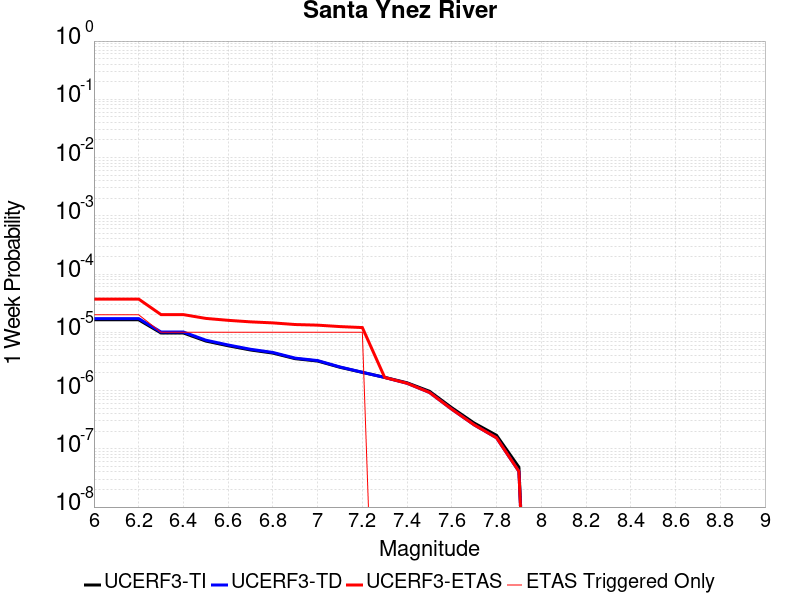 | 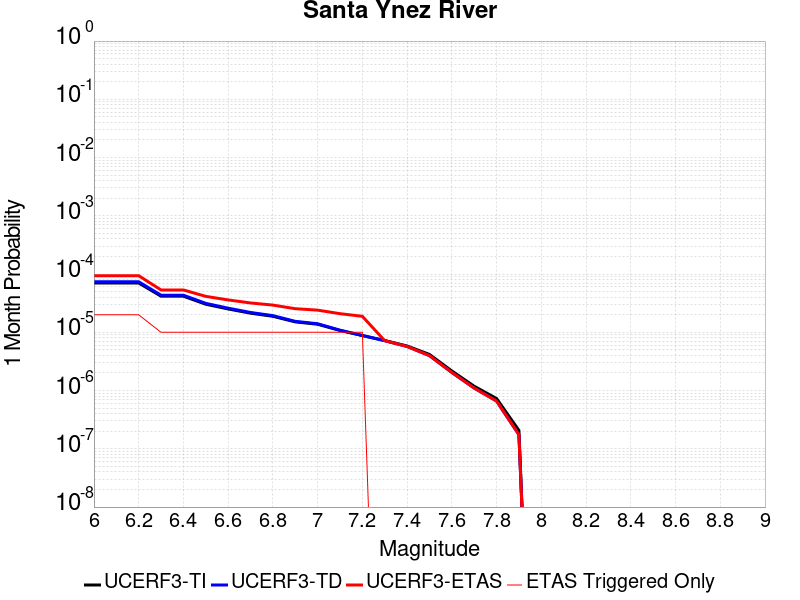 |  |  |

| Magnitude | 1 wk TI Prob | 1 wk TD Prob | 1 wk ETAS Prob | 1 wk ETAS/TD Gain | 1 wk ETAS Triggered Only | 1 mo TI Prob | 1 mo TD Prob | 1 mo ETAS Prob | 1 mo ETAS/TD Gain | 1 mo ETAS Triggered Only | 1 yr TI Prob | 1 yr TD Prob | 1 yr ETAS Prob | 1 yr ETAS/TD Gain | 1 yr ETAS Triggered Only | 10 yr TI Prob | 10 yr TD Prob | 10 yr ETAS Prob | 10 yr ETAS/TD Gain | 10 yr ETAS Triggered Only |
|-----|-----|-----|-----|-----|-----|-----|-----|-----|-----|-----|-----|-----|-----|-----|-----|-----|-----|-----|-----|-----|
| 6.0 | 1.6396456E-5 | 1.7209552E-5 | 3.7209207E-5 | 2.1621253 | 2.0E-5 | 7.026863E-5 | 7.3753334E-5 | 9.3751856E-5 | 1.2711542 | 2.0E-5 | 8.551848E-4 | 8.976125E-4 | 9.175945E-4 | 1.0222614 | 2.0E-5 | 0.0085190125 | 0.008943418 | 0.00897315 | 1.0033244 | 3.0E-5 |
| 6.1 | 1.6396456E-5 | 1.7209552E-5 | 3.7209207E-5 | 2.1621253 | 2.0E-5 | 7.026863E-5 | 7.3753334E-5 | 9.3751856E-5 | 1.2711542 | 2.0E-5 | 8.551848E-4 | 8.976125E-4 | 9.175945E-4 | 1.0222614 | 2.0E-5 | 0.0085190125 | 0.008943418 | 0.00897315 | 1.0033244 | 3.0E-5 |
| 6.2 | 1.6396456E-5 | 1.7209552E-5 | 3.7209207E-5 | 2.1621253 | 2.0E-5 | 7.026863E-5 | 7.3753334E-5 | 9.3751856E-5 | 1.2711542 | 2.0E-5 | 8.551848E-4 | 8.976125E-4 | 9.175945E-4 | 1.0222614 | 2.0E-5 | 0.0085190125 | 0.008943418 | 0.00897315 | 1.0033244 | 3.0E-5 |
| 6.3 | 9.736976E-6 | 1.0122395E-5 | 2.0122294E-5 | 1.9878986 | 1.0E-5 | 4.172923E-5 | 4.3381E-5 | 5.3380565E-5 | 1.2305057 | 1.0E-5 | 5.0793495E-4 | 5.2804063E-4 | 5.3803535E-4 | 1.0189279 | 1.0E-5 | 0.005067755 | 0.0052683656 | 0.00528826 | 1.0037762 | 2.0E-5 |
| 6.4 | 9.736976E-6 | 1.0122395E-5 | 2.0122294E-5 | 1.9878986 | 1.0E-5 | 4.172923E-5 | 4.3381E-5 | 5.3380565E-5 | 1.2305057 | 1.0E-5 | 5.0793495E-4 | 5.2804063E-4 | 5.3803535E-4 | 1.0189279 | 1.0E-5 | 0.005067755 | 0.0052683656 | 0.00528826 | 1.0037762 | 2.0E-5 |
| 6.5 | 7.081964E-6 | 7.3299448E-6 | 1.732987E-5 | 2.3642569 | 1.0E-5 | 3.035092E-5 | 3.1413678E-5 | 4.1413365E-5 | 1.3183227 | 1.0E-5 | 3.694598E-4 | 3.82396E-4 | 3.923922E-4 | 1.0261409 | 1.0E-5 | 0.0036884616 | 0.0038175418 | 0.0038374655 | 1.005219 | 2.0E-5 |
| 6.6 | 5.873247E-6 | 6.059784E-6 | 1.6059723E-5 | 2.650214 | 1.0E-5 | 2.5170815E-5 | 2.5970248E-5 | 3.5969988E-5 | 1.385046 | 1.0E-5 | 3.064116E-4 | 3.1614277E-4 | 3.261396E-4 | 1.0316213 | 1.0E-5 | 0.0030598943 | 0.0031570175 | 0.0031769546 | 1.0063151 | 2.0E-5 |
| 6.7 | 4.973277E-6 | 5.115937E-6 | 1.5115886E-5 | 2.9546661 | 1.0E-5 | 2.1313872E-5 | 2.1925262E-5 | 3.1925043E-5 | 1.4560848 | 1.0E-5 | 2.5946548E-4 | 2.6690785E-4 | 2.7690516E-4 | 1.0374562 | 1.0E-5 | 0.0025916274 | 0.0026659218 | 0.002675895 | 1.003741 | 1.0E-5 |
| 6.8 | 4.396492E-6 | 4.51101E-6 | 1.4510965E-5 | 3.2167883 | 1.0E-5 | 1.884197E-5 | 1.933276E-5 | 2.9332567E-5 | 1.5172467 | 1.0E-5 | 2.2937685E-4 | 2.3535127E-4 | 2.4534893E-4 | 1.0424796 | 1.0E-5 | 0.0022914023 | 0.0023510556 | 0.0023610322 | 1.0042434 | 1.0E-5 |
| 6.9 | 3.5255632E-6 | 3.6013612E-6 | 1.3601325E-5 | 3.776718 | 1.0E-5 | 1.5109469E-5 | 1.5434314E-5 | 2.5434161E-5 | 1.647897 | 1.0E-5 | 1.8394225E-4 | 1.8789675E-4 | 1.9789486E-4 | 1.0532107 | 1.0E-5 | 0.0018379007 | 0.0018773949 | 0.0018873761 | 1.0053165 | 1.0E-5 |
| 7.0 | 3.211603E-6 | 3.2736805E-6 | 1.3273648E-5 | 4.054656 | 1.0E-5 | 1.376394E-5 | 1.4029984E-5 | 2.4029843E-5 | 1.7127491 | 1.0E-5 | 1.6756308E-4 | 1.7080181E-4 | 1.808001E-4 | 1.0585374 | 1.0E-5 | 0.0016743679 | 0.0017067195 | 0.0017167025 | 1.0058492 | 1.0E-5 |
| 7.1 | 2.5094619E-6 | 2.5409433E-6 | 1.2540918E-5 | 4.9355364 | 1.0E-5 | 1.0754793E-5 | 1.0889712E-5 | 2.0889604E-5 | 1.918288 | 1.0E-5 | 1.3093173E-4 | 1.3257423E-4 | 1.425729E-4 | 1.0754194 | 1.0E-5 | 0.0013085462 | 0.0013249575 | 0.0013349442 | 1.0075374 | 1.0E-5 |
| 7.2 | 2.0515774E-6 | 2.061958E-6 | 1.2061937E-5 | 5.8497496 | 1.0E-5 | 8.792445E-6 | 8.8369325E-6 | 1.8836845E-5 | 2.1316044 | 1.0E-5 | 1.0704277E-4 | 1.0758438E-4 | 1.1758331E-4 | 1.0929403 | 1.0E-5 | 0.0010699122 | 0.0010753273 | 0.0010853165 | 1.0092895 | 1.0E-5 |
| 7.3 | 1.6845745E-6 | 1.6774089E-6 | 1.6774089E-6 | 1.0 | 0.0 | 7.219585E-6 | 7.1888758E-6 | 7.1888758E-6 | 1.0 | 0.0 | 8.78949E-5 | 8.7521075E-5 | 8.7521075E-5 | 1.0 | 0.0 | 8.7860145E-4 | 8.7486894E-4 | 8.7486894E-4 | 1.0 | 0.0 |
| 7.4 | 1.3600285E-6 | 1.3333516E-6 | 1.3333516E-6 | 1.0 | 0.0 | 5.82868E-6 | 5.714352E-6 | 5.714352E-6 | 1.0 | 0.0 | 7.096187E-5 | 6.957004E-5 | 6.957004E-5 | 1.0 | 0.0 | 7.0939213E-4 | 6.954848E-4 | 6.954848E-4 | 1.0 | 0.0 |
| 7.5 | 9.735342E-7 | 9.2902314E-7 | 9.2902314E-7 | 1.0 | 0.0 | 4.172283E-6 | 3.981522E-6 | 3.981522E-6 | 1.0 | 0.0 | 5.079636E-5 | 4.8473965E-5 | 4.8473965E-5 | 1.0 | 0.0 | 5.0784746E-4 | 4.8463565E-4 | 4.8463565E-4 | 1.0 | 0.0 |
| 7.6 | 5.067187E-7 | 4.778632E-7 | 4.778632E-7 | 1.0 | 0.0 | 2.1716498E-6 | 2.0479836E-6 | 2.0479836E-6 | 1.0 | 0.0 | 2.6439517E-5 | 2.4933921E-5 | 2.4933921E-5 | 1.0 | 0.0 | 2.643637E-4 | 2.49312E-4 | 2.49312E-4 | 1.0 | 0.0 |
| 7.7 | 2.769089E-7 | 2.575949E-7 | 2.575949E-7 | 1.0 | 0.0 | 1.1867519E-6 | 1.1039776E-6 | 1.1039776E-6 | 1.0 | 0.0 | 1.4448608E-5 | 1.3440846E-5 | 1.3440846E-5 | 1.0 | 0.0 | 1.444767E-4 | 1.3440035E-4 | 1.3440035E-4 | 1.0 | 0.0 |
| 7.8 | 1.7044663E-7 | 1.5449295E-7 | 1.5449295E-7 | 1.0 | 0.0 | 7.3048534E-7 | 6.621125E-7 | 6.621125E-7 | 1.0 | 0.0 | 8.893623E-6 | 8.06119E-6 | 8.06119E-6 | 1.0 | 0.0 | 8.893267E-5 | 8.0608996E-5 | 8.0608996E-5 | 1.0 | 0.0 |
| 7.9 | 4.8344287E-8 | 4.0911356E-8 | 4.0911356E-8 | 1.0 | 0.0 | 2.0718979E-7 | 1.7533436E-7 | 1.7533436E-7 | 1.0 | 0.0 | 2.5225327E-6 | 2.134694E-6 | 2.134694E-6 | 1.0 | 0.0 | 2.5225041E-5 | 2.1346737E-5 | 2.1346737E-5 | 1.0 | 0.0 |

## San Juan
*[(top)](#table-of-contents)*

| 1 Week | 1 Month | 1 Year | 10 Year |
|-----|-----|-----|-----|
|  |  |  | 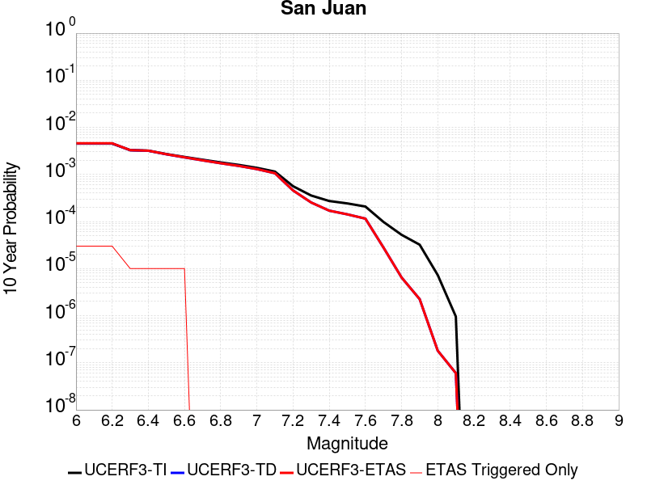 |

| Magnitude | 1 wk TI Prob | 1 wk TD Prob | 1 wk ETAS Prob | 1 wk ETAS/TD Gain | 1 wk ETAS Triggered Only | 1 mo TI Prob | 1 mo TD Prob | 1 mo ETAS Prob | 1 mo ETAS/TD Gain | 1 mo ETAS Triggered Only | 1 yr TI Prob | 1 yr TD Prob | 1 yr ETAS Prob | 1 yr ETAS/TD Gain | 1 yr ETAS Triggered Only | 10 yr TI Prob | 10 yr TD Prob | 10 yr ETAS Prob | 10 yr ETAS/TD Gain | 10 yr ETAS Triggered Only |
|-----|-----|-----|-----|-----|-----|-----|-----|-----|-----|-----|-----|-----|-----|-----|-----|-----|-----|-----|-----|-----|
| 6.0 | 8.682808E-6 | 8.749505E-6 | 8.749505E-6 | 1.0 | 0.0 | 3.72115E-5 | 3.7497364E-5 | 3.7497364E-5 | 1.0 | 0.0 | 4.5295584E-4 | 4.5643962E-4 | 4.5643962E-4 | 1.0 | 0.0 | 0.004520337 | 0.0045555606 | 0.004585424 | 1.0065553 | 3.0E-5 |
| 6.1 | 8.682808E-6 | 8.749505E-6 | 8.749505E-6 | 1.0 | 0.0 | 3.72115E-5 | 3.7497364E-5 | 3.7497364E-5 | 1.0 | 0.0 | 4.5295584E-4 | 4.5643962E-4 | 4.5643962E-4 | 1.0 | 0.0 | 0.004520337 | 0.0045555606 | 0.004585424 | 1.0065553 | 3.0E-5 |
| 6.2 | 8.682808E-6 | 8.749505E-6 | 8.749505E-6 | 1.0 | 0.0 | 3.72115E-5 | 3.7497364E-5 | 3.7497364E-5 | 1.0 | 0.0 | 4.5295584E-4 | 4.5643962E-4 | 4.5643962E-4 | 1.0 | 0.0 | 0.004520337 | 0.0045555606 | 0.004585424 | 1.0065553 | 3.0E-5 |
| 6.3 | 6.3054235E-6 | 6.282916E-6 | 6.282916E-6 | 1.0 | 0.0 | 2.7022963E-5 | 2.6926513E-5 | 2.6926513E-5 | 1.0 | 0.0 | 3.2895492E-4 | 3.2778239E-4 | 3.2778239E-4 | 1.0 | 0.0 | 0.003284684 | 0.0032731877 | 0.003283155 | 1.0030451 | 1.0E-5 |
| 6.4 | 6.1490473E-6 | 6.114752E-6 | 6.114752E-6 | 1.0 | 0.0 | 2.6352795E-5 | 2.6205826E-5 | 2.6205826E-5 | 1.0 | 0.0 | 3.2079802E-4 | 3.1901058E-4 | 3.1901058E-4 | 1.0 | 0.0 | 0.0032033534 | 0.0031857213 | 0.0031956895 | 1.003129 | 1.0E-5 |
| 6.5 | 5.204848E-6 | 5.1375105E-6 | 5.1375105E-6 | 1.0 | 0.0 | 2.23063E-5 | 2.2017723E-5 | 2.2017723E-5 | 1.0 | 0.0 | 2.7154534E-4 | 2.6803376E-4 | 2.6803376E-4 | 1.0 | 0.0 | 0.0027121378 | 0.0026772574 | 0.0026872307 | 1.0037252 | 1.0E-5 |
| 6.6 | 4.5179986E-6 | 4.415237E-6 | 4.415237E-6 | 1.0 | 0.0 | 1.9362706E-5 | 1.8922312E-5 | 1.8922312E-5 | 1.0 | 0.0 | 2.3571544E-4 | 2.3035558E-4 | 2.3035558E-4 | 1.0 | 0.0 | 0.0023546559 | 0.0023013037 | 0.0023112807 | 1.0043354 | 1.0E-5 |
| 6.7 | 3.9442616E-6 | 3.820013E-6 | 3.820013E-6 | 1.0 | 0.0 | 1.6903869E-5 | 1.6371385E-5 | 1.6371385E-5 | 1.0 | 0.0 | 2.0578515E-4 | 1.9930405E-4 | 1.9930405E-4 | 1.0 | 0.0 | 0.002055947 | 0.0019913765 | 0.0019913765 | 1.0 | 0.0 |
| 6.8 | 3.4536245E-6 | 3.3165124E-6 | 3.3165124E-6 | 1.0 | 0.0 | 1.4801163E-5 | 1.4213551E-5 | 1.4213551E-5 | 1.0 | 0.0 | 1.8018926E-4 | 1.7303685E-4 | 1.7303685E-4 | 1.0 | 0.0 | 0.0018004322 | 0.0017291387 | 0.0017291387 | 1.0 | 0.0 |
| 6.9 | 3.059865E-6 | 2.9122007E-6 | 2.9122007E-6 | 1.0 | 0.0 | 1.3113641E-5 | 1.2480804E-5 | 1.2480804E-5 | 1.0 | 0.0 | 1.596469E-4 | 1.5194376E-4 | 1.5194376E-4 | 1.0 | 0.0 | 0.0015953224 | 0.0015185119 | 0.0015185119 | 1.0 | 0.0 |
| 7.0 | 2.6504351E-6 | 2.4921599E-6 | 2.4921599E-6 | 1.0 | 0.0 | 1.1358958E-5 | 1.0680645E-5 | 1.0680645E-5 | 1.0 | 0.0 | 1.3828653E-4 | 1.3002963E-4 | 1.3002963E-4 | 1.0 | 0.0 | 0.0013820052 | 0.001299646 | 0.001299646 | 1.0 | 0.0 |
| 7.1 | 2.2039317E-6 | 2.0339576E-6 | 2.0339576E-6 | 1.0 | 0.0 | 9.445387E-6 | 8.716936E-6 | 8.716936E-6 | 1.0 | 0.0 | 1.1499152E-4 | 1.0612405E-4 | 1.0612405E-4 | 1.0 | 0.0 | 0.0011493203 | 0.0010608422 | 0.0010608422 | 1.0 | 0.0 |
| 7.2 | 1.0786707E-6 | 8.771279E-7 | 8.771279E-7 | 1.0 | 0.0 | 4.622866E-6 | 3.759114E-6 | 3.759114E-6 | 1.0 | 0.0 | 5.628194E-5 | 4.5766265E-5 | 4.5766265E-5 | 1.0 | 0.0 | 5.6267687E-4 | 4.5762598E-4 | 4.5762598E-4 | 1.0 | 0.0 |
| 7.3 | 6.846433E-7 | 4.869471E-7 | 4.869471E-7 | 1.0 | 0.0 | 2.9341822E-6 | 2.0869145E-6 | 2.0869145E-6 | 1.0 | 0.0 | 3.5723086E-5 | 2.5407888E-5 | 2.5407888E-5 | 1.0 | 0.0 | 3.571734E-4 | 2.5408278E-4 | 2.5408278E-4 | 1.0 | 0.0 |
| 7.4 | 5.23043E-7 | 3.263286E-7 | 3.263286E-7 | 1.0 | 0.0 | 2.2416111E-6 | 1.3985504E-6 | 1.3985504E-6 | 1.0 | 0.0 | 2.7291273E-5 | 1.7027218E-5 | 1.7027218E-5 | 1.0 | 0.0 | 2.7287923E-4 | 1.7029032E-4 | 1.7029032E-4 | 1.0 | 0.0 |
| 7.5 | 4.648444E-7 | 2.7238906E-7 | 2.7238906E-7 | 1.0 | 0.0 | 1.9921886E-6 | 1.1673812E-6 | 1.1673812E-6 | 1.0 | 0.0 | 2.4254627E-5 | 1.4212774E-5 | 1.4212774E-5 | 1.0 | 0.0 | 2.425198E-4 | 1.4214756E-4 | 1.4214756E-4 | 1.0 | 0.0 |
| 7.6 | 3.9906567E-7 | 2.208642E-7 | 2.208642E-7 | 1.0 | 0.0 | 1.7102802E-6 | 9.4656053E-7 | 9.4656053E-7 | 1.0 | 0.0 | 2.0822463E-5 | 1.1524314E-5 | 1.1524314E-5 | 1.0 | 0.0 | 2.0820512E-4 | 1.15261246E-4 | 1.15261246E-4 | 1.0 | 0.0 |
| 7.7 | 1.8784601E-7 | 5.367573E-8 | 5.367573E-8 | 1.0 | 0.0 | 8.0505407E-7 | 2.3003885E-7 | 2.3003885E-7 | 1.0 | 0.0 | 9.80149E-6 | 2.8007191E-6 | 2.8007191E-6 | 1.0 | 0.0 | 9.801057E-5 | 2.8015324E-5 | 2.8015324E-5 | 1.0 | 0.0 |
| 7.8 | 1.00154914E-7 | 1.2417132E-8 | 1.2417132E-8 | 1.0 | 0.0 | 4.2923529E-7 | 5.321629E-8 | 5.321629E-8 | 1.0 | 0.0 | 5.225927E-6 | 6.4790817E-7 | 6.4790817E-7 | 1.0 | 0.0 | 5.225804E-5 | 6.484974E-6 | 6.484974E-6 | 1.0 | 0.0 |
| 7.9 | 6.171429E-8 | 4.2968518E-9 | 4.2968518E-9 | 1.0 | 0.0 | 2.6448978E-7 | 1.8415085E-8 | 1.8415085E-8 | 1.0 | 0.0 | 3.2201583E-6 | 2.2420363E-7 | 2.2420363E-7 | 1.0 | 0.0 | 3.2201115E-5 | 2.247349E-6 | 2.247349E-6 | 1.0 | 0.0 |
| 8.0 | 1.3974572E-8 | 3.3778036E-10 | 3.3778036E-10 | 1.0 | 0.0 | 5.989102E-8 | 1.4476356E-9 | 1.4476356E-9 | 1.0 | 0.0 | 7.2917294E-7 | 1.762497E-8 | 1.762497E-8 | 1.0 | 0.0 | 7.2917055E-6 | 1.8057942E-7 | 1.8057942E-7 | 1.0 | 0.0 |
| 8.1 | 1.8403477E-9 | 1.13018706E-10 | 1.13018706E-10 | 1.0 | 0.0 | 7.887204E-9 | 4.843669E-10 | 4.843669E-10 | 1.0 | 0.0 | 9.602671E-8 | 5.8971703E-9 | 5.8971703E-9 | 1.0 | 0.0 | 9.602667E-7 | 6.0238975E-8 | 6.0238975E-8 | 1.0 | 0.0 |

## Palos Verdes
*[(top)](#table-of-contents)*

| 1 Week | 1 Month | 1 Year | 10 Year |
|-----|-----|-----|-----|
|  |  |  |  |

| Magnitude | 1 wk TI Prob | 1 wk TD Prob | 1 wk ETAS Prob | 1 wk ETAS/TD Gain | 1 wk ETAS Triggered Only | 1 mo TI Prob | 1 mo TD Prob | 1 mo ETAS Prob | 1 mo ETAS/TD Gain | 1 mo ETAS Triggered Only | 1 yr TI Prob | 1 yr TD Prob | 1 yr ETAS Prob | 1 yr ETAS/TD Gain | 1 yr ETAS Triggered Only | 10 yr TI Prob | 10 yr TD Prob | 10 yr ETAS Prob | 10 yr ETAS/TD Gain | 10 yr ETAS Triggered Only |
|-----|-----|-----|-----|-----|-----|-----|-----|-----|-----|-----|-----|-----|-----|-----|-----|-----|-----|-----|-----|-----|
| 6.0 | 6.126063E-5 | 7.6227836E-5 | 7.6227836E-5 | 1.0 | 0.0 | 2.6251914E-4 | 3.2665316E-4 | 3.2665316E-4 | 1.0 | 0.0 | 0.0031914865 | 0.0039702817 | 0.003990202 | 1.0050174 | 2.0E-5 | 0.031460393 | 0.039050125 | 0.039069343 | 1.0004922 | 2.0E-5 |
| 6.1 | 6.126063E-5 | 7.6227836E-5 | 7.6227836E-5 | 1.0 | 0.0 | 2.6251914E-4 | 3.2665316E-4 | 3.2665316E-4 | 1.0 | 0.0 | 0.0031914865 | 0.0039702817 | 0.003990202 | 1.0050174 | 2.0E-5 | 0.031460393 | 0.039050125 | 0.039069343 | 1.0004922 | 2.0E-5 |
| 6.2 | 6.126063E-5 | 7.6227836E-5 | 7.6227836E-5 | 1.0 | 0.0 | 2.6251914E-4 | 3.2665316E-4 | 3.2665316E-4 | 1.0 | 0.0 | 0.0031914865 | 0.0039702817 | 0.003990202 | 1.0050174 | 2.0E-5 | 0.031460393 | 0.039050125 | 0.039069343 | 1.0004922 | 2.0E-5 |
| 6.3 | 4.0838047E-5 | 4.9750233E-5 | 4.9750233E-5 | 1.0 | 0.0 | 1.7500846E-4 | 2.1319914E-4 | 2.1319914E-4 | 1.0 | 0.0 | 0.0021286458 | 0.0025928174 | 0.0026127656 | 1.0076936 | 2.0E-5 | 0.021083709 | 0.025647365 | 0.025666852 | 1.0007598 | 2.0E-5 |
| 6.4 | 4.0838047E-5 | 4.9750233E-5 | 4.9750233E-5 | 1.0 | 0.0 | 1.7500846E-4 | 2.1319914E-4 | 2.1319914E-4 | 1.0 | 0.0 | 0.0021286458 | 0.0025928174 | 0.0026127656 | 1.0076936 | 2.0E-5 | 0.021083709 | 0.025647365 | 0.025666852 | 1.0007598 | 2.0E-5 |
| 6.5 | 3.0512005E-5 | 3.6562415E-5 | 3.6562415E-5 | 1.0 | 0.0 | 1.3075917E-4 | 1.5668731E-4 | 1.5668731E-4 | 1.0 | 0.0 | 0.0015908304 | 0.0019061145 | 0.0019160955 | 1.0052363 | 1.0E-5 | 0.015794903 | 0.01890959 | 0.0189194 | 1.0005188 | 1.0E-5 |
| 6.6 | 2.9255087E-5 | 3.515519E-5 | 3.515519E-5 | 1.0 | 0.0 | 1.2537291E-4 | 1.5065707E-4 | 1.5065707E-4 | 1.0 | 0.0 | 0.0015253464 | 0.0018328198 | 0.0018428015 | 1.0054461 | 1.0E-5 | 0.015149189 | 0.018188654 | 0.018198472 | 1.0005398 | 1.0E-5 |
| 6.7 | 2.287198E-5 | 2.7248867E-5 | 2.7248867E-5 | 1.0 | 0.0 | 9.801909E-5 | 1.1677615E-4 | 1.1677615E-4 | 1.0 | 0.0 | 0.001192729 | 0.001420914 | 0.001420914 | 1.0 | 0.0 | 0.011863477 | 0.014127521 | 0.014127521 | 1.0 | 0.0 |
| 6.8 | 2.1325764E-5 | 2.543243E-5 | 2.543243E-5 | 1.0 | 0.0 | 9.139293E-5 | 1.08992084E-4 | 1.08992084E-4 | 1.0 | 0.0 | 0.001112141 | 0.0013262611 | 0.0013262611 | 1.0 | 0.0 | 0.011065915 | 0.013192496 | 0.013192496 | 1.0 | 0.0 |
| 6.9 | 1.9009392E-5 | 2.2614031E-5 | 2.2614031E-5 | 1.0 | 0.0 | 8.1466285E-5 | 9.691417E-5 | 9.691417E-5 | 1.0 | 0.0 | 9.914007E-4 | 0.0011793787 | 0.0011793787 | 1.0 | 0.0 | 0.009869894 | 0.011739883 | 0.011739883 | 1.0 | 0.0 |
| 7.0 | 1.7098473E-5 | 2.0319787E-5 | 2.0319787E-5 | 1.0 | 0.0 | 7.3277115E-5 | 8.708238E-5 | 8.708238E-5 | 1.0 | 0.0 | 8.917837E-4 | 0.0010597975 | 0.0010597975 | 1.0 | 0.0 | 0.008882134 | 0.01055587 | 0.01055587 | 1.0 | 0.0 |
| 7.1 | 1.5982785E-5 | 1.8995164E-5 | 1.8995164E-5 | 1.0 | 0.0 | 6.849585E-5 | 8.1405786E-5 | 8.1405786E-5 | 1.0 | 0.0 | 8.336179E-4 | 9.907495E-4 | 9.907495E-4 | 1.0 | 0.0 | 0.008304977 | 0.009871689 | 0.009871689 | 1.0 | 0.0 |
| 7.2 | 1.4468002E-5 | 1.7197603E-5 | 1.7197603E-5 | 1.0 | 0.0 | 6.200425E-5 | 7.37024E-5 | 7.37024E-5 | 1.0 | 0.0 | 7.546402E-4 | 8.9704135E-4 | 8.9704135E-4 | 1.0 | 0.0 | 0.007520827 | 0.008942474 | 0.008942474 | 1.0 | 0.0 |
| 7.3 | 5.288233E-6 | 6.203798E-6 | 6.203798E-6 | 1.0 | 0.0 | 2.2663658E-5 | 2.6587632E-5 | 2.6587632E-5 | 1.0 | 0.0 | 2.7589512E-4 | 3.2369123E-4 | 3.2369123E-4 | 1.0 | 0.0 | 0.0027555283 | 0.0032356204 | 0.0032356204 | 1.0 | 0.0 |
| 7.4 | 8.279556E-7 | 8.408361E-7 | 8.408361E-7 | 1.0 | 0.0 | 3.5483763E-6 | 3.6035788E-6 | 3.6035788E-6 | 1.0 | 0.0 | 4.3200624E-5 | 4.3872762E-5 | 4.3872762E-5 | 1.0 | 0.0 | 4.3192226E-4 | 4.3864822E-4 | 4.3864822E-4 | 1.0 | 0.0 |
| 7.5 | 6.559831E-7 | 6.667241E-7 | 6.667241E-7 | 1.0 | 0.0 | 2.8113532E-6 | 2.8573863E-6 | 2.8573863E-6 | 1.0 | 0.0 | 3.4227687E-5 | 3.478819E-5 | 3.478819E-5 | 1.0 | 0.0 | 3.4222414E-4 | 3.4783408E-4 | 3.4783408E-4 | 1.0 | 0.0 |
| 7.6 | 3.5018968E-7 | 3.5620096E-7 | 3.5620096E-7 | 1.0 | 0.0 | 1.500812E-6 | 1.5265749E-6 | 1.5265749E-6 | 1.0 | 0.0 | 1.8272232E-5 | 1.8585939E-5 | 1.8585939E-5 | 1.0 | 0.0 | 1.8270731E-4 | 1.8584843E-4 | 1.8584843E-4 | 1.0 | 0.0 |
| 7.7 | 1.1986104E-7 | 1.21984E-7 | 1.21984E-7 | 1.0 | 0.0 | 5.1369005E-7 | 5.227885E-7 | 5.227885E-7 | 1.0 | 0.0 | 6.2541585E-6 | 6.364932E-6 | 6.364932E-6 | 1.0 | 0.0 | 6.2539824E-5 | 6.364754E-5 | 6.364754E-5 | 1.0 | 0.0 |
| 7.8 | 3.0445005E-8 | 3.102765E-8 | 3.102765E-8 | 1.0 | 0.0 | 1.3047858E-7 | 1.3297564E-7 | 1.3297564E-7 | 1.0 | 0.0 | 1.5885756E-6 | 1.6189774E-6 | 1.6189774E-6 | 1.0 | 0.0 | 1.5885644E-5 | 1.6189677E-5 | 1.6189677E-5 | 1.0 | 0.0 |

## San Andreas (Santa Cruz Mts) 2011 CFM
*[(top)](#table-of-contents)*

| 1 Week | 1 Month | 1 Year | 10 Year |
|-----|-----|-----|-----|
|  |  |  | 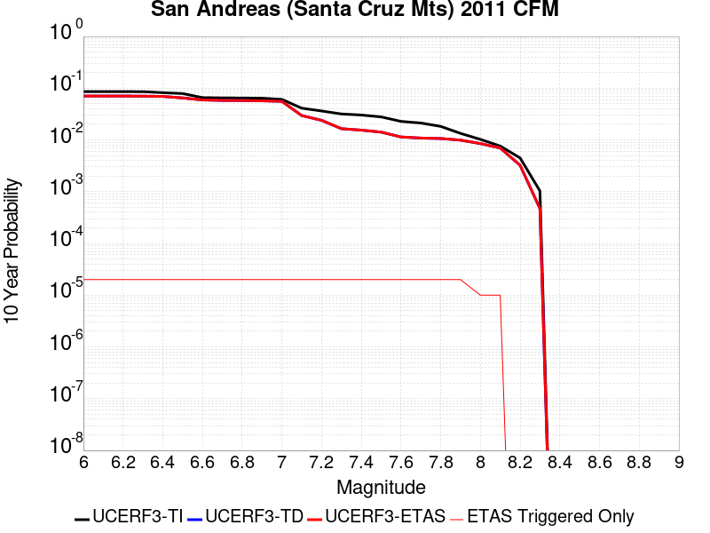 |

| Magnitude | 1 wk TI Prob | 1 wk TD Prob | 1 wk ETAS Prob | 1 wk ETAS/TD Gain | 1 wk ETAS Triggered Only | 1 mo TI Prob | 1 mo TD Prob | 1 mo ETAS Prob | 1 mo ETAS/TD Gain | 1 mo ETAS Triggered Only | 1 yr TI Prob | 1 yr TD Prob | 1 yr ETAS Prob | 1 yr ETAS/TD Gain | 1 yr ETAS Triggered Only | 10 yr TI Prob | 10 yr TD Prob | 10 yr ETAS Prob | 10 yr ETAS/TD Gain | 10 yr ETAS Triggered Only |
|-----|-----|-----|-----|-----|-----|-----|-----|-----|-----|-----|-----|-----|-----|-----|-----|-----|-----|-----|-----|-----|
| 6.0 | 1.7221631E-4 | 1.3795885E-4 | 1.3795885E-4 | 1.0 | 0.0 | 7.378611E-4 | 5.911203E-4 | 6.111085E-4 | 1.0338141 | 2.0E-5 | 0.008946515 | 0.0071735806 | 0.0071934373 | 1.002768 | 2.0E-5 | 0.08594794 | 0.070575535 | 0.07059412 | 1.0002633 | 2.0E-5 |
| 6.1 | 1.7221631E-4 | 1.3795885E-4 | 1.3795885E-4 | 1.0 | 0.0 | 7.378611E-4 | 5.911203E-4 | 6.111085E-4 | 1.0338141 | 2.0E-5 | 0.008946515 | 0.0071735806 | 0.0071934373 | 1.002768 | 2.0E-5 | 0.08594794 | 0.070575535 | 0.07059412 | 1.0002633 | 2.0E-5 |
| 6.2 | 1.7221631E-4 | 1.3795885E-4 | 1.3795885E-4 | 1.0 | 0.0 | 7.378611E-4 | 5.911203E-4 | 6.111085E-4 | 1.0338141 | 2.0E-5 | 0.008946515 | 0.0071735806 | 0.0071934373 | 1.002768 | 2.0E-5 | 0.08594794 | 0.070575535 | 0.07059412 | 1.0002633 | 2.0E-5 |
| 6.3 | 1.716926E-4 | 1.3715282E-4 | 1.3715282E-4 | 1.0 | 0.0 | 7.3561794E-4 | 5.8766745E-4 | 6.076557E-4 | 1.0340128 | 2.0E-5 | 0.008919428 | 0.0071318178 | 0.007151675 | 1.0027844 | 2.0E-5 | 0.08569809 | 0.07019037 | 0.07020897 | 1.0002649 | 2.0E-5 |
| 6.4 | 1.6392978E-4 | 1.3591108E-4 | 1.3591108E-4 | 1.0 | 0.0 | 7.02367E-4 | 5.823481E-4 | 6.023364E-4 | 1.0343237 | 2.0E-5 | 0.008517839 | 0.0070674745 | 0.007087333 | 1.0028099 | 2.0E-5 | 0.08198654 | 0.069424346 | 0.06944296 | 1.0002681 | 2.0E-5 |
| 6.5 | 1.5742714E-4 | 1.2650987E-4 | 1.2650987E-4 | 1.0 | 0.0 | 6.745133E-4 | 5.420742E-4 | 5.6206336E-4 | 1.0368754 | 2.0E-5 | 0.00818132 | 0.006580157 | 0.0066000256 | 1.0030195 | 2.0E-5 | 0.078865945 | 0.0648904 | 0.0649091 | 1.0002882 | 2.0E-5 |
| 6.6 | 1.3038084E-4 | 1.15910116E-4 | 1.15910116E-4 | 1.0 | 0.0 | 5.5865536E-4 | 4.966644E-4 | 5.166544E-4 | 1.0402486 | 2.0E-5 | 0.006780438 | 0.006030415 | 0.0060502947 | 1.0032965 | 2.0E-5 | 0.0657725 | 0.05934513 | 0.059363943 | 1.000317 | 2.0E-5 |
| 6.7 | 1.2867592E-4 | 1.1317506E-4 | 1.1317506E-4 | 1.0 | 0.0 | 5.5135164E-4 | 4.849471E-4 | 5.049374E-4 | 1.0412216 | 2.0E-5 | 0.0066920654 | 0.005888536 | 0.0059084184 | 1.0033765 | 2.0E-5 | 0.06494093 | 0.058056056 | 0.058074895 | 1.0003245 | 2.0E-5 |
| 6.8 | 1.2801298E-4 | 1.125506E-4 | 1.125506E-4 | 1.0 | 0.0 | 5.485117E-4 | 4.8227183E-4 | 5.0226215E-4 | 1.0414504 | 2.0E-5 | 0.0066577005 | 0.00585609 | 0.0058759735 | 1.0033952 | 2.0E-5 | 0.06461738 | 0.05776988 | 0.057788726 | 1.0003262 | 2.0E-5 |
| 6.9 | 1.269149E-4 | 1.1097254E-4 | 1.1097254E-4 | 1.0 | 0.0 | 5.4380763E-4 | 4.755112E-4 | 4.955017E-4 | 1.04204 | 2.0E-5 | 0.006600777 | 0.0057742186 | 0.0057941033 | 1.0034437 | 2.0E-5 | 0.06408122 | 0.05704166 | 0.057060517 | 1.0003306 | 2.0E-5 |
| 7.0 | 1.2030331E-4 | 1.0827251E-4 | 1.0827251E-4 | 1.0 | 0.0 | 5.154837E-4 | 4.6394375E-4 | 4.8393448E-4 | 1.0430887 | 2.0E-5 | 0.006257969 | 0.0056341216 | 0.005654009 | 1.0035298 | 2.0E-5 | 0.06084648 | 0.055714536 | 0.05573342 | 1.000339 | 2.0E-5 |
| 7.1 | 8.049617E-5 | 5.394771E-5 | 5.394771E-5 | 1.0 | 0.0 | 3.4493793E-4 | 2.3118418E-4 | 2.5117956E-4 | 1.0864911 | 2.0E-5 | 0.0041915346 | 0.0028110694 | 0.002831013 | 1.0070947 | 2.0E-5 | 0.041133516 | 0.02963019 | 0.029649597 | 1.0006549 | 2.0E-5 |
| 7.2 | 7.093979E-5 | 4.2956406E-5 | 4.2956406E-5 | 1.0 | 0.0 | 3.0399222E-4 | 1.8408602E-4 | 2.0408233E-4 | 1.1086248 | 2.0E-5 | 0.0036948253 | 0.0022389663 | 0.0022589215 | 1.0089127 | 2.0E-5 | 0.03633994 | 0.023951648 | 0.023971168 | 1.000815 | 2.0E-5 |
| 7.3 | 6.193693E-5 | 2.8908327E-5 | 2.8908327E-5 | 1.0 | 0.0 | 2.6541698E-4 | 1.2388696E-4 | 1.4388448E-4 | 1.1614175 | 2.0E-5 | 0.0032266637 | 0.0015072818 | 0.0015272517 | 1.0132489 | 2.0E-5 | 0.031802133 | 0.016506582 | 0.016526252 | 1.0011916 | 2.0E-5 |
| 7.4 | 5.906492E-5 | 2.7036962E-5 | 2.7036962E-5 | 1.0 | 0.0 | 2.5311083E-4 | 1.1586756E-4 | 1.3586524E-4 | 1.1725909 | 2.0E-5 | 0.0030772698 | 0.001409776 | 0.0014297479 | 1.0141666 | 2.0E-5 | 0.030350044 | 0.015478208 | 0.015497899 | 1.0012721 | 2.0E-5 |
| 7.5 | 5.424296E-5 | 2.4690851E-5 | 2.4690851E-5 | 1.0 | 0.0 | 2.324491E-4 | 1.0581365E-4 | 1.2581154E-4 | 1.1889915 | 2.0E-5 | 0.002826395 | 0.001287521 | 0.0013074953 | 1.0155138 | 2.0E-5 | 0.027907165 | 0.014169997 | 0.014189714 | 1.0013914 | 2.0E-5 |
| 7.6 | 4.43084E-5 | 1.991474E-5 | 1.991474E-5 | 1.0 | 0.0 | 1.8987931E-4 | 8.5346095E-5 | 1.05344385E-4 | 1.2343199 | 2.0E-5 | 0.0023093296 | 0.0010385936 | 0.0010585729 | 1.0192368 | 2.0E-5 | 0.022854783 | 0.011418319 | 0.01143809 | 1.0017315 | 2.0E-5 |
| 7.7 | 4.118098E-5 | 1.8946594E-5 | 1.8946594E-5 | 1.0 | 0.0 | 1.7647797E-4 | 8.1197155E-5 | 1.0119553E-4 | 1.246294 | 2.0E-5 | 0.002146502 | 9.881273E-4 | 0.0010081076 | 1.0202203 | 2.0E-5 | 0.021258866 | 0.010875962 | 0.010895744 | 1.0018189 | 2.0E-5 |
| 7.8 | 3.5408906E-5 | 1.8574478E-5 | 1.8574478E-5 | 1.0 | 0.0 | 1.5174363E-4 | 7.9602476E-5 | 9.960088E-5 | 1.2512285 | 2.0E-5 | 0.0018459131 | 9.6872944E-4 | 9.887101E-4 | 1.0206256 | 2.0E-5 | 0.018306552 | 0.010657478 | 0.010677265 | 1.0018566 | 2.0E-5 |
| 7.9 | 2.5860836E-5 | 1.7325483E-5 | 1.7325483E-5 | 1.0 | 0.0 | 1.10827445E-4 | 7.424996E-5 | 9.424848E-5 | 1.2693404 | 2.0E-5 | 0.001348489 | 9.036186E-4 | 9.236005E-4 | 1.0221132 | 2.0E-5 | 0.013403354 | 0.009912728 | 0.00993253 | 1.0019976 | 2.0E-5 |
| 8.0 | 1.9777332E-5 | 1.4847773E-5 | 1.4847773E-5 | 1.0 | 0.0 | 8.4757245E-5 | 6.363176E-5 | 7.363113E-5 | 1.1571442 | 1.0E-5 | 0.0010314309 | 7.744415E-4 | 7.844338E-4 | 1.0129025 | 1.0E-5 | 0.010266567 | 0.008513444 | 0.008523359 | 1.0011646 | 1.0E-5 |
| 8.1 | 1.468494E-5 | 1.2113976E-5 | 1.2113976E-5 | 1.0 | 0.0 | 6.293394E-5 | 5.1916006E-5 | 6.191549E-5 | 1.1926088 | 1.0E-5 | 7.6595135E-4 | 6.318943E-4 | 6.4188795E-4 | 1.0158154 | 1.0E-5 | 0.0076331664 | 0.006972861 | 0.0069827912 | 1.0014241 | 1.0E-5 |
| 8.2 | 8.63836E-6 | 5.4720817E-6 | 5.4720817E-6 | 1.0 | 0.0 | 3.7021015E-5 | 2.3451568E-5 | 2.3451568E-5 | 1.0 | 0.0 | 4.5063766E-4 | 2.8548553E-4 | 2.8548553E-4 | 1.0 | 0.0 | 0.004497249 | 0.003247409 | 0.003247409 | 1.0 | 0.0 |
| 8.3 | 1.983087E-6 | 7.663413E-7 | 7.663413E-7 | 1.0 | 0.0 | 8.498917E-6 | 3.2843159E-6 | 3.2843159E-6 | 1.0 | 0.0 | 1.034694E-4 | 3.998583E-5 | 3.998583E-5 | 1.0 | 0.0 | 0.0010342124 | 4.7219908E-4 | 4.7219908E-4 | 1.0 | 0.0 |

## Holser alt 1
*[(top)](#table-of-contents)*

| 1 Week | 1 Month | 1 Year | 10 Year |
|-----|-----|-----|-----|
|  |  | 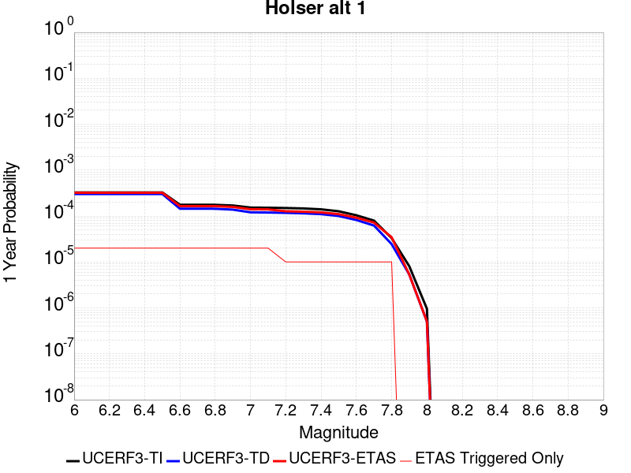 |  |

| Magnitude | 1 wk TI Prob | 1 wk TD Prob | 1 wk ETAS Prob | 1 wk ETAS/TD Gain | 1 wk ETAS Triggered Only | 1 mo TI Prob | 1 mo TD Prob | 1 mo ETAS Prob | 1 mo ETAS/TD Gain | 1 mo ETAS Triggered Only | 1 yr TI Prob | 1 yr TD Prob | 1 yr ETAS Prob | 1 yr ETAS/TD Gain | 1 yr ETAS Triggered Only | 10 yr TI Prob | 10 yr TD Prob | 10 yr ETAS Prob | 10 yr ETAS/TD Gain | 10 yr ETAS Triggered Only |
|-----|-----|-----|-----|-----|-----|-----|-----|-----|-----|-----|-----|-----|-----|-----|-----|-----|-----|-----|-----|-----|
| 6.0 | 6.2746653E-6 | 5.7900165E-6 | 1.578996E-5 | 2.7271008 | 1.0E-5 | 2.6891146E-5 | 2.4814186E-5 | 3.4813937E-5 | 1.4029853 | 1.0E-5 | 3.273505E-4 | 3.0208236E-4 | 3.2207632E-4 | 1.0661871 | 2.0E-5 | 0.0032686873 | 0.0030178502 | 0.00303779 | 1.0066072 | 2.0E-5 |
| 6.1 | 6.2746653E-6 | 5.7900165E-6 | 1.578996E-5 | 2.7271008 | 1.0E-5 | 2.6891146E-5 | 2.4814186E-5 | 3.4813937E-5 | 1.4029853 | 1.0E-5 | 3.273505E-4 | 3.0208236E-4 | 3.2207632E-4 | 1.0661871 | 2.0E-5 | 0.0032686873 | 0.0030178502 | 0.00303779 | 1.0066072 | 2.0E-5 |
| 6.2 | 6.2746653E-6 | 5.7900165E-6 | 1.578996E-5 | 2.7271008 | 1.0E-5 | 2.6891146E-5 | 2.4814186E-5 | 3.4813937E-5 | 1.4029853 | 1.0E-5 | 3.273505E-4 | 3.0208236E-4 | 3.2207632E-4 | 1.0661871 | 2.0E-5 | 0.0032686873 | 0.0030178502 | 0.00303779 | 1.0066072 | 2.0E-5 |
| 6.3 | 6.2746653E-6 | 5.7900165E-6 | 1.578996E-5 | 2.7271008 | 1.0E-5 | 2.6891146E-5 | 2.4814186E-5 | 3.4813937E-5 | 1.4029853 | 1.0E-5 | 3.273505E-4 | 3.0208236E-4 | 3.2207632E-4 | 1.0661871 | 2.0E-5 | 0.0032686873 | 0.0030178502 | 0.00303779 | 1.0066072 | 2.0E-5 |
| 6.4 | 6.2746653E-6 | 5.7900165E-6 | 1.578996E-5 | 2.7271008 | 1.0E-5 | 2.6891146E-5 | 2.4814186E-5 | 3.4813937E-5 | 1.4029853 | 1.0E-5 | 3.273505E-4 | 3.0208236E-4 | 3.2207632E-4 | 1.0661871 | 2.0E-5 | 0.0032686873 | 0.0030178502 | 0.00303779 | 1.0066072 | 2.0E-5 |
| 6.5 | 6.2746653E-6 | 5.7900165E-6 | 1.578996E-5 | 2.7271008 | 1.0E-5 | 2.6891146E-5 | 2.4814186E-5 | 3.4813937E-5 | 1.4029853 | 1.0E-5 | 3.273505E-4 | 3.0208236E-4 | 3.2207632E-4 | 1.0661871 | 2.0E-5 | 0.0032686873 | 0.0030178502 | 0.00303779 | 1.0066072 | 2.0E-5 |
| 6.6 | 3.375825E-6 | 2.7712274E-6 | 1.27712E-5 | 4.6084995 | 1.0E-5 | 1.4467741E-5 | 1.1876636E-5 | 2.1876516E-5 | 1.8419793 | 1.0E-5 | 1.761305E-4 | 1.4458862E-4 | 1.6458573E-4 | 1.1383035 | 2.0E-5 | 0.0017599097 | 0.0014449623 | 0.0014649334 | 1.0138212 | 2.0E-5 |
| 6.7 | 3.375825E-6 | 2.7712274E-6 | 1.27712E-5 | 4.6084995 | 1.0E-5 | 1.4467741E-5 | 1.1876636E-5 | 2.1876516E-5 | 1.8419793 | 1.0E-5 | 1.761305E-4 | 1.4458862E-4 | 1.6458573E-4 | 1.1383035 | 2.0E-5 | 0.0017599097 | 0.0014449623 | 0.0014649334 | 1.0138212 | 2.0E-5 |
| 6.8 | 3.366533E-6 | 2.7616268E-6 | 1.27615995E-5 | 4.621044 | 1.0E-5 | 1.4427919E-5 | 1.1835491E-5 | 2.1835373E-5 | 1.8449063 | 1.0E-5 | 1.7564575E-4 | 1.4408774E-4 | 1.6408486E-4 | 1.1387843 | 2.0E-5 | 0.0017550698 | 0.0014399601 | 0.0014599314 | 1.0138693 | 2.0E-5 |
| 6.9 | 3.253174E-6 | 2.6438486E-6 | 1.2643822E-5 | 4.782355 | 1.0E-5 | 1.39421E-5 | 1.1330731E-5 | 2.1330618E-5 | 1.8825456 | 1.0E-5 | 1.6973184E-4 | 1.3794308E-4 | 1.5794032E-4 | 1.1449673 | 2.0E-5 | 0.0016960226 | 0.0013785904 | 0.0013985628 | 1.0144876 | 2.0E-5 |
| 7.0 | 2.9336593E-6 | 2.3118348E-6 | 1.2311812E-5 | 5.3255587 | 1.0E-5 | 1.2572766E-5 | 9.907826E-6 | 1.9907728E-5 | 2.009293 | 1.0E-5 | 1.5306266E-4 | 1.20621124E-4 | 1.4061871E-4 | 1.1657884 | 2.0E-5 | 0.0015295728 | 0.001205559 | 0.001225535 | 1.0165699 | 2.0E-5 |
| 7.1 | 2.9087812E-6 | 2.2876868E-6 | 1.2287664E-5 | 5.3712177 | 1.0E-5 | 1.2466146E-5 | 9.804336E-6 | 1.9804238E-5 | 2.019947 | 1.0E-5 | 1.5176475E-4 | 1.1936127E-4 | 1.3935888E-4 | 1.1675385 | 2.0E-5 | 0.0015166114 | 0.001192974 | 0.0012129502 | 1.0167449 | 2.0E-5 |
| 7.2 | 2.8674524E-6 | 2.2475779E-6 | 1.2247556E-5 | 5.449224 | 1.0E-5 | 1.2289024E-5 | 9.632441E-6 | 1.9632345E-5 | 2.0381484 | 1.0E-5 | 1.4960859E-4 | 1.1726868E-4 | 1.2726751E-4 | 1.0852642 | 1.0E-5 | 0.0014950791 | 0.0011720704 | 0.0011820587 | 1.0085219 | 1.0E-5 |
| 7.3 | 2.8057775E-6 | 2.1954675E-6 | 1.2195445E-5 | 5.5548286 | 1.0E-5 | 1.2024705E-5 | 9.409112E-6 | 1.9409017E-5 | 2.0627897 | 1.0E-5 | 1.4639096E-4 | 1.14549934E-4 | 1.245488E-4 | 1.0872881 | 1.0E-5 | 0.0014629456 | 0.0011449112 | 0.0011548997 | 1.0087243 | 1.0E-5 |
| 7.4 | 2.683666E-6 | 2.1092649E-6 | 1.21092435E-5 | 5.7409782 | 1.0E-5 | 1.1501375E-5 | 9.039675E-6 | 1.9039584E-5 | 2.1062245 | 1.0E-5 | 1.4002025E-4 | 1.1005251E-4 | 1.2005141E-4 | 1.0908557 | 1.0E-5 | 0.0013993206 | 0.0010999823 | 0.0011099713 | 1.009081 | 1.0E-5 |
| 7.5 | 2.434495E-6 | 1.9195702E-6 | 1.1919551E-5 | 6.2094893 | 1.0E-5 | 1.0433508E-5 | 8.226703E-6 | 1.8226621E-5 | 2.2155437 | 1.0E-5 | 1.2702055E-4 | 1.00155536E-4 | 1.10154535E-4 | 1.0998347 | 1.0E-5 | 0.0012694797 | 0.001001106 | 0.0010110959 | 1.009979 | 1.0E-5 |
| 7.6 | 1.9914562E-6 | 1.5731724E-6 | 1.1573156E-5 | 7.356572 | 1.0E-5 | 8.534785E-6 | 6.74215E-6 | 1.6742082E-5 | 2.4831963 | 1.0E-5 | 1.03906044E-4 | 8.20826E-5 | 9.2081784E-5 | 1.1218185 | 1.0E-5 | 0.0010385747 | 8.205244E-4 | 8.305162E-4 | 1.0121773 | 1.0E-5 |
| 7.7 | 1.5229501E-6 | 1.1896268E-6 | 1.1189615E-5 | 9.405988 | 1.0E-5 | 6.526913E-6 | 5.098391E-6 | 1.509834E-5 | 2.961393 | 1.0E-5 | 7.946226E-5 | 6.207115E-5 | 7.207053E-5 | 1.1610954 | 1.0E-5 | 7.943385E-4 | 6.205394E-4 | 6.305332E-4 | 1.016105 | 1.0E-5 |
| 7.8 | 6.3489426E-7 | 4.6879134E-7 | 1.0468787E-5 | 22.331442 | 1.0E-5 | 2.7209726E-6 | 2.0091043E-6 | 1.20090845E-5 | 5.9773326 | 1.0E-5 | 3.312734E-5 | 2.446057E-5 | 3.4460325E-5 | 1.4088112 | 1.0E-5 | 3.31224E-4 | 2.4457896E-4 | 2.545765E-4 | 1.0408766 | 1.0E-5 |
| 7.9 | 1.5459432E-7 | 1.01939285E-7 | 1.01939285E-7 | 1.0 | 0.0 | 6.6254694E-7 | 4.3688257E-7 | 4.3688257E-7 | 1.0 | 0.0 | 8.066479E-6 | 5.3190324E-6 | 5.3190324E-6 | 1.0 | 0.0 | 8.066186E-5 | 5.318907E-5 | 5.318907E-5 | 1.0 | 0.0 |
| 8.0 | 1.8307812E-8 | 9.690617E-9 | 9.690617E-9 | 1.0 | 0.0 | 7.846205E-8 | 4.153122E-8 | 4.153122E-8 | 1.0 | 0.0 | 9.55275E-7 | 5.0564245E-7 | 5.0564245E-7 | 1.0 | 0.0 | 9.552709E-6 | 5.0564136E-6 | 5.0564136E-6 | 1.0 | 0.0 |

## Pitas Point (Lower)-Montalvo
*[(top)](#table-of-contents)*

| 1 Week | 1 Month | 1 Year | 10 Year |
|-----|-----|-----|-----|
|  | 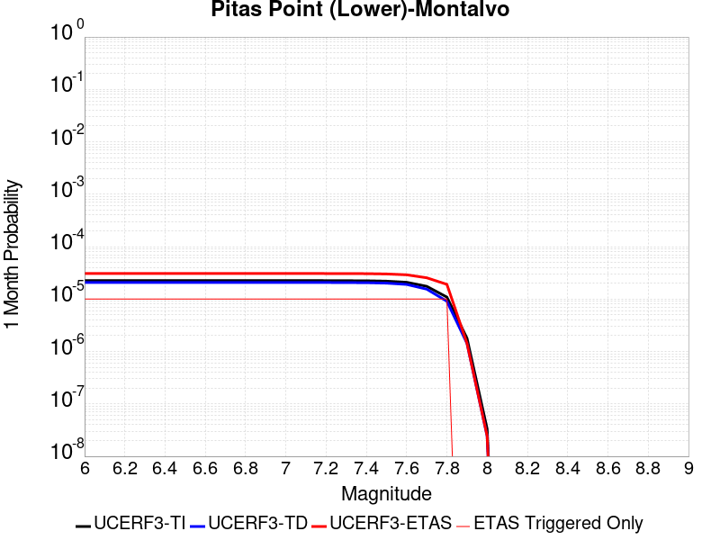 |  |  |

| Magnitude | 1 wk TI Prob | 1 wk TD Prob | 1 wk ETAS Prob | 1 wk ETAS/TD Gain | 1 wk ETAS Triggered Only | 1 mo TI Prob | 1 mo TD Prob | 1 mo ETAS Prob | 1 mo ETAS/TD Gain | 1 mo ETAS Triggered Only | 1 yr TI Prob | 1 yr TD Prob | 1 yr ETAS Prob | 1 yr ETAS/TD Gain | 1 yr ETAS Triggered Only | 10 yr TI Prob | 10 yr TD Prob | 10 yr ETAS Prob | 10 yr ETAS/TD Gain | 10 yr ETAS Triggered Only |
|-----|-----|-----|-----|-----|-----|-----|-----|-----|-----|-----|-----|-----|-----|-----|-----|-----|-----|-----|-----|-----|
| 6.0 | 5.2543637E-6 | 4.837939E-6 | 1.483789E-5 | 3.066986 | 1.0E-5 | 2.2518509E-5 | 2.073386E-5 | 3.0733652E-5 | 1.4822929 | 1.0E-5 | 2.7412834E-4 | 2.5240582E-4 | 2.6240328E-4 | 1.0396087 | 1.0E-5 | 0.0027379042 | 0.0025212239 | 0.0025411735 | 1.0079126 | 2.0E-5 |
| 6.1 | 5.2543637E-6 | 4.837939E-6 | 1.483789E-5 | 3.066986 | 1.0E-5 | 2.2518509E-5 | 2.073386E-5 | 3.0733652E-5 | 1.4822929 | 1.0E-5 | 2.7412834E-4 | 2.5240582E-4 | 2.6240328E-4 | 1.0396087 | 1.0E-5 | 0.0027379042 | 0.0025212239 | 0.0025411735 | 1.0079126 | 2.0E-5 |
| 6.2 | 5.2543637E-6 | 4.837939E-6 | 1.483789E-5 | 3.066986 | 1.0E-5 | 2.2518509E-5 | 2.073386E-5 | 3.0733652E-5 | 1.4822929 | 1.0E-5 | 2.7412834E-4 | 2.5240582E-4 | 2.6240328E-4 | 1.0396087 | 1.0E-5 | 0.0027379042 | 0.0025212239 | 0.0025411735 | 1.0079126 | 2.0E-5 |
| 6.3 | 5.2543637E-6 | 4.837939E-6 | 1.483789E-5 | 3.066986 | 1.0E-5 | 2.2518509E-5 | 2.073386E-5 | 3.0733652E-5 | 1.4822929 | 1.0E-5 | 2.7412834E-4 | 2.5240582E-4 | 2.6240328E-4 | 1.0396087 | 1.0E-5 | 0.0027379042 | 0.0025212239 | 0.0025411735 | 1.0079126 | 2.0E-5 |
| 6.4 | 5.2543637E-6 | 4.837939E-6 | 1.483789E-5 | 3.066986 | 1.0E-5 | 2.2518509E-5 | 2.073386E-5 | 3.0733652E-5 | 1.4822929 | 1.0E-5 | 2.7412834E-4 | 2.5240582E-4 | 2.6240328E-4 | 1.0396087 | 1.0E-5 | 0.0027379042 | 0.0025212239 | 0.0025411735 | 1.0079126 | 2.0E-5 |
| 6.5 | 5.2543637E-6 | 4.837939E-6 | 1.483789E-5 | 3.066986 | 1.0E-5 | 2.2518509E-5 | 2.073386E-5 | 3.0733652E-5 | 1.4822929 | 1.0E-5 | 2.7412834E-4 | 2.5240582E-4 | 2.6240328E-4 | 1.0396087 | 1.0E-5 | 0.0027379042 | 0.0025212239 | 0.0025411735 | 1.0079126 | 2.0E-5 |
| 6.6 | 5.2543637E-6 | 4.837939E-6 | 1.483789E-5 | 3.066986 | 1.0E-5 | 2.2518509E-5 | 2.073386E-5 | 3.0733652E-5 | 1.4822929 | 1.0E-5 | 2.7412834E-4 | 2.5240582E-4 | 2.6240328E-4 | 1.0396087 | 1.0E-5 | 0.0027379042 | 0.0025212239 | 0.0025411735 | 1.0079126 | 2.0E-5 |
| 6.7 | 5.2543637E-6 | 4.837939E-6 | 1.483789E-5 | 3.066986 | 1.0E-5 | 2.2518509E-5 | 2.073386E-5 | 3.0733652E-5 | 1.4822929 | 1.0E-5 | 2.7412834E-4 | 2.5240582E-4 | 2.6240328E-4 | 1.0396087 | 1.0E-5 | 0.0027379042 | 0.0025212239 | 0.0025411735 | 1.0079126 | 2.0E-5 |
| 6.8 | 5.2543637E-6 | 4.837939E-6 | 1.483789E-5 | 3.066986 | 1.0E-5 | 2.2518509E-5 | 2.073386E-5 | 3.0733652E-5 | 1.4822929 | 1.0E-5 | 2.7412834E-4 | 2.5240582E-4 | 2.6240328E-4 | 1.0396087 | 1.0E-5 | 0.0027379042 | 0.0025212239 | 0.0025411735 | 1.0079126 | 2.0E-5 |
| 6.9 | 5.2543637E-6 | 4.837939E-6 | 1.483789E-5 | 3.066986 | 1.0E-5 | 2.2518509E-5 | 2.073386E-5 | 3.0733652E-5 | 1.4822929 | 1.0E-5 | 2.7412834E-4 | 2.5240582E-4 | 2.6240328E-4 | 1.0396087 | 1.0E-5 | 0.0027379042 | 0.0025212239 | 0.0025411735 | 1.0079126 | 2.0E-5 |
| 7.0 | 5.2543637E-6 | 4.837939E-6 | 1.483789E-5 | 3.066986 | 1.0E-5 | 2.2518509E-5 | 2.073386E-5 | 3.0733652E-5 | 1.4822929 | 1.0E-5 | 2.7412834E-4 | 2.5240582E-4 | 2.6240328E-4 | 1.0396087 | 1.0E-5 | 0.0027379042 | 0.0025212239 | 0.0025411735 | 1.0079126 | 2.0E-5 |
| 7.1 | 5.2543637E-6 | 4.837939E-6 | 1.483789E-5 | 3.066986 | 1.0E-5 | 2.2518509E-5 | 2.073386E-5 | 3.0733652E-5 | 1.4822929 | 1.0E-5 | 2.7412834E-4 | 2.5240582E-4 | 2.6240328E-4 | 1.0396087 | 1.0E-5 | 0.0027379042 | 0.0025212239 | 0.0025411735 | 1.0079126 | 2.0E-5 |
| 7.2 | 5.2458695E-6 | 4.829092E-6 | 1.4829044E-5 | 3.0707724 | 1.0E-5 | 2.2482105E-5 | 2.0695948E-5 | 3.069574E-5 | 1.4831764 | 1.0E-5 | 2.7368523E-4 | 2.5194435E-4 | 2.6194184E-4 | 1.0396813 | 1.0E-5 | 0.0027334841 | 0.0025166196 | 0.0025365693 | 1.0079272 | 2.0E-5 |
| 7.3 | 5.22665E-6 | 4.8090096E-6 | 1.4808961E-5 | 3.0794203 | 1.0E-5 | 2.2399736E-5 | 2.060988E-5 | 3.0609674E-5 | 1.4851942 | 1.0E-5 | 2.7268266E-4 | 2.508967E-4 | 2.608942E-4 | 1.039847 | 1.0E-5 | 0.002723483 | 0.002506167 | 0.0025261168 | 1.0079603 | 2.0E-5 |
| 7.4 | 5.210642E-6 | 4.7922217E-6 | 1.4792174E-5 | 3.0867047 | 1.0E-5 | 2.233113E-5 | 2.0537933E-5 | 3.053773E-5 | 1.4868939 | 1.0E-5 | 2.718476E-4 | 2.5002097E-4 | 2.6001845E-4 | 1.0399866 | 1.0E-5 | 0.002715153 | 0.0024974293 | 0.0025173794 | 1.0079882 | 2.0E-5 |
| 7.5 | 5.1226016E-6 | 4.700108E-6 | 1.4700061E-5 | 3.1276007 | 1.0E-5 | 2.1953823E-5 | 2.0143167E-5 | 3.0142965E-5 | 1.4964362 | 1.0E-5 | 2.67255E-4 | 2.4521575E-4 | 2.552133E-4 | 1.0407704 | 1.0E-5 | 0.0026693381 | 0.0024494834 | 0.0024694344 | 1.008145 | 2.0E-5 |
| 7.6 | 4.8796987E-6 | 4.4450067E-6 | 1.4444962E-5 | 3.2497056 | 1.0E-5 | 2.0912828E-5 | 1.904989E-5 | 2.90497E-5 | 1.5249274 | 1.0E-5 | 2.5458392E-4 | 2.3190802E-4 | 2.4190571E-4 | 1.0431105 | 1.0E-5 | 0.0025429246 | 0.0023166907 | 0.0023366446 | 1.008613 | 2.0E-5 |
| 7.7 | 4.0834398E-6 | 3.609173E-6 | 1.3609137E-5 | 3.7707078 | 1.0E-5 | 1.7500339E-5 | 1.5467793E-5 | 2.546764E-5 | 1.6464946 | 1.0E-5 | 2.1304579E-4 | 1.8830434E-4 | 1.9830247E-4 | 1.0530955 | 1.0E-5 | 0.0021284167 | 0.0018814716 | 0.001901434 | 1.01061 | 2.0E-5 |
| 7.8 | 2.5445438E-6 | 2.1212738E-6 | 1.2121252E-5 | 5.7141385 | 1.0E-5 | 1.0905142E-5 | 9.091142E-6 | 1.909105E-5 | 2.0999618 | 1.0E-5 | 1.3276201E-4 | 1.1067907E-4 | 1.2067797E-4 | 1.0903413 | 1.0E-5 | 0.0013268272 | 0.0011062442 | 0.0011162332 | 1.0090296 | 1.0E-5 |
| 7.9 | 4.1677114E-7 | 3.3294293E-7 | 3.3294293E-7 | 1.0 | 0.0 | 1.7861609E-6 | 1.4268975E-6 | 1.4268975E-6 | 1.0 | 0.0 | 2.1746291E-5 | 1.7372342E-5 | 1.7372342E-5 | 1.0 | 0.0 | 2.1744163E-4 | 1.7371014E-4 | 1.7371014E-4 | 1.0 | 0.0 |
| 8.0 | 7.791402E-9 | 5.683641E-9 | 5.683641E-9 | 1.0 | 0.0 | 3.3391725E-8 | 2.4358462E-8 | 2.4358462E-8 | 1.0 | 0.0 | 4.0654416E-7 | 2.9656425E-7 | 2.9656425E-7 | 1.0 | 0.0 | 4.065434E-6 | 2.9656408E-6 | 2.9656408E-6 | 1.0 | 0.0 |

## Robinson Creek
*[(top)](#table-of-contents)*

| 1 Week | 1 Month | 1 Year | 10 Year |
|-----|-----|-----|-----|
|  |  |  |  |

| Magnitude | 1 wk TI Prob | 1 wk TD Prob | 1 wk ETAS Prob | 1 wk ETAS/TD Gain | 1 wk ETAS Triggered Only | 1 mo TI Prob | 1 mo TD Prob | 1 mo ETAS Prob | 1 mo ETAS/TD Gain | 1 mo ETAS Triggered Only | 1 yr TI Prob | 1 yr TD Prob | 1 yr ETAS Prob | 1 yr ETAS/TD Gain | 1 yr ETAS Triggered Only | 10 yr TI Prob | 10 yr TD Prob | 10 yr ETAS Prob | 10 yr ETAS/TD Gain | 10 yr ETAS Triggered Only |
|-----|-----|-----|-----|-----|-----|-----|-----|-----|-----|-----|-----|-----|-----|-----|-----|-----|-----|-----|-----|-----|
| 6.0 | 1.3705327E-5 | 1.528521E-5 | 2.5285057E-5 | 1.6542171 | 1.0E-5 | 5.8735794E-5 | 6.5508044E-5 | 7.550739E-5 | 1.152643 | 1.0E-5 | 7.1487366E-4 | 7.9756044E-4 | 8.1754447E-4 | 1.0250565 | 2.0E-5 | 0.0071257832 | 0.007975604 | 0.007995444 | 1.0024877 | 2.0E-5 |
| 6.1 | 1.3705327E-5 | 1.528521E-5 | 2.5285057E-5 | 1.6542171 | 1.0E-5 | 5.8735794E-5 | 6.5508044E-5 | 7.550739E-5 | 1.152643 | 1.0E-5 | 7.1487366E-4 | 7.9756044E-4 | 8.1754447E-4 | 1.0250565 | 2.0E-5 | 0.0071257832 | 0.007975604 | 0.007995444 | 1.0024877 | 2.0E-5 |
| 6.2 | 1.3705327E-5 | 1.528521E-5 | 2.5285057E-5 | 1.6542171 | 1.0E-5 | 5.8735794E-5 | 6.5508044E-5 | 7.550739E-5 | 1.152643 | 1.0E-5 | 7.1487366E-4 | 7.9756044E-4 | 8.1754447E-4 | 1.0250565 | 2.0E-5 | 0.0071257832 | 0.007975604 | 0.007995444 | 1.0024877 | 2.0E-5 |
| 6.3 | 1.3705327E-5 | 1.528521E-5 | 2.5285057E-5 | 1.6542171 | 1.0E-5 | 5.8735794E-5 | 6.5508044E-5 | 7.550739E-5 | 1.152643 | 1.0E-5 | 7.1487366E-4 | 7.9756044E-4 | 8.1754447E-4 | 1.0250565 | 2.0E-5 | 0.0071257832 | 0.007975604 | 0.007995444 | 1.0024877 | 2.0E-5 |
| 6.4 | 1.3705327E-5 | 1.528521E-5 | 2.5285057E-5 | 1.6542171 | 1.0E-5 | 5.8735794E-5 | 6.5508044E-5 | 7.550739E-5 | 1.152643 | 1.0E-5 | 7.1487366E-4 | 7.9756044E-4 | 8.1754447E-4 | 1.0250565 | 2.0E-5 | 0.0071257832 | 0.007975604 | 0.007995444 | 1.0024877 | 2.0E-5 |

## La Panza 2011
*[(top)](#table-of-contents)*

| 1 Week | 1 Month | 1 Year | 10 Year |
|-----|-----|-----|-----|
| 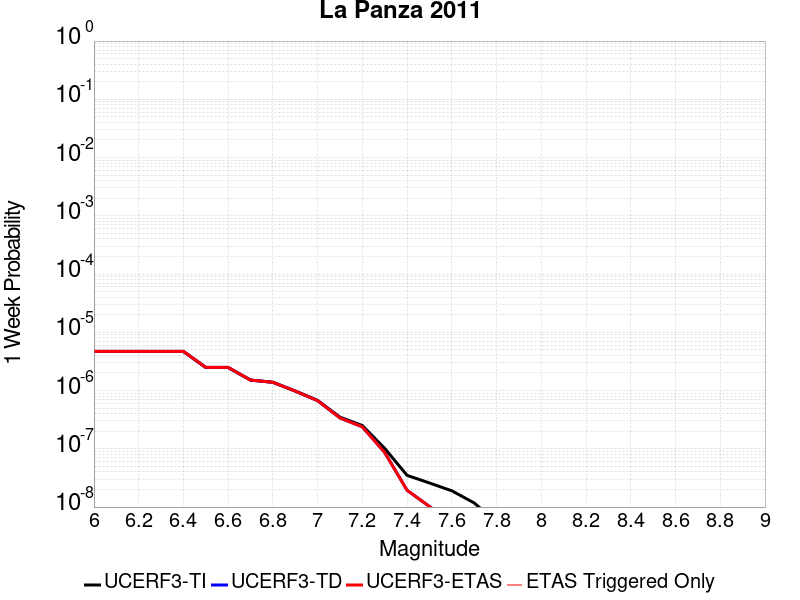 |  | 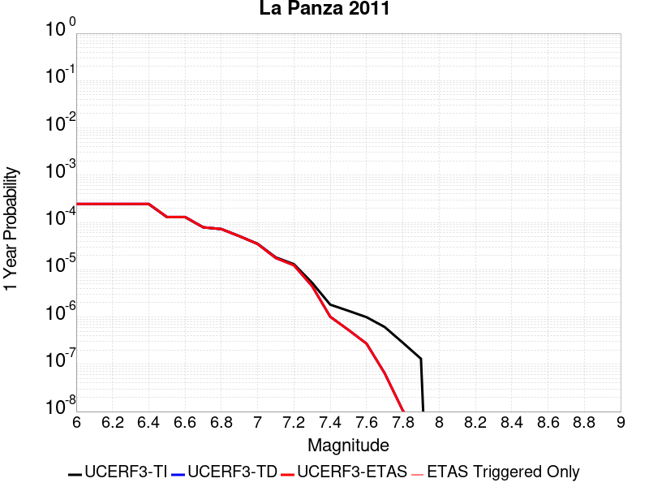 |  |

| Magnitude | 1 wk TI Prob | 1 wk TD Prob | 1 wk ETAS Prob | 1 wk ETAS/TD Gain | 1 wk ETAS Triggered Only | 1 mo TI Prob | 1 mo TD Prob | 1 mo ETAS Prob | 1 mo ETAS/TD Gain | 1 mo ETAS Triggered Only | 1 yr TI Prob | 1 yr TD Prob | 1 yr ETAS Prob | 1 yr ETAS/TD Gain | 1 yr ETAS Triggered Only | 10 yr TI Prob | 10 yr TD Prob | 10 yr ETAS Prob | 10 yr ETAS/TD Gain | 10 yr ETAS Triggered Only |
|-----|-----|-----|-----|-----|-----|-----|-----|-----|-----|-----|-----|-----|-----|-----|-----|-----|-----|-----|-----|-----|
| 6.0 | 4.6754544E-6 | 4.7176045E-6 | 4.7176045E-6 | 1.0 | 0.0 | 2.0037509E-5 | 2.021816E-5 | 2.021816E-5 | 1.0 | 0.0 | 2.4392935E-4 | 2.4613025E-4 | 2.4613025E-4 | 1.0 | 0.0 | 0.0024366176 | 0.002458771 | 0.002478722 | 1.0081141 | 2.0E-5 |
| 6.1 | 4.6754544E-6 | 4.7176045E-6 | 4.7176045E-6 | 1.0 | 0.0 | 2.0037509E-5 | 2.021816E-5 | 2.021816E-5 | 1.0 | 0.0 | 2.4392935E-4 | 2.4613025E-4 | 2.4613025E-4 | 1.0 | 0.0 | 0.0024366176 | 0.002458771 | 0.002478722 | 1.0081141 | 2.0E-5 |
| 6.2 | 4.6754544E-6 | 4.7176045E-6 | 4.7176045E-6 | 1.0 | 0.0 | 2.0037509E-5 | 2.021816E-5 | 2.021816E-5 | 1.0 | 0.0 | 2.4392935E-4 | 2.4613025E-4 | 2.4613025E-4 | 1.0 | 0.0 | 0.0024366176 | 0.002458771 | 0.002478722 | 1.0081141 | 2.0E-5 |
| 6.3 | 4.6754544E-6 | 4.7176045E-6 | 4.7176045E-6 | 1.0 | 0.0 | 2.0037509E-5 | 2.021816E-5 | 2.021816E-5 | 1.0 | 0.0 | 2.4392935E-4 | 2.4613025E-4 | 2.4613025E-4 | 1.0 | 0.0 | 0.0024366176 | 0.002458771 | 0.002478722 | 1.0081141 | 2.0E-5 |
| 6.4 | 4.6754544E-6 | 4.7176045E-6 | 4.7176045E-6 | 1.0 | 0.0 | 2.0037509E-5 | 2.021816E-5 | 2.021816E-5 | 1.0 | 0.0 | 2.4392935E-4 | 2.4613025E-4 | 2.4613025E-4 | 1.0 | 0.0 | 0.0024366176 | 0.002458771 | 0.002478722 | 1.0081141 | 2.0E-5 |
| 6.5 | 2.485343E-6 | 2.5006136E-6 | 2.5006136E-6 | 1.0 | 0.0 | 1.0651426E-5 | 1.07168735E-5 | 1.07168735E-5 | 1.0 | 0.0 | 1.296734E-4 | 1.3047051E-4 | 1.3047051E-4 | 1.0 | 0.0 | 0.0012959775 | 0.0013039774 | 0.0013239514 | 1.0153177 | 2.0E-5 |
| 6.6 | 2.485343E-6 | 2.5006136E-6 | 2.5006136E-6 | 1.0 | 0.0 | 1.0651426E-5 | 1.07168735E-5 | 1.07168735E-5 | 1.0 | 0.0 | 1.296734E-4 | 1.3047051E-4 | 1.3047051E-4 | 1.0 | 0.0 | 0.0012959775 | 0.0013039774 | 0.0013239514 | 1.0153177 | 2.0E-5 |
| 6.7 | 1.5108508E-6 | 1.5146508E-6 | 1.5146508E-6 | 1.0 | 0.0 | 6.4750584E-6 | 6.4913447E-6 | 6.4913447E-6 | 1.0 | 0.0 | 7.8830984E-5 | 7.902937E-5 | 7.902937E-5 | 1.0 | 0.0 | 7.880303E-4 | 7.900234E-4 | 8.000155E-4 | 1.0126479 | 1.0E-5 |
| 6.8 | 1.3865837E-6 | 1.3885233E-6 | 1.3885233E-6 | 1.0 | 0.0 | 5.942488E-6 | 5.950801E-6 | 5.950801E-6 | 1.0 | 0.0 | 7.234739E-5 | 7.2448696E-5 | 7.2448696E-5 | 1.0 | 0.0 | 7.232384E-4 | 7.242606E-4 | 7.342533E-4 | 1.0137972 | 1.0E-5 |
| 6.9 | 9.826583E-7 | 9.796412E-7 | 9.796412E-7 | 1.0 | 0.0 | 4.2113857E-6 | 4.198456E-6 | 4.198456E-6 | 1.0 | 0.0 | 5.1272415E-5 | 5.1115054E-5 | 5.1115054E-5 | 1.0 | 0.0 | 5.126059E-4 | 5.1103835E-4 | 5.2103325E-4 | 1.019558 | 1.0E-5 |
| 7.0 | 6.7797646E-7 | 6.7103355E-7 | 6.7103355E-7 | 1.0 | 0.0 | 2.9056102E-6 | 2.8758552E-6 | 2.8758552E-6 | 1.0 | 0.0 | 3.537523E-5 | 3.5013007E-5 | 3.5013007E-5 | 1.0 | 0.0 | 3.5369597E-4 | 3.50078E-4 | 3.50078E-4 | 1.0 | 0.0 |
| 7.1 | 3.4979826E-7 | 3.3875043E-7 | 3.3875043E-7 | 1.0 | 0.0 | 1.4991346E-6 | 1.4517868E-6 | 1.4517868E-6 | 1.0 | 0.0 | 1.825181E-5 | 1.7675373E-5 | 1.7675373E-5 | 1.0 | 0.0 | 1.825031E-4 | 1.7674084E-4 | 1.7674084E-4 | 1.0 | 0.0 |
| 7.2 | 2.5088332E-7 | 2.3833046E-7 | 2.3833046E-7 | 1.0 | 0.0 | 1.0752137E-6 | 1.0214159E-6 | 1.0214159E-6 | 1.0 | 0.0 | 1.3090649E-5 | 1.2435676E-5 | 1.2435676E-5 | 1.0 | 0.0 | 1.3089878E-4 | 1.2435066E-4 | 1.2435066E-4 | 1.0 | 0.0 |
| 7.3 | 1.0159086E-7 | 8.645737E-8 | 8.645737E-8 | 1.0 | 0.0 | 4.3538932E-7 | 3.7053152E-7 | 3.7053152E-7 | 1.0 | 0.0 | 5.300852E-6 | 4.5112124E-6 | 4.5112124E-6 | 1.0 | 0.0 | 5.3007258E-5 | 4.511125E-5 | 4.511125E-5 | 1.0 | 0.0 |
| 7.4 | 3.5006252E-8 | 1.9407311E-8 | 1.9407311E-8 | 1.0 | 0.0 | 1.5002678E-7 | 8.3174186E-8 | 8.3174186E-8 | 1.0 | 0.0 | 1.8265745E-6 | 1.0126453E-6 | 1.0126453E-6 | 1.0 | 0.0 | 1.8265595E-5 | 1.0126409E-5 | 1.0126409E-5 | 1.0 | 0.0 |
| 7.5 | 2.592274E-8 | 1.0241004E-8 | 1.0241004E-8 | 1.0 | 0.0 | 1.1109746E-7 | 4.3890015E-8 | 4.3890015E-8 | 1.0 | 0.0 | 1.3526106E-6 | 5.343608E-7 | 5.343608E-7 | 1.0 | 0.0 | 1.3526024E-5 | 5.343596E-6 | 5.343596E-6 | 1.0 | 0.0 |
| 7.6 | 1.9016717E-8 | 5.245777E-9 | 5.245777E-9 | 1.0 | 0.0 | 8.150022E-8 | 2.2481903E-8 | 2.2481903E-8 | 1.0 | 0.0 | 9.922647E-7 | 2.7371712E-7 | 2.7371712E-7 | 1.0 | 0.0 | 9.922603E-6 | 2.7371682E-6 | 2.7371682E-6 | 1.0 | 0.0 |
| 7.7 | 1.17738495E-8 | 1.2399103E-9 | 1.2399103E-9 | 1.0 | 0.0 | 5.0459356E-8 | 5.3139018E-9 | 5.3139018E-9 | 1.0 | 0.0 | 6.1434247E-7 | 6.469675E-8 | 6.469675E-8 | 1.0 | 0.0 | 6.143408E-6 | 6.4696735E-7 | 6.4696735E-7 | 1.0 | 0.0 |
| 7.8 | 5.489079E-9 | 2.0110691E-10 | 2.0110691E-10 | 1.0 | 0.0 | 2.3524624E-8 | 8.618867E-10 | 8.618867E-10 | 1.0 | 0.0 | 2.8641225E-7 | 1.0493471E-8 | 1.0493471E-8 | 1.0 | 0.0 | 2.8641189E-6 | 1.0493471E-7 | 1.0493471E-7 | 1.0 | 0.0 |
| 7.9 | 2.5081048E-9 | 6.682277E-11 | 6.682277E-11 | 1.0 | 0.0 | 1.0749021E-8 | 2.8638314E-10 | 2.8638314E-10 | 1.0 | 0.0 | 1.3086932E-7 | 3.4867145E-9 | 3.4867145E-9 | 1.0 | 0.0 | 1.3086925E-6 | 3.4867146E-8 | 3.4867146E-8 | 1.0 | 0.0 |

## Hayward (So) 2011 CFM
*[(top)](#table-of-contents)*

| 1 Week | 1 Month | 1 Year | 10 Year |
|-----|-----|-----|-----|
|  |  | 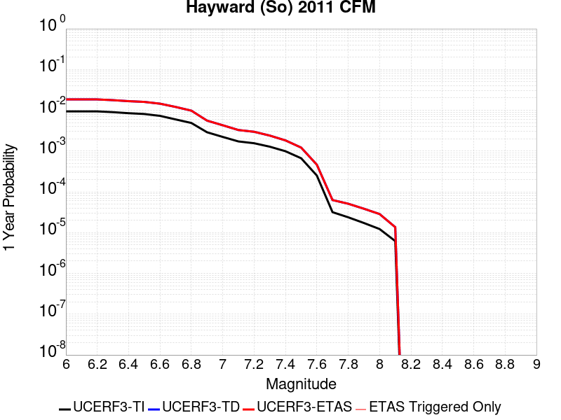 |  |

| Magnitude | 1 wk TI Prob | 1 wk TD Prob | 1 wk ETAS Prob | 1 wk ETAS/TD Gain | 1 wk ETAS Triggered Only | 1 mo TI Prob | 1 mo TD Prob | 1 mo ETAS Prob | 1 mo ETAS/TD Gain | 1 mo ETAS Triggered Only | 1 yr TI Prob | 1 yr TD Prob | 1 yr ETAS Prob | 1 yr ETAS/TD Gain | 1 yr ETAS Triggered Only | 10 yr TI Prob | 10 yr TD Prob | 10 yr ETAS Prob | 10 yr ETAS/TD Gain | 10 yr ETAS Triggered Only |
|-----|-----|-----|-----|-----|-----|-----|-----|-----|-----|-----|-----|-----|-----|-----|-----|-----|-----|-----|-----|-----|
| 6.0 | 1.8091932E-4 | 3.5710094E-4 | 3.5710094E-4 | 1.0 | 0.0 | 7.751381E-4 | 0.0015295449 | 0.0015295449 | 1.0 | 0.0 | 0.00939654 | 0.01846561 | 0.01846561 | 1.0 | 0.0 | 0.090090066 | 0.16673638 | 0.16675305 | 1.0000999 | 2.0E-5 |
| 6.1 | 1.8091932E-4 | 3.5710094E-4 | 3.5710094E-4 | 1.0 | 0.0 | 7.751381E-4 | 0.0015295449 | 0.0015295449 | 1.0 | 0.0 | 0.00939654 | 0.01846561 | 0.01846561 | 1.0 | 0.0 | 0.090090066 | 0.16673638 | 0.16675305 | 1.0000999 | 2.0E-5 |
| 6.2 | 1.8091932E-4 | 3.5710094E-4 | 3.5710094E-4 | 1.0 | 0.0 | 7.751381E-4 | 0.0015295449 | 0.0015295449 | 1.0 | 0.0 | 0.00939654 | 0.01846561 | 0.01846561 | 1.0 | 0.0 | 0.090090066 | 0.16673638 | 0.16675305 | 1.0000999 | 2.0E-5 |
| 6.3 | 1.7322872E-4 | 3.426688E-4 | 3.426688E-4 | 1.0 | 0.0 | 7.4219756E-4 | 0.0014677637 | 0.0014677637 | 1.0 | 0.0 | 0.0089988755 | 0.017725872 | 0.017725872 | 1.0 | 0.0 | 0.08643075 | 0.16068758 | 0.16070437 | 1.0001044 | 2.0E-5 |
| 6.4 | 1.6334097E-4 | 3.234852E-4 | 3.234852E-4 | 1.0 | 0.0 | 6.998449E-4 | 0.0013856373 | 0.0013856373 | 1.0 | 0.0 | 0.008487372 | 0.01674165 | 0.01674165 | 1.0 | 0.0 | 0.081704415 | 0.15256934 | 0.15258628 | 1.0001111 | 2.0E-5 |
| 6.5 | 1.5600289E-4 | 3.1023155E-4 | 3.1023155E-4 | 1.0 | 0.0 | 6.684125E-4 | 0.0013288946 | 0.0013288946 | 1.0 | 0.0 | 0.008107598 | 0.016061157 | 0.016061157 | 1.0 | 0.0 | 0.078181036 | 0.1468462 | 0.14686327 | 1.0001162 | 2.0E-5 |
| 6.6 | 1.4046066E-4 | 2.8036922E-4 | 2.8036922E-4 | 1.0 | 0.0 | 6.018354E-4 | 0.0012010358 | 0.0012010358 | 1.0 | 0.0 | 0.0073027555 | 0.014526072 | 0.014526072 | 1.0 | 0.0 | 0.07067384 | 0.13393006 | 0.13393871 | 1.0000646 | 1.0E-5 |
| 6.7 | 1.14696966E-4 | 2.3275119E-4 | 2.3275119E-4 | 1.0 | 0.0 | 4.914658E-4 | 9.971289E-4 | 9.971289E-4 | 1.0 | 0.0 | 0.0059671924 | 0.012073531 | 0.012073531 | 1.0 | 0.0 | 0.058094822 | 0.11274274 | 0.11275161 | 1.0000787 | 1.0E-5 |
| 6.8 | 9.3874296E-5 | 1.886443E-4 | 1.886443E-4 | 1.0 | 0.0 | 4.0225635E-4 | 8.082288E-4 | 8.082288E-4 | 1.0 | 0.0 | 0.0048864787 | 0.009796523 | 0.009796523 | 1.0 | 0.0 | 0.047804173 | 0.09259525 | 0.09260432 | 1.000098 | 1.0E-5 |
| 6.9 | 5.551852E-5 | 1.0731314E-4 | 1.0731314E-4 | 1.0 | 0.0 | 2.3791482E-4 | 4.59833E-4 | 4.59833E-4 | 1.0 | 0.0 | 0.0028927654 | 0.005584215 | 0.005584215 | 1.0 | 0.0 | 0.028553981 | 0.05424674 | 0.054256193 | 1.0001743 | 1.0E-5 |
| 7.0 | 4.2662363E-5 | 8.247886E-5 | 8.247886E-5 | 1.0 | 0.0 | 1.8282588E-4 | 3.5343334E-4 | 3.5343334E-4 | 1.0 | 0.0 | 0.0022236328 | 0.0042946343 | 0.0042946343 | 1.0 | 0.0 | 0.022015138 | 0.042070795 | 0.042080373 | 1.0002277 | 1.0E-5 |
| 7.1 | 3.305886E-5 | 6.303085E-5 | 6.303085E-5 | 1.0 | 0.0 | 1.4167312E-4 | 2.7010436E-4 | 2.7010436E-4 | 1.0 | 0.0 | 0.0017235056 | 0.0032835803 | 0.0032835803 | 1.0 | 0.0 | 0.017101998 | 0.032457843 | 0.032467518 | 1.0002981 | 1.0E-5 |
| 7.2 | 2.9856887E-5 | 5.7024783E-5 | 5.7024783E-5 | 1.0 | 0.0 | 1.2795182E-4 | 2.4436912E-4 | 2.4436912E-4 | 1.0 | 0.0 | 0.0015567001 | 0.0029711518 | 0.0029711518 | 1.0 | 0.0 | 0.015458403 | 0.029458504 | 0.02946821 | 1.0003295 | 1.0E-5 |
| 7.3 | 2.4559737E-5 | 4.6000318E-5 | 4.6000318E-5 | 1.0 | 0.0 | 1.0525176E-4 | 1.9712938E-4 | 1.9712938E-4 | 1.0 | 0.0 | 0.0012806869 | 0.0023974215 | 0.0023974215 | 1.0 | 0.0 | 0.012733313 | 0.023861604 | 0.023871364 | 1.0004091 | 1.0E-5 |
| 7.4 | 1.9002231E-5 | 3.505718E-5 | 3.505718E-5 | 1.0 | 0.0 | 8.143559E-5 | 1.5023646E-4 | 1.5023646E-4 | 1.0 | 0.0 | 9.910273E-4 | 0.0018276041 | 0.0018276041 | 1.0 | 0.0 | 0.009866194 | 0.01826159 | 0.018271405 | 1.0005376 | 1.0E-5 |
| 7.5 | 1.2783333E-5 | 2.3334096E-5 | 2.3334096E-5 | 1.0 | 0.0 | 5.4784563E-5 | 9.999947E-5 | 9.999947E-5 | 1.0 | 0.0 | 6.667979E-4 | 0.0012168194 | 0.0012168194 | 1.0 | 0.0 | 0.006648007 | 0.01221053 | 0.012220409 | 1.000809 | 1.0E-5 |
| 7.6 | 4.8149627E-6 | 8.8893785E-6 | 8.8893785E-6 | 1.0 | 0.0 | 2.063539E-5 | 3.8096787E-5 | 3.8096787E-5 | 1.0 | 0.0 | 2.5120692E-4 | 4.6373092E-4 | 4.6373092E-4 | 1.0 | 0.0 | 0.0025092314 | 0.0046811667 | 0.0046911202 | 1.0021262 | 1.0E-5 |
| 7.7 | 6.0838227E-7 | 1.2062245E-6 | 1.2062245E-6 | 1.0 | 0.0 | 2.6073499E-6 | 5.169523E-6 | 5.169523E-6 | 1.0 | 0.0 | 3.174402E-5 | 6.293713E-5 | 6.293713E-5 | 1.0 | 0.0 | 3.1739488E-4 | 6.531997E-4 | 6.631932E-4 | 1.0152992 | 1.0E-5 |
| 7.8 | 4.5542808E-7 | 9.796998E-7 | 9.796998E-7 | 1.0 | 0.0 | 1.9518332E-6 | 4.198707E-6 | 4.198707E-6 | 1.0 | 0.0 | 2.376331E-5 | 5.111806E-5 | 5.111806E-5 | 1.0 | 0.0 | 2.3760769E-4 | 5.3237646E-4 | 5.423712E-4 | 1.0187737 | 1.0E-5 |
| 7.9 | 3.3016747E-7 | 7.389964E-7 | 7.389964E-7 | 1.0 | 0.0 | 1.4150027E-6 | 3.1671236E-6 | 3.1671236E-6 | 1.0 | 0.0 | 1.7227521E-5 | 3.855905E-5 | 3.855905E-5 | 1.0 | 0.0 | 1.7226185E-4 | 3.9948273E-4 | 4.0947876E-4 | 1.0250224 | 1.0E-5 |
| 8.0 | 2.347038E-7 | 5.4740985E-7 | 5.4740985E-7 | 1.0 | 0.0 | 1.0058731E-6 | 2.34604E-6 | 2.34604E-6 | 1.0 | 0.0 | 1.2246436E-5 | 2.8562665E-5 | 2.8562665E-5 | 1.0 | 0.0 | 1.2245761E-4 | 2.9367866E-4 | 2.9367866E-4 | 1.0 | 0.0 |
| 8.1 | 1.18822804E-7 | 2.6070987E-7 | 2.6070987E-7 | 1.0 | 0.0 | 5.092405E-7 | 1.1173275E-6 | 1.1173275E-6 | 1.0 | 0.0 | 6.1999854E-6 | 1.3603379E-5 | 1.3603379E-5 | 1.0 | 0.0 | 6.199812E-5 | 1.3923098E-4 | 1.3923098E-4 | 1.0 | 0.0 |

## Hosgri
*[(top)](#table-of-contents)*

| 1 Week | 1 Month | 1 Year | 10 Year |
|-----|-----|-----|-----|
|  |  |  |  |

| Magnitude | 1 wk TI Prob | 1 wk TD Prob | 1 wk ETAS Prob | 1 wk ETAS/TD Gain | 1 wk ETAS Triggered Only | 1 mo TI Prob | 1 mo TD Prob | 1 mo ETAS Prob | 1 mo ETAS/TD Gain | 1 mo ETAS Triggered Only | 1 yr TI Prob | 1 yr TD Prob | 1 yr ETAS Prob | 1 yr ETAS/TD Gain | 1 yr ETAS Triggered Only | 10 yr TI Prob | 10 yr TD Prob | 10 yr ETAS Prob | 10 yr ETAS/TD Gain | 10 yr ETAS Triggered Only |
|-----|-----|-----|-----|-----|-----|-----|-----|-----|-----|-----|-----|-----|-----|-----|-----|-----|-----|-----|-----|-----|
| 6.0 | 2.883978E-5 | 2.9128752E-5 | 2.9128752E-5 | 1.0 | 0.0 | 1.235932E-4 | 1.2483168E-4 | 1.2483168E-4 | 1.0 | 0.0 | 0.0015037085 | 0.0015187934 | 0.0015287782 | 1.0065742 | 1.0E-5 | 0.01493574 | 0.015087928 | 0.015107626 | 1.0013056 | 2.0E-5 |
| 6.1 | 2.883978E-5 | 2.9128752E-5 | 2.9128752E-5 | 1.0 | 0.0 | 1.235932E-4 | 1.2483168E-4 | 1.2483168E-4 | 1.0 | 0.0 | 0.0015037085 | 0.0015187934 | 0.0015287782 | 1.0065742 | 1.0E-5 | 0.01493574 | 0.015087928 | 0.015107626 | 1.0013056 | 2.0E-5 |
| 6.2 | 2.883978E-5 | 2.9128752E-5 | 2.9128752E-5 | 1.0 | 0.0 | 1.235932E-4 | 1.2483168E-4 | 1.2483168E-4 | 1.0 | 0.0 | 0.0015037085 | 0.0015187934 | 0.0015287782 | 1.0065742 | 1.0E-5 | 0.01493574 | 0.015087928 | 0.015107626 | 1.0013056 | 2.0E-5 |
| 6.3 | 2.2914428E-5 | 2.2642236E-5 | 2.2642236E-5 | 1.0 | 0.0 | 9.8200995E-5 | 9.703457E-5 | 9.703457E-5 | 1.0 | 0.0 | 0.0011949413 | 0.0011807606 | 0.0011907488 | 1.0084591 | 1.0E-5 | 0.011885363 | 0.0117462855 | 0.011756168 | 1.0008414 | 1.0E-5 |
| 6.4 | 2.0195741E-5 | 1.96968E-5 | 1.96968E-5 | 1.0 | 0.0 | 8.65503E-5 | 8.441213E-5 | 8.441213E-5 | 1.0 | 0.0 | 0.0010532405 | 0.0010272352 | 0.0010372249 | 1.0097249 | 1.0E-5 | 0.010482626 | 0.010225931 | 0.010235829 | 1.0009679 | 1.0E-5 |
| 6.5 | 1.9924333E-5 | 1.9409219E-5 | 1.9409219E-5 | 1.0 | 0.0 | 8.53872E-5 | 8.317972E-5 | 8.317972E-5 | 1.0 | 0.0 | 0.0010390934 | 0.0010122445 | 0.0010222344 | 1.009869 | 1.0E-5 | 0.010342481 | 0.010077391 | 0.01008729 | 1.0009823 | 1.0E-5 |
| 6.6 | 1.809694E-5 | 1.7458522E-5 | 1.7458522E-5 | 1.0 | 0.0 | 7.7556004E-5 | 7.48201E-5 | 7.48201E-5 | 1.0 | 0.0 | 9.438353E-4 | 9.105553E-4 | 9.205462E-4 | 1.0109723 | 1.0E-5 | 0.009398366 | 0.0090692025 | 0.009079112 | 1.0010927 | 1.0E-5 |
| 6.7 | 1.675989E-5 | 1.6042975E-5 | 1.6042975E-5 | 1.0 | 0.0 | 7.182612E-5 | 6.8753805E-5 | 6.8753805E-5 | 1.0 | 0.0 | 8.7413215E-4 | 8.3675724E-4 | 8.467489E-4 | 1.011941 | 1.0E-5 | 0.008707017 | 0.008336987 | 0.008346904 | 1.0011895 | 1.0E-5 |
| 6.8 | 1.5401129E-5 | 1.4614283E-5 | 1.4614283E-5 | 1.0 | 0.0 | 6.6003166E-5 | 6.2631145E-5 | 6.2631145E-5 | 1.0 | 0.0 | 8.032922E-4 | 7.6226826E-4 | 7.6226826E-4 | 1.0 | 0.0 | 0.008003947 | 0.0075974152 | 0.0075974152 | 1.0 | 0.0 |
| 6.9 | 1.356559E-5 | 1.2690154E-5 | 1.2690154E-5 | 1.0 | 0.0 | 5.8136946E-5 | 5.4385244E-5 | 5.4385244E-5 | 1.0 | 0.0 | 7.0758746E-4 | 6.619396E-4 | 6.619396E-4 | 1.0 | 0.0 | 0.007053386 | 0.0066004996 | 0.0066004996 | 1.0 | 0.0 |
| 7.0 | 1.2030819E-5 | 1.1096136E-5 | 1.1096136E-5 | 1.0 | 0.0 | 5.155963E-5 | 4.7554004E-5 | 4.7554004E-5 | 1.0 | 0.0 | 6.275577E-4 | 5.7881634E-4 | 5.7881634E-4 | 1.0 | 0.0 | 0.006257884 | 0.0057738633 | 0.0057738633 | 1.0 | 0.0 |
| 7.1 | 1.0972698E-5 | 1.0022348E-5 | 1.0022348E-5 | 1.0 | 0.0 | 4.7025E-5 | 4.2952215E-5 | 4.2952215E-5 | 1.0 | 0.0 | 5.72379E-4 | 5.228178E-4 | 5.228178E-4 | 1.0 | 0.0 | 0.0057090693 | 0.005216645 | 0.005216645 | 1.0 | 0.0 |
| 7.2 | 9.961926E-6 | 9.034908E-6 | 9.034908E-6 | 1.0 | 0.0 | 4.2693267E-5 | 3.872046E-5 | 3.872046E-5 | 1.0 | 0.0 | 5.1966653E-4 | 4.7131968E-4 | 4.7131968E-4 | 1.0 | 0.0 | 0.00518453 | 0.0047039622 | 0.0047039622 | 1.0 | 0.0 |
| 7.3 | 8.700929E-6 | 7.828257E-6 | 7.828257E-6 | 1.0 | 0.0 | 3.7289166E-5 | 3.3549244E-5 | 3.3549244E-5 | 1.0 | 0.0 | 4.53901E-4 | 4.083855E-4 | 4.083855E-4 | 1.0 | 0.0 | 0.00452975 | 0.0040771053 | 0.0040771053 | 1.0 | 0.0 |
| 7.4 | 7.866285E-6 | 6.998891E-6 | 6.998891E-6 | 1.0 | 0.0 | 3.3712215E-5 | 2.99949E-5 | 2.99949E-5 | 1.0 | 0.0 | 4.103689E-4 | 3.6512676E-4 | 3.6512676E-4 | 1.0 | 0.0 | 0.004096119 | 0.003646021 | 0.003646021 | 1.0 | 0.0 |
| 7.5 | 6.8381305E-6 | 5.9598406E-6 | 5.9598406E-6 | 1.0 | 0.0 | 2.9305946E-5 | 2.5541924E-5 | 2.5541924E-5 | 1.0 | 0.0 | 3.5674145E-4 | 3.1092856E-4 | 3.1092856E-4 | 1.0 | 0.0 | 0.0035616932 | 0.0031056856 | 0.0031056856 | 1.0 | 0.0 |
| 7.6 | 5.503376E-6 | 4.5953793E-6 | 4.5953793E-6 | 1.0 | 0.0 | 2.3585684E-5 | 1.9694335E-5 | 1.9694335E-5 | 1.0 | 0.0 | 2.8711787E-4 | 2.3975216E-4 | 2.3975216E-4 | 1.0 | 0.0 | 0.002867472 | 0.0023956832 | 0.0023956832 | 1.0 | 0.0 |
| 7.7 | 3.6144982E-6 | 2.6523317E-6 | 2.6523317E-6 | 1.0 | 0.0 | 1.5490614E-5 | 1.1367086E-5 | 1.1367086E-5 | 1.0 | 0.0 | 1.8858191E-4 | 1.3838548E-4 | 1.3838548E-4 | 1.0 | 0.0 | 0.0018842196 | 0.0013837395 | 0.0013837395 | 1.0 | 0.0 |
| 7.8 | 1.9853494E-6 | 1.1361984E-6 | 1.1361984E-6 | 1.0 | 0.0 | 8.508612E-6 | 4.8694124E-6 | 4.8694124E-6 | 1.0 | 0.0 | 1.0358743E-4 | 5.9283484E-5 | 5.9283484E-5 | 1.0 | 0.0 | 0.0010353916 | 5.9342093E-4 | 5.9342093E-4 | 1.0 | 0.0 |
| 7.9 | 1.1818757E-6 | 5.2957165E-7 | 5.2957165E-7 | 1.0 | 0.0 | 5.0651715E-6 | 2.2695908E-6 | 2.2695908E-6 | 1.0 | 0.0 | 6.1666724E-5 | 2.7631917E-5 | 2.7631917E-5 | 1.0 | 0.0 | 6.1649614E-4 | 2.769717E-4 | 2.769717E-4 | 1.0 | 0.0 |
| 8.0 | 6.962958E-7 | 2.7143128E-7 | 2.7143128E-7 | 1.0 | 0.0 | 2.9841215E-6 | 1.1632764E-6 | 1.1632764E-6 | 1.0 | 0.0 | 3.6331072E-5 | 1.4162798E-5 | 1.4162798E-5 | 1.0 | 0.0 | 3.6325134E-4 | 1.421854E-4 | 1.421854E-4 | 1.0 | 0.0 |
| 8.1 | 1.5033264E-7 | 6.528205E-8 | 6.528205E-8 | 1.0 | 0.0 | 6.442826E-7 | 2.7978018E-7 | 2.7978018E-7 | 1.0 | 0.0 | 7.844113E-6 | 3.4063187E-6 | 3.4063187E-6 | 1.0 | 0.0 | 7.843835E-5 | 3.408179E-5 | 3.408179E-5 | 1.0 | 0.0 |

## Surprise Valley 2011 CFM
*[(top)](#table-of-contents)*

| 1 Week | 1 Month | 1 Year | 10 Year |
|-----|-----|-----|-----|
|  |  |  |  |

| Magnitude | 1 wk TI Prob | 1 wk TD Prob | 1 wk ETAS Prob | 1 wk ETAS/TD Gain | 1 wk ETAS Triggered Only | 1 mo TI Prob | 1 mo TD Prob | 1 mo ETAS Prob | 1 mo ETAS/TD Gain | 1 mo ETAS Triggered Only | 1 yr TI Prob | 1 yr TD Prob | 1 yr ETAS Prob | 1 yr ETAS/TD Gain | 1 yr ETAS Triggered Only | 10 yr TI Prob | 10 yr TD Prob | 10 yr ETAS Prob | 10 yr ETAS/TD Gain | 10 yr ETAS Triggered Only |
|-----|-----|-----|-----|-----|-----|-----|-----|-----|-----|-----|-----|-----|-----|-----|-----|-----|-----|-----|-----|-----|
| 6.0 | 4.0396248E-5 | 4.4851866E-5 | 4.4851866E-5 | 1.0 | 0.0 | 1.7311527E-4 | 1.922093E-4 | 1.922093E-4 | 1.0 | 0.0 | 0.002105641 | 0.0023378467 | 0.0023478232 | 1.0042675 | 1.0E-5 | 0.020858008 | 0.023154251 | 0.023173789 | 1.0008438 | 2.0E-5 |
| 6.1 | 4.0396248E-5 | 4.4851866E-5 | 4.4851866E-5 | 1.0 | 0.0 | 1.7311527E-4 | 1.922093E-4 | 1.922093E-4 | 1.0 | 0.0 | 0.002105641 | 0.0023378467 | 0.0023478232 | 1.0042675 | 1.0E-5 | 0.020858008 | 0.023154251 | 0.023173789 | 1.0008438 | 2.0E-5 |
| 6.2 | 2.2295266E-5 | 2.4401508E-5 | 2.4401508E-5 | 1.0 | 0.0 | 9.554764E-5 | 1.04573875E-4 | 1.04573875E-4 | 1.0 | 0.0 | 0.0011626717 | 0.0012724741 | 0.0012824613 | 1.0078487 | 1.0E-5 | 0.011566074 | 0.012655115 | 0.012674862 | 1.0015603 | 2.0E-5 |
| 6.3 | 1.572643E-5 | 1.7096974E-5 | 1.7096974E-5 | 1.0 | 0.0 | 6.7397246E-5 | 7.327075E-5 | 7.327075E-5 | 1.0 | 0.0 | 8.202525E-4 | 8.9171674E-4 | 8.9171674E-4 | 1.0 | 0.0 | 0.008172315 | 0.008882494 | 0.008892405 | 1.0011158 | 1.0E-5 |
| 6.4 | 1.5714395E-5 | 1.7084796E-5 | 1.7084796E-5 | 1.0 | 0.0 | 6.734567E-5 | 7.321856E-5 | 7.321856E-5 | 1.0 | 0.0 | 8.1962504E-4 | 8.910819E-4 | 8.910819E-4 | 1.0 | 0.0 | 0.008166086 | 0.008876195 | 0.008886106 | 1.0011166 | 1.0E-5 |
| 6.5 | 1.2733495E-5 | 1.380173E-5 | 1.380173E-5 | 1.0 | 0.0 | 5.457098E-5 | 5.914897E-5 | 5.914897E-5 | 1.0 | 0.0 | 6.641992E-4 | 7.199074E-4 | 7.199074E-4 | 1.0 | 0.0 | 0.0066221743 | 0.0071764467 | 0.007186375 | 1.0013834 | 1.0E-5 |
| 6.6 | 1.0983784E-5 | 1.1886664E-5 | 1.1886664E-5 | 1.0 | 0.0 | 4.7072506E-5 | 5.094188E-5 | 5.094188E-5 | 1.0 | 0.0 | 5.7295704E-4 | 6.200462E-4 | 6.200462E-4 | 1.0 | 0.0 | 0.0057148207 | 0.0061837113 | 0.0061837113 | 1.0 | 0.0 |
| 6.7 | 9.104806E-6 | 9.83958E-6 | 9.83958E-6 | 1.0 | 0.0 | 3.902001E-5 | 4.216897E-5 | 4.216897E-5 | 1.0 | 0.0 | 4.7496508E-4 | 5.132902E-4 | 5.132902E-4 | 1.0 | 0.0 | 0.004739512 | 0.005121443 | 0.005121443 | 1.0 | 0.0 |
| 6.8 | 6.2162403E-6 | 6.704193E-6 | 6.704193E-6 | 1.0 | 0.0 | 2.6640759E-5 | 2.873195E-5 | 2.873195E-5 | 1.0 | 0.0 | 3.2430296E-4 | 3.4975758E-4 | 3.4975758E-4 | 1.0 | 0.0 | 0.003238301 | 0.0034922946 | 0.0034922946 | 1.0 | 0.0 |
| 6.9 | 4.1792696E-6 | 4.5032693E-6 | 4.5032693E-6 | 1.0 | 0.0 | 1.7911032E-5 | 1.929959E-5 | 1.929959E-5 | 1.0 | 0.0 | 2.1804498E-4 | 2.3494873E-4 | 2.3494873E-4 | 1.0 | 0.0 | 0.0021783116 | 0.0023471566 | 0.0023471566 | 1.0 | 0.0 |
| 7.0 | 2.7478413E-6 | 2.9622684E-6 | 2.9622684E-6 | 1.0 | 0.0 | 1.177641E-5 | 1.2695382E-5 | 1.2695382E-5 | 1.0 | 0.0 | 1.4336836E-4 | 1.5455655E-4 | 1.5455655E-4 | 1.0 | 0.0 | 0.001432759 | 0.001544613 | 0.001544613 | 1.0 | 0.0 |
| 7.1 | 8.128648E-7 | 8.724994E-7 | 8.724994E-7 | 1.0 | 0.0 | 3.4837017E-6 | 3.739281E-6 | 3.739281E-6 | 1.0 | 0.0 | 4.2413245E-5 | 4.5525398E-5 | 4.5525398E-5 | 1.0 | 0.0 | 4.2405148E-4 | 4.5521953E-4 | 4.5521953E-4 | 1.0 | 0.0 |
| 7.2 | 4.8641045E-8 | 4.9402153E-8 | 4.9402153E-8 | 1.0 | 0.0 | 2.084616E-7 | 2.1172349E-7 | 2.1172349E-7 | 1.0 | 0.0 | 2.538017E-6 | 2.5777306E-6 | 2.5777306E-6 | 1.0 | 0.0 | 2.537988E-5 | 2.5777019E-5 | 2.5777019E-5 | 1.0 | 0.0 |
| 7.3 | 5.3911844E-9 | 5.475824E-9 | 5.475824E-9 | 1.0 | 0.0 | 2.3105075E-8 | 2.3467816E-8 | 2.3467816E-8 | 1.0 | 0.0 | 2.8130427E-7 | 2.8572063E-7 | 2.8572063E-7 | 1.0 | 0.0 | 2.8130391E-6 | 2.8572042E-6 | 2.8572042E-6 | 1.0 | 0.0 |

## Emerson-Copper Mtn 2011
*[(top)](#table-of-contents)*

| 1 Week | 1 Month | 1 Year | 10 Year |
|-----|-----|-----|-----|
|  |  |  |  |

| Magnitude | 1 wk TI Prob | 1 wk TD Prob | 1 wk ETAS Prob | 1 wk ETAS/TD Gain | 1 wk ETAS Triggered Only | 1 mo TI Prob | 1 mo TD Prob | 1 mo ETAS Prob | 1 mo ETAS/TD Gain | 1 mo ETAS Triggered Only | 1 yr TI Prob | 1 yr TD Prob | 1 yr ETAS Prob | 1 yr ETAS/TD Gain | 1 yr ETAS Triggered Only | 10 yr TI Prob | 10 yr TD Prob | 10 yr ETAS Prob | 10 yr ETAS/TD Gain | 10 yr ETAS Triggered Only |
|-----|-----|-----|-----|-----|-----|-----|-----|-----|-----|-----|-----|-----|-----|-----|-----|-----|-----|-----|-----|-----|
| 6.0 | 2.1364202E-5 | 9.968086E-6 | 9.968086E-6 | 1.0 | 0.0 | 9.1557646E-5 | 4.2719716E-5 | 5.271929E-5 | 1.234074 | 1.0E-5 | 0.0011141442 | 5.1999715E-4 | 5.3998677E-4 | 1.0384418 | 2.0E-5 | 0.011085749 | 0.0051886737 | 0.0052085696 | 1.0038346 | 2.0E-5 |
| 6.1 | 2.1364202E-5 | 9.968086E-6 | 9.968086E-6 | 1.0 | 0.0 | 9.1557646E-5 | 4.2719716E-5 | 5.271929E-5 | 1.234074 | 1.0E-5 | 0.0011141442 | 5.1999715E-4 | 5.3998677E-4 | 1.0384418 | 2.0E-5 | 0.011085749 | 0.0051886737 | 0.0052085696 | 1.0038346 | 2.0E-5 |
| 6.2 | 2.1364202E-5 | 9.968086E-6 | 9.968086E-6 | 1.0 | 0.0 | 9.1557646E-5 | 4.2719716E-5 | 5.271929E-5 | 1.234074 | 1.0E-5 | 0.0011141442 | 5.1999715E-4 | 5.3998677E-4 | 1.0384418 | 2.0E-5 | 0.011085749 | 0.0051886737 | 0.0052085696 | 1.0038346 | 2.0E-5 |
| 6.3 | 1.7751237E-5 | 8.089174E-6 | 8.089174E-6 | 1.0 | 0.0 | 7.607452E-5 | 3.4667464E-5 | 4.466712E-5 | 1.2884449 | 1.0E-5 | 9.258136E-4 | 4.220009E-4 | 4.4199245E-4 | 1.0473733 | 2.0E-5 | 0.00921966 | 0.004212618 | 0.0042325337 | 1.0047276 | 2.0E-5 |
| 6.4 | 1.7751237E-5 | 8.089174E-6 | 8.089174E-6 | 1.0 | 0.0 | 7.607452E-5 | 3.4667464E-5 | 4.466712E-5 | 1.2884449 | 1.0E-5 | 9.258136E-4 | 4.220009E-4 | 4.4199245E-4 | 1.0473733 | 2.0E-5 | 0.00921966 | 0.004212618 | 0.0042325337 | 1.0047276 | 2.0E-5 |
| 6.5 | 1.5886664E-5 | 6.603794E-6 | 6.603794E-6 | 1.0 | 0.0 | 6.808392E-5 | 2.8301694E-5 | 3.8301412E-5 | 1.3533257 | 1.0E-5 | 8.286065E-4 | 3.4452335E-4 | 3.6451645E-4 | 1.0580312 | 2.0E-5 | 0.008255237 | 0.0034403566 | 0.0034602878 | 1.0057933 | 2.0E-5 |
| 6.6 | 1.5886664E-5 | 6.603794E-6 | 6.603794E-6 | 1.0 | 0.0 | 6.808392E-5 | 2.8301694E-5 | 3.8301412E-5 | 1.3533257 | 1.0E-5 | 8.286065E-4 | 3.4452335E-4 | 3.6451645E-4 | 1.0580312 | 2.0E-5 | 0.008255237 | 0.0034403566 | 0.0034602878 | 1.0057933 | 2.0E-5 |
| 6.7 | 1.428471E-5 | 5.4703437E-6 | 5.4703437E-6 | 1.0 | 0.0 | 6.121875E-5 | 2.3444143E-5 | 3.3443906E-5 | 1.4265357 | 1.0E-5 | 7.450834E-4 | 2.8539897E-4 | 3.0539327E-4 | 1.0700574 | 2.0E-5 | 0.007425902 | 0.0028507125 | 0.0028706556 | 1.0069958 | 2.0E-5 |
| 6.8 | 1.3490684E-5 | 5.0736235E-6 | 5.0736235E-6 | 1.0 | 0.0 | 5.7815934E-5 | 2.1743941E-5 | 3.1743723E-5 | 1.4598882 | 1.0E-5 | 7.0368167E-4 | 2.647042E-4 | 2.846989E-4 | 1.075536 | 2.0E-5 | 0.007014576 | 0.0026442697 | 0.0026642168 | 1.0075436 | 2.0E-5 |
| 6.9 | 1.2235421E-5 | 4.2895745E-6 | 4.2895745E-6 | 1.0 | 0.0 | 5.2436466E-5 | 1.8383782E-5 | 2.8383598E-5 | 1.5439477 | 1.0E-5 | 6.38227E-4 | 2.2380316E-4 | 2.4379868E-4 | 1.0893443 | 2.0E-5 | 0.0063639707 | 0.002236132 | 0.0022560873 | 1.008924 | 2.0E-5 |
| 7.0 | 1.1009851E-5 | 3.718862E-6 | 3.718862E-6 | 1.0 | 0.0 | 4.7184225E-5 | 1.5937901E-5 | 1.5937901E-5 | 1.0 | 0.0 | 5.743165E-4 | 1.9403012E-4 | 2.0402817E-4 | 1.0515283 | 1.0E-5 | 0.005728345 | 0.0019389448 | 0.0019489254 | 1.0051475 | 1.0E-5 |
| 7.1 | 9.726373E-6 | 3.211595E-6 | 3.211595E-6 | 1.0 | 0.0 | 4.168379E-5 | 1.37639245E-5 | 1.37639245E-5 | 1.0 | 0.0 | 5.07382E-4 | 1.6756626E-4 | 1.775646E-4 | 1.0596678 | 1.0E-5 | 0.0050622504 | 0.0016747304 | 0.0016847136 | 1.0059611 | 1.0E-5 |
| 7.2 | 3.9335127E-6 | 1.1524344E-6 | 1.1524344E-6 | 1.0 | 0.0 | 1.6857803E-5 | 4.9389955E-6 | 4.9389955E-6 | 1.0 | 0.0 | 2.0522442E-4 | 6.013067E-5 | 6.013067E-5 | 1.0 | 0.0 | 0.00205035 | 6.0115E-4 | 6.0115E-4 | 1.0 | 0.0 |
| 7.3 | 2.661632E-6 | 6.9111553E-7 | 6.9111553E-7 | 1.0 | 0.0 | 1.14069435E-5 | 2.9619205E-6 | 2.9619205E-6 | 1.0 | 0.0 | 1.3887069E-4 | 3.6060796E-5 | 3.6060796E-5 | 1.0 | 0.0 | 0.0013878393 | 3.6055048E-4 | 3.6055048E-4 | 1.0 | 0.0 |
| 7.4 | 2.0893426E-6 | 5.4615725E-7 | 5.4615725E-7 | 1.0 | 0.0 | 8.954295E-6 | 2.340672E-6 | 2.340672E-6 | 1.0 | 0.0 | 1.0901308E-4 | 2.8497314E-5 | 2.8497314E-5 | 1.0 | 0.0 | 0.0010895962 | 2.8493712E-4 | 2.8493712E-4 | 1.0 | 0.0 |
| 7.5 | 1.1681728E-6 | 3.602912E-7 | 3.602912E-7 | 1.0 | 0.0 | 5.0064455E-6 | 1.5441043E-6 | 1.5441043E-6 | 1.0 | 0.0 | 6.0951766E-5 | 1.8799314E-5 | 1.8799314E-5 | 1.0 | 0.0 | 6.093505E-4 | 1.879777E-4 | 1.879777E-4 | 1.0 | 0.0 |
| 7.6 | 1.3154387E-7 | 7.119745E-8 | 7.119745E-8 | 1.0 | 0.0 | 5.6375933E-7 | 3.051319E-7 | 3.051319E-7 | 1.0 | 0.0 | 6.863748E-6 | 3.7149762E-6 | 3.7149762E-6 | 1.0 | 0.0 | 6.863536E-5 | 3.7149297E-5 | 3.7149297E-5 | 1.0 | 0.0 |

## Ozena
*[(top)](#table-of-contents)*

| 1 Week | 1 Month | 1 Year | 10 Year |
|-----|-----|-----|-----|
|  |  |  | 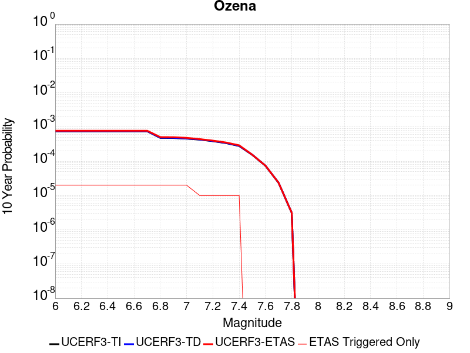 |

| Magnitude | 1 wk TI Prob | 1 wk TD Prob | 1 wk ETAS Prob | 1 wk ETAS/TD Gain | 1 wk ETAS Triggered Only | 1 mo TI Prob | 1 mo TD Prob | 1 mo ETAS Prob | 1 mo ETAS/TD Gain | 1 mo ETAS Triggered Only | 1 yr TI Prob | 1 yr TD Prob | 1 yr ETAS Prob | 1 yr ETAS/TD Gain | 1 yr ETAS Triggered Only | 10 yr TI Prob | 10 yr TD Prob | 10 yr ETAS Prob | 10 yr ETAS/TD Gain | 10 yr ETAS Triggered Only |
|-----|-----|-----|-----|-----|-----|-----|-----|-----|-----|-----|-----|-----|-----|-----|-----|-----|-----|-----|-----|-----|
| 6.0 | 1.4377547E-6 | 1.4513798E-6 | 1.4513798E-6 | 1.0 | 0.0 | 6.161791E-6 | 6.220186E-6 | 6.220186E-6 | 1.0 | 0.0 | 7.5017226E-5 | 7.572841E-5 | 8.572765E-5 | 1.1320409 | 1.0E-5 | 7.4991904E-4 | 7.570526E-4 | 7.7703747E-4 | 1.0263983 | 2.0E-5 |
| 6.1 | 1.4377547E-6 | 1.4513798E-6 | 1.4513798E-6 | 1.0 | 0.0 | 6.161791E-6 | 6.220186E-6 | 6.220186E-6 | 1.0 | 0.0 | 7.5017226E-5 | 7.572841E-5 | 8.572765E-5 | 1.1320409 | 1.0E-5 | 7.4991904E-4 | 7.570526E-4 | 7.7703747E-4 | 1.0263983 | 2.0E-5 |
| 6.2 | 1.4377547E-6 | 1.4513798E-6 | 1.4513798E-6 | 1.0 | 0.0 | 6.161791E-6 | 6.220186E-6 | 6.220186E-6 | 1.0 | 0.0 | 7.5017226E-5 | 7.572841E-5 | 8.572765E-5 | 1.1320409 | 1.0E-5 | 7.4991904E-4 | 7.570526E-4 | 7.7703747E-4 | 1.0263983 | 2.0E-5 |
| 6.3 | 1.4377547E-6 | 1.4513798E-6 | 1.4513798E-6 | 1.0 | 0.0 | 6.161791E-6 | 6.220186E-6 | 6.220186E-6 | 1.0 | 0.0 | 7.5017226E-5 | 7.572841E-5 | 8.572765E-5 | 1.1320409 | 1.0E-5 | 7.4991904E-4 | 7.570526E-4 | 7.7703747E-4 | 1.0263983 | 2.0E-5 |
| 6.4 | 1.4377547E-6 | 1.4513798E-6 | 1.4513798E-6 | 1.0 | 0.0 | 6.161791E-6 | 6.220186E-6 | 6.220186E-6 | 1.0 | 0.0 | 7.5017226E-5 | 7.572841E-5 | 8.572765E-5 | 1.1320409 | 1.0E-5 | 7.4991904E-4 | 7.570526E-4 | 7.7703747E-4 | 1.0263983 | 2.0E-5 |
| 6.5 | 1.4377547E-6 | 1.4513798E-6 | 1.4513798E-6 | 1.0 | 0.0 | 6.161791E-6 | 6.220186E-6 | 6.220186E-6 | 1.0 | 0.0 | 7.5017226E-5 | 7.572841E-5 | 8.572765E-5 | 1.1320409 | 1.0E-5 | 7.4991904E-4 | 7.570526E-4 | 7.7703747E-4 | 1.0263983 | 2.0E-5 |
| 6.6 | 1.4377547E-6 | 1.4513798E-6 | 1.4513798E-6 | 1.0 | 0.0 | 6.161791E-6 | 6.220186E-6 | 6.220186E-6 | 1.0 | 0.0 | 7.5017226E-5 | 7.572841E-5 | 8.572765E-5 | 1.1320409 | 1.0E-5 | 7.4991904E-4 | 7.570526E-4 | 7.7703747E-4 | 1.0263983 | 2.0E-5 |
| 6.7 | 1.4377547E-6 | 1.4513798E-6 | 1.4513798E-6 | 1.0 | 0.0 | 6.161791E-6 | 6.220186E-6 | 6.220186E-6 | 1.0 | 0.0 | 7.5017226E-5 | 7.572841E-5 | 8.572765E-5 | 1.1320409 | 1.0E-5 | 7.4991904E-4 | 7.570526E-4 | 7.7703747E-4 | 1.0263983 | 2.0E-5 |
| 6.8 | 9.223257E-7 | 9.317634E-7 | 9.317634E-7 | 1.0 | 0.0 | 3.9528186E-6 | 3.993266E-6 | 3.993266E-6 | 1.0 | 0.0 | 4.81245E-5 | 4.861697E-5 | 5.8616482E-5 | 1.2056795 | 1.0E-5 | 4.811408E-4 | 4.8606735E-4 | 5.0605764E-4 | 1.0411266 | 2.0E-5 |
| 6.9 | 9.141515E-7 | 9.2353815E-7 | 9.2353815E-7 | 1.0 | 0.0 | 3.917786E-6 | 3.958015E-6 | 3.958015E-6 | 1.0 | 0.0 | 4.7698002E-5 | 4.8187805E-5 | 5.8187325E-5 | 1.2075114 | 1.0E-5 | 4.7687767E-4 | 4.817776E-4 | 5.0176797E-4 | 1.0414929 | 2.0E-5 |
| 7.0 | 8.767648E-7 | 8.8585875E-7 | 8.8585875E-7 | 1.0 | 0.0 | 3.757558E-6 | 3.7965322E-6 | 3.7965322E-6 | 1.0 | 0.0 | 4.5747307E-5 | 4.6221838E-5 | 5.6221375E-5 | 1.2163379 | 1.0E-5 | 4.5737892E-4 | 4.6212616E-4 | 4.8211694E-4 | 1.0432582 | 2.0E-5 |
| 7.1 | 8.199402E-7 | 8.285408E-7 | 8.285408E-7 | 1.0 | 0.0 | 3.5140247E-6 | 3.5508847E-6 | 3.5508847E-6 | 1.0 | 0.0 | 4.2782412E-5 | 4.32312E-5 | 5.3230768E-5 | 1.2313044 | 1.0E-5 | 4.2774176E-4 | 4.3223164E-4 | 4.4222732E-4 | 1.0231258 | 1.0E-5 |
| 7.2 | 7.38705E-7 | 7.4642713E-7 | 7.4642713E-7 | 1.0 | 0.0 | 3.1658747E-6 | 3.1989696E-6 | 3.1989696E-6 | 1.0 | 0.0 | 3.8543843E-5 | 3.8946793E-5 | 4.8946404E-5 | 1.2567506 | 1.0E-5 | 3.853716E-4 | 3.894032E-4 | 3.9939932E-4 | 1.0256703 | 1.0E-5 |
| 7.3 | 6.490017E-7 | 6.557809E-7 | 6.557809E-7 | 1.0 | 0.0 | 2.7814328E-6 | 2.8104869E-6 | 2.8104869E-6 | 1.0 | 0.0 | 3.386342E-5 | 3.4217173E-5 | 4.421683E-5 | 1.2922409 | 1.0E-5 | 3.3858258E-4 | 3.4212242E-4 | 3.52119E-4 | 1.0292193 | 1.0E-5 |
| 7.4 | 5.346736E-7 | 5.4022667E-7 | 5.4022667E-7 | 1.0 | 0.0 | 2.291456E-6 | 2.3152554E-6 | 2.3152554E-6 | 1.0 | 0.0 | 2.789812E-5 | 2.81879E-5 | 3.818762E-5 | 1.3547522 | 1.0E-5 | 2.789462E-4 | 2.818463E-4 | 2.9184346E-4 | 1.0354704 | 1.0E-5 |
| 7.5 | 2.939325E-7 | 2.966609E-7 | 2.966609E-7 | 1.0 | 0.0 | 1.25971E-6 | 1.2714032E-6 | 1.2714032E-6 | 1.0 | 0.0 | 1.5336862E-5 | 1.5479241E-5 | 1.5479241E-5 | 1.0 | 0.0 | 1.5335804E-4 | 1.5478325E-4 | 1.5478325E-4 | 1.0 | 0.0 |
| 7.6 | 1.4151905E-7 | 1.4253277E-7 | 1.4253277E-7 | 1.0 | 0.0 | 6.065101E-7 | 6.1085456E-7 | 6.1085456E-7 | 1.0 | 0.0 | 7.3842357E-6 | 7.4371296E-6 | 7.4371296E-6 | 1.0 | 0.0 | 7.38399E-5 | 7.436889E-5 | 7.436889E-5 | 1.0 | 0.0 |
| 7.7 | 4.4957577E-8 | 4.5252275E-8 | 4.5252275E-8 | 1.0 | 0.0 | 1.9267533E-7 | 1.9393832E-7 | 1.9393832E-7 | 1.0 | 0.0 | 2.3458194E-6 | 2.3611965E-6 | 2.3611965E-6 | 1.0 | 0.0 | 2.3457947E-5 | 2.3611723E-5 | 2.3611723E-5 | 1.0 | 0.0 |
| 7.8 | 5.9993255E-9 | 6.0413017E-9 | 6.0413017E-9 | 1.0 | 0.0 | 2.5711394E-8 | 2.5891294E-8 | 2.5891294E-8 | 1.0 | 0.0 | 3.1303617E-7 | 3.1522646E-7 | 3.1522646E-7 | 1.0 | 0.0 | 3.1303573E-6 | 3.1522613E-6 | 3.1522613E-6 | 1.0 | 0.0 |

## Oceanic - West Huasna
*[(top)](#table-of-contents)*

| 1 Week | 1 Month | 1 Year | 10 Year |
|-----|-----|-----|-----|
|  |  | 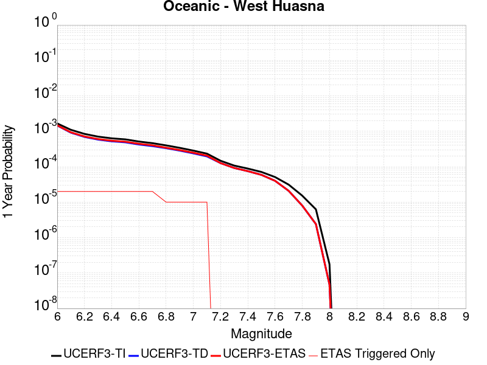 |  |

| Magnitude | 1 wk TI Prob | 1 wk TD Prob | 1 wk ETAS Prob | 1 wk ETAS/TD Gain | 1 wk ETAS Triggered Only | 1 mo TI Prob | 1 mo TD Prob | 1 mo ETAS Prob | 1 mo ETAS/TD Gain | 1 mo ETAS Triggered Only | 1 yr TI Prob | 1 yr TD Prob | 1 yr ETAS Prob | 1 yr ETAS/TD Gain | 1 yr ETAS Triggered Only | 10 yr TI Prob | 10 yr TD Prob | 10 yr ETAS Prob | 10 yr ETAS/TD Gain | 10 yr ETAS Triggered Only |
|-----|-----|-----|-----|-----|-----|-----|-----|-----|-----|-----|-----|-----|-----|-----|-----|-----|-----|-----|-----|-----|
| 6.0 | 3.195567E-5 | 2.7926573E-5 | 3.7926293E-5 | 1.3580719 | 1.0E-5 | 1.3694567E-4 | 1.19680066E-4 | 1.2967887E-4 | 1.0835462 | 1.0E-5 | 0.0016660384 | 0.0014561741 | 0.0014761449 | 1.0137147 | 2.0E-5 | 0.016536033 | 0.014470876 | 0.014490587 | 1.0013621 | 2.0E-5 |
| 6.1 | 2.1156782E-5 | 1.757323E-5 | 2.7573054E-5 | 1.5690373 | 1.0E-5 | 9.066878E-5 | 7.531172E-5 | 8.531097E-5 | 1.1327715 | 1.0E-5 | 0.0011033333 | 9.165439E-4 | 9.365255E-4 | 1.0218011 | 2.0E-5 | 0.010978713 | 0.009128645 | 0.009148463 | 1.0021709 | 2.0E-5 |
| 6.2 | 1.6195117E-5 | 1.3327305E-5 | 2.3327171E-5 | 1.7503293 | 1.0E-5 | 6.9405796E-5 | 5.7115783E-5 | 6.7115216E-5 | 1.1750729 | 1.0E-5 | 8.44688E-4 | 6.951654E-4 | 7.151515E-4 | 1.0287502 | 2.0E-5 | 0.008414844 | 0.0069302022 | 0.0069500636 | 1.0028659 | 2.0E-5 |
| 6.3 | 1.3559345E-5 | 1.1179074E-5 | 2.1178963E-5 | 1.8945185 | 1.0E-5 | 5.811018E-5 | 4.7909445E-5 | 5.7908965E-5 | 1.2087171 | 1.0E-5 | 7.072618E-4 | 5.8314233E-4 | 6.0313067E-4 | 1.034277 | 2.0E-5 | 0.0070501505 | 0.0058162394 | 0.005836123 | 1.0034187 | 2.0E-5 |
| 6.4 | 1.2120619E-5 | 1.0000926E-5 | 2.0000825E-5 | 1.9998974 | 1.0E-5 | 5.1944477E-5 | 4.286041E-5 | 5.285998E-5 | 1.2333056 | 1.0E-5 | 6.322405E-4 | 5.2170106E-4 | 5.416906E-4 | 1.0383161 | 2.0E-5 | 0.006304447 | 0.0052048303 | 0.0052247266 | 1.0038226 | 2.0E-5 |
| 6.5 | 1.13511915E-5 | 9.367426E-6 | 1.9367333E-5 | 2.0675192 | 1.0E-5 | 4.8647056E-5 | 4.0145496E-5 | 5.0145096E-5 | 1.2490839 | 1.0E-5 | 5.9211696E-4 | 4.886623E-4 | 5.086525E-4 | 1.0409081 | 2.0E-5 | 0.0059054173 | 0.004875936 | 0.004895839 | 1.0040817 | 2.0E-5 |
| 6.6 | 9.850605E-6 | 8.1353555E-6 | 1.8135275E-5 | 2.2291925 | 1.0E-5 | 4.2216197E-5 | 3.4865345E-5 | 4.4865E-5 | 1.2868078 | 1.0E-5 | 5.1386096E-4 | 4.2440312E-4 | 4.4439465E-4 | 1.047105 | 2.0E-5 | 0.0051267436 | 0.0042359587 | 0.004255874 | 1.0047015 | 2.0E-5 |
| 6.7 | 8.8558645E-6 | 7.3183774E-6 | 1.7318303E-5 | 2.366413 | 1.0E-5 | 3.7953152E-5 | 3.13641E-5 | 4.1363783E-5 | 1.3188258 | 1.0E-5 | 4.6198163E-4 | 3.8179115E-4 | 4.0178353E-4 | 1.0523647 | 2.0E-5 | 0.004610224 | 0.0038113778 | 0.0038313016 | 1.0052274 | 2.0E-5 |
| 6.8 | 7.67136E-6 | 6.391722E-6 | 6.391722E-6 | 1.0 | 0.0 | 3.2876844E-5 | 2.7392807E-5 | 2.7392807E-5 | 1.0 | 0.0 | 4.0020206E-4 | 3.3345656E-4 | 3.4345323E-4 | 1.0299789 | 1.0E-5 | 0.003994821 | 0.003329583 | 0.0033395498 | 1.0029933 | 1.0E-5 |
| 6.9 | 6.534529E-6 | 5.458289E-6 | 5.458289E-6 | 1.0 | 0.0 | 2.8004823E-5 | 2.3392458E-5 | 2.3392458E-5 | 1.0 | 0.0 | 3.4090536E-4 | 2.8476608E-4 | 2.9476325E-4 | 1.0351065 | 1.0E-5 | 0.0034038287 | 0.0028440286 | 0.002854 | 1.0035062 | 1.0E-5 |
| 7.0 | 5.460525E-6 | 4.569945E-6 | 4.569945E-6 | 1.0 | 0.0 | 2.3402039E-5 | 1.9585332E-5 | 1.9585332E-5 | 1.0 | 0.0 | 2.8488258E-4 | 2.3842543E-4 | 2.4842305E-4 | 1.0419319 | 1.0E-5 | 0.0028451765 | 0.00238171 | 0.0023916864 | 1.0041887 | 1.0E-5 |
| 7.1 | 4.4825083E-6 | 3.7524383E-6 | 3.7524383E-6 | 1.0 | 0.0 | 1.9210609E-5 | 1.608178E-5 | 1.608178E-5 | 1.0 | 0.0 | 2.3386406E-4 | 1.9577818E-4 | 2.0577622E-4 | 1.0510682 | 1.0E-5 | 0.002336181 | 0.001956069 | 0.0019660494 | 1.0051023 | 1.0E-5 |
| 7.2 | 2.821708E-6 | 2.4249616E-6 | 2.4249616E-6 | 1.0 | 0.0 | 1.2092979E-5 | 1.0392651E-5 | 1.0392651E-5 | 1.0 | 0.0 | 1.4722206E-4 | 1.2652318E-4 | 1.2652318E-4 | 1.0 | 0.0 | 0.0014712457 | 0.0012645139 | 0.0012645139 | 1.0 | 0.0 |
| 7.3 | 2.0644757E-6 | 1.7687685E-6 | 1.7687685E-6 | 1.0 | 0.0 | 8.847723E-6 | 7.580414E-6 | 7.580414E-6 | 1.0 | 0.0 | 1.0771569E-4 | 9.2287635E-5 | 9.2287635E-5 | 1.0 | 0.0 | 0.001076635 | 9.224948E-4 | 9.224948E-4 | 1.0 | 0.0 |
| 7.4 | 1.6980367E-6 | 1.438014E-6 | 1.438014E-6 | 1.0 | 0.0 | 7.27728E-6 | 6.1629025E-6 | 6.1629025E-6 | 1.0 | 0.0 | 8.8597284E-5 | 7.503075E-5 | 7.503075E-5 | 1.0 | 0.0 | 8.8561967E-4 | 7.500558E-4 | 7.500558E-4 | 1.0 | 0.0 |
| 7.5 | 1.3637683E-6 | 1.1302861E-6 | 1.1302861E-6 | 1.0 | 0.0 | 5.844708E-6 | 4.8440743E-6 | 4.8440743E-6 | 1.0 | 0.0 | 7.1156996E-5 | 5.897501E-5 | 5.897501E-5 | 1.0 | 0.0 | 7.1134215E-4 | 5.8959506E-4 | 5.8959506E-4 | 1.0 | 0.0 |
| 7.6 | 9.802994E-7 | 7.67744E-7 | 7.67744E-7 | 1.0 | 0.0 | 4.2012766E-6 | 3.2903272E-6 | 3.2903272E-6 | 1.0 | 0.0 | 5.1149345E-5 | 4.0059E-5 | 4.0059E-5 | 1.0 | 0.0 | 5.113757E-4 | 4.0051917E-4 | 4.0051917E-4 | 1.0 | 0.0 |
| 7.7 | 5.986191E-7 | 4.0052169E-7 | 4.0052169E-7 | 1.0 | 0.0 | 2.5655079E-6 | 1.7165204E-6 | 1.7165204E-6 | 1.0 | 0.0 | 3.1234613E-5 | 2.0898435E-5 | 2.0898435E-5 | 1.0 | 0.0 | 3.123022E-4 | 2.0896603E-4 | 2.0896603E-4 | 1.0 | 0.0 |
| 7.8 | 2.9189815E-7 | 1.5286493E-7 | 1.5286493E-7 | 1.0 | 0.0 | 1.2509914E-6 | 6.5513524E-7 | 6.5513524E-7 | 1.0 | 0.0 | 1.5230714E-5 | 7.976242E-6 | 7.976242E-6 | 1.0 | 0.0 | 1.522967E-4 | 7.9760845E-5 | 7.9760845E-5 | 1.0 | 0.0 |
| 7.9 | 1.2057845E-7 | 4.6214893E-8 | 4.6214893E-8 | 1.0 | 0.0 | 5.1676466E-7 | 1.9806382E-7 | 1.9806382E-7 | 1.0 | 0.0 | 6.2915915E-6 | 2.4114242E-6 | 2.4114242E-6 | 1.0 | 0.0 | 6.2914136E-5 | 2.4115261E-5 | 2.4115261E-5 | 1.0 | 0.0 |
| 8.0 | 3.3806387E-9 | 9.012153E-10 | 9.012153E-10 | 1.0 | 0.0 | 1.4488451E-8 | 3.8623504E-9 | 3.8623504E-9 | 1.0 | 0.0 | 1.7639688E-7 | 4.702412E-8 | 4.702412E-8 | 1.0 | 0.0 | 1.7639674E-6 | 4.7133327E-7 | 4.7133327E-7 | 1.0 | 0.0 |

## North Frontal  (East)
*[(top)](#table-of-contents)*

| 1 Week | 1 Month | 1 Year | 10 Year |
|-----|-----|-----|-----|
|  | 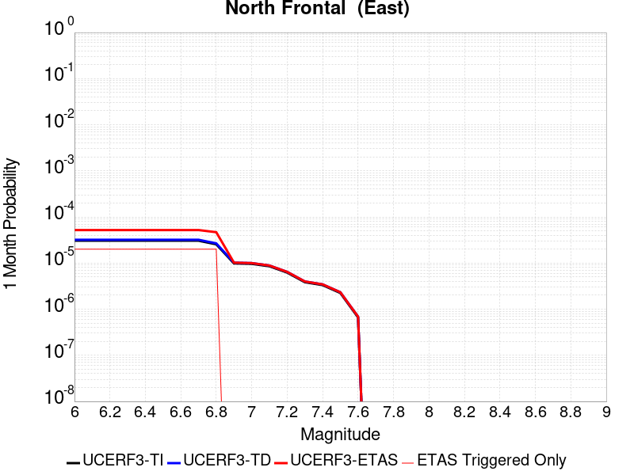 |  |  |

| Magnitude | 1 wk TI Prob | 1 wk TD Prob | 1 wk ETAS Prob | 1 wk ETAS/TD Gain | 1 wk ETAS Triggered Only | 1 mo TI Prob | 1 mo TD Prob | 1 mo ETAS Prob | 1 mo ETAS/TD Gain | 1 mo ETAS Triggered Only | 1 yr TI Prob | 1 yr TD Prob | 1 yr ETAS Prob | 1 yr ETAS/TD Gain | 1 yr ETAS Triggered Only | 10 yr TI Prob | 10 yr TD Prob | 10 yr ETAS Prob | 10 yr ETAS/TD Gain | 10 yr ETAS Triggered Only |
|-----|-----|-----|-----|-----|-----|-----|-----|-----|-----|-----|-----|-----|-----|-----|-----|-----|-----|-----|-----|-----|
| 6.0 | 7.135738E-6 | 7.4772165E-6 | 1.7477141E-5 | 2.3373861 | 1.0E-5 | 3.0581377E-5 | 3.2044933E-5 | 5.204429E-5 | 1.6241037 | 2.0E-5 | 3.7226462E-4 | 3.9009715E-4 | 4.1008936E-4 | 1.0512493 | 2.0E-5 | 0.0037164164 | 0.0038960816 | 0.0039160037 | 1.0051134 | 2.0E-5 |
| 6.1 | 7.135738E-6 | 7.4772165E-6 | 1.7477141E-5 | 2.3373861 | 1.0E-5 | 3.0581377E-5 | 3.2044933E-5 | 5.204429E-5 | 1.6241037 | 2.0E-5 | 3.7226462E-4 | 3.9009715E-4 | 4.1008936E-4 | 1.0512493 | 2.0E-5 | 0.0037164164 | 0.0038960816 | 0.0039160037 | 1.0051134 | 2.0E-5 |
| 6.2 | 7.135738E-6 | 7.4772165E-6 | 1.7477141E-5 | 2.3373861 | 1.0E-5 | 3.0581377E-5 | 3.2044933E-5 | 5.204429E-5 | 1.6241037 | 2.0E-5 | 3.7226462E-4 | 3.9009715E-4 | 4.1008936E-4 | 1.0512493 | 2.0E-5 | 0.0037164164 | 0.0038960816 | 0.0039160037 | 1.0051134 | 2.0E-5 |
| 6.3 | 7.135738E-6 | 7.4772165E-6 | 1.7477141E-5 | 2.3373861 | 1.0E-5 | 3.0581377E-5 | 3.2044933E-5 | 5.204429E-5 | 1.6241037 | 2.0E-5 | 3.7226462E-4 | 3.9009715E-4 | 4.1008936E-4 | 1.0512493 | 2.0E-5 | 0.0037164164 | 0.0038960816 | 0.0039160037 | 1.0051134 | 2.0E-5 |
| 6.4 | 7.135738E-6 | 7.4772165E-6 | 1.7477141E-5 | 2.3373861 | 1.0E-5 | 3.0581377E-5 | 3.2044933E-5 | 5.204429E-5 | 1.6241037 | 2.0E-5 | 3.7226462E-4 | 3.9009715E-4 | 4.1008936E-4 | 1.0512493 | 2.0E-5 | 0.0037164164 | 0.0038960816 | 0.0039160037 | 1.0051134 | 2.0E-5 |
| 6.5 | 7.135738E-6 | 7.4772165E-6 | 1.7477141E-5 | 2.3373861 | 1.0E-5 | 3.0581377E-5 | 3.2044933E-5 | 5.204429E-5 | 1.6241037 | 2.0E-5 | 3.7226462E-4 | 3.9009715E-4 | 4.1008936E-4 | 1.0512493 | 2.0E-5 | 0.0037164164 | 0.0038960816 | 0.0039160037 | 1.0051134 | 2.0E-5 |
| 6.6 | 7.135738E-6 | 7.4772165E-6 | 1.7477141E-5 | 2.3373861 | 1.0E-5 | 3.0581377E-5 | 3.2044933E-5 | 5.204429E-5 | 1.6241037 | 2.0E-5 | 3.7226462E-4 | 3.9009715E-4 | 4.1008936E-4 | 1.0512493 | 2.0E-5 | 0.0037164164 | 0.0038960816 | 0.0039160037 | 1.0051134 | 2.0E-5 |
| 6.7 | 7.135738E-6 | 7.4772165E-6 | 1.7477141E-5 | 2.3373861 | 1.0E-5 | 3.0581377E-5 | 3.2044933E-5 | 5.204429E-5 | 1.6241037 | 2.0E-5 | 3.7226462E-4 | 3.9009715E-4 | 4.1008936E-4 | 1.0512493 | 2.0E-5 | 0.0037164164 | 0.0038960816 | 0.0039160037 | 1.0051134 | 2.0E-5 |
| 6.8 | 5.959142E-6 | 6.2367153E-6 | 1.6236652E-5 | 2.603398 | 1.0E-5 | 2.553893E-5 | 2.6728609E-5 | 4.6728073E-5 | 1.7482419 | 2.0E-5 | 3.108921E-4 | 3.2539028E-4 | 3.4538377E-4 | 1.0614446 | 2.0E-5 | 0.0031045752 | 0.0032509116 | 0.0032708466 | 1.0061321 | 2.0E-5 |
| 6.9 | 2.2946929E-6 | 2.3824707E-6 | 2.3824707E-6 | 1.0 | 0.0 | 9.834361E-6 | 1.0210551E-5 | 1.0210551E-5 | 1.0 | 0.0 | 1.1972676E-4 | 1.2430684E-4 | 1.2430684E-4 | 1.0 | 0.0 | 0.0011966228 | 0.0012424196 | 0.0012424196 | 1.0 | 0.0 |
| 7.0 | 2.2468673E-6 | 2.3321636E-6 | 2.3321636E-6 | 1.0 | 0.0 | 9.629396E-6 | 9.994951E-6 | 9.994951E-6 | 1.0 | 0.0 | 1.1723159E-4 | 1.2168221E-4 | 1.2168221E-4 | 1.0 | 0.0 | 0.0011716976 | 0.0012162022 | 0.0012162022 | 1.0 | 0.0 |
| 7.1 | 1.9921076E-6 | 2.0646116E-6 | 2.0646116E-6 | 1.0 | 0.0 | 8.537577E-6 | 8.8483075E-6 | 8.8483075E-6 | 1.0 | 0.0 | 1.0394004E-4 | 1.0772326E-4 | 1.0772326E-4 | 1.0 | 0.0 | 0.0010389143 | 0.0010767531 | 0.0010767531 | 1.0 | 0.0 |
| 7.2 | 1.4524545E-6 | 1.5045208E-6 | 1.5045208E-6 | 1.0 | 0.0 | 6.2247905E-6 | 6.447932E-6 | 6.447932E-6 | 1.0 | 0.0 | 7.5784184E-5 | 7.850099E-5 | 7.850099E-5 | 1.0 | 0.0 | 7.575835E-4 | 7.847571E-4 | 7.847571E-4 | 1.0 | 0.0 |
| 7.3 | 8.9802575E-7 | 9.3087664E-7 | 9.3087664E-7 | 1.0 | 0.0 | 3.848676E-6 | 3.9894658E-6 | 3.9894658E-6 | 1.0 | 0.0 | 4.685662E-5 | 4.857078E-5 | 4.857078E-5 | 1.0 | 0.0 | 4.6846745E-4 | 4.8561292E-4 | 4.8561292E-4 | 1.0 | 0.0 |
| 7.4 | 7.776139E-7 | 8.0605076E-7 | 8.0605076E-7 | 1.0 | 0.0 | 3.3326266E-6 | 3.4544994E-6 | 3.4544994E-6 | 1.0 | 0.0 | 4.0573974E-5 | 4.205783E-5 | 4.205783E-5 | 1.0 | 0.0 | 4.0566566E-4 | 4.2050943E-4 | 4.2050943E-4 | 1.0 | 0.0 |
| 7.5 | 5.244417E-7 | 5.441242E-7 | 5.441242E-7 | 1.0 | 0.0 | 2.2476054E-6 | 2.3319592E-6 | 2.3319592E-6 | 1.0 | 0.0 | 2.7364253E-5 | 2.83913E-5 | 2.83913E-5 | 1.0 | 0.0 | 2.7360884E-4 | 2.8388324E-4 | 2.8388324E-4 | 1.0 | 0.0 |
| 7.6 | 1.5489647E-7 | 1.6089574E-7 | 1.6089574E-7 | 1.0 | 0.0 | 6.6384183E-7 | 6.895531E-7 | 6.895531E-7 | 1.0 | 0.0 | 8.082245E-6 | 8.395297E-6 | 8.395297E-6 | 1.0 | 0.0 | 8.08195E-5 | 8.3951796E-5 | 8.3951796E-5 | 1.0 | 0.0 |

## Calaveras (Central) 2011 CFM
*[(top)](#table-of-contents)*

| 1 Week | 1 Month | 1 Year | 10 Year |
|-----|-----|-----|-----|
| 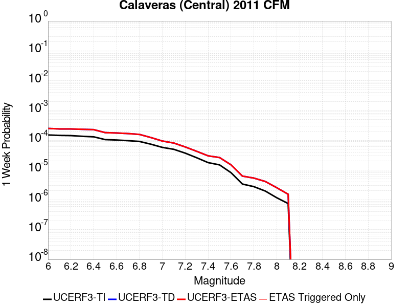 |  | 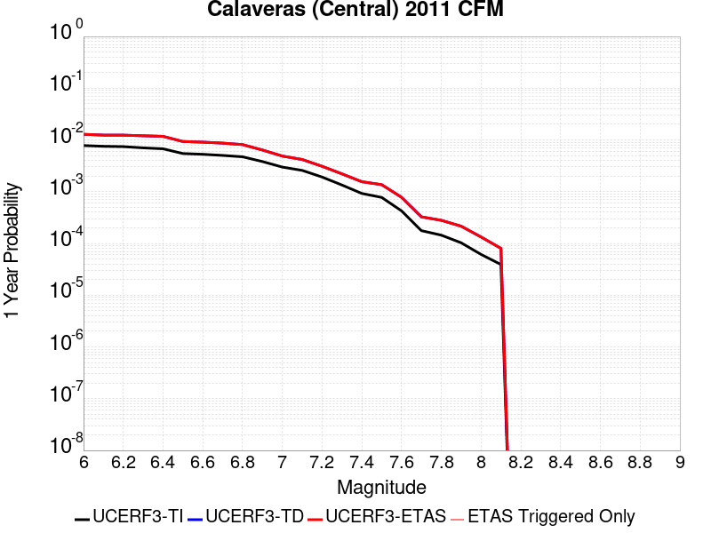 |  |

| Magnitude | 1 wk TI Prob | 1 wk TD Prob | 1 wk ETAS Prob | 1 wk ETAS/TD Gain | 1 wk ETAS Triggered Only | 1 mo TI Prob | 1 mo TD Prob | 1 mo ETAS Prob | 1 mo ETAS/TD Gain | 1 mo ETAS Triggered Only | 1 yr TI Prob | 1 yr TD Prob | 1 yr ETAS Prob | 1 yr ETAS/TD Gain | 1 yr ETAS Triggered Only | 10 yr TI Prob | 10 yr TD Prob | 10 yr ETAS Prob | 10 yr ETAS/TD Gain | 10 yr ETAS Triggered Only |
|-----|-----|-----|-----|-----|-----|-----|-----|-----|-----|-----|-----|-----|-----|-----|-----|-----|-----|-----|-----|-----|
| 6.0 | 1.5010907E-4 | 2.4806889E-4 | 2.4806889E-4 | 1.0 | 0.0 | 6.4316596E-4 | 0.0010626605 | 0.0010626605 | 1.0 | 0.0 | 0.0078024664 | 0.012852444 | 0.012852444 | 1.0 | 0.0 | 0.07534136 | 0.120424934 | 0.120442525 | 1.000146 | 2.0E-5 |
| 6.1 | 1.4521465E-4 | 2.3968195E-4 | 2.3968195E-4 | 1.0 | 0.0 | 6.222001E-4 | 0.0010267562 | 0.0010267562 | 1.0 | 0.0 | 0.0075490056 | 0.012421748 | 0.012421748 | 1.0 | 0.0 | 0.07297657 | 0.11669639 | 0.11671405 | 1.0001514 | 2.0E-5 |
| 6.2 | 1.429998E-4 | 2.3899389E-4 | 2.3899389E-4 | 1.0 | 0.0 | 6.127123E-4 | 0.0010238099 | 0.0010238099 | 1.0 | 0.0 | 0.007434286 | 0.01238633 | 0.01238633 | 1.0 | 0.0 | 0.07190444 | 0.116350316 | 0.11636799 | 1.0001519 | 2.0E-5 |
| 6.3 | 1.3536277E-4 | 2.323039E-4 | 2.323039E-4 | 1.0 | 0.0 | 5.799972E-4 | 9.951693E-4 | 9.951693E-4 | 1.0 | 0.0 | 0.0070386264 | 0.01204245 | 0.01204245 | 1.0 | 0.0 | 0.0681982 | 0.1132627 | 0.11328043 | 1.0001565 | 2.0E-5 |
| 6.4 | 1.2993296E-4 | 2.2653883E-4 | 2.2653883E-4 | 1.0 | 0.0 | 5.5673666E-4 | 9.70481E-4 | 9.70481E-4 | 1.0 | 0.0 | 0.006757223 | 0.011745214 | 0.011745214 | 1.0 | 0.0 | 0.06555412 | 0.11054045 | 0.11055824 | 1.0001609 | 2.0E-5 |
| 6.5 | 1.0498927E-4 | 1.7985447E-4 | 1.7985447E-4 | 1.0 | 0.0 | 4.498764E-4 | 7.705763E-4 | 7.705763E-4 | 1.0 | 0.0 | 0.005463498 | 0.009341325 | 0.009341325 | 1.0 | 0.0 | 0.053311124 | 0.08921985 | 0.08923807 | 1.0002042 | 2.0E-5 |
| 6.6 | 1.0157505E-4 | 1.747295E-4 | 1.747295E-4 | 1.0 | 0.0 | 4.35249E-4 | 7.486251E-4 | 7.486251E-4 | 1.0 | 0.0 | 0.0052862884 | 0.009076358 | 0.009076358 | 1.0 | 0.0 | 0.05162293 | 0.086797416 | 0.086815685 | 1.0002104 | 2.0E-5 |
| 6.7 | 9.660386E-5 | 1.6732202E-4 | 1.6732202E-4 | 1.0 | 0.0 | 4.1395082E-4 | 7.1689655E-4 | 7.1689655E-4 | 1.0 | 0.0 | 0.0050282106 | 0.008693248 | 0.008693248 | 1.0 | 0.0 | 0.049159497 | 0.08328651 | 0.083304845 | 1.0002202 | 2.0E-5 |
| 6.8 | 9.089927E-5 | 1.5646352E-4 | 1.5646352E-4 | 1.0 | 0.0 | 3.8951015E-4 | 6.7038456E-4 | 6.7038456E-4 | 1.0 | 0.0 | 0.0047319788 | 0.008131357 | 0.008131357 | 1.0 | 0.0 | 0.046324775 | 0.07818199 | 0.07820042 | 1.0002358 | 2.0E-5 |
| 6.9 | 7.353187E-5 | 1.2297985E-4 | 1.2297985E-4 | 1.0 | 0.0 | 3.150985E-4 | 5.269506E-4 | 5.269506E-4 | 1.0 | 0.0 | 0.0038295772 | 0.0063968715 | 0.0063968715 | 1.0 | 0.0 | 0.037642512 | 0.0622006 | 0.06221935 | 1.0003016 | 2.0E-5 |
| 7.0 | 5.746064E-5 | 9.391142E-5 | 9.391142E-5 | 1.0 | 0.0 | 2.4623662E-4 | 4.0241578E-4 | 4.0241578E-4 | 1.0 | 0.0 | 0.0029938098 | 0.004888477 | 0.004888477 | 1.0 | 0.0 | 0.02953797 | 0.047997937 | 0.048016977 | 1.0003967 | 2.0E-5 |
| 7.1 | 4.9557195E-5 | 8.054049E-5 | 8.054049E-5 | 1.0 | 0.0 | 2.123707E-4 | 3.451282E-4 | 3.451282E-4 | 1.0 | 0.0 | 0.0025825473 | 0.0041939025 | 0.0041939025 | 1.0 | 0.0 | 0.0255274 | 0.0413806 | 0.041399773 | 1.0004634 | 2.0E-5 |
| 7.2 | 3.687595E-5 | 5.953916E-5 | 5.953916E-5 | 1.0 | 0.0 | 1.5803022E-4 | 2.5514304E-4 | 2.5514304E-4 | 1.0 | 0.0 | 0.0019223199 | 0.0031019705 | 0.0031019705 | 1.0 | 0.0 | 0.01905776 | 0.030890834 | 0.030910216 | 1.0006274 | 2.0E-5 |
| 7.3 | 2.5846984E-5 | 4.24851E-5 | 4.24851E-5 | 1.0 | 0.0 | 1.1076809E-4 | 1.8206639E-4 | 1.8206639E-4 | 1.0 | 0.0 | 0.0013477671 | 0.0022144222 | 0.0022144222 | 1.0 | 0.0 | 0.013396223 | 0.022181902 | 0.022201458 | 1.0008817 | 2.0E-5 |
| 7.4 | 1.7747854E-5 | 2.9942828E-5 | 2.9942828E-5 | 1.0 | 0.0 | 7.6060016E-5 | 1.2832011E-4 | 1.2832011E-4 | 1.0 | 0.0 | 9.2563726E-4 | 0.0015611807 | 0.0015611807 | 1.0 | 0.0 | 0.009217911 | 0.015711293 | 0.015730977 | 1.001253 | 2.0E-5 |
| 7.5 | 1.4883479E-5 | 2.6249589E-5 | 2.6249589E-5 | 1.0 | 0.0 | 6.378478E-5 | 1.12493406E-4 | 1.12493406E-4 | 1.0 | 0.0 | 7.76303E-4 | 0.0013687495 | 0.0013687495 | 1.0 | 0.0 | 0.0077359667 | 0.013804215 | 0.013823939 | 1.0014288 | 2.0E-5 |
| 7.6 | 8.166975E-6 | 1.4968088E-5 | 1.4968088E-5 | 1.0 | 0.0 | 3.5000852E-5 | 6.414738E-5 | 6.414738E-5 | 1.0 | 0.0 | 4.2605202E-4 | 7.8071584E-4 | 7.8071584E-4 | 1.0 | 0.0 | 0.004252361 | 0.007941045 | 0.007960886 | 1.0024985 | 2.0E-5 |
| 7.7 | 3.3858064E-6 | 6.2569798E-6 | 6.2569798E-6 | 1.0 | 0.0 | 1.4510518E-5 | 2.6815353E-5 | 2.6815353E-5 | 1.0 | 0.0 | 1.7665124E-4 | 3.2642807E-4 | 3.2642807E-4 | 1.0 | 0.0 | 0.0017651088 | 0.0033897108 | 0.003409643 | 1.0058802 | 2.0E-5 |
| 7.8 | 2.7721615E-6 | 5.369046E-6 | 5.369046E-6 | 1.0 | 0.0 | 1.1880637E-5 | 2.3009994E-5 | 2.3009994E-5 | 1.0 | 0.0 | 1.4463716E-4 | 2.8011072E-4 | 2.8011072E-4 | 1.0 | 0.0 | 0.0014454306 | 0.002908759 | 0.002928701 | 1.0068557 | 2.0E-5 |
| 7.9 | 1.9736292E-6 | 4.130427E-6 | 4.130427E-6 | 1.0 | 0.0 | 8.4583835E-6 | 1.770171E-5 | 1.770171E-5 | 1.0 | 0.0 | 1.0297595E-4 | 2.1549704E-4 | 2.1549704E-4 | 1.0 | 0.0 | 0.0010292825 | 0.0022245995 | 0.002244555 | 1.0089704 | 2.0E-5 |
| 8.0 | 1.1767289E-6 | 2.5556647E-6 | 2.5556647E-6 | 1.0 | 0.0 | 5.0431145E-6 | 1.0952802E-5 | 1.0952802E-5 | 1.0 | 0.0 | 6.139818E-5 | 1.3334224E-4 | 1.3334224E-4 | 1.0 | 0.0 | 6.1381224E-4 | 0.0013666608 | 0.0013766472 | 1.007307 | 1.0E-5 |
| 8.1 | 7.5112825E-7 | 1.5416877E-6 | 1.5416877E-6 | 1.0 | 0.0 | 3.2191172E-6 | 6.607216E-6 | 6.607216E-6 | 1.0 | 0.0 | 3.9192048E-5 | 8.043991E-5 | 8.043991E-5 | 1.0 | 0.0 | 3.9185135E-4 | 8.2389783E-4 | 8.2389783E-4 | 1.0 | 0.0 |

## San Gabriel
*[(top)](#table-of-contents)*

| 1 Week | 1 Month | 1 Year | 10 Year |
|-----|-----|-----|-----|
| 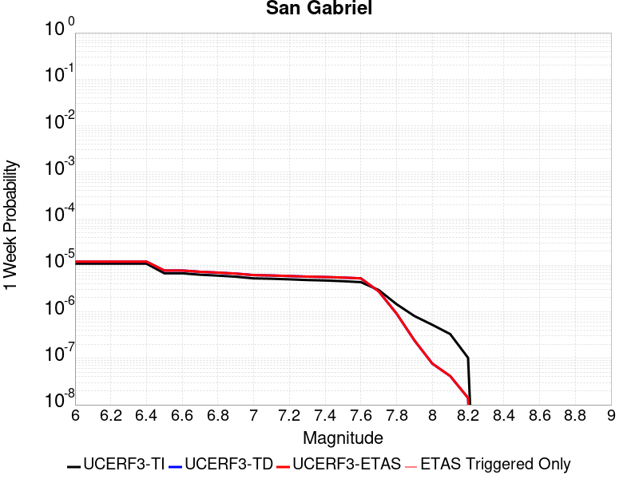 |  |  |  |

| Magnitude | 1 wk TI Prob | 1 wk TD Prob | 1 wk ETAS Prob | 1 wk ETAS/TD Gain | 1 wk ETAS Triggered Only | 1 mo TI Prob | 1 mo TD Prob | 1 mo ETAS Prob | 1 mo ETAS/TD Gain | 1 mo ETAS Triggered Only | 1 yr TI Prob | 1 yr TD Prob | 1 yr ETAS Prob | 1 yr ETAS/TD Gain | 1 yr ETAS Triggered Only | 10 yr TI Prob | 10 yr TD Prob | 10 yr ETAS Prob | 10 yr ETAS/TD Gain | 10 yr ETAS Triggered Only |
|-----|-----|-----|-----|-----|-----|-----|-----|-----|-----|-----|-----|-----|-----|-----|-----|-----|-----|-----|-----|-----|
| 6.0 | 1.083775E-5 | 1.19870265E-5 | 1.19870265E-5 | 1.0 | 0.0 | 4.6446676E-5 | 5.1372022E-5 | 6.137151E-5 | 1.1946485 | 1.0E-5 | 5.653415E-4 | 6.252862E-4 | 6.3528E-4 | 1.0159826 | 1.0E-5 | 0.0056390543 | 0.0062473393 | 0.0062672147 | 1.0031813 | 2.0E-5 |
| 6.1 | 1.083775E-5 | 1.19870265E-5 | 1.19870265E-5 | 1.0 | 0.0 | 4.6446676E-5 | 5.1372022E-5 | 6.137151E-5 | 1.1946485 | 1.0E-5 | 5.653415E-4 | 6.252862E-4 | 6.3528E-4 | 1.0159826 | 1.0E-5 | 0.0056390543 | 0.0062473393 | 0.0062672147 | 1.0031813 | 2.0E-5 |
| 6.2 | 1.083775E-5 | 1.19870265E-5 | 1.19870265E-5 | 1.0 | 0.0 | 4.6446676E-5 | 5.1372022E-5 | 6.137151E-5 | 1.1946485 | 1.0E-5 | 5.653415E-4 | 6.252862E-4 | 6.3528E-4 | 1.0159826 | 1.0E-5 | 0.0056390543 | 0.0062473393 | 0.0062672147 | 1.0031813 | 2.0E-5 |
| 6.3 | 1.083775E-5 | 1.19870265E-5 | 1.19870265E-5 | 1.0 | 0.0 | 4.6446676E-5 | 5.1372022E-5 | 6.137151E-5 | 1.1946485 | 1.0E-5 | 5.653415E-4 | 6.252862E-4 | 6.3528E-4 | 1.0159826 | 1.0E-5 | 0.0056390543 | 0.0062473393 | 0.0062672147 | 1.0031813 | 2.0E-5 |
| 6.4 | 1.083775E-5 | 1.19870265E-5 | 1.19870265E-5 | 1.0 | 0.0 | 4.6446676E-5 | 5.1372022E-5 | 6.137151E-5 | 1.1946485 | 1.0E-5 | 5.653415E-4 | 6.252862E-4 | 6.3528E-4 | 1.0159826 | 1.0E-5 | 0.0056390543 | 0.0062473393 | 0.0062672147 | 1.0031813 | 2.0E-5 |
| 6.5 | 6.7317824E-6 | 7.718765E-6 | 7.718765E-6 | 1.0 | 0.0 | 2.8850178E-5 | 3.3080007E-5 | 3.3080007E-5 | 1.0 | 0.0 | 3.511943E-4 | 4.026757E-4 | 4.026757E-4 | 1.0 | 0.0 | 0.003506398 | 0.004030532 | 0.0040404922 | 1.0024711 | 1.0E-5 |
| 6.6 | 6.7317824E-6 | 7.718765E-6 | 7.718765E-6 | 1.0 | 0.0 | 2.8850178E-5 | 3.3080007E-5 | 3.3080007E-5 | 1.0 | 0.0 | 3.511943E-4 | 4.026757E-4 | 4.026757E-4 | 1.0 | 0.0 | 0.003506398 | 0.004030532 | 0.0040404922 | 1.0024711 | 1.0E-5 |
| 6.7 | 6.274881E-6 | 7.2476832E-6 | 7.2476832E-6 | 1.0 | 0.0 | 2.6892068E-5 | 3.1061136E-5 | 3.1061136E-5 | 1.0 | 0.0 | 3.2736175E-4 | 3.7810468E-4 | 3.7810468E-4 | 1.0 | 0.0 | 0.0032687993 | 0.0037856784 | 0.0037956405 | 1.0026315 | 1.0E-5 |
| 6.8 | 5.996209E-6 | 6.9604025E-6 | 6.9604025E-6 | 1.0 | 0.0 | 2.5697784E-5 | 2.982996E-5 | 2.982996E-5 | 1.0 | 0.0 | 3.128256E-4 | 3.6312017E-4 | 3.6312017E-4 | 1.0 | 0.0 | 0.003123856 | 0.003636331 | 0.0036462946 | 1.00274 | 1.0E-5 |
| 6.9 | 5.686331E-6 | 6.6254406E-6 | 6.6254406E-6 | 1.0 | 0.0 | 2.4369761E-5 | 2.8394441E-5 | 2.8394441E-5 | 1.0 | 0.0 | 2.9666146E-4 | 3.4564838E-4 | 3.4564838E-4 | 1.0 | 0.0 | 0.0029626573 | 0.0034621689 | 0.0034721342 | 1.0028783 | 1.0E-5 |
| 7.0 | 5.2329838E-6 | 6.149319E-6 | 6.149319E-6 | 1.0 | 0.0 | 2.242688E-5 | 2.6353962E-5 | 2.6353962E-5 | 1.0 | 0.0 | 2.7301308E-4 | 3.20813E-4 | 3.20813E-4 | 1.0 | 0.0 | 0.002726779 | 0.0032145476 | 0.0032245154 | 1.0031009 | 1.0E-5 |
| 7.1 | 5.135671E-6 | 6.039439E-6 | 6.039439E-6 | 1.0 | 0.0 | 2.2009834E-5 | 2.5883057E-5 | 2.5883057E-5 | 1.0 | 0.0 | 2.6793676E-4 | 3.1508142E-4 | 3.1508142E-4 | 1.0 | 0.0 | 0.0026761394 | 0.0031573959 | 0.0031673643 | 1.0031571 | 1.0E-5 |
| 7.2 | 4.989062E-6 | 5.87281E-6 | 5.87281E-6 | 1.0 | 0.0 | 2.1381518E-5 | 2.5168947E-5 | 2.5168947E-5 | 1.0 | 0.0 | 2.6028889E-4 | 3.063896E-4 | 3.063896E-4 | 1.0 | 0.0 | 0.0025998424 | 0.0030707205 | 0.0030806898 | 1.0032465 | 1.0E-5 |
| 7.3 | 4.8219395E-6 | 5.704356E-6 | 5.704356E-6 | 1.0 | 0.0 | 2.0665291E-5 | 2.4447016E-5 | 2.4447016E-5 | 1.0 | 0.0 | 2.5157086E-4 | 2.9760253E-4 | 2.9760253E-4 | 1.0 | 0.0 | 0.0025128627 | 0.002983089 | 0.0029930593 | 1.0033423 | 1.0E-5 |
| 7.4 | 4.7118383E-6 | 5.5929077E-6 | 5.5929077E-6 | 1.0 | 0.0 | 2.0193436E-5 | 2.3969387E-5 | 2.3969387E-5 | 1.0 | 0.0 | 2.4582737E-4 | 2.9178898E-4 | 2.9178898E-4 | 1.0 | 0.0 | 0.002455556 | 0.002925106 | 0.0029350768 | 1.0034087 | 1.0E-5 |
| 7.5 | 4.5506545E-6 | 5.438266E-6 | 5.438266E-6 | 1.0 | 0.0 | 1.9502659E-5 | 2.330665E-5 | 2.330665E-5 | 1.0 | 0.0 | 2.37419E-4 | 2.8372227E-4 | 2.8372227E-4 | 1.0 | 0.0 | 0.002371655 | 0.002844647 | 0.0028546187 | 1.0035053 | 1.0E-5 |
| 7.6 | 4.343636E-6 | 5.2311298E-6 | 5.2311298E-6 | 1.0 | 0.0 | 1.861545E-5 | 2.2418939E-5 | 2.2418939E-5 | 1.0 | 0.0 | 2.2661954E-4 | 2.7291712E-4 | 2.7291712E-4 | 1.0 | 0.0 | 0.0022638857 | 0.0027368574 | 0.00274683 | 1.0036439 | 1.0E-5 |
| 7.7 | 2.936235E-6 | 2.7450906E-6 | 2.7450906E-6 | 1.0 | 0.0 | 1.2583803E-5 | 1.1764621E-5 | 1.1764621E-5 | 1.0 | 0.0 | 1.5319703E-4 | 1.4322488E-4 | 1.4322488E-4 | 1.0 | 0.0 | 0.0015309147 | 0.0014385927 | 0.0014485783 | 1.0069412 | 1.0E-5 |
| 7.8 | 1.4541639E-6 | 9.1272307E-7 | 9.1272307E-7 | 1.0 | 0.0 | 6.232116E-6 | 3.9116644E-6 | 3.9116644E-6 | 1.0 | 0.0 | 7.587337E-5 | 4.7623475E-5 | 4.7623475E-5 | 1.0 | 0.0 | 7.584747E-4 | 4.8103163E-4 | 4.8103163E-4 | 1.0 | 0.0 |
| 7.9 | 8.098958E-7 | 2.4184146E-7 | 2.4184146E-7 | 1.0 | 0.0 | 3.4709774E-6 | 1.0364629E-6 | 1.0364629E-6 | 1.0 | 0.0 | 4.225833E-5 | 1.26188625E-5 | 1.26188625E-5 | 1.0 | 0.0 | 4.2250296E-4 | 1.2926824E-4 | 1.2926824E-4 | 1.0 | 0.0 |
| 8.0 | 5.2473234E-7 | 7.681111E-8 | 7.681111E-8 | 1.0 | 0.0 | 2.248851E-6 | 3.2919044E-7 | 3.2919044E-7 | 1.0 | 0.0 | 2.7379416E-5 | 4.007886E-6 | 4.007886E-6 | 1.0 | 0.0 | 2.7376044E-4 | 4.220703E-5 | 4.220703E-5 | 1.0 | 0.0 |
| 8.1 | 3.3162388E-7 | 4.1502542E-8 | 4.1502542E-8 | 1.0 | 0.0 | 1.4212444E-6 | 1.7786802E-7 | 1.7786802E-7 | 1.0 | 0.0 | 1.7303513E-5 | 2.165541E-6 | 2.165541E-6 | 1.0 | 0.0 | 1.7302166E-4 | 2.297309E-5 | 2.297309E-5 | 1.0 | 0.0 |
| 8.2 | 1.0235345E-7 | 1.4046221E-8 | 1.4046221E-8 | 1.0 | 0.0 | 4.3865757E-7 | 6.019809E-8 | 6.019809E-8 | 1.0 | 0.0 | 5.340643E-6 | 7.329115E-7 | 7.329115E-7 | 1.0 | 0.0 | 5.3405143E-5 | 7.930117E-6 | 7.930117E-6 | 1.0 | 0.0 |

## San Cayetano
*[(top)](#table-of-contents)*

| 1 Week | 1 Month | 1 Year | 10 Year |
|-----|-----|-----|-----|
|  |  |  |  |

| Magnitude | 1 wk TI Prob | 1 wk TD Prob | 1 wk ETAS Prob | 1 wk ETAS/TD Gain | 1 wk ETAS Triggered Only | 1 mo TI Prob | 1 mo TD Prob | 1 mo ETAS Prob | 1 mo ETAS/TD Gain | 1 mo ETAS Triggered Only | 1 yr TI Prob | 1 yr TD Prob | 1 yr ETAS Prob | 1 yr ETAS/TD Gain | 1 yr ETAS Triggered Only | 10 yr TI Prob | 10 yr TD Prob | 10 yr ETAS Prob | 10 yr ETAS/TD Gain | 10 yr ETAS Triggered Only |
|-----|-----|-----|-----|-----|-----|-----|-----|-----|-----|-----|-----|-----|-----|-----|-----|-----|-----|-----|-----|-----|
| 6.0 | 2.3476267E-5 | 1.8169461E-5 | 2.816928E-5 | 1.550364 | 1.0E-5 | 1.0060869E-4 | 7.786681E-5 | 8.7866036E-5 | 1.1284144 | 1.0E-5 | 0.0012242225 | 9.476198E-4 | 9.6760085E-4 | 1.0210855 | 2.0E-5 | 0.012175002 | 0.009436958 | 0.009456769 | 1.0020993 | 2.0E-5 |
| 6.1 | 2.3476267E-5 | 1.8169461E-5 | 2.816928E-5 | 1.550364 | 1.0E-5 | 1.0060869E-4 | 7.786681E-5 | 8.7866036E-5 | 1.1284144 | 1.0E-5 | 0.0012242225 | 9.476198E-4 | 9.6760085E-4 | 1.0210855 | 2.0E-5 | 0.012175002 | 0.009436958 | 0.009456769 | 1.0020993 | 2.0E-5 |
| 6.2 | 2.3476267E-5 | 1.8169461E-5 | 2.816928E-5 | 1.550364 | 1.0E-5 | 1.0060869E-4 | 7.786681E-5 | 8.7866036E-5 | 1.1284144 | 1.0E-5 | 0.0012242225 | 9.476198E-4 | 9.6760085E-4 | 1.0210855 | 2.0E-5 | 0.012175002 | 0.009436958 | 0.009456769 | 1.0020993 | 2.0E-5 |
| 6.3 | 2.3476267E-5 | 1.8169461E-5 | 2.816928E-5 | 1.550364 | 1.0E-5 | 1.0060869E-4 | 7.786681E-5 | 8.7866036E-5 | 1.1284144 | 1.0E-5 | 0.0012242225 | 9.476198E-4 | 9.6760085E-4 | 1.0210855 | 2.0E-5 | 0.012175002 | 0.009436958 | 0.009456769 | 1.0020993 | 2.0E-5 |
| 6.4 | 2.3476267E-5 | 1.8169461E-5 | 2.816928E-5 | 1.550364 | 1.0E-5 | 1.0060869E-4 | 7.786681E-5 | 8.7866036E-5 | 1.1284144 | 1.0E-5 | 0.0012242225 | 9.476198E-4 | 9.6760085E-4 | 1.0210855 | 2.0E-5 | 0.012175002 | 0.009436958 | 0.009456769 | 1.0020993 | 2.0E-5 |
| 6.5 | 2.3476267E-5 | 1.8169461E-5 | 2.816928E-5 | 1.550364 | 1.0E-5 | 1.0060869E-4 | 7.786681E-5 | 8.7866036E-5 | 1.1284144 | 1.0E-5 | 0.0012242225 | 9.476198E-4 | 9.6760085E-4 | 1.0210855 | 2.0E-5 | 0.012175002 | 0.009436958 | 0.009456769 | 1.0020993 | 2.0E-5 |
| 6.6 | 2.3476267E-5 | 1.8169461E-5 | 2.816928E-5 | 1.550364 | 1.0E-5 | 1.0060869E-4 | 7.786681E-5 | 8.7866036E-5 | 1.1284144 | 1.0E-5 | 0.0012242225 | 9.476198E-4 | 9.6760085E-4 | 1.0210855 | 2.0E-5 | 0.012175002 | 0.009436958 | 0.009456769 | 1.0020993 | 2.0E-5 |
| 6.7 | 2.3476267E-5 | 1.8169461E-5 | 2.816928E-5 | 1.550364 | 1.0E-5 | 1.0060869E-4 | 7.786681E-5 | 8.7866036E-5 | 1.1284144 | 1.0E-5 | 0.0012242225 | 9.476198E-4 | 9.6760085E-4 | 1.0210855 | 2.0E-5 | 0.012175002 | 0.009436958 | 0.009456769 | 1.0020993 | 2.0E-5 |
| 6.8 | 2.3241924E-5 | 1.7937187E-5 | 2.7937007E-5 | 1.5574911 | 1.0E-5 | 9.960445E-5 | 7.6871416E-5 | 8.687065E-5 | 1.1300774 | 1.0E-5 | 0.0012120095 | 9.3551126E-4 | 9.554925E-4 | 1.0213587 | 2.0E-5 | 0.012054204 | 0.009316635 | 0.009336449 | 1.0021267 | 2.0E-5 |
| 6.9 | 2.2761007E-5 | 1.7432616E-5 | 2.7432441E-5 | 1.5736274 | 1.0E-5 | 9.7543525E-5 | 7.470909E-5 | 8.470834E-5 | 1.1338425 | 1.0E-5 | 0.0011869454 | 9.0920704E-4 | 9.2918886E-4 | 1.0219772 | 2.0E-5 | 0.011806256 | 0.009055752 | 0.009075571 | 1.0021886 | 2.0E-5 |
| 7.0 | 2.240283E-5 | 1.7066366E-5 | 2.7066195E-5 | 1.5859379 | 1.0E-5 | 9.600859E-5 | 7.3139534E-5 | 8.31388E-5 | 1.1367149 | 1.0E-5 | 0.0011682777 | 8.901135E-4 | 9.1009564E-4 | 1.022449 | 2.0E-5 | 0.011621549 | 0.0088663455 | 0.008886169 | 1.0022358 | 2.0E-5 |
| 7.1 | 2.1871154E-5 | 1.6586244E-5 | 2.6586078E-5 | 1.6028992 | 1.0E-5 | 9.373015E-5 | 7.108199E-5 | 8.108128E-5 | 1.1406726 | 1.0E-5 | 0.0011405671 | 8.6508295E-4 | 8.8506564E-4 | 1.0230992 | 2.0E-5 | 0.011347309 | 0.008618005 | 0.0086378325 | 1.0023007 | 2.0E-5 |
| 7.2 | 2.0714133E-5 | 1.556477E-5 | 2.5564614E-5 | 1.6424665 | 1.0E-5 | 8.8771834E-5 | 6.670447E-5 | 7.67038E-5 | 1.149905 | 1.0E-5 | 0.0010802611 | 8.118276E-4 | 8.2181947E-4 | 1.0123079 | 1.0E-5 | 0.010750249 | 0.008089443 | 0.008099362 | 1.0012262 | 1.0E-5 |
| 7.3 | 1.8408395E-5 | 1.3997012E-5 | 2.3996872E-5 | 1.7144282 | 1.0E-5 | 7.8890735E-5 | 5.9985832E-5 | 6.998523E-5 | 1.1666961 | 1.0E-5 | 9.600714E-4 | 7.3008577E-4 | 7.4007845E-4 | 1.013687 | 1.0E-5 | 0.009559342 | 0.007277632 | 0.0072875596 | 1.0013641 | 1.0E-5 |
| 7.4 | 1.6856795E-5 | 1.2850225E-5 | 2.2850098E-5 | 1.7781864 | 1.0E-5 | 7.2241404E-5 | 5.5071247E-5 | 6.50707E-5 | 1.1815729 | 1.0E-5 | 8.7918417E-4 | 6.7028904E-4 | 6.802823E-4 | 1.0149089 | 1.0E-5 | 0.00875714 | 0.006683382 | 0.006693315 | 1.0014863 | 1.0E-5 |
| 7.5 | 1.2822778E-5 | 9.577546E-6 | 1.957745E-5 | 2.0440989 | 1.0E-5 | 5.495361E-5 | 4.1045987E-5 | 5.104558E-5 | 1.2436192 | 1.0E-5 | 6.688548E-4 | 4.996219E-4 | 5.096169E-4 | 1.0200051 | 1.0E-5 | 0.006668452 | 0.0049851886 | 0.004995139 | 1.0019959 | 1.0E-5 |
| 7.6 | 5.6272684E-6 | 3.8549565E-6 | 1.38549185E-5 | 3.5940528 | 1.0E-5 | 2.4116642E-5 | 1.6521139E-5 | 2.6520973E-5 | 1.6052752 | 1.0E-5 | 2.9358055E-4 | 2.011264E-4 | 2.1112438E-4 | 1.04971 | 1.0E-5 | 0.0029319301 | 0.0020094546 | 0.0020194345 | 1.0049665 | 1.0E-5 |
| 7.7 | 3.5261346E-6 | 2.3407454E-6 | 1.2340722E-5 | 5.2721334 | 1.0E-5 | 1.5111918E-5 | 1.00317275E-5 | 2.0031628E-5 | 1.9968272 | 1.0E-5 | 1.8397206E-4 | 1.2212951E-4 | 1.3212829E-4 | 1.0818703 | 1.0E-5 | 0.0018381984 | 0.0012206313 | 0.0012306191 | 1.0081825 | 1.0E-5 |
| 7.8 | 1.4826929E-6 | 1.0564557E-6 | 1.1056445E-5 | 10.465602 | 1.0E-5 | 6.354383E-6 | 4.5276597E-6 | 1.4527614E-5 | 3.2086368 | 1.0E-5 | 7.736187E-5 | 5.512288E-5 | 6.512233E-5 | 1.1814029 | 1.0E-5 | 7.733494E-4 | 5.510941E-4 | 5.610886E-4 | 1.0181357 | 1.0E-5 |
| 7.9 | 2.7568166E-7 | 1.6978348E-7 | 1.6978348E-7 | 1.0 | 0.0 | 1.1814923E-6 | 7.276432E-7 | 7.276432E-7 | 1.0 | 0.0 | 1.4384574E-5 | 8.85902E-6 | 8.85902E-6 | 1.0 | 0.0 | 1.4383643E-4 | 8.858671E-5 | 8.858671E-5 | 1.0 | 0.0 |
| 8.0 | 5.407832E-8 | 2.6888129E-8 | 2.6888129E-8 | 1.0 | 0.0 | 2.3176422E-7 | 1.1523483E-7 | 1.1523483E-7 | 1.0 | 0.0 | 2.8217257E-6 | 1.4029832E-6 | 1.4029832E-6 | 1.0 | 0.0 | 2.8216898E-5 | 1.4029748E-5 | 1.4029748E-5 | 1.0 | 0.0 |

## Pitas Point (Lower West)
*[(top)](#table-of-contents)*

| 1 Week | 1 Month | 1 Year | 10 Year |
|-----|-----|-----|-----|
|  | 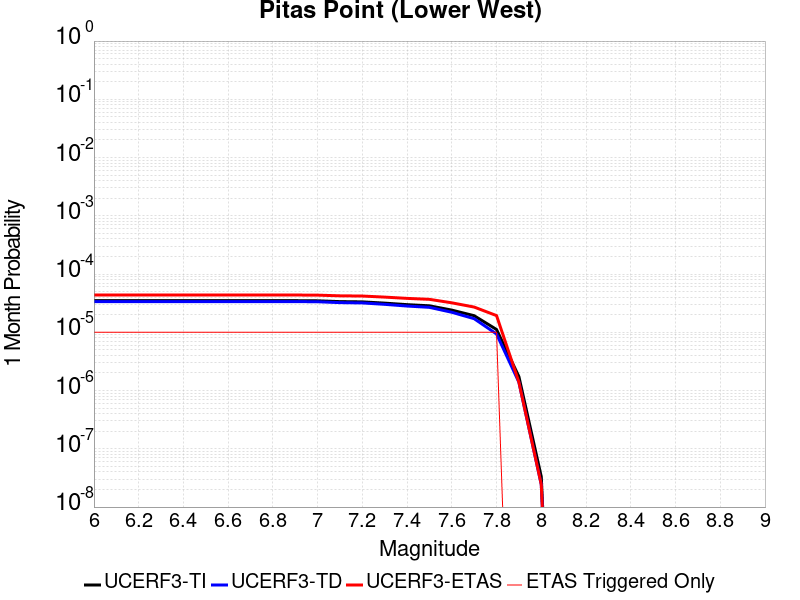 | 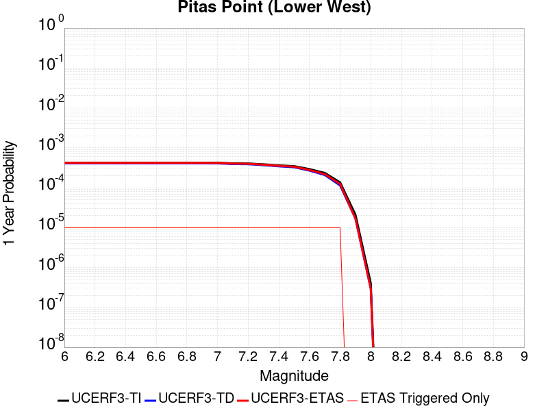 |  |

| Magnitude | 1 wk TI Prob | 1 wk TD Prob | 1 wk ETAS Prob | 1 wk ETAS/TD Gain | 1 wk ETAS Triggered Only | 1 mo TI Prob | 1 mo TD Prob | 1 mo ETAS Prob | 1 mo ETAS/TD Gain | 1 mo ETAS Triggered Only | 1 yr TI Prob | 1 yr TD Prob | 1 yr ETAS Prob | 1 yr ETAS/TD Gain | 1 yr ETAS Triggered Only | 10 yr TI Prob | 10 yr TD Prob | 10 yr ETAS Prob | 10 yr ETAS/TD Gain | 10 yr ETAS Triggered Only |
|-----|-----|-----|-----|-----|-----|-----|-----|-----|-----|-----|-----|-----|-----|-----|-----|-----|-----|-----|-----|-----|
| 6.0 | 8.151497E-6 | 7.855854E-6 | 1.7855777E-5 | 2.272926 | 1.0E-5 | 3.493452E-5 | 3.366752E-5 | 4.366718E-5 | 1.2970122 | 1.0E-5 | 4.252448E-4 | 4.0982568E-4 | 4.1982156E-4 | 1.0243906 | 1.0E-5 | 0.0042443196 | 0.0040907795 | 0.0041106977 | 1.004869 | 2.0E-5 |
| 6.1 | 8.151497E-6 | 7.855854E-6 | 1.7855777E-5 | 2.272926 | 1.0E-5 | 3.493452E-5 | 3.366752E-5 | 4.366718E-5 | 1.2970122 | 1.0E-5 | 4.252448E-4 | 4.0982568E-4 | 4.1982156E-4 | 1.0243906 | 1.0E-5 | 0.0042443196 | 0.0040907795 | 0.0041106977 | 1.004869 | 2.0E-5 |
| 6.2 | 8.151497E-6 | 7.855854E-6 | 1.7855777E-5 | 2.272926 | 1.0E-5 | 3.493452E-5 | 3.366752E-5 | 4.366718E-5 | 1.2970122 | 1.0E-5 | 4.252448E-4 | 4.0982568E-4 | 4.1982156E-4 | 1.0243906 | 1.0E-5 | 0.0042443196 | 0.0040907795 | 0.0041106977 | 1.004869 | 2.0E-5 |
| 6.3 | 8.151497E-6 | 7.855854E-6 | 1.7855777E-5 | 2.272926 | 1.0E-5 | 3.493452E-5 | 3.366752E-5 | 4.366718E-5 | 1.2970122 | 1.0E-5 | 4.252448E-4 | 4.0982568E-4 | 4.1982156E-4 | 1.0243906 | 1.0E-5 | 0.0042443196 | 0.0040907795 | 0.0041106977 | 1.004869 | 2.0E-5 |
| 6.4 | 8.151497E-6 | 7.855854E-6 | 1.7855777E-5 | 2.272926 | 1.0E-5 | 3.493452E-5 | 3.366752E-5 | 4.366718E-5 | 1.2970122 | 1.0E-5 | 4.252448E-4 | 4.0982568E-4 | 4.1982156E-4 | 1.0243906 | 1.0E-5 | 0.0042443196 | 0.0040907795 | 0.0041106977 | 1.004869 | 2.0E-5 |
| 6.5 | 8.151497E-6 | 7.855854E-6 | 1.7855777E-5 | 2.272926 | 1.0E-5 | 3.493452E-5 | 3.366752E-5 | 4.366718E-5 | 1.2970122 | 1.0E-5 | 4.252448E-4 | 4.0982568E-4 | 4.1982156E-4 | 1.0243906 | 1.0E-5 | 0.0042443196 | 0.0040907795 | 0.0041106977 | 1.004869 | 2.0E-5 |
| 6.6 | 8.151497E-6 | 7.855854E-6 | 1.7855777E-5 | 2.272926 | 1.0E-5 | 3.493452E-5 | 3.366752E-5 | 4.366718E-5 | 1.2970122 | 1.0E-5 | 4.252448E-4 | 4.0982568E-4 | 4.1982156E-4 | 1.0243906 | 1.0E-5 | 0.0042443196 | 0.0040907795 | 0.0041106977 | 1.004869 | 2.0E-5 |
| 6.7 | 8.151497E-6 | 7.855854E-6 | 1.7855777E-5 | 2.272926 | 1.0E-5 | 3.493452E-5 | 3.366752E-5 | 4.366718E-5 | 1.2970122 | 1.0E-5 | 4.252448E-4 | 4.0982568E-4 | 4.1982156E-4 | 1.0243906 | 1.0E-5 | 0.0042443196 | 0.0040907795 | 0.0041106977 | 1.004869 | 2.0E-5 |
| 6.8 | 8.151497E-6 | 7.855854E-6 | 1.7855777E-5 | 2.272926 | 1.0E-5 | 3.493452E-5 | 3.366752E-5 | 4.366718E-5 | 1.2970122 | 1.0E-5 | 4.252448E-4 | 4.0982568E-4 | 4.1982156E-4 | 1.0243906 | 1.0E-5 | 0.0042443196 | 0.0040907795 | 0.0041106977 | 1.004869 | 2.0E-5 |
| 6.9 | 8.151497E-6 | 7.855854E-6 | 1.7855777E-5 | 2.272926 | 1.0E-5 | 3.493452E-5 | 3.366752E-5 | 4.366718E-5 | 1.2970122 | 1.0E-5 | 4.252448E-4 | 4.0982568E-4 | 4.1982156E-4 | 1.0243906 | 1.0E-5 | 0.0042443196 | 0.0040907795 | 0.0041106977 | 1.004869 | 2.0E-5 |
| 7.0 | 8.103535E-6 | 7.8052835E-6 | 1.7805205E-5 | 2.2811735 | 1.0E-5 | 3.4728975E-5 | 3.3450793E-5 | 4.3450458E-5 | 1.2989366 | 1.0E-5 | 4.2274324E-4 | 4.0718802E-4 | 4.1718394E-4 | 1.0245486 | 1.0E-5 | 0.0042193993 | 0.0040645 | 0.0040844185 | 1.0049007 | 2.0E-5 |
| 7.1 | 7.853298E-6 | 7.5409735E-6 | 1.7540899E-5 | 2.326079 | 1.0E-5 | 3.3656554E-5 | 3.231806E-5 | 4.2317737E-5 | 1.3094145 | 1.0E-5 | 4.096915E-4 | 3.9340204E-4 | 4.0339812E-4 | 1.0254093 | 1.0E-5 | 0.00408937 | 0.0039271326 | 0.003947054 | 1.0050728 | 2.0E-5 |
| 7.2 | 7.771102E-6 | 7.4532545E-6 | 1.745318E-5 | 2.3416858 | 1.0E-5 | 3.33043E-5 | 3.194213E-5 | 4.1941814E-5 | 1.3130561 | 1.0E-5 | 4.0540437E-4 | 3.8882677E-4 | 3.988229E-4 | 1.0257084 | 1.0E-5 | 0.0040466557 | 0.0038815401 | 0.0039014625 | 1.0051326 | 2.0E-5 |
| 7.3 | 7.3945344E-6 | 7.0493556E-6 | 1.7049286E-5 | 2.4185593 | 1.0E-5 | 3.1690477E-5 | 3.0211178E-5 | 4.0210874E-5 | 1.3309933 | 1.0E-5 | 3.8576324E-4 | 3.6775964E-4 | 3.7775596E-4 | 1.0271816 | 1.0E-5 | 0.0038509427 | 0.0036715781 | 0.0036915047 | 1.0054272 | 2.0E-5 |
| 7.4 | 6.964645E-6 | 6.5902013E-6 | 1.6590135E-5 | 2.5173943 | 1.0E-5 | 2.9848137E-5 | 2.8243418E-5 | 3.8243135E-5 | 1.3540548 | 1.0E-5 | 3.6334046E-4 | 3.4380984E-4 | 3.538064E-4 | 1.0290759 | 1.0E-5 | 0.0036274698 | 0.0034328327 | 0.003452764 | 1.0058061 | 2.0E-5 |
| 7.5 | 6.6525035E-6 | 6.2592376E-6 | 1.6259175E-5 | 2.5976286 | 1.0E-5 | 2.851042E-5 | 2.6825031E-5 | 3.6824764E-5 | 1.3727762 | 1.0E-5 | 3.4705905E-4 | 3.265463E-4 | 3.3654302E-4 | 1.0306135 | 1.0E-5 | 0.0034651754 | 0.003260716 | 0.0032806508 | 1.0061136 | 2.0E-5 |
| 7.6 | 5.613338E-6 | 5.1514576E-6 | 1.5151406E-5 | 2.941188 | 1.0E-5 | 2.405694E-5 | 2.2077491E-5 | 3.207727E-5 | 1.45294 | 1.0E-5 | 2.928539E-4 | 2.687606E-4 | 2.787579E-4 | 1.0371978 | 1.0E-5 | 0.0029246826 | 0.0026843871 | 0.0027043335 | 1.0074304 | 2.0E-5 |
| 7.7 | 4.494704E-6 | 3.9969755E-6 | 1.3996935E-5 | 3.5018818 | 1.0E-5 | 1.9262876E-5 | 1.7129783E-5 | 2.7129612E-5 | 1.5837685 | 1.0E-5 | 2.3450027E-4 | 2.0853539E-4 | 2.185333E-4 | 1.0479435 | 1.0E-5 | 0.0023425296 | 0.002083421 | 0.0021033795 | 1.0095795 | 2.0E-5 |
| 7.8 | 2.6075882E-6 | 2.1836843E-6 | 1.2183662E-5 | 5.5794067 | 1.0E-5 | 1.117533E-5 | 9.358613E-6 | 1.935852E-5 | 2.0685244 | 1.0E-5 | 1.3605114E-4 | 1.139352E-4 | 1.2393406E-4 | 1.0877591 | 1.0E-5 | 0.0013596788 | 0.0011387726 | 0.0011487613 | 1.0087714 | 1.0E-5 |
| 7.9 | 4.045984E-7 | 3.242433E-7 | 3.242433E-7 | 1.0 | 0.0 | 1.733992E-6 | 1.3896134E-6 | 1.3896134E-6 | 1.0 | 0.0 | 2.1111147E-5 | 1.6918415E-5 | 1.6918415E-5 | 1.0 | 0.0 | 2.1109142E-4 | 1.6917157E-4 | 1.6917157E-4 | 1.0 | 0.0 |
| 8.0 | 7.791402E-9 | 5.683641E-9 | 5.683641E-9 | 1.0 | 0.0 | 3.3391725E-8 | 2.4358462E-8 | 2.4358462E-8 | 1.0 | 0.0 | 4.0654416E-7 | 2.9656425E-7 | 2.9656425E-7 | 1.0 | 0.0 | 4.065434E-6 | 2.9656408E-6 | 2.9656408E-6 | 1.0 | 0.0 |

## Los Alamos 2011 CFM
*[(top)](#table-of-contents)*

| 1 Week | 1 Month | 1 Year | 10 Year |
|-----|-----|-----|-----|
|  |  |  |  |

| Magnitude | 1 wk TI Prob | 1 wk TD Prob | 1 wk ETAS Prob | 1 wk ETAS/TD Gain | 1 wk ETAS Triggered Only | 1 mo TI Prob | 1 mo TD Prob | 1 mo ETAS Prob | 1 mo ETAS/TD Gain | 1 mo ETAS Triggered Only | 1 yr TI Prob | 1 yr TD Prob | 1 yr ETAS Prob | 1 yr ETAS/TD Gain | 1 yr ETAS Triggered Only | 10 yr TI Prob | 10 yr TD Prob | 10 yr ETAS Prob | 10 yr ETAS/TD Gain | 10 yr ETAS Triggered Only |
|-----|-----|-----|-----|-----|-----|-----|-----|-----|-----|-----|-----|-----|-----|-----|-----|-----|-----|-----|-----|-----|
| 6.0 | 4.6284417E-6 | 4.7517524E-6 | 4.7517524E-6 | 1.0 | 0.0 | 1.9836029E-5 | 2.0364505E-5 | 2.0364505E-5 | 1.0 | 0.0 | 2.4147688E-4 | 2.479114E-4 | 2.479114E-4 | 1.0 | 0.0 | 0.0024121467 | 0.0024765225 | 0.002496473 | 1.0080558 | 2.0E-5 |
| 6.1 | 4.6284417E-6 | 4.7517524E-6 | 4.7517524E-6 | 1.0 | 0.0 | 1.9836029E-5 | 2.0364505E-5 | 2.0364505E-5 | 1.0 | 0.0 | 2.4147688E-4 | 2.479114E-4 | 2.479114E-4 | 1.0 | 0.0 | 0.0024121467 | 0.0024765225 | 0.002496473 | 1.0080558 | 2.0E-5 |
| 6.2 | 4.6284417E-6 | 4.7517524E-6 | 4.7517524E-6 | 1.0 | 0.0 | 1.9836029E-5 | 2.0364505E-5 | 2.0364505E-5 | 1.0 | 0.0 | 2.4147688E-4 | 2.479114E-4 | 2.479114E-4 | 1.0 | 0.0 | 0.0024121467 | 0.0024765225 | 0.002496473 | 1.0080558 | 2.0E-5 |
| 6.3 | 4.6284417E-6 | 4.7517524E-6 | 4.7517524E-6 | 1.0 | 0.0 | 1.9836029E-5 | 2.0364505E-5 | 2.0364505E-5 | 1.0 | 0.0 | 2.4147688E-4 | 2.479114E-4 | 2.479114E-4 | 1.0 | 0.0 | 0.0024121467 | 0.0024765225 | 0.002496473 | 1.0080558 | 2.0E-5 |
| 6.4 | 4.6284417E-6 | 4.7517524E-6 | 4.7517524E-6 | 1.0 | 0.0 | 1.9836029E-5 | 2.0364505E-5 | 2.0364505E-5 | 1.0 | 0.0 | 2.4147688E-4 | 2.479114E-4 | 2.479114E-4 | 1.0 | 0.0 | 0.0024121467 | 0.0024765225 | 0.002496473 | 1.0080558 | 2.0E-5 |
| 6.5 | 4.6284417E-6 | 4.7517524E-6 | 4.7517524E-6 | 1.0 | 0.0 | 1.9836029E-5 | 2.0364505E-5 | 2.0364505E-5 | 1.0 | 0.0 | 2.4147688E-4 | 2.479114E-4 | 2.479114E-4 | 1.0 | 0.0 | 0.0024121467 | 0.0024765225 | 0.002496473 | 1.0080558 | 2.0E-5 |
| 6.6 | 4.6284417E-6 | 4.7517524E-6 | 4.7517524E-6 | 1.0 | 0.0 | 1.9836029E-5 | 2.0364505E-5 | 2.0364505E-5 | 1.0 | 0.0 | 2.4147688E-4 | 2.479114E-4 | 2.479114E-4 | 1.0 | 0.0 | 0.0024121467 | 0.0024765225 | 0.002496473 | 1.0080558 | 2.0E-5 |
| 6.7 | 4.062321E-6 | 4.166368E-6 | 4.166368E-6 | 1.0 | 0.0 | 1.7409831E-5 | 1.785575E-5 | 1.785575E-5 | 1.0 | 0.0 | 2.1194408E-4 | 2.1737357E-4 | 2.1737357E-4 | 1.0 | 0.0 | 0.0021174205 | 0.0021717593 | 0.0021817375 | 1.0045946 | 1.0E-5 |
| 6.8 | 4.062321E-6 | 4.166368E-6 | 4.166368E-6 | 1.0 | 0.0 | 1.7409831E-5 | 1.785575E-5 | 1.785575E-5 | 1.0 | 0.0 | 2.1194408E-4 | 2.1737357E-4 | 2.1737357E-4 | 1.0 | 0.0 | 0.0021174205 | 0.0021717593 | 0.0021817375 | 1.0045946 | 1.0E-5 |
| 6.9 | 3.2936077E-6 | 3.372974E-6 | 3.372974E-6 | 1.0 | 0.0 | 1.4115385E-5 | 1.4455529E-5 | 1.4455529E-5 | 1.0 | 0.0 | 1.7184127E-4 | 1.7598279E-4 | 1.7598279E-4 | 1.0 | 0.0 | 0.0017170844 | 0.0017585269 | 0.0017585269 | 1.0 | 0.0 |
| 7.0 | 3.1687898E-6 | 3.2448315E-6 | 3.2448315E-6 | 1.0 | 0.0 | 1.3580457E-5 | 1.3906351E-5 | 1.3906351E-5 | 1.0 | 0.0 | 1.6532952E-4 | 1.6929761E-4 | 1.6929761E-4 | 1.0 | 0.0 | 0.0016520657 | 0.001691778 | 0.001691778 | 1.0 | 0.0 |
| 7.1 | 2.9379228E-6 | 3.007341E-6 | 3.007341E-6 | 1.0 | 0.0 | 1.25910365E-5 | 1.2888546E-5 | 1.2888546E-5 | 1.0 | 0.0 | 1.5328509E-4 | 1.5690766E-4 | 1.5690766E-4 | 1.0 | 0.0 | 0.001531794 | 0.0015680578 | 0.0015680578 | 1.0 | 0.0 |
| 7.2 | 2.0020686E-6 | 2.0416414E-6 | 2.0416414E-6 | 1.0 | 0.0 | 8.580266E-6 | 8.749863E-6 | 8.749863E-6 | 1.0 | 0.0 | 1.0445973E-4 | 1.0652442E-4 | 1.0652442E-4 | 1.0 | 0.0 | 0.0010441064 | 0.001064738 | 0.001064738 | 1.0 | 0.0 |
| 7.3 | 1.7364243E-6 | 1.767891E-6 | 1.767891E-6 | 1.0 | 0.0 | 7.441797E-6 | 7.576654E-6 | 7.576654E-6 | 1.0 | 0.0 | 9.0600115E-5 | 9.224189E-5 | 9.224189E-5 | 1.0 | 0.0 | 9.0563187E-4 | 9.2203915E-4 | 9.2203915E-4 | 1.0 | 0.0 |
| 7.4 | 1.5718434E-6 | 1.5983279E-6 | 1.5983279E-6 | 1.0 | 0.0 | 6.7364545E-6 | 6.849959E-6 | 6.849959E-6 | 1.0 | 0.0 | 8.201325E-5 | 8.339508E-5 | 8.339508E-5 | 1.0 | 0.0 | 8.198299E-4 | 8.336409E-4 | 8.336409E-4 | 1.0 | 0.0 |
| 7.5 | 1.3841119E-6 | 1.4042887E-6 | 1.4042887E-6 | 1.0 | 0.0 | 5.9318945E-6 | 6.0183665E-6 | 6.0183665E-6 | 1.0 | 0.0 | 7.221842E-5 | 7.327118E-5 | 7.327118E-5 | 1.0 | 0.0 | 7.2194956E-4 | 7.3247304E-4 | 7.3247304E-4 | 1.0 | 0.0 |
| 7.6 | 1.0843726E-6 | 1.0934504E-6 | 1.0934504E-6 | 1.0 | 0.0 | 4.647303E-6 | 4.6862074E-6 | 4.6862074E-6 | 1.0 | 0.0 | 5.6579443E-5 | 5.7053105E-5 | 5.7053105E-5 | 1.0 | 0.0 | 5.656504E-4 | 5.703872E-4 | 5.703872E-4 | 1.0 | 0.0 |
| 7.7 | 5.544814E-7 | 5.5019143E-7 | 5.5019143E-7 | 1.0 | 0.0 | 2.3763469E-6 | 2.3579612E-6 | 2.3579612E-6 | 1.0 | 0.0 | 2.8931638E-5 | 2.87078E-5 | 2.87078E-5 | 1.0 | 0.0 | 2.8927872E-4 | 2.8704107E-4 | 2.8704107E-4 | 1.0 | 0.0 |
| 7.8 | 2.0707465E-7 | 1.9778726E-7 | 1.9778726E-7 | 1.0 | 0.0 | 8.874625E-7 | 8.476594E-7 | 8.476594E-7 | 1.0 | 0.0 | 1.08048025E-5 | 1.0320205E-5 | 1.0320205E-5 | 1.0 | 0.0 | 1.0804277E-4 | 1.031973E-4 | 1.031973E-4 | 1.0 | 0.0 |
| 7.9 | 3.9821284E-8 | 3.4331958E-8 | 3.4331958E-8 | 1.0 | 0.0 | 1.7066264E-7 | 1.4713696E-7 | 1.4713696E-7 | 1.0 | 0.0 | 2.0778157E-6 | 1.791391E-6 | 1.791391E-6 | 1.0 | 0.0 | 2.0777963E-5 | 1.7913771E-5 | 1.7913771E-5 | 1.0 | 0.0 |
| 8.0 | 7.880441E-11 | 8.235357E-11 | 8.235357E-11 | 1.0 | 0.0 | 3.3773329E-10 | 3.5294379E-10 | 3.5294379E-10 | 1.0 | 0.0 | 4.1119033E-9 | 4.297091E-9 | 4.297091E-9 | 1.0 | 0.0 | 4.1119034E-8 | 4.297091E-8 | 4.297091E-8 | 1.0 | 0.0 |

## Great Valley 14 (Kettleman Hills)
*[(top)](#table-of-contents)*

| 1 Week | 1 Month | 1 Year | 10 Year |
|-----|-----|-----|-----|
|  | 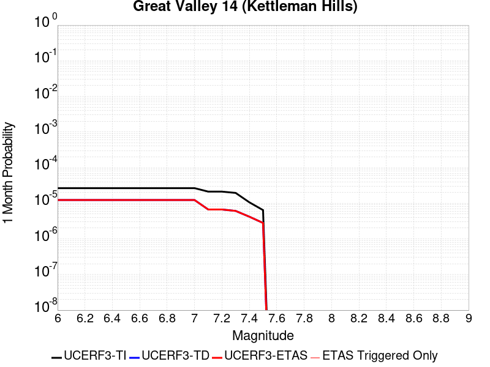 | 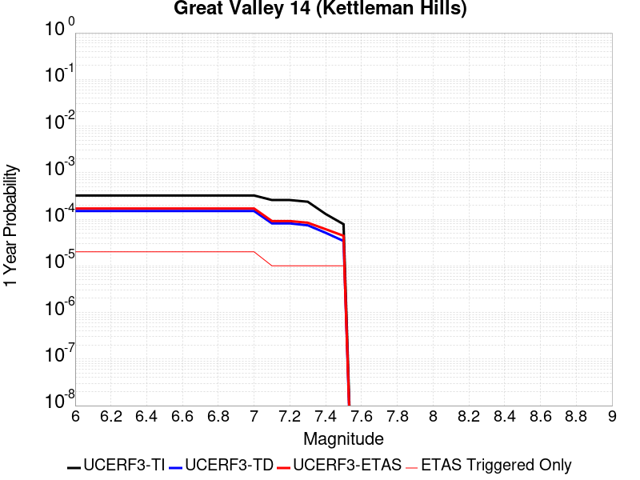 | 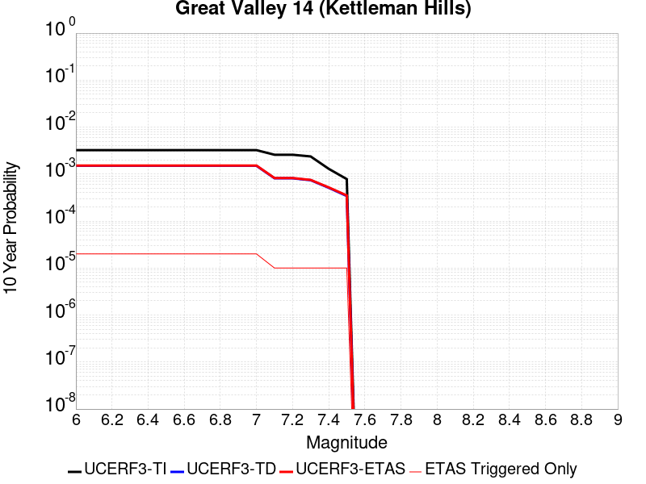 |

| Magnitude | 1 wk TI Prob | 1 wk TD Prob | 1 wk ETAS Prob | 1 wk ETAS/TD Gain | 1 wk ETAS Triggered Only | 1 mo TI Prob | 1 mo TD Prob | 1 mo ETAS Prob | 1 mo ETAS/TD Gain | 1 mo ETAS Triggered Only | 1 yr TI Prob | 1 yr TD Prob | 1 yr ETAS Prob | 1 yr ETAS/TD Gain | 1 yr ETAS Triggered Only | 10 yr TI Prob | 10 yr TD Prob | 10 yr ETAS Prob | 10 yr ETAS/TD Gain | 10 yr ETAS Triggered Only |
|-----|-----|-----|-----|-----|-----|-----|-----|-----|-----|-----|-----|-----|-----|-----|-----|-----|-----|-----|-----|-----|
| 6.0 | 6.2057843E-6 | 2.876885E-6 | 2.876885E-6 | 1.0 | 0.0 | 2.6595946E-5 | 1.2329462E-5 | 1.2329462E-5 | 1.0 | 0.0 | 3.2375753E-4 | 1.5010321E-4 | 1.7010022E-4 | 1.1332216 | 2.0E-5 | 0.0032328626 | 0.0015002496 | 0.0015202196 | 1.0133111 | 2.0E-5 |
| 6.1 | 6.2057843E-6 | 2.876885E-6 | 2.876885E-6 | 1.0 | 0.0 | 2.6595946E-5 | 1.2329462E-5 | 1.2329462E-5 | 1.0 | 0.0 | 3.2375753E-4 | 1.5010321E-4 | 1.7010022E-4 | 1.1332216 | 2.0E-5 | 0.0032328626 | 0.0015002496 | 0.0015202196 | 1.0133111 | 2.0E-5 |
| 6.2 | 6.2057843E-6 | 2.876885E-6 | 2.876885E-6 | 1.0 | 0.0 | 2.6595946E-5 | 1.2329462E-5 | 1.2329462E-5 | 1.0 | 0.0 | 3.2375753E-4 | 1.5010321E-4 | 1.7010022E-4 | 1.1332216 | 2.0E-5 | 0.0032328626 | 0.0015002496 | 0.0015202196 | 1.0133111 | 2.0E-5 |
| 6.3 | 6.2057843E-6 | 2.876885E-6 | 2.876885E-6 | 1.0 | 0.0 | 2.6595946E-5 | 1.2329462E-5 | 1.2329462E-5 | 1.0 | 0.0 | 3.2375753E-4 | 1.5010321E-4 | 1.7010022E-4 | 1.1332216 | 2.0E-5 | 0.0032328626 | 0.0015002496 | 0.0015202196 | 1.0133111 | 2.0E-5 |
| 6.4 | 6.2057843E-6 | 2.876885E-6 | 2.876885E-6 | 1.0 | 0.0 | 2.6595946E-5 | 1.2329462E-5 | 1.2329462E-5 | 1.0 | 0.0 | 3.2375753E-4 | 1.5010321E-4 | 1.7010022E-4 | 1.1332216 | 2.0E-5 | 0.0032328626 | 0.0015002496 | 0.0015202196 | 1.0133111 | 2.0E-5 |
| 6.5 | 6.2057843E-6 | 2.876885E-6 | 2.876885E-6 | 1.0 | 0.0 | 2.6595946E-5 | 1.2329462E-5 | 1.2329462E-5 | 1.0 | 0.0 | 3.2375753E-4 | 1.5010321E-4 | 1.7010022E-4 | 1.1332216 | 2.0E-5 | 0.0032328626 | 0.0015002496 | 0.0015202196 | 1.0133111 | 2.0E-5 |
| 6.6 | 6.2057843E-6 | 2.876885E-6 | 2.876885E-6 | 1.0 | 0.0 | 2.6595946E-5 | 1.2329462E-5 | 1.2329462E-5 | 1.0 | 0.0 | 3.2375753E-4 | 1.5010321E-4 | 1.7010022E-4 | 1.1332216 | 2.0E-5 | 0.0032328626 | 0.0015002496 | 0.0015202196 | 1.0133111 | 2.0E-5 |
| 6.7 | 6.2057843E-6 | 2.876885E-6 | 2.876885E-6 | 1.0 | 0.0 | 2.6595946E-5 | 1.2329462E-5 | 1.2329462E-5 | 1.0 | 0.0 | 3.2375753E-4 | 1.5010321E-4 | 1.7010022E-4 | 1.1332216 | 2.0E-5 | 0.0032328626 | 0.0015002496 | 0.0015202196 | 1.0133111 | 2.0E-5 |
| 6.8 | 6.2057843E-6 | 2.876885E-6 | 2.876885E-6 | 1.0 | 0.0 | 2.6595946E-5 | 1.2329462E-5 | 1.2329462E-5 | 1.0 | 0.0 | 3.2375753E-4 | 1.5010321E-4 | 1.7010022E-4 | 1.1332216 | 2.0E-5 | 0.0032328626 | 0.0015002496 | 0.0015202196 | 1.0133111 | 2.0E-5 |
| 6.9 | 6.2057843E-6 | 2.876885E-6 | 2.876885E-6 | 1.0 | 0.0 | 2.6595946E-5 | 1.2329462E-5 | 1.2329462E-5 | 1.0 | 0.0 | 3.2375753E-4 | 1.5010321E-4 | 1.7010022E-4 | 1.1332216 | 2.0E-5 | 0.0032328626 | 0.0015002496 | 0.0015202196 | 1.0133111 | 2.0E-5 |
| 7.0 | 6.2057843E-6 | 2.876885E-6 | 2.876885E-6 | 1.0 | 0.0 | 2.6595946E-5 | 1.2329462E-5 | 1.2329462E-5 | 1.0 | 0.0 | 3.2375753E-4 | 1.5010321E-4 | 1.7010022E-4 | 1.1332216 | 2.0E-5 | 0.0032328626 | 0.0015002496 | 0.0015202196 | 1.0133111 | 2.0E-5 |
| 7.1 | 4.95113E-6 | 1.5606265E-6 | 1.5606265E-6 | 1.0 | 0.0 | 2.1218955E-5 | 6.688383E-6 | 6.688383E-6 | 1.0 | 0.0 | 2.5831014E-4 | 8.142822E-5 | 9.14274E-5 | 1.1227976 | 1.0E-5 | 0.0025801011 | 8.140027E-4 | 8.239946E-4 | 1.012275 | 1.0E-5 |
| 7.2 | 4.95113E-6 | 1.5606265E-6 | 1.5606265E-6 | 1.0 | 0.0 | 2.1218955E-5 | 6.688383E-6 | 6.688383E-6 | 1.0 | 0.0 | 2.5831014E-4 | 8.142822E-5 | 9.14274E-5 | 1.1227976 | 1.0E-5 | 0.0025801011 | 8.140027E-4 | 8.239946E-4 | 1.012275 | 1.0E-5 |
| 7.3 | 4.5549086E-6 | 1.4225839E-6 | 1.4225839E-6 | 1.0 | 0.0 | 1.9520892E-5 | 6.096775E-6 | 6.096775E-6 | 1.0 | 0.0 | 2.3764092E-4 | 7.422587E-5 | 8.422513E-5 | 1.1347139 | 1.0E-5 | 0.0023738695 | 7.420274E-4 | 7.5202E-4 | 1.0134666 | 1.0E-5 |
| 7.4 | 2.4837766E-6 | 9.80044E-7 | 9.80044E-7 | 1.0 | 0.0 | 1.0644713E-5 | 4.200182E-6 | 4.200182E-6 | 1.0 | 0.0 | 1.2959167E-4 | 5.113608E-5 | 6.113557E-5 | 1.1955466 | 1.0E-5 | 0.0012951613 | 5.1124976E-4 | 5.2124466E-4 | 1.01955 | 1.0E-5 |
| 7.5 | 1.5002679E-6 | 6.546047E-7 | 6.546047E-7 | 1.0 | 0.0 | 6.4297037E-6 | 2.805446E-6 | 2.805446E-6 | 1.0 | 0.0 | 7.827883E-5 | 3.415581E-5 | 4.415547E-5 | 1.292766 | 1.0E-5 | 7.825126E-4 | 3.4150976E-4 | 3.5150634E-4 | 1.0292717 | 1.0E-5 |

## Elysian Park (Upper)
*[(top)](#table-of-contents)*

| 1 Week | 1 Month | 1 Year | 10 Year |
|-----|-----|-----|-----|
|  | 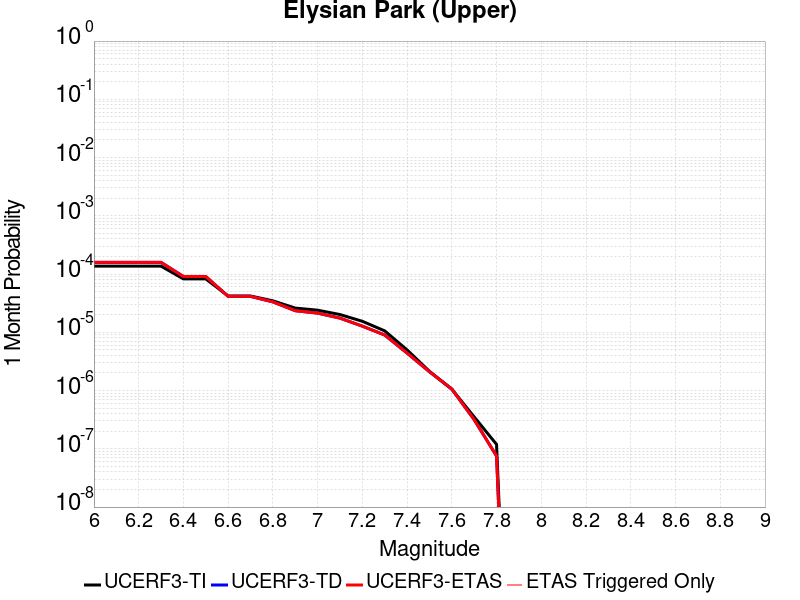 | 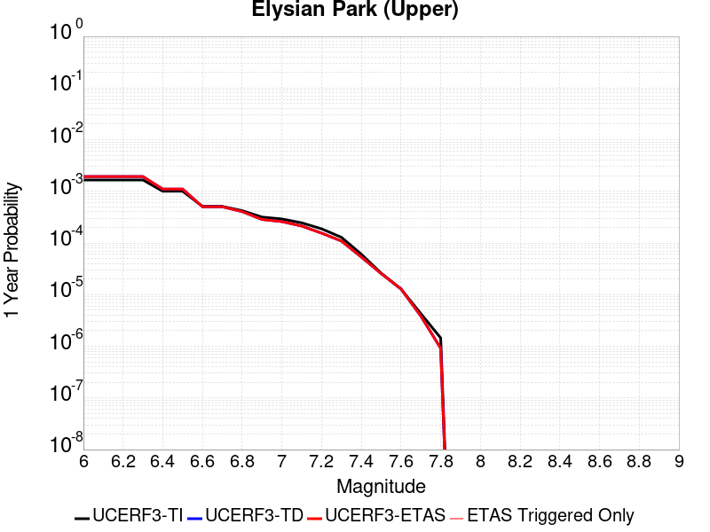 |  |

| Magnitude | 1 wk TI Prob | 1 wk TD Prob | 1 wk ETAS Prob | 1 wk ETAS/TD Gain | 1 wk ETAS Triggered Only | 1 mo TI Prob | 1 mo TD Prob | 1 mo ETAS Prob | 1 mo ETAS/TD Gain | 1 mo ETAS Triggered Only | 1 yr TI Prob | 1 yr TD Prob | 1 yr ETAS Prob | 1 yr ETAS/TD Gain | 1 yr ETAS Triggered Only | 10 yr TI Prob | 10 yr TD Prob | 10 yr ETAS Prob | 10 yr ETAS/TD Gain | 10 yr ETAS Triggered Only |
|-----|-----|-----|-----|-----|-----|-----|-----|-----|-----|-----|-----|-----|-----|-----|-----|-----|-----|-----|-----|-----|
| 6.0 | 3.1876025E-5 | 3.7036123E-5 | 3.7036123E-5 | 1.0 | 0.0 | 1.3660437E-4 | 1.5871931E-4 | 1.5871931E-4 | 1.0 | 0.0 | 0.0016618895 | 0.0019311657 | 0.0019311657 | 1.0 | 0.0 | 0.016495159 | 0.019190293 | 0.019209908 | 1.0010222 | 2.0E-5 |
| 6.1 | 3.1876025E-5 | 3.7036123E-5 | 3.7036123E-5 | 1.0 | 0.0 | 1.3660437E-4 | 1.5871931E-4 | 1.5871931E-4 | 1.0 | 0.0 | 0.0016618895 | 0.0019311657 | 0.0019311657 | 1.0 | 0.0 | 0.016495159 | 0.019190293 | 0.019209908 | 1.0010222 | 2.0E-5 |
| 6.2 | 3.1876025E-5 | 3.7036123E-5 | 3.7036123E-5 | 1.0 | 0.0 | 1.3660437E-4 | 1.5871931E-4 | 1.5871931E-4 | 1.0 | 0.0 | 0.0016618895 | 0.0019311657 | 0.0019311657 | 1.0 | 0.0 | 0.016495159 | 0.019190293 | 0.019209908 | 1.0010222 | 2.0E-5 |
| 6.3 | 3.1876025E-5 | 3.7036123E-5 | 3.7036123E-5 | 1.0 | 0.0 | 1.3660437E-4 | 1.5871931E-4 | 1.5871931E-4 | 1.0 | 0.0 | 0.0016618895 | 0.0019311657 | 0.0019311657 | 1.0 | 0.0 | 0.016495159 | 0.019190293 | 0.019209908 | 1.0010222 | 2.0E-5 |
| 6.4 | 1.9273462E-5 | 2.1202834E-5 | 2.1202834E-5 | 1.0 | 0.0 | 8.259794E-5 | 9.08671E-5 | 9.08671E-5 | 1.0 | 0.0 | 0.001005166 | 0.001105917 | 0.001105917 | 1.0 | 0.0 | 0.010006315 | 0.011020946 | 0.011030836 | 1.0008974 | 1.0E-5 |
| 6.5 | 1.9273462E-5 | 2.1202834E-5 | 2.1202834E-5 | 1.0 | 0.0 | 8.259794E-5 | 9.08671E-5 | 9.08671E-5 | 1.0 | 0.0 | 0.001005166 | 0.001105917 | 0.001105917 | 1.0 | 0.0 | 0.010006315 | 0.011020946 | 0.011030836 | 1.0008974 | 1.0E-5 |
| 6.6 | 9.813258E-6 | 9.665697E-6 | 9.665697E-6 | 1.0 | 0.0 | 4.205614E-5 | 4.14238E-5 | 4.14238E-5 | 1.0 | 0.0 | 5.119132E-4 | 5.0422526E-4 | 5.0422526E-4 | 1.0 | 0.0 | 0.005107356 | 0.005031536 | 0.0050414857 | 1.0019774 | 1.0E-5 |
| 6.7 | 9.801478E-6 | 9.653266E-6 | 9.653266E-6 | 1.0 | 0.0 | 4.2005657E-5 | 4.1370524E-5 | 4.1370524E-5 | 1.0 | 0.0 | 5.112989E-4 | 5.03577E-4 | 5.03577E-4 | 1.0 | 0.0 | 0.0051012407 | 0.0050250823 | 0.005035032 | 1.0019801 | 1.0E-5 |
| 6.8 | 8.102489E-6 | 7.773079E-6 | 7.773079E-6 | 1.0 | 0.0 | 3.4724493E-5 | 3.33128E-5 | 3.33128E-5 | 1.0 | 0.0 | 4.2268867E-4 | 4.0551284E-4 | 4.0551284E-4 | 1.0 | 0.0 | 0.004218856 | 0.0040482227 | 0.0040581822 | 1.0024602 | 1.0E-5 |
| 6.9 | 6.08275E-6 | 5.4814923E-6 | 5.4814923E-6 | 1.0 | 0.0 | 2.6068668E-5 | 2.3491903E-5 | 2.3491903E-5 | 1.0 | 0.0 | 3.173398E-4 | 2.8597715E-4 | 2.8597715E-4 | 1.0 | 0.0 | 0.0031688702 | 0.0028561691 | 0.0028661406 | 1.0034912 | 1.0E-5 |
| 7.0 | 5.5995934E-6 | 4.9828154E-6 | 4.9828154E-6 | 1.0 | 0.0 | 2.3998036E-5 | 2.1354752E-5 | 2.1354752E-5 | 1.0 | 0.0 | 2.9213692E-4 | 2.5996377E-4 | 2.5996377E-4 | 1.0 | 0.0 | 0.0029175316 | 0.0025966638 | 0.0026066378 | 1.003841 | 1.0E-5 |
| 7.1 | 4.709881E-6 | 4.0874284E-6 | 4.0874284E-6 | 1.0 | 0.0 | 2.0185047E-5 | 1.7517434E-5 | 1.7517434E-5 | 1.0 | 0.0 | 2.4572524E-4 | 2.132543E-4 | 2.132543E-4 | 1.0 | 0.0 | 0.002454537 | 0.002130538 | 0.0021405166 | 1.0046836 | 1.0E-5 |
| 7.2 | 3.6063436E-6 | 2.9779683E-6 | 2.9779683E-6 | 1.0 | 0.0 | 1.5455667E-5 | 1.2762659E-5 | 1.2762659E-5 | 1.0 | 0.0 | 1.881565E-4 | 1.5537441E-4 | 1.5537441E-4 | 1.0 | 0.0 | 0.0018799726 | 0.001552669 | 0.0015626535 | 1.0064305 | 1.0E-5 |
| 7.3 | 2.471135E-6 | 2.0954756E-6 | 2.0954756E-6 | 1.0 | 0.0 | 1.0590536E-5 | 8.98058E-6 | 8.98058E-6 | 1.0 | 0.0 | 1.2893214E-4 | 1.0933314E-4 | 1.0933314E-4 | 1.0 | 0.0 | 0.0012885736 | 0.0010928008 | 0.0011027898 | 1.0091408 | 1.0E-5 |
| 7.4 | 1.163943E-6 | 1.0275176E-6 | 1.0275176E-6 | 1.0 | 0.0 | 4.988318E-6 | 4.403639E-6 | 4.403639E-6 | 1.0 | 0.0 | 6.0731076E-5 | 5.361302E-5 | 5.361302E-5 | 1.0 | 0.0 | 6.071448E-4 | 5.3600385E-4 | 5.4599845E-4 | 1.0186466 | 1.0E-5 |
| 7.5 | 4.99459E-7 | 4.91765E-7 | 4.91765E-7 | 1.0 | 0.0 | 2.140537E-6 | 2.1075625E-6 | 2.1075625E-6 | 1.0 | 0.0 | 2.6060725E-5 | 2.5659288E-5 | 2.5659288E-5 | 1.0 | 0.0 | 2.605767E-4 | 2.5656482E-4 | 2.6656227E-4 | 1.0389665 | 1.0E-5 |
| 7.6 | 2.4667852E-7 | 2.47786E-7 | 2.47786E-7 | 1.0 | 0.0 | 1.0571932E-6 | 1.0619395E-6 | 1.0619395E-6 | 1.0 | 0.0 | 1.2871251E-5 | 1.2929041E-5 | 1.2929041E-5 | 1.0 | 0.0 | 1.2870505E-4 | 1.2928326E-4 | 1.3928197E-4 | 1.0773395 | 1.0E-5 |
| 7.7 | 8.2312795E-8 | 7.386577E-8 | 7.386577E-8 | 1.0 | 0.0 | 3.527691E-7 | 3.1656754E-7 | 3.1656754E-7 | 1.0 | 0.0 | 4.294955E-6 | 3.8542044E-6 | 3.8542044E-6 | 1.0 | 0.0 | 4.2948723E-5 | 3.854149E-5 | 4.8541104E-5 | 1.2594507 | 1.0E-5 |
| 7.8 | 2.7819295E-8 | 1.756669E-8 | 1.756669E-8 | 1.0 | 0.0 | 1.1922555E-7 | 7.528581E-8 | 7.528581E-8 | 1.0 | 0.0 | 1.45157E-6 | 9.1660456E-7 | 9.1660456E-7 | 1.0 | 0.0 | 1.45156055E-5 | 9.166022E-6 | 9.166022E-6 | 1.0 | 0.0 |

## Great Valley 06 (Midland) 2011 CFM alt1
*[(top)](#table-of-contents)*

| 1 Week | 1 Month | 1 Year | 10 Year |
|-----|-----|-----|-----|
|  |  |  |  |

| Magnitude | 1 wk TI Prob | 1 wk TD Prob | 1 wk ETAS Prob | 1 wk ETAS/TD Gain | 1 wk ETAS Triggered Only | 1 mo TI Prob | 1 mo TD Prob | 1 mo ETAS Prob | 1 mo ETAS/TD Gain | 1 mo ETAS Triggered Only | 1 yr TI Prob | 1 yr TD Prob | 1 yr ETAS Prob | 1 yr ETAS/TD Gain | 1 yr ETAS Triggered Only | 10 yr TI Prob | 10 yr TD Prob | 10 yr ETAS Prob | 10 yr ETAS/TD Gain | 10 yr ETAS Triggered Only |
|-----|-----|-----|-----|-----|-----|-----|-----|-----|-----|-----|-----|-----|-----|-----|-----|-----|-----|-----|-----|-----|
| 6.0 | 1.2712525E-5 | 1.3210633E-5 | 1.3210633E-5 | 1.0 | 0.0 | 5.4481112E-5 | 5.6615918E-5 | 5.6615918E-5 | 1.0 | 0.0 | 6.6310563E-4 | 6.891062E-4 | 6.9909927E-4 | 1.0145016 | 1.0E-5 | 0.0066113044 | 0.006872209 | 0.0068920716 | 1.0028902 | 2.0E-5 |
| 6.1 | 1.2712525E-5 | 1.3210633E-5 | 1.3210633E-5 | 1.0 | 0.0 | 5.4481112E-5 | 5.6615918E-5 | 5.6615918E-5 | 1.0 | 0.0 | 6.6310563E-4 | 6.891062E-4 | 6.9909927E-4 | 1.0145016 | 1.0E-5 | 0.0066113044 | 0.006872209 | 0.0068920716 | 1.0028902 | 2.0E-5 |
| 6.2 | 1.2712525E-5 | 1.3210633E-5 | 1.3210633E-5 | 1.0 | 0.0 | 5.4481112E-5 | 5.6615918E-5 | 5.6615918E-5 | 1.0 | 0.0 | 6.6310563E-4 | 6.891062E-4 | 6.9909927E-4 | 1.0145016 | 1.0E-5 | 0.0066113044 | 0.006872209 | 0.0068920716 | 1.0028902 | 2.0E-5 |
| 6.3 | 1.2712525E-5 | 1.3210633E-5 | 1.3210633E-5 | 1.0 | 0.0 | 5.4481112E-5 | 5.6615918E-5 | 5.6615918E-5 | 1.0 | 0.0 | 6.6310563E-4 | 6.891062E-4 | 6.9909927E-4 | 1.0145016 | 1.0E-5 | 0.0066113044 | 0.006872209 | 0.0068920716 | 1.0028902 | 2.0E-5 |
| 6.4 | 1.2712525E-5 | 1.3210633E-5 | 1.3210633E-5 | 1.0 | 0.0 | 5.4481112E-5 | 5.6615918E-5 | 5.6615918E-5 | 1.0 | 0.0 | 6.6310563E-4 | 6.891062E-4 | 6.9909927E-4 | 1.0145016 | 1.0E-5 | 0.0066113044 | 0.006872209 | 0.0068920716 | 1.0028902 | 2.0E-5 |
| 6.5 | 1.2712525E-5 | 1.3210633E-5 | 1.3210633E-5 | 1.0 | 0.0 | 5.4481112E-5 | 5.6615918E-5 | 5.6615918E-5 | 1.0 | 0.0 | 6.6310563E-4 | 6.891062E-4 | 6.9909927E-4 | 1.0145016 | 1.0E-5 | 0.0066113044 | 0.006872209 | 0.0068920716 | 1.0028902 | 2.0E-5 |
| 6.6 | 5.7574384E-6 | 5.970671E-6 | 5.970671E-6 | 1.0 | 0.0 | 2.4674504E-5 | 2.558836E-5 | 2.558836E-5 | 1.0 | 0.0 | 3.0037065E-4 | 3.114977E-4 | 3.2149456E-4 | 1.0320929 | 1.0E-5 | 0.0029996498 | 0.0031109971 | 0.003120966 | 1.0032043 | 1.0E-5 |
| 6.7 | 5.7574384E-6 | 5.970671E-6 | 5.970671E-6 | 1.0 | 0.0 | 2.4674504E-5 | 2.558836E-5 | 2.558836E-5 | 1.0 | 0.0 | 3.0037065E-4 | 3.114977E-4 | 3.2149456E-4 | 1.0320929 | 1.0E-5 | 0.0029996498 | 0.0031109971 | 0.003120966 | 1.0032043 | 1.0E-5 |
| 6.8 | 3.3474828E-6 | 3.469399E-6 | 3.469399E-6 | 1.0 | 0.0 | 1.4346277E-5 | 1.4868776E-5 | 1.4868776E-5 | 1.0 | 0.0 | 1.7465191E-4 | 1.810138E-4 | 1.9101199E-4 | 1.0552344 | 1.0E-5 | 0.0017451472 | 0.0018088106 | 0.0018187925 | 1.0055184 | 1.0E-5 |
| 6.9 | 2.035106E-6 | 2.109044E-6 | 2.109044E-6 | 1.0 | 0.0 | 8.721853E-6 | 9.038734E-6 | 9.038734E-6 | 1.0 | 0.0 | 1.0618339E-4 | 1.1004176E-4 | 1.1004176E-4 | 1.0 | 0.0 | 0.0010613267 | 0.0010999449 | 0.0010999449 | 1.0 | 0.0 |
| 7.0 | 1.2424716E-6 | 1.2878814E-6 | 1.2878814E-6 | 1.0 | 0.0 | 5.3248673E-6 | 5.519483E-6 | 5.519483E-6 | 1.0 | 0.0 | 6.482833E-5 | 6.719808E-5 | 6.719808E-5 | 1.0 | 0.0 | 6.480942E-4 | 6.7182194E-4 | 6.7182194E-4 | 1.0 | 0.0 |
| 7.1 | 6.6904556E-7 | 6.939063E-7 | 6.939063E-7 | 1.0 | 0.0 | 2.867335E-6 | 2.9738824E-6 | 2.9738824E-6 | 1.0 | 0.0 | 3.4909244E-5 | 3.620668E-5 | 3.620668E-5 | 1.0 | 0.0 | 3.490376E-4 | 3.620333E-4 | 3.620333E-4 | 1.0 | 0.0 |
| 7.2 | 3.948168E-7 | 4.095722E-7 | 4.095722E-7 | 1.0 | 0.0 | 1.6920709E-6 | 1.7553094E-6 | 1.7553094E-6 | 1.0 | 0.0 | 2.0600768E-5 | 2.1370892E-5 | 2.1370892E-5 | 1.0 | 0.0 | 2.0598859E-4 | 2.1370893E-4 | 2.1370893E-4 | 1.0 | 0.0 |

## Newport-Inglewood (Offshore)
*[(top)](#table-of-contents)*

| 1 Week | 1 Month | 1 Year | 10 Year |
|-----|-----|-----|-----|
|  |  |  |  |

| Magnitude | 1 wk TI Prob | 1 wk TD Prob | 1 wk ETAS Prob | 1 wk ETAS/TD Gain | 1 wk ETAS Triggered Only | 1 mo TI Prob | 1 mo TD Prob | 1 mo ETAS Prob | 1 mo ETAS/TD Gain | 1 mo ETAS Triggered Only | 1 yr TI Prob | 1 yr TD Prob | 1 yr ETAS Prob | 1 yr ETAS/TD Gain | 1 yr ETAS Triggered Only | 10 yr TI Prob | 10 yr TD Prob | 10 yr ETAS Prob | 10 yr ETAS/TD Gain | 10 yr ETAS Triggered Only |
|-----|-----|-----|-----|-----|-----|-----|-----|-----|-----|-----|-----|-----|-----|-----|-----|-----|-----|-----|-----|-----|
| 6.0 | 1.9626508E-5 | 1.896554E-5 | 1.896554E-5 | 1.0 | 0.0 | 8.411089E-5 | 8.127843E-5 | 8.127843E-5 | 1.0 | 0.0 | 0.001023569 | 9.891281E-4 | 9.991183E-4 | 1.0100999 | 1.0E-5 | 0.010188672 | 0.009848599 | 0.009868402 | 1.0020107 | 2.0E-5 |
| 6.1 | 1.331886E-5 | 1.2218224E-5 | 1.2218224E-5 | 1.0 | 0.0 | 5.707958E-5 | 5.2362775E-5 | 5.2362775E-5 | 1.0 | 0.0 | 6.947222E-4 | 6.373318E-4 | 6.473254E-4 | 1.0156804 | 1.0E-5 | 0.006925544 | 0.006355217 | 0.006365154 | 1.0015635 | 1.0E-5 |
| 6.2 | 1.2250852E-5 | 1.1076152E-5 | 1.1076152E-5 | 1.0 | 0.0 | 5.2502597E-5 | 4.7468366E-5 | 4.7468366E-5 | 1.0 | 0.0 | 6.3903164E-4 | 5.777751E-4 | 5.877693E-4 | 1.0172977 | 1.0E-5 | 0.006371971 | 0.0057628504 | 0.0057727927 | 1.0017252 | 1.0E-5 |
| 6.3 | 1.2106258E-5 | 1.0919012E-5 | 1.0919012E-5 | 1.0 | 0.0 | 5.1882926E-5 | 4.6794932E-5 | 4.6794932E-5 | 1.0 | 0.0 | 6.3149154E-4 | 5.6958036E-4 | 5.7957467E-4 | 1.0175468 | 1.0E-5 | 0.0062970007 | 0.005681322 | 0.005691265 | 1.0017501 | 1.0E-5 |
| 6.4 | 1.1348758E-5 | 1.0109477E-5 | 1.0109477E-5 | 1.0 | 0.0 | 4.8636626E-5 | 4.3325614E-5 | 4.3325614E-5 | 1.0 | 0.0 | 5.919901E-4 | 5.273625E-4 | 5.3735723E-4 | 1.0189523 | 1.0E-5 | 0.005904155 | 0.005261206 | 0.0052711535 | 1.0018907 | 1.0E-5 |
| 6.5 | 1.100837E-5 | 9.743501E-6 | 9.743501E-6 | 1.0 | 0.0 | 4.7177873E-5 | 4.1757197E-5 | 4.1757197E-5 | 1.0 | 0.0 | 5.7423924E-4 | 5.0827605E-4 | 5.18271E-4 | 1.0196644 | 1.0E-5 | 0.005727576 | 0.005071227 | 0.0050811763 | 1.001962 | 1.0E-5 |
| 6.6 | 1.0634696E-5 | 9.345652E-6 | 9.345652E-6 | 1.0 | 0.0 | 4.557647E-5 | 4.0052182E-5 | 4.0052182E-5 | 1.0 | 0.0 | 5.5475225E-4 | 4.8752697E-4 | 4.975221E-4 | 1.0205017 | 1.0E-5 | 0.0055336943 | 0.004864661 | 0.004874612 | 1.0020456 | 1.0E-5 |
| 6.7 | 9.9780855E-6 | 8.668014E-6 | 8.668014E-6 | 1.0 | 0.0 | 4.276252E-5 | 3.7148104E-5 | 3.7148104E-5 | 1.0 | 0.0 | 5.205093E-4 | 4.5218502E-4 | 4.621805E-4 | 1.0221049 | 1.0E-5 | 0.0051929182 | 0.004512728 | 0.004522683 | 1.002206 | 1.0E-5 |
| 6.8 | 9.59546E-6 | 8.273045E-6 | 8.273045E-6 | 1.0 | 0.0 | 4.1122752E-5 | 3.545543E-5 | 3.545543E-5 | 1.0 | 0.0 | 5.0055445E-4 | 4.31585E-4 | 4.415807E-4 | 1.0231605 | 1.0E-5 | 0.004994285 | 0.0043075443 | 0.004317501 | 1.0023115 | 1.0E-5 |
| 6.9 | 9.000614E-6 | 7.706931E-6 | 7.706931E-6 | 1.0 | 0.0 | 3.857349E-5 | 3.302929E-5 | 3.302929E-5 | 1.0 | 0.0 | 4.6953102E-4 | 4.0205804E-4 | 4.12054E-4 | 1.024862 | 1.0E-5 | 0.004685402 | 0.0040133777 | 0.0040233377 | 1.0024817 | 1.0E-5 |
| 7.0 | 7.4070194E-6 | 6.1489627E-6 | 6.1489627E-6 | 1.0 | 0.0 | 3.1743984E-5 | 2.635243E-5 | 2.635243E-5 | 1.0 | 0.0 | 3.8641447E-4 | 3.2079377E-4 | 3.3079056E-4 | 1.0311626 | 1.0E-5 | 0.0038574322 | 0.0032033268 | 0.0032132948 | 1.0031117 | 1.0E-5 |
| 7.1 | 6.299615E-6 | 5.056649E-6 | 5.056649E-6 | 1.0 | 0.0 | 2.699807E-5 | 2.1671174E-5 | 2.1671174E-5 | 1.0 | 0.0 | 3.2865192E-4 | 2.6381473E-4 | 2.738121E-4 | 1.0378954 | 1.0E-5 | 0.003281663 | 0.0026350303 | 0.002645004 | 1.003785 | 1.0E-5 |
| 7.2 | 5.096653E-6 | 3.8928124E-6 | 3.8928124E-6 | 1.0 | 0.0 | 2.1842614E-5 | 1.6683376E-5 | 1.6683376E-5 | 1.0 | 0.0 | 2.6590136E-4 | 2.0310127E-4 | 2.0310127E-4 | 1.0 | 0.0 | 0.0026558342 | 0.0020291677 | 0.0020291677 | 1.0 | 0.0 |
| 7.3 | 3.9753018E-6 | 2.9099035E-6 | 2.9099035E-6 | 1.0 | 0.0 | 1.7036897E-5 | 1.2470956E-5 | 1.2470956E-5 | 1.0 | 0.0 | 2.0740448E-4 | 1.5182339E-4 | 1.5182339E-4 | 1.0 | 0.0 | 0.00207211 | 0.0015172048 | 0.0015172048 | 1.0 | 0.0 |
| 7.4 | 3.0568392E-6 | 2.144994E-6 | 2.144994E-6 | 1.0 | 0.0 | 1.3100675E-5 | 9.192799E-6 | 9.192799E-6 | 1.0 | 0.0 | 1.5948903E-4 | 1.1191664E-4 | 1.1191664E-4 | 1.0 | 0.0 | 0.0015937461 | 0.0011186091 | 0.0011186091 | 1.0 | 0.0 |
| 7.5 | 1.7279019E-6 | 1.1469743E-6 | 1.1469743E-6 | 1.0 | 0.0 | 7.405273E-6 | 4.915595E-6 | 4.915595E-6 | 1.0 | 0.0 | 9.015547E-5 | 5.9845766E-5 | 5.9845766E-5 | 1.0 | 0.0 | 9.01189E-4 | 5.983004E-4 | 5.983004E-4 | 1.0 | 0.0 |
| 7.6 | 1.1156416E-6 | 7.223022E-7 | 7.223022E-7 | 1.0 | 0.0 | 4.7813123E-6 | 3.0955775E-6 | 3.0955775E-6 | 1.0 | 0.0 | 5.821092E-5 | 3.7688027E-5 | 3.7688027E-5 | 1.0 | 0.0 | 5.8195676E-4 | 3.768187E-4 | 3.768187E-4 | 1.0 | 0.0 |
| 7.7 | 9.117973E-8 | 6.734257E-8 | 6.734257E-8 | 1.0 | 0.0 | 3.907702E-7 | 2.8861098E-7 | 2.8861098E-7 | 1.0 | 0.0 | 4.757617E-6 | 3.5138332E-6 | 3.5138332E-6 | 1.0 | 0.0 | 4.7575148E-5 | 3.5137808E-5 | 3.5137808E-5 | 1.0 | 0.0 |

## Great Valley 11
*[(top)](#table-of-contents)*

| 1 Week | 1 Month | 1 Year | 10 Year |
|-----|-----|-----|-----|
| 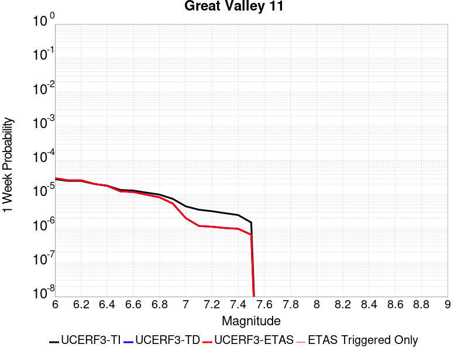 | 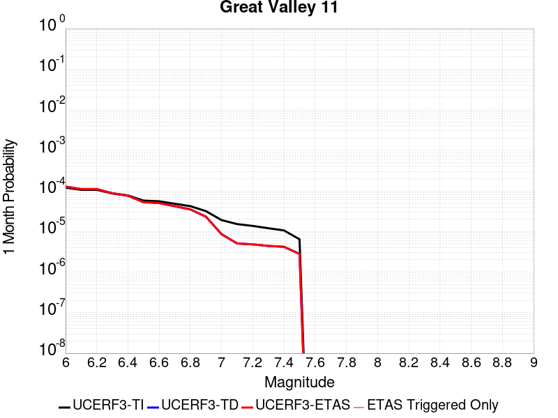 |  | 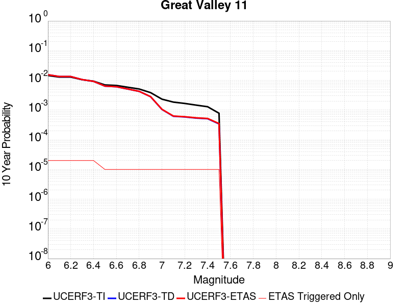 |

| Magnitude | 1 wk TI Prob | 1 wk TD Prob | 1 wk ETAS Prob | 1 wk ETAS/TD Gain | 1 wk ETAS Triggered Only | 1 mo TI Prob | 1 mo TD Prob | 1 mo ETAS Prob | 1 mo ETAS/TD Gain | 1 mo ETAS Triggered Only | 1 yr TI Prob | 1 yr TD Prob | 1 yr ETAS Prob | 1 yr ETAS/TD Gain | 1 yr ETAS Triggered Only | 10 yr TI Prob | 10 yr TD Prob | 10 yr ETAS Prob | 10 yr ETAS/TD Gain | 10 yr ETAS Triggered Only |
|-----|-----|-----|-----|-----|-----|-----|-----|-----|-----|-----|-----|-----|-----|-----|-----|-----|-----|-----|-----|-----|
| 6.0 | 2.8099583E-5 | 2.9832727E-5 | 2.9832727E-5 | 1.0 | 0.0 | 1.20421224E-4 | 1.278487E-4 | 1.278487E-4 | 1.0 | 0.0 | 0.0014651422 | 0.0015555201 | 0.001575489 | 1.0128374 | 2.0E-5 | 0.0145552 | 0.015453849 | 0.01547354 | 1.0012742 | 2.0E-5 |
| 6.1 | 2.483194E-5 | 2.5907642E-5 | 2.5907642E-5 | 1.0 | 0.0 | 1.0641825E-4 | 1.1102839E-4 | 1.1102839E-4 | 1.0 | 0.0 | 0.0012948721 | 0.0013509957 | 0.0013709688 | 1.0147839 | 2.0E-5 | 0.012873529 | 0.013434236 | 0.013453968 | 1.0014688 | 2.0E-5 |
| 6.2 | 2.483194E-5 | 2.5907642E-5 | 2.5907642E-5 | 1.0 | 0.0 | 1.0641825E-4 | 1.1102839E-4 | 1.1102839E-4 | 1.0 | 0.0 | 0.0012948721 | 0.0013509957 | 0.0013709688 | 1.0147839 | 2.0E-5 | 0.012873529 | 0.013434236 | 0.013453968 | 1.0014688 | 2.0E-5 |
| 6.3 | 2.0257901E-5 | 2.0399288E-5 | 2.0399288E-5 | 1.0 | 0.0 | 8.681669E-5 | 8.742283E-5 | 8.742283E-5 | 1.0 | 0.0 | 0.0010564806 | 0.0010638948 | 0.0010838736 | 1.0187788 | 2.0E-5 | 0.01051472 | 0.010592187 | 0.010611976 | 1.0018681 | 2.0E-5 |
| 6.4 | 1.8054898E-5 | 1.778117E-5 | 1.778117E-5 | 1.0 | 0.0 | 7.737584E-5 | 7.6203E-5 | 7.6203E-5 | 1.0 | 0.0 | 9.416436E-4 | 9.274143E-4 | 9.4739575E-4 | 1.0215453 | 2.0E-5 | 0.009376635 | 0.00923918 | 0.009258995 | 1.0021447 | 2.0E-5 |
| 6.5 | 1.34804895E-5 | 1.2321206E-5 | 1.2321206E-5 | 1.0 | 0.0 | 5.777225E-5 | 5.280412E-5 | 5.280412E-5 | 1.0 | 0.0 | 7.031501E-4 | 6.4270466E-4 | 6.526983E-4 | 1.0155493 | 1.0E-5 | 0.007009294 | 0.0064088963 | 0.0064188326 | 1.0015503 | 1.0E-5 |
| 6.6 | 1.294883E-5 | 1.1732455E-5 | 1.1732455E-5 | 1.0 | 0.0 | 5.5493805E-5 | 5.0281003E-5 | 5.0281003E-5 | 1.0 | 0.0 | 6.754276E-4 | 6.120033E-4 | 6.219972E-4 | 1.0163298 | 1.0E-5 | 0.006733784 | 0.006103605 | 0.006113544 | 1.0016284 | 1.0E-5 |
| 6.7 | 1.1272237E-5 | 9.811997E-6 | 9.811997E-6 | 1.0 | 0.0 | 4.8308695E-5 | 4.2050757E-5 | 4.2050757E-5 | 1.0 | 0.0 | 5.879996E-4 | 5.118504E-4 | 5.218453E-4 | 1.019527 | 1.0E-5 | 0.005864462 | 0.005106999 | 0.0051169484 | 1.0019481 | 1.0E-5 |
| 6.8 | 9.8337505E-6 | 8.193859E-6 | 8.193859E-6 | 1.0 | 0.0 | 4.2143965E-5 | 3.5116078E-5 | 3.5116078E-5 | 1.0 | 0.0 | 5.1298196E-4 | 4.2745643E-4 | 4.3745214E-4 | 1.0233842 | 1.0E-5 | 0.005117994 | 0.004266552 | 0.0042765094 | 1.0023338 | 1.0E-5 |
| 6.9 | 7.4224813E-6 | 5.413176E-6 | 5.413176E-6 | 1.0 | 0.0 | 3.1810247E-5 | 2.3199127E-5 | 2.3199127E-5 | 1.0 | 0.0 | 3.872209E-4 | 2.824142E-4 | 2.9241137E-4 | 1.035399 | 1.0E-5 | 0.0038654688 | 0.0028206937 | 0.0028306656 | 1.0035353 | 1.0E-5 |
| 7.0 | 4.4628923E-6 | 2.0110585E-6 | 2.0110585E-6 | 1.0 | 0.0 | 1.912654E-5 | 8.618795E-6 | 8.618795E-6 | 1.0 | 0.0 | 2.3284076E-4 | 1.04928884E-4 | 1.1492783E-4 | 1.0952927 | 1.0E-5 | 0.0023259693 | 0.001048805 | 0.0010587944 | 1.0095247 | 1.0E-5 |
| 7.1 | 3.5546527E-6 | 1.1855554E-6 | 1.1855554E-6 | 1.0 | 0.0 | 1.5234136E-5 | 5.0809426E-6 | 5.0809426E-6 | 1.0 | 0.0 | 1.8545982E-4 | 6.185879E-5 | 7.185817E-5 | 1.1616485 | 1.0E-5 | 0.0018530512 | 6.184225E-4 | 6.284163E-4 | 1.0161601 | 1.0E-5 |
| 7.2 | 3.2039936E-6 | 1.1253885E-6 | 1.1253885E-6 | 1.0 | 0.0 | 1.3731329E-5 | 4.8230854E-6 | 4.8230854E-6 | 1.0 | 0.0 | 1.671661E-4 | 5.8719546E-5 | 6.871896E-5 | 1.1702911 | 1.0E-5 | 0.0016704041 | 5.87047E-4 | 5.9704116E-4 | 1.0170244 | 1.0E-5 |
| 7.3 | 2.8120473E-6 | 1.0305404E-6 | 1.0305404E-6 | 1.0 | 0.0 | 1.2051575E-5 | 4.4165945E-6 | 4.4165945E-6 | 1.0 | 0.0 | 1.4671806E-4 | 5.377078E-5 | 6.377024E-5 | 1.1859646 | 1.0E-5 | 0.0014662122 | 5.375843E-4 | 5.475789E-4 | 1.0185918 | 1.0E-5 |
| 7.4 | 2.4837766E-6 | 9.80044E-7 | 9.80044E-7 | 1.0 | 0.0 | 1.0644713E-5 | 4.200182E-6 | 4.200182E-6 | 1.0 | 0.0 | 1.2959167E-4 | 5.113608E-5 | 6.113557E-5 | 1.1955466 | 1.0E-5 | 0.0012951613 | 5.1124976E-4 | 5.2124466E-4 | 1.01955 | 1.0E-5 |
| 7.5 | 1.5002679E-6 | 6.546047E-7 | 6.546047E-7 | 1.0 | 0.0 | 6.4297037E-6 | 2.805446E-6 | 2.805446E-6 | 1.0 | 0.0 | 7.827883E-5 | 3.415581E-5 | 4.415547E-5 | 1.292766 | 1.0E-5 | 7.825126E-4 | 3.4150976E-4 | 3.5150634E-4 | 1.0292717 | 1.0E-5 |

## Peralta Hills
*[(top)](#table-of-contents)*

| 1 Week | 1 Month | 1 Year | 10 Year |
|-----|-----|-----|-----|
| 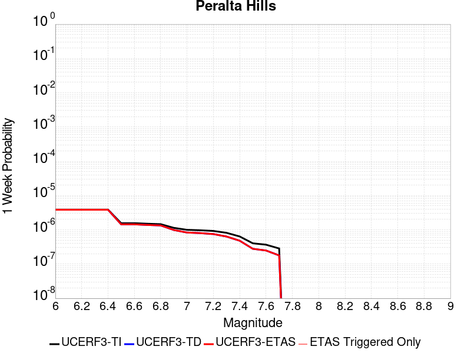 | 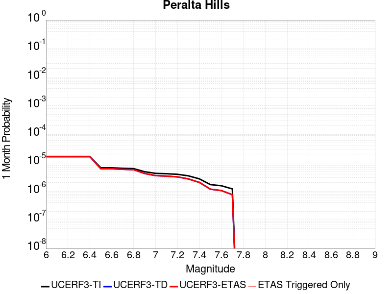 | 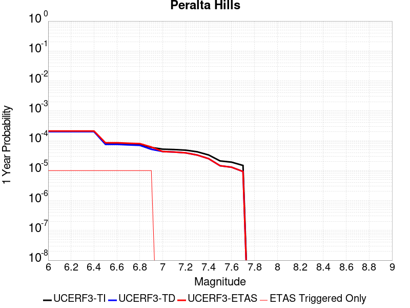 |  |

| Magnitude | 1 wk TI Prob | 1 wk TD Prob | 1 wk ETAS Prob | 1 wk ETAS/TD Gain | 1 wk ETAS Triggered Only | 1 mo TI Prob | 1 mo TD Prob | 1 mo ETAS Prob | 1 mo ETAS/TD Gain | 1 mo ETAS Triggered Only | 1 yr TI Prob | 1 yr TD Prob | 1 yr ETAS Prob | 1 yr ETAS/TD Gain | 1 yr ETAS Triggered Only | 10 yr TI Prob | 10 yr TD Prob | 10 yr ETAS Prob | 10 yr ETAS/TD Gain | 10 yr ETAS Triggered Only |
|-----|-----|-----|-----|-----|-----|-----|-----|-----|-----|-----|-----|-----|-----|-----|-----|-----|-----|-----|-----|-----|
| 6.0 | 3.8850067E-6 | 3.8395556E-6 | 3.8395556E-6 | 1.0 | 0.0 | 1.6649923E-5 | 1.6455177E-5 | 1.6455177E-5 | 1.0 | 0.0 | 2.0269395E-4 | 2.0033077E-4 | 2.1032877E-4 | 1.0499074 | 1.0E-5 | 0.0020250916 | 0.0020022294 | 0.0020221896 | 1.0099689 | 2.0E-5 |
| 6.1 | 3.8850067E-6 | 3.8395556E-6 | 3.8395556E-6 | 1.0 | 0.0 | 1.6649923E-5 | 1.6455177E-5 | 1.6455177E-5 | 1.0 | 0.0 | 2.0269395E-4 | 2.0033077E-4 | 2.1032877E-4 | 1.0499074 | 1.0E-5 | 0.0020250916 | 0.0020022294 | 0.0020221896 | 1.0099689 | 2.0E-5 |
| 6.2 | 3.8850067E-6 | 3.8395556E-6 | 3.8395556E-6 | 1.0 | 0.0 | 1.6649923E-5 | 1.6455177E-5 | 1.6455177E-5 | 1.0 | 0.0 | 2.0269395E-4 | 2.0033077E-4 | 2.1032877E-4 | 1.0499074 | 1.0E-5 | 0.0020250916 | 0.0020022294 | 0.0020221896 | 1.0099689 | 2.0E-5 |
| 6.3 | 3.8850067E-6 | 3.8395556E-6 | 3.8395556E-6 | 1.0 | 0.0 | 1.6649923E-5 | 1.6455177E-5 | 1.6455177E-5 | 1.0 | 0.0 | 2.0269395E-4 | 2.0033077E-4 | 2.1032877E-4 | 1.0499074 | 1.0E-5 | 0.0020250916 | 0.0020022294 | 0.0020221896 | 1.0099689 | 2.0E-5 |
| 6.4 | 3.8850067E-6 | 3.8395556E-6 | 3.8395556E-6 | 1.0 | 0.0 | 1.6649923E-5 | 1.6455177E-5 | 1.6455177E-5 | 1.0 | 0.0 | 2.0269395E-4 | 2.0033077E-4 | 2.1032877E-4 | 1.0499074 | 1.0E-5 | 0.0020250916 | 0.0020022294 | 0.0020221896 | 1.0099689 | 2.0E-5 |
| 6.5 | 1.5587785E-6 | 1.4431154E-6 | 1.4431154E-6 | 1.0 | 0.0 | 6.6804623E-6 | 6.184767E-6 | 6.184767E-6 | 1.0 | 0.0 | 8.133159E-5 | 7.5297175E-5 | 8.529642E-5 | 1.1327971 | 1.0E-5 | 8.1301836E-4 | 7.5274066E-4 | 7.7272556E-4 | 1.0265496 | 2.0E-5 |
| 6.6 | 1.5587785E-6 | 1.4431154E-6 | 1.4431154E-6 | 1.0 | 0.0 | 6.6804623E-6 | 6.184767E-6 | 6.184767E-6 | 1.0 | 0.0 | 8.133159E-5 | 7.5297175E-5 | 8.529642E-5 | 1.1327971 | 1.0E-5 | 8.1301836E-4 | 7.5274066E-4 | 7.7272556E-4 | 1.0265496 | 2.0E-5 |
| 6.7 | 1.5018579E-6 | 1.3837376E-6 | 1.3837376E-6 | 1.0 | 0.0 | 6.436518E-6 | 5.930292E-6 | 5.930292E-6 | 1.0 | 0.0 | 7.836179E-5 | 7.219915E-5 | 8.2198436E-5 | 1.1384958 | 1.0E-5 | 7.833416E-4 | 7.217805E-4 | 7.4176607E-4 | 1.0276892 | 2.0E-5 |
| 6.8 | 1.4584314E-6 | 1.3381696E-6 | 1.3381696E-6 | 1.0 | 0.0 | 6.250405E-6 | 5.7350007E-6 | 5.7350007E-6 | 1.0 | 0.0 | 7.6096025E-5 | 6.982164E-5 | 7.982094E-5 | 1.1432121 | 1.0E-5 | 7.6069974E-4 | 6.980204E-4 | 7.1800646E-4 | 1.0286324 | 2.0E-5 |
| 6.9 | 1.1382393E-6 | 9.862489E-7 | 9.862489E-7 | 1.0 | 0.0 | 4.8781594E-6 | 4.2267748E-6 | 4.2267748E-6 | 1.0 | 0.0 | 5.9389975E-5 | 5.1459847E-5 | 6.145934E-5 | 1.1943163 | 1.0E-5 | 5.93741E-4 | 5.1448756E-4 | 5.3447724E-4 | 1.0388536 | 2.0E-5 |
| 7.0 | 9.970413E-7 | 8.309782E-7 | 8.309782E-7 | 1.0 | 0.0 | 4.273027E-6 | 3.5613305E-6 | 3.5613305E-6 | 1.0 | 0.0 | 5.2022864E-5 | 4.3358406E-5 | 4.3358406E-5 | 1.0 | 0.0 | 5.2010687E-4 | 4.3350627E-4 | 4.3350627E-4 | 1.0 | 0.0 |
| 7.1 | 9.684443E-7 | 7.99422E-7 | 7.99422E-7 | 1.0 | 0.0 | 4.150469E-6 | 3.4260904E-6 | 3.4260904E-6 | 1.0 | 0.0 | 5.053079E-5 | 4.171192E-5 | 4.171192E-5 | 1.0 | 0.0 | 5.05193E-4 | 4.1704765E-4 | 4.1704765E-4 | 1.0 | 0.0 |
| 7.2 | 9.240811E-7 | 7.5032693E-7 | 7.5032693E-7 | 1.0 | 0.0 | 3.960342E-6 | 3.2156831E-6 | 3.2156831E-6 | 1.0 | 0.0 | 4.8216094E-5 | 3.9150305E-5 | 3.9150305E-5 | 1.0 | 0.0 | 4.8205635E-4 | 3.9144064E-4 | 3.9144064E-4 | 1.0 | 0.0 |
| 7.3 | 8.158643E-7 | 6.3501E-7 | 6.3501E-7 | 1.0 | 0.0 | 3.4965567E-6 | 2.721469E-6 | 2.721469E-6 | 1.0 | 0.0 | 4.2569747E-5 | 3.3133445E-5 | 3.3133445E-5 | 1.0 | 0.0 | 4.2561593E-4 | 3.3129117E-4 | 3.3129117E-4 | 1.0 | 0.0 |
| 7.4 | 6.3822824E-7 | 4.795753E-7 | 4.795753E-7 | 1.0 | 0.0 | 2.7352612E-6 | 2.0553214E-6 | 2.0553214E-6 | 1.0 | 0.0 | 3.3301294E-5 | 2.5023304E-5 | 2.5023304E-5 | 1.0 | 0.0 | 3.3296304E-4 | 2.5021E-4 | 2.5021E-4 | 1.0 | 0.0 |
| 7.5 | 4.0292628E-7 | 2.7846437E-7 | 2.7846437E-7 | 1.0 | 0.0 | 1.7268258E-6 | 1.1934184E-6 | 1.1934184E-6 | 1.0 | 0.0 | 2.1023901E-5 | 1.45298E-5 | 1.45298E-5 | 1.0 | 0.0 | 2.1021912E-4 | 1.452913E-4 | 1.452913E-4 | 1.0 | 0.0 |
| 7.6 | 3.672993E-7 | 2.4855234E-7 | 2.4855234E-7 | 1.0 | 0.0 | 1.5741389E-6 | 1.0652241E-6 | 1.0652241E-6 | 1.0 | 0.0 | 1.9164972E-5 | 1.2969053E-5 | 1.2969053E-5 | 1.0 | 0.0 | 1.916332E-4 | 1.2968568E-4 | 1.2968568E-4 | 1.0 | 0.0 |
| 7.7 | 2.8466823E-7 | 1.7859766E-7 | 1.7859766E-7 | 1.0 | 0.0 | 1.2200061E-6 | 7.6541846E-7 | 7.6541846E-7 | 1.0 | 0.0 | 1.4853474E-5 | 9.3189565E-6 | 9.3189565E-6 | 1.0 | 0.0 | 1.485248E-4 | 9.318825E-5 | 9.318825E-5 | 1.0 | 0.0 |

## Pinto Mtn
*[(top)](#table-of-contents)*

| 1 Week | 1 Month | 1 Year | 10 Year |
|-----|-----|-----|-----|
| 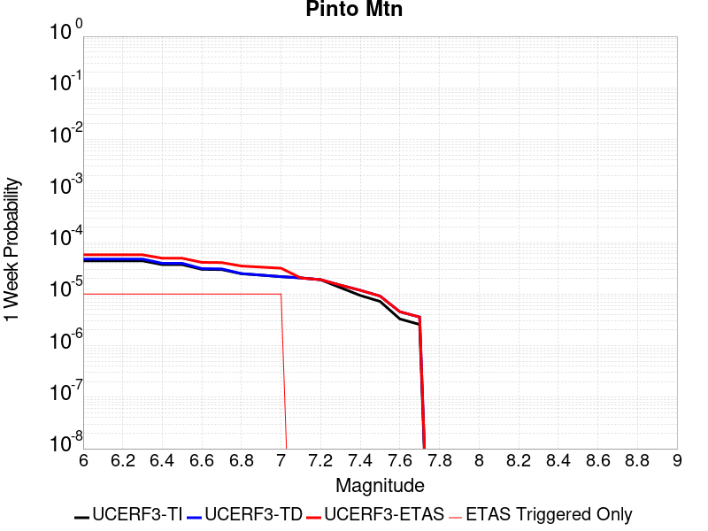 |  | 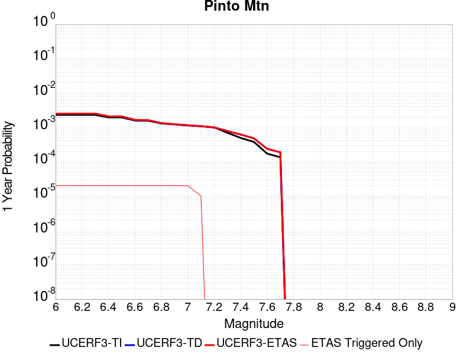 |  |

| Magnitude | 1 wk TI Prob | 1 wk TD Prob | 1 wk ETAS Prob | 1 wk ETAS/TD Gain | 1 wk ETAS Triggered Only | 1 mo TI Prob | 1 mo TD Prob | 1 mo ETAS Prob | 1 mo ETAS/TD Gain | 1 mo ETAS Triggered Only | 1 yr TI Prob | 1 yr TD Prob | 1 yr ETAS Prob | 1 yr ETAS/TD Gain | 1 yr ETAS Triggered Only | 10 yr TI Prob | 10 yr TD Prob | 10 yr ETAS Prob | 10 yr ETAS/TD Gain | 10 yr ETAS Triggered Only |
|-----|-----|-----|-----|-----|-----|-----|-----|-----|-----|-----|-----|-----|-----|-----|-----|-----|-----|-----|-----|-----|
| 6.0 | 4.4194956E-5 | 4.7855236E-5 | 5.785476E-5 | 1.2089535 | 1.0E-5 | 1.893932E-4 | 2.0507866E-4 | 2.1507661E-4 | 1.0487518 | 1.0E-5 | 0.0023034236 | 0.002494137 | 0.0025140871 | 1.0079988 | 2.0E-5 | 0.022796938 | 0.024678973 | 0.02469848 | 1.0007904 | 2.0E-5 |
| 6.1 | 4.4194956E-5 | 4.7855236E-5 | 5.785476E-5 | 1.2089535 | 1.0E-5 | 1.893932E-4 | 2.0507866E-4 | 2.1507661E-4 | 1.0487518 | 1.0E-5 | 0.0023034236 | 0.002494137 | 0.0025140871 | 1.0079988 | 2.0E-5 | 0.022796938 | 0.024678973 | 0.02469848 | 1.0007904 | 2.0E-5 |
| 6.2 | 4.4194956E-5 | 4.7855236E-5 | 5.785476E-5 | 1.2089535 | 1.0E-5 | 1.893932E-4 | 2.0507866E-4 | 2.1507661E-4 | 1.0487518 | 1.0E-5 | 0.0023034236 | 0.002494137 | 0.0025140871 | 1.0079988 | 2.0E-5 | 0.022796938 | 0.024678973 | 0.02469848 | 1.0007904 | 2.0E-5 |
| 6.3 | 4.4194956E-5 | 4.7855236E-5 | 5.785476E-5 | 1.2089535 | 1.0E-5 | 1.893932E-4 | 2.0507866E-4 | 2.1507661E-4 | 1.0487518 | 1.0E-5 | 0.0023034236 | 0.002494137 | 0.0025140871 | 1.0079988 | 2.0E-5 | 0.022796938 | 0.024678973 | 0.02469848 | 1.0007904 | 2.0E-5 |
| 6.4 | 3.729929E-5 | 3.960462E-5 | 4.9604223E-5 | 1.2524858 | 1.0E-5 | 1.5984432E-4 | 1.6972357E-4 | 1.7972187E-4 | 1.0589093 | 1.0E-5 | 0.0019443673 | 0.0020645193 | 0.002084478 | 1.0096675 | 2.0E-5 | 0.019274427 | 0.020463428 | 0.020483017 | 1.0009574 | 2.0E-5 |
| 6.5 | 3.729929E-5 | 3.960462E-5 | 4.9604223E-5 | 1.2524858 | 1.0E-5 | 1.5984432E-4 | 1.6972357E-4 | 1.7972187E-4 | 1.0589093 | 1.0E-5 | 0.0019443673 | 0.0020645193 | 0.002084478 | 1.0096675 | 2.0E-5 | 0.019274427 | 0.020463428 | 0.020483017 | 1.0009574 | 2.0E-5 |
| 6.6 | 3.0204548E-5 | 3.120656E-5 | 4.1206247E-5 | 1.3204354 | 1.0E-5 | 1.2944164E-4 | 1.3373574E-4 | 1.437344E-4 | 1.0747644 | 1.0E-5 | 0.0015748127 | 0.0016270512 | 0.0016470186 | 1.0122721 | 2.0E-5 | 0.015636992 | 0.016155256 | 0.016174933 | 1.001218 | 2.0E-5 |
| 6.7 | 2.9857754E-5 | 3.0815936E-5 | 4.081563E-5 | 1.3244975 | 1.0E-5 | 1.2795553E-4 | 1.3206182E-4 | 1.420605E-4 | 1.0757121 | 1.0E-5 | 0.0015567453 | 0.0016067013 | 0.0016266692 | 1.0124278 | 2.0E-5 | 0.015458848 | 0.015954694 | 0.015974374 | 1.0012336 | 2.0E-5 |
| 6.8 | 2.4819734E-5 | 2.5010519E-5 | 3.5010267E-5 | 1.3998218 | 1.0E-5 | 1.0636595E-4 | 1.0718366E-4 | 1.17182586E-4 | 1.0932878 | 1.0E-5 | 0.0012942362 | 0.0013042014 | 0.0013241754 | 1.015315 | 2.0E-5 | 0.012867244 | 0.012967843 | 0.012987583 | 1.0015223 | 2.0E-5 |
| 6.9 | 2.331124E-5 | 2.3338778E-5 | 3.3338543E-5 | 1.4284614 | 1.0E-5 | 9.990149E-5 | 1.0001961E-4 | 1.1001861E-4 | 1.0999703 | 1.0E-5 | 0.001215622 | 0.0012170789 | 0.0012370546 | 1.0164127 | 2.0E-5 | 0.012089936 | 0.012106326 | 0.012126084 | 1.001632 | 2.0E-5 |
| 7.0 | 2.1818534E-5 | 2.176189E-5 | 3.1761672E-5 | 1.4595089 | 1.0E-5 | 9.3504656E-5 | 9.3262024E-5 | 1.0326109E-4 | 1.1072148 | 1.0E-5 | 0.0011378246 | 0.0011348935 | 0.0011548708 | 1.0176028 | 2.0E-5 | 0.011320163 | 0.011293081 | 0.0113128545 | 1.001751 | 2.0E-5 |
| 7.1 | 2.066081E-5 | 2.0541518E-5 | 2.0541518E-5 | 1.0 | 0.0 | 8.854332E-5 | 8.803221E-5 | 8.803221E-5 | 1.0 | 0.0 | 0.0010774818 | 0.0010712848 | 0.0010812741 | 1.0093246 | 1.0E-5 | 0.010722724 | 0.010663256 | 0.0106731495 | 1.0009278 | 1.0E-5 |
| 7.2 | 1.8990233E-5 | 1.9054787E-5 | 1.9054787E-5 | 1.0 | 0.0 | 8.138417E-5 | 8.1660924E-5 | 8.1660924E-5 | 1.0 | 0.0 | 9.904018E-4 | 9.937877E-4 | 9.937877E-4 | 1.0 | 0.0 | 0.009859995 | 0.009895435 | 0.009895435 | 1.0 | 0.0 |
| 7.3 | 1.3335872E-5 | 1.4907436E-5 | 1.4907436E-5 | 1.0 | 0.0 | 5.7152483E-5 | 6.388751E-5 | 6.388751E-5 | 1.0 | 0.0 | 6.956093E-4 | 7.775657E-4 | 7.775657E-4 | 1.0 | 0.0 | 0.006934359 | 0.0077497503 | 0.0077497503 | 1.0 | 0.0 |
| 7.4 | 9.414066E-6 | 1.186164E-5 | 1.186164E-5 | 1.0 | 0.0 | 4.0345374E-5 | 5.0834664E-5 | 5.0834664E-5 | 1.0 | 0.0 | 4.910942E-4 | 6.187457E-4 | 6.187457E-4 | 1.0 | 0.0 | 0.0049001034 | 0.006171178 | 0.006171178 | 1.0 | 0.0 |
| 7.5 | 7.2101157E-6 | 9.158835E-6 | 9.158835E-6 | 1.0 | 0.0 | 3.090013E-5 | 3.9251605E-5 | 3.9251605E-5 | 1.0 | 0.0 | 3.7614413E-4 | 4.7779127E-4 | 4.7779127E-4 | 1.0 | 0.0 | 0.0037550807 | 0.004768416 | 0.004768416 | 1.0 | 0.0 |
| 7.6 | 3.296375E-6 | 4.5461234E-6 | 4.5461234E-6 | 1.0 | 0.0 | 1.4127245E-5 | 1.9483248E-5 | 1.9483248E-5 | 1.0 | 0.0 | 1.7198564E-4 | 2.3718413E-4 | 2.3718413E-4 | 1.0 | 0.0 | 0.0017185259 | 0.0023694471 | 0.0023694471 | 1.0 | 0.0 |
| 7.7 | 2.5741092E-6 | 3.5849905E-6 | 3.5849905E-6 | 1.0 | 0.0 | 1.103185E-5 | 1.5364161E-5 | 1.5364161E-5 | 1.0 | 0.0 | 1.3430449E-4 | 1.8704393E-4 | 1.8704393E-4 | 1.0 | 0.0 | 0.0013422335 | 0.0018689949 | 0.0018689949 | 1.0 | 0.0 |

## Gillem - Big Crack 2011 CFM
*[(top)](#table-of-contents)*

| 1 Week | 1 Month | 1 Year | 10 Year |
|-----|-----|-----|-----|
|  |  | 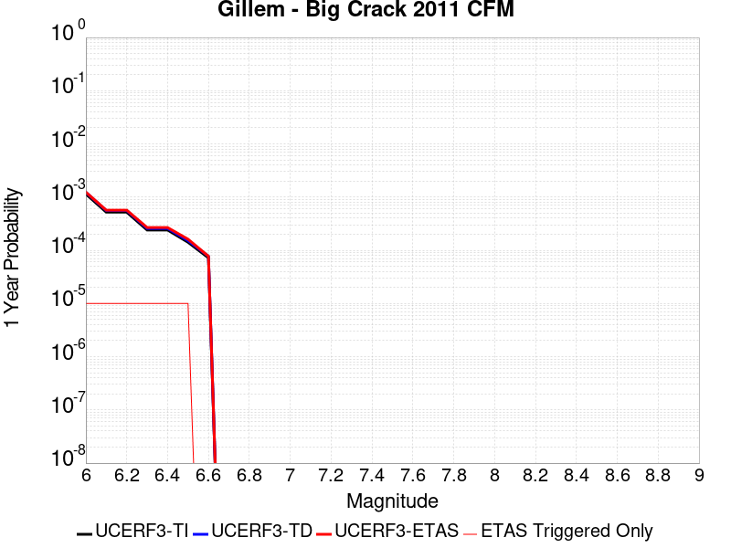 |  |

| Magnitude | 1 wk TI Prob | 1 wk TD Prob | 1 wk ETAS Prob | 1 wk ETAS/TD Gain | 1 wk ETAS Triggered Only | 1 mo TI Prob | 1 mo TD Prob | 1 mo ETAS Prob | 1 mo ETAS/TD Gain | 1 mo ETAS Triggered Only | 1 yr TI Prob | 1 yr TD Prob | 1 yr ETAS Prob | 1 yr ETAS/TD Gain | 1 yr ETAS Triggered Only | 10 yr TI Prob | 10 yr TD Prob | 10 yr ETAS Prob | 10 yr ETAS/TD Gain | 10 yr ETAS Triggered Only |
|-----|-----|-----|-----|-----|-----|-----|-----|-----|-----|-----|-----|-----|-----|-----|-----|-----|-----|-----|-----|-----|
| 6.0 | 2.196852E-5 | 2.3604684E-5 | 2.3604684E-5 | 1.0 | 0.0 | 9.4147406E-5 | 1.011595E-4 | 1.011595E-4 | 1.0 | 0.0 | 0.0011456419 | 0.0012310101 | 0.0012409977 | 1.0081134 | 1.0E-5 | 0.011397537 | 0.012250771 | 0.012260648 | 1.0008063 | 1.0E-5 |
| 6.1 | 9.992795E-6 | 1.0711976E-5 | 1.0711976E-5 | 1.0 | 0.0 | 4.2825563E-5 | 4.5907764E-5 | 4.5907764E-5 | 1.0 | 0.0 | 5.2127644E-4 | 5.5880204E-4 | 5.687964E-4 | 1.0178854 | 1.0E-5 | 0.0052005537 | 0.0055757794 | 0.0055857236 | 1.0017835 | 1.0E-5 |
| 6.2 | 9.992795E-6 | 1.0711976E-5 | 1.0711976E-5 | 1.0 | 0.0 | 4.2825563E-5 | 4.5907764E-5 | 4.5907764E-5 | 1.0 | 0.0 | 5.2127644E-4 | 5.5880204E-4 | 5.687964E-4 | 1.0178854 | 1.0E-5 | 0.0052005537 | 0.0055757794 | 0.0055857236 | 1.0017835 | 1.0E-5 |
| 6.3 | 4.6127884E-6 | 4.9426967E-6 | 4.9426967E-6 | 1.0 | 0.0 | 1.9768944E-5 | 2.118284E-5 | 2.118284E-5 | 1.0 | 0.0 | 2.406603E-4 | 2.5787498E-4 | 2.678724E-4 | 1.0387685 | 1.0E-5 | 0.0024039985 | 0.0025761956 | 0.0025861699 | 1.0038717 | 1.0E-5 |
| 6.4 | 4.6127884E-6 | 4.9426967E-6 | 4.9426967E-6 | 1.0 | 0.0 | 1.9768944E-5 | 2.118284E-5 | 2.118284E-5 | 1.0 | 0.0 | 2.406603E-4 | 2.5787498E-4 | 2.678724E-4 | 1.0387685 | 1.0E-5 | 0.0024039985 | 0.0025761956 | 0.0025861699 | 1.0038717 | 1.0E-5 |
| 6.5 | 2.716712E-6 | 2.9111347E-6 | 2.9111347E-6 | 1.0 | 0.0 | 1.1643E-5 | 1.24762455E-5 | 1.24762455E-5 | 1.0 | 0.0 | 1.417443E-4 | 1.5189013E-4 | 1.618886E-4 | 1.065827 | 1.0E-5 | 0.0014165393 | 0.0015181012 | 0.001528086 | 1.0065771 | 1.0E-5 |
| 6.6 | 1.3818255E-6 | 1.482081E-6 | 1.482081E-6 | 1.0 | 0.0 | 5.922096E-6 | 6.351767E-6 | 6.351767E-6 | 1.0 | 0.0 | 7.209913E-5 | 7.733125E-5 | 7.733125E-5 | 1.0 | 0.0 | 7.2075747E-4 | 7.731643E-4 | 7.731643E-4 | 1.0 | 0.0 |

## San Diego Trough north alt1
*[(top)](#table-of-contents)*

| 1 Week | 1 Month | 1 Year | 10 Year |
|-----|-----|-----|-----|
| 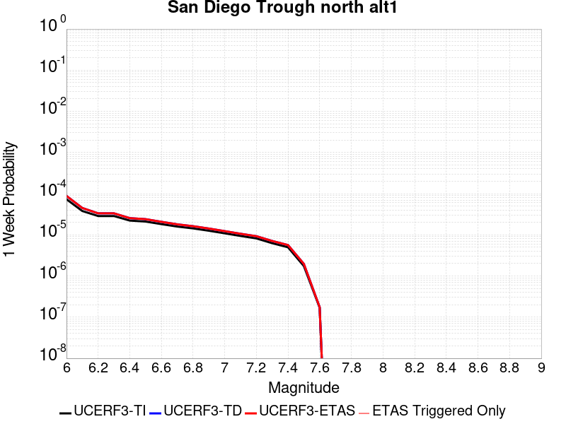 |  |  |  |

| Magnitude | 1 wk TI Prob | 1 wk TD Prob | 1 wk ETAS Prob | 1 wk ETAS/TD Gain | 1 wk ETAS Triggered Only | 1 mo TI Prob | 1 mo TD Prob | 1 mo ETAS Prob | 1 mo ETAS/TD Gain | 1 mo ETAS Triggered Only | 1 yr TI Prob | 1 yr TD Prob | 1 yr ETAS Prob | 1 yr ETAS/TD Gain | 1 yr ETAS Triggered Only | 10 yr TI Prob | 10 yr TD Prob | 10 yr ETAS Prob | 10 yr ETAS/TD Gain | 10 yr ETAS Triggered Only |
|-----|-----|-----|-----|-----|-----|-----|-----|-----|-----|-----|-----|-----|-----|-----|-----|-----|-----|-----|-----|-----|
| 6.0 | 7.329252E-5 | 8.8214765E-5 | 8.8214765E-5 | 1.0 | 0.0 | 3.14073E-4 | 3.7801213E-4 | 3.7801213E-4 | 1.0 | 0.0 | 0.0038171355 | 0.0045931535 | 0.0046031075 | 1.0021671 | 1.0E-5 | 0.03752231 | 0.045046143 | 0.04506524 | 1.000424 | 2.0E-5 |
| 6.1 | 3.7940346E-5 | 4.4885852E-5 | 4.4885852E-5 | 1.0 | 0.0 | 1.6259136E-4 | 1.923543E-4 | 1.923543E-4 | 1.0 | 0.0 | 0.0019777524 | 0.0023394795 | 0.002349456 | 1.0042645 | 1.0E-5 | 0.019602431 | 0.023157205 | 0.023166975 | 1.0004219 | 1.0E-5 |
| 6.2 | 2.8645263E-5 | 3.3297336E-5 | 3.3297336E-5 | 1.0 | 0.0 | 1.2275964E-4 | 1.4269522E-4 | 1.4269522E-4 | 1.0 | 0.0 | 0.0014935739 | 0.0017359524 | 0.0017359524 | 1.0 | 0.0 | 0.0148357535 | 0.01722658 | 0.01722658 | 1.0 | 0.0 |
| 6.3 | 2.8645263E-5 | 3.3297336E-5 | 3.3297336E-5 | 1.0 | 0.0 | 1.2275964E-4 | 1.4269522E-4 | 1.4269522E-4 | 1.0 | 0.0 | 0.0014935739 | 0.0017359524 | 0.0017359524 | 1.0 | 0.0 | 0.0148357535 | 0.01722658 | 0.01722658 | 1.0 | 0.0 |
| 6.4 | 2.2204576E-5 | 2.544874E-5 | 2.544874E-5 | 1.0 | 0.0 | 9.5159E-5 | 1.09061526E-4 | 1.09061526E-4 | 1.0 | 0.0 | 0.001157945 | 0.0013270247 | 0.0013270247 | 1.0 | 0.0 | 0.011519298 | 0.013192175 | 0.013192175 | 1.0 | 0.0 |
| 6.5 | 2.1004838E-5 | 2.4025087E-5 | 2.4025087E-5 | 1.0 | 0.0 | 9.0017624E-5 | 1.0296064E-4 | 1.0296064E-4 | 1.0 | 0.0 | 0.0010954136 | 0.0012528339 | 0.0012528339 | 1.0 | 0.0 | 0.010900296 | 0.012458793 | 0.012458793 | 1.0 | 0.0 |
| 6.6 | 1.820557E-5 | 2.070511E-5 | 2.070511E-5 | 1.0 | 0.0 | 7.802154E-5 | 8.87332E-5 | 8.87332E-5 | 1.0 | 0.0 | 9.4949827E-4 | 0.0010797967 | 0.0010797967 | 1.0 | 0.0 | 0.009454516 | 0.010746171 | 0.010746171 | 1.0 | 0.0 |
| 6.7 | 1.5884485E-5 | 1.7983915E-5 | 1.7983915E-5 | 1.0 | 0.0 | 6.807459E-5 | 7.707166E-5 | 7.707166E-5 | 1.0 | 0.0 | 8.284929E-4 | 9.379462E-4 | 9.379462E-4 | 1.0 | 0.0 | 0.008254109 | 0.009340242 | 0.009340242 | 1.0 | 0.0 |
| 6.8 | 1.4331171E-5 | 1.6201304E-5 | 1.6201304E-5 | 1.0 | 0.0 | 6.141786E-5 | 6.943232E-5 | 6.943232E-5 | 1.0 | 0.0 | 7.4750587E-4 | 8.450126E-4 | 8.450126E-4 | 1.0 | 0.0 | 0.0074499645 | 0.008418262 | 0.008418262 | 1.0 | 0.0 |
| 6.9 | 1.2574203E-5 | 1.4206043E-5 | 1.4206043E-5 | 1.0 | 0.0 | 5.3888325E-5 | 6.0881626E-5 | 6.0881626E-5 | 1.0 | 0.0 | 6.558929E-4 | 7.409831E-4 | 7.409831E-4 | 1.0 | 0.0 | 0.0065396037 | 0.0073853107 | 0.0073853107 | 1.0 | 0.0 |
| 7.0 | 1.0883844E-5 | 1.228944E-5 | 1.228944E-5 | 1.0 | 0.0 | 4.664421E-5 | 5.2667972E-5 | 5.2667972E-5 | 1.0 | 0.0 | 5.677453E-4 | 6.4104487E-4 | 6.4104487E-4 | 1.0 | 0.0 | 0.00566297 | 0.0063920855 | 0.0063920855 | 1.0 | 0.0 |
| 7.1 | 9.393088E-6 | 1.0607175E-5 | 1.0607175E-5 | 1.0 | 0.0 | 4.025547E-5 | 4.545853E-5 | 4.545853E-5 | 1.0 | 0.0 | 4.900001E-4 | 5.5331783E-4 | 5.5331783E-4 | 1.0 | 0.0 | 0.0048892107 | 0.005519498 | 0.005519498 | 1.0 | 0.0 |
| 7.2 | 8.190791E-6 | 9.258762E-6 | 9.258762E-6 | 1.0 | 0.0 | 3.510292E-5 | 3.9679806E-5 | 3.9679806E-5 | 1.0 | 0.0 | 4.2729423E-4 | 4.8299524E-4 | 4.8299524E-4 | 1.0 | 0.0 | 0.0042647356 | 0.004819535 | 0.004819535 | 1.0 | 0.0 |
| 7.3 | 6.268162E-6 | 7.0898204E-6 | 7.0898204E-6 | 1.0 | 0.0 | 2.6863276E-5 | 3.0384592E-5 | 3.0384592E-5 | 1.0 | 0.0 | 3.2701128E-4 | 3.6987002E-4 | 3.6987002E-4 | 1.0 | 0.0 | 0.003265305 | 0.0036925904 | 0.0036925904 | 1.0 | 0.0 |
| 7.4 | 4.985186E-6 | 5.6427652E-6 | 5.6427652E-6 | 1.0 | 0.0 | 2.1364907E-5 | 2.4183058E-5 | 2.4183058E-5 | 1.0 | 0.0 | 2.600867E-4 | 2.9438935E-4 | 2.9438935E-4 | 1.0 | 0.0 | 0.002597825 | 0.002940035 | 0.002940035 | 1.0 | 0.0 |
| 7.5 | 1.7489613E-6 | 1.969706E-6 | 1.969706E-6 | 1.0 | 0.0 | 7.495527E-6 | 8.4415715E-6 | 8.4415715E-6 | 1.0 | 0.0 | 9.125422E-5 | 1.02771504E-4 | 1.02771504E-4 | 1.0 | 0.0 | 9.1216754E-4 | 0.0010272618 | 0.0010272618 | 1.0 | 0.0 |
| 7.6 | 1.6988751E-7 | 1.7533887E-7 | 1.7533887E-7 | 1.0 | 0.0 | 7.2808916E-7 | 7.514521E-7 | 7.514521E-7 | 1.0 | 0.0 | 8.864449E-6 | 9.148893E-6 | 9.148893E-6 | 1.0 | 0.0 | 8.8640954E-5 | 9.148536E-5 | 9.148536E-5 | 1.0 | 0.0 |

## Channel Islands Western Deep Ramp
*[(top)](#table-of-contents)*

| 1 Week | 1 Month | 1 Year | 10 Year |
|-----|-----|-----|-----|
|  |  | 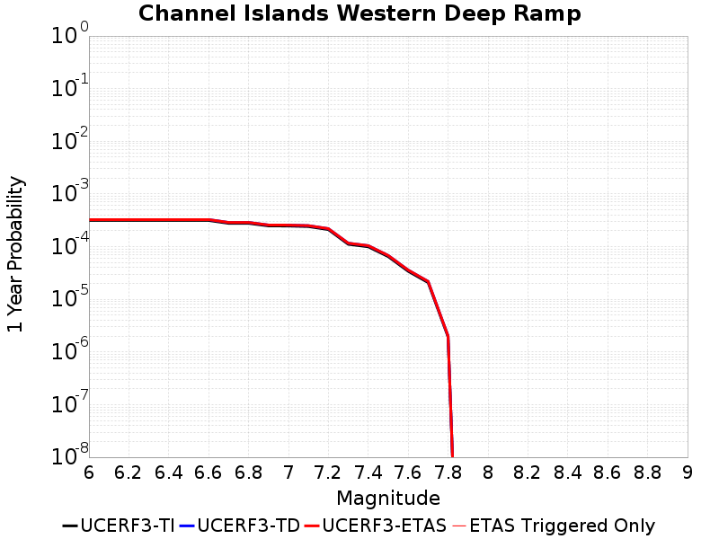 |  |

| Magnitude | 1 wk TI Prob | 1 wk TD Prob | 1 wk ETAS Prob | 1 wk ETAS/TD Gain | 1 wk ETAS Triggered Only | 1 mo TI Prob | 1 mo TD Prob | 1 mo ETAS Prob | 1 mo ETAS/TD Gain | 1 mo ETAS Triggered Only | 1 yr TI Prob | 1 yr TD Prob | 1 yr ETAS Prob | 1 yr ETAS/TD Gain | 1 yr ETAS Triggered Only | 10 yr TI Prob | 10 yr TD Prob | 10 yr ETAS Prob | 10 yr ETAS/TD Gain | 10 yr ETAS Triggered Only |
|-----|-----|-----|-----|-----|-----|-----|-----|-----|-----|-----|-----|-----|-----|-----|-----|-----|-----|-----|-----|-----|
| 6.0 | 6.0213506E-6 | 6.2548957E-6 | 6.2548957E-6 | 1.0 | 0.0 | 2.5805533E-5 | 2.6806445E-5 | 2.6806445E-5 | 1.0 | 0.0 | 3.1413708E-4 | 3.2632405E-4 | 3.2632405E-4 | 1.0 | 0.0 | 0.0031369338 | 0.0032588905 | 0.0032788252 | 1.0061171 | 2.0E-5 |
| 6.1 | 6.0213506E-6 | 6.2548957E-6 | 6.2548957E-6 | 1.0 | 0.0 | 2.5805533E-5 | 2.6806445E-5 | 2.6806445E-5 | 1.0 | 0.0 | 3.1413708E-4 | 3.2632405E-4 | 3.2632405E-4 | 1.0 | 0.0 | 0.0031369338 | 0.0032588905 | 0.0032788252 | 1.0061171 | 2.0E-5 |
| 6.2 | 6.0213506E-6 | 6.2548957E-6 | 6.2548957E-6 | 1.0 | 0.0 | 2.5805533E-5 | 2.6806445E-5 | 2.6806445E-5 | 1.0 | 0.0 | 3.1413708E-4 | 3.2632405E-4 | 3.2632405E-4 | 1.0 | 0.0 | 0.0031369338 | 0.0032588905 | 0.0032788252 | 1.0061171 | 2.0E-5 |
| 6.3 | 6.0213506E-6 | 6.2548957E-6 | 6.2548957E-6 | 1.0 | 0.0 | 2.5805533E-5 | 2.6806445E-5 | 2.6806445E-5 | 1.0 | 0.0 | 3.1413708E-4 | 3.2632405E-4 | 3.2632405E-4 | 1.0 | 0.0 | 0.0031369338 | 0.0032588905 | 0.0032788252 | 1.0061171 | 2.0E-5 |
| 6.4 | 6.0213506E-6 | 6.2548957E-6 | 6.2548957E-6 | 1.0 | 0.0 | 2.5805533E-5 | 2.6806445E-5 | 2.6806445E-5 | 1.0 | 0.0 | 3.1413708E-4 | 3.2632405E-4 | 3.2632405E-4 | 1.0 | 0.0 | 0.0031369338 | 0.0032588905 | 0.0032788252 | 1.0061171 | 2.0E-5 |
| 6.5 | 6.0213506E-6 | 6.2548957E-6 | 6.2548957E-6 | 1.0 | 0.0 | 2.5805533E-5 | 2.6806445E-5 | 2.6806445E-5 | 1.0 | 0.0 | 3.1413708E-4 | 3.2632405E-4 | 3.2632405E-4 | 1.0 | 0.0 | 0.0031369338 | 0.0032588905 | 0.0032788252 | 1.0061171 | 2.0E-5 |
| 6.6 | 6.0213506E-6 | 6.2548957E-6 | 6.2548957E-6 | 1.0 | 0.0 | 2.5805533E-5 | 2.6806445E-5 | 2.6806445E-5 | 1.0 | 0.0 | 3.1413708E-4 | 3.2632405E-4 | 3.2632405E-4 | 1.0 | 0.0 | 0.0031369338 | 0.0032588905 | 0.0032788252 | 1.0061171 | 2.0E-5 |
| 6.7 | 5.313309E-6 | 5.5252654E-6 | 5.5252654E-6 | 1.0 | 0.0 | 2.2771126E-5 | 2.3679517E-5 | 2.3679517E-5 | 1.0 | 0.0 | 2.772032E-4 | 2.8826407E-4 | 2.8826407E-4 | 1.0 | 0.0 | 0.0027685766 | 0.0028793046 | 0.002899247 | 1.0069262 | 2.0E-5 |
| 6.8 | 5.313309E-6 | 5.5252654E-6 | 5.5252654E-6 | 1.0 | 0.0 | 2.2771126E-5 | 2.3679517E-5 | 2.3679517E-5 | 1.0 | 0.0 | 2.772032E-4 | 2.8826407E-4 | 2.8826407E-4 | 1.0 | 0.0 | 0.0027685766 | 0.0028793046 | 0.002899247 | 1.0069262 | 2.0E-5 |
| 6.9 | 4.744377E-6 | 4.9394534E-6 | 4.9394534E-6 | 1.0 | 0.0 | 2.0332885E-5 | 2.1168935E-5 | 2.1168935E-5 | 1.0 | 0.0 | 2.4752476E-4 | 2.5770502E-4 | 2.5770502E-4 | 1.0 | 0.0 | 0.0024724922 | 0.0025744294 | 0.0025844036 | 1.0038743 | 1.0E-5 |
| 7.0 | 4.722209E-6 | 4.916496E-6 | 4.916496E-6 | 1.0 | 0.0 | 2.0237881E-5 | 2.1070548E-5 | 2.1070548E-5 | 1.0 | 0.0 | 2.4636835E-4 | 2.5650745E-4 | 2.5650745E-4 | 1.0 | 0.0 | 0.002460954 | 0.0025624812 | 0.0025724554 | 1.0038924 | 1.0E-5 |
| 7.1 | 4.611174E-6 | 4.8014313E-6 | 4.8014313E-6 | 1.0 | 0.0 | 1.9762025E-5 | 2.0577421E-5 | 2.0577421E-5 | 1.0 | 0.0 | 2.4057609E-4 | 2.5050502E-4 | 2.5050502E-4 | 1.0 | 0.0 | 0.002403158 | 0.0025025934 | 0.0025125684 | 1.0039859 | 1.0E-5 |
| 7.2 | 4.043994E-6 | 4.2120464E-6 | 4.2120464E-6 | 1.0 | 0.0 | 1.7331287E-5 | 1.8051522E-5 | 1.8051522E-5 | 1.0 | 0.0 | 2.10988E-4 | 2.1975869E-4 | 2.1975869E-4 | 1.0 | 0.0 | 0.002107878 | 0.0021957643 | 0.0022057425 | 1.0045443 | 1.0E-5 |
| 7.3 | 2.1233036E-6 | 2.2298E-6 | 2.2298E-6 | 1.0 | 0.0 | 9.099841E-6 | 9.556251E-6 | 9.556251E-6 | 1.0 | 0.0 | 1.1078493E-4 | 1.16341194E-4 | 1.16341194E-4 | 1.0 | 0.0 | 0.0011072971 | 0.0011628085 | 0.0011727968 | 1.0085899 | 1.0E-5 |
| 7.4 | 1.9051884E-6 | 2.0015086E-6 | 2.0015086E-6 | 1.0 | 0.0 | 8.165067E-6 | 8.577866E-6 | 8.577866E-6 | 1.0 | 0.0 | 9.940516E-5 | 1.0443057E-4 | 1.0443057E-4 | 1.0 | 0.0 | 9.93607E-4 | 0.0010438202 | 0.0010538098 | 1.0095702 | 1.0E-5 |
| 7.5 | 1.2408497E-6 | 1.3038913E-6 | 1.3038913E-6 | 1.0 | 0.0 | 5.317916E-6 | 5.5880937E-6 | 5.5880937E-6 | 1.0 | 0.0 | 6.4743705E-5 | 6.803294E-5 | 6.803294E-5 | 1.0 | 0.0 | 6.4724847E-4 | 6.8012334E-4 | 6.901165E-4 | 1.0146933 | 1.0E-5 |
| 7.6 | 6.5440025E-7 | 6.8867587E-7 | 6.8867587E-7 | 1.0 | 0.0 | 2.8045695E-6 | 2.9514647E-6 | 2.9514647E-6 | 1.0 | 0.0 | 3.4145098E-5 | 3.5933503E-5 | 3.5933503E-5 | 1.0 | 0.0 | 3.4139853E-4 | 3.5927835E-4 | 3.5927835E-4 | 1.0 | 0.0 |
| 7.7 | 3.985963E-7 | 4.193103E-7 | 4.193103E-7 | 1.0 | 0.0 | 1.7082689E-6 | 1.7970431E-6 | 1.7970431E-6 | 1.0 | 0.0 | 2.0797976E-5 | 2.1878792E-5 | 2.1878792E-5 | 1.0 | 0.0 | 2.0796029E-4 | 2.1876754E-4 | 2.1876754E-4 | 1.0 | 0.0 |
| 7.8 | 3.706329E-8 | 3.8591974E-8 | 3.8591974E-8 | 1.0 | 0.0 | 1.5884267E-7 | 1.6539416E-7 | 1.6539416E-7 | 1.0 | 0.0 | 1.9339077E-6 | 2.0136722E-6 | 2.0136722E-6 | 1.0 | 0.0 | 1.933891E-5 | 2.0136551E-5 | 2.0136551E-5 | 1.0 | 0.0 |

## San Diego Trough south
*[(top)](#table-of-contents)*

| 1 Week | 1 Month | 1 Year | 10 Year |
|-----|-----|-----|-----|
|  |  | 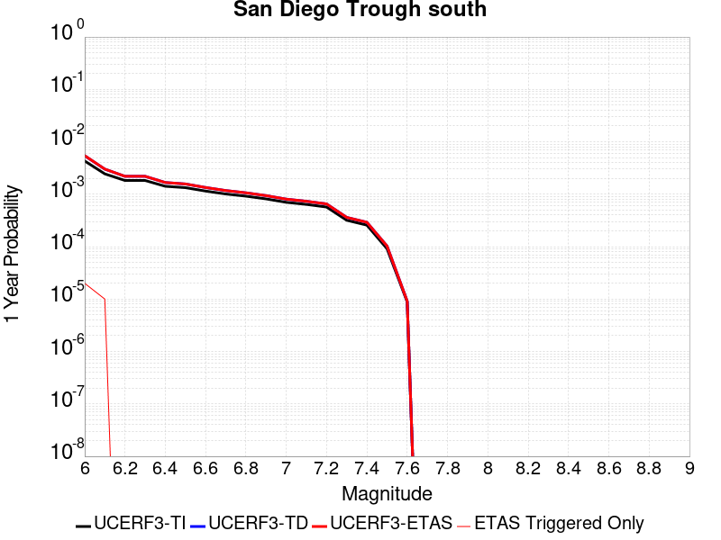 | 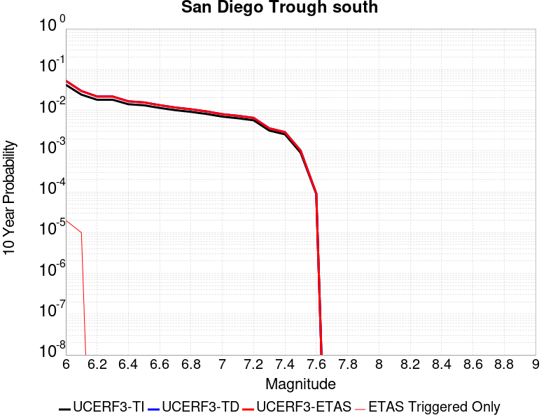 |

| Magnitude | 1 wk TI Prob | 1 wk TD Prob | 1 wk ETAS Prob | 1 wk ETAS/TD Gain | 1 wk ETAS Triggered Only | 1 mo TI Prob | 1 mo TD Prob | 1 mo ETAS Prob | 1 mo ETAS/TD Gain | 1 mo ETAS Triggered Only | 1 yr TI Prob | 1 yr TD Prob | 1 yr ETAS Prob | 1 yr ETAS/TD Gain | 1 yr ETAS Triggered Only | 10 yr TI Prob | 10 yr TD Prob | 10 yr ETAS Prob | 10 yr ETAS/TD Gain | 10 yr ETAS Triggered Only |
|-----|-----|-----|-----|-----|-----|-----|-----|-----|-----|-----|-----|-----|-----|-----|-----|-----|-----|-----|-----|-----|
| 6.0 | 8.279495E-5 | 1.0425846E-4 | 1.0425846E-4 | 1.0 | 0.0 | 3.5478722E-4 | 4.467478E-4 | 4.5674335E-4 | 1.022374 | 1.0E-5 | 0.004310982 | 0.005426066 | 0.0054459576 | 1.0036659 | 2.0E-5 | 0.042283054 | 0.05299446 | 0.0530134 | 1.0003574 | 2.0E-5 |
| 6.1 | 4.6961468E-5 | 5.773164E-5 | 5.773164E-5 | 1.0 | 0.0 | 2.0124791E-4 | 2.4739624E-4 | 2.4739624E-4 | 1.0 | 0.0 | 0.00244744 | 0.0030079621 | 0.0030179322 | 1.0033145 | 1.0E-5 | 0.024206603 | 0.029680371 | 0.029690076 | 1.0003269 | 1.0E-5 |
| 6.2 | 3.5079658E-5 | 4.214341E-5 | 4.214341E-5 | 1.0 | 0.0 | 1.5033272E-4 | 1.8060229E-4 | 1.8060229E-4 | 1.0 | 0.0 | 0.0018287642 | 0.0021966365 | 0.0021966365 | 1.0 | 0.0 | 0.018137876 | 0.021751672 | 0.021751672 | 1.0 | 0.0 |
| 6.3 | 3.5079658E-5 | 4.214341E-5 | 4.214341E-5 | 1.0 | 0.0 | 1.5033272E-4 | 1.8060229E-4 | 1.8060229E-4 | 1.0 | 0.0 | 0.0018287642 | 0.0021966365 | 0.0021966365 | 1.0 | 0.0 | 0.018137876 | 0.021751672 | 0.021751672 | 1.0 | 0.0 |
| 6.4 | 2.7196904E-5 | 3.2087788E-5 | 3.2087788E-5 | 1.0 | 0.0 | 1.16552954E-4 | 1.3751187E-4 | 1.3751187E-4 | 1.0 | 0.0 | 0.0014181085 | 0.0016729333 | 0.0016729333 | 1.0 | 0.0 | 0.014090929 | 0.016605 | 0.016605 | 1.0 | 0.0 |
| 6.5 | 2.5584688E-5 | 3.0102216E-5 | 3.0102216E-5 | 1.0 | 0.0 | 1.0964406E-4 | 1.2900314E-4 | 1.2900314E-4 | 1.0 | 0.0 | 0.0013340989 | 0.0015694938 | 0.0015694938 | 1.0 | 0.0 | 0.013261181 | 0.0155856395 | 0.0155856395 | 1.0 | 0.0 |
| 6.6 | 2.2034688E-5 | 2.5743198E-5 | 2.5743198E-5 | 1.0 | 0.0 | 9.443096E-5 | 1.1032335E-4 | 1.1032335E-4 | 1.0 | 0.0 | 0.0011490905 | 0.0013423666 | 0.0013423666 | 1.0 | 0.0 | 0.011431668 | 0.013343575 | 0.013343575 | 1.0 | 0.0 |
| 6.7 | 1.9394853E-5 | 2.2542174E-5 | 2.2542174E-5 | 1.0 | 0.0 | 8.311815E-5 | 9.660576E-5 | 9.660576E-5 | 1.0 | 0.0 | 0.0010114936 | 0.0011755457 | 0.0011755457 | 1.0 | 0.0 | 0.01006902 | 0.011693979 | 0.011693979 | 1.0 | 0.0 |
| 6.8 | 1.7615313E-5 | 2.0403546E-5 | 2.0403546E-5 | 1.0 | 0.0 | 7.549201E-5 | 8.7440865E-5 | 8.7440865E-5 | 1.0 | 0.0 | 9.1872766E-4 | 0.0010640769 | 0.0010640769 | 1.0 | 0.0 | 0.009149387 | 0.010590386 | 0.010590386 | 1.0 | 0.0 |
| 6.9 | 1.5621423E-5 | 1.8026427E-5 | 1.8026427E-5 | 1.0 | 0.0 | 6.6947236E-5 | 7.725385E-5 | 7.725385E-5 | 1.0 | 0.0 | 8.147778E-4 | 9.4016327E-4 | 9.4016327E-4 | 1.0 | 0.0 | 0.008117969 | 0.009362303 | 0.009362303 | 1.0 | 0.0 |
| 7.0 | 1.3444376E-5 | 1.5448348E-5 | 1.5448348E-5 | 1.0 | 0.0 | 5.7617483E-5 | 6.620554E-5 | 6.620554E-5 | 1.0 | 0.0 | 7.0126704E-4 | 8.057571E-4 | 8.057571E-4 | 1.0 | 0.0 | 0.006990582 | 0.008028689 | 0.008028689 | 1.0 | 0.0 |
| 7.1 | 1.2268361E-5 | 1.4073263E-5 | 1.4073263E-5 | 1.0 | 0.0 | 5.2577634E-5 | 6.0312603E-5 | 6.0312603E-5 | 1.0 | 0.0 | 6.399447E-4 | 7.340612E-4 | 7.340612E-4 | 1.0 | 0.0 | 0.0063810493 | 0.0073166694 | 0.0073166694 | 1.0 | 0.0 |
| 7.2 | 1.0922655E-5 | 1.2513768E-5 | 1.2513768E-5 | 1.0 | 0.0 | 4.681054E-5 | 5.3629345E-5 | 5.3629345E-5 | 1.0 | 0.0 | 5.697693E-4 | 6.527442E-4 | 6.527442E-4 | 1.0 | 0.0 | 0.0056831064 | 0.0065085497 | 0.0065085497 | 1.0 | 0.0 |
| 7.3 | 6.1106753E-6 | 6.929029E-6 | 6.929029E-6 | 1.0 | 0.0 | 2.6188345E-5 | 2.9695504E-5 | 2.9695504E-5 | 1.0 | 0.0 | 3.1879646E-4 | 3.614832E-4 | 3.614832E-4 | 1.0 | 0.0 | 0.0031833951 | 0.0036089972 | 0.0036089972 | 1.0 | 0.0 |
| 7.4 | 4.933187E-6 | 5.589636E-6 | 5.589636E-6 | 1.0 | 0.0 | 2.114206E-5 | 2.3955366E-5 | 2.3955366E-5 | 1.0 | 0.0 | 2.5737417E-4 | 2.9161794E-4 | 2.9161794E-4 | 1.0 | 0.0 | 0.002570763 | 0.002912394 | 0.002912394 | 1.0 | 0.0 |
| 7.5 | 1.7489613E-6 | 1.969706E-6 | 1.969706E-6 | 1.0 | 0.0 | 7.495527E-6 | 8.4415715E-6 | 8.4415715E-6 | 1.0 | 0.0 | 9.125422E-5 | 1.02771504E-4 | 1.02771504E-4 | 1.0 | 0.0 | 9.1216754E-4 | 0.0010272618 | 0.0010272618 | 1.0 | 0.0 |
| 7.6 | 1.6988751E-7 | 1.7533887E-7 | 1.7533887E-7 | 1.0 | 0.0 | 7.2808916E-7 | 7.514521E-7 | 7.514521E-7 | 1.0 | 0.0 | 8.864449E-6 | 9.148893E-6 | 9.148893E-6 | 1.0 | 0.0 | 8.8640954E-5 | 9.148536E-5 | 9.148536E-5 | 1.0 | 0.0 |

## Cucamonga
*[(top)](#table-of-contents)*

| 1 Week | 1 Month | 1 Year | 10 Year |
|-----|-----|-----|-----|
|  |  | 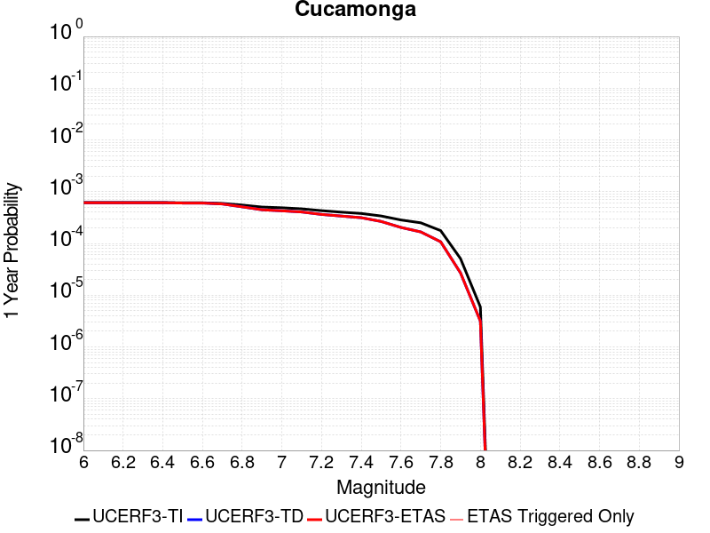 | 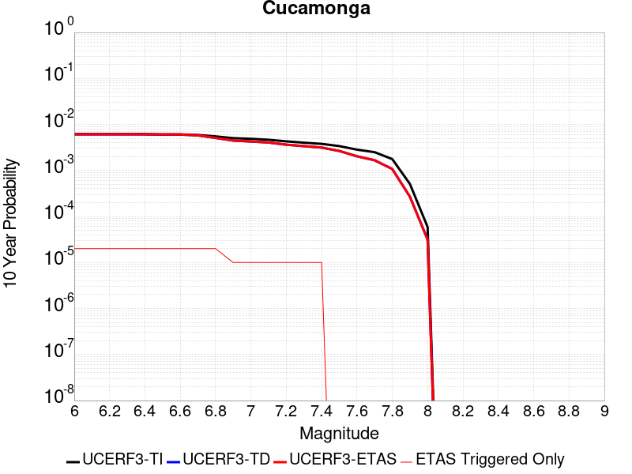 |

| Magnitude | 1 wk TI Prob | 1 wk TD Prob | 1 wk ETAS Prob | 1 wk ETAS/TD Gain | 1 wk ETAS Triggered Only | 1 mo TI Prob | 1 mo TD Prob | 1 mo ETAS Prob | 1 mo ETAS/TD Gain | 1 mo ETAS Triggered Only | 1 yr TI Prob | 1 yr TD Prob | 1 yr ETAS Prob | 1 yr ETAS/TD Gain | 1 yr ETAS Triggered Only | 10 yr TI Prob | 10 yr TD Prob | 10 yr ETAS Prob | 10 yr ETAS/TD Gain | 10 yr ETAS Triggered Only |
|-----|-----|-----|-----|-----|-----|-----|-----|-----|-----|-----|-----|-----|-----|-----|-----|-----|-----|-----|-----|-----|
| 6.0 | 1.1848348E-5 | 1.1737752E-5 | 1.1737752E-5 | 1.0 | 0.0 | 5.0777642E-5 | 5.0303697E-5 | 5.0303697E-5 | 1.0 | 0.0 | 6.180424E-4 | 6.122781E-4 | 6.122781E-4 | 1.0 | 0.0 | 0.0061632637 | 0.006107018 | 0.006126896 | 1.0032549 | 2.0E-5 |
| 6.1 | 1.1848348E-5 | 1.1737752E-5 | 1.1737752E-5 | 1.0 | 0.0 | 5.0777642E-5 | 5.0303697E-5 | 5.0303697E-5 | 1.0 | 0.0 | 6.180424E-4 | 6.122781E-4 | 6.122781E-4 | 1.0 | 0.0 | 0.0061632637 | 0.006107018 | 0.006126896 | 1.0032549 | 2.0E-5 |
| 6.2 | 1.1848348E-5 | 1.1737752E-5 | 1.1737752E-5 | 1.0 | 0.0 | 5.0777642E-5 | 5.0303697E-5 | 5.0303697E-5 | 1.0 | 0.0 | 6.180424E-4 | 6.122781E-4 | 6.122781E-4 | 1.0 | 0.0 | 0.0061632637 | 0.006107018 | 0.006126896 | 1.0032549 | 2.0E-5 |
| 6.3 | 1.1848348E-5 | 1.1737752E-5 | 1.1737752E-5 | 1.0 | 0.0 | 5.0777642E-5 | 5.0303697E-5 | 5.0303697E-5 | 1.0 | 0.0 | 6.180424E-4 | 6.122781E-4 | 6.122781E-4 | 1.0 | 0.0 | 0.0061632637 | 0.006107018 | 0.006126896 | 1.0032549 | 2.0E-5 |
| 6.4 | 1.1848348E-5 | 1.1737752E-5 | 1.1737752E-5 | 1.0 | 0.0 | 5.0777642E-5 | 5.0303697E-5 | 5.0303697E-5 | 1.0 | 0.0 | 6.180424E-4 | 6.122781E-4 | 6.122781E-4 | 1.0 | 0.0 | 0.0061632637 | 0.006107018 | 0.006126896 | 1.0032549 | 2.0E-5 |
| 6.5 | 1.16988695E-5 | 1.1576782E-5 | 1.1576782E-5 | 1.0 | 0.0 | 5.013705E-5 | 4.961385E-5 | 4.961385E-5 | 1.0 | 0.0 | 6.102476E-4 | 6.038839E-4 | 6.038839E-4 | 1.0 | 0.0 | 0.006085745 | 0.006023532 | 0.0060434113 | 1.0033003 | 2.0E-5 |
| 6.6 | 1.16988695E-5 | 1.1576782E-5 | 1.1576782E-5 | 1.0 | 0.0 | 5.013705E-5 | 4.961385E-5 | 4.961385E-5 | 1.0 | 0.0 | 6.102476E-4 | 6.038839E-4 | 6.038839E-4 | 1.0 | 0.0 | 0.006085745 | 0.006023532 | 0.0060434113 | 1.0033003 | 2.0E-5 |
| 6.7 | 1.1397107E-5 | 1.1115668E-5 | 1.1115668E-5 | 1.0 | 0.0 | 4.884383E-5 | 4.763772E-5 | 4.763772E-5 | 1.0 | 0.0 | 5.9451134E-4 | 5.7983736E-4 | 5.7983736E-4 | 1.0 | 0.0 | 0.005929234 | 0.0057843267 | 0.005804211 | 1.0034376 | 2.0E-5 |
| 6.8 | 1.058387E-5 | 9.785604E-6 | 9.785604E-6 | 1.0 | 0.0 | 4.5358654E-5 | 4.1937634E-5 | 4.1937634E-5 | 1.0 | 0.0 | 5.521017E-4 | 5.1047216E-4 | 5.1047216E-4 | 1.0 | 0.0 | 0.00550732 | 0.005093936 | 0.005113834 | 1.0039062 | 2.0E-5 |
| 6.9 | 9.690046E-6 | 8.580028E-6 | 8.580028E-6 | 1.0 | 0.0 | 4.1528107E-5 | 3.6771035E-5 | 3.6771035E-5 | 1.0 | 0.0 | 5.054874E-4 | 4.4759578E-4 | 4.4759578E-4 | 1.0 | 0.0 | 0.005043391 | 0.00446781 | 0.0044777654 | 1.0022283 | 1.0E-5 |
| 7.0 | 9.381461E-6 | 8.187633E-6 | 8.187633E-6 | 1.0 | 0.0 | 4.020564E-5 | 3.5089386E-5 | 3.5089386E-5 | 1.0 | 0.0 | 4.893937E-4 | 4.271299E-4 | 4.271299E-4 | 1.0 | 0.0 | 0.0048831734 | 0.004263957 | 0.0042739143 | 1.0023352 | 1.0E-5 |
| 7.1 | 8.946492E-6 | 7.782409E-6 | 7.782409E-6 | 1.0 | 0.0 | 3.8341543E-5 | 3.3352757E-5 | 3.3352757E-5 | 1.0 | 0.0 | 4.667083E-4 | 4.0599445E-4 | 4.0599445E-4 | 1.0 | 0.0 | 0.0046572937 | 0.004053398 | 0.004063357 | 1.002457 | 1.0E-5 |
| 7.2 | 8.251016E-6 | 6.9757625E-6 | 6.9757625E-6 | 1.0 | 0.0 | 3.5361016E-5 | 2.9895784E-5 | 2.9895784E-5 | 1.0 | 0.0 | 4.3043532E-4 | 3.6392064E-4 | 3.6392064E-4 | 1.0 | 0.0 | 0.0042960253 | 0.0036341154 | 0.0036440792 | 1.0027417 | 1.0E-5 |
| 7.3 | 7.717881E-6 | 6.4868213E-6 | 6.4868213E-6 | 1.0 | 0.0 | 3.3076216E-5 | 2.7800368E-5 | 2.7800368E-5 | 1.0 | 0.0 | 4.026285E-4 | 3.3841713E-4 | 3.3841713E-4 | 1.0 | 0.0 | 0.004018998 | 0.003379885 | 0.0033898514 | 1.0029486 | 1.0E-5 |
| 7.4 | 7.275623E-6 | 6.032451E-6 | 6.032451E-6 | 1.0 | 0.0 | 3.118087E-5 | 2.5853105E-5 | 2.5853105E-5 | 1.0 | 0.0 | 3.7956095E-4 | 3.147163E-4 | 3.147163E-4 | 1.0 | 0.0 | 0.0037891332 | 0.0031435722 | 0.0031535407 | 1.0031711 | 1.0E-5 |
| 7.5 | 6.5109502E-6 | 5.1009984E-6 | 5.1009984E-6 | 1.0 | 0.0 | 2.7903774E-5 | 2.1861239E-5 | 2.1861239E-5 | 1.0 | 0.0 | 3.3967546E-4 | 2.6612822E-4 | 2.6612822E-4 | 1.0 | 0.0 | 0.0033915674 | 0.0026589488 | 0.0026589488 | 1.0 | 0.0 |
| 7.6 | 5.4495326E-6 | 3.9089196E-6 | 3.9089196E-6 | 1.0 | 0.0 | 2.335493E-5 | 1.6752405E-5 | 1.6752405E-5 | 1.0 | 0.0 | 2.8430918E-4 | 2.039415E-4 | 2.039415E-4 | 1.0 | 0.0 | 0.0028394572 | 0.0020383918 | 0.0020383918 | 1.0 | 0.0 |
| 7.7 | 4.7997164E-6 | 3.2005712E-6 | 3.2005712E-6 | 1.0 | 0.0 | 2.057005E-5 | 1.3716662E-5 | 1.3716662E-5 | 1.0 | 0.0 | 2.504116E-4 | 1.669876E-4 | 1.669876E-4 | 1.0 | 0.0 | 0.002501296 | 0.0016694759 | 0.0016694759 | 1.0 | 0.0 |
| 7.8 | 3.3941733E-6 | 2.064383E-6 | 2.064383E-6 | 1.0 | 0.0 | 1.4546376E-5 | 8.847325E-6 | 8.847325E-6 | 1.0 | 0.0 | 1.7708774E-4 | 1.0771088E-4 | 1.0771088E-4 | 1.0 | 0.0 | 0.0017694668 | 0.001076682 | 0.001076682 | 1.0 | 0.0 |
| 7.9 | 9.750552E-7 | 5.156499E-7 | 5.156499E-7 | 1.0 | 0.0 | 4.178801E-6 | 2.2099264E-6 | 2.2099264E-6 | 1.0 | 0.0 | 5.0875715E-5 | 2.6905525E-5 | 2.6905525E-5 | 1.0 | 0.0 | 5.086407E-4 | 2.690231E-4 | 2.690231E-4 | 1.0 | 0.0 |
| 8.0 | 1.133857E-7 | 6.053664E-8 | 6.053664E-8 | 1.0 | 0.0 | 4.8593864E-7 | 2.5944274E-7 | 2.5944274E-7 | 1.0 | 0.0 | 5.9162867E-6 | 3.158711E-6 | 3.158711E-6 | 1.0 | 0.0 | 5.916129E-5 | 3.158668E-5 | 3.158668E-5 | 1.0 | 0.0 |

## Verdugo
*[(top)](#table-of-contents)*

| 1 Week | 1 Month | 1 Year | 10 Year |
|-----|-----|-----|-----|
| 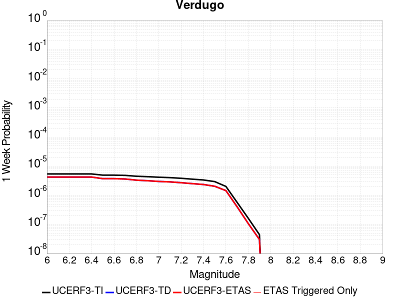 |  |  |  |

| Magnitude | 1 wk TI Prob | 1 wk TD Prob | 1 wk ETAS Prob | 1 wk ETAS/TD Gain | 1 wk ETAS Triggered Only | 1 mo TI Prob | 1 mo TD Prob | 1 mo ETAS Prob | 1 mo ETAS/TD Gain | 1 mo ETAS Triggered Only | 1 yr TI Prob | 1 yr TD Prob | 1 yr ETAS Prob | 1 yr ETAS/TD Gain | 1 yr ETAS Triggered Only | 10 yr TI Prob | 10 yr TD Prob | 10 yr ETAS Prob | 10 yr ETAS/TD Gain | 10 yr ETAS Triggered Only |
|-----|-----|-----|-----|-----|-----|-----|-----|-----|-----|-----|-----|-----|-----|-----|-----|-----|-----|-----|-----|-----|
| 6.0 | 5.392987E-6 | 4.2165307E-6 | 4.2165307E-6 | 1.0 | 0.0 | 2.3112598E-5 | 1.8070723E-5 | 2.8070543E-5 | 1.5533713 | 1.0E-5 | 2.8135953E-4 | 2.199893E-4 | 2.2998711E-4 | 1.0454468 | 1.0E-5 | 0.0028100356 | 0.0021977632 | 0.002217719 | 1.0090802 | 2.0E-5 |
| 6.1 | 5.392987E-6 | 4.2165307E-6 | 4.2165307E-6 | 1.0 | 0.0 | 2.3112598E-5 | 1.8070723E-5 | 2.8070543E-5 | 1.5533713 | 1.0E-5 | 2.8135953E-4 | 2.199893E-4 | 2.2998711E-4 | 1.0454468 | 1.0E-5 | 0.0028100356 | 0.0021977632 | 0.002217719 | 1.0090802 | 2.0E-5 |
| 6.2 | 5.392987E-6 | 4.2165307E-6 | 4.2165307E-6 | 1.0 | 0.0 | 2.3112598E-5 | 1.8070723E-5 | 2.8070543E-5 | 1.5533713 | 1.0E-5 | 2.8135953E-4 | 2.199893E-4 | 2.2998711E-4 | 1.0454468 | 1.0E-5 | 0.0028100356 | 0.0021977632 | 0.002217719 | 1.0090802 | 2.0E-5 |
| 6.3 | 5.392987E-6 | 4.2165307E-6 | 4.2165307E-6 | 1.0 | 0.0 | 2.3112598E-5 | 1.8070723E-5 | 2.8070543E-5 | 1.5533713 | 1.0E-5 | 2.8135953E-4 | 2.199893E-4 | 2.2998711E-4 | 1.0454468 | 1.0E-5 | 0.0028100356 | 0.0021977632 | 0.002217719 | 1.0090802 | 2.0E-5 |
| 6.4 | 5.392987E-6 | 4.2165307E-6 | 4.2165307E-6 | 1.0 | 0.0 | 2.3112598E-5 | 1.8070723E-5 | 2.8070543E-5 | 1.5533713 | 1.0E-5 | 2.8135953E-4 | 2.199893E-4 | 2.2998711E-4 | 1.0454468 | 1.0E-5 | 0.0028100356 | 0.0021977632 | 0.002217719 | 1.0090802 | 2.0E-5 |
| 6.5 | 4.9154837E-6 | 3.7224765E-6 | 3.7224765E-6 | 1.0 | 0.0 | 2.1066187E-5 | 1.5953374E-5 | 2.5953215E-5 | 1.6268166 | 1.0E-5 | 2.5645064E-4 | 1.9421522E-4 | 2.0421328E-4 | 1.0514792 | 1.0E-5 | 0.002561549 | 0.0019404758 | 0.001960437 | 1.0102868 | 2.0E-5 |
| 6.6 | 4.9154837E-6 | 3.7224765E-6 | 3.7224765E-6 | 1.0 | 0.0 | 2.1066187E-5 | 1.5953374E-5 | 2.5953215E-5 | 1.6268166 | 1.0E-5 | 2.5645064E-4 | 1.9421522E-4 | 2.0421328E-4 | 1.0514792 | 1.0E-5 | 0.002561549 | 0.0019404758 | 0.001960437 | 1.0102868 | 2.0E-5 |
| 6.7 | 4.817006E-6 | 3.6206627E-6 | 3.6206627E-6 | 1.0 | 0.0 | 2.0644147E-5 | 1.5517035E-5 | 2.551688E-5 | 1.644443 | 1.0E-5 | 2.513135E-4 | 1.8890372E-4 | 1.9890182E-4 | 1.052927 | 1.0E-5 | 0.0025102948 | 0.001887451 | 0.0019074134 | 1.0105762 | 2.0E-5 |
| 6.8 | 4.507407E-6 | 3.3071135E-6 | 3.3071135E-6 | 1.0 | 0.0 | 1.9317316E-5 | 1.4173268E-5 | 2.4173127E-5 | 1.7055436 | 1.0E-5 | 2.3516294E-4 | 1.7254602E-4 | 1.8254429E-4 | 1.0579456 | 1.0E-5 | 0.0023491425 | 0.0017241348 | 0.0017441002 | 1.01158 | 2.0E-5 |
| 6.9 | 4.3573054E-6 | 3.1610198E-6 | 3.1610198E-6 | 1.0 | 0.0 | 1.8674033E-5 | 1.3547158E-5 | 2.3547023E-5 | 1.7381521 | 1.0E-5 | 2.2733262E-4 | 1.6492429E-4 | 1.7492264E-4 | 1.0606239 | 1.0E-5 | 0.0022710022 | 0.0016480313 | 0.0016679984 | 1.0121157 | 2.0E-5 |
| 7.0 | 4.171527E-6 | 2.983678E-6 | 2.983678E-6 | 1.0 | 0.0 | 1.787785E-5 | 1.278713E-5 | 2.2787002E-5 | 1.7820263 | 1.0E-5 | 2.1764109E-4 | 1.556723E-4 | 1.6567073E-4 | 1.0642275 | 1.0E-5 | 0.0021742806 | 0.0015556437 | 0.0015756127 | 1.0128365 | 2.0E-5 |
| 7.1 | 4.0405484E-6 | 2.8822685E-6 | 2.8822685E-6 | 1.0 | 0.0 | 1.731652E-5 | 1.23525215E-5 | 2.2352398E-5 | 1.8095413 | 1.0E-5 | 2.1080824E-4 | 1.5038167E-4 | 1.6038018E-4 | 1.0664874 | 1.0E-5 | 0.0021060838 | 0.0015028102 | 0.0015227802 | 1.0132884 | 2.0E-5 |
| 7.2 | 3.8306007E-6 | 2.701852E-6 | 2.701852E-6 | 1.0 | 0.0 | 1.6416758E-5 | 1.15793155E-5 | 2.15792E-5 | 1.863599 | 1.0E-5 | 1.9985568E-4 | 1.4096915E-4 | 1.5096774E-4 | 1.0709275 | 1.0E-5 | 0.0019967605 | 0.001408808 | 0.0014287798 | 1.0141764 | 2.0E-5 |
| 7.3 | 3.5750938E-6 | 2.5121815E-6 | 2.5121815E-6 | 1.0 | 0.0 | 1.532174E-5 | 1.0766448E-5 | 1.0766448E-5 | 1.0 | 0.0 | 1.8652623E-4 | 1.3107373E-4 | 1.3107373E-4 | 1.0 | 0.0 | 0.0018636974 | 0.0013099748 | 0.0013199616 | 1.0076238 | 1.0E-5 |
| 7.4 | 3.3510041E-6 | 2.3408643E-6 | 2.3408643E-6 | 1.0 | 0.0 | 1.4361368E-5 | 1.0032237E-5 | 1.0032237E-5 | 1.0 | 0.0 | 1.7483562E-4 | 1.2213574E-4 | 1.2213574E-4 | 1.0 | 0.0 | 0.0017469813 | 0.0012206966 | 0.0012306845 | 1.008182 | 1.0E-5 |
| 7.5 | 2.948287E-6 | 2.0391146E-6 | 2.0391146E-6 | 1.0 | 0.0 | 1.2635454E-5 | 8.7390345E-6 | 8.7390345E-6 | 1.0 | 0.0 | 1.538258E-4 | 1.06392654E-4 | 1.06392654E-4 | 1.0 | 0.0 | 0.0015371935 | 0.0010634274 | 0.0010634274 | 1.0 | 0.0 |
| 7.6 | 2.0134323E-6 | 1.447125E-6 | 1.447125E-6 | 1.0 | 0.0 | 8.628967E-6 | 6.2019503E-6 | 6.2019503E-6 | 1.0 | 0.0 | 1.05052604E-4 | 7.5506214E-5 | 7.5506214E-5 | 1.0 | 0.0 | 0.0010500296 | 7.548144E-4 | 7.548144E-4 | 1.0 | 0.0 |
| 7.7 | 5.726436E-7 | 4.0453756E-7 | 4.0453756E-7 | 1.0 | 0.0 | 2.4541846E-6 | 1.7337313E-6 | 1.7337313E-6 | 1.0 | 0.0 | 2.9879287E-5 | 2.1108E-5 | 2.1108E-5 | 1.0 | 0.0 | 2.987527E-4 | 2.110625E-4 | 2.110625E-4 | 1.0 | 0.0 |
| 7.8 | 1.6248204E-7 | 1.0688378E-7 | 1.0688378E-7 | 1.0 | 0.0 | 6.963514E-7 | 4.5807326E-7 | 4.5807326E-7 | 1.0 | 0.0 | 8.478045E-6 | 5.5770283E-6 | 5.5770283E-6 | 1.0 | 0.0 | 8.477722E-5 | 5.5768916E-5 | 5.5768916E-5 | 1.0 | 0.0 |
| 7.9 | 4.4475744E-8 | 3.037909E-8 | 3.037909E-8 | 1.0 | 0.0 | 1.9061031E-7 | 1.301961E-7 | 1.301961E-7 | 1.0 | 0.0 | 2.320678E-6 | 1.5851365E-6 | 1.5851365E-6 | 1.0 | 0.0 | 2.3206538E-5 | 1.5851265E-5 | 1.5851265E-5 | 1.0 | 0.0 |

## Carlsbad
*[(top)](#table-of-contents)*

| 1 Week | 1 Month | 1 Year | 10 Year |
|-----|-----|-----|-----|
|  |  |  |  |

| Magnitude | 1 wk TI Prob | 1 wk TD Prob | 1 wk ETAS Prob | 1 wk ETAS/TD Gain | 1 wk ETAS Triggered Only | 1 mo TI Prob | 1 mo TD Prob | 1 mo ETAS Prob | 1 mo ETAS/TD Gain | 1 mo ETAS Triggered Only | 1 yr TI Prob | 1 yr TD Prob | 1 yr ETAS Prob | 1 yr ETAS/TD Gain | 1 yr ETAS Triggered Only | 10 yr TI Prob | 10 yr TD Prob | 10 yr ETAS Prob | 10 yr ETAS/TD Gain | 10 yr ETAS Triggered Only |
|-----|-----|-----|-----|-----|-----|-----|-----|-----|-----|-----|-----|-----|-----|-----|-----|-----|-----|-----|-----|-----|
| 6.0 | 4.9038536E-6 | 4.9873E-6 | 4.9873E-6 | 1.0 | 0.0 | 2.1016345E-5 | 2.1373971E-5 | 2.1373971E-5 | 1.0 | 0.0 | 2.5584397E-4 | 2.601975E-4 | 2.701949E-4 | 1.0384223 | 1.0E-5 | 0.002555496 | 0.0025989753 | 0.0026089493 | 1.0038377 | 1.0E-5 |
| 6.1 | 4.9038536E-6 | 4.9873E-6 | 4.9873E-6 | 1.0 | 0.0 | 2.1016345E-5 | 2.1373971E-5 | 2.1373971E-5 | 1.0 | 0.0 | 2.5584397E-4 | 2.601975E-4 | 2.701949E-4 | 1.0384223 | 1.0E-5 | 0.002555496 | 0.0025989753 | 0.0026089493 | 1.0038377 | 1.0E-5 |
| 6.2 | 4.3820614E-6 | 4.4548115E-6 | 4.4548115E-6 | 1.0 | 0.0 | 1.8780129E-5 | 1.909191E-5 | 1.909191E-5 | 1.0 | 0.0 | 2.2862408E-4 | 2.3241958E-4 | 2.4241726E-4 | 1.0430156 | 1.0E-5 | 0.00228389 | 0.0023218007 | 0.0023317775 | 1.004297 | 1.0E-5 |
| 6.3 | 4.302872E-6 | 4.373049E-6 | 4.373049E-6 | 1.0 | 0.0 | 1.8440749E-5 | 1.8741504E-5 | 1.8741504E-5 | 1.0 | 0.0 | 2.24493E-4 | 2.2815427E-4 | 2.3815199E-4 | 1.04382 | 1.0E-5 | 0.0022426634 | 0.0022792357 | 0.0022892128 | 1.0043775 | 1.0E-5 |
| 6.4 | 4.0835243E-6 | 4.147696E-6 | 4.147696E-6 | 1.0 | 0.0 | 1.75007E-5 | 1.7775721E-5 | 1.7775721E-5 | 1.0 | 0.0 | 2.1305021E-4 | 2.1639826E-4 | 2.1639826E-4 | 1.0 | 0.0 | 0.0021284607 | 0.0021619094 | 0.0021619094 | 1.0 | 0.0 |
| 6.5 | 3.987806E-6 | 4.048928E-6 | 4.048928E-6 | 1.0 | 0.0 | 1.7090486E-5 | 1.7352435E-5 | 1.7352435E-5 | 1.0 | 0.0 | 2.080568E-4 | 2.1124574E-4 | 2.1124574E-4 | 1.0 | 0.0 | 0.002078621 | 0.0021104834 | 0.0021104834 | 1.0 | 0.0 |
| 6.6 | 3.8707576E-6 | 3.927529E-6 | 3.927529E-6 | 1.0 | 0.0 | 1.6588854E-5 | 1.6832162E-5 | 1.6832162E-5 | 1.0 | 0.0 | 2.0195059E-4 | 2.0491262E-4 | 2.0491262E-4 | 1.0 | 0.0 | 0.0020176715 | 0.0020472703 | 0.0020472703 | 1.0 | 0.0 |
| 6.7 | 3.3093434E-6 | 3.3424299E-6 | 3.3424299E-6 | 1.0 | 0.0 | 1.4182823E-5 | 1.4324621E-5 | 1.4324621E-5 | 1.0 | 0.0 | 1.7266218E-4 | 1.7438836E-4 | 1.7438836E-4 | 1.0 | 0.0 | 0.001725281 | 0.0017425212 | 0.0017425212 | 1.0 | 0.0 |
| 6.8 | 3.136983E-6 | 3.1664906E-6 | 3.1664906E-6 | 1.0 | 0.0 | 1.3444143E-5 | 1.3570604E-5 | 1.3570604E-5 | 1.0 | 0.0 | 1.6367015E-4 | 1.6520963E-4 | 1.6520963E-4 | 1.0 | 0.0 | 0.0016354966 | 0.0016508738 | 0.0016508738 | 1.0 | 0.0 |
| 6.9 | 2.9056644E-6 | 2.9267942E-6 | 2.9267942E-6 | 1.0 | 0.0 | 1.2452788E-5 | 1.25433435E-5 | 1.25433435E-5 | 1.0 | 0.0 | 1.5160214E-4 | 1.5270455E-4 | 1.5270455E-4 | 1.0 | 0.0 | 0.0015149876 | 0.0015260015 | 0.0015260015 | 1.0 | 0.0 |
| 7.0 | 2.5071035E-6 | 2.5114302E-6 | 2.5114302E-6 | 1.0 | 0.0 | 1.0744685E-5 | 1.0763229E-5 | 1.0763229E-5 | 1.0 | 0.0 | 1.308087E-4 | 1.3103445E-4 | 1.3103445E-4 | 1.0 | 0.0 | 0.0013073172 | 0.0013095752 | 0.0013095752 | 1.0 | 0.0 |
| 7.1 | 2.1786877E-6 | 2.1679134E-6 | 2.1679134E-6 | 1.0 | 0.0 | 9.3372E-6 | 9.291024E-6 | 9.291024E-6 | 1.0 | 0.0 | 1.13674476E-4 | 1.1311238E-4 | 1.1311238E-4 | 1.0 | 0.0 | 0.0011361635 | 0.001130551 | 0.001130551 | 1.0 | 0.0 |
| 7.2 | 1.6628418E-6 | 1.6214128E-6 | 1.6214128E-6 | 1.0 | 0.0 | 7.1264453E-6 | 6.9488938E-6 | 6.9488938E-6 | 1.0 | 0.0 | 8.676102E-5 | 8.459952E-5 | 8.459952E-5 | 1.0 | 0.0 | 8.672715E-4 | 8.4567536E-4 | 8.4567536E-4 | 1.0 | 0.0 |
| 7.3 | 1.0595926E-6 | 9.817004E-7 | 9.817004E-7 | 1.0 | 0.0 | 4.541103E-6 | 4.2072807E-6 | 4.2072807E-6 | 1.0 | 0.0 | 5.5286528E-5 | 5.1222447E-5 | 5.1222447E-5 | 1.0 | 0.0 | 5.527277E-4 | 5.121073E-4 | 5.121073E-4 | 1.0 | 0.0 |
| 7.4 | 7.956623E-7 | 7.1739663E-7 | 7.1739663E-7 | 1.0 | 0.0 | 3.4099767E-6 | 3.0745534E-6 | 3.0745534E-6 | 1.0 | 0.0 | 4.1515676E-5 | 3.743205E-5 | 3.743205E-5 | 1.0 | 0.0 | 4.150792E-4 | 3.7425818E-4 | 3.7425818E-4 | 1.0 | 0.0 |
| 7.5 | 5.1043804E-7 | 4.4484526E-7 | 4.4484526E-7 | 1.0 | 0.0 | 2.1875896E-6 | 1.9064782E-6 | 1.9064782E-6 | 1.0 | 0.0 | 2.663358E-5 | 2.321113E-5 | 2.321113E-5 | 1.0 | 0.0 | 2.6630386E-4 | 2.3208764E-4 | 2.3208764E-4 | 1.0 | 0.0 |
| 7.6 | 2.3723294E-7 | 1.9896457E-7 | 1.9896457E-7 | 1.0 | 0.0 | 1.0167122E-6 | 8.5270506E-7 | 8.5270506E-7 | 1.0 | 0.0 | 1.2378401E-5 | 1.0381637E-5 | 1.0381637E-5 | 1.0 | 0.0 | 1.237771E-4 | 1.038118E-4 | 1.038118E-4 | 1.0 | 0.0 |
| 7.7 | 1.9992152E-8 | 9.86029E-9 | 9.86029E-9 | 1.0 | 0.0 | 8.568065E-8 | 4.2258385E-8 | 4.2258385E-8 | 1.0 | 0.0 | 1.0431614E-6 | 5.1449587E-7 | 5.1449587E-7 | 1.0 | 0.0 | 1.0431565E-5 | 5.1449583E-6 | 5.1449583E-6 | 1.0 | 0.0 |

## South Klamath Lake East
*[(top)](#table-of-contents)*

| 1 Week | 1 Month | 1 Year | 10 Year |
|-----|-----|-----|-----|
| 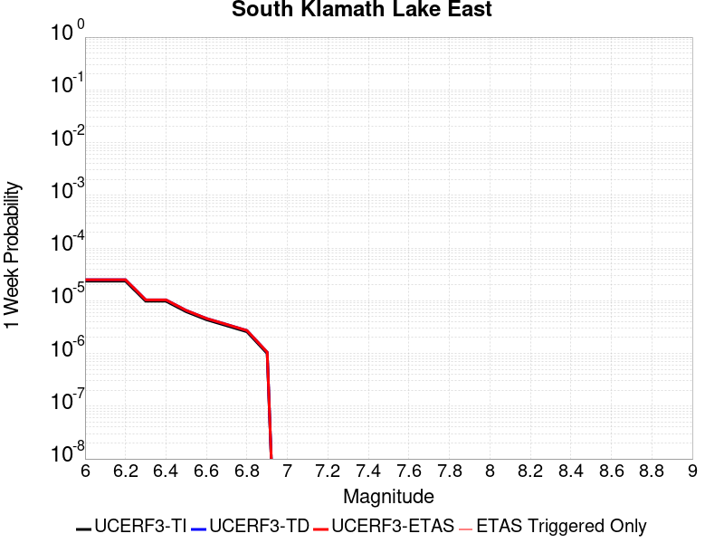 | 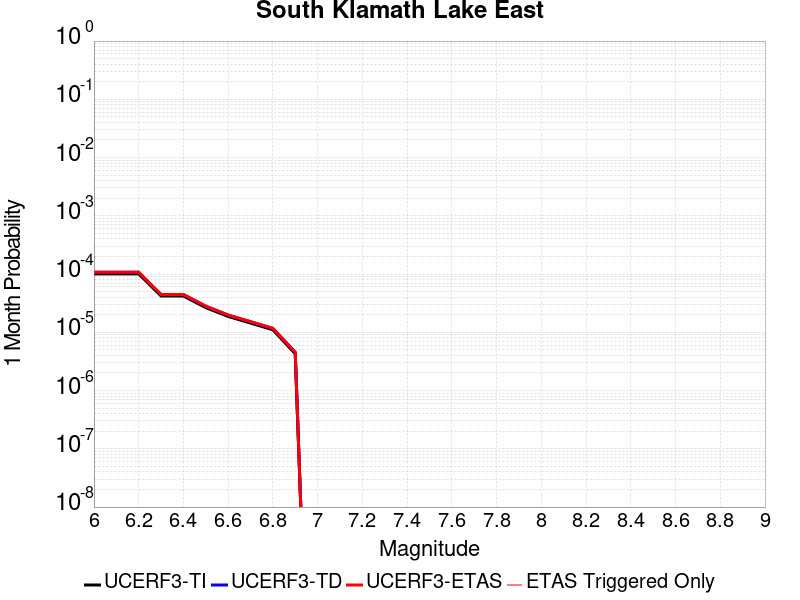 | 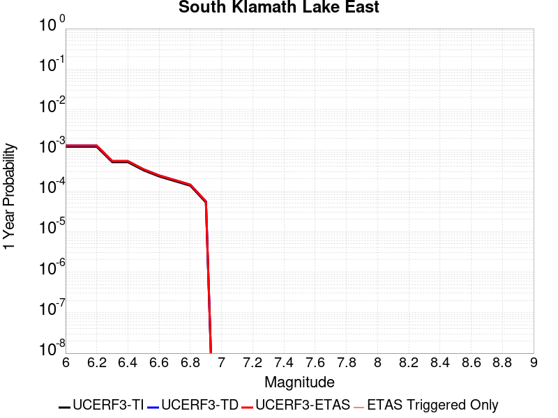 | 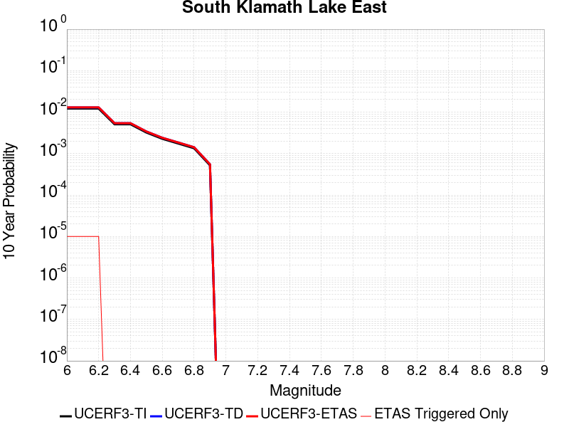 |

| Magnitude | 1 wk TI Prob | 1 wk TD Prob | 1 wk ETAS Prob | 1 wk ETAS/TD Gain | 1 wk ETAS Triggered Only | 1 mo TI Prob | 1 mo TD Prob | 1 mo ETAS Prob | 1 mo ETAS/TD Gain | 1 mo ETAS Triggered Only | 1 yr TI Prob | 1 yr TD Prob | 1 yr ETAS Prob | 1 yr ETAS/TD Gain | 1 yr ETAS Triggered Only | 10 yr TI Prob | 10 yr TD Prob | 10 yr ETAS Prob | 10 yr ETAS/TD Gain | 10 yr ETAS Triggered Only |
|-----|-----|-----|-----|-----|-----|-----|-----|-----|-----|-----|-----|-----|-----|-----|-----|-----|-----|-----|-----|-----|
| 6.0 | 2.3539369E-5 | 2.5047486E-5 | 2.5047486E-5 | 1.0 | 0.0 | 1.0087911E-4 | 1.0734242E-4 | 1.0734242E-4 | 1.0 | 0.0 | 0.0012275111 | 0.0013061938 | 0.0013061938 | 1.0 | 0.0 | 0.012207527 | 0.01299351 | 0.01300338 | 1.0007596 | 1.0E-5 |
| 6.1 | 2.3539369E-5 | 2.5047486E-5 | 2.5047486E-5 | 1.0 | 0.0 | 1.0087911E-4 | 1.0734242E-4 | 1.0734242E-4 | 1.0 | 0.0 | 0.0012275111 | 0.0013061938 | 0.0013061938 | 1.0 | 0.0 | 0.012207527 | 0.01299351 | 0.01300338 | 1.0007596 | 1.0E-5 |
| 6.2 | 2.3539369E-5 | 2.5047486E-5 | 2.5047486E-5 | 1.0 | 0.0 | 1.0087911E-4 | 1.0734242E-4 | 1.0734242E-4 | 1.0 | 0.0 | 0.0012275111 | 0.0013061938 | 0.0013061938 | 1.0 | 0.0 | 0.012207527 | 0.01299351 | 0.01300338 | 1.0007596 | 1.0E-5 |
| 6.3 | 9.807823E-6 | 1.0396113E-5 | 1.0396113E-5 | 1.0 | 0.0 | 4.2032847E-5 | 4.4554057E-5 | 4.4554057E-5 | 1.0 | 0.0 | 5.1162974E-4 | 5.4231903E-4 | 5.4231903E-4 | 1.0 | 0.0 | 0.005104534 | 0.0054107923 | 0.0054107923 | 1.0 | 0.0 |
| 6.4 | 9.807823E-6 | 1.0396113E-5 | 1.0396113E-5 | 1.0 | 0.0 | 4.2032847E-5 | 4.4554057E-5 | 4.4554057E-5 | 1.0 | 0.0 | 5.1162974E-4 | 5.4231903E-4 | 5.4231903E-4 | 1.0 | 0.0 | 0.005104534 | 0.0054107923 | 0.0054107923 | 1.0 | 0.0 |
| 6.5 | 6.191981E-6 | 6.5508825E-6 | 6.5508825E-6 | 1.0 | 0.0 | 2.653679E-5 | 2.8074925E-5 | 2.8074925E-5 | 1.0 | 0.0 | 3.2303753E-4 | 3.417614E-4 | 3.417614E-4 | 1.0 | 0.0 | 0.0032256835 | 0.003412636 | 0.003412636 | 1.0 | 0.0 |
| 6.6 | 4.3693776E-6 | 4.6165865E-6 | 4.6165865E-6 | 1.0 | 0.0 | 1.8725768E-5 | 1.9785228E-5 | 1.9785228E-5 | 1.0 | 0.0 | 2.2796239E-4 | 2.4085965E-4 | 2.4085965E-4 | 1.0 | 0.0 | 0.0022772867 | 0.0024060986 | 0.0024060986 | 1.0 | 0.0 |
| 6.7 | 3.360834E-6 | 3.5512628E-6 | 3.5512628E-6 | 1.0 | 0.0 | 1.4403494E-5 | 1.52196135E-5 | 1.52196135E-5 | 1.0 | 0.0 | 1.7534842E-4 | 1.8528385E-4 | 1.8528385E-4 | 1.0 | 0.0 | 0.0017521014 | 0.0018513736 | 0.0018513736 | 1.0 | 0.0 |
| 6.8 | 2.57873E-6 | 2.725188E-6 | 2.725188E-6 | 1.0 | 0.0 | 1.1051653E-5 | 1.1679329E-5 | 1.1679329E-5 | 1.0 | 0.0 | 1.3454557E-4 | 1.4218717E-4 | 1.4218717E-4 | 1.0 | 0.0 | 0.0013446413 | 0.0014210226 | 0.0014210226 | 1.0 | 0.0 |
| 6.9 | 9.987825E-7 | 1.0566281E-6 | 1.0566281E-6 | 1.0 | 0.0 | 4.2804895E-6 | 4.5284E-6 | 4.5284E-6 | 1.0 | 0.0 | 5.211371E-5 | 5.5132205E-5 | 5.5132205E-5 | 1.0 | 0.0 | 5.210149E-4 | 5.5121747E-4 | 5.5121747E-4 | 1.0 | 0.0 |

## Quien Sabe 2011 CFM
*[(top)](#table-of-contents)*

| 1 Week | 1 Month | 1 Year | 10 Year |
|-----|-----|-----|-----|
|  |  | 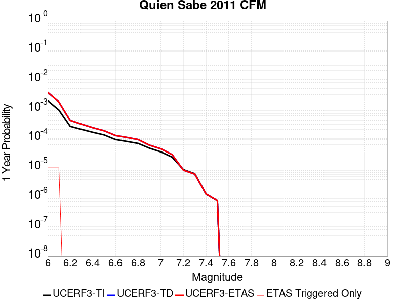 |  |

| Magnitude | 1 wk TI Prob | 1 wk TD Prob | 1 wk ETAS Prob | 1 wk ETAS/TD Gain | 1 wk ETAS Triggered Only | 1 mo TI Prob | 1 mo TD Prob | 1 mo ETAS Prob | 1 mo ETAS/TD Gain | 1 mo ETAS Triggered Only | 1 yr TI Prob | 1 yr TD Prob | 1 yr ETAS Prob | 1 yr ETAS/TD Gain | 1 yr ETAS Triggered Only | 10 yr TI Prob | 10 yr TD Prob | 10 yr ETAS Prob | 10 yr ETAS/TD Gain | 10 yr ETAS Triggered Only |
|-----|-----|-----|-----|-----|-----|-----|-----|-----|-----|-----|-----|-----|-----|-----|-----|-----|-----|-----|-----|-----|
| 6.0 | 3.729899E-5 | 7.095016E-5 | 7.095016E-5 | 1.0 | 0.0 | 1.5984301E-4 | 3.039461E-4 | 3.039461E-4 | 1.0 | 0.0 | 0.0019443515 | 0.0036851892 | 0.0036951522 | 1.0027035 | 1.0E-5 | 0.019274272 | 0.03535078 | 0.035360426 | 1.0002729 | 1.0E-5 |
| 6.1 | 1.7825725E-5 | 3.3206667E-5 | 3.3206667E-5 | 1.0 | 0.0 | 7.639373E-5 | 1.4228358E-4 | 1.4228358E-4 | 1.0 | 0.0 | 9.296967E-4 | 0.0017266674 | 0.0017366501 | 1.0057815 | 1.0E-5 | 0.009258169 | 0.01669936 | 0.016709194 | 1.0005888 | 1.0E-5 |
| 6.2 | 4.8865336E-6 | 7.807971E-6 | 7.807971E-6 | 1.0 | 0.0 | 2.0942118E-5 | 3.3457905E-5 | 3.3457905E-5 | 1.0 | 0.0 | 2.5494045E-4 | 4.0693558E-4 | 4.0693558E-4 | 1.0 | 0.0 | 0.0025464818 | 0.0040136394 | 0.0040136394 | 1.0 | 0.0 |
| 6.3 | 3.858491E-6 | 5.789955E-6 | 5.789955E-6 | 1.0 | 0.0 | 1.6536285E-5 | 2.4813884E-5 | 2.4813884E-5 | 1.0 | 0.0 | 2.0131067E-4 | 3.0207183E-4 | 3.0207183E-4 | 1.0 | 0.0 | 0.002011284 | 0.0030020932 | 0.0030020932 | 1.0 | 0.0 |
| 6.4 | 3.0771805E-6 | 4.3851433E-6 | 4.3851433E-6 | 1.0 | 0.0 | 1.318785E-5 | 1.879335E-5 | 1.879335E-5 | 1.0 | 0.0 | 1.6055023E-4 | 2.2878742E-4 | 2.2878742E-4 | 1.0 | 0.0 | 0.001604343 | 0.0022865841 | 0.0022865841 | 1.0 | 0.0 |
| 6.5 | 2.5081235E-6 | 3.463813E-6 | 3.463813E-6 | 1.0 | 0.0 | 1.0749056E-5 | 1.4844837E-5 | 1.4844837E-5 | 1.0 | 0.0 | 1.308619E-4 | 1.8072237E-4 | 1.8072237E-4 | 1.0 | 0.0 | 0.0013078486 | 0.0018123271 | 0.0018123271 | 1.0 | 0.0 |
| 6.6 | 1.7505364E-6 | 2.4025005E-6 | 2.4025005E-6 | 1.0 | 0.0 | 7.502277E-6 | 1.0296394E-5 | 1.0296394E-5 | 1.0 | 0.0 | 9.13364E-5 | 1.253521E-4 | 1.253521E-4 | 1.0 | 0.0 | 9.129886E-4 | 0.0012584378 | 0.0012584378 | 1.0 | 0.0 |
| 6.7 | 1.505737E-6 | 2.063892E-6 | 2.063892E-6 | 1.0 | 0.0 | 6.4531428E-6 | 8.845225E-6 | 8.845225E-6 | 1.0 | 0.0 | 7.8564175E-5 | 1.0768589E-4 | 1.0768589E-4 | 1.0 | 0.0 | 7.853641E-4 | 0.0010819427 | 0.0010819427 | 1.0 | 0.0 |
| 6.8 | 1.2924105E-6 | 1.7485244E-6 | 1.7485244E-6 | 1.0 | 0.0 | 5.5388905E-6 | 7.4936574E-6 | 7.4936574E-6 | 1.0 | 0.0 | 6.74339E-5 | 9.1232E-5 | 9.1232E-5 | 1.0 | 0.0 | 6.741344E-4 | 9.1622706E-4 | 9.1622706E-4 | 1.0 | 0.0 |
| 6.9 | 8.9075286E-7 | 1.1250602E-6 | 1.1250602E-6 | 1.0 | 0.0 | 3.8175067E-6 | 4.8216784E-6 | 4.8216784E-6 | 1.0 | 0.0 | 4.6477155E-5 | 5.870258E-5 | 5.870258E-5 | 1.0 | 0.0 | 4.6467435E-4 | 5.905307E-4 | 5.905307E-4 | 1.0 | 0.0 |
| 7.0 | 6.6891175E-7 | 8.517199E-7 | 8.517199E-7 | 1.0 | 0.0 | 2.8667614E-6 | 3.650224E-6 | 3.650224E-6 | 1.0 | 0.0 | 3.4902263E-5 | 4.4440767E-5 | 4.4440767E-5 | 1.0 | 0.0 | 3.4896782E-4 | 4.46904E-4 | 4.46904E-4 | 1.0 | 0.0 |
| 7.1 | 4.4205015E-7 | 5.392113E-7 | 5.392113E-7 | 1.0 | 0.0 | 1.8944993E-6 | 2.3109046E-6 | 2.3109046E-6 | 1.0 | 0.0 | 2.3065284E-5 | 2.813507E-5 | 2.813507E-5 | 1.0 | 0.0 | 2.3062891E-4 | 2.827476E-4 | 2.827476E-4 | 1.0 | 0.0 |
| 7.2 | 1.6620965E-7 | 1.5988219E-7 | 1.5988219E-7 | 1.0 | 0.0 | 7.123269E-7 | 6.852092E-7 | 6.852092E-7 | 1.0 | 0.0 | 8.672545E-6 | 8.342395E-6 | 8.342395E-6 | 1.0 | 0.0 | 8.6722066E-5 | 8.358173E-5 | 8.358173E-5 | 1.0 | 0.0 |
| 7.3 | 1.2142488E-7 | 1.1727144E-7 | 1.1727144E-7 | 1.0 | 0.0 | 5.2039223E-7 | 5.025918E-7 | 5.025918E-7 | 1.0 | 0.0 | 6.335757E-6 | 6.1190417E-6 | 6.1190417E-6 | 1.0 | 0.0 | 6.3355765E-5 | 6.120647E-5 | 6.120647E-5 | 1.0 | 0.0 |
| 7.4 | 2.4192937E-8 | 2.4546429E-8 | 2.4546429E-8 | 1.0 | 0.0 | 1.0368401E-7 | 1.0519898E-7 | 1.0519898E-7 | 1.0 | 0.0 | 1.2623522E-6 | 1.2807968E-6 | 1.2807968E-6 | 1.0 | 0.0 | 1.2623449E-5 | 1.2768597E-5 | 1.2768597E-5 | 1.0 | 0.0 |
| 7.5 | 1.4432802E-8 | 1.45088235E-8 | 1.45088235E-8 | 1.0 | 0.0 | 6.185486E-8 | 6.218067E-8 | 6.218067E-8 | 1.0 | 0.0 | 7.530827E-7 | 7.5704946E-7 | 7.5704946E-7 | 1.0 | 0.0 | 7.530801E-6 | 7.5287203E-6 | 7.5287203E-6 | 1.0 | 0.0 |

## Earthquake Valley (No  Extension)
*[(top)](#table-of-contents)*

| 1 Week | 1 Month | 1 Year | 10 Year |
|-----|-----|-----|-----|
| 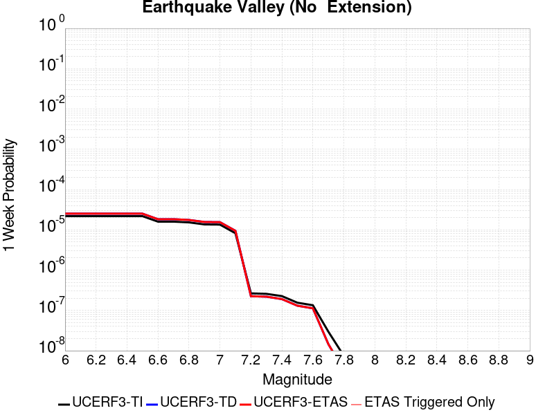 |  |  |  |

| Magnitude | 1 wk TI Prob | 1 wk TD Prob | 1 wk ETAS Prob | 1 wk ETAS/TD Gain | 1 wk ETAS Triggered Only | 1 mo TI Prob | 1 mo TD Prob | 1 mo ETAS Prob | 1 mo ETAS/TD Gain | 1 mo ETAS Triggered Only | 1 yr TI Prob | 1 yr TD Prob | 1 yr ETAS Prob | 1 yr ETAS/TD Gain | 1 yr ETAS Triggered Only | 10 yr TI Prob | 10 yr TD Prob | 10 yr ETAS Prob | 10 yr ETAS/TD Gain | 10 yr ETAS Triggered Only |
|-----|-----|-----|-----|-----|-----|-----|-----|-----|-----|-----|-----|-----|-----|-----|-----|-----|-----|-----|-----|-----|
| 6.0 | 2.1859703E-5 | 2.5198795E-5 | 2.5198795E-5 | 1.0 | 0.0 | 9.3681076E-5 | 1.0799118E-4 | 1.179901E-4 | 1.0925901 | 1.0E-5 | 0.0011399703 | 0.0013141447 | 0.0013241316 | 1.0075995 | 1.0E-5 | 0.011341401 | 0.013078097 | 0.0130879665 | 1.0007546 | 1.0E-5 |
| 6.1 | 2.1859703E-5 | 2.5198795E-5 | 2.5198795E-5 | 1.0 | 0.0 | 9.3681076E-5 | 1.0799118E-4 | 1.179901E-4 | 1.0925901 | 1.0E-5 | 0.0011399703 | 0.0013141447 | 0.0013241316 | 1.0075995 | 1.0E-5 | 0.011341401 | 0.013078097 | 0.0130879665 | 1.0007546 | 1.0E-5 |
| 6.2 | 2.1859703E-5 | 2.5198795E-5 | 2.5198795E-5 | 1.0 | 0.0 | 9.3681076E-5 | 1.0799118E-4 | 1.179901E-4 | 1.0925901 | 1.0E-5 | 0.0011399703 | 0.0013141447 | 0.0013241316 | 1.0075995 | 1.0E-5 | 0.011341401 | 0.013078097 | 0.0130879665 | 1.0007546 | 1.0E-5 |
| 6.3 | 2.1859703E-5 | 2.5198795E-5 | 2.5198795E-5 | 1.0 | 0.0 | 9.3681076E-5 | 1.0799118E-4 | 1.179901E-4 | 1.0925901 | 1.0E-5 | 0.0011399703 | 0.0013141447 | 0.0013241316 | 1.0075995 | 1.0E-5 | 0.011341401 | 0.013078097 | 0.0130879665 | 1.0007546 | 1.0E-5 |
| 6.4 | 2.1859703E-5 | 2.5198795E-5 | 2.5198795E-5 | 1.0 | 0.0 | 9.3681076E-5 | 1.0799118E-4 | 1.179901E-4 | 1.0925901 | 1.0E-5 | 0.0011399703 | 0.0013141447 | 0.0013241316 | 1.0075995 | 1.0E-5 | 0.011341401 | 0.013078097 | 0.0130879665 | 1.0007546 | 1.0E-5 |
| 6.5 | 2.1859703E-5 | 2.5198795E-5 | 2.5198795E-5 | 1.0 | 0.0 | 9.3681076E-5 | 1.0799118E-4 | 1.179901E-4 | 1.0925901 | 1.0E-5 | 0.0011399703 | 0.0013141447 | 0.0013241316 | 1.0075995 | 1.0E-5 | 0.011341401 | 0.013078097 | 0.0130879665 | 1.0007546 | 1.0E-5 |
| 6.6 | 1.597E-5 | 1.8356588E-5 | 1.8356588E-5 | 1.0 | 0.0 | 6.8441055E-5 | 7.866921E-5 | 8.866843E-5 | 1.1271045 | 1.0E-5 | 8.329513E-4 | 9.574641E-4 | 9.674545E-4 | 1.0104343 | 1.0E-5 | 0.008298361 | 0.009541998 | 0.009551902 | 1.001038 | 1.0E-5 |
| 6.7 | 1.597E-5 | 1.8356588E-5 | 1.8356588E-5 | 1.0 | 0.0 | 6.8441055E-5 | 7.866921E-5 | 8.866843E-5 | 1.1271045 | 1.0E-5 | 8.329513E-4 | 9.574641E-4 | 9.674545E-4 | 1.0104343 | 1.0E-5 | 0.008298361 | 0.009541998 | 0.009551902 | 1.001038 | 1.0E-5 |
| 6.8 | 1.5315149E-5 | 1.7602391E-5 | 1.7602391E-5 | 1.0 | 0.0 | 6.5634704E-5 | 7.543713E-5 | 8.5436375E-5 | 1.1325507 | 1.0E-5 | 7.988095E-4 | 9.1814675E-4 | 9.2813757E-4 | 1.0108815 | 1.0E-5 | 0.007959441 | 0.009152074 | 0.009161983 | 1.0010827 | 1.0E-5 |
| 6.9 | 1.3634728E-5 | 1.567609E-5 | 1.567609E-5 | 1.0 | 0.0 | 5.8433237E-5 | 6.718197E-5 | 7.718131E-5 | 1.1488395 | 1.0E-5 | 7.1119244E-4 | 8.1771566E-4 | 8.277075E-4 | 1.0122192 | 1.0E-5 | 0.007089207 | 0.00815514 | 0.008165059 | 1.0012162 | 1.0E-5 |
| 7.0 | 1.3496271E-5 | 1.5518119E-5 | 1.5518119E-5 | 1.0 | 0.0 | 5.783988E-5 | 6.6504996E-5 | 7.650433E-5 | 1.1503546 | 1.0E-5 | 7.03973E-4 | 8.0947956E-4 | 8.194715E-4 | 1.0123436 | 1.0E-5 | 0.007017471 | 0.008073378 | 0.008083298 | 1.0012287 | 1.0E-5 |
| 7.1 | 8.242798E-6 | 9.472764E-6 | 9.472764E-6 | 1.0 | 0.0 | 3.53258E-5 | 4.0597308E-5 | 5.05969E-5 | 1.2463118 | 1.0E-5 | 4.300067E-4 | 4.9422716E-4 | 5.0422223E-4 | 1.0202236 | 1.0E-5 | 0.004291756 | 0.0049378574 | 0.0049478076 | 1.0020151 | 1.0E-5 |
| 7.2 | 2.6506527E-7 | 2.256023E-7 | 2.256023E-7 | 1.0 | 0.0 | 1.1359936E-6 | 9.668667E-7 | 9.668667E-7 | 1.0 | 0.0 | 1.3830633E-5 | 1.1771543E-5 | 1.1771543E-5 | 1.0 | 0.0 | 1.3829772E-4 | 1.17709606E-4 | 1.17709606E-4 | 1.0 | 0.0 |
| 7.3 | 2.5810488E-7 | 2.1955353E-7 | 2.1955353E-7 | 1.0 | 0.0 | 1.1061633E-6 | 9.409434E-7 | 9.409434E-7 | 1.0 | 0.0 | 1.3467455E-5 | 1.145593E-5 | 1.145593E-5 | 1.0 | 0.0 | 1.3466639E-4 | 1.14553804E-4 | 1.14553804E-4 | 1.0 | 0.0 |
| 7.4 | 2.2676066E-7 | 1.9110517E-7 | 1.9110517E-7 | 1.0 | 0.0 | 9.71831E-7 | 8.190219E-7 | 8.190219E-7 | 1.0 | 0.0 | 1.1831979E-5 | 9.97155E-6 | 9.97155E-6 | 1.0 | 0.0 | 1.1831349E-4 | 9.971142E-5 | 9.971142E-5 | 1.0 | 0.0 |
| 7.5 | 1.5553917E-7 | 1.3111932E-7 | 1.3111932E-7 | 1.0 | 0.0 | 6.6659624E-7 | 5.619398E-7 | 5.619398E-7 | 1.0 | 0.0 | 8.115779E-6 | 6.8415984E-6 | 6.8415984E-6 | 1.0 | 0.0 | 8.115482E-5 | 6.84141E-5 | 6.84141E-5 | 1.0 | 0.0 |
| 7.6 | 1.3448629E-7 | 1.1288201E-7 | 1.1288201E-7 | 1.0 | 0.0 | 5.7636964E-7 | 4.8377996E-7 | 4.8377996E-7 | 1.0 | 0.0 | 7.017278E-6 | 5.8900073E-6 | 5.8900073E-6 | 1.0 | 0.0 | 7.0170565E-5 | 5.8898724E-5 | 5.8898724E-5 | 1.0 | 0.0 |
| 7.7 | 2.9719402E-8 | 1.4581583E-8 | 1.4581583E-8 | 1.0 | 0.0 | 1.2736886E-7 | 6.24925E-8 | 6.24925E-8 | 1.0 | 0.0 | 1.5507147E-6 | 7.60846E-7 | 7.60846E-7 | 1.0 | 0.0 | 1.550704E-5 | 7.608439E-6 | 7.608439E-6 | 1.0 | 0.0 |
| 7.8 | 7.4390196E-9 | 3.2500456E-9 | 3.2500456E-9 | 1.0 | 0.0 | 3.1881513E-8 | 1.3928767E-8 | 1.3928767E-8 | 1.0 | 0.0 | 3.8815733E-7 | 1.6958273E-7 | 1.6958273E-7 | 1.0 | 0.0 | 3.8815665E-6 | 1.6958262E-6 | 1.6958262E-6 | 1.0 | 0.0 |
| 7.9 | 1.5373532E-9 | 8.440192E-10 | 8.440192E-10 | 1.0 | 0.0 | 6.5886567E-9 | 3.6172252E-9 | 3.6172252E-9 | 1.0 | 0.0 | 8.021689E-8 | 4.4039716E-8 | 4.4039716E-8 | 1.0 | 0.0 | 8.0216864E-7 | 4.4039714E-7 | 4.4039714E-7 | 1.0 | 0.0 |

## North Frontal  (West)
*[(top)](#table-of-contents)*

| 1 Week | 1 Month | 1 Year | 10 Year |
|-----|-----|-----|-----|
|  |  | 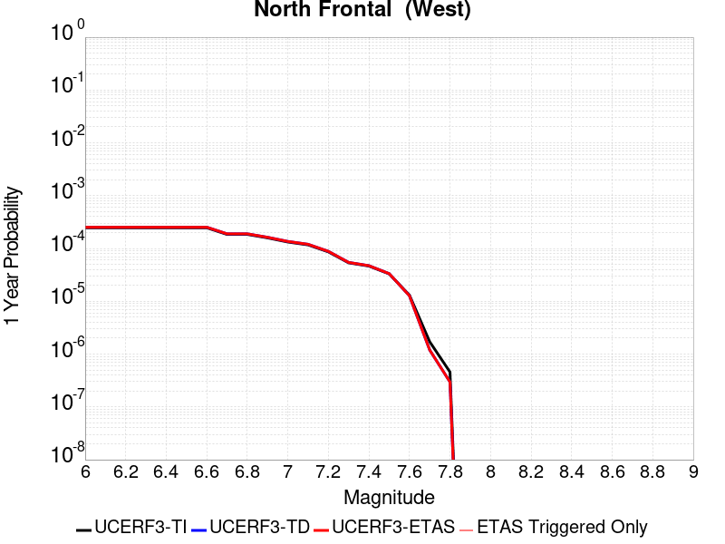 | 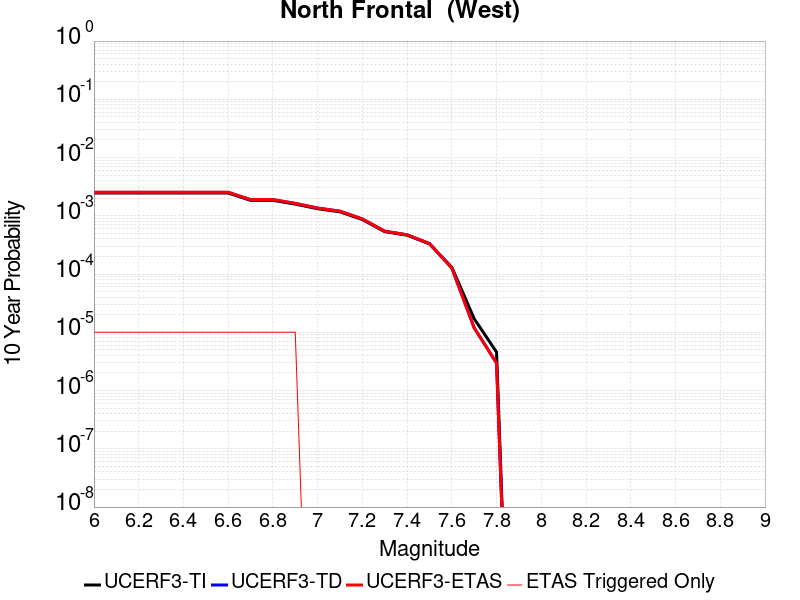 |

| Magnitude | 1 wk TI Prob | 1 wk TD Prob | 1 wk ETAS Prob | 1 wk ETAS/TD Gain | 1 wk ETAS Triggered Only | 1 mo TI Prob | 1 mo TD Prob | 1 mo ETAS Prob | 1 mo ETAS/TD Gain | 1 mo ETAS Triggered Only | 1 yr TI Prob | 1 yr TD Prob | 1 yr ETAS Prob | 1 yr ETAS/TD Gain | 1 yr ETAS Triggered Only | 10 yr TI Prob | 10 yr TD Prob | 10 yr ETAS Prob | 10 yr ETAS/TD Gain | 10 yr ETAS Triggered Only |
|-----|-----|-----|-----|-----|-----|-----|-----|-----|-----|-----|-----|-----|-----|-----|-----|-----|-----|-----|-----|-----|
| 6.0 | 4.7316266E-6 | 4.85269E-6 | 4.85269E-6 | 1.0 | 0.0 | 2.0278241E-5 | 2.0797084E-5 | 2.0797084E-5 | 1.0 | 0.0 | 2.4685962E-4 | 2.5317655E-4 | 2.5317655E-4 | 1.0 | 0.0 | 0.0024658558 | 0.0025290274 | 0.002539002 | 1.003944 | 1.0E-5 |
| 6.1 | 4.7316266E-6 | 4.85269E-6 | 4.85269E-6 | 1.0 | 0.0 | 2.0278241E-5 | 2.0797084E-5 | 2.0797084E-5 | 1.0 | 0.0 | 2.4685962E-4 | 2.5317655E-4 | 2.5317655E-4 | 1.0 | 0.0 | 0.0024658558 | 0.0025290274 | 0.002539002 | 1.003944 | 1.0E-5 |
| 6.2 | 4.7316266E-6 | 4.85269E-6 | 4.85269E-6 | 1.0 | 0.0 | 2.0278241E-5 | 2.0797084E-5 | 2.0797084E-5 | 1.0 | 0.0 | 2.4685962E-4 | 2.5317655E-4 | 2.5317655E-4 | 1.0 | 0.0 | 0.0024658558 | 0.0025290274 | 0.002539002 | 1.003944 | 1.0E-5 |
| 6.3 | 4.7316266E-6 | 4.85269E-6 | 4.85269E-6 | 1.0 | 0.0 | 2.0278241E-5 | 2.0797084E-5 | 2.0797084E-5 | 1.0 | 0.0 | 2.4685962E-4 | 2.5317655E-4 | 2.5317655E-4 | 1.0 | 0.0 | 0.0024658558 | 0.0025290274 | 0.002539002 | 1.003944 | 1.0E-5 |
| 6.4 | 4.7316266E-6 | 4.85269E-6 | 4.85269E-6 | 1.0 | 0.0 | 2.0278241E-5 | 2.0797084E-5 | 2.0797084E-5 | 1.0 | 0.0 | 2.4685962E-4 | 2.5317655E-4 | 2.5317655E-4 | 1.0 | 0.0 | 0.0024658558 | 0.0025290274 | 0.002539002 | 1.003944 | 1.0E-5 |
| 6.5 | 4.7316266E-6 | 4.85269E-6 | 4.85269E-6 | 1.0 | 0.0 | 2.0278241E-5 | 2.0797084E-5 | 2.0797084E-5 | 1.0 | 0.0 | 2.4685962E-4 | 2.5317655E-4 | 2.5317655E-4 | 1.0 | 0.0 | 0.0024658558 | 0.0025290274 | 0.002539002 | 1.003944 | 1.0E-5 |
| 6.6 | 4.7316266E-6 | 4.85269E-6 | 4.85269E-6 | 1.0 | 0.0 | 2.0278241E-5 | 2.0797084E-5 | 2.0797084E-5 | 1.0 | 0.0 | 2.4685962E-4 | 2.5317655E-4 | 2.5317655E-4 | 1.0 | 0.0 | 0.0024658558 | 0.0025290274 | 0.002539002 | 1.003944 | 1.0E-5 |
| 6.7 | 3.5382777E-6 | 3.6308998E-6 | 3.6308998E-6 | 1.0 | 0.0 | 1.516396E-5 | 1.556091E-5 | 1.556091E-5 | 1.0 | 0.0 | 1.8460557E-4 | 1.8943839E-4 | 1.8943839E-4 | 1.0 | 0.0 | 0.0018445229 | 0.0018928461 | 0.0019028272 | 1.0052731 | 1.0E-5 |
| 6.8 | 3.5382777E-6 | 3.6308998E-6 | 3.6308998E-6 | 1.0 | 0.0 | 1.516396E-5 | 1.556091E-5 | 1.556091E-5 | 1.0 | 0.0 | 1.8460557E-4 | 1.8943839E-4 | 1.8943839E-4 | 1.0 | 0.0 | 0.0018445229 | 0.0018928461 | 0.0019028272 | 1.0052731 | 1.0E-5 |
| 6.9 | 3.0428037E-6 | 3.122773E-6 | 3.122773E-6 | 1.0 | 0.0 | 1.30405215E-5 | 1.3383248E-5 | 1.3383248E-5 | 1.0 | 0.0 | 1.5875678E-4 | 1.6292954E-4 | 1.6292954E-4 | 1.0 | 0.0 | 0.0015864341 | 0.001628168 | 0.0016381517 | 1.0061319 | 1.0E-5 |
| 7.0 | 2.538778E-6 | 2.6061014E-6 | 2.6061014E-6 | 1.0 | 0.0 | 1.0880432E-5 | 1.1168961E-5 | 1.1168961E-5 | 1.0 | 0.0 | 1.324612E-4 | 1.3597409E-4 | 1.3597409E-4 | 1.0 | 0.0 | 0.0013238228 | 0.0013589556 | 0.0013589556 | 1.0 | 0.0 |
| 7.1 | 2.2418935E-6 | 2.3012174E-6 | 2.3012174E-6 | 1.0 | 0.0 | 9.60808E-6 | 9.862325E-6 | 9.862325E-6 | 1.0 | 0.0 | 1.1697209E-4 | 1.2006764E-4 | 1.2006764E-4 | 1.0 | 0.0 | 0.0011691054 | 0.0012000717 | 0.0012000717 | 1.0 | 0.0 |
| 7.2 | 1.6526745E-6 | 1.6924929E-6 | 1.6924929E-6 | 1.0 | 0.0 | 7.082872E-6 | 7.253522E-6 | 7.253522E-6 | 1.0 | 0.0 | 8.623055E-5 | 8.830831E-5 | 8.830831E-5 | 1.0 | 0.0 | 8.61971E-4 | 8.8275725E-4 | 8.8275725E-4 | 1.0 | 0.0 |
| 7.3 | 1.0246019E-6 | 1.0442316E-6 | 1.0442316E-6 | 1.0 | 0.0 | 4.391144E-6 | 4.475271E-6 | 4.475271E-6 | 1.0 | 0.0 | 5.3460866E-5 | 5.448518E-5 | 5.448518E-5 | 1.0 | 0.0 | 5.344801E-4 | 5.447297E-4 | 5.447297E-4 | 1.0 | 0.0 |
| 7.4 | 8.9045164E-7 | 9.0566084E-7 | 9.0566084E-7 | 1.0 | 0.0 | 3.8162157E-6 | 3.8813982E-6 | 3.8813982E-6 | 1.0 | 0.0 | 4.646144E-5 | 4.725511E-5 | 4.725511E-5 | 1.0 | 0.0 | 4.6451724E-4 | 4.724615E-4 | 4.724615E-4 | 1.0 | 0.0 |
| 7.5 | 6.3357E-7 | 6.40274E-7 | 6.40274E-7 | 1.0 | 0.0 | 2.7152971E-6 | 2.744029E-6 | 2.744029E-6 | 1.0 | 0.0 | 3.305824E-5 | 3.340811E-5 | 3.340811E-5 | 1.0 | 0.0 | 3.3053322E-4 | 3.3403744E-4 | 3.3403744E-4 | 1.0 | 0.0 |
| 7.6 | 2.5087024E-7 | 2.4361333E-7 | 2.4361333E-7 | 1.0 | 0.0 | 1.0751578E-6 | 1.0440568E-6 | 1.0440568E-6 | 1.0 | 0.0 | 1.3089967E-5 | 1.2711339E-5 | 1.2711339E-5 | 1.0 | 0.0 | 1.3089196E-4 | 1.2710817E-4 | 1.2710817E-4 | 1.0 | 0.0 |
| 7.7 | 3.282987E-8 | 2.2875435E-8 | 2.2875435E-8 | 1.0 | 0.0 | 1.4069944E-7 | 9.8037575E-8 | 9.8037575E-8 | 1.0 | 0.0 | 1.7130144E-6 | 1.193607E-6 | 1.193607E-6 | 1.0 | 0.0 | 1.7130013E-5 | 1.1936014E-5 | 1.1936014E-5 | 1.0 | 0.0 |
| 7.8 | 8.77499E-9 | 5.6817466E-9 | 5.6817466E-9 | 1.0 | 0.0 | 3.7607098E-8 | 2.4350342E-8 | 2.4350342E-8 | 1.0 | 0.0 | 4.578663E-7 | 2.964654E-7 | 2.964654E-7 | 1.0 | 0.0 | 4.5786537E-6 | 2.9646515E-6 | 2.9646515E-6 | 1.0 | 0.0 |

## Green Valley 2011 CFM
*[(top)](#table-of-contents)*

| 1 Week | 1 Month | 1 Year | 10 Year |
|-----|-----|-----|-----|
| 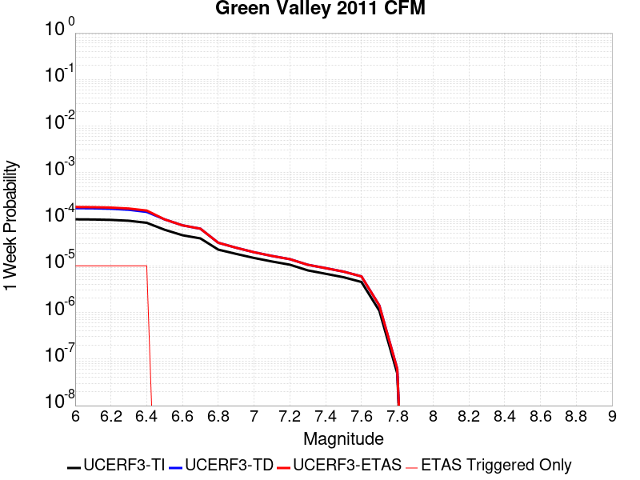 |  |  | 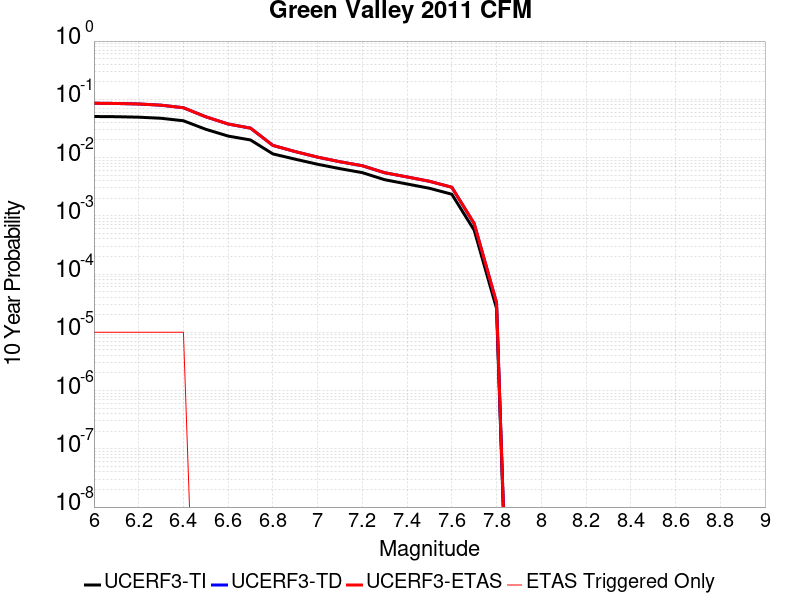 |

| Magnitude | 1 wk TI Prob | 1 wk TD Prob | 1 wk ETAS Prob | 1 wk ETAS/TD Gain | 1 wk ETAS Triggered Only | 1 mo TI Prob | 1 mo TD Prob | 1 mo ETAS Prob | 1 mo ETAS/TD Gain | 1 mo ETAS Triggered Only | 1 yr TI Prob | 1 yr TD Prob | 1 yr ETAS Prob | 1 yr ETAS/TD Gain | 1 yr ETAS Triggered Only | 10 yr TI Prob | 10 yr TD Prob | 10 yr ETAS Prob | 10 yr ETAS/TD Gain | 10 yr ETAS Triggered Only |
|-----|-----|-----|-----|-----|-----|-----|-----|-----|-----|-----|-----|-----|-----|-----|-----|-----|-----|-----|-----|-----|
| 6.0 | 9.9629346E-5 | 1.7303025E-4 | 1.8302852E-4 | 1.0577834 | 1.0E-5 | 4.2691303E-4 | 7.4134115E-4 | 7.513338E-4 | 1.0134791 | 1.0E-5 | 0.0051852856 | 0.008987106 | 0.008997017 | 1.0011027 | 1.0E-5 | 0.050659515 | 0.08554183 | 0.08555098 | 1.0001069 | 1.0E-5 |
| 6.1 | 9.88615E-5 | 1.7150324E-4 | 1.8150153E-4 | 1.058298 | 1.0E-5 | 4.2362334E-4 | 7.3480053E-4 | 7.447932E-4 | 1.0135992 | 1.0E-5 | 0.0051454236 | 0.008908134 | 0.008918045 | 1.0011126 | 1.0E-5 | 0.050279044 | 0.08482947 | 0.08483862 | 1.0001079 | 1.0E-5 |
| 6.2 | 9.696895E-5 | 1.6789358E-4 | 1.778919E-4 | 1.0595516 | 1.0E-5 | 4.15515E-4 | 7.193404E-4 | 7.293332E-4 | 1.0138916 | 1.0E-5 | 0.0050471667 | 0.008721514 | 0.008731427 | 1.0011365 | 1.0E-5 | 0.04934063 | 0.08313825 | 0.08314742 | 1.0001103 | 1.0E-5 |
| 6.3 | 9.275224E-5 | 1.5968688E-4 | 1.6968529E-4 | 1.0626125 | 1.0E-5 | 3.9744904E-4 | 6.8418763E-4 | 6.941808E-4 | 1.0146059 | 1.0E-5 | 0.0048282105 | 0.008296833 | 0.008306751 | 1.0011953 | 1.0E-5 | 0.047246475 | 0.07927727 | 0.07928648 | 1.0001161 | 1.0E-5 |
| 6.4 | 8.391499E-5 | 1.4365984E-4 | 1.536584E-4 | 1.0695989 | 1.0E-5 | 3.595861E-4 | 6.155383E-4 | 6.255321E-4 | 1.016236 | 1.0E-5 | 0.004369175 | 0.0074673523 | 0.0074772774 | 1.0013292 | 1.0E-5 | 0.04284265 | 0.07164581 | 0.071655095 | 1.0001296 | 1.0E-5 |
| 6.5 | 5.9519385E-5 | 9.932649E-5 | 9.932649E-5 | 1.0 | 0.0 | 2.5505814E-4 | 4.2561413E-4 | 4.2561413E-4 | 1.0 | 0.0 | 0.0031009112 | 0.005168466 | 0.005168466 | 1.0 | 0.0 | 0.030579966 | 0.05014918 | 0.05014918 | 1.0 | 0.0 |
| 6.6 | 4.5361558E-5 | 7.401942E-5 | 7.401942E-5 | 1.0 | 0.0 | 1.9439218E-4 | 3.1718495E-4 | 3.1718495E-4 | 1.0 | 0.0 | 0.0023641558 | 0.003853972 | 0.003853972 | 1.0 | 0.0 | 0.023391623 | 0.037669368 | 0.037669368 | 1.0 | 0.0 |
| 6.7 | 3.8808106E-5 | 6.264299E-5 | 6.264299E-5 | 1.0 | 0.0 | 1.6630985E-4 | 2.684448E-4 | 2.684448E-4 | 1.0 | 0.0 | 0.0020229418 | 0.0032628225 | 0.0032628225 | 1.0 | 0.0 | 0.020046256 | 0.03200873 | 0.03200873 | 1.0 | 0.0 |
| 6.8 | 2.2284667E-5 | 3.128598E-5 | 3.128598E-5 | 1.0 | 0.0 | 9.550222E-5 | 1.3407588E-4 | 1.3407588E-4 | 1.0 | 0.0 | 0.0011621192 | 0.0016311504 | 0.0016311504 | 1.0 | 0.0 | 0.011560607 | 0.016166914 | 0.016166914 | 1.0 | 0.0 |
| 6.9 | 1.8050168E-5 | 2.444871E-5 | 2.444871E-5 | 1.0 | 0.0 | 7.735557E-5 | 1.0477601E-4 | 1.0477601E-4 | 1.0 | 0.0 | 9.4139716E-4 | 0.0012749044 | 0.0012749044 | 1.0 | 0.0 | 0.009374191 | 0.01266928 | 0.01266928 | 1.0 | 0.0 |
| 7.0 | 1.4763166E-5 | 1.9583376E-5 | 1.9583376E-5 | 1.0 | 0.0 | 6.326917E-5 | 8.3926076E-5 | 8.3926076E-5 | 1.0 | 0.0 | 7.7002996E-4 | 0.0010213224 | 0.0010213224 | 1.0 | 0.0 | 0.007673672 | 0.010166351 | 0.010166351 | 1.0 | 0.0 |
| 7.1 | 1.2399713E-5 | 1.6304151E-5 | 1.6304151E-5 | 1.0 | 0.0 | 5.3140546E-5 | 6.987307E-5 | 6.987307E-5 | 1.0 | 0.0 | 6.467941E-4 | 8.5037464E-4 | 8.5037464E-4 | 1.0 | 0.0 | 0.006449148 | 0.008471903 | 0.008471903 | 1.0 | 0.0 |
| 7.2 | 1.0584195E-5 | 1.3922151E-5 | 1.3922151E-5 | 1.0 | 0.0 | 4.5360044E-5 | 5.9665006E-5 | 5.9665006E-5 | 1.0 | 0.0 | 5.521186E-4 | 7.2618097E-4 | 7.2618097E-4 | 1.0 | 0.0 | 0.0055074887 | 0.00723875 | 0.00723875 | 1.0 | 0.0 |
| 7.3 | 7.998173E-6 | 1.0544343E-5 | 1.0544343E-5 | 1.0 | 0.0 | 3.4277433E-5 | 4.5189267E-5 | 4.5189267E-5 | 1.0 | 0.0 | 4.1724785E-4 | 5.500415E-4 | 5.500415E-4 | 1.0 | 0.0 | 0.004164653 | 0.00548717 | 0.00548717 | 1.0 | 0.0 |
| 7.4 | 6.7571127E-6 | 8.932981E-6 | 8.932981E-6 | 1.0 | 0.0 | 2.8958733E-5 | 3.8283648E-5 | 3.8283648E-5 | 1.0 | 0.0 | 3.5251552E-4 | 4.6600465E-4 | 4.6600465E-4 | 1.0 | 0.0 | 0.0035195686 | 0.0046506478 | 0.0046506478 | 1.0 | 0.0 |
| 7.5 | 5.69878E-6 | 7.516538E-6 | 7.516538E-6 | 1.0 | 0.0 | 2.4423114E-5 | 3.2213342E-5 | 3.2213342E-5 | 1.0 | 0.0 | 2.9731085E-4 | 3.9212772E-4 | 3.9212772E-4 | 1.0 | 0.0 | 0.002969134 | 0.0039147064 | 0.0039147064 | 1.0 | 0.0 |
| 7.6 | 4.503664E-6 | 5.9358676E-6 | 5.9358676E-6 | 1.0 | 0.0 | 1.9301275E-5 | 2.5439189E-5 | 2.5439189E-5 | 1.0 | 0.0 | 2.3496768E-4 | 3.0967893E-4 | 3.0967893E-4 | 1.0 | 0.0 | 0.002347194 | 0.0030927474 | 0.0030927474 | 1.0 | 0.0 |
| 7.7 | 1.0873546E-6 | 1.4107644E-6 | 1.4107644E-6 | 1.0 | 0.0 | 4.6600826E-6 | 6.0461193E-6 | 6.0461193E-6 | 1.0 | 0.0 | 5.6735033E-5 | 7.3609044E-5 | 7.3609044E-5 | 1.0 | 0.0 | 5.672055E-4 | 7.3589664E-4 | 7.3589664E-4 | 1.0 | 0.0 |
| 7.8 | 4.9373917E-8 | 6.1780256E-8 | 6.1780256E-8 | 1.0 | 0.0 | 2.1160248E-7 | 2.6477252E-7 | 2.6477252E-7 | 1.0 | 0.0 | 2.5762572E-6 | 3.2236019E-6 | 3.2236019E-6 | 1.0 | 0.0 | 2.5762274E-5 | 3.222853E-5 | 3.222853E-5 | 1.0 | 0.0 |

## Elsinore (Temecula) rev
*[(top)](#table-of-contents)*

| 1 Week | 1 Month | 1 Year | 10 Year |
|-----|-----|-----|-----|
|  |  | 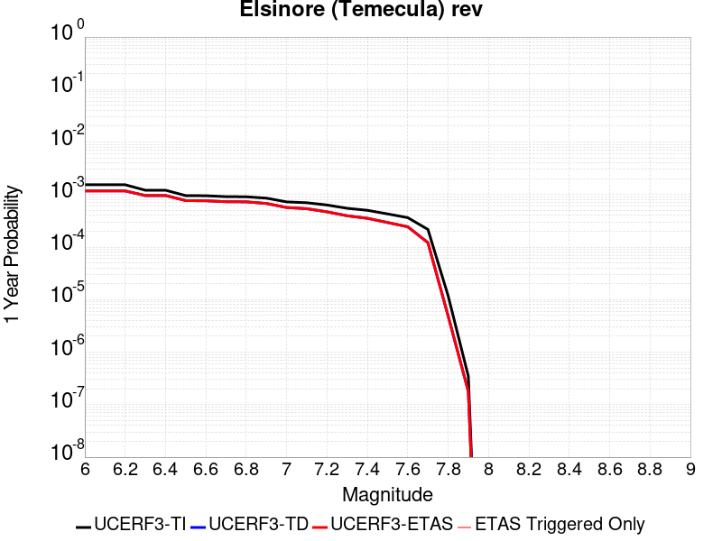 |  |

| Magnitude | 1 wk TI Prob | 1 wk TD Prob | 1 wk ETAS Prob | 1 wk ETAS/TD Gain | 1 wk ETAS Triggered Only | 1 mo TI Prob | 1 mo TD Prob | 1 mo ETAS Prob | 1 mo ETAS/TD Gain | 1 mo ETAS Triggered Only | 1 yr TI Prob | 1 yr TD Prob | 1 yr ETAS Prob | 1 yr ETAS/TD Gain | 1 yr ETAS Triggered Only | 10 yr TI Prob | 10 yr TD Prob | 10 yr ETAS Prob | 10 yr ETAS/TD Gain | 10 yr ETAS Triggered Only |
|-----|-----|-----|-----|-----|-----|-----|-----|-----|-----|-----|-----|-----|-----|-----|-----|-----|-----|-----|-----|-----|
| 6.0 | 2.9514995E-5 | 2.251957E-5 | 2.251957E-5 | 1.0 | 0.0 | 1.264867E-4 | 9.6509E-5 | 9.6509E-5 | 1.0 | 0.0 | 0.0015388876 | 0.0011743858 | 0.0011743858 | 1.0 | 0.0 | 0.015282745 | 0.011705489 | 0.011715372 | 1.0008444 | 1.0E-5 |
| 6.1 | 2.9514995E-5 | 2.251957E-5 | 2.251957E-5 | 1.0 | 0.0 | 1.264867E-4 | 9.6509E-5 | 9.6509E-5 | 1.0 | 0.0 | 0.0015388876 | 0.0011743858 | 0.0011743858 | 1.0 | 0.0 | 0.015282745 | 0.011705489 | 0.011715372 | 1.0008444 | 1.0E-5 |
| 6.2 | 2.9514995E-5 | 2.251957E-5 | 2.251957E-5 | 1.0 | 0.0 | 1.264867E-4 | 9.6509E-5 | 9.6509E-5 | 1.0 | 0.0 | 0.0015388876 | 0.0011743858 | 0.0011743858 | 1.0 | 0.0 | 0.015282745 | 0.011705489 | 0.011715372 | 1.0008444 | 1.0E-5 |
| 6.3 | 2.3223649E-5 | 1.8408882E-5 | 1.8408882E-5 | 1.0 | 0.0 | 9.952613E-5 | 7.8892925E-5 | 7.8892925E-5 | 1.0 | 0.0 | 0.001211057 | 9.601153E-4 | 9.601153E-4 | 1.0 | 0.0 | 0.012044783 | 0.009568657 | 0.009568657 | 1.0 | 0.0 |
| 6.4 | 2.3223649E-5 | 1.8408882E-5 | 1.8408882E-5 | 1.0 | 0.0 | 9.952613E-5 | 7.8892925E-5 | 7.8892925E-5 | 1.0 | 0.0 | 0.001211057 | 9.601153E-4 | 9.601153E-4 | 1.0 | 0.0 | 0.012044783 | 0.009568657 | 0.009568657 | 1.0 | 0.0 |
| 6.5 | 1.8338875E-5 | 1.47506835E-5 | 1.47506835E-5 | 1.0 | 0.0 | 7.8592806E-5 | 6.321573E-5 | 6.321573E-5 | 1.0 | 0.0 | 9.5644733E-4 | 7.693885E-4 | 7.693885E-4 | 1.0 | 0.0 | 0.009523412 | 0.0076708375 | 0.0076708375 | 1.0 | 0.0 |
| 6.6 | 1.8223333E-5 | 1.4613237E-5 | 1.4613237E-5 | 1.0 | 0.0 | 7.809766E-5 | 6.262671E-5 | 6.262671E-5 | 1.0 | 0.0 | 9.504242E-4 | 7.6222216E-4 | 7.6222216E-4 | 1.0 | 0.0 | 0.009463696 | 0.007599665 | 0.007599665 | 1.0 | 0.0 |
| 6.7 | 1.7512752E-5 | 1.402757E-5 | 1.402757E-5 | 1.0 | 0.0 | 7.505249E-5 | 6.0116818E-5 | 6.0116818E-5 | 1.0 | 0.0 | 9.13381E-4 | 7.316851E-4 | 7.316851E-4 | 1.0 | 0.0 | 0.00909636 | 0.0072992006 | 0.0072992006 | 1.0 | 0.0 |
| 6.8 | 1.7417142E-5 | 1.3951536E-5 | 1.3951536E-5 | 1.0 | 0.0 | 7.4642754E-5 | 5.9790975E-5 | 5.9790975E-5 | 1.0 | 0.0 | 9.083966E-4 | 7.2772056E-4 | 7.2772056E-4 | 1.0 | 0.0 | 0.009046922 | 0.0072602276 | 0.0072602276 | 1.0 | 0.0 |
| 6.9 | 1.6402591E-5 | 1.298897E-5 | 1.298897E-5 | 1.0 | 0.0 | 7.0294926E-5 | 5.5665874E-5 | 5.5665874E-5 | 1.0 | 0.0 | 8.5550465E-4 | 6.775289E-4 | 6.775289E-4 | 1.0 | 0.0 | 0.008522186 | 0.006760034 | 0.006760034 | 1.0 | 0.0 |
| 7.0 | 1.3912486E-5 | 1.087853E-5 | 1.087853E-5 | 1.0 | 0.0 | 5.9623577E-5 | 4.6621455E-5 | 4.6621455E-5 | 1.0 | 0.0 | 7.2567526E-4 | 5.674711E-4 | 5.674711E-4 | 1.0 | 0.0 | 0.0072331014 | 0.0056636278 | 0.0056636278 | 1.0 | 0.0 |
| 7.1 | 1.3405147E-5 | 1.03276425E-5 | 1.03276425E-5 | 1.0 | 0.0 | 5.7449364E-5 | 4.426059E-5 | 4.426059E-5 | 1.0 | 0.0 | 6.9922156E-4 | 5.38742E-4 | 5.38742E-4 | 1.0 | 0.0 | 0.0069702556 | 0.005377423 | 0.005377423 | 1.0 | 0.0 |
| 7.2 | 1.21402E-5 | 8.996858E-6 | 8.996858E-6 | 1.0 | 0.0 | 5.202839E-5 | 3.8557406E-5 | 3.8557406E-5 | 1.0 | 0.0 | 6.332616E-4 | 4.6933707E-4 | 4.6933707E-4 | 1.0 | 0.0 | 0.0063146 | 0.0046848226 | 0.0046848226 | 1.0 | 0.0 |
| 7.3 | 1.05047775E-5 | 7.571846E-6 | 7.571846E-6 | 1.0 | 0.0 | 4.5019697E-5 | 3.245037E-5 | 3.245037E-5 | 1.0 | 0.0 | 5.4797693E-4 | 3.950131E-4 | 3.950131E-4 | 1.0 | 0.0 | 0.005466277 | 0.0039435164 | 0.0039435164 | 1.0 | 0.0 |
| 7.4 | 9.624483E-6 | 6.786909E-6 | 6.786909E-6 | 1.0 | 0.0 | 4.124713E-5 | 2.9086437E-5 | 2.9086437E-5 | 1.0 | 0.0 | 5.0206814E-4 | 3.5407124E-4 | 3.5407124E-4 | 1.0 | 0.0 | 0.005009353 | 0.0035352267 | 0.0035352267 | 1.0 | 0.0 |
| 7.5 | 8.215151E-6 | 5.6355752E-6 | 5.6355752E-6 | 1.0 | 0.0 | 3.5207315E-5 | 2.4152248E-5 | 2.4152248E-5 | 1.0 | 0.0 | 4.2856473E-4 | 2.9401522E-4 | 2.9401522E-4 | 1.0 | 0.0 | 0.004277392 | 0.0029363902 | 0.0029363902 | 1.0 | 0.0 |
| 7.6 | 6.975058E-6 | 4.6760606E-6 | 4.6760606E-6 | 1.0 | 0.0 | 2.9892764E-5 | 2.0040112E-5 | 2.0040112E-5 | 1.0 | 0.0 | 3.6388362E-4 | 2.4396222E-4 | 2.4396222E-4 | 1.0 | 0.0 | 0.0036328835 | 0.0024370602 | 0.0024370602 | 1.0 | 0.0 |
| 7.7 | 4.159604E-6 | 2.3269408E-6 | 2.3269408E-6 | 1.0 | 0.0 | 1.7826753E-5 | 9.972569E-6 | 9.972569E-6 | 1.0 | 0.0 | 2.1701909E-4 | 1.2141001E-4 | 1.2141001E-4 | 1.0 | 0.0 | 0.0021680726 | 0.0012135099 | 0.0012135099 | 1.0 | 0.0 |
| 7.8 | 2.2692414E-7 | 9.384596E-8 | 9.384596E-8 | 1.0 | 0.0 | 9.725317E-7 | 4.0219692E-7 | 4.0219692E-7 | 1.0 | 0.0 | 1.1840509E-5 | 4.89674E-6 | 4.89674E-6 | 1.0 | 0.0 | 1.1839878E-4 | 4.8966645E-5 | 4.8966645E-5 | 1.0 | 0.0 |
| 7.9 | 6.676829E-9 | 3.439787E-9 | 3.439787E-9 | 1.0 | 0.0 | 2.861498E-8 | 1.47419446E-8 | 1.47419446E-8 | 1.0 | 0.0 | 3.4838732E-7 | 1.7948315E-7 | 1.7948315E-7 | 1.0 | 0.0 | 3.4838679E-6 | 1.7948303E-6 | 1.7948303E-6 | 1.0 | 0.0 |

## Morales (West)
*[(top)](#table-of-contents)*

| 1 Week | 1 Month | 1 Year | 10 Year |
|-----|-----|-----|-----|
| 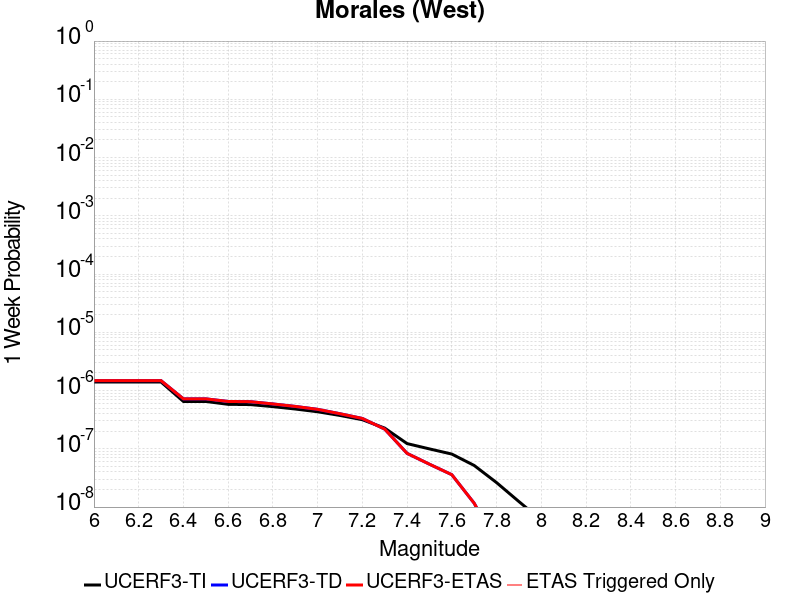 |  |  | 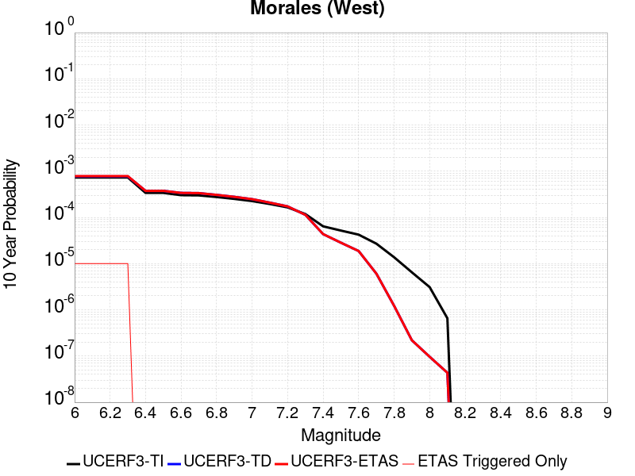 |

| Magnitude | 1 wk TI Prob | 1 wk TD Prob | 1 wk ETAS Prob | 1 wk ETAS/TD Gain | 1 wk ETAS Triggered Only | 1 mo TI Prob | 1 mo TD Prob | 1 mo ETAS Prob | 1 mo ETAS/TD Gain | 1 mo ETAS Triggered Only | 1 yr TI Prob | 1 yr TD Prob | 1 yr ETAS Prob | 1 yr ETAS/TD Gain | 1 yr ETAS Triggered Only | 10 yr TI Prob | 10 yr TD Prob | 10 yr ETAS Prob | 10 yr ETAS/TD Gain | 10 yr ETAS Triggered Only |
|-----|-----|-----|-----|-----|-----|-----|-----|-----|-----|-----|-----|-----|-----|-----|-----|-----|-----|-----|-----|-----|
| 6.0 | 1.4027072E-6 | 1.4792388E-6 | 1.4792388E-6 | 1.0 | 0.0 | 6.0115885E-6 | 6.3395833E-6 | 6.3395833E-6 | 1.0 | 0.0 | 7.318863E-5 | 7.718239E-5 | 8.718162E-5 | 1.1295532 | 1.0E-5 | 7.316453E-4 | 7.7162444E-4 | 7.816167E-4 | 1.0129497 | 1.0E-5 |
| 6.1 | 1.4027072E-6 | 1.4792388E-6 | 1.4792388E-6 | 1.0 | 0.0 | 6.0115885E-6 | 6.3395833E-6 | 6.3395833E-6 | 1.0 | 0.0 | 7.318863E-5 | 7.718239E-5 | 8.718162E-5 | 1.1295532 | 1.0E-5 | 7.316453E-4 | 7.7162444E-4 | 7.816167E-4 | 1.0129497 | 1.0E-5 |
| 6.2 | 1.4027072E-6 | 1.4792388E-6 | 1.4792388E-6 | 1.0 | 0.0 | 6.0115885E-6 | 6.3395833E-6 | 6.3395833E-6 | 1.0 | 0.0 | 7.318863E-5 | 7.718239E-5 | 8.718162E-5 | 1.1295532 | 1.0E-5 | 7.316453E-4 | 7.7162444E-4 | 7.816167E-4 | 1.0129497 | 1.0E-5 |
| 6.3 | 1.4027072E-6 | 1.4792388E-6 | 1.4792388E-6 | 1.0 | 0.0 | 6.0115885E-6 | 6.3395833E-6 | 6.3395833E-6 | 1.0 | 0.0 | 7.318863E-5 | 7.718239E-5 | 8.718162E-5 | 1.1295532 | 1.0E-5 | 7.316453E-4 | 7.7162444E-4 | 7.816167E-4 | 1.0129497 | 1.0E-5 |
| 6.4 | 6.504502E-7 | 7.204687E-7 | 7.204687E-7 | 1.0 | 0.0 | 2.7876408E-6 | 3.0877193E-6 | 3.0877193E-6 | 1.0 | 0.0 | 3.3939E-5 | 3.7592345E-5 | 3.7592345E-5 | 1.0 | 0.0 | 3.3933815E-4 | 3.7586104E-4 | 3.7586104E-4 | 1.0 | 0.0 |
| 6.5 | 6.504502E-7 | 7.204687E-7 | 7.204687E-7 | 1.0 | 0.0 | 2.7876408E-6 | 3.0877193E-6 | 3.0877193E-6 | 1.0 | 0.0 | 3.3939E-5 | 3.7592345E-5 | 3.7592345E-5 | 1.0 | 0.0 | 3.3933815E-4 | 3.7586104E-4 | 3.7586104E-4 | 1.0 | 0.0 |
| 6.6 | 5.8056526E-7 | 6.500946E-7 | 6.500946E-7 | 1.0 | 0.0 | 2.4881344E-6 | 2.7861167E-6 | 2.7861167E-6 | 1.0 | 0.0 | 3.0292615E-5 | 3.392045E-5 | 3.392045E-5 | 1.0 | 0.0 | 3.0288487E-4 | 3.3915334E-4 | 3.3915334E-4 | 1.0 | 0.0 |
| 6.7 | 5.741448E-7 | 6.4362575E-7 | 6.4362575E-7 | 1.0 | 0.0 | 2.4606184E-6 | 2.758393E-6 | 2.758393E-6 | 1.0 | 0.0 | 2.9957617E-5 | 3.3582925E-5 | 3.3582925E-5 | 1.0 | 0.0 | 2.9953578E-4 | 3.357791E-4 | 3.357791E-4 | 1.0 | 0.0 |
| 6.8 | 5.299428E-7 | 5.891671E-7 | 5.891671E-7 | 1.0 | 0.0 | 2.2711813E-6 | 2.5249992E-6 | 2.5249992E-6 | 1.0 | 0.0 | 2.7651282E-5 | 3.0741438E-5 | 3.0741438E-5 | 1.0 | 0.0 | 2.7647841E-4 | 3.0737233E-4 | 3.0737233E-4 | 1.0 | 0.0 |
| 6.9 | 4.82394E-7 | 5.3424253E-7 | 5.3424253E-7 | 1.0 | 0.0 | 2.0674013E-6 | 2.2896088E-6 | 2.2896088E-6 | 1.0 | 0.0 | 2.517032E-5 | 2.7875636E-5 | 2.7875636E-5 | 1.0 | 0.0 | 2.516747E-4 | 2.787218E-4 | 2.787218E-4 | 1.0 | 0.0 |
| 7.0 | 4.3264512E-7 | 4.7605775E-7 | 4.7605775E-7 | 1.0 | 0.0 | 1.8541921E-6 | 2.0402458E-6 | 2.0402458E-6 | 1.0 | 0.0 | 2.2574555E-5 | 2.4839714E-5 | 2.4839714E-5 | 1.0 | 0.0 | 2.2572262E-4 | 2.483697E-4 | 2.483697E-4 | 1.0 | 0.0 |
| 7.1 | 3.7388565E-7 | 4.0010372E-7 | 4.0010372E-7 | 1.0 | 0.0 | 1.6023661E-6 | 1.7147291E-6 | 1.7147291E-6 | 1.0 | 0.0 | 1.9508632E-5 | 2.0876629E-5 | 2.0876629E-5 | 1.0 | 0.0 | 1.950692E-4 | 2.0874692E-4 | 2.0874692E-4 | 1.0 | 0.0 |
| 7.2 | 3.1592543E-7 | 3.3205265E-7 | 3.3205265E-7 | 1.0 | 0.0 | 1.3539654E-6 | 1.4230819E-6 | 1.4230819E-6 | 1.0 | 0.0 | 1.6484404E-5 | 1.7325887E-5 | 1.7325887E-5 | 1.0 | 0.0 | 1.6483181E-4 | 1.7324554E-4 | 1.7324554E-4 | 1.0 | 0.0 |
| 7.3 | 2.2677783E-7 | 2.1798837E-7 | 2.1798837E-7 | 1.0 | 0.0 | 9.719047E-7 | 9.342355E-7 | 9.342355E-7 | 1.0 | 0.0 | 1.1832874E-5 | 1.1374258E-5 | 1.1374258E-5 | 1.0 | 0.0 | 1.18322445E-4 | 1.13736816E-4 | 1.13736816E-4 | 1.0 | 0.0 |
| 7.4 | 1.2295531E-7 | 8.352617E-8 | 8.352617E-8 | 1.0 | 0.0 | 5.269512E-7 | 3.579692E-7 | 3.579692E-7 | 1.0 | 0.0 | 6.4156125E-6 | 4.3582663E-6 | 4.3582663E-6 | 1.0 | 0.0 | 6.415427E-5 | 4.3581822E-5 | 4.3581822E-5 | 1.0 | 0.0 |
| 7.5 | 9.9632544E-8 | 5.444305E-8 | 5.444305E-8 | 1.0 | 0.0 | 4.2699656E-7 | 2.3332733E-7 | 2.3332733E-7 | 1.0 | 0.0 | 5.198671E-6 | 2.8407565E-6 | 2.8407565E-6 | 1.0 | 0.0 | 5.198549E-5 | 2.8407208E-5 | 2.8407208E-5 | 1.0 | 0.0 |
| 7.6 | 8.125894E-8 | 3.5957715E-8 | 3.5957715E-8 | 1.0 | 0.0 | 3.4825257E-7 | 1.541045E-7 | 1.541045E-7 | 1.0 | 0.0 | 4.2399665E-6 | 1.8762206E-6 | 1.8762206E-6 | 1.0 | 0.0 | 4.2398857E-5 | 1.8762054E-5 | 1.8762054E-5 | 1.0 | 0.0 |
| 7.7 | 5.1810765E-8 | 1.1645978E-8 | 1.1645978E-8 | 1.0 | 0.0 | 2.2204613E-7 | 4.9911332E-8 | 4.9911332E-8 | 1.0 | 0.0 | 2.7034082E-6 | 6.076703E-7 | 6.076703E-7 | 1.0 | 0.0 | 2.7033753E-5 | 6.076691E-6 | 6.076691E-6 | 1.0 | 0.0 |
| 7.8 | 2.6315043E-8 | 2.3388518E-9 | 2.3388518E-9 | 1.0 | 0.0 | 1.1277875E-7 | 1.0023646E-8 | 1.0023646E-8 | 1.0 | 0.0 | 1.3730804E-6 | 1.2203787E-7 | 1.2203787E-7 | 1.0 | 0.0 | 1.3730719E-5 | 1.2203827E-6 | 1.2203827E-6 | 1.0 | 0.0 |
| 7.9 | 1.24281545E-8 | 4.2067783E-10 | 4.2067783E-10 | 1.0 | 0.0 | 5.3263516E-8 | 1.8029034E-9 | 1.8029034E-9 | 1.0 | 0.0 | 6.4848314E-7 | 2.1950342E-8 | 2.1950342E-8 | 1.0 | 0.0 | 6.4848123E-6 | 2.1950795E-7 | 2.1950795E-7 | 1.0 | 0.0 |
| 8.0 | 5.954214E-9 | 1.8505641E-10 | 1.8505641E-10 | 1.0 | 0.0 | 2.551806E-8 | 7.930976E-10 | 7.930976E-10 | 1.0 | 0.0 | 3.1068234E-7 | 9.655961E-9 | 9.655961E-9 | 1.0 | 0.0 | 3.1068191E-6 | 9.6564165E-8 | 9.6564165E-8 | 1.0 | 0.0 |
| 8.1 | 1.2586262E-9 | 8.3468454E-11 | 8.3468454E-11 | 1.0 | 0.0 | 5.3941123E-9 | 3.577213E-10 | 3.577213E-10 | 1.0 | 0.0 | 6.567332E-8 | 4.3552566E-9 | 4.3552566E-9 | 1.0 | 0.0 | 6.56733E-7 | 4.355711E-8 | 4.355711E-8 | 1.0 | 0.0 |

## Raymond
*[(top)](#table-of-contents)*

| 1 Week | 1 Month | 1 Year | 10 Year |
|-----|-----|-----|-----|
| 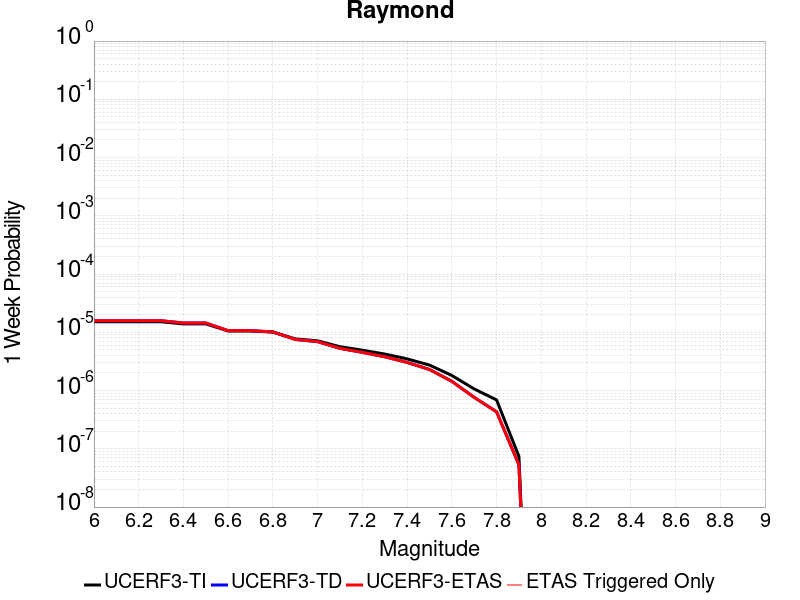 | 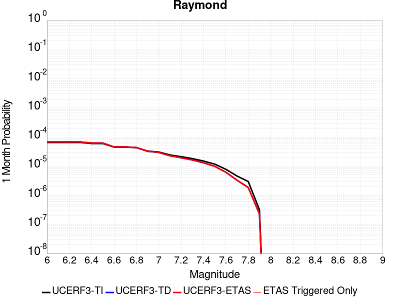 |  |  |

| Magnitude | 1 wk TI Prob | 1 wk TD Prob | 1 wk ETAS Prob | 1 wk ETAS/TD Gain | 1 wk ETAS Triggered Only | 1 mo TI Prob | 1 mo TD Prob | 1 mo ETAS Prob | 1 mo ETAS/TD Gain | 1 mo ETAS Triggered Only | 1 yr TI Prob | 1 yr TD Prob | 1 yr ETAS Prob | 1 yr ETAS/TD Gain | 1 yr ETAS Triggered Only | 10 yr TI Prob | 10 yr TD Prob | 10 yr ETAS Prob | 10 yr ETAS/TD Gain | 10 yr ETAS Triggered Only |
|-----|-----|-----|-----|-----|-----|-----|-----|-----|-----|-----|-----|-----|-----|-----|-----|-----|-----|-----|-----|-----|
| 6.0 | 1.5157413E-5 | 1.5810323E-5 | 1.5810323E-5 | 1.0 | 0.0 | 6.4958724E-5 | 6.7756904E-5 | 6.7756904E-5 | 1.0 | 0.0 | 7.905855E-4 | 8.246532E-4 | 8.246532E-4 | 1.0 | 0.0 | 0.007877788 | 0.008218459 | 0.008228377 | 1.0012068 | 1.0E-5 |
| 6.1 | 1.5157413E-5 | 1.5810323E-5 | 1.5810323E-5 | 1.0 | 0.0 | 6.4958724E-5 | 6.7756904E-5 | 6.7756904E-5 | 1.0 | 0.0 | 7.905855E-4 | 8.246532E-4 | 8.246532E-4 | 1.0 | 0.0 | 0.007877788 | 0.008218459 | 0.008228377 | 1.0012068 | 1.0E-5 |
| 6.2 | 1.5157413E-5 | 1.5810323E-5 | 1.5810323E-5 | 1.0 | 0.0 | 6.4958724E-5 | 6.7756904E-5 | 6.7756904E-5 | 1.0 | 0.0 | 7.905855E-4 | 8.246532E-4 | 8.246532E-4 | 1.0 | 0.0 | 0.007877788 | 0.008218459 | 0.008228377 | 1.0012068 | 1.0E-5 |
| 6.3 | 1.5157413E-5 | 1.5810323E-5 | 1.5810323E-5 | 1.0 | 0.0 | 6.4958724E-5 | 6.7756904E-5 | 6.7756904E-5 | 1.0 | 0.0 | 7.905855E-4 | 8.246532E-4 | 8.246532E-4 | 1.0 | 0.0 | 0.007877788 | 0.008218459 | 0.008228377 | 1.0012068 | 1.0E-5 |
| 6.4 | 1.3941944E-5 | 1.4454868E-5 | 1.4454868E-5 | 1.0 | 0.0 | 5.9749822E-5 | 6.194809E-5 | 6.194809E-5 | 1.0 | 0.0 | 7.2721124E-4 | 7.5398036E-4 | 7.5398036E-4 | 1.0 | 0.0 | 0.007248361 | 0.0075165667 | 0.007526492 | 1.0013204 | 1.0E-5 |
| 6.5 | 1.3941944E-5 | 1.4454868E-5 | 1.4454868E-5 | 1.0 | 0.0 | 5.9749822E-5 | 6.194809E-5 | 6.194809E-5 | 1.0 | 0.0 | 7.2721124E-4 | 7.5398036E-4 | 7.5398036E-4 | 1.0 | 0.0 | 0.007248361 | 0.0075165667 | 0.007526492 | 1.0013204 | 1.0E-5 |
| 6.6 | 1.0542609E-5 | 1.0671242E-5 | 1.0671242E-5 | 1.0 | 0.0 | 4.5181827E-5 | 4.5733123E-5 | 4.5733123E-5 | 1.0 | 0.0 | 5.499499E-4 | 5.56664E-4 | 5.56664E-4 | 1.0 | 0.0 | 0.005485909 | 0.0055532674 | 0.005563212 | 1.0017908 | 1.0E-5 |
| 6.7 | 1.0542609E-5 | 1.0671242E-5 | 1.0671242E-5 | 1.0 | 0.0 | 4.5181827E-5 | 4.5733123E-5 | 4.5733123E-5 | 1.0 | 0.0 | 5.499499E-4 | 5.56664E-4 | 5.56664E-4 | 1.0 | 0.0 | 0.005485909 | 0.0055532674 | 0.005563212 | 1.0017908 | 1.0E-5 |
| 6.8 | 1.0079132E-5 | 1.0176772E-5 | 1.0176772E-5 | 1.0 | 0.0 | 4.3195567E-5 | 4.3614036E-5 | 4.3614036E-5 | 1.0 | 0.0 | 5.257791E-4 | 5.3087686E-4 | 5.3087686E-4 | 1.0 | 0.0 | 0.0052453685 | 0.0052966466 | 0.0053065936 | 1.001878 | 1.0E-5 |
| 6.9 | 7.721598E-6 | 7.548996E-6 | 7.548996E-6 | 1.0 | 0.0 | 3.3092143E-5 | 3.2352447E-5 | 3.2352447E-5 | 1.0 | 0.0 | 4.0282236E-4 | 3.9382104E-4 | 3.9382104E-4 | 1.0 | 0.0 | 0.0040209293 | 0.003931375 | 0.003941336 | 1.0025337 | 1.0E-5 |
| 7.0 | 7.137566E-6 | 6.9113903E-6 | 6.9113903E-6 | 1.0 | 0.0 | 3.058921E-5 | 2.9619914E-5 | 2.9619914E-5 | 1.0 | 0.0 | 3.7236E-4 | 3.6056386E-4 | 3.6056386E-4 | 1.0 | 0.0 | 0.0037173668 | 0.003599917 | 0.003609881 | 1.0027678 | 1.0E-5 |
| 7.1 | 5.654976E-6 | 5.2996093E-6 | 5.2996093E-6 | 1.0 | 0.0 | 2.4235387E-5 | 2.2712415E-5 | 2.2712415E-5 | 1.0 | 0.0 | 2.9502588E-4 | 2.7648878E-4 | 2.7648878E-4 | 1.0 | 0.0 | 0.0029463451 | 0.0027614892 | 0.0027714616 | 1.0036112 | 1.0E-5 |
| 7.2 | 4.9358455E-6 | 4.5267193E-6 | 4.5267193E-6 | 1.0 | 0.0 | 2.1153453E-5 | 1.9400082E-5 | 1.9400082E-5 | 1.0 | 0.0 | 2.5751285E-4 | 2.3617054E-4 | 2.3617054E-4 | 1.0 | 0.0 | 0.0025721465 | 0.002359228 | 0.0023692043 | 1.0042287 | 1.0E-5 |
| 7.3 | 4.2368597E-6 | 3.805671E-6 | 3.805671E-6 | 1.0 | 0.0 | 1.8157843E-5 | 1.6309918E-5 | 1.6309918E-5 | 1.0 | 0.0 | 2.2104931E-4 | 1.9855525E-4 | 1.9855525E-4 | 1.0 | 0.0 | 0.0022082955 | 0.0019838077 | 0.0019937877 | 1.0050309 | 1.0E-5 |
| 7.4 | 3.4999923E-6 | 3.0437911E-6 | 3.0437911E-6 | 1.0 | 0.0 | 1.49998805E-5 | 1.3044754E-5 | 1.3044754E-5 | 1.0 | 0.0 | 1.8260824E-4 | 1.5880838E-4 | 1.5880838E-4 | 1.0 | 0.0 | 0.0018245826 | 0.0015869751 | 0.0015969592 | 1.0062913 | 1.0E-5 |
| 7.5 | 2.738017E-6 | 2.302082E-6 | 2.302082E-6 | 1.0 | 0.0 | 1.1734306E-5 | 9.866028E-6 | 9.866028E-6 | 1.0 | 0.0 | 1.428558E-4 | 1.20112345E-4 | 1.20112345E-4 | 1.0 | 0.0 | 0.0014276401 | 0.001200499 | 0.001200499 | 1.0 | 0.0 |
| 7.6 | 1.8186392E-6 | 1.4423306E-6 | 1.4423306E-6 | 1.0 | 0.0 | 7.794145E-6 | 6.1814026E-6 | 6.1814026E-6 | 1.0 | 0.0 | 9.488958E-5 | 7.5256015E-5 | 7.5256015E-5 | 1.0 | 0.0 | 9.4849075E-4 | 7.523272E-4 | 7.523272E-4 | 1.0 | 0.0 |
| 7.7 | 1.0660348E-6 | 7.6439306E-7 | 7.6439306E-7 | 1.0 | 0.0 | 4.5687125E-6 | 3.2759663E-6 | 3.2759663E-6 | 1.0 | 0.0 | 5.5622655E-5 | 3.9884177E-5 | 3.9884177E-5 | 1.0 | 0.0 | 5.5608735E-4 | 3.9878968E-4 | 3.9878968E-4 | 1.0 | 0.0 |
| 7.8 | 6.913602E-7 | 4.3204847E-7 | 4.3204847E-7 | 1.0 | 0.0 | 2.962969E-6 | 1.851635E-6 | 1.851635E-6 | 1.0 | 0.0 | 3.607355E-5 | 2.2543429E-5 | 2.2543429E-5 | 1.0 | 0.0 | 3.6067693E-4 | 2.2542983E-4 | 2.2542983E-4 | 1.0 | 0.0 |
| 7.9 | 7.425201E-8 | 5.322352E-8 | 5.322352E-8 | 1.0 | 0.0 | 3.1822285E-7 | 2.2810077E-7 | 2.2810077E-7 | 1.0 | 0.0 | 3.874356E-6 | 2.7771248E-6 | 2.7771248E-6 | 1.0 | 0.0 | 3.8742884E-5 | 2.777103E-5 | 2.777103E-5 | 1.0 | 0.0 |

## Great Valley 10 (Panoche)
*[(top)](#table-of-contents)*

| 1 Week | 1 Month | 1 Year | 10 Year |
|-----|-----|-----|-----|
|  |  | 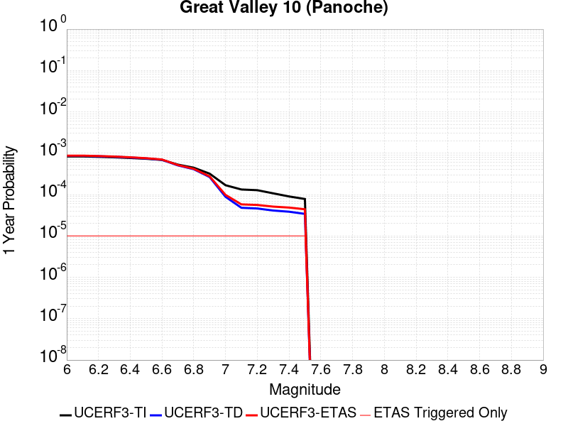 | 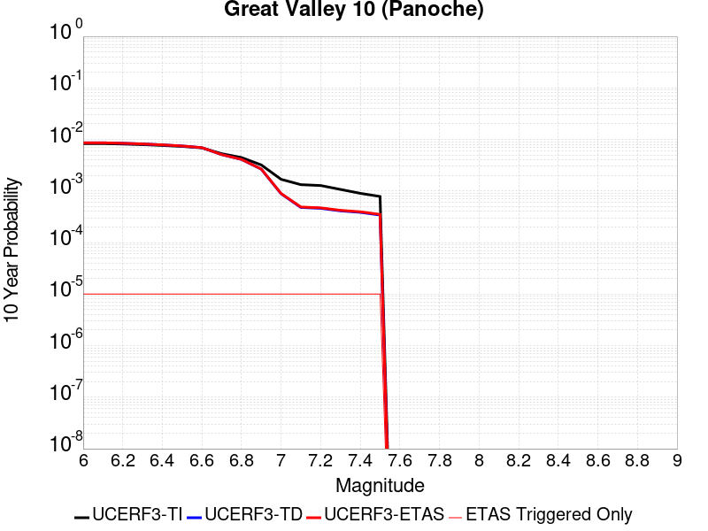 |

| Magnitude | 1 wk TI Prob | 1 wk TD Prob | 1 wk ETAS Prob | 1 wk ETAS/TD Gain | 1 wk ETAS Triggered Only | 1 mo TI Prob | 1 mo TD Prob | 1 mo ETAS Prob | 1 mo ETAS/TD Gain | 1 mo ETAS Triggered Only | 1 yr TI Prob | 1 yr TD Prob | 1 yr ETAS Prob | 1 yr ETAS/TD Gain | 1 yr ETAS Triggered Only | 10 yr TI Prob | 10 yr TD Prob | 10 yr ETAS Prob | 10 yr ETAS/TD Gain | 10 yr ETAS Triggered Only |
|-----|-----|-----|-----|-----|-----|-----|-----|-----|-----|-----|-----|-----|-----|-----|-----|-----|-----|-----|-----|-----|
| 6.0 | 1.6014626E-5 | 1.6575654E-5 | 1.6575654E-5 | 1.0 | 0.0 | 6.863231E-5 | 7.1036615E-5 | 7.1036615E-5 | 1.0 | 0.0 | 8.35278E-4 | 8.6453307E-4 | 8.7452447E-4 | 1.011557 | 1.0E-5 | 0.008321454 | 0.008612311 | 0.008622225 | 1.0011511 | 1.0E-5 |
| 6.1 | 1.6014626E-5 | 1.6575654E-5 | 1.6575654E-5 | 1.0 | 0.0 | 6.863231E-5 | 7.1036615E-5 | 7.1036615E-5 | 1.0 | 0.0 | 8.35278E-4 | 8.6453307E-4 | 8.7452447E-4 | 1.011557 | 1.0E-5 | 0.008321454 | 0.008612311 | 0.008622225 | 1.0011511 | 1.0E-5 |
| 6.2 | 1.56782E-5 | 1.6198695E-5 | 1.6198695E-5 | 1.0 | 0.0 | 6.719056E-5 | 6.942116E-5 | 6.942116E-5 | 1.0 | 0.0 | 8.17738E-4 | 8.4488036E-4 | 8.5487193E-4 | 1.011826 | 1.0E-5 | 0.008147354 | 0.008417284 | 0.0084272 | 1.001178 | 1.0E-5 |
| 6.3 | 1.5263338E-5 | 1.5723755E-5 | 1.5723755E-5 | 1.0 | 0.0 | 6.541267E-5 | 6.7385816E-5 | 6.7385816E-5 | 1.0 | 0.0 | 7.961082E-4 | 8.201189E-4 | 8.301107E-4 | 1.0121833 | 1.0E-5 | 0.007932622 | 0.00817151 | 0.008181428 | 1.0012138 | 1.0E-5 |
| 6.4 | 1.4720723E-5 | 1.5099607E-5 | 1.5099607E-5 | 1.0 | 0.0 | 6.308728E-5 | 6.471103E-5 | 6.471103E-5 | 1.0 | 0.0 | 7.67817E-4 | 7.8757724E-4 | 7.9756934E-4 | 1.0126872 | 1.0E-5 | 0.007651695 | 0.00784843 | 0.007858352 | 1.0012641 | 1.0E-5 |
| 6.5 | 1.408264E-5 | 1.4356187E-5 | 1.4356187E-5 | 1.0 | 0.0 | 6.0352773E-5 | 6.15251E-5 | 6.15251E-5 | 1.0 | 0.0 | 7.3454727E-4 | 7.488158E-4 | 7.588083E-4 | 1.0133444 | 1.0E-5 | 0.0073212404 | 0.007463476 | 0.0074734013 | 1.0013299 | 1.0E-5 |
| 6.6 | 1.3197086E-5 | 1.3322086E-5 | 1.3322086E-5 | 1.0 | 0.0 | 5.6557717E-5 | 5.709343E-5 | 5.709343E-5 | 1.0 | 0.0 | 6.8837265E-4 | 6.948959E-4 | 7.0488895E-4 | 1.0143807 | 1.0E-5 | 0.006862442 | 0.0069277636 | 0.0069376943 | 1.0014335 | 1.0E-5 |
| 6.7 | 1.017583E-5 | 9.745514E-6 | 9.745514E-6 | 1.0 | 0.0 | 4.360997E-5 | 4.1765834E-5 | 4.1765834E-5 | 1.0 | 0.0 | 5.30822E-4 | 5.083828E-4 | 5.183777E-4 | 1.0196602 | 1.0E-5 | 0.0052955584 | 0.0050724503 | 0.0050823996 | 1.0019615 | 1.0E-5 |
| 6.8 | 8.557912E-6 | 7.872806E-6 | 7.872806E-6 | 1.0 | 0.0 | 3.667625E-5 | 3.3740173E-5 | 3.3740173E-5 | 1.0 | 0.0 | 4.4644187E-4 | 4.107112E-4 | 4.207071E-4 | 1.024338 | 1.0E-5 | 0.0044554602 | 0.0040997285 | 0.004109687 | 1.0024291 | 1.0E-5 |
| 6.9 | 6.14664E-6 | 5.092122E-6 | 5.092122E-6 | 1.0 | 0.0 | 2.6342475E-5 | 2.1823207E-5 | 2.1823207E-5 | 1.0 | 0.0 | 3.2067244E-4 | 2.6566655E-4 | 2.756639E-4 | 1.0376312 | 1.0E-5 | 0.003202101 | 0.0026536277 | 0.0026636012 | 1.0037584 | 1.0E-5 |
| 7.0 | 3.2310581E-6 | 1.6951099E-6 | 1.6951099E-6 | 1.0 | 0.0 | 1.3847319E-5 | 7.264737E-6 | 7.264737E-6 | 1.0 | 0.0 | 1.6857806E-4 | 8.844468E-5 | 9.8443794E-5 | 1.113055 | 1.0E-5 | 0.0016845023 | 8.8410417E-4 | 8.940953E-4 | 1.0113009 | 1.0E-5 |
| 7.1 | 2.544492E-6 | 9.188687E-7 | 9.188687E-7 | 1.0 | 0.0 | 1.090492E-5 | 3.938003E-6 | 3.938003E-6 | 1.0 | 0.0 | 1.327593E-4 | 4.794418E-5 | 5.79437E-5 | 1.2085658 | 1.0E-5 | 0.0013268003 | 4.7934314E-4 | 4.8933836E-4 | 1.0208519 | 1.0E-5 |
| 7.2 | 2.4479045E-6 | 8.841082E-7 | 8.841082E-7 | 1.0 | 0.0 | 1.0490977E-5 | 3.78903E-6 | 3.78903E-6 | 1.0 | 0.0 | 1.2772017E-4 | 4.613051E-5 | 5.613005E-5 | 1.2167662 | 1.0E-5 | 0.0012764678 | 4.6121408E-4 | 4.7120947E-4 | 1.0216719 | 1.0E-5 |
| 7.3 | 2.0559578E-6 | 7.8926E-7 | 7.8926E-7 | 1.0 | 0.0 | 8.811218E-6 | 3.3825388E-6 | 3.3825388E-6 | 1.0 | 0.0 | 1.072713E-4 | 4.118168E-5 | 5.118127E-5 | 1.2428164 | 1.0E-5 | 0.0010721954 | 4.117451E-4 | 4.21741E-4 | 1.0242769 | 1.0E-5 |
| 7.4 | 1.727687E-6 | 7.387636E-7 | 7.387636E-7 | 1.0 | 0.0 | 7.404352E-6 | 3.1661261E-6 | 3.1661261E-6 | 1.0 | 0.0 | 9.0144255E-5 | 3.854695E-5 | 4.8546564E-5 | 1.2594138 | 1.0E-5 | 9.0107694E-4 | 3.8540724E-4 | 3.954034E-4 | 1.0259366 | 1.0E-5 |
| 7.5 | 1.5002679E-6 | 6.546047E-7 | 6.546047E-7 | 1.0 | 0.0 | 6.4297037E-6 | 2.805446E-6 | 2.805446E-6 | 1.0 | 0.0 | 7.827883E-5 | 3.415581E-5 | 4.415547E-5 | 1.292766 | 1.0E-5 | 7.825126E-4 | 3.4150976E-4 | 3.5150634E-4 | 1.0292717 | 1.0E-5 |

## Simi-Santa Rosa
*[(top)](#table-of-contents)*

| 1 Week | 1 Month | 1 Year | 10 Year |
|-----|-----|-----|-----|
|  |  | 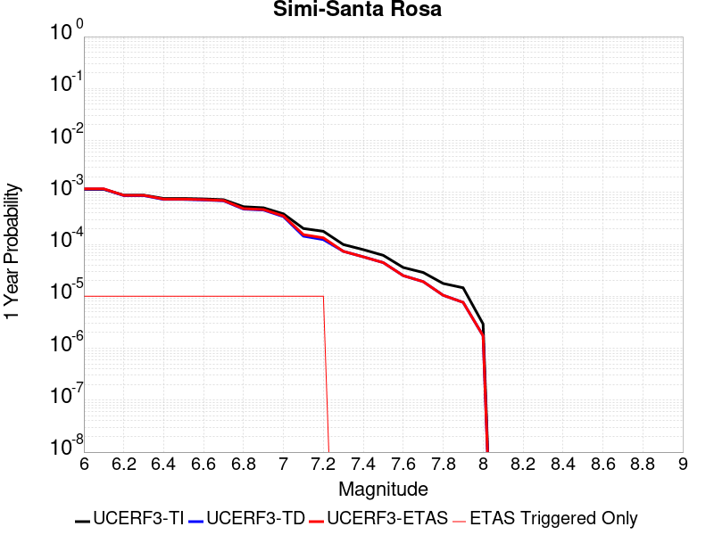 |  |

| Magnitude | 1 wk TI Prob | 1 wk TD Prob | 1 wk ETAS Prob | 1 wk ETAS/TD Gain | 1 wk ETAS Triggered Only | 1 mo TI Prob | 1 mo TD Prob | 1 mo ETAS Prob | 1 mo ETAS/TD Gain | 1 mo ETAS Triggered Only | 1 yr TI Prob | 1 yr TD Prob | 1 yr ETAS Prob | 1 yr ETAS/TD Gain | 1 yr ETAS Triggered Only | 10 yr TI Prob | 10 yr TD Prob | 10 yr ETAS Prob | 10 yr ETAS/TD Gain | 10 yr ETAS Triggered Only |
|-----|-----|-----|-----|-----|-----|-----|-----|-----|-----|-----|-----|-----|-----|-----|-----|-----|-----|-----|-----|-----|
| 6.0 | 2.198912E-5 | 2.227578E-5 | 2.227578E-5 | 1.0 | 0.0 | 9.4235686E-5 | 9.5464384E-5 | 1.05463434E-4 | 1.1047411 | 1.0E-5 | 0.0011467156 | 0.001161703 | 0.0011716913 | 1.0085981 | 1.0E-5 | 0.011408163 | 0.01156075 | 0.011570634 | 1.000855 | 1.0E-5 |
| 6.1 | 2.198912E-5 | 2.227578E-5 | 2.227578E-5 | 1.0 | 0.0 | 9.4235686E-5 | 9.5464384E-5 | 1.05463434E-4 | 1.1047411 | 1.0E-5 | 0.0011467156 | 0.001161703 | 0.0011716913 | 1.0085981 | 1.0E-5 | 0.011408163 | 0.01156075 | 0.011570634 | 1.000855 | 1.0E-5 |
| 6.2 | 1.69983E-5 | 1.666882E-5 | 1.666882E-5 | 1.0 | 0.0 | 7.284782E-5 | 7.143601E-5 | 8.14353E-5 | 1.1399754 | 1.0E-5 | 8.865613E-4 | 8.694155E-4 | 8.7940687E-4 | 1.011492 | 1.0E-5 | 0.008830327 | 0.008663063 | 0.008672976 | 1.0011443 | 1.0E-5 |
| 6.3 | 1.69983E-5 | 1.666882E-5 | 1.666882E-5 | 1.0 | 0.0 | 7.284782E-5 | 7.143601E-5 | 8.14353E-5 | 1.1399754 | 1.0E-5 | 8.865613E-4 | 8.694155E-4 | 8.7940687E-4 | 1.011492 | 1.0E-5 | 0.008830327 | 0.008663063 | 0.008672976 | 1.0011443 | 1.0E-5 |
| 6.4 | 1.4666188E-5 | 1.4052768E-5 | 1.4052768E-5 | 1.0 | 0.0 | 6.285358E-5 | 6.02249E-5 | 7.02243E-5 | 1.1660342 | 1.0E-5 | 7.6497364E-4 | 7.3301635E-4 | 7.4300903E-4 | 1.0136323 | 1.0E-5 | 0.0076234564 | 0.007308461 | 0.0073183877 | 1.0013583 | 1.0E-5 |
| 6.5 | 1.4666188E-5 | 1.4052768E-5 | 1.4052768E-5 | 1.0 | 0.0 | 6.285358E-5 | 6.02249E-5 | 7.02243E-5 | 1.1660342 | 1.0E-5 | 7.6497364E-4 | 7.3301635E-4 | 7.4300903E-4 | 1.0136323 | 1.0E-5 | 0.0076234564 | 0.007308461 | 0.0073183877 | 1.0013583 | 1.0E-5 |
| 6.6 | 1.4377586E-5 | 1.3729804E-5 | 1.3729804E-5 | 1.0 | 0.0 | 6.1616774E-5 | 5.884083E-5 | 6.8840236E-5 | 1.16994 | 1.0E-5 | 7.4992597E-4 | 7.1617647E-4 | 7.261693E-4 | 1.0139531 | 1.0E-5 | 0.007474003 | 0.007141153 | 0.0071510817 | 1.0013903 | 1.0E-5 |
| 6.7 | 1.3881404E-5 | 1.3207765E-5 | 1.3207765E-5 | 1.0 | 0.0 | 5.9490372E-5 | 5.6603618E-5 | 6.6603054E-5 | 1.1766572 | 1.0E-5 | 7.240546E-4 | 6.889559E-4 | 6.98949E-4 | 1.0145047 | 1.0E-5 | 0.007217 | 0.0068706493 | 0.006880581 | 1.0014454 | 1.0E-5 |
| 6.8 | 1.0176516E-5 | 9.15431E-6 | 9.15431E-6 | 1.0 | 0.0 | 4.3612912E-5 | 3.9232258E-5 | 4.9231865E-5 | 1.2548823 | 1.0E-5 | 5.308578E-4 | 4.7756464E-4 | 4.8755985E-4 | 1.0209296 | 1.0E-5 | 0.0052959146 | 0.004767017 | 0.0047769696 | 1.0020877 | 1.0E-5 |
| 6.9 | 9.699797E-6 | 8.774875E-6 | 8.774875E-6 | 1.0 | 0.0 | 4.15699E-5 | 3.7606158E-5 | 4.7605783E-5 | 1.265904 | 1.0E-5 | 5.05996E-4 | 4.5777523E-4 | 4.6777065E-4 | 1.0218347 | 1.0E-5 | 0.005048454 | 0.0045699403 | 0.0045798947 | 1.0021782 | 1.0E-5 |
| 7.0 | 7.4049476E-6 | 6.559457E-6 | 6.559457E-6 | 1.0 | 0.0 | 3.1735104E-5 | 2.8111726E-5 | 3.8111444E-5 | 1.3557135 | 1.0E-5 | 3.8630638E-4 | 3.4221914E-4 | 3.5221572E-4 | 1.029211 | 1.0E-5 | 0.0038563553 | 0.0034181639 | 0.0034281297 | 1.0029155 | 1.0E-5 |
| 7.1 | 3.873439E-6 | 2.7595784E-6 | 2.7595784E-6 | 1.0 | 0.0 | 1.6600346E-5 | 1.1826713E-5 | 2.1826594E-5 | 1.8455335 | 1.0E-5 | 2.0209046E-4 | 1.4398094E-4 | 1.539795E-4 | 1.0694436 | 1.0E-5 | 0.0020190678 | 0.0014389002 | 0.0014488858 | 1.0069398 | 1.0E-5 |
| 7.2 | 3.417706E-6 | 2.3677158E-6 | 2.3677158E-6 | 1.0 | 0.0 | 1.4647229E-5 | 1.0147315E-5 | 2.0147214E-5 | 1.9854724 | 1.0E-5 | 1.7831543E-4 | 1.2353678E-4 | 1.3353555E-4 | 1.0809375 | 1.0E-5 | 0.0017817242 | 0.0012347033 | 0.001244691 | 1.0080891 | 1.0E-5 |
| 7.3 | 1.90225E-6 | 1.4074558E-6 | 1.4074558E-6 | 1.0 | 0.0 | 8.152474E-6 | 6.03194E-6 | 6.03194E-6 | 1.0 | 0.0 | 9.9251854E-5 | 7.3436415E-5 | 7.3436415E-5 | 1.0 | 0.0 | 9.920754E-4 | 7.341237E-4 | 7.341237E-4 | 1.0 | 0.0 |
| 7.4 | 1.5170556E-6 | 1.1025572E-6 | 1.1025572E-6 | 1.0 | 0.0 | 6.5016507E-6 | 4.7252365E-6 | 4.7252365E-6 | 1.0 | 0.0 | 7.915472E-5 | 5.752825E-5 | 5.752825E-5 | 1.0 | 0.0 | 7.9126534E-4 | 5.751347E-4 | 5.751347E-4 | 1.0 | 0.0 |
| 7.5 | 1.178732E-6 | 8.5358795E-7 | 8.5358795E-7 | 1.0 | 0.0 | 5.0516987E-6 | 3.658229E-6 | 3.658229E-6 | 1.0 | 0.0 | 6.1502695E-5 | 4.453804E-5 | 4.453804E-5 | 1.0 | 0.0 | 6.148568E-4 | 4.4529207E-4 | 4.4529207E-4 | 1.0 | 0.0 |
| 7.6 | 6.8722386E-7 | 4.793955E-7 | 4.793955E-7 | 1.0 | 0.0 | 2.9452417E-6 | 2.0545506E-6 | 2.0545506E-6 | 1.0 | 0.0 | 3.5857727E-5 | 2.501387E-5 | 2.501387E-5 | 1.0 | 0.0 | 3.5851944E-4 | 2.5011066E-4 | 2.5011066E-4 | 1.0 | 0.0 |
| 7.7 | 5.5126515E-7 | 3.6738467E-7 | 3.6738467E-7 | 1.0 | 0.0 | 2.3625628E-6 | 1.5745047E-6 | 1.5745047E-6 | 1.0 | 0.0 | 2.8763823E-5 | 1.9169427E-5 | 1.9169427E-5 | 1.0 | 0.0 | 2.87601E-4 | 1.9167786E-4 | 1.9167786E-4 | 1.0 | 0.0 |
| 7.8 | 3.3860243E-7 | 2.0080888E-7 | 2.0080888E-7 | 1.0 | 0.0 | 1.4511525E-6 | 8.606092E-7 | 8.606092E-7 | 1.0 | 0.0 | 1.7667637E-5 | 1.0477867E-5 | 1.0477867E-5 | 1.0 | 0.0 | 1.7666233E-4 | 1.0477379E-4 | 1.0477379E-4 | 1.0 | 0.0 |
| 7.9 | 2.7955386E-7 | 1.4653976E-7 | 1.4653976E-7 | 1.0 | 0.0 | 1.1980875E-6 | 6.280274E-7 | 6.280274E-7 | 1.0 | 0.0 | 1.4586617E-5 | 7.646207E-6 | 7.646207E-6 | 1.0 | 0.0 | 1.458566E-4 | 7.645948E-5 | 7.645948E-5 | 1.0 | 0.0 |
| 8.0 | 5.6259015E-8 | 3.3354432E-8 | 3.3354432E-8 | 1.0 | 0.0 | 2.4111003E-7 | 1.4294756E-7 | 1.4294756E-7 | 1.0 | 0.0 | 2.9355108E-6 | 1.7403853E-6 | 1.7403853E-6 | 1.0 | 0.0 | 2.935472E-5 | 1.740373E-5 | 1.740373E-5 | 1.0 | 0.0 |

## Great Valley 12
*[(top)](#table-of-contents)*

| 1 Week | 1 Month | 1 Year | 10 Year |
|-----|-----|-----|-----|
|  |  | 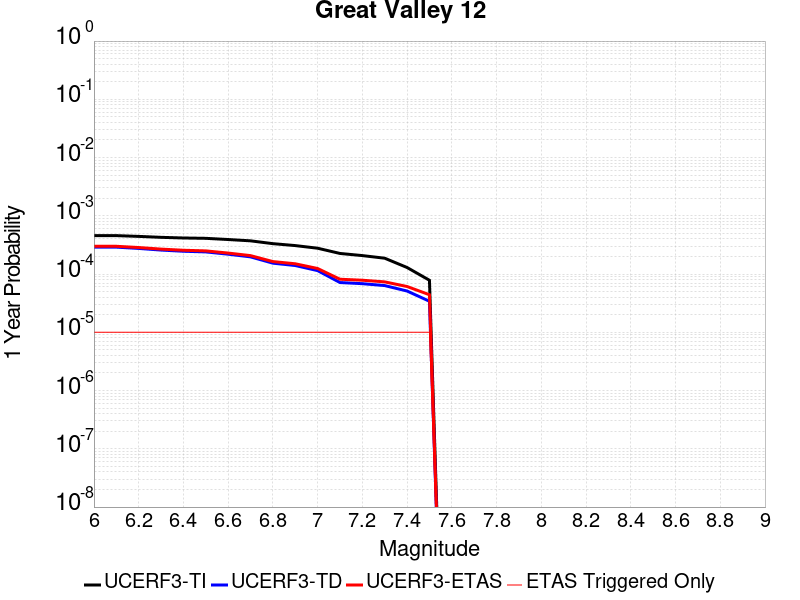 |  |

| Magnitude | 1 wk TI Prob | 1 wk TD Prob | 1 wk ETAS Prob | 1 wk ETAS/TD Gain | 1 wk ETAS Triggered Only | 1 mo TI Prob | 1 mo TD Prob | 1 mo ETAS Prob | 1 mo ETAS/TD Gain | 1 mo ETAS Triggered Only | 1 yr TI Prob | 1 yr TD Prob | 1 yr ETAS Prob | 1 yr ETAS/TD Gain | 1 yr ETAS Triggered Only | 10 yr TI Prob | 10 yr TD Prob | 10 yr ETAS Prob | 10 yr ETAS/TD Gain | 10 yr ETAS Triggered Only |
|-----|-----|-----|-----|-----|-----|-----|-----|-----|-----|-----|-----|-----|-----|-----|-----|-----|-----|-----|-----|-----|
| 6.0 | 8.757157E-6 | 5.555065E-6 | 5.555065E-6 | 1.0 | 0.0 | 3.7530135E-5 | 2.380721E-5 | 2.380721E-5 | 1.0 | 0.0 | 4.5683357E-4 | 2.8981545E-4 | 2.9981253E-4 | 1.0344948 | 1.0E-5 | 0.004558956 | 0.0028944958 | 0.0029044668 | 1.0034448 | 1.0E-5 |
| 6.1 | 8.757157E-6 | 5.555065E-6 | 5.555065E-6 | 1.0 | 0.0 | 3.7530135E-5 | 2.380721E-5 | 2.380721E-5 | 1.0 | 0.0 | 4.5683357E-4 | 2.8981545E-4 | 2.9981253E-4 | 1.0344948 | 1.0E-5 | 0.004558956 | 0.0028944958 | 0.0029044668 | 1.0034448 | 1.0E-5 |
| 6.2 | 8.499136E-6 | 5.2807313E-6 | 5.2807313E-6 | 1.0 | 0.0 | 3.642436E-5 | 2.2631515E-5 | 2.2631515E-5 | 1.0 | 0.0 | 4.4337637E-4 | 2.75505E-4 | 2.8550226E-4 | 1.036287 | 1.0E-5 | 0.0044249278 | 0.002751749 | 0.0027617216 | 1.0036241 | 1.0E-5 |
| 6.3 | 8.186883E-6 | 4.948874E-6 | 4.948874E-6 | 1.0 | 0.0 | 3.508617E-5 | 2.1209293E-5 | 2.1209293E-5 | 1.0 | 0.0 | 4.270904E-4 | 2.5819356E-4 | 2.6819098E-4 | 1.0387206 | 1.0E-5 | 0.004262705 | 0.0025790364 | 0.0025890106 | 1.0038674 | 1.0E-5 |
| 6.4 | 7.979878E-6 | 4.720875E-6 | 4.720875E-6 | 1.0 | 0.0 | 3.419903E-5 | 2.023217E-5 | 2.023217E-5 | 1.0 | 0.0 | 4.1629362E-4 | 2.4629975E-4 | 2.562973E-4 | 1.0405909 | 1.0E-5 | 0.0041551464 | 0.002460362 | 0.0024703373 | 1.0040544 | 1.0E-5 |
| 6.5 | 7.871003E-6 | 4.6008486E-6 | 4.6008486E-6 | 1.0 | 0.0 | 3.373243E-5 | 1.9717778E-5 | 1.9717778E-5 | 1.0 | 0.0 | 4.1061494E-4 | 2.4003843E-4 | 2.5003604E-4 | 1.0416499 | 1.0E-5 | 0.0040985704 | 0.0023978846 | 0.0024078607 | 1.0041603 | 1.0E-5 |
| 6.6 | 7.508221E-6 | 4.204229E-6 | 4.204229E-6 | 1.0 | 0.0 | 3.2177693E-5 | 1.8018003E-5 | 1.8018003E-5 | 1.0 | 0.0 | 3.91693E-4 | 2.1934799E-4 | 2.293458E-4 | 1.0455797 | 1.0E-5 | 0.003910033 | 0.002191401 | 0.0022013793 | 1.0045533 | 1.0E-5 |
| 6.7 | 7.1297914E-6 | 3.7819455E-6 | 3.7819455E-6 | 1.0 | 0.0 | 3.055589E-5 | 1.6208242E-5 | 1.6208242E-5 | 1.0 | 0.0 | 3.7195446E-4 | 1.9731827E-4 | 2.0731629E-4 | 1.0506696 | 1.0E-5 | 0.0037133251 | 0.0019715095 | 0.0019814898 | 1.0050622 | 1.0E-5 |
| 6.8 | 6.376581E-6 | 2.9485088E-6 | 2.9485088E-6 | 1.0 | 0.0 | 2.7327918E-5 | 1.2636407E-5 | 1.2636407E-5 | 1.0 | 0.0 | 3.326666E-4 | 1.5383755E-4 | 1.6383601E-4 | 1.0649936 | 1.0E-5 | 0.0033216903 | 0.0015373272 | 0.0015473119 | 1.0064948 | 1.0E-5 |
| 6.9 | 5.9095E-6 | 2.6865732E-6 | 2.6865732E-6 | 1.0 | 0.0 | 2.5326184E-5 | 1.15138355E-5 | 1.15138355E-5 | 1.0 | 0.0 | 3.0830267E-4 | 1.4017208E-4 | 1.5017069E-4 | 1.0713309 | 1.0E-5 | 0.003078753 | 0.0014008522 | 0.0014108382 | 1.0071285 | 1.0E-5 |
| 7.0 | 5.3239864E-6 | 2.1966987E-6 | 2.1966987E-6 | 1.0 | 0.0 | 2.2816885E-5 | 9.41439E-6 | 9.41439E-6 | 1.0 | 0.0 | 2.7776015E-4 | 1.14614304E-4 | 1.2461316E-4 | 1.0872391 | 1.0E-5 | 0.0027741324 | 0.0011455654 | 0.001155554 | 1.0087193 | 1.0E-5 |
| 7.1 | 4.329147E-6 | 1.3707657E-6 | 1.3707657E-6 | 1.0 | 0.0 | 1.8553355E-5 | 5.8746973E-6 | 5.8746973E-6 | 1.0 | 0.0 | 2.2586368E-4 | 7.152218E-5 | 8.1521466E-5 | 1.1398067 | 1.0E-5 | 0.0022563424 | 7.150003E-4 | 7.249932E-4 | 1.013976 | 1.0E-5 |
| 7.2 | 3.978488E-6 | 1.3105988E-6 | 1.3105988E-6 | 1.0 | 0.0 | 1.7050552E-5 | 5.61684E-6 | 5.61684E-6 | 1.0 | 0.0 | 2.075707E-4 | 6.838297E-5 | 7.838229E-5 | 1.1462252 | 1.0E-5 | 0.0020737692 | 6.836279E-4 | 6.9362106E-4 | 1.0146178 | 1.0E-5 |
| 7.3 | 3.586542E-6 | 1.2157507E-6 | 1.2157507E-6 | 1.0 | 0.0 | 1.5370804E-5 | 5.21035E-6 | 5.21035E-6 | 1.0 | 0.0 | 1.8712347E-4 | 6.343425E-5 | 7.343361E-5 | 1.1576335 | 1.0E-5 | 0.0018696598 | 6.341699E-4 | 6.441636E-4 | 1.0157586 | 1.0E-5 |
| 7.4 | 2.4837766E-6 | 9.80044E-7 | 9.80044E-7 | 1.0 | 0.0 | 1.0644713E-5 | 4.200182E-6 | 4.200182E-6 | 1.0 | 0.0 | 1.2959167E-4 | 5.113608E-5 | 6.113557E-5 | 1.1955466 | 1.0E-5 | 0.0012951613 | 5.1124976E-4 | 5.2124466E-4 | 1.01955 | 1.0E-5 |
| 7.5 | 1.5002679E-6 | 6.546047E-7 | 6.546047E-7 | 1.0 | 0.0 | 6.4297037E-6 | 2.805446E-6 | 2.805446E-6 | 1.0 | 0.0 | 7.827883E-5 | 3.415581E-5 | 4.415547E-5 | 1.292766 | 1.0E-5 | 7.825126E-4 | 3.4150976E-4 | 3.5150634E-4 | 1.0292717 | 1.0E-5 |

## San Andreas (Peninsula) 2011 CFM
*[(top)](#table-of-contents)*

| 1 Week | 1 Month | 1 Year | 10 Year |
|-----|-----|-----|-----|
|  |  | 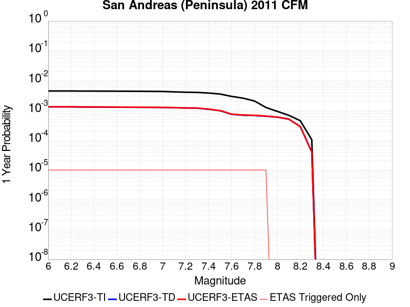 | 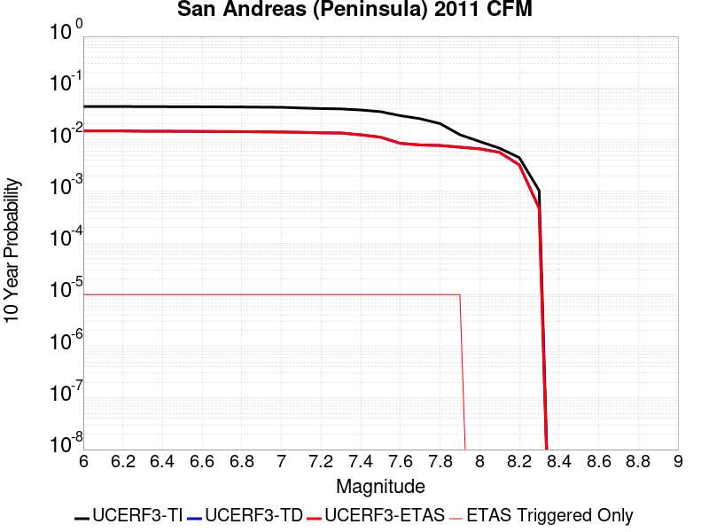 |

| Magnitude | 1 wk TI Prob | 1 wk TD Prob | 1 wk ETAS Prob | 1 wk ETAS/TD Gain | 1 wk ETAS Triggered Only | 1 mo TI Prob | 1 mo TD Prob | 1 mo ETAS Prob | 1 mo ETAS/TD Gain | 1 mo ETAS Triggered Only | 1 yr TI Prob | 1 yr TD Prob | 1 yr ETAS Prob | 1 yr ETAS/TD Gain | 1 yr ETAS Triggered Only | 10 yr TI Prob | 10 yr TD Prob | 10 yr ETAS Prob | 10 yr ETAS/TD Gain | 10 yr ETAS Triggered Only |
|-----|-----|-----|-----|-----|-----|-----|-----|-----|-----|-----|-----|-----|-----|-----|-----|-----|-----|-----|-----|-----|
| 6.0 | 8.6200685E-5 | 2.5224597E-5 | 2.5224597E-5 | 1.0 | 0.0 | 3.6937918E-4 | 1.0810095E-4 | 1.18099866E-4 | 1.0924962 | 1.0E-5 | 0.0044879215 | 0.0013153361 | 0.0013253229 | 1.0075927 | 1.0E-5 | 0.043983612 | 0.014780443 | 0.014790296 | 1.0006666 | 1.0E-5 |
| 6.1 | 8.6200685E-5 | 2.5224597E-5 | 2.5224597E-5 | 1.0 | 0.0 | 3.6937918E-4 | 1.0810095E-4 | 1.18099866E-4 | 1.0924962 | 1.0E-5 | 0.0044879215 | 0.0013153361 | 0.0013253229 | 1.0075927 | 1.0E-5 | 0.043983612 | 0.014780443 | 0.014790296 | 1.0006666 | 1.0E-5 |
| 6.2 | 8.6200685E-5 | 2.5224597E-5 | 2.5224597E-5 | 1.0 | 0.0 | 3.6937918E-4 | 1.0810095E-4 | 1.18099866E-4 | 1.0924962 | 1.0E-5 | 0.0044879215 | 0.0013153361 | 0.0013253229 | 1.0075927 | 1.0E-5 | 0.043983612 | 0.014780443 | 0.014790296 | 1.0006666 | 1.0E-5 |
| 6.3 | 8.551163E-5 | 2.4916355E-5 | 2.4916355E-5 | 1.0 | 0.0 | 3.6642692E-4 | 1.0678002E-4 | 1.1677895E-4 | 1.0936404 | 1.0E-5 | 0.004452125 | 0.001299273 | 0.00130926 | 1.0076866 | 1.0E-5 | 0.043639794 | 0.014607482 | 0.014617336 | 1.0006746 | 1.0E-5 |
| 6.4 | 8.551163E-5 | 2.4916355E-5 | 2.4916355E-5 | 1.0 | 0.0 | 3.6642692E-4 | 1.0678002E-4 | 1.1677895E-4 | 1.0936404 | 1.0E-5 | 0.004452125 | 0.001299273 | 0.00130926 | 1.0076866 | 1.0E-5 | 0.043639794 | 0.014607482 | 0.014617336 | 1.0006746 | 1.0E-5 |
| 6.5 | 8.511146E-5 | 2.4737654E-5 | 2.4737654E-5 | 1.0 | 0.0 | 3.647124E-4 | 1.0601422E-4 | 1.1601316E-4 | 1.094317 | 1.0E-5 | 0.004431336 | 0.0012899605 | 0.0012999476 | 1.0077422 | 1.0E-5 | 0.04344007 | 0.014507358 | 0.014517212 | 1.0006793 | 1.0E-5 |
| 6.6 | 8.4985084E-5 | 2.4668334E-5 | 2.4668334E-5 | 1.0 | 0.0 | 3.6417096E-4 | 1.05717154E-4 | 1.157161E-4 | 1.0945821 | 1.0E-5 | 0.0044247704 | 0.001286348 | 0.0012963351 | 1.007764 | 1.0E-5 | 0.043376986 | 0.014469326 | 0.014479181 | 1.0006812 | 1.0E-5 |
| 6.7 | 8.462618E-5 | 2.4496836E-5 | 2.4496836E-5 | 1.0 | 0.0 | 3.6263323E-4 | 1.04982224E-4 | 1.1498118E-4 | 1.0952442 | 1.0E-5 | 0.004406125 | 0.0012774108 | 0.001287398 | 1.0078183 | 1.0E-5 | 0.043197807 | 0.014374024 | 0.01438388 | 1.0006857 | 1.0E-5 |
| 6.8 | 8.42337E-5 | 2.4392584E-5 | 2.4392584E-5 | 1.0 | 0.0 | 3.6095164E-4 | 1.04535466E-4 | 1.1453442E-4 | 1.0956513 | 1.0E-5 | 0.004385734 | 0.0012719779 | 0.0012819652 | 1.0078517 | 1.0E-5 | 0.043001823 | 0.0143146645 | 0.014324522 | 1.0006886 | 1.0E-5 |
| 6.9 | 8.365989E-5 | 2.4197112E-5 | 2.4197112E-5 | 1.0 | 0.0 | 3.5849313E-4 | 1.0369779E-4 | 1.13696755E-4 | 1.0964241 | 1.0E-5 | 0.004355922 | 0.001261791 | 0.0012717784 | 1.0079153 | 1.0E-5 | 0.04271523 | 0.014207144 | 0.014217002 | 1.0006939 | 1.0E-5 |
| 7.0 | 8.30936E-5 | 2.3958522E-5 | 2.3958522E-5 | 1.0 | 0.0 | 3.560668E-4 | 1.0267535E-4 | 1.1267432E-4 | 1.0973843 | 1.0E-5 | 0.004326499 | 0.0012493571 | 0.0012593446 | 1.0079942 | 1.0E-5 | 0.042432297 | 0.014078197 | 0.014088056 | 1.0007004 | 1.0E-5 |
| 7.1 | 8.041264E-5 | 2.3644863E-5 | 2.3644863E-5 | 1.0 | 0.0 | 3.4458007E-4 | 1.013312E-4 | 1.1133019E-4 | 1.0986763 | 1.0E-5 | 0.0041871946 | 0.0012330108 | 0.0012429984 | 1.0081003 | 1.0E-5 | 0.041091725 | 0.013901063 | 0.013910924 | 1.0007094 | 1.0E-5 |
| 7.2 | 7.8427016E-5 | 2.306841E-5 | 2.306841E-5 | 1.0 | 0.0 | 3.3607247E-4 | 9.886088E-5 | 1.08859895E-4 | 1.1011423 | 1.0E-5 | 0.004084008 | 0.0012029682 | 0.0012129562 | 1.0083028 | 1.0E-5 | 0.040097635 | 0.013585005 | 0.013594869 | 1.0007261 | 1.0E-5 |
| 7.3 | 7.721087E-5 | 2.2853228E-5 | 2.2853228E-5 | 1.0 | 0.0 | 3.3086175E-4 | 9.793873E-5 | 1.07937754E-4 | 1.1020947 | 1.0E-5 | 0.004020803 | 0.0011917534 | 0.0012017415 | 1.008381 | 1.0E-5 | 0.03948827 | 0.013468663 | 0.013478529 | 1.0007324 | 1.0E-5 |
| 7.4 | 7.3536525E-5 | 2.097022E-5 | 2.097022E-5 | 1.0 | 0.0 | 3.1511846E-4 | 8.9869274E-5 | 9.9868375E-5 | 1.1112627 | 1.0E-5 | 0.0038298194 | 0.0010936105 | 0.0011035996 | 1.009134 | 1.0E-5 | 0.037644852 | 0.012425226 | 0.012435102 | 1.0007948 | 1.0E-5 |
| 7.5 | 6.806207E-5 | 1.877571E-5 | 1.877571E-5 | 1.0 | 0.0 | 2.9166197E-4 | 8.046485E-5 | 9.046405E-5 | 1.1242678 | 1.0E-5 | 0.0035452035 | 9.792204E-4 | 9.892106E-4 | 1.0102022 | 1.0E-5 | 0.034891766 | 0.011177835 | 0.011187724 | 1.0008847 | 1.0E-5 |
| 7.6 | 5.6731416E-5 | 1.4184691E-5 | 1.4184691E-5 | 1.0 | 0.0 | 2.43112E-4 | 6.0790117E-5 | 7.078951E-5 | 1.1644905 | 1.0E-5 | 0.0029558712 | 7.398685E-4 | 7.498611E-4 | 1.0135059 | 1.0E-5 | 0.02916862 | 0.008489707 | 0.008499621 | 1.0011679 | 1.0E-5 |
| 7.7 | 4.946994E-5 | 1.3252866E-5 | 1.3252866E-5 | 1.0 | 0.0 | 2.1199681E-4 | 5.6796758E-5 | 6.679619E-5 | 1.1760564 | 1.0E-5 | 0.002578006 | 6.912813E-4 | 7.012744E-4 | 1.0144559 | 1.0E-5 | 0.02548303 | 0.0079117175 | 0.007921639 | 1.001254 | 1.0E-5 |
| 7.8 | 3.9718198E-5 | 1.2989257E-5 | 1.2989257E-5 | 1.0 | 0.0 | 1.7020974E-4 | 5.5667053E-5 | 6.56665E-5 | 1.1796294 | 1.0E-5 | 0.0020703338 | 6.775358E-4 | 6.87529E-4 | 1.0147494 | 1.0E-5 | 0.020511515 | 0.0077223056 | 0.0077322284 | 1.001285 | 1.0E-5 |
| 7.9 | 2.4115114E-5 | 1.2192376E-5 | 1.2192376E-5 | 1.0 | 0.0 | 1.0334639E-4 | 5.2251995E-5 | 6.225147E-5 | 1.1913702 | 1.0E-5 | 0.001257516 | 6.359825E-4 | 6.459761E-4 | 1.0157137 | 1.0E-5 | 0.012504238 | 0.007162825 | 0.0071727536 | 1.001386 | 1.0E-5 |
| 8.0 | 1.7756569E-5 | 1.1416468E-5 | 1.1416468E-5 | 1.0 | 0.0 | 7.6097356E-5 | 4.8926802E-5 | 4.8926802E-5 | 1.0 | 0.0 | 9.260915E-4 | 5.955211E-4 | 5.955211E-4 | 1.0 | 0.0 | 0.009222416 | 0.006663069 | 0.006663069 | 1.0 | 0.0 |
| 8.1 | 1.3159258E-5 | 9.751662E-6 | 9.751662E-6 | 1.0 | 0.0 | 5.6395602E-5 | 4.179217E-5 | 4.179217E-5 | 1.0 | 0.0 | 6.864001E-4 | 5.08701E-4 | 5.08701E-4 | 1.0 | 0.0 | 0.0068428386 | 0.005692593 | 0.005692593 | 1.0 | 0.0 |
| 8.2 | 8.635426E-6 | 5.4699312E-6 | 5.4699312E-6 | 1.0 | 0.0 | 3.700844E-5 | 2.3442353E-5 | 2.3442353E-5 | 1.0 | 0.0 | 4.5048463E-4 | 2.8537336E-4 | 2.8537336E-4 | 1.0 | 0.0 | 0.004495725 | 0.00324622 | 0.00324622 | 1.0 | 0.0 |
| 8.3 | 1.983087E-6 | 7.663413E-7 | 7.663413E-7 | 1.0 | 0.0 | 8.498917E-6 | 3.2843159E-6 | 3.2843159E-6 | 1.0 | 0.0 | 1.034694E-4 | 3.998583E-5 | 3.998583E-5 | 1.0 | 0.0 | 0.0010342124 | 4.7219908E-4 | 4.7219908E-4 | 1.0 | 0.0 |

## Carson Range (Genoa)
*[(top)](#table-of-contents)*

| 1 Week | 1 Month | 1 Year | 10 Year |
|-----|-----|-----|-----|
| 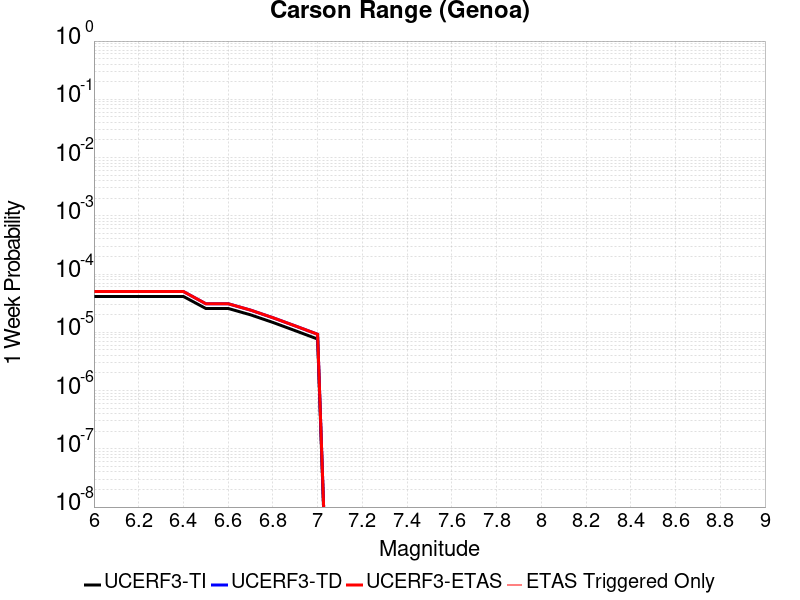 |  |  |  |

| Magnitude | 1 wk TI Prob | 1 wk TD Prob | 1 wk ETAS Prob | 1 wk ETAS/TD Gain | 1 wk ETAS Triggered Only | 1 mo TI Prob | 1 mo TD Prob | 1 mo ETAS Prob | 1 mo ETAS/TD Gain | 1 mo ETAS Triggered Only | 1 yr TI Prob | 1 yr TD Prob | 1 yr ETAS Prob | 1 yr ETAS/TD Gain | 1 yr ETAS Triggered Only | 10 yr TI Prob | 10 yr TD Prob | 10 yr ETAS Prob | 10 yr ETAS/TD Gain | 10 yr ETAS Triggered Only |
|-----|-----|-----|-----|-----|-----|-----|-----|-----|-----|-----|-----|-----|-----|-----|-----|-----|-----|-----|-----|-----|
| 6.0 | 4.1268457E-5 | 5.014809E-5 | 5.014809E-5 | 1.0 | 0.0 | 1.7685282E-4 | 2.1490493E-4 | 2.1490493E-4 | 1.0 | 0.0 | 0.0021510567 | 0.0026137219 | 0.0026236956 | 1.003816 | 1.0E-5 | 0.02130354 | 0.025869478 | 0.02587922 | 1.0003766 | 1.0E-5 |
| 6.1 | 4.1268457E-5 | 5.014809E-5 | 5.014809E-5 | 1.0 | 0.0 | 1.7685282E-4 | 2.1490493E-4 | 2.1490493E-4 | 1.0 | 0.0 | 0.0021510567 | 0.0026137219 | 0.0026236956 | 1.003816 | 1.0E-5 | 0.02130354 | 0.025869478 | 0.02587922 | 1.0003766 | 1.0E-5 |
| 6.2 | 4.1268457E-5 | 5.014809E-5 | 5.014809E-5 | 1.0 | 0.0 | 1.7685282E-4 | 2.1490493E-4 | 2.1490493E-4 | 1.0 | 0.0 | 0.0021510567 | 0.0026137219 | 0.0026236956 | 1.003816 | 1.0E-5 | 0.02130354 | 0.025869478 | 0.02587922 | 1.0003766 | 1.0E-5 |
| 6.3 | 4.1268457E-5 | 5.014809E-5 | 5.014809E-5 | 1.0 | 0.0 | 1.7685282E-4 | 2.1490493E-4 | 2.1490493E-4 | 1.0 | 0.0 | 0.0021510567 | 0.0026137219 | 0.0026236956 | 1.003816 | 1.0E-5 | 0.02130354 | 0.025869478 | 0.02587922 | 1.0003766 | 1.0E-5 |
| 6.4 | 4.1268457E-5 | 5.014809E-5 | 5.014809E-5 | 1.0 | 0.0 | 1.7685282E-4 | 2.1490493E-4 | 2.1490493E-4 | 1.0 | 0.0 | 0.0021510567 | 0.0026137219 | 0.0026236956 | 1.003816 | 1.0E-5 | 0.02130354 | 0.025869478 | 0.02587922 | 1.0003766 | 1.0E-5 |
| 6.5 | 2.5677185E-5 | 3.0979012E-5 | 3.0979012E-5 | 1.0 | 0.0 | 1.1004044E-4 | 1.3276146E-4 | 1.3276146E-4 | 1.0 | 0.0 | 0.0013389189 | 0.0016153525 | 0.0016253364 | 1.0061806 | 1.0E-5 | 0.0133088045 | 0.016054027 | 0.016063867 | 1.0006129 | 1.0E-5 |
| 6.6 | 2.5677185E-5 | 3.0979012E-5 | 3.0979012E-5 | 1.0 | 0.0 | 1.1004044E-4 | 1.3276146E-4 | 1.3276146E-4 | 1.0 | 0.0 | 0.0013389189 | 0.0016153525 | 0.0016253364 | 1.0061806 | 1.0E-5 | 0.0133088045 | 0.016054027 | 0.016063867 | 1.0006129 | 1.0E-5 |
| 6.7 | 1.9969408E-5 | 2.4064026E-5 | 2.4064026E-5 | 1.0 | 0.0 | 8.558037E-5 | 1.03128325E-4 | 1.03128325E-4 | 1.0 | 0.0 | 0.0010414429 | 0.0012550177 | 0.0012650051 | 1.007958 | 1.0E-5 | 0.010365757 | 0.012494459 | 0.012504335 | 1.0007904 | 1.0E-5 |
| 6.8 | 1.4783156E-5 | 1.7817978E-5 | 1.7817978E-5 | 1.0 | 0.0 | 6.335485E-5 | 7.636126E-5 | 7.636126E-5 | 1.0 | 0.0 | 7.710722E-4 | 9.29432E-4 | 9.394227E-4 | 1.0107492 | 1.0E-5 | 0.0076840227 | 0.009268236 | 0.009278144 | 1.001069 | 1.0E-5 |
| 6.9 | 1.06660555E-5 | 1.2877325E-5 | 1.2877325E-5 | 1.0 | 0.0 | 4.5710865E-5 | 5.5188022E-5 | 5.5188022E-5 | 1.0 | 0.0 | 5.5638765E-4 | 6.718222E-4 | 6.818155E-4 | 1.0148749 | 1.0E-5 | 0.005549967 | 0.0067092115 | 0.0067191445 | 1.0014805 | 1.0E-5 |
| 7.0 | 7.664838E-6 | 9.258522E-6 | 9.258522E-6 | 1.0 | 0.0 | 3.2848893E-5 | 3.967938E-5 | 3.967938E-5 | 1.0 | 0.0 | 3.998619E-4 | 4.8309643E-4 | 4.930916E-4 | 1.0206898 | 1.0E-5 | 0.0039914316 | 0.004830962 | 0.004840914 | 1.0020599 | 1.0E-5 |

## Earthquake Valley (So Extension)
*[(top)](#table-of-contents)*

| 1 Week | 1 Month | 1 Year | 10 Year |
|-----|-----|-----|-----|
| 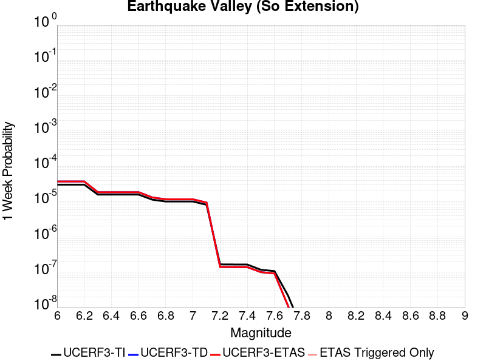 | 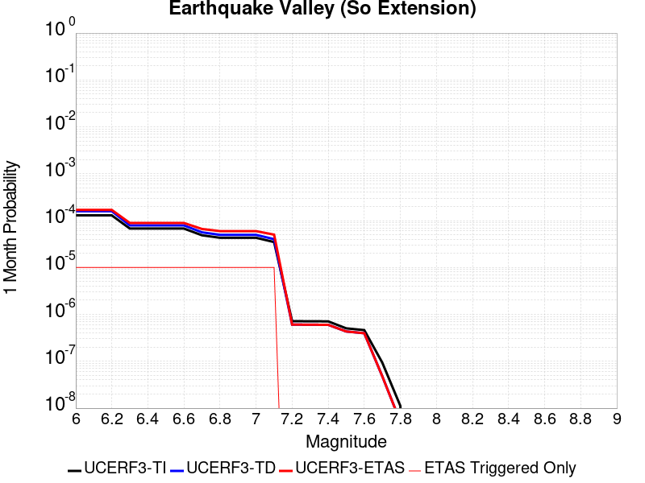 | 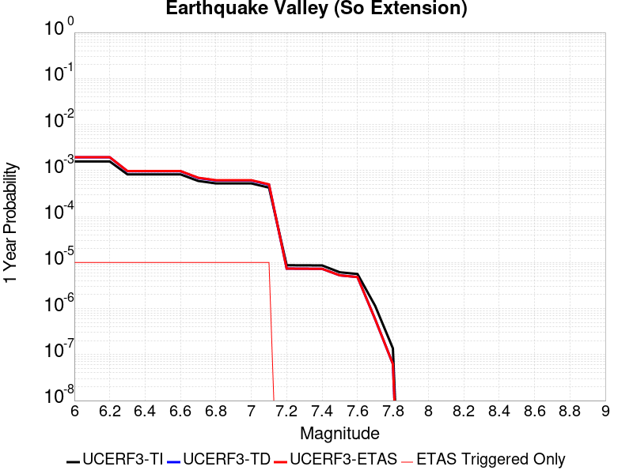 |  |

| Magnitude | 1 wk TI Prob | 1 wk TD Prob | 1 wk ETAS Prob | 1 wk ETAS/TD Gain | 1 wk ETAS Triggered Only | 1 mo TI Prob | 1 mo TD Prob | 1 mo ETAS Prob | 1 mo ETAS/TD Gain | 1 mo ETAS Triggered Only | 1 yr TI Prob | 1 yr TD Prob | 1 yr ETAS Prob | 1 yr ETAS/TD Gain | 1 yr ETAS Triggered Only | 10 yr TI Prob | 10 yr TD Prob | 10 yr ETAS Prob | 10 yr ETAS/TD Gain | 10 yr ETAS Triggered Only |
|-----|-----|-----|-----|-----|-----|-----|-----|-----|-----|-----|-----|-----|-----|-----|-----|-----|-----|-----|-----|-----|
| 6.0 | 3.0194888E-5 | 3.707305E-5 | 3.707305E-5 | 1.0 | 0.0 | 1.2940024E-4 | 1.5887788E-4 | 1.688763E-4 | 1.0629314 | 1.0E-5 | 0.0015743093 | 0.0019331372 | 0.0019431178 | 1.005163 | 1.0E-5 | 0.01563203 | 0.019213589 | 0.019223396 | 1.0005105 | 1.0E-5 |
| 6.1 | 3.0194888E-5 | 3.707305E-5 | 3.707305E-5 | 1.0 | 0.0 | 1.2940024E-4 | 1.5887788E-4 | 1.688763E-4 | 1.0629314 | 1.0E-5 | 0.0015743093 | 0.0019331372 | 0.0019431178 | 1.005163 | 1.0E-5 | 0.01563203 | 0.019213589 | 0.019223396 | 1.0005105 | 1.0E-5 |
| 6.2 | 3.0194888E-5 | 3.707305E-5 | 3.707305E-5 | 1.0 | 0.0 | 1.2940024E-4 | 1.5887788E-4 | 1.688763E-4 | 1.0629314 | 1.0E-5 | 0.0015743093 | 0.0019331372 | 0.0019431178 | 1.005163 | 1.0E-5 | 0.01563203 | 0.019213589 | 0.019223396 | 1.0005105 | 1.0E-5 |
| 6.3 | 1.5795305E-5 | 1.8446966E-5 | 1.8446966E-5 | 1.0 | 0.0 | 6.769241E-5 | 7.9056656E-5 | 8.9055866E-5 | 1.1264815 | 1.0E-5 | 8.238434E-4 | 9.6220075E-4 | 9.721911E-4 | 1.0103829 | 1.0E-5 | 0.008207959 | 0.009591246 | 0.009601151 | 1.0010326 | 1.0E-5 |
| 6.4 | 1.5795305E-5 | 1.8446966E-5 | 1.8446966E-5 | 1.0 | 0.0 | 6.769241E-5 | 7.9056656E-5 | 8.9055866E-5 | 1.1264815 | 1.0E-5 | 8.238434E-4 | 9.6220075E-4 | 9.721911E-4 | 1.0103829 | 1.0E-5 | 0.008207959 | 0.009591246 | 0.009601151 | 1.0010326 | 1.0E-5 |
| 6.5 | 1.5795305E-5 | 1.8446966E-5 | 1.8446966E-5 | 1.0 | 0.0 | 6.769241E-5 | 7.9056656E-5 | 8.9055866E-5 | 1.1264815 | 1.0E-5 | 8.238434E-4 | 9.6220075E-4 | 9.721911E-4 | 1.0103829 | 1.0E-5 | 0.008207959 | 0.009591246 | 0.009601151 | 1.0010326 | 1.0E-5 |
| 6.6 | 1.5795305E-5 | 1.8446966E-5 | 1.8446966E-5 | 1.0 | 0.0 | 6.769241E-5 | 7.9056656E-5 | 8.9055866E-5 | 1.1264815 | 1.0E-5 | 8.238434E-4 | 9.6220075E-4 | 9.721911E-4 | 1.0103829 | 1.0E-5 | 0.008207959 | 0.009591246 | 0.009601151 | 1.0010326 | 1.0E-5 |
| 6.7 | 1.1363076E-5 | 1.3138524E-5 | 1.3138524E-5 | 1.0 | 0.0 | 4.8697988E-5 | 5.6307174E-5 | 6.630661E-5 | 1.1775873 | 1.0E-5 | 5.927367E-4 | 6.8540033E-4 | 6.953935E-4 | 1.01458 | 1.0E-5 | 0.0059115817 | 0.0068403375 | 0.006850269 | 1.001452 | 1.0E-5 |
| 6.8 | 1.0049611E-5 | 1.1594533E-5 | 1.1594533E-5 | 1.0 | 0.0 | 4.306905E-5 | 4.9690323E-5 | 5.9689828E-5 | 1.2012364 | 1.0E-5 | 5.242395E-4 | 6.0488493E-4 | 6.148789E-4 | 1.016522 | 1.0E-5 | 0.0052300454 | 0.0060395617 | 0.0060495017 | 1.0016458 | 1.0E-5 |
| 6.9 | 1.0049611E-5 | 1.1594533E-5 | 1.1594533E-5 | 1.0 | 0.0 | 4.306905E-5 | 4.9690323E-5 | 5.9689828E-5 | 1.2012364 | 1.0E-5 | 5.242395E-4 | 6.0488493E-4 | 6.148789E-4 | 1.016522 | 1.0E-5 | 0.0052300454 | 0.0060395617 | 0.0060495017 | 1.0016458 | 1.0E-5 |
| 7.0 | 1.0049611E-5 | 1.1594533E-5 | 1.1594533E-5 | 1.0 | 0.0 | 4.306905E-5 | 4.9690323E-5 | 5.9689828E-5 | 1.2012364 | 1.0E-5 | 5.242395E-4 | 6.0488493E-4 | 6.148789E-4 | 1.016522 | 1.0E-5 | 0.0052300454 | 0.0060395617 | 0.0060495017 | 1.0016458 | 1.0E-5 |
| 7.1 | 8.140254E-6 | 9.383618E-6 | 9.383618E-6 | 1.0 | 0.0 | 3.4886336E-5 | 4.0215265E-5 | 5.021486E-5 | 1.2486517 | 1.0E-5 | 4.2465836E-4 | 4.8957794E-4 | 4.99573E-4 | 1.0204158 | 1.0E-5 | 0.0042384774 | 0.00489157 | 0.0049015214 | 1.0020343 | 1.0E-5 |
| 7.2 | 1.673835E-7 | 1.4153733E-7 | 1.4153733E-7 | 1.0 | 0.0 | 7.173577E-7 | 6.0658846E-7 | 6.0658846E-7 | 1.0 | 0.0 | 8.733795E-6 | 7.385193E-6 | 7.385193E-6 | 1.0 | 0.0 | 8.733451E-5 | 7.384983E-5 | 7.384983E-5 | 1.0 | 0.0 |
| 7.3 | 1.6632116E-7 | 1.405196E-7 | 1.405196E-7 | 1.0 | 0.0 | 7.1280476E-7 | 6.0222675E-7 | 6.0222675E-7 | 1.0 | 0.0 | 8.678364E-6 | 7.33209E-6 | 7.33209E-6 | 1.0 | 0.0 | 8.6780245E-5 | 7.3318835E-5 | 7.3318835E-5 | 1.0 | 0.0 |
| 7.4 | 1.6569169E-7 | 1.3996589E-7 | 1.3996589E-7 | 1.0 | 0.0 | 7.1010703E-7 | 5.998537E-7 | 5.998537E-7 | 1.0 | 0.0 | 8.645519E-6 | 7.303198E-6 | 7.303198E-6 | 1.0 | 0.0 | 8.645182E-5 | 7.3029936E-5 | 7.3029936E-5 | 1.0 | 0.0 |
| 7.5 | 1.1764555E-7 | 1.0095481E-7 | 1.0095481E-7 | 1.0 | 0.0 | 5.041951E-7 | 4.326634E-7 | 4.326634E-7 | 1.0 | 0.0 | 6.138558E-6 | 5.2676664E-6 | 5.2676664E-6 | 1.0 | 0.0 | 6.1383886E-5 | 5.267563E-5 | 5.267563E-5 | 1.0 | 0.0 |
| 7.6 | 1.07927605E-7 | 9.260269E-8 | 9.260269E-8 | 1.0 | 0.0 | 4.6254678E-7 | 3.9686864E-7 | 3.9686864E-7 | 1.0 | 0.0 | 5.6314925E-6 | 4.831867E-6 | 4.831867E-6 | 1.0 | 0.0 | 5.63135E-5 | 4.831783E-5 | 4.831783E-5 | 1.0 | 0.0 |
| 7.7 | 2.1826905E-8 | 1.1180209E-8 | 1.1180209E-8 | 1.0 | 0.0 | 9.3543875E-8 | 4.791518E-8 | 4.791518E-8 | 1.0 | 0.0 | 1.1388961E-6 | 5.8336724E-7 | 5.8336724E-7 | 1.0 | 0.0 | 1.1388902E-5 | 5.8336623E-6 | 5.8336623E-6 | 1.0 | 0.0 |
| 7.8 | 2.6169649E-9 | 1.1969155E-9 | 1.1969155E-9 | 1.0 | 0.0 | 1.1215564E-8 | 5.1296376E-9 | 5.1296376E-9 | 1.0 | 0.0 | 1.3654947E-7 | 6.245334E-8 | 6.245334E-8 | 1.0 | 0.0 | 1.365494E-6 | 6.2453336E-7 | 6.2453336E-7 | 1.0 | 0.0 |

## Blue Cut
*[(top)](#table-of-contents)*

| 1 Week | 1 Month | 1 Year | 10 Year |
|-----|-----|-----|-----|
|  |  |  | 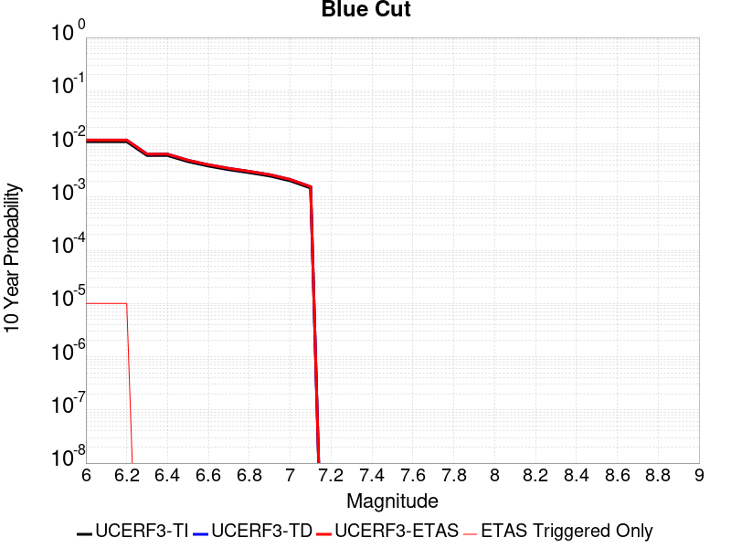 |

| Magnitude | 1 wk TI Prob | 1 wk TD Prob | 1 wk ETAS Prob | 1 wk ETAS/TD Gain | 1 wk ETAS Triggered Only | 1 mo TI Prob | 1 mo TD Prob | 1 mo ETAS Prob | 1 mo ETAS/TD Gain | 1 mo ETAS Triggered Only | 1 yr TI Prob | 1 yr TD Prob | 1 yr ETAS Prob | 1 yr ETAS/TD Gain | 1 yr ETAS Triggered Only | 10 yr TI Prob | 10 yr TD Prob | 10 yr ETAS Prob | 10 yr ETAS/TD Gain | 10 yr ETAS Triggered Only |
|-----|-----|-----|-----|-----|-----|-----|-----|-----|-----|-----|-----|-----|-----|-----|-----|-----|-----|-----|-----|-----|
| 6.0 | 2.1227985E-5 | 2.2719754E-5 | 2.2719754E-5 | 1.0 | 0.0 | 9.097391E-5 | 9.736707E-5 | 9.736707E-5 | 1.0 | 0.0 | 0.0011070445 | 0.0011848575 | 0.0011948455 | 1.0084299 | 1.0E-5 | 0.011015458 | 0.011791244 | 0.011801126 | 1.000838 | 1.0E-5 |
| 6.1 | 2.1227985E-5 | 2.2719754E-5 | 2.2719754E-5 | 1.0 | 0.0 | 9.097391E-5 | 9.736707E-5 | 9.736707E-5 | 1.0 | 0.0 | 0.0011070445 | 0.0011848575 | 0.0011948455 | 1.0084299 | 1.0E-5 | 0.011015458 | 0.011791244 | 0.011801126 | 1.000838 | 1.0E-5 |
| 6.2 | 2.1227985E-5 | 2.2719754E-5 | 2.2719754E-5 | 1.0 | 0.0 | 9.097391E-5 | 9.736707E-5 | 9.736707E-5 | 1.0 | 0.0 | 0.0011070445 | 0.0011848575 | 0.0011948455 | 1.0084299 | 1.0E-5 | 0.011015458 | 0.011791244 | 0.011801126 | 1.000838 | 1.0E-5 |
| 6.3 | 1.1613981E-5 | 1.235363E-5 | 1.235363E-5 | 1.0 | 0.0 | 4.9773254E-5 | 5.2943124E-5 | 5.2943124E-5 | 1.0 | 0.0 | 6.0582085E-4 | 6.444044E-4 | 6.444044E-4 | 1.0 | 0.0 | 0.0060417196 | 0.006426605 | 0.006426605 | 1.0 | 0.0 |
| 6.4 | 1.1613981E-5 | 1.235363E-5 | 1.235363E-5 | 1.0 | 0.0 | 4.9773254E-5 | 5.2943124E-5 | 5.2943124E-5 | 1.0 | 0.0 | 6.0582085E-4 | 6.444044E-4 | 6.444044E-4 | 1.0 | 0.0 | 0.0060417196 | 0.006426605 | 0.006426605 | 1.0 | 0.0 |
| 6.5 | 8.931326E-6 | 9.481665E-6 | 9.481665E-6 | 1.0 | 0.0 | 3.8276554E-5 | 4.0635125E-5 | 4.0635125E-5 | 1.0 | 0.0 | 4.6591737E-4 | 4.946295E-4 | 4.946295E-4 | 1.0 | 0.0 | 0.0046494175 | 0.004936195 | 0.004936195 | 1.0 | 0.0 |
| 6.6 | 7.345353E-6 | 7.790332E-6 | 7.790332E-6 | 1.0 | 0.0 | 3.1479703E-5 | 3.3386754E-5 | 3.3386754E-5 | 1.0 | 0.0 | 3.83198E-4 | 4.0641593E-4 | 4.0641593E-4 | 1.0 | 0.0 | 0.0038253788 | 0.004057518 | 0.004057518 | 1.0 | 0.0 |
| 6.7 | 6.2775666E-6 | 6.655194E-6 | 6.655194E-6 | 1.0 | 0.0 | 2.690358E-5 | 2.852199E-5 | 2.852199E-5 | 1.0 | 0.0 | 3.2750185E-4 | 3.4720742E-4 | 3.4720742E-4 | 1.0 | 0.0 | 0.0032701963 | 0.0034673903 | 0.0034673903 | 1.0 | 0.0 |
| 6.8 | 5.5234095E-6 | 5.8551504E-6 | 5.8551504E-6 | 1.0 | 0.0 | 2.367154E-5 | 2.5093303E-5 | 2.5093303E-5 | 1.0 | 0.0 | 2.8816288E-4 | 3.054754E-4 | 3.054754E-4 | 1.0 | 0.0 | 0.002877895 | 0.003051271 | 0.003051271 | 1.0 | 0.0 |
| 6.9 | 4.7780054E-6 | 5.0654544E-6 | 5.0654544E-6 | 1.0 | 0.0 | 2.0477004E-5 | 2.1708951E-5 | 2.1708951E-5 | 1.0 | 0.0 | 2.4927902E-4 | 2.6428147E-4 | 2.6428147E-4 | 1.0 | 0.0 | 0.0024899957 | 0.0026403638 | 0.0026403638 | 1.0 | 0.0 |
| 7.0 | 3.883171E-6 | 4.118515E-6 | 4.118515E-6 | 1.0 | 0.0 | 1.6642054E-5 | 1.7650698E-5 | 1.7650698E-5 | 1.0 | 0.0 | 2.0259817E-4 | 2.1488295E-4 | 2.1488295E-4 | 1.0 | 0.0 | 0.0020241356 | 0.0021474273 | 0.0021474273 | 1.0 | 0.0 |
| 7.1 | 2.8358215E-6 | 3.0097365E-6 | 3.0097365E-6 | 1.0 | 0.0 | 1.2153464E-5 | 1.2898844E-5 | 1.2898844E-5 | 1.0 | 0.0 | 1.4795837E-4 | 1.570387E-4 | 1.570387E-4 | 1.0 | 0.0 | 0.001478599 | 0.0015699224 | 0.0015699224 | 1.0 | 0.0 |

## Butano 2011 CFM
*[(top)](#table-of-contents)*

| 1 Week | 1 Month | 1 Year | 10 Year |
|-----|-----|-----|-----|
| 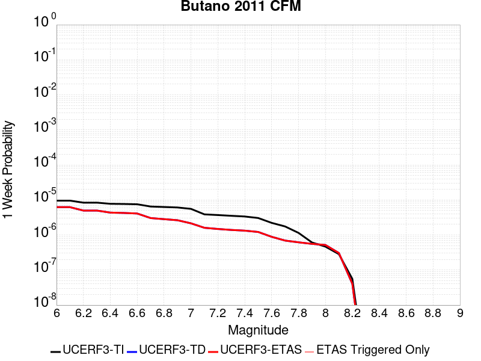 | 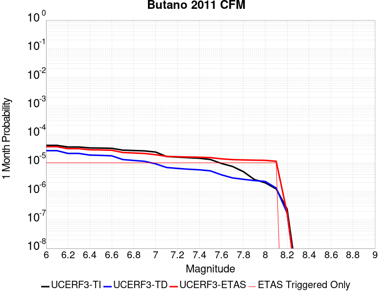 |  |  |

| Magnitude | 1 wk TI Prob | 1 wk TD Prob | 1 wk ETAS Prob | 1 wk ETAS/TD Gain | 1 wk ETAS Triggered Only | 1 mo TI Prob | 1 mo TD Prob | 1 mo ETAS Prob | 1 mo ETAS/TD Gain | 1 mo ETAS Triggered Only | 1 yr TI Prob | 1 yr TD Prob | 1 yr ETAS Prob | 1 yr ETAS/TD Gain | 1 yr ETAS Triggered Only | 10 yr TI Prob | 10 yr TD Prob | 10 yr ETAS Prob | 10 yr ETAS/TD Gain | 10 yr ETAS Triggered Only |
|-----|-----|-----|-----|-----|-----|-----|-----|-----|-----|-----|-----|-----|-----|-----|-----|-----|-----|-----|-----|-----|
| 6.0 | 9.561135E-6 | 6.2262725E-6 | 6.2262725E-6 | 1.0 | 0.0 | 4.097565E-5 | 2.6683763E-5 | 3.6683497E-5 | 1.3747498 | 1.0E-5 | 4.9876433E-4 | 3.248286E-4 | 3.3482534E-4 | 1.0307754 | 1.0E-5 | 0.004976464 | 0.003261198 | 0.0032711655 | 1.0030564 | 1.0E-5 |
| 6.1 | 9.561135E-6 | 6.2262725E-6 | 6.2262725E-6 | 1.0 | 0.0 | 4.097565E-5 | 2.6683763E-5 | 3.6683497E-5 | 1.3747498 | 1.0E-5 | 4.9876433E-4 | 3.248286E-4 | 3.3482534E-4 | 1.0307754 | 1.0E-5 | 0.004976464 | 0.003261198 | 0.0032711655 | 1.0030564 | 1.0E-5 |
| 6.2 | 8.364741E-6 | 4.9793516E-6 | 4.9793516E-6 | 1.0 | 0.0 | 3.5848396E-5 | 2.1339913E-5 | 3.13397E-5 | 1.4685955 | 1.0E-5 | 4.3636683E-4 | 2.5978405E-4 | 2.6978145E-4 | 1.0384835 | 1.0E-5 | 0.0043551093 | 0.0026124115 | 0.0026223855 | 1.0038179 | 1.0E-5 |
| 6.3 | 8.364741E-6 | 4.9793516E-6 | 4.9793516E-6 | 1.0 | 0.0 | 3.5848396E-5 | 2.1339913E-5 | 3.13397E-5 | 1.4685955 | 1.0E-5 | 4.3636683E-4 | 2.5978405E-4 | 2.6978145E-4 | 1.0384835 | 1.0E-5 | 0.0043551093 | 0.0026124115 | 0.0026223855 | 1.0038179 | 1.0E-5 |
| 6.4 | 7.768282E-6 | 4.3572963E-6 | 4.3572963E-6 | 1.0 | 0.0 | 3.329221E-5 | 1.8674002E-5 | 2.8673814E-5 | 1.5354939 | 1.0E-5 | 4.0525728E-4 | 2.2733361E-4 | 2.3733135E-4 | 1.0439782 | 1.0E-5 | 0.0040451903 | 0.0022886035 | 0.0022985805 | 1.0043595 | 1.0E-5 |
| 6.5 | 7.673437E-6 | 4.256859E-6 | 4.256859E-6 | 1.0 | 0.0 | 3.2885746E-5 | 1.8243561E-5 | 2.824338E-5 | 1.5481286 | 1.0E-5 | 4.0031038E-4 | 2.2209407E-4 | 2.3209184E-4 | 1.0450159 | 1.0E-5 | 0.0039959005 | 0.0022363134 | 0.0022462911 | 1.0044616 | 1.0E-5 |
| 6.6 | 7.5244197E-6 | 4.101821E-6 | 4.101821E-6 | 1.0 | 0.0 | 3.2247113E-5 | 1.7579123E-5 | 2.7578946E-5 | 1.5688466 | 1.0E-5 | 3.9253788E-4 | 2.1400614E-4 | 2.24004E-4 | 1.0467176 | 1.0E-5 | 0.003918452 | 0.0021555931 | 0.0021655716 | 1.0046291 | 1.0E-5 |
| 6.7 | 6.4921405E-6 | 3.0418794E-6 | 3.0418794E-6 | 1.0 | 0.0 | 2.7823162E-5 | 1.3036561E-5 | 2.3036431E-5 | 1.7670635 | 1.0E-5 | 3.3869434E-4 | 1.5870866E-4 | 1.6870706E-4 | 1.0629985 | 1.0E-5 | 0.003381786 | 0.0016034318 | 0.0016134158 | 1.0062267 | 1.0E-5 |
| 6.8 | 6.2890294E-6 | 2.828644E-6 | 2.828644E-6 | 1.0 | 0.0 | 2.6952705E-5 | 1.2122703E-5 | 2.2122582E-5 | 1.8248885 | 1.0E-5 | 3.2809976E-4 | 1.47584E-4 | 1.5758252E-4 | 1.0677481 | 1.0E-5 | 0.0032761577 | 0.0014923397 | 0.0015023247 | 1.0066909 | 1.0E-5 |
| 6.9 | 6.0965517E-6 | 2.6351538E-6 | 2.6351538E-6 | 1.0 | 0.0 | 2.6127816E-5 | 1.1293468E-5 | 2.1293354E-5 | 1.8854576 | 1.0E-5 | 3.1805973E-4 | 1.3748936E-4 | 1.4748798E-4 | 1.0727229 | 1.0E-5 | 0.0031760489 | 0.0013915232 | 0.0014015093 | 1.0071764 | 1.0E-5 |
| 7.0 | 5.566252E-6 | 2.1525575E-6 | 2.1525575E-6 | 1.0 | 0.0 | 2.3855147E-5 | 9.225213E-6 | 1.9225121E-5 | 2.0839758 | 1.0E-5 | 2.9039773E-4 | 1.1231122E-4 | 1.223101E-4 | 1.0890282 | 1.0E-5 | 0.0029001853 | 0.0011400221 | 0.0011500106 | 1.0087618 | 1.0E-5 |
| 7.1 | 3.878588E-6 | 1.6039226E-6 | 1.6039226E-6 | 1.0 | 0.0 | 1.6622414E-5 | 6.8739355E-6 | 1.6873866E-5 | 2.4547608 | 1.0E-5 | 2.023591E-4 | 8.368695E-5 | 9.368612E-5 | 1.119483 | 1.0E-5 | 0.0020217493 | 8.5363514E-4 | 8.636266E-4 | 1.0117046 | 1.0E-5 |
| 7.2 | 3.7038085E-6 | 1.4849785E-6 | 1.4849785E-6 | 1.0 | 0.0 | 1.587337E-5 | 6.364178E-6 | 1.6364114E-5 | 2.571285 | 1.0E-5 | 1.9324113E-4 | 7.748111E-5 | 8.748034E-5 | 1.1290537 | 1.0E-5 | 0.0019307317 | 7.9158944E-4 | 8.015815E-4 | 1.0126228 | 1.0E-5 |
| 7.3 | 3.5277278E-6 | 1.3930919E-6 | 1.3930919E-6 | 1.0 | 0.0 | 1.5118746E-5 | 5.9703802E-6 | 1.5970321E-5 | 2.6749253 | 1.0E-5 | 1.8405518E-4 | 7.2686955E-5 | 8.268623E-5 | 1.1375662 | 1.0E-5 | 0.0018390282 | 7.435932E-4 | 7.535858E-4 | 1.0134382 | 1.0E-5 |
| 7.4 | 3.3711294E-6 | 1.3303414E-6 | 1.3303414E-6 | 1.0 | 0.0 | 1.4447617E-5 | 5.701451E-6 | 1.5701393E-5 | 2.7539296 | 1.0E-5 | 1.7588554E-4 | 6.9412956E-5 | 7.941226E-5 | 1.1440554 | 1.0E-5 | 0.0017574639 | 7.10823E-4 | 7.2081585E-4 | 1.0140582 | 1.0E-5 |
| 7.5 | 3.0496426E-6 | 1.2193273E-6 | 1.2193273E-6 | 1.0 | 0.0 | 1.3069831E-5 | 5.2256773E-6 | 1.5225625E-5 | 2.9136174 | 1.0E-5 | 1.5911358E-4 | 6.362077E-5 | 7.362013E-5 | 1.1571714 | 1.0E-5 | 0.001589997 | 6.5287045E-4 | 6.628639E-4 | 1.015307 | 1.0E-5 |
| 7.6 | 2.2179781E-6 | 8.8747555E-7 | 8.8747555E-7 | 1.0 | 0.0 | 9.505586E-6 | 3.803461E-6 | 1.3803423E-5 | 3.6291745 | 1.0E-5 | 1.1572436E-4 | 4.630615E-5 | 5.630569E-5 | 1.215944 | 1.0E-5 | 0.0011566412 | 4.7970464E-4 | 4.896998E-4 | 1.0208361 | 1.0E-5 |
| 7.7 | 1.7519328E-6 | 6.934447E-7 | 6.934447E-7 | 1.0 | 0.0 | 7.508262E-6 | 2.9719024E-6 | 1.2971873E-5 | 4.364838 | 1.0E-5 | 9.140925E-5 | 3.618231E-5 | 4.618195E-5 | 1.2763681 | 1.0E-5 | 9.137166E-4 | 3.777684E-4 | 3.877646E-4 | 1.0264612 | 1.0E-5 |
| 7.8 | 1.1478974E-6 | 6.177445E-7 | 6.177445E-7 | 1.0 | 0.0 | 4.9195505E-6 | 2.6474738E-6 | 1.2647447E-5 | 4.777176 | 1.0E-5 | 5.9893882E-5 | 3.2232514E-5 | 4.2232194E-5 | 1.3102357 | 1.0E-5 | 5.9877743E-4 | 3.3795164E-4 | 3.4794828E-4 | 1.02958 | 1.0E-5 |
| 7.9 | 6.1154634E-7 | 5.58492E-7 | 5.58492E-7 | 1.0 | 0.0 | 2.6209104E-6 | 2.393535E-6 | 1.23935115E-5 | 5.177911 | 1.0E-5 | 3.1909116E-5 | 2.9140898E-5 | 3.9140607E-5 | 1.3431504 | 1.0E-5 | 3.1904536E-4 | 3.0580413E-4 | 3.1580107E-4 | 1.0326906 | 1.0E-5 |
| 8.0 | 4.6520046E-7 | 5.1922416E-7 | 5.1922416E-7 | 1.0 | 0.0 | 1.9937147E-6 | 2.2252443E-6 | 1.2225222E-5 | 5.4938784 | 1.0E-5 | 2.4273206E-5 | 2.7092014E-5 | 3.7091744E-5 | 1.3691025 | 1.0E-5 | 2.4270554E-4 | 2.8434623E-4 | 2.943434E-4 | 1.0351584 | 1.0E-5 |
| 8.1 | 2.8425194E-7 | 3.0586608E-7 | 3.0586608E-7 | 1.0 | 0.0 | 1.218222E-6 | 1.310854E-6 | 1.1310841E-5 | 8.628605 | 1.0E-5 | 1.4831752E-5 | 1.5959531E-5 | 2.595937E-5 | 1.6265749 | 1.0E-5 | 1.4830762E-4 | 1.6748912E-4 | 1.7748745E-4 | 1.0596954 | 1.0E-5 |
| 8.2 | 5.585778E-8 | 4.0545537E-8 | 4.0545537E-8 | 1.0 | 0.0 | 2.3939046E-7 | 1.7376658E-7 | 1.7376658E-7 | 1.0 | 0.0 | 2.914575E-6 | 2.1156059E-6 | 2.1156059E-6 | 1.0 | 0.0 | 2.9145367E-5 | 2.2988084E-5 | 2.2988084E-5 | 1.0 | 0.0 |
| 8.3 | 1.0371215E-10 | 5.3592242E-11 | 5.3592242E-11 | 1.0 | 0.0 | 4.4448079E-10 | 2.2968139E-10 | 2.2968139E-10 | 1.0 | 0.0 | 5.4115543E-9 | 2.7963716E-9 | 2.7963716E-9 | 1.0 | 0.0 | 5.4115542E-8 | 3.217334E-8 | 3.217334E-8 | 1.0 | 0.0 |

## Big Lagoon - Bald Mtn 2011 CFM
*[(top)](#table-of-contents)*

| 1 Week | 1 Month | 1 Year | 10 Year |
|-----|-----|-----|-----|
|  | 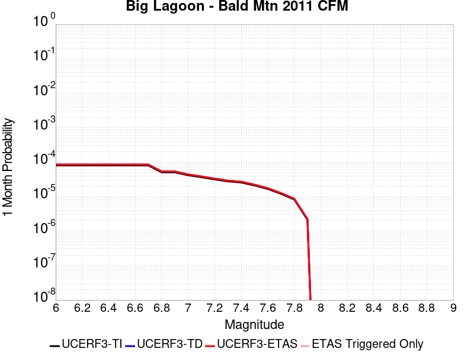 |  | 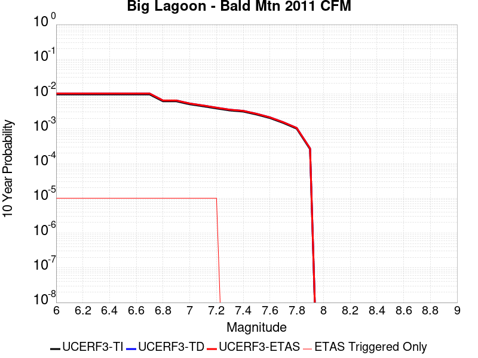 |

| Magnitude | 1 wk TI Prob | 1 wk TD Prob | 1 wk ETAS Prob | 1 wk ETAS/TD Gain | 1 wk ETAS Triggered Only | 1 mo TI Prob | 1 mo TD Prob | 1 mo ETAS Prob | 1 mo ETAS/TD Gain | 1 mo ETAS Triggered Only | 1 yr TI Prob | 1 yr TD Prob | 1 yr ETAS Prob | 1 yr ETAS/TD Gain | 1 yr ETAS Triggered Only | 10 yr TI Prob | 10 yr TD Prob | 10 yr ETAS Prob | 10 yr ETAS/TD Gain | 10 yr ETAS Triggered Only |
|-----|-----|-----|-----|-----|-----|-----|-----|-----|-----|-----|-----|-----|-----|-----|-----|-----|-----|-----|-----|-----|
| 6.0 | 1.8699735E-5 | 1.9850318E-5 | 1.9850318E-5 | 1.0 | 0.0 | 8.013926E-5 | 8.507023E-5 | 8.507023E-5 | 1.0 | 0.0 | 9.752587E-4 | 0.0010352758 | 0.0010352758 | 1.0 | 0.0 | 0.009709897 | 0.010308345 | 0.010318242 | 1.0009601 | 1.0E-5 |
| 6.1 | 1.8699735E-5 | 1.9850318E-5 | 1.9850318E-5 | 1.0 | 0.0 | 8.013926E-5 | 8.507023E-5 | 8.507023E-5 | 1.0 | 0.0 | 9.752587E-4 | 0.0010352758 | 0.0010352758 | 1.0 | 0.0 | 0.009709897 | 0.010308345 | 0.010318242 | 1.0009601 | 1.0E-5 |
| 6.2 | 1.8699735E-5 | 1.9850318E-5 | 1.9850318E-5 | 1.0 | 0.0 | 8.013926E-5 | 8.507023E-5 | 8.507023E-5 | 1.0 | 0.0 | 9.752587E-4 | 0.0010352758 | 0.0010352758 | 1.0 | 0.0 | 0.009709897 | 0.010308345 | 0.010318242 | 1.0009601 | 1.0E-5 |
| 6.3 | 1.8699735E-5 | 1.9850318E-5 | 1.9850318E-5 | 1.0 | 0.0 | 8.013926E-5 | 8.507023E-5 | 8.507023E-5 | 1.0 | 0.0 | 9.752587E-4 | 0.0010352758 | 0.0010352758 | 1.0 | 0.0 | 0.009709897 | 0.010308345 | 0.010318242 | 1.0009601 | 1.0E-5 |
| 6.4 | 1.8699735E-5 | 1.9850318E-5 | 1.9850318E-5 | 1.0 | 0.0 | 8.013926E-5 | 8.507023E-5 | 8.507023E-5 | 1.0 | 0.0 | 9.752587E-4 | 0.0010352758 | 0.0010352758 | 1.0 | 0.0 | 0.009709897 | 0.010308345 | 0.010318242 | 1.0009601 | 1.0E-5 |
| 6.5 | 1.8699735E-5 | 1.9850318E-5 | 1.9850318E-5 | 1.0 | 0.0 | 8.013926E-5 | 8.507023E-5 | 8.507023E-5 | 1.0 | 0.0 | 9.752587E-4 | 0.0010352758 | 0.0010352758 | 1.0 | 0.0 | 0.009709897 | 0.010308345 | 0.010318242 | 1.0009601 | 1.0E-5 |
| 6.6 | 1.8699735E-5 | 1.9850318E-5 | 1.9850318E-5 | 1.0 | 0.0 | 8.013926E-5 | 8.507023E-5 | 8.507023E-5 | 1.0 | 0.0 | 9.752587E-4 | 0.0010352758 | 0.0010352758 | 1.0 | 0.0 | 0.009709897 | 0.010308345 | 0.010318242 | 1.0009601 | 1.0E-5 |
| 6.7 | 1.8699735E-5 | 1.9850318E-5 | 1.9850318E-5 | 1.0 | 0.0 | 8.013926E-5 | 8.507023E-5 | 8.507023E-5 | 1.0 | 0.0 | 9.752587E-4 | 0.0010352758 | 0.0010352758 | 1.0 | 0.0 | 0.009709897 | 0.010308345 | 0.010318242 | 1.0009601 | 1.0E-5 |
| 6.8 | 1.18505095E-5 | 1.24998805E-5 | 1.24998805E-5 | 1.0 | 0.0 | 5.078691E-5 | 5.3569845E-5 | 5.3569845E-5 | 1.0 | 0.0 | 6.181552E-4 | 6.520225E-4 | 6.520225E-4 | 1.0 | 0.0 | 0.006164385 | 0.0065015987 | 0.0065115336 | 1.001528 | 1.0E-5 |
| 6.9 | 1.18505095E-5 | 1.24998805E-5 | 1.24998805E-5 | 1.0 | 0.0 | 5.078691E-5 | 5.3569845E-5 | 5.3569845E-5 | 1.0 | 0.0 | 6.181552E-4 | 6.520225E-4 | 6.520225E-4 | 1.0 | 0.0 | 0.006164385 | 0.0065015987 | 0.0065115336 | 1.001528 | 1.0E-5 |
| 7.0 | 9.719786E-6 | 1.0235548E-5 | 1.0235548E-5 | 1.0 | 0.0 | 4.1655563E-5 | 4.386591E-5 | 4.386591E-5 | 1.0 | 0.0 | 5.0703844E-4 | 5.3393893E-4 | 5.3393893E-4 | 1.0 | 0.0 | 0.005058831 | 0.005326807 | 0.005336754 | 1.0018673 | 1.0E-5 |
| 7.1 | 8.523418E-6 | 8.969516E-6 | 8.969516E-6 | 1.0 | 0.0 | 3.652842E-5 | 3.8440226E-5 | 3.8440226E-5 | 1.0 | 0.0 | 4.4464276E-4 | 4.679108E-4 | 4.679108E-4 | 1.0 | 0.0 | 0.0044375416 | 0.0046694195 | 0.004679373 | 1.0021316 | 1.0E-5 |
| 7.2 | 7.378894E-6 | 7.761158E-6 | 7.761158E-6 | 1.0 | 0.0 | 3.162345E-5 | 3.3261684E-5 | 3.3261684E-5 | 1.0 | 0.0 | 3.8494746E-4 | 4.0488664E-4 | 4.0488664E-4 | 1.0 | 0.0 | 0.0038428132 | 0.0040415856 | 0.004051545 | 1.0024643 | 1.0E-5 |
| 7.3 | 6.4640294E-6 | 6.792482E-6 | 6.792482E-6 | 1.0 | 0.0 | 2.7702688E-5 | 2.9110317E-5 | 2.9110317E-5 | 1.0 | 0.0 | 3.3722803E-4 | 3.5436114E-4 | 3.5436114E-4 | 1.0 | 0.0 | 0.0033671674 | 0.003538031 | 0.003538031 | 1.0 | 0.0 |
| 7.4 | 5.9959093E-6 | 6.2988356E-6 | 6.2988356E-6 | 1.0 | 0.0 | 2.5696501E-5 | 2.6994734E-5 | 2.6994734E-5 | 1.0 | 0.0 | 3.1280998E-4 | 3.286119E-4 | 3.286119E-4 | 1.0 | 0.0 | 0.0031237002 | 0.003281322 | 0.003281322 | 1.0 | 0.0 |
| 7.5 | 4.929265E-6 | 5.176425E-6 | 5.176425E-6 | 1.0 | 0.0 | 2.112525E-5 | 2.2184493E-5 | 2.2184493E-5 | 1.0 | 0.0 | 2.5716957E-4 | 2.7006312E-4 | 2.7006312E-4 | 1.0 | 0.0 | 0.0025687215 | 0.0026973898 | 0.0026973898 | 1.0 | 0.0 |
| 7.6 | 3.8982403E-6 | 4.088949E-6 | 4.088949E-6 | 1.0 | 0.0 | 1.6706637E-5 | 1.7523951E-5 | 1.7523951E-5 | 1.0 | 0.0 | 2.0338432E-4 | 2.133335E-4 | 2.133335E-4 | 1.0 | 0.0 | 0.0020319829 | 0.0021313147 | 0.0021313147 | 1.0 | 0.0 |
| 7.7 | 2.820968E-6 | 2.9572277E-6 | 2.9572277E-6 | 1.0 | 0.0 | 1.2089806E-5 | 1.2673772E-5 | 1.2673772E-5 | 1.0 | 0.0 | 1.4718344E-4 | 1.5429243E-4 | 1.5429243E-4 | 1.0 | 0.0 | 0.00147086 | 0.0015418708 | 0.0015418708 | 1.0 | 0.0 |
| 7.8 | 1.9314455E-6 | 2.0260295E-6 | 2.0260295E-6 | 1.0 | 0.0 | 8.277597E-6 | 8.682956E-6 | 8.682956E-6 | 1.0 | 0.0 | 1.0077508E-4 | 1.0570999E-4 | 1.0570999E-4 | 1.0 | 0.0 | 0.0010072939 | 0.0010566099 | 0.0010566099 | 1.0 | 0.0 |
| 7.9 | 4.9586197E-7 | 5.218952E-7 | 5.218952E-7 | 1.0 | 0.0 | 2.125121E-6 | 2.236692E-6 | 2.236692E-6 | 1.0 | 0.0 | 2.5873042E-5 | 2.7231405E-5 | 2.7231405E-5 | 1.0 | 0.0 | 2.5870028E-4 | 2.7228278E-4 | 2.7228278E-4 | 1.0 | 0.0 |

## Hartley Springs 2011 CFM
*[(top)](#table-of-contents)*

| 1 Week | 1 Month | 1 Year | 10 Year |
|-----|-----|-----|-----|
|  |  |  | 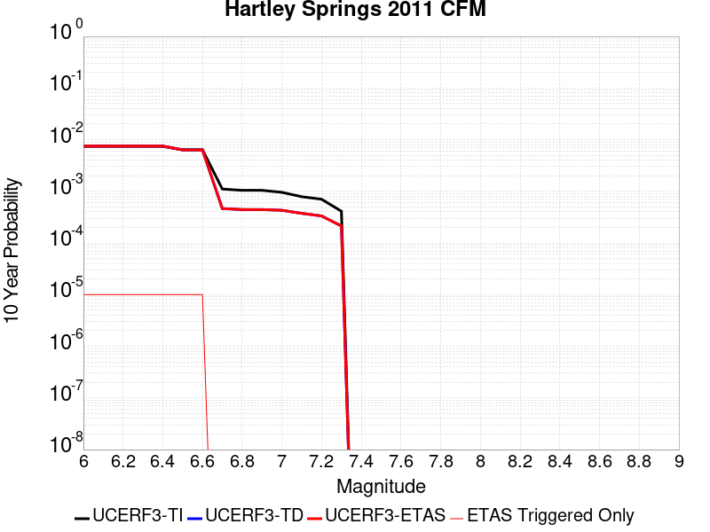 |

| Magnitude | 1 wk TI Prob | 1 wk TD Prob | 1 wk ETAS Prob | 1 wk ETAS/TD Gain | 1 wk ETAS Triggered Only | 1 mo TI Prob | 1 mo TD Prob | 1 mo ETAS Prob | 1 mo ETAS/TD Gain | 1 mo ETAS Triggered Only | 1 yr TI Prob | 1 yr TD Prob | 1 yr ETAS Prob | 1 yr ETAS/TD Gain | 1 yr ETAS Triggered Only | 10 yr TI Prob | 10 yr TD Prob | 10 yr ETAS Prob | 10 yr ETAS/TD Gain | 10 yr ETAS Triggered Only |
|-----|-----|-----|-----|-----|-----|-----|-----|-----|-----|-----|-----|-----|-----|-----|-----|-----|-----|-----|-----|-----|
| 6.0 | 1.4352418E-5 | 1.4434315E-5 | 1.4434315E-5 | 1.0 | 0.0 | 6.1508916E-5 | 6.186081E-5 | 7.186019E-5 | 1.1616433 | 1.0E-5 | 7.486137E-4 | 7.5305946E-4 | 7.6305197E-4 | 1.0132692 | 1.0E-5 | 0.007460968 | 0.0075211977 | 0.007531123 | 1.0013195 | 1.0E-5 |
| 6.1 | 1.4352418E-5 | 1.4434315E-5 | 1.4434315E-5 | 1.0 | 0.0 | 6.1508916E-5 | 6.186081E-5 | 7.186019E-5 | 1.1616433 | 1.0E-5 | 7.486137E-4 | 7.5305946E-4 | 7.6305197E-4 | 1.0132692 | 1.0E-5 | 0.007460968 | 0.0075211977 | 0.007531123 | 1.0013195 | 1.0E-5 |
| 6.2 | 1.4352418E-5 | 1.4434315E-5 | 1.4434315E-5 | 1.0 | 0.0 | 6.1508916E-5 | 6.186081E-5 | 7.186019E-5 | 1.1616433 | 1.0E-5 | 7.486137E-4 | 7.5305946E-4 | 7.6305197E-4 | 1.0132692 | 1.0E-5 | 0.007460968 | 0.0075211977 | 0.007531123 | 1.0013195 | 1.0E-5 |
| 6.3 | 1.4352418E-5 | 1.4434315E-5 | 1.4434315E-5 | 1.0 | 0.0 | 6.1508916E-5 | 6.186081E-5 | 7.186019E-5 | 1.1616433 | 1.0E-5 | 7.486137E-4 | 7.5305946E-4 | 7.6305197E-4 | 1.0132692 | 1.0E-5 | 0.007460968 | 0.0075211977 | 0.007531123 | 1.0013195 | 1.0E-5 |
| 6.4 | 1.4352418E-5 | 1.4434315E-5 | 1.4434315E-5 | 1.0 | 0.0 | 6.1508916E-5 | 6.186081E-5 | 7.186019E-5 | 1.1616433 | 1.0E-5 | 7.486137E-4 | 7.5305946E-4 | 7.6305197E-4 | 1.0132692 | 1.0E-5 | 0.007460968 | 0.0075211977 | 0.007531123 | 1.0013195 | 1.0E-5 |
| 6.5 | 1.2279858E-5 | 1.2133211E-5 | 1.2133211E-5 | 1.0 | 0.0 | 5.26269E-5 | 5.199933E-5 | 6.199881E-5 | 1.1923002 | 1.0E-5 | 6.4054417E-4 | 6.330661E-4 | 6.430598E-4 | 1.0157862 | 1.0E-5 | 0.0063870098 | 0.0063281395 | 0.006338076 | 1.0015702 | 1.0E-5 |
| 6.6 | 1.2279858E-5 | 1.2133211E-5 | 1.2133211E-5 | 1.0 | 0.0 | 5.26269E-5 | 5.199933E-5 | 6.199881E-5 | 1.1923002 | 1.0E-5 | 6.4054417E-4 | 6.330661E-4 | 6.430598E-4 | 1.0157862 | 1.0E-5 | 0.0063870098 | 0.0063281395 | 0.006338076 | 1.0015702 | 1.0E-5 |
| 6.7 | 2.1282601E-6 | 8.894527E-7 | 8.894527E-7 | 1.0 | 0.0 | 9.121083E-6 | 3.811936E-6 | 3.811936E-6 | 1.0 | 0.0 | 1.11043526E-4 | 4.640959E-5 | 4.640959E-5 | 1.0 | 0.0 | 0.0011098806 | 4.640243E-4 | 4.640243E-4 | 1.0 | 0.0 |
| 6.8 | 2.00516E-6 | 8.517304E-7 | 8.517304E-7 | 1.0 | 0.0 | 8.593515E-6 | 3.6502697E-6 | 3.6502697E-6 | 1.0 | 0.0 | 1.04621024E-4 | 4.444138E-5 | 4.444138E-5 | 1.0 | 0.0 | 0.0010457177 | 4.443501E-4 | 4.443501E-4 | 1.0 | 0.0 |
| 6.9 | 2.00516E-6 | 8.517304E-7 | 8.517304E-7 | 1.0 | 0.0 | 8.593515E-6 | 3.6502697E-6 | 3.6502697E-6 | 1.0 | 0.0 | 1.04621024E-4 | 4.444138E-5 | 4.444138E-5 | 1.0 | 0.0 | 0.0010457177 | 4.443501E-4 | 4.443501E-4 | 1.0 | 0.0 |
| 7.0 | 1.8366732E-6 | 8.237025E-7 | 8.237025E-7 | 1.0 | 0.0 | 7.871433E-6 | 3.5301503E-6 | 3.5301503E-6 | 1.0 | 0.0 | 9.583048E-5 | 4.2978987E-5 | 4.2978987E-5 | 1.0 | 0.0 | 9.5789164E-4 | 4.297318E-4 | 4.297318E-4 | 1.0 | 0.0 |
| 7.1 | 1.5097997E-6 | 7.189995E-7 | 7.189995E-7 | 1.0 | 0.0 | 6.470554E-6 | 3.0814242E-6 | 3.0814242E-6 | 1.0 | 0.0 | 7.877615E-5 | 3.7515936E-5 | 3.7515936E-5 | 1.0 | 0.0 | 7.874823E-4 | 3.7511974E-4 | 3.7511974E-4 | 1.0 | 0.0 |
| 7.2 | 1.3490993E-6 | 6.405045E-7 | 6.405045E-7 | 1.0 | 0.0 | 5.7818415E-6 | 2.7450176E-6 | 2.7450176E-6 | 1.0 | 0.0 | 7.0391645E-5 | 3.342031E-5 | 3.342031E-5 | 1.0 | 0.0 | 7.0369354E-4 | 3.341758E-4 | 3.341758E-4 | 1.0 | 0.0 |
| 7.3 | 7.900015E-7 | 4.0890467E-7 | 4.0890467E-7 | 1.0 | 0.0 | 3.3857161E-6 | 1.7524486E-6 | 1.7524486E-6 | 1.0 | 0.0 | 4.1220315E-5 | 2.1336062E-5 | 2.1336062E-5 | 1.0 | 0.0 | 4.121267E-4 | 2.1336062E-4 | 2.1336062E-4 | 1.0 | 0.0 |

## Likely 2011 CFM
*[(top)](#table-of-contents)*

| 1 Week | 1 Month | 1 Year | 10 Year |
|-----|-----|-----|-----|
|  | 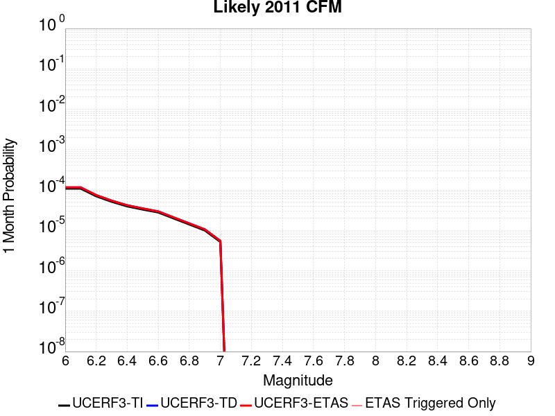 |  |  |

| Magnitude | 1 wk TI Prob | 1 wk TD Prob | 1 wk ETAS Prob | 1 wk ETAS/TD Gain | 1 wk ETAS Triggered Only | 1 mo TI Prob | 1 mo TD Prob | 1 mo ETAS Prob | 1 mo ETAS/TD Gain | 1 mo ETAS Triggered Only | 1 yr TI Prob | 1 yr TD Prob | 1 yr ETAS Prob | 1 yr ETAS/TD Gain | 1 yr ETAS Triggered Only | 10 yr TI Prob | 10 yr TD Prob | 10 yr ETAS Prob | 10 yr ETAS/TD Gain | 10 yr ETAS Triggered Only |
|-----|-----|-----|-----|-----|-----|-----|-----|-----|-----|-----|-----|-----|-----|-----|-----|-----|-----|-----|-----|-----|
| 6.0 | 2.5315949E-5 | 2.7104963E-5 | 2.7104963E-5 | 1.0 | 0.0 | 1.0849241E-4 | 1.1615921E-4 | 1.1615921E-4 | 1.0 | 0.0 | 0.0013200947 | 0.0014133654 | 0.0014133654 | 1.0 | 0.0 | 0.013122803 | 0.014048421 | 0.014058281 | 1.0007018 | 1.0E-5 |
| 6.1 | 2.5315949E-5 | 2.7104963E-5 | 2.7104963E-5 | 1.0 | 0.0 | 1.0849241E-4 | 1.1615921E-4 | 1.1615921E-4 | 1.0 | 0.0 | 0.0013200947 | 0.0014133654 | 0.0014133654 | 1.0 | 0.0 | 0.013122803 | 0.014048421 | 0.014058281 | 1.0007018 | 1.0E-5 |
| 6.2 | 1.6375941E-5 | 1.7465973E-5 | 1.7465973E-5 | 1.0 | 0.0 | 7.0180715E-5 | 7.485209E-5 | 7.485209E-5 | 1.0 | 0.0 | 8.5411523E-4 | 9.109554E-4 | 9.109554E-4 | 1.0 | 0.0 | 0.008508399 | 0.0090735 | 0.0090735 | 1.0 | 0.0 |
| 6.3 | 1.1945543E-5 | 1.2712678E-5 | 1.2712678E-5 | 1.0 | 0.0 | 5.119418E-5 | 5.44818E-5 | 5.44818E-5 | 1.0 | 0.0 | 6.2311086E-4 | 6.6311937E-4 | 6.6311937E-4 | 1.0 | 0.0 | 0.0062136655 | 0.006611962 | 0.006611962 | 1.0 | 0.0 |
| 6.4 | 9.192729E-6 | 9.768556E-6 | 9.768556E-6 | 1.0 | 0.0 | 3.939681E-5 | 4.1864583E-5 | 4.1864583E-5 | 1.0 | 0.0 | 4.7955062E-4 | 5.0958485E-4 | 5.0958485E-4 | 1.0 | 0.0 | 0.004785171 | 0.005084445 | 0.005084445 | 1.0 | 0.0 |
| 6.5 | 7.67906E-6 | 8.152679E-6 | 8.152679E-6 | 1.0 | 0.0 | 3.2909844E-5 | 3.4939592E-5 | 3.4939592E-5 | 1.0 | 0.0 | 4.006037E-4 | 4.253084E-4 | 4.253084E-4 | 1.0 | 0.0 | 0.0039988225 | 0.0042451373 | 0.0042451373 | 1.0 | 0.0 |
| 6.6 | 6.4884057E-6 | 6.8847976E-6 | 6.8847976E-6 | 1.0 | 0.0 | 2.7807157E-5 | 2.950595E-5 | 2.950595E-5 | 1.0 | 0.0 | 3.3849955E-4 | 3.5917715E-4 | 3.5917715E-4 | 1.0 | 0.0 | 0.003379844 | 0.0035861111 | 0.0035861111 | 1.0 | 0.0 |
| 6.7 | 4.6060636E-6 | 4.8840743E-6 | 4.8840743E-6 | 1.0 | 0.0 | 1.9740122E-5 | 2.0931584E-5 | 2.0931584E-5 | 1.0 | 0.0 | 2.403095E-4 | 2.5481306E-4 | 2.5481306E-4 | 1.0 | 0.0 | 0.002400498 | 0.0025452918 | 0.0025452918 | 1.0 | 0.0 |
| 6.8 | 3.2795615E-6 | 3.4773966E-6 | 3.4773966E-6 | 1.0 | 0.0 | 1.4055187E-5 | 1.4903047E-5 | 1.4903047E-5 | 1.0 | 0.0 | 1.7110848E-4 | 1.8143003E-4 | 1.8143003E-4 | 1.0 | 0.0 | 0.0017097679 | 0.0018128745 | 0.0018128745 | 1.0 | 0.0 |
| 6.9 | 2.3289967E-6 | 2.4705737E-6 | 2.4705737E-6 | 1.0 | 0.0 | 9.981376E-6 | 1.0588133E-5 | 1.0588133E-5 | 1.0 | 0.0 | 1.2151648E-4 | 1.2890332E-4 | 1.2890332E-4 | 1.0 | 0.0 | 0.0012145005 | 0.0012883284 | 0.0012883284 | 1.0 | 0.0 |
| 7.0 | 1.211292E-6 | 1.2864047E-6 | 1.2864047E-6 | 1.0 | 0.0 | 5.1912407E-6 | 5.513153E-6 | 5.513153E-6 | 1.0 | 0.0 | 6.320152E-5 | 6.7120876E-5 | 6.7120876E-5 | 1.0 | 0.0 | 6.3183554E-4 | 6.7103584E-4 | 6.7103584E-4 | 1.0 | 0.0 |

## Redondo Canyon alt 1
*[(top)](#table-of-contents)*

| 1 Week | 1 Month | 1 Year | 10 Year |
|-----|-----|-----|-----|
|  |  | 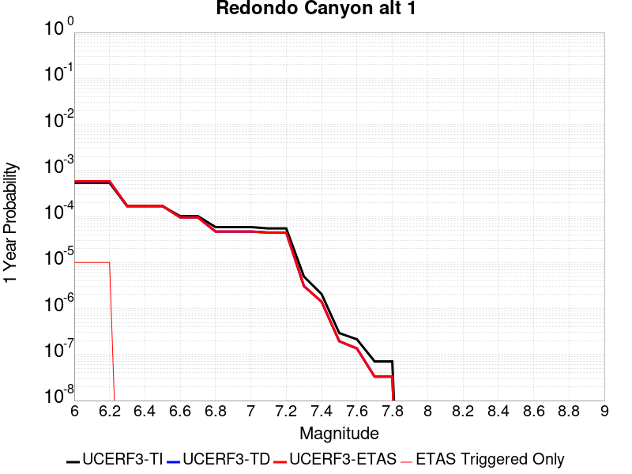 | 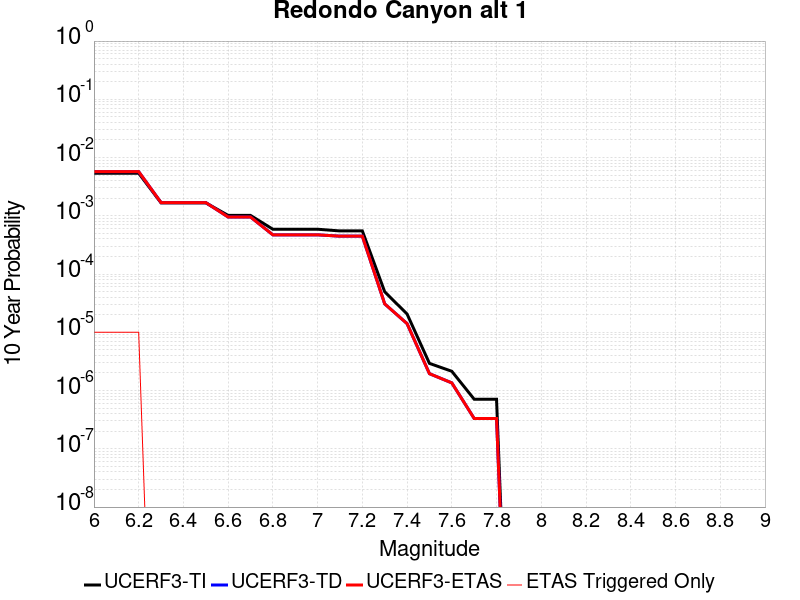 |

| Magnitude | 1 wk TI Prob | 1 wk TD Prob | 1 wk ETAS Prob | 1 wk ETAS/TD Gain | 1 wk ETAS Triggered Only | 1 mo TI Prob | 1 mo TD Prob | 1 mo ETAS Prob | 1 mo ETAS/TD Gain | 1 mo ETAS Triggered Only | 1 yr TI Prob | 1 yr TD Prob | 1 yr ETAS Prob | 1 yr ETAS/TD Gain | 1 yr ETAS Triggered Only | 10 yr TI Prob | 10 yr TD Prob | 10 yr ETAS Prob | 10 yr ETAS/TD Gain | 10 yr ETAS Triggered Only |
|-----|-----|-----|-----|-----|-----|-----|-----|-----|-----|-----|-----|-----|-----|-----|-----|-----|-----|-----|-----|-----|
| 6.0 | 1.0346246E-5 | 1.09814555E-5 | 1.09814555E-5 | 1.0 | 0.0 | 4.43403E-5 | 4.7062975E-5 | 4.7062975E-5 | 1.0 | 0.0 | 5.3970946E-4 | 5.7291996E-4 | 5.829142E-4 | 1.0174445 | 1.0E-5 | 0.0053840056 | 0.005722169 | 0.0057321116 | 1.0017376 | 1.0E-5 |
| 6.1 | 1.0346246E-5 | 1.09814555E-5 | 1.09814555E-5 | 1.0 | 0.0 | 4.43403E-5 | 4.7062975E-5 | 4.7062975E-5 | 1.0 | 0.0 | 5.3970946E-4 | 5.7291996E-4 | 5.829142E-4 | 1.0174445 | 1.0E-5 | 0.0053840056 | 0.005722169 | 0.0057321116 | 1.0017376 | 1.0E-5 |
| 6.2 | 1.0346246E-5 | 1.09814555E-5 | 1.09814555E-5 | 1.0 | 0.0 | 4.43403E-5 | 4.7062975E-5 | 4.7062975E-5 | 1.0 | 0.0 | 5.3970946E-4 | 5.7291996E-4 | 5.829142E-4 | 1.0174445 | 1.0E-5 | 0.0053840056 | 0.005722169 | 0.0057321116 | 1.0017376 | 1.0E-5 |
| 6.3 | 3.2052794E-6 | 3.2361545E-6 | 3.2361545E-6 | 1.0 | 0.0 | 1.373684E-5 | 1.3869182E-5 | 1.3869182E-5 | 1.0 | 0.0 | 1.6723319E-4 | 1.6884819E-4 | 1.6884819E-4 | 1.0 | 0.0 | 0.001671074 | 0.0016875885 | 0.0016875885 | 1.0 | 0.0 |
| 6.4 | 3.2052794E-6 | 3.2361545E-6 | 3.2361545E-6 | 1.0 | 0.0 | 1.373684E-5 | 1.3869182E-5 | 1.3869182E-5 | 1.0 | 0.0 | 1.6723319E-4 | 1.6884819E-4 | 1.6884819E-4 | 1.0 | 0.0 | 0.001671074 | 0.0016875885 | 0.0016875885 | 1.0 | 0.0 |
| 6.5 | 3.2052794E-6 | 3.2361545E-6 | 3.2361545E-6 | 1.0 | 0.0 | 1.373684E-5 | 1.3869182E-5 | 1.3869182E-5 | 1.0 | 0.0 | 1.6723319E-4 | 1.6884819E-4 | 1.6884819E-4 | 1.0 | 0.0 | 0.001671074 | 0.0016875885 | 0.0016875885 | 1.0 | 0.0 |
| 6.6 | 1.948328E-6 | 1.8288863E-6 | 1.8288863E-6 | 1.0 | 0.0 | 8.349951E-6 | 7.838069E-6 | 7.838069E-6 | 1.0 | 0.0 | 1.016559E-4 | 9.5425814E-5 | 9.5425814E-5 | 1.0 | 0.0 | 0.0010160941 | 9.5399533E-4 | 9.5399533E-4 | 1.0 | 0.0 |
| 6.7 | 1.948328E-6 | 1.8288863E-6 | 1.8288863E-6 | 1.0 | 0.0 | 8.349951E-6 | 7.838069E-6 | 7.838069E-6 | 1.0 | 0.0 | 1.016559E-4 | 9.5425814E-5 | 9.5425814E-5 | 1.0 | 0.0 | 0.0010160941 | 9.5399533E-4 | 9.5399533E-4 | 1.0 | 0.0 |
| 6.8 | 1.1278219E-6 | 9.033126E-7 | 9.033126E-7 | 1.0 | 0.0 | 4.8335132E-6 | 3.8713365E-6 | 3.8713365E-6 | 1.0 | 0.0 | 5.8846435E-5 | 4.713293E-5 | 4.713293E-5 | 1.0 | 0.0 | 5.8830855E-4 | 4.7127134E-4 | 4.7127134E-4 | 1.0 | 0.0 |
| 6.9 | 1.1278219E-6 | 9.033126E-7 | 9.033126E-7 | 1.0 | 0.0 | 4.8335132E-6 | 3.8713365E-6 | 3.8713365E-6 | 1.0 | 0.0 | 5.8846435E-5 | 4.713293E-5 | 4.713293E-5 | 1.0 | 0.0 | 5.8830855E-4 | 4.7127134E-4 | 4.7127134E-4 | 1.0 | 0.0 |
| 7.0 | 1.1278219E-6 | 9.033126E-7 | 9.033126E-7 | 1.0 | 0.0 | 4.8335132E-6 | 3.8713365E-6 | 3.8713365E-6 | 1.0 | 0.0 | 5.8846435E-5 | 4.713293E-5 | 4.713293E-5 | 1.0 | 0.0 | 5.8830855E-4 | 4.7127134E-4 | 4.7127134E-4 | 1.0 | 0.0 |
| 7.1 | 1.0545139E-6 | 8.569309E-7 | 8.569309E-7 | 1.0 | 0.0 | 4.5193374E-6 | 3.6725583E-6 | 3.6725583E-6 | 1.0 | 0.0 | 5.5021545E-5 | 4.4712906E-5 | 4.4712906E-5 | 1.0 | 0.0 | 5.500792E-4 | 4.4708085E-4 | 4.4708085E-4 | 1.0 | 0.0 |
| 7.2 | 1.0545139E-6 | 8.569309E-7 | 8.569309E-7 | 1.0 | 0.0 | 4.5193374E-6 | 3.6725583E-6 | 3.6725583E-6 | 1.0 | 0.0 | 5.5021545E-5 | 4.4712906E-5 | 4.4712906E-5 | 1.0 | 0.0 | 5.500792E-4 | 4.4708085E-4 | 4.4708085E-4 | 1.0 | 0.0 |
| 7.3 | 9.505161E-8 | 5.895768E-8 | 5.895768E-8 | 1.0 | 0.0 | 4.0736398E-7 | 2.5267576E-7 | 2.5267576E-7 | 1.0 | 0.0 | 4.959645E-6 | 3.0763242E-6 | 3.0763242E-6 | 1.0 | 0.0 | 4.9595343E-5 | 3.0762934E-5 | 3.0762934E-5 | 1.0 | 0.0 |
| 7.4 | 3.9520785E-8 | 2.6987644E-8 | 2.6987644E-8 | 1.0 | 0.0 | 1.6937479E-7 | 1.1566133E-7 | 1.1566133E-7 | 1.0 | 0.0 | 2.062136E-6 | 1.408176E-6 | 1.408176E-6 | 1.0 | 0.0 | 2.062117E-5 | 1.4081697E-5 | 1.4081697E-5 | 1.0 | 0.0 |
| 7.5 | 5.6133214E-9 | 3.7368793E-9 | 3.7368793E-9 | 1.0 | 0.0 | 2.4057092E-8 | 1.6015198E-8 | 1.6015198E-8 | 1.0 | 0.0 | 2.9289507E-7 | 1.9498502E-7 | 1.9498502E-7 | 1.0 | 0.0 | 2.9289467E-6 | 1.9498486E-6 | 1.9498486E-6 | 1.0 | 0.0 |
| 7.6 | 4.1064334E-9 | 2.5957916E-9 | 2.5957916E-9 | 1.0 | 0.0 | 1.7599E-8 | 1.1124821E-8 | 1.1124821E-8 | 1.0 | 0.0 | 2.142678E-7 | 1.3544468E-7 | 1.3544468E-7 | 1.0 | 0.0 | 2.1426758E-6 | 1.3544462E-6 | 1.3544462E-6 | 1.0 | 0.0 |
| 7.7 | 1.361975E-9 | 6.3605754E-10 | 6.3605754E-10 | 1.0 | 0.0 | 5.8370353E-9 | 2.7259608E-9 | 2.7259608E-9 | 1.0 | 0.0 | 7.1065905E-8 | 3.3188574E-8 | 3.3188574E-8 | 1.0 | 0.0 | 7.106588E-7 | 3.318857E-7 | 3.318857E-7 | 1.0 | 0.0 |
| 7.8 | 1.361975E-9 | 6.3605754E-10 | 6.3605754E-10 | 1.0 | 0.0 | 5.8370353E-9 | 2.7259608E-9 | 2.7259608E-9 | 1.0 | 0.0 | 7.1065905E-8 | 3.3188574E-8 | 3.3188574E-8 | 1.0 | 0.0 | 7.106588E-7 | 3.318857E-7 | 3.318857E-7 | 1.0 | 0.0 |

## Antelope Valley 2011
*[(top)](#table-of-contents)*

| 1 Week | 1 Month | 1 Year | 10 Year |
|-----|-----|-----|-----|
|  | 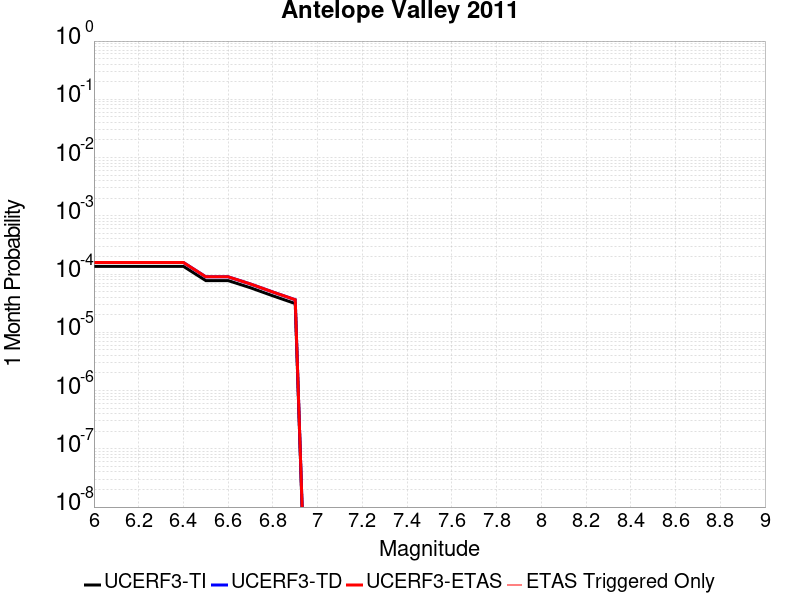 |  |  |

| Magnitude | 1 wk TI Prob | 1 wk TD Prob | 1 wk ETAS Prob | 1 wk ETAS/TD Gain | 1 wk ETAS Triggered Only | 1 mo TI Prob | 1 mo TD Prob | 1 mo ETAS Prob | 1 mo ETAS/TD Gain | 1 mo ETAS Triggered Only | 1 yr TI Prob | 1 yr TD Prob | 1 yr ETAS Prob | 1 yr ETAS/TD Gain | 1 yr ETAS Triggered Only | 10 yr TI Prob | 10 yr TD Prob | 10 yr ETAS Prob | 10 yr ETAS/TD Gain | 10 yr ETAS Triggered Only |
|-----|-----|-----|-----|-----|-----|-----|-----|-----|-----|-----|-----|-----|-----|-----|-----|-----|-----|-----|-----|-----|
| 6.0 | 3.1646934E-5 | 3.690508E-5 | 3.690508E-5 | 1.0 | 0.0 | 1.3562266E-4 | 1.5815653E-4 | 1.5815653E-4 | 1.0 | 0.0 | 0.0016499552 | 0.0019241197 | 0.0019241197 | 1.0 | 0.0 | 0.016377583 | 0.019101007 | 0.019110817 | 1.0005136 | 1.0E-5 |
| 6.1 | 3.1646934E-5 | 3.690508E-5 | 3.690508E-5 | 1.0 | 0.0 | 1.3562266E-4 | 1.5815653E-4 | 1.5815653E-4 | 1.0 | 0.0 | 0.0016499552 | 0.0019241197 | 0.0019241197 | 1.0 | 0.0 | 0.016377583 | 0.019101007 | 0.019110817 | 1.0005136 | 1.0E-5 |
| 6.2 | 3.1646934E-5 | 3.690508E-5 | 3.690508E-5 | 1.0 | 0.0 | 1.3562266E-4 | 1.5815653E-4 | 1.5815653E-4 | 1.0 | 0.0 | 0.0016499552 | 0.0019241197 | 0.0019241197 | 1.0 | 0.0 | 0.016377583 | 0.019101007 | 0.019110817 | 1.0005136 | 1.0E-5 |
| 6.3 | 3.1646934E-5 | 3.690508E-5 | 3.690508E-5 | 1.0 | 0.0 | 1.3562266E-4 | 1.5815653E-4 | 1.5815653E-4 | 1.0 | 0.0 | 0.0016499552 | 0.0019241197 | 0.0019241197 | 1.0 | 0.0 | 0.016377583 | 0.019101007 | 0.019110817 | 1.0005136 | 1.0E-5 |
| 6.4 | 3.1646934E-5 | 3.690508E-5 | 3.690508E-5 | 1.0 | 0.0 | 1.3562266E-4 | 1.5815653E-4 | 1.5815653E-4 | 1.0 | 0.0 | 0.0016499552 | 0.0019241197 | 0.0019241197 | 1.0 | 0.0 | 0.016377583 | 0.019101007 | 0.019110817 | 1.0005136 | 1.0E-5 |
| 6.5 | 1.8034107E-5 | 2.0941334E-5 | 2.0941334E-5 | 1.0 | 0.0 | 7.7286735E-5 | 8.974617E-5 | 8.974617E-5 | 1.0 | 0.0 | 9.405598E-4 | 0.0010922344 | 0.0010922344 | 1.0 | 0.0 | 0.009365888 | 0.010880738 | 0.010890629 | 1.0009091 | 1.0E-5 |
| 6.6 | 1.8034107E-5 | 2.0941334E-5 | 2.0941334E-5 | 1.0 | 0.0 | 7.7286735E-5 | 8.974617E-5 | 8.974617E-5 | 1.0 | 0.0 | 9.405598E-4 | 0.0010922344 | 0.0010922344 | 1.0 | 0.0 | 0.009365888 | 0.010880738 | 0.010890629 | 1.0009091 | 1.0E-5 |
| 6.7 | 1.3567667E-5 | 1.5749793E-5 | 1.5749793E-5 | 1.0 | 0.0 | 5.814585E-5 | 6.749796E-5 | 6.749796E-5 | 1.0 | 0.0 | 7.076958E-4 | 8.215841E-4 | 8.215841E-4 | 1.0 | 0.0 | 0.007054463 | 0.008195901 | 0.008205819 | 1.0012101 | 1.0E-5 |
| 6.8 | 9.867387E-6 | 1.14681425E-5 | 1.14681425E-5 | 1.0 | 0.0 | 4.2288117E-5 | 4.914879E-5 | 4.914879E-5 | 1.0 | 0.0 | 5.1473617E-4 | 5.9831725E-4 | 5.9831725E-4 | 1.0 | 0.0 | 0.005135455 | 0.005976376 | 0.0059863166 | 1.0016632 | 1.0E-5 |
| 6.9 | 7.273233E-6 | 8.455017E-6 | 8.455017E-6 | 1.0 | 0.0 | 3.1170628E-5 | 3.623579E-5 | 3.623579E-5 | 1.0 | 0.0 | 3.794363E-4 | 4.4117073E-4 | 4.4117073E-4 | 1.0 | 0.0 | 0.0037878908 | 0.004411707 | 0.004421663 | 1.0022568 | 1.0E-5 |

## Great Valley 07 (Orestimba)
*[(top)](#table-of-contents)*

| 1 Week | 1 Month | 1 Year | 10 Year |
|-----|-----|-----|-----|
|  |  |  | 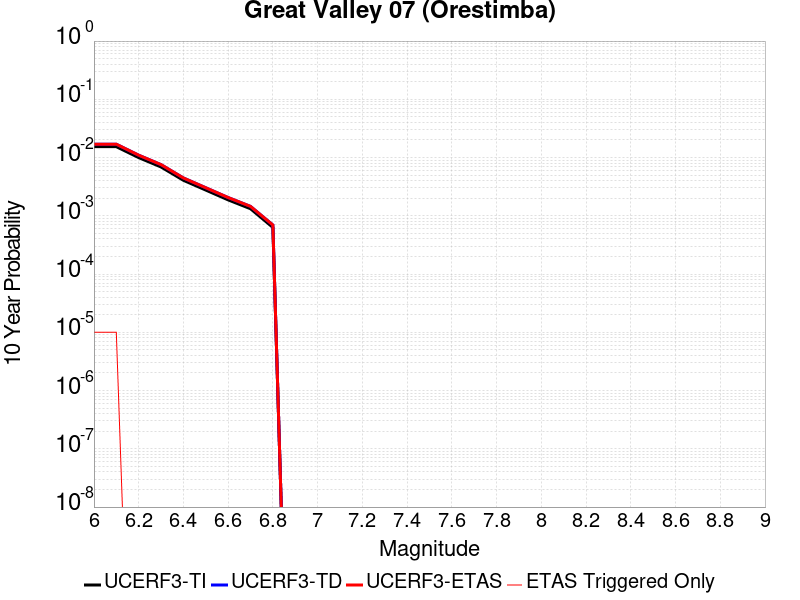 |

| Magnitude | 1 wk TI Prob | 1 wk TD Prob | 1 wk ETAS Prob | 1 wk ETAS/TD Gain | 1 wk ETAS Triggered Only | 1 mo TI Prob | 1 mo TD Prob | 1 mo ETAS Prob | 1 mo ETAS/TD Gain | 1 mo ETAS Triggered Only | 1 yr TI Prob | 1 yr TD Prob | 1 yr ETAS Prob | 1 yr ETAS/TD Gain | 1 yr ETAS Triggered Only | 10 yr TI Prob | 10 yr TD Prob | 10 yr ETAS Prob | 10 yr ETAS/TD Gain | 10 yr ETAS Triggered Only |
|-----|-----|-----|-----|-----|-----|-----|-----|-----|-----|-----|-----|-----|-----|-----|-----|-----|-----|-----|-----|-----|
| 6.0 | 2.9687902E-5 | 3.275788E-5 | 3.275788E-5 | 1.0 | 0.0 | 1.2722766E-4 | 1.4038375E-4 | 1.4038375E-4 | 1.0 | 0.0 | 0.0015478961 | 0.0017079042 | 0.0017079042 | 1.0 | 0.0 | 0.015371585 | 0.016955331 | 0.016965162 | 1.0005798 | 1.0E-5 |
| 6.1 | 2.9687902E-5 | 3.275788E-5 | 3.275788E-5 | 1.0 | 0.0 | 1.2722766E-4 | 1.4038375E-4 | 1.4038375E-4 | 1.0 | 0.0 | 0.0015478961 | 0.0017079042 | 0.0017079042 | 1.0 | 0.0 | 0.015371585 | 0.016955331 | 0.016965162 | 1.0005798 | 1.0E-5 |
| 6.2 | 1.9231524E-5 | 2.1159403E-5 | 2.1159403E-5 | 1.0 | 0.0 | 8.2418206E-5 | 9.0680136E-5 | 9.0680136E-5 | 1.0 | 0.0 | 0.0010029797 | 0.0011034947 | 0.0011034947 | 1.0 | 0.0 | 0.00998465 | 0.010982563 | 0.010982563 | 1.0 | 0.0 |
| 6.3 | 1.324766E-5 | 1.4548693E-5 | 1.4548693E-5 | 1.0 | 0.0 | 5.6774446E-5 | 6.2350104E-5 | 6.2350104E-5 | 1.0 | 0.0 | 6.910097E-4 | 7.588573E-4 | 7.588573E-4 | 1.0 | 0.0 | 0.006888649 | 0.0075636064 | 0.0075636064 | 1.0 | 0.0 |
| 6.4 | 7.818645E-6 | 8.5729325E-6 | 8.5729325E-6 | 1.0 | 0.0 | 3.3508048E-5 | 3.674064E-5 | 3.674064E-5 | 1.0 | 0.0 | 4.078841E-4 | 4.4722887E-4 | 4.4722887E-4 | 1.0 | 0.0 | 0.004071363 | 0.0044636284 | 0.0044636284 | 1.0 | 0.0 |
| 6.5 | 5.3076565E-6 | 5.8178634E-6 | 5.8178634E-6 | 1.0 | 0.0 | 2.27469E-5 | 2.4933473E-5 | 2.4933473E-5 | 1.0 | 0.0 | 2.7690834E-4 | 3.0352487E-4 | 3.0352487E-4 | 1.0 | 0.0 | 0.0027656353 | 0.0030313125 | 0.0030313125 | 1.0 | 0.0 |
| 6.6 | 3.6003578E-6 | 3.948538E-6 | 3.948538E-6 | 1.0 | 0.0 | 1.5430012E-5 | 1.6922206E-5 | 1.6922206E-5 | 1.0 | 0.0 | 1.8784421E-4 | 2.0600994E-4 | 2.0600994E-4 | 1.0 | 0.0 | 0.0018768552 | 0.0020583437 | 0.0020583437 | 1.0 | 0.0 |
| 6.7 | 2.5361826E-6 | 2.7834983E-6 | 2.7834983E-6 | 1.0 | 0.0 | 1.0869308E-5 | 1.1929231E-5 | 1.1929231E-5 | 1.0 | 0.0 | 1.3232579E-4 | 1.4523003E-4 | 1.4523003E-4 | 1.0 | 0.0 | 0.0013224703 | 0.0014514811 | 0.0014514811 | 1.0 | 0.0 |
| 6.8 | 1.2115831E-6 | 1.3313945E-6 | 1.3313945E-6 | 1.0 | 0.0 | 5.1924885E-6 | 5.7059697E-6 | 5.7059697E-6 | 1.0 | 0.0 | 6.3216714E-5 | 6.946894E-5 | 6.946894E-5 | 1.0 | 0.0 | 6.3198735E-4 | 6.945673E-4 | 6.945673E-4 | 1.0 | 0.0 |

## Cedar Mtn-Mahogany Mtn
*[(top)](#table-of-contents)*

| 1 Week | 1 Month | 1 Year | 10 Year |
|-----|-----|-----|-----|
| 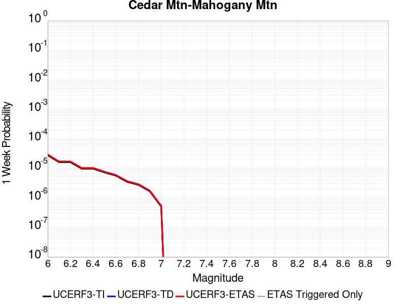 | 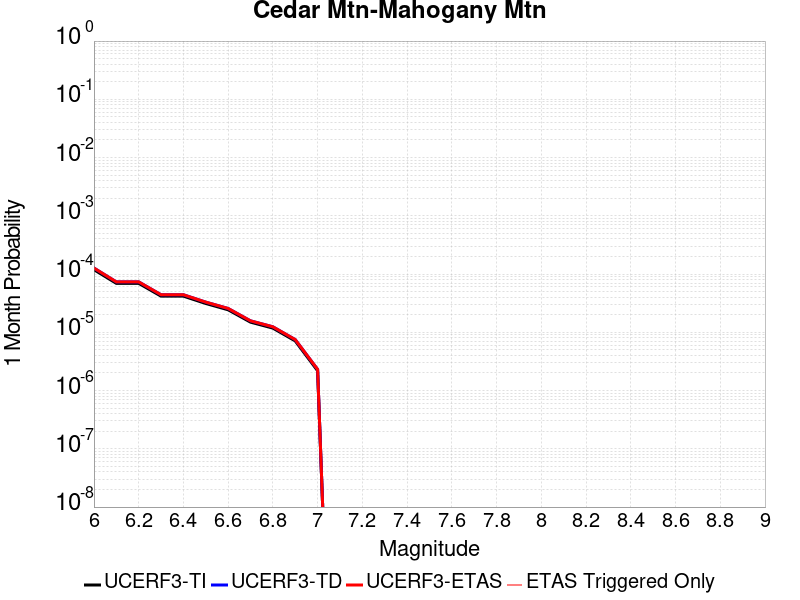 | 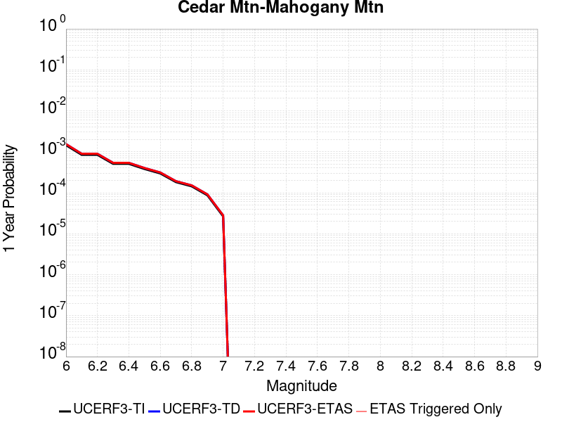 |  |

| Magnitude | 1 wk TI Prob | 1 wk TD Prob | 1 wk ETAS Prob | 1 wk ETAS/TD Gain | 1 wk ETAS Triggered Only | 1 mo TI Prob | 1 mo TD Prob | 1 mo ETAS Prob | 1 mo ETAS/TD Gain | 1 mo ETAS Triggered Only | 1 yr TI Prob | 1 yr TD Prob | 1 yr ETAS Prob | 1 yr ETAS/TD Gain | 1 yr ETAS Triggered Only | 10 yr TI Prob | 10 yr TD Prob | 10 yr ETAS Prob | 10 yr ETAS/TD Gain | 10 yr ETAS Triggered Only |
|-----|-----|-----|-----|-----|-----|-----|-----|-----|-----|-----|-----|-----|-----|-----|-----|-----|-----|-----|-----|-----|
| 6.0 | 2.7763876E-5 | 2.9589084E-5 | 2.9589084E-5 | 1.0 | 0.0 | 1.1898261E-4 | 1.2680459E-4 | 1.2680459E-4 | 1.0 | 0.0 | 0.0014476506 | 0.0015428226 | 0.0015428226 | 1.0 | 0.0 | 0.0143825635 | 0.015328337 | 0.015338184 | 1.0006424 | 1.0E-5 |
| 6.1 | 1.6162443E-5 | 1.7143082E-5 | 1.7143082E-5 | 1.0 | 0.0 | 6.926578E-5 | 7.3468385E-5 | 7.3468385E-5 | 1.0 | 0.0 | 8.4298453E-4 | 8.941282E-4 | 8.941282E-4 | 1.0 | 0.0 | 0.008397939 | 0.008907119 | 0.00891703 | 1.0011127 | 1.0E-5 |
| 6.2 | 1.6162443E-5 | 1.7143082E-5 | 1.7143082E-5 | 1.0 | 0.0 | 6.926578E-5 | 7.3468385E-5 | 7.3468385E-5 | 1.0 | 0.0 | 8.4298453E-4 | 8.941282E-4 | 8.941282E-4 | 1.0 | 0.0 | 0.008397939 | 0.008907119 | 0.00891703 | 1.0011127 | 1.0E-5 |
| 6.3 | 9.746053E-6 | 1.0303218E-5 | 1.0303218E-5 | 1.0 | 0.0 | 4.1768133E-5 | 4.4155924E-5 | 4.4155924E-5 | 1.0 | 0.0 | 5.0840835E-4 | 5.3746987E-4 | 5.3746987E-4 | 1.0 | 0.0 | 0.0050724675 | 0.0053621186 | 0.0053621186 | 1.0 | 0.0 |
| 6.4 | 9.746053E-6 | 1.0303218E-5 | 1.0303218E-5 | 1.0 | 0.0 | 4.1768133E-5 | 4.4155924E-5 | 4.4155924E-5 | 1.0 | 0.0 | 5.0840835E-4 | 5.3746987E-4 | 5.3746987E-4 | 1.0 | 0.0 | 0.0050724675 | 0.0053621186 | 0.0053621186 | 1.0 | 0.0 |
| 6.5 | 7.290083E-6 | 7.695372E-6 | 7.695372E-6 | 1.0 | 0.0 | 3.124284E-5 | 3.2979762E-5 | 3.2979762E-5 | 1.0 | 0.0 | 3.8031515E-4 | 4.014568E-4 | 4.014568E-4 | 1.0 | 0.0 | 0.0037966494 | 0.004007536 | 0.004007536 | 1.0 | 0.0 |
| 6.6 | 5.67907E-6 | 5.9891895E-6 | 5.9891895E-6 | 1.0 | 0.0 | 2.4338644E-5 | 2.5667709E-5 | 2.5667709E-5 | 1.0 | 0.0 | 2.962827E-4 | 3.124609E-4 | 3.124609E-4 | 1.0 | 0.0 | 0.0029588798 | 0.0031203518 | 0.0031203518 | 1.0 | 0.0 |
| 6.7 | 3.4853963E-6 | 3.672653E-6 | 3.672653E-6 | 1.0 | 0.0 | 1.4937327E-5 | 1.573985E-5 | 1.573985E-5 | 1.0 | 0.0 | 1.8184677E-4 | 1.9161645E-4 | 1.9161645E-4 | 1.0 | 0.0 | 0.0018169804 | 0.0019145743 | 0.0019145743 | 1.0 | 0.0 |
| 6.8 | 2.7535168E-6 | 2.901594E-6 | 2.901594E-6 | 1.0 | 0.0 | 1.1800733E-5 | 1.24353455E-5 | 1.24353455E-5 | 1.0 | 0.0 | 1.4366445E-4 | 1.513903E-4 | 1.513903E-4 | 1.0 | 0.0 | 0.0014357162 | 0.0015129189 | 0.0015129189 | 1.0 | 0.0 |
| 6.9 | 1.6594106E-6 | 1.7497092E-6 | 1.7497092E-6 | 1.0 | 0.0 | 7.1117406E-6 | 7.4987342E-6 | 7.4987342E-6 | 1.0 | 0.0 | 8.6582E-5 | 9.129357E-5 | 9.129357E-5 | 1.0 | 0.0 | 8.654827E-4 | 9.125911E-4 | 9.125911E-4 | 1.0 | 0.0 |
| 7.0 | 5.10215E-7 | 5.3892876E-7 | 5.3892876E-7 | 1.0 | 0.0 | 2.186634E-6 | 2.3096934E-6 | 2.3096934E-6 | 1.0 | 0.0 | 2.6621943E-5 | 2.8120283E-5 | 2.8120283E-5 | 1.0 | 0.0 | 2.6618753E-4 | 2.811798E-4 | 2.811798E-4 | 1.0 | 0.0 |

## Mount Diablo Thrust South
*[(top)](#table-of-contents)*

| 1 Week | 1 Month | 1 Year | 10 Year |
|-----|-----|-----|-----|
|  |  |  |  |

| Magnitude | 1 wk TI Prob | 1 wk TD Prob | 1 wk ETAS Prob | 1 wk ETAS/TD Gain | 1 wk ETAS Triggered Only | 1 mo TI Prob | 1 mo TD Prob | 1 mo ETAS Prob | 1 mo ETAS/TD Gain | 1 mo ETAS Triggered Only | 1 yr TI Prob | 1 yr TD Prob | 1 yr ETAS Prob | 1 yr ETAS/TD Gain | 1 yr ETAS Triggered Only | 10 yr TI Prob | 10 yr TD Prob | 10 yr ETAS Prob | 10 yr ETAS/TD Gain | 10 yr ETAS Triggered Only |
|-----|-----|-----|-----|-----|-----|-----|-----|-----|-----|-----|-----|-----|-----|-----|-----|-----|-----|-----|-----|-----|
| 6.0 | 2.2377444E-5 | 2.6956763E-5 | 2.6956763E-5 | 1.0 | 0.0 | 9.5899806E-5 | 1.15524985E-4 | 1.15524985E-4 | 1.0 | 0.0 | 0.0011669548 | 0.0014058069 | 0.0014058069 | 1.0 | 0.0 | 0.011608457 | 0.013989108 | 0.013998968 | 1.0007049 | 1.0E-5 |
| 6.1 | 2.2377444E-5 | 2.6956763E-5 | 2.6956763E-5 | 1.0 | 0.0 | 9.5899806E-5 | 1.15524985E-4 | 1.15524985E-4 | 1.0 | 0.0 | 0.0011669548 | 0.0014058069 | 0.0014058069 | 1.0 | 0.0 | 0.011608457 | 0.013989108 | 0.013998968 | 1.0007049 | 1.0E-5 |
| 6.2 | 2.2377444E-5 | 2.6956763E-5 | 2.6956763E-5 | 1.0 | 0.0 | 9.5899806E-5 | 1.15524985E-4 | 1.15524985E-4 | 1.0 | 0.0 | 0.0011669548 | 0.0014058069 | 0.0014058069 | 1.0 | 0.0 | 0.011608457 | 0.013989108 | 0.013998968 | 1.0007049 | 1.0E-5 |
| 6.3 | 2.2377444E-5 | 2.6956763E-5 | 2.6956763E-5 | 1.0 | 0.0 | 9.5899806E-5 | 1.15524985E-4 | 1.15524985E-4 | 1.0 | 0.0 | 0.0011669548 | 0.0014058069 | 0.0014058069 | 1.0 | 0.0 | 0.011608457 | 0.013989108 | 0.013998968 | 1.0007049 | 1.0E-5 |
| 6.4 | 1.2228463E-5 | 1.4747946E-5 | 1.4747946E-5 | 1.0 | 0.0 | 5.2406645E-5 | 6.3204025E-5 | 6.3204025E-5 | 1.0 | 0.0 | 6.378641E-4 | 7.6925015E-4 | 7.6925015E-4 | 1.0 | 0.0 | 0.0063603627 | 0.007667623 | 0.007667623 | 1.0 | 0.0 |
| 6.5 | 1.2228463E-5 | 1.4747946E-5 | 1.4747946E-5 | 1.0 | 0.0 | 5.2406645E-5 | 6.3204025E-5 | 6.3204025E-5 | 1.0 | 0.0 | 6.378641E-4 | 7.6925015E-4 | 7.6925015E-4 | 1.0 | 0.0 | 0.0063603627 | 0.007667623 | 0.007667623 | 1.0 | 0.0 |
| 6.6 | 1.2068118E-5 | 1.4552739E-5 | 1.4552739E-5 | 1.0 | 0.0 | 5.1719482E-5 | 6.2367464E-5 | 6.2367464E-5 | 1.0 | 0.0 | 6.2950276E-4 | 7.590722E-4 | 7.590722E-4 | 1.0 | 0.0 | 0.006277225 | 0.007566541 | 0.007566541 | 1.0 | 0.0 |
| 6.7 | 1.1499428E-5 | 1.3875387E-5 | 1.3875387E-5 | 1.0 | 0.0 | 4.9282335E-5 | 5.946466E-5 | 5.946466E-5 | 1.0 | 0.0 | 5.9984723E-4 | 7.2375446E-4 | 7.2375446E-4 | 1.0 | 0.0 | 0.0059823063 | 0.007215706 | 0.007215706 | 1.0 | 0.0 |
| 6.8 | 8.82118E-6 | 1.0830631E-5 | 1.0830631E-5 | 1.0 | 0.0 | 3.780451E-5 | 4.6416197E-5 | 4.6416197E-5 | 1.0 | 0.0 | 4.601727E-4 | 5.649763E-4 | 5.649763E-4 | 1.0 | 0.0 | 0.0045922096 | 0.005636414 | 0.005636414 | 1.0 | 0.0 |
| 6.9 | 8.047112E-6 | 9.939585E-6 | 9.939585E-6 | 1.0 | 0.0 | 3.4487166E-5 | 4.2597552E-5 | 4.2597552E-5 | 1.0 | 0.0 | 4.1980037E-4 | 5.185071E-4 | 5.185071E-4 | 1.0 | 0.0 | 0.004190082 | 0.0051739514 | 0.0051739514 | 1.0 | 0.0 |
| 7.0 | 6.2574763E-6 | 7.748624E-6 | 7.748624E-6 | 1.0 | 0.0 | 2.681748E-5 | 3.3207987E-5 | 3.3207987E-5 | 1.0 | 0.0 | 3.264539E-4 | 4.0423594E-4 | 4.0423594E-4 | 1.0 | 0.0 | 0.0032597475 | 0.0040357267 | 0.0040357267 | 1.0 | 0.0 |
| 7.1 | 3.6485903E-6 | 4.5129964E-6 | 4.5129964E-6 | 1.0 | 0.0 | 1.5636722E-5 | 1.9341272E-5 | 1.9341272E-5 | 1.0 | 0.0 | 1.9036046E-4 | 2.3545495E-4 | 2.3545495E-4 | 1.0 | 0.0 | 0.0019019748 | 0.0023521148 | 0.0023521148 | 1.0 | 0.0 |
| 7.2 | 2.3034274E-6 | 2.9055652E-6 | 2.9055652E-6 | 1.0 | 0.0 | 9.871795E-6 | 1.2452364E-5 | 1.2452364E-5 | 1.0 | 0.0 | 1.2018247E-4 | 1.5159723E-4 | 1.5159723E-4 | 1.0 | 0.0 | 0.0012011749 | 0.0015150368 | 0.0015150368 | 1.0 | 0.0 |
| 7.3 | 1.224035E-6 | 1.5680034E-6 | 1.5680034E-6 | 1.0 | 0.0 | 5.245854E-6 | 6.719998E-6 | 6.719998E-6 | 1.0 | 0.0 | 6.38664E-5 | 8.1813014E-5 | 8.1813014E-5 | 1.0 | 0.0 | 6.384805E-4 | 8.177938E-4 | 8.177938E-4 | 1.0 | 0.0 |
| 7.4 | 5.1601154E-7 | 6.723495E-7 | 6.723495E-7 | 1.0 | 0.0 | 2.2114762E-6 | 2.8814948E-6 | 2.8814948E-6 | 1.0 | 0.0 | 2.6924388E-5 | 3.5081648E-5 | 3.5081648E-5 | 1.0 | 0.0 | 2.6921128E-4 | 3.5073908E-4 | 3.5073908E-4 | 1.0 | 0.0 |
| 7.5 | 3.552894E-7 | 4.665337E-7 | 4.665337E-7 | 1.0 | 0.0 | 1.5226678E-6 | 1.9994286E-6 | 1.9994286E-6 | 1.0 | 0.0 | 1.8538323E-5 | 2.4342786E-5 | 2.4342786E-5 | 1.0 | 0.0 | 1.8536777E-4 | 2.4340635E-4 | 2.4340635E-4 | 1.0 | 0.0 |
| 7.6 | 1.3124082E-7 | 1.7192048E-7 | 1.7192048E-7 | 1.0 | 0.0 | 5.6246057E-7 | 7.368019E-7 | 7.368019E-7 | 1.0 | 0.0 | 6.8479358E-6 | 8.9705345E-6 | 8.9705345E-6 | 1.0 | 0.0 | 6.8477246E-5 | 8.967397E-5 | 8.967397E-5 | 1.0 | 0.0 |
| 7.7 | 3.6193022E-8 | 4.7334797E-8 | 4.7334797E-8 | 1.0 | 0.0 | 1.5511293E-7 | 2.0286342E-7 | 2.0286342E-7 | 1.0 | 0.0 | 1.8884983E-6 | 2.4698604E-6 | 2.4698604E-6 | 1.0 | 0.0 | 1.8884823E-5 | 2.4698264E-5 | 2.4698264E-5 | 1.0 | 0.0 |

## Ortigalita (South)
*[(top)](#table-of-contents)*

| 1 Week | 1 Month | 1 Year | 10 Year |
|-----|-----|-----|-----|
|  |  |  | 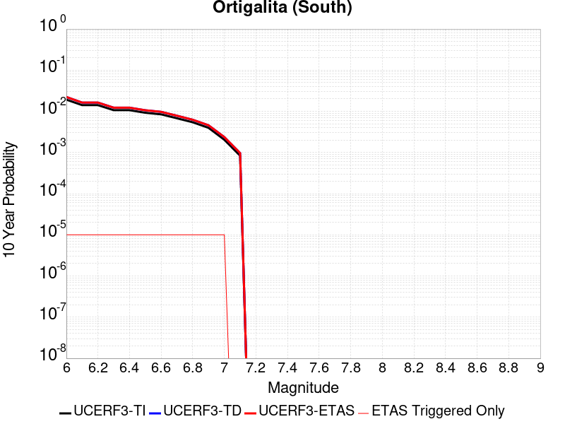 |

| Magnitude | 1 wk TI Prob | 1 wk TD Prob | 1 wk ETAS Prob | 1 wk ETAS/TD Gain | 1 wk ETAS Triggered Only | 1 mo TI Prob | 1 mo TD Prob | 1 mo ETAS Prob | 1 mo ETAS/TD Gain | 1 mo ETAS Triggered Only | 1 yr TI Prob | 1 yr TD Prob | 1 yr ETAS Prob | 1 yr ETAS/TD Gain | 1 yr ETAS Triggered Only | 10 yr TI Prob | 10 yr TD Prob | 10 yr ETAS Prob | 10 yr ETAS/TD Gain | 10 yr ETAS Triggered Only |
|-----|-----|-----|-----|-----|-----|-----|-----|-----|-----|-----|-----|-----|-----|-----|-----|-----|-----|-----|-----|-----|
| 6.0 | 3.72394E-5 | 4.3256387E-5 | 4.3256387E-5 | 1.0 | 0.0 | 1.5958765E-4 | 1.8537222E-4 | 1.8537222E-4 | 1.0 | 0.0 | 0.0019412481 | 0.002254727 | 0.0022647046 | 1.0044252 | 1.0E-5 | 0.019243775 | 0.022334902 | 0.022344679 | 1.0004377 | 1.0E-5 |
| 6.1 | 2.7299884E-5 | 3.149258E-5 | 3.149258E-5 | 1.0 | 0.0 | 1.16994255E-4 | 1.3496152E-4 | 1.3496152E-4 | 1.0 | 0.0 | 0.0014234743 | 0.001641974 | 0.0016519575 | 1.0060803 | 1.0E-5 | 0.014143906 | 0.016304351 | 0.016314188 | 1.0006033 | 1.0E-5 |
| 6.2 | 2.7299884E-5 | 3.149258E-5 | 3.149258E-5 | 1.0 | 0.0 | 1.16994255E-4 | 1.3496152E-4 | 1.3496152E-4 | 1.0 | 0.0 | 0.0014234743 | 0.001641974 | 0.0016519575 | 1.0060803 | 1.0E-5 | 0.014143906 | 0.016304351 | 0.016314188 | 1.0006033 | 1.0E-5 |
| 6.3 | 2.0546433E-5 | 2.363185E-5 | 2.363185E-5 | 1.0 | 0.0 | 8.805317E-5 | 1.0127554E-4 | 1.0127554E-4 | 1.0 | 0.0 | 0.00107152 | 0.0012323512 | 0.0012423388 | 1.0081046 | 1.0E-5 | 0.010663681 | 0.012257236 | 0.012267114 | 1.0008059 | 1.0E-5 |
| 6.4 | 2.0546433E-5 | 2.363185E-5 | 2.363185E-5 | 1.0 | 0.0 | 8.805317E-5 | 1.0127554E-4 | 1.0127554E-4 | 1.0 | 0.0 | 0.00107152 | 0.0012323512 | 0.0012423388 | 1.0081046 | 1.0E-5 | 0.010663681 | 0.012257236 | 0.012267114 | 1.0008059 | 1.0E-5 |
| 6.5 | 1.7779594E-5 | 2.044732E-5 | 2.044732E-5 | 1.0 | 0.0 | 7.619603E-5 | 8.7628505E-5 | 8.7628505E-5 | 1.0 | 0.0 | 9.272918E-4 | 0.0010663684 | 0.0010763578 | 1.0093676 | 1.0E-5 | 0.009234319 | 0.010613982 | 0.010623875 | 1.0009321 | 1.0E-5 |
| 6.6 | 1.6272212E-5 | 1.8715284E-5 | 1.8715284E-5 | 1.0 | 0.0 | 6.973618E-5 | 8.020596E-5 | 8.020596E-5 | 1.0 | 0.0 | 8.487073E-4 | 9.760823E-4 | 9.860726E-4 | 1.0102351 | 1.0E-5 | 0.008454733 | 0.0097192535 | 0.009729156 | 1.0010189 | 1.0E-5 |
| 6.7 | 1.3051484E-5 | 1.5039015E-5 | 1.5039015E-5 | 1.0 | 0.0 | 5.593373E-5 | 6.4451386E-5 | 6.4451386E-5 | 1.0 | 0.0 | 6.807804E-4 | 7.8442256E-4 | 7.944147E-4 | 1.0127382 | 1.0E-5 | 0.006786986 | 0.007817521 | 0.007827443 | 1.0012692 | 1.0E-5 |
| 6.8 | 1.04277415E-5 | 1.1987436E-5 | 1.1987436E-5 | 1.0 | 0.0 | 4.4689557E-5 | 5.1373758E-5 | 5.1373758E-5 | 1.0 | 0.0 | 5.439595E-4 | 6.253034E-4 | 6.3529715E-4 | 1.0159823 | 1.0E-5 | 0.0054262993 | 0.006236194 | 0.006246132 | 1.0015936 | 1.0E-5 |
| 6.9 | 7.639968E-6 | 8.791651E-6 | 8.791651E-6 | 1.0 | 0.0 | 3.274231E-5 | 3.7677997E-5 | 3.7677997E-5 | 1.0 | 0.0 | 3.9856473E-4 | 4.5863894E-4 | 4.6863433E-4 | 1.0217936 | 1.0E-5 | 0.003978506 | 0.00457751 | 0.0045874645 | 1.0021746 | 1.0E-5 |
| 7.0 | 3.919831E-6 | 4.533481E-6 | 4.533481E-6 | 1.0 | 0.0 | 1.679917E-5 | 1.942907E-5 | 1.942907E-5 | 1.0 | 0.0 | 2.045107E-4 | 2.3652537E-4 | 2.46523E-4 | 1.0422688 | 1.0E-5 | 0.0020432258 | 0.002362945 | 0.0023729212 | 1.004222 | 1.0E-5 |
| 7.1 | 1.6017933E-6 | 1.8570748E-6 | 1.8570748E-6 | 1.0 | 0.0 | 6.8648105E-6 | 7.958874E-6 | 7.958874E-6 | 1.0 | 0.0 | 8.357586E-5 | 9.689605E-5 | 9.689605E-5 | 1.0 | 0.0 | 8.3544437E-4 | 9.686427E-4 | 9.686427E-4 | 1.0 | 0.0 |

## San Jacinto (Clark) rev
*[(top)](#table-of-contents)*

| 1 Week | 1 Month | 1 Year | 10 Year |
|-----|-----|-----|-----|
| 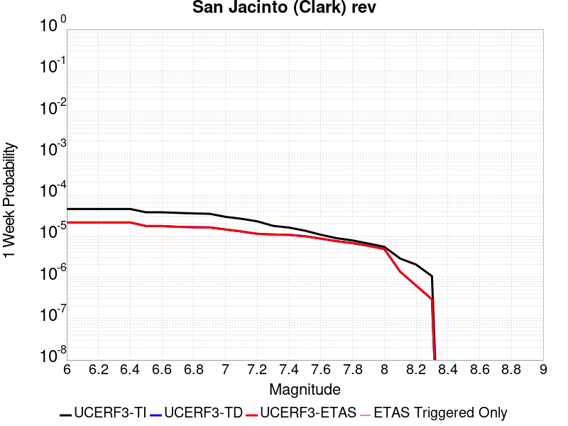 |  |  |  |

| Magnitude | 1 wk TI Prob | 1 wk TD Prob | 1 wk ETAS Prob | 1 wk ETAS/TD Gain | 1 wk ETAS Triggered Only | 1 mo TI Prob | 1 mo TD Prob | 1 mo ETAS Prob | 1 mo ETAS/TD Gain | 1 mo ETAS Triggered Only | 1 yr TI Prob | 1 yr TD Prob | 1 yr ETAS Prob | 1 yr ETAS/TD Gain | 1 yr ETAS Triggered Only | 10 yr TI Prob | 10 yr TD Prob | 10 yr ETAS Prob | 10 yr ETAS/TD Gain | 10 yr ETAS Triggered Only |
|-----|-----|-----|-----|-----|-----|-----|-----|-----|-----|-----|-----|-----|-----|-----|-----|-----|-----|-----|-----|-----|
| 6.0 | 4.482615E-5 | 2.1157399E-5 | 2.1157399E-5 | 1.0 | 0.0 | 1.9209793E-4 | 9.067147E-5 | 9.067147E-5 | 1.0 | 0.0 | 0.0023362834 | 0.0011033753 | 0.0011133642 | 1.0090531 | 1.0E-5 | 0.02311874 | 0.011498577 | 0.011508462 | 1.0008596 | 1.0E-5 |
| 6.1 | 4.482615E-5 | 2.1157399E-5 | 2.1157399E-5 | 1.0 | 0.0 | 1.9209793E-4 | 9.067147E-5 | 9.067147E-5 | 1.0 | 0.0 | 0.0023362834 | 0.0011033753 | 0.0011133642 | 1.0090531 | 1.0E-5 | 0.02311874 | 0.011498577 | 0.011508462 | 1.0008596 | 1.0E-5 |
| 6.2 | 4.482615E-5 | 2.1157399E-5 | 2.1157399E-5 | 1.0 | 0.0 | 1.9209793E-4 | 9.067147E-5 | 9.067147E-5 | 1.0 | 0.0 | 0.0023362834 | 0.0011033753 | 0.0011133642 | 1.0090531 | 1.0E-5 | 0.02311874 | 0.011498577 | 0.011508462 | 1.0008596 | 1.0E-5 |
| 6.3 | 4.482615E-5 | 2.1157399E-5 | 2.1157399E-5 | 1.0 | 0.0 | 1.9209793E-4 | 9.067147E-5 | 9.067147E-5 | 1.0 | 0.0 | 0.0023362834 | 0.0011033753 | 0.0011133642 | 1.0090531 | 1.0E-5 | 0.02311874 | 0.011498577 | 0.011508462 | 1.0008596 | 1.0E-5 |
| 6.4 | 4.482615E-5 | 2.1157399E-5 | 2.1157399E-5 | 1.0 | 0.0 | 1.9209793E-4 | 9.067147E-5 | 9.067147E-5 | 1.0 | 0.0 | 0.0023362834 | 0.0011033753 | 0.0011133642 | 1.0090531 | 1.0E-5 | 0.02311874 | 0.011498577 | 0.011508462 | 1.0008596 | 1.0E-5 |
| 6.5 | 3.7294863E-5 | 1.7359005E-5 | 1.7359005E-5 | 1.0 | 0.0 | 1.5982533E-4 | 7.439365E-5 | 7.439365E-5 | 1.0 | 0.0 | 0.0019441366 | 9.0537075E-4 | 9.153617E-4 | 1.0110352 | 1.0E-5 | 0.01927216 | 0.009498796 | 0.009508702 | 1.0010427 | 1.0E-5 |
| 6.6 | 3.7294863E-5 | 1.7359005E-5 | 1.7359005E-5 | 1.0 | 0.0 | 1.5982533E-4 | 7.439365E-5 | 7.439365E-5 | 1.0 | 0.0 | 0.0019441366 | 9.0537075E-4 | 9.153617E-4 | 1.0110352 | 1.0E-5 | 0.01927216 | 0.009498796 | 0.009508702 | 1.0010427 | 1.0E-5 |
| 6.7 | 3.6039248E-5 | 1.6607024E-5 | 1.6607024E-5 | 1.0 | 0.0 | 1.5444479E-4 | 7.117104E-5 | 7.117104E-5 | 1.0 | 0.0 | 0.0018787434 | 8.661671E-4 | 8.761584E-4 | 1.0115352 | 1.0E-5 | 0.01862939 | 0.009098271 | 0.00910818 | 1.0010891 | 1.0E-5 |
| 6.8 | 3.5031844E-5 | 1.6235463E-5 | 1.6235463E-5 | 1.0 | 0.0 | 1.5012783E-4 | 6.9578724E-5 | 6.9578724E-5 | 1.0 | 0.0 | 0.0018262739 | 8.467958E-4 | 8.567873E-4 | 1.0117992 | 1.0E-5 | 0.01811338 | 0.008898871 | 0.008908782 | 1.0011138 | 1.0E-5 |
| 6.9 | 3.435112E-5 | 1.6065998E-5 | 1.6065998E-5 | 1.0 | 0.0 | 1.4721078E-4 | 6.885248E-5 | 6.885248E-5 | 1.0 | 0.0 | 0.0017908178 | 8.379607E-4 | 8.4795227E-4 | 1.0119238 | 1.0E-5 | 0.017764548 | 0.00880538 | 0.008815292 | 1.0011257 | 1.0E-5 |
| 7.0 | 2.8959772E-5 | 1.4339865E-5 | 1.4339865E-5 | 1.0 | 0.0 | 1.241074E-4 | 6.145513E-5 | 6.145513E-5 | 1.0 | 0.0 | 0.0015099603 | 7.4796216E-4 | 7.579547E-4 | 1.0133597 | 1.0E-5 | 0.014997416 | 0.007877208 | 0.00788713 | 1.0012594 | 1.0E-5 |
| 7.1 | 2.6002877E-5 | 1.2832039E-5 | 1.2832039E-5 | 1.0 | 0.0 | 1.11436144E-4 | 5.4993307E-5 | 5.4993307E-5 | 1.0 | 0.0 | 0.0013558907 | 6.693399E-4 | 6.793332E-4 | 1.0149301 | 1.0E-5 | 0.013476475 | 0.00705293 | 0.00706286 | 1.0014079 | 1.0E-5 |
| 7.2 | 2.2544838E-5 | 1.12646085E-5 | 1.12646085E-5 | 1.0 | 0.0 | 9.661716E-5 | 4.8276008E-5 | 4.8276008E-5 | 1.0 | 0.0 | 0.001175679 | 5.876033E-4 | 5.9759745E-4 | 1.0170083 | 1.0E-5 | 0.011694785 | 0.0061945887 | 0.006204527 | 1.0016043 | 1.0E-5 |
| 7.3 | 1.75334E-5 | 1.0814823E-5 | 1.0814823E-5 | 1.0 | 0.0 | 7.514098E-5 | 4.634843E-5 | 4.634843E-5 | 1.0 | 0.0 | 9.144575E-4 | 5.6414737E-4 | 5.7414174E-4 | 1.0177158 | 1.0E-5 | 0.009107036 | 0.0059352247 | 0.0059451656 | 1.0016749 | 1.0E-5 |
| 7.4 | 1.5924552E-5 | 1.0614621E-5 | 1.0614621E-5 | 1.0 | 0.0 | 6.82463E-5 | 4.5490448E-5 | 4.5490448E-5 | 1.0 | 0.0 | 8.305819E-4 | 5.5370684E-4 | 5.637013E-4 | 1.0180501 | 1.0E-5 | 0.008274844 | 0.00582255 | 0.005832492 | 1.0017074 | 1.0E-5 |
| 7.5 | 1.3428931E-5 | 9.854987E-6 | 9.854987E-6 | 1.0 | 0.0 | 5.7551293E-5 | 4.2234984E-5 | 4.2234984E-5 | 1.0 | 0.0 | 7.004617E-4 | 5.140907E-4 | 5.2408554E-4 | 1.0194418 | 1.0E-5 | 0.006982579 | 0.005408206 | 0.0054181516 | 1.001839 | 1.0E-5 |
| 7.6 | 1.0688787E-5 | 8.617833E-6 | 8.617833E-6 | 1.0 | 0.0 | 4.5808283E-5 | 3.6933052E-5 | 3.6933052E-5 | 1.0 | 0.0 | 5.5757316E-4 | 4.495676E-4 | 4.595631E-4 | 1.0222336 | 1.0E-5 | 0.005561762 | 0.0047432426 | 0.004753195 | 1.0020983 | 1.0E-5 |
| 7.7 | 8.81236E-6 | 7.470959E-6 | 7.470959E-6 | 1.0 | 0.0 | 3.776671E-5 | 3.2018004E-5 | 3.2018004E-5 | 1.0 | 0.0 | 4.597127E-4 | 3.8974968E-4 | 3.997458E-4 | 1.0256475 | 1.0E-5 | 0.0045876284 | 0.0041361847 | 0.0041461433 | 1.0024077 | 1.0E-5 |
| 7.8 | 7.780431E-6 | 6.6993725E-6 | 6.6993725E-6 | 1.0 | 0.0 | 3.3344273E-5 | 2.8711282E-5 | 2.8711282E-5 | 1.0 | 0.0 | 4.0589093E-4 | 3.4950394E-4 | 3.5950047E-4 | 1.028602 | 1.0E-5 | 0.0040515037 | 0.0037241883 | 0.0037341511 | 1.0026752 | 1.0E-5 |
| 7.9 | 6.5437994E-6 | 5.7830116E-6 | 5.7830116E-6 | 1.0 | 0.0 | 2.8044553E-5 | 2.4784102E-5 | 2.4784102E-5 | 1.0 | 0.0 | 3.4138895E-4 | 3.0170483E-4 | 3.117018E-4 | 1.0331349 | 1.0E-5 | 0.0034086495 | 0.0032357764 | 0.003245744 | 1.0030805 | 1.0E-5 |
| 8.0 | 5.4488164E-6 | 4.815671E-6 | 4.815671E-6 | 1.0 | 0.0 | 2.3351862E-5 | 2.0638428E-5 | 2.0638428E-5 | 1.0 | 0.0 | 2.8427184E-4 | 2.5124406E-4 | 2.6124154E-4 | 1.039792 | 1.0E-5 | 0.0028390845 | 0.002711935 | 0.0027219078 | 1.0036774 | 1.0E-5 |
| 8.1 | 2.8397242E-6 | 1.3676815E-6 | 1.3676815E-6 | 1.0 | 0.0 | 1.217019E-5 | 5.861479E-6 | 5.861479E-6 | 1.0 | 0.0 | 1.4816198E-4 | 7.136118E-5 | 7.136118E-5 | 1.0 | 0.0 | 0.0014806325 | 8.1193127E-4 | 8.1193127E-4 | 1.0 | 0.0 |
| 8.2 | 2.030244E-6 | 6.3218465E-7 | 6.3218465E-7 | 1.0 | 0.0 | 8.701017E-6 | 2.70936E-6 | 2.70936E-6 | 1.0 | 0.0 | 1.05929736E-4 | 3.298596E-5 | 3.298596E-5 | 1.0 | 0.0 | 0.0010587925 | 3.9502795E-4 | 3.9502795E-4 | 1.0 | 0.0 |
| 8.3 | 1.0659804E-6 | 2.926179E-7 | 2.926179E-7 | 1.0 | 0.0 | 4.568479E-6 | 1.2540761E-6 | 1.2540761E-6 | 1.0 | 0.0 | 5.5619817E-5 | 1.5268273E-5 | 1.5268273E-5 | 1.0 | 0.0 | 5.5605895E-4 | 1.8574248E-4 | 1.8574248E-4 | 1.0 | 0.0 |

## Elmore Ranch
*[(top)](#table-of-contents)*

| 1 Week | 1 Month | 1 Year | 10 Year |
|-----|-----|-----|-----|
| 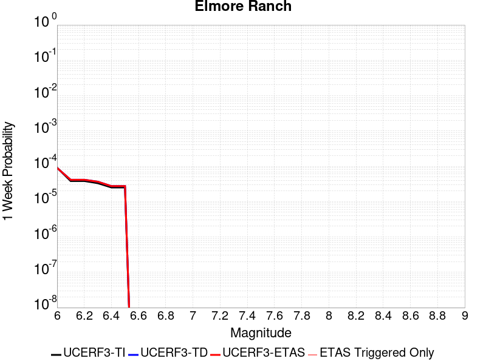 |  |  | 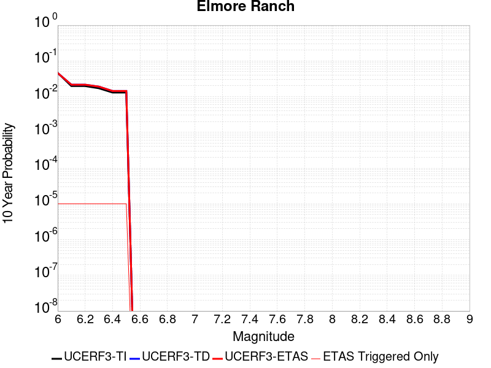 |

| Magnitude | 1 wk TI Prob | 1 wk TD Prob | 1 wk ETAS Prob | 1 wk ETAS/TD Gain | 1 wk ETAS Triggered Only | 1 mo TI Prob | 1 mo TD Prob | 1 mo ETAS Prob | 1 mo ETAS/TD Gain | 1 mo ETAS Triggered Only | 1 yr TI Prob | 1 yr TD Prob | 1 yr ETAS Prob | 1 yr ETAS/TD Gain | 1 yr ETAS Triggered Only | 10 yr TI Prob | 10 yr TD Prob | 10 yr ETAS Prob | 10 yr ETAS/TD Gain | 10 yr ETAS Triggered Only |
|-----|-----|-----|-----|-----|-----|-----|-----|-----|-----|-----|-----|-----|-----|-----|-----|-----|-----|-----|-----|-----|
| 6.0 | 9.102099E-5 | 8.954174E-5 | 8.954174E-5 | 1.0 | 0.0 | 3.9003167E-4 | 3.837039E-4 | 3.837039E-4 | 1.0 | 0.0 | 0.0047383 | 0.0046622707 | 0.0046622707 | 1.0 | 0.0 | 0.046385348 | 0.045839127 | 0.045848668 | 1.0002081 | 1.0E-5 |
| 6.1 | 3.8306698E-5 | 4.149223E-5 | 4.149223E-5 | 1.0 | 0.0 | 1.6416123E-4 | 1.7781579E-4 | 1.7781579E-4 | 1.0 | 0.0 | 0.0019968306 | 0.0021632416 | 0.0021632416 | 1.0 | 0.0 | 0.019789828 | 0.021595228 | 0.021605011 | 1.0004531 | 1.0E-5 |
| 6.2 | 3.8306698E-5 | 4.149223E-5 | 4.149223E-5 | 1.0 | 0.0 | 1.6416123E-4 | 1.7781579E-4 | 1.7781579E-4 | 1.0 | 0.0 | 0.0019968306 | 0.0021632416 | 0.0021632416 | 1.0 | 0.0 | 0.019789828 | 0.021595228 | 0.021605011 | 1.0004531 | 1.0E-5 |
| 6.3 | 3.3197924E-5 | 3.655074E-5 | 3.655074E-5 | 1.0 | 0.0 | 1.4226905E-4 | 1.566406E-4 | 1.566406E-4 | 1.0 | 0.0 | 0.0017307495 | 0.0019059915 | 0.0019059915 | 1.0 | 0.0 | 0.017173318 | 0.01905752 | 0.019067328 | 1.0005147 | 1.0E-5 |
| 6.4 | 2.5148964E-5 | 2.7420736E-5 | 2.7420736E-5 | 1.0 | 0.0 | 1.0777682E-4 | 1.17515796E-4 | 1.17515796E-4 | 1.0 | 0.0 | 0.0013113929 | 0.0014304637 | 0.0014304637 | 1.0 | 0.0 | 0.01303681 | 0.014365338 | 0.014375194 | 1.0006862 | 1.0E-5 |
| 6.5 | 2.5148964E-5 | 2.7420736E-5 | 2.7420736E-5 | 1.0 | 0.0 | 1.0777682E-4 | 1.17515796E-4 | 1.17515796E-4 | 1.0 | 0.0 | 0.0013113929 | 0.0014304637 | 0.0014304637 | 1.0 | 0.0 | 0.01303681 | 0.014365338 | 0.014375194 | 1.0006862 | 1.0E-5 |

## San Gorgonio Pass
*[(top)](#table-of-contents)*

| 1 Week | 1 Month | 1 Year | 10 Year |
|-----|-----|-----|-----|
|  |  |  |  |

| Magnitude | 1 wk TI Prob | 1 wk TD Prob | 1 wk ETAS Prob | 1 wk ETAS/TD Gain | 1 wk ETAS Triggered Only | 1 mo TI Prob | 1 mo TD Prob | 1 mo ETAS Prob | 1 mo ETAS/TD Gain | 1 mo ETAS Triggered Only | 1 yr TI Prob | 1 yr TD Prob | 1 yr ETAS Prob | 1 yr ETAS/TD Gain | 1 yr ETAS Triggered Only | 10 yr TI Prob | 10 yr TD Prob | 10 yr ETAS Prob | 10 yr ETAS/TD Gain | 10 yr ETAS Triggered Only |
|-----|-----|-----|-----|-----|-----|-----|-----|-----|-----|-----|-----|-----|-----|-----|-----|-----|-----|-----|-----|-----|
| 6.0 | 7.644328E-6 | 1.3316555E-5 | 1.3316555E-5 | 1.0 | 0.0 | 3.2760996E-5 | 5.7069752E-5 | 5.7069752E-5 | 1.0 | 0.0 | 3.987921E-4 | 6.946113E-4 | 7.046043E-4 | 1.0143865 | 1.0E-5 | 0.003980772 | 0.006930366 | 0.006940297 | 1.0014329 | 1.0E-5 |
| 6.1 | 7.644328E-6 | 1.3316555E-5 | 1.3316555E-5 | 1.0 | 0.0 | 3.2760996E-5 | 5.7069752E-5 | 5.7069752E-5 | 1.0 | 0.0 | 3.987921E-4 | 6.946113E-4 | 7.046043E-4 | 1.0143865 | 1.0E-5 | 0.003980772 | 0.006930366 | 0.006940297 | 1.0014329 | 1.0E-5 |
| 6.2 | 7.644328E-6 | 1.3316555E-5 | 1.3316555E-5 | 1.0 | 0.0 | 3.2760996E-5 | 5.7069752E-5 | 5.7069752E-5 | 1.0 | 0.0 | 3.987921E-4 | 6.946113E-4 | 7.046043E-4 | 1.0143865 | 1.0E-5 | 0.003980772 | 0.006930366 | 0.006940297 | 1.0014329 | 1.0E-5 |
| 6.3 | 7.644328E-6 | 1.3316555E-5 | 1.3316555E-5 | 1.0 | 0.0 | 3.2760996E-5 | 5.7069752E-5 | 5.7069752E-5 | 1.0 | 0.0 | 3.987921E-4 | 6.946113E-4 | 7.046043E-4 | 1.0143865 | 1.0E-5 | 0.003980772 | 0.006930366 | 0.006940297 | 1.0014329 | 1.0E-5 |
| 6.4 | 7.644328E-6 | 1.3316555E-5 | 1.3316555E-5 | 1.0 | 0.0 | 3.2760996E-5 | 5.7069752E-5 | 5.7069752E-5 | 1.0 | 0.0 | 3.987921E-4 | 6.946113E-4 | 7.046043E-4 | 1.0143865 | 1.0E-5 | 0.003980772 | 0.006930366 | 0.006940297 | 1.0014329 | 1.0E-5 |
| 6.5 | 7.644328E-6 | 1.3316555E-5 | 1.3316555E-5 | 1.0 | 0.0 | 3.2760996E-5 | 5.7069752E-5 | 5.7069752E-5 | 1.0 | 0.0 | 3.987921E-4 | 6.946113E-4 | 7.046043E-4 | 1.0143865 | 1.0E-5 | 0.003980772 | 0.006930366 | 0.006940297 | 1.0014329 | 1.0E-5 |
| 6.6 | 7.644328E-6 | 1.3316555E-5 | 1.3316555E-5 | 1.0 | 0.0 | 3.2760996E-5 | 5.7069752E-5 | 5.7069752E-5 | 1.0 | 0.0 | 3.987921E-4 | 6.946113E-4 | 7.046043E-4 | 1.0143865 | 1.0E-5 | 0.003980772 | 0.006930366 | 0.006940297 | 1.0014329 | 1.0E-5 |
| 6.7 | 6.987586E-6 | 1.2620824E-5 | 1.2620824E-5 | 1.0 | 0.0 | 2.9946454E-5 | 5.4088174E-5 | 5.4088174E-5 | 1.0 | 0.0 | 3.645371E-4 | 6.5833266E-4 | 6.6832604E-4 | 1.0151799 | 1.0E-5 | 0.0036393967 | 0.00656974 | 0.006579674 | 1.0015122 | 1.0E-5 |
| 6.8 | 6.987586E-6 | 1.2620824E-5 | 1.2620824E-5 | 1.0 | 0.0 | 2.9946454E-5 | 5.4088174E-5 | 5.4088174E-5 | 1.0 | 0.0 | 3.645371E-4 | 6.5833266E-4 | 6.6832604E-4 | 1.0151799 | 1.0E-5 | 0.0036393967 | 0.00656974 | 0.006579674 | 1.0015122 | 1.0E-5 |
| 6.9 | 5.504702E-6 | 1.1051678E-5 | 1.1051678E-5 | 1.0 | 0.0 | 2.3591367E-5 | 4.73635E-5 | 4.73635E-5 | 1.0 | 0.0 | 2.8718702E-4 | 5.765031E-4 | 5.8649736E-4 | 1.017336 | 1.0E-5 | 0.0028681618 | 0.005755687 | 0.0057656295 | 1.0017275 | 1.0E-5 |
| 7.0 | 5.4825764E-6 | 1.1028018E-5 | 1.1028018E-5 | 1.0 | 0.0 | 2.3496545E-5 | 4.7262107E-5 | 4.7262107E-5 | 1.0 | 0.0 | 2.8603288E-4 | 5.7526934E-4 | 5.8526354E-4 | 1.0173732 | 1.0E-5 | 0.00285665 | 0.0057434128 | 0.0057533556 | 1.0017312 | 1.0E-5 |
| 7.1 | 5.4692787E-6 | 1.1013728E-5 | 1.1013728E-5 | 1.0 | 0.0 | 2.3439556E-5 | 4.720087E-5 | 4.720087E-5 | 1.0 | 0.0 | 2.8533922E-4 | 5.745241E-4 | 5.8451836E-4 | 1.0173957 | 1.0E-5 | 0.0028497311 | 0.0057359994 | 0.005745942 | 1.0017334 | 1.0E-5 |
| 7.2 | 5.453661E-6 | 1.0996755E-5 | 1.0996755E-5 | 1.0 | 0.0 | 2.3372622E-5 | 4.7128127E-5 | 4.7128127E-5 | 1.0 | 0.0 | 2.8452452E-4 | 5.7363894E-4 | 5.836332E-4 | 1.0174226 | 1.0E-5 | 0.002841605 | 0.0057271933 | 0.005737136 | 1.001736 | 1.0E-5 |
| 7.3 | 5.4422303E-6 | 1.0983677E-5 | 1.0983677E-5 | 1.0 | 0.0 | 2.3323635E-5 | 4.7072084E-5 | 4.7072084E-5 | 1.0 | 0.0 | 2.8392827E-4 | 5.72957E-4 | 5.8295124E-4 | 1.0174433 | 1.0E-5 | 0.0028356577 | 0.0057204086 | 0.0057303514 | 1.0017381 | 1.0E-5 |
| 7.4 | 5.398595E-6 | 1.0931041E-5 | 1.0931041E-5 | 1.0 | 0.0 | 2.313663E-5 | 4.6846508E-5 | 4.6846508E-5 | 1.0 | 0.0 | 2.8165206E-4 | 5.70212E-4 | 5.802063E-4 | 1.0175273 | 1.0E-5 | 0.0028129534 | 0.0056931004 | 0.0057030437 | 1.0017465 | 1.0E-5 |
| 7.5 | 5.3578788E-6 | 1.08575805E-5 | 1.08575805E-5 | 1.0 | 0.0 | 2.2962136E-5 | 4.6531688E-5 | 4.6531688E-5 | 1.0 | 0.0 | 2.7952815E-4 | 5.663811E-4 | 5.7637546E-4 | 1.017646 | 1.0E-5 | 0.002791768 | 0.005655023 | 0.005664966 | 1.0017583 | 1.0E-5 |
| 7.6 | 4.8091474E-6 | 9.605828E-6 | 9.605828E-6 | 1.0 | 0.0 | 2.0610469E-5 | 4.1167215E-5 | 4.1167215E-5 | 1.0 | 0.0 | 2.5090357E-4 | 5.011004E-4 | 5.110954E-4 | 1.0199461 | 1.0E-5 | 0.0025062046 | 0.0050056376 | 0.0050155874 | 1.0019877 | 1.0E-5 |
| 7.7 | 1.5991155E-6 | 3.3539602E-6 | 3.3539602E-6 | 1.0 | 0.0 | 6.853334E-6 | 1.4374038E-5 | 1.4374038E-5 | 1.0 | 0.0 | 8.343615E-5 | 1.7499011E-4 | 1.8498836E-4 | 1.057136 | 1.0E-5 | 8.340483E-4 | 0.0017538094 | 0.0017637919 | 1.0056919 | 1.0E-5 |
| 7.8 | 9.258398E-7 | 2.0588016E-6 | 2.0588016E-6 | 1.0 | 0.0 | 3.967879E-6 | 8.823406E-6 | 8.823406E-6 | 1.0 | 0.0 | 4.8307855E-5 | 1.07419684E-4 | 1.1741861E-4 | 1.0930828 | 1.0E-5 | 4.8297356E-4 | 0.001078941 | 0.0010889303 | 1.0092584 | 1.0E-5 |
| 7.9 | 5.975575E-7 | 1.2297417E-6 | 1.2297417E-6 | 1.0 | 0.0 | 2.5609581E-6 | 5.270311E-6 | 5.270311E-6 | 1.0 | 0.0 | 3.117922E-5 | 6.416416E-5 | 7.4163516E-5 | 1.1558403 | 1.0E-5 | 3.1174847E-4 | 6.465218E-4 | 6.5651536E-4 | 1.0154574 | 1.0E-5 |
| 8.0 | 3.4413725E-7 | 6.718183E-7 | 6.718183E-7 | 1.0 | 0.0 | 1.4748731E-6 | 2.8792183E-6 | 2.8792183E-6 | 1.0 | 0.0 | 1.7956432E-5 | 3.5053923E-5 | 4.5053574E-5 | 1.2852647 | 1.0E-5 | 1.7954981E-4 | 3.538341E-4 | 3.6383054E-4 | 1.0282519 | 1.0E-5 |
| 8.1 | 1.1787731E-8 | 9.640007E-9 | 9.640007E-9 | 1.0 | 0.0 | 5.0518846E-8 | 4.1314316E-8 | 4.1314316E-8 | 1.0 | 0.0 | 6.1506677E-7 | 5.0300173E-7 | 5.0300173E-7 | 1.0 | 0.0 | 6.1506507E-6 | 5.246811E-6 | 5.246811E-6 | 1.0 | 0.0 |

## Greenville (So) 2011 CFM
*[(top)](#table-of-contents)*

| 1 Week | 1 Month | 1 Year | 10 Year |
|-----|-----|-----|-----|
|  |  |  | 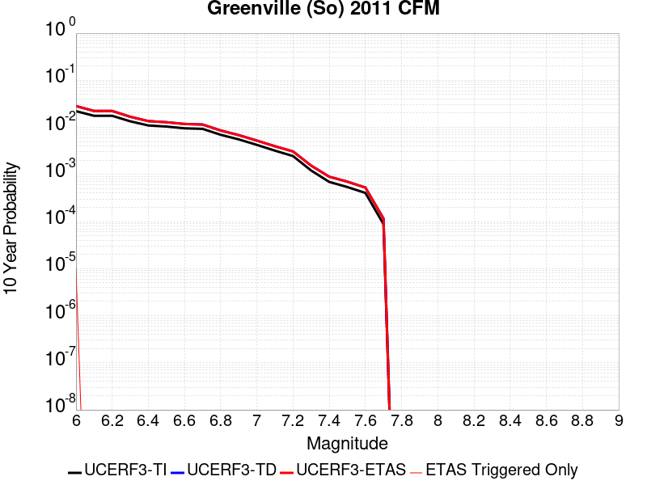 |

| Magnitude | 1 wk TI Prob | 1 wk TD Prob | 1 wk ETAS Prob | 1 wk ETAS/TD Gain | 1 wk ETAS Triggered Only | 1 mo TI Prob | 1 mo TD Prob | 1 mo ETAS Prob | 1 mo ETAS/TD Gain | 1 mo ETAS Triggered Only | 1 yr TI Prob | 1 yr TD Prob | 1 yr ETAS Prob | 1 yr ETAS/TD Gain | 1 yr ETAS Triggered Only | 10 yr TI Prob | 10 yr TD Prob | 10 yr ETAS Prob | 10 yr ETAS/TD Gain | 10 yr ETAS Triggered Only |
|-----|-----|-----|-----|-----|-----|-----|-----|-----|-----|-----|-----|-----|-----|-----|-----|-----|-----|-----|-----|-----|
| 6.0 | 4.279693E-5 | 5.5042226E-5 | 5.5042226E-5 | 1.0 | 0.0 | 1.8340252E-4 | 2.3587541E-4 | 2.3587541E-4 | 1.0 | 0.0 | 0.0022306389 | 0.0028682516 | 0.002878223 | 1.0034765 | 1.0E-5 | 0.022083808 | 0.02833945 | 0.028349167 | 1.0003428 | 1.0E-5 |
| 6.1 | 3.4037297E-5 | 4.3193566E-5 | 4.3193566E-5 | 1.0 | 0.0 | 1.4586597E-4 | 1.8510279E-4 | 1.8510279E-4 | 1.0 | 0.0 | 0.0017744715 | 0.002251459 | 0.002251459 | 1.0 | 0.0 | 0.01760369 | 0.022303622 | 0.022303622 | 1.0 | 0.0 |
| 6.2 | 3.4037297E-5 | 4.3193566E-5 | 4.3193566E-5 | 1.0 | 0.0 | 1.4586597E-4 | 1.8510279E-4 | 1.8510279E-4 | 1.0 | 0.0 | 0.0017744715 | 0.002251459 | 0.002251459 | 1.0 | 0.0 | 0.01760369 | 0.022303622 | 0.022303622 | 1.0 | 0.0 |
| 6.3 | 2.5956324E-5 | 3.2430173E-5 | 3.2430173E-5 | 1.0 | 0.0 | 1.11236644E-4 | 1.3897942E-4 | 1.3897942E-4 | 1.0 | 0.0 | 0.0013534647 | 0.0016908251 | 0.0016908251 | 1.0 | 0.0 | 0.013452509 | 0.016786702 | 0.016786702 | 1.0 | 0.0 |
| 6.4 | 2.1145053E-5 | 2.619837E-5 | 2.619837E-5 | 1.0 | 0.0 | 9.061851E-5 | 1.12274014E-4 | 1.12274014E-4 | 1.0 | 0.0 | 0.0011027219 | 0.0013661106 | 0.0013661106 | 1.0 | 0.0 | 0.01097266 | 0.013580861 | 0.013580861 | 1.0 | 0.0 |
| 6.5 | 2.0030959E-5 | 2.4796458E-5 | 2.4796458E-5 | 1.0 | 0.0 | 8.584414E-5 | 1.0626636E-4 | 1.0626636E-4 | 1.0 | 0.0 | 0.0010446513 | 0.0012930562 | 0.0012930562 | 1.0 | 0.0 | 0.010397541 | 0.012858994 | 0.012858994 | 1.0 | 0.0 |
| 6.6 | 1.8395405E-5 | 2.2755059E-5 | 2.2755059E-5 | 1.0 | 0.0 | 7.8835066E-5 | 9.75182E-5 | 9.75182E-5 | 1.0 | 0.0 | 9.5939427E-4 | 0.0011866658 | 0.0011866658 | 1.0 | 0.0 | 0.009552629 | 0.011806666 | 0.011806666 | 1.0 | 0.0 |
| 6.7 | 1.7883482E-5 | 2.2126087E-5 | 2.2126087E-5 | 1.0 | 0.0 | 7.664124E-5 | 9.48228E-5 | 9.48228E-5 | 1.0 | 0.0 | 9.3270757E-4 | 0.0011538848 | 0.0011538848 | 1.0 | 0.0 | 0.009288026 | 0.011482305 | 0.011482305 | 1.0 | 0.0 |
| 6.8 | 1.3373564E-5 | 1.6506387E-5 | 1.6506387E-5 | 1.0 | 0.0 | 5.7314013E-5 | 7.073982E-5 | 7.073982E-5 | 1.0 | 0.0 | 6.975747E-4 | 8.609318E-4 | 8.609318E-4 | 1.0 | 0.0 | 0.0069538904 | 0.008577894 | 0.008577894 | 1.0 | 0.0 |
| 6.9 | 1.06692905E-5 | 1.3152913E-5 | 1.3152913E-5 | 1.0 | 0.0 | 4.5724726E-5 | 5.6368473E-5 | 5.6368473E-5 | 1.0 | 0.0 | 5.5655633E-4 | 6.860813E-4 | 6.860813E-4 | 1.0 | 0.0 | 0.005551645 | 0.0068411846 | 0.0068411846 | 1.0 | 0.0 |
| 7.0 | 8.157512E-6 | 1.006289E-5 | 1.006289E-5 | 1.0 | 0.0 | 3.4960296E-5 | 4.312598E-5 | 4.312598E-5 | 1.0 | 0.0 | 4.2555845E-4 | 5.24936E-4 | 5.24936E-4 | 1.0 | 0.0 | 0.004247444 | 0.0052377577 | 0.0052377577 | 1.0 | 0.0 |
| 7.1 | 6.1467113E-6 | 7.6276256E-6 | 7.6276256E-6 | 1.0 | 0.0 | 2.6342783E-5 | 3.268942E-5 | 3.268942E-5 | 1.0 | 0.0 | 3.206762E-4 | 3.9792183E-4 | 3.9792183E-4 | 1.0 | 0.0 | 0.0032021382 | 0.0039726016 | 0.0039726016 | 1.0 | 0.0 |
| 7.2 | 4.713467E-6 | 5.9143244E-6 | 5.9143244E-6 | 1.0 | 0.0 | 2.0200418E-5 | 2.534686E-5 | 2.534686E-5 | 1.0 | 0.0 | 2.4591232E-4 | 3.0855494E-4 | 3.0855494E-4 | 1.0 | 0.0 | 0.0024564038 | 0.003081687 | 0.003081687 | 1.0 | 0.0 |
| 7.3 | 2.3266216E-6 | 2.9540909E-6 | 2.9540909E-6 | 1.0 | 0.0 | 9.971197E-6 | 1.2660329E-5 | 1.2660329E-5 | 1.0 | 0.0 | 1.2139256E-4 | 1.5412875E-4 | 1.5412875E-4 | 1.0 | 0.0 | 0.0012132627 | 0.0015404852 | 0.0015404852 | 1.0 | 0.0 |
| 7.4 | 1.3314E-6 | 1.7180026E-6 | 1.7180026E-6 | 1.0 | 0.0 | 5.7059874E-6 | 7.362848E-6 | 7.362848E-6 | 1.0 | 0.0 | 6.946818E-5 | 8.9639034E-5 | 8.9639034E-5 | 1.0 | 0.0 | 6.9446466E-4 | 8.963069E-4 | 8.963069E-4 | 1.0 | 0.0 |
| 7.5 | 1.0362941E-6 | 1.3469203E-6 | 1.3469203E-6 | 1.0 | 0.0 | 4.4412527E-6 | 5.772503E-6 | 5.772503E-6 | 1.0 | 0.0 | 5.407091E-5 | 7.0278E-5 | 7.0278E-5 | 1.0 | 0.0 | 5.405776E-4 | 7.0282136E-4 | 7.0282136E-4 | 1.0 | 0.0 |
| 7.6 | 7.764784E-7 | 1.0088906E-6 | 1.0088906E-6 | 1.0 | 0.0 | 3.3277602E-6 | 4.32381E-6 | 4.32381E-6 | 1.0 | 0.0 | 4.0514726E-5 | 5.2641157E-5 | 5.2641157E-5 | 1.0 | 0.0 | 4.050734E-4 | 5.265173E-4 | 5.265173E-4 | 1.0 | 0.0 |
| 7.7 | 1.6927763E-7 | 2.214027E-7 | 2.214027E-7 | 1.0 | 0.0 | 7.2547533E-7 | 9.488684E-7 | 9.488684E-7 | 1.0 | 0.0 | 8.832627E-6 | 1.1552414E-5 | 1.1552414E-5 | 1.0 | 0.0 | 8.8322755E-5 | 1.1554381E-4 | 1.1554381E-4 | 1.0 | 0.0 |

## Swain Ravine - Spenceville
*[(top)](#table-of-contents)*

| 1 Week | 1 Month | 1 Year | 10 Year |
|-----|-----|-----|-----|
|  |  | 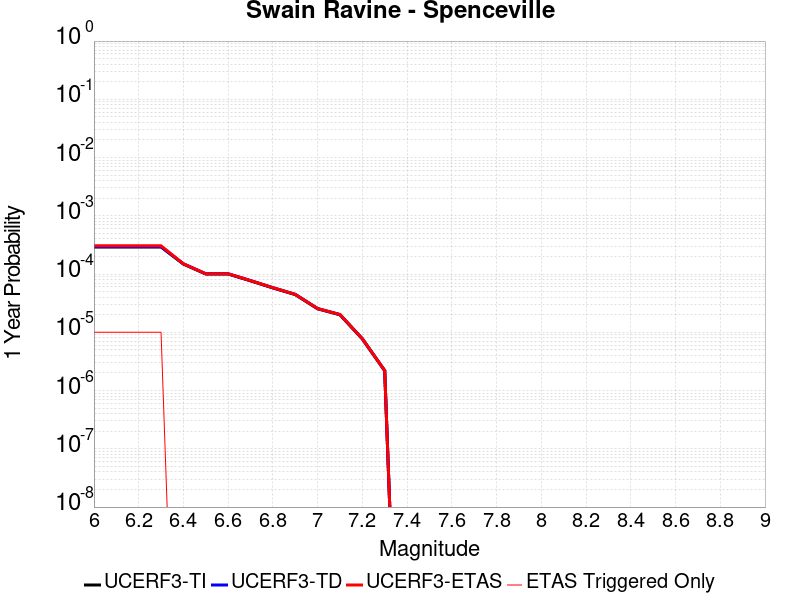 | 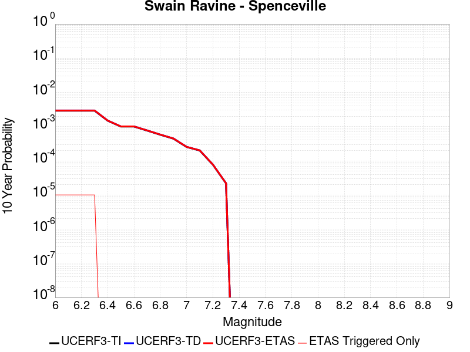 |

| Magnitude | 1 wk TI Prob | 1 wk TD Prob | 1 wk ETAS Prob | 1 wk ETAS/TD Gain | 1 wk ETAS Triggered Only | 1 mo TI Prob | 1 mo TD Prob | 1 mo ETAS Prob | 1 mo ETAS/TD Gain | 1 mo ETAS Triggered Only | 1 yr TI Prob | 1 yr TD Prob | 1 yr ETAS Prob | 1 yr ETAS/TD Gain | 1 yr ETAS Triggered Only | 10 yr TI Prob | 10 yr TD Prob | 10 yr ETAS Prob | 10 yr ETAS/TD Gain | 10 yr ETAS Triggered Only |
|-----|-----|-----|-----|-----|-----|-----|-----|-----|-----|-----|-----|-----|-----|-----|-----|-----|-----|-----|-----|-----|
| 6.0 | 5.596169E-6 | 5.663802E-6 | 5.663802E-6 | 1.0 | 0.0 | 2.398336E-5 | 2.4273226E-5 | 2.4273226E-5 | 1.0 | 0.0 | 2.9195828E-4 | 2.9548918E-4 | 3.0548623E-4 | 1.0338322 | 1.0E-5 | 0.00291575 | 0.002951232 | 0.0029612025 | 1.0033784 | 1.0E-5 |
| 6.1 | 5.596169E-6 | 5.663802E-6 | 5.663802E-6 | 1.0 | 0.0 | 2.398336E-5 | 2.4273226E-5 | 2.4273226E-5 | 1.0 | 0.0 | 2.9195828E-4 | 2.9548918E-4 | 3.0548623E-4 | 1.0338322 | 1.0E-5 | 0.00291575 | 0.002951232 | 0.0029612025 | 1.0033784 | 1.0E-5 |
| 6.2 | 5.596169E-6 | 5.663802E-6 | 5.663802E-6 | 1.0 | 0.0 | 2.398336E-5 | 2.4273226E-5 | 2.4273226E-5 | 1.0 | 0.0 | 2.9195828E-4 | 2.9548918E-4 | 3.0548623E-4 | 1.0338322 | 1.0E-5 | 0.00291575 | 0.002951232 | 0.0029612025 | 1.0033784 | 1.0E-5 |
| 6.3 | 5.596169E-6 | 5.663802E-6 | 5.663802E-6 | 1.0 | 0.0 | 2.398336E-5 | 2.4273226E-5 | 2.4273226E-5 | 1.0 | 0.0 | 2.9195828E-4 | 2.9548918E-4 | 3.0548623E-4 | 1.0338322 | 1.0E-5 | 0.00291575 | 0.002951232 | 0.0029612025 | 1.0033784 | 1.0E-5 |
| 6.4 | 2.8426775E-6 | 2.8741474E-6 | 2.8741474E-6 | 1.0 | 0.0 | 1.2182847E-5 | 1.2317719E-5 | 1.2317719E-5 | 1.0 | 0.0 | 1.4831607E-4 | 1.499583E-4 | 1.499583E-4 | 1.0 | 0.0 | 0.0014821711 | 0.0014986095 | 0.0014986095 | 1.0 | 0.0 |
| 6.5 | 1.9210793E-6 | 1.941417E-6 | 1.941417E-6 | 1.0 | 0.0 | 8.233172E-6 | 8.320333E-6 | 8.320333E-6 | 1.0 | 0.0 | 1.0023425E-4 | 1.0129548E-4 | 1.0129548E-4 | 1.0 | 0.0 | 0.0010018905 | 0.0010125064 | 0.0010125064 | 1.0 | 0.0 |
| 6.6 | 1.9210793E-6 | 1.941417E-6 | 1.941417E-6 | 1.0 | 0.0 | 8.233172E-6 | 8.320333E-6 | 8.320333E-6 | 1.0 | 0.0 | 1.0023425E-4 | 1.0129548E-4 | 1.0129548E-4 | 1.0 | 0.0 | 0.0010018905 | 0.0010125064 | 0.0010125064 | 1.0 | 0.0 |
| 6.7 | 1.4667394E-6 | 1.4818951E-6 | 1.4818951E-6 | 1.0 | 0.0 | 6.286011E-6 | 6.3509638E-6 | 6.3509638E-6 | 1.0 | 0.0 | 7.65295E-5 | 7.732032E-5 | 7.732032E-5 | 1.0 | 0.0 | 7.6503144E-4 | 7.729419E-4 | 7.729419E-4 | 1.0 | 0.0 |
| 6.8 | 1.1076943E-6 | 1.1189547E-6 | 1.1189547E-6 | 1.0 | 0.0 | 4.747252E-6 | 4.795512E-6 | 4.795512E-6 | 1.0 | 0.0 | 5.7796264E-5 | 5.8383837E-5 | 5.8383837E-5 | 1.0 | 0.0 | 5.778124E-4 | 5.836894E-4 | 5.836894E-4 | 1.0 | 0.0 |
| 6.9 | 8.514296E-7 | 8.6001046E-7 | 8.6001046E-7 | 1.0 | 0.0 | 3.648979E-6 | 3.6857539E-6 | 3.6857539E-6 | 1.0 | 0.0 | 4.442541E-5 | 4.487316E-5 | 4.487316E-5 | 1.0 | 0.0 | 4.441653E-4 | 4.4864384E-4 | 4.4864384E-4 | 1.0 | 0.0 |
| 7.0 | 4.8544706E-7 | 4.903306E-7 | 4.903306E-7 | 1.0 | 0.0 | 2.0804857E-6 | 2.1014152E-6 | 2.1014152E-6 | 1.0 | 0.0 | 2.532962E-5 | 2.5584442E-5 | 2.5584442E-5 | 1.0 | 0.0 | 2.5326732E-4 | 2.5581627E-4 | 2.5581627E-4 | 1.0 | 0.0 |
| 7.1 | 3.829186E-7 | 3.8678826E-7 | 3.8678826E-7 | 1.0 | 0.0 | 1.6410787E-6 | 1.657663E-6 | 1.657663E-6 | 1.0 | 0.0 | 1.997995E-5 | 2.0181871E-5 | 2.0181871E-5 | 1.0 | 0.0 | 1.9978154E-4 | 2.0180145E-4 | 2.0180145E-4 | 1.0 | 0.0 |
| 7.2 | 1.4726595E-7 | 1.4879456E-7 | 1.4879456E-7 | 1.0 | 0.0 | 6.3113964E-7 | 6.376908E-7 | 6.376908E-7 | 1.0 | 0.0 | 7.684098E-6 | 7.763863E-6 | 7.763863E-6 | 1.0 | 0.0 | 7.6838325E-5 | 7.7636454E-5 | 7.7636454E-5 | 1.0 | 0.0 |
| 7.3 | 4.1880604E-8 | 4.2324356E-8 | 4.2324356E-8 | 1.0 | 0.0 | 1.7948828E-7 | 1.8139009E-7 | 1.8139009E-7 | 1.0 | 0.0 | 2.1852677E-6 | 2.2084243E-6 | 2.2084243E-6 | 1.0 | 0.0 | 2.1852462E-5 | 2.2084245E-5 | 2.2084245E-5 | 1.0 | 0.0 |

## San Luis Range 2011 CFM
*[(top)](#table-of-contents)*

| 1 Week | 1 Month | 1 Year | 10 Year |
|-----|-----|-----|-----|
| 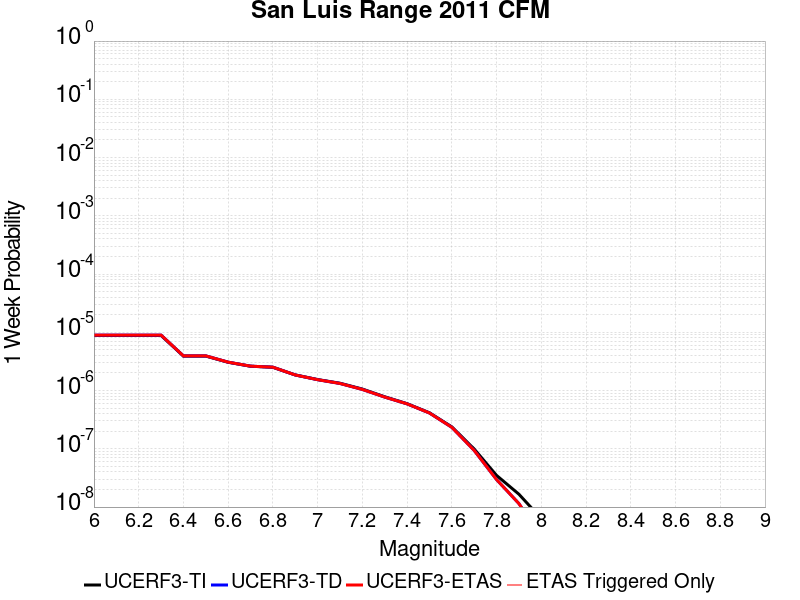 | 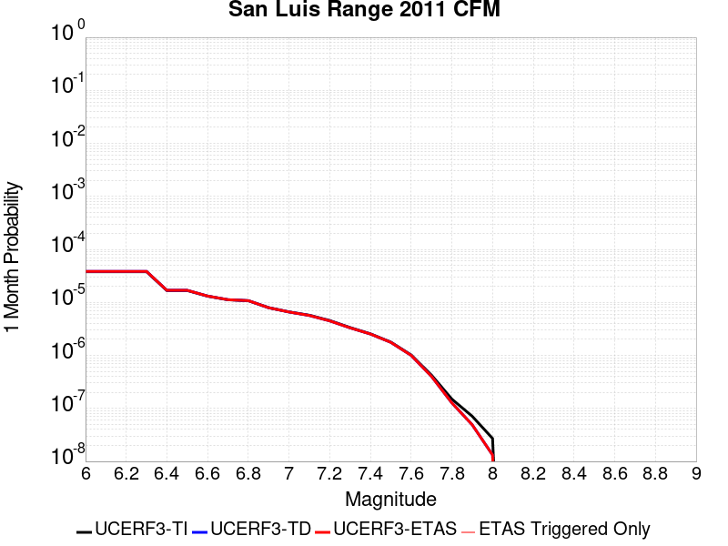 |  | 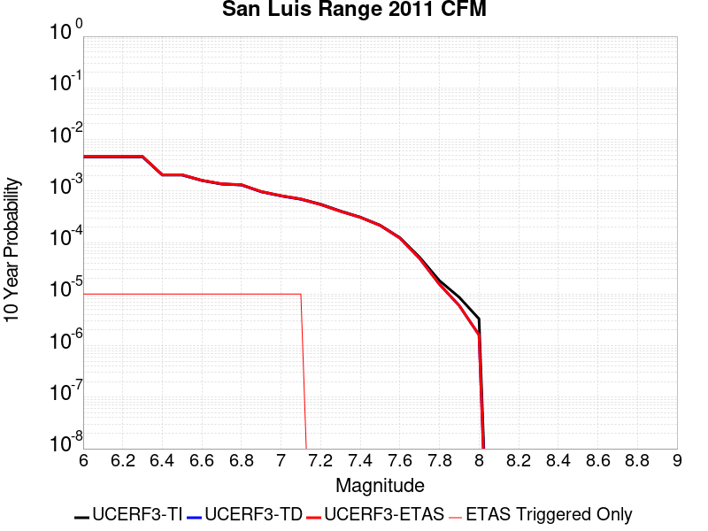 |

| Magnitude | 1 wk TI Prob | 1 wk TD Prob | 1 wk ETAS Prob | 1 wk ETAS/TD Gain | 1 wk ETAS Triggered Only | 1 mo TI Prob | 1 mo TD Prob | 1 mo ETAS Prob | 1 mo ETAS/TD Gain | 1 mo ETAS Triggered Only | 1 yr TI Prob | 1 yr TD Prob | 1 yr ETAS Prob | 1 yr ETAS/TD Gain | 1 yr ETAS Triggered Only | 10 yr TI Prob | 10 yr TD Prob | 10 yr ETAS Prob | 10 yr ETAS/TD Gain | 10 yr ETAS Triggered Only |
|-----|-----|-----|-----|-----|-----|-----|-----|-----|-----|-----|-----|-----|-----|-----|-----|-----|-----|-----|-----|-----|
| 6.0 | 8.8368415E-6 | 8.965474E-6 | 8.965474E-6 | 1.0 | 0.0 | 3.787163E-5 | 3.842294E-5 | 3.842294E-5 | 1.0 | 0.0 | 4.609895E-4 | 4.6770676E-4 | 4.777021E-4 | 1.0213709 | 1.0E-5 | 0.0046003438 | 0.004668007 | 0.00467796 | 1.0021323 | 1.0E-5 |
| 6.1 | 8.8368415E-6 | 8.965474E-6 | 8.965474E-6 | 1.0 | 0.0 | 3.787163E-5 | 3.842294E-5 | 3.842294E-5 | 1.0 | 0.0 | 4.609895E-4 | 4.6770676E-4 | 4.777021E-4 | 1.0213709 | 1.0E-5 | 0.0046003438 | 0.004668007 | 0.00467796 | 1.0021323 | 1.0E-5 |
| 6.2 | 8.8368415E-6 | 8.965474E-6 | 8.965474E-6 | 1.0 | 0.0 | 3.787163E-5 | 3.842294E-5 | 3.842294E-5 | 1.0 | 0.0 | 4.609895E-4 | 4.6770676E-4 | 4.777021E-4 | 1.0213709 | 1.0E-5 | 0.0046003438 | 0.004668007 | 0.00467796 | 1.0021323 | 1.0E-5 |
| 6.3 | 8.8368415E-6 | 8.965474E-6 | 8.965474E-6 | 1.0 | 0.0 | 3.787163E-5 | 3.842294E-5 | 3.842294E-5 | 1.0 | 0.0 | 4.609895E-4 | 4.6770676E-4 | 4.777021E-4 | 1.0213709 | 1.0E-5 | 0.0046003438 | 0.004668007 | 0.00467796 | 1.0021323 | 1.0E-5 |
| 6.4 | 3.9094193E-6 | 3.9412125E-6 | 3.9412125E-6 | 1.0 | 0.0 | 1.6754546E-5 | 1.6890803E-5 | 1.6890803E-5 | 1.0 | 0.0 | 2.039675E-4 | 2.0562639E-4 | 2.1562434E-4 | 1.0486219 | 1.0E-5 | 0.0020378039 | 0.00205439 | 0.0020643696 | 1.0048577 | 1.0E-5 |
| 6.5 | 3.9094193E-6 | 3.9412125E-6 | 3.9412125E-6 | 1.0 | 0.0 | 1.6754546E-5 | 1.6890803E-5 | 1.6890803E-5 | 1.0 | 0.0 | 2.039675E-4 | 2.0562639E-4 | 2.1562434E-4 | 1.0486219 | 1.0E-5 | 0.0020378039 | 0.00205439 | 0.0020643696 | 1.0048577 | 1.0E-5 |
| 6.6 | 3.0587726E-6 | 3.0753963E-6 | 3.0753963E-6 | 1.0 | 0.0 | 1.3108959E-5 | 1.31802035E-5 | 1.31802035E-5 | 1.0 | 0.0 | 1.595899E-4 | 1.6045728E-4 | 1.7045568E-4 | 1.0623119 | 1.0E-5 | 0.0015947534 | 0.0016034263 | 0.0016134102 | 1.0062267 | 1.0E-5 |
| 6.7 | 2.6160574E-6 | 2.6251344E-6 | 2.6251344E-6 | 1.0 | 0.0 | 1.1211626E-5 | 1.1250528E-5 | 1.1250528E-5 | 1.0 | 0.0 | 1.3649299E-4 | 1.3696663E-4 | 1.4696526E-4 | 1.0730004 | 1.0E-5 | 0.0013640919 | 0.0013688284 | 0.0013788146 | 1.0072955 | 1.0E-5 |
| 6.8 | 2.5110312E-6 | 2.518147E-6 | 2.518147E-6 | 1.0 | 0.0 | 1.0761518E-5 | 1.0792014E-5 | 1.0792014E-5 | 1.0 | 0.0 | 1.310136E-4 | 1.313849E-4 | 1.413836E-4 | 1.0761023 | 1.0E-5 | 0.0013093639 | 0.0013130782 | 0.0013230651 | 1.0076057 | 1.0E-5 |
| 6.9 | 1.8564405E-6 | 1.8524927E-6 | 1.8524927E-6 | 1.0 | 0.0 | 7.95615E-6 | 7.93923E-6 | 7.93923E-6 | 1.0 | 0.0 | 9.686181E-5 | 9.665586E-5 | 1.06654894E-4 | 1.1034498 | 1.0E-5 | 9.68196E-4 | 9.6614024E-4 | 9.7613054E-4 | 1.0103405 | 1.0E-5 |
| 7.0 | 1.546127E-6 | 1.5369588E-6 | 1.5369588E-6 | 1.0 | 0.0 | 6.626242E-6 | 6.58695E-6 | 6.58695E-6 | 1.0 | 0.0 | 8.06715E-5 | 8.019317E-5 | 9.019236E-5 | 1.1246889 | 1.0E-5 | 8.0642226E-4 | 8.01643E-4 | 8.11635E-4 | 1.0124644 | 1.0E-5 |
| 7.1 | 1.3368208E-6 | 1.3235372E-6 | 1.3235372E-6 | 1.0 | 0.0 | 5.7292195E-6 | 5.6722897E-6 | 5.6722897E-6 | 1.0 | 0.0 | 6.975101E-5 | 6.905795E-5 | 7.905725E-5 | 1.1447959 | 1.0E-5 | 6.972912E-4 | 6.903653E-4 | 7.003584E-4 | 1.0144751 | 1.0E-5 |
| 7.2 | 1.0623363E-6 | 1.0454406E-6 | 1.0454406E-6 | 1.0 | 0.0 | 4.5528623E-6 | 4.4804524E-6 | 4.4804524E-6 | 1.0 | 0.0 | 5.5429686E-5 | 5.4548145E-5 | 5.4548145E-5 | 1.0 | 0.0 | 5.5415864E-4 | 5.453478E-4 | 5.453478E-4 | 1.0 | 0.0 |
| 7.3 | 7.831679E-7 | 7.727423E-7 | 7.727423E-7 | 1.0 | 0.0 | 3.3564295E-6 | 3.3117485E-6 | 3.3117485E-6 | 1.0 | 0.0 | 4.086376E-5 | 4.0319792E-5 | 4.0319792E-5 | 1.0 | 0.0 | 4.0856248E-4 | 4.0312493E-4 | 4.0312493E-4 | 1.0 | 0.0 |
| 7.4 | 5.9558846E-7 | 5.9106657E-7 | 5.9106657E-7 | 1.0 | 0.0 | 2.5525194E-6 | 2.5331399E-6 | 2.5331399E-6 | 1.0 | 0.0 | 3.107648E-5 | 3.0840543E-5 | 3.0840543E-5 | 1.0 | 0.0 | 3.1072134E-4 | 3.083627E-4 | 3.083627E-4 | 1.0 | 0.0 |
| 7.5 | 4.1616502E-7 | 4.1196566E-7 | 4.1196566E-7 | 1.0 | 0.0 | 1.7835631E-6 | 1.7655658E-6 | 1.7655658E-6 | 1.0 | 0.0 | 2.1714664E-5 | 2.1495553E-5 | 2.1495553E-5 | 1.0 | 0.0 | 2.1712543E-4 | 2.1493479E-4 | 2.1493479E-4 | 1.0 | 0.0 |
| 7.6 | 2.3816014E-7 | 2.3376738E-7 | 2.3376738E-7 | 1.0 | 0.0 | 1.0206859E-6 | 1.0018598E-6 | 1.0018598E-6 | 1.0 | 0.0 | 1.242678E-5 | 1.2197575E-5 | 1.2197575E-5 | 1.0 | 0.0 | 1.2426086E-4 | 1.21969075E-4 | 1.21969075E-4 | 1.0 | 0.0 |
| 7.7 | 9.918777E-8 | 9.386904E-8 | 9.386904E-8 | 1.0 | 0.0 | 4.2509038E-7 | 4.0229583E-7 | 4.0229583E-7 | 1.0 | 0.0 | 5.1754632E-6 | 4.8979405E-6 | 4.8979405E-6 | 1.0 | 0.0 | 5.1753424E-5 | 4.897833E-5 | 4.897833E-5 | 1.0 | 0.0 |
| 7.8 | 3.4982556E-8 | 2.9687502E-8 | 2.9687502E-8 | 1.0 | 0.0 | 1.4992524E-7 | 1.2723216E-7 | 1.2723216E-7 | 1.0 | 0.0 | 1.8253382E-6 | 1.5490504E-6 | 1.5490504E-6 | 1.0 | 0.0 | 1.8253233E-5 | 1.5490396E-5 | 1.5490396E-5 | 1.0 | 0.0 |
| 7.9 | 1.6624908E-8 | 1.1477716E-8 | 1.1477716E-8 | 1.0 | 0.0 | 7.12496E-8 | 4.919021E-8 | 4.919021E-8 | 1.0 | 0.0 | 8.6746354E-7 | 5.9889067E-7 | 5.9889067E-7 | 1.0 | 0.0 | 8.674601E-6 | 5.9888907E-6 | 5.9888907E-6 | 1.0 | 0.0 |
| 8.0 | 6.3352315E-9 | 3.0891036E-9 | 3.0891036E-9 | 1.0 | 0.0 | 2.715099E-8 | 1.3239015E-8 | 1.3239015E-8 | 1.0 | 0.0 | 3.3056327E-7 | 1.61185E-7 | 1.61185E-7 | 1.0 | 0.0 | 3.3056278E-6 | 1.6118489E-6 | 1.6118489E-6 | 1.0 | 0.0 |

## Sierra Madre
*[(top)](#table-of-contents)*

| 1 Week | 1 Month | 1 Year | 10 Year |
|-----|-----|-----|-----|
|  |  |  |  |

| Magnitude | 1 wk TI Prob | 1 wk TD Prob | 1 wk ETAS Prob | 1 wk ETAS/TD Gain | 1 wk ETAS Triggered Only | 1 mo TI Prob | 1 mo TD Prob | 1 mo ETAS Prob | 1 mo ETAS/TD Gain | 1 mo ETAS Triggered Only | 1 yr TI Prob | 1 yr TD Prob | 1 yr ETAS Prob | 1 yr ETAS/TD Gain | 1 yr ETAS Triggered Only | 10 yr TI Prob | 10 yr TD Prob | 10 yr ETAS Prob | 10 yr ETAS/TD Gain | 10 yr ETAS Triggered Only |
|-----|-----|-----|-----|-----|-----|-----|-----|-----|-----|-----|-----|-----|-----|-----|-----|-----|-----|-----|-----|-----|
| 6.0 | 1.3379373E-5 | 1.1001105E-5 | 1.1001105E-5 | 1.0 | 0.0 | 5.7338908E-5 | 4.714675E-5 | 4.714675E-5 | 1.0 | 0.0 | 6.978776E-4 | 5.7386194E-4 | 5.7386194E-4 | 1.0 | 0.0 | 0.0069569005 | 0.0057240427 | 0.0057339855 | 1.001737 | 1.0E-5 |
| 6.1 | 1.3379373E-5 | 1.1001105E-5 | 1.1001105E-5 | 1.0 | 0.0 | 5.7338908E-5 | 4.714675E-5 | 4.714675E-5 | 1.0 | 0.0 | 6.978776E-4 | 5.7386194E-4 | 5.7386194E-4 | 1.0 | 0.0 | 0.0069569005 | 0.0057240427 | 0.0057339855 | 1.001737 | 1.0E-5 |
| 6.2 | 1.3379373E-5 | 1.1001105E-5 | 1.1001105E-5 | 1.0 | 0.0 | 5.7338908E-5 | 4.714675E-5 | 4.714675E-5 | 1.0 | 0.0 | 6.978776E-4 | 5.7386194E-4 | 5.7386194E-4 | 1.0 | 0.0 | 0.0069569005 | 0.0057240427 | 0.0057339855 | 1.001737 | 1.0E-5 |
| 6.3 | 1.3379373E-5 | 1.1001105E-5 | 1.1001105E-5 | 1.0 | 0.0 | 5.7338908E-5 | 4.714675E-5 | 4.714675E-5 | 1.0 | 0.0 | 6.978776E-4 | 5.7386194E-4 | 5.7386194E-4 | 1.0 | 0.0 | 0.0069569005 | 0.0057240427 | 0.0057339855 | 1.001737 | 1.0E-5 |
| 6.4 | 1.3379373E-5 | 1.1001105E-5 | 1.1001105E-5 | 1.0 | 0.0 | 5.7338908E-5 | 4.714675E-5 | 4.714675E-5 | 1.0 | 0.0 | 6.978776E-4 | 5.7386194E-4 | 5.7386194E-4 | 1.0 | 0.0 | 0.0069569005 | 0.0057240427 | 0.0057339855 | 1.001737 | 1.0E-5 |
| 6.5 | 1.26563245E-5 | 1.0230555E-5 | 1.0230555E-5 | 1.0 | 0.0 | 5.4240263E-5 | 4.3844506E-5 | 4.3844506E-5 | 1.0 | 0.0 | 6.601751E-4 | 5.336772E-4 | 5.336772E-4 | 1.0 | 0.0 | 0.006582173 | 0.005324155 | 0.005334102 | 1.0018682 | 1.0E-5 |
| 6.6 | 1.26563245E-5 | 1.0230555E-5 | 1.0230555E-5 | 1.0 | 0.0 | 5.4240263E-5 | 4.3844506E-5 | 4.3844506E-5 | 1.0 | 0.0 | 6.601751E-4 | 5.336772E-4 | 5.336772E-4 | 1.0 | 0.0 | 0.006582173 | 0.005324155 | 0.005334102 | 1.0018682 | 1.0E-5 |
| 6.7 | 1.2502474E-5 | 1.0066698E-5 | 1.0066698E-5 | 1.0 | 0.0 | 5.3580934E-5 | 4.3142285E-5 | 4.3142285E-5 | 1.0 | 0.0 | 6.521526E-4 | 5.2513176E-4 | 5.2513176E-4 | 1.0 | 0.0 | 0.0065024206 | 0.005239106 | 0.0052490537 | 1.0018988 | 1.0E-5 |
| 6.8 | 1.2454966E-5 | 1.0018983E-5 | 1.0018983E-5 | 1.0 | 0.0 | 5.3377335E-5 | 4.2937798E-5 | 4.2937798E-5 | 1.0 | 0.0 | 6.4967526E-4 | 5.226434E-4 | 5.226434E-4 | 1.0 | 0.0 | 0.006477792 | 0.0052143387 | 0.0052242866 | 1.0019078 | 1.0E-5 |
| 6.9 | 1.2225574E-5 | 9.792959E-6 | 9.792959E-6 | 1.0 | 0.0 | 5.2394265E-5 | 4.1969153E-5 | 4.1969153E-5 | 1.0 | 0.0 | 6.3771347E-4 | 5.108557E-4 | 5.108557E-4 | 1.0 | 0.0 | 0.006358865 | 0.0050970074 | 0.005106956 | 1.0019519 | 1.0E-5 |
| 7.0 | 1.182946E-5 | 9.399497E-6 | 9.399497E-6 | 1.0 | 0.0 | 5.06967E-5 | 4.0282943E-5 | 4.0282943E-5 | 1.0 | 0.0 | 6.1705755E-4 | 4.9033546E-4 | 4.9033546E-4 | 1.0 | 0.0 | 0.006153469 | 0.0048927255 | 0.004902676 | 1.0020338 | 1.0E-5 |
| 7.1 | 1.14369095E-5 | 8.986503E-6 | 8.986503E-6 | 1.0 | 0.0 | 4.9014405E-5 | 3.8513022E-5 | 3.8513022E-5 | 1.0 | 0.0 | 5.9658696E-4 | 4.6879615E-4 | 4.6879615E-4 | 1.0 | 0.0 | 0.005949879 | 0.004678256 | 0.004688209 | 1.0021275 | 1.0E-5 |
| 7.2 | 1.0836419E-5 | 8.399894E-6 | 8.399894E-6 | 1.0 | 0.0 | 4.644097E-5 | 3.599905E-5 | 3.599905E-5 | 1.0 | 0.0 | 5.652721E-4 | 4.3820124E-4 | 4.3820124E-4 | 1.0 | 0.0 | 0.0056383642 | 0.0043735467 | 0.004383503 | 1.0022764 | 1.0E-5 |
| 7.3 | 1.0403439E-5 | 8.021154E-6 | 8.021154E-6 | 1.0 | 0.0 | 4.4585406E-5 | 3.4375927E-5 | 3.4375927E-5 | 1.0 | 0.0 | 5.426921E-4 | 4.1844745E-4 | 4.1844745E-4 | 1.0 | 0.0 | 0.005413687 | 0.0041767685 | 0.0041867266 | 1.0023842 | 1.0E-5 |
| 7.4 | 9.768864E-6 | 7.414778E-6 | 7.414778E-6 | 1.0 | 0.0 | 4.186589E-5 | 3.177724E-5 | 3.177724E-5 | 1.0 | 0.0 | 5.09598E-4 | 3.8682006E-4 | 3.8682006E-4 | 1.0 | 0.0 | 0.0050843097 | 0.003861637 | 0.0038715985 | 1.0025796 | 1.0E-5 |
| 7.5 | 8.687089E-6 | 6.4504625E-6 | 6.4504625E-6 | 1.0 | 0.0 | 3.722985E-5 | 2.7644552E-5 | 2.7644552E-5 | 1.0 | 0.0 | 4.5317915E-4 | 3.365213E-4 | 3.365213E-4 | 1.0 | 0.0 | 0.004522561 | 0.003360282 | 0.003360282 | 1.0 | 0.0 |
| 7.6 | 6.3506063E-6 | 4.430592E-6 | 4.430592E-6 | 1.0 | 0.0 | 2.72166E-5 | 1.8988116E-5 | 1.8988116E-5 | 1.0 | 0.0 | 3.3131172E-4 | 2.3115604E-4 | 2.3115604E-4 | 1.0 | 0.0 | 0.003308182 | 0.0023092586 | 0.0023092586 | 1.0 | 0.0 |
| 7.7 | 4.62223E-6 | 2.9332068E-6 | 2.9332068E-6 | 1.0 | 0.0 | 1.9809406E-5 | 1.2570827E-5 | 1.2570827E-5 | 1.0 | 0.0 | 2.4115283E-4 | 1.5303909E-4 | 1.5303909E-4 | 1.0 | 0.0 | 0.0024089129 | 0.0015294153 | 0.0015294153 | 1.0 | 0.0 |
| 7.8 | 3.2145008E-6 | 1.9496076E-6 | 1.9496076E-6 | 1.0 | 0.0 | 1.3776359E-5 | 8.355434E-6 | 8.355434E-6 | 1.0 | 0.0 | 1.6771426E-4 | 1.01722675E-4 | 1.01722675E-4 | 1.0 | 0.0 | 0.0016758774 | 0.0010167853 | 0.0010167853 | 1.0 | 0.0 |
| 7.9 | 1.0391769E-6 | 5.6031865E-7 | 5.6031865E-7 | 1.0 | 0.0 | 4.4536077E-6 | 2.4013634E-6 | 2.4013634E-6 | 1.0 | 0.0 | 5.4221324E-5 | 2.9236213E-5 | 2.9236213E-5 | 1.0 | 0.0 | 5.4208096E-4 | 2.9232408E-4 | 2.9232408E-4 | 1.0 | 0.0 |
| 8.0 | 1.210983E-7 | 6.613793E-8 | 6.613793E-8 | 1.0 | 0.0 | 5.1899264E-7 | 2.8344826E-7 | 2.8344826E-7 | 1.0 | 0.0 | 6.3187167E-6 | 3.4509771E-6 | 3.4509771E-6 | 1.0 | 0.0 | 6.318537E-5 | 3.4509256E-5 | 3.4509256E-5 | 1.0 | 0.0 |

## Puente Hills
*[(top)](#table-of-contents)*

| 1 Week | 1 Month | 1 Year | 10 Year |
|-----|-----|-----|-----|
|  | 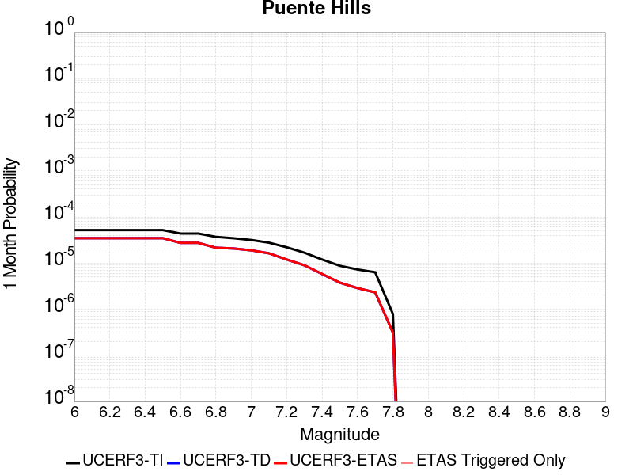 | 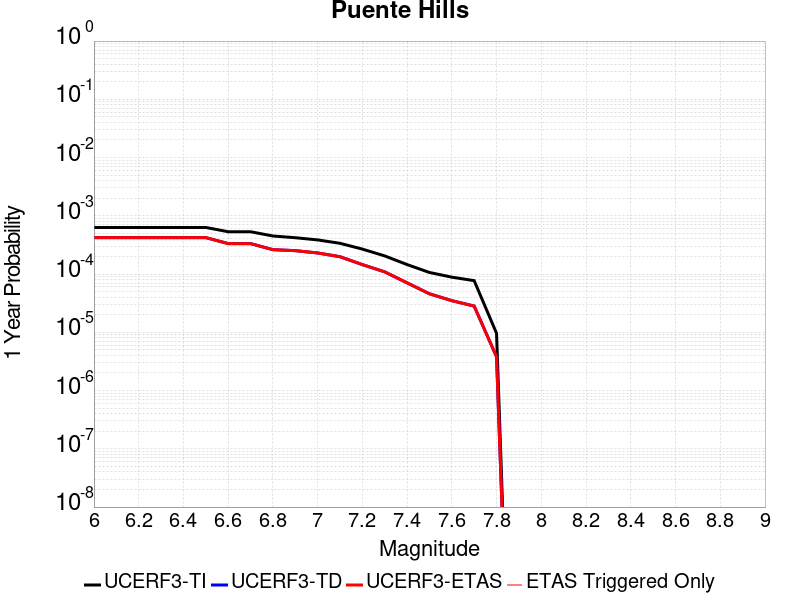 | 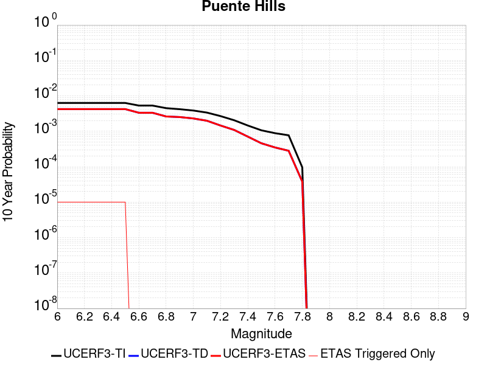 |

| Magnitude | 1 wk TI Prob | 1 wk TD Prob | 1 wk ETAS Prob | 1 wk ETAS/TD Gain | 1 wk ETAS Triggered Only | 1 mo TI Prob | 1 mo TD Prob | 1 mo ETAS Prob | 1 mo ETAS/TD Gain | 1 mo ETAS Triggered Only | 1 yr TI Prob | 1 yr TD Prob | 1 yr ETAS Prob | 1 yr ETAS/TD Gain | 1 yr ETAS Triggered Only | 10 yr TI Prob | 10 yr TD Prob | 10 yr ETAS Prob | 10 yr ETAS/TD Gain | 10 yr ETAS Triggered Only |
|-----|-----|-----|-----|-----|-----|-----|-----|-----|-----|-----|-----|-----|-----|-----|-----|-----|-----|-----|-----|-----|
| 6.0 | 1.2101656E-5 | 8.098553E-6 | 8.098553E-6 | 1.0 | 0.0 | 5.1863204E-5 | 3.4707653E-5 | 3.4707653E-5 | 1.0 | 0.0 | 6.312516E-4 | 4.2248936E-4 | 4.2248936E-4 | 1.0 | 0.0 | 0.0062946146 | 0.004217422 | 0.00422738 | 1.002361 | 1.0E-5 |
| 6.1 | 1.2101656E-5 | 8.098553E-6 | 8.098553E-6 | 1.0 | 0.0 | 5.1863204E-5 | 3.4707653E-5 | 3.4707653E-5 | 1.0 | 0.0 | 6.312516E-4 | 4.2248936E-4 | 4.2248936E-4 | 1.0 | 0.0 | 0.0062946146 | 0.004217422 | 0.00422738 | 1.002361 | 1.0E-5 |
| 6.2 | 1.2101656E-5 | 8.098553E-6 | 8.098553E-6 | 1.0 | 0.0 | 5.1863204E-5 | 3.4707653E-5 | 3.4707653E-5 | 1.0 | 0.0 | 6.312516E-4 | 4.2248936E-4 | 4.2248936E-4 | 1.0 | 0.0 | 0.0062946146 | 0.004217422 | 0.00422738 | 1.002361 | 1.0E-5 |
| 6.3 | 1.2101656E-5 | 8.098553E-6 | 8.098553E-6 | 1.0 | 0.0 | 5.1863204E-5 | 3.4707653E-5 | 3.4707653E-5 | 1.0 | 0.0 | 6.312516E-4 | 4.2248936E-4 | 4.2248936E-4 | 1.0 | 0.0 | 0.0062946146 | 0.004217422 | 0.00422738 | 1.002361 | 1.0E-5 |
| 6.4 | 1.2101656E-5 | 8.098553E-6 | 8.098553E-6 | 1.0 | 0.0 | 5.1863204E-5 | 3.4707653E-5 | 3.4707653E-5 | 1.0 | 0.0 | 6.312516E-4 | 4.2248936E-4 | 4.2248936E-4 | 1.0 | 0.0 | 0.0062946146 | 0.004217422 | 0.00422738 | 1.002361 | 1.0E-5 |
| 6.5 | 1.2101656E-5 | 8.098553E-6 | 8.098553E-6 | 1.0 | 0.0 | 5.1863204E-5 | 3.4707653E-5 | 3.4707653E-5 | 1.0 | 0.0 | 6.312516E-4 | 4.2248936E-4 | 4.2248936E-4 | 1.0 | 0.0 | 0.0062946146 | 0.004217422 | 0.00422738 | 1.002361 | 1.0E-5 |
| 6.6 | 1.0222488E-5 | 6.399172E-6 | 6.399172E-6 | 1.0 | 0.0 | 4.3809923E-5 | 2.7424747E-5 | 2.7424747E-5 | 1.0 | 0.0 | 5.332553E-4 | 3.338476E-4 | 3.338476E-4 | 1.0 | 0.0 | 0.0053197746 | 0.003333706 | 0.003333706 | 1.0 | 0.0 |
| 6.7 | 1.0222488E-5 | 6.399172E-6 | 6.399172E-6 | 1.0 | 0.0 | 4.3809923E-5 | 2.7424747E-5 | 2.7424747E-5 | 1.0 | 0.0 | 5.332553E-4 | 3.338476E-4 | 3.338476E-4 | 1.0 | 0.0 | 0.0053197746 | 0.003333706 | 0.003333706 | 1.0 | 0.0 |
| 6.8 | 8.6367845E-6 | 5.028209E-6 | 5.028209E-6 | 1.0 | 0.0 | 3.7014266E-5 | 2.1549293E-5 | 2.1549293E-5 | 1.0 | 0.0 | 4.505555E-4 | 2.623316E-4 | 2.623316E-4 | 1.0 | 0.0 | 0.004496431 | 0.0026202756 | 0.0026202756 | 1.0 | 0.0 |
| 6.9 | 8.066481E-6 | 4.836091E-6 | 4.836091E-6 | 1.0 | 0.0 | 3.4570177E-5 | 2.0725944E-5 | 2.0725944E-5 | 1.0 | 0.0 | 4.2081063E-4 | 2.5230966E-4 | 2.5230966E-4 | 1.0 | 0.0 | 0.0042001465 | 0.002520286 | 0.002520286 | 1.0 | 0.0 |
| 7.0 | 7.393828E-6 | 4.417304E-6 | 4.417304E-6 | 1.0 | 0.0 | 3.168745E-5 | 1.8931169E-5 | 1.8931169E-5 | 1.0 | 0.0 | 3.857264E-4 | 2.3046305E-4 | 2.3046305E-4 | 1.0 | 0.0 | 0.0038505755 | 0.002302286 | 0.002302286 | 1.0 | 0.0 |
| 7.1 | 6.4660953E-6 | 3.8044566E-6 | 3.8044566E-6 | 1.0 | 0.0 | 2.7711543E-5 | 1.6304713E-5 | 1.6304713E-5 | 1.0 | 0.0 | 3.373358E-4 | 1.9849217E-4 | 1.9849217E-4 | 1.0 | 0.0 | 0.0033682417 | 0.0019831846 | 0.0019831846 | 1.0 | 0.0 |
| 7.2 | 5.143232E-6 | 2.7865408E-6 | 2.7865408E-6 | 1.0 | 0.0 | 2.2042237E-5 | 1.1942264E-5 | 1.1942264E-5 | 1.0 | 0.0 | 2.6833118E-4 | 1.4538746E-4 | 1.4538746E-4 | 1.0 | 0.0 | 0.002680074 | 0.0014529332 | 0.0014529332 | 1.0 | 0.0 |
| 7.3 | 3.928255E-6 | 2.0913812E-6 | 2.0913812E-6 | 1.0 | 0.0 | 1.683527E-5 | 8.963032E-6 | 8.963032E-6 | 1.0 | 0.0 | 2.0495013E-4 | 1.09119515E-4 | 1.09119515E-4 | 1.0 | 0.0 | 0.002047612 | 0.001090666 | 0.001090666 | 1.0 | 0.0 |
| 7.4 | 2.7894434E-6 | 1.3546781E-6 | 1.3546781E-6 | 1.0 | 0.0 | 1.1954703E-5 | 5.805751E-6 | 5.805751E-6 | 1.0 | 0.0 | 1.4553878E-4 | 7.068277E-5 | 7.068277E-5 | 1.0 | 0.0 | 0.001454435 | 7.0660724E-4 | 7.0660724E-4 | 1.0 | 0.0 |
| 7.5 | 2.041735E-6 | 8.7872394E-7 | 8.7872394E-7 | 1.0 | 0.0 | 8.750263E-6 | 3.7659545E-6 | 3.7659545E-6 | 1.0 | 0.0 | 1.06529245E-4 | 4.5849563E-5 | 4.5849563E-5 | 1.0 | 0.0 | 0.0010647819 | 4.5840442E-4 | 4.5840442E-4 | 1.0 | 0.0 |
| 7.6 | 1.6959062E-6 | 6.6985046E-7 | 6.6985046E-7 | 1.0 | 0.0 | 7.268149E-6 | 2.8707848E-6 | 2.8707848E-6 | 1.0 | 0.0 | 8.848612E-5 | 3.4951274E-5 | 3.4951274E-5 | 1.0 | 0.0 | 8.84509E-4 | 3.4946064E-4 | 3.4946064E-4 | 1.0 | 0.0 |
| 7.7 | 1.4767965E-6 | 5.4072916E-7 | 5.4072916E-7 | 1.0 | 0.0 | 6.3291122E-6 | 2.3174086E-6 | 2.3174086E-6 | 1.0 | 0.0 | 7.705422E-5 | 2.8214112E-5 | 2.8214112E-5 | 1.0 | 0.0 | 7.702751E-4 | 2.8210788E-4 | 2.8210788E-4 | 1.0 | 0.0 |
| 7.8 | 1.8432911E-7 | 7.281236E-8 | 7.281236E-8 | 1.0 | 0.0 | 7.8998164E-7 | 3.1205295E-7 | 3.1205295E-7 | 1.0 | 0.0 | 9.617985E-6 | 3.7992415E-6 | 3.7992415E-6 | 1.0 | 0.0 | 9.617568E-5 | 3.799209E-5 | 3.799209E-5 | 1.0 | 0.0 |

## Santa Monica alt 1
*[(top)](#table-of-contents)*

| 1 Week | 1 Month | 1 Year | 10 Year |
|-----|-----|-----|-----|
|  |  | 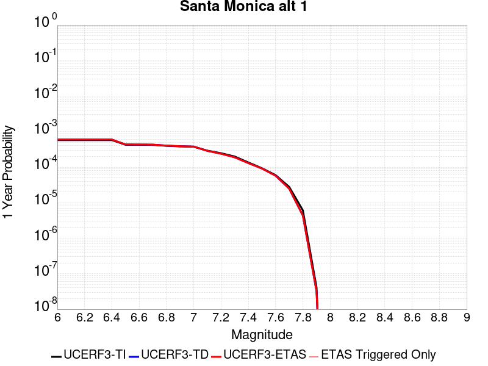 |  |

| Magnitude | 1 wk TI Prob | 1 wk TD Prob | 1 wk ETAS Prob | 1 wk ETAS/TD Gain | 1 wk ETAS Triggered Only | 1 mo TI Prob | 1 mo TD Prob | 1 mo ETAS Prob | 1 mo ETAS/TD Gain | 1 mo ETAS Triggered Only | 1 yr TI Prob | 1 yr TD Prob | 1 yr ETAS Prob | 1 yr ETAS/TD Gain | 1 yr ETAS Triggered Only | 10 yr TI Prob | 10 yr TD Prob | 10 yr ETAS Prob | 10 yr ETAS/TD Gain | 10 yr ETAS Triggered Only |
|-----|-----|-----|-----|-----|-----|-----|-----|-----|-----|-----|-----|-----|-----|-----|-----|-----|-----|-----|-----|-----|
| 6.0 | 1.1066008E-5 | 1.1480417E-5 | 1.1480417E-5 | 1.0 | 0.0 | 4.742488E-5 | 4.920094E-5 | 4.920094E-5 | 1.0 | 0.0 | 5.7724497E-4 | 5.9887074E-4 | 5.9887074E-4 | 1.0 | 0.0 | 0.005757478 | 0.0059739556 | 0.005983896 | 1.0016639 | 1.0E-5 |
| 6.1 | 1.1066008E-5 | 1.1480417E-5 | 1.1480417E-5 | 1.0 | 0.0 | 4.742488E-5 | 4.920094E-5 | 4.920094E-5 | 1.0 | 0.0 | 5.7724497E-4 | 5.9887074E-4 | 5.9887074E-4 | 1.0 | 0.0 | 0.005757478 | 0.0059739556 | 0.005983896 | 1.0016639 | 1.0E-5 |
| 6.2 | 1.1066008E-5 | 1.1480417E-5 | 1.1480417E-5 | 1.0 | 0.0 | 4.742488E-5 | 4.920094E-5 | 4.920094E-5 | 1.0 | 0.0 | 5.7724497E-4 | 5.9887074E-4 | 5.9887074E-4 | 1.0 | 0.0 | 0.005757478 | 0.0059739556 | 0.005983896 | 1.0016639 | 1.0E-5 |
| 6.3 | 1.1066008E-5 | 1.1480417E-5 | 1.1480417E-5 | 1.0 | 0.0 | 4.742488E-5 | 4.920094E-5 | 4.920094E-5 | 1.0 | 0.0 | 5.7724497E-4 | 5.9887074E-4 | 5.9887074E-4 | 1.0 | 0.0 | 0.005757478 | 0.0059739556 | 0.005983896 | 1.0016639 | 1.0E-5 |
| 6.4 | 1.1066008E-5 | 1.1480417E-5 | 1.1480417E-5 | 1.0 | 0.0 | 4.742488E-5 | 4.920094E-5 | 4.920094E-5 | 1.0 | 0.0 | 5.7724497E-4 | 5.9887074E-4 | 5.9887074E-4 | 1.0 | 0.0 | 0.005757478 | 0.0059739556 | 0.005983896 | 1.0016639 | 1.0E-5 |
| 6.5 | 8.183544E-6 | 8.335506E-6 | 8.335506E-6 | 1.0 | 0.0 | 3.5071862E-5 | 3.572312E-5 | 3.572312E-5 | 1.0 | 0.0 | 4.2691626E-4 | 4.3484377E-4 | 4.3484377E-4 | 1.0 | 0.0 | 0.0042609703 | 0.0043400945 | 0.0043500513 | 1.0022941 | 1.0E-5 |
| 6.6 | 8.1543285E-6 | 8.30372E-6 | 8.30372E-6 | 1.0 | 0.0 | 3.4946657E-5 | 3.5586898E-5 | 3.5586898E-5 | 1.0 | 0.0 | 4.2539247E-4 | 4.3318592E-4 | 4.3318592E-4 | 1.0 | 0.0 | 0.0042457907 | 0.004323581 | 0.0043335375 | 1.0023029 | 1.0E-5 |
| 6.7 | 8.110878E-6 | 8.257117E-6 | 8.257117E-6 | 1.0 | 0.0 | 3.4760444E-5 | 3.5387173E-5 | 3.5387173E-5 | 1.0 | 0.0 | 4.231262E-4 | 4.3075523E-4 | 4.3075523E-4 | 1.0 | 0.0 | 0.0042232145 | 0.0042993682 | 0.004309325 | 1.0023159 | 1.0E-5 |
| 6.8 | 7.644036E-6 | 7.7511295E-6 | 7.7511295E-6 | 1.0 | 0.0 | 3.275974E-5 | 3.3218712E-5 | 3.3218712E-5 | 1.0 | 0.0 | 3.9877684E-4 | 4.043642E-4 | 4.043642E-4 | 1.0 | 0.0 | 0.00398062 | 0.0040364307 | 0.0040463903 | 1.0024674 | 1.0E-5 |
| 6.9 | 7.3698293E-6 | 7.455786E-6 | 7.455786E-6 | 1.0 | 0.0 | 3.15846E-5 | 3.1952986E-5 | 3.1952986E-5 | 1.0 | 0.0 | 3.8447464E-4 | 3.8895954E-4 | 3.8895954E-4 | 1.0 | 0.0 | 0.0038381014 | 0.003882931 | 0.0038928923 | 1.0025654 | 1.0E-5 |
| 7.0 | 7.209872E-6 | 7.2856915E-6 | 7.2856915E-6 | 1.0 | 0.0 | 3.0899086E-5 | 3.1224026E-5 | 3.1224026E-5 | 1.0 | 0.0 | 3.7613141E-4 | 3.800876E-4 | 3.800876E-4 | 1.0 | 0.0 | 0.0037549543 | 0.0037945178 | 0.00380448 | 1.0026253 | 1.0E-5 |
| 7.1 | 5.603456E-6 | 5.523939E-6 | 5.523939E-6 | 1.0 | 0.0 | 2.4014591E-5 | 2.3673812E-5 | 2.3673812E-5 | 1.0 | 0.0 | 2.923384E-4 | 2.8819093E-4 | 2.8819093E-4 | 1.0 | 0.0 | 0.0029195412 | 0.0028782138 | 0.002888185 | 1.0034643 | 1.0E-5 |
| 7.2 | 4.7483613E-6 | 4.5911697E-6 | 4.5911697E-6 | 1.0 | 0.0 | 2.0349962E-5 | 1.9676294E-5 | 1.9676294E-5 | 1.0 | 0.0 | 2.4773262E-4 | 2.3953267E-4 | 2.3953267E-4 | 1.0 | 0.0 | 0.0024745662 | 0.002392759 | 0.0024027352 | 1.0041692 | 1.0E-5 |
| 7.3 | 3.829015E-6 | 3.6342542E-6 | 3.6342542E-6 | 1.0 | 0.0 | 1.6409962E-5 | 1.5575282E-5 | 1.5575282E-5 | 1.0 | 0.0 | 1.9977297E-4 | 1.8961265E-4 | 1.8961265E-4 | 1.0 | 0.0 | 0.0019959346 | 0.0018945175 | 0.0019044986 | 1.0052683 | 1.0E-5 |
| 7.4 | 2.610755E-6 | 2.4995916E-6 | 2.4995916E-6 | 1.0 | 0.0 | 1.1188902E-5 | 1.07124915E-5 | 1.07124915E-5 | 1.0 | 0.0 | 1.3621636E-4 | 1.3041683E-4 | 1.3041683E-4 | 1.0 | 0.0 | 0.001361329 | 0.0013034072 | 0.0013133943 | 1.0076622 | 1.0E-5 |
| 7.5 | 1.792146E-6 | 1.7584339E-6 | 1.7584339E-6 | 1.0 | 0.0 | 7.680603E-6 | 7.5361236E-6 | 7.5361236E-6 | 1.0 | 0.0 | 9.3507326E-5 | 9.174847E-5 | 9.174847E-5 | 1.0 | 0.0 | 9.3467993E-4 | 9.171091E-4 | 9.2709996E-4 | 1.0108938 | 1.0E-5 |
| 7.6 | 1.1473018E-6 | 1.1029254E-6 | 1.1029254E-6 | 1.0 | 0.0 | 4.9169985E-6 | 4.7268145E-6 | 4.7268145E-6 | 1.0 | 0.0 | 5.986281E-5 | 5.7547466E-5 | 5.7547466E-5 | 1.0 | 0.0 | 5.984669E-4 | 5.7532726E-4 | 5.853215E-4 | 1.0173714 | 1.0E-5 |
| 7.7 | 5.330919E-7 | 4.7453082E-7 | 4.7453082E-7 | 1.0 | 0.0 | 2.2846775E-6 | 2.033702E-6 | 2.033702E-6 | 1.0 | 0.0 | 2.7815593E-5 | 2.4760053E-5 | 2.4760053E-5 | 1.0 | 0.0 | 2.7812112E-4 | 2.4757406E-4 | 2.575716E-4 | 1.0403819 | 1.0E-5 |
| 7.8 | 1.1668574E-7 | 8.296795E-8 | 8.296795E-8 | 1.0 | 0.0 | 5.000816E-7 | 3.5557687E-7 | 3.5557687E-7 | 1.0 | 0.0 | 6.0884768E-6 | 4.32914E-6 | 4.32914E-6 | 1.0 | 0.0 | 6.08831E-5 | 4.3290587E-5 | 4.3290587E-5 | 1.0 | 0.0 |
| 7.9 | 8.007447E-10 | 6.1615857E-10 | 6.1615857E-10 | 1.0 | 0.0 | 3.4317629E-9 | 2.64068E-9 | 2.64068E-9 | 1.0 | 0.0 | 4.1781714E-8 | 3.215028E-8 | 3.215028E-8 | 1.0 | 0.0 | 4.1781706E-7 | 3.2150274E-7 | 3.2150274E-7 | 1.0 | 0.0 |

## Great Valley 08 (Quinto)
*[(top)](#table-of-contents)*

| 1 Week | 1 Month | 1 Year | 10 Year |
|-----|-----|-----|-----|
|  |  |  |  |

| Magnitude | 1 wk TI Prob | 1 wk TD Prob | 1 wk ETAS Prob | 1 wk ETAS/TD Gain | 1 wk ETAS Triggered Only | 1 mo TI Prob | 1 mo TD Prob | 1 mo ETAS Prob | 1 mo ETAS/TD Gain | 1 mo ETAS Triggered Only | 1 yr TI Prob | 1 yr TD Prob | 1 yr ETAS Prob | 1 yr ETAS/TD Gain | 1 yr ETAS Triggered Only | 10 yr TI Prob | 10 yr TD Prob | 10 yr ETAS Prob | 10 yr ETAS/TD Gain | 10 yr ETAS Triggered Only |
|-----|-----|-----|-----|-----|-----|-----|-----|-----|-----|-----|-----|-----|-----|-----|-----|-----|-----|-----|-----|-----|
| 6.0 | 7.737697E-6 | 8.2531E-6 | 8.2531E-6 | 1.0 | 0.0 | 3.3161137E-5 | 3.5370053E-5 | 4.53697E-5 | 1.2827151 | 1.0E-5 | 4.0366207E-4 | 4.3056416E-4 | 4.4055987E-4 | 1.0232153 | 1.0E-5 | 0.004029296 | 0.0042991526 | 0.00430911 | 1.002316 | 1.0E-5 |
| 6.1 | 7.737697E-6 | 8.2531E-6 | 8.2531E-6 | 1.0 | 0.0 | 3.3161137E-5 | 3.5370053E-5 | 4.53697E-5 | 1.2827151 | 1.0E-5 | 4.0366207E-4 | 4.3056416E-4 | 4.4055987E-4 | 1.0232153 | 1.0E-5 | 0.004029296 | 0.0042991526 | 0.00430911 | 1.002316 | 1.0E-5 |
| 6.2 | 7.737697E-6 | 8.2531E-6 | 8.2531E-6 | 1.0 | 0.0 | 3.3161137E-5 | 3.5370053E-5 | 4.53697E-5 | 1.2827151 | 1.0E-5 | 4.0366207E-4 | 4.3056416E-4 | 4.4055987E-4 | 1.0232153 | 1.0E-5 | 0.004029296 | 0.0042991526 | 0.00430911 | 1.002316 | 1.0E-5 |
| 6.3 | 5.374012E-6 | 5.7506186E-6 | 5.7506186E-6 | 1.0 | 0.0 | 2.3031276E-5 | 2.4645338E-5 | 2.4645338E-5 | 1.0 | 0.0 | 2.803697E-4 | 3.0002682E-4 | 3.0002682E-4 | 1.0 | 0.0 | 0.0028001624 | 0.002997311 | 0.002997311 | 1.0 | 0.0 |
| 6.4 | 5.374012E-6 | 5.7506186E-6 | 5.7506186E-6 | 1.0 | 0.0 | 2.3031276E-5 | 2.4645338E-5 | 2.4645338E-5 | 1.0 | 0.0 | 2.803697E-4 | 3.0002682E-4 | 3.0002682E-4 | 1.0 | 0.0 | 0.0028001624 | 0.002997311 | 0.002997311 | 1.0 | 0.0 |
| 6.5 | 3.65427E-6 | 3.9413585E-6 | 3.9413585E-6 | 1.0 | 0.0 | 1.5661062E-5 | 1.6891467E-5 | 1.6891467E-5 | 1.0 | 0.0 | 1.9065675E-4 | 2.0564125E-4 | 2.0564125E-4 | 1.0 | 0.0 | 0.0019049325 | 0.0020552014 | 0.0020552014 | 1.0 | 0.0 |
| 6.6 | 3.6143538E-6 | 3.898545E-6 | 3.898545E-6 | 1.0 | 0.0 | 1.5489995E-5 | 1.6707982E-5 | 1.6707982E-5 | 1.0 | 0.0 | 1.8857437E-4 | 2.0340775E-4 | 2.0340775E-4 | 1.0 | 0.0 | 0.0018841444 | 0.0020329072 | 0.0020329072 | 1.0 | 0.0 |
| 6.7 | 2.4821015E-6 | 2.6857315E-6 | 2.6857315E-6 | 1.0 | 0.0 | 1.0637535E-5 | 1.1510258E-5 | 1.1510258E-5 | 1.0 | 0.0 | 1.2950429E-4 | 1.4013404E-4 | 1.4013404E-4 | 1.0 | 0.0 | 0.0012942884 | 0.0014010117 | 0.0014010117 | 1.0 | 0.0 |
| 6.8 | 4.7110538E-7 | 5.1930806E-7 | 5.1930806E-7 | 1.0 | 0.0 | 2.0190216E-6 | 2.225604E-6 | 2.225604E-6 | 1.0 | 0.0 | 2.458131E-5 | 2.7096412E-5 | 2.7096412E-5 | 1.0 | 0.0 | 2.457859E-4 | 2.7093288E-4 | 2.7093288E-4 | 1.0 | 0.0 |
| 6.9 | 3.958685E-7 | 4.370396E-7 | 4.370396E-7 | 1.0 | 0.0 | 1.6965782E-6 | 1.8730257E-6 | 1.8730257E-6 | 1.0 | 0.0 | 2.0655643E-5 | 2.2803864E-5 | 2.2803864E-5 | 1.0 | 0.0 | 2.0653724E-4 | 2.2801687E-4 | 2.2801687E-4 | 1.0 | 0.0 |
| 7.0 | 2.70294E-7 | 2.9920366E-7 | 2.9920366E-7 | 1.0 | 0.0 | 1.1584025E-6 | 1.2823009E-6 | 1.2823009E-6 | 1.0 | 0.0 | 1.4103458E-5 | 1.5611915E-5 | 1.5611915E-5 | 1.0 | 0.0 | 1.4102564E-4 | 1.5610945E-4 | 1.5610945E-4 | 1.0 | 0.0 |
| 7.1 | 1.4828602E-7 | 1.646931E-7 | 1.646931E-7 | 1.0 | 0.0 | 6.3551136E-7 | 7.0582746E-7 | 7.0582746E-7 | 1.0 | 0.0 | 7.737323E-6 | 8.593423E-6 | 8.593423E-6 | 1.0 | 0.0 | 7.737054E-5 | 8.5931715E-5 | 8.5931715E-5 | 1.0 | 0.0 |

## Mission Hills 2011
*[(top)](#table-of-contents)*

| 1 Week | 1 Month | 1 Year | 10 Year |
|-----|-----|-----|-----|
| 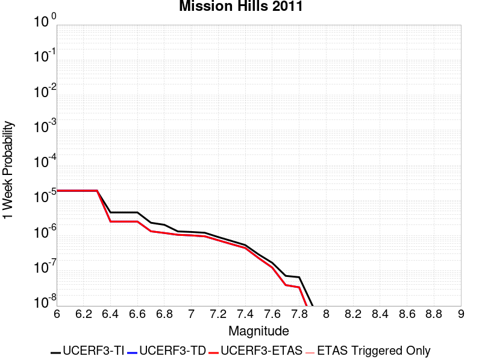 |  |  |  |

| Magnitude | 1 wk TI Prob | 1 wk TD Prob | 1 wk ETAS Prob | 1 wk ETAS/TD Gain | 1 wk ETAS Triggered Only | 1 mo TI Prob | 1 mo TD Prob | 1 mo ETAS Prob | 1 mo ETAS/TD Gain | 1 mo ETAS Triggered Only | 1 yr TI Prob | 1 yr TD Prob | 1 yr ETAS Prob | 1 yr ETAS/TD Gain | 1 yr ETAS Triggered Only | 10 yr TI Prob | 10 yr TD Prob | 10 yr ETAS Prob | 10 yr ETAS/TD Gain | 10 yr ETAS Triggered Only |
|-----|-----|-----|-----|-----|-----|-----|-----|-----|-----|-----|-----|-----|-----|-----|-----|-----|-----|-----|-----|-----|
| 6.0 | 1.8765717E-5 | 1.9054973E-5 | 1.9054973E-5 | 1.0 | 0.0 | 8.0422025E-5 | 8.166355E-5 | 9.166273E-5 | 1.1224437 | 1.0E-5 | 9.786983E-4 | 9.941435E-4 | 0.0010041336 | 1.0100489 | 1.0E-5 | 0.009743992 | 0.009930629 | 0.00994053 | 1.000997 | 1.0E-5 |
| 6.1 | 1.8765717E-5 | 1.9054973E-5 | 1.9054973E-5 | 1.0 | 0.0 | 8.0422025E-5 | 8.166355E-5 | 9.166273E-5 | 1.1224437 | 1.0E-5 | 9.786983E-4 | 9.941435E-4 | 0.0010041336 | 1.0100489 | 1.0E-5 | 0.009743992 | 0.009930629 | 0.00994053 | 1.000997 | 1.0E-5 |
| 6.2 | 1.8765717E-5 | 1.9054973E-5 | 1.9054973E-5 | 1.0 | 0.0 | 8.0422025E-5 | 8.166355E-5 | 9.166273E-5 | 1.1224437 | 1.0E-5 | 9.786983E-4 | 9.941435E-4 | 0.0010041336 | 1.0100489 | 1.0E-5 | 0.009743992 | 0.009930629 | 0.00994053 | 1.000997 | 1.0E-5 |
| 6.3 | 1.8765717E-5 | 1.9054973E-5 | 1.9054973E-5 | 1.0 | 0.0 | 8.0422025E-5 | 8.166355E-5 | 9.166273E-5 | 1.1224437 | 1.0E-5 | 9.786983E-4 | 9.941435E-4 | 0.0010041336 | 1.0100489 | 1.0E-5 | 0.009743992 | 0.009930629 | 0.00994053 | 1.000997 | 1.0E-5 |
| 6.4 | 4.566357E-6 | 2.5148615E-6 | 2.5148615E-6 | 1.0 | 0.0 | 1.9569954E-5 | 1.0777944E-5 | 2.0777836E-5 | 1.9278108 | 1.0E-5 | 2.3823815E-4 | 1.3121538E-4 | 1.4121407E-4 | 1.0762006 | 1.0E-5 | 0.002379829 | 0.0013115574 | 0.0013215442 | 1.0076145 | 1.0E-5 |
| 6.5 | 4.566357E-6 | 2.5148615E-6 | 2.5148615E-6 | 1.0 | 0.0 | 1.9569954E-5 | 1.0777944E-5 | 2.0777836E-5 | 1.9278108 | 1.0E-5 | 2.3823815E-4 | 1.3121538E-4 | 1.4121407E-4 | 1.0762006 | 1.0E-5 | 0.002379829 | 0.0013115574 | 0.0013215442 | 1.0076145 | 1.0E-5 |
| 6.6 | 4.566357E-6 | 2.5148615E-6 | 2.5148615E-6 | 1.0 | 0.0 | 1.9569954E-5 | 1.0777944E-5 | 2.0777836E-5 | 1.9278108 | 1.0E-5 | 2.3823815E-4 | 1.3121538E-4 | 1.4121407E-4 | 1.0762006 | 1.0E-5 | 0.002379829 | 0.0013115574 | 0.0013215442 | 1.0076145 | 1.0E-5 |
| 6.7 | 2.3266773E-6 | 1.3296319E-6 | 1.3296319E-6 | 1.0 | 0.0 | 9.971435E-6 | 5.6984104E-6 | 1.5698353E-5 | 2.7548654 | 1.0E-5 | 1.2139547E-4 | 6.9375994E-5 | 7.9375306E-5 | 1.144132 | 1.0E-5 | 0.0012132917 | 6.9354946E-4 | 7.0354255E-4 | 1.0144086 | 1.0E-5 |
| 6.8 | 2.032735E-6 | 1.1894276E-6 | 1.1894276E-6 | 1.0 | 0.0 | 8.711692E-6 | 5.0975373E-6 | 1.50974865E-5 | 2.9617217 | 1.0E-5 | 1.06059684E-4 | 6.20608E-5 | 7.2060175E-5 | 1.1611223 | 1.0E-5 | 0.0010600908 | 6.2043953E-4 | 6.304333E-4 | 1.0161076 | 1.0E-5 |
| 6.9 | 1.3186259E-6 | 1.0562057E-6 | 1.0562057E-6 | 1.0 | 0.0 | 5.6512413E-6 | 4.526589E-6 | 1.4526543E-5 | 3.2091591 | 1.0E-5 | 6.8801695E-5 | 5.5109853E-5 | 6.51093E-5 | 1.1814457 | 1.0E-5 | 6.8780396E-4 | 5.5096485E-4 | 5.6095934E-4 | 1.01814 | 1.0E-5 |
| 7.0 | 1.2726016E-6 | 1.0159362E-6 | 1.0159362E-6 | 1.0 | 0.0 | 5.4539955E-6 | 4.354005E-6 | 1.4353962E-5 | 3.296726 | 1.0E-5 | 6.6400375E-5 | 5.300875E-5 | 6.300822E-5 | 1.1886381 | 1.0E-5 | 6.6380535E-4 | 5.2996393E-4 | 5.399586E-4 | 1.0188593 | 1.0E-5 |
| 7.1 | 1.2063913E-6 | 9.570343E-7 | 9.570343E-7 | 1.0 | 0.0 | 5.170238E-6 | 4.101569E-6 | 1.4101528E-5 | 3.4380813 | 1.0E-5 | 6.294583E-5 | 4.9935486E-5 | 5.9934988E-5 | 1.2002484 | 1.0E-5 | 6.2928005E-4 | 4.9924525E-4 | 5.092402E-4 | 1.0200202 | 1.0E-5 |
| 7.2 | 9.105806E-7 | 7.376833E-7 | 7.376833E-7 | 1.0 | 0.0 | 3.9024826E-6 | 3.1614961E-6 | 1.3161464E-5 | 4.163049 | 1.0E-5 | 4.7511687E-5 | 3.849055E-5 | 4.8490165E-5 | 1.259794 | 1.0E-5 | 4.7501532E-4 | 3.848404E-4 | 3.9483653E-4 | 1.0259748 | 1.0E-5 |
| 7.3 | 7.020432E-7 | 5.710386E-7 | 5.710386E-7 | 1.0 | 0.0 | 3.0087533E-6 | 2.447306E-6 | 2.447306E-6 | 1.0 | 0.0 | 3.6630954E-5 | 2.9795556E-5 | 2.9795556E-5 | 1.0 | 0.0 | 3.6624918E-4 | 2.9791694E-4 | 2.9791694E-4 | 1.0 | 0.0 |
| 7.4 | 5.3900635E-7 | 4.4483727E-7 | 4.4483727E-7 | 1.0 | 0.0 | 2.3100251E-6 | 1.9064441E-6 | 1.9064441E-6 | 1.0 | 0.0 | 2.8124194E-5 | 2.3210721E-5 | 2.3210721E-5 | 1.0 | 0.0 | 2.8120633E-4 | 2.3208419E-4 | 2.3208419E-4 | 1.0 | 0.0 |
| 7.5 | 2.907075E-7 | 2.2875675E-7 | 2.2875675E-7 | 1.0 | 0.0 | 1.2458887E-6 | 9.803857E-7 | 9.803857E-7 | 1.0 | 0.0 | 1.5168589E-5 | 1.1936132E-5 | 1.1936132E-5 | 1.0 | 0.0 | 1.5167553E-4 | 1.19355085E-4 | 1.19355085E-4 | 1.0 | 0.0 |
| 7.6 | 1.6903675E-7 | 1.235366E-7 | 1.235366E-7 | 1.0 | 0.0 | 7.2444305E-7 | 5.2944245E-7 | 5.2944245E-7 | 1.0 | 0.0 | 8.820059E-6 | 6.445944E-6 | 6.445944E-6 | 1.0 | 0.0 | 8.8197085E-5 | 6.4457694E-5 | 6.4457694E-5 | 1.0 | 0.0 |
| 7.7 | 7.168073E-8 | 3.9136463E-8 | 3.9136463E-8 | 1.0 | 0.0 | 3.072031E-7 | 1.6772768E-7 | 1.6772768E-7 | 1.0 | 0.0 | 3.7401915E-6 | 2.0420828E-6 | 2.0420828E-6 | 1.0 | 0.0 | 3.7401285E-5 | 2.042065E-5 | 2.042065E-5 | 1.0 | 0.0 |
| 7.8 | 6.564101E-8 | 3.3836674E-8 | 3.3836674E-8 | 1.0 | 0.0 | 2.813186E-7 | 1.4501431E-7 | 1.4501431E-7 | 1.0 | 0.0 | 3.4250486E-6 | 1.7655478E-6 | 1.7655478E-6 | 1.0 | 0.0 | 3.424996E-5 | 1.765535E-5 | 1.765535E-5 | 1.0 | 0.0 |
| 7.9 | 1.0029074E-8 | 3.7291334E-9 | 3.7291334E-9 | 1.0 | 0.0 | 4.2981743E-8 | 1.5982E-8 | 1.5982E-8 | 1.0 | 0.0 | 5.2330256E-7 | 1.9458085E-7 | 1.9458085E-7 | 1.0 | 0.0 | 5.2330133E-6 | 1.9458078E-6 | 1.9458078E-6 | 1.0 | 0.0 |

## Almanor 2011 CFM
*[(top)](#table-of-contents)*

| 1 Week | 1 Month | 1 Year | 10 Year |
|-----|-----|-----|-----|
|  |  |  |  |

| Magnitude | 1 wk TI Prob | 1 wk TD Prob | 1 wk ETAS Prob | 1 wk ETAS/TD Gain | 1 wk ETAS Triggered Only | 1 mo TI Prob | 1 mo TD Prob | 1 mo ETAS Prob | 1 mo ETAS/TD Gain | 1 mo ETAS Triggered Only | 1 yr TI Prob | 1 yr TD Prob | 1 yr ETAS Prob | 1 yr ETAS/TD Gain | 1 yr ETAS Triggered Only | 10 yr TI Prob | 10 yr TD Prob | 10 yr ETAS Prob | 10 yr ETAS/TD Gain | 10 yr ETAS Triggered Only |
|-----|-----|-----|-----|-----|-----|-----|-----|-----|-----|-----|-----|-----|-----|-----|-----|-----|-----|-----|-----|-----|
| 6.0 | 6.1479834E-5 | 8.327518E-5 | 8.327518E-5 | 1.0 | 0.0 | 2.6345838E-4 | 3.5684797E-4 | 3.5684797E-4 | 1.0 | 0.0 | 0.0032028882 | 0.0043366547 | 0.0043366547 | 1.0 | 0.0 | 0.031571172 | 0.0425881 | 0.042597678 | 1.0002248 | 1.0E-5 |
| 6.1 | 4.4387216E-5 | 5.976974E-5 | 5.976974E-5 | 1.0 | 0.0 | 1.9021705E-4 | 2.5613265E-4 | 2.5613265E-4 | 1.0 | 0.0 | 0.0023134327 | 0.0031144642 | 0.0031144642 | 1.0 | 0.0 | 0.022894967 | 0.030756671 | 0.030766364 | 1.0003152 | 1.0E-5 |
| 6.2 | 4.4387216E-5 | 5.976974E-5 | 5.976974E-5 | 1.0 | 0.0 | 1.9021705E-4 | 2.5613265E-4 | 2.5613265E-4 | 1.0 | 0.0 | 0.0023134327 | 0.0031144642 | 0.0031144642 | 1.0 | 0.0 | 0.022894967 | 0.030756671 | 0.030766364 | 1.0003152 | 1.0E-5 |
| 6.3 | 2.9523822E-5 | 3.954845E-5 | 3.954845E-5 | 1.0 | 0.0 | 1.2652454E-4 | 1.6948282E-4 | 1.6948282E-4 | 1.0 | 0.0 | 0.0015393476 | 0.0020618665 | 0.0020618665 | 1.0 | 0.0 | 0.015287281 | 0.020461831 | 0.020461831 | 1.0 | 0.0 |
| 6.4 | 2.0512744E-5 | 2.7431652E-5 | 2.7431652E-5 | 1.0 | 0.0 | 8.79088E-5 | 1.1755939E-4 | 1.1755939E-4 | 1.0 | 0.0 | 0.001069764 | 0.0014306677 | 0.0014306677 | 1.0 | 0.0 | 0.010646289 | 0.014245078 | 0.014245078 | 1.0 | 0.0 |
| 6.5 | 1.6750226E-5 | 2.2391185E-5 | 2.2391185E-5 | 1.0 | 0.0 | 7.178471E-5 | 9.5959076E-5 | 9.5959076E-5 | 1.0 | 0.0 | 8.7362836E-4 | 0.0011680018 | 0.0011680018 | 1.0 | 0.0 | 0.008702018 | 0.011649603 | 0.011649603 | 1.0 | 0.0 |
| 6.6 | 1.4745303E-5 | 1.9707613E-5 | 1.9707613E-5 | 1.0 | 0.0 | 6.319262E-5 | 8.445888E-5 | 8.445888E-5 | 1.0 | 0.0 | 7.690986E-4 | 0.0010281347 | 0.0010281347 | 1.0 | 0.0 | 0.0076644225 | 0.010265489 | 0.010265489 | 1.0 | 0.0 |
| 6.7 | 9.951145E-7 | 1.1616564E-6 | 1.1616564E-6 | 1.0 | 0.0 | 4.26477E-6 | 4.978519E-6 | 4.978519E-6 | 1.0 | 0.0 | 5.1922336E-5 | 6.061196E-5 | 6.061196E-5 | 1.0 | 0.0 | 5.1910203E-4 | 6.0597155E-4 | 6.0597155E-4 | 1.0 | 0.0 |
| 6.8 | 5.866312E-7 | 6.8495126E-7 | 6.8495126E-7 | 1.0 | 0.0 | 2.5141312E-6 | 2.9355028E-6 | 2.9355028E-6 | 1.0 | 0.0 | 3.0609117E-5 | 3.5739293E-5 | 3.5739293E-5 | 1.0 | 0.0 | 3.06049E-4 | 3.5734827E-4 | 3.5734827E-4 | 1.0 | 0.0 |

## Hosgri (Extension)
*[(top)](#table-of-contents)*

| 1 Week | 1 Month | 1 Year | 10 Year |
|-----|-----|-----|-----|
| 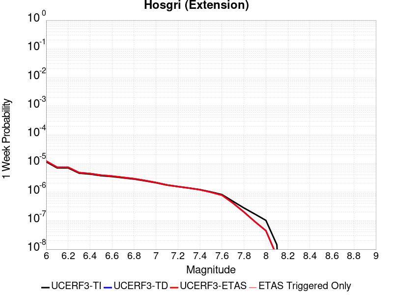 |  | 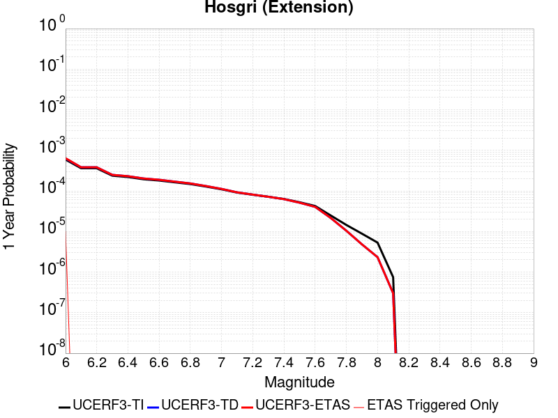 |  |

| Magnitude | 1 wk TI Prob | 1 wk TD Prob | 1 wk ETAS Prob | 1 wk ETAS/TD Gain | 1 wk ETAS Triggered Only | 1 mo TI Prob | 1 mo TD Prob | 1 mo ETAS Prob | 1 mo ETAS/TD Gain | 1 mo ETAS Triggered Only | 1 yr TI Prob | 1 yr TD Prob | 1 yr ETAS Prob | 1 yr ETAS/TD Gain | 1 yr ETAS Triggered Only | 10 yr TI Prob | 10 yr TD Prob | 10 yr ETAS Prob | 10 yr ETAS/TD Gain | 10 yr ETAS Triggered Only |
|-----|-----|-----|-----|-----|-----|-----|-----|-----|-----|-----|-----|-----|-----|-----|-----|-----|-----|-----|-----|-----|
| 6.0 | 1.1369135E-5 | 1.208318E-5 | 1.208318E-5 | 1.0 | 0.0 | 4.8723956E-5 | 5.1784158E-5 | 6.178364E-5 | 1.1930993 | 1.0E-5 | 5.9305265E-4 | 6.303125E-4 | 6.4030616E-4 | 1.0158552 | 1.0E-5 | 0.005914725 | 0.006287496 | 0.0062974333 | 1.0015805 | 1.0E-5 |
| 6.1 | 6.934979E-6 | 7.324624E-6 | 7.324624E-6 | 1.0 | 0.0 | 2.9721E-5 | 3.1390893E-5 | 3.1390893E-5 | 1.0 | 0.0 | 3.617931E-4 | 3.8212124E-4 | 3.8212124E-4 | 1.0 | 0.0 | 0.0036120464 | 0.0038150547 | 0.0038150547 | 1.0 | 0.0 |
| 6.2 | 6.934979E-6 | 7.324624E-6 | 7.324624E-6 | 1.0 | 0.0 | 2.9721E-5 | 3.1390893E-5 | 3.1390893E-5 | 1.0 | 0.0 | 3.617931E-4 | 3.8212124E-4 | 3.8212124E-4 | 1.0 | 0.0 | 0.0036120464 | 0.0038150547 | 0.0038150547 | 1.0 | 0.0 |
| 6.3 | 4.5484676E-6 | 4.7693793E-6 | 4.7693793E-6 | 1.0 | 0.0 | 1.9493287E-5 | 2.044004E-5 | 2.044004E-5 | 1.0 | 0.0 | 2.3730492E-4 | 2.4882948E-4 | 2.4882948E-4 | 1.0 | 0.0 | 0.0023705168 | 0.0024855514 | 0.0024855514 | 1.0 | 0.0 |
| 6.4 | 4.218095E-6 | 4.416908E-6 | 4.416908E-6 | 1.0 | 0.0 | 1.8077424E-5 | 1.892947E-5 | 1.892947E-5 | 1.0 | 0.0 | 2.2007042E-4 | 2.3044225E-4 | 2.3044225E-4 | 1.0 | 0.0 | 0.002198526 | 0.0023020664 | 0.0023020664 | 1.0 | 0.0 |
| 6.5 | 3.717374E-6 | 3.8839203E-6 | 3.8839203E-6 | 1.0 | 0.0 | 1.5931506E-5 | 1.6645268E-5 | 1.6645268E-5 | 1.0 | 0.0 | 1.9394881E-4 | 2.0263747E-4 | 2.0263747E-4 | 1.0 | 0.0 | 0.0019377962 | 0.0020245458 | 0.0020245458 | 1.0 | 0.0 |
| 6.6 | 3.4605036E-6 | 3.6083466E-6 | 3.6083466E-6 | 1.0 | 0.0 | 1.4830645E-5 | 1.5464251E-5 | 1.5464251E-5 | 1.0 | 0.0 | 1.8054814E-4 | 1.8826114E-4 | 1.8826114E-4 | 1.0 | 0.0 | 0.0018040152 | 0.0018810312 | 0.0018810312 | 1.0 | 0.0 |
| 6.7 | 3.123439E-6 | 3.2466062E-6 | 3.2466062E-6 | 1.0 | 0.0 | 1.33860985E-5 | 1.3913953E-5 | 1.3913953E-5 | 1.0 | 0.0 | 1.6296357E-4 | 1.6938931E-4 | 1.6938931E-4 | 1.0 | 0.0 | 0.001628441 | 0.0016926129 | 0.0016926129 | 1.0 | 0.0 |
| 6.8 | 2.8290783E-6 | 2.9305752E-6 | 2.9305752E-6 | 1.0 | 0.0 | 1.2124565E-5 | 1.2559548E-5 | 1.2559548E-5 | 1.0 | 0.0 | 1.4760658E-4 | 1.5290185E-4 | 1.5290185E-4 | 1.0 | 0.0 | 0.0014750857 | 0.0015279752 | 0.0015279752 | 1.0 | 0.0 |
| 6.9 | 2.454112E-6 | 2.5283512E-6 | 2.5283512E-6 | 1.0 | 0.0 | 1.0517581E-5 | 1.0835746E-5 | 1.0835746E-5 | 1.0 | 0.0 | 1.2804402E-4 | 1.3191727E-4 | 1.3191727E-4 | 1.0 | 0.0 | 0.0012797028 | 0.0013183958 | 0.0013183958 | 1.0 | 0.0 |
| 7.0 | 2.1008145E-6 | 2.1498988E-6 | 2.1498988E-6 | 1.0 | 0.0 | 9.003459E-6 | 9.21382E-6 | 9.21382E-6 | 1.0 | 0.0 | 1.096116E-4 | 1.1217252E-4 | 1.1217252E-4 | 1.0 | 0.0 | 0.0010955755 | 0.0011211628 | 0.0011211628 | 1.0 | 0.0 |
| 7.1 | 1.744384E-6 | 1.7686608E-6 | 1.7686608E-6 | 1.0 | 0.0 | 7.47591E-6 | 7.579953E-6 | 7.579953E-6 | 1.0 | 0.0 | 9.1015405E-5 | 9.228204E-5 | 9.228204E-5 | 1.0 | 0.0 | 9.097813E-4 | 9.2243886E-4 | 9.2243886E-4 | 1.0 | 0.0 |
| 7.2 | 1.5456587E-6 | 1.5563122E-6 | 1.5563122E-6 | 1.0 | 0.0 | 6.6242346E-6 | 6.6698926E-6 | 6.6698926E-6 | 1.0 | 0.0 | 8.064707E-5 | 8.1202925E-5 | 8.1202925E-5 | 1.0 | 0.0 | 8.0617814E-4 | 8.1173383E-4 | 8.1173383E-4 | 1.0 | 0.0 |
| 7.3 | 1.3775123E-6 | 1.3766308E-6 | 1.3766308E-6 | 1.0 | 0.0 | 5.9036106E-6 | 5.899833E-6 | 5.899833E-6 | 1.0 | 0.0 | 7.187409E-5 | 7.182811E-5 | 7.182811E-5 | 1.0 | 0.0 | 7.185085E-4 | 7.1804994E-4 | 7.1804994E-4 | 1.0 | 0.0 |
| 7.4 | 1.214491E-6 | 1.2023673E-6 | 1.2023673E-6 | 1.0 | 0.0 | 5.2049513E-6 | 5.1529923E-6 | 5.1529923E-6 | 1.0 | 0.0 | 6.336844E-5 | 6.273589E-5 | 6.273589E-5 | 1.0 | 0.0 | 6.335037E-4 | 6.271826E-4 | 6.271826E-4 | 1.0 | 0.0 |
| 7.5 | 1.0101123E-6 | 9.842441E-7 | 9.842441E-7 | 1.0 | 0.0 | 4.3290456E-6 | 4.2181823E-6 | 4.2181823E-6 | 1.0 | 0.0 | 5.2704854E-5 | 5.1355168E-5 | 5.1355168E-5 | 1.0 | 0.0 | 5.2692357E-4 | 5.134336E-4 | 5.134336E-4 | 1.0 | 0.0 |
| 7.6 | 8.1558215E-7 | 7.766147E-7 | 7.766147E-7 | 1.0 | 0.0 | 3.4953473E-6 | 3.3283443E-6 | 3.3283443E-6 | 1.0 | 0.0 | 4.255502E-5 | 4.052184E-5 | 4.052184E-5 | 1.0 | 0.0 | 4.2546875E-4 | 4.05145E-4 | 4.05145E-4 | 1.0 | 0.0 |
| 7.7 | 4.757816E-7 | 4.131041E-7 | 4.131041E-7 | 1.0 | 0.0 | 2.0390623E-6 | 1.7704448E-6 | 1.7704448E-6 | 1.0 | 0.0 | 2.4825302E-5 | 2.1554953E-5 | 2.1554953E-5 | 1.0 | 0.0 | 2.482253E-4 | 2.1552875E-4 | 2.1552875E-4 | 1.0 | 0.0 |
| 7.8 | 2.782787E-7 | 2.0049059E-7 | 2.0049059E-7 | 1.0 | 0.0 | 1.1926223E-6 | 8.592451E-7 | 8.592451E-7 | 1.0 | 0.0 | 1.452008E-5 | 1.0461259E-5 | 1.0461259E-5 | 1.0 | 0.0 | 1.4519131E-4 | 1.046077E-4 | 1.046077E-4 | 1.0 | 0.0 |
| 7.9 | 1.6948086E-7 | 9.24509E-8 | 9.24509E-8 | 1.0 | 0.0 | 7.2634634E-7 | 3.9621807E-7 | 3.9621807E-7 | 1.0 | 0.0 | 8.843231E-6 | 4.8239444E-6 | 4.8239444E-6 | 1.0 | 0.0 | 8.842879E-5 | 4.8238402E-5 | 4.8238402E-5 | 1.0 | 0.0 |
| 8.0 | 1.0225492E-7 | 4.474341E-8 | 4.474341E-8 | 1.0 | 0.0 | 4.382353E-7 | 1.9175745E-7 | 1.9175745E-7 | 1.0 | 0.0 | 5.335502E-6 | 2.3346445E-6 | 2.3346445E-6 | 1.0 | 0.0 | 5.335374E-5 | 2.3346201E-5 | 2.3346201E-5 | 1.0 | 0.0 |
| 8.1 | 1.43711345E-8 | 5.7884137E-9 | 5.7884137E-9 | 1.0 | 0.0 | 6.1590576E-8 | 2.4807488E-8 | 2.4807488E-8 | 1.0 | 0.0 | 7.4986497E-7 | 3.020311E-7 | 3.020311E-7 | 1.0 | 0.0 | 7.4986247E-6 | 3.0203075E-6 | 3.0203075E-6 | 1.0 | 0.0 |

## Northridge Hills
*[(top)](#table-of-contents)*

| 1 Week | 1 Month | 1 Year | 10 Year |
|-----|-----|-----|-----|
|  | 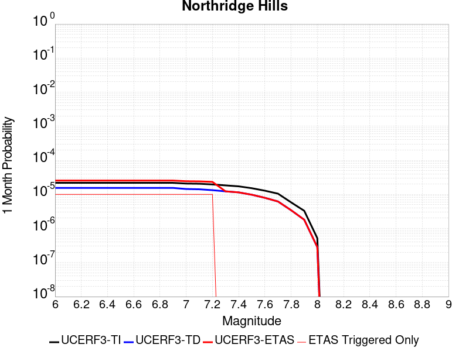 | 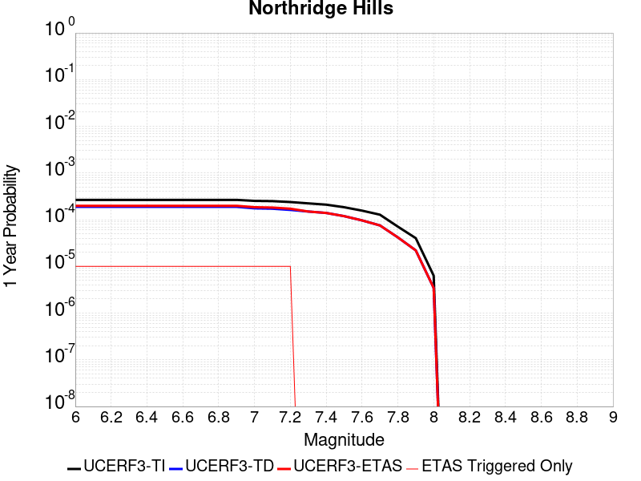 |  |

| Magnitude | 1 wk TI Prob | 1 wk TD Prob | 1 wk ETAS Prob | 1 wk ETAS/TD Gain | 1 wk ETAS Triggered Only | 1 mo TI Prob | 1 mo TD Prob | 1 mo ETAS Prob | 1 mo ETAS/TD Gain | 1 mo ETAS Triggered Only | 1 yr TI Prob | 1 yr TD Prob | 1 yr ETAS Prob | 1 yr ETAS/TD Gain | 1 yr ETAS Triggered Only | 10 yr TI Prob | 10 yr TD Prob | 10 yr ETAS Prob | 10 yr ETAS/TD Gain | 10 yr ETAS Triggered Only |
|-----|-----|-----|-----|-----|-----|-----|-----|-----|-----|-----|-----|-----|-----|-----|-----|-----|-----|-----|-----|-----|
| 6.0 | 5.095982E-6 | 3.6153267E-6 | 3.6153267E-6 | 1.0 | 0.0 | 2.183974E-5 | 1.5494166E-5 | 2.5494011E-5 | 1.6453942 | 1.0E-5 | 2.658664E-4 | 1.8862526E-4 | 1.9862337E-4 | 1.0530052 | 1.0E-5 | 0.0026554854 | 0.001884664 | 0.0018946452 | 1.005296 | 1.0E-5 |
| 6.1 | 5.095982E-6 | 3.6153267E-6 | 3.6153267E-6 | 1.0 | 0.0 | 2.183974E-5 | 1.5494166E-5 | 2.5494011E-5 | 1.6453942 | 1.0E-5 | 2.658664E-4 | 1.8862526E-4 | 1.9862337E-4 | 1.0530052 | 1.0E-5 | 0.0026554854 | 0.001884664 | 0.0018946452 | 1.005296 | 1.0E-5 |
| 6.2 | 5.095982E-6 | 3.6153267E-6 | 3.6153267E-6 | 1.0 | 0.0 | 2.183974E-5 | 1.5494166E-5 | 2.5494011E-5 | 1.6453942 | 1.0E-5 | 2.658664E-4 | 1.8862526E-4 | 1.9862337E-4 | 1.0530052 | 1.0E-5 | 0.0026554854 | 0.001884664 | 0.0018946452 | 1.005296 | 1.0E-5 |
| 6.3 | 5.095982E-6 | 3.6153267E-6 | 3.6153267E-6 | 1.0 | 0.0 | 2.183974E-5 | 1.5494166E-5 | 2.5494011E-5 | 1.6453942 | 1.0E-5 | 2.658664E-4 | 1.8862526E-4 | 1.9862337E-4 | 1.0530052 | 1.0E-5 | 0.0026554854 | 0.001884664 | 0.0018946452 | 1.005296 | 1.0E-5 |
| 6.4 | 5.095982E-6 | 3.6153267E-6 | 3.6153267E-6 | 1.0 | 0.0 | 2.183974E-5 | 1.5494166E-5 | 2.5494011E-5 | 1.6453942 | 1.0E-5 | 2.658664E-4 | 1.8862526E-4 | 1.9862337E-4 | 1.0530052 | 1.0E-5 | 0.0026554854 | 0.001884664 | 0.0018946452 | 1.005296 | 1.0E-5 |
| 6.5 | 5.095982E-6 | 3.6153267E-6 | 3.6153267E-6 | 1.0 | 0.0 | 2.183974E-5 | 1.5494166E-5 | 2.5494011E-5 | 1.6453942 | 1.0E-5 | 2.658664E-4 | 1.8862526E-4 | 1.9862337E-4 | 1.0530052 | 1.0E-5 | 0.0026554854 | 0.001884664 | 0.0018946452 | 1.005296 | 1.0E-5 |
| 6.6 | 5.095982E-6 | 3.6153267E-6 | 3.6153267E-6 | 1.0 | 0.0 | 2.183974E-5 | 1.5494166E-5 | 2.5494011E-5 | 1.6453942 | 1.0E-5 | 2.658664E-4 | 1.8862526E-4 | 1.9862337E-4 | 1.0530052 | 1.0E-5 | 0.0026554854 | 0.001884664 | 0.0018946452 | 1.005296 | 1.0E-5 |
| 6.7 | 5.095982E-6 | 3.6153267E-6 | 3.6153267E-6 | 1.0 | 0.0 | 2.183974E-5 | 1.5494166E-5 | 2.5494011E-5 | 1.6453942 | 1.0E-5 | 2.658664E-4 | 1.8862526E-4 | 1.9862337E-4 | 1.0530052 | 1.0E-5 | 0.0026554854 | 0.001884664 | 0.0018946452 | 1.005296 | 1.0E-5 |
| 6.8 | 5.095982E-6 | 3.6153267E-6 | 3.6153267E-6 | 1.0 | 0.0 | 2.183974E-5 | 1.5494166E-5 | 2.5494011E-5 | 1.6453942 | 1.0E-5 | 2.658664E-4 | 1.8862526E-4 | 1.9862337E-4 | 1.0530052 | 1.0E-5 | 0.0026554854 | 0.001884664 | 0.0018946452 | 1.005296 | 1.0E-5 |
| 6.9 | 5.0942654E-6 | 3.6135416E-6 | 3.6135416E-6 | 1.0 | 0.0 | 2.1832384E-5 | 1.5486516E-5 | 2.548636E-5 | 1.645713 | 1.0E-5 | 2.6577685E-4 | 1.8853214E-4 | 1.9853025E-4 | 1.0530313 | 1.0E-5 | 0.002654592 | 0.0018837344 | 0.0018937155 | 1.0052986 | 1.0E-5 |
| 7.0 | 4.851143E-6 | 3.3588553E-6 | 3.3588553E-6 | 1.0 | 0.0 | 2.0790447E-5 | 1.4395015E-5 | 2.439487E-5 | 1.694675 | 1.0E-5 | 2.5309427E-4 | 1.7524525E-4 | 1.852435E-4 | 1.0570529 | 1.0E-5 | 0.0025280623 | 0.001751075 | 0.0017610574 | 1.0057008 | 1.0E-5 |
| 7.1 | 4.7910607E-6 | 3.2971361E-6 | 3.2971361E-6 | 1.0 | 0.0 | 2.0532956E-5 | 1.4130507E-5 | 2.4130366E-5 | 1.7076787 | 1.0E-5 | 2.4996005E-4 | 1.7202538E-4 | 1.8202366E-4 | 1.058121 | 1.0E-5 | 0.0024967908 | 0.0017189262 | 0.0017289091 | 1.0058076 | 1.0E-5 |
| 7.2 | 4.580079E-6 | 3.1069137E-6 | 3.1069137E-6 | 1.0 | 0.0 | 1.9628762E-5 | 1.3315277E-5 | 2.3315144E-5 | 1.7510071 | 1.0E-5 | 2.3895396E-4 | 1.6210147E-4 | 1.7209984E-4 | 1.0616797 | 1.0E-5 | 0.0023869718 | 0.0016198357 | 0.0016298195 | 1.0061635 | 1.0E-5 |
| 7.3 | 4.290062E-6 | 2.8683457E-6 | 2.8683457E-6 | 1.0 | 0.0 | 1.838585E-5 | 1.2292853E-5 | 1.2292853E-5 | 1.0 | 0.0 | 2.2382473E-4 | 1.4965523E-4 | 1.4965523E-4 | 1.0 | 0.0 | 0.0022359942 | 0.0014955475 | 0.0014955475 | 1.0 | 0.0 |
| 7.4 | 4.0259683E-6 | 2.6740224E-6 | 2.6740224E-6 | 1.0 | 0.0 | 1.7254037E-5 | 1.1460046E-5 | 1.1460046E-5 | 1.0 | 0.0 | 2.1004764E-4 | 1.3951716E-4 | 1.3951716E-4 | 1.0 | 0.0 | 0.002098492 | 0.0013942984 | 0.0013942984 | 1.0 | 0.0 |
| 7.5 | 3.5477108E-6 | 2.285305E-6 | 2.285305E-6 | 1.0 | 0.0 | 1.5204386E-5 | 9.794127E-6 | 9.794127E-6 | 1.0 | 0.0 | 1.8509767E-4 | 1.19237E-4 | 1.19237E-4 | 1.0 | 0.0 | 0.0018494357 | 0.0011917318 | 0.0011917318 | 1.0 | 0.0 |
| 7.6 | 2.9990608E-6 | 1.8529197E-6 | 1.8529197E-6 | 1.0 | 0.0 | 1.2853055E-5 | 7.94106E-6 | 7.94106E-6 | 1.0 | 0.0 | 1.564747E-4 | 9.667812E-5 | 9.667812E-5 | 1.0 | 0.0 | 0.0015636457 | 9.663615E-4 | 9.663615E-4 | 1.0 | 0.0 |
| 7.7 | 2.4542855E-6 | 1.4462128E-6 | 1.4462128E-6 | 1.0 | 0.0 | 1.05183235E-5 | 6.19804E-6 | 6.19804E-6 | 1.0 | 0.0 | 1.2805307E-4 | 7.545853E-5 | 7.545853E-5 | 1.0 | 0.0 | 0.001279793 | 7.543296E-4 | 7.543296E-4 | 1.0 | 0.0 |
| 7.8 | 1.3623128E-6 | 8.016712E-7 | 8.016712E-7 | 1.0 | 0.0 | 5.8384703E-6 | 3.4357292E-6 | 3.4357292E-6 | 1.0 | 0.0 | 7.108106E-5 | 4.1829204E-5 | 4.1829204E-5 | 1.0 | 0.0 | 7.1058323E-4 | 4.1821352E-4 | 4.1821352E-4 | 1.0 | 0.0 |
| 7.9 | 7.716622E-7 | 4.219272E-7 | 4.219272E-7 | 1.0 | 0.0 | 3.3071194E-6 | 1.8082582E-6 | 1.8082582E-6 | 1.0 | 0.0 | 4.0263436E-5 | 2.2015322E-5 | 2.2015322E-5 | 1.0 | 0.0 | 4.0256142E-4 | 2.2013152E-4 | 2.2013152E-4 | 1.0 | 0.0 |
| 8.0 | 1.2117711E-7 | 6.622029E-8 | 6.622029E-8 | 1.0 | 0.0 | 5.1933034E-7 | 2.838012E-7 | 2.838012E-7 | 1.0 | 0.0 | 6.3228285E-6 | 3.4552743E-6 | 3.4552743E-6 | 1.0 | 0.0 | 6.3226486E-5 | 3.4552224E-5 | 3.4552224E-5 | 1.0 | 0.0 |

## South Cuyama
*[(top)](#table-of-contents)*

| 1 Week | 1 Month | 1 Year | 10 Year |
|-----|-----|-----|-----|
|  |  |  |  |

| Magnitude | 1 wk TI Prob | 1 wk TD Prob | 1 wk ETAS Prob | 1 wk ETAS/TD Gain | 1 wk ETAS Triggered Only | 1 mo TI Prob | 1 mo TD Prob | 1 mo ETAS Prob | 1 mo ETAS/TD Gain | 1 mo ETAS Triggered Only | 1 yr TI Prob | 1 yr TD Prob | 1 yr ETAS Prob | 1 yr ETAS/TD Gain | 1 yr ETAS Triggered Only | 10 yr TI Prob | 10 yr TD Prob | 10 yr ETAS Prob | 10 yr ETAS/TD Gain | 10 yr ETAS Triggered Only |
|-----|-----|-----|-----|-----|-----|-----|-----|-----|-----|-----|-----|-----|-----|-----|-----|-----|-----|-----|-----|-----|
| 6.0 | 1.2747308E-6 | 1.2818705E-6 | 1.2818705E-6 | 1.0 | 0.0 | 5.4631205E-6 | 5.4937195E-6 | 5.4937195E-6 | 1.0 | 0.0 | 6.6511464E-5 | 6.688405E-5 | 6.688405E-5 | 1.0 | 0.0 | 6.649156E-4 | 6.6864624E-4 | 6.786395E-4 | 1.0149456 | 1.0E-5 |
| 6.1 | 1.2747308E-6 | 1.2818705E-6 | 1.2818705E-6 | 1.0 | 0.0 | 5.4631205E-6 | 5.4937195E-6 | 5.4937195E-6 | 1.0 | 0.0 | 6.6511464E-5 | 6.688405E-5 | 6.688405E-5 | 1.0 | 0.0 | 6.649156E-4 | 6.6864624E-4 | 6.786395E-4 | 1.0149456 | 1.0E-5 |
| 6.2 | 1.2747308E-6 | 1.2818705E-6 | 1.2818705E-6 | 1.0 | 0.0 | 5.4631205E-6 | 5.4937195E-6 | 5.4937195E-6 | 1.0 | 0.0 | 6.6511464E-5 | 6.688405E-5 | 6.688405E-5 | 1.0 | 0.0 | 6.649156E-4 | 6.6864624E-4 | 6.786395E-4 | 1.0149456 | 1.0E-5 |
| 6.3 | 1.2747308E-6 | 1.2818705E-6 | 1.2818705E-6 | 1.0 | 0.0 | 5.4631205E-6 | 5.4937195E-6 | 5.4937195E-6 | 1.0 | 0.0 | 6.6511464E-5 | 6.688405E-5 | 6.688405E-5 | 1.0 | 0.0 | 6.649156E-4 | 6.6864624E-4 | 6.786395E-4 | 1.0149456 | 1.0E-5 |
| 6.4 | 1.2747308E-6 | 1.2818705E-6 | 1.2818705E-6 | 1.0 | 0.0 | 5.4631205E-6 | 5.4937195E-6 | 5.4937195E-6 | 1.0 | 0.0 | 6.6511464E-5 | 6.688405E-5 | 6.688405E-5 | 1.0 | 0.0 | 6.649156E-4 | 6.6864624E-4 | 6.786395E-4 | 1.0149456 | 1.0E-5 |
| 6.5 | 1.2747308E-6 | 1.2818705E-6 | 1.2818705E-6 | 1.0 | 0.0 | 5.4631205E-6 | 5.4937195E-6 | 5.4937195E-6 | 1.0 | 0.0 | 6.6511464E-5 | 6.688405E-5 | 6.688405E-5 | 1.0 | 0.0 | 6.649156E-4 | 6.6864624E-4 | 6.786395E-4 | 1.0149456 | 1.0E-5 |
| 6.6 | 1.2747308E-6 | 1.2818705E-6 | 1.2818705E-6 | 1.0 | 0.0 | 5.4631205E-6 | 5.4937195E-6 | 5.4937195E-6 | 1.0 | 0.0 | 6.6511464E-5 | 6.688405E-5 | 6.688405E-5 | 1.0 | 0.0 | 6.649156E-4 | 6.6864624E-4 | 6.786395E-4 | 1.0149456 | 1.0E-5 |
| 6.7 | 1.2747308E-6 | 1.2818705E-6 | 1.2818705E-6 | 1.0 | 0.0 | 5.4631205E-6 | 5.4937195E-6 | 5.4937195E-6 | 1.0 | 0.0 | 6.6511464E-5 | 6.688405E-5 | 6.688405E-5 | 1.0 | 0.0 | 6.649156E-4 | 6.6864624E-4 | 6.786395E-4 | 1.0149456 | 1.0E-5 |
| 6.8 | 1.2747308E-6 | 1.2818705E-6 | 1.2818705E-6 | 1.0 | 0.0 | 5.4631205E-6 | 5.4937195E-6 | 5.4937195E-6 | 1.0 | 0.0 | 6.6511464E-5 | 6.688405E-5 | 6.688405E-5 | 1.0 | 0.0 | 6.649156E-4 | 6.6864624E-4 | 6.786395E-4 | 1.0149456 | 1.0E-5 |
| 6.9 | 8.4566324E-7 | 8.5078887E-7 | 8.5078887E-7 | 1.0 | 0.0 | 3.624266E-6 | 3.646233E-6 | 3.646233E-6 | 1.0 | 0.0 | 4.4124543E-5 | 4.4391993E-5 | 4.4391993E-5 | 1.0 | 0.0 | 4.4115784E-4 | 4.4383228E-4 | 4.4383228E-4 | 1.0 | 0.0 |
| 7.0 | 8.2277904E-7 | 8.2778257E-7 | 8.2778257E-7 | 1.0 | 0.0 | 3.526191E-6 | 3.5476348E-6 | 3.5476348E-6 | 1.0 | 0.0 | 4.293053E-5 | 4.3191605E-5 | 4.3191605E-5 | 1.0 | 0.0 | 4.292224E-4 | 4.3183312E-4 | 4.3183312E-4 | 1.0 | 0.0 |
| 7.1 | 6.7661887E-7 | 6.809135E-7 | 6.809135E-7 | 1.0 | 0.0 | 2.899792E-6 | 2.9181974E-6 | 2.9181974E-6 | 1.0 | 0.0 | 3.5304394E-5 | 3.552848E-5 | 3.552848E-5 | 1.0 | 0.0 | 3.5298787E-4 | 3.5522837E-4 | 3.5522837E-4 | 1.0 | 0.0 |
| 7.2 | 5.783336E-7 | 5.821195E-7 | 5.821195E-7 | 1.0 | 0.0 | 2.4785702E-6 | 2.4947956E-6 | 2.4947956E-6 | 1.0 | 0.0 | 3.0176174E-5 | 3.0373714E-5 | 3.0373714E-5 | 1.0 | 0.0 | 3.0172078E-4 | 3.0369588E-4 | 3.0369588E-4 | 1.0 | 0.0 |
| 7.3 | 5.136759E-7 | 5.170942E-7 | 5.170942E-7 | 1.0 | 0.0 | 2.2014663E-6 | 2.216116E-6 | 2.216116E-6 | 1.0 | 0.0 | 2.6802521E-5 | 2.698088E-5 | 2.698088E-5 | 1.0 | 0.0 | 2.679929E-4 | 2.6977624E-4 | 2.6977624E-4 | 1.0 | 0.0 |
| 7.4 | 4.3370295E-7 | 4.3665395E-7 | 4.3665395E-7 | 1.0 | 0.0 | 1.8587256E-6 | 1.8713728E-6 | 1.8713728E-6 | 1.0 | 0.0 | 2.2629749E-5 | 2.2783726E-5 | 2.2783726E-5 | 1.0 | 0.0 | 2.2627445E-4 | 2.2781407E-4 | 2.2781407E-4 | 1.0 | 0.0 |
| 7.5 | 3.3242574E-7 | 3.347649E-7 | 3.347649E-7 | 1.0 | 0.0 | 1.4246809E-6 | 1.434706E-6 | 1.434706E-6 | 1.0 | 0.0 | 1.7345352E-5 | 1.7467406E-5 | 1.7467406E-5 | 1.0 | 0.0 | 1.7343998E-4 | 1.7466047E-4 | 1.7466047E-4 | 1.0 | 0.0 |
| 7.6 | 2.0627535E-7 | 2.0778917E-7 | 2.0778917E-7 | 1.0 | 0.0 | 8.840369E-7 | 8.905247E-7 | 8.905247E-7 | 1.0 | 0.0 | 1.0763096E-5 | 1.0842085E-5 | 1.0842085E-5 | 1.0 | 0.0 | 1.0762575E-4 | 1.0841565E-4 | 1.0841565E-4 | 1.0 | 0.0 |
| 7.7 | 6.15236E-8 | 6.1983094E-8 | 6.1983094E-8 | 1.0 | 0.0 | 2.6367252E-7 | 2.6564183E-7 | 2.6564183E-7 | 1.0 | 0.0 | 3.2102084E-6 | 3.2341845E-6 | 3.2341845E-6 | 1.0 | 0.0 | 3.210162E-5 | 3.2341384E-5 | 3.2341384E-5 | 1.0 | 0.0 |
| 7.8 | 1.1765573E-8 | 1.1873426E-8 | 1.1873426E-8 | 1.0 | 0.0 | 5.0423886E-8 | 5.088611E-8 | 5.088611E-8 | 1.0 | 0.0 | 6.1391063E-7 | 6.1953824E-7 | 6.1953824E-7 | 1.0 | 0.0 | 6.1390897E-6 | 6.1953665E-6 | 6.1953665E-6 | 1.0 | 0.0 |
| 7.9 | 6.0381755E-10 | 6.1005867E-10 | 6.1005867E-10 | 1.0 | 0.0 | 2.5877895E-9 | 2.614537E-9 | 2.614537E-9 | 1.0 | 0.0 | 3.1506335E-8 | 3.1831988E-8 | 3.1831988E-8 | 1.0 | 0.0 | 3.1506332E-7 | 3.1831988E-7 | 3.1831988E-7 | 1.0 | 0.0 |

## Hunting Creek - Berryessa 2011 CFM
*[(top)](#table-of-contents)*

| 1 Week | 1 Month | 1 Year | 10 Year |
|-----|-----|-----|-----|
|  | 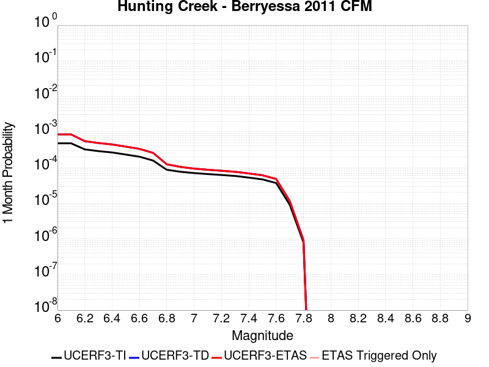 |  |  |

| Magnitude | 1 wk TI Prob | 1 wk TD Prob | 1 wk ETAS Prob | 1 wk ETAS/TD Gain | 1 wk ETAS Triggered Only | 1 mo TI Prob | 1 mo TD Prob | 1 mo ETAS Prob | 1 mo ETAS/TD Gain | 1 mo ETAS Triggered Only | 1 yr TI Prob | 1 yr TD Prob | 1 yr ETAS Prob | 1 yr ETAS/TD Gain | 1 yr ETAS Triggered Only | 10 yr TI Prob | 10 yr TD Prob | 10 yr ETAS Prob | 10 yr ETAS/TD Gain | 10 yr ETAS Triggered Only |
|-----|-----|-----|-----|-----|-----|-----|-----|-----|-----|-----|-----|-----|-----|-----|-----|-----|-----|-----|-----|-----|
| 6.0 | 1.1270982E-4 | 2.0029725E-4 | 2.0029725E-4 | 1.0 | 0.0 | 4.8295266E-4 | 8.580121E-4 | 8.580121E-4 | 1.0 | 0.0 | 0.0058641075 | 0.010386549 | 0.010386549 | 1.0 | 0.0 | 0.057117578 | 0.09804515 | 0.09805417 | 1.000092 | 1.0E-5 |
| 6.1 | 1.1239393E-4 | 1.9977863E-4 | 1.9977863E-4 | 1.0 | 0.0 | 4.8159933E-4 | 8.5579115E-4 | 8.5579115E-4 | 1.0 | 0.0 | 0.0058477195 | 0.010359792 | 0.010359792 | 1.0 | 0.0 | 0.056962132 | 0.097803615 | 0.09781264 | 1.0000923 | 1.0E-5 |
| 6.2 | 7.596265E-5 | 1.2933987E-4 | 1.2933987E-4 | 1.0 | 0.0 | 3.2551357E-4 | 5.541757E-4 | 5.541757E-4 | 1.0 | 0.0 | 0.0039559277 | 0.0067215916 | 0.0067215916 | 1.0 | 0.0 | 0.038862433 | 0.064596005 | 0.064596005 | 1.0 | 0.0 |
| 6.3 | 6.78794E-5 | 1.1448542E-4 | 1.1448542E-4 | 1.0 | 0.0 | 2.9087928E-4 | 4.905411E-4 | 4.905411E-4 | 1.0 | 0.0 | 0.003535705 | 0.0059528616 | 0.0059528616 | 1.0 | 0.0 | 0.034799766 | 0.05746969 | 0.05746969 | 1.0 | 0.0 |
| 6.4 | 6.2165134E-5 | 1.0434983E-4 | 1.0434983E-4 | 1.0 | 0.0 | 2.6639478E-4 | 4.4712503E-4 | 4.4712503E-4 | 1.0 | 0.0 | 0.0032385332 | 0.005427603 | 0.005427603 | 1.0 | 0.0 | 0.03191742 | 0.052554637 | 0.052554637 | 1.0 | 0.0 |
| 6.5 | 5.4368087E-5 | 9.070393E-5 | 9.070393E-5 | 1.0 | 0.0 | 2.3298527E-4 | 3.8866632E-4 | 3.8866632E-4 | 1.0 | 0.0 | 0.0028329059 | 0.004719862 | 0.004719862 | 1.0 | 0.0 | 0.027970633 | 0.0458838 | 0.0458838 | 1.0 | 0.0 |
| 6.6 | 4.729947E-5 | 7.847155E-5 | 7.847155E-5 | 1.0 | 0.0 | 2.0269625E-4 | 3.3625623E-4 | 3.3625623E-4 | 1.0 | 0.0 | 0.002465034 | 0.0040848814 | 0.0040848814 | 1.0 | 0.0 | 0.02437869 | 0.039855074 | 0.039855074 | 1.0 | 0.0 |
| 6.7 | 3.6875328E-5 | 6.0443046E-5 | 6.0443046E-5 | 1.0 | 0.0 | 1.5802756E-4 | 2.590183E-4 | 2.590183E-4 | 1.0 | 0.0 | 0.0019222875 | 0.0031483797 | 0.0031483797 | 1.0 | 0.0 | 0.019057442 | 0.03089518 | 0.03089518 | 1.0 | 0.0 |
| 6.8 | 2.0292036E-5 | 2.8977272E-5 | 2.8977272E-5 | 1.0 | 0.0 | 8.6962966E-5 | 1.241823E-4 | 1.241823E-4 | 1.0 | 0.0 | 0.0010582599 | 0.0015108584 | 0.0015108584 | 1.0 | 0.0 | 0.010532344 | 0.014979425 | 0.014979425 | 1.0 | 0.0 |
| 6.9 | 1.7871042E-5 | 2.4473109E-5 | 2.4473109E-5 | 1.0 | 0.0 | 7.658793E-5 | 1.0488055E-4 | 1.0488055E-4 | 1.0 | 0.0 | 9.320591E-4 | 0.0012761723 | 0.0012761723 | 1.0 | 0.0 | 0.009281595 | 0.012680732 | 0.012680732 | 1.0 | 0.0 |
| 7.0 | 1.6415532E-5 | 2.1906986E-5 | 2.1906986E-5 | 1.0 | 0.0 | 7.035038E-5 | 9.3883726E-5 | 9.3883726E-5 | 1.0 | 0.0 | 8.561793E-4 | 0.0011424365 | 0.0011424365 | 1.0 | 0.0 | 0.008528882 | 0.011365169 | 0.011365169 | 1.0 | 0.0 |
| 7.1 | 1.5409885E-5 | 2.0346974E-5 | 2.0346974E-5 | 1.0 | 0.0 | 6.6040695E-5 | 8.719842E-5 | 8.719842E-5 | 1.0 | 0.0 | 8.0374884E-4 | 0.0010611265 | 0.0010611265 | 1.0 | 0.0 | 0.00800848 | 0.01056109 | 0.01056109 | 1.0 | 0.0 |
| 7.2 | 1.4497423E-5 | 1.9055551E-5 | 1.9055551E-5 | 1.0 | 0.0 | 6.213033E-5 | 8.166411E-5 | 8.166411E-5 | 1.0 | 0.0 | 7.5617427E-4 | 9.938101E-4 | 9.938101E-4 | 1.0 | 0.0 | 0.0075360634 | 0.009894407 | 0.009894407 | 1.0 | 0.0 |
| 7.3 | 1.3615175E-5 | 1.7826696E-5 | 1.7826696E-5 | 1.0 | 0.0 | 5.8349444E-5 | 7.6397904E-5 | 7.6397904E-5 | 1.0 | 0.0 | 7.101729E-4 | 9.2975056E-4 | 9.2975056E-4 | 1.0 | 0.0 | 0.0070790765 | 0.009259279 | 0.009259279 | 1.0 | 0.0 |
| 7.4 | 1.2252825E-5 | 1.6026765E-5 | 1.6026765E-5 | 1.0 | 0.0 | 5.251105E-5 | 6.868434E-5 | 6.868434E-5 | 1.0 | 0.0 | 6.391345E-4 | 8.359138E-4 | 8.359138E-4 | 1.0 | 0.0 | 0.0063729943 | 0.0083283065 | 0.0083283065 | 1.0 | 0.0 |
| 7.5 | 1.0913301E-5 | 1.424156E-5 | 1.424156E-5 | 1.0 | 0.0 | 4.6770452E-5 | 6.1033843E-5 | 6.1033843E-5 | 1.0 | 0.0 | 5.6928146E-4 | 7.4283645E-4 | 7.4283645E-4 | 1.0 | 0.0 | 0.0056782532 | 0.0074041043 | 0.0074041043 | 1.0 | 0.0 |
| 7.6 | 8.623192E-6 | 1.1234999E-5 | 1.1234999E-5 | 1.0 | 0.0 | 3.6956015E-5 | 4.814912E-5 | 4.814912E-5 | 1.0 | 0.0 | 4.4984656E-4 | 5.860604E-4 | 5.860604E-4 | 1.0 | 0.0 | 0.00448937 | 0.0058456114 | 0.0058456114 | 1.0 | 0.0 |
| 7.7 | 2.0993634E-6 | 2.662684E-6 | 2.662684E-6 | 1.0 | 0.0 | 8.997241E-6 | 1.1411453E-5 | 1.1411453E-5 | 1.0 | 0.0 | 1.09535904E-4 | 1.3892565E-4 | 1.3892565E-4 | 1.0 | 0.0 | 0.0010948193 | 0.0013884425 | 0.0013884425 | 1.0 | 0.0 |
| 7.8 | 1.8428308E-7 | 2.1674941E-7 | 2.1674941E-7 | 1.0 | 0.0 | 7.897844E-7 | 9.289257E-7 | 9.289257E-7 | 1.0 | 0.0 | 9.615583E-6 | 1.1309616E-5 | 1.1309616E-5 | 1.0 | 0.0 | 9.615166E-5 | 1.1308361E-4 | 1.1308361E-4 | 1.0 | 0.0 |

## Earthquake Valley
*[(top)](#table-of-contents)*

| 1 Week | 1 Month | 1 Year | 10 Year |
|-----|-----|-----|-----|
|  | 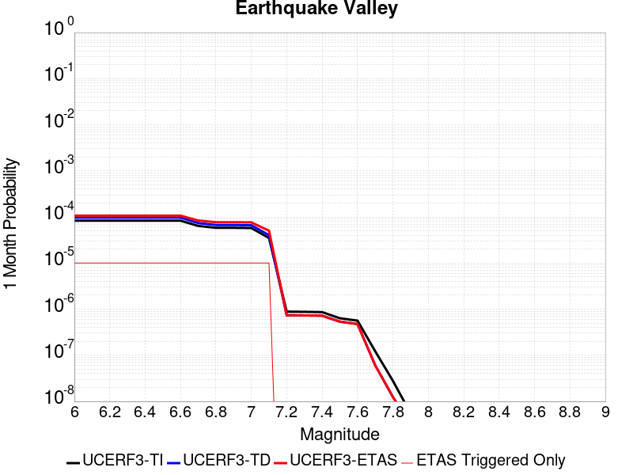 | 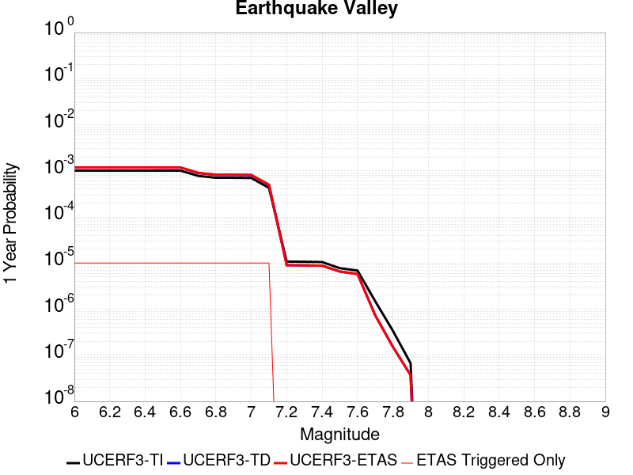 | 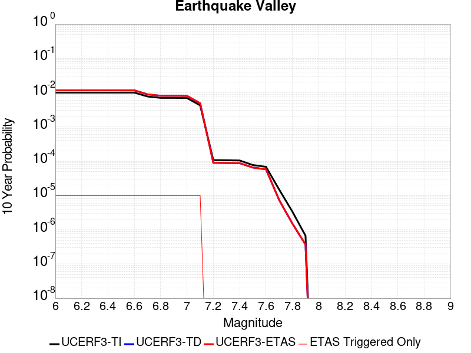 |

| Magnitude | 1 wk TI Prob | 1 wk TD Prob | 1 wk ETAS Prob | 1 wk ETAS/TD Gain | 1 wk ETAS Triggered Only | 1 mo TI Prob | 1 mo TD Prob | 1 mo ETAS Prob | 1 mo ETAS/TD Gain | 1 mo ETAS Triggered Only | 1 yr TI Prob | 1 yr TD Prob | 1 yr ETAS Prob | 1 yr ETAS/TD Gain | 1 yr ETAS Triggered Only | 10 yr TI Prob | 10 yr TD Prob | 10 yr ETAS Prob | 10 yr ETAS/TD Gain | 10 yr ETAS Triggered Only |
|-----|-----|-----|-----|-----|-----|-----|-----|-----|-----|-----|-----|-----|-----|-----|-----|-----|-----|-----|-----|-----|
| 6.0 | 1.9416384E-5 | 2.2584534E-5 | 2.2584534E-5 | 1.0 | 0.0 | 8.321042E-5 | 9.678795E-5 | 1.0678698E-4 | 1.1033087 | 1.0E-5 | 0.001012616 | 0.0011778761 | 0.0011878643 | 1.0084798 | 1.0E-5 | 0.010080142 | 0.011728164 | 0.011738047 | 1.0008427 | 1.0E-5 |
| 6.1 | 1.9416384E-5 | 2.2584534E-5 | 2.2584534E-5 | 1.0 | 0.0 | 8.321042E-5 | 9.678795E-5 | 1.0678698E-4 | 1.1033087 | 1.0E-5 | 0.001012616 | 0.0011778761 | 0.0011878643 | 1.0084798 | 1.0E-5 | 0.010080142 | 0.011728164 | 0.011738047 | 1.0008427 | 1.0E-5 |
| 6.2 | 1.9416384E-5 | 2.2584534E-5 | 2.2584534E-5 | 1.0 | 0.0 | 8.321042E-5 | 9.678795E-5 | 1.0678698E-4 | 1.1033087 | 1.0E-5 | 0.001012616 | 0.0011778761 | 0.0011878643 | 1.0084798 | 1.0E-5 | 0.010080142 | 0.011728164 | 0.011738047 | 1.0008427 | 1.0E-5 |
| 6.3 | 1.9416384E-5 | 2.2584534E-5 | 2.2584534E-5 | 1.0 | 0.0 | 8.321042E-5 | 9.678795E-5 | 1.0678698E-4 | 1.1033087 | 1.0E-5 | 0.001012616 | 0.0011778761 | 0.0011878643 | 1.0084798 | 1.0E-5 | 0.010080142 | 0.011728164 | 0.011738047 | 1.0008427 | 1.0E-5 |
| 6.4 | 1.9416384E-5 | 2.2584534E-5 | 2.2584534E-5 | 1.0 | 0.0 | 8.321042E-5 | 9.678795E-5 | 1.0678698E-4 | 1.1033087 | 1.0E-5 | 0.001012616 | 0.0011778761 | 0.0011878643 | 1.0084798 | 1.0E-5 | 0.010080142 | 0.011728164 | 0.011738047 | 1.0008427 | 1.0E-5 |
| 6.5 | 1.9389157E-5 | 2.2553124E-5 | 2.2553124E-5 | 1.0 | 0.0 | 8.309374E-5 | 9.665334E-5 | 1.0665237E-4 | 1.1034526 | 1.0E-5 | 0.0010111968 | 0.001176239 | 0.0011862273 | 1.0084916 | 1.0E-5 | 0.010066078 | 0.011711965 | 0.0117218485 | 1.0008439 | 1.0E-5 |
| 6.6 | 1.9389157E-5 | 2.2553124E-5 | 2.2553124E-5 | 1.0 | 0.0 | 8.309374E-5 | 9.665334E-5 | 1.0665237E-4 | 1.1034526 | 1.0E-5 | 0.0010111968 | 0.001176239 | 0.0011862273 | 1.0084916 | 1.0E-5 | 0.010066078 | 0.011711965 | 0.0117218485 | 1.0008439 | 1.0E-5 |
| 6.7 | 1.4925434E-5 | 1.7208526E-5 | 1.7208526E-5 | 1.0 | 0.0 | 6.396457E-5 | 7.374922E-5 | 8.3748484E-5 | 1.1355846 | 1.0E-5 | 7.7849044E-4 | 8.9761196E-4 | 9.0760295E-4 | 1.0111307 | 1.0E-5 | 0.007757689 | 0.0089482395 | 0.008958151 | 1.0011076 | 1.0E-5 |
| 6.8 | 1.3570335E-5 | 1.5617112E-5 | 1.5617112E-5 | 1.0 | 0.0 | 5.8157282E-5 | 6.692922E-5 | 7.6928554E-5 | 1.1494015 | 1.0E-5 | 7.0783484E-4 | 8.146407E-4 | 8.246326E-4 | 1.0122653 | 1.0E-5 | 0.0070558446 | 0.008124615 | 0.008134535 | 1.0012208 | 1.0E-5 |
| 6.9 | 1.3570335E-5 | 1.5617112E-5 | 1.5617112E-5 | 1.0 | 0.0 | 5.8157282E-5 | 6.692922E-5 | 7.6928554E-5 | 1.1494015 | 1.0E-5 | 7.0783484E-4 | 8.146407E-4 | 8.246326E-4 | 1.0122653 | 1.0E-5 | 0.0070558446 | 0.008124615 | 0.008134535 | 1.0012208 | 1.0E-5 |
| 7.0 | 1.3433392E-5 | 1.5460651E-5 | 1.5460651E-5 | 1.0 | 0.0 | 5.757041E-5 | 6.625872E-5 | 7.625805E-5 | 1.1509136 | 1.0E-5 | 7.0069433E-4 | 8.064834E-4 | 8.164753E-4 | 1.0123895 | 1.0E-5 | 0.006984891 | 0.008043634 | 0.008053554 | 1.0012332 | 1.0E-5 |
| 7.1 | 8.181609E-6 | 9.417015E-6 | 9.417015E-6 | 1.0 | 0.0 | 3.5063567E-5 | 4.0358387E-5 | 5.0357983E-5 | 1.24777 | 1.0E-5 | 4.268153E-4 | 4.9131963E-4 | 5.013147E-4 | 1.0203433 | 1.0E-5 | 0.0042599645 | 0.0049089105 | 0.004918861 | 1.0020272 | 1.0E-5 |
| 7.2 | 2.0663983E-7 | 1.7262822E-7 | 1.7262822E-7 | 1.0 | 0.0 | 8.855989E-7 | 7.39835E-7 | 7.39835E-7 | 1.0 | 0.0 | 1.0782113E-5 | 9.007458E-6 | 9.007458E-6 | 1.0 | 0.0 | 1.07815904E-4 | 9.0071284E-5 | 9.0071284E-5 | 1.0 | 0.0 |
| 7.3 | 2.0462376E-7 | 1.7078311E-7 | 1.7078311E-7 | 1.0 | 0.0 | 8.7695867E-7 | 7.3192746E-7 | 7.3192746E-7 | 1.0 | 0.0 | 1.0676919E-5 | 8.911184E-6 | 8.911184E-6 | 1.0 | 0.0 | 1.0676406E-4 | 8.9108624E-5 | 8.9108624E-5 | 1.0 | 0.0 |
| 7.4 | 2.0171088E-7 | 1.6860791E-7 | 1.6860791E-7 | 1.0 | 0.0 | 8.644749E-7 | 7.2260514E-7 | 7.2260514E-7 | 1.0 | 0.0 | 1.0524931E-5 | 8.797686E-6 | 8.797686E-6 | 1.0 | 0.0 | 1.05244326E-4 | 8.7973734E-5 | 8.7973734E-5 | 1.0 | 0.0 |
| 7.5 | 1.4847944E-7 | 1.2559113E-7 | 1.2559113E-7 | 1.0 | 0.0 | 6.363403E-7 | 5.382476E-7 | 5.382476E-7 | 1.0 | 0.0 | 7.747416E-6 | 6.5531467E-6 | 6.5531467E-6 | 1.0 | 0.0 | 7.747146E-5 | 6.5529755E-5 | 6.5529755E-5 | 1.0 | 0.0 |
| 7.6 | 1.3185847E-7 | 1.1123006E-7 | 1.1123006E-7 | 1.0 | 0.0 | 5.6510765E-7 | 4.7670017E-7 | 4.7670017E-7 | 1.0 | 0.0 | 6.8801637E-6 | 5.8038113E-6 | 5.8038113E-6 | 1.0 | 0.0 | 6.8799505E-5 | 5.803681E-5 | 5.803681E-5 | 1.0 | 0.0 |
| 7.7 | 2.8609954E-8 | 1.4170554E-8 | 1.4170554E-8 | 1.0 | 0.0 | 1.2261408E-7 | 6.073094E-8 | 6.073094E-8 | 1.0 | 0.0 | 1.4928254E-6 | 7.39399E-7 | 7.39399E-7 | 1.0 | 0.0 | 1.4928154E-5 | 7.393971E-6 | 7.393971E-6 | 1.0 | 0.0 |
| 7.8 | 6.527266E-9 | 2.9233151E-9 | 2.9233151E-9 | 1.0 | 0.0 | 2.7973995E-8 | 1.2528493E-8 | 1.2528493E-8 | 1.0 | 0.0 | 3.4058334E-7 | 1.525344E-7 | 1.525344E-7 | 1.0 | 0.0 | 3.4058282E-6 | 1.5253431E-6 | 1.5253431E-6 | 1.0 | 0.0 |
| 7.9 | 1.2898267E-9 | 7.127704E-10 | 7.127704E-10 | 1.0 | 0.0 | 5.527829E-9 | 3.0547302E-9 | 3.0547302E-9 | 1.0 | 0.0 | 6.7301315E-8 | 3.719134E-8 | 3.719134E-8 | 1.0 | 0.0 | 6.7301295E-7 | 3.7191342E-7 | 3.7191342E-7 | 1.0 | 0.0 |

## Silver Creek 2011 CFM
*[(top)](#table-of-contents)*

| 1 Week | 1 Month | 1 Year | 10 Year |
|-----|-----|-----|-----|
|  |  |  |  |

| Magnitude | 1 wk TI Prob | 1 wk TD Prob | 1 wk ETAS Prob | 1 wk ETAS/TD Gain | 1 wk ETAS Triggered Only | 1 mo TI Prob | 1 mo TD Prob | 1 mo ETAS Prob | 1 mo ETAS/TD Gain | 1 mo ETAS Triggered Only | 1 yr TI Prob | 1 yr TD Prob | 1 yr ETAS Prob | 1 yr ETAS/TD Gain | 1 yr ETAS Triggered Only | 10 yr TI Prob | 10 yr TD Prob | 10 yr ETAS Prob | 10 yr ETAS/TD Gain | 10 yr ETAS Triggered Only |
|-----|-----|-----|-----|-----|-----|-----|-----|-----|-----|-----|-----|-----|-----|-----|-----|-----|-----|-----|-----|-----|
| 6.0 | 3.5229125E-6 | 4.008419E-6 | 4.008419E-6 | 1.0 | 0.0 | 1.5098109E-5 | 1.7178829E-5 | 1.7178829E-5 | 1.0 | 0.0 | 1.8380396E-4 | 2.0913254E-4 | 2.0913254E-4 | 1.0 | 0.0 | 0.0018365202 | 0.0020897163 | 0.0020996954 | 1.0047753 | 1.0E-5 |
| 6.1 | 3.5229125E-6 | 4.008419E-6 | 4.008419E-6 | 1.0 | 0.0 | 1.5098109E-5 | 1.7178829E-5 | 1.7178829E-5 | 1.0 | 0.0 | 1.8380396E-4 | 2.0913254E-4 | 2.0913254E-4 | 1.0 | 0.0 | 0.0018365202 | 0.0020897163 | 0.0020996954 | 1.0047753 | 1.0E-5 |
| 6.2 | 2.6363234E-6 | 3.1108043E-6 | 3.1108043E-6 | 1.0 | 0.0 | 1.129848E-5 | 1.333195E-5 | 1.333195E-5 | 1.0 | 0.0 | 1.375503E-4 | 1.6230447E-4 | 1.6230447E-4 | 1.0 | 0.0 | 0.0013746519 | 0.0016221874 | 0.0016321712 | 1.0061545 | 1.0E-5 |
| 6.3 | 2.5275126E-6 | 3.000443E-6 | 3.000443E-6 | 1.0 | 0.0 | 1.0832152E-5 | 1.2858978E-5 | 1.2858978E-5 | 1.0 | 0.0 | 1.3187347E-4 | 1.5654687E-4 | 1.5654687E-4 | 1.0 | 0.0 | 0.0013179524 | 0.001564693 | 0.0015746774 | 1.006381 | 1.0E-5 |
| 6.4 | 2.178732E-6 | 2.6710015E-6 | 2.6710015E-6 | 1.0 | 0.0 | 9.337389E-6 | 1.14470995E-5 | 1.14470995E-5 | 1.0 | 0.0 | 1.1367678E-4 | 1.3935954E-4 | 1.3935954E-4 | 1.0 | 0.0 | 0.0011361865 | 0.0013930463 | 0.0014030325 | 1.0071685 | 1.0E-5 |
| 6.5 | 2.0341574E-6 | 2.5300906E-6 | 2.5300906E-6 | 1.0 | 0.0 | 8.717788E-6 | 1.08432005E-5 | 1.08432005E-5 | 1.0 | 0.0 | 1.061339E-4 | 1.3200799E-4 | 1.3200799E-4 | 1.0 | 0.0 | 0.0010608323 | 0.0013196201 | 0.0013296069 | 1.0075679 | 1.0E-5 |
| 6.6 | 1.8856827E-6 | 2.3616626E-6 | 2.3616626E-6 | 1.0 | 0.0 | 8.0814725E-6 | 1.0121372E-5 | 1.0121372E-5 | 1.0 | 0.0 | 9.838748E-5 | 1.2322076E-4 | 1.2322076E-4 | 1.0 | 0.0 | 9.834393E-4 | 0.0012318483 | 0.001241836 | 1.0081079 | 1.0E-5 |
| 6.7 | 1.6844668E-6 | 2.1200437E-6 | 2.1200437E-6 | 1.0 | 0.0 | 7.2191233E-6 | 9.08587E-6 | 9.08587E-6 | 1.0 | 0.0 | 8.788928E-5 | 1.1061487E-4 | 1.1061487E-4 | 1.0 | 0.0 | 8.785453E-4 | 0.0011059213 | 0.0011159102 | 1.0090322 | 1.0E-5 |
| 6.8 | 1.5177161E-6 | 1.8956357E-6 | 1.8956357E-6 | 1.0 | 0.0 | 6.504481E-6 | 8.124128E-6 | 8.124128E-6 | 1.0 | 0.0 | 7.918918E-5 | 9.890678E-5 | 9.890678E-5 | 1.0 | 0.0 | 7.9160964E-4 | 9.889503E-4 | 9.989403E-4 | 1.0101017 | 1.0E-5 |
| 6.9 | 1.3437394E-6 | 1.6563847E-6 | 1.6563847E-6 | 1.0 | 0.0 | 5.7588704E-6 | 7.0987726E-6 | 7.0987726E-6 | 1.0 | 0.0 | 7.011199E-5 | 8.642413E-5 | 8.642413E-5 | 1.0 | 0.0 | 7.0089876E-4 | 8.642274E-4 | 8.7421876E-4 | 1.011561 | 1.0E-5 |
| 7.0 | 1.1563575E-6 | 1.4315414E-6 | 1.4315414E-6 | 1.0 | 0.0 | 4.9558084E-6 | 6.1351625E-6 | 6.1351625E-6 | 1.0 | 0.0 | 6.03353E-5 | 7.469305E-5 | 7.469305E-5 | 1.0 | 0.0 | 6.0318917E-4 | 7.4700156E-4 | 7.5699406E-4 | 1.0133768 | 1.0E-5 |
| 7.1 | 8.602183E-7 | 1.0893459E-6 | 1.0893459E-6 | 1.0 | 0.0 | 3.6866445E-6 | 4.6686173E-6 | 4.6686173E-6 | 1.0 | 0.0 | 4.4883975E-5 | 5.6838933E-5 | 5.6838933E-5 | 1.0 | 0.0 | 4.4874908E-4 | 5.6856585E-4 | 5.7856017E-4 | 1.0175781 | 1.0E-5 |
| 7.2 | 6.788407E-7 | 8.623784E-7 | 8.623784E-7 | 1.0 | 0.0 | 2.9093142E-6 | 3.695902E-6 | 3.695902E-6 | 1.0 | 0.0 | 3.5420322E-5 | 4.499668E-5 | 4.499668E-5 | 1.0 | 0.0 | 3.541468E-4 | 4.5019755E-4 | 4.6019306E-4 | 1.0222025 | 1.0E-5 |
| 7.3 | 5.1292045E-7 | 6.695371E-7 | 6.695371E-7 | 1.0 | 0.0 | 2.1982287E-6 | 2.8694415E-6 | 2.8694415E-6 | 1.0 | 0.0 | 2.6763106E-5 | 3.493489E-5 | 3.493489E-5 | 1.0 | 0.0 | 2.6759884E-4 | 3.4961585E-4 | 3.5961234E-4 | 1.0285928 | 1.0E-5 |
| 7.4 | 3.820994E-7 | 5.0636476E-7 | 5.0636476E-7 | 1.0 | 0.0 | 1.6375678E-6 | 2.1701328E-6 | 2.1701328E-6 | 1.0 | 0.0 | 1.9937206E-5 | 2.6421047E-5 | 2.6421047E-5 | 1.0 | 0.0 | 1.9935417E-4 | 2.645009E-4 | 2.7449828E-4 | 1.0377971 | 1.0E-5 |
| 7.5 | 2.2292595E-7 | 3.0677518E-7 | 3.0677518E-7 | 1.0 | 0.0 | 9.553966E-7 | 1.3147501E-6 | 1.3147501E-6 | 1.0 | 0.0 | 1.16318915E-5 | 1.6006965E-5 | 1.6006965E-5 | 1.0 | 0.0 | 1.16312825E-4 | 1.6037998E-4 | 1.7037836E-4 | 1.0623419 | 1.0E-5 |
| 7.6 | 1.420587E-7 | 2.0921867E-7 | 2.0921867E-7 | 1.0 | 0.0 | 6.088228E-7 | 8.966511E-7 | 8.966511E-7 | 1.0 | 0.0 | 7.4123927E-6 | 1.0916672E-5 | 1.0916672E-5 | 1.0 | 0.0 | 7.412145E-5 | 1.0948345E-4 | 1.19482356E-4 | 1.091328 | 1.0E-5 |
| 7.7 | 1.1250075E-7 | 1.6879491E-7 | 1.6879491E-7 | 1.0 | 0.0 | 4.82146E-7 | 7.234066E-7 | 7.234066E-7 | 1.0 | 0.0 | 5.8701116E-6 | 8.807439E-6 | 8.807439E-6 | 1.0 | 0.0 | 5.8699567E-5 | 8.8388224E-5 | 9.838734E-5 | 1.1131272 | 1.0E-5 |
| 7.8 | 8.592761E-8 | 1.3656671E-7 | 1.3656671E-7 | 1.0 | 0.0 | 3.682611E-7 | 5.8528576E-7 | 5.8528576E-7 | 1.0 | 0.0 | 4.48357E-6 | 7.1258305E-6 | 7.1258305E-6 | 1.0 | 0.0 | 4.4834796E-5 | 7.156228E-5 | 8.1561564E-5 | 1.1397284 | 1.0E-5 |
| 7.9 | 6.156529E-8 | 1.0747982E-7 | 1.0747982E-7 | 1.0 | 0.0 | 2.638512E-7 | 4.6062772E-7 | 4.6062772E-7 | 1.0 | 0.0 | 3.212384E-6 | 5.608128E-6 | 5.608128E-6 | 1.0 | 0.0 | 3.2123375E-5 | 5.6341083E-5 | 6.634052E-5 | 1.1774803 | 1.0E-5 |
| 8.0 | 2.9230547E-8 | 5.3916335E-8 | 5.3916335E-8 | 1.0 | 0.0 | 1.2527377E-7 | 2.3106998E-7 | 2.3106998E-7 | 1.0 | 0.0 | 1.525207E-6 | 2.8132733E-6 | 2.8132733E-6 | 1.0 | 0.0 | 1.5251966E-5 | 2.8268469E-5 | 3.8268186E-5 | 1.353741 | 1.0E-5 |
| 8.1 | 5.6062213E-9 | 7.906571E-9 | 7.906571E-9 | 1.0 | 0.0 | 2.4026663E-8 | 3.3885303E-8 | 3.3885303E-8 | 1.0 | 0.0 | 2.925246E-7 | 4.125535E-7 | 4.125535E-7 | 1.0 | 0.0 | 2.925242E-6 | 4.1652384E-6 | 4.1652384E-6 | 1.0 | 0.0 |

## Cerro Prieto
*[(top)](#table-of-contents)*

| 1 Week | 1 Month | 1 Year | 10 Year |
|-----|-----|-----|-----|
|  |  |  | 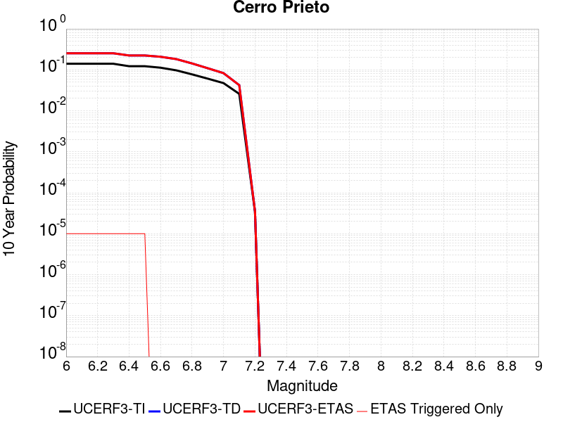 |

| Magnitude | 1 wk TI Prob | 1 wk TD Prob | 1 wk ETAS Prob | 1 wk ETAS/TD Gain | 1 wk ETAS Triggered Only | 1 mo TI Prob | 1 mo TD Prob | 1 mo ETAS Prob | 1 mo ETAS/TD Gain | 1 mo ETAS Triggered Only | 1 yr TI Prob | 1 yr TD Prob | 1 yr ETAS Prob | 1 yr ETAS/TD Gain | 1 yr ETAS Triggered Only | 10 yr TI Prob | 10 yr TD Prob | 10 yr ETAS Prob | 10 yr ETAS/TD Gain | 10 yr ETAS Triggered Only |
|-----|-----|-----|-----|-----|-----|-----|-----|-----|-----|-----|-----|-----|-----|-----|-----|-----|-----|-----|-----|-----|
| 6.0 | 2.9101528E-4 | 5.9660256E-4 | 5.9660256E-4 | 1.0 | 0.0 | 0.0012466122 | 0.002554605 | 0.002554605 | 1.0 | 0.0 | 0.015072231 | 0.03062174 | 0.03062174 | 1.0 | 0.0 | 0.14089979 | 0.25390327 | 0.25391072 | 1.0000293 | 1.0E-5 |
| 6.1 | 2.9101528E-4 | 5.9660256E-4 | 5.9660256E-4 | 1.0 | 0.0 | 0.0012466122 | 0.002554605 | 0.002554605 | 1.0 | 0.0 | 0.015072231 | 0.03062174 | 0.03062174 | 1.0 | 0.0 | 0.14089979 | 0.25390327 | 0.25391072 | 1.0000293 | 1.0E-5 |
| 6.2 | 2.9101528E-4 | 5.9660256E-4 | 5.9660256E-4 | 1.0 | 0.0 | 0.0012466122 | 0.002554605 | 0.002554605 | 1.0 | 0.0 | 0.015072231 | 0.03062174 | 0.03062174 | 1.0 | 0.0 | 0.14089979 | 0.25390327 | 0.25391072 | 1.0000293 | 1.0E-5 |
| 6.3 | 2.9101528E-4 | 5.9660256E-4 | 5.9660256E-4 | 1.0 | 0.0 | 0.0012466122 | 0.002554605 | 0.002554605 | 1.0 | 0.0 | 0.015072231 | 0.03062174 | 0.03062174 | 1.0 | 0.0 | 0.14089979 | 0.25390327 | 0.25391072 | 1.0000293 | 1.0E-5 |
| 6.4 | 2.508648E-4 | 5.140893E-4 | 5.140893E-4 | 1.0 | 0.0 | 0.0010746918 | 0.002201578 | 0.002201578 | 1.0 | 0.0 | 0.013006088 | 0.026446946 | 0.026446946 | 1.0 | 0.0 | 0.12270685 | 0.22435223 | 0.22435999 | 1.0000346 | 1.0E-5 |
| 6.5 | 2.508648E-4 | 5.140893E-4 | 5.140893E-4 | 1.0 | 0.0 | 0.0010746918 | 0.002201578 | 0.002201578 | 1.0 | 0.0 | 0.013006088 | 0.026446946 | 0.026446946 | 1.0 | 0.0 | 0.12270685 | 0.22435223 | 0.22435999 | 1.0000346 | 1.0E-5 |
| 6.6 | 2.294914E-4 | 4.7127903E-4 | 4.7127903E-4 | 1.0 | 0.0 | 9.831638E-4 | 0.0020183914 | 0.0020183914 | 1.0 | 0.0 | 0.011904482 | 0.02428445 | 0.02428445 | 1.0 | 0.0 | 0.11286586 | 0.2085555 | 0.2085555 | 1.0 | 0.0 |
| 6.7 | 1.9621674E-4 | 4.0429502E-4 | 4.0429502E-4 | 1.0 | 0.0 | 8.4065786E-4 | 0.0017317008 | 0.0017317008 | 1.0 | 0.0 | 0.010187071 | 0.020900695 | 0.020900695 | 1.0 | 0.0 | 0.09732539 | 0.18291518 | 0.18291518 | 1.0 | 0.0 |
| 6.8 | 1.5476145E-4 | 3.0572733E-4 | 3.0572733E-4 | 1.0 | 0.0 | 6.6309475E-4 | 0.0013097044 | 0.0013097044 | 1.0 | 0.0 | 0.008043335 | 0.015837038 | 0.015837038 | 1.0 | 0.0 | 0.07758363 | 0.14337644 | 0.14337644 | 1.0 | 0.0 |
| 6.9 | 1.20509176E-4 | 2.2588576E-4 | 2.2588576E-4 | 1.0 | 0.0 | 5.1636563E-4 | 9.6778595E-4 | 9.6778595E-4 | 1.0 | 0.0 | 0.006268645 | 0.011734081 | 0.011734081 | 1.0 | 0.0 | 0.060947374 | 0.109464265 | 0.109464265 | 1.0 | 0.0 |
| 7.0 | 9.3269155E-5 | 1.6721571E-4 | 1.6721571E-4 | 1.0 | 0.0 | 3.9966372E-4 | 7.16485E-4 | 7.16485E-4 | 1.0 | 0.0 | 0.0048550544 | 0.008695972 | 0.008695972 | 1.0 | 0.0 | 0.04750344 | 0.0831289 | 0.0831289 | 1.0 | 0.0 |
| 7.1 | 5.029709E-5 | 8.174014E-5 | 8.174014E-5 | 1.0 | 0.0 | 2.1554115E-4 | 3.5028713E-4 | 3.5028713E-4 | 1.0 | 0.0 | 0.0026210553 | 0.004259823 | 0.004259823 | 1.0 | 0.0 | 0.025903556 | 0.042324014 | 0.042324014 | 1.0 | 0.0 |
| 7.2 | 6.5445185E-8 | 6.824737E-8 | 6.824737E-8 | 1.0 | 0.0 | 2.8047933E-7 | 2.9248872E-7 | 2.9248872E-7 | 1.0 | 0.0 | 3.4148304E-6 | 3.56105E-6 | 3.56105E-6 | 1.0 | 0.0 | 3.414778E-5 | 3.56105E-5 | 3.56105E-5 | 1.0 | 0.0 |

## East Huasna 2011 CFM
*[(top)](#table-of-contents)*

| 1 Week | 1 Month | 1 Year | 10 Year |
|-----|-----|-----|-----|
| 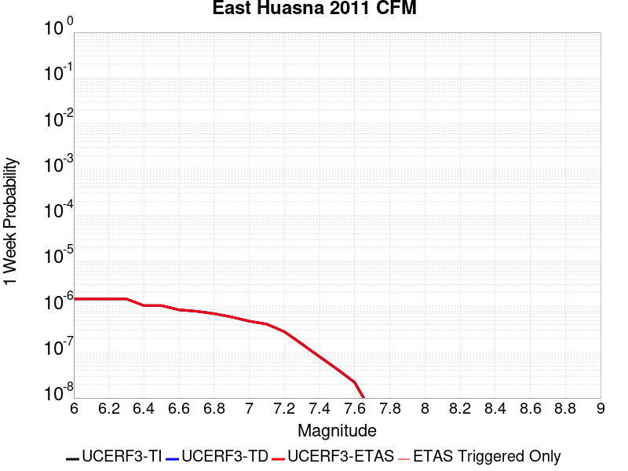 |  |  |  |

| Magnitude | 1 wk TI Prob | 1 wk TD Prob | 1 wk ETAS Prob | 1 wk ETAS/TD Gain | 1 wk ETAS Triggered Only | 1 mo TI Prob | 1 mo TD Prob | 1 mo ETAS Prob | 1 mo ETAS/TD Gain | 1 mo ETAS Triggered Only | 1 yr TI Prob | 1 yr TD Prob | 1 yr ETAS Prob | 1 yr ETAS/TD Gain | 1 yr ETAS Triggered Only | 10 yr TI Prob | 10 yr TD Prob | 10 yr ETAS Prob | 10 yr ETAS/TD Gain | 10 yr ETAS Triggered Only |
|-----|-----|-----|-----|-----|-----|-----|-----|-----|-----|-----|-----|-----|-----|-----|-----|-----|-----|-----|-----|-----|
| 6.0 | 1.4658423E-6 | 1.471567E-6 | 1.471567E-6 | 1.0 | 0.0 | 6.282166E-6 | 6.306701E-6 | 6.306701E-6 | 1.0 | 0.0 | 7.6482684E-5 | 7.678145E-5 | 7.678145E-5 | 1.0 | 0.0 | 7.645637E-4 | 7.675562E-4 | 7.775485E-4 | 1.0130184 | 1.0E-5 |
| 6.1 | 1.4658423E-6 | 1.471567E-6 | 1.471567E-6 | 1.0 | 0.0 | 6.282166E-6 | 6.306701E-6 | 6.306701E-6 | 1.0 | 0.0 | 7.6482684E-5 | 7.678145E-5 | 7.678145E-5 | 1.0 | 0.0 | 7.645637E-4 | 7.675562E-4 | 7.775485E-4 | 1.0130184 | 1.0E-5 |
| 6.2 | 1.4658423E-6 | 1.471567E-6 | 1.471567E-6 | 1.0 | 0.0 | 6.282166E-6 | 6.306701E-6 | 6.306701E-6 | 1.0 | 0.0 | 7.6482684E-5 | 7.678145E-5 | 7.678145E-5 | 1.0 | 0.0 | 7.645637E-4 | 7.675562E-4 | 7.775485E-4 | 1.0130184 | 1.0E-5 |
| 6.3 | 1.4658423E-6 | 1.471567E-6 | 1.471567E-6 | 1.0 | 0.0 | 6.282166E-6 | 6.306701E-6 | 6.306701E-6 | 1.0 | 0.0 | 7.6482684E-5 | 7.678145E-5 | 7.678145E-5 | 1.0 | 0.0 | 7.645637E-4 | 7.675562E-4 | 7.775485E-4 | 1.0130184 | 1.0E-5 |
| 6.4 | 1.0488257E-6 | 1.0527523E-6 | 1.0527523E-6 | 1.0 | 0.0 | 4.4949593E-6 | 4.5117877E-6 | 4.5117877E-6 | 1.0 | 0.0 | 5.472476E-5 | 5.492965E-5 | 5.492965E-5 | 1.0 | 0.0 | 5.4711284E-4 | 5.491626E-4 | 5.491626E-4 | 1.0 | 0.0 |
| 6.5 | 1.0488257E-6 | 1.0527523E-6 | 1.0527523E-6 | 1.0 | 0.0 | 4.4949593E-6 | 4.5117877E-6 | 4.5117877E-6 | 1.0 | 0.0 | 5.472476E-5 | 5.492965E-5 | 5.492965E-5 | 1.0 | 0.0 | 5.4711284E-4 | 5.491626E-4 | 5.491626E-4 | 1.0 | 0.0 |
| 6.6 | 8.463064E-7 | 8.493639E-7 | 8.493639E-7 | 1.0 | 0.0 | 3.6270226E-6 | 3.6401261E-6 | 3.6401261E-6 | 1.0 | 0.0 | 4.4158103E-5 | 4.4317643E-5 | 4.4317643E-5 | 1.0 | 0.0 | 4.414933E-4 | 4.430889E-4 | 4.430889E-4 | 1.0 | 0.0 |
| 6.7 | 7.876149E-7 | 7.90254E-7 | 7.90254E-7 | 1.0 | 0.0 | 3.375488E-6 | 3.3867984E-6 | 3.3867984E-6 | 1.0 | 0.0 | 4.109579E-5 | 4.1233496E-5 | 4.1233496E-5 | 1.0 | 0.0 | 4.108819E-4 | 4.1225908E-4 | 4.1225908E-4 | 1.0 | 0.0 |
| 6.8 | 6.9940785E-7 | 7.0165834E-7 | 7.0165834E-7 | 1.0 | 0.0 | 2.9974588E-6 | 3.0071037E-6 | 3.0071037E-6 | 1.0 | 0.0 | 3.649345E-5 | 3.661088E-5 | 3.661088E-5 | 1.0 | 0.0 | 3.6487455E-4 | 3.6604895E-4 | 3.6604895E-4 | 1.0 | 0.0 |
| 6.9 | 5.899658E-7 | 5.915605E-7 | 5.915605E-7 | 1.0 | 0.0 | 2.5284223E-6 | 2.5352567E-6 | 2.5352567E-6 | 1.0 | 0.0 | 3.0783107E-5 | 3.0866315E-5 | 3.0866315E-5 | 1.0 | 0.0 | 3.0778843E-4 | 3.0862057E-4 | 3.0862057E-4 | 1.0 | 0.0 |
| 7.0 | 4.793814E-7 | 4.8032774E-7 | 4.8032774E-7 | 1.0 | 0.0 | 2.05449E-6 | 2.058546E-6 | 2.058546E-6 | 1.0 | 0.0 | 2.501313E-5 | 2.5062509E-5 | 2.5062509E-5 | 1.0 | 0.0 | 2.5010316E-4 | 2.5059702E-4 | 2.5059702E-4 | 1.0 | 0.0 |
| 7.1 | 4.1256908E-7 | 4.129945E-7 | 4.129945E-7 | 1.0 | 0.0 | 1.768152E-6 | 1.7699753E-6 | 1.7699753E-6 | 1.0 | 0.0 | 2.1527037E-5 | 2.1549236E-5 | 2.1549236E-5 | 1.0 | 0.0 | 2.1524953E-4 | 2.1547162E-4 | 2.1547162E-4 | 1.0 | 0.0 |
| 7.2 | 2.822599E-7 | 2.8161446E-7 | 2.8161446E-7 | 1.0 | 0.0 | 1.2096847E-6 | 1.2069186E-6 | 1.2069186E-6 | 1.0 | 0.0 | 1.47278115E-5 | 1.4694136E-5 | 1.4694136E-5 | 1.0 | 0.0 | 1.4726835E-4 | 1.469317E-4 | 1.469317E-4 | 1.0 | 0.0 |
| 7.3 | 1.5261652E-7 | 1.5075035E-7 | 1.5075035E-7 | 1.0 | 0.0 | 6.540707E-7 | 6.4607275E-7 | 6.4607275E-7 | 1.0 | 0.0 | 7.963281E-6 | 7.865908E-6 | 7.865908E-6 | 1.0 | 0.0 | 7.962996E-5 | 7.865631E-5 | 7.865631E-5 | 1.0 | 0.0 |
| 7.4 | 7.976414E-8 | 8.0578744E-8 | 8.0578744E-8 | 1.0 | 0.0 | 3.418463E-7 | 3.453374E-7 | 3.453374E-7 | 1.0 | 0.0 | 4.1619705E-6 | 4.204475E-6 | 4.204475E-6 | 1.0 | 0.0 | 4.161893E-5 | 4.204396E-5 | 4.204396E-5 | 1.0 | 0.0 |
| 7.5 | 4.2715055E-8 | 4.320257E-8 | 4.320257E-8 | 1.0 | 0.0 | 1.830645E-7 | 1.8515384E-7 | 1.8515384E-7 | 1.0 | 0.0 | 2.228808E-6 | 2.2542458E-6 | 2.2542458E-6 | 1.0 | 0.0 | 2.2287857E-5 | 2.2542232E-5 | 2.2542232E-5 | 1.0 | 0.0 |
| 7.6 | 2.1807532E-8 | 2.2057504E-8 | 2.2057504E-8 | 1.0 | 0.0 | 9.346085E-8 | 9.4532155E-8 | 9.4532155E-8 | 1.0 | 0.0 | 1.1378852E-6 | 1.1509284E-6 | 1.1509284E-6 | 1.0 | 0.0 | 1.1378794E-5 | 1.1509225E-5 | 1.1509225E-5 | 1.0 | 0.0 |
| 7.7 | 4.7196043E-9 | 4.767289E-9 | 4.767289E-9 | 1.0 | 0.0 | 2.0226874E-8 | 2.0431235E-8 | 2.0431235E-8 | 1.0 | 0.0 | 2.4626218E-7 | 2.4875027E-7 | 2.4875027E-7 | 1.0 | 0.0 | 2.462619E-6 | 2.4875E-6 | 2.4875E-6 | 1.0 | 0.0 |
| 7.8 | 7.400003E-11 | 7.4654505E-11 | 7.4654505E-11 | 1.0 | 0.0 | 3.171432E-10 | 3.1994796E-10 | 3.1994796E-10 | 1.0 | 0.0 | 3.861218E-9 | 3.895367E-9 | 3.895367E-9 | 1.0 | 0.0 | 3.861218E-8 | 3.895367E-8 | 3.895367E-8 | 1.0 | 0.0 |

## Hat Creek-McArthur-Mayfield
*[(top)](#table-of-contents)*

| 1 Week | 1 Month | 1 Year | 10 Year |
|-----|-----|-----|-----|
|  | 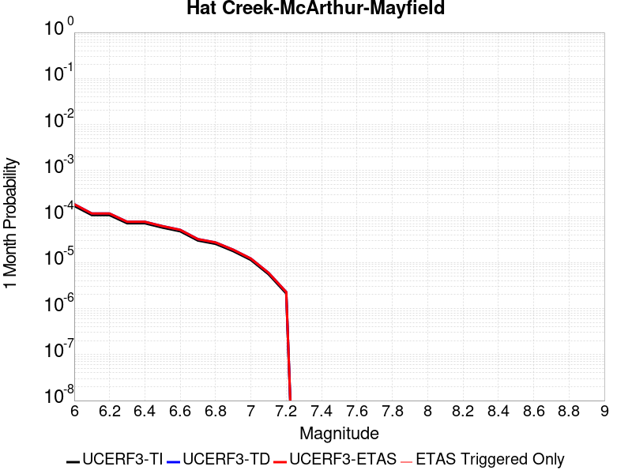 |  | 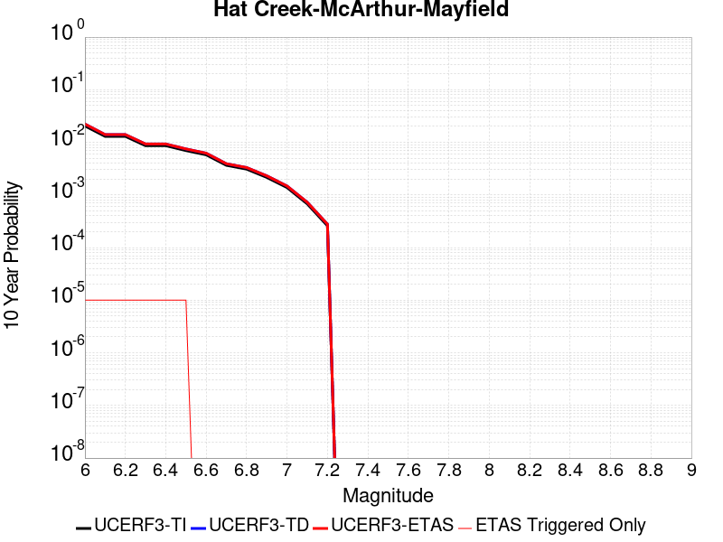 |

| Magnitude | 1 wk TI Prob | 1 wk TD Prob | 1 wk ETAS Prob | 1 wk ETAS/TD Gain | 1 wk ETAS Triggered Only | 1 mo TI Prob | 1 mo TD Prob | 1 mo ETAS Prob | 1 mo ETAS/TD Gain | 1 mo ETAS Triggered Only | 1 yr TI Prob | 1 yr TD Prob | 1 yr ETAS Prob | 1 yr ETAS/TD Gain | 1 yr ETAS Triggered Only | 10 yr TI Prob | 10 yr TD Prob | 10 yr ETAS Prob | 10 yr ETAS/TD Gain | 10 yr ETAS Triggered Only |
|-----|-----|-----|-----|-----|-----|-----|-----|-----|-----|-----|-----|-----|-----|-----|-----|-----|-----|-----|-----|-----|
| 6.0 | 3.967457E-5 | 4.3158736E-5 | 4.3158736E-5 | 1.0 | 0.0 | 1.7002279E-4 | 1.8495355E-4 | 1.8495355E-4 | 1.0 | 0.0 | 0.002068062 | 0.002249598 | 0.002249598 | 1.0 | 0.0 | 0.02048922 | 0.022280615 | 0.022290394 | 1.0004388 | 1.0E-5 |
| 6.1 | 2.5044013E-5 | 2.707141E-5 | 2.707141E-5 | 1.0 | 0.0 | 1.0732707E-4 | 1.1601535E-4 | 1.1601535E-4 | 1.0 | 0.0 | 0.0013059238 | 0.0014116034 | 0.0014116034 | 1.0 | 0.0 | 0.01298276 | 0.014029787 | 0.014039647 | 1.0007027 | 1.0E-5 |
| 6.2 | 2.5044013E-5 | 2.707141E-5 | 2.707141E-5 | 1.0 | 0.0 | 1.0732707E-4 | 1.1601535E-4 | 1.1601535E-4 | 1.0 | 0.0 | 0.0013059238 | 0.0014116034 | 0.0014116034 | 1.0 | 0.0 | 0.01298276 | 0.014029787 | 0.014039647 | 1.0007027 | 1.0E-5 |
| 6.3 | 1.6624012E-5 | 1.7891225E-5 | 1.7891225E-5 | 1.0 | 0.0 | 7.124382E-5 | 7.667447E-5 | 7.667447E-5 | 1.0 | 0.0 | 8.670483E-4 | 9.331205E-4 | 9.331205E-4 | 1.0 | 0.0 | 0.008636732 | 0.009292958 | 0.009302866 | 1.0010661 | 1.0E-5 |
| 6.4 | 1.6624012E-5 | 1.7891225E-5 | 1.7891225E-5 | 1.0 | 0.0 | 7.124382E-5 | 7.667447E-5 | 7.667447E-5 | 1.0 | 0.0 | 8.670483E-4 | 9.331205E-4 | 9.331205E-4 | 1.0 | 0.0 | 0.008636732 | 0.009292958 | 0.009302866 | 1.0010661 | 1.0E-5 |
| 6.5 | 1.3394842E-5 | 1.4392257E-5 | 1.4392257E-5 | 1.0 | 0.0 | 5.7405203E-5 | 6.1679675E-5 | 6.1679675E-5 | 1.0 | 0.0 | 6.986842E-4 | 7.5069687E-4 | 7.5069687E-4 | 1.0 | 0.0 | 0.006964916 | 0.0074822027 | 0.007492128 | 1.0013266 | 1.0E-5 |
| 6.6 | 1.1137514E-5 | 1.1954644E-5 | 1.1954644E-5 | 1.0 | 0.0 | 4.7731326E-5 | 5.1233204E-5 | 5.1233204E-5 | 1.0 | 0.0 | 5.809739E-4 | 6.235898E-4 | 6.235898E-4 | 1.0 | 0.0 | 0.005794574 | 0.0062188213 | 0.0062188213 | 1.0 | 0.0 |
| 6.7 | 7.0200663E-6 | 7.52435E-6 | 7.52435E-6 | 1.0 | 0.0 | 3.008565E-5 | 3.2246826E-5 | 3.2246826E-5 | 1.0 | 0.0 | 3.6623122E-4 | 3.9253596E-4 | 3.9253596E-4 | 1.0 | 0.0 | 0.0036562826 | 0.0039185886 | 0.0039185886 | 1.0 | 0.0 |
| 6.8 | 5.940172E-6 | 6.3655275E-6 | 6.3655275E-6 | 1.0 | 0.0 | 2.545763E-5 | 2.7280554E-5 | 2.7280554E-5 | 1.0 | 0.0 | 3.0990256E-4 | 3.320914E-4 | 3.320914E-4 | 1.0 | 0.0 | 0.0030947074 | 0.00331608 | 0.00331608 | 1.0 | 0.0 |
| 6.9 | 4.129831E-6 | 4.4235826E-6 | 4.4235826E-6 | 1.0 | 0.0 | 1.7699154E-5 | 1.8958077E-5 | 1.8958077E-5 | 1.0 | 0.0 | 2.154659E-4 | 2.3079092E-4 | 2.3079092E-4 | 1.0 | 0.0 | 0.002152571 | 0.0023055908 | 0.0023055908 | 1.0 | 0.0 |
| 7.0 | 2.6512955E-6 | 2.8374225E-6 | 2.8374225E-6 | 1.0 | 0.0 | 1.1362646E-5 | 1.2160327E-5 | 1.2160327E-5 | 1.0 | 0.0 | 1.3833142E-4 | 1.4804235E-4 | 1.4804235E-4 | 1.0 | 0.0 | 0.0013824535 | 0.00147948 | 0.00147948 | 1.0 | 0.0 |
| 7.1 | 1.2992575E-6 | 1.3909428E-6 | 1.3909428E-6 | 1.0 | 0.0 | 5.568235E-6 | 5.9611707E-6 | 5.9611707E-6 | 1.0 | 0.0 | 6.779115E-5 | 7.257506E-5 | 7.257506E-5 | 1.0 | 0.0 | 6.7770475E-4 | 7.2553515E-4 | 7.2553515E-4 | 1.0 | 0.0 |
| 7.2 | 4.968191E-7 | 5.3271907E-7 | 5.3271907E-7 | 1.0 | 0.0 | 2.1292228E-6 | 2.2830804E-6 | 2.2830804E-6 | 1.0 | 0.0 | 2.592298E-5 | 2.7796277E-5 | 2.7796277E-5 | 1.0 | 0.0 | 2.5919956E-4 | 2.7794036E-4 | 2.7794036E-4 | 1.0 | 0.0 |

## San Luis Range - Oceano 2011 CFM
*[(top)](#table-of-contents)*

| 1 Week | 1 Month | 1 Year | 10 Year |
|-----|-----|-----|-----|
|  | 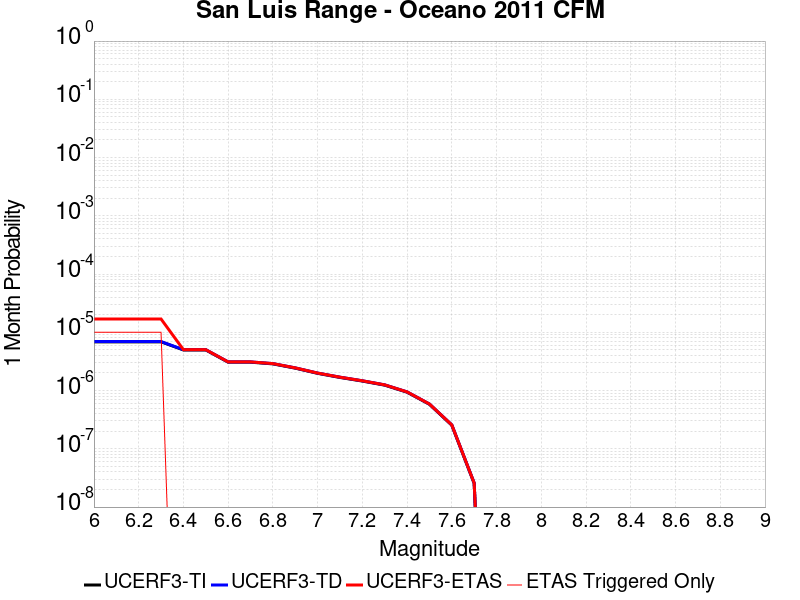 |  |  |

| Magnitude | 1 wk TI Prob | 1 wk TD Prob | 1 wk ETAS Prob | 1 wk ETAS/TD Gain | 1 wk ETAS Triggered Only | 1 mo TI Prob | 1 mo TD Prob | 1 mo ETAS Prob | 1 mo ETAS/TD Gain | 1 mo ETAS Triggered Only | 1 yr TI Prob | 1 yr TD Prob | 1 yr ETAS Prob | 1 yr ETAS/TD Gain | 1 yr ETAS Triggered Only | 10 yr TI Prob | 10 yr TD Prob | 10 yr ETAS Prob | 10 yr ETAS/TD Gain | 10 yr ETAS Triggered Only |
|-----|-----|-----|-----|-----|-----|-----|-----|-----|-----|-----|-----|-----|-----|-----|-----|-----|-----|-----|-----|-----|
| 6.0 | 1.6025788E-6 | 1.6201209E-6 | 1.6201209E-6 | 1.0 | 0.0 | 6.8681766E-6 | 6.9433595E-6 | 1.694329E-5 | 2.440215 | 1.0E-5 | 8.361684E-5 | 8.4532534E-5 | 9.453169E-5 | 1.1182877 | 1.0E-5 | 8.3585386E-4 | 8.450446E-4 | 8.550362E-4 | 1.0118237 | 1.0E-5 |
| 6.1 | 1.6025788E-6 | 1.6201209E-6 | 1.6201209E-6 | 1.0 | 0.0 | 6.8681766E-6 | 6.9433595E-6 | 1.694329E-5 | 2.440215 | 1.0E-5 | 8.361684E-5 | 8.4532534E-5 | 9.453169E-5 | 1.1182877 | 1.0E-5 | 8.3585386E-4 | 8.450446E-4 | 8.550362E-4 | 1.0118237 | 1.0E-5 |
| 6.2 | 1.6025788E-6 | 1.6201209E-6 | 1.6201209E-6 | 1.0 | 0.0 | 6.8681766E-6 | 6.9433595E-6 | 1.694329E-5 | 2.440215 | 1.0E-5 | 8.361684E-5 | 8.4532534E-5 | 9.453169E-5 | 1.1182877 | 1.0E-5 | 8.3585386E-4 | 8.450446E-4 | 8.550362E-4 | 1.0118237 | 1.0E-5 |
| 6.3 | 1.6025788E-6 | 1.6201209E-6 | 1.6201209E-6 | 1.0 | 0.0 | 6.8681766E-6 | 6.9433595E-6 | 1.694329E-5 | 2.440215 | 1.0E-5 | 8.361684E-5 | 8.4532534E-5 | 9.453169E-5 | 1.1182877 | 1.0E-5 | 8.3585386E-4 | 8.450446E-4 | 8.550362E-4 | 1.0118237 | 1.0E-5 |
| 6.4 | 1.1621186E-6 | 1.1749909E-6 | 1.1749909E-6 | 1.0 | 0.0 | 4.980499E-6 | 5.035667E-6 | 5.035667E-6 | 1.0 | 0.0 | 6.0635884E-5 | 6.1307794E-5 | 6.1307794E-5 | 1.0 | 0.0 | 6.0619344E-4 | 6.129354E-4 | 6.129354E-4 | 1.0 | 0.0 |
| 6.5 | 1.1621186E-6 | 1.1749909E-6 | 1.1749909E-6 | 1.0 | 0.0 | 4.980499E-6 | 5.035667E-6 | 5.035667E-6 | 1.0 | 0.0 | 6.0635884E-5 | 6.1307794E-5 | 6.1307794E-5 | 1.0 | 0.0 | 6.0619344E-4 | 6.129354E-4 | 6.129354E-4 | 1.0 | 0.0 |
| 6.6 | 7.164729E-7 | 7.2485875E-7 | 7.2485875E-7 | 1.0 | 0.0 | 3.0705946E-6 | 3.106534E-6 | 3.106534E-6 | 1.0 | 0.0 | 3.738385E-5 | 3.7821414E-5 | 3.7821414E-5 | 1.0 | 0.0 | 3.737756E-4 | 3.7815154E-4 | 3.7815154E-4 | 1.0 | 0.0 |
| 6.7 | 7.164729E-7 | 7.2485875E-7 | 7.2485875E-7 | 1.0 | 0.0 | 3.0705946E-6 | 3.106534E-6 | 3.106534E-6 | 1.0 | 0.0 | 3.738385E-5 | 3.7821414E-5 | 3.7821414E-5 | 1.0 | 0.0 | 3.737756E-4 | 3.7815154E-4 | 3.7815154E-4 | 1.0 | 0.0 |
| 6.8 | 6.700177E-7 | 6.777449E-7 | 6.777449E-7 | 1.0 | 0.0 | 2.8715012E-6 | 2.9046178E-6 | 2.9046178E-6 | 1.0 | 0.0 | 3.495997E-5 | 3.5363162E-5 | 3.5363162E-5 | 1.0 | 0.0 | 3.495447E-4 | 3.53577E-4 | 3.53577E-4 | 1.0 | 0.0 |
| 6.9 | 5.657865E-7 | 5.721794E-7 | 5.721794E-7 | 1.0 | 0.0 | 2.424797E-6 | 2.452195E-6 | 2.452195E-6 | 1.0 | 0.0 | 2.9521503E-5 | 2.9855077E-5 | 2.9855077E-5 | 1.0 | 0.0 | 2.9517582E-4 | 2.9851173E-4 | 2.9851173E-4 | 1.0 | 0.0 |
| 7.0 | 4.608413E-7 | 4.660175E-7 | 4.660175E-7 | 1.0 | 0.0 | 1.9750328E-6 | 1.9972163E-6 | 1.9972163E-6 | 1.0 | 0.0 | 2.4045758E-5 | 2.431584E-5 | 2.431584E-5 | 1.0 | 0.0 | 2.4043156E-4 | 2.4313209E-4 | 2.4313209E-4 | 1.0 | 0.0 |
| 7.1 | 3.9177846E-7 | 3.9621654E-7 | 3.9621654E-7 | 1.0 | 0.0 | 1.6790494E-6 | 1.6980697E-6 | 1.6980697E-6 | 1.0 | 0.0 | 2.0442236E-5 | 2.0673804E-5 | 2.0673804E-5 | 1.0 | 0.0 | 2.0440355E-4 | 2.0671896E-4 | 2.0671896E-4 | 1.0 | 0.0 |
| 7.2 | 3.3974752E-7 | 3.4366573E-7 | 3.4366573E-7 | 1.0 | 0.0 | 1.45606E-6 | 1.4728523E-6 | 1.4728523E-6 | 1.0 | 0.0 | 1.7727387E-5 | 1.793183E-5 | 1.793183E-5 | 1.0 | 0.0 | 1.7725973E-4 | 1.7930396E-4 | 1.7930396E-4 | 1.0 | 0.0 |
| 7.3 | 2.8900928E-7 | 2.9234056E-7 | 2.9234056E-7 | 1.0 | 0.0 | 1.2386106E-6 | 1.2528875E-6 | 1.2528875E-6 | 1.0 | 0.0 | 1.5079979E-5 | 1.52538E-5 | 1.52538E-5 | 1.0 | 0.0 | 1.5078956E-4 | 1.5252762E-4 | 1.5252762E-4 | 1.0 | 0.0 |
| 7.4 | 2.1881527E-7 | 2.2139623E-7 | 2.2139623E-7 | 1.0 | 0.0 | 9.3777936E-7 | 9.4884064E-7 | 9.4884064E-7 | 1.0 | 0.0 | 1.14174045E-5 | 1.1552074E-5 | 1.1552074E-5 | 1.0 | 0.0 | 1.1416818E-4 | 1.1551479E-4 | 1.1551479E-4 | 1.0 | 0.0 |
| 7.5 | 1.356398E-7 | 1.3718656E-7 | 1.3718656E-7 | 1.0 | 0.0 | 5.813133E-7 | 5.879423E-7 | 5.879423E-7 | 1.0 | 0.0 | 7.0774663E-6 | 7.158174E-6 | 7.158174E-6 | 1.0 | 0.0 | 7.077241E-5 | 7.157947E-5 | 7.157947E-5 | 1.0 | 0.0 |
| 7.6 | 5.9269272E-8 | 6.0013726E-8 | 6.0013726E-8 | 1.0 | 0.0 | 2.5401116E-7 | 2.5720166E-7 | 2.5720166E-7 | 1.0 | 0.0 | 3.0925814E-6 | 3.131426E-6 | 3.131426E-6 | 1.0 | 0.0 | 3.0925385E-5 | 3.131383E-5 | 3.131383E-5 | 1.0 | 0.0 |
| 7.7 | 5.946232E-9 | 6.036938E-9 | 6.036938E-9 | 1.0 | 0.0 | 2.5483851E-8 | 2.5872593E-8 | 2.5872593E-8 | 1.0 | 0.0 | 3.1026585E-7 | 3.1499877E-7 | 3.1499877E-7 | 1.0 | 0.0 | 3.102654E-6 | 3.1499842E-6 | 3.1499842E-6 | 1.0 | 0.0 |

## Hollywood
*[(top)](#table-of-contents)*

| 1 Week | 1 Month | 1 Year | 10 Year |
|-----|-----|-----|-----|
|  |  |  |  |

| Magnitude | 1 wk TI Prob | 1 wk TD Prob | 1 wk ETAS Prob | 1 wk ETAS/TD Gain | 1 wk ETAS Triggered Only | 1 mo TI Prob | 1 mo TD Prob | 1 mo ETAS Prob | 1 mo ETAS/TD Gain | 1 mo ETAS Triggered Only | 1 yr TI Prob | 1 yr TD Prob | 1 yr ETAS Prob | 1 yr ETAS/TD Gain | 1 yr ETAS Triggered Only | 10 yr TI Prob | 10 yr TD Prob | 10 yr ETAS Prob | 10 yr ETAS/TD Gain | 10 yr ETAS Triggered Only |
|-----|-----|-----|-----|-----|-----|-----|-----|-----|-----|-----|-----|-----|-----|-----|-----|-----|-----|-----|-----|-----|
| 6.0 | 1.24487615E-5 | 1.2593351E-5 | 1.2593351E-5 | 1.0 | 0.0 | 5.3350745E-5 | 5.3970416E-5 | 5.3970416E-5 | 1.0 | 0.0 | 6.4935174E-4 | 6.568964E-4 | 6.568964E-4 | 1.0 | 0.0 | 0.0064745755 | 0.006550034 | 0.0065599685 | 1.0015167 | 1.0E-5 |
| 6.1 | 1.24487615E-5 | 1.2593351E-5 | 1.2593351E-5 | 1.0 | 0.0 | 5.3350745E-5 | 5.3970416E-5 | 5.3970416E-5 | 1.0 | 0.0 | 6.4935174E-4 | 6.568964E-4 | 6.568964E-4 | 1.0 | 0.0 | 0.0064745755 | 0.006550034 | 0.0065599685 | 1.0015167 | 1.0E-5 |
| 6.2 | 1.24487615E-5 | 1.2593351E-5 | 1.2593351E-5 | 1.0 | 0.0 | 5.3350745E-5 | 5.3970416E-5 | 5.3970416E-5 | 1.0 | 0.0 | 6.4935174E-4 | 6.568964E-4 | 6.568964E-4 | 1.0 | 0.0 | 0.0064745755 | 0.006550034 | 0.0065599685 | 1.0015167 | 1.0E-5 |
| 6.3 | 1.24487615E-5 | 1.2593351E-5 | 1.2593351E-5 | 1.0 | 0.0 | 5.3350745E-5 | 5.3970416E-5 | 5.3970416E-5 | 1.0 | 0.0 | 6.4935174E-4 | 6.568964E-4 | 6.568964E-4 | 1.0 | 0.0 | 0.0064745755 | 0.006550034 | 0.0065599685 | 1.0015167 | 1.0E-5 |
| 6.4 | 1.2431024E-5 | 1.2573964E-5 | 1.2573964E-5 | 1.0 | 0.0 | 5.327473E-5 | 5.3887332E-5 | 5.3887332E-5 | 1.0 | 0.0 | 6.4842677E-4 | 6.5588544E-4 | 6.5588544E-4 | 1.0 | 0.0 | 0.0064653796 | 0.0065399846 | 0.006549919 | 1.0015191 | 1.0E-5 |
| 6.5 | 1.1242222E-5 | 1.1317918E-5 | 1.1317918E-5 | 1.0 | 0.0 | 4.8180063E-5 | 4.8504477E-5 | 4.8504477E-5 | 1.0 | 0.0 | 5.864344E-4 | 5.9038465E-4 | 5.9038465E-4 | 1.0 | 0.0 | 0.0058488925 | 0.005888449 | 0.00589839 | 1.0016882 | 1.0E-5 |
| 6.6 | 1.1234066E-5 | 1.1309032E-5 | 1.1309032E-5 | 1.0 | 0.0 | 4.8145106E-5 | 4.8466394E-5 | 4.8466394E-5 | 1.0 | 0.0 | 5.86009E-4 | 5.8992126E-4 | 5.8992126E-4 | 1.0 | 0.0 | 0.005844661 | 0.0058838394 | 0.005893781 | 1.0016896 | 1.0E-5 |
| 6.7 | 1.12294E-5 | 1.1303775E-5 | 1.1303775E-5 | 1.0 | 0.0 | 4.812511E-5 | 4.8443864E-5 | 4.8443864E-5 | 1.0 | 0.0 | 5.857657E-4 | 5.8964716E-4 | 5.8964716E-4 | 1.0 | 0.0 | 0.0058422405 | 0.0058811125 | 0.005891054 | 1.0016904 | 1.0E-5 |
| 6.8 | 1.0252819E-5 | 1.0218549E-5 | 1.0218549E-5 | 1.0 | 0.0 | 4.3939912E-5 | 4.3793054E-5 | 4.3793054E-5 | 1.0 | 0.0 | 5.3483713E-4 | 5.3305214E-4 | 5.3305214E-4 | 1.0 | 0.0 | 0.005335517 | 0.0053179613 | 0.0053279083 | 1.0018704 | 1.0E-5 |
| 6.9 | 9.252289E-6 | 9.110397E-6 | 9.110397E-6 | 1.0 | 0.0 | 3.9652066E-5 | 3.904398E-5 | 3.904398E-5 | 1.0 | 0.0 | 4.8265693E-4 | 4.7525842E-4 | 4.7525842E-4 | 1.0 | 0.0 | 0.0048161 | 0.004742594 | 0.0047525465 | 1.0020986 | 1.0E-5 |
| 7.0 | 8.474604E-6 | 8.258338E-6 | 8.258338E-6 | 1.0 | 0.0 | 3.6319227E-5 | 3.5392408E-5 | 3.5392408E-5 | 1.0 | 0.0 | 4.4209688E-4 | 4.308188E-4 | 4.308188E-4 | 1.0 | 0.0 | 0.004412184 | 0.004299986 | 0.0043099434 | 1.0023156 | 1.0E-5 |
| 7.1 | 6.643643E-6 | 6.2684276E-6 | 6.2684276E-6 | 1.0 | 0.0 | 2.8472443E-5 | 2.6864414E-5 | 2.6864414E-5 | 1.0 | 0.0 | 3.4659685E-4 | 3.270256E-4 | 3.270256E-4 | 1.0 | 0.0 | 0.0034605677 | 0.0032654896 | 0.0032754568 | 1.0030524 | 1.0E-5 |
| 7.2 | 5.549002E-6 | 5.108755E-6 | 5.108755E-6 | 1.0 | 0.0 | 2.378122E-5 | 2.189448E-5 | 2.189448E-5 | 1.0 | 0.0 | 2.8949787E-4 | 2.6653285E-4 | 2.6653285E-4 | 1.0 | 0.0 | 0.0028912104 | 0.002662148 | 0.0026721216 | 1.0037464 | 1.0E-5 |
| 7.3 | 4.3059727E-6 | 3.9599286E-6 | 3.9599286E-6 | 1.0 | 0.0 | 1.8454039E-5 | 1.6971013E-5 | 1.6971013E-5 | 1.0 | 0.0 | 2.2465475E-4 | 2.0660259E-4 | 2.0660259E-4 | 1.0 | 0.0 | 0.0022442779 | 0.0020641151 | 0.0020740945 | 1.0048347 | 1.0E-5 |
| 7.4 | 2.8550733E-6 | 2.7013295E-6 | 2.7013295E-6 | 1.0 | 0.0 | 1.2235971E-5 | 1.1577075E-5 | 1.1577075E-5 | 1.0 | 0.0 | 1.4896276E-4 | 1.4094182E-4 | 1.4094182E-4 | 1.0 | 0.0 | 0.0014886294 | 0.0014085295 | 0.0014185153 | 1.0070896 | 1.0E-5 |
| 7.5 | 1.9927045E-6 | 1.897662E-6 | 1.897662E-6 | 1.0 | 0.0 | 8.540134E-6 | 8.132812E-6 | 8.132812E-6 | 1.0 | 0.0 | 1.0397117E-4 | 9.901252E-5 | 9.901252E-5 | 1.0 | 0.0 | 0.0010392254 | 9.896876E-4 | 9.996777E-4 | 1.0100942 | 1.0E-5 |
| 7.6 | 1.345084E-6 | 1.2216168E-6 | 1.2216168E-6 | 1.0 | 0.0 | 5.764633E-6 | 5.2354903E-6 | 5.2354903E-6 | 1.0 | 0.0 | 7.018215E-5 | 6.374025E-5 | 6.374025E-5 | 1.0 | 0.0 | 7.0159987E-4 | 6.372217E-4 | 6.472153E-4 | 1.0156832 | 1.0E-5 |
| 7.7 | 7.6835164E-7 | 6.277801E-7 | 6.277801E-7 | 1.0 | 0.0 | 3.2929315E-6 | 2.6904834E-6 | 2.6904834E-6 | 1.0 | 0.0 | 4.00907E-5 | 3.2756157E-5 | 3.2756157E-5 | 1.0 | 0.0 | 4.0083472E-4 | 3.2751478E-4 | 3.375115E-4 | 1.030523 | 1.0E-5 |
| 7.8 | 3.6562128E-7 | 2.4535464E-7 | 2.4535464E-7 | 1.0 | 0.0 | 1.5669474E-6 | 1.0515196E-6 | 1.0515196E-6 | 1.0 | 0.0 | 1.9077417E-5 | 1.2802178E-5 | 1.2802178E-5 | 1.0 | 0.0 | 1.907578E-4 | 1.2801478E-4 | 1.2801478E-4 | 1.0 | 0.0 |
| 7.9 | 7.5024424E-8 | 5.381827E-8 | 5.381827E-8 | 1.0 | 0.0 | 3.215332E-7 | 2.3064972E-7 | 2.3064972E-7 | 1.0 | 0.0 | 3.91466E-6 | 2.8081581E-6 | 2.8081581E-6 | 1.0 | 0.0 | 3.9145907E-5 | 2.8081355E-5 | 2.8081355E-5 | 1.0 | 0.0 |

## Newport-Inglewood alt 1
*[(top)](#table-of-contents)*

| 1 Week | 1 Month | 1 Year | 10 Year |
|-----|-----|-----|-----|
| 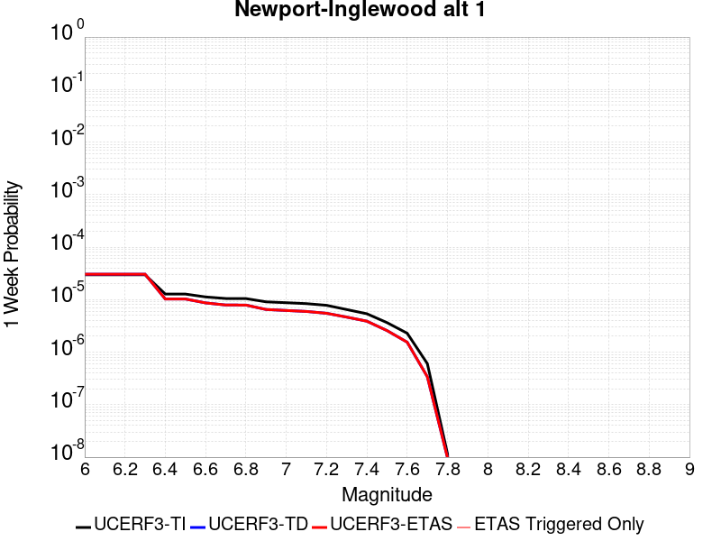 |  |  |  |

| Magnitude | 1 wk TI Prob | 1 wk TD Prob | 1 wk ETAS Prob | 1 wk ETAS/TD Gain | 1 wk ETAS Triggered Only | 1 mo TI Prob | 1 mo TD Prob | 1 mo ETAS Prob | 1 mo ETAS/TD Gain | 1 mo ETAS Triggered Only | 1 yr TI Prob | 1 yr TD Prob | 1 yr ETAS Prob | 1 yr ETAS/TD Gain | 1 yr ETAS Triggered Only | 10 yr TI Prob | 10 yr TD Prob | 10 yr ETAS Prob | 10 yr ETAS/TD Gain | 10 yr ETAS Triggered Only |
|-----|-----|-----|-----|-----|-----|-----|-----|-----|-----|-----|-----|-----|-----|-----|-----|-----|-----|-----|-----|-----|
| 6.0 | 2.9668912E-5 | 3.040542E-5 | 3.040542E-5 | 1.0 | 0.0 | 1.2714628E-4 | 1.3030518E-4 | 1.3030518E-4 | 1.0 | 0.0 | 0.0015469068 | 0.0015857961 | 0.0015857961 | 1.0 | 0.0 | 0.015361829 | 0.015792415 | 0.015802257 | 1.0006232 | 1.0E-5 |
| 6.1 | 2.9668912E-5 | 3.040542E-5 | 3.040542E-5 | 1.0 | 0.0 | 1.2714628E-4 | 1.3030518E-4 | 1.3030518E-4 | 1.0 | 0.0 | 0.0015469068 | 0.0015857961 | 0.0015857961 | 1.0 | 0.0 | 0.015361829 | 0.015792415 | 0.015802257 | 1.0006232 | 1.0E-5 |
| 6.2 | 2.9668912E-5 | 3.040542E-5 | 3.040542E-5 | 1.0 | 0.0 | 1.2714628E-4 | 1.3030518E-4 | 1.3030518E-4 | 1.0 | 0.0 | 0.0015469068 | 0.0015857961 | 0.0015857961 | 1.0 | 0.0 | 0.015361829 | 0.015792415 | 0.015802257 | 1.0006232 | 1.0E-5 |
| 6.3 | 2.9668912E-5 | 3.040542E-5 | 3.040542E-5 | 1.0 | 0.0 | 1.2714628E-4 | 1.3030518E-4 | 1.3030518E-4 | 1.0 | 0.0 | 0.0015469068 | 0.0015857961 | 0.0015857961 | 1.0 | 0.0 | 0.015361829 | 0.015792415 | 0.015802257 | 1.0006232 | 1.0E-5 |
| 6.4 | 1.275942E-5 | 1.02726735E-5 | 1.02726735E-5 | 1.0 | 0.0 | 5.4682085E-5 | 4.4025022E-5 | 4.4025022E-5 | 1.0 | 0.0 | 6.65551E-4 | 5.35877E-4 | 5.35877E-4 | 1.0 | 0.0 | 0.0066356123 | 0.0053462726 | 0.0053462726 | 1.0 | 0.0 |
| 6.5 | 1.275942E-5 | 1.02726735E-5 | 1.02726735E-5 | 1.0 | 0.0 | 5.4682085E-5 | 4.4025022E-5 | 4.4025022E-5 | 1.0 | 0.0 | 6.65551E-4 | 5.35877E-4 | 5.35877E-4 | 1.0 | 0.0 | 0.0066356123 | 0.0053462726 | 0.0053462726 | 1.0 | 0.0 |
| 6.6 | 1.1255358E-5 | 8.662028E-6 | 8.662028E-6 | 1.0 | 0.0 | 4.8236358E-5 | 3.7122463E-5 | 3.7122463E-5 | 1.0 | 0.0 | 5.871194E-4 | 4.5187393E-4 | 4.5187393E-4 | 1.0 | 0.0 | 0.005855706 | 0.0045097284 | 0.0045097284 | 1.0 | 0.0 |
| 6.7 | 1.0504745E-5 | 7.899953E-6 | 7.899953E-6 | 1.0 | 0.0 | 4.5019555E-5 | 3.3856508E-5 | 3.3856508E-5 | 1.0 | 0.0 | 5.4797524E-4 | 4.1212628E-4 | 4.1212628E-4 | 1.0 | 0.0 | 0.0054662596 | 0.0041137496 | 0.0041137496 | 1.0 | 0.0 |
| 6.8 | 1.0476007E-5 | 7.881335E-6 | 7.881335E-6 | 1.0 | 0.0 | 4.4896402E-5 | 3.3776716E-5 | 3.3776716E-5 | 1.0 | 0.0 | 5.464766E-4 | 4.1115517E-4 | 4.1115517E-4 | 1.0 | 0.0 | 0.005451347 | 0.0041040746 | 0.0041040746 | 1.0 | 0.0 |
| 6.9 | 9.076797E-6 | 6.489751E-6 | 6.489751E-6 | 1.0 | 0.0 | 3.889998E-5 | 2.7812923E-5 | 2.7812923E-5 | 1.0 | 0.0 | 4.7350433E-4 | 3.3857004E-4 | 3.3857004E-4 | 1.0 | 0.0 | 0.004724967 | 0.0033805799 | 0.0033805799 | 1.0 | 0.0 |
| 7.0 | 8.73795E-6 | 6.212144E-6 | 6.212144E-6 | 1.0 | 0.0 | 3.7447822E-5 | 2.6623204E-5 | 2.6623204E-5 | 1.0 | 0.0 | 4.5583185E-4 | 3.2408957E-4 | 3.2408957E-4 | 1.0 | 0.0 | 0.0045489795 | 0.003236201 | 0.003236201 | 1.0 | 0.0 |
| 7.1 | 8.391299E-6 | 5.9558465E-6 | 5.9558465E-6 | 1.0 | 0.0 | 3.5962214E-5 | 2.5524807E-5 | 2.5524807E-5 | 1.0 | 0.0 | 4.37752E-4 | 3.1072047E-4 | 3.1072047E-4 | 1.0 | 0.0 | 0.004368907 | 0.00310289 | 0.00310289 | 1.0 | 0.0 |
| 7.2 | 7.796882E-6 | 5.496573E-6 | 5.496573E-6 | 1.0 | 0.0 | 3.341478E-5 | 2.355653E-5 | 2.355653E-5 | 1.0 | 0.0 | 4.06749E-4 | 2.867632E-4 | 2.867632E-4 | 1.0 | 0.0 | 0.0040600533 | 0.002863956 | 0.002863956 | 1.0 | 0.0 |
| 7.3 | 6.4738833E-6 | 4.6478062E-6 | 4.6478062E-6 | 1.0 | 0.0 | 2.774492E-5 | 1.9919018E-5 | 1.9919018E-5 | 1.0 | 0.0 | 3.3774204E-4 | 2.4248721E-4 | 2.4248721E-4 | 1.0 | 0.0 | 0.0033722918 | 0.002422243 | 0.002422243 | 1.0 | 0.0 |
| 7.4 | 5.382145E-6 | 3.8857484E-6 | 3.8857484E-6 | 1.0 | 0.0 | 2.3066134E-5 | 1.66531E-5 | 1.66531E-5 | 1.0 | 0.0 | 2.8079396E-4 | 2.0273279E-4 | 2.0273279E-4 | 1.0 | 0.0 | 0.0028043943 | 0.002025493 | 0.002025493 | 1.0 | 0.0 |
| 7.5 | 3.648244E-6 | 2.573778E-6 | 2.573778E-6 | 1.0 | 0.0 | 1.5635238E-5 | 1.1030431E-5 | 1.1030431E-5 | 1.0 | 0.0 | 1.9034238E-4 | 1.3428733E-4 | 1.3428733E-4 | 1.0 | 0.0 | 0.0019017943 | 0.0013420722 | 0.0013420722 | 1.0 | 0.0 |
| 7.6 | 2.2906888E-6 | 1.5479956E-6 | 1.5479956E-6 | 1.0 | 0.0 | 9.817201E-6 | 6.63425E-6 | 6.63425E-6 | 1.0 | 0.0 | 1.1951787E-4 | 8.0769074E-5 | 8.0769074E-5 | 1.0 | 0.0 | 0.0011945361 | 8.074039E-4 | 8.074039E-4 | 1.0 | 0.0 |
| 7.7 | 6.0479874E-7 | 3.3975044E-7 | 3.3975044E-7 | 1.0 | 0.0 | 2.5919921E-6 | 1.4560726E-6 | 1.4560726E-6 | 1.0 | 0.0 | 3.1557047E-5 | 1.7727554E-5 | 1.7727554E-5 | 1.0 | 0.0 | 3.1552566E-4 | 1.7726277E-4 | 1.7726277E-4 | 1.0 | 0.0 |
| 7.8 | 1.16056995E-8 | 9.782997E-9 | 9.782997E-9 | 1.0 | 0.0 | 4.9738713E-8 | 4.1927127E-8 | 4.1927127E-8 | 1.0 | 0.0 | 6.0556863E-7 | 5.1046277E-7 | 5.1046277E-7 | 1.0 | 0.0 | 6.05567E-6 | 5.1046277E-6 | 5.1046277E-6 | 1.0 | 0.0 |

## White Wolf
*[(top)](#table-of-contents)*

| 1 Week | 1 Month | 1 Year | 10 Year |
|-----|-----|-----|-----|
|  | 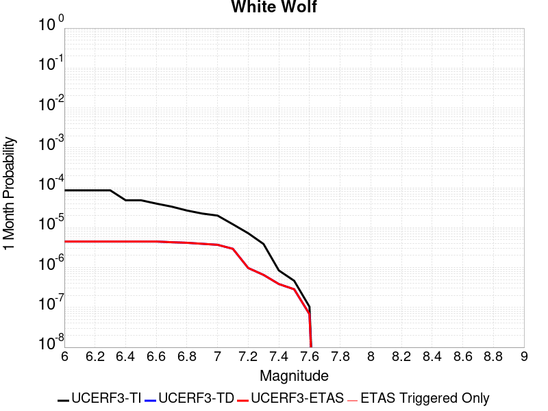 |  |  |

| Magnitude | 1 wk TI Prob | 1 wk TD Prob | 1 wk ETAS Prob | 1 wk ETAS/TD Gain | 1 wk ETAS Triggered Only | 1 mo TI Prob | 1 mo TD Prob | 1 mo ETAS Prob | 1 mo ETAS/TD Gain | 1 mo ETAS Triggered Only | 1 yr TI Prob | 1 yr TD Prob | 1 yr ETAS Prob | 1 yr ETAS/TD Gain | 1 yr ETAS Triggered Only | 10 yr TI Prob | 10 yr TD Prob | 10 yr ETAS Prob | 10 yr ETAS/TD Gain | 10 yr ETAS Triggered Only |
|-----|-----|-----|-----|-----|-----|-----|-----|-----|-----|-----|-----|-----|-----|-----|-----|-----|-----|-----|-----|-----|
| 6.0 | 2.0037822E-5 | 1.0468731E-6 | 1.0468731E-6 | 1.0 | 0.0 | 8.587355E-5 | 4.4865915E-6 | 4.4865915E-6 | 1.0 | 0.0 | 0.001045009 | 5.4622935E-5 | 6.4622385E-5 | 1.1830633 | 1.0E-5 | 0.010401085 | 5.4610014E-4 | 5.560947E-4 | 1.0183016 | 1.0E-5 |
| 6.1 | 2.0037822E-5 | 1.0468731E-6 | 1.0468731E-6 | 1.0 | 0.0 | 8.587355E-5 | 4.4865915E-6 | 4.4865915E-6 | 1.0 | 0.0 | 0.001045009 | 5.4622935E-5 | 6.4622385E-5 | 1.1830633 | 1.0E-5 | 0.010401085 | 5.4610014E-4 | 5.560947E-4 | 1.0183016 | 1.0E-5 |
| 6.2 | 2.0037822E-5 | 1.0468731E-6 | 1.0468731E-6 | 1.0 | 0.0 | 8.587355E-5 | 4.4865915E-6 | 4.4865915E-6 | 1.0 | 0.0 | 0.001045009 | 5.4622935E-5 | 6.4622385E-5 | 1.1830633 | 1.0E-5 | 0.010401085 | 5.4610014E-4 | 5.560947E-4 | 1.0183016 | 1.0E-5 |
| 6.3 | 2.0037822E-5 | 1.0468731E-6 | 1.0468731E-6 | 1.0 | 0.0 | 8.587355E-5 | 4.4865915E-6 | 4.4865915E-6 | 1.0 | 0.0 | 0.001045009 | 5.4622935E-5 | 6.4622385E-5 | 1.1830633 | 1.0E-5 | 0.010401085 | 5.4610014E-4 | 5.560947E-4 | 1.0183016 | 1.0E-5 |
| 6.4 | 1.132487E-5 | 1.0468731E-6 | 1.0468731E-6 | 1.0 | 0.0 | 4.8534253E-5 | 4.4865915E-6 | 4.4865915E-6 | 1.0 | 0.0 | 5.907443E-4 | 5.4622935E-5 | 6.4622385E-5 | 1.1830633 | 1.0E-5 | 0.005891764 | 5.4610014E-4 | 5.560947E-4 | 1.0183016 | 1.0E-5 |
| 6.5 | 1.132487E-5 | 1.0468731E-6 | 1.0468731E-6 | 1.0 | 0.0 | 4.8534253E-5 | 4.4865915E-6 | 4.4865915E-6 | 1.0 | 0.0 | 5.907443E-4 | 5.4622935E-5 | 6.4622385E-5 | 1.1830633 | 1.0E-5 | 0.005891764 | 5.4610014E-4 | 5.560947E-4 | 1.0183016 | 1.0E-5 |
| 6.6 | 9.347473E-6 | 1.0468731E-6 | 1.0468731E-6 | 1.0 | 0.0 | 4.0059982E-5 | 4.4865915E-6 | 4.4865915E-6 | 1.0 | 0.0 | 4.8762115E-4 | 5.4622935E-5 | 6.4622385E-5 | 1.1830633 | 1.0E-5 | 0.0048655253 | 5.4610014E-4 | 5.560947E-4 | 1.0183016 | 1.0E-5 |
| 6.7 | 7.842647E-6 | 1.0047919E-6 | 1.0047919E-6 | 1.0 | 0.0 | 3.361091E-5 | 4.306244E-6 | 4.306244E-6 | 1.0 | 0.0 | 4.0913603E-4 | 5.242731E-5 | 6.2426785E-5 | 1.1907303 | 1.0E-5 | 0.004083836 | 5.241544E-4 | 5.341491E-4 | 1.0190684 | 1.0E-5 |
| 6.8 | 6.26597E-6 | 9.734424E-7 | 9.734424E-7 | 1.0 | 0.0 | 2.685388E-5 | 4.17189E-6 | 4.17189E-6 | 1.0 | 0.0 | 3.2689696E-4 | 5.0791623E-5 | 6.0791117E-5 | 1.1968728 | 1.0E-5 | 0.003264165 | 5.0780503E-4 | 5.178E-4 | 1.0196826 | 1.0E-5 |
| 6.9 | 5.258436E-6 | 9.182858E-7 | 9.182858E-7 | 1.0 | 0.0 | 2.2535958E-5 | 3.935505E-6 | 3.935505E-6 | 1.0 | 0.0 | 2.7434074E-4 | 4.7913767E-5 | 5.791329E-5 | 1.2086983 | 1.0E-5 | 0.0027400232 | 4.7903915E-4 | 4.890344E-4 | 1.0208651 | 1.0E-5 |
| 7.0 | 4.675028E-6 | 8.660822E-7 | 8.660822E-7 | 1.0 | 0.0 | 2.003568E-5 | 3.711776E-6 | 3.711776E-6 | 1.0 | 0.0 | 2.4390711E-4 | 4.5189983E-5 | 5.518953E-5 | 1.221278 | 1.0E-5 | 0.0024363957 | 4.5181264E-4 | 4.6180811E-4 | 1.0221231 | 1.0E-5 |
| 7.1 | 2.8270078E-6 | 6.8738717E-7 | 6.8738717E-7 | 1.0 | 0.0 | 1.2115692E-5 | 2.9459418E-6 | 2.9459418E-6 | 1.0 | 0.0 | 1.4749856E-4 | 3.5866295E-5 | 4.5865934E-5 | 1.2788033 | 1.0E-5 | 0.001474007 | 3.5860913E-4 | 3.6860557E-4 | 1.0278755 | 1.0E-5 |
| 7.2 | 1.6881406E-6 | 2.2703857E-7 | 2.2703857E-7 | 1.0 | 0.0 | 7.2348685E-6 | 9.730221E-7 | 9.730221E-7 | 1.0 | 0.0 | 8.808096E-5 | 1.1846481E-5 | 1.1846481E-5 | 1.0 | 0.0 | 8.8046055E-4 | 1.1845865E-4 | 1.1845865E-4 | 1.0 | 0.0 |
| 7.3 | 9.086107E-7 | 1.5264843E-7 | 1.5264843E-7 | 1.0 | 0.0 | 3.8940398E-6 | 6.542074E-7 | 6.542074E-7 | 1.0 | 0.0 | 4.7408903E-5 | 7.964946E-6 | 7.964946E-6 | 1.0 | 0.0 | 4.739879E-4 | 7.964669E-5 | 7.964669E-5 | 1.0 | 0.0 |
| 7.4 | 1.9717383E-7 | 9.003452E-8 | 9.003452E-8 | 1.0 | 0.0 | 8.450304E-7 | 3.8586217E-7 | 3.8586217E-7 | 1.0 | 0.0 | 1.0288197E-5 | 4.697862E-6 | 4.697862E-6 | 1.0 | 0.0 | 1.028772E-4 | 4.6977657E-5 | 4.6977657E-5 | 1.0 | 0.0 |
| 7.5 | 1.086975E-7 | 6.659696E-8 | 6.659696E-8 | 1.0 | 0.0 | 4.6584634E-7 | 2.8541552E-7 | 2.8541552E-7 | 1.0 | 0.0 | 5.6716644E-6 | 3.4749287E-6 | 3.4749287E-6 | 1.0 | 0.0 | 5.6715195E-5 | 3.4748766E-5 | 3.4748766E-5 | 1.0 | 0.0 |
| 7.6 | 2.4217808E-8 | 1.5820914E-8 | 1.5820914E-8 | 1.0 | 0.0 | 1.03790605E-7 | 6.780392E-8 | 6.780392E-8 | 1.0 | 0.0 | 1.2636499E-6 | 8.255124E-7 | 8.255124E-7 | 1.0 | 0.0 | 1.2636427E-5 | 8.255099E-6 | 8.255099E-6 | 1.0 | 0.0 |

## Superstition Hills
*[(top)](#table-of-contents)*

| 1 Week | 1 Month | 1 Year | 10 Year |
|-----|-----|-----|-----|
| 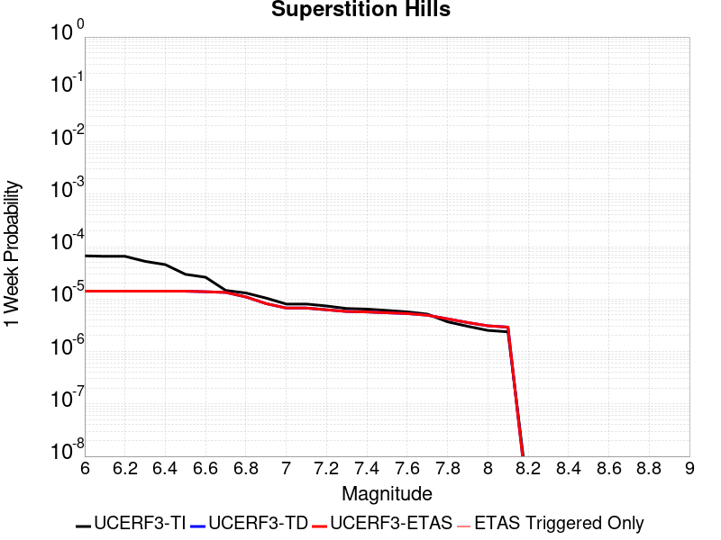 |  |  | 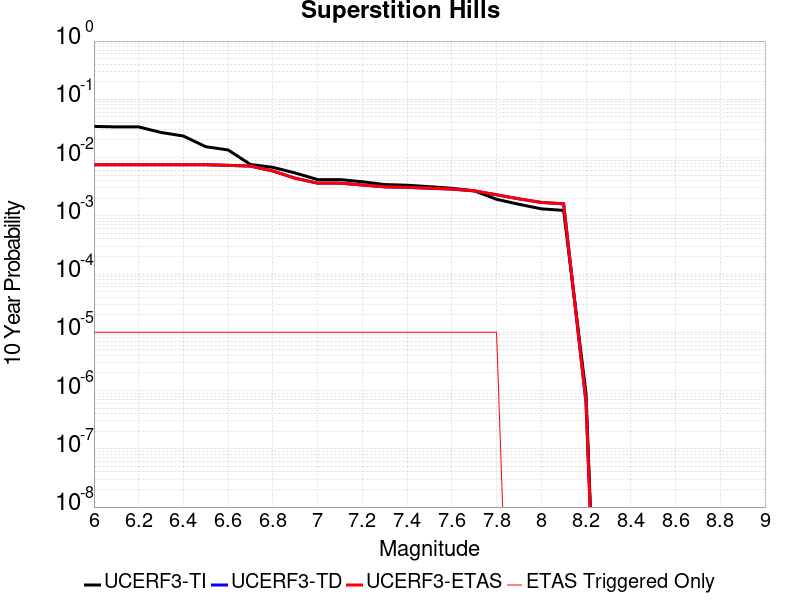 |

| Magnitude | 1 wk TI Prob | 1 wk TD Prob | 1 wk ETAS Prob | 1 wk ETAS/TD Gain | 1 wk ETAS Triggered Only | 1 mo TI Prob | 1 mo TD Prob | 1 mo ETAS Prob | 1 mo ETAS/TD Gain | 1 mo ETAS Triggered Only | 1 yr TI Prob | 1 yr TD Prob | 1 yr ETAS Prob | 1 yr ETAS/TD Gain | 1 yr ETAS Triggered Only | 10 yr TI Prob | 10 yr TD Prob | 10 yr ETAS Prob | 10 yr ETAS/TD Gain | 10 yr ETAS Triggered Only |
|-----|-----|-----|-----|-----|-----|-----|-----|-----|-----|-----|-----|-----|-----|-----|-----|-----|-----|-----|-----|-----|
| 6.0 | 6.6865185E-5 | 1.4140163E-5 | 1.4140163E-5 | 1.0 | 0.0 | 2.8653358E-4 | 6.0599385E-5 | 6.0599385E-5 | 1.0 | 0.0 | 0.0034829667 | 7.3756394E-4 | 7.3756394E-4 | 1.0 | 0.0 | 0.03428881 | 0.0075212284 | 0.007531153 | 1.0013195 | 1.0E-5 |
| 6.1 | 6.544851E-5 | 1.4140163E-5 | 1.4140163E-5 | 1.0 | 0.0 | 2.8046346E-4 | 6.0599385E-5 | 6.0599385E-5 | 1.0 | 0.0 | 0.0034092965 | 7.3756394E-4 | 7.3756394E-4 | 1.0 | 0.0 | 0.033574644 | 0.0075212275 | 0.0075311526 | 1.0013195 | 1.0E-5 |
| 6.2 | 6.544851E-5 | 1.4140163E-5 | 1.4140163E-5 | 1.0 | 0.0 | 2.8046346E-4 | 6.0599385E-5 | 6.0599385E-5 | 1.0 | 0.0 | 0.0034092965 | 7.3756394E-4 | 7.3756394E-4 | 1.0 | 0.0 | 0.033574644 | 0.0075212275 | 0.0075311526 | 1.0013195 | 1.0E-5 |
| 6.3 | 5.2402065E-5 | 1.4140162E-5 | 1.4140162E-5 | 1.0 | 0.0 | 2.2456095E-4 | 6.059938E-5 | 6.059938E-5 | 1.0 | 0.0 | 0.0027306017 | 7.375639E-4 | 7.375639E-4 | 1.0 | 0.0 | 0.02697292 | 0.007521223 | 0.0075311475 | 1.0013195 | 1.0E-5 |
| 6.4 | 4.542238E-5 | 1.4140162E-5 | 1.4140162E-5 | 1.0 | 0.0 | 1.9465282E-4 | 6.0599377E-5 | 6.0599377E-5 | 1.0 | 0.0 | 0.0023673223 | 7.375639E-4 | 7.375639E-4 | 1.0 | 0.0 | 0.023422617 | 0.0075212205 | 0.007531145 | 1.0013195 | 1.0E-5 |
| 6.5 | 2.9672969E-5 | 1.41401615E-5 | 1.41401615E-5 | 1.0 | 0.0 | 1.2716366E-4 | 6.0599374E-5 | 6.0599374E-5 | 1.0 | 0.0 | 0.0015471181 | 7.375638E-4 | 7.375638E-4 | 1.0 | 0.0 | 0.015363912 | 0.007521215 | 0.00753114 | 1.0013195 | 1.0E-5 |
| 6.6 | 2.6056105E-5 | 1.3805918E-5 | 1.3805918E-5 | 1.0 | 0.0 | 1.1166424E-4 | 5.9166967E-5 | 5.9166967E-5 | 1.0 | 0.0 | 0.0013586642 | 7.201358E-4 | 7.201358E-4 | 1.0 | 0.0 | 0.013503874 | 0.007345627 | 0.0073555536 | 1.0013514 | 1.0E-5 |
| 6.7 | 1.4611248E-5 | 1.33858E-5 | 1.33858E-5 | 1.0 | 0.0 | 6.261813E-5 | 5.7366546E-5 | 5.7366546E-5 | 1.0 | 0.0 | 7.6210906E-4 | 6.982298E-4 | 6.982298E-4 | 1.0 | 0.0 | 0.0075950073 | 0.007126795 | 0.007136724 | 1.0013932 | 1.0E-5 |
| 6.8 | 1.30607E-5 | 1.0981015E-5 | 1.0981015E-5 | 1.0 | 0.0 | 5.597323E-5 | 4.7060694E-5 | 4.7060694E-5 | 1.0 | 0.0 | 6.8126095E-4 | 5.7282206E-4 | 5.7282206E-4 | 1.0 | 0.0 | 0.006791762 | 0.005874862 | 0.0058848034 | 1.0016922 | 1.0E-5 |
| 6.9 | 1.0443096E-5 | 8.197196E-6 | 8.197196E-6 | 1.0 | 0.0 | 4.4755358E-5 | 3.513038E-5 | 3.513038E-5 | 1.0 | 0.0 | 5.447602E-4 | 4.2763076E-4 | 4.2763076E-4 | 1.0 | 0.0 | 0.005434267 | 0.0044104042 | 0.0044203606 | 1.0022573 | 1.0E-5 |
| 7.0 | 8.045912E-6 | 6.7413616E-6 | 6.7413616E-6 | 1.0 | 0.0 | 3.4482026E-5 | 2.8891236E-5 | 2.8891236E-5 | 1.0 | 0.0 | 4.197378E-4 | 3.5169505E-4 | 3.5169505E-4 | 1.0 | 0.0 | 0.0041894587 | 0.0036344288 | 0.0036443926 | 1.0027415 | 1.0E-5 |
| 7.1 | 8.045912E-6 | 6.7413616E-6 | 6.7413616E-6 | 1.0 | 0.0 | 3.4482026E-5 | 2.8891236E-5 | 2.8891236E-5 | 1.0 | 0.0 | 4.197378E-4 | 3.5169505E-4 | 3.5169505E-4 | 1.0 | 0.0 | 0.0041894587 | 0.0036344288 | 0.0036443926 | 1.0027415 | 1.0E-5 |
| 7.2 | 7.375506E-6 | 6.248258E-6 | 6.248258E-6 | 1.0 | 0.0 | 3.1608928E-5 | 2.6777978E-5 | 2.6777978E-5 | 1.0 | 0.0 | 3.8477074E-4 | 3.2597396E-4 | 3.2597396E-4 | 1.0 | 0.0 | 0.003841052 | 0.0033749233 | 0.0033848893 | 1.002953 | 1.0E-5 |
| 7.3 | 6.6063913E-6 | 5.8006785E-6 | 5.8006785E-6 | 1.0 | 0.0 | 2.8312797E-5 | 2.4859819E-5 | 2.4859819E-5 | 1.0 | 0.0 | 3.446538E-4 | 3.0262698E-4 | 3.0262698E-4 | 1.0 | 0.0 | 0.0034411973 | 0.003139129 | 0.0031490976 | 1.0031756 | 1.0E-5 |
| 7.4 | 6.4313126E-6 | 5.682101E-6 | 5.682101E-6 | 1.0 | 0.0 | 2.7562477E-5 | 2.4351637E-5 | 2.4351637E-5 | 1.0 | 0.0 | 3.355215E-4 | 2.9644155E-4 | 2.9644155E-4 | 1.0 | 0.0 | 0.0033501536 | 0.00307688 | 0.003086849 | 1.00324 | 1.0E-5 |
| 7.5 | 6.0742927E-6 | 5.4779157E-6 | 5.4779157E-6 | 1.0 | 0.0 | 2.6032423E-5 | 2.3476574E-5 | 2.3476574E-5 | 1.0 | 0.0 | 3.1689866E-4 | 2.8579048E-4 | 2.8579048E-4 | 1.0 | 0.0 | 0.0031644711 | 0.0029687078 | 0.002978678 | 1.0033585 | 1.0E-5 |
| 7.6 | 5.6987187E-6 | 5.2961186E-6 | 5.2961186E-6 | 1.0 | 0.0 | 2.4422852E-5 | 2.2697459E-5 | 2.2697459E-5 | 1.0 | 0.0 | 2.9730765E-4 | 2.7630717E-4 | 2.7630717E-4 | 1.0 | 0.0 | 0.002969102 | 0.0028719439 | 0.002881915 | 1.003472 | 1.0E-5 |
| 7.7 | 5.1658035E-6 | 4.927118E-6 | 4.927118E-6 | 1.0 | 0.0 | 2.2138971E-5 | 2.1116053E-5 | 2.1116053E-5 | 1.0 | 0.0 | 2.6950863E-4 | 2.5705821E-4 | 2.5705821E-4 | 1.0 | 0.0 | 0.00269182 | 0.002676964 | 0.0026869373 | 1.0037255 | 1.0E-5 |
| 7.8 | 3.6864697E-6 | 4.1980647E-6 | 4.1980647E-6 | 1.0 | 0.0 | 1.579906E-5 | 1.7991584E-5 | 1.7991584E-5 | 1.0 | 0.0 | 1.9233658E-4 | 2.1902598E-4 | 2.1902598E-4 | 1.0 | 0.0 | 0.0019217018 | 0.002290197 | 0.0023001742 | 1.0043564 | 1.0E-5 |
| 7.9 | 3.0265903E-6 | 3.5651783E-6 | 3.5651783E-6 | 1.0 | 0.0 | 1.2971037E-5 | 1.5279249E-5 | 1.5279249E-5 | 1.0 | 0.0 | 1.5791094E-4 | 1.860094E-4 | 1.860094E-4 | 1.0 | 0.0 | 0.0015779877 | 0.0019542756 | 0.0019542756 | 1.0 | 0.0 |
| 8.0 | 2.5271493E-6 | 3.0880722E-6 | 3.0880722E-6 | 1.0 | 0.0 | 1.0830595E-5 | 1.323453E-5 | 1.323453E-5 | 1.0 | 0.0 | 1.3185451E-4 | 1.611189E-4 | 1.611189E-4 | 1.0 | 0.0 | 0.0013177631 | 0.0016980594 | 0.0016980594 | 1.0 | 0.0 |
| 8.1 | 2.3749135E-6 | 2.9186547E-6 | 2.9186547E-6 | 1.0 | 0.0 | 1.0178161E-5 | 1.25084625E-5 | 1.25084625E-5 | 1.0 | 0.0 | 1.2391206E-4 | 1.522803E-4 | 1.522803E-4 | 1.0 | 0.0 | 0.0012384299 | 0.0016055837 | 0.0016055837 | 1.0 | 0.0 |
| 8.2 | 1.7186406E-9 | 1.1445346E-9 | 1.1445346E-9 | 1.0 | 0.0 | 7.3656024E-9 | 4.9051483E-9 | 4.9051483E-9 | 1.0 | 0.0 | 8.9676206E-8 | 5.972018E-8 | 5.972018E-8 | 1.0 | 0.0 | 8.9676166E-7 | 6.391822E-7 | 6.391822E-7 | 1.0 | 0.0 |

## Great Valley 13 (Coalinga)
*[(top)](#table-of-contents)*

| 1 Week | 1 Month | 1 Year | 10 Year |
|-----|-----|-----|-----|
|  |  |  |  |

| Magnitude | 1 wk TI Prob | 1 wk TD Prob | 1 wk ETAS Prob | 1 wk ETAS/TD Gain | 1 wk ETAS Triggered Only | 1 mo TI Prob | 1 mo TD Prob | 1 mo ETAS Prob | 1 mo ETAS/TD Gain | 1 mo ETAS Triggered Only | 1 yr TI Prob | 1 yr TD Prob | 1 yr ETAS Prob | 1 yr ETAS/TD Gain | 1 yr ETAS Triggered Only | 10 yr TI Prob | 10 yr TD Prob | 10 yr ETAS Prob | 10 yr ETAS/TD Gain | 10 yr ETAS Triggered Only |
|-----|-----|-----|-----|-----|-----|-----|-----|-----|-----|-----|-----|-----|-----|-----|-----|-----|-----|-----|-----|-----|
| 6.0 | 1.25701345E-5 | 1.825045E-6 | 1.825045E-6 | 1.0 | 0.0 | 5.3870892E-5 | 7.821599E-6 | 7.821599E-6 | 1.0 | 0.0 | 6.556807E-4 | 9.522401E-5 | 1.0522305E-4 | 1.1050055 | 1.0E-5 | 0.006537495 | 9.5185137E-4 | 9.6184184E-4 | 1.0104959 | 1.0E-5 |
| 6.1 | 1.25701345E-5 | 1.825045E-6 | 1.825045E-6 | 1.0 | 0.0 | 5.3870892E-5 | 7.821599E-6 | 7.821599E-6 | 1.0 | 0.0 | 6.556807E-4 | 9.522401E-5 | 1.0522305E-4 | 1.1050055 | 1.0E-5 | 0.006537495 | 9.5185137E-4 | 9.6184184E-4 | 1.0104959 | 1.0E-5 |
| 6.2 | 1.25701345E-5 | 1.825045E-6 | 1.825045E-6 | 1.0 | 0.0 | 5.3870892E-5 | 7.821599E-6 | 7.821599E-6 | 1.0 | 0.0 | 6.556807E-4 | 9.522401E-5 | 1.0522305E-4 | 1.1050055 | 1.0E-5 | 0.006537495 | 9.5185137E-4 | 9.6184184E-4 | 1.0104959 | 1.0E-5 |
| 6.3 | 1.25701345E-5 | 1.825045E-6 | 1.825045E-6 | 1.0 | 0.0 | 5.3870892E-5 | 7.821599E-6 | 7.821599E-6 | 1.0 | 0.0 | 6.556807E-4 | 9.522401E-5 | 1.0522305E-4 | 1.1050055 | 1.0E-5 | 0.006537495 | 9.5185137E-4 | 9.6184184E-4 | 1.0104959 | 1.0E-5 |
| 6.4 | 1.25701345E-5 | 1.825045E-6 | 1.825045E-6 | 1.0 | 0.0 | 5.3870892E-5 | 7.821599E-6 | 7.821599E-6 | 1.0 | 0.0 | 6.556807E-4 | 9.522401E-5 | 1.0522305E-4 | 1.1050055 | 1.0E-5 | 0.006537495 | 9.5185137E-4 | 9.6184184E-4 | 1.0104959 | 1.0E-5 |
| 6.5 | 1.25701345E-5 | 1.825045E-6 | 1.825045E-6 | 1.0 | 0.0 | 5.3870892E-5 | 7.821599E-6 | 7.821599E-6 | 1.0 | 0.0 | 6.556807E-4 | 9.522401E-5 | 1.0522305E-4 | 1.1050055 | 1.0E-5 | 0.006537495 | 9.5185137E-4 | 9.6184184E-4 | 1.0104959 | 1.0E-5 |
| 6.6 | 1.25701345E-5 | 1.825045E-6 | 1.825045E-6 | 1.0 | 0.0 | 5.3870892E-5 | 7.821599E-6 | 7.821599E-6 | 1.0 | 0.0 | 6.556807E-4 | 9.522401E-5 | 1.0522305E-4 | 1.1050055 | 1.0E-5 | 0.006537495 | 9.5185137E-4 | 9.6184184E-4 | 1.0104959 | 1.0E-5 |
| 6.7 | 1.25701345E-5 | 1.825045E-6 | 1.825045E-6 | 1.0 | 0.0 | 5.3870892E-5 | 7.821599E-6 | 7.821599E-6 | 1.0 | 0.0 | 6.556807E-4 | 9.522401E-5 | 1.0522305E-4 | 1.1050055 | 1.0E-5 | 0.006537495 | 9.5185137E-4 | 9.6184184E-4 | 1.0104959 | 1.0E-5 |
| 6.8 | 1.0720415E-5 | 1.825045E-6 | 1.825045E-6 | 1.0 | 0.0 | 4.5943823E-5 | 7.821599E-6 | 7.821599E-6 | 1.0 | 0.0 | 5.592225E-4 | 9.522401E-5 | 1.0522305E-4 | 1.1050055 | 1.0E-5 | 0.005578173 | 9.5185137E-4 | 9.6184184E-4 | 1.0104959 | 1.0E-5 |
| 6.9 | 1.0485409E-5 | 1.8209578E-6 | 1.8209578E-6 | 1.0 | 0.0 | 4.4936693E-5 | 7.804083E-6 | 7.804083E-6 | 1.0 | 0.0 | 5.469669E-4 | 9.501076E-5 | 1.0500981E-4 | 1.1052412 | 1.0E-5 | 0.005456226 | 9.497207E-4 | 9.597112E-4 | 1.0105194 | 1.0E-5 |
| 7.0 | 6.3302773E-6 | 1.81583E-6 | 1.81583E-6 | 1.0 | 0.0 | 2.7129478E-5 | 7.782107E-6 | 7.782107E-6 | 1.0 | 0.0 | 3.3025132E-4 | 9.474323E-5 | 1.0474228E-4 | 1.1055385 | 1.0E-5 | 0.0032976097 | 9.4704767E-4 | 9.570382E-4 | 1.0105492 | 1.0E-5 |
| 7.1 | 6.022003E-6 | 1.7661379E-6 | 1.7661379E-6 | 1.0 | 0.0 | 2.5808331E-5 | 7.5691414E-6 | 7.5691414E-6 | 1.0 | 0.0 | 3.141711E-4 | 9.21506E-5 | 1.0214967E-4 | 1.108508 | 1.0E-5 | 0.0031372732 | 9.21143E-4 | 9.311338E-4 | 1.010846 | 1.0E-5 |
| 7.2 | 5.671345E-6 | 1.705971E-6 | 1.705971E-6 | 1.0 | 0.0 | 2.4305538E-5 | 7.3112847E-6 | 7.3112847E-6 | 1.0 | 0.0 | 2.9587973E-4 | 8.901145E-5 | 9.901056E-5 | 1.1123351 | 1.0E-5 | 0.002954861 | 8.897771E-4 | 8.9976814E-4 | 1.0112288 | 1.0E-5 |
| 7.3 | 4.8831785E-6 | 1.4730803E-6 | 1.4730803E-6 | 1.0 | 0.0 | 2.092774E-5 | 6.313187E-6 | 6.313187E-6 | 1.0 | 0.0 | 2.5476544E-4 | 7.686051E-5 | 8.685974E-5 | 1.1300958 | 1.0E-5 | 0.0025447358 | 7.6835585E-4 | 7.783482E-4 | 1.0130048 | 1.0E-5 |
| 7.4 | 2.4837766E-6 | 9.80044E-7 | 9.80044E-7 | 1.0 | 0.0 | 1.0644713E-5 | 4.200182E-6 | 4.200182E-6 | 1.0 | 0.0 | 1.2959167E-4 | 5.113608E-5 | 6.113557E-5 | 1.1955466 | 1.0E-5 | 0.0012951613 | 5.1124976E-4 | 5.2124466E-4 | 1.01955 | 1.0E-5 |
| 7.5 | 1.5002679E-6 | 6.546047E-7 | 6.546047E-7 | 1.0 | 0.0 | 6.4297037E-6 | 2.805446E-6 | 2.805446E-6 | 1.0 | 0.0 | 7.827883E-5 | 3.415581E-5 | 4.415547E-5 | 1.292766 | 1.0E-5 | 7.825126E-4 | 3.4150976E-4 | 3.5150634E-4 | 1.0292717 | 1.0E-5 |

## Oceanside alt1
*[(top)](#table-of-contents)*

| 1 Week | 1 Month | 1 Year | 10 Year |
|-----|-----|-----|-----|
|  |  |  |  |

| Magnitude | 1 wk TI Prob | 1 wk TD Prob | 1 wk ETAS Prob | 1 wk ETAS/TD Gain | 1 wk ETAS Triggered Only | 1 mo TI Prob | 1 mo TD Prob | 1 mo ETAS Prob | 1 mo ETAS/TD Gain | 1 mo ETAS Triggered Only | 1 yr TI Prob | 1 yr TD Prob | 1 yr ETAS Prob | 1 yr ETAS/TD Gain | 1 yr ETAS Triggered Only | 10 yr TI Prob | 10 yr TD Prob | 10 yr ETAS Prob | 10 yr ETAS/TD Gain | 10 yr ETAS Triggered Only |
|-----|-----|-----|-----|-----|-----|-----|-----|-----|-----|-----|-----|-----|-----|-----|-----|-----|-----|-----|-----|-----|
| 6.0 | 1.1617542E-5 | 1.142355E-5 | 1.142355E-5 | 1.0 | 0.0 | 4.9788516E-5 | 4.8957245E-5 | 5.8956753E-5 | 1.2042499 | 1.0E-5 | 6.060066E-4 | 5.9590756E-4 | 6.059016E-4 | 1.0167711 | 1.0E-5 | 0.0060435664 | 0.0059446944 | 0.005954635 | 1.0016721 | 1.0E-5 |
| 6.1 | 1.1617542E-5 | 1.142355E-5 | 1.142355E-5 | 1.0 | 0.0 | 4.9788516E-5 | 4.8957245E-5 | 5.8956753E-5 | 1.2042499 | 1.0E-5 | 6.060066E-4 | 5.9590756E-4 | 6.059016E-4 | 1.0167711 | 1.0E-5 | 0.0060435664 | 0.0059446944 | 0.005954635 | 1.0016721 | 1.0E-5 |
| 6.2 | 1.1617542E-5 | 1.142355E-5 | 1.142355E-5 | 1.0 | 0.0 | 4.9788516E-5 | 4.8957245E-5 | 5.8956753E-5 | 1.2042499 | 1.0E-5 | 6.060066E-4 | 5.9590756E-4 | 6.059016E-4 | 1.0167711 | 1.0E-5 | 0.0060435664 | 0.0059446944 | 0.005954635 | 1.0016721 | 1.0E-5 |
| 6.3 | 1.1617542E-5 | 1.142355E-5 | 1.142355E-5 | 1.0 | 0.0 | 4.9788516E-5 | 4.8957245E-5 | 5.8956753E-5 | 1.2042499 | 1.0E-5 | 6.060066E-4 | 5.9590756E-4 | 6.059016E-4 | 1.0167711 | 1.0E-5 | 0.0060435664 | 0.0059446944 | 0.005954635 | 1.0016721 | 1.0E-5 |
| 6.4 | 1.1617542E-5 | 1.142355E-5 | 1.142355E-5 | 1.0 | 0.0 | 4.9788516E-5 | 4.8957245E-5 | 5.8956753E-5 | 1.2042499 | 1.0E-5 | 6.060066E-4 | 5.9590756E-4 | 6.059016E-4 | 1.0167711 | 1.0E-5 | 0.0060435664 | 0.0059446944 | 0.005954635 | 1.0016721 | 1.0E-5 |
| 6.5 | 1.1617542E-5 | 1.142355E-5 | 1.142355E-5 | 1.0 | 0.0 | 4.9788516E-5 | 4.8957245E-5 | 5.8956753E-5 | 1.2042499 | 1.0E-5 | 6.060066E-4 | 5.9590756E-4 | 6.059016E-4 | 1.0167711 | 1.0E-5 | 0.0060435664 | 0.0059446944 | 0.005954635 | 1.0016721 | 1.0E-5 |
| 6.6 | 7.561768E-6 | 7.133646E-6 | 7.133646E-6 | 1.0 | 0.0 | 3.2407173E-5 | 3.0572413E-5 | 3.0572413E-5 | 1.0 | 0.0 | 3.9448592E-4 | 3.7215665E-4 | 3.7215665E-4 | 1.0 | 0.0 | 0.0039378637 | 0.0037154458 | 0.0037154458 | 1.0 | 0.0 |
| 6.7 | 7.1042605E-6 | 6.6557136E-6 | 6.6557136E-6 | 1.0 | 0.0 | 3.0446476E-5 | 2.8524179E-5 | 2.8524179E-5 | 1.0 | 0.0 | 3.706228E-4 | 3.4722732E-4 | 3.4722732E-4 | 1.0 | 0.0 | 0.0037000529 | 0.0034669314 | 0.0034669314 | 1.0 | 0.0 |
| 6.8 | 6.285554E-6 | 5.799729E-6 | 5.799729E-6 | 1.0 | 0.0 | 2.693781E-5 | 2.4855748E-5 | 2.4855748E-5 | 1.0 | 0.0 | 3.2791847E-4 | 3.0257727E-4 | 3.0257727E-4 | 1.0 | 0.0 | 0.0032743502 | 0.0030217103 | 0.0030217103 | 1.0 | 0.0 |
| 6.9 | 6.148883E-6 | 5.6565673E-6 | 5.6565673E-6 | 1.0 | 0.0 | 2.635209E-5 | 2.4242208E-5 | 2.4242208E-5 | 1.0 | 0.0 | 3.2078946E-4 | 2.9510946E-4 | 2.9510946E-4 | 1.0 | 0.0 | 0.003203268 | 0.0029472327 | 0.0029472327 | 1.0 | 0.0 |
| 7.0 | 5.253857E-6 | 4.7224216E-6 | 4.7224216E-6 | 1.0 | 0.0 | 2.2516335E-5 | 2.0238795E-5 | 2.0238795E-5 | 1.0 | 0.0 | 2.7410188E-4 | 2.463798E-4 | 2.463798E-4 | 1.0 | 0.0 | 0.0027376404 | 0.0024610977 | 0.0024610977 | 1.0 | 0.0 |
| 7.1 | 4.730754E-6 | 4.1785247E-6 | 4.1785247E-6 | 1.0 | 0.0 | 2.0274503E-5 | 1.7907842E-5 | 1.7907842E-5 | 1.0 | 0.0 | 2.468141E-4 | 2.1800642E-4 | 2.1800642E-4 | 1.0 | 0.0 | 0.0024654015 | 0.002177952 | 0.002177952 | 1.0 | 0.0 |
| 7.2 | 3.7998386E-6 | 3.2140342E-6 | 3.2140342E-6 | 1.0 | 0.0 | 1.6284921E-5 | 1.377436E-5 | 1.377436E-5 | 1.0 | 0.0 | 1.9825088E-4 | 1.6769004E-4 | 1.6769004E-4 | 1.0 | 0.0 | 0.001980741 | 0.0016756473 | 0.0016756473 | 1.0 | 0.0 |
| 7.3 | 3.2656465E-6 | 2.6983819E-6 | 2.6983819E-6 | 1.0 | 0.0 | 1.3995553E-5 | 1.1564443E-5 | 1.1564443E-5 | 1.0 | 0.0 | 1.7038253E-4 | 1.407881E-4 | 1.407881E-4 | 1.0 | 0.0 | 0.0017025196 | 0.0014070002 | 0.0014070002 | 1.0 | 0.0 |
| 7.4 | 2.593703E-6 | 2.0680363E-6 | 2.0680363E-6 | 1.0 | 0.0 | 1.1115822E-5 | 8.862983E-6 | 8.862983E-6 | 1.0 | 0.0 | 1.3532673E-4 | 1.0790157E-4 | 1.0790157E-4 | 1.0 | 0.0 | 0.0013524436 | 0.0010785006 | 0.0010785006 | 1.0 | 0.0 |
| 7.5 | 1.8715585E-6 | 1.4137331E-6 | 1.4137331E-6 | 1.0 | 0.0 | 8.020941E-6 | 6.0588427E-6 | 6.0588427E-6 | 1.0 | 0.0 | 9.7650576E-5 | 7.376397E-5 | 7.376397E-5 | 1.0 | 0.0 | 9.7607676E-4 | 7.3740096E-4 | 7.3740096E-4 | 1.0 | 0.0 |
| 7.6 | 1.2246786E-6 | 8.526984E-7 | 8.526984E-7 | 1.0 | 0.0 | 5.248612E-6 | 3.6544168E-6 | 3.6544168E-6 | 1.0 | 0.0 | 6.389998E-5 | 4.4491662E-5 | 4.4491662E-5 | 1.0 | 0.0 | 6.3881604E-4 | 4.4483205E-4 | 4.4483205E-4 | 1.0 | 0.0 |
| 7.7 | 5.140719E-7 | 2.7346863E-7 | 2.7346863E-7 | 1.0 | 0.0 | 2.2031636E-6 | 1.172008E-6 | 1.172008E-6 | 1.0 | 0.0 | 2.6823185E-5 | 1.4269117E-5 | 1.4269117E-5 | 1.0 | 0.0 | 2.6819948E-4 | 1.4268335E-4 | 1.4268335E-4 | 1.0 | 0.0 |
| 7.8 | 1.16056995E-8 | 9.782997E-9 | 9.782997E-9 | 1.0 | 0.0 | 4.9738713E-8 | 4.1927127E-8 | 4.1927127E-8 | 1.0 | 0.0 | 6.0556863E-7 | 5.1046277E-7 | 5.1046277E-7 | 1.0 | 0.0 | 6.05567E-6 | 5.1046277E-6 | 5.1046277E-6 | 1.0 | 0.0 |

## Concord 2011 CFM
*[(top)](#table-of-contents)*

| 1 Week | 1 Month | 1 Year | 10 Year |
|-----|-----|-----|-----|
| 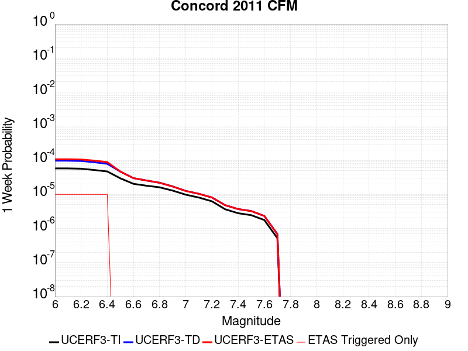 | 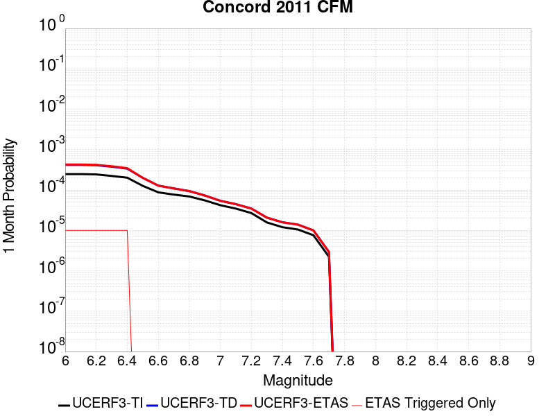 |  |  |

| Magnitude | 1 wk TI Prob | 1 wk TD Prob | 1 wk ETAS Prob | 1 wk ETAS/TD Gain | 1 wk ETAS Triggered Only | 1 mo TI Prob | 1 mo TD Prob | 1 mo ETAS Prob | 1 mo ETAS/TD Gain | 1 mo ETAS Triggered Only | 1 yr TI Prob | 1 yr TD Prob | 1 yr ETAS Prob | 1 yr ETAS/TD Gain | 1 yr ETAS Triggered Only | 10 yr TI Prob | 10 yr TD Prob | 10 yr ETAS Prob | 10 yr ETAS/TD Gain | 10 yr ETAS Triggered Only |
|-----|-----|-----|-----|-----|-----|-----|-----|-----|-----|-----|-----|-----|-----|-----|-----|-----|-----|-----|-----|-----|
| 6.0 | 5.7865112E-5 | 9.7586744E-5 | 1.0758577E-4 | 1.1024629 | 1.0E-5 | 2.4796976E-4 | 4.1816663E-4 | 4.2816246E-4 | 1.023904 | 1.0E-5 | 0.0030148525 | 0.0050798045 | 0.005089754 | 1.0019586 | 1.0E-5 | 0.029742775 | 0.049266614 | 0.04927612 | 1.000193 | 1.0E-5 |
| 6.1 | 5.7865112E-5 | 9.7586744E-5 | 1.0758577E-4 | 1.1024629 | 1.0E-5 | 2.4796976E-4 | 4.1816663E-4 | 4.2816246E-4 | 1.023904 | 1.0E-5 | 0.0030148525 | 0.0050798045 | 0.005089754 | 1.0019586 | 1.0E-5 | 0.029742775 | 0.049266614 | 0.04927612 | 1.000193 | 1.0E-5 |
| 6.2 | 5.6789337E-5 | 9.578921E-5 | 1.05788255E-4 | 1.1043859 | 1.0E-5 | 2.4336016E-4 | 4.1046538E-4 | 4.2046126E-4 | 1.0243526 | 1.0E-5 | 0.0029588845 | 0.0049865274 | 0.0049964776 | 1.0019954 | 1.0E-5 | 0.029197963 | 0.048383147 | 0.04839266 | 1.0001967 | 1.0E-5 |
| 6.3 | 5.203322E-5 | 8.803317E-5 | 9.8032295E-5 | 1.1135836 | 1.0E-5 | 2.2298045E-4 | 3.772349E-4 | 3.8723112E-4 | 1.0264987 | 1.0E-5 | 0.0027114071 | 0.0045839464 | 0.0045939004 | 1.0021715 | 1.0E-5 | 0.026785625 | 0.04455442 | 0.04456397 | 1.0002145 | 1.0E-5 |
| 6.4 | 4.7120942E-5 | 7.8976576E-5 | 8.897579E-5 | 1.1266098 | 1.0E-5 | 2.0193127E-4 | 3.3843133E-4 | 3.4842794E-4 | 1.029538 | 1.0E-5 | 0.0024557412 | 0.0041133617 | 0.0041233203 | 1.0024211 | 1.0E-5 | 0.024287801 | 0.04007789 | 0.04008749 | 1.0002395 | 1.0E-5 |
| 6.5 | 2.9598437E-5 | 4.6676025E-5 | 4.6676025E-5 | 1.0 | 0.0 | 1.2684427E-4 | 2.0002596E-4 | 2.0002596E-4 | 1.0 | 0.0 | 0.001543235 | 0.0024328064 | 0.0024328064 | 1.0 | 0.0 | 0.015325619 | 0.023910666 | 0.023910666 | 1.0 | 0.0 |
| 6.6 | 2.0443718E-5 | 2.998505E-5 | 2.998505E-5 | 1.0 | 0.0 | 8.7613E-5 | 1.2850124E-4 | 1.2850124E-4 | 1.0 | 0.0 | 0.0010661662 | 0.001563416 | 0.001563416 | 1.0 | 0.0 | 0.010610655 | 0.015467864 | 0.015467864 | 1.0 | 0.0 |
| 6.7 | 1.798539E-5 | 2.5558058E-5 | 2.5558058E-5 | 1.0 | 0.0 | 7.7077966E-5 | 1.0953006E-4 | 1.0953006E-4 | 1.0 | 0.0 | 9.380202E-4 | 0.0013327342 | 0.0013327342 | 1.0 | 0.0 | 0.009340706 | 0.013217863 | 0.013217863 | 1.0 | 0.0 |
| 6.8 | 1.613555E-5 | 2.1959748E-5 | 2.1959748E-5 | 1.0 | 0.0 | 6.915052E-5 | 9.410989E-5 | 9.410989E-5 | 1.0 | 0.0 | 8.4158237E-4 | 0.0011451996 | 0.0011451996 | 1.0 | 0.0 | 0.008384023 | 0.011378541 | 0.011378541 | 1.0 | 0.0 |
| 6.9 | 1.2916435E-5 | 1.7081462E-5 | 1.7081462E-5 | 1.0 | 0.0 | 5.5354973E-5 | 7.3204246E-5 | 7.3204246E-5 | 1.0 | 0.0 | 6.7373837E-4 | 8.9090306E-4 | 8.9090306E-4 | 1.0 | 0.0 | 0.006716994 | 0.008868062 | 0.008868062 | 1.0 | 0.0 |
| 7.0 | 9.81129E-6 | 1.2631134E-5 | 1.2631134E-5 | 1.0 | 0.0 | 4.2047708E-5 | 5.413232E-5 | 5.413232E-5 | 1.0 | 0.0 | 5.118106E-4 | 6.5886334E-4 | 6.5886334E-4 | 1.0 | 0.0 | 0.005106334 | 0.006569878 | 0.006569878 | 1.0 | 0.0 |
| 7.1 | 8.0889195E-6 | 1.0418539E-5 | 1.0418539E-5 | 1.0 | 0.0 | 3.4666336E-5 | 4.4650125E-5 | 4.4650125E-5 | 1.0 | 0.0 | 4.219809E-4 | 5.4348074E-4 | 5.4348074E-4 | 1.0 | 0.0 | 0.004211805 | 0.005422109 | 0.005422109 | 1.0 | 0.0 |
| 7.2 | 6.267438E-6 | 8.115947E-6 | 8.115947E-6 | 1.0 | 0.0 | 2.6860173E-5 | 3.478217E-5 | 3.478217E-5 | 1.0 | 0.0 | 3.2697353E-4 | 4.2339138E-4 | 4.2339138E-4 | 1.0 | 0.0 | 0.0032649285 | 0.0042263074 | 0.0042263074 | 1.0 | 0.0 |
| 7.3 | 3.6761196E-6 | 4.8403194E-6 | 4.8403194E-6 | 1.0 | 0.0 | 1.5754704E-5 | 2.0744063E-5 | 2.0744063E-5 | 1.0 | 0.0 | 1.9179663E-4 | 2.525299E-4 | 2.525299E-4 | 1.0 | 0.0 | 0.0019163118 | 0.0025226395 | 0.0025226395 | 1.0 | 0.0 |
| 7.4 | 2.8044356E-6 | 3.7097288E-6 | 3.7097288E-6 | 1.0 | 0.0 | 1.2018954E-5 | 1.5898742E-5 | 1.5898742E-5 | 1.0 | 0.0 | 1.4632095E-4 | 1.935501E-4 | 1.935501E-4 | 1.0 | 0.0 | 0.0014622464 | 0.0019340296 | 0.0019340296 | 1.0 | 0.0 |
| 7.5 | 2.4578699E-6 | 3.244844E-6 | 3.244844E-6 | 1.0 | 0.0 | 1.0533685E-5 | 1.3906401E-5 | 1.3906401E-5 | 1.0 | 0.0 | 1.2824008E-4 | 1.6929739E-4 | 1.6929739E-4 | 1.0 | 0.0 | 0.0012816609 | 0.0016918753 | 0.0016918753 | 1.0 | 0.0 |
| 7.6 | 1.7713267E-6 | 2.3351986E-6 | 2.3351986E-6 | 1.0 | 0.0 | 7.591378E-6 | 1.0007956E-5 | 1.0007956E-5 | 1.0 | 0.0 | 9.2421105E-5 | 1.21840145E-4 | 1.21840145E-4 | 1.0 | 0.0 | 9.2382677E-4 | 0.0012178596 | 0.0012178596 | 1.0 | 0.0 |
| 7.7 | 5.1912366E-7 | 6.8293684E-7 | 6.8293684E-7 | 1.0 | 0.0 | 2.2248137E-6 | 2.926869E-6 | 2.926869E-6 | 1.0 | 0.0 | 2.708677E-5 | 3.563406E-5 | 3.563406E-5 | 1.0 | 0.0 | 2.708347E-4 | 3.5631232E-4 | 3.5631232E-4 | 1.0 | 0.0 |

## Hector Mine
*[(top)](#table-of-contents)*

| 1 Week | 1 Month | 1 Year | 10 Year |
|-----|-----|-----|-----|
| 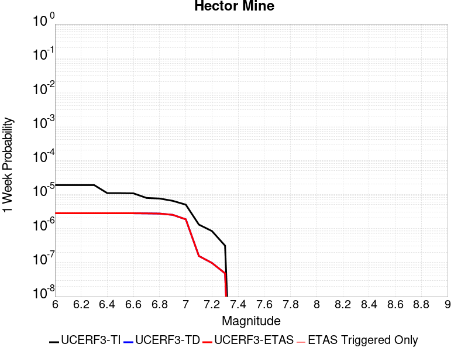 | 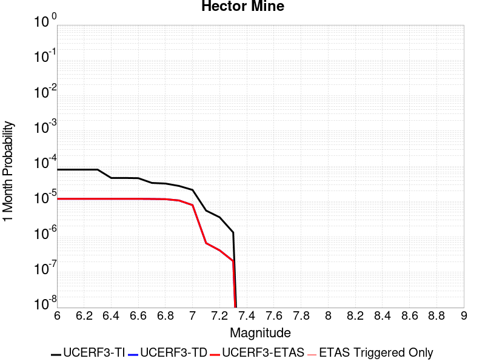 |  |  |

| Magnitude | 1 wk TI Prob | 1 wk TD Prob | 1 wk ETAS Prob | 1 wk ETAS/TD Gain | 1 wk ETAS Triggered Only | 1 mo TI Prob | 1 mo TD Prob | 1 mo ETAS Prob | 1 mo ETAS/TD Gain | 1 mo ETAS Triggered Only | 1 yr TI Prob | 1 yr TD Prob | 1 yr ETAS Prob | 1 yr ETAS/TD Gain | 1 yr ETAS Triggered Only | 10 yr TI Prob | 10 yr TD Prob | 10 yr ETAS Prob | 10 yr ETAS/TD Gain | 10 yr ETAS Triggered Only |
|-----|-----|-----|-----|-----|-----|-----|-----|-----|-----|-----|-----|-----|-----|-----|-----|-----|-----|-----|-----|-----|
| 6.0 | 1.8760093E-5 | 2.796292E-6 | 2.796292E-6 | 1.0 | 0.0 | 8.039792E-5 | 1.1984076E-5 | 1.1984076E-5 | 1.0 | 0.0 | 9.78405E-4 | 1.4590035E-4 | 1.4590035E-4 | 1.0 | 0.0 | 0.009741086 | 0.0014584379 | 0.0014684233 | 1.0068467 | 1.0E-5 |
| 6.1 | 1.8760093E-5 | 2.796292E-6 | 2.796292E-6 | 1.0 | 0.0 | 8.039792E-5 | 1.1984076E-5 | 1.1984076E-5 | 1.0 | 0.0 | 9.78405E-4 | 1.4590035E-4 | 1.4590035E-4 | 1.0 | 0.0 | 0.009741086 | 0.0014584379 | 0.0014684233 | 1.0068467 | 1.0E-5 |
| 6.2 | 1.8760093E-5 | 2.796292E-6 | 2.796292E-6 | 1.0 | 0.0 | 8.039792E-5 | 1.1984076E-5 | 1.1984076E-5 | 1.0 | 0.0 | 9.78405E-4 | 1.4590035E-4 | 1.4590035E-4 | 1.0 | 0.0 | 0.009741086 | 0.0014584379 | 0.0014684233 | 1.0068467 | 1.0E-5 |
| 6.3 | 1.8760093E-5 | 2.796292E-6 | 2.796292E-6 | 1.0 | 0.0 | 8.039792E-5 | 1.1984076E-5 | 1.1984076E-5 | 1.0 | 0.0 | 9.78405E-4 | 1.4590035E-4 | 1.4590035E-4 | 1.0 | 0.0 | 0.009741086 | 0.0014584379 | 0.0014684233 | 1.0068467 | 1.0E-5 |
| 6.4 | 1.0888055E-5 | 2.796292E-6 | 2.796292E-6 | 1.0 | 0.0 | 4.666226E-5 | 1.1984076E-5 | 1.1984076E-5 | 1.0 | 0.0 | 5.679649E-4 | 1.4590035E-4 | 1.4590035E-4 | 1.0 | 0.0 | 0.0056651547 | 0.0014584379 | 0.0014684233 | 1.0068467 | 1.0E-5 |
| 6.5 | 1.0888055E-5 | 2.796292E-6 | 2.796292E-6 | 1.0 | 0.0 | 4.666226E-5 | 1.1984076E-5 | 1.1984076E-5 | 1.0 | 0.0 | 5.679649E-4 | 1.4590035E-4 | 1.4590035E-4 | 1.0 | 0.0 | 0.0056651547 | 0.0014584379 | 0.0014684233 | 1.0068467 | 1.0E-5 |
| 6.6 | 1.0730738E-5 | 2.796292E-6 | 2.796292E-6 | 1.0 | 0.0 | 4.5988065E-5 | 1.1984076E-5 | 1.1984076E-5 | 1.0 | 0.0 | 5.5976084E-4 | 1.4590035E-4 | 1.4590035E-4 | 1.0 | 0.0 | 0.0055835294 | 0.0014584379 | 0.0014684233 | 1.0068467 | 1.0E-5 |
| 6.7 | 7.881326E-6 | 2.7709732E-6 | 2.7709732E-6 | 1.0 | 0.0 | 3.3776672E-5 | 1.1875568E-5 | 1.1875568E-5 | 1.0 | 0.0 | 4.111534E-4 | 1.4457945E-4 | 1.4457945E-4 | 1.0 | 0.0 | 0.0041039353 | 0.0014452459 | 0.0014552316 | 1.0069093 | 1.0E-5 |
| 6.8 | 7.5683483E-6 | 2.732752E-6 | 2.732752E-6 | 1.0 | 0.0 | 3.2435375E-5 | 1.1711763E-5 | 1.1711763E-5 | 1.0 | 0.0 | 3.9482914E-4 | 1.4258538E-4 | 1.4258538E-4 | 1.0 | 0.0 | 0.0039412836 | 0.001425331 | 0.0014353167 | 1.0070059 | 1.0E-5 |
| 6.9 | 6.473048E-6 | 2.5138388E-6 | 2.5138388E-6 | 1.0 | 0.0 | 2.7741338E-5 | 1.0773573E-5 | 1.0773573E-5 | 1.0 | 0.0 | 3.3769844E-4 | 1.3116433E-4 | 1.3116433E-4 | 1.0 | 0.0 | 0.0033718573 | 0.0013112586 | 0.0013212455 | 1.0076163 | 1.0E-5 |
| 7.0 | 4.9959954E-6 | 1.856467E-6 | 1.856467E-6 | 1.0 | 0.0 | 2.1411232E-5 | 7.956283E-6 | 7.956283E-6 | 1.0 | 0.0 | 2.6065056E-4 | 9.6867E-5 | 9.6867E-5 | 1.0 | 0.0 | 0.0026034506 | 9.6859736E-4 | 9.6859736E-4 | 1.0 | 0.0 |
| 7.1 | 1.2997541E-6 | 1.5600044E-7 | 1.5600044E-7 | 1.0 | 0.0 | 5.5703626E-6 | 6.685732E-7 | 6.685732E-7 | 1.0 | 0.0 | 6.7817055E-5 | 8.139852E-6 | 8.139852E-6 | 1.0 | 0.0 | 6.779636E-4 | 8.1395934E-5 | 8.1395934E-5 | 1.0 | 0.0 |
| 7.2 | 8.392699E-7 | 9.726054E-8 | 9.726054E-8 | 1.0 | 0.0 | 3.596866E-6 | 4.1683083E-7 | 4.1683083E-7 | 1.0 | 0.0 | 4.3790962E-5 | 5.0749054E-6 | 5.0749054E-6 | 1.0 | 0.0 | 4.3782333E-4 | 5.0748087E-5 | 5.0748087E-5 | 1.0 | 0.0 |
| 7.3 | 3.13015E-7 | 4.8286488E-8 | 4.8286488E-8 | 1.0 | 0.0 | 1.3414921E-6 | 2.0694208E-7 | 2.0694208E-7 | 1.0 | 0.0 | 1.6332544E-5 | 2.5195177E-6 | 2.5195177E-6 | 1.0 | 0.0 | 1.6331344E-4 | 2.5194977E-5 | 2.5194977E-5 | 1.0 | 0.0 |

